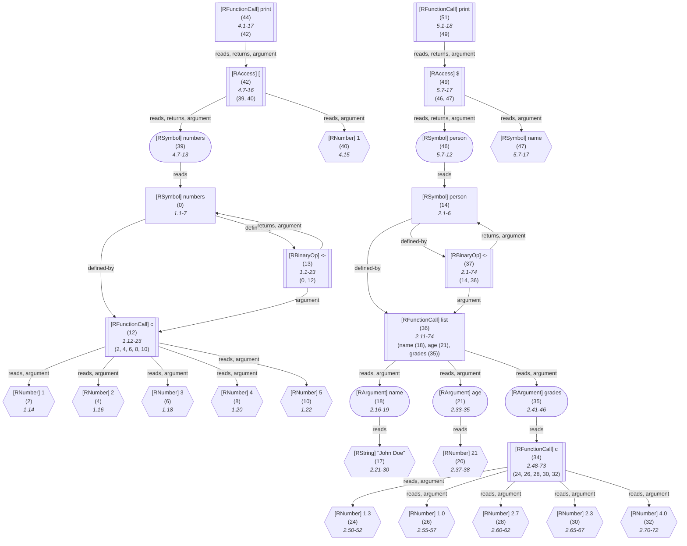

```mermaid
flowchart TD
    2{{"`#91;RNumber#93; 1
      (2)
      *1.14*`"}}
    4{{"`#91;RNumber#93; 2
      (4)
      *1.16*`"}}
    6{{"`#91;RNumber#93; 3
      (6)
      *1.18*`"}}
    8{{"`#91;RNumber#93; 4
      (8)
      *1.20*`"}}
    10{{"`#91;RNumber#93; 5
      (10)
      *1.22*`"}}
    12[["`#91;RFunctionCall#93; c
      (12)
      *1.12-23*
    (2, 4, 6, 8, 10)`"]]
    0["`#91;RSymbol#93; numbers
      (0)
      *1.1-7*`"]
    13[["`#91;RBinaryOp#93; #60;#45;
      (13)
      *1.1-23*
    (0, 12)`"]]
    17{{"`#91;RString#93; #34;John Doe#34;
      (17)
      *2.21-30*`"}}
    18(["`#91;RArgument#93; name
      (18)
      *2.16-19*`"])
    20{{"`#91;RNumber#93; 21
      (20)
      *2.37-38*`"}}
    21(["`#91;RArgument#93; age
      (21)
      *2.33-35*`"])
    24{{"`#91;RNumber#93; 1.3
      (24)
      *2.50-52*`"}}
    26{{"`#91;RNumber#93; 1.0
      (26)
      *2.55-57*`"}}
    28{{"`#91;RNumber#93; 2.7
      (28)
      *2.60-62*`"}}
    30{{"`#91;RNumber#93; 2.3
      (30)
      *2.65-67*`"}}
    32{{"`#91;RNumber#93; 4.0
      (32)
      *2.70-72*`"}}
    34[["`#91;RFunctionCall#93; c
      (34)
      *2.48-73*
    (24, 26, 28, 30, 32)`"]]
    35(["`#91;RArgument#93; grades
      (35)
      *2.41-46*`"])
    36[["`#91;RFunctionCall#93; list
      (36)
      *2.11-74*
    (name (18), age (21), grades (35))`"]]
    14["`#91;RSymbol#93; person
      (14)
      *2.1-6*`"]
    37[["`#91;RBinaryOp#93; #60;#45;
      (37)
      *2.1-74*
    (14, 36)`"]]
    39(["`#91;RSymbol#93; numbers
      (39)
      *4.7-13*`"])
    40{{"`#91;RNumber#93; 1
      (40)
      *4.15*`"}}
    42[["`#91;RAccess#93; #91;
      (42)
      *4.7-16*
    (39, 40)`"]]
    44[["`#91;RFunctionCall#93; print
      (44)
      *4.1-17*
    (42)`"]]
    46(["`#91;RSymbol#93; person
      (46)
      *5.7-12*`"])
    47{{"`#91;RSymbol#93; name
      (47)
      *5.7-17*`"}}
    49[["`#91;RAccess#93; $
      (49)
      *5.7-17*
    (46, 47)`"]]
    51[["`#91;RFunctionCall#93; print
      (51)
      *5.1-18*
    (49)`"]]
    12 -->|"reads, argument"| 2
    12 -->|"reads, argument"| 4
    12 -->|"reads, argument"| 6
    12 -->|"reads, argument"| 8
    12 -->|"reads, argument"| 10
    0 -->|"defined-by"| 12
    0 -->|"defined-by"| 13
    13 -->|"argument"| 12
    13 -->|"returns, argument"| 0
    18 -->|"reads"| 17
    21 -->|"reads"| 20
    34 -->|"reads, argument"| 24
    34 -->|"reads, argument"| 26
    34 -->|"reads, argument"| 28
    34 -->|"reads, argument"| 30
    34 -->|"reads, argument"| 32
    35 -->|"reads"| 34
    36 -->|"reads, argument"| 18
    36 -->|"reads, argument"| 21
    36 -->|"reads, argument"| 35
    14 -->|"defined-by"| 36
    14 -->|"defined-by"| 37
    37 -->|"argument"| 36
    37 -->|"returns, argument"| 14
    39 -->|"reads"| 0
    42 -->|"reads, returns, argument"| 39
    42 -->|"reads, argument"| 40
    44 -->|"reads, returns, argument"| 42
    46 -->|"reads"| 14
    49 -->|"reads, returns, argument"| 46
    49 -->|"reads, argument"| 47
    51 -->|"reads, returns, argument"| 49
```