```mermaid

---
  config:
    class:
      hideEmptyMembersBox: true
---
classDiagram
direction LR
class AbstractDomain~Concrete, Abstract, Top, Bot, Value extends Abstract | Top | Bot = Abstract | Top | Bot~{
    <<class>>
}
click AbstractDomain href "https://github.com/flowr-analysis/flowr/tree/main//src/abstract-interpretation/domains/abstract-domain.ts#L18" "An abstract domain as complete lattice with a widening operator, narrowing operator, concretization function, and abstraction function. All operations of value abstract domains should not modify the domain in#45;place but return new values using; #60;code#62;create#60;/code#62;; ."
class AnyAbstractDomain{
    <<type>>
}
style AnyAbstractDomain opacity:.35,fill:#FAFAFA
click AnyAbstractDomain href "https://github.com/flowr-analysis/flowr/tree/main//src/abstract-interpretation/domains/abstract-domain.ts#L121" "A type representing any abstract domain without additional information."
class AbstractProduct{
    <<type>>
}
style AbstractProduct opacity:.35,fill:#FAFAFA
click AbstractProduct href "https://github.com/flowr-analysis/flowr/tree/main//src/abstract-interpretation/domains/product-domain.ts#L5" "The type of an abstract product of a product domain mapping named properties of the product to abstract domains"
class BoundedSetDomain~T, Value extends BoundedSetLift<T> = BoundedSetLift<T>~{
    <<class>>
}
click BoundedSetDomain href "https://github.com/flowr-analysis/flowr/tree/main//src/abstract-interpretation/domains/bounded-set-domain.ts#L26" "The bounded set abstract domain as sets of possible values bounded by a #96;limit#96; indicating the maximum number of inferred values. The Bottom element is defined as the empty set and the Top element is defined as; #60;code#62;Top#60;/code#62;; symbol."
class IntervalDomain~Value extends IntervalLift = IntervalLift~{
    <<class>>
}
click IntervalDomain href "https://github.com/flowr-analysis/flowr/tree/main//src/abstract-interpretation/domains/interval-domain.ts#L25" "The interval abstract domain as intervals with possibly infinite bounds representing possible numeric values. The Bottom element is defined as; #60;code#62;Bottom#60;/code#62;; symbol and the Top element is defined as the interval #91;#45;∞, #43;∞#93;."
class PosIntervalDomain~Value extends PosIntervalLift = PosIntervalLift~{
    <<class>>
}
click PosIntervalDomain href "https://github.com/flowr-analysis/flowr/tree/main//src/abstract-interpretation/domains/positive-interval-domain.ts#L21" "The positive interval abstract domain as positive intervals with possibly zero lower bounds and infinite upper bounds representing possible numeric values. The Bottom element is defined as; #60;code#62;Bottom#60;/code#62;; symbol and the Top element is defined as the interval #91;0, #43;∞#93;."
class MappedAbstractDomain~Key, Domain extends AnyAbstractDomain~{
    <<class>>
}
click MappedAbstractDomain href "https://github.com/flowr-analysis/flowr/tree/main//src/abstract-interpretation/domains/mapped-abstract-domain.ts#L13" "A mapped abstract domain as mapping of keys to abstract values of an abstract domain. The Bottom element is defined as empty mapping and the Top element is defined as mapping every existing key to Top."
class StateAbstractDomain~Domain extends AnyAbstractDomain~{
    <<class>>
}
click StateAbstractDomain href "https://github.com/flowr-analysis/flowr/tree/main//src/abstract-interpretation/domains/state-abstract-domain.ts#L11" "A state abstract domain as mapping of AST node IDs of a program to abstract values of an abstract domain. The Bottom element is defined as empty mapping and the Top element is defined as mapping every existing mapped AST node ID to Top."
class ProductDomain~Product extends AbstractProduct~{
    <<class>>
}
click ProductDomain href "https://github.com/flowr-analysis/flowr/tree/main//src/abstract-interpretation/domains/product-domain.ts#L18" "A product abstract domain as named Cartesian product of sub abstract domains. The sub abstract domains are represented by a record mapping property names to abstract domains. The Bottom element is defined as mapping every sub abstract domain to Bottom and the Top element is defined as mapping every sub abstract domain to Top."
class DataFrameDomain{
    <<class>>
}
click DataFrameDomain href "https://github.com/flowr-analysis/flowr/tree/main//src/abstract-interpretation/data-frame/dataframe-domain.ts#L20" "The data frame abstract domain as product domain of a column names domain, column count domain, and row count domain."
class SetRangeDomain~T, Value extends SetRangeLift<T> = SetRangeLift<T>~{
    <<class>>
}
click SetRangeDomain href "https://github.com/flowr-analysis/flowr/tree/main//src/abstract-interpretation/domains/set-range-domain.ts#L38" "The set range abstract domain as range of possible value sets with a minimum set of values and a range of possible additional values (similar to an interval#45;like structure with a lower bound and a difference to the upper bound). The Bottom element is defined as; #60;code#62;Bottom#60;/code#62;; symbol and the Top element is defined as the range #96;#91;∅, Top#93;#96; where the minimum set is the empty set and the range is; #60;code#62;Top#60;/code#62;; ."
class SetUpperBoundDomain~T, Value extends SetUpperBoundLift<T> = SetUpperBoundLift<T>~{
    <<class>>
}
click SetUpperBoundDomain href "https://github.com/flowr-analysis/flowr/tree/main//src/abstract-interpretation/domains/set-upper-bound-domain.ts#L24" "The set upper bound abstract domain as sets capturing possible values of the concrete set bounded by a #96;limit#96; for the maximum number of inferred values. The Bottom element is defined as the; #60;code#62;Bottom#60;/code#62;; and the Top element is defined as; #60;code#62;Top#60;/code#62;; symbol."
class SingletonDomain~T, Value extends SingletonLift<T> = SingletonLift<T>~{
    <<class>>
}
click SingletonDomain href "https://github.com/flowr-analysis/flowr/tree/main//src/abstract-interpretation/domains/singleton-domain.ts#L22" "The singleton abstract domain as a single possible value. The Bottom element is defined as; #60;code#62;Bottom#60;/code#62;; symbol and the Top element is defined as; #60;code#62;Top#60;/code#62;; symbol."
AnyAbstractDomain .. AbstractDomain
AbstractProduct .. AnyAbstractDomain
BoundedSetDomain --|> AbstractDomain
IntervalDomain --|> AbstractDomain
PosIntervalDomain --|> IntervalDomain
MappedAbstractDomain --|> AbstractDomain
StateAbstractDomain --|> MappedAbstractDomain
ProductDomain --|> AbstractDomain
DataFrameDomain --|> ProductDomain
SetRangeDomain --|> AbstractDomain
SetUpperBoundDomain --|> AbstractDomain
SingletonDomain --|> AbstractDomain
```

_This document was generated from '[src/documentation/wiki-absint.ts](https://github.com/flowr-analysis/flowr/tree/main//src/documentation/wiki-absint.ts)' on 2026-01-20, 11:55:38 UTC presenting an overview of flowR's abstract interpretation framework (v2.8.9, using R v4.5.0). Please do not edit this file/wiki page directly._

This page describes the abstract interpretation framework of _flowR_.
Abstract interpretation abstracts the concrete semantics of a program to automatically infer properties about the behavior of a program.
It uses an abstract domain to capture sets of possible runtime values of a program.
An abstract domain is represented by a lattice with a partial order, join operator (least upper bound), meet operator (greated lower bound), top element (greatest element), and bottom element (least element).
Abstract interpretation uses an abstraction of the concrete semantics of a program to perform fixpoint iteration to find program invariants.

<h2 id="abstract-domains">Abstract Domains</h2>

To perform abstract interpretation, we first need to define an abstract domain to capture possible runtime values of the program.
In _flowR_, an abstract domain is represented by the class <a href="https://github.com/flowr-analysis/flowr/tree/main//src/abstract-interpretation/domains/abstract-domain.ts#L18"><code><span title="An abstract domain as complete lattice with a widening operator, narrowing operator, concretization function, and abstraction function. All operations of value abstract domains should not modify the domain in-place but return new values using create .">AbstractDomain</span></code></a> that extends the <a href="https://github.com/flowr-analysis/flowr/tree/main//src/abstract-interpretation/domains/lattice.ts#L20"><code><span title="A complete lattice with a partially ordered set, join operator (LUB), meet operator (GLB), top element, and bottom element (e.g. for abstract domains).">Lattice</span></code></a> interface. It has the type parameters `Concrete` for the concrete domain of the abstract domain (e.g. strings, numbers, lists), `Abstract` for the abstract representation of the values (e.g. sets, intervals), `Top` for the representation of the top element, `Bot` for the representation of the bottom element, and `Value` for the type of the current abstract value of the abstract domain (i.e. `Abstract`, `Top`, or `Bot`). An abstract domain provides the following properties and functions:

 * <a href="https://github.com/flowr-analysis/flowr/tree/main//src/abstract-interpretation/domains/abstract-domain.ts#L26"><code>AbstractDomain::<b>value</b></code></a> the current abstract value of the abstract domain
 * <a href="https://github.com/flowr-analysis/flowr/tree/main//src/abstract-interpretation/domains/abstract-domain.ts#L32"><code>AbstractDomain::<b>top</b></code></a> to get the top element (greatest element) of the abstract domain
 * <a href="https://github.com/flowr-analysis/flowr/tree/main//src/abstract-interpretation/domains/abstract-domain.ts#L34"><code>AbstractDomain::<b>bottom</b></code></a> to get the bottom element (least element) of the abstract domain
<!-- --->
 * <a href="https://github.com/flowr-analysis/flowr/tree/main//src/abstract-interpretation/domains/abstract-domain.ts#L93"><code>AbstractDomain::<b>isTop</b></code></a> to check whether the current abstract value is top
 * <a href="https://github.com/flowr-analysis/flowr/tree/main//src/abstract-interpretation/domains/abstract-domain.ts#L95"><code>AbstractDomain::<b>isBottom</b></code></a> to check whether the current abstract value is bottom
 * <a href="https://github.com/flowr-analysis/flowr/tree/main//src/abstract-interpretation/domains/abstract-domain.ts#L97"><code>AbstractDomain::<b>isValue</b></code></a> to check whether the current abstract value is a value (can still be top or bottom)
<!-- --->
 * <a href="https://github.com/flowr-analysis/flowr/tree/main//src/abstract-interpretation/domains/abstract-domain.ts#L38"><code>AbstractDomain::<b>leq</b></code></a> to check whether two abstract values are ordered with respect to the partial order of the lattice
 * <a href="https://github.com/flowr-analysis/flowr/tree/main//src/abstract-interpretation/domains/abstract-domain.ts#L40"><code>AbstractDomain::<b>join</b></code></a> to join two abstract values to get the least upper bound (LUB)
 * <a href="https://github.com/flowr-analysis/flowr/tree/main//src/abstract-interpretation/domains/abstract-domain.ts#L54"><code>AbstractDomain::<b>meet</b></code></a> to meet two abstract values to get the greates lower bound (GLB)
 * <a href="https://github.com/flowr-analysis/flowr/tree/main//src/abstract-interpretation/domains/abstract-domain.ts#L71"><code><span title="Widens the current abstract value with another abstract value as a sound over-approximation of the join (least upper bound) for fixpoint iteration acceleration.">AbstractDomain::<b>widen</b></span></code></a> to perform widening with another abstract value to ensure termination of the fixpoint iteration
 * <a href="https://github.com/flowr-analysis/flowr/tree/main//src/abstract-interpretation/domains/abstract-domain.ts#L76"><code><span title="Narrows the current abstract value with another abstract value as a sound over-approximation of the meet (greatest lower bound) to refine the value after widening.">AbstractDomain::<b>narrow</b></span></code></a> to perform narrowing with another abstract value to refine the abstract value after widening
<!-- --->
 * <a href="https://github.com/flowr-analysis/flowr/tree/main//src/abstract-interpretation/domains/abstract-domain.ts#L82"><code><span title="Maps the current abstract value into a set of possible concrete values as concretization function of the abstract domain. The result should be Top if the number of concrete values would reach the limit or the resulting set would have infinite many elements.">AbstractDomain::<b>concretize</b></span></code></a> representing the concretization function of the abstract domain
 * <a href="https://github.com/flowr-analysis/flowr/tree/main//src/abstract-interpretation/domains/abstract-domain.ts#L87"><code><span title="Maps a set of possible concrete values into an abstract value as abstraction function of the abstract domain (should additionally be provided as static function).">AbstractDomain::<b>abstract</b></span></code></a> representing the abstraction function of the abstract domain


<details><summary>Class Diagram</summary>

All boxes link to their respective implementation in the source code.


</details>
    

The <a href="https://github.com/flowr-analysis/flowr/tree/main//src/abstract-interpretation/domains/lattice.ts#L4"><code><span title="The Top symbol to represent the Top element of complete lattices (e.g. of abstract domains).">Top</span></code></a> and <a href="https://github.com/flowr-analysis/flowr/tree/main//src/abstract-interpretation/domains/lattice.ts#L10"><code><span title="The Bottom symbol to represent the Bottom element of complete lattices (e.g. of abstract domains).">Bottom</span></code></a> symbols can be used to explicitly represent the top or bottom elment of an abstract domain. Additionally, for value abstract domains, there is the <a href="https://github.com/flowr-analysis/flowr/tree/main//src/abstract-interpretation/domains/satisfiable-domain.ts#L6"><code><span title="An abstract domain with satisfiability checks for concrete values.">SatisfiableDomain</span></code></a> interface that provides the function <a href="https://github.com/flowr-analysis/flowr/tree/main//src/abstract-interpretation/domains/satisfiable-domain.ts#L11"><code><span title="Checks whether the current abstract value satisfies a concrete value (i.e. includes a concrete value).">satisfies</span></code></a> to check whether the current abstract value of the abstract domain satisfies a concrete value (see also <a href="https://github.com/flowr-analysis/flowr/tree/main//src/abstract-interpretation/domains/satisfiable-domain.ts#L17"><code><span title="Represents the different types of numerical comparators for satisfiability checks for an abstract domain.">NumericalComparator</span></code></a> and <a href="https://github.com/flowr-analysis/flowr/tree/main//src/abstract-interpretation/domains/satisfiable-domain.ts#L28"><code><span title="Represents the different types of set comparators for satisfiability checks for an abstract domain.">SetComparator</span></code></a>).

_flowR_ already provides different abstract domains for abstract interpretation in [`src/abstract-interpretation/domains`](https://github.com/flowr-analysis/flowr/tree/main/src/abstract-interpretation/domains). Many of the abstract domains are generic and can be used for differend kinds of analyses. The existing abstract domains are presented in the following. Some of the listed abstract domains can be expanded to show the inherited abstract domains.


   * [BoundedSetDomain](https://github.com/flowr-analysis/flowr/tree/main//src/abstract-interpretation/domains/bounded-set-domain.ts#L26)   
     The bounded set abstract domain as sets of possible values bounded by a `limit` indicating the maximum number of inferred values.
     The Bottom element is defined as the empty set and the Top element is defined as
     <code>Top</code>
     symbol.
     <details><summary style="color:gray">Defined at <a href="https://github.com/flowr-analysis/flowr/tree/main//src/abstract-interpretation/domains/bounded-set-domain.ts#L26">./src/abstract-interpretation/domains/bounded-set-domain.ts#L26</a></summary>
     
     
     ```ts
     
     
     /**
      * The bounded set abstract domain as sets of possible values bounded by a `limit` indicating the maximum number of inferred values.
      * The Bottom element is defined as the empty set and the Top element is defined as {@link Top} symbol.
      * @template T     - Type of the values in the abstract domain
      * @template Value - Type of the constraint in the abstract domain (Top, Bottom, or an actual value)
      */
     export class BoundedSetDomain<T, Value extends BoundedSetLift<T> = BoundedSetLift<T>>
         extends AbstractDomain<T, BoundedSetValue<T>, BoundedSetTop, BoundedSetBottom, Value>
         implements SatisfiableDomain<T> {
     
         public readonly limit:    number;
         private readonly setType: typeof Set<T>;
     
         /**
          * @param limit   - A limit for the maximum number of elements to store in the set
          * @param setType - An optional set constructor for the domain elements if the type `T` is not storable in a HashSet
          */
         constructor(value: Value | T[], limit: number = DEFAULT_INFERENCE_LIMIT, setType: typeof Set<T> = Set) {
             if(value !== Top) {
                 if(Array.isArray(value)) {
                     super((value.length > limit ? Top : new setType(value)) as Value);
                 } else {
                     super((value.size > limit ? Top : new setType(value)) as Value);
                 }
             } else {
                 super(value);
             }
             this.limit = limit;
             this.setType = setType;
         }
     
         public create(value: BoundedSetLift<T> | T[]): this;
         public create(value: BoundedSetLift<T> | T[]): BoundedSetDomain<T> {
             return new BoundedSetDomain(value, this.limit, this.setType);
         }
     
         public static top<T>(limit?: number, setType?: typeof Set<T>): BoundedSetDomain<T, BoundedSetTop> {
             return new BoundedSetDomain(Top, limit, setType);
         }
     
         public static bottom<T>(limit?: number, setType?: typeof Set<T>): BoundedSetDomain<T, BoundedSetBottom> {
             return new BoundedSetDomain(BoundedSetBottom, limit, setType);
         }
     
         public static abstract<T>(concrete: ReadonlySet<T> | typeof Top, limit?: number, setType?: typeof Set<T>): BoundedSetDomain<T> {
             return new BoundedSetDomain(concrete, limit, setType);
         }
     
         public top(): this & BoundedSetDomain<T, BoundedSetTop>;
         public top(): BoundedSetDomain<T, BoundedSetTop> {
             return BoundedSetDomain.top(this.limit, this.setType);
         }
     
         public bottom(): this & BoundedSetDomain<T, BoundedSetBottom>;
         public bottom(): BoundedSetDomain<T, BoundedSetBottom> {
             return BoundedSetDomain.bottom(this.limit, this.setType);
         }
     
         public equals(other: this): boolean {
             return this.value === other.value || (this.isValue() && other.isValue() && setEquals(this.value, other.value));
         }
     
         public leq(other: this): boolean {
             return other.value === Top || (this.isValue() && this.value.isSubsetOf(other.value));
         }
     
         public join(other: BoundedSetLift<T> | T[]): this;
         public join(other: this): this;
         public join(other: this | BoundedSetLift<T> | T[]): this {
             const otherValue = other instanceof BoundedSetDomain ? other.value : Array.isArray(other) ? new this.setType(other) : other;
     
             if(this.value === Top || otherValue === Top) {
                 return this.top();
             } else {
                 return this.create(this.value.union(otherValue));
             }
         }
     
         public meet(other: BoundedSetLift<T> | T[]): this;
         public meet(other: this): this;
         public meet(other: this | BoundedSetLift<T> | T[]): this {
             const otherValue = other instanceof BoundedSetDomain ? other.value : Array.isArray(other) ? new this.setType(other) : other;
     
             if(this.value === Top) {
                 return this.create(otherValue);
             } else if(otherValue === Top) {
                 return this.create(this.value);
             } else {
                 return this.create(this.value.intersection(otherValue));
             }
         }
     
         /**
          * Subtracts another abstract value from the current abstract value by removing all elements of the other abstract value from the current abstract value.
          */
         public subtract(other: this | BoundedSetLift<T> | T[]): this {
             const otherValue = other instanceof BoundedSetDomain ? other.value : Array.isArray(other) ? new this.setType(other) : other;
     
             if(this.value === Top) {
                 return this.top();
             } else if(otherValue === Top) {
                 return this.create(this.value);
             } else {
                 return this.create(this.value.difference(otherValue));
             }
         }
     
         public widen(other: this): this {
             return other.leq(this) ? this.create(this.value) : this.top();
         }
     
         public narrow(other: this): this {
             return this.isTop() ? this.create(other.value) : this.create(this.value);
         }
     
         public concretize(limit: number): ReadonlySet<T> |  typeof Top {
             return this.value === Top || this.value.size > limit ? Top : this.value;
         }
     
         public abstract(concrete: ReadonlySet<T> | typeof Top): this;
         public abstract(concrete: ReadonlySet<T> | typeof Top): BoundedSetDomain<T> {
             return BoundedSetDomain.abstract(concrete, this.limit, this.setType);
         }
     
         public satisfies(value: T): Ternary {
             if(this.isValue() && this.value.has(value)) {
                 return this.value.size === 1 ? Ternary.Always : Ternary.Maybe;
             } else if(this.isTop()) {
                 return Ternary.Maybe;
             }
             return Ternary.Never;
         }
     
         public toJson(): unknown {
             if(this.value === Top) {
                 return this.value.description;
             }
             return this.value.values().toArray();
         }
     
         public toString(): string {
             if(this.value === Top) {
                 return TopSymbol;
             }
             const string = this.value.values().map(domainElementToString).toArray().join(', ');
     
             return `{${string}}`;
         }
     
         public isTop(): this is BoundedSetDomain<T, BoundedSetTop> {
             return this.value === Top;
         }
     
         public isBottom(): this is BoundedSetDomain<T, BoundedSetBottom> {
             return this.value !== Top && this.value.size === 0;
         }
     
         public isValue(): this is BoundedSetDomain<T, BoundedSetValue<T>> {
             return this.value !== Top;
         }
     }
     ```
     
     
     </details>
     
   * [IntervalDomain](https://github.com/flowr-analysis/flowr/tree/main//src/abstract-interpretation/domains/interval-domain.ts#L25)   
     The interval abstract domain as intervals with possibly infinite bounds representing possible numeric values.
     The Bottom element is defined as
     <code>Bottom</code>
     symbol and the Top element is defined as the interval [-∞, +∞].
     <details><summary style="color:gray">Defined at <a href="https://github.com/flowr-analysis/flowr/tree/main//src/abstract-interpretation/domains/interval-domain.ts#L25">./src/abstract-interpretation/domains/interval-domain.ts#L25</a></summary>
     
     
     ```ts
     
     
     /**
      * The interval abstract domain as intervals with possibly infinite bounds representing possible numeric values.
      * The Bottom element is defined as {@link Bottom} symbol and the Top element is defined as the interval [-∞, +∞].
      * @template Value - Type of the constraint in the abstract domain (Top, Bottom, or an actual value)
      */
     export class IntervalDomain<Value extends IntervalLift = IntervalLift>
         extends AbstractDomain<number, IntervalValue, IntervalTop, IntervalBottom, Value>
         implements SatisfiableDomain<number> {
     
         constructor(value: Value) {
             if(Array.isArray(value)) {
                 if(value.some(isNaN) || value[0] > value[1] || value[0] === +Infinity || value[1] === -Infinity) {
                     super(Bottom as Value);
                 } else {
                     super([value[0], value[1]] as const as Value);
                 }
             } else {
                 super(value);
             }
         }
     
         public create(value: IntervalLift): this;
         public create(value: IntervalLift): IntervalDomain {
             return new IntervalDomain(value);
         }
     
         public static top(): IntervalDomain<IntervalTop> {
             return new IntervalDomain(IntervalTop);
         }
     
         public static bottom(): IntervalDomain<IntervalBottom> {
             return new IntervalDomain(Bottom);
         }
     
         public static abstract(concrete: ReadonlySet<number> | typeof Top): IntervalDomain {
             if(concrete === Top) {
                 return IntervalDomain.top();
             } else if(concrete.size === 0 || concrete.values().some(isNaN)) {
                 return IntervalDomain.bottom();
             }
             return new IntervalDomain([Math.min(...concrete), Math.max(...concrete)]);
         }
     
         public top(): this & IntervalDomain<IntervalTop>;
         public top(): IntervalDomain<IntervalTop> {
             return IntervalDomain.top();
         }
     
         public bottom(): this & IntervalDomain<IntervalBottom>;
         public bottom(): IntervalDomain<IntervalBottom> {
             return IntervalDomain.bottom();
         }
     
         public equals(other: this): boolean {
             return this.value === other.value || (this.isValue() && other.isValue() && this.value[0] === other.value[0] && this.value[1] === other.value[1]);
         }
     
         public leq(other: this): boolean {
             return this.value === Bottom || (other.isValue() && other.value[0] <= this.value[0] && this.value[1] <= other.value[1]);
         }
     
         public join(other: IntervalLift): this;
         public join(other: this): this;
         public join(other: this | IntervalLift): this {
             const otherValue = other instanceof IntervalDomain ? other.value : other;
     
             if(this.value === Bottom) {
                 return this.create(otherValue);
             } else if(otherValue === Bottom) {
                 return this.create(this.value);
             } else {
                 return this.create([Math.min(this.value[0], otherValue[0]), Math.max(this.value[1], otherValue[1])]);
             }
         }
     
         public meet(other: IntervalLift): this;
         public meet(other: this): this;
         public meet(other: this | IntervalLift): this {
             const otherValue = other instanceof IntervalDomain ? other.value : other;
     
             if(this.value === Bottom || otherValue === Bottom) {
                 return this.bottom();
             } else {
                 return this.create([Math.max(this.value[0], otherValue[0]), Math.min(this.value[1], otherValue[1])]);
             }
         }
     
         public widen(other: this): this {
             if(this.value === Bottom) {
                 return this.create(other.value);
             } else if(other.value === Bottom) {
                 return this.create(this.value);
             } else {
                 return this.create([
                     this.value[0] <= other.value[0] ? this.value[0] : -Infinity,
                     this.value[1] >= other.value[1] ? this.value[1] : +Infinity
                 ]);
             }
         }
     
         public narrow(other: this): this {
             if(this.value === Bottom || other.value === Bottom) {
                 return this.bottom();
             } else if(Math.max(this.value[0], other.value[0]) > Math.min(this.value[1], other.value[1])) {
                 return this.bottom();
             }
             return this.create([
                 this.value[0] === -Infinity ? other.value[0] : this.value[0],
                 this.value[1] === +Infinity ? other.value[1] : this.value[1]
             ]);
         }
     
         public concretize(limit: number): ReadonlySet<number> | typeof Top {
             if(this.value === Bottom) {
                 return new Set();
             } else if(!isFinite(this.value[0]) || !isFinite(this.value[1]) || this.value[1] - this.value[0] + 1 > limit) {
                 return Top;
             }
             const set = new Set<number>();
     
             for(let x = this.value[0]; x <= this.value[1]; x++) {
                 set.add(x);
             }
             return set;
         }
     
         public abstract(concrete: ReadonlySet<number> | typeof Top): this;
         public abstract(concrete: ReadonlySet<number> | typeof Top): IntervalDomain {
             return IntervalDomain.abstract(concrete);
         }
     
         public satisfies(value: number, comparator: NumericalComparator = NumericalComparator.Equal): Ternary {
             switch(comparator) {
                 case NumericalComparator.Equal: {
                     if(this.isValue() && this.value[0] <= value && value <= this.value[1]) {
                         return this.value[0] === this.value[1] ? Ternary.Always : Ternary.Maybe;
                     } else {
                         return Ternary.Never;
                     }
                 }
                 case NumericalComparator.Less: {
                     if(this.isValue() && value < this.value[1]) {
                         return value < this.value[0] ? Ternary.Always : Ternary.Maybe;
                     } else {
                         return Ternary.Never;
                     }
                 }
                 case NumericalComparator.LessOrEqual: {
                     if(this.isValue() && value <= this.value[1]) {
                         return value <= this.value[0] ? Ternary.Always : Ternary.Maybe;
                     } else {
                         return Ternary.Never;
                     }
                 }
                 case NumericalComparator.Greater: {
                     if(this.isValue() && this.value[0] <= value) {
                         return this.value[1] <= value ? Ternary.Always : Ternary.Maybe;
                     } else {
                         return Ternary.Never;
                     }
                 }
                 case NumericalComparator.GreaterOrEqual: {
                     if(this.isValue() && this.value[0] < value) {
                         return this.value[1] < value ? Ternary.Always : Ternary.Maybe;
                     } else {
                         return Ternary.Never;
                     }
                 }
                 default: {
                     assertUnreachable(comparator);
                 }
             }
         }
     
         /**
          * Adds another abstract value to the current abstract value by adding the two lower and upper bounds, respectively.
          */
         public add(other: this | IntervalLift): this {
             const otherValue = other instanceof IntervalDomain ? other.value : other;
     
             if(this.value === Bottom || otherValue === Bottom) {
                 return this.bottom();
             } else {
                 return this.create([this.value[0] + otherValue[0], this.value[1] + otherValue[1]]);
             }
         }
     
         /**
          * Subtracts another abstract value from the current abstract value by subtracting the two lower and upper bounds from each other, respectively.
          */
         public subtract(other: this | IntervalLift): this {
             const otherValue = other instanceof IntervalDomain ? other.value : other;
     
             if(this.value === Bottom || otherValue === Bottom) {
                 return this.bottom();
             } else {
                 return this.create([this.value[0] - otherValue[0], this.value[1] - otherValue[1]]);
             }
         }
     
         /**
          * Creates the minimum between the current abstract value and another abstract value by creating the minimum of the two lower and upper bounds, respectively.
          */
         public min(other: this | IntervalLift): this {
             const otherValue = other instanceof IntervalDomain ? other.value : other;
     
             if(this.value === Bottom || otherValue === Bottom) {
                 return this.bottom();
             } else {
                 return this.create([Math.min(this.value[0], otherValue[0]), Math.min(this.value[1], otherValue[1])]);
             }
         }
     
         /**
          * Creates the maximum between the current abstract value and another abstract value by creating the maximum of the two lower and upper bounds, respectively.
          */
         public max(other: this | IntervalLift): this {
             const otherValue = other instanceof IntervalDomain ? other.value : other;
     
             if(this.value === Bottom || otherValue === Bottom) {
                 return this.bottom();
             } else {
                 return this.create([Math.max(this.value[0], otherValue[0]), Math.max(this.value[1], otherValue[1])]);
             }
         }
     
         /**
          * Extends the lower bound of the current abstract value down to -∞.
          */
         public widenDown(): this {
             if(this.value === Bottom) {
                 return this.bottom();
             } else {
                 return this.create([-Infinity, this.value[1]]);
             }
         }
     
         /**
          * Extends the upper bound of the current abstract value up to +∞.
          */
         public widenUp(): this {
             if(this.value === Bottom) {
                 return this.bottom();
             } else {
                 return this.create([this.value[0], +Infinity]);
             }
         }
     
         public toJson(): unknown {
             if(this.value === Bottom) {
                 return this.value.description;
             }
             return this.value;
         }
     
         public toString(): string {
             if(this.value === Bottom) {
                 return BottomSymbol;
             }
             return `[${isFinite(this.value[0]) ? this.value[0] : '-∞'}, ${isFinite(this.value[1]) ? this.value[1] : '+∞'}]`;
         }
     
         public isTop(): this is IntervalDomain<IntervalTop> {
             return this.value !== Bottom && this.value[0] === -Infinity && this.value[1] === +Infinity;
         }
     
         public isBottom(): this is IntervalDomain<IntervalBottom> {
             return this.value === Bottom;
         }
     
         public isValue(): this is IntervalDomain<IntervalValue> {
             return this.value !== Bottom;
         }
     }
     ```
     
     
     </details>
     
      <details><summary>View more (PosIntervalDomain)</summary>

     * [PosIntervalDomain](https://github.com/flowr-analysis/flowr/tree/main//src/abstract-interpretation/domains/positive-interval-domain.ts#L21)   
       The positive interval abstract domain as positive intervals with possibly zero lower bounds and infinite upper bounds representing possible numeric values.
       The Bottom element is defined as
       <code>Bottom</code>
       symbol and the Top element is defined as the interval [0, +∞].
       <details><summary style="color:gray">Defined at <a href="https://github.com/flowr-analysis/flowr/tree/main//src/abstract-interpretation/domains/positive-interval-domain.ts#L21">./src/abstract-interpretation/domains/positive-interval-domain.ts#L21</a></summary>
       
       
       ```ts
       
       
       /**
        * The positive interval abstract domain as positive intervals with possibly zero lower bounds and infinite upper bounds representing possible numeric values.
        * The Bottom element is defined as {@link Bottom} symbol and the Top element is defined as the interval [0, +∞].
        * @template Value - Type of the constraint in the abstract domain (Top, Bottom, or an actual value)
        */
       export class PosIntervalDomain<Value extends PosIntervalLift = PosIntervalLift>
           extends IntervalDomain<Value> {
       
           constructor(value: Value) {
               if(Array.isArray(value) && value[0] < 0) {
                   super(Bottom as Value);
               } else {
                   super(value);
               }
           }
       
           public create(value: PosIntervalLift): this;
           public create(value: PosIntervalLift): PosIntervalDomain {
               return new PosIntervalDomain(value);
           }
       
           public static top(): PosIntervalDomain<PosIntervalTop> {
               return new PosIntervalDomain(PosIntervalTop);
           }
       
           public static bottom(): PosIntervalDomain<PosIntervalBottom> {
               return new PosIntervalDomain(Bottom);
           }
       
           public static abstract(concrete: ReadonlySet<number> | typeof Top): PosIntervalDomain {
               if(concrete === Top) {
                   return PosIntervalDomain.top();
               } else if(concrete.size === 0 || concrete.values().some(value => isNaN(value) || value < 0)) {
                   return PosIntervalDomain.bottom();
               }
               return new PosIntervalDomain([Math.min(...concrete), Math.max(...concrete)]);
           }
       
           public top(): this & PosIntervalDomain<PosIntervalTop>;
           public top(): PosIntervalDomain<PosIntervalTop> {
               return PosIntervalDomain.top();
           }
       
           public bottom(): this & PosIntervalDomain<PosIntervalBottom>;
           public bottom(): PosIntervalDomain<PosIntervalBottom> {
               return PosIntervalDomain.bottom();
           }
       
           public widen(other: this): this {
               if(this.value === Bottom) {
                   return this.create(other.value);
               } else if(other.value === Bottom) {
                   return this.create(this.value);
               } else {
                   return this.create([
                       this.value[0] <= other.value[0] ? this.value[0] : 0,
                       this.value[1] >= other.value[1] ? this.value[1] : +Infinity
                   ]);
               }
           }
       
           public narrow(other: this): this {
               if(this.value === Bottom || other.value === Bottom) {
                   return this.bottom();
               } else if(Math.max(this.value[0], other.value[0]) > Math.min(this.value[1], other.value[1])) {
                   return this.bottom();
               }
               return this.create([
                   this.value[0] === 0 ? other.value[0] : this.value[0],
                   this.value[1] === +Infinity ? other.value[1] : this.value[1]
               ]);
           }
       
           public abstract(concrete: ReadonlySet<number> | typeof Top): this;
           public abstract(concrete: ReadonlySet<number> | typeof Top): PosIntervalDomain {
               return PosIntervalDomain.abstract(concrete);
           }
       
           public subtract(other: this | PosIntervalLift): this {
               const otherValue = other instanceof PosIntervalDomain ? other.value : other;
       
               if(this.value === Bottom || otherValue === Bottom) {
                   return this.bottom();
               } else {
                   return this.create([Math.max(this.value[0] - otherValue[0], 0), Math.max(this.value[1] - otherValue[1], 0)]);
               }
           }
       
           /**
            * Extends the lower bound of the current abstract value down to 0.
            */
           public widenDown(): this {
               if(this.value === Bottom) {
                   return this.bottom();
               } else {
                   return this.create([0, this.value[1]]);
               }
           }
       
           public isTop(): this is PosIntervalDomain<PosIntervalTop> {
               return this.value !== Bottom && this.value[0] === 0 && this.value[1] === +Infinity;
           }
       }
       ```
       
       
       </details>
       

      </details>
    
   * [MappedAbstractDomain](https://github.com/flowr-analysis/flowr/tree/main//src/abstract-interpretation/domains/mapped-abstract-domain.ts#L13)   
     A mapped abstract domain as mapping of keys to abstract values of an abstract domain.
     The Bottom element is defined as empty mapping and the Top element is defined as mapping every existing key to Top.
     <details><summary style="color:gray">Defined at <a href="https://github.com/flowr-analysis/flowr/tree/main//src/abstract-interpretation/domains/mapped-abstract-domain.ts#L13">./src/abstract-interpretation/domains/mapped-abstract-domain.ts#L13</a></summary>
     
     
     ```ts
     
     
     /**
      * A mapped abstract domain as mapping of keys to abstract values of an abstract domain.
      * The Bottom element is defined as empty mapping and the Top element is defined as mapping every existing key to Top.
      * @template Key       - Type of the keys of the mapping to abstract values
      * @template Domain    - Type of the abstract domain to map the keys to
      */
     export abstract class MappedAbstractDomain<Key, Domain extends AnyAbstractDomain>
         extends AbstractDomain<ConcreteMap<Key, Domain>, ReadonlyMap<Key, Domain>, ReadonlyMap<Key, Domain>, ReadonlyMap<Key, Domain>> {
     
         constructor(value: ReadonlyMap<Key, Domain>) {
             super(new Map(value));
         }
     
         public abstract create(value: ReadonlyMap<Key, Domain>): this;
     
         public get(key: Key): Domain | undefined {
             return this._value.get(key);
         }
     
         public has(key: Key): boolean {
             return this._value.has(key);
         }
     
         public set(key: Key, value: Domain): void {
             (this._value as Map<Key, Domain>).set(key, value);
         }
     
         protected remove(key: Key): void {
             (this._value as Map<Key, Domain>).delete(key);
         }
     
         public bottom(): this {
             return this.create(new Map<Key, Domain>());
         }
     
         public top(): this {
             const result = this.create(this.value);
     
             for(const [key, value] of result.value) {
                 result.set(key, value.top() as Domain);
             }
             return result;
         }
     
         public equals(other: this): boolean {
             if(this.value === other.value) {
                 return true;
             } else if(this.value.size !== other.value.size) {
                 return false;
             }
             for(const [key, value] of this.value) {
                 const otherValue = other.get(key);
     
                 if(otherValue === undefined || !value.equals(otherValue)) {
                     return false;
                 }
             }
             return true;
         }
     
         public leq(other: this): boolean {
             if(this.value === other.value) {
                 return true;
             } else if(this.value.size > other.value.size) {
                 return false;
             }
             for(const [key, value] of this.value) {
                 const otherValue = other.get(key);
     
                 if(otherValue === undefined || !value.leq(otherValue)) {
                     return false;
                 }
             }
             return true;
         }
     
         public join(other: this): this {
             const result = this.create(this.value);
     
             for(const [key, value] of other.value) {
                 const currValue = result.get(key);
     
                 if(currValue === undefined) {
                     result.set(key, value);
                 } else {
                     result.set(key, currValue.join(value));
                 }
             }
             return result;
         }
     
         public meet(other: this): this {
             const result = this.create(this.value);
     
             for(const [key] of result.value) {
                 if(!other.has(key)) {
                     result.remove(key);
                 }
             }
             for(const [key, value] of other.value) {
                 const currValue = result.get(key);
     
                 if(currValue !== undefined) {
                     result.set(key, currValue.meet(value));
                 }
             }
             return result;
         }
     
         public widen(other: this): this {
             const result = this.create(this.value);
     
             for(const [key, value] of other.value) {
                 const currValue = result.get(key);
     
                 if(currValue === undefined) {
                     result.set(key, value);
                 } else {
                     result.set(key, currValue.widen(value));
                 }
             }
             return result;
         }
     
         public narrow(other: this): this {
             const result = this.create(this.value);
     
             for(const [key] of this.value) {
                 if(!other.has(key)) {
                     result.remove(key);
                 }
             }
             for(const [key, value] of other.value) {
                 const currValue = result.get(key);
     
                 if(currValue !== undefined) {
                     result.set(key, currValue.narrow(value));
                 }
             }
             return result;
         }
     
         public concretize(limit: number): ReadonlySet<ConcreteMap<Key, Domain>> | typeof Top {
             if(this.value.values().some(value => value.isBottom())) {
                 return new Set();
             }
             let states = new Set<ConcreteMap<Key, Domain>>([new Map()]);
     
             for(const [key, value] of this.value) {
                 const concreteValues = value.concretize(limit);
     
                 if(concreteValues === Top) {
                     return Top;
                 }
                 const newStates = new Set<ConcreteMap<Key, Domain>>();
     
                 for(const state of states) {
                     for(const concrete of concreteValues) {
                         if(newStates.size > limit) {
                             return Top;
                         }
                         const map = new Map(state);
                         map.set(key, concrete as ConcreteDomain<Domain>);
                         newStates.add(map);
                     }
                 }
                 states = newStates;
             }
             return states;
         }
     
         public abstract(concrete: ReadonlySet<ConcreteMap<Key, Domain>> | typeof Top): this {
             const entry = [...this.value.values()][0];
     
             if(concrete === Top || entry === undefined) {
                 return this.create(new Map<Key, Domain>());
             }
             const mappings = new Map<Key, Set<ConcreteDomain<Domain>>>();
     
             for(const state of concrete) {
                 for(const [key, value] of state) {
                     const mapping = mappings.get(key);
     
                     if(mapping === undefined) {
                         mappings.set(key, new Set([value]));
                     } else {
                         mapping.add(value);
                     }
                 }
             }
             const result = new Map<Key, Domain>();
     
             for(const [key, values] of mappings) {
                 result.set(key, entry.abstract(values));
             }
             return this.create(result);
         }
     
         public toJson(): unknown {
             return Object.fromEntries(this.value.entries().map(([key, value]) => [key, value.toJson()]));
         }
     
         public toString(): string {
             return '(' + this.value.entries().toArray().map(([key, value]) => `${domainElementToString(key)} -> ${value.toString()}`).join(', ') + ')';
         }
     
         public isTop(): this is this {
             return this.value.size > 0 && this.value.values().every(value => value.isTop());
         }
     
         public isBottom(): this is this {
             return this.value.size === 0;
         }
     
         public isValue(): this is this {
             return true;
         }
     }
     ```
     
     
     </details>
     
      <details><summary>View more (StateAbstractDomain)</summary>

     * [StateAbstractDomain](https://github.com/flowr-analysis/flowr/tree/main//src/abstract-interpretation/domains/state-abstract-domain.ts#L11)   
       A state abstract domain as mapping of AST node IDs of a program to abstract values of an abstract domain.
       The Bottom element is defined as empty mapping and the Top element is defined as mapping every existing mapped AST node ID to Top.
       <details><summary style="color:gray">Defined at <a href="https://github.com/flowr-analysis/flowr/tree/main//src/abstract-interpretation/domains/state-abstract-domain.ts#L11">./src/abstract-interpretation/domains/state-abstract-domain.ts#L11</a></summary>
       
       
       ```ts
       
       
       /**
        * A state abstract domain as mapping of AST node IDs of a program to abstract values of an abstract domain.
        * The Bottom element is defined as empty mapping and the Top element is defined as mapping every existing mapped AST node ID to Top.
        * @template Domain - Type of the abstract domain to map the AST node IDs to
        * @see {@link NodeId} for the node IDs of the AST nodes
        */
       export class StateAbstractDomain<Domain extends AnyAbstractDomain> extends MappedAbstractDomain<NodeId, Domain> {
           public create(value: ReadonlyMap<NodeId, Domain>): this;
           public create(value: ReadonlyMap<NodeId, Domain>): StateAbstractDomain<Domain> {
               return new StateAbstractDomain(value);
           }
       
           public static bottom<Domain extends AnyAbstractDomain>(): StateAbstractDomain<Domain> {
               return new StateAbstractDomain(new Map<NodeId, Domain>());
           }
       }
       ```
       
       
       </details>
       

      </details>
    
   * [ProductDomain](https://github.com/flowr-analysis/flowr/tree/main//src/abstract-interpretation/domains/product-domain.ts#L18)   
     A product abstract domain as named Cartesian product of sub abstract domains.
     The sub abstract domains are represented by a record mapping property names to abstract domains.
     The Bottom element is defined as mapping every sub abstract domain to Bottom and the Top element is defined as mapping every sub abstract domain to Top.
     <details><summary style="color:gray">Defined at <a href="https://github.com/flowr-analysis/flowr/tree/main//src/abstract-interpretation/domains/product-domain.ts#L18">./src/abstract-interpretation/domains/product-domain.ts#L18</a></summary>
     
     
     ```ts
     
     
     /**
      * A product abstract domain as named Cartesian product of sub abstract domains.
      * The sub abstract domains are represented by a record mapping property names to abstract domains.
      * The Bottom element is defined as mapping every sub abstract domain to Bottom and the Top element is defined as mapping every sub abstract domain to Top.
      * @template Product - Type of the abstract product of the product domain mapping property names to abstract domains
      */
     export abstract class ProductDomain<Product extends AbstractProduct>
         extends AbstractDomain<ConcreteProduct<Product>, Product, Product, Product> {
     
         public abstract create(value: Product): this;
     
         public bottom(): this {
             const result = this.create(this.value);
     
             for(const key in result.value) {
                 result._value[key] = result.value[key].bottom() as Product[Extract<keyof Product, string>];
             }
             return result;
         }
     
         public top(): this {
             const result = this.create(this.value);
     
             for(const key in result.value) {
                 result._value[key] =  result.value[key].top() as Product[Extract<keyof Product, string>];
             }
             return result;
         }
     
         public equals(other: this): boolean {
             if(this.value === other.value) {
                 return true;
             }
             for(const key in this.value) {
                 if(!this.value[key].equals(other.value[key])) {
                     return false;
                 }
             }
             return true;
         }
     
         public leq(other: this): boolean {
             if(this.value === other.value) {
                 return true;
             }
             for(const key in this.value) {
                 if(!this.value[key].leq(other.value[key])) {
                     return false;
                 }
             }
             return true;
         }
     
         public join(other: this): this {
             const result = this.create(this.value);
     
             for(const key in result.value) {
                 result._value[key] = result.value[key].join(other.value[key]);
             }
             return result;
         }
     
         public meet(other: this): this {
             const result = this.create(this.value);
     
             for(const key in result.value) {
                 result._value[key] = result.value[key].meet(other.value[key]);
             }
             return result;
         }
     
         public widen(other: this): this {
             const result = this.create(this.value);
     
             for(const key in result.value) {
                 result._value[key] = result.value[key].widen(other.value[key]);
             }
             return result;
         }
     
         public narrow(other: this): this {
             const result = this.create(this.value);
     
             for(const key in result.value) {
                 result._value[key] = result.value[key].narrow(other.value[key]);
             }
             return result;
         }
     
         public concretize(limit: number): ReadonlySet<ConcreteProduct<Product>> | typeof Top {
             let result = new Set<ConcreteProduct<Product>>([{} as ConcreteProduct<Product>]);
     
             for(const key in this.value) {
                 const concrete = this.value[key].concretize(limit);
     
                 if(concrete === Top) {
                     return Top;
                 }
                 const newResult = new Set<ConcreteProduct<Product>>();
     
                 for(const value of concrete) {
                     for(const entry of result) {
                         if(newResult.size >= limit) {
                             return Top;
                         }
                         newResult.add({ ...entry, [key]: value });
                     }
                 }
                 result = newResult;
             }
             return result;
         }
     
         public abstract(concrete: ReadonlySet<ConcreteProduct<Product>> | typeof Top): this {
             if(concrete === Top) {
                 return this.top();
             }
             const result = this.create(this.value);
     
             for(const key in result.value) {
                 const concreteValues = new Set(concrete.values().map(value => value[key]));
                 result._value[key] = result.value[key].abstract(concreteValues);
             }
             return result;
         }
     
         public toJson(): unknown {
             return Object.fromEntries(Object.entries(this.value).map(([key, value]) => [key, value.toJson()]));
         }
     
         public toString(): string {
             return '(' + Object.entries(this.value).map(([key, value]) => `${key}: ${value.toString()}`).join(', ') + ')';
         }
     
         public isTop(): this is this {
             return Object.values(this.value).every(value => value.isTop());
         }
     
         public isBottom(): this is this {
             return Object.values(this.value).every(value => value.isBottom());
         }
     
         public isValue(): this is this {
             return true;
         }
     }
     ```
     
     
     </details>
     
      <details><summary>View more (DataFrameDomain)</summary>

     * [DataFrameDomain](https://github.com/flowr-analysis/flowr/tree/main//src/abstract-interpretation/data-frame/dataframe-domain.ts#L20)   
       The data frame abstract domain as product domain of a column names domain, column count domain, and row count domain.
       <details><summary style="color:gray">Defined at <a href="https://github.com/flowr-analysis/flowr/tree/main//src/abstract-interpretation/data-frame/dataframe-domain.ts#L20">./src/abstract-interpretation/data-frame/dataframe-domain.ts#L20</a></summary>
       
       
       ```ts
       
       
       /**
        * The data frame abstract domain as product domain of a column names domain, column count domain, and row count domain.
        */
       export class DataFrameDomain extends ProductDomain<AbstractDataFrameShape> {
           constructor(value: AbstractDataFrameShape) {
               super(DataFrameDomain.refine({
                   colnames: value.colnames.create(value.colnames.value),
                   cols:     value.cols.create(value.cols.value),
                   rows:     value.rows.create(value.rows.value)
               }));
           }
       
           public create(value: AbstractDataFrameShape): this;
           public create(value: AbstractDataFrameShape): DataFrameDomain {
               return new DataFrameDomain(value);
           }
       
           /**
            * The current abstract value of the column names domain.
            */
           public get colnames(): AbstractDataFrameShape['colnames'] {
               return this.value.colnames;
           }
       
           /**
            * The current abstract value of the column count domain.
            */
           public get cols(): AbstractDataFrameShape['cols'] {
               return this.value.cols;
           }
       
           /**
            * The current abstract value of the row count domain.
            */
           public get rows(): AbstractDataFrameShape['rows'] {
               return this.value.rows;
           }
       
           public static bottom(maxColNames?: number): DataFrameDomain {
               return new DataFrameDomain({
                   colnames: SetRangeDomain.bottom(maxColNames),
                   cols:     PosIntervalDomain.bottom(),
                   rows:     PosIntervalDomain.bottom()
               });
           }
       
           public static top(maxColNames?: number): DataFrameDomain {
               return new DataFrameDomain({
                   colnames: SetRangeDomain.top(maxColNames),
                   cols:     PosIntervalDomain.top(),
                   rows:     PosIntervalDomain.top()
               });
           }
       
           private static refine(value: AbstractDataFrameShape): AbstractDataFrameShape {
               if(value.colnames.isValue() && value.cols.isValue()) {
                   if(value.colnames.value.range === Top && value.colnames.value.min.size >= value.cols.value[1]) {
                       value.colnames = value.colnames.meet({ min: new Set(), range: value.colnames.value.min });
                   }
                   if(value.colnames.isValue()) {
                       const minColNames = value.colnames.value.min.size;
                       const maxColNames = value.colnames.isFinite() ? value.colnames.value.min.size + value.colnames.value.range.size : Infinity;
       
                       if(minColNames > value.cols.value[0] || maxColNames < value.cols.value[1]) {
                           value.cols = value.cols.meet([minColNames, maxColNames]);
                       }
                   }
               }
               return value;
           }
       }
       ```
       
       
       </details>
       

      </details>
    
   * [SetRangeDomain](https://github.com/flowr-analysis/flowr/tree/main//src/abstract-interpretation/domains/set-range-domain.ts#L38)   
     The set range abstract domain as range of possible value sets with a minimum set of values and a range of possible additional values
     (similar to an interval-like structure with a lower bound and a difference to the upper bound).
     The Bottom element is defined as
     <code>Bottom</code>
     symbol and the Top element is defined as the range `[∅, Top]` where the minimum set is the empty set and the range is
     <code>Top</code>
     .
     <details><summary style="color:gray">Defined at <a href="https://github.com/flowr-analysis/flowr/tree/main//src/abstract-interpretation/domains/set-range-domain.ts#L38">./src/abstract-interpretation/domains/set-range-domain.ts#L38</a></summary>
     
     
     ```ts
     
     
     /**
      * The set range abstract domain as range of possible value sets with a minimum set of values and a range of possible additional values
      * (similar to an interval-like structure with a lower bound and a difference to the upper bound).
      * The Bottom element is defined as {@link Bottom} symbol and the Top element is defined as the range `[∅, Top]` where the minimum set is the empty set and the range is {@link Top}.
      * @template T     - Type of the values in the sets in the abstract domain
      * @template Value - Type of the constraint in the abstract domain (Top, Bottom, or an actual value)
      */
     export class SetRangeDomain<T, Value extends SetRangeLift<T> = SetRangeLift<T>>
         extends AbstractDomain<ReadonlySet<T>, SetRangeValue<T>, SetRangeTop, SetRangeBottom, Value>
         implements SatisfiableDomain<ReadonlySet<T>> {
     
         public readonly limit:    SetRangeLimit;
         private readonly setType: typeof Set<T>;
     
         /**
          * @param limit -  A limit for the maximum number of elements to store in the minimum set and maximum set before over-approximation
          * @param newSet - An optional set constructor for the domain elements if the type `T` is not storable in a HashSet
          */
         constructor(value: Value | ArrayRangeValue<T>, limit: SetRangeLimit | number = DefaultLimit, setType: typeof Set<T> = Set) {
             limit = typeof limit === 'number' ? { min: limit, range: limit } : limit;
     
             if(value !== Bottom) {
                 const minSet = new setType(value.min);
                 const rangeSet = value.range === Top ? Top : new setType(value.range);
                 const minExceeds = minSet.size > limit.min;
                 const rangeExceeds = rangeSet === Top || rangeSet.size > limit.range || minSet.size + rangeSet.size > limit.min + limit.range;
     
                 const min = minExceeds ? new setType(minSet.values().take(limit.min)) : minSet;
                 const range = rangeExceeds ? Top : minSet.union(rangeSet).difference(min);
                 super({ min, range } as SetRangeValue<T> as Value);
             } else {
                 super(value);
             }
             this.limit = limit;
             this.setType = setType;
         }
     
         public create(value: SetRangeLift<T> | ArrayRangeValue<T>): this;
         public create(value: SetRangeLift<T> | ArrayRangeValue<T>): SetRangeDomain<T> {
             return new SetRangeDomain(value, this.limit, this.setType);
         }
     
         /**
          * The minimum set (lower bound) of the set range representing all values that must exist (subset of {@link upper}).
          */
         public lower(): Value extends SetRangeValue<T> ? ReadonlySet<T> : ReadonlySet<T> | typeof Bottom {
             if(this.value === Bottom) {
                 return Bottom as Value extends SetRangeValue<T> ? ReadonlySet<T> : ReadonlySet<T> | typeof Bottom;
             }
             return this.value.min;
         }
     
         /**
          * The maximum set (upper bound) of the set range representing all values that can possibly exist (union of {@link lower} and range).
          */
         public upper(): Value extends SetRangeFinite<T> ? ReadonlySet<T> : Value extends SetRangeValue<T> ? ReadonlySet<T> | typeof Top : ReadonlySet<T> | typeof Top | typeof Bottom {
             if(this.value === Bottom) {
                 return Bottom as Value extends SetRangeFinite<T> ? ReadonlySet<T> : Value extends SetRangeValue<T> ? ReadonlySet<T> | typeof Top : ReadonlySet<T> | typeof Top | typeof Bottom;
             } else if(this.value.range == Top) {
                 return Top as Value extends SetRangeFinite<T> ? ReadonlySet<T> : ReadonlySet<T> | typeof Top;
             }
             return this.value.min.union(this.value.range) as ReadonlySet<T> as Value extends SetRangeFinite<T> ? ReadonlySet<T> : ReadonlySet<T> | typeof Top;
         }
     
         public static top<T>(limit?: SetRangeLimit | number, setType?: typeof Set<T>): SetRangeDomain<T, SetRangeTop> {
             return new SetRangeDomain(SetRangeTop, limit, setType);
         }
     
         public static bottom<T>(limit?: SetRangeLimit | number, setType?: typeof Set<T>): SetRangeDomain<T, SetRangeBottom> {
             return new SetRangeDomain(Bottom, limit, setType);
         }
     
         public static abstract<T>(concrete: ReadonlySet<ReadonlySet<T>> | typeof Top, limit?: SetRangeLimit | number, setType?: typeof Set<T>): SetRangeDomain<T> {
             if(concrete === Top) {
                 return SetRangeDomain.top(limit, setType);
             } else if(concrete.size === 0) {
                 return SetRangeDomain.bottom(limit, setType);
             }
             const lower = concrete.values().reduce((result, set) => result.intersection(set));
             const upper = concrete.values().reduce((result, set) => result.union(set));
     
             return new SetRangeDomain({ min: lower, range: upper.difference(lower) }, limit, setType);
         }
     
         public top(): this & SetRangeDomain<T, SetRangeTop>;
         public top(): SetRangeDomain<T, SetRangeTop> {
             return SetRangeDomain.top(this.limit, this.setType);
         }
     
         public bottom(): this & SetRangeDomain<T, SetRangeBottom>;
         public bottom(): SetRangeDomain<T, SetRangeBottom> {
             return SetRangeDomain.bottom(this.limit, this.setType);
         }
     
         public equals(other: this): boolean {
             if(this.value === other.value) {
                 return true;
             } else if(this.value === Bottom || other.value === Bottom || !setEquals(this.value.min, other.value.min)) {
                 return false;
             } else if(this.value.range === other.value.range) {
                 return true;
             }
             return this.value.range !== Top && other.value.range !== Top && setEquals(this.value.range, other.value.range);
         }
     
         public leq(other: this): boolean {
             const thisLower = this.lower(), thisUpper = this.upper();
             const otherLower = other.lower(), otherUpper = other.upper();
     
             if(thisLower === Bottom || thisUpper === Bottom) {
                 return true;
             } else if(otherLower === Bottom || otherUpper === Bottom || !otherLower.isSubsetOf(thisLower)) {
                 return false;
             } else if(otherUpper === Top) {
                 return true;
             }
             return thisUpper !== Top && thisUpper.isSubsetOf(otherUpper);
         }
     
         public join(other: SetRangeLift<T> | ArrayRangeValue<T>): this;
         public join(other: this): this;
         public join(other: this | SetRangeLift<T> | ArrayRangeValue<T>): this {
             other = other instanceof SetRangeDomain ? other : this.create(other);
             const thisLower = this.lower(), thisUpper = this.upper();
             const otherLower = other.lower(), otherUpper = other.upper();
     
             if(thisLower === Bottom || thisUpper === Bottom) {
                 return this.create(other.value);
             } else if(otherLower === Bottom || otherUpper === Bottom) {
                 return this.create(this.value);
             }
             const joinLower = thisLower.intersection(otherLower);
             let joinUpper;
     
             if(thisUpper === Top || otherUpper === Top) {
                 joinUpper = Top;
             } else {
                 joinUpper = thisUpper.union(otherUpper);
             }
             return this.create({ min: joinLower, range: joinUpper === Top ? Top : joinUpper.difference(joinLower) });
         }
     
         public meet(other: SetRangeLift<T> | ArrayRangeValue<T>): this;
         public meet(other: this): this;
         public meet(other: this | SetRangeLift<T> | ArrayRangeValue<T>): this {
             other = other instanceof SetRangeDomain ? other : this.create(other);
             const thisLower = this.lower(), thisUpper = this.upper();
             const otherLower = other.lower(), otherUpper = other.upper();
     
             if(thisLower === Bottom || thisUpper === Bottom || otherLower === Bottom || otherUpper === Bottom) {
                 return this.bottom();
             }
             const meetLower = thisLower.union(otherLower);
             let meetUpper;
     
             if(thisUpper === Top) {
                 meetUpper = otherUpper;
             } else if(otherUpper === Top) {
                 meetUpper = thisUpper;
             } else {
                 meetUpper = thisUpper.intersection(otherUpper);
             }
             if(meetUpper !== Top && !meetLower.isSubsetOf(meetUpper)) {
                 return this.bottom();
             }
             return this.create({ min: meetLower, range: meetUpper === Top ? Top : meetUpper.difference(meetLower) });
         }
     
         /**
          * Creates the union of this abstract value and another abstract value by creating the union of the minimum and maximum set, respectively.
          */
         public union(other: this | SetRangeLift<T> | ArrayRangeValue<T>): this {
             other = other instanceof SetRangeDomain ? other : this.create(other);
             const thisLower = this.lower(), thisUpper = this.upper();
             const otherLower = other.lower(), otherUpper = other.upper();
     
             if(thisLower === Bottom || thisUpper === Bottom) {
                 return this.create(other.value);
             } else if(otherLower === Bottom || otherUpper === Bottom) {
                 return this.create(this.value);
             }
             const unionLower = thisLower.union(otherLower);
             let unionUpper;
     
             if(thisUpper === Top || otherUpper === Top) {
                 unionUpper = Top;
             } else {
                 unionUpper = thisUpper.union(otherUpper);
             }
             return this.create({ min: unionLower, range: unionUpper === Top ? Top : unionUpper.difference(unionLower) });
         }
     
         /**
          * Creates the intersection of this abstract value and another abstract value by creating the intersection of the minimum and maximum set, respectively.
          */
         public intersect(other: this | SetRangeLift<T> | ArrayRangeValue<T>): this {
             other = other instanceof SetRangeDomain ? other : this.create(other);
             const thisLower = this.lower(), thisUpper = this.upper();
             const otherLower = other.lower(), otherUpper = other.upper();
     
             if(thisLower === Bottom || thisUpper === Bottom || otherLower === Bottom || otherUpper === Bottom) {
                 return this.bottom();
             }
             const intersectLower = thisLower.intersection(otherLower);
             let intersectUpper;
     
             if(thisUpper === Top) {
                 intersectUpper = otherUpper;
             } else if(otherUpper === Top) {
                 intersectUpper = thisUpper;
             } else {
                 intersectUpper = thisUpper.intersection(otherUpper);
             }
             return this.create({ min: intersectLower, range: intersectUpper === Top ? Top : intersectUpper.difference(intersectLower) });
         }
     
         /**
          * Subtracts another abstract value from the current abstract value by removing all elements of the other abstract value from the current abstract value.
          */
         public subtract(other: this | SetRangeLift<T> | ArrayRangeValue<T>): this {
             other = other instanceof SetRangeDomain ? other : this.create(other);
             const thisLower = this.lower(), thisUpper = this.upper();
             const otherLower = other.lower(), otherUpper = other.upper();
     
             if(thisLower === Bottom || thisUpper === Bottom) {
                 return this.bottom();
             } else if(otherLower === Bottom || otherUpper === Bottom) {
                 return this.create(this.value);
             }
             let subLower;
     
             if(otherUpper === Top) {
                 subLower = new Set<never>();
             } else {
                 subLower = thisLower.difference(otherUpper);
             }
             let subUpper;
     
             if(thisUpper === Top) {
                 subUpper = Top;
             } else if(otherUpper === Top) {
                 subUpper = thisUpper.difference(otherLower);
             } else {
                 subUpper = thisUpper.difference(otherUpper);
             }
             return this.create({ min: subLower, range: subUpper === Top ? Top : subUpper.difference(subLower) });
         }
     
         public widen(other: this): this {
             const thisLower = this.lower(), thisUpper = this.upper();
             const otherLower = other.lower(), otherUpper = other.upper();
     
             if(thisLower === Bottom || thisUpper === Bottom) {
                 return this.create(other.value);
             } else if(otherLower === Bottom || otherUpper === Bottom) {
                 return this.create(this.value);
             }
             let widenLower;
     
             if(!thisLower.isSubsetOf(otherLower)) {
                 widenLower = new Set<never>();
             } else {
                 widenLower = thisLower;
             }
             let widenUpper;
     
             if(thisUpper === Top || otherUpper === Top || !otherUpper.isSubsetOf(thisUpper)) {
                 widenUpper = Top;
             } else {
                 widenUpper = thisUpper;
             }
             return this.create({ min: widenLower, range: widenUpper === Top ? Top : widenUpper.difference(widenLower) });
         }
     
         public narrow(other: this): this {
             const thisLower = this.lower(), thisUpper = this.upper();
             const otherLower = other.lower(), otherUpper = other.upper();
     
             if(thisLower === Bottom || thisUpper === Bottom || otherLower === Bottom || otherUpper === Bottom) {
                 return this.bottom();
             }
             let meetUpper;
     
             if(thisUpper === Top) {
                 meetUpper = otherUpper;
             } else if(otherUpper === Top) {
                 meetUpper = thisUpper;
             } else {
                 meetUpper = thisUpper.intersection(otherUpper);
             }
             if(meetUpper !== Top && !thisLower.union(otherLower).isSubsetOf(meetUpper)) {
                 return this.bottom();
             }
             let narrowLower;
     
             if(thisLower.size === 0) {
                 narrowLower = otherLower;
             } else {
                 narrowLower = thisLower;
             }
             let narrowUpper;
     
             if(thisUpper === Top) {
                 narrowUpper = otherUpper;
             } else {
                 narrowUpper = thisUpper;
             }
             return this.create({ min: narrowLower, range: narrowUpper === Top ? Top : narrowUpper.difference(narrowLower) });
         }
     
         public concretize(limit: number): ReadonlySet<ReadonlySet<T>> |  typeof Top {
             if(this.value === Bottom) {
                 return new Set();
             } else if(this.value.range === Top || 2**(this.value.range.size) > limit) {
                 return Top;
             }
             const subsets = [new this.setType()];
     
             for(const element of this.value.range) {
                 const newSubsets = subsets.map(subset => new this.setType([...subset, element]));
     
                 for(const subset of newSubsets) {
                     subsets.push(subset);
                 }
             }
             return new Set(subsets.map(subset => this.value === Bottom ? subset : this.value.min.union(subset)));
         }
     
         public abstract(concrete: ReadonlySet<ReadonlySet<T>> | typeof Top): this;
         public abstract(concrete: ReadonlySet<ReadonlySet<T>> | typeof Top): SetRangeDomain<T> {
             return SetRangeDomain.abstract(concrete, this.limit);
         }
     
         public satisfies(set: ReadonlySet<T> | T[], comparator: SetComparator = SetComparator.Equal): Ternary {
             const value = new this.setType(set);
             const lower = this.lower(), upper = this.upper();
     
             if(lower === Bottom || upper === Bottom) {
                 return Ternary.Never;
             }
             switch(comparator) {
                 case SetComparator.Equal: {
                     if(lower.isSubsetOf(value) && (upper === Top || value.isSubsetOf(upper))) {
                         return upper !== Top && lower.size === upper.size ? Ternary.Always : Ternary.Maybe;
                     }
                     return Ternary.Never;
                 }
                 case SetComparator.SubsetOrEqual: {
                     if(upper === Top || value.isSubsetOf(upper)) {
                         return value.isSubsetOf(lower) ? Ternary.Always : Ternary.Maybe;
                     }
                     return Ternary.Never;
                 }
                 case SetComparator.Subset: {
                     if(upper === Top || (value.isSubsetOf(upper) && !setEquals(value, upper))) {
                         return value.isSubsetOf(lower) && !setEquals(value, lower) ? Ternary.Always : Ternary.Maybe;
                     }
                     return Ternary.Never;
                 }
                 default: {
                     assertUnreachable(comparator);
                 }
             }
         }
     
         /**
          * Extends the minimum set of the current abstract value down to the empty set.
          */
         public widenDown(): this {
             const upper = this.upper();
     
             if(upper === Bottom) {
                 return this.bottom();
             } else {
                 return this.create({ min: new this.setType(), range: upper });
             }
         }
     
         /**
          * Extends the maximum set of the current abstract value up to {@link Top}.
          */
         public widenUp(): this {
             const lower = this.lower();
     
             if(lower === Bottom) {
                 return this.bottom();
             } else {
                 return this.create({ min: lower, range: Top });
             }
         }
     
         public toJson(): unknown {
             if(this.value === Bottom) {
                 return this.value.description;
             }
             const min = this.value.min.values().toArray();
             const range = this.value.range === Top ? this.value.range.description : this.value.range.values().toArray();
     
             return { min, range };
         }
     
         public toString(): string {
             if(this.value === Bottom) {
                 return BottomSymbol;
             } else if(this.value.range === Top) {
                 const minString = this.value.min.values().map(domainElementToString).toArray().join(', ');
     
                 return `[{${minString}}, ${TopSymbol}]`;
             }
             const minString = this.value.min.values().map(domainElementToString).toArray().join(', ');
             const rangeString = this.value.range.values().map(domainElementToString).toArray().join(', ');
     
             return `[{${minString}}, {${rangeString}}]`;
         }
     
         public isTop(): this is SetRangeDomain<T, SetRangeTop> {
             return this.value !== Bottom && this.value.min.size === 0 && this.value.range === Top;
         }
     
         public isBottom(): this is SetRangeDomain<T, SetRangeBottom> {
             return this.value === Bottom;
         }
     
         public isValue(): this is SetRangeDomain<T, SetRangeValue<T>> {
             return this.value !== Bottom;
         }
     
         public isFinite(): this is SetRangeDomain<T, SetRangeFinite<T>> {
             return this.value !== Bottom && this.value.range !== Top;
         }
     }
     ```
     
     
     </details>
     
   * [SetUpperBoundDomain](https://github.com/flowr-analysis/flowr/tree/main//src/abstract-interpretation/domains/set-upper-bound-domain.ts#L24)   
     The set upper bound abstract domain as sets capturing possible values of the concrete set bounded by a `limit` for the maximum number of inferred values.
     The Bottom element is defined as the
     <code>Bottom</code>
     and the Top element is defined as
     <code>Top</code>
     symbol.
     <details><summary style="color:gray">Defined at <a href="https://github.com/flowr-analysis/flowr/tree/main//src/abstract-interpretation/domains/set-upper-bound-domain.ts#L24">./src/abstract-interpretation/domains/set-upper-bound-domain.ts#L24</a></summary>
     
     
     ```ts
     
     
     /**
      * The set upper bound abstract domain as sets capturing possible values of the concrete set bounded by a `limit` for the maximum number of inferred values.
      * The Bottom element is defined as the{@link Bottom} and the Top element is defined as {@link Top} symbol.
      * @template T     - Type of the values in the abstract domain
      * @template Value - Type of the constraint in the abstract domain (Top, Bottom, or an actual value)
      */
     export class SetUpperBoundDomain<T, Value extends SetUpperBoundLift<T> = SetUpperBoundLift<T>>
         extends AbstractDomain<ReadonlySet<T>, SetUpperBoundValue<T>, SetUpperBoundTop, SetUpperBoundBottom, Value>
         implements SatisfiableDomain<ReadonlySet<T>> {
     
         public readonly limit:    number;
         private readonly setType: typeof Set<T>;
     
         /**
          * @param limit -  A limit for the maximum number of elements to store in the set
          * @param newSet - An optional set constructor for the domain elements if the type `T` is not storable in a HashSet
          */
         constructor(value: Value | T[], limit: number = DEFAULT_INFERENCE_LIMIT, setType: typeof Set<T> = Set) {
             if(value !== Top && value !== Bottom) {
                 if(Array.isArray(value)) {
                     super((value.length > limit ? Top : new setType(value)) as Value);
                 } else {
                     super((value.size > limit ? Top : new setType(value)) as Value);
                 }
             } else {
                 super(value);
             }
             this.limit = limit;
             this.setType = setType;
         }
     
         public create(value: SetUpperBoundLift<T> | T[]): this;
         public create(value: SetUpperBoundLift<T> | T[]): SetUpperBoundDomain<T> {
             return new SetUpperBoundDomain(value, this.limit, this.setType);
         }
     
         public static top<T>(limit?: number, setType?: typeof Set<T>): SetUpperBoundDomain<T, SetUpperBoundTop> {
             return new SetUpperBoundDomain(Top, limit, setType);
         }
     
         public static bottom<T>(limit?: number, setType?: typeof Set<T>): SetUpperBoundDomain<T, SetUpperBoundBottom> {
             return new SetUpperBoundDomain(Bottom, limit, setType);
         }
     
         public static abstract<T>(concrete: ReadonlySet<ReadonlySet<T>> | typeof Top, limit?: number, setType?: typeof Set<T>): SetUpperBoundDomain<T> {
             if(concrete === Top) {
                 return SetUpperBoundDomain.top(limit, setType);
             } else if(concrete.size === 0) {
                 return SetUpperBoundDomain.bottom(limit, setType);
             }
             return new SetUpperBoundDomain(concrete.values().reduce((result, set) => result.union(set)), limit, setType);
         }
     
         public top(): this & SetUpperBoundDomain<T, SetUpperBoundTop>;
         public top(): SetUpperBoundDomain<T, SetUpperBoundTop> {
             return SetUpperBoundDomain.top(this.limit, this.setType);
         }
     
         public bottom(): this & SetUpperBoundDomain<T, SetUpperBoundBottom>;
         public bottom(): SetUpperBoundDomain<T, SetUpperBoundBottom> {
             return SetUpperBoundDomain.bottom(this.limit, this.setType);
         }
     
         public equals(other: this): boolean {
             return this.value === other.value || (this.isValue() && other.isValue() && setEquals(this.value, other.value));
         }
     
         public leq(other: this): boolean {
             return this.value === Bottom || other.value === Top || (this.isValue() && other.isValue() && this.value.isSubsetOf(other.value));
         }
     
         public join(other: SetUpperBoundLift<T> | T[]): this;
         public join(other: this): this;
         public join(other: this | SetUpperBoundLift<T> | T[]): this {
             const otherValue = other instanceof SetUpperBoundDomain ? other.value : Array.isArray(other) ? new this.setType(other) : other;
     
             if(this.value === Top || otherValue === Top) {
                 return this.top();
             } else if(this.value === Bottom) {
                 return this.create(otherValue);
             } else if(otherValue === Bottom) {
                 return this.create(this.value);
             } else {
                 return this.create(this.value.union(otherValue));
             }
         }
     
         public meet(other: SetUpperBoundLift<T> | T[]): this;
         public meet(other: this): this;
         public meet(other: this | SetUpperBoundLift<T> | T[]): this {
             const otherValue = other instanceof SetUpperBoundDomain ? other.value : Array.isArray(other) ? new this.setType(other) : other;
     
             if(this.value === Bottom || otherValue === Bottom) {
                 return this.bottom();
             } else if(this.value === Top) {
                 return this.create(otherValue);
             } else if(otherValue === Top) {
                 return this.create(this.value);
             } else {
                 return this.create(this.value.intersection(otherValue));
             }
         }
     
         /**
          * Subtracts another abstract value from the current abstract value by removing all elements of the other abstract value from the current abstract value.
          */
         public subtract(other: this | SetUpperBoundLift<T> | T[]): this {
             const otherValue = other instanceof SetUpperBoundDomain ? other.value : Array.isArray(other) ? new this.setType(other) : other;
     
             if(this.value === Top) {
                 return this.top();
             } else if(this.value === Bottom) {
                 return this.bottom();
             } else if(otherValue === Top || otherValue === Bottom) {
                 return this.create(this.value);
             } else {
                 return this.create(this.value.difference(otherValue));
             }
         }
     
         public widen(other: this): this {
             if(this.value === Bottom) {
                 return this.create(other.value);
             } else if(other.value === Bottom) {
                 return this.create(this.value);
             }
             return other.leq(this) ? this.create(this.value) : this.top();
         }
     
         public narrow(other: this): this {
             if(this.value === Bottom || other.value === Bottom) {
                 return this.bottom();
             }
             return this.isTop() ? this.create(other.value) : this.create(this.value);
         }
     
         public concretize(limit: number): ReadonlySet<ReadonlySet<T>> |  typeof Top {
             if(this.value === Bottom) {
                 return new Set();
             } else if(this.value === Top || 2**(this.value.size) > limit) {
                 return Top;
             }
             const subsets = [new this.setType()];
     
             for(const element of this.value.values()) {
                 const newSubsets = subsets.map(subset => new this.setType([...subset, element]));
     
                 for(const subset of newSubsets) {
                     subsets.push(subset);
                 }
             }
             return new Set(subsets);
         }
     
         public abstract(concrete: ReadonlySet<ReadonlySet<T>> | typeof Top): this;
         public abstract(concrete: ReadonlySet<ReadonlySet<T>> | typeof Top): SetUpperBoundDomain<T> {
             return SetUpperBoundDomain.abstract(concrete, this.limit, this.setType);
         }
     
         public satisfies(set: ReadonlySet<T> | T[], comparator: SetComparator = SetComparator.Equal): Ternary {
             switch(comparator) {
                 case SetComparator.Equal:
                 case SetComparator.SubsetOrEqual: {
                     if(this.isTop() || (this.isValue() && [...set].length <= this.value.size && [...set].every(value => this.value.has(value)))) {
                         return Ternary.Maybe;
                     }
                     return Ternary.Never;
                 }
                 case SetComparator.Subset: {
                     if(this.isTop() || (this.isValue() && [...set].length < this.value.size && [...set].every(value => this.value.has(value)))) {
                         return Ternary.Maybe;
                     }
                     return Ternary.Never;
                 }
                 default: {
                     assertUnreachable(comparator);
                 }
             }
         }
     
         public toJson(): unknown {
             if(this.value === Top || this.value === Bottom) {
                 return this.value.description;
             }
             return this.value.values().toArray();
         }
     
         public toString(): string {
             if(this.value === Top) {
                 return TopSymbol;
             } else if(this.value === Bottom) {
                 return BottomSymbol;
             }
             const string = this.value.values().map(domainElementToString).toArray().join(', ');
     
             return `{${string}}`;
         }
     
         public isTop(): this is SetUpperBoundDomain<T, SetUpperBoundTop> {
             return this.value === Top;
         }
     
         public isBottom(): this is SetUpperBoundDomain<T, SetUpperBoundBottom> {
             return this.value === Bottom;
         }
     
         public isValue(): this is SetUpperBoundDomain<T, SetUpperBoundValue<T>> {
             return this.value !== Top && this.value !== Bottom;
         }
     }
     ```
     
     
     </details>
     
   * [SingletonDomain](https://github.com/flowr-analysis/flowr/tree/main//src/abstract-interpretation/domains/singleton-domain.ts#L22)   
     The singleton abstract domain as a single possible value.
     The Bottom element is defined as
     <code>Bottom</code>
     symbol and the Top element is defined as
     <code>Top</code>
     symbol.
     <details><summary style="color:gray">Defined at <a href="https://github.com/flowr-analysis/flowr/tree/main//src/abstract-interpretation/domains/singleton-domain.ts#L22">./src/abstract-interpretation/domains/singleton-domain.ts#L22</a></summary>
     
     
     ```ts
     
     
     /**
      * The singleton abstract domain as a single possible value.
      * The Bottom element is defined as {@link Bottom} symbol and the Top element is defined as {@link Top} symbol.
      * @template T     - Type of the value in the abstract domain
      * @template Value - Type of the constraint in the abstract domain (Top, Bottom, or an actual value)
      */
     export class SingletonDomain<T, Value extends SingletonLift<T> = SingletonLift<T>>
         extends AbstractDomain<T, SingletonValue<T>, SingletonTop, SingletonBottom, Value>
         implements SatisfiableDomain<T> {
     
         public create(value: SingletonLift<T>): this;
         public create(value: SingletonLift<T>): SingletonDomain<T> {
             return new SingletonDomain(value);
         }
     
         public static top<T>(): SingletonDomain<T, SingletonTop> {
             return new SingletonDomain(Top);
         }
     
         public static bottom<T>(): SingletonDomain<T, SingletonBottom> {
             return new SingletonDomain(Bottom);
         }
     
         public static abstract<T>(concrete: ReadonlySet<T> | typeof Top): SingletonDomain<T> {
             if(concrete === Top || concrete.size > 1) {
                 return SingletonDomain.top();
             } else if(concrete.size === 0) {
                 return SingletonDomain.bottom();
             }
             return new SingletonDomain([...concrete][0]);
         }
     
         public top(): this & SingletonDomain<T, SingletonTop>;
         public top(): SingletonDomain<T, SingletonTop> {
             return SingletonDomain.top();
         }
     
         public bottom(): this & SingletonDomain<T, SingletonBottom>;
         public bottom(): SingletonDomain<T, SingletonBottom> {
             return SingletonDomain.bottom();
         }
     
         public equals(other: this): boolean {
             return this.value === other.value;
         }
     
         public leq(other: this): boolean {
             return this.value === Bottom || other.value === Top || (this.isValue() && other.isValue() && this.value <= other.value);
         }
     
         public join(other: SingletonLift<T>): this;
         public join(other: this): this;
         public join(other: this | SingletonLift<T>): this {
             const otherValue = other instanceof SingletonDomain ? other.value : other;
     
             if(this.value === Bottom) {
                 return this.create(otherValue);
             } else if(otherValue === Bottom) {
                 return this.create(this.value);
             } else if(this.value !== otherValue) {
                 return this.top();
             } else {
                 return this.create(this.value);
             }
         }
     
         public meet(other: SingletonLift<T>): this;
         public meet(other: this): this;
         public meet(other: this | SingletonLift<T>): this {
             const otherValue = other instanceof SingletonDomain ? other.value : other;
     
             if(this.value === Top) {
                 return this.create(otherValue);
             } else if(otherValue === Top) {
                 return this.create(this.value);
             } else if(this.value !== otherValue) {
                 return this.bottom();
             } else {
                 return this.create(this.value);
             }
         }
     
         public widen(other: this): this {
             return this.join(other);  // Using join for widening as the lattice is finite
         }
     
         public narrow(other: this): this {
             return this.meet(other);  // Using meet for narrowing as the lattice is finite
         }
     
         public concretize(): ReadonlySet<T> |  typeof Top {
             if(this.value === Top) {
                 return Top;
             } else if(this.value === Bottom) {
                 return new Set();
             }
             return new Set([this.value as T]);
         }
     
         public abstract(concrete: ReadonlySet<T> | typeof Top): this;
         public abstract(concrete: ReadonlySet<T> | typeof Top): SingletonDomain<T> {
             return SingletonDomain.abstract(concrete);
         }
     
         public satisfies(value: T): Ternary {
             if(this.isValue() && this.value === value) {
                 return Ternary.Always;
             } else if(this.isTop()) {
                 return Ternary.Maybe;
             }
             return Ternary.Never;
         }
     
         public toJson(): unknown {
             if(this.value === Top) {
                 return Top.description;
             } else if(this.value === Bottom) {
                 return Bottom.description;
             }
             return this.value;
         }
     
         public toString(): string {
             if(this.value === Top) {
                 return TopSymbol;
             } else if(this.value === Bottom) {
                 return BottomSymbol;
             }
             return domainElementToString(this.value);
         }
     
         public isTop(): this is SingletonDomain<T, SingletonTop> {
             return this.value === Top;
         }
     
         public isBottom(): this is SingletonDomain<T, SingletonBottom> {
             return this.value === Bottom;
         }
     
         public isValue(): this is SingletonDomain<T, SingletonValue<T>> {
             return this.value !== Top && this.value !== Bottom;
         }
     }
     ```
     
     
     </details>
     


<details><summary>Class Diagram</summary>

All boxes link to their respective implementation in the source code.



</details>
    

<h2 id="abstract-interpretation">Abstract Interpretation</h2>

We perform abstract interpretation by forward-traversing the [control flow graph](https://github.com/flowr-analysis/flowr/wiki/control-flow-graph) of _flowR_ using an <a href="https://github.com/flowr-analysis/flowr/tree/main//src/abstract-interpretation/absint-visitor.ts#L32"><code><span title="A control flow graph visitor to perform abstract interpretation.  However, the visitor does not yet support inter-procedural abstract interpretation and abstract condition semantics.">AbstractInterpretationVisitor</span></code></a>. For each visited control flow vertex, the visitor retrieves the current abstract state by joining the abstract states of the predecessors, applies the abstract semantics of the visited control flow vertex to the current state, and updates the abstract state of the currently visited vertex to the current state. The visitor already handles assignments and (delayed) widening at widening points. However, the visitor does not yet support interprocedural abstract interpretation.

To implement a custom abstract interpretation analysis, we can just create a new class and extend the <a href="https://github.com/flowr-analysis/flowr/tree/main//src/abstract-interpretation/absint-visitor.ts#L32"><code><span title="A control flow graph visitor to perform abstract interpretation.  However, the visitor does not yet support inter-procedural abstract interpretation and abstract condition semantics.">AbstractInterpretationVisitor</span></code></a>. The abstract interpretation visitor uses a <a href="https://github.com/flowr-analysis/flowr/tree/main//src/abstract-interpretation/domains/state-abstract-domain.ts#L11"><code><span title="A state abstract domain as mapping of AST node IDs of a program to abstract values of an abstract domain. The Bottom element is defined as empty mapping and the Top element is defined as mapping every existing mapped AST node ID to Top.">StateAbstractDomain</span></code></a> to capture the current abstract state at each vertex in the control flow graph. Hence, the abstract interpretation visitor requires a value abstract domain `Domain` as type parameter to specify the state abstract domain. We can then extend the callback functions of the <a href="https://github.com/flowr-analysis/flowr/tree/main//src/abstract-interpretation/absint-visitor.ts#L32"><code><span title="A control flow graph visitor to perform abstract interpretation.  However, the visitor does not yet support inter-procedural abstract interpretation and abstract condition semantics.">AbstractInterpretationVisitor</span></code></a> to implement the abstract semantics of expressions, such as <a href="https://github.com/flowr-analysis/flowr/tree/main//src/control-flow/semantic-cfg-guided-visitor.ts#L353"><code><span title="Called for every constant number value in the program.  For example, 42 in print(42).">onNumberConstant</span></code></a>, <a href="https://github.com/flowr-analysis/flowr/tree/main//src/abstract-interpretation/absint-visitor.ts#L240"><code><span title="This event triggers for every function call that is not a condition, loop, assignment, replacement call, or access operation.   For example, this triggers for data.frame in x <- data.frame(id = 1:5, name = letters[1:5]).  This bundles all function calls that are no conditions, loops, assignments, replacement calls, and access operations.">onFunctionCall</span></code></a>, and <a href="https://github.com/flowr-analysis/flowr/tree/main//src/control-flow/semantic-cfg-guided-visitor.ts#L591"><code><span title="This event triggers for every call to a function that replaces a value in a container, such as names(x) <- 3. This is different from onAssignmentCall in that it does not assign a value to a variable, but rather replaces a value in a container. For example, this triggers for names in names(x) <- 3, but not for x <- 3. More specifically, this relates to the corresponding BuiltInProcessorMapper handl...">onReplacementCall</span></code></a> (make sure to still call the respective super function). The abstract interpretation visitor provides the following functions to retrieve the currently inferred values:

 * <a href="https://github.com/flowr-analysis/flowr/tree/main//src/abstract-interpretation/absint-visitor.ts#L62"><code><span title="Resolves the inferred abstract value of an AST node. This requires that the abstract interpretation visitor has been completed, or at least started.">AbstractInterpretationVisitor::<b>getAbstractValue</b></span></code></a> to resolve the inferred abstract value for an AST node (this includes resolving symbols, pipes, and if expressions)
 * <a href="https://github.com/flowr-analysis/flowr/tree/main//src/abstract-interpretation/absint-visitor.ts#L111"><code><span title="Gets the inferred abstract state at the location of a specific AST node. This requires that the abstract interpretation visitor has been completed, or at least started.">AbstractInterpretationVisitor::<b>getAbstractState</b></span></code></a> to get the inferred abstract state at an AST node mapping AST nodes to abstract values
 * <a href="https://github.com/flowr-analysis/flowr/tree/main//src/abstract-interpretation/absint-visitor.ts#L132"><code><span title="Gets the inferred abstract trace mapping AST nodes to the inferred abstract state at the respective node.">AbstractInterpretationVisitor::<b>getAbstractTrace</b></span></code></a> to get the complete abstract trace mapping AST nodes to abstract states at the respective node
 * <a href="https://github.com/flowr-analysis/flowr/tree/main//src/abstract-interpretation/absint-visitor.ts#L120"><code><span title="Gets the inferred abstract state at the end of the program (exit nodes of the control flow graph). This requires that the abstract interpretation visitor has been completed, or at least started.">AbstractInterpretationVisitor::<b>getEndState</b></span></code></a> to get the inferred abstract state at the end of the program (at the exit points of the control flow graph)

For example, if we want to perform a (very basic) interval analysis using abstract interpretation in _flowR_, we can implement the following <a href="https://github.com/flowr-analysis/flowr/tree/main//src/documentation/wiki-absint.ts#L17"><code>IntervalInferenceVisitor</code></a> that extends <a href="https://github.com/flowr-analysis/flowr/tree/main//src/abstract-interpretation/absint-visitor.ts#L32"><code><span title="A control flow graph visitor to perform abstract interpretation.  However, the visitor does not yet support inter-procedural abstract interpretation and abstract condition semantics.">AbstractInterpretationVisitor</span></code></a> using the <a href="https://github.com/flowr-analysis/flowr/tree/main//src/abstract-interpretation/domains/interval-domain.ts#L25"><code><span title="The interval abstract domain as intervals with possibly infinite bounds representing possible numeric values. The Bottom element is defined as Bottom symbol and the Top element is defined as the interval [-∞, +∞].">IntervalDomain</span></code></a>:


```ts
class IntervalInferenceVisitor extends AbstractInterpretationVisitor<IntervalDomain> {
	protected override onNumberConstant({ vertex, node }: { vertex: DataflowGraphVertexValue, node: RNumber<ParentInformation> }): void {
		super.onNumberConstant({ vertex, node });

		const interval = new IntervalDomain([node.content.num, node.content.num]);
		this.currentState.set(node.info.id, interval);
	}

	protected override onFunctionCall({ call }: { call: DataflowGraphVertexFunctionCall }): void {
		super.onFunctionCall({ call });

		if(call.args.length === 2 && call.args.every(arg => arg !== EmptyArgument)) {
			const left = this.getAbstractValue(call.args[0].nodeId);
			const right = this.getAbstractValue(call.args[1].nodeId);

			if(left === undefined || right === undefined) {
				// If an operand does not have an inferred interval, this might not be a numerical operation
				return;
			}
			// We map the numerical operation to the resulting interval after applying the abstract semantics of the operation
			switch(call.name) {
				case '+':
					return this.currentState.set(call.id, left.add(right));
				case '-':
					return this.currentState.set(call.id, left.subtract(right));
			}
		}
	}
}
```

<i>Defined at <a href="https://github.com/flowr-analysis/flowr/tree/main//src/documentation/wiki-absint.ts#L17">./src/documentation/wiki-absint.ts#L17</a></i>


The interval inference visitor first overrides the <a href="https://github.com/flowr-analysis/flowr/tree/main//src/control-flow/semantic-cfg-guided-visitor.ts#L353"><code><span title="Called for every constant number value in the program.  For example, 42 in print(42).">onNumberConstant</span></code></a> function to infer intervals for visited control flow vertices that represent numeric constants. For numeric constants, the resulting interval consists just of the number value of the constant. We then update the current abstract state of the visitor by setting the inferred abstract value of the currently visited control flow vertex to the new interval.

In this simple example, we only want to support the addition and subtraction of numeric values. Therefore, we override the <a href="https://github.com/flowr-analysis/flowr/tree/main//src/abstract-interpretation/absint-visitor.ts#L240"><code><span title="This event triggers for every function call that is not a condition, loop, assignment, replacement call, or access operation.   For example, this triggers for data.frame in x <- data.frame(id = 1:5, name = letters[1:5]).  This bundles all function calls that are no conditions, loops, assignments, replacement calls, and access operations.">onFunctionCall</span></code></a> function to apply the abstract semantics of additions and subtraction with resprect to the interval domain. For the addition and subtraction, we are only interested in function calls with exactly two non-empty arguments. We first resolve the currently inferred abstract value for the left and right operand of the function call. If we have no inferred value for one of the operands, this function call might not be a numeric function call and we ignore it. Otherwise, we check whether the function call represents an addition or subtraction and apply the abstract semantics of the operation to the left and right operand. We then again update the current abstract state of the visitor by setting the inferred abstract value of the currently visited function call vertex to the abstract value resulting from applying the abstract semantics of the operation to the operands.

If we now want to run the interval inference, we can write the following code:


```ts
const analyzer = await new FlowrAnalyzerBuilder()
    .setEngine('tree-sitter')
    .build();

analyzer.addRequest(`
    x <- 42
    y <- if (runif() < 0.5) 6 else 12
    z <- x + y
`.trim());

const ast = await analyzer.normalize();
const dfg = (await analyzer.dataflow()).graph;
const cfg = await analyzer.controlflow();
const ctx = analyzer.inspectContext();
const domain = new StateAbstractDomain<IntervalDomain>(new Map());

const inference = new IntervalInferenceVisitor({ controlFlow: cfg, dfg: dfg, normalizedAst: ast, ctx: ctx, domain: domain });
inference.start();

const result = inference.getEndState();
```

<i>Defined at <a href="https://github.com/flowr-analysis/flowr/tree/main//src/documentation/wiki-absint.ts#L47">./src/documentation/wiki-absint.ts#L47</a></i>


We first need a [flowR analyzer](https://github.com/flowr-analysis/flowr/wiki/analyzer) (in this case, using the [tree-sitter engine](https://github.com/flowr-analysis/flowr/wiki/engines)). In this example, we want to analyze a small example code that assigns `42` to the variable `x`, randomly assigns `6` or `12` to the variable `y`, and assignes the sum of `x` and `y` to the variable `z`. For the abstract interpretation visitor, we need to retrieve the [normalized AST](https://github.com/flowr-analysis/flowr/wiki/normalized-ast), [dataflow graph](https://github.com/flowr-analysis/flowr/wiki/dataflow-graph), [control flow graph](https://github.com/flowr-analysis/flowr/wiki/control-flow-graph), and context of the flowR anaylzer. Additionally, we need to provide a state abstract domain for the visitor -- in this case, a state abstract domain for the interval domain. We then construct a new <a href="https://github.com/flowr-analysis/flowr/tree/main//src/documentation/wiki-absint.ts#L17"><code>IntervalInferenceVisitor</code></a> using the control flow graph, dataflow graph, normalized AST, analyzer context, and state abstract domain, and start the visitor using <a href="https://github.com/flowr-analysis/flowr/tree/main//src/abstract-interpretation/absint-visitor.ts#L136"><code>start</code></a>. After the visitor is finished, we retrieve the inferred abstract state at the end of the program using <a href="https://github.com/flowr-analysis/flowr/tree/main//src/abstract-interpretation/absint-visitor.ts#L120"><code><span title="Gets the inferred abstract state at the end of the program (exit nodes of the control flow graph). This requires that the abstract interpretation visitor has been completed, or at least started.">getEndState</span></code></a>.

If we now print the inferred abstract state at the end of the program, we get the following output:


```ts
1@42 -> [42, 42]
1@x -> [42, 42]
2@0.5 -> [0.5, 0.5]
2@6 -> [6, 6]
2@12 -> [12, 12]
2@y -> [6, 12]
3@+ -> [48, 54]
3@z -> [48, 54]
```

<i>The output has been prettified for better readability.</i>

The AST nodes are represented as slicing criteria for better readability in the format `<line>@<lexeme>`. Here, the constants `42`, `0.5`, `6`, and `12` of line 1 and 2 are mapped to the intervals `[42, 42]`, `[0.5, 0.5]`, `[6, 6]`, and `[12, 12]`, respectively. The variable `x` of line 1 is mapped to the interval `[42, 42]` of the assigned value and the variable `y` of line 2 is assigned to the interval `[6, 12]` representing a sound over-approximation of the actual value, as the assigned value can be `6` or `12`. After applying the abstract semantics of the addition of `x` and `y`, the addition operation `+` and the variable `z` of line 3 are mapped to the interval `[48, 54]`, resulting from the addition of the interval `[42, 42]` of `x` and `[6, 12]` of `y`.
        