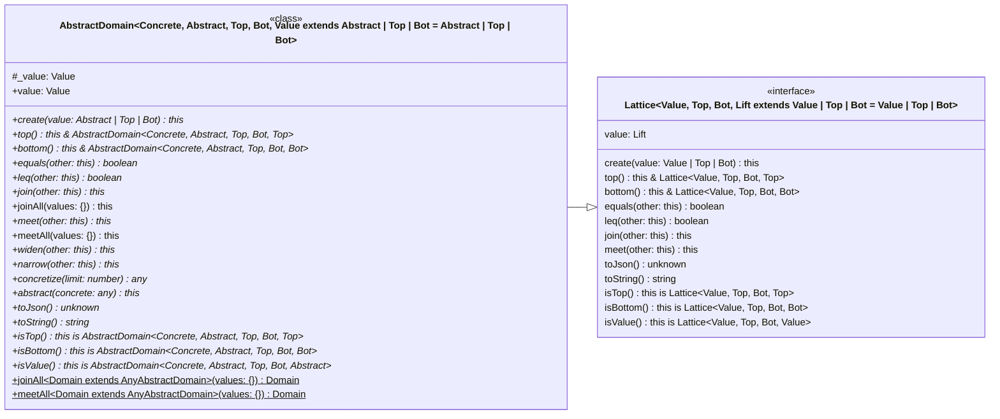

_This document was generated from '[src/documentation/wiki-absint.ts](https://github.com/flowr-analysis/flowr/tree/main//src/documentation/wiki-absint.ts)' on 2026-01-10, 16:38:25 UTC presenting an overview of flowR's abstract interpretation framework (v2.8.5, using R v4.5.0). Please do not edit this file/wiki page directly._

This page describes the abstract interpretation framework of _flowR_.
Abstract interpretation abstracts the concrete semantics of a program to automatically infer properties about the behavior of a program.
It uses an abstract domain to capture sets of possible runtime values of a program.
An abstract domain is represented by a lattice with a partial order, join operator (least upper bound), meet operator (greated lower bound), top element (greatest element), and bottom element (least element).
Abstract interpretation uses an abstraction of the concrete semantics of a program to perform fixpoint iteration to find program invariants.

<h2 id="abstract-domains">Abstract Domains</h2>

To perform abstract interpretation, we first need to define an abstract domain to capture possible runtime values of the program.
In _flowR_, an abstract domain is represented by the class <a href="https://github.com/flowr-analysis/flowr/tree/main//src/abstract-interpretation/domains/abstract-domain.ts#L18"><code><span title="An abstract domain as complete lattice with a widening operator, narrowing operator, concretization function, and abstraction function. All operations of value abstract domains should not modify the domain in-place but return new values using create .">AbstractDomain</span></code></a> that extends the <a href="https://github.com/flowr-analysis/flowr/tree/main//src/abstract-interpretation/domains/lattice.ts#L20"><code><span title="A complete lattice with a partially ordered set, join operator (LUB), meet operator (GLB), top element, and bottom element (e.g. for abstract domains).">Lattice</span></code></a> interface, providing the following properties and functions:

* <a href="https://github.com/flowr-analysis/flowr/tree/main//src/abstract-interpretation/domains/abstract-domain.ts#L26"><code>AbstractDomain::<b>value</b></code></a> the current abstract value of the abstract domain
* <a href="https://github.com/flowr-analysis/flowr/tree/main//src/abstract-interpretation/domains/abstract-domain.ts#L38"><code>AbstractDomain::<b>leq</b></code></a>) to check whether to abstract values are ordered with respect to the partial order of the lattice
* <a href="https://github.com/flowr-analysis/flowr/tree/main//src/abstract-interpretation/domains/abstract-domain.ts#L40"><code>AbstractDomain::<b>join</b></code></a> to join two abstract values to get the least upper bound (LUB)
* <a href="https://github.com/flowr-analysis/flowr/tree/main//src/abstract-interpretation/domains/abstract-domain.ts#L54"><code>AbstractDomain::<b>meet</b></code></a> to meet two abstract values to get the greates lower bound (GLB)
* <a href="https://github.com/flowr-analysis/flowr/tree/main//src/abstract-interpretation/domains/abstract-domain.ts#L71"><code><span title="Widens the current abstract value with another abstract value as a sound over-approximation of the join (least upper bound) for fixpoint iteration acceleration.">AbstractDomain::<b>widen</b></span></code></a> to perform widening with another abstract value to ensure termination of the fixpoint iteration
* <a href="https://github.com/flowr-analysis/flowr/tree/main//src/abstract-interpretation/domains/abstract-domain.ts#L76"><code><span title="Narrows the current abstract value with another abstract value as a sound over-approximation of the meet (greatest lower bound) to refine the value after widening.">AbstractDomain::<b>narrow</b></span></code></a> to perform narrowing with another abstract value to refine the abstract value after widening
* <a href="https://github.com/flowr-analysis/flowr/tree/main//src/abstract-interpretation/domains/abstract-domain.ts#L32"><code>AbstractDomain::<b>top</b></code></a> to get the top element (greatest element) of the abstract domain
* <a href="https://github.com/flowr-analysis/flowr/tree/main//src/abstract-interpretation/domains/abstract-domain.ts#L34"><code>AbstractDomain::<b>bottom</b></code></a> to get the bottom element (least element) of the abstract domain
* <a href="https://github.com/flowr-analysis/flowr/tree/main//src/abstract-interpretation/domains/abstract-domain.ts#L82"><code><span title="Maps the current abstract value into a set of possible concrete values as concretization function of the abstract domain. The result should be Top if the number of concrete values would reach the limit or the resulting set would have infinite many elements.">AbstractDomain::<b>concretize</b></span></code></a> representing the concretization function of the abstract domain
* <a href="https://github.com/flowr-analysis/flowr/tree/main//src/abstract-interpretation/domains/abstract-domain.ts#L87"><code><span title="Maps a set of possible concrete values into an abstract value as abstraction function of the abstract domain (should additionally be provided as static function).">AbstractDomain::<b>abstract</b></span></code></a> representing the abstraction function of the abstract domain
* <a href="https://github.com/flowr-analysis/flowr/tree/main//src/abstract-interpretation/domains/abstract-domain.ts#L93"><code>AbstractDomain::<b>isTop</b></code></a> to check whether the current abstract value is top
* <a href="https://github.com/flowr-analysis/flowr/tree/main//src/abstract-interpretation/domains/abstract-domain.ts#L95"><code>AbstractDomain::<b>isBottom</b></code></a> to check whether the current abstract value is bottom
* <a href="https://github.com/flowr-analysis/flowr/tree/main//src/abstract-interpretation/domains/abstract-domain.ts#L97"><code>AbstractDomain::<b>isValue</b></code></a> to check whether the current abstract value is a value (can still be top or bottom)


<details><summary>Class Diagram</summary>

All boxes link to their respective implementation in the source code.



</details>
    

<h2 id="abstract-interpretation">Abstract Interpretation</h2>

We forward traverse the [control flow graph](https://github.com/flowr-analysis/flowr/wiki/control-flow-graph) of _flowR_ using a <a href="https://github.com/flowr-analysis/flowr/tree/main//src/abstract-interpretation/absint-visitor.ts#L28"><code><span title="A control flow graph visitor to perform abstract interpretation.  However, the visitor does not yet support inter-procedural abstract interpretation and abstract condition semantics.">AbstractInterpretationVisitor</span></code></a>.


```ts
class IntervalInferenceVisitor extends AbstractInterpretationVisitor<IntervalDomain> {
	protected override onNumberConstant({ vertex, node }: { vertex: DataflowGraphVertexValue, node: RNumber<ParentInformation> }): void {
		super.onNumberConstant({ vertex, node });

		const interval = new IntervalDomain([node.content.num, node.content.num]);
		this.currentState.set(node.info.id, interval);
	}

	protected override onFunctionCall({ call }: { call: DataflowGraphVertexFunctionCall }): void {
		super.onFunctionCall({ call });

		if(call.args.length === 2 && call.args.every(arg => arg !== EmptyArgument)) {
			const left = this.getAbstractValue(call.args[0].nodeId);
			const right = this.getAbstractValue(call.args[1].nodeId);

			if(left === undefined || right === undefined) {
				// If an operand does not have an inferred interval, this might not be a numerical operation
				return;
			}
			// We map the numerical operation to the resulting interval after applying the abstract semantics of the operation
			switch(call.name) {
				case '+':
					return this.currentState.set(call.id, left.add(right));
				case '-':
					return this.currentState.set(call.id, left.subtract(right));
			}
		}
	}
}
```

<i>Defined at <a href="https://github.com/flowr-analysis/flowr/tree/main//src/documentation/wiki-absint.ts#L16">./src/documentation/wiki-absint.ts#L16</a></i>


```ts
const analyzer = await new FlowrAnalyzerBuilder()
    .setEngine('tree-sitter')
    .build();

analyzer.addRequest(`
    x <- if (runif < 0.5) 6 else 12
    y <- 42
    z <- x + y
`.trim());

const ast = await analyzer.normalize();
const dfg = (await analyzer.dataflow()).graph;
const cfg = await analyzer.controlflow();
const ctx = analyzer.inspectContext();
const domain = new StateAbstractDomain<IntervalDomain>(new Map());

const inference = new IntervalInferenceVisitor({ controlFlow: cfg, dfg: dfg, normalizedAst: ast, ctx: ctx, domain: domain });
inference.start();

const result = inference.getEndState();
```

<i>Defined at <a href="https://github.com/flowr-analysis/flowr/tree/main//src/documentation/wiki-absint.ts#L46">./src/documentation/wiki-absint.ts#L46</a></i>


```ts
1@0.5 -> [0.5, 0.5]
1@6 -> [6, 6]
1@12 -> [12, 12]
1@x -> [6, 12]
2@42 -> [42, 42]
2@y -> [42, 42]
3@+ -> [48, 54]
3@z -> [48, 54]
```

        