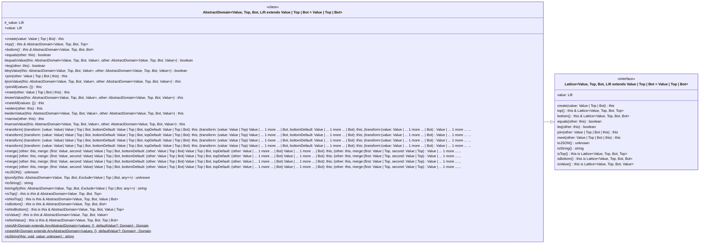
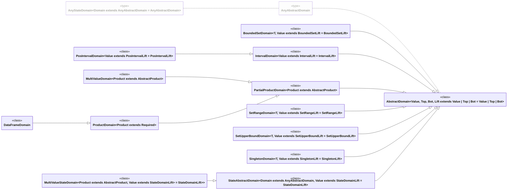

_This document was generated from '[src/documentation/wiki-absint.ts](https://github.com/flowr-analysis/flowr/tree/main//src/documentation/wiki-absint.ts)' on 2026-07-16, 13:31:34 UTC presenting an overview of flowR's abstract interpretation framework (v2.12.3, using R v4.5.0). Please do not edit this file/wiki page directly._

This page describes the abstract interpretation framework of _flowR_.
Abstract interpretation abstracts the concrete semantics of a program to automatically infer properties about the behavior of a program.
It uses an abstract domain to capture sets of possible runtime values of a program.
An abstract domain is represented by a lattice with a partial order, join operator (least upper bound), meet operator (greated lower bound), top element (greatest element), and bottom element (least element).
Abstract interpretation uses an abstraction of the concrete semantics of a program to perform fixpoint iteration to find program invariants.

<h2 id="abstract-domains">Abstract Domains</h2>

To perform abstract interpretation, we first need to define an abstract domain to capture possible runtime values of the program.
In _flowR_, an abstract domain is represented by the class <a href="https://github.com/flowr-analysis/flowr/tree/main/src/abstract-interpretation/domains/abstract-domain.ts#L18"><code><span title="An abstract domain as complete lattice with a widening and narrowing operator. All operations of value abstract domains should not modify the domain in-place but return new values using create .">AbstractDomain</span></code></a> that extends the <a href="https://github.com/flowr-analysis/flowr/tree/main/src/abstract-interpretation/domains/lattice.ts#L20"><code><span title="A complete lattice with a partially ordered set, join operator (LUB), meet operator (GLB), top element, and bottom element (e.g. for abstract domains).">Lattice</span></code></a> interface. It has the type parameters `Concrete` for the concrete domain of the abstract domain (e.g. strings, numbers, lists), `Abstract` for the abstract representation of the values (e.g. sets, intervals), `Top` for the representation of the top element, `Bot` for the representation of the bottom element, and `Value` for the type of the current abstract value of the abstract domain (i.e. `Abstract`, `Top`, or `Bot`). An abstract domain provides the following properties and functions:

 * <a href="https://github.com/flowr-analysis/flowr/tree/main/src/abstract-interpretation/domains/abstract-domain.ts#L26"><code>AbstractDomain::<b>value</b></code></a> the current abstract value of the abstract domain
 * <a href="https://github.com/flowr-analysis/flowr/tree/main/src/abstract-interpretation/domains/abstract-domain.ts#L32"><code>AbstractDomain::<b>top</b></code></a> to get the top element (greatest element) of the abstract domain
 * <a href="https://github.com/flowr-analysis/flowr/tree/main/src/abstract-interpretation/domains/abstract-domain.ts#L34"><code>AbstractDomain::<b>bottom</b></code></a> to get the bottom element (least element) of the abstract domain

 - <a href="https://github.com/flowr-analysis/flowr/tree/main/src/abstract-interpretation/domains/abstract-domain.ts#L207"><code>AbstractDomain::<b>isTop</b></code></a> to check whether the current abstract value is top
 - <a href="https://github.com/flowr-analysis/flowr/tree/main/src/abstract-interpretation/domains/abstract-domain.ts#L213"><code>AbstractDomain::<b>isBottom</b></code></a> to check whether the current abstract value is bottom
 - <a href="https://github.com/flowr-analysis/flowr/tree/main/src/abstract-interpretation/domains/abstract-domain.ts#L219"><code>AbstractDomain::<b>isValue</b></code></a> to check whether the current abstract value is a value (can still be top or bottom)

 * <a href="https://github.com/flowr-analysis/flowr/tree/main/src/abstract-interpretation/domains/abstract-domain.ts#L47"><code>AbstractDomain::<b>leq</b></code></a> to check whether two abstract values are ordered with respect to the partial order of the lattice
 * <a href="https://github.com/flowr-analysis/flowr/tree/main/src/abstract-interpretation/domains/abstract-domain.ts#L58"><code>AbstractDomain::<b>join</b></code></a> to join two abstract values to get the least upper bound (LUB)
 * <a href="https://github.com/flowr-analysis/flowr/tree/main/src/abstract-interpretation/domains/abstract-domain.ts#L87"><code>AbstractDomain::<b>meet</b></code></a> to meet two abstract values to get the greates lower bound (GLB)
 * <a href="https://github.com/flowr-analysis/flowr/tree/main/src/abstract-interpretation/domains/abstract-domain.ts#L119"><code><span title="Widens the current abstract value with another abstract value as a sound over-approximation of the join (least upper bound) for fixpoint iteration acceleration.">AbstractDomain::<b>widen</b></span></code></a> to perform widening with another abstract value to ensure termination of the fixpoint iteration
 * <a href="https://github.com/flowr-analysis/flowr/tree/main/src/abstract-interpretation/domains/abstract-domain.ts#L137"><code><span title="Narrows the current abstract value with another abstract value as a sound over-approximation of the meet (greatest lower bound) to refine the value after widening.">AbstractDomain::<b>narrow</b></span></code></a> to perform narrowing with another abstract value to refine the abstract value after widening


<details><summary>Class Diagram</summary>

All boxes link to their respective implementation in the source code.


```mermaid

---
  config:
    class:
      hideEmptyMembersBox: true
---
classDiagram
direction RL
class AbstractDomain~Value, Top, Bot, Lift extends Value | Top | Bot = Value | Top | Bot~{
    <<class>>
    ##95;value#58; Lift
    +value#58; Lift
    +create(value#58; Value | Top | Bot) this*
    +top() this #38; AbstractDomain#60;Value, Top, Bot, Top#62;*
    +bottom() this #38; AbstractDomain#60;Value, Top, Bot, Bot#62;*
    +equals(other#58; this) boolean
    #equalsValue(this#58; AbstractDomain#60;Value, Top, Bot, Value#62;, other#58; AbstractDomain#60;Value, Top, Bot, Value#62;) boolean*
    +leq(other#58; this) boolean
    #leqValue(this#58; AbstractDomain#60;Value, Top, Bot, Value#62;, other#58; AbstractDomain#60;Value, Top, Bot, Value#62;) boolean*
    +join(other#58; Value | Top | Bot | this) this
    #joinValue(this#58; AbstractDomain#60;Value, Top, Bot, Value#62;, other#58; AbstractDomain#60;Value, Top, Bot, Value#62;) this*
    +joinAll(values#58; #123;#125;) this
    +meet(other#58; Value | Top | Bot | this) this
    #meetValue(this#58; AbstractDomain#60;Value, Top, Bot, Value#62;, other#58; AbstractDomain#60;Value, Top, Bot, Value#62;) this*
    +meetAll(values#58; #123;#125;) this
    +widen(other#58; this) this
    #widenValue(this#58; AbstractDomain#60;Value, Top, Bot, Value#62;, other#58; AbstractDomain#60;Value, Top, Bot, Value#62;) this
    +narrow(other#58; this) this
    #narrowValue(this#58; AbstractDomain#60;Value, Top, Bot, Value#62;, other#58; AbstractDomain#60;Value, Top, Bot, Value#62;) this
    +transform#123; (transform#58; (value#58; Value) Value | Top | Bot, bottomDefault#58; Value | Top | Bot, topDefault#58; Value | Top | Bot)#58; this; (transform#58; (value#58; Value | Top) Value | ... 1 more ... | Bot, bottomDefault#58; Value | ... 1 more ... | Bot)#58; this; (transform#58; (value#58; Value | ... 1 more ... | Bot) Value | ... 1 more ... ...
    +transform#123; (transform#58; (value#58; Value) Value | Top | Bot, bottomDefault#58; Value | Top | Bot, topDefault#58; Value | Top | Bot)#58; this; (transform#58; (value#58; Value | Top) Value | ... 1 more ... | Bot, bottomDefault#58; Value | ... 1 more ... | Bot)#58; this; (transform#58; (value#58; Value | ... 1 more ... | Bot) Value | ... 1 more ... ...
    +transform#123; (transform#58; (value#58; Value) Value | Top | Bot, bottomDefault#58; Value | Top | Bot, topDefault#58; Value | Top | Bot)#58; this; (transform#58; (value#58; Value | Top) Value | ... 1 more ... | Bot, bottomDefault#58; Value | ... 1 more ... | Bot)#58; this; (transform#58; (value#58; Value | ... 1 more ... | Bot) Value | ... 1 more ... ...
    +transform#123; (transform#58; (value#58; Value) Value | Top | Bot, bottomDefault#58; Value | Top | Bot, topDefault#58; Value | Top | Bot)#58; this; (transform#58; (value#58; Value | Top) Value | ... 1 more ... | Bot, bottomDefault#58; Value | ... 1 more ... | Bot)#58; this; (transform#58; (value#58; Value | ... 1 more ... | Bot) Value | ... 1 more ... ...
    +merge#123; (other#58; this, merge#58; (first#58; Value, second#58; Value) Value | Top | Bot, bottomDefault#58; (other#58; Value | Top | Bot) Value | Top | Bot, topDefault#58; (other#58; Value | ... 1 more ... | Bot) Value | ... 1 more ... | Bot)#58; this; (other#58; this, merge#58; (first#58; Value | Top, second#58; Value | Top) Value | ... 1 more ......
    +merge#123; (other#58; this, merge#58; (first#58; Value, second#58; Value) Value | Top | Bot, bottomDefault#58; (other#58; Value | Top | Bot) Value | Top | Bot, topDefault#58; (other#58; Value | ... 1 more ... | Bot) Value | ... 1 more ... | Bot)#58; this; (other#58; this, merge#58; (first#58; Value | Top, second#58; Value | Top) Value | ... 1 more ......
    +merge#123; (other#58; this, merge#58; (first#58; Value, second#58; Value) Value | Top | Bot, bottomDefault#58; (other#58; Value | Top | Bot) Value | Top | Bot, topDefault#58; (other#58; Value | ... 1 more ... | Bot) Value | ... 1 more ... | Bot)#58; this; (other#58; this, merge#58; (first#58; Value | Top, second#58; Value | Top) Value | ... 1 more ......
    +merge#123; (other#58; this, merge#58; (first#58; Value, second#58; Value) Value | Top | Bot, bottomDefault#58; (other#58; Value | Top | Bot) Value | Top | Bot, topDefault#58; (other#58; Value | ... 1 more ... | Bot) Value | ... 1 more ... | Bot)#58; this; (other#58; this, merge#58; (first#58; Value | Top, second#58; Value | Top) Value | ... 1 more ......
    +toJSON() unknown
    #jsonify(this#58; AbstractDomain#60;Value, Top, Bot, Exclude#60;Value | Top | Bot, any#62;#62;) unknown*
    +toString() string
    #stringify(this#58; AbstractDomain#60;Value, Top, Bot, Exclude#60;Value | Top | Bot, any#62;#62;) string*
    +isTop() this is this #38; AbstractDomain#60;Value, Top, Bot, Top#62;*
    +isNotTop() this is this #38; AbstractDomain#60;Value, Top, Bot, Value | Bot#62;
    +isBottom() this is this #38; AbstractDomain#60;Value, Top, Bot, Bot#62;*
    +isNotBottom() this is this #38; AbstractDomain#60;Value, Top, Bot, Value | Top#62;
    +isValue() this is this #38; AbstractDomain#60;Value, Top, Bot, Value#62;*
    +isNotValue() this is this #38; AbstractDomain#60;Value, Top, Bot, Top | Bot#62;
    +joinAll#60;Domain extends AnyAbstractDomain#62;(values#58; #123;#125;, defaultValue?#58; Domain) Domain$
    +meetAll#60;Domain extends AnyAbstractDomain#62;(values#58; #123;#125;, defaultValue?#58; Domain) Domain$
    +toString(this#58; void, value#58; unknown) string$
}
click AbstractDomain href "https://github.com/flowr-analysis/flowr/tree/main/src/abstract-interpretation/domains/abstract-domain.ts#L18" "An abstract domain as complete lattice with a widening and narrowing operator. All operations of value abstract domains should not modify the domain in#45;place but return new values using; #60;code#62;create#60;/code#62;; ."
class Lattice~Value, Top, Bot, Lift extends Value | Top | Bot = Value | Top | Bot~{
    <<interface>>
    value#58; Lift
    create(value#58; Value | Top | Bot) this
    top() this #38; Lattice#60;Value, Top, Bot, Top#62;
    bottom() this #38; Lattice#60;Value, Top, Bot, Bot#62;
    equals(other#58; this) boolean
    leq(other#58; this) boolean
    join(other#58; Value | Top | Bot | this) this
    meet(other#58; Value | Top | Bot | this) this
    toJSON() unknown
    toString() string
    isTop() this is Lattice#60;Value, Top, Bot, Top#62;
    isBottom() this is Lattice#60;Value, Top, Bot, Bot#62;
    isValue() this is Lattice#60;Value, Top, Bot, Value#62;
}
click Lattice href "https://github.com/flowr-analysis/flowr/tree/main/src/abstract-interpretation/domains/lattice.ts#L20" "A complete lattice with a partially ordered set, join operator (LUB), meet operator (GLB), top element, and bottom element (e.g. for abstract domains)."
Lattice <|-- AbstractDomain
```

</details>

The <a href="https://github.com/flowr-analysis/flowr/tree/main/src/abstract-interpretation/domains/lattice.ts#L4"><code><span title="The Top symbol to represent the Top element of complete lattices (e.g. of abstract domains).">Top</span></code></a> and <a href="https://github.com/flowr-analysis/flowr/tree/main/src/abstract-interpretation/domains/lattice.ts#L10"><code><span title="The Bottom symbol to represent the Bottom element of complete lattices (e.g. of abstract domains).">Bottom</span></code></a> symbols can be used to explicitly represent the top or bottom elment of an abstract domain. Additionally, for value abstract domains, there is the  interface that provides the function  to check whether the current abstract value of the abstract domain satisfies a concrete value (see also <a href="https://github.com/flowr-analysis/flowr/tree/main/src/abstract-interpretation/domains/value-abstract-domain.ts#L125"><code><span title="Represents the different types of numerical comparators for satisfiability checks for an abstract domain.">NumericalComparator</span></code></a> and <a href="https://github.com/flowr-analysis/flowr/tree/main/src/abstract-interpretation/domains/value-abstract-domain.ts#L136"><code><span title="Represents the different types of set comparators for satisfiability checks for an abstract domain.">SetComparator</span></code></a>).

_flowR_ already provides different abstract domains for abstract interpretation in [src/abstract-interpretation/domains](https://github.com/flowr-analysis/flowr/tree/main//src/abstract-interpretation/domains). Many of the abstract domains are generic and can be used for differend kinds of analyses. The existing abstract domains are presented in the following. Some of the listed abstract domains can be expanded to show the inherited abstract domains.


   * [BoundedSetDomain](https://github.com/flowr-analysis/flowr/tree/main/src/abstract-interpretation/domains/bounded-set-domain.ts#L25)   
     The bounded set abstract domain as sets of possible values bounded by a `limit` indicating the maximum number of inferred values.
     The Bottom element is defined as the empty set and the Top element is defined as
     <code>Top</code>
     symbol.
     <details><summary style="color:gray">Defined at <a href="https://github.com/flowr-analysis/flowr/tree/main/src/abstract-interpretation/domains/bounded-set-domain.ts#L25">src/abstract-interpretation/domains/bounded-set-domain.ts#L25</a></summary>
     
     
     ```ts
     
     
     /**
      * The bounded set abstract domain as sets of possible values bounded by a `limit` indicating the maximum number of inferred values.
      * The Bottom element is defined as the empty set and the Top element is defined as {@link Top} symbol.
      * @template T     - Type of the values in the abstract domain
      * @template Value - Type of the constraint in the abstract domain (Top, Bottom, or an actual value)
      */
     export class BoundedSetDomain<T, Value extends BoundedSetLift<T> = BoundedSetLift<T>>
         extends AbstractDomain<BoundedSetValue<T>, BoundedSetTop, BoundedSetBottom, Value>
         implements ValueDomain<T> {
     
         public readonly limit:      number;
         protected readonly setType: typeof Set<T>;
     
         /**
          * @param limit   - A limit for the maximum number of elements to store in the set
          * @param setType - An optional set constructor for the domain elements if the type `T` is not storable in a HashSet
          */
         constructor(value: Value | T[], limit: number = DEFAULT_INFERENCE_LIMIT, setType: typeof Set<T> = Set) {
             if(value !== Top) {
                 if(Array.isArray(value)) {
                     super((value.length > limit ? Top : new setType(value)) as Value);
                 } else {
                     super((value.size > limit ? Top : new setType(value)) as Value);
                 }
             } else {
                 super(value);
             }
             this.limit = limit;
             this.setType = setType;
         }
     
         public create(value: BoundedSetLift<T> | T[]): this {
             return new BoundedSetDomain(value, this.limit, this.setType) as this;
         }
     
         public from(...values: T[]): this {
             return this.create(values);
         }
     
         public static top<T>(limit?: number, setType?: typeof Set<T>): BoundedSetDomain<T, BoundedSetTop> {
             return new this(Top, limit, setType);
         }
     
         public static bottom<T>(limit?: number, setType?: typeof Set<T>): BoundedSetDomain<T, BoundedSetBottom> {
             return new this(SetBottom, limit, setType);
         }
     
         public static from<T>(values: T | T[], limit?: number, setType?: typeof Set<T>): BoundedSetDomain<T> {
             return new this(Array.isArray(values) ? values : [values], limit, setType);
         }
     
         public top(): this & BoundedSetDomain<T, BoundedSetTop> {
             return this.create(Top) as this & BoundedSetDomain<T, BoundedSetTop>;
         }
     
         public bottom(): this & BoundedSetDomain<T, BoundedSetBottom> {
             return this.create(SetBottom) as this & BoundedSetDomain<T, BoundedSetBottom>;
         }
     
         protected equalsValue(this: BoundedSetDomain<T, BoundedSetValue<T>>, other: BoundedSetDomain<T, BoundedSetValue<T>>): boolean {
             return setEquals(this.value, other.value);
         }
     
         protected leqValue(this: BoundedSetDomain<T, BoundedSetValue<T>>, other: BoundedSetDomain<T, BoundedSetValue<T>>): boolean {
             return this.value.isSubsetOf(other.value);
         }
     
         protected joinValue(this: this & BoundedSetDomain<T, BoundedSetValue<T>>, other: BoundedSetDomain<T, BoundedSetValue<T>>): this {
             return this.create(this.value.union(other.value));
         }
     
         protected meetValue(this: this & BoundedSetDomain<T, BoundedSetValue<T>>, other: BoundedSetDomain<T, BoundedSetValue<T>>): this {
             return this.create(this.value.intersection(other.value));
         }
     
         public satisfies(value: T): Ternary {
             if(this.isValue() && this.value.has(value)) {
                 return this.value.size === 1 ? Ternary.Always : Ternary.Maybe;
             } else if(this.isTop()) {
                 return Ternary.Maybe;
             }
             return Ternary.Never;
         }
     
         protected jsonify(this: BoundedSetDomain<T, BoundedSetValue<T>>): unknown {
             return this.value.values().toArray();
         }
     
         protected stringify(this: BoundedSetDomain<T, BoundedSetValue<T>>): string {
             return `{${this.value.values().map(AbstractDomain.toString).toArray().join(', ')}}`;
         }
     
         public isTop(): this is this & BoundedSetDomain<T, BoundedSetTop> {
             return this.value === Top;
         }
     
         public isBottom(): this is this & BoundedSetDomain<T, BoundedSetBottom> {
             return this.value !== Top && this.value.size === 0;
         }
     
         public isValue(): this is this & BoundedSetDomain<T, BoundedSetValue<T>> {
             return this.value !== Top;
         }
     }
     ```
     
     
     </details>
     
   * [IntervalDomain](https://github.com/flowr-analysis/flowr/tree/main/src/abstract-interpretation/domains/interval-domain.ts#L26)   
     The interval abstract domain as intervals with possibly infinite bounds representing possible numeric values.
     The Bottom element is defined as
     <code>Bottom</code>
     symbol and the Top element is defined as the interval [-∞, +∞].
     <details><summary style="color:gray">Defined at <a href="https://github.com/flowr-analysis/flowr/tree/main/src/abstract-interpretation/domains/interval-domain.ts#L26">src/abstract-interpretation/domains/interval-domain.ts#L26</a></summary>
     
     
     ```ts
     
     
     /**
      * The interval abstract domain as intervals with possibly infinite bounds representing possible numeric values.
      * The Bottom element is defined as {@link Bottom} symbol and the Top element is defined as the interval [-∞, +∞].
      * @template Value - Type of the constraint in the abstract domain (Top, Bottom, or an actual value)
      */
     export class IntervalDomain<Value extends IntervalLift = IntervalLift>
         extends AbstractDomain<IntervalValue, IntervalTop, IntervalBottom, Value>
         implements NumericDomain {
     
         constructor(value: Value) {
             if(Array.isArray(value)) {
                 if(value.some(Number.isNaN) || value[0] > value[1] || value[0] === +Infinity || value[1] === -Infinity) {
                     super(Bottom as Value);
                 } else {
                     super([value[0], value[1]] as const as Value);
                 }
             } else {
                 super(value);
             }
         }
     
         public create(value: IntervalLift): this {
             return new IntervalDomain(value) as this;
         }
     
         public get lower(): IntervalBound<Value> {
             return (this.isValue() ? this.value[0] : Bottom) as IntervalBound<Value>;
         }
     
         public get upper(): IntervalBound<Value> {
             return (this.isValue() ? this.value[1] : Bottom) as IntervalBound<Value>;
         }
     
         public from(...values: number[]): this {
             if(values.length === 0) {
                 return this.bottom();
             }
             return this.create([Math.min(...values), Math.max(...values)]);
         }
     
         public static top(): IntervalDomain<IntervalTop> {
             return new this(IntervalTop);
         }
     
         public static bottom(): IntervalDomain<IntervalBottom> {
             return new this(Bottom);
         }
     
         public static from(...values: number[]): IntervalDomain {
             if(values.length === 0) {
                 return this.bottom();
             }
             return new this([Math.min(...values), Math.max(...values)]);
         }
     
         public top(): this & IntervalDomain<IntervalTop> {
             return this.create(IntervalTop) as this & IntervalDomain<IntervalTop>;
         }
     
         public bottom(): this & IntervalDomain<IntervalBottom> {
             return this.create(Bottom) as this & IntervalDomain<IntervalBottom>;
         }
     
         protected equalsValue(this: IntervalDomain<IntervalValue>, other: IntervalDomain<IntervalValue>): boolean {
             return this.lower === other.lower && this.upper === other.upper;
         }
     
         protected leqValue(this: IntervalDomain<IntervalValue>, other: IntervalDomain<IntervalValue>): boolean {
             return other.lower <= this.lower && this.upper <= other.upper;
         }
     
         protected joinValue(this: this & IntervalDomain<IntervalValue>, other: IntervalDomain<IntervalValue>): this {
             return this.create([Math.min(this.lower, other.lower), Math.max(this.upper, other.upper)]);
         }
     
         protected meetValue(this: this & IntervalDomain<IntervalValue>, other: IntervalDomain<IntervalValue>): this {
             return this.create([Math.max(this.lower, other.lower), Math.min(this.upper, other.upper)]);
         }
     
         protected widenValue(this: this & IntervalDomain<IntervalValue>, other: IntervalDomain<IntervalValue>): this {
             return this.create([
                 this.lower <= other.lower ? this.lower : -Infinity,
                 this.upper >= other.upper ? this.upper : +Infinity
             ]);
         }
     
         protected narrowValue(this: this & IntervalDomain<IntervalValue>, other: IntervalDomain<IntervalValue>): this {
             if(Math.max(this.lower, other.lower) > Math.min(this.upper, other.upper)) {
                 return this.bottom();
             }
             return this.create([
                 this.lower === -Infinity ? other.lower : this.lower,
                 this.upper === +Infinity ? other.upper : this.upper
             ]);
         }
     
         public satisfies(value: number, comparator: NumericalComparator = NumericalComparator.Equal): Ternary {
             switch(comparator) {
                 case NumericalComparator.Equal: {
                     if(this.isValue() && this.lower <= value && value <= this.upper) {
                         return this.lower === this.upper ? Ternary.Always : Ternary.Maybe;
                     } else {
                         return Ternary.Never;
                     }
                 }
                 case NumericalComparator.Less: {
                     if(this.isValue() && value < this.upper) {
                         return value < this.lower ? Ternary.Always : Ternary.Maybe;
                     } else {
                         return Ternary.Never;
                     }
                 }
                 case NumericalComparator.LessOrEqual: {
                     if(this.isValue() && value <= this.upper) {
                         return value <= this.lower ? Ternary.Always : Ternary.Maybe;
                     } else {
                         return Ternary.Never;
                     }
                 }
                 case NumericalComparator.Greater: {
                     if(this.isValue() && this.lower <= value) {
                         return this.upper <= value ? Ternary.Always : Ternary.Maybe;
                     } else {
                         return Ternary.Never;
                     }
                 }
                 case NumericalComparator.GreaterOrEqual: {
                     if(this.isValue() && this.lower < value) {
                         return this.upper < value ? Ternary.Always : Ternary.Maybe;
                     } else {
                         return Ternary.Never;
                     }
                 }
                 default: {
                     assertUnreachable(comparator);
                 }
             }
         }
     
         public negate(): this {
             if(this.isValue()) {
                 return this.create([-this.value[1], -this.value[0]]);
             }
             return this.bottom();
         }
     
         public add(other: this | IntervalLift): this {
             const otherValue = other instanceof AbstractDomain ? other.value : other;
     
             if(this.isValue() && otherValue !== Bottom) {
                 return this.create([this.lower + otherValue[0], this.upper + otherValue[1]]);
             }
             return this.bottom();
         }
     
         public subtract(other: this | IntervalLift): this {
             const otherValue = other instanceof AbstractDomain ? other.value : other;
     
             if(this.isValue() && otherValue !== Bottom) {
                 return this.create([this.lower - otherValue[0], this.upper - otherValue[1]]);
             }
             return this.bottom();
         }
     
         public multiply(other: this | IntervalLift): this {
             const otherValue = other instanceof AbstractDomain ? other.value : other;
     
             if(this.isValue() && otherValue !== Bottom) {
                 const products = [
                     this.value[0] * otherValue[0],
                     this.value[0] * otherValue[1],
                     this.value[1] * otherValue[0],
                     this.value[1] * otherValue[1]
                 ];
                 return this.create([Math.min(...products), Math.max(...products)]);
             }
             return this.bottom();
         }
     
         public divide(other: this | IntervalLift): this {
             const otherValue = other instanceof AbstractDomain ? other.value : other;
     
             if(this.isValue() && otherValue !== Bottom) {
                 if(otherValue[0] <= 0 && 0 <= otherValue[1]) {
                     return this.top();
                 }
                 return this.multiply(this.create([1 / otherValue[1], 1 / otherValue[0]]));
             }
             return this.bottom();
         }
     
         public min(other: this | IntervalLift): this {
             const otherValue = other instanceof AbstractDomain ? other.value : other;
     
             if(this.isValue() && otherValue !== Bottom) {
                 return this.create([Math.min(this.lower, otherValue[0]), Math.min(this.upper, otherValue[1])]);
             }
             return this.bottom();
         }
     
         public max(other: this | IntervalLift): this {
             const otherValue = other instanceof AbstractDomain ? other.value : other;
     
             if(this.isValue() && otherValue !== Bottom) {
                 return this.create([Math.max(this.lower, otherValue[0]), Math.max(this.upper, otherValue[1])]);
             }
             return this.bottom();
         }
     
         /**
          * Extends the lower bound of the current abstract value down to -∞.
          */
         public widenDown(): this {
             if(this.isValue()) {
                 return this.create([-Infinity, this.upper]);
             }
             return this.bottom();
         }
     
         /**
          * Extends the upper bound of the current abstract value up to +∞.
          */
         public widenUp(): this {
             if(this.isValue()) {
                 return this.create([this.lower, +Infinity]);
             }
             return this.bottom();
         }
     
         protected jsonify(): unknown {
             return this.value;
         }
     
         protected stringify(this: IntervalDomain<IntervalValue>): string {
             return `[${Number.isFinite(this.lower) ? this.lower : '-∞'}, ${Number.isFinite(this.upper) ? this.upper : '+∞'}]`;
         }
     
         public isTop(): this is this & IntervalDomain<IntervalTop> {
             return this.value !== Bottom && this.lower === -Infinity && this.upper === +Infinity;
         }
     
         public isBottom(): this is this & IntervalDomain<IntervalBottom> {
             return this.value === Bottom;
         }
     
         public isValue(): this is this & IntervalDomain<IntervalValue> {
             return this.value !== Bottom;
         }
     
         public isFinite(): this is this & IntervalDomain<IntervalValue> {
             return this.isValue() && Number.isFinite(this.lower) && Number.isFinite(this.upper);
         }
     }
     ```
     
     
     </details>
     
      <details><summary>View more (PosIntervalDomain)</summary>

     * [PosIntervalDomain](https://github.com/flowr-analysis/flowr/tree/main/src/abstract-interpretation/domains/positive-interval-domain.ts#L22)   
       The positive interval abstract domain as positive intervals with possibly zero lower bounds and infinite upper bounds representing possible numeric values.
       The Bottom element is defined as
       <code>Bottom</code>
       symbol and the Top element is defined as the interval [0, +∞].
       <details><summary style="color:gray">Defined at <a href="https://github.com/flowr-analysis/flowr/tree/main/src/abstract-interpretation/domains/positive-interval-domain.ts#L22">src/abstract-interpretation/domains/positive-interval-domain.ts#L22</a></summary>
       
       
       ```ts
       
       
       /**
        * The positive interval abstract domain as positive intervals with possibly zero lower bounds and infinite upper bounds representing possible numeric values.
        * The Bottom element is defined as {@link Bottom} symbol and the Top element is defined as the interval [0, +∞].
        * @template Value - Type of the constraint in the abstract domain (Top, Bottom, or an actual value)
        */
       export class PosIntervalDomain<Value extends PosIntervalLift = PosIntervalLift>
           extends IntervalDomain<Value> {
       
           constructor(value: Value) {
               if(Array.isArray(value) && value[0] < 0) {
                   super(Bottom as Value);
               } else {
                   super(value);
               }
           }
       
           public create(value: PosIntervalLift): this {
               return new PosIntervalDomain(value) as this;
           }
       
           public static top(): PosIntervalDomain<PosIntervalTop> {
               return new this(PosIntervalTop);
           }
       
           public static bottom(): PosIntervalDomain<PosIntervalBottom> {
               return new this(Bottom);
           }
       
           public top(): this & PosIntervalDomain<PosIntervalTop> {
               return this.create(PosIntervalTop) as this & PosIntervalDomain<PosIntervalTop>;
           }
       
           protected widenValue(this: this & PosIntervalDomain<PosIntervalValue>, other: PosIntervalDomain<PosIntervalValue>): this {
               return this.create([
                   this.lower <= other.lower ? this.lower : 0,
                   this.upper >= other.upper ? this.upper : +Infinity
               ]);
           }
       
           protected narrowValue(this: this & PosIntervalDomain<PosIntervalValue>, other: PosIntervalDomain<PosIntervalValue>): this {
               if(Math.max(this.lower, other.lower) > Math.min(this.upper, other.upper)) {
                   return this.bottom();
               }
               return this.create([
                   this.lower === 0 ? other.lower : this.lower,
                   this.upper === +Infinity ? other.upper : this.upper
               ]);
           }
       
           public subtract(other: this | PosIntervalLift): this {
               const otherValue = other instanceof AbstractDomain ? other.value : other;
       
               if(this.isValue() && otherValue !== Bottom) {
                   return this.create([Math.max(this.lower - otherValue[0], 0), Math.max(this.upper - otherValue[1], 0)]);
               }
               return this.bottom();
           }
       
           /**
            * Extends the lower bound of the current abstract value down to 0.
            */
           public widenDown(): this {
               if(this.isValue()) {
                   return this.create([0, this.upper]);
               }
               return this.bottom();
           }
       
           public isTop(): this is this & PosIntervalDomain<PosIntervalTop> {
               return this.value !== Bottom && this.lower === 0 && this.upper === +Infinity;
           }
       }
       ```
       
       
       </details>
       

      </details>
   * [PartialProductDomain](https://github.com/flowr-analysis/flowr/tree/main/src/abstract-interpretation/domains/partial-product-domain.ts#L20)   
     A partial product abstract domain as named Cartesian product of (optional) sub abstract domains.
     The sub abstract domains are represented by a (partial) record mapping property names to abstract domains.
     The Bottom element is defined as mapping every sub abstract domain to Bottom and the Top element is defined as having no sub abstract domain value.
     <details><summary style="color:gray">Defined at <a href="https://github.com/flowr-analysis/flowr/tree/main/src/abstract-interpretation/domains/partial-product-domain.ts#L20">src/abstract-interpretation/domains/partial-product-domain.ts#L20</a></summary>
     
     
     ```ts
     
     
     /**
      * A partial product abstract domain as named Cartesian product of (optional) sub abstract domains.
      * The sub abstract domains are represented by a (partial) record mapping property names to abstract domains.
      * The Bottom element is defined as mapping every sub abstract domain to Bottom and the Top element is defined as having no sub abstract domain value.
      * @template Product - Type of the abstract product of the product domain mapping (optional) property names to abstract domains
      */
     export abstract class PartialProductDomain<Product extends AbstractProduct>
         extends AbstractDomain<Product, Product, Product> {
     
         public readonly domain:     Required<Product>;
         public readonly reductions: readonly ProductReduction<Product>[];
     
         constructor(value: Product, domain: Required<Product>, reductions: readonly ProductReduction<Product>[] = [], reduce = true) {
             super(Record.mapProperties(value, entry => entry?.create(entry.value)) as Product);
     
             this.reductions = reductions;
             this.domain = domain;
     
             if(reduce) {
                 (this._value as Writable<Product>) = this.reduce(this.value);
             }
         }
     
         public abstract create(value: Product, reduce?: boolean): this;
     
         public bottom(): this {
             const result = {} as Product;
     
             for(const key in this.domain) {
                 result[key] = this.domain[key]?.bottom() as typeof result[typeof key];
             }
             return this.create(result);
         }
     
         public top(): this {
             return this.create({} as Product);
         }
     
         protected equalsValue(other: this): boolean {
             if(this.value === other.value) {
                 return true;
             }
             for(const key in this.value) {
                 if(this.value[key] === other.value[key]) {
                     continue;
                 } else if(this.value[key] === undefined || other.value[key] === undefined || !this.value[key].equals(other.value[key])) {
                     return false;
                 }
             }
             return true;
         }
     
         protected leqValue(other: this): boolean {
             if(this.value === other.value) {
                 return true;
             }
             for(const key in this.value) {
                 if(this.value[key] === other.value[key] || other.value[key] === undefined) {
                     continue;
                 } else if(this.value[key] === undefined || !this.value[key].leq(other.value[key])) {
                     return false;
                 }
             }
             return true;
         }
     
         protected joinValue(other: this): this {
             const result = {} as Product;
     
             for(const key in this.domain) {
                 if(this.value[key] !== undefined && other.value[key] !== undefined) {
                     result[key] = this.value[key].join(other.value[key]) as typeof result[typeof key];
                 }
             }
             return this.create(result);
         }
     
         protected meetValue(other: this): this {
             const result = {} as Product;
     
             for(const key in this.domain) {
                 if(this.value[key] === undefined) {
                     result[key] = other.value[key];
                 } else if(other.value[key] === undefined) {
                     result[key] = this.value[key];
                 } else {
                     result[key] = this.value[key].meet(other.value[key]) as typeof result[typeof key];
                 }
             }
             return this.create(result);
         }
     
         protected widenValue(other: this): this {
             const result = {} as Product;
     
             for(const key in this.domain) {
                 if(this.value[key] !== undefined && other.value[key] !== undefined) {
                     result[key] = this.value[key].widen(other.value[key]) as typeof result[typeof key];
                 }
             }
             return this.create(result);
         }
     
         protected narrowValue(other: this): this {
             const result = {} as Product;
     
             for(const key in this.domain) {
                 if(this.value[key] === undefined) {
                     result[key] = other.value[key];
                 } else if(other.value[key] === undefined) {
                     result[key] = this.value[key];
                 } else {
                     result[key] = this.value[key].narrow(other.value[key]) as typeof result[typeof key];
                 }
             }
             return this.create(result);
         }
     
         protected jsonify(): unknown {
             return Record.mapProperties(this.value, entry => entry?.toJSON());
         }
     
         protected stringify(): string {
             return '(' + Record.entries(this.value).map(([key, value]) => `${key}: ${value.toString()}`).join(', ') + ')';
         }
     
         public isTop(): boolean;
         public isTop(): this is this;
         public isTop(): this is this {
             return Record.values(this.value).filter(isNotUndefined).length === 0;
         }
     
         public isBottom(): boolean;
         public isBottom(): this is this;
         public isBottom(): this is this {
             return Record.values(this.value).some(value => value.isBottom());
         }
     
         public isValue(): boolean;
         public isValue(): this is this;
         public isValue(): this is this {
             return true;
         }
     
         /**
          * Applies the {@link reductions} of the (reduced) product domain to refine the abstract value based on its components.
          * Subclasses may override this to implement a fixed reduction instead of (or in addition to) the configurable reductions.
          */
         protected reduce(value: Product): Product {
             return this.reductions.reduce((current, reduction) => reduction(current), value);
         }
     }
     ```
     
     
     </details>
     
      <details><summary>View more (MultiValueDomain, ProductDomain)</summary>

     * [MultiValueDomain](https://github.com/flowr-analysis/flowr/tree/main/src/abstract-interpretation/domains/multi-value-state-domain.ts#L48)   
       A multi-value abstract domain as a (partial) product domain that combines multiple abstract domains.
       The Bottom element is defined as mapping every sub abstract domain to Bottom and the Top element is defined as having no sub abstract domain value.
       <details><summary style="color:gray">Defined at <a href="https://github.com/flowr-analysis/flowr/tree/main/src/abstract-interpretation/domains/multi-value-state-domain.ts#L48">src/abstract-interpretation/domains/multi-value-state-domain.ts#L48</a></summary>
       
       
       ```ts
       
       
       /**
        * A multi-value abstract domain as a (partial) product domain that combines multiple abstract domains.
        * The Bottom element is defined as mapping every sub abstract domain to Bottom and the Top element is defined as having no sub abstract domain value.
        * @template Product - Type of the abstract product of the multi-value domain combining multiple abstract values
        * @see {@link MultiValueStateDomain} for a state abstract domain of a multi-value domain
        */
       export class MultiValueDomain<Product extends AbstractProduct>
           extends PartialProductDomain<Product> {
       
           constructor(value: Product, domain: Required<Product>, reductions: readonly ProductReduction<Product>[] = []) {
               super(value, domain, reductions);
           }
       
           public create(value: Product): this {
               return new MultiValueDomain(value, this.domain, this.reductions) as this;
           }
       
           public static top<Product extends AbstractProduct>(domain: Required<Product>, reductions: readonly ProductReduction<Product>[] = []): MultiValueDomain<Product> {
               return new MultiValueDomain({} as Product, domain, reductions);
           }
       }
       ```
       
       
       </details>
       
     * [ProductDomain](https://github.com/flowr-analysis/flowr/tree/main/src/abstract-interpretation/domains/product-domain.ts#L10)   
       A product abstract domain as named Cartesian product of sub abstract domains.
       The sub abstract domains are represented by a record mapping property names to abstract domains.
       The Bottom element is defined as mapping every sub abstract domain to Bottom and the Top element is defined as mapping every sub abstract domain to Top.
       <details><summary style="color:gray">Defined at <a href="https://github.com/flowr-analysis/flowr/tree/main/src/abstract-interpretation/domains/product-domain.ts#L10">src/abstract-interpretation/domains/product-domain.ts#L10</a></summary>
       
       
       ```ts
       
       
       /**
        * A product abstract domain as named Cartesian product of sub abstract domains.
        * The sub abstract domains are represented by a record mapping property names to abstract domains.
        * The Bottom element is defined as mapping every sub abstract domain to Bottom and the Top element is defined as mapping every sub abstract domain to Top.
        * @template Product - Type of the abstract product of the product domain mapping property names to abstract domains
        */
       export abstract class ProductDomain<Product extends Required<AbstractProduct>>
           extends PartialProductDomain<Product> {
       
           constructor(value: Product) {
               super(value, value as Required<Product>);
           }
       
           public abstract create(value: Product, reduce?: boolean): this;
       
           public top(): this {
               const result = {} as Product;
       
               for(const key in this.domain) {
                   result[key] = this.domain[key]?.top() as typeof result[typeof key];
               }
               return this.create(result);
           }
       
           public isTop(): boolean;
           public isTop(): this is this;
           public isTop(): this is this {
               return Record.values(this.value).every(value => value.isTop());
           }
       }
       ```
       
       
       </details>
       
        <details><summary>View more (DataFrameDomain)</summary>

       * [DataFrameDomain](https://github.com/flowr-analysis/flowr/tree/main/src/abstract-interpretation/data-frame/dataframe-domain.ts#L15)   
         The data frame abstract domain as product domain of a column names domain, column count domain, and row count domain.
         <details><summary style="color:gray">Defined at <a href="https://github.com/flowr-analysis/flowr/tree/main/src/abstract-interpretation/data-frame/dataframe-domain.ts#L15">src/abstract-interpretation/data-frame/dataframe-domain.ts#L15</a></summary>
         
         
         ```ts
         
         
         /**
          * The data frame abstract domain as product domain of a column names domain, column count domain, and row count domain.
          */
         export class DataFrameDomain extends ProductDomain<AbstractDataFrameShape> {
             public create(value: AbstractDataFrameShape): this {
                 return new DataFrameDomain(value) as this;
             }
         
             /**
              * The current abstract value of the column names domain.
              */
             public get colnames(): AbstractDataFrameShape['colnames'] {
                 return this.value.colnames;
             }
         
             /**
              * The current abstract value of the column count domain.
              */
             public get cols(): AbstractDataFrameShape['cols'] {
                 return this.value.cols;
             }
         
             /**
              * The current abstract value of the row count domain.
              */
             public get rows(): AbstractDataFrameShape['rows'] {
                 return this.value.rows;
             }
         
             public static bottom(maxColNames?: number): DataFrameDomain {
                 return new DataFrameDomain({
                     colnames: SetRangeDomain.bottom(maxColNames),
                     cols:     PosIntervalDomain.bottom(),
                     rows:     PosIntervalDomain.bottom()
                 });
             }
         
             public static top(maxColNames?: number): DataFrameDomain {
                 return new DataFrameDomain({
                     colnames: SetRangeDomain.top(maxColNames),
                     cols:     PosIntervalDomain.top(),
                     rows:     PosIntervalDomain.top()
                 });
             }
         
             protected reduce(value: AbstractDataFrameShape): AbstractDataFrameShape {
                 if(value.colnames.isValue() && value.cols.isValue()) {
                     const minColNames = value.colnames.must.size;
                     const maxColNames = value.colnames.isFinite() ? value.colnames.must.size + value.colnames.may.size : Infinity;
         
                     if(minColNames >= value.cols.upper) {
                         value = {
                             ...value,
                             colnames: value.colnames.create({ must: value.colnames.must, may: new Set() })
                         };
                     } else if(value.colnames.isFinite() && value.colnames.may.size > 0 && maxColNames <= value.cols.lower) {
                         value = {
                             ...value,
                             colnames: value.colnames.create({ must: value.colnames.upper(), may: new Set() })
                         };
                     }
                 }
                 if(value.colnames.isValue() && value.cols.isValue()) {
                     const minColNames = value.colnames.must.size;
                     const maxColNames = value.colnames.isFinite() ? value.colnames.must.size + value.colnames.may.size : Infinity;
         
                     if((minColNames > value.cols.lower || maxColNames < value.cols.upper) && Math.max(minColNames, value.cols.lower) <= Math.min(maxColNames, value.cols.upper)) {
                         value = {
                             ...value,
                             cols: value.cols.create([Math.max(minColNames, value.cols.lower), Math.min(maxColNames, value.cols.upper)])
                         };
                     }
                 }
                 return value;
             }
         }
         ```
         
         
         </details>
         

        </details>

      </details>
   * [SetRangeDomain](https://github.com/flowr-analysis/flowr/tree/main/src/abstract-interpretation/domains/set-range-domain.ts#L39)   
     The set range abstract domain as range of possible value sets with a set of values that must be present and a set of values that may be present
     (similar to an interval-like structure with a lower bound and a difference to the upper bound).
     The Bottom element is defined as
     <code>Bottom</code>
     symbol and the Top element is defined as the range `[∅, Top]` where the must set is the empty set and the may set is
     <code>Top</code>
     .
     <details><summary style="color:gray">Defined at <a href="https://github.com/flowr-analysis/flowr/tree/main/src/abstract-interpretation/domains/set-range-domain.ts#L39">src/abstract-interpretation/domains/set-range-domain.ts#L39</a></summary>
     
     
     ```ts
     
     
     /**
      * The set range abstract domain as range of possible value sets with a set of values that must be present and a set of values that may be present
      * (similar to an interval-like structure with a lower bound and a difference to the upper bound).
      * The Bottom element is defined as {@link Bottom} symbol and the Top element is defined as the range `[∅, Top]` where the must set is the empty set and the may set is {@link Top}.
      * @template T     - Type of the values in the sets in the abstract domain
      * @template Value - Type of the constraint in the abstract domain (Top, Bottom, or an actual value)
      */
     export class SetRangeDomain<T, Value extends SetRangeLift<T> = SetRangeLift<T>>
         extends AbstractDomain<SetRangeValue<T>, SetRangeTop, SetRangeBottom, Value>
         implements SetDomain<T> {
     
         public readonly limit:      SetRangeLimit;
         protected readonly setType: typeof Set<T>;
     
         /**
          * @param limit -  A limit for the maximum number of elements to store in the must set and may set before over-approximation
          * @param newSet - An optional set constructor for the domain elements if the type `T` is not storable in a HashSet
          */
         constructor(value: Value | ArrayRangeValue<T>, limit: SetRangeLimit | number = DEFAULT_INFERENCE_LIMIT, setType: typeof Set<T> = Set) {
             limit = typeof limit === 'number' ? { must: limit, may: limit } : limit;
     
             if(value !== Bottom) {
                 const mustSet = new setType(value.must);
                 const maySet = value.may === Top ? Top : new setType(value.may);
                 const mustExceeds = mustSet.size > limit.must;
                 const mayExceeds = maySet === Top || maySet.size > limit.may || mustSet.size + maySet.size > limit.must + limit.may;
     
                 const must = mustExceeds ? new setType(mustSet.values().take(limit.must)) : mustSet;
                 const may = mayExceeds ? Top : mustSet.union(maySet).difference(must);
                 super({ must, may } as Value);
             } else {
                 super(value);
             }
             this.limit = limit;
             this.setType = setType;
         }
     
         public create(value: SetRangeLift<T> | ArrayRangeValue<T>): this {
             return new SetRangeDomain(value, this.limit, this.setType) as this;
         }
     
         /**
          * The set of values that must be present in the set.
          */
         public get must(): SetRangeMustSet<T, Value> {
             return (this.isValue() ? this.value.must : Bottom) as SetRangeMustSet<T, Value>;
         }
     
         /**
          * The set of values that may be present in the set (can be {@link Top}).
          */
         public get may(): SetRangeMaySet<T, Value> {
             return (this.isValue() ? this.value.may : Bottom) as SetRangeMaySet<T, Value>;
         }
     
         /**
          * The lower bound of the set range representing all values that must be present (equals the must set).
          */
         public lower(this: SetRangeDomain<T, SetRangeValue<T>>): ReadonlySet<T>;
         public lower(this: SetRangeDomain<T, SetRangeLift<T>>): ReadonlySet<T> | typeof Bottom;
         public lower(): ReadonlySet<T> | typeof Bottom {
             return this.must;
         }
     
         /**
          * The upper bound of the set range representing all values that can possibly be present (union of must set and may set).
          */
         public upper(this: SetRangeDomain<T, SetRangeFinite<T>>): ReadonlySet<T>;
         public upper(this: SetRangeDomain<T, SetRangeValue<T>>): ReadonlySet<T> | typeof Top;
         public upper(this: SetRangeDomain<T, SetRangeLift<T>>): ReadonlySet<T> | typeof Top | typeof Bottom;
         public upper(): ReadonlySet<T> | typeof Top | typeof Bottom {
             return this.isFinite() ? this.must.union(this.may) : this.may;
         }
     
         public from(...values: ReadonlySet<T>[] | T[][]): this {
             if(values.length === 0) {
                 return this.bottom();
             }
             const sets = values.map(value => new Set(value));
             const must = sets.reduce((result, set) => result.intersection(set));
             const may = sets.reduce((result, set) => result.union(set)).difference(must);
     
             return this.create({ must, may });
         }
     
         public static top<T>(limit?: SetRangeLimit | number, setType?: typeof Set<T>): SetRangeDomain<T, SetRangeTop> {
             return new this(SetRangeTop, limit, setType);
         }
     
         public static bottom<T>(limit?: SetRangeLimit | number, setType?: typeof Set<T>): SetRangeDomain<T, SetRangeBottom> {
             return new this(Bottom, limit, setType);
         }
     
         public static from<T>(values: Set<T> | T[] | Set<T>[] | T[][], limit?: SetRangeLimit | number, setType?: typeof Set<T>): SetRangeDomain<T> {
             values = !Array.isArray(values) ? [values] : values.every(value => value instanceof Set || Array.isArray(value)) ? values : [values];
     
             if(values.length === 0) {
                 return this.bottom();
             }
             const sets = values.map(value => new Set(value));
             const must = sets.reduce((result, set) => result.intersection(set));
             const may = sets.reduce((result, set) => result.union(set)).difference(must);
     
             return new this({ must, may }, limit, setType);
         }
     
         public top(): this & SetRangeDomain<T, SetRangeTop> {
             return this.create(SetRangeTop) as this & SetRangeDomain<T, SetRangeTop>;
         }
     
         public bottom(): this & SetRangeDomain<T, SetRangeBottom> {
             return this.create(Bottom) as this & SetRangeDomain<T, SetRangeBottom>;
         }
     
         protected equalsValue(this: SetRangeDomain<T, SetRangeValue<T>>, other: SetRangeDomain<T, SetRangeValue<T>>): boolean {
             return setEquals(this.must, other.must) && (this.may === other.may || (this.may !== Top && other.may !== Top && setEquals(this.may, other.may)));
         }
     
         protected leqValue(this: SetRangeDomain<T, SetRangeValue<T>>, other: SetRangeDomain<T, SetRangeValue<T>>): boolean {
             const thisLower = this.lower(), thisUpper = this.upper();
             const otherLower = other.lower(), otherUpper = other.upper();
     
             return otherLower.isSubsetOf(thisLower) && (otherUpper === Top || (thisUpper !== Top && thisUpper.isSubsetOf(otherUpper)));
         }
     
         protected joinValue(this: this & SetRangeDomain<T, SetRangeValue<T>>, other: SetRangeDomain<T, SetRangeValue<T>>): this {
             const thisLower = this.lower(), thisUpper = this.upper();
             const otherLower = other.lower(), otherUpper = other.upper();
     
             const joinLower = thisLower.intersection(otherLower);
             let joinUpper;
     
             if(thisUpper === Top || otherUpper === Top) {
                 joinUpper = Top;
             } else {
                 joinUpper = thisUpper.union(otherUpper);
             }
             return this.create({
                 must: joinLower,
                 may:  joinUpper === Top ? Top : joinUpper.difference(joinLower)
             });
         }
     
         protected meetValue(this: this & SetRangeDomain<T, SetRangeValue<T>>, other: SetRangeDomain<T, SetRangeValue<T>>): this {
             const thisLower = this.lower(), thisUpper = this.upper();
             const otherLower = other.lower(), otherUpper = other.upper();
     
             const meetLower = thisLower.union(otherLower);
             let meetUpper;
     
             if(thisUpper === Top) {
                 meetUpper = otherUpper;
             } else if(otherUpper === Top) {
                 meetUpper = thisUpper;
             } else {
                 meetUpper = thisUpper.intersection(otherUpper);
             }
             if(meetUpper !== Top && !meetLower.isSubsetOf(meetUpper)) {
                 return this.bottom();
             }
             return this.create({
                 must: meetLower,
                 may:  meetUpper === Top ? Top : meetUpper.difference(meetLower)
             });
         }
     
         public union(other: this | SetRangeLift<T> | ArrayRangeValue<T>): this {
             other = other instanceof SetRangeDomain ? other : this.create(other);
     
             if(!this.isValue() || !other.isValue()) {
                 return this.bottom();
             }
             const thisLower = this.lower(), thisUpper = this.upper();
             const otherLower = other.lower(), otherUpper = other.upper();
     
             const unionLower = thisLower.union(otherLower);
             let unionUpper;
     
             if(thisUpper === Top || otherUpper === Top) {
                 unionUpper = Top;
             } else {
                 unionUpper = thisUpper.union(otherUpper);
             }
             return this.create({
                 must: unionLower,
                 may:  unionUpper === Top ? Top : unionUpper.difference(unionLower)
             });
         }
     
         public intersect(other: this | SetRangeLift<T> | ArrayRangeValue<T>): this {
             other = other instanceof SetRangeDomain ? other : this.create(other);
     
             if(!this.isValue() || !other.isValue()) {
                 return this.bottom();
             }
             const thisLower = this.lower(), thisUpper = this.upper();
             const otherLower = other.lower(), otherUpper = other.upper();
     
             const intersectLower = thisLower.intersection(otherLower);
             let intersectUpper;
     
             if(thisUpper === Top) {
                 intersectUpper = otherUpper;
             } else if(otherUpper === Top) {
                 intersectUpper = thisUpper;
             } else {
                 intersectUpper = thisUpper.intersection(otherUpper);
             }
             return this.create({
                 must: intersectLower,
                 may:  intersectUpper === Top ? Top : intersectUpper.difference(intersectLower)
             });
         }
     
         public subtract(other: this | SetRangeLift<T> | ArrayRangeValue<T>): this {
             other = other instanceof SetRangeDomain ? other : this.create(other);
     
             if(!this.isValue() || !other.isValue()) {
                 return this.bottom();
             }
             const thisLower = this.lower(), thisUpper = this.upper();
             const otherLower = other.lower(), otherUpper = other.upper();
     
             let subtractLower;
     
             if(otherUpper === Top) {
                 subtractLower = new Set<never>();
             } else {
                 subtractLower = thisLower.difference(otherUpper);
             }
             let subtractUpper;
     
             if(thisUpper === Top) {
                 subtractUpper = Top;
             } else if(otherUpper === Top) {
                 subtractUpper = thisUpper.difference(otherLower);
             } else {
                 subtractUpper = thisUpper.difference(otherUpper);
             }
             return this.create({
                 must: subtractLower,
                 may:  subtractUpper === Top ? Top : subtractUpper.difference(subtractLower)
             });
         }
     
         protected widenValue(this: this & SetRangeDomain<T, SetRangeValue<T>>, other: SetRangeDomain<T, SetRangeValue<T>>): this {
             const thisLower = this.lower(), thisUpper = this.upper();
             const otherLower = other.lower(), otherUpper = other.upper();
     
             let widenLower;
     
             if(thisLower.isSubsetOf(otherLower)) {
                 widenLower = thisLower;
             } else {
                 widenLower = new Set<never>();
             }
             let widenUpper;
     
             if(thisUpper !== Top && otherUpper !== Top && otherUpper.isSubsetOf(thisUpper)) {
                 widenUpper = thisUpper;
             } else {
                 widenUpper = Top;
             }
             return this.create({
                 must: widenLower,
                 may:  widenUpper === Top ? Top : widenUpper.difference(widenLower)
             });
         }
     
         protected narrowValue(this: this & SetRangeDomain<T, SetRangeValue<T>>, other: SetRangeDomain<T, SetRangeValue<T>>): this {
             const thisLower = this.lower(), thisUpper = this.upper();
             const otherLower = other.lower(), otherUpper = other.upper();
     
             if(this.meetValue(other).isBottom()) {
                 return this.bottom();
             }
             let narrowLower;
     
             if(thisLower.size === 0) {
                 narrowLower = otherLower;
             } else {
                 narrowLower = thisLower;
             }
             let narrowUpper;
     
             if(thisUpper === Top) {
                 narrowUpper = otherUpper;
             } else {
                 narrowUpper = thisUpper;
             }
             return this.create({
                 must: narrowLower,
                 may:  narrowUpper === Top ? Top : narrowUpper.difference(narrowLower)
             });
         }
     
         public satisfies(set: ReadonlySet<T> | T[], comparator: SetComparator = SetComparator.Equal): Ternary {
             const lower = this.lower(), upper = this.upper();
             if(lower === Bottom || upper === Bottom) {
                 return Ternary.Never;
             }
             const value = new this.setType(set);
             switch(comparator) {
                 case SetComparator.Equal: {
                     if(lower.isSubsetOf(value) && (upper === Top || value.isSubsetOf(upper))) {
                         return upper !== Top && lower.size === upper.size ? Ternary.Always : Ternary.Maybe;
                     }
                     return Ternary.Never;
                 }
                 case SetComparator.SubsetOrEqual: {
                     if(upper === Top || value.isSubsetOf(upper)) {
                         return value.isSubsetOf(lower) ? Ternary.Always : Ternary.Maybe;
                     }
                     return Ternary.Never;
                 }
                 case SetComparator.Subset: {
                     if(upper === Top || (value.isSubsetOf(upper) && !setEquals(value, upper))) {
                         return value.isSubsetOf(lower) && !setEquals(value, lower) ? Ternary.Always : Ternary.Maybe;
                     }
                     return Ternary.Never;
                 }
                 case SetComparator.Intersect: {
                     if(this.isInfinite() || (this.isFinite() && [...set].some(value => this.may.has(value)))) {
                         return (this.isValue() && [...set].some(value => this.must.has(value))) ? Ternary.Always : Ternary.Maybe;
                     }
                     return Ternary.Never;
                 }
                 case SetComparator.NoIntersect: {
                     return TernaryLogic.negate(this.satisfies(set, SetComparator.Intersect));
                 }
                 default: {
                     assertUnreachable(comparator);
                 }
             }
         }
     
         /**
          * Extends the must set of the current abstract value down to the empty set.
          */
         public widenDown(): this {
             if(this.isValue()) {
                 return this.create({ must: new this.setType(), may: this.upper() });
             }
             return this.bottom();
         }
     
         /**
          * Extends the may set of the current abstract value up to {@link Top}.
          */
         public widenUp(): this {
             if(this.isValue()) {
                 return this.create({ must: this.must, may: Top });
             }
             return this.bottom();
         }
     
         protected jsonify(this: SetRangeDomain<T, SetRangeValue<T>>): unknown {
             const must = this.must.values().toArray();
             const may = this.may === Top ? Top.description : this.may.values().toArray();
     
             return { must, may };
         }
     
         protected stringify(this: SetRangeDomain<T, SetRangeValue<T>>): string {
             const must = this.must.values().map(AbstractDomain.toString).toArray().join(', ');
     
             if(this.may === Top) {
                 return `[{${must}}, ${TopSymbol}]`;
             }
             const may = this.may.values().map(AbstractDomain.toString).toArray().join(', ');
     
             return `[{${must}}, {${may}}]`;
         }
     
         public isTop(): this is this & SetRangeDomain<T, SetRangeTop> {
             return this.isValue() && this.must.size === 0 && this.may === Top;
         }
     
         public isBottom(): this is this & SetRangeDomain<T, SetRangeBottom> {
             return this.value === Bottom;
         }
     
         public isValue(): this is this & SetRangeDomain<T, SetRangeValue<T>> {
             return this.value !== Bottom;
         }
     
         public isFinite(): this is this & SetRangeDomain<T, SetRangeFinite<T>> {
             return this.isValue() && this.may !== Top;
         }
     
         public isInfinite(): this is this & SetRangeDomain<T, { readonly must: ReadonlySet<T>, readonly may: typeof Top }> {
             return this.isValue() && this.may === Top;
         }
     }
     ```
     
     
     </details>
     
   * [SetUpperBoundDomain](https://github.com/flowr-analysis/flowr/tree/main/src/abstract-interpretation/domains/set-upper-bound-domain.ts#L23)   
     The set upper bound abstract domain as sets capturing possible values of the concrete set bounded by a `limit` for the maximum number of inferred values.
     The Bottom element is defined as the
     <code>Bottom</code>
     and the Top element is defined as
     <code>Top</code>
     symbol.
     <details><summary style="color:gray">Defined at <a href="https://github.com/flowr-analysis/flowr/tree/main/src/abstract-interpretation/domains/set-upper-bound-domain.ts#L23">src/abstract-interpretation/domains/set-upper-bound-domain.ts#L23</a></summary>
     
     
     ```ts
     
     
     /**
      * The set upper bound abstract domain as sets capturing possible values of the concrete set bounded by a `limit` for the maximum number of inferred values.
      * The Bottom element is defined as the{@link Bottom} and the Top element is defined as {@link Top} symbol.
      * @template T     - Type of the values in the abstract domain
      * @template Value - Type of the constraint in the abstract domain (Top, Bottom, or an actual value)
      */
     export class SetUpperBoundDomain<T, Value extends SetUpperBoundLift<T> = SetUpperBoundLift<T>>
         extends AbstractDomain<SetUpperBoundValue<T>, SetUpperBoundTop, SetUpperBoundBottom, Value>
         implements SetDomain<T> {
     
         public readonly limit:      number;
         protected readonly setType: typeof Set<T>;
     
         /**
          * @param limit -  A limit for the maximum number of elements to store in the set
          * @param newSet - An optional set constructor for the domain elements if the type `T` is not storable in a HashSet
          */
         constructor(value: Value | T[], limit: number = DEFAULT_INFERENCE_LIMIT, setType: typeof Set<T> = Set) {
             if(value !== Top && value !== Bottom) {
                 if(Array.isArray(value)) {
                     super((value.length > limit ? Top : new setType(value)) as Value);
                 } else {
                     super((value.size > limit ? Top : new setType(value)) as Value);
                 }
             } else {
                 super(value);
             }
             this.limit = limit;
             this.setType = setType;
         }
     
         public create(value: SetUpperBoundLift<T> | T[]): this {
             return new SetUpperBoundDomain(value, this.limit, this.setType) as this;
         }
     
         public from(...values: ReadonlySet<T>[] | T[][]): this {
             if(values.length === 0) {
                 return this.bottom();
             }
             const sets = values.map(value => new Set(value));
     
             return this.create(sets.reduce((result, set) => result.union(set)));
         }
     
         public static top<T>(limit?: number, setType?: typeof Set<T>): SetUpperBoundDomain<T, SetUpperBoundTop> {
             return new this(Top, limit, setType);
         }
     
         public static bottom<T>(limit?: number, setType?: typeof Set<T>): SetUpperBoundDomain<T, SetUpperBoundBottom> {
             return new this(Bottom, limit, setType);
         }
     
         public static from<T>(values: Set<T> | T[] | Set<T>[] | T[][], limit?: number, setType?: typeof Set<T>): SetUpperBoundDomain<T> {
             values = !Array.isArray(values) ? [values] : values.every(value => value instanceof Set || Array.isArray(value)) ? values : [values];
     
             if(values.length === 0) {
                 return this.bottom();
             }
             const sets = values.map(value => new Set(value));
     
             return new this(sets.reduce((result, set) => result.union(set)), limit, setType);
         }
     
         public top(): this & SetUpperBoundDomain<T, SetUpperBoundTop> {
             return this.create(Top) as this & SetUpperBoundDomain<T, SetUpperBoundTop>;
         }
     
         public bottom(): this & SetUpperBoundDomain<T, SetUpperBoundBottom> {
             return this.create(Bottom) as this & SetUpperBoundDomain<T, SetUpperBoundBottom>;
         }
     
         protected equalsValue(this: SetUpperBoundDomain<T, SetUpperBoundValue<T>>, other: SetUpperBoundDomain<T, SetUpperBoundValue<T>>): boolean {
             return setEquals(this.value, other.value);
         }
     
         protected leqValue(this: SetUpperBoundDomain<T, SetUpperBoundValue<T>>, other: SetUpperBoundDomain<T, SetUpperBoundValue<T>>): boolean {
             return this.value.isSubsetOf(other.value);
         }
     
         protected joinValue(this: this & SetUpperBoundDomain<T, SetUpperBoundValue<T>>, other: SetUpperBoundDomain<T, SetUpperBoundValue<T>>): this {
             return this.create(this.value.union(other.value));
         }
     
         protected meetValue(this: this & SetUpperBoundDomain<T, SetUpperBoundValue<T>>, other: SetUpperBoundDomain<T, SetUpperBoundValue<T>>): this {
             return this.create(this.value.intersection(other.value));
         }
     
         public union(other: this | SetUpperBoundLift<T> | T[]): this {
             other = other instanceof AbstractDomain ? other : this.create(other);
     
             if(this.isBottom() || other.isBottom()) {
                 return this.bottom();
             }
             return this.join(other);
         }
     
         public intersect(other: this | SetUpperBoundLift<T> | T[]): this {
             other = other instanceof AbstractDomain ? other : this.create(other);
     
             if(this.isBottom() || other.isBottom()) {
                 return this.bottom();
             }
             return this.meet(other);
         }
     
         public subtract(other: this | SetUpperBoundLift<T>): this {
             other = other instanceof AbstractDomain ? other : this.create(other);
     
             if(this.isBottom() || other.isBottom()) {
                 return this.bottom();
             } else if(this.isValue() && other.isValue()) {
                 return this.create(this.value.difference(other.value));
             } else if(this.isValue()) {
                 return this.create(this.value);
             }
             return this.top();
         }
     
         public satisfies(set: ReadonlySet<T> | T[], comparator: SetComparator = SetComparator.Equal): Ternary {
             if(this.isTop()) {
                 return Ternary.Maybe;
             }
             const values = [...set];
             switch(comparator) {
                 case SetComparator.Equal:
                 case SetComparator.SubsetOrEqual: {
                     if(this.isValue() && values.length <= this.value.size && values.every(value => this.value.has(value))) {
                         return Ternary.Maybe;
                     }
                     return Ternary.Never;
                 }
                 case SetComparator.Subset: {
                     if(this.isValue() && values.length < this.value.size && values.every(value => this.value.has(value))) {
                         return Ternary.Maybe;
                     }
                     return Ternary.Never;
                 }
                 case SetComparator.Intersect: {
                     if(this.isTop() || this.isValue() && [...set].some(value => this.value.has(value))) {
                         return Ternary.Maybe;
                     }
                     return Ternary.Never;
                 }
                 case SetComparator.NoIntersect: {
                     return TernaryLogic.negate(this.satisfies(set, SetComparator.Intersect));
                 }
                 default: {
                     assertUnreachable(comparator);
                 }
             }
         }
     
         protected jsonify(this: SetUpperBoundDomain<T, SetUpperBoundValue<T>>): unknown {
             return this.value.values().toArray();
         }
     
         protected stringify(this: SetUpperBoundDomain<T, SetUpperBoundValue<T>>): string {
             return `{${this.value.values().map(AbstractDomain.toString).toArray().join(', ')}}`;
         }
     
         public isTop(): this is this & SetUpperBoundDomain<T, SetUpperBoundTop> {
             return this.value === Top;
         }
     
         public isBottom(): this is this & SetUpperBoundDomain<T, SetUpperBoundBottom> {
             return this.value === Bottom;
         }
     
         public isValue(): this is this & SetUpperBoundDomain<T, SetUpperBoundValue<T>> {
             return this.value !== Top && this.value !== Bottom;
         }
     }
     ```
     
     
     </details>
     
   * [SingletonDomain](https://github.com/flowr-analysis/flowr/tree/main/src/abstract-interpretation/domains/singleton-domain.ts#L21)   
     The singleton abstract domain as a single possible value.
     The Bottom element is defined as
     <code>Bottom</code>
     symbol and the Top element is defined as
     <code>Top</code>
     symbol.
     <details><summary style="color:gray">Defined at <a href="https://github.com/flowr-analysis/flowr/tree/main/src/abstract-interpretation/domains/singleton-domain.ts#L21">src/abstract-interpretation/domains/singleton-domain.ts#L21</a></summary>
     
     
     ```ts
     
     
     /**
      * The singleton abstract domain as a single possible value.
      * The Bottom element is defined as {@link Bottom} symbol and the Top element is defined as {@link Top} symbol.
      * @template T     - Type of the value in the abstract domain
      * @template Value - Type of the constraint in the abstract domain (Top, Bottom, or an actual value)
      */
     export class SingletonDomain<T, Value extends SingletonLift<T> = SingletonLift<T>>
         extends AbstractDomain<SingletonValue<T>, SingletonTop, SingletonBottom, Value>
         implements ValueDomain<T> {
     
         public create(value: SingletonLift<T>): this {
             return new SingletonDomain(value) as this;
         }
     
         public from(...values: T[]): this {
             if(values.length === 0) {
                 return this.bottom();
             } else if(values.length > 1) {
                 return this.top();
             }
             return this.create(values[0]);
         }
     
         public static top<T>(): SingletonDomain<T, SingletonTop> {
             return new this(Top);
         }
     
         public static bottom<T>(): SingletonDomain<T, SingletonBottom> {
             return new this(Bottom);
         }
     
         public static from<T>(...values: T[]): SingletonDomain<T> {
             if(values.length === 0) {
                 return this.bottom();
             } else if(values.length > 1) {
                 return this.top();
             }
             return new this(values[0]);
         }
     
         public top(): this & SingletonDomain<T, SingletonTop> {
             return this.create(Top) as this & SingletonDomain<T, SingletonTop>;
         }
     
         public bottom(): this & SingletonDomain<T, SingletonBottom> {
             return this.create(Bottom) as this & SingletonDomain<T, SingletonBottom>;
         }
     
         protected equalsValue(this: SingletonDomain<T, SingletonValue<T>>, other: SingletonDomain<T, SingletonValue<T>>): boolean {
             return this.value === other.value;
         }
     
         protected leqValue(this: SingletonDomain<T, SingletonValue<T>>, other: SingletonDomain<T, SingletonValue<T>>): boolean {
             return this.value <= other.value;
         }
     
         protected joinValue(this: this & SingletonDomain<T, SingletonValue<T>>, other: this & SingletonDomain<T, SingletonValue<T>>): this {
             return this.equals(other) ? this.create(this.value) : this.top();
         }
     
         protected meetValue(this: this & SingletonDomain<T, SingletonValue<T>>, other: this & SingletonDomain<T, SingletonValue<T>>): this {
             return this.equals(other) ? this.create(this.value) : this.bottom();
         }
     
         protected widenValue(this: this & SingletonDomain<T, SingletonValue<T>>, other: this & SingletonDomain<T, SingletonValue<T>>): this {
             return this.joinValue(other);  // Using join for widening as the lattice is finite
         }
     
         protected narrowValue(this: this & SingletonDomain<T, SingletonValue<T>>, other: this & SingletonDomain<T, SingletonValue<T>>): this {
             return this.meetValue(other);  // Using meet for narrowing as the lattice is finite
         }
     
         public satisfies(value: T): Ternary {
             if(this.equals(this.from(value))) {
                 return Ternary.Always;
             } else if(this.isTop()) {
                 return Ternary.Maybe;
             }
             return Ternary.Never;
         }
     
         protected jsonify(): unknown {
             return this.value;
         }
     
         protected stringify(): string {
             return AbstractDomain.toString(this.value);
         }
     
         public isTop(): this is this & SingletonDomain<T, SingletonTop> {
             return this.value === Top;
         }
     
         public isBottom(): this is this & SingletonDomain<T, SingletonBottom> {
             return this.value === Bottom;
         }
     
         public isValue(): this is this & SingletonDomain<T, SingletonValue<T>> {
             return this.value !== Top && this.value !== Bottom;
         }
     }
     ```
     
     
     </details>
     
   * [StateAbstractDomain](https://github.com/flowr-analysis/flowr/tree/main/src/abstract-interpretation/domains/state-abstract-domain.ts#L21)   
     A state abstract domain that maps AST node IDs of a program to abstract values of an abstract domain.
     The Bottom element is defined as
     <code>Bottom</code>
     symbol and the Top element as empty mapping.
     <details><summary style="color:gray">Defined at <a href="https://github.com/flowr-analysis/flowr/tree/main/src/abstract-interpretation/domains/state-abstract-domain.ts#L21">src/abstract-interpretation/domains/state-abstract-domain.ts#L21</a></summary>
     
     
     ```ts
     
     
     /**
      * A state abstract domain that maps AST node IDs of a program to abstract values of an abstract domain.
      * The Bottom element is defined as {@link Bottom} symbol and the Top element as empty mapping.
      * @template Domain - Type of the value abstract domain to map the AST node IDs to
      * @see {@link NodeId} for the node IDs of the AST nodes
      */
     export class StateAbstractDomain<Domain extends AnyAbstractDomain, Value extends StateDomainLift<Domain> = StateDomainLift<Domain>>
         extends AbstractDomain<StateDomainValue<Domain>, StateDomainTop, StateDomainBottom, Value>
         implements StateDomain<Domain> {
     
         public readonly domain: Domain;
     
         constructor(value: Value, domain: Domain) {
             if(value === Bottom || value.values().some(entry => entry.isBottom())) {
                 super(Bottom as Value);
             } else {
                 super(new Map(value) as ReadonlyMap<NodeId, Domain> as Value);
             }
             this.domain = domain;
         }
     
         public create(value: StateDomainLift<Domain>): this {
             return new StateAbstractDomain(value, this.domain) as this;
         }
     
         public static top<Domain extends AnyAbstractDomain, StateDomain extends StateAbstractDomain<Domain, StateDomainTop>>(this: new (value: StateDomainTop, domain: Domain) => StateDomain, domain: Domain): StateDomain {
             return new this(new Map<NodeId, never>(), domain);
         }
     
         public static bottom<Domain extends AnyAbstractDomain, StateDomain extends StateAbstractDomain<Domain, StateDomainBottom>>(this: new (value: StateDomainBottom, domain: Domain) => StateDomain, domain: Domain): StateDomain {
             return new this(Bottom, domain);
         }
     
         public get(node: NodeId): Domain | undefined {
             return this.value === Bottom ? this.domain.bottom() : this.value.get(node);
         }
     
         public has(node: NodeId): boolean {
             return this.value !== Bottom && this.value.has(node);
         }
     
         public set(node: NodeId, value: Domain): void {
             if(this.value !== Bottom) {
                 (this._value as Map<NodeId, Domain>).set(node, value);
             }
         }
     
         public remove(node: NodeId): void {
             if(this.value !== Bottom) {
                 (this._value as Map<NodeId, Domain>).delete(node);
             }
         }
     
         public top(): this & StateAbstractDomain<Domain, StateDomainTop> {
             return this.create(new Map<NodeId, never>()) as this & StateAbstractDomain<Domain, StateDomainTop>;
         }
     
         public bottom(): this & StateAbstractDomain<Domain, StateDomainBottom> {
             return this.create(Bottom) as this & StateAbstractDomain<Domain, StateDomainBottom>;
         }
     
         protected equalsValue(this: StateAbstractDomain<Domain, StateDomainValue<Domain>>, other: StateAbstractDomain<Domain, StateDomainValue<Domain>>): boolean {
             if(this.value.size !== other.value.size) {
                 return false;
             }
             for(const [key, currValue] of this.value.entries()) {
                 const otherValue = other.get(key);
     
                 if(otherValue === undefined || !currValue.equals(otherValue)) {
                     return false;
                 }
             }
             return true;
         }
     
         protected leqValue(this: StateAbstractDomain<Domain, StateDomainValue<Domain>>, other: StateAbstractDomain<Domain, StateDomainValue<Domain>>): boolean {
             if(this.value.size > other.value.size) {
                 return false;
             }
             for(const [key, currValue] of this.value.entries()) {
                 const otherValue = other.get(key);
     
                 if(otherValue === undefined || !currValue.leq(otherValue)) {
                     return false;
                 }
             }
             return true;
         }
     
         protected joinValue(this: this & StateAbstractDomain<Domain, StateDomainValue<Domain>>, other: StateAbstractDomain<Domain, StateDomainValue<Domain>>): this {
             const result = new Map(this.value);
     
             for(const [key, otherValue] of other.value.entries()) {
                 const currValue = result.get(key);
     
                 if(currValue === undefined) {
                     result.set(key, otherValue);
                 } else {
                     result.set(key, currValue.join(otherValue));
                 }
             }
             return this.create(result);
         }
     
         protected meetValue(this: this & StateAbstractDomain<Domain, StateDomainValue<Domain>>, other: StateAbstractDomain<Domain, StateDomainValue<Domain>>): this {
             const result = new Map<NodeId, Domain>();
     
             for(const [key, currValue] of this.value.entries()) {
                 const otherValue = other.value.get(key);
     
                 if(otherValue !== undefined) {
                     result.set(key, currValue.meet(otherValue));
                 }
             }
             return this.create(result);
         }
     
         protected widenValue(this: this & StateAbstractDomain<Domain, StateDomainValue<Domain>>, other: StateAbstractDomain<Domain, StateDomainValue<Domain>>): this {
             const result = new Map(this.value);
     
             for(const [key, otherValue] of other.value.entries()) {
                 const currValue = result.get(key);
     
                 if(currValue === undefined) {
                     result.set(key, otherValue);
                 } else {
                     result.set(key, currValue.widen(otherValue));
                 }
             }
             return this.create(result);
         }
     
         protected narrowValue(this: this & StateAbstractDomain<Domain, StateDomainValue<Domain>>, other: StateAbstractDomain<Domain, StateDomainValue<Domain>>): this {
             const result = new Map<NodeId, Domain>();
     
             for(const [key, currValue] of this.value.entries()) {
                 const otherValue = other.value.get(key);
     
                 if(otherValue !== undefined) {
                     result.set(key, currValue.narrow(otherValue));
                 }
             }
             return this.create(result);
         }
     
         protected jsonify(this: StateAbstractDomain<Domain, StateDomainValue<Domain>>): unknown {
             return Object.fromEntries(this.value.entries().map(([key, value]) => [key, value.toJSON()]));
         }
     
         protected stringify(this: StateAbstractDomain<Domain, StateDomainValue<Domain>>): string {
             return '(' + this.value.entries().toArray().map(([key, value]) => `${key} -> ${value.toString()}`).join(', ') + ')';
         }
     
         public isTop(): this is this & StateAbstractDomain<Domain, StateDomainTop> {
             return this.value !== Bottom && this.value.size === 0;
         }
     
         public isBottom(): this is this & StateAbstractDomain<Domain, StateDomainBottom> {
             return this.value === Bottom;
         }
     
         public isValue(): this is this & StateAbstractDomain<Domain, StateDomainValue<Domain>> {
             return this.value !== Bottom;
         }
     }
     ```
     
     
     </details>
     
      <details><summary>View more (MultiValueStateDomain)</summary>

     * [MultiValueStateDomain](https://github.com/flowr-analysis/flowr/tree/main/src/abstract-interpretation/domains/multi-value-state-domain.ts#L11)   
       A multi-value state abstract domain that maps AST node IDs to multiple abstract values from different abstract domains.
       <details><summary style="color:gray">Defined at <a href="https://github.com/flowr-analysis/flowr/tree/main/src/abstract-interpretation/domains/multi-value-state-domain.ts#L11">src/abstract-interpretation/domains/multi-value-state-domain.ts#L11</a></summary>
       
       
       ```ts
       
       
       /**
        * A multi-value state abstract domain that maps AST node IDs to multiple abstract values from different abstract domains.
        * @template Product - Type of the abstract product of the multi-value domain combining multiple abstract values
        * @see {@link NodeId} for the node IDs of the AST nodes
        */
       export class MultiValueStateDomain<Product extends AbstractProduct, Value extends StateDomainLift<MultiValueDomain<Product>> = StateDomainLift<MultiValueDomain<Product>>>
           extends StateAbstractDomain<MultiValueDomain<Product>, Value> {
       
           constructor(value: Value, domain: Required<Product>, reductions: readonly ProductReduction<Product>[] = []) {
               super(value, new MultiValueDomain(domain, domain, reductions));
           }
       
           public create(value: StateDomainLift<MultiValueDomain<Product>>): this {
               return new MultiValueStateDomain(value, this.domain.domain, this.domain.reductions) as this;
           }
       
           public getValue<Key extends keyof Product>(node: NodeId, property: Key): Product[Key] | undefined {
               if(this.value === Bottom) {
                   return this.domain.value[property]?.bottom() as Product[Key];
               }
               return this.get(node)?.value[property];
           }
       
           public hasValue(node: NodeId, property: keyof Product): boolean {
               return this.value !== Bottom && this.get(node)?.value[property] !== undefined;
           }
       
           public setValue<Key extends keyof Product>(node: NodeId, property: Key, value: Product[Key]): void {
               if(this.value !== Bottom) {
                   const oldValue = this.get(node);
                   const newValue = { ...oldValue?.value ?? {}, [property]: value };
                   this.set(node, new MultiValueDomain(newValue as Product, this.domain.domain, this.domain.reductions));
               }
           }
       }
       ```
       
       
       </details>
       

      </details>


<details><summary>Class Diagram</summary>

All boxes link to their respective implementation in the source code.


```mermaid

---
  config:
    class:
      hideEmptyMembersBox: true
---
classDiagram
direction LR
class AbstractDomain~Value, Top, Bot, Lift extends Value | Top | Bot = Value | Top | Bot~{
    <<class>>
}
click AbstractDomain href "https://github.com/flowr-analysis/flowr/tree/main/src/abstract-interpretation/domains/abstract-domain.ts#L18" "An abstract domain as complete lattice with a widening and narrowing operator. All operations of value abstract domains should not modify the domain in#45;place but return new values using; #60;code#62;create#60;/code#62;; ."
class AnyAbstractDomain{
    <<type>>
}
style AnyAbstractDomain opacity:.35,fill:#FAFAFA
click AnyAbstractDomain href "https://github.com/flowr-analysis/flowr/tree/main/src/abstract-interpretation/domains/abstract-domain.ts#L268" "A type representing any abstract domain without additional information."
class AnyStateDomain~Domain extends AnyAbstractDomain = AnyAbstractDomain~{
    <<type>>
}
style AnyStateDomain opacity:.35,fill:#FAFAFA
click AnyStateDomain href "https://github.com/flowr-analysis/flowr/tree/main/src/abstract-interpretation/domains/state-domain-like.ts#L37" "A type representing any state abstract domain that stores abstract values for AST nodes."
class BoundedSetDomain~T, Value extends BoundedSetLift<T> = BoundedSetLift<T>~{
    <<class>>
}
click BoundedSetDomain href "https://github.com/flowr-analysis/flowr/tree/main/src/abstract-interpretation/domains/bounded-set-domain.ts#L25" "The bounded set abstract domain as sets of possible values bounded by a #96;limit#96; indicating the maximum number of inferred values. The Bottom element is defined as the empty set and the Top element is defined as; #60;code#62;Top#60;/code#62;; symbol."
class IntervalDomain~Value extends IntervalLift = IntervalLift~{
    <<class>>
}
click IntervalDomain href "https://github.com/flowr-analysis/flowr/tree/main/src/abstract-interpretation/domains/interval-domain.ts#L26" "The interval abstract domain as intervals with possibly infinite bounds representing possible numeric values. The Bottom element is defined as; #60;code#62;Bottom#60;/code#62;; symbol and the Top element is defined as the interval #91;#45;∞, #43;∞#93;."
class PosIntervalDomain~Value extends PosIntervalLift = PosIntervalLift~{
    <<class>>
}
click PosIntervalDomain href "https://github.com/flowr-analysis/flowr/tree/main/src/abstract-interpretation/domains/positive-interval-domain.ts#L22" "The positive interval abstract domain as positive intervals with possibly zero lower bounds and infinite upper bounds representing possible numeric values. The Bottom element is defined as; #60;code#62;Bottom#60;/code#62;; symbol and the Top element is defined as the interval #91;0, #43;∞#93;."
class PartialProductDomain~Product extends AbstractProduct~{
    <<class>>
}
click PartialProductDomain href "https://github.com/flowr-analysis/flowr/tree/main/src/abstract-interpretation/domains/partial-product-domain.ts#L20" "A partial product abstract domain as named Cartesian product of (optional) sub abstract domains. The sub abstract domains are represented by a (partial) record mapping property names to abstract domains. The Bottom element is defined as mapping every sub abstract domain to Bottom and the Top element is defined as having no sub abstract domain value."
class MultiValueDomain~Product extends AbstractProduct~{
    <<class>>
}
click MultiValueDomain href "https://github.com/flowr-analysis/flowr/tree/main/src/abstract-interpretation/domains/multi-value-state-domain.ts#L48" "A multi#45;value abstract domain as a (partial) product domain that combines multiple abstract domains. The Bottom element is defined as mapping every sub abstract domain to Bottom and the Top element is defined as having no sub abstract domain value."
class ProductDomain~Product extends Required<AbstractProduct>~{
    <<class>>
}
click ProductDomain href "https://github.com/flowr-analysis/flowr/tree/main/src/abstract-interpretation/domains/product-domain.ts#L10" "A product abstract domain as named Cartesian product of sub abstract domains. The sub abstract domains are represented by a record mapping property names to abstract domains. The Bottom element is defined as mapping every sub abstract domain to Bottom and the Top element is defined as mapping every sub abstract domain to Top."
class DataFrameDomain{
    <<class>>
}
click DataFrameDomain href "https://github.com/flowr-analysis/flowr/tree/main/src/abstract-interpretation/data-frame/dataframe-domain.ts#L15" "The data frame abstract domain as product domain of a column names domain, column count domain, and row count domain."
class SetRangeDomain~T, Value extends SetRangeLift<T> = SetRangeLift<T>~{
    <<class>>
}
click SetRangeDomain href "https://github.com/flowr-analysis/flowr/tree/main/src/abstract-interpretation/domains/set-range-domain.ts#L39" "The set range abstract domain as range of possible value sets with a set of values that must be present and a set of values that may be present (similar to an interval#45;like structure with a lower bound and a difference to the upper bound). The Bottom element is defined as; #60;code#62;Bottom#60;/code#62;; symbol and the Top element is defined as the range #96;#91;∅, Top#93;#96; where the must set is the empty set and the may set is; #60;code#62;Top#60;/code#62;; ."
class SetUpperBoundDomain~T, Value extends SetUpperBoundLift<T> = SetUpperBoundLift<T>~{
    <<class>>
}
click SetUpperBoundDomain href "https://github.com/flowr-analysis/flowr/tree/main/src/abstract-interpretation/domains/set-upper-bound-domain.ts#L23" "The set upper bound abstract domain as sets capturing possible values of the concrete set bounded by a #96;limit#96; for the maximum number of inferred values. The Bottom element is defined as the; #60;code#62;Bottom#60;/code#62;; and the Top element is defined as; #60;code#62;Top#60;/code#62;; symbol."
class SingletonDomain~T, Value extends SingletonLift<T> = SingletonLift<T>~{
    <<class>>
}
click SingletonDomain href "https://github.com/flowr-analysis/flowr/tree/main/src/abstract-interpretation/domains/singleton-domain.ts#L21" "The singleton abstract domain as a single possible value. The Bottom element is defined as; #60;code#62;Bottom#60;/code#62;; symbol and the Top element is defined as; #60;code#62;Top#60;/code#62;; symbol."
class StateAbstractDomain~Domain extends AnyAbstractDomain, Value extends StateDomainLift<Domain> = StateDomainLift<Domain>~{
    <<class>>
}
click StateAbstractDomain href "https://github.com/flowr-analysis/flowr/tree/main/src/abstract-interpretation/domains/state-abstract-domain.ts#L21" "A state abstract domain that maps AST node IDs of a program to abstract values of an abstract domain. The Bottom element is defined as; #60;code#62;Bottom#60;/code#62;; symbol and the Top element as empty mapping."
class MultiValueStateDomain~Product extends AbstractProduct, Value extends StateDomainLift<MultiValueDomain<Product>> = StateDomainLift<MultiValueDomain<Product>>~{
    <<class>>
}
click MultiValueStateDomain href "https://github.com/flowr-analysis/flowr/tree/main/src/abstract-interpretation/domains/multi-value-state-domain.ts#L11" "A multi#45;value state abstract domain that maps AST node IDs to multiple abstract values from different abstract domains."
AnyAbstractDomain .. AbstractDomain
AnyStateDomain .. AnyAbstractDomain
BoundedSetDomain --|> AbstractDomain
IntervalDomain --|> AbstractDomain
PosIntervalDomain --|> IntervalDomain
PartialProductDomain --|> AbstractDomain
MultiValueDomain --|> PartialProductDomain
ProductDomain --|> PartialProductDomain
DataFrameDomain --|> ProductDomain
SetRangeDomain --|> AbstractDomain
SetUpperBoundDomain --|> AbstractDomain
SingletonDomain --|> AbstractDomain
StateAbstractDomain --|> AbstractDomain
MultiValueStateDomain --|> StateAbstractDomain
```

</details>

Multiple abstract domains can be combined using a <a href="https://github.com/flowr-analysis/flowr/tree/main/src/abstract-interpretation/domains/multi-value-state-domain.ts#L48"><code><span title="A multi-value abstract domain as a (partial) product domain that combines multiple abstract domains. The Bottom element is defined as mapping every sub abstract domain to Bottom and the Top element is defined as having no sub abstract domain value.">MultiValueDomain</span></code></a> (for example, to use an interval domain for numbers and bounded set domain for strings at the same time). A multi-value state domain (<a href="https://github.com/flowr-analysis/flowr/tree/main/src/abstract-interpretation/domains/multi-value-state-domain.ts#L11"><code><span title="A multi-value state abstract domain that maps AST node IDs to multiple abstract values from different abstract domains.">MultiValueStateDomain</span></code></a>) as state domain of a multi-value domain can be used to track the state of multiple value domains in a program. Additionally, is enables to define reductions on the multi-value domain to refine the inferred value for a value domain based on the other value domains in the multi-value domain. For example, the following example shows how a multi-value state domain can be defined to track numbers and strings at the same time with a simple reduction that sets both domains to bottom if one domain is bottom.


```ts
const domain = {
    number: new IntervalDomain(IntervalTop),
    string: new BoundedSetDomain<string>(Top)
};
const reduction = ({ number, string }: { number?: IntervalDomain, string?: BoundedSetDomain<string> }) => {
    if(number?.isBottom() || string?.isBottom()) {
        return { number: domain.number.bottom(), string: domain.string.bottom() };
    }
    return { number, string };
};
const state = new MultiValueStateDomain(new Map(), domain, [reduction]);
state.setValue(0, 'number', new IntervalDomain([42, 42]));
state.setValue(1, 'string', new BoundedSetDomain(new Set(['Hello world!'])));
```


<h2 id="abstract-interpretation">Abstract Interpretation</h2>

We perform abstract interpretation by forward-traversing the [control flow graph](https://github.com/flowr-analysis/flowr/wiki/control-flow-graph) of _flowR_ using an <a href="https://github.com/flowr-analysis/flowr/tree/main/src/abstract-interpretation/absint-visitor.ts#L28"><code><span title="A control flow graph visitor to perform abstract interpretation.  However, the visitor does not yet support inter-procedural abstract interpretation and abstract condition semantics.">AbstractInterpretationVisitor</span></code></a>. For each visited control flow vertex, the visitor retrieves the current abstract state by joining the abstract states of the predecessors, applies the abstract semantics of the visited control flow vertex to the current state, and updates the abstract state of the currently visited vertex to the current state. The visitor already handles assignments and (delayed) widening at widening points. However, the visitor does not yet support interprocedural abstract interpretation.

To implement a custom abstract interpretation analysis, we can just create a new class and extend the <a href="https://github.com/flowr-analysis/flowr/tree/main/src/abstract-interpretation/absint-visitor.ts#L28"><code><span title="A control flow graph visitor to perform abstract interpretation.  However, the visitor does not yet support inter-procedural abstract interpretation and abstract condition semantics.">AbstractInterpretationVisitor</span></code></a>. The abstract interpretation visitor uses a `StateDomain` (e.g., a <a href="https://github.com/flowr-analysis/flowr/tree/main/src/abstract-interpretation/domains/state-abstract-domain.ts#L21"><code><span title="A state abstract domain that maps AST node IDs of a program to abstract values of an abstract domain. The Bottom element is defined as Bottom symbol and the Top element as empty mapping.">StateAbstractDomain</span></code></a>) to capture the current abstract state at each vertex in the control flow graph. We can then extend the callback functions of the <a href="https://github.com/flowr-analysis/flowr/tree/main/src/abstract-interpretation/absint-visitor.ts#L28"><code><span title="A control flow graph visitor to perform abstract interpretation.  However, the visitor does not yet support inter-procedural abstract interpretation and abstract condition semantics.">AbstractInterpretationVisitor</span></code></a> to implement the abstract semantics of expressions, such as <a href="https://github.com/flowr-analysis/flowr/tree/main/src/control-flow/semantic-cfg-guided-visitor.ts#L348"><code><span title="Called for every constant number value in the program.  For example, 42 in print(42).">onNumberConstant</span></code></a>, <a href="https://github.com/flowr-analysis/flowr/tree/main/src/abstract-interpretation/absint-visitor.ts#L305"><code><span title="This event triggers for every function call that is not a condition, loop, assignment, replacement call, or access operation.   For example, this triggers for data.frame in x <- data.frame(id = 1:5, name = letters[1:5]).  This bundles all function calls that are no conditions, loops, assignments, replacement calls, and access operations.">onFunctionCall</span></code></a> and <a href="https://github.com/flowr-analysis/flowr/tree/main/src/control-flow/semantic-cfg-guided-visitor.ts#L586"><code><span title="This event triggers for every call to a function that replaces a value in a container, such as names(x) <- 3. This is different from onAssignmentCall in that it does not assign a value to a variable, but rather replaces a value in a container. For example, this triggers for names in names(x) <- 3, but not for x <- 3. More specifically, this relates to the corresponding BuiltInProcessorMapper handl...">onReplacementCall</span></code></a> (make sure to still call the respective super function). The abstract interpretation visitor provides the following functions to retrieve the currently inferred values:

 * <a href="https://github.com/flowr-analysis/flowr/tree/main/src/abstract-interpretation/absint-visitor.ts#L68"><code><span title="Resolves the inferred abstract value of an AST node. This requires that the abstract interpretation visitor has been completed, or at least started.">AbstractInterpretationVisitor::<b>getAbstractValue</b></span></code></a> to resolve the inferred abstract value for an AST node (this includes resolving symbols, pipes, and if expressions)
 * <a href="https://github.com/flowr-analysis/flowr/tree/main/src/abstract-interpretation/absint-visitor.ts#L120"><code><span title="Gets the inferred abstract state at the location of a specific AST node. This requires that the abstract interpretation visitor has been completed, or at least started.">AbstractInterpretationVisitor::<b>getAbstractState</b></span></code></a> to get the inferred abstract state at an AST node mapping AST nodes to abstract values
 * <a href="https://github.com/flowr-analysis/flowr/tree/main/src/abstract-interpretation/absint-visitor.ts#L141"><code><span title="Gets the inferred abstract trace mapping AST nodes to the inferred abstract state at the respective node.">AbstractInterpretationVisitor::<b>getAbstractTrace</b></span></code></a> to get the complete abstract trace mapping AST nodes to abstract states at the respective node
 * <a href="https://github.com/flowr-analysis/flowr/tree/main/src/abstract-interpretation/absint-visitor.ts#L129"><code><span title="Gets the inferred abstract state at the end of the program (exit nodes of the control flow graph). This requires that the abstract interpretation visitor has been completed, or at least started.">AbstractInterpretationVisitor::<b>getEndState</b></span></code></a> to get the inferred abstract state at the end of the program (at the exit points of the control flow graph)

For example, if we want to perform a (very basic) interval analysis using abstract interpretation in _flowR_, we can implement the following <a href="https://github.com/flowr-analysis/flowr/tree/main/src/documentation/wiki-absint.ts#L22"><code>IntervalInferenceVisitor</code></a> that extends <a href="https://github.com/flowr-analysis/flowr/tree/main/src/abstract-interpretation/absint-visitor.ts#L28"><code><span title="A control flow graph visitor to perform abstract interpretation.  However, the visitor does not yet support inter-procedural abstract interpretation and abstract condition semantics.">AbstractInterpretationVisitor</span></code></a> using a <a href="https://github.com/flowr-analysis/flowr/tree/main/src/abstract-interpretation/domains/state-abstract-domain.ts#L21"><code><span title="A state abstract domain that maps AST node IDs of a program to abstract values of an abstract domain. The Bottom element is defined as Bottom symbol and the Top element as empty mapping.">StateAbstractDomain</span></code></a> for the <a href="https://github.com/flowr-analysis/flowr/tree/main/src/abstract-interpretation/domains/interval-domain.ts#L26"><code><span title="The interval abstract domain as intervals with possibly infinite bounds representing possible numeric values. The Bottom element is defined as Bottom symbol and the Top element is defined as the interval [-∞, +∞].">IntervalDomain</span></code></a>:


```ts
export class IntervalInferenceVisitor extends AbstractInterpretationVisitor<StateAbstractDomain<IntervalDomain>> {
	constructor(config: AbsintVisitorConfiguration) {
		super(config, StateAbstractDomain.top(IntervalDomain.top()));
	}

	protected override onNumberConstant({ vertex, node }: { vertex: DataflowGraphVertexValue, node: RNumber<ParentInformation> }): void {
		super.onNumberConstant({ vertex, node });

		const interval = new IntervalDomain([node.content.num, node.content.num]);
		this.currentState.set(node.info.id, interval);
	}

	protected override onFunctionCall({ call }: { call: DataflowGraphVertexFunctionCall }): void {
		super.onFunctionCall({ call });

		if(call.args.length === 2 && call.args.every(FunctionArgument.isNotEmpty)) {
			const left = this.getAbstractValue(call.args[0].nodeId, this.currentState);
			const right = this.getAbstractValue(call.args[1].nodeId, this.currentState);

			if(left === undefined || right === undefined) {
				// If an operand does not have an inferred interval, this might not be a numerical operation
				return;
			}
			// We map the numerical operation to the resulting interval after applying the abstract semantics of the operation
			switch(Identifier.getName(call.name)) {
				case '+':
					return this.currentState.set(call.id, left.add(right));
				case '-':
					return this.currentState.set(call.id, left.subtract(right));
			}
		}
	}
}
```


The interval inference visitor first overrides the <a href="https://github.com/flowr-analysis/flowr/tree/main/src/control-flow/semantic-cfg-guided-visitor.ts#L348"><code><span title="Called for every constant number value in the program.  For example, 42 in print(42).">onNumberConstant</span></code></a> function to infer intervals for visited control flow vertices that represent numeric constants. For numeric constants, the resulting interval consists just of the number value of the constant. We then update the current abstract state of the visitor by setting the inferred abstract value of the currently visited control flow vertex to the new interval.

In this simple example, we only want to support the addition and subtraction of numeric values. Therefore, we override the <a href="https://github.com/flowr-analysis/flowr/tree/main/src/abstract-interpretation/absint-visitor.ts#L305"><code><span title="This event triggers for every function call that is not a condition, loop, assignment, replacement call, or access operation.   For example, this triggers for data.frame in x <- data.frame(id = 1:5, name = letters[1:5]).  This bundles all function calls that are no conditions, loops, assignments, replacement calls, and access operations.">onFunctionCall</span></code></a> function to apply the abstract semantics of additions and subtraction with resprect to the interval domain. For the addition and subtraction, we are only interested in function calls with exactly two non-empty arguments. We first resolve the currently inferred abstract value for the left and right operand of the function call. If we have not inferred a value for one of the operands, this function call might not be a numeric function call and we ignore it. Otherwise, we check whether the function call represents an addition or subtraction and apply the abstract semantics of the operation to the left and right operand. We then again update the current abstract state of the visitor by setting the inferred abstract value of the currently visited function call vertex to the abstract value resulting from applying the abstract semantics of the operation to the operands.

If we now want to run the interval inference, we can write the following code:


```ts
const analyzer = await new FlowrAnalyzerBuilder()
    .setEngine('tree-sitter')
    .build();

analyzer.addRequest(`
    x <- 42
    y <- if (runif(1) < 0.5) 6 else 12
    z <- x + y
`.trim());

const ast = await analyzer.normalize();
const dfg = (await analyzer.dataflow()).graph;
const cfg = await analyzer.controlflow(undefined, CfgKind.NoFunctionDefs);
const ctx = analyzer.inspectContext();

const inference = new IntervalInferenceVisitor({ controlFlow: cfg, dfg: dfg, normalizedAst: ast, ctx: ctx });
inference.start();

const result = inference.getEndState();
```


We first need a [flowR analyzer](https://github.com/flowr-analysis/flowr/wiki/analyzer) (in this case, using the [tree-sitter engine](https://github.com/flowr-analysis/flowr/wiki/engines)). In this example, we want to analyze a small example code that assigns `42` to the variable `x`, randomly assigns `6` or `12` to the variable `y`, and assignes the sum of `x` and `y` to the variable `z`. For the abstract interpretation visitor, we need to retrieve the [normalized AST](https://github.com/flowr-analysis/flowr/wiki/normalized-ast), [dataflow graph](https://github.com/flowr-analysis/flowr/wiki/dataflow-graph), [control flow graph](https://github.com/flowr-analysis/flowr/wiki/control-flow-graph), and context of the flowR anaylzer. For performance reasons, we construct the control flow graph without simplification passes, data flow information, and function definitions. We then create a new <a href="https://github.com/flowr-analysis/flowr/tree/main/src/documentation/wiki-absint.ts#L22"><code>IntervalInferenceVisitor</code></a> using the control flow graph, dataflow graph, normalized AST, and analyzer context, and start the visitor using <a href="https://github.com/flowr-analysis/flowr/tree/main/src/abstract-interpretation/absint-visitor.ts#L145"><code>start</code></a>. After the visitor is finished, we retrieve the inferred abstract state at the end of the program using <a href="https://github.com/flowr-analysis/flowr/tree/main/src/abstract-interpretation/absint-visitor.ts#L129"><code><span title="Gets the inferred abstract state at the end of the program (exit nodes of the control flow graph). This requires that the abstract interpretation visitor has been completed, or at least started.">getEndState</span></code></a>.

If we now print the inferred abstract state at the end of the program, we get the following output:


```ts
1@42 -> [42, 42]
1@x -> [42, 42]
2@1 -> [1, 1]
2@0.5 -> [0.5, 0.5]
2@6 -> [6, 6]
2@12 -> [12, 12]
2@y -> [6, 12]
3@+ -> [48, 54]
3@z -> [48, 54]
```

<i>The output has been prettified for better readability.</i>

The AST nodes are represented as slicing criteria for better readability in the format `<line>@<lexeme>`. Here, the constants `42`, `0.5`, `6`, and `12` of line 1 and 2 are mapped to the intervals `[42, 42]`, `[0.5, 0.5]`, `[6, 6]`, and `[12, 12]`, respectively. The variable `x` of line 1 is mapped to the interval `[42, 42]` of the assigned value and the variable `y` of line 2 is assigned to the interval `[6, 12]` representing a sound over-approximation of the actual value, as the assigned value can be `6` or `12`. After applying the abstract semantics of the addition of `x` and `y`, the addition operation `+` and the variable `z` of line 3 are mapped to the interval `[48, 54]`, resulting from the addition of the interval `[42, 42]` of `x` and `[6, 12]` of `y`.

<h2 id="testing">Testing</h2>

_flowR_ provides a generic testing framework for abstract interpretation in [test/functionality/abstract-interpretation/inference.ts](https://github.com/flowr-analysis/flowr/tree/main//test/functionality/abstract-interpretation/inference.ts). The framework supports two kinds of tests for testing inferred abstract domain values at given source code locations (as <a href="https://github.com/flowr-analysis/flowr/tree/main/src/slicing/criterion/parse.ts#L103"><code><span title="A slicing criterion is a list of single slicing criteria, which can be in the form of line:column, line~column, line@variable-name, or $id.">SlicingCriteria</span></code></a>):

 1. **Assertion tests** — compare the inferred values against manually specified expected values (<a href="https://github.com/flowr-analysis/flowr/tree/main/test/functionality/abstract-interpretation/inference.ts#L162"><code><span title="Asserts that the inferred values at given locations (as slicing criteria) match expected values.">assertInferredValues</span></code></a>).
 2. **Validation tests** — run the code to output the actual value at each location and compare the inferred values against the actual values (<a href="https://github.com/flowr-analysis/flowr/tree/main/test/functionality/abstract-interpretation/inference.ts#L190"><code><span title="Validates the inferred values at given locations (as slicing criteria) against the actual values when running the code. Only slicing criteria for symbols are allowed (e.g., no slicing criteria for function calls or operators).  Note that this functions inserts print statements for the actual values in the code in the line after each slicing criterion. Make sure that this does not break the provide...">validateInferredValues</span></code></a>).

The test function <a href="https://github.com/flowr-analysis/flowr/tree/main/test/functionality/abstract-interpretation/inference.ts#L129"><code><span title="Combined test to assert that the inferred values match expected values for given slicing criteria and validate the inferred values against the actual values at these locations when running the code. When only providing a list of locations (slicing criteria), only the validation test is performed. The skipRun option of the test options can be used to skip the validation test (skip running the code)...">testInferredValues</span></code></a> combines both tests: it performs an assertion test when an <a href="https://github.com/flowr-analysis/flowr/tree/main/test/functionality/abstract-interpretation/inference.ts#L32"><code><span title="A test case for value inference, mapping identifiers specified as slicing criteria to their expected values.">InferenceTestCase</span></code></a> record of expected values is provided, and a validation test (unless the option `skipRun` is set). When only a list of slicing criteria is provided instead of a <a href="https://github.com/flowr-analysis/flowr/tree/main/test/functionality/abstract-interpretation/inference.ts#L32"><code><span title="A test case for value inference, mapping identifiers specified as slicing criteria to their expected values.">InferenceTestCase</span></code></a>, only the validation test is performed. For the validation test, it is required that all slicing criteria represent symbols, as the instrumentation of the code adds print statements for each symbol location after the code line of the symbol. The function takes the following arguments:

 * `name` — the name or label of the test
 * `shell` — the R shell to use for the validation test
 * `code` — the R code to analyse and (for validation) to execute
 * `expected` — an <a href="https://github.com/flowr-analysis/flowr/tree/main/test/functionality/abstract-interpretation/inference.ts#L32"><code><span title="A test case for value inference, mapping identifiers specified as slicing criteria to their expected values.">InferenceTestCase</span></code></a> mapping slicing criteria to expected abstract values, or a list of slicing criteria for validation-only tests
 * `inference` — a function that takes an <a href="https://github.com/flowr-analysis/flowr/tree/main/src/abstract-interpretation/absint-visitor.ts#L21"><code>AbsintVisitorConfiguration</code></a> and returns an <a href="https://github.com/flowr-analysis/flowr/tree/main/src/abstract-interpretation/absint-visitor.ts#L28"><code><span title="A control flow graph visitor to perform abstract interpretation.  However, the visitor does not yet support inter-procedural abstract interpretation and abstract condition semantics.">AbstractInterpretationVisitor</span></code></a> to perform the inference
 * `createOutputCode` — a function `(marker, symbol) => string` that returns R code printing the analyzed properties of `symbol` in a line prefixed with `marker`
 * `parseOutput` — a function `(line) => Domain | undefined` that parses the output line produced by `createOutputCode` into an abstract domain value
 * `options` — optional inference test settings (_flowR_ configuration, additional project files, domain matching type, `skipRun`, etc.)

Additionally, <a href="https://github.com/flowr-analysis/flowr/tree/main/test/functionality/abstract-interpretation/inference.ts#L162"><code><span title="Asserts that the inferred values at given locations (as slicing criteria) match expected values.">assertInferredValues</span></code></a> and <a href="https://github.com/flowr-analysis/flowr/tree/main/test/functionality/abstract-interpretation/inference.ts#L190"><code><span title="Validates the inferred values at given locations (as slicing criteria) against the actual values when running the code. Only slicing criteria for symbols are allowed (e.g., no slicing criteria for function calls or operators).  Note that this functions inserts print statements for the actual values in the code in the line after each slicing criterion. Make sure that this does not break the provide...">validateInferredValues</span></code></a> are available to only perform the assertions for assertion tests or validation tests without wrapping them into a test case.

When comparing inferred values with expected values, the framework supports two matching types via <a href="https://github.com/flowr-analysis/flowr/tree/main/test/functionality/abstract-interpretation/inference.ts#L24"><code><span title="Whether an inferred value should equal the expected value, or should be an over-approximation of the expected value.">DomainMatchingType</span></code></a>:

 * <a href="https://github.com/flowr-analysis/flowr/tree/main/test/functionality/abstract-interpretation/inference.ts#L25"><code>DomainMatchingType::<b>Equal</b></code></a> — the inferred value must equal the expected value (default for assertion tests)
 * <a href="https://github.com/flowr-analysis/flowr/tree/main/test/functionality/abstract-interpretation/inference.ts#L26"><code>DomainMatchingType::<b>Overapproximation</b></code></a> — the inferred value must be an over-approximation of the actual value via <a href="https://github.com/flowr-analysis/flowr/tree/main/src/abstract-interpretation/domains/abstract-domain.ts#L47"><code>AbstractDomain::<b>leq</b></code></a> (default for validation tests)

For example, to use the test framework for the <a href="https://github.com/flowr-analysis/flowr/tree/main/src/documentation/wiki-absint.ts#L22"><code>IntervalInferenceVisitor</code></a> defined above, we first define how to print the properties of an actual numeric scalar value in R using `createOutputCode` and how to parse it into an abstract domain value using `parseOutput`. Then, we can use <a href="https://github.com/flowr-analysis/flowr/tree/main/test/functionality/abstract-interpretation/inference.ts#L129"><code><span title="Combined test to assert that the inferred values match expected values for given slicing criteria and validate the inferred values against the actual values at these locations when running the code. When only providing a list of locations (slicing criteria), only the validation test is performed. The skipRun option of the test options can be used to skip the validation test (skip running the code)...">testInferredValues</span></code></a> to create a test for our code example by providing a test name, an R shell, the code to test, the test locations as slicing criteria with expected values, the inference visitor, and our `createOutputCode` and `parseOutput` function:


```ts
function createOutputCode(marker: string, symbol: string): string {
	return `cat(sprintf("${marker}: %s,%s,%s\\n", is.numeric(${symbol}), length(${symbol}) == 1, paste(${symbol}, collapse=";")))`;
}

function parseOutput(output: string): IntervalDomain | undefined {
	const OutputRegex = /(TRUE|FALSE),(TRUE|FALSE),(.*)$/;
	const result = output.match(OutputRegex);

	if(result?.length === 4) {
		const numeric = result[1] === 'TRUE';
		const scalar = result[2] === 'TRUE';
		const value = Number.parseInt(result[3]);

		if(numeric && scalar && !Number.isNaN(value)) {
			return new IntervalDomain([value, value]);
		}
	}
}

describe('Interval Inference', withShell(shell => {
	testInferredValues(
		'Simple addition',
		shell,
		`
x <- 42
y <- if (runif(1) < 0.5) 6 else 12
z <- x + y
        `.trim(),
		{
			'1@x': new IntervalDomain([42, 42]),
			'2@y': new IntervalDomain([6, 12]),
			'3@z': new IntervalDomain([48, 54])
		},
		config => new IntervalInferenceVisitor(config),
		createOutputCode,
		parseOutput
	);
}));
```


The assertion test verifies that the inferred intervals match the specified expected values exactly (using <a href="https://github.com/flowr-analysis/flowr/tree/main/test/functionality/abstract-interpretation/inference.ts#L25"><code>DomainMatchingType::<b>Equal</b></code></a>). The validation test instruments the code by inserting print statements after each tested location, executes the instrumented code with the R shell, and checks that each inferred interval at these locations is an over-approximation of the actual runtime value (using <a href="https://github.com/flowr-analysis/flowr/tree/main/test/functionality/abstract-interpretation/inference.ts#L26"><code>DomainMatchingType::<b>Overapproximation</b></code></a>). For example, the inferred interval `[6, 12]` for `y` is a sound over-approximation of the actual value `6` or `12`, depending on the random branch taken at runtime.

For an existing example of the test framework used in practice, see the data frame shape inference tests in [test/functionality/abstract-interpretation/data-frame/inference.test.ts](https://github.com/flowr-analysis/flowr/tree/main//test/functionality/abstract-interpretation/data-frame/inference.test.ts), which use a domain-specific wrapper <a href="https://github.com/flowr-analysis/flowr/tree/main/test/functionality/abstract-interpretation/data-frame/data-frame.ts#L58"><code><span title="Combined test to assert that the inferred data frame shapes match expected values for given slicing criteria and validate the inferred shapes against the actual values at these locations when running the code. When only providing a list of locations (slicing criteria), only the validation test is performed. The skipRun option of the test options can be used to skip the validation test (skip runnin...">testInferredDataFrameShape</span></code></a> built on top of <a href="https://github.com/flowr-analysis/flowr/tree/main/test/functionality/abstract-interpretation/inference.ts#L129"><code><span title="Combined test to assert that the inferred values match expected values for given slicing criteria and validate the inferred values against the actual values at these locations when running the code. When only providing a list of locations (slicing criteria), only the validation test is performed. The skipRun option of the test options can be used to skip the validation test (skip running the code)...">testInferredValues</span></code></a>.
        