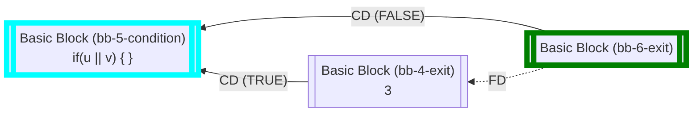

_This document was generated from '[src/documentation/print-cfg-wiki.ts](https://github.com/flowr-analysis/flowr/tree/main//src/documentation/print-cfg-wiki.ts)' on 2025-05-03, 20:00:58 UTC presenting an overview of flowR's control flow graph (v2.2.12, using R v4.4.3). Please do not edit this file/wiki page directly._

_flowR_ produces three main perspectives of the program: 1) a [normalized version of the AST](https://github.com/flowr-analysis/flowr/wiki/Normalized-AST)
and 2) a [dataflow graph](https://github.com/flowr-analysis/flowr/wiki/Dataflow%20Graph), and 3) a control flow graph (CFG).
flowR uses this CFG interweaved with its data flow analysis and for some of its queries (e.g., to link to the last call in a [Call-Context Query](https://github.com/flowr-analysis/flowr/wiki/Query-API)).

Please note that, mostly due to historical reasons, the [control dependencies](https://github.com/flowr-analysis/flowr/wiki/Dataflow%20Graph#control-dependencies) that are stored directly within the
DFG provide only a partial view of the CFG. While they provide you with information on the conditional execution of vertices, they do not encode the order of execution.
In contrast, the CFG describes a complete view of the program's control flow.


> [!TIP]
> If you want to investigate the Control Flow Graph,
> you can use the <span title="Description (Repl Command, starred version): Returns the URL to mermaid.live; Base Command: Get mermaid code for the control-flow graph of R code, start with 'file://' to indicate a file (aliases: :cfg*, :cf*)">`:controlflow*`</span> command in the REPL (see the [Interface wiki page](https://github.com/flowr-analysis/flowr/wiki/Interface) for more information).
> By default, this view does _not_ use basic blocks as, for example, R allows unconditional jumps to occur in spots where conventional languages would assume expressions (e.g., if-conditions).
> Yet, by using <span title="Description (Repl Command, starred version): Returns the URL to mermaid.live; Base Command: Get mermaid code for the control-flow graph with basic blocks, start with 'file://' to indicate a file (aliases: :cfgb*, :cfb*)">`:controlflowbb*`</span> you can inspect the CFG with basic blocks (although you have to keep in mind that now, there can be a value flow between basic blocks)


For readability, we structure this wiki page into various segments:

- [Initial Overview](#cfg-overview)
- [Structure of the Control Flow Graph](#cfg-structure)
	- [CFG Vertices](#cfg-structure-vertices)
	- [CFG Edges](#cfg-structure-edges)
- [Adding Basic Blocks](#cfg-basic-blocks)
- [Working with the CFG](#cfg-working)


<h2 id="cfg-overview">Initial Overview</h2>

For now, let's look at a CFG for a program without any branching:


```r
x <- 2 * 3 + 1
```


The corresponding CFG is a directed, labeled graph with three types of edges (control, flow, and call dependencies):


	
(The analysis required _7.9 ms_ (including the dataflow analysis, normalization, and parsing with the [r-shell](https://github.com/flowr-analysis/flowr/wiki/Engines) engine) within the generation environment.
We used the following simplification: `unique-cf-sets` .
	)


Every normalized node of the [normalized AST](https://github.com/flowr-analysis/flowr/wiki/Normalized-AST) that has any relevance to the
execution is added and automatically linked using its id (similarly to vertices of the [dataflow graph](https://github.com/flowr-analysis/flowr/wiki/Dataflow%20Graph)).
Expressions, such as `2 * 3` get an additional node with an artificial id that ends in `-exit` to mark whenever their calculation is over.

To gain a better understanding, let's have a look at a simple program with a single branching structure:


	
<details open>

<summary style="color:gray">R Code of the CFG</summary>

The analysis required _2.3 ms_ (including the dataflow analysis, normalization, and parsing with the [r-shell](https://github.com/flowr-analysis/flowr/wiki/Engines) engine) within the generation environment.
We used the following simplification: `unique-cf-sets` .
	


```r
if(u) 3 else 2
```


</details>


Here, you can see the `if` node followed by the condition (in this case merely `u`) that then splits into two branches for the two possible outcomes.
The `if` structure is terminated by the corresponding `-exit` node (see the [structure](#cfg-structure) section for more details).

For you to compare, the following shows the CFG of an `if` without an `else` branch:


	
<details>

<summary style="color:gray">R Code of the CFG</summary>

The analysis required _1.7 ms_ (including the dataflow analysis, normalization, and parsing with the [r-shell](https://github.com/flowr-analysis/flowr/wiki/Engines) engine) within the generation environment.
We used the following simplification: `unique-cf-sets` .
	


```r
if(u || v) 3
```


</details>


Activating the calculation of basic blocks produces the following:

```mermaid
flowchart RL
    subgraph nbb-5-condition [Block bb-5-condition]
        direction RL
    n5-condition[[5-condition]]
    n2-exit((2-exit))
    n5-condition -.-> n2-exit
    n1["`RSymbol (1)
#34;v#34;`"]
    n2-exit -.-> n1
    n0["`RSymbol (0)
#34;u#34;`"]
    n1 -.-> n0
    n2["`RBinaryOp (2)
#34;u || v#34;`"]
    n0 -.-> n2
    n5["`RIfThenElse (5)
#34;if(u || v) 3#34;`"]
    n2 -.-> n5
    n6["`RExpressionList (6)`"]
    n5 -.-> n6
    end
    subgraph nbb-4-exit [Block bb-4-exit]
        direction RL
    n4-exit((4-exit))
    n3["`RNumber (3)
#34;3#34;`"]
    n4-exit -.-> n3
    n4["`RExpressionList (4)
#34;3#34;`"]
    n3 -.-> n4
    end
    subgraph nbb-6-exit [Block bb-6-exit]
        direction RL
    n6-exit((6-exit))
    n5-exit((5-exit))
    n6-exit -.-> n5-exit
    end
    nbb-6-exit -.->|"FD"| nbb-4-exit
    nbb-6-exit -->|"CD (FALSE)"| nbb-5-condition
    nbb-4-exit -->|"CD (TRUE)"| nbb-5-condition
    style nbb-5-condition stroke:cyan,stroke-width:6.5px;    style nbb-6-exit stroke:green,stroke-width:6.5px;
```




	
<details>

<summary style="color:gray">R Code of the CFG</summary>

The analysis required _1.7 ms_ (including the dataflow analysis, normalization, and parsing with the [r-shell](https://github.com/flowr-analysis/flowr/wiki/Engines) engine) within the generation environment.
We used the following simplifications: `unique-cf-sets`, `to-basic-blocks` .
	


```r
if(u || v) 3
```


</details>


Which is probably much more readable if compacted:




	
<details>

<summary style="color:gray">R Code of the CFG</summary>

The analysis required _1.2 ms_ (including the dataflow analysis, normalization, and parsing with the [r-shell](https://github.com/flowr-analysis/flowr/wiki/Engines) engine) within the generation environment.
We used the following simplifications: `unique-cf-sets`, `to-basic-blocks`  and render a simplified/compacted version.
	


```r
if(u || v) 3
```


</details>


The control flow graph also harmonizes with function definitions, and calls:

```mermaid
flowchart RL
    n9(["`RExpressionList (9)`"])
    n0(["`RSymbol (0)
#34;f#34;`"])
    n5-params[[5-params]]
    n5-exit((5-exit))
    n5(["`RFunctionDefinition (5)
#34;function() #123; 3 #125;#34;`"])
    n4(["`RExpressionList (4)`"])
    n3(["`RNumber (3)
#34;3#34;`"])
    n4-exit((4-exit))
    n6(["`RBinaryOp (6)
#34;f #60;#45; function() #123; 3 #125;#34;`"])
    n6-exit((6-exit))
    n7(["`RSymbol (7)
#34;f()#34;`"])
    n8["`RFunctionCall (8)
#34;f()#34;
 calls:#91;5#93;`"]
    n8-name[[8-name]]
    n8-exit((8-exit))
    n8-resolved-call-exit((8-resolved-call-exit))
    n9-exit((9-exit))
    n6 -.->|"FD"| n9
    n3 -.->|"FD"| n4
    n4-exit -.->|"FD"| n3
    n5-params -.->|"FD"| n5
    n4 -.->|"FD"| n5-params
    n5-exit -.->|"FD"| n4-exit
    n5 -.->|"FD"| n0
    n0 -.->|"FD"| n6
    n6-exit -.->|"FD"| n5
    n8 -.->|"FD"| n6-exit
    n7 -.->|"FD"| n8
    n8-name -.->|"FD"| n7
    n8-exit -.->|"FD"| n8-name
    n8-resolved-call-exit -.->|"FD"| n8-exit
    n8-resolved-call-exit -.->|"FD"| n5-exit
    n9-exit -.->|"FD"| n8-resolved-call-exit
    style n9 stroke:cyan,stroke-width:6.5px;    style n9-exit stroke:green,stroke-width:6.5px;
```




	
<details open>

<summary style="color:gray">R Code of the CFG</summary>

The analysis required _2.4 ms_ (including the dataflow analysis, normalization, and parsing with the [r-shell](https://github.com/flowr-analysis/flowr/wiki/Engines) engine) within the generation environment.
We used the following simplification: `unique-cf-sets` .
	


```r
f <- function() { 3 }
f()
```


</details>


<h2 id="cfg-structure">Structure of the Control Flow Graph</h2>

You can produce your very own control flow graph with [<code><span title="Given a normalized AST this approximates the control flow graph of the program. This few is different from the computation of the dataflow graph and may differ, especially because it focuses on intra-procedural analysis.">extractCFG</span></code>](https://github.com/flowr-analysis/flowr/tree/main//src/control-flow/extract-cfg.ts#L84).
The [<code><span title="This class represents the control flow graph of an R program. The control flow may be hierarchical when confronted with function definitions (see CfgSimpleVertex and rootVertexIds() ).  There are two very simple visitors to traverse a CFG: - visitCfgInOrder visits the graph in the order of the vertices - visitCfgInReverseOrder visits the graph in reverse order  If you want to prohibit modification...">ControlFlowGraph</span></code>](https://github.com/flowr-analysis/flowr/tree/main//src/control-flow/control-flow-graph.ts#L133) class describes everything required to model the control flow graph, with its edge types described by
 [<code>CfgEdge</code>](https://github.com/flowr-analysis/flowr/tree/main//src/control-flow/control-flow-graph.ts#L107) and its vertices by [<code><span title="A vertex in the ControlFlowGraph .">CfgSimpleVertex</span></code>](https://github.com/flowr-analysis/flowr/tree/main//src/control-flow/control-flow-graph.ts#L81).
However, you should be aware of the [<code><span title="Summarizes the control information of a program">ControlFlowInformation</span></code>](https://github.com/flowr-analysis/flowr/tree/main//src/control-flow/control-flow-graph.ts#L323) interface which adds some additional information the the CFG
(and is used during the construction of the CFG as well):

 * **[ControlFlowInformation](https://github.com/flowr-analysis/flowr/tree/main//src/control-flow/control-flow-graph.ts#L323)**   
   Summarizes the control information of a program
   <details><summary style="color:gray">Defined at <a href="https://github.com/flowr-analysis/flowr/tree/main//src/control-flow/control-flow-graph.ts#L323">./src/control-flow/control-flow-graph.ts#L323</a></summary>
   
   
   ```ts
   /** Summarizes the control information of a program */
   export interface ControlFlowInformation<Vertex extends CfgSimpleVertex = CfgSimpleVertex> extends MergeableRecord {
       /** all active 'return'(-like) unconditional jumps */
       returns:     NodeId[],
       /** all active 'break'(-like) unconditional jumps */
       breaks:      NodeId[],
       /** all active 'next'(-like) unconditional jumps */
       nexts:       NodeId[],
       /** intended to construct a hammock graph, with 0 exit points representing a block that should not be part of the CFG (like a comment) */
       entryPoints: NodeId[],
       /** See {@link ControlFlowInformation#entryPoints|entryPoints} */
       exitPoints:  NodeId[],
       /** the control flow graph summarizing the flow information */
       graph:       ControlFlowGraph<Vertex>
   }
   ```
   
   
   </details>
   
    <details><summary style="">View more (MergeableRecord)</summary>

   * [MergeableRecord](https://github.com/flowr-analysis/flowr/tree/main//src/util/objects.ts#L11)   
   
     <details><summary style="color:gray">Defined at <a href="https://github.com/flowr-analysis/flowr/tree/main//src/util/objects.ts#L11">./src/util/objects.ts#L11</a></summary>
     
     
     ```ts
     export type MergeableRecord = Record<string, unknown>
     ```
     
     
     </details>
     

     * [string](https://github.com/flowr-analysis/flowr/tree/main//src/statistics/features/common-syntax-probability.ts#L29)   
     
       <details><summary style="color:gray">Defined at <a href="https://github.com/flowr-analysis/flowr/tree/main//src/statistics/features/common-syntax-probability.ts#L29">./src/statistics/features/common-syntax-probability.ts#L29</a></summary>
       
       
       ```ts
       string:       Record<string, Measurement>
       ```
       
       
       </details>
       
       * **[CommonSyntaxTypeCounts](https://github.com/flowr-analysis/flowr/tree/main//src/statistics/features/common-syntax-probability.ts#L12)**   
       
         <details><summary style="color:gray">Defined at <a href="https://github.com/flowr-analysis/flowr/tree/main//src/statistics/features/common-syntax-probability.ts#L12">./src/statistics/features/common-syntax-probability.ts#L12</a></summary>
         
         
         ```ts
         export interface CommonSyntaxTypeCounts<Measurement=bigint> {
             // just a helper to collect all as well (could be derived from sum)
             total:        Measurement,
             // counts whenever you pass more than one node that is not sensible for any other category
             multiple:     Measurement,
             // similar to multiple, but only counts empty (bodies etc.)
             empty:        Measurement,
             // in case of a = x etc.
             withArgument: Measurement,
             // arguments used without value
             noValue:      Measurement,
             // does include t and f, as well as NULL etc. (any special symbol)
             singleVar:    Record<string, Measurement>
             number:       Record<number, Measurement>
             // only explicit integers
             integer:      Record<number, Measurement>
             complex:      Record<number, Measurement>
             string:       Record<string, Measurement>
             logical:      Record<typeof RTrue | typeof RFalse, Measurement>,
             call:         Record<string, Measurement>,
             unnamedCall:  Measurement,
             // binop includes all assignments!
             binOp:        Record<string, Measurement>,
             unaryOp:      Record<string, Measurement>,
             // unknown content, records lexeme (can include break etc. for bodies), due to my oversight, this includes function definitions
             other:        Record<string, Measurement>
         }
         ```
         
         
         </details>
         
     * [unknown](https://github.com/flowr-analysis/flowr/tree/main//src/dataflow/graph/graph.ts#L386)   
     
       <details><summary style="color:gray">Defined at <a href="https://github.com/flowr-analysis/flowr/tree/main//src/dataflow/graph/graph.ts#L386">./src/dataflow/graph/graph.ts#L386</a></summary>
       
       
       ```ts
       unknown
       ```
       
       
       </details>
       

</details>
    

To check whether the CFG has the expected shape, you can use the test function [<code><span title="Assert that the given code produces the expected CFG">assertCfg</span></code>](https://github.com/flowr-analysis/flowr/tree/main//test/functionality/_helper/controlflow/assert-control-flow-graph.ts#L28) which supports testing for
 sub-graphs as well (it provides diffing capabilities similar to [<code><span title="Your best friend whenever you want to test whether the dataflow graph produced by flowR is as expected.  You may want to have a look at the DataflowTestConfiguration to see what you can configure. Especially the resolveIdsAsCriterion and the expectIsSubgraph are interesting as they allow you for rather flexible matching of the expected graph.">assertDataflow</span></code>](https://github.com/flowr-analysis/flowr/tree/main//test/functionality/_helper/shell.ts#L347)).
As the CFG may become unhandy for larger programs, there are simplifications available with [<code><span title="Simplify the control flow information by applying the given passes. This may reduce the vertex count, in- and outgoing edges, entry and exit points, etc.">simplifyControlFlowInformation</span></code>](https://github.com/flowr-analysis/flowr/tree/main//src/control-flow/cfg-simplification.ts#L26)
(these can be passed on to the [<code><span title="Given a normalized AST this approximates the control flow graph of the program. This few is different from the computation of the dataflow graph and may differ, especially because it focuses on intra-procedural analysis.">extractCFG</span></code>](https://github.com/flowr-analysis/flowr/tree/main//src/control-flow/extract-cfg.ts#L84) function as well).

<h3 id="cfg-structure-vertices">CFG Vertices</h3>

All vertex types are summarized in the [<code>CfgVertexType</code>](https://github.com/flowr-analysis/flowr/tree/main//src/control-flow/control-flow-graph.ts#L5) enum which currently contains the following types:

- `MidMarker` (mid)
- `EndMarker` (end)
- `Statement` (stm)
- `Expression` (expr)
- `Block` (blk)


<h3 id="cfg-structure-edges">CFG Edges</h3>


<h2 id="cfg-basic-blocks">Adding Basic Blocks</h2>

Foo bar

<h2 id="cfg-working">Working with the CFG</h2>


In general, it is probably best to use the <span title="Description (Repl Command, starred version): Returns the URL to mermaid.live; Base Command: Get mermaid code for the control-flow graph of R code, start with 'file://' to indicate a file (aliases: :cfg*, :cf*)">`:controlflow*`</span> command in the REPL to investigate the CFG interactively.
Have a look at the [<code><span title="Visit all nodes reachable from the start node in the control flow graph, traversing the dependencies but ignoring cycles.">visitCfgInReverseOrder</span></code>](https://github.com/flowr-analysis/flowr/tree/main//src/control-flow/simple-visitor.ts#L18) function for a generic CFG visitor.

TODO: document and link the origin function!


