_<span title="an overview of flowR's control flow graph">Generated</span> from '[wiki-cfg.ts](https://github.com/flowr-analysis/flowr/tree/main/src/documentation/wiki-cfg.ts "src/documentation/wiki-cfg.ts")' on 2026-08-23, 13:40:47 UTC (v2.14.3, R v4.6.1), please do not edit directly._


_flowR_ produces three main perspectives of the program: 1)&nbsp;a [normalized version of the AST](https://github.com/flowr-analysis/flowr/wiki/Normalized-AST), 
2)&nbsp;a [dataflow graph](https://github.com/flowr-analysis/flowr/wiki/Dataflow-Graph), and 3)&nbsp;a control flow graph&nbsp;(CFG).
flowR uses this CFG interweaved with its data flow analysis and for some of its queries (e.g., to link to the last call in a [Call-Context Query](https://github.com/flowr-analysis/flowr/wiki/%5BQuery%5D-Call-Context)).

Please note that the control flow graph is a view on the [dataflow graph](https://github.com/flowr-analysis/flowr/wiki/Dataflow-Graph),
similar to the [call graph](https://github.com/flowr-analysis/flowr/wiki/Dataflow-Graph#perspectives-cg).


> [!TIP]
> If you want to investigate the Control Flow Graph,
> you can use the <span title="Description (Repl Command, starred version): Returns the URL to mermaid.live; Base Command: Get mermaid code for the control-flow graph of R code (aliases: :cfg*, :cf*)">`:controlflow*`</span> command in the REPL (see the [Interface wiki page](https://github.com/flowr-analysis/flowr/wiki/Interface) for more information).
> By default, this view does _not_ use basic blocks as, for example, R allows unconditional jumps to occur in spots where conventional languages would assume expressions (e.g., if-conditions).
> Yet, by using <span title="Description (Repl Command, starred version): Returns the URL to mermaid.live; Base Command: Get mermaid code for the control-flow graph with basic blocks (aliases: :cfgb*, :cfb*)">`:controlflowbb*`</span> you can inspect the CFG with basic blocks (although you have to keep in mind that now, there can be a value flow between basic blocks)


For readability, we structure this wiki page into various segments:

- [Initial Overview](#cfg-overview)
- [Structure of the Control Flow Graph](#cfg-structure)
	- [CFG Vertices](#cfg-structure-vertices)
	- [CFG Edges](#cfg-structure-edges)
	- [Adding Basic Blocks](#cfg-basic-blocks)
- [Working with the CFG](#cfg-working)
	- [Simple Traversal](#cfg-simple-traversal)
	- [Diffing and Testing](#cfg-diff-and-test)
	- [Sophisticated CFG Traversal](#cfg-traversal)
	- [Working With Exit Points](#cfg-exit-points)


> [!TIP]
> FlowR provides you with various helper objects to work with the CFG, such as <a href="https://github.com/flowr-analysis/flowr/tree/main/src/control-flow/control-flow-graph.ts#L266"><code><span title="Helper object for CfgEdge - an edge in the ControlFlowGraph .">CfgEdge</span></code></a> and <a href="https://github.com/flowr-analysis/flowr/tree/main/src/control-flow/control-flow-graph.ts#L82"><code><span title="Helper object for CfgVertex - a vertex in the ControlFlowGraph .">CfgVertex</span></code></a>, 
> 		which you can use to easily access the properties of the CFG and its vertices and edges.


<h2 id="cfg-overview">Initial Overview</h2>

For now, let's look at a CFG for a program without any branching:


```r
x <- 2 * 3 + 1
```


The corresponding CFG is a directed, labeled graph with two kinds of edges: flow edges and control edges.


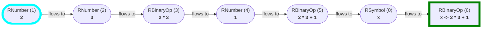
```mermaid
flowchart LR
    n1(["`RNumber (1)
**2**`"])
    n2(["`RNumber (2)
**3**`"])
    n3(["`RBinaryOp (3)
**2 #42; 3**`"])
    n4(["`RNumber (4)
**1**`"])
    n5(["`RBinaryOp (5)
**2 #42; 3 #43; 1**`"])
    n0(["`RSymbol (0)
**x**`"])
    n6["`RBinaryOp (6)
**x #60;#45; 2 #42; 3 #43; 1**`"]
    n3 -->|"flows to"| n4
    n1 -->|"flows to"| n2
    n2 -->|"flows to"| n3
    n5 -->|"flows to"| n0
    n4 -->|"flows to"| n5
    n0 -->|"flows to"| n6
    style n1 stroke:cyan,stroke-width:6.5px;    style n6 stroke:green,stroke-width:6.5px;
```

	
_(The analysis required _5.2 ms_ (including the dataflow analysis, normalization, and parsing with the [r-shell](https://github.com/flowr-analysis/flowr/wiki/Engines) engine) within the generation environment.
We used the following simplification: `unique-cf-sets` .
	)_


> [!IMPORTANT]
> Edges are in flow order: an edge from `a` to `b` means that `b` is evaluated after `a`. Use `outgoingEdges` (or `successors`) to ask what may run next and `ingoingEdges` (or `predecessors`) to ask what ran before. The [visitors](#cfg-working) can walk either way.


Every vertex of the [dataflow graph](https://github.com/flowr-analysis/flowr/wiki/Dataflow-Graph) is a vertex here as well, carrying the same id
and hence linking back to the [normalized AST](https://github.com/flowr-analysis/flowr/wiki/Normalized-AST).
The control flow is modeled in post-order, so an expression such as `2 * 3` is reached once both operands have been
evaluated: the `*` vertex itself is where the calculation is over, and no extra node is needed.

To gain a better understanding, let's have a look at a simple program with a single branching structure:


```mermaid
flowchart LR
    n0(["`RSymbol (0)
**u**`"])
    n1["`RNumber (1)
**3**`"]
    n3["`RNumber (3)
**2**`"]
    n5["`RIfThenElse (5)
**if(u) 3 else 2**`"]
    n0 -.->|"branch on u (0) if T"| n1
    n0 -.->|"branch on u (0) if F"| n3
    n1 -->|"flows to"| n5
    n3 -->|"flows to"| n5
    style n0 stroke:cyan,stroke-width:6.5px;    style n5 stroke:green,stroke-width:6.5px;
```

	
<details>

<summary style="color:gray">R Code of the CFG</summary>

The analysis required _4.3 ms_ (including the dataflow analysis, normalization, and parsing with the [r-shell](https://github.com/flowr-analysis/flowr/wiki/Engines) engine) within the generation environment.
We used the following simplification: `unique-cf-sets` .
	


```r
if(u) 3 else 2
```


</details>


The condition `u` runs first and splits into the two branches, which join again on the `if` vertex itself.
The `if` is therefore where the structure is left (see the [structure](#cfg-structure) section for more details).

Standing on `u`, the edges leaving it are control edges that name the `if`, so what a condition belongs to can be
read off locally. <a href="https://github.com/flowr-analysis/flowr/tree/main/src/control-flow/control-flow-graph.ts#L827"><code>ControlFlowGraph::<b>decides</b></code></a> lists the constructs a vertex decides,
and <a href="https://github.com/flowr-analysis/flowr/tree/main/src/control-flow/control-flow-graph.ts#L842"><code>ControlFlowGraph::<b>entryOf</b></code></a> goes the other way, from the `if` to the condition it starts with.

For you to compare, the following shows the CFG of an `if` without an `else` branch:


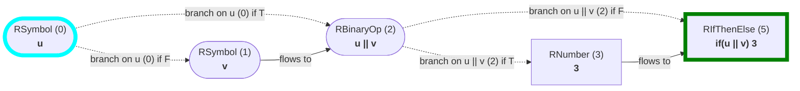
```mermaid
flowchart LR
    n0(["`RSymbol (0)
**u**`"])
    n1(["`RSymbol (1)
**v**`"])
    n2(["`RBinaryOp (2)
**u || v**`"])
    n3["`RNumber (3)
**3**`"]
    n5["`RIfThenElse (5)
**if(u || v) 3**`"]
    n2 -.->|"branch on u || v (2) if T"| n3
    n2 -.->|"branch on u || v (2) if F"| n5
    n0 -.->|"branch on u (0) if F"| n1
    n0 -.->|"branch on u (0) if T"| n2
    n1 -->|"flows to"| n2
    n3 -->|"flows to"| n5
    style n0 stroke:cyan,stroke-width:6.5px;    style n5 stroke:green,stroke-width:6.5px;
```

	
<details>

<summary style="color:gray">R Code of the CFG</summary>

The analysis required _4.8 ms_ (including the dataflow analysis, normalization, and parsing with the [r-shell](https://github.com/flowr-analysis/flowr/wiki/Engines) engine) within the generation environment.
We used the following simplification: `unique-cf-sets` .
	


```r
if(u || v) 3
```


</details>


The `||` branches as well, as it only evaluates `v` when `u` did not already decide the answer.

Basic blocks group what always runs together. A block ends where the flow may go more than one way, and starts
where more than one way may arrive:



```mermaid
flowchart LR
    subgraph nbb-1 [Block bb-1]
        direction LR
    n1(["`RNumber (1)
**1**`"])
    n0(["`RSymbol (0)
**x**`"])
    n1 --> n0
    n2["`RBinaryOp (2)
**x #60;#45; 1**`"]
    n0 --> n2
    n4(["`RSymbol (4)
**x**`"])
    n2 --> n4
    n5(["`RNumber (5)
**2**`"])
    n4 --> n5
    n6(["`RBinaryOp (6)
**x #43; 2**`"])
    n5 --> n6
    n3(["`RSymbol (3)
**y**`"])
    n6 --> n3
    n7["`RBinaryOp (7)
**y #60;#45; x #43; 2**`"]
    n3 --> n7
    n8(["`RSymbol (8)
**y**`"])
    n7 --> n8
    end
    subgraph nbb-10 [Block bb-10]
        direction LR
    n10(["`RSymbol (10)
**y**`"])
    n12["`RFunctionCall (12)
**print(y)**`"]
    n10 --> n12
    end
    subgraph nbb-14 [Block bb-14]
        direction LR
    n14["`RIfThenElse (14)
**if(y) print(y)**`"]
    end
    nbb-1 -.->|"branch on y (8) if T"| nbb-10
    nbb-1 -.->|"branch on y (8) if F"| nbb-14
    nbb-10 -->|"flows to"| nbb-14
    style nbb-1 stroke:cyan,stroke-width:6.5px;    style nbb-14 stroke:green,stroke-width:6.5px;
```

	
<details>

<summary style="color:gray">R Code of the CFG</summary>

The analysis required _3.8 ms_ (including the dataflow analysis, normalization, and parsing with the [r-shell](https://github.com/flowr-analysis/flowr/wiki/Engines) engine) within the generation environment.
We used the following simplifications: `unique-cf-sets`, `to-basic-blocks` .
	


```r
x <- 1
y <- x + 2
if(y) print(y)
```


</details>


Compacting them is easier to read (although the reconstructed code can be slightly misleading, as flowR tries its
best to make it syntactically correct and hence adds closing braces which are technically not part of the block):


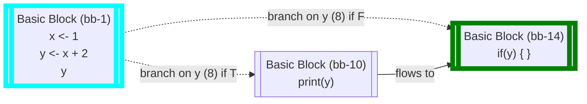
```mermaid
flowchart LR
    nbb-1[["`Basic Block (bb-1)
x #60;#45; 1
y #60;#45; x #43; 2
y`"]]
    nbb-10[["`Basic Block (bb-10)
print(y)`"]]
    nbb-14[["`Basic Block (bb-14)
if(y) #123; #125;`"]]
    nbb-1 -.->|"branch on y (8) if T"| nbb-10
    nbb-1 -.->|"branch on y (8) if F"| nbb-14
    nbb-10 -->|"flows to"| nbb-14
    style nbb-1 stroke:cyan,stroke-width:6.5px;    style nbb-14 stroke:green,stroke-width:6.5px;
```

	
<details>

<summary style="color:gray">R Code of the CFG</summary>

The analysis required _3.1 ms_ (including the dataflow analysis, normalization, and parsing with the [r-shell](https://github.com/flowr-analysis/flowr/wiki/Engines) engine) within the generation environment.
We used the following simplifications: `unique-cf-sets`, `to-basic-blocks`  and render a simplified/compacted version.
	


```r
x <- 1
y <- x + 2
if(y) print(y)
```


</details>


Branch-heavy code gains nothing from this: in `if(u || v) 3` every vertex may be reached or left in more than
one way, so every block holds a single vertex.

The control flow graph also harmonizes with function definitions, and calls:


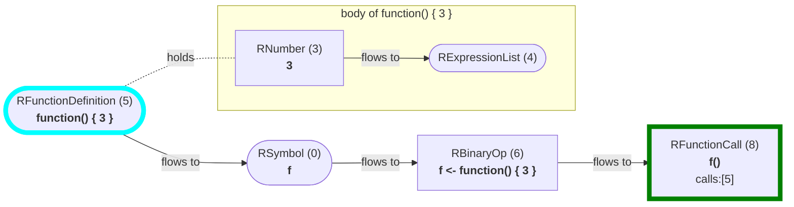
```mermaid
flowchart LR
    n5(["`RFunctionDefinition (5)
**function() #123; 3 #125;**`"])
    subgraph n5-body ["body of function() #123; 3 #125;"]
        direction LR
    n3["`RNumber (3)
**3**`"]
    n4(["`RExpressionList (4)`"])
    end
    n0(["`RSymbol (0)
**f**`"])
    n6["`RBinaryOp (6)
**f #60;#45; function() #123; 3 #125;**`"]
    n8["`RFunctionCall (8)
**f()**
 calls:#91;5#93;`"]
    n3 -->|"flows to"| n4
    n6 -->|"flows to"| n8
    n5 -->|"flows to"| n0
    n0 -->|"flows to"| n6
    n5 -. holds .- n3
    style n5 stroke:cyan,stroke-width:6.5px;    style n8 stroke:green,stroke-width:6.5px;
```

	
<details open>

<summary style="color:gray">R Code of the CFG</summary>

The analysis required _2.3 ms_ (including the dataflow analysis, normalization, and parsing with the [r-shell](https://github.com/flowr-analysis/flowr/wiki/Engines) engine) within the generation environment.
We used the following simplification: `unique-cf-sets` .
	


```r
f <- function() { 3 }
f()
```


</details>


<h2 id="cfg-structure">Structure of the Control Flow Graph</h2>

You can produce your very own control flow graph with <a href="https://github.com/flowr-analysis/flowr/tree/main/src/control-flow/control-flow-graph.ts#L1138"><code>extractCfg</code></a>.
The <a href="https://github.com/flowr-analysis/flowr/tree/main/src/control-flow/control-flow-graph.ts#L531"><code><span title="This class represents the control flow graph of an R program. The control flow may be hierarchical when confronted with function definitions (see CfgVertex and rootIds() ). Edges are in flow order: an edge from a to b means that b is evaluated after a. Reading them backwards (what leads into a vertex) goes through a reverse index built on the first such read. There are two very simple visitors to ...">ControlFlowGraph</span></code></a> class describes everything required to model the control flow graph, with its edge types described by
 <a href="https://github.com/flowr-analysis/flowr/tree/main/src/control-flow/control-flow-graph.ts#L261"><code><span title="An edge in the ControlFlowGraph .">CfgEdge</span></code></a> and its vertices by <a href="https://github.com/flowr-analysis/flowr/tree/main/src/control-flow/control-flow-graph.ts#L77"><code><span title="A vertex in the ControlFlowGraph . Please use the helper object (e.g. getType() ) to work with vertices instead of directly accessing the properties.">CfgVertex</span></code></a>.
However, you should be aware of the <a href="https://github.com/flowr-analysis/flowr/tree/main/src/control-flow/control-flow-graph.ts#L1012"><code><span title="Summarizes the control information of a program">ControlFlowInformation</span></code></a> interface which adds some additional information the CFG
(and is used during the construction of the CFG as well):

 * **[ControlFlowInformation](https://github.com/flowr-analysis/flowr/tree/main/src/control-flow/control-flow-graph.ts#L1012)**   
   Summarizes the control information of a program
   <details open><summary style="color:gray">Defined at <a href="https://github.com/flowr-analysis/flowr/tree/main/src/control-flow/control-flow-graph.ts#L1012">src/control-flow/control-flow-graph.ts#L1012</a></summary>
   
   
   ```ts
   /**
    * Summarizes the control information of a program
    * @see {@link emptyControlFlowInformation} - to create an empty control flow information object
    */
   export interface ControlFlowInformation<Vertex extends CfgVertex = CfgVertex> extends MergeableRecord {
       /** all active 'return'(-like) unconditional jumps */
       returns:     NodeId[],
       /** all active 'break'(-like) unconditional jumps */
       breaks:      NodeId[],
       /** all active 'next'(-like) unconditional jumps */
       nexts:       NodeId[],
       /** intended to construct a hammock graph, with 0 exit points representing a block that should not be part of the CFG (like a comment) */
       entryPoints: NodeId[],
       /** See {@link ControlFlowInformation#entryPoints|entryPoints} */
       exitPoints:  NodeId[],
       /** the control flow graph summarizing the flow information */
       graph:       ControlFlowGraph<Vertex>
   }
   ```
   
   
   </details>
   

To check whether the CFG has the expected shape, you can use the test function <a href="https://github.com/flowr-analysis/flowr/tree/main/test/functionality/_helper/controlflow/assert-control-flow-graph.ts#L34"><code><span title="Assert that the given code produces the expected CFG">assertCfg</span></code></a> which supports testing for
 sub-graphs as well (it provides diffing capabilities similar to <a href="https://github.com/flowr-analysis/flowr/tree/main/test/functionality/_helper/shell.ts#L385"><code><span title="Your best friend whenever you want to test whether the dataflow graph produced by flowR is as expected. You may want to have a look at the DataflowTestConfiguration to see what you can configure. Especially the resolveIdsAsCriterion and the expectIsSubgraph are interesting as they allow you for rather flexible matching of the expected graph. Pleas note, that if you pass context: 'call-graph' in th...">assertDataflow</span></code></a>).
As the CFG may become unhandy for larger programs, there are simplifications available with <a href="https://github.com/flowr-analysis/flowr/tree/main/src/control-flow/cfg-simplification.ts#L40"><code><span title="Simplify the control flow information by applying the given passes. This may reduce the vertex count, in- and outgoing edges, entry and exit points, etc.">simplifyControlFlowInformation</span></code></a>
(the [analyzer](https://github.com/flowr-analysis/flowr/wiki/Analyzer) applies the ones you ask for when you request the control flow).

<h3 id="cfg-structure-vertices">CFG Vertices</h3>

All vertex types are summarized in the <a href="https://github.com/flowr-analysis/flowr/tree/main/src/control-flow/control-flow-graph.ts#L22"><code><span title="The type of a vertex in the ControlFlowGraph . Please use the helper object (e.g. getType() ) to work with vertices instead of directly accessing the properties.">CfgVertexType</span></code></a> enum which currently contains the following types:

- `Statement` (1)
- `Expression` (2)
- `Block` (3)

We use the <a href="https://github.com/flowr-analysis/flowr/tree/main/src/control-flow/control-flow-graph.ts#L71"><code><span title="A basic block vertex in the ControlFlowGraph . Contains the vertices that are part of this block, only connected by FDs, vertices should never occur in multiple bbs.">CfgBasicBlockVertex</span></code></a> to represent [basic blocks](#cfg-basic-blocks) and separate
expressions (<a href="https://github.com/flowr-analysis/flowr/tree/main/src/control-flow/control-flow-graph.ts#L66"><code>CfgExpressionVertex</code></a>) and statements (<a href="https://github.com/flowr-analysis/flowr/tree/main/src/control-flow/control-flow-graph.ts#L62"><code>CfgStatementVertex</code></a>) 
as control flow units with and without side effects (if you want to, you can see view statements as effectful expressions).

Every vertex corresponds to a vertex of the [dataflow graph](https://github.com/flowr-analysis/flowr/wiki/Dataflow-Graph): the control flow
is modeled in post-order, so a vertex is reached once everything it is made of has been evaluated, which makes it the
point at which the construct is left. That is why there are no separate marker vertices to close an `if` or a loop.

In mermaid visualizations, we use rectangles for statements and rounded rectangles for expressions.
Blocks are visualized as boxes around the contained vertices.


> [!NOTE]
> Every CFG vertex has a <a href="https://github.com/flowr-analysis/flowr/tree/main/src/r-bridge/lang-4.x/ast/model/processing/node-id.ts#L14"><code><span title="The type of the id assigned to each node. Branded to avoid problematic usages with other string or numeric types. The default ids are numeric, but we use a branded type to avoid confusion with other numeric types. Custom ids or scoped ids can be strings, but they will be normalized to numbers if they are numeric strings.">NodeId</span></code></a> that links it to the [normalized AST](https://github.com/flowr-analysis/flowr/wiki/Normalized-AST) (although basic blocks will find no counterpart as they are a structuring element of the CFG).
> 	Additionally, it may provide information on the called functions (in case that the current element is a function call).
> 	Additionally, a function definition names the vertices of its body as children, which is the only way into that region.


<h3 id="cfg-structure-edges">CFG Edges</h3>

Every edge points the way execution goes: an edge from `a` to `b` means that `b` runs after `a`.
There are two kinds, told apart by the <a href="https://github.com/flowr-analysis/flowr/tree/main/src/control-flow/control-flow-graph.ts#L40"><code>CfgEdgeType</code></a> enum.

<h4 id="cfg-flow-edge">Flow Edges</h4>

A flow edge says that the target simply runs next. In `x; y` there is one from `x` to `y`:


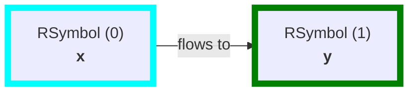
```mermaid
flowchart LR
    n0["`RSymbol (0)
**x**`"]
    n1["`RSymbol (1)
**y**`"]
    n0 -->|"flows to"| n1
    style n0 stroke:cyan,stroke-width:6.5px;    style n1 stroke:green,stroke-width:6.5px;
```

	
_(The analysis required _2.9 ms_ (including the dataflow analysis, normalization, and parsing with the [r-shell](https://github.com/flowr-analysis/flowr/wiki/Engines) engine) within the generation environment.
We used the following simplification: `unique-cf-sets` .
	)_


<h4 id="cfg-control-edge">Control Edges</h4>

A control edge says the same, but only when a condition holds, which is how the branches of an `if` or the
body of a loop are attached. Diagrams draw these dashed.

The edge *is* the <a href="https://github.com/flowr-analysis/flowr/tree/main/src/dataflow/info.ts#L22"><code><span title="A control dependency links a vertex to the control flow element which may have an influence on its execution. Within if(p) a else b, a and b have a control dependency on the if (which in turn decides based on p).">ControlDependency</span></code></a> it stands for, the same one the vertices behind it carry in
their `cds`, so it names the deciding vertex, whether it is the true or the false case, and whether the
decision comes from iterating a loop:

 * **[ControlDependency](https://github.com/flowr-analysis/flowr/tree/main/src/dataflow/info.ts#L22)**   
   A control dependency links a vertex to the control flow element which
   may have an influence on its execution.
   Within `if(p) a else b`, `a` and `b` have a control dependency on the `if` (which in turn decides based on `p`).
   <details open><summary style="color:gray">Defined at <a href="https://github.com/flowr-analysis/flowr/tree/main/src/dataflow/info.ts#L22">src/dataflow/info.ts#L22</a></summary>
   
   
   ```ts
   /**
    * A control dependency links a vertex to the control flow element which
    * may have an influence on its execution.
    * Within `if(p) a else b`, `a` and `b` have a control dependency on the `if` (which in turn decides based on `p`).
    * @see {@link happensInEveryBranch} - to check whether a list of control dependencies is exhaustive
    * @see {@link negateControlDependency} - to easily negate a control dependency
    */
   export interface ControlDependency {
       /** The id of the node that causes the control dependency to be active (e.g., the condition of an if) */
       readonly id:           NodeId,
       /** when does this control dependency trigger (if the condition is true or false)? */
       readonly when?:        boolean
       /** whether this control dependency was created due to iteration (e.g., a loop) */
       readonly byIteration?: boolean
       /**
        * any file-exist assumptions made
        */
       readonly file?:        string
   }
   ```
   
   
   </details>
   


<details><summary>Example: if-else</summary>


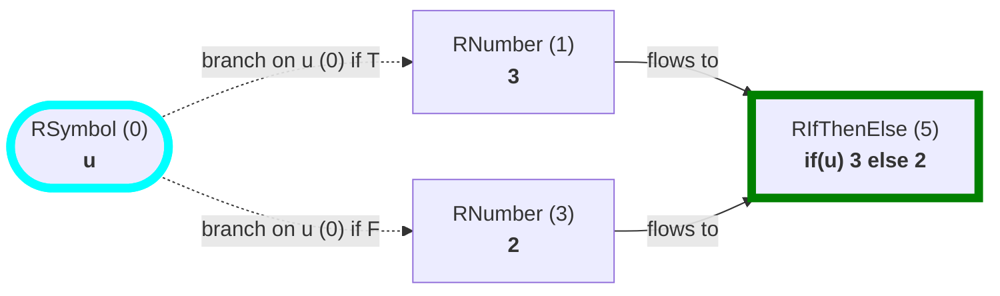
```mermaid
flowchart LR
    n0(["`RSymbol (0)
**u**`"])
    n1["`RNumber (1)
**3**`"]
    n3["`RNumber (3)
**2**`"]
    n5["`RIfThenElse (5)
**if(u) 3 else 2**`"]
    n0 -.->|"branch on u (0) if T"| n1
    n0 -.->|"branch on u (0) if F"| n3
    n1 -->|"flows to"| n5
    n3 -->|"flows to"| n5
    style n0 stroke:cyan,stroke-width:6.5px;    style n5 stroke:green,stroke-width:6.5px;
```

	
<details>

<summary style="color:gray">R Code of the CFG</summary>

The analysis required _2.0 ms_ (including the dataflow analysis, normalization, and parsing with the [r-shell](https://github.com/flowr-analysis/flowr/wiki/Engines) engine) within the generation environment.
We used the following simplification: `unique-cf-sets` .
	


```r
if(u) 3 else 2
```


</details>


</details>


<details><summary>Example: while-loop</summary>


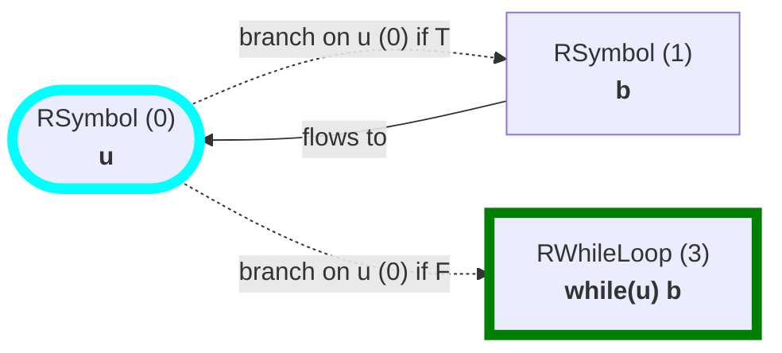
```mermaid
flowchart LR
    n0(["`RSymbol (0)
**u**`"])
    n1["`RSymbol (1)
**b**`"]
    n3["`RWhileLoop (3)
**while(u) b**`"]
    n0 -.->|"branch on u (0) if T"| n1
    n0 -.->|"branch on u (0) if F"| n3
    n1 -->|"flows to"| n0
    style n0 stroke:cyan,stroke-width:6.5px;    style n3 stroke:green,stroke-width:6.5px;
```

	
<details>

<summary style="color:gray">R Code of the CFG</summary>

The analysis required _1.9 ms_ (including the dataflow analysis, normalization, and parsing with the [r-shell](https://github.com/flowr-analysis/flowr/wiki/Engines) engine) within the generation environment.
We used the following simplification: `unique-cf-sets` .
	


```r
while(u) b
```


</details>


</details>
<br/>

Please note that repeat loops have no control edges, as they repeat their body unconditionally.
Additionally, the control flow graph does not have to be connected. If you use a repeat without any exit condition,
the loop is never left, so its vertex is not reachable from the entry:


<details><summary>Example: repeat-loop (infinite)</summary>


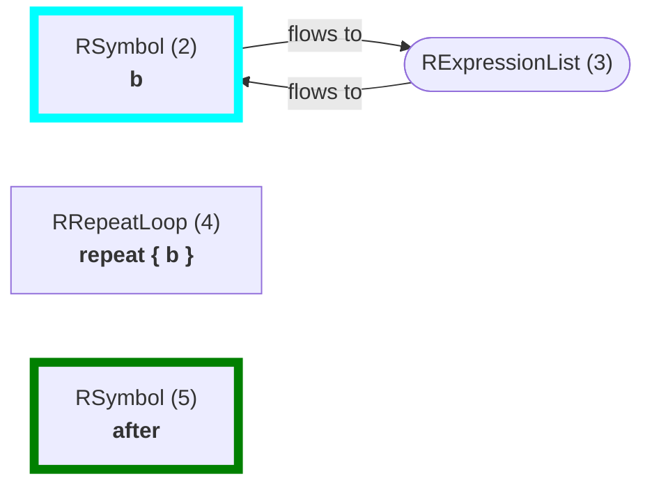
```mermaid
flowchart LR
    n2["`RSymbol (2)
**b**`"]
    n3(["`RExpressionList (3)`"])
    n4["`RRepeatLoop (4)
**repeat #123; b #125;**`"]
    n5["`RSymbol (5)
**after**`"]
    n3 -->|"flows to"| n2
    n2 -->|"flows to"| n3
    style n2 stroke:cyan,stroke-width:6.5px;    style n5 stroke:green,stroke-width:6.5px;
```

	
<details>

<summary style="color:gray">R Code of the CFG</summary>

The analysis required _2.3 ms_ (including the dataflow analysis, normalization, and parsing with the [r-shell](https://github.com/flowr-analysis/flowr/wiki/Engines) engine) within the generation environment.
We used the following simplification: `unique-cf-sets` .
	


```r
repeat { b }; after
```


</details>


</details>


<details><summary>Example: repeat-loop (with break)</summary>


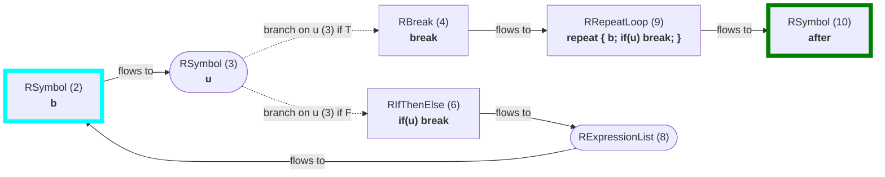
```mermaid
flowchart LR
    n2["`RSymbol (2)
**b**`"]
    n3(["`RSymbol (3)
**u**`"])
    n4["`RBreak (4)
**break**`"]
    n6["`RIfThenElse (6)
**if(u) break**`"]
    n8(["`RExpressionList (8)`"])
    n9["`RRepeatLoop (9)
**repeat #123; b; if(u) break; #125;**`"]
    n10["`RSymbol (10)
**after**`"]
    n4 -->|"flows to"| n9
    n6 -->|"flows to"| n8
    n3 -.->|"branch on u (3) if T"| n4
    n3 -.->|"branch on u (3) if F"| n6
    n2 -->|"flows to"| n3
    n8 -->|"flows to"| n2
    n9 -->|"flows to"| n10
    style n2 stroke:cyan,stroke-width:6.5px;    style n10 stroke:green,stroke-width:6.5px;
```

	
<details>

<summary style="color:gray">R Code of the CFG</summary>

The analysis required _2.5 ms_ (including the dataflow analysis, normalization, and parsing with the [r-shell](https://github.com/flowr-analysis/flowr/wiki/Engines) engine) within the generation environment.
We used the following simplification: `unique-cf-sets` .
	


```r
repeat { b; if(u) break; }; after
```


</details>


</details>
<br/>

For a for-loop, the control edge says whether the sequence still has values to iterate over.


<details><summary>Example: for-loop</summary>


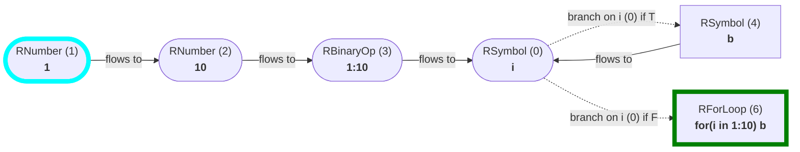
```mermaid
flowchart LR
    n0(["`RSymbol (0)
**i**`"])
    n1(["`RNumber (1)
**1**`"])
    n2(["`RNumber (2)
**10**`"])
    n3(["`RBinaryOp (3)
**1#58;10**`"])
    n4["`RSymbol (4)
**b**`"]
    n6["`RForLoop (6)
**for(i in 1#58;10) b**`"]
    n3 -->|"flows to"| n0
    n1 -->|"flows to"| n2
    n2 -->|"flows to"| n3
    n0 -.->|"branch on i (0) if T"| n4
    n0 -.->|"branch on i (0) if F"| n6
    n4 -->|"flows to"| n0
    style n1 stroke:cyan,stroke-width:6.5px;    style n6 stroke:green,stroke-width:6.5px;
```

	
<details>

<summary style="color:gray">R Code of the CFG</summary>

The analysis required _2.9 ms_ (including the dataflow analysis, normalization, and parsing with the [r-shell](https://github.com/flowr-analysis/flowr/wiki/Engines) engine) within the generation environment.
We used the following simplification: `unique-cf-sets` .
	


```r
for(i in 1:10) b
```


</details>


</details>

<h4 id="cfg-call-links">Extra: Call Links</h4>

The control flow graph is a view on the [dataflow graph](https://github.com/flowr-analysis/flowr/wiki/Dataflow-Graph): the dataflow analysis
records the control flow while it walks the program, and <a href="https://github.com/flowr-analysis/flowr/tree/main/src/control-flow/control-flow-graph.ts#L1138"><code>extractCfg</code></a> projects it into the shape the control
flow analyses expect. Because of that, the interprocedural knowledge the dataflow analysis gained is available without
a second pass over the program.

Control flow itself stays intra-procedural. A call does not flow into the body of what it calls, and the body of a
function definition is not entered when the definition is evaluated &dash; it only produces the closure. What a call
may reach is named separately:


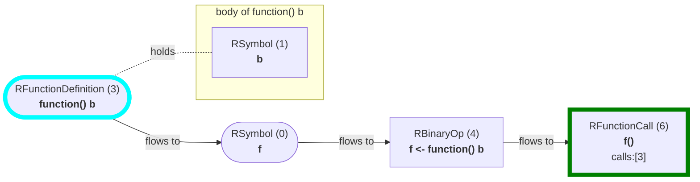
```mermaid
flowchart LR
    n3(["`RFunctionDefinition (3)
**function() b**`"])
    subgraph n3-body ["body of function() b"]
        direction LR
    n1["`RSymbol (1)
**b**`"]
    end
    n0(["`RSymbol (0)
**f**`"])
    n4["`RBinaryOp (4)
**f #60;#45; function() b**`"]
    n6["`RFunctionCall (6)
**f()**
 calls:#91;3#93;`"]
    n4 -->|"flows to"| n6
    n3 -->|"flows to"| n0
    n0 -->|"flows to"| n4
    n3 -. holds .- n1
    style n3 stroke:cyan,stroke-width:6.5px;    style n6 stroke:green,stroke-width:6.5px;
```

	
<details>

<summary style="color:gray">R Code of the CFG</summary>

The analysis required _2.7 ms_ (including the dataflow analysis, normalization, and parsing with the [r-shell](https://github.com/flowr-analysis/flowr/wiki/Engines) engine) within the generation environment.
We used the following simplification: `unique-cf-sets` .
	


```r
f <- function() b; f()
```


</details>


A _calls_ attribute attached to the function call vertex holds the <a href="https://github.com/flowr-analysis/flowr/tree/main/src/r-bridge/lang-4.x/ast/model/processing/node-id.ts#L14"><code><span title="The type of the id assigned to each node. Branded to avoid problematic usages with other string or numeric types. The default ids are numeric, but we use a branded type to avoid confusion with other numeric types. Custom ids or scoped ids can be strings, but they will be normalized to numbers if they are numeric strings.">NodeId</span></code></a> of the function definitions that
are called from this vertex, taken from the `calls` edges the dataflow analysis resolved.

For built-in functions that are provided by flowR's built-in configuration (see the [interface wiki page](https://github.com/flowr-analysis/flowr/wiki/Interface)) the CFG does not contain
the additional information directly:


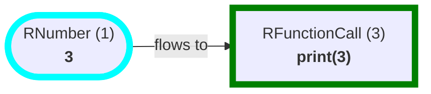
```mermaid
flowchart LR
    n1(["`RNumber (1)
**3**`"])
    n3["`RFunctionCall (3)
**print(3)**`"]
    n1 -->|"flows to"| n3
    style n1 stroke:cyan,stroke-width:6.5px;    style n3 stroke:green,stroke-width:6.5px;
```

	
<details>

<summary style="color:gray">R Code of the CFG</summary>

The analysis required _1.9 ms_ (including the dataflow analysis, normalization, and parsing with the [r-shell](https://github.com/flowr-analysis/flowr/wiki/Engines) engine) within the generation environment.
We used the following simplification: `unique-cf-sets` .
	


```r
print(3)
```


</details>


This is due to the fact that the [dataflow graph](https://github.com/flowr-analysis/flowr/wiki/Dataflow-Graph) does contain the required call information (and there are no new control vertices to add as the built-in call has no target in the source code):


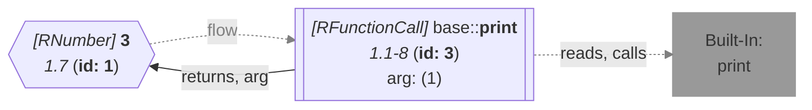
```mermaid
flowchart LR
    1{{"`*#91;RNumber#93;* **3**
      *1.7* (**id: 1**)`"}}
    3[["`*#91;RFunctionCall#93;* base#58;#58;**print**
      *1.1-8* (**id: 3**)
    arg: (1)`"]]
    built-in:print["`Built-In:
print`"]
    style built-in:print stroke:gray,fill:gray,stroke-width:2px,opacity:.8;
    1 -.->|"flow"| 3
    linkStyle 0 stroke:gray,color:gray;
    3 -->|"returns, arg"| 1
    3 -.->|"reads, calls"| built-in:print
    linkStyle 2 stroke:gray;
```

	
<details>

<summary style="color:gray">R Code of the Dataflow Graph</summary>

The analysis required _1.5 ms_ (including parse and normalize, using the [r-shell](https://github.com/flowr-analysis/flowr/wiki/Engines) engine) within the generation environment. No [signature database](https://github.com/flowr-analysis/flowr/wiki/Signature-Database) is mounted for these generated graphs, so `library()` calls attach no package exports; base-R names are still qualified via the generated base-package store (e.g. `acf` as `stats::acf`). 
We encountered unknown side effects (with ids: 3 (linked)) during the analysis.


```r
print(3)
```


</details>


<h3 id="cfg-basic-blocks">Adding Basic Blocks</h3>

As mentioned in the introduction, our control flow graph does not use basic blocks by default and hence simply links all vertices independent of whether they have (un-)conditional jumps or not.
On the upside, this tells us the execution order (and, in case of promises, forcing order) of involved expressions and seamlessly handles cases like
`x <- return(3)`.  On the downside, this makes it hard to apply classical control flow graph algorithms and, in general, makes the graph much harder to read.
Yet, we can request basic blocks or transform an existing CFG into basic blocks using the <a href="https://github.com/flowr-analysis/flowr/tree/main/src/control-flow/cfg-to-basic-blocks.ts#L22"><code><span title="Take a control flow information of a graph without any basic blocks and convert it to a graph with basic blocks.">convertCfgToBasicBlocks</span></code></a> function.

Any program without any (un-)conditional jumps now contains a single basic block:


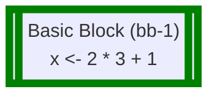
```mermaid
flowchart LR
    nbb-1[["`Basic Block (bb-1)
x #60;#45; 2 #42; 3 #43; 1`"]]
    style nbb-1 stroke:cyan,stroke-width:6.5px;    style nbb-1 stroke:green,stroke-width:6.5px;
```

	
<details open>

<summary style="color:gray">R Code of the CFG</summary>

The analysis required _1.8 ms_ (including the dataflow analysis, normalization, and parsing with the [r-shell](https://github.com/flowr-analysis/flowr/wiki/Engines) engine) within the generation environment.
We used the following simplifications: `unique-cf-sets`, `to-basic-blocks`  and render a simplified/compacted version.
	


```r
x <- 2 * 3 + 1
```


</details>


While the CFG without basic blocks is much bigger:


```mermaid
flowchart LR
    n1(["`RNumber (1)
**2**`"])
    n2(["`RNumber (2)
**3**`"])
    n3(["`RBinaryOp (3)
**2 #42; 3**`"])
    n4(["`RNumber (4)
**1**`"])
    n5(["`RBinaryOp (5)
**2 #42; 3 #43; 1**`"])
    n0(["`RSymbol (0)
**x**`"])
    n6["`RBinaryOp (6)
**x #60;#45; 2 #42; 3 #43; 1**`"]
    n3 -->|"flows to"| n4
    n1 -->|"flows to"| n2
    n2 -->|"flows to"| n3
    n5 -->|"flows to"| n0
    n4 -->|"flows to"| n5
    n0 -->|"flows to"| n6
    style n1 stroke:cyan,stroke-width:6.5px;    style n6 stroke:green,stroke-width:6.5px;
```

	
_(The analysis required _2.3 ms_ (including the dataflow analysis, normalization, and parsing with the [r-shell](https://github.com/flowr-analysis/flowr/wiki/Engines) engine) within the generation environment.
We used the following simplification: `unique-cf-sets` .
	)_


In a way, using the basic blocks perspective does not remove any of these vertices (we just usually visualize them compacted as their execution order should be "obvious").
The vertices are still there, as elems of the <a href="https://github.com/flowr-analysis/flowr/tree/main/src/control-flow/control-flow-graph.ts#L71"><code><span title="A basic block vertex in the ControlFlowGraph . Contains the vertices that are part of this block, only connected by FDs, vertices should never occur in multiple bbs.">CfgBasicBlockVertex</span></code></a>:


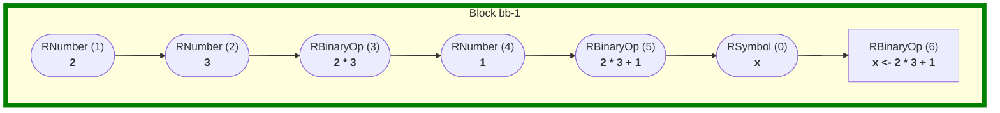
```mermaid
flowchart LR
    subgraph nbb-1 [Block bb-1]
        direction LR
    n1(["`RNumber (1)
**2**`"])
    n2(["`RNumber (2)
**3**`"])
    n1 --> n2
    n3(["`RBinaryOp (3)
**2 #42; 3**`"])
    n2 --> n3
    n4(["`RNumber (4)
**1**`"])
    n3 --> n4
    n5(["`RBinaryOp (5)
**2 #42; 3 #43; 1**`"])
    n4 --> n5
    n0(["`RSymbol (0)
**x**`"])
    n5 --> n0
    n6["`RBinaryOp (6)
**x #60;#45; 2 #42; 3 #43; 1**`"]
    n0 --> n6
    end
    style nbb-1 stroke:cyan,stroke-width:6.5px;    style nbb-1 stroke:green,stroke-width:6.5px;
```

	
_(The analysis required _2.7 ms_ (including the dataflow analysis, normalization, and parsing with the [r-shell](https://github.com/flowr-analysis/flowr/wiki/Engines) engine) within the generation environment.
We used the following simplifications: `unique-cf-sets`, `to-basic-blocks` .
	)_


The benefit (for comprehensibility and algorithms) becomes more apparent when we look at a more complicated program:


```r
f <- function(a, b = 3) {
 if(a > b) {
 	return(a * b);
 } else {
 	while(a < b) {
 		a <- a + 1;
 	}
 	return(a);
 }
}

print(f(21) + f(42))
```


With basic blocks, this code looks like this:


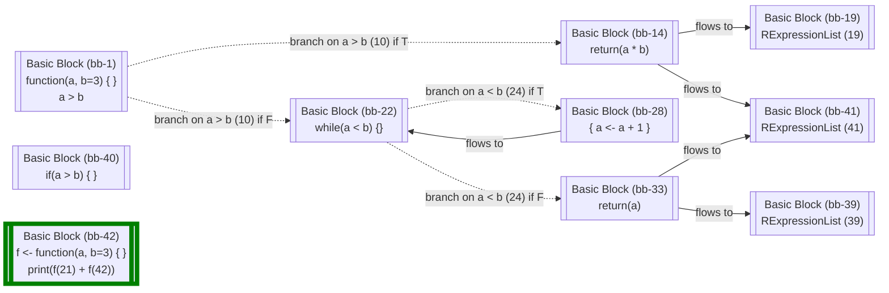
```mermaid
flowchart LR
    nbb-1[["`Basic Block (bb-1)
function(a, b=3) #123; #125;
a #62; b`"]]
    nbb-14[["`Basic Block (bb-14)
return(a #42; b)`"]]
    nbb-19[["`Basic Block (bb-19)
RExpressionList (19)`"]]
    nbb-22[["`Basic Block (bb-22)
while(a #60; b) #123;#125;`"]]
    nbb-28[["`Basic Block (bb-28)
#123; a #60;#45; a #43; 1 #125;`"]]
    nbb-33[["`Basic Block (bb-33)
return(a)`"]]
    nbb-39[["`Basic Block (bb-39)
RExpressionList (39)`"]]
    nbb-40[["`Basic Block (bb-40)
if(a #62; b) #123; #125;`"]]
    nbb-41[["`Basic Block (bb-41)
RExpressionList (41)`"]]
    nbb-42[["`Basic Block (bb-42)
f #60;#45; function(a, b=3) #123; #125;
print(f(21) #43; f(42))`"]]
    nbb-1 -.->|"branch on a #62; b (10) if T"| nbb-14
    nbb-1 -.->|"branch on a #62; b (10) if F"| nbb-22
    nbb-14 -->|"flows to"| nbb-19
    nbb-14 -->|"flows to"| nbb-41
    nbb-22 -.->|"branch on a #60; b (24) if T"| nbb-28
    nbb-22 -.->|"branch on a #60; b (24) if F"| nbb-33
    nbb-28 -->|"flows to"| nbb-22
    nbb-33 -->|"flows to"| nbb-39
    nbb-33 -->|"flows to"| nbb-41
    style nbb-42 stroke:cyan,stroke-width:6.5px;    style nbb-42 stroke:green,stroke-width:6.5px;
```

	
_(The analysis required _4.2 ms_ (including the dataflow analysis, normalization, and parsing with the [r-shell](https://github.com/flowr-analysis/flowr/wiki/Engines) engine) within the generation environment.
We used the following simplifications: `unique-cf-sets`, `to-basic-blocks`  and render a simplified/compacted version.
	)_


Now, without basic blocks, this is a different story...


<details><summary>The full CFG</summary>



```mermaid
flowchart LR
    n40["`RIfThenElse (40)
**if(a #62; b) #123; return(a #42; b); #125; else #123; while(a #60; b) #123; a #60;#45; a #43; 1; #125; return(a); #125;**`"]
    n42(["`RFunctionDefinition (42)
**function(a, b = 3) #123; if(a #62; b) #123; return(a #42; b); #125; else #123; while(a #60; b) #123; a #60;#45; a #43; 1; #125; return(a); #125; #125;**`"])
    subgraph n42-body ["body of function(a, b = 3) #123;
 if(a #62; b) #123;
 	retu..."]
        direction LR
    n1(["`RSymbol (1)
**a**`"])
    n4(["`RNumber (4)
**3**`"])
    n3(["`RSymbol (3)
**b**`"])
    n8(["`RSymbol (8)
**a**`"])
    n9(["`RSymbol (9)
**b**`"])
    n10(["`RBinaryOp (10)
**a #62; b**`"])
    n22(["`RSymbol (22)
**a**`"])
    n23(["`RSymbol (23)
**b**`"])
    n24(["`RBinaryOp (24)
**a #60; b**`"])
    n33["`RWhileLoop (33)
**while(a #60; b) #123; a #60;#45; a #43; 1; #125;**`"]
    n35(["`RSymbol (35)
**a**`"])
    n37["`RFunctionCall (37)
**return(a)**`"]
    n41(["`RExpressionList (41)`"])
    n39(["`RExpressionList (39)`"])
    n28(["`RSymbol (28)
**a**`"])
    n29(["`RNumber (29)
**1**`"])
    n30(["`RBinaryOp (30)
**a #43; 1**`"])
    n27(["`RSymbol (27)
**a**`"])
    n31["`RBinaryOp (31)
**a #60;#45; a #43; 1**`"]
    n32(["`RExpressionList (32)`"])
    n14(["`RSymbol (14)
**a**`"])
    n15(["`RSymbol (15)
**b**`"])
    n16(["`RBinaryOp (16)
**a #42; b**`"])
    n18["`RFunctionCall (18)
**return(a #42; b)**`"]
    n19(["`RExpressionList (19)`"])
    end
    n0(["`RSymbol (0)
**f**`"])
    n43["`RBinaryOp (43)
**f #60;#45; function(a, b = 3) #123; if(a #62; b) #123; return(a #42; b); #125; else #123; while(a #60; b) #123; a #60;#45; a #43; 1; #125; return(a); #125; #125;**`"]
    n46(["`RNumber (46)
**21**`"])
    n48(["`RFunctionCall (48)
**f(21)**
 calls:#91;42#93;`"])
    n50(["`RNumber (50)
**42**`"])
    n52(["`RFunctionCall (52)
**f(42)**
 calls:#91;42#93;`"])
    n53(["`RBinaryOp (53)
**f(21) #43; f(42)**`"])
    n55["`RFunctionCall (55)
**print(f(21) #43; f(42))**`"]
    n3 -->|"flows to"| n8
    n4 -->|"flows to"| n3
    n8 -->|"flows to"| n9
    n10 -.->|"branch on a #62; b (10) if T"| n14
    n10 -.->|"branch on a #62; b (10) if F"| n22
    n9 -->|"flows to"| n10
    n14 -->|"flows to"| n15
    n16 -->|"flows to"| n18
    n15 -->|"flows to"| n16
    n18 -->|"flows to"| n19
    n18 -->|"flows to"| n41
    n22 -->|"flows to"| n23
    n24 -.->|"branch on a #60; b (24) if T"| n28
    n24 -.->|"branch on a #60; b (24) if F"| n33
    n23 -->|"flows to"| n24
    n33 -->|"flows to"| n35
    n28 -->|"flows to"| n29
    n30 -->|"flows to"| n27
    n29 -->|"flows to"| n30
    n31 -->|"flows to"| n32
    n27 -->|"flows to"| n31
    n32 -->|"flows to"| n22
    n35 -->|"flows to"| n37
    n37 -->|"flows to"| n39
    n37 -->|"flows to"| n41
    n1 -->|"flows to"| n4
    n43 -->|"flows to"| n46
    n42 -->|"flows to"| n0
    n0 -->|"flows to"| n43
    n48 -->|"flows to"| n50
    n46 -->|"flows to"| n48
    n53 -->|"flows to"| n55
    n52 -->|"flows to"| n53
    n50 -->|"flows to"| n52
    n42 -. holds .- n1
    style n42 stroke:cyan,stroke-width:6.5px;    style n55 stroke:green,stroke-width:6.5px;
```

	
_(The analysis required _4.6 ms_ (including the dataflow analysis, normalization, and parsing with the [r-shell](https://github.com/flowr-analysis/flowr/wiki/Engines) engine) within the generation environment.
We used the following simplification: `unique-cf-sets` .
	)_


</details>

And again it should be noted that even though the example code is more complicated, this is still far from the average real-world script.

<h2 id="cfg-working">Working with the CFG</h2>

There is a plethora of functions that you can use the traverse the [normalized AST](https://github.com/flowr-analysis/flowr/wiki/Normalized-AST) and the [dataflow graph](https://github.com/flowr-analysis/flowr/wiki/Dataflow-Graph).
Similarly, flowR provides you with a set of utility functions and classes that you can use to interact with the control flow graph:

* <a href="https://github.com/flowr-analysis/flowr/tree/main/src/control-flow/simple-visitor.ts#L57"><code><span title="Visit all nodes reachable from the start node in the control flow graph, traversing the dependencies in execution order but ignoring cycles.">visitCfgInOrder</span></code></a> and <a href="https://github.com/flowr-analysis/flowr/tree/main/src/control-flow/simple-visitor.ts#L17"><code><span title="Visit all nodes reachable from the start node in the control flow graph, traversing the dependencies but ignoring cycles.">visitCfgInReverseOrder</span></code></a> for simple traversals
* <a href="https://github.com/flowr-analysis/flowr/tree/main/src/control-flow/basic-cfg-guided-visitor.ts#L25"><code><span title="In contrast to visitCfgInOrder and visitCfgInReverseOrder , this visitor is not a simple visitor and serves as the basis for a variety of more complicated visiting orders of the control flow graph. It includes features to provide additional information using the NormalizedAst and the DataflowGraph . Use BasicCfgGuidedVisitor#start to start the traversal.">BasicCfgGuidedVisitor</span></code></a>, <a href="https://github.com/flowr-analysis/flowr/tree/main/src/control-flow/syntax-cfg-guided-visitor.ts#L53"><code><span title="This visitor extends on the BasicCfgGuidedVisitor by dispatching visitors based on the AST type of the node. Use BasicCfgGuidedVisitor#start to start the traversal.">SyntaxAwareCfgGuidedVisitor</span></code></a>, <a href="https://github.com/flowr-analysis/flowr/tree/main/src/control-flow/dfg-cfg-guided-visitor.ts#L48"><code><span title="This visitor extends on the BasicCfgGuidedVisitor by dispatching visitors based on the dataflow graph. Use BasicCfgGuidedVisitor#start to start the traversal.">DataflowAwareCfgGuidedVisitor</span></code></a>, and <a href="https://github.com/flowr-analysis/flowr/tree/main/src/control-flow/semantic-cfg-guided-visitor.ts#L75"><code><span title="This visitor extends on the DataflowAwareCfgGuidedVisitor by dispatching visitors for separate function calls as well, providing more information! In a way, this is the mixin of syntactic and dataflow guided visitation. Overwrite the functions starting with on to implement your logic. In general, there is just one special case that you need to be aware of: In the context of a function call, flowR ...">SemanticCfgGuidedVisitor</span></code></a> for more sophisticated traversals
* <a href="https://github.com/flowr-analysis/flowr/tree/main/src/control-flow/control-flow-graph.ts#L266"><code><span title="Helper object for CfgEdge - an edge in the ControlFlowGraph .">CfgEdge</span></code></a> and <a href="https://github.com/flowr-analysis/flowr/tree/main/src/control-flow/control-flow-graph.ts#L82"><code><span title="Helper object for CfgVertex - a vertex in the ControlFlowGraph .">CfgVertex</span></code></a> for easy access to the properties of the CFG and its vertices and edges
* <a href="https://github.com/flowr-analysis/flowr/tree/main/src/control-flow/cfg-properties.ts#L108"><code><span title="Check if the given CFG satisfies all properties.">assertCfgSatisfiesProperties</span></code></a> and <a href="https://github.com/flowr-analysis/flowr/tree/main/src/control-flow/cfg-properties.ts#L10"><code><span title="The collection of properties that can be checked on a control flow graph.">CfgProperties</span></code></a> to check for properties of the CFG
* <a href="https://github.com/flowr-analysis/flowr/tree/main/src/control-flow/diff-cfg.ts#L13"><code><span title="Compare two control flow graphs and return a report on the differences. If you simply want to check whether they equal, use <result>.isEqual() .">diffOfControlFlowGraphs</span></code></a> to diff two CFGs

<h3 id="cfg-simple-traversal">Simple Traversal</h3>

If you are just interested in traversing the vertices within the cfg, two simple functions
<a href="https://github.com/flowr-analysis/flowr/tree/main/src/control-flow/simple-visitor.ts#L57"><code><span title="Visit all nodes reachable from the start node in the control flow graph, traversing the dependencies in execution order but ignoring cycles.">visitCfgInOrder</span></code></a> and <a href="https://github.com/flowr-analysis/flowr/tree/main/src/control-flow/simple-visitor.ts#L17"><code><span title="Visit all nodes reachable from the start node in the control flow graph, traversing the dependencies but ignoring cycles.">visitCfgInReverseOrder</span></code></a> are available. For [basic blocks](#cfg-basic-blocks)
these will automatically traverse the elements contained within the blocks (in the respective order).
For example, the following function will return all numbers contained within the CFG:


```ts
function sampleCollectNumbers(cfg: ControlFlowInformation, ast: NormalizedAst): RNumberValue[] {
	const numbers: RNumberValue[] = [];
	visitCfgInOrder(cfg.graph, cfg.entryPoints, id => {
		/* obtain the corresponding node from the AST */
		const node = ast.idMap.get(id);
		/* if it is present and a number, add the parsed value to the list */
		if(RNumber.is(node)) {
			numbers.push(node.content);
		}
	});
	return numbers;
}
```

<i>Defined at <a href="https://github.com/flowr-analysis/flowr/tree/main/src/documentation/wiki-cfg.ts#L54">src/documentation/wiki-cfg.ts#L54</a></i>


Calling it with the CFG and AST of the expression `x - 1 + 2L * 3` yields the following elements (in this order):


- `{"num":1,"complexNumber":false,"markedAsInt":false}`
- `{"num":2,"complexNumber":false,"markedAsInt":true}`
- `{"num":3,"complexNumber":false,"markedAsInt":false}`

A more useful appearance of these visitors occurs with <a href="https://github.com/flowr-analysis/flowr/tree/main/src/control-flow/happens-before.ts#L8"><code><span title="Determines if node a happens before node b in the control flow graph.">happensBefore</span></code></a> which uses the CFG to determine whether the execution
of one vertex always, maybe, or never happens before another vertex (see the corresponding [query documentation](https://github.com/flowr-analysis/flowr/wiki/%5BQuery%5D-Happens-Before) for more information).


<h3 id="cfg-diff-and-test">Diffing and Testing</h3>

As mentioned above, you can use the test function <a href="https://github.com/flowr-analysis/flowr/tree/main/test/functionality/_helper/controlflow/assert-control-flow-graph.ts#L34"><code><span title="Assert that the given code produces the expected CFG">assertCfg</span></code></a> to check whether the control flow graph has the desired shape.
The function supports testing for sub-graphs as well (it provides diffing capabilities similar to <a href="https://github.com/flowr-analysis/flowr/tree/main/test/functionality/_helper/shell.ts#L385"><code><span title="Your best friend whenever you want to test whether the dataflow graph produced by flowR is as expected. You may want to have a look at the DataflowTestConfiguration to see what you can configure. Especially the resolveIdsAsCriterion and the expectIsSubgraph are interesting as they allow you for rather flexible matching of the expected graph. Pleas note, that if you pass context: 'call-graph' in th...">assertDataflow</span></code></a>).
If you want to diff two control flow graphs, you can use the <a href="https://github.com/flowr-analysis/flowr/tree/main/src/control-flow/diff-cfg.ts#L13"><code><span title="Compare two control flow graphs and return a report on the differences. If you simply want to check whether they equal, use <result>.isEqual() .">diffOfControlFlowGraphs</span></code></a> function.

<h4 id="cfg-check-properties">Checking Properties</h4>

To be a valid representation of the program, the CFG should satisfy a collection of properties that, in turn, you can automatically assume to hold
when working with it. In general, we verify these in every unit test using <a href="https://github.com/flowr-analysis/flowr/tree/main/src/control-flow/cfg-properties.ts#L108"><code><span title="Check if the given CFG satisfies all properties.">assertCfgSatisfiesProperties</span></code></a>,
and you can have a look at the active properties by checking the <a href="https://github.com/flowr-analysis/flowr/tree/main/src/control-flow/cfg-properties.ts#L10"><code><span title="The collection of properties that can be checked on a control flow graph.">CfgProperties</span></code></a> object.
In general, we check for a hammock graph (given that the program contains no definite infinite loop) and the absence of direct cycles.

<h3 id="cfg-traversal">Sophisticated CFG Traversal</h3>

The [simple traversal](#cfg-simple-traversal) functions are great for simple tasks, but very unhandy when you want to do something more sophisticated
that incorporates language semantics such as function calls. Hence, we provide a series of incrementally more sophisticated (but complex)
visitors that incorporate various alternative perspectives:

- [Basic CFG Visitor](#cfg-traversal-basic):\
  As a class-based version of the [simple traversal](#cfg-traversal-basic) functions
- [Syntax-Aware CFG Visitor](#cfg-traversal-syntax):\
  If you want directly incorporate the type of the respective vertex in the [normalized AST](https://github.com/flowr-analysis/flowr/wiki/Normalized-AST) into your visitor
- [Dataflow-Aware CFG Visitor](#cfg-traversal-dfg):\
  If you require the [dataflow information](https://github.com/flowr-analysis/flowr/wiki/Dataflow-Graph) as well (e.g., to track built-in function calls, ...)
- [Semantic CFG Visitor](#cfg-traversal-semantic):\
  Currently the most advanced visitor that combines syntactic with dataflow information.

The later ones need the dataflow graph and the ast as well. As the CFG is a view on the dataflow graph, and that
graph knows the ast, <a href="https://github.com/flowr-analysis/flowr/tree/main/src/control-flow/dfg-cfg-guided-visitor.ts#L34"><code><span title="Fill in what a cfg-guided visitor can take from the control flow view itself: the dataflow graph it views, and the ast that graph knows. Pass either yourself to use a different one.">cfgVisitorConfig</span></code></a> takes both from the control flow you hand it:


```ts
new MyVisitor(cfgVisitorConfig({ controlFlow, defaultVisitingOrder: 'forward' }))
```


<h4 id="cfg-traversal-basic">Basic CFG Visitor</h4>

The <a href="https://github.com/flowr-analysis/flowr/tree/main/src/control-flow/basic-cfg-guided-visitor.ts#L25"><code><span title="In contrast to visitCfgInOrder and visitCfgInReverseOrder , this visitor is not a simple visitor and serves as the basis for a variety of more complicated visiting orders of the control flow graph. It includes features to provide additional information using the NormalizedAst and the DataflowGraph . Use BasicCfgGuidedVisitor#start to start the traversal.">BasicCfgGuidedVisitor</span></code></a> class essential provides the same functionality as the [simple traversal](#cfg-simple-traversal) functions but in a class-based version.
Using it, you can select whether you want to traverse the CFG in order or in reverse order.

To replicate the number collector from above, you can use the following code:


```ts
class CollectNumbersVisitor extends BasicCfgGuidedVisitor {
	private numbers: RNumberValue[] = [];
	private ast:     NormalizedAst;

	constructor(controlFlow: ControlFlowInformation, ast: NormalizedAst) {
		super({ controlFlow, defaultVisitingOrder: 'forward' });
		this.ast = ast;
	}

	protected override onVisitNode(node: NodeId): void {
		const astNode = this.ast.idMap.get(node);
		if(RNumber.is(astNode)) {
			this.numbers.push(astNode.content);
		}
		super.onVisitNode(node);
	}

	public getNumbers(): RNumberValue[] {
		return this.numbers;
	}
}
```

<i>Defined at <a href="https://github.com/flowr-analysis/flowr/tree/main/src/documentation/wiki-cfg.ts#L67">src/documentation/wiki-cfg.ts#L67</a></i>


Instead of directly calling <a href="https://github.com/flowr-analysis/flowr/tree/main/src/control-flow/simple-visitor.ts#L57"><code><span title="Visit all nodes reachable from the start node in the control flow graph, traversing the dependencies in execution order but ignoring cycles.">visitCfgInOrder</span></code></a> we pass the `forward` visiting order to the constructor of the visitor.
Executing it with the CFG and AST of the expression `x - 1 + 2L * 3`, causes the following numbers to be collected:


- `{"num":1,"complexNumber":false,"markedAsInt":false}`
- `{"num":2,"complexNumber":false,"markedAsInt":true}`
- `{"num":3,"complexNumber":false,"markedAsInt":false}`


<h4 id="cfg-traversal-syntax">Syntax-Aware CFG Visitor</h4>

The <a href="https://github.com/flowr-analysis/flowr/tree/main/src/control-flow/syntax-cfg-guided-visitor.ts#L53"><code><span title="This visitor extends on the BasicCfgGuidedVisitor by dispatching visitors based on the AST type of the node. Use BasicCfgGuidedVisitor#start to start the traversal.">SyntaxAwareCfgGuidedVisitor</span></code></a> class incorporates knowledge of the [normalized AST](https://github.com/flowr-analysis/flowr/wiki/Normalized-AST) into the CFG traversal and
directly provides specialized visitors for the various node types.
Now, our running example of collecting all numbers simplifies to this:


```ts
class CollectNumbersSyntaxVisitor extends SyntaxAwareCfgGuidedVisitor {
	private numbers: RNumberValue[] = [];

	constructor(controlFlow: ControlFlowInformation, normalizedAst: NormalizedAst) {
		super({ controlFlow, normalizedAst, defaultVisitingOrder: 'forward' });
	}

	protected override visitRNumber(node: RNumber<ParentInformation>): void {
		this.numbers.push(node.content);
	}

	public getNumbers(): RNumberValue[] {
		return this.numbers;
	}
}
```

<i>Defined at <a href="https://github.com/flowr-analysis/flowr/tree/main/src/documentation/wiki-cfg.ts#L89">src/documentation/wiki-cfg.ts#L89</a></i>


And again, executing it with the CFG and AST of the expression `x - 1 + 2L * 3`, causes the following numbers to be collected:


- `{"num":1,"complexNumber":false,"markedAsInt":false}`
- `{"num":2,"complexNumber":false,"markedAsInt":true}`
- `{"num":3,"complexNumber":false,"markedAsInt":false}`

<h4 id="cfg-traversal-dfg">Dataflow-Aware CFG Visitor</h4>

There is a lot of benefit in incorporating the [dataflow information](https://github.com/flowr-analysis/flowr/wiki/Dataflow-Graph) into the CFG traversal, as it contains
information about overwritten function calls, definition targets, and so on.
Our best friend is the <a href="https://github.com/flowr-analysis/flowr/tree/main/src/dataflow/origin/dfg-get-origin.ts#L97"><code><span title="Obtain the (dataflow) origin of a given node in the dfg.">getOriginInDfg</span></code></a> function which provides the important information about the origin of a vertex in the dataflow graph.
The <a href="https://github.com/flowr-analysis/flowr/tree/main/src/control-flow/dfg-cfg-guided-visitor.ts#L48"><code><span title="This visitor extends on the BasicCfgGuidedVisitor by dispatching visitors based on the dataflow graph. Use BasicCfgGuidedVisitor#start to start the traversal.">DataflowAwareCfgGuidedVisitor</span></code></a> class does some of the basic lifting for us.
While it is not ideal for our goal of collecting all numbers, it shines in other areas such as collecting all used variables,&nbsp;...


```ts
class CollectNumbersDataflowVisitor extends DataflowAwareCfgGuidedVisitor {
	private numbers: RNumberValue[] = [];

	protected override visitValue(node: DataflowGraphVertexValue): void {
		const astNode = this.config.dfg.idMap?.get(node.id);
		if(RNumber.is(astNode)) {
			this.numbers.push(astNode.content);
		}
	}

	public getNumbers(): RNumberValue[] {
		return this.numbers;
	}
}
```

<i>Defined at <a href="https://github.com/flowr-analysis/flowr/tree/main/src/documentation/wiki-cfg.ts#L105">src/documentation/wiki-cfg.ts#L105</a></i>


Again, executing it with the CFG and Dataflow of the expression `x - 1 + 2L * 3`, causes the following numbers to be collected:


- `{"num":1,"complexNumber":false,"markedAsInt":false}`
- `{"num":2,"complexNumber":false,"markedAsInt":true}`
- `{"num":3,"complexNumber":false,"markedAsInt":false}`

<h4 id="cfg-traversal-semantic">Semantic CFG Visitor</h4>

The <a href="https://github.com/flowr-analysis/flowr/tree/main/src/control-flow/semantic-cfg-guided-visitor.ts#L75"><code><span title="This visitor extends on the DataflowAwareCfgGuidedVisitor by dispatching visitors for separate function calls as well, providing more information! In a way, this is the mixin of syntactic and dataflow guided visitation. Overwrite the functions starting with on to implement your logic. In general, there is just one special case that you need to be aware of: In the context of a function call, flowR ...">SemanticCfgGuidedVisitor</span></code></a> class is flowR's most advanced visitor that combines the syntactic and dataflow information.
The main idea is simple, it provides special handlers for assignments, conditionals, and other R semantics but still follows
the structure of the CFG.


> [!NOTE]
> This visitor is still in the design phase so please open up a [new issue](https://github.com/flowr-analysis/flowr/issues/new/choose) if you have any suggestions or find any bugs.


To explore what it is capable of, let's create a visitor that prints all values that are used in assignments:


```ts
class CollectSourcesSemanticVisitor extends SemanticCfgGuidedVisitor {
	private sources: string[] = [];

	protected override onAssignmentCall({ source }: { source?: NodeId }): void {
		if(source) {
			this.sources.push(RNode.lexeme(this.getNormalizedAst(source)) ?? '??');
		}
	}

	public getSources(): string[] {
		return this.sources;
	}
}
```

<i>Defined at <a href="https://github.com/flowr-analysis/flowr/tree/main/src/documentation/wiki-cfg.ts#L120">src/documentation/wiki-cfg.ts#L120</a></i>


Executing it with the CFG and Dataflow of the expression `x <- 2; 3 -> x; assign("x", 42 + 21)`, causes the following values&nbsp;(/lexemes) to be collected:


- `2`
- `3`
- `42 + 21`

All in all, this visitor offers the following semantic events:

- <a href="https://github.com/flowr-analysis/flowr/tree/main/src/control-flow/semantic-cfg-guided-visitor.ts#L94"><code><span title="The logical the call's only argument resolves to, undefined if the call does not take exactly one argument or if that argument does not resolve to a single logical.">SemanticCfgGuidedVisitor::<b>getBoolArgValue</b></span></code></a>\
  The logical the call's only argument resolves to, `undefined` if the call does not take exactly one
  argument or if that argument does not resolve to a single logical.

- <a href="https://github.com/flowr-analysis/flowr/tree/main/src/control-flow/semantic-cfg-guided-visitor.ts#L86"><code><span title="A helper function to get the normalized AST node for the given id or fail if it does not exist.">SemanticCfgGuidedVisitor::<b>getNormalizedAst</b></span></code></a>\
  A helper function to get the normalized AST node for the given id or fail if it does not exist.

- <a href="https://github.com/flowr-analysis/flowr/tree/main/src/control-flow/semantic-cfg-guided-visitor.ts#L354"><code><span title="A helper function to request the origins of the given node.">SemanticCfgGuidedVisitor::<b>getOrigins</b></span></code></a>\
  A helper function to request the
  <code>origins</code>
  of the given node.

- <a href="https://github.com/flowr-analysis/flowr/tree/main/src/control-flow/semantic-cfg-guided-visitor.ts#L748"><code>SemanticCfgGuidedVisitor::<b>getSourceAndTarget</b></code></a>\
  

- <a href="https://github.com/flowr-analysis/flowr/tree/main/src/control-flow/semantic-cfg-guided-visitor.ts#L499"><code><span title="This event triggers for every subsetting call, i.e., for every call to [[, [, or $.">SemanticCfgGuidedVisitor::<b>onAccessCall</b></span></code></a>\
  This event triggers for every subsetting call, i.e., for every call to `[[`, `[`, or `$`.

- <a href="https://github.com/flowr-analysis/flowr/tree/main/src/control-flow/semantic-cfg-guided-visitor.ts#L471"><code><span title="This event triggers for every call to any of the *apply functions. For example, lapply in lapply(1:10, function(x) { x + 1 }). More specifically, this relates to the corresponding BuiltInProcessorMapper handler.">SemanticCfgGuidedVisitor::<b>onApplyFunctionCall</b></span></code></a>\
  This event triggers for every call to any of the `*apply` functions.
  For example, `lapply` in `lapply(1:10, function(x) { x + 1 })`.
  More specifically, this relates to the corresponding
  <code>BuiltInProcessorMapper</code>
  handler.

- <a href="https://github.com/flowr-analysis/flowr/tree/main/src/control-flow/semantic-cfg-guided-visitor.ts#L545"><code><span title="This event triggers for every assignment call, i.e., for every call to <- or = that assigns a value to a variable. For example, this triggers for <- in x <- 42 or assign in assign('x', 42). This also triggers for the data.table assign := active within subsetting calls, e.g., DT[, x := 42]. Please be aware that replacements (e.g. assignments with a function call on the target side) like names(x) <-...">SemanticCfgGuidedVisitor::<b>onAssignmentCall</b></span></code></a>\
  This event triggers for every assignment call, i.e., for every call to `<-` or `=` that assigns a value to a variable.
  For example, this triggers for `<-` in `x <- 42` or `assign` in `assign("x", 42)`.
  This also triggers for the `data.table` assign `:=` active within subsetting calls, e.g., `DT[, x := 42]`.
  Please be aware that replacements (e.g. assignments with a function call on the target side) like `names(x) <- 3` are subject to
  <code>`onReplacementCall`</code>
  instead.

- <a href="https://github.com/flowr-analysis/flowr/tree/main/src/control-flow/semantic-cfg-guided-visitor.ts#L725"><code><span title="This event triggers for every call to break to exit a loop. For example, this triggers for break in repeat { break }. More specifically, this relates to the corresponding BuiltInProcessorMapper handler.">SemanticCfgGuidedVisitor::<b>onBreakCall</b></span></code></a>\
  This event triggers for every call to `break` to exit a loop.
  For example, this triggers for `break` in `repeat { break }`.
  More specifically, this relates to the corresponding
  <code>BuiltInProcessorMapper</code>
  handler.

- <a href="https://github.com/flowr-analysis/flowr/tree/main/src/control-flow/semantic-cfg-guided-visitor.ts#L451"><code><span title="This event triggers for every function call that is not handled by a specific overload, and hence may be a function that targets a user-defined function. In a way, these are functions that are named, but flowR does not specifically care about them (currently) wrt. to their dataflow impact. Use getOrigins to get the origins of the call. For example, this triggers for foo(x) in   foo <- function(x) ...">SemanticCfgGuidedVisitor::<b>onDefaultFunctionCall</b></span></code></a>\
  This event triggers for every function call that is not handled by a specific overload,
  and hence may be a function that targets a user-defined function. In a way, these are functions that are named,
  but flowR does not specifically care about them (currently) wrt. to their dataflow impact.
  Use
  <code>`getOrigins`</code>
  to get the origins of the call.
  For example, this triggers for `foo(x)` in
  ```r
  foo <- function(x) { x + 1 }
  foo(x)
  ```
  This explicitly will not trigger for scenarios in which the function has no name (i.e., if it is anonymous).
  For such cases, you may rely on the
  <code>`onUnnamedCall`</code>
  event.
  The main reason for this separation is part of flowR's handling of these functions, as anonymous calls cannot be resolved using the active environment.

- <a href="https://github.com/flowr-analysis/flowr/tree/main/src/control-flow/semantic-cfg-guided-visitor.ts#L227"><code><span title="This function is responsible for dispatching the appropriate event based on a given dataflow vertex. The default serves as a backend for the event functions, but you may overwrite and extend this function at will.">SemanticCfgGuidedVisitor::<b>onDispatchFunctionCallOrigin</b></span></code></a>\
  This function is responsible for dispatching the appropriate event
  based on a given dataflow vertex. The default serves as a backend
  for the event functions, but you may overwrite and extend this function at will.

- <a href="https://github.com/flowr-analysis/flowr/tree/main/src/control-flow/semantic-cfg-guided-visitor.ts#L214"><code><span title="Given a function call that has multiple targets (e.g., two potential built-in definitions). This function is responsible for calling onDispatchFunctionCallOrigin for each of the origins, and aggregating their results (which is just additive by default). If you want to change the behavior in case of multiple potential function definition targets, simply overwrite this function with the logic you de...">SemanticCfgGuidedVisitor::<b>onDispatchFunctionCallOrigins</b></span></code></a>\
  Given a function call that has multiple targets (e.g., two potential built-in definitions).
  This function is responsible for calling
  <code>onDispatchFunctionCallOrigin</code>
  for each of the origins,
  and aggregating their results (which is just additive by default).
  If you want to change the behavior in case of multiple potential function definition targets, simply overwrite this function
  with the logic you desire.

- <a href="https://github.com/flowr-analysis/flowr/tree/main/src/control-flow/semantic-cfg-guided-visitor.ts#L461"><code><span title="This event triggers for every call to the eval function. For example, eval in eval(parse(text = 'x + 1')). More specifically, this relates to the corresponding BuiltInProcessorMapper handler.">SemanticCfgGuidedVisitor::<b>onEvalFunctionCall</b></span></code></a>\
  This event triggers for every call to the `eval` function.
  For example, `eval` in `eval(parse(text = "x + 1"))`.
  More specifically, this relates to the corresponding
  <code>BuiltInProcessorMapper</code>
  handler.

- <a href="https://github.com/flowr-analysis/flowr/tree/main/src/control-flow/semantic-cfg-guided-visitor.ts#L480"><code><span title="This event triggers for every expression list - implicit or explicit, _but_ not for the root program (see onProgram for that). For example, this triggers for the expression list created by { and } in ìf (TRUE) { x <- 1; y <- 2; }. But also for the implicit expression list x <- x + 1 in for(x in 1:10) x <- x + 1.">SemanticCfgGuidedVisitor::<b>onExpressionList</b></span></code></a>\
  This event triggers for every expression list - implicit or explicit, _but_ not for the root program (see
  <code>`onProgram`</code>
  for that).
  For example, this triggers for the expression list created by `{` and `}` in `ìf (TRUE) { x <- 1; y <- 2; }`. But also for the implicit
  expression list `x <- x + 1` in `for(x in 1:10) x <- x + 1`.

- <a href="https://github.com/flowr-analysis/flowr/tree/main/src/control-flow/semantic-cfg-guided-visitor.ts#L582"><code><span title="This event triggers for every call to the for loop function, which is used to implement the for loop control flow. For example, this triggers for for in for(i in 1:10) { print(i) }. More specifically, this relates to the corresponding BuiltInProcessorMapper handler.">SemanticCfgGuidedVisitor::<b>onForLoopCall</b></span></code></a>\
  This event triggers for every call to the `for` loop function, which is used to implement the `for` loop control flow.
  For example, this triggers for `for` in `for(i in 1:10) { print(i) }`.
  More specifically, this relates to the corresponding
  <code>BuiltInProcessorMapper</code>
  handler.

- <a href="https://github.com/flowr-analysis/flowr/tree/main/src/control-flow/semantic-cfg-guided-visitor.ts#L418"><code><span title="Called for every anonymous function definition.  For example, function(x) { x + 1 } in lapply(1:10, function(x) { x + 1 }).">SemanticCfgGuidedVisitor::<b>onFunctionDefinition</b></span></code></a>\
  Called for every anonymous function definition.
  
  For example, `function(x) { x + 1 }` in `lapply(1:10, function(x) { x + 1 })`.

- <a href="https://github.com/flowr-analysis/flowr/tree/main/src/control-flow/semantic-cfg-guided-visitor.ts#L516"><code><span title="This event triggers for every call to the get function, which is used to access variables in the global environment. For example, get in get('x'). Please be aware, that with flowR resolving the get during the dataflow analysis, this may very well trigger a onVariableUse event as well.">SemanticCfgGuidedVisitor::<b>onGetCall</b></span></code></a>\
  This event triggers for every call to the `get` function, which is used to access variables in the global environment.
  For example, `get` in `get("x")`.
  Please be aware, that with flowR resolving the `get` during the dataflow analysis,
  this may very well trigger a
  <code>`onVariableUse`</code>
  event as well.

- <a href="https://github.com/flowr-analysis/flowr/tree/main/src/control-flow/semantic-cfg-guided-visitor.ts#L505"><code><span title="This event triggers for every call to the if function, which is used to implement the if-then-else control flow.">SemanticCfgGuidedVisitor::<b>onIfThenElseCall</b></span></code></a>\
  This event triggers for every call to the `if` function, which is used to implement the `if-then-else` control flow.

- <a href="https://github.com/flowr-analysis/flowr/tree/main/src/control-flow/semantic-cfg-guided-visitor.ts#L534"><code><span title="This event triggers for every call to a function which loads a library. For example, library in library(dplyr). More specifically, this relates to the corresponding BuiltInProcessorMapper handler.">SemanticCfgGuidedVisitor::<b>onLibraryCall</b></span></code></a>\
  This event triggers for every call to a function which loads a library.
  For example, `library` in `library(dplyr)`.
  More specifically, this relates to the corresponding
  <code>BuiltInProcessorMapper</code>
  handler.

- <a href="https://github.com/flowr-analysis/flowr/tree/main/src/control-flow/semantic-cfg-guided-visitor.ts#L625"><code><span title="This event triggers for every call that (to the knowledge of flowr) constructs a (new) list. For example, this triggers for list in list(1, 2, 3). More specifically, this relates to the corresponding BuiltInProcessorMapper handler.">SemanticCfgGuidedVisitor::<b>onListCall</b></span></code></a>\
  This event triggers for every call that (to the knowledge of flowr) constructs a (new) list.
  For example, this triggers for `list` in `list(1, 2, 3)`.
  More specifically, this relates to the corresponding
  <code>BuiltInProcessorMapper</code>
  handler.

- <a href="https://github.com/flowr-analysis/flowr/tree/main/src/control-flow/semantic-cfg-guided-visitor.ts#L765"><code>SemanticCfgGuidedVisitor::<b>onLoadCall</b></code></a>\
  

- <a href="https://github.com/flowr-analysis/flowr/tree/main/src/control-flow/semantic-cfg-guided-visitor.ts#L675"><code><span title="This event triggers for every call to a function that performs a local call, such as local. For example, this triggers for local in local({ x <- 1; y <- 2; x + y }). More specifically, this relates to the corresponding BuiltInProcessorMapper handler.">SemanticCfgGuidedVisitor::<b>onLocalCall</b></span></code></a>\
  This event triggers for every call to a function that performs a local call, such as `local`.
  For example, this triggers for `local` in `local({ x <- 1; y <- 2; x + y })`.
  More specifically, this relates to the corresponding
  <code>BuiltInProcessorMapper</code>
  handler.

- <a href="https://github.com/flowr-analysis/flowr/tree/main/src/control-flow/semantic-cfg-guided-visitor.ts#L384"><code><span title="Called for every constant logical value in the program.  For example, TRUE in if(TRUE) { ... }.">SemanticCfgGuidedVisitor::<b>onLogicalConstant</b></span></code></a>\
  Called for every constant logical value in the program.
  
  For example, `TRUE` in `if(TRUE) { ... }`.

- <a href="https://github.com/flowr-analysis/flowr/tree/main/src/control-flow/semantic-cfg-guided-visitor.ts#L363"><code><span title="Called for every occurrence of a NULL in the program. For other symbols that are not referenced as a variable, see onSymbolConstant .">SemanticCfgGuidedVisitor::<b>onNullConstant</b></span></code></a>\
  Called for every occurrence of a `NULL` in the program.
  For other symbols that are not referenced as a variable, see
  <code>`onSymbolConstant`</code>
  .

- <a href="https://github.com/flowr-analysis/flowr/tree/main/src/control-flow/semantic-cfg-guided-visitor.ts#L377"><code><span title="Called for every constant number value in the program.  For example, 42 in print(42).">SemanticCfgGuidedVisitor::<b>onNumberConstant</b></span></code></a>\
  Called for every constant number value in the program.
  
  For example, `42` in `print(42)`.

- <a href="https://github.com/flowr-analysis/flowr/tree/main/src/control-flow/semantic-cfg-guided-visitor.ts#L561"><code><span title="This event triggers for every call to R's pipe operator, i.e., for every call to |>.">SemanticCfgGuidedVisitor::<b>onPipeCall</b></span></code></a>\
  This event triggers for every call to R's pipe operator, i.e., for every call to `|>`.

- <a href="https://github.com/flowr-analysis/flowr/tree/main/src/control-flow/semantic-cfg-guided-visitor.ts#L348"><code><span title="This event is called for the root program node, i.e., the program that is being analyzed.">SemanticCfgGuidedVisitor::<b>onProgram</b></span></code></a>\
  This event is called for the root program node, i.e., the program that is being analyzed.

- <a href="https://github.com/flowr-analysis/flowr/tree/main/src/control-flow/semantic-cfg-guided-visitor.ts#L746"><code><span title="This event triggers for any purr formula as in map(df, ~ .x + 1)">SemanticCfgGuidedVisitor::<b>onPurrFormulaCall</b></span></code></a>\
  This event triggers for any purr formula as in `map(df, ~ .x + 1)`

- <a href="https://github.com/flowr-analysis/flowr/tree/main/src/control-flow/semantic-cfg-guided-visitor.ts#L572"><code><span title="This event triggers for every call to the quote function, which is used to quote expressions. For example, quote in quote(x + 1). More specifically, this relates to the corresponding BuiltInProcessorMapper handler.">SemanticCfgGuidedVisitor::<b>onQuoteCall</b></span></code></a>\
  This event triggers for every call to the `quote` function, which is used to quote expressions.
  For example, `quote` in `quote(x + 1)`.
  More specifically, this relates to the corresponding
  <code>BuiltInProcessorMapper</code>
  handler.

- <a href="https://github.com/flowr-analysis/flowr/tree/main/src/control-flow/semantic-cfg-guided-visitor.ts#L741"><code><span title="This event triggers for every call to Recall, which is used to recall the function closure (usually in recursive functions).">SemanticCfgGuidedVisitor::<b>onRecallCall</b></span></code></a>\
  This event triggers for every call to `Recall`, which is used to recall the function closure (usually in recursive functions).

- <a href="https://github.com/flowr-analysis/flowr/tree/main/src/control-flow/semantic-cfg-guided-visitor.ts#L715"><code><span title="This event triggers for every call to a function that registers a hook, such as on.exit. For example, this triggers for on.exit in on.exit(print('exiting function')). More specifically, this relates to the corresponding BuiltInProcessorMapper handler.">SemanticCfgGuidedVisitor::<b>onRegisterHookCall</b></span></code></a>\
  This event triggers for every call to a function that registers a hook, such as `on.exit`.
  For example, this triggers for `on.exit` in `on.exit(print("exiting function"))`.
  More specifically, this relates to the corresponding
  <code>BuiltInProcessorMapper</code>
  handler.

- <a href="https://github.com/flowr-analysis/flowr/tree/main/src/control-flow/semantic-cfg-guided-visitor.ts#L602"><code><span title="This event triggers for every call to the repeat loop function, which is used to implement the repeat loop control flow. For example, this triggers for repeat in repeat { i <- i + 1; if(i >= 10) break }. More specifically, this relates to the corresponding BuiltInProcessorMapper handler.">SemanticCfgGuidedVisitor::<b>onRepeatLoopCall</b></span></code></a>\
  This event triggers for every call to the `repeat` loop function, which is used to implement the `repeat` loop control flow.
  For example, this triggers for `repeat` in `repeat { i <- i + 1; if(i >= 10) break }`.
  More specifically, this relates to the corresponding
  <code>BuiltInProcessorMapper</code>
  handler.

- <a href="https://github.com/flowr-analysis/flowr/tree/main/src/control-flow/semantic-cfg-guided-visitor.ts#L615"><code><span title="This event triggers for every call to a function that replaces a value in a container, such as names(x) <- 3. This is different from onAssignmentCall in that it does not assign a value to a variable, but rather replaces a value in a container. For example, this triggers for names in names(x) <- 3, but not for x <- 3. More specifically, this relates to the corresponding BuiltInProcessorMapper handl...">SemanticCfgGuidedVisitor::<b>onReplacementCall</b></span></code></a>\
  This event triggers for every call to a function that replaces a value in a container, such as `names(x) <- 3`.
  This is different from
  <code>`onAssignmentCall`</code>
  in that it does not assign a value to a variable,
  but rather replaces a value in a container.
  For example, this triggers for `names` in `names(x) <- 3`, but not for `x <- 3`.
  More specifically, this relates to the corresponding
  <code>BuiltInProcessorMapper</code>
  handler.

- <a href="https://github.com/flowr-analysis/flowr/tree/main/src/control-flow/semantic-cfg-guided-visitor.ts#L735"><code><span title="This event triggers for every call to return to explicitly return a value in a function. For example, this triggers for return in f <- function() { return(42) }. More specifically, this relates to the corresponding BuiltInProcessorMapper handler.">SemanticCfgGuidedVisitor::<b>onReturnCall</b></span></code></a>\
  This event triggers for every call to `return` to explicitly return a value in a function.
  For example, this triggers for `return` in `f <- function() { return(42) }`.
  More specifically, this relates to the corresponding
  <code>BuiltInProcessorMapper</code>
  handler.

- <a href="https://github.com/flowr-analysis/flowr/tree/main/src/control-flow/semantic-cfg-guided-visitor.ts#L524"><code><span title="This event triggers for every call to the rm function, which is used to remove variables from the environment.  For example, rm in rm(x).">SemanticCfgGuidedVisitor::<b>onRmCall</b></span></code></a>\
  This event triggers for every call to the `rm` function, which is used to remove variables from the environment.
  
  For example, `rm` in `rm(x)`.

- <a href="https://github.com/flowr-analysis/flowr/tree/main/src/control-flow/semantic-cfg-guided-visitor.ts#L684"><code><span title="This event triggers for every call to a function that performs an S3-like dispatch.  For example, this triggers for UseMethod in UseMethod('print').">SemanticCfgGuidedVisitor::<b>onS3DispatchCall</b></span></code></a>\
  This event triggers for every call to a function that performs an S3-like dispatch.
  
  For example, this triggers for `UseMethod` in `UseMethod("print")`.

- <a href="https://github.com/flowr-analysis/flowr/tree/main/src/control-flow/semantic-cfg-guided-visitor.ts#L693"><code><span title="This event triggers for every call to a function that performs an S3-like *next* dispatch.  For example, this triggers for NextMethod.">SemanticCfgGuidedVisitor::<b>onS3DispatchNextCall</b></span></code></a>\
  This event triggers for every call to a function that performs an S3-like *next* dispatch.
  
  For example, this triggers for `NextMethod`.

- <a href="https://github.com/flowr-analysis/flowr/tree/main/src/control-flow/semantic-cfg-guided-visitor.ts#L705"><code><span title="This event triggers for every call to a function that performs an S7 dispatch, such as S7_dispatch.">SemanticCfgGuidedVisitor::<b>onS7DispatchCall</b></span></code></a>\
  This event triggers for every call to a function that performs an S7 dispatch, such as `S7_dispatch`.

- <a href="https://github.com/flowr-analysis/flowr/tree/main/src/control-flow/semantic-cfg-guided-visitor.ts#L699"><code><span title="This event triggers for every call to a function that creates a new S7 generic, such as new_generic.">SemanticCfgGuidedVisitor::<b>onS7NewGenericCall</b></span></code></a>\
  This event triggers for every call to a function that creates a new S7 generic, such as `new_generic`.

- <a href="https://github.com/flowr-analysis/flowr/tree/main/src/control-flow/semantic-cfg-guided-visitor.ts#L493"><code><span title="This event triggers for every call to the source function. For example, source in source('script.R'). By default, this does not provide the resolved source file. Yet you can access the DataflowGraph to ask for sourced files. More specifically, this relates to the corresponding BuiltInProcessorMapper handler.">SemanticCfgGuidedVisitor::<b>onSourceCall</b></span></code></a>\
  This event triggers for every call to the `source` function.
  For example, `source` in `source("script.R")`.
  By default, this does not provide the resolved source file. Yet you can access the
  <code>DataflowGraph</code>
  to ask for sourced files.
  More specifically, this relates to the corresponding
  <code>BuiltInProcessorMapper</code>
  handler.

- <a href="https://github.com/flowr-analysis/flowr/tree/main/src/control-flow/semantic-cfg-guided-visitor.ts#L555"><code><span title="This event triggers for every call to a special binary operator, i.e., every binary function call that starts and ends with a % sign. For example, this triggers for%in% in x %in% y. More specifically, this relates to the corresponding BuiltInProcessorMapper handler.">SemanticCfgGuidedVisitor::<b>onSpecialBinaryOpCall</b></span></code></a>\
  This event triggers for every call to a special binary operator, i.e., every binary function call that starts and ends with a `%` sign.
  For example, this triggers for`%in%` in `x %in% y`.
  More specifically, this relates to the corresponding
  <code>BuiltInProcessorMapper</code>
  handler.

- <a href="https://github.com/flowr-analysis/flowr/tree/main/src/control-flow/semantic-cfg-guided-visitor.ts#L645"><code><span title="This event triggers for every call to the stop function. For example, this triggers for stop in stop(). More specifically, this relates to the corresponding BuiltInProcessorMapper handler.">SemanticCfgGuidedVisitor::<b>onStopCall</b></span></code></a>\
  This event triggers for every call to the `stop` function.
  For example, this triggers for `stop` in `stop()`.
  More specifically, this relates to the corresponding
  <code>BuiltInProcessorMapper</code>
  handler.

- <a href="https://github.com/flowr-analysis/flowr/tree/main/src/control-flow/semantic-cfg-guided-visitor.ts#L655"><code><span title="This event triggers for every call to the stopifnot function. For example, this triggers for stopifnot in stopifnot(x > 0). More specifically, this relates to the corresponding BuiltInProcessorMapper handler.">SemanticCfgGuidedVisitor::<b>onStopIfNotCall</b></span></code></a>\
  This event triggers for every call to the `stopifnot` function.
  For example, this triggers for `stopifnot` in `stopifnot(x > 0)`.
  More specifically, this relates to the corresponding
  <code>BuiltInProcessorMapper</code>
  handler.

- <a href="https://github.com/flowr-analysis/flowr/tree/main/src/control-flow/semantic-cfg-guided-visitor.ts#L370"><code><span title="Called for every constant string value in the program.  For example, 'Hello World' in print('Hello World').">SemanticCfgGuidedVisitor::<b>onStringConstant</b></span></code></a>\
  Called for every constant string value in the program.
  
  For example, `"Hello World"` in `print("Hello World")`.

- <a href="https://github.com/flowr-analysis/flowr/tree/main/src/control-flow/semantic-cfg-guided-visitor.ts#L394"><code><span title="Called for every constant symbol value in the program. For example, foo in library(foo) or a in l$a. This most likely happens as part of non-standard-evaluation, i.e., the symbol is not evaluated to a value, but used as a symbol in and of itself. Please note, that due to its special behaviors, NULL is handled in onNullConstant and not here.">SemanticCfgGuidedVisitor::<b>onSymbolConstant</b></span></code></a>\
  Called for every constant symbol value in the program.
  For example, `foo` in `library(foo)` or `a` in `l$a`. This most likely happens as part of non-standard-evaluation, i.e., the symbol is not evaluated to a value,
  but used as a symbol in and of itself.
  Please note, that due to its special behaviors, `NULL` is handled in
  <code>`onNullConstant`</code>
  and not here.

- <a href="https://github.com/flowr-analysis/flowr/tree/main/src/control-flow/semantic-cfg-guided-visitor.ts#L665"><code><span title="This event triggers for every call the try function, which is used to catch possible errors. For example, this triggers for try in try(stop('error')). More specifically, this relates to the corresponding BuiltInProcessorMapper handler.">SemanticCfgGuidedVisitor::<b>onTryCall</b></span></code></a>\
  This event triggers for every call the `try` function, which is used to catch possible errors.
  For example, this triggers for `try` in `try(stop("error"))`.
  More specifically, this relates to the corresponding
  <code>BuiltInProcessorMapper</code>
  handler.

- <a href="https://github.com/flowr-analysis/flowr/tree/main/src/control-flow/semantic-cfg-guided-visitor.ts#L430"><code><span title="This event triggers for every anonymous call within the program. For example, (function(x) { x + 1 })(42) or the second call in a()(). This is separate from onDefaultFunctionCall which is used for named function calls that do not trigger any of these events. The main differentiation for these calls is that you may not infer their semantics from any name alone and probably _have_ to rely on getOrig...">SemanticCfgGuidedVisitor::<b>onUnnamedCall</b></span></code></a>\
  This event triggers for every anonymous call within the program.
  For example, `(function(x) { x + 1 })(42)` or the second call in `a()()`.
  This is separate from
  <code>`onDefaultFunctionCall`</code>
  which is used for named function calls that do not trigger any of these events.
  The main differentiation for these calls is that you may not infer their semantics from any name alone and probably _have_
  to rely on
  <code>`getOrigins`</code>
  to get more information.

- <a href="https://github.com/flowr-analysis/flowr/tree/main/src/control-flow/semantic-cfg-guided-visitor.ts#L411"><code><span title="Called for every variable that is written within the program. You can use getOrigins to get the origins of the variable. For example, x in x <- 42 or x in assign('x', 42). See SemanticCfgGuidedVisitor#onAssignmentCall for the assignment call. This event handler also provides you with information on the source.">SemanticCfgGuidedVisitor::<b>onVariableDefinition</b></span></code></a>\
  Called for every variable that is written within the program.
  You can use
  <code>getOrigins</code>
  to get the origins of the variable.
  For example, `x` in `x <- 42` or `x` in `assign("x", 42)`.
  See
  <code>SemanticCfgGuidedVisitor#onAssignmentCall</code>
  for the assignment call. This event handler also provides you with information on the source.

- <a href="https://github.com/flowr-analysis/flowr/tree/main/src/control-flow/semantic-cfg-guided-visitor.ts#L402"><code><span title="Called for every variable that is read within the program. You can use getOrigins to get the origins of the variable. For example, x in print(x).">SemanticCfgGuidedVisitor::<b>onVariableUse</b></span></code></a>\
  Called for every variable that is read within the program.
  You can use
  <code>getOrigins</code>
  to get the origins of the variable.
  For example, `x` in `print(x)`.

- <a href="https://github.com/flowr-analysis/flowr/tree/main/src/control-flow/semantic-cfg-guided-visitor.ts#L635"><code><span title="This event triggers for every call that (to the knowledge of flowr) constructs a (new) vector. For example, this triggers for c in c(1, 2, 3). More specifically, this relates to the corresponding BuiltInProcessorMapper handler.">SemanticCfgGuidedVisitor::<b>onVectorCall</b></span></code></a>\
  This event triggers for every call that (to the knowledge of flowr) constructs a (new) vector.
  For example, this triggers for `c` in `c(1, 2, 3)`.
  More specifically, this relates to the corresponding
  <code>BuiltInProcessorMapper</code>
  handler.

- <a href="https://github.com/flowr-analysis/flowr/tree/main/src/control-flow/semantic-cfg-guided-visitor.ts#L592"><code><span title="This event triggers for every call to the while loop function, which is used to implement the while loop control flow. For example, this triggers for while in while(i < 10) { i <- i + 1 }. More specifically, this relates to the corresponding BuiltInProcessorMapper handler.">SemanticCfgGuidedVisitor::<b>onWhileLoopCall</b></span></code></a>\
  This event triggers for every call to the `while` loop function, which is used to implement the `while` loop control flow.
  For example, this triggers for `while` in `while(i < 10) { i <- i + 1 }`.
  More specifically, this relates to the corresponding
  <code>BuiltInProcessorMapper</code>
  handler.

- <a href="https://github.com/flowr-analysis/flowr/tree/main/src/control-flow/semantic-cfg-guided-visitor.ts#L181"><code><span title="See DataflowAwareCfgGuidedVisitor#visitFunctionCall for the base implementation. This function is called for every function call in the program and dispatches the appropriate event. You probably do not have to overwrite it and just use onUnnamedCall for anonymous calls, or onDispatchFunctionCallOrigins for named calls (or just overwrite the events you are interested in directly).">SemanticCfgGuidedVisitor::<b>visitFunctionCall</b></span></code></a>\
  See
  <code>DataflowAwareCfgGuidedVisitor#visitFunctionCall</code>
  for the base implementation.
  This function is called for every function call in the program and dispatches the appropriate event.
  You probably do not have to overwrite it and just use
  <code>`onUnnamedCall`</code>
  for anonymous calls,
  or
  <code>`onDispatchFunctionCallOrigins`</code>
  for named calls (or just overwrite
  the events you are interested in directly).

- <a href="https://github.com/flowr-analysis/flowr/tree/main/src/control-flow/semantic-cfg-guided-visitor.ts#L162"><code><span title="See DataflowAwareCfgGuidedVisitor#visitFunctionDefinition for the base implementation. This function is called for every function definition in the program and dispatches the appropriate event. You probably do not have to overwrite it and just use onFunctionDefinition instead.">SemanticCfgGuidedVisitor::<b>visitFunctionDefinition</b></span></code></a>\
  See
  <code>DataflowAwareCfgGuidedVisitor#visitFunctionDefinition</code>
  for the base implementation.
  This function is called for every function definition in the program and dispatches the appropriate event.
  You probably do not have to overwrite it and just use
  <code>`onFunctionDefinition`</code>
  instead.

- <a href="https://github.com/flowr-analysis/flowr/tree/main/src/control-flow/semantic-cfg-guided-visitor.ts#L198"><code><span title="See DataflowAwareCfgGuidedVisitor#visitUnknown for the base implementation. This function is called for every unknown vertex in the program. It dispatches the appropriate event based on the type of the vertex. In case you have to overwrite this function please make sure to still call this implementation to get a correctly working onProgram .">SemanticCfgGuidedVisitor::<b>visitUnknown</b></span></code></a>\
  See
  <code>DataflowAwareCfgGuidedVisitor#visitUnknown</code>
  for the base implementation.
  This function is called for every unknown vertex in the program.
  It dispatches the appropriate event based on the type of the vertex.
  In case you have to overwrite this function please make sure to still call this implementation to get a correctly working
  <code>`onProgram`</code>
  .

- <a href="https://github.com/flowr-analysis/flowr/tree/main/src/control-flow/semantic-cfg-guided-visitor.ts#L107"><code><span title="See DataflowAwareCfgGuidedVisitor#visitValue for the base implementation. This now dispatches the value to the appropriate event handler based on its type.">SemanticCfgGuidedVisitor::<b>visitValue</b></span></code></a>\
  See
  <code>DataflowAwareCfgGuidedVisitor#visitValue</code>
  for the base implementation.
  This now dispatches the value to the appropriate event handler based on its type.

- <a href="https://github.com/flowr-analysis/flowr/tree/main/src/control-flow/semantic-cfg-guided-visitor.ts#L150"><code><span title="See DataflowAwareCfgGuidedVisitor#visitVariableDefinition for the base implementation. This function is called for every variable definition in the program and dispatches the appropriate event. You probably do not have to overwrite it and just use onVariableDefinition instead.">SemanticCfgGuidedVisitor::<b>visitVariableDefinition</b></span></code></a>\
  See
  <code>DataflowAwareCfgGuidedVisitor#visitVariableDefinition</code>
  for the base implementation.
  This function is called for every variable definition in the program and dispatches the appropriate event.
  You probably do not have to overwrite it and just use
  <code>`onVariableDefinition`</code>
  instead.

- <a href="https://github.com/flowr-analysis/flowr/tree/main/src/control-flow/semantic-cfg-guided-visitor.ts#L138"><code><span title="See DataflowAwareCfgGuidedVisitor#visitVariableUse for the base implementation. This function is called for every use of a variable in the program and dispatches the appropriate event. You probably do not have to overwrite it and just use onVariableUse instead.">SemanticCfgGuidedVisitor::<b>visitVariableUse</b></span></code></a>\
  See
  <code>DataflowAwareCfgGuidedVisitor#visitVariableUse</code>
  for the base implementation.
  This function is called for every use of a variable in the program and dispatches the appropriate event.
  You probably do not have to overwrite it and just use
  <code>`onVariableUse`</code>
  instead.


<h3 id="cfg-exit-points">Working With Exit Points</h3>

With the [Dataflow Graph](https://github.com/flowr-analysis/flowr/wiki/Dataflow-Graph) you already get a `returns` edge that tells you what a function call returns 
(given that this function call does neither transform nor create a value).
But the control flow perspective gives you more! Given a simple addition like `x + 1`, the CFG looks like this:


```mermaid
flowchart LR
    n0(["`RSymbol (0)
**x**`"])
    n1(["`RNumber (1)
**1**`"])
    n2["`RBinaryOp (2)
**x #43; 1**`"]
    n0 -->|"flows to"| n1
    n1 -->|"flows to"| n2
    style n0 stroke:cyan,stroke-width:6.5px;    style n2 stroke:green,stroke-width:6.5px;
```

	
<details>

<summary style="color:gray">R Code of the CFG</summary>

The analysis required _3.0 ms_ (including the dataflow analysis, normalization, and parsing with the [r-shell](https://github.com/flowr-analysis/flowr/wiki/Engines) engine) within the generation environment.
We used the following simplification: `unique-cf-sets` .
	


```r
x + 1
```


</details>


The control flow is modeled in post-order: a vertex is reached once everything it is made of has been evaluated.
For the addition above that means both operands come first and the `+` vertex itself is where they join again,
so the vertex of an expression *is* its exit point &dash; there are no separate marker vertices.


<details><summary>Example: Where an if joins again</summary>


```mermaid
flowchart LR
    n0(["`RSymbol (0)
**u**`"])
    n1["`RNumber (1)
**3**`"]
    n3["`RNumber (3)
**2**`"]
    n5["`RIfThenElse (5)
**if(u) 3 else 2**`"]
    n0 -.->|"branch on u (0) if T"| n1
    n0 -.->|"branch on u (0) if F"| n3
    n1 -->|"flows to"| n5
    n3 -->|"flows to"| n5
    style n0 stroke:cyan,stroke-width:6.5px;    style n5 stroke:green,stroke-width:6.5px;
```

	
<details>

<summary style="color:gray">R Code of the CFG</summary>

The analysis required _2.8 ms_ (including the dataflow analysis, normalization, and parsing with the [r-shell](https://github.com/flowr-analysis/flowr/wiki/Engines) engine) within the generation environment.
We used the following simplification: `unique-cf-sets` .
	


```r
if(u) 3 else 2
```


</details>


Both branches of the if (with id `5`) flow into the if vertex itself, which is therefore the single
point at which the statement is left, whichever branch ran.
	

</details>

Hence, the vertex of an expression names all of its exits, which is what keeps the graph a hammock graph without
any auxiliary vertices.


> [!WARNING]
> Using basic blocks, this works just the same. However, please keep in mind that the vertex a control statement joins on does not have to be part of the same basic block as the branches leading to it.


