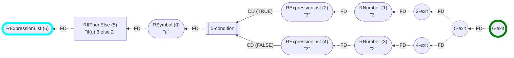

_This document was generated from '[src/documentation/print-cfg-wiki.ts](https://github.com/flowr-analysis/flowr/tree/main//src/documentation/print-cfg-wiki.ts)' on 2025-04-30, 19:47:02 UTC presenting an overview of flowR's control flow graph (v2.2.12, using R v4.4.3). Please do not edit this file/wiki page directly._

_flowR_ produces two main perspectives of the program: 1) a [normalized version of the AST](https://github.com/flowr-analysis/flowr/wiki/Normalized-AST)
and 2) a [dataflow graph](https://github.com/flowr-analysis/flowr/wiki/Dataflow%20Graph). However, for further analyses, we also provide an explicit control flow graph 
that is calculated from the normalized AST **and** the dataflow graph to incorporate change in language semantics.
flowR also uses this CFG for some of its queries (e.g., to link to the last call in a [Call-Context Query](https://github.com/flowr-analysis/flowr/wiki/Query-API))
but does not incorporate it into its core analysis.


> [!TIP]
> If you want to investigate the Control Flow Graph,
> you can use the <span title="Description (Repl Command, starred version): Returns the URL to mermaid.live; Base Command: Get mermaid code for the control-flow graph of R code, start with 'file://' to indicate a file (aliases: :cfg*, :cf*)">`:controlflow*`</span> command in the REPL (see the [Interface wiki page](https://github.com/flowr-analysis/flowr/wiki/Interface) for more information).


The CFG may be a little bit uncommon compared to the classical CFG with basic blocks. This is mostly due to historical reasons. 
Please [open a new issue](https://github.com/flowr-analysis/flowr/issues/new/choose) if you are interested in such a perspective.

But for now, let's look at a simple CFG for a program without any branching:


```r
x <- 2 * 3 + 1
```


The corresponding CFG is a directed, labeled graph with two types of edges (control and flow dependencies):

```mermaid
flowchart RL
    n7(["`RExpressionList (7)`"])
    n0(["`RSymbol (0)
#34;x#34;`"])
    n1(["`RNumber (1)
#34;2#34;`"])
    n2(["`RNumber (2)
#34;3#34;`"])
    n3(["`RBinaryOp (3)
#34;2 #42; 3#34;`"])
    n3-exit((3-exit))
    n4(["`RNumber (4)
#34;1#34;`"])
    n5(["`RBinaryOp (5)
#34;2 #42; 3 #43; 1#34;`"])
    n5-exit((5-exit))
    n6(["`RBinaryOp (6)
#34;x #60;#45; 2 #42; 3 #43; 1#34;`"])
    n6-exit((6-exit))
    n7-exit((7-exit))
    n6 -.->|"FD"| n7
    n2 -.->|"FD"| n1
    n1 -.->|"FD"| n3
    n3-exit -.->|"FD"| n2
    n4 -.->|"FD"| n3-exit
    n3 -.->|"FD"| n5
    n5-exit -.->|"FD"| n4
    n5 -.->|"FD"| n0
    n0 -.->|"FD"| n6
    n6-exit -.->|"FD"| n5-exit
    n7-exit -.->|"FD"| n6-exit
    style n7 stroke:cyan,stroke-width:6.5px;    style n7-exit stroke:green,stroke-width:6.5px;
```




	
(The analysis required _15.09 ms_ (including the dataflow analysis, normalization, and parsing with the [r-shell](https://github.com/flowr-analysis/flowr/wiki/Engines) engine) within the generation environment.)


Every normalized node of the [normalized AST](https://github.com/flowr-analysis/flowr/wiki/Normalized-AST) that has any relevance to the
execution is added and automatically linked using its id (similarly to vertices of the [dataflow graph](https://github.com/flowr-analysis/flowr/wiki/Dataflow%20Graph)).
Higher expressions, such as `2 * 3` get an additional node with an artificial id that ends in `-exit` to mark whenever their calculation is over.

To gain a better understanding, let's have a look at a simple program with a single branching structure:




	
<details open>

<summary style="color:gray">R Code of the CFG</summary>

The analysis required _4.86 ms_ (including the dataflow analysis, normalization, and parsing with the [r-shell](https://github.com/flowr-analysis/flowr/wiki/Engines) engine) within the generation environment.


```r
if(u) 3 else 2
```


</details>


Here, you can see the `if` node followed by the condition (in this case merely `u`) that then splits into two branches for the two possible outcomes.
The `if` structure is terminated by the corresponding `-exit` node.

For you to compare, the following shows the CFG of an `if` without an `else` branch:


	
<details>

<summary style="color:gray">R Code of the CFG</summary>

The analysis required _3.45 ms_ (including the dataflow analysis, normalization, and parsing with the [r-shell](https://github.com/flowr-analysis/flowr/wiki/Engines) engine) within the generation environment.


```r
if(u || v) 3
```


</details>


The control flow graph also harmonizes with function definitions, and calls:


	
<details open>

<summary style="color:gray">R Code of the CFG</summary>

The analysis required _5.66 ms_ (including the dataflow analysis, normalization, and parsing with the [r-shell](https://github.com/flowr-analysis/flowr/wiki/Engines) engine) within the generation environment.


```r
f <- function() { 3 }
f()
```


</details>


In general, it is probably best to use the <span title="Description (Repl Command, starred version): Returns the URL to mermaid.live; Base Command: Get mermaid code for the control-flow graph of R code, start with 'file://' to indicate a file (aliases: :cfg*, :cf*)">`:controlflow*`</span> command in the REPL to investigate the CFG interactively.
Have a look at the [<code><span title="Visit all nodes reachable from the start node in the control flow graph, traversing the dependencies but ignoring cycles.">visitCfgInReverseOrder</span></code>](https://github.com/flowr-analysis/flowr/tree/main//src/control-flow/simple-visitor.ts#L18) function for a generic CFG visitor.


