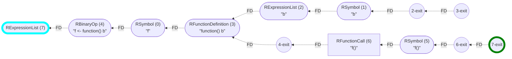

_This document was generated from '[src/documentation/wiki-cfg.ts](https://github.com/flowr-analysis/flowr/tree/main//src/documentation/wiki-cfg.ts)' on 2025-12-30, 20:33:08 UTC presenting an overview of flowR's control flow graph (v2.7.6, using R v4.5.2). Please do not edit this file/wiki page directly._

_flowR_ produces three main perspectives of the program: 1) a [normalized version of the AST](https://github.com/flowr-analysis/flowr/wiki/Normalized-AST)
and 2) a [dataflow graph](https://github.com/flowr-analysis/flowr/wiki/Dataflow%20Graph), and 3) a control flow graph (CFG).
flowR uses this CFG interweaved with its data flow analysis and for some of its queries (e.g., to link to the last call in a [Call-Context Query](https://github.com/flowr-analysis/flowr/wiki/Query-API)).

Please note that, mostly due to historical reasons, the [control dependencies](https://github.com/flowr-analysis/flowr/wiki/Dataflow%20Graph#control-dependencies) that are stored directly within the
DFG provide only a partial view of the CFG. While they provide you with information on the conditional execution of vertices, they do not encode the order of execution.
	In contrast, the CFG describes a complete view of the program's control flow.


> [!TIP]
> If you want to investigate the Control Flow Graph,
> you can use the <span title="Description (Repl Command, starred version): Returns the URL to mermaid.live; Base Command: Get mermaid code for the control-flow graph of R code, start with 'file://' to indicate a file (aliases: :cfg*, :cf*)">`:controlflow*`</span> command in the REPL (see the [Interface wiki page](https://github.com/flowr-analysis/flowr/wiki/Interface) for more information).
> By default, this view does _not_ use basic blocks as, for example, R allows unconditional jumps to occur in spots where conventional languages would assume expressions (e.g., if-conditions).
> Yet, by using <span title="Description (Repl Command, starred version): Returns the URL to mermaid.live; Base Command: Get mermaid code for the control-flow graph with basic blocks, start with 'file://' to indicate a file (aliases: :cfgb*, :cfb*)">`:controlflowbb*`</span> you can inspect the CFG with basic blocks (although you have to keep in mind that now, there can be a value flow between basic blocks)


For readability, we structure this wiki page into various segments:

- [Initial Overview](#cfg-overview)
- [Structure of the Control Flow Graph](#cfg-structure)
	- [CFG Vertices](#cfg-structure-vertices)
	- [CFG Edges](#cfg-structure-edges)
	- [Adding Basic Blocks](#cfg-basic-blocks)
- [Working with the CFG](#cfg-working)
	- [Simple Traversal](#cfg-simple-traversal)
	- [Diffing and Testing](#cfg-diff-and-test)
	- [Sophisticated CFG Traversal](#cfg-traversal)
	- [Working With Exit Points](#cfg-exit-points)

<h2 id="cfg-overview">Initial Overview</h2>

For now, let's look at a CFG for a program without any branching:


```r
x <- 2 * 3 + 1
```


The corresponding CFG is a directed, labeled graph with two types of edges (control and flow dependencies).


	
_(The analysis required _1.2 ms_ (including the dataflow analysis,  normalization,  and parsing with the [r-shell](https://github.com/flowr-analysis/flowr/wiki/Engines) engine) within the generation environment.
We used the following simplification: `unique-cf-sets` .
	)_


> [!IMPORTANT]
> As the edges describe dependencies they point in the inverse order of execution (which is very helpful for backward analyses)! The [visitors](#cfg-working) abstract away from this and there is no harm in considering an inverted CFG. Yet, you should keep this in mind!


Every normalized node of the [normalized AST](https://github.com/flowr-analysis/flowr/wiki/Normalized-AST) that has any relevance to the
execution is added and automatically linked using its id (similarly to vertices of the [dataflow graph](https://github.com/flowr-analysis/flowr/wiki/Dataflow%20Graph)).
Expressions, such as `2 * 3` get an additional node with an artificial id that ends in `-exit` to mark whenever their calculation is over.

To gain a better understanding, let's have a look at a simple program with a single branching structure:


	
<details>

<summary style="color:gray">R Code of the CFG</summary>

The analysis required _2.4 ms_ (including the dataflow analysis,  normalization,  and parsing with the [r-shell](https://github.com/flowr-analysis/flowr/wiki/Engines) engine) within the generation environment.
We used the following simplification: `unique-cf-sets` .
	


```r
if(u) 3 else 2
```


</details>


Here, you can see the `if` node followed by the condition (in this case merely `u`) that then splits into two branches for the two possible outcomes.
The `if` structure is terminated by the corresponding `-exit` node (see the [structure](#cfg-structure) section for more details).

For you to compare, the following shows the CFG of an `if` without an `else` branch:


	
<details>

<summary style="color:gray">R Code of the CFG</summary>

The analysis required _1.3 ms_ (including the dataflow analysis,  normalization,  and parsing with the [r-shell](https://github.com/flowr-analysis/flowr/wiki/Engines) engine) within the generation environment.
We used the following simplification: `unique-cf-sets` .
	


```r
if(u || v) 3
```


</details>


Activating the calculation of basic blocks produces the following:


	
<details>

<summary style="color:gray">R Code of the CFG</summary>

The analysis required _0.9 ms_ (including the dataflow analysis,  normalization,  and parsing with the [r-shell](https://github.com/flowr-analysis/flowr/wiki/Engines) engine) within the generation environment.
We used the following simplifications: `unique-cf-sets`, `to-basic-blocks` .
	


```r
if(u || v) 3
```


</details>


Which is probably much more readable if compacted (although the reconstucted code can sometimes be slightly mislieading as flowR tries its best to make it syntactically correct and hence add closing braces etc. which are technically not part of the respective block):


	
<details>

<summary style="color:gray">R Code of the CFG</summary>

The analysis required _0.8 ms_ (including the dataflow analysis,  normalization,  and parsing with the [r-shell](https://github.com/flowr-analysis/flowr/wiki/Engines) engine) within the generation environment.
We used the following simplifications: `unique-cf-sets`, `to-basic-blocks`  and render a simplified/compacted version.
	


```r
if(u || v) 3
```


</details>


The control flow graph also harmonizes with function definitions, and calls:


	
<details open>

<summary style="color:gray">R Code of the CFG</summary>

The analysis required _1.2 ms_ (including the dataflow analysis,  normalization,  and parsing with the [r-shell](https://github.com/flowr-analysis/flowr/wiki/Engines) engine) within the generation environment.
We used the following simplification: `unique-cf-sets` .
	


```r
f <- function() { 3 }
f()
```


</details>


<h2 id="cfg-structure">Structure of the Control Flow Graph</h2>

You can produce your very own control flow graph with <a href="https://github.com/flowr-analysis/flowr/tree/main//src/control-flow/extract-cfg.ts#L91"><code><span title="Given a normalized AST, this approximates the control flow graph of the program. This view is different from the computation of the dataflow graph and may differ, especially because it focuses on intra-procedural analysis.">extractCfg</span></code></a>.
The <a href="https://github.com/flowr-analysis/flowr/tree/main//src/control-flow/control-flow-graph.ts#L211"><code><span title="This class represents the control flow graph of an R program. The control flow may be hierarchical when confronted with function definitions (see CfgSimpleVertex and rootVertexIds() ). There are two very simple visitors to traverse a CFG: - visitCfgInOrder visits the graph in the order of the vertices - visitCfgInReverseOrder visits the graph in reverse order If you want to prohibit modification, ...">ControlFlowGraph</span></code></a> class describes everything required to model the control flow graph, with its edge types described by
 <a href="https://github.com/flowr-analysis/flowr/tree/main//src/control-flow/control-flow-graph.ts#L129"><code>CfgEdge</code></a> and its vertices by <a href="https://github.com/flowr-analysis/flowr/tree/main//src/control-flow/control-flow-graph.ts#L86"><code><span title="A vertex in the ControlFlowGraph .">CfgSimpleVertex</span></code></a>.
However, you should be aware of the <a href="https://github.com/flowr-analysis/flowr/tree/main//src/control-flow/control-flow-graph.ts#L466"><code><span title="Summarizes the control information of a program">ControlFlowInformation</span></code></a> interface which adds some additional information the CFG
(and is used during the construction of the CFG as well):

 * **[ControlFlowInformation](https://github.com/flowr-analysis/flowr/tree/main//src/control-flow/control-flow-graph.ts#L466)**   
   Summarizes the control information of a program
   <details open><summary style="color:gray">Defined at <a href="https://github.com/flowr-analysis/flowr/tree/main//src/control-flow/control-flow-graph.ts#L466">./src/control-flow/control-flow-graph.ts#L466</a></summary>
   
   
   ```ts
   /**
    * Summarizes the control information of a program
    * @see {@link emptyControlFlowInformation} - to create an empty control flow information object
    */
   export interface ControlFlowInformation<Vertex extends CfgSimpleVertex = CfgSimpleVertex> extends MergeableRecord {
       /** all active 'return'(-like) unconditional jumps */
       returns:     NodeId[],
       /** all active 'break'(-like) unconditional jumps */
       breaks:      NodeId[],
       /** all active 'next'(-like) unconditional jumps */
       nexts:       NodeId[],
       /** intended to construct a hammock graph, with 0 exit points representing a block that should not be part of the CFG (like a comment) */
       entryPoints: NodeId[],
       /** See {@link ControlFlowInformation#entryPoints|entryPoints} */
       exitPoints:  NodeId[],
       /** the control flow graph summarizing the flow information */
       graph:       ControlFlowGraph<Vertex>
   }
   ```
   
   
   </details>
   
    <details><summary>View more (MergeableRecord)</summary>

   * [MergeableRecord](https://github.com/flowr-analysis/flowr/tree/main//src/util/objects.ts#L11)   
   
     <details><summary style="color:gray">Defined at <a href="https://github.com/flowr-analysis/flowr/tree/main//src/util/objects.ts#L11">./src/util/objects.ts#L11</a></summary>
     
     
     ```ts
     export type MergeableRecord = Record<string, unknown>
     ```
     
     
     </details>
     

     * [string](https://github.com/flowr-analysis/flowr/tree/main//src/abstract-interpretation/domains/bounded-set-domain.ts#L164)   
     
       <details><summary style="color:gray">Defined at <a href="https://github.com/flowr-analysis/flowr/tree/main//src/abstract-interpretation/domains/bounded-set-domain.ts#L164">./src/abstract-interpretation/domains/bounded-set-domain.ts#L164</a></summary>
       
       
       ```ts
       string = this.value.values().map(domainElementToString).toArray().join(', ')
       ```
       
       
       </details>
       
     * [unknown](https://github.com/flowr-analysis/flowr/tree/main//src/dataflow/graph/graph.ts#L388)   
     
       <details><summary style="color:gray">Defined at <a href="https://github.com/flowr-analysis/flowr/tree/main//src/dataflow/graph/graph.ts#L388">./src/dataflow/graph/graph.ts#L388</a></summary>
       
       
       ```ts
       unknown
       ```
       
       
       </details>
       

</details>
    

To check whether the CFG has the expected shape, you can use the test function <a href="https://github.com/flowr-analysis/flowr/tree/main//test/functionality/_helper/controlflow/assert-control-flow-graph.ts#L31"><code><span title="Assert that the given code produces the expected CFG">assertCfg</span></code></a> which supports testing for
 sub-graphs as well (it provides diffing capabilities similar to <a href="https://github.com/flowr-analysis/flowr/tree/main//test/functionality/_helper/shell.ts#L386"><code><span title="Your best friend whenever you want to test whether the dataflow graph produced by flowR is as expected. You may want to have a look at the DataflowTestConfiguration to see what you can configure. Especially the resolveIdsAsCriterion and the expectIsSubgraph are interesting as they allow you for rather flexible matching of the expected graph. Pleas note, that if you pass context: 'call-graph' in th...">assertDataflow</span></code></a>).
As the CFG may become unhandy for larger programs, there are simplifications available with <a href="https://github.com/flowr-analysis/flowr/tree/main//src/control-flow/cfg-simplification.ts#L39"><code><span title="Simplify the control flow information by applying the given passes. This may reduce the vertex count, in- and outgoing edges, entry and exit points, etc.">simplifyControlFlowInformation</span></code></a>
(these can be passed on to the <a href="https://github.com/flowr-analysis/flowr/tree/main//src/control-flow/extract-cfg.ts#L91"><code><span title="Given a normalized AST, this approximates the control flow graph of the program. This view is different from the computation of the dataflow graph and may differ, especially because it focuses on intra-procedural analysis.">extractCfg</span></code></a> function as well).

<h3 id="cfg-structure-vertices">CFG Vertices</h3>

All vertex types are summarized in the <a href="https://github.com/flowr-analysis/flowr/tree/main//src/control-flow/control-flow-graph.ts#L6"><code>CfgVertexType</code></a> enum which currently contains the following types:

- `EndMarker` (end)
- `Statement` (stm)
- `Expression` (expr)
- `Block` (blk)

We use the <a href="https://github.com/flowr-analysis/flowr/tree/main//src/control-flow/control-flow-graph.ts#L77"><code>CfgBasicBlockVertex</code></a> to represent [basic blocks](#cfg-basic-blocks) and separate
expressions (<a href="https://github.com/flowr-analysis/flowr/tree/main//src/control-flow/control-flow-graph.ts#L64"><code>CfgExpressionVertex</code></a>) and statements (<a href="https://github.com/flowr-analysis/flowr/tree/main//src/control-flow/control-flow-graph.ts#L60"><code>CfgStatementVertex</code></a>) 
as control flow units with and without side effects (if you want to, you can see view statements as effectful expressions).
The markers (<a href="https://github.com/flowr-analysis/flowr/tree/main//src/control-flow/control-flow-graph.ts#L73"><code>CfgEndMarkerVertex</code></a>) indicate the end of larger expressions/statements. 

To signal these links, the expressions and statements contain information about the attached markers:

 * **[CfgWithMarker](https://github.com/flowr-analysis/flowr/tree/main//src/control-flow/control-flow-graph.ts#L53)**   
 
   <details open><summary style="color:gray">Defined at <a href="https://github.com/flowr-analysis/flowr/tree/main//src/control-flow/control-flow-graph.ts#L53">./src/control-flow/control-flow-graph.ts#L53</a></summary>
   
   
   ```ts
   interface CfgWithMarker extends CfgBaseVertex {
       /** mid-markers linked to this statement */
       mid?: NodeId[]
       /** end-markers linked to this statement */
       end?: NodeId[]
   }
   ```
   
   
   </details>
   
    <details><summary>View more (CfgBaseVertex)</summary>

   * **[CfgBaseVertex](https://github.com/flowr-analysis/flowr/tree/main//src/control-flow/control-flow-graph.ts#L42)**   
     A plain vertex in the
     <code>ControlFlowGraph</code>
     .
     Please use
     <code>CfgSimpleVertex</code>
     to refer to all potential vertex types within the graph.
     <details><summary style="color:gray">Defined at <a href="https://github.com/flowr-analysis/flowr/tree/main//src/control-flow/control-flow-graph.ts#L42">./src/control-flow/control-flow-graph.ts#L42</a></summary>
     
     
     ```ts
     /**
      * A plain vertex in the {@link ControlFlowGraph}.
      * Please use {@link CfgSimpleVertex} to refer to all potential vertex types within the graph.
      */
     interface CfgBaseVertex extends MergeableRecord {
         /** the type of the vertex */
         type:         CfgVertexType,
         /** the id of the vertex, for non-blocks this should directly relate to the AST node */
         id:           NodeId,
         /** child nodes attached to this one */
         children?:    NodeId[],
         /** if the vertex calls a function, this links all targets of this call */
         callTargets?: Set<NodeId>,
     }
     ```
     
     
     </details>
     
     * [MergeableRecord](https://github.com/flowr-analysis/flowr/tree/main//src/util/objects.ts#L11)   
     
       <details><summary style="color:gray">Defined at <a href="https://github.com/flowr-analysis/flowr/tree/main//src/util/objects.ts#L11">./src/util/objects.ts#L11</a></summary>
       
       
       ```ts
       export type MergeableRecord = Record<string, unknown>
       ```
       
       
       </details>
       

       * [string](https://github.com/flowr-analysis/flowr/tree/main//src/abstract-interpretation/domains/bounded-set-domain.ts#L164)   
       
         <details><summary style="color:gray">Defined at <a href="https://github.com/flowr-analysis/flowr/tree/main//src/abstract-interpretation/domains/bounded-set-domain.ts#L164">./src/abstract-interpretation/domains/bounded-set-domain.ts#L164</a></summary>
         
         
         ```ts
         string = this.value.values().map(domainElementToString).toArray().join(', ')
         ```
         
         
         </details>
         
       * [unknown](https://github.com/flowr-analysis/flowr/tree/main//src/dataflow/graph/graph.ts#L388)   
       
         <details><summary style="color:gray">Defined at <a href="https://github.com/flowr-analysis/flowr/tree/main//src/dataflow/graph/graph.ts#L388">./src/dataflow/graph/graph.ts#L388</a></summary>
         
         
         ```ts
         unknown
         ```
         
         
         </details>
         

</details>
    

Similarly, the markers contain a link to their root: 

 * **[CfgWithRoot](https://github.com/flowr-analysis/flowr/tree/main//src/control-flow/control-flow-graph.ts#L68)**   
 
   <details open><summary style="color:gray">Defined at <a href="https://github.com/flowr-analysis/flowr/tree/main//src/control-flow/control-flow-graph.ts#L68">./src/control-flow/control-flow-graph.ts#L68</a></summary>
   
   
   ```ts
   export interface CfgWithRoot extends CfgBaseVertex {
       /** the vertex for which this is a marker */
       root: NodeId
   }
   ```
   
   
   </details>
   
    <details><summary>View more (CfgBaseVertex)</summary>

   * **[CfgBaseVertex](https://github.com/flowr-analysis/flowr/tree/main//src/control-flow/control-flow-graph.ts#L42)**   
     A plain vertex in the
     <code>ControlFlowGraph</code>
     .
     Please use
     <code>CfgSimpleVertex</code>
     to refer to all potential vertex types within the graph.
     <details><summary style="color:gray">Defined at <a href="https://github.com/flowr-analysis/flowr/tree/main//src/control-flow/control-flow-graph.ts#L42">./src/control-flow/control-flow-graph.ts#L42</a></summary>
     
     
     ```ts
     /**
      * A plain vertex in the {@link ControlFlowGraph}.
      * Please use {@link CfgSimpleVertex} to refer to all potential vertex types within the graph.
      */
     interface CfgBaseVertex extends MergeableRecord {
         /** the type of the vertex */
         type:         CfgVertexType,
         /** the id of the vertex, for non-blocks this should directly relate to the AST node */
         id:           NodeId,
         /** child nodes attached to this one */
         children?:    NodeId[],
         /** if the vertex calls a function, this links all targets of this call */
         callTargets?: Set<NodeId>,
     }
     ```
     
     
     </details>
     
     * [MergeableRecord](https://github.com/flowr-analysis/flowr/tree/main//src/util/objects.ts#L11)   
     
       <details><summary style="color:gray">Defined at <a href="https://github.com/flowr-analysis/flowr/tree/main//src/util/objects.ts#L11">./src/util/objects.ts#L11</a></summary>
       
       
       ```ts
       export type MergeableRecord = Record<string, unknown>
       ```
       
       
       </details>
       

       * [string](https://github.com/flowr-analysis/flowr/tree/main//src/abstract-interpretation/domains/bounded-set-domain.ts#L164)   
       
         <details><summary style="color:gray">Defined at <a href="https://github.com/flowr-analysis/flowr/tree/main//src/abstract-interpretation/domains/bounded-set-domain.ts#L164">./src/abstract-interpretation/domains/bounded-set-domain.ts#L164</a></summary>
         
         
         ```ts
         string = this.value.values().map(domainElementToString).toArray().join(', ')
         ```
         
         
         </details>
         
       * [unknown](https://github.com/flowr-analysis/flowr/tree/main//src/dataflow/graph/graph.ts#L388)   
       
         <details><summary style="color:gray">Defined at <a href="https://github.com/flowr-analysis/flowr/tree/main//src/dataflow/graph/graph.ts#L388">./src/dataflow/graph/graph.ts#L388</a></summary>
         
         
         ```ts
         unknown
         ```
         
         
         </details>
         

</details>
    

In mermaid visualizations, we use rectangles for statements, rounded rectangles for expressions and circles for exit markers.
Blocks are visualized as boxes around the contained vertices.


> [!NOTE]
> Every CFG vertex has a <a href="https://github.com/flowr-analysis/flowr/tree/main//src/r-bridge/lang-4.x/ast/model/processing/node-id.ts#L7"><code><span title="The type of the id assigned to each node. Branded to avoid problematic usages with other string or numeric types.">NodeId</span></code></a> that links it to the [normalized AST](https://github.com/flowr-analysis/flowr/wiki/Normalized-AST) (although basic blocks will find no counterpart as they are a structuring element of the CFG).
> 	Additionally, it may provide information on the called functions (in case that the current element is a function call).
> 	Have a look at the <a href="https://github.com/flowr-analysis/flowr/tree/main//src/control-flow/control-flow-graph.ts#L42"><code><span title="A plain vertex in the ControlFlowGraph . Please use CfgSimpleVertex to refer to all potential vertex types within the graph.">CfgBaseVertex</span></code></a> interface for more information.


<h3 id="cfg-structure-edges">CFG Edges</h3>

The <a href="https://github.com/flowr-analysis/flowr/tree/main//src/control-flow/control-flow-graph.ts#L211"><code><span title="This class represents the control flow graph of an R program. The control flow may be hierarchical when confronted with function definitions (see CfgSimpleVertex and rootVertexIds() ). There are two very simple visitors to traverse a CFG: - visitCfgInOrder visits the graph in the order of the vertices - visitCfgInReverseOrder visits the graph in reverse order If you want to prohibit modification, ...">ControlFlowGraph</span></code></a> uses two types of edges to represent the control flow, separated by the <a href="https://github.com/flowr-analysis/flowr/tree/main//src/control-flow/control-flow-graph.ts#L17"><code>CfgEdgeType</code></a> enum
and the two interfaces: <a href="https://github.com/flowr-analysis/flowr/tree/main//src/control-flow/control-flow-graph.ts#L117"><code>CfgFlowDependencyEdge</code></a> and <a href="https://github.com/flowr-analysis/flowr/tree/main//src/control-flow/control-flow-graph.ts#L121"><code>CfgControlDependencyEdge</code></a>.

<h4 id="cfg-flow-dependency">Flow Dependencies</h4>

The most common edge is the flow dependency&nbsp;(FD) which simply signals that the source vertex happens _after_ the target vertex in the control flow.
So `x; y` would produce a flow dependency from `y` to `x` (additionally to the program-enveloping root expression list):


	
_(The analysis required _1.0 ms_ (including the dataflow analysis,  normalization,  and parsing with the [r-shell](https://github.com/flowr-analysis/flowr/wiki/Engines) engine) within the generation environment.
We used the following simplification: `unique-cf-sets` .
	)_


<h4 id="cfg-control-dependency">Control Dependencies</h4>

Control dependencies&nbsp;(CD) are used to signal that the execution of the source vertex depends on the taget vertex (which, e.g., is the condition of an `if` statement or `while` loop).
They contain additional information to signal _when_ the source vertex is executed:

 * **[CfgControlDependencyEdge](https://github.com/flowr-analysis/flowr/tree/main//src/control-flow/control-flow-graph.ts#L121)**   
 
   <details open><summary style="color:gray">Defined at <a href="https://github.com/flowr-analysis/flowr/tree/main//src/control-flow/control-flow-graph.ts#L121">./src/control-flow/control-flow-graph.ts#L121</a></summary>
   
   
   ```ts
   export interface CfgControlDependencyEdge extends MergeableRecord {
       label:  CfgEdgeType.Cd
       /** the id which caused the control dependency */
       caused: NodeId,
       /** is the control dependency satisfied with a true condition or is it negated (e.g., else-branch)? */
       when:   typeof RTrue | typeof RFalse
   }
   ```
   
   
   </details>
   
    <details><summary>View more (MergeableRecord)</summary>

   * [MergeableRecord](https://github.com/flowr-analysis/flowr/tree/main//src/util/objects.ts#L11)   
   
     <details><summary style="color:gray">Defined at <a href="https://github.com/flowr-analysis/flowr/tree/main//src/util/objects.ts#L11">./src/util/objects.ts#L11</a></summary>
     
     
     ```ts
     export type MergeableRecord = Record<string, unknown>
     ```
     
     
     </details>
     

     * [string](https://github.com/flowr-analysis/flowr/tree/main//src/abstract-interpretation/domains/bounded-set-domain.ts#L164)   
     
       <details><summary style="color:gray">Defined at <a href="https://github.com/flowr-analysis/flowr/tree/main//src/abstract-interpretation/domains/bounded-set-domain.ts#L164">./src/abstract-interpretation/domains/bounded-set-domain.ts#L164</a></summary>
       
       
       ```ts
       string = this.value.values().map(domainElementToString).toArray().join(', ')
       ```
       
       
       </details>
       
     * [unknown](https://github.com/flowr-analysis/flowr/tree/main//src/dataflow/graph/graph.ts#L388)   
     
       <details><summary style="color:gray">Defined at <a href="https://github.com/flowr-analysis/flowr/tree/main//src/dataflow/graph/graph.ts#L388">./src/dataflow/graph/graph.ts#L388</a></summary>
       
       
       ```ts
       unknown
       ```
       
       
       </details>
       

</details>
    

The extra `caused` link signals the vertex that caused the control flow influence.


<details><summary>Example: if-else</summary>


	
<details>

<summary style="color:gray">R Code of the CFG</summary>

The analysis required _0.8 ms_ (including the dataflow analysis,  normalization,  and parsing with the [r-shell](https://github.com/flowr-analysis/flowr/wiki/Engines) engine) within the generation environment.
We used the following simplification: `unique-cf-sets` .
	


```r
if(u) 3 else 2
```


</details>


</details>
    


<details><summary>Example: while-loop</summary>


	
<details>

<summary style="color:gray">R Code of the CFG</summary>

The analysis required _1.0 ms_ (including the dataflow analysis,  normalization,  and parsing with the [r-shell](https://github.com/flowr-analysis/flowr/wiki/Engines) engine) within the generation environment.
We used the following simplification: `unique-cf-sets` .
	


```r
while(u) b
```


</details>


</details>
    
<br/>

Please note that repeat loops do _not_ have control dependencies, as they repeat their body unconditionally.
Additionally, the control flow graph does not have to be connected. If you use a repeat without any exit condition,
the corresponding exit markers are not reachable from the entry:


<details><summary>Example: repeat-loop (infinite)</summary>


	
<details>

<summary style="color:gray">R Code of the CFG</summary>

The analysis required _1.0 ms_ (including the dataflow analysis,  normalization,  and parsing with the [r-shell](https://github.com/flowr-analysis/flowr/wiki/Engines) engine) within the generation environment.
We used the following simplification: `unique-cf-sets` .
	


```r
repeat { b }; after
```


</details>


</details>
    


<details><summary>Example: repeat-loop (with break)</summary>


	
<details>

<summary style="color:gray">R Code of the CFG</summary>

The analysis required _1.1 ms_ (including the dataflow analysis,  normalization,  and parsing with the [r-shell](https://github.com/flowr-analysis/flowr/wiki/Engines) engine) within the generation environment.
We used the following simplification: `unique-cf-sets` .
	


```r
repeat { b; if(u) break; }; after
```


</details>


</details>
    
<br/>

In the context of a for-loop, the control dependency refer to whether the respective vector still has values to iterate over.


<details><summary>Example: for-loop</summary>


	
<details>

<summary style="color:gray">R Code of the CFG</summary>

The analysis required _1.0 ms_ (including the dataflow analysis,  normalization,  and parsing with the [r-shell](https://github.com/flowr-analysis/flowr/wiki/Engines) engine) within the generation environment.
We used the following simplification: `unique-cf-sets` .
	


```r
for(i in 1:10) b
```


</details>


</details>
    

<h4 id="cfg-call-links">Extra: Call Links</h4>

If you generate the CFG with the <a href="https://github.com/flowr-analysis/flowr/tree/main//src/control-flow/extract-cfg.ts#L91"><code><span title="Given a normalized AST, this approximates the control flow graph of the program. This view is different from the computation of the dataflow graph and may differ, especially because it focuses on intra-procedural analysis.">extractCfg</span></code></a> function you can (and, if you want to gain inter-procedural information, should)
pass a matching [dataflow graph](https://github.com/flowr-analysis/flowr/wiki/Dataflow%20Graph) to it to incorporate the dataflow perspective into the CFG.

The difference becomes obvious when we look at the code `f <- function() b; f()` first without the dataflow graph:




	
<details>

<summary style="color:gray">R Code of the CFG</summary>

The analysis required _0.7 ms_ (including the  normalization and parsing with the [r-shell](https://github.com/flowr-analysis/flowr/wiki/Engines) engine) within the generation environment.
We used the following simplification: `unique-cf-sets` .
	


```r
f <- function() b; f()
```


</details>


And now, including dataflow information:


	
<details>

<summary style="color:gray">R Code of the CFG</summary>

The analysis required _1.1 ms_ (including the dataflow analysis,  normalization,  and parsing with the [r-shell](https://github.com/flowr-analysis/flowr/wiki/Engines) engine) within the generation environment.
We used the following simplification: `unique-cf-sets` .
	


```r
f <- function() b; f()
```


</details>


There are two important additions:

1. A new exit marker, canonically suffixed with `-resolved-call-exit` signals that we are aware of the function call target.
   This marker always follows the exit marker of the function call and links not just the call but also the exit points of the function definition.
2. A new _calls_ attribute attached to the function call vertex. This holds the <a href="https://github.com/flowr-analysis/flowr/tree/main//src/r-bridge/lang-4.x/ast/model/processing/node-id.ts#L7"><code><span title="The type of the id assigned to each node. Branded to avoid problematic usages with other string or numeric types.">NodeId</span></code></a> of the function definitions that are called from this vertex.

For built-in functions that are provided by flowR's built-in configuration (see the [interface wiki page](https://github.com/flowr-analysis/flowr/wiki/Interface)) the CFG does not contain
the additional information directly:


	
<details>

<summary style="color:gray">R Code of the CFG</summary>

The analysis required _0.8 ms_ (including the dataflow analysis,  normalization,  and parsing with the [r-shell](https://github.com/flowr-analysis/flowr/wiki/Engines) engine) within the generation environment.
We used the following simplification: `unique-cf-sets` .
	


```r
print(3)
```


</details>


This is due to the fact that the [dataflow graph](https://github.com/flowr-analysis/flowr/wiki/Dataflow%20Graph) does contain the required call information (and there are no new control vertices to add as the built-in call has no target in the source code):


	
<details>

<summary style="color:gray">R Code of the Dataflow Graph</summary>

The analysis required _0.8 ms_ (including parse and normalize, using the [r-shell](https://github.com/flowr-analysis/flowr/wiki/Engines) engine) within the generation environment. 
We encountered unknown side effects (with ids: 3 (linked)) during the analysis.


```r
print(3)
```


</details>


<h3 id="cfg-basic-blocks">Adding Basic Blocks</h3>

As mentioned in the introduction, our control flow graph does not use basic blocks by default and hence simply links all vertices independent of whether they have (un-)conditional jumps or not.
On the upside, this tells us the execution order (and, in case of promises, forcing order) of involved expressions and seamlessly handles cases like
`x <- return(3)`.  On the downside, this makes it hard to apply classical control flow graph algorithms and, in general, makes the graph much harder to read.
Yet, we can request basic blocks or transform an existing CFG into basic blocks using the <a href="https://github.com/flowr-analysis/flowr/tree/main//src/control-flow/cfg-to-basic-blocks.ts#L21"><code><span title="Take a control flow information of a graph without any basic blocks and convert it to a graph with basic blocks.">convertCfgToBasicBlocks</span></code></a> function.

Any program without any (un-)conditional jumps now contains a single basic block:


	
<details open>

<summary style="color:gray">R Code of the CFG</summary>

The analysis required _0.9 ms_ (including the dataflow analysis,  normalization,  and parsing with the [r-shell](https://github.com/flowr-analysis/flowr/wiki/Engines) engine) within the generation environment.
We used the following simplifications: `unique-cf-sets`, `to-basic-blocks`  and render a simplified/compacted version.
	


```r
x <- 2 * 3 + 1
```


</details>


While the CFG without basic blocks is much bigger:


	
_(The analysis required _0.8 ms_ (including the dataflow analysis,  normalization,  and parsing with the [r-shell](https://github.com/flowr-analysis/flowr/wiki/Engines) engine) within the generation environment.
We used the following simplification: `unique-cf-sets` .
	)_


In a way, using the basic blocks perspective does not remove any of these vertices (we just usually visualize them compacted as their execution order should be "obvious").
The vertices are still there, as elems of the <a href="https://github.com/flowr-analysis/flowr/tree/main//src/control-flow/control-flow-graph.ts#L77"><code>CfgBasicBlockVertex</code></a>:


	
_(The analysis required _1.4 ms_ (including the dataflow analysis,  normalization,  and parsing with the [r-shell](https://github.com/flowr-analysis/flowr/wiki/Engines) engine) within the generation environment.
We used the following simplifications: `unique-cf-sets`, `to-basic-blocks` .
	)_


The benefit (for comprehensibility and algorithms) becomes more apparent when we look at a more complicated program:


```r
f <- function(a, b = 3) {
 if(a > b) {
 	return(a * b);
 } else {
 	while(a < b) {
 		a <- a + 1;
 	}
 	return(a);
 }
}

print(f(21) + f(42))
```


With basic blocks, this code looks like this:


	
_(The analysis required _4.0 ms_ (including the dataflow analysis,  normalization,  and parsing with the [r-shell](https://github.com/flowr-analysis/flowr/wiki/Engines) engine) within the generation environment.
We used the following simplifications: `unique-cf-sets`, `to-basic-blocks`  and render a simplified/compacted version.
	)_


Now, without basic blocks, this is a different story...


<details><summary>The full CFG</summary>


```mermaid
flowchart RL
    n56(["`RExpressionList (56)`"])
    n0(["`RSymbol (0)
#34;f#34;`"])
    n42-exit((42-exit))
    n42(["`RFunctionDefinition (42)
#34;function(a, b = 3) #123;
 if(a #62; b) #123;
 #92;treturn(a #42; b);
 #125; else #123;
 #92;twhile(a #60; b) #123;
 #92;t#92;ta #60;#45; a #43; 1;
 #92;t#125;
 #92;treturn(a);
 #125;
#125;#34;`"])
    n41(["`RExpressionList (41)`"])
    n40["`RIfThenElse (40)
#34;if(a #62; b) #123;
 #92;treturn(a #42; b);
 #125; else #123;
 #92;twhile(a #60; b) #123;
 #92;t#92;ta #60;#45; a #43; 1;
 #92;t#125;
 #92;treturn(a);
 #125;#34;`"]
    n40-exit((40-exit))
    n8(["`RSymbol (8)
#34;a#34;`"])
    n9(["`RSymbol (9)
#34;b#34;`"])
    n10(["`RBinaryOp (10)
#34;a #62; b#34;`"])
    n10-exit((10-exit))
    n19(["`RExpressionList (19)`"])
    n13(["`RSymbol (13)
#34;return(a #42; b)#34;`"])
    n18["`RFunctionCall (18)
#34;return(a #42; b)#34;`"]
    n18-exit((18-exit))
    n17(["`RArgument (17)
#34;a #42; b#34;`"])
    n14(["`RSymbol (14)
#34;a#34;`"])
    n15(["`RSymbol (15)
#34;b#34;`"])
    n16(["`RBinaryOp (16)
#34;a #42; b#34;`"])
    n16-exit((16-exit))
    n17-exit((17-exit))
    n19-exit((19-exit))
    n39(["`RExpressionList (39)`"])
    n38(["`RExpressionList (38)
#34;while(a #60; b) #123;
 #92;t#92;ta #60;#45; a #43; 1;
 #92;t#125;
 #92;treturn(a);#34;`"])
    n22(["`RSymbol (22)
#34;a#34;`"])
    n23(["`RSymbol (23)
#34;b#34;`"])
    n24(["`RBinaryOp (24)
#34;a #60; b#34;`"])
    n24-exit((24-exit))
    n33["`RWhileLoop (33)
#34;while(a #60; b) #123;
 #92;t#92;ta #60;#45; a #43; 1;
 #92;t#125;#34;`"]
    n33-exit((33-exit))
    n32(["`RExpressionList (32)`"])
    n27(["`RSymbol (27)
#34;a#34;`"])
    n28(["`RSymbol (28)
#34;a#34;`"])
    n29(["`RNumber (29)
#34;1#34;`"])
    n30(["`RBinaryOp (30)
#34;a #43; 1#34;`"])
    n30-exit((30-exit))
    n31(["`RBinaryOp (31)
#34;a #60;#45; a #43; 1#34;`"])
    n31-exit((31-exit))
    n32-exit((32-exit))
    n34(["`RSymbol (34)
#34;return(a)#34;`"])
    n37["`RFunctionCall (37)
#34;return(a)#34;`"]
    n37-exit((37-exit))
    n36(["`RArgument (36)
#34;a#34;`"])
    n35(["`RSymbol (35)
#34;a#34;`"])
    n36-exit((36-exit))
    n38-exit((38-exit))
    n39-exit((39-exit))
    n41-exit((41-exit))
    n2(["`RParameter (2)
#34;a#34;`"])
    n1(["`RSymbol (1)
#34;a#34;`"])
    n2-exit((2-exit))
    n5(["`RParameter (5)
#34;b#34;`"])
    n3(["`RSymbol (3)
#34;b#34;`"])
    n4(["`RNumber (4)
#34;3#34;`"])
    n5-exit((5-exit))
    n43(["`RBinaryOp (43)
#34;f #60;#45; function(a, b = 3) #123;
 if(a #62; b) #123;
 #92;treturn(a #42; b);
 #125; else #123;
 #92;twhile(a #60; b) #123;
 #92;t#92;ta #60;#45; a #43; 1;
 #92;t#125;
 #92;treturn(a);
 #125;
#125;#34;`"])
    n43-exit((43-exit))
    n44(["`RSymbol (44)
#34;print(f(21) #43; f(42))#34;`"])
    n55["`RFunctionCall (55)
#34;print(f(21) #43; f(42))#34;`"]
    n55-exit((55-exit))
    n54(["`RArgument (54)
#34;f(21) #43; f(42)#34;`"])
    n45(["`RSymbol (45)
#34;f(21)#34;`"])
    n48(["`RFunctionCall (48)
#34;f(21)#34;
 calls:#91;42#93;`"])
    n48-exit((48-exit))
    n47(["`RArgument (47)
#34;21#34;`"])
    n46(["`RNumber (46)
#34;21#34;`"])
    n47-exit((47-exit))
    n48-resolved-call-exit((48-resolved-call-exit))
    n49(["`RSymbol (49)
#34;f(42)#34;`"])
    n52(["`RFunctionCall (52)
#34;f(42)#34;
 calls:#91;42#93;`"])
    n52-exit((52-exit))
    n51(["`RArgument (51)
#34;42#34;`"])
    n50(["`RNumber (50)
#34;42#34;`"])
    n51-exit((51-exit))
    n52-resolved-call-exit((52-resolved-call-exit))
    n53(["`RBinaryOp (53)
#34;f(21) #43; f(42)#34;`"])
    n53-exit((53-exit))
    n54-exit((54-exit))
    n56-exit((56-exit))
    n43 -.->|"FD"| n56
    n40 -.->|"FD"| n41
    n9 -.->|"FD"| n8
    n8 -.->|"FD"| n10
    n10-exit -.->|"FD"| n9
    n18 -.->|"FD"| n19
    n13 -.->|"FD"| n18
    n15 -.->|"FD"| n14
    n14 -.->|"FD"| n16
    n16-exit -.->|"FD"| n15
    n16 -.->|"FD"| n17
    n17-exit -.->|"FD"| n16-exit
    n17 -.->|"FD"| n13
    n18-exit -.->|"FD"| n17-exit
    n19-exit -.->|"FD"| n18-exit
    n38 -.->|"FD"| n39
    n33 -.->|"FD"| n38
    n33 -.->|"FD"| n32-exit
    n23 -.->|"FD"| n22
    n22 -.->|"FD"| n24
    n24-exit -.->|"FD"| n23
    n31 -.->|"FD"| n32
    n29 -.->|"FD"| n28
    n28 -.->|"FD"| n30
    n30-exit -.->|"FD"| n29
    n30 -.->|"FD"| n27
    n27 -.->|"FD"| n31
    n31-exit -.->|"FD"| n30-exit
    n32-exit -.->|"FD"| n31-exit
    n24 -.->|"FD"| n33
    n32 -->|"CD (TRUE)"| n24-exit
    n33-exit -->|"CD (FALSE)"| n24-exit
    n37 -.->|"FD"| n33-exit
    n34 -.->|"FD"| n37
    n35 -.->|"FD"| n36
    n36-exit -.->|"FD"| n35
    n36 -.->|"FD"| n34
    n37-exit -.->|"FD"| n36-exit
    n38-exit -.->|"FD"| n37-exit
    n39-exit -.->|"FD"| n38-exit
    n19 -->|"CD (TRUE)"| n10-exit
    n39 -->|"CD (FALSE)"| n10-exit
    n10 -.->|"FD"| n40
    n40-exit -.->|"FD"| n19-exit
    n40-exit -.->|"FD"| n39-exit
    n41-exit -.->|"FD"| n40-exit
    n1 -.->|"FD"| n2
    n2-exit -.->|"FD"| n1
    n2 -.->|"FD"| n42
    n3 -.->|"FD"| n5
    n4 -.->|"FD"| n3
    n5-exit -.->|"FD"| n4
    n5 -.->|"FD"| n42
    n41 -.->|"FD"| n2-exit
    n41 -.->|"FD"| n5-exit
    n42-exit -.->|"FD"| n41-exit
    n42 -.->|"FD"| n0
    n0 -.->|"FD"| n43
    n43-exit -.->|"FD"| n42
    n55 -.->|"FD"| n43-exit
    n44 -.->|"FD"| n55
    n45 -.->|"FD"| n48
    n46 -.->|"FD"| n47
    n47-exit -.->|"FD"| n46
    n47 -.->|"FD"| n45
    n48-exit -.->|"FD"| n47-exit
    n48-resolved-call-exit -.->|"FD"| n48-exit
    n48-resolved-call-exit -.->|"FD"| n42-exit
    n49 -.->|"FD"| n52
    n50 -.->|"FD"| n51
    n51-exit -.->|"FD"| n50
    n51 -.->|"FD"| n49
    n52-exit -.->|"FD"| n51-exit
    n52-resolved-call-exit -.->|"FD"| n52-exit
    n52-resolved-call-exit -.->|"FD"| n42-exit
    n52 -.->|"FD"| n48-resolved-call-exit
    n48 -.->|"FD"| n53
    n53-exit -.->|"FD"| n52-resolved-call-exit
    n53 -.->|"FD"| n54
    n54-exit -.->|"FD"| n53-exit
    n54 -.->|"FD"| n44
    n55-exit -.->|"FD"| n54-exit
    n56-exit -.->|"FD"| n55-exit
    style n56 stroke:cyan,stroke-width:6.5px;    style n56-exit stroke:green,stroke-width:6.5px;
```

	
_(The analysis required _2.5 ms_ (including the dataflow analysis,  normalization,  and parsing with the [r-shell](https://github.com/flowr-analysis/flowr/wiki/Engines) engine) within the generation environment.
We used the following simplification: `unique-cf-sets` .
	)_


</details>
    

And again it should be noted that even though the example code is more complicated, this is still far from the average real-world script.

<h2 id="cfg-working">Working with the CFG</h2>

There is a plethora of functions that you can use the traverse the [normalized AST](https://github.com/flowr-analysis/flowr/wiki/Normalized-AST) and the [dataflow graph](https://github.com/flowr-analysis/flowr/wiki/Dataflow%20Graph). 
Similarly, flowR provides you with a set of utility functions and classes that you can use to interact with the control flow graph.

<h3 id="cfg-simple-traversal">Simple Traversal</h3>

If you are just interested in traversing the vertices within the cfg, two simple functions
<a href="https://github.com/flowr-analysis/flowr/tree/main//src/control-flow/simple-visitor.ts#L55"><code><span title="Visit all nodes reachable from the start node in the control flow graph, traversing the dependencies in execution order but ignoring cycles.">visitCfgInOrder</span></code></a> and <a href="https://github.com/flowr-analysis/flowr/tree/main//src/control-flow/simple-visitor.ts#L16"><code><span title="Visit all nodes reachable from the start node in the control flow graph, traversing the dependencies but ignoring cycles.">visitCfgInReverseOrder</span></code></a> are available. For [basic blocks](#cfg-basic-blocks)
these will automatically traverse the elements contained within the blocks (in the respective order).
For example, the following function will return all numbers contained within the CFG:


```ts
function sampleCollectNumbers(cfg: ControlFlowInformation, ast: NormalizedAst): RNumberValue[] {
	const numbers: RNumberValue[] = [];
	visitCfgInOrder(cfg.graph, cfg.entryPoints, id => {
		/* obtain the corresponding node from the AST */
		const node = ast.idMap.get(id);
		/* if it is present and a number, add the parsed value to the list */
		if(isRNumber(node)) {
			numbers.push(node.content);
		}
	});
	return numbers;
}
```

<i>Defined at <a href="https://github.com/flowr-analysis/flowr/tree/main//src/documentation/wiki-cfg.ts#L49">./src/documentation/wiki-cfg.ts#L49</a></i>


Calling it with the CFG and AST of the expression `x - 1 + 2L * 3` yields the following elements (in this order):


- `{"num":1,"complexNumber":false,"markedAsInt":false}`
- `{"num":2,"complexNumber":false,"markedAsInt":true}`
- `{"num":3,"complexNumber":false,"markedAsInt":false}`

A more useful appearance of these visitors occurs with <a href="https://github.com/flowr-analysis/flowr/tree/main//src/control-flow/happens-before.ts#L8"><code><span title="Determines if node a happens before node b in the control flow graph.">happensBefore</span></code></a> which uses the CFG to determine whether the execution
of one vertex always, maybe, or never happens before another vertex (see the corresponding [query documentation](https://github.com/flowr-analysis/flowr/wiki/Query-API#happens-before-query) for more information).


<h3 id="cfg-diff-and-test">Diffing and Testing</h3>

As mentioned above, you can use the test function <a href="https://github.com/flowr-analysis/flowr/tree/main//test/functionality/_helper/controlflow/assert-control-flow-graph.ts#L31"><code><span title="Assert that the given code produces the expected CFG">assertCfg</span></code></a> to check whether the control flow graph has the desired shape.
The function supports testing for sub-graphs as well (it provides diffing capabilities similar to <a href="https://github.com/flowr-analysis/flowr/tree/main//test/functionality/_helper/shell.ts#L386"><code><span title="Your best friend whenever you want to test whether the dataflow graph produced by flowR is as expected. You may want to have a look at the DataflowTestConfiguration to see what you can configure. Especially the resolveIdsAsCriterion and the expectIsSubgraph are interesting as they allow you for rather flexible matching of the expected graph. Pleas note, that if you pass context: 'call-graph' in th...">assertDataflow</span></code></a>).
If you want to diff two control flow graphs, you can use the <a href="https://github.com/flowr-analysis/flowr/tree/main//src/control-flow/diff-cfg.ts#L14"><code><span title="Compare two control flow graphs and return a report on the differences. If you simply want to check whether they equal, use <result>.isEqual() .">diffOfControlFlowGraphs</span></code></a> function.

<h4 id="cfg-check-properties">Checking Properties</h4>

To be a valid representation of the program, the CFG should satisfy a collection of properties that, in turn, you can automatically assume to hold
when working with it. In general, we verify these in every unit test using <a href="https://github.com/flowr-analysis/flowr/tree/main//src/control-flow/cfg-properties.ts#L108"><code><span title="Check if the given CFG satisfies all properties.">assertCfgSatisfiesProperties</span></code></a>,
and you can have a look at the active properties by checking the <a href="https://github.com/flowr-analysis/flowr/tree/main//src/control-flow/cfg-properties.ts#L10"><code><span title="The collection of properties that can be checked on a control flow graph.">CfgProperties</span></code></a> object.
In general, we check for a hammock graph (given that the program contains no definite infinite loop) and the absence of direct cycles.

<h3 id="cfg-traversal">Sophisticated CFG Traversal</h3>

The [simple traversal](#cfg-simple-traversal) functions are great for simple tasks, but very unhandy when you want to do something more sophisticated
that incorporates language semantics such as function calls. Hence, we provide a series of incrementally more sophisticated (but complex)
visitors that incorporate various alternative perspectives:

- [Basic CFG Visitor](#cfg-traversal-basic):\
  As a class-based version of the [simple traversal](#cfg-traversal-basic) functions
- [Syntax-Aware CFG Visitor](#cfg-traversal-syntax):\
  If you want directly incorporate the type of the respective vertex in the [normalized AST](https://github.com/flowr-analysis/flowr/wiki/Normalized-AST) into your visitor
- [Dataflow-Aware CFG Visitor](#cfg-traversal-dfg):\
  If you require the [dataflow information](https://github.com/flowr-analysis/flowr/wiki/Dataflow%20Graph) as well (e.g., to track built-in function calls, ...)
- [Semantic CFG Visitor](#cfg-traversal-semantic):\
  Currently the most advanced visitor that combines syntactic with dataflow information.

<h4 id="cfg-traversal-basic">Basic CFG Visitor</h4>

The <a href="https://github.com/flowr-analysis/flowr/tree/main//src/control-flow/basic-cfg-guided-visitor.ts#L24"><code><span title="In contrast to visitCfgInOrder and visitCfgInReverseOrder , this visitor is not a simple visitor and serves as the basis for a variety of more complicated visiting orders of the control flow graph. It includes features to provide additional information using the NormalizedAst and the DataflowGraph . Use BasicCfgGuidedVisitor#start to start the traversal.">BasicCfgGuidedVisitor</span></code></a> class essential provides the same functionality as the [simple traversal](#cfg-simple-traversal) functions but in a class-based version.
Using it, you can select whether you want to traverse the CFG in order or in reverse order.

To replicate the number collector from above, you can use the following code:


```ts
class CollectNumbersVisitor extends BasicCfgGuidedVisitor {
	private numbers: RNumberValue[] = [];
	private ast:     NormalizedAst;

	constructor(controlFlow: ControlFlowInformation, ast: NormalizedAst) {
		super({ controlFlow, defaultVisitingOrder: 'forward' });
		this.ast = ast;
	}

	protected override onVisitNode(node: NodeId): void {
		const astNode = this.ast.idMap.get(node);
		if(isRNumber(astNode)) {
			this.numbers.push(astNode.content);
		}
		super.onVisitNode(node);
	}

	public getNumbers(): RNumberValue[] {
		return this.numbers;
	}
}
```

<i>Defined at <a href="https://github.com/flowr-analysis/flowr/tree/main//src/documentation/wiki-cfg.ts#L62">./src/documentation/wiki-cfg.ts#L62</a></i>


Instead of directly calling <a href="https://github.com/flowr-analysis/flowr/tree/main//src/control-flow/simple-visitor.ts#L55"><code><span title="Visit all nodes reachable from the start node in the control flow graph, traversing the dependencies in execution order but ignoring cycles.">visitCfgInOrder</span></code></a> we pass the `forward` visiting order to the constructor of the visitor.
Executing it with the CFG and AST of the expression `x - 1 + 2L * 3`, causes the following numbers to be collected:


- `{"num":1,"complexNumber":false,"markedAsInt":false}`
- `{"num":2,"complexNumber":false,"markedAsInt":true}`
- `{"num":3,"complexNumber":false,"markedAsInt":false}`


<h4 id="cfg-traversal-syntax">Syntax-Aware CFG Visitor</h4>

The <a href="https://github.com/flowr-analysis/flowr/tree/main//src/control-flow/syntax-cfg-guided-visitor.ts#L50"><code><span title="This visitor extends on the BasicCfgGuidedVisitor by dispatching visitors based on the AST type of the node. Use BasicCfgGuidedVisitor#start to start the traversal.">SyntaxAwareCfgGuidedVisitor</span></code></a> class incorporates knowledge of the [normalized AST](https://github.com/flowr-analysis/flowr/wiki/Normalized-AST) into the CFG traversal and
directly provides specialized visitors for the various node types.
Now, our running example of collecting all numbers simplifies to this:


```ts
class CollectNumbersSyntaxVisitor extends SyntaxAwareCfgGuidedVisitor {
	private numbers: RNumberValue[] = [];

	constructor(controlFlow: ControlFlowInformation, normalizedAst: NormalizedAst) {
		super({ controlFlow, normalizedAst, defaultVisitingOrder: 'forward' });
	}

	protected override visitRNumber(node: RNumber<ParentInformation>): void {
		this.numbers.push(node.content);
	}

	public getNumbers(): RNumberValue[] {
		return this.numbers;
	}
}
```

<i>Defined at <a href="https://github.com/flowr-analysis/flowr/tree/main//src/documentation/wiki-cfg.ts#L84">./src/documentation/wiki-cfg.ts#L84</a></i>


And again, executing it with the CFG and AST of the expression `x - 1 + 2L * 3`, causes the following numbers to be collected:


- `{"num":1,"complexNumber":false,"markedAsInt":false}`
- `{"num":2,"complexNumber":false,"markedAsInt":true}`
- `{"num":3,"complexNumber":false,"markedAsInt":false}`

<h4 id="cfg-traversal-dfg">Dataflow-Aware CFG Visitor</h4>

There is a lot of benefit in incorporating the [dataflow information](https://github.com/flowr-analysis/flowr/wiki/Dataflow%20Graph) into the CFG traversal, as it contains
information about overwritten function calls, definition targets, and so on.
Our best friend is the <a href="https://github.com/flowr-analysis/flowr/tree/main//src/dataflow/origin/dfg-get-origin.ts#L96"><code><span title="Obtain the (dataflow) origin of a given node in the dfg.">getOriginInDfg</span></code></a> function which provides the important information about the origin of a vertex in the dataflow graph.
The <a href="https://github.com/flowr-analysis/flowr/tree/main//src/control-flow/dfg-cfg-guided-visitor.ts#L25"><code><span title="This visitor extends on the BasicCfgGuidedVisitor by dispatching visitors based on the dataflow graph. Use BasicCfgGuidedVisitor#start to start the traversal.">DataflowAwareCfgGuidedVisitor</span></code></a> class does some of the basic lifting for us.
While it is not ideal for our goal of collecting all numbers, it shines in other areas such as collecting all used variables,&nbsp;...


```ts
class CollectNumbersDataflowVisitor extends DataflowAwareCfgGuidedVisitor {
	private numbers: RNumberValue[] = [];

	constructor(controlFlow: ControlFlowInformation, dataflow: DataflowGraph) {
		super({ controlFlow, dfg: dataflow, defaultVisitingOrder: 'forward' });
	}

	protected override visitValue(node: DataflowGraphVertexValue): void {
		const astNode = this.config.dfg.idMap?.get(node.id);
		if(isRNumber(astNode)) {
			this.numbers.push(astNode.content);
		}
	}

	public getNumbers(): RNumberValue[] {
		return this.numbers;
	}
}
```

<i>Defined at <a href="https://github.com/flowr-analysis/flowr/tree/main//src/documentation/wiki-cfg.ts#L100">./src/documentation/wiki-cfg.ts#L100</a></i>


Again, executing it with the CFG and Dataflow of the expression `x - 1 + 2L * 3`, causes the following numbers to be collected:


- `{"num":1,"complexNumber":false,"markedAsInt":false}`
- `{"num":2,"complexNumber":false,"markedAsInt":true}`
- `{"num":3,"complexNumber":false,"markedAsInt":false}`

<h4 id="cfg-traversal-semantic">Semantic CFG Visitor</h4>

The <a href="https://github.com/flowr-analysis/flowr/tree/main//src/control-flow/semantic-cfg-guided-visitor.ts#L60"><code><span title="This visitor extends on the DataflowAwareCfgGuidedVisitor by dispatching visitors for separate function calls as well, providing more information! In a way, this is the mixin of syntactic and dataflow guided visitation. Overwrite the functions starting with on to implement your logic. In general, there is just one special case that you need to be aware of: In the context of a function call, flowR ...">SemanticCfgGuidedVisitor</span></code></a> class is flowR's most advanced visitor that combines the syntactic and dataflow information.
The main idea is simple, it provides special handlers for assignments, conditionals, and other R semantics but still follows
the structure of the CFG.


> [!NOTE]
> This visitor is still in the design phase so please open up a [new issue](https://github.com/flowr-analysis/flowr/issues/new/choose) if you have any suggestions or find any bugs.


To explore what it is capable of, let's create a visitor that prints all values that are used in assignments:


```ts
class CollectSourcesSemanticVisitor extends SemanticCfgGuidedVisitor {
	private sources: string[] = [];

	constructor(controlFlow: ControlFlowInformation, normalizedAst: NormalizedAst, dataflow: DataflowGraph, ctx: ReadOnlyFlowrAnalyzerContext) {
		super({ controlFlow, normalizedAst, dfg: dataflow, ctx, defaultVisitingOrder: 'forward' });
	}

	protected override onAssignmentCall({ source }: { source?: NodeId }): void {
		if(source) {
			this.sources.push(recoverName(source, this.config.normalizedAst.idMap) ?? '??');
		}
	}

	public getSources(): NodeId[] {
		return this.sources;
	}
}
```

<i>Defined at <a href="https://github.com/flowr-analysis/flowr/tree/main//src/documentation/wiki-cfg.ts#L119">./src/documentation/wiki-cfg.ts#L119</a></i>


Executing it with the CFG and Dataflow of the expression `x <- 2; 3 -> x; assign("x", 42 + 21)`, causes the following values&nbsp;(/lexemes) to be collected:


- `2`
- `3`
- `+`

All in all, this visitor offers the following semantic events:

- <a href="https://github.com/flowr-analysis/flowr/tree/main//src/control-flow/semantic-cfg-guided-visitor.ts#L71"><code><span title="A helper function to get the normalized AST node for the given id or fail if it does not exist.">SemanticCfgGuidedVisitor::<b>getNormalizedAst</b></span></code></a>\
  A helper function to get the normalized AST node for the given id or fail if it does not exist.

- <a href="https://github.com/flowr-analysis/flowr/tree/main//src/control-flow/semantic-cfg-guided-visitor.ts#L307"><code><span title="A helper function to request the origins of the given node.">SemanticCfgGuidedVisitor::<b>getOrigins</b></span></code></a>\
  A helper function to request the
  <code>origins</code>
  of the given node.

- <a href="https://github.com/flowr-analysis/flowr/tree/main//src/control-flow/semantic-cfg-guided-visitor.ts#L452"><code><span title="This event triggers for every subsetting call, i.e., for every call to [[, [, or $.">SemanticCfgGuidedVisitor::<b>onAccessCall</b></span></code></a>\
  This event triggers for every subsetting call, i.e., for every call to `[[`, `[`, or `$`.

- <a href="https://github.com/flowr-analysis/flowr/tree/main//src/control-flow/semantic-cfg-guided-visitor.ts#L424"><code><span title="This event triggers for every call to any of the *apply functions. For example, lapply in lapply(1:10, function(x) { x + 1 }). More specifically, this relates to the corresponding BuiltInProcessorMapper handler.">SemanticCfgGuidedVisitor::<b>onApplyFunctionCall</b></span></code></a>\
  This event triggers for every call to any of the `*apply` functions.
  For example, `lapply` in `lapply(1:10, function(x) { x + 1 })`.
  More specifically, this relates to the corresponding
  <code>BuiltInProcessorMapper</code>
  handler.

- <a href="https://github.com/flowr-analysis/flowr/tree/main//src/control-flow/semantic-cfg-guided-visitor.ts#L498"><code><span title="This event triggers for every assignment call, i.e., for every call to <- or = that assigns a value to a variable. For example, this triggers for <- in x <- 42 or assign in assign('x', 42). This also triggers for the data.table assign := active within subsetting calls, e.g., DT[, x := 42]. Please be aware that replacements (e.g. assignments with a function call on the target side) like names(x) <-...">SemanticCfgGuidedVisitor::<b>onAssignmentCall</b></span></code></a>\
  This event triggers for every assignment call, i.e., for every call to `<-` or `=` that assigns a value to a variable.
  For example, this triggers for `<-` in `x <- 42` or `assign` in `assign("x", 42)`.
  This also triggers for the `data.table` assign `:=` active within subsetting calls, e.g., `DT[, x := 42]`.
  Please be aware that replacements (e.g. assignments with a function call on the target side) like `names(x) <- 3` are subject to
  <code>`onReplacementCall`</code>
  instead.

- <a href="https://github.com/flowr-analysis/flowr/tree/main//src/control-flow/semantic-cfg-guided-visitor.ts#L404"><code><span title="This event triggers for every function call that is not handled by a specific overload, and hence may be a function that targets a user-defined function. In a way, these are functions that are named, but flowR does not specifically care about them (currently) wrt. to their dataflow impact. Use getOrigins to get the origins of the call. For example, this triggers for foo(x) in   foo <- function(x) ...">SemanticCfgGuidedVisitor::<b>onDefaultFunctionCall</b></span></code></a>\
  This event triggers for every function call that is not handled by a specific overload,
  and hence may be a function that targets a user-defined function. In a way, these are functions that are named,
  but flowR does not specifically care about them (currently) wrt. to their dataflow impact.
  Use
  <code>`getOrigins`</code>
  to get the origins of the call.
  For example, this triggers for `foo(x)` in
  ```r
  foo <- function(x) { x + 1 }
  foo(x)
  ```
  This explicitly will not trigger for scenarios in which the function has no name (i.e., if it is anonymous).
  For such cases, you may rely on the
  <code>`onUnnamedCall`</code>
  event.
  The main reason for this separation is part of flowR's handling of these functions, as anonymous calls cannot be resolved using the active environment.

- <a href="https://github.com/flowr-analysis/flowr/tree/main//src/control-flow/semantic-cfg-guided-visitor.ts#L199"><code><span title="This function is responsible for dispatching the appropriate event based on a given dataflow vertex. The default serves as a backend for the event functions, but you may overwrite and extend this function at will.">SemanticCfgGuidedVisitor::<b>onDispatchFunctionCallOrigin</b></span></code></a>\
  This function is responsible for dispatching the appropriate event
  based on a given dataflow vertex. The default serves as a backend
  for the event functions, but you may overwrite and extend this function at will.

- <a href="https://github.com/flowr-analysis/flowr/tree/main//src/control-flow/semantic-cfg-guided-visitor.ts#L186"><code><span title="Given a function call that has multiple targets (e.g., two potential built-in definitions). This function is responsible for calling onDispatchFunctionCallOrigin for each of the origins, and aggregating their results (which is just additive by default). If you want to change the behavior in case of multiple potential function definition targets, simply overwrite this function with the logic you de...">SemanticCfgGuidedVisitor::<b>onDispatchFunctionCallOrigins</b></span></code></a>\
  Given a function call that has multiple targets (e.g., two potential built-in definitions).
  This function is responsible for calling
  <code>onDispatchFunctionCallOrigin</code>
  for each of the origins,
  and aggregating their results (which is just additive by default).
  If you want to change the behavior in case of multiple potential function definition targets, simply overwrite this function
  with the logic you desire.

- <a href="https://github.com/flowr-analysis/flowr/tree/main//src/control-flow/semantic-cfg-guided-visitor.ts#L414"><code><span title="This event triggers for every call to the eval function. For example, eval in eval(parse(text = 'x + 1')). More specifically, this relates to the corresponding BuiltInProcessorMapper handler.">SemanticCfgGuidedVisitor::<b>onEvalFunctionCall</b></span></code></a>\
  This event triggers for every call to the `eval` function.
  For example, `eval` in `eval(parse(text = "x + 1"))`.
  More specifically, this relates to the corresponding
  <code>BuiltInProcessorMapper</code>
  handler.

- <a href="https://github.com/flowr-analysis/flowr/tree/main//src/control-flow/semantic-cfg-guided-visitor.ts#L433"><code><span title="This event triggers for every expression list - implicit or explicit, _but_ not for the root program (see onProgram for that). For example, this triggers for the expression list created by { and } in ìf (TRUE) { x <- 1; y <- 2; }. But also for the implicit expression list x <- x + 1 in for(x in 1:10) x <- x + 1.">SemanticCfgGuidedVisitor::<b>onExpressionList</b></span></code></a>\
  This event triggers for every expression list - implicit or explicit, _but_ not for the root program (see
  <code>`onProgram`</code>
  for that).
  For example, this triggers for the expression list created by `{` and `}` in `ìf (TRUE) { x <- 1; y <- 2; }`. But also for the implicit
  expression list `x <- x + 1` in `for(x in 1:10) x <- x + 1`.

- <a href="https://github.com/flowr-analysis/flowr/tree/main//src/control-flow/semantic-cfg-guided-visitor.ts#L535"><code><span title="This event triggers for every call to the for loop function, which is used to implement the for loop control flow. For example, this triggers for for in for(i in 1:10) { print(i) }. More specifically, this relates to the corresponding BuiltInProcessorMapper handler.">SemanticCfgGuidedVisitor::<b>onForLoopCall</b></span></code></a>\
  This event triggers for every call to the `for` loop function, which is used to implement the `for` loop control flow.
  For example, this triggers for `for` in `for(i in 1:10) { print(i) }`.
  More specifically, this relates to the corresponding
  <code>BuiltInProcessorMapper</code>
  handler.

- <a href="https://github.com/flowr-analysis/flowr/tree/main//src/control-flow/semantic-cfg-guided-visitor.ts#L371"><code><span title="Called for every anonymous function definition.  For example, function(x) { x + 1 } in lapply(1:10, function(x) { x + 1 }).">SemanticCfgGuidedVisitor::<b>onFunctionDefinition</b></span></code></a>\
  Called for every anonymous function definition.
  
  For example, `function(x) { x + 1 }` in `lapply(1:10, function(x) { x + 1 })`.

- <a href="https://github.com/flowr-analysis/flowr/tree/main//src/control-flow/semantic-cfg-guided-visitor.ts#L469"><code><span title="This event triggers for every call to the get function, which is used to access variables in the global environment. For example, get in get('x'). Please be aware, that with flowR resolving the get during the dataflow analysis, this may very well trigger a onVariableUse event as well.">SemanticCfgGuidedVisitor::<b>onGetCall</b></span></code></a>\
  This event triggers for every call to the `get` function, which is used to access variables in the global environment.
  For example, `get` in `get("x")`.
  Please be aware, that with flowR resolving the `get` during the dataflow analysis,
  this may very well trigger a
  <code>`onVariableUse`</code>
  event as well.

- <a href="https://github.com/flowr-analysis/flowr/tree/main//src/control-flow/semantic-cfg-guided-visitor.ts#L458"><code><span title="This event triggers for every call to the if function, which is used to implement the if-then-else control flow.">SemanticCfgGuidedVisitor::<b>onIfThenElseCall</b></span></code></a>\
  This event triggers for every call to the `if` function, which is used to implement the `if-then-else` control flow.

- <a href="https://github.com/flowr-analysis/flowr/tree/main//src/control-flow/semantic-cfg-guided-visitor.ts#L487"><code><span title="This event triggers for every call to a function which loads a library. For example, library in library(dplyr). More specifically, this relates to the corresponding BuiltInProcessorMapper handler.">SemanticCfgGuidedVisitor::<b>onLibraryCall</b></span></code></a>\
  This event triggers for every call to a function which loads a library.
  For example, `library` in `library(dplyr)`.
  More specifically, this relates to the corresponding
  <code>BuiltInProcessorMapper</code>
  handler.

- <a href="https://github.com/flowr-analysis/flowr/tree/main//src/control-flow/semantic-cfg-guided-visitor.ts#L578"><code><span title="This event triggers for every call that (to the knowledge of flowr) constructs a (new) list. For example, this triggers for list in list(1, 2, 3). More specifically, this relates to the corresponding BuiltInProcessorMapper handler.">SemanticCfgGuidedVisitor::<b>onListCall</b></span></code></a>\
  This event triggers for every call that (to the knowledge of flowr) constructs a (new) list.
  For example, this triggers for `list` in `list(1, 2, 3)`.
  More specifically, this relates to the corresponding
  <code>BuiltInProcessorMapper</code>
  handler.

- <a href="https://github.com/flowr-analysis/flowr/tree/main//src/control-flow/semantic-cfg-guided-visitor.ts#L337"><code><span title="Called for every constant logical value in the program.  For example, TRUE in if(TRUE) { ... }.">SemanticCfgGuidedVisitor::<b>onLogicalConstant</b></span></code></a>\
  Called for every constant logical value in the program.
  
  For example, `TRUE` in `if(TRUE) { ... }`.

- <a href="https://github.com/flowr-analysis/flowr/tree/main//src/control-flow/semantic-cfg-guided-visitor.ts#L316"><code><span title="Called for every occurrence of a NULL in the program. For other symbols that are not referenced as a variable, see onSymbolConstant .">SemanticCfgGuidedVisitor::<b>onNullConstant</b></span></code></a>\
  Called for every occurrence of a `NULL` in the program.
  For other symbols that are not referenced as a variable, see
  <code>`onSymbolConstant`</code>
  .

- <a href="https://github.com/flowr-analysis/flowr/tree/main//src/control-flow/semantic-cfg-guided-visitor.ts#L330"><code><span title="Called for every constant number value in the program.  For example, 42 in print(42).">SemanticCfgGuidedVisitor::<b>onNumberConstant</b></span></code></a>\
  Called for every constant number value in the program.
  
  For example, `42` in `print(42)`.

- <a href="https://github.com/flowr-analysis/flowr/tree/main//src/control-flow/semantic-cfg-guided-visitor.ts#L514"><code><span title="This event triggers for every call to R's pipe operator, i.e., for every call to |>.">SemanticCfgGuidedVisitor::<b>onPipeCall</b></span></code></a>\
  This event triggers for every call to R's pipe operator, i.e., for every call to `|>`.

- <a href="https://github.com/flowr-analysis/flowr/tree/main//src/control-flow/semantic-cfg-guided-visitor.ts#L301"><code><span title="This event is called for the root program node, i.e., the program that is being analyzed.">SemanticCfgGuidedVisitor::<b>onProgram</b></span></code></a>\
  This event is called for the root program node, i.e., the program that is being analyzed.

- <a href="https://github.com/flowr-analysis/flowr/tree/main//src/control-flow/semantic-cfg-guided-visitor.ts#L525"><code><span title="This event triggers for every call to the quote function, which is used to quote expressions. For example, quote in quote(x + 1). More specifically, this relates to the corresponding BuiltInProcessorMapper handler.">SemanticCfgGuidedVisitor::<b>onQuoteCall</b></span></code></a>\
  This event triggers for every call to the `quote` function, which is used to quote expressions.
  For example, `quote` in `quote(x + 1)`.
  More specifically, this relates to the corresponding
  <code>BuiltInProcessorMapper</code>
  handler.

- <a href="https://github.com/flowr-analysis/flowr/tree/main//src/control-flow/semantic-cfg-guided-visitor.ts#L555"><code><span title="This event triggers for every call to the repeat loop function, which is used to implement the repeat loop control flow. For example, this triggers for repeat in repeat { i <- i + 1; if(i >= 10) break }. More specifically, this relates to the corresponding BuiltInProcessorMapper handler.">SemanticCfgGuidedVisitor::<b>onRepeatLoopCall</b></span></code></a>\
  This event triggers for every call to the `repeat` loop function, which is used to implement the `repeat` loop control flow.
  For example, this triggers for `repeat` in `repeat { i <- i + 1; if(i >= 10) break }`.
  More specifically, this relates to the corresponding
  <code>BuiltInProcessorMapper</code>
  handler.

- <a href="https://github.com/flowr-analysis/flowr/tree/main//src/control-flow/semantic-cfg-guided-visitor.ts#L568"><code><span title="This event triggers for every call to a function that replaces a value in a container, such as names(x) <- 3. This is different from onAssignmentCall in that it does not assign a value to a variable, but rather replaces a value in a container. For example, this triggers for names in names(x) <- 3, but not for x <- 3. More specifically, this relates to the corresponding BuiltInProcessorMapper handl...">SemanticCfgGuidedVisitor::<b>onReplacementCall</b></span></code></a>\
  This event triggers for every call to a function that replaces a value in a container, such as `names(x) <- 3`.
  This is different from
  <code>`onAssignmentCall`</code>
  in that it does not assign a value to a variable,
  but rather replaces a value in a container.
  For example, this triggers for `names` in `names(x) <- 3`, but not for `x <- 3`.
  More specifically, this relates to the corresponding
  <code>BuiltInProcessorMapper</code>
  handler.

- <a href="https://github.com/flowr-analysis/flowr/tree/main//src/control-flow/semantic-cfg-guided-visitor.ts#L477"><code><span title="This event triggers for every call to the rm function, which is used to remove variables from the environment.  For example, rm in rm(x).">SemanticCfgGuidedVisitor::<b>onRmCall</b></span></code></a>\
  This event triggers for every call to the `rm` function, which is used to remove variables from the environment.
  
  For example, `rm` in `rm(x)`.

- <a href="https://github.com/flowr-analysis/flowr/tree/main//src/control-flow/semantic-cfg-guided-visitor.ts#L446"><code><span title="This event triggers for every call to the source function. For example, source in source('script.R'). By default, this does not provide the resolved source file. Yet you can access the DataflowGraph to ask for sourced files. More specifically, this relates to the corresponding BuiltInProcessorMapper handler.">SemanticCfgGuidedVisitor::<b>onSourceCall</b></span></code></a>\
  This event triggers for every call to the `source` function.
  For example, `source` in `source("script.R")`.
  By default, this does not provide the resolved source file. Yet you can access the
  <code>DataflowGraph</code>
  to ask for sourced files.
  More specifically, this relates to the corresponding
  <code>BuiltInProcessorMapper</code>
  handler.

- <a href="https://github.com/flowr-analysis/flowr/tree/main//src/control-flow/semantic-cfg-guided-visitor.ts#L508"><code><span title="This event triggers for every call to a special binary operator, i.e., every binary function call that starts and ends with a % sign. For example, this triggers for%in% in x %in% y. More specifically, this relates to the corresponding BuiltInProcessorMapper handler.">SemanticCfgGuidedVisitor::<b>onSpecialBinaryOpCall</b></span></code></a>\
  This event triggers for every call to a special binary operator, i.e., every binary function call that starts and ends with a `%` sign.
  For example, this triggers for`%in%` in `x %in% y`.
  More specifically, this relates to the corresponding
  <code>BuiltInProcessorMapper</code>
  handler.

- <a href="https://github.com/flowr-analysis/flowr/tree/main//src/control-flow/semantic-cfg-guided-visitor.ts#L323"><code><span title="Called for every constant string value in the program.  For example, 'Hello World' in print('Hello World').">SemanticCfgGuidedVisitor::<b>onStringConstant</b></span></code></a>\
  Called for every constant string value in the program.
  
  For example, `"Hello World"` in `print("Hello World")`.

- <a href="https://github.com/flowr-analysis/flowr/tree/main//src/control-flow/semantic-cfg-guided-visitor.ts#L347"><code><span title="Called for every constant symbol value in the program. For example, foo in library(foo) or a in l$a. This most likely happens as part of non-standard-evaluation, i.e., the symbol is not evaluated to a value, but used as a symbol in and of itself. Please note, that due to its special behaviors, NULL is handled in onNullConstant and not here.">SemanticCfgGuidedVisitor::<b>onSymbolConstant</b></span></code></a>\
  Called for every constant symbol value in the program.
  For example, `foo` in `library(foo)` or `a` in `l$a`. This most likely happens as part of non-standard-evaluation, i.e., the symbol is not evaluated to a value,
  but used as a symbol in and of itself.
  Please note, that due to its special behaviors, `NULL` is handled in
  <code>`onNullConstant`</code>
  and not here.

- <a href="https://github.com/flowr-analysis/flowr/tree/main//src/control-flow/semantic-cfg-guided-visitor.ts#L383"><code><span title="This event triggers for every anonymous call within the program. For example, (function(x) { x + 1 })(42) or the second call in a()(). This is separate from onDefaultFunctionCall which is used for named function calls that do not trigger any of these events. The main differentiation for these calls is that you may not infer their semantics from any name alone and probably _have_ to rely on getOrig...">SemanticCfgGuidedVisitor::<b>onUnnamedCall</b></span></code></a>\
  This event triggers for every anonymous call within the program.
  For example, `(function(x) { x + 1 })(42)` or the second call in `a()()`.
  This is separate from
  <code>`onDefaultFunctionCall`</code>
  which is used for named function calls that do not trigger any of these events.
  The main differentiation for these calls is that you may not infer their semantics from any name alone and probably _have_
  to rely on
  <code>`getOrigins`</code>
  to get more information.

- <a href="https://github.com/flowr-analysis/flowr/tree/main//src/control-flow/semantic-cfg-guided-visitor.ts#L364"><code><span title="Called for every variable that is written within the program. You can use getOrigins to get the origins of the variable. For example, x in x <- 42 or x in assign('x', 42). See SemanticCfgGuidedVisitor#onAssignmentCall for the assignment call. This event handler also provides you with information on the source.">SemanticCfgGuidedVisitor::<b>onVariableDefinition</b></span></code></a>\
  Called for every variable that is written within the program.
  You can use
  <code>getOrigins</code>
  to get the origins of the variable.
  For example, `x` in `x <- 42` or `x` in `assign("x", 42)`.
  See
  <code>SemanticCfgGuidedVisitor#onAssignmentCall</code>
  for the assignment call. This event handler also provides you with information on the source.

- <a href="https://github.com/flowr-analysis/flowr/tree/main//src/control-flow/semantic-cfg-guided-visitor.ts#L355"><code><span title="Called for every variable that is read within the program. You can use getOrigins to get the origins of the variable. For example, x in print(x).">SemanticCfgGuidedVisitor::<b>onVariableUse</b></span></code></a>\
  Called for every variable that is read within the program.
  You can use
  <code>getOrigins</code>
  to get the origins of the variable.
  For example, `x` in `print(x)`.

- <a href="https://github.com/flowr-analysis/flowr/tree/main//src/control-flow/semantic-cfg-guided-visitor.ts#L588"><code><span title="This event triggers for every call that (to the knowledge of flowr) constructs a (new) vector. For example, this triggers for c in c(1, 2, 3). More specifically, this relates to the corresponding BuiltInProcessorMapper handler.">SemanticCfgGuidedVisitor::<b>onVectorCall</b></span></code></a>\
  This event triggers for every call that (to the knowledge of flowr) constructs a (new) vector.
  For example, this triggers for `c` in `c(1, 2, 3)`.
  More specifically, this relates to the corresponding
  <code>BuiltInProcessorMapper</code>
  handler.

- <a href="https://github.com/flowr-analysis/flowr/tree/main//src/control-flow/semantic-cfg-guided-visitor.ts#L545"><code><span title="This event triggers for every call to the while loop function, which is used to implement the while loop control flow. For example, this triggers for while in while(i < 10) { i <- i + 1 }. More specifically, this relates to the corresponding BuiltInProcessorMapper handler.">SemanticCfgGuidedVisitor::<b>onWhileLoopCall</b></span></code></a>\
  This event triggers for every call to the `while` loop function, which is used to implement the `while` loop control flow.
  For example, this triggers for `while` in `while(i < 10) { i <- i + 1 }`.
  More specifically, this relates to the corresponding
  <code>BuiltInProcessorMapper</code>
  handler.

- <a href="https://github.com/flowr-analysis/flowr/tree/main//src/control-flow/semantic-cfg-guided-visitor.ts#L153"><code><span title="See DataflowAwareCfgGuidedVisitor#visitFunctionCall for the base implementation. This function is called for every function call in the program and dispatches the appropriate event. You probably do not have to overwrite it and just use onUnnamedCall for anonymous calls, or onDispatchFunctionCallOrigins for named calls (or just overwrite the events you are interested in directly).">SemanticCfgGuidedVisitor::<b>visitFunctionCall</b></span></code></a>\
  See
  <code>DataflowAwareCfgGuidedVisitor#visitFunctionCall</code>
  for the base implementation.
  This function is called for every function call in the program and dispatches the appropriate event.
  You probably do not have to overwrite it and just use
  <code>`onUnnamedCall`</code>
  for anonymous calls,
  or
  <code>`onDispatchFunctionCallOrigins`</code>
  for named calls (or just overwrite
  the events you are interested in directly).

- <a href="https://github.com/flowr-analysis/flowr/tree/main//src/control-flow/semantic-cfg-guided-visitor.ts#L134"><code><span title="See DataflowAwareCfgGuidedVisitor#visitFunctionDefinition for the base implementation. This function is called for every function definition in the program and dispatches the appropriate event. You probably do not have to overwrite it and just use onFunctionDefinition instead.">SemanticCfgGuidedVisitor::<b>visitFunctionDefinition</b></span></code></a>\
  See
  <code>DataflowAwareCfgGuidedVisitor#visitFunctionDefinition</code>
  for the base implementation.
  This function is called for every function definition in the program and dispatches the appropriate event.
  You probably do not have to overwrite it and just use
  <code>`onFunctionDefinition`</code>
  instead.

- <a href="https://github.com/flowr-analysis/flowr/tree/main//src/control-flow/semantic-cfg-guided-visitor.ts#L170"><code><span title="See DataflowAwareCfgGuidedVisitor#visitUnknown for the base implementation. This function is called for every unknown vertex in the program. It dispatches the appropriate event based on the type of the vertex. In case you have to overwrite this function please make sure to still call this implementation to get a correctly working onProgram .">SemanticCfgGuidedVisitor::<b>visitUnknown</b></span></code></a>\
  See
  <code>DataflowAwareCfgGuidedVisitor#visitUnknown</code>
  for the base implementation.
  This function is called for every unknown vertex in the program.
  It dispatches the appropriate event based on the type of the vertex.
  In case you have to overwrite this function please make sure to still call this implementation to get a correctly working
  <code>`onProgram`</code>
  .

- <a href="https://github.com/flowr-analysis/flowr/tree/main//src/control-flow/semantic-cfg-guided-visitor.ts#L79"><code><span title="See DataflowAwareCfgGuidedVisitor#visitValue for the base implementation. This now dispatches the value to the appropriate event handler based on its type.">SemanticCfgGuidedVisitor::<b>visitValue</b></span></code></a>\
  See
  <code>DataflowAwareCfgGuidedVisitor#visitValue</code>
  for the base implementation.
  This now dispatches the value to the appropriate event handler based on its type.

- <a href="https://github.com/flowr-analysis/flowr/tree/main//src/control-flow/semantic-cfg-guided-visitor.ts#L122"><code><span title="See DataflowAwareCfgGuidedVisitor#visitVariableDefinition for the base implementation. This function is called for every variable definition in the program and dispatches the appropriate event. You probably do not have to overwrite it and just use onVariableDefinition instead.">SemanticCfgGuidedVisitor::<b>visitVariableDefinition</b></span></code></a>\
  See
  <code>DataflowAwareCfgGuidedVisitor#visitVariableDefinition</code>
  for the base implementation.
  This function is called for every variable definition in the program and dispatches the appropriate event.
  You probably do not have to overwrite it and just use
  <code>`onVariableDefinition`</code>
  instead.

- <a href="https://github.com/flowr-analysis/flowr/tree/main//src/control-flow/semantic-cfg-guided-visitor.ts#L110"><code><span title="See DataflowAwareCfgGuidedVisitor#visitVariableUse for the base implementation. This function is called for every use of a variable in the program and dispatches the appropriate event. You probably do not have to overwrite it and just use onVariableUse instead.">SemanticCfgGuidedVisitor::<b>visitVariableUse</b></span></code></a>\
  See
  <code>DataflowAwareCfgGuidedVisitor#visitVariableUse</code>
  for the base implementation.
  This function is called for every use of a variable in the program and dispatches the appropriate event.
  You probably do not have to overwrite it and just use
  <code>`onVariableUse`</code>
  instead.


<h3 id="cfg-exit-points">Working With Exit Points</h3>

With the [Dataflow Graph](https://github.com/flowr-analysis/flowr/wiki/Dataflow%20Graph) you already get a `returns` edge that tells you what a function call returns 
(given that this function call does neither transform nor create a value).
But the control flow perspective gives you more! Given a simple addition like `x + 1`, the CFG looks like this:


```mermaid
flowchart RL
    n3(["`RExpressionList (3)`"])
    n0(["`RSymbol (0)
#34;x#34;`"])
    n1(["`RNumber (1)
#34;1#34;`"])
    n2(["`RBinaryOp (2)
#34;x #43; 1#34;`"])
    n2-exit((2-exit))
    n3-exit((3-exit))
    n2 -.->|"FD"| n3
    n1 -.->|"FD"| n0
    n0 -.->|"FD"| n2
    n2-exit -.->|"FD"| n1
    n3-exit -.->|"FD"| n2-exit
    style n3 stroke:cyan,stroke-width:6.5px;    style n3-exit stroke:green,stroke-width:6.5px;
```

	
<details>

<summary style="color:gray">R Code of the CFG</summary>

The analysis required _0.8 ms_ (including the dataflow analysis,  normalization,  and parsing with the [r-shell](https://github.com/flowr-analysis/flowr/wiki/Engines) engine) within the generation environment.
We used the following simplification: `unique-cf-sets` .
	


```r
x + 1
```


</details>


	
Looking at the binary operation vertex for `+` (with id `2`) we see that it is linked to a single exit ("end marker") point: `2-exit`.
Checking this vertex essentially reveals all exit points of the expression &dash; in this case, this simply refers to the operands of the addition.
However, the idea transfers to more complex expressions as well...
	


<details><summary>Example: Exit Points for an if</summary>


```mermaid
flowchart RL
    n6(["`RExpressionList (6)`"])
    n5["`RIfThenElse (5)
#34;if(u) 3 else 2#34;`"]
    n5-exit((5-exit))
    n0(["`RSymbol (0)
#34;u#34;`"])
    n2(["`RExpressionList (2)
#34;3#34;`"])
    n1(["`RNumber (1)
#34;3#34;`"])
    n2-exit((2-exit))
    n4(["`RExpressionList (4)
#34;2#34;`"])
    n3(["`RNumber (3)
#34;2#34;`"])
    n4-exit((4-exit))
    n6-exit((6-exit))
    n5 -.->|"FD"| n6
    n1 -.->|"FD"| n2
    n2-exit -.->|"FD"| n1
    n3 -.->|"FD"| n4
    n4-exit -.->|"FD"| n3
    n2 -->|"CD (TRUE)"| n0
    n4 -->|"CD (FALSE)"| n0
    n0 -.->|"FD"| n5
    n5-exit -.->|"FD"| n2-exit
    n5-exit -.->|"FD"| n4-exit
    n6-exit -.->|"FD"| n5-exit
    style n6 stroke:cyan,stroke-width:6.5px;    style n6-exit stroke:green,stroke-width:6.5px;
```

	
<details>

<summary style="color:gray">R Code of the CFG</summary>

The analysis required _0.6 ms_ (including the dataflow analysis,  normalization,  and parsing with the [r-shell](https://github.com/flowr-analysis/flowr/wiki/Engines) engine) within the generation environment.
We used the following simplification: `unique-cf-sets` .
	


```r
if(u) 3 else 2
```


</details>


	
Looking at the if vertex for (with id `5`) we see that it is again linked to a single exit point: `5-exit`.
Yet, now this exit vertex is linked to the two branches of the if statement (the `then` and `else` branch).
	

</details>
    

Hence, you may rely on the corresponding exit point(s) to identify all exits of a given expression (in a way, these exit-points are merely super-sinks trying to ensure the hammock graph property).


> [!WARNING]
> Using basic blocks, this works just the same. However, please keep in mind that the corresponding exit markers do not (and for control statements usually will not) be part of the same basic block.


