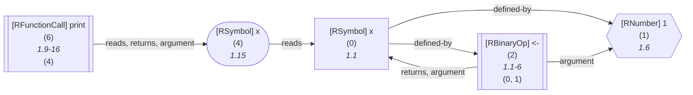

_This document was generated from '[src/documentation/print-core-wiki.ts](https://github.com/flowr-analysis/flowr/tree/main//src/documentation/print-core-wiki.ts)' on 2025-02-10, 17:02:53 UTC presenting an overview of flowR's core (v2.2.2, using R v4.4.2). Please do not edit this file/wiki page directly._

This wiki page provides an overview of the inner workings of _flowR_.
It is mostly intended for developers that want to extend the capabilities of _flowR_
and assumes knowledge of [TypeScript](https://www.typescriptlang.org/) and [R](https://www.r-project.org/).


> [!NOTE]
> 
> Essentially every step we explain here can be explored directly from flowR's REPL in an interactive fashion (see the [Interface](https://github.com/flowr-analysis/flowr/wiki/Interface#using-the-repl) wiki page).
> We recommend to use commands like <span title="Description (Repl Command): Prints ASCII Art of the parsed, unmodified AST, start with 'file://' to indicate a file (aliases: :p)">`:parse`</span> or <span title="Description (Repl Command): Get mermaid code for the dataflow graph of R code, start with 'file://' to indicate a file (aliases: :d, :df)">`:dataflow`</span> to explore the output of flowR using your own samples.
> As a quickstart you may use:
> 
> 
> 
> ```shell
> $ docker run -it --rm eagleoutice/flowr # or npm run flowr 
> flowR repl using flowR v2.2.2, R v4.4.2 (r-shell engine)
> R> :parse "x <- 1; print(x)"
> ```
> 
> <details>
> <summary style='color:gray'>Output</summary>
> 
> 
> ```text
> exprlist
> ├ expr
> │ ├ expr
> │ │ ╰ SYMBOL "x" (1:1)
> │ ├ LEFT_ASSIGN "<-" (1:3─4)
> │ ╰ expr
> │   ╰ NUM_CONST "1" (1:6)
> ├ ; ";" (1:7)
> ╰ expr
>   ├ expr
>   │ ╰ SYMBOL_FUNCTION_CALL "print" (1:9─13)
>   ├ ( "(" (1:14)
>   ├ expr
>   │ ╰ SYMBOL "x" (1:15)
>   ╰ ) ")" (1:16)
> ```
> 
> 
> Retrieves the AST from the [<code><span title="The RShell represents an interactive session with the R interpreter. You can configure it by RShellOptions .  At the moment we are using a live R session (and not networking etc.) to communicate with R easily, which allows us to install packages etc. However, this might and probably will change in the future (leaving this as a legacy mode :D)">RShell</span></code>](https://github.com/flowr-analysis/flowr/tree/main//src/r-bridge/shell.ts#L140).
> 
> </details>
> 
> 
> 	
> If you are brave enough, you can also try to use the <span title="Description (Command Line Argument): Run with verbose logging (will be passed to the corresponding script)">`--verbose`</span> option to be dumped with information about flowR's internals (please, never use this for benchmarking).
> 

	
* [Pipelines and their Execution](#pipelines-and-their-execution)
* [How flowR Produces Dataflow Graphs](#how-flowr-produces-dataflow-graphs)
  * [Overview](#overview)
  * [Parsing](#parsing)
  * [Normalization](#normalization)
  * [Dataflow Graph Generation](#dataflow-graph-generation)
* [Beyond the Dataflow Graph](#beyond-the-dataflow-graph)
  * [Static Backward Slicing](#static-backward-slicing)
	
## Pipelines and their Execution

At the core of every analysis by flowR is the [<code><span title="The pipeline executor allows to execute arbitrary pipelines in a step-by-step fashion. If you are not yet in the possession of a pipeline , you can use the createPipeline function to create one for yourself, based on the steps that you want to execute.  Those steps are split into two phases or 'stages' (which is the name that we will use in the following), represented by the PipelineStepStage type...">PipelineExecutor</span></code>](https://github.com/flowr-analysis/flowr/tree/main//src/core/pipeline-executor.ts#L98) class which takes a sequence of analysis steps (in the form of a [<code><span title="A pipeline is a collection of steps that are executed in a certain order . It is to be created createPipeline .  If you want to get the type of all steps in the pipeline (given they are created canonically using const step names), refer to PipelineStepNames .">Pipeline</span></code>](https://github.com/flowr-analysis/flowr/tree/main//src/core/steps/pipeline/pipeline.ts#L11)) and executes it
on a given input. In general, these pipeline steps are analysis agnostic and may use arbitrary input and ordering. However, two important and predefined pipelines, 
the [<code><span title="The default pipeline for working with flowR, including the dataflow step. See the DEFAULT_NORMALIZE_PIPELINE for the pipeline without the dataflow step and the DEFAULT_SLICE_AND_RECONSTRUCT_PIPELINE for the pipeline with slicing and reconstructing steps">DEFAULT_DATAFLOW_PIPELINE</span></code>](https://github.com/flowr-analysis/flowr/tree/main//src/core/steps/pipeline/default-pipelines.ts#L28) and the [<code>TREE_SITTER_DATAFLOW_PIPELINE</code>](https://github.com/flowr-analysis/flowr/tree/main//src/core/steps/pipeline/default-pipelines.ts#L29) adequately cover the most common analysis steps (differentiated only by the [Engine](https://github.com/flowr-analysis/flowr/wiki/Engines) used).


> [!TIP]
> 
> 	You can hover over most links within these wiki pages to get access to the tsdoc comment of the respective element. 
> 	The links should direct you to the up-to-date implementation.
> 

	
Using the [`tree-sitter` engine](https://github.com/flowr-analysis/flowr/wiki/Engines) you can request a dataflow analysis of a sample piece of R code like the following:


```typescript
const executor = new PipelineExecutor(TREE_SITTER_DATAFLOW_PIPELINE, {
	parser:  new TreeSitterExecutor(),
	request: requestFromInput('x <- 1; y <- x; print(y);')
});
const result = await executor.allRemainingSteps();
```


This is, roughly, what the [<code><span title="Obtain the dataflow graph using a known parser (such as the RShell or TreeSitterExecutor ).">replGetDataflow</span></code>](https://github.com/flowr-analysis/flowr/tree/main//src/cli/repl/commands/repl-dataflow.ts#L12) function does for the <span title="Description (Repl Command): Get mermaid code for the dataflow graph of R code, start with 'file://' to indicate a file (aliases: :d, :df)">`:dataflow`</span> REPL command when using the [`tree-sitter` engine](https://github.com/flowr-analysis/flowr/wiki/Engines).
In general, however, most flowR-internal function which are tasked with generating dataflow prefer the use of createDataflowPipeline as this function
automatically selects the correct pipeline based on the engine used.

### Understanding Pipeline Steps

Everything that complies to the [<code><span title="Defines what is to be known of a single step in a pipeline. It wraps around a single processor function, providing additional information. Steps will be executed synchronously, in-sequence, based on their dependencies .">IPipelineStep</span></code>](https://github.com/flowr-analysis/flowr/tree/main//src/core/steps/pipeline-step.ts#L70) interface can be used as a step in a pipeline, with the most important definition being the
`processor` function, which refers to the actual work performed by the step.
For example, the [<code>STATIC_DATAFLOW</code>](https://github.com/flowr-analysis/flowr/tree/main//src/core/steps/all/core/20-dataflow.ts#L34) step ultimately relies on the [<code><span title="This is the main function to produce the dataflow graph from a given request and normalized AST. Note, that this requires knowledge of the active parser in case the dataflow analysis uncovers other files that have to be parsed and integrated into the analysis (e.g., in the event of a source call). For the actual, canonical fold entry point, see processDataflowFor .">produceDataFlowGraph</span></code>](https://github.com/flowr-analysis/flowr/tree/main//src/dataflow/extractor.ts#L92) function to create a [dataflow graph](https://github.com/flowr-analysis/flowr/wiki/Dataflow-Graph) 
using the [normalized AST](https://github.com/flowr-analysis/flowr/wiki/Normalized-AST) of the program.

### Shape of a Pipeline Step

Using code, you can provide an arbitrary pipeline step to the executor, as long as it implements the [<code><span title="Defines what is to be known of a single step in a pipeline. It wraps around a single processor function, providing additional information. Steps will be executed synchronously, in-sequence, based on their dependencies .">IPipelineStep</span></code>](https://github.com/flowr-analysis/flowr/tree/main//src/core/steps/pipeline-step.ts#L70) interface:

 * **[IPipelineStep](https://github.com/flowr-analysis/flowr/tree/main//src/core/steps/pipeline-step.ts#L70)**   
 Defines what is to be known of a single step in a pipeline.
   It wraps around a single
   <code>processor</code>
   function, providing additional information.
   Steps will be executed synchronously, in-sequence, based on their
   <code>dependencies</code>
   .
   <details><summary style="color:gray">Defined at <a href="https://github.com/flowr-analysis/flowr/tree/main//src/core/steps/pipeline-step.ts#L70">./src/core/steps/pipeline-step.ts#L70</a></summary>
   
   
   ```ts
   /**
    * Defines what is to be known of a single step in a pipeline.
    * It wraps around a single {@link IPipelineStep#processor|processor} function, providing additional information.
    * Steps will be executed synchronously, in-sequence, based on their {@link IPipelineStep#dependencies|dependencies}.
    */
   export interface IPipelineStep<
       Name extends PipelineStepName = PipelineStepName,
       // eslint-disable-next-line -- by default, we assume nothing about the function shape
       Fn extends StepProcessingFunction = (...args: any[]) => any,
   > extends MergeableRecord, IPipelineStepOrder<Name> {
       /** Human-readable name of this step */
       readonly humanReadableName: string
       /** Human-readable description of this step */
       readonly description:       string
       /** The main processor that essentially performs the logic of this step */
       readonly processor:         (...input: Parameters<Fn>) => ReturnType<Fn>
       /** How to visualize the results of the respective step to the user? */
       readonly printer: {
           [K in StepOutputFormat]?: IPipelineStepPrinter<Fn, K, never[]>
       } & {
           // we always want to have an internal printer
           [StepOutputFormat.Internal]: InternalStepPrinter<Fn>
       }
       /**
        * Input configuration required to perform the respective steps.
        * Required inputs of dependencies do not have to, but can be repeated.
        * <p>
        * Use the pattern `undefined as unknown as T` to indicate that the value is required but not provided.
        */
       readonly requiredInput: object
   }
   ```
   
   
   </details>
   

Every step may specify required inputs, ways of visualizing the output, and its dependencies using the [<code><span title="Contains the data to specify the order of steps in a pipeline.">IPipelineStepOrder</span></code>](https://github.com/flowr-analysis/flowr/tree/main//src/core/steps/pipeline-step.ts#L39) interface.
As the types may seem to be somewhat confusing or over-complicated, we recommend you to look at some of the existing steps, like 
the [<code>PARSE_WITH_R_SHELL_STEP</code>](https://github.com/flowr-analysis/flowr/tree/main//src/core/steps/all/core/00-parse.ts#L10) or the [<code>STATIC_DATAFLOW</code>](https://github.com/flowr-analysis/flowr/tree/main//src/core/steps/all/core/20-dataflow.ts#L34) step.
The pipeline executor should do a good job of scheduling these steps, and inferring the required inputs in the type system (have a look at the [<code><span title="Creates a pipeline from a given collection of steps . To be valid, the collection of steps must satisfy the following set of constraints (which should be logical, when you consider what a pipeline should achieve):  0) the collection of steps is not empty 1) all names of steps are unique for the given pipeline 2) all dependencies of all steps exist 3) there are no cycles in the dependency graph 4) ...">createPipeline</span></code>](https://github.com/flowr-analysis/flowr/tree/main//src/core/steps/pipeline/pipeline.ts#L144) function if you want to know more).


> [!NOTE]
> 
> Under the hood there is a step-subtype called a decoration. Such a step can be added to a pipeline to decorate the output of another one (e.g., making it more precise, re-adding debug info, ...).
> To mark a step as a decoration, you can use the `decorates` field in the [<code><span title="Contains the data to specify the order of steps in a pipeline.">IPipelineStepOrder</span></code>](https://github.com/flowr-analysis/flowr/tree/main//src/core/steps/pipeline-step.ts#L39) interface.
> However, as such steps are currently not relevant for any of flowR's core analyses we will not go into detail here. It suffices to know how "real" steps work.
> 

	
## How flowR Produces Dataflow Graphs

This section focuses on the generation of a [dataflow graph](https://github.com/flowr-analysis/flowr/wiki/Dataflow-Graph) from a given R program, using the [RShell Engine](https://github.com/flowr-analysis/flowr/wiki/Engines) and hence the 
[<code><span title="The default pipeline for working with flowR, including the dataflow step. See the DEFAULT_NORMALIZE_PIPELINE for the pipeline without the dataflow step and the DEFAULT_SLICE_AND_RECONSTRUCT_PIPELINE for the pipeline with slicing and reconstructing steps">DEFAULT_DATAFLOW_PIPELINE</span></code>](https://github.com/flowr-analysis/flowr/tree/main//src/core/steps/pipeline/default-pipelines.ts#L28). The [`tree-sitter` engine](https://github.com/flowr-analysis/flowr/wiki/Engines) uses the [<code>TREE_SITTER_DATAFLOW_PIPELINE</code>](https://github.com/flowr-analysis/flowr/tree/main//src/core/steps/pipeline/default-pipelines.ts#L29)), 
which replaces the parser with the integrated tree-sitter parser and hence uses a slightly adapted normalization step to produce a similar [normalized AST](https://github.com/flowr-analysis/flowr/wiki/Normalized-AST).
The [dataflow graph](https://github.com/flowr-analysis/flowr/wiki/Dataflow-Graph) should be the same for both engines (although [`tree-sitter`](https://github.com/flowr-analysis/flowr/wiki/Engines) is faster and may be able to parse more files).

### Overview

Let's have a look at the definition of the pipeline:

 * [DEFAULT_DATAFLOW_PIPELINE](https://github.com/flowr-analysis/flowr/tree/main//src/core/steps/pipeline/default-pipelines.ts#L28)   
 The default pipeline for working with flowR, including the dataflow step.
   See the
   <code>DEFAULT_NORMALIZE_PIPELINE</code>
   for the pipeline without the dataflow step
   and the
   <code>DEFAULT_SLICE_AND_RECONSTRUCT_PIPELINE</code>
   for the pipeline with slicing and reconstructing steps
   <details><summary style="color:gray">Defined at <a href="https://github.com/flowr-analysis/flowr/tree/main//src/core/steps/pipeline/default-pipelines.ts#L28">./src/core/steps/pipeline/default-pipelines.ts#L28</a></summary>
   
   
   ```ts
   DEFAULT_DATAFLOW_PIPELINE = createPipeline(PARSE_WITH_R_SHELL_STEP, NORMALIZE, STATIC_DATAFLOW)
   ```
   
   
   </details>
   

We can see that it relies on three steps:

1. **[PARSE_WITH_R_SHELL_STEP](https://github.com/flowr-analysis/flowr/tree/main//src/core/steps/all/core/00-parse.ts#L10)** ([parsing](#parsing)): Uses the [<code><span title="The RShell represents an interactive session with the R interpreter. You can configure it by RShellOptions .  At the moment we are using a live R session (and not networking etc.) to communicate with R easily, which allows us to install packages etc. However, this might and probably will change in the future (leaving this as a legacy mode :D)">RShell</span></code>](https://github.com/flowr-analysis/flowr/tree/main//src/r-bridge/shell.ts#L140) to parse the input program.\
   _Its main function linked as the processor is the [<span title="Takes an input program and parses it using the given parser.">parseRequests</span>](https://github.com/flowr-analysis/flowr/tree/main//src/r-bridge/parser.ts#L52) function._
2. **[NORMALIZE](https://github.com/flowr-analysis/flowr/tree/main//src/core/steps/all/core/10-normalize.ts#L37)** ([normalization](#normalization)):  Normalizes the AST produced by the parser (to create a [normalized AST](https://github.com/flowr-analysis/flowr/wiki/Normalized-AST)).\
   _Its main function linked as the processor is the [<span title="the normalized AST produced by the 'normalization' step, including its parent decoration">normalize</span>](https://github.com/flowr-analysis/flowr/tree/main//src/benchmark/slicer.ts#L61) function._
3. **[STATIC_DATAFLOW](https://github.com/flowr-analysis/flowr/tree/main//src/core/steps/all/core/20-dataflow.ts#L34)** ([dataflow](#dataflow-graph-generation)): Produces the actual [dataflow graph](https://github.com/flowr-analysis/flowr/wiki/Dataflow-Graph) from the normalized AST.\
   _Its main function linked as the processor is the [<span title="This is the main function to produce the dataflow graph from a given request and normalized AST. Note, that this requires knowledge of the active parser in case the dataflow analysis uncovers other files that have to be parsed and integrated into the analysis (e.g., in the event of a source call). For the actual, canonical fold entry point, see processDataflowFor .">produceDataFlowGraph</span>](https://github.com/flowr-analysis/flowr/tree/main//src/dataflow/extractor.ts#L92) function._

To explore these steps, let's use the REPL with the (very simple and contrived) R code: `x <- 1; print(x)`.


```shell
$ docker run -it --rm eagleoutice/flowr # or npm run flowr 
flowR repl using flowR v2.2.2, R v4.4.2 (r-shell engine)
R> :parse "x <- 1; print(x)"
```

<details>
<summary style='color:gray'>Output</summary>


```text
exprlist
├ expr
│ ├ expr
│ │ ╰ SYMBOL "x" (1:1)
│ ├ LEFT_ASSIGN "<-" (1:3─4)
│ ╰ expr
│   ╰ NUM_CONST "1" (1:6)
├ ; ";" (1:7)
╰ expr
  ├ expr
  │ ╰ SYMBOL_FUNCTION_CALL "print" (1:9─13)
  ├ ( "(" (1:14)
  ├ expr
  │ ╰ SYMBOL "x" (1:15)
  ╰ ) ")" (1:16)
```


This shows the ASCII-Art representation of the parse-tree of the R code `x <- 1; print(x)`, as it is provided by the [<code><span title="The RShell represents an interactive session with the R interpreter. You can configure it by RShellOptions .  At the moment we are using a live R session (and not networking etc.) to communicate with R easily, which allows us to install packages etc. However, this might and probably will change in the future (leaving this as a legacy mode :D)">RShell</span></code>](https://github.com/flowr-analysis/flowr/tree/main//src/r-bridge/shell.ts#L140). See the [<code><span title="Command(s) to be issued at the start of each shell">initCommand</span></code>](https://github.com/flowr-analysis/flowr/tree/main//src/r-bridge/init.ts#L6) function for more information on how we request a parse.

</details>


```shell
R> :normalize* "x <- 1; print(x)"
```

<details>
<summary style='color:gray'>Output</summary>


```text
https://mermaid.live/view#base64:eyJjb2RlIjoiZmxvd2NoYXJ0IFREXG4gICAgbjcoW1wiUkV4cHJlc3Npb25MaXN0ICg3KVxuIFwiXSlcbiAgICBuMihbXCJSQmluYXJ5T3AgKDIpXG4jNjA7IzQ1O1wiXSlcbiAgICBuNyAtLT58XCJleHByLWxpc3QtY2hpbGQtMFwifCBuMlxuICAgIG4wKFtcIlJTeW1ib2wgKDApXG54XCJdKVxuICAgIG4yIC0tPnxcImJpbm9wLWxoc1wifCBuMFxuICAgIG4xKFtcIlJOdW1iZXIgKDEpXG4xXCJdKVxuICAgIG4yIC0tPnxcImJpbm9wLXJoc1wifCBuMVxuICAgIG42KFtcIlJGdW5jdGlvbkNhbGwgKDYpXG5wcmludFwiXSlcbiAgICBuNyAtLT58XCJleHByLWxpc3QtY2hpbGQtMVwifCBuNlxuICAgIG4zKFtcIlJTeW1ib2wgKDMpXG5wcmludFwiXSlcbiAgICBuNiAtLT58XCJjYWxsLW5hbWVcInwgbjNcbiAgICBuNShbXCJSQXJndW1lbnQgKDUpXG54XCJdKVxuICAgIG42IC0tPnxcImNhbGwtYXJndW1lbnQtMVwifCBuNVxuICAgIG40KFtcIlJTeW1ib2wgKDQpXG54XCJdKVxuICAgIG41IC0tPnxcImFyZy12YWx1ZVwifCBuNFxuIiwibWVybWFpZCI6eyJhdXRvU3luYyI6dHJ1ZX19
Copied mermaid url to clipboard (normalize: 0ms).
```


Following the link output should show the following:


	
(The analysis required _4.23 ms_ (including parsing with the [r-shell](https://github.com/flowr-analysis/flowr/wiki/Engines) engine) within the generation environment.)


</details>


```shell
R> :dataflow* "x <- 1; print(x)"
```

<details>
<summary style='color:gray'>Output</summary>


```text
https://mermaid.live/view#base64:eyJjb2RlIjoiZmxvd2NoYXJ0IFREXG4gICAgMXt7XCJgIzkxO1JOdW1iZXIjOTM7IDFcbiAgICAgICgxKVxuICAgICAgKjEuNipgXCJ9fVxuICAgIDBbXCJgIzkxO1JTeW1ib2wjOTM7IHhcbiAgICAgICgwKVxuICAgICAgKjEuMSpgXCJdXG4gICAgMltbXCJgIzkxO1JCaW5hcnlPcCM5MzsgIzYwOyM0NTtcbiAgICAgICgyKVxuICAgICAgKjEuMS02KlxuICAgICgwLCAxKWBcIl1dXG4gICAgNChbXCJgIzkxO1JTeW1ib2wjOTM7IHhcbiAgICAgICg0KVxuICAgICAgKjEuMTUqYFwiXSlcbiAgICA2W1tcImAjOTE7UkZ1bmN0aW9uQ2FsbCM5MzsgcHJpbnRcbiAgICAgICg2KVxuICAgICAgKjEuOS0xNipcbiAgICAoNClgXCJdXVxuICAgIDAgLS0+fFwiZGVmaW5lZC1ieVwifCAxXG4gICAgMCAtLT58XCJkZWZpbmVkLWJ5XCJ8IDJcbiAgICAyIC0tPnxcImFyZ3VtZW50XCJ8IDFcbiAgICAyIC0tPnxcInJldHVybnMsIGFyZ3VtZW50XCJ8IDBcbiAgICA0IC0tPnxcInJlYWRzXCJ8IDBcbiAgICA2IC0tPnxcInJlYWRzLCByZXR1cm5zLCBhcmd1bWVudFwifCA0IiwibWVybWFpZCI6eyJhdXRvU3luYyI6dHJ1ZX19
Copied mermaid url to clipboard (dataflow: 1ms).
```


Following the link output should show the following:



	
(The analysis required _6.91 ms_ (including parse and normalize, using the [r-shell](https://github.com/flowr-analysis/flowr/wiki/Engines) engine) within the generation environment.)


</details>


	
Especially when you are just starting with flowR, we recommend to use the REPL to explore the output of the different steps.


> [!NOTE]
> Maybe you are left with the question on what is tree-sitter doing different. Expand the following to get more information!
> 
> 
> <details><summary style="color:black">And what changes with tree-sitter?</summary>
> 
> 
> 
> Essentially not much! Have a look at the [Engines](https://github.com/flowr-analysis/flowr/wiki/Engines) wiki page for more information on the differences between the engines.
> Below you can see the Repl commands for the tree-sitter engine:
> 
> 
> 
> ```shell
> $ docker run -it --rm eagleoutice/flowr --default-engine tree-sitter # or npm run flowr -- --default-engine tree-sitter
> flowR repl using flowR v2.2.2 (tree-sitter engine)
> R> :parse "x <- 1; print(x)"
> ```
> 
> <details>
> <summary style='color:gray'>Output</summary>
> 
> 
> ```text
> program
> ├ binary_operator
> │ ├ identifier "x" (1:1─2)
> │ ├ <- "<-" (1:3─5)
> │ ╰ float "1" (1:6─7)
> ╰ call
>   ├ identifier "print" (1:9─14)
>   ╰ arguments
>     ├ ( "(" (1:14─15)
>     ├ argument
>     │ ╰ identifier "x" (1:15─16)
>     ╰ ) ")" (1:16─17)
> ```
> 
> 
> This shows the ASCII-Art representation of the parse-tree of the R code `x <- 1; print(x)`, as it is provided by the [<code><span title="Synchronous and (way) faster alternative to the RShell using tree-sitter.">TreeSitterExecutor</span></code>](https://github.com/flowr-analysis/flowr/tree/main//src/r-bridge/lang-4.x/tree-sitter/tree-sitter-executor.ts#L13). See the [Engines](https://github.com/flowr-analysis/flowr/wiki/Engines) wiki page for more information on the differences between the engines.
> 
> </details>
> 
> 
> 
> ```shell
> R> :normalize* "x <- 1; print(x)"
> ```
> 
> <details>
> <summary style='color:gray'>Output</summary>
> 
> 
> ```text
> https://mermaid.live/view#base64:eyJjb2RlIjoiZmxvd2NoYXJ0IFREXG4gICAgbjcoW1wiUkV4cHJlc3Npb25MaXN0ICg3KVxuIFwiXSlcbiAgICBuMihbXCJSQmluYXJ5T3AgKDIpXG4jNjA7IzQ1O1wiXSlcbiAgICBuNyAtLT58XCJleHByLWxpc3QtY2hpbGQtMFwifCBuMlxuICAgIG4wKFtcIlJTeW1ib2wgKDApXG54XCJdKVxuICAgIG4yIC0tPnxcImJpbm9wLWxoc1wifCBuMFxuICAgIG4xKFtcIlJOdW1iZXIgKDEpXG4xXCJdKVxuICAgIG4yIC0tPnxcImJpbm9wLXJoc1wifCBuMVxuICAgIG42KFtcIlJGdW5jdGlvbkNhbGwgKDYpXG5wcmludFwiXSlcbiAgICBuNyAtLT58XCJleHByLWxpc3QtY2hpbGQtMVwifCBuNlxuICAgIG4zKFtcIlJTeW1ib2wgKDMpXG5wcmludFwiXSlcbiAgICBuNiAtLT58XCJjYWxsLW5hbWVcInwgbjNcbiAgICBuNShbXCJSQXJndW1lbnQgKDUpXG54XCJdKVxuICAgIG42IC0tPnxcImNhbGwtYXJndW1lbnQtMVwifCBuNVxuICAgIG40KFtcIlJTeW1ib2wgKDQpXG54XCJdKVxuICAgIG41IC0tPnxcImFyZy12YWx1ZVwifCBuNFxuIiwibWVybWFpZCI6eyJhdXRvU3luYyI6dHJ1ZX19
> Copied mermaid url to clipboard (normalize: 0ms).
> ```
> 
> 
> Following the link output should show the following:
> 
> 
> 
> ```mermaid
> flowchart TD
>     n7(["RExpressionList (7)
>  "])
>     n2(["RBinaryOp (2)
> #60;#45;"])
>     n7 -->|"expr-list-child-0"| n2
>     n0(["RSymbol (0)
> x"])
>     n2 -->|"binop-lhs"| n0
>     n1(["RNumber (1)
> 1"])
>     n2 -->|"binop-rhs"| n1
>     n6(["RFunctionCall (6)
> print"])
>     n7 -->|"expr-list-child-1"| n6
>     n3(["RSymbol (3)
> print"])
>     n6 -->|"call-name"| n3
>     n5(["RArgument (5)
> x"])
>     n6 -->|"call-argument-1"| n5
>     n4(["RSymbol (4)
> x"])
>     n5 -->|"arg-value"| n4
> 
> ```
> 	
> (The analysis required _4.80 ms_ (including parsing with the [tree-sitter](https://github.com/flowr-analysis/flowr/wiki/Engines) engine) within the generation environment.)
> 
> 
> 
> </details>
> 
> 
> 
> ```shell
> R> :dataflow* "x <- 1; print(x)"
> ```
> 
> <details>
> <summary style='color:gray'>Output</summary>
> 
> 
> ```text
> https://mermaid.live/view#base64:eyJjb2RlIjoiZmxvd2NoYXJ0IFREXG4gICAgMXt7XCJgIzkxO1JOdW1iZXIjOTM7IDFcbiAgICAgICgxKVxuICAgICAgKjEuNipgXCJ9fVxuICAgIDBbXCJgIzkxO1JTeW1ib2wjOTM7IHhcbiAgICAgICgwKVxuICAgICAgKjEuMSpgXCJdXG4gICAgMltbXCJgIzkxO1JCaW5hcnlPcCM5MzsgIzYwOyM0NTtcbiAgICAgICgyKVxuICAgICAgKjEuMS02KlxuICAgICgwLCAxKWBcIl1dXG4gICAgNChbXCJgIzkxO1JTeW1ib2wjOTM7IHhcbiAgICAgICg0KVxuICAgICAgKjEuMTUqYFwiXSlcbiAgICA2W1tcImAjOTE7UkZ1bmN0aW9uQ2FsbCM5MzsgcHJpbnRcbiAgICAgICg2KVxuICAgICAgKjEuOS0xNipcbiAgICAoNClgXCJdXVxuICAgIDAgLS0+fFwiZGVmaW5lZC1ieVwifCAxXG4gICAgMCAtLT58XCJkZWZpbmVkLWJ5XCJ8IDJcbiAgICAyIC0tPnxcImFyZ3VtZW50XCJ8IDFcbiAgICAyIC0tPnxcInJldHVybnMsIGFyZ3VtZW50XCJ8IDBcbiAgICA0IC0tPnxcInJlYWRzXCJ8IDBcbiAgICA2IC0tPnxcInJlYWRzLCByZXR1cm5zLCBhcmd1bWVudFwifCA0IiwibWVybWFpZCI6eyJhdXRvU3luYyI6dHJ1ZX19
> Copied mermaid url to clipboard (dataflow: 0ms).
> ```
> 
> 
> Following the link output should show the following:
> 
> 
> 
> ```mermaid
> flowchart LR
>     1{{"`#91;RNumber#93; 1
>       (1)
>       *1.6*`"}}
>     0["`#91;RSymbol#93; x
>       (0)
>       *1.1*`"]
>     2[["`#91;RBinaryOp#93; #60;#45;
>       (2)
>       *1.1-6*
>     (0, 1)`"]]
>     4(["`#91;RSymbol#93; x
>       (4)
>       *1.15*`"])
>     6[["`#91;RFunctionCall#93; print
>       (6)
>       *1.9-16*
>     (4)`"]]
>     0 -->|"defined-by"| 1
>     0 -->|"defined-by"| 2
>     2 -->|"argument"| 1
>     2 -->|"returns, argument"| 0
>     4 -->|"reads"| 0
>     6 -->|"reads, returns, argument"| 4
> ```
> 	
> (The analysis required _1.23 ms_ (including parse and normalize, using the [tree-sitter](https://github.com/flowr-analysis/flowr/wiki/Engines) engine) within the generation environment.)
> 
> 
> 
> </details>
> 
> 
> 
> 
> </details>
>     


### Parsing

This uses the [<code><span title="The RShell represents an interactive session with the R interpreter. You can configure it by RShellOptions .  At the moment we are using a live R session (and not networking etc.) to communicate with R easily, which allows us to install packages etc. However, this might and probably will change in the future (leaving this as a legacy mode :D)">RShell</span></code>](https://github.com/flowr-analysis/flowr/tree/main//src/r-bridge/shell.ts#L140) to parse the input program.
To speed up the process, we use the [<code><span title="Command(s) to be issued at the start of each shell">initCommand</span></code>](https://github.com/flowr-analysis/flowr/tree/main//src/r-bridge/init.ts#L6) function to compile the parsing function and rely on a 
custom serialization.

_This is currently work in progress._


### Normalization

The normalization takes the output from the previous steps and uses the [<code><span title="Takes the raw RShell output and extracts the csv information contained">prepareParsedData</span></code>](https://github.com/flowr-analysis/flowr/tree/main//src/r-bridge/lang-4.x/ast/parser/json/format.ts#L52) and 
[<code><span title="Takes the CSV-Entries and maps them to the old json format for compatibility.">convertPreparedParsedData</span></code>](https://github.com/flowr-analysis/flowr/tree/main//src/r-bridge/lang-4.x/ast/parser/json/format.ts#L87) functions to
first transform the serialized parsing output to an object. Next, [<code><span title="Takes the parse dta as object and produces an undecorated, normalized AST.">normalizeRootObjToAst</span></code>](https://github.com/flowr-analysis/flowr/tree/main//src/r-bridge/lang-4.x/ast/parser/main/internal/structure/normalize-root.ts#L16) transforms this object to
an normalized AST and [<code><span title="Covert the given AST into a doubly linked tree while assigning ids (so it stays serializable).">decorateAst</span></code>](https://github.com/flowr-analysis/flowr/tree/main//src/r-bridge/lang-4.x/ast/model/processing/decorate.ts#L150) adds additional information to the AST (like roles, ids, depth, etc.).

_This is currently work in progress._

### Dataflow Graph Generation

The core of the dataflow graph generation works as a "stateful [fold](https://en.wikipedia.org/wiki/Fold_(higher-order_function))", 
which uses the tree-like structure of the AST to combine the dataflow information of the children, while tracking the currently active variables and control flow 
information as a "backpack" (state).	
We use the [<code><span title="This is the main function to produce the dataflow graph from a given request and normalized AST. Note, that this requires knowledge of the active parser in case the dataflow analysis uncovers other files that have to be parsed and integrated into the analysis (e.g., in the event of a source call). For the actual, canonical fold entry point, see processDataflowFor .">produceDataFlowGraph</span></code>](https://github.com/flowr-analysis/flowr/tree/main//src/dataflow/extractor.ts#L92) function as an entry point to the dataflow generation (the actual fold entry is in [<code><span title="Originally, dataflow processor was written as a two-way fold, but this produced problems when trying to resolve function calls which require information regarding the calling *and* definition context. While this only is a problem for late bindings as they happen with functions (and probably quote'd R-expressions), it is still a problem that must be dealt with. Therefore, the dataflow processor has...">processDataflowFor</span></code>](https://github.com/flowr-analysis/flowr/tree/main//src/dataflow/processor.ts#L69)).
The function is mainly backed by its [<code><span title="The best friend of produceDataFlowGraph and processDataflowFor . Maps every RType in the normalized AST to a processor.">processors</span></code>](https://github.com/flowr-analysis/flowr/tree/main//src/dataflow/extractor.ts#L36) object which maps each type in the normalized AST to an appropriate handler ("fold-function").

To understand these handlers, let's start with the simplest one, [<code>processUninterestingLeaf</code>](https://github.com/flowr-analysis/flowr/tree/main//src/dataflow/internal/process/process-uninteresting-leaf.ts#L5) signals that 
we do not care about this node and just produce an empty dataflow information (using [<code><span title="Initializes an empty DataflowInformation object with the given entry point and data. This is to be used as a 'starting point' when processing leaf nodes during the dataflow extraction.">initializeCleanDataflowInformation</span></code>](https://github.com/flowr-analysis/flowr/tree/main//src/dataflow/info.ts#L123)). 
Looking at the function showcases the general structure of a processor:

 * [processUninterestingLeaf](https://github.com/flowr-analysis/flowr/tree/main//src/dataflow/internal/process/process-uninteresting-leaf.ts#L5)   
 
   <details open><summary style="color:gray">Defined at <a href="https://github.com/flowr-analysis/flowr/tree/main//src/dataflow/internal/process/process-uninteresting-leaf.ts#L5">./src/dataflow/internal/process/process-uninteresting-leaf.ts#L5</a></summary>
   
   
   ```ts
   export function processUninterestingLeaf<OtherInfo>(leaf: RNodeWithParent, info: DataflowProcessorInformation<OtherInfo>): DataflowInformation {
       return initializeCleanDataflowInformation(leaf.info.id, info);
   }
   ```
   
   
   </details>
   

Every processor has the same shape. It takes the normalized node (see the [normalized AST](https://github.com/flowr-analysis/flowr/wiki/Normalized-AST) for more information),
and a [<code>DataflowProcessorInformation</code>](https://github.com/flowr-analysis/flowr/tree/main//src/dataflow/processor.ts#L15) object which, as some kind of "backpack" carries global information
to every handler. 
This information is to be used to create a [<code><span title="The dataflow information is one of the fundamental structures we have in the dataflow analysis. It is continuously updated during the dataflow analysis and holds its current state for the respective subtree processed. Each processor during the dataflow analysis may use the information from its children to produce a new state of the dataflow information.  You may initialize a new dataflow informati...">DataflowInformation</span></code>](https://github.com/flowr-analysis/flowr/tree/main//src/dataflow/info.ts#L89):

 * **[DataflowInformation](https://github.com/flowr-analysis/flowr/tree/main//src/dataflow/info.ts#L89)**   
 The dataflow information is one of the fundamental structures we have in the dataflow analysis.
   It is continuously updated during the dataflow analysis
   and holds its current state for the respective subtree processed.
   Each processor during the dataflow analysis may use the information from its children
   to produce a new state of the dataflow information.
    You may initialize a new dataflow information with
   <code>initializeCleanDataflowInformation</code>
   .
   <details><summary style="color:gray">Defined at <a href="https://github.com/flowr-analysis/flowr/tree/main//src/dataflow/info.ts#L89">./src/dataflow/info.ts#L89</a></summary>
   
   
   ```ts
   /**
    * The dataflow information is one of the fundamental structures we have in the dataflow analysis.
    * It is continuously updated during the dataflow analysis
    * and holds its current state for the respective subtree processed.
    * Each processor during the dataflow analysis may use the information from its children
    * to produce a new state of the dataflow information.
    *
    * You may initialize a new dataflow information with {@link initializeCleanDataflowInformation}.
    *
    * @see {@link DataflowCfgInformation} - the control flow aspects
    */
   export interface DataflowInformation extends DataflowCfgInformation {
       /**
        * References that have not been identified as read or write and will be so on higher processors.
        *
        * For example, when we analyze the `x` vertex in `x <- 3`, we will first create an unknown reference for `x`
        * as we have not yet seen the assignment!
        *
        * @see {@link IdentifierReference} - a reference on a variable, parameter, function call, ...
        */
       unknownReferences: readonly IdentifierReference[]
       /**
        * References which are read within the current subtree.
        *
        * @see {@link IdentifierReference} - a reference on a variable, parameter, function call, ...
        * */
       in:                readonly IdentifierReference[]
       /**
        * References which are written to within the current subtree
        *
        * @see {@link IdentifierReference} - a reference on a variable, parameter, function call, ...
        */
       out:               readonly IdentifierReference[]
       /** Current environments used for name resolution, probably updated on the next expression-list processing */
       environment:       REnvironmentInformation
       /** The current constructed dataflow graph */
       graph:             DataflowGraph
   }
   ```
   
   
   </details>
   
    <details><summary style="color:black">View more (DataflowCfgInformation)</summary>

   * **[DataflowCfgInformation](https://github.com/flowr-analysis/flowr/tree/main//src/dataflow/info.ts#L71)**   
   The control flow information for the current DataflowInformation.
       <details><summary style="color:gray">Defined at <a href="https://github.com/flowr-analysis/flowr/tree/main//src/dataflow/info.ts#L71">./src/dataflow/info.ts#L71</a></summary>
     
     
     ```ts
     /** The control flow information for the current DataflowInformation. */
     export interface DataflowCfgInformation {
         /** The entry node into the subgraph */
         entryPoint: NodeId,
         /** All already identified exit points (active 'return'/'break'/'next'-likes) of the respective structure. */
         exitPoints: readonly ExitPoint[]
     }
     ```
     
     
     </details>
     

</details>
    

Essentially, these processors should use the dataflow information from their children combined with their own semantics
to produce a new dataflow information to pass upwards in the fold. The [<code><span title="The dataflow information is one of the fundamental structures we have in the dataflow analysis. It is continuously updated during the dataflow analysis and holds its current state for the respective subtree processed. Each processor during the dataflow analysis may use the information from its children to produce a new state of the dataflow information.  You may initialize a new dataflow informati...">DataflowInformation</span></code>](https://github.com/flowr-analysis/flowr/tree/main//src/dataflow/info.ts#L89) contains:

* the [<code><span title="The dataflow graph holds the dataflow information found within the given AST. We differentiate the directed edges in EdgeType and the vertices indicated by DataflowGraphVertexArgument The vertices of the graph are organized in a hierarchical fashion, with a function-definition node containing the node ids of its subgraph. However, all *edges* are hoisted at the top level in the form of an (attribu...">DataflowGraph</span></code>](https://github.com/flowr-analysis/flowr/tree/main//src/dataflow/graph/graph.ts#L137) of the current sub-tree 
* the currently active [<code><span title="An environment describes a ( scoped ) mapping of names to their definitions ( EnvironmentMemory ).  First, yes, R stores its environments differently, potentially even with another differentiation between the baseenv, the emptyenv, and other default environments (see https://adv-r.hadley.nz/environments.html). Yet, during the dataflow analysis, we want sometimes to know more (static reference info...">REnvironmentInformation</span></code>](https://github.com/flowr-analysis/flowr/tree/main//src/dataflow/environments/environment.ts#L98) as an abstraction of all active definitions linking to potential definition locations (see [Advanced R::Environments](https://adv-r.hadley.nz/environments.html))
* control flow information in [<code><span title="The control flow information for the current DataflowInformation.">DataflowCfgInformation</span></code>](https://github.com/flowr-analysis/flowr/tree/main//src/dataflow/info.ts#L71) which is used to enrich the dataflow information with control flow information
* and sets of currently ingoing (read), outgoing (write) and unknown [<code><span title="An identifier reference points to a variable like a in b <- a. Without any surrounding code, a will produce the identifier reference a. Similarly, b will create a reference (although it will be an identifier definition which adds even more information).  In general, references are merely pointers (with meta-information) to a vertex in the dataflow graph . In the context of the extractor, for examp...">IdentifierReference</span></code>](https://github.com/flowr-analysis/flowr/tree/main//src/dataflow/environments/identifier.ts#L73)s.

While all of them are essentially empty when processing an "uninteresting leaf", handling a constant is slightly more interesting with [<code>processValue</code>](https://github.com/flowr-analysis/flowr/tree/main//src/dataflow/internal/process/process-value.ts#L8):

 * [processValue](https://github.com/flowr-analysis/flowr/tree/main//src/dataflow/internal/process/process-value.ts#L8)   
 
   <details open><summary style="color:gray">Defined at <a href="https://github.com/flowr-analysis/flowr/tree/main//src/dataflow/internal/process/process-value.ts#L8">./src/dataflow/internal/process/process-value.ts#L8</a></summary>
   
   
   ```ts
   export function processValue<OtherInfo>(value: RNodeWithParent, data: DataflowProcessorInformation<OtherInfo>): DataflowInformation {
       return {
           unknownReferences: [],
           in:                [{ nodeId: value.info.id, name: undefined, controlDependencies: data.controlDependencies, type: ReferenceType.Constant }],
           out:               [],
           environment:       data.environment,
           graph:             new DataflowGraph(data.completeAst.idMap).addVertex({
               tag:                 VertexType.Value,
               id:                  value.info.id,
               controlDependencies: data.controlDependencies
           }),
           exitPoints: [{ nodeId: value.info.id, type: ExitPointType.Default, controlDependencies: data.controlDependencies }],
           entryPoint: value.info.id
       };
   }
   ```
   
   
   </details>
   

Please note, that we add the [value vertex](https://github.com/flowr-analysis/flowr/wiki/Dataflow-Graph#value-vertex) to the newly created dataflow graph,
which holds a reference to the constant. 

But again, this is not very interesting. When looking at the [<code><span title="The best friend of produceDataFlowGraph and processDataflowFor . Maps every RType in the normalized AST to a processor.">processors</span></code>](https://github.com/flowr-analysis/flowr/tree/main//src/dataflow/extractor.ts#L36) object you may be confused by
many lines just mapping the node to the [<code>processAsNamedCall</code>](https://github.com/flowr-analysis/flowr/tree/main//src/dataflow/internal/process/process-named-call.ts#L10) function.
This is because during the dataflow analysis we actually "desugar" the AST, and treat syntax constructs like binary operators (e.g. `x + y`) as function calls (e.g. `` `+`(x, y) ``).
We do this, because R does it the same way, and allows to even overwrite these operators (including `if`, `<-`, etc.) by their name.
By treating them like R, as function calls, we get support for these overwrites for free, courtesy of flowR's call resolution.

But where are all of the interesting things handled then? 
For that, we want to have a look at the built-in environment, which can be freely configured using flowR's [configuration system](https://github.com/flowr-analysis/flowr/wiki/Interface#configuring-flowr).
FlowR's heart and soul resides in the [<code><span title="Contains the built-in definitions recognized by flowR">DefaultBuiltinConfig</span></code>](https://github.com/flowr-analysis/flowr/tree/main//src/dataflow/environments/default-builtin-config.ts#L13) object, which is used to configure the built-in environment
by mapping function names to [<code>BuiltInProcessorMapper</code>](https://github.com/flowr-analysis/flowr/tree/main//src/dataflow/environments/built-in.ts#L133) functions.
There you can find functions like [<code><span title="Processes different types of access operations.  Example:   a[i] a$foo a[[i]] a@foo  ">processAccess</span></code>](https://github.com/flowr-analysis/flowr/tree/main//src/dataflow/internal/process/functions/call/built-in/built-in-access.ts#L51) which handles the (subset) access to a variable, 
or [<code>processForLoop</code>](https://github.com/flowr-analysis/flowr/tree/main//src/dataflow/internal/process/functions/call/built-in/built-in-for-loop.ts#L22) which handles the primitive for loop construct (whenever it is not overwritten).

Just as an example, we want to have a look at the [<code>processRepeatLoop</code>](https://github.com/flowr-analysis/flowr/tree/main//src/dataflow/internal/process/functions/call/built-in/built-in-repeat-loop.ts#L19) function, as it is one of the simplest built-in processors
we have:

 * [processRepeatLoop](https://github.com/flowr-analysis/flowr/tree/main//src/dataflow/internal/process/functions/call/built-in/built-in-repeat-loop.ts#L19)   
 
   <details open><summary style="color:gray">Defined at <a href="https://github.com/flowr-analysis/flowr/tree/main//src/dataflow/internal/process/functions/call/built-in/built-in-repeat-loop.ts#L19">./src/dataflow/internal/process/functions/call/built-in/built-in-repeat-loop.ts#L19</a></summary>
   
   
   ```ts
   export function processRepeatLoop<OtherInfo>(
       name: RSymbol<OtherInfo & ParentInformation>,
       args: readonly RFunctionArgument<OtherInfo & ParentInformation>[],
       rootId: NodeId,
       data: DataflowProcessorInformation<OtherInfo & ParentInformation>
   ): DataflowInformation {
       if(args.length !== 1 || args[0] === EmptyArgument) {
           dataflowLogger.warn(`Repeat-Loop ${name.content} does not have 1 argument, skipping`);
           return processKnownFunctionCall({ name, args, rootId, data }).information;
       }
   
       const unpacked = unpackArgument(args[0]);
       const { information, processedArguments } = processKnownFunctionCall({
           name,
           args:      unpacked ? [unpacked] : args,
           rootId,
           data,
           patchData: (d, i) => {
               if(i === 0) {
                   return { ...d, controlDependencies: [...d.controlDependencies ?? [], { id: name.info.id }] };
               }
               return d;
           },
           markAsNSE: [0]
       });
   
       const body = processedArguments[0];
       guard(body !== undefined, () => `Repeat-Loop ${name.content} has no body, impossible!`);
   
       linkCircularRedefinitionsWithinALoop(information.graph, produceNameSharedIdMap(findNonLocalReads(information.graph, [])), body.out);
   
       information.exitPoints = filterOutLoopExitPoints(information.exitPoints);
   
       return information;
   }
   ```
   
   
   </details>
   

Similar to any other built-in processor, we get the name of the function call which caused us to land here,
as well as the passed arguments. The `rootId` refers to what caused the call to happen (and is usually just the function call),
while `data` is our good old backpack, carrying all the information we need to produce a dataflow graph.

After a couple of common sanity checks at the beginning which we use to check whether the repeat loop is used in a way that we expect,
we start by issuing the fold continuation by processing its arguments. Given we expect `repeat <body>`, we expect only a single argument.
During the processing we make sure to stitch in the correct control dependencies, adding the repeat loop to the mix.
For just the repeat loop the stitching is actually not necessary, but this way the handling is consistent for all looping constructs.

Afterwards, we tak the `processedArguments`, perform another round of sanity checks and then use two special functions to apply the
semantic effects of the repeat loop. We first use one of flowR's linkers to
[<code><span title="all loops variables which are open read (not already bound by a redefinition within the loop) get a maybe read marker to their last definition within the loop e.g. with:   for(i in 1:10) { x_1 <- x_2 + 1 }   x_2 must get a read marker to x_1 as x_1 is the active redefinition in the second loop iteration.">linkCircularRedefinitionsWithinALoop</span></code>](https://github.com/flowr-analysis/flowr/tree/main//src/dataflow/internal/linker.ts#L358) and then retrieve the active exit points with [<code><span title="Filters out exit points which end their cascade within a loop.">filterOutLoopExitPoints</span></code>](https://github.com/flowr-analysis/flowr/tree/main//src/dataflow/info.ts#L175).

_This is currently work in progress._
Feel free to have a look around and explore the other handlers for now. Each of them uses the results of its children alongside the active backpack 
to produce a new dataflow information.

## Beyond the Dataflow Graph

Given the [dataflow graph](https://github.com/flowr-analysis/flowr/wiki/Dataflow-Graph), you can do a lot more!
You can issue [queries](https://github.com/flowr-analysis/flowr/wiki/Query-API) to explore the graph, or, for example, request a [static backward slice](#static-backward-slicing).
Of course, all of these endeavors work not just with the [<code><span title="The RShell represents an interactive session with the R interpreter. You can configure it by RShellOptions .  At the moment we are using a live R session (and not networking etc.) to communicate with R easily, which allows us to install packages etc. However, this might and probably will change in the future (leaving this as a legacy mode :D)">RShell</span></code>](https://github.com/flowr-analysis/flowr/tree/main//src/r-bridge/shell.ts#L140) but also with the [`tree-sitter` engine](https://github.com/flowr-analysis/flowr/wiki/Engines). 

### Static Backward Slicing 

The slicing is available as an extra step as you can see by inspecting he [<code>DEFAULT_SLICING_PIPELINE</code>](https://github.com/flowr-analysis/flowr/tree/main//src/core/steps/pipeline/default-pipelines.ts#L16).
Besides [<code>STATIC_SLICE</code>](https://github.com/flowr-analysis/flowr/tree/main//src/core/steps/all/static-slicing/00-slice.ts#L21) it contains a [<code>NAIVE_RECONSTRUCT</code>](https://github.com/flowr-analysis/flowr/tree/main//src/core/steps/all/static-slicing/10-reconstruct.ts#L18) to print the slice as (executable) R code.

Your main point of interesting here is the [<code><span title="This returns the ids to include in the static backward slice, when slicing with the given seed id's (must be at least one). <p> The returned ids can be used to reconstruct the slice to R code .">staticSlicing</span></code>](https://github.com/flowr-analysis/flowr/tree/main//src/slicing/static/static-slicer.ts#L29) function which relies on a modified
breadth-first search to collect all nodes which are part of the slice. 
For more information on how the slicing works, please refer to the [tool demonstration (Section 3.2)](https://doi.org/10.1145/3691620.3695359),
or the [original master's thesis (Chapter 4)](http://dx.doi.org/10.18725/OPARU-50107).

You can explore the slicing using the REPL with the <span title="Description (Repl Command): Static backwards executable slicer for R">`:slicer`</span> command:


```shell
$ docker run -it --rm eagleoutice/flowr # or npm run flowr 
flowR repl using flowR v2.2.2, R v4.4.2 (r-shell engine)
R> :slicer test/testfiles/example.R --criterion "12@product"
```

<details open>
<summary style='color:gray'>Output</summary>


```text
product <- 1
N <- 10
for(i in 1:(N-1)) product <- product * i
product
```


Slice for the example file for the variable "prod" in line 12.

</details>


