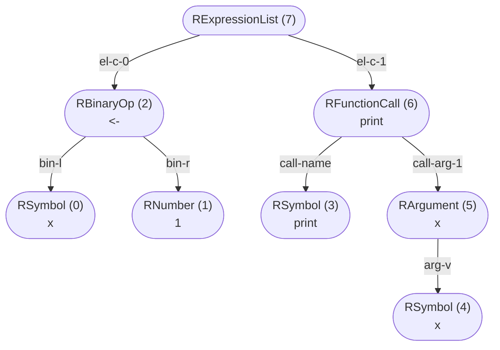
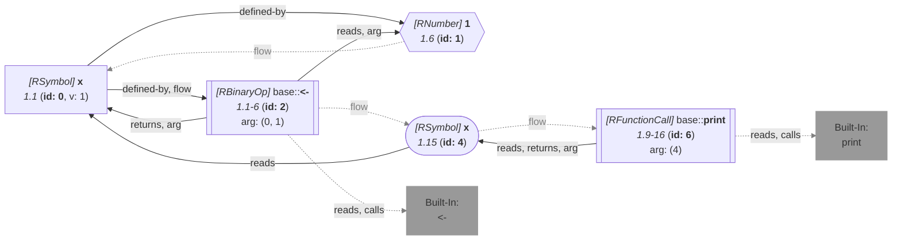

_<span title="an overview of flowR's core">Generated</span> from '[wiki-core.ts](https://github.com/flowr-analysis/flowr/tree/main/src/documentation/wiki-core.ts "src/documentation/wiki-core.ts")' on 2026-08-27, 08:24:10 UTC (v2.15.4, R v4.6.1), please do not edit directly._


This wiki page provides an overview of the inner workings of _flowR_.
It is mostly intended for developers that want to extend the capabilities of _flowR_
and assumes knowledge of [TypeScript](https://www.typescriptlang.org/) and [R](https://www.r-project.org/).
If you think parts of the wiki are missing, wrong, or outdated, please do not hesitate to [open a new issue](https://github.com/flowr-analysis/flowr/issues/new/choose)!
In case you are new and want to develop for flowR, please check out the relevant [Setup](https://github.com/flowr-analysis/flowr/wiki/Setup#-developing-for-flowr) wiki page
and the [Contributing Guidelines](https://github.com/flowr-analysis/flowr/tree/main/.github/CONTRIBUTING.md).


> [!NOTE]
> 
> Essentially every step we explain here can be explored directly from flowR's REPL in an interactive fashion (see the [Interface](https://github.com/flowr-analysis/flowr/wiki/Interface#using-the-repl) wiki page).
> We recommend to use commands like <span title="Description (Repl Command): Prints ASCII Art of the parsed, unmodified AST (aliases: :p)">`:parse`</span> or <span title="Description (Repl Command, starred version): Returns the URL to mermaid.live; Base Command: Get mermaid code for the dataflow graph (aliases: :d*, :df*)">`:dataflow*`</span> to explore the output of flowR using your own samples.
> As a quickstart you may use:
> 
> 
> 
> ```shell
> $ docker run -it --rm eagleoutice/flowr # or npm run flowr 
> flowR repl v2.15.4, R v4.6.1 (r-shell engine)
> R> :parse "x <- 1; print(x)"
> ```
> 
> <details>
> <summary style='color:gray'>Output</summary>
> 
> 
> ```text
> exprlist
> ├ expr
> │ ├ expr
> │ │ ╰ SYMBOL "x" (1:1)
> │ ├ LEFTASSIGN "<-" (1:3─4)
> │ ╰ expr
> │   ╰ NUMCONST "1" (1:6)
> ├ ; ";" (1:7)
> ╰ expr
>   ├ expr
>   │ ╰ SYMBOLFUNCTIONCALL "print" (1:9─13)
>   ├ ( "(" (1:14)
>   ├ expr
>   │ ╰ SYMBOL "x" (1:15)
>   ╰ ) ")" (1:16)
> ```
> 
> 
> Retrieves the AST from the <a href="https://github.com/flowr-analysis/flowr/tree/main/src/r-bridge/shell.ts#L143"><code><span title="The RShell represents an interactive session with the R interpreter. You can configure it by RShellOptions . At the moment we are using a live R session (and not networking etc.) to communicate with R easily, which allows us to install packages etc. However, this might and probably will change in the future (leaving this as a legacy mode :D)">RShell</span></code></a>.
> 
> </details>
> 
> 
> 	
> If you are brave (or desperate) enough, you can also try to use the <span title="Description (Command Line Argument): Run with verbose logging (will be passed to the corresponding script)">`--verbose`</span> option to be dumped with information about flowR's internals (please, never use this for benchmarking).
> See the [FAQ](https://github.com/flowr-analysis/flowr/wiki/FAQ) (*How to get flowR to talk?*) for more information.
> 

	
* [Creating and Using a flowR Analyzer Instance](#creating-and-using-a-flowr-analyzer-instance)
* [Pipelines and their Execution](#pipelines-and-their-execution)
* [How flowR Produces Dataflow Graphs](#how-flowr-produces-dataflow-graphs)
  * [Overview](#overview)
  * [Parsing](#parsing)
  * [Normalization](#normalization)
  * [Dataflow Graph Generation](#dataflow-graph-generation)
    * [Labeling the Built-Ins](#labeling-the-built-ins)
* [Beyond the Dataflow Graph](#beyond-the-dataflow-graph)
  * [Static Backward Slicing](#static-backward-slicing)
* [Gas (Resource Guard)](#gas-resource-guard)

## Creating and Using a flowR Analyzer Instance

The <a href="https://github.com/flowr-analysis/flowr/tree/main/src/project/flowr-analyzer-builder.ts#L38"><code><span title="Builder for the FlowrAnalyzer , use it to configure all analysis aspects before creating the analyzer instance with .build() or .buildSync() . You can add new files and folders to analyze using the .addRequest() method on the resulting analyzer.">FlowrAnalyzerBuilder</span></code></a> class should be used as a starting point to create analyses in _flowR_.
It provides a fluent interface for the configuration and creation of a <a href="https://github.com/flowr-analysis/flowr/tree/main/src/project/flowr-analyzer.ts#L203"><code><span title="Central class for conducting analyses with FlowR. Use the FlowrAnalyzerBuilder to create a new instance. If you want the original pattern of creating a pipeline and running all steps, you can still do this with FlowrAnalyzer#runFull . To inspect the context of the analyzer, use FlowrAnalyzer#inspectContext (if you are a plugin and need to modify it, use FlowrAnalyzer#context instead).">FlowrAnalyzer</span></code></a> instance:


```ts
const analyzer = await new FlowrAnalyzerBuilder()
    .configure('ignoreSourceCalls', true)
    .setEngine('tree-sitter')
    .build();
analyzer.addRequest('x <- 1; y <- x; print(y);');
```


Have a look at the [Engine](https://github.com/flowr-analysis/flowr/wiki/Engines) wiki page to understand the different engines and parsers you can use.

The analyzer instance can then be used to access analysis results like the [normalized AST](https://github.com/flowr-analysis/flowr/wiki/Normalized-AST),
the [dataflow graph](https://github.com/flowr-analysis/flowr/wiki/Dataflow-Graph), and the [controlflow graph](https://github.com/flowr-analysis/flowr/wiki/Control-Flow-Graph):


```ts
const normalizedAst = await analyzer.normalize();
const dataflow = await analyzer.dataflow();
const cfg = await analyzer.controlflow();
```


The underlying <a href="https://github.com/flowr-analysis/flowr/tree/main/src/project/flowr-analyzer.ts#L203"><code><span title="Central class for conducting analyses with FlowR. Use the FlowrAnalyzerBuilder to create a new instance. If you want the original pattern of creating a pipeline and running all steps, you can still do this with FlowrAnalyzer#runFull . To inspect the context of the analyzer, use FlowrAnalyzer#inspectContext (if you are a plugin and need to modify it, use FlowrAnalyzer#context instead).">FlowrAnalyzer</span></code></a> instance will take care of caching, updates, and running the appropriate steps.
It also exposes the [query API](https://github.com/flowr-analysis/flowr/wiki/Query-API):


```ts
 * Shows how to use the query API to perform a static slice (please do not simplify).
 */
async function sliceQueryExample(analyzer: FlowrAnalyzer) {
	const result = await analyzer.query([{
		type:     'static-slice',
		criteria: ['1@y']
	}]);
```


One of the additional advantages of using the <a href="https://github.com/flowr-analysis/flowr/tree/main/src/project/flowr-analyzer.ts#L203"><code><span title="Central class for conducting analyses with FlowR. Use the FlowrAnalyzerBuilder to create a new instance. If you want the original pattern of creating a pipeline and running all steps, you can still do this with FlowrAnalyzer#runFull . To inspect the context of the analyzer, use FlowrAnalyzer#inspectContext (if you are a plugin and need to modify it, use FlowrAnalyzer#context instead).">FlowrAnalyzer</span></code></a> is that it provides you with context information about the analysed files:


```ts
 * Shows how to inspect the context of an analyzer instance.
 */
export function inspectContextExample(analyzer: FlowrAnalyzer) {
	const ctx = analyzer.inspectContext();
	console.log('dplyr version', ctx.deps.getDependency('dplyr'));
	console.log('loading order', ctx.files.loadingOrder.getLoadingOrder());
```


## Pipelines and their Execution

At the core of every analysis done via a <a href="https://github.com/flowr-analysis/flowr/tree/main/src/project/flowr-analyzer.ts#L203"><code><span title="Central class for conducting analyses with FlowR. Use the FlowrAnalyzerBuilder to create a new instance. If you want the original pattern of creating a pipeline and running all steps, you can still do this with FlowrAnalyzer#runFull . To inspect the context of the analyzer, use FlowrAnalyzer#inspectContext (if you are a plugin and need to modify it, use FlowrAnalyzer#context instead).">FlowrAnalyzer</span></code></a> is the <a href="https://github.com/flowr-analysis/flowr/tree/main/src/core/pipeline-executor.ts#L97"><code><span title="**Please note:** The PipelineExecutor is now considered to be a rather low-level API for flowR. While it still works and is the basis for all other layers, we strongly recommend using the FlowrAnalyzer and its builder to create and use an analyzer instance that is pre-configured for your use-case. The pipeline executor allows to execute arbitrary pipelines in a step-by-step fashion. If you are not...">PipelineExecutor</span></code></a> class which takes a sequence of analysis steps (in the form of a <a href="https://github.com/flowr-analysis/flowr/tree/main/src/core/steps/pipeline/pipeline.ts#L11"><code><span title="A pipeline is a collection of steps that are executed in a certain order . It is to be created createPipeline . If you want to get the type of all steps in the pipeline (given they are created canonically using const step names), refer to PipelineStepNames .">Pipeline</span></code></a>) and executes it
on a given input. In general, these pipeline steps are analysis agnostic and may use arbitrary input and ordering. However, two important and predefined pipelines, 
the <a href="https://github.com/flowr-analysis/flowr/tree/main/src/core/steps/pipeline/default-pipelines.ts#L30"><code><span title="The default pipeline for working with flowR, including the dataflow step. See the DEFAULT_NORMALIZE_PIPELINE for the pipeline without the dataflow step and the DEFAULT_SLICE_AND_RECONSTRUCT_PIPELINE for the pipeline with slicing and reconstructing steps">DEFAULT_DATAFLOW_PIPELINE</span></code></a> and the <a href="https://github.com/flowr-analysis/flowr/tree/main/src/core/steps/pipeline/default-pipelines.ts#L31"><code>TREE_SITTER_DATAFLOW_PIPELINE</code></a> adequately cover the most common analysis steps 
(differentiated only by the [Engine](https://github.com/flowr-analysis/flowr/wiki/Engines) used).


> [!TIP]
> 
> 	You can hover over most links within these wiki pages to get access to the tsdoc comment of the respective element. 
> 	The links should direct you to the up-to-date implementation.
> 

	
Using the [`tree-sitter` engine](https://github.com/flowr-analysis/flowr/wiki/Engines) you can request a dataflow analysis of a sample piece of R code like the following:


```typescript

const executor = new PipelineExecutor(TREE_SITTER_DATAFLOW_PIPELINE, {
	parser:  new TreeSitterExecutor(),
	context: contextFromInput('x <- 1; y <- x; print(y);')
});
const result = await executor.allRemainingSteps();
```


This is, roughly, what the <a href="https://github.com/flowr-analysis/flowr/tree/main/src/benchmark/slicer.ts#L85"><code><span title="the dataflow graph produced by the 'dataflow' step">dataflow</span></code></a> function does when using the [`tree-sitter` engine](https://github.com/flowr-analysis/flowr/wiki/Engines).
We create a new <a href="https://github.com/flowr-analysis/flowr/tree/main/src/core/pipeline-executor.ts#L97"><code><span title="**Please note:** The PipelineExecutor is now considered to be a rather low-level API for flowR. While it still works and is the basis for all other layers, we strongly recommend using the FlowrAnalyzer and its builder to create and use an analyzer instance that is pre-configured for your use-case. The pipeline executor allows to execute arbitrary pipelines in a step-by-step fashion. If you are not...">PipelineExecutor</span></code></a> with the <a href="https://github.com/flowr-analysis/flowr/tree/main/src/core/steps/pipeline/default-pipelines.ts#L31"><code>TREE_SITTER_DATAFLOW_PIPELINE</code></a> and then use 
<a href="https://github.com/flowr-analysis/flowr/tree/main/src/core/pipeline-executor.ts#L231"><code>PipelineExecutor::<b>allRemainingSteps</b></code></a> 
to cause the execution of all contained steps (in general, pipelines can be executed step-by-step, but this is usually not required if you just want the result).

In general, however, most flowR-internal functions which are tasked with generating dataflow prefer the use of <a href="https://github.com/flowr-analysis/flowr/tree/main/src/core/steps/pipeline/default-pipelines.ts#L91"><code>createDataflowPipeline</code></a> as this function
automatically selects the correct pipeline based on the engine used.

### Understanding Pipeline Steps

Everything that complies to the <a href="https://github.com/flowr-analysis/flowr/tree/main/src/core/steps/pipeline-step.ts#L70"><code><span title="Defines what is to be known of a single step in a pipeline. It wraps around a single processor function, providing additional information. Steps will be executed synchronously, in-sequence, based on their dependencies .">IPipelineStep</span></code></a> interface can be used as a step in a pipeline, with the most important definition being the
`processor` function, which refers to the actual work performed by the step.
For example, the <a href="https://github.com/flowr-analysis/flowr/tree/main/src/core/steps/all/core/20-dataflow.ts#L32"><code>STATIC_DATAFLOW</code></a> step ultimately relies on the <a href="https://github.com/flowr-analysis/flowr/tree/main/src/dataflow/extractor.ts#L133"><code><span title="This is the main function to produce the dataflow graph from a given request and normalized AST. Note, that this requires knowledge of the active parser in case the dataflow analysis uncovers other files that have to be parsed and integrated into the analysis (e.g., in the event of a source call). For the actual, canonical fold entry point, see processDataflowFor .">produceDataFlowGraph</span></code></a> function to create a [dataflow graph](https://github.com/flowr-analysis/flowr/wiki/Dataflow-Graph)
using the [normalized AST](https://github.com/flowr-analysis/flowr/wiki/Normalized-AST) of the program.

### Shape of a Pipeline Step

Using code, you can provide an arbitrary pipeline step to the executor, as long as it implements the <a href="https://github.com/flowr-analysis/flowr/tree/main/src/core/steps/pipeline-step.ts#L70"><code><span title="Defines what is to be known of a single step in a pipeline. It wraps around a single processor function, providing additional information. Steps will be executed synchronously, in-sequence, based on their dependencies .">IPipelineStep</span></code></a> interface:

 * **[IPipelineStep](https://github.com/flowr-analysis/flowr/tree/main/src/core/steps/pipeline-step.ts#L70)**   
   Defines what is to be known of a single step in a pipeline.
   It wraps around a single
   <code>processor</code>
   function, providing additional information.
   Steps will be executed synchronously, in-sequence, based on their
   <code>dependencies</code>
   .
   <details><summary style="color:gray">Defined at <a href="https://github.com/flowr-analysis/flowr/tree/main/src/core/steps/pipeline-step.ts#L70">src/core/steps/pipeline-step.ts#L70</a></summary>
   
   
   ```ts
   /**
    * Defines what is to be known of a single step in a pipeline.
    * It wraps around a single {@link IPipelineStep#processor|processor} function, providing additional information.
    * Steps will be executed synchronously, in-sequence, based on their {@link IPipelineStep#dependencies|dependencies}.
    */
   export interface IPipelineStep<
       Name extends PipelineStepName = PipelineStepName,
       // eslint-disable-next-line -- by default, we assume nothing about the function shape
       Fn extends StepProcessingFunction = (...args: any[]) => any,
   > extends MergeableRecord, IPipelineStepOrder<Name> {
       /** Human-readable name of this step */
       readonly humanReadableName: string
       /** Human-readable description of this step */
       readonly description:       string
       /** The main processor that essentially performs the logic of this step */
       readonly processor:         (...input: Parameters<Fn>) => ReturnType<Fn>
       /** How to visualize the results of the respective step to the user? */
       readonly printer: {
           [K in StepOutputFormat]?: IPipelineStepPrinter<Fn, K, never[]>
       } & {
           // we always want to have an internal printer
           [StepOutputFormat.Internal]: InternalStepPrinter<Fn>
       }
       /**
        * Input configuration required to perform the respective steps.
        * Required inputs of dependencies do not have to, but can be repeated.
        * <p>
        * Use the pattern `undefined as unknown as T` to indicate that the value is required but not provided.
        */
       readonly requiredInput: object
   }
   ```
   
   
   </details>
   

Every step may specify required inputs, ways of visualizing the output, and its dependencies using the <a href="https://github.com/flowr-analysis/flowr/tree/main/src/core/steps/pipeline-step.ts#L39"><code><span title="Contains the data to specify the order of steps in a pipeline.">IPipelineStepOrder</span></code></a> interface.
As the types may seem to be somewhat confusing or over-complicated, we recommend you to look at some existing steps, like 
the <a href="https://github.com/flowr-analysis/flowr/tree/main/src/core/steps/all/core/00-parse.ts#L8"><code>PARSE_WITH_R_SHELL_STEP</code></a> or the <a href="https://github.com/flowr-analysis/flowr/tree/main/src/core/steps/all/core/20-dataflow.ts#L32"><code>STATIC_DATAFLOW</code></a> step.
The pipeline executor should do a good job of scheduling these steps (usually using a topological sort), and inferring the required inputs in the type system (have a look at the <a href="https://github.com/flowr-analysis/flowr/tree/main/src/core/steps/pipeline/pipeline.ts#L137"><code><span title="Creates a pipeline from a given collection of steps . To be valid, the collection of steps must satisfy the following set of constraints (which should be logical, when you consider what a pipeline should achieve): 0) the collection of steps is not empty 1) all names of steps are unique for the given pipeline 2) all dependencies of all steps exist 3) there are no cycles in the dependency graph 4) t...">createPipeline</span></code></a> function if you want to know more).


> [!NOTE]
> 
> Under the hood there is a step-subtype called a decoration. Such a step can be added to a pipeline to decorate the output of another one (e.g., making it more precise, re-adding debug info, ...).
> To mark a step as a decoration, you can use the `decorates` field in the <a href="https://github.com/flowr-analysis/flowr/tree/main/src/core/steps/pipeline-step.ts#L39"><code><span title="Contains the data to specify the order of steps in a pipeline.">IPipelineStepOrder</span></code></a> interface.
> However, as such steps are currently not relevant for any of flowR's core analyses we will not go into detail here. It suffices to know how "real" steps work.
> 

	
## How flowR Produces Dataflow Graphs

This section focuses on the generation of a [dataflow graph](https://github.com/flowr-analysis/flowr/wiki/Dataflow-Graph) from a given R program, using the [RShell Engine](https://github.com/flowr-analysis/flowr/wiki/Engines) and hence the
<a href="https://github.com/flowr-analysis/flowr/tree/main/src/core/steps/pipeline/default-pipelines.ts#L30"><code><span title="The default pipeline for working with flowR, including the dataflow step. See the DEFAULT_NORMALIZE_PIPELINE for the pipeline without the dataflow step and the DEFAULT_SLICE_AND_RECONSTRUCT_PIPELINE for the pipeline with slicing and reconstructing steps">DEFAULT_DATAFLOW_PIPELINE</span></code></a>. The [`tree-sitter` engine](https://github.com/flowr-analysis/flowr/wiki/Engines) uses the <a href="https://github.com/flowr-analysis/flowr/tree/main/src/core/steps/pipeline/default-pipelines.ts#L31"><code>TREE_SITTER_DATAFLOW_PIPELINE</code></a>),
which replaces the parser with the integrated tree-sitter parser and hence uses a slightly adapted normalization step to produce a similar [normalized AST](https://github.com/flowr-analysis/flowr/wiki/Normalized-AST).
The [dataflow graph](https://github.com/flowr-analysis/flowr/wiki/Dataflow-Graph) should be the same for both engines (although [`tree-sitter`](https://github.com/flowr-analysis/flowr/wiki/Engines) is faster and may be able to parse more files).

### Overview

Let's have a look at the definition of the pipeline:

 * [DEFAULT_DATAFLOW_PIPELINE](https://github.com/flowr-analysis/flowr/tree/main/src/core/steps/pipeline/default-pipelines.ts#L30)   
   The default pipeline for working with flowR, including the dataflow step.
   See the
   <code>DEFAULT_NORMALIZE_PIPELINE</code>
   for the pipeline without the dataflow step
   and the
   <code>DEFAULT_SLICE_AND_RECONSTRUCT_PIPELINE</code>
   for the pipeline with slicing and reconstructing steps
   <details><summary style="color:gray">Defined at <a href="https://github.com/flowr-analysis/flowr/tree/main/src/core/steps/pipeline/default-pipelines.ts#L30">src/core/steps/pipeline/default-pipelines.ts#L30</a></summary>
   
   
   ```ts
   DEFAULT_DATAFLOW_PIPELINE = createPipeline(PARSE_WITH_R_SHELL_STEP, NORMALIZE, STATIC_DATAFLOW)
   ```
   
   
   </details>
   

We can see that it relies on three steps:

1. **<a href="https://github.com/flowr-analysis/flowr/tree/main/src/core/steps/all/core/00-parse.ts#L8">PARSE_WITH_R_SHELL_STEP</a>** ([parsing](#parsing)): Uses the <a href="https://github.com/flowr-analysis/flowr/tree/main/src/r-bridge/shell.ts#L143"><code><span title="The RShell represents an interactive session with the R interpreter. You can configure it by RShellOptions . At the moment we are using a live R session (and not networking etc.) to communicate with R easily, which allows us to install packages etc. However, this might and probably will change in the future (leaving this as a legacy mode :D)">RShell</span></code></a> to parse the input program.\
   _Its main function linked as the processor is the <a href="https://github.com/flowr-analysis/flowr/tree/main/src/r-bridge/parser.ts#L97"><span title="Takes an input program and parses it using the given parser.">parseRequests</span></a> function._
2. **<a href="https://github.com/flowr-analysis/flowr/tree/main/src/core/steps/all/core/10-normalize.ts#L35">NORMALIZE</a>** ([normalization](#normalization)):  Normalizes the AST produced by the parser (to create a [normalized AST](https://github.com/flowr-analysis/flowr/wiki/Normalized-AST)).\
   _Its main function linked as the processor is the <a href="https://github.com/flowr-analysis/flowr/tree/main/src/benchmark/slicer.ts#L83"><span title="the normalized AST produced by the 'normalization' step, including its parent decoration">normalize</span></a> function._
3. **<a href="https://github.com/flowr-analysis/flowr/tree/main/src/core/steps/all/core/20-dataflow.ts#L32">STATIC_DATAFLOW</a>** ([dataflow](#dataflow-graph-generation)): Produces the actual [dataflow graph](https://github.com/flowr-analysis/flowr/wiki/Dataflow-Graph) from the normalized AST.\
   _Its main function linked as the processor is the <a href="https://github.com/flowr-analysis/flowr/tree/main/src/dataflow/extractor.ts#L133"><span title="This is the main function to produce the dataflow graph from a given request and normalized AST. Note, that this requires knowledge of the active parser in case the dataflow analysis uncovers other files that have to be parsed and integrated into the analysis (e.g., in the event of a source call). For the actual, canonical fold entry point, see processDataflowFor .">produceDataFlowGraph</span></a> function._

To explore these steps, let's use the REPL with the (very simple and contrived) R code: `x <- 1; print(x)`.


```shell
$ docker run -it --rm eagleoutice/flowr # or npm run flowr 
flowR repl v2.15.4, R v4.6.1 (r-shell engine)
R> :parse "x <- 1; print(x)"
```

<details>
<summary style='color:gray'>Output</summary>


```text
exprlist
├ expr
│ ├ expr
│ │ ╰ SYMBOL "x" (1:1)
│ ├ LEFTASSIGN "<-" (1:3─4)
│ ╰ expr
│   ╰ NUMCONST "1" (1:6)
├ ; ";" (1:7)
╰ expr
  ├ expr
  │ ╰ SYMBOLFUNCTIONCALL "print" (1:9─13)
  ├ ( "(" (1:14)
  ├ expr
  │ ╰ SYMBOL "x" (1:15)
  ╰ ) ")" (1:16)
```


This shows the ASCII-Art representation of the parse-tree of the R code `x <- 1; print(x)`, as it is provided by the <a href="https://github.com/flowr-analysis/flowr/tree/main/src/r-bridge/shell.ts#L143"><code><span title="The RShell represents an interactive session with the R interpreter. You can configure it by RShellOptions . At the moment we are using a live R session (and not networking etc.) to communicate with R easily, which allows us to install packages etc. However, this might and probably will change in the future (leaving this as a legacy mode :D)">RShell</span></code></a>. See the <a href="https://github.com/flowr-analysis/flowr/tree/main/src/r-bridge/init.ts#L6"><code><span title="Command(s) to be issued at the start of each shell">initCommand</span></code></a> function for more information on how we request a parse.

</details>


```shell
R> :normalize* "x <- 1; print(x)"
```

<details>
<summary style='color:gray'>Output</summary>


```text
https://mermaid.live/view#base64:eyJjb2RlIjoiZmxvd2NoYXJ0IFREXG4gICAgbjcoW1wiUkV4cHJlc3Npb25MaXN0ICg3KVxuIFwiXSlcbiAgICBuMihbXCJSQmluYXJ5T3AgKDIpXG4jNjA7IzQ1O1wiXSlcbiAgICBuNyAtLT58XCJlbC1jLTBcInwgbjJcbiAgICBuMChbXCJSU3ltYm9sICgwKVxueFwiXSlcbiAgICBuMiAtLT58XCJiaW4tbFwifCBuMFxuICAgIG4xKFtcIlJOdW1iZXIgKDEpXG4xXCJdKVxuICAgIG4yIC0tPnxcImJpbi1yXCJ8IG4xXG4gICAgbjYoW1wiUkZ1bmN0aW9uQ2FsbCAoNilcbnByaW50XCJdKVxuICAgIG43IC0tPnxcImVsLWMtMVwifCBuNlxuICAgIG4zKFtcIlJTeW1ib2wgKDMpXG5wcmludFwiXSlcbiAgICBuNiAtLT58XCJjYWxsLW5hbWVcInwgbjNcbiAgICBuNShbXCJSQXJndW1lbnQgKDUpXG54XCJdKVxuICAgIG42IC0tPnxcImNhbGwtYXJnLTFcInwgbjVcbiAgICBuNChbXCJSU3ltYm9sICg0KVxueFwiXSlcbiAgICBuNSAtLT58XCJhcmctdlwifCBuNFxuIiwibWVybWFpZCI6eyJhdXRvU3luYyI6dHJ1ZX19
```


Following the link output should show the following:



```mermaid
flowchart TD
    n7(["RExpressionList (7)
 "])
    n2(["RBinaryOp (2)
#60;#45;"])
    n7 -->|"el-c-0"| n2
    n0(["RSymbol (0)
x"])
    n2 -->|"bin-l"| n0
    n1(["RNumber (1)
1"])
    n2 -->|"bin-r"| n1
    n6(["RFunctionCall (6)
print"])
    n7 -->|"el-c-1"| n6
    n3(["RSymbol (3)
print"])
    n6 -->|"call-name"| n3
    n5(["RArgument (5)
x"])
    n6 -->|"call-arg-1"| n5
    n4(["RSymbol (4)
x"])
    n5 -->|"arg-v"| n4

```
	
(The analysis required _2.5 ms_ (including parsing with the [r-shell](https://github.com/flowr-analysis/flowr/wiki/Engines) engine) within the generation environment.)


</details>


```shell
R> :dataflow* "x <- 1; print(x)"
```

<details>
<summary style='color:gray'>Output</summary>


```text
https://mermaid.live/view#base64:eyJjb2RlIjoiZmxvd2NoYXJ0IFREXG4gICAgMXt7XCJgKiM5MTtSTnVtYmVyIzkzOyogKioxKipcbiAgICAgICoxLjYqICgqKmlkOiAxKiopYFwifX1cbiAgICAwW1wiYCojOTE7UlN5bWJvbCM5MzsqICoqeCoqXG4gICAgICAqMS4xKiAoKippZDogMCoqLCB2OiAxKWBcIl1cbiAgICAyW1tcImAqIzkxO1JCaW5hcnlPcCM5MzsqIGJhc2UjNTg7IzU4OyoqIzYwOyM0NTsqKlxuICAgICAgKjEuMS02KiAoKippZDogMioqKVxuICAgIGFyZzogKDAsIDEpYFwiXV1cbiAgICBidWlsdC1pbjpfLVtcImBCdWlsdC1JbjpcbiM2MDsjNDU7YFwiXVxuICAgIHN0eWxlIGJ1aWx0LWluOl8tIHN0cm9rZTpncmF5LGZpbGw6Z3JheSxzdHJva2Utd2lkdGg6MnB4LG9wYWNpdHk6Ljg7XG4gICAgNChbXCJgKiM5MTtSU3ltYm9sIzkzOyogKip4KipcbiAgICAgICoxLjE1KiAoKippZDogNCoqKWBcIl0pXG4gICAgNltbXCJgKiM5MTtSRnVuY3Rpb25DYWxsIzkzOyogYmFzZSM1ODsjNTg7KipwcmludCoqXG4gICAgICAqMS45LTE2KiAoKippZDogNioqKVxuICAgIGFyZzogKDQpYFwiXV1cbiAgICBidWlsdC1pbjpwcmludFtcImBCdWlsdC1JbjpcbnByaW50YFwiXVxuICAgIHN0eWxlIGJ1aWx0LWluOnByaW50IHN0cm9rZTpncmF5LGZpbGw6Z3JheSxzdHJva2Utd2lkdGg6MnB4LG9wYWNpdHk6Ljg7XG4gICAgMSAtLi0+fFwiZmxvd1wifCAwXG4gICAgbGlua1N0eWxlIDAgc3Ryb2tlOmdyYXksY29sb3I6Z3JheTtcbiAgICAwIC0tPnxcImRlZmluZWQtYnksIGZsb3dcInwgMlxuICAgIDAgLS0+fFwiZGVmaW5lZC1ieVwifCAxXG4gICAgMiAtLT58XCJyZWFkcywgYXJnXCJ8IDFcbiAgICAyIC0tPnxcInJldHVybnMsIGFyZ1wifCAwXG4gICAgMiAtLi0+fFwicmVhZHMsIGNhbGxzXCJ8IGJ1aWx0LWluOl8tXG4gICAgbGlua1N0eWxlIDUgc3Ryb2tlOmdyYXk7XG4gICAgMiAtLi0+fFwiZmxvd1wifCA0XG4gICAgbGlua1N0eWxlIDYgc3Ryb2tlOmdyYXksY29sb3I6Z3JheTtcbiAgICA0IC0tPnxcInJlYWRzXCJ8IDBcbiAgICA0IC0uLT58XCJmbG93XCJ8IDZcbiAgICBsaW5rU3R5bGUgOCBzdHJva2U6Z3JheSxjb2xvcjpncmF5O1xuICAgIDYgLS0+fFwicmVhZHMsIHJldHVybnMsIGFyZ1wifCA0XG4gICAgNiAtLi0+fFwicmVhZHMsIGNhbGxzXCJ8IGJ1aWx0LWluOnByaW50XG4gICAgbGlua1N0eWxlIDEwIHN0cm9rZTpncmF5OyIsIm1lcm1haWQiOnsiYXV0b1N5bmMiOnRydWV9fQ==
```


Following the link output should show the following:



```mermaid
flowchart LR
    1{{"`*#91;RNumber#93;* **1**
      *1.6* (**id: 1**)`"}}
    0["`*#91;RSymbol#93;* **x**
      *1.1* (**id: 0**, v: 1)`"]
    2[["`*#91;RBinaryOp#93;* base#58;#58;**#60;#45;**
      *1.1-6* (**id: 2**)
    arg: (0, 1)`"]]
    built-in:_-["`Built-In:
#60;#45;`"]
    style built-in:_- stroke:gray,fill:gray,stroke-width:2px,opacity:.8;
    4(["`*#91;RSymbol#93;* **x**
      *1.15* (**id: 4**)`"])
    6[["`*#91;RFunctionCall#93;* base#58;#58;**print**
      *1.9-16* (**id: 6**)
    arg: (4)`"]]
    built-in:print["`Built-In:
print`"]
    style built-in:print stroke:gray,fill:gray,stroke-width:2px,opacity:.8;
    1 -.->|"flow"| 0
    linkStyle 0 stroke:gray,color:gray;
    0 -->|"defined-by, flow"| 2
    0 -->|"defined-by"| 1
    2 -->|"reads, arg"| 1
    2 -->|"returns, arg"| 0
    2 -.->|"reads, calls"| built-in:_-
    linkStyle 5 stroke:gray;
    2 -.->|"flow"| 4
    linkStyle 6 stroke:gray,color:gray;
    4 -->|"reads"| 0
    4 -.->|"flow"| 6
    linkStyle 8 stroke:gray,color:gray;
    6 -->|"reads, returns, arg"| 4
    6 -.->|"reads, calls"| built-in:print
    linkStyle 10 stroke:gray;
```

	
(The analysis required _2.6 ms_ (including parse and normalize, using the [r-shell](https://github.com/flowr-analysis/flowr/wiki/Engines) engine) within the generation environment. No [signature database](https://github.com/flowr-analysis/flowr/wiki/Signature-Database) is mounted for these generated graphs, so `library()` calls attach no package exports; base-R names are still qualified via the generated base-package store (e.g. `acf` as `stats::acf`).)


</details>


	

> [!TIP]
> 
> 	All of these commands accept file paths as well, so you can write longer R code within a file, and then pass 
> 	the file path prefixed with `file://` (e.g., `file://test/testfiles/example.R`) to the commands.


Especially when you are just starting with flowR, we recommend using the REPL to explore the output of the different steps.


> [!NOTE]
> Maybe you are left with the question: What is tree-sitter doing differently? Expand the following to get more information!
> 
> 
> <details><summary>And what changes with tree-sitter?</summary>
> 
> 
> 
> Essentially not much (from a user perspective, it does essentially everything and all differently under the hood)! Have a look at the [Engines](https://github.com/flowr-analysis/flowr/wiki/Engines) wiki page for more information on the differences between the engines.
> Below you can see the Repl commands for the tree-sitter engine (using <span title="Description (Command Line Argument): The default engine to use for interacting with R code. If this is undefined, an arbitrary engine from the specified list will be used.">`--default-engine`</span> to set the engine to tree-sitter):
> 
> 
> 
> ```shell
> $ docker run -it --rm eagleoutice/flowr --default-engine tree-sitter # or npm run flowr -- --default-engine tree-sitter
> flowR repl v2.15.4, R grammar v14 (tree-sitter engine)
> R> :parse "x <- 1; print(x)"
> ```
> 
> <details>
> <summary style='color:gray'>Output</summary>
> 
> 
> ```text
> program
> ├ binary_operator
> │ ├ identifier "x" (1:1─2)
> │ ├ <- "<-" (1:3─5)
> │ ╰ float "1" (1:6─7)
> ╰ call
>   ├ identifier "print" (1:9─14)
>   ╰ arguments
>     ├ ( "(" (1:14─15)
>     ├ argument
>     │ ╰ identifier "x" (1:15─16)
>     ╰ ) ")" (1:16─17)
> ```
> 
> 
> This shows the ASCII-Art representation of the parse-tree of the R code `x <- 1; print(x)`, as it is provided by the <a href="https://github.com/flowr-analysis/flowr/tree/main/src/r-bridge/lang-4.x/tree-sitter/tree-sitter-executor.ts#L20"><code><span title="Synchronous and (way) faster alternative to the RShell using tree-sitter.">TreeSitterExecutor</span></code></a>. See the [Engines](https://github.com/flowr-analysis/flowr/wiki/Engines) wiki page for more information on the differences between the engines.
> 
> </details>
> 
> 
> 
> ```shell
> R> :normalize* "x <- 1; print(x)"
> ```
> 
> <details>
> <summary style='color:gray'>Output</summary>
> 
> 
> ```text
> https://mermaid.live/view#base64:eyJjb2RlIjoiZmxvd2NoYXJ0IFREXG4gICAgbjcoW1wiUkV4cHJlc3Npb25MaXN0ICg3KVxuIFwiXSlcbiAgICBuMihbXCJSQmluYXJ5T3AgKDIpXG4jNjA7IzQ1O1wiXSlcbiAgICBuNyAtLT58XCJlbC1jLTBcInwgbjJcbiAgICBuMChbXCJSU3ltYm9sICgwKVxueFwiXSlcbiAgICBuMiAtLT58XCJiaW4tbFwifCBuMFxuICAgIG4xKFtcIlJOdW1iZXIgKDEpXG4xXCJdKVxuICAgIG4yIC0tPnxcImJpbi1yXCJ8IG4xXG4gICAgbjYoW1wiUkZ1bmN0aW9uQ2FsbCAoNilcbnByaW50XCJdKVxuICAgIG43IC0tPnxcImVsLWMtMVwifCBuNlxuICAgIG4zKFtcIlJTeW1ib2wgKDMpXG5wcmludFwiXSlcbiAgICBuNiAtLT58XCJjYWxsLW5hbWVcInwgbjNcbiAgICBuNShbXCJSQXJndW1lbnQgKDUpXG54XCJdKVxuICAgIG42IC0tPnxcImNhbGwtYXJnLTFcInwgbjVcbiAgICBuNChbXCJSU3ltYm9sICg0KVxueFwiXSlcbiAgICBuNSAtLT58XCJhcmctdlwifCBuNFxuIiwibWVybWFpZCI6eyJhdXRvU3luYyI6dHJ1ZX19
> ```
> 
> 
> Following the link output should show the following:
> 
> 
> 
> ```mermaid
> flowchart TD
>     n7(["RExpressionList (7)
>  "])
>     n2(["RBinaryOp (2)
> #60;#45;"])
>     n7 -->|"el-c-0"| n2
>     n0(["RSymbol (0)
> x"])
>     n2 -->|"bin-l"| n0
>     n1(["RNumber (1)
> 1"])
>     n2 -->|"bin-r"| n1
>     n6(["RFunctionCall (6)
> print"])
>     n7 -->|"el-c-1"| n6
>     n3(["RSymbol (3)
> print"])
>     n6 -->|"call-name"| n3
>     n5(["RArgument (5)
> x"])
>     n6 -->|"call-arg-1"| n5
>     n4(["RSymbol (4)
> x"])
>     n5 -->|"arg-v"| n4
> 
> ```
> 	
> (The analysis required _5.7 ms_ (including parsing with the [tree-sitter](https://github.com/flowr-analysis/flowr/wiki/Engines) engine) within the generation environment.)
> 
> 
> 
> </details>
> 
> 
> 
> ```shell
> R> :dataflow* "x <- 1; print(x)"
> ```
> 
> <details>
> <summary style='color:gray'>Output</summary>
> 
> 
> ```text
> https://mermaid.live/view#base64:eyJjb2RlIjoiZmxvd2NoYXJ0IFREXG4gICAgMXt7XCJgKiM5MTtSTnVtYmVyIzkzOyogKioxKipcbiAgICAgICoxLjYqICgqKmlkOiAxKiopYFwifX1cbiAgICAwW1wiYCojOTE7UlN5bWJvbCM5MzsqICoqeCoqXG4gICAgICAqMS4xKiAoKippZDogMCoqLCB2OiAxKWBcIl1cbiAgICAyW1tcImAqIzkxO1JCaW5hcnlPcCM5MzsqIGJhc2UjNTg7IzU4OyoqIzYwOyM0NTsqKlxuICAgICAgKjEuMS02KiAoKippZDogMioqKVxuICAgIGFyZzogKDAsIDEpYFwiXV1cbiAgICBidWlsdC1pbjpfLVtcImBCdWlsdC1JbjpcbiM2MDsjNDU7YFwiXVxuICAgIHN0eWxlIGJ1aWx0LWluOl8tIHN0cm9rZTpncmF5LGZpbGw6Z3JheSxzdHJva2Utd2lkdGg6MnB4LG9wYWNpdHk6Ljg7XG4gICAgNChbXCJgKiM5MTtSU3ltYm9sIzkzOyogKip4KipcbiAgICAgICoxLjE1KiAoKippZDogNCoqKWBcIl0pXG4gICAgNltbXCJgKiM5MTtSRnVuY3Rpb25DYWxsIzkzOyogYmFzZSM1ODsjNTg7KipwcmludCoqXG4gICAgICAqMS45LTE2KiAoKippZDogNioqKVxuICAgIGFyZzogKDQpYFwiXV1cbiAgICBidWlsdC1pbjpwcmludFtcImBCdWlsdC1JbjpcbnByaW50YFwiXVxuICAgIHN0eWxlIGJ1aWx0LWluOnByaW50IHN0cm9rZTpncmF5LGZpbGw6Z3JheSxzdHJva2Utd2lkdGg6MnB4LG9wYWNpdHk6Ljg7XG4gICAgMSAtLi0+fFwiZmxvd1wifCAwXG4gICAgbGlua1N0eWxlIDAgc3Ryb2tlOmdyYXksY29sb3I6Z3JheTtcbiAgICAwIC0tPnxcImRlZmluZWQtYnksIGZsb3dcInwgMlxuICAgIDAgLS0+fFwiZGVmaW5lZC1ieVwifCAxXG4gICAgMiAtLT58XCJyZWFkcywgYXJnXCJ8IDFcbiAgICAyIC0tPnxcInJldHVybnMsIGFyZ1wifCAwXG4gICAgMiAtLi0+fFwicmVhZHMsIGNhbGxzXCJ8IGJ1aWx0LWluOl8tXG4gICAgbGlua1N0eWxlIDUgc3Ryb2tlOmdyYXk7XG4gICAgMiAtLi0+fFwiZmxvd1wifCA0XG4gICAgbGlua1N0eWxlIDYgc3Ryb2tlOmdyYXksY29sb3I6Z3JheTtcbiAgICA0IC0tPnxcInJlYWRzXCJ8IDBcbiAgICA0IC0uLT58XCJmbG93XCJ8IDZcbiAgICBsaW5rU3R5bGUgOCBzdHJva2U6Z3JheSxjb2xvcjpncmF5O1xuICAgIDYgLS0+fFwicmVhZHMsIHJldHVybnMsIGFyZ1wifCA0XG4gICAgNiAtLi0+fFwicmVhZHMsIGNhbGxzXCJ8IGJ1aWx0LWluOnByaW50XG4gICAgbGlua1N0eWxlIDEwIHN0cm9rZTpncmF5OyIsIm1lcm1haWQiOnsiYXV0b1N5bmMiOnRydWV9fQ==
> ```
> 
> 
> Following the link output should show the following:
> 
> 
> 
> 
> ```mermaid
> flowchart LR
>     1{{"`*#91;RNumber#93;* **1**
>       *1.6* (**id: 1**)`"}}
>     0["`*#91;RSymbol#93;* **x**
>       *1.1* (**id: 0**, v: 1)`"]
>     2[["`*#91;RBinaryOp#93;* base#58;#58;**#60;#45;**
>       *1.1-6* (**id: 2**)
>     arg: (0, 1)`"]]
>     built-in:_-["`Built-In:
> #60;#45;`"]
>     style built-in:_- stroke:gray,fill:gray,stroke-width:2px,opacity:.8;
>     4(["`*#91;RSymbol#93;* **x**
>       *1.15* (**id: 4**)`"])
>     6[["`*#91;RFunctionCall#93;* base#58;#58;**print**
>       *1.9-16* (**id: 6**)
>     arg: (4)`"]]
>     built-in:print["`Built-In:
> print`"]
>     style built-in:print stroke:gray,fill:gray,stroke-width:2px,opacity:.8;
>     1 -.->|"flow"| 0
>     linkStyle 0 stroke:gray,color:gray;
>     0 -->|"defined-by, flow"| 2
>     0 -->|"defined-by"| 1
>     2 -->|"reads, arg"| 1
>     2 -->|"returns, arg"| 0
>     2 -.->|"reads, calls"| built-in:_-
>     linkStyle 5 stroke:gray;
>     2 -.->|"flow"| 4
>     linkStyle 6 stroke:gray,color:gray;
>     4 -->|"reads"| 0
>     4 -.->|"flow"| 6
>     linkStyle 8 stroke:gray,color:gray;
>     6 -->|"reads, returns, arg"| 4
>     6 -.->|"reads, calls"| built-in:print
>     linkStyle 10 stroke:gray;
> ```
> 
> 	
> (The analysis required _1.6 ms_ (including parse and normalize, using the [tree-sitter](https://github.com/flowr-analysis/flowr/wiki/Engines) engine) within the generation environment. No [signature database](https://github.com/flowr-analysis/flowr/wiki/Signature-Database) is mounted for these generated graphs, so `library()` calls attach no package exports; base-R names are still qualified via the generated base-package store (e.g. `acf` as `stats::acf`).)
> 
> 
> 
> </details>
> 
> 
> 
> 
> </details>


### Parsing

The parsing step uses the <a href="https://github.com/flowr-analysis/flowr/tree/main/src/r-bridge/shell.ts#L143"><code><span title="The RShell represents an interactive session with the R interpreter. You can configure it by RShellOptions . At the moment we are using a live R session (and not networking etc.) to communicate with R easily, which allows us to install packages etc. However, this might and probably will change in the future (leaving this as a legacy mode :D)">RShell</span></code></a> to parse the input program (or, of course, the <a href="https://github.com/flowr-analysis/flowr/tree/main/src/r-bridge/lang-4.x/tree-sitter/tree-sitter-executor.ts#L20"><code><span title="Synchronous and (way) faster alternative to the RShell using tree-sitter.">TreeSitterExecutor</span></code></a> when using the [`tree-sitter` engine](https://github.com/flowr-analysis/flowr/wiki/Engines)).
To speed up the process, we use the <a href="https://github.com/flowr-analysis/flowr/tree/main/src/r-bridge/init.ts#L6"><code><span title="Command(s) to be issued at the start of each shell">initCommand</span></code></a> function to compile the parsing function and rely on a 
custom serialization, which outputs the information in a CSV-like format.
This means, that the <span title="Description (Repl Command): Prints ASCII Art of the parsed, unmodified AST (aliases: :p)">`:parse`</span> command actually kind-of lies to you, as it does pretty print the serialized version which looks more like the following (this uses the <a href="https://github.com/flowr-analysis/flowr/tree/main/src/r-bridge/retriever.ts#L162"><code>retrieveParseDataFromRCode</code></a> function with the sample code `x <- 1; print(x)`):


<details><summary>Raw parse output for <code>x <- 1; print(x)</code></summary>

For the code `x <- 1; print(x)`:


```csv
[1,1,1,6,7,0,"expr",false,"x <- 1"],[1,1,1,1,1,3,"SYMBOL",true,"x"],[1,1,1,1,3,7,"expr",false,"x"],[1,3,1,4,2,7,"LEFT_ASSIGN",true,"<-"],[1,6,1,6,4,5,"NUM_CONST",true,"1"],[1,6,1,6,5,7,"expr",false,"1"],[1,7,1,7,6,0,"';'",true,";"],[1,9,1,16,19,0,"expr",false,"print(x)"],[1,9,1,13,10,12,"SYMBOL_FUNCTION_CALL",true,"print"],[1,9,1,13,12,19,"expr",false,"print"],[1,14,1,14,11,19,"'('",true,"("],[1,15,1,15,13,15,"SYMBOL",true,"x"],[1,15,1,15,15,19,"expr",false,"x"],[1,16,1,16,14,19,"')'",true,")"]
```


</details>

Beautiful, right? I thought so too! In fact, the output is a little bit nicer, when we put it into a table-format and add the appropriate headers:

<details open>
<summary>Parse output in table format</summary>

For the code `x <- 1; print(x)`:

| line-start | col-start | line-end | col-end | id | parent | token type | terminal | text |
| ---------: | --------: | -------: | ------: | -: | -----: | ---------- | -------- | ---- |
| 1 | 1 | 1 | 6 | 7 | 0 | `expr` | false | x <- 1 |
| 1 | 1 | 1 | 1 | 1 | 3 | `SYMBOL` | true | x |
| 1 | 1 | 1 | 1 | 3 | 7 | `expr` | false | x |
| 1 | 3 | 1 | 4 | 2 | 7 | `LEFT_ASSIGN` | true | <- |
| 1 | 6 | 1 | 6 | 4 | 5 | `NUM_CONST` | true | 1 |
| 1 | 6 | 1 | 6 | 5 | 7 | `expr` | false | 1 |
| 1 | 7 | 1 | 7 | 6 | 0 | `';'` | true | ; |
| 1 | 9 | 1 | 16 | 19 | 0 | `expr` | false | print(x) |
| 1 | 9 | 1 | 13 | 10 | 12 | `SYMBOL_FUNCTION_CALL` | true | print |
| 1 | 9 | 1 | 13 | 12 | 19 | `expr` | false | print |
| 1 | 14 | 1 | 14 | 11 | 19 | `'('` | true | ( |
| 1 | 15 | 1 | 15 | 13 | 15 | `SYMBOL` | true | x |
| 1 | 15 | 1 | 15 | 15 | 19 | `expr` | false | x |
| 1 | 16 | 1 | 16 | 14 | 19 | `')'` | true | ) |

</details>

In fact, this data is merely what R's [`base::parse`](https://stat.ethz.ch/R-manual/R-devel/library/base/html/parse.html) and [`utils::getParseData`](https://stat.ethz.ch/R-manual/R-devel/library/utils/html/getParseData.html) functions provide.
We then use this data in the [normalization](#normalization) step to create a [normalized AST](https://github.com/flowr-analysis/flowr/wiki/Normalized-AST).

If you are interested in the raw token types that we may encounter, have a look at the <a href="https://github.com/flowr-analysis/flowr/tree/main/src/r-bridge/lang-4.x/ast/model/type.ts#L7"><code><span title="Token types as they are produced by the R parser. Not all of them are directly handled by the normalize step. Some of them are also listed as part of the OperatorDatabase .">RawRType</span></code></a> enum.

### Normalization

The normalization function <a href="https://github.com/flowr-analysis/flowr/tree/main/src/benchmark/slicer.ts#L83"><code><span title="the normalized AST produced by the 'normalization' step, including its parent decoration">normalize</span></code></a> takes the output from the previous steps and uses the <a href="https://github.com/flowr-analysis/flowr/tree/main/src/r-bridge/lang-4.x/ast/parser/json/format.ts#L137"><code><span title="Takes the raw RShell output and extracts the csv information contained">prepareParsedData</span></code></a> and 
<a href="https://github.com/flowr-analysis/flowr/tree/main/src/r-bridge/lang-4.x/ast/parser/json/format.ts#L177"><code><span title="Takes the CSV-Entries and maps them to the old json format for compatibility.">convertPreparedParsedData</span></code></a> functions to first transform the serialized parsing output to an object. 
Next, <a href="https://github.com/flowr-analysis/flowr/tree/main/src/r-bridge/lang-4.x/ast/parser/main/internal/structure/normalize-root.ts#L18"><code><span title="Takes the parse data as object and produces an undecorated, normalized AST.">normalizeRootObjToAst</span></code></a> transforms this object to a normalized AST and <a href="https://github.com/flowr-analysis/flowr/tree/main/src/r-bridge/lang-4.x/ast/model/processing/decorate.ts#L151"><code><span title="Covert the given AST into a doubly linked tree while assigning ids (so it stays serializable).">decorateAst</span></code></a> adds additional information to the AST (like roles, ids, depth, etc.).
While looking at the mermaid visualization of such an AST is nice and usually sufficient, looking at the objects themselves shows you the full range of information the AST provides (all encompassed within the <a href="https://github.com/flowr-analysis/flowr/tree/main/src/r-bridge/lang-4.x/ast/model/model.ts#L268"><code><span title="The RNode type is the union of all possible nodes in the R-ast. It should be used whenever you either not care what kind of node you are dealing with or if you want to handle all possible nodes.   All other subtypes (like RLoopConstructs ) listed above can be used to restrict the kind of node. They do not have to be exclusive, some nodes can appear in multiple subtypes.">RNode</span></code></a> type).

Let's have a look at the normalized AST for the sample code `x <- 1; print(x)` (please refer to the [normalized AST](https://github.com/flowr-analysis/flowr/wiki/Normalized-AST) wiki page for more information):


<details><summary>Normalized AST for <code>x <- 1; print(x)</code></summary>


```json
{
    "type": "RProject",
    "files": [
        {
            "root": {
                "type": "RExpressionList",
                "children": [
                    {
                        "type": "RBinaryOp",
                        "location": [
                            1,
                            3,
                            1,
                            4
                        ],
                        "lhs": {
                            "type": "RSymbol",
                            "location": [
                                1,
                                1,
                                1,
                                1
                            ],
                            "content": "x",
                            "lexeme": "x",
                            "info": {
                                "fullRange": [
                                    1,
                                    1,
                                    1,
                                    1
                                ],
                                "adToks": [],
                                "id": 0,
                                "parent": 2,
                                "role": "bin-l",
                                "index": 0,
                                "nest": 0
                            }
                        },
                        "rhs": {
                            "location": [
                                1,
                                6,
                                1,
                                6
                            ],
                            "lexeme": "1",
                            "info": {
                                "fullRange": [
                                    1,
                                    6,
                                    1,
                                    6
                                ],
                                "adToks": [],
                                "id": 1,
                                "parent": 2,
                                "role": "bin-r",
                                "index": 1,
                                "nest": 0
                            },
                            "type": "RNumber",
                            "content": {
                                "num": 1,
                                "complexNumber": false,
                                "markedAsInt": false
                            }
                        },
                        "operator": "<-",
                        "lexeme": "<-",
                        "info": {
                            "fullRange": [
                                1,
                                1,
                                1,
                                6
                            ],
                            "adToks": [],
                            "id": 2,
                            "parent": 7,
                            "nest": 0,
                            "index": 0,
                            "role": "el-c"
                        }
                    },
                    {
                        "type": "RFunctionCall",
                        "named": true,
                        "location": [
                            1,
                            9,
                            1,
                            13
                        ],
                        "lexeme": "print",
                        "functionName": {
                            "type": "RSymbol",
                            "location": [
                                1,
                                9,
                                1,
                                13
                            ],
                            "content": "print",
                            "lexeme": "print",
                            "info": {
                                "fullRange": [
                                    1,
                                    9,
                                    1,
                                    16
                                ],
                                "adToks": [],
                                "id": 3,
                                "parent": 6,
                                "role": "call-name",
                                "index": 0,
                                "nest": 0
                            }
                        },
                        "arguments": [
                            {
                                "type": "RArgument",
                                "location": [
                                    1,
                                    15,
                                    1,
                                    15
                                ],
                                "lexeme": "x",
                                "value": {
                                    "type": "RSymbol",
                                    "location": [
                                        1,
                                        15,
                                        1,
                                        15
                                    ],
                                    "content": "x",
                                    "lexeme": "x",
                                    "info": {
                                        "fullRange": [
                                            1,
                                            15,
                                            1,
                                            15
                                        ],
                                        "adToks": [],
                                        "id": 4,
                                        "parent": 5,
                                        "role": "arg-v",
                                        "index": 0,
                                        "nest": 0
                                    }
                                },
                                "info": {
                                    "fullRange": [
                                        1,
                                        15,
                                        1,
                                        15
                                    ],
                                    "adToks": [],
                                    "id": 5,
                                    "parent": 6,
                                    "nest": 0,
                                    "index": 1,
                                    "role": "call-arg"
                                }
                            }
                        ],
                        "info": {
                            "fullRange": [
                                1,
                                9,
                                1,
                                16
                            ],
                            "adToks": [],
                            "id": 6,
                            "parent": 7,
                            "nest": 0,
                            "index": 1,
                            "role": "el-c"
                        }
                    }
                ],
                "info": {
                    "adToks": [],
                    "id": 7,
                    "nest": 0,
                    "role": "root",
                    "index": 0
                }
            }
        }
    ],
    "info": {
        "id": 8
    }
}
```


</details>

This is… a lot! We get the type from the <a href="https://github.com/flowr-analysis/flowr/tree/main/src/r-bridge/lang-4.x/ast/model/type.ts#L158"><code><span title="Types as we use them for our normalized AST. See RNode for a union type of all normalized AST nodes in-use. For each enum member, the respective normalized AST node should be referenced in the corresponding comment.">RType</span></code></a> enum, the lexeme, location information, an id, the children of the node, and their parents.
While the [normalized AST](https://github.com/flowr-analysis/flowr/wiki/Normalized-AST) wiki page provides you with information on how to interpret this data, we will focus on how we get it from the
table provided by the [parsing](#parsing) step.

There are two important functions: <a href="https://github.com/flowr-analysis/flowr/tree/main/src/r-bridge/lang-4.x/ast/parser/main/internal/structure/normalize-root.ts#L18"><code><span title="Takes the parse data as object and produces an undecorated, normalized AST.">normalizeRootObjToAst</span></code></a>, which operates on the parse-output already transformed into a tree-like structure,
and <a href="https://github.com/flowr-analysis/flowr/tree/main/src/r-bridge/lang-4.x/ast/model/processing/decorate.ts#L151"><code><span title="Covert the given AST into a doubly linked tree while assigning ids (so it stays serializable).">decorateAst</span></code></a>, which adds additional information to the AST.
Both follow a [fold](https://en.wikipedia.org/wiki/Fold_(higher-order_function)) pattern.
The fold is explicit for <a href="https://github.com/flowr-analysis/flowr/tree/main/src/r-bridge/lang-4.x/ast/model/processing/decorate.ts#L151"><code><span title="Covert the given AST into a doubly linked tree while assigning ids (so it stays serializable).">decorateAst</span></code></a>, which directly relies on the <a href="https://github.com/flowr-analysis/flowr/tree/main/src/r-bridge/lang-4.x/ast/model/processing/stateful-fold.ts#L77"><code><span title="Folds in old functional-fashion over the AST structure but allowing for a down function which can pass context to child nodes.">foldAstStateful</span></code></a> function,
while <a href="https://github.com/flowr-analysis/flowr/tree/main/src/r-bridge/lang-4.x/ast/parser/main/internal/structure/normalize-root.ts#L18"><code><span title="Takes the parse data as object and produces an undecorated, normalized AST.">normalizeRootObjToAst</span></code></a> uses the fold-idiom but deviates in cases in which (for example) we require more information on other nodes to know what it should be normalized too.

#### Normalizing the Object

We have a handler for everything. For example <a href="https://github.com/flowr-analysis/flowr/tree/main/src/r-bridge/lang-4.x/ast/parser/main/internal/control/normalize-if-then.ts#L14"><code><span title="Try to parse the construct as a RIfThenElse .">tryNormalizeIfThen</span></code></a> or <a href="https://github.com/flowr-analysis/flowr/tree/main/src/r-bridge/lang-4.x/ast/parser/main/internal/loops/normalize-for.ts#L22"><code>tryNormalizeFor</code></a> to handle `if(x) y` or `for(i in 1:10) x` constructs.
All of these handlers contain many sanity checks to be sure that we talk to an <a href="https://github.com/flowr-analysis/flowr/tree/main/src/r-bridge/shell.ts#L143"><code><span title="The RShell represents an interactive session with the R interpreter. You can configure it by RShellOptions . At the moment we are using a live R session (and not networking etc.) to communicate with R easily, which allows us to install packages etc. However, this might and probably will change in the future (leaving this as a legacy mode :D)">RShell</span></code></a> which we can handle (as assumptions may break with newer versions).
These functions contain the keyword `try` as they may fail. For example, whenever they notice late into normalization that they should actually be a different construct (R is great).
For single nodes, we use <a href="https://github.com/flowr-analysis/flowr/tree/main/src/r-bridge/lang-4.x/ast/parser/main/internal/structure/normalize-single-node.ts#L24"><code><span title="Parses a single structure in the ast based on its type (e.g., a string, a number, a symbol, ...)">normalizeSingleNode</span></code></a> which contains a catch-all for some edge-cases in the R grammar.

The output of just this pass is listed below (using the <a href="https://github.com/flowr-analysis/flowr/tree/main/src/r-bridge/lang-4.x/ast/parser/json/parser.ts#L31"><code><span title="Take the output as produced by the parse step and normalize the AST from the R parser. For additional decoration with decorateAst use normalize .">normalizeButNotDecorated</span></code></a> function):


<details><summary>Ast for <code>x <- 1; print(x)</code> after the first normalization</summary>


```json
{
    "type": "RProject",
    "files": [
        {
            "root": {
                "type": "RExpressionList",
                "children": [
                    {
                        "type": "RBinaryOp",
                        "location": [
                            1,
                            3,
                            1,
                            4
                        ],
                        "lhs": {
                            "type": "RSymbol",
                            "location": [
                                1,
                                1,
                                1,
                                1
                            ],
                            "content": "x",
                            "lexeme": "x",
                            "info": {
                                "fullRange": [
                                    1,
                                    1,
                                    1,
                                    1
                                ],
                                "adToks": []
                            }
                        },
                        "rhs": {
                            "location": [
                                1,
                                6,
                                1,
                                6
                            ],
                            "lexeme": "1",
                            "info": {
                                "fullRange": [
                                    1,
                                    6,
                                    1,
                                    6
                                ],
                                "adToks": []
                            },
                            "type": "RNumber",
                            "content": {
                                "num": 1,
                                "complexNumber": false,
                                "markedAsInt": false
                            }
                        },
                        "operator": "<-",
                        "lexeme": "<-",
                        "info": {
                            "fullRange": [
                                1,
                                1,
                                1,
                                6
                            ],
                            "adToks": []
                        }
                    },
                    {
                        "type": "RFunctionCall",
                        "named": true,
                        "location": [
                            1,
                            9,
                            1,
                            13
                        ],
                        "lexeme": "print",
                        "functionName": {
                            "type": "RSymbol",
                            "location": [
                                1,
                                9,
                                1,
                                13
                            ],
                            "content": "print",
                            "lexeme": "print",
                            "info": {
                                "fullRange": [
                                    1,
                                    9,
                                    1,
                                    16
                                ],
                                "adToks": []
                            }
                        },
                        "arguments": [
                            {
                                "type": "RArgument",
                                "location": [
                                    1,
                                    15,
                                    1,
                                    15
                                ],
                                "lexeme": "x",
                                "value": {
                                    "type": "RSymbol",
                                    "location": [
                                        1,
                                        15,
                                        1,
                                        15
                                    ],
                                    "content": "x",
                                    "lexeme": "x",
                                    "info": {
                                        "fullRange": [
                                            1,
                                            15,
                                            1,
                                            15
                                        ],
                                        "adToks": []
                                    }
                                },
                                "info": {
                                    "fullRange": [
                                        1,
                                        15,
                                        1,
                                        15
                                    ],
                                    "adToks": []
                                }
                            }
                        ],
                        "info": {
                            "fullRange": [
                                1,
                                9,
                                1,
                                16
                            ],
                            "adToks": []
                        }
                    }
                ],
                "info": {
                    "adToks": []
                }
            }
        }
    ]
}
```


</details>


#### Decorating the AST

The decoration is comparatively trivial. We take the AST throw it into the <a href="https://github.com/flowr-analysis/flowr/tree/main/src/r-bridge/lang-4.x/ast/model/processing/decorate.ts#L151"><code><span title="Covert the given AST into a doubly linked tree while assigning ids (so it stays serializable).">decorateAst</span></code></a> function (which again, handles each normalized node type) and
get:

1. The AST with ids, roles, and depth information (see the [normalized AST](https://github.com/flowr-analysis/flowr/wiki/Normalized-AST) wiki page for more information).
2. A mapping of ids to nodes in the form of a <a href="https://github.com/flowr-analysis/flowr/tree/main/src/r-bridge/lang-4.x/ast/model/processing/decorate.ts#L116"><code>AstIdMap</code></a> object. This allows us to quickly access nodes by their id.

The ids used for the AST generation are arbitrary (usually created by the <a href="https://github.com/flowr-analysis/flowr/tree/main/src/r-bridge/lang-4.x/ast/model/processing/decorate.ts#L39"><code><span title="The simplest id generator which just increments a number on each call.">deterministicCountingIdGenerator</span></code></a>) function) but unique and intentionally
separated from the ids used by the R&nbsp;parser. For one, this detaches us from the [Engine](https://github.com/flowr-analysis/flowr/wiki/Engines) used, and secondly, it allows for much easier
extension of the AST (e.g., when R&nbsp;files use [`base::source`](https://stat.ethz.ch/R-manual/R-devel/library/base/html/source.html) to include other R&nbsp;files).
All ids conform to the <a href="https://github.com/flowr-analysis/flowr/tree/main/src/r-bridge/lang-4.x/ast/model/processing/node-id.ts#L14"><code><span title="The type of the id assigned to each node. Branded to avoid problematic usages with other string or numeric types. The default ids are numeric, but we use a branded type to avoid confusion with other numeric types. Custom ids or scoped ids can be strings, but they will be normalized to numbers if they are numeric strings.">NodeId</span></code></a> type.

### Dataflow Graph Generation

The core of the dataflow graph generation works as a "stateful [fold](https://en.wikipedia.org/wiki/Fold_(higher-order_function))", 
which uses the tree-like structure of the AST to combine the dataflow information of the children, while tracking the currently active variables and control flow 
information as a “backpack” (state).
We use the <a href="https://github.com/flowr-analysis/flowr/tree/main/src/dataflow/extractor.ts#L133"><code><span title="This is the main function to produce the dataflow graph from a given request and normalized AST. Note, that this requires knowledge of the active parser in case the dataflow analysis uncovers other files that have to be parsed and integrated into the analysis (e.g., in the event of a source call). For the actual, canonical fold entry point, see processDataflowFor .">produceDataFlowGraph</span></code></a> function as an entry point to the dataflow generation (the actual fold entry is in <a href="https://github.com/flowr-analysis/flowr/tree/main/src/dataflow/processor.ts#L88"><code><span title="Originally, dataflow processor was written as a two-way fold, but this produced problems when trying to resolve function calls which require information regarding the calling *and* definition context. While this only is a problem for late bindings as they happen with functions (and probably quote'd R-expressions), it is still a problem that must be dealt with. Therefore, the dataflow processor has...">processDataflowFor</span></code></a>).
The function is mainly backed by its <a href="https://github.com/flowr-analysis/flowr/tree/main/src/dataflow/extractor.ts#L44"><code><span title="The best friend of produceDataFlowGraph and processDataflowFor . Maps every RType in the normalized AST to a processor.">processors</span></code></a> object which maps each type in the normalized AST to an appropriate handler ("fold-function").

To understand these handlers, let's start with the simplest one, <a href="https://github.com/flowr-analysis/flowr/tree/main/src/dataflow/internal/process/process-uninteresting-leaf.ts#L11"><code><span title="Processes a leaf node that does not contribute to dataflow by initializing a clean dataflow information object for it. This can be used to ignore nodes that do not affect dataflow analysis.">processUninterestingLeaf</span></code></a> signals that 
we do not care about this node and just produce an empty dataflow information (using <a href="https://github.com/flowr-analysis/flowr/tree/main/src/dataflow/info.ts#L269"><code><span title="Initializes an empty DataflowInformation object with the given entry point and data. This is to be used as a 'starting point' when processing leaf nodes during the dataflow extraction.">DataflowInformation::<b>initialize</b></span></code></a>). 
Looking at the function showcases the general structure of a processor:

 * [processUninterestingLeaf](https://github.com/flowr-analysis/flowr/tree/main/src/dataflow/internal/process/process-uninteresting-leaf.ts#L11)   
   Processes a leaf node that does not contribute to dataflow by initializing
   a clean dataflow information object for it.
   This can be used to ignore nodes that do not affect dataflow analysis.
   <details open><summary style="color:gray">Defined at <a href="https://github.com/flowr-analysis/flowr/tree/main/src/dataflow/internal/process/process-uninteresting-leaf.ts#L11">src/dataflow/internal/process/process-uninteresting-leaf.ts#L11</a></summary>
   
   
   ```ts
   /**
    * Processes a leaf node that does not contribute to dataflow by initializing
    * a clean dataflow information object for it.
    * This can be used to ignore nodes that do not affect dataflow analysis.
    */
   export function processUninterestingLeaf<OtherInfo>(leaf: RNodeWithParent, info: DataflowProcessorInformation<OtherInfo>): DataflowInformation {
       return DataflowInformation.initialize(leaf.info.id, info);
   }
   ```
   
   
   </details>
   

Every processor has the same shape. It takes the normalized node (see the [normalized AST](https://github.com/flowr-analysis/flowr/wiki/Normalized-AST) for more information),
and a <a href="https://github.com/flowr-analysis/flowr/tree/main/src/dataflow/processor.ts#L18"><code>DataflowProcessorInformation</code></a> object which, as some kind of "backpack" carries global information
to every handler. 
This information is to be used to create a <a href="https://github.com/flowr-analysis/flowr/tree/main/src/dataflow/info.ts#L224"><code><span title="The dataflow information is one of the fundamental structures we have in the dataflow analysis. It is continuously updated during the dataflow analysis and holds its current state for the respective subtree processed. Each processor during the dataflow analysis may use the information from its children to produce a new state of the dataflow information. You may initialize a new dataflow informatio...">DataflowInformation</span></code></a>:

 * **[DataflowInformation](https://github.com/flowr-analysis/flowr/tree/main/src/dataflow/info.ts#L224)**   
   The dataflow information is one of the fundamental structures we have in the dataflow analysis.
   It is continuously updated during the dataflow analysis
   and holds its current state for the respective subtree processed.
   Each processor during the dataflow analysis may use the information from its children
   to produce a new state of the dataflow information.
   You may initialize a new dataflow information with
   <code>DataflowInformation.initialize</code>
   .
   <details><summary style="color:gray">Defined at <a href="https://github.com/flowr-analysis/flowr/tree/main/src/dataflow/info.ts#L224">src/dataflow/info.ts#L224</a></summary>
   
   
   ```ts
   /**
    * The dataflow information is one of the fundamental structures we have in the dataflow analysis.
    * It is continuously updated during the dataflow analysis
    * and holds its current state for the respective subtree processed.
    * Each processor during the dataflow analysis may use the information from its children
    * to produce a new state of the dataflow information.
    *
    * You may initialize a new dataflow information with {@link DataflowInformation.initialize}.
    * @see {@link DataflowCfgInformation} - the control flow aspects
    */
   export interface DataflowInformation extends DataflowCfgInformation {
       /**
        * References that have not been identified as read or write and will be so on higher processors.
        *
        * For example, when we analyze the `x` vertex in `x <- 3`, we will first create an unknown reference for `x`
        * as we have not yet seen the assignment!
        * @see {@link IdentifierReference} - a reference on a variable, parameter, function call, ...
        */
       unknownReferences: readonly IdentifierReference[]
       /**
        * References which are read within the current subtree.
        * @see {@link IdentifierReference} - a reference on a variable, parameter, function call, ...
        */
       in:                readonly IdentifierReference[]
       /**
        * References which are written to within the current subtree
        * @see {@link IdentifierReference} - a reference on a variable, parameter, function call, ...
        */
       out:               readonly IdentifierReference[]
       /** Current environments used for name resolution, probably updated on the next expression-list processing */
       environment:       REnvironmentInformation
       /** The current constructed dataflow graph */
       graph:             DataflowGraph
       /**
        * References removed from scope within the current subtree (e.g., via `rm`); `undefined` unless an `rm` occurred.
        * @see {@link KillReference}
        */
       kill?:             readonly KillReference[]
       /**
        * Set by {@link produceDataFlowGraph} when a {@link DataflowBudget} ended the extraction early. The
        * {@link graph} is then partial: everything processed before the bound was hit, and nothing after it.
        */
       cutShort?:         DataflowBudgetExhaustion
   }
   ```
   
   
   </details>
   
    <details><summary>View more (DataflowCfgInformation)</summary>

   * **[DataflowCfgInformation](https://github.com/flowr-analysis/flowr/tree/main/src/dataflow/info.ts#L187)**   
     The control flow information for the current DataflowInformation.
     <details><summary style="color:gray">Defined at <a href="https://github.com/flowr-analysis/flowr/tree/main/src/dataflow/info.ts#L187">src/dataflow/info.ts#L187</a></summary>
     
     
     ```ts
     /** The control flow information for the current DataflowInformation. */
     export interface DataflowCfgInformation {
         /** The entry node into the subgraph */
         entryPoint: NodeId,
         /**
          * The node control flow enters this subtree at.
          * Control flow is modeled in post-order (operands are evaluated before the operator that consumes them),
          * so for compound constructs this is not the {@link DataflowCfgInformation#entryPoint|entryPoint}
          * (which names the value-producing node) but the first node that is actually evaluated.
          * Left `undefined` whenever both coincide, which is the case for all leaves.
          */
         cfgEntry?:  NodeId,
         /**
          * The node control flow leaves this subtree at, joining the branches of the construct if it has any.
          * Left `undefined` whenever the {@link DataflowCfgInformation#exitPoints|exitPoints} already name it,
          * which is the case whenever the construct has a single point of exit.
          */
         cfgExit?:   NodeId,
         /**
          * All already identified exit points (active 'return'/'break'/'next'-likes) of the respective structure.
          * This also tracks (local knowledge of) exceptions thrown within the structure.
          * See the {@link ExitPointType#Error|Error} type for more information.
          */
         exitPoints: readonly ExitPoint[]
         /** Registered hooks within the current subtree */
         hooks:      HookInformation[];
     }
     ```
     
     
     </details>
     

    </details>

Essentially, these processors should use the dataflow information from their children combined with their own semantics
to produce a new dataflow information to pass upwards in the fold. The <a href="https://github.com/flowr-analysis/flowr/tree/main/src/dataflow/info.ts#L224"><code><span title="The dataflow information is one of the fundamental structures we have in the dataflow analysis. It is continuously updated during the dataflow analysis and holds its current state for the respective subtree processed. Each processor during the dataflow analysis may use the information from its children to produce a new state of the dataflow information. You may initialize a new dataflow informatio...">DataflowInformation</span></code></a> contains:

* the <a href="https://github.com/flowr-analysis/flowr/tree/main/src/dataflow/graph/graph.ts#L191"><code><span title="The dataflow graph holds the dataflow information found within the given AST: directed edges ( EdgeType ) are hoisted into a flat adjacency list, while vertices ( DataflowGraphVertexArgument ) nest hierarchically (a function-definition vertex contains its subgraph's node ids). After analysis every edge endpoint must be a vertex, though not yet during construction. All methods return the modified g...">DataflowGraph</span></code></a> of the current subtree 
* the currently active <a href="https://github.com/flowr-analysis/flowr/tree/main/src/dataflow/environments/environment.ts#L658"><code><span title="A ( scoped ) mapping of names to their definitions ( BuiltIns ). The BuiltInEnvironment holds R's built-in functions and constants; use builtInEnvJsonReplacer during serialization to avoid inlining it.">REnvironmentInformation</span></code></a> as an abstraction of all active definitions linking to potential definition locations (see [Advanced R::Environments](https://adv-r.hadley.nz/environments.html))
* control flow information in <a href="https://github.com/flowr-analysis/flowr/tree/main/src/dataflow/info.ts#L187"><code><span title="The control flow information for the current DataflowInformation.">DataflowCfgInformation</span></code></a> which is used to enrich the dataflow information with control flow information
* sets of currently ingoing (read), outgoing (write), and unknown <a href="https://github.com/flowr-analysis/flowr/tree/main/src/dataflow/environments/identifier.ts#L552"><code><span title="An identifier reference points to a variable like a in b <- a. Without any surrounding code, a will produce the identifier reference a. Similarly, b will create a reference (although it will be an identifier definition which adds even more information). In general, references are merely pointers (with meta-information) to a vertex in the dataflow graph . In the context of the extractor, for exampl...">IdentifierReference</span></code></a>s.
* and a set of <a href="https://github.com/flowr-analysis/flowr/tree/main/src/dataflow/info.ts#L178"><code><span title="A reference removed from scope within the current subtree (e.g., via rm). Like out references, kills bubble up so the enclosing scope can apply the removal at the right location.">KillReference</span></code></a>s which tracks variables that go out of scope within the current subtree (e.g., due to `rm`). Just like the reference sets above, kills are carried upwards in the fold so that the enclosing scope (expression list, branch, loop, or function body) can apply the removal (via <a href="https://github.com/flowr-analysis/flowr/tree/main/src/dataflow/environments/apply-kill.ts#L157"><code><span title="Applies the given kills to a copy of env. named kills remove (or, when conditional, weaken to maybe) a single definition; all kills clear the current frame; unknown kills weaken every in-scope definition to maybe. Returns env unchanged when there is nothing to apply.">applyKills</span></code></a>) at the correct location, even when the `rm` happens nested within a branch or block. This also covers clearing the whole environment with `rm(list=ls())` and conservatively handling removals whose target cannot be resolved statically.

While all of them are essentially empty when processing an “uninteresting leaf”, handling a constant is slightly more interesting with <a href="https://github.com/flowr-analysis/flowr/tree/main/src/dataflow/internal/process/process-value.ts#L14"><code><span title="Processes a value node in the AST for dataflow analysis. For example, literals like numbers.">processValue</span></code></a>:

 * [processValue](https://github.com/flowr-analysis/flowr/tree/main/src/dataflow/internal/process/process-value.ts#L14)   
   Processes a value node in the AST for dataflow analysis.
   For example, literals like numbers.
   <details open><summary style="color:gray">Defined at <a href="https://github.com/flowr-analysis/flowr/tree/main/src/dataflow/internal/process/process-value.ts#L14">src/dataflow/internal/process/process-value.ts#L14</a></summary>
   
   
   ```ts
   /**
    * Processes a value node in the AST for dataflow analysis.
    * For example, literals like numbers.
    */
   export function processValue<OtherInfo>({ info: { id } }: RNodeWithParent, { cds, completeAst: { idMap }, environment }: DataflowProcessorInformation<OtherInfo>): DataflowInformation {
       return {
           unknownReferences: [],
           in:                [{ nodeId: id, name: undefined, cds, type: ReferenceType.Constant }],
           out:               [],
           environment,
           graph:             new DataflowGraph(idMap).addVertex({
               tag: VertexType.Value,
               id,
               cds
           }, undefined as unknown as REnvironmentInformation),
           exitPoints: [{ nodeId: id, type: ExitPointType.Default, cds }],
           entryPoint: id,
           hooks:      []
       };
   }
   ```
   
   
   </details>
   

Please note, that we add the [value vertex](https://github.com/flowr-analysis/flowr/wiki/Dataflow-Graph#value-vertex) to the newly created dataflow graph,
which holds a reference to the constant. If you are confused with the use of the <a href="https://github.com/flowr-analysis/flowr/tree/main/src/r-bridge/lang-4.x/ast/model/processing/decorate.ts#L106"><code>ParentInformation</code></a> type, 
this stems from the [AST decoration](#normalization) and signals that we have a decorated <a href="https://github.com/flowr-analysis/flowr/tree/main/src/r-bridge/lang-4.x/ast/model/model.ts#L268"><code><span title="The RNode type is the union of all possible nodes in the R-ast. It should be used whenever you either not care what kind of node you are dealing with or if you want to handle all possible nodes.   All other subtypes (like RLoopConstructs ) listed above can be used to restrict the kind of node. They do not have to be exclusive, some nodes can appear in multiple subtypes.">RNode</span></code></a> (which may have additional information in `OtherInfo`).

Yet again, this is not very interesting. When looking at the <a href="https://github.com/flowr-analysis/flowr/tree/main/src/dataflow/extractor.ts#L44"><code><span title="The best friend of produceDataFlowGraph and processDataflowFor . Maps every RType in the normalized AST to a processor.">processors</span></code></a> object you may be confused by
many lines just mapping the node to the <a href="https://github.com/flowr-analysis/flowr/tree/main/src/dataflow/internal/process/process-named-call.ts#L19"><code><span title="Helper function for processNamedCall using the given functionName as the name of the function.">processAsNamedCall</span></code></a> function.
This is because during the dataflow analysis we actually "desugar" the AST, and treat syntax constructs like binary operators (e.g., `x + y`) as function calls (e.g. `` `+`(x, y) ``).
We do this, because R does it the same way, and allows to even overwrite these operators (including `if`, `<-`, etc.) by their name.
By treating them like R, as function calls, we get support for these overwrites for free, courtesy of flowR's call resolution.

But where are all the interesting things handled then? 
For that, we want to have a look at the built-in environment, which can be freely configured using flowR's [configuration system](https://github.com/flowr-analysis/flowr/wiki/Interface#configuring-flowr).
FlowR's heart and soul resides in the <a href="https://github.com/flowr-analysis/flowr/tree/main/src/dataflow/environments/default-builtin-config.ts#L1334"><code><span title="Contains the built-in definitions recognized by flowR">DefaultBuiltinConfig</span></code></a> object, which is used to configure the built-in environment
by mapping function names to <a href="https://github.com/flowr-analysis/flowr/tree/main/src/dataflow/environments/built-in.ts#L350"><code>BuiltInProcessorMapper</code></a> functions.
There you can find functions like <a href="https://github.com/flowr-analysis/flowr/tree/main/src/dataflow/internal/process/functions/call/built-in/built-in-access.ts#L51"><code><span title="Processes different types of access operations.  Example:   a[i] a$foo a[[i]] a@foo  ">processAccess</span></code></a> which handles the (subset) access to a variable,
or <a href="https://github.com/flowr-analysis/flowr/tree/main/src/dataflow/internal/process/functions/call/built-in/built-in-for-loop.ts#L38"><code><span title="Processes a for-loop call: for(<variable> in <vector>) <body> desugared as:   for(<variable>, <vector>, <body>)  ">processForLoop</span></code></a> which handles the primitive for loop construct (whenever it is not overwritten).

Besides the processor, an entry states what the function does with <a href="https://github.com/flowr-analysis/flowr/tree/main/src/dataflow/environments/built-in-props.ts#L473"><code><span title="Semantics of a built-in that hold no matter which processor handles the call. The remaining facts already have a home: the exit behavior in cfg, whether flowR can fold the call in the evalHandler of the definition, and the fallback for everything unmodelled in hasUnknownSideEffects.">BuiltInFnInfo</span></code></a> -- see
[Labeling the Built-Ins](#labeling-the-built-ins) below for the labels it may carry.

#### Labeling the Built-Ins

Besides the processor, an entry says what the function *is*, in three label vocabularies:

* <a href="https://github.com/flowr-analysis/flowr/tree/main/src/dataflow/environments/built-in-props.ts#L57"><code><span title="The properties of the behavior of a call, as a bitmask.">CallProp</span></code></a> labels how the called code behaves (`props`, a bitfield): whether it is pure, whether it
  throws, whether it returns invisibly, whether it dispatches, what it does to the frames around it. R's
  primitive generics (`+`, `sin`, `length`, ...) are `Pure | Generic`, and as they have no R body, the store is
  the only place that can say they dispatch.
* <a href="https://github.com/flowr-analysis/flowr/tree/main/src/dataflow/environments/built-in-props.ts#L101"><code><span title="The semantic properties of the behavior of a call.">SemanticCallTag</span></code></a> labels what semantic a call has (`tags`, an array): which resource it accesses,
  what it produces, what it is used for. `print` is `Invisible | Generic` with `[Prints]`.
* <a href="https://github.com/flowr-analysis/flowr/tree/main/src/dataflow/environments/built-in-props.ts#L9"><code><span title="What a single argument of a call is used for, as a bitmask ( ArgProp.Forced / ArgProp.NoDefault lead, being the two bits the signature database can also state).">ArgProp</span></code></a> labels each parameter (`sig`), in the order R declares them: which one carries the data,
  which one only selects a behavior, which one names a file, which one is called as a function.

For several analyses the labels are all they know about a call: <a href="https://github.com/flowr-analysis/flowr/tree/main/src/dataflow/environments/query-fn-props.ts#L387"><code><span title="The one place to ask what flowR's built-ins are: _every pure function_, _every call that reads a file_, _every parameter that names a resource_, _everything the value solver can fold_. Each answer is derived from the BuiltInFnInfo the definitions carry, so a built-in that states its CallProp bits and its FnSig is found here without anything else being registered. Build one over the DefaultBuiltinC...">BuiltInIndex</span></code></a> turns them into the
questions callers ask over and over (`with`, `without`, `params`), which is how the
[input-sources query](https://github.com/flowr-analysis/flowr/wiki/Query-API) knows which functions bring in data of their own, and how
[linting rules](https://github.com/flowr-analysis/flowr/wiki/Linter) like *seeded randomness* find every call drawing from the RNG without
naming a single one of them. Labeling a built-in therefore teaches all of them at once.

So `lapply` is pure on its own but runs what it is handed, and says which argument that is:


```ts
{ type: 'function', names: Identifier.fromAll(PkgName.Base, ['lapply', 'sapply', 'vapply']),
  processor: BuiltInProcName.Apply,
  config:    { indexOfFunction: 1, nameOfFunctionArgument: 'FUN', unquoteFunction: true,
               props: CallProp.MayPure, sig: [['X', ArgProp.Value], ['FUN', ArgProp.Callee], ['...', ArgProp.Value]] } }
```


while `read.csv` states what it does instead:


```ts
{ type: 'function', names: [Identifier.from(['read.csv', PkgName.Utils])],
  processor: BuiltInProcName.DefaultReadAllArgs,
  config:    { tags: [SemanticCallTag.File, SemanticCallTag.Reads], sig: [['file', ArgProp.Forced | ArgProp.Resource], ['header', ArgProp.Forced | ArgProp.Flag], ...] } }
```


The three tables below are generated from the configuration itself, so they always list every label that exists,
what it means, and how many built-ins carry it.


<details><summary>What each call property means</summary>

<sup>db</sup> marks the bits the [signature database](https://github.com/flowr-analysis/flowr/wiki/Signature-Database)
states for any package function on its own (<a href="https://github.com/flowr-analysis/flowr/tree/main/src/dataflow/environments/query-fn-props.ts#L157"><code><span title="What the signature database implies for a package function: what its own entry states (see fnInfoFromSignature ) plus the PropagatedProps of everything it calls, transitively. A package function that ends up in system() runs a system command as well.">inferFnProps</span></code></a> reads them off an entry and carries what a
function calls over to the function calling it).

| Call property | Built-ins | Meaning |
| :-- | --: | :-- |
| `Pure` | 367 | computes a result and nothing else, the positive counterpart of `hasUnknownSideEffects` (excludes ImpureProps) |
| `MayPure` | 83 | pure on its own, but it runs code it is handed, so whatever that code does happens too. The parameter it runs is marked ArgProp.Callee or ArgProp.Nse, as with `lapply(x, f)`. |
| `Throws`<sup>db</sup> | 10 | may signal an error, like `stop()` (see SigDbInferable) |
| `Invisible` | 105 | returns invisibly, so the result is not auto-printed |
| `Generic`<sup>db</sup> | 120 | dispatches on the class of an argument (S3, S4, or S7), a group generic like `+` on either operand |
| `Scope` | 60 | binds, rebinds, or removes names outside of its own frame, like `assign` or `library` |
| `Ambient` | 16 | depends on ambient state like the clock, the locale, environment variables, or global options (stated instead of `NonDet`) |
| `Configures` | 16 | sets ambient state later calls read back: the working directory, environment variables, options, the locale, the RNG seed. The counterpart of CallProp.Ambient; a call doing both states both. |
| `Ffi` | 9 | calls native code through the foreign function interface, like `.Call` |
| `Lang` | 79 | produces a language object, like `quote` or `deparse` |
| `Concurrent`<sup>db</sup> | 43 | runs its work in parallel (workers, a cluster, a future/promise backend); says nothing about purity, only reproducibility and where an error surfaces. |

</details>


<details><summary>What each semantic property means</summary>


| Semantic property | Built-ins | Meaning |
| :-- | --: | :-- |
| `Random` | 28 | draws from the random number generator, or sets its state (stated instead of `NonDet`) |
| `File` | 287 | touches the file system |
| `TempFile` | 9 | produces a temporary path; on its own this touches no file system, so a call that also does states `File` too |
| `Network` | 85 | always reaches the network, like `curl::curl_download`. Calls that only do so for some arguments, like `read.csv` of a URL, are left to the `network-functions` rule, which decides that per call site. |
| `Process` | 13 | runs a system command |
| `User` | 44 | asks the user, like `readline` or a file chooser |
| `CommandLine` | 1 | hands back what the program was invoked with, as `commandArgs` and the option parsers built on it do |
| `Glob` | 4 | yields the paths it matches at run time rather than one it was handed (`list.files`, `Sys.glob`); empty is an answer |
| `Graphics` | 512 | draws on a graphics device |
| `Database` | 10 | talks to a database |
| `Opens` | 18 | hands back a handle the program is expected to close again, like `file` or `DBI::dbConnect` |
| `Closes` | 7 | ends what an opener started: a graphics device, a connection, a sink. Narrower than SemanticCallTag.Graphics. |
| `Reads` | 183 | reads the resource its `Resource` arguments name |
| `Writes` | 154 | writes the resource its `Resource` arguments name |
| `Prints` | 11 | may emit to standard output, like `print` or a `cat` without a `file`, and follows a `sink` when one is active |
| `Narrows` | 36 | the result is bounded no matter what flows in: a count, an index, a logical, or one of the values of the argument marked ArgProp.Bounds. So nothing an argument carries reaches the result, which is what lets the input-sources query stop tracing at `length(x)` or `match.arg(arg, choices)`. |
| `Statistics` | 66 | performs a statistical test, so its result is the test statistic a reader is meant to see (`t.test`, `anova`) |
| `Deprecated` | 135 | marked for removal, with a better alternative available, like `dplyr::funs` |
| `Eval` | 11 | dynamically executes R code or returns the value of dynamically computed identifiers, like `eval`, `do.call`, or `get` |
| `Html` | 4 | produces raw HTML or JavaScript, such as `shiny::HTML` |
| `JavaScript` | 3 | produces raw JavaScript code, such as `shinyjs::runjs` |

Two pairs read like refinements but are not: `TempFile` does not imply `File` (making up a path touches no file
system, so a call doing both states both), and `Reads`/`Writes` say what happens to the resource an
`ArgProp.Resource` argument names, so they only ever appear next to a resource property.

</details>

Most of these properties combine freely. The exceptions are <a href="https://github.com/flowr-analysis/flowr/tree/main/src/dataflow/environments/built-in-props.ts#L198"><code><span title="Which properties rule each other out, as [property, everything stating it forbids]. A definition that carries the left one must carry none of the right ones; a test checks the DefaultBuiltinConfig (and any configured built-ins) against this. Every other pair combines freely.">ExclusiveCallProps</span></code></a>, which a
test checks the whole configuration against:

* `Pure` rules out `MayPure`, `Scope`, `NonDet`, `Ambient`, `Configures`, `Ffi`, `Lang`, `Random`, `File`, `TempFile`, `Network`, `Process`, `User`, `CommandLine`, `Graphics`, `Database`, `Opens`, `Closes`, `Reads`, `Writes`, `Prints`
* `NonDet` rules out `Ambient`, `Random`
* `Random` rules out `Ambient`


<details><summary>What each argument role means</summary>

A role is stated per parameter in the <a href="https://github.com/flowr-analysis/flowr/tree/main/src/dataflow/environments/built-in-props.ts#L368"><code><span title="The formals of a built-in, in the order they are declared in, each with what its argument is used for. A ... entry stands for every argument from the position it appears at, and the entries behind it are matched by their full name only.">FnSig</span></code></a> of a built-in, in the order R declares
them, with `...` covering every position from where it appears. The count is how many built-ins have at least one
parameter in that role.

| Argument role | Built-ins | Meaning |
| :-- | --: | :-- |
| `Forced` | 1192 | evaluated whenever the call happens, even if the result goes unused, like `x` in `force(x)` |
| `Alias` | 27 | the result is this argument, handed back unchanged, like `x` in `identity(x)`; this is what draws the `Returns` edge |
| `Value` | 575 | the result is computed from the argument's value, like `x` in `sum(x)` |
| `Shape` | 24 | only the shape is used (length, dimensions, names, other attributes), like `x` in `nrow(x)` |
| `Flag` | 59 | selects a behavior instead of carrying data, like `na.rm` in `sum(x, na.rm = TRUE)` |
| `Resource` | 307 | names the resource the call reads or writes, like `file` in `write.csv(x, file)` |
| `Written` | 4 | what it refers to may be modified, like `envir` in `assign(x, v, envir = e)` |
| `Nse` | 15 | quoted or evaluated in another frame, like `expr` in `quote(expr)` |
| `Callee` | 49 | called as a function, like `FUN` in `lapply(x, FUN)` |
| `Presence` | 2 | only whether it was supplied matters, as with `missing()` |
| `Bounds` | 1 | the result is one of this argument's values, like `choices` in `match.arg(arg, choices)`. The bounding argument of a SemanticCallTag.Narrows call; without one such a call yields a value of its own making. |
| `Atomic` | 16 | only atomic data works here, never a closure, as with `e1` in `e1 > e2`. A bare symbol in such an argument therefore names a variable even when a function of that name is in scope. |
| `Handle` | 20 | the open handle the call acts on, like `con` in `close(con)` |
| `Injectable` | 35 | open to injection, so a call handing it unescaped data is a finding: system commands, R expressions, database queries, HTML, or JavaScript. |

</details>


Just as an example, we want to have a look at the <a href="https://github.com/flowr-analysis/flowr/tree/main/src/dataflow/internal/process/functions/call/built-in/built-in-repeat-loop.ts#L34"><code><span title="Process a built-in repeat loop function call like repeat { ... }.">processRepeatLoop</span></code></a> function, as it is one of the simplest built-in processors
we have:

 * [processRepeatLoop](https://github.com/flowr-analysis/flowr/tree/main/src/dataflow/internal/process/functions/call/built-in/built-in-repeat-loop.ts#L34)   
   Process a built-in repeat loop function call like `repeat { ... }`.
   <details open><summary style="color:gray">Defined at <a href="https://github.com/flowr-analysis/flowr/tree/main/src/dataflow/internal/process/functions/call/built-in/built-in-repeat-loop.ts#L34">src/dataflow/internal/process/functions/call/built-in/built-in-repeat-loop.ts#L34</a></summary>
   
   
   ```ts
   /**
    * Process a built-in repeat loop function call like `repeat { ... }`.
    * @param name     - The name of the function being called.
    * @param args     - The arguments passed to the function.
    * @param rootId   - The root node ID for the current processing context.
    * @param data     - Additional dataflow processor information.
    * @returns        - The resulting dataflow information after processing the repeat loop.
    */
   export function processRepeatLoop<OtherInfo>(
       name: RSymbol<OtherInfo & ParentInformation>,
       args: readonly PotentiallyEmptyRArgument<OtherInfo & ParentInformation>[],
       rootId: NodeId,
       data: DataflowProcessorInformation<OtherInfo & ParentInformation>
   ): DataflowInformation {
       if(args.length !== 1 || RArgument.isEmpty(args[0])) {
           dataflowLogger.warn(`Repeat-Loop ${Identifier.toString(name.content)} does not have 1 argument, skipping`);
           return processKnownFunctionCall({ name, args, rootId, data, origin: 'default' }).information;
       }
   
       const unpacked = unpackNonameArg(args[0]);
       const { information, processedArguments } = processKnownFunctionCall({
           name,
           args:      unpacked ? [unpacked] : args,
           rootId,
           data,
           sig:       FnSig.every,
           patchData: (d, i) => {
               if(i === 0) {
                   return { ...d, cds: [...d.cds ?? [], { id: name.info.id }] };
               }
               return d;
           },
           markAsNSE:         [0],
           customControlFlow: true,
           origin:            BuiltInProcName.RepeatLoop
       });
   
       const body = processedArguments[0];
       guard(body !== undefined, () => `Repeat-Loop ${Identifier.toString(name.content)} has no body, impossible!`);
   
       linkCircularRedefinitionsWithinALoop(information.graph, produceNameSharedIdMap(findNonLocalReads(information.graph)), body.out, body.environment);
       reapplyLoopExitPoints(body.exitPoints, body.in.concat(body.out, body.unknownReferences), information.graph);
   
       information.exitPoints = filterOutLoopExitPoints(information.exitPoints);
   
       const graph = information.graph;
       const bodyEntry = ControlFlow.entryOf(body);
       ControlFlow.continuesWith(graph, body, bodyEntry);
       ControlFlow.jumpsTo(graph, body, ExitPointType.Next, bodyEntry);
       ControlFlow.jumpsTo(graph, body, ExitPointType.Break, rootId);
   
       /* the body is evaluated in the enclosing environment, so its definitions and removals have to bubble up */
       const kill = body.kill?.length ? body.kill : undefined;
       const leftByBreak = body.exitPoints.some(e => e.type === ExitPointType.Break);
       if(!leftByBreak) {
           /* without a `break` the loop never terminates, so nothing ever reaches the repeat vertex */
           information.exitPoints = information.exitPoints.filter(e => e.type !== ExitPointType.Default || e.nodeId !== rootId);
       }
       return {
           ...information,
           cfgEntry:    bodyEntry,
           cfgExit:     leftByBreak ? rootId : undefined,
           out:         information.out.concat(body.out),
           /* the body always runs at least once, so a removal within it is certain */
           environment: applyKills(information.environment, kill),
           kill
       };
   }
   ```
   
   
   </details>
   

Similar to any other built-in processor, we get the name of the function call which caused us to land here,
as well as the passed arguments. The `rootId` refers to what caused the call to happen (and is usually just the function call),
while `data` is our good old backpack, carrying all the information we need to produce a dataflow graph.

After a couple of common sanity checks at the beginning which we use to check whether the repeat loop is used in a way that we expect,
we start by issuing the fold continuation by processing its arguments. Given we expect `repeat <body>`, we expect only a single argument.
During the processing we make sure to stitch in the correct control dependencies, adding the repeat loop to the mix.
For just the repeat loop the stitching is actually not necessary, but this way the handling is consistent for all looping constructs.

Afterward, we take the `processedArguments`, perform another round of sanity checks and then use two special functions to apply the
semantic effects of the repeat loop. We first use one of flowR's linkers to
<a href="https://github.com/flowr-analysis/flowr/tree/main/src/dataflow/internal/linker.ts#L434"><code><span title="A loop variable read before its within-loop redefinition gets a maybe marker to that def (e.g. x_2 may read the prior iteration's x_1 in for(...) { x_1 <- x_2 + 1 }); with environment, this uses all defs live at loop exit.">linkCircularRedefinitionsWithinALoop</span></code></a> and then retrieve the active exit points with <a href="https://github.com/flowr-analysis/flowr/tree/main/src/dataflow/info.ts#L327"><code><span title="Filters out exit points which end their cascade within a loop.">filterOutLoopExitPoints</span></code></a>.

Feel free to have a look around and explore the other handlers for now. Each of them uses the results of its children alongside the active backpack 
to produce a new dataflow information.

## Beyond the Dataflow Graph

Given the [dataflow graph](https://github.com/flowr-analysis/flowr/wiki/Dataflow-Graph), you can do a lot more!
You can issue [queries](https://github.com/flowr-analysis/flowr/wiki/Query-API) to explore the graph, [search](https://github.com/flowr-analysis/flowr/wiki/Search-API) for specific elements, or, for example, request a [static backward slice](#static-backward-slicing).
Of course, all of these endeavors work not just with the <a href="https://github.com/flowr-analysis/flowr/tree/main/src/r-bridge/shell.ts#L143"><code><span title="The RShell represents an interactive session with the R interpreter. You can configure it by RShellOptions . At the moment we are using a live R session (and not networking etc.) to communicate with R easily, which allows us to install packages etc. However, this might and probably will change in the future (leaving this as a legacy mode :D)">RShell</span></code></a> but also with the [`tree-sitter` engine](https://github.com/flowr-analysis/flowr/wiki/Engines).

### Static Backward Slicing

The slicing is available as an extra step as you can see by inspecting he <a href="https://github.com/flowr-analysis/flowr/tree/main/src/core/steps/pipeline/default-pipelines.ts#L18"><code>DEFAULT_SLICING_PIPELINE</code></a>.
Besides <a href="https://github.com/flowr-analysis/flowr/tree/main/src/core/steps/all/static-slicing/00-slice.ts#L34"><code>STATIC_SLICE</code></a> it contains a <a href="https://github.com/flowr-analysis/flowr/tree/main/src/core/steps/all/static-slicing/10-reconstruct.ts#L45"><code>NAIVE_RECONSTRUCT</code></a> to print the slice as (executable) R code.

Your main point of interesting here is the <a href="https://github.com/flowr-analysis/flowr/tree/main/src/slicing/static/static-slicer.ts#L67"><code><span title="Computes the node ids to include in a static slice, starting from the given seed ids. The returned ids can be used with reconstructToCode to reproduce executable R code.">staticSlice</span></code></a> function which relies on a modified
breadth-first search to collect all nodes which are part of the slice. 
For more information on how the slicing works, please refer to the [tool demonstration (Section 3.2)](https://doi.org/10.1145/3691620.3695359),
or the [original master's thesis (Chapter 4)](https://doi.org/10.18725/OPARU-50107).

You can explore the slicing using the REPL with the <span title="Description (Repl Command): Static backwards executable slicer for R">`:slicer`</span> command:


```shell
$ docker run -it --rm eagleoutice/flowr # or npm run flowr 
flowR repl v2.15.4, R grammar v14 (tree-sitter engine)
R> :query @static-slice (12@product) file://test/testfiles/example.R
```

<details open>
<summary style='color:gray'>Output</summary>


```text
product <- 1
N <- 10
for(i in 1:(N-1)) product <- product  i
product
All queries together required ≈14 ms (1ms accuracy, total 15 ms)
```


Slice for the example file for the variable "prod" in line 12.

</details>


## Gas (Resource Guard)

During a large analysis, flowR may run into memory or time pressure.
The _gas_ system provides per-feature resource guards that check the current heap usage and elapsed analysis time.

Any analysis site queries the level with <a href="https://github.com/flowr-analysis/flowr/tree/main/src/project/context/flowr-analyzer-gas-context.ts#L276"><code>FlowrAnalyzerGasContext::<b>checkGas</b></code></a>, where `key` is a feature name.
The call is a no-op when gas is disabled for that key and no gas plugins are registered.
Heap statistics come from the `v8` module (Node.js, Electron, VS Code) or Chromium's `performance.memory` in browsers. If neither is available, gas skips the memory check and only the elapsed-time thresholds apply. Programmatic configs can supply a custom source via the `heapProvider` of the <a href="https://github.com/flowr-analysis/flowr/tree/main/src/gas.ts#L110"><code><span title="Gas configuration embedded in FlowrConfig.gas . Each entry in features is a sensitivity factor for a named feature (see GasFeatureKey ): 0/absent disables it at zero overhead, 1 is normal sensitivity, N divides each threshold by N.">FlowrGasConfig</span></code></a> (`config.gas.heapProvider`), and gas plugins can override levels entirely.

| Level                    | Value | Description                         |
|:-------------------------|------:|:------------------------------------|
| `GasLevel.Normal`      |     0 | Safe to continue, all resources are within bounds.      |
| `GasLevel.Problematic` |     1 | Approaching a threshold. Consider emitting a warning and continue. |
| `GasLevel.Critical`    |     2 | Threshold exceeded. The caller should skip the expensive work.    |

### Enabling Gas for a Feature

Gas is **disabled by default** for every feature (see <a href="https://github.com/flowr-analysis/flowr/tree/main/src/gas.ts#L20"><code><span title="Known feature keys accepted by ReadOnlyFlowrAnalyzerGasContext.checkGas , each a sensitivity factor in FlowrGasConfig.features .">GasFeatureKey</span></code></a> for all recognized keys).
Enable it by setting a positive factor in `config.gas.features`:

```json
{
  "gas": {
    "thresholds": {
      "memory": { "problematic": 0.7, "critical": 0.9 },
      "timeMs":  { "problematic": 100000, "critical": 120000 }
    },
    "features": {
      "source": 1
    }
  }
}
```

The factor scales both dimensions before comparing against the thresholds:

```
scaled_ratio   = (used_heap / heap_limit) * factor
scaled_elapsed = elapsed_ms              * factor
```

A factor of `2` makes the check twice as sensitive: it triggers `Problematic` when the heap
is at 35% (= 0.7 / 2) instead of 70%.

### Per-Feature Thresholds

A dataflow extraction, a linter pass and a static slice are not worth the same allowance, so each dimension
of `config.gas.thresholds` may be bounded per feature key (see <a href="https://github.com/flowr-analysis/flowr/tree/main/src/gas.ts#L47"><code><span title="Thresholds for one gas dimension, either as one pair for every feature or split per GasFeatureKey . Per bound, a feature entry wins over default, which wins over the direct pair. A bound nowhere given never triggers.">GasThresholdSpec</span></code></a>), with
`default` covering the keys that have no entry of their own:

```json
{
  "gas": {
    "thresholds": {
      "timeMs": {
        "default": { "problematic": 60000, "critical": 120000 },
        "slicer":  { "problematic": 24000, "critical": 30000 }
      }
    },
    "features": {
      "slicer": 1
    }
  }
}
```

An entry only has to name the bounds it changes; the rest falls back to `default` and then to a directly
given `{ problematic, critical }` pair, which stays valid and still means "the same bound for everything".

### Per-Operation Contingents

The elapsed-time bound is *not* measured from the creation of the analyzer. Each analysis run (parse,
normalize, dataflow) and each <a href="https://github.com/flowr-analysis/flowr/tree/main/src/slicing/static/static-slicer.ts#L67"><code><span title="Computes the node ids to include in a static slice, starting from the given seed ids. The returned ids can be used with reconstructToCode to reproduce executable R code.">staticSlice</span></code></a> runs against a contingent of its own, so analysing
a project and then asking for twenty slices gives twenty-one contingents, not one clock the analysis spent.

Anything beginning a new analysis restarts it too: an added file, a cache invalidation, a re-parse, or an
explicit <a href="https://github.com/flowr-analysis/flowr/tree/main/src/project/flowr-analyzer.ts#L246"><code>FlowrAnalyzer::<b>reset</b></code></a>. Operations in flight keep theirs, as restarting a running
traversal's clock would defeat the guard bounding it. To split your *own* phases, call
<a href="https://github.com/flowr-analysis/flowr/tree/main/src/project/context/flowr-analyzer-gas-context.ts#L151"><code><span title="Restart the contingent, so what follows is measured from now. Supported API: call it between phases that should each get the full allowance (analyzer.context().gas.reset()).  flowR calls it itself whenever a new analysis begins, so a caller only has to split its *own* phases. Operations in flight keep their contingent, as restarting a running traversal's clock would defeat the guard bounding it.">FlowrAnalyzerGasContext::<i>reset</i></span></code></a> on the writeable
context (`analyzer.context().gas.reset()`) - supported API, not an internal hook.

### Bounding a Single Call

Bounds for one call, keyed by the same feature names and measured from that call (see <a href="https://github.com/flowr-analysis/flowr/tree/main/src/gas.ts#L92"><code><span title="Gas bounds for a single call, keyed by GasFeatureKey , measured from that call. Naming a feature enables gas for it even when config.gas.features disables it; pass factor: 0 to keep it off.">GasOverrides</span></code></a>):


```ts
await analyzer.query([{ type: 'static-slice', criteria: ['12@product'] }], {
    gas: { slicer: { critical: 30_000 } }
});
```


Bare `problematic`/`critical` numbers are elapsed milliseconds; use `timeMs`/`memory` to be explicit and
`factor` for the sensitivity. Naming a feature enables gas for it even when `config.gas.features` disables
it (pass `factor: 0` to keep it off). <a href="https://github.com/flowr-analysis/flowr/tree/main/src/project/flowr-analyzer.ts#L344"><code>FlowrAnalyzer::<b>runFull</b></code></a> and
<a href="https://github.com/flowr-analysis/flowr/tree/main/src/project/flowr-analyzer.ts#L371"><code>FlowrAnalyzer::<b>runSearch</b></code></a> take the same, and read-only holders of a context can derive a
bounded view with <a href="https://github.com/flowr-analysis/flowr/tree/main/src/project/context/flowr-analyzer-gas-context.ts#L189"><code>FlowrAnalyzerGasContext::<i>scope</i></code></a>.

### When the Slicer Runs Out

A slice cut short comes back with `stoppedEarly` and a `progress` saying how far it got (see
<a href="https://github.com/flowr-analysis/flowr/tree/main/src/slicing/static/slicer-types.ts#L24"><code><span title="How far a traversal got before it was cut short, so a caller can judge a truncated slice instead of having to drop it: a frontier of 0 means the queue drained after all, and a small frontier next to a large visited says little is missing.">SliceProgress</span></code></a>). A `frontier` of `0` means the queue drained after all; a small `frontier`
next to a large `visited` says little is missing. Without it a truncated slice is all-or-nothing, and
"as far as flowR got" is not "what is independent", so it would have to be discarded.

### Known Feature Keys

Known feature keys accepted by
<code>ReadOnlyFlowrAnalyzerGasContext.checkGas</code>
, each a sensitivity factor in
<code>FlowrGasConfig.features</code>
.

| Key | Description |
|:----|:------------|
| `source` | Gas key for built-in `source()` file analysis. |
| `side-effect-linking` | Gas key for the side-effect link resolution phase of the dataflow extractor (matches unknown side effects against call sites via the CFG). |
| `linter` | Gas key for the linter, checked once per rule; remaining rules are skipped under critical pressure. |
| `slicer` | Gas key for the static slicer, checked while traversing the dataflow graph; a hit stops traversal early (`SliceResult.stoppedEarly`). |
| `dataflow` | Gas key for dataflow extraction. Unlike the keys above it is *armed* once per run (see
<code>ReadOnlyFlowrAnalyzerGasContext.budget</code>
) and counted as the fold goes. |

You can search for `ctx.gas.checkGas(` in the source to locate every active check site.

### Gas Plugins

Base class for gas plugins, queried on-demand by
<code>FlowrAnalyzerGasContext.checkGas</code>
.
Override
<code>process</code>
to provide a custom resource-pressure assessment for a feature key.
Return `undefined` to defer to the built-in memory and time checks.
Multiple Gas plugins are combined by taking the maximum (
<code>GasLevel</code>
) returned by any plugin
or by the built-in checks.
A gas plugin is the right place to add domain-specific checks (e.g., CPU, I/O, quota limits)
or to override default behavior for testing by returning a hardcoded level.


```ts
class MyGasPlugin extends FlowrAnalyzerGasPlugin {
    readonly name        = 'my-gas-plugin';
    readonly description = 'Returns Critical for source when RSS exceeds 1 GB.';
    readonly version     = new SemVer('1.0.0');

    protected process(_ctx: FlowrAnalyzerContext, key: string): GasLevel | undefined {
        if(key === GasFeatureKey.Source) {
            const { rss } = process.memoryUsage();
            if(rss > 1024 * 1024 * 1024) {
                return GasLevel.Critical;
            }
            if(rss > 512  * 1024 * 1024) {
                return GasLevel.Problematic;
            }
        }
        return undefined;
    }
}

return await new FlowrAnalyzerBuilder()
    .registerPlugins(new MyGasPlugin())
    .setEngine('tree-sitter')
    .build();
```


