_This document was generated automatically from '/home/runner/work/flowr/flowr/src/documentation/print-dataflow-graph-wiki.ts' on 2024-09-20, 06:46:35 UTC presenting an overview of flowR's dataflow graph (version: 2.0.25, samples generated with R version 4.4.0)._

This page briefly summarizes flowR's dataflow graph, represented by DataflowGraph in [`./src/dataflow/graph/graph.ts`](https://github.com/flowr-analysis/flowr/tree/main/./src/dataflow/graph/graph.ts).
In case you want to manually build such a graph (e.g., for testing), you can use the builder in [`./src/dataflow/graph/dataflowgraph-builder.ts`](https://github.com/flowr-analysis/flowr/tree/main/./src/dataflow/graph/dataflowgraph-builder.ts).
This wiki page focuses on explaining what such a dataflow graph looks like!


------------------------------------------


	
<details>

<summary>R Code of the Dataflow Graph</summary>


The analysis required _13.19 ms_ (including parsing and normalization) within the generation environment.


```r
x <- 3
y <- x + 1
y
```

<details>

<summary>Mermaid Code (without markings)</summary>

```
flowchart LR
    1{{"`#91;RNumber#93; 3
      (1)
      *1.6*`"}}
    0["`#91;RSymbol#93; x
      (0)
      *1.1*`"]
    2[["`#91;RBinaryOp#93; #60;#45;
      (2)
      *1.1-6*
    (0, 1)`"]]
    4(["`#91;RSymbol#93; x
      (4)
      *2.6*`"])
    5{{"`#91;RNumber#93; 1
      (5)
      *2.10*`"}}
    6[["`#91;RBinaryOp#93; #43;
      (6)
      *2.6-10*
    (4, 5)`"]]
    3["`#91;RSymbol#93; y
      (3)
      *2.1*`"]
    7[["`#91;RBinaryOp#93; #60;#45;
      (7)
      *2.1-10*
    (3, 6)`"]]
    8(["`#91;RSymbol#93; y
      (8)
      *3.1*`"])
    0 -->|"defined-by"| 1
    0 -->|"defined-by"| 2
    2 -->|"argument"| 1
    2 -->|"returns, argument"| 0
    4 -->|"reads"| 0
    6 -->|"reads, argument"| 4
    6 -->|"reads, argument"| 5
    3 -->|"defined-by"| 6
    3 -->|"defined-by"| 7
    7 -->|"argument"| 6
    7 -->|"returns, argument"| 3
    8 -->|"reads"| 3
```

</details>

</details>

------------------------------------------

	


The above dataflow graph showcases the general gist. We define a dataflow graph as a directed graph G = (V, E), differentiating between 5 types of vertices V and 
9 types of edges E allowing each vertex to have a single, and each edge to have multiple distinct types.
<details open>

<summary>Vertex Types</summary>

The following vertices types exist:

1. [`Value`](#1-value-vertex)
1. [`Use`](#2-use-vertex)
1. [`FunctionCall`](#3-function-call-vertex)
1. [`VariableDefinition`](#4-variable-definition-vertex)
1. [`FunctionDefinition`](#5-function-definition-vertex)

</details>

<details open>

<summary>Edge Types</summary>

The following edges types exist, internally we use bitmasks to represent multiple types in a compact form:

1. [`Reads` (1)](#1-reads-edge)
1. [`DefinedBy` (2)](#2-definedby-edge)
1. [`Calls` (4)](#3-calls-edge)
1. [`Returns` (8)](#4-returns-edge)
1. [`DefinesOnCall` (16)](#5-definesoncall-edge)
1. [`DefinedByOnCall` (32)](#6-definedbyoncall-edge)
1. [`Argument` (64)](#7-argument-edge)
1. [`SideEffectOnCall` (128)](#8-sideeffectoncall-edge)
1. [`NonStandardEvaluation` (256)](#9-nonstandardevaluation-edge)

</details>


From an implementation perspective all of these types are represented by respective interfaces, see [`./src/dataflow/graph/vertex.ts`](https://github.com/flowr-analysis/flowr/tree/main/./src/dataflow/graph/vertex.ts) and [`./src/dataflow/graph/edge.ts`](https://github.com/flowr-analysis/flowr/tree/main/./src/dataflow/graph/edge.ts).

The following sections present details on the different types of vertices and edges, including examples and explanations.

## Vertices


### 1) Value Vertex

Type: `value`


------------------------------------------

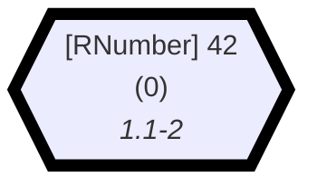
	
<details>

<summary>R Code of the Dataflow Graph</summary>


The analysis required _1.73 ms_ (including parsing and normalization) within the generation environment.
The following marks are used in the graph to highlight sub-parts (uses ids): 0.

```r
42
```

<details>

<summary>Mermaid Code (without markings)</summary>

```
flowchart LR
    0{{"`#91;RNumber#93; 42
      (0)
      *1.1-2*`"}}

```

</details>

</details>

------------------------------------------

	

Describes a constant value (numbers, logicals, strings, ...)


	

### 2) Use Vertex

Type: `use`


------------------------------------------

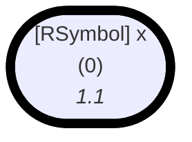
	
<details>

<summary>R Code of the Dataflow Graph</summary>


The analysis required _1.28 ms_ (including parsing and normalization) within the generation environment.
The following marks are used in the graph to highlight sub-parts (uses ids): 0.

```r
x
```

<details>

<summary>Mermaid Code (without markings)</summary>

```
flowchart LR
    0(["`#91;RSymbol#93; x
      (0)
      *1.1*`"])

```

</details>

</details>

------------------------------------------

	

Describes symbol/variable references


	

### 3) Function Call Vertex

Type: `function-call`


------------------------------------------

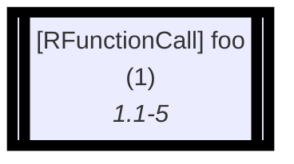
	
<details>

<summary>R Code of the Dataflow Graph</summary>


The analysis required _1.47 ms_ (including parsing and normalization) within the generation environment.
The following marks are used in the graph to highlight sub-parts (uses ids): 1.

```r
foo()
```

<details>

<summary>Mermaid Code (without markings)</summary>

```
flowchart LR
    1[["`#91;RFunctionCall#93; foo
      (1)
      *1.1-5*`"]]

```

</details>

</details>

------------------------------------------

	

Describes any kind of function call, these can happen implicitly as well! (see the notable cases)


<details>

<summary>Interesting Case</summary>

#### Built-In Function Call


------------------------------------------

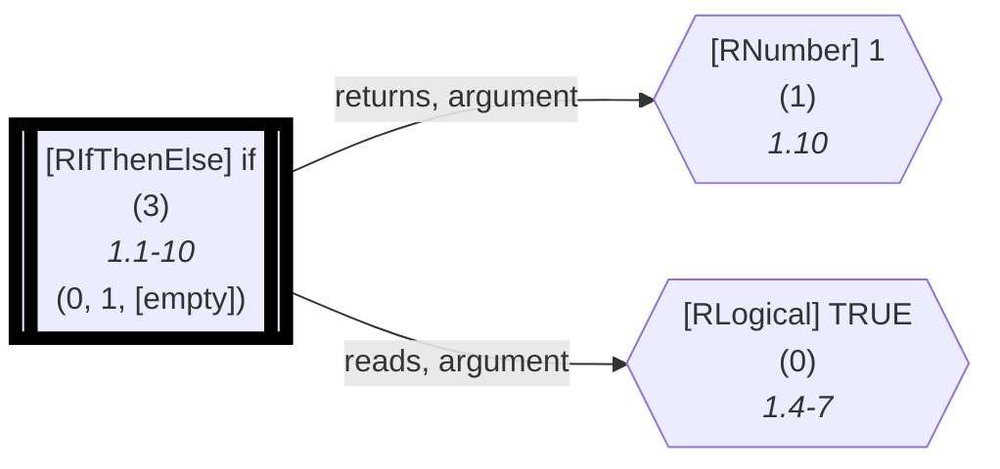
	
<details>

<summary>R Code of the Dataflow Graph</summary>


The analysis required _1.50 ms_ (including parsing and normalization) within the generation environment.
The following marks are used in the graph to highlight sub-parts (uses ids): 3.

```r
if(TRUE) 1
```

<details>

<summary>Mermaid Code (without markings)</summary>

```
flowchart LR
    0{{"`#91;RLogical#93; TRUE
      (0)
      *1.4-7*`"}}
    1{{"`#91;RNumber#93; 1
      (1)
      *1.10*`"}}
    3[["`#91;RIfThenElse#93; if
      (3)
      *1.1-10*
    (0, 1, [empty])`"]]
    3 -->|"returns, argument"| 1
    3 -->|"reads, argument"| 0
```

</details>

</details>

------------------------------------------

	

Control structures like `if` are desugared into function calls (we omit the arguments of `if`(TRUE, 1) for simplicity).


</details>
	

### 4) Variable Definition Vertex

Type: `variable-definition`


------------------------------------------

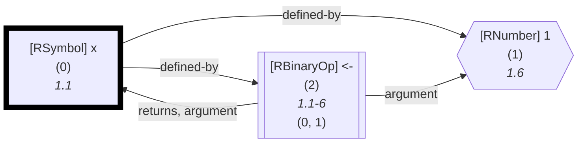
	
<details>

<summary>R Code of the Dataflow Graph</summary>


The analysis required _1.32 ms_ (including parsing and normalization) within the generation environment.
The following marks are used in the graph to highlight sub-parts (uses ids): 0.

```r
x <- 1
```

<details>

<summary>Mermaid Code (without markings)</summary>

```
flowchart LR
    1{{"`#91;RNumber#93; 1
      (1)
      *1.6*`"}}
    0["`#91;RSymbol#93; x
      (0)
      *1.1*`"]
    2[["`#91;RBinaryOp#93; #60;#45;
      (2)
      *1.1-6*
    (0, 1)`"]]
    0 -->|"defined-by"| 1
    0 -->|"defined-by"| 2
    2 -->|"argument"| 1
    2 -->|"returns, argument"| 0
```

</details>

</details>

------------------------------------------

	

Describes a defined variable. Not just `<-` causes this!


<details>

<summary>Interesting Case</summary>

#### Globally Defined Variable


------------------------------------------

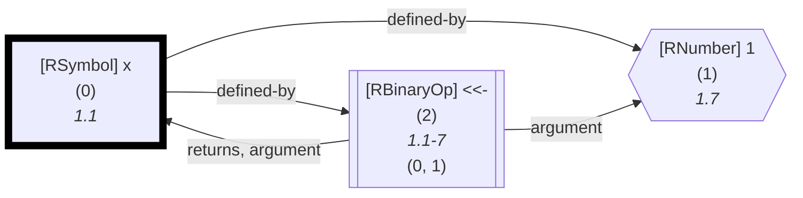
	
<details>

<summary>R Code of the Dataflow Graph</summary>


The analysis required _1.17 ms_ (including parsing and normalization) within the generation environment.
The following marks are used in the graph to highlight sub-parts (uses ids): 0.

```r
x <<- 1
```

<details>

<summary>Mermaid Code (without markings)</summary>

```
flowchart LR
    1{{"`#91;RNumber#93; 1
      (1)
      *1.7*`"}}
    0["`#91;RSymbol#93; x
      (0)
      *1.1*`"]
    2[["`#91;RBinaryOp#93; #60;#60;#45;
      (2)
      *1.1-7*
    (0, 1)`"]]
    0 -->|"defined-by"| 1
    0 -->|"defined-by"| 2
    2 -->|"argument"| 1
    2 -->|"returns, argument"| 0
```

</details>

</details>

------------------------------------------

	

Are described similar within the dataflow graph, only the active environment differs.


</details>
	

### 5) Function Definition Vertex

Type: `function-definition`


------------------------------------------

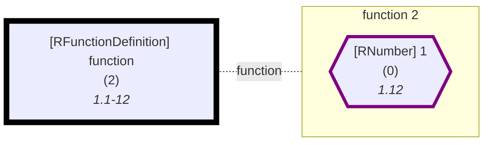
	
<details>

<summary>R Code of the Dataflow Graph</summary>


The analysis required _1.22 ms_ (including parsing and normalization) within the generation environment.
The following marks are used in the graph to highlight sub-parts (uses ids): 2.

```r
function() 1
```

<details>

<summary>Mermaid Code (without markings)</summary>

```
flowchart LR
    2["`#91;RFunctionDefinition#93; function
      (2)
      *1.1-12*`"]

subgraph "flow-2" [function 2]
    0{{"`#91;RNumber#93; 1
      (0)
      *1.12*`"}}
    style 0 stroke:purple,stroke-width:4px; 
end
2 -.-|function| flow-2

```

</details>

</details>

------------------------------------------

	

Describes a function definition. Are always anonymous at first; although they can be bound to a name, the id `0` refers to the `1` in the body. The presented subgraph refers to the body of the function, marking exit points and open references.


	

## Edges


### 1) Reads Edge

Type: `1`


------------------------------------------

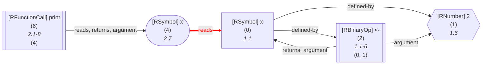
	
<details>

<summary>R Code of the Dataflow Graph</summary>


The analysis required _1.40 ms_ (including parsing and normalization) within the generation environment.
The following marks are used in the graph to highlight sub-parts (uses ids): 4->0.

```r
x <- 2
print(x)
```

<details>

<summary>Mermaid Code (without markings)</summary>

```
flowchart LR
    1{{"`#91;RNumber#93; 2
      (1)
      *1.6*`"}}
    0["`#91;RSymbol#93; x
      (0)
      *1.1*`"]
    2[["`#91;RBinaryOp#93; #60;#45;
      (2)
      *1.1-6*
    (0, 1)`"]]
    4(["`#91;RSymbol#93; x
      (4)
      *2.7*`"])
    6[["`#91;RFunctionCall#93; print
      (6)
      *2.1-8*
    (4)`"]]
    0 -->|"defined-by"| 1
    0 -->|"defined-by"| 2
    2 -->|"argument"| 1
    2 -->|"returns, argument"| 0
    4 -->|"reads"| 0
    6 -->|"reads, returns, argument"| 4
```

</details>

</details>

------------------------------------------

	

The source vertex is usually a `use` that reads from the respective target definition.


<details>

<summary>Interesting Cases</summary>

#### Reads Edge (Call)


------------------------------------------

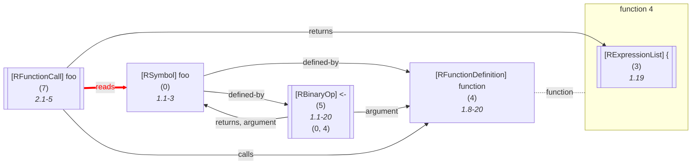
	
<details>

<summary>R Code of the Dataflow Graph</summary>


The analysis required _1.68 ms_ (including parsing and normalization) within the generation environment.
The following marks are used in the graph to highlight sub-parts (uses ids): 7->0.

```r
foo <- function() {}
foo()
```

<details>

<summary>Mermaid Code (without markings)</summary>

```
flowchart LR
    4["`#91;RFunctionDefinition#93; function
      (4)
      *1.8-20*`"]

subgraph "flow-4" [function 4]
    3[["`#91;RExpressionList#93; #123;
      (3)
      *1.19*`"]]
end
    0["`#91;RSymbol#93; foo
      (0)
      *1.1-3*`"]
    5[["`#91;RBinaryOp#93; #60;#45;
      (5)
      *1.1-20*
    (0, 4)`"]]
    %% Environment of 7 [level: 0]:
    %% Built-in
    %% 170----------------------------------------
    %%   foo: {foo (0, function, def. @5)}
    7[["`#91;RFunctionCall#93; foo
      (7)
      *2.1-5*`"]]
4 -.-|function| flow-4

    0 -->|"defined-by"| 4
    0 -->|"defined-by"| 5
    5 -->|"argument"| 4
    5 -->|"returns, argument"| 0
    7 -->|"reads"| 0
    7 -->|"returns"| 3
    7 -->|"calls"| 4
```

</details>

</details>

------------------------------------------

	

Named calls are resolved too, linking to the symbol that holds the anonymous function definition (indirectly or directly)
#### Reads Edge (Parameter)


------------------------------------------

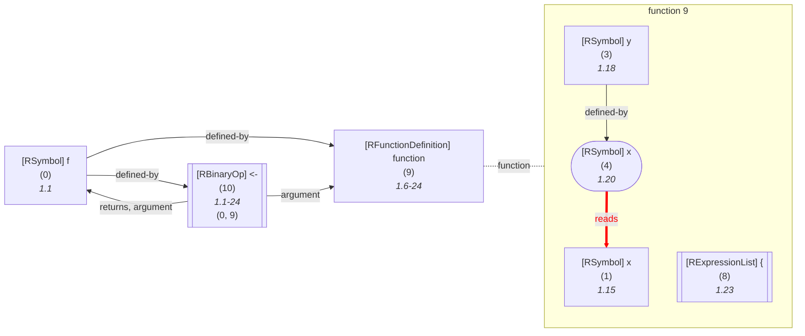
	
<details>

<summary>R Code of the Dataflow Graph</summary>


The analysis required _1.48 ms_ (including parsing and normalization) within the generation environment.
The following marks are used in the graph to highlight sub-parts (uses ids): 4->1.

```r
f <- function(x, y=x) {}
```

<details>

<summary>Mermaid Code (without markings)</summary>

```
flowchart LR
    9["`#91;RFunctionDefinition#93; function
      (9)
      *1.6-24*`"]

subgraph "flow-9" [function 9]
    1["`#91;RSymbol#93; x
      (1)
      *1.15*`"]
    3["`#91;RSymbol#93; y
      (3)
      *1.18*`"]
    4(["`#91;RSymbol#93; x
      (4)
      *1.20*`"])
    8[["`#91;RExpressionList#93; #123;
      (8)
      *1.23*`"]]
end
    0["`#91;RSymbol#93; f
      (0)
      *1.1*`"]
    10[["`#91;RBinaryOp#93; #60;#45;
      (10)
      *1.1-24*
    (0, 9)`"]]
    3 -->|"defined-by"| 4
    4 -->|"reads"| 1
9 -.-|function| flow-9

    0 -->|"defined-by"| 9
    0 -->|"defined-by"| 10
    10 -->|"argument"| 9
    10 -->|"returns, argument"| 0
```

</details>

</details>

------------------------------------------

	

Parameters can read from each other as well.


</details>
	

### 2) DefinedBy Edge

Type: `2`


------------------------------------------

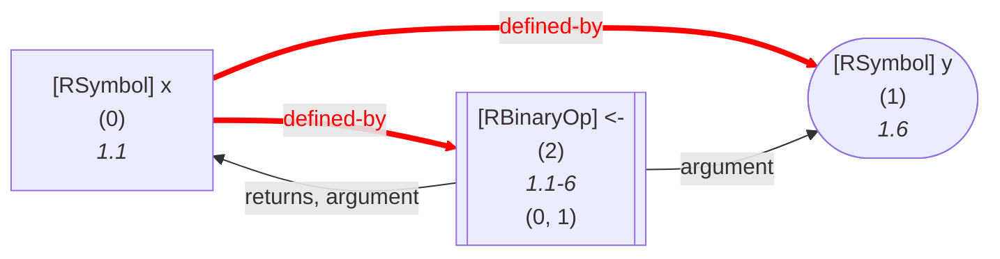
	
<details>

<summary>R Code of the Dataflow Graph</summary>


The analysis required _1.09 ms_ (including parsing and normalization) within the generation environment.
The following marks are used in the graph to highlight sub-parts (uses ids): 0->1, 0->2.

```r
x <- y
```

<details>

<summary>Mermaid Code (without markings)</summary>

```
flowchart LR
    1(["`#91;RSymbol#93; y
      (1)
      *1.6*`"])
    0["`#91;RSymbol#93; x
      (0)
      *1.1*`"]
    2[["`#91;RBinaryOp#93; #60;#45;
      (2)
      *1.1-6*
    (0, 1)`"]]
    0 -->|"defined-by"| 1
    0 -->|"defined-by"| 2
    2 -->|"argument"| 1
    2 -->|"returns, argument"| 0
```

</details>

</details>

------------------------------------------

	

The source vertex is usually a `define variable` that is defined by the respective target use. However, nested definitions can carry it (in the nested case, `x` is defined by the return value of `<-`(y, z)). Additionally, we link the assignment.


<details>

<summary>Interesting Cases</summary>

#### DefinedBy Edge (Nested)


------------------------------------------

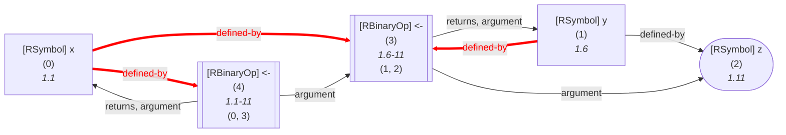
	
<details>

<summary>R Code of the Dataflow Graph</summary>


The analysis required _1.20 ms_ (including parsing and normalization) within the generation environment.
The following marks are used in the graph to highlight sub-parts (uses ids): 0->4, 0->3, 1->3.

```r
x <- y <- z
```

<details>

<summary>Mermaid Code (without markings)</summary>

```
flowchart LR
    2(["`#91;RSymbol#93; z
      (2)
      *1.11*`"])
    1["`#91;RSymbol#93; y
      (1)
      *1.6*`"]
    3[["`#91;RBinaryOp#93; #60;#45;
      (3)
      *1.6-11*
    (1, 2)`"]]
    0["`#91;RSymbol#93; x
      (0)
      *1.1*`"]
    4[["`#91;RBinaryOp#93; #60;#45;
      (4)
      *1.1-11*
    (0, 3)`"]]
    1 -->|"defined-by"| 2
    1 -->|"defined-by"| 3
    3 -->|"argument"| 2
    3 -->|"returns, argument"| 1
    0 -->|"defined-by"| 3
    0 -->|"defined-by"| 4
    4 -->|"argument"| 3
    4 -->|"returns, argument"| 0
```

</details>

</details>

------------------------------------------

	

Nested definitions can carry the `defined by` edge as well.
#### DefinedBy Edge (Expression)


------------------------------------------

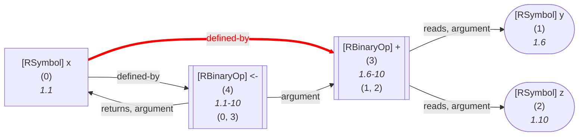
	
<details>

<summary>R Code of the Dataflow Graph</summary>


The analysis required _1.17 ms_ (including parsing and normalization) within the generation environment.
The following marks are used in the graph to highlight sub-parts (uses ids): 0->3.

```r
x <- y + z
```

<details>

<summary>Mermaid Code (without markings)</summary>

```
flowchart LR
    1(["`#91;RSymbol#93; y
      (1)
      *1.6*`"])
    2(["`#91;RSymbol#93; z
      (2)
      *1.10*`"])
    3[["`#91;RBinaryOp#93; #43;
      (3)
      *1.6-10*
    (1, 2)`"]]
    0["`#91;RSymbol#93; x
      (0)
      *1.1*`"]
    4[["`#91;RBinaryOp#93; #60;#45;
      (4)
      *1.1-10*
    (0, 3)`"]]
    3 -->|"reads, argument"| 1
    3 -->|"reads, argument"| 2
    0 -->|"defined-by"| 3
    0 -->|"defined-by"| 4
    4 -->|"argument"| 3
    4 -->|"returns, argument"| 0
```

</details>

</details>

------------------------------------------

	

Here, we define by the result of the `+` expression.


</details>
	

### 3) Calls Edge

Type: `4`


------------------------------------------

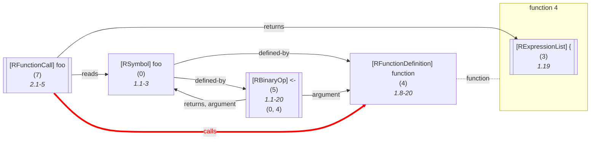
	
<details>

<summary>R Code of the Dataflow Graph</summary>


The analysis required _1.46 ms_ (including parsing and normalization) within the generation environment.
The following marks are used in the graph to highlight sub-parts (uses ids): 7->4.

```r
foo <- function() {}
foo()
```

<details>

<summary>Mermaid Code (without markings)</summary>

```
flowchart LR
    4["`#91;RFunctionDefinition#93; function
      (4)
      *1.8-20*`"]

subgraph "flow-4" [function 4]
    3[["`#91;RExpressionList#93; #123;
      (3)
      *1.19*`"]]
end
    0["`#91;RSymbol#93; foo
      (0)
      *1.1-3*`"]
    5[["`#91;RBinaryOp#93; #60;#45;
      (5)
      *1.1-20*
    (0, 4)`"]]
    %% Environment of 7 [level: 0]:
    %% Built-in
    %% 343----------------------------------------
    %%   foo: {foo (0, function, def. @5)}
    7[["`#91;RFunctionCall#93; foo
      (7)
      *2.1-5*`"]]
4 -.-|function| flow-4

    0 -->|"defined-by"| 4
    0 -->|"defined-by"| 5
    5 -->|"argument"| 4
    5 -->|"returns, argument"| 0
    7 -->|"reads"| 0
    7 -->|"returns"| 3
    7 -->|"calls"| 4
```

</details>

</details>

------------------------------------------

	

Link the function call to the (anonymous) function definition.


	

### 4) Returns Edge

Type: `8`


------------------------------------------

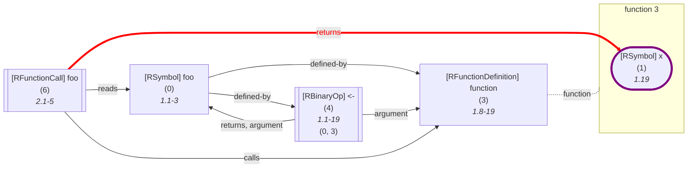
	
<details>

<summary>R Code of the Dataflow Graph</summary>


The analysis required _1.47 ms_ (including parsing and normalization) within the generation environment.
The following marks are used in the graph to highlight sub-parts (uses ids): 6->1.

```r
foo <- function() x
foo()
```

<details>

<summary>Mermaid Code (without markings)</summary>

```
flowchart LR
    3["`#91;RFunctionDefinition#93; function
      (3)
      *1.8-19*`"]

subgraph "flow-3" [function 3]
    1(["`#91;RSymbol#93; x
      (1)
      *1.19*`"])
    style 1 stroke:purple,stroke-width:4px; 
end
    0["`#91;RSymbol#93; foo
      (0)
      *1.1-3*`"]
    4[["`#91;RBinaryOp#93; #60;#45;
      (4)
      *1.1-19*
    (0, 3)`"]]
    %% Environment of 6 [level: 0]:
    %% Built-in
    %% 388----------------------------------------
    %%   foo: {foo (0, function, def. @4)}
    6[["`#91;RFunctionCall#93; foo
      (6)
      *2.1-5*`"]]
3 -.-|function| flow-3

    0 -->|"defined-by"| 3
    0 -->|"defined-by"| 4
    4 -->|"argument"| 3
    4 -->|"returns, argument"| 0
    6 -->|"reads"| 0
    6 -->|"returns"| 1
    6 -->|"calls"| 3
```

</details>

</details>

------------------------------------------

	

Link the function call to the exit points of the target definition (this may incorporate the call-context).


	

### 5) DefinesOnCall Edge

Type: `16`


------------------------------------------

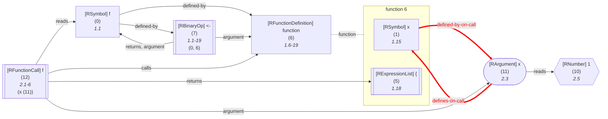
	
<details>

<summary>R Code of the Dataflow Graph</summary>


The analysis required _1.60 ms_ (including parsing and normalization) within the generation environment.
The following marks are used in the graph to highlight sub-parts (uses ids): 11->1, 1->11.

```r
f <- function(x) {}
f(x=1)
```

<details>

<summary>Mermaid Code (without markings)</summary>

```
flowchart LR
    6["`#91;RFunctionDefinition#93; function
      (6)
      *1.6-19*`"]

subgraph "flow-6" [function 6]
    1["`#91;RSymbol#93; x
      (1)
      *1.15*`"]
    5[["`#91;RExpressionList#93; #123;
      (5)
      *1.18*`"]]
end
    0["`#91;RSymbol#93; f
      (0)
      *1.1*`"]
    7[["`#91;RBinaryOp#93; #60;#45;
      (7)
      *1.1-19*
    (0, 6)`"]]
    10{{"`#91;RNumber#93; 1
      (10)
      *2.5*`"}}
    11(["`#91;RArgument#93; x
      (11)
      *2.3*`"])
    %% Environment of 12 [level: 0]:
    %% Built-in
    %% 454----------------------------------------
    %%   f: {f (0, function, def. @7)}
    12[["`#91;RFunctionCall#93; f
      (12)
      *2.1-6*
    (x (11))`"]]
    1 -->|"defined-by-on-call"| 11
6 -.-|function| flow-6

    0 -->|"defined-by"| 6
    0 -->|"defined-by"| 7
    7 -->|"argument"| 6
    7 -->|"returns, argument"| 0
    11 -->|"reads"| 10
    11 -->|"defines-on-call"| 1
    12 -->|"argument"| 11
    12 -->|"reads"| 0
    12 -->|"returns"| 5
    12 -->|"calls"| 6
```

</details>

</details>

------------------------------------------

	

**This edge is automatically joined with defined by on call!**

 Link an Argument to whichever parameter they cause to be defined if the related function call is invoked.


	

### 6) DefinedByOnCall Edge

Type: `32`


------------------------------------------


	
<details>

<summary>R Code of the Dataflow Graph</summary>


The analysis required _1.58 ms_ (including parsing and normalization) within the generation environment.
The following marks are used in the graph to highlight sub-parts (uses ids): 11->1, 1->11.

```r
f <- function(x) {}
f(x=1)
```

<details>

<summary>Mermaid Code (without markings)</summary>

```
flowchart LR
    6["`#91;RFunctionDefinition#93; function
      (6)
      *1.6-19*`"]

subgraph "flow-6" [function 6]
    1["`#91;RSymbol#93; x
      (1)
      *1.15*`"]
    5[["`#91;RExpressionList#93; #123;
      (5)
      *1.18*`"]]
end
    0["`#91;RSymbol#93; f
      (0)
      *1.1*`"]
    7[["`#91;RBinaryOp#93; #60;#45;
      (7)
      *1.1-19*
    (0, 6)`"]]
    10{{"`#91;RNumber#93; 1
      (10)
      *2.5*`"}}
    11(["`#91;RArgument#93; x
      (11)
      *2.3*`"])
    %% Environment of 12 [level: 0]:
    %% Built-in
    %% 520----------------------------------------
    %%   f: {f (0, function, def. @7)}
    12[["`#91;RFunctionCall#93; f
      (12)
      *2.1-6*
    (x (11))`"]]
    1 -->|"defined-by-on-call"| 11
6 -.-|function| flow-6

    0 -->|"defined-by"| 6
    0 -->|"defined-by"| 7
    7 -->|"argument"| 6
    7 -->|"returns, argument"| 0
    11 -->|"reads"| 10
    11 -->|"defines-on-call"| 1
    12 -->|"argument"| 11
    12 -->|"reads"| 0
    12 -->|"returns"| 5
    12 -->|"calls"| 6
```

</details>

</details>

------------------------------------------

	

**This edge is automatically joined with defines on call!**

 This represents the other direction of `defines on call` (i.e., links the parameter to the argument). This is just for completeness.


	

### 7) Argument Edge

Type: `64`


------------------------------------------

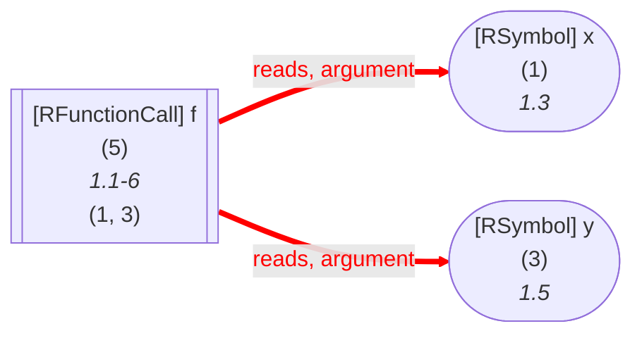
	
<details>

<summary>R Code of the Dataflow Graph</summary>


The analysis required _1.14 ms_ (including parsing and normalization) within the generation environment.
The following marks are used in the graph to highlight sub-parts (uses ids): 5->1, 5->3.

```r
f(x,y)
```

<details>

<summary>Mermaid Code (without markings)</summary>

```
flowchart LR
    1(["`#91;RSymbol#93; x
      (1)
      *1.3*`"])
    3(["`#91;RSymbol#93; y
      (3)
      *1.5*`"])
    5[["`#91;RFunctionCall#93; f
      (5)
      *1.1-6*
    (1, 3)`"]]
    5 -->|"reads, argument"| 1
    5 -->|"reads, argument"| 3
```

</details>

</details>

------------------------------------------

	

Links a function call to the entry point of its arguments. If we do not know the target of such a call, we automatically assume that all arguments are read by the call as well!


	

### 8) SideEffectOnCall Edge

Type: `128`


------------------------------------------

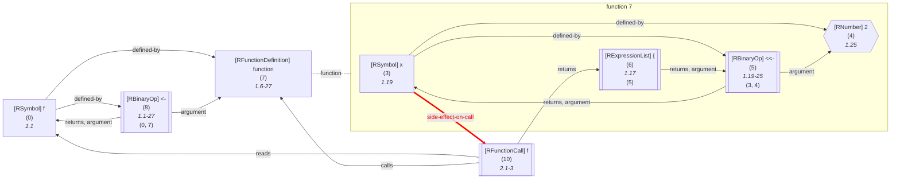
	
<details>

<summary>R Code of the Dataflow Graph</summary>


The analysis required _1.83 ms_ (including parsing and normalization) within the generation environment.
The following marks are used in the graph to highlight sub-parts (uses ids): 3->10.

```r
f <- function() { x <<- 2 }
f()
```

<details>

<summary>Mermaid Code (without markings)</summary>

```
flowchart LR
    %% Environment of 7 [level: 0]:
    %% Built-in
    %% 623----------------------------------------
    %%   x: {x (3, variable, def. @5)}
    7["`#91;RFunctionDefinition#93; function
      (7)
      *1.6-27*`"]

subgraph "flow-7" [function 7]
    4{{"`#91;RNumber#93; 2
      (4)
      *1.25*`"}}
    3["`#91;RSymbol#93; x
      (3)
      *1.19*`"]
    5[["`#91;RBinaryOp#93; #60;#60;#45;
      (5)
      *1.19-25*
    (3, 4)`"]]
    6[["`#91;RExpressionList#93; #123;
      (6)
      *1.17*
    (5)`"]]
end
    0["`#91;RSymbol#93; f
      (0)
      *1.1*`"]
    8[["`#91;RBinaryOp#93; #60;#45;
      (8)
      *1.1-27*
    (0, 7)`"]]
    %% Environment of 10 [level: 0]:
    %% Built-in
    %% 631----------------------------------------
    %%   f: {f (0, function, def. @8)}
    10[["`#91;RFunctionCall#93; f
      (10)
      *2.1-3*`"]]
    3 -->|"defined-by"| 4
    3 -->|"defined-by"| 5
    3 -->|"side-effect-on-call"| 10
    5 -->|"argument"| 4
    5 -->|"returns, argument"| 3
    6 -->|"returns, argument"| 5
7 -.-|function| flow-7

    0 -->|"defined-by"| 7
    0 -->|"defined-by"| 8
    8 -->|"argument"| 7
    8 -->|"returns, argument"| 0
    10 -->|"reads"| 0
    10 -->|"returns"| 6
    10 -->|"calls"| 7
```

</details>

</details>

------------------------------------------

	

Links a global side effect to an affected function call (e.g., a super definition within the function body)


	

### 9) NonStandardEvaluation Edge

Type: `256`


------------------------------------------

```mermaid
flowchart LR
    1(["`#91;RSymbol#93; x
      (1)
      *1.7*`"])
    3[["`#91;RFunctionCall#93; quote
      (3)
      *1.1-8*
    (1)`"]]
    3 -->|"argument, non-standard-evaluation"| 1
    linkStyle 0 stroke:red,color:red,stroke-width:4px;
```
	
<details>

<summary>R Code of the Dataflow Graph</summary>


The analysis required _1.21 ms_ (including parsing and normalization) within the generation environment.
The following marks are used in the graph to highlight sub-parts (uses ids): 3->1.

```r
quote(x)
```

<details>

<summary>Mermaid Code (without markings)</summary>

```
flowchart LR
    1(["`#91;RSymbol#93; x
      (1)
      *1.7*`"])
    3[["`#91;RFunctionCall#93; quote
      (3)
      *1.1-8*
    (1)`"]]
    3 -->|"argument, non-standard-evaluation"| 1
```

</details>

</details>

------------------------------------------

	

Marks cases in which R's non-standard evaluation mechanisms cause the default semantics to deviate


	

