_This document was generated from '[src/documentation/print-dataflow-graph-wiki.ts](https://github.com/flowr-analysis/flowr/tree/main//src/documentation/print-dataflow-graph-wiki.ts)' on 2025-03-17, 07:49:56 UTC presenting an overview of flowR's dataflow graph (v2.2.11, using R v4.4.3). Please do not edit this file/wiki page directly._

This page briefly summarizes flowR's dataflow graph, represented by the [<code><span title="The dataflow graph holds the dataflow information found within the given AST. We differentiate the directed edges in EdgeType and the vertices indicated by DataflowGraphVertexArgument The vertices of the graph are organized in a hierarchical fashion, with a function-definition node containing the node ids of its subgraph. However, all *edges* are hoisted at the top level in the form of an (attribu...">DataflowGraph</span></code>](https://github.com/flowr-analysis/flowr/tree/main//src/dataflow/graph/graph.ts#L139).
In case you want to manually build such a graph (e.g., for testing), you can use the [<code><span title="This DataflowGraphBuilder extends DataflowGraph with builder methods to easily and compactly add vertices and edges to a dataflow graph. Its usage thus simplifies writing tests for dataflow graphs.">DataflowGraphBuilder</span></code>](https://github.com/flowr-analysis/flowr/tree/main//src/dataflow/graph/dataflowgraph-builder.ts#L34).
This wiki page focuses on explaining what such a dataflow graph looks like!

Please be aware that the accompanied [dataflow information](#dataflow-information) returned by _flowR_ contains things besides the graph,
like the entry and exit points of the subgraphs, and currently active references (see [below](#dataflow-information)).
Additionally, you may be interested in the set of [Unknown Side Effects](#unknown-side-effects) marking calls which _flowR_ is unable to handle correctly.

> [!TIP]
> If you want to investigate the dataflow graph,
> you can either use the [Visual Studio Code extension](https://github.com/flowr-analysis/vscode-flowr) or the <span title="Description (Repl Command, starred version): Returns the URL to mermaid.live; Base Command: Get mermaid code for the dataflow graph of R code, start with 'file://' to indicate a file (aliases: :d*, :df*)">`:dataflow*`</span>
> command in the REPL (see the [Interface wiki page](https://github.com/flowr-analysis/flowr/wiki/Interface) for more information). When using _flowR_ as a library, you may use the functions in [`./src/util/mermaid/dfg.ts`](https://github.com/flowr-analysis/flowr/tree/main/./src/util/mermaid/dfg.ts).
> 
> If you receive a dataflow graph in its serialized form (e.g., by talking to a [_flowR_ server](https://github.com/flowr-analysis/flowr/wiki/Interface)), you can use [<code><span title="Constructs a dataflow graph instance from the given JSON data and returns the result. This can be useful for data sent by the flowR server when analyzing it further.">DataflowGraph::<i>fromJson</i></span></code>](https://github.com/flowr-analysis/flowr/tree/main//src/dataflow/graph/graph.ts#L461) to retrieve the graph from the JSON representation.


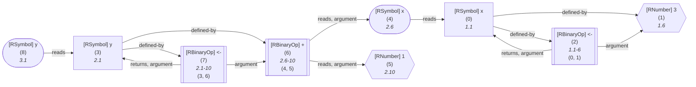

	
<details>

<summary style="color:gray">R Code of the Dataflow Graph</summary>

The analysis required _16.12 ms_ (including parse and normalize, using the [r-shell](https://github.com/flowr-analysis/flowr/wiki/Engines) engine) within the generation environment. 
We encountered no unknown side effects during the analysis.


```r
x <- 3
y <- x + 1
y
```


</details>


The above dataflow graph showcases the general gist. We define a dataflow graph as a directed graph G = (V, E), differentiating between 5 types of vertices V and
9 types of edges E allowing each vertex to have a single, and each edge to have multiple distinct types.
Additionally, every node may have links to its [control dependencies](#control-dependencies) (which you may view as a 10th edge type, although they are explicitly no data dependency).

<details open>

<summary>Vertex Types</summary>

The following vertices types exist:

1. [`Value`](#1-value-vertex)
1. [`Use`](#2-use-vertex)
1. [`FunctionCall`](#3-function-call-vertex)
1. [`VariableDefinition`](#4-variable-definition-vertex)
1. [`FunctionDefinition`](#5-function-definition-vertex)


<details><summary style="">Class Diagram</summary>

All boxes should link to their respective implementation:

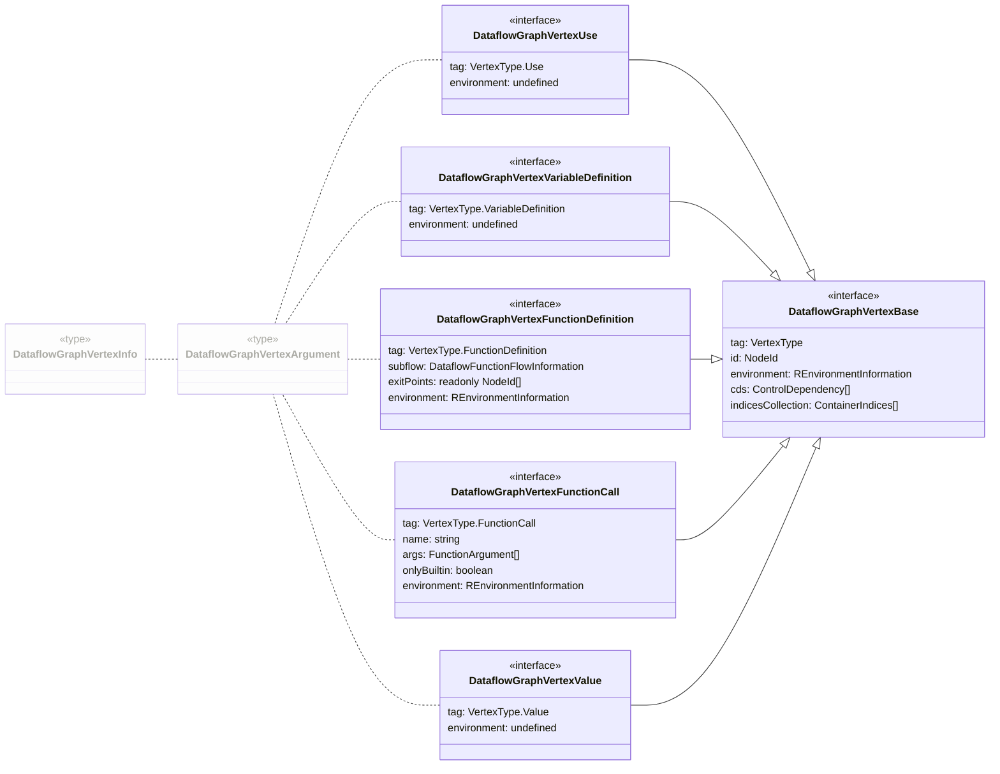


</details>
    

</details>

<details open>

<summary>Edge Types</summary>

The following edges types exist, internally we use bitmasks to represent multiple types in a compact form:

1. [`Reads` (1)](#1-reads-edge)
1. [`DefinedBy` (2)](#2-definedby-edge)
1. [`Calls` (4)](#3-calls-edge)
1. [`Returns` (8)](#4-returns-edge)
1. [`DefinesOnCall` (16)](#5-definesoncall-edge)
1. [`DefinedByOnCall` (32)](#6-definedbyoncall-edge)
1. [`Argument` (64)](#7-argument-edge)
1. [`SideEffectOnCall` (128)](#8-sideeffectoncall-edge)
1. [`NonStandardEvaluation` (256)](#9-nonstandardevaluation-edge)


<details><summary style="">Class Diagram</summary>

All boxes should link to their respective implementation:

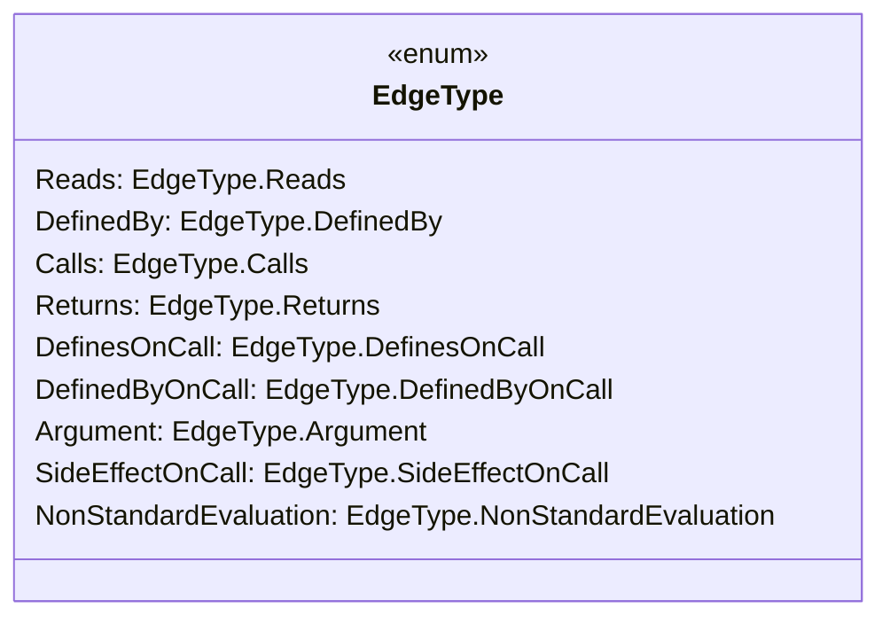


</details>
    

</details>


From an implementation perspective all of these types are represented by respective interfaces, see [`./src/dataflow/graph/vertex.ts`](https://github.com/flowr-analysis/flowr/tree/main/./src/dataflow/graph/vertex.ts) and [`./src/dataflow/graph/edge.ts`](https://github.com/flowr-analysis/flowr/tree/main/./src/dataflow/graph/edge.ts).

The following sections present details on the different types of vertices and edges, including examples and explanations.

> [!NOTE]
> Every dataflow vertex holds an `id` which links it to the respective node in the [normalized AST](https://github.com/flowr-analysis/flowr/wiki/Normalized%20AST).
> So if you want more information about the respective vertex, you can usually access more information
> using the <code>[<span title="The dataflow graph holds the dataflow information found within the given AST. We differentiate the directed edges in EdgeType and the vertices indicated by DataflowGraphVertexArgument The vertices of the graph are organized in a hierarchical fashion, with a function-definition node containing the node ids of its subgraph. However, all *edges* are hoisted at the top level in the form of an (attribu...">DataflowGraph</span>](https://github.com/flowr-analysis/flowr/tree/main//src/dataflow/graph/graph.ts#L139)::idMap</code> linked to the dataflow graph:
> 
> ```ts
> const node = graph.idMap.get(id);
> ```
> 
> In case you just need the name (`lexeme`) of the respective vertex, [<code><span title="Recovers the lexeme of a node from its id in the id map .">recoverName</span></code>](https://github.com/flowr-analysis/flowr/tree/main//src/r-bridge/lang-4.x/ast/model/processing/node-id.ts#L24) can help you out:
> 
> ```ts
> const name = recoverName(id, graph.idMap);
> ```
> 

## Vertices


<a id='value-vertex'> </a>
### 1) Value Vertex

Type: `value`


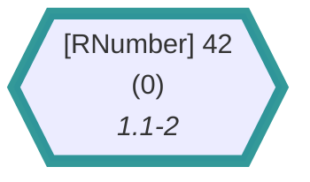

	
<details>

<summary style="color:gray">R Code of the Dataflow Graph</summary>

The analysis required _0.83 ms_ (including parse and normalize, using the [r-shell](https://github.com/flowr-analysis/flowr/wiki/Engines) engine) within the generation environment. The following marks are used in the graph to highlight sub-parts (uses ids): {0}.
We encountered no unknown side effects during the analysis.


```r
42
```


</details>


Describes a constant value (numbers, booleans/logicals, strings, ...).
In general, the respective vertex is more or less a dummy vertex as you can see from its implementation.

 * **[DataflowGraphVertexValue](https://github.com/flowr-analysis/flowr/tree/main//src/dataflow/graph/vertex.ts#L202)**   
   Marker vertex for a value in the dataflow of the program.
   This does not contain the _value_ of the referenced constant
   as this is available with the
   <code>id</code>
   in the
   <code>normalized AST</code>
   (or more specifically the
   <code>AstIdMap</code>
   ).
    If you have a
   <code>dataflow graph</code>
   named `graph`
   with an
   <code>AstIdMap</code>
   and a value vertex object with name `value` the following Code should work:
   <details><summary style="color:gray">Defined at <a href="https://github.com/flowr-analysis/flowr/tree/main//src/dataflow/graph/vertex.ts#L202">./src/dataflow/graph/vertex.ts#L202</a></summary>
   
   
   ```ts
   /**
    * Marker vertex for a value in the dataflow of the program.
    * This does not contain the _value_ of the referenced constant
    * as this is available with the {@link DataflowGraphVertexBase#id|id} in the {@link NormalizedAst|normalized AST}
    * (or more specifically the {@link AstIdMap}).
    *
    * If you have a {@link DataflowGraph|dataflow graph} named `graph`
    * with an {@link AstIdMap} and a value vertex object with name `value` the following Code should work:
    *
    * @example
    * ```ts
    * const node = graph.idMap.get(value.id)
    * ```
    *
    * This then returns the corresponding node in the {@link NormalizedAst|normalized AST}, for example,
    * an {@link RNumber} or {@link RString}.
    *
    * This works similarly for {@link IdentifierReference|identifier references}
    * for which you can use the {@link IdentifierReference#nodeId|`nodeId`}.
    *
    * @see {@link isValueVertex} - to check if a vertex is a value vertex
    */
   export interface DataflowGraphVertexValue extends DataflowGraphVertexBase {
       readonly tag:          VertexType.Value
       readonly environment?: undefined
   }
   ```
   
   
   </details>
   
    <details><summary style="">View more (DataflowGraphVertexBase)</summary>

   * **[DataflowGraphVertexBase](https://github.com/flowr-analysis/flowr/tree/main//src/dataflow/graph/vertex.ts#L155)**   
     Arguments required to construct a vertex in the
     <code>dataflow graph</code>
     .
     <details><summary style="color:gray">Defined at <a href="https://github.com/flowr-analysis/flowr/tree/main//src/dataflow/graph/vertex.ts#L155">./src/dataflow/graph/vertex.ts#L155</a></summary>
     
     
     ```ts
     /**
      * Arguments required to construct a vertex in the {@link DataflowGraph|dataflow graph}.
      *
      * @see DataflowGraphVertexUse
      * @see DataflowGraphVertexVariableDefinition
      * @see DataflowGraphVertexFunctionDefinition
      */
     interface DataflowGraphVertexBase extends MergeableRecord {
         /**
          * Used to identify and separate different types of vertices.
          */
         readonly tag:       VertexType
         /**
          * The id of the node (the id assigned by the {@link ParentInformation} decoration).
          * This unanimously identifies the vertex in the {@link DataflowGraph|dataflow graph}
          * as well as the corresponding {@link NormalizedAst|normalized AST}.
          */
         id:                 NodeId
         /**
          * The environment in which the vertex is set.
          */
         environment?:       REnvironmentInformation
         /**
          * @see {@link ControlDependency} - the collection of control dependencies which have an influence on whether the vertex is executed.
          */
         cds:                ControlDependency[] | undefined
         /**
          * this attribute links a vertex to indices (pointer links) it may be affected by or related to
          */
         indicesCollection?: ContainerIndicesCollection
     }
     ```
     
     
     </details>
     
     * [MergeableRecord](https://github.com/flowr-analysis/flowr/tree/main//src/util/objects.ts#L11)   
     
       <details><summary style="color:gray">Defined at <a href="https://github.com/flowr-analysis/flowr/tree/main//src/util/objects.ts#L11">./src/util/objects.ts#L11</a></summary>
       
       
       ```ts
       export type MergeableRecord = Record<string, unknown>
       ```
       
       
       </details>
       

       * [string](https://github.com/flowr-analysis/flowr/tree/main//src/statistics/features/common-syntax-probability.ts#L29)   
       
         <details><summary style="color:gray">Defined at <a href="https://github.com/flowr-analysis/flowr/tree/main//src/statistics/features/common-syntax-probability.ts#L29">./src/statistics/features/common-syntax-probability.ts#L29</a></summary>
         
         
         ```ts
         string:       Record<string, Measurement>
         ```
         
         
         </details>
         
         * **[CommonSyntaxTypeCounts](https://github.com/flowr-analysis/flowr/tree/main//src/statistics/features/common-syntax-probability.ts#L12)**   
         
           <details><summary style="color:gray">Defined at <a href="https://github.com/flowr-analysis/flowr/tree/main//src/statistics/features/common-syntax-probability.ts#L12">./src/statistics/features/common-syntax-probability.ts#L12</a></summary>
           
           
           ```ts
           export interface CommonSyntaxTypeCounts<Measurement=bigint> {
               // just a helper to collect all as well (could be derived from sum)
               total:        Measurement,
               // counts whenever you pass more than one node that is not sensible for any other category
               multiple:     Measurement,
               // similar to multiple, but only counts empty (bodies etc.)
               empty:        Measurement,
               // in case of a = x etc.
               withArgument: Measurement,
               // arguments used without value
               noValue:      Measurement,
               // does include t and f, as well as NULL etc. (any special symbol)
               singleVar:    Record<string, Measurement>
               number:       Record<number, Measurement>
               // only explicit integers
               integer:      Record<number, Measurement>
               complex:      Record<number, Measurement>
               string:       Record<string, Measurement>
               logical:      Record<typeof RTrue | typeof RFalse, Measurement>,
               call:         Record<string, Measurement>,
               unnamedCall:  Measurement,
               // binop includes all assignments!
               binOp:        Record<string, Measurement>,
               unaryOp:      Record<string, Measurement>,
               // unknown content, records lexeme (can include break etc. for bodies), due to my oversight, this includes function definitions
               other:        Record<string, Measurement>
           }
           ```
           
           
           </details>
           
       * [unknown](https://github.com/flowr-analysis/flowr/tree/main//src/dataflow/graph/graph.ts#L370)   
       
         <details><summary style="color:gray">Defined at <a href="https://github.com/flowr-analysis/flowr/tree/main//src/dataflow/graph/graph.ts#L370">./src/dataflow/graph/graph.ts#L370</a></summary>
         
         
         ```ts
         unknown
         ```
         
         
         </details>
         

</details>
    


> [!NOTE]
> 
> The value is not stored in the vertex itself, but in the normalized AST.
> To access the value, you can use the `id` of the vertex to access the respective node in the [normalized AST](https://github.com/flowr-analysis/flowr/wiki/Normalized%20AST)
> and ask for the value associated with it.
> 				


Please be aware that such nodes may be the result from language semantics as well, and not just from constants directly in the source.
For example, an access operation like `df$column` will treat the column name as a constant value.


<details><summary style="">Example: Semantics Create a Value</summary>

In the following graph, the original type printed by mermaid is still `RSymbol` (from the [normalized AST](https://github.com/flowr-analysis/flowr/wiki/Normalized%20AST)), however, the shape of the vertex signals to you that the symbol is in-fact treated as a constant! If you do not know what `df$column` even means, please refer to the [R topic](https://rdrr.io/r/base/Extract.html).


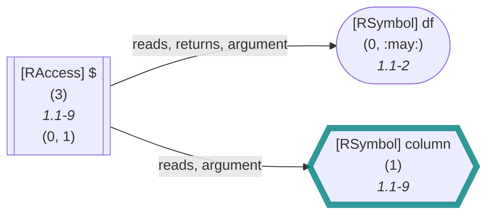

	
<details>

<summary style="color:gray">R Code of the Dataflow Graph</summary>

The analysis required _2.96 ms_ (including parse and normalize, using the [r-shell](https://github.com/flowr-analysis/flowr/wiki/Engines) engine) within the generation environment. The following marks are used in the graph to highlight sub-parts (uses ids): {1}.
We encountered no unknown side effects during the analysis.


```r
df$column
```


</details>


</details>
    
		


	

<a id='use-vertex'> </a>
### 2) Use Vertex

Type: `use`


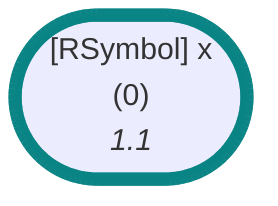

	
<details>

<summary style="color:gray">R Code of the Dataflow Graph</summary>

The analysis required _0.85 ms_ (including parse and normalize, using the [r-shell](https://github.com/flowr-analysis/flowr/wiki/Engines) engine) within the generation environment. The following marks are used in the graph to highlight sub-parts (uses ids): {0}.
We encountered no unknown side effects during the analysis.


```r
x
```


</details>


		
Describes symbol/variable references which are read (or potentially read at a given position).
Similar to the [value vertex](#value-vertex) described above, this is more a marker vertex as 
you can see from the implementation.

 * **[DataflowGraphVertexUse](https://github.com/flowr-analysis/flowr/tree/main//src/dataflow/graph/vertex.ts#L212)**   
   Arguments required to construct a vertex which represents the usage of a variable in the
   <code>dataflow graph</code>
   .
   <details><summary style="color:gray">Defined at <a href="https://github.com/flowr-analysis/flowr/tree/main//src/dataflow/graph/vertex.ts#L212">./src/dataflow/graph/vertex.ts#L212</a></summary>
   
   
   ```ts
   /**
    * Arguments required to construct a vertex which represents the usage of a variable in the {@link DataflowGraph|dataflow graph}.
    *
    * @see {@link isUseVertex} - to check if a vertex is a use vertex
    */
   export interface DataflowGraphVertexUse extends DataflowGraphVertexBase {
       readonly tag:          VertexType.Use
       /** Does not require an environment to be attached. If we promote the use to a function call, we attach the environment later.  */
       readonly environment?: undefined
   }
   ```
   
   
   </details>
   
    <details><summary style="">View more (DataflowGraphVertexBase)</summary>

   * **[DataflowGraphVertexBase](https://github.com/flowr-analysis/flowr/tree/main//src/dataflow/graph/vertex.ts#L155)**   
     Arguments required to construct a vertex in the
     <code>dataflow graph</code>
     .
     <details><summary style="color:gray">Defined at <a href="https://github.com/flowr-analysis/flowr/tree/main//src/dataflow/graph/vertex.ts#L155">./src/dataflow/graph/vertex.ts#L155</a></summary>
     
     
     ```ts
     /**
      * Arguments required to construct a vertex in the {@link DataflowGraph|dataflow graph}.
      *
      * @see DataflowGraphVertexUse
      * @see DataflowGraphVertexVariableDefinition
      * @see DataflowGraphVertexFunctionDefinition
      */
     interface DataflowGraphVertexBase extends MergeableRecord {
         /**
          * Used to identify and separate different types of vertices.
          */
         readonly tag:       VertexType
         /**
          * The id of the node (the id assigned by the {@link ParentInformation} decoration).
          * This unanimously identifies the vertex in the {@link DataflowGraph|dataflow graph}
          * as well as the corresponding {@link NormalizedAst|normalized AST}.
          */
         id:                 NodeId
         /**
          * The environment in which the vertex is set.
          */
         environment?:       REnvironmentInformation
         /**
          * @see {@link ControlDependency} - the collection of control dependencies which have an influence on whether the vertex is executed.
          */
         cds:                ControlDependency[] | undefined
         /**
          * this attribute links a vertex to indices (pointer links) it may be affected by or related to
          */
         indicesCollection?: ContainerIndicesCollection
     }
     ```
     
     
     </details>
     
     * [MergeableRecord](https://github.com/flowr-analysis/flowr/tree/main//src/util/objects.ts#L11)   
     
       <details><summary style="color:gray">Defined at <a href="https://github.com/flowr-analysis/flowr/tree/main//src/util/objects.ts#L11">./src/util/objects.ts#L11</a></summary>
       
       
       ```ts
       export type MergeableRecord = Record<string, unknown>
       ```
       
       
       </details>
       

       * [string](https://github.com/flowr-analysis/flowr/tree/main//src/statistics/features/common-syntax-probability.ts#L29)   
       
         <details><summary style="color:gray">Defined at <a href="https://github.com/flowr-analysis/flowr/tree/main//src/statistics/features/common-syntax-probability.ts#L29">./src/statistics/features/common-syntax-probability.ts#L29</a></summary>
         
         
         ```ts
         string:       Record<string, Measurement>
         ```
         
         
         </details>
         
         * **[CommonSyntaxTypeCounts](https://github.com/flowr-analysis/flowr/tree/main//src/statistics/features/common-syntax-probability.ts#L12)**   
         
           <details><summary style="color:gray">Defined at <a href="https://github.com/flowr-analysis/flowr/tree/main//src/statistics/features/common-syntax-probability.ts#L12">./src/statistics/features/common-syntax-probability.ts#L12</a></summary>
           
           
           ```ts
           export interface CommonSyntaxTypeCounts<Measurement=bigint> {
               // just a helper to collect all as well (could be derived from sum)
               total:        Measurement,
               // counts whenever you pass more than one node that is not sensible for any other category
               multiple:     Measurement,
               // similar to multiple, but only counts empty (bodies etc.)
               empty:        Measurement,
               // in case of a = x etc.
               withArgument: Measurement,
               // arguments used without value
               noValue:      Measurement,
               // does include t and f, as well as NULL etc. (any special symbol)
               singleVar:    Record<string, Measurement>
               number:       Record<number, Measurement>
               // only explicit integers
               integer:      Record<number, Measurement>
               complex:      Record<number, Measurement>
               string:       Record<string, Measurement>
               logical:      Record<typeof RTrue | typeof RFalse, Measurement>,
               call:         Record<string, Measurement>,
               unnamedCall:  Measurement,
               // binop includes all assignments!
               binOp:        Record<string, Measurement>,
               unaryOp:      Record<string, Measurement>,
               // unknown content, records lexeme (can include break etc. for bodies), due to my oversight, this includes function definitions
               other:        Record<string, Measurement>
           }
           ```
           
           
           </details>
           
       * [unknown](https://github.com/flowr-analysis/flowr/tree/main//src/dataflow/graph/graph.ts#L370)   
       
         <details><summary style="color:gray">Defined at <a href="https://github.com/flowr-analysis/flowr/tree/main//src/dataflow/graph/graph.ts#L370">./src/dataflow/graph/graph.ts#L370</a></summary>
         
         
         ```ts
         unknown
         ```
         
         
         </details>
         

</details>
    


> [!NOTE]
> 
> The name of the symbol is not actually part of what we store in the dataflow graph,
> as we have it within the normalized AST.
> To access the name, you can use the `id` of the vertex:
> 
> 
> ```ts
> const name = recoverName(id, graph.idMap);
> ```
> 
> 				


Most often, you will see the _use_ vertex whenever a variable is read.
However, similar to the [value vertex](#value-vertex), the _use_ vertex can also be the result of language semantics.
Consider a case, in which we refer to a variable with a string, as in `get("x")`.


<details><summary style="">Example: Semantics Create a Symbol</summary>

In the following graph, the original type printed by mermaid is still `RString` (from the [normalized AST](https://github.com/flowr-analysis/flowr/wiki/Normalized%20AST)), however, the shape of the vertex signals to you that the symbol is in-fact treated as a variable use! If you are unsure what `get` does, refer to the [documentation](https://www.rdocumentation.org/packages/base/versions/3.6.2/topics/get). Please note, that the lexeme being printed as `"x"` may be misleading (after all it is recovered from the AST), the quotes are not part of the reference.


	
<details>

<summary style="color:gray">R Code of the Dataflow Graph</summary>

The analysis required _2.62 ms_ (including parse and normalize, using the [r-shell](https://github.com/flowr-analysis/flowr/wiki/Engines) engine) within the generation environment. The following marks are used in the graph to highlight sub-parts (uses ids): {1}.
We encountered no unknown side effects during the analysis.


```r
get("x")
```


</details>


</details>
    

But now to the interesting stuff: how do we actually know which values are read by the respective variable use?
This usually involves a [variable definition](#variable-definition-vertex) and a [reads edge](#reads-edge) linking the two.


<details><summary style="">Example: Reads Edge Identifying a Single Definition</summary>

In the following graph, the `x` is read from the definition `x <- 1`.


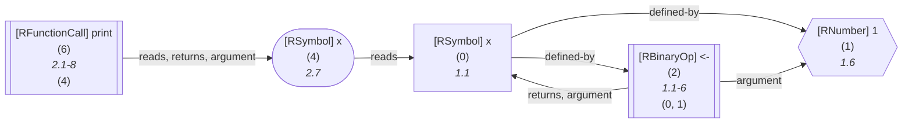

	
<details open>

<summary style="color:gray">R Code of the Dataflow Graph</summary>

The analysis required _3.51 ms_ (including parse and normalize, using the [r-shell](https://github.com/flowr-analysis/flowr/wiki/Engines) engine) within the generation environment. The following marks are used in the graph to highlight sub-parts (uses ids): {3, 0->3}.
We encountered unknown side effects (with ids: 6 (linked)) during the analysis.


```r
x <- 1
print(x)
```


</details>


</details>
    

In general, there may be many such edges, identifying every possible definition of the variable.


<details><summary style="">Example: Reads Edge Identifying Multiple Definitions (conditional)</summary>


	
<details open>

<summary style="color:gray">R Code of the Dataflow Graph</summary>

The analysis required _4.51 ms_ (including parse and normalize, using the [r-shell](https://github.com/flowr-analysis/flowr/wiki/Engines) engine) within the generation environment. The following marks are used in the graph to highlight sub-parts (uses ids): {10, 10->0, 10->4}.
We encountered unknown side effects (with ids: 12 (linked)) during the analysis.


```r
x <- 1
if(u) x <- 2
print(x)
```


</details>


</details>
    

<details><summary style="">Example: Reads Edge Identifying Multiple Definitions (loop)</summary>


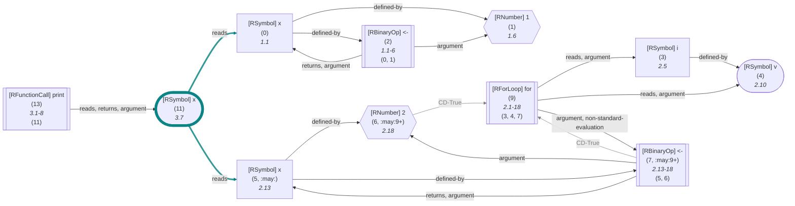

	
<details open>

<summary style="color:gray">R Code of the Dataflow Graph</summary>

The analysis required _4.00 ms_ (including parse and normalize, using the [r-shell](https://github.com/flowr-analysis/flowr/wiki/Engines) engine) within the generation environment. The following marks are used in the graph to highlight sub-parts (uses ids): {11, 11->0, 11->5}.
We encountered unknown side effects (with ids: 13 (linked)) during the analysis.


```r
x <- 1
for(i in v) x <- 2
print(x)
```


</details>


</details>
    

<details><summary style="">Example: Reads Edge Identifying Multiple Definitions (side-effect)</summary>


	
<details open>

<summary style="color:gray">R Code of the Dataflow Graph</summary>

The analysis required _5.59 ms_ (including parse and normalize, using the [r-shell](https://github.com/flowr-analysis/flowr/wiki/Engines) engine) within the generation environment. The following marks are used in the graph to highlight sub-parts (uses ids): {16, 16->1, 16->7}.
We encountered unknown side effects (with ids: 18 (linked)) during the analysis.


```r
f <- function() x <<- 2
x <- 2
if(u) f()
print(x)
```


</details>


</details>
    


	

<a id='function-call-vertex'> </a>
### 3) Function Call Vertex

Type: `function-call`


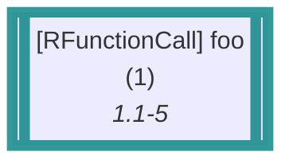

	
<details>

<summary style="color:gray">R Code of the Dataflow Graph</summary>

The analysis required _0.89 ms_ (including parse and normalize, using the [r-shell](https://github.com/flowr-analysis/flowr/wiki/Engines) engine) within the generation environment. The following marks are used in the graph to highlight sub-parts (uses ids): {1}.
We encountered no unknown side effects during the analysis.


```r
foo()
```


</details>


Describes any kind of function call, including unnamed calls and those that happen implicitly!
In general the vertex provides you with information about 
the _name_ of the called function, the passed _arguments_, and the _environment_ in which the call happens (if it is of importance).

However, the implementation reveals that it may hold an additional `onlyBuiltin` flag to indicate that the call is only calling builtin functions &mdash; however, this is only a flag to improve performance,
and it should not be relied on as it may under-approximate the actual calling targets (e.g., being `false` even though all calls resolve to builtins).
	 
 * **[DataflowGraphVertexFunctionCall](https://github.com/flowr-analysis/flowr/tree/main//src/dataflow/graph/vertex.ts#L223)**   
   Arguments required to construct a vertex which represents the usage of a variable in the
   <code>dataflow graph</code>
   .
   <details><summary style="color:gray">Defined at <a href="https://github.com/flowr-analysis/flowr/tree/main//src/dataflow/graph/vertex.ts#L223">./src/dataflow/graph/vertex.ts#L223</a></summary>
   
   
   ```ts
   /**
    * Arguments required to construct a vertex which represents the usage of a variable in the {@link DataflowGraph|dataflow graph}.
    *
    * @see {@link isFunctionCallVertex} - to check if a vertex is a function call vertex
    */
   export interface DataflowGraphVertexFunctionCall extends DataflowGraphVertexBase {
       readonly tag:  VertexType.FunctionCall
       /**
        * Effective name of the function call,
        * Please be aware that this name can differ from the lexeme.
        * For example, if the function is a replacement function, in this case, the actually called fn will
        * have the compound name (e.g., `[<-`).
        */
       readonly name: string
       /** The arguments of the function call, in order (as they are passed to the respective call if executed in R. */
       args:          FunctionArgument[]
       /** a performance flag to indicate that the respective call is _only_ calling a builtin function without any df graph attached */
       onlyBuiltin:   boolean
       /** The environment attached to the call (if such an attachment is necessary, e.g., because it represents the calling closure */
       environment:   REnvironmentInformation | undefined
   }
   ```
   
   
   </details>
   
    <details><summary style="">View more (DataflowGraphVertexBase)</summary>

   * **[DataflowGraphVertexBase](https://github.com/flowr-analysis/flowr/tree/main//src/dataflow/graph/vertex.ts#L155)**   
     Arguments required to construct a vertex in the
     <code>dataflow graph</code>
     .
     <details><summary style="color:gray">Defined at <a href="https://github.com/flowr-analysis/flowr/tree/main//src/dataflow/graph/vertex.ts#L155">./src/dataflow/graph/vertex.ts#L155</a></summary>
     
     
     ```ts
     /**
      * Arguments required to construct a vertex in the {@link DataflowGraph|dataflow graph}.
      *
      * @see DataflowGraphVertexUse
      * @see DataflowGraphVertexVariableDefinition
      * @see DataflowGraphVertexFunctionDefinition
      */
     interface DataflowGraphVertexBase extends MergeableRecord {
         /**
          * Used to identify and separate different types of vertices.
          */
         readonly tag:       VertexType
         /**
          * The id of the node (the id assigned by the {@link ParentInformation} decoration).
          * This unanimously identifies the vertex in the {@link DataflowGraph|dataflow graph}
          * as well as the corresponding {@link NormalizedAst|normalized AST}.
          */
         id:                 NodeId
         /**
          * The environment in which the vertex is set.
          */
         environment?:       REnvironmentInformation
         /**
          * @see {@link ControlDependency} - the collection of control dependencies which have an influence on whether the vertex is executed.
          */
         cds:                ControlDependency[] | undefined
         /**
          * this attribute links a vertex to indices (pointer links) it may be affected by or related to
          */
         indicesCollection?: ContainerIndicesCollection
     }
     ```
     
     
     </details>
     
     * [MergeableRecord](https://github.com/flowr-analysis/flowr/tree/main//src/util/objects.ts#L11)   
     
       <details><summary style="color:gray">Defined at <a href="https://github.com/flowr-analysis/flowr/tree/main//src/util/objects.ts#L11">./src/util/objects.ts#L11</a></summary>
       
       
       ```ts
       export type MergeableRecord = Record<string, unknown>
       ```
       
       
       </details>
       

       * [string](https://github.com/flowr-analysis/flowr/tree/main//src/statistics/features/common-syntax-probability.ts#L29)   
       
         <details><summary style="color:gray">Defined at <a href="https://github.com/flowr-analysis/flowr/tree/main//src/statistics/features/common-syntax-probability.ts#L29">./src/statistics/features/common-syntax-probability.ts#L29</a></summary>
         
         
         ```ts
         string:       Record<string, Measurement>
         ```
         
         
         </details>
         
         * **[CommonSyntaxTypeCounts](https://github.com/flowr-analysis/flowr/tree/main//src/statistics/features/common-syntax-probability.ts#L12)**   
         
           <details><summary style="color:gray">Defined at <a href="https://github.com/flowr-analysis/flowr/tree/main//src/statistics/features/common-syntax-probability.ts#L12">./src/statistics/features/common-syntax-probability.ts#L12</a></summary>
           
           
           ```ts
           export interface CommonSyntaxTypeCounts<Measurement=bigint> {
               // just a helper to collect all as well (could be derived from sum)
               total:        Measurement,
               // counts whenever you pass more than one node that is not sensible for any other category
               multiple:     Measurement,
               // similar to multiple, but only counts empty (bodies etc.)
               empty:        Measurement,
               // in case of a = x etc.
               withArgument: Measurement,
               // arguments used without value
               noValue:      Measurement,
               // does include t and f, as well as NULL etc. (any special symbol)
               singleVar:    Record<string, Measurement>
               number:       Record<number, Measurement>
               // only explicit integers
               integer:      Record<number, Measurement>
               complex:      Record<number, Measurement>
               string:       Record<string, Measurement>
               logical:      Record<typeof RTrue | typeof RFalse, Measurement>,
               call:         Record<string, Measurement>,
               unnamedCall:  Measurement,
               // binop includes all assignments!
               binOp:        Record<string, Measurement>,
               unaryOp:      Record<string, Measurement>,
               // unknown content, records lexeme (can include break etc. for bodies), due to my oversight, this includes function definitions
               other:        Record<string, Measurement>
           }
           ```
           
           
           </details>
           
       * [unknown](https://github.com/flowr-analysis/flowr/tree/main//src/dataflow/graph/graph.ts#L370)   
       
         <details><summary style="color:gray">Defined at <a href="https://github.com/flowr-analysis/flowr/tree/main//src/dataflow/graph/graph.ts#L370">./src/dataflow/graph/graph.ts#L370</a></summary>
         
         
         ```ts
         unknown
         ```
         
         
         </details>
         

</details>
    
The related function argument references are defined like this:
 * [FunctionArgument](https://github.com/flowr-analysis/flowr/tree/main//src/dataflow/graph/graph.ts#L63)   
   Summarizes either named (`foo(a = 3, b = 2)`), unnamed (`foo(3, 2)`), or empty (`foo(,)`) arguments within a function.
   <details><summary style="color:gray">Defined at <a href="https://github.com/flowr-analysis/flowr/tree/main//src/dataflow/graph/graph.ts#L63">./src/dataflow/graph/graph.ts#L63</a></summary>
   
   
   ```ts
   /** Summarizes either named (`foo(a = 3, b = 2)`), unnamed (`foo(3, 2)`), or empty (`foo(,)`) arguments within a function. */
   export type FunctionArgument = NamedFunctionArgument | PositionalFunctionArgument | typeof EmptyArgument
   ```
   
   
   </details>
   
    <details><summary style="">View more (NamedFunctionArgument, PositionalFunctionArgument)</summary>

   * **[NamedFunctionArgument](https://github.com/flowr-analysis/flowr/tree/main//src/dataflow/graph/graph.ts#L44)**   
     A reference with a name, e.g. `a` and `b` in the following function call:
     
     ```r
     foo(a = 3, b = 2)
     ```
     <details><summary style="color:gray">Defined at <a href="https://github.com/flowr-analysis/flowr/tree/main//src/dataflow/graph/graph.ts#L44">./src/dataflow/graph/graph.ts#L44</a></summary>
     
     
     ```ts
     /**
      * A reference with a name, e.g. `a` and `b` in the following function call:
      *
      * ```r
      * foo(a = 3, b = 2)
      * ```
      *
      * @see #isNamedArgument
      * @see PositionalFunctionArgument
      */
     export interface NamedFunctionArgument extends IdentifierReference {
         readonly name: string
     }
     ```
     
     
     </details>
     
     * **[IdentifierReference](https://github.com/flowr-analysis/flowr/tree/main//src/dataflow/environments/identifier.ts#L73)**   
       An identifier reference points to a variable like `a` in `b <- a`.
       Without any surrounding code, `a` will produce the identifier reference `a`.
       Similarly, `b` will create a reference (although it will be an
       <code>identifier definition</code>
       which adds even more information).
        In general,
       references are merely pointers (with meta-information) to a vertex in the
       <code>dataflow graph</code>
       .
       In the context of the extractor, for example,
       they indicate the references that are currently (during the analysis at this given node)
       <code>read (`in`)</code>
       ,
       <code>written (`out`)</code>
       ,
       or
       <code>unknown (`unknownReferences`)</code>
       .
       <details><summary style="color:gray">Defined at <a href="https://github.com/flowr-analysis/flowr/tree/main//src/dataflow/environments/identifier.ts#L73">./src/dataflow/environments/identifier.ts#L73</a></summary>
       
       
       ```ts
       /**
        * An identifier reference points to a variable like `a` in `b <- a`.
        * Without any surrounding code, `a` will produce the identifier reference `a`.
        * Similarly, `b` will create a reference (although it will be an {@link IdentifierDefinition|identifier definition}
        * which adds even more information).
        *
        * In general,
        * references are merely pointers (with meta-information) to a vertex in the {@link DataflowGraph|dataflow graph}.
        * In the context of the extractor, for example,
        * they indicate the references that are currently (during the analysis at this given node)
        * {@link DataflowInformation#in|read (`in`)}, {@link DataflowInformation#out|written (`out`)},
        * or {@link DataflowInformation#unknownReferences|unknown (`unknownReferences`)}.
        *
        * @see {@link InGraphIdentifierDefinition}
        */
       export interface IdentifierReference {
           /**
            * The id of the node which represents the reference in the {@link NormalizedAst|normalized AST} and the {@link DataflowGraph|dataflow graph}.
            */
           readonly nodeId:     NodeId
           /** Name the reference is identified by (e.g., the name of the variable), undefined if the reference is "artificial" (e.g., anonymous) */
           readonly name:       Identifier | undefined
           /** Type of the reference to be resolved */
           readonly type:       ReferenceType;
           /**
            * If the reference is only effective, if, for example, an if-then-else condition is true, this references the root of the `if`.
            * As a hacky intermediate solution (until we have pointer-analysis), an empty array may indicate a `maybe` which is due to pointer access (e.g., in `a[x] <- 3`).
            */
           controlDependencies: ControlDependency[] | undefined
       }
       ```
       
       
       </details>
       
   * **[PositionalFunctionArgument](https://github.com/flowr-analysis/flowr/tree/main//src/dataflow/graph/graph.ts#L58)**   
     A reference which does not have a name, like the references to the arguments `3` and `2` in the following:
     
     ```r
     foo(3, 2)
     ```
     <details><summary style="color:gray">Defined at <a href="https://github.com/flowr-analysis/flowr/tree/main//src/dataflow/graph/graph.ts#L58">./src/dataflow/graph/graph.ts#L58</a></summary>
     
     
     ```ts
     /**
      * A reference which does not have a name, like the references to the arguments `3` and `2` in the following:
      *
      * ```r
      * foo(3, 2)
      * ```
      *
      * @see #isPositionalArgument
      * @see NamedFunctionArgument
      */
     export interface PositionalFunctionArgument extends Omit<IdentifierReference, 'name'> {
         readonly name?: undefined
     }
     ```
     
     
     </details>
     

</details>
    


<details><summary style="">Example: Simple Function Call (unresolved)</summary>


To get a better understanding, let's look at a simple function call without any known call target, like `foo(x,3,y=3,)`:


	
<details>

<summary style="color:gray">R Code of the Dataflow Graph</summary>

The analysis required _6.47 ms_ (including parse and normalize, using the [r-shell](https://github.com/flowr-analysis/flowr/wiki/Engines) engine) within the generation environment. The following marks are used in the graph to highlight sub-parts (uses ids): {8}.
We encountered no unknown side effects during the analysis.


```r
foo(x,3,y=3,)
```


</details>


In this case, we have a function call vertex with id `8` and the following arguments:


```json
[
  {
    "nodeId": 1,
    "type": 32
  },
  {
    "nodeId": 3,
    "type": 32
  },
  {
    "nodeId": 7,
    "name": "y",
    "type": 32
  },
  "<>"
]
```


Of course now, this is hard to read in this form (although the ids of the arguments can be mapped pretty easily to the visualization),
as the `type` of these references is a bit-mask, encoding one of the following reference types:

| Value | Reference Type |
|------:|----------------|
| 1 | Unknown |
| 2 | Function |
| 4 | Variable |
| 8 | Constant |
| 16 | Parameter |
| 32 | Argument |
| 64 | BuiltInConstant |
| 128 | BuiltInFunction |

In other words, we classify the references as Argument, Argument, Argument, and the (special) empty argument type (`<>`).
For more information on the types of references, please consult the implementation.

 * **[ReferenceType](https://github.com/flowr-analysis/flowr/tree/main//src/dataflow/environments/identifier.ts#L21)**   
   Each reference has exactly one reference type, stored as the respective number.
   However, when checking, we may want to allow for one of several types,
   allowing the combination of the respective bitmasks.
    Having reference types is important as R separates a variable definition from
   a function when resolving an
   <code>identifier</code>
   .
   In `c <- 3; print(c(1, 2))` the call to `c` works normally (as the vector constructor),
   while writing `c <- function(...) ..1` overshadows the built-in and causes `print` to only output the first element.
   <details><summary style="color:gray">Defined at <a href="https://github.com/flowr-analysis/flowr/tree/main//src/dataflow/environments/identifier.ts#L21">./src/dataflow/environments/identifier.ts#L21</a></summary>
   
   
   ```ts
   /**
    * Each reference has exactly one reference type, stored as the respective number.
    * However, when checking, we may want to allow for one of several types,
    * allowing the combination of the respective bitmasks.
    *
    * Having reference types is important as R separates a variable definition from
    * a function when resolving an {@link Identifier|identifier}.
    * In `c <- 3; print(c(1, 2))` the call to `c` works normally (as the vector constructor),
    * while writing `c <- function(...) ..1` overshadows the built-in and causes `print` to only output the first element.
    *
    * @see {@link isReferenceType} - for checking if a (potentially joint) reference type contains a certain type
    * @see {@link ReferenceTypeReverseMapping} - for debugging
    */
   export enum ReferenceType {
       /** The identifier type is unknown */
       Unknown = 1,
       /** The identifier is defined by a function (includes built-in function) */
       Function = 2,
       /** The identifier is defined by a variable (includes parameter and argument) */
       Variable = 4,
       /** The identifier is defined by a constant (includes built-in constant) */
       Constant = 8,
       /** The identifier is defined by a parameter (which we know nothing about at the moment) */
       Parameter = 16,
       /** The identifier is defined by an argument (which we know nothing about at the moment) */
       Argument = 32,
       /** The identifier is defined by a built-in value/constant */
       BuiltInConstant = 64,
       /** The identifier is defined by a built-in function */
       BuiltInFunction = 128
   }
   ```
   
   
   </details>
   
	

</details>
    


> [!NOTE]
> 
> But how do you know which definitions are actually called by the function?
> 
> So first of all, some frontends of _flowR_ (like the <span title="Description (Repl Command): Static backwards executable slicer for R">`:slicer`</span> and <span title="Description (Repl Command): Query the given R code, start with 'file://' to indicate a file. The query is to be a valid query in json format (use 'help' to get more information).">`:query`</span> with the [Query API](https://github.com/flowr-analysis/flowr/wiki/Query%20API)) already provide you with this information.
> In general there are three scenarios you may be interested in:
>   
> 
> <details><summary style="">1) the function resolves only to builtin definitions (like <code><-</code>)</summary>
> 
> 
> 
> Let's have a look at a simple assignment:
> 
> 
> 
> 
> 
> ```mermaid
> flowchart LR
>     1{{"`#91;RNumber#93; 2
>       (1)
>       *1.6*`"}}
>     0["`#91;RSymbol#93; x
>       (0)
>       *1.1*`"]
>     2[["`#91;RBinaryOp#93; #60;#45;
>       (2)
>       *1.1-6*
>     (0, 1)`"]]
>     0 -->|"defined-by"| 1
>     0 -->|"defined-by"| 2
>     2 -->|"argument"| 1
>     2 -->|"returns, argument"| 0
> ```
> 
> 	
> <details>
> 
> <summary style="color:gray">R Code of the Dataflow Graph</summary>
> 
> The analysis required _2.06 ms_ (including parse and normalize, using the [r-shell](https://github.com/flowr-analysis/flowr/wiki/Engines) engine) within the generation environment. 
> We encountered no unknown side effects during the analysis.
> 
> 
> ```r
> x <- 2
> ```
> 
> 
> 
> </details>
> 
> 
> 
> In this case, the call does not have a single [`calls`](#calls) edge, which in general means (i.e., if the analysis is done and you are not looking at an intermediate result) it is bound to anything
> global beyond the scope of the given script. _flowR_ generally (theoretically at least) does not know if the call really refers to a built-in variable or function,
> as any code that is not part of the analysis could cause the semantics to change. 
> However, it is (in most cases) safe to assume we call a builtin if there is a builtin function with the given name and if there is no [`calls`](#calls) edge attached to a call.
> If you want to check the resolve targets, refer to `resolveByName` which is defined in [`./src/dataflow/environments/resolve-by-name.ts`](https://github.com/flowr-analysis/flowr/tree/main/./src/dataflow/environments/resolve-by-name.ts).
> 
> 
> </details>
>     
> 
> 
> <details><summary style="">2) the function only resolves to definitions that are present in the program</summary>
> 
> 
> 
> Let's have a look at a call to a function named `foo` which is defined in the same script:
> 
> 
> 
> 
> 
> 
> ```mermaid
> flowchart LR
>     3["`#91;RFunctionDefinition#93; function
>       (3)
>       *1.8-19*`"]
> 
> subgraph "flow-3" [function 3]
>     1{{"`#91;RNumber#93; 3
>       (1)
>       *1.19*`"}}
>     style 1 stroke:purple,stroke-width:4px; 
> end
>     0["`#91;RSymbol#93; foo
>       (0)
>       *1.1-3*`"]
>     4[["`#91;RBinaryOp#93; #60;#45;
>       (4)
>       *1.1-19*
>     (0, 3)`"]]
>     %% Environment of 6 [level: 0]:
>     %% Built-in
>     %% 157----------------------------------------
>     %%   foo: {**foo** (id: 0, type: Function, def. @4)}
>     6[["`#91;RFunctionCall#93; foo
>       (6)
>       *2.1-5*`"]]
>     style 6 stroke:teal,stroke-width:7px,stroke-opacity:.8; 
> 3 -.-|function| flow-3
> 
>     0 -->|"defined-by"| 3
>     0 -->|"defined-by"| 4
>     4 -->|"argument"| 3
>     4 -->|"returns, argument"| 0
>     6 -->|"reads"| 0
>     linkStyle 5 stroke:teal,stroke-width:4.2px,stroke-opacity:.8
>     6 -->|"returns"| 1
>     linkStyle 6 stroke:teal,stroke-width:4.2px,stroke-opacity:.8
>     6 -->|"calls"| 3
>     linkStyle 7 stroke:teal,stroke-width:4.2px,stroke-opacity:.8
> ```
> 
> 	
> <details>
> 
> <summary style="color:gray">R Code of the Dataflow Graph</summary>
> 
> The analysis required _1.82 ms_ (including parse and normalize, using the [r-shell](https://github.com/flowr-analysis/flowr/wiki/Engines) engine) within the generation environment. The following marks are used in the graph to highlight sub-parts (uses ids): {6, 6->0, 6->1, 6->3}.
> We encountered no unknown side effects during the analysis.
> 
> 
> ```r
> foo <- function() 3
> foo()
> ```
> 
> 
> 
> </details>
> 
> 
> 
> Now, there are several edges, 7 to be precise, although we are primarily interested in the 3
> edges going out from the call vertex `6`.
> The [`reads`](#reads) edge signals all definitions which are read by the `foo` identifier (similar to a [use vertex](#use-vertex)).
> While it seems to be somewhat redundant given the [`calls`](#calls) edge that identifies the called [function definition](#function-definition-vertex),
> you have to consider cases in which aliases are involved in the call resolution (e.g., with higher order functions).
> 
> 
> <details><summary style="">Example: Alias in Call Resolution</summary>
> 
> In the following example, `g` [`reads`](#reads) the previous definition, but [`calls`](#calls) the function assigned to `f`.
> 
> 
> 
> 
> ```mermaid
> flowchart LR
>     3["`#91;RFunctionDefinition#93; function
>       (3)
>       *1.6-17*`"]
> 
> subgraph "flow-3" [function 3]
>     1{{"`#91;RNumber#93; 3
>       (1)
>       *1.17*`"}}
>     style 1 stroke:purple,stroke-width:4px; 
> end
>     0["`#91;RSymbol#93; f
>       (0)
>       *1.1*`"]
>     4[["`#91;RBinaryOp#93; #60;#45;
>       (4)
>       *1.1-17*
>     (0, 3)`"]]
>     6(["`#91;RSymbol#93; f
>       (6)
>       *2.6*`"])
>     5["`#91;RSymbol#93; g
>       (5)
>       *2.1*`"]
>     7[["`#91;RBinaryOp#93; #60;#45;
>       (7)
>       *2.1-6*
>     (5, 6)`"]]
>     %% Environment of 9 [level: 0]:
>     %% Built-in
>     %% 179----------------------------------------
>     %%   f: {**f** (id: 0, type: Function, def. @4)}
>     %%   g: {**g** (id: 5, type: Unknown, def. @7)}
>     9[["`#91;RFunctionCall#93; g
>       (9)
>       *3.1-3*`"]]
> 3 -.-|function| flow-3
> 
>     0 -->|"defined-by"| 3
>     0 -->|"defined-by"| 4
>     4 -->|"argument"| 3
>     4 -->|"returns, argument"| 0
>     6 -->|"reads"| 0
>     5 -->|"defined-by"| 6
>     5 -->|"defined-by"| 7
>     7 -->|"argument"| 6
>     7 -->|"returns, argument"| 5
>     9 -->|"reads"| 5
>     linkStyle 10 stroke:teal,stroke-width:4.2px,stroke-opacity:.8
>     9 -->|"returns"| 1
>     9 -->|"calls"| 3
>     linkStyle 12 stroke:teal,stroke-width:4.2px,stroke-opacity:.8
> ```
> 
> 	
> <details>
> 
> <summary style="color:gray">R Code of the Dataflow Graph</summary>
> 
> The analysis required _1.97 ms_ (including parse and normalize, using the [r-shell](https://github.com/flowr-analysis/flowr/wiki/Engines) engine) within the generation environment. The following marks are used in the graph to highlight sub-parts (uses ids): {9, 9->5, 9->3}.
> We encountered no unknown side effects during the analysis.
> 
> 
> ```r
> f <- function() 3
> g <- f
> g()
> ```
> 
> 
> 
> </details>
> 
> 
> 
> </details>
>     
> 			
> Lastly, the [`returns`](#returns) edge links the call to the return vertices(s) of the function.
> Please be aware, that these multiple exit points may be counter intuitive as they often appear with a nested call (usually a call to the built-in `{` function).
> 
>  
> <details><summary style="">(Advanced) Example: Multiple Exit Points May Still Reflect As One</summary>
> 
> 
> 
> 
> 
> ```mermaid
> flowchart LR
>     19["`#91;RFunctionDefinition#93; function
>       (19)
>       *1.6-5.1*`"]
> 
> subgraph "flow-19" [function 19]
>     3(["`#91;RSymbol#93; u
>       (3)
>       *2.12*`"])
>     5{{"`#91;RNumber#93; 3
>       (5)
>       *2.22*`"}}
>     7[["`#91;RFunctionCall#93; return
>       (7, :may:9+)
>       *2.15-23*
>     (5)`"]]
>     9[["`#91;RIfThenElse#93; if
>       (9)
>       *2.9-23*
>     (3, 7, [empty])`"]]
>     10(["`#91;RSymbol#93; v
>       (10, :may:)
>       *3.12*`"])
>     12{{"`#91;RNumber#93; 2
>       (12)
>       *3.22*`"}}
>     14[["`#91;RFunctionCall#93; return
>       (14, :may:)
>       *3.15-23*
>     (12)`"]]
>     16[["`#91;RIfThenElse#93; if
>       (16, :may:)
>       *3.9-23*
>     (10, 14, [empty])`"]]
>     17{{"`#91;RNumber#93; 1
>       (17, :may:)
>       *4.9*`"}}
>     18[["`#91;RExpressionList#93; #123;
>       (18)
>       *1.17*
>     (9, 16, 17)`"]]
>     style 3 stroke:purple,stroke-width:4px; 
>     style 10 stroke:purple,stroke-width:4px; 
>     style 17 stroke:purple,stroke-width:4px; 
> end
>     0["`#91;RSymbol#93; f
>       (0)
>       *1.1*`"]
>     20[["`#91;RBinaryOp#93; #60;#45;
>       (20)
>       *1.1-5.1*
>     (0, 19)`"]]
>     %% Environment of 22 [level: 0]:
>     %% Built-in
>     %% 226----------------------------------------
>     %%   f: {**f** (id: 0, type: Function, def. @20)}
>     22[["`#91;RFunctionCall#93; f
>       (22)
>       *6.1-3*`"]]
>     style 22 stroke:teal,stroke-width:7px,stroke-opacity:.8; 
>     7 -->|"returns, argument"| 5
>     7 -->|"CD-True"| 9
>     linkStyle 1 stroke:gray,color:gray;
>     9 -->|"returns, argument"| 7
>     9 -->|"reads, argument"| 3
>     14 -->|"returns, argument"| 12
>     16 -->|"returns, argument"| 14
>     16 -->|"reads, argument"| 10
>     18 -->|"argument"| 9
>     18 -->|"argument"| 16
>     18 -->|"returns, argument"| 17
>     18 -->|"returns"| 7
>     18 -->|"returns"| 14
> 19 -.-|function| flow-19
> 
>     0 -->|"defined-by"| 19
>     0 -->|"defined-by"| 20
>     20 -->|"argument"| 19
>     20 -->|"returns, argument"| 0
>     22 -->|"reads"| 0
>     22 -->|"returns"| 18
>     linkStyle 18 stroke:teal,stroke-width:4.2px,stroke-opacity:.8
>     22 -->|"calls"| 19
> ```
> 
> 	
> <details>
> 
> <summary style="color:gray">R Code of the Dataflow Graph</summary>
> 
> The analysis required _2.96 ms_ (including parse and normalize, using the [r-shell](https://github.com/flowr-analysis/flowr/wiki/Engines) engine) within the generation environment. The following marks are used in the graph to highlight sub-parts (uses ids): {22, 22->18}.
> We encountered no unknown side effects during the analysis.
> 
> 
> ```r
> f <- function() {
> 	if(u) return(3)
> 	if(v) return(2)
> 	1
> }
> f()
> ```
> 
> 
> 
> </details>
> 
> 
> In this case the call of `f` still only has one [`returns`](#returns) edge, although the function _looks_ as if it would have multiple exit points!
> But you have to beware that `{` is a function call as well (see below) and it may be redefined, or at least affect the actual returns of the function.
> In this scenario we show two types of such returns (or exit points): _explicit_ returns with the `return` function and _implicit_ returns (the result of the last evaluated expression).
> However, they are actually linked with the call of the built-in function `{` (and, in fact, they are highlighted in the mermaid graph).
> 
> 
> </details>
>     
> 
> 		
> 
>  
> 
> 
> 
> </details>
>     
> 
> 
> 
> <details><summary style="">3) the function resolves to a mix of both</summary>
> 
> 
> 
> Users may write… interesting pieces of code - for reasons we should not be interested in!
> Consider a case in which you have a built-in function (like the assignment operator `<-`) and a user that wants to redefine the meaning of the function call _sometimes_:
> 
> 
> 
> 
> 
> ```r
> x <- 2
> if(u) `<-` <- `*`
> x <- 3
> ```
> 
> <details>
> 
> <summary style="color:gray">Dataflow Graph of the R Code</summary>
> 
> The analysis required _2.37 ms_ (including parse and normalize, using the [r-shell](https://github.com/flowr-analysis/flowr/wiki/Engines) engine) within the generation environment. The following marks are used in the graph to highlight sub-parts (uses ids): {9, 9->0, 9->10}.
> We encountered no unknown side effects during the analysis.
> 
> 
> 
> ```mermaid
> flowchart LR
>     1{{"`#91;RNumber#93; 2
>       (1)
>       *1.6*`"}}
>     0["`#91;RSymbol#93; x
>       (0)
>       *1.1*`"]
>     2[["`#91;RBinaryOp#93; #60;#45;
>       (2)
>       *1.1-6*
>     (0, 1)`"]]
>     3(["`#91;RSymbol#93; u
>       (3)
>       *2.4*`"])
>     5(["`#91;RSymbol#93; #96;#42;#96;
>       (5, :may:8+)
>       *2.15-17*`"])
>     4["`#91;RSymbol#93; #96;#60;#45;#96;
>       (4, :may:8+)
>       *2.7-10*`"]
>     6[["`#91;RBinaryOp#93; #60;#45;
>       (6, :may:8+)
>       *2.7-17*
>     (4, 5)`"]]
>     8[["`#91;RIfThenElse#93; if
>       (8)
>       *2.1-17*
>     (3, 6, [empty])`"]]
>     10{{"`#91;RNumber#93; 3
>       (10)
>       *3.6*`"}}
>     9["`#91;RSymbol#93; x
>       (9)
>       *3.1*`"]
>     style 9 stroke:teal,stroke-width:7px,stroke-opacity:.8; 
>     %% Environment of 11 [level: 0]:
>     %% Built-in
>     %% 249----------------------------------------
>     %%   x:  {**x** (id: 0, type: Variable, def. @2)}
>     %%   <-: {**<-** (id: 4, type: Unknown, cds: {8+}, def. @6)}
>     11[["`#91;RBinaryOp#93; #60;#45;
>       (11)
>       *3.1-6*
>     (9, 10)`"]]
>     0 -->|"defined-by"| 1
>     0 -->|"defined-by"| 2
>     2 -->|"argument"| 1
>     2 -->|"returns, argument"| 0
>     5 -->|"CD-True"| 8
>     linkStyle 4 stroke:gray,color:gray;
>     4 -->|"defined-by"| 5
>     4 -->|"defined-by"| 6
>     4 -->|"CD-True"| 8
>     linkStyle 7 stroke:gray,color:gray;
>     6 -->|"argument"| 5
>     6 -->|"returns, argument"| 4
>     6 -->|"CD-True"| 8
>     linkStyle 10 stroke:gray,color:gray;
>     8 -->|"returns, argument"| 6
>     8 -->|"reads, argument"| 3
>     9 -->|"defined-by"| 10
>     linkStyle 13 stroke:teal,stroke-width:4.2px,stroke-opacity:.8
>     9 -->|"defined-by"| 11
>     9 -->|"reads"| 0
>     linkStyle 15 stroke:teal,stroke-width:4.2px,stroke-opacity:.8
>     11 -->|"argument"| 10
>     11 -->|"returns, argument"| 9
>     11 -->|"reads"| 4
> ```
> 
> 	
> 
> 
> </details>
> 
> 		
> 
> Interesting program, right? Running this with `u <- TRUE` will cause the last line to evaluate to `6` because we redefined the assignment
> operator to mean multiplication, while with `u <- FALSE` causes `x` to be assigned to `3`.
> In short: the last line may either refer to a definition or to a use of `x`, and we are not fully equipped to visualize this (this causes a warning).
> First of all how can you spot that something weird is happening? Well, this definition has a [`reads`](#reads) and a [`defined-by`](#defined-by) edge,
> but this of course does not apply to the general case.
> 
> For starters, let's have a look at the environment of the call to `<-` in the last line:
> 
> | Name | Definitions |
> |------|-------------|
> | `x` | {**x** (id: 0, type: Variable, def. @2)} |
> | `<-` | {**<-** (id: 4, type: Unknown, cds: {8+}, def. @6)} |
> 
> <details><summary style="color:gray"> Parent Environment</summary>
> 
> _Built-in Environment (323 entries)_
> 
> </details>
> 
> Great, you should see a definition of `<-` which is constraint by the [control dependency](#control-dependencies) to the `if`.
> Hence, trying to re-resolve the call using `getAllFunctionCallTargets` (defined in [`./src/dataflow/internal/linker.ts`](https://github.com/flowr-analysis/flowr/tree/main/./src/dataflow/internal/linker.ts)) with the id `11` of the call as starting point will present you with
> the following target ids: { `4`, `built-in` }.
> This way we know that the call may refer to the built-in assignment operator or to the multiplication.
> Similarly, trying to resolve the name with `resolveByName` using the environment attached to the call vertex (filtering for any reference type) returns (in a similar fashion): 
> { `4`, `built-in` } (however, the latter will not trace aliases).
> 
> 	
> 
> 
> 
> </details>
>     
> 
> 				


Function calls are the most complicated mechanism in R as essentially everything is a function call.
Even **control structures** like `if(p) a else b` are desugared into function calls (e.g., as `if`(p, a, b)).

<details><summary style="">Example: <code>if</code> as a Function Call</summary>


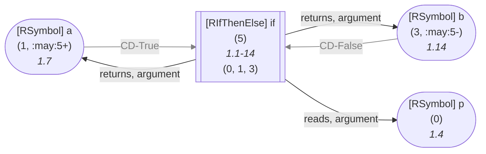

	
<details>

<summary style="color:gray">R Code of the Dataflow Graph</summary>

The analysis required _1.41 ms_ (including parse and normalize, using the [r-shell](https://github.com/flowr-analysis/flowr/wiki/Engines) engine) within the generation environment. 
We encountered no unknown side effects during the analysis.


```r
if(p) a else b
```


</details>


</details>
    

Similarly, you should be aware of calls to **anonymous functions**, which may appear given directly (e.g. as `(function() 1)()`) or indirectly, with code
directly calling the return of another function call: `foo()()`.

<details><summary style="">Example: Anonymous Function Call (given directly)</summary>


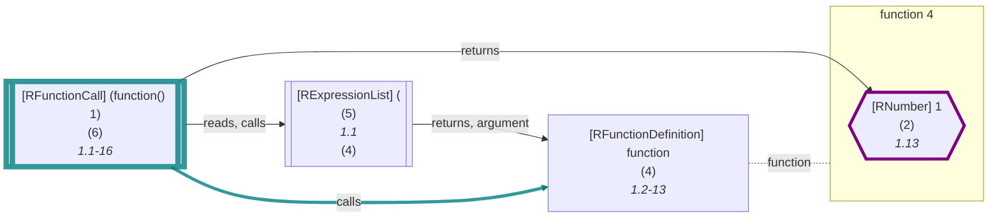

	
<details>

<summary style="color:gray">R Code of the Dataflow Graph</summary>

The analysis required _1.76 ms_ (including parse and normalize, using the [r-shell](https://github.com/flowr-analysis/flowr/wiki/Engines) engine) within the generation environment. The following marks are used in the graph to highlight sub-parts (uses ids): {6, 6->4}.
We encountered no unknown side effects during the analysis.


```r
(function() 1)()
```


</details>


</details>
    


<details><summary style="">Example: Anonymous Function Call (given indirectly)</summary>


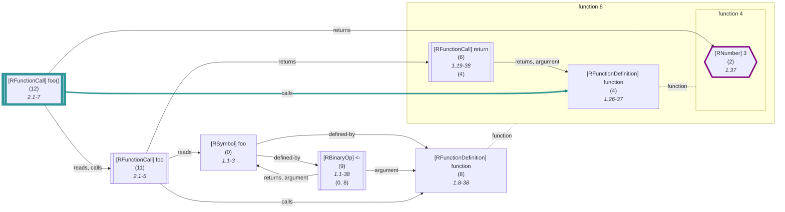

	
<details>

<summary style="color:gray">R Code of the Dataflow Graph</summary>

The analysis required _1.95 ms_ (including parse and normalize, using the [r-shell](https://github.com/flowr-analysis/flowr/wiki/Engines) engine) within the generation environment. The following marks are used in the graph to highlight sub-parts (uses ids): {12, 12->4}.
We encountered no unknown side effects during the analysis.


```r
foo <- function() return(function() 3)
foo()()
```


</details>


</details>
    

Another interesting case is a function with **side effects**, most prominently with the super-assignment `<<-`.
In this case, you may encounter the [`side-effect-on-call`](#side-effect-on-call) as exemplified below.

<details><summary style="">Example: Function Call with a Side-Effect</summary>


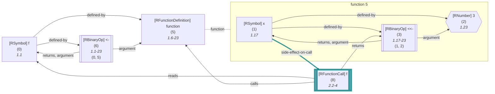

	
<details>

<summary style="color:gray">R Code of the Dataflow Graph</summary>

The analysis required _1.72 ms_ (including parse and normalize, using the [r-shell](https://github.com/flowr-analysis/flowr/wiki/Engines) engine) within the generation environment. The following marks are used in the graph to highlight sub-parts (uses ids): {8, 1->8}.
We encountered no unknown side effects during the analysis.


```r
f <- function() x <<- 3
 f()
```


</details>


</details>
    
 


	

<a id='variable-definition-vertex'> </a>
### 4) Variable Definition Vertex

Type: `variable-definition`


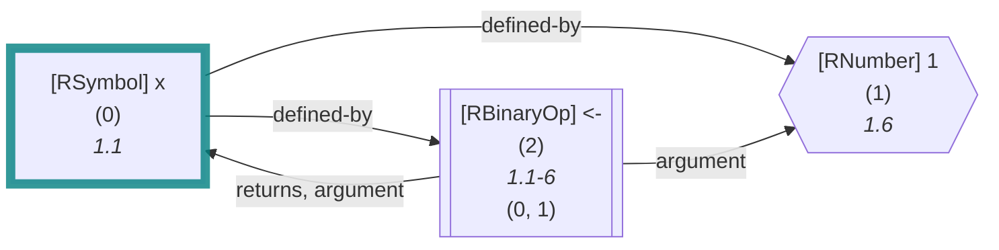

	
<details>

<summary style="color:gray">R Code of the Dataflow Graph</summary>

The analysis required _1.03 ms_ (including parse and normalize, using the [r-shell](https://github.com/flowr-analysis/flowr/wiki/Engines) engine) within the generation environment. The following marks are used in the graph to highlight sub-parts (uses ids): {0}.
We encountered no unknown side effects during the analysis.


```r
x <- 1
```


</details>


Defined variables most commonly occur in the context of an assignment, for example, with the `<-` operator as shown above.


<details><summary style="">Example: Super Definition (<code><<-</code>)</summary>


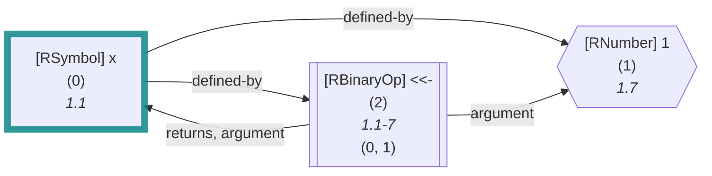

	
<details>

<summary style="color:gray">R Code of the Dataflow Graph</summary>

The analysis required _5.46 ms_ (including parse and normalize, using the [r-shell](https://github.com/flowr-analysis/flowr/wiki/Engines) engine) within the generation environment. The following marks are used in the graph to highlight sub-parts (uses ids): {0}.
We encountered no unknown side effects during the analysis.


```r
x <<- 1
```


</details>


</details>
    

The implementation is relatively sparse and similar to the other marker vertices:

 * **[DataflowGraphVertexVariableDefinition](https://github.com/flowr-analysis/flowr/tree/main//src/dataflow/graph/vertex.ts#L245)**   
   Arguments required to construct a vertex which represents the definition of a variable in the
   <code>dataflow graph</code>
   .
   <details><summary style="color:gray">Defined at <a href="https://github.com/flowr-analysis/flowr/tree/main//src/dataflow/graph/vertex.ts#L245">./src/dataflow/graph/vertex.ts#L245</a></summary>
   
   
   ```ts
   /**
    * Arguments required to construct a vertex which represents the definition of a variable in the {@link DataflowGraph|dataflow graph}.
    *
    * @see {@link isVariableDefinitionVertex} - to check if a vertex is a variable definition vertex
    */
   export interface DataflowGraphVertexVariableDefinition extends DataflowGraphVertexBase {
       readonly tag:          VertexType.VariableDefinition
       /** Does not require an environment, those are attached to the call */
       readonly environment?: undefined
   }
   ```
   
   
   </details>
   
    <details><summary style="">View more (DataflowGraphVertexBase)</summary>

   * **[DataflowGraphVertexBase](https://github.com/flowr-analysis/flowr/tree/main//src/dataflow/graph/vertex.ts#L155)**   
     Arguments required to construct a vertex in the
     <code>dataflow graph</code>
     .
     <details><summary style="color:gray">Defined at <a href="https://github.com/flowr-analysis/flowr/tree/main//src/dataflow/graph/vertex.ts#L155">./src/dataflow/graph/vertex.ts#L155</a></summary>
     
     
     ```ts
     /**
      * Arguments required to construct a vertex in the {@link DataflowGraph|dataflow graph}.
      *
      * @see DataflowGraphVertexUse
      * @see DataflowGraphVertexVariableDefinition
      * @see DataflowGraphVertexFunctionDefinition
      */
     interface DataflowGraphVertexBase extends MergeableRecord {
         /**
          * Used to identify and separate different types of vertices.
          */
         readonly tag:       VertexType
         /**
          * The id of the node (the id assigned by the {@link ParentInformation} decoration).
          * This unanimously identifies the vertex in the {@link DataflowGraph|dataflow graph}
          * as well as the corresponding {@link NormalizedAst|normalized AST}.
          */
         id:                 NodeId
         /**
          * The environment in which the vertex is set.
          */
         environment?:       REnvironmentInformation
         /**
          * @see {@link ControlDependency} - the collection of control dependencies which have an influence on whether the vertex is executed.
          */
         cds:                ControlDependency[] | undefined
         /**
          * this attribute links a vertex to indices (pointer links) it may be affected by or related to
          */
         indicesCollection?: ContainerIndicesCollection
     }
     ```
     
     
     </details>
     
     * [MergeableRecord](https://github.com/flowr-analysis/flowr/tree/main//src/util/objects.ts#L11)   
     
       <details><summary style="color:gray">Defined at <a href="https://github.com/flowr-analysis/flowr/tree/main//src/util/objects.ts#L11">./src/util/objects.ts#L11</a></summary>
       
       
       ```ts
       export type MergeableRecord = Record<string, unknown>
       ```
       
       
       </details>
       

       * [string](https://github.com/flowr-analysis/flowr/tree/main//src/statistics/features/common-syntax-probability.ts#L29)   
       
         <details><summary style="color:gray">Defined at <a href="https://github.com/flowr-analysis/flowr/tree/main//src/statistics/features/common-syntax-probability.ts#L29">./src/statistics/features/common-syntax-probability.ts#L29</a></summary>
         
         
         ```ts
         string:       Record<string, Measurement>
         ```
         
         
         </details>
         
         * **[CommonSyntaxTypeCounts](https://github.com/flowr-analysis/flowr/tree/main//src/statistics/features/common-syntax-probability.ts#L12)**   
         
           <details><summary style="color:gray">Defined at <a href="https://github.com/flowr-analysis/flowr/tree/main//src/statistics/features/common-syntax-probability.ts#L12">./src/statistics/features/common-syntax-probability.ts#L12</a></summary>
           
           
           ```ts
           export interface CommonSyntaxTypeCounts<Measurement=bigint> {
               // just a helper to collect all as well (could be derived from sum)
               total:        Measurement,
               // counts whenever you pass more than one node that is not sensible for any other category
               multiple:     Measurement,
               // similar to multiple, but only counts empty (bodies etc.)
               empty:        Measurement,
               // in case of a = x etc.
               withArgument: Measurement,
               // arguments used without value
               noValue:      Measurement,
               // does include t and f, as well as NULL etc. (any special symbol)
               singleVar:    Record<string, Measurement>
               number:       Record<number, Measurement>
               // only explicit integers
               integer:      Record<number, Measurement>
               complex:      Record<number, Measurement>
               string:       Record<string, Measurement>
               logical:      Record<typeof RTrue | typeof RFalse, Measurement>,
               call:         Record<string, Measurement>,
               unnamedCall:  Measurement,
               // binop includes all assignments!
               binOp:        Record<string, Measurement>,
               unaryOp:      Record<string, Measurement>,
               // unknown content, records lexeme (can include break etc. for bodies), due to my oversight, this includes function definitions
               other:        Record<string, Measurement>
           }
           ```
           
           
           </details>
           
       * [unknown](https://github.com/flowr-analysis/flowr/tree/main//src/dataflow/graph/graph.ts#L370)   
       
         <details><summary style="color:gray">Defined at <a href="https://github.com/flowr-analysis/flowr/tree/main//src/dataflow/graph/graph.ts#L370">./src/dataflow/graph/graph.ts#L370</a></summary>
         
         
         ```ts
         unknown
         ```
         
         
         </details>
         

</details>
    

Of course, there are not just operators that define variables, but also functions, like `assign`.


<details><summary style="">Example: Using <code>assign</code></summary>


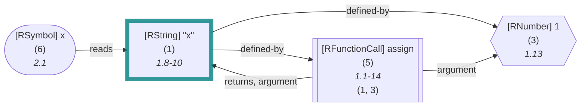

	
<details>

<summary style="color:gray">R Code of the Dataflow Graph</summary>

The analysis required _1.54 ms_ (including parse and normalize, using the [r-shell](https://github.com/flowr-analysis/flowr/wiki/Engines) engine) within the generation environment. The following marks are used in the graph to highlight sub-parts (uses ids): {1}.
We encountered no unknown side effects during the analysis.


```r
assign("x", 1)
x
```


</details>


The example may be misleading as the visualization uses `recoverName` to print the lexeme of the variable. However, this actually defines the variable `x` (without the quotes) as you can see with the [`reads`](#reads) edge.

</details>
    

Please be aware, that the name of the symbol defined may differ from what you read in the program as R allows the assignments to strings, escaped names, and more:


<details><summary style="">Example: Assigning with an Escaped Name</summary>


```mermaid
flowchart LR
    1{{"`#91;RNumber#93; 1
      (1)
      *1.8*`"}}
    0["`#91;RSymbol#93; #96;x#96;
      (0)
      *1.1-3*`"]
    style 0 stroke:teal,stroke-width:7px,stroke-opacity:.8; 
    2[["`#91;RBinaryOp#93; #60;#45;
      (2)
      *1.1-8*
    (0, 1)`"]]
    3(["`#91;RSymbol#93; x
      (3)
      *2.1*`"])
    0 -->|"defined-by"| 1
    0 -->|"defined-by"| 2
    2 -->|"argument"| 1
    2 -->|"returns, argument"| 0
    3 -->|"reads"| 0
```

	
<details>

<summary style="color:gray">R Code of the Dataflow Graph</summary>

The analysis required _1.19 ms_ (including parse and normalize, using the [r-shell](https://github.com/flowr-analysis/flowr/wiki/Engines) engine) within the generation environment. The following marks are used in the graph to highlight sub-parts (uses ids): {0}.
We encountered no unknown side effects during the analysis.


```r
`x` <- 1
x
```


</details>


</details>
    

<details><summary style="">Example: Assigning with a String</summary>


```mermaid
flowchart LR
    1{{"`#91;RNumber#93; 1
      (1)
      *1.8*`"}}
    0["`#91;RString#93; #34;x#34;
      (0)
      *1.1-3*`"]
    style 0 stroke:teal,stroke-width:7px,stroke-opacity:.8; 
    2[["`#91;RBinaryOp#93; #60;#45;
      (2)
      *1.1-8*
    (0, 1)`"]]
    3(["`#91;RSymbol#93; x
      (3)
      *2.1*`"])
    0 -->|"defined-by"| 1
    0 -->|"defined-by"| 2
    2 -->|"argument"| 1
    2 -->|"returns, argument"| 0
    3 -->|"reads"| 0
```

	
<details>

<summary style="color:gray">R Code of the Dataflow Graph</summary>

The analysis required _1.22 ms_ (including parse and normalize, using the [r-shell](https://github.com/flowr-analysis/flowr/wiki/Engines) engine) within the generation environment. The following marks are used in the graph to highlight sub-parts (uses ids): {0}.
We encountered no unknown side effects during the analysis.


```r
"x" <- 1
x
```


</details>


</details>
    

Definitions may be constrained by conditionals (_flowR_ takes care of calculating the dominating front for you).


<details><summary style="">Conditional Assignments</summary>


```mermaid
flowchart LR
    1{{"`#91;RNumber#93; 0
      (1)
      *1.6*`"}}
    0["`#91;RSymbol#93; x
      (0)
      *1.1*`"]
    2[["`#91;RBinaryOp#93; #60;#45;
      (2)
      *1.1-6*
    (0, 1)`"]]
    3(["`#91;RSymbol#93; u
      (3)
      *2.4*`"])
    5{{"`#91;RNumber#93; 1
      (5)
      *2.12*`"}}
    4["`#91;RSymbol#93; x
      (4, :may:12+)
      *2.7*`"]
    6[["`#91;RBinaryOp#93; #60;#45;
      (6, :may:12+)
      *2.7-12*
    (4, 5)`"]]
    9{{"`#91;RNumber#93; 2
      (9)
      *2.24*`"}}
    8["`#91;RSymbol#93; x
      (8, :may:12-)
      *2.19*`"]
    10[["`#91;RBinaryOp#93; #60;#45;
      (10, :may:12-)
      *2.19-24*
    (8, 9)`"]]
    12[["`#91;RIfThenElse#93; if
      (12)
      *2.1-24*
    (3, 6, 10)`"]]
    13(["`#91;RSymbol#93; x
      (13)
      *3.1*`"])
    0 -->|"defined-by"| 1
    0 -->|"defined-by"| 2
    2 -->|"argument"| 1
    2 -->|"returns, argument"| 0
    4 -->|"defined-by"| 5
    4 -->|"defined-by"| 6
    4 -->|"CD-True"| 12
    linkStyle 6 stroke:gray,color:gray;
    6 -->|"argument"| 5
    6 -->|"returns, argument"| 4
    6 -->|"CD-True"| 12
    linkStyle 9 stroke:gray,color:gray;
    8 -->|"defined-by"| 9
    8 -->|"defined-by"| 10
    8 -->|"CD-False"| 12
    linkStyle 12 stroke:gray,color:gray;
    10 -->|"argument"| 9
    10 -->|"returns, argument"| 8
    10 -->|"CD-False"| 12
    linkStyle 15 stroke:gray,color:gray;
    12 -->|"returns, argument"| 6
    12 -->|"returns, argument"| 10
    12 -->|"reads, argument"| 3
    13 -->|"reads"| 4
    13 -->|"reads"| 8
```

	
<details>

<summary style="color:gray">R Code of the Dataflow Graph</summary>

The analysis required _1.87 ms_ (including parse and normalize, using the [r-shell](https://github.com/flowr-analysis/flowr/wiki/Engines) engine) within the generation environment. 
We encountered no unknown side effects during the analysis.


```r
x <- 0
if(u) x <- 1 else x <- 2
x
```


</details>


In this case, the definition of `x` is constrained by the conditional, which is reflected in the environment at the end of the analysis:

| Name | Definitions |
|------|-------------|
| `x` | {**x** (id: 4, type: Variable, cds: {12-}, def. @6), **x** (id: 8, type: Variable, cds: {12-}, def. @10)} |

<details><summary style="color:gray"> Parent Environment</summary>

_Built-in Environment (323 entries)_

</details>

As you can see, _flowR_ is able to recognize that the initial definition of `x` has no influence on the final value of the variable.
		

</details>
    


	

<a id='function-definition-vertex'> </a>
### 5) Function Definition Vertex

Type: `function-definition`


```mermaid
flowchart LR
    2["`#91;RFunctionDefinition#93; function
      (2)
      *1.1-12*`"]
    style 2 stroke:teal,stroke-width:7px,stroke-opacity:.8; 

subgraph "flow-2" [function 2]
    0{{"`#91;RNumber#93; 1
      (0)
      *1.12*`"}}
    style 0 stroke:purple,stroke-width:4px; 
end
2 -.-|function| flow-2
```

	
<details>

<summary style="color:gray">R Code of the Dataflow Graph</summary>

The analysis required _0.96 ms_ (including parse and normalize, using the [r-shell](https://github.com/flowr-analysis/flowr/wiki/Engines) engine) within the generation environment. The following marks are used in the graph to highlight sub-parts (uses ids): {2}.
We encountered no unknown side effects during the analysis.


```r
function() 1
```


</details>


Defining a function does do a lot of things: 1) it creates a new scope, 2) it may introduce parameters which act as promises and which are only evaluated if they are actually required in the body, 3) it may access the enclosing environments and the callstack.
The vertex object in the dataflow graph stores multiple things, including all exit points, the enclosing environment if necessary, and the information of the subflow (the "body" of the function).

 * **[DataflowGraphVertexFunctionDefinition](https://github.com/flowr-analysis/flowr/tree/main//src/dataflow/graph/vertex.ts#L256)**   
   Arguments required to construct a vertex which represents the definition of a function in the
   <code>dataflow graph</code>
   .
   <details><summary style="color:gray">Defined at <a href="https://github.com/flowr-analysis/flowr/tree/main//src/dataflow/graph/vertex.ts#L256">./src/dataflow/graph/vertex.ts#L256</a></summary>
   
   
   ```ts
   /**
    * Arguments required to construct a vertex which represents the definition of a function in the {@link DataflowGraph|dataflow graph}.
    *
    * @see {@link isFunctionDefinitionVertex} - to check if a vertex is a function definition vertex
    */
   export interface DataflowGraphVertexFunctionDefinition extends DataflowGraphVertexBase {
       readonly tag: VertexType.FunctionDefinition
       /**
        * The static subflow of the function definition, constructed within {@link processFunctionDefinition}.
        * If the vertex is (for example) a function, it can have a subgraph which is used as a template for each call.
        * This is the `body` of the function.
        */
       subflow:      DataflowFunctionFlowInformation
       /**
        * All exit points of the function definitions.
        * In other words: last expressions/return calls
        */
       exitPoints:   readonly NodeId[]
       environment?: REnvironmentInformation
   }
   ```
   
   
   </details>
   
    <details><summary style="">View more (DataflowGraphVertexBase)</summary>

   * **[DataflowGraphVertexBase](https://github.com/flowr-analysis/flowr/tree/main//src/dataflow/graph/vertex.ts#L155)**   
     Arguments required to construct a vertex in the
     <code>dataflow graph</code>
     .
     <details><summary style="color:gray">Defined at <a href="https://github.com/flowr-analysis/flowr/tree/main//src/dataflow/graph/vertex.ts#L155">./src/dataflow/graph/vertex.ts#L155</a></summary>
     
     
     ```ts
     /**
      * Arguments required to construct a vertex in the {@link DataflowGraph|dataflow graph}.
      *
      * @see DataflowGraphVertexUse
      * @see DataflowGraphVertexVariableDefinition
      * @see DataflowGraphVertexFunctionDefinition
      */
     interface DataflowGraphVertexBase extends MergeableRecord {
         /**
          * Used to identify and separate different types of vertices.
          */
         readonly tag:       VertexType
         /**
          * The id of the node (the id assigned by the {@link ParentInformation} decoration).
          * This unanimously identifies the vertex in the {@link DataflowGraph|dataflow graph}
          * as well as the corresponding {@link NormalizedAst|normalized AST}.
          */
         id:                 NodeId
         /**
          * The environment in which the vertex is set.
          */
         environment?:       REnvironmentInformation
         /**
          * @see {@link ControlDependency} - the collection of control dependencies which have an influence on whether the vertex is executed.
          */
         cds:                ControlDependency[] | undefined
         /**
          * this attribute links a vertex to indices (pointer links) it may be affected by or related to
          */
         indicesCollection?: ContainerIndicesCollection
     }
     ```
     
     
     </details>
     
     * [MergeableRecord](https://github.com/flowr-analysis/flowr/tree/main//src/util/objects.ts#L11)   
     
       <details><summary style="color:gray">Defined at <a href="https://github.com/flowr-analysis/flowr/tree/main//src/util/objects.ts#L11">./src/util/objects.ts#L11</a></summary>
       
       
       ```ts
       export type MergeableRecord = Record<string, unknown>
       ```
       
       
       </details>
       

       * [string](https://github.com/flowr-analysis/flowr/tree/main//src/statistics/features/common-syntax-probability.ts#L29)   
       
         <details><summary style="color:gray">Defined at <a href="https://github.com/flowr-analysis/flowr/tree/main//src/statistics/features/common-syntax-probability.ts#L29">./src/statistics/features/common-syntax-probability.ts#L29</a></summary>
         
         
         ```ts
         string:       Record<string, Measurement>
         ```
         
         
         </details>
         
         * **[CommonSyntaxTypeCounts](https://github.com/flowr-analysis/flowr/tree/main//src/statistics/features/common-syntax-probability.ts#L12)**   
         
           <details><summary style="color:gray">Defined at <a href="https://github.com/flowr-analysis/flowr/tree/main//src/statistics/features/common-syntax-probability.ts#L12">./src/statistics/features/common-syntax-probability.ts#L12</a></summary>
           
           
           ```ts
           export interface CommonSyntaxTypeCounts<Measurement=bigint> {
               // just a helper to collect all as well (could be derived from sum)
               total:        Measurement,
               // counts whenever you pass more than one node that is not sensible for any other category
               multiple:     Measurement,
               // similar to multiple, but only counts empty (bodies etc.)
               empty:        Measurement,
               // in case of a = x etc.
               withArgument: Measurement,
               // arguments used without value
               noValue:      Measurement,
               // does include t and f, as well as NULL etc. (any special symbol)
               singleVar:    Record<string, Measurement>
               number:       Record<number, Measurement>
               // only explicit integers
               integer:      Record<number, Measurement>
               complex:      Record<number, Measurement>
               string:       Record<string, Measurement>
               logical:      Record<typeof RTrue | typeof RFalse, Measurement>,
               call:         Record<string, Measurement>,
               unnamedCall:  Measurement,
               // binop includes all assignments!
               binOp:        Record<string, Measurement>,
               unaryOp:      Record<string, Measurement>,
               // unknown content, records lexeme (can include break etc. for bodies), due to my oversight, this includes function definitions
               other:        Record<string, Measurement>
           }
           ```
           
           
           </details>
           
       * [unknown](https://github.com/flowr-analysis/flowr/tree/main//src/dataflow/graph/graph.ts#L370)   
       
         <details><summary style="color:gray">Defined at <a href="https://github.com/flowr-analysis/flowr/tree/main//src/dataflow/graph/graph.ts#L370">./src/dataflow/graph/graph.ts#L370</a></summary>
         
         
         ```ts
         unknown
         ```
         
         
         </details>
         

</details>
    
The subflow is defined like this:
 * [DataflowFunctionFlowInformation](https://github.com/flowr-analysis/flowr/tree/main//src/dataflow/graph/graph.ts#L32)   
   Describes the information we store per function body.
   The
   <code>DataflowFunctionFlowInformation#exitPoints</code>
   are stored within the enclosing
   <code>DataflowGraphVertexFunctionDefinition</code>
   vertex.
   <details><summary style="color:gray">Defined at <a href="https://github.com/flowr-analysis/flowr/tree/main//src/dataflow/graph/graph.ts#L32">./src/dataflow/graph/graph.ts#L32</a></summary>
   
   
   ```ts
   /**
    * Describes the information we store per function body.
    * The {@link DataflowFunctionFlowInformation#exitPoints} are stored within the enclosing {@link DataflowGraphVertexFunctionDefinition} vertex.
    */
   export type DataflowFunctionFlowInformation = Omit<DataflowInformation, 'graph' | 'exitPoints'>  & { graph: Set<NodeId> }
   ```
   
   
   </details>
   
    <details><summary style="">View more (Omit, DataflowInformation, 'graph' | 'exitPoints')</summary>


   * **[DataflowInformation](https://github.com/flowr-analysis/flowr/tree/main//src/dataflow/info.ts#L89)**   
     The dataflow information is one of the fundamental structures we have in the dataflow analysis.
     It is continuously updated during the dataflow analysis
     and holds its current state for the respective subtree processed.
     Each processor during the dataflow analysis may use the information from its children
     to produce a new state of the dataflow information.
      You may initialize a new dataflow information with
     <code>initializeCleanDataflowInformation</code>
     .
     <details><summary style="color:gray">Defined at <a href="https://github.com/flowr-analysis/flowr/tree/main//src/dataflow/info.ts#L89">./src/dataflow/info.ts#L89</a></summary>
     
     
     ```ts
     /**
      * The dataflow information is one of the fundamental structures we have in the dataflow analysis.
      * It is continuously updated during the dataflow analysis
      * and holds its current state for the respective subtree processed.
      * Each processor during the dataflow analysis may use the information from its children
      * to produce a new state of the dataflow information.
      *
      * You may initialize a new dataflow information with {@link initializeCleanDataflowInformation}.
      *
      * @see {@link DataflowCfgInformation} - the control flow aspects
      */
     export interface DataflowInformation extends DataflowCfgInformation {
         /**
          * References that have not been identified as read or write and will be so on higher processors.
          *
          * For example, when we analyze the `x` vertex in `x <- 3`, we will first create an unknown reference for `x`
          * as we have not yet seen the assignment!
          *
          * @see {@link IdentifierReference} - a reference on a variable, parameter, function call, ...
          */
         unknownReferences: readonly IdentifierReference[]
         /**
          * References which are read within the current subtree.
          *
          * @see {@link IdentifierReference} - a reference on a variable, parameter, function call, ...
          * */
         in:                readonly IdentifierReference[]
         /**
          * References which are written to within the current subtree
          *
          * @see {@link IdentifierReference} - a reference on a variable, parameter, function call, ...
          */
         out:               readonly IdentifierReference[]
         /** Current environments used for name resolution, probably updated on the next expression-list processing */
         environment:       REnvironmentInformation
         /** The current constructed dataflow graph */
         graph:             DataflowGraph
     }
     ```
     
     
     </details>
     
     * **[DataflowCfgInformation](https://github.com/flowr-analysis/flowr/tree/main//src/dataflow/info.ts#L71)**   
       The control flow information for the current DataflowInformation.
       <details><summary style="color:gray">Defined at <a href="https://github.com/flowr-analysis/flowr/tree/main//src/dataflow/info.ts#L71">./src/dataflow/info.ts#L71</a></summary>
       
       
       ```ts
       /** The control flow information for the current DataflowInformation. */
       export interface DataflowCfgInformation {
           /** The entry node into the subgraph */
           entryPoint: NodeId,
           /** All already identified exit points (active 'return'/'break'/'next'-likes) of the respective structure. */
           exitPoints: readonly ExitPoint[]
       }
       ```
       
       
       </details>
       


</details>
    
And if you are interested in the exit points, they are defined like this:
 * **[ExitPoint](https://github.com/flowr-analysis/flowr/tree/main//src/dataflow/info.ts#L49)**   
   An exit point describes the position which ends the current control flow structure.
   This may be as innocent as the last expression or explicit with a `return`/`break`/`next`.
   <details><summary style="color:gray">Defined at <a href="https://github.com/flowr-analysis/flowr/tree/main//src/dataflow/info.ts#L49">./src/dataflow/info.ts#L49</a></summary>
   
   
   ```ts
   /**
    * An exit point describes the position which ends the current control flow structure.
    * This may be as innocent as the last expression or explicit with a `return`/`break`/`next`.
    *
    * @see {@link ExitPointType} - for the different types of exit points
    * @see {@link addNonDefaultExitPoints} - to easily modify lists of exit points
    * @see {@link alwaysExits} - to check whether a list of control dependencies always triggers an exit
    * @see {@link filterOutLoopExitPoints} - to remove loop exit points from a list
    */
   export interface ExitPoint {
       /** What kind of exit point is this one? May be used to filter for exit points of specific causes. */
       readonly type:                ExitPointType,
       /** The id of the node which causes the exit point! */
       readonly nodeId:              NodeId,
       /**
        * Control dependencies which influence if the exit point triggers
        * (e.g., if the `return` is contained within an `if` statement).
        *
        * @see {@link happensInEveryBranch} - to check whether control dependencies are exhaustive
        */
       readonly controlDependencies: ControlDependency[] | undefined
   }
   ```
   
   
   </details>
   


Whenever we visualize a function definition, we use a dedicated node to represent the anonymous function object,
and a subgraph (usually with the name `"function <id>"`) to encompass the body of the function (they are linked with a dotted line).


> [!NOTE]
> 
> You may ask yourself: How can I know which vertices are part of the function body? how do i know the parameters?
> All vertices that are part of the graph are present in the `graph` property of the function definition &mdash; it contains a set of all ids of the contained vertices: 
> the actual dataflow graph is flat, and you can query all root vertices (i.e., those not part of any function definition) using 
> `rootIds`. Additionally, most functions that you can call on the dataflow graph offer a flag whether you want to include
> vertices of function definitions or not (e.g., `vertices`)
> 
> 
> <details><summary style="">Example: Nested Function Definitions</summary>
> 
> 
> 
> 
> 
> 
> ```mermaid
> flowchart LR
>     9["`#91;RFunctionDefinition#93; function
>       (9)
>       *1.6-37*`"]
>     style 9 stroke:teal,stroke-width:7px,stroke-opacity:.8; 
> 
> subgraph "flow-9" [function 9]
>     %% Environment of 6 [level: 1]:
>     %% Built-in
>     %% 403----------------------------------------
>     %% 404----------------------------------------
>     6["`#91;RFunctionDefinition#93; function
>       (6)
>       *1.24-35*`"]
>     style 6 stroke:teal,stroke-width:7px,stroke-opacity:.8; 
> 
> subgraph "flow-6" [function 6]
>     4{{"`#91;RNumber#93; 3
>       (4)
>       *1.35*`"}}
>     style 4 stroke:purple,stroke-width:4px; 
> end
>     3["`#91;RSymbol#93; g
>       (3)
>       *1.19*`"]
>     7[["`#91;RBinaryOp#93; #60;#45;
>       (7)
>       *1.19-35*
>     (3, 6)`"]]
>     8[["`#91;RExpressionList#93; #123;
>       (8)
>       *1.17*
>     (7)`"]]
> end
>     0["`#91;RSymbol#93; f
>       (0)
>       *1.1*`"]
>     10[["`#91;RBinaryOp#93; #60;#45;
>       (10)
>       *1.1-37*
>     (0, 9)`"]]
> 6 -.-|function| flow-6
> 
>     3 -->|"defined-by"| 6
>     3 -->|"defined-by"| 7
>     7 -->|"argument"| 6
>     7 -->|"returns, argument"| 3
>     8 -->|"returns, argument"| 7
> 9 -.-|function| flow-9
> 
>     0 -->|"defined-by"| 9
>     0 -->|"defined-by"| 10
>     10 -->|"argument"| 9
>     10 -->|"returns, argument"| 0
> ```
> 
> 	
> <details>
> 
> <summary style="color:gray">R Code of the Dataflow Graph</summary>
> 
> The analysis required _1.89 ms_ (including parse and normalize, using the [r-shell](https://github.com/flowr-analysis/flowr/wiki/Engines) engine) within the generation environment. The following marks are used in the graph to highlight sub-parts (uses ids): {9, 6}.
> We encountered no unknown side effects during the analysis.
> 
> 
> ```r
> f <- function() { g <- function() 3 }
> ```
> 
> 
> 
> </details>
> 
> 
> 
> As you can see, the vertex ids of the subflow do not contain those of nested function definitions but again only those which are part of the respective scope (creating a tree-like structure):
> 
> | Id | Vertex Ids in Subflow |
> |---:|-----------------------|
> | `6` | { `4` } |
> | `9` | { `6`, `3`, `7`, `8` } |
> 
> 	
> 
> </details>
>     
> 
> But now there is still an open question: how do you know which vertices are the parameters?
> In short: there is no direct way to infer this from the dataflow graph (as parameters are handled as open references which are promises).
> However, you can use the [normalized AST](https://github.com/flowr-analysis/flowr/wiki/Normalized%20AST) to get the parameters used.   
> 
> 
> <details><summary style="">Example: Parameters of a Function</summary>
> 
> 
> Let's first consider the following dataflow graph (of `f <- function(x, y = 3) x + y`):
> 
> 
> 
> 
> 
> ```mermaid
> flowchart LR
>     10["`#91;RFunctionDefinition#93; function
>       (10)
>       *1.6-29*`"]
>     style 10 stroke:teal,stroke-width:7px,stroke-opacity:.8; 
> 
> subgraph "flow-10" [function 10]
>     1["`#91;RSymbol#93; x
>       (1)
>       *1.15*`"]
>     style 1 stroke:teal,stroke-width:7px,stroke-opacity:.8; 
>     3["`#91;RSymbol#93; y
>       (3)
>       *1.18*`"]
>     style 3 stroke:teal,stroke-width:7px,stroke-opacity:.8; 
>     4{{"`#91;RNumber#93; 3
>       (4)
>       *1.22*`"}}
>     6(["`#91;RSymbol#93; x
>       (6)
>       *1.25*`"])
>     7(["`#91;RSymbol#93; y
>       (7)
>       *1.29*`"])
>     8[["`#91;RBinaryOp#93; #43;
>       (8)
>       *1.25-29*
>     (6, 7)`"]]
> end
>     0["`#91;RSymbol#93; f
>       (0)
>       *1.1*`"]
>     11[["`#91;RBinaryOp#93; #60;#45;
>       (11)
>       *1.1-29*
>     (0, 10)`"]]
>     3 -->|"defined-by"| 4
>     6 -->|"reads"| 1
>     7 -->|"reads"| 3
>     8 -->|"reads, argument"| 6
>     8 -->|"reads, argument"| 7
> 10 -.-|function| flow-10
> 
>     0 -->|"defined-by"| 10
>     0 -->|"defined-by"| 11
>     11 -->|"argument"| 10
>     11 -->|"returns, argument"| 0
> ```
> 
> 	
> <details>
> 
> <summary style="color:gray">R Code of the Dataflow Graph</summary>
> 
> The analysis required _1.95 ms_ (including parse and normalize, using the [r-shell](https://github.com/flowr-analysis/flowr/wiki/Engines) engine) within the generation environment. The following marks are used in the graph to highlight sub-parts (uses ids): {10, 1, 3}.
> We encountered no unknown side effects during the analysis.
> 
> 
> ```r
> f <- function(x, y = 3) x + y
> ```
> 
> 
> 
> </details>
> 
> 
> 
> The function definition we are interested in has the id `10`. Looking at the [normalized AST](https://github.com/flowr-analysis/flowr/wiki/Normalized%20AST) of the code,
> we can get the parameters simply be requesting the `parameters` property of the function definition (yielding the names: [`x`, `y`]):
> 
> 
> 
> 
> ```mermaid
> flowchart LR
>     n12(["RExpressionList (12)
>  "])
>     n11(["RBinaryOp (11)
> #60;#45;"])
>     n12 -->|"expr-list-child-0"| n11
>     n0(["RSymbol (0)
> f"])
>     n11 -->|"binop-lhs"| n0
>     n10(["RFunctionDefinition (10)
> function"])
>     n11 -->|"binop-rhs"| n10
>     n2(["RParameter (2)
> x"])
>     n10 -->|"function-def-param-0"| n2
>     n1(["RSymbol (1)
> x"])
>     n2 -->|"param-name"| n1
>     n5(["RParameter (5)
> y"])
>     n10 -->|"function-def-param-1"| n5
>     n3(["RSymbol (3)
> y"])
>     n5 -->|"param-name"| n3
>     n4(["RNumber (4)
> 3"])
>     n5 -->|"param-value"| n4
>     n9(["RExpressionList (9)
>  "])
>     n10 -->|"function-def-body"| n9
>     n8(["RBinaryOp (8)
> #43;"])
>     n9 -->|"expr-list-child-0"| n8
>     n6(["RSymbol (6)
> x"])
>     n8 -->|"binop-lhs"| n6
>     n7(["RSymbol (7)
> y"])
>     n8 -->|"binop-rhs"| n7
> 
> ```
> 	
> (The analysis required _1.29 ms_ (including parsing with the [r-shell](https://github.com/flowr-analysis/flowr/wiki/Engines) engine) within the generation environment.)
> 
> 
> 	
> 
> </details>
>     
> 				


Last but not least, please keep in mind that R offers another way of writing anonymous functions (using the backslash): 


```r
\(x) x + 1
```

<details>

<summary style="color:gray">Dataflow Graph of the R Code</summary>

The analysis required _1.24 ms_ (including parse and normalize, using the [r-shell](https://github.com/flowr-analysis/flowr/wiki/Engines) engine) within the generation environment. 
We encountered no unknown side effects during the analysis.


```mermaid
flowchart LR
    6["`#91;RFunctionDefinition#93; #92;
      (6)
      *1.1-10*`"]

subgraph "flow-6" [function 6]
    0["`#91;RSymbol#93; x
      (0)
      *1.3*`"]
    2(["`#91;RSymbol#93; x
      (2)
      *1.6*`"])
    3{{"`#91;RNumber#93; 1
      (3)
      *1.10*`"}}
    4[["`#91;RBinaryOp#93; #43;
      (4)
      *1.6-10*
    (2, 3)`"]]
end
    2 -->|"reads"| 0
    4 -->|"reads, argument"| 2
    4 -->|"reads, argument"| 3
6 -.-|function| flow-6
```

	


</details>


Besides this being a theoretically "shorter" way of defining a function, this behaves similarly to the use of `function`. 


	

## Edges

<a id='reads'></a>
<a id='reads-edge'> </a>
### 1) Reads Edge

Type: `1`


```mermaid
flowchart LR
    1{{"`#91;RNumber#93; 2
      (1)
      *1.6*`"}}
    0["`#91;RSymbol#93; x
      (0)
      *1.1*`"]
    2[["`#91;RBinaryOp#93; #60;#45;
      (2)
      *1.1-6*
    (0, 1)`"]]
    4(["`#91;RSymbol#93; x
      (4)
      *2.7*`"])
    6[["`#91;RFunctionCall#93; print
      (6)
      *2.1-8*
    (4)`"]]
    0 -->|"defined-by"| 1
    0 -->|"defined-by"| 2
    2 -->|"argument"| 1
    2 -->|"returns, argument"| 0
    4 -->|"reads"| 0
    linkStyle 4 stroke:teal,stroke-width:4.2px,stroke-opacity:.8
    6 -->|"reads, returns, argument"| 4
```

	
<details>

<summary style="color:gray">R Code of the Dataflow Graph</summary>

The analysis required _1.35 ms_ (including parse and normalize, using the [r-shell](https://github.com/flowr-analysis/flowr/wiki/Engines) engine) within the generation environment. The following marks are used in the graph to highlight sub-parts (uses ids): {4->0}.
We encountered unknown side effects (with ids: 6 (linked)) during the analysis.


```r
x <- 2
print(x)
```


</details>


Reads edges mark that the source vertex (usually a [use vertex](#use-vertex)) reads whatever is defined by the target vertex (usually a [variable definition](#variable-definition-vertex)).


> [!NOTE]
> 
> A [`reads`](#reads) edge is not a transitive closure and only links the "directly read" definition(s).
> Our abstract domains resolving transitive [`reads`](#reads) edges (and for that matter, following [`returns`](#returns) as well)
> are currently tailored to what we need in _flowR_. Hence, we offer a function like [<code><span title="convenience function returning all known call targets, as well as the name source which defines them">getAllFunctionCallTargets</span></code>](https://github.com/flowr-analysis/flowr/tree/main//src/dataflow/internal/linker.ts#L244) (defined in [`./src/dataflow/internal/linker.ts`](https://github.com/flowr-analysis/flowr/tree/main/./src/dataflow/internal/linker.ts)),
> as well as [<code>resolvesToBuiltInConstant</code>](https://github.com/flowr-analysis/flowr/tree/main//src/dataflow/environments/resolve-by-name.ts#L74) (defined in [`./src/dataflow/environments/resolve-by-name.ts`](https://github.com/flowr-analysis/flowr/tree/main/./src/dataflow/environments/resolve-by-name.ts)) which do this for specific cases.
> 
> 
> <details><summary style="">Example: Multi-Level Reads</summary>
> 
> 
> 
> 
> 
> ```mermaid
> flowchart LR
>     1{{"`#91;RNumber#93; 3
>       (1)
>       *1.6*`"}}
>     0["`#91;RSymbol#93; x
>       (0)
>       *1.1*`"]
>     2[["`#91;RBinaryOp#93; #60;#45;
>       (2)
>       *1.1-6*
>     (0, 1)`"]]
>     4(["`#91;RSymbol#93; x
>       (4)
>       *2.6*`"])
>     3["`#91;RSymbol#93; y
>       (3)
>       *2.1*`"]
>     5[["`#91;RBinaryOp#93; #60;#45;
>       (5)
>       *2.1-6*
>     (3, 4)`"]]
>     7(["`#91;RSymbol#93; y
>       (7)
>       *3.7*`"])
>     9[["`#91;RFunctionCall#93; print
>       (9)
>       *3.1-8*
>     (7)`"]]
>     0 -->|"defined-by"| 1
>     0 -->|"defined-by"| 2
>     2 -->|"argument"| 1
>     2 -->|"returns, argument"| 0
>     4 -->|"reads"| 0
>     linkStyle 4 stroke:teal,stroke-width:4.2px,stroke-opacity:.8
>     3 -->|"defined-by"| 4
>     3 -->|"defined-by"| 5
>     5 -->|"argument"| 4
>     5 -->|"returns, argument"| 3
>     7 -->|"reads"| 3
>     linkStyle 9 stroke:teal,stroke-width:4.2px,stroke-opacity:.8
>     9 -->|"reads, returns, argument"| 7
>     linkStyle 10 stroke:teal,stroke-width:4.2px,stroke-opacity:.8
> ```
> 
> 	
> <details>
> 
> <summary style="color:gray">R Code of the Dataflow Graph</summary>
> 
> The analysis required _1.72 ms_ (including parse and normalize, using the [r-shell](https://github.com/flowr-analysis/flowr/wiki/Engines) engine) within the generation environment. The following marks are used in the graph to highlight sub-parts (uses ids): {9->7, 7->3, 4->0}.
> We encountered unknown side effects (with ids: 9 (linked)) during the analysis.
> 
> 
> ```r
> x <- 3
> y <- x
> print(y)
> ```
> 
> 
> 
> </details>
> 
> 
> 
> </details>
>     
> 
> Similarly, [`reads`](#reads) can be cyclic, for example in the context of loops:
> 
> 
> <details><summary style="">Example: Cyclic Reads</summary>
> 
> 
> 
> 
> 
> ```mermaid
> flowchart LR
>     0["`#91;RSymbol#93; i
>       (0)
>       *1.5*`"]
>     1(["`#91;RSymbol#93; v
>       (1)
>       *1.10*`"])
>     3(["`#91;RSymbol#93; x
>       (3, :may:8+)
>       *1.18*`"])
>     4{{"`#91;RNumber#93; 1
>       (4, :may:8+)
>       *1.22*`"}}
>     5[["`#91;RBinaryOp#93; #43;
>       (5, :may:8+)
>       *1.18-22*
>     (3, 4)`"]]
>     2["`#91;RSymbol#93; x
>       (2, :may:)
>       *1.13*`"]
>     6[["`#91;RBinaryOp#93; #60;#45;
>       (6, :may:8+)
>       *1.13-22*
>     (2, 5)`"]]
>     8[["`#91;RForLoop#93; for
>       (8)
>       *1.1-22*
>     (0, 1, 6)`"]]
>     0 -->|"defined-by"| 1
>     3 -->|"reads"| 2
>     linkStyle 1 stroke:teal,stroke-width:4.2px,stroke-opacity:.8
>     3 -->|"CD-True"| 8
>     linkStyle 2 stroke:gray,color:gray;
>     4 -->|"CD-True"| 8
>     linkStyle 3 stroke:gray,color:gray;
>     5 -->|"reads, argument"| 3
>     5 -->|"reads, argument"| 4
>     5 -->|"CD-True"| 8
>     linkStyle 6 stroke:gray,color:gray;
>     2 -->|"defined-by"| 5
>     2 -->|"defined-by"| 6
>     6 -->|"argument"| 5
>     6 -->|"returns, argument"| 2
>     6 -->|"CD-True"| 8
>     linkStyle 11 stroke:gray,color:gray;
>     8 -->|"reads, argument"| 0
>     8 -->|"reads, argument"| 1
>     8 -->|"argument, non-standard-evaluation"| 6
> ```
> 
> 	
> <details>
> 
> <summary style="color:gray">R Code of the Dataflow Graph</summary>
> 
> The analysis required _1.66 ms_ (including parse and normalize, using the [r-shell](https://github.com/flowr-analysis/flowr/wiki/Engines) engine) within the generation environment. The following marks are used in the graph to highlight sub-parts (uses ids): {3->2}.
> We encountered no unknown side effects during the analysis.
> 
> 
> ```r
> for(i in v) x <- x + 1
> ```
> 
> 
> 
> </details>
> 
> 
> 
> </details>
>     
> 				

 
Please refer to the explanation of the respective vertices for more information.


<details>

<summary>Additional Cases</summary>

#### Reads Edge (Call)


```mermaid
flowchart LR
    4["`#91;RFunctionDefinition#93; function
      (4)
      *1.8-20*`"]

subgraph "flow-4" [function 4]
    3[["`#91;RExpressionList#93; #123;
      (3)
      *1.19*`"]]
end
    0["`#91;RSymbol#93; foo
      (0)
      *1.1-3*`"]
    5[["`#91;RBinaryOp#93; #60;#45;
      (5)
      *1.1-20*
    (0, 4)`"]]
    %% Environment of 7 [level: 0]:
    %% Built-in
    %% 681----------------------------------------
    %%   foo: {**foo** (id: 0, type: Function, def. @5)}
    7[["`#91;RFunctionCall#93; foo
      (7)
      *2.1-5*`"]]
4 -.-|function| flow-4

    0 -->|"defined-by"| 4
    0 -->|"defined-by"| 5
    5 -->|"argument"| 4
    5 -->|"returns, argument"| 0
    7 -->|"reads"| 0
    linkStyle 5 stroke:teal,stroke-width:4.2px,stroke-opacity:.8
    7 -->|"returns"| 3
    7 -->|"calls"| 4
```

	
<details>

<summary style="color:gray">R Code of the Dataflow Graph</summary>

The analysis required _1.31 ms_ (including parse and normalize, using the [r-shell](https://github.com/flowr-analysis/flowr/wiki/Engines) engine) within the generation environment. The following marks are used in the graph to highlight sub-parts (uses ids): {7->0}.
We encountered no unknown side effects during the analysis.


```r
foo <- function() {}
foo()
```


</details>


Named calls are resolved too, linking to the symbol that holds the anonymous function definition (indirectly or directly)
#### Reads Edge (Parameter)


```mermaid
flowchart LR
    9["`#91;RFunctionDefinition#93; function
      (9)
      *1.6-24*`"]

subgraph "flow-9" [function 9]
    1["`#91;RSymbol#93; x
      (1)
      *1.15*`"]
    3["`#91;RSymbol#93; y
      (3)
      *1.18*`"]
    4(["`#91;RSymbol#93; x
      (4)
      *1.20*`"])
    8[["`#91;RExpressionList#93; #123;
      (8)
      *1.23*`"]]
end
    0["`#91;RSymbol#93; f
      (0)
      *1.1*`"]
    10[["`#91;RBinaryOp#93; #60;#45;
      (10)
      *1.1-24*
    (0, 9)`"]]
    3 -->|"defined-by"| 4
    4 -->|"reads"| 1
    linkStyle 1 stroke:teal,stroke-width:4.2px,stroke-opacity:.8
9 -.-|function| flow-9

    0 -->|"defined-by"| 9
    0 -->|"defined-by"| 10
    10 -->|"argument"| 9
    10 -->|"returns, argument"| 0
```

	
<details>

<summary style="color:gray">R Code of the Dataflow Graph</summary>

The analysis required _1.45 ms_ (including parse and normalize, using the [r-shell](https://github.com/flowr-analysis/flowr/wiki/Engines) engine) within the generation environment. The following marks are used in the graph to highlight sub-parts (uses ids): {4->1}.
We encountered no unknown side effects during the analysis.


```r
f <- function(x, y=x) {}
```


</details>


Parameters can read from each other as well.


</details>
	
<a id='defined-by'></a>
<a id='definedby-edge'> </a>
### 2) DefinedBy Edge

Type: `2`


```mermaid
flowchart LR
    1(["`#91;RSymbol#93; y
      (1)
      *1.6*`"])
    0["`#91;RSymbol#93; x
      (0)
      *1.1*`"]
    2[["`#91;RBinaryOp#93; #60;#45;
      (2)
      *1.1-6*
    (0, 1)`"]]
    0 -->|"defined-by"| 1
    linkStyle 0 stroke:teal,stroke-width:4.2px,stroke-opacity:.8
    0 -->|"defined-by"| 2
    linkStyle 1 stroke:teal,stroke-width:4.2px,stroke-opacity:.8
    2 -->|"argument"| 1
    2 -->|"returns, argument"| 0
```

	
<details>

<summary style="color:gray">R Code of the Dataflow Graph</summary>

The analysis required _0.99 ms_ (including parse and normalize, using the [r-shell](https://github.com/flowr-analysis/flowr/wiki/Engines) engine) within the generation environment. The following marks are used in the graph to highlight sub-parts (uses ids): {0->1, 0->2}.
We encountered no unknown side effects during the analysis.


```r
x <- y
```


</details>


The source vertex is usually a [`define variable vertex`](#variable-definition-vertex) linking the defined symbol to the entry point of the resulting side.

<details><summary style="">In general, this does not have to be the right hand side of the operator.</summary>


```mermaid
flowchart LR
    0{{"`#91;RNumber#93; 3
      (0)
      *1.1*`"}}
    style 0 stroke:teal,stroke-width:7px,stroke-opacity:.8; 
    1["`#91;RSymbol#93; x
      (1)
      *1.6*`"]
    2[["`#91;RBinaryOp#93; #45;#62;
      (2)
      *1.1-6*
    (0, 1)`"]]
    1 -->|"defined-by"| 0
    1 -->|"defined-by"| 2
    2 -->|"argument"| 0
    2 -->|"returns, argument"| 1
```

	
<details>

<summary style="color:gray">R Code of the Dataflow Graph</summary>

The analysis required _1.07 ms_ (including parse and normalize, using the [r-shell](https://github.com/flowr-analysis/flowr/wiki/Engines) engine) within the generation environment. The following marks are used in the graph to highlight sub-parts (uses ids): {0}.
We encountered no unknown side effects during the analysis.


```r
3 -> x
```


</details>


</details>
    

However, nested definitions can carry it (in the nested case, `x` is defined by the return value of <code>\`<-\`(y, z)</code>). Additionally, we link the assignment function.


<details>

<summary>Additional Cases</summary>

#### DefinedBy Edge (Nested)


```mermaid
flowchart LR
    2(["`#91;RSymbol#93; z
      (2)
      *1.11*`"])
    1["`#91;RSymbol#93; y
      (1)
      *1.6*`"]
    3[["`#91;RBinaryOp#93; #60;#45;
      (3)
      *1.6-11*
    (1, 2)`"]]
    0["`#91;RSymbol#93; x
      (0)
      *1.1*`"]
    4[["`#91;RBinaryOp#93; #60;#45;
      (4)
      *1.1-11*
    (0, 3)`"]]
    1 -->|"defined-by"| 2
    1 -->|"defined-by"| 3
    linkStyle 1 stroke:teal,stroke-width:4.2px,stroke-opacity:.8
    3 -->|"argument"| 2
    3 -->|"returns, argument"| 1
    0 -->|"defined-by"| 3
    linkStyle 4 stroke:teal,stroke-width:4.2px,stroke-opacity:.8
    0 -->|"defined-by"| 4
    linkStyle 5 stroke:teal,stroke-width:4.2px,stroke-opacity:.8
    4 -->|"argument"| 3
    4 -->|"returns, argument"| 0
```

	
<details>

<summary style="color:gray">R Code of the Dataflow Graph</summary>

The analysis required _1.16 ms_ (including parse and normalize, using the [r-shell](https://github.com/flowr-analysis/flowr/wiki/Engines) engine) within the generation environment. The following marks are used in the graph to highlight sub-parts (uses ids): {0->4, 0->3, 1->3}.
We encountered no unknown side effects during the analysis.


```r
x <- y <- z
```


</details>


Nested definitions can carry the [`defined-by`](#defined-by) edge as well.
#### DefinedBy Edge (Expression)


```mermaid
flowchart LR
    1(["`#91;RSymbol#93; y
      (1)
      *1.6*`"])
    2(["`#91;RSymbol#93; z
      (2)
      *1.10*`"])
    3[["`#91;RBinaryOp#93; #43;
      (3)
      *1.6-10*
    (1, 2)`"]]
    0["`#91;RSymbol#93; x
      (0)
      *1.1*`"]
    4[["`#91;RBinaryOp#93; #60;#45;
      (4)
      *1.1-10*
    (0, 3)`"]]
    3 -->|"reads, argument"| 1
    3 -->|"reads, argument"| 2
    0 -->|"defined-by"| 3
    linkStyle 2 stroke:teal,stroke-width:4.2px,stroke-opacity:.8
    0 -->|"defined-by"| 4
    4 -->|"argument"| 3
    4 -->|"returns, argument"| 0
```

	
<details>

<summary style="color:gray">R Code of the Dataflow Graph</summary>

The analysis required _1.10 ms_ (including parse and normalize, using the [r-shell](https://github.com/flowr-analysis/flowr/wiki/Engines) engine) within the generation environment. The following marks are used in the graph to highlight sub-parts (uses ids): {0->3}.
We encountered no unknown side effects during the analysis.


```r
x <- y + z
```


</details>


Here, we define by the result of the `+` expression.


</details>
	
<a id='calls'></a>
<a id='calls-edge'> </a>
### 3) Calls Edge

Type: `4`


```mermaid
flowchart LR
    4["`#91;RFunctionDefinition#93; function
      (4)
      *1.8-20*`"]

subgraph "flow-4" [function 4]
    3[["`#91;RExpressionList#93; #123;
      (3)
      *1.19*`"]]
end
    0["`#91;RSymbol#93; foo
      (0)
      *1.1-3*`"]
    5[["`#91;RBinaryOp#93; #60;#45;
      (5)
      *1.1-20*
    (0, 4)`"]]
    %% Environment of 7 [level: 0]:
    %% Built-in
    %% 854----------------------------------------
    %%   foo: {**foo** (id: 0, type: Function, def. @5)}
    7[["`#91;RFunctionCall#93; foo
      (7)
      *2.1-5*`"]]
4 -.-|function| flow-4

    0 -->|"defined-by"| 4
    0 -->|"defined-by"| 5
    5 -->|"argument"| 4
    5 -->|"returns, argument"| 0
    7 -->|"reads"| 0
    7 -->|"returns"| 3
    7 -->|"calls"| 4
    linkStyle 7 stroke:teal,stroke-width:4.2px,stroke-opacity:.8
```

	
<details>

<summary style="color:gray">R Code of the Dataflow Graph</summary>

The analysis required _1.33 ms_ (including parse and normalize, using the [r-shell](https://github.com/flowr-analysis/flowr/wiki/Engines) engine) within the generation environment. The following marks are used in the graph to highlight sub-parts (uses ids): {7->4}.
We encountered no unknown side effects during the analysis.


```r
foo <- function() {}
foo()
```


</details>


Link the [function call](#function-call-vertex) to the [function definition](#function-definition-vertex) that is called.


	
<a id='returns'></a>
<a id='returns-edge'> </a>
### 4) Returns Edge

Type: `8`


```mermaid
flowchart LR
    3["`#91;RFunctionDefinition#93; function
      (3)
      *1.8-19*`"]

subgraph "flow-3" [function 3]
    1(["`#91;RSymbol#93; x
      (1)
      *1.19*`"])
    style 1 stroke:purple,stroke-width:4px; 
end
    0["`#91;RSymbol#93; foo
      (0)
      *1.1-3*`"]
    4[["`#91;RBinaryOp#93; #60;#45;
      (4)
      *1.1-19*
    (0, 3)`"]]
    %% Environment of 6 [level: 0]:
    %% Built-in
    %% 899----------------------------------------
    %%   foo: {**foo** (id: 0, type: Function, def. @4)}
    6[["`#91;RFunctionCall#93; foo
      (6)
      *2.1-5*`"]]
3 -.-|function| flow-3

    0 -->|"defined-by"| 3
    0 -->|"defined-by"| 4
    4 -->|"argument"| 3
    4 -->|"returns, argument"| 0
    6 -->|"reads"| 0
    6 -->|"returns"| 1
    linkStyle 6 stroke:teal,stroke-width:4.2px,stroke-opacity:.8
    6 -->|"calls"| 3
```

	
<details>

<summary style="color:gray">R Code of the Dataflow Graph</summary>

The analysis required _1.33 ms_ (including parse and normalize, using the [r-shell](https://github.com/flowr-analysis/flowr/wiki/Engines) engine) within the generation environment. The following marks are used in the graph to highlight sub-parts (uses ids): {6->1}.
We encountered no unknown side effects during the analysis.


```r
foo <- function() x
foo()
```


</details>


Link the [function call](#function-call-vertex) to the exit points of the target definition (this may incorporate the call-context).


	
<a id='defines-on-call'></a>
<a id='definesoncall-edge'> </a>
### 5) DefinesOnCall Edge

Type: `16`


```mermaid
flowchart LR
    6["`#91;RFunctionDefinition#93; function
      (6)
      *1.6-19*`"]

subgraph "flow-6" [function 6]
    1["`#91;RSymbol#93; x
      (1)
      *1.15*`"]
    5[["`#91;RExpressionList#93; #123;
      (5)
      *1.18*`"]]
end
    0["`#91;RSymbol#93; f
      (0)
      *1.1*`"]
    7[["`#91;RBinaryOp#93; #60;#45;
      (7)
      *1.1-19*
    (0, 6)`"]]
    10{{"`#91;RNumber#93; 1
      (10)
      *2.5*`"}}
    11(["`#91;RArgument#93; x
      (11)
      *2.3*`"])
    %% Environment of 12 [level: 0]:
    %% Built-in
    %% 965----------------------------------------
    %%   f: {**f** (id: 0, type: Function, def. @7)}
    12[["`#91;RFunctionCall#93; f
      (12)
      *2.1-6*
    (x (11))`"]]
    1 -->|"defined-by-on-call"| 11
    linkStyle 0 stroke:teal,stroke-width:4.2px,stroke-opacity:.8
6 -.-|function| flow-6

    0 -->|"defined-by"| 6
    0 -->|"defined-by"| 7
    7 -->|"argument"| 6
    7 -->|"returns, argument"| 0
    11 -->|"reads"| 10
    11 -->|"defines-on-call"| 1
    linkStyle 7 stroke:teal,stroke-width:4.2px,stroke-opacity:.8
    12 -->|"argument"| 11
    12 -->|"reads"| 0
    12 -->|"returns"| 5
    12 -->|"calls"| 6
```

	
<details>

<summary style="color:gray">R Code of the Dataflow Graph</summary>

The analysis required _1.51 ms_ (including parse and normalize, using the [r-shell](https://github.com/flowr-analysis/flowr/wiki/Engines) engine) within the generation environment. The following marks are used in the graph to highlight sub-parts (uses ids): {11->1, 1->11}.
We encountered no unknown side effects during the analysis.


```r
f <- function(x) {}
f(x=1)
```


</details>


*This edge is usually joined with [`defined-by-on-call`](#defined-by-on-call)!*

 Links an Argument to whichever parameter they cause to be defined if the related function call is invoked.
 
 In the context of functions which access their closure environment these edges play another tricky role as there are many cases 
 made more difficult by R's way of allowing closure environments to later receive variables.
 Consider the following scenario in which we first define a function which returns the value of a variable named `x` and then define `x`
 only after we defined the function:
   


```r
f <- function() x
x <- 3
f()
```

<details open>

<summary style="color:gray">Dataflow Graph of the R Code</summary>

The analysis required _1.63 ms_ (including parse and normalize, using the [r-shell](https://github.com/flowr-analysis/flowr/wiki/Engines) engine) within the generation environment. The following marks are used in the graph to highlight sub-parts (uses ids): {1, 1->5, 9->5}.
We encountered no unknown side effects during the analysis.


```mermaid
flowchart LR
    3["`#91;RFunctionDefinition#93; function
      (3)
      *1.6-17*`"]

subgraph "flow-3" [function 3]
    1(["`#91;RSymbol#93; x
      (1)
      *1.17*`"])
    style 1 stroke:teal,stroke-width:7px,stroke-opacity:.8; 
end
    0["`#91;RSymbol#93; f
      (0)
      *1.1*`"]
    4[["`#91;RBinaryOp#93; #60;#45;
      (4)
      *1.1-17*
    (0, 3)`"]]
    6{{"`#91;RNumber#93; 3
      (6)
      *2.6*`"}}
    5["`#91;RSymbol#93; x
      (5)
      *2.1*`"]
    7[["`#91;RBinaryOp#93; #60;#45;
      (7)
      *2.1-6*
    (5, 6)`"]]
    %% Environment of 9 [level: 0]:
    %% Built-in
    %% 603----------------------------------------
    %%   f: {**f** (id: 0, type: Function, def. @4)}
    %%   x: {**x** (id: 5, type: Variable, def. @7)}
    9[["`#91;RFunctionCall#93; f
      (9)
      *3.1-3*`"]]
    1 -->|"defined-by-on-call"| 5
    linkStyle 0 stroke:teal,stroke-width:4.2px,stroke-opacity:.8
3 -.-|function| flow-3

    0 -->|"defined-by"| 3
    0 -->|"defined-by"| 4
    4 -->|"argument"| 3
    4 -->|"returns, argument"| 0
    5 -->|"defined-by"| 6
    5 -->|"defined-by"| 7
    7 -->|"argument"| 6
    7 -->|"returns, argument"| 5
    9 -->|"reads"| 0
    9 -->|"defines-on-call"| 5
    linkStyle 11 stroke:teal,stroke-width:4.2px,stroke-opacity:.8
    9 -->|"returns"| 1
    9 -->|"calls"| 3
```

	


</details>


 The final call evaluates to `3` (similar to if we defined `x` before the function definition).
 Within a dataflow graph you can see this with two edges. The `x` within the function body will have a [`defined-by-on-call`](#defined-by-on-call) 
 to every definition it _may_ refer to. In turn, each call vertex calling the function which encloses the use of `x` will have a
 [`defines-on-call`](#defines-on-call) edge to the definition(s) it causes to be active within the function body. 
 


	
<a id='defined-by-on-call'></a>
<a id='definedbyoncall-edge'> </a>
### 6) DefinedByOnCall Edge

Type: `32`


```mermaid
flowchart LR
    6["`#91;RFunctionDefinition#93; function
      (6)
      *1.6-19*`"]

subgraph "flow-6" [function 6]
    1["`#91;RSymbol#93; x
      (1)
      *1.15*`"]
    5[["`#91;RExpressionList#93; #123;
      (5)
      *1.18*`"]]
end
    0["`#91;RSymbol#93; f
      (0)
      *1.1*`"]
    7[["`#91;RBinaryOp#93; #60;#45;
      (7)
      *1.1-19*
    (0, 6)`"]]
    10{{"`#91;RNumber#93; 1
      (10)
      *2.5*`"}}
    11(["`#91;RArgument#93; x
      (11)
      *2.3*`"])
    %% Environment of 12 [level: 0]:
    %% Built-in
    %% 1031----------------------------------------
    %%   f: {**f** (id: 0, type: Function, def. @7)}
    12[["`#91;RFunctionCall#93; f
      (12)
      *2.1-6*
    (x (11))`"]]
    1 -->|"defined-by-on-call"| 11
    linkStyle 0 stroke:teal,stroke-width:4.2px,stroke-opacity:.8
6 -.-|function| flow-6

    0 -->|"defined-by"| 6
    0 -->|"defined-by"| 7
    7 -->|"argument"| 6
    7 -->|"returns, argument"| 0
    11 -->|"reads"| 10
    11 -->|"defines-on-call"| 1
    linkStyle 7 stroke:teal,stroke-width:4.2px,stroke-opacity:.8
    12 -->|"argument"| 11
    12 -->|"reads"| 0
    12 -->|"returns"| 5
    12 -->|"calls"| 6
```

	
<details>

<summary style="color:gray">R Code of the Dataflow Graph</summary>

The analysis required _1.39 ms_ (including parse and normalize, using the [r-shell](https://github.com/flowr-analysis/flowr/wiki/Engines) engine) within the generation environment. The following marks are used in the graph to highlight sub-parts (uses ids): {11->1, 1->11}.
We encountered no unknown side effects during the analysis.


```r
f <- function(x) {}
f(x=1)
```


</details>


*This edge is usually joined with [`defines-on-call`](#defines-on-call)!*

 This represents the other part of the [`defines-on-call`](#defines-on-call) edge (e.g., links the parameter to the argument). Please look there for further documentation.


	
<a id='argument'></a>
<a id='argument-edge'> </a>
### 7) Argument Edge

Type: `64`


```mermaid
flowchart LR
    1(["`#91;RSymbol#93; x
      (1)
      *1.3*`"])
    3(["`#91;RSymbol#93; y
      (3)
      *1.5*`"])
    5[["`#91;RFunctionCall#93; f
      (5)
      *1.1-6*
    (1, 3)`"]]
    5 -->|"reads, argument"| 1
    linkStyle 0 stroke:teal,stroke-width:4.2px,stroke-opacity:.8
    5 -->|"reads, argument"| 3
    linkStyle 1 stroke:teal,stroke-width:4.2px,stroke-opacity:.8
```

	
<details>

<summary style="color:gray">R Code of the Dataflow Graph</summary>

The analysis required _1.03 ms_ (including parse and normalize, using the [r-shell](https://github.com/flowr-analysis/flowr/wiki/Engines) engine) within the generation environment. The following marks are used in the graph to highlight sub-parts (uses ids): {5->1, 5->3}.
We encountered no unknown side effects during the analysis.


```r
f(x,y)
```


</details>


Links a [function call](#function-call-vertex) to the entry point of its arguments. If we do not know the target of such a call, we automatically assume that all arguments are read by the call as well!
		
The exception to this is the [function definition](#function-definition-vertex) which does no longer hold these argument relationships (as they are not implicit in the structure).
		


	
<a id='side-effect-on-call'></a>
<a id='sideeffectoncall-edge'> </a>
### 8) SideEffectOnCall Edge

Type: `128`


```mermaid
flowchart LR
    %% Environment of 7 [level: 0]:
    %% Built-in
    %% 1139----------------------------------------
    %%   x: {**x** (id: 3, type: Variable, def. @5)}
    7["`#91;RFunctionDefinition#93; function
      (7)
      *1.6-27*`"]

subgraph "flow-7" [function 7]
    4{{"`#91;RNumber#93; 2
      (4)
      *1.25*`"}}
    3["`#91;RSymbol#93; x
      (3)
      *1.19*`"]
    5[["`#91;RBinaryOp#93; #60;#60;#45;
      (5)
      *1.19-25*
    (3, 4)`"]]
    6[["`#91;RExpressionList#93; #123;
      (6)
      *1.17*
    (5)`"]]
end
    0["`#91;RSymbol#93; f
      (0)
      *1.1*`"]
    8[["`#91;RBinaryOp#93; #60;#45;
      (8)
      *1.1-27*
    (0, 7)`"]]
    %% Environment of 10 [level: 0]:
    %% Built-in
    %% 1147----------------------------------------
    %%   f: {**f** (id: 0, type: Function, def. @8)}
    10[["`#91;RFunctionCall#93; f
      (10)
      *2.1-3*`"]]
    3 -->|"defined-by"| 4
    3 -->|"defined-by"| 5
    3 -->|"side-effect-on-call"| 10
    linkStyle 2 stroke:teal,stroke-width:4.2px,stroke-opacity:.8
    5 -->|"argument"| 4
    5 -->|"returns, argument"| 3
    6 -->|"returns, argument"| 5
7 -.-|function| flow-7

    0 -->|"defined-by"| 7
    0 -->|"defined-by"| 8
    8 -->|"argument"| 7
    8 -->|"returns, argument"| 0
    10 -->|"reads"| 0
    10 -->|"returns"| 6
    10 -->|"calls"| 7
```

	
<details>

<summary style="color:gray">R Code of the Dataflow Graph</summary>

The analysis required _1.49 ms_ (including parse and normalize, using the [r-shell](https://github.com/flowr-analysis/flowr/wiki/Engines) engine) within the generation environment. The following marks are used in the graph to highlight sub-parts (uses ids): {3->10}.
We encountered no unknown side effects during the analysis.


```r
f <- function() { x <<- 2 }
f()
```


</details>


Links a global side effect to an affected function call (e.g., a super definition within the function body)


	
<a id='non-standard-evaluation'></a>
<a id='nonstandardevaluation-edge'> </a>
### 9) NonStandardEvaluation Edge

Type: `256`


```mermaid
flowchart LR
    1(["`#91;RSymbol#93; x
      (1)
      *1.7*`"])
    3[["`#91;RFunctionCall#93; quote
      (3)
      *1.1-8*
    (1)`"]]
    3 -->|"argument, non-standard-evaluation"| 1
    linkStyle 0 stroke:teal,stroke-width:4.2px,stroke-opacity:.8
```

	
<details>

<summary style="color:gray">R Code of the Dataflow Graph</summary>

The analysis required _0.98 ms_ (including parse and normalize, using the [r-shell](https://github.com/flowr-analysis/flowr/wiki/Engines) engine) within the generation environment. The following marks are used in the graph to highlight sub-parts (uses ids): {3->1}.
We encountered no unknown side effects during the analysis.


```r
quote(x)
```


</details>


Marks cases in which R's non-standard evaluation mechanisms cause the default semantics to deviate (see the case below for multiple vertices)


> [!NOTE]
> 
> What to do if you encounter a vertex marked with this edge? 
> 
> This depends on your analysis. To handle many real-world sources correctly you are probably fine with just ignoring it.
> Yet, you may choose to follow these references for other queries. For now, _flowR's_ support for non-standard evaluation is limited.
> 
> Besides the obvious quotation there are other cases in which _flowR_ may choose to create a [`non-standard-evaluation`](#non-standard-evaluation) edge, there are
> some that may appear to be counter-intuitive. For example, a for-loop body, as in the following example.
> 
> 
> <details><summary style="">Example: For-Loop Body</summary>
> 
> 
> 
> 
> 
> ```mermaid
> flowchart LR
>     0["`#91;RSymbol#93; i
>       (0)
>       *1.5*`"]
>     1(["`#91;RSymbol#93; v
>       (1)
>       *1.10*`"])
>     2(["`#91;RSymbol#93; b
>       (2, :may:4+)
>       *1.13*`"])
>     style 2 stroke:teal,stroke-width:7px,stroke-opacity:.8; 
>     4[["`#91;RForLoop#93; for
>       (4)
>       *1.1-13*
>     (0, 1, 2)`"]]
>     0 -->|"defined-by"| 1
>     2 -->|"CD-True"| 4
>     linkStyle 1 stroke:gray,color:gray;
>     4 -->|"reads, argument"| 0
>     4 -->|"reads, argument"| 1
>     4 -->|"argument, non-standard-evaluation"| 2
>     linkStyle 4 stroke:teal,stroke-width:4.2px,stroke-opacity:.8
> ```
> 
> 	
> <details>
> 
> <summary style="color:gray">R Code of the Dataflow Graph</summary>
> 
> The analysis required _1.19 ms_ (including parse and normalize, using the [r-shell](https://github.com/flowr-analysis/flowr/wiki/Engines) engine) within the generation environment. The following marks are used in the graph to highlight sub-parts (uses ids): {2, 4->2}.
> We encountered no unknown side effects during the analysis.
> 
> 
> ```r
> for(i in v) b
> ```
> 
> 
> 
> </details>
> 
> 
> 
> </details>
>     	
> 
> <details><summary style="">Example: While-Loop Body</summary>
> 
> 
> 
> 
> 
> ```mermaid
> flowchart LR
>     0{{"`#91;RLogical#93; TRUE
>       (0)
>       *1.7-10*`"}}
>     1(["`#91;RSymbol#93; b
>       (1, :may:)
>       *1.13*`"])
>     style 1 stroke:teal,stroke-width:7px,stroke-opacity:.8; 
>     3[["`#91;RWhileLoop#93; while
>       (3)
>       *1.1-13*
>     (0, 1)`"]]
>     3 -->|"reads, argument"| 0
>     3 -->|"argument, non-standard-evaluation"| 1
>     linkStyle 1 stroke:teal,stroke-width:4.2px,stroke-opacity:.8
> ```
> 
> 	
> <details>
> 
> <summary style="color:gray">R Code of the Dataflow Graph</summary>
> 
> The analysis required _1.61 ms_ (including parse and normalize, using the [r-shell](https://github.com/flowr-analysis/flowr/wiki/Engines) engine) within the generation environment. The following marks are used in the graph to highlight sub-parts (uses ids): {1, 3->1}.
> We encountered no unknown side effects during the analysis.
> 
> 
> ```r
> while(TRUE) b
> ```
> 
> 
> 
> </details>
> 
> 
> 
> </details>
>     	
> 
> 				


<details>

<summary>Additional Case</summary>

#### Complete Expressions


```mermaid
flowchart LR
    1(["`#91;RSymbol#93; x
      (1)
      *1.7*`"])
    2(["`#91;RSymbol#93; y
      (2)
      *1.11*`"])
    3[["`#91;RBinaryOp#93; #43;
      (3)
      *1.7-11*
    (1, 2)`"]]
    5[["`#91;RFunctionCall#93; quote
      (5)
      *1.1-12*
    (3)`"]]
    3 -->|"reads, argument"| 1
    3 -->|"reads, argument"| 2
    5 -->|"argument, non-standard-evaluation"| 3
    linkStyle 2 stroke:teal,stroke-width:4.2px,stroke-opacity:.8
    5 -->|"non-standard-evaluation"| 1
    linkStyle 3 stroke:teal,stroke-width:4.2px,stroke-opacity:.8
    5 -->|"non-standard-evaluation"| 2
    linkStyle 4 stroke:teal,stroke-width:4.2px,stroke-opacity:.8
```

	
<details>

<summary style="color:gray">R Code of the Dataflow Graph</summary>

The analysis required _1.12 ms_ (including parse and normalize, using the [r-shell](https://github.com/flowr-analysis/flowr/wiki/Engines) engine) within the generation environment. The following marks are used in the graph to highlight sub-parts (uses ids): {5->3, 5->1, 5->2}.
We encountered no unknown side effects during the analysis.


```r
quote(x + y)
```


</details>


This works, even if we have a larger expression in `quote`.


</details>
	

## Control Dependencies

Each vertex may have a list of active control dependencies.
They hold the `id` of all nodes that effect if the current vertex is part of the execution or not,
and a boolean flag `when` to indicate if the control dependency is active when the condition is `true` or `false`.

As an example, consider the following dataflow graph:


```mermaid
flowchart LR
    0(["`#91;RSymbol#93; p
      (0)
      *1.4*`"])
    1(["`#91;RSymbol#93; a
      (1, :may:5+)
      *1.7*`"])
    3(["`#91;RSymbol#93; b
      (3, :may:5-)
      *1.14*`"])
    5[["`#91;RIfThenElse#93; if
      (5)
      *1.1-14*
    (0, 1, 3)`"]]
    1 -->|"CD-True"| 5
    linkStyle 0 stroke:gray,color:gray;
    3 -->|"CD-False"| 5
    linkStyle 1 stroke:gray,color:gray;
    5 -->|"returns, argument"| 1
    5 -->|"returns, argument"| 3
    5 -->|"reads, argument"| 0
```

	
<details>

<summary style="color:gray">R Code of the Dataflow Graph</summary>

The analysis required _1.36 ms_ (including parse and normalize, using the [r-shell](https://github.com/flowr-analysis/flowr/wiki/Engines) engine) within the generation environment. 
We encountered no unknown side effects during the analysis.


```r
if(p) a else b
```


</details>


Whenever we visualize a graph, we represent the control dependencies as grayed out edges with a `CD` prefix, followed
by the `when` flag.
In the above example, both `a` and `b` depend on the `if`. Please note that they are _not_ linked to the result of
the condition itself as this is the more general linkage point (and harmonizes with other control structures, especially those which are user-defined).


<details><summary style="">Example: Multiple Vertices (Assignment)</summary>


```mermaid
flowchart LR
    0(["`#91;RSymbol#93; p
      (0)
      *1.4*`"])
    2{{"`#91;RNumber#93; 1
      (2)
      *1.12*`"}}
    1["`#91;RSymbol#93; a
      (1, :may:5+)
      *1.7*`"]
    3[["`#91;RBinaryOp#93; #60;#45;
      (3, :may:5+)
      *1.7-12*
    (1, 2)`"]]
    5[["`#91;RIfThenElse#93; if
      (5)
      *1.1-12*
    (0, 3, [empty])`"]]
    1 -->|"defined-by"| 2
    1 -->|"defined-by"| 3
    1 -->|"CD-True"| 5
    linkStyle 2 stroke:gray,color:gray;
    3 -->|"argument"| 2
    3 -->|"returns, argument"| 1
    3 -->|"CD-True"| 5
    linkStyle 5 stroke:gray,color:gray;
    5 -->|"returns, argument"| 3
    5 -->|"reads, argument"| 0
```

	
<details>

<summary style="color:gray">R Code of the Dataflow Graph</summary>

The analysis required _1.32 ms_ (including parse and normalize, using the [r-shell](https://github.com/flowr-analysis/flowr/wiki/Engines) engine) within the generation environment. 
We encountered no unknown side effects during the analysis.


```r
if(p) a <- 1
```


</details>


</details>
    

<details><summary style="">Example: Multiple Vertices (Arithmetic Expression)</summary>


```mermaid
flowchart LR
    0(["`#91;RSymbol#93; p
      (0)
      *1.4*`"])
    1{{"`#91;RNumber#93; 3
      (1)
      *1.7*`"}}
    2{{"`#91;RNumber#93; 2
      (2)
      *1.11*`"}}
    3[["`#91;RBinaryOp#93; #43;
      (3, :may:5+)
      *1.7-11*
    (1, 2)`"]]
    5[["`#91;RIfThenElse#93; if
      (5)
      *1.1-11*
    (0, 3, [empty])`"]]
    3 -->|"reads, argument"| 1
    3 -->|"reads, argument"| 2
    3 -->|"CD-True"| 5
    linkStyle 2 stroke:gray,color:gray;
    5 -->|"returns, argument"| 3
    5 -->|"reads, argument"| 0
```

	
<details>

<summary style="color:gray">R Code of the Dataflow Graph</summary>

The analysis required _2.27 ms_ (including parse and normalize, using the [r-shell](https://github.com/flowr-analysis/flowr/wiki/Engines) engine) within the generation environment. 
We encountered no unknown side effects during the analysis.


```r
if(p) 3 + 2
```


</details>


</details>
    

<details><summary style="">Example: Nested Conditionals</summary>


```mermaid
flowchart LR
    0(["`#91;RSymbol#93; x
      (0)
      *1.4*`"])
    3(["`#91;RSymbol#93; y
      (3, :may:12+)
      *1.12*`"])
    4(["`#91;RSymbol#93; a
      (4, :may:8+,12+)
      *1.15*`"])
    6(["`#91;RSymbol#93; b
      (6, :may:8-,12+)
      *1.22*`"])
    8[["`#91;RIfThenElse#93; if
      (8, :may:12+)
      *1.9-22*
    (3, 4, 6)`"]]
    9[["`#91;RExpressionList#93; #123;
      (9, :may:12+)
      *1.7*
    (8)`"]]
    10(["`#91;RSymbol#93; c
      (10, :may:12-)
      *1.31*`"])
    12[["`#91;RIfThenElse#93; if
      (12)
      *1.1-31*
    (0, 9, 10)`"]]
    3 -->|"CD-True"| 12
    linkStyle 0 stroke:gray,color:gray;
    4 -->|"CD-True"| 8
    linkStyle 1 stroke:gray,color:gray;
    4 -->|"CD-True"| 12
    linkStyle 2 stroke:gray,color:gray;
    6 -->|"CD-False"| 8
    linkStyle 3 stroke:gray,color:gray;
    6 -->|"CD-True"| 12
    linkStyle 4 stroke:gray,color:gray;
    8 -->|"returns, argument"| 4
    8 -->|"returns, argument"| 6
    8 -->|"reads, argument"| 3
    8 -->|"CD-True"| 12
    linkStyle 8 stroke:gray,color:gray;
    9 -->|"returns, argument"| 8
    9 -->|"CD-True"| 12
    linkStyle 10 stroke:gray,color:gray;
    10 -->|"CD-False"| 12
    linkStyle 11 stroke:gray,color:gray;
    12 -->|"returns, argument"| 9
    12 -->|"returns, argument"| 10
    12 -->|"reads, argument"| 0
```

	
<details>

<summary style="color:gray">R Code of the Dataflow Graph</summary>

The analysis required _2.96 ms_ (including parse and normalize, using the [r-shell](https://github.com/flowr-analysis/flowr/wiki/Engines) engine) within the generation environment. 
We encountered no unknown side effects during the analysis.


```r
if(x) { if(y) a else b } else c
```


</details>


</details>
    

## Dataflow Information

Using _flowR's_ code interface (see the [Interface](https://github.com/flowr-analysis/flowr/wiki/Interface) wiki page for more), you can generate the dataflow information
for a given piece of R code (in this case `x <- 1; x + 1`) as follows (using the [<code><span title="The RShell represents an interactive session with the R interpreter. You can configure it by RShellOptions .  At the moment we are using a live R session (and not networking etc.) to communicate with R easily, which allows us to install packages etc. However, this might and probably will change in the future (leaving this as a legacy mode :D)">RShell</span></code>](https://github.com/flowr-analysis/flowr/tree/main//src/r-bridge/shell.ts#L140) and the [<code><span title="The pipeline executor allows to execute arbitrary pipelines in a step-by-step fashion. If you are not yet in the possession of a pipeline , you can use the createPipeline function to create one for yourself, based on the steps that you want to execute.  Those steps are split into two phases or 'stages' (which is the name that we will use in the following), represented by the PipelineStepStage type...">PipelineExecutor</span></code>](https://github.com/flowr-analysis/flowr/tree/main//src/core/pipeline-executor.ts#L98) classes):


```ts
const shell = new RShell()
const result = await new PipelineExecutor(DEFAULT_DATAFLOW_PIPELINE, {
    shell,
    request:   requestFromInput('x <- 1; x + 1')
}).allRemainingSteps();
shell.close();
```


<details>

<summary style="color:gray">Transpiled Code</summary>

The actual code we are using in case the example above gets oudated:


```ts
async function dummyDataflow() {
    const shell = new shell_1.RShell();
    const result = await new pipeline_executor_1.PipelineExecutor(default_pipelines_1.DEFAULT_DATAFLOW_PIPELINE, {
        parser: shell,
        request: (0, retriever_1.requestFromInput)('x <- 1\nx + 1')
    }).allRemainingSteps();
    shell.close();
    return result;
}
```


</details>


Now, you can find the dataflow _information_ with `result.dataflow`. More specifically, the graph is stored in `result.dataflow.graph` and looks like this:


```mermaid
flowchart LR
    1{{"`#91;RNumber#93; 1
      (1)
      *1.6*`"}}
    0["`#91;RSymbol#93; x
      (0)
      *1.1*`"]
    2[["`#91;RBinaryOp#93; #60;#45;
      (2)
      *1.1-6*
    (0, 1)`"]]
    3(["`#91;RSymbol#93; x
      (3)
      *2.1*`"])
    4{{"`#91;RNumber#93; 1
      (4)
      *2.5*`"}}
    5[["`#91;RBinaryOp#93; #43;
      (5)
      *2.1-5*
    (3, 4)`"]]
    0 -->|"defined-by"| 1
    0 -->|"defined-by"| 2
    2 -->|"argument"| 1
    2 -->|"returns, argument"| 0
    3 -->|"reads"| 0
    5 -->|"reads, argument"| 3
    5 -->|"reads, argument"| 4
```

	

However, the dataflow information contains more, quite a lot of information in fact.

<details>

<summary style="color:gray">Dataflow Information as Json</summary>

_As the information is pretty long, we inhibit pretty printing and syntax highlighting:_

```text
{"unknownReferences":[],"in":[{"nodeId":2,"name":"<-","type":2},{"nodeId":5,"name":"+","type":2}],"out":[{"nodeId":0,"name":"x","type":4,"definedAt":2,"value":[1]}],"environment":{"current":{"id":1217,"parent":{"id":0,"memory":[["NULL",[{"type":64,"definedAt":"built-in","value":null,"name":"NULL","nodeId":"built-in"}]],["NA",[{"type":64,"definedAt":"built-in","value":null,"name":"NA","nodeId":"built-in"}]],["TRUE",[{"type":64,"definedAt":"built-in","value":true,"name":"TRUE","nodeId":"built-in"}]],["T",[{"type":64,"definedAt":"built-in","value":true,"name":"T","nodeId":"built-in"}]],["FALSE",[{"type":64,"definedAt":"built-in","value":false,"name":"FALSE","nodeId":"built-in"}]],["F",[{"type":64,"definedAt":"built-in","value":false,"name":"F","nodeId":"built-in"}]],["~",[{"type":128,"definedAt":"built-in","config":{"readAllArguments":true},"name":"~","nodeId":"built-in"}]],["+",[{"type":128,"definedAt":"built-in","config":{"readAllArguments":true},"name":"+","nodeId":"built-in"}]],["-",[{"type":128,"definedAt":"built-in","config":{"readAllArguments":true},"name":"-","nodeId":"built-in"}]],["*",[{"type":128,"definedAt":"built-in","config":{"readAllArguments":true},"name":"*","nodeId":"built-in"}]],["/",[{"type":128,"definedAt":"built-in","config":{"readAllArguments":true},"name":"/","nodeId":"built-in"}]],["^",[{"type":128,"definedAt":"built-in","config":{"readAllArguments":true},"name":"^","nodeId":"built-in"}]],["!",[{"type":128,"definedAt":"built-in","config":{"readAllArguments":true},"name":"!","nodeId":"built-in"}]],["?",[{"type":128,"definedAt":"built-in","config":{"readAllArguments":true},"name":"?","nodeId":"built-in"}]],["**",[{"type":128,"definedAt":"built-in","config":{"readAllArguments":true},"name":"**","nodeId":"built-in"}]],["==",[{"type":128,"definedAt":"built-in","config":{"readAllArguments":true},"name":"==","nodeId":"built-in"}]],["!=",[{"type":128,"definedAt":"built-in","config":{"readAllArguments":true},"name":"!=","nodeId":"built-in"}]],[">",[{"type":128,"definedAt":"built-in","config":{"readAllArguments":true},"name":">","nodeId":"built-in"}]],["<",[{"type":128,"definedAt":"built-in","config":{"readAllArguments":true},"name":"<","nodeId":"built-in"}]],[">=",[{"type":128,"definedAt":"built-in","config":{"readAllArguments":true},"name":">=","nodeId":"built-in"}]],["<=",[{"type":128,"definedAt":"built-in","config":{"readAllArguments":true},"name":"<=","nodeId":"built-in"}]],["%%",[{"type":128,"definedAt":"built-in","config":{"readAllArguments":true},"name":"%%","nodeId":"built-in"}]],["%/%",[{"type":128,"definedAt":"built-in","config":{"readAllArguments":true},"name":"%/%","nodeId":"built-in"}]],["%*%",[{"type":128,"definedAt":"built-in","config":{"readAllArguments":true},"name":"%*%","nodeId":"built-in"}]],["%in%",[{"type":128,"definedAt":"built-in","config":{"readAllArguments":true},"name":"%in%","nodeId":"built-in"}]],[":",[{"type":128,"definedAt":"built-in","config":{"readAllArguments":true},"name":":","nodeId":"built-in"}]],["rep",[{"type":128,"definedAt":"built-in","config":{"readAllArguments":true},"name":"rep","nodeId":"built-in"}]],["seq",[{"type":128,"definedAt":"built-in","config":{"readAllArguments":true},"name":"seq","nodeId":"built-in"}]],["seq_len",[{"type":128,"definedAt":"built-in","config":{"readAllArguments":true},"name":"seq_len","nodeId":"built-in"}]],["seq_along",[{"type":128,"definedAt":"built-in","config":{"readAllArguments":true},"name":"seq_along","nodeId":"built-in"}]],["seq.int",[{"type":128,"definedAt":"built-in","config":{"readAllArguments":true},"name":"seq.int","nodeId":"built-in"}]],["gsub",[{"type":128,"definedAt":"built-in","config":{"readAllArguments":true},"name":"gsub","nodeId":"built-in"}]],["which",[{"type":128,"definedAt":"built-in","config":{"readAllArguments":true},"name":"which","nodeId":"built-in"}]],["class",[{"type":128,"definedAt":"built-in","config":{"readAllArguments":true},"name":"class","nodeId":"built-in"}]],["dimnames",[{"type":128,"definedAt":"built-in","config":{"readAllArguments":true},"name":"dimnames","nodeId":"built-in"}]],["min",[{"type":128,"definedAt":"built-in","config":{"readAllArguments":true},"name":"min","nodeId":"built-in"}]],["max",[{"type":128,"definedAt":"built-in","config":{"readAllArguments":true},"name":"max","nodeId":"built-in"}]],["intersect",[{"type":128,"definedAt":"built-in","config":{"readAllArguments":true},"name":"intersect","nodeId":"built-in"}]],["subset",[{"type":128,"definedAt":"built-in","config":{"readAllArguments":true},"name":"subset","nodeId":"built-in"}]],["match",[{"type":128,"definedAt":"built-in","config":{"readAllArguments":true},"name":"match","nodeId":"built-in"}]],["sqrt",[{"type":128,"definedAt":"built-in","config":{"readAllArguments":true},"name":"sqrt","nodeId":"built-in"}]],["abs",[{"type":128,"definedAt":"built-in","config":{"readAllArguments":true},"name":"abs","nodeId":"built-in"}]],["round",[{"type":128,"definedAt":"built-in","config":{"readAllArguments":true},"name":"round","nodeId":"built-in"}]],["floor",[{"type":128,"definedAt":"built-in","config":{"readAllArguments":true},"name":"floor","nodeId":"built-in"}]],["ceiling",[{"type":128,"definedAt":"built-in","config":{"readAllArguments":true},"name":"ceiling","nodeId":"built-in"}]],["signif",[{"type":128,"definedAt":"built-in","config":{"readAllArguments":true},"name":"signif","nodeId":"built-in"}]],["trunc",[{"type":128,"definedAt":"built-in","config":{"readAllArguments":true},"name":"trunc","nodeId":"built-in"}]],["log",[{"type":128,"definedAt":"built-in","config":{"readAllArguments":true},"name":"log","nodeId":"built-in"}]],["log10",[{"type":128,"definedAt":"built-in","config":{"readAllArguments":true},"name":"log10","nodeId":"built-in"}]],["log2",[{"type":128,"definedAt":"built-in","config":{"readAllArguments":true},"name":"log2","nodeId":"built-in"}]],["sum",[{"type":128,"definedAt":"built-in","config":{"readAllArguments":true},"name":"sum","nodeId":"built-in"}]],["mean",[{"type":128,"definedAt":"built-in","config":{"readAllArguments":true},"name":"mean","nodeId":"built-in"}]],["unique",[{"type":128,"definedAt":"built-in","config":{"readAllArguments":true},"name":"unique","nodeId":"built-in"}]],["paste",[{"type":128,"definedAt":"built-in","config":{"readAllArguments":true},"name":"paste","nodeId":"built-in"}]],["paste0",[{"type":128,"definedAt":"built-in","config":{"readAllArguments":true},"name":"paste0","nodeId":"built-in"}]],["read.csv",[{"type":128,"definedAt":"built-in","config":{"readAllArguments":true},"name":"read.csv","nodeId":"built-in"}]],["stop",[{"type":128,"definedAt":"built-in","config":{"readAllArguments":true},"name":"stop","nodeId":"built-in"}]],["is.null",[{"type":128,"definedAt":"built-in","config":{"readAllArguments":true},"name":"is.null","nodeId":"built-in"}]],["numeric",[{"type":128,"definedAt":"built-in","config":{"readAllArguments":true},"name":"numeric","nodeId":"built-in"}]],["as.character",[{"type":128,"definedAt":"built-in","config":{"readAllArguments":true},"name":"as.character","nodeId":"built-in"}]],["as.integer",[{"type":128,"definedAt":"built-in","config":{"readAllArguments":true},"name":"as.integer","nodeId":"built-in"}]],["as.logical",[{"type":128,"definedAt":"built-in","config":{"readAllArguments":true},"name":"as.logical","nodeId":"built-in"}]],["as.numeric",[{"type":128,"definedAt":"built-in","config":{"readAllArguments":true},"name":"as.numeric","nodeId":"built-in"}]],["as.matrix",[{"type":128,"definedAt":"built-in","config":{"readAllArguments":true},"name":"as.matrix","nodeId":"built-in"}]],["rbind",[{"type":128,"definedAt":"built-in","config":{"readAllArguments":true},"name":"rbind","nodeId":"built-in"}]],["nrow",[{"type":128,"definedAt":"built-in","config":{"readAllArguments":true},"name":"nrow","nodeId":"built-in"}]],["ncol",[{"type":128,"definedAt":"built-in","config":{"readAllArguments":true},"name":"ncol","nodeId":"built-in"}]],["tryCatch",[{"type":128,"definedAt":"built-in","config":{"readAllArguments":true},"name":"tryCatch","nodeId":"built-in"}]],["expression",[{"type":128,"definedAt":"built-in","config":{"readAllArguments":true},"name":"expression","nodeId":"built-in"}]],["factor",[{"type":128,"definedAt":"built-in","config":{"readAllArguments":true},"name":"factor","nodeId":"built-in"}]],["missing",[{"type":128,"definedAt":"built-in","config":{"readAllArguments":true},"name":"missing","nodeId":"built-in"}]],["as.data.frame",[{"type":128,"definedAt":"built-in","config":{"readAllArguments":true},"name":"as.data.frame","nodeId":"built-in"}]],["data.frame",[{"type":128,"definedAt":"built-in","config":{"readAllArguments":true},"name":"data.frame","nodeId":"built-in"}]],["na.omit",[{"type":128,"definedAt":"built-in","config":{"readAllArguments":true},"name":"na.omit","nodeId":"built-in"}]],["rownames",[{"type":128,"definedAt":"built-in","config":{"readAllArguments":true},"name":"rownames","nodeId":"built-in"}]],["names",[{"type":128,"definedAt":"built-in","config":{"readAllArguments":true},"name":"names","nodeId":"built-in"}]],["order",[{"type":128,"definedAt":"built-in","config":{"readAllArguments":true},"name":"order","nodeId":"built-in"}]],["length",[{"type":128,"definedAt":"built-in","config":{"readAllArguments":true},"name":"length","nodeId":"built-in"}]],["any",[{"type":128,"definedAt":"built-in","config":{"readAllArguments":true},"name":"any","nodeId":"built-in"}]],["dim",[{"type":128,"definedAt":"built-in","config":{"readAllArguments":true},"name":"dim","nodeId":"built-in"}]],["matrix",[{"type":128,"definedAt":"built-in","config":{"readAllArguments":true},"name":"matrix","nodeId":"built-in"}]],["cbind",[{"type":128,"definedAt":"built-in","config":{"readAllArguments":true},"name":"cbind","nodeId":"built-in"}]],["nchar",[{"type":128,"definedAt":"built-in","config":{"readAllArguments":true},"name":"nchar","nodeId":"built-in"}]],["pdf",[{"type":128,"definedAt":"built-in","config":{"readAllArguments":true},"name":"pdf","nodeId":"built-in"}]],["jpeg",[{"type":128,"definedAt":"built-in","config":{"readAllArguments":true},"name":"jpeg","nodeId":"built-in"}]],["png",[{"type":128,"definedAt":"built-in","config":{"readAllArguments":true},"name":"png","nodeId":"built-in"}]],["windows",[{"type":128,"definedAt":"built-in","config":{"readAllArguments":true},"name":"windows","nodeId":"built-in"}]],["postscript",[{"type":128,"definedAt":"built-in","config":{"readAllArguments":true},"name":"postscript","nodeId":"built-in"}]],["xfig",[{"type":128,"definedAt":"built-in","config":{"readAllArguments":true},"name":"xfig","nodeId":"built-in"}]],["bitmap",[{"type":128,"definedAt":"built-in","config":{"readAllArguments":true},"name":"bitmap","nodeId":"built-in"}]],["pictex",[{"type":128,"definedAt":"built-in","config":{"readAllArguments":true},"name":"pictex","nodeId":"built-in"}]],["cairo_pdf",[{"type":128,"definedAt":"built-in","config":{"readAllArguments":true},"name":"cairo_pdf","nodeId":"built-in"}]],["svg",[{"type":128,"definedAt":"built-in","config":{"readAllArguments":true},"name":"svg","nodeId":"built-in"}]],["bmp",[{"type":128,"definedAt":"built-in","config":{"readAllArguments":true},"name":"bmp","nodeId":"built-in"}]],["tiff",[{"type":128,"definedAt":"built-in","config":{"readAllArguments":true},"name":"tiff","nodeId":"built-in"}]],["X11",[{"type":128,"definedAt":"built-in","config":{"readAllArguments":true},"name":"X11","nodeId":"built-in"}]],["quartz",[{"type":128,"definedAt":"built-in","config":{"readAllArguments":true},"name":"quartz","nodeId":"built-in"}]],["jitter",[{"type":128,"definedAt":"built-in","config":{"readAllArguments":true},"name":"jitter","nodeId":"built-in"}]],["t",[{"type":128,"definedAt":"built-in","config":{"readAllArguments":true},"name":"t","nodeId":"built-in"}]],["aperm",[{"type":128,"definedAt":"built-in","config":{"readAllArguments":true},"name":"aperm","nodeId":"built-in"}]],["rm",[{"type":128,"definedAt":"built-in","config":{},"name":"rm","nodeId":"built-in"}]],["options",[{"type":128,"definedAt":"built-in","config":{"hasUnknownSideEffects":true,"forceArgs":"all"},"name":"options","nodeId":"built-in"}]],["mapply",[{"type":128,"definedAt":"built-in","config":{"indexOfFunction":0,"nameOfFunctionArgument":"FUN"},"name":"mapply","nodeId":"built-in"}]],["Mapply",[{"type":128,"definedAt":"built-in","config":{"indexOfFunction":0,"nameOfFunctionArgument":"FUN"},"name":"Mapply","nodeId":"built-in"}]],["lapply",[{"type":128,"definedAt":"built-in","config":{"indexOfFunction":1,"nameOfFunctionArgument":"FUN"},"name":"lapply","nodeId":"built-in"}]],["sapply",[{"type":128,"definedAt":"built-in","config":{"indexOfFunction":1,"nameOfFunctionArgument":"FUN"},"name":"sapply","nodeId":"built-in"}]],["vapply",[{"type":128,"definedAt":"built-in","config":{"indexOfFunction":1,"nameOfFunctionArgument":"FUN"},"name":"vapply","nodeId":"built-in"}]],["Lapply",[{"type":128,"definedAt":"built-in","config":{"indexOfFunction":1,"nameOfFunctionArgument":"FUN"},"name":"Lapply","nodeId":"built-in"}]],["Sapply",[{"type":128,"definedAt":"built-in","config":{"indexOfFunction":1,"nameOfFunctionArgument":"FUN"},"name":"Sapply","nodeId":"built-in"}]],["Vapply",[{"type":128,"definedAt":"built-in","config":{"indexOfFunction":1,"nameOfFunctionArgument":"FUN"},"name":"Vapply","nodeId":"built-in"}]],["apply",[{"type":128,"definedAt":"built-in","config":{"indexOfFunction":2,"nameOfFunctionArgument":"FUN"},"name":"apply","nodeId":"built-in"}]],["tapply",[{"type":128,"definedAt":"built-in","config":{"indexOfFunction":2,"nameOfFunctionArgument":"FUN"},"name":"tapply","nodeId":"built-in"}]],["Tapply",[{"type":128,"definedAt":"built-in","config":{"indexOfFunction":2,"nameOfFunctionArgument":"FUN"},"name":"Tapply","nodeId":"built-in"}]],["print",[{"type":128,"definedAt":"built-in","config":{"returnsNthArgument":0,"forceArgs":"all","hasUnknownSideEffects":{"type":"link-to-last-call","callName":{}}},"name":"print","nodeId":"built-in"}]],["message",[{"type":128,"definedAt":"built-in","config":{"returnsNthArgument":0,"forceArgs":"all","hasUnknownSideEffects":{"type":"link-to-last-call","callName":{}}},"name":"message","nodeId":"built-in"}]],["warning",[{"type":128,"definedAt":"built-in","config":{"returnsNthArgument":0,"forceArgs":"all","hasUnknownSideEffects":{"type":"link-to-last-call","callName":{}}},"name":"warning","nodeId":"built-in"}]],["plot",[{"type":128,"definedAt":"built-in","config":{"forceArgs":"all","hasUnknownSideEffects":{"type":"link-to-last-call","callName":{}}},"name":"plot","nodeId":"built-in"}]],["plot.new",[{"type":128,"definedAt":"built-in","config":{"forceArgs":"all","hasUnknownSideEffects":{"type":"link-to-last-call","callName":{}}},"name":"plot.new","nodeId":"built-in"}]],["xspline",[{"type":128,"definedAt":"built-in","config":{"forceArgs":"all","hasUnknownSideEffects":{"type":"link-to-last-call","callName":{}}},"name":"xspline","nodeId":"built-in"}]],["map",[{"type":128,"definedAt":"built-in","config":{"forceArgs":"all","hasUnknownSideEffects":{"type":"link-to-last-call","callName":{}}},"name":"map","nodeId":"built-in"}]],["curve",[{"type":128,"definedAt":"built-in","config":{"forceArgs":"all","hasUnknownSideEffects":{"type":"link-to-last-call","callName":{}}},"name":"curve","nodeId":"built-in"}]],["image",[{"type":128,"definedAt":"built-in","config":{"forceArgs":"all","hasUnknownSideEffects":{"type":"link-to-last-call","callName":{}}},"name":"image","nodeId":"built-in"}]],["boxplot",[{"type":128,"definedAt":"built-in","config":{"forceArgs":"all","hasUnknownSideEffects":{"type":"link-to-last-call","callName":{}}},"name":"boxplot","nodeId":"built-in"}]],["dotchart",[{"type":128,"definedAt":"built-in","config":{"forceArgs":"all","hasUnknownSideEffects":{"type":"link-to-last-call","callName":{}}},"name":"dotchart","nodeId":"built-in"}]],["sunflowerplot",[{"type":128,"definedAt":"built-in","config":{"forceArgs":"all","hasUnknownSideEffects":{"type":"link-to-last-call","callName":{}}},"name":"sunflowerplot","nodeId":"built-in"}]],["barplot",[{"type":128,"definedAt":"built-in","config":{"forceArgs":"all","hasUnknownSideEffects":{"type":"link-to-last-call","callName":{}}},"name":"barplot","nodeId":"built-in"}]],["matplot",[{"type":128,"definedAt":"built-in","config":{"forceArgs":"all","hasUnknownSideEffects":{"type":"link-to-last-call","callName":{}}},"name":"matplot","nodeId":"built-in"}]],["hist",[{"type":128,"definedAt":"built-in","config":{"forceArgs":"all","hasUnknownSideEffects":{"type":"link-to-last-call","callName":{}}},"name":"hist","nodeId":"built-in"}]],["stem",[{"type":128,"definedAt":"built-in","config":{"forceArgs":"all","hasUnknownSideEffects":{"type":"link-to-last-call","callName":{}}},"name":"stem","nodeId":"built-in"}]],["density",[{"type":128,"definedAt":"built-in","config":{"forceArgs":"all","hasUnknownSideEffects":{"type":"link-to-last-call","callName":{}}},"name":"density","nodeId":"built-in"}]],["smoothScatter",[{"type":128,"definedAt":"built-in","config":{"forceArgs":"all","hasUnknownSideEffects":{"type":"link-to-last-call","callName":{}}},"name":"smoothScatter","nodeId":"built-in"}]],["contour",[{"type":128,"definedAt":"built-in","config":{"forceArgs":"all","hasUnknownSideEffects":{"type":"link-to-last-call","callName":{}}},"name":"contour","nodeId":"built-in"}]],["persp",[{"type":128,"definedAt":"built-in","config":{"forceArgs":"all","hasUnknownSideEffects":{"type":"link-to-last-call","callName":{}}},"name":"persp","nodeId":"built-in"}]],["XYPlot",[{"type":128,"definedAt":"built-in","config":{"forceArgs":"all","hasUnknownSideEffects":{"type":"link-to-last-call","callName":{}}},"name":"XYPlot","nodeId":"built-in"}]],["xyplot",[{"type":128,"definedAt":"built-in","config":{"forceArgs":"all","hasUnknownSideEffects":{"type":"link-to-last-call","callName":{}}},"name":"xyplot","nodeId":"built-in"}]],["stripplot",[{"type":128,"definedAt":"built-in","config":{"forceArgs":"all","hasUnknownSideEffects":{"type":"link-to-last-call","callName":{}}},"name":"stripplot","nodeId":"built-in"}]],["bwplot",[{"type":128,"definedAt":"built-in","config":{"forceArgs":"all","hasUnknownSideEffects":{"type":"link-to-last-call","callName":{}}},"name":"bwplot","nodeId":"built-in"}]],["dotPlot",[{"type":128,"definedAt":"built-in","config":{"forceArgs":"all","hasUnknownSideEffects":{"type":"link-to-last-call","callName":{}}},"name":"dotPlot","nodeId":"built-in"}]],["dotplot",[{"type":128,"definedAt":"built-in","config":{"forceArgs":"all","hasUnknownSideEffects":{"type":"link-to-last-call","callName":{}}},"name":"dotplot","nodeId":"built-in"}]],["histPlot",[{"type":128,"definedAt":"built-in","config":{"forceArgs":"all","hasUnknownSideEffects":{"type":"link-to-last-call","callName":{}}},"name":"histPlot","nodeId":"built-in"}]],["densityPlot",[{"type":128,"definedAt":"built-in","config":{"forceArgs":"all","hasUnknownSideEffects":{"type":"link-to-last-call","callName":{}}},"name":"densityPlot","nodeId":"built-in"}]],["qPlot",[{"type":128,"definedAt":"built-in","config":{"forceArgs":"all","hasUnknownSideEffects":{"type":"link-to-last-call","callName":{}}},"name":"qPlot","nodeId":"built-in"}]],["qqPlot",[{"type":128,"definedAt":"built-in","config":{"forceArgs":"all","hasUnknownSideEffects":{"type":"link-to-last-call","callName":{}}},"name":"qqPlot","nodeId":"built-in"}]],["boxPlot",[{"type":128,"definedAt":"built-in","config":{"forceArgs":"all","hasUnknownSideEffects":{"type":"link-to-last-call","callName":{}}},"name":"boxPlot","nodeId":"built-in"}]],["bxp",[{"type":128,"definedAt":"built-in","config":{"forceArgs":"all","hasUnknownSideEffects":{"type":"link-to-last-call","callName":{}}},"name":"bxp","nodeId":"built-in"}]],["assocplot",[{"type":128,"definedAt":"built-in","config":{"forceArgs":"all","hasUnknownSideEffects":{"type":"link-to-last-call","callName":{}}},"name":"assocplot","nodeId":"built-in"}]],["mosaicplot",[{"type":128,"definedAt":"built-in","config":{"forceArgs":"all","hasUnknownSideEffects":{"type":"link-to-last-call","callName":{}}},"name":"mosaicplot","nodeId":"built-in"}]],["stripchart",[{"type":128,"definedAt":"built-in","config":{"forceArgs":"all","hasUnknownSideEffects":{"type":"link-to-last-call","callName":{}}},"name":"stripchart","nodeId":"built-in"}]],["fourfoldplot",[{"type":128,"definedAt":"built-in","config":{"forceArgs":"all","hasUnknownSideEffects":{"type":"link-to-last-call","callName":{}}},"name":"fourfoldplot","nodeId":"built-in"}]],["plot.xy",[{"type":128,"definedAt":"built-in","config":{"forceArgs":"all","hasUnknownSideEffects":{"type":"link-to-last-call","callName":{}}},"name":"plot.xy","nodeId":"built-in"}]],["plot.formula",[{"type":128,"definedAt":"built-in","config":{"forceArgs":"all","hasUnknownSideEffects":{"type":"link-to-last-call","callName":{}}},"name":"plot.formula","nodeId":"built-in"}]],["plot.default",[{"type":128,"definedAt":"built-in","config":{"forceArgs":"all","hasUnknownSideEffects":{"type":"link-to-last-call","callName":{}}},"name":"plot.default","nodeId":"built-in"}]],["plot.design",[{"type":128,"definedAt":"built-in","config":{"forceArgs":"all","hasUnknownSideEffects":{"type":"link-to-last-call","callName":{}}},"name":"plot.design","nodeId":"built-in"}]],["stars",[{"type":128,"definedAt":"built-in","config":{"forceArgs":"all","hasUnknownSideEffects":{"type":"link-to-last-call","callName":{}}},"name":"stars","nodeId":"built-in"}]],["spineplot",[{"type":128,"definedAt":"built-in","config":{"forceArgs":"all","hasUnknownSideEffects":{"type":"link-to-last-call","callName":{}}},"name":"spineplot","nodeId":"built-in"}]],["Plotranges",[{"type":128,"definedAt":"built-in","config":{"forceArgs":"all","hasUnknownSideEffects":{"type":"link-to-last-call","callName":{}}},"name":"Plotranges","nodeId":"built-in"}]],["regressogram",[{"type":128,"definedAt":"built-in","config":{"forceArgs":"all","hasUnknownSideEffects":{"type":"link-to-last-call","callName":{}}},"name":"regressogram","nodeId":"built-in"}]],["bootcurve",[{"type":128,"definedAt":"built-in","config":{"forceArgs":"all","hasUnknownSideEffects":{"type":"link-to-last-call","callName":{}}},"name":"bootcurve","nodeId":"built-in"}]],["meanplot",[{"type":128,"definedAt":"built-in","config":{"forceArgs":"all","hasUnknownSideEffects":{"type":"link-to-last-call","callName":{}}},"name":"meanplot","nodeId":"built-in"}]],["vioplot",[{"type":128,"definedAt":"built-in","config":{"forceArgs":"all","hasUnknownSideEffects":{"type":"link-to-last-call","callName":{}}},"name":"vioplot","nodeId":"built-in"}]],["pairs",[{"type":128,"definedAt":"built-in","config":{"forceArgs":"all","hasUnknownSideEffects":{"type":"link-to-last-call","callName":{}}},"name":"pairs","nodeId":"built-in"}]],["copolot",[{"type":128,"definedAt":"built-in","config":{"forceArgs":"all","hasUnknownSideEffects":{"type":"link-to-last-call","callName":{}}},"name":"copolot","nodeId":"built-in"}]],["histogram",[{"type":128,"definedAt":"built-in","config":{"forceArgs":"all","hasUnknownSideEffects":{"type":"link-to-last-call","callName":{}}},"name":"histogram","nodeId":"built-in"}]],["splom",[{"type":128,"definedAt":"built-in","config":{"forceArgs":"all","hasUnknownSideEffects":{"type":"link-to-last-call","callName":{}}},"name":"splom","nodeId":"built-in"}]],["leaflet",[{"type":128,"definedAt":"built-in","config":{"forceArgs":"all","hasUnknownSideEffects":{"type":"link-to-last-call","callName":{}}},"name":"leaflet","nodeId":"built-in"}]],["tm_shape",[{"type":128,"definedAt":"built-in","config":{"forceArgs":"all","hasUnknownSideEffects":{"type":"link-to-last-call","callName":{}}},"name":"tm_shape","nodeId":"built-in"}]],["plot_ly",[{"type":128,"definedAt":"built-in","config":{"forceArgs":"all","hasUnknownSideEffects":{"type":"link-to-last-call","callName":{}}},"name":"plot_ly","nodeId":"built-in"}]],["tinyplot",[{"type":128,"definedAt":"built-in","config":{"forceArgs":"all","hasUnknownSideEffects":{"type":"link-to-last-call","callName":{}}},"name":"tinyplot","nodeId":"built-in"}]],["plt",[{"type":128,"definedAt":"built-in","config":{"forceArgs":"all","hasUnknownSideEffects":{"type":"link-to-last-call","callName":{}}},"name":"plt","nodeId":"built-in"}]],["ggplot",[{"type":128,"definedAt":"built-in","config":{"forceArgs":"all","hasUnknownSideEffects":{"type":"link-to-last-call","callName":{}}},"name":"ggplot","nodeId":"built-in"}]],["ggplotly",[{"type":128,"definedAt":"built-in","config":{"forceArgs":"all","hasUnknownSideEffects":{"type":"link-to-last-call","callName":{}}},"name":"ggplotly","nodeId":"built-in"}]],["points",[{"type":128,"definedAt":"built-in","config":{"forceArgs":"all","hasUnknownSideEffects":{"type":"link-to-last-call","callName":{}}},"name":"points","nodeId":"built-in"}]],["abline",[{"type":128,"definedAt":"built-in","config":{"forceArgs":"all","hasUnknownSideEffects":{"type":"link-to-last-call","callName":{}}},"name":"abline","nodeId":"built-in"}]],["mtext",[{"type":128,"definedAt":"built-in","config":{"forceArgs":"all","hasUnknownSideEffects":{"type":"link-to-last-call","callName":{}}},"name":"mtext","nodeId":"built-in"}]],["lines",[{"type":128,"definedAt":"built-in","config":{"forceArgs":"all","hasUnknownSideEffects":{"type":"link-to-last-call","callName":{}}},"name":"lines","nodeId":"built-in"}]],["text",[{"type":128,"definedAt":"built-in","config":{"forceArgs":"all","hasUnknownSideEffects":{"type":"link-to-last-call","callName":{}}},"name":"text","nodeId":"built-in"}]],["legend",[{"type":128,"definedAt":"built-in","config":{"forceArgs":"all","hasUnknownSideEffects":{"type":"link-to-last-call","callName":{}}},"name":"legend","nodeId":"built-in"}]],["title",[{"type":128,"definedAt":"built-in","config":{"forceArgs":"all","hasUnknownSideEffects":{"type":"link-to-last-call","callName":{}}},"name":"title","nodeId":"built-in"}]],["axis",[{"type":128,"definedAt":"built-in","config":{"forceArgs":"all","hasUnknownSideEffects":{"type":"link-to-last-call","callName":{}}},"name":"axis","nodeId":"built-in"}]],["polygon",[{"type":128,"definedAt":"built-in","config":{"forceArgs":"all","hasUnknownSideEffects":{"type":"link-to-last-call","callName":{}}},"name":"polygon","nodeId":"built-in"}]],["polypath",[{"type":128,"definedAt":"built-in","config":{"forceArgs":"all","hasUnknownSideEffects":{"type":"link-to-last-call","callName":{}}},"name":"polypath","nodeId":"built-in"}]],["pie",[{"type":128,"definedAt":"built-in","config":{"forceArgs":"all","hasUnknownSideEffects":{"type":"link-to-last-call","callName":{}}},"name":"pie","nodeId":"built-in"}]],["rect",[{"type":128,"definedAt":"built-in","config":{"forceArgs":"all","hasUnknownSideEffects":{"type":"link-to-last-call","callName":{}}},"name":"rect","nodeId":"built-in"}]],["segments",[{"type":128,"definedAt":"built-in","config":{"forceArgs":"all","hasUnknownSideEffects":{"type":"link-to-last-call","callName":{}}},"name":"segments","nodeId":"built-in"}]],["arrows",[{"type":128,"definedAt":"built-in","config":{"forceArgs":"all","hasUnknownSideEffects":{"type":"link-to-last-call","callName":{}}},"name":"arrows","nodeId":"built-in"}]],["symbols",[{"type":128,"definedAt":"built-in","config":{"forceArgs":"all","hasUnknownSideEffects":{"type":"link-to-last-call","callName":{}}},"name":"symbols","nodeId":"built-in"}]],["tiplabels",[{"type":128,"definedAt":"built-in","config":{"forceArgs":"all","hasUnknownSideEffects":{"type":"link-to-last-call","callName":{}}},"name":"tiplabels","nodeId":"built-in"}]],["rug",[{"type":128,"definedAt":"built-in","config":{"forceArgs":"all","hasUnknownSideEffects":{"type":"link-to-last-call","callName":{}}},"name":"rug","nodeId":"built-in"}]],["grid",[{"type":128,"definedAt":"built-in","config":{"forceArgs":"all","hasUnknownSideEffects":{"type":"link-to-last-call","callName":{}}},"name":"grid","nodeId":"built-in"}]],["box",[{"type":128,"definedAt":"built-in","config":{"forceArgs":"all","hasUnknownSideEffects":{"type":"link-to-last-call","callName":{}}},"name":"box","nodeId":"built-in"}]],["clip",[{"type":128,"definedAt":"built-in","config":{"forceArgs":"all","hasUnknownSideEffects":{"type":"link-to-last-call","callName":{}}},"name":"clip","nodeId":"built-in"}]],["ggdraw",[{"type":128,"definedAt":"built-in","config":{"forceArgs":"all","hasUnknownSideEffects":{"type":"link-to-last-call","callName":{}}},"name":"ggdraw","nodeId":"built-in"}]],["last_plot",[{"type":128,"definedAt":"built-in","config":{"forceArgs":"all","hasUnknownSideEffects":{"type":"link-to-last-call","callName":{}}},"name":"last_plot","nodeId":"built-in"}]],["tinyplot_add",[{"type":128,"definedAt":"built-in","config":{"forceArgs":"all","hasUnknownSideEffects":{"type":"link-to-last-call","callName":{}}},"name":"tinyplot_add","nodeId":"built-in"}]],["plt_add",[{"type":128,"definedAt":"built-in","config":{"forceArgs":"all","hasUnknownSideEffects":{"type":"link-to-last-call","callName":{}}},"name":"plt_add","nodeId":"built-in"}]],["image_write",[{"type":128,"definedAt":"built-in","config":{"forceArgs":"all","hasUnknownSideEffects":{"type":"link-to-last-call","callName":{}}},"name":"image_write","nodeId":"built-in"}]],["image_capture",[{"type":128,"definedAt":"built-in","config":{"forceArgs":"all","hasUnknownSideEffects":{"type":"link-to-last-call","callName":{}}},"name":"image_capture","nodeId":"built-in"}]],["dev.capture",[{"type":128,"definedAt":"built-in","config":{"forceArgs":"all","hasUnknownSideEffects":{"type":"link-to-last-call","callName":{}}},"name":"dev.capture","nodeId":"built-in"}]],["dev.off",[{"type":128,"definedAt":"built-in","config":{"forceArgs":"all","hasUnknownSideEffects":{"type":"link-to-last-call","callName":{}}},"name":"dev.off","nodeId":"built-in"}]],["(",[{"type":128,"definedAt":"built-in","config":{"returnsNthArgument":0},"name":"(","nodeId":"built-in"}]],["load",[{"type":128,"definedAt":"built-in","config":{"hasUnknownSideEffects":true,"forceArgs":[true]},"name":"load","nodeId":"built-in"}]],["load_all",[{"type":128,"definedAt":"built-in","config":{"hasUnknownSideEffects":true,"forceArgs":[true]},"name":"load_all","nodeId":"built-in"}]],["setwd",[{"type":128,"definedAt":"built-in","config":{"hasUnknownSideEffects":true,"forceArgs":[true]},"name":"setwd","nodeId":"built-in"}]],["set.seed",[{"type":128,"definedAt":"built-in","config":{"hasUnknownSideEffects":true,"forceArgs":[true]},"name":"set.seed","nodeId":"built-in"}]],["body",[{"type":128,"definedAt":"built-in","config":{"hasUnknownSideEffects":true,"forceArgs":[true]},"name":"body","nodeId":"built-in"}]],["formals",[{"type":128,"definedAt":"built-in","config":{"hasUnknownSideEffects":true,"forceArgs":[true]},"name":"formals","nodeId":"built-in"}]],["environment",[{"type":128,"definedAt":"built-in","config":{"hasUnknownSideEffects":true,"forceArgs":[true]},"name":"environment","nodeId":"built-in"}]],["eval",[{"type":128,"definedAt":"built-in","config":{"includeFunctionCall":true},"name":"eval","nodeId":"built-in"}]],["cat",[{"type":128,"definedAt":"built-in","config":{"forceArgs":"all","hasUnknownSideEffects":{"type":"link-to-last-call","callName":{}}},"name":"cat","nodeId":"built-in"}]],["switch",[{"type":128,"definedAt":"built-in","config":{"forceArgs":[true]},"name":"switch","nodeId":"built-in"}]],["return",[{"type":128,"definedAt":"built-in","config":{"returnsNthArgument":0,"cfg":1},"name":"return","nodeId":"built-in"}]],["break",[{"type":128,"definedAt":"built-in","config":{"cfg":2},"name":"break","nodeId":"built-in"}]],["next",[{"type":128,"definedAt":"built-in","config":{"cfg":3},"name":"next","nodeId":"built-in"}]],["{",[{"type":128,"definedAt":"built-in","config":{},"name":"{","nodeId":"built-in"}]],["source",[{"type":128,"definedAt":"built-in","config":{"includeFunctionCall":true,"forceFollow":false},"name":"source","nodeId":"built-in"}]],["[",[{"type":128,"definedAt":"built-in","config":{"treatIndicesAsString":false},"name":"[","nodeId":"built-in"}]],["[[",[{"type":128,"definedAt":"built-in","config":{"treatIndicesAsString":false},"name":"[[","nodeId":"built-in"}]],["$",[{"type":128,"definedAt":"built-in","config":{"treatIndicesAsString":true},"name":"$","nodeId":"built-in"}]],["@",[{"type":128,"definedAt":"built-in","config":{"treatIndicesAsString":true},"name":"@","nodeId":"built-in"}]],["if",[{"type":128,"definedAt":"built-in","config":{},"name":"if","nodeId":"built-in"}]],["ifelse",[{"type":128,"definedAt":"built-in","config":{},"name":"ifelse","nodeId":"built-in"}]],["get",[{"type":128,"definedAt":"built-in","config":{},"name":"get","nodeId":"built-in"}]],["library",[{"type":128,"definedAt":"built-in","config":{},"name":"library","nodeId":"built-in"}]],["require",[{"type":128,"definedAt":"built-in","config":{},"name":"require","nodeId":"built-in"}]],["<-",[{"type":128,"definedAt":"built-in","config":{"canBeReplacement":true},"name":"<-","nodeId":"built-in"}]],["=",[{"type":128,"definedAt":"built-in","config":{"canBeReplacement":true},"name":"=","nodeId":"built-in"}]],[":=",[{"type":128,"definedAt":"built-in","config":{},"name":":=","nodeId":"built-in"}]],["assign",[{"type":128,"definedAt":"built-in","config":{"targetVariable":true},"name":"assign","nodeId":"built-in"}]],["delayedAssign",[{"type":128,"definedAt":"built-in","config":{"quoteSource":true,"targetVariable":true},"name":"delayedAssign","nodeId":"built-in"}]],["<<-",[{"type":128,"definedAt":"built-in","config":{"superAssignment":true,"canBeReplacement":true},"name":"<<-","nodeId":"built-in"}]],["->",[{"type":128,"definedAt":"built-in","config":{"swapSourceAndTarget":true,"canBeReplacement":true},"name":"->","nodeId":"built-in"}]],["->>",[{"type":128,"definedAt":"built-in","config":{"superAssignment":true,"swapSourceAndTarget":true,"canBeReplacement":true},"name":"->>","nodeId":"built-in"}]],["&&",[{"type":128,"definedAt":"built-in","config":{"lazy":true,"evalRhsWhen":true},"name":"&&","nodeId":"built-in"}]],["&",[{"type":128,"definedAt":"built-in","config":{"lazy":true,"evalRhsWhen":true},"name":"&","nodeId":"built-in"}]],["||",[{"type":128,"definedAt":"built-in","config":{"lazy":true,"evalRhsWhen":false},"name":"||","nodeId":"built-in"}]],["|",[{"type":128,"definedAt":"built-in","config":{"lazy":true,"evalRhsWhen":false},"name":"|","nodeId":"built-in"}]],["|>",[{"type":128,"definedAt":"built-in","config":{},"name":"|>","nodeId":"built-in"}]],["%>%",[{"type":128,"definedAt":"built-in","config":{},"name":"%>%","nodeId":"built-in"}]],["function",[{"type":128,"definedAt":"built-in","config":{},"name":"function","nodeId":"built-in"}]],["\\",[{"type":128,"definedAt":"built-in","config":{},"name":"\\","nodeId":"built-in"}]],["quote",[{"type":128,"definedAt":"built-in","config":{"quoteArgumentsWithIndex":0},"name":"quote","nodeId":"built-in"}]],["substitute",[{"type":128,"definedAt":"built-in","config":{"quoteArgumentsWithIndex":0},"name":"substitute","nodeId":"built-in"}]],["bquote",[{"type":128,"definedAt":"built-in","config":{"quoteArgumentsWithIndex":0},"name":"bquote","nodeId":"built-in"}]],["for",[{"type":128,"definedAt":"built-in","config":{},"name":"for","nodeId":"built-in"}]],["repeat",[{"type":128,"definedAt":"built-in","config":{},"name":"repeat","nodeId":"built-in"}]],["while",[{"type":128,"definedAt":"built-in","config":{},"name":"while","nodeId":"built-in"}]],["do.call",[{"type":128,"definedAt":"built-in","config":{"indexOfFunction":0,"unquoteFunction":true},"name":"do.call","nodeId":"built-in"}]],[".Primitive",[{"type":128,"definedAt":"built-in","config":{"indexOfFunction":0,"unquoteFunction":true,"resolveInEnvironment":"global"},"name":".Primitive","nodeId":"built-in"}]],[".Internal",[{"type":128,"definedAt":"built-in","config":{"indexOfFunction":0,"unquoteFunction":true,"resolveInEnvironment":"global"},"name":".Internal","nodeId":"built-in"}]],["list",[{"type":128,"definedAt":"built-in","config":{},"name":"list","nodeId":"built-in"}]],["c",[{"type":128,"definedAt":"built-in","config":{},"name":"c","nodeId":"built-in"}]],["setnames",[{"type":128,"definedAt":"built-in","config":{"canBeReplacement":false,"targetVariable":false,"makeMaybe":true,"mayHaveMoreArgs":true},"name":"setnames","nodeId":"built-in"}]],["setNames",[{"type":128,"definedAt":"built-in","config":{"canBeReplacement":false,"targetVariable":false,"makeMaybe":true,"mayHaveMoreArgs":true},"name":"setNames","nodeId":"built-in"}]],["setkey",[{"type":128,"definedAt":"built-in","config":{"canBeReplacement":false,"targetVariable":false,"makeMaybe":true,"mayHaveMoreArgs":true},"name":"setkey","nodeId":"built-in"}]],["setkeyv",[{"type":128,"definedAt":"built-in","config":{"canBeReplacement":false,"targetVariable":false,"makeMaybe":true,"mayHaveMoreArgs":true},"name":"setkeyv","nodeId":"built-in"}]],["setindex",[{"type":128,"definedAt":"built-in","config":{"canBeReplacement":false,"targetVariable":false,"makeMaybe":true,"mayHaveMoreArgs":true},"name":"setindex","nodeId":"built-in"}]],["setindexv",[{"type":128,"definedAt":"built-in","config":{"canBeReplacement":false,"targetVariable":false,"makeMaybe":true,"mayHaveMoreArgs":true},"name":"setindexv","nodeId":"built-in"}]],["setattr",[{"type":128,"definedAt":"built-in","config":{"canBeReplacement":false,"targetVariable":false,"makeMaybe":true,"mayHaveMoreArgs":true},"name":"setattr","nodeId":"built-in"}]],["on.exit",[{"type":128,"definedAt":"built-in","config":{"hasUnknownSideEffects":true},"name":"on.exit","nodeId":"built-in"}]],["sys.on.exit",[{"type":128,"definedAt":"built-in","config":{"hasUnknownSideEffects":true},"name":"sys.on.exit","nodeId":"built-in"}]],["par",[{"type":128,"definedAt":"built-in","config":{"hasUnknownSideEffects":true},"name":"par","nodeId":"built-in"}]],["tpar",[{"type":128,"definedAt":"built-in","config":{"hasUnknownSideEffects":true},"name":"tpar","nodeId":"built-in"}]],["sink",[{"type":128,"definedAt":"built-in","config":{"hasUnknownSideEffects":true},"name":"sink","nodeId":"built-in"}]],["tinytheme",[{"type":128,"definedAt":"built-in","config":{"hasUnknownSideEffects":true},"name":"tinytheme","nodeId":"built-in"}]],["requireNamespace",[{"type":128,"definedAt":"built-in","config":{"hasUnknownSideEffects":true},"name":"requireNamespace","nodeId":"built-in"}]],["loadNamespace",[{"type":128,"definedAt":"built-in","config":{"hasUnknownSideEffects":true},"name":"loadNamespace","nodeId":"built-in"}]],["attachNamespace",[{"type":128,"definedAt":"built-in","config":{"hasUnknownSideEffects":true},"name":"attachNamespace","nodeId":"built-in"}]],["asNamespace",[{"type":128,"definedAt":"built-in","config":{"hasUnknownSideEffects":true},"name":"asNamespace","nodeId":"built-in"}]],["library.dynam",[{"type":128,"definedAt":"built-in","config":{"hasUnknownSideEffects":true},"name":"library.dynam","nodeId":"built-in"}]],["install.packages",[{"type":128,"definedAt":"built-in","config":{"hasUnknownSideEffects":true},"name":"install.packages","nodeId":"built-in"}]],["install",[{"type":128,"definedAt":"built-in","config":{"hasUnknownSideEffects":true},"name":"install","nodeId":"built-in"}]],["install_github",[{"type":128,"definedAt":"built-in","config":{"hasUnknownSideEffects":true},"name":"install_github","nodeId":"built-in"}]],["install_gitlab",[{"type":128,"definedAt":"built-in","config":{"hasUnknownSideEffects":true},"name":"install_gitlab","nodeId":"built-in"}]],["install_bitbucket",[{"type":128,"definedAt":"built-in","config":{"hasUnknownSideEffects":true},"name":"install_bitbucket","nodeId":"built-in"}]],["install_url",[{"type":128,"definedAt":"built-in","config":{"hasUnknownSideEffects":true},"name":"install_url","nodeId":"built-in"}]],["install_git",[{"type":128,"definedAt":"built-in","config":{"hasUnknownSideEffects":true},"name":"install_git","nodeId":"built-in"}]],["install_svn",[{"type":128,"definedAt":"built-in","config":{"hasUnknownSideEffects":true},"name":"install_svn","nodeId":"built-in"}]],["install_local",[{"type":128,"definedAt":"built-in","config":{"hasUnknownSideEffects":true},"name":"install_local","nodeId":"built-in"}]],["install_version",[{"type":128,"definedAt":"built-in","config":{"hasUnknownSideEffects":true},"name":"install_version","nodeId":"built-in"}]],["update_packages",[{"type":128,"definedAt":"built-in","config":{"hasUnknownSideEffects":true},"name":"update_packages","nodeId":"built-in"}]],["attach",[{"type":128,"definedAt":"built-in","config":{"hasUnknownSideEffects":true},"name":"attach","nodeId":"built-in"}]],["unname",[{"type":128,"definedAt":"built-in","config":{"hasUnknownSideEffects":true},"name":"unname","nodeId":"built-in"}]],["data",[{"type":128,"definedAt":"built-in","config":{"hasUnknownSideEffects":true},"name":"data","nodeId":"built-in"}]],["dir.create",[{"type":128,"definedAt":"built-in","config":{"hasUnknownSideEffects":true},"name":"dir.create","nodeId":"built-in"}]],["dir_create",[{"type":128,"definedAt":"built-in","config":{"hasUnknownSideEffects":true},"name":"dir_create","nodeId":"built-in"}]],["Sys.chmod",[{"type":128,"definedAt":"built-in","config":{"hasUnknownSideEffects":true},"name":"Sys.chmod","nodeId":"built-in"}]],["unlink",[{"type":128,"definedAt":"built-in","config":{"hasUnknownSideEffects":true},"name":"unlink","nodeId":"built-in"}]],["file.remove",[{"type":128,"definedAt":"built-in","config":{"hasUnknownSideEffects":true},"name":"file.remove","nodeId":"built-in"}]],["file.rename",[{"type":128,"definedAt":"built-in","config":{"hasUnknownSideEffects":true},"name":"file.rename","nodeId":"built-in"}]],["file.copy",[{"type":128,"definedAt":"built-in","config":{"hasUnknownSideEffects":true},"name":"file.copy","nodeId":"built-in"}]],["file.link",[{"type":128,"definedAt":"built-in","config":{"hasUnknownSideEffects":true},"name":"file.link","nodeId":"built-in"}]],["file.append",[{"type":128,"definedAt":"built-in","config":{"hasUnknownSideEffects":true},"name":"file.append","nodeId":"built-in"}]],["Sys.junction",[{"type":128,"definedAt":"built-in","config":{"hasUnknownSideEffects":true},"name":"Sys.junction","nodeId":"built-in"}]],["[<-",[{"type":128,"definedAt":"built-in","config":{"readIndices":true,"assignmentOperator":"<-","makeMaybe":true},"name":"[<-","nodeId":"built-in"}]],["[<<-",[{"type":128,"definedAt":"built-in","config":{"readIndices":true,"assignmentOperator":"<<-","makeMaybe":true},"name":"[<<-","nodeId":"built-in"}]],["[[<-",[{"type":128,"definedAt":"built-in","config":{"readIndices":true,"assignmentOperator":"<-","makeMaybe":true},"name":"[[<-","nodeId":"built-in"}]],["[[<<-",[{"type":128,"definedAt":"built-in","config":{"readIndices":true,"assignmentOperator":"<<-","makeMaybe":true},"name":"[[<<-","nodeId":"built-in"}]],["names<-",[{"type":128,"definedAt":"built-in","config":{"readIndices":true,"assignmentOperator":"<-","makeMaybe":true},"name":"names<-","nodeId":"built-in"}]],["names<<-",[{"type":128,"definedAt":"built-in","config":{"readIndices":true,"assignmentOperator":"<<-","makeMaybe":true},"name":"names<<-","nodeId":"built-in"}]],["dimnames<-",[{"type":128,"definedAt":"built-in","config":{"readIndices":true,"assignmentOperator":"<-","makeMaybe":true},"name":"dimnames<-","nodeId":"built-in"}]],["dimnames<<-",[{"type":128,"definedAt":"built-in","config":{"readIndices":true,"assignmentOperator":"<<-","makeMaybe":true},"name":"dimnames<<-","nodeId":"built-in"}]],["attributes<-",[{"type":128,"definedAt":"built-in","config":{"readIndices":true,"assignmentOperator":"<-","makeMaybe":true},"name":"attributes<-","nodeId":"built-in"}]],["attributes<<-",[{"type":128,"definedAt":"built-in","config":{"readIndices":true,"assignmentOperator":"<<-","makeMaybe":true},"name":"attributes<<-","nodeId":"built-in"}]],["attr<-",[{"type":128,"definedAt":"built-in","config":{"readIndices":true,"assignmentOperator":"<-","makeMaybe":true},"name":"attr<-","nodeId":"built-in"}]],["attr<<-",[{"type":128,"definedAt":"built-in","config":{"readIndices":true,"assignmentOperator":"<<-","makeMaybe":true},"name":"attr<<-","nodeId":"built-in"}]],["class<-",[{"type":128,"definedAt":"built-in","config":{"readIndices":true,"assignmentOperator":"<-","makeMaybe":true},"name":"class<-","nodeId":"built-in"}]],["class<<-",[{"type":128,"definedAt":"built-in","config":{"readIndices":true,"assignmentOperator":"<<-","makeMaybe":true},"name":"class<<-","nodeId":"built-in"}]],["levels<-",[{"type":128,"definedAt":"built-in","config":{"readIndices":true,"assignmentOperator":"<-","makeMaybe":true},"name":"levels<-","nodeId":"built-in"}]],["levels<<-",[{"type":128,"definedAt":"built-in","config":{"readIndices":true,"assignmentOperator":"<<-","makeMaybe":true},"name":"levels<<-","nodeId":"built-in"}]],["rownames<-",[{"type":128,"definedAt":"built-in","config":{"readIndices":true,"assignmentOperator":"<-","makeMaybe":true},"name":"rownames<-","nodeId":"built-in"}]],["rownames<<-",[{"type":128,"definedAt":"built-in","config":{"readIndices":true,"assignmentOperator":"<<-","makeMaybe":true},"name":"rownames<<-","nodeId":"built-in"}]],["colnames<-",[{"type":128,"definedAt":"built-in","config":{"readIndices":true,"assignmentOperator":"<-","makeMaybe":true},"name":"colnames<-","nodeId":"built-in"}]],["colnames<<-",[{"type":128,"definedAt":"built-in","config":{"readIndices":true,"assignmentOperator":"<<-","makeMaybe":true},"name":"colnames<<-","nodeId":"built-in"}]],["body<-",[{"type":128,"definedAt":"built-in","config":{"readIndices":true,"assignmentOperator":"<-","makeMaybe":true},"name":"body<-","nodeId":"built-in"}]],["body<<-",[{"type":128,"definedAt":"built-in","config":{"readIndices":true,"assignmentOperator":"<<-","makeMaybe":true},"name":"body<<-","nodeId":"built-in"}]],["environment<-",[{"type":128,"definedAt":"built-in","config":{"readIndices":true,"assignmentOperator":"<-","makeMaybe":true},"name":"environment<-","nodeId":"built-in"}]],["environment<<-",[{"type":128,"definedAt":"built-in","config":{"readIndices":true,"assignmentOperator":"<<-","makeMaybe":true},"name":"environment<<-","nodeId":"built-in"}]],["formals<-",[{"type":128,"definedAt":"built-in","config":{"readIndices":true,"assignmentOperator":"<-","makeMaybe":true},"name":"formals<-","nodeId":"built-in"}]],["formals<<-",[{"type":128,"definedAt":"built-in","config":{"readIndices":true,"assignmentOperator":"<<-","makeMaybe":true},"name":"formals<<-","nodeId":"built-in"}]],["$<-",[{"type":128,"definedAt":"built-in","config":{"readIndices":false,"assignmentOperator":"<-","makeMaybe":true},"name":"$<-","nodeId":"built-in"}]],["$<<-",[{"type":128,"definedAt":"built-in","config":{"readIndices":false,"assignmentOperator":"<<-","makeMaybe":true},"name":"$<<-","nodeId":"built-in"}]],["@<-",[{"type":128,"definedAt":"built-in","config":{"readIndices":false,"assignmentOperator":"<-","makeMaybe":true},"name":"@<-","nodeId":"built-in"}]],["@<<-",[{"type":128,"definedAt":"built-in","config":{"readIndices":false,"assignmentOperator":"<<-","makeMaybe":true},"name":"@<<-","nodeId":"built-in"}]]]},"memory":[["x",[{"nodeId":0,"name":"x","type":4,"definedAt":2,"value":[1]}]]]},"level":0},"graph":{"_idMap":{"size":13,"k2v":[[0,{"type":"RSymbol","location":[1,1,1,1],"content":"x","lexeme":"x","info":{"fullRange":[1,1,1,1],"additionalTokens":[],"id":0,"parent":2,"role":"binop-lhs","index":0,"nesting":0}}],[1,{"location":[1,6,1,6],"lexeme":"1","info":{"fullRange":[1,6,1,6],"additionalTokens":[],"id":1,"parent":2,"role":"binop-rhs","index":1,"nesting":0},"type":"RNumber","content":{"num":1,"complexNumber":false,"markedAsInt":false}}],[2,{"type":"RBinaryOp","location":[1,3,1,4],"lhs":{"type":"RSymbol","location":[1,1,1,1],"content":"x","lexeme":"x","info":{"fullRange":[1,1,1,1],"additionalTokens":[],"id":0,"parent":2,"role":"binop-lhs","index":0,"nesting":0}},"rhs":{"location":[1,6,1,6],"lexeme":"1","info":{"fullRange":[1,6,1,6],"additionalTokens":[],"id":1,"parent":2,"role":"binop-rhs","index":1,"nesting":0},"type":"RNumber","content":{"num":1,"complexNumber":false,"markedAsInt":false}},"operator":"<-","lexeme":"<-","info":{"fullRange":[1,1,1,6],"additionalTokens":[],"id":2,"parent":6,"nesting":0,"index":0,"role":"expr-list-child"}}],[3,{"type":"RSymbol","location":[2,1,2,1],"content":"x","lexeme":"x","info":{"fullRange":[2,1,2,1],"additionalTokens":[],"id":3,"parent":5,"role":"binop-lhs","index":0,"nesting":0}}],[4,{"location":[2,5,2,5],"lexeme":"1","info":{"fullRange":[2,5,2,5],"additionalTokens":[],"id":4,"parent":5,"role":"binop-rhs","index":1,"nesting":0},"type":"RNumber","content":{"num":1,"complexNumber":false,"markedAsInt":false}}],[5,{"type":"RBinaryOp","location":[2,3,2,3],"lhs":{"type":"RSymbol","location":[2,1,2,1],"content":"x","lexeme":"x","info":{"fullRange":[2,1,2,1],"additionalTokens":[],"id":3,"parent":5,"role":"binop-lhs","index":0,"nesting":0}},"rhs":{"location":[2,5,2,5],"lexeme":"1","info":{"fullRange":[2,5,2,5],"additionalTokens":[],"id":4,"parent":5,"role":"binop-rhs","index":1,"nesting":0},"type":"RNumber","content":{"num":1,"complexNumber":false,"markedAsInt":false}},"operator":"+","lexeme":"+","info":{"fullRange":[2,1,2,5],"additionalTokens":[],"id":5,"parent":6,"nesting":0,"index":1,"role":"expr-list-child"}}],[6,{"type":"RExpressionList","children":[{"type":"RBinaryOp","location":[1,3,1,4],"lhs":{"type":"RSymbol","location":[1,1,1,1],"content":"x","lexeme":"x","info":{"fullRange":[1,1,1,1],"additionalTokens":[],"id":0,"parent":2,"role":"binop-lhs","index":0,"nesting":0}},"rhs":{"location":[1,6,1,6],"lexeme":"1","info":{"fullRange":[1,6,1,6],"additionalTokens":[],"id":1,"parent":2,"role":"binop-rhs","index":1,"nesting":0},"type":"RNumber","content":{"num":1,"complexNumber":false,"markedAsInt":false}},"operator":"<-","lexeme":"<-","info":{"fullRange":[1,1,1,6],"additionalTokens":[],"id":2,"parent":6,"nesting":0,"index":0,"role":"expr-list-child"}},{"type":"RBinaryOp","location":[2,3,2,3],"lhs":{"type":"RSymbol","location":[2,1,2,1],"content":"x","lexeme":"x","info":{"fullRange":[2,1,2,1],"additionalTokens":[],"id":3,"parent":5,"role":"binop-lhs","index":0,"nesting":0}},"rhs":{"location":[2,5,2,5],"lexeme":"1","info":{"fullRange":[2,5,2,5],"additionalTokens":[],"id":4,"parent":5,"role":"binop-rhs","index":1,"nesting":0},"type":"RNumber","content":{"num":1,"complexNumber":false,"markedAsInt":false}},"operator":"+","lexeme":"+","info":{"fullRange":[2,1,2,5],"additionalTokens":[],"id":5,"parent":6,"nesting":0,"index":1,"role":"expr-list-child"}}],"info":{"additionalTokens":[],"id":6,"nesting":0,"role":"root","index":0}}],["2-arg",{"type":"RBinaryOp","location":[1,3,1,4],"lhs":{"type":"RSymbol","location":[1,1,1,1],"content":"x","lexeme":"x","info":{"fullRange":[1,1,1,1],"additionalTokens":[],"id":0,"parent":2,"role":"binop-lhs","index":0,"nesting":0}},"rhs":{"location":[1,6,1,6],"lexeme":"1","info":{"fullRange":[1,6,1,6],"additionalTokens":[],"id":1,"parent":2,"role":"binop-rhs","index":1,"nesting":0},"type":"RNumber","content":{"num":1,"complexNumber":false,"markedAsInt":false}},"operator":"<-","lexeme":"<-","info":{"fullRange":[1,1,1,6],"additionalTokens":[],"id":2,"parent":6,"nesting":0,"index":0,"role":"expr-list-child"}}],["5-arg",{"type":"RBinaryOp","location":[2,3,2,3],"lhs":{"type":"RSymbol","location":[2,1,2,1],"content":"x","lexeme":"x","info":{"fullRange":[2,1,2,1],"additionalTokens":[],"id":3,"parent":5,"role":"binop-lhs","index":0,"nesting":0}},"rhs":{"location":[2,5,2,5],"lexeme":"1","info":{"fullRange":[2,5,2,5],"additionalTokens":[],"id":4,"parent":5,"role":"binop-rhs","index":1,"nesting":0},"type":"RNumber","content":{"num":1,"complexNumber":false,"markedAsInt":false}},"operator":"+","lexeme":"+","info":{"fullRange":[2,1,2,5],"additionalTokens":[],"id":5,"parent":6,"nesting":0,"index":1,"role":"expr-list-child"}}],["0-arg",{"type":"RSymbol","location":[1,1,1,1],"content":"x","lexeme":"x","info":{"fullRange":[1,1,1,1],"additionalTokens":[],"id":0,"parent":2,"role":"binop-lhs","index":0,"nesting":0}}],["1-arg",{"location":[1,6,1,6],"lexeme":"1","info":{"fullRange":[1,6,1,6],"additionalTokens":[],"id":1,"parent":2,"role":"binop-rhs","index":1,"nesting":0},"type":"RNumber","content":{"num":1,"complexNumber":false,"markedAsInt":false}}],["3-arg",{"type":"RSymbol","location":[2,1,2,1],"content":"x","lexeme":"x","info":{"fullRange":[2,1,2,1],"additionalTokens":[],"id":3,"parent":5,"role":"binop-lhs","index":0,"nesting":0}}],["4-arg",{"location":[2,5,2,5],"lexeme":"1","info":{"fullRange":[2,5,2,5],"additionalTokens":[],"id":4,"parent":5,"role":"binop-rhs","index":1,"nesting":0},"type":"RNumber","content":{"num":1,"complexNumber":false,"markedAsInt":false}}]],"v2k":{}},"_sourced":["<inline>"],"_unknownSideEffects":[],"rootVertices":[1,0,2,3,4,5],"vertexInformation":[[1,{"tag":"value","id":1}],[0,{"tag":"variable-definition","id":0}],[2,{"tag":"function-call","id":2,"name":"<-","onlyBuiltin":true,"args":[{"nodeId":0,"type":32},{"nodeId":1,"type":32}]}],[3,{"tag":"use","id":3}],[4,{"tag":"value","id":4}],[5,{"tag":"function-call","id":5,"name":"+","onlyBuiltin":true,"args":[{"nodeId":3,"type":32},{"nodeId":4,"type":32}]}]],"edgeInformation":[[2,[[1,{"types":64}],[0,{"types":72}]]],[0,[[1,{"types":2}],[2,{"types":2}]]],[3,[[0,{"types":1}]]],[5,[[3,{"types":65}],[4,{"types":65}]]]]},"entryPoint":2,"exitPoints":[{"type":0,"nodeId":5}],".meta":{"timing":0}}
```


</details>

You may be interested in its implementation:

 * **[DataflowInformation](https://github.com/flowr-analysis/flowr/tree/main//src/dataflow/info.ts#L89)**   
   The dataflow information is one of the fundamental structures we have in the dataflow analysis.
   It is continuously updated during the dataflow analysis
   and holds its current state for the respective subtree processed.
   Each processor during the dataflow analysis may use the information from its children
   to produce a new state of the dataflow information.
    You may initialize a new dataflow information with
   <code>initializeCleanDataflowInformation</code>
   .
   <details><summary style="color:gray">Defined at <a href="https://github.com/flowr-analysis/flowr/tree/main//src/dataflow/info.ts#L89">./src/dataflow/info.ts#L89</a></summary>
   
   
   ```ts
   /**
    * The dataflow information is one of the fundamental structures we have in the dataflow analysis.
    * It is continuously updated during the dataflow analysis
    * and holds its current state for the respective subtree processed.
    * Each processor during the dataflow analysis may use the information from its children
    * to produce a new state of the dataflow information.
    *
    * You may initialize a new dataflow information with {@link initializeCleanDataflowInformation}.
    *
    * @see {@link DataflowCfgInformation} - the control flow aspects
    */
   export interface DataflowInformation extends DataflowCfgInformation {
       /**
        * References that have not been identified as read or write and will be so on higher processors.
        *
        * For example, when we analyze the `x` vertex in `x <- 3`, we will first create an unknown reference for `x`
        * as we have not yet seen the assignment!
        *
        * @see {@link IdentifierReference} - a reference on a variable, parameter, function call, ...
        */
       unknownReferences: readonly IdentifierReference[]
       /**
        * References which are read within the current subtree.
        *
        * @see {@link IdentifierReference} - a reference on a variable, parameter, function call, ...
        * */
       in:                readonly IdentifierReference[]
       /**
        * References which are written to within the current subtree
        *
        * @see {@link IdentifierReference} - a reference on a variable, parameter, function call, ...
        */
       out:               readonly IdentifierReference[]
       /** Current environments used for name resolution, probably updated on the next expression-list processing */
       environment:       REnvironmentInformation
       /** The current constructed dataflow graph */
       graph:             DataflowGraph
   }
   ```
   
   
   </details>
   
    <details><summary style="">View more (DataflowCfgInformation)</summary>

   * **[DataflowCfgInformation](https://github.com/flowr-analysis/flowr/tree/main//src/dataflow/info.ts#L71)**   
     The control flow information for the current DataflowInformation.
     <details><summary style="color:gray">Defined at <a href="https://github.com/flowr-analysis/flowr/tree/main//src/dataflow/info.ts#L71">./src/dataflow/info.ts#L71</a></summary>
     
     
     ```ts
     /** The control flow information for the current DataflowInformation. */
     export interface DataflowCfgInformation {
         /** The entry node into the subgraph */
         entryPoint: NodeId,
         /** All already identified exit points (active 'return'/'break'/'next'-likes) of the respective structure. */
         exitPoints: readonly ExitPoint[]
     }
     ```
     
     
     </details>
     

</details>
    

Let's start by looking at the properties of the dataflow information object: `unknownReferences`, `in`, `out`, `environment`, `graph`, `entryPoint`, `exitPoints`, `.meta`.


There are three sets of references.
**in** (ids: [2,5]) and **out** (ids: [0]) contain the 
ingoing and outgoing references of the subgraph at hand (in this case, the whole code, as we are at the end of the dataflow analysis).
Besides the Ids, they also contain important meta-information (e.g., what is to be read).
The third set, **unknownReferences**, contains all references that are not yet identified as read or written 
(the example does not have any, but, for example, `x` (with id 0) would first be unknown and then later classified as a definition).

The **environment** property contains the active environment information of the subgraph.
In other words, this is a linked list of tables (scopes), mapping identifiers to their respective definitions.
A summarized version of the produced environment looks like this:

| Name | Definitions |
|------|-------------|
| `x` | {**x** (id: 0, type: Variable, def. @2)} |

<details><summary style="color:gray"> Parent Environment</summary>

_Built-in Environment (323 entries)_

</details>

This shows us that the local environment contains a single definition for `x` (with id 0) and that the parent environment is the built-in environment.
Additionally, we get the information that the node with the id 2 was responsible for the definition of `x`.

Last but not least, the information contains the single **entry point** (2) and a set of **exit points** ([5]). 
Besides marking potential exits, the exit points also provide information about why the exit occurs and which control dependencies affect the exit.

### Unknown Side Effects

In case _flowR_ encounters a function call that it cannot handle, it marks the call as an unknown side effect.
You can find these as part of the dataflow graph, specifically as `unknownSideEffects` (with a leading underscore if sesrialized as JSON).
In the following graph, _flowR_ realizes that it is unable to correctly handle the impacts of the `load` call and therefore marks it as such (marked in bright red):


```mermaid
flowchart LR
    1{{"`#91;RString#93; #34;file#34;
      (1)
      *1.6-11*`"}}
    3[["`#91;RFunctionCall#93; load
      (3)
      *1.1-12*
    (1)`"]]
    style 3 stroke:red,stroke-width:5px; 
    5(["`#91;RSymbol#93; x
      (5)
      *2.7*`"])
    6(["`#91;RSymbol#93; y
      (6)
      *2.11*`"])
    7[["`#91;RBinaryOp#93; #43;
      (7)
      *2.7-11*
    (5, 6)`"]]
    9[["`#91;RFunctionCall#93; print
      (9)
      *2.1-12*
    (7)`"]]
    3 -->|"argument"| 1
    7 -->|"reads, argument"| 5
    7 -->|"reads, argument"| 6
    9 -->|"reads, returns, argument"| 7
```

	
<details>

<summary style="color:gray">R Code of the Dataflow Graph</summary>

The analysis required _2.16 ms_ (including parse and normalize, using the [r-shell](https://github.com/flowr-analysis/flowr/wiki/Engines) engine) within the generation environment. 
We encountered unknown side effects (with ids: 3, 9 (linked)) during the analysis.


```r
load("file")
print(x + y)
```


</details>


In general, as we cannot handle these correctly, we leave it up to other analyses (and [queries](https://github.com/flowr-analysis/flowr/wiki/Query%20API)) to handle these cases
as they see fit.

#### Linked Unknown Side Effects

Not all side effects are created equal in the sense that they stem from a specific function call.
Consider R's basic [`graphics`](https://www.rdocumentation.org/packages/graphics/) which
implicitly draws on the current device and does not explicitly link a function like `points` to the last call opening a new graphic device. In such a scenario, we use a linked side effect to mark the relation:


```mermaid
flowchart LR
    1(["`#91;RSymbol#93; data
      (1)
      *1.6-9*`"])
    3[["`#91;RFunctionCall#93; plot
      (3)
      *1.1-10*
    (1)`"]]
    5(["`#91;RSymbol#93; data2
      (5)
      *2.8-12*`"])
    7[["`#91;RFunctionCall#93; points
      (7)
      *2.1-13*
    (5)`"]]
    3 -->|"reads, argument"| 1
    7 -->|"reads, argument"| 5
    7 -->|"reads"| 3
```

	
<details>

<summary style="color:gray">R Code of the Dataflow Graph</summary>

The analysis required _2.88 ms_ (including parse and normalize, using the [r-shell](https://github.com/flowr-analysis/flowr/wiki/Engines) engine) within the generation environment. 
We encountered unknown side effects (with ids: 3 (linked)) during the analysis.


```r
plot(data)
points(data2)
```


</details>


Such side effects are not marked explicitly (with a big edge) but they are part of the unknown side effects: [3 (linked)].
Additionally, we express this by a [`reads`](#reads) edge.
	
 

	


