_This document was generated from 'src/documentation/print-dataflow-graph-wiki.ts' on 2024-10-01, 11:03:05 UTC presenting an overview of flowR's dataflow graph (v2.0.25, using R v4.4.1)._

This page briefly summarizes flowR's dataflow graph, represented by DataflowGraph in [`./src/dataflow/graph/graph.ts`](https://github.com/flowr-analysis/flowr/tree/main/./src/dataflow/graph/graph.ts).
In case you want to manually build such a graph (e.g., for testing), you can use the builder in [`./src/dataflow/graph/dataflowgraph-builder.ts`](https://github.com/flowr-analysis/flowr/tree/main/./src/dataflow/graph/dataflowgraph-builder.ts).
This wiki page focuses on explaining what such a dataflow graph looks like!

Please be aware that the accompanied [dataflow information](#dataflow-information) returned by _flowR_ contains things besides the graph, 
like the entry and exit points of the subgraphs, and currently active references (see [below](#dataflow-information)).
Additionally, you may be interested in the set of [Unknown Side Effects](#unknown-side-effects) marking calls which _flowR_ is unable to handle correctly.	

> [!TIP]
> If you want to investigate the dataflow graph, 
> you can either use the [Visual Studio Code extension](https://github.com/flowr-analysis/vscode-flowr) or the <span title="Description (Repl Command, starred version): Returns the URL to mermaid.live; Base Command: Get mermaid code for the dataflow graph of R code, start with 'file://' to indicate a file (aliases: :d*, :df*)">`:dataflow*`</span> 
> command in the REPL (see the [Interface wiki page](https://github.com/flowr-analysis/flowr/wiki//Interface) for more information). 


	
<details>

<summary style="color:gray">R Code of the Dataflow Graph</summary>

The analysis required _10.05 ms_ (including parsing and normalization) within the generation environment. 
We encountered no unknown side effects during the analysis.

```r
x <- 3
y <- x + 1
y
```

<details>

<summary style="color:gray">Mermaid Code </summary>

```
flowchart LR
    1{{"`#91;RNumber#93; 3
      (1)
      *1.6*`"}}
    0["`#91;RSymbol#93; x
      (0)
      *1.1*`"]
    2[["`#91;RBinaryOp#93; #60;#45;
      (2)
      *1.1-6*
    (0, 1)`"]]
    4(["`#91;RSymbol#93; x
      (4)
      *2.6*`"])
    5{{"`#91;RNumber#93; 1
      (5)
      *2.10*`"}}
    6[["`#91;RBinaryOp#93; #43;
      (6)
      *2.6-10*
    (4, 5)`"]]
    3["`#91;RSymbol#93; y
      (3)
      *2.1*`"]
    7[["`#91;RBinaryOp#93; #60;#45;
      (7)
      *2.1-10*
    (3, 6)`"]]
    8(["`#91;RSymbol#93; y
      (8)
      *3.1*`"])
    0 -->|"defined-by"| 1
    0 -->|"defined-by"| 2
    2 -->|"argument"| 1
    2 -->|"returns, argument"| 0
    4 -->|"reads"| 0
    6 -->|"reads, argument"| 4
    6 -->|"reads, argument"| 5
    3 -->|"defined-by"| 6
    3 -->|"defined-by"| 7
    7 -->|"argument"| 6
    7 -->|"returns, argument"| 3
    8 -->|"reads"| 3
```

</details>

</details>


The above dataflow graph showcases the general gist. We define a dataflow graph as a directed graph G = (V, E), differentiating between 5 types of vertices V and 
9 types of edges E allowing each vertex to have a single, and each edge to have multiple distinct types.
Additionally, every node may have links to its [control dependencies](#control-dependencies) (which you may view as a 10th edge type, although they are explicitly no data dependency).

<details open>

<summary>Vertex Types</summary>

The following vertices types exist:

1. [`Value`](#1-value-vertex)
1. [`Use`](#2-use-vertex)
1. [`FunctionCall`](#3-function-call-vertex)
1. [`VariableDefinition`](#4-variable-definition-vertex)
1. [`FunctionDefinition`](#5-function-definition-vertex)


<details><summary style="color:black">Class Diagram</summary>

All boxes should link to their respective implementation:

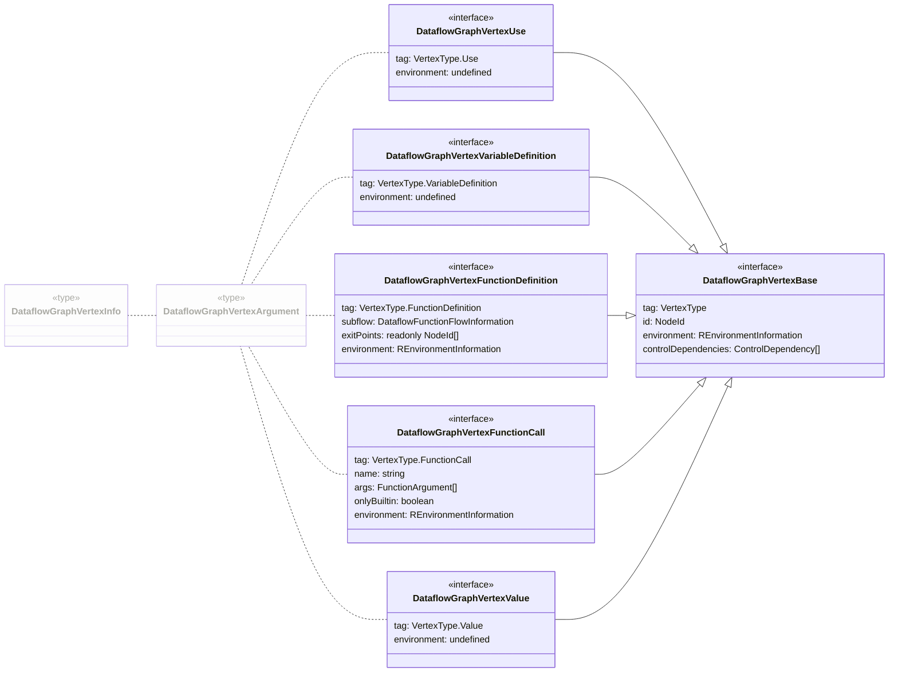


</details>
    

</details>

<details open>

<summary>Edge Types</summary>

The following edges types exist, internally we use bitmasks to represent multiple types in a compact form:

1. [`Reads` (1)](#1-reads-edge)
1. [`DefinedBy` (2)](#2-definedby-edge)
1. [`Calls` (4)](#3-calls-edge)
1. [`Returns` (8)](#4-returns-edge)
1. [`DefinesOnCall` (16)](#5-definesoncall-edge)
1. [`DefinedByOnCall` (32)](#6-definedbyoncall-edge)
1. [`Argument` (64)](#7-argument-edge)
1. [`SideEffectOnCall` (128)](#8-sideeffectoncall-edge)
1. [`NonStandardEvaluation` (256)](#9-nonstandardevaluation-edge)


<details><summary style="color:black">Class Diagram</summary>

All boxes should link to their respective implementation:

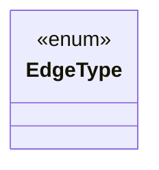


</details>
    

</details>


From an implementation perspective all of these types are represented by respective interfaces, see [`./src/dataflow/graph/vertex.ts`](https://github.com/flowr-analysis/flowr/tree/main/./src/dataflow/graph/vertex.ts) and [`./src/dataflow/graph/edge.ts`](https://github.com/flowr-analysis/flowr/tree/main/./src/dataflow/graph/edge.ts).

The following sections present details on the different types of vertices and edges, including examples and explanations.

> [!NOTE]
> Every dataflow vertex holds an `id` which links it to the respective node in the [normalized AST](https://github.com/flowr-analysis/flowr/wiki//Normalized%20AST).
> So if you want more information about the respective vertex, you can usually access more information
> using the `DataflowGraph::idMap` linked to the dataflow graph:
> 
> ```ts
> const node = graph.idMap.get(id);
> ```
> 
> In case you just need the name (`lexeme`) of the respective vertex, recoverName (defined in [`./src/r-bridge/lang-4.x/ast/model/processing/node-id.ts`](https://github.com/flowr-analysis/flowr/tree/main/./src/r-bridge/lang-4.x/ast/model/processing/node-id.ts)) can help you out:
> 
> ```ts
> const name = recoverName(id, graph.idMap);
> ```
> 

## Vertices


<a id='value-vertex'> </a>
### 1) Value Vertex

Type: `value`


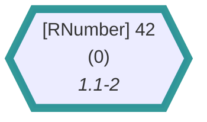
	
<details>

<summary style="color:gray">R Code of the Dataflow Graph</summary>

The analysis required _0.99 ms_ (including parsing and normalization) within the generation environment. The following marks are used in the graph to highlight sub-parts (uses ids): {0}.
We encountered no unknown side effects during the analysis.

```r
42
```

<details>

<summary style="color:gray">Mermaid Code (without markings)</summary>

```
flowchart LR
    0{{"`#91;RNumber#93; 42
      (0)
      *1.1-2*`"}}

```

</details>

</details>


Describes a constant value (numbers, booleans/logicals, strings, ...).
In general, the respective vertex is more or less a dummy vertex as you can see from its implementation.

 * **[DataflowGraphVertexValue](https://github.com/flowr-analysis/flowr/tree/main//src/dataflow/graph/vertex.ts#L47)**   
   Marker vertex for a value in the dataflow of the program.
   <details><summary style="color:gray">Defined at <a href="https://github.com/flowr-analysis/flowr/tree/main//src/dataflow/graph/vertex.ts#L47">./src/dataflow/graph/vertex.ts#L47</a></summary>
   
   
   ```ts
   export interface DataflowGraphVertexValue extends DataflowGraphVertexBase {
       readonly tag:          VertexType.Value
       /* currently without containing the 'real' value as it is part of the normalized AST as well */
       readonly environment?: undefined
   }
   ```
   
   
   </details>
   
    <details><summary style="color:black">View more (DataflowGraphVertexBase)</summary>

   * **[DataflowGraphVertexBase](https://github.com/flowr-analysis/flowr/tree/main//src/dataflow/graph/vertex.ts#L25)**   
     Arguments required to construct a vertex in the dataflow graph.
     <details><summary style="color:gray">Defined at <a href="https://github.com/flowr-analysis/flowr/tree/main//src/dataflow/graph/vertex.ts#L25">./src/dataflow/graph/vertex.ts#L25</a></summary>
     
     
     ```ts
     interface DataflowGraphVertexBase extends MergeableRecord {
         /**
          * Used to identify and separate different types of vertices.
          */
         readonly tag:        VertexType
         /**
          * The id of the node (the id assigned by the {@link ParentInformation} decoration)
          */
         id:                  NodeId
         /**
          * The environment in which the vertex is set.
          */
         environment?:        REnvironmentInformation | undefined
         /**
          * See {@link IdentifierReference}
          */
         controlDependencies: ControlDependency[] | undefined
     }
     ```
     
     
     </details>
     

</details>
    


> [!NOTE]
> 
> The value is not stored in the vertex itself, but in the normalized AST.
> To access the value, you can use the `id` of the vertex to access the respective node in the [normalized AST](https://github.com/flowr-analysis/flowr/wiki//Normalized%20AST)
> and ask for the value associated with it.
> 				


Please be aware that such nodes may be the result from language semantics as well, and not just from constants directly in the source.
For example, an access operation like `df$column` will treat the column name as a constant value.


<details><summary style="color:black">Example: Semantics Create a Value</summary>

In the following graph, the original type printed by mermaid is still `RSymbol` (from the [normalized AST](${FlowrWikiBaseRef}/Normalized%20AST)), however, the shape of the vertex signals to you that the symbol is in-fact treated as a constant! If you do not know what `df$column` even means, please refer to the [R topic](https://rdrr.io/r/base/Extract.html).


	
<details>

<summary style="color:gray">R Code of the Dataflow Graph</summary>

The analysis required _3.04 ms_ (including parsing and normalization) within the generation environment. The following marks are used in the graph to highlight sub-parts (uses ids): {1}.
We encountered no unknown side effects during the analysis.

```r
df$column
```

<details>

<summary style="color:gray">Mermaid Code (without markings)</summary>

```
flowchart LR
    0(["`#91;RSymbol#93; df
      (0, :may:)
      *1.1-2*`"])
    1{{"`#91;RSymbol#93; column
      (1)
      *1.1-9*`"}}
    3[["`#91;RAccess#93; $
      (3)
      *1.1-9*
    (0, 1)`"]]
    3 -->|"reads, returns, argument"| 0
    3 -->|"reads, argument"| 1
```

</details>

</details>


</details>
    
		


	

<a id='use-vertex'> </a>
### 2) Use Vertex

Type: `use`


	
<details>

<summary style="color:gray">R Code of the Dataflow Graph</summary>

The analysis required _0.80 ms_ (including parsing and normalization) within the generation environment. The following marks are used in the graph to highlight sub-parts (uses ids): {0}.
We encountered no unknown side effects during the analysis.

```r
x
```

<details>

<summary style="color:gray">Mermaid Code (without markings)</summary>

```
flowchart LR
    0(["`#91;RSymbol#93; x
      (0)
      *1.1*`"])

```

</details>

</details>


		
Describes symbol/variable references which are read (or potentially read at a given position).
Similar to the [value vertex](#value-vertex) described above, this is more a marker vertex as 
you can see from the implementation.

 * **[DataflowGraphVertexUse](https://github.com/flowr-analysis/flowr/tree/main//src/dataflow/graph/vertex.ts#L56)**   
   Arguments required to construct a vertex which represents the usage of a variable in the dataflow graph.
   <details><summary style="color:gray">Defined at <a href="https://github.com/flowr-analysis/flowr/tree/main//src/dataflow/graph/vertex.ts#L56">./src/dataflow/graph/vertex.ts#L56</a></summary>
   
   
   ```ts
   export interface DataflowGraphVertexUse extends DataflowGraphVertexBase {
       readonly tag:          VertexType.Use
       /** Does not require an environment to be attached. If we promote the use to a function call, we attach the environment later.  */
       readonly environment?: undefined
   }
   ```
   
   
   </details>
   
    <details><summary style="color:black">View more (DataflowGraphVertexBase)</summary>

   * **[DataflowGraphVertexBase](https://github.com/flowr-analysis/flowr/tree/main//src/dataflow/graph/vertex.ts#L25)**   
     Arguments required to construct a vertex in the dataflow graph.
     <details><summary style="color:gray">Defined at <a href="https://github.com/flowr-analysis/flowr/tree/main//src/dataflow/graph/vertex.ts#L25">./src/dataflow/graph/vertex.ts#L25</a></summary>
     
     
     ```ts
     interface DataflowGraphVertexBase extends MergeableRecord {
         /**
          * Used to identify and separate different types of vertices.
          */
         readonly tag:        VertexType
         /**
          * The id of the node (the id assigned by the {@link ParentInformation} decoration)
          */
         id:                  NodeId
         /**
          * The environment in which the vertex is set.
          */
         environment?:        REnvironmentInformation | undefined
         /**
          * See {@link IdentifierReference}
          */
         controlDependencies: ControlDependency[] | undefined
     }
     ```
     
     
     </details>
     

</details>
    


> [!NOTE]
> 
> The name of the symbol is not actually part of what we store in the dataflow graph,
> as we have it within the normalized AST.
> To access the name, you can use the `id` of the vertex:
> 
> 
> ```ts
> const name = recoverName(id, graph.idMap);
> ```
> 
> 				


Most often, you will see the _use_ vertex whenever a variable is read.
However, similar to the [value vertex](#value-vertex), the _use_ vertex can also be the result of language semantics.
Consider a case, in which we refer to a variable with a string, as in `get("x")`.


<details><summary style="color:black">Example: Semantics Create a Symbol</summary>

In the following graph, the original type printed by mermaid is still `RString` (from the [normalized AST](${FlowrWikiBaseRef}/Normalized%20AST)), however, the shape of the vertex signals to you that the symbol is in-fact treated as a variable use! If you are unsure what `get` does, refer to the [documentation](https://www.rdocumentation.org/packages/base/versions/3.6.2/topics/get). Please note, that the lexeme being printed as `"x"` may be misleading (after all it is recovered from the AST), the quotes are not part of the reference.


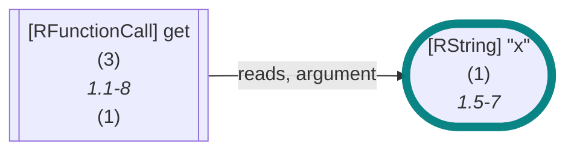
	
<details>

<summary style="color:gray">R Code of the Dataflow Graph</summary>

The analysis required _1.94 ms_ (including parsing and normalization) within the generation environment. The following marks are used in the graph to highlight sub-parts (uses ids): {1}.
We encountered no unknown side effects during the analysis.

```r
get("x")
```

<details>

<summary style="color:gray">Mermaid Code (without markings)</summary>

```
flowchart LR
    1(["`#91;RString#93; #34;x#34;
      (1)
      *1.5-7*`"])
    3[["`#91;RFunctionCall#93; get
      (3)
      *1.1-8*
    (1)`"]]
    3 -->|"reads, argument"| 1
```

</details>

</details>


</details>
    

But now to the interesting stuff: how do we actually know which values are read by the respective variable use?
This usually involves a [variable definition](#variable-definition-vertex) and a [reads edge](#reads-edge) linking the two.


<details><summary style="color:black">Example: Reads Edge Identifying a Single Definition</summary>

In the following graph, the `x` is read from the definition `x <- 1`.


	
<details open>

<summary style="color:gray">R Code of the Dataflow Graph</summary>

The analysis required _2.27 ms_ (including parsing and normalization) within the generation environment. The following marks are used in the graph to highlight sub-parts (uses ids): {3, 0->3}.
We encountered no unknown side effects during the analysis.

```r
x <- 1
print(x)
```

<details>

<summary style="color:gray">Mermaid Code (without markings)</summary>

```
flowchart LR
    1{{"`#91;RNumber#93; 1
      (1)
      *1.6*`"}}
    0["`#91;RSymbol#93; x
      (0)
      *1.1*`"]
    2[["`#91;RBinaryOp#93; #60;#45;
      (2)
      *1.1-6*
    (0, 1)`"]]
    4(["`#91;RSymbol#93; x
      (4)
      *2.7*`"])
    6[["`#91;RFunctionCall#93; print
      (6)
      *2.1-8*
    (4)`"]]
    0 -->|"defined-by"| 1
    0 -->|"defined-by"| 2
    2 -->|"argument"| 1
    2 -->|"returns, argument"| 0
    4 -->|"reads"| 0
    6 -->|"reads, returns, argument"| 4
```

</details>

</details>


</details>
    

In general, there may be many such edges, identifying every possible definition of the variable.


<details><summary style="color:black">Example: Reads Edge Identifying Multiple Definitions (conditional)</summary>


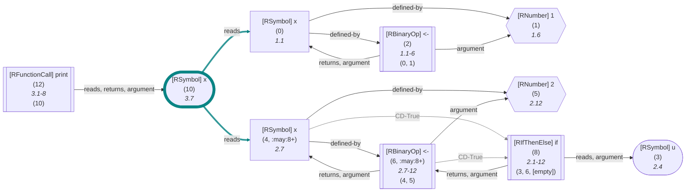
	
<details open>

<summary style="color:gray">R Code of the Dataflow Graph</summary>

The analysis required _3.69 ms_ (including parsing and normalization) within the generation environment. The following marks are used in the graph to highlight sub-parts (uses ids): {10, 10->0, 10->4}.
We encountered no unknown side effects during the analysis.

```r
x <- 1
if(u) x <- 2
print(x)
```

<details>

<summary style="color:gray">Mermaid Code (without markings)</summary>

```
flowchart LR
    1{{"`#91;RNumber#93; 1
      (1)
      *1.6*`"}}
    0["`#91;RSymbol#93; x
      (0)
      *1.1*`"]
    2[["`#91;RBinaryOp#93; #60;#45;
      (2)
      *1.1-6*
    (0, 1)`"]]
    3(["`#91;RSymbol#93; u
      (3)
      *2.4*`"])
    5{{"`#91;RNumber#93; 2
      (5)
      *2.12*`"}}
    4["`#91;RSymbol#93; x
      (4, :may:8+)
      *2.7*`"]
    6[["`#91;RBinaryOp#93; #60;#45;
      (6, :may:8+)
      *2.7-12*
    (4, 5)`"]]
    8[["`#91;RIfThenElse#93; if
      (8)
      *2.1-12*
    (3, 6, [empty])`"]]
    10(["`#91;RSymbol#93; x
      (10)
      *3.7*`"])
    12[["`#91;RFunctionCall#93; print
      (12)
      *3.1-8*
    (10)`"]]
    0 -->|"defined-by"| 1
    0 -->|"defined-by"| 2
    2 -->|"argument"| 1
    2 -->|"returns, argument"| 0
    4 -->|"defined-by"| 5
    4 -->|"defined-by"| 6
    4 -->|"CD-True"| 8
    linkStyle 6 stroke:gray,color:gray;
    6 -->|"argument"| 5
    6 -->|"returns, argument"| 4
    6 -->|"CD-True"| 8
    linkStyle 9 stroke:gray,color:gray;
    8 -->|"returns, argument"| 6
    8 -->|"reads, argument"| 3
    10 -->|"reads"| 4
    10 -->|"reads"| 0
    12 -->|"reads, returns, argument"| 10
```

</details>

</details>


</details>
    

<details><summary style="color:black">Example: Reads Edge Identifying Multiple Definitions (loop)</summary>


	
<details open>

<summary style="color:gray">R Code of the Dataflow Graph</summary>

The analysis required _3.95 ms_ (including parsing and normalization) within the generation environment. The following marks are used in the graph to highlight sub-parts (uses ids): {11, 11->0, 11->5}.
We encountered no unknown side effects during the analysis.

```r
x <- 1
for(i in v) x <- 2
print(x)
```

<details>

<summary style="color:gray">Mermaid Code (without markings)</summary>

```
flowchart LR
    1{{"`#91;RNumber#93; 1
      (1)
      *1.6*`"}}
    0["`#91;RSymbol#93; x
      (0)
      *1.1*`"]
    2[["`#91;RBinaryOp#93; #60;#45;
      (2)
      *1.1-6*
    (0, 1)`"]]
    3["`#91;RSymbol#93; i
      (3)
      *2.5*`"]
    4(["`#91;RSymbol#93; v
      (4)
      *2.10*`"])
    6{{"`#91;RNumber#93; 2
      (6, :may:9+)
      *2.18*`"}}
    5["`#91;RSymbol#93; x
      (5, :may:)
      *2.13*`"]
    7[["`#91;RBinaryOp#93; #60;#45;
      (7, :may:9+)
      *2.13-18*
    (5, 6)`"]]
    9[["`#91;RForLoop#93; for
      (9)
      *2.1-18*
    (3, 4, 7)`"]]
    11(["`#91;RSymbol#93; x
      (11)
      *3.7*`"])
    13[["`#91;RFunctionCall#93; print
      (13)
      *3.1-8*
    (11)`"]]
    0 -->|"defined-by"| 1
    0 -->|"defined-by"| 2
    2 -->|"argument"| 1
    2 -->|"returns, argument"| 0
    3 -->|"defined-by"| 4
    6 -->|"CD-True"| 9
    linkStyle 5 stroke:gray,color:gray;
    5 -->|"defined-by"| 6
    5 -->|"defined-by"| 7
    7 -->|"argument"| 6
    7 -->|"returns, argument"| 5
    7 -->|"CD-True"| 9
    linkStyle 10 stroke:gray,color:gray;
    9 -->|"reads, argument"| 3
    9 -->|"reads, argument"| 4
    9 -->|"argument, non-standard-evaluation"| 7
    11 -->|"reads"| 0
    11 -->|"reads"| 5
    13 -->|"reads, returns, argument"| 11
```

</details>

</details>


</details>
    

<details><summary style="color:black">Example: Reads Edge Identifying Multiple Definitions (side-effect)</summary>


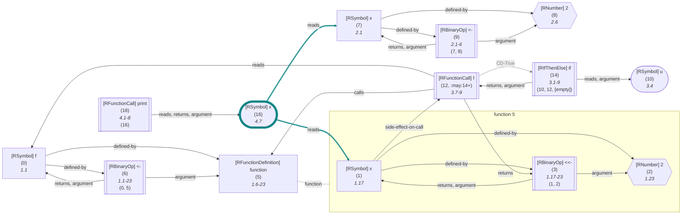
	
<details open>

<summary style="color:gray">R Code of the Dataflow Graph</summary>

The analysis required _3.94 ms_ (including parsing and normalization) within the generation environment. The following marks are used in the graph to highlight sub-parts (uses ids): {16, 16->1, 16->7}.
We encountered no unknown side effects during the analysis.

```r
f <- function() x <<- 2
x <- 2
if(u) f()
print(x)
```

<details>

<summary style="color:gray">Mermaid Code (without markings)</summary>

```
flowchart LR
    %% Environment of 5 [level: 0]:
    %% Built-in
    %% 104----------------------------------------
    %%   x: {x (1, 4, def. @3)}
    5["`#91;RFunctionDefinition#93; function
      (5)
      *1.6-23*`"]

subgraph "flow-5" [function 5]
    2{{"`#91;RNumber#93; 2
      (2)
      *1.23*`"}}
    1["`#91;RSymbol#93; x
      (1)
      *1.17*`"]
    3[["`#91;RBinaryOp#93; #60;#60;#45;
      (3)
      *1.17-23*
    (1, 2)`"]]
end
    0["`#91;RSymbol#93; f
      (0)
      *1.1*`"]
    6[["`#91;RBinaryOp#93; #60;#45;
      (6)
      *1.1-23*
    (0, 5)`"]]
    8{{"`#91;RNumber#93; 2
      (8)
      *2.6*`"}}
    7["`#91;RSymbol#93; x
      (7)
      *2.1*`"]
    9[["`#91;RBinaryOp#93; #60;#45;
      (9)
      *2.1-6*
    (7, 8)`"]]
    10(["`#91;RSymbol#93; u
      (10)
      *3.4*`"])
    %% Environment of 12 [level: 0]:
    %% Built-in
    %% 119----------------------------------------
    %%   f: {f (0, 2, def. @6)}
    %%   x: {x (7, 4, def. @9)}
    12[["`#91;RFunctionCall#93; f
      (12, :may:14+)
      *3.7-9*`"]]
    14[["`#91;RIfThenElse#93; if
      (14)
      *3.1-9*
    (10, 12, [empty])`"]]
    16(["`#91;RSymbol#93; x
      (16)
      *4.7*`"])
    18[["`#91;RFunctionCall#93; print
      (18)
      *4.1-8*
    (16)`"]]
    1 -->|"defined-by"| 2
    1 -->|"defined-by"| 3
    1 -->|"side-effect-on-call"| 12
    3 -->|"argument"| 2
    3 -->|"returns, argument"| 1
5 -.-|function| flow-5

    0 -->|"defined-by"| 5
    0 -->|"defined-by"| 6
    6 -->|"argument"| 5
    6 -->|"returns, argument"| 0
    7 -->|"defined-by"| 8
    7 -->|"defined-by"| 9
    9 -->|"argument"| 8
    9 -->|"returns, argument"| 7
    12 -->|"reads"| 0
    12 -->|"returns"| 3
    12 -->|"calls"| 5
    12 -->|"CD-True"| 14
    linkStyle 17 stroke:gray,color:gray;
    14 -->|"returns, argument"| 12
    14 -->|"reads, argument"| 10
    16 -->|"reads"| 7
    16 -->|"reads"| 1
    18 -->|"reads, returns, argument"| 16
```

</details>

</details>


</details>
    


	

<a id='function-call-vertex'> </a>
### 3) Function Call Vertex

Type: `function-call`


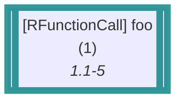
	
<details>

<summary style="color:gray">R Code of the Dataflow Graph</summary>

The analysis required _0.86 ms_ (including parsing and normalization) within the generation environment. The following marks are used in the graph to highlight sub-parts (uses ids): {1}.
We encountered no unknown side effects during the analysis.

```r
foo()
```

<details>

<summary style="color:gray">Mermaid Code (without markings)</summary>

```
flowchart LR
    1[["`#91;RFunctionCall#93; foo
      (1)
      *1.1-5*`"]]

```

</details>

</details>


Describes any kind of function call, including unnamed calls and those that happen implicitly!
In general the vertex provides you with information about 
the _name_ of the called function, the passed _arguments_, and the _environment_ in which the call happens (if it is of importance).

However, the implementation reveals that it may hold an additional `onlyBuiltin` flag to indicate that the call is only calling builtin functions &mdash; however, this is only a flag to improve performance
and it should not be relied on as it may under-approximate the actual calling targets (e.g., being `false` even though all calls resolve to builtins).
	 
 * **[DataflowGraphVertexFunctionCall](https://github.com/flowr-analysis/flowr/tree/main//src/dataflow/graph/vertex.ts#L65)**   
   Arguments required to construct a vertex which represents the usage of a variable in the dataflow graph.
   <details><summary style="color:gray">Defined at <a href="https://github.com/flowr-analysis/flowr/tree/main//src/dataflow/graph/vertex.ts#L65">./src/dataflow/graph/vertex.ts#L65</a></summary>
   
   
   ```ts
   export interface DataflowGraphVertexFunctionCall extends DataflowGraphVertexBase {
       readonly tag:  VertexType.FunctionCall
       /**
        * Effective name of the function call,
        * Please be aware that this name can differ from the lexeme.
        * For example, if the function is a replacement function, in this case, the actually called fn will
        * have the compound name (e.g., `[<-`).
        */
       readonly name: string
       /** The arguments of the function call, in order (as they are passed to the respective call if executed in R. */
       args:          FunctionArgument[]
       /** a performance flag to indicate that the respective call is _only_ calling a builtin function without any df graph attached */
       onlyBuiltin:   boolean
       /** The environment attached to the call (if such an attachment is necessary, e.g., because it represents the calling closure */
       environment:   REnvironmentInformation | undefined
   }
   ```
   
   
   </details>
   
    <details><summary style="color:black">View more (DataflowGraphVertexBase)</summary>

   * **[DataflowGraphVertexBase](https://github.com/flowr-analysis/flowr/tree/main//src/dataflow/graph/vertex.ts#L25)**   
     Arguments required to construct a vertex in the dataflow graph.
     <details><summary style="color:gray">Defined at <a href="https://github.com/flowr-analysis/flowr/tree/main//src/dataflow/graph/vertex.ts#L25">./src/dataflow/graph/vertex.ts#L25</a></summary>
     
     
     ```ts
     interface DataflowGraphVertexBase extends MergeableRecord {
         /**
          * Used to identify and separate different types of vertices.
          */
         readonly tag:        VertexType
         /**
          * The id of the node (the id assigned by the {@link ParentInformation} decoration)
          */
         id:                  NodeId
         /**
          * The environment in which the vertex is set.
          */
         environment?:        REnvironmentInformation | undefined
         /**
          * See {@link IdentifierReference}
          */
         controlDependencies: ControlDependency[] | undefined
     }
     ```
     
     
     </details>
     

</details>
    
The related function argument references are defined like this:
 * [FunctionArgument](https://github.com/flowr-analysis/flowr/tree/main//src/dataflow/graph/graph.ts#L48)   
   Summarizes either named (`foo(a = 3, b = 2)`), unnamed (`foo(3, 2)`), or empty (`foo(,)`) arguments within a function.
   <details><summary style="color:gray">Defined at <a href="https://github.com/flowr-analysis/flowr/tree/main//src/dataflow/graph/graph.ts#L48">./src/dataflow/graph/graph.ts#L48</a></summary>
   
   
   ```ts
   export type FunctionArgument = NamedFunctionArgument | PositionalFunctionArgument | typeof EmptyArgument
   ```
   
   
   </details>
   
    <details><summary style="color:black">View more (NamedFunctionArgument, PositionalFunctionArgument)</summary>

   * **[NamedFunctionArgument](https://github.com/flowr-analysis/flowr/tree/main//src/dataflow/graph/graph.ts#L34)**   
     ```r
     foo(a = 3, b = 2)
     ```
     <details><summary style="color:gray">Defined at <a href="https://github.com/flowr-analysis/flowr/tree/main//src/dataflow/graph/graph.ts#L34">./src/dataflow/graph/graph.ts#L34</a></summary>
     
     
     ```ts
     export interface NamedFunctionArgument extends IdentifierReference {
         readonly name: string
     }
     ```
     
     
     </details>
     
     * **[IdentifierReference](https://github.com/flowr-analysis/flowr/tree/main//src/dataflow/environments/identifier.ts#L45)**   
       Something like `a` in `b <- a`.
       Without any surrounding information, `a` will produce the identifier reference `a`.
       Similarly, `b` will create a reference.
       <details><summary style="color:gray">Defined at <a href="https://github.com/flowr-analysis/flowr/tree/main//src/dataflow/environments/identifier.ts#L45">./src/dataflow/environments/identifier.ts#L45</a></summary>
       
       
       ```ts
       export interface IdentifierReference {
           /** Node which represents the reference in the AST */
           readonly nodeId:     NodeId
           /** Name the reference is identified by (e.g., the name of the variable), undefined if the reference is "artificial" (e.g., anonymous) */
           readonly name:       Identifier | undefined
           /** Type of the reference to be resolved */
           readonly type:       ReferenceType;
           /**
            * If the reference is only effective, if, for example, an if-then-else condition is true, this references the root of the `if`.
            * As a hacky intermediate solution (until we have pointer-analysis), an empty array may indicate a `maybe` which is due to pointer access (e.g., in `a[x] <- 3`).
            */
           controlDependencies: ControlDependency[] | undefined
       }
       ```
       
       
       </details>
       
   * **[PositionalFunctionArgument](https://github.com/flowr-analysis/flowr/tree/main//src/dataflow/graph/graph.ts#L43)**   
     ```r
     foo(3, 2)
     ```
     <details><summary style="color:gray">Defined at <a href="https://github.com/flowr-analysis/flowr/tree/main//src/dataflow/graph/graph.ts#L43">./src/dataflow/graph/graph.ts#L43</a></summary>
     
     
     ```ts
     export interface PositionalFunctionArgument extends Omit<IdentifierReference, 'name'> {
         readonly name?: undefined
     }
     ```
     
     
     </details>
     

</details>
    


<details><summary style="color:black">Example: Simple Function Call (unresolved)</summary>


To get a better understanding, let's look at a simple function call without any known call target, like `foo(x,3,y=3,)`:


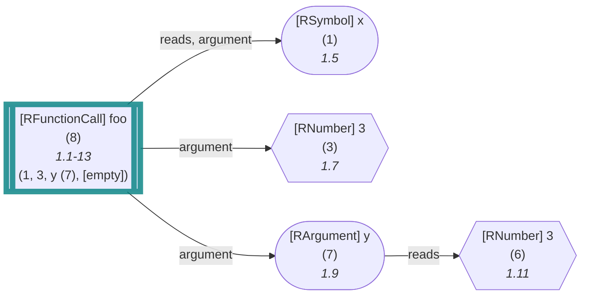
	
<details>

<summary style="color:gray">R Code of the Dataflow Graph</summary>

The analysis required _8.30 ms_ (including parsing and normalization) within the generation environment. The following marks are used in the graph to highlight sub-parts (uses ids): {8}.
We encountered no unknown side effects during the analysis.

```r
foo(x,3,y=3,)
```

<details>

<summary style="color:gray">Mermaid Code (without markings)</summary>

```
flowchart LR
    1(["`#91;RSymbol#93; x
      (1)
      *1.5*`"])
    3{{"`#91;RNumber#93; 3
      (3)
      *1.7*`"}}
    6{{"`#91;RNumber#93; 3
      (6)
      *1.11*`"}}
    7(["`#91;RArgument#93; y
      (7)
      *1.9*`"])
    8[["`#91;RFunctionCall#93; foo
      (8)
      *1.1-13*
    (1, 3, y (7), [empty])`"]]
    7 -->|"reads"| 6
    8 -->|"reads, argument"| 1
    8 -->|"argument"| 3
    8 -->|"argument"| 7
```

</details>

</details>


In this case, we have a function call vertex with id `8` and the following arguments:


```json
[
  {
    "nodeId": 1,
    "type": 32
  },
  {
    "nodeId": 3,
    "type": 32
  },
  {
    "nodeId": 7,
    "name": "y",
    "type": 32
  },
  "<>"
]
```


Of course now, this is hard to read in this form (although the ids of the arguments can be mapped pretty easily to the visualization),
as the `type` of these references is a bit-mask, encoding one of the following reference types:

| Value | Reference Type |
|------:|----------------|
| 1 | Unknown |
| 2 | Function |
| 4 | Variable |
| 8 | Constant |
| 16 | Parameter |
| 32 | Argument |
| 64 | BuiltInConstant |
| 128 | BuiltInFunction |

In other words, we classify the references as Argument, Argument, Argument, and the (special) empty argument type (`<>`).
For more information on the types of references, please consult the implementation.

 * **[ReferenceType](https://github.com/flowr-analysis/flowr/tree/main//src/dataflow/environments/identifier.ts#L12)**   
   Each reference only has exactly one reference type, stored as the respective number.
   However, wenn checking we may want to allow for one of several types,
   allowing the combination of the respective bitmasks.
   <details><summary style="color:gray">Defined at <a href="https://github.com/flowr-analysis/flowr/tree/main//src/dataflow/environments/identifier.ts#L12">./src/dataflow/environments/identifier.ts#L12</a></summary>
   
   
   ```ts
   export enum ReferenceType {
       /** The identifier type is unknown */
       Unknown = 1,
       /** The identifier is defined by a function (includes built-in function) */
       Function = 2,
       /** The identifier is defined by a variable (includes parameter and argument) */
       Variable = 4,
       /** The identifier is defined by a constant (includes built-in constant) */
       Constant = 8,
       /** The identifier is defined by a parameter (which we know nothing about at the moment) */
       Parameter = 16,
       /** The identifier is defined by an argument (which we know nothing about at the moment) */
       Argument = 32,
       /** The identifier is defined by a built-in value/constant */
       BuiltInConstant = 64,
       /** The identifier is defined by a built-in function */
       BuiltInFunction = 128
   }
   ```
   
   
   </details>
   
	

</details>
    


> [!NOTE]
> 
> But how do you know which definitions are actually called by the function?
> So first of all, some frontends of _flowR_ (like the <span title="Description (Repl Command): Static backwards executable slicer for R">`:slicer`</span> and <span title="Description (Repl Command): Query the given R code, start with 'file://' to indicate a file. The query is to be a valid query in json format (use 'help' to get more information).">`:query`</span> with the [Query API}(https://github.com/flowr-analysis/flowr/wiki//Query%20API)) already provide you with this information.
> In general there are three scenarios you may be interested in:
> 
> 1. the function resolves only to builtin definitions (like `<-`)  
>     
>     <details><summary style="color:black">Details</summary>
>     
>     
>     Heho
>     
>     
>     </details>
>         
> 
> &nbsp;
> 
> 2. the function only resolves to definitions that are present in the program
> 3. the function resolves to a mix of both
> 
> 				


 TODO: normal call, call with for or other control structures, unnamed call, call with side effect, call with unknown function, call with only builtin function, redefined builtin functions
 TODO: general node on calls and argument edges
 


<details>

<summary>Interesting Case</summary>

#### Built-In Function Call


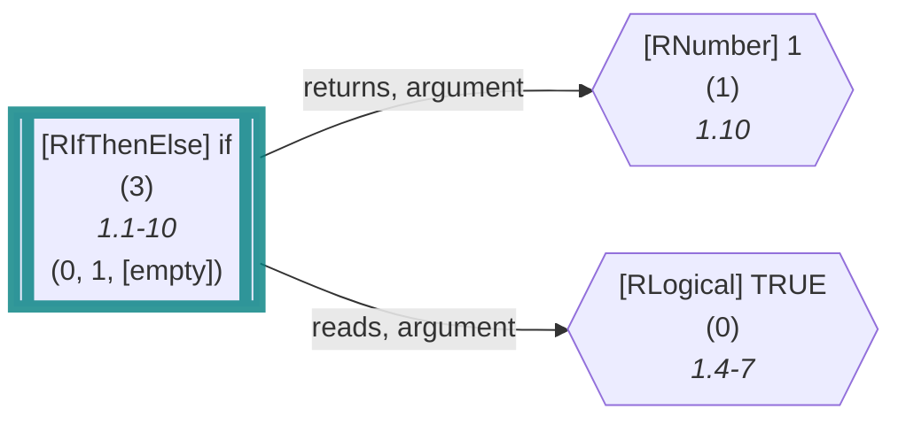
	
<details>

<summary style="color:gray">R Code of the Dataflow Graph</summary>

The analysis required _0.90 ms_ (including parsing and normalization) within the generation environment. The following marks are used in the graph to highlight sub-parts (uses ids): {3}.
We encountered no unknown side effects during the analysis.

```r
if(TRUE) 1
```

<details>

<summary style="color:gray">Mermaid Code (without markings)</summary>

```
flowchart LR
    0{{"`#91;RLogical#93; TRUE
      (0)
      *1.4-7*`"}}
    1{{"`#91;RNumber#93; 1
      (1)
      *1.10*`"}}
    3[["`#91;RIfThenElse#93; if
      (3)
      *1.1-10*
    (0, 1, [empty])`"]]
    3 -->|"returns, argument"| 1
    3 -->|"reads, argument"| 0
```

</details>

</details>


Control structures like `if` are desugared into function calls (we omit the arguments of `if`(TRUE, 1) for simplicity).


</details>
	

<a id='variable-definition-vertex'> </a>
### 4) Variable Definition Vertex

Type: `variable-definition`


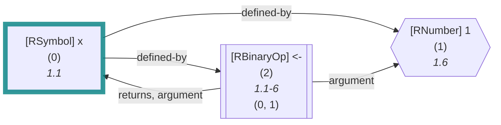
	
<details>

<summary style="color:gray">R Code of the Dataflow Graph</summary>

The analysis required _0.94 ms_ (including parsing and normalization) within the generation environment. The following marks are used in the graph to highlight sub-parts (uses ids): {0}.
We encountered no unknown side effects during the analysis.

```r
x <- 1
```

<details>

<summary style="color:gray">Mermaid Code (without markings)</summary>

```
flowchart LR
    1{{"`#91;RNumber#93; 1
      (1)
      *1.6*`"}}
    0["`#91;RSymbol#93; x
      (0)
      *1.1*`"]
    2[["`#91;RBinaryOp#93; #60;#45;
      (2)
      *1.1-6*
    (0, 1)`"]]
    0 -->|"defined-by"| 1
    0 -->|"defined-by"| 2
    2 -->|"argument"| 1
    2 -->|"returns, argument"| 0
```

</details>

</details>


Describes a defined variable. Not just `<-` causes this!


<details>

<summary>Interesting Case</summary>

#### Globally Defined Variable


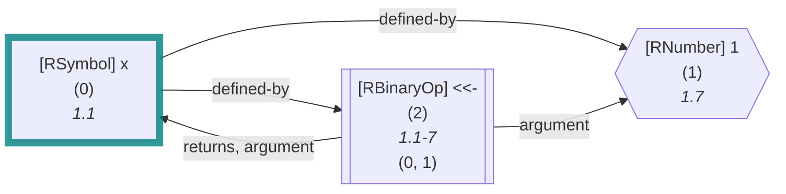
	
<details>

<summary style="color:gray">R Code of the Dataflow Graph</summary>

The analysis required _1.00 ms_ (including parsing and normalization) within the generation environment. The following marks are used in the graph to highlight sub-parts (uses ids): {0}.
We encountered no unknown side effects during the analysis.

```r
x <<- 1
```

<details>

<summary style="color:gray">Mermaid Code (without markings)</summary>

```
flowchart LR
    1{{"`#91;RNumber#93; 1
      (1)
      *1.7*`"}}
    0["`#91;RSymbol#93; x
      (0)
      *1.1*`"]
    2[["`#91;RBinaryOp#93; #60;#60;#45;
      (2)
      *1.1-7*
    (0, 1)`"]]
    0 -->|"defined-by"| 1
    0 -->|"defined-by"| 2
    2 -->|"argument"| 1
    2 -->|"returns, argument"| 0
```

</details>

</details>


Are described similar within the dataflow graph, only the active environment differs.


</details>
	

<a id='function-definition-vertex'> </a>
### 5) Function Definition Vertex

Type: `function-definition`


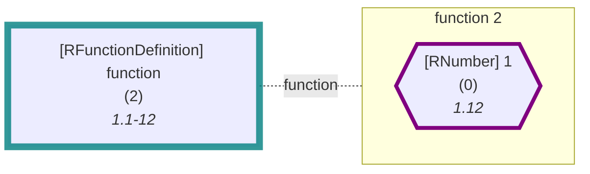
	
<details>

<summary style="color:gray">R Code of the Dataflow Graph</summary>

The analysis required _1.06 ms_ (including parsing and normalization) within the generation environment. The following marks are used in the graph to highlight sub-parts (uses ids): {2}.
We encountered no unknown side effects during the analysis.

```r
function() 1
```

<details>

<summary style="color:gray">Mermaid Code (without markings)</summary>

```
flowchart LR
    2["`#91;RFunctionDefinition#93; function
      (2)
      *1.1-12*`"]

subgraph "flow-2" [function 2]
    0{{"`#91;RNumber#93; 1
      (0)
      *1.12*`"}}
    style 0 stroke:purple,stroke-width:4px; 
end
2 -.-|function| flow-2

```

</details>

</details>


Describes a function definition. Are always anonymous at first; although they can be bound to a name, the id `0` refers to the `1` in the body. The presented subgraph refers to the body of the function, marking exit points and open references.


	

## Edges


<a id='reads-edge'> </a>
### 1) Reads Edge

Type: `1`


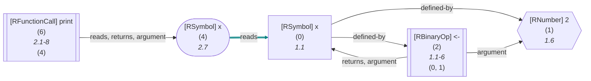
	
<details>

<summary style="color:gray">R Code of the Dataflow Graph</summary>

The analysis required _1.20 ms_ (including parsing and normalization) within the generation environment. The following marks are used in the graph to highlight sub-parts (uses ids): {4->0}.
We encountered no unknown side effects during the analysis.

```r
x <- 2
print(x)
```

<details>

<summary style="color:gray">Mermaid Code (without markings)</summary>

```
flowchart LR
    1{{"`#91;RNumber#93; 2
      (1)
      *1.6*`"}}
    0["`#91;RSymbol#93; x
      (0)
      *1.1*`"]
    2[["`#91;RBinaryOp#93; #60;#45;
      (2)
      *1.1-6*
    (0, 1)`"]]
    4(["`#91;RSymbol#93; x
      (4)
      *2.7*`"])
    6[["`#91;RFunctionCall#93; print
      (6)
      *2.1-8*
    (4)`"]]
    0 -->|"defined-by"| 1
    0 -->|"defined-by"| 2
    2 -->|"argument"| 1
    2 -->|"returns, argument"| 0
    4 -->|"reads"| 0
    6 -->|"reads, returns, argument"| 4
```

</details>

</details>


The source vertex is usually a `use` that reads from the respective target definition.


<details>

<summary>Interesting Cases</summary>

#### Reads Edge (Call)


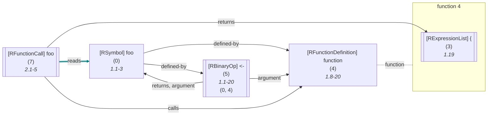
	
<details>

<summary style="color:gray">R Code of the Dataflow Graph</summary>

The analysis required _1.14 ms_ (including parsing and normalization) within the generation environment. The following marks are used in the graph to highlight sub-parts (uses ids): {7->0}.
We encountered no unknown side effects during the analysis.

```r
foo <- function() {}
foo()
```

<details>

<summary style="color:gray">Mermaid Code (without markings)</summary>

```
flowchart LR
    4["`#91;RFunctionDefinition#93; function
      (4)
      *1.8-20*`"]

subgraph "flow-4" [function 4]
    3[["`#91;RExpressionList#93; #123;
      (3)
      *1.19*`"]]
end
    0["`#91;RSymbol#93; foo
      (0)
      *1.1-3*`"]
    5[["`#91;RBinaryOp#93; #60;#45;
      (5)
      *1.1-20*
    (0, 4)`"]]
    %% Environment of 7 [level: 0]:
    %% Built-in
    %% 281----------------------------------------
    %%   foo: {foo (0, 2, def. @5)}
    7[["`#91;RFunctionCall#93; foo
      (7)
      *2.1-5*`"]]
4 -.-|function| flow-4

    0 -->|"defined-by"| 4
    0 -->|"defined-by"| 5
    5 -->|"argument"| 4
    5 -->|"returns, argument"| 0
    7 -->|"reads"| 0
    7 -->|"returns"| 3
    7 -->|"calls"| 4
```

</details>

</details>


Named calls are resolved too, linking to the symbol that holds the anonymous function definition (indirectly or directly)
#### Reads Edge (Parameter)


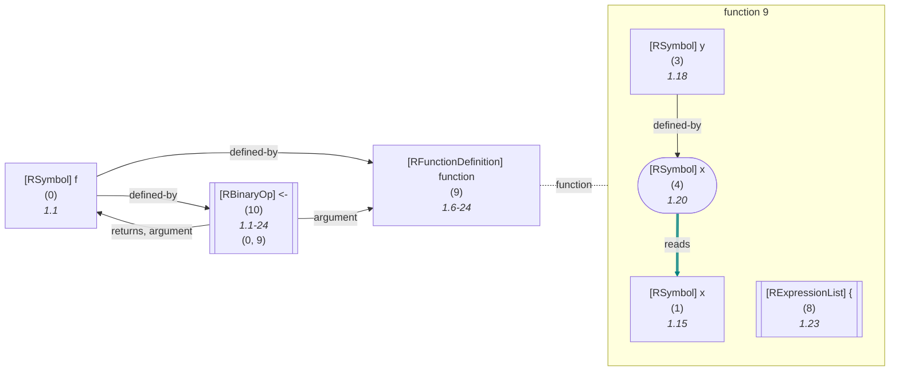
	
<details>

<summary style="color:gray">R Code of the Dataflow Graph</summary>

The analysis required _1.23 ms_ (including parsing and normalization) within the generation environment. The following marks are used in the graph to highlight sub-parts (uses ids): {4->1}.
We encountered no unknown side effects during the analysis.

```r
f <- function(x, y=x) {}
```

<details>

<summary style="color:gray">Mermaid Code (without markings)</summary>

```
flowchart LR
    9["`#91;RFunctionDefinition#93; function
      (9)
      *1.6-24*`"]

subgraph "flow-9" [function 9]
    1["`#91;RSymbol#93; x
      (1)
      *1.15*`"]
    3["`#91;RSymbol#93; y
      (3)
      *1.18*`"]
    4(["`#91;RSymbol#93; x
      (4)
      *1.20*`"])
    8[["`#91;RExpressionList#93; #123;
      (8)
      *1.23*`"]]
end
    0["`#91;RSymbol#93; f
      (0)
      *1.1*`"]
    10[["`#91;RBinaryOp#93; #60;#45;
      (10)
      *1.1-24*
    (0, 9)`"]]
    3 -->|"defined-by"| 4
    4 -->|"reads"| 1
9 -.-|function| flow-9

    0 -->|"defined-by"| 9
    0 -->|"defined-by"| 10
    10 -->|"argument"| 9
    10 -->|"returns, argument"| 0
```

</details>

</details>


Parameters can read from each other as well.


</details>
	

<a id='definedby-edge'> </a>
### 2) DefinedBy Edge

Type: `2`


```mermaid
flowchart LR
    1(["`#91;RSymbol#93; y
      (1)
      *1.6*`"])
    0["`#91;RSymbol#93; x
      (0)
      *1.1*`"]
    2[["`#91;RBinaryOp#93; #60;#45;
      (2)
      *1.1-6*
    (0, 1)`"]]
    0 -->|"defined-by"| 1
    linkStyle 0 stroke:teal,stroke-width:4.2px,stroke-opacity:.8
    0 -->|"defined-by"| 2
    linkStyle 1 stroke:teal,stroke-width:4.2px,stroke-opacity:.8
    2 -->|"argument"| 1
    2 -->|"returns, argument"| 0
```
	
<details>

<summary style="color:gray">R Code of the Dataflow Graph</summary>

The analysis required _0.96 ms_ (including parsing and normalization) within the generation environment. The following marks are used in the graph to highlight sub-parts (uses ids): {0->1, 0->2}.
We encountered no unknown side effects during the analysis.

```r
x <- y
```

<details>

<summary style="color:gray">Mermaid Code (without markings)</summary>

```
flowchart LR
    1(["`#91;RSymbol#93; y
      (1)
      *1.6*`"])
    0["`#91;RSymbol#93; x
      (0)
      *1.1*`"]
    2[["`#91;RBinaryOp#93; #60;#45;
      (2)
      *1.1-6*
    (0, 1)`"]]
    0 -->|"defined-by"| 1
    0 -->|"defined-by"| 2
    2 -->|"argument"| 1
    2 -->|"returns, argument"| 0
```

</details>

</details>


The source vertex is usually a `define variable` that is defined by the respective target use. However, nested definitions can carry it (in the nested case, `x` is defined by the return value of `<-`(y, z)). Additionally, we link the assignment.


<details>

<summary>Interesting Cases</summary>

#### DefinedBy Edge (Nested)


```mermaid
flowchart LR
    2(["`#91;RSymbol#93; z
      (2)
      *1.11*`"])
    1["`#91;RSymbol#93; y
      (1)
      *1.6*`"]
    3[["`#91;RBinaryOp#93; #60;#45;
      (3)
      *1.6-11*
    (1, 2)`"]]
    0["`#91;RSymbol#93; x
      (0)
      *1.1*`"]
    4[["`#91;RBinaryOp#93; #60;#45;
      (4)
      *1.1-11*
    (0, 3)`"]]
    1 -->|"defined-by"| 2
    1 -->|"defined-by"| 3
    linkStyle 1 stroke:teal,stroke-width:4.2px,stroke-opacity:.8
    3 -->|"argument"| 2
    3 -->|"returns, argument"| 1
    0 -->|"defined-by"| 3
    linkStyle 4 stroke:teal,stroke-width:4.2px,stroke-opacity:.8
    0 -->|"defined-by"| 4
    linkStyle 5 stroke:teal,stroke-width:4.2px,stroke-opacity:.8
    4 -->|"argument"| 3
    4 -->|"returns, argument"| 0
```
	
<details>

<summary style="color:gray">R Code of the Dataflow Graph</summary>

The analysis required _1.43 ms_ (including parsing and normalization) within the generation environment. The following marks are used in the graph to highlight sub-parts (uses ids): {0->4, 0->3, 1->3}.
We encountered no unknown side effects during the analysis.

```r
x <- y <- z
```

<details>

<summary style="color:gray">Mermaid Code (without markings)</summary>

```
flowchart LR
    2(["`#91;RSymbol#93; z
      (2)
      *1.11*`"])
    1["`#91;RSymbol#93; y
      (1)
      *1.6*`"]
    3[["`#91;RBinaryOp#93; #60;#45;
      (3)
      *1.6-11*
    (1, 2)`"]]
    0["`#91;RSymbol#93; x
      (0)
      *1.1*`"]
    4[["`#91;RBinaryOp#93; #60;#45;
      (4)
      *1.1-11*
    (0, 3)`"]]
    1 -->|"defined-by"| 2
    1 -->|"defined-by"| 3
    3 -->|"argument"| 2
    3 -->|"returns, argument"| 1
    0 -->|"defined-by"| 3
    0 -->|"defined-by"| 4
    4 -->|"argument"| 3
    4 -->|"returns, argument"| 0
```

</details>

</details>


Nested definitions can carry the `defined by` edge as well.
#### DefinedBy Edge (Expression)


```mermaid
flowchart LR
    1(["`#91;RSymbol#93; y
      (1)
      *1.6*`"])
    2(["`#91;RSymbol#93; z
      (2)
      *1.10*`"])
    3[["`#91;RBinaryOp#93; #43;
      (3)
      *1.6-10*
    (1, 2)`"]]
    0["`#91;RSymbol#93; x
      (0)
      *1.1*`"]
    4[["`#91;RBinaryOp#93; #60;#45;
      (4)
      *1.1-10*
    (0, 3)`"]]
    3 -->|"reads, argument"| 1
    3 -->|"reads, argument"| 2
    0 -->|"defined-by"| 3
    linkStyle 2 stroke:teal,stroke-width:4.2px,stroke-opacity:.8
    0 -->|"defined-by"| 4
    4 -->|"argument"| 3
    4 -->|"returns, argument"| 0
```
	
<details>

<summary style="color:gray">R Code of the Dataflow Graph</summary>

The analysis required _0.98 ms_ (including parsing and normalization) within the generation environment. The following marks are used in the graph to highlight sub-parts (uses ids): {0->3}.
We encountered no unknown side effects during the analysis.

```r
x <- y + z
```

<details>

<summary style="color:gray">Mermaid Code (without markings)</summary>

```
flowchart LR
    1(["`#91;RSymbol#93; y
      (1)
      *1.6*`"])
    2(["`#91;RSymbol#93; z
      (2)
      *1.10*`"])
    3[["`#91;RBinaryOp#93; #43;
      (3)
      *1.6-10*
    (1, 2)`"]]
    0["`#91;RSymbol#93; x
      (0)
      *1.1*`"]
    4[["`#91;RBinaryOp#93; #60;#45;
      (4)
      *1.1-10*
    (0, 3)`"]]
    3 -->|"reads, argument"| 1
    3 -->|"reads, argument"| 2
    0 -->|"defined-by"| 3
    0 -->|"defined-by"| 4
    4 -->|"argument"| 3
    4 -->|"returns, argument"| 0
```

</details>

</details>


Here, we define by the result of the `+` expression.


</details>
	

<a id='calls-edge'> </a>
### 3) Calls Edge

Type: `4`


```mermaid
flowchart LR
    4["`#91;RFunctionDefinition#93; function
      (4)
      *1.8-20*`"]

subgraph "flow-4" [function 4]
    3[["`#91;RExpressionList#93; #123;
      (3)
      *1.19*`"]]
end
    0["`#91;RSymbol#93; foo
      (0)
      *1.1-3*`"]
    5[["`#91;RBinaryOp#93; #60;#45;
      (5)
      *1.1-20*
    (0, 4)`"]]
    %% Environment of 7 [level: 0]:
    %% Built-in
    %% 451----------------------------------------
    %%   foo: {foo (0, 2, def. @5)}
    7[["`#91;RFunctionCall#93; foo
      (7)
      *2.1-5*`"]]
4 -.-|function| flow-4

    0 -->|"defined-by"| 4
    0 -->|"defined-by"| 5
    5 -->|"argument"| 4
    5 -->|"returns, argument"| 0
    7 -->|"reads"| 0
    7 -->|"returns"| 3
    7 -->|"calls"| 4
    linkStyle 7 stroke:teal,stroke-width:4.2px,stroke-opacity:.8
```
	
<details>

<summary style="color:gray">R Code of the Dataflow Graph</summary>

The analysis required _1.30 ms_ (including parsing and normalization) within the generation environment. The following marks are used in the graph to highlight sub-parts (uses ids): {7->4}.
We encountered no unknown side effects during the analysis.

```r
foo <- function() {}
foo()
```

<details>

<summary style="color:gray">Mermaid Code (without markings)</summary>

```
flowchart LR
    4["`#91;RFunctionDefinition#93; function
      (4)
      *1.8-20*`"]

subgraph "flow-4" [function 4]
    3[["`#91;RExpressionList#93; #123;
      (3)
      *1.19*`"]]
end
    0["`#91;RSymbol#93; foo
      (0)
      *1.1-3*`"]
    5[["`#91;RBinaryOp#93; #60;#45;
      (5)
      *1.1-20*
    (0, 4)`"]]
    %% Environment of 7 [level: 0]:
    %% Built-in
    %% 451----------------------------------------
    %%   foo: {foo (0, 2, def. @5)}
    7[["`#91;RFunctionCall#93; foo
      (7)
      *2.1-5*`"]]
4 -.-|function| flow-4

    0 -->|"defined-by"| 4
    0 -->|"defined-by"| 5
    5 -->|"argument"| 4
    5 -->|"returns, argument"| 0
    7 -->|"reads"| 0
    7 -->|"returns"| 3
    7 -->|"calls"| 4
```

</details>

</details>


Link the function call to the (anonymous) function definition.


	

<a id='returns-edge'> </a>
### 4) Returns Edge

Type: `8`


```mermaid
flowchart LR
    3["`#91;RFunctionDefinition#93; function
      (3)
      *1.8-19*`"]

subgraph "flow-3" [function 3]
    1(["`#91;RSymbol#93; x
      (1)
      *1.19*`"])
    style 1 stroke:purple,stroke-width:4px; 
end
    0["`#91;RSymbol#93; foo
      (0)
      *1.1-3*`"]
    4[["`#91;RBinaryOp#93; #60;#45;
      (4)
      *1.1-19*
    (0, 3)`"]]
    %% Environment of 6 [level: 0]:
    %% Built-in
    %% 493----------------------------------------
    %%   foo: {foo (0, 2, def. @4)}
    6[["`#91;RFunctionCall#93; foo
      (6)
      *2.1-5*`"]]
3 -.-|function| flow-3

    0 -->|"defined-by"| 3
    0 -->|"defined-by"| 4
    4 -->|"argument"| 3
    4 -->|"returns, argument"| 0
    6 -->|"reads"| 0
    6 -->|"returns"| 1
    linkStyle 6 stroke:teal,stroke-width:4.2px,stroke-opacity:.8
    6 -->|"calls"| 3
```
	
<details>

<summary style="color:gray">R Code of the Dataflow Graph</summary>

The analysis required _1.11 ms_ (including parsing and normalization) within the generation environment. The following marks are used in the graph to highlight sub-parts (uses ids): {6->1}.
We encountered no unknown side effects during the analysis.

```r
foo <- function() x
foo()
```

<details>

<summary style="color:gray">Mermaid Code (without markings)</summary>

```
flowchart LR
    3["`#91;RFunctionDefinition#93; function
      (3)
      *1.8-19*`"]

subgraph "flow-3" [function 3]
    1(["`#91;RSymbol#93; x
      (1)
      *1.19*`"])
    style 1 stroke:purple,stroke-width:4px; 
end
    0["`#91;RSymbol#93; foo
      (0)
      *1.1-3*`"]
    4[["`#91;RBinaryOp#93; #60;#45;
      (4)
      *1.1-19*
    (0, 3)`"]]
    %% Environment of 6 [level: 0]:
    %% Built-in
    %% 493----------------------------------------
    %%   foo: {foo (0, 2, def. @4)}
    6[["`#91;RFunctionCall#93; foo
      (6)
      *2.1-5*`"]]
3 -.-|function| flow-3

    0 -->|"defined-by"| 3
    0 -->|"defined-by"| 4
    4 -->|"argument"| 3
    4 -->|"returns, argument"| 0
    6 -->|"reads"| 0
    6 -->|"returns"| 1
    6 -->|"calls"| 3
```

</details>

</details>


Link the function call to the exit points of the target definition (this may incorporate the call-context).


	

<a id='definesoncall-edge'> </a>
### 5) DefinesOnCall Edge

Type: `16`


```mermaid
flowchart LR
    6["`#91;RFunctionDefinition#93; function
      (6)
      *1.6-19*`"]

subgraph "flow-6" [function 6]
    1["`#91;RSymbol#93; x
      (1)
      *1.15*`"]
    5[["`#91;RExpressionList#93; #123;
      (5)
      *1.18*`"]]
end
    0["`#91;RSymbol#93; f
      (0)
      *1.1*`"]
    7[["`#91;RBinaryOp#93; #60;#45;
      (7)
      *1.1-19*
    (0, 6)`"]]
    10{{"`#91;RNumber#93; 1
      (10)
      *2.5*`"}}
    11(["`#91;RArgument#93; x
      (11)
      *2.3*`"])
    %% Environment of 12 [level: 0]:
    %% Built-in
    %% 556----------------------------------------
    %%   f: {f (0, 2, def. @7)}
    12[["`#91;RFunctionCall#93; f
      (12)
      *2.1-6*
    (x (11))`"]]
    1 -->|"defined-by-on-call"| 11
    linkStyle 0 stroke:teal,stroke-width:4.2px,stroke-opacity:.8
6 -.-|function| flow-6

    0 -->|"defined-by"| 6
    0 -->|"defined-by"| 7
    7 -->|"argument"| 6
    7 -->|"returns, argument"| 0
    11 -->|"reads"| 10
    11 -->|"defines-on-call"| 1
    linkStyle 7 stroke:teal,stroke-width:4.2px,stroke-opacity:.8
    12 -->|"argument"| 11
    12 -->|"reads"| 0
    12 -->|"returns"| 5
    12 -->|"calls"| 6
```
	
<details>

<summary style="color:gray">R Code of the Dataflow Graph</summary>

The analysis required _1.57 ms_ (including parsing and normalization) within the generation environment. The following marks are used in the graph to highlight sub-parts (uses ids): {11->1, 1->11}.
We encountered no unknown side effects during the analysis.

```r
f <- function(x) {}
f(x=1)
```

<details>

<summary style="color:gray">Mermaid Code (without markings)</summary>

```
flowchart LR
    6["`#91;RFunctionDefinition#93; function
      (6)
      *1.6-19*`"]

subgraph "flow-6" [function 6]
    1["`#91;RSymbol#93; x
      (1)
      *1.15*`"]
    5[["`#91;RExpressionList#93; #123;
      (5)
      *1.18*`"]]
end
    0["`#91;RSymbol#93; f
      (0)
      *1.1*`"]
    7[["`#91;RBinaryOp#93; #60;#45;
      (7)
      *1.1-19*
    (0, 6)`"]]
    10{{"`#91;RNumber#93; 1
      (10)
      *2.5*`"}}
    11(["`#91;RArgument#93; x
      (11)
      *2.3*`"])
    %% Environment of 12 [level: 0]:
    %% Built-in
    %% 556----------------------------------------
    %%   f: {f (0, 2, def. @7)}
    12[["`#91;RFunctionCall#93; f
      (12)
      *2.1-6*
    (x (11))`"]]
    1 -->|"defined-by-on-call"| 11
6 -.-|function| flow-6

    0 -->|"defined-by"| 6
    0 -->|"defined-by"| 7
    7 -->|"argument"| 6
    7 -->|"returns, argument"| 0
    11 -->|"reads"| 10
    11 -->|"defines-on-call"| 1
    12 -->|"argument"| 11
    12 -->|"reads"| 0
    12 -->|"returns"| 5
    12 -->|"calls"| 6
```

</details>

</details>


**This edge is automatically joined with defined by on call!**

 Link an Argument to whichever parameter they cause to be defined if the related function call is invoked.


	

<a id='definedbyoncall-edge'> </a>
### 6) DefinedByOnCall Edge

Type: `32`


```mermaid
flowchart LR
    6["`#91;RFunctionDefinition#93; function
      (6)
      *1.6-19*`"]

subgraph "flow-6" [function 6]
    1["`#91;RSymbol#93; x
      (1)
      *1.15*`"]
    5[["`#91;RExpressionList#93; #123;
      (5)
      *1.18*`"]]
end
    0["`#91;RSymbol#93; f
      (0)
      *1.1*`"]
    7[["`#91;RBinaryOp#93; #60;#45;
      (7)
      *1.1-19*
    (0, 6)`"]]
    10{{"`#91;RNumber#93; 1
      (10)
      *2.5*`"}}
    11(["`#91;RArgument#93; x
      (11)
      *2.3*`"])
    %% Environment of 12 [level: 0]:
    %% Built-in
    %% 619----------------------------------------
    %%   f: {f (0, 2, def. @7)}
    12[["`#91;RFunctionCall#93; f
      (12)
      *2.1-6*
    (x (11))`"]]
    1 -->|"defined-by-on-call"| 11
    linkStyle 0 stroke:teal,stroke-width:4.2px,stroke-opacity:.8
6 -.-|function| flow-6

    0 -->|"defined-by"| 6
    0 -->|"defined-by"| 7
    7 -->|"argument"| 6
    7 -->|"returns, argument"| 0
    11 -->|"reads"| 10
    11 -->|"defines-on-call"| 1
    linkStyle 7 stroke:teal,stroke-width:4.2px,stroke-opacity:.8
    12 -->|"argument"| 11
    12 -->|"reads"| 0
    12 -->|"returns"| 5
    12 -->|"calls"| 6
```
	
<details>

<summary style="color:gray">R Code of the Dataflow Graph</summary>

The analysis required _1.46 ms_ (including parsing and normalization) within the generation environment. The following marks are used in the graph to highlight sub-parts (uses ids): {11->1, 1->11}.
We encountered no unknown side effects during the analysis.

```r
f <- function(x) {}
f(x=1)
```

<details>

<summary style="color:gray">Mermaid Code (without markings)</summary>

```
flowchart LR
    6["`#91;RFunctionDefinition#93; function
      (6)
      *1.6-19*`"]

subgraph "flow-6" [function 6]
    1["`#91;RSymbol#93; x
      (1)
      *1.15*`"]
    5[["`#91;RExpressionList#93; #123;
      (5)
      *1.18*`"]]
end
    0["`#91;RSymbol#93; f
      (0)
      *1.1*`"]
    7[["`#91;RBinaryOp#93; #60;#45;
      (7)
      *1.1-19*
    (0, 6)`"]]
    10{{"`#91;RNumber#93; 1
      (10)
      *2.5*`"}}
    11(["`#91;RArgument#93; x
      (11)
      *2.3*`"])
    %% Environment of 12 [level: 0]:
    %% Built-in
    %% 619----------------------------------------
    %%   f: {f (0, 2, def. @7)}
    12[["`#91;RFunctionCall#93; f
      (12)
      *2.1-6*
    (x (11))`"]]
    1 -->|"defined-by-on-call"| 11
6 -.-|function| flow-6

    0 -->|"defined-by"| 6
    0 -->|"defined-by"| 7
    7 -->|"argument"| 6
    7 -->|"returns, argument"| 0
    11 -->|"reads"| 10
    11 -->|"defines-on-call"| 1
    12 -->|"argument"| 11
    12 -->|"reads"| 0
    12 -->|"returns"| 5
    12 -->|"calls"| 6
```

</details>

</details>


**This edge is automatically joined with defines on call!**

 This represents the other direction of `defines on call` (i.e., links the parameter to the argument). This is just for completeness.


	

<a id='argument-edge'> </a>
### 7) Argument Edge

Type: `64`


```mermaid
flowchart LR
    1(["`#91;RSymbol#93; x
      (1)
      *1.3*`"])
    3(["`#91;RSymbol#93; y
      (3)
      *1.5*`"])
    5[["`#91;RFunctionCall#93; f
      (5)
      *1.1-6*
    (1, 3)`"]]
    5 -->|"reads, argument"| 1
    linkStyle 0 stroke:teal,stroke-width:4.2px,stroke-opacity:.8
    5 -->|"reads, argument"| 3
    linkStyle 1 stroke:teal,stroke-width:4.2px,stroke-opacity:.8
```
	
<details>

<summary style="color:gray">R Code of the Dataflow Graph</summary>

The analysis required _1.06 ms_ (including parsing and normalization) within the generation environment. The following marks are used in the graph to highlight sub-parts (uses ids): {5->1, 5->3}.
We encountered no unknown side effects during the analysis.

```r
f(x,y)
```

<details>

<summary style="color:gray">Mermaid Code (without markings)</summary>

```
flowchart LR
    1(["`#91;RSymbol#93; x
      (1)
      *1.3*`"])
    3(["`#91;RSymbol#93; y
      (3)
      *1.5*`"])
    5[["`#91;RFunctionCall#93; f
      (5)
      *1.1-6*
    (1, 3)`"]]
    5 -->|"reads, argument"| 1
    5 -->|"reads, argument"| 3
```

</details>

</details>


Links a function call to the entry point of its arguments. If we do not know the target of such a call, we automatically assume that all arguments are read by the call as well!


	

<a id='sideeffectoncall-edge'> </a>
### 8) SideEffectOnCall Edge

Type: `128`


```mermaid
flowchart LR
    %% Environment of 7 [level: 0]:
    %% Built-in
    %% 721----------------------------------------
    %%   x: {x (3, 4, def. @5)}
    7["`#91;RFunctionDefinition#93; function
      (7)
      *1.6-27*`"]

subgraph "flow-7" [function 7]
    4{{"`#91;RNumber#93; 2
      (4)
      *1.25*`"}}
    3["`#91;RSymbol#93; x
      (3)
      *1.19*`"]
    5[["`#91;RBinaryOp#93; #60;#60;#45;
      (5)
      *1.19-25*
    (3, 4)`"]]
    6[["`#91;RExpressionList#93; #123;
      (6)
      *1.17*
    (5)`"]]
end
    0["`#91;RSymbol#93; f
      (0)
      *1.1*`"]
    8[["`#91;RBinaryOp#93; #60;#45;
      (8)
      *1.1-27*
    (0, 7)`"]]
    %% Environment of 10 [level: 0]:
    %% Built-in
    %% 729----------------------------------------
    %%   f: {f (0, 2, def. @8)}
    10[["`#91;RFunctionCall#93; f
      (10)
      *2.1-3*`"]]
    3 -->|"defined-by"| 4
    3 -->|"defined-by"| 5
    3 -->|"side-effect-on-call"| 10
    linkStyle 2 stroke:teal,stroke-width:4.2px,stroke-opacity:.8
    5 -->|"argument"| 4
    5 -->|"returns, argument"| 3
    6 -->|"returns, argument"| 5
7 -.-|function| flow-7

    0 -->|"defined-by"| 7
    0 -->|"defined-by"| 8
    8 -->|"argument"| 7
    8 -->|"returns, argument"| 0
    10 -->|"reads"| 0
    10 -->|"returns"| 6
    10 -->|"calls"| 7
```
	
<details>

<summary style="color:gray">R Code of the Dataflow Graph</summary>

The analysis required _1.45 ms_ (including parsing and normalization) within the generation environment. The following marks are used in the graph to highlight sub-parts (uses ids): {3->10}.
We encountered no unknown side effects during the analysis.

```r
f <- function() { x <<- 2 }
f()
```

<details>

<summary style="color:gray">Mermaid Code (without markings)</summary>

```
flowchart LR
    %% Environment of 7 [level: 0]:
    %% Built-in
    %% 721----------------------------------------
    %%   x: {x (3, 4, def. @5)}
    7["`#91;RFunctionDefinition#93; function
      (7)
      *1.6-27*`"]

subgraph "flow-7" [function 7]
    4{{"`#91;RNumber#93; 2
      (4)
      *1.25*`"}}
    3["`#91;RSymbol#93; x
      (3)
      *1.19*`"]
    5[["`#91;RBinaryOp#93; #60;#60;#45;
      (5)
      *1.19-25*
    (3, 4)`"]]
    6[["`#91;RExpressionList#93; #123;
      (6)
      *1.17*
    (5)`"]]
end
    0["`#91;RSymbol#93; f
      (0)
      *1.1*`"]
    8[["`#91;RBinaryOp#93; #60;#45;
      (8)
      *1.1-27*
    (0, 7)`"]]
    %% Environment of 10 [level: 0]:
    %% Built-in
    %% 729----------------------------------------
    %%   f: {f (0, 2, def. @8)}
    10[["`#91;RFunctionCall#93; f
      (10)
      *2.1-3*`"]]
    3 -->|"defined-by"| 4
    3 -->|"defined-by"| 5
    3 -->|"side-effect-on-call"| 10
    5 -->|"argument"| 4
    5 -->|"returns, argument"| 3
    6 -->|"returns, argument"| 5
7 -.-|function| flow-7

    0 -->|"defined-by"| 7
    0 -->|"defined-by"| 8
    8 -->|"argument"| 7
    8 -->|"returns, argument"| 0
    10 -->|"reads"| 0
    10 -->|"returns"| 6
    10 -->|"calls"| 7
```

</details>

</details>


Links a global side effect to an affected function call (e.g., a super definition within the function body)


	

<a id='nonstandardevaluation-edge'> </a>
### 9) NonStandardEvaluation Edge

Type: `256`


```mermaid
flowchart LR
    1(["`#91;RSymbol#93; x
      (1)
      *1.7*`"])
    3[["`#91;RFunctionCall#93; quote
      (3)
      *1.1-8*
    (1)`"]]
    3 -->|"argument, non-standard-evaluation"| 1
    linkStyle 0 stroke:teal,stroke-width:4.2px,stroke-opacity:.8
```
	
<details>

<summary style="color:gray">R Code of the Dataflow Graph</summary>

The analysis required _2.33 ms_ (including parsing and normalization) within the generation environment. The following marks are used in the graph to highlight sub-parts (uses ids): {3->1}.
We encountered no unknown side effects during the analysis.

```r
quote(x)
```

<details>

<summary style="color:gray">Mermaid Code (without markings)</summary>

```
flowchart LR
    1(["`#91;RSymbol#93; x
      (1)
      *1.7*`"])
    3[["`#91;RFunctionCall#93; quote
      (3)
      *1.1-8*
    (1)`"]]
    3 -->|"argument, non-standard-evaluation"| 1
```

</details>

</details>


Marks cases in which R's non-standard evaluation mechanisms cause the default semantics to deviate


	

## Control Dependencies

Each vertex may have a list of active control dependencies.
They hold the `id` of all nodes that effect if the current vertex is part of the execution or not,
and a boolean flag `when` to indicate if the control dependency is active when the condition is `true` or `false`.

As an example, consider the following dataflow graph:


```mermaid
flowchart LR
    0(["`#91;RSymbol#93; p
      (0)
      *1.4*`"])
    1(["`#91;RSymbol#93; a
      (1, :may:5+)
      *1.7*`"])
    3(["`#91;RSymbol#93; b
      (3, :may:5-)
      *1.14*`"])
    5[["`#91;RIfThenElse#93; if
      (5)
      *1.1-14*
    (0, 1, 3)`"]]
    1 -->|"CD-True"| 5
    linkStyle 0 stroke:gray,color:gray;
    3 -->|"CD-False"| 5
    linkStyle 1 stroke:gray,color:gray;
    5 -->|"returns, argument"| 1
    5 -->|"returns, argument"| 3
    5 -->|"reads, argument"| 0
```
	
<details>

<summary style="color:gray">R Code of the Dataflow Graph</summary>

The analysis required _1.65 ms_ (including parsing and normalization) within the generation environment. 
We encountered no unknown side effects during the analysis.

```r
if(p) a else b
```

<details>

<summary style="color:gray">Mermaid Code </summary>

```
flowchart LR
    0(["`#91;RSymbol#93; p
      (0)
      *1.4*`"])
    1(["`#91;RSymbol#93; a
      (1, :may:5+)
      *1.7*`"])
    3(["`#91;RSymbol#93; b
      (3, :may:5-)
      *1.14*`"])
    5[["`#91;RIfThenElse#93; if
      (5)
      *1.1-14*
    (0, 1, 3)`"]]
    1 -->|"CD-True"| 5
    linkStyle 0 stroke:gray,color:gray;
    3 -->|"CD-False"| 5
    linkStyle 1 stroke:gray,color:gray;
    5 -->|"returns, argument"| 1
    5 -->|"returns, argument"| 3
    5 -->|"reads, argument"| 0
```

</details>

</details>


Whenever we visualize a graph, we represent the control dependencies as grayed out edges with a `CD` prefix, followed
by the `when` flag.
In the above example, both `a` and `b` depend on the `if`. Please note that they are _not_ linked to the result of
the condition itself as this is the more general linkage point (and harmonizes with other control structures, especially those which are user-defined).

## Dataflow Information

Using _flowR's_ code interface (see the [Interface](https://github.com/flowr-analysis/flowr/wiki//Interface) wiki page for more), you can generate the dataflow information
for a given piece of R code (in this case `x <- 1; x + 1`) as follows:


```ts
const shell = new RShell()
const result = await new PipelineExecutor(DEFAULT_DATAFLOW_PIPELINE, {
    shell,
    request:   requestFromInput('x <- 1; x + 1')
}).allRemainingSteps();
shell.close();
```


<details>

<summary style="color:gray">Transpiled Code</summary>

The actual code we are using in case the example above gets oudated:


```ts
async function dummyDataflow() {
    const shell = new shell_1.RShell();
    const result = await new pipeline_executor_1.PipelineExecutor(default_pipelines_1.DEFAULT_DATAFLOW_PIPELINE, {
        shell,
        request: (0, retriever_1.requestFromInput)('x <- 1\nx + 1')
    }).allRemainingSteps();
    shell.close();
    return result;
}
```


</details>


Now, you can find the dataflow _information_ with `result.dataflow`. More specifically, the graph is stored in `result.dataflow.graph` and looks like this:


```mermaid
flowchart LR
    1{{"`#91;RNumber#93; 1
      (1)
      *1.6*`"}}
    0["`#91;RSymbol#93; x
      (0)
      *1.1*`"]
    2[["`#91;RBinaryOp#93; #60;#45;
      (2)
      *1.1-6*
    (0, 1)`"]]
    3(["`#91;RSymbol#93; x
      (3)
      *2.1*`"])
    4{{"`#91;RNumber#93; 1
      (4)
      *2.5*`"}}
    5[["`#91;RBinaryOp#93; #43;
      (5)
      *2.1-5*
    (3, 4)`"]]
    0 -->|"defined-by"| 1
    0 -->|"defined-by"| 2
    2 -->|"argument"| 1
    2 -->|"returns, argument"| 0
    3 -->|"reads"| 0
    5 -->|"reads, argument"| 3
    5 -->|"reads, argument"| 4
```
	

However, the dataflow information contains more, quite a lot of information in fact.

<details>

<summary style="color:gray">Dataflow Information as Json</summary>

_As the information is pretty long, we inhibit pretty printing and syntax highlighting:_

```text
{"unknownReferences":[],"in":[{"nodeId":2,"name":"<-","type":2},{"nodeId":5,"name":"+","type":2}],"out":[{"nodeId":0,"name":"x","type":4,"definedAt":2}],"environment":{"current":{"id":756,"parent":{"id":0,"memory":[["NULL",[{"type":64,"definedAt":"built-in","value":null,"name":"NULL","nodeId":"built-in"}]],["NA",[{"type":64,"definedAt":"built-in","value":null,"name":"NA","nodeId":"built-in"}]],["TRUE",[{"type":64,"definedAt":"built-in","value":true,"name":"TRUE","nodeId":"built-in"}]],["T",[{"type":64,"definedAt":"built-in","value":true,"name":"T","nodeId":"built-in"}]],["FALSE",[{"type":64,"definedAt":"built-in","value":false,"name":"FALSE","nodeId":"built-in"}]],["F",[{"type":64,"definedAt":"built-in","value":false,"name":"F","nodeId":"built-in"}]],["~",[{"type":128,"definedAt":"built-in","name":"~","nodeId":"built-in"}]],["+",[{"type":128,"definedAt":"built-in","name":"+","nodeId":"built-in"}]],["-",[{"type":128,"definedAt":"built-in","name":"-","nodeId":"built-in"}]],["*",[{"type":128,"definedAt":"built-in","name":"*","nodeId":"built-in"}]],["/",[{"type":128,"definedAt":"built-in","name":"/","nodeId":"built-in"}]],["^",[{"type":128,"definedAt":"built-in","name":"^","nodeId":"built-in"}]],["!",[{"type":128,"definedAt":"built-in","name":"!","nodeId":"built-in"}]],["?",[{"type":128,"definedAt":"built-in","name":"?","nodeId":"built-in"}]],["**",[{"type":128,"definedAt":"built-in","name":"**","nodeId":"built-in"}]],["==",[{"type":128,"definedAt":"built-in","name":"==","nodeId":"built-in"}]],["!=",[{"type":128,"definedAt":"built-in","name":"!=","nodeId":"built-in"}]],[">",[{"type":128,"definedAt":"built-in","name":">","nodeId":"built-in"}]],["<",[{"type":128,"definedAt":"built-in","name":"<","nodeId":"built-in"}]],[">=",[{"type":128,"definedAt":"built-in","name":">=","nodeId":"built-in"}]],["<=",[{"type":128,"definedAt":"built-in","name":"<=","nodeId":"built-in"}]],["%%",[{"type":128,"definedAt":"built-in","name":"%%","nodeId":"built-in"}]],["%/%",[{"type":128,"definedAt":"built-in","name":"%/%","nodeId":"built-in"}]],["%*%",[{"type":128,"definedAt":"built-in","name":"%*%","nodeId":"built-in"}]],["%in%",[{"type":128,"definedAt":"built-in","name":"%in%","nodeId":"built-in"}]],[":",[{"type":128,"definedAt":"built-in","name":":","nodeId":"built-in"}]],["list",[{"type":128,"definedAt":"built-in","name":"list","nodeId":"built-in"}]],["c",[{"type":128,"definedAt":"built-in","name":"c","nodeId":"built-in"}]],["rep",[{"type":128,"definedAt":"built-in","name":"rep","nodeId":"built-in"}]],["seq",[{"type":128,"definedAt":"built-in","name":"seq","nodeId":"built-in"}]],["seq_len",[{"type":128,"definedAt":"built-in","name":"seq_len","nodeId":"built-in"}]],["seq_along",[{"type":128,"definedAt":"built-in","name":"seq_along","nodeId":"built-in"}]],["seq.int",[{"type":128,"definedAt":"built-in","name":"seq.int","nodeId":"built-in"}]],["gsub",[{"type":128,"definedAt":"built-in","name":"gsub","nodeId":"built-in"}]],["which",[{"type":128,"definedAt":"built-in","name":"which","nodeId":"built-in"}]],["class",[{"type":128,"definedAt":"built-in","name":"class","nodeId":"built-in"}]],["dimnames",[{"type":128,"definedAt":"built-in","name":"dimnames","nodeId":"built-in"}]],["min",[{"type":128,"definedAt":"built-in","name":"min","nodeId":"built-in"}]],["max",[{"type":128,"definedAt":"built-in","name":"max","nodeId":"built-in"}]],["intersect",[{"type":128,"definedAt":"built-in","name":"intersect","nodeId":"built-in"}]],["subset",[{"type":128,"definedAt":"built-in","name":"subset","nodeId":"built-in"}]],["match",[{"type":128,"definedAt":"built-in","name":"match","nodeId":"built-in"}]],["sqrt",[{"type":128,"definedAt":"built-in","name":"sqrt","nodeId":"built-in"}]],["abs",[{"type":128,"definedAt":"built-in","name":"abs","nodeId":"built-in"}]],["round",[{"type":128,"definedAt":"built-in","name":"round","nodeId":"built-in"}]],["floor",[{"type":128,"definedAt":"built-in","name":"floor","nodeId":"built-in"}]],["ceiling",[{"type":128,"definedAt":"built-in","name":"ceiling","nodeId":"built-in"}]],["signif",[{"type":128,"definedAt":"built-in","name":"signif","nodeId":"built-in"}]],["trunc",[{"type":128,"definedAt":"built-in","name":"trunc","nodeId":"built-in"}]],["log",[{"type":128,"definedAt":"built-in","name":"log","nodeId":"built-in"}]],["log10",[{"type":128,"definedAt":"built-in","name":"log10","nodeId":"built-in"}]],["log2",[{"type":128,"definedAt":"built-in","name":"log2","nodeId":"built-in"}]],["sum",[{"type":128,"definedAt":"built-in","name":"sum","nodeId":"built-in"}]],["mean",[{"type":128,"definedAt":"built-in","name":"mean","nodeId":"built-in"}]],["unique",[{"type":128,"definedAt":"built-in","name":"unique","nodeId":"built-in"}]],["paste",[{"type":128,"definedAt":"built-in","name":"paste","nodeId":"built-in"}]],["paste0",[{"type":128,"definedAt":"built-in","name":"paste0","nodeId":"built-in"}]],["read.csv",[{"type":128,"definedAt":"built-in","name":"read.csv","nodeId":"built-in"}]],["stop",[{"type":128,"definedAt":"built-in","name":"stop","nodeId":"built-in"}]],["is.null",[{"type":128,"definedAt":"built-in","name":"is.null","nodeId":"built-in"}]],["plot",[{"type":128,"definedAt":"built-in","name":"plot","nodeId":"built-in"}]],["numeric",[{"type":128,"definedAt":"built-in","name":"numeric","nodeId":"built-in"}]],["as.character",[{"type":128,"definedAt":"built-in","name":"as.character","nodeId":"built-in"}]],["as.integer",[{"type":128,"definedAt":"built-in","name":"as.integer","nodeId":"built-in"}]],["as.logical",[{"type":128,"definedAt":"built-in","name":"as.logical","nodeId":"built-in"}]],["as.numeric",[{"type":128,"definedAt":"built-in","name":"as.numeric","nodeId":"built-in"}]],["as.matrix",[{"type":128,"definedAt":"built-in","name":"as.matrix","nodeId":"built-in"}]],["do.call",[{"type":128,"definedAt":"built-in","name":"do.call","nodeId":"built-in"}]],["rbind",[{"type":128,"definedAt":"built-in","name":"rbind","nodeId":"built-in"}]],["nrow",[{"type":128,"definedAt":"built-in","name":"nrow","nodeId":"built-in"}]],["ncol",[{"type":128,"definedAt":"built-in","name":"ncol","nodeId":"built-in"}]],["tryCatch",[{"type":128,"definedAt":"built-in","name":"tryCatch","nodeId":"built-in"}]],["expression",[{"type":128,"definedAt":"built-in","name":"expression","nodeId":"built-in"}]],["factor",[{"type":128,"definedAt":"built-in","name":"factor","nodeId":"built-in"}]],["missing",[{"type":128,"definedAt":"built-in","name":"missing","nodeId":"built-in"}]],["as.data.frame",[{"type":128,"definedAt":"built-in","name":"as.data.frame","nodeId":"built-in"}]],["data.frame",[{"type":128,"definedAt":"built-in","name":"data.frame","nodeId":"built-in"}]],["na.omit",[{"type":128,"definedAt":"built-in","name":"na.omit","nodeId":"built-in"}]],["rownames",[{"type":128,"definedAt":"built-in","name":"rownames","nodeId":"built-in"}]],["names",[{"type":128,"definedAt":"built-in","name":"names","nodeId":"built-in"}]],["order",[{"type":128,"definedAt":"built-in","name":"order","nodeId":"built-in"}]],["length",[{"type":128,"definedAt":"built-in","name":"length","nodeId":"built-in"}]],["any",[{"type":128,"definedAt":"built-in","name":"any","nodeId":"built-in"}]],["dim",[{"type":128,"definedAt":"built-in","name":"dim","nodeId":"built-in"}]],["matrix",[{"type":128,"definedAt":"built-in","name":"matrix","nodeId":"built-in"}]],["cbind",[{"type":128,"definedAt":"built-in","name":"cbind","nodeId":"built-in"}]],["nchar",[{"type":128,"definedAt":"built-in","name":"nchar","nodeId":"built-in"}]],["t",[{"type":128,"definedAt":"built-in","name":"t","nodeId":"built-in"}]],["options",[{"type":128,"definedAt":"built-in","name":"options","nodeId":"built-in"}]],["mapply",[{"type":128,"definedAt":"built-in","name":"mapply","nodeId":"built-in"}]],["Mapply",[{"type":128,"definedAt":"built-in","name":"Mapply","nodeId":"built-in"}]],["lapply",[{"type":128,"definedAt":"built-in","name":"lapply","nodeId":"built-in"}]],["sapply",[{"type":128,"definedAt":"built-in","name":"sapply","nodeId":"built-in"}]],["vapply",[{"type":128,"definedAt":"built-in","name":"vapply","nodeId":"built-in"}]],["Lapply",[{"type":128,"definedAt":"built-in","name":"Lapply","nodeId":"built-in"}]],["Sapply",[{"type":128,"definedAt":"built-in","name":"Sapply","nodeId":"built-in"}]],["Vapply",[{"type":128,"definedAt":"built-in","name":"Vapply","nodeId":"built-in"}]],["apply",[{"type":128,"definedAt":"built-in","name":"apply","nodeId":"built-in"}]],["tapply",[{"type":128,"definedAt":"built-in","name":"tapply","nodeId":"built-in"}]],["Tapply",[{"type":128,"definedAt":"built-in","name":"Tapply","nodeId":"built-in"}]],["print",[{"type":128,"definedAt":"built-in","name":"print","nodeId":"built-in"}]],["(",[{"type":128,"definedAt":"built-in","name":"(","nodeId":"built-in"}]],["load",[{"type":128,"definedAt":"built-in","name":"load","nodeId":"built-in"}]],["load_all",[{"type":128,"definedAt":"built-in","name":"load_all","nodeId":"built-in"}]],["setwd",[{"type":128,"definedAt":"built-in","name":"setwd","nodeId":"built-in"}]],["set.seed",[{"type":128,"definedAt":"built-in","name":"set.seed","nodeId":"built-in"}]],["eval",[{"type":128,"definedAt":"built-in","name":"eval","nodeId":"built-in"}]],["body",[{"type":128,"definedAt":"built-in","name":"body","nodeId":"built-in"}]],["formals",[{"type":128,"definedAt":"built-in","name":"formals","nodeId":"built-in"}]],["environment",[{"type":128,"definedAt":"built-in","name":"environment","nodeId":"built-in"}]],["cat",[{"type":128,"definedAt":"built-in","name":"cat","nodeId":"built-in"}]],["switch",[{"type":128,"definedAt":"built-in","name":"switch","nodeId":"built-in"}]],["return",[{"type":128,"definedAt":"built-in","name":"return","nodeId":"built-in"}]],["break",[{"type":128,"definedAt":"built-in","name":"break","nodeId":"built-in"}]],["next",[{"type":128,"definedAt":"built-in","name":"next","nodeId":"built-in"}]],["{",[{"type":128,"definedAt":"built-in","name":"{","nodeId":"built-in"}]],["source",[{"type":128,"definedAt":"built-in","name":"source","nodeId":"built-in"}]],["[",[{"type":128,"definedAt":"built-in","name":"[","nodeId":"built-in"}]],["[[",[{"type":128,"definedAt":"built-in","name":"[[","nodeId":"built-in"}]],["$",[{"type":128,"definedAt":"built-in","name":"$","nodeId":"built-in"}]],["@",[{"type":128,"definedAt":"built-in","name":"@","nodeId":"built-in"}]],["if",[{"type":128,"definedAt":"built-in","name":"if","nodeId":"built-in"}]],["ifelse",[{"type":128,"definedAt":"built-in","name":"ifelse","nodeId":"built-in"}]],["get",[{"type":128,"definedAt":"built-in","name":"get","nodeId":"built-in"}]],["library",[{"type":128,"definedAt":"built-in","name":"library","nodeId":"built-in"}]],["require",[{"type":128,"definedAt":"built-in","name":"require","nodeId":"built-in"}]],["<-",[{"type":128,"definedAt":"built-in","name":"<-","nodeId":"built-in"}]],["=",[{"type":128,"definedAt":"built-in","name":"=","nodeId":"built-in"}]],[":=",[{"type":128,"definedAt":"built-in","name":":=","nodeId":"built-in"}]],["assign",[{"type":128,"definedAt":"built-in","name":"assign","nodeId":"built-in"}]],["delayedAssign",[{"type":128,"definedAt":"built-in","name":"delayedAssign","nodeId":"built-in"}]],["<<-",[{"type":128,"definedAt":"built-in","name":"<<-","nodeId":"built-in"}]],["->",[{"type":128,"definedAt":"built-in","name":"->","nodeId":"built-in"}]],["->>",[{"type":128,"definedAt":"built-in","name":"->>","nodeId":"built-in"}]],["&&",[{"type":128,"definedAt":"built-in","name":"&&","nodeId":"built-in"}]],["&",[{"type":128,"definedAt":"built-in","name":"&","nodeId":"built-in"}]],["||",[{"type":128,"definedAt":"built-in","name":"||","nodeId":"built-in"}]],["|",[{"type":128,"definedAt":"built-in","name":"|","nodeId":"built-in"}]],["|>",[{"type":128,"definedAt":"built-in","name":"|>","nodeId":"built-in"}]],["%>%",[{"type":128,"definedAt":"built-in","name":"%>%","nodeId":"built-in"}]],["function",[{"type":128,"definedAt":"built-in","name":"function","nodeId":"built-in"}]],["\\",[{"type":128,"definedAt":"built-in","name":"\\","nodeId":"built-in"}]],["quote",[{"type":128,"definedAt":"built-in","name":"quote","nodeId":"built-in"}]],["substitute",[{"type":128,"definedAt":"built-in","name":"substitute","nodeId":"built-in"}]],["bquote",[{"type":128,"definedAt":"built-in","name":"bquote","nodeId":"built-in"}]],["for",[{"type":128,"definedAt":"built-in","name":"for","nodeId":"built-in"}]],["repeat",[{"type":128,"definedAt":"built-in","name":"repeat","nodeId":"built-in"}]],["while",[{"type":128,"definedAt":"built-in","name":"while","nodeId":"built-in"}]],["on.exit",[{"type":128,"definedAt":"built-in","name":"on.exit","nodeId":"built-in"}]],["sys.on.exit",[{"type":128,"definedAt":"built-in","name":"sys.on.exit","nodeId":"built-in"}]],["par",[{"type":128,"definedAt":"built-in","name":"par","nodeId":"built-in"}]],["setnames",[{"type":128,"definedAt":"built-in","name":"setnames","nodeId":"built-in"}]],["setNames",[{"type":128,"definedAt":"built-in","name":"setNames","nodeId":"built-in"}]],["setkey",[{"type":128,"definedAt":"built-in","name":"setkey","nodeId":"built-in"}]],["setkeyv",[{"type":128,"definedAt":"built-in","name":"setkeyv","nodeId":"built-in"}]],["setindex",[{"type":128,"definedAt":"built-in","name":"setindex","nodeId":"built-in"}]],["setindexv",[{"type":128,"definedAt":"built-in","name":"setindexv","nodeId":"built-in"}]],["setattr",[{"type":128,"definedAt":"built-in","name":"setattr","nodeId":"built-in"}]],["sink",[{"type":128,"definedAt":"built-in","name":"sink","nodeId":"built-in"}]],["requireNamespace",[{"type":128,"definedAt":"built-in","name":"requireNamespace","nodeId":"built-in"}]],["loadNamespace",[{"type":128,"definedAt":"built-in","name":"loadNamespace","nodeId":"built-in"}]],["attachNamespace",[{"type":128,"definedAt":"built-in","name":"attachNamespace","nodeId":"built-in"}]],["asNamespace",[{"type":128,"definedAt":"built-in","name":"asNamespace","nodeId":"built-in"}]],["library.dynam",[{"type":128,"definedAt":"built-in","name":"library.dynam","nodeId":"built-in"}]],["install.packages",[{"type":128,"definedAt":"built-in","name":"install.packages","nodeId":"built-in"}]],["install",[{"type":128,"definedAt":"built-in","name":"install","nodeId":"built-in"}]],["install_github",[{"type":128,"definedAt":"built-in","name":"install_github","nodeId":"built-in"}]],["install_gitlab",[{"type":128,"definedAt":"built-in","name":"install_gitlab","nodeId":"built-in"}]],["install_bitbucket",[{"type":128,"definedAt":"built-in","name":"install_bitbucket","nodeId":"built-in"}]],["install_url",[{"type":128,"definedAt":"built-in","name":"install_url","nodeId":"built-in"}]],["install_git",[{"type":128,"definedAt":"built-in","name":"install_git","nodeId":"built-in"}]],["install_svn",[{"type":128,"definedAt":"built-in","name":"install_svn","nodeId":"built-in"}]],["install_local",[{"type":128,"definedAt":"built-in","name":"install_local","nodeId":"built-in"}]],["install_version",[{"type":128,"definedAt":"built-in","name":"install_version","nodeId":"built-in"}]],["update_packages",[{"type":128,"definedAt":"built-in","name":"update_packages","nodeId":"built-in"}]],["attach",[{"type":128,"definedAt":"built-in","name":"attach","nodeId":"built-in"}]],["detach",[{"type":128,"definedAt":"built-in","name":"detach","nodeId":"built-in"}]],["unname",[{"type":128,"definedAt":"built-in","name":"unname","nodeId":"built-in"}]],["rm",[{"type":128,"definedAt":"built-in","name":"rm","nodeId":"built-in"}]],["remove",[{"type":128,"definedAt":"built-in","name":"remove","nodeId":"built-in"}]],["[<-",[{"type":128,"definedAt":"built-in","name":"[<-","nodeId":"built-in"}]],["[<<-",[{"type":128,"definedAt":"built-in","name":"[<<-","nodeId":"built-in"}]],["[[<-",[{"type":128,"definedAt":"built-in","name":"[[<-","nodeId":"built-in"}]],["[[<<-",[{"type":128,"definedAt":"built-in","name":"[[<<-","nodeId":"built-in"}]],["$<-",[{"type":128,"definedAt":"built-in","name":"$<-","nodeId":"built-in"}]],["$<<-",[{"type":128,"definedAt":"built-in","name":"$<<-","nodeId":"built-in"}]],["@<-",[{"type":128,"definedAt":"built-in","name":"@<-","nodeId":"built-in"}]],["@<<-",[{"type":128,"definedAt":"built-in","name":"@<<-","nodeId":"built-in"}]],["names<-",[{"type":128,"definedAt":"built-in","name":"names<-","nodeId":"built-in"}]],["names<<-",[{"type":128,"definedAt":"built-in","name":"names<<-","nodeId":"built-in"}]],["dimnames<-",[{"type":128,"definedAt":"built-in","name":"dimnames<-","nodeId":"built-in"}]],["dimnames<<-",[{"type":128,"definedAt":"built-in","name":"dimnames<<-","nodeId":"built-in"}]],["attributes<-",[{"type":128,"definedAt":"built-in","name":"attributes<-","nodeId":"built-in"}]],["attributes<<-",[{"type":128,"definedAt":"built-in","name":"attributes<<-","nodeId":"built-in"}]],["attr<-",[{"type":128,"definedAt":"built-in","name":"attr<-","nodeId":"built-in"}]],["attr<<-",[{"type":128,"definedAt":"built-in","name":"attr<<-","nodeId":"built-in"}]],["class<-",[{"type":128,"definedAt":"built-in","name":"class<-","nodeId":"built-in"}]],["class<<-",[{"type":128,"definedAt":"built-in","name":"class<<-","nodeId":"built-in"}]],["levels<-",[{"type":128,"definedAt":"built-in","name":"levels<-","nodeId":"built-in"}]],["levels<<-",[{"type":128,"definedAt":"built-in","name":"levels<<-","nodeId":"built-in"}]],["rownames<-",[{"type":128,"definedAt":"built-in","name":"rownames<-","nodeId":"built-in"}]],["rownames<<-",[{"type":128,"definedAt":"built-in","name":"rownames<<-","nodeId":"built-in"}]],["colnames<-",[{"type":128,"definedAt":"built-in","name":"colnames<-","nodeId":"built-in"}]],["colnames<<-",[{"type":128,"definedAt":"built-in","name":"colnames<<-","nodeId":"built-in"}]],["body<-",[{"type":128,"definedAt":"built-in","name":"body<-","nodeId":"built-in"}]],["body<<-",[{"type":128,"definedAt":"built-in","name":"body<<-","nodeId":"built-in"}]],["environment<-",[{"type":128,"definedAt":"built-in","name":"environment<-","nodeId":"built-in"}]],["environment<<-",[{"type":128,"definedAt":"built-in","name":"environment<<-","nodeId":"built-in"}]],["formals<-",[{"type":128,"definedAt":"built-in","name":"formals<-","nodeId":"built-in"}]],["formals<<-",[{"type":128,"definedAt":"built-in","name":"formals<<-","nodeId":"built-in"}]]]},"memory":[["x",[{"nodeId":0,"name":"x","type":4,"definedAt":2}]]]},"level":0},"graph":{"_idMap":{"size":13,"k2v":[[0,{"type":"RSymbol","location":[1,1,1,1],"content":"x","lexeme":"x","info":{"fullRange":[1,1,1,1],"additionalTokens":[],"fullLexeme":"x","id":0,"parent":2,"role":"binop-lhs","index":0,"nesting":0}}],[1,{"location":[1,6,1,6],"lexeme":"1","info":{"fullRange":[1,6,1,6],"additionalTokens":[],"fullLexeme":"1","id":1,"parent":2,"role":"binop-rhs","index":1,"nesting":0},"type":"RNumber","content":{"num":1,"complexNumber":false,"markedAsInt":false}}],[2,{"type":"RBinaryOp","location":[1,3,1,4],"lhs":{"type":"RSymbol","location":[1,1,1,1],"content":"x","lexeme":"x","info":{"fullRange":[1,1,1,1],"additionalTokens":[],"fullLexeme":"x","id":0,"parent":2,"role":"binop-lhs","index":0,"nesting":0}},"rhs":{"location":[1,6,1,6],"lexeme":"1","info":{"fullRange":[1,6,1,6],"additionalTokens":[],"fullLexeme":"1","id":1,"parent":2,"role":"binop-rhs","index":1,"nesting":0},"type":"RNumber","content":{"num":1,"complexNumber":false,"markedAsInt":false}},"operator":"<-","lexeme":"<-","info":{"fullRange":[1,1,1,6],"additionalTokens":[],"fullLexeme":"x <- 1","id":2,"parent":6,"nesting":0,"index":0,"role":"expr-list-child"}}],[3,{"type":"RSymbol","location":[2,1,2,1],"content":"x","lexeme":"x","info":{"fullRange":[2,1,2,1],"additionalTokens":[],"fullLexeme":"x","id":3,"parent":5,"role":"binop-lhs","index":0,"nesting":0}}],[4,{"location":[2,5,2,5],"lexeme":"1","info":{"fullRange":[2,5,2,5],"additionalTokens":[],"fullLexeme":"1","id":4,"parent":5,"role":"binop-rhs","index":1,"nesting":0},"type":"RNumber","content":{"num":1,"complexNumber":false,"markedAsInt":false}}],[5,{"type":"RBinaryOp","location":[2,3,2,3],"lhs":{"type":"RSymbol","location":[2,1,2,1],"content":"x","lexeme":"x","info":{"fullRange":[2,1,2,1],"additionalTokens":[],"fullLexeme":"x","id":3,"parent":5,"role":"binop-lhs","index":0,"nesting":0}},"rhs":{"location":[2,5,2,5],"lexeme":"1","info":{"fullRange":[2,5,2,5],"additionalTokens":[],"fullLexeme":"1","id":4,"parent":5,"role":"binop-rhs","index":1,"nesting":0},"type":"RNumber","content":{"num":1,"complexNumber":false,"markedAsInt":false}},"operator":"+","lexeme":"+","info":{"fullRange":[2,1,2,5],"additionalTokens":[],"fullLexeme":"x + 1","id":5,"parent":6,"nesting":0,"index":1,"role":"expr-list-child"}}],[6,{"type":"RExpressionList","children":[{"type":"RBinaryOp","location":[1,3,1,4],"lhs":{"type":"RSymbol","location":[1,1,1,1],"content":"x","lexeme":"x","info":{"fullRange":[1,1,1,1],"additionalTokens":[],"fullLexeme":"x","id":0,"parent":2,"role":"binop-lhs","index":0,"nesting":0}},"rhs":{"location":[1,6,1,6],"lexeme":"1","info":{"fullRange":[1,6,1,6],"additionalTokens":[],"fullLexeme":"1","id":1,"parent":2,"role":"binop-rhs","index":1,"nesting":0},"type":"RNumber","content":{"num":1,"complexNumber":false,"markedAsInt":false}},"operator":"<-","lexeme":"<-","info":{"fullRange":[1,1,1,6],"additionalTokens":[],"fullLexeme":"x <- 1","id":2,"parent":6,"nesting":0,"index":0,"role":"expr-list-child"}},{"type":"RBinaryOp","location":[2,3,2,3],"lhs":{"type":"RSymbol","location":[2,1,2,1],"content":"x","lexeme":"x","info":{"fullRange":[2,1,2,1],"additionalTokens":[],"fullLexeme":"x","id":3,"parent":5,"role":"binop-lhs","index":0,"nesting":0}},"rhs":{"location":[2,5,2,5],"lexeme":"1","info":{"fullRange":[2,5,2,5],"additionalTokens":[],"fullLexeme":"1","id":4,"parent":5,"role":"binop-rhs","index":1,"nesting":0},"type":"RNumber","content":{"num":1,"complexNumber":false,"markedAsInt":false}},"operator":"+","lexeme":"+","info":{"fullRange":[2,1,2,5],"additionalTokens":[],"fullLexeme":"x + 1","id":5,"parent":6,"nesting":0,"index":1,"role":"expr-list-child"}}],"info":{"additionalTokens":[],"id":6,"nesting":0,"role":"root","index":0}}],["2-arg",{"type":"RBinaryOp","location":[1,3,1,4],"lhs":{"type":"RSymbol","location":[1,1,1,1],"content":"x","lexeme":"x","info":{"fullRange":[1,1,1,1],"additionalTokens":[],"fullLexeme":"x","id":0,"parent":2,"role":"binop-lhs","index":0,"nesting":0}},"rhs":{"location":[1,6,1,6],"lexeme":"1","info":{"fullRange":[1,6,1,6],"additionalTokens":[],"fullLexeme":"1","id":1,"parent":2,"role":"binop-rhs","index":1,"nesting":0},"type":"RNumber","content":{"num":1,"complexNumber":false,"markedAsInt":false}},"operator":"<-","lexeme":"<-","info":{"fullRange":[1,1,1,6],"additionalTokens":[],"fullLexeme":"x <- 1","id":2,"parent":6,"nesting":0,"index":0,"role":"expr-list-child"}}],["5-arg",{"type":"RBinaryOp","location":[2,3,2,3],"lhs":{"type":"RSymbol","location":[2,1,2,1],"content":"x","lexeme":"x","info":{"fullRange":[2,1,2,1],"additionalTokens":[],"fullLexeme":"x","id":3,"parent":5,"role":"binop-lhs","index":0,"nesting":0}},"rhs":{"location":[2,5,2,5],"lexeme":"1","info":{"fullRange":[2,5,2,5],"additionalTokens":[],"fullLexeme":"1","id":4,"parent":5,"role":"binop-rhs","index":1,"nesting":0},"type":"RNumber","content":{"num":1,"complexNumber":false,"markedAsInt":false}},"operator":"+","lexeme":"+","info":{"fullRange":[2,1,2,5],"additionalTokens":[],"fullLexeme":"x + 1","id":5,"parent":6,"nesting":0,"index":1,"role":"expr-list-child"}}],["0-arg",{"type":"RSymbol","location":[1,1,1,1],"content":"x","lexeme":"x","info":{"fullRange":[1,1,1,1],"additionalTokens":[],"fullLexeme":"x","id":0,"parent":2,"role":"binop-lhs","index":0,"nesting":0}}],["1-arg",{"location":[1,6,1,6],"lexeme":"1","info":{"fullRange":[1,6,1,6],"additionalTokens":[],"fullLexeme":"1","id":1,"parent":2,"role":"binop-rhs","index":1,"nesting":0},"type":"RNumber","content":{"num":1,"complexNumber":false,"markedAsInt":false}}],["3-arg",{"type":"RSymbol","location":[2,1,2,1],"content":"x","lexeme":"x","info":{"fullRange":[2,1,2,1],"additionalTokens":[],"fullLexeme":"x","id":3,"parent":5,"role":"binop-lhs","index":0,"nesting":0}}],["4-arg",{"location":[2,5,2,5],"lexeme":"1","info":{"fullRange":[2,5,2,5],"additionalTokens":[],"fullLexeme":"1","id":4,"parent":5,"role":"binop-rhs","index":1,"nesting":0},"type":"RNumber","content":{"num":1,"complexNumber":false,"markedAsInt":false}}]],"v2k":{}},"_unknownSideEffects":[],"rootVertices":[1,0,2,3,4,5],"vertexInformation":[[1,{"tag":"value","id":1}],[0,{"tag":"variable-definition","id":0}],[2,{"tag":"function-call","id":2,"name":"<-","onlyBuiltin":true,"args":[{"nodeId":0,"type":32},{"nodeId":1,"type":32}]}],[3,{"tag":"use","id":3}],[4,{"tag":"value","id":4}],[5,{"tag":"function-call","id":5,"name":"+","onlyBuiltin":true,"args":[{"nodeId":3,"type":32},{"nodeId":4,"type":32}]}]],"edgeInformation":[[2,[[1,{"types":64}],[0,{"types":72}]]],[0,[[1,{"types":2}],[2,{"types":2}]]],[3,[[0,{"types":1}]]],[5,[[3,{"types":65}],[4,{"types":65}]]]]},"entryPoint":2,"exitPoints":[{"type":0,"nodeId":5}]}
```


</details>

So let's start by looking at the properties of the dataflow information object: `unknownReferences`, `in`, `out`, `environment`, `graph`, `entryPoint`, `exitPoints`.


There are three sets of references.
**in** (ids: [2,5]) and **out** (ids: [0]) contain the 
ingoing and outgoing references of the subgraph at hand (in this case, the whole code, as we are at the end of the dataflow analysis).
Besides the Ids, they also contain important meta-information (e.g., what is to be read).
The third set, **unknownReferences**, contains all references that are not yet identified as read or written 
(the example does not have any, but, for example, `x` (with id 0) would first be unknown and then later classified as a definition).

The **environment** property contains the active environment information of the subgraph.
In other words, this is a linked list of tables (scopes), mapping identifiers to their respective definitions.
A summarized version of the produced environment looks like this:

| Name | Definitions |
|------|-------------|
| `x` | {x (0, 4, def. @2)} |

<details><summary style="color:gray"> Parent Environment</summary>

_Built-in Environment (210 entries)_

</details>

This shows us that the local environment contains a single definition for `x` (with id 0) and that the parent environment is the built-in environment.
Additionally, we get the information that the node with the id 2 was responsible for the definition of `x`.

Last but not least, the information contains the single **entry point** (2) and a set of **exit points** ([5]). 
Besides marking potential exits, the exit points also provide information about why the exit occurs and which control dependencies affect the exit.

### Unknown Side Effects

In case _flowR_ encounters a function call that it cannot handle, it marks the call as an unknown side effect.
You can find these as part of the dataflow graph, specifically as `unknownSideEffects` (with a leading underscore if sesrialized as JSON).
In the following graph, _flowR_ realizes that it is unable to correctly handle the impacts of the `load` call and therefore marks it as such (marked in bright red):


```mermaid
flowchart LR
    1{{"`#91;RString#93; #34;file#34;
      (1)
      *1.6-11*`"}}
    3[["`#91;RFunctionCall#93; load
      (3)
      *1.1-12*
    (1)`"]]
    style 3 stroke:red,stroke-width:5px; 
    5(["`#91;RSymbol#93; x
      (5)
      *2.7*`"])
    6(["`#91;RSymbol#93; y
      (6)
      *2.11*`"])
    7[["`#91;RBinaryOp#93; #43;
      (7)
      *2.7-11*
    (5, 6)`"]]
    9[["`#91;RFunctionCall#93; print
      (9)
      *2.1-12*
    (7)`"]]
    3 -->|"argument"| 1
    7 -->|"reads, argument"| 5
    7 -->|"reads, argument"| 6
    9 -->|"reads, returns, argument"| 7
```
	
<details>

<summary style="color:gray">R Code of the Dataflow Graph</summary>

The analysis required _2.35 ms_ (including parsing and normalization) within the generation environment. 
We encountered unknown side effects (with ids: [3]) during the analysis.

```r
load("file")
print(x + y)
```

<details>

<summary style="color:gray">Mermaid Code </summary>

```
flowchart LR
    1{{"`#91;RString#93; #34;file#34;
      (1)
      *1.6-11*`"}}
    3[["`#91;RFunctionCall#93; load
      (3)
      *1.1-12*
    (1)`"]]
    style 3 stroke:red,stroke-width:5px; 
    5(["`#91;RSymbol#93; x
      (5)
      *2.7*`"])
    6(["`#91;RSymbol#93; y
      (6)
      *2.11*`"])
    7[["`#91;RBinaryOp#93; #43;
      (7)
      *2.7-11*
    (5, 6)`"]]
    9[["`#91;RFunctionCall#93; print
      (9)
      *2.1-12*
    (7)`"]]
    3 -->|"argument"| 1
    7 -->|"reads, argument"| 5
    7 -->|"reads, argument"| 6
    9 -->|"reads, returns, argument"| 7
```

</details>

</details>


In general, as we cannot handle these correctly, we leave it up to other analyses (and [queries](https://github.com/flowr-analysis/flowr/wiki//Query%20API)) to handle these cases
as they see fit.
	


