_<span title="an overview of flowR's dataflow graph">Generated</span> from '[wiki-dataflow-graph.ts](https://github.com/flowr-analysis/flowr/tree/main/src/documentation/wiki-dataflow-graph.ts "src/documentation/wiki-dataflow-graph.ts")' on 2026-09-08, 08:11:27 UTC (v2.15.8, R v4.6.1), do not edit directly._


This page briefly summarizes flowR's dataflow graph (<a href="https://github.com/flowr-analysis/flowr/tree/main/src/dataflow/graph/graph.ts#L192"><code><span title="The dataflow graph holds the dataflow information found within the given AST: directed edges ( EdgeType ) are hoisted into a flat adjacency list, while vertices ( DataflowGraphVertexArgument ) nest hierarchically (a function-definition vertex contains its subgraph's node ids). After analysis every edge endpoint must be a vertex, though not yet during construction. All methods return the modified g...">DataflowGraph</span></code></a>).
If you are interested in which features we support and which features are still to be worked on, please refer to our [flowR capabilities page](https://flowr-analysis.github.io/flowr/wiki/capabilities/).
In case you want to manually build such a graph (e.g., for testing), you can use the <a href="https://github.com/flowr-analysis/flowr/tree/main/src/dataflow/graph/dataflowgraph-builder.ts#L45"><code><span title="This DataflowGraphBuilder extends DataflowGraph with builder methods to easily and compactly add vertices and edges to a dataflow graph. Its usage thus simplifies writing tests for dataflow graphs.">DataflowGraphBuilder</span></code></a>.
In summary, we discuss the following topics in this wiki page:

- [Reading the Visualization](#reading-the-visualization)
- [Vertices](#vertices)
- [Edges](#edges)
- [Branches](#branches)
- [Dataflow Information](#dataflow-information)
	- [Unknown Side Effects](#unknown-side-effects)
- [Perspectives on the Dataflow Graph](#perspectives)
    - [Call Graph Perspective](#perspectives-cg)
- [Working with the Dataflow Graph](#dfg-working)
	- [Matching Arguments to Parameters](#dfg-matching-arguments)

Please be aware that the accompanied [dataflow information](#dataflow-information) (<a href="https://github.com/flowr-analysis/flowr/tree/main/src/dataflow/info.ts#L225"><code><span title="The dataflow information is one of the fundamental structures we have in the dataflow analysis. It is continuously updated during the dataflow analysis and holds its current state for the respective subtree processed. Each processor during the dataflow analysis may use the information from its children to produce a new state of the dataflow information. You may initialize a new dataflow informatio...">DataflowInformation</span></code></a>) returned by _flowR_ 
contains things besides the graph, like the entry and exit points of the subgraphs, and currently active references (see [below](#dataflow-information)).
Additionally, you may be interested in the [Unknown Side Effects](#unknown-side-effects), marking calls which _flowR_ is unable to handle correctly.

> [!TIP]
> To investigate the dataflow graph,
> you can either use the [flowR extension for VS Code](https://marketplace.visualstudio.com/items?itemName=code-inspect.vscode-flowr) or the <span title="Description (Repl Command, starred version): Returns the URL to mermaid.live; Base Command: Get mermaid code for the dataflow graph (aliases: :d*, :df*)">`:dataflow*`</span>
> command in the REPL (see the [Interface wiki page](https://github.com/flowr-analysis/flowr/wiki/Interface)). 
> There is also a simplified version available with <span title="Description (Repl Command, starred version): Returns the URL to mermaid.live; Base Command: Get mermaid code for the simplified dataflow graph (aliases: :ds*, :dfs*)">`:dataflowsimple*`</span> that does not show everything but is easier to read.
> For small graphs, you can also use <span title="Description (Repl Command): Returns an ASCII representation of the dataflow graph (aliases: :df!)">`:dataflowascii`</span> to print the graph as ASCII art.
> 
> If you receive a dataflow graph in its serialized form (e.g., by talking to a [_flowR_ server](https://github.com/flowr-analysis/flowr/wiki/Interface)), you can use <a href="https://github.com/flowr-analysis/flowr/tree/main/src/dataflow/graph/graph.ts#L731"><code><span title="Constructs a dataflow graph instance from the given JSON data, e.g. as sent by the flowR server for further analysis.">DataflowGraph::<i>fromJson</i></span></code></a> to recover the graph object.
>
> Also, check out the [flowr-analysis/sample-analyzer-df-diff](https://github.com/flowr-analysis/sample-analyzer-df-diff) repository for a complete example project creating and comparing dataflow graphs.

To get started, let's look at the graph for the following code snippet:

```r
x <- 3
y <- x + 1
y
```


With this code, the corresponding dataflow graph looks like this:


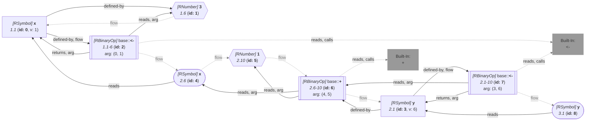
```mermaid
flowchart LR
    1{{"`*#91;RNumber#93;* **3**
      *1.6* (**id: 1**)`"}}
    0["`*#91;RSymbol#93;* **x**
      *1.1* (**id: 0**, v: 1)`"]
    2[["`*#91;RBinaryOp#93;* base#58;#58;**#60;#45;**
      *1.1-6* (**id: 2**)
    arg: (0, 1)`"]]
    built-in:_-["`Built-In:
#60;#45;`"]
    style built-in:_- stroke:gray,fill:gray,stroke-width:2px,opacity:.8;
    4(["`*#91;RSymbol#93;* **x**
      *2.6* (**id: 4**)`"])
    5{{"`*#91;RNumber#93;* **1**
      *2.10* (**id: 5**)`"}}
    6[["`*#91;RBinaryOp#93;* base#58;#58;**#43;**
      *2.6-10* (**id: 6**)
    arg: (4, 5)`"]]
    built-in:_["`Built-In:
#43;`"]
    style built-in:_ stroke:gray,fill:gray,stroke-width:2px,opacity:.8;
    3["`*#91;RSymbol#93;* **y**
      *2.1* (**id: 3**, v: 6)`"]
    7[["`*#91;RBinaryOp#93;* base#58;#58;**#60;#45;**
      *2.1-10* (**id: 7**)
    arg: (3, 6)`"]]
    8(["`*#91;RSymbol#93;* **y**
      *3.1* (**id: 8**)`"])
    1 -.->|"flow"| 0
    linkStyle 0 stroke:gray,color:gray;
    0 -->|"defined-by, flow"| 2
    0 -->|"defined-by"| 1
    2 -->|"reads, arg"| 1
    2 -->|"returns, arg"| 0
    2 -.->|"reads, calls"| built-in:_-
    linkStyle 5 stroke:gray;
    2 -.->|"flow"| 4
    linkStyle 6 stroke:gray,color:gray;
    4 -->|"reads"| 0
    4 -.->|"flow"| 5
    linkStyle 8 stroke:gray,color:gray;
    5 -.->|"flow"| 6
    linkStyle 9 stroke:gray,color:gray;
    6 -->|"reads, arg"| 4
    6 -->|"reads, arg"| 5
    6 -.->|"flow"| 3
    linkStyle 12 stroke:gray,color:gray;
    6 -.->|"reads, calls"| built-in:_
    linkStyle 13 stroke:gray;
    3 -->|"defined-by, flow"| 7
    3 -->|"defined-by"| 6
    7 -->|"reads, arg"| 6
    7 -->|"returns, arg"| 3
    7 -.->|"reads, calls"| built-in:_-
    linkStyle 18 stroke:gray;
    7 -.->|"flow"| 8
    linkStyle 19 stroke:gray,color:gray;
    8 -->|"reads"| 3
```

	
(The analysis ran (including parse and normalize, using the [tree-sitter](https://github.com/flowr-analysis/flowr/wiki/Engines) engine) within the generation environment. No [signature database](https://github.com/flowr-analysis/flowr/wiki/Signature-Database) is mounted for these generated graphs, so `library()` calls attach no package exports; base-R names are still qualified via the generated base-package store (e.g. `acf` as `stats::acf`).)


The above dataflow graph showcases the general gist. We define a dataflow graph as a directed graph G&nbsp;=&nbsp;(V,&nbsp;E), 
differentiating between 5 types of vertices&nbsp;V and
11 types of edges&nbsp;E allowing each vertex to have a single, and each edge to have multiple distinct types.
Two of these edge types carry the control flow rather than the data: the [Control Flow Graph](https://github.com/flowr-analysis/flowr/wiki/Control-Flow-Graph) is a view on them.
Additionally, every vertex lists the [control dependencies](#branches) it runs under, which is the same
information a control edge carries, collected for the whole path that leads to the vertex.


<details><summary>Simplified Version of the graph</summary>


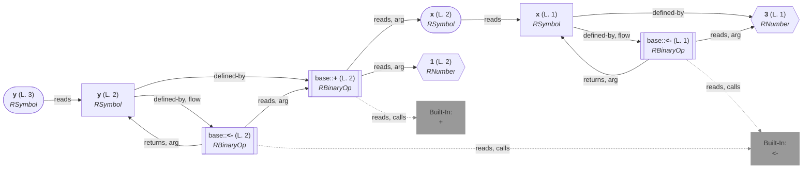
```mermaid
flowchart LR
    1{{"`**3** (L. 1)
*RNumber*`"}}
    0["`**x** (L. 1)
*RSymbol*`"]
    2[["`base#58;#58;**#60;#45;** (L. 1)
*RBinaryOp*`"]]
    built-in:_-["`Built-In:
#60;#45;`"]
    style built-in:_- stroke:gray,fill:gray,stroke-width:2px,opacity:.8;
    4(["`**x** (L. 2)
*RSymbol*`"])
    5{{"`**1** (L. 2)
*RNumber*`"}}
    6[["`base#58;#58;**#43;** (L. 2)
*RBinaryOp*`"]]
    built-in:_["`Built-In:
#43;`"]
    style built-in:_ stroke:gray,fill:gray,stroke-width:2px,opacity:.8;
    3["`**y** (L. 2)
*RSymbol*`"]
    7[["`base#58;#58;**#60;#45;** (L. 2)
*RBinaryOp*`"]]
    8(["`**y** (L. 3)
*RSymbol*`"])
    0 -->|"defined-by, flow"| 2
    0 -->|"defined-by"| 1
    2 -->|"reads, arg"| 1
    2 -->|"returns, arg"| 0
    2 -.->|"reads, calls"| built-in:_-
    linkStyle 4 stroke:gray;
    4 -->|"reads"| 0
    6 -->|"reads, arg"| 4
    6 -->|"reads, arg"| 5
    6 -.->|"reads, calls"| built-in:_
    linkStyle 8 stroke:gray;
    3 -->|"defined-by, flow"| 7
    3 -->|"defined-by"| 6
    7 -->|"reads, arg"| 6
    7 -->|"returns, arg"| 3
    7 -.->|"reads, calls"| built-in:_-
    linkStyle 13 stroke:gray;
    8 -->|"reads"| 3
```

	
(The analysis ran (including parse and normalize, using the [tree-sitter](https://github.com/flowr-analysis/flowr/wiki/Engines) engine) within the generation environment. No [signature database](https://github.com/flowr-analysis/flowr/wiki/Signature-Database) is mounted for these generated graphs, so `library()` calls attach no package exports; base-R names are still qualified via the generated base-package store (e.g. `acf` as `stats::acf`).)


</details>

The following vertices types exist:

1. [`Value`](#value-vertex)
1. [`Use`](#use-vertex)
1. [`FunctionCall`](#fcall-vertex)
1. [`VariableDefinition`](#vdef-vertex)
1. [`FunctionDefinition`](#fdef-vertex)


<details><summary>Class Diagram</summary>

All boxes should link to their respective implementation:

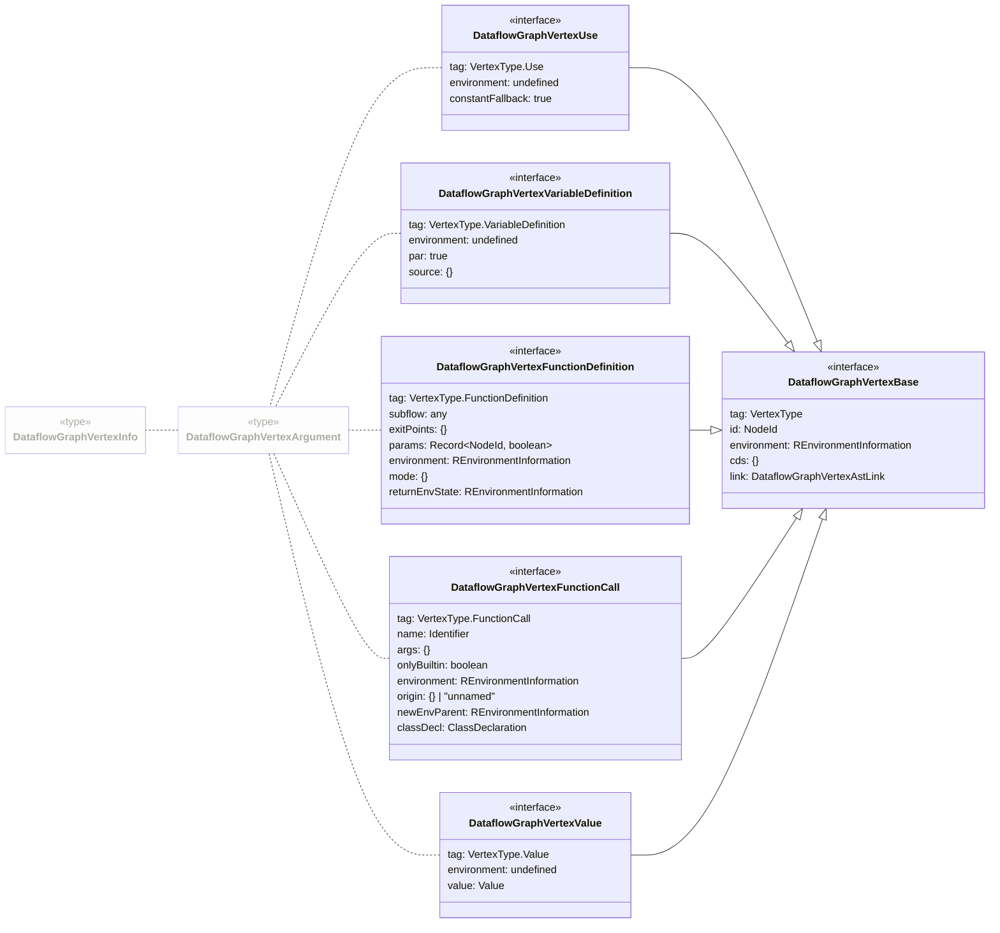
```mermaid

---
  config:
    class:
      hideEmptyMembersBox: true
---
classDiagram
direction RL
class DataflowGraphVertexInfo{
    <<type>>
}
style DataflowGraphVertexInfo opacity:.35,fill:#FAFAFA
click DataflowGraphVertexInfo href "https://github.com/flowr-analysis/flowr/tree/main/src/dataflow/graph/vertex.ts#L194" "This is the union type of all possible vertices that appear within a; #60;code#62;dataflow graph#60;/code#62;; , they can be constructed passing a; #60;code#62;DataflowGraphVertexArgument#60;/code#62;; to the graph. See; #60;code#62;DataflowGraphVertices#60;/code#62;; for an id#45;based mapping."
class DataflowGraphVertexArgument{
    <<type>>
}
style DataflowGraphVertexArgument opacity:.35,fill:#FAFAFA
click DataflowGraphVertexArgument href "https://github.com/flowr-analysis/flowr/tree/main/src/dataflow/graph/vertex.ts#L186" "What is to be passed to construct a vertex in the; #60;code#62;dataflow graph#60;/code#62;"
class DataflowGraphVertexUse{
    <<interface>>
    tag#58; VertexType.Use
    environment#58; undefined
    constantFallback#58; true
}
click DataflowGraphVertexUse href "https://github.com/flowr-analysis/flowr/tree/main/src/dataflow/graph/vertex.ts#L82" "Arguments required to construct a vertex which represents the usage of a variable in the; #60;code#62;dataflow graph#60;/code#62;; ."
class DataflowGraphVertexBase{
    <<interface>>
    tag#58; VertexType
    id#58; NodeId
    environment#58; REnvironmentInformation
    cds#58; #123;#125;
    link#58; DataflowGraphVertexAstLink
}
click DataflowGraphVertexBase href "https://github.com/flowr-analysis/flowr/tree/main/src/dataflow/graph/vertex.ts#L28" "Arguments required to construct a vertex in the; #60;code#62;dataflow graph#60;/code#62;; ."
class DataflowGraphVertexVariableDefinition{
    <<interface>>
    tag#58; VertexType.VariableDefinition
    environment#58; undefined
    par#58; true
    source#58; #123;#125;
}
click DataflowGraphVertexVariableDefinition href "https://github.com/flowr-analysis/flowr/tree/main/src/dataflow/graph/vertex.ts#L139" "Arguments required to construct a vertex which represents the definition of a variable in the; #60;code#62;dataflow graph#60;/code#62;; ."
class DataflowGraphVertexFunctionDefinition{
    <<interface>>
    tag#58; VertexType.FunctionDefinition
    subflow#58; any
    exitPoints#58; #123;#125;
    params#58; Record#60;NodeId, boolean#62;
    environment#58; REnvironmentInformation
    mode#58; #123;#125;
    returnEnvState#58; REnvironmentInformation
}
click DataflowGraphVertexFunctionDefinition href "https://github.com/flowr-analysis/flowr/tree/main/src/dataflow/graph/vertex.ts#L153" "Arguments required to construct a vertex which represents the definition of a function in the; #60;code#62;dataflow graph#60;/code#62;; ."
class DataflowGraphVertexFunctionCall{
    <<interface>>
    tag#58; VertexType.FunctionCall
    name#58; Identifier
    args#58; #123;#125;
    onlyBuiltin#58; boolean
    environment#58; REnvironmentInformation
    origin#58; #123;#125; | #34;unnamed#34;
    newEnvParent#58; REnvironmentInformation
    classDecl#58; ClassDeclaration
}
click DataflowGraphVertexFunctionCall href "https://github.com/flowr-analysis/flowr/tree/main/src/dataflow/graph/vertex.ts#L96" "Arguments required to construct a vertex which represents the call to a function in the; #60;code#62;dataflow graph#60;/code#62;; . This describes all kinds of function calls, including calls to built#45;ins and control#45;flow structures such as #96;if#96; or #96;for#96; (they are treated as function calls in R)."
class DataflowGraphVertexValue{
    <<interface>>
    tag#58; VertexType.Value
    environment#58; undefined
    value#58; Value
}
click DataflowGraphVertexValue href "https://github.com/flowr-analysis/flowr/tree/main/src/dataflow/graph/vertex.ts#L71" "Marker vertex for a value in the dataflow of the program. For user#45;code constants (numbers, strings, logicals) the value is recovered by looking up the; #60;code#62;id#60;/code#62;; in the; #60;code#62;normalized AST#60;/code#62;; #58;"
DataflowGraphVertexArgument .. DataflowGraphVertexInfo
DataflowGraphVertexUse .. DataflowGraphVertexArgument
DataflowGraphVertexBase <|-- DataflowGraphVertexUse
DataflowGraphVertexVariableDefinition .. DataflowGraphVertexArgument
DataflowGraphVertexBase <|-- DataflowGraphVertexVariableDefinition
DataflowGraphVertexFunctionDefinition .. DataflowGraphVertexArgument
DataflowGraphVertexBase <|-- DataflowGraphVertexFunctionDefinition
DataflowGraphVertexFunctionCall .. DataflowGraphVertexArgument
DataflowGraphVertexBase <|-- DataflowGraphVertexFunctionCall
DataflowGraphVertexValue .. DataflowGraphVertexArgument
DataflowGraphVertexBase <|-- DataflowGraphVertexValue
```


</details>

The following edges types exist, internally we use bitmasks to represent multiple types in a compact form, so you 
should use the <a href="https://github.com/flowr-analysis/flowr/tree/main/src/dataflow/graph/edge.ts#L110"><span title="Helper Functions to work with DfEdge and EdgeType .">DfEdge</span></a> object and its methods to work with them:

1. [`Reads` (1)](#1-reads-edge)
1. [`DefinedBy` (2)](#2-definedby-edge)
1. [`Calls` (4)](#3-calls-edge)
1. [`Returns` (8)](#4-returns-edge)
1. [`DefinesOnCall` (16)](#5-definesoncall-edge)
1. [`DefinedByOnCall` (32)](#6-definedbyoncall-edge)
1. [`Argument` (64)](#7-argument-edge)
1. [`SideEffectOnCall` (128)](#8-sideeffectoncall-edge)
1. [`NonStandardEvaluation` (256)](#9-nonstandardevaluation-edge)
1. [`FlowEdge` (4096)](#10-flowedge-edge)
1. [`ControlEdge` (8192)](#11-controledge-edge)


<details><summary>Class Diagram</summary>

All boxes should link to their respective implementation:

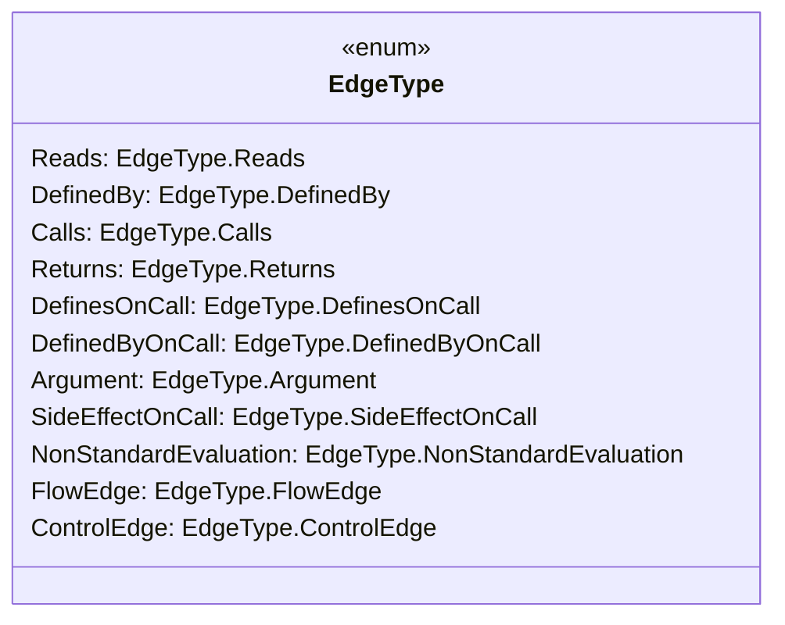
```mermaid

---
  config:
    class:
      hideEmptyMembersBox: true
---
classDiagram
direction RL
class EdgeType{
    <<enum>>
    Reads#58; EdgeType.Reads
    DefinedBy#58; EdgeType.DefinedBy
    Calls#58; EdgeType.Calls
    Returns#58; EdgeType.Returns
    DefinesOnCall#58; EdgeType.DefinesOnCall
    DefinedByOnCall#58; EdgeType.DefinedByOnCall
    Argument#58; EdgeType.Argument
    SideEffectOnCall#58; EdgeType.SideEffectOnCall
    NonStandardEvaluation#58; EdgeType.NonStandardEvaluation
    FlowEdge#58; EdgeType.FlowEdge
    ControlEdge#58; EdgeType.ControlEdge
}
click EdgeType href "https://github.com/flowr-analysis/flowr/tree/main/src/dataflow/graph/edge.ts#L27" "Represents the relationship between the source and the target vertex in the dataflow graph. The actual value is represented as a bitmask, so please refer to; #60;code#62;DfEdge#60;/code#62;; for helpful functions."
```


</details>


From an implementation perspective all of these types are represented by respective interfaces, see [`./src/dataflow/graph/vertex.ts`](https://github.com/flowr-analysis/flowr/tree/main/src/dataflow/graph/vertex.ts) and [`./src/dataflow/graph/edge.ts`](https://github.com/flowr-analysis/flowr/tree/main/src/dataflow/graph/edge.ts).

The following sections present details on the different types of vertices and edges, including examples and explanations.

> [!NOTE]
> Every dataflow vertex holds an `id` which links it to the respective node in the [normalized AST](https://github.com/flowr-analysis/flowr/wiki/Normalized-AST).
> So if you want more information about the respective vertex, you can usually access more information
> using the <code><a href="https://github.com/flowr-analysis/flowr/tree/main/src/dataflow/graph/graph.ts#L192"><span title="The dataflow graph holds the dataflow information found within the given AST: directed edges ( EdgeType ) are hoisted into a flat adjacency list, while vertices ( DataflowGraphVertexArgument ) nest hierarchically (a function-definition vertex contains its subgraph's node ids). After analysis every edge endpoint must be a vertex, though not yet during construction. All methods return the modified g...">DataflowGraph</span></a>::idMap</code> linked to the dataflow graph:
> 
> ```ts
> const node = graph.idMap.get(id);
> ```
> 
> In case you just need the name (`lexeme`) of the respective vertex, <a href="https://github.com/flowr-analysis/flowr/tree/main/src/r-bridge/lang-4.x/ast/model/model.ts#L467"><code><span title="A helper function to retrieve the lexeme of a given node, if available. If the fullLexeme is available, it will be returned, otherwise the lexeme will be returned.">RNode::<b>lexeme</b></span></code></a> can help you out:
> 
> ```ts
> const name = RNode.lexeme(graph.idMap?.get(id));
> ```
> 
>
> Please note, that not every node in the [normalized AST](https://github.com/flowr-analysis/flowr/wiki/Normalized-AST) is represented in the dataflow graph.
> For example, if the node is unreachable in a way that can be detected during the analysis and flowR
> is configured to ignore dead code (there are more powerful dead code capabilities with the [CFG](https://github.com/flowr-analysis/flowr/wiki/Control-Flow-Graph)). Likewise, empty argument wrappers do not have a corresponding
> dataflow graph vertex (as they are not relevant for the dataflow graph). It depends on the scenario what to do in such a case. 
> For argument wrappers you can access the dataflow information for their value. For dead code, however, flowR currently contains
> some core heuristics that remove it which cannot be reversed easily. So please open [an issue](https://github.com/flowr-analysis/flowr/issues/new/choose) if you encounter such a case and require the node to be present in the dataflow graph.

<h2 id="reading-the-visualization">Reading the Visualizations</h2>

Before we dive into the details of the different vertices and edges, let's briefly talk about how to read the visualizations.
For this, let's have a look at a very simple graph, created for the number `42`:


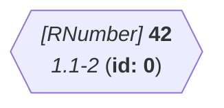
```mermaid
flowchart LR
    0{{"`*#91;RNumber#93;* **42**
      *1.1-2* (**id: 0**)`"}}
   %% No edges found for 0
```

	
(The analysis ran (including parse and normalize, using the [tree-sitter](https://github.com/flowr-analysis/flowr/wiki/Engines) engine) within the generation environment. No [signature database](https://github.com/flowr-analysis/flowr/wiki/Signature-Database) is mounted for these generated graphs, so `library()` calls attach no package exports; base-R names are still qualified via the generated base-package store (e.g. `acf` as `stats::acf`).)


<h3 id="vtx-shape">Vertex Shape</h3>

The _shape_ of the vertex tells you the type of the vertex in the dataflow graph using the following scheme (the types are 
explained in more detail in the following sections):


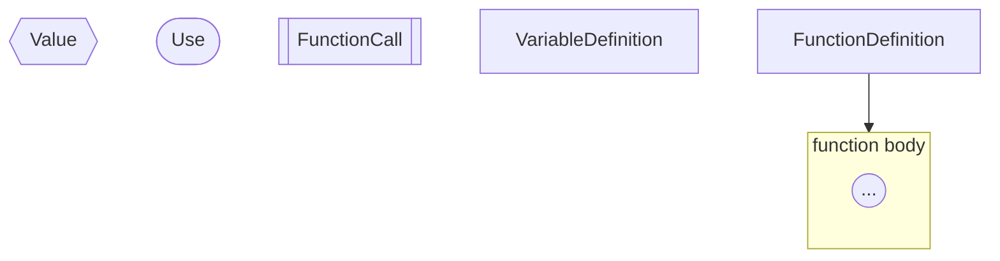
```mermaid
flowchart TD
   value{{Value}}
   use([Use])
   fcall[[FunctionCall]]
   vdef[VariableDefinition]
   fdef[FunctionDefinition]
    subgraph fbox ["function body"]
   body((...))
    end
   fdef-->fbox
```


<h3 id="vtx-synt-type">Syntactic Types</h3>

Within the shape, in square brackets, you can find the syntactic type of the vertex
which is linked to the node in the [Normalized AST](https://github.com/flowr-analysis/flowr/wiki/Normalized-AST).
For more information on valid types and what to do with them, please refer to the [normalized AST wiki page](https://github.com/flowr-analysis/flowr/wiki/Normalized-AST)
and the corresponding helper objects (e.g., <a href="https://github.com/flowr-analysis/flowr/tree/main/src/r-bridge/lang-4.x/ast/model/nodes/r-number.ts#L20"><code><span title="Helper for working with RNumber AST nodes.">RNumber</span></code></a>).

<h3 id="vtx-lexeme">Lexeme</h3>

Also in the first line, next to the [syntactic type](#vtx-synt-type), you can find the lexeme of the vertex (if it has one, e.g., for a variable definition or use).
This usually represents the textual source string of the respective vertex, and is also linked to the [Normalized AST](https://github.com/flowr-analysis/flowr/wiki/Normalized-AST).
For a clearer hierarchy, the lexeme is rendered in **bold** while the [syntactic type](#vtx-synt-type) is de-emphasized in _italics_ (mermaid markdown labels do not support a per-token font color, so a true gray tone would require styling the whole node). Only the token the source actually wrote is bold: when a call is shown with a package-qualified name that flowR *added* (e.g. the code wrote `acf` but it is displayed as `stats::acf`), the added `stats::` prefix stays non-bold, whereas a namespace written verbatim in the source is part of the lexeme and is bold as a whole.
You can access the lexeme too with <a href="https://github.com/flowr-analysis/flowr/tree/main/src/r-bridge/lang-4.x/ast/model/model.ts#L467"><code><span title="A helper function to retrieve the lexeme of a given node, if available. If the fullLexeme is available, it will be returned, otherwise the lexeme will be returned.">RNode::<b>lexeme</b></span></code></a>.

<h3 id="vtx-id">Vertex Id</h3>

In the second line, you will usually find the id (in the form of a <a href="https://github.com/flowr-analysis/flowr/tree/main/src/r-bridge/lang-4.x/ast/model/processing/node-id.ts#L33"><code><span title="What a NodeId is: the identity of a node within one analysis, plus the built-in and pkg::fn names encoded as one, and the ways to read a name back out of it.">NodeId</span></code></a>) of the vertex &mdash; kept compact by sharing the line with the [location](#vtx-location), in the form `*location* (**id: <id>**)` with the id in **bold**. This id links the vertex to the respective node in the [Normalized AST](https://github.com/flowr-analysis/flowr/wiki/Normalized-AST) (and all other perspectives created by flowR).
To give you an example, have a look at the following graph:


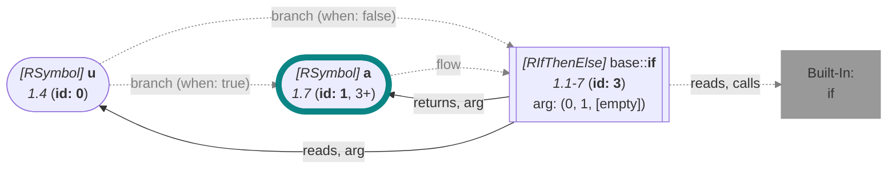
```mermaid
flowchart LR
    0(["`*#91;RSymbol#93;* **u**
      *1.4* (**id: 0**)`"])
    1(["`*#91;RSymbol#93;* **a**
      *1.7* (**id: 1**, 3+)`"])
    style 1 stroke:teal,stroke-width:7px,stroke-opacity:.8; 
    3[["`*#91;RIfThenElse#93;* base#58;#58;**if**
      *1.1-7* (**id: 3**)
    arg: (0, 1, #91;empty#93;)`"]]
    built-in:if["`Built-In:
if`"]
    style built-in:if stroke:gray,fill:gray,stroke-width:2px,opacity:.8;
    0 -.->|"branch (when: true)"| 1
    linkStyle 0 stroke:gray,color:gray;
    0 -.->|"branch (when: false)"| 3
    linkStyle 1 stroke:gray,color:gray;
    1 -.->|"flow"| 3
    linkStyle 2 stroke:gray,color:gray;
    3 -->|"returns, arg"| 1
    3 -->|"reads, arg"| 0
    3 -.->|"reads, calls"| built-in:if
    linkStyle 5 stroke:gray;
```

	
(The analysis ran (including parse and normalize, using the [tree-sitter](https://github.com/flowr-analysis/flowr/wiki/Engines) engine) within the generation environment. No [signature database](https://github.com/flowr-analysis/flowr/wiki/Signature-Database) is mounted for these generated graphs, so `library()` calls attach no package exports; base-R names are still qualified via the generated base-package store (e.g. `acf` as `stats::acf`).)


The `3+` tells you that `a` has a [control dependency](#branches) on the vertex with id `3`, the `if`,
which only triggers when the condition is `true`; a `-` suffix marks the `false` case.

Other vertices are named by their id too: `v: <id>` is the value of a definition, `links: <id>` the AST vertices that
contributed to the vertex. Mermaid rejects some characters in an id, so a space or a bracket shows as `_`
(see <a href="https://github.com/flowr-analysis/flowr/tree/main/src/util/mermaid/mermaid.ts#L69"><code><span title="Escapes a string or number to be used as a mermaid node id.">Mermaid::<b>escapeId</b></span></code></a>); a path keeps its `/` and `.`.

<h3 id="vtx-location">Location</h3>

The second line also indicates the compressed <a href="https://github.com/flowr-analysis/flowr/tree/main/src/util/range.ts#L31"><code><span title="**Please note** that for multi-file projects we also have a source location type that includes the file name. Describe the start and end source position of an element. Every source range is also a valid source location (one without a file), so all readers below accept either.">SourceRange</span></code></a> of the vertex (directly before the [id](#vtx-id)) in the format `startLine.startCharacter - endLine.endCharacter`. If the range reads `1.7`,
this is short for `1.7-1.7`, likewise, `1.7-9` is short for `1.7-1.9`. So, `1.7-9` describes something starting
in the first line at the seventh character and ending in the first line at the ninth character.

<h3 id="vtx-additional-info">Arguments and Additional Information</h3>

Some vertices (e.g., [function calls](#function-call-vertex)) have additional information, like the arguments of the call. 
As you can see with the `if` example above alongside the [vertex id](#vtx-id),
these vertices also have an additional line (prefixed with `arg:`) which lists the ids of the arguments in order to clear any ambiguity in case, for example,
the mermaid graph layouting fumbles the order.

<h2 id="vertices">Vertices</h2>

1. [`Value`](#value-vertex)
1. [`Use`](#use-vertex)
1. [`FunctionCall`](#fcall-vertex)
1. [`VariableDefinition`](#vdef-vertex)
1. [`FunctionDefinition`](#fdef-vertex)


<a id='value-vertex'> </a>
<a id='value-vertex'> </a>
### 1) Value Vertex

Type: `value` (this is the bit-flag value, e.g., when looking at the serialization)


```mermaid
flowchart LR
    0{{"`*#91;RNumber#93;* **42**
      *1.1-2* (**id: 0**)`"}}
   %% No edges found for 0
```

	
<details>

<summary style="color:gray">R Code of the Dataflow Graph</summary>

The analysis ran (including parse and normalize, using the [tree-sitter](https://github.com/flowr-analysis/flowr/wiki/Engines) engine) within the generation environment. No [signature database](https://github.com/flowr-analysis/flowr/wiki/Signature-Database) is mounted for these generated graphs, so `library()` calls attach no package exports; base-R names are still qualified via the generated base-package store (e.g. `acf` as `stats::acf`). The following marks are used in the graph to highlight sub-parts (uses ids): {0}.
We encountered no unknown side effects during the analysis.


```r
42
```


</details>


Describes a constant value (numbers, booleans/logicals, strings, ...).
In general, the respective vertex is more or less a dummy vertex as you can see from its implementation.

 * **[DataflowGraphVertexValue](https://github.com/flowr-analysis/flowr/tree/main/src/dataflow/graph/vertex.ts#L71)**   
   Marker vertex for a value in the dataflow of the program.
   For user-code constants (numbers, strings, logicals) the value is recovered by looking up the
   <code>id</code>
   in the
   <code>normalized AST</code>
   :
   <details><summary style="color:gray">Defined at <a href="https://github.com/flowr-analysis/flowr/tree/main/src/dataflow/graph/vertex.ts#L71">src/dataflow/graph/vertex.ts#L71</a></summary>
   
   
   ```ts
   /**
    * Marker vertex for a value in the dataflow of the program.
    * For user-code constants (numbers, strings, logicals) the value is recovered by looking up the
    * {@link DataflowGraphVertexBase#id|id} in the {@link NormalizedAst|normalized AST}:
    * @see {@link ValueVertex.is} - to check if a vertex is a value vertex
    * @example
    * ```ts
    * const node = graph.idMap.get(value.id)
    * ```
    *
    * For built-in constants whose id is not in the {@link AstIdMap} (e.g. `T` resolving to `built-in:T`),
    * the abstract {@link Value} is stored directly in the {@link DataflowGraphVertexValue#value|value} field.
    */
   export interface DataflowGraphVertexValue extends DataflowGraphVertexBase {
       readonly tag:          VertexType.Value
       readonly environment?: undefined
       /** Pre-computed abstract value; set for built-in constants (e.g. `T`, `F`) whose id is not in the AST id map */
       readonly value?:       Value
   }
   ```
   
   
   </details>
   
    <details><summary>View more (DataflowGraphVertexBase)</summary>

   * **[DataflowGraphVertexBase](https://github.com/flowr-analysis/flowr/tree/main/src/dataflow/graph/vertex.ts#L28)**   
     Arguments required to construct a vertex in the
     <code>dataflow graph</code>
     .
     <details><summary style="color:gray">Defined at <a href="https://github.com/flowr-analysis/flowr/tree/main/src/dataflow/graph/vertex.ts#L28">src/dataflow/graph/vertex.ts#L28</a></summary>
     
     
     ```ts
     /**
      * Arguments required to construct a vertex in the {@link DataflowGraph|dataflow graph}.
      * @see DataflowGraphVertexUse
      * @see DataflowGraphVertexVariableDefinition
      * @see DataflowGraphVertexFunctionDefinition
      */
     interface DataflowGraphVertexBase extends MergeableRecord {
         /**
          * Used to identify and separate different types of vertices.
          */
         readonly tag: VertexType
         /**
          * The id of the node (the id assigned by the {@link ParentInformation} decoration).
          * This unanimously identifies the vertex in the {@link DataflowGraph|dataflow graph}
          * as well as the corresponding {@link NormalizedAst|normalized AST}.
          */
         id:           NodeId
         /**
          * The environment in which the vertex is set.
          */
         environment?: REnvironmentInformation
         /**
          * @see {@link ControlDependency} - the collection of control dependencies which have an influence on whether the vertex is executed.
          */
         cds:          ControlDependency[] | undefined
         /**
          * Describes the collection of AST vertices that contributed to this vertex.
          * For example, this is useful with replacement operators, telling you which assignment operator caused them
          */
         link?:        DataflowGraphVertexAstLink
     }
     ```
     
     
     </details>
     

    </details>


> [!NOTE]
> 
> The value is not stored in the vertex itself, but in the normalized AST.
> To access the value, you can use the `id` of the vertex to access the respective node in the [normalized AST](https://github.com/flowr-analysis/flowr/wiki/Normalized-AST)
> and ask for the value associated with it.
> 				


Please be aware that such nodes may be the result from language semantics as well, and not just from constants directly in the source.
For example, an access operation like `df$column` will treat the column name as a constant value.


<details><summary>Example: Semantics Create a Value</summary>

In the following graph, the original type printed by mermaid is still `RSymbol` (from the [normalized AST](https://github.com/flowr-analysis/flowr/wiki/Normalized-AST)), however, the shape of the vertex signals to you that the symbol is in-fact treated as a constant! If you do not know what `df$column` even means, please refer to the [R topic](https://rdrr.io/r/base/Extract.html).


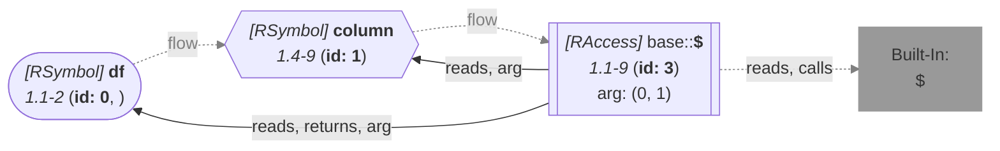
```mermaid
flowchart LR
    0(["`*#91;RSymbol#93;* **df**
      *1.1-2* (**id: 0**, )`"])
    1{{"`*#91;RSymbol#93;* **column**
      *1.4-9* (**id: 1**)`"}}
    3[["`*#91;RAccess#93;* base#58;#58;**$**
      *1.1-9* (**id: 3**)
    arg: (0, 1)`"]]
    built-in:_["`Built-In:
$`"]
    style built-in:_ stroke:gray,fill:gray,stroke-width:2px,opacity:.8;
    0 -.->|"flow"| 1
    linkStyle 0 stroke:gray,color:gray;
    1 -.->|"flow"| 3
    linkStyle 1 stroke:gray,color:gray;
    3 -->|"reads, returns, arg"| 0
    3 -->|"reads, arg"| 1
    3 -.->|"reads, calls"| built-in:_
    linkStyle 4 stroke:gray;
```

	
<details>

<summary style="color:gray">R Code of the Dataflow Graph</summary>

The analysis ran (including parse and normalize, using the [tree-sitter](https://github.com/flowr-analysis/flowr/wiki/Engines) engine) within the generation environment. No [signature database](https://github.com/flowr-analysis/flowr/wiki/Signature-Database) is mounted for these generated graphs, so `library()` calls attach no package exports; base-R names are still qualified via the generated base-package store (e.g. `acf` as `stats::acf`). The following marks are used in the graph to highlight sub-parts (uses ids): {1}.
We encountered no unknown side effects during the analysis.


```r
df$column
```


</details>


</details>
		


	

<a id='use-vertex'> </a>
<a id='use-vertex'> </a>
### 2) Use Vertex

Type: `use` (this is the bit-flag value, e.g., when looking at the serialization)


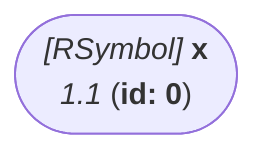
```mermaid
flowchart LR
    0(["`*#91;RSymbol#93;* **x**
      *1.1* (**id: 0**)`"])
   %% No edges found for 0
```

	
<details>

<summary style="color:gray">R Code of the Dataflow Graph</summary>

The analysis ran (including parse and normalize, using the [tree-sitter](https://github.com/flowr-analysis/flowr/wiki/Engines) engine) within the generation environment. No [signature database](https://github.com/flowr-analysis/flowr/wiki/Signature-Database) is mounted for these generated graphs, so `library()` calls attach no package exports; base-R names are still qualified via the generated base-package store (e.g. `acf` as `stats::acf`). The following marks are used in the graph to highlight sub-parts (uses ids): {0}.
We encountered no unknown side effects during the analysis.


```r
x
```


</details>


		
Describes symbol/variable references which are read (or potentially read at a given position).
Similar to the [value vertex](#value-vertex) described above, this is more a marker vertex as 
you can see from the implementation.

 * **[DataflowGraphVertexUse](https://github.com/flowr-analysis/flowr/tree/main/src/dataflow/graph/vertex.ts#L82)**   
   Arguments required to construct a vertex which represents the usage of a variable in the
   <code>dataflow graph</code>
   .
   <details><summary style="color:gray">Defined at <a href="https://github.com/flowr-analysis/flowr/tree/main/src/dataflow/graph/vertex.ts#L82">src/dataflow/graph/vertex.ts#L82</a></summary>
   
   
   ```ts
   /**
    * Arguments required to construct a vertex which represents the usage of a variable in the {@link DataflowGraph|dataflow graph}.
    * @see {@link UseVertex.is} - to check if a vertex is a use vertex
    */
   export interface DataflowGraphVertexUse extends DataflowGraphVertexBase {
       readonly tag:          VertexType.Use
       /** Does not require an environment to be attached. If we promote the use to a function call, we attach the environment later.  */
       readonly environment?: undefined
       /** set on a synthesized by-name-lookup use whose name folded to a constant; not readonly, set post-graph */
       constantFallback?:     true
   }
   ```
   
   
   </details>
   
    <details><summary>View more (DataflowGraphVertexBase)</summary>

   * **[DataflowGraphVertexBase](https://github.com/flowr-analysis/flowr/tree/main/src/dataflow/graph/vertex.ts#L28)**   
     Arguments required to construct a vertex in the
     <code>dataflow graph</code>
     .
     <details><summary style="color:gray">Defined at <a href="https://github.com/flowr-analysis/flowr/tree/main/src/dataflow/graph/vertex.ts#L28">src/dataflow/graph/vertex.ts#L28</a></summary>
     
     
     ```ts
     /**
      * Arguments required to construct a vertex in the {@link DataflowGraph|dataflow graph}.
      * @see DataflowGraphVertexUse
      * @see DataflowGraphVertexVariableDefinition
      * @see DataflowGraphVertexFunctionDefinition
      */
     interface DataflowGraphVertexBase extends MergeableRecord {
         /**
          * Used to identify and separate different types of vertices.
          */
         readonly tag: VertexType
         /**
          * The id of the node (the id assigned by the {@link ParentInformation} decoration).
          * This unanimously identifies the vertex in the {@link DataflowGraph|dataflow graph}
          * as well as the corresponding {@link NormalizedAst|normalized AST}.
          */
         id:           NodeId
         /**
          * The environment in which the vertex is set.
          */
         environment?: REnvironmentInformation
         /**
          * @see {@link ControlDependency} - the collection of control dependencies which have an influence on whether the vertex is executed.
          */
         cds:          ControlDependency[] | undefined
         /**
          * Describes the collection of AST vertices that contributed to this vertex.
          * For example, this is useful with replacement operators, telling you which assignment operator caused them
          */
         link?:        DataflowGraphVertexAstLink
     }
     ```
     
     
     </details>
     

    </details>


> [!NOTE]
> 
> The name of the symbol is not actually part of what we store in the dataflow graph,
> as we have it within the normalized AST.
> To access the name, you can use the `id` of the vertex:
> 
> 
> ```ts
> const name = RNode.lexeme(graph.idMap?.get(id));
> ```
> 
> 				


Most often, you will see the _use_ vertex whenever a variable is read.
However, similar to the [value vertex](#value-vertex), the _use_ vertex can also be the result of language semantics.
Consider a case, in which we refer to a variable with a string, as in `get("x")`.


<details><summary>Example: Semantics Create a Symbol</summary>

In the following graph, the original type printed by mermaid is still `RString` (from the [normalized AST](https://github.com/flowr-analysis/flowr/wiki/Normalized-AST)), however, the shape of the vertex signals to you that the symbol is in-fact treated as a variable use! If you are unsure what `get` does, refer to the [documentation](https://www.rdocumentation.org/packages/base/versions/3.6.2/topics/get). Please note, that the lexeme being printed as `"x"` may be misleading (after all it is recovered from the AST), the quotes are not part of the reference.


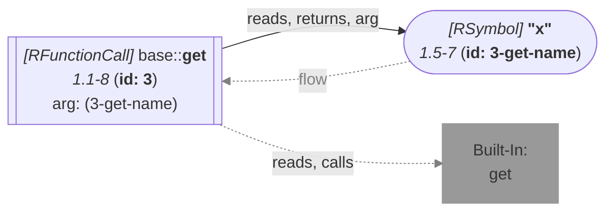
```mermaid
flowchart LR
    3-get-name(["`*#91;RSymbol#93;* **#34;x#34;**
      *1.5-7* (**id: 3-get-name**)`"])
    3[["`*#91;RFunctionCall#93;* base#58;#58;**get**
      *1.1-8* (**id: 3**)
    arg: (3#45;get#45;name)`"]]
    built-in:get["`Built-In:
get`"]
    style built-in:get stroke:gray,fill:gray,stroke-width:2px,opacity:.8;
    3-get-name -.->|"flow"| 3
    linkStyle 0 stroke:gray,color:gray;
    3 -->|"reads, returns, arg"| 3-get-name
    3 -.->|"reads, calls"| built-in:get
    linkStyle 2 stroke:gray;
```

	
<details>

<summary style="color:gray">R Code of the Dataflow Graph</summary>

The analysis ran (including parse and normalize, using the [tree-sitter](https://github.com/flowr-analysis/flowr/wiki/Engines) engine) within the generation environment. No [signature database](https://github.com/flowr-analysis/flowr/wiki/Signature-Database) is mounted for these generated graphs, so `library()` calls attach no package exports; base-R names are still qualified via the generated base-package store (e.g. `acf` as `stats::acf`). The following marks are used in the graph to highlight sub-parts (uses ids): {1}.
We encountered no unknown side effects during the analysis.


```r
get("x")
```


</details>


</details>

But now to the interesting stuff: how do we actually know which values are read by the respective variable use?
This usually involves a [variable definition](#variable-definition-vertex) and a [reads edge](#reads-edge) linking the two.


<details><summary>Example: Reads Edge Identifying a Single Definition</summary>

In the following graph, the `x` is read from the definition `x <- 1`.


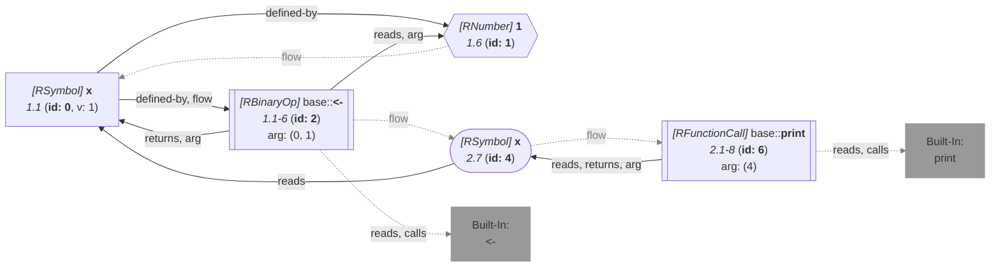
```mermaid
flowchart LR
    1{{"`*#91;RNumber#93;* **1**
      *1.6* (**id: 1**)`"}}
    0["`*#91;RSymbol#93;* **x**
      *1.1* (**id: 0**, v: 1)`"]
    2[["`*#91;RBinaryOp#93;* base#58;#58;**#60;#45;**
      *1.1-6* (**id: 2**)
    arg: (0, 1)`"]]
    built-in:_-["`Built-In:
#60;#45;`"]
    style built-in:_- stroke:gray,fill:gray,stroke-width:2px,opacity:.8;
    4(["`*#91;RSymbol#93;* **x**
      *2.7* (**id: 4**)`"])
    6[["`*#91;RFunctionCall#93;* base#58;#58;**print**
      *2.1-8* (**id: 6**)
    arg: (4)`"]]
    built-in:print["`Built-In:
print`"]
    style built-in:print stroke:gray,fill:gray,stroke-width:2px,opacity:.8;
    1 -.->|"flow"| 0
    linkStyle 0 stroke:gray,color:gray;
    0 -->|"defined-by, flow"| 2
    0 -->|"defined-by"| 1
    2 -->|"reads, arg"| 1
    2 -->|"returns, arg"| 0
    2 -.->|"reads, calls"| built-in:_-
    linkStyle 5 stroke:gray;
    2 -.->|"flow"| 4
    linkStyle 6 stroke:gray,color:gray;
    4 -->|"reads"| 0
    4 -.->|"flow"| 6
    linkStyle 8 stroke:gray,color:gray;
    6 -->|"reads, returns, arg"| 4
    6 -.->|"reads, calls"| built-in:print
    linkStyle 10 stroke:gray;
```

	
<details open>

<summary style="color:gray">R Code of the Dataflow Graph</summary>

The analysis ran (including parse and normalize, using the [tree-sitter](https://github.com/flowr-analysis/flowr/wiki/Engines) engine) within the generation environment. No [signature database](https://github.com/flowr-analysis/flowr/wiki/Signature-Database) is mounted for these generated graphs, so `library()` calls attach no package exports; base-R names are still qualified via the generated base-package store (e.g. `acf` as `stats::acf`). The following marks are used in the graph to highlight sub-parts (uses ids): {3, 0->3}.
We encountered unknown side effects (with ids: 6 (linked)) during the analysis.


```r
x <- 1
print(x)
```


</details>


</details>

In general, there may be many such edges, identifying every possible definition of the variable.


<details><summary>Example: Reads Edge Identifying Multiple Definitions (conditional)</summary>



```mermaid
flowchart LR
    1{{"`*#91;RNumber#93;* **1**
      *1.6* (**id: 1**)`"}}
    0["`*#91;RSymbol#93;* **x**
      *1.1* (**id: 0**, v: 1)`"]
    2[["`*#91;RBinaryOp#93;* base#58;#58;**#60;#45;**
      *1.1-6* (**id: 2**)
    arg: (0, 1)`"]]
    built-in:_-["`Built-In:
#60;#45;`"]
    style built-in:_- stroke:gray,fill:gray,stroke-width:2px,opacity:.8;
    3(["`*#91;RSymbol#93;* **u**
      *2.4* (**id: 3**)`"])
    5{{"`*#91;RNumber#93;* **2**
      *2.12* (**id: 5**)`"}}
    4["`*#91;RSymbol#93;* **x**
      *2.7* (**id: 4**, 8+, v: 5)`"]
    6[["`*#91;RBinaryOp#93;* base#58;#58;**#60;#45;**
      *2.7-12* (**id: 6**, 8+)
    arg: (4, 5)`"]]
    8[["`*#91;RIfThenElse#93;* base#58;#58;**if**
      *2.1-12* (**id: 8**)
    arg: (3, 6, #91;empty#93;)`"]]
    built-in:if["`Built-In:
if`"]
    style built-in:if stroke:gray,fill:gray,stroke-width:2px,opacity:.8;
    10(["`*#91;RSymbol#93;* **x**
      *3.7* (**id: 10**)`"])
    12[["`*#91;RFunctionCall#93;* base#58;#58;**print**
      *3.1-8* (**id: 12**)
    arg: (10)`"]]
    built-in:print["`Built-In:
print`"]
    style built-in:print stroke:gray,fill:gray,stroke-width:2px,opacity:.8;
    1 -.->|"flow"| 0
    linkStyle 0 stroke:gray,color:gray;
    0 -->|"defined-by, flow"| 2
    0 -->|"defined-by"| 1
    2 -->|"reads, arg"| 1
    2 -->|"returns, arg"| 0
    2 -.->|"reads, calls"| built-in:_-
    linkStyle 5 stroke:gray;
    2 -.->|"flow"| 3
    linkStyle 6 stroke:gray,color:gray;
    3 -.->|"branch (when: true)"| 5
    linkStyle 7 stroke:gray,color:gray;
    3 -.->|"branch (when: false)"| 8
    linkStyle 8 stroke:gray,color:gray;
    5 -.->|"flow"| 4
    linkStyle 9 stroke:gray,color:gray;
    4 -->|"defined-by, flow"| 6
    4 -->|"defined-by"| 5
    6 -->|"reads, arg"| 5
    6 -->|"returns, arg"| 4
    6 -.->|"reads, calls"| built-in:_-
    linkStyle 14 stroke:gray;
    6 -.->|"flow"| 8
    linkStyle 15 stroke:gray,color:gray;
    8 -->|"returns, arg"| 6
    8 -->|"reads, arg"| 3
    8 -.->|"reads, calls"| built-in:if
    linkStyle 18 stroke:gray;
    8 -.->|"flow"| 10
    linkStyle 19 stroke:gray,color:gray;
    10 -->|"reads"| 4
    linkStyle 20 stroke:teal,stroke-width:4.2px,stroke-opacity:.8
    10 -->|"reads"| 0
    linkStyle 21 stroke:teal,stroke-width:4.2px,stroke-opacity:.8
    10 -.->|"flow"| 12
    linkStyle 22 stroke:gray,color:gray;
    12 -->|"reads, returns, arg"| 10
    12 -.->|"reads, calls"| built-in:print
    linkStyle 24 stroke:gray;
```

	
<details open>

<summary style="color:gray">R Code of the Dataflow Graph</summary>

The analysis ran (including parse and normalize, using the [tree-sitter](https://github.com/flowr-analysis/flowr/wiki/Engines) engine) within the generation environment. No [signature database](https://github.com/flowr-analysis/flowr/wiki/Signature-Database) is mounted for these generated graphs, so `library()` calls attach no package exports; base-R names are still qualified via the generated base-package store (e.g. `acf` as `stats::acf`). The following marks are used in the graph to highlight sub-parts (uses ids): {10, 10->0, 10->4}.
We encountered unknown side effects (with ids: 12 (linked)) during the analysis.


```r
x <- 1
if(u) x <- 2
print(x)
```


</details>


</details>

<details><summary>Example: Reads Edge Identifying Multiple Definitions (loop)</summary>



```mermaid
flowchart LR
    1{{"`*#91;RNumber#93;* **1**
      *1.6* (**id: 1**)`"}}
    0["`*#91;RSymbol#93;* **x**
      *1.1* (**id: 0**, v: 1)`"]
    2[["`*#91;RBinaryOp#93;* base#58;#58;**#60;#45;**
      *1.1-6* (**id: 2**)
    arg: (0, 1)`"]]
    built-in:_-["`Built-In:
#60;#45;`"]
    style built-in:_- stroke:gray,fill:gray,stroke-width:2px,opacity:.8;
    3["`*#91;RSymbol#93;* **i**
      *2.5* (**id: 3**, v: 4)`"]
    4(["`*#91;RSymbol#93;* **v**
      *2.10* (**id: 4**)`"])
    6{{"`*#91;RNumber#93;* **2**
      *2.18* (**id: 6**)`"}}
    5["`*#91;RSymbol#93;* **x**
      *2.13* (**id: 5**, 9+, v: 6)`"]
    7[["`*#91;RBinaryOp#93;* base#58;#58;**#60;#45;**
      *2.13-18* (**id: 7**, 9+)
    arg: (5, 6)`"]]
    9[["`*#91;RForLoop#93;* base#58;#58;**for**
      *2.1-18* (**id: 9**)
    arg: (3, 4, 7)`"]]
    built-in:for["`Built-In:
for`"]
    style built-in:for stroke:gray,fill:gray,stroke-width:2px,opacity:.8;
    11(["`*#91;RSymbol#93;* **x**
      *3.7* (**id: 11**)`"])
    13[["`*#91;RFunctionCall#93;* base#58;#58;**print**
      *3.1-8* (**id: 13**)
    arg: (11)`"]]
    built-in:print["`Built-In:
print`"]
    style built-in:print stroke:gray,fill:gray,stroke-width:2px,opacity:.8;
    1 -.->|"flow"| 0
    linkStyle 0 stroke:gray,color:gray;
    0 -->|"defined-by, flow"| 2
    0 -->|"defined-by"| 1
    2 -->|"reads, arg"| 1
    2 -->|"returns, arg"| 0
    2 -.->|"reads, calls"| built-in:_-
    linkStyle 5 stroke:gray;
    2 -.->|"flow"| 4
    linkStyle 6 stroke:gray,color:gray;
    3 -->|"defined-by"| 4
    3 -.->|"branch (when: true)"| 6
    linkStyle 8 stroke:gray,color:gray;
    3 -.->|"branch (when: false)"| 9
    linkStyle 9 stroke:gray,color:gray;
    4 -.->|"flow"| 3
    linkStyle 10 stroke:gray,color:gray;
    6 -.->|"flow"| 5
    linkStyle 11 stroke:gray,color:gray;
    5 -->|"defined-by, flow"| 7
    5 -->|"defined-by"| 6
    7 -->|"reads, arg"| 6
    7 -->|"returns, arg"| 5
    7 -.->|"reads, calls"| built-in:_-
    linkStyle 16 stroke:gray;
    7 -.->|"flow"| 3
    linkStyle 17 stroke:gray,color:gray;
    9 -->|"arg"| 3
    9 -->|"reads, arg"| 4
    9 -->|"arg, non-standard-evaluation"| 7
    9 -.->|"reads, calls"| built-in:for
    linkStyle 21 stroke:gray;
    9 -.->|"flow"| 11
    linkStyle 22 stroke:gray,color:gray;
    11 -->|"reads"| 0
    linkStyle 23 stroke:teal,stroke-width:4.2px,stroke-opacity:.8
    11 -->|"reads"| 5
    linkStyle 24 stroke:teal,stroke-width:4.2px,stroke-opacity:.8
    11 -.->|"flow"| 13
    linkStyle 25 stroke:gray,color:gray;
    13 -->|"reads, returns, arg"| 11
    13 -.->|"reads, calls"| built-in:print
    linkStyle 27 stroke:gray;
```

	
<details open>

<summary style="color:gray">R Code of the Dataflow Graph</summary>

The analysis ran (including parse and normalize, using the [tree-sitter](https://github.com/flowr-analysis/flowr/wiki/Engines) engine) within the generation environment. No [signature database](https://github.com/flowr-analysis/flowr/wiki/Signature-Database) is mounted for these generated graphs, so `library()` calls attach no package exports; base-R names are still qualified via the generated base-package store (e.g. `acf` as `stats::acf`). The following marks are used in the graph to highlight sub-parts (uses ids): {11, 11->0, 11->5}.
We encountered unknown side effects (with ids: 13 (linked)) during the analysis.


```r
x <- 1
for(i in v) x <- 2
print(x)
```


</details>


</details>

<details><summary>Example: Reads Edge Identifying Multiple Definitions (side-effect)</summary>



```mermaid
flowchart LR
    %% Environment of 5 [level: 0]:
    %% Built-in
    %% 1----------------------------------------
    %%   x: {**x** (id: 1, type: Variable, def. @3)}
    5["`*#91;RFunctionDefinition#93;* **function**
      *1.6-23* (**id: 5**)`"]

subgraph "flow-5" [function 5]
    2{{"`*#91;RNumber#93;* **2**
      *1.23* (**id: 2**)`"}}
    1["`*#91;RSymbol#93;* **x**
      *1.17* (**id: 1**, v: 2)`"]
    3[["`*#91;RBinaryOp#93;* base#58;#58;**#60;#60;#45;**
      *1.17-23* (**id: 3**)
    arg: (1, 2)`"]]
    built-in:__-["`Built-In:
#60;#60;#45;`"]
    style built-in:__- stroke:gray,fill:gray,stroke-width:2px,opacity:.8;
end
    0["`*#91;RSymbol#93;* **f**
      *1.1* (**id: 0**, v: 5)`"]
    6[["`*#91;RBinaryOp#93;* base#58;#58;**#60;#45;**
      *1.1-23* (**id: 6**)
    arg: (0, 5)`"]]
    built-in:_-["`Built-In:
#60;#45;`"]
    style built-in:_- stroke:gray,fill:gray,stroke-width:2px,opacity:.8;
    8{{"`*#91;RNumber#93;* **2**
      *2.6* (**id: 8**)`"}}
    7["`*#91;RSymbol#93;* **x**
      *2.1* (**id: 7**, v: 8)`"]
    9[["`*#91;RBinaryOp#93;* base#58;#58;**#60;#45;**
      *2.1-6* (**id: 9**)
    arg: (7, 8)`"]]
    10(["`*#91;RSymbol#93;* **u**
      *3.4* (**id: 10**)`"])
    %% Environment of 12 [level: 0]:
    %% Built-in
    %% 1----------------------------------------
    %%   f: {**f** (id: 0, type: Function, def. @6)}
    %%   x: {**x** (id: 7, type: Variable, def. @9)}
    12[["`*#91;RFunctionCall#93;* **f**
      *3.7-9* (**id: 12**, 14+)`"]]
    14[["`*#91;RIfThenElse#93;* base#58;#58;**if**
      *3.1-9* (**id: 14**)
    arg: (10, 12, #91;empty#93;)`"]]
    built-in:if["`Built-In:
if`"]
    style built-in:if stroke:gray,fill:gray,stroke-width:2px,opacity:.8;
    16(["`*#91;RSymbol#93;* **x**
      *4.7* (**id: 16**)`"])
    18[["`*#91;RFunctionCall#93;* base#58;#58;**print**
      *4.1-8* (**id: 18**)
    arg: (16)`"]]
    built-in:print["`Built-In:
print`"]
    style built-in:print stroke:gray,fill:gray,stroke-width:2px,opacity:.8;
    2 -.->|"flow"| 1
    linkStyle 0 stroke:gray,color:gray;
    1 -->|"defined-by, flow"| 3
    1 -->|"defined-by"| 2
    1 -->|"side-effect-on-call"| 12
    3 -->|"reads, arg"| 2
    3 -->|"returns, arg"| 1
    3 -.->|"reads, calls"| built-in:__-
    linkStyle 6 stroke:gray;
5 -.-|function| flow-5

    5 -.->|"flow"| 0
    linkStyle 8 stroke:gray,color:gray;
    0 -->|"defined-by, flow"| 6
    0 -->|"defined-by"| 5
    6 -->|"reads, arg"| 5
    6 -->|"returns, arg"| 0
    6 -.->|"reads, calls"| built-in:_-
    linkStyle 13 stroke:gray;
    6 -.->|"flow"| 8
    linkStyle 14 stroke:gray,color:gray;
    8 -.->|"flow"| 7
    linkStyle 15 stroke:gray,color:gray;
    7 -->|"defined-by, flow"| 9
    7 -->|"defined-by"| 8
    9 -->|"reads, arg"| 8
    9 -->|"returns, arg"| 7
    9 -.->|"reads, calls"| built-in:_-
    linkStyle 20 stroke:gray;
    9 -.->|"flow"| 10
    linkStyle 21 stroke:gray,color:gray;
    10 -.->|"branch (when: true)"| 12
    linkStyle 22 stroke:gray,color:gray;
    10 -.->|"branch (when: false)"| 14
    linkStyle 23 stroke:gray,color:gray;
    12 -->|"reads"| 0
    12 -.->|"flow"| 14
    linkStyle 25 stroke:gray,color:gray;
    12 -->|"returns"| 3
    12 -->|"calls"| 5
    14 -->|"returns, arg"| 12
    14 -->|"reads, arg"| 10
    14 -.->|"reads, calls"| built-in:if
    linkStyle 30 stroke:gray;
    14 -.->|"flow"| 16
    linkStyle 31 stroke:gray,color:gray;
    16 -->|"reads"| 7
    linkStyle 32 stroke:teal,stroke-width:4.2px,stroke-opacity:.8
    16 -->|"reads"| 1
    linkStyle 33 stroke:teal,stroke-width:4.2px,stroke-opacity:.8
    16 -.->|"flow"| 18
    linkStyle 34 stroke:gray,color:gray;
    18 -->|"reads, returns, arg"| 16
    18 -.->|"reads, calls"| built-in:print
    linkStyle 36 stroke:gray;
```

	
<details open>

<summary style="color:gray">R Code of the Dataflow Graph</summary>

The analysis ran (including parse and normalize, using the [tree-sitter](https://github.com/flowr-analysis/flowr/wiki/Engines) engine) within the generation environment. No [signature database](https://github.com/flowr-analysis/flowr/wiki/Signature-Database) is mounted for these generated graphs, so `library()` calls attach no package exports; base-R names are still qualified via the generated base-package store (e.g. `acf` as `stats::acf`). The following marks are used in the graph to highlight sub-parts (uses ids): {16, 16->1, 16->7}.
We encountered unknown side effects (with ids: 18 (linked)) during the analysis.


```r
f <- function() x <<- 2
x <- 2
if(u) f()
print(x)
```


</details>


</details>


> [!IMPORTANT]
> 
> 	If you want to obtain the locations where a variable is defined, or read, or re-defined, refrain from tracking these details manually in the dataflow graph
> 	as there are some edge-cases that require special attention.
> 	In general, the <a href="https://github.com/flowr-analysis/flowr/tree/main/src/dataflow/origin/dfg-get-origin.ts#L92"><code><span title="Obtain the (dataflow) origin of a given node in the dfg.">getOriginInDfg</span></code></a> (which is also available as <a href="https://github.com/flowr-analysis/flowr/tree/main/src/dataflow/graph/df-helper.ts#L53"><code><span title="Returns the origin of a vertex in the dataflow graph">Dataflow::<b>origin</b></span></code></a>) function explained below in [working with the dataflow graph](https://github.com/flowr-analysis/flowr/wiki/Dataflow-Graph#dfg-working) will help you to get the information you need.
> 	


	

<a id='function-call-vertex'> </a>
<a id='fcall-vertex'> </a>
### 3) Function Call Vertex

Type: `fcall` (this is the bit-flag value, e.g., when looking at the serialization)


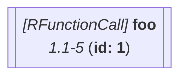
```mermaid
flowchart LR
    1[["`*#91;RFunctionCall#93;* **foo**
      *1.1-5* (**id: 1**)`"]]
   %% No edges found for 1
```

	
<details>

<summary style="color:gray">R Code of the Dataflow Graph</summary>

The analysis ran (including parse and normalize, using the [tree-sitter](https://github.com/flowr-analysis/flowr/wiki/Engines) engine) within the generation environment. No [signature database](https://github.com/flowr-analysis/flowr/wiki/Signature-Database) is mounted for these generated graphs, so `library()` calls attach no package exports; base-R names are still qualified via the generated base-package store (e.g. `acf` as `stats::acf`). The following marks are used in the graph to highlight sub-parts (uses ids): {1}.
We encountered no unknown side effects during the analysis.


```r
foo()
```


</details>


Describes any kind of function call, including unnamed calls and those that happen implicitly!
In general the vertex provides you with information about
the _name_ of the called function, the passed _arguments_, and the _environment_ in which the call happens (if it is of importance).

Whenever flowR can determine which package a call resolves to &mdash; via a loaded `library()`/`::`, or via the always-available base-R packages taken from the [signature database](https://github.com/flowr-analysis/flowr/wiki/Signature-Database) &mdash; the mermaid visualization prints the **package-qualified name** in place of the bare one (e.g. `acf` is shown as `stats::acf`). To obtain this qualified identifier programmatically, prefer <a href="https://github.com/flowr-analysis/flowr/tree/main/src/dataflow/graph/df-helper.ts#L67"><code><span title="The qualified identifier of the call with the given id, or undefined if it does not resolve to a package export and is not itself already namespaced (with purrr loaded, a map() call yields Identifier.make('map', 'purrr'); an explicit pkg::fn() call yields pkg::fn unchanged). This is the compact form of Identifier.toQualified , reconstructing both the origins and the call's name from the graph.">Dataflow::<b>qualify</b></span></code></a> which, given only a call's id and its graph, reconstructs the `pkg::fn` identifier from the origins (and, for base R, from the exporting package) &mdash; the compact form of `Identifier.toQualified` (see the `origin` property below and the [signature database](https://github.com/flowr-analysis/flowr/wiki/Signature-Database) for where the base-R knowledge comes from).
The graph caches what it resolved, with and without the base-R step, and drops the cache whenever it changes, so asking twice costs a map lookup. If you want the qualified name of every call, use <a href="https://github.com/flowr-analysis/flowr/tree/main/src/dataflow/graph/df-helper.ts#L76"><code><span title="The qualified name of every call of the graph, undefined for the calls that do not qualify. Prefer this over asking call by call: it resolves each call once for both qualifyBaseR variants.">Dataflow::<b>qualifyAll</b></span></code></a>: it walks the call vertices once and pays the (expensive) origin resolution once per call instead of once per ask.

However, the implementation reveals that it may hold an additional `onlyBuiltin` flag to indicate that the call is only calling builtin functions &mdash; however, this is only a flag to improve performance,
and it should not be relied on as it may under-approximate the actual calling targets (e.g., being `false` even though all calls resolve to builtins).
	 
 * **[DataflowGraphVertexFunctionCall](https://github.com/flowr-analysis/flowr/tree/main/src/dataflow/graph/vertex.ts#L96)**   
   Arguments required to construct a vertex which represents the call to a function in the
   <code>dataflow graph</code>
   .
   This describes all kinds of function calls, including calls to built-ins and control-flow structures such as `if` or `for` (they are
   treated as function calls in R).
   <details><summary style="color:gray">Defined at <a href="https://github.com/flowr-analysis/flowr/tree/main/src/dataflow/graph/vertex.ts#L96">src/dataflow/graph/vertex.ts#L96</a></summary>
   
   
   ```ts
   /**
    * Arguments required to construct a vertex which represents the call to a function in the {@link DataflowGraph|dataflow graph}.
    * This describes all kinds of function calls, including calls to built-ins and control-flow structures such as `if` or `for` (they are
    * treated as function calls in R).
    * @see {@link FunctionCallVertex.is} - to check if a vertex is a function call vertex
    */
   export interface DataflowGraphVertexFunctionCall extends DataflowGraphVertexBase {
       readonly tag:  VertexType.FunctionCall
       /**
        * Effective name of the function call,
        * Please be aware that this name can differ from the lexeme.
        * For example, if the function is a replacement function, in this case, the actually called fn will
        * have the compound name (e.g., `[<-`).
        * @see {@link Identifier} - for more information on identifiers
        */
       readonly name: Identifier
       /**
        * The arguments of the function call, in order (as they are passed to the respective call if executed in R.
        * @see {@link FunctionArgument} - for more information on function arguments
        */
       args:          FunctionArgument[]
       /** a performance flag to indicate that the respective call is _only_ calling a builtin function without any df graph attached */
       onlyBuiltin:   boolean
       /** The environment attached to the call (if such an attachment is necessary, e.g., because it represents the calling closure */
       environment:   REnvironmentInformation | undefined
       /** More detailed Information on this function call */
       origin:        FunctionOriginInformation[] | 'unnamed'
       /**
        * For `new.env()`-family calls: the resolved parent {@link REnvironmentInformation} that the
        * freshly-created environment should inherit from. Set by `processNewEnv` when the `parent`
        * argument can be statically resolved (tracked env variable or `emptyenv()`-family call).
        */
       newEnvParent?: REnvironmentInformation
       /**
        * For a class-declaring call (`setClass`, `setClassUnion`, `setIs`, `setValidity`, `setRefClass`,
        * `S7::new_class`, `R6::R6Class`): what the declaration states -- its name, superclasses, members, and
        * whether it can be instantiated. Filled from the {@link ClassDeclarationConfig} the built-in declares,
        * so no argument's meaning is guessed. See {@link declaredClasses} to collect these across a graph.
        */
       classDecl?:    ClassDeclaration
   }
   ```
   
   
   </details>
   
    <details><summary>View more (DataflowGraphVertexBase)</summary>

   * **[DataflowGraphVertexBase](https://github.com/flowr-analysis/flowr/tree/main/src/dataflow/graph/vertex.ts#L28)**   
     Arguments required to construct a vertex in the
     <code>dataflow graph</code>
     .
     <details><summary style="color:gray">Defined at <a href="https://github.com/flowr-analysis/flowr/tree/main/src/dataflow/graph/vertex.ts#L28">src/dataflow/graph/vertex.ts#L28</a></summary>
     
     
     ```ts
     /**
      * Arguments required to construct a vertex in the {@link DataflowGraph|dataflow graph}.
      * @see DataflowGraphVertexUse
      * @see DataflowGraphVertexVariableDefinition
      * @see DataflowGraphVertexFunctionDefinition
      */
     interface DataflowGraphVertexBase extends MergeableRecord {
         /**
          * Used to identify and separate different types of vertices.
          */
         readonly tag: VertexType
         /**
          * The id of the node (the id assigned by the {@link ParentInformation} decoration).
          * This unanimously identifies the vertex in the {@link DataflowGraph|dataflow graph}
          * as well as the corresponding {@link NormalizedAst|normalized AST}.
          */
         id:           NodeId
         /**
          * The environment in which the vertex is set.
          */
         environment?: REnvironmentInformation
         /**
          * @see {@link ControlDependency} - the collection of control dependencies which have an influence on whether the vertex is executed.
          */
         cds:          ControlDependency[] | undefined
         /**
          * Describes the collection of AST vertices that contributed to this vertex.
          * For example, this is useful with replacement operators, telling you which assignment operator caused them
          */
         link?:        DataflowGraphVertexAstLink
     }
     ```
     
     
     </details>
     

    </details>

The related function argument references are defined like this:
 * [FunctionArgument](https://github.com/flowr-analysis/flowr/tree/main/src/dataflow/graph/graph.ts#L41)   
   Summarizes either named (`foo(a = 3, b = 2)`), unnamed (`foo(3, 2)`), or empty (`foo(,)`) arguments within a function.
   See the
   <code>FunctionArgument</code>
   helper functions to check for the specific types.
   <details><summary style="color:gray">Defined at <a href="https://github.com/flowr-analysis/flowr/tree/main/src/dataflow/graph/graph.ts#L41">src/dataflow/graph/graph.ts#L41</a></summary>
   
   
   ```ts
   /**
    * Summarizes either named (`foo(a = 3, b = 2)`), unnamed (`foo(3, 2)`), or empty (`foo(,)`) arguments within a function.
    * See the {@link FunctionArgument} helper functions to check for the specific types.
    */
   export type FunctionArgument = NamedFunctionArgument | PositionalFunctionArgument | typeof EmptyArgument;
   ```
   
   
   </details>
   
    <details><summary>View more (NamedFunctionArgument, PositionalFunctionArgument)</summary>

   * **[NamedFunctionArgument](https://github.com/flowr-analysis/flowr/tree/main/src/dataflow/graph/graph.ts#L27)**   
     A reference with a name, e.g. `a` and `b` in `foo(a = 3, b = 2)`, see
     <code>PositionalFunctionArgument</code>
     .
     <details><summary style="color:gray">Defined at <a href="https://github.com/flowr-analysis/flowr/tree/main/src/dataflow/graph/graph.ts#L27">src/dataflow/graph/graph.ts#L27</a></summary>
     
     
     ```ts
     /** A reference with a name, e.g. `a` and `b` in `foo(a = 3, b = 2)`, see {@link PositionalFunctionArgument}. */
     export interface NamedFunctionArgument extends IdentifierReference {
         readonly name:    string
         readonly valueId: NodeId | undefined
     }
     ```
     
     
     </details>
     
      <details><summary>View more (IdentifierReference)</summary>

     * **[IdentifierReference](https://github.com/flowr-analysis/flowr/tree/main/src/dataflow/environments/identifier.ts#L654)**   
       An identifier reference points to a variable like `a` in `b <- a`.
       Without any surrounding code, `a` will produce the identifier reference `a`.
       Similarly, `b` will create a reference (although it will be an
       <code>identifier definition</code>
       which adds even more information).
       In general,
       references are merely pointers (with meta-information) to a vertex in the
       <code>dataflow graph</code>
       .
       In the context of the extractor, for example,
       they indicate the references that are currently (during the analysis at this given node)
       <code>read (`in`)</code>
       ,
       <code>written (`out`)</code>
       ,
       or
       <code>unknown (`unknownReferences`)</code>
       .
       <details><summary style="color:gray">Defined at <a href="https://github.com/flowr-analysis/flowr/tree/main/src/dataflow/environments/identifier.ts#L654">src/dataflow/environments/identifier.ts#L654</a></summary>
       
       
       ```ts
       /**
        * An identifier reference points to a variable like `a` in `b <- a`.
        * Without any surrounding code, `a` will produce the identifier reference `a`.
        * Similarly, `b` will create a reference (although it will be an {@link IdentifierDefinition|identifier definition}
        * which adds even more information).
        *
        * In general,
        * references are merely pointers (with meta-information) to a vertex in the {@link DataflowGraph|dataflow graph}.
        * In the context of the extractor, for example,
        * they indicate the references that are currently (during the analysis at this given node)
        * {@link DataflowInformation#in|read (`in`)}, {@link DataflowInformation#out|written (`out`)},
        * or {@link DataflowInformation#unknownReferences|unknown (`unknownReferences`)}.
        * @see {@link InGraphIdentifierDefinition}
        */
       export interface IdentifierReference {
           /**
            * The id of the node which represents the reference in the {@link NormalizedAst|normalized AST} and the {@link DataflowGraph|dataflow graph}.
            */
           readonly nodeId: NodeId
           /** Name the reference is identified by (e.g., the name of the variable), undefined if the reference is "artificial" (e.g., anonymous) */
           readonly name:   Identifier | undefined
           /** Type of the reference to be resolved */
           readonly type:   ReferenceType;
           /**
            * If the reference is only effective, if, for example, an if-then-else condition is true, this references the root of the `if`.
            * As a hacky intermediate solution (until we have pointer-analysis), an empty array may indicate a `maybe` which is due to pointer access (e.g., in `a[x] <- 3`).
            */
           cds?:            ControlDependency[] | undefined
       }
       ```
       
       
       </details>
       

      </details>
   * **[PositionalFunctionArgument](https://github.com/flowr-analysis/flowr/tree/main/src/dataflow/graph/graph.ts#L33)**   
     A reference without a name, e.g. the references to `3` and `2` in `foo(3, 2)`, see
     <code>NamedFunctionArgument</code>
     .
     <details><summary style="color:gray">Defined at <a href="https://github.com/flowr-analysis/flowr/tree/main/src/dataflow/graph/graph.ts#L33">src/dataflow/graph/graph.ts#L33</a></summary>
     
     
     ```ts
     /** A reference without a name, e.g. the references to `3` and `2` in `foo(3, 2)`, see {@link NamedFunctionArgument}. */
     export interface PositionalFunctionArgument extends Omit<IdentifierReference, 'name'> {
         readonly name?: undefined
     }
     ```
     
     
     </details>
     

    </details>

There is another element of potential interest to you, the `origin` property which records how flowR created the respective function call.
These origins may hold the name of any processor that is part of the <a href="https://github.com/flowr-analysis/flowr/tree/main/src/dataflow/environments/built-in-proc-name.ts#L4"><code><span title="This contains all names of built-in function handlers and origins">BuiltInProcName</span></code></a> enumeration to signal that the respective processor (cf. <a href="https://github.com/flowr-analysis/flowr/tree/main/src/dataflow/environments/built-in.ts#L333"><code>BuiltInProcessorMapper</code></a>) was responsible for creating the vertex.
The entry `function` signals that flowR used a processor for a user-defined function defined within the source code, `unnamed` signals that the function as an anonymous function definition.
However, in general, flowR may use any fitting handler as an origin (see the <a href="https://github.com/flowr-analysis/flowr/tree/main/src/dataflow/environments/built-in-proc-name.ts#L4"><code><span title="This contains all names of built-in function handlers and origins">BuiltInProcName</span></code></a> enum for a *complete* list). For example, within a access definition, flowR will correspondingly redefine the meaning of `:=` to that of the `table:assign`. 


<details><summary>Example: Simple Function Call (unresolved)</summary>


To get a better understanding, let's look at a simple function call without any known call target, like `foo(x,3,y=3,)`:


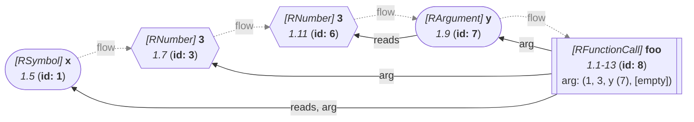
```mermaid
flowchart LR
    1(["`*#91;RSymbol#93;* **x**
      *1.5* (**id: 1**)`"])
    3{{"`*#91;RNumber#93;* **3**
      *1.7* (**id: 3**)`"}}
    6{{"`*#91;RNumber#93;* **3**
      *1.11* (**id: 6**)`"}}
    7(["`*#91;RArgument#93;* **y**
      *1.9* (**id: 7**)`"])
    8[["`*#91;RFunctionCall#93;* **foo**
      *1.1-13* (**id: 8**)
    arg: (1, 3, y (7), #91;empty#93;)`"]]
    1 -.->|"flow"| 3
    linkStyle 0 stroke:gray,color:gray;
    3 -.->|"flow"| 6
    linkStyle 1 stroke:gray,color:gray;
    6 -.->|"flow"| 7
    linkStyle 2 stroke:gray,color:gray;
    7 -->|"reads"| 6
    7 -.->|"flow"| 8
    linkStyle 4 stroke:gray,color:gray;
    8 -->|"reads, arg"| 1
    8 -->|"arg"| 3
    8 -->|"arg"| 7
```

	
<details>

<summary style="color:gray">R Code of the Dataflow Graph</summary>

The analysis ran (including parse and normalize, using the [tree-sitter](https://github.com/flowr-analysis/flowr/wiki/Engines) engine) within the generation environment. No [signature database](https://github.com/flowr-analysis/flowr/wiki/Signature-Database) is mounted for these generated graphs, so `library()` calls attach no package exports; base-R names are still qualified via the generated base-package store (e.g. `acf` as `stats::acf`). The following marks are used in the graph to highlight sub-parts (uses ids): {8}.
We encountered no unknown side effects during the analysis.


```r
foo(x,3,y=3,)
```


</details>


In this case, we have a function call vertex with id `8` and the following arguments:


```json
[
  {
    "nodeId": 1,
    "type": 32
  },
  {
    "nodeId": 3,
    "type": 32
  },
  {
    "nodeId": 7,
    "valueId": 6,
    "name": "y",
    "type": 32
  },
  "<>"
]
```


Of course now, this is hard to read in this form (although the ids of the arguments can be mapped pretty easily to the visualization),
as the `type` of these references is a bit-mask, encoding one of the following reference types:

| Value | Reference Type |
|------:|----------------|
| 1 | Unknown |
| 2 | Function |
| 4 | Variable |
| 8 | Constant |
| 16 | Parameter |
| 32 | Argument |
| 64 | BuiltInConstant |
| 128 | BuiltInFunction |
| 256 | S3MethodPrefix |
| 512 | S7MethodPrefix |
| 1024 | NonFunction |

In other words, we classify the references as Argument, Argument, Argument, and the (special) empty argument type (`<>`).
For more information on the types of references, please consult the implementation.

 * **[ReferenceType](https://github.com/flowr-analysis/flowr/tree/main/src/dataflow/environments/identifier.ts#L595)**   
   Each reference has exactly one reference type, stored as the respective number.
   However, when checking, we may want to allow for one of several types,
   allowing the combination of the respective bitmasks.
   Having reference types is important as R separates a variable definition from
   a function when resolving an
   <code>identifier</code>
   .
   In `c <- 3; print(c(1, 2))` the call to `c` works normally (as the vector constructor),
   while writing `c <- function(...) ..1` overshadows the built-in and causes `print` to only output the first element.
   <details><summary style="color:gray">Defined at <a href="https://github.com/flowr-analysis/flowr/tree/main/src/dataflow/environments/identifier.ts#L595">src/dataflow/environments/identifier.ts#L595</a></summary>
   
   
   ```ts
   /**
    * Each reference has exactly one reference type, stored as the respective number.
    * However, when checking, we may want to allow for one of several types,
    * allowing the combination of the respective bitmasks.
    *
    * Having reference types is important as R separates a variable definition from
    * a function when resolving an {@link Identifier|identifier}.
    * In `c <- 3; print(c(1, 2))` the call to `c` works normally (as the vector constructor),
    * while writing `c <- function(...) ..1` overshadows the built-in and causes `print` to only output the first element.
    * @see {@link isReferenceType} - for checking if a (potentially joint) reference type contains a certain type
    * @see {@link ReferenceTypeReverseMapping} - for debugging
    */
   export enum ReferenceType {
       /** The identifier type is unknown */
       Unknown = 1 << 0,
       /** The identifier is defined by a function (includes built-in function) */
       Function = 1 << 1,
       /** The identifier is defined by a variable (includes parameter and argument) */
       Variable = 1 << 2,
       /** The identifier is defined by a constant (includes built-in constant) */
       Constant = 1 << 3,
       /** The identifier is defined by a parameter (which we know nothing about at the moment) */
       Parameter = 1 << 4,
       /** The identifier is defined by an argument (which we know nothing about at the moment) */
       Argument = 1 << 5,
       /** The identifier is defined by a built-in value/constant */
       BuiltInConstant = 1 << 6,
       /** The identifier is defined by a built-in function */
       BuiltInFunction = 1 << 7,
       /** Prefix to identify S3 methods, use this, to for example dispatch a call to `f` which will then link to `f.*` */
       S3MethodPrefix = 1 << 8,
       /** Prefix to identify S7 methods, use this, to for example dispatch a call to `f` which will then link to `f<7>*` */
       S7MethodPrefix = 1 << 9,
       /**
        * Only ever a lookup target, never the type of a definition: everything a value position may see.
        * `id` in `id > 2` names data, so a function `id` in scope is not what the comparison reads.
        */
       NonFunction = 1 << 10
   }
   ```
   
   
   </details>
   
	

</details>


> [!NOTE]
> 
> But how do you know which definitions are actually called by the function?
> 
> So first of all, some frontends of _flowR_ (like the <span title="Description (Repl Command): Static backwards executable slicer for R">`:slicer`</span> and <span title="Description (Repl Command): Query the given R code (use 'help' for more information)">`:query`</span> with the [Query API](https://github.com/flowr-analysis/flowr/wiki/Query-API)) already provide you with this information.
> In general there are three scenarios you may be interested in:
>   
> 
> <details><summary>1) the function resolves only to builtin definitions (like <code><-</code>)</summary>
> 
> 
> 
> Let's have a look at a simple assignment:
> 
> 
> 
> 
> 
> ```mermaid
> flowchart LR
>     1{{"`*#91;RNumber#93;* **2**
>       *1.6* (**id: 1**)`"}}
>     0["`*#91;RSymbol#93;* **x**
>       *1.1* (**id: 0**, v: 1)`"]
>     2[["`*#91;RBinaryOp#93;* base#58;#58;**#60;#45;**
>       *1.1-6* (**id: 2**)
>     arg: (0, 1)`"]]
>     built-in:_-["`Built-In:
> #60;#45;`"]
>     style built-in:_- stroke:gray,fill:gray,stroke-width:2px,opacity:.8;
>     1 -.->|"flow"| 0
>     linkStyle 0 stroke:gray,color:gray;
>     0 -->|"defined-by, flow"| 2
>     0 -->|"defined-by"| 1
>     2 -->|"reads, arg"| 1
>     2 -->|"returns, arg"| 0
>     2 -.->|"reads, calls"| built-in:_-
>     linkStyle 5 stroke:gray;
> ```
> 
> 	
> <details>
> 
> <summary style="color:gray">R Code of the Dataflow Graph</summary>
> 
> The analysis ran (including parse and normalize, using the [tree-sitter](https://github.com/flowr-analysis/flowr/wiki/Engines) engine) within the generation environment. No [signature database](https://github.com/flowr-analysis/flowr/wiki/Signature-Database) is mounted for these generated graphs, so `library()` calls attach no package exports; base-R names are still qualified via the generated base-package store (e.g. `acf` as `stats::acf`). 
> We encountered no unknown side effects during the analysis.
> 
> 
> ```r
> x <- 2
> ```
> 
> 
> 
> </details>
> 
> 
> 
> In this case, the call does not have a single [`calls`](#calls) edge, which in general means (i.e., if the analysis is done and you are not looking at an intermediate result) it is bound to anything
> global beyond the scope of the given script. _flowR_ generally (theoretically at least) does not know if the call really refers to a built-in variable or function,
> as any code that is not part of the analysis could cause the semantics to change. 
> However, it is (in most cases) safe to assume we call a builtin if there is a builtin function with the given name and if there is no [`calls`](#calls) edge attached to a call.
> If you want to check the resolve targets, refer to <a href="https://github.com/flowr-analysis/flowr/tree/main/src/dataflow/environments/resolve-by-name.ts#L75"><code><span title="Resolves a given identifier name to a list of its possible definition location using R scoping and resolving rules. If the type you want to reference is unknown, please use resolveByNameAnyType instead.">resolveByName</span></code></a>.
> 
> 
> </details>
> 
> 
> <details><summary>2) the function only resolves to definitions that are present in the program</summary>
> 
> 
> 
> Let's have a look at a call to a function named `foo` which is defined in the same script:
> 
> 
> 
> 
> 
> 
> ```mermaid
> flowchart LR
>     3["`*#91;RFunctionDefinition#93;* **function**
>       *1.8-19* (**id: 3**)`"]
> 
> subgraph "flow-3" [function 3]
>     1{{"`*#91;RNumber#93;* **3**
>       *1.19* (**id: 1**)`"}}
>    %% No edges found for 1
>     style 1 stroke:purple,stroke-width:4px; 
> end
>     0["`*#91;RSymbol#93;* **foo**
>       *1.1-3* (**id: 0**, v: 3)`"]
>     4[["`*#91;RBinaryOp#93;* base#58;#58;**#60;#45;**
>       *1.1-19* (**id: 4**)
>     arg: (0, 3)`"]]
>     built-in:_-["`Built-In:
> #60;#45;`"]
>     style built-in:_- stroke:gray,fill:gray,stroke-width:2px,opacity:.8;
>     %% Environment of 6 [level: 0]:
>     %% Built-in
>     %% 1----------------------------------------
>     %%   foo: {**foo** (id: 0, type: Function, def. @4)}
>     6[["`*#91;RFunctionCall#93;* **foo**
>       *2.1-5* (**id: 6**)`"]]
> 3 -.-|function| flow-3
> 
>     3 -.->|"flow"| 0
>     linkStyle 1 stroke:gray,color:gray;
>     0 -->|"defined-by, flow"| 4
>     0 -->|"defined-by"| 3
>     4 -->|"reads, arg"| 3
>     4 -->|"returns, arg"| 0
>     4 -.->|"reads, calls"| built-in:_-
>     linkStyle 6 stroke:gray;
>     4 -.->|"flow"| 6
>     linkStyle 7 stroke:gray,color:gray;
>     6 -->|"reads"| 0
>     linkStyle 8 stroke:teal,stroke-width:4.2px,stroke-opacity:.8
>     6 -->|"returns"| 1
>     linkStyle 9 stroke:teal,stroke-width:4.2px,stroke-opacity:.8
>     6 -->|"calls"| 3
>     linkStyle 10 stroke:teal,stroke-width:4.2px,stroke-opacity:.8
> ```
> 
> 	
> <details>
> 
> <summary style="color:gray">R Code of the Dataflow Graph</summary>
> 
> The analysis ran (including parse and normalize, using the [tree-sitter](https://github.com/flowr-analysis/flowr/wiki/Engines) engine) within the generation environment. No [signature database](https://github.com/flowr-analysis/flowr/wiki/Signature-Database) is mounted for these generated graphs, so `library()` calls attach no package exports; base-R names are still qualified via the generated base-package store (e.g. `acf` as `stats::acf`). The following marks are used in the graph to highlight sub-parts (uses ids): {6, 6->0, 6->1, 6->3}.
> We encountered no unknown side effects during the analysis.
> 
> 
> ```r
> foo <- function() 3
> foo()
> ```
> 
> 
> 
> </details>
> 
> 
> 
> Now, there are several edges, 10 to be precise, although we are primarily interested in the 3
> edges going out from the call vertex `6`.
> The [`reads`](#reads) edge signals all definitions which are read by the `foo` identifier (similar to a [use vertex](#use-vertex)).
> While it seems to be somewhat redundant given the [`calls`](#calls) edge that identifies the called [function definition](#function-definition-vertex),
> you have to consider cases in which aliases are involved in the call resolution (e.g., with higher order functions).
> 
> 
> <details><summary>Example: Alias in Call Resolution</summary>
> 
> In the following example, `g` [`reads`](#reads) the previous definition, but [`calls`](#calls) the function assigned to `f`.
> 
> 
> 
> 
> ```mermaid
> flowchart LR
>     3["`*#91;RFunctionDefinition#93;* **function**
>       *1.6-17* (**id: 3**)`"]
> 
> subgraph "flow-3" [function 3]
>     1{{"`*#91;RNumber#93;* **3**
>       *1.17* (**id: 1**)`"}}
>    %% No edges found for 1
>     style 1 stroke:purple,stroke-width:4px; 
> end
>     0["`*#91;RSymbol#93;* **f**
>       *1.1* (**id: 0**, v: 3)`"]
>     4[["`*#91;RBinaryOp#93;* base#58;#58;**#60;#45;**
>       *1.1-17* (**id: 4**)
>     arg: (0, 3)`"]]
>     built-in:_-["`Built-In:
> #60;#45;`"]
>     style built-in:_- stroke:gray,fill:gray,stroke-width:2px,opacity:.8;
>     6(["`*#91;RSymbol#93;* **f**
>       *2.6* (**id: 6**)`"])
>     5["`*#91;RSymbol#93;* **g**
>       *2.1* (**id: 5**, v: 6)`"]
>     7[["`*#91;RBinaryOp#93;* base#58;#58;**#60;#45;**
>       *2.1-6* (**id: 7**)
>     arg: (5, 6)`"]]
>     %% Environment of 9 [level: 0]:
>     %% Built-in
>     %% 1----------------------------------------
>     %%   f: {**f** (id: 0, type: Function, def. @4)}
>     %%   g: {**g** (id: 5, type: Unknown, def. @7)}
>     9[["`*#91;RFunctionCall#93;* **g**
>       *3.1-3* (**id: 9**)`"]]
>     style 9 stroke:teal,stroke-width:7px,stroke-opacity:.8; 
> 3 -.-|function| flow-3
> 
>     3 -.->|"flow"| 0
>     linkStyle 1 stroke:gray,color:gray;
>     0 -->|"defined-by, flow"| 4
>     0 -->|"defined-by"| 3
>     4 -->|"reads, arg"| 3
>     4 -->|"returns, arg"| 0
>     4 -.->|"reads, calls"| built-in:_-
>     linkStyle 6 stroke:gray;
>     4 -.->|"flow"| 6
>     linkStyle 7 stroke:gray,color:gray;
>     6 -->|"reads"| 0
>     6 -.->|"flow"| 5
>     linkStyle 9 stroke:gray,color:gray;
>     5 -->|"defined-by, flow"| 7
>     5 -->|"defined-by"| 6
>     7 -->|"reads, arg"| 6
>     7 -->|"returns, arg"| 5
>     7 -.->|"reads, calls"| built-in:_-
>     linkStyle 14 stroke:gray;
>     7 -.->|"flow"| 9
>     linkStyle 15 stroke:gray,color:gray;
>     9 -->|"reads"| 5
>     linkStyle 16 stroke:teal,stroke-width:4.2px,stroke-opacity:.8
>     9 -->|"returns"| 1
>     9 -->|"calls"| 3
>     linkStyle 18 stroke:teal,stroke-width:4.2px,stroke-opacity:.8
> ```
> 
> 	
> <details>
> 
> <summary style="color:gray">R Code of the Dataflow Graph</summary>
> 
> The analysis ran (including parse and normalize, using the [tree-sitter](https://github.com/flowr-analysis/flowr/wiki/Engines) engine) within the generation environment. No [signature database](https://github.com/flowr-analysis/flowr/wiki/Signature-Database) is mounted for these generated graphs, so `library()` calls attach no package exports; base-R names are still qualified via the generated base-package store (e.g. `acf` as `stats::acf`). The following marks are used in the graph to highlight sub-parts (uses ids): {9, 9->5, 9->3}.
> We encountered no unknown side effects during the analysis.
> 
> 
> ```r
> f <- function() 3
> g <- f
> g()
> ```
> 
> 
> 
> </details>
> 
> 
> 
> </details>
> 			
> Lastly, the [`returns`](#returns) edge links the call to the return vertices(s) of the function.
> Please be aware, that these multiple exit points may be counter intuitive as they often appear with a nested call (usually a call to the built-in `{` function).
> 
>  
> <details><summary>(Advanced) Example: Multiple Exit Points May Still Reflect As One</summary>
> 
> 
> 
> 
> 
> ```mermaid
> flowchart LR
>     19["`*#91;RFunctionDefinition#93;* **function**
>       *1.6-5.1* (**id: 19**)`"]
> 
> subgraph "flow-19" [function 19]
>     3(["`*#91;RSymbol#93;* **u**
>       *2.5* (**id: 3**)`"])
>     5{{"`*#91;RNumber#93;* **3**
>       *2.15* (**id: 5**)`"}}
>     7[["`*#91;RFunctionCall#93;* base#58;#58;**return**
>       *2.8-16* (**id: 7**, 9+)
>     arg: (5)`"]]
>     built-in:return["`Built-In:
> return`"]
>     style built-in:return stroke:gray,fill:gray,stroke-width:2px,opacity:.8;
>     9[["`*#91;RIfThenElse#93;* base#58;#58;**if**
>       *2.2-16* (**id: 9**)
>     arg: (3, 7, #91;empty#93;)`"]]
>     built-in:if["`Built-In:
> if`"]
>     style built-in:if stroke:gray,fill:gray,stroke-width:2px,opacity:.8;
>     10(["`*#91;RSymbol#93;* **v**
>       *3.5* (**id: 10**, 9-)`"])
>     12{{"`*#91;RNumber#93;* **2**
>       *3.15* (**id: 12**)`"}}
>     14[["`*#91;RFunctionCall#93;* base#58;#58;**return**
>       *3.8-16* (**id: 14**, 16+, 9-)
>     arg: (12)`"]]
>     16[["`*#91;RIfThenElse#93;* base#58;#58;**if**
>       *3.2-16* (**id: 16**, 9-)
>     arg: (10, 14, #91;empty#93;)`"]]
>     17{{"`*#91;RNumber#93;* **1**
>       *4.2* (**id: 17**, 9-, 16-)`"}}
>     18[["`*#91;RExpressionList#93;* base#58;#58;**#123;**
>       *1.17* (**id: 18**)
>     arg: (9, 16, 17)`"]]
>     built-in:_["`Built-In:
> #123;`"]
>     style built-in:_ stroke:gray,fill:gray,stroke-width:2px,opacity:.8;
>     style 3 stroke:purple,stroke-width:4px; 
>     style 10 stroke:purple,stroke-width:4px; 
>     style 17 stroke:purple,stroke-width:4px; 
> end
>     0["`*#91;RSymbol#93;* **f**
>       *1.1* (**id: 0**, v: 19)`"]
>     20[["`*#91;RBinaryOp#93;* base#58;#58;**#60;#45;**
>       *1.1-5.1* (**id: 20**)
>     arg: (0, 19)`"]]
>     built-in:_-["`Built-In:
> #60;#45;`"]
>     style built-in:_- stroke:gray,fill:gray,stroke-width:2px,opacity:.8;
>     %% Environment of 22 [level: 0]:
>     %% Built-in
>     %% 1----------------------------------------
>     %%   f: {**f** (id: 0, type: Function, def. @20)}
>     22[["`*#91;RFunctionCall#93;* **f**
>       *6.1-3* (**id: 22**)`"]]
>     3 -.->|"branch (when: true)"| 5
>     linkStyle 0 stroke:gray,color:gray;
>     3 -.->|"branch (when: false)"| 9
>     linkStyle 1 stroke:gray,color:gray;
>     5 -.->|"flow"| 7
>     linkStyle 2 stroke:gray,color:gray;
>     7 -->|"returns, arg"| 5
>     7 -.->|"reads, calls"| built-in:return
>     linkStyle 4 stroke:gray;
>     9 -->|"returns, arg"| 7
>     9 -->|"reads, arg"| 3
>     9 -.->|"reads, calls"| built-in:if
>     linkStyle 7 stroke:gray;
>     9 -.->|"flow"| 10
>     linkStyle 8 stroke:gray,color:gray;
>     10 -.->|"branch (when: true)"| 12
>     linkStyle 9 stroke:gray,color:gray;
>     10 -.->|"branch (when: false)"| 16
>     linkStyle 10 stroke:gray,color:gray;
>     12 -.->|"flow"| 14
>     linkStyle 11 stroke:gray,color:gray;
>     14 -->|"returns, arg"| 12
>     14 -.->|"reads, calls"| built-in:return
>     linkStyle 13 stroke:gray;
>     16 -->|"returns, arg"| 14
>     16 -->|"reads, arg"| 10
>     16 -.->|"reads, calls"| built-in:if
>     linkStyle 16 stroke:gray;
>     16 -.->|"flow"| 17
>     linkStyle 17 stroke:gray,color:gray;
>     17 -.->|"flow"| 18
>     linkStyle 18 stroke:gray,color:gray;
>     18 -->|"arg"| 9
>     18 -->|"arg"| 16
>     18 -->|"returns, arg"| 17
>     18 -.->|"reads, calls"| built-in:_
>     linkStyle 22 stroke:gray;
>     18 -->|"returns"| 7
>     18 -->|"returns"| 14
> 19 -.-|function| flow-19
> 
>     19 -.->|"flow"| 0
>     linkStyle 26 stroke:gray,color:gray;
>     0 -->|"defined-by, flow"| 20
>     0 -->|"defined-by"| 19
>     20 -->|"reads, arg"| 19
>     20 -->|"returns, arg"| 0
>     20 -.->|"reads, calls"| built-in:_-
>     linkStyle 31 stroke:gray;
>     20 -.->|"flow"| 22
>     linkStyle 32 stroke:gray,color:gray;
>     22 -->|"reads"| 0
>     22 -->|"returns"| 7
>     22 -->|"returns"| 14
>     22 -->|"returns"| 17
>     22 -->|"calls"| 19
> ```
> 
> 	
> <details>
> 
> <summary style="color:gray">R Code of the Dataflow Graph</summary>
> 
> The analysis ran (including parse and normalize, using the [tree-sitter](https://github.com/flowr-analysis/flowr/wiki/Engines) engine) within the generation environment. No [signature database](https://github.com/flowr-analysis/flowr/wiki/Signature-Database) is mounted for these generated graphs, so `library()` calls attach no package exports; base-R names are still qualified via the generated base-package store (e.g. `acf` as `stats::acf`). The following marks are used in the graph to highlight sub-parts (uses ids): {22, 22->18}.
> We encountered no unknown side effects during the analysis.
> 
> 
> ```r
> f <- function() {
> 	if(u) return(3)
> 	if(v) return(2)
> 	1
> }
> f()
> ```
> 
> 
> 
> </details>
> 
> 
> In this case the call of `f` still only has one [`returns`](#returns) edge, although the function _looks_ as if it would have multiple exit points!
> But you have to beware that `{` is a function call as well (see below) and it may be redefined, or at least affect the actual returns of the function.
> In this scenario we show two types of such returns (or exit points): _explicit_ returns with the `return` function and _implicit_ returns (the result of the last evaluated expression).
> However, they are actually linked with the call of the built-in function `{` (and, in fact, they are highlighted in the mermaid graph).
> 
> 
> </details>
> 		
> 
>  
> 
> 
> 
> </details>
> 
> 
> 
> <details><summary>3) the function resolves to a mix of both</summary>
> 
> 
> 
> Users may write… interesting pieces of code - for reasons we should not be interested in!
> Consider a case in which you have a built-in function (like the assignment operator `<-`) and a user that wants to redefine the meaning of the function call _sometimes_:
> 
> 
> 
> 
> 
> ```r
> x <- 2
> if(u) `<-` <- `*`
> x <- 3
> ```
> 
> <details>
> 
> <summary style="color:gray">Dataflow Graph of the R Code</summary>
> 
> The analysis ran (including parse and normalize, using the [tree-sitter](https://github.com/flowr-analysis/flowr/wiki/Engines) engine) within the generation environment. No [signature database](https://github.com/flowr-analysis/flowr/wiki/Signature-Database) is mounted for these generated graphs, so `library()` calls attach no package exports; base-R names are still qualified via the generated base-package store (e.g. `acf` as `stats::acf`). The following marks are used in the graph to highlight sub-parts (uses ids): {9, 9->0, 9->10}.
> We encountered no unknown side effects during the analysis.
> 
> 
> 
> ```mermaid
> flowchart LR
>     1{{"`*#91;RNumber#93;* **2**
>       *1.6* (**id: 1**)`"}}
>     0["`*#91;RSymbol#93;* **x**
>       *1.1* (**id: 0**, v: 1)`"]
>     2[["`*#91;RBinaryOp#93;* base#58;#58;**#60;#45;**
>       *1.1-6* (**id: 2**)
>     arg: (0, 1)`"]]
>     built-in:_-["`Built-In:
> #60;#45;`"]
>     style built-in:_- stroke:gray,fill:gray,stroke-width:2px,opacity:.8;
>     3(["`*#91;RSymbol#93;* **u**
>       *2.4* (**id: 3**)`"])
>     5(["`*#91;RSymbol#93;* **#96;#42;#96;**
>       *2.15-17* (**id: 5**, 8+)`"])
>     built-in:_["`Built-In:
> #42;`"]
>     style built-in:_ stroke:gray,fill:gray,stroke-width:2px,opacity:.8;
>     4["`*#91;RSymbol#93;* **#96;#60;#45;#96;**
>       *2.7-10* (**id: 4**, 8+, v: 5)`"]
>     6[["`*#91;RBinaryOp#93;* base#58;#58;**#60;#45;**
>       *2.7-17* (**id: 6**, 8+)
>     arg: (4, 5)`"]]
>     8[["`*#91;RIfThenElse#93;* base#58;#58;**if**
>       *2.1-17* (**id: 8**)
>     arg: (3, 6, #91;empty#93;)`"]]
>     built-in:if["`Built-In:
> if`"]
>     style built-in:if stroke:gray,fill:gray,stroke-width:2px,opacity:.8;
>     10{{"`*#91;RNumber#93;* **3**
>       *3.6* (**id: 10**)`"}}
>     9["`*#91;RSymbol#93;* **x**
>       *3.1* (**id: 9**, v: 10)`"]
>     %% Environment of 11 [level: 0]:
>     %% Built-in
>     %% 1----------------------------------------
>     %%   x:  {**x** (id: 0, type: Variable, def. @2)}
>     %%   <-: {**<-** (id: 4, type: Unknown, cds: {8+}, def. @6)}
>     11[["`*#91;RBinaryOp#93;* **#60;#45;**
>       *3.1-6* (**id: 11**)
>     arg: (9, 10)`"]]
>     1 -.->|"flow"| 0
>     linkStyle 0 stroke:gray,color:gray;
>     0 -->|"defined-by, flow"| 2
>     0 -->|"defined-by"| 1
>     2 -->|"reads, arg"| 1
>     2 -->|"returns, arg"| 0
>     2 -.->|"reads, calls"| built-in:_-
>     linkStyle 5 stroke:gray;
>     2 -.->|"flow"| 3
>     linkStyle 6 stroke:gray,color:gray;
>     3 -.->|"branch (when: true)"| 5
>     linkStyle 7 stroke:gray,color:gray;
>     3 -.->|"branch (when: false)"| 8
>     linkStyle 8 stroke:gray,color:gray;
>     5 -.->|"flow"| 4
>     linkStyle 9 stroke:gray,color:gray;
>     5 -.->|"reads"| built-in:_
>     linkStyle 10 stroke:gray;
>     4 -->|"defined-by, flow"| 6
>     4 -->|"defined-by"| 5
>     6 -->|"reads, arg"| 5
>     6 -->|"returns, arg"| 4
>     6 -.->|"reads, calls"| built-in:_-
>     linkStyle 15 stroke:gray;
>     6 -.->|"flow"| 8
>     linkStyle 16 stroke:gray,color:gray;
>     8 -->|"returns, arg"| 6
>     8 -->|"reads, arg"| 3
>     8 -.->|"reads, calls"| built-in:if
>     linkStyle 19 stroke:gray;
>     8 -.->|"flow"| 9
>     linkStyle 20 stroke:gray,color:gray;
>     10 -.->|"flow"| 9
>     linkStyle 21 stroke:gray,color:gray;
>     10 -.->|"flow"| 11
>     linkStyle 22 stroke:gray,color:gray;
>     9 -->|"defined-by, flow"| 11
>     9 -->|"defined-by, flow"| 10
>     linkStyle 24 stroke:teal,stroke-width:4.2px,stroke-opacity:.8
>     9 -->|"reads"| 0
>     linkStyle 25 stroke:teal,stroke-width:4.2px,stroke-opacity:.8
>     11 -->|"reads, arg"| 10
>     11 -->|"returns, arg"| 9
>     11 -->|"reads"| 4
>     11 -.->|"reads, calls"| built-in:_-
>     linkStyle 29 stroke:gray;
>     11 -.->|"calls"| built-in:_
>     linkStyle 30 stroke:gray;
> ```
> 
> 	
> 
> 
> </details>
> 
> 
> 
> Interesting program, right? Running this with `u <- TRUE` will cause the last line to evaluate to `6` because we redefined the assignment
> operator to mean multiplication, while with `u <- FALSE` causes `x` to be assigned to `3`.
> In short: the last line may either refer to a definition or to a use of `x`, and we are not fully equipped to visualize this (this causes a warning).
> First of all how can you spot that something weird is happening? Well, this definition has a [`reads`](#reads) and a [`defined-by`](#defined-by) edge,
> but this of course does not apply to the general case.
> 
> For starters, let's have a look at the environment of the call to `<-` in the last line:
> 
> | Name | Definitions |
> |------|-------------|
> | `x` | {**x** (id: 0, type: Variable, def. @2)} |
> | `<-` | {**<-** (id: 4, type: Unknown, cds: {8+}, def. @6)} |
> 
> <details><summary style="color:gray"> Parent Environment</summary>
> 
> _Built-in Environment (652 entries)_
> 
> </details>
> 
> Great, you should see a definition of `<-` which is constraint by the [control dependency](#branches) to the `if`.
> Hence, trying to re-resolve the call using <a href="https://github.com/flowr-analysis/flowr/tree/main/src/dataflow/internal/linker.ts#L308"><code><span title="convenience function returning all known call targets, as well as the name source which defines them">getAllFunctionCallTargets</span></code></a> (defined in [`./src/dataflow/internal/linker.ts`](https://github.com/flowr-analysis/flowr/tree/main/src/dataflow/internal/linker.ts)) with the id `11` of the call as starting point will present you with
> the following target ids: { `built-in:*`, `built-in:<-`, `4` }.
> This way we know that the call may refer to the built-in assignment operator or to the multiplication.
> Similarly, trying to resolve the name with <a href="https://github.com/flowr-analysis/flowr/tree/main/src/dataflow/environments/resolve-by-name.ts#L75"><code><span title="Resolves a given identifier name to a list of its possible definition location using R scoping and resolving rules. If the type you want to reference is unknown, please use resolveByNameAnyType instead.">resolveByName</span></code></a>` using the environment attached to the call vertex (filtering for any reference type) returns (in a similar fashion): 
> { `4`, `built-in:<-` } (however, the latter will not trace aliases).
> 
> 	
> 
> 
> 
> </details>
> 
> 
> Similar to finding the definitions read by a variable use, please use the <a href="https://github.com/flowr-analysis/flowr/tree/main/src/dataflow/internal/linker.ts#L308"><code><span title="convenience function returning all known call targets, as well as the name source which defines them">getAllFunctionCallTargets</span></code></a> function to find all possible definitions of a function call,
> as explained in the [working with the dataflow graph](https://github.com/flowr-analysis/flowr/wiki/Dataflow-Graph#dfg-working) section.


Function calls are the most complicated mechanism in R as essentially everything is a function call.
Even **control structures** like `if(p) a else b` are desugared into function calls (e.g., as `` `if`(p, a, b) ``).

<details><summary>Example: <code>if</code> as a Function Call</summary>


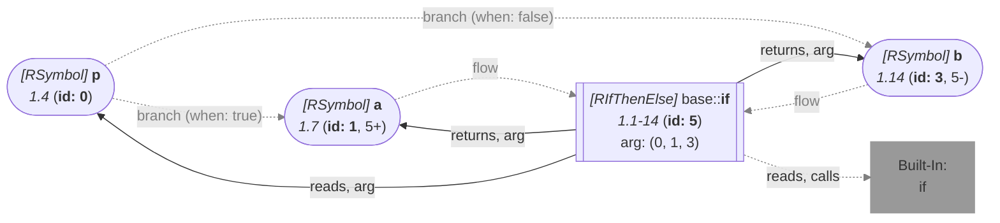
```mermaid
flowchart LR
    0(["`*#91;RSymbol#93;* **p**
      *1.4* (**id: 0**)`"])
    1(["`*#91;RSymbol#93;* **a**
      *1.7* (**id: 1**, 5+)`"])
    3(["`*#91;RSymbol#93;* **b**
      *1.14* (**id: 3**, 5-)`"])
    5[["`*#91;RIfThenElse#93;* base#58;#58;**if**
      *1.1-14* (**id: 5**)
    arg: (0, 1, 3)`"]]
    built-in:if["`Built-In:
if`"]
    style built-in:if stroke:gray,fill:gray,stroke-width:2px,opacity:.8;
    0 -.->|"branch (when: true)"| 1
    linkStyle 0 stroke:gray,color:gray;
    0 -.->|"branch (when: false)"| 3
    linkStyle 1 stroke:gray,color:gray;
    1 -.->|"flow"| 5
    linkStyle 2 stroke:gray,color:gray;
    3 -.->|"flow"| 5
    linkStyle 3 stroke:gray,color:gray;
    5 -->|"returns, arg"| 1
    5 -->|"returns, arg"| 3
    5 -->|"reads, arg"| 0
    5 -.->|"reads, calls"| built-in:if
    linkStyle 7 stroke:gray;
```

	
<details>

<summary style="color:gray">R Code of the Dataflow Graph</summary>

The analysis ran (including parse and normalize, using the [tree-sitter](https://github.com/flowr-analysis/flowr/wiki/Engines) engine) within the generation environment. No [signature database](https://github.com/flowr-analysis/flowr/wiki/Signature-Database) is mounted for these generated graphs, so `library()` calls attach no package exports; base-R names are still qualified via the generated base-package store (e.g. `acf` as `stats::acf`). 
We encountered no unknown side effects during the analysis.


```r
if(p) a else b
```


</details>


</details>

Similarly, you should be aware of calls to **anonymous functions**, which may appear given directly (e.g. as `(function() 1)()`) or indirectly, with code
directly calling the return of another function call: `foo()()`.

<details><summary>Example: Anonymous Function Call (given directly)</summary>


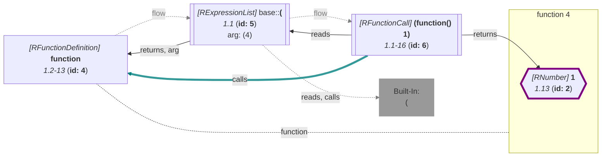
```mermaid
flowchart LR
    4["`*#91;RFunctionDefinition#93;* **function**
      *1.2-13* (**id: 4**)`"]

subgraph "flow-4" [function 4]
    2{{"`*#91;RNumber#93;* **1**
      *1.13* (**id: 2**)`"}}
   %% No edges found for 2
    style 2 stroke:purple,stroke-width:4px; 
end
    5[["`*#91;RExpressionList#93;* base#58;#58;**(**
      *1.1* (**id: 5**)
    arg: (4)`"]]
    built-in:_["`Built-In:
(`"]
    style built-in:_ stroke:gray,fill:gray,stroke-width:2px,opacity:.8;
    6[["`*#91;RFunctionCall#93;* **(function() 1)**
      *1.1-16* (**id: 6**)`"]]
4 -.-|function| flow-4

    4 -.->|"flow"| 5
    linkStyle 1 stroke:gray,color:gray;
    5 -->|"returns, arg"| 4
    5 -.->|"flow"| 6
    linkStyle 3 stroke:gray,color:gray;
    5 -.->|"reads, calls"| built-in:_
    linkStyle 4 stroke:gray;
    6 -->|"reads"| 5
    6 -->|"returns"| 2
    6 -->|"calls"| 4
    linkStyle 7 stroke:teal,stroke-width:4.2px,stroke-opacity:.8
```

	
<details>

<summary style="color:gray">R Code of the Dataflow Graph</summary>

The analysis ran (including parse and normalize, using the [tree-sitter](https://github.com/flowr-analysis/flowr/wiki/Engines) engine) within the generation environment. No [signature database](https://github.com/flowr-analysis/flowr/wiki/Signature-Database) is mounted for these generated graphs, so `library()` calls attach no package exports; base-R names are still qualified via the generated base-package store (e.g. `acf` as `stats::acf`). The following marks are used in the graph to highlight sub-parts (uses ids): {6, 6->4}.
We encountered no unknown side effects during the analysis.


```r
(function() 1)()
```


</details>


</details>


<details><summary>Example: Anonymous Function Call (given indirectly)</summary>


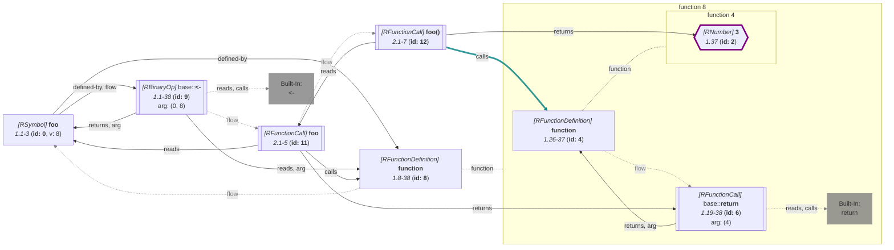
```mermaid
flowchart LR
    8["`*#91;RFunctionDefinition#93;* **function**
      *1.8-38* (**id: 8**)`"]

subgraph "flow-8" [function 8]
    %% Environment of 4 [level: 1]:
    %% Built-in
    %% 1----------------------------------------
    %% 2----------------------------------------
    4["`*#91;RFunctionDefinition#93;* **function**
      *1.26-37* (**id: 4**)`"]

subgraph "flow-4" [function 4]
    2{{"`*#91;RNumber#93;* **3**
      *1.37* (**id: 2**)`"}}
   %% No edges found for 2
    style 2 stroke:purple,stroke-width:4px; 
end
    6[["`*#91;RFunctionCall#93;* base#58;#58;**return**
      *1.19-38* (**id: 6**)
    arg: (4)`"]]
    built-in:return["`Built-In:
return`"]
    style built-in:return stroke:gray,fill:gray,stroke-width:2px,opacity:.8;
end
    0["`*#91;RSymbol#93;* **foo**
      *1.1-3* (**id: 0**, v: 8)`"]
    9[["`*#91;RBinaryOp#93;* base#58;#58;**#60;#45;**
      *1.1-38* (**id: 9**)
    arg: (0, 8)`"]]
    built-in:_-["`Built-In:
#60;#45;`"]
    style built-in:_- stroke:gray,fill:gray,stroke-width:2px,opacity:.8;
    %% Environment of 11 [level: 0]:
    %% Built-in
    %% 1----------------------------------------
    %%   foo: {**foo** (id: 0, type: Function, def. @9)}
    11[["`*#91;RFunctionCall#93;* **foo**
      *2.1-5* (**id: 11**)`"]]
    %% Environment of 12 [level: 0]:
    %% Built-in
    %% 1----------------------------------------
    %%   foo: {**foo** (id: 0, type: Function, def. @9)}
    12[["`*#91;RFunctionCall#93;* **foo()**
      *2.1-7* (**id: 12**)`"]]
4 -.-|function| flow-4

    4 -.->|"flow"| 6
    linkStyle 1 stroke:gray,color:gray;
    6 -->|"returns, arg"| 4
    6 -.->|"reads, calls"| built-in:return
    linkStyle 3 stroke:gray;
8 -.-|function| flow-8

    8 -.->|"flow"| 0
    linkStyle 5 stroke:gray,color:gray;
    0 -->|"defined-by, flow"| 9
    0 -->|"defined-by"| 8
    9 -->|"reads, arg"| 8
    9 -->|"returns, arg"| 0
    9 -.->|"reads, calls"| built-in:_-
    linkStyle 10 stroke:gray;
    9 -.->|"flow"| 11
    linkStyle 11 stroke:gray,color:gray;
    11 -.->|"flow"| 12
    linkStyle 12 stroke:gray,color:gray;
    11 -->|"reads"| 0
    11 -->|"returns"| 6
    11 -->|"calls"| 8
    12 -->|"reads"| 11
    12 -->|"returns"| 2
    12 -->|"calls"| 4
    linkStyle 18 stroke:teal,stroke-width:4.2px,stroke-opacity:.8
```

	
<details>

<summary style="color:gray">R Code of the Dataflow Graph</summary>

The analysis ran (including parse and normalize, using the [tree-sitter](https://github.com/flowr-analysis/flowr/wiki/Engines) engine) within the generation environment. No [signature database](https://github.com/flowr-analysis/flowr/wiki/Signature-Database) is mounted for these generated graphs, so `library()` calls attach no package exports; base-R names are still qualified via the generated base-package store (e.g. `acf` as `stats::acf`). The following marks are used in the graph to highlight sub-parts (uses ids): {12, 12->4}.
We encountered no unknown side effects during the analysis.


```r
foo <- function() return(function() 3)
foo()()
```


</details>


</details>


> [!NOTE]
> Now you might be asking yourself how to differentiate anonymous and named functions and what you have to keep in mind when working with them?
> 
> Unnamed functions have an array of signatures which you can use to identify them. 
> But in short: the `origin` attribute of the <a href="https://github.com/flowr-analysis/flowr/tree/main/src/dataflow/graph/vertex.ts#L96"><code><span title="Arguments required to construct a vertex which represents the call to a function in the dataflow graph . This describes all kinds of function calls, including calls to built-ins and control-flow structures such as if or for (they are treated as function calls in R).">DataflowGraphVertexFunctionCall</span></code></a> is `unnamed`.
> Please be aware that unnamed functions still have a `name` property to give it a unique identifier that can be used for debugging and reference.
> This name _always_ starts with `unnamed-fc-`.
> 
> To identify these calls please do not rely on the [normalized AST](https://github.com/flowr-analysis/flowr/wiki/Normalized-AST). An expression like `1 + 1` will be correctly
> identified as a syntactical binary operation. Yet, from a dataflow/semantic perspective this is equivalent to `` `+`(1, 1) `` (which is a named function call and marked as such in the dataflow graph).
> To know which function is called, please rely on the [`calls`](#calls) edge.
> 	


Another interesting case is a function with **side effects**, most prominently with the super-assignment `<<-`.
In this case, you may encounter the [`side-effect-on-call`](#side-effect-on-call) as exemplified below.

<details><summary>Example: Function Call with a Side-Effect</summary>


```mermaid
flowchart LR
    %% Environment of 5 [level: 0]:
    %% Built-in
    %% 1----------------------------------------
    %%   x: {**x** (id: 1, type: Variable, def. @3)}
    5["`*#91;RFunctionDefinition#93;* **function**
      *1.6-23* (**id: 5**)`"]

subgraph "flow-5" [function 5]
    2{{"`*#91;RNumber#93;* **3**
      *1.23* (**id: 2**)`"}}
    1["`*#91;RSymbol#93;* **x**
      *1.17* (**id: 1**, v: 2)`"]
    3[["`*#91;RBinaryOp#93;* base#58;#58;**#60;#60;#45;**
      *1.17-23* (**id: 3**)
    arg: (1, 2)`"]]
    built-in:__-["`Built-In:
#60;#60;#45;`"]
    style built-in:__- stroke:gray,fill:gray,stroke-width:2px,opacity:.8;
end
    0["`*#91;RSymbol#93;* **f**
      *1.1* (**id: 0**, v: 5)`"]
    6[["`*#91;RBinaryOp#93;* base#58;#58;**#60;#45;**
      *1.1-23* (**id: 6**)
    arg: (0, 5)`"]]
    built-in:_-["`Built-In:
#60;#45;`"]
    style built-in:_- stroke:gray,fill:gray,stroke-width:2px,opacity:.8;
    %% Environment of 8 [level: 0]:
    %% Built-in
    %% 1----------------------------------------
    %%   f: {**f** (id: 0, type: Function, def. @6)}
    8[["`*#91;RFunctionCall#93;* **f**
      *2.2-4* (**id: 8**)`"]]
    2 -.->|"flow"| 1
    linkStyle 0 stroke:gray,color:gray;
    1 -->|"defined-by, flow"| 3
    1 -->|"defined-by"| 2
    1 -->|"side-effect-on-call"| 8
    linkStyle 3 stroke:teal,stroke-width:4.2px,stroke-opacity:.8
    3 -->|"reads, arg"| 2
    3 -->|"returns, arg"| 1
    3 -.->|"reads, calls"| built-in:__-
    linkStyle 6 stroke:gray;
5 -.-|function| flow-5

    5 -.->|"flow"| 0
    linkStyle 8 stroke:gray,color:gray;
    0 -->|"defined-by, flow"| 6
    0 -->|"defined-by"| 5
    6 -->|"reads, arg"| 5
    6 -->|"returns, arg"| 0
    6 -.->|"reads, calls"| built-in:_-
    linkStyle 13 stroke:gray;
    6 -.->|"flow"| 8
    linkStyle 14 stroke:gray,color:gray;
    8 -->|"reads"| 0
    8 -->|"returns"| 3
    8 -->|"calls"| 5
```

	
<details>

<summary style="color:gray">R Code of the Dataflow Graph</summary>

The analysis ran (including parse and normalize, using the [tree-sitter](https://github.com/flowr-analysis/flowr/wiki/Engines) engine) within the generation environment. No [signature database](https://github.com/flowr-analysis/flowr/wiki/Signature-Database) is mounted for these generated graphs, so `library()` calls attach no package exports; base-R names are still qualified via the generated base-package store (e.g. `acf` as `stats::acf`). The following marks are used in the graph to highlight sub-parts (uses ids): {8, 1->8}.
We encountered no unknown side effects during the analysis.


```r
f <- function() x <<- 3
 f()
```


</details>


</details>
 


	

<a id='variable-definition-vertex'> </a>
<a id='vdef-vertex'> </a>
### 4) Variable Definition Vertex

Type: `vdef` (this is the bit-flag value, e.g., when looking at the serialization)


```mermaid
flowchart LR
    1{{"`*#91;RNumber#93;* **1**
      *1.6* (**id: 1**)`"}}
    0["`*#91;RSymbol#93;* **x**
      *1.1* (**id: 0**, v: 1)`"]
    2[["`*#91;RBinaryOp#93;* base#58;#58;**#60;#45;**
      *1.1-6* (**id: 2**)
    arg: (0, 1)`"]]
    built-in:_-["`Built-In:
#60;#45;`"]
    style built-in:_- stroke:gray,fill:gray,stroke-width:2px,opacity:.8;
    1 -.->|"flow"| 0
    linkStyle 0 stroke:gray,color:gray;
    0 -->|"defined-by, flow"| 2
    0 -->|"defined-by"| 1
    2 -->|"reads, arg"| 1
    2 -->|"returns, arg"| 0
    2 -.->|"reads, calls"| built-in:_-
    linkStyle 5 stroke:gray;
```

	
<details>

<summary style="color:gray">R Code of the Dataflow Graph</summary>

The analysis ran (including parse and normalize, using the [tree-sitter](https://github.com/flowr-analysis/flowr/wiki/Engines) engine) within the generation environment. No [signature database](https://github.com/flowr-analysis/flowr/wiki/Signature-Database) is mounted for these generated graphs, so `library()` calls attach no package exports; base-R names are still qualified via the generated base-package store (e.g. `acf` as `stats::acf`). The following marks are used in the graph to highlight sub-parts (uses ids): {0}.
We encountered no unknown side effects during the analysis.


```r
x <- 1
```


</details>


Defined variables most commonly occur in the context of an assignment, for example, with the `<-` operator as shown above.


<details><summary>Example: Super Definition (<code><<-</code>)</summary>


```mermaid
flowchart LR
    1{{"`*#91;RNumber#93;* **1**
      *1.7* (**id: 1**)`"}}
    0["`*#91;RSymbol#93;* **x**
      *1.1* (**id: 0**, v: 1)`"]
    2[["`*#91;RBinaryOp#93;* base#58;#58;**#60;#60;#45;**
      *1.1-7* (**id: 2**)
    arg: (0, 1)`"]]
    built-in:__-["`Built-In:
#60;#60;#45;`"]
    style built-in:__- stroke:gray,fill:gray,stroke-width:2px,opacity:.8;
    1 -.->|"flow"| 0
    linkStyle 0 stroke:gray,color:gray;
    0 -->|"defined-by, flow"| 2
    0 -->|"defined-by"| 1
    2 -->|"reads, arg"| 1
    2 -->|"returns, arg"| 0
    2 -.->|"reads, calls"| built-in:__-
    linkStyle 5 stroke:gray;
```

	
<details>

<summary style="color:gray">R Code of the Dataflow Graph</summary>

The analysis ran (including parse and normalize, using the [tree-sitter](https://github.com/flowr-analysis/flowr/wiki/Engines) engine) within the generation environment. No [signature database](https://github.com/flowr-analysis/flowr/wiki/Signature-Database) is mounted for these generated graphs, so `library()` calls attach no package exports; base-R names are still qualified via the generated base-package store (e.g. `acf` as `stats::acf`). The following marks are used in the graph to highlight sub-parts (uses ids): {0}.
We encountered no unknown side effects during the analysis.


```r
x <<- 1
```


</details>


</details>

The implementation is relatively sparse and similar to the other marker vertices:

 * **[DataflowGraphVertexVariableDefinition](https://github.com/flowr-analysis/flowr/tree/main/src/dataflow/graph/vertex.ts#L139)**   
   Arguments required to construct a vertex which represents the definition of a variable in the
   <code>dataflow graph</code>
   .
   <details><summary style="color:gray">Defined at <a href="https://github.com/flowr-analysis/flowr/tree/main/src/dataflow/graph/vertex.ts#L139">src/dataflow/graph/vertex.ts#L139</a></summary>
   
   
   ```ts
   /**
    * Arguments required to construct a vertex which represents the definition of a variable in the {@link DataflowGraph|dataflow graph}.
    * @see {@link VariableDefinitionVertex.is} - to check if a vertex is a variable definition vertex
    */
   export interface DataflowGraphVertexVariableDefinition extends DataflowGraphVertexBase {
       readonly tag:          VertexType.VariableDefinition
       /** Does not require an environment, those are attached to the call */
       readonly environment?: undefined
       /** Indicates whether the variable definition is a *partial* definition (e.g,. in `x[a] <- b`) */
       readonly par?:         true;
       /** Points to the source ids of the "value" if there is one, this is more of a best-effort flag and not guaranteed to be there */
       readonly source?:      readonly NodeId[];
   }
   ```
   
   
   </details>
   
    <details><summary>View more (DataflowGraphVertexBase)</summary>

   * **[DataflowGraphVertexBase](https://github.com/flowr-analysis/flowr/tree/main/src/dataflow/graph/vertex.ts#L28)**   
     Arguments required to construct a vertex in the
     <code>dataflow graph</code>
     .
     <details><summary style="color:gray">Defined at <a href="https://github.com/flowr-analysis/flowr/tree/main/src/dataflow/graph/vertex.ts#L28">src/dataflow/graph/vertex.ts#L28</a></summary>
     
     
     ```ts
     /**
      * Arguments required to construct a vertex in the {@link DataflowGraph|dataflow graph}.
      * @see DataflowGraphVertexUse
      * @see DataflowGraphVertexVariableDefinition
      * @see DataflowGraphVertexFunctionDefinition
      */
     interface DataflowGraphVertexBase extends MergeableRecord {
         /**
          * Used to identify and separate different types of vertices.
          */
         readonly tag: VertexType
         /**
          * The id of the node (the id assigned by the {@link ParentInformation} decoration).
          * This unanimously identifies the vertex in the {@link DataflowGraph|dataflow graph}
          * as well as the corresponding {@link NormalizedAst|normalized AST}.
          */
         id:           NodeId
         /**
          * The environment in which the vertex is set.
          */
         environment?: REnvironmentInformation
         /**
          * @see {@link ControlDependency} - the collection of control dependencies which have an influence on whether the vertex is executed.
          */
         cds:          ControlDependency[] | undefined
         /**
          * Describes the collection of AST vertices that contributed to this vertex.
          * For example, this is useful with replacement operators, telling you which assignment operator caused them
          */
         link?:        DataflowGraphVertexAstLink
     }
     ```
     
     
     </details>
     

    </details>
Of only interest is `par`, which signals that the definitions is partial (e.g., in the case of `x[a] <- 1`).

Of course, there are not just operators that define variables, but also functions, like `assign`.


<details><summary>Example: Using <code>assign</code></summary>


```mermaid
flowchart LR
    3{{"`*#91;RNumber#93;* **1**
      *1.13* (**id: 3**)`"}}
    1["`*#91;RString#93;* **#34;x#34;**
      *1.8-10* (**id: 1**, v: 3)`"]
    5[["`*#91;RFunctionCall#93;* base#58;#58;**assign**
      *1.1-14* (**id: 5**)
    arg: (1, 3)`"]]
    built-in:assign["`Built-In:
assign`"]
    style built-in:assign stroke:gray,fill:gray,stroke-width:2px,opacity:.8;
    6(["`*#91;RSymbol#93;* **x**
      *2.1* (**id: 6**)`"])
    3 -.->|"flow"| 1
    linkStyle 0 stroke:gray,color:gray;
    1 -->|"defined-by, flow"| 5
    1 -->|"defined-by"| 3
    5 -->|"reads, arg"| 3
    5 -->|"returns, arg"| 1
    5 -.->|"reads, calls"| built-in:assign
    linkStyle 5 stroke:gray;
    5 -.->|"flow"| 6
    linkStyle 6 stroke:gray,color:gray;
    6 -->|"reads"| 1
```

	
<details>

<summary style="color:gray">R Code of the Dataflow Graph</summary>

The analysis ran (including parse and normalize, using the [tree-sitter](https://github.com/flowr-analysis/flowr/wiki/Engines) engine) within the generation environment. No [signature database](https://github.com/flowr-analysis/flowr/wiki/Signature-Database) is mounted for these generated graphs, so `library()` calls attach no package exports; base-R names are still qualified via the generated base-package store (e.g. `acf` as `stats::acf`). The following marks are used in the graph to highlight sub-parts (uses ids): {1}.
We encountered no unknown side effects during the analysis.


```r
assign("x", 1)
x
```


</details>


The example may be misleading as the visualization prints the lexeme of the variable. However, this actually defines the variable `x` (without the quotes) as you can see with the [`reads`](#reads) edge.

</details>

Please be aware, that the name of the symbol defined may differ from what you read in the program as R allows the assignments to strings, escaped names, and more:


<details><summary>Example: Assigning with an Escaped Name</summary>


```mermaid
flowchart LR
    1{{"`*#91;RNumber#93;* **1**
      *1.8* (**id: 1**)`"}}
    0["`*#91;RSymbol#93;* **#96;x#96;**
      *1.1-3* (**id: 0**, v: 1)`"]
    2[["`*#91;RBinaryOp#93;* base#58;#58;**#60;#45;**
      *1.1-8* (**id: 2**)
    arg: (0, 1)`"]]
    built-in:_-["`Built-In:
#60;#45;`"]
    style built-in:_- stroke:gray,fill:gray,stroke-width:2px,opacity:.8;
    3(["`*#91;RSymbol#93;* **x**
      *2.1* (**id: 3**)`"])
    1 -.->|"flow"| 0
    linkStyle 0 stroke:gray,color:gray;
    0 -->|"defined-by, flow"| 2
    0 -->|"defined-by"| 1
    2 -->|"reads, arg"| 1
    2 -->|"returns, arg"| 0
    2 -.->|"reads, calls"| built-in:_-
    linkStyle 5 stroke:gray;
    2 -.->|"flow"| 3
    linkStyle 6 stroke:gray,color:gray;
    3 -->|"reads"| 0
```

	
<details>

<summary style="color:gray">R Code of the Dataflow Graph</summary>

The analysis ran (including parse and normalize, using the [tree-sitter](https://github.com/flowr-analysis/flowr/wiki/Engines) engine) within the generation environment. No [signature database](https://github.com/flowr-analysis/flowr/wiki/Signature-Database) is mounted for these generated graphs, so `library()` calls attach no package exports; base-R names are still qualified via the generated base-package store (e.g. `acf` as `stats::acf`). The following marks are used in the graph to highlight sub-parts (uses ids): {0}.
We encountered no unknown side effects during the analysis.


```r
`x` <- 1
x
```


</details>


</details>

<details><summary>Example: Assigning with a String</summary>


```mermaid
flowchart LR
    1{{"`*#91;RNumber#93;* **1**
      *1.8* (**id: 1**)`"}}
    0["`*#91;RString#93;* **#34;x#34;**
      *1.1-3* (**id: 0**, v: 1)`"]
    2[["`*#91;RBinaryOp#93;* base#58;#58;**#60;#45;**
      *1.1-8* (**id: 2**)
    arg: (0, 1)`"]]
    built-in:_-["`Built-In:
#60;#45;`"]
    style built-in:_- stroke:gray,fill:gray,stroke-width:2px,opacity:.8;
    3(["`*#91;RSymbol#93;* **x**
      *2.1* (**id: 3**)`"])
    1 -.->|"flow"| 0
    linkStyle 0 stroke:gray,color:gray;
    0 -->|"defined-by, flow"| 2
    0 -->|"defined-by"| 1
    2 -->|"reads, arg"| 1
    2 -->|"returns, arg"| 0
    2 -.->|"reads, calls"| built-in:_-
    linkStyle 5 stroke:gray;
    2 -.->|"flow"| 3
    linkStyle 6 stroke:gray,color:gray;
    3 -->|"reads"| 0
```

	
<details>

<summary style="color:gray">R Code of the Dataflow Graph</summary>

The analysis ran (including parse and normalize, using the [tree-sitter](https://github.com/flowr-analysis/flowr/wiki/Engines) engine) within the generation environment. No [signature database](https://github.com/flowr-analysis/flowr/wiki/Signature-Database) is mounted for these generated graphs, so `library()` calls attach no package exports; base-R names are still qualified via the generated base-package store (e.g. `acf` as `stats::acf`). The following marks are used in the graph to highlight sub-parts (uses ids): {0}.
We encountered no unknown side effects during the analysis.


```r
"x" <- 1
x
```


</details>


</details>

Definitions may be constrained by conditionals (_flowR_ takes care of calculating the dominating front for you).


<details><summary>Conditional Assignments</summary>


```mermaid
flowchart LR
    1{{"`*#91;RNumber#93;* **0**
      *1.6* (**id: 1**)`"}}
    0["`*#91;RSymbol#93;* **x**
      *1.1* (**id: 0**, v: 1)`"]
    2[["`*#91;RBinaryOp#93;* base#58;#58;**#60;#45;**
      *1.1-6* (**id: 2**)
    arg: (0, 1)`"]]
    built-in:_-["`Built-In:
#60;#45;`"]
    style built-in:_- stroke:gray,fill:gray,stroke-width:2px,opacity:.8;
    3(["`*#91;RSymbol#93;* **u**
      *2.4* (**id: 3**)`"])
    5{{"`*#91;RNumber#93;* **1**
      *2.12* (**id: 5**)`"}}
    4["`*#91;RSymbol#93;* **x**
      *2.7* (**id: 4**, 12+, v: 5)`"]
    6[["`*#91;RBinaryOp#93;* base#58;#58;**#60;#45;**
      *2.7-12* (**id: 6**, 12+)
    arg: (4, 5)`"]]
    9{{"`*#91;RNumber#93;* **2**
      *2.24* (**id: 9**)`"}}
    8["`*#91;RSymbol#93;* **x**
      *2.19* (**id: 8**, 12-, v: 9)`"]
    10[["`*#91;RBinaryOp#93;* base#58;#58;**#60;#45;**
      *2.19-24* (**id: 10**, 12-)
    arg: (8, 9)`"]]
    12[["`*#91;RIfThenElse#93;* base#58;#58;**if**
      *2.1-24* (**id: 12**)
    arg: (3, 6, 10)`"]]
    built-in:if["`Built-In:
if`"]
    style built-in:if stroke:gray,fill:gray,stroke-width:2px,opacity:.8;
    13(["`*#91;RSymbol#93;* **x**
      *3.1* (**id: 13**)`"])
    1 -.->|"flow"| 0
    linkStyle 0 stroke:gray,color:gray;
    0 -->|"defined-by, flow"| 2
    0 -->|"defined-by"| 1
    2 -->|"reads, arg"| 1
    2 -->|"returns, arg"| 0
    2 -.->|"reads, calls"| built-in:_-
    linkStyle 5 stroke:gray;
    2 -.->|"flow"| 3
    linkStyle 6 stroke:gray,color:gray;
    3 -.->|"branch (when: true)"| 5
    linkStyle 7 stroke:gray,color:gray;
    3 -.->|"branch (when: false)"| 9
    linkStyle 8 stroke:gray,color:gray;
    5 -.->|"flow"| 4
    linkStyle 9 stroke:gray,color:gray;
    4 -->|"defined-by, flow"| 6
    4 -->|"defined-by"| 5
    6 -->|"reads, arg"| 5
    6 -->|"returns, arg"| 4
    6 -.->|"reads, calls"| built-in:_-
    linkStyle 14 stroke:gray;
    6 -.->|"flow"| 12
    linkStyle 15 stroke:gray,color:gray;
    9 -.->|"flow"| 8
    linkStyle 16 stroke:gray,color:gray;
    8 -->|"defined-by, flow"| 10
    8 -->|"defined-by"| 9
    10 -->|"reads, arg"| 9
    10 -->|"returns, arg"| 8
    10 -.->|"reads, calls"| built-in:_-
    linkStyle 21 stroke:gray;
    10 -.->|"flow"| 12
    linkStyle 22 stroke:gray,color:gray;
    12 -->|"returns, arg"| 6
    12 -->|"returns, arg"| 10
    12 -->|"reads, arg"| 3
    12 -.->|"reads, calls"| built-in:if
    linkStyle 26 stroke:gray;
    12 -.->|"flow"| 13
    linkStyle 27 stroke:gray,color:gray;
    13 -->|"reads"| 4
    13 -->|"reads"| 8
```

	
<details>

<summary style="color:gray">R Code of the Dataflow Graph</summary>

The analysis ran (including parse and normalize, using the [tree-sitter](https://github.com/flowr-analysis/flowr/wiki/Engines) engine) within the generation environment. No [signature database](https://github.com/flowr-analysis/flowr/wiki/Signature-Database) is mounted for these generated graphs, so `library()` calls attach no package exports; base-R names are still qualified via the generated base-package store (e.g. `acf` as `stats::acf`). 
We encountered no unknown side effects during the analysis.


```r
x <- 0
if(u) x <- 1 else x <- 2
x
```


</details>


In this case, the definition of `x` is constrained by the conditional, which is reflected in the environment at the end of the analysis:

| Name | Definitions |
|------|-------------|
| `x` | {**x** (id: 4, type: Variable, cds: {12+}, def. @6), **x** (id: 8, type: Variable, cds: {12-}, def. @10)} |

<details><summary style="color:gray"> Parent Environment</summary>

_Built-in Environment (652 entries)_

</details>

As you can see, _flowR_ is able to recognize that the initial definition of `x` has no influence on the final value of the variable.
		

</details>


	

<a id='function-definition-vertex'> </a>
<a id='fdef-vertex'> </a>
### 5) Function Definition Vertex

Type: `fdef` (this is the bit-flag value, e.g., when looking at the serialization)


```mermaid
flowchart LR
    2["`*#91;RFunctionDefinition#93;* **function**
      *1.1-12* (**id: 2**)`"]

subgraph "flow-2" [function 2]
    0{{"`*#91;RNumber#93;* **1**
      *1.12* (**id: 0**)`"}}
   %% No edges found for 0
    style 0 stroke:purple,stroke-width:4px; 
end
   %% No edges found for 2
2 -.-|function| flow-2
```

	
<details>

<summary style="color:gray">R Code of the Dataflow Graph</summary>

The analysis ran (including parse and normalize, using the [tree-sitter](https://github.com/flowr-analysis/flowr/wiki/Engines) engine) within the generation environment. No [signature database](https://github.com/flowr-analysis/flowr/wiki/Signature-Database) is mounted for these generated graphs, so `library()` calls attach no package exports; base-R names are still qualified via the generated base-package store (e.g. `acf` as `stats::acf`). The following marks are used in the graph to highlight sub-parts (uses ids): {2}.
We encountered no unknown side effects during the analysis.


```r
function() 1
```


</details>


Defining a function does do a lot of things:  1) it creates a new scope,  2) it may introduce parameters which act as promises and which are only evaluated if they are actually required in the body,  3) it may access the enclosing environments and the callstack.
The vertex object in the dataflow graph stores multiple things, including all exit points, the enclosing environment if necessary, and the information of the subflow (the "body" of the function).

 * **[DataflowGraphVertexFunctionDefinition](https://github.com/flowr-analysis/flowr/tree/main/src/dataflow/graph/vertex.ts#L153)**   
   Arguments required to construct a vertex which represents the definition of a function in the
   <code>dataflow graph</code>
   .
   <details><summary style="color:gray">Defined at <a href="https://github.com/flowr-analysis/flowr/tree/main/src/dataflow/graph/vertex.ts#L153">src/dataflow/graph/vertex.ts#L153</a></summary>
   
   
   ```ts
   /**
    * Arguments required to construct a vertex which represents the definition of a function in the {@link DataflowGraph|dataflow graph}.
    * @see {@link FunctionDefinitionVertex.is} - to check if a vertex is a function definition vertex
    */
   export interface DataflowGraphVertexFunctionDefinition extends DataflowGraphVertexBase {
       readonly tag:    VertexType.FunctionDefinition
       /**
        * The static subflow of the function definition, constructed within {@link processFunctionDefinition}.
        * If the vertex is (for example) a function, it can have a subgraph which is used as a template for each call.
        * This is the `body` of the function.
        */
       subflow:         DataflowFunctionFlowInformation
       /**
        * All exit points of the function definitions.
        * In other words: last expressions/return calls
        */
       exitPoints:      readonly ExitPoint[]
       /** Maps each param to whether it is read, this is an estimate! */
       params:          Record<NodeId, boolean>
       /** The environment in which the function is defined (this is only attached if the DFG deems it necessary). */
       environment?:    REnvironmentInformation
       /**
        * If the function is a (potential) S3/S4/S7 dispatch
        * Please note that flowR may create these flags *on use* (e.g. `s3` as otherwise any func with a `.` would be considered S3).
        * This is more of a convenience flag for later processing.
        */
       mode?:           ('s3' | 's4' | 's7')[];
       /**
        * If this function statically returns a tracked environment, stores the envState it returns.
        * Set by `processFunctionDefinition` when exit points include NewEnv calls or symbols resolving to tracked envs.
        */
       returnEnvState?: REnvironmentInformation
   }
   ```
   
   
   </details>
   
    <details><summary>View more (DataflowGraphVertexBase)</summary>

   * **[DataflowGraphVertexBase](https://github.com/flowr-analysis/flowr/tree/main/src/dataflow/graph/vertex.ts#L28)**   
     Arguments required to construct a vertex in the
     <code>dataflow graph</code>
     .
     <details><summary style="color:gray">Defined at <a href="https://github.com/flowr-analysis/flowr/tree/main/src/dataflow/graph/vertex.ts#L28">src/dataflow/graph/vertex.ts#L28</a></summary>
     
     
     ```ts
     /**
      * Arguments required to construct a vertex in the {@link DataflowGraph|dataflow graph}.
      * @see DataflowGraphVertexUse
      * @see DataflowGraphVertexVariableDefinition
      * @see DataflowGraphVertexFunctionDefinition
      */
     interface DataflowGraphVertexBase extends MergeableRecord {
         /**
          * Used to identify and separate different types of vertices.
          */
         readonly tag: VertexType
         /**
          * The id of the node (the id assigned by the {@link ParentInformation} decoration).
          * This unanimously identifies the vertex in the {@link DataflowGraph|dataflow graph}
          * as well as the corresponding {@link NormalizedAst|normalized AST}.
          */
         id:           NodeId
         /**
          * The environment in which the vertex is set.
          */
         environment?: REnvironmentInformation
         /**
          * @see {@link ControlDependency} - the collection of control dependencies which have an influence on whether the vertex is executed.
          */
         cds:          ControlDependency[] | undefined
         /**
          * Describes the collection of AST vertices that contributed to this vertex.
          * For example, this is useful with replacement operators, telling you which assignment operator caused them
          */
         link?:        DataflowGraphVertexAstLink
     }
     ```
     
     
     </details>
     

    </details>
The subflow is defined like this:
 * [DataflowFunctionFlowInformation](https://github.com/flowr-analysis/flowr/tree/main/src/dataflow/graph/graph.ts#L24)   
   Describes the information we store per function body.
   The
   <code>DataflowInformation#exitPoints</code>
   this type omits are stored within the enclosing
   <code>DataflowGraphVertexFunctionDefinition</code>
   vertex.
   <details><summary style="color:gray">Defined at <a href="https://github.com/flowr-analysis/flowr/tree/main/src/dataflow/graph/graph.ts#L24">src/dataflow/graph/graph.ts#L24</a></summary>
   
   
   ```ts
   /**
    * Describes the information we store per function body.
    * The {@link DataflowInformation#exitPoints} this type omits are stored within the enclosing {@link DataflowGraphVertexFunctionDefinition} vertex.
    */
   export type DataflowFunctionFlowInformation = Omit<DataflowInformation, 'graph' | 'exitPoints'>  & { graph: Set<NodeId> };
   ```
   
   
   </details>
   
    <details><summary>View more (Omit, DataflowInformation, 'graph' | 'exitPoints')</summary>


   * **[DataflowInformation](https://github.com/flowr-analysis/flowr/tree/main/src/dataflow/info.ts#L225)**   
     The dataflow information is one of the fundamental structures we have in the dataflow analysis.
     It is continuously updated during the dataflow analysis
     and holds its current state for the respective subtree processed.
     Each processor during the dataflow analysis may use the information from its children
     to produce a new state of the dataflow information.
     You may initialize a new dataflow information with
     <code>DataflowInformation.initialize</code>
     .
     <details><summary style="color:gray">Defined at <a href="https://github.com/flowr-analysis/flowr/tree/main/src/dataflow/info.ts#L225">src/dataflow/info.ts#L225</a></summary>
     
     
     ```ts
     /**
      * The dataflow information is one of the fundamental structures we have in the dataflow analysis.
      * It is continuously updated during the dataflow analysis
      * and holds its current state for the respective subtree processed.
      * Each processor during the dataflow analysis may use the information from its children
      * to produce a new state of the dataflow information.
      *
      * You may initialize a new dataflow information with {@link DataflowInformation.initialize}.
      * @see {@link DataflowCfgInformation} - the control flow aspects
      */
     export interface DataflowInformation extends DataflowCfgInformation {
         /**
          * References that have not been identified as read or write and will be so on higher processors.
          *
          * For example, when we analyze the `x` vertex in `x <- 3`, we will first create an unknown reference for `x`
          * as we have not yet seen the assignment!
          * @see {@link IdentifierReference} - a reference on a variable, parameter, function call, ...
          */
         unknownReferences: readonly IdentifierReference[]
         /**
          * References which are read within the current subtree.
          * @see {@link IdentifierReference} - a reference on a variable, parameter, function call, ...
          */
         in:                readonly IdentifierReference[]
         /**
          * References which are written to within the current subtree
          * @see {@link IdentifierReference} - a reference on a variable, parameter, function call, ...
          */
         out:               readonly IdentifierReference[]
         /** Current environments used for name resolution, probably updated on the next expression-list processing */
         environment:       REnvironmentInformation
         /** The current constructed dataflow graph */
         graph:             DataflowGraph
         /**
          * References removed from scope within the current subtree (e.g., via `rm`); `undefined` unless an `rm` occurred.
          * @see {@link KillReference}
          */
         kill?:             readonly KillReference[]
         /**
          * Set by {@link produceDataFlowGraph} when a {@link DataflowBudget} ended the extraction early. The
          * {@link graph} is then partial: everything processed before the bound was hit, and nothing after it.
          */
         cutShort?:         DataflowBudgetExhaustion
     }
     ```
     
     
     </details>
     
      <details><summary>View more (DataflowCfgInformation)</summary>

     * **[DataflowCfgInformation](https://github.com/flowr-analysis/flowr/tree/main/src/dataflow/info.ts#L188)**   
       The control flow information for the current DataflowInformation.
       <details><summary style="color:gray">Defined at <a href="https://github.com/flowr-analysis/flowr/tree/main/src/dataflow/info.ts#L188">src/dataflow/info.ts#L188</a></summary>
       
       
       ```ts
       /** The control flow information for the current DataflowInformation. */
       export interface DataflowCfgInformation {
           /** The entry node into the subgraph */
           entryPoint: NodeId,
           /**
            * The node control flow enters this subtree at.
            * Control flow is modeled in post-order (operands are evaluated before the operator that consumes them),
            * so for compound constructs this is not the {@link DataflowCfgInformation#entryPoint|entryPoint}
            * (which names the value-producing node) but the first node that is actually evaluated.
            * Left `undefined` whenever both coincide, which is the case for all leaves.
            */
           cfgEntry?:  NodeId,
           /**
            * The node control flow leaves this subtree at, joining the branches of the construct if it has any.
            * Left `undefined` whenever the {@link DataflowCfgInformation#exitPoints|exitPoints} already name it,
            * which is the case whenever the construct has a single point of exit.
            */
           cfgExit?:   NodeId,
           /**
            * All already identified exit points (active 'return'/'break'/'next'-likes) of the respective structure.
            * This also tracks (local knowledge of) exceptions thrown within the structure.
            * See the {@link ExitPointType#Error|Error} type for more information.
            */
           exitPoints: readonly ExitPoint[]
           /** Registered hooks within the current subtree */
           hooks:      HookInformation[];
       }
       ```
       
       
       </details>
       

      </details>


    </details>
And if you are interested in the exit points, they are defined like this:
 * **[ExitPoint](https://github.com/flowr-analysis/flowr/tree/main/src/dataflow/info.ts#L129)**   
   An exit point describes the position which ends the current control flow structure.
   This may be as innocent as the last expression or explicit with a `return`/`break`/`next`.
   <details><summary style="color:gray">Defined at <a href="https://github.com/flowr-analysis/flowr/tree/main/src/dataflow/info.ts#L129">src/dataflow/info.ts#L129</a></summary>
   
   
   ```ts
   /**
    * An exit point describes the position which ends the current control flow structure.
    * This may be as innocent as the last expression or explicit with a `return`/`break`/`next`.
    * @see {@link ExitPointType} - for the different types of exit points
    * @see {@link addNonDefaultExitPoints} - to easily modify lists of exit points
    * @see {@link ControlFlow#alwaysExits|ControlFlow.alwaysExits()} - to check whether a subtree always jumps away
    * @see {@link filterOutLoopExitPoints} - to remove loop exit points from a list
    */
   export interface ExitPoint {
       /** What kind of exit point is this one? May be used to filter for exit points of specific causes. */
       readonly type:   ExitPointType,
       /** The id of the node which causes the exit point! */
       readonly nodeId: NodeId,
       /**
        * Control dependencies which influence if the exit point triggers
        * (e.g., if the `return` is contained within an `if` statement).
        * @see {@link happensInEveryBranch} - to check whether control dependencies are exhaustive
        */
       readonly cds?:   ControlDependency[]
   }
   ```
   
   
   </details>
   

Whenever we visualize a function definition, we use a dedicated node to represent the anonymous function object,
and a subgraph (usually with the name `"function <id>"`) to encompass the body of the function (they are linked with a dotted line).


> [!NOTE]
> 
> You may ask yourself: How can I know which vertices are part of the function body? how do i know the parameters?
> All vertices that are part of the graph are present in the `graph` property of the function definition &mdash; it contains a set of all ids of the contained vertices: 
> the actual dataflow graph is flat, and you can query all root vertices (i.e., those not part of any function definition) using 
> `rootIds`. Additionally, most functions that you can call on the dataflow graph offer a flag whether you want to include
> vertices of function definitions or not (e.g., `vertices`)
> 
> 
> <details><summary>Example: Nested Function Definitions</summary>
> 
> 
> 
> 
> 
> 
> ```mermaid
> flowchart LR
>     9["`*#91;RFunctionDefinition#93;* **function**
>       *1.6-37* (**id: 9**)`"]
> 
> subgraph "flow-9" [function 9]
>     %% Environment of 6 [level: 1]:
>     %% Built-in
>     %% 1----------------------------------------
>     %% 2----------------------------------------
>     6["`*#91;RFunctionDefinition#93;* **function**
>       *1.24-35* (**id: 6**)`"]
> 
> subgraph "flow-6" [function 6]
>     4{{"`*#91;RNumber#93;* **3**
>       *1.35* (**id: 4**)`"}}
>    %% No edges found for 4
>     style 4 stroke:purple,stroke-width:4px; 
> end
>     3["`*#91;RSymbol#93;* **g**
>       *1.19* (**id: 3**, v: 6)`"]
>     7[["`*#91;RBinaryOp#93;* base#58;#58;**#60;#45;**
>       *1.19-35* (**id: 7**)
>     arg: (3, 6)`"]]
>     built-in:_-["`Built-In:
> #60;#45;`"]
>     style built-in:_- stroke:gray,fill:gray,stroke-width:2px,opacity:.8;
>     8[["`*#91;RExpressionList#93;* base#58;#58;**#123;**
>       *1.17* (**id: 8**)
>     arg: (7)`"]]
>     built-in:_["`Built-In:
> #123;`"]
>     style built-in:_ stroke:gray,fill:gray,stroke-width:2px,opacity:.8;
>     style 7 stroke:purple,stroke-width:4px; 
>     style 8 stroke:purple,stroke-width:4px; 
> end
>     0["`*#91;RSymbol#93;* **f**
>       *1.1* (**id: 0**, v: 9)`"]
>     10[["`*#91;RBinaryOp#93;* base#58;#58;**#60;#45;**
>       *1.1-37* (**id: 10**)
>     arg: (0, 9)`"]]
>     built-in:_-["`Built-In:
> #60;#45;`"]
>     style built-in:_- stroke:gray,fill:gray,stroke-width:2px,opacity:.8;
> 6 -.-|function| flow-6
> 
>     6 -.->|"flow"| 3
>     linkStyle 1 stroke:gray,color:gray;
>     3 -->|"defined-by, flow"| 7
>     3 -->|"defined-by"| 6
>     7 -->|"reads, arg"| 6
>     7 -->|"returns, arg"| 3
>     7 -.->|"reads, calls"| built-in:_-
>     linkStyle 6 stroke:gray;
>     7 -.->|"flow"| 8
>     linkStyle 7 stroke:gray,color:gray;
>     8 -->|"returns, arg"| 7
>     8 -.->|"reads, calls"| built-in:_
>     linkStyle 9 stroke:gray;
> 9 -.-|function| flow-9
> 
>     9 -.->|"flow"| 0
>     linkStyle 11 stroke:gray,color:gray;
>     0 -->|"defined-by, flow"| 10
>     0 -->|"defined-by"| 9
>     10 -->|"reads, arg"| 9
>     10 -->|"returns, arg"| 0
>     10 -.->|"reads, calls"| built-in:_-
>     linkStyle 16 stroke:gray;
> ```
> 
> 	
> <details>
> 
> <summary style="color:gray">R Code of the Dataflow Graph</summary>
> 
> The analysis ran (including parse and normalize, using the [tree-sitter](https://github.com/flowr-analysis/flowr/wiki/Engines) engine) within the generation environment. No [signature database](https://github.com/flowr-analysis/flowr/wiki/Signature-Database) is mounted for these generated graphs, so `library()` calls attach no package exports; base-R names are still qualified via the generated base-package store (e.g. `acf` as `stats::acf`). The following marks are used in the graph to highlight sub-parts (uses ids): {9, 6}.
> We encountered no unknown side effects during the analysis.
> 
> 
> ```r
> f <- function() { g <- function() 3 }
> ```
> 
> 
> 
> </details>
> 
> 
> 
> As you can see, the vertex ids of the subflow do not contain those of nested function definitions but again only those which are part of the respective scope (creating a tree-like structure):
> 
> | Id | Vertex Ids in Subflow |
> |---:|-----------------------|
> | `6` | { `4` } |
> | `9` | { `6`, `3`, `7`, `8` } |
> 
> 	
> 
> </details>
> 
> But now there is still an open question: how do you know which vertices are the parameters?
> In short: there is no direct way to infer this from the dataflow graph (as parameters are handled as open references which are promises).
> However, you can use the [normalized AST](https://github.com/flowr-analysis/flowr/wiki/Normalized-AST) to get the parameters used.
> 
> 
> <details><summary>Example: Parameters of a Function</summary>
> 
> 
> Let's first consider the following dataflow graph (of `f <- function(x, y = 3) x + y`):
> 
> 
> 
> 
> 
> ```mermaid
> flowchart LR
>     10["`*#91;RFunctionDefinition#93;* **function**
>       *1.6-29* (**id: 10**)`"]
> 
> subgraph "flow-10" [function 10]
>     1["`*#91;RSymbol#93;* **x**
>       *1.15* (**id: 1**, v: )`"]
>     3["`*#91;RSymbol#93;* **y**
>       *1.18-22* (**id: 3**, v: 4)`"]
>     4{{"`*#91;RNumber#93;* **3**
>       *1.22* (**id: 4**)`"}}
>     6(["`*#91;RSymbol#93;* **x**
>       *1.25* (**id: 6**)`"])
>     7(["`*#91;RSymbol#93;* **y**
>       *1.29* (**id: 7**)`"])
>     8[["`*#91;RBinaryOp#93;* base#58;#58;**#43;**
>       *1.25-29* (**id: 8**)
>     arg: (6, 7)`"]]
>     built-in:_["`Built-In:
> #43;`"]
>     style built-in:_ stroke:gray,fill:gray,stroke-width:2px,opacity:.8;
>     style 8 stroke:purple,stroke-width:4px; 
> end
>     0["`*#91;RSymbol#93;* **f**
>       *1.1* (**id: 0**, v: 10)`"]
>     11[["`*#91;RBinaryOp#93;* base#58;#58;**#60;#45;**
>       *1.1-29* (**id: 11**)
>     arg: (0, 10)`"]]
>     built-in:_-["`Built-In:
> #60;#45;`"]
>     style built-in:_- stroke:gray,fill:gray,stroke-width:2px,opacity:.8;
>     1 -.->|"flow"| 4
>     linkStyle 0 stroke:gray,color:gray;
>     3 -->|"defined-by"| 4
>     3 -.->|"flow"| 6
>     linkStyle 2 stroke:gray,color:gray;
>     4 -.->|"flow"| 3
>     linkStyle 3 stroke:gray,color:gray;
>     6 -->|"reads"| 1
>     6 -.->|"flow"| 7
>     linkStyle 5 stroke:gray,color:gray;
>     7 -->|"reads"| 3
>     7 -.->|"flow"| 8
>     linkStyle 7 stroke:gray,color:gray;
>     8 -->|"reads, arg"| 6
>     8 -->|"reads, arg"| 7
>     8 -.->|"reads, calls"| built-in:_
>     linkStyle 10 stroke:gray;
> 10 -.-|function| flow-10
> 
>     10 -.->|"flow"| 0
>     linkStyle 12 stroke:gray,color:gray;
>     0 -->|"defined-by, flow"| 11
>     0 -->|"defined-by"| 10
>     11 -->|"reads, arg"| 10
>     11 -->|"returns, arg"| 0
>     11 -.->|"reads, calls"| built-in:_-
>     linkStyle 17 stroke:gray;
> ```
> 
> 	
> <details>
> 
> <summary style="color:gray">R Code of the Dataflow Graph</summary>
> 
> The analysis ran (including parse and normalize, using the [tree-sitter](https://github.com/flowr-analysis/flowr/wiki/Engines) engine) within the generation environment. No [signature database](https://github.com/flowr-analysis/flowr/wiki/Signature-Database) is mounted for these generated graphs, so `library()` calls attach no package exports; base-R names are still qualified via the generated base-package store (e.g. `acf` as `stats::acf`). The following marks are used in the graph to highlight sub-parts (uses ids): {10, 1, 3}.
> We encountered no unknown side effects during the analysis.
> 
> 
> ```r
> f <- function(x, y = 3) x + y
> ```
> 
> 
> 
> </details>
> 
> 
> 
> The function definition we are interested in has the id `10`. Looking at the [normalized AST](https://github.com/flowr-analysis/flowr/wiki/Normalized-AST) of the code,
> we can get the parameters simply be requesting the `parameters` property of the function definition (yielding the names: [`x`, `y`]):
> 
> 
> 
> 
> ```mermaid
> flowchart LR
>     n12(["RExpressionList (12)
>  "])
>     n11(["RBinaryOp (11)
> #60;#45;"])
>     n12 -->|"el-c-0"| n11
>     n0(["RSymbol (0)
> f"])
>     n11 -->|"bin-l"| n0
>     n10(["RFunctionDefinition (10)
> function"])
>     n11 -->|"bin-r"| n10
>     n2(["RParameter (2)
> x"])
>     n10 -->|"param-0"| n2
>     n1(["RSymbol (1)
> x"])
>     n2 -->|"param-n"| n1
>     n5(["RParameter (5)
> y"])
>     n10 -->|"param-1"| n5
>     n3(["RSymbol (3)
> y"])
>     n5 -->|"param-n"| n3
>     n4(["RNumber (4)
> 3"])
>     n5 -->|"param-v"| n4
>     n9(["RExpressionList (9)
>  "])
>     n10 -->|"fun-b"| n9
>     n8(["RBinaryOp (8)
> #43;"])
>     n9 -->|"el-c-0"| n8
>     n6(["RSymbol (6)
> x"])
>     n8 -->|"bin-l"| n6
>     n7(["RSymbol (7)
> y"])
>     n8 -->|"bin-r"| n7
> 
> ```
> 	
> (The analysis ran (including parsing with the [tree-sitter](https://github.com/flowr-analysis/flowr/wiki/Engines) engine) within the generation environment.)
> 
> 
> 	
> 
> </details>
> 				


Last but not least, please keep in mind that R offers another way of writing anonymous functions (using the backslash): 


```r
\(x) x + 1
```

<details>

<summary style="color:gray">Dataflow Graph of the R Code</summary>

The analysis ran (including parse and normalize, using the [tree-sitter](https://github.com/flowr-analysis/flowr/wiki/Engines) engine) within the generation environment. No [signature database](https://github.com/flowr-analysis/flowr/wiki/Signature-Database) is mounted for these generated graphs, so `library()` calls attach no package exports; base-R names are still qualified via the generated base-package store (e.g. `acf` as `stats::acf`). 
We encountered no unknown side effects during the analysis.


```mermaid
flowchart LR
    6["`*#91;RFunctionDefinition#93;* **#92;**
      *1.1-10* (**id: 6**)`"]

subgraph "flow-6" [function 6]
    0["`*#91;RSymbol#93;* **x**
      *1.3* (**id: 0**, v: )`"]
    2(["`*#91;RSymbol#93;* **x**
      *1.6* (**id: 2**)`"])
    3{{"`*#91;RNumber#93;* **1**
      *1.10* (**id: 3**)`"}}
    4[["`*#91;RBinaryOp#93;* base#58;#58;**#43;**
      *1.6-10* (**id: 4**)
    arg: (2, 3)`"]]
    built-in:_["`Built-In:
#43;`"]
    style built-in:_ stroke:gray,fill:gray,stroke-width:2px,opacity:.8;
    style 4 stroke:purple,stroke-width:4px; 
end
   %% No edges found for 6
    0 -.->|"flow"| 2
    linkStyle 0 stroke:gray,color:gray;
    2 -->|"reads"| 0
    2 -.->|"flow"| 3
    linkStyle 2 stroke:gray,color:gray;
    3 -.->|"flow"| 4
    linkStyle 3 stroke:gray,color:gray;
    4 -->|"reads, arg"| 2
    4 -->|"reads, arg"| 3
    4 -.->|"reads, calls"| built-in:_
    linkStyle 6 stroke:gray;
6 -.-|function| flow-6
```

	


</details>


Besides this being a theoretically "shorter" way of defining a function, this behaves similarly to the use of `function`. 


	

<h2 id="edges">Edges</h2>

1. [`Reads` (1)](#1-reads-edge)
1. [`DefinedBy` (2)](#2-definedby-edge)
1. [`Calls` (4)](#3-calls-edge)
1. [`Returns` (8)](#4-returns-edge)
1. [`DefinesOnCall` (16)](#5-definesoncall-edge)
1. [`DefinedByOnCall` (32)](#6-definedbyoncall-edge)
1. [`Argument` (64)](#7-argument-edge)
1. [`SideEffectOnCall` (128)](#8-sideeffectoncall-edge)
1. [`NonStandardEvaluation` (256)](#9-nonstandardevaluation-edge)
1. [`FlowEdge` (4096)](#10-flowedge-edge)
1. [`ControlEdge` (8192)](#11-controledge-edge)

<a id='reads'></a>
<a id='reads-edge'> </a>
<a id='1-vertex'> </a>
### 1) Reads Edge

Type: `1` (this is the bit-flag value, e.g., when looking at the serialization)


```mermaid
flowchart LR
    1{{"`*#91;RNumber#93;* **2**
      *1.6* (**id: 1**)`"}}
    0["`*#91;RSymbol#93;* **x**
      *1.1* (**id: 0**, v: 1)`"]
    2[["`*#91;RBinaryOp#93;* base#58;#58;**#60;#45;**
      *1.1-6* (**id: 2**)
    arg: (0, 1)`"]]
    built-in:_-["`Built-In:
#60;#45;`"]
    style built-in:_- stroke:gray,fill:gray,stroke-width:2px,opacity:.8;
    4(["`*#91;RSymbol#93;* **x**
      *2.7* (**id: 4**)`"])
    6[["`*#91;RFunctionCall#93;* base#58;#58;**print**
      *2.1-8* (**id: 6**)
    arg: (4)`"]]
    built-in:print["`Built-In:
print`"]
    style built-in:print stroke:gray,fill:gray,stroke-width:2px,opacity:.8;
    1 -.->|"flow"| 0
    linkStyle 0 stroke:gray,color:gray;
    0 -->|"defined-by, flow"| 2
    0 -->|"defined-by"| 1
    2 -->|"reads, arg"| 1
    2 -->|"returns, arg"| 0
    2 -.->|"reads, calls"| built-in:_-
    linkStyle 5 stroke:gray;
    2 -.->|"flow"| 4
    linkStyle 6 stroke:gray,color:gray;
    4 -->|"reads"| 0
    linkStyle 7 stroke:teal,stroke-width:4.2px,stroke-opacity:.8
    4 -.->|"flow"| 6
    linkStyle 8 stroke:gray,color:gray;
    6 -->|"reads, returns, arg"| 4
    6 -.->|"reads, calls"| built-in:print
    linkStyle 10 stroke:gray;
```

	
<details>

<summary style="color:gray">R Code of the Dataflow Graph</summary>

The analysis ran (including parse and normalize, using the [tree-sitter](https://github.com/flowr-analysis/flowr/wiki/Engines) engine) within the generation environment. No [signature database](https://github.com/flowr-analysis/flowr/wiki/Signature-Database) is mounted for these generated graphs, so `library()` calls attach no package exports; base-R names are still qualified via the generated base-package store (e.g. `acf` as `stats::acf`). The following marks are used in the graph to highlight sub-parts (uses ids): {4->0}.
We encountered unknown side effects (with ids: 6 (linked)) during the analysis.


```r
x <- 2
print(x)
```


</details>


Reads edges mark that the source vertex (usually a [use vertex](#use-vertex)) reads whatever is defined by the target vertex (usually a [variable definition](#variable-definition-vertex)).


> [!NOTE]
> 
> A [`reads`](#reads) edge is not a transitive closure and only links the "directly read" definition(s).
> Our abstract domains resolving transitive [`reads`](#reads) edges (and for that matter, following [`returns`](#returns) as well)
> are currently tailored to what we need in _flowR_. Hence, we offer a function like <a href="https://github.com/flowr-analysis/flowr/tree/main/src/dataflow/internal/linker.ts#L308"><code><span title="convenience function returning all known call targets, as well as the name source which defines them">getAllFunctionCallTargets</span></code></a>,
> as well as <a href="https://github.com/flowr-analysis/flowr/tree/main/src/dataflow/environments/resolve-by-name.ts#L270"><code><span title="Checks whether the given identifier name resolves to a built-in constant with the given value.">resolvesToBuiltInConstant</span></code></a> which do this for specific cases.
> Refer to <a href="https://github.com/flowr-analysis/flowr/tree/main/src/dataflow/origin/dfg-get-origin.ts#L92"><code><span title="Obtain the (dataflow) origin of a given node in the dfg.">getOriginInDfg</span></code></a> for a more general solution, as explained in [working with the dataflow graph](https://github.com/flowr-analysis/flowr/wiki/Dataflow-Graph#dfg-working).
> 
> 
> <details><summary>Example: Multi-Level Reads</summary>
> 
> 
> 
> 
> 
> ```mermaid
> flowchart LR
>     1{{"`*#91;RNumber#93;* **3**
>       *1.6* (**id: 1**)`"}}
>     0["`*#91;RSymbol#93;* **x**
>       *1.1* (**id: 0**, v: 1)`"]
>     2[["`*#91;RBinaryOp#93;* base#58;#58;**#60;#45;**
>       *1.1-6* (**id: 2**)
>     arg: (0, 1)`"]]
>     built-in:_-["`Built-In:
> #60;#45;`"]
>     style built-in:_- stroke:gray,fill:gray,stroke-width:2px,opacity:.8;
>     4(["`*#91;RSymbol#93;* **x**
>       *2.6* (**id: 4**)`"])
>     3["`*#91;RSymbol#93;* **y**
>       *2.1* (**id: 3**, v: 4)`"]
>     5[["`*#91;RBinaryOp#93;* base#58;#58;**#60;#45;**
>       *2.1-6* (**id: 5**)
>     arg: (3, 4)`"]]
>     7(["`*#91;RSymbol#93;* **y**
>       *3.7* (**id: 7**)`"])
>     9[["`*#91;RFunctionCall#93;* base#58;#58;**print**
>       *3.1-8* (**id: 9**)
>     arg: (7)`"]]
>     built-in:print["`Built-In:
> print`"]
>     style built-in:print stroke:gray,fill:gray,stroke-width:2px,opacity:.8;
>     1 -.->|"flow"| 0
>     linkStyle 0 stroke:gray,color:gray;
>     0 -->|"defined-by, flow"| 2
>     0 -->|"defined-by"| 1
>     2 -->|"reads, arg"| 1
>     2 -->|"returns, arg"| 0
>     2 -.->|"reads, calls"| built-in:_-
>     linkStyle 5 stroke:gray;
>     2 -.->|"flow"| 4
>     linkStyle 6 stroke:gray,color:gray;
>     4 -->|"reads"| 0
>     linkStyle 7 stroke:teal,stroke-width:4.2px,stroke-opacity:.8
>     4 -.->|"flow"| 3
>     linkStyle 8 stroke:gray,color:gray;
>     3 -->|"defined-by, flow"| 5
>     3 -->|"defined-by"| 4
>     5 -->|"reads, arg"| 4
>     5 -->|"returns, arg"| 3
>     5 -.->|"reads, calls"| built-in:_-
>     linkStyle 13 stroke:gray;
>     5 -.->|"flow"| 7
>     linkStyle 14 stroke:gray,color:gray;
>     7 -->|"reads"| 3
>     linkStyle 15 stroke:teal,stroke-width:4.2px,stroke-opacity:.8
>     7 -.->|"flow"| 9
>     linkStyle 16 stroke:gray,color:gray;
>     9 -->|"reads, returns, arg"| 7
>     linkStyle 17 stroke:teal,stroke-width:4.2px,stroke-opacity:.8
>     9 -.->|"reads, calls"| built-in:print
>     linkStyle 18 stroke:gray;
> ```
> 
> 	
> <details>
> 
> <summary style="color:gray">R Code of the Dataflow Graph</summary>
> 
> The analysis ran (including parse and normalize, using the [tree-sitter](https://github.com/flowr-analysis/flowr/wiki/Engines) engine) within the generation environment. No [signature database](https://github.com/flowr-analysis/flowr/wiki/Signature-Database) is mounted for these generated graphs, so `library()` calls attach no package exports; base-R names are still qualified via the generated base-package store (e.g. `acf` as `stats::acf`). The following marks are used in the graph to highlight sub-parts (uses ids): {9->7, 7->3, 4->0}.
> We encountered unknown side effects (with ids: 9 (linked)) during the analysis.
> 
> 
> ```r
> x <- 3
> y <- x
> print(y)
> ```
> 
> 
> 
> </details>
> 
> 
> 
> </details>
> 
> Similarly, [`reads`](#reads) can be cyclic, for example in the context of loops:
> 
> 
> <details><summary>Example: Cyclic Reads</summary>
> 
> 
> 
> 
> 
> ```mermaid
> flowchart LR
>     0["`*#91;RSymbol#93;* **i**
>       *1.5* (**id: 0**, v: 1)`"]
>     1(["`*#91;RSymbol#93;* **v**
>       *1.10* (**id: 1**)`"])
>     3(["`*#91;RSymbol#93;* **x**
>       *1.18* (**id: 3**, 8+)`"])
>     4{{"`*#91;RNumber#93;* **1**
>       *1.22* (**id: 4**)`"}}
>     5[["`*#91;RBinaryOp#93;* base#58;#58;**#43;**
>       *1.18-22* (**id: 5**, 8+)
>     arg: (3, 4)`"]]
>     built-in:_["`Built-In:
> #43;`"]
>     style built-in:_ stroke:gray,fill:gray,stroke-width:2px,opacity:.8;
>     2["`*#91;RSymbol#93;* **x**
>       *1.13* (**id: 2**, 8+, v: 5)`"]
>     6[["`*#91;RBinaryOp#93;* base#58;#58;**#60;#45;**
>       *1.13-22* (**id: 6**, 8+)
>     arg: (2, 5)`"]]
>     built-in:_-["`Built-In:
> #60;#45;`"]
>     style built-in:_- stroke:gray,fill:gray,stroke-width:2px,opacity:.8;
>     8[["`*#91;RForLoop#93;* base#58;#58;**for**
>       *1.1-22* (**id: 8**)
>     arg: (0, 1, 6)`"]]
>     built-in:for["`Built-In:
> for`"]
>     style built-in:for stroke:gray,fill:gray,stroke-width:2px,opacity:.8;
>     0 -->|"defined-by"| 1
>     0 -.->|"branch (when: true)"| 3
>     linkStyle 1 stroke:gray,color:gray;
>     0 -.->|"branch (when: false)"| 8
>     linkStyle 2 stroke:gray,color:gray;
>     1 -.->|"flow"| 0
>     linkStyle 3 stroke:gray,color:gray;
>     3 -.->|"flow"| 4
>     linkStyle 4 stroke:gray,color:gray;
>     3 -->|"reads"| 2
>     linkStyle 5 stroke:teal,stroke-width:4.2px,stroke-opacity:.8
>     4 -.->|"flow"| 5
>     linkStyle 6 stroke:gray,color:gray;
>     5 -->|"reads, arg"| 3
>     5 -->|"reads, arg"| 4
>     5 -.->|"flow"| 2
>     linkStyle 9 stroke:gray,color:gray;
>     5 -.->|"reads, calls"| built-in:_
>     linkStyle 10 stroke:gray;
>     2 -->|"defined-by, flow"| 6
>     2 -->|"defined-by"| 5
>     6 -->|"reads, arg"| 5
>     6 -->|"returns, arg"| 2
>     6 -.->|"reads, calls"| built-in:_-
>     linkStyle 15 stroke:gray;
>     6 -.->|"flow"| 0
>     linkStyle 16 stroke:gray,color:gray;
>     8 -->|"arg"| 0
>     8 -->|"reads, arg"| 1
>     8 -->|"arg, non-standard-evaluation"| 6
>     8 -.->|"reads, calls"| built-in:for
>     linkStyle 20 stroke:gray;
> ```
> 
> 	
> <details>
> 
> <summary style="color:gray">R Code of the Dataflow Graph</summary>
> 
> The analysis ran (including parse and normalize, using the [tree-sitter](https://github.com/flowr-analysis/flowr/wiki/Engines) engine) within the generation environment. No [signature database](https://github.com/flowr-analysis/flowr/wiki/Signature-Database) is mounted for these generated graphs, so `library()` calls attach no package exports; base-R names are still qualified via the generated base-package store (e.g. `acf` as `stats::acf`). The following marks are used in the graph to highlight sub-parts (uses ids): {3->2}.
> We encountered no unknown side effects during the analysis.
> 
> 
> ```r
> for(i in v) x <- x + 1
> ```
> 
> 
> 
> </details>
> 
> 
> 
> </details>
> 				


Reads edges may point to built-in definitions as well, to signal that something relates to a built-in element of flowR.
Their targets are not part of the <a href="https://github.com/flowr-analysis/flowr/tree/main/src/dataflow/graph/graph.ts#L192"><code><span title="The dataflow graph holds the dataflow information found within the given AST: directed edges ( EdgeType ) are hoisted into a flat adjacency list, while vertices ( DataflowGraphVertexArgument ) nest hierarchically (a function-definition vertex contains its subgraph's node ids). After analysis every edge endpoint must be a vertex, though not yet during construction. All methods return the modified g...">DataflowGraph</span></code></a> but only markers to signal that the respective definition is a built-in.

 
Please refer to the explanation of the respective vertices for more information.


<details>

<summary>Additional Cases</summary>

#### Reads Edge (Call)


```mermaid
flowchart LR
    4["`*#91;RFunctionDefinition#93;* **function**
      *1.8-20* (**id: 4**)`"]

subgraph "flow-4" [function 4]
    3[["`*#91;RExpressionList#93;* base#58;#58;**#123;**
      *1.19* (**id: 3**)`"]]
    built-in:_["`Built-In:
#123;`"]
    style built-in:_ stroke:gray,fill:gray,stroke-width:2px,opacity:.8;
end
    0["`*#91;RSymbol#93;* **foo**
      *1.1-3* (**id: 0**, v: 4)`"]
    5[["`*#91;RBinaryOp#93;* base#58;#58;**#60;#45;**
      *1.1-20* (**id: 5**)
    arg: (0, 4)`"]]
    built-in:_-["`Built-In:
#60;#45;`"]
    style built-in:_- stroke:gray,fill:gray,stroke-width:2px,opacity:.8;
    %% Environment of 7 [level: 0]:
    %% Built-in
    %% 1----------------------------------------
    %%   foo: {**foo** (id: 0, type: Function, def. @5)}
    7[["`*#91;RFunctionCall#93;* **foo**
      *2.1-5* (**id: 7**)`"]]
    3 -.->|"reads, calls"| built-in:_
    linkStyle 0 stroke:gray;
4 -.-|function| flow-4

    4 -.->|"flow"| 0
    linkStyle 2 stroke:gray,color:gray;
    0 -->|"defined-by, flow"| 5
    0 -->|"defined-by"| 4
    5 -->|"reads, arg"| 4
    5 -->|"returns, arg"| 0
    5 -.->|"reads, calls"| built-in:_-
    linkStyle 7 stroke:gray;
    5 -.->|"flow"| 7
    linkStyle 8 stroke:gray,color:gray;
    7 -->|"reads"| 0
    linkStyle 9 stroke:teal,stroke-width:4.2px,stroke-opacity:.8
    7 -->|"calls"| 4
```

	
<details>

<summary style="color:gray">R Code of the Dataflow Graph</summary>

The analysis ran (including parse and normalize, using the [tree-sitter](https://github.com/flowr-analysis/flowr/wiki/Engines) engine) within the generation environment. No [signature database](https://github.com/flowr-analysis/flowr/wiki/Signature-Database) is mounted for these generated graphs, so `library()` calls attach no package exports; base-R names are still qualified via the generated base-package store (e.g. `acf` as `stats::acf`). The following marks are used in the graph to highlight sub-parts (uses ids): {7->0}.
We encountered no unknown side effects during the analysis.


```r
foo <- function() {}
foo()
```


</details>


Named calls are resolved too, linking to the symbol that holds the anonymous function definition (indirectly or directly)
#### Reads Edge (Parameter)


```mermaid
flowchart LR
    9["`*#91;RFunctionDefinition#93;* **function**
      *1.6-24* (**id: 9**)`"]

subgraph "flow-9" [function 9]
    1["`*#91;RSymbol#93;* **x**
      *1.15* (**id: 1**, v: )`"]
    3["`*#91;RSymbol#93;* **y**
      *1.18-20* (**id: 3**, v: 4)`"]
    4(["`*#91;RSymbol#93;* **x**
      *1.20* (**id: 4**)`"])
    8[["`*#91;RExpressionList#93;* base#58;#58;**#123;**
      *1.23* (**id: 8**)`"]]
    built-in:_["`Built-In:
#123;`"]
    style built-in:_ stroke:gray,fill:gray,stroke-width:2px,opacity:.8;
    style 8 stroke:purple,stroke-width:4px; 
end
    0["`*#91;RSymbol#93;* **f**
      *1.1* (**id: 0**, v: 9)`"]
    10[["`*#91;RBinaryOp#93;* base#58;#58;**#60;#45;**
      *1.1-24* (**id: 10**)
    arg: (0, 9)`"]]
    built-in:_-["`Built-In:
#60;#45;`"]
    style built-in:_- stroke:gray,fill:gray,stroke-width:2px,opacity:.8;
    1 -.->|"flow"| 4
    linkStyle 0 stroke:gray,color:gray;
    3 -->|"defined-by"| 4
    3 -.->|"flow"| 8
    linkStyle 2 stroke:gray,color:gray;
    4 -.->|"flow"| 3
    linkStyle 3 stroke:gray,color:gray;
    4 -->|"reads"| 1
    linkStyle 4 stroke:teal,stroke-width:4.2px,stroke-opacity:.8
    8 -.->|"reads, calls"| built-in:_
    linkStyle 5 stroke:gray;
9 -.-|function| flow-9

    9 -.->|"flow"| 0
    linkStyle 7 stroke:gray,color:gray;
    0 -->|"defined-by, flow"| 10
    0 -->|"defined-by"| 9
    10 -->|"reads, arg"| 9
    10 -->|"returns, arg"| 0
    10 -.->|"reads, calls"| built-in:_-
    linkStyle 12 stroke:gray;
```

	
<details>

<summary style="color:gray">R Code of the Dataflow Graph</summary>

The analysis ran (including parse and normalize, using the [tree-sitter](https://github.com/flowr-analysis/flowr/wiki/Engines) engine) within the generation environment. No [signature database](https://github.com/flowr-analysis/flowr/wiki/Signature-Database) is mounted for these generated graphs, so `library()` calls attach no package exports; base-R names are still qualified via the generated base-package store (e.g. `acf` as `stats::acf`). The following marks are used in the graph to highlight sub-parts (uses ids): {4->1}.
We encountered no unknown side effects during the analysis.


```r
f <- function(x, y=x) {}
```


</details>


Parameters can read from each other as well.


</details>
	
<a id='defined-by'></a>
<a id='definedby-edge'> </a>
<a id='2-vertex'> </a>
### 2) DefinedBy Edge

Type: `2` (this is the bit-flag value, e.g., when looking at the serialization)


```mermaid
flowchart LR
    1(["`*#91;RSymbol#93;* **y**
      *1.6* (**id: 1**)`"])
    0["`*#91;RSymbol#93;* **x**
      *1.1* (**id: 0**, v: 1)`"]
    2[["`*#91;RBinaryOp#93;* base#58;#58;**#60;#45;**
      *1.1-6* (**id: 2**)
    arg: (0, 1)`"]]
    built-in:_-["`Built-In:
#60;#45;`"]
    style built-in:_- stroke:gray,fill:gray,stroke-width:2px,opacity:.8;
    1 -.->|"flow"| 0
    linkStyle 0 stroke:gray,color:gray;
    0 -->|"defined-by, flow"| 2
    linkStyle 1 stroke:teal,stroke-width:4.2px,stroke-opacity:.8
    0 -->|"defined-by"| 1
    linkStyle 2 stroke:teal,stroke-width:4.2px,stroke-opacity:.8
    2 -->|"reads, arg"| 1
    2 -->|"returns, arg"| 0
    2 -.->|"reads, calls"| built-in:_-
    linkStyle 5 stroke:gray;
```

	
<details>

<summary style="color:gray">R Code of the Dataflow Graph</summary>

The analysis ran (including parse and normalize, using the [tree-sitter](https://github.com/flowr-analysis/flowr/wiki/Engines) engine) within the generation environment. No [signature database](https://github.com/flowr-analysis/flowr/wiki/Signature-Database) is mounted for these generated graphs, so `library()` calls attach no package exports; base-R names are still qualified via the generated base-package store (e.g. `acf` as `stats::acf`). The following marks are used in the graph to highlight sub-parts (uses ids): {0->1, 0->2}.
We encountered no unknown side effects during the analysis.


```r
x <- y
```


</details>


The source vertex is usually a [`variable definition`](#variable-definition-vertex) linking the defined symbol to the entry point of the resulting side.

<details><summary>In general, this does not have to be the right hand side of the operator.</summary>


```mermaid
flowchart LR
    0{{"`*#91;RNumber#93;* **3**
      *1.1* (**id: 0**)`"}}
    1["`*#91;RSymbol#93;* **x**
      *1.6* (**id: 1**, v: 0)`"]
    2[["`*#91;RBinaryOp#93;* **#45;#62;**
      *1.1-6* (**id: 2**)
    arg: (0, 1)`"]]
    built-in:-_["`Built-In:
#45;#62;`"]
    style built-in:-_ stroke:gray,fill:gray,stroke-width:2px,opacity:.8;
    0 -.->|"flow"| 1
    linkStyle 0 stroke:gray,color:gray;
    1 -->|"defined-by, flow"| 2
    1 -->|"defined-by"| 0
    2 -->|"reads, arg"| 0
    2 -->|"returns, arg"| 1
    2 -.->|"reads, calls"| built-in:-_
    linkStyle 5 stroke:gray;
```

	
<details>

<summary style="color:gray">R Code of the Dataflow Graph</summary>

The analysis ran (including parse and normalize, using the [tree-sitter](https://github.com/flowr-analysis/flowr/wiki/Engines) engine) within the generation environment. No [signature database](https://github.com/flowr-analysis/flowr/wiki/Signature-Database) is mounted for these generated graphs, so `library()` calls attach no package exports; base-R names are still qualified via the generated base-package store (e.g. `acf` as `stats::acf`). The following marks are used in the graph to highlight sub-parts (uses ids): {0}.
We encountered no unknown side effects during the analysis.


```r
3 -> x
```


</details>


</details>

However, nested definitions can carry it (in the nested case, `x` is defined by the return value of <code>\`<-\`(y, z)</code>). Additionally, we link the assignment function.


<details>

<summary>Additional Cases</summary>

#### DefinedBy Edge (Nested)


```mermaid
flowchart LR
    2(["`*#91;RSymbol#93;* **z**
      *1.11* (**id: 2**)`"])
    1["`*#91;RSymbol#93;* **y**
      *1.6* (**id: 1**, v: 2)`"]
    3[["`*#91;RBinaryOp#93;* base#58;#58;**#60;#45;**
      *1.6-11* (**id: 3**)
    arg: (1, 2)`"]]
    built-in:_-["`Built-In:
#60;#45;`"]
    style built-in:_- stroke:gray,fill:gray,stroke-width:2px,opacity:.8;
    0["`*#91;RSymbol#93;* **x**
      *1.1* (**id: 0**, v: 3)`"]
    4[["`*#91;RBinaryOp#93;* base#58;#58;**#60;#45;**
      *1.1-11* (**id: 4**)
    arg: (0, 3)`"]]
    2 -.->|"flow"| 1
    linkStyle 0 stroke:gray,color:gray;
    1 -->|"defined-by, flow"| 3
    linkStyle 1 stroke:teal,stroke-width:4.2px,stroke-opacity:.8
    1 -->|"defined-by"| 2
    3 -->|"reads, arg"| 2
    3 -->|"returns, arg"| 1
    3 -.->|"flow"| 0
    linkStyle 5 stroke:gray,color:gray;
    3 -.->|"reads, calls"| built-in:_-
    linkStyle 6 stroke:gray;
    0 -->|"defined-by, flow"| 4
    linkStyle 7 stroke:teal,stroke-width:4.2px,stroke-opacity:.8
    0 -->|"defined-by"| 3
    linkStyle 8 stroke:teal,stroke-width:4.2px,stroke-opacity:.8
    4 -->|"reads, arg"| 3
    4 -->|"returns, arg"| 0
    4 -.->|"reads, calls"| built-in:_-
    linkStyle 11 stroke:gray;
```

	
<details>

<summary style="color:gray">R Code of the Dataflow Graph</summary>

The analysis ran (including parse and normalize, using the [tree-sitter](https://github.com/flowr-analysis/flowr/wiki/Engines) engine) within the generation environment. No [signature database](https://github.com/flowr-analysis/flowr/wiki/Signature-Database) is mounted for these generated graphs, so `library()` calls attach no package exports; base-R names are still qualified via the generated base-package store (e.g. `acf` as `stats::acf`). The following marks are used in the graph to highlight sub-parts (uses ids): {0->4, 0->3, 1->3}.
We encountered no unknown side effects during the analysis.


```r
x <- y <- z
```


</details>


Nested definitions can carry the [`defined-by`](#defined-by) edge as well.
#### DefinedBy Edge (Expression)


```mermaid
flowchart LR
    1(["`*#91;RSymbol#93;* **y**
      *1.6* (**id: 1**)`"])
    2(["`*#91;RSymbol#93;* **z**
      *1.10* (**id: 2**)`"])
    3[["`*#91;RBinaryOp#93;* base#58;#58;**#43;**
      *1.6-10* (**id: 3**)
    arg: (1, 2)`"]]
    built-in:_["`Built-In:
#43;`"]
    style built-in:_ stroke:gray,fill:gray,stroke-width:2px,opacity:.8;
    0["`*#91;RSymbol#93;* **x**
      *1.1* (**id: 0**, v: 3)`"]
    4[["`*#91;RBinaryOp#93;* base#58;#58;**#60;#45;**
      *1.1-10* (**id: 4**)
    arg: (0, 3)`"]]
    built-in:_-["`Built-In:
#60;#45;`"]
    style built-in:_- stroke:gray,fill:gray,stroke-width:2px,opacity:.8;
    1 -.->|"flow"| 2
    linkStyle 0 stroke:gray,color:gray;
    2 -.->|"flow"| 3
    linkStyle 1 stroke:gray,color:gray;
    3 -->|"reads, arg"| 1
    3 -->|"reads, arg"| 2
    3 -.->|"flow"| 0
    linkStyle 4 stroke:gray,color:gray;
    3 -.->|"reads, calls"| built-in:_
    linkStyle 5 stroke:gray;
    0 -->|"defined-by, flow"| 4
    0 -->|"defined-by"| 3
    linkStyle 7 stroke:teal,stroke-width:4.2px,stroke-opacity:.8
    4 -->|"reads, arg"| 3
    4 -->|"returns, arg"| 0
    4 -.->|"reads, calls"| built-in:_-
    linkStyle 10 stroke:gray;
```

	
<details>

<summary style="color:gray">R Code of the Dataflow Graph</summary>

The analysis ran (including parse and normalize, using the [tree-sitter](https://github.com/flowr-analysis/flowr/wiki/Engines) engine) within the generation environment. No [signature database](https://github.com/flowr-analysis/flowr/wiki/Signature-Database) is mounted for these generated graphs, so `library()` calls attach no package exports; base-R names are still qualified via the generated base-package store (e.g. `acf` as `stats::acf`). The following marks are used in the graph to highlight sub-parts (uses ids): {0->3}.
We encountered no unknown side effects during the analysis.


```r
x <- y + z
```


</details>


Here, we define by the result of the `+` expression.


</details>
	
<a id='calls'></a>
<a id='calls-edge'> </a>
<a id='4-vertex'> </a>
### 3) Calls Edge

Type: `4` (this is the bit-flag value, e.g., when looking at the serialization)


```mermaid
flowchart LR
    4["`*#91;RFunctionDefinition#93;* **function**
      *1.8-20* (**id: 4**)`"]

subgraph "flow-4" [function 4]
    3[["`*#91;RExpressionList#93;* base#58;#58;**#123;**
      *1.19* (**id: 3**)`"]]
    built-in:_["`Built-In:
#123;`"]
    style built-in:_ stroke:gray,fill:gray,stroke-width:2px,opacity:.8;
end
    0["`*#91;RSymbol#93;* **foo**
      *1.1-3* (**id: 0**, v: 4)`"]
    5[["`*#91;RBinaryOp#93;* base#58;#58;**#60;#45;**
      *1.1-20* (**id: 5**)
    arg: (0, 4)`"]]
    built-in:_-["`Built-In:
#60;#45;`"]
    style built-in:_- stroke:gray,fill:gray,stroke-width:2px,opacity:.8;
    %% Environment of 7 [level: 0]:
    %% Built-in
    %% 1----------------------------------------
    %%   foo: {**foo** (id: 0, type: Function, def. @5)}
    7[["`*#91;RFunctionCall#93;* **foo**
      *2.1-5* (**id: 7**)`"]]
    3 -.->|"reads, calls"| built-in:_
    linkStyle 0 stroke:gray;
4 -.-|function| flow-4

    4 -.->|"flow"| 0
    linkStyle 2 stroke:gray,color:gray;
    0 -->|"defined-by, flow"| 5
    0 -->|"defined-by"| 4
    5 -->|"reads, arg"| 4
    5 -->|"returns, arg"| 0
    5 -.->|"reads, calls"| built-in:_-
    linkStyle 7 stroke:gray;
    5 -.->|"flow"| 7
    linkStyle 8 stroke:gray,color:gray;
    7 -->|"reads"| 0
    7 -->|"calls"| 4
    linkStyle 10 stroke:teal,stroke-width:4.2px,stroke-opacity:.8
```

	
<details>

<summary style="color:gray">R Code of the Dataflow Graph</summary>

The analysis ran (including parse and normalize, using the [tree-sitter](https://github.com/flowr-analysis/flowr/wiki/Engines) engine) within the generation environment. No [signature database](https://github.com/flowr-analysis/flowr/wiki/Signature-Database) is mounted for these generated graphs, so `library()` calls attach no package exports; base-R names are still qualified via the generated base-package store (e.g. `acf` as `stats::acf`). The following marks are used in the graph to highlight sub-parts (uses ids): {7->4}.
We encountered no unknown side effects during the analysis.


```r
foo <- function() {}
foo()
```


</details>


Link the [function call](#function-call-vertex) to the [function definition](#function-definition-vertex) that is called. To find all called definitions, 
		please use the <a href="https://github.com/flowr-analysis/flowr/tree/main/src/dataflow/origin/dfg-get-origin.ts#L92"><code><span title="Obtain the (dataflow) origin of a given node in the dfg.">getOriginInDfg</span></code></a> function, as explained in [working with the dataflow graph](https://github.com/flowr-analysis/flowr/wiki/Dataflow-Graph#dfg-working).
		If you are interested in the call graph, refer to <a href="https://github.com/flowr-analysis/flowr/tree/main/src/project/flowr-analyzer.ts#L356"><code>FlowrAnalyzer::<b>callGraph</b></code></a> and consult the [call graph wiki](https://github.com/flowr-analysis/flowr/wiki/Dataflow-Graph#perspectives-cg) for more information.
		


	
<a id='returns'></a>
<a id='returns-edge'> </a>
<a id='8-vertex'> </a>
### 4) Returns Edge

Type: `8` (this is the bit-flag value, e.g., when looking at the serialization)


```mermaid
flowchart LR
    3["`*#91;RFunctionDefinition#93;* **function**
      *1.8-19* (**id: 3**)`"]

subgraph "flow-3" [function 3]
    1(["`*#91;RSymbol#93;* **x**
      *1.19* (**id: 1**)`"])
   %% No edges found for 1
    style 1 stroke:purple,stroke-width:4px; 
end
    0["`*#91;RSymbol#93;* **foo**
      *1.1-3* (**id: 0**, v: 3)`"]
    4[["`*#91;RBinaryOp#93;* base#58;#58;**#60;#45;**
      *1.1-19* (**id: 4**)
    arg: (0, 3)`"]]
    built-in:_-["`Built-In:
#60;#45;`"]
    style built-in:_- stroke:gray,fill:gray,stroke-width:2px,opacity:.8;
    %% Environment of 6 [level: 0]:
    %% Built-in
    %% 1----------------------------------------
    %%   foo: {**foo** (id: 0, type: Function, def. @4)}
    6[["`*#91;RFunctionCall#93;* **foo**
      *2.1-5* (**id: 6**)`"]]
3 -.-|function| flow-3

    3 -.->|"flow"| 0
    linkStyle 1 stroke:gray,color:gray;
    0 -->|"defined-by, flow"| 4
    0 -->|"defined-by"| 3
    4 -->|"reads, arg"| 3
    4 -->|"returns, arg"| 0
    linkStyle 5 stroke:teal,stroke-width:4.2px,stroke-opacity:.8
    4 -.->|"reads, calls"| built-in:_-
    linkStyle 6 stroke:gray;
    4 -.->|"flow"| 6
    linkStyle 7 stroke:gray,color:gray;
    6 -->|"reads"| 0
    6 -->|"returns"| 1
    linkStyle 9 stroke:teal,stroke-width:4.2px,stroke-opacity:.8
    6 -->|"calls"| 3
```

	
<details>

<summary style="color:gray">R Code of the Dataflow Graph</summary>

The analysis ran (including parse and normalize, using the [tree-sitter](https://github.com/flowr-analysis/flowr/wiki/Engines) engine) within the generation environment. No [signature database](https://github.com/flowr-analysis/flowr/wiki/Signature-Database) is mounted for these generated graphs, so `library()` calls attach no package exports; base-R names are still qualified via the generated base-package store (e.g. `acf` as `stats::acf`). The following marks are used in the graph to highlight sub-parts (uses ids): {6->1, 4->0}.
We encountered no unknown side effects during the analysis.


```r
foo <- function() x
foo()
```


</details>


Link the [function call](#function-call-vertex) to the exit points of the target definition (this may incorporate the call-context).
As you can see in the example, this happens for user-defined functions (like `foo`) as well as for built-in functions (like `<-`).
However, these edges are specific to scenarios in which flowR knows that a specific element is returned. 
For contrast, compare this to a use of, for example, `+`:
		

<details><summary>Example: No returns edge for +</summary>


```mermaid
flowchart LR
    0{{"`*#91;RNumber#93;* **1**
      *1.1* (**id: 0**)`"}}
    1{{"`*#91;RNumber#93;* **1**
      *1.5* (**id: 1**)`"}}
    2[["`*#91;RBinaryOp#93;* base#58;#58;**#43;**
      *1.1-5* (**id: 2**)
    arg: (0, 1)`"]]
    built-in:_["`Built-In:
#43;`"]
    style built-in:_ stroke:gray,fill:gray,stroke-width:2px,opacity:.8;
    0 -.->|"flow"| 1
    linkStyle 0 stroke:gray,color:gray;
    1 -.->|"flow"| 2
    linkStyle 1 stroke:gray,color:gray;
    2 -->|"reads, arg"| 0
    2 -->|"reads, arg"| 1
    2 -.->|"reads, calls"| built-in:_
    linkStyle 4 stroke:gray;
```

	
<details>

<summary style="color:gray">R Code of the Dataflow Graph</summary>

The analysis ran (including parse and normalize, using the [tree-sitter](https://github.com/flowr-analysis/flowr/wiki/Engines) engine) within the generation environment. No [signature database](https://github.com/flowr-analysis/flowr/wiki/Signature-Database) is mounted for these generated graphs, so `library()` calls attach no package exports; base-R names are still qualified via the generated base-package store (e.g. `acf` as `stats::acf`). 
We encountered no unknown side effects during the analysis.


```r
1 + 1
```


</details>


</details>

Here, we do not get a [`returns`](#returns) edge as this function call creates a new value based on its arguments.
In these scenarios you should rely on the `args` property of the <a href="https://github.com/flowr-analysis/flowr/tree/main/src/dataflow/graph/vertex.ts#L96"><code><span title="Arguments required to construct a vertex which represents the call to a function in the dataflow graph . This describes all kinds of function calls, including calls to built-ins and control-flow structures such as if or for (they are treated as function calls in R).">DataflowGraphVertexFunctionCall</span></code></a> 
and use the arguments to calculate what you need to know. Alternatively, you can track the [`arg`](#arg) edges.

In general, the [`returns`](#returns) edge already does most of the heavy lifting for you, by respecting control flow influences and
(as long as flowR is able to detect it) dead code.


<details><summary>Example: Tricky Returns</summary>

We show the _simplified_ DFG for simplicity and highlight all [`returns`](#returns) edges involved in tracking the return of a call to `f` (as [`returns`](#returns) are never transitive and must hence be followed):


```mermaid
flowchart LR
    16["`**function** (L. 1)
*RFunctionDefinition*`"]

subgraph "flow-16" ["function() #123; if(u) #123; return(3); 2 #125; else 42 #125; (L. 1)"]
    3(["`**u** (L. 1)
*RSymbol*`"])
    7{{"`**3** (L. 1)
*RNumber*`"}}
    9[["`base#58;#58;**return** (L. 1)
*RFunctionCall*`"]]
    built-in:return["`Built-In:
return`"]
    style built-in:return stroke:gray,fill:gray,stroke-width:2px,opacity:.8;
    11[["`base#58;#58;**#123;**
*RExpressionList*`"]]
    built-in:_["`Built-In:
#123;`"]
    style built-in:_ stroke:gray,fill:gray,stroke-width:2px,opacity:.8;
    12{{"`**42** (L. 1)
*RNumber*`"}}
    14[["`base#58;#58;**if** (L. 1)
*RIfThenElse*`"]]
    built-in:if["`Built-In:
if`"]
    style built-in:if stroke:gray,fill:gray,stroke-width:2px,opacity:.8;
    15[["`base#58;#58;**#123;**
*RExpressionList*`"]]
    style 12 stroke:purple,stroke-width:4px; 
    style 3 stroke:purple,stroke-width:4px; 
end
    0["`**f** (L. 1)
*RSymbol*`"]
    17[["`base#58;#58;**#60;#45;** (L. 1)
*RBinaryOp*`"]]
    built-in:_-["`Built-In:
#60;#45;`"]
    style built-in:_- stroke:gray,fill:gray,stroke-width:2px,opacity:.8;
    19[["`**f** (L. 2)
*RFunctionCall*`"]]
    9 -->|"returns, arg"| 7
    linkStyle 0 stroke:teal,stroke-width:4.2px,stroke-opacity:.8
    9 -.->|"reads, calls"| built-in:return
    linkStyle 1 stroke:gray;
    11 -->|"returns, arg"| 9
    linkStyle 2 stroke:teal,stroke-width:4.2px,stroke-opacity:.8
    11 -.->|"reads, calls"| built-in:_
    linkStyle 3 stroke:gray;
    14 -->|"returns, arg"| 11
    linkStyle 4 stroke:teal,stroke-width:4.2px,stroke-opacity:.8
    14 -->|"returns, arg"| 12
    linkStyle 5 stroke:teal,stroke-width:4.2px,stroke-opacity:.8
    14 -->|"reads, arg"| 3
    14 -.->|"reads, calls"| built-in:if
    linkStyle 7 stroke:gray;
    15 -->|"returns, arg"| 14
    linkStyle 8 stroke:teal,stroke-width:4.2px,stroke-opacity:.8
    15 -.->|"reads, calls"| built-in:_
    linkStyle 9 stroke:gray;
    15 -->|"returns"| 9
16 -.-|function| flow-16

    0 -->|"defined-by, flow"| 17
    0 -->|"defined-by"| 16
    17 -->|"reads, arg"| 16
    17 -->|"returns, arg"| 0
    17 -.->|"reads, calls"| built-in:_-
    linkStyle 16 stroke:gray;
    19 -->|"reads"| 0
    19 -->|"returns"| 9
    19 -->|"returns"| 14
    19 -->|"calls"| 16
```

	
<details>

<summary style="color:gray">R Code of the (simplified) Dataflow Graph</summary>

The analysis ran (including parse and normalize, using the [tree-sitter](https://github.com/flowr-analysis/flowr/wiki/Engines) engine) within the generation environment. No [signature database](https://github.com/flowr-analysis/flowr/wiki/Signature-Database) is mounted for these generated graphs, so `library()` calls attach no package exports; base-R names are still qualified via the generated base-package store (e.g. `acf` as `stats::acf`). The following marks are used in the graph to highlight sub-parts (uses ids): {19->15, 15->14, 14->12, 14->11, 11->9, 9->7}.
We encountered no unknown side effects during the analysis.


```r
f <- function() { if(u) { return(3); 2 } else 42 }
f()
```


</details>


 Note, that the `2` should be completely absent of the dataflow graph (recognized as dead code).

</details>
<br/>


> [!NOTE]
> You might find it an inconvenience that there is no [`returns`](#returns) edge for _every_ function call. 
> If there is particular function for which you think flowR should be able to detect the return, please open a [new issue](https://github.com/flowr-analysis/flowr/issues/new/choose).
> Yet the problem of flowR not tracking returns for functions that create new/transform existing values is a fundamental design decision &mdash; if this irritates you ~~you may be eligible for compensation~~, you may be interested in an
> alternative with the [Control Flow Graph](https://github.com/flowr-analysis/flowr/wiki/Control-Flow-Graph#cfg-exit-points) which not just tracks all possible execution orders of the program,
> but also the exit points of _all_ function calls. 
> 

		


	
<a id='def-on-call'></a>
<a id='definesoncall-edge'> </a>
<a id='16-vertex'> </a>
### 5) DefinesOnCall Edge

Type: `16` (this is the bit-flag value, e.g., when looking at the serialization)


```mermaid
flowchart LR
    6["`*#91;RFunctionDefinition#93;* **function**
      *1.6-19* (**id: 6**)`"]

subgraph "flow-6" [function 6]
    1["`*#91;RSymbol#93;* **x**
      *1.15* (**id: 1**, v: )`"]
    5[["`*#91;RExpressionList#93;* base#58;#58;**#123;**
      *1.18* (**id: 5**)`"]]
    built-in:_["`Built-In:
#123;`"]
    style built-in:_ stroke:gray,fill:gray,stroke-width:2px,opacity:.8;
end
    0["`*#91;RSymbol#93;* **f**
      *1.1* (**id: 0**, v: 6)`"]
    7[["`*#91;RBinaryOp#93;* base#58;#58;**#60;#45;**
      *1.1-19* (**id: 7**)
    arg: (0, 6)`"]]
    built-in:_-["`Built-In:
#60;#45;`"]
    style built-in:_- stroke:gray,fill:gray,stroke-width:2px,opacity:.8;
    10{{"`*#91;RNumber#93;* **1**
      *2.5* (**id: 10**)`"}}
    11(["`*#91;RArgument#93;* **x**
      *2.3* (**id: 11**)`"])
    %% Environment of 12 [level: 0]:
    %% Built-in
    %% 1----------------------------------------
    %%   f: {**f** (id: 0, type: Function, def. @7)}
    12[["`*#91;RFunctionCall#93;* **f**
      *2.1-6* (**id: 12**)
    arg: (x (11))`"]]
    1 -.->|"flow"| 5
    linkStyle 0 stroke:gray,color:gray;
    1 -->|"def-by-on-call"| 11
    linkStyle 1 stroke:teal,stroke-width:4.2px,stroke-opacity:.8
    5 -.->|"reads, calls"| built-in:_
    linkStyle 2 stroke:gray;
6 -.-|function| flow-6

    6 -.->|"flow"| 0
    linkStyle 4 stroke:gray,color:gray;
    0 -->|"defined-by, flow"| 7
    0 -->|"defined-by"| 6
    7 -->|"reads, arg"| 6
    7 -->|"returns, arg"| 0
    7 -.->|"reads, calls"| built-in:_-
    linkStyle 9 stroke:gray;
    7 -.->|"flow"| 10
    linkStyle 10 stroke:gray,color:gray;
    10 -.->|"flow"| 11
    linkStyle 11 stroke:gray,color:gray;
    11 -->|"reads"| 10
    11 -.->|"flow"| 12
    linkStyle 13 stroke:gray,color:gray;
    11 -->|"def-on-call"| 1
    linkStyle 14 stroke:teal,stroke-width:4.2px,stroke-opacity:.8
    12 -->|"arg"| 11
    12 -->|"reads"| 0
    12 -->|"calls"| 6
```

	
<details>

<summary style="color:gray">R Code of the Dataflow Graph</summary>

The analysis ran (including parse and normalize, using the [tree-sitter](https://github.com/flowr-analysis/flowr/wiki/Engines) engine) within the generation environment. No [signature database](https://github.com/flowr-analysis/flowr/wiki/Signature-Database) is mounted for these generated graphs, so `library()` calls attach no package exports; base-R names are still qualified via the generated base-package store (e.g. `acf` as `stats::acf`). The following marks are used in the graph to highlight sub-parts (uses ids): {11->1, 1->11}.
We encountered no unknown side effects during the analysis.


```r
f <- function(x) {}
f(x=1)
```


</details>


*This edge is usually joined with [`def-by-on-call`](#def-by-on-call)!*

 Links an argument to whichever parameter they cause to be defined if the related function call is invoked.
 
 In the context of functions which access their closure environment these edges play another tricky role as there are many cases 
 made more difficult by R's way of allowing closure environments to later receive variables.
 Consider the following scenario in which we first define a function which returns the value of a variable named `x` and then define `x`
 only after we defined the function:
   


```r
f <- function() x
x <- 3
f()
```

<details open>

<summary style="color:gray">Dataflow Graph of the R Code</summary>

The analysis ran (including parse and normalize, using the [tree-sitter](https://github.com/flowr-analysis/flowr/wiki/Engines) engine) within the generation environment. No [signature database](https://github.com/flowr-analysis/flowr/wiki/Signature-Database) is mounted for these generated graphs, so `library()` calls attach no package exports; base-R names are still qualified via the generated base-package store (e.g. `acf` as `stats::acf`). The following marks are used in the graph to highlight sub-parts (uses ids): {1, 1->5, 9->5}.
We encountered no unknown side effects during the analysis.


```mermaid
flowchart LR
    3["`*#91;RFunctionDefinition#93;* **function**
      *1.6-17* (**id: 3**)`"]

subgraph "flow-3" [function 3]
    1(["`*#91;RSymbol#93;* **x**
      *1.17* (**id: 1**)`"])
end
    0["`*#91;RSymbol#93;* **f**
      *1.1* (**id: 0**, v: 3)`"]
    4[["`*#91;RBinaryOp#93;* base#58;#58;**#60;#45;**
      *1.1-17* (**id: 4**)
    arg: (0, 3)`"]]
    built-in:_-["`Built-In:
#60;#45;`"]
    style built-in:_- stroke:gray,fill:gray,stroke-width:2px,opacity:.8;
    6{{"`*#91;RNumber#93;* **3**
      *2.6* (**id: 6**)`"}}
    5["`*#91;RSymbol#93;* **x**
      *2.1* (**id: 5**, v: 6)`"]
    7[["`*#91;RBinaryOp#93;* base#58;#58;**#60;#45;**
      *2.1-6* (**id: 7**)
    arg: (5, 6)`"]]
    %% Environment of 9 [level: 0]:
    %% Built-in
    %% 1----------------------------------------
    %%   f: {**f** (id: 0, type: Function, def. @4)}
    %%   x: {**x** (id: 5, type: Variable, def. @7)}
    9[["`*#91;RFunctionCall#93;* **f**
      *3.1-3* (**id: 9**)`"]]
    1 -->|"def-by-on-call"| 5
    linkStyle 0 stroke:teal,stroke-width:4.2px,stroke-opacity:.8
3 -.-|function| flow-3

    3 -.->|"flow"| 0
    linkStyle 2 stroke:gray,color:gray;
    0 -->|"defined-by, flow"| 4
    0 -->|"defined-by"| 3
    4 -->|"reads, arg"| 3
    4 -->|"returns, arg"| 0
    4 -.->|"reads, calls"| built-in:_-
    linkStyle 7 stroke:gray;
    4 -.->|"flow"| 6
    linkStyle 8 stroke:gray,color:gray;
    6 -.->|"flow"| 5
    linkStyle 9 stroke:gray,color:gray;
    5 -->|"defined-by, flow"| 7
    5 -->|"defined-by"| 6
    7 -->|"reads, arg"| 6
    7 -->|"returns, arg"| 5
    7 -.->|"reads, calls"| built-in:_-
    linkStyle 14 stroke:gray;
    7 -.->|"flow"| 9
    linkStyle 15 stroke:gray,color:gray;
    9 -->|"reads"| 0
    9 -->|"def-on-call"| 5
    linkStyle 17 stroke:teal,stroke-width:4.2px,stroke-opacity:.8
    9 -->|"returns"| 1
    9 -->|"calls"| 3
```

	


</details>


 The final call evaluates to `3` (similar to if we defined `x` before the function definition).
 Within a dataflow graph you can see this with two edges. The `x` within the function body will have a [`def-by-on-call`](#def-by-on-call) 
 to every definition it _may_ refer to. In turn, each call vertex calling the function which encloses the use of `x` will have a
 [`def-on-call`](#def-on-call) edge to the definition(s) it causes to be active within the function body. 
 


	
<a id='def-by-on-call'></a>
<a id='definedbyoncall-edge'> </a>
<a id='32-vertex'> </a>
### 6) DefinedByOnCall Edge

Type: `32` (this is the bit-flag value, e.g., when looking at the serialization)


```mermaid
flowchart LR
    6["`*#91;RFunctionDefinition#93;* **function**
      *1.6-19* (**id: 6**)`"]

subgraph "flow-6" [function 6]
    1["`*#91;RSymbol#93;* **x**
      *1.15* (**id: 1**, v: )`"]
    5[["`*#91;RExpressionList#93;* base#58;#58;**#123;**
      *1.18* (**id: 5**)`"]]
    built-in:_["`Built-In:
#123;`"]
    style built-in:_ stroke:gray,fill:gray,stroke-width:2px,opacity:.8;
end
    0["`*#91;RSymbol#93;* **f**
      *1.1* (**id: 0**, v: 6)`"]
    7[["`*#91;RBinaryOp#93;* base#58;#58;**#60;#45;**
      *1.1-19* (**id: 7**)
    arg: (0, 6)`"]]
    built-in:_-["`Built-In:
#60;#45;`"]
    style built-in:_- stroke:gray,fill:gray,stroke-width:2px,opacity:.8;
    10{{"`*#91;RNumber#93;* **1**
      *2.5* (**id: 10**)`"}}
    11(["`*#91;RArgument#93;* **x**
      *2.3* (**id: 11**)`"])
    %% Environment of 12 [level: 0]:
    %% Built-in
    %% 1----------------------------------------
    %%   f: {**f** (id: 0, type: Function, def. @7)}
    12[["`*#91;RFunctionCall#93;* **f**
      *2.1-6* (**id: 12**)
    arg: (x (11))`"]]
    1 -.->|"flow"| 5
    linkStyle 0 stroke:gray,color:gray;
    1 -->|"def-by-on-call"| 11
    linkStyle 1 stroke:teal,stroke-width:4.2px,stroke-opacity:.8
    5 -.->|"reads, calls"| built-in:_
    linkStyle 2 stroke:gray;
6 -.-|function| flow-6

    6 -.->|"flow"| 0
    linkStyle 4 stroke:gray,color:gray;
    0 -->|"defined-by, flow"| 7
    0 -->|"defined-by"| 6
    7 -->|"reads, arg"| 6
    7 -->|"returns, arg"| 0
    7 -.->|"reads, calls"| built-in:_-
    linkStyle 9 stroke:gray;
    7 -.->|"flow"| 10
    linkStyle 10 stroke:gray,color:gray;
    10 -.->|"flow"| 11
    linkStyle 11 stroke:gray,color:gray;
    11 -->|"reads"| 10
    11 -.->|"flow"| 12
    linkStyle 13 stroke:gray,color:gray;
    11 -->|"def-on-call"| 1
    linkStyle 14 stroke:teal,stroke-width:4.2px,stroke-opacity:.8
    12 -->|"arg"| 11
    12 -->|"reads"| 0
    12 -->|"calls"| 6
```

	
<details>

<summary style="color:gray">R Code of the Dataflow Graph</summary>

The analysis ran (including parse and normalize, using the [tree-sitter](https://github.com/flowr-analysis/flowr/wiki/Engines) engine) within the generation environment. No [signature database](https://github.com/flowr-analysis/flowr/wiki/Signature-Database) is mounted for these generated graphs, so `library()` calls attach no package exports; base-R names are still qualified via the generated base-package store (e.g. `acf` as `stats::acf`). The following marks are used in the graph to highlight sub-parts (uses ids): {11->1, 1->11}.
We encountered no unknown side effects during the analysis.


```r
f <- function(x) {}
f(x=1)
```


</details>


*This edge is usually joined with [`def-on-call`](#def-on-call)!*

 This represents the other part of the [`def-on-call`](#def-on-call) edge (e.g., links the parameter to the argument). Please look there for further documentation.


	
<a id='arg'></a>
<a id='argument-edge'> </a>
<a id='64-vertex'> </a>
### 7) Argument Edge

Type: `64` (this is the bit-flag value, e.g., when looking at the serialization)


```mermaid
flowchart LR
    1(["`*#91;RSymbol#93;* **x**
      *1.3* (**id: 1**)`"])
    3(["`*#91;RSymbol#93;* **y**
      *1.5* (**id: 3**)`"])
    5[["`*#91;RFunctionCall#93;* base#58;#58;**f**
      *1.1-6* (**id: 5**)
    arg: (1, 3)`"]]
    1 -.->|"flow"| 3
    linkStyle 0 stroke:gray,color:gray;
    3 -.->|"flow"| 5
    linkStyle 1 stroke:gray,color:gray;
    5 -->|"reads, arg"| 1
    linkStyle 2 stroke:teal,stroke-width:4.2px,stroke-opacity:.8
    5 -->|"reads, arg"| 3
    linkStyle 3 stroke:teal,stroke-width:4.2px,stroke-opacity:.8
```

	
<details>

<summary style="color:gray">R Code of the Dataflow Graph</summary>

The analysis ran (including parse and normalize, using the [tree-sitter](https://github.com/flowr-analysis/flowr/wiki/Engines) engine) within the generation environment. No [signature database](https://github.com/flowr-analysis/flowr/wiki/Signature-Database) is mounted for these generated graphs, so `library()` calls attach no package exports; base-R names are still qualified via the generated base-package store (e.g. `acf` as `stats::acf`). The following marks are used in the graph to highlight sub-parts (uses ids): {5->1, 5->3}.
We encountered no unknown side effects during the analysis.


```r
f(x,y)
```


</details>


Links a [function call](#function-call-vertex) to the entry point of its arguments. If we do not know the target of such a call, we automatically assume that all arguments are read by the call as well!
		
The exception to this is the [function definition](#function-definition-vertex) which does no longer hold these argument relationships (as they are not implicit in the structure).
		


	
<a id='side-effect-on-call'></a>
<a id='sideeffectoncall-edge'> </a>
<a id='128-vertex'> </a>
### 8) SideEffectOnCall Edge

Type: `128` (this is the bit-flag value, e.g., when looking at the serialization)


```mermaid
flowchart LR
    %% Environment of 7 [level: 0]:
    %% Built-in
    %% 1----------------------------------------
    %%   x: {**x** (id: 3, type: Variable, def. @5)}
    7["`*#91;RFunctionDefinition#93;* **function**
      *1.6-27* (**id: 7**)`"]

subgraph "flow-7" [function 7]
    4{{"`*#91;RNumber#93;* **2**
      *1.25* (**id: 4**)`"}}
    3["`*#91;RSymbol#93;* **x**
      *1.19* (**id: 3**, v: 4)`"]
    5[["`*#91;RBinaryOp#93;* base#58;#58;**#60;#60;#45;**
      *1.19-25* (**id: 5**)
    arg: (3, 4)`"]]
    built-in:__-["`Built-In:
#60;#60;#45;`"]
    style built-in:__- stroke:gray,fill:gray,stroke-width:2px,opacity:.8;
    6[["`*#91;RExpressionList#93;* base#58;#58;**#123;**
      *1.17* (**id: 6**)
    arg: (5)`"]]
    built-in:_["`Built-In:
#123;`"]
    style built-in:_ stroke:gray,fill:gray,stroke-width:2px,opacity:.8;
end
    0["`*#91;RSymbol#93;* **f**
      *1.1* (**id: 0**, v: 7)`"]
    8[["`*#91;RBinaryOp#93;* base#58;#58;**#60;#45;**
      *1.1-27* (**id: 8**)
    arg: (0, 7)`"]]
    built-in:_-["`Built-In:
#60;#45;`"]
    style built-in:_- stroke:gray,fill:gray,stroke-width:2px,opacity:.8;
    %% Environment of 10 [level: 0]:
    %% Built-in
    %% 1----------------------------------------
    %%   f: {**f** (id: 0, type: Function, def. @8)}
    10[["`*#91;RFunctionCall#93;* **f**
      *2.1-3* (**id: 10**)`"]]
    4 -.->|"flow"| 3
    linkStyle 0 stroke:gray,color:gray;
    3 -->|"defined-by, flow"| 5
    3 -->|"defined-by"| 4
    3 -->|"side-effect-on-call"| 10
    linkStyle 3 stroke:teal,stroke-width:4.2px,stroke-opacity:.8
    5 -->|"reads, arg"| 4
    5 -->|"returns, arg"| 3
    5 -.->|"reads, calls"| built-in:__-
    linkStyle 6 stroke:gray;
    5 -.->|"flow"| 6
    linkStyle 7 stroke:gray,color:gray;
    6 -->|"returns, arg"| 5
    6 -.->|"reads, calls"| built-in:_
    linkStyle 9 stroke:gray;
7 -.-|function| flow-7

    7 -.->|"flow"| 0
    linkStyle 11 stroke:gray,color:gray;
    0 -->|"defined-by, flow"| 8
    0 -->|"defined-by"| 7
    8 -->|"reads, arg"| 7
    8 -->|"returns, arg"| 0
    8 -.->|"reads, calls"| built-in:_-
    linkStyle 16 stroke:gray;
    8 -.->|"flow"| 10
    linkStyle 17 stroke:gray,color:gray;
    10 -->|"reads"| 0
    10 -->|"returns"| 5
    10 -->|"calls"| 7
```

	
<details>

<summary style="color:gray">R Code of the Dataflow Graph</summary>

The analysis ran (including parse and normalize, using the [tree-sitter](https://github.com/flowr-analysis/flowr/wiki/Engines) engine) within the generation environment. No [signature database](https://github.com/flowr-analysis/flowr/wiki/Signature-Database) is mounted for these generated graphs, so `library()` calls attach no package exports; base-R names are still qualified via the generated base-package store (e.g. `acf` as `stats::acf`). The following marks are used in the graph to highlight sub-parts (uses ids): {3->10}.
We encountered no unknown side effects during the analysis.


```r
f <- function() { x <<- 2 }
f()
```


</details>


Links a global side effect to an affected function call (e.g., a super definition within the function body)


	
<a id='non-standard-evaluation'></a>
<a id='nonstandardevaluation-edge'> </a>
<a id='256-vertex'> </a>
### 9) NonStandardEvaluation Edge

Type: `256` (this is the bit-flag value, e.g., when looking at the serialization)


```mermaid
flowchart LR
    1(["`*#91;RSymbol#93;* **x**
      *1.7* (**id: 1**)`"])
    3[["`*#91;RFunctionCall#93;* base#58;#58;**quote**
      *1.1-8* (**id: 3**)
    arg: (1)`"]]
    built-in:quote["`Built-In:
quote`"]
    style built-in:quote stroke:gray,fill:gray,stroke-width:2px,opacity:.8;
    1 -.->|"flow"| 3
    linkStyle 0 stroke:gray,color:gray;
    3 -->|"arg, non-standard-evaluation"| 1
    linkStyle 1 stroke:teal,stroke-width:4.2px,stroke-opacity:.8
    3 -.->|"reads, calls"| built-in:quote
    linkStyle 2 stroke:gray;
```

	
<details>

<summary style="color:gray">R Code of the Dataflow Graph</summary>

The analysis ran (including parse and normalize, using the [tree-sitter](https://github.com/flowr-analysis/flowr/wiki/Engines) engine) within the generation environment. No [signature database](https://github.com/flowr-analysis/flowr/wiki/Signature-Database) is mounted for these generated graphs, so `library()` calls attach no package exports; base-R names are still qualified via the generated base-package store (e.g. `acf` as `stats::acf`). The following marks are used in the graph to highlight sub-parts (uses ids): {3->1}.
We encountered no unknown side effects during the analysis.


```r
quote(x)
```


</details>


Marks cases in which R's non-standard evaluation mechanisms cause the default semantics to deviate (see the case below for multiple vertices)


> [!NOTE]
> 
> What to do if you encounter a vertex marked with this edge? 
> 
> This depends on your analysis. To handle many real-world sources correctly you are probably fine with just ignoring it.
> Yet, you may choose to follow these references for other queries. For now, _flowR's_ support for non-standard evaluation is limited.
> 
> Besides the obvious quotation there are other cases in which _flowR_ may choose to create a [`non-standard-evaluation`](#non-standard-evaluation) edge, there are
> some that may appear to be counter-intuitive. For example, a for-loop body, as in the following example.
> 
> 
> <details><summary>Example: For-Loop Body</summary>
> 
> 
> 
> 
> 
> ```mermaid
> flowchart LR
>     0["`*#91;RSymbol#93;* **i**
>       *1.5* (**id: 0**, v: 1)`"]
>     1(["`*#91;RSymbol#93;* **v**
>       *1.10* (**id: 1**)`"])
>     2(["`*#91;RSymbol#93;* **b**
>       *1.13* (**id: 2**, 4+)`"])
>     4[["`*#91;RForLoop#93;* base#58;#58;**for**
>       *1.1-13* (**id: 4**)
>     arg: (0, 1, 2)`"]]
>     built-in:for["`Built-In:
> for`"]
>     style built-in:for stroke:gray,fill:gray,stroke-width:2px,opacity:.8;
>     0 -->|"defined-by"| 1
>     0 -.->|"branch (when: true)"| 2
>     linkStyle 1 stroke:gray,color:gray;
>     0 -.->|"branch (when: false)"| 4
>     linkStyle 2 stroke:gray,color:gray;
>     1 -.->|"flow"| 0
>     linkStyle 3 stroke:gray,color:gray;
>     2 -.->|"flow"| 0
>     linkStyle 4 stroke:gray,color:gray;
>     4 -->|"arg"| 0
>     4 -->|"reads, arg"| 1
>     4 -->|"arg, non-standard-evaluation"| 2
>     linkStyle 7 stroke:teal,stroke-width:4.2px,stroke-opacity:.8
>     4 -.->|"reads, calls"| built-in:for
>     linkStyle 8 stroke:gray;
> ```
> 
> 	
> <details>
> 
> <summary style="color:gray">R Code of the Dataflow Graph</summary>
> 
> The analysis ran (including parse and normalize, using the [tree-sitter](https://github.com/flowr-analysis/flowr/wiki/Engines) engine) within the generation environment. No [signature database](https://github.com/flowr-analysis/flowr/wiki/Signature-Database) is mounted for these generated graphs, so `library()` calls attach no package exports; base-R names are still qualified via the generated base-package store (e.g. `acf` as `stats::acf`). The following marks are used in the graph to highlight sub-parts (uses ids): {2, 4->2}.
> We encountered no unknown side effects during the analysis.
> 
> 
> ```r
> for(i in v) b
> ```
> 
> 
> 
> </details>
> 
> 
> 
> </details>
> 
> <details><summary>Example: While-Loop Body</summary>
> 
> 
> 
> 
> 
> ```mermaid
> flowchart LR
>     0{{"`*#91;RLogical#93;* **TRUE**
>       *1.7-10* (**id: 0**)`"}}
>     1(["`*#91;RSymbol#93;* **b**
>       *1.13* (**id: 1**, 3+)`"])
>     3[["`*#91;RWhileLoop#93;* base#58;#58;**while**
>       *1.1-13* (**id: 3**)
>     arg: (0, 1)`"]]
>     built-in:while["`Built-In:
> while`"]
>     style built-in:while stroke:gray,fill:gray,stroke-width:2px,opacity:.8;
>     0 -.->|"branch (when: true)"| 1
>     linkStyle 0 stroke:gray,color:gray;
>     0 -.->|"branch (when: false)"| 3
>     linkStyle 1 stroke:gray,color:gray;
>     1 -.->|"flow"| 0
>     linkStyle 2 stroke:gray,color:gray;
>     3 -->|"reads, arg"| 0
>     3 -->|"arg, non-standard-evaluation"| 1
>     linkStyle 4 stroke:teal,stroke-width:4.2px,stroke-opacity:.8
>     3 -.->|"reads, calls"| built-in:while
>     linkStyle 5 stroke:gray;
> ```
> 
> 	
> <details>
> 
> <summary style="color:gray">R Code of the Dataflow Graph</summary>
> 
> The analysis ran (including parse and normalize, using the [tree-sitter](https://github.com/flowr-analysis/flowr/wiki/Engines) engine) within the generation environment. No [signature database](https://github.com/flowr-analysis/flowr/wiki/Signature-Database) is mounted for these generated graphs, so `library()` calls attach no package exports; base-R names are still qualified via the generated base-package store (e.g. `acf` as `stats::acf`). The following marks are used in the graph to highlight sub-parts (uses ids): {1, 3->1}.
> We encountered no unknown side effects during the analysis.
> 
> 
> ```r
> while(TRUE) b
> ```
> 
> 
> 
> </details>
> 
> 
> 
> </details>
> 
> Three helpers decide what such a mark means once the graph is complete:
> <a href="https://github.com/flowr-analysis/flowr/tree/main/src/dataflow/internal/process/functions/call/quoted.ts#L59"><code><span title="A language object reads nothing where it is written and everything where it reaches eval, with the bindings in effect there. Working on the finished graph makes assignments, branches, loops, and calls one traversal.">Quoted</span></code></a> settles what a capture reaches when it is handed to `eval` (see <a href="https://github.com/flowr-analysis/flowr/tree/main/src/dataflow/internal/process/functions/call/quoted.ts#L105"><code><span title="The finishing pass over a complete graph: it settles what a call really evaluates, which the call itself could not know. A capture reaches the eval that forces it, a promise reaches the bindings it may be forced against, and a masked name the caller binds after all loses its mark.">Quoted::<b>finalize</b></span></code></a>),
> <a href="https://github.com/flowr-analysis/flowr/tree/main/src/dataflow/internal/process/functions/call/nse.ts#L98"><code><span title="The parts of a call R does not evaluate the standard way.">Nse</span></code></a> models the escapes a quoting function offers (rlang's `!!` and `bquote`'s `.(x)`), and
> <a href="https://github.com/flowr-analysis/flowr/tree/main/src/dataflow/internal/process/functions/call/deferred.ts#L77"><code><span title="An expression R evaluates at a time we cannot pin down: the body a delayedAssign binds, forced at some later read of the name, or a promise a closure carries past the call that created it.  Since the moment is open, every binding the expression may meet is a candidate, and symmetrically so: a name it reads may read any definition of that name, and a name it writes may be read by any use of it. Tha...">Deferred</span></code></a> links an expression R evaluates at a moment we cannot pin down, as `delayedAssign` binds one.
> 				


<details>

<summary>Additional Case</summary>

#### Complete Expressions


```mermaid
flowchart LR
    1(["`*#91;RSymbol#93;* **x**
      *1.7* (**id: 1**)`"])
    2(["`*#91;RSymbol#93;* **y**
      *1.11* (**id: 2**)`"])
    3[["`*#91;RBinaryOp#93;* base#58;#58;**#43;**
      *1.7-11* (**id: 3**)
    arg: (1, 2)`"]]
    5[["`*#91;RFunctionCall#93;* base#58;#58;**quote**
      *1.1-12* (**id: 5**)
    arg: (3)`"]]
    built-in:quote["`Built-In:
quote`"]
    style built-in:quote stroke:gray,fill:gray,stroke-width:2px,opacity:.8;
    1 -.->|"flow"| 2
    linkStyle 0 stroke:gray,color:gray;
    2 -.->|"flow"| 3
    linkStyle 1 stroke:gray,color:gray;
    3 -->|"reads, arg"| 1
    3 -->|"reads, arg"| 2
    3 -.->|"flow"| 5
    linkStyle 4 stroke:gray,color:gray;
    5 -->|"arg, non-standard-evaluation"| 3
    linkStyle 5 stroke:teal,stroke-width:4.2px,stroke-opacity:.8
    5 -->|"non-standard-evaluation"| 1
    linkStyle 6 stroke:teal,stroke-width:4.2px,stroke-opacity:.8
    5 -->|"non-standard-evaluation"| 2
    linkStyle 7 stroke:teal,stroke-width:4.2px,stroke-opacity:.8
    5 -.->|"reads, calls"| built-in:quote
    linkStyle 8 stroke:gray;
```

	
<details>

<summary style="color:gray">R Code of the Dataflow Graph</summary>

The analysis ran (including parse and normalize, using the [tree-sitter](https://github.com/flowr-analysis/flowr/wiki/Engines) engine) within the generation environment. No [signature database](https://github.com/flowr-analysis/flowr/wiki/Signature-Database) is mounted for these generated graphs, so `library()` calls attach no package exports; base-R names are still qualified via the generated base-package store (e.g. `acf` as `stats::acf`). The following marks are used in the graph to highlight sub-parts (uses ids): {5->3, 5->1, 5->2}.
We encountered no unknown side effects during the analysis.


```r
quote(x + y)
```


</details>


This works, even if we have a larger expression in `quote`.


</details>
	
<a id='flows-to'></a>
<a id='flowdependency-edge'> </a>
<a id='4096-vertex'> </a>
### 10) FlowDependency Edge

Type: `4096` (this is the bit-flag value, e.g., when looking at the serialization)


```mermaid
flowchart LR
    1{{"`*#91;RNumber#93;* **1**
      *1.6* (**id: 1**)`"}}
    0["`*#91;RSymbol#93;* **x**
      *1.1* (**id: 0**, v: 1)`"]
    2[["`*#91;RBinaryOp#93;* base#58;#58;**#60;#45;**
      *1.1-6* (**id: 2**)
    arg: (0, 1)`"]]
    built-in:_-["`Built-In:
#60;#45;`"]
    style built-in:_- stroke:gray,fill:gray,stroke-width:2px,opacity:.8;
    4{{"`*#91;RNumber#93;* **2**
      *2.6* (**id: 4**)`"}}
    3["`*#91;RSymbol#93;* **y**
      *2.1* (**id: 3**, v: 4)`"]
    5[["`*#91;RBinaryOp#93;* base#58;#58;**#60;#45;**
      *2.1-6* (**id: 5**)
    arg: (3, 4)`"]]
    1 -.->|"flow"| 0
    linkStyle 0 stroke:gray,color:gray;
    0 -->|"defined-by, flow"| 2
    0 -->|"defined-by"| 1
    2 -->|"reads, arg"| 1
    2 -->|"returns, arg"| 0
    2 -.->|"reads, calls"| built-in:_-
    linkStyle 5 stroke:gray;
    2 -.->|"flow"| 4
    linkStyle 6 stroke:gray,color:gray;
    4 -.->|"flow"| 3
    linkStyle 7 stroke:gray,color:gray;
    3 -->|"defined-by, flow"| 5
    3 -->|"defined-by"| 4
    5 -->|"reads, arg"| 4
    5 -->|"returns, arg"| 3
    5 -.->|"reads, calls"| built-in:_-
    linkStyle 12 stroke:gray;
```

	
<details>

<summary style="color:gray">R Code of the Dataflow Graph</summary>

The analysis ran (including parse and normalize, using the [tree-sitter](https://github.com/flowr-analysis/flowr/wiki/Engines) engine) within the generation environment. No [signature database](https://github.com/flowr-analysis/flowr/wiki/Signature-Database) is mounted for these generated graphs, so `library()` calls attach no package exports; base-R names are still qualified via the generated base-package store (e.g. `acf` as `stats::acf`). The following marks are used in the graph to highlight sub-parts (uses ids): {}.
We encountered no unknown side effects during the analysis.


```r
x <- 1
y <- 2
```


</details>


Marks that the source is evaluated before the target, which is what the [control flow graph](https://github.com/flowr-analysis/flowr/wiki/Control-Flow-Graph) is a view on.
The dataflow analysis records the control flow while it walks the program, so these edges (together with the
[`branches-to`](#branches-to) edges) already carry the program's control flow and no separate extraction is needed.
		


	
<a id='branches-to'></a>
<a id='controldependency-edge'> </a>
<a id='8192-vertex'> </a>
### 11) ControlDependency Edge

Type: `8192` (this is the bit-flag value, e.g., when looking at the serialization)


```mermaid
flowchart LR
    0(["`*#91;RSymbol#93;* **u**
      *1.4* (**id: 0**)`"])
    1{{"`*#91;RNumber#93;* **1**
      *1.7* (**id: 1**, 5+)`"}}
    3{{"`*#91;RNumber#93;* **2**
      *1.14* (**id: 3**, 5-)`"}}
    5[["`*#91;RIfThenElse#93;* base#58;#58;**if**
      *1.1-14* (**id: 5**)
    arg: (0, 1, 3)`"]]
    built-in:if["`Built-In:
if`"]
    style built-in:if stroke:gray,fill:gray,stroke-width:2px,opacity:.8;
    0 -.->|"branch (when: true)"| 1
    linkStyle 0 stroke:gray,color:gray;
    0 -.->|"branch (when: false)"| 3
    linkStyle 1 stroke:gray,color:gray;
    1 -.->|"flow"| 5
    linkStyle 2 stroke:gray,color:gray;
    3 -.->|"flow"| 5
    linkStyle 3 stroke:gray,color:gray;
    5 -->|"returns, arg"| 1
    5 -->|"returns, arg"| 3
    5 -->|"reads, arg"| 0
    5 -.->|"reads, calls"| built-in:if
    linkStyle 7 stroke:gray;
```

	
<details>

<summary style="color:gray">R Code of the Dataflow Graph</summary>

The analysis ran (including parse and normalize, using the [tree-sitter](https://github.com/flowr-analysis/flowr/wiki/Engines) engine) within the generation environment. No [signature database](https://github.com/flowr-analysis/flowr/wiki/Signature-Database) is mounted for these generated graphs, so `library()` calls attach no package exports; base-R names are still qualified via the generated base-package store (e.g. `acf` as `stats::acf`). The following marks are used in the graph to highlight sub-parts (uses ids): {}.
We encountered no unknown side effects during the analysis.


```r
if(u) 1 else 2
```


</details>


The counterpart of the [`flows-to`](#flows-to) edge for everything that only happens under a condition:
the edge names the vertex that decides (e.g. an `if`) and whether it is the branch taken when that decision holds.
		


	

<h2 id="branches">Branches</h2>

A <a href="https://github.com/flowr-analysis/flowr/tree/main/src/dataflow/info.ts#L21"><code><span title="A control dependency links a vertex to the control flow element which may have an influence on its execution. Within if(p) a else b, a and b have a control dependency on the if (which in turn decides based on p).">ControlDependency</span></code></a> names the node that decides whether something is evaluated, together with a
`when` flag for the outcome it takes, e.g. `{ id: <the if>, when: true }`.

Each vertex lists the ones it runs under in its `cds`, and the control flow puts the very same objects on its
<a href="https://github.com/flowr-analysis/flowr/tree/main/src/dataflow/graph/edge.ts#L61"><code><span title="Like EdgeType.FlowEdge , pointing the way execution goes, but only taken when the condition the edge names evaluates to the value it names (e.g. one branch of an if-else).">EdgeType::<b>ControlEdge</b></span></code></a> edges, so the two never drift apart.

As an example, consider the following dataflow graph:


```mermaid
flowchart LR
    0(["`*#91;RSymbol#93;* **p**
      *1.4* (**id: 0**)`"])
    1(["`*#91;RSymbol#93;* **a**
      *1.7* (**id: 1**, 5+)`"])
    3(["`*#91;RSymbol#93;* **b**
      *1.14* (**id: 3**, 5-)`"])
    5[["`*#91;RIfThenElse#93;* base#58;#58;**if**
      *1.1-14* (**id: 5**)
    arg: (0, 1, 3)`"]]
    built-in:if["`Built-In:
if`"]
    style built-in:if stroke:gray,fill:gray,stroke-width:2px,opacity:.8;
    0 -.->|"branch (when: true)"| 1
    linkStyle 0 stroke:gray,color:gray;
    0 -.->|"branch (when: false)"| 3
    linkStyle 1 stroke:gray,color:gray;
    1 -.->|"flow"| 5
    linkStyle 2 stroke:gray,color:gray;
    3 -.->|"flow"| 5
    linkStyle 3 stroke:gray,color:gray;
    5 -->|"returns, arg"| 1
    5 -->|"returns, arg"| 3
    5 -->|"reads, arg"| 0
    5 -.->|"reads, calls"| built-in:if
    linkStyle 7 stroke:gray;
```

	
<details>

<summary style="color:gray">R Code of the Dataflow Graph</summary>

The analysis ran (including parse and normalize, using the [tree-sitter](https://github.com/flowr-analysis/flowr/wiki/Engines) engine) within the generation environment. No [signature database](https://github.com/flowr-analysis/flowr/wiki/Signature-Database) is mounted for these generated graphs, so `library()` calls attach no package exports; base-R names are still qualified via the generated base-package store (e.g. `acf` as `stats::acf`). 
We encountered no unknown side effects during the analysis.


```r
if(p) a else b
```


</details>


Control flow is drawn dashed and gray, and such an edge reads `branch` (it is a `branches-to` edge, called
`branch on ... if T` in the [Control Flow Graph](https://github.com/flowr-analysis/flowr/wiki/Control-Flow-Graph)).
It starts at the condition, since that is what has to run first, and its label says which decision it belongs to,
so `p` leads to `a` when the `if` is `true` and to `b` when it is `false`.
Both `a` and `b` therefore depend on the `if` and not on the result of the condition itself, as the `if` is the more
general linkage point (and harmonizes with other control structures, especially those which are user-defined).
See the [control flow graph](https://github.com/flowr-analysis/flowr/wiki/Control-Flow-Graph) for the view these edges make up.


<details><summary>Example: Multiple Vertices (Assignment)</summary>


```mermaid
flowchart LR
    0(["`*#91;RSymbol#93;* **p**
      *1.4* (**id: 0**)`"])
    2{{"`*#91;RNumber#93;* **1**
      *1.12* (**id: 2**)`"}}
    1["`*#91;RSymbol#93;* **a**
      *1.7* (**id: 1**, 5+, v: 2)`"]
    3[["`*#91;RBinaryOp#93;* base#58;#58;**#60;#45;**
      *1.7-12* (**id: 3**, 5+)
    arg: (1, 2)`"]]
    built-in:_-["`Built-In:
#60;#45;`"]
    style built-in:_- stroke:gray,fill:gray,stroke-width:2px,opacity:.8;
    5[["`*#91;RIfThenElse#93;* base#58;#58;**if**
      *1.1-12* (**id: 5**)
    arg: (0, 3, #91;empty#93;)`"]]
    built-in:if["`Built-In:
if`"]
    style built-in:if stroke:gray,fill:gray,stroke-width:2px,opacity:.8;
    0 -.->|"branch (when: true)"| 2
    linkStyle 0 stroke:gray,color:gray;
    0 -.->|"branch (when: false)"| 5
    linkStyle 1 stroke:gray,color:gray;
    2 -.->|"flow"| 1
    linkStyle 2 stroke:gray,color:gray;
    1 -->|"defined-by, flow"| 3
    1 -->|"defined-by"| 2
    3 -->|"reads, arg"| 2
    3 -->|"returns, arg"| 1
    3 -.->|"reads, calls"| built-in:_-
    linkStyle 7 stroke:gray;
    3 -.->|"flow"| 5
    linkStyle 8 stroke:gray,color:gray;
    5 -->|"returns, arg"| 3
    5 -->|"reads, arg"| 0
    5 -.->|"reads, calls"| built-in:if
    linkStyle 11 stroke:gray;
```

	
<details>

<summary style="color:gray">R Code of the Dataflow Graph</summary>

The analysis ran (including parse and normalize, using the [tree-sitter](https://github.com/flowr-analysis/flowr/wiki/Engines) engine) within the generation environment. No [signature database](https://github.com/flowr-analysis/flowr/wiki/Signature-Database) is mounted for these generated graphs, so `library()` calls attach no package exports; base-R names are still qualified via the generated base-package store (e.g. `acf` as `stats::acf`). 
We encountered no unknown side effects during the analysis.


```r
if(p) a <- 1
```


</details>


</details>

<details><summary>Example: Multiple Vertices (Arithmetic Expression)</summary>


```mermaid
flowchart LR
    0(["`*#91;RSymbol#93;* **p**
      *1.4* (**id: 0**)`"])
    1{{"`*#91;RNumber#93;* **3**
      *1.7* (**id: 1**)`"}}
    2{{"`*#91;RNumber#93;* **2**
      *1.11* (**id: 2**)`"}}
    3[["`*#91;RBinaryOp#93;* base#58;#58;**#43;**
      *1.7-11* (**id: 3**, 5+)
    arg: (1, 2)`"]]
    built-in:_["`Built-In:
#43;`"]
    style built-in:_ stroke:gray,fill:gray,stroke-width:2px,opacity:.8;
    5[["`*#91;RIfThenElse#93;* base#58;#58;**if**
      *1.1-11* (**id: 5**)
    arg: (0, 3, #91;empty#93;)`"]]
    built-in:if["`Built-In:
if`"]
    style built-in:if stroke:gray,fill:gray,stroke-width:2px,opacity:.8;
    0 -.->|"branch (when: true)"| 1
    linkStyle 0 stroke:gray,color:gray;
    0 -.->|"branch (when: false)"| 5
    linkStyle 1 stroke:gray,color:gray;
    1 -.->|"flow"| 2
    linkStyle 2 stroke:gray,color:gray;
    2 -.->|"flow"| 3
    linkStyle 3 stroke:gray,color:gray;
    3 -->|"reads, arg"| 1
    3 -->|"reads, arg"| 2
    3 -.->|"reads, calls"| built-in:_
    linkStyle 6 stroke:gray;
    3 -.->|"flow"| 5
    linkStyle 7 stroke:gray,color:gray;
    5 -->|"returns, arg"| 3
    5 -->|"reads, arg"| 0
    5 -.->|"reads, calls"| built-in:if
    linkStyle 10 stroke:gray;
```

	
<details>

<summary style="color:gray">R Code of the Dataflow Graph</summary>

The analysis ran (including parse and normalize, using the [tree-sitter](https://github.com/flowr-analysis/flowr/wiki/Engines) engine) within the generation environment. No [signature database](https://github.com/flowr-analysis/flowr/wiki/Signature-Database) is mounted for these generated graphs, so `library()` calls attach no package exports; base-R names are still qualified via the generated base-package store (e.g. `acf` as `stats::acf`). 
We encountered no unknown side effects during the analysis.


```r
if(p) 3 + 2
```


</details>


</details>

<details><summary>Example: Nested Conditionals</summary>


```mermaid
flowchart LR
    0(["`*#91;RSymbol#93;* **x**
      *1.4* (**id: 0**)`"])
    3(["`*#91;RSymbol#93;* **y**
      *1.12* (**id: 3**, 12+)`"])
    4(["`*#91;RSymbol#93;* **a**
      *1.15* (**id: 4**, 8+, 12+)`"])
    6(["`*#91;RSymbol#93;* **b**
      *1.22* (**id: 6**, 8-, 12+)`"])
    8[["`*#91;RIfThenElse#93;* base#58;#58;**if**
      *1.9-22* (**id: 8**, 12+)
    arg: (3, 4, 6)`"]]
    built-in:if["`Built-In:
if`"]
    style built-in:if stroke:gray,fill:gray,stroke-width:2px,opacity:.8;
    9[["`*#91;RExpressionList#93;* base#58;#58;**#123;**
      *1.7* (**id: 9**, 12+)
    arg: (8)`"]]
    built-in:_["`Built-In:
#123;`"]
    style built-in:_ stroke:gray,fill:gray,stroke-width:2px,opacity:.8;
    10(["`*#91;RSymbol#93;* **c**
      *1.31* (**id: 10**, 12-)`"])
    built-in:c["`Built-In:
c`"]
    style built-in:c stroke:gray,fill:gray,stroke-width:2px,opacity:.8;
    12[["`*#91;RIfThenElse#93;* base#58;#58;**if**
      *1.1-31* (**id: 12**)
    arg: (0, 9, 10)`"]]
    0 -.->|"branch (when: true)"| 3
    linkStyle 0 stroke:gray,color:gray;
    0 -.->|"branch (when: false)"| 10
    linkStyle 1 stroke:gray,color:gray;
    3 -.->|"branch (when: true)"| 4
    linkStyle 2 stroke:gray,color:gray;
    3 -.->|"branch (when: false)"| 6
    linkStyle 3 stroke:gray,color:gray;
    4 -.->|"flow"| 8
    linkStyle 4 stroke:gray,color:gray;
    6 -.->|"flow"| 8
    linkStyle 5 stroke:gray,color:gray;
    8 -->|"returns, arg"| 4
    8 -->|"returns, arg"| 6
    8 -->|"reads, arg"| 3
    8 -.->|"reads, calls"| built-in:if
    linkStyle 9 stroke:gray;
    8 -.->|"flow"| 9
    linkStyle 10 stroke:gray,color:gray;
    9 -->|"returns, arg"| 8
    9 -.->|"reads, calls"| built-in:_
    linkStyle 12 stroke:gray;
    9 -.->|"flow"| 12
    linkStyle 13 stroke:gray,color:gray;
    10 -.->|"reads"| built-in:c
    linkStyle 14 stroke:gray;
    10 -.->|"flow"| 12
    linkStyle 15 stroke:gray,color:gray;
    12 -->|"returns, arg"| 9
    12 -->|"returns, arg"| 10
    12 -->|"reads, arg"| 0
    12 -.->|"reads, calls"| built-in:if
    linkStyle 19 stroke:gray;
```

	
<details>

<summary style="color:gray">R Code of the Dataflow Graph</summary>

The analysis ran (including parse and normalize, using the [tree-sitter](https://github.com/flowr-analysis/flowr/wiki/Engines) engine) within the generation environment. No [signature database](https://github.com/flowr-analysis/flowr/wiki/Signature-Database) is mounted for these generated graphs, so `library()` calls attach no package exports; base-R names are still qualified via the generated base-package store (e.g. `acf` as `stats::acf`). 
We encountered no unknown side effects during the analysis.


```r
if(x) { if(y) a else b } else c
```


</details>


</details>


<h2 id="dataflow-information">Dataflow Information</h2>

Using _flowR's_ code interface (see the [Interface](https://github.com/flowr-analysis/flowr/wiki/Interface#creating-analyses-with-flowr) wiki page for more), you can generate the dataflow information
for a given piece of R code (in this case `x <- 1; x + 1`) as follows:


```ts
const analyzer = await new FlowrAnalyzerBuilder().build();
analyzer.addRequest('x <- 1\nx + 1');
const result = await analyzer.dataflow();
analyzer.close();
```

<i>Defined at <a href="https://github.com/flowr-analysis/flowr/tree/main/src/documentation/wiki-dataflow-graph.ts#L889">src/documentation/wiki-dataflow-graph.ts#L889</a></i>


The call returns the dataflow _information_, with the graph in `result.graph`, which looks like this:


```mermaid
flowchart LR
    1{{"`*#91;RNumber#93;* **1**
      *1.6* (**id: 1**)`"}}
    0["`*#91;RSymbol#93;* **x**
      *1.1* (**id: 0**, v: 1)`"]
    2[["`*#91;RBinaryOp#93;* base#58;#58;**#60;#45;**
      *1.1-6* (**id: 2**)
    arg: (0, 1)`"]]
    built-in:_-["`Built-In:
#60;#45;`"]
    style built-in:_- stroke:gray,fill:gray,stroke-width:2px,opacity:.8;
    3(["`*#91;RSymbol#93;* **x**
      *2.1* (**id: 3**)`"])
    4{{"`*#91;RNumber#93;* **1**
      *2.5* (**id: 4**)`"}}
    5[["`*#91;RBinaryOp#93;* base#58;#58;**#43;**
      *2.1-5* (**id: 5**)
    arg: (3, 4)`"]]
    built-in:_["`Built-In:
#43;`"]
    style built-in:_ stroke:gray,fill:gray,stroke-width:2px,opacity:.8;
    1 -.->|"flow"| 0
    linkStyle 0 stroke:gray,color:gray;
    0 -->|"defined-by, flow"| 2
    0 -->|"defined-by"| 1
    2 -->|"reads, arg"| 1
    2 -->|"returns, arg"| 0
    2 -.->|"reads, calls"| built-in:_-
    linkStyle 5 stroke:gray;
    2 -.->|"flow"| 3
    linkStyle 6 stroke:gray,color:gray;
    3 -->|"reads"| 0
    3 -.->|"flow"| 4
    linkStyle 8 stroke:gray,color:gray;
    4 -.->|"flow"| 5
    linkStyle 9 stroke:gray,color:gray;
    5 -->|"reads, arg"| 3
    5 -->|"reads, arg"| 4
    5 -.->|"reads, calls"| built-in:_
    linkStyle 12 stroke:gray;
```

	

However, the dataflow information contains more, quite a lot of information in fact.

<details>

<summary style="color:gray">Dataflow Information as Json</summary>


_As the information is pretty long, we inhibit pretty printing and syntax highlighting:_

```text
{"unknownReferences":[],"in":[{"nodeId":2,"name":"<-","type":2},{"nodeId":5,"name":"+","type":2}],"out":[{"nodeId":0,"name":"x","type":4,"definedAt":2,"value":[1]}],"environment":{"current":{"id":1260,"parent":"<BuiltInEnvironment>","memory":[["x",[{"nodeId":0,"name":"x","type":4,"definedAt":2,"value":[1]}]]],"globalEnv":true},"level":0},"graph":{"rootVertices":[1,0,2,3,4,5],"vertexInformation":[[1,{"tag":"value","id":1}],[0,{"tag":"vdef","id":0,"source":[1]}],[2,{"tag":"fcall","id":2,"name":"<-","onlyBuiltin":true,"args":[{"nodeId":0,"type":32},{"nodeId":1,"type":32}],"origin":["builtin:assign"]}],[3,{"tag":"use","id":3}],[4,{"tag":"value","id":4}],[5,{"tag":"fcall","id":5,"name":"+","onlyBuiltin":true,"args":[{"nodeId":3,"type":32},{"nodeId":4,"type":32}],"origin":["builtin:d"]}]],"edgeInformation":[[2,[[1,{"types":65}],[0,{"types":72}],["built-in:<-",{"types":5}],[3,{"types":4096}]]],[1,[[0,{"types":4096}]]],[0,[[2,{"types":4098}],[1,{"types":2}]]],[5,[[3,{"types":65}],[4,{"types":65}],["built-in:+",{"types":5}]]],[3,[[0,{"types":1}],[4,{"types":4096}]]],[4,[[5,{"types":4096}]]]],"_unknownSideEffects":[]},"entryPoint":2,"cfgEntry":1,"exitPoints":[{"type":0,"nodeId":5}],"hooks":[],".meta":{}}
```


</details>

You may be interested in its implementation:

 * **[DataflowInformation](https://github.com/flowr-analysis/flowr/tree/main/src/dataflow/info.ts#L225)**   
   The dataflow information is one of the fundamental structures we have in the dataflow analysis.
   It is continuously updated during the dataflow analysis
   and holds its current state for the respective subtree processed.
   Each processor during the dataflow analysis may use the information from its children
   to produce a new state of the dataflow information.
   You may initialize a new dataflow information with
   <code>DataflowInformation.initialize</code>
   .
   <details><summary style="color:gray">Defined at <a href="https://github.com/flowr-analysis/flowr/tree/main/src/dataflow/info.ts#L225">src/dataflow/info.ts#L225</a></summary>
   
   
   ```ts
   /**
    * The dataflow information is one of the fundamental structures we have in the dataflow analysis.
    * It is continuously updated during the dataflow analysis
    * and holds its current state for the respective subtree processed.
    * Each processor during the dataflow analysis may use the information from its children
    * to produce a new state of the dataflow information.
    *
    * You may initialize a new dataflow information with {@link DataflowInformation.initialize}.
    * @see {@link DataflowCfgInformation} - the control flow aspects
    */
   export interface DataflowInformation extends DataflowCfgInformation {
       /**
        * References that have not been identified as read or write and will be so on higher processors.
        *
        * For example, when we analyze the `x` vertex in `x <- 3`, we will first create an unknown reference for `x`
        * as we have not yet seen the assignment!
        * @see {@link IdentifierReference} - a reference on a variable, parameter, function call, ...
        */
       unknownReferences: readonly IdentifierReference[]
       /**
        * References which are read within the current subtree.
        * @see {@link IdentifierReference} - a reference on a variable, parameter, function call, ...
        */
       in:                readonly IdentifierReference[]
       /**
        * References which are written to within the current subtree
        * @see {@link IdentifierReference} - a reference on a variable, parameter, function call, ...
        */
       out:               readonly IdentifierReference[]
       /** Current environments used for name resolution, probably updated on the next expression-list processing */
       environment:       REnvironmentInformation
       /** The current constructed dataflow graph */
       graph:             DataflowGraph
       /**
        * References removed from scope within the current subtree (e.g., via `rm`); `undefined` unless an `rm` occurred.
        * @see {@link KillReference}
        */
       kill?:             readonly KillReference[]
       /**
        * Set by {@link produceDataFlowGraph} when a {@link DataflowBudget} ended the extraction early. The
        * {@link graph} is then partial: everything processed before the bound was hit, and nothing after it.
        */
       cutShort?:         DataflowBudgetExhaustion
   }
   ```
   
   
   </details>
   
    <details><summary>View more (DataflowCfgInformation)</summary>

   * **[DataflowCfgInformation](https://github.com/flowr-analysis/flowr/tree/main/src/dataflow/info.ts#L188)**   
     The control flow information for the current DataflowInformation.
     <details><summary style="color:gray">Defined at <a href="https://github.com/flowr-analysis/flowr/tree/main/src/dataflow/info.ts#L188">src/dataflow/info.ts#L188</a></summary>
     
     
     ```ts
     /** The control flow information for the current DataflowInformation. */
     export interface DataflowCfgInformation {
         /** The entry node into the subgraph */
         entryPoint: NodeId,
         /**
          * The node control flow enters this subtree at.
          * Control flow is modeled in post-order (operands are evaluated before the operator that consumes them),
          * so for compound constructs this is not the {@link DataflowCfgInformation#entryPoint|entryPoint}
          * (which names the value-producing node) but the first node that is actually evaluated.
          * Left `undefined` whenever both coincide, which is the case for all leaves.
          */
         cfgEntry?:  NodeId,
         /**
          * The node control flow leaves this subtree at, joining the branches of the construct if it has any.
          * Left `undefined` whenever the {@link DataflowCfgInformation#exitPoints|exitPoints} already name it,
          * which is the case whenever the construct has a single point of exit.
          */
         cfgExit?:   NodeId,
         /**
          * All already identified exit points (active 'return'/'break'/'next'-likes) of the respective structure.
          * This also tracks (local knowledge of) exceptions thrown within the structure.
          * See the {@link ExitPointType#Error|Error} type for more information.
          */
         exitPoints: readonly ExitPoint[]
         /** Registered hooks within the current subtree */
         hooks:      HookInformation[];
     }
     ```
     
     
     </details>
     

    </details>

Let's start by looking at the properties of the dataflow information object: `unknownReferences`, `in`, `out`, `environment`, `graph`, `entryPoint`, `cfgEntry`, `cfgExit`, `exitPoints`, `hooks`, `kill`, `.meta`.


There are three sets of references.
**in** (ids: [2,5]) and **out** (ids: [0]) contain the 
ingoing and outgoing references of the subgraph at hand (in this case, the whole code, as we are at the end of the dataflow analysis).
Besides the Ids, they also contain important meta-information (e.g., what is to be read).
The third set, **unknownReferences**, contains all references that are not yet identified as read or written 
(the example does not have any, but, for example, `x` (with id 0) would first be unknown and then later classified as a definition).

The **environment** property contains the active environment information of the subgraph.
In other words, this is a linked list of tables (scopes), mapping identifiers to their respective definitions.
A summarized version of the produced environment looks like this:

| Name | Definitions |
|------|-------------|
| `x` | {**x** (id: 0, type: Variable, def. @2)} |

<details><summary style="color:gray"> Parent Environment</summary>

_Built-in Environment (652 entries)_

</details>

This shows us that the local environment contains a single definition for `x` (with id 0) and that the parent environment is the built-in environment.
Additionally, we get the information that the node with the id 2 was responsible for the definition of `x`.

#### Attached Packages and the Search Path

Calling `library(pkg)` (or `require`) attaches a package to the search path.
Mirroring R's `search()`, _flowR_ inserts the package's namespace and imports environments *below* the global environment (`.GlobalEnv`), so resolution walks **current scope -> enclosing scopes -> global -> attached packages -> built-ins**.

A global binding shadows a package export of the same name, exactly as in R.
The most recently attached package is the nearest one, and re-attaching neither moves nor duplicates it.
The `pos` argument attaches further down the search path instead, given either as a position or as the name of an existing entry (an unknown position or name falls back to the default of 2, directly below the global environment).
Attaching inside a function propagates to the caller (R attaches globally), and across branches every possibly-attached package is kept (a sound over-approximation of R's single runtime path).

Last but not least, the information contains the single **entry point** (2) and a set of **exit points** ([5]). 
Besides marking potential exits, the exit points also provide information about why the exit occurs and which control dependencies affect the exit.

Finally, the **kill** property (<a href="https://github.com/flowr-analysis/flowr/tree/main/src/dataflow/info.ts#L179"><code><span title="A reference removed from scope within the current subtree (e.g., via rm). Like out references, kills bubble up so the enclosing scope can apply the removal at the right location.">KillReference</span></code></a>) tracks references that are removed from scope within the current subtree (e.g., via `rm(x)`).
It is `undefined` unless such a removal occurred and, like the outgoing references, bubbles up so that the enclosing scope can apply the removal (see <a href="https://github.com/flowr-analysis/flowr/tree/main/src/dataflow/environments/apply-kill.ts#L197"><code><span title="Applies the given kills to a copy of env. named kills remove (or, when conditional, weaken to maybe) a single definition; all kills clear the current frame; unknown kills weaken every in-scope definition to maybe. Returns env unchanged when there is nothing to apply.">applyKills</span></code></a>) at the right location.
A definition that such a removal undid is dropped from the outgoing references, so `x <- 1; rm(x)` has an empty **out** set (a conditional removal keeps the now maybe-defined `x`).

### Unknown Side Effects

In case _flowR_ encounters a function call that it cannot handle, it marks the call as an unknown side effect.
You can find these as part of the dataflow graph, specifically as `unknownSideEffects` (with a leading underscore if sesrialized as JSON).
In the following graph, _flowR_ realizes that it is unable to correctly handle the impacts of the `load` call and therefore marks it as such (marked in bright red):


```mermaid
flowchart LR
    1{{"`*#91;RString#93;* **#34;file#34;**
      *1.6-11* (**id: 1**)`"}}
    3[["`*#91;RFunctionCall#93;* base#58;#58;**load**
      *1.1-12* (**id: 3**)
    arg: (1)`"]]
    style 3 stroke:red,stroke-width:5px; 
    built-in:load["`Built-In:
load`"]
    style built-in:load stroke:gray,fill:gray,stroke-width:2px,opacity:.8;
    5(["`*#91;RSymbol#93;* **x**
      *2.7* (**id: 5**)`"])
    6(["`*#91;RSymbol#93;* **y**
      *2.11* (**id: 6**)`"])
    7[["`*#91;RBinaryOp#93;* base#58;#58;**#43;**
      *2.7-11* (**id: 7**)
    arg: (5, 6)`"]]
    built-in:_["`Built-In:
#43;`"]
    style built-in:_ stroke:gray,fill:gray,stroke-width:2px,opacity:.8;
    9[["`*#91;RFunctionCall#93;* base#58;#58;**print**
      *2.1-12* (**id: 9**)
    arg: (7)`"]]
    built-in:print["`Built-In:
print`"]
    style built-in:print stroke:gray,fill:gray,stroke-width:2px,opacity:.8;
    1 -.->|"flow"| 3
    linkStyle 0 stroke:gray,color:gray;
    3 -->|"arg"| 1
    3 -.->|"reads, calls"| built-in:load
    linkStyle 2 stroke:gray;
    3 -.->|"flow"| 5
    linkStyle 3 stroke:gray,color:gray;
    5 -.->|"flow"| 6
    linkStyle 4 stroke:gray,color:gray;
    6 -.->|"flow"| 7
    linkStyle 5 stroke:gray,color:gray;
    7 -->|"reads, arg"| 5
    7 -->|"reads, arg"| 6
    7 -.->|"reads, calls"| built-in:_
    linkStyle 8 stroke:gray;
    7 -.->|"flow"| 9
    linkStyle 9 stroke:gray,color:gray;
    9 -->|"reads, returns, arg"| 7
    9 -.->|"reads, calls"| built-in:print
    linkStyle 11 stroke:gray;
```

	
<details>

<summary style="color:gray">R Code of the Dataflow Graph</summary>

The analysis ran (including parse and normalize, using the [tree-sitter](https://github.com/flowr-analysis/flowr/wiki/Engines) engine) within the generation environment. No [signature database](https://github.com/flowr-analysis/flowr/wiki/Signature-Database) is mounted for these generated graphs, so `library()` calls attach no package exports; base-R names are still qualified via the generated base-package store (e.g. `acf` as `stats::acf`). 
We encountered unknown side effects (with ids: 3, 9 (linked)) during the analysis.


```r
load("file")
print(x + y)
```


</details>


In general, as we cannot handle these correctly, we leave it up to other analyses (and [queries](https://github.com/flowr-analysis/flowr/wiki/Query-API)) to handle these cases
as they see fit.

The `load` call above degrades to an unknown side effect only because the file could not be found.
When the referenced `.rda`/`.rdata` file _is_ resolvable, flowR instead parses it natively (see <a href="https://github.com/flowr-analysis/flowr/tree/main/src/project/plugins/file-plugins/files/flowr-rda-file.ts#L289"><code><span title="Parser for RDA files.">RDAParser</span></code></a>, supporting `gzip`- and `bzip2`-compressed files) and <a href="https://github.com/flowr-analysis/flowr/tree/main/src/dataflow/internal/process/functions/call/built-in/built-in-load.ts#L40"><code><span title="Processes a built-in 'load' function call by retrieving the names of the variables loaded by the given file. Example: load(test.rda) with two variables 'x' and 'y'. processLoadCall adds 'x' and 'y' to the dataflow graph and adds control dependencies between the variables and the loaded file.">processLoadCall</span></code></a> injects the loaded variable names into the dataflow graph as definitions, so subsequent uses resolve against them.
You can disable this and always treat `load` as an unknown side effect with the <a href="https://github.com/flowr-analysis/flowr/wiki/Interface#configuring-flowr" title="Configuration Option (boolean): Whether load calls should be ignored, causing {@link processLoadCall}&#39;s behavior to be skipped.">ignoreLoadCalls</a> configuration option.

#### Linked Unknown Side Effects

Not all side effects are created equal in the sense that they stem from a specific function call.
Consider R's basic [`graphics`](https://www.rdocumentation.org/packages/graphics/) which
implicitly draws on the current device and does not explicitly link a function like `points` to the last call opening a new graphic device. In such a scenario, we use a linked side effect to mark the relation:


```mermaid
flowchart LR
    1(["`*#91;RSymbol#93;* **data**
      *1.6-9* (**id: 1**)`"])
    built-in:data["`Built-In:
data`"]
    style built-in:data stroke:gray,fill:gray,stroke-width:2px,opacity:.8;
    3[["`*#91;RFunctionCall#93;* base#58;#58;**plot**
      *1.1-10* (**id: 3**)
    arg: (1)`"]]
    built-in:plot["`Built-In:
plot`"]
    style built-in:plot stroke:gray,fill:gray,stroke-width:2px,opacity:.8;
    5(["`*#91;RSymbol#93;* **data2**
      *2.8-12* (**id: 5**)`"])
    7[["`*#91;RFunctionCall#93;* graphics#58;#58;**points**
      *2.1-13* (**id: 7**)
    arg: (5)`"]]
    built-in:points["`Built-In:
points`"]
    style built-in:points stroke:gray,fill:gray,stroke-width:2px,opacity:.8;
    1 -.->|"reads"| built-in:data
    linkStyle 0 stroke:gray;
    1 -.->|"flow"| 3
    linkStyle 1 stroke:gray,color:gray;
    3 -->|"reads, arg"| 1
    3 -.->|"reads, calls"| built-in:plot
    linkStyle 3 stroke:gray;
    3 -.->|"flow"| 5
    linkStyle 4 stroke:gray,color:gray;
    5 -.->|"flow"| 7
    linkStyle 5 stroke:gray,color:gray;
    7 -->|"reads, arg"| 5
    7 -.->|"reads, calls"| built-in:points
    linkStyle 7 stroke:gray;
    7 -->|"reads"| 3
```

	
<details>

<summary style="color:gray">R Code of the Dataflow Graph</summary>

The analysis ran (including parse and normalize, using the [tree-sitter](https://github.com/flowr-analysis/flowr/wiki/Engines) engine) within the generation environment. No [signature database](https://github.com/flowr-analysis/flowr/wiki/Signature-Database) is mounted for these generated graphs, so `library()` calls attach no package exports; base-R names are still qualified via the generated base-package store (e.g. `acf` as `stats::acf`). 
We encountered unknown side effects (with ids: 3 (linked)) during the analysis.


```r
plot(data)
points(data2)
```


</details>


Such side effects are not marked explicitly (with a big edge) but they are part of the unknown side effects: [3 (linked)].
Additionally, we express this by a [`reads`](#reads) edge.
	
 
<h2 id="perspectives">Perspectives on the Dataflow Graph</h2>

For certain questions, handling the *full* dataflow graph may be too complex or unnecessary, given that you might have to consider edge interactions, or trace
transitive relationships by yourself.
Perspectives are simplified views on the dataflow graph, tailored to specific questions, which still comply with the <a href="https://github.com/flowr-analysis/flowr/tree/main/src/dataflow/graph/graph.ts#L192"><code><span title="The dataflow graph holds the dataflow information found within the given AST: directed edges ( EdgeType ) are hoisted into a flat adjacency list, while vertices ( DataflowGraphVertexArgument ) nest hierarchically (a function-definition vertex contains its subgraph's node ids). After analysis every edge endpoint must be a vertex, though not yet during construction. All methods return the modified g...">DataflowGraph</span></code></a> interface
so you can use them as drop-in replacements for the full dataflow graph. Although, please be aware that this does not mean that every function will work correctly&mdash;a
call graph will no longer contain information on variables, for example.

<h3 id="perspectives-cg">Call Graphs</h3>

These are simplified views on the dataflow graph, following the <a href="https://github.com/flowr-analysis/flowr/tree/main/src/dataflow/graph/call-graph.ts#L27"><code><span title="A call graph is a dataflow graph where all vertices are function calls. You can create a call graph from a dataflow graph using CallGraph.compute . If you want to extract a sub call graph, use CallGraph.computeSubCallGraph .">CallGraph</span></code></a> type.
It can be obtained, e.g., by <a href="https://github.com/flowr-analysis/flowr/tree/main/src/project/flowr-analyzer.ts#L356"><code>FlowrAnalyzer::<b>callGraph</b></code></a>.
These graphs only contain function definitions and function calls as vertices, and [`calls`](#calls) edges.
Consider the following example:


```r
f <- function() f()
```


The resulting call graph looks like this:


```mermaid
flowchart LR
    4["`*#91;RFunctionDefinition#93;* **function**
      *1.6-19* (**id: 4**)`"]

subgraph "flow-4" [function 4]
    %% Environment of 2 [level: 1]:
    %% Built-in
    %% 1----------------------------------------
    %% 2----------------------------------------
    2[["`*#91;RFunctionCall#93;* **f**
      *1.17-19* (**id: 2**)`"]]
end
    %% Environment of 2 [level: 1]:
    %% Built-in
    %% 1----------------------------------------
    %% 2----------------------------------------
    2[["`*#91;RFunctionCall#93;* **f**
      *1.17-19* (**id: 2**)`"]]
    5[["`*#91;RBinaryOp#93;* base#58;#58;**#60;#45;**
      *1.1-19* (**id: 5**)
    arg: (0, 4)`"]]
    built-in:assign["`Built-In:
assign`"]
    style built-in:assign stroke:gray,fill:gray,stroke-width:2px,opacity:.8;
    built-in:function["`Built-In:
function`"]
    style built-in:function stroke:gray,fill:gray,stroke-width:2px,opacity:.8;
    2 -->|"calls"| 4
4 -.-|function| flow-4

    4 -->|"calls"| 2
    5 -.->|"calls"| built-in:assign
    linkStyle 3 stroke:gray;
    5 -.->|"calls"| built-in:function
    linkStyle 4 stroke:gray;
```

	
<details>

<summary style="color:gray">R Code of the Call Graph</summary>

The analysis ran (including parse and normalize, using the [tree-sitter](https://github.com/flowr-analysis/flowr/wiki/Engines) engine) within the generation environment. No [signature database](https://github.com/flowr-analysis/flowr/wiki/Signature-Database) is mounted for these generated graphs, so `library()` calls attach no package exports; base-R names are still qualified via the generated base-package store (e.g. `acf` as `stats::acf`). 
We encountered no unknown side effects during the analysis.


```r
f <- function() f()
```


</details>


Please note, that, due to the over-approximative nature of call-graphs, the call-graph may label some function calls that are *not*
marked as such in the full dataflow graph (which may have more precise information).
For example, if we call an unknown alias:


```r
alias <- unknown
alias(print)
```


The resulting call graph looks like this:


```mermaid
flowchart LR
    2[["`*#91;RBinaryOp#93;* base#58;#58;**#60;#45;**
      *1.1-16* (**id: 2**)
    arg: (0, 1)`"]]
    built-in:assign["`Built-In:
assign`"]
    style built-in:assign stroke:gray,fill:gray,stroke-width:2px,opacity:.8;
    %% Environment of 4 [level: 0]:
    %% Built-in
    %% 1----------------------------------------
    %%   alias: {**alias** (id: 0, type: Unknown, def. @2)}
    4[["`*#91;RFunctionCall#93;* stats#58;#58;**alias**
      *2.1-7* (**id: 4**)`"]]
    1[["`*#91;RSymbol#93;* **unknown**
      *1.10-16* (**id: 1**)`"]]
   %% No edges found for 1
    2 -.->|"calls"| built-in:assign
    linkStyle 0 stroke:gray;
    4 -->|"calls"| 1
```

	
<details>

<summary style="color:gray">R Code of the Call Graph</summary>

The analysis ran (including parse and normalize, using the [tree-sitter](https://github.com/flowr-analysis/flowr/wiki/Engines) engine) within the generation environment. No [signature database](https://github.com/flowr-analysis/flowr/wiki/Signature-Database) is mounted for these generated graphs, so `library()` calls attach no package exports; base-R names are still qualified via the generated base-package store (e.g. `acf` as `stats::acf`). 
We encountered no unknown side effects during the analysis.


```r
alias <- unknown
alias()
```


</details>


Here, `unknown` is a function call, while it is a symbol in the full dataflow graph (as we cannot resolve it):


```mermaid
flowchart LR
    1(["`*#91;RSymbol#93;* **unknown**
      *1.10-16* (**id: 1**)`"])
    0["`*#91;RSymbol#93;* **alias**
      *1.1-5* (**id: 0**, v: 1)`"]
    2[["`*#91;RBinaryOp#93;* base#58;#58;**#60;#45;**
      *1.1-16* (**id: 2**)
    arg: (0, 1)`"]]
    built-in:_-["`Built-In:
#60;#45;`"]
    style built-in:_- stroke:gray,fill:gray,stroke-width:2px,opacity:.8;
    %% Environment of 4 [level: 0]:
    %% Built-in
    %% 1----------------------------------------
    %%   alias: {**alias** (id: 0, type: Unknown, def. @2)}
    4[["`*#91;RFunctionCall#93;* **alias**
      *2.1-7* (**id: 4**)`"]]
    1 -.->|"flow"| 0
    linkStyle 0 stroke:gray,color:gray;
    0 -->|"defined-by, flow"| 2
    0 -->|"defined-by"| 1
    2 -->|"reads, arg"| 1
    2 -->|"returns, arg"| 0
    2 -.->|"reads, calls"| built-in:_-
    linkStyle 5 stroke:gray;
    2 -.->|"flow"| 4
    linkStyle 6 stroke:gray,color:gray;
    4 -->|"reads"| 0
```

	
<details>

<summary style="color:gray">R Code of the Dataflow Graph</summary>

The analysis ran (including parse and normalize, using the [tree-sitter](https://github.com/flowr-analysis/flowr/wiki/Engines) engine) within the generation environment. No [signature database](https://github.com/flowr-analysis/flowr/wiki/Signature-Database) is mounted for these generated graphs, so `library()` calls attach no package exports; base-R names are still qualified via the generated base-package store (e.g. `acf` as `stats::acf`). 
We encountered no unknown side effects during the analysis.


```r
alias <- unknown
alias()
```


</details>


<h2 id="dfg-working">Working with the Dataflow Graph</h2>

The <a href="https://github.com/flowr-analysis/flowr/tree/main/src/dataflow/info.ts#L225"><code><span title="The dataflow information is one of the fundamental structures we have in the dataflow analysis. It is continuously updated during the dataflow analysis and holds its current state for the respective subtree processed. Each processor during the dataflow analysis may use the information from its children to produce a new state of the dataflow information. You may initialize a new dataflow informatio...">DataflowInformation</span></code></a> is the core result of _flowR_ and summarizes a lot of information.
Depending on what you are interested in, there exists a plethora of functions and queries to help you out, answering the most important questions.
Generally, we recommend you check out the <a href="https://github.com/flowr-analysis/flowr/tree/main/src/gas.ts#L30"><code><span title="Gas key for dataflow extraction. Unlike the keys above it is *armed* once per run (see ReadOnlyFlowrAnalyzerGasContext.budget ) and counted as the fold goes.">Dataflow</span></code></a> helper object!

* The **[Query API](https://github.com/flowr-analysis/flowr/wiki/Query-API)** provides many functions to query the dataflow graph for specific information (dependencies, calls, slices, clusters, ...)
* The **[Search API](https://github.com/flowr-analysis/flowr/wiki/Search-API)** allows you to search for specific vertices or edges in the dataflow graph or the original program
* The [Control Flow Graph](https://github.com/flowr-analysis/flowr/wiki/Control-Flow-Graph) is a view on this graph, so <a href="https://github.com/flowr-analysis/flowr/tree/main/src/control-flow/control-flow-graph.ts#L511"><code><span title="This class represents the control flow graph of an R program. The control flow may be hierarchical when confronted with function definitions (see CfgVertex and rootIds() ). Edges are in flow order: an edge from a to b means that b is evaluated after a. Reading them backwards (what leads into a vertex) goes through a reverse index built on the first such read. There are two very simple visitors to ...">ControlFlowGraph</span></code></a> answers what runs before what without a second analysis

Everything else lives on a helper object named after the thing it works on:

* <a href="https://github.com/flowr-analysis/flowr/tree/main/src/gas.ts#L30"><code><span title="Gas key for dataflow extraction. Unlike the keys above it is *armed* once per run (see ReadOnlyFlowrAnalyzerGasContext.budget ) and counted as the fold goes.">Dataflow</span></code></a> for the graph itself, e.g. <a href="https://github.com/flowr-analysis/flowr/tree/main/src/dataflow/graph/df-helper.ts#L53"><code><span title="Returns the origin of a vertex in the dataflow graph">Dataflow::<b>origin</b></span></code></a> tells you where a read, call,&nbsp;... comes from (see [below](#dfg-resolving-values))
* <a href="https://github.com/flowr-analysis/flowr/tree/main/src/dataflow/graph/edge.ts#L110"><code><span title="Helper Functions to work with DfEdge and EdgeType .">DfEdge</span></code></a> for edges, e.g. `DfEdge.includesType(edge, EdgeType.Reads)` (see [below](#dfg-resolving-values))
* <a href="https://github.com/flowr-analysis/flowr/tree/main/src/r-bridge/lang-4.x/ast/model/model.ts#L280"><code><span title="Helper object to provide helper functions for RNodes . For the individual type checks, please consult the individual vertices, e.g. RPipe.is . Some vertices also have a RPipe.availableFromRVersion property that indicates from which R version they are available, so you can check for that as well if needed.">RNode</span></code></a> for the nodes behind the vertices, e.g. `RNode.lexeme(graph.idMap?.get(id))` for what a vertex is written as
* <a href="https://github.com/flowr-analysis/flowr/tree/main/src/dataflow/environments/identifier.ts#L50"><code><span title="Helper functions to work with identifiers . Use Identifier.matches to check if two identifiers match according to R's scoping rules!">Identifier</span></code></a> for identifiers, e.g. `Identifier.toString(vertex.name)`
* <a href="https://github.com/flowr-analysis/flowr/tree/main/src/dataflow/graph/graph.ts#L47"><code><span title="Helper functions to work with FunctionArguments . EmptyArgument marks an empty argument.">FunctionArgument</span></code></a> for the arguments of a call, e.g. `FunctionArgument.isNotEmpty(arg)`
* <a href="https://github.com/flowr-analysis/flowr/tree/main/src/dataflow/environments/resolve-helper.ts#L38"><code><span title="The helper object for resolution: from a name to the definitions it may refer to, and from a node to the value(s) it may hold. Resolve.info and Resolve.infoOf state *where* to resolve, which everything below takes; from an analyzer that is one call, with no need to assemble the graph, the id map and the context by hand. Take the narrowest entry point that answers your question, they differ a lot i...">Resolve</span></code></a> for everything that resolves, with <a href="https://github.com/flowr-analysis/flowr/tree/main/src/dataflow/environments/resolve-helper.ts#L46"><code><span title="Where to resolve, put together from a finished analysis: its graph, its id map and the configuration the analyzer was built with. Hand what this returns to Resolve.toValue and its kin, or to NodeValue , rather than assembling a ResolveInfo by hand.">Resolve::<b>infoOf</b></span></code></a> stating *where* to resolve, straight from an analyzer. Take the narrowest entry point:
  <a href="https://github.com/flowr-analysis/flowr/tree/main/src/dataflow/environments/resolve-helper.ts#L59"><code><span title="Every definition the identifier may refer to, whatever its type.">Resolve::<b>byName</b></span></code></a> walks the environment layers once, <a href="https://github.com/flowr-analysis/flowr/tree/main/src/dataflow/environments/resolve-helper.ts#L61"><code><span title="The definitions the identifier may refer to that fit the wanted ReferenceType .">Resolve::<b>byNameAndType</b></span></code></a> merges the definitions of every layer it passes,
  and <a href="https://github.com/flowr-analysis/flowr/tree/main/src/dataflow/environments/resolve-helper.ts#L69"><code><span title="The value(s) the node may hold, tracking aliases as the configuration allows.">Resolve::<b>toValue</b></span></code></a> as well as <a href="https://github.com/flowr-analysis/flowr/tree/main/src/dataflow/environments/resolve-helper.ts#L73"><code><span title="The same, for the arguments of a call.">Resolve::<b>argument</b></span></code></a> run the evaluator on top of a resolution (see [below](#dfg-resolving-values))
* <a href="https://github.com/flowr-analysis/flowr/tree/main/src/dataflow/graph/match-args.ts#L48"><code><span title="R's argument matching, as matchArgumentsToParameters implements it. Pick by what you hold: - toNames - AST arguments and the formal names - toSpec - graph arguments and the formals (a spec or a database signature) - onCallAndLink - as toSpec, and **adds the argument edges to the graph* - toDefinition - only the call, the formals are looked up for you - findWithProps - graph arguments and a built-i...">MatchArgs</span></code></a> (reached as `FunctionSemantics.call.match`) to bind a call's arguments to the formals of what it calls (see [below](#dfg-matching-arguments))

These are the ones this page needs; the [Helper Objects](https://github.com/flowr-analysis/flowr/wiki/Helper-Objects) page lists every helper object flowR has, grouped by what it is about.

Some of these functions have been explained in their respective wiki pages. However, some are part of the [Dataflow Graph API](https://github.com/flowr-analysis/flowr/wiki/Dataflow-Graph) and so we explain them here.
If you are interested in which features we support and which features are still to be worked on, please refer to our [capabilities page](https://flowr-analysis.github.io/flowr/wiki/capabilities/).

<h3 id="dfg-resolving-values">Resolving Values</h3>

FlowR supports a [configurable](https://github.com/flowr-analysis/flowr/wiki/Interface#configuring-flowr) level of value tracking&mdash;all with the goal of knowing the static value domain of a variable.
These capabilities are exposed by the [resolve value Query](https://github.com/flowr-analysis/flowr/wiki/%5BQuery%5D-Resolve-Value) and backed by two important functions:

<a href="https://github.com/flowr-analysis/flowr/tree/main/src/dataflow/eval/resolve/alias-tracking.ts#L167"><code><span title="Evaluates the value of a node in the set domain.  resolveIdToValue tries to resolve the value using the data it has been given. If the environment is provided the approximation is more precise, as we can track aliases in the environment. Otherwise, the graph is used to try and resolve the nodes value. If neither is provided the value cannot be resolved.  This function is also used by the Resolve V...">resolveIdToValue</span></code></a> provides an environment-sensitive (see <a href="https://github.com/flowr-analysis/flowr/tree/main/src/dataflow/environments/environment.ts#L666"><code><span title="A ( scoped ) mapping of names to their definitions ( BuiltIns ). The BuiltInEnvironment holds R's built-in functions and constants; use builtInEnvJsonReplacer during serialization to avoid inlining it.">REnvironmentInformation</span></code></a>)
value resolution depending on if the environment is provided.
The idea of <a href="https://github.com/flowr-analysis/flowr/tree/main/src/dataflow/eval/resolve/alias-tracking.ts#L167"><code><span title="Evaluates the value of a node in the set domain.  resolveIdToValue tries to resolve the value using the data it has been given. If the environment is provided the approximation is more precise, as we can track aliases in the environment. Otherwise, the graph is used to try and resolve the nodes value. If neither is provided the value cannot be resolved.  This function is also used by the Resolve V...">resolveIdToValue</span></code></a> is to provide a compromise between precision and performance, to
be used _during_ and _after_ the core analysis. After the dataflow analysis completes, there are much more expensive queries possible (such as the resolution of the data frame shape, see the [Query API](https://github.com/flowr-analysis/flowr/wiki/Query-API)).

Additionally, to <a href="https://github.com/flowr-analysis/flowr/tree/main/src/dataflow/eval/resolve/alias-tracking.ts#L167"><code><span title="Evaluates the value of a node in the set domain.  resolveIdToValue tries to resolve the value using the data it has been given. If the environment is provided the approximation is more precise, as we can track aliases in the environment. Otherwise, the graph is used to try and resolve the nodes value. If neither is provided the value cannot be resolved.  This function is also used by the Resolve V...">resolveIdToValue</span></code></a>, we offer the aforementioned <a href="https://github.com/flowr-analysis/flowr/tree/main/src/queries/catalog/call-context-query/identify-link-to-last-call-relation.ts#L103"><code><span title="Gets the value node of the specified argument in the given function call, if it exists and matches the allowed types.">getValueOfArgument</span></code></a> to retrieve the value of an argument in a function call.
Be aware, that this function is currently not optimized for speed, so if you frequently require the values of multiple arguments of the same function call, you may want to open [an issue](https://github.com/flowr-analysis/flowr/issues/new/choose) to request support for resolving
multiple arguments at once.

<h3 id="dfg-matching-arguments">Matching Arguments to Parameters</h3>

R does not bind a call's arguments to the formals left to right. An exactly named argument takes its formal, then a
uniquely abbreviated one does (`pmatch`), then the rest fill what is still free until `...`, and whatever is
left over goes to `...`. <a href="https://github.com/flowr-analysis/flowr/tree/main/src/util/arg-matching.ts#L24"><code><span title="Bind the arguments of a call to the formal parameters of the called function, following R's argument matching rules (see https://cran.r-project.org/doc/manuals/R-lang.html#Argument-matching): 1. every named argument that *exactly* matches a formal takes it, 2. every remaining named argument that is a *unique prefix* of a still-free formal takes it (pmatch),  judged against the formals step 1 left ...">matchArgumentsToParameters</span></code></a> is that algorithm, and
<a href="https://github.com/flowr-analysis/flowr/tree/main/src/dataflow/graph/match-args.ts#L48"><code><span title="R's argument matching, as matchArgumentsToParameters implements it. Pick by what you hold: - toNames - AST arguments and the formal names - toSpec - graph arguments and the formals (a spec or a database signature) - onCallAndLink - as toSpec, and **adds the argument edges to the graph* - toDefinition - only the call, the formals are looked up for you - findWithProps - graph arguments and a built-i...">MatchArgs</span></code></a> is how you ask for it:

| Use case | member |
|----------|--------|
| AST arguments and the formal names | <a href="https://github.com/flowr-analysis/flowr/tree/main/src/dataflow/graph/match-args.ts#L58"><code><span title="Binds a call's AST args to the formal paramNames. An empty argument (f(1, ,3)) takes its formal but never appears here. Arguments falling to ... share that key, so only the last survives; use MatchArgs.toSpec to keep them all.">MatchArgs::<b>toNames</b></span></code></a> |
| graph arguments and the formals (a spec, or a database signature) | <a href="https://github.com/flowr-analysis/flowr/tree/main/src/dataflow/graph/match-args.ts#L69"><code><span title="Binds a call's graph args against the formals, reading nothing from the graph, so it also serves a function whose parameters are not in the AST at all. Name '...' in a specification unless the function really has none, as that is what collects arguments finding no formal of their own.">MatchArgs::<b>toSpec</b></span></code></a> |
| graph arguments and the callee's <a href="https://github.com/flowr-analysis/flowr/tree/main/src/r-bridge/lang-4.x/ast/model/nodes/r-parameter.ts#L10"><code><span title="Represents a parameter of a function definition in R.">RParameter</span></code></a>s, **also adding the [DefinesOnCall](#5-definesoncall-edge) and [DefinedByOnCall](#6-definedbyoncall-edge) edges** | <a href="https://github.com/flowr-analysis/flowr/tree/main/src/dataflow/graph/match-args.ts#L104"><code><span title="Binds a call's graph args to the params of the definition it calls **and mutates graph**, adding an EdgeType.DefinesOnCall and a EdgeType.DefinedByOnCall edge per bound pair. It is the only member here that writes anything.">MatchArgs::<b>onCallAndLink</b></span></code></a> |
| only the call, the formals are looked up for you | <a href="https://github.com/flowr-analysis/flowr/tree/main/src/dataflow/graph/match-args.ts#L140"><code><span title="Binds a call's arguments to the formals of whatever it calls, looking the formals up itself. It takes them from the RFunctionDefinition the call resolves to in user code, and from the database signature at the version the analysis assumes otherwise (see SignatureDb ). undefined when it resolves to neither, so fall back to a hardcoded list then. graph is what says which definition a name reaches he...">MatchArgs::<b>toDefinition</b></span></code></a> |

<a href="https://github.com/flowr-analysis/flowr/tree/main/src/dataflow/graph/match-args.ts#L140"><code><span title="Binds a call's arguments to the formals of whatever it calls, looking the formals up itself. It takes them from the RFunctionDefinition the call resolves to in user code, and from the database signature at the version the analysis assumes otherwise (see SignatureDb ). undefined when it resolves to neither, so fall back to a hardcoded list then. graph is what says which definition a name reaches he...">MatchArgs::<b>toDefinition</b></span></code></a> takes the formals from the <a href="https://github.com/flowr-analysis/flowr/tree/main/src/r-bridge/lang-4.x/ast/model/nodes/r-function-definition.ts#L16"><code><span title="  function(<parameters>) <body>   or:   \\(<parameters>) <body>  ">RFunctionDefinition</span></code></a> the call
resolves to in user code, and from the [signature database](https://github.com/flowr-analysis/flowr/wiki/Signature-Database) otherwise.

<h3 id="dfg-assess-edge">Assessing Edges</h3>

The [edges](#edges) of the dataflow graph use bitmasks to represent an edge with multiple types. While this compacts the representation greatly, it makes it
difficult to check whether a given edge is a read edge. 
Consider the following example:


```mermaid
flowchart LR
    1(["`*#91;RSymbol#93;* **x**
      *1.7* (**id: 1**)`"])
    3[["`*#91;RFunctionCall#93;* base#58;#58;**print**
      *1.1-8* (**id: 3**)
    arg: (1)`"]]
    built-in:print["`Built-In:
print`"]
    style built-in:print stroke:gray,fill:gray,stroke-width:2px,opacity:.8;
    1 -.->|"flow"| 3
    linkStyle 0 stroke:gray,color:gray;
    3 -->|"reads, returns, arg"| 1
    linkStyle 1 stroke:teal,stroke-width:4.2px,stroke-opacity:.8
    3 -.->|"reads, calls"| built-in:print
    linkStyle 2 stroke:gray;
```

	
<details>

<summary style="color:gray">R Code of the Dataflow Graph</summary>

The analysis ran (including parse and normalize, using the [tree-sitter](https://github.com/flowr-analysis/flowr/wiki/Engines) engine) within the generation environment. No [signature database](https://github.com/flowr-analysis/flowr/wiki/Signature-Database) is mounted for these generated graphs, so `library()` calls attach no package exports; base-R names are still qualified via the generated base-package store (e.g. `acf` as `stats::acf`). The following marks are used in the graph to highlight sub-parts (uses ids): {3->1}.
We encountered unknown side effects (with ids: 3 (linked)) during the analysis.


```r
print(x)
```


</details>


Retrieving the _types_ of the edge from the print call to its argument returns:
`73`&mdash;which is usually not very helpful.
You can use <a href="https://github.com/flowr-analysis/flowr/tree/main/src/dataflow/graph/edge.ts#L132"><code><span title="Takes joint edge types and splits them into their individual components.">DfEdge::<b>splitTypes</b></span></code></a> to get the individual bitmasks of all included types, and 
<a href="https://github.com/flowr-analysis/flowr/tree/main/src/dataflow/graph/edge.ts#L159"><code><span title="Check if the given-edge type has any of the given types. As types are bitmasks, you can combine multiple types with a bitwise OR (|).">DfEdge::<b>includesType</b></span></code></a> to check whether a specific type (or one of a collection of types) is included in the edge.

<h3 id="dfg-handling-origins">Handling Origins</h3>

If you are writing another analysis on top of the dataflow graph, you probably want to know all definitions that serve as the source of a read, all functions
that are called by an invocation, and more.
For this, the <a href="https://github.com/flowr-analysis/flowr/tree/main/src/dataflow/origin/dfg-get-origin.ts#L92"><code><span title="Obtain the (dataflow) origin of a given node in the dfg.">getOriginInDfg</span></code></a> (this is also accessible with <a href="https://github.com/flowr-analysis/flowr/tree/main/src/dataflow/graph/df-helper.ts#L53"><code><span title="Returns the origin of a vertex in the dataflow graph">Dataflow::<b>origin</b></span></code></a>) function provides you with a collection of <a href="https://github.com/flowr-analysis/flowr/tree/main/src/dataflow/origin/dfg-get-origin.ts#L73"><code>Origin</code></a> objects:

 * [Origin](https://github.com/flowr-analysis/flowr/tree/main/src/dataflow/origin/dfg-get-origin.ts#L73)   
 
   <details open><summary style="color:gray">Defined at <a href="https://github.com/flowr-analysis/flowr/tree/main/src/dataflow/origin/dfg-get-origin.ts#L73">src/dataflow/origin/dfg-get-origin.ts#L73</a></summary>
   
   
   ```ts
   export type Origin = SimpleOrigin | FunctionCallOrigin | BuiltInFunctionOrigin;
   ```
   
   
   </details>
   
    <details><summary>View more (SimpleOrigin, FunctionCallOrigin, BuiltInFunctionOrigin)</summary>

   * **[SimpleOrigin](https://github.com/flowr-analysis/flowr/tree/main/src/dataflow/origin/dfg-get-origin.ts#L31)**   
     An origin that indicates that the definition is read, written, or simply a constant.
     These origins only reference the 'direct' dependencies. There is no transitivity.
     <details><summary style="color:gray">Defined at <a href="https://github.com/flowr-analysis/flowr/tree/main/src/dataflow/origin/dfg-get-origin.ts#L31">src/dataflow/origin/dfg-get-origin.ts#L31</a></summary>
     
     
     ```ts
     /**
      * An origin that indicates that the definition is read, written, or simply a constant.
      * These origins only reference the 'direct' dependencies. There is no transitivity.
      * @example
      * ```r
      * x <- 2
      * print(x)
      * ```
      *
      * - Requesting the origins for the use of `x` in `print(x)` returns a {@link ReadVariableOrigin} for the definition of `x` in the first line.
      * - Asking for the origin of the `2` in `x <- 2` returns a {@link ConstantOrigin} for itself.
      * - Asking for the origin of `x` in `x <- 2` returns a {@link WriteVariableOrigin} for the variable `x`.
      */
     export interface SimpleOrigin {
         readonly type: OriginType.ReadVariableOrigin | OriginType.WriteVariableOrigin | OriginType.ConstantOrigin;
         readonly id:   NodeId;
     }
     ```
     
     
     </details>
     
   * **[FunctionCallOrigin](https://github.com/flowr-analysis/flowr/tree/main/src/dataflow/origin/dfg-get-origin.ts#L13)**   
   
     <details><summary style="color:gray">Defined at <a href="https://github.com/flowr-analysis/flowr/tree/main/src/dataflow/origin/dfg-get-origin.ts#L13">src/dataflow/origin/dfg-get-origin.ts#L13</a></summary>
     
     
     ```ts
     FunctionCallOrigin = 2
     ```
     
     
     </details>
     
      <details><summary>View more (OriginType)</summary>

     * **[OriginType](https://github.com/flowr-analysis/flowr/tree/main/src/dataflow/origin/dfg-get-origin.ts#L10)**   
     
       <details><summary style="color:gray">Defined at <a href="https://github.com/flowr-analysis/flowr/tree/main/src/dataflow/origin/dfg-get-origin.ts#L10">src/dataflow/origin/dfg-get-origin.ts#L10</a></summary>
       
       
       ```ts
       export const enum OriginType {
           ReadVariableOrigin = 0,
           WriteVariableOrigin = 1,
           FunctionCallOrigin = 2,
           BuiltInFunctionOrigin = 3,
           ConstantOrigin = 4
       }
       ```
       
       
       </details>
       

      </details>
   * **[BuiltInFunctionOrigin](https://github.com/flowr-analysis/flowr/tree/main/src/dataflow/origin/dfg-get-origin.ts#L14)**   
   
     <details><summary style="color:gray">Defined at <a href="https://github.com/flowr-analysis/flowr/tree/main/src/dataflow/origin/dfg-get-origin.ts#L14">src/dataflow/origin/dfg-get-origin.ts#L14</a></summary>
     
     
     ```ts
     BuiltInFunctionOrigin = 3
     ```
     
     
     </details>
     
      <details><summary>View more (OriginType)</summary>

     * **[OriginType](https://github.com/flowr-analysis/flowr/tree/main/src/dataflow/origin/dfg-get-origin.ts#L10)**   
     
       <details><summary style="color:gray">Defined at <a href="https://github.com/flowr-analysis/flowr/tree/main/src/dataflow/origin/dfg-get-origin.ts#L10">src/dataflow/origin/dfg-get-origin.ts#L10</a></summary>
       
       
       ```ts
       export const enum OriginType {
           ReadVariableOrigin = 0,
           WriteVariableOrigin = 1,
           FunctionCallOrigin = 2,
           BuiltInFunctionOrigin = 3,
           ConstantOrigin = 4
       }
       ```
       
       
       </details>
       

      </details>

    </details>

Their respective uses are documented alongside their implementation:

- <a href="https://github.com/flowr-analysis/flowr/tree/main/src/dataflow/origin/dfg-get-origin.ts#L14"><code>BuiltInFunctionOrigin</code></a>\
This is similar to a
<code>FunctionCallOrigin</code>
, but used for built-in functions that have no direct correspondence in the dataflow graph.
- <a href="https://github.com/flowr-analysis/flowr/tree/main/src/dataflow/origin/dfg-get-origin.ts#L13"><code>FunctionCallOrigin</code></a>\
Determines the (transitive) origin of a function call (i.e., all anonymous function definitions within the program that
can be called).
- <a href="https://github.com/flowr-analysis/flowr/tree/main/src/dataflow/origin/dfg-get-origin.ts#L31"><code><span title="An origin that indicates that the definition is read, written, or simply a constant. These origins only reference the 'direct' dependencies. There is no transitivity.">SimpleOrigin</span></code></a>\
An origin that indicates that the definition is read, written, or simply a constant.
These origins only reference the 'direct' dependencies. There is no transitivity.

Please note, the current structure of this function is biased by what implementations already exist in flowR.
Hence, we do not just track definitions and constants, but also the origins of function calls, albeit we do not yet track the origins of values (only resorting to
a constant origin). If you are confused by this please start a discussion&mdash;in a way we are still deciding on a good API for this.
	

