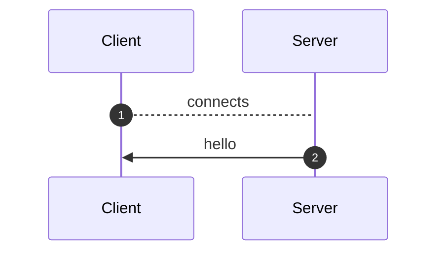
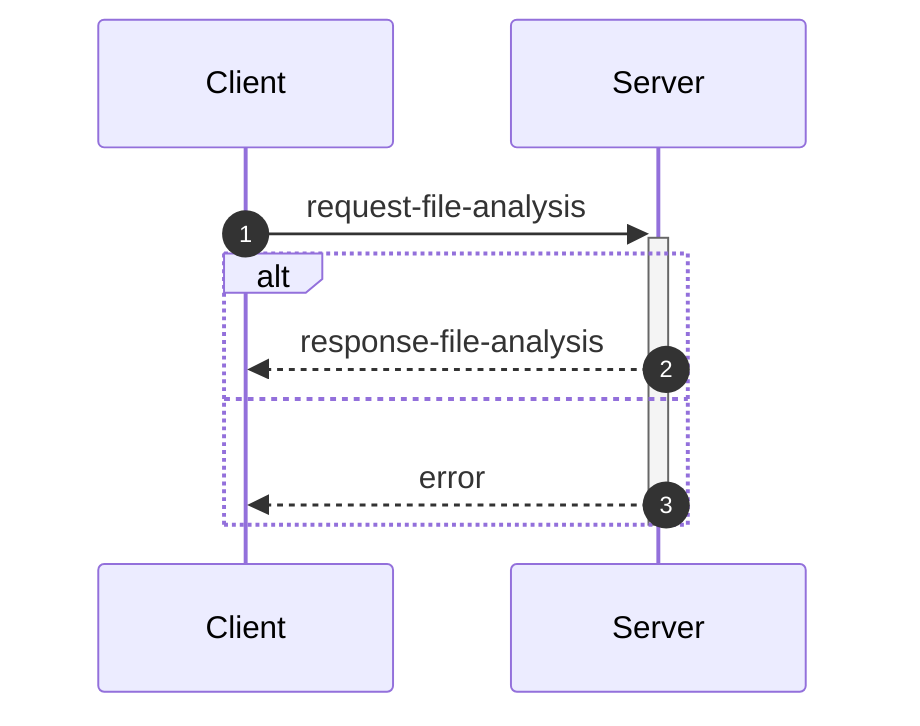

_This document was generated automatically from '/home/limerent/GitHub/phd/flowr/src/documentation/print-interface-wiki.ts' on 2024-09-28, 10:11:05 UTC presenting an overview of flowR's interfaces (version: 2.0.25, using R version 4.4.1)._

Although far from being as detailed as the in-depth explanation of
[_flowR_](https://github.com/flowr-analysis/flowr/wiki//Core),
this wiki page explains how to interface with _flowR_ in more detail.
In general, command line arguments and other options provide short descriptions on hover over.

[TODO: Table of Contents]

## 💬 Communicating with the Server


As explained in the [Overview](https://github.com/flowr-analysis/flowr/wiki//Overview), you can simply run the [TCP](https://de.wikipedia.org/wiki/Transmission_Control_Protocol)&nbsp;server by adding the <span title="Description: Do not drop into a repl, but instead start a server on the given port (default: 1042) and listen for messages.">`--server`</span> flag (and, due to the interactive mode, exit with the conventional <kbd>CTRL</kbd>+<kbd>C</kbd>).
Currently, every connection is handled by the same underlying `RShell` - so the server is not designed to handle many clients at a time.
Additionally, the server is not well guarded against attacks (e.g., you can theoretically spawn an arbitrary number of&nbsp;RShell sessions on the target machine).

Every message has to be given in a single line (i.e., without a newline in-between) and end with a newline character. Nevertheless, we will pretty-print example given in the following segments for the ease of reading.

> [!NOTE]
> The default <span title="Description: Do not drop into a repl, but instead start a server on the given port (default: 1042) and listen for messages.">`--server`</span> uses a simple [TCP](https://de.wikipedia.org/wiki/Transmission_Control_Protocol)
> connection. If you want _flowR_ to expose a [WebSocket](https://de.wikipedia.org/wiki/WebSocket) server instead, add the <span title="Description: Do not drop into a repl, but instead start a server on the given port (default: 1042) and listen for messages.">`--server`</span> flag (i.e., <span title="Description: Do not drop into a repl, but instead start a server on the given port (default: 1042) and listen for messages.">`--server`</span> <span title="Description: If the server flag is set, use websocket for messaging">`--ws`</span>) when starting _flowR_ from the command line.


<a id="message-hello"></a>
<details>

<summary> <b>Hello</b> Message (<code>hello</code>, response) <br/> <i><span style="color:gray">The server informs the client about the successful connection and provides Meta-Information.</span></i> </summary>

<details open>
<summary>Sequence Diagram</summary>



</details>


	
After launching _flowR_, for example, with <code>docker run -it --rm eagleoutpost/flowr <span title="Description: Do not drop into a repl, but instead start a server on the given port (default: 1042) and listen for messages.">-<span/>-server</span></code>&nbsp;(🐳️), simply connecting should present you with a `hello` message, that amongst others should reveal the versions of&nbsp;_flowR_ and&nbsp;R, using the [semver 2.0](https://semver.org/spec/v2.0.0.html) versioning scheme.
The message looks like this:

```json
{
  "type": "hello",
  "clientName": "client-0",
  "versions": {
    "flowr": "2.0.25",
    "r": "4.4.1"
  }
}
```

There are currently a few messages that you can send after the hello message.
If you want to *slice* a piece of R code you first have to send an [analysis request](#message-request-analysis), so that you can send one or multiple slice requests afterward.
Requests for the [REPL](#message-request-repl) are independent of that.
	

<details>
<summary style="color:gray">Message schema</summary>

For the definition of the hello message, please see it's implementation at [`./src/cli/repl/server/messages/message-hello.ts`](https://github.com/flowr-analysis/flowr/tree/main/./src/cli/repl/server/messages/message-hello.ts).

- **.** object [required]
    - **type** string [required]
        _The&nbsp;type&nbsp;of&nbsp;the&nbsp;hello&nbsp;message._
        Allows only the values: 'hello'
    - **id** any [forbidden]
        _The&nbsp;id&nbsp;of&nbsp;the&nbsp;message&nbsp;is&nbsp;always&nbsp;undefined&nbsp;(as&nbsp;it&nbsp;is&nbsp;the&nbsp;initial&nbsp;message&nbsp;and&nbsp;not&nbsp;requested)._
    - **clientName** string [required]
        _A&nbsp;unique&nbsp;name&nbsp;that&nbsp;is&nbsp;assigned&nbsp;to&nbsp;each&nbsp;client.&nbsp;It&nbsp;has&nbsp;no&nbsp;semantic&nbsp;meaning&nbsp;and&nbsp;is&nbsp;only&nbsp;used/useful&nbsp;for&nbsp;debugging._
    - **versions** object [required]
        - **flowr** string [required]
            _The&nbsp;version&nbsp;of&nbsp;the&nbsp;flowr&nbsp;server&nbsp;running&nbsp;in&nbsp;semver&nbsp;format._
        - **r** string [required]
            _The&nbsp;version&nbsp;of&nbsp;the&nbsp;underlying&nbsp;R&nbsp;shell&nbsp;running&nbsp;in&nbsp;semver&nbsp;format._

</details>

</details>	
	


<a id="message-request-file-analysis"></a>
<details>

<summary> <b>Analysis</b> Message (<code>request-file-analysis</code>, request) <br/> <i><span style="color:gray">The server builds the dataflow graph for a given input file (or a set of files).</span></i> </summary>

<details open>
<summary>Sequence Diagram</summary>



</details>


	
The request allows the server to analyze a file and prepare it for slicing.
The message can contain a `filetoken`, which is used to identify the file in later slice or lineage requests (if you do not add one, the request will not be stored and therefore, it is not available for subsequent requests).

> [!IMPORTANT]
> If you want to send and process a lot of analysis requests, but do not want to slice them, please do not pass the `filetoken` field. This will save the server a lot of memory allocation.

Furthermore, the request must contain either a `content` field to directly pass the file's content or a `filepath` field which contains the path to the file (this path must be accessible for the server to be useful).
If you add the `id` field, the answer will use the same `id` so you can match requests and the corresponding answers.
See the implementation of the request-file-analysis message for more information.


<details>
<summary>Example of <code>request-file-analysis</code> Message</summary>

_Note:_ even though we pretty-print these messages, they are sent as a single line, ending with a newline.

The following lists all messages that were sent and received in case you want to reproduce the scenario:


<details> 

<summary> (0) Response: <code>hello</code> Message</summary>

The first message is always a hello message.

```json
{
  "type": "hello",
  "clientName": "client-0",
  "versions": {
    "flowr": "2.0.25",
    "r": "4.4.1"
  }
}
```

</details>


<details open> 

<summary> (1) Request: <b><code>request-file-analysis</code> Message</b></summary>


```json
{
  "type": "request-file-analysis",
  "id": "1",
  "filetoken": "x",
  "content": "x <- 1\nx + 1"
}
```

</details>


<details> 

<summary> (2) Response: <code>response-file-analysis</code> Message</summary>


```json
{
  "type": "response-file-analysis",
  "format": "json",
  "id": "1",
  "results": {
    "parse": "[1,1,1,6,7,0,\"expr\",false,\"x <- 1\"],[1,1,1,1,1,3,\"SYMBOL\",true,\"x\"],[1,1,1,1,3,7,\"expr\",false,\"x\"],[1,3,1,4,2,7,\"LEFT_ASSIGN\",true,\"<-\"],[1,6,1,6,4,5,\"NUM_CONST\",true,\"1\"],[1,6,1,6,5,7,\"expr\",false,\"1\"],[2,1,2,5,16,0,\"expr\",false,\"x + 1\"],[2,1,2,1,10,12,\"SYMBOL\",true,\"x\"],[2,1,2,1,12,16,\"expr\",false,\"x\"],[2,3,2,3,11,16,\"'+'\",true,\"+\"],[2,5,2,5,13,14,\"NUM_CONST\",true,\"1\"],[2,5,2,5,14,16,\"expr\",false,\"1\"]",
    "normalize": {
      "ast": {
        "type": "RExpressionList",
        "children": [
          {
            "type": "RBinaryOp",
            "location": [
              1,
              3,
              1,
              4
            ],
            "lhs": {
              "type": "RSymbol",
              "location": [
                1,
                1,
                1,
                1
              ],
              "content": "x",
              "lexeme": "x",
              "info": {
                "fullRange": [
                  1,
                  1,
                  1,
                  1
                ],
                "additionalTokens": [],
                "fullLexeme": "x",
                "id": 0,
                "parent": 2,
                "role": "binop-lhs",
                "index": 0,
                "nesting": 0
              }
            },
            "rhs": {
              "location": [
                1,
                6,
                1,
                6
              ],
              "lexeme": "1",
              "info": {
                "fullRange": [
                  1,
                  6,
                  1,
                  6
                ],
                "additionalTokens": [],
                "fullLexeme": "1",
                "id": 1,
                "parent": 2,
                "role": "binop-rhs",
                "index": 1,
                "nesting": 0
              },
              "type": "RNumber",
              "content": {
                "num": 1,
                "complexNumber": false,
                "markedAsInt": false
              }
            },
            "operator": "<-",
            "lexeme": "<-",
            "info": {
              "fullRange": [
                1,
                1,
                1,
                6
              ],
              "additionalTokens": [],
              "fullLexeme": "x <- 1",
              "id": 2,
              "parent": 6,
              "nesting": 0,
              "index": 0,
              "role": "expr-list-child"
            }
          },
          {
            "type": "RBinaryOp",
            "location": [
              2,
              3,
              2,
              3
            ],
            "lhs": {
              "type": "RSymbol",
              "location": [
                2,
                1,
                2,
                1
              ],
              "content": "x",
              "lexeme": "x",
              "info": {
                "fullRange": [
                  2,
                  1,
                  2,
                  1
                ],
                "additionalTokens": [],
                "fullLexeme": "x",
                "id": 3,
                "parent": 5,
                "role": "binop-lhs",
                "index": 0,
                "nesting": 0
              }
            },
            "rhs": {
              "location": [
                2,
                5,
                2,
                5
              ],
              "lexeme": "1",
              "info": {
                "fullRange": [
                  2,
                  5,
                  2,
                  5
                ],
                "additionalTokens": [],
                "fullLexeme": "1",
                "id": 4,
                "parent": 5,
                "role": "binop-rhs",
                "index": 1,
                "nesting": 0
              },
              "type": "RNumber",
              "content": {
                "num": 1,
                "complexNumber": false,
                "markedAsInt": false
              }
            },
            "operator": "+",
            "lexeme": "+",
            "info": {
              "fullRange": [
                2,
                1,
                2,
                5
              ],
              "additionalTokens": [],
              "fullLexeme": "x + 1",
              "id": 5,
              "parent": 6,
              "nesting": 0,
              "index": 1,
              "role": "expr-list-child"
            }
          }
        ],
        "info": {
          "additionalTokens": [],
          "id": 6,
          "nesting": 0,
          "role": "root",
          "index": 0
        }
      }
    },
    "dataflow": {
      "unknownReferences": [],
      "in": [
        {
          "nodeId": 2,
          "name": "<-",
          "type": 2
        },
        {
          "nodeId": 5,
          "name": "+",
          "type": 2
        }
      ],
      "out": [
        {
          "nodeId": 0,
          "name": "x",
          "type": 4,
          "definedAt": 2
        }
      ],
      "environment": {
        "current": {
          "id": 12,
          "parent": {
            "id": 0,
            "memory": [
              [
                "NULL",
                [
                  {
                    "type": 64,
                    "definedAt": "built-in",
                    "value": null,
                    "name": "NULL",
                    "nodeId": "built-in"
                  }
                ]
              ],
              [
                "NA",
                [
                  {
                    "type": 64,
                    "definedAt": "built-in",
                    "value": null,
                    "name": "NA",
                    "nodeId": "built-in"
                  }
                ]
              ],
              [
                "TRUE",
                [
                  {
                    "type": 64,
                    "definedAt": "built-in",
                    "value": true,
                    "name": "TRUE",
                    "nodeId": "built-in"
                  }
                ]
              ],
              [
                "T",
                [
                  {
                    "type": 64,
                    "definedAt": "built-in",
                    "value": true,
                    "name": "T",
                    "nodeId": "built-in"
                  }
                ]
              ],
              [
                "FALSE",
                [
                  {
                    "type": 64,
                    "definedAt": "built-in",
                    "value": false,
                    "name": "FALSE",
                    "nodeId": "built-in"
                  }
                ]
              ],
              [
                "F",
                [
                  {
                    "type": 64,
                    "definedAt": "built-in",
                    "value": false,
                    "name": "F",
                    "nodeId": "built-in"
                  }
                ]
              ],
              [
                "~",
                [
                  {
                    "type": 128,
                    "definedAt": "built-in",
                    "name": "~",
                    "nodeId": "built-in"
                  }
                ]
              ],
              [
                "+",
                [
                  {
                    "type": 128,
                    "definedAt": "built-in",
                    "name": "+",
                    "nodeId": "built-in"
                  }
                ]
              ],
              [
                "-",
                [
                  {
                    "type": 128,
                    "definedAt": "built-in",
                    "name": "-",
                    "nodeId": "built-in"
                  }
                ]
              ],
              [
                "*",
                [
                  {
                    "type": 128,
                    "definedAt": "built-in",
                    "name": "*",
                    "nodeId": "built-in"
                  }
                ]
              ],
              [
                "/",
                [
                  {
                    "type": 128,
                    "definedAt": "built-in",
                    "name": "/",
                    "nodeId": "built-in"
                  }
                ]
              ],
              [
                "^",
                [
                  {
                    "type": 128,
                    "definedAt": "built-in",
                    "name": "^",
                    "nodeId": "built-in"
                  }
                ]
              ],
              [
                "!",
                [
                  {
                    "type": 128,
                    "definedAt": "built-in",
                    "name": "!",
                    "nodeId": "built-in"
                  }
                ]
              ],
              [
                "?",
                [
                  {
                    "type": 128,
                    "definedAt": "built-in",
                    "name": "?",
                    "nodeId": "built-in"
                  }
                ]
              ],
              [
                "**",
                [
                  {
                    "type": 128,
                    "definedAt": "built-in",
                    "name": "**",
                    "nodeId": "built-in"
                  }
                ]
              ],
              [
                "==",
                [
                  {
                    "type": 128,
                    "definedAt": "built-in",
                    "name": "==",
                    "nodeId": "built-in"
                  }
                ]
              ],
              [
                "!=",
                [
                  {
                    "type": 128,
                    "definedAt": "built-in",
                    "name": "!=",
                    "nodeId": "built-in"
                  }
                ]
              ],
              [
                ">",
                [
                  {
                    "type": 128,
                    "definedAt": "built-in",
                    "name": ">",
                    "nodeId": "built-in"
                  }
                ]
              ],
              [
                "<",
                [
                  {
                    "type": 128,
                    "definedAt": "built-in",
                    "name": "<",
                    "nodeId": "built-in"
                  }
                ]
              ],
              [
                ">=",
                [
                  {
                    "type": 128,
                    "definedAt": "built-in",
                    "name": ">=",
                    "nodeId": "built-in"
                  }
                ]
              ],
              [
                "<=",
                [
                  {
                    "type": 128,
                    "definedAt": "built-in",
                    "name": "<=",
                    "nodeId": "built-in"
                  }
                ]
              ],
              [
                "%%",
                [
                  {
                    "type": 128,
                    "definedAt": "built-in",
                    "name": "%%",
                    "nodeId": "built-in"
                  }
                ]
              ],
              [
                "%/%",
                [
                  {
                    "type": 128,
                    "definedAt": "built-in",
                    "name": "%/%",
                    "nodeId": "built-in"
                  }
                ]
              ],
              [
                "%*%",
                [
                  {
                    "type": 128,
                    "definedAt": "built-in",
                    "name": "%*%",
                    "nodeId": "built-in"
                  }
                ]
              ],
              [
                "%in%",
                [
                  {
                    "type": 128,
                    "definedAt": "built-in",
                    "name": "%in%",
                    "nodeId": "built-in"
                  }
                ]
              ],
              [
                ":",
                [
                  {
                    "type": 128,
                    "definedAt": "built-in",
                    "name": ":",
                    "nodeId": "built-in"
                  }
                ]
              ],
              [
                "list",
                [
                  {
                    "type": 128,
                    "definedAt": "built-in",
                    "name": "list",
                    "nodeId": "built-in"
                  }
                ]
              ],
              [
                "c",
                [
                  {
                    "type": 128,
                    "definedAt": "built-in",
                    "name": "c",
                    "nodeId": "built-in"
                  }
                ]
              ],
              [
                "rep",
                [
                  {
                    "type": 128,
                    "definedAt": "built-in",
                    "name": "rep",
                    "nodeId": "built-in"
                  }
                ]
              ],
              [
                "seq",
                [
                  {
                    "type": 128,
                    "definedAt": "built-in",
                    "name": "seq",
                    "nodeId": "built-in"
                  }
                ]
              ],
              [
                "seq_len",
                [
                  {
                    "type": 128,
                    "definedAt": "built-in",
                    "name": "seq_len",
                    "nodeId": "built-in"
                  }
                ]
              ],
              [
                "seq_along",
                [
                  {
                    "type": 128,
                    "definedAt": "built-in",
                    "name": "seq_along",
                    "nodeId": "built-in"
                  }
                ]
              ],
              [
                "seq.int",
                [
                  {
                    "type": 128,
                    "definedAt": "built-in",
                    "name": "seq.int",
                    "nodeId": "built-in"
                  }
                ]
              ],
              [
                "gsub",
                [
                  {
                    "type": 128,
                    "definedAt": "built-in",
                    "name": "gsub",
                    "nodeId": "built-in"
                  }
                ]
              ],
              [
                "which",
                [
                  {
                    "type": 128,
                    "definedAt": "built-in",
                    "name": "which",
                    "nodeId": "built-in"
                  }
                ]
              ],
              [
                "class",
                [
                  {
                    "type": 128,
                    "definedAt": "built-in",
                    "name": "class",
                    "nodeId": "built-in"
                  }
                ]
              ],
              [
                "dimnames",
                [
                  {
                    "type": 128,
                    "definedAt": "built-in",
                    "name": "dimnames",
                    "nodeId": "built-in"
                  }
                ]
              ],
              [
                "min",
                [
                  {
                    "type": 128,
                    "definedAt": "built-in",
                    "name": "min",
                    "nodeId": "built-in"
                  }
                ]
              ],
              [
                "max",
                [
                  {
                    "type": 128,
                    "definedAt": "built-in",
                    "name": "max",
                    "nodeId": "built-in"
                  }
                ]
              ],
              [
                "intersect",
                [
                  {
                    "type": 128,
                    "definedAt": "built-in",
                    "name": "intersect",
                    "nodeId": "built-in"
                  }
                ]
              ],
              [
                "subset",
                [
                  {
                    "type": 128,
                    "definedAt": "built-in",
                    "name": "subset",
                    "nodeId": "built-in"
                  }
                ]
              ],
              [
                "match",
                [
                  {
                    "type": 128,
                    "definedAt": "built-in",
                    "name": "match",
                    "nodeId": "built-in"
                  }
                ]
              ],
              [
                "sqrt",
                [
                  {
                    "type": 128,
                    "definedAt": "built-in",
                    "name": "sqrt",
                    "nodeId": "built-in"
                  }
                ]
              ],
              [
                "abs",
                [
                  {
                    "type": 128,
                    "definedAt": "built-in",
                    "name": "abs",
                    "nodeId": "built-in"
                  }
                ]
              ],
              [
                "round",
                [
                  {
                    "type": 128,
                    "definedAt": "built-in",
                    "name": "round",
                    "nodeId": "built-in"
                  }
                ]
              ],
              [
                "floor",
                [
                  {
                    "type": 128,
                    "definedAt": "built-in",
                    "name": "floor",
                    "nodeId": "built-in"
                  }
                ]
              ],
              [
                "ceiling",
                [
                  {
                    "type": 128,
                    "definedAt": "built-in",
                    "name": "ceiling",
                    "nodeId": "built-in"
                  }
                ]
              ],
              [
                "signif",
                [
                  {
                    "type": 128,
                    "definedAt": "built-in",
                    "name": "signif",
                    "nodeId": "built-in"
                  }
                ]
              ],
              [
                "trunc",
                [
                  {
                    "type": 128,
                    "definedAt": "built-in",
                    "name": "trunc",
                    "nodeId": "built-in"
                  }
                ]
              ],
              [
                "log",
                [
                  {
                    "type": 128,
                    "definedAt": "built-in",
                    "name": "log",
                    "nodeId": "built-in"
                  }
                ]
              ],
              [
                "log10",
                [
                  {
                    "type": 128,
                    "definedAt": "built-in",
                    "name": "log10",
                    "nodeId": "built-in"
                  }
                ]
              ],
              [
                "log2",
                [
                  {
                    "type": 128,
                    "definedAt": "built-in",
                    "name": "log2",
                    "nodeId": "built-in"
                  }
                ]
              ],
              [
                "sum",
                [
                  {
                    "type": 128,
                    "definedAt": "built-in",
                    "name": "sum",
                    "nodeId": "built-in"
                  }
                ]
              ],
              [
                "mean",
                [
                  {
                    "type": 128,
                    "definedAt": "built-in",
                    "name": "mean",
                    "nodeId": "built-in"
                  }
                ]
              ],
              [
                "unique",
                [
                  {
                    "type": 128,
                    "definedAt": "built-in",
                    "name": "unique",
                    "nodeId": "built-in"
                  }
                ]
              ],
              [
                "paste",
                [
                  {
                    "type": 128,
                    "definedAt": "built-in",
                    "name": "paste",
                    "nodeId": "built-in"
                  }
                ]
              ],
              [
                "paste0",
                [
                  {
                    "type": 128,
                    "definedAt": "built-in",
                    "name": "paste0",
                    "nodeId": "built-in"
                  }
                ]
              ],
              [
                "read.csv",
                [
                  {
                    "type": 128,
                    "definedAt": "built-in",
                    "name": "read.csv",
                    "nodeId": "built-in"
                  }
                ]
              ],
              [
                "stop",
                [
                  {
                    "type": 128,
                    "definedAt": "built-in",
                    "name": "stop",
                    "nodeId": "built-in"
                  }
                ]
              ],
              [
                "is.null",
                [
                  {
                    "type": 128,
                    "definedAt": "built-in",
                    "name": "is.null",
                    "nodeId": "built-in"
                  }
                ]
              ],
              [
                "plot",
                [
                  {
                    "type": 128,
                    "definedAt": "built-in",
                    "name": "plot",
                    "nodeId": "built-in"
                  }
                ]
              ],
              [
                "numeric",
                [
                  {
                    "type": 128,
                    "definedAt": "built-in",
                    "name": "numeric",
                    "nodeId": "built-in"
                  }
                ]
              ],
              [
                "as.character",
                [
                  {
                    "type": 128,
                    "definedAt": "built-in",
                    "name": "as.character",
                    "nodeId": "built-in"
                  }
                ]
              ],
              [
                "as.integer",
                [
                  {
                    "type": 128,
                    "definedAt": "built-in",
                    "name": "as.integer",
                    "nodeId": "built-in"
                  }
                ]
              ],
              [
                "as.logical",
                [
                  {
                    "type": 128,
                    "definedAt": "built-in",
                    "name": "as.logical",
                    "nodeId": "built-in"
                  }
                ]
              ],
              [
                "as.numeric",
                [
                  {
                    "type": 128,
                    "definedAt": "built-in",
                    "name": "as.numeric",
                    "nodeId": "built-in"
                  }
                ]
              ],
              [
                "as.matrix",
                [
                  {
                    "type": 128,
                    "definedAt": "built-in",
                    "name": "as.matrix",
                    "nodeId": "built-in"
                  }
                ]
              ],
              [
                "do.call",
                [
                  {
                    "type": 128,
                    "definedAt": "built-in",
                    "name": "do.call",
                    "nodeId": "built-in"
                  }
                ]
              ],
              [
                "rbind",
                [
                  {
                    "type": 128,
                    "definedAt": "built-in",
                    "name": "rbind",
                    "nodeId": "built-in"
                  }
                ]
              ],
              [
                "nrow",
                [
                  {
                    "type": 128,
                    "definedAt": "built-in",
                    "name": "nrow",
                    "nodeId": "built-in"
                  }
                ]
              ],
              [
                "ncol",
                [
                  {
                    "type": 128,
                    "definedAt": "built-in",
                    "name": "ncol",
                    "nodeId": "built-in"
                  }
                ]
              ],
              [
                "tryCatch",
                [
                  {
                    "type": 128,
                    "definedAt": "built-in",
                    "name": "tryCatch",
                    "nodeId": "built-in"
                  }
                ]
              ],
              [
                "expression",
                [
                  {
                    "type": 128,
                    "definedAt": "built-in",
                    "name": "expression",
                    "nodeId": "built-in"
                  }
                ]
              ],
              [
                "factor",
                [
                  {
                    "type": 128,
                    "definedAt": "built-in",
                    "name": "factor",
                    "nodeId": "built-in"
                  }
                ]
              ],
              [
                "missing",
                [
                  {
                    "type": 128,
                    "definedAt": "built-in",
                    "name": "missing",
                    "nodeId": "built-in"
                  }
                ]
              ],
              [
                "as.data.frame",
                [
                  {
                    "type": 128,
                    "definedAt": "built-in",
                    "name": "as.data.frame",
                    "nodeId": "built-in"
                  }
                ]
              ],
              [
                "data.frame",
                [
                  {
                    "type": 128,
                    "definedAt": "built-in",
                    "name": "data.frame",
                    "nodeId": "built-in"
                  }
                ]
              ],
              [
                "na.omit",
                [
                  {
                    "type": 128,
                    "definedAt": "built-in",
                    "name": "na.omit",
                    "nodeId": "built-in"
                  }
                ]
              ],
              [
                "rownames",
                [
                  {
                    "type": 128,
                    "definedAt": "built-in",
                    "name": "rownames",
                    "nodeId": "built-in"
                  }
                ]
              ],
              [
                "names",
                [
                  {
                    "type": 128,
                    "definedAt": "built-in",
                    "name": "names",
                    "nodeId": "built-in"
                  }
                ]
              ],
              [
                "order",
                [
                  {
                    "type": 128,
                    "definedAt": "built-in",
                    "name": "order",
                    "nodeId": "built-in"
                  }
                ]
              ],
              [
                "length",
                [
                  {
                    "type": 128,
                    "definedAt": "built-in",
                    "name": "length",
                    "nodeId": "built-in"
                  }
                ]
              ],
              [
                "any",
                [
                  {
                    "type": 128,
                    "definedAt": "built-in",
                    "name": "any",
                    "nodeId": "built-in"
                  }
                ]
              ],
              [
                "dim",
                [
                  {
                    "type": 128,
                    "definedAt": "built-in",
                    "name": "dim",
                    "nodeId": "built-in"
                  }
                ]
              ],
              [
                "matrix",
                [
                  {
                    "type": 128,
                    "definedAt": "built-in",
                    "name": "matrix",
                    "nodeId": "built-in"
                  }
                ]
              ],
              [
                "cbind",
                [
                  {
                    "type": 128,
                    "definedAt": "built-in",
                    "name": "cbind",
                    "nodeId": "built-in"
                  }
                ]
              ],
              [
                "nchar",
                [
                  {
                    "type": 128,
                    "definedAt": "built-in",
                    "name": "nchar",
                    "nodeId": "built-in"
                  }
                ]
              ],
              [
                "t",
                [
                  {
                    "type": 128,
                    "definedAt": "built-in",
                    "name": "t",
                    "nodeId": "built-in"
                  }
                ]
              ],
              [
                "options",
                [
                  {
                    "type": 128,
                    "definedAt": "built-in",
                    "name": "options",
                    "nodeId": "built-in"
                  }
                ]
              ],
              [
                "mapply",
                [
                  {
                    "type": 128,
                    "definedAt": "built-in",
                    "name": "mapply",
                    "nodeId": "built-in"
                  }
                ]
              ],
              [
                "Mapply",
                [
                  {
                    "type": 128,
                    "definedAt": "built-in",
                    "name": "Mapply",
                    "nodeId": "built-in"
                  }
                ]
              ],
              [
                "lapply",
                [
                  {
                    "type": 128,
                    "definedAt": "built-in",
                    "name": "lapply",
                    "nodeId": "built-in"
                  }
                ]
              ],
              [
                "sapply",
                [
                  {
                    "type": 128,
                    "definedAt": "built-in",
                    "name": "sapply",
                    "nodeId": "built-in"
                  }
                ]
              ],
              [
                "vapply",
                [
                  {
                    "type": 128,
                    "definedAt": "built-in",
                    "name": "vapply",
                    "nodeId": "built-in"
                  }
                ]
              ],
              [
                "Lapply",
                [
                  {
                    "type": 128,
                    "definedAt": "built-in",
                    "name": "Lapply",
                    "nodeId": "built-in"
                  }
                ]
              ],
              [
                "Sapply",
                [
                  {
                    "type": 128,
                    "definedAt": "built-in",
                    "name": "Sapply",
                    "nodeId": "built-in"
                  }
                ]
              ],
              [
                "Vapply",
                [
                  {
                    "type": 128,
                    "definedAt": "built-in",
                    "name": "Vapply",
                    "nodeId": "built-in"
                  }
                ]
              ],
              [
                "apply",
                [
                  {
                    "type": 128,
                    "definedAt": "built-in",
                    "name": "apply",
                    "nodeId": "built-in"
                  }
                ]
              ],
              [
                "tapply",
                [
                  {
                    "type": 128,
                    "definedAt": "built-in",
                    "name": "tapply",
                    "nodeId": "built-in"
                  }
                ]
              ],
              [
                "Tapply",
                [
                  {
                    "type": 128,
                    "definedAt": "built-in",
                    "name": "Tapply",
                    "nodeId": "built-in"
                  }
                ]
              ],
              [
                "print",
                [
                  {
                    "type": 128,
                    "definedAt": "built-in",
                    "name": "print",
                    "nodeId": "built-in"
                  }
                ]
              ],
              [
                "(",
                [
                  {
                    "type": 128,
                    "definedAt": "built-in",
                    "name": "(",
                    "nodeId": "built-in"
                  }
                ]
              ],
              [
                "load",
                [
                  {
                    "type": 128,
                    "definedAt": "built-in",
                    "name": "load",
                    "nodeId": "built-in"
                  }
                ]
              ],
              [
                "load_all",
                [
                  {
                    "type": 128,
                    "definedAt": "built-in",
                    "name": "load_all",
                    "nodeId": "built-in"
                  }
                ]
              ],
              [
                "setwd",
                [
                  {
                    "type": 128,
                    "definedAt": "built-in",
                    "name": "setwd",
                    "nodeId": "built-in"
                  }
                ]
              ],
              [
                "set.seed",
                [
                  {
                    "type": 128,
                    "definedAt": "built-in",
                    "name": "set.seed",
                    "nodeId": "built-in"
                  }
                ]
              ],
              [
                "eval",
                [
                  {
                    "type": 128,
                    "definedAt": "built-in",
                    "name": "eval",
                    "nodeId": "built-in"
                  }
                ]
              ],
              [
                "body",
                [
                  {
                    "type": 128,
                    "definedAt": "built-in",
                    "name": "body",
                    "nodeId": "built-in"
                  }
                ]
              ],
              [
                "formals",
                [
                  {
                    "type": 128,
                    "definedAt": "built-in",
                    "name": "formals",
                    "nodeId": "built-in"
                  }
                ]
              ],
              [
                "environment",
                [
                  {
                    "type": 128,
                    "definedAt": "built-in",
                    "name": "environment",
                    "nodeId": "built-in"
                  }
                ]
              ],
              [
                "cat",
                [
                  {
                    "type": 128,
                    "definedAt": "built-in",
                    "name": "cat",
                    "nodeId": "built-in"
                  }
                ]
              ],
              [
                "switch",
                [
                  {
                    "type": 128,
                    "definedAt": "built-in",
                    "name": "switch",
                    "nodeId": "built-in"
                  }
                ]
              ],
              [
                "return",
                [
                  {
                    "type": 128,
                    "definedAt": "built-in",
                    "name": "return",
                    "nodeId": "built-in"
                  }
                ]
              ],
              [
                "break",
                [
                  {
                    "type": 128,
                    "definedAt": "built-in",
                    "name": "break",
                    "nodeId": "built-in"
                  }
                ]
              ],
              [
                "next",
                [
                  {
                    "type": 128,
                    "definedAt": "built-in",
                    "name": "next",
                    "nodeId": "built-in"
                  }
                ]
              ],
              [
                "{",
                [
                  {
                    "type": 128,
                    "definedAt": "built-in",
                    "name": "{",
                    "nodeId": "built-in"
                  }
                ]
              ],
              [
                "source",
                [
                  {
                    "type": 128,
                    "definedAt": "built-in",
                    "name": "source",
                    "nodeId": "built-in"
                  }
                ]
              ],
              [
                "[",
                [
                  {
                    "type": 128,
                    "definedAt": "built-in",
                    "name": "[",
                    "nodeId": "built-in"
                  }
                ]
              ],
              [
                "[[",
                [
                  {
                    "type": 128,
                    "definedAt": "built-in",
                    "name": "[[",
                    "nodeId": "built-in"
                  }
                ]
              ],
              [
                "$",
                [
                  {
                    "type": 128,
                    "definedAt": "built-in",
                    "name": "$",
                    "nodeId": "built-in"
                  }
                ]
              ],
              [
                "@",
                [
                  {
                    "type": 128,
                    "definedAt": "built-in",
                    "name": "@",
                    "nodeId": "built-in"
                  }
                ]
              ],
              [
                "if",
                [
                  {
                    "type": 128,
                    "definedAt": "built-in",
                    "name": "if",
                    "nodeId": "built-in"
                  }
                ]
              ],
              [
                "ifelse",
                [
                  {
                    "type": 128,
                    "definedAt": "built-in",
                    "name": "ifelse",
                    "nodeId": "built-in"
                  }
                ]
              ],
              [
                "get",
                [
                  {
                    "type": 128,
                    "definedAt": "built-in",
                    "name": "get",
                    "nodeId": "built-in"
                  }
                ]
              ],
              [
                "library",
                [
                  {
                    "type": 128,
                    "definedAt": "built-in",
                    "name": "library",
                    "nodeId": "built-in"
                  }
                ]
              ],
              [
                "require",
                [
                  {
                    "type": 128,
                    "definedAt": "built-in",
                    "name": "require",
                    "nodeId": "built-in"
                  }
                ]
              ],
              [
                "<-",
                [
                  {
                    "type": 128,
                    "definedAt": "built-in",
                    "name": "<-",
                    "nodeId": "built-in"
                  }
                ]
              ],
              [
                "=",
                [
                  {
                    "type": 128,
                    "definedAt": "built-in",
                    "name": "=",
                    "nodeId": "built-in"
                  }
                ]
              ],
              [
                ":=",
                [
                  {
                    "type": 128,
                    "definedAt": "built-in",
                    "name": ":=",
                    "nodeId": "built-in"
                  }
                ]
              ],
              [
                "assign",
                [
                  {
                    "type": 128,
                    "definedAt": "built-in",
                    "name": "assign",
                    "nodeId": "built-in"
                  }
                ]
              ],
              [
                "delayedAssign",
                [
                  {
                    "type": 128,
                    "definedAt": "built-in",
                    "name": "delayedAssign",
                    "nodeId": "built-in"
                  }
                ]
              ],
              [
                "<<-",
                [
                  {
                    "type": 128,
                    "definedAt": "built-in",
                    "name": "<<-",
                    "nodeId": "built-in"
                  }
                ]
              ],
              [
                "->",
                [
                  {
                    "type": 128,
                    "definedAt": "built-in",
                    "name": "->",
                    "nodeId": "built-in"
                  }
                ]
              ],
              [
                "->>",
                [
                  {
                    "type": 128,
                    "definedAt": "built-in",
                    "name": "->>",
                    "nodeId": "built-in"
                  }
                ]
              ],
              [
                "&&",
                [
                  {
                    "type": 128,
                    "definedAt": "built-in",
                    "name": "&&",
                    "nodeId": "built-in"
                  }
                ]
              ],
              [
                "&",
                [
                  {
                    "type": 128,
                    "definedAt": "built-in",
                    "name": "&",
                    "nodeId": "built-in"
                  }
                ]
              ],
              [
                "||",
                [
                  {
                    "type": 128,
                    "definedAt": "built-in",
                    "name": "||",
                    "nodeId": "built-in"
                  }
                ]
              ],
              [
                "|",
                [
                  {
                    "type": 128,
                    "definedAt": "built-in",
                    "name": "|",
                    "nodeId": "built-in"
                  }
                ]
              ],
              [
                "|>",
                [
                  {
                    "type": 128,
                    "definedAt": "built-in",
                    "name": "|>",
                    "nodeId": "built-in"
                  }
                ]
              ],
              [
                "%>%",
                [
                  {
                    "type": 128,
                    "definedAt": "built-in",
                    "name": "%>%",
                    "nodeId": "built-in"
                  }
                ]
              ],
              [
                "function",
                [
                  {
                    "type": 128,
                    "definedAt": "built-in",
                    "name": "function",
                    "nodeId": "built-in"
                  }
                ]
              ],
              [
                "\\",
                [
                  {
                    "type": 128,
                    "definedAt": "built-in",
                    "name": "\\",
                    "nodeId": "built-in"
                  }
                ]
              ],
              [
                "quote",
                [
                  {
                    "type": 128,
                    "definedAt": "built-in",
                    "name": "quote",
                    "nodeId": "built-in"
                  }
                ]
              ],
              [
                "substitute",
                [
                  {
                    "type": 128,
                    "definedAt": "built-in",
                    "name": "substitute",
                    "nodeId": "built-in"
                  }
                ]
              ],
              [
                "bquote",
                [
                  {
                    "type": 128,
                    "definedAt": "built-in",
                    "name": "bquote",
                    "nodeId": "built-in"
                  }
                ]
              ],
              [
                "for",
                [
                  {
                    "type": 128,
                    "definedAt": "built-in",
                    "name": "for",
                    "nodeId": "built-in"
                  }
                ]
              ],
              [
                "repeat",
                [
                  {
                    "type": 128,
                    "definedAt": "built-in",
                    "name": "repeat",
                    "nodeId": "built-in"
                  }
                ]
              ],
              [
                "while",
                [
                  {
                    "type": 128,
                    "definedAt": "built-in",
                    "name": "while",
                    "nodeId": "built-in"
                  }
                ]
              ],
              [
                "on.exit",
                [
                  {
                    "type": 128,
                    "definedAt": "built-in",
                    "name": "on.exit",
                    "nodeId": "built-in"
                  }
                ]
              ],
              [
                "sys.on.exit",
                [
                  {
                    "type": 128,
                    "definedAt": "built-in",
                    "name": "sys.on.exit",
                    "nodeId": "built-in"
                  }
                ]
              ],
              [
                "par",
                [
                  {
                    "type": 128,
                    "definedAt": "built-in",
                    "name": "par",
                    "nodeId": "built-in"
                  }
                ]
              ],
              [
                "setnames",
                [
                  {
                    "type": 128,
                    "definedAt": "built-in",
                    "name": "setnames",
                    "nodeId": "built-in"
                  }
                ]
              ],
              [
                "setNames",
                [
                  {
                    "type": 128,
                    "definedAt": "built-in",
                    "name": "setNames",
                    "nodeId": "built-in"
                  }
                ]
              ],
              [
                "setkey",
                [
                  {
                    "type": 128,
                    "definedAt": "built-in",
                    "name": "setkey",
                    "nodeId": "built-in"
                  }
                ]
              ],
              [
                "setkeyv",
                [
                  {
                    "type": 128,
                    "definedAt": "built-in",
                    "name": "setkeyv",
                    "nodeId": "built-in"
                  }
                ]
              ],
              [
                "setindex",
                [
                  {
                    "type": 128,
                    "definedAt": "built-in",
                    "name": "setindex",
                    "nodeId": "built-in"
                  }
                ]
              ],
              [
                "setindexv",
                [
                  {
                    "type": 128,
                    "definedAt": "built-in",
                    "name": "setindexv",
                    "nodeId": "built-in"
                  }
                ]
              ],
              [
                "setattr",
                [
                  {
                    "type": 128,
                    "definedAt": "built-in",
                    "name": "setattr",
                    "nodeId": "built-in"
                  }
                ]
              ],
              [
                "sink",
                [
                  {
                    "type": 128,
                    "definedAt": "built-in",
                    "name": "sink",
                    "nodeId": "built-in"
                  }
                ]
              ],
              [
                "requireNamespace",
                [
                  {
                    "type": 128,
                    "definedAt": "built-in",
                    "name": "requireNamespace",
                    "nodeId": "built-in"
                  }
                ]
              ],
              [
                "loadNamespace",
                [
                  {
                    "type": 128,
                    "definedAt": "built-in",
                    "name": "loadNamespace",
                    "nodeId": "built-in"
                  }
                ]
              ],
              [
                "attachNamespace",
                [
                  {
                    "type": 128,
                    "definedAt": "built-in",
                    "name": "attachNamespace",
                    "nodeId": "built-in"
                  }
                ]
              ],
              [
                "asNamespace",
                [
                  {
                    "type": 128,
                    "definedAt": "built-in",
                    "name": "asNamespace",
                    "nodeId": "built-in"
                  }
                ]
              ],
              [
                "library.dynam",
                [
                  {
                    "type": 128,
                    "definedAt": "built-in",
                    "name": "library.dynam",
                    "nodeId": "built-in"
                  }
                ]
              ],
              [
                "install.packages",
                [
                  {
                    "type": 128,
                    "definedAt": "built-in",
                    "name": "install.packages",
                    "nodeId": "built-in"
                  }
                ]
              ],
              [
                "install",
                [
                  {
                    "type": 128,
                    "definedAt": "built-in",
                    "name": "install",
                    "nodeId": "built-in"
                  }
                ]
              ],
              [
                "install_github",
                [
                  {
                    "type": 128,
                    "definedAt": "built-in",
                    "name": "install_github",
                    "nodeId": "built-in"
                  }
                ]
              ],
              [
                "install_gitlab",
                [
                  {
                    "type": 128,
                    "definedAt": "built-in",
                    "name": "install_gitlab",
                    "nodeId": "built-in"
                  }
                ]
              ],
              [
                "install_bitbucket",
                [
                  {
                    "type": 128,
                    "definedAt": "built-in",
                    "name": "install_bitbucket",
                    "nodeId": "built-in"
                  }
                ]
              ],
              [
                "install_url",
                [
                  {
                    "type": 128,
                    "definedAt": "built-in",
                    "name": "install_url",
                    "nodeId": "built-in"
                  }
                ]
              ],
              [
                "install_git",
                [
                  {
                    "type": 128,
                    "definedAt": "built-in",
                    "name": "install_git",
                    "nodeId": "built-in"
                  }
                ]
              ],
              [
                "install_svn",
                [
                  {
                    "type": 128,
                    "definedAt": "built-in",
                    "name": "install_svn",
                    "nodeId": "built-in"
                  }
                ]
              ],
              [
                "install_local",
                [
                  {
                    "type": 128,
                    "definedAt": "built-in",
                    "name": "install_local",
                    "nodeId": "built-in"
                  }
                ]
              ],
              [
                "install_version",
                [
                  {
                    "type": 128,
                    "definedAt": "built-in",
                    "name": "install_version",
                    "nodeId": "built-in"
                  }
                ]
              ],
              [
                "update_packages",
                [
                  {
                    "type": 128,
                    "definedAt": "built-in",
                    "name": "update_packages",
                    "nodeId": "built-in"
                  }
                ]
              ],
              [
                "attach",
                [
                  {
                    "type": 128,
                    "definedAt": "built-in",
                    "name": "attach",
                    "nodeId": "built-in"
                  }
                ]
              ],
              [
                "detach",
                [
                  {
                    "type": 128,
                    "definedAt": "built-in",
                    "name": "detach",
                    "nodeId": "built-in"
                  }
                ]
              ],
              [
                "unname",
                [
                  {
                    "type": 128,
                    "definedAt": "built-in",
                    "name": "unname",
                    "nodeId": "built-in"
                  }
                ]
              ],
              [
                "rm",
                [
                  {
                    "type": 128,
                    "definedAt": "built-in",
                    "name": "rm",
                    "nodeId": "built-in"
                  }
                ]
              ],
              [
                "remove",
                [
                  {
                    "type": 128,
                    "definedAt": "built-in",
                    "name": "remove",
                    "nodeId": "built-in"
                  }
                ]
              ],
              [
                "[<-",
                [
                  {
                    "type": 128,
                    "definedAt": "built-in",
                    "name": "[<-",
                    "nodeId": "built-in"
                  }
                ]
              ],
              [
                "[<<-",
                [
                  {
                    "type": 128,
                    "definedAt": "built-in",
                    "name": "[<<-",
                    "nodeId": "built-in"
                  }
                ]
              ],
              [
                "[[<-",
                [
                  {
                    "type": 128,
                    "definedAt": "built-in",
                    "name": "[[<-",
                    "nodeId": "built-in"
                  }
                ]
              ],
              [
                "[[<<-",
                [
                  {
                    "type": 128,
                    "definedAt": "built-in",
                    "name": "[[<<-",
                    "nodeId": "built-in"
                  }
                ]
              ],
              [
                "$<-",
                [
                  {
                    "type": 128,
                    "definedAt": "built-in",
                    "name": "$<-",
                    "nodeId": "built-in"
                  }
                ]
              ],
              [
                "$<<-",
                [
                  {
                    "type": 128,
                    "definedAt": "built-in",
                    "name": "$<<-",
                    "nodeId": "built-in"
                  }
                ]
              ],
              [
                "@<-",
                [
                  {
                    "type": 128,
                    "definedAt": "built-in",
                    "name": "@<-",
                    "nodeId": "built-in"
                  }
                ]
              ],
              [
                "@<<-",
                [
                  {
                    "type": 128,
                    "definedAt": "built-in",
                    "name": "@<<-",
                    "nodeId": "built-in"
                  }
                ]
              ],
              [
                "names<-",
                [
                  {
                    "type": 128,
                    "definedAt": "built-in",
                    "name": "names<-",
                    "nodeId": "built-in"
                  }
                ]
              ],
              [
                "names<<-",
                [
                  {
                    "type": 128,
                    "definedAt": "built-in",
                    "name": "names<<-",
                    "nodeId": "built-in"
                  }
                ]
              ],
              [
                "dimnames<-",
                [
                  {
                    "type": 128,
                    "definedAt": "built-in",
                    "name": "dimnames<-",
                    "nodeId": "built-in"
                  }
                ]
              ],
              [
                "dimnames<<-",
                [
                  {
                    "type": 128,
                    "definedAt": "built-in",
                    "name": "dimnames<<-",
                    "nodeId": "built-in"
                  }
                ]
              ],
              [
                "attributes<-",
                [
                  {
                    "type": 128,
                    "definedAt": "built-in",
                    "name": "attributes<-",
                    "nodeId": "built-in"
                  }
                ]
              ],
              [
                "attributes<<-",
                [
                  {
                    "type": 128,
                    "definedAt": "built-in",
                    "name": "attributes<<-",
                    "nodeId": "built-in"
                  }
                ]
              ],
              [
                "attr<-",
                [
                  {
                    "type": 128,
                    "definedAt": "built-in",
                    "name": "attr<-",
                    "nodeId": "built-in"
                  }
                ]
              ],
              [
                "attr<<-",
                [
                  {
                    "type": 128,
                    "definedAt": "built-in",
                    "name": "attr<<-",
                    "nodeId": "built-in"
                  }
                ]
              ],
              [
                "class<-",
                [
                  {
                    "type": 128,
                    "definedAt": "built-in",
                    "name": "class<-",
                    "nodeId": "built-in"
                  }
                ]
              ],
              [
                "class<<-",
                [
                  {
                    "type": 128,
                    "definedAt": "built-in",
                    "name": "class<<-",
                    "nodeId": "built-in"
                  }
                ]
              ],
              [
                "levels<-",
                [
                  {
                    "type": 128,
                    "definedAt": "built-in",
                    "name": "levels<-",
                    "nodeId": "built-in"
                  }
                ]
              ],
              [
                "levels<<-",
                [
                  {
                    "type": 128,
                    "definedAt": "built-in",
                    "name": "levels<<-",
                    "nodeId": "built-in"
                  }
                ]
              ],
              [
                "rownames<-",
                [
                  {
                    "type": 128,
                    "definedAt": "built-in",
                    "name": "rownames<-",
                    "nodeId": "built-in"
                  }
                ]
              ],
              [
                "rownames<<-",
                [
                  {
                    "type": 128,
                    "definedAt": "built-in",
                    "name": "rownames<<-",
                    "nodeId": "built-in"
                  }
                ]
              ],
              [
                "colnames<-",
                [
                  {
                    "type": 128,
                    "definedAt": "built-in",
                    "name": "colnames<-",
                    "nodeId": "built-in"
                  }
                ]
              ],
              [
                "colnames<<-",
                [
                  {
                    "type": 128,
                    "definedAt": "built-in",
                    "name": "colnames<<-",
                    "nodeId": "built-in"
                  }
                ]
              ],
              [
                "body<-",
                [
                  {
                    "type": 128,
                    "definedAt": "built-in",
                    "name": "body<-",
                    "nodeId": "built-in"
                  }
                ]
              ],
              [
                "body<<-",
                [
                  {
                    "type": 128,
                    "definedAt": "built-in",
                    "name": "body<<-",
                    "nodeId": "built-in"
                  }
                ]
              ],
              [
                "environment<-",
                [
                  {
                    "type": 128,
                    "definedAt": "built-in",
                    "name": "environment<-",
                    "nodeId": "built-in"
                  }
                ]
              ],
              [
                "environment<<-",
                [
                  {
                    "type": 128,
                    "definedAt": "built-in",
                    "name": "environment<<-",
                    "nodeId": "built-in"
                  }
                ]
              ],
              [
                "formals<-",
                [
                  {
                    "type": 128,
                    "definedAt": "built-in",
                    "name": "formals<-",
                    "nodeId": "built-in"
                  }
                ]
              ],
              [
                "formals<<-",
                [
                  {
                    "type": 128,
                    "definedAt": "built-in",
                    "name": "formals<<-",
                    "nodeId": "built-in"
                  }
                ]
              ]
            ]
          },
          "memory": [
            [
              "x",
              [
                {
                  "nodeId": 0,
                  "name": "x",
                  "type": 4,
                  "definedAt": 2
                }
              ]
            ]
          ]
        },
        "level": 0
      },
      "graph": {
        "_unknownSideEffects": [],
        "rootVertices": [
          1,
          0,
          2,
          3,
          4,
          5
        ],
        "vertexInformation": [
          [
            1,
            {
              "tag": "value",
              "id": 1
            }
          ],
          [
            0,
            {
              "tag": "variable-definition",
              "id": 0
            }
          ],
          [
            2,
            {
              "tag": "function-call",
              "id": 2,
              "name": "<-",
              "onlyBuiltin": true,
              "args": [
                {
                  "nodeId": 0,
                  "type": 32
                },
                {
                  "nodeId": 1,
                  "type": 32
                }
              ]
            }
          ],
          [
            3,
            {
              "tag": "use",
              "id": 3
            }
          ],
          [
            4,
            {
              "tag": "value",
              "id": 4
            }
          ],
          [
            5,
            {
              "tag": "function-call",
              "id": 5,
              "name": "+",
              "onlyBuiltin": true,
              "args": [
                {
                  "nodeId": 3,
                  "type": 32
                },
                {
                  "nodeId": 4,
                  "type": 32
                }
              ]
            }
          ]
        ],
        "edgeInformation": [
          [
            2,
            [
              [
                1,
                {
                  "types": 64
                }
              ],
              [
                0,
                {
                  "types": 72
                }
              ]
            ]
          ],
          [
            0,
            [
              [
                1,
                {
                  "types": 2
                }
              ],
              [
                2,
                {
                  "types": 2
                }
              ]
            ]
          ],
          [
            3,
            [
              [
                0,
                {
                  "types": 1
                }
              ]
            ]
          ],
          [
            5,
            [
              [
                3,
                {
                  "types": 65
                }
              ],
              [
                4,
                {
                  "types": 65
                }
              ]
            ]
          ]
        ]
      },
      "entryPoint": 2,
      "exitPoints": [
        {
          "type": 0,
          "nodeId": 5
        }
      ]
    }
  }
}
```

</details>


The complete round-trip took 12.99 ms (including time required to validate the messages, startup, and shutdown the internal server).

</details>


	

<details>
<summary style="color:gray">Message schema</summary>

For the definition of the hello message, please see it's implementation at [`./src/cli/repl/server/messages/message-analysis.ts`](https://github.com/flowr-analysis/flowr/tree/main/./src/cli/repl/server/messages/message-analysis.ts).

- **.** object 
    - **type** string [required]
        _The&nbsp;type&nbsp;of&nbsp;the&nbsp;message._
        Allows only the values: 'request-file-analysis'
    - **id** string [optional]
        _You&nbsp;may&nbsp;pass&nbsp;an&nbsp;id&nbsp;to&nbsp;link&nbsp;requests&nbsp;with&nbsp;responses&nbsp;(they&nbsp;get&nbsp;the&nbsp;same&nbsp;id)._
    - **filetoken** string [optional]
        _A&nbsp;unique&nbsp;token&nbsp;to&nbsp;identify&nbsp;the&nbsp;file&nbsp;for&nbsp;subsequent&nbsp;requests.&nbsp;Only&nbsp;use&nbsp;this&nbsp;if&nbsp;you&nbsp;plan&nbsp;to&nbsp;send&nbsp;more&nbsp;queries!_
    - **filename** string [optional]
        _A&nbsp;human-readable&nbsp;name&nbsp;of&nbsp;the&nbsp;file,&nbsp;only&nbsp;for&nbsp;debugging&nbsp;purposes._
    - **content** string [optional]
        _The&nbsp;content&nbsp;of&nbsp;the&nbsp;file&nbsp;or&nbsp;an&nbsp;R&nbsp;expression&nbsp;(either&nbsp;give&nbsp;this&nbsp;or&nbsp;the&nbsp;filepath)._
    - **filepath** alternatives [optional]
        _The&nbsp;path&nbsp;to&nbsp;the&nbsp;file(s)&nbsp;on&nbsp;the&nbsp;local&nbsp;machine&nbsp;(either&nbsp;give&nbsp;this&nbsp;or&nbsp;the&nbsp;content)._
        - **.** string 
        - **.** array 
        Valid item types:
            - **.** string 
    - **cfg** boolean [optional]
        _If&nbsp;you&nbsp;want&nbsp;to&nbsp;extract&nbsp;the&nbsp;control&nbsp;flow&nbsp;information&nbsp;of&nbsp;the&nbsp;file._
    - **format** string [optional]
        _The&nbsp;format&nbsp;of&nbsp;the&nbsp;results,&nbsp;if&nbsp;missing&nbsp;we&nbsp;assume&nbsp;json._
        Allows only the values: 'json', 'n-quads'

</details>

</details>	
	


