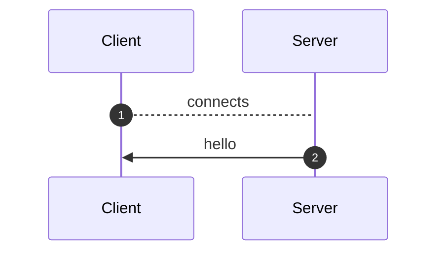
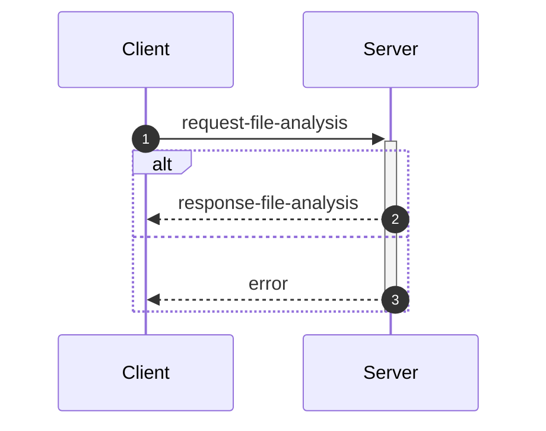
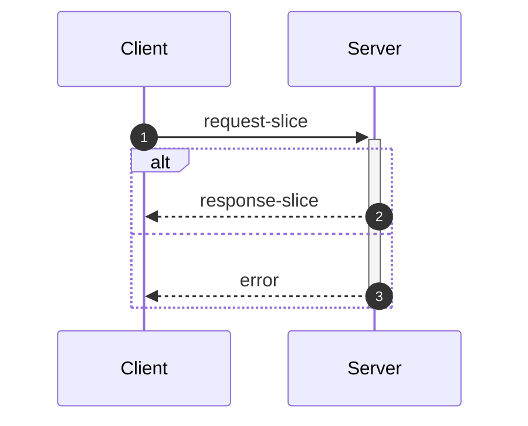
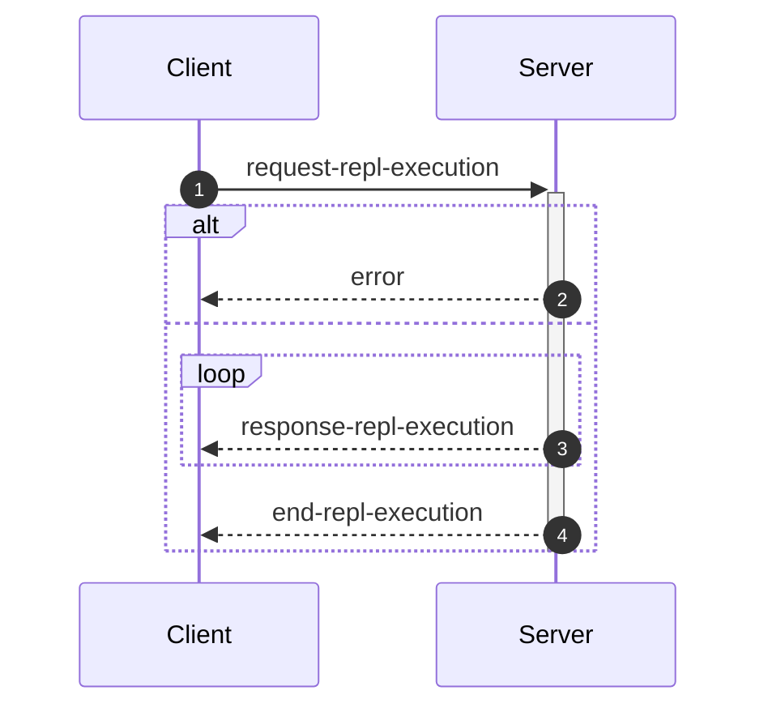

_This document was generated from '[src/documentation/wiki-interface.ts](https://github.com/flowr-analysis/flowr/tree/main//src/documentation/wiki-interface.ts)' on 2026-01-15, 16:54:32 UTC presenting an overview of flowR's interface (v2.8.6, using R v4.5.2). Please do not edit this file/wiki page directly._

Although far from being as detailed as the in-depth explanation of [_flowR_](https://github.com/flowr-analysis/flowr/wiki/core),
this wiki page explains how to interface with _flowR_ in more detail.
In general, command line arguments and other options provide short descriptions on hover over.

* [💻 Using the REPL](#using-the-repl)
* [💬 Communicating with the Server](#communicating-with-the-server)
* [⚙️ Configuring FlowR](#configuring-flowr)
* [⚒️ Writing Code](#writing-code)

<a id='using-the-repl'></a>
## 💻 Using the REPL


> [!NOTE]
> To execute arbitrary R commands with a repl request, _flowR_ has to be started explicitly with <span title="Description (Command Line Argument): Allow to access the underlying R session when using flowR (security warning: this allows the execution of arbitrary R code!)">`--r-session-access`</span>.
> Please be aware that this introduces a security risk and note that this relies on the [`r-shell` engine](https://github.com/flowr-analysis/flowr/wiki/engines) .

Although primarily meant for users to explore, 
there is nothing which forbids simply calling _flowR_ as a subprocess to use standard-in, -output, and -error 
for communication (although you can access the REPL using the server as well, 
with the [REPL Request](#message-request-repl-execution) message).

The read-eval-print loop&nbsp;(REPL) works relatively simple.
You can submit an expression (using <kbd>Enter</kbd>),
which is interpreted as an R&nbsp;expression by default but interpreted as a *command* if it starts with a colon (`:`).
The best command to get started with the REPL is <span title="Description (Repl Command): Show help information (aliases: :h, :?)">`:help`</span>.
Besides, you can leave the REPL either with the command <span title="Description (Repl Command): End the repl (aliases: :q, :exit)">`:quit`</span> or by pressing <kbd>Ctrl</kbd>+<kbd>C</kbd> twice.
When writing a *command*, you may press <kbd>Tab</kbd> to get a list of completions, if available.
Multiple commands can be entered in a single line by separating them with a semicolon (`;`), e.g. `:parse "x<-2"; :df*`.
If a command is given without R code, the REPL will re-use R code given in a previous command. 
The prior example will hence return first the parsed AST of the program and then the dataflow graph for `"x <- 2"`.

> [!NOTE]
> If you develop flowR, you may want to launch the repl using the `npm run main-dev` command, this way, you get a non-minified version of flowR with debug information and hot-reloading of source files.

<details>
<summary>Available Commands</summary>

We currently offer the following commands (this with a `[*]` suffix are available with and without the star):


| Command | Description |
| ------- | ----------- |
| **<span title="Description (Repl Command): End the repl (aliases: :q, :exit)">:quit</span>** | End the repl (aliases: **:<span title="Alias of ':quit'. End the repl">q</span>**, **:<span title="Alias of ':quit'. End the repl">exit</span>**) |
| **<span title="Description (Repl Command): Execute the given code as R code. This requires the `--r-session-access` flag to be set and requires the r-shell engine. (aliases: :e, :r)">:execute</span>** | Execute the given code as R code. This requires the `--r-session-access` flag to be set and requires the r-shell engine. (aliases: **:<span title="Alias of ':execute'. Execute the given code as R code. This requires the `--r-session-access` flag to be set and requires the r-shell engine.">e</span>**, **:<span title="Alias of ':execute'. Execute the given code as R code. This requires the `--r-session-access` flag to be set and requires the r-shell engine.">r</span>**) |
| **<span title="Description (Repl Command): Get mermaid code for the control-flow graph of R code, start with 'file://' to indicate a file (aliases: :cfg, :cf)">:controlflow[*]</span>** | Get mermaid code for the control-flow graph of R code, start with 'file://' to indicate a file (star: Returns the URL to mermaid.live) (aliases: **:<span title="Alias of ':controlflow'. Get mermaid code for the control-flow graph of R code, start with 'file://' to indicate a file">cfg</span>**, **:<span title="Alias of ':controlflow'. Get mermaid code for the control-flow graph of R code, start with 'file://' to indicate a file">cf</span>**) |
| **<span title="Description (Repl Command): Get mermaid code for the control-flow graph with basic blocks, start with 'file://' to indicate a file (aliases: :cfgb, :cfb)">:controlflowbb[*]</span>** | Get mermaid code for the control-flow graph with basic blocks, start with 'file://' to indicate a file (star: Returns the URL to mermaid.live) (aliases: **:<span title="Alias of ':controlflowbb'. Get mermaid code for the control-flow graph with basic blocks, start with 'file://' to indicate a file">cfgb</span>**, **:<span title="Alias of ':controlflowbb'. Get mermaid code for the control-flow graph with basic blocks, start with 'file://' to indicate a file">cfb</span>**) |
| **<span title="Description (Repl Command): Get mermaid code for the dataflow graph, start with 'file://' to indicate a file (aliases: :d, :df)">:dataflow[*]</span>** | Get mermaid code for the dataflow graph, start with 'file://' to indicate a file (star: Returns the URL to mermaid.live) (aliases: **:<span title="Alias of ':dataflow'. Get mermaid code for the dataflow graph, start with 'file://' to indicate a file">d</span>**, **:<span title="Alias of ':dataflow'. Get mermaid code for the dataflow graph, start with 'file://' to indicate a file">df</span>**) |
| **<span title="Description (Repl Command): Get mermaid code for the normalized AST of R code, start with 'file://' to indicate a file (aliases: :n)">:normalize[*]</span>** | Get mermaid code for the normalized AST of R code, start with 'file://' to indicate a file (star: Returns the URL to mermaid.live) (alias: **:<span title="Alias of ':normalize'. Get mermaid code for the normalized AST of R code, start with 'file://' to indicate a file">n</span>**) |
| **<span title="Description (Repl Command): Get mermaid code for the simplified dataflow graph, start with 'file://' to indicate a file (aliases: :ds, :dfs)">:dataflowsimple[*]</span>** | Get mermaid code for the simplified dataflow graph, start with 'file://' to indicate a file (star: Returns the URL to mermaid.live) (aliases: **:<span title="Alias of ':dataflowsimple'. Get mermaid code for the simplified dataflow graph, start with 'file://' to indicate a file">ds</span>**, **:<span title="Alias of ':dataflowsimple'. Get mermaid code for the simplified dataflow graph, start with 'file://' to indicate a file">dfs</span>**) |
| **<span title="Description (Repl Command): Just calculates the DFG, but only prints summary info (aliases: :d#, :df#)">:dataflowsilent</span>** | Just calculates the DFG, but only prints summary info (aliases: **:<span title="Alias of ':dataflowsilent'. Just calculates the DFG, but only prints summary info">d#</span>**, **:<span title="Alias of ':dataflowsilent'. Just calculates the DFG, but only prints summary info">df#</span>**) |
| **<span title="Description (Repl Command): Prints ASCII Art of the parsed, unmodified AST, start with 'file://' to indicate a file (aliases: :p)">:parse</span>** | Prints ASCII Art of the parsed, unmodified AST, start with 'file://' to indicate a file (alias: **:<span title="Alias of ':parse'. Prints ASCII Art of the parsed, unmodified AST, start with 'file://' to indicate a file">p</span>**) |
| **<span title="Description (Repl Command): Prints the version of flowR as well as the current version of R">:version</span>** | Prints the version of flowR as well as the current version of R
| **<span title="Description (Repl Command): Query the given R code, start with 'file://' to indicate a file. The query is to be a valid query in json format (use 'help' to get more information).">:query[*]</span>** | Query the given R code, start with 'file://' to indicate a file. The query is to be a valid query in json format (use 'help' to get more information). (star: Similar to query, but returns the output in json format.)
| **<span title="Description (Repl Command): Returns an ASCII representation of the dataflow graph (aliases: :df!)">:dataflowascii</span>** | Returns an ASCII representation of the dataflow graph (alias: **:<span title="Alias of ':dataflowascii'. Returns an ASCII representation of the dataflow graph">df!</span>**) |
| **<span title="Description (Repl Command): Show help information (aliases: :h, :?)">:help</span>** | Show help information (aliases: **:<span title="Alias of ':help'. Show help information">h</span>**, **:<span title="Alias of ':help'. Show help information">?</span>**) |


</details>


> [!TIP]
> 
> As indicated by the examples before, all REPL commands that operate on code keep track of the state.
> Hence, if you run a command like <span title="Description (Repl Command, starred version): Returns the URL to mermaid.live; Base Command: Get mermaid code for the dataflow graph, start with 'file://' to indicate a file (aliases: :d*, :df*)">`:dataflow*`</span> without providing R code,
> the REPL will re-use the R code provided in a previous command.
> Likewise, doing this will benefit from incrementality!
> If you request the dataflow graph with `:df* x <- 2 * y` and then want to see the parsed AST with `:parse`,
> the REPL will re-use previously obtained information and not re-parse the code again.
> 		


Generally, many commands offer shortcut versions in the REPL. Many queries, for example, offer a shortened format (see the example below).
Of special note, the [Config Query](https://github.com/flowr-analysis/flowr/wiki/query-api#Config-Query)
can be used to also modify the currently active configuration of _flowR_ within the REPL (see the [wiki page](https://github.com/flowr-analysis/flowr/wiki/query-api#Config-Query) for more information).

### Example: Retrieving the Dataflow Graph

To retrieve a URL to the [mermaid](https://mermaid.js.org/) diagram of the dataflow of a given expression, 
use <span title="Description (Repl Command, starred version): Returns the URL to mermaid.live; Base Command: Get mermaid code for the dataflow graph, start with 'file://' to indicate a file (aliases: :d*, :df*)">`:dataflow*`</span> (or <span title="Description (Repl Command): Get mermaid code for the dataflow graph, start with 'file://' to indicate a file (aliases: :d, :df)">`:dataflow`</span> to get the mermaid code in the cli):


```shell
$ docker run -it --rm eagleoutice/flowr # or npm run flowr 
flowR repl using flowR v2.8.6, R grammar v14 (tree-sitter engine)
R> :dataflow* y <- 1 + x
```

<details>
<summary style='color:gray'>Output</summary>


```text
https://mermaid.live/view#base64:eyJjb2RlIjoiZmxvd2NoYXJ0IEJUXG4gICAgMXt7XCJgIzkxO1JOdW1iZXIjOTM7IDFcbiAgICAgICgxKVxuICAgICAgKjEuNipgXCJ9fVxuICAgIDIoW1wiYCM5MTtSU3ltYm9sIzkzOyB4XG4gICAgICAoMilcbiAgICAgICoxLjEwKmBcIl0pXG4gICAgM1tbXCJgIzkxO1JCaW5hcnlPcCM5MzsgIzQzO1xuICAgICAgKDMpXG4gICAgICAqMS42LTEwKlxuICAgICgxLCAyKWBcIl1dXG4gICAgYnVpbHQtaW46X1tcImBCdWlsdC1JbjpcbiM0MztgXCJdXG4gICAgc3R5bGUgYnVpbHQtaW46XyBzdHJva2U6Z3JheSxmaWxsOmdyYXksc3Ryb2tlLXdpZHRoOjJweCxvcGFjaXR5Oi44O1xuICAgIDBbXCJgIzkxO1JTeW1ib2wjOTM7IHlcbiAgICAgICgwKVxuICAgICAgKjEuMSpgXCJdXG4gICAgNFtbXCJgIzkxO1JCaW5hcnlPcCM5MzsgIzYwOyM0NTtcbiAgICAgICg0KVxuICAgICAgKjEuMS0xMCpcbiAgICAoMCwgMylgXCJdXVxuICAgIGJ1aWx0LWluOl8tW1wiYEJ1aWx0LUluOlxuIzYwOyM0NTtgXCJdXG4gICAgc3R5bGUgYnVpbHQtaW46Xy0gc3Ryb2tlOmdyYXksZmlsbDpncmF5LHN0cm9rZS13aWR0aDoycHgsb3BhY2l0eTouODtcbiAgICAzIC0tPnxcInJlYWRzLCBhcmd1bWVudFwifCAxXG4gICAgMyAtLT58XCJyZWFkcywgYXJndW1lbnRcInwgMlxuICAgIDMgLS4tPnxcInJlYWRzLCBjYWxsc1wifCBidWlsdC1pbjpfXG4gICAgbGlua1N0eWxlIDIgc3Ryb2tlOmdyYXk7XG4gICAgMCAtLT58XCJkZWZpbmVkLWJ5XCJ8IDNcbiAgICAwIC0tPnxcImRlZmluZWQtYnlcInwgNFxuICAgIDQgLS0+fFwicmVhZHMsIGFyZ3VtZW50XCJ8IDNcbiAgICA0IC0tPnxcInJldHVybnMsIGFyZ3VtZW50XCJ8IDBcbiAgICA0IC0uLT58XCJyZWFkcywgY2FsbHNcInwgYnVpbHQtaW46Xy1cbiAgICBsaW5rU3R5bGUgNyBzdHJva2U6Z3JheTsiLCJtZXJtYWlkIjp7ImF1dG9TeW5jIjp0cnVlfX0=
Copied mermaid url to clipboard (dataflow: 0ms).
```


Retrieve the dataflow graph of the expression `y <- 1 + x`. It looks like this:


	
<details>

<summary style="color:gray">R Code of the Dataflow Graph</summary>

The analysis required _0.6 ms_ (including parse and normalize, using the [tree-sitter](https://github.com/flowr-analysis/flowr/wiki/Engines) engine) within the generation environment. 
We encountered no unknown side effects during the analysis.


```r
y <- 1 + x
```


</details>


</details>


For small graphs like this, <span title="Description (Repl Command): Returns an ASCII representation of the dataflow graph (aliases: :df!)">`:dataflowascii`</span> also provides an ASCII representation directly in the REPL:


```shell
$ docker run -it --rm eagleoutice/flowr # or npm run flowr 
flowR repl using flowR v2.8.6, R grammar v14 (tree-sitter engine)
R> :df! y <- 1 + x
```

<details open>
<summary style='color:gray'>Output</summary>


```text
                        0<1>0
                   ┌────| 1 |
    ┌────────┐     │    0---0
 c<4>c       └──c<3>c
 |<- |  v<0>v┌──| + |
 c---c──| y |┘  c---c   u<2>u
        v---v      └────| x |
                        u---u
Edges:
3 -> 1: reads, argument  3 -> 2: reads, argument
4 -> 3: reads, argument  4 -> 0: returns, argument
0 -> 3: defined-by       0 -> 4: defined-by
```


Retrieve the dataflow graph of the expression `y <- 1 + x` as ASCII art.

</details>


For the slicing with <span title="Description (Repl Command): Static backwards executable slicer for R">`:slicer`</span>, you have access to the same [magic comments](#slice-magic-comments) as with the [slice request](#message-request-slice).

### Example: Interfacing with the File System

Many commands that allow for an R-expression (like <span title="Description (Repl Command, starred version): Returns the URL to mermaid.live; Base Command: Get mermaid code for the dataflow graph, start with 'file://' to indicate a file (aliases: :d*, :df*)">`:dataflow*`</span>) allow for a file as well 
if the argument starts with `file://`. 
If you are working from the root directory of the _flowR_ repository, the following gives you the parsed AST of the example file using the <span title="Description (Repl Command): Prints ASCII Art of the parsed, unmodified AST, start with 'file://' to indicate a file (aliases: :p)">`:parse`</span> command:


```shell
$ docker run -it --rm eagleoutice/flowr # or npm run flowr 
flowR repl using flowR v2.8.6, R grammar v14 (tree-sitter engine)
R> :parse file://test/testfiles/example.R
```

<details>
<summary style='color:gray'>Output</summary>


```text
File: test/testfiles/example.R

program
├ binaryoperator
│ ├ identifier "sum" (1:1─4)
│ ├ <- "<-" (1:5─7)
│ ╰ float "0" (1:8─9)
├ binaryoperator
│ ├ identifier "product" (2:1─8)
│ ├ <- "<-" (2:9─11)
│ ╰ float "1" (2:12─13)
├ binaryoperator
│ ├ identifier "w" (3:1─2)
│ ├ <- "<-" (3:3─5)
│ ╰ float "7" (3:6─7)
├ binaryoperator
│ ├ identifier "N" (4:1─2)
│ ├ <- "<-" (4:3─5)
│ ╰ float "10" (4:6─8)
├ forstatement
│ ├ for "for" (6:1─4)
│ ├ ( "(" (6:5─6)
│ ├ identifier "i" (6:6─7)
│ ├ in "in" (6:8─10)
│ ├ binaryoperator
│ │ ├ float "1" (6:11─12)
│ │ ├ : ":" (6:12─13)
│ │ ╰ parenthesizedexpression
│ │   ├ ( "(" (6:13─14)
│ │   ├ binaryoperator
│ │   │ ├ identifier "N" (6:14─15)
│ │   │ ├ - "-" (6:15─16)
│ │   │ ╰ float "1" (6:16─17)
│ │   ╰ ) ")" (6:17─18)
│ ├ ) ")" (6:18─19)
│ ╰ bracedexpression
│   ├ { "{" (6:20─21)
│   ├ binaryoperator
│   │ ├ identifier "sum" (7:3─6)
│   │ ├ <- "<-" (7:7─9)
│   │ ╰ binaryoperator
│   │   ├ binaryoperator
│   │   │ ├ identifier "sum" (7:10─13)
│   │   │ ├ + "+" (7:14─15)
│   │   │ ╰ identifier "i" (7:16─17)
│   │   ├ + "+" (7:18─19)
│   │   ╰ identifier "w" (7:20─21)
│   ├ binaryoperator
│   │ ├ identifier "product" (8:3─10)
│   │ ├ <- "<-" (8:11─13)
│   │ ╰ binaryoperator
│   │   ├ identifier "product" (8:14─21)
│   │   ├  "" (8:22─23)
│   │   ╰ identifier "i" (8:24─25)
│   ╰ } "}" (9:1─2)
├ call
│ ├ identifier "cat" (11:1─4)
│ ╰ arguments
│   ├ ( "(" (11:4─5)
│   ├ argument
│   │ ╰ string
│   │   ├ " "\"" (11:5─6)
│   │   ├ stringcontent "Sum:" (11:6─10)
│   │   ╰ " "\"" (11:10─11)
│   ├ comma "," (11:11─12)
│   ├ argument
│   │ ╰ identifier "sum" (11:13─16)
│   ├ comma "," (11:16─17)
│   ├ argument
│   │ ╰ string
│   │   ├ " "\"" (11:18─19)
│   │   ├ stringcontent
│   │   │ ╰ escapesequence "\\n" (11:19─21)
│   │   ╰ " "\"" (11:21─22)
│   ╰ ) ")" (11:22─23)
╰ call
  ├ identifier "cat" (12:1─4)
  ╰ arguments
    ├ ( "(" (12:4─5)
    ├ argument
    │ ╰ string
    │   ├ " "\"" (12:5─6)
    │   ├ stringcontent "Product:" (12:6─14)
    │   ╰ " "\"" (12:14─15)
    ├ comma "," (12:15─16)
    ├ argument
    │ ╰ identifier "product" (12:17─24)
    ├ comma "," (12:24─25)
    ├ argument
    │ ╰ string
    │   ├ " "\"" (12:26─27)
    │   ├ stringcontent
    │   │ ╰ escapesequence "\\n" (12:27─29)
    │   ╰ " "\"" (12:29─30)
    ╰ ) ")" (12:30─31)
```


Retrieve the parsed AST of the example file.

<details>

<summary>File Content</summary>


```r
sum <- 0
product <- 1
w <- 7
N <- 10

for (i in 1:(N-1)) {
  sum <- sum + i + w
  product <- product * i
}

cat("Sum:", sum, "\n")
cat("Product:", product, "\n")
```


</details>

As _flowR_ directly transforms this AST the output focuses on being human-readable instead of being machine-readable. 
		

</details>


### Example: Run a Query

You can run any query supported by _flowR_ using the <span title="Description (Repl Command): Query the given R code, start with 'file://' to indicate a file. The query is to be a valid query in json format (use 'help' to get more information).">`:query`</span> command.
For example, to obtain the shapes of all data frames in a given piece of code, you can run:


```shell
$ docker run -it --rm eagleoutice/flowr # or npm run flowr 
flowR repl using flowR v2.8.6, R grammar v14 (tree-sitter engine)
R> :query @df-shape "x <- data.frame(a = 1:10, b = 1:10)\ny <- x$a"
```

<details open>
<summary style='color:gray'>Output</summary>


```text
Query: df-shape (4 ms)
   ╰ 12: (colnames: [{"a", "b"}, {}], cols: [2, 2], rows: [10, 10])
   ╰ 0: (colnames: [{"a", "b"}, {}], cols: [2, 2], rows: [10, 10])
All queries together required ≈6 ms (1ms accuracy, total 12 ms)
```


Retrieve the shapes of all data frames in the given code.

</details>


To run the linter on a file, you can use (in this example, we just issue the `dead-code` linter on a small piece of code):


```shell
$ docker run -it --rm eagleoutice/flowr # or npm run flowr 
flowR repl using flowR v2.8.6, R grammar v14 (tree-sitter engine)
R> :query @linter rules:dead-code "if(FALSE) x <- 2"
```

<details open>
<summary style='color:gray'>Output</summary>


```text
Query: linter (2 ms)
   ╰ Dead Code (dead-code):
       ╰ certain:
           ╰ Code at 1.11-16
       ╰ Metadata: consideredNodes: 7, searchTimeMs: 1, processTimeMs: 1
All queries together required ≈2 ms (1ms accuracy, total 3 ms)
```


Run the linter on the given code, with only the `dead-code` rule enabled.

</details>


For more information on the available queries, please check out the [Query API](https://github.com/flowr-analysis/flowr/wiki/query-api).


<a id='communicating-with-the-server'></a>
## 💬 Communicating with the Server


As explained in the [Overview](https://github.com/flowr-analysis/flowr/wiki/Overview), you can simply run the [TCP](https://de.wikipedia.org/wiki/Transmission_Control_Protocol)&nbsp;server by adding the <span title="Description (Command Line Argument): Do not drop into a repl, but instead start a server on the given port (default: 1042) and listen for messages.">`--server`</span> flag (and, due to the interactive mode, exit with the conventional <kbd>CTRL</kbd>+<kbd>C</kbd>).
Currently, every connection is handled by the same underlying `RShell` - so the server is not designed to handle many clients at a time.
Additionally, the server is not well guarded against attacks (e.g., you can theoretically spawn an arbitrary number of&nbsp;RShell sessions on the target machine).

Every message has to be given in a single line (i.e., without a newline in-between) and end with a newline character. Nevertheless, we will pretty-print example given in the following segments for the ease of reading.


> [!NOTE]
> 
> The default <span title="Description (Command Line Argument): Do not drop into a repl, but instead start a server on the given port (default: 1042) and listen for messages.">`--server`</span> uses a simple [TCP](https://de.wikipedia.org/wiki/Transmission_Control_Protocol)
> connection. If you want _flowR_ to expose a [WebSocket](https://de.wikipedia.org/wiki/WebSocket) server instead, add the <span title="Description (Command Line Argument): If the server flag is set, use websocket for messaging">`--ws`</span> flag (i.e., <span title="Description (Command Line Argument): Do not drop into a repl, but instead start a server on the given port (default: 1042) and listen for messages.">`--server`</span> <span title="Description (Command Line Argument): If the server flag is set, use websocket for messaging">`--ws`</span>) when starting _flowR_ from the command line.
> 			


<ul><li>
<a id="message-hello"></a>
<b>Hello</b> Message (<code>hello</code>) 
<details>

<summary style="color:gray"> View Details. <i>The server informs the client about the successful connection and provides Meta-Information.</i> </summary>




	
After launching _flowR_, for example, with <code>docker run -it --rm eagleoutice/flowr <span title="Description (Command Line Argument): Do not drop into a repl, but instead start a server on the given port (default: 1042) and listen for messages.">-<span/>-server</span></code>&nbsp;(🐳️), simply connecting should present you with a `hello` message, that amongst others should reveal the versions of&nbsp;_flowR_ and&nbsp;R, using the [semver 2.0](https://semver.org/spec/v2.0.0.html) versioning scheme.
The message looks like this:


```json
{
  "type": "hello",
  "clientName": "client-0",
  "versions": {
    "flowr": "2.8.6",
    "r": "4.5.2",
    "engine": "r-shell"
  }
}
```


There are currently a few messages that you can send after the hello message.
If you want to _slice_ a piece of R code you first have to send an [analysis request](#message-request-file-analysis), so that you can send one or multiple slice requests afterward.
Requests for the [REPL](#message-request-repl) are independent of that.
	

<hr>


<details>
<summary style="color:gray">Message schema (<code>hello</code>)</summary>

For the definition of the hello message, please see it's implementation at [`./src/cli/repl/server/messages/message-hello.ts`](https://github.com/flowr-analysis/flowr/tree/main/./src/cli/repl/server/messages/message-hello.ts).

- **.** object [required]
    - **type** string [required]
        _The type of the hello message._
        Allows only the values: 'hello'
    - **id** any [forbidden]
        _The id of the message is always undefined (as it is the initial message and not requested)._
    - **clientName** string [required]
        _A unique name that is assigned to each client. It has no semantic meaning and is only used/useful for debugging._
    - **versions** object [required]
        - **flowr** string [required]
            _The version of the flowr server running in semver format._
        - **r** string [required]
            _The version of the underlying R shell running in semver format._
        - **engine** string [required]
            _The parser backend that is used to parse the R code._

</details>


<hr>

</details>
	</li>

<li>
<a id="message-request-file-analysis"></a>
<b>Analysis</b> Message (<code>request-file-analysis</code>) 
<details>

<summary style="color:gray"> View Details. <i>The server builds the dataflow graph for a given input file (or a set of files).</i> </summary>




	
The request allows the server to analyze a file and prepare it for slicing.
The message can contain a `filetoken`, which is used to identify the file in later slice or query requests (if you do not add one, the request will not be stored and therefore, it is not available for subsequent requests).

> **Please note!**\
> If you want to send and process a lot of analysis requests, but do not want to slice them, please do not pass the `filetoken` field. This will save the server a lot of memory allocation.

Furthermore, the request must contain either a `content` field to directly pass the file's content or a `filepath` field which contains the path to the file (this path must be accessible for the server to be useful).
If you add the `id` field, the answer will use the same `id` so you can match requests and the corresponding answers.
See the implementation of the request-file-analysis message for more information.


<details>
<summary>Example of the <code>request-file-analysis</code> Message</summary>

_Note:_ even though we pretty-print these messages, they are sent as a single line, ending with a newline.

The following lists all messages that were sent and received in case you want to reproduce the scenario:

<ol>
<li> <code>hello</code> (response)
<details> 

<summary> Show Details </summary>

The first message is always a hello message.


```json
{
  "type": "hello",
  "clientName": "client-0",
  "versions": {
    "flowr": "2.8.6",
    "r": "4.5.2",
    "engine": "r-shell"
  }
}
```


</details>
</li>

<li> <b><code>request-file-analysis</code> (request)</b>
<details open> 

<summary> Show Details </summary>

Let's suppose you simply want to analyze the following script:
 
```r
x <- 1
x + 1
```

 For this, you can send the following request:


```json
{
  "type": "request-file-analysis",
  "id": "1",
  "filetoken": "x",
  "content": "x <- 1\nx + 1"
}
```


</details>
</li>

<li> <code>response-file-analysis</code> (response)
<details> 

<summary> Show Details </summary>


The `results` field of the response effectively contains three keys of importance:

- `parse`: which contains 1:1 the parse result in CSV format that we received from the `RShell` (i.e., the AST produced by the parser of the R interpreter).
- `normalize`: which contains the normalized AST, including ids (see the `info` field and the [Normalized AST](https://github.com/flowr-analysis/flowr/wiki/Normalized%20AST) wiki page).
- `dataflow`: especially important is the `graph` field which contains the dataflow graph as a set of root vertices (see the [Dataflow Graph](https://github.com/flowr-analysis/flowr/wiki/Dataflow%20Graph) wiki page).
			


_As the code is pretty long, we inhibit pretty printing and syntax highlighting (JSON, hiding built-in):_

```text
{"type":"response-file-analysis","format":"json","id":"1","results":{"parse":{"files":[{"parsed":"[1,1,1,6,7,0,\"expr\",false,\"x <- 1\"],[1,1,1,1,1,3,\"SYMBOL\",true,\"x\"],[1,1,1,1,3,7,\"expr\",false,\"x\"],[1,3,1,4,2,7,\"LEFT_ASSIGN\",true,\"<-\"],[1,6,1,6,4,5,\"NUM_CONST\",true,\"1\"],[1,6,1,6,5,7,\"expr\",false,\"1\"],[2,1,2,5,16,0,\"expr\",false,\"x + 1\"],[2,1,2,1,10,12,\"SYMBOL\",true,\"x\"],[2,1,2,1,12,16,\"expr\",false,\"x\"],[2,3,2,3,11,16,\"'+'\",true,\"+\"],[2,5,2,5,13,14,\"NUM_CONST\",true,\"1\"],[2,5,2,5,14,16,\"expr\",false,\"1\"]","filePath":"/tmp/tmp-1098606-bj2DVP56kYTO-.R"}],".meta":{"timing":4}},"normalize":{"ast":{"type":"RProject","files":[{"root":{"type":"RExpressionList","children":[{"type":"RBinaryOp","location":[1,3,1,4],"lhs":{"type":"RSymbol","location":[1,1,1,1],"content":"x","lexeme":"x","info":{"fullRange":[1,1,1,1],"additionalTokens":[],"id":0,"parent":2,"role":"binop-lhs","index":0,"nesting":0,"file":"/tmp/tmp-1098606-bj2DVP56kYTO-.R"}},"rhs":{"location":[1,6,1,6],"lexeme":"1","info":{"fullRange":[1,6,1,6],"additionalTokens":[],"id":1,"parent":2,"role":"binop-rhs","index":1,"nesting":0,"file":"/tmp/tmp-1098606-bj2DVP56kYTO-.R"},"type":"RNumber","content":{"num":1,"complexNumber":false,"markedAsInt":false}},"operator":"<-","lexeme":"<-","info":{"fullRange":[1,1,1,6],"additionalTokens":[],"id":2,"parent":6,"nesting":0,"file":"/tmp/tmp-1098606-bj2DVP56kYTO-.R","index":0,"role":"expr-list-child"}},{"type":"RBinaryOp","location":[2,3,2,3],"lhs":{"type":"RSymbol","location":[2,1,2,1],"content":"x","lexeme":"x","info":{"fullRange":[2,1,2,1],"additionalTokens":[],"id":3,"parent":5,"role":"binop-lhs","index":0,"nesting":0,"file":"/tmp/tmp-1098606-bj2DVP56kYTO-.R"}},"rhs":{"location":[2,5,2,5],"lexeme":"1","info":{"fullRange":[2,5,2,5],"additionalTokens":[],"id":4,"parent":5,"role":"binop-rhs","index":1,"nesting":0,"file":"/tmp/tmp-1098606-bj2DVP56kYTO-.R"},"type":"RNumber","content":{"num":1,"complexNumber":false,"markedAsInt":false}},"operator":"+","lexeme":"+","info":{"fullRange":[2,1,2,5],"additionalTokens":[],"id":5,"parent":6,"nesting":0,"file":"/tmp/tmp-1098606-bj2DVP56kYTO-.R","index":1,"role":"expr-list-child"}}],"info":{"additionalTokens":[],"id":6,"nesting":0,"file":"/tmp/tmp-1098606-bj2DVP56kYTO-.R","role":"root","index":0}},"filePath":"/tmp/tmp-1098606-bj2DVP56kYTO-.R"}],"info":{"id":7}},".meta":{"timing":2}},"dataflow":{"unknownReferences":[],"in":[{"nodeId":2,"name":"<-","type":2},{"nodeId":5,"name":"+","type":2}],"out":[{"nodeId":0,"name":"x","type":4,"definedAt":2,"value":[1]}],"environment":{"current":{"id":2114,"parent":"<BuiltInEnvironment>","memory":[["x",[{"nodeId":0,"name":"x","type":4,"definedAt":2,"value":[1]}]]]},"level":0},"graph":{"rootVertices":[1,0,2,3,4,5],"vertexInformation":[[1,{"tag":"value","id":1}],[0,{"tag":"vdef","id":0}],[2,{"tag":"fcall","id":2,"name":"<-","onlyBuiltin":true,"args":[{"nodeId":0,"type":32},{"nodeId":1,"type":32}],"origin":["builtin:assignment"]}],[3,{"tag":"use","id":3}],[4,{"tag":"value","id":4}],[5,{"tag":"fcall","id":5,"name":"+","onlyBuiltin":true,"args":[{"nodeId":3,"type":32},{"nodeId":4,"type":32}],"origin":["builtin:default"]}]],"edgeInformation":[[2,[[1,{"types":65}],[0,{"types":72}],["built-in:<-",{"types":5}]]],[0,[[1,{"types":2}],[2,{"types":2}]]],[3,[[0,{"types":1}]]],[5,[[3,{"types":65}],[4,{"types":65}],["built-in:+",{"types":5}]]]],"_unknownSideEffects":[]},"entryPoint":2,"exitPoints":[{"type":0,"nodeId":5}],"hooks":[],".meta":{"timing":0}}}}
```


</details>
</li>
</ol>

The complete round-trip took 11.2 ms (including time required to validate the messages, start, and stop the internal mock server).

</details>


You receive an error if, for whatever reason, the analysis fails (e.g., the message or code you sent contained syntax errors).
It contains a human-readable description *why* the analysis failed (see the error message implementation for more details).


<details>
<summary>Example Error Message</summary>

_Note:_ even though we pretty-print these messages, they are sent as a single line, ending with a newline.

The following lists all messages that were sent and received in case you want to reproduce the scenario:

<ol>
<li> <code>hello</code> (response)
<details> 

<summary> Show Details </summary>

The first message is always a hello message.


```json
{
  "type": "hello",
  "clientName": "client-0",
  "versions": {
    "flowr": "2.8.6",
    "r": "4.5.2",
    "engine": "r-shell"
  }
}
```


</details>
</li>

<li> <code>request-file-analysis</code> (request)
<details> 

<summary> Show Details </summary>


```json
{
  "type": "request-file-analysis",
  "id": "1",
  "filename": "sample.R",
  "content": "x <-"
}
```


</details>
</li>

<li> <b><code>error</code> (response)</b>
<details open> 

<summary> Show Details </summary>


```json
{
  "id": "1",
  "type": "error",
  "fatal": false,
  "reason": "Error while analyzing file sample.R: GuardError: unable to parse R code (see the log for more information) for request {\"request\":\"text\",\"content\":\"x <-\"}}\n Report a Bug: https://github.com/flowr-analysis/flowr/issues/new?body=%3C!%2D%2D%20Please%20describe%20your%20issue%20in%20more%20detail%20below!%20%2D%2D%3E%0A%0A%0A%3C!%2D%2D%20Automatically%20generated%20issue%20metadata%2C%20please%20do%20not%20edit%20or%20delete%20content%20below%20this%20line%20%2D%2D%3E%0A%2D%2D%2D%0A%0AflowR%20version%3A%202.8.6%0Anode%20version%3A%20v22.13.1%0Anode%20arch%3A%20x64%0Anode%20platform%3A%20linux%0Amessage%3A%20%60unable%20to%20parse%20R%20code%20%28see%20the%20log%20for%20more%20information%29%20for%20request%20%7B%22request%22%3A%22text%22%2C%22content%22%3A%22x%20%3C%2D%22%7D%7D%60%0Astack%20trace%3A%0A%60%60%60%0A%20%20%20%20at%20guard%20%28%3C%3E%2Fsrc%2Futil%2Fassert.ts%3A128%3A9%29%0A%20%20%20%20at%20guardRetrievedOutput%20%28%3C%3E%2Fsrc%2Fr%2Dbridge%2Fretriever.ts%3A221%3A7%29%0A%20%20%20%20at%20%2Fhome%2Fhappy%2Dfeet%2Fgit%2Fphd%2Fflowr%2Dfield%2Fflowr%2Fsrc%2Fr%2Dbridge%2Fretriever.ts%3A182%3A4%0A%20%20%20%20at%20processTicksAndRejections%20%28node%3Ainternal%2Fprocess%2Ftask_queues%3A105%3A5%29%0A%20%20%20%20at%20async%20Object.parseRequests%20%5Bas%20processor%5D%20%28%3C%3E%2Fsrc%2Fr%2Dbridge%2Fparser.ts%3A104%3A19%29%0A%20%20%20%20at%20async%20PipelineExecutor.nextStep%20%28%3C%3E%2Fsrc%2Fcore%2Fpipeline%2Dexecutor.ts%3A192%3A25%29%0A%20%20%20%20at%20async%20FlowrAnalyzerCache.runTapeUntil%20%28%3C%3E%2Fsrc%2Fproject%2Fcache%2Fflowr%2Danalyzer%2Dcache.ts%3A93%3A4%29%0A%20%20%20%20at%20async%20FlowRServerConnection.sendFileAnalysisResponse%20%28%3C%3E%2Fsrc%2Fcli%2Frepl%2Fserver%2Fconnection.ts%3A163%3A52%29%0A%60%60%60%0A%0A%2D%2D%2D%0A%09"
}
```


</details>
</li>
</ol>

The complete round-trip took 7.7 ms (including time required to validate the messages, start, and stop the internal mock server).

</details>


&nbsp;

<a id="analysis-include-cfg"></a>
**Including the Control Flow Graph**

While _flowR_ does (for the time being) not use an explicit control flow graph but instead relies on control-dependency edges within the dataflow graph, 
the respective structure can still be exposed using the server (note that, as this feature is not needed within _flowR_, it is tested significantly less - 
so please create a [new issue](https://github.com/flowr-analysis/flowr/issues/new/choose) for any bug you may encounter).
For this, the analysis request may add `cfg: true` to its list of options.


<details>
<summary>Requesting a Control Flow Graph</summary>

_Note:_ even though we pretty-print these messages, they are sent as a single line, ending with a newline.

The following lists all messages that were sent and received in case you want to reproduce the scenario:

<ol>
<li> <code>hello</code> (response)
<details> 

<summary> Show Details </summary>

The first message is always a hello message.


```json
{
  "type": "hello",
  "clientName": "client-0",
  "versions": {
    "flowr": "2.8.6",
    "r": "4.5.2",
    "engine": "r-shell"
  }
}
```


</details>
</li>

<li> <b><code>request-file-analysis</code> (request)</b>
<details open> 

<summary> Show Details </summary>


```json
{
  "type": "request-file-analysis",
  "id": "1",
  "filetoken": "x",
  "content": "if(unknown > 0) { x <- 2 } else { x <- 5 }\nfor(i in 1:x) { print(x); print(i) }",
  "cfg": true
}
```


</details>
</li>

<li> <code>response-file-analysis</code> (response)
<details> 

<summary> Show Details </summary>


The response looks basically the same as a response sent without the `cfg` flag. However, additionally it contains a `cfg` field. 
If you are interested in a visual representation of the control flow graph, see the 
[visualization with mermaid](https://mermaid.live/view#base64:eyJjb2RlIjoiZmxvd2NoYXJ0IEJUXG4gICAgbjMyKFtcImBSRXhwcmVzc2lvbkxpc3QgKDMyKWBcIl0pXG4gICAgbjE1W1wiYFJJZlRoZW5FbHNlICgxNSlcbiMzNDtpZih1bmtub3duICM2MjsgMCkgIzEyMzsgeCAjNjA7IzQ1OyAyICMxMjU7IGVsc2UgIzEyMzsgeCAjNjA7IzQ1OyA1ICMxMjU7IzM0O2BcIl1cbiAgICBuMTUtZXhpdCgoMTUtZXhpdCkpXG4gICAgbjAoW1wiYFJTeW1ib2wgKDApXG4jMzQ7dW5rbm93biMzNDtgXCJdKVxuICAgIG4xKFtcImBSTnVtYmVyICgxKVxuIzM0OzAjMzQ7YFwiXSlcbiAgICBuMihbXCJgUkJpbmFyeU9wICgyKVxuIzM0O3Vua25vd24gIzYyOyAwIzM0O2BcIl0pXG4gICAgbjItZXhpdCgoMi1leGl0KSlcbiAgICBuOChbXCJgUkV4cHJlc3Npb25MaXN0ICg4KWBcIl0pXG4gICAgbjUoW1wiYFJTeW1ib2wgKDUpXG4jMzQ7eCMzNDtgXCJdKVxuICAgIG42KFtcImBSTnVtYmVyICg2KVxuIzM0OzIjMzQ7YFwiXSlcbiAgICBuNyhbXCJgUkJpbmFyeU9wICg3KVxuIzM0O3ggIzYwOyM0NTsgMiMzNDtgXCJdKVxuICAgIG43LWV4aXQoKDctZXhpdCkpXG4gICAgbjgtZXhpdCgoOC1leGl0KSlcbiAgICBuMTQoW1wiYFJFeHByZXNzaW9uTGlzdCAoMTQpYFwiXSlcbiAgICBuMTEoW1wiYFJTeW1ib2wgKDExKVxuIzM0O3gjMzQ7YFwiXSlcbiAgICBuMTIoW1wiYFJOdW1iZXIgKDEyKVxuIzM0OzUjMzQ7YFwiXSlcbiAgICBuMTMoW1wiYFJCaW5hcnlPcCAoMTMpXG4jMzQ7eCAjNjA7IzQ1OyA1IzM0O2BcIl0pXG4gICAgbjEzLWV4aXQoKDEzLWV4aXQpKVxuICAgIG4xNC1leGl0KCgxNC1leGl0KSlcbiAgICBuMTYoW1wiYFJTeW1ib2wgKDE2KVxuIzM0O2kjMzQ7YFwiXSlcbiAgICBuMzFbXCJgUkZvckxvb3AgKDMxKVxuIzM0O2ZvcihpIGluIDEjNTg7eCkgIzEyMzsgcHJpbnQoeCk7IHByaW50KGkpICMxMjU7IzM0O2BcIl1cbiAgICBuMTcoW1wiYFJOdW1iZXIgKDE3KVxuIzM0OzEjMzQ7YFwiXSlcbiAgICBuMTgoW1wiYFJTeW1ib2wgKDE4KVxuIzM0O3gjMzQ7YFwiXSlcbiAgICBuMTkoW1wiYFJCaW5hcnlPcCAoMTkpXG4jMzQ7MSM1ODt4IzM0O2BcIl0pXG4gICAgbjE5LWV4aXQoKDE5LWV4aXQpKVxuICAgIG4zMChbXCJgUkV4cHJlc3Npb25MaXN0ICgzMClgXCJdKVxuICAgIG4yMihbXCJgUlN5bWJvbCAoMjIpXG4jMzQ7cHJpbnQoeCkjMzQ7YFwiXSlcbiAgICBuMjVbXCJgUkZ1bmN0aW9uQ2FsbCAoMjUpXG4jMzQ7cHJpbnQoeCkjMzQ7YFwiXVxuICAgIG4yNS1leGl0KCgyNS1leGl0KSlcbiAgICBuMjQoW1wiYFJBcmd1bWVudCAoMjQpXG4jMzQ7eCMzNDtgXCJdKVxuICAgIG4yMyhbXCJgUlN5bWJvbCAoMjMpXG4jMzQ7eCMzNDtgXCJdKVxuICAgIG4yNC1leGl0KCgyNC1leGl0KSlcbiAgICBuMjYoW1wiYFJTeW1ib2wgKDI2KVxuIzM0O3ByaW50KGkpIzM0O2BcIl0pXG4gICAgbjI5W1wiYFJGdW5jdGlvbkNhbGwgKDI5KVxuIzM0O3ByaW50KGkpIzM0O2BcIl1cbiAgICBuMjktZXhpdCgoMjktZXhpdCkpXG4gICAgbjI4KFtcImBSQXJndW1lbnQgKDI4KVxuIzM0O2kjMzQ7YFwiXSlcbiAgICBuMjcoW1wiYFJTeW1ib2wgKDI3KVxuIzM0O2kjMzQ7YFwiXSlcbiAgICBuMjgtZXhpdCgoMjgtZXhpdCkpXG4gICAgbjMwLWV4aXQoKDMwLWV4aXQpKVxuICAgIG4zMS1leGl0KCgzMS1leGl0KSlcbiAgICBuMzItZXhpdCgoMzItZXhpdCkpXG4gICAgbjE1IC0uLT58XCJGRFwifCBuMzJcbiAgICBuMSAtLi0+fFwiRkRcInwgbjBcbiAgICBuMCAtLi0+fFwiRkRcInwgbjJcbiAgICBuMi1leGl0IC0uLT58XCJGRFwifCBuMVxuICAgIG43IC0uLT58XCJGRFwifCBuOFxuICAgIG42IC0uLT58XCJGRFwifCBuNVxuICAgIG41IC0uLT58XCJGRFwifCBuN1xuICAgIG43LWV4aXQgLS4tPnxcIkZEXCJ8IG42XG4gICAgbjgtZXhpdCAtLi0+fFwiRkRcInwgbjctZXhpdFxuICAgIG4xMyAtLi0+fFwiRkRcInwgbjE0XG4gICAgbjEyIC0uLT58XCJGRFwifCBuMTFcbiAgICBuMTEgLS4tPnxcIkZEXCJ8IG4xM1xuICAgIG4xMy1leGl0IC0uLT58XCJGRFwifCBuMTJcbiAgICBuMTQtZXhpdCAtLi0+fFwiRkRcInwgbjEzLWV4aXRcbiAgICBuOCAtLT58XCJDRCAoVFJVRSlcInwgbjItZXhpdFxuICAgIG4xNCAtLT58XCJDRCAoRkFMU0UpXCJ8IG4yLWV4aXRcbiAgICBuMiAtLi0+fFwiRkRcInwgbjE1XG4gICAgbjE1LWV4aXQgLS4tPnxcIkZEXCJ8IG44LWV4aXRcbiAgICBuMTUtZXhpdCAtLi0+fFwiRkRcInwgbjE0LWV4aXRcbiAgICBuMzEgLS4tPnxcIkZEXCJ8IG4xNS1leGl0XG4gICAgbjMxIC0uLT58XCJGRFwifCBuMzAtZXhpdFxuICAgIG4xOCAtLi0+fFwiRkRcInwgbjE3XG4gICAgbjE3IC0uLT58XCJGRFwifCBuMTlcbiAgICBuMTktZXhpdCAtLi0+fFwiRkRcInwgbjE4XG4gICAgbjI1IC0uLT58XCJGRFwifCBuMzBcbiAgICBuMjIgLS4tPnxcIkZEXCJ8IG4yNVxuICAgIG4yMyAtLi0+fFwiRkRcInwgbjI0XG4gICAgbjI0LWV4aXQgLS4tPnxcIkZEXCJ8IG4yM1xuICAgIG4yNCAtLi0+fFwiRkRcInwgbjIyXG4gICAgbjI1LWV4aXQgLS4tPnxcIkZEXCJ8IG4yNC1leGl0XG4gICAgbjI5IC0uLT58XCJGRFwifCBuMjUtZXhpdFxuICAgIG4yNiAtLi0+fFwiRkRcInwgbjI5XG4gICAgbjI3IC0uLT58XCJGRFwifCBuMjhcbiAgICBuMjgtZXhpdCAtLi0+fFwiRkRcInwgbjI3XG4gICAgbjI4IC0uLT58XCJGRFwifCBuMjZcbiAgICBuMjktZXhpdCAtLi0+fFwiRkRcInwgbjI4LWV4aXRcbiAgICBuMzAtZXhpdCAtLi0+fFwiRkRcInwgbjI5LWV4aXRcbiAgICBuMTkgLS4tPnxcIkZEXCJ8IG4zMVxuICAgIG4xNiAtLi0+fFwiRkRcInwgbjE5LWV4aXRcbiAgICBuMzAgLS0+fFwiQ0QgKFRSVUUpXCJ8IG4xNlxuICAgIG4zMS1leGl0IC0tPnxcIkNEIChGQUxTRSlcInwgbjE2XG4gICAgbjMyLWV4aXQgLS4tPnxcIkZEXCJ8IG4zMS1leGl0XG4gICAgc3R5bGUgbjMyIHN0cm9rZTpjeWFuLHN0cm9rZS13aWR0aDo2LjVweDsgICAgc3R5bGUgbjMyLWV4aXQgc3Ryb2tlOmdyZWVuLHN0cm9rZS13aWR0aDo2LjVweDsiLCJtZXJtYWlkIjp7ImF1dG9TeW5jIjp0cnVlfX0=).
			


_As the code is pretty long, we inhibit pretty printing and syntax highlighting (JSON, hiding built-in):_

```text
{"type":"response-file-analysis","format":"json","id":"1","cfg":{"returns":[],"entryPoints":[32],"exitPoints":["32-exit"],"breaks":[],"nexts":[],"graph":{"rootVertices":[32,15,"15-exit",0,1,2,"2-exit",8,5,6,7,"7-exit","8-exit",14,11,12,13,"13-exit","14-exit",16,31,17,18,19,"19-exit",30,22,25,"25-exit",24,23,"24-exit",26,29,"29-exit",28,27,"28-exit","30-exit","31-exit","32-exit"],"vertexInformation":[[32,{"id":32,"type":"expr","end":["32-exit"]}],[15,{"id":15,"type":"stm","mid":["2-exit"],"end":["15-exit"]}],["15-exit",{"id":"15-exit","type":"end","root":15}],[0,{"id":0,"type":"expr"}],[1,{"id":1,"type":"expr"}],[2,{"id":2,"type":"expr","end":["2-exit"]}],["2-exit",{"id":"2-exit","type":"end","root":2}],[8,{"id":8,"type":"expr","end":["8-exit"]}],[5,{"id":5,"type":"expr"}],[6,{"id":6,"type":"expr"}],[7,{"id":7,"type":"expr","end":["7-exit"]}],["7-exit",{"id":"7-exit","type":"end","root":7}],["8-exit",{"id":"8-exit","type":"end","root":8}],[14,{"id":14,"type":"expr","end":["14-exit"]}],[11,{"id":11,"type":"expr"}],[12,{"id":12,"type":"expr"}],[13,{"id":13,"type":"expr","end":["13-exit"]}],["13-exit",{"id":"13-exit","type":"end","root":13}],["14-exit",{"id":"14-exit","type":"end","root":14}],[16,{"id":16,"type":"expr"}],[31,{"id":31,"type":"stm","end":["31-exit"],"mid":[16]}],[17,{"id":17,"type":"expr"}],[18,{"id":18,"type":"expr"}],[19,{"id":19,"type":"expr","end":["19-exit"]}],["19-exit",{"id":"19-exit","type":"end","root":19}],[30,{"id":30,"type":"expr","end":["30-exit"]}],[22,{"id":22,"type":"expr"}],[25,{"id":25,"type":"stm","mid":[22],"end":["25-exit"]}],["25-exit",{"id":"25-exit","type":"end","root":25}],[24,{"id":24,"type":"expr","mid":[24],"end":["24-exit"]}],[23,{"id":23,"type":"expr"}],["24-exit",{"id":"24-exit","type":"end","root":24}],[26,{"id":26,"type":"expr"}],[29,{"id":29,"type":"stm","mid":[26],"end":["29-exit"]}],["29-exit",{"id":"29-exit","type":"end","root":29}],[28,{"id":28,"type":"expr","mid":[28],"end":["28-exit"]}],[27,{"id":27,"type":"expr"}],["28-exit",{"id":"28-exit","type":"end","root":28}],["30-exit",{"id":"30-exit","type":"end","root":30}],["31-exit",{"id":"31-exit","type":"end","root":31}],["32-exit",{"id":"32-exit","type":"end","root":32}]],"bbChildren":[],"edgeInformation":[[15,[[32,{"label":0}]]],[1,[[0,{"label":0}]]],[0,[[2,{"label":0}]]],["2-exit",[[1,{"label":0}]]],[7,[[8,{"label":0}]]],[6,[[5,{"label":0}]]],[5,[[7,{"label":0}]]],["7-exit",[[6,{"label":0}]]],["8-exit",[["7-exit",{"label":0}]]],[13,[[14,{"label":0}]]],[12,[[11,{"label":0}]]],[11,[[13,{"label":0}]]],["13-exit",[[12,{"label":0}]]],["14-exit",[["13-exit",{"label":0}]]],[8,[["2-exit",{"label":1,"when":"TRUE","caused":15}]]],[14,[["2-exit",{"label":1,"when":"FALSE","caused":15}]]],[2,[[15,{"label":0}]]],["15-exit",[["8-exit",{"label":0}],["14-exit",{"label":0}]]],[31,[["15-exit",{"label":0}],["30-exit",{"label":0}]]],[18,[[17,{"label":0}]]],[17,[[19,{"label":0}]]],["19-exit",[[18,{"label":0}]]],[25,[[30,{"label":0}]]],[22,[[25,{"label":0}]]],[23,[[24,{"label":0}]]],["24-exit",[[23,{"label":0}]]],[24,[[22,{"label":0}]]],["25-exit",[["24-exit",{"label":0}]]],[29,[["25-exit",{"label":0}]]],[26,[[29,{"label":0}]]],[27,[[28,{"label":0}]]],["28-exit",[[27,{"label":0}]]],[28,[[26,{"label":0}]]],["29-exit",[["28-exit",{"label":0}]]],["30-exit",[["29-exit",{"label":0}]]],[19,[[31,{"label":0}]]],[16,[["19-exit",{"label":0}]]],[30,[[16,{"label":1,"when":"TRUE","caused":31}]]],["31-exit",[[16,{"label":1,"when":"FALSE","caused":31}]]],["32-exit",[["31-exit",{"label":0}]]]],"_mayHaveBasicBlocks":false}},"results":{"parse":{"files":[{"parsed":"[1,1,1,42,38,0,\"expr\",false,\"if(unknown > 0) { x <- 2 } else { x <- 5 }\"],[1,1,1,2,1,38,\"IF\",true,\"if\"],[1,3,1,3,2,38,\"'('\",true,\"(\"],[1,4,1,14,9,38,\"expr\",false,\"unknown > 0\"],[1,4,1,10,3,5,\"SYMBOL\",true,\"unknown\"],[1,4,1,10,5,9,\"expr\",false,\"unknown\"],[1,12,1,12,4,9,\"GT\",true,\">\"],[1,14,1,14,6,7,\"NUM_CONST\",true,\"0\"],[1,14,1,14,7,9,\"expr\",false,\"0\"],[1,15,1,15,8,38,\"')'\",true,\")\"],[1,17,1,26,22,38,\"expr\",false,\"{ x <- 2 }\"],[1,17,1,17,12,22,\"'{'\",true,\"{\"],[1,19,1,24,19,22,\"expr\",false,\"x <- 2\"],[1,19,1,19,13,15,\"SYMBOL\",true,\"x\"],[1,19,1,19,15,19,\"expr\",false,\"x\"],[1,21,1,22,14,19,\"LEFT_ASSIGN\",true,\"<-\"],[1,24,1,24,16,17,\"NUM_CONST\",true,\"2\"],[1,24,1,24,17,19,\"expr\",false,\"2\"],[1,26,1,26,18,22,\"'}'\",true,\"}\"],[1,28,1,31,23,38,\"ELSE\",true,\"else\"],[1,33,1,42,35,38,\"expr\",false,\"{ x <- 5 }\"],[1,33,1,33,25,35,\"'{'\",true,\"{\"],[1,35,1,40,32,35,\"expr\",false,\"x <- 5\"],[1,35,1,35,26,28,\"SYMBOL\",true,\"x\"],[1,35,1,35,28,32,\"expr\",false,\"x\"],[1,37,1,38,27,32,\"LEFT_ASSIGN\",true,\"<-\"],[1,40,1,40,29,30,\"NUM_CONST\",true,\"5\"],[1,40,1,40,30,32,\"expr\",false,\"5\"],[1,42,1,42,31,35,\"'}'\",true,\"}\"],[2,1,2,36,84,0,\"expr\",false,\"for(i in 1:x) { print(x); print(i) }\"],[2,1,2,3,41,84,\"FOR\",true,\"for\"],[2,4,2,13,53,84,\"forcond\",false,\"(i in 1:x)\"],[2,4,2,4,42,53,\"'('\",true,\"(\"],[2,5,2,5,43,53,\"SYMBOL\",true,\"i\"],[2,7,2,8,44,53,\"IN\",true,\"in\"],[2,10,2,12,51,53,\"expr\",false,\"1:x\"],[2,10,2,10,45,46,\"NUM_CONST\",true,\"1\"],[2,10,2,10,46,51,\"expr\",false,\"1\"],[2,11,2,11,47,51,\"':'\",true,\":\"],[2,12,2,12,48,50,\"SYMBOL\",true,\"x\"],[2,12,2,12,50,51,\"expr\",false,\"x\"],[2,13,2,13,49,53,\"')'\",true,\")\"],[2,15,2,36,81,84,\"expr\",false,\"{ print(x); print(i) }\"],[2,15,2,15,54,81,\"'{'\",true,\"{\"],[2,17,2,24,64,81,\"expr\",false,\"print(x)\"],[2,17,2,21,55,57,\"SYMBOL_FUNCTION_CALL\",true,\"print\"],[2,17,2,21,57,64,\"expr\",false,\"print\"],[2,22,2,22,56,64,\"'('\",true,\"(\"],[2,23,2,23,58,60,\"SYMBOL\",true,\"x\"],[2,23,2,23,60,64,\"expr\",false,\"x\"],[2,24,2,24,59,64,\"')'\",true,\")\"],[2,25,2,25,65,81,\"';'\",true,\";\"],[2,27,2,34,77,81,\"expr\",false,\"print(i)\"],[2,27,2,31,68,70,\"SYMBOL_FUNCTION_CALL\",true,\"print\"],[2,27,2,31,70,77,\"expr\",false,\"print\"],[2,32,2,32,69,77,\"'('\",true,\"(\"],[2,33,2,33,71,73,\"SYMBOL\",true,\"i\"],[2,33,2,33,73,77,\"expr\",false,\"i\"],[2,34,2,34,72,77,\"')'\",true,\")\"],[2,36,2,36,78,81,\"'}'\",true,\"}\"]","filePath":"/tmp/tmp-1098606-8lXbOkC2Q45V-.R"}],".meta":{"timing":3}},"normalize":{"ast":{"type":"RProject","files":[{"root":{"type":"RExpressionList","children":[{"type":"RIfThenElse","condition":{"type":"RBinaryOp","location":[1,12,1,12],"lhs":{"type":"RSymbol","location":[1,4,1,10],"content":"unknown","lexeme":"unknown","info":{"fullRange":[1,4,1,10],"additionalTokens":[],"id":0,"parent":2,"role":"binop-lhs","index":0,"nesting":1,"file":"/tmp/tmp-1098606-8lXbOkC2Q45V-.R"}},"rhs":{"location":[1,14,1,14],"lexeme":"0","info":{"fullRange":[1,14,1,14],"additionalTokens":[],"id":1,"parent":2,"role":"binop-rhs","index":1,"nesting":1,"file":"/tmp/tmp-1098606-8lXbOkC2Q45V-.R"},"type":"RNumber","content":{"num":0,"complexNumber":false,"markedAsInt":false}},"operator":">","lexeme":">","info":{"fullRange":[1,4,1,14],"additionalTokens":[],"id":2,"parent":15,"nesting":1,"file":"/tmp/tmp-1098606-8lXbOkC2Q45V-.R","role":"if-cond"}},"then":{"type":"RExpressionList","children":[{"type":"RBinaryOp","location":[1,21,1,22],"lhs":{"type":"RSymbol","location":[1,19,1,19],"content":"x","lexeme":"x","info":{"fullRange":[1,19,1,19],"additionalTokens":[],"id":5,"parent":7,"role":"binop-lhs","index":0,"nesting":1,"file":"/tmp/tmp-1098606-8lXbOkC2Q45V-.R"}},"rhs":{"location":[1,24,1,24],"lexeme":"2","info":{"fullRange":[1,24,1,24],"additionalTokens":[],"id":6,"parent":7,"role":"binop-rhs","index":1,"nesting":1,"file":"/tmp/tmp-1098606-8lXbOkC2Q45V-.R"},"type":"RNumber","content":{"num":2,"complexNumber":false,"markedAsInt":false}},"operator":"<-","lexeme":"<-","info":{"fullRange":[1,19,1,24],"additionalTokens":[],"id":7,"parent":8,"nesting":1,"file":"/tmp/tmp-1098606-8lXbOkC2Q45V-.R","index":0,"role":"expr-list-child"}}],"grouping":[{"type":"RSymbol","location":[1,17,1,17],"content":"{","lexeme":"{","info":{"fullRange":[1,17,1,26],"additionalTokens":[],"id":3,"role":"root","index":0,"nesting":1,"file":"/tmp/tmp-1098606-8lXbOkC2Q45V-.R"}},{"type":"RSymbol","location":[1,26,1,26],"content":"}","lexeme":"}","info":{"fullRange":[1,17,1,26],"additionalTokens":[],"id":4,"role":"root","index":0,"nesting":1,"file":"/tmp/tmp-1098606-8lXbOkC2Q45V-.R"}}],"info":{"additionalTokens":[],"id":8,"parent":15,"nesting":1,"file":"/tmp/tmp-1098606-8lXbOkC2Q45V-.R","index":1,"role":"if-then"}},"location":[1,1,1,2],"lexeme":"if","info":{"fullRange":[1,1,1,42],"additionalTokens":[],"id":15,"parent":32,"nesting":1,"file":"/tmp/tmp-1098606-8lXbOkC2Q45V-.R","index":0,"role":"expr-list-child"},"otherwise":{"type":"RExpressionList","children":[{"type":"RBinaryOp","location":[1,37,1,38],"lhs":{"type":"RSymbol","location":[1,35,1,35],"content":"x","lexeme":"x","info":{"fullRange":[1,35,1,35],"additionalTokens":[],"id":11,"parent":13,"role":"binop-lhs","index":0,"nesting":1,"file":"/tmp/tmp-1098606-8lXbOkC2Q45V-.R"}},"rhs":{"location":[1,40,1,40],"lexeme":"5","info":{"fullRange":[1,40,1,40],"additionalTokens":[],"id":12,"parent":13,"role":"binop-rhs","index":1,"nesting":1,"file":"/tmp/tmp-1098606-8lXbOkC2Q45V-.R"},"type":"RNumber","content":{"num":5,"complexNumber":false,"markedAsInt":false}},"operator":"<-","lexeme":"<-","info":{"fullRange":[1,35,1,40],"additionalTokens":[],"id":13,"parent":14,"nesting":1,"file":"/tmp/tmp-1098606-8lXbOkC2Q45V-.R","index":0,"role":"expr-list-child"}}],"grouping":[{"type":"RSymbol","location":[1,33,1,33],"content":"{","lexeme":"{","info":{"fullRange":[1,33,1,42],"additionalTokens":[],"id":9,"role":"root","index":0,"nesting":1,"file":"/tmp/tmp-1098606-8lXbOkC2Q45V-.R"}},{"type":"RSymbol","location":[1,42,1,42],"content":"}","lexeme":"}","info":{"fullRange":[1,33,1,42],"additionalTokens":[],"id":10,"role":"root","index":0,"nesting":1,"file":"/tmp/tmp-1098606-8lXbOkC2Q45V-.R"}}],"info":{"additionalTokens":[],"id":14,"parent":15,"nesting":1,"file":"/tmp/tmp-1098606-8lXbOkC2Q45V-.R","index":2,"role":"if-other"}}},{"type":"RForLoop","variable":{"type":"RSymbol","location":[2,5,2,5],"content":"i","lexeme":"i","info":{"additionalTokens":[],"id":16,"parent":31,"role":"for-var","index":0,"nesting":1,"file":"/tmp/tmp-1098606-8lXbOkC2Q45V-.R"}},"vector":{"type":"RBinaryOp","location":[2,11,2,11],"lhs":{"location":[2,10,2,10],"lexeme":"1","info":{"fullRange":[2,10,2,10],"additionalTokens":[],"id":17,"parent":19,"role":"binop-lhs","index":0,"nesting":1,"file":"/tmp/tmp-1098606-8lXbOkC2Q45V-.R"},"type":"RNumber","content":{"num":1,"complexNumber":false,"markedAsInt":false}},"rhs":{"type":"RSymbol","location":[2,12,2,12],"content":"x","lexeme":"x","info":{"fullRange":[2,12,2,12],"additionalTokens":[],"id":18,"parent":19,"role":"binop-rhs","index":1,"nesting":1,"file":"/tmp/tmp-1098606-8lXbOkC2Q45V-.R"}},"operator":":","lexeme":":","info":{"fullRange":[2,10,2,12],"additionalTokens":[],"id":19,"parent":31,"nesting":1,"file":"/tmp/tmp-1098606-8lXbOkC2Q45V-.R","index":1,"role":"for-vec"}},"body":{"type":"RExpressionList","children":[{"type":"RFunctionCall","named":true,"location":[2,17,2,21],"lexeme":"print","functionName":{"type":"RSymbol","location":[2,17,2,21],"content":"print","lexeme":"print","info":{"fullRange":[2,17,2,24],"additionalTokens":[],"id":22,"parent":25,"role":"call-name","index":0,"nesting":1,"file":"/tmp/tmp-1098606-8lXbOkC2Q45V-.R"}},"arguments":[{"type":"RArgument","location":[2,23,2,23],"lexeme":"x","value":{"type":"RSymbol","location":[2,23,2,23],"content":"x","lexeme":"x","info":{"fullRange":[2,23,2,23],"additionalTokens":[],"id":23,"parent":24,"role":"arg-value","index":0,"nesting":1,"file":"/tmp/tmp-1098606-8lXbOkC2Q45V-.R"}},"info":{"fullRange":[2,23,2,23],"additionalTokens":[],"id":24,"parent":25,"nesting":1,"file":"/tmp/tmp-1098606-8lXbOkC2Q45V-.R","index":1,"role":"call-arg"}}],"info":{"fullRange":[2,17,2,24],"additionalTokens":[],"id":25,"parent":30,"nesting":1,"file":"/tmp/tmp-1098606-8lXbOkC2Q45V-.R","index":0,"role":"expr-list-child"}},{"type":"RFunctionCall","named":true,"location":[2,27,2,31],"lexeme":"print","functionName":{"type":"RSymbol","location":[2,27,2,31],"content":"print","lexeme":"print","info":{"fullRange":[2,27,2,34],"additionalTokens":[],"id":26,"parent":29,"role":"call-name","index":0,"nesting":1,"file":"/tmp/tmp-1098606-8lXbOkC2Q45V-.R"}},"arguments":[{"type":"RArgument","location":[2,33,2,33],"lexeme":"i","value":{"type":"RSymbol","location":[2,33,2,33],"content":"i","lexeme":"i","info":{"fullRange":[2,33,2,33],"additionalTokens":[],"id":27,"parent":28,"role":"arg-value","index":0,"nesting":1,"file":"/tmp/tmp-1098606-8lXbOkC2Q45V-.R"}},"info":{"fullRange":[2,33,2,33],"additionalTokens":[],"id":28,"parent":29,"nesting":1,"file":"/tmp/tmp-1098606-8lXbOkC2Q45V-.R","index":1,"role":"call-arg"}}],"info":{"fullRange":[2,27,2,34],"additionalTokens":[],"id":29,"parent":30,"nesting":1,"file":"/tmp/tmp-1098606-8lXbOkC2Q45V-.R","index":1,"role":"expr-list-child"}}],"grouping":[{"type":"RSymbol","location":[2,15,2,15],"content":"{","lexeme":"{","info":{"fullRange":[2,15,2,36],"additionalTokens":[],"id":20,"role":"root","index":0,"nesting":1,"file":"/tmp/tmp-1098606-8lXbOkC2Q45V-.R"}},{"type":"RSymbol","location":[2,36,2,36],"content":"}","lexeme":"}","info":{"fullRange":[2,15,2,36],"additionalTokens":[],"id":21,"role":"root","index":0,"nesting":1,"file":"/tmp/tmp-1098606-8lXbOkC2Q45V-.R"}}],"info":{"additionalTokens":[],"id":30,"parent":31,"nesting":1,"file":"/tmp/tmp-1098606-8lXbOkC2Q45V-.R","index":2,"role":"for-body"}},"lexeme":"for","info":{"fullRange":[2,1,2,36],"additionalTokens":[],"id":31,"parent":32,"nesting":1,"file":"/tmp/tmp-1098606-8lXbOkC2Q45V-.R","index":1,"role":"expr-list-child"},"location":[2,1,2,3]}],"info":{"additionalTokens":[],"id":32,"nesting":0,"file":"/tmp/tmp-1098606-8lXbOkC2Q45V-.R","role":"root","index":0}},"filePath":"/tmp/tmp-1098606-8lXbOkC2Q45V-.R"}],"info":{"id":33}},".meta":{"timing":1}},"dataflow":{"unknownReferences":[],"in":[{"nodeId":15,"name":"if","type":2},{"nodeId":0,"name":"unknown","type":1},{"nodeId":2,"name":">","type":2},{"nodeId":7,"name":"<-","cds":[{"id":15,"when":true}],"type":2},{"nodeId":13,"name":"<-","cds":[{"id":15,"when":false}],"type":2},{"nodeId":8,"name":"{","cds":[{"id":15,"when":true}],"type":2},{"nodeId":14,"name":"{","cds":[{"id":15,"when":false}],"type":2},{"nodeId":31,"name":"for","type":2},{"name":":","nodeId":19,"type":2},{"name":"print","nodeId":25,"type":2},{"name":"print","nodeId":29,"type":2}],"out":[{"nodeId":5,"name":"x","type":4,"definedAt":7,"cds":[{"id":15,"when":true}],"value":[6]},{"nodeId":11,"name":"x","type":4,"definedAt":13,"cds":[{"id":15,"when":true},{"id":15,"when":false}],"value":[12]},{"nodeId":16,"name":"i","type":1}],"environment":{"current":{"id":2243,"parent":"<BuiltInEnvironment>","memory":[["x",[{"nodeId":5,"name":"x","type":4,"definedAt":7,"cds":[{"id":15,"when":true},{"id":15,"when":false}],"value":[6]},{"nodeId":11,"name":"x","type":4,"definedAt":13,"cds":[{"id":15,"when":true},{"id":15,"when":false}],"value":[12]}]],["i",[{"nodeId":16,"name":"i","type":4,"definedAt":31}]]]},"level":0},"graph":{"rootVertices":[0,1,2,6,5,7,8,12,11,13,14,15,16,17,18,19,23,25,27,29,30,31],"vertexInformation":[[0,{"tag":"use","id":0}],[1,{"tag":"value","id":1}],[2,{"tag":"fcall","id":2,"name":">","onlyBuiltin":true,"args":[{"nodeId":0,"type":32},{"nodeId":1,"type":32}],"origin":["builtin:default"]}],[6,{"tag":"value","id":6}],[5,{"tag":"vdef","id":5,"cds":[{"id":15,"when":true}]}],[7,{"tag":"fcall","id":7,"name":"<-","onlyBuiltin":true,"cds":[{"id":15,"when":true}],"args":[{"nodeId":5,"type":32},{"nodeId":6,"type":32}],"origin":["builtin:assignment"]}],[8,{"tag":"fcall","id":8,"name":"{","onlyBuiltin":true,"cds":[{"id":15,"when":true}],"args":[{"nodeId":7,"type":32}],"origin":["builtin:expression-list"]}],[12,{"tag":"value","id":12}],[11,{"tag":"vdef","id":11,"cds":[{"id":15,"when":false}]}],[13,{"tag":"fcall","id":13,"name":"<-","onlyBuiltin":true,"cds":[{"id":15,"when":false}],"args":[{"nodeId":11,"type":32},{"nodeId":12,"type":32}],"origin":["builtin:assignment"]}],[14,{"tag":"fcall","id":14,"name":"{","onlyBuiltin":true,"cds":[{"id":15,"when":false}],"args":[{"nodeId":13,"type":32}],"origin":["builtin:expression-list"]}],[15,{"tag":"fcall","id":15,"name":"if","onlyBuiltin":true,"args":[{"nodeId":2,"type":32},{"nodeId":8,"type":32},{"nodeId":14,"type":32}],"origin":["builtin:if-then-else"]}],[16,{"tag":"vdef","id":16}],[17,{"tag":"value","id":17}],[18,{"tag":"use","id":18}],[19,{"tag":"fcall","id":19,"name":":","onlyBuiltin":true,"args":[{"nodeId":17,"type":32},{"nodeId":18,"type":32}],"origin":["builtin:default"]}],[23,{"tag":"use","id":23,"cds":[{"id":31,"when":true}]}],[25,{"tag":"fcall","id":25,"name":"print","onlyBuiltin":true,"cds":[{"id":31,"when":true}],"args":[{"nodeId":23,"type":32}],"origin":["builtin:default"]}],[27,{"tag":"use","id":27,"cds":[{"id":31,"when":true}]}],[29,{"tag":"fcall","id":29,"name":"print","onlyBuiltin":true,"cds":[{"id":31,"when":true}],"args":[{"nodeId":27,"type":32}],"origin":["builtin:default"]}],[30,{"tag":"fcall","id":30,"name":"{","onlyBuiltin":true,"cds":[{"id":31,"when":true}],"args":[{"nodeId":25,"type":32},{"nodeId":29,"type":32}],"origin":["builtin:expression-list"]}],[31,{"tag":"fcall","id":31,"name":"for","onlyBuiltin":true,"args":[{"nodeId":16,"type":32},{"nodeId":19,"type":32},{"nodeId":30,"type":32}],"origin":["builtin:for-loop"]}]],"edgeInformation":[[2,[[0,{"types":65}],[1,{"types":65}],["built-in:>",{"types":5}]]],[7,[[6,{"types":65}],[5,{"types":72}],["built-in:<-",{"types":5}]]],[5,[[6,{"types":2}],[7,{"types":2}]]],[8,[[7,{"types":72}],["built-in:{",{"types":5}]]],[15,[[8,{"types":72}],[14,{"types":72}],[2,{"types":65}],["built-in:if",{"types":5}]]],[13,[[12,{"types":65}],[11,{"types":72}],["built-in:<-",{"types":5}]]],[11,[[12,{"types":2}],[13,{"types":2}]]],[14,[[13,{"types":72}],["built-in:{",{"types":5}]]],[19,[[17,{"types":65}],[18,{"types":65}],["built-in::",{"types":5}]]],[18,[[5,{"types":1}],[11,{"types":1}]]],[25,[[23,{"types":73}],["built-in:print",{"types":5}]]],[23,[[5,{"types":1}],[11,{"types":1}]]],[29,[[27,{"types":73}],["built-in:print",{"types":5}]]],[27,[[16,{"types":1}]]],[30,[[25,{"types":64}],[29,{"types":72}],["built-in:{",{"types":5}]]],[16,[[19,{"types":2}]]],[31,[[16,{"types":64}],[19,{"types":65}],[30,{"types":320}],["built-in:for",{"types":5}]]]],"_unknownSideEffects":[{"id":25,"linkTo":{"type":"link-to-last-call","callName":{}}},{"id":29,"linkTo":{"type":"link-to-last-call","callName":{}}}]},"entryPoint":15,"exitPoints":[{"type":0,"nodeId":31}],"hooks":[],"cfgQuick":{"graph":{"rootVertices":[32,15,"15-exit",0,1,2,"2-exit",8,5,6,7,"7-exit","8-exit",14,11,12,13,"13-exit","14-exit",16,31,17,18,19,"19-exit",30,22,25,"25-exit",24,23,"24-exit",26,29,"29-exit",28,27,"28-exit","30-exit","31-exit","32-exit"],"vertexInformation":[[32,{"id":32,"type":"expr","end":["32-exit"]}],[15,{"id":15,"type":"stm","mid":["2-exit"],"end":["15-exit"]}],["15-exit",{"id":"15-exit","type":"end","root":15}],[0,{"id":0,"type":"expr"}],[1,{"id":1,"type":"expr"}],[2,{"id":2,"type":"expr","end":["2-exit"]}],["2-exit",{"id":"2-exit","type":"end","root":2}],[8,{"id":8,"type":"expr","end":["8-exit"]}],[5,{"id":5,"type":"expr"}],[6,{"id":6,"type":"expr"}],[7,{"id":7,"type":"expr","end":["7-exit"]}],["7-exit",{"id":"7-exit","type":"end","root":7}],["8-exit",{"id":"8-exit","type":"end","root":8}],[14,{"id":14,"type":"expr","end":["14-exit"]}],[11,{"id":11,"type":"expr"}],[12,{"id":12,"type":"expr"}],[13,{"id":13,"type":"expr","end":["13-exit"]}],["13-exit",{"id":"13-exit","type":"end","root":13}],["14-exit",{"id":"14-exit","type":"end","root":14}],[16,{"id":16,"type":"expr"}],[31,{"id":31,"type":"stm","end":["31-exit"],"mid":[16]}],[17,{"id":17,"type":"expr"}],[18,{"id":18,"type":"expr"}],[19,{"id":19,"type":"expr","end":["19-exit"]}],["19-exit",{"id":"19-exit","type":"end","root":19}],[30,{"id":30,"type":"expr","end":["30-exit"]}],[22,{"id":22,"type":"expr"}],[25,{"id":25,"type":"stm","mid":[22],"end":["25-exit"]}],["25-exit",{"id":"25-exit","type":"end","root":25}],[24,{"id":24,"type":"expr","mid":[24],"end":["24-exit"]}],[23,{"id":23,"type":"expr"}],["24-exit",{"id":"24-exit","type":"end","root":24}],[26,{"id":26,"type":"expr"}],[29,{"id":29,"type":"stm","mid":[26],"end":["29-exit"]}],["29-exit",{"id":"29-exit","type":"end","root":29}],[28,{"id":28,"type":"expr","mid":[28],"end":["28-exit"]}],[27,{"id":27,"type":"expr"}],["28-exit",{"id":"28-exit","type":"end","root":28}],["30-exit",{"id":"30-exit","type":"end","root":30}],["31-exit",{"id":"31-exit","type":"end","root":31}],["32-exit",{"id":"32-exit","type":"end","root":32}]],"bbChildren":[],"edgeInformation":[[15,[[32,{"label":0}]]],[1,[[0,{"label":0}]]],[0,[[2,{"label":0}]]],["2-exit",[[1,{"label":0}]]],[7,[[8,{"label":0}]]],[6,[[5,{"label":0}]]],[5,[[7,{"label":0}]]],["7-exit",[[6,{"label":0}]]],["8-exit",[["7-exit",{"label":0}]]],[13,[[14,{"label":0}]]],[12,[[11,{"label":0}]]],[11,[[13,{"label":0}]]],["13-exit",[[12,{"label":0}]]],["14-exit",[["13-exit",{"label":0}]]],[8,[["2-exit",{"label":1,"when":"TRUE","caused":15}]]],[14,[["2-exit",{"label":1,"when":"FALSE","caused":15}]]],[2,[[15,{"label":0}]]],["15-exit",[["8-exit",{"label":0}],["14-exit",{"label":0}]]],[31,[["15-exit",{"label":0}],["30-exit",{"label":0}]]],[18,[[17,{"label":0}]]],[17,[[19,{"label":0}]]],["19-exit",[[18,{"label":0}]]],[25,[[30,{"label":0}]]],[22,[[25,{"label":0}]]],[23,[[24,{"label":0}]]],["24-exit",[[23,{"label":0}]]],[24,[[22,{"label":0}]]],["25-exit",[["24-exit",{"label":0}]]],[29,[["25-exit",{"label":0}]]],[26,[[29,{"label":0}]]],[27,[[28,{"label":0}]]],["28-exit",[[27,{"label":0}]]],[28,[[26,{"label":0}]]],["29-exit",[["28-exit",{"label":0}]]],["30-exit",[["29-exit",{"label":0}]]],[19,[[31,{"label":0}]]],[16,[["19-exit",{"label":0}]]],[30,[[16,{"label":1,"when":"TRUE","caused":31}]]],["31-exit",[[16,{"label":1,"when":"FALSE","caused":31}]]],["32-exit",[["31-exit",{"label":0}]]]],"_mayHaveBasicBlocks":false},"breaks":[],"nexts":[],"returns":[],"exitPoints":["32-exit"],"entryPoints":[32]},".meta":{"timing":1}}}}
```


</details>
</li>
</ol>

The complete round-trip took 8.1 ms (including time required to validate the messages, start, and stop the internal mock server).

</details>


&nbsp;

<a id="analysis-format-n-quads"></a>
**Retrieve the Output as RDF N-Quads**

The default response is formatted as JSON.
However, by specifying `format: "n-quads"`, you can retrieve the individual results (e.g., the [Normalized AST](https://github.com/flowr-analysis/flowr/wiki/Normalized%20AST)),
as [RDF N-Quads](https://www.w3.org/TR/n-quads/).
This works with and without the control flow graph as described [above](#analysis-include-cfg).


<details>
<summary>Requesting RDF N-Quads</summary>

_Note:_ even though we pretty-print these messages, they are sent as a single line, ending with a newline.

The following lists all messages that were sent and received in case you want to reproduce the scenario:

<ol>
<li> <code>hello</code> (response)
<details> 

<summary> Show Details </summary>

The first message is always a hello message.


```json
{
  "type": "hello",
  "clientName": "client-0",
  "versions": {
    "flowr": "2.8.6",
    "r": "4.5.2",
    "engine": "r-shell"
  }
}
```


</details>
</li>

<li> <b><code>request-file-analysis</code> (request)</b>
<details open> 

<summary> Show Details </summary>


```json
{
  "type": "request-file-analysis",
  "id": "1",
  "filetoken": "x",
  "content": "x <- 1\nx + 1",
  "format": "n-quads",
  "cfg": true
}
```


</details>
</li>

<li> <code>response-file-analysis</code> (response)
<details> 

<summary> Show Details </summary>


Please note, that the base message format is still JSON. Only the individual results get converted. 
While the context is derived from the `filename`, we currently offer no way to customize other parts of the quads 
(please open a [new issue](https://github.com/flowr-analysis/flowr/issues/new/choose) if you require this).

			


_As the code is pretty long, we inhibit pretty printing and syntax highlighting (JSON, hiding built-in):_

```text
{"type":"response-file-analysis","format":"n-quads","id":"1","cfg":"<https://uni-ulm.de/r-ast/unknown/0> <https://uni-ulm.de/r-ast/rootIds> \"6\"^^<http://www.w3.org/2001/XMLSchema#integer> <unknown> .\n<https://uni-ulm.de/r-ast/unknown/0> <https://uni-ulm.de/r-ast/rootIds> \"0\"^^<http://www.w3.org/2001/XMLSchema#integer> <unknown> .\n<https://uni-ulm.de/r-ast/unknown/0> <https://uni-ulm.de/r-ast/rootIds> \"1\"^^<http://www.w3.org/2001/XMLSchema#integer> <unknown> .\n<https://uni-ulm.de/r-ast/unknown/0> <https://uni-ulm.de/r-ast/rootIds> \"2\"^^<http://www.w3.org/2001/XMLSchema#integer> <unknown> .\n<https://uni-ulm.de/r-ast/unknown/0> <https://uni-ulm.de/r-ast/rootIds> \"2-exit\" <unknown> .\n<https://uni-ulm.de/r-ast/unknown/0> <https://uni-ulm.de/r-ast/rootIds> \"3\"^^<http://www.w3.org/2001/XMLSchema#integer> <unknown> .\n<https://uni-ulm.de/r-ast/unknown/0> <https://uni-ulm.de/r-ast/rootIds> \"4\"^^<http://www.w3.org/2001/XMLSchema#integer> <unknown> .\n<https://uni-ulm.de/r-ast/unknown/0> <https://uni-ulm.de/r-ast/rootIds> \"5\"^^<http://www.w3.org/2001/XMLSchema#integer> <unknown> .\n<https://uni-ulm.de/r-ast/unknown/0> <https://uni-ulm.de/r-ast/rootIds> \"5-exit\" <unknown> .\n<https://uni-ulm.de/r-ast/unknown/0> <https://uni-ulm.de/r-ast/rootIds> \"6-exit\" <unknown> .\n<https://uni-ulm.de/r-ast/unknown/0> <https://uni-ulm.de/r-ast/vertices> <https://uni-ulm.de/r-ast/unknown/1> <unknown> .\n<https://uni-ulm.de/r-ast/unknown/1> <https://uni-ulm.de/r-ast/next> <https://uni-ulm.de/r-ast/unknown/2> <unknown> .\n<https://uni-ulm.de/r-ast/unknown/1> <https://uni-ulm.de/r-ast/id> \"6\"^^<http://www.w3.org/2001/XMLSchema#integer> <unknown> .\n<https://uni-ulm.de/r-ast/unknown/0> <https://uni-ulm.de/r-ast/vertices> <https://uni-ulm.de/r-ast/unknown/2> <unknown> .\n<https://uni-ulm.de/r-ast/unknown/2> <https://uni-ulm.de/r-ast/next> <https://uni-ulm.de/r-ast/unknown/3> <unknown> .\n<https://uni-ulm.de/r-ast/unknown/2> <https://uni-ulm.de/r-ast/id> \"0\"^^<http://www.w3.org/2001/XMLSchema#integer> <unknown> .\n<https://uni-ulm.de/r-ast/unknown/0> <https://uni-ulm.de/r-ast/vertices> <https://uni-ulm.de/r-ast/unknown/3> <unknown> .\n<https://uni-ulm.de/r-ast/unknown/3> <https://uni-ulm.de/r-ast/next> <https://uni-ulm.de/r-ast/unknown/4> <unknown> .\n<https://uni-ulm.de/r-ast/unknown/3> <https://uni-ulm.de/r-ast/id> \"1\"^^<http://www.w3.org/2001/XMLSchema#integer> <unknown> .\n<https://uni-ulm.de/r-ast/unknown/0> <https://uni-ulm.de/r-ast/vertices> <https://uni-ulm.de/r-ast/unknown/4> <unknown> .\n<https://uni-ulm.de/r-ast/unknown/4> <https://uni-ulm.de/r-ast/next> <https://uni-ulm.de/r-ast/unknown/5> <unknown> .\n<https://uni-ulm.de/r-ast/unknown/4> <https://uni-ulm.de/r-ast/id> \"2\"^^<http://www.w3.org/2001/XMLSchema#integer> <unknown> .\n<https://uni-ulm.de/r-ast/unknown/0> <https://uni-ulm.de/r-ast/vertices> <https://uni-ulm.de/r-ast/unknown/5> <unknown> .\n<https://uni-ulm.de/r-ast/unknown/5> <https://uni-ulm.de/r-ast/next> <https://uni-ulm.de/r-ast/unknown/6> <unknown> .\n<https://uni-ulm.de/r-ast/unknown/5> <https://uni-ulm.de/r-ast/id> \"2-exit\" <unknown> .\n<https://uni-ulm.de/r-ast/unknown/0> <https://uni-ulm.de/r-ast/vertices> <https://uni-ulm.de/r-ast/unknown/6> <unknown> .\n<https://uni-ulm.de/r-ast/unknown/6> <https://uni-ulm.de/r-ast/next> <https://uni-ulm.de/r-ast/unknown/7> <unknown> .\n<https://uni-ulm.de/r-ast/unknown/6> <https://uni-ulm.de/r-ast/id> \"3\"^^<http://www.w3.org/2001/XMLSchema#integer> <unknown> .\n<https://uni-ulm.de/r-ast/unknown/0> <https://uni-ulm.de/r-ast/vertices> <https://uni-ulm.de/r-ast/unknown/7> <unknown> .\n<https://uni-ulm.de/r-ast/unknown/7> <https://uni-ulm.de/r-ast/next> <https://uni-ulm.de/r-ast/unknown/8> <unknown> .\n<https://uni-ulm.de/r-ast/unknown/7> <https://uni-ulm.de/r-ast/id> \"4\"^^<http://www.w3.org/2001/XMLSchema#integer> <unknown> .\n<https://uni-ulm.de/r-ast/unknown/0> <https://uni-ulm.de/r-ast/vertices> <https://uni-ulm.de/r-ast/unknown/8> <unknown> .\n<https://uni-ulm.de/r-ast/unknown/8> <https://uni-ulm.de/r-ast/next> <https://uni-ulm.de/r-ast/unknown/9> <unknown> .\n<https://uni-ulm.de/r-ast/unknown/8> <https://uni-ulm.de/r-ast/id> \"5\"^^<http://www.w3.org/2001/XMLSchema#integer> <unknown> .\n<https://uni-ulm.de/r-ast/unknown/0> <https://uni-ulm.de/r-ast/vertices> <https://uni-ulm.de/r-ast/unknown/9> <unknown> .\n<https://uni-ulm.de/r-ast/unknown/9> <https://uni-ulm.de/r-ast/next> <https://uni-ulm.de/r-ast/unknown/10> <unknown> .\n<https://uni-ulm.de/r-ast/unknown/9> <https://uni-ulm.de/r-ast/id> \"5-exit\" <unknown> .\n<https://uni-ulm.de/r-ast/unknown/0> <https://uni-ulm.de/r-ast/vertices> <https://uni-ulm.de/r-ast/unknown/10> <unknown> .\n<https://uni-ulm.de/r-ast/unknown/10> <https://uni-ulm.de/r-ast/id> \"6-exit\" <unknown> .\n<https://uni-ulm.de/r-ast/unknown/0> <https://uni-ulm.de/r-ast/edges> <https://uni-ulm.de/r-ast/unknown/11> <unknown> .\n<https://uni-ulm.de/r-ast/unknown/11> <https://uni-ulm.de/r-ast/next> <https://uni-ulm.de/r-ast/unknown/12> <unknown> .\n<https://uni-ulm.de/r-ast/unknown/11> <https://uni-ulm.de/r-ast/from> \"2\"^^<http://www.w3.org/2001/XMLSchema#integer> <unknown> .\n<https://uni-ulm.de/r-ast/unknown/11> <https://uni-ulm.de/r-ast/to> \"6\"^^<http://www.w3.org/2001/XMLSchema#integer> <unknown> .\n<https://uni-ulm.de/r-ast/unknown/11> <https://uni-ulm.de/r-ast/type> \"0\"^^<http://www.w3.org/2001/XMLSchema#integer> <unknown> .\n<https://uni-ulm.de/r-ast/unknown/0> <https://uni-ulm.de/r-ast/edges> <https://uni-ulm.de/r-ast/unknown/12> <unknown> .\n<https://uni-ulm.de/r-ast/unknown/12> <https://uni-ulm.de/r-ast/next> <https://uni-ulm.de/r-ast/unknown/13> <unknown> .\n<https://uni-ulm.de/r-ast/unknown/12> <https://uni-ulm.de/r-ast/from> \"1\"^^<http://www.w3.org/2001/XMLSchema#integer> <unknown> .\n<https://uni-ulm.de/r-ast/unknown/12> <https://uni-ulm.de/r-ast/to> \"0\"^^<http://www.w3.org/2001/XMLSchema#integer> <unknown> .\n<https://uni-ulm.de/r-ast/unknown/12> <https://uni-ulm.de/r-ast/type> \"0\"^^<http://www.w3.org/2001/XMLSchema#integer> <unknown> .\n<https://uni-ulm.de/r-ast/unknown/0> <https://uni-ulm.de/r-ast/edges> <https://uni-ulm.de/r-ast/unknown/13> <unknown> .\n<https://uni-ulm.de/r-ast/unknown/13> <https://uni-ulm.de/r-ast/next> <https://uni-ulm.de/r-ast/unknown/14> <unknown> .\n<https://uni-ulm.de/r-ast/unknown/13> <https://uni-ulm.de/r-ast/from> \"0\"^^<http://www.w3.org/2001/XMLSchema#integer> <unknown> .\n<https://uni-ulm.de/r-ast/unknown/13> <https://uni-ulm.de/r-ast/to> \"2\"^^<http://www.w3.org/2001/XMLSchema#integer> <unknown> .\n<https://uni-ulm.de/r-ast/unknown/13> <https://uni-ulm.de/r-ast/type> \"0\"^^<http://www.w3.org/2001/XMLSchema#integer> <unknown> .\n<https://uni-ulm.de/r-ast/unknown/0> <https://uni-ulm.de/r-ast/edges> <https://uni-ulm.de/r-ast/unknown/14> <unknown> .\n<https://uni-ulm.de/r-ast/unknown/14> <https://uni-ulm.de/r-ast/next> <https://uni-ulm.de/r-ast/unknown/15> <unknown> .\n<https://uni-ulm.de/r-ast/unknown/14> <https://uni-ulm.de/r-ast/from> \"2-exit\" <unknown> .\n<https://uni-ulm.de/r-ast/unknown/14> <https://uni-ulm.de/r-ast/to> \"1\"^^<http://www.w3.org/2001/XMLSchema#integer> <unknown> .\n<https://uni-ulm.de/r-ast/unknown/14> <https://uni-ulm.de/r-ast/type> \"0\"^^<http://www.w3.org/2001/XMLSchema#integer> <unknown> .\n<https://uni-ulm.de/r-ast/unknown/0> <https://uni-ulm.de/r-ast/edges> <https://uni-ulm.de/r-ast/unknown/15> <unknown> .\n<https://uni-ulm.de/r-ast/unknown/15> <https://uni-ulm.de/r-ast/next> <https://uni-ulm.de/r-ast/unknown/16> <unknown> .\n<https://uni-ulm.de/r-ast/unknown/15> <https://uni-ulm.de/r-ast/from> \"5\"^^<http://www.w3.org/2001/XMLSchema#integer> <unknown> .\n<https://uni-ulm.de/r-ast/unknown/15> <https://uni-ulm.de/r-ast/to> \"2-exit\" <unknown> .\n<https://uni-ulm.de/r-ast/unknown/15> <https://uni-ulm.de/r-ast/type> \"0\"^^<http://www.w3.org/2001/XMLSchema#integer> <unknown> .\n<https://uni-ulm.de/r-ast/unknown/0> <https://uni-ulm.de/r-ast/edges> <https://uni-ulm.de/r-ast/unknown/16> <unknown> .\n<https://uni-ulm.de/r-ast/unknown/16> <https://uni-ulm.de/r-ast/next> <https://uni-ulm.de/r-ast/unknown/17> <unknown> .\n<https://uni-ulm.de/r-ast/unknown/16> <https://uni-ulm.de/r-ast/from> \"4\"^^<http://www.w3.org/2001/XMLSchema#integer> <unknown> .\n<https://uni-ulm.de/r-ast/unknown/16> <https://uni-ulm.de/r-ast/to> \"3\"^^<http://www.w3.org/2001/XMLSchema#integer> <unknown> .\n<https://uni-ulm.de/r-ast/unknown/16> <https://uni-ulm.de/r-ast/type> \"0\"^^<http://www.w3.org/2001/XMLSchema#integer> <unknown> .\n<https://uni-ulm.de/r-ast/unknown/0> <https://uni-ulm.de/r-ast/edges> <https://uni-ulm.de/r-ast/unknown/17> <unknown> .\n<https://uni-ulm.de/r-ast/unknown/17> <https://uni-ulm.de/r-ast/next> <https://uni-ulm.de/r-ast/unknown/18> <unknown> .\n<https://uni-ulm.de/r-ast/unknown/17> <https://uni-ulm.de/r-ast/from> \"3\"^^<http://www.w3.org/2001/XMLSchema#integer> <unknown> .\n<https://uni-ulm.de/r-ast/unknown/17> <https://uni-ulm.de/r-ast/to> \"5\"^^<http://www.w3.org/2001/XMLSchema#integer> <unknown> .\n<https://uni-ulm.de/r-ast/unknown/17> <https://uni-ulm.de/r-ast/type> \"0\"^^<http://www.w3.org/2001/XMLSchema#integer> <unknown> .\n<https://uni-ulm.de/r-ast/unknown/0> <https://uni-ulm.de/r-ast/edges> <https://uni-ulm.de/r-ast/unknown/18> <unknown> .\n<https://uni-ulm.de/r-ast/unknown/18> <https://uni-ulm.de/r-ast/next> <https://uni-ulm.de/r-ast/unknown/19> <unknown> .\n<https://uni-ulm.de/r-ast/unknown/18> <https://uni-ulm.de/r-ast/from> \"5-exit\" <unknown> .\n<https://uni-ulm.de/r-ast/unknown/18> <https://uni-ulm.de/r-ast/to> \"4\"^^<http://www.w3.org/2001/XMLSchema#integer> <unknown> .\n<https://uni-ulm.de/r-ast/unknown/18> <https://uni-ulm.de/r-ast/type> \"0\"^^<http://www.w3.org/2001/XMLSchema#integer> <unknown> .\n<https://uni-ulm.de/r-ast/unknown/0> <https://uni-ulm.de/r-ast/edges> <https://uni-ulm.de/r-ast/unknown/19> <unknown> .\n<https://uni-ulm.de/r-ast/unknown/19> <https://uni-ulm.de/r-ast/from> \"6-exit\" <unknown> .\n<https://uni-ulm.de/r-ast/unknown/19> <https://uni-ulm.de/r-ast/to> \"5-exit\" <unknown> .\n<https://uni-ulm.de/r-ast/unknown/19> <https://uni-ulm.de/r-ast/type> \"0\"^^<http://www.w3.org/2001/XMLSchema#integer> <unknown> .\n<https://uni-ulm.de/r-ast/unknown/0> <https://uni-ulm.de/r-ast/entryPoints> \"6\"^^<http://www.w3.org/2001/XMLSchema#integer> <unknown> .\n<https://uni-ulm.de/r-ast/unknown/0> <https://uni-ulm.de/r-ast/exitPoints> \"6-exit\" <unknown> .\n","results":{"parse":"<https://uni-ulm.de/r-ast/unknown/0> <https://uni-ulm.de/r-ast/token> \"exprlist\" <unknown> .\n<https://uni-ulm.de/r-ast/unknown/0> <https://uni-ulm.de/r-ast/text> \"\" <unknown> .\n<https://uni-ulm.de/r-ast/unknown/0> <https://uni-ulm.de/r-ast/id> \"0\"^^<http://www.w3.org/2001/XMLSchema#integer> <unknown> .\n<https://uni-ulm.de/r-ast/unknown/0> <https://uni-ulm.de/r-ast/parent> \"0\"^^<http://www.w3.org/2001/XMLSchema#integer> <unknown> .\n<https://uni-ulm.de/r-ast/unknown/0> <https://uni-ulm.de/r-ast/line1> \"1\"^^<http://www.w3.org/2001/XMLSchema#integer> <unknown> .\n<https://uni-ulm.de/r-ast/unknown/0> <https://uni-ulm.de/r-ast/col1> \"1\"^^<http://www.w3.org/2001/XMLSchema#integer> <unknown> .\n<https://uni-ulm.de/r-ast/unknown/0> <https://uni-ulm.de/r-ast/line2> \"2\"^^<http://www.w3.org/2001/XMLSchema#integer> <unknown> .\n<https://uni-ulm.de/r-ast/unknown/0> <https://uni-ulm.de/r-ast/col2> \"5\"^^<http://www.w3.org/2001/XMLSchema#integer> <unknown> .\n<https://uni-ulm.de/r-ast/unknown/0> <https://uni-ulm.de/r-ast/children> <https://uni-ulm.de/r-ast/unknown/1> <unknown> .\n<https://uni-ulm.de/r-ast/unknown/1> <https://uni-ulm.de/r-ast/next> <https://uni-ulm.de/r-ast/unknown/2> <unknown> .\n<https://uni-ulm.de/r-ast/unknown/1> <https://uni-ulm.de/r-ast/line1> \"1\"^^<http://www.w3.org/2001/XMLSchema#integer> <unknown> .\n<https://uni-ulm.de/r-ast/unknown/1> <https://uni-ulm.de/r-ast/col1> \"1\"^^<http://www.w3.org/2001/XMLSchema#integer> <unknown> .\n<https://uni-ulm.de/r-ast/unknown/1> <https://uni-ulm.de/r-ast/line2> \"1\"^^<http://www.w3.org/2001/XMLSchema#integer> <unknown> .\n<https://uni-ulm.de/r-ast/unknown/1> <https://uni-ulm.de/r-ast/col2> \"6\"^^<http://www.w3.org/2001/XMLSchema#integer> <unknown> .\n<https://uni-ulm.de/r-ast/unknown/1> <https://uni-ulm.de/r-ast/id> \"7\"^^<http://www.w3.org/2001/XMLSchema#integer> <unknown> .\n<https://uni-ulm.de/r-ast/unknown/1> <https://uni-ulm.de/r-ast/parent> \"0\"^^<http://www.w3.org/2001/XMLSchema#integer> <unknown> .\n<https://uni-ulm.de/r-ast/unknown/1> <https://uni-ulm.de/r-ast/token> \"expr\" <unknown> .\n<https://uni-ulm.de/r-ast/unknown/1> <https://uni-ulm.de/r-ast/terminal> \"false\"^^<http://www.w3.org/2001/XMLSchema#boolean> <unknown> .\n<https://uni-ulm.de/r-ast/unknown/1> <https://uni-ulm.de/r-ast/text> \"x <- 1\" <unknown> .\n<https://uni-ulm.de/r-ast/unknown/1> <https://uni-ulm.de/r-ast/children> <https://uni-ulm.de/r-ast/unknown/3> <unknown> .\n<https://uni-ulm.de/r-ast/unknown/3> <https://uni-ulm.de/r-ast/next> <https://uni-ulm.de/r-ast/unknown/4> <unknown> .\n<https://uni-ulm.de/r-ast/unknown/3> <https://uni-ulm.de/r-ast/line1> \"1\"^^<http://www.w3.org/2001/XMLSchema#integer> <unknown> .\n<https://uni-ulm.de/r-ast/unknown/3> <https://uni-ulm.de/r-ast/col1> \"1\"^^<http://www.w3.org/2001/XMLSchema#integer> <unknown> .\n<https://uni-ulm.de/r-ast/unknown/3> <https://uni-ulm.de/r-ast/line2> \"1\"^^<http://www.w3.org/2001/XMLSchema#integer> <unknown> .\n<https://uni-ulm.de/r-ast/unknown/3> <https://uni-ulm.de/r-ast/col2> \"1\"^^<http://www.w3.org/2001/XMLSchema#integer> <unknown> .\n<https://uni-ulm.de/r-ast/unknown/3> <https://uni-ulm.de/r-ast/id> \"3\"^^<http://www.w3.org/2001/XMLSchema#integer> <unknown> .\n<https://uni-ulm.de/r-ast/unknown/3> <https://uni-ulm.de/r-ast/parent> \"7\"^^<http://www.w3.org/2001/XMLSchema#integer> <unknown> .\n<https://uni-ulm.de/r-ast/unknown/3> <https://uni-ulm.de/r-ast/token> \"expr\" <unknown> .\n<https://uni-ulm.de/r-ast/unknown/3> <https://uni-ulm.de/r-ast/terminal> \"false\"^^<http://www.w3.org/2001/XMLSchema#boolean> <unknown> .\n<https://uni-ulm.de/r-ast/unknown/3> <https://uni-ulm.de/r-ast/text> \"x\" <unknown> .\n<https://uni-ulm.de/r-ast/unknown/3> <https://uni-ulm.de/r-ast/children> <https://uni-ulm.de/r-ast/unknown/5> <unknown> .\n<https://uni-ulm.de/r-ast/unknown/5> <https://uni-ulm.de/r-ast/line1> \"1\"^^<http://www.w3.org/2001/XMLSchema#integer> <unknown> .\n<https://uni-ulm.de/r-ast/unknown/5> <https://uni-ulm.de/r-ast/col1> \"1\"^^<http://www.w3.org/2001/XMLSchema#integer> <unknown> .\n<https://uni-ulm.de/r-ast/unknown/5> <https://uni-ulm.de/r-ast/line2> \"1\"^^<http://www.w3.org/2001/XMLSchema#integer> <unknown> .\n<https://uni-ulm.de/r-ast/unknown/5> <https://uni-ulm.de/r-ast/col2> \"1\"^^<http://www.w3.org/2001/XMLSchema#integer> <unknown> .\n<https://uni-ulm.de/r-ast/unknown/5> <https://uni-ulm.de/r-ast/id> \"1\"^^<http://www.w3.org/2001/XMLSchema#integer> <unknown> .\n<https://uni-ulm.de/r-ast/unknown/5> <https://uni-ulm.de/r-ast/parent> \"3\"^^<http://www.w3.org/2001/XMLSchema#integer> <unknown> .\n<https://uni-ulm.de/r-ast/unknown/5> <https://uni-ulm.de/r-ast/token> \"SYMBOL\" <unknown> .\n<https://uni-ulm.de/r-ast/unknown/5> <https://uni-ulm.de/r-ast/terminal> \"true\"^^<http://www.w3.org/2001/XMLSchema#boolean> <unknown> .\n<https://uni-ulm.de/r-ast/unknown/5> <https://uni-ulm.de/r-ast/text> \"x\" <unknown> .\n<https://uni-ulm.de/r-ast/unknown/1> <https://uni-ulm.de/r-ast/children> <https://uni-ulm.de/r-ast/unknown/4> <unknown> .\n<https://uni-ulm.de/r-ast/unknown/4> <https://uni-ulm.de/r-ast/next> <https://uni-ulm.de/r-ast/unknown/6> <unknown> .\n<https://uni-ulm.de/r-ast/unknown/4> <https://uni-ulm.de/r-ast/line1> \"1\"^^<http://www.w3.org/2001/XMLSchema#integer> <unknown> .\n<https://uni-ulm.de/r-ast/unknown/4> <https://uni-ulm.de/r-ast/col1> \"3\"^^<http://www.w3.org/2001/XMLSchema#integer> <unknown> .\n<https://uni-ulm.de/r-ast/unknown/4> <https://uni-ulm.de/r-ast/line2> \"1\"^^<http://www.w3.org/2001/XMLSchema#integer> <unknown> .\n<https://uni-ulm.de/r-ast/unknown/4> <https://uni-ulm.de/r-ast/col2> \"4\"^^<http://www.w3.org/2001/XMLSchema#integer> <unknown> .\n<https://uni-ulm.de/r-ast/unknown/4> <https://uni-ulm.de/r-ast/id> \"2\"^^<http://www.w3.org/2001/XMLSchema#integer> <unknown> .\n<https://uni-ulm.de/r-ast/unknown/4> <https://uni-ulm.de/r-ast/parent> \"7\"^^<http://www.w3.org/2001/XMLSchema#integer> <unknown> .\n<https://uni-ulm.de/r-ast/unknown/4> <https://uni-ulm.de/r-ast/token> \"LEFT_ASSIGN\" <unknown> .\n<https://uni-ulm.de/r-ast/unknown/4> <https://uni-ulm.de/r-ast/terminal> \"true\"^^<http://www.w3.org/2001/XMLSchema#boolean> <unknown> .\n<https://uni-ulm.de/r-ast/unknown/4> <https://uni-ulm.de/r-ast/text> \"<-\" <unknown> .\n<https://uni-ulm.de/r-ast/unknown/1> <https://uni-ulm.de/r-ast/children> <https://uni-ulm.de/r-ast/unknown/6> <unknown> .\n<https://uni-ulm.de/r-ast/unknown/6> <https://uni-ulm.de/r-ast/line1> \"1\"^^<http://www.w3.org/2001/XMLSchema#integer> <unknown> .\n<https://uni-ulm.de/r-ast/unknown/6> <https://uni-ulm.de/r-ast/col1> \"6\"^^<http://www.w3.org/2001/XMLSchema#integer> <unknown> .\n<https://uni-ulm.de/r-ast/unknown/6> <https://uni-ulm.de/r-ast/line2> \"1\"^^<http://www.w3.org/2001/XMLSchema#integer> <unknown> .\n<https://uni-ulm.de/r-ast/unknown/6> <https://uni-ulm.de/r-ast/col2> \"6\"^^<http://www.w3.org/2001/XMLSchema#integer> <unknown> .\n<https://uni-ulm.de/r-ast/unknown/6> <https://uni-ulm.de/r-ast/id> \"5\"^^<http://www.w3.org/2001/XMLSchema#integer> <unknown> .\n<https://uni-ulm.de/r-ast/unknown/6> <https://uni-ulm.de/r-ast/parent> \"7\"^^<http://www.w3.org/2001/XMLSchema#integer> <unknown> .\n<https://uni-ulm.de/r-ast/unknown/6> <https://uni-ulm.de/r-ast/token> \"expr\" <unknown> .\n<https://uni-ulm.de/r-ast/unknown/6> <https://uni-ulm.de/r-ast/terminal> \"false\"^^<http://www.w3.org/2001/XMLSchema#boolean> <unknown> .\n<https://uni-ulm.de/r-ast/unknown/6> <https://uni-ulm.de/r-ast/text> \"1\" <unknown> .\n<https://uni-ulm.de/r-ast/unknown/6> <https://uni-ulm.de/r-ast/children> <https://uni-ulm.de/r-ast/unknown/7> <unknown> .\n<https://uni-ulm.de/r-ast/unknown/7> <https://uni-ulm.de/r-ast/line1> \"1\"^^<http://www.w3.org/2001/XMLSchema#integer> <unknown> .\n<https://uni-ulm.de/r-ast/unknown/7> <https://uni-ulm.de/r-ast/col1> \"6\"^^<http://www.w3.org/2001/XMLSchema#integer> <unknown> .\n<https://uni-ulm.de/r-ast/unknown/7> <https://uni-ulm.de/r-ast/line2> \"1\"^^<http://www.w3.org/2001/XMLSchema#integer> <unknown> .\n<https://uni-ulm.de/r-ast/unknown/7> <https://uni-ulm.de/r-ast/col2> \"6\"^^<http://www.w3.org/2001/XMLSchema#integer> <unknown> .\n<https://uni-ulm.de/r-ast/unknown/7> <https://uni-ulm.de/r-ast/id> \"4\"^^<http://www.w3.org/2001/XMLSchema#integer> <unknown> .\n<https://uni-ulm.de/r-ast/unknown/7> <https://uni-ulm.de/r-ast/parent> \"5\"^^<http://www.w3.org/2001/XMLSchema#integer> <unknown> .\n<https://uni-ulm.de/r-ast/unknown/7> <https://uni-ulm.de/r-ast/token> \"NUM_CONST\" <unknown> .\n<https://uni-ulm.de/r-ast/unknown/7> <https://uni-ulm.de/r-ast/terminal> \"true\"^^<http://www.w3.org/2001/XMLSchema#boolean> <unknown> .\n<https://uni-ulm.de/r-ast/unknown/7> <https://uni-ulm.de/r-ast/text> \"1\" <unknown> .\n<https://uni-ulm.de/r-ast/unknown/0> <https://uni-ulm.de/r-ast/children> <https://uni-ulm.de/r-ast/unknown/2> <unknown> .\n<https://uni-ulm.de/r-ast/unknown/2> <https://uni-ulm.de/r-ast/line1> \"2\"^^<http://www.w3.org/2001/XMLSchema#integer> <unknown> .\n<https://uni-ulm.de/r-ast/unknown/2> <https://uni-ulm.de/r-ast/col1> \"1\"^^<http://www.w3.org/2001/XMLSchema#integer> <unknown> .\n<https://uni-ulm.de/r-ast/unknown/2> <https://uni-ulm.de/r-ast/line2> \"2\"^^<http://www.w3.org/2001/XMLSchema#integer> <unknown> .\n<https://uni-ulm.de/r-ast/unknown/2> <https://uni-ulm.de/r-ast/col2> \"5\"^^<http://www.w3.org/2001/XMLSchema#integer> <unknown> .\n<https://uni-ulm.de/r-ast/unknown/2> <https://uni-ulm.de/r-ast/id> \"16\"^^<http://www.w3.org/2001/XMLSchema#integer> <unknown> .\n<https://uni-ulm.de/r-ast/unknown/2> <https://uni-ulm.de/r-ast/parent> \"0\"^^<http://www.w3.org/2001/XMLSchema#integer> <unknown> .\n<https://uni-ulm.de/r-ast/unknown/2> <https://uni-ulm.de/r-ast/token> \"expr\" <unknown> .\n<https://uni-ulm.de/r-ast/unknown/2> <https://uni-ulm.de/r-ast/terminal> \"false\"^^<http://www.w3.org/2001/XMLSchema#boolean> <unknown> .\n<https://uni-ulm.de/r-ast/unknown/2> <https://uni-ulm.de/r-ast/text> \"x + 1\" <unknown> .\n<https://uni-ulm.de/r-ast/unknown/2> <https://uni-ulm.de/r-ast/children> <https://uni-ulm.de/r-ast/unknown/8> <unknown> .\n<https://uni-ulm.de/r-ast/unknown/8> <https://uni-ulm.de/r-ast/next> <https://uni-ulm.de/r-ast/unknown/9> <unknown> .\n<https://uni-ulm.de/r-ast/unknown/8> <https://uni-ulm.de/r-ast/line1> \"2\"^^<http://www.w3.org/2001/XMLSchema#integer> <unknown> .\n<https://uni-ulm.de/r-ast/unknown/8> <https://uni-ulm.de/r-ast/col1> \"1\"^^<http://www.w3.org/2001/XMLSchema#integer> <unknown> .\n<https://uni-ulm.de/r-ast/unknown/8> <https://uni-ulm.de/r-ast/line2> \"2\"^^<http://www.w3.org/2001/XMLSchema#integer> <unknown> .\n<https://uni-ulm.de/r-ast/unknown/8> <https://uni-ulm.de/r-ast/col2> \"1\"^^<http://www.w3.org/2001/XMLSchema#integer> <unknown> .\n<https://uni-ulm.de/r-ast/unknown/8> <https://uni-ulm.de/r-ast/id> \"12\"^^<http://www.w3.org/2001/XMLSchema#integer> <unknown> .\n<https://uni-ulm.de/r-ast/unknown/8> <https://uni-ulm.de/r-ast/parent> \"16\"^^<http://www.w3.org/2001/XMLSchema#integer> <unknown> .\n<https://uni-ulm.de/r-ast/unknown/8> <https://uni-ulm.de/r-ast/token> \"expr\" <unknown> .\n<https://uni-ulm.de/r-ast/unknown/8> <https://uni-ulm.de/r-ast/terminal> \"false\"^^<http://www.w3.org/2001/XMLSchema#boolean> <unknown> .\n<https://uni-ulm.de/r-ast/unknown/8> <https://uni-ulm.de/r-ast/text> \"x\" <unknown> .\n<https://uni-ulm.de/r-ast/unknown/8> <https://uni-ulm.de/r-ast/children> <https://uni-ulm.de/r-ast/unknown/10> <unknown> .\n<https://uni-ulm.de/r-ast/unknown/10> <https://uni-ulm.de/r-ast/line1> \"2\"^^<http://www.w3.org/2001/XMLSchema#integer> <unknown> .\n<https://uni-ulm.de/r-ast/unknown/10> <https://uni-ulm.de/r-ast/col1> \"1\"^^<http://www.w3.org/2001/XMLSchema#integer> <unknown> .\n<https://uni-ulm.de/r-ast/unknown/10> <https://uni-ulm.de/r-ast/line2> \"2\"^^<http://www.w3.org/2001/XMLSchema#integer> <unknown> .\n<https://uni-ulm.de/r-ast/unknown/10> <https://uni-ulm.de/r-ast/col2> \"1\"^^<http://www.w3.org/2001/XMLSchema#integer> <unknown> .\n<https://uni-ulm.de/r-ast/unknown/10> <https://uni-ulm.de/r-ast/id> \"10\"^^<http://www.w3.org/2001/XMLSchema#integer> <unknown> .\n<https://uni-ulm.de/r-ast/unknown/10> <https://uni-ulm.de/r-ast/parent> \"12\"^^<http://www.w3.org/2001/XMLSchema#integer> <unknown> .\n<https://uni-ulm.de/r-ast/unknown/10> <https://uni-ulm.de/r-ast/token> \"SYMBOL\" <unknown> .\n<https://uni-ulm.de/r-ast/unknown/10> <https://uni-ulm.de/r-ast/terminal> \"true\"^^<http://www.w3.org/2001/XMLSchema#boolean> <unknown> .\n<https://uni-ulm.de/r-ast/unknown/10> <https://uni-ulm.de/r-ast/text> \"x\" <unknown> .\n<https://uni-ulm.de/r-ast/unknown/2> <https://uni-ulm.de/r-ast/children> <https://uni-ulm.de/r-ast/unknown/9> <unknown> .\n<https://uni-ulm.de/r-ast/unknown/9> <https://uni-ulm.de/r-ast/next> <https://uni-ulm.de/r-ast/unknown/11> <unknown> .\n<https://uni-ulm.de/r-ast/unknown/9> <https://uni-ulm.de/r-ast/line1> \"2\"^^<http://www.w3.org/2001/XMLSchema#integer> <unknown> .\n<https://uni-ulm.de/r-ast/unknown/9> <https://uni-ulm.de/r-ast/col1> \"3\"^^<http://www.w3.org/2001/XMLSchema#integer> <unknown> .\n<https://uni-ulm.de/r-ast/unknown/9> <https://uni-ulm.de/r-ast/line2> \"2\"^^<http://www.w3.org/2001/XMLSchema#integer> <unknown> .\n<https://uni-ulm.de/r-ast/unknown/9> <https://uni-ulm.de/r-ast/col2> \"3\"^^<http://www.w3.org/2001/XMLSchema#integer> <unknown> .\n<https://uni-ulm.de/r-ast/unknown/9> <https://uni-ulm.de/r-ast/id> \"11\"^^<http://www.w3.org/2001/XMLSchema#integer> <unknown> .\n<https://uni-ulm.de/r-ast/unknown/9> <https://uni-ulm.de/r-ast/parent> \"16\"^^<http://www.w3.org/2001/XMLSchema#integer> <unknown> .\n<https://uni-ulm.de/r-ast/unknown/9> <https://uni-ulm.de/r-ast/token> \"+\" <unknown> .\n<https://uni-ulm.de/r-ast/unknown/9> <https://uni-ulm.de/r-ast/terminal> \"true\"^^<http://www.w3.org/2001/XMLSchema#boolean> <unknown> .\n<https://uni-ulm.de/r-ast/unknown/9> <https://uni-ulm.de/r-ast/text> \"+\" <unknown> .\n<https://uni-ulm.de/r-ast/unknown/2> <https://uni-ulm.de/r-ast/children> <https://uni-ulm.de/r-ast/unknown/11> <unknown> .\n<https://uni-ulm.de/r-ast/unknown/11> <https://uni-ulm.de/r-ast/line1> \"2\"^^<http://www.w3.org/2001/XMLSchema#integer> <unknown> .\n<https://uni-ulm.de/r-ast/unknown/11> <https://uni-ulm.de/r-ast/col1> \"5\"^^<http://www.w3.org/2001/XMLSchema#integer> <unknown> .\n<https://uni-ulm.de/r-ast/unknown/11> <https://uni-ulm.de/r-ast/line2> \"2\"^^<http://www.w3.org/2001/XMLSchema#integer> <unknown> .\n<https://uni-ulm.de/r-ast/unknown/11> <https://uni-ulm.de/r-ast/col2> \"5\"^^<http://www.w3.org/2001/XMLSchema#integer> <unknown> .\n<https://uni-ulm.de/r-ast/unknown/11> <https://uni-ulm.de/r-ast/id> \"14\"^^<http://www.w3.org/2001/XMLSchema#integer> <unknown> .\n<https://uni-ulm.de/r-ast/unknown/11> <https://uni-ulm.de/r-ast/parent> \"16\"^^<http://www.w3.org/2001/XMLSchema#integer> <unknown> .\n<https://uni-ulm.de/r-ast/unknown/11> <https://uni-ulm.de/r-ast/token> \"expr\" <unknown> .\n<https://uni-ulm.de/r-ast/unknown/11> <https://uni-ulm.de/r-ast/terminal> \"false\"^^<http://www.w3.org/2001/XMLSchema#boolean> <unknown> .\n<https://uni-ulm.de/r-ast/unknown/11> <https://uni-ulm.de/r-ast/text> \"1\" <unknown> .\n<https://uni-ulm.de/r-ast/unknown/11> <https://uni-ulm.de/r-ast/children> <https://uni-ulm.de/r-ast/unknown/12> <unknown> .\n<https://uni-ulm.de/r-ast/unknown/12> <https://uni-ulm.de/r-ast/line1> \"2\"^^<http://www.w3.org/2001/XMLSchema#integer> <unknown> .\n<https://uni-ulm.de/r-ast/unknown/12> <https://uni-ulm.de/r-ast/col1> \"5\"^^<http://www.w3.org/2001/XMLSchema#integer> <unknown> .\n<https://uni-ulm.de/r-ast/unknown/12> <https://uni-ulm.de/r-ast/line2> \"2\"^^<http://www.w3.org/2001/XMLSchema#integer> <unknown> .\n<https://uni-ulm.de/r-ast/unknown/12> <https://uni-ulm.de/r-ast/col2> \"5\"^^<http://www.w3.org/2001/XMLSchema#integer> <unknown> .\n<https://uni-ulm.de/r-ast/unknown/12> <https://uni-ulm.de/r-ast/id> \"13\"^^<http://www.w3.org/2001/XMLSchema#integer> <unknown> .\n<https://uni-ulm.de/r-ast/unknown/12> <https://uni-ulm.de/r-ast/parent> \"14\"^^<http://www.w3.org/2001/XMLSchema#integer> <unknown> .\n<https://uni-ulm.de/r-ast/unknown/12> <https://uni-ulm.de/r-ast/token> \"NUM_CONST\" <unknown> .\n<https://uni-ulm.de/r-ast/unknown/12> <https://uni-ulm.de/r-ast/terminal> \"true\"^^<http://www.w3.org/2001/XMLSchema#boolean> <unknown> .\n<https://uni-ulm.de/r-ast/unknown/12> <https://uni-ulm.de/r-ast/text> \"1\" <unknown> .\n<https://uni-ulm.de/r-ast/unknown/0> <https://uni-ulm.de/r-ast/terminal> \"false\"^^<http://www.w3.org/2001/XMLSchema#boolean> <unknown> .\n","normalize":"<https://uni-ulm.de/r-ast/unknown/0> <https://uni-ulm.de/r-ast/type> \"RExpressionList\" <unknown> .\n<https://uni-ulm.de/r-ast/unknown/0> <https://uni-ulm.de/r-ast/children> <https://uni-ulm.de/r-ast/unknown/1> <unknown> .\n<https://uni-ulm.de/r-ast/unknown/1> <https://uni-ulm.de/r-ast/next> <https://uni-ulm.de/r-ast/unknown/2> <unknown> .\n<https://uni-ulm.de/r-ast/unknown/1> <https://uni-ulm.de/r-ast/type> \"RBinaryOp\" <unknown> .\n<https://uni-ulm.de/r-ast/unknown/1> <https://uni-ulm.de/r-ast/location> \"1\"^^<http://www.w3.org/2001/XMLSchema#integer> <unknown> .\n<https://uni-ulm.de/r-ast/unknown/1> <https://uni-ulm.de/r-ast/location> \"3\"^^<http://www.w3.org/2001/XMLSchema#integer> <unknown> .\n<https://uni-ulm.de/r-ast/unknown/1> <https://uni-ulm.de/r-ast/location> \"1\"^^<http://www.w3.org/2001/XMLSchema#integer> <unknown> .\n<https://uni-ulm.de/r-ast/unknown/1> <https://uni-ulm.de/r-ast/location> \"4\"^^<http://www.w3.org/2001/XMLSchema#integer> <unknown> .\n<https://uni-ulm.de/r-ast/unknown/1> <https://uni-ulm.de/r-ast/lhs> <https://uni-ulm.de/r-ast/unknown/3> <unknown> .\n<https://uni-ulm.de/r-ast/unknown/3> <https://uni-ulm.de/r-ast/type> \"RSymbol\" <unknown> .\n<https://uni-ulm.de/r-ast/unknown/3> <https://uni-ulm.de/r-ast/location> \"1\"^^<http://www.w3.org/2001/XMLSchema#integer> <unknown> .\n<https://uni-ulm.de/r-ast/unknown/3> <https://uni-ulm.de/r-ast/location> \"1\"^^<http://www.w3.org/2001/XMLSchema#integer> <unknown> .\n<https://uni-ulm.de/r-ast/unknown/3> <https://uni-ulm.de/r-ast/location> \"1\"^^<http://www.w3.org/2001/XMLSchema#integer> <unknown> .\n<https://uni-ulm.de/r-ast/unknown/3> <https://uni-ulm.de/r-ast/location> \"1\"^^<http://www.w3.org/2001/XMLSchema#integer> <unknown> .\n<https://uni-ulm.de/r-ast/unknown/3> <https://uni-ulm.de/r-ast/content> \"x\" <unknown> .\n<https://uni-ulm.de/r-ast/unknown/3> <https://uni-ulm.de/r-ast/lexeme> \"x\" <unknown> .\n<https://uni-ulm.de/r-ast/unknown/1> <https://uni-ulm.de/r-ast/rhs> <https://uni-ulm.de/r-ast/unknown/4> <unknown> .\n<https://uni-ulm.de/r-ast/unknown/4> <https://uni-ulm.de/r-ast/location> \"1\"^^<http://www.w3.org/2001/XMLSchema#integer> <unknown> .\n<https://uni-ulm.de/r-ast/unknown/4> <https://uni-ulm.de/r-ast/location> \"6\"^^<http://www.w3.org/2001/XMLSchema#integer> <unknown> .\n<https://uni-ulm.de/r-ast/unknown/4> <https://uni-ulm.de/r-ast/location> \"1\"^^<http://www.w3.org/2001/XMLSchema#integer> <unknown> .\n<https://uni-ulm.de/r-ast/unknown/4> <https://uni-ulm.de/r-ast/location> \"6\"^^<http://www.w3.org/2001/XMLSchema#integer> <unknown> .\n<https://uni-ulm.de/r-ast/unknown/4> <https://uni-ulm.de/r-ast/lexeme> \"1\" <unknown> .\n<https://uni-ulm.de/r-ast/unknown/4> <https://uni-ulm.de/r-ast/type> \"RNumber\" <unknown> .\n<https://uni-ulm.de/r-ast/unknown/4> <https://uni-ulm.de/r-ast/content> <https://uni-ulm.de/r-ast/unknown/5> <unknown> .\n<https://uni-ulm.de/r-ast/unknown/5> <https://uni-ulm.de/r-ast/num> \"1\"^^<http://www.w3.org/2001/XMLSchema#integer> <unknown> .\n<https://uni-ulm.de/r-ast/unknown/1> <https://uni-ulm.de/r-ast/operator> \"<-\" <unknown> .\n<https://uni-ulm.de/r-ast/unknown/1> <https://uni-ulm.de/r-ast/lexeme> \"<-\" <unknown> .\n<https://uni-ulm.de/r-ast/unknown/0> <https://uni-ulm.de/r-ast/children> <https://uni-ulm.de/r-ast/unknown/2> <unknown> .\n<https://uni-ulm.de/r-ast/unknown/2> <https://uni-ulm.de/r-ast/type> \"RBinaryOp\" <unknown> .\n<https://uni-ulm.de/r-ast/unknown/2> <https://uni-ulm.de/r-ast/location> \"2\"^^<http://www.w3.org/2001/XMLSchema#integer> <unknown> .\n<https://uni-ulm.de/r-ast/unknown/2> <https://uni-ulm.de/r-ast/location> \"3\"^^<http://www.w3.org/2001/XMLSchema#integer> <unknown> .\n<https://uni-ulm.de/r-ast/unknown/2> <https://uni-ulm.de/r-ast/location> \"2\"^^<http://www.w3.org/2001/XMLSchema#integer> <unknown> .\n<https://uni-ulm.de/r-ast/unknown/2> <https://uni-ulm.de/r-ast/location> \"3\"^^<http://www.w3.org/2001/XMLSchema#integer> <unknown> .\n<https://uni-ulm.de/r-ast/unknown/2> <https://uni-ulm.de/r-ast/lhs> <https://uni-ulm.de/r-ast/unknown/6> <unknown> .\n<https://uni-ulm.de/r-ast/unknown/6> <https://uni-ulm.de/r-ast/type> \"RSymbol\" <unknown> .\n<https://uni-ulm.de/r-ast/unknown/6> <https://uni-ulm.de/r-ast/location> \"2\"^^<http://www.w3.org/2001/XMLSchema#integer> <unknown> .\n<https://uni-ulm.de/r-ast/unknown/6> <https://uni-ulm.de/r-ast/location> \"1\"^^<http://www.w3.org/2001/XMLSchema#integer> <unknown> .\n<https://uni-ulm.de/r-ast/unknown/6> <https://uni-ulm.de/r-ast/location> \"2\"^^<http://www.w3.org/2001/XMLSchema#integer> <unknown> .\n<https://uni-ulm.de/r-ast/unknown/6> <https://uni-ulm.de/r-ast/location> \"1\"^^<http://www.w3.org/2001/XMLSchema#integer> <unknown> .\n<https://uni-ulm.de/r-ast/unknown/6> <https://uni-ulm.de/r-ast/content> \"x\" <unknown> .\n<https://uni-ulm.de/r-ast/unknown/6> <https://uni-ulm.de/r-ast/lexeme> \"x\" <unknown> .\n<https://uni-ulm.de/r-ast/unknown/2> <https://uni-ulm.de/r-ast/rhs> <https://uni-ulm.de/r-ast/unknown/7> <unknown> .\n<https://uni-ulm.de/r-ast/unknown/7> <https://uni-ulm.de/r-ast/location> \"2\"^^<http://www.w3.org/2001/XMLSchema#integer> <unknown> .\n<https://uni-ulm.de/r-ast/unknown/7> <https://uni-ulm.de/r-ast/location> \"5\"^^<http://www.w3.org/2001/XMLSchema#integer> <unknown> .\n<https://uni-ulm.de/r-ast/unknown/7> <https://uni-ulm.de/r-ast/location> \"2\"^^<http://www.w3.org/2001/XMLSchema#integer> <unknown> .\n<https://uni-ulm.de/r-ast/unknown/7> <https://uni-ulm.de/r-ast/location> \"5\"^^<http://www.w3.org/2001/XMLSchema#integer> <unknown> .\n<https://uni-ulm.de/r-ast/unknown/7> <https://uni-ulm.de/r-ast/lexeme> \"1\" <unknown> .\n<https://uni-ulm.de/r-ast/unknown/7> <https://uni-ulm.de/r-ast/type> \"RNumber\" <unknown> .\n<https://uni-ulm.de/r-ast/unknown/7> <https://uni-ulm.de/r-ast/content> <https://uni-ulm.de/r-ast/unknown/8> <unknown> .\n<https://uni-ulm.de/r-ast/unknown/8> <https://uni-ulm.de/r-ast/num> \"1\"^^<http://www.w3.org/2001/XMLSchema#integer> <unknown> .\n<https://uni-ulm.de/r-ast/unknown/2> <https://uni-ulm.de/r-ast/operator> \"+\" <unknown> .\n<https://uni-ulm.de/r-ast/unknown/2> <https://uni-ulm.de/r-ast/lexeme> \"+\" <unknown> .\n","dataflow":"<https://uni-ulm.de/r-ast/unknown/0> <https://uni-ulm.de/r-ast/rootIds> \"1\"^^<http://www.w3.org/2001/XMLSchema#integer> <unknown> .\n<https://uni-ulm.de/r-ast/unknown/0> <https://uni-ulm.de/r-ast/rootIds> \"0\"^^<http://www.w3.org/2001/XMLSchema#integer> <unknown> .\n<https://uni-ulm.de/r-ast/unknown/0> <https://uni-ulm.de/r-ast/rootIds> \"2\"^^<http://www.w3.org/2001/XMLSchema#integer> <unknown> .\n<https://uni-ulm.de/r-ast/unknown/0> <https://uni-ulm.de/r-ast/rootIds> \"3\"^^<http://www.w3.org/2001/XMLSchema#integer> <unknown> .\n<https://uni-ulm.de/r-ast/unknown/0> <https://uni-ulm.de/r-ast/rootIds> \"4\"^^<http://www.w3.org/2001/XMLSchema#integer> <unknown> .\n<https://uni-ulm.de/r-ast/unknown/0> <https://uni-ulm.de/r-ast/rootIds> \"5\"^^<http://www.w3.org/2001/XMLSchema#integer> <unknown> .\n<https://uni-ulm.de/r-ast/unknown/0> <https://uni-ulm.de/r-ast/vertices> <https://uni-ulm.de/r-ast/unknown/1> <unknown> .\n<https://uni-ulm.de/r-ast/unknown/1> <https://uni-ulm.de/r-ast/next> <https://uni-ulm.de/r-ast/unknown/2> <unknown> .\n<https://uni-ulm.de/r-ast/unknown/1> <https://uni-ulm.de/r-ast/tag> \"value\" <unknown> .\n<https://uni-ulm.de/r-ast/unknown/1> <https://uni-ulm.de/r-ast/id> \"1\"^^<http://www.w3.org/2001/XMLSchema#integer> <unknown> .\n<https://uni-ulm.de/r-ast/unknown/0> <https://uni-ulm.de/r-ast/vertices> <https://uni-ulm.de/r-ast/unknown/2> <unknown> .\n<https://uni-ulm.de/r-ast/unknown/2> <https://uni-ulm.de/r-ast/next> <https://uni-ulm.de/r-ast/unknown/3> <unknown> .\n<https://uni-ulm.de/r-ast/unknown/2> <https://uni-ulm.de/r-ast/tag> \"vdef\" <unknown> .\n<https://uni-ulm.de/r-ast/unknown/2> <https://uni-ulm.de/r-ast/id> \"0\"^^<http://www.w3.org/2001/XMLSchema#integer> <unknown> .\n<https://uni-ulm.de/r-ast/unknown/0> <https://uni-ulm.de/r-ast/vertices> <https://uni-ulm.de/r-ast/unknown/3> <unknown> .\n<https://uni-ulm.de/r-ast/unknown/3> <https://uni-ulm.de/r-ast/next> <https://uni-ulm.de/r-ast/unknown/4> <unknown> .\n<https://uni-ulm.de/r-ast/unknown/3> <https://uni-ulm.de/r-ast/tag> \"fcall\" <unknown> .\n<https://uni-ulm.de/r-ast/unknown/3> <https://uni-ulm.de/r-ast/id> \"2\"^^<http://www.w3.org/2001/XMLSchema#integer> <unknown> .\n<https://uni-ulm.de/r-ast/unknown/3> <https://uni-ulm.de/r-ast/name> \"<-\" <unknown> .\n<https://uni-ulm.de/r-ast/unknown/3> <https://uni-ulm.de/r-ast/onlyBuiltin> \"true\"^^<http://www.w3.org/2001/XMLSchema#boolean> <unknown> .\n<https://uni-ulm.de/r-ast/unknown/3> <https://uni-ulm.de/r-ast/args> <https://uni-ulm.de/r-ast/unknown/5> <unknown> .\n<https://uni-ulm.de/r-ast/unknown/5> <https://uni-ulm.de/r-ast/next> <https://uni-ulm.de/r-ast/unknown/6> <unknown> .\n<https://uni-ulm.de/r-ast/unknown/5> <https://uni-ulm.de/r-ast/nodeId> \"0\"^^<http://www.w3.org/2001/XMLSchema#integer> <unknown> .\n<https://uni-ulm.de/r-ast/unknown/5> <https://uni-ulm.de/r-ast/type> \"32\"^^<http://www.w3.org/2001/XMLSchema#integer> <unknown> .\n<https://uni-ulm.de/r-ast/unknown/3> <https://uni-ulm.de/r-ast/args> <https://uni-ulm.de/r-ast/unknown/6> <unknown> .\n<https://uni-ulm.de/r-ast/unknown/6> <https://uni-ulm.de/r-ast/nodeId> \"1\"^^<http://www.w3.org/2001/XMLSchema#integer> <unknown> .\n<https://uni-ulm.de/r-ast/unknown/6> <https://uni-ulm.de/r-ast/type> \"32\"^^<http://www.w3.org/2001/XMLSchema#integer> <unknown> .\n<https://uni-ulm.de/r-ast/unknown/3> <https://uni-ulm.de/r-ast/origin> \"builtin:assignment\" <unknown> .\n<https://uni-ulm.de/r-ast/unknown/0> <https://uni-ulm.de/r-ast/vertices> <https://uni-ulm.de/r-ast/unknown/4> <unknown> .\n<https://uni-ulm.de/r-ast/unknown/4> <https://uni-ulm.de/r-ast/next> <https://uni-ulm.de/r-ast/unknown/7> <unknown> .\n<https://uni-ulm.de/r-ast/unknown/4> <https://uni-ulm.de/r-ast/tag> \"use\" <unknown> .\n<https://uni-ulm.de/r-ast/unknown/4> <https://uni-ulm.de/r-ast/id> \"3\"^^<http://www.w3.org/2001/XMLSchema#integer> <unknown> .\n<https://uni-ulm.de/r-ast/unknown/0> <https://uni-ulm.de/r-ast/vertices> <https://uni-ulm.de/r-ast/unknown/7> <unknown> .\n<https://uni-ulm.de/r-ast/unknown/7> <https://uni-ulm.de/r-ast/next> <https://uni-ulm.de/r-ast/unknown/8> <unknown> .\n<https://uni-ulm.de/r-ast/unknown/7> <https://uni-ulm.de/r-ast/tag> \"value\" <unknown> .\n<https://uni-ulm.de/r-ast/unknown/7> <https://uni-ulm.de/r-ast/id> \"4\"^^<http://www.w3.org/2001/XMLSchema#integer> <unknown> .\n<https://uni-ulm.de/r-ast/unknown/0> <https://uni-ulm.de/r-ast/vertices> <https://uni-ulm.de/r-ast/unknown/8> <unknown> .\n<https://uni-ulm.de/r-ast/unknown/8> <https://uni-ulm.de/r-ast/tag> \"fcall\" <unknown> .\n<https://uni-ulm.de/r-ast/unknown/8> <https://uni-ulm.de/r-ast/id> \"5\"^^<http://www.w3.org/2001/XMLSchema#integer> <unknown> .\n<https://uni-ulm.de/r-ast/unknown/8> <https://uni-ulm.de/r-ast/name> \"+\" <unknown> .\n<https://uni-ulm.de/r-ast/unknown/8> <https://uni-ulm.de/r-ast/onlyBuiltin> \"true\"^^<http://www.w3.org/2001/XMLSchema#boolean> <unknown> .\n<https://uni-ulm.de/r-ast/unknown/8> <https://uni-ulm.de/r-ast/args> <https://uni-ulm.de/r-ast/unknown/9> <unknown> .\n<https://uni-ulm.de/r-ast/unknown/9> <https://uni-ulm.de/r-ast/next> <https://uni-ulm.de/r-ast/unknown/10> <unknown> .\n<https://uni-ulm.de/r-ast/unknown/9> <https://uni-ulm.de/r-ast/nodeId> \"3\"^^<http://www.w3.org/2001/XMLSchema#integer> <unknown> .\n<https://uni-ulm.de/r-ast/unknown/9> <https://uni-ulm.de/r-ast/type> \"32\"^^<http://www.w3.org/2001/XMLSchema#integer> <unknown> .\n<https://uni-ulm.de/r-ast/unknown/8> <https://uni-ulm.de/r-ast/args> <https://uni-ulm.de/r-ast/unknown/10> <unknown> .\n<https://uni-ulm.de/r-ast/unknown/10> <https://uni-ulm.de/r-ast/nodeId> \"4\"^^<http://www.w3.org/2001/XMLSchema#integer> <unknown> .\n<https://uni-ulm.de/r-ast/unknown/10> <https://uni-ulm.de/r-ast/type> \"32\"^^<http://www.w3.org/2001/XMLSchema#integer> <unknown> .\n<https://uni-ulm.de/r-ast/unknown/8> <https://uni-ulm.de/r-ast/origin> \"builtin:default\" <unknown> .\n<https://uni-ulm.de/r-ast/unknown/0> <https://uni-ulm.de/r-ast/edges> <https://uni-ulm.de/r-ast/unknown/11> <unknown> .\n<https://uni-ulm.de/r-ast/unknown/11> <https://uni-ulm.de/r-ast/next> <https://uni-ulm.de/r-ast/unknown/12> <unknown> .\n<https://uni-ulm.de/r-ast/unknown/11> <https://uni-ulm.de/r-ast/from> \"2\"^^<http://www.w3.org/2001/XMLSchema#integer> <unknown> .\n<https://uni-ulm.de/r-ast/unknown/11> <https://uni-ulm.de/r-ast/to> \"1\"^^<http://www.w3.org/2001/XMLSchema#integer> <unknown> .\n<https://uni-ulm.de/r-ast/unknown/11> <https://uni-ulm.de/r-ast/type> \"reads\" <unknown> .\n<https://uni-ulm.de/r-ast/unknown/11> <https://uni-ulm.de/r-ast/type> \"argument\" <unknown> .\n<https://uni-ulm.de/r-ast/unknown/0> <https://uni-ulm.de/r-ast/edges> <https://uni-ulm.de/r-ast/unknown/12> <unknown> .\n<https://uni-ulm.de/r-ast/unknown/12> <https://uni-ulm.de/r-ast/next> <https://uni-ulm.de/r-ast/unknown/13> <unknown> .\n<https://uni-ulm.de/r-ast/unknown/12> <https://uni-ulm.de/r-ast/from> \"2\"^^<http://www.w3.org/2001/XMLSchema#integer> <unknown> .\n<https://uni-ulm.de/r-ast/unknown/12> <https://uni-ulm.de/r-ast/to> \"0\"^^<http://www.w3.org/2001/XMLSchema#integer> <unknown> .\n<https://uni-ulm.de/r-ast/unknown/12> <https://uni-ulm.de/r-ast/type> \"returns\" <unknown> .\n<https://uni-ulm.de/r-ast/unknown/12> <https://uni-ulm.de/r-ast/type> \"argument\" <unknown> .\n<https://uni-ulm.de/r-ast/unknown/0> <https://uni-ulm.de/r-ast/edges> <https://uni-ulm.de/r-ast/unknown/13> <unknown> .\n<https://uni-ulm.de/r-ast/unknown/13> <https://uni-ulm.de/r-ast/next> <https://uni-ulm.de/r-ast/unknown/14> <unknown> .\n<https://uni-ulm.de/r-ast/unknown/13> <https://uni-ulm.de/r-ast/from> \"2\"^^<http://www.w3.org/2001/XMLSchema#integer> <unknown> .\n<https://uni-ulm.de/r-ast/unknown/13> <https://uni-ulm.de/r-ast/to> \"built-in:<-\" <unknown> .\n<https://uni-ulm.de/r-ast/unknown/13> <https://uni-ulm.de/r-ast/type> \"reads\" <unknown> .\n<https://uni-ulm.de/r-ast/unknown/13> <https://uni-ulm.de/r-ast/type> \"calls\" <unknown> .\n<https://uni-ulm.de/r-ast/unknown/0> <https://uni-ulm.de/r-ast/edges> <https://uni-ulm.de/r-ast/unknown/14> <unknown> .\n<https://uni-ulm.de/r-ast/unknown/14> <https://uni-ulm.de/r-ast/next> <https://uni-ulm.de/r-ast/unknown/15> <unknown> .\n<https://uni-ulm.de/r-ast/unknown/14> <https://uni-ulm.de/r-ast/from> \"0\"^^<http://www.w3.org/2001/XMLSchema#integer> <unknown> .\n<https://uni-ulm.de/r-ast/unknown/14> <https://uni-ulm.de/r-ast/to> \"1\"^^<http://www.w3.org/2001/XMLSchema#integer> <unknown> .\n<https://uni-ulm.de/r-ast/unknown/14> <https://uni-ulm.de/r-ast/type> \"defined-by\" <unknown> .\n<https://uni-ulm.de/r-ast/unknown/0> <https://uni-ulm.de/r-ast/edges> <https://uni-ulm.de/r-ast/unknown/15> <unknown> .\n<https://uni-ulm.de/r-ast/unknown/15> <https://uni-ulm.de/r-ast/next> <https://uni-ulm.de/r-ast/unknown/16> <unknown> .\n<https://uni-ulm.de/r-ast/unknown/15> <https://uni-ulm.de/r-ast/from> \"0\"^^<http://www.w3.org/2001/XMLSchema#integer> <unknown> .\n<https://uni-ulm.de/r-ast/unknown/15> <https://uni-ulm.de/r-ast/to> \"2\"^^<http://www.w3.org/2001/XMLSchema#integer> <unknown> .\n<https://uni-ulm.de/r-ast/unknown/15> <https://uni-ulm.de/r-ast/type> \"defined-by\" <unknown> .\n<https://uni-ulm.de/r-ast/unknown/0> <https://uni-ulm.de/r-ast/edges> <https://uni-ulm.de/r-ast/unknown/16> <unknown> .\n<https://uni-ulm.de/r-ast/unknown/16> <https://uni-ulm.de/r-ast/next> <https://uni-ulm.de/r-ast/unknown/17> <unknown> .\n<https://uni-ulm.de/r-ast/unknown/16> <https://uni-ulm.de/r-ast/from> \"3\"^^<http://www.w3.org/2001/XMLSchema#integer> <unknown> .\n<https://uni-ulm.de/r-ast/unknown/16> <https://uni-ulm.de/r-ast/to> \"0\"^^<http://www.w3.org/2001/XMLSchema#integer> <unknown> .\n<https://uni-ulm.de/r-ast/unknown/16> <https://uni-ulm.de/r-ast/type> \"reads\" <unknown> .\n<https://uni-ulm.de/r-ast/unknown/0> <https://uni-ulm.de/r-ast/edges> <https://uni-ulm.de/r-ast/unknown/17> <unknown> .\n<https://uni-ulm.de/r-ast/unknown/17> <https://uni-ulm.de/r-ast/next> <https://uni-ulm.de/r-ast/unknown/18> <unknown> .\n<https://uni-ulm.de/r-ast/unknown/17> <https://uni-ulm.de/r-ast/from> \"5\"^^<http://www.w3.org/2001/XMLSchema#integer> <unknown> .\n<https://uni-ulm.de/r-ast/unknown/17> <https://uni-ulm.de/r-ast/to> \"3\"^^<http://www.w3.org/2001/XMLSchema#integer> <unknown> .\n<https://uni-ulm.de/r-ast/unknown/17> <https://uni-ulm.de/r-ast/type> \"reads\" <unknown> .\n<https://uni-ulm.de/r-ast/unknown/17> <https://uni-ulm.de/r-ast/type> \"argument\" <unknown> .\n<https://uni-ulm.de/r-ast/unknown/0> <https://uni-ulm.de/r-ast/edges> <https://uni-ulm.de/r-ast/unknown/18> <unknown> .\n<https://uni-ulm.de/r-ast/unknown/18> <https://uni-ulm.de/r-ast/next> <https://uni-ulm.de/r-ast/unknown/19> <unknown> .\n<https://uni-ulm.de/r-ast/unknown/18> <https://uni-ulm.de/r-ast/from> \"5\"^^<http://www.w3.org/2001/XMLSchema#integer> <unknown> .\n<https://uni-ulm.de/r-ast/unknown/18> <https://uni-ulm.de/r-ast/to> \"4\"^^<http://www.w3.org/2001/XMLSchema#integer> <unknown> .\n<https://uni-ulm.de/r-ast/unknown/18> <https://uni-ulm.de/r-ast/type> \"reads\" <unknown> .\n<https://uni-ulm.de/r-ast/unknown/18> <https://uni-ulm.de/r-ast/type> \"argument\" <unknown> .\n<https://uni-ulm.de/r-ast/unknown/0> <https://uni-ulm.de/r-ast/edges> <https://uni-ulm.de/r-ast/unknown/19> <unknown> .\n<https://uni-ulm.de/r-ast/unknown/19> <https://uni-ulm.de/r-ast/from> \"5\"^^<http://www.w3.org/2001/XMLSchema#integer> <unknown> .\n<https://uni-ulm.de/r-ast/unknown/19> <https://uni-ulm.de/r-ast/to> \"built-in:+\" <unknown> .\n<https://uni-ulm.de/r-ast/unknown/19> <https://uni-ulm.de/r-ast/type> \"reads\" <unknown> .\n<https://uni-ulm.de/r-ast/unknown/19> <https://uni-ulm.de/r-ast/type> \"calls\" <unknown> .\n"}}
```


</details>
</li>
</ol>

The complete round-trip took 5.2 ms (including time required to validate the messages, start, and stop the internal mock server).

</details>


<a id="analysis-format-compact"></a>
**Retrieve the Output in a Compacted Form**

The default response is formatted as JSON. But this can get very big quickly.
By specifying `format: "compact"`, you can retrieve the results heavily compacted (using [lz-string](https://www.npmjs.com/package/lz-string)).
This works with and without the control flow graph as described [above](#analysis-include-cfg).


<details>
<summary>Requesting Compacted Results</summary>

_Note:_ even though we pretty-print these messages, they are sent as a single line, ending with a newline.

The following lists all messages that were sent and received in case you want to reproduce the scenario:

<ol>
<li> <code>hello</code> (response)
<details> 

<summary> Show Details </summary>

The first message is always a hello message.


```json
{
  "type": "hello",
  "clientName": "client-0",
  "versions": {
    "flowr": "2.8.6",
    "r": "4.5.2",
    "engine": "r-shell"
  }
}
```


</details>
</li>

<li> <b><code>request-file-analysis</code> (request)</b>
<details open> 

<summary> Show Details </summary>


```json
{
  "type": "request-file-analysis",
  "id": "1",
  "filetoken": "x",
  "content": "x <- 1\nx + 1",
  "format": "compact",
  "cfg": true
}
```


</details>
</li>

<li> <code>response-file-analysis</code> (response)
<details> 

<summary> Show Details </summary>


Please note, that the base message format is still JSON. Only the individual results are printed as binary objects.
			


_As the code is pretty long, we inhibit pretty printing and syntax highlighting (JSON, hiding built-in):_

```text
{"type":"response-file-analysis","format":"compact","id":"1","cfg":"ᯡ࠳䅬̀坐ᶡ乀஠洢琣℥犸ŜHߐএ妔Ǔ㗠ߙ⣬啕㑡偍Ɇ傧値㒠ࢀඁ潾࿛⩬ᰡ暁∠ᰠ⵲䆥ᕅ-ℬਖ਼ƒЮ᩸8堢ᣐŐ牝砂֠ᦫ+ଠ⬮῭泡猁Ы栠湦⡞D帠ڊ⌠˺䑭┐祔ᗈᲠʊ䋑Ţॴ჈䙵ᠸ⼸庮అҀƝ墈嬢掍䳂啲䇋咕ヰ๝吧㾅㫏䭲Ի⍚♱乓䈁綜ᇓ䬂沪ⲣ矼壋推墙㚈ヶ৳櫂Ჷ廋漭峣Ɖ㠊尐综弱又્Ġ⮃䇼䶀䄈ᄽン崈䚤㢋厇㤀༡ԯ焼㱘ⴂĵ唢㔁ڃ恽ܳₕ䉁,ᝳ䠠ශ⤡旰稤ࡴ⡀䒪⺴旨泎ⴃℒ≫ᩂࡀᚊඃ博ܤ己Dž妜劤⩐嵸殀䩶畬坈⪵ㆥ桨䩆掆嚍橡ㆾ榒䩭⵮埋ℜঋ殍ᯕ獺฀䭡㾛堹qij尓ࠍ侓⪐䭃ឈǏ穝㵨'梅Рɴ↨b兂چᙹ剉䥅₲儫ᢠ䃺㚰  ","results":"ᯡࠣ䄬Ԁ朥ᢠ⹰ڀ■㚑䤦檲ⲐŒ≎ĸó⻀ᬵǸ吠拀ຨ㠠禥Ꮚᐰᨀ㢦瀠‣怫₱⧠ᝪ劭᫺⨡䲂ƴŔƄ¤Ȅ„Ƞ峀˙憮牲凃㮓✾㸢䉧溔㤦⫋㗈L⨠ጳ౬怪ဣࠠ吡稠䄽ຠበเβ嫹籡㉮唦㴵᱀૦ᗨˈ඲â፼仂⃎晀吮㥳䰚呕睎⽟аⱊᔁ甥⏈兕ਦᬧ䲛敔Ⲱͳ敫玱畖Դ㎿Ⲏ㔊瀍吮❔ٕ垤柺㹃㻲䒦椾†犍倅㦩嬻䛈声←厯⩔ⵖ䏁᭸崹䰸㥍憅䱩玭፿ᯄ偬ₔଠH₶\"晠ȉᘠ᛬φᥒԥ䀢㠠๚֧⃨M㽕ᗩᨠឺշ㌀C䀢ᆰ”2䐠̛ᑀ˞䮢ⰰሴӑ儔娠ϐǬ䡰啺啰″ ㊣槢ᨴ⡣၀Цӓ畀■ԓǽဲ婪䈍5丠̸緖䥛Ϣ䄁緇椔͡天ⶩ䛸భߔ䶆ᨻ橇⎴昸䊡恆劏氯ͪ冴溣絆ᠨ䣣深䕀巎ს᪴ჴゴ丽ᢍ㍚㿞䠡ญే㷽眫㰫䍠毃䌅䍻⟤仯ܦ櫨渱᪉∍彪΀恐╤ຏ㭴ᜦ儦ᆨ㑁塾ल筠ඃⷧ⸡哰⤨䃸㠭Ɨሥࡠ㢅䃨ⴊ㘍ᠣᅧห㕭ㄣ悰в㗐⇎㖐粉䆣㍄搹⨶擙ཇ攥テᑅᓇᔵ્㖍ᐦᶝឃ泟㾆⣴ᴢᴯ㈈䁠Ԧ㱭؅㲏Ḁ糭ᐁ⨈Ⰾ絟ᾃ縟‷䁠堽⅀疂㓳ⰿΣሰ異朱䉠ᘳ䌰ế䏝⧁㗠䤰䋤社⍹ݍ料Äᑥ㣉ᒅ㳌哵ⷁ䴻⹣ㄇᰥë㜍ɝ্રẵ崹ᘭ惂䱷ର⯯だ㏅ 焪䢀♨㊰㹾扠਻੉⏆ↄȍ悯れ歐咹㱝㘋㸏␆巴㽢剟ἱ删䧄ʔ䰻㔨≰愍Ĵ玨煊⎉┹珈侷␜挴੸桹毐樂猀䌌಑ᨲⵌಮⵋ᫃㐭┆ኻஅûދ㒘䬏拞⇩偧ᜱᵓ௽ᴇ̄嶘徇䀮㳩尲敶፯៲Ꭳ㉝㋚䲷氄吋ٗⷆ給窱䆟ӵ᭐堽刔扳⣮宲ì䨶䋘击㌐勴⍮䊎嬹⛽玈徰挢猲૸䷇ʡ栭笘䱔᧱ズ此碹Ꮔ佻ᐚ䊻១ტ᫴砂❔擽剉旋ᫀ扛♬戼䉌䭑䞮橻㐼愼牀睞牖攵犈澿∢匼୸塿ⱡ䢍䮇Ɀବ扺Ʋ絈癠㩶Œ碙༒曫㒪䥶⩊媍⯥嵵:湲ǖ୶櫨ᦙ歵樮嚑泐墕䅚勦䇖➭疶Ή峸䘶珜嫙嫱瞙埕娥志婥傚普庵㛤旱䇎深ⱐ⤭㑠晑甩廒㗦嚰᷆戧湙毚狨柒擧濛宥悘㬉炂䴃㷖暊䊎Ⓣད⋏罓㺥䂐ᵖᓾᬉ湨࣠㕫⢕ཱི匱倯ଡ喂Äࠢ䁽䀡滞䎀⚯砽ത䴲几ਥ䔺暬䓨㺽❸ົՒప悾祋ݱޗ₨䟇㔖䵢巩汀ॹ⮳ӡ㫅媛⇐㓯䂌ᇢ⭾䋱䢰⋉墠㘷ₜᕊ⍋㐠܌႖ۙਠ⋘Ӱ呺Φ৆橤㔠棣ば„榴Š䘨≇ၡྔ壐൚姣ジঀᕶᆔ⤣ᄡ⮊㵄㪟⏠尢ĕڀ昢ㅤ♧࿘⇨愭ᨲը㷢熎ፁ⚱Ţ㱆咚䟚㉵幎੶಴⑴ᜠ㑑ռ⌠溺☴竂а䵨ࢴ穀杠ㅞ␂⥥䩪╴絪撬ñ䐫䤸ླ䆷ᇚⱤ䩸ࡓ㥬咳❩窳⥊Ȳ့်⾧⊍勔抬⒮䣉咳᧙Ӓ䒭⎚❆撰新㻮ⳇ㞁熽姳Ẳݞ㎢⒇቉儎ʲ䂄䅹⢼樋ᜳᭉ዆㞆晫杧㯬精䰉ƶ㦂ⴓ⽎á⣇⺉▩㉩泎䤥㞻િᤒ留ᇋᡣ䆄❝࿭䒥ࡩy榛᪰磎)ㄇ㉲Ţ巆焁仅籱䄀噓䣒㍉㠷妖ᙈ⵮㳄瓪䉸樎䉪᭜䮎⠷֝傅༤狃䲥厼攥ᵪ⋑⬱㱤冀ែ曎瀡⨵൹⓰ġㆫ૞㢴婿杪滍猁ⵕ⌁㔿Ὣ䝑䭵㉧乩喺䯌猂伅呷㦮尊㮵檑ㅁᔽ⋤ᗊ㒻⭅皿㖈卓ᇚ᫽⿄粔ᒠ⪉䛋䧵Ṽ䶨κ檰⨶ㅂ捤埦孪泄毙狱؎䦺櫘ᨋ⮴♰㔢禉挘䕨㌣僙呪燗爳⛔୽攖徍暰ٵ睯䩹兛緛⪎㛕Ţ瓦瞈囄ҵ學䶃嫛槖㩓姕䡜ⅎ悋檹䵝ᱰž䷷㋖ᱛ嗂䬫㜖洶煩ᨦ㦄旅勋㳉Ԡ暺ᖗᲐ粘妚墵㻖榵㒻㵘啽ϝ桮Ꮂᾟ条䳭焗潠⿷ɟ媰翀ڠ烨䄁↡䭌坓澍௸䂅措㈮窰攭浾痄崻㻢拣彯䗟冡翐ڬ㋣ࣽ䊱動㇈᥽ᙒⷕဠ唔ㄛⓉ竰焠擻ಞ瘺燜ᨃɟ探㜡䊘ᦴ汯ᣬ擩义剹ṣ祚䐂㍒暅♘揳唞ฑ瀾碲᫭存㌽嚲暇ਠོ朸瞕㳬栙嶼绮ᷣ❘⌢㬆䊋᭢班⤟䴂䀤ဥ斺㈀屠㓖ஊ㤷᪙暨癎瓶㔅扽狔姥/杫⥴୴㍷㦂᛿ͮ礔ⴉ庻ၦ彋䋳⭘啇䪁ݲ乭欈疅䃺䞛Ἕᛕ௺㱷ᶌ⑆潗᝱䵉䦽ᜀ䠠幭巋᷶᭴㷗᎜ᘼ罍嫼湀⠺曣幻珻斧㪶㮅⇥㢌ⴈ潞巩◧屮癜㯳㷦枅晎淯ླྀ䪝䔼⧐㧥'旻ᇾ筠匮䶄皆惏嬜涆扙痛䦧ᱵა烇嚑đ椽缋ⶉ恜嶰㹈炘➘累ྈ㠏㘍眜᷄呚緬ḛ᱒䜠瑶䄎ᛉ綼樊洫湘㐇媇䃟寜啀ᴇ眒枿䧿ṳ砾ᑏ堭䩓᝛㎪4䏏礊杶潽໢思務䘞㥋⪜㝗㧏ט澕暳痳滌䌸昚帅ᶔ睆糶朐噍敽䣸䦛珚揀⤯䥐奚畇休份渎ᔔ㺧杝ᯒ䀗໕䵩籎妋ᾕ瓲揤忧䭜⠜稗撗瞈禎஄•瓞淩㲺㻙拑ᆗ⢴⾐磆⸛睴矽吅㸧勒瞭㴏䤜৵䨔爄㞫炿䟹㺳泸吀㵷娟⽓眠ᶧఀᩰฆ⵱圛倎㣏珐ῡ俟Ⱅ㠗玜敒ↀⶅ㠇垏ʑ㿷箞ࠑ東礝៰㲠᜙徺曯㸑㿟糏浈撦ࡁきྞႄ㿁峒氞瀪ᄩᴯ柾倐ொ帀ᗸ䐫޺⑐ᄡ刑羬倵଒Ḑ篁㓗摡䫂ₛ継怾〒⭙Ψẞ㠬႑ʑ⚈ᠡ塌灨ᵎ䋷ょ˿檖玐枵ᴘᗡ☪凈䐐ᚢ૧ᙗ͹捒椫⁌䋈ᡁ甗⎵ᴴ᳁氨⡬䏉Ϊ棠怷偐䥞暐矁ᰬᒁĬ⮺䋋斺଩䀵䦧溁䌨㢞ɟཨ䤶ᢁ㳇暁嗗㢇䋌ᒞ䘓ₗ縜ዪ䜪⊽崎☱浡怮ᖭޞጪ䯜䌰±䂩ₐ⋍櫎㒯࢏ᓲἱࠦ⌲⏽握㮶㩚ᡳ毾ؖ⮽Σ๱+撁␐ᜪ∥䘼䌴拱砣㑪䏌῾媫၇⊃̜✭ⷀ拺᧞丯䀼ㆪႾ䊐炌烆ằ檭偨␈ᥑᵠ㑹϶ᐈʬ塒䊆ᵞ嗖㨾揉ϱ₩咊挊ᅨ⴩౶ⶮᭁ世䨴džḁ匪㾼ʾጜ䪯ឦ≎ᖱ瀑䁇捖ធ䁮㲞ɀÑ皬Ꭴዌ丑稐翆⏋挩恪˒ኑ⸸ⰵဴ̰搁瞪冦ቭ֩漒䷒ζ᱁昒ࣁቱᚲɯ⼦涩׸䛆扫液ᣆ吷娳Ꭹᗮ横࢚䍵滩乭屵థ᜴紫䁆ƶ䳩䦑ᑪ⍨ⅉⰫ䊉ሱ᠑欓䩲磐ᑉ平⪒楗樚፣‪Áᆞ㵨ᩲ掵ዑ羯偩匭᮱㈮媞αʈ棢᩶ⴽᴉ㎭籥友有橩䲯劑◸䠨᲏䋒根㍩備Ꮯ昹孫岸㈣ᾈ㍣㈫勈根ⓨ穹ጙᔹӫ⚖䌰હᘧ悀㉂ಹ干ᚘ㎙ᮁ⪓ᙬ㊡♹য䜴劀ᯞ幰灣㋙᪾೬嚚ɲ䍹ᰩ╜⎉⢱垭㊁ᷕĘ狩塩糨ٙ㰕晬琐ᖢ㐦䨦䔻ᮩ堪凂玷Ⴀ瓯᪄㊵䧙ᗭ晡爰Ϊ䠦穖玣ឩ平Ṯ灇៱䮫ိ珗᮹⟯恳爫᫙㞯⺕狝Ϙ࿯㙵⎗ᦹ▇㺏匰ਥ瑩红凃̠ᔱᚁ㓘津塋床͍ᔜ⡉䅼஛ፒ䑌憓⊀ÈƷ䅽摫ࡥ奁ↂዓ⩥≎憂Lj幥ᱳ䝌⢴ᱥ⁲ㅴx叙࣮Ɛㇸ姥峫熓劑☈桊㫙哣⫥㒱ঙㅣ⤼⹈噴狤䵅ㅉ㪸ழ孅兯剨䬁⼒䥉䳖䭡❅I粇㌴娈ɉ楱䭕᡺͌拆䮊≅䃪⢐䄔墠䝈⚓䬷ཅ䧯瑲䨨唅Ợ禎㏼嚈住ɡତ嬅ᅌ䖗䰏ᚥ㈦䕰ౘ弉惈䕲⩸居Ɏᱧપ᱙ᥬ⦨䯒嚠ય䯀௘嗹瀔ᕥ႒囅Ⳏ喑Ⱀᔠ㍂抅珟Ⴅ曈兪勓⓵ⱃů⫉ᣥ烠惇牧᫖።ඇ⫝ᖺ燏婐樤兕䙊渷䭺峹䋲㩤ᦂ媥欗⵰⯌垒᷈㪛梺එ厩ⶉ̎ⶀ罦ᵩ戯歘ṃ縹‘Ѩ却ቶƀఈ壇ة㥞姩ԶࠦĢ♄㿍幀⒊䫎䯎嵭捂ᣆࢉᶞʑ޸梁ඞ⬩悭ܪ⎑䰁ṵ㍋⎞ㅷ୥岎䌮ᒤସ♫ᶉ⊡≭䬤犂劙ᐅߪΘ䬥ᴭ䊒厃⨂ቸ糤ₙᩲᲈ璈⪉⩬吥૊⬿᫙夡㧬獮勔健␵樢偰Ѽ揦⎌捶扅㦈䀢媵崙媍⡼⪱᭍搲歹ඈ廍⎌⭹಑⇍掎⭯᬴涍எ⮆᪵ᶭ彋䣙寕嘥ތ箃୕彊俥㥾砵ဍ⾬୶ᨴ圍℉ݸૃ岈ᶯ剰樢ው䎪旂㯢ᥕ㷪㽌檳容㔍䒞ʳ垍䊑枎定ᗕ槏➍ਢᎪ䝦愼⦳刹⩕坱䭫庑⧊叓㰋容伌᙭ロ؜܊庁㖏濽厮㭽ᰕ喺ለྎ㏇埁ⵉᩀ┧囵㮰㸲篧埍猊厺竴壝㜪ᩋ䯼ᆽṋေ箈咝嶩喒筶噱竉ᕯ㲥嬍ڌᔽ章呵叧桧⯏底⁶䘷穗噽䩊县箚孥းඝኽᔊ䄉䥷㭻娉䴋ဴ߀̽堻㺑ᑽ嗓&ޯ前惡惭剿ᮣᱰ䘰ィ឵喊方ࠁ➣㍉僤嬖吪ػ㺗ᭈ㊽⩓ 娿帽窏䕸䣘㣣ᚎ惱࢑⚢ⱅ䵷䍽曙ᰊ˘䜩᥃㨻㮜䞨ࣃ婉⤂䝯ᾈ潡䁔じ嘠ឮ䣷玄㚲〦棠䴔㚠̺⤓竬㏃䬾复ଌㆃ紿䞍◘Ǧ瀈卺⑜㸶䷊Ċ嶜㑃糲新⠐ᒤ٠䀤緸㣽幰䔓兞䀣㜌⃪ᕟ³く䓴⛿ᓁᷥ敱䝦営〡擮ਜ㗵⪒ᓥ嗱䓣匾ᓧ簉ᏸ紷婒ℨ㬅ڿٓ➐㩳眍⮻⚺㋳〸䁃♚㢉丑⢥ࠒ㊭ఓ೭䠘㐞榽册੍Ϊ姤㉋䩶㢳砽᥻寶ㆳ喹拁偰ণᢺཥ樭ᑣ䶾୹䨮㑣檻穹栐ဠപi௦⤴禷䵄愦⟶ኗ䶡㠆㣌崈ɸᑱ⹸؇䒢毆⥒P⼢氪ヒײພɫ⽘匨慂旚懲皨睟ⴷᘬ䗼朂扫筚狰甐欶籝瓐ᗘ憄兛ਦ斀歍㓔琹䵂⡑䳚㛖⿧ᴳ瓜㦵產嶷᣽⼡⻼無䳓⺣ถ੦渃ᆿ痄䔨籫Ӭ⺺䘠甭䅼ࢺݡ⁧x䈼梂㪏౧⊰垭掩瑻挧ᕽ狙ᗐᙺ烐焿⒤佇চೕ⌧Ⱓℜ㙭怳ÀṀ塋ಈ㊽ቤ廓症☑ڢ⟇⢅䭷嗷毲ᘈ瀀⃠兘痷ᑆ氠䧔䂯⴦矶㋠බ⪆摖綦ෑᏤɗ曝缴淆睓旖疠晆淶⣘❣ۆ滗仱丏ⶆ翷癫䷖瀆烑ג‚湦檛㗓ก຦㢗砳‘濶挜叒淢┐བ绚屛ᄬ冗⇞㞐渮檽Ꮤ涱沤澝揓䕕଎痫䟑ⷥ⛖硖䯟汮澊ඖב巂沶竜柜涱⻞琻璶ぉ潚瞵忒㸔濮珷川㶤爦搯毟睭溶楹翑ⶱⷡ竗璳倿漒擦㍂䎠ᷮ礉矜巻淠ᜮ⚧涡泡硑ᢟϱ浱岮䢛⤠NJ儂㍴᫃㴽㄂筠㱃堽㮊箰㺫㐿⯥䜴㿽潈Ԇ䝔堣瀌法䞸峝箏ណ䉼㶳儾ᾟ寯嫭ⴌ䖐簔䷴㢽儖⮞䶽嬼焂ࠞ徳帏ഗ寪㥃矇唒䟜図劌⍡䟲幑庽ୠ柲㾃禿笴朤㬓焾唊亩Ǔ傾୨ᝇ嵜䜶⡂➗᐀⌤㟒悆ᒺ⹡⤰宎摕尣ඁᖆ巔㋎喇˹泵瘰疈䋑䜼Ә䀽⦟䆰㕕傷秗⠚妃统㋂☠㗃⯶឴জ摿⦘ዑಽ曓➎熙䂠ÿ挑ᝐ٫敂匀歰ɕ䀸䶁坙㬔ṿ喐基巵楾紪ስ㵔ᕼ欅慗␪偵༙堎䖋塗㿯坃㺜沏ܓⲂẠ㻅墑䜼ḅᨪἒ⦃㪠ቼ匑箉㶻䙿朋ᝡⷫ嫌ଋ⯥㯵囿ầ㟸ᛋ緂欛椕㻫抑ᬈἇ㻏㯿㼓睂嫧叽᚞䦘綒兜呁៿㢻濽ℋ䴉㳫労刔မ㯡᫾∓㟠昬╿我ྦྷ㱻橞漴砚䎋嚈䨗ᥤ秥㨂⼰㝴㜷䂥䨇睳㰛䳽朝䇠纚狽䈉估磻䗛䬃倛㯋凾ᬏ倈簷啛☖䗲絜垂ಙ朥ᴁ嗜࿢砠緇槌䈍⾬磵曜䬛⿋ᖧ廼ሀ矨繛婜嬄濊癮⪁䃜Ὕ㼠ᗞ࣎ã⺫偉␎ᾓⱴ揝ᘁ㠔算櫾㸊ྌ筀⻟縟⽜祛燜⼄ב翢᳴䖙ή翠眠怹ᴑᖒ䎝ᰟЮ秇偝樕潊彷䟝ଋ⾅㨗憝㨐ᾦ磠㽟ဴ῿疏竄漖枥喿玜ਗ਼ፏ㶩憋劉ȉ簧狟㰚⌘哐ᥳ戤棧⭕佳䵧⣩͔ܵ䂸ኦࢮ⸂⎫≫㸏篟ᨐ㿰紮जЀ澏嘯姿⠊ᚶ⛔⯄濁ᦨ⩀幷➏ಆ║ਠࠤ㰄瞷㹎簏歪∜〦ῴ罥懯畁ዠⰘ瀇䀥⸰䧠टᱱ們!似簧猗䢞淛䀌⾪ễ碧湿め〯䁌ΐɯោ䣰毚峍悈溉窗毟㈣慠Ῠ缳簺盠㌞氛Ⱡ᱁į秝⠰㣐ᐯϪ䃜粕痻厾‘䰏羠廬Ьⴈ⣼⋓灓䃺䨇؀Ỿ䦙抏㑙䄱福桀暜䅶堵Ñ͐૜̞尧␻㾼䇤шᙠ犢ᬕ⡕侕́珷䤾怚稁Ᾱ㻵熸ᔿ٭嘭䑊浴憀㛗䈜᥻‸䁊䙇ढ悠䚜⬑㿥㜵϶盀㐞皘㐺ࢗḬԈᕟẢ扤摙჏㒲કᩞษ⒮䅌⣑ٸᗑ⭣㍷㑂愇㗗皗䞾缧簄⡺䇣禴ᑿᡣ娪ᯩ䄊硺྄䴤度氻䳜憍ՠ°絅㎦䀣僤糲⋸㶁㺤и䁰䅜祘ᅨ஢ር‽惜ʄ௟䢡ሦᐿ䡿㼏笴᾿ᢰ琪䱒傹䈠ৈ↸涥稲ᗞ愻۴䲑໢倭獢䠮䐚࿐⽁㽢䐾䂘䆇祼Ꭰ䷢帯忧惇粴໯僁᚛㸋⁤懃箤ᣠ俢凔䉀ࢥ綏哐ᠱְ⬪ⱇ↗ዲᩫॄ̪⁈ㄌ∢സ⡁熤䈹ᡥⅡ箜ᯀ疙ಫŸ⣭碗ȅ䶞ᎹŮ㲻㉧܄៟Ꮲ瀕柫䤜⊙ౄ㪁䢦昵䴬冀⤊ᖍ‱ᾢ㫼छ㐭ࠬ݁Ḙ᰺埋纴ڒឨ䱜Ἣ牜㽩籑狭ᬨ䧂വ盉冿嫴䌠㾩⦤刧⁾ᆱ㗸⚄彤㥅⑀ㄴ䐂杈䗃ギ౅烑䍵గ嵱⾦㔲⒖冞䑦ᐸ喴ᒮ䩓ᢠ揓࿒䆄石⧆ㅋ⛻䄨䜣♌ⲩ᱋ᾋ⊑ट丁徚㐿₟ᆉ䘪ខւ斫ë壂探⎅凞坈ܱ姕ㅐ䑊Ṡ筂⌭扆䄛∩૰㕑杦0⇌⢣䕘拘䜙環㳯⁲⁌बㄠⷤ眼塬ㆣ׶ၰ䝃厩ᑀ彙捻ઔ⩁⳰༾⑨⺗ၞᄿ้尤ط㤃〈果⨱揦夺㲓懪䗺ᘟ㘃Ἣ㙑㣿䊟ಜ▌傸㼺粝ዾ䐈昨擂糑恺恋ඟ഼㤁䭦ᔳ㑥煭䑚ᙟ“ʮ呎ㄔኻ㙸⑶䑄タ㟒暈ፁᎏ⓬妅举䓣䋐侴㡡১款㲃㇡݆὘砲瞪厥䓈⌡ං㸩媲㈸㱪⇰ৄ኱ᒲ汫ዦ墼ዘ䭜⪑幇㤿扭燤⟖ᩤ毃⦦䥁僫Ĭ䱨⪱俤傾䎦⇉䊁ᓄ夃ᱯ䙈ҹ扠䭴⁩寥㔵❆⇂✆ᚲ➳㑯剱䣣ᐉਥI䕇ᤷ㉻ᇼ⟉ᬐ弲ⶫō攔拉愪㊩潄晤䪔㺎䠆8⁲箨敐棠叁໢⹑䧤ጲ和煎➉ᄰ䐳嘅敋ᔈᎎ摍ۉ罠䲿ⓔ價▞᫖⭳Ⅺ玹Ⓜ卂䥊㠩劧䪷੮䥵▆䧴牲侪ʼ㔈緅ڴƩ咤崎䢌楖▥ᡴ礂๬р㓋抦䲔⒉ⅆ嗬婽⥱७᝔徳㕅䵍咫፼烚⯉汐窾媑⦮♾ἐ栳㭬啟㔏碎䢺☩⩑㺽ྐྵ䆷♑ᓧᖣ尧敏磺抛獲㿉❆ڵ劐樏⟙ᫎR䝬⦹಩ሶ▼ហ㖹ㆷぺ樖♝᧔䱓孫䍍甂≛า✹峪ㆱ屣䨮஖པ河୩⑨憚㎎䫜᱉Eᔸ⚓槭䞴ᑤ䉒७⮥䴈惜䲺⩪㪄䖶㩢攞ቮ擁͒㢲㍑☹㌦㒶⤑癆挰穿⥯␱ᬔ罒擫楊亅㌅䥦㒒洸喽⒐⓴■཰偲桯棦沢剘䢪⨹涄抷晱ᅵӚᷛ㤲໪兇泆䐐ნ೤௡垯ᙫቬ✪⥸䢓䐡ⵛ咮㍁䰢㮹ᶄ皷嚇奫䖰м吡凭େ瓾⥓仮⩹绦搎籰燥柏⸬䪲᭭婈䲷剳䤖⒩⾅䐆⺄㻭晻檸˕ວ刦硝↍䦹ᥞ䞙㮸ベ兇䑇ᗬ疒㳬ᅞ峽ጻ伟Ῑ伇㮲溛㤣摏᛼斠ધ䢢;悄䡶㛾毪搁并秣栞ᩜ帲ᩪ♖ᓲ㋳丘㥞Є⩨幺秗杧掜瘠窵᝝崌ሓ͔ᚒଆ窲癲㦎朒᪼䎓槨ࣿ㲷狟俞㶙瀶欦ᒔr塍ᯜ夥㪧㵷ೇ㍙䵞㩉䵄⾴Ɣ祀ᔟ䲢䑤拭ـ䌜ӗ״ᚐㄇ╌ځ㒄ᑢ⬼巳燪婏紑玳䥆✥凇Š䰽Ն曍䭢䔫ׯ2䡴͗珼Ⱐℴ⤩心夺栃ᗌ耒塏㭃⢮ૣ眱㉆䒸氂冈Ĩ┴澤┪䶵㧱徘䨈⾆⼹枆Ꮂ慠Չ䘩᢬䁅婏⾧䋘֌⣖␠楅ந籜֬晀垒ப㣤⫶撳௰⢌㌥琄ᑰ屧楪掘圂場ᅈ⤮歺䧋۟佐өᗊ狜◵䇳ᶟ㜨䟨䍉䋓ఐ䣑㗩㷇ⱴ噊▩ᒄ囹࣌╏ⓙጅ䷣඀㈡⯇刿ᰲℼք奼䅓晏䣐ˉ犴⼟৅㶨婻⊿▕᠀⍙⺪牪⭐㥃ચ䒁㜩䂶ጶ⩻׽ᖤ坱⓫癉㫵㌔㎢⏱Ԩ獅ƺ篁㓻ᕬ媠೫⩭擌粥䯐⩹⣅惢๶妏ᓗᚌ夤㺩湉潂Ჿ斾ⶉ㠙㎵ɱ㥨╶ᘫ᭜惬⡉㹨૸䮫ॢƐ嬥眵尹䚌杬怂䨒獍ᕙ擥䬴⹹Ⲡᡶⅼᢪ⦨ʂ偂捂䥌擗峤)⭉㐅䶇ᡷ䦇▶៥Ṭ櫙Ⓨⓖ䔦⭒⳿ᱞ॥百徨ኌ垲卂敋杉⋒狔⯎⭀ᇞ⻣䩳䖈嘒北⊢ᘡ寯ݚ䋸斉╡΂吷⑺ㅸ祴圤嗲僊Ê⬫9⩵ⶾ䥵奴ᵏ⑒⁐ʺ䦸ㅊಧ᫒檽㗵䤾❅൷祻ڀ嗁ᜪ噄්ᛍ勪䭓⯝ⳬᖙᰑര楪≱礦只竊ᡏ䳀⫟䮉⡖⧙哣䍴熵弁囏ᘸ㷀⠦ᘡ疂⫃睭㍕㐣㍵ᆃ嗓ᔑᐒ䲋嫏㫗⪢್班⭕簆歰⵻牶窊桜䕀␠ႿᢂŒʸน䬠孽湮烤–娤㞊∠䛀ዲ毃ⶕ㙕䊵⭸糓㕦䀮建䰒巉盙᫴戛ⱐ傕懶坶ᶊ祓䣜彊绪㆒寠笑欱ⲽ㤵槴⭿祽ᗓ暾塙Å㧬ᚪὓ檋傠℁⡷媵䭝倿唼屨৪嗬櫗犻欃⦾⥸念ᘽ䕱֨ɡ娚璜楍Ĭ㋥㋷攍䀕篆祽祴痤旚定粋怄⇆᳛䨰兽⧥വ⊀呑㋤垱嘠┻柊㫊᫋檐榽⁹㯵ᖣ⍽൬在兦熄ư攵ᡊᬗ࣠ᾭ䬡⣴ⶑ礬㕂嗔涓⣌囍䜖㱤欳⑶慕␋换৛㭁娂瓂᪋䋘犤⭄泝㩭庆䃻ᶜ䵂唉帔絲₰姚ὼ䳬䬝⑕ᢈ砯㍳ᆑ栉剺味墉䧗ېᬐ⯓❙⭕ů獠䕑ջ框砊咅׀✚ᩜ溦⊙嶅⹷ᵪᔑ֥地䶣⊋㹼ᢜ欟ʈፀ⇥㋵䶎ⵑ㚼崊妋埉勔朜᩠偋⃕⋕ᲃ⭮⶙㠌檈ᰲ狊僘竀婺潣〭皷þⵥⷌ㕵尸ℱⶊ勫嚡ள䎋⽥璦⛼⭰ൎ坑劆惻悎囚܇橯⺯䳰㍢㓶福˻㜉倦箺▌㇈曩犕⭓ⱨⷔ˼㩺⑷㐨垖檀痓湁盫ƻ㈞⊵ⱕ᣽獫บ操噠௺濑拀༏∶⋻⅖P嬬媤ⷜ冣崠⡴篦ᷡ檩ᮂ涖㪵ʷᛷ䆌ᴰ瑃嘥ᙛ焉㥭䅓⃗ݑލյť宑Ḑ㗭寶䋻徊⷗盬㪩沔ઽ婈⧼杳䕻㟠؈ↁ┈痖眖։↠޽ϔヹ൴䵕朹偖䍛㼬珐⼁㭌槛⚄妗㧲㐧ᶆ䇚ᕸ⅋泈⃗㛛䣖棷㱐㉶啼ⶑ渂知坼秺䎏緝⺺慕橗㝒綖淸㞕╍⒨崮憉劤䣝盬᭪欓㉽璗◽⽇巠܆ⰾ䵒୅ᵁ暮⫅୩ቝ坔ᡴ㮜涅㙍啎嘒䈎巑♘簐ᙼ䥢㿢秹整槎፦޾䣚㶍䣃勍⭳渡㠁ᴗ௱侁᳕璷夒朓哷柆Ἕᖤ⇹⵹㼵偱㶇䵿㠛兴悚檔矞廕㕧濛✞գ‪煠滯㕯卞綑䜎⏔滣ᩅ歛⹭⮖⻰徙䑫瑛叞洚☨ⲥ]॥ډ䟐撡Ⴆ澊॓Ⴟ嬈㨚ဤ忊捲笳槇㥝㪕⯻䆏憗疿嶌搚堎ᇎ爿稿檟⧥怭翺狘͝䍳幾彻斈ߍỌ检ᨎ㝒搮κ㽨πᨎᲡ䡈䒶篌⻕篭涳⼭㿕ǁ䃿緘ඡ⎡潵䓷ႂ绕਋因溣䠔ᡓÿᘏ瘯弬焚唁悕䇺ᖘᥡ嚣簖璍ⰽ䕱甋噮婩䀹ࢎQࠃ湑㟝͗篺㭢ⶶ皰㱨ئ㈻䢊䇭ܔ㖰氣య椡㽠Ђಘ寎敕ؾᢙ缎筶䱰攽㤶⯰䄕㷵猠㒁耛嘻ⷐᛉ݌ᾐ惣簕屙ï䎌ຝ勁䗛ᰏ⢕戈࠘ᨨ档㐕屙ℑᖱ๟娣㢻奏墂庰᭟樉⥸⒬ቚ䃯䎴໤㲰㱦簺ゟ戚ٰ㙿ⵃ嘗ᑞ徊䐁฀宱弧礿ᒅ䇡ࠉᘠ惢ᬣ佈愛嵠ಀ㗱佧䄽節㺭穨ᲈ悃庱ٝझ綣ല懱䘦ᬌҞ绅䛊ᮉ㘣媖㡙㺓䍨์㮎亦⬿沐亮Ԁໟ㋩亗䀽残紻ಐ㙑澺㌋灴燠ߩ沘敤✵䲊祁瘍㐷媃㷁Ἶᗌ烔ɐ೘㢰殦㰰ₚᄯؘ᜞忚眼嗝↯䚪抑倃⋓Ӈ㫓㻤呢❟G炮ʉࣰ♱༤癡䡮簵䑭提俴㹑濢墸折ᖔ⟻瞨仭坋椤擺提䘢㆐繆⓲䡟Ă⠎ൄ絃㠬叴烷統嫒㝙ፆƷ䒫爉婲Ꮏ埥嬭啲䞧ጨ䛘᥀䞣㲻属⃬⌥᳸渳ಖ縿ᓸ੦倌洆䥌暻㊜㢵✑᫠㤱Ṯ渽灴ᎄ俐ㅩ塦咾穢槼故ῄ䬠Ձ⥌▏君๺㧤症ࢭ媀䨛⛱င杳᪭拺慯丐一堹翆䛋窎䥺䤭֛㻅椔濱㭇瀨⌦㪐湆憻㡐䧭✽ᠴ癓咖᱔ᾂʹ犆べ埇禺Ῐቢ䑫ʪ宠目ଡ଼唑㎊䷺㇉䏆Ⓓ䚉ỷ➨Ῐ椲仭ή焞䪳䷞⃘㿀暧捴⌙朷἞⤽檮䍗泤㌣䵦㷉椣亹Ҏ凗᫭ᘵׯ燂粪珋䆈怭␠϶⺖禪⃧埠染朦啒ԗ፛䱢㴹缇㪽岒䦳柪㞼漓㈈氌˳珹ᮆㅁ彚緫‾檾窵Ა㟓࿭䅞⳰珟䵶㄁晦⊾撀䍘ᝃ矢爪溩眽ⱗ⋉೉᧙䨶於ງ秧䍐壨翍ᱏ其቉ா๋婋ფᏗ䊮㚂Ⰰ͔ޫ牏奜䋷Ꮘ⳱㟙崶⎽ಀפ枞ం恫⩇㣒獐䬆ᇈ柘䴚橔ঊ樁៣ᴜ由濯䓝ԙ፲⼾㍅剄⩻₪㨖៴壒抖᧣朦ᶏ஖ⱎÉ宺瘻䉍离❫Წ罫౤ベገ⎃亹㷈厶๹ⱄᗐ⮢►㬳扵⋛⓫獨ⲙ㉹竆穻犀斣晦ᠪ慓ͭϽᑔ⯁眅㳟୳加㨽䭝掆䥊癱痬⣝勷䭿仅㰅䒶ゾᦐᘌ囦乊珙㡻嫖ᖢ㫟䫥রƢ偻ᢒ↼ᖚ媠Ήḧ㭐䬙戏䲩㵥漆ർᦅ樆囒开禜减䛘のᕥ愔㇕䮆约㿞点ⱇჰ攂໓䔂⭻伉㑩囆୿▄盃智嵺簜収⅙㋬ᨧⱟ愵尰㘧೧᧫ᎌ¶幋ᐧ⛙猒⭗ⱶ㱙卷᥹緎娅禞尊䄻㘫瀼▘Ꮃⲣ㐩剷綹▖症✟ᴼ斋㢏㿦䜞緶ჴ垳㿷⺓ᡂ痰㛑廼朻䢍糝܃殤洌㱄疢榍჉㱵絉彨⃢⬸槙䛵毂⿭㞭紶䊸翉䖯⬳䜆氪纏䏻毄ᅈ䳥䱪桃䫹㦁ỗᝈ嶺篫竍䗟狫ᯐ淓㶱዗缹T淴⠍ツࣳ喏ⷝᔀ宼䴉㉍侷竾㎈䇶㝥᫭ᤂᮍ杇㛣䤘ࡉཊ㉠客悪㜃坶搮泵ᄎ㬌ۨ䆷⵱㯍湗ᖸᮝ淃㝝夰丠ℏ⏖挂䲱漧㥩⛻᧻ᫌ撄䁂Ɗ促犕௔罩僅渀㕵傷燹殎嗄盁婒昻窕৔嘾㭅涷㮮喖㷿⚔໊眻瓲ᗪ㴌䟐ȣ孓ⵛ㝕䯗䧻㮞᧔瞐怛㢛㌺⟚枊篃淐╽懀־㷇㷕凱宮皻憎柗圜箍渻ㇽ燗䓸ᾑ妱ⴓ巾澋㴎壖ỵ㯏洿㼅䨖৾㞑䷦坏嵮笛甎嗢缇଻洧㬝眖䇾帧孁攼汇ཛᠾ䄉编孓湇㠝拷޼ċሆᙠѡ煮㼏ₐ⇴ݱ澦ā㻢濺枌䎸H㥡曋炍僛⌆⵿ܹ㎣瓖移棻⌺ཊᢗ⫛丿䢞植⒙湕᯽橖嗹ऎ嶤᙭浡盋ڏ僟绲氍淐璶帯扚穔⏾ຣ墱恛⬌楞澸䝡済缥拇剟儛ඨ㠄㺁戋氽◒凾㭦Ḱ皊䎮⑞␧畆啊῾桛㜾梙勨㎆ῳㆃ匯睻ᯑ㷀ྷ峛⫛漼碐缄❊⿘矸檮幛䔟ン呋巛㙇⿈劕ỸᰆṐ皵繗䭺⾗Ϝ盂㴂ᇧ圿ኝ\\穢ᵷ㡫Ჵṛᫎ及拄㥿♧ؽ䓗㫡❪Ỹ熖扯ൟ⋫崸亣媉杧ℏ⋐槭粑⿷㗅掖桝羒搀伨ᴩ祧庽珗䫰枆垂㌃捳ᑛ᫇㏚྆㶱灇粿䗗唔䯍ⲇ㗃埃教洅揠⴬䑞抇箽῝䧽᯷⸄秳槯羹ᦂ现໋庙焛䴽䵰עࢗᾏ䂃灏惝礈姣俺㴶挛䔾墓槶綝ὄ୔祯棛̒㐝຾㴠佋复㿔ᛯ箒ᴤ痳剏㖹律帟休㷄掇㑼榐攝ጃ湉㔷ᩮ䬎྅䰙ࠁ⫶翧瞼㪚盠߫ὂ绁獏籾䄼ϟ⭙㴹率箦皓㽌圧ᾟ㓽䥎❙➈⮪⾠㷞沇սƟᗣ绲彄ࣴ涖狚ᬃ⎢⻺㷩羷ѽゞ嗷ν漦ృ埃䛘䬐毇⾛妑箅畩料瘉像ế㺣䋮擙夃Ⱀ佱㨕皒㩿䎐㗩ㆵ䗪猻瞃僝㺉⯙乵㴙海粴䎜⧿ߝ䞴缻䉯巹◔懷䮦屠×瓕綜☑枉屏ㆻ巏ᓘ㬟巢溓塡燗狼岔媼㜻⩆畕兏䫚圀⯤⾣㯍獷⩽㏕淽᜽峘瞕Ё姈䴚㰌ࡋ㰍搇Ǽ涛⸖捃屖琽紏׋匛㮣⾹⻷⢋ᡎ䮕⻡瞫峆翻痎ⱚ༝㯰漓孝旷㏼岙⑘枌岾琽䰎卙㔃㧾⾽彞痛䇾涛㷶㜿忌琮樎孚㌗␜⤅㪢ԣ獾羖㻫㭬渪盛笪ₚ㤆޷⼀硕映ᐣሪ擤枘㰱稉䈿ボ嬞஠ί㭧㍗瘿ߟ䐘厔弱縉䵮䇻ٟ棙⿸禾䲯擽ຜ巵矶ᴡ级崾沟晜収Ὴ㨾桛䉝徘缉࿳Ḙ繧䁯粚刚篁ἲ浹枛佭榒援供Ὲ籠㉠⒢怼帘ใ孱緱á䯔㐆F㾾矧嗏⪜਍ޭṱ㲕狯罣ⴜ㏩W᰹率搝Ͼҥ緔Ƈ޼ว庌剌ఈ⼷䴑篻䘎⪙∐޷Ỵ᳧㸛ო䌞⧧૱㳠唧嬾䝓ᨋᚑ矮び昷幝憗ỳ佁ὅ烱䳛璟਄㍼弖㻒㞅桌繞时䟭㳸㬅戶᣼㮁柪ἲ练曓懽澞ሇ⿭徹燷䮺ۜ⭦⡓朅㶻溉积洞Ⱏ瞣㷉絷篆姄ℚ塅弡榣➏㧟ᜒ爙牜滕绾簎绉渤㤏濊婳澷ǜᒔᰖ௔㷸籝痿折縅揗㨪碰䫛⾔䬔䷼〝㱵绗玾㒙ฃࠂ䙣毅獥噟௚㑈䞓幃祃䦯ⵜ∀᯲⻞㡆棇ᅜሒ㐦䟛峃炋恖狝ᐑⰀ㽶繣樏ො∜Ͼᾘ偃㌋楞⹞涘᣹῿崺斏ਫ਼䈓⠘ΰ㿳眗䐮崞㐋侷༱Ốঝ়☘㾗Ὺ㹙瘯啾甞ਈ⿓⪅篿⺷疜ڮ᠒宒屫睏䏿㴚変⾡㹵糳桛綜嶟堓睅ᡬ瑂縔椙缞矟濉繗榇䷞×秧睅ᬊ羏璏㶯税枨〓屒ዑ䄜紑⟿⽴粀磓浦㟛ᰍ栌潣筑ᱟ≨➐ဗ価㻂筣崎㱝䘊ι㻶簇擿៞∐柯䟛帨矇牠⩅㼗瞸㫋巏気䞝漖Ⰱ㿎继眹䟞䅼崌櫆耔㷵翟栍⯗ῌ忡纯矞纟叹Ј志㼃罳敏嫝䚟स翚屯総捿䇸ೂ㐁䭃线穟䃿㈘⧸❰缏篋烫挘䆘ᾰᘭ禗晟⃼᠓Ⱅ㲙泿疏䐶㬘͵㧝㻏᭼眏܍尟៱瞼罎绪絼碪狎暙䰟ᗞ”㢛焔䊉揮n坉繙ᴠԻ甏浹哟⃞玜绊ု欂痸䟜č于崬窇煕池㕟⸞⑝砙ဖ甊篻‹圯ổ汈Ӛ畕扠㛯྾涽兢䌑硂㗫䂜䅪Ƹ絵㣶甠ᣟ娟㢮㸢㰤堨䠶㖥掩ҝࠦद嬶癝扳䧲㲡䛭䠥库怈㿽ᮨ䃇绻㵂㫈ර依尯ឮ䌢ਤ➅樫䁻᷋䪏‴䈓媧〰ὓ䬿ມ厜急灵堵぀巎八Ȗ͊䋠嗠⿓侑ޡأᥫ䮴Ѓ淠忊ù缈ː婑㏀ካ塀绮ᖤ㸦源⅃灄嶿彾ᜉͭ̈́Ө᷻埏㼞眝吤尬怰俽⇐€䅞紝䧸ೈᝳ߱㙡ᬌ䤙徐吳䡌毘₢䅈̭筤࢟淿堇Dڣ仛ሩ吺桋ῐ⃶摥∝ͷ㇐᐀㲀殀⦢簚㨪格灘₋䃱Ǻ䒆ݥ¸ὐ⢀渢妣潡☯砲礭棆㎀樱㴴挤૵䄓䳱ˡ䴢吧㐩ⰺ⡍悌䬿Ʒɮޘௐᬐ⏱⇡瑼夥氩簿䡘緅ὂ䈗Ͱ笈ૻ渌倀呎檣㠪㆓␼ᡄ框⃀䄭̒҈ပ攀⡠桁喢稤ℭ恆㈯႔ᄊ皞紮ե匮抦䌜㩡⛽ฦ厑⼋⟫࢘ᄔд䏫㡌撄ᔂ塀刮ᦁ㼦瀷㈱䚵ࢅ㜤廥緽禢ഗ濰⻠睁௬ҥ䔩昏⡎恫倨઼䋠ᅏδဨシ②⺢Ḙ稪ਲ਼濡䡬僥ℱ居⤘පᕈↄち㳽䰥ᄫ堺㑔䁭惔⇴䈤碷玨ᙿ䕧ুഝ氥吗樱㑅桠⼫Ɩ̖٬ઈ὿䤥࿁䶢猥娫考᧠z儂䄯Ƚրࡨᇐ㺰ᛡ䊝溦瘮ؿ塝殼Ⴘℬ崴Ծ压梠ᡀ泲汽䙛㬕ᤌ矮炒惬↯˶Ԃ࿅桸㸀暁嫣ܥ玖䰱瑙ΐ✶缟粡դུ፠㲷⏁庽亦嬫嘲࿴墢➀䈞䄢ݔਐṘ㬇㗁㹢ଘԯ個桙痝ɉ慩ȩݮओ済═䊁㦣ࢦ✪س屟なᄖ䆠䍵Ռࣤᒷ印彡ᗢޥ㘯戼䱜櫊ラ䅤䉓ٞ౜ᨇ哯᧡㦩熤☭ؾ汜ᢇヨ慀䍏ײิ᎘㮐瀁㝢ら䘪㸾䱚⢎愜ṻ䆋僖Ǽҕ䲰尤ᦣࡤ㥂䀡簯㱊࣊↷嵊稪ഢᗈ⑰䈱納䡥炬☬摇桶࣪ᆍ嗞婄ཀᖈ㳰䁡晃⺤ࢯ爼Clヒ䈎ɲߑଔ፤ⶨ挡⽜ᱦศ䨌汗へ佹慫帇ޑඨἡ幀祡ᦢ㉤瘯᫆Ᏸ炖䞙⇺⎵Ѻ猌ᔸ⋐漱➢摩氭椰⑛⏁悸悽᥸䛘皬৳ཨ䙞瑣嗙ಪ⤷汎᡽䄋ᅗᠿ֙ૼẊ彏᠁牣㑦㢯䤳ࡁ䖻䣸慊⎢䜩ဒ᠄␷㚁澬ល献盀秽⁩炵↥Ȭ䜡ປ沄⫐盁ᡢ⥤庑䔿੏撑牉ᇩê䛩ྫ樴⍰䤱毣⠀簬唾剌呶䤂ȅ⍸ҥਠᘴ≻ᛦ㹃伥䲫㔳੃呵䣻恶ᨀεਐ♔⣐曖ờ➦㊪ľⱄ҅ㄌ∙⍼㪭ଠ๔♈擱ෂ筸悯㸾⩗梇⣔Ǖ⎶䟲ୂ᜘⊀儁䏃ⵤ㴓ऴቖ摤䞆Ʈ⍫ب঒ᓔ㝈䫱珃ཥ⴯⤽穜⒋烓ᄅ⌡䕵ি淸Ⓚ䟱㏃恧㘨ሸق⑯㉻ᇍ䢮䞔਌Ἷ䓨竡Ϣ坧筅㸱ỡᒌ厓䅓˷孭ࡰ歔⍈拡㋢ឤ犨䔷橔撎惢ㅷ⌉䜲็潈⳨ 拣椘庮㤳⑟俉棐ᄭ␁Նຢჰ⸨䋨簘桥㓳⒪ᙉ౸ᤈ慴拱䕶♤䭥ቸ绬ℵ媠氓粉籜矎㍊₍⃵䝸䄦႟冈救慭䩥糱⬷7ⱴक婡㓭䑻࢔䎌㔨楁熂纳涨ᄥᙐ撛棹㆙≾壛௄☉䟸涺ᮂळ㠲䏀ూ畀㣳⃡拽䞅හᏬ㒨勐涃⫥ή㨫媧ઢ㤓ㅩ戩榉懖ᣈ㊰⏑猬楁厬䴆㐷ᱴ㣣ㅑ扁䜓ୀࡼ❘䓾坩姦㽡᜼噂展啓㇅扉䞷ഖᨔ㹘殑婈槥涩欰刯ᱩ㝢熣拻䗝੖᥍䓸濢ሃۈ䖁估เ㱱㡳䆺捌䢯੾ᙜ⮸緁伃ყ۱嬱䥯㬵墢熛揷䕗൶ᒢᣈौᮃ柦୵爷ቋ呩梪熑掗䔋ໞᕫଘ琠߉䶯塯䰽椾煢煟搘勿໊ᾜ┸搞Ḃ嗤涬²䪮㱴ҷӟ搛䛋ி䕸Ƞʜ㟽嗥婢ᜪ侽ᒞ䢥刍揙䙟࿊ᤢ❸爩ⰲ濤䡬悺䅑ʙ墻X᣻⩿৶᭢⹺ᅑ湼ⓦ灯Ḿṃ岑夗ሊഫ䕐俁᯼⛸缩寨忤楣ᶊ℡䊊夑碦ࡄ⠋ฤᙼ₤眑䬃Ỉ涮䢱㾼䉴䓛ଊ፤⑄噾ᒛ坐嬑㠠愥䌬⨁ృ䊆礂ᇑ抨Ⓢ䱾ᒂ⍤科崳呆⿳₺๚汮墶ሻ挍ٸ䱁᳘㨘櫑༳ɇ屨悪ᅁᜪ{摍投䚤伩ᴔⳤ祑丳ੇ㡬䔺㙒ቭ䁐䨓碀樷઩៕僘䧦ᔰळ檗₳㙗ኞⓖ憌抽竤䶚ᆂ㆐嘁弳䑆單ᒲ忾抃烘Ʌጣ䭼ᇂ䶡巄礴㤲奤ᑪ漸䥚䱲͎䥈硥㌉㉂䱭᧻≦䦲ㅆ¯ᢵ煚剽⣺䦬榇尐㚖慒┱ᨨ⌀枛瑨帋勳㉨㶀ী揽䑯ชᝌ㾲㗢網橈煳沵奞彝縶紗ኚ☀侩ῲ㊘伩㰵尢ṭ晩祂ऽ撣瓤啞⠜䦹ᚘ⹄啩ဣେ涑Ḥ帼⪬ൠ⥼娉ᐚҙ៘儴濩➲獅ࢨⲵㅉ㉨4⦂ওጂ俠䢪䀄牉桳Ṅㅯʵ䕒੸䡂⥐匯䓬䇅ᅛ၊㧑㨙打ࠢ刬䠾䑨㣠冐ࢹ☶අỪ㎴奉䖝幅ᑪ㼲ᕷ䩫ᓰဢ劐䙣嗴⅊㹄㽉䩠᳄敩揉強䪑侓⫷㳥䠇ബ⻊㛯⛉瘐᫻঩ᘱ⥓䲜撪⥞ዉ┟䏵ᮘô䛱㥳䈣䶨檺㯱䒏ᓅ咮䄐৞΢梄ᱍ⮩ᰨ滆ⅰ粡䥣硎灑ᪧር䠀䶙᪒⯸紤ò嶡ͪᜢേ橣哌ę渃⚚䩭ᆶ䵴揉獵⺣厨㸪ᵦ悏ᔜ悎䇁筅ƒ䚪㐴秉ṃ⋇Ɱ媳䵄媞㔒楉揀䜶䯭ᙺピ皉哳滄吐縣ჼተ⃘榁紛☈㚩Ḻ㹤撉ᅲͅ乨ɤᵗ婩ぱ樉ጉ☆஽ሒҔ疀ᄲࡩݨ粩硚炀璼樎劗✼औ⥺㋄疉䕃叄捭ᾭ嵈炎瀳楋ҏ✎䤧⦌䛴䝈∰亢眠ᒷ畗⩮㒭⨏吘悂慑᩷嚄喉牲㗆⽪眽㵗窞唟榿匦㡪喝ᒇ亶᰹䙲㧇Уࣈ罹桓㓂榈㉐䤍ᅺ㠴糱瑳䋆ㅬ媿ⷼ⪎ജ᥸㌫⑌昅Ầ㓴Ĺ䗠巅ᵯ檼൛橰礃滚ᧀ曺侃ṋ䢬契㏲悄⽫㲴䥖◂ೞᦽ㣈䡩䱭ᇦ㔬檉䛳ۘѯ溰卝媓Ӂ⤫䉍⛶以ᷦ㕬榉畒璄᭫⦿ⅅ䚀㼺缚ᅠ䂶ӟ⎦㕔䛉㴰㠑Ⳬ抾ᵗ劄瓒᧺㋍✉䶃ᮊ㻬方ᠡ嚆೭妿啇晿㔋ᧆ㌭∺ז䳰㞴硹⍠ⱅ瓱猁晖梐䴐儰㉀▩ԓᲰٌ叔楒㧅㋭洿ᕟФ⡆ᥖ㎹⟤䉋፦ガ玹枲惇䃭সᥛ㬡ⲽ‭䆪搥䵋ᡶ㧌䕹晒寅⣬ㆶ㈱∩ⲥ∘㌚摧瀳ᮐ⡬椹ⵓ⦇ᑯ嚺䵁䚛䌳ℝ㍺昭下᪈ῌ榹䏲砩汭熃㵑抉瓓⧩㊚䠊ㇳᏖ㫐ȑ槬⯄ཬڹ孙穬洏熰味穩䴃᮸⍌侉Ӳ廇磪喲⍓⚍ⴈ榰㍈枖俛᜖㍔䪉㯒嶠ử䦽ȴ暄哖⥪刬擉䮋Ἷੴ汙ij⎄洬ᄱᭇ癱沯᦭㌵╉亩Ꮆ㕔瑙癳檇囪嶲畗檗ᓝ硗叩撉䡲኶⻌䴉壳ជ卩厴孃㙭ᳲ㨉厢晙䠻ᇖ㮼徹❒㡅Ც▱䝄⚏泔姗㋳⒚倇 ∔獙榒ᚄ䋪灪㍑⚐沭ㅛ᎓ᢅ䵷᫖⒌柹偓⌇槯஽ᭋ⺛㓕㥀玓⚶䭗᧮ⱟ⏹烜⯧瑵⺱䵃䚏羟懆በ枭伛ᙎ⬼䔹瓓༆淯ᮺ等溎灃⅏劓┳䩵᧶₌碙ᛓ⤅札¾ٝ景峩㧱獃敍䥯ၺ㍘係䑒㌅羪䖳捃䨮㳺㧽⋮㤜癛ι㳬䎹㽒いჯី⽔晦哴稐独曇䶯វ㤈堩◣备䯩㞰❋晧ᑨ秶牞∷任὎⢜拙⭒⥱痨箷❐皙杒礠狙枯䫏ှ⬌嶙滓Ɔ浯⺳吷ಘ㬾⨅狗斮䨷ᢶ㴼柙䎓弄㞗綷潐殢璭楫叮撅䣵႞㽌冹絒㠇㟨ම卉繱㲧熩牏望䦟ẌⰜ勹倒瀆㝪枾⽌湨粭礼兀ᛗ䤡Ỿ⅜哹ㅳ耇⁎垈孎⺊ˋ㨋狏擫佷ᓀ㨌皙☓ۛ㿨瞳⥋床˼؆猌攰ⴸᤎ㘬璐庭忄⻨⾶࿾䆔ㅃ秆剥暿䶿᩾㲢桙嘫䢄ᡉ⾶݃爻˨炣牋朙乀唡㾢夙䬓刵恊Ჽแባ᳋榷狅旨⪰妌㼜三䨪憅燩樫ୀ㚁咆ऱ㌂昽偫᧡├䴙ጒ佹硌新ヌ憙岳֍咼ᓋ侍ᔚ␜䞥揳圦ᑈ䚲祊㪊䋟奈௭䙉䴐尡㯢帉㍤億ᕪ⎻㵊灾䔜թ⊑旤⼨堁⊔䁥㝒䠵歨施ཌྷᆏ㳞⧉જᓽ䫷ដ奴渱૲万絷ᬸᕏ㙷ʻ׿ᴌᕇ䵈孫᳂泉怪收թ䑵⾮ᅰˆ秱犠ោ⦓ᦱ㊌健ও㤶扉䎽㽟婽紖ᘳચᕬ⬟὾㽴浥✒᫆橊౽⭜穹糙稖௶ᓊ䱃ၱ㾂䕥⻓怶卬䰴烆→‫䕦ଊ᝸⹏ᣱ⏻⢎೒㜷㋩垾㣀䞱䊩׋ଓ擐⤙Ǒ⪜绹Β㰵ᩋ羹ᝃ㙦抢䔰䨮ᚼ⹔᛺㓔俥☪✄ᅉ䉲⃑Ÿ挃㨐䪊ᛂ⢨助│粹縫珆Რ㱅㣐ṿ㓽瘪Ԏᖑ࢘厯䔟㓖៓ć♈剳䱵媜峂◬䭧ӄⱸ嬁㜂罥䦫䔄祊㭨Ӟ六ጃ繋ᰲ֒⠴变ጂ䘥ғ㤆䱊籽䃙㚒⎂䔣㌆柤⮘ᕩ⛈椥ࡳ䴷棫憸损ᆛ挓㈊䭜ᑨ⦕ᯮⲼ囉㑪㋧㉏侻჎檛歙䓴珍ᚹ佴埱㠂䧅ͫညَ੿㣇繽匛؎䭠᛬⽘Έ㼬勥╫ဇᓬ究㍀暆拏夭உឪ⽈ᢦ㹒凥絲┅ᕌ᪭Ⱓ竆棆祙䬀Ȇ⽐婎䠿ࡉ樓⊶栯㲾ፗ᙭ᒂ旮ଋᓎ᚟᪡㿼嗥൳ⶴፏ殽惖慳拼ฯ狸摣䱒߈㖲䮅䇫ᘠ䏬䮹罐⥮純ᅴ爠ᙘⷘ姹⋒䂅౫䠶❎ᦽᓑ㥡⋉斻䮯ʹ䲸ቸ哰චℱ嫄䮑㱼᱈祩犻◎⌣ᘊ⧭႙㮐★溭朄Ὀ㴌䨪禕岴縶䭩ᙒ⼜哙⠲瞅䞫㤙ᴬ㮷糊এ狷╪䩖枲⾀ᣡ㊼䮄᯲ぴ䥏繲ᓅ㥱峕攬䯳╁Ⳅ孉⍢卅塊ҵ◩⠈䓞չɧ㤠䩘៛䠢咹Ⱳ烎眣摴煍慸ཋ兲勩䄪䭂敂⸅ᛥ㪒瘅ྃ㞵䅏Ṿ拔ᦓ匛攫䬗ᕊ⮿䑶⏲朵ㄒ文᫭穹⋜妕૪旝䋤旬ᒋᕅ⑒秙䥋牵㓌繹僉⺅励ֲବ喊⾯ᮉ㖒乥䞒㌅煯ż㋆斁ଗ╜⫎ᕙⷼ剹┅㬩⻪㑵⭋⥽呼ᦃುᘆ獼嘸⼲嚑⼌尅揫崸㕉Ẵ潐禛狈喉ଝᝲ⭢庞㨂䂉࣊➷⋍硾˃ᕢ⫵◫஍⛮ی࣐个緙璥綶૎ᕸ͕源೅ᗈ⪕ᙲ䯜妡⫊簹ᇪ堅૏䟮჉⦕⋌喩ઓ݄⢍ᙱㅊ抵扒年响⌶僄ᆍ啶䕦䫺坭⨬௵オ琵ⵊ㾵ド⵲䋟楣⬒ᤢ⬰埍⯒刊㉒塵≊ٴ⟪᥶࿸㹦欄啻⮟旅⮄劕㦜孙䙪氅້楰嫜ᅿ጖妏⭵ᖹ⡠内㴪喵奋ί䶭䵼嵞ㅳⳏ啱੪ᙛ䳄˙ᙊ捅ᢋ湵໴祼峚疟ૻ啌ੳ硃⸰嘿䬺睥䒒匶⁈絿䛝䪌˄嗺䯱᠝⿔塱₺仙洪猶╊⪵䃈畦泌㗋⩝⛓Ⳛ幭《橵㻪㟄㧏浱礷඗⫒䖑⭂嚾⬃ᱺ⑺搅磊䛆塩᪵⋞啥᪾㘔䭅囔ⴶ喙⏂嫕榊拵ᛊ㵳⃌番㽪՟⮱䕋ⷸ哵ゲ緵ԫ筶ා歾烔媚嬇敷଴摛ⶶ弶ⶤ烙䷋⛶硏᭱㝜ᖁ࠽㗘䬝啞ⶕᩞ◌展瓲⸅䧏ᥳ㳒敵᪭奝玭ᘁ⠿ᓉ㡊嫅潪ض磉᲼囄կⲿ╈爪ᛇ⿼床䠲ᗥ䦣₱㦓㭿ᛎ喇嬎㖆檖嚩⽎匙㣚塄ᖒ收্䙳櫔䵨櫡᧪⩲嗷⽦娱ⷚ浕玓᷷ߋ孳᳉沓˰䖙卓喐䶮征㇔䤕ᨊስ䑍ᕱ坒擆ય⧋殇哈Ⳇ征⎌眕䟋槇㟏᩵啎溚窧㧁橽ⓛ䭉᫿䅺䶕ᤊ篴総㎶㻛൧撋疤⬴攁犖建㰚杕椊籷柉筵绋ߎરු儨噬ྎ卅␂垕⁒斶䛉⍵盔ॠ笋䖈੦搴⪡噝㖪瓥䗲΅壏⵵໗疃笌瘝䋘圀淟ᓽㄊ居崊឴旋❿䍅浮竈槄ᩅᛰ檁哖㵲匭ˊ᳀㢋Ɀ啃䎟笂චᪿ執ⵠ塃⍒淉渺ት擈⵷懖ᦋ櫀瘔ᮭ坫ु忽㞺恕炊䩔ύ慸凎䍮嬝ᖮ䩉斵⥨䧝Ⱂ囉ン巵䛭睺䛈͸䚫㕦ᯑ垸汕ᛆ妺捅䃊泶筮㥴ᇄ涍㬏㘖ᮮ喩⸲冞ᇼ恵䌻㮇䏉宺㭙䎀⋱෈ᬣ服䪂壩㇤纥糩䘴濦景粨䎏䛕พ᭰㘺䍩哖⃆晭䉊☴囈ᙱ⇝繪䜃䦓欂㒈浭ᙳ⚂䎅樻∅繏棱囒፧摡෹᭴㒨涁媹㑚䒭䔊ᮇ⒊ᵳᄪ熘暿ෝ᫓埈楶厺㊆䅥ᤰ䗶獊㙿䇑奱8䵹ଌ㛀沸ዓ⎆勹嶺䖶嚏Ӷ᳘捥笒喞獮㚌洸坳⺆䙕ₒᲅᓶ೼䧊獤䊯ල᪢㝼泧᭓❚孭༺䥕ド煶秆ᥬڧ☑䪚㓴淾忳㺪梕瓫佖Ƌs⇁厛⛧㔵ᯚ㕸歧ᖕ㤦澅㮻曦ൢ೷᫟஖媯数⬹ᙗ䶬堾㉚䙍㤓䉔暋擿⧁换㫙喴婓曢ⶉ喞㈌姭⒫ᬄ擯㶼䵚厒䊶ൟ᫨㞷䴅啡ₒ彍Ⳳ冴݊涿懗䚔⚡⶝ᎂ㝢槌婙⮌渵盫兖ಈ罹燝綋童ⷎ㊎㓊潲垕ㇲ焅傋⁶忌᣽ǔ䕨ቧ㦐᪊呀樎壍⿦䨭ٻŖ恎孱礩䵲ᚧ╖婬㖦⴮儋㜚䞁權壖嶉拻秏殐竃甾劝㟒毢嫹␆䞅ࡻ˗ᖎ૶懍卧㊡㕡犧ᜋ⹒圮⊶箭ᒓ⧕ᖊ泻㧊ᮀ⛘ⷬ宫㙂桭夞㬈ĵ㛫ᦶᮎⅺⷐ殗朚ⷘ嬃ᛖ槢奃⎴㘵⻊湗卬㶶㫁獧洊ⶍ犒㘔棭偓⭖夅㠋㧗ᨰ㍲䗜ⵡ˭ෘ珱㟠梨ᢣ⛦癍恊⋖৯牴啀䭥嚭涑୦㜚澺兝❴唕毺录㷭仳ׁ♽唱痏媘㜄ඦ嬹⍴䝕盺⌶㮋㫽淇箁犞涿宻ᑃ伹呭㊆怍᫓࿕㮌囸凛▌䜐ᶡ᯾唶湒展㮖䝡欺⻖犌ǹⷐṨ᪽׆嫭ᕊ⪟ᘽ㙒礽⩺墕暮㫰细㮜໣涠੣ᓧ䡈啧㖶愵൲梖䆋ᦹ䏑歮盚ḁ嬐癦檃寧㰊䛍絳⒕໌䰸⧉幬亲䴦尟㗡濣婇㹮抄翩ᡔ㊏⧸⋏⎟圓䷆ᩔ坕中協⫚漍屚ಔ唌曱ψ杬㛽෨㯰㛰⾼囎Ⱒᘾ⪫✆槉㧱Ǒ➌ຽ䖬㫌眛⢓娇┣㜅睚஄䠢׹ǃᶉ㫈嵳ᭁ㔪氓坛㳸眵粓৷ጉ⇸㔯➗ᚭ痱㈼瑞渓妇ㅎ䎥佻৴㌎惴㫇喔䫻ⷲ䕵呍⡲卧㒸丽穚瓔଎㻸ổ冀挍斅੺㞢Ⲅ凵Ⓤ䇕潺⵵猉ɲᏟ枀㳞嵌䫯㟼泟⑗㽢憍Ṛ⸶࿯嗼䛏㭤㚣渞㬶眤毿Ძ⭒凵牛岕⬏窳䵟㞘亸᷻੦矍汋劗㈺秙毚श᳎穰懔橐溾斷㭺睊⨪夗␖歙㥺᳂姭䗶䷜宑囟ᘅ琞皡椇ᩫ㵔䓽㘊妖⿋㓽߅睰૚┤㫎摃涭塗㏊杅縓乶缌糽珜瞋漄㷂㯃ᗙ⼵姞⠶烕嚫擔礉畽⏟䞖໬⵼殤痝浵囷↊卍⧚洕᭬皹ߌ῜䚾ᶡ狗㟳淃壷⡮䖽凛֖؎ዸ盀୿Ἁ㵁殆柇⥂倻⑪拝籒ᑷᜈ筶៙坤弗帊䭁ᙇ⿷媩⼺拉⤓䟖ሎ♷⋕侕᪹琥௣暴溎唖₊牍䜋礔໬Ᏺ䳝瞁呷㷘⯝產✛忋㜾仍š旕ඊ㻽㟙檞嚩ᷖ剟嚹䶳᪫㙒粝垊ᘷ巎᾽埖厐Ầ奙劳瞻䧯庩஥ༀ䒡予ẁⓀ⿎1㼎¶k痛渤刏⫾僌㌚ᘕⰋ畨濘徃⩃悰㗒ÿ曏剥䏞䐢⼛⁣Ⰹ߱淙➎廿䋵䈜␗漏埵࿞尠ț䐠䰌䅩῎㽭繝Iᖇ矯歿卿〪旝⨂䋐㠍⿳Ῑ㾆编緧穱嬗歟埌㢞劽糚搗砌忷⛑☤绮縘ؔᎁ౓楏䣸ㅊ⑂㡤क㣌俔奠仱㵬篥瓓浴伟〞䐀❫㱈‼翽竧羁作ἅ䖋勥໿帅㕪絹Ẹိ္療䂉û纴͝䆾ჟ᜼丟∡儣呂栢䠾忳珂睱Ẵ⸨ޣ夢慀㺋㴌挣ਦⰮ䡰䁞䀵吾̞嗙䴸ഐ᷷ᥛ㸢甍ᶚ怮㬱⁔႑羙䊎ϥ⡘ߴ最㭍䲡咣攦㐬ਊ⏹矗烀䇕͂墔ఫ぀㰟㇝࿾䏚〨‾ᡐ㥄⃲䋰素㬏癨ᩐ㑾倐⒪㴧昮᰻䐎եì偺᧰呀඘᳋ᖀ翢洣㬚簗氼ᨇ炅媒瓦Ёۘೀᥐ㋏☡汣䬧ᬕ吉^႞䄚䍦Ϯڑ⪄᫩䢀烯ⱊ༼濚ᠸᑚ⥄枛ᣋ؉竁㞧漠㊠擁峖ࠦ甭爾ᒋ疵Ꮃˬ䍍ٍ盱⤨㧢噁䝣尧䀕㮲䃣ࢗ羌䳪䕥ـຬᱧⲰ拁橣ഛ售䈻报畐熖↩䍫۹㚚{ᙿ⩊⛣䬣ࣶⱏ役⢞ᝫ⼊♛ࠓ唂傜Ĉខ硄厦籡㠖稥ᕳভ懞悗߉創㚸ゐ皁啣Ӛ硈⸸៼碔扝懺⨇㎞๸ဘ㷱嘁痣䮦㽢ᘾ䲆勩焁〸␌௾ඦ洘㒐满眔硦㗹娔䷼ғंᇁ浔夑෤ῳ偵ࢱ剣憚ඖᨈö䢋⃲ቒ⍷ኀ梢Ấ㼀痓ṃ䃩ڣ௳⻱㯩䤍或⏙琠ಙ⫷媨絖矣Ꭶ傮礸♡撏硔ǦⲌ䝅ဒἩ䧽ற溆秠㡤圴瑓狓ď╅⎑ӵ࿝⑇⃹䜖䦎ⷕڬ㔸恘杁毟㪆曘瓍ආ㞦䯠ਡ剔㷥Ḣᴹ䘀ࢃᅰ⇭Е竓⃚ᾔ⹈✵⿃㲈Ꮆ紼ᨍՓ硒凫ቁ䝆㧧‴㒭⡱畃㦧⊯⯢䙖ಅⷎ㈴掐ႂ愂䊬㨆㗪຃♲暬⛎ѺᠲAና⨥䘩做ᭌ㮸涢⮨င揹款儾傝潷刎䍀ᴻ೪ᢰ䇸橢ᛩ䰔絶ክ暉㥏夁㈐৳㊧໮͛ụ岑䷹Ჲ஡疯缴⥎㤊ἰ洠≱ెᬘ㲐篲⌃☀㈮囥乓岉抅ၼ祬ଫ䔾᤼㧾⥜樃欒᥄涫Ṛᅇ䁉Ю⢕硂⛋࢜㱠奀㐃曧㘖嬾噵岇ⱻ燇搑確␡ᤜ㐤瑤儨ᜳ☬⻡嬱ʜ磹˫捐⚠两䵶ᬤ瑤䊡刦஬疯⅓㻌儙⒯䐋䛱౨ῌ朢を፩汆乄Ⳑ䘩ᅜ沅৘Ꮪ䫡ᘷෂ㲤暩䰠⩆桯Цṕʀɧ৚Ꭽ⨸䵠䨂㳤榡䘠ⅈ姤疬ိ⊙匾㾗⏣ଢ଼༏渜㖺ი䒳ⅆቮ䑬纮幅礐ᬝ燜⟖嚦瑎Ễ戠┃ᢈ㛤ಹ九岚>㓣Ṽ尘໏དྷ㇥෰ᖳᵆ㝶炗湑㊁攉㭆䥢甬ᏹἫ嬃ↄ↑Gቮʻ⁞᫔㣺犠叼Ŀ༡Ც㱠䧤䲀䋡绱椴慚粝穂⦪畉筬瘩渴㐯㺁焳翧⥭秅圵⌠ᓡ⨋偮ቜԗᙪ㨱㋠簾᥆嬴嬿䥛狏ᔝⒺ厾❺亨乄㬯㵁↑䢭䴊㗸䲓㤂䧠煐絳䒭ᡶ栈ة娠ࠤ咣瑠خᒸ屳廍ㅳ⚆䱶ژ倈Ɖ䦑჆緵ጾ൓噝J槙医☻䔵ᯓ䋔杰᫳秆❭抽ᕝ琹၂䈡榥ᐒ䱅᱊㾔拐ዽ੦⮗䴉剝璙唙夘匮䅾䱝᫻屴書䁓㓆潮㼦撳㙋マ㋇吞ዝȌᵯ卐悩䣃⇆置⿴⍔楖ഔ᨝厴䤅党ᾦ㔊㼹俰❆棴岹䅒⚃䡿壜㎸䥩䴈䵱䌥ቩ竚满ㆯ瘻⹛◐㔚ሐ㒛挹亖᭚ぜ⾹厩勦痲Ⓓଢ଼⫅㣻岮㎂ۙ䴱ᨆ㹄成⣓ᕇ૬ाҪ犇擿ơ揖⚕䖙ᮒ㱀濉噳咆㥮皸捛嚃ⴇ䦥悚朼瓞消幢彵චဒ攵涽加皛㔍䚪淂㪚坛᳾✛㛹噆ជᲗ畯୓߆擼ị秡曩侌澕凊≙勹ᤆ⫭㈉子嫖ӳ嫒䕉曟ഏ欈ツ歞劓❲䡭䂋❖ʗ佪㼰Ꮿ䝂㒷ᦪ㠤笤䇓怦䛭䐉᭞䂱溉㨜獾孼㩷ᴢ㰲㣙惕乇焯㜈㣶㲍洞眔䐏㬣搯ᶷ妭㑩凵ᤇ哱㥭睗᳕š䙎溇㨺䶇᪊㣼糜挓ࢧ䒔ឹ佘ພ⮄嚨䀤㸝䴛ẍ応獔戓澇⻬㎿⁔Ⲝ㆏ᜓ獧朎倧ᮮㅋ∙易倊⋶Һ呹纄┄㦯㐞㪚嘥⛜㧯㬖炳䨆埖␎₠᭒̎偟玹篷什⣊㙯『筳⼇࿯涸෾䆙紕称匷䘢㘧侞㬻╟㰓䌻߇楔歗䙕⽣䛒ఊ䦷༁ᯞ嵌窆泓戇圕☏䚾↉捷⛠椼ᝯ啠宆埋⾥丫᷇棬ၸ㩴䆝྆哈஦ᯡ丵᳡㍂泉愓㗚ⱌ䶎䷿ᆗ沋㧕௫寫攠庡ぃど傫瞇灎杮棟冔ݮ䖯涯㋐ⲿᷧ如炥䆫∇㒬䈍๹ᗊ拵称ᷖឯ䱛ᶎ囍⬠Т䌩纻㾹磔㧟拽؃⨅ࠐ亓᣼㷬磥溓愍㹏࠴⭛皎⎜▰䰙婝⛧ᤙ嬼绥劫䜶㧬ᵊ擓䷂ᴁ䚬䰈㫣禄幾㸘燉囃⚓厔੿䋶⦁ᳺ◱׳♎䴽ᳺ㓔筎梕χⵏ嚿㓗Ɨᔈ䗜ᗽឆ伔廚ㅂ碅旳揇୭᩿嵚抌㮌旊Ꭺឹ睈媑ㄉ⦩泝ྱ㑯㱸⵾ᆐዮ时卫ᝠೌ審㨢籥䆓嚪䡏䊊୛嗊罕昌䯫ធ⸬塩垒痙䭓⚆ሴ巍㣟ᦓ狽䖪䮹杕౺ὰ剓㹾埫श㽎㱻潑攸ᔎἀ吗ᚮ⹜妩㖞㘵栽䃆⯵Ⴘ糾亏狭秐匠櫺㟇᧭媤晦偕䤷き⹋棶㦋଎ؘጡᯩⰼ寓屪猅敝׊丨ጭ䕚亖泤缍⁳ݞ俦Ჩ㡤礅惫⾇᳍奿᳜斘⬚懭甿ᄨⲜ渙㝴煒啋穇煕⻫壓䷄䌏Ỏఌឈ⾜弁㗊焅俳㛧࣍烉僒䣧ᮑ喨౳昤㔊嫠減㋵曋ᒭᓏѾ䓓⦊繹嗽掝曬曚孩㺃⾥禓ķⓍ慿櫝争狤ૡ்朹ⱺ巕ᓤ眾竫ݷٌټ᫑啝㌈ໍ䮈ᚔ⳼孭〺禥䉋杷Ŕ㍽㝞ㆍˤ旖䮃ឝ⳹瑚㩒窅廋⳷㽯;ᥴⶂ嫶樑班៫⵽ẹ㈛ₙ湝㈇㇌ᱹ囐䶟⩸称ᶗ䚹⾟୰ᜲ᭎ừᇶ䘥䝾狙ᚖ喟⧣䎈暽ⵡ䶩㴸ᒕ熾ⒷᏌᐯ⻑緙崄৙猨⯫朎怉ー濕淉⏶⿭使㝗⾼榅娓㐜៭⫾峒㲚摥懋皓࿌᲼⻶㚉竤䌈⯅ᙞ⋢弍㎲矕事ී䣏橿给⺋櫤෈南ᘠ淪嬺夊湹氋䙪悌殎᥺䖚⮍唉⭖囐汢嫍㔲椭事൲⫎Ꮞᇑ֘匎离䮻枿ⵎ娥㣩㪭儫ྱ咎䡸㸦儳˯ぽࣕ⚋䵲ᰅ㣚炭猋樷ⲏ̏哒俣䛻ඩּ孡⽆浙娪獕䄻ŷ䢌䞉䧒⎍ۧ哩ᮊ垧㖧猝㈚朅皻綆㳌刻坛ゟ䛽ฃᖚ㛽⿯ᢑ庆樭匍ఆ碎䭿⧗䎎✟ᘌ欢㜢㙙媞㊜槕涻⾶῕䓼啓䎗䍰䶺ᭆ㛆咊倓㲢榡朻ᦶಎ㉼凜玏䛢䶰᭷㈸沌庉䯜栕嘋瑶翍宼㹑溄ᛲ⷗ᯀ㛒潷朣㮶縑瘋當癤庸⣑秓⋡ⷷᯆ㙝⟵墱㽶枕淳ຶ懭䳩㗐䮘泫痂ᰚ劚泂夋㤪法佫囶孮爏囑ᮝᔀƦ㵔媅俩岋㘶昬䭫ᆶ㎎⋾䷕ᦑ屺֯ா㝽䱙嬼孆瀭䏫恖䖌庉㣒厄ˢ⛃嬺㛏㘧䥮㩺猵簻␺䂌ൾ◗ⶅ峨䷱ե杔涔欞㎶捕䧻硶枍᫿緛續૯য涯㜢流从ゆ改漻㻗㒌国媿䖔䛬೿嬰ᛸ杼姑㞒砽悋㘇⟌㥣㳟暌䖈囁㌲ਜ਼ⴅ嬍㌖疎槻矗枏卨໖⮈㫿添䯌栆⺳墋㨮檊䛹準቏㧸糜ஞ竤⸜᭎㞙洕潭ᙎ浍䑻ॗ㞏泹旗它̘巤寫㛅淉塷㿖熖狛ć得彸䠄࿀漈◙㘁᜸ⷥ歷㥎拊忽掗ᆏ⳻秒֛ۯ༐宮皼氳廍㣮絢䯛峊纅⻾潒疕漖巣൱坪ⳇ熭㝮簉䟛⃷ઍ䐒⛝箁㋠㭃宧勧奇尭Ꮾ珽眚᜷䨎姵⟟ീ᷋捐檤怵ۯ᥄ィ䃝䪊⌖☐⏸ൔ宒⻥捇䚩啋沬䨧⹾燝簀挖䷊匣嗊ᅪ漽⵾尕栚潶匏㞶嶕■⋕䭒ᖻᲅ⛲㻫綖㐓埒䰯奧㠐傲ᤚ晄㐎ṲɊ䭸䫆縈嫊瞱溥尘⼦䨆䰺Ḗ勖䰴灤纊㼃┫筸Î᧯屖㒮熝䈛ᜱ↚濾㲇塦编䍢㩈጗⺷墮滎䲤判☁㎣ဆᖨ垤䱯㖬箘ᰠᵰ䶇⌡珙浨ϙ䵐嬓翖ᶮ生疀߀ཌྷ掠㥗⤡穝廊忩䠼ᗴ⦤䄉抨浢簏䁩㎭厏㊎橸ࡾⰮ䷁曼⇘⮊岕ϼʤ惦橏⃀疿劍ᠤ䨮㧈⩣炛ℇ㜨О悬໫梣媠篡掣犊瘯ᐽ䘀ඏ㪃䕃槆צҴᵣᡟড汣慠ᰮⰉ灚Ꮤ嘭∆播ࠆ礴Ἰ㯍嶄ᅣ侀̸晁ാἆ儚懹ẓպ໠ᲅᯰ眖缣炀ܮ兑ᱛŭ焆戕しѥ䯀儘㷐碝ᡃ控ギ䀿桞梕栭戕⎝ߵឣ΁űȱ恃䡓幰⤽剝碟呵ᇦ㔠创嘺䬤㿨私晃殧☮燌佺⬥䤄则窂䞧ᨐဠÅ㥬椔佘湩峉㧋拔㷬䳱繒ᰀ坈嶣穚⁦嗼⇺楼^შો䐸熆瓒㷀纮紾ഔⷤ፮㈂掦ɪ堷媬㾴⹑烀ⓧ⳨澠㯼⬲夃廵籫ˆ၈⼏䰠䪑硣䣧ᴯ焽 䲗ᡧ⠹揽≯སԊt༠ჽ獡瞯Ἷ⹘沛㤞瓖換Ûဈᄜ㶰捑沢ᡇԧ☫塧癙↕㙜炂æቩჼ㮨砩戃嚈䑮䙮ৢ折๳岺疌ܘ佢婊╤灴ᴳ仧ᜬ䒽䧺…┞ൎ䑦䲦ᇥ㭚ῄ炂ᾬȘ副㨾砂ʗ$৥栶➥䃹ᰳ⠄磩濠組ա⸫ॷક⾌䬧Ꮫ䞘FᲫ櫼敉洞とՠ⍀డ䚡吡⠮ぐ桘疄৊㵨lj矀⛀⚠Ш൚᪕唞၃偯綆俵Ẋ㸘ⳉ殙笶䝯砳㕜埻ਧໄ厽✾倜೪䀘皩沑㝇ൡ穤嵟檗㔘槻叽❎⣣Ḻ㳴箈ᱳ淇壮ᆽⵞ㱪煱᧥厧⟾俞獌ᦣ⤹柳竣ӯኾ䵞ಟ甌䨀㎥➴䙡᪦㵴縹歳嚇㵮㖽ፚ檚㔆᧥吘杉亍Ỗ㿔絾დ溄Ӯ㣀ᔠ皖䴒⧰琊̈́佫Ẓ㿘珑煳喇㕭ල孜樯ⴚ᨜珘杆俳Ỏ㰼綉浓垇䔤㶾䝝ぜ生㨜ᩃ䢙䙯ḡ挈涤ᮮᾀ㕬㣱佟♒㴟℥ၶ䱯佟婄㰥㙄ឨ᳖⟯ᰃ䒁嵫拷秶䊗婡伆ࠡ㴢慊含箝妙氕⃛㒞➣凢幤灈Ƽ䈉܈憷ؠ㪊到瓨䮢ڣ⒧⡂⹲ᲄW⠁㷂䑥簎֡ᑁ匤⣚䌌否௤䫸⻆⇁ዂ碥秨౨䁯䠪祙૊潻恥௔⛶仂勊Ὢ㍥紫碀䱎䌈ᣛ㢤挃㌲௹ऌ⸺犑㩲䡅浪኷紨䯡䁂⦝翍◤ኞ៴　˱㴲罥眄ᒷ㋠㉾ဣ㆘ഃ䘊前᜺⾓ᐓ㝲翥祸䓴ᜂ乿᷆গ⌋ױ䰂૬⿃ʹ㽒癑狫烳ᝏいᛃ␲䈳೧绩恹ˢ嶌Ⴊ疊嗫康ᅏ嶢ೝ嚬㌍穏䯩朤؄嶱ᚪ翑憆绁᳏ㅾ皭㟎଍㑻⡣ဤ㵂嵂ࡊ穵羬շ㣏઱峘ᦑ猅ᗷ䰉៌⹒廨ዪ绐㫋焢㋏㠩狜ଳ欋M⯅䷁⻠µ㸊筵溚┷燎ㅼ櫝渧缼桗ཬⲭ⺲录㬽વ斫沷୎嵿㶲඗欑㘈稾៓〖ṭ㡺絕羆㯰ቸ坽၃嵭氡產硑䃊祾及Ỉ⣄朋埆⯏᝽⻁ᵦ〡ᥕ殿均ञ崣㓥䞕磝⏴⟎䮐廟㵡琭揃橘乤䆡凚戦䤮嫖㟄⏉㽿绝眱䜈ฟ毑≈‭ቼᦺ硭每᠈泎䕐倢᎜摀丅ᮭ簘冇㧞焊儠ܘ䫷ӏ湿䓜禘䀩䷭磳ᝌᅑῳ㣩䁍熪׆㷥硢Ⰸᾣ猙摆䂍哺㲑⦫㺯䨠ᢵ⋗䅸姃ᗙ૪3㹅ㅹॡ˕徸ⵔƙ渠ᘇ䋠㞼ş◥㔖硌橊傻Ćଋ㷴⮍朴と扵໿᷄ʁ⨣硆௒做ǰ䪓ۊֺ᧻䣌悰໾ᷛ湋䀹渂剷㞤䢴ᎀԖ縍秨⿗⪑⇽䃄➓䔠)ᗪ᪗␨ᇿ州䞓+渄⺇ႆ⡓弆⍮玪 Ë䪒瞹港燛㪮猠ٛ纗澸•⯝普⼌⼡⏴ݲ禪礐曏ઉ᳾;媰ڳ࠳䍚儈䉏䀣碐璧珞䂹Č⢰۳፸現ᅢ⃩㰷烀篑瞝溧弯甋㺰咘䥘ㄣ❮础汥ᓨ喋〡䝁㲫䂝㮤䵾ᠣ稗汯⮃⿙ᾙʧỀ␂⫛㵼⍟㥶畮ᘛ纨ಮ⒉Ί涁樯㣃ѥ␼㚬ǠAโ⿋掗䘰⋓᪡抮ᜩ䅼屒ⱀỠ㶈䵁۩缦ᤠ疐㣋㗧剨䀾ϴড়ྒྷ燋戰緂䡣獊⠒琊嵯ᦷ⍤呜᷼ᴽ℔㡘君ᶐ紈῰ न0Ьɚö⚅࣢Ⱂ厈㑜❊䱭䠦塓ਾ猽湻ᄊԱ群᥊Ș搵Ϧᢚ偔纅䐁䦮ོẘ㻳捒䉃汧岯ֹ剞璘敠䉡䏫偱傐乎ᵨ糐ཧޑ縉㨾€䲚ㄒ创ǫ窖ྼἀΐ绌׃淺ᓤ欿ᚇ㋈䫂㈆搔⌃ྶ,}ᾁ΀❰ᡯ⩠ᅞ㏟儕㈂攓ࠇ࿨ῠ㳨䲡纼ἰ῀碿㺢䂡ᴧ䈻縨晻⁢瓬⁨䤔ள暈޲㾱㯠Ầ橅ਜᏤᎰ⒕Ẃ㶇盢ࢁΉ楰ℿ愽媘⒩樉Œ牴悐”˻㺑烃懧犯㝀晲媜ᥓ樂䐇冎伽ᾆ㼃䀡眛䩠ု䱸ᰱ妃ᔡ∝ϳ㐴俈ῲ㶹╹穆ا氯穨㈢ᇣ湎㨀縬—岀¦㲴磫䡩ࡎ㶯㓡㭜ἥĚ䨂缮柗㑷ᾈ兼緃Ԯ̇導玿ᤂᕀ洛ਫ㏾劏侑ຎ㵤柙甏ਇ癯撿潜傘䄝ؖ㌨័ᒸ庑†́挚犯ఆ䎨Â䄡兖䉌局॰ᤀ!橢ᖂỬ摅筥Ⴗ湏ɾ䓜䦝㢞☎硕៺⾭瀑㹒翠䀠߿䰋䩡⿌彩㻼㤅祫映൏耐ᥟ怦垢ᘖ䔨垼⡢復⣊纖䢁භ环ॾ峜斟䞚圭⯨噁⿪庡㵐々稫汚㳏䲑ۜ燧剣圪ม㱆֖徳恺糯ྋ氪Ꮟ䄄њቒ笑缟䤯埱䧤ḉᏐ0ߘ塗儯⳰懞棃ܐָ祪䏈ᐝṞ䶓䁭珟᷌ᕏ信ᒡ巛㼦᩶ᯯ篛䣩幇㉬⓬求໣珹䋿ᾣ஘ᾬ丂᤺㟊₹弒㷬ፍ炷Վ琱䛾ᗟᚇ朝徃尓婊潢ࢋ㲆稣䮤ᩁត䁥租ৃ፦緱潘㞾۬梀橮粢䐸ؓ澝׾ᗷ砎⼓῍㯸䙵灅幎穈⍪᷽桾ᜏぉ㯝盕⣢ज㫻睳潤䑜焹扖翸Ȩᘨ擿㟞ᯜ弓枤⬫瞹Ȕ䤊Ϡک票ᙇ异⿿湟檟㫩玩簉栧潙彠絖䍩⃘ȡި慯桝炒瘥塹䙶㐠Ὗ徂㼆⍣琧朴⹠杕梟九买甯߰࿠᱗帨㦡祔छ粯吿氠゜䩡ᨩ焾晠古储䀍́硂猪᢯獯ぉ㢞Ⰿ戚甌ᡆㆶ䯎⠵ȩ箮䱇璯䌌⽘⭣䄘ങЖ爔ྫྷÐ㸸翡禃皈य䅚⳱⊜㣇ਖ息姸俕ᄐЧἇ߬片擯皇᧷墀攅䄃ᐒ䟤ညἪ㾈絉翃磧憳䈿畞沞㔚厠吼标叞柞㽓摌䆈会⒤㜏峭䆟ࡢ㩮ブ⟮炙ᾑ࿠狾簍䟠່⌡ᵉ⹉ु㢑䈌␤⾣გ᎓ᄅ紫省ࢭ㦯䉞൫ଘᾣఐ淣俘䟶㽠牀ȓ䡧࿖˔ⰱᶡ䩚昗ᄼ堙窒彲䲲䷞牾ఌ㌛唔Է㏱䪿桪榪㯯♙㙼ⷧᙷ∨ᏈӚ♌㶾棞ኣ亥䨅珲䟄俋㾽!m倈ɘ⪯圾ᩞ㲚短刞㠅㨵䊇䀓傼㵛䄸罥ເᯞዼ农紖䈅㟱瑱伩Ἴ㷙˻糭緧憳緟乞墟⤞爓⏩瀏ဗ㿮籉㓐ė攃䀰ዟᏵ♅䐘簄栧栝倈ὶ翝磻甃簏仿㿟ෂ湜Ж爃搏ߐ㾶ı耈絇瞂☿冩ⱈ玜⨟稥䊹洲濔侈绾翤糧瘗椔㛿忞箝爛䒐⠈砑 琨翉糜㯇眥ԃ䟌䢿Ѡᶢ⁤栋琋濬伸缲㶃紇琗瞏翿⛱紟Ȟḛ徴研忊䄡―練๔ᢁ⠮ൟ澮䜜᨞Ĕ簕࿢忱‹㼴㽋礇禳殿竟废㹁咜ᐒࠗ⿩ᾯⰬ罁縛纻甸䑙囓㯟ᘧⰢ␒䠙㠂ᢔ㾌纽績䆗盏眿䇿₞䔝㲚ఝįୋ⫰㖹繃纏䠔eაˀḠDz᳔᠒㐸怇㎔叄伆࠷縮䅿擟缗ၨ瘝జ㠖粰僳̅Ꮾ梋纾㚩措啩嚼敇翥㰟ຘᗪ猷㿙焣纝଍懐፟擓够漾琜嘱倘缍緼;徰Ǖ州猞絸Ο窩稟™䳁瀞怜ᅆ翼瀜壜ྟ㯿煂Ↄ瘟ミᙫ♛怞攔姵箵䝯缮ᷞʟ籅༶㧈䩡瀝哑耗ᘧ䀖砑䀓⧤+耕‗瀖է*耑䭧耓㼂稦-န–㭤‬䀫昐槠䷧‫涂䙅耒䕧.䀐〖㽥怪䍤㉐ဩ抢悢窦ዄ倩᭡*ိ䳡倫㱱䇄〩ἑ竐弔ࣖ
嬄䴕ۑ拀歧潢䀦䅠ῧ怕㧠縠ࠫ梁ᛷⲗ倮啇梤࠭⁇‑祁䠯ࠨ墕࠮ނࠬὧ梥⠫䠬ဩ‮㽡⠪⠯䠩䲣栫⠩抦丠ᅧᘧ碠ሔ併ᠭॠ堮株瀫㭦堯ᠨ我૤㠬別堨倩ᨤ嗥㥢悢砨‗堮㽡砪】૤Ш⼆፥ᄠ⨦㿳う悇Ь䐯ᡱ砑炁䐭俲傄␮⿴݄␪倮䐪怠䐩嘥倬瀫⨃ᥠ☦搪倭₇␬孠璇Щ䋃䐕廴ᐬ含堯搫㭡吩℥徒斤㐫!嶴ᐭ砬搫䀠⨥砫倩栭䳠琪Ю岷Ъ砫Ъ搬⛢ڂ琮俅⛢ڃ琯砨యШ䰩⚅಴Ⱙ䰯᫐Ⲧ堨䘢笓湄氩笓搬ਃᥥ氩娕兢ᰭǦ㗄⽣眶嫁㗄尫䰯含䒔昒峦尩眲㚀尭㜵ࢴⱤ楗᫄᫇氩Ԃ㚠㰫㭡撵伳൑歔ᾑ窃ᾕ㘧⽇稧傥ᾖᾗ㴤䈮䈫砫尨ᔧ簮㽧従䈪⊐∩ต䈯稧䈩㋂灄䴥樥帠⨤瀓縦工帗⑅ᨥ堲ሩራራ吨ᰭ岑∭䳤刬ረ怦ሯ᪥ሩ䓃碐ሯ絣㈮ៅ别௦爯ἕ⢔ਬ娕稥䪔㈩瞑ਪ爪刯ⱖ㈯絢忧✗灦ዃ䨭熴⨬ள窗倪紣㘓ᥡ⨩Ꮣ⨮䨩㈨⨪刧灠਩䨪ᨪ⊳㼅樯ᨭ⊵尯刯尮樫㭢娭ե㷁娪ᡁਮ娮⮷戫ᨨ䓡㢦េ⫃湂娩稩堣種堐云࢐ゔ㨯㨪ةبᨯ䨮䘨Ħ䟢娫ᢡ្儐瑧㨮☫刭簨㈨㨮㽢☪䀢㪓☫ᨨ昭ᨬᨮ㨭灇㨫ᘬ∫娮∩昪㈨嘭᠗昗嘬☯㨭䅤儕ݐ利㘩⢡慓ਫب䨪兤瘨Ẕᘬᨭ㘮㑧㨮紡☯㘩③娯ฬ昪ⴃ簭嘬䨫ᨩ丯ᯣฮ⸥䨯㨫晴ፖਫᨬ渫㩐樯琪樭࢔㞒娭測ฬᎡḩ⹂፧剦ࢷᬱ刬爮倫傱渢䥓爯席娪是娪ḯ㘑帮㸨爪㙖Ь㸭帯㈯爯剥㠒堕㥥Ĩ㘩ነ牠㶖ሡᨡ䠣㠐ጢ知\"㵣ᔖဣ攑穒㶗ଠ炕ℭ伣⧧炕ኤ潃彅䬒审₠䥡愨唒ୃ⒲睤㽇䶥籀䄪㠒ʧ儯恥怦ⴒぱㄭথ㝡垔憕㢗焒罇熧㘧唦卡ᜤゥ㰖⠗㘗ㄪ➕ᴕ咡ㄭㄪ䅑䤨焬拢熢焫Ⴂ㚥焩ઔ堠पᜢप㔡प⠑琔㞗䤬䤪䤨ⲥޕ䤬ᒓ岥ᤨ⤫ዢ⤬䞖焮㤓⤯焫㋦ᜢ㔥থय椯न䤭兤央ㄬᤪ㮕礪ⓦ⤯櫧ᥦ洕渤椮㤫ढᴒሣ㤨氓㭥᤮䄑拃䔫冥筥䑣᤬䤓ⵧѣⴖ天纤ԩ焪औ㤬ब㔠䔭㤫椩䔮㽤硧䔩䇇ᔪ┬䃠攭┭☮ᝥ唪天ቡ央枒Ԩ㤭Ԫ㤮椨䔭椩搗㤫ᥧᔨ售⺰മ唬䥂ᨢ唯⠨硠攪㔮牦攭天⤭岗㔬ᤣԪ甮ᐦᔭ甭ᔭ䳡䑦怤യᶲ洩䀦᤮ң洬䔮ዂᴬ攮㔭䴭㔭攩Ԫ⴬甬ᔮᐡ甮琐洮䠬䴩┩洯ㆅᴩഩ勢树؆᜗洭ㆠ/⅁㢥ℳᴩ䴫㸡支夫攨用ᔮफ⴬㴯㰒≦紪̮洮ᴗ᱔⌭紨ᴬ稣⌮̫唬丨ᕢ挮洩̭ᮧ̭⤬䌩崮䌩椭䌫㰔㞖ࠑ紮挩⌫ာ̯⌨挮ࠑ挭ࠗ⑁㌮䴪ጫ䴫㔭ጨ椭崩䌪䔩ᔯ䌫.堣㴫挭ବ紭㚂栖ᴨ̪䀦ᴨԮ猪崪䌒䌪椫崯䬮䔮ମ潦䬫ମ䉦欬䬩䮂ᡥ㌯䊒斡缴ጭ箦ጨⴭ献⴫⬬匫फᥥᬯ匬䑗䂰挭ᬪᬨ夑僆㬫ᬯហ嬫䒔⴫猯ጮ甭嬫甫㭥㬬㬫ご笯欩ⓓ紨ಖӖ䜫ᱡ笨ᔣ笮嬨ବ朢ବ㞒䜩欫徕䜨挨末㬭ᘔ⫃磗洪笫綠✨ጢ嬯猨匬ଯ⴬欪䲖本札٣圯欫杦⌭៳悢䴬ѥᜮԮ⬫ጭ⬩✩㽦圬㞖㜫䜭杦杧㜯柳㜭㴯紮瀕༬伨眬⬨䌮崯笭眬圭✨༯㘒༯䬨品伨ጯ欪ⵧഫၐ性漨⬬崨⼮眪⼯ԭ⴪圫䌬㞓漯㜩癄Ἣ༬⡐㼭伨Ἦഫ伩Ἡጬ⼮✩⼯眮弯㘕弩㼭妐⸣㼩哂⊓本佲抖ᜬᾤ眪✨圪ᔪ弪匯㘔䂫ܯㆆ€⩓¯­廴䂪䂩㔭垒⬫焩⬨弯⬫✪₭䊔漩拆悯欩嘢㈗⤬悩ᜆ傫㨕渡您崫悭ἨႩ眪Ⴊܪ㴩穕⨔ᤧ圪冠キ㊒オ傭炬堡䬫㼄ࢮ㈓炮カ̯伬缫Ἦ缬ܨ₫嬫㭤䢭傯炭犣⢯熤䔫༒㨢䰣傮ἀཇ梬猯ᬫ䢬嬪缫䂬弭⼫缨ᐪ劐梬ᚢᢩࠠ挬㢪ᜪ伪ぱ㢯䬬焫᢭笯ᜨܯ崪炩在ᔓ墯墩劓梪㢨挩➐᢭昴䒩᢮笯伭⸕䂫碨㴬€ទҪʡ䒯恤䒪䒨市播䒩ᜯ䒪Ấ⒮⼪⢮墩⒫㭥撫Š咫ព播暅ទ䢮ဧ̨⒭碮ᒪ墭缫ᒮ㽣咩€⦤璯恣咩咬奃璫撮䂨ᒬ攒ᒪႮ⒩⢨璯Ⴉ䇄ಬ䦣၃碠Ңҧ渡㮢㡧攒⬧⌢䒢嚢妥䄡交梡咣၁ⓔ༕娠擃ࣄ熧م凥䔠牓Ⴅ⠣〣紦吠樠绅擠唢᢮曥ޖ倠ᨡ෣ဥ沩ᬣ夠ࢥ怣〠粮㤦产䢣ḣĠ₣䰢値ʨ杇с䡁秡㤪ሤᘠ͢ᠤ㆓匔K犕䜡㍠䄢䒤栣玐抩檣椦抩゠樤㨤纥笅䡁憗楥猬⡂Ц栢䊫थ↕ʪ…䮒ЧУ劮亠㊡粪娢С吣㊩‡䊬炢厥炤⊯稦⊬䦕⊬稢知ࢢ㡢匤ክア㡡䒥䪮ከ照䏀၀动摄Ⴄᄩ稢梥ᚢ瀦ဠ⤦㲯投㲭怢䐣㲬䊪ェร倢吣粨ʯ᪯¢ከ捂冠甧ધย媬ઢУ〥᪮㪯炠䊪窯嘗沩⠦栥ޑ媨䔧ภ倧窭怡吥ޕ劭媮ἥ㪩⠥㊩䚬媫粭ⶢ圥窭㪫㪭娠唱嬆ħଥ渧㴥ሥ氇嘕娤㠐ᚯ粀ภ䮣愡㍣䚯၆䄯ጤ樦樥䃕䂠⑥㬣㗢  "}
```


</details>
</li>
</ol>

The complete round-trip took 38.3 ms (including time required to validate the messages, start, and stop the internal mock server).

</details>

	

<hr>

<details>
<summary style="color:gray">Message schema (<code>request-file-analysis</code>)</summary>

For the definition of the hello message, please see it's implementation at [`./src/cli/repl/server/messages/message-analysis.ts`](https://github.com/flowr-analysis/flowr/tree/main/./src/cli/repl/server/messages/message-analysis.ts).

- **.** object 
    - **type** string [required]
        _The type of the message._
        Allows only the values: 'request-file-analysis'
    - **id** string [optional]
        _You may pass an id to link requests with responses (they get the same id)._
    - **filetoken** string [optional]
        _A unique token to identify the file for subsequent requests. Only use this if you plan to send more queries!_
    - **filename** string [optional]
        _A human-readable name of the file, only for debugging purposes._
    - **content** string [optional]
        _The content of the file or an R expression (either give this or the filepath)._
    - **filepath** alternatives [optional]
        _The path to the file(s) on the local machine (either give this or the content)._
        - **.** string 
        - **.** array 
        Valid item types:
            - **.** string 
    - **cfg** boolean [optional]
        _If you want to extract the control flow information of the file._
    - **format** string [optional]
        _The format of the results, if missing we assume json._
        Allows only the values: 'json', 'n-quads', 'compact'

</details>

<details>
<summary style="color:gray">Message schema (<code>response-file-analysis</code>)</summary>

For the definition of the hello message, please see it's implementation at [`./src/cli/repl/server/messages/message-analysis.ts`](https://github.com/flowr-analysis/flowr/tree/main/./src/cli/repl/server/messages/message-analysis.ts).

- **.** alternatives [required]
    _The response to a file analysis request (based on the `format` field)._
    - **.** object 
        _The response in JSON format._
        - **type** string [required]
            _The type of the message._
            Allows only the values: 'response-file-analysis'
        - **id** string [optional]
            _The id of the message, if you passed one in the request._
        - **format** string [required]
            _The format of the results in json format._
            Allows only the values: 'json'
        - **results** object [required]
            _The results of the analysis (one field per step)._
        - **cfg** object [optional]
            _The control flow information of the file, only present if requested._
    - **.** object 
        _The response as n-quads._
        - **type** string [required]
            _The type of the message._
            Allows only the values: 'response-file-analysis'
        - **id** string [optional]
            _The id of the message, if you passed one in the request._
        - **format** string [required]
            _The format of the results in n-quads format._
            Allows only the values: 'n-quads'
        - **results** object [required]
            _The results of the analysis (one field per step). Quads are presented as string._
        - **cfg** string [optional]
            _The control flow information of the file, only present if requested._
    - **.** object 
        - **type** string [required]
            _The type of the message._
            Allows only the values: 'response-file-analysis'
        - **id** string [optional]
            _The id of the message, if you passed one in the request._
        - **format** string [required]
            _The format of the results in bson format._
            Allows only the values: 'bson'
        - **results** string [required]
            _The results of the analysis (one field per step)._
        - **cfg** string [optional]
            _The control flow information of the file, only present if requested._

</details>


<hr>

</details>
	</li>

<li>
<a id="message-request-slice"></a>
<b>Slice</b> Message (<code>request-slice</code>) 
<details>

<summary style="color:gray"> View Details. <i>(<a href="https://github.com/flowr-analysis/flowr/wiki/Query%20API">deprecated</a>) The server slices a file based on the given criteria.</i> </summary>




**We deprecated the slice request in favor of the `static-slice` [Query](https://github.com/flowr-analysis/flowr/wiki/Query%20API).**

To slice, you have to send a file analysis request first. The `filetoken` you assign is of use here as you can re-use it to repeatedly slice the same file.
Besides that, you only need to add an array of slicing criteria, using one of the formats described on the [terminology wiki page](https://github.com/flowr-analysis/flowr/wiki/Terminology#slicing-criterion) 
(however, instead of using `;`, you can simply pass separate array elements).
See the implementation of the request-slice message for more information.

Additionally, you may pass `"noMagicComments": true` to disable the automatic selection of elements based on magic comments (see below).


<details>
<summary>Example of the <code>request-slice</code> Message</summary>

_Note:_ even though we pretty-print these messages, they are sent as a single line, ending with a newline.

The following lists all messages that were sent and received in case you want to reproduce the scenario:

<ol>
<li> <code>hello</code> (response)
<details> 

<summary> Show Details </summary>

The first message is always a hello message.


```json
{
  "type": "hello",
  "clientName": "client-0",
  "versions": {
    "flowr": "2.8.6",
    "r": "4.5.2",
    "engine": "r-shell"
  }
}
```


</details>
</li>

<li> <code>request-file-analysis</code> (request)
<details> 

<summary> Show Details </summary>

Let's assume you want to slice the following script:

```r
x <- 1
x + 1
```


For this we first request the analysis, using a `filetoken` of `x` to slice the file in the next request.


```json
{
  "type": "request-file-analysis",
  "id": "1",
  "filetoken": "x",
  "content": "x <- 1\nx + 1"
}
```


</details>
</li>

<li> <code>response-file-analysis</code> (response)
<details> 

<summary> Show Details </summary>


See [above](#message-request-file-analysis) for the general structure of the response.
			


_As the code is pretty long, we inhibit pretty printing and syntax highlighting (JSON, hiding built-in):_

```text
{"type":"response-file-analysis","format":"json","id":"1","results":{"parse":{"files":[{"parsed":"[1,1,1,6,7,0,\"expr\",false,\"x <- 1\"],[1,1,1,1,1,3,\"SYMBOL\",true,\"x\"],[1,1,1,1,3,7,\"expr\",false,\"x\"],[1,3,1,4,2,7,\"LEFT_ASSIGN\",true,\"<-\"],[1,6,1,6,4,5,\"NUM_CONST\",true,\"1\"],[1,6,1,6,5,7,\"expr\",false,\"1\"],[2,1,2,5,16,0,\"expr\",false,\"x + 1\"],[2,1,2,1,10,12,\"SYMBOL\",true,\"x\"],[2,1,2,1,12,16,\"expr\",false,\"x\"],[2,3,2,3,11,16,\"'+'\",true,\"+\"],[2,5,2,5,13,14,\"NUM_CONST\",true,\"1\"],[2,5,2,5,14,16,\"expr\",false,\"1\"]","filePath":"/tmp/tmp-1098606-prtCEOQKJzt5-.R"}],".meta":{"timing":2}},"normalize":{"ast":{"type":"RProject","files":[{"root":{"type":"RExpressionList","children":[{"type":"RBinaryOp","location":[1,3,1,4],"lhs":{"type":"RSymbol","location":[1,1,1,1],"content":"x","lexeme":"x","info":{"fullRange":[1,1,1,1],"additionalTokens":[],"id":0,"parent":2,"role":"binop-lhs","index":0,"nesting":0,"file":"/tmp/tmp-1098606-prtCEOQKJzt5-.R"}},"rhs":{"location":[1,6,1,6],"lexeme":"1","info":{"fullRange":[1,6,1,6],"additionalTokens":[],"id":1,"parent":2,"role":"binop-rhs","index":1,"nesting":0,"file":"/tmp/tmp-1098606-prtCEOQKJzt5-.R"},"type":"RNumber","content":{"num":1,"complexNumber":false,"markedAsInt":false}},"operator":"<-","lexeme":"<-","info":{"fullRange":[1,1,1,6],"additionalTokens":[],"id":2,"parent":6,"nesting":0,"file":"/tmp/tmp-1098606-prtCEOQKJzt5-.R","index":0,"role":"expr-list-child"}},{"type":"RBinaryOp","location":[2,3,2,3],"lhs":{"type":"RSymbol","location":[2,1,2,1],"content":"x","lexeme":"x","info":{"fullRange":[2,1,2,1],"additionalTokens":[],"id":3,"parent":5,"role":"binop-lhs","index":0,"nesting":0,"file":"/tmp/tmp-1098606-prtCEOQKJzt5-.R"}},"rhs":{"location":[2,5,2,5],"lexeme":"1","info":{"fullRange":[2,5,2,5],"additionalTokens":[],"id":4,"parent":5,"role":"binop-rhs","index":1,"nesting":0,"file":"/tmp/tmp-1098606-prtCEOQKJzt5-.R"},"type":"RNumber","content":{"num":1,"complexNumber":false,"markedAsInt":false}},"operator":"+","lexeme":"+","info":{"fullRange":[2,1,2,5],"additionalTokens":[],"id":5,"parent":6,"nesting":0,"file":"/tmp/tmp-1098606-prtCEOQKJzt5-.R","index":1,"role":"expr-list-child"}}],"info":{"additionalTokens":[],"id":6,"nesting":0,"file":"/tmp/tmp-1098606-prtCEOQKJzt5-.R","role":"root","index":0}},"filePath":"/tmp/tmp-1098606-prtCEOQKJzt5-.R"}],"info":{"id":7}},".meta":{"timing":0}},"dataflow":{"unknownReferences":[],"in":[{"nodeId":2,"name":"<-","type":2},{"nodeId":5,"name":"+","type":2}],"out":[{"nodeId":0,"name":"x","type":4,"definedAt":2,"value":[1]}],"environment":{"current":{"id":2299,"parent":"<BuiltInEnvironment>","memory":[["x",[{"nodeId":0,"name":"x","type":4,"definedAt":2,"value":[1]}]]]},"level":0},"graph":{"rootVertices":[1,0,2,3,4,5],"vertexInformation":[[1,{"tag":"value","id":1}],[0,{"tag":"vdef","id":0}],[2,{"tag":"fcall","id":2,"name":"<-","onlyBuiltin":true,"args":[{"nodeId":0,"type":32},{"nodeId":1,"type":32}],"origin":["builtin:assignment"]}],[3,{"tag":"use","id":3}],[4,{"tag":"value","id":4}],[5,{"tag":"fcall","id":5,"name":"+","onlyBuiltin":true,"args":[{"nodeId":3,"type":32},{"nodeId":4,"type":32}],"origin":["builtin:default"]}]],"edgeInformation":[[2,[[1,{"types":65}],[0,{"types":72}],["built-in:<-",{"types":5}]]],[0,[[1,{"types":2}],[2,{"types":2}]]],[3,[[0,{"types":1}]]],[5,[[3,{"types":65}],[4,{"types":65}],["built-in:+",{"types":5}]]]],"_unknownSideEffects":[]},"entryPoint":2,"exitPoints":[{"type":0,"nodeId":5}],"hooks":[],".meta":{"timing":0}}}}
```


</details>
</li>

<li> <b><code>request-slice</code> (request)</b>
<details open> 

<summary> Show Details </summary>

Of course, the second slice criterion `2:1` is redundant for the input, as they refer to the same variable. It is only for demonstration purposes.


```json
{
  "type": "request-slice",
  "id": "2",
  "filetoken": "x",
  "criterion": [
    "2@x",
    "2:1"
  ]
}
```


</details>
</li>

<li> <code>response-slice</code> (response)
<details> 

<summary> Show Details </summary>


The `results` field of the response contains two keys of importance:

- `slice`: which contains the result of the slicing (e.g., the ids included in the slice in `result`).
- `reconstruct`: contains the reconstructed code, as well as additional meta information. 
                   The automatically selected lines correspond to additional filters (e.g., magic comments) which force the unconditiojnal inclusion of certain elements.


```json
{
  "type": "response-slice",
  "id": "2",
  "results": {}
}
```


</details>
</li>
</ol>

The complete round-trip took 7.0 ms (including time required to validate the messages, start, and stop the internal mock server).

</details>


The semantics of the error message are similar. If, for example, the slicing criterion is invalid or the `filetoken` is unknown, _flowR_ will respond with an error.

&nbsp;

<a id="slice-magic-comments"></a>
**Magic Comments**


Within a document that is to be sliced, you can use magic comments to influence the slicing process:

- `# flowr@include_next_line` will cause the next line to be included, independent of if it is important for the slice.
- `# flowr@include_this_line` will cause the current line to be included, independent of if it is important for the slice.
- `# flowr@include_start` and `# flowr@include_end` will cause the lines between them to be included, independent of if they are important for the slice. These magic comments can be nested but should appear on a separate line.

	

<hr>

<details>
<summary style="color:gray">Message schema (<code>request-slice</code>)</summary>

For the definition of the hello message, please see it's implementation at [`./src/cli/repl/server/messages/message-slice.ts`](https://github.com/flowr-analysis/flowr/tree/main/./src/cli/repl/server/messages/message-slice.ts).

- **.** object 
    - **type** string [required]
        _The type of the message._
        Allows only the values: 'request-slice'
    - **id** string [optional]
        _The id of the message, if you passed one in the request._
    - **filetoken** string [required]
        _The filetoken of the file to slice must be the same as with the analysis request._
    - **criterion** array [required]
        _The slicing criteria to use._
    Valid item types:
        - **.** string 
    - **direction** string 
        _The direction to slice in. Defaults to backward slicing if unset._
        Allows only the values: 'backward', 'forward'

</details>

<details>
<summary style="color:gray">Message schema (<code>response-slice</code>)</summary>

For the definition of the hello message, please see it's implementation at [`./src/cli/repl/server/messages/message-slice.ts`](https://github.com/flowr-analysis/flowr/tree/main/./src/cli/repl/server/messages/message-slice.ts).

- **.** object 
    _The response to a slice request._
    - **type** string [required]
        _The type of the message._
        Allows only the values: 'response-slice'
    - **id** string [optional]
        _The id of the message, if you passed one in the request._
    - **results** object [required]
        _The results of the slice (one field per step slicing step)._

</details>


<hr>

</details>
	</li>

<li>
<a id="message-request-repl-execution"></a>
<b>REPL</b> Message (<code>request-repl-execution</code>) 
<details>

<summary style="color:gray"> View Details. <i>Access the read evaluate print loop of flowR.</i> </summary>




> [!WARNING]
> To execute arbitrary R commands with a request, the server has to be started explicitly with <span title="Description (Command Line Argument): Allow to access the underlying R session when using flowR (security warning: this allows the execution of arbitrary R code!)">`--r-session-access`</span>.
> Please be aware that this introduces a security risk.


The REPL execution message allows to send a REPL command to receive its output. 
For more on the REPL, see the [introduction](https://github.com/flowr-analysis/flowr/wiki/Overview#the-read-eval-print-loop-repl), or the [description below](#using-the-repl).
You only have to pass the command you want to execute in the `expression` field. 
Furthermore, you can set the `ansi` field to `true` if you are interested in output formatted using [ANSI escape codes](https://en.wikipedia.org/wiki/ANSI_escape_code).
We strongly recommend you to make use of the `id` field to link answers with requests as you can theoretically request the execution of multiple scripts at the same time, which then happens in parallel.

> [!WARNING]
> There is currently no automatic sandboxing or safeguarding against such requests. They simply execute the respective&nbsp;R code on your machine. 
> Please be very careful (and do not use <span title="Description (Command Line Argument): Allow to access the underlying R session when using flowR (security warning: this allows the execution of arbitrary R code!)">`--r-session-access`</span> if you are unsure).


The answer on such a request is different from the other messages as the `response-repl-execution` message may be sent multiple times. 
This allows to better handle requests that require more time but already output intermediate results.
You can detect the end of the execution by receiving the `end-repl-execution` message.

The semantics of the error message are similar to that of the other messages.

<details>
<summary>Example of the <code>request-slice</code> Message</summary>

_Note:_ even though we pretty-print these messages, they are sent as a single line, ending with a newline.

The following lists all messages that were sent and received in case you want to reproduce the scenario:

<ol>
<li> <code>hello</code> (response)
<details> 

<summary> Show Details </summary>

The first message is always a hello message.


```json
{
  "type": "hello",
  "clientName": "client-0",
  "versions": {
    "flowr": "2.8.6",
    "r": "4.5.2",
    "engine": "r-shell"
  }
}
```


</details>
</li>

<li> <b><code>request-repl-execution</code> (request)</b>
<details open> 

<summary> Show Details </summary>


```json
{
  "type": "request-repl-execution",
  "id": "1",
  "expression": ":help"
}
```


</details>
</li>

<li> <code>response-repl-execution</code> (response)
<details> 

<summary> Show Details </summary>


The `stream` field (either `stdout` or `stderr`) informs you of the output's origin: either the standard output or the standard error channel. After this message follows the end marker.


<details>
<summary>Pretty-Printed Result</summary>


```text

If enabled ('--r-session-access' and if using the 'r-shell' engine), you can just enter R expressions which get evaluated right away:
R> 1 + 1
[1] 2

Besides that, you can use the following commands. The scripts can accept further arguments. In general, those ending with [*] may be called with and without the star. 
There are the following basic commands:
  :controlflow[*]     Get mermaid code for the control-flow graph of R code, start with 'file://' to indicate a file (star: Returns the URL to mermaid.live) (aliases: :cfg, :cf)
  :controlflowbb[*]   Get mermaid code for the control-flow graph with basic blocks, start with 'file://' to indicate a file (star: Returns the URL to mermaid.live) (aliases: :cfgb, :cfb)
  :dataflow[*]        Get mermaid code for the dataflow graph, start with 'file://' to indicate a file (star: Returns the URL to mermaid.live) (aliases: :d, :df)
  :dataflowascii      Returns an ASCII representation of the dataflow graph (alias: :df!)
  :dataflowsilent     Just calculates the DFG, but only prints summary info (aliases: :d#, :df#)
  :dataflowsimple[*]  Get mermaid code for the simplified dataflow graph, start with 'file://' to indicate a file (star: Returns the URL to mermaid.live) (aliases: :ds, :dfs)
  :execute            Execute the given code as R code. This requires the `--r-session-access` flag to be set and requires the r-shell engine. (aliases: :e, :r)
  :help               Show help information (aliases: :h, :?)
  :normalize[*]       Get mermaid code for the normalized AST of R code, start with 'file://' to indicate a file (star: Returns the URL to mermaid.live) (alias: :n)
  :parse              Prints ASCII Art of the parsed, unmodified AST, start with 'file://' to indicate a file (alias: :p)
  :query[*]           Query the given R code, start with 'file://' to indicate a file. The query is to be a valid query in json format (use 'help' to get more information). (star: Similar to query, but returns the output in json format.)
  :quit               End the repl (aliases: :q, :exit)
  :version            Prints the version of flowR as well as the current version of R

Furthermore, you can directly call the following scripts which accept arguments. If you are unsure, try to add --help after the command.
  :benchmark          Benchmark the static backwards slicer
  :export-quads       Export quads of the normalized AST of a given R code file
  :slicer             Static backwards executable slicer for R
  :stats              Generate usage Statistics for R scripts
  :summarizer         Summarize the results of the benchmark

You can combine commands by separating them with a semicolon ;.
```


</details>
				


```json
{
  "type": "response-repl-execution",
  "id": "1",
  "result": "\nIf enabled ('--r-session-access' and if using the 'r-shell' engine), you can just enter R expressions which get evaluated right away:\nR> 1 + 1\n[1] 2\n\nBesides that, you can use the following commands. The scripts can accept further arguments. In general, those ending with [*] may be called with and without the star. \nThere are the following basic commands:\n  :controlflow[*]     Get mermaid code for the control-flow graph of R code, start with 'file://' to indicate a file (star: Returns the URL to mermaid.live) (aliases: :cfg, :cf)\n  :controlflowbb[*]   Get mermaid code for the control-flow graph with basic blocks, start with 'file://' to indicate a file (star: Returns the URL to mermaid.live) (aliases: :cfgb, :cfb)\n  :dataflow[*]        Get mermaid code for the dataflow graph, start with 'file://' to indicate a file (star: Returns the URL to mermaid.live) (aliases: :d, :df)\n  :dataflowascii      Returns an ASCII representation of the dataflow graph (alias: :df!)\n  :dataflowsilent     Just calculates the DFG, but only prints summary info (aliases: :d#, :df#)\n  :dataflowsimple[*]  Get mermaid code for the simplified dataflow graph, start with 'file://' to indicate a file (star: Returns the URL to mermaid.live) (aliases: :ds, :dfs)\n  :execute            Execute the given code as R code. This requires the `--r-session-access` flag to be set and requires the r-shell engine. (aliases: :e, :r)\n  :help               Show help information (aliases: :h, :?)\n  :normalize[*]       Get mermaid code for the normalized AST of R code, start with 'file://' to indicate a file (star: Returns the URL to mermaid.live) (alias: :n)\n  :parse              Prints ASCII Art of the parsed, unmodified AST, start with 'file://' to indicate a file (alias: :p)\n  :query[*]           Query the given R code, start with 'file://' to indicate a file. The query is to be a valid query in json format (use 'help' to get more information). (star: Similar to query, but returns the output in json format.)\n  :quit               End the repl (aliases: :q, :exit)\n  :version            Prints the version of flowR as well as the current version of R\n\nFurthermore, you can directly call the following scripts which accept arguments. If you are unsure, try to add --help after the command.\n  :benchmark          Benchmark the static backwards slicer\n  :export-quads       Export quads of the normalized AST of a given R code file\n  :slicer             Static backwards executable slicer for R\n  :stats              Generate usage Statistics for R scripts\n  :summarizer         Summarize the results of the benchmark\n\nYou can combine commands by separating them with a semicolon ;.\n",
  "stream": "stdout"
}
```


</details>
</li>

<li> <code>end-repl-execution</code> (response)
<details> 

<summary> Show Details </summary>


```json
{
  "type": "end-repl-execution",
  "id": "1"
}
```


</details>
</li>
</ol>

The complete round-trip took 1.1 ms (including time required to validate the messages, start, and stop the internal mock server).

</details>

	

<hr>

<details>
<summary style="color:gray">Message schema (<code>request-repl-execution</code>)</summary>

For the definition of the hello message, please see it's implementation at [`./src/cli/repl/server/messages/message-repl.ts`](https://github.com/flowr-analysis/flowr/tree/main/./src/cli/repl/server/messages/message-repl.ts).

- **.** object 
    - **type** string [required]
        _The type of the message._
        Allows only the values: 'request-repl-execution'
    - **id** string [optional]
        _The id of the message, will be the same for the request._
    - **ansi** boolean [optional]
        _Should ansi formatting be enabled for the response? Is `false` by default._
    - **expression** string [required]
        _The expression to execute._

</details>

<details>
<summary style="color:gray">Message schema (<code>response-repl-execution</code>)</summary>

For the definition of the hello message, please see it's implementation at [`./src/cli/repl/server/messages/message-repl.ts`](https://github.com/flowr-analysis/flowr/tree/main/./src/cli/repl/server/messages/message-repl.ts).

- **.** object 
    - **type** string [required]
        _The type of the message._
        Allows only the values: 'response-repl-execution'
    - **id** string [optional]
        _The id of the message, will be the same for the request._
    - **stream** string [required]
        _The stream the message is from._
        Allows only the values: 'stdout', 'stderr'
    - **result** string [required]
        _The output of the execution._

</details>

<details>
<summary style="color:gray">Message schema (<code>end-repl-execution</code>)</summary>

For the definition of the hello message, please see it's implementation at [`./src/cli/repl/server/messages/message-repl.ts`](https://github.com/flowr-analysis/flowr/tree/main/./src/cli/repl/server/messages/message-repl.ts).

- **.** object 
    - **type** string [required]
        _The type of the message._
        Allows only the values: 'end-repl-execution'
    - **id** string [optional]
        _The id of the message, will be the same for the request._

</details>


<hr>

</details>
	</li>

<li>
<a id="message-request-query"></a>
<b>Query</b> Message (<code>request-query</code>) 
<details>

<summary style="color:gray"> View Details. <i>Query an analysis result for specific information.</i> </summary>


To send queries, you have to send an [analysis request](#message-request-file-analysis) first. The `filetoken` you assign is of use here as you can re-use it to repeatedly query the same file.
This message provides direct access to _flowR_'s Query API. Please consult the [Query API documentation](https://github.com/flowr-analysis/flowr/wiki/Query%20API) for more information.


<details>
<summary>Example of the <code>request-query</code> Message</summary>

_Note:_ even though we pretty-print these messages, they are sent as a single line, ending with a newline.

The following lists all messages that were sent and received in case you want to reproduce the scenario:

<ol>
<li> <code>hello</code> (response)
<details> 

<summary> Show Details </summary>

The first message is always a hello message.


```json
{
  "type": "hello",
  "clientName": "client-0",
  "versions": {
    "flowr": "2.8.6",
    "r": "4.5.2",
    "engine": "r-shell"
  }
}
```


</details>
</li>

<li> <code>request-file-analysis</code> (request)
<details> 

<summary> Show Details </summary>

Let's assume you want to query the following script:

```r
library(ggplot)
library(dplyr)
library(readr)

# read data with read_csv
data <- read_csv('data.csv')
data2 <- read_csv('data2.csv')

m <- mean(data$x) 
print(m)

data %>%
	ggplot(aes(x = x, y = y)) +
	geom_point()
	
plot(data2$x, data2$y)
points(data2$x, data2$y)
	
print(mean(data2$k))
```
.

For this we first request the analysis, using a dummy `filetoken` of `x` to slice the file in the next request.


```json
{
  "type": "request-file-analysis",
  "id": "1",
  "filetoken": "x",
  "content": "library(ggplot)\nlibrary(dplyr)\nlibrary(readr)\n\n# read data with read_csv\ndata <- read_csv('data.csv')\ndata2 <- read_csv('data2.csv')\n\nm <- mean(data$x) \nprint(m)\n\ndata %>%\n\tggplot(aes(x = x, y = y)) +\n\tgeom_point()\n\t\nplot(data2$x, data2$y)\npoints(data2$x, data2$y)\n\t\nprint(mean(data2$k))"
}
```


</details>
</li>

<li> <code>response-file-analysis</code> (response)
<details> 

<summary> Show Details </summary>


See [above](#message-request-file-analysis) for the general structure of the response.
			


_As the code is pretty long, we inhibit pretty printing and syntax highlighting (JSON, hiding built-in):_

```text
{"type":"response-file-analysis","format":"json","id":"1","results":{"parse":{"files":[{"parsed":"[1,1,1,15,10,0,\"expr\",false,\"library(ggplot)\"],[1,1,1,7,1,3,\"SYMBOL_FUNCTION_CALL\",true,\"library\"],[1,1,1,7,3,10,\"expr\",false,\"library\"],[1,8,1,8,2,10,\"'('\",true,\"(\"],[1,9,1,14,4,6,\"SYMBOL\",true,\"ggplot\"],[1,9,1,14,6,10,\"expr\",false,\"ggplot\"],[1,15,1,15,5,10,\"')'\",true,\")\"],[2,1,2,14,23,0,\"expr\",false,\"library(dplyr)\"],[2,1,2,7,14,16,\"SYMBOL_FUNCTION_CALL\",true,\"library\"],[2,1,2,7,16,23,\"expr\",false,\"library\"],[2,8,2,8,15,23,\"'('\",true,\"(\"],[2,9,2,13,17,19,\"SYMBOL\",true,\"dplyr\"],[2,9,2,13,19,23,\"expr\",false,\"dplyr\"],[2,14,2,14,18,23,\"')'\",true,\")\"],[3,1,3,14,36,0,\"expr\",false,\"library(readr)\"],[3,1,3,7,27,29,\"SYMBOL_FUNCTION_CALL\",true,\"library\"],[3,1,3,7,29,36,\"expr\",false,\"library\"],[3,8,3,8,28,36,\"'('\",true,\"(\"],[3,9,3,13,30,32,\"SYMBOL\",true,\"readr\"],[3,9,3,13,32,36,\"expr\",false,\"readr\"],[3,14,3,14,31,36,\"')'\",true,\")\"],[5,1,5,25,42,-59,\"COMMENT\",true,\"# read data with read_csv\"],[6,1,6,28,59,0,\"expr\",false,\"data <- read_csv('data.csv')\"],[6,1,6,4,45,47,\"SYMBOL\",true,\"data\"],[6,1,6,4,47,59,\"expr\",false,\"data\"],[6,6,6,7,46,59,\"LEFT_ASSIGN\",true,\"<-\"],[6,9,6,28,57,59,\"expr\",false,\"read_csv('data.csv')\"],[6,9,6,16,48,50,\"SYMBOL_FUNCTION_CALL\",true,\"read_csv\"],[6,9,6,16,50,57,\"expr\",false,\"read_csv\"],[6,17,6,17,49,57,\"'('\",true,\"(\"],[6,18,6,27,51,53,\"STR_CONST\",true,\"'data.csv'\"],[6,18,6,27,53,57,\"expr\",false,\"'data.csv'\"],[6,28,6,28,52,57,\"')'\",true,\")\"],[7,1,7,30,76,0,\"expr\",false,\"data2 <- read_csv('data2.csv')\"],[7,1,7,5,62,64,\"SYMBOL\",true,\"data2\"],[7,1,7,5,64,76,\"expr\",false,\"data2\"],[7,7,7,8,63,76,\"LEFT_ASSIGN\",true,\"<-\"],[7,10,7,30,74,76,\"expr\",false,\"read_csv('data2.csv')\"],[7,10,7,17,65,67,\"SYMBOL_FUNCTION_CALL\",true,\"read_csv\"],[7,10,7,17,67,74,\"expr\",false,\"read_csv\"],[7,18,7,18,66,74,\"'('\",true,\"(\"],[7,19,7,29,68,70,\"STR_CONST\",true,\"'data2.csv'\"],[7,19,7,29,70,74,\"expr\",false,\"'data2.csv'\"],[7,30,7,30,69,74,\"')'\",true,\")\"],[9,1,9,17,98,0,\"expr\",false,\"m <- mean(data$x)\"],[9,1,9,1,81,83,\"SYMBOL\",true,\"m\"],[9,1,9,1,83,98,\"expr\",false,\"m\"],[9,3,9,4,82,98,\"LEFT_ASSIGN\",true,\"<-\"],[9,6,9,17,96,98,\"expr\",false,\"mean(data$x)\"],[9,6,9,9,84,86,\"SYMBOL_FUNCTION_CALL\",true,\"mean\"],[9,6,9,9,86,96,\"expr\",false,\"mean\"],[9,10,9,10,85,96,\"'('\",true,\"(\"],[9,11,9,16,91,96,\"expr\",false,\"data$x\"],[9,11,9,14,87,89,\"SYMBOL\",true,\"data\"],[9,11,9,14,89,91,\"expr\",false,\"data\"],[9,15,9,15,88,91,\"'$'\",true,\"$\"],[9,16,9,16,90,91,\"SYMBOL\",true,\"x\"],[9,17,9,17,92,96,\"')'\",true,\")\"],[10,1,10,8,110,0,\"expr\",false,\"print(m)\"],[10,1,10,5,101,103,\"SYMBOL_FUNCTION_CALL\",true,\"print\"],[10,1,10,5,103,110,\"expr\",false,\"print\"],[10,6,10,6,102,110,\"'('\",true,\"(\"],[10,7,10,7,104,106,\"SYMBOL\",true,\"m\"],[10,7,10,7,106,110,\"expr\",false,\"m\"],[10,8,10,8,105,110,\"')'\",true,\")\"],[12,1,14,20,158,0,\"expr\",false,\"data %>%\\n\\tggplot(aes(x = x, y = y)) +\\n\\tgeom_point()\"],[12,1,13,33,149,158,\"expr\",false,\"data %>%\\n\\tggplot(aes(x = x, y = y))\"],[12,1,12,4,116,118,\"SYMBOL\",true,\"data\"],[12,1,12,4,118,149,\"expr\",false,\"data\"],[12,6,12,8,117,149,\"SPECIAL\",true,\"%>%\"],[13,9,13,33,147,149,\"expr\",false,\"ggplot(aes(x = x, y = y))\"],[13,9,13,14,120,122,\"SYMBOL_FUNCTION_CALL\",true,\"ggplot\"],[13,9,13,14,122,147,\"expr\",false,\"ggplot\"],[13,15,13,15,121,147,\"'('\",true,\"(\"],[13,16,13,32,142,147,\"expr\",false,\"aes(x = x, y = y)\"],[13,16,13,18,123,125,\"SYMBOL_FUNCTION_CALL\",true,\"aes\"],[13,16,13,18,125,142,\"expr\",false,\"aes\"],[13,19,13,19,124,142,\"'('\",true,\"(\"],[13,20,13,20,126,142,\"SYMBOL_SUB\",true,\"x\"],[13,22,13,22,127,142,\"EQ_SUB\",true,\"=\"],[13,24,13,24,128,130,\"SYMBOL\",true,\"x\"],[13,24,13,24,130,142,\"expr\",false,\"x\"],[13,25,13,25,129,142,\"','\",true,\",\"],[13,27,13,27,134,142,\"SYMBOL_SUB\",true,\"y\"],[13,29,13,29,135,142,\"EQ_SUB\",true,\"=\"],[13,31,13,31,136,138,\"SYMBOL\",true,\"y\"],[13,31,13,31,138,142,\"expr\",false,\"y\"],[13,32,13,32,137,142,\"')'\",true,\")\"],[13,33,13,33,143,147,\"')'\",true,\")\"],[13,35,13,35,148,158,\"'+'\",true,\"+\"],[14,9,14,20,156,158,\"expr\",false,\"geom_point()\"],[14,9,14,18,151,153,\"SYMBOL_FUNCTION_CALL\",true,\"geom_point\"],[14,9,14,18,153,156,\"expr\",false,\"geom_point\"],[14,19,14,19,152,156,\"'('\",true,\"(\"],[14,20,14,20,154,156,\"')'\",true,\")\"],[16,1,16,22,184,0,\"expr\",false,\"plot(data2$x, data2$y)\"],[16,1,16,4,163,165,\"SYMBOL_FUNCTION_CALL\",true,\"plot\"],[16,1,16,4,165,184,\"expr\",false,\"plot\"],[16,5,16,5,164,184,\"'('\",true,\"(\"],[16,6,16,12,170,184,\"expr\",false,\"data2$x\"],[16,6,16,10,166,168,\"SYMBOL\",true,\"data2\"],[16,6,16,10,168,170,\"expr\",false,\"data2\"],[16,11,16,11,167,170,\"'$'\",true,\"$\"],[16,12,16,12,169,170,\"SYMBOL\",true,\"x\"],[16,13,16,13,171,184,\"','\",true,\",\"],[16,15,16,21,179,184,\"expr\",false,\"data2$y\"],[16,15,16,19,175,177,\"SYMBOL\",true,\"data2\"],[16,15,16,19,177,179,\"expr\",false,\"data2\"],[16,20,16,20,176,179,\"'$'\",true,\"$\"],[16,21,16,21,178,179,\"SYMBOL\",true,\"y\"],[16,22,16,22,180,184,\"')'\",true,\")\"],[17,1,17,24,209,0,\"expr\",false,\"points(data2$x, data2$y)\"],[17,1,17,6,188,190,\"SYMBOL_FUNCTION_CALL\",true,\"points\"],[17,1,17,6,190,209,\"expr\",false,\"points\"],[17,7,17,7,189,209,\"'('\",true,\"(\"],[17,8,17,14,195,209,\"expr\",false,\"data2$x\"],[17,8,17,12,191,193,\"SYMBOL\",true,\"data2\"],[17,8,17,12,193,195,\"expr\",false,\"data2\"],[17,13,17,13,192,195,\"'$'\",true,\"$\"],[17,14,17,14,194,195,\"SYMBOL\",true,\"x\"],[17,15,17,15,196,209,\"','\",true,\",\"],[17,17,17,23,204,209,\"expr\",false,\"data2$y\"],[17,17,17,21,200,202,\"SYMBOL\",true,\"data2\"],[17,17,17,21,202,204,\"expr\",false,\"data2\"],[17,22,17,22,201,204,\"'$'\",true,\"$\"],[17,23,17,23,203,204,\"SYMBOL\",true,\"y\"],[17,24,17,24,205,209,\"')'\",true,\")\"],[19,1,19,20,235,0,\"expr\",false,\"print(mean(data2$k))\"],[19,1,19,5,215,217,\"SYMBOL_FUNCTION_CALL\",true,\"print\"],[19,1,19,5,217,235,\"expr\",false,\"print\"],[19,6,19,6,216,235,\"'('\",true,\"(\"],[19,7,19,19,230,235,\"expr\",false,\"mean(data2$k)\"],[19,7,19,10,218,220,\"SYMBOL_FUNCTION_CALL\",true,\"mean\"],[19,7,19,10,220,230,\"expr\",false,\"mean\"],[19,11,19,11,219,230,\"'('\",true,\"(\"],[19,12,19,18,225,230,\"expr\",false,\"data2$k\"],[19,12,19,16,221,223,\"SYMBOL\",true,\"data2\"],[19,12,19,16,223,225,\"expr\",false,\"data2\"],[19,17,19,17,222,225,\"'$'\",true,\"$\"],[19,18,19,18,224,225,\"SYMBOL\",true,\"k\"],[19,19,19,19,226,230,\"')'\",true,\")\"],[19,20,19,20,231,235,\"')'\",true,\")\"]","filePath":"/tmp/tmp-1098606-WMi3Z3HHENXT-.R"}],".meta":{"timing":9}},"normalize":{"ast":{"type":"RProject","files":[{"root":{"type":"RExpressionList","children":[{"type":"RFunctionCall","named":true,"location":[1,1,1,7],"lexeme":"library","functionName":{"type":"RSymbol","location":[1,1,1,7],"content":"library","lexeme":"library","info":{"fullRange":[1,1,1,15],"additionalTokens":[],"id":0,"parent":3,"role":"call-name","index":0,"nesting":0,"file":"/tmp/tmp-1098606-WMi3Z3HHENXT-.R"}},"arguments":[{"type":"RArgument","location":[1,9,1,14],"lexeme":"ggplot","value":{"type":"RSymbol","location":[1,9,1,14],"content":"ggplot","lexeme":"ggplot","info":{"fullRange":[1,9,1,14],"additionalTokens":[],"id":1,"parent":2,"role":"arg-value","index":0,"nesting":0,"file":"/tmp/tmp-1098606-WMi3Z3HHENXT-.R"}},"info":{"fullRange":[1,9,1,14],"additionalTokens":[],"id":2,"parent":3,"nesting":0,"file":"/tmp/tmp-1098606-WMi3Z3HHENXT-.R","index":1,"role":"call-arg"}}],"info":{"fullRange":[1,1,1,15],"additionalTokens":[],"id":3,"parent":90,"nesting":0,"file":"/tmp/tmp-1098606-WMi3Z3HHENXT-.R","index":0,"role":"expr-list-child"}},{"type":"RFunctionCall","named":true,"location":[2,1,2,7],"lexeme":"library","functionName":{"type":"RSymbol","location":[2,1,2,7],"content":"library","lexeme":"library","info":{"fullRange":[2,1,2,14],"additionalTokens":[],"id":4,"parent":7,"role":"call-name","index":0,"nesting":0,"file":"/tmp/tmp-1098606-WMi3Z3HHENXT-.R"}},"arguments":[{"type":"RArgument","location":[2,9,2,13],"lexeme":"dplyr","value":{"type":"RSymbol","location":[2,9,2,13],"content":"dplyr","lexeme":"dplyr","info":{"fullRange":[2,9,2,13],"additionalTokens":[],"id":5,"parent":6,"role":"arg-value","index":0,"nesting":0,"file":"/tmp/tmp-1098606-WMi3Z3HHENXT-.R"}},"info":{"fullRange":[2,9,2,13],"additionalTokens":[],"id":6,"parent":7,"nesting":0,"file":"/tmp/tmp-1098606-WMi3Z3HHENXT-.R","index":1,"role":"call-arg"}}],"info":{"fullRange":[2,1,2,14],"additionalTokens":[],"id":7,"parent":90,"nesting":0,"file":"/tmp/tmp-1098606-WMi3Z3HHENXT-.R","index":1,"role":"expr-list-child"}},{"type":"RFunctionCall","named":true,"location":[3,1,3,7],"lexeme":"library","functionName":{"type":"RSymbol","location":[3,1,3,7],"content":"library","lexeme":"library","info":{"fullRange":[3,1,3,14],"additionalTokens":[],"id":8,"parent":11,"role":"call-name","index":0,"nesting":0,"file":"/tmp/tmp-1098606-WMi3Z3HHENXT-.R"}},"arguments":[{"type":"RArgument","location":[3,9,3,13],"lexeme":"readr","value":{"type":"RSymbol","location":[3,9,3,13],"content":"readr","lexeme":"readr","info":{"fullRange":[3,9,3,13],"additionalTokens":[],"id":9,"parent":10,"role":"arg-value","index":0,"nesting":0,"file":"/tmp/tmp-1098606-WMi3Z3HHENXT-.R"}},"info":{"fullRange":[3,9,3,13],"additionalTokens":[],"id":10,"parent":11,"nesting":0,"file":"/tmp/tmp-1098606-WMi3Z3HHENXT-.R","index":1,"role":"call-arg"}}],"info":{"fullRange":[3,1,3,14],"additionalTokens":[],"id":11,"parent":90,"nesting":0,"file":"/tmp/tmp-1098606-WMi3Z3HHENXT-.R","index":2,"role":"expr-list-child"}},{"type":"RBinaryOp","location":[6,6,6,7],"lhs":{"type":"RSymbol","location":[6,1,6,4],"content":"data","lexeme":"data","info":{"fullRange":[6,1,6,4],"additionalTokens":[],"id":12,"parent":17,"role":"binop-lhs","index":0,"nesting":0,"file":"/tmp/tmp-1098606-WMi3Z3HHENXT-.R"}},"rhs":{"type":"RFunctionCall","named":true,"location":[6,9,6,16],"lexeme":"read_csv","functionName":{"type":"RSymbol","location":[6,9,6,16],"content":"read_csv","lexeme":"read_csv","info":{"fullRange":[6,9,6,28],"additionalTokens":[],"id":13,"parent":16,"role":"call-name","index":0,"nesting":0,"file":"/tmp/tmp-1098606-WMi3Z3HHENXT-.R"}},"arguments":[{"type":"RArgument","location":[6,18,6,27],"lexeme":"'data.csv'","value":{"type":"RString","location":[6,18,6,27],"content":{"str":"data.csv","quotes":"'"},"lexeme":"'data.csv'","info":{"fullRange":[6,18,6,27],"additionalTokens":[],"id":14,"parent":15,"role":"arg-value","index":0,"nesting":0,"file":"/tmp/tmp-1098606-WMi3Z3HHENXT-.R"}},"info":{"fullRange":[6,18,6,27],"additionalTokens":[],"id":15,"parent":16,"nesting":0,"file":"/tmp/tmp-1098606-WMi3Z3HHENXT-.R","index":1,"role":"call-arg"}}],"info":{"fullRange":[6,9,6,28],"additionalTokens":[],"id":16,"parent":17,"nesting":0,"file":"/tmp/tmp-1098606-WMi3Z3HHENXT-.R","index":1,"role":"binop-rhs"}},"operator":"<-","lexeme":"<-","info":{"fullRange":[6,1,6,28],"additionalTokens":[{"type":"RComment","location":[5,1,5,25],"lexeme":"# read data with read_csv","info":{"fullRange":[6,1,6,28],"additionalTokens":[]}}],"id":17,"parent":90,"nesting":0,"file":"/tmp/tmp-1098606-WMi3Z3HHENXT-.R","index":3,"role":"expr-list-child"}},{"type":"RBinaryOp","location":[7,7,7,8],"lhs":{"type":"RSymbol","location":[7,1,7,5],"content":"data2","lexeme":"data2","info":{"fullRange":[7,1,7,5],"additionalTokens":[],"id":18,"parent":23,"role":"binop-lhs","index":0,"nesting":0,"file":"/tmp/tmp-1098606-WMi3Z3HHENXT-.R"}},"rhs":{"type":"RFunctionCall","named":true,"location":[7,10,7,17],"lexeme":"read_csv","functionName":{"type":"RSymbol","location":[7,10,7,17],"content":"read_csv","lexeme":"read_csv","info":{"fullRange":[7,10,7,30],"additionalTokens":[],"id":19,"parent":22,"role":"call-name","index":0,"nesting":0,"file":"/tmp/tmp-1098606-WMi3Z3HHENXT-.R"}},"arguments":[{"type":"RArgument","location":[7,19,7,29],"lexeme":"'data2.csv'","value":{"type":"RString","location":[7,19,7,29],"content":{"str":"data2.csv","quotes":"'"},"lexeme":"'data2.csv'","info":{"fullRange":[7,19,7,29],"additionalTokens":[],"id":20,"parent":21,"role":"arg-value","index":0,"nesting":0,"file":"/tmp/tmp-1098606-WMi3Z3HHENXT-.R"}},"info":{"fullRange":[7,19,7,29],"additionalTokens":[],"id":21,"parent":22,"nesting":0,"file":"/tmp/tmp-1098606-WMi3Z3HHENXT-.R","index":1,"role":"call-arg"}}],"info":{"fullRange":[7,10,7,30],"additionalTokens":[],"id":22,"parent":23,"nesting":0,"file":"/tmp/tmp-1098606-WMi3Z3HHENXT-.R","index":1,"role":"binop-rhs"}},"operator":"<-","lexeme":"<-","info":{"fullRange":[7,1,7,30],"additionalTokens":[],"id":23,"parent":90,"nesting":0,"file":"/tmp/tmp-1098606-WMi3Z3HHENXT-.R","index":4,"role":"expr-list-child"}},{"type":"RBinaryOp","location":[9,3,9,4],"lhs":{"type":"RSymbol","location":[9,1,9,1],"content":"m","lexeme":"m","info":{"fullRange":[9,1,9,1],"additionalTokens":[],"id":24,"parent":32,"role":"binop-lhs","index":0,"nesting":0,"file":"/tmp/tmp-1098606-WMi3Z3HHENXT-.R"}},"rhs":{"type":"RFunctionCall","named":true,"location":[9,6,9,9],"lexeme":"mean","functionName":{"type":"RSymbol","location":[9,6,9,9],"content":"mean","lexeme":"mean","info":{"fullRange":[9,6,9,17],"additionalTokens":[],"id":25,"parent":31,"role":"call-name","index":0,"nesting":0,"file":"/tmp/tmp-1098606-WMi3Z3HHENXT-.R"}},"arguments":[{"type":"RArgument","location":[9,11,9,16],"lexeme":"data$x","value":{"type":"RAccess","location":[9,15,9,15],"lexeme":"$","accessed":{"type":"RSymbol","location":[9,11,9,14],"content":"data","lexeme":"data","info":{"fullRange":[9,11,9,14],"additionalTokens":[],"id":26,"parent":29,"role":"accessed","index":0,"nesting":0,"file":"/tmp/tmp-1098606-WMi3Z3HHENXT-.R"}},"operator":"$","access":[{"type":"RArgument","location":[9,16,9,16],"lexeme":"x","value":{"type":"RSymbol","location":[9,16,9,16],"content":"x","lexeme":"x","info":{"fullRange":[9,11,9,16],"additionalTokens":[],"id":27,"parent":28,"role":"arg-value","index":0,"nesting":0,"file":"/tmp/tmp-1098606-WMi3Z3HHENXT-.R"}},"info":{"fullRange":[9,16,9,16],"additionalTokens":[],"id":28,"parent":29,"nesting":0,"file":"/tmp/tmp-1098606-WMi3Z3HHENXT-.R","index":1,"role":"index-acc"}}],"info":{"fullRange":[9,11,9,16],"additionalTokens":[],"id":29,"parent":30,"nesting":0,"file":"/tmp/tmp-1098606-WMi3Z3HHENXT-.R","index":0,"role":"arg-value"}},"info":{"fullRange":[9,11,9,16],"additionalTokens":[],"id":30,"parent":31,"nesting":0,"file":"/tmp/tmp-1098606-WMi3Z3HHENXT-.R","index":1,"role":"call-arg"}}],"info":{"fullRange":[9,6,9,17],"additionalTokens":[],"id":31,"parent":32,"nesting":0,"file":"/tmp/tmp-1098606-WMi3Z3HHENXT-.R","index":1,"role":"binop-rhs"}},"operator":"<-","lexeme":"<-","info":{"fullRange":[9,1,9,17],"additionalTokens":[],"id":32,"parent":90,"nesting":0,"file":"/tmp/tmp-1098606-WMi3Z3HHENXT-.R","index":5,"role":"expr-list-child"}},{"type":"RFunctionCall","named":true,"location":[10,1,10,5],"lexeme":"print","functionName":{"type":"RSymbol","location":[10,1,10,5],"content":"print","lexeme":"print","info":{"fullRange":[10,1,10,8],"additionalTokens":[],"id":33,"parent":36,"role":"call-name","index":0,"nesting":0,"file":"/tmp/tmp-1098606-WMi3Z3HHENXT-.R"}},"arguments":[{"type":"RArgument","location":[10,7,10,7],"lexeme":"m","value":{"type":"RSymbol","location":[10,7,10,7],"content":"m","lexeme":"m","info":{"fullRange":[10,7,10,7],"additionalTokens":[],"id":34,"parent":35,"role":"arg-value","index":0,"nesting":0,"file":"/tmp/tmp-1098606-WMi3Z3HHENXT-.R"}},"info":{"fullRange":[10,7,10,7],"additionalTokens":[],"id":35,"parent":36,"nesting":0,"file":"/tmp/tmp-1098606-WMi3Z3HHENXT-.R","index":1,"role":"call-arg"}}],"info":{"fullRange":[10,1,10,8],"additionalTokens":[],"id":36,"parent":90,"nesting":0,"file":"/tmp/tmp-1098606-WMi3Z3HHENXT-.R","index":6,"role":"expr-list-child"}},{"type":"RBinaryOp","location":[13,35,13,35],"lhs":{"type":"RFunctionCall","named":true,"infixSpecial":true,"lexeme":"data %>%\n\tggplot(aes(x = x, y = y))","location":[12,6,12,8],"functionName":{"type":"RSymbol","location":[12,6,12,8],"lexeme":"%>%","content":"%>%","info":{"id":37,"parent":52,"role":"call-name","index":0,"nesting":0,"file":"/tmp/tmp-1098606-WMi3Z3HHENXT-.R"}},"arguments":[{"type":"RArgument","location":[12,1,12,4],"value":{"type":"RSymbol","location":[12,1,12,4],"content":"data","lexeme":"data","info":{"fullRange":[12,1,12,4],"additionalTokens":[],"id":38,"parent":39,"role":"arg-value","index":0,"nesting":0,"file":"/tmp/tmp-1098606-WMi3Z3HHENXT-.R"}},"lexeme":"data","info":{"id":39,"parent":52,"nesting":0,"file":"/tmp/tmp-1098606-WMi3Z3HHENXT-.R","index":1,"role":"call-arg"}},{"type":"RArgument","location":[13,9,13,14],"value":{"type":"RFunctionCall","named":true,"location":[13,9,13,14],"lexeme":"ggplot","functionName":{"type":"RSymbol","location":[13,9,13,14],"content":"ggplot","lexeme":"ggplot","info":{"fullRange":[13,9,13,33],"additionalTokens":[],"id":40,"parent":50,"role":"call-name","index":0,"nesting":0,"file":"/tmp/tmp-1098606-WMi3Z3HHENXT-.R"}},"arguments":[{"type":"RArgument","location":[13,16,13,32],"lexeme":"aes(x = x, y = y)","value":{"type":"RFunctionCall","named":true,"location":[13,16,13,18],"lexeme":"aes","functionName":{"type":"RSymbol","location":[13,16,13,18],"content":"aes","lexeme":"aes","info":{"fullRange":[13,16,13,32],"additionalTokens":[],"id":41,"parent":48,"role":"call-name","index":0,"nesting":0,"file":"/tmp/tmp-1098606-WMi3Z3HHENXT-.R"}},"arguments":[{"type":"RArgument","location":[13,20,13,20],"lexeme":"x","name":{"type":"RSymbol","location":[13,20,13,20],"content":"x","lexeme":"x","info":{"fullRange":[13,20,13,20],"additionalTokens":[],"id":42,"parent":44,"role":"arg-name","index":0,"nesting":0,"file":"/tmp/tmp-1098606-WMi3Z3HHENXT-.R"}},"value":{"type":"RSymbol","location":[13,24,13,24],"content":"x","lexeme":"x","info":{"fullRange":[13,24,13,24],"additionalTokens":[],"id":43,"parent":44,"role":"arg-value","index":1,"nesting":0,"file":"/tmp/tmp-1098606-WMi3Z3HHENXT-.R"}},"info":{"fullRange":[13,20,13,20],"additionalTokens":[],"id":44,"parent":48,"nesting":0,"file":"/tmp/tmp-1098606-WMi3Z3HHENXT-.R","index":1,"role":"call-arg"}},{"type":"RArgument","location":[13,27,13,27],"lexeme":"y","name":{"type":"RSymbol","location":[13,27,13,27],"content":"y","lexeme":"y","info":{"fullRange":[13,27,13,27],"additionalTokens":[],"id":45,"parent":47,"role":"arg-name","index":0,"nesting":0,"file":"/tmp/tmp-1098606-WMi3Z3HHENXT-.R"}},"value":{"type":"RSymbol","location":[13,31,13,31],"content":"y","lexeme":"y","info":{"fullRange":[13,31,13,31],"additionalTokens":[],"id":46,"parent":47,"role":"arg-value","index":1,"nesting":0,"file":"/tmp/tmp-1098606-WMi3Z3HHENXT-.R"}},"info":{"fullRange":[13,27,13,27],"additionalTokens":[],"id":47,"parent":48,"nesting":0,"file":"/tmp/tmp-1098606-WMi3Z3HHENXT-.R","index":2,"role":"call-arg"}}],"info":{"fullRange":[13,16,13,32],"additionalTokens":[],"id":48,"parent":49,"nesting":0,"file":"/tmp/tmp-1098606-WMi3Z3HHENXT-.R","index":0,"role":"arg-value"}},"info":{"fullRange":[13,16,13,32],"additionalTokens":[],"id":49,"parent":50,"nesting":0,"file":"/tmp/tmp-1098606-WMi3Z3HHENXT-.R","index":1,"role":"call-arg"}}],"info":{"fullRange":[13,9,13,33],"additionalTokens":[],"id":50,"parent":51,"nesting":0,"file":"/tmp/tmp-1098606-WMi3Z3HHENXT-.R","index":0,"role":"arg-value"}},"lexeme":"ggplot","info":{"id":51,"parent":52,"nesting":0,"file":"/tmp/tmp-1098606-WMi3Z3HHENXT-.R","index":2,"role":"call-arg"}}],"info":{"additionalTokens":[],"id":52,"parent":55,"nesting":0,"file":"/tmp/tmp-1098606-WMi3Z3HHENXT-.R","role":"binop-lhs"}},"rhs":{"type":"RFunctionCall","named":true,"location":[14,9,14,18],"lexeme":"geom_point","functionName":{"type":"RSymbol","location":[14,9,14,18],"content":"geom_point","lexeme":"geom_point","info":{"fullRange":[14,9,14,20],"additionalTokens":[],"id":53,"parent":54,"role":"call-name","index":0,"nesting":0,"file":"/tmp/tmp-1098606-WMi3Z3HHENXT-.R"}},"arguments":[],"info":{"fullRange":[14,9,14,20],"additionalTokens":[],"id":54,"parent":55,"nesting":0,"file":"/tmp/tmp-1098606-WMi3Z3HHENXT-.R","index":1,"role":"binop-rhs"}},"operator":"+","lexeme":"+","info":{"fullRange":[12,1,14,20],"additionalTokens":[],"id":55,"parent":90,"nesting":0,"file":"/tmp/tmp-1098606-WMi3Z3HHENXT-.R","index":7,"role":"expr-list-child"}},{"type":"RFunctionCall","named":true,"location":[16,1,16,4],"lexeme":"plot","functionName":{"type":"RSymbol","location":[16,1,16,4],"content":"plot","lexeme":"plot","info":{"fullRange":[16,1,16,22],"additionalTokens":[],"id":56,"parent":67,"role":"call-name","index":0,"nesting":0,"file":"/tmp/tmp-1098606-WMi3Z3HHENXT-.R"}},"arguments":[{"type":"RArgument","location":[16,6,16,12],"lexeme":"data2$x","value":{"type":"RAccess","location":[16,11,16,11],"lexeme":"$","accessed":{"type":"RSymbol","location":[16,6,16,10],"content":"data2","lexeme":"data2","info":{"fullRange":[16,6,16,10],"additionalTokens":[],"id":57,"parent":60,"role":"accessed","index":0,"nesting":0,"file":"/tmp/tmp-1098606-WMi3Z3HHENXT-.R"}},"operator":"$","access":[{"type":"RArgument","location":[16,12,16,12],"lexeme":"x","value":{"type":"RSymbol","location":[16,12,16,12],"content":"x","lexeme":"x","info":{"fullRange":[16,6,16,12],"additionalTokens":[],"id":58,"parent":59,"role":"arg-value","index":0,"nesting":0,"file":"/tmp/tmp-1098606-WMi3Z3HHENXT-.R"}},"info":{"fullRange":[16,12,16,12],"additionalTokens":[],"id":59,"parent":60,"nesting":0,"file":"/tmp/tmp-1098606-WMi3Z3HHENXT-.R","index":1,"role":"index-acc"}}],"info":{"fullRange":[16,6,16,12],"additionalTokens":[],"id":60,"parent":61,"nesting":0,"file":"/tmp/tmp-1098606-WMi3Z3HHENXT-.R","index":0,"role":"arg-value"}},"info":{"fullRange":[16,6,16,12],"additionalTokens":[],"id":61,"parent":67,"nesting":0,"file":"/tmp/tmp-1098606-WMi3Z3HHENXT-.R","index":1,"role":"call-arg"}},{"type":"RArgument","location":[16,15,16,21],"lexeme":"data2$y","value":{"type":"RAccess","location":[16,20,16,20],"lexeme":"$","accessed":{"type":"RSymbol","location":[16,15,16,19],"content":"data2","lexeme":"data2","info":{"fullRange":[16,15,16,19],"additionalTokens":[],"id":62,"parent":65,"role":"accessed","index":0,"nesting":0,"file":"/tmp/tmp-1098606-WMi3Z3HHENXT-.R"}},"operator":"$","access":[{"type":"RArgument","location":[16,21,16,21],"lexeme":"y","value":{"type":"RSymbol","location":[16,21,16,21],"content":"y","lexeme":"y","info":{"fullRange":[16,15,16,21],"additionalTokens":[],"id":63,"parent":64,"role":"arg-value","index":0,"nesting":0,"file":"/tmp/tmp-1098606-WMi3Z3HHENXT-.R"}},"info":{"fullRange":[16,21,16,21],"additionalTokens":[],"id":64,"parent":65,"nesting":0,"file":"/tmp/tmp-1098606-WMi3Z3HHENXT-.R","index":1,"role":"index-acc"}}],"info":{"fullRange":[16,15,16,21],"additionalTokens":[],"id":65,"parent":66,"nesting":0,"file":"/tmp/tmp-1098606-WMi3Z3HHENXT-.R","index":0,"role":"arg-value"}},"info":{"fullRange":[16,15,16,21],"additionalTokens":[],"id":66,"parent":67,"nesting":0,"file":"/tmp/tmp-1098606-WMi3Z3HHENXT-.R","index":2,"role":"call-arg"}}],"info":{"fullRange":[16,1,16,22],"additionalTokens":[],"id":67,"parent":90,"nesting":0,"file":"/tmp/tmp-1098606-WMi3Z3HHENXT-.R","index":8,"role":"expr-list-child"}},{"type":"RFunctionCall","named":true,"location":[17,1,17,6],"lexeme":"points","functionName":{"type":"RSymbol","location":[17,1,17,6],"content":"points","lexeme":"points","info":{"fullRange":[17,1,17,24],"additionalTokens":[],"id":68,"parent":79,"role":"call-name","index":0,"nesting":0,"file":"/tmp/tmp-1098606-WMi3Z3HHENXT-.R"}},"arguments":[{"type":"RArgument","location":[17,8,17,14],"lexeme":"data2$x","value":{"type":"RAccess","location":[17,13,17,13],"lexeme":"$","accessed":{"type":"RSymbol","location":[17,8,17,12],"content":"data2","lexeme":"data2","info":{"fullRange":[17,8,17,12],"additionalTokens":[],"id":69,"parent":72,"role":"accessed","index":0,"nesting":0,"file":"/tmp/tmp-1098606-WMi3Z3HHENXT-.R"}},"operator":"$","access":[{"type":"RArgument","location":[17,14,17,14],"lexeme":"x","value":{"type":"RSymbol","location":[17,14,17,14],"content":"x","lexeme":"x","info":{"fullRange":[17,8,17,14],"additionalTokens":[],"id":70,"parent":71,"role":"arg-value","index":0,"nesting":0,"file":"/tmp/tmp-1098606-WMi3Z3HHENXT-.R"}},"info":{"fullRange":[17,14,17,14],"additionalTokens":[],"id":71,"parent":72,"nesting":0,"file":"/tmp/tmp-1098606-WMi3Z3HHENXT-.R","index":1,"role":"index-acc"}}],"info":{"fullRange":[17,8,17,14],"additionalTokens":[],"id":72,"parent":73,"nesting":0,"file":"/tmp/tmp-1098606-WMi3Z3HHENXT-.R","index":0,"role":"arg-value"}},"info":{"fullRange":[17,8,17,14],"additionalTokens":[],"id":73,"parent":79,"nesting":0,"file":"/tmp/tmp-1098606-WMi3Z3HHENXT-.R","index":1,"role":"call-arg"}},{"type":"RArgument","location":[17,17,17,23],"lexeme":"data2$y","value":{"type":"RAccess","location":[17,22,17,22],"lexeme":"$","accessed":{"type":"RSymbol","location":[17,17,17,21],"content":"data2","lexeme":"data2","info":{"fullRange":[17,17,17,21],"additionalTokens":[],"id":74,"parent":77,"role":"accessed","index":0,"nesting":0,"file":"/tmp/tmp-1098606-WMi3Z3HHENXT-.R"}},"operator":"$","access":[{"type":"RArgument","location":[17,23,17,23],"lexeme":"y","value":{"type":"RSymbol","location":[17,23,17,23],"content":"y","lexeme":"y","info":{"fullRange":[17,17,17,23],"additionalTokens":[],"id":75,"parent":76,"role":"arg-value","index":0,"nesting":0,"file":"/tmp/tmp-1098606-WMi3Z3HHENXT-.R"}},"info":{"fullRange":[17,23,17,23],"additionalTokens":[],"id":76,"parent":77,"nesting":0,"file":"/tmp/tmp-1098606-WMi3Z3HHENXT-.R","index":1,"role":"index-acc"}}],"info":{"fullRange":[17,17,17,23],"additionalTokens":[],"id":77,"parent":78,"nesting":0,"file":"/tmp/tmp-1098606-WMi3Z3HHENXT-.R","index":0,"role":"arg-value"}},"info":{"fullRange":[17,17,17,23],"additionalTokens":[],"id":78,"parent":79,"nesting":0,"file":"/tmp/tmp-1098606-WMi3Z3HHENXT-.R","index":2,"role":"call-arg"}}],"info":{"fullRange":[17,1,17,24],"additionalTokens":[],"id":79,"parent":90,"nesting":0,"file":"/tmp/tmp-1098606-WMi3Z3HHENXT-.R","index":9,"role":"expr-list-child"}},{"type":"RFunctionCall","named":true,"location":[19,1,19,5],"lexeme":"print","functionName":{"type":"RSymbol","location":[19,1,19,5],"content":"print","lexeme":"print","info":{"fullRange":[19,1,19,20],"additionalTokens":[],"id":80,"parent":89,"role":"call-name","index":0,"nesting":0,"file":"/tmp/tmp-1098606-WMi3Z3HHENXT-.R"}},"arguments":[{"type":"RArgument","location":[19,7,19,19],"lexeme":"mean(data2$k)","value":{"type":"RFunctionCall","named":true,"location":[19,7,19,10],"lexeme":"mean","functionName":{"type":"RSymbol","location":[19,7,19,10],"content":"mean","lexeme":"mean","info":{"fullRange":[19,7,19,19],"additionalTokens":[],"id":81,"parent":87,"role":"call-name","index":0,"nesting":0,"file":"/tmp/tmp-1098606-WMi3Z3HHENXT-.R"}},"arguments":[{"type":"RArgument","location":[19,12,19,18],"lexeme":"data2$k","value":{"type":"RAccess","location":[19,17,19,17],"lexeme":"$","accessed":{"type":"RSymbol","location":[19,12,19,16],"content":"data2","lexeme":"data2","info":{"fullRange":[19,12,19,16],"additionalTokens":[],"id":82,"parent":85,"role":"accessed","index":0,"nesting":0,"file":"/tmp/tmp-1098606-WMi3Z3HHENXT-.R"}},"operator":"$","access":[{"type":"RArgument","location":[19,18,19,18],"lexeme":"k","value":{"type":"RSymbol","location":[19,18,19,18],"content":"k","lexeme":"k","info":{"fullRange":[19,12,19,18],"additionalTokens":[],"id":83,"parent":84,"role":"arg-value","index":0,"nesting":0,"file":"/tmp/tmp-1098606-WMi3Z3HHENXT-.R"}},"info":{"fullRange":[19,18,19,18],"additionalTokens":[],"id":84,"parent":85,"nesting":0,"file":"/tmp/tmp-1098606-WMi3Z3HHENXT-.R","index":1,"role":"index-acc"}}],"info":{"fullRange":[19,12,19,18],"additionalTokens":[],"id":85,"parent":86,"nesting":0,"file":"/tmp/tmp-1098606-WMi3Z3HHENXT-.R","index":0,"role":"arg-value"}},"info":{"fullRange":[19,12,19,18],"additionalTokens":[],"id":86,"parent":87,"nesting":0,"file":"/tmp/tmp-1098606-WMi3Z3HHENXT-.R","index":1,"role":"call-arg"}}],"info":{"fullRange":[19,7,19,19],"additionalTokens":[],"id":87,"parent":88,"nesting":0,"file":"/tmp/tmp-1098606-WMi3Z3HHENXT-.R","index":0,"role":"arg-value"}},"info":{"fullRange":[19,7,19,19],"additionalTokens":[],"id":88,"parent":89,"nesting":0,"file":"/tmp/tmp-1098606-WMi3Z3HHENXT-.R","index":1,"role":"call-arg"}}],"info":{"fullRange":[19,1,19,20],"additionalTokens":[],"id":89,"parent":90,"nesting":0,"file":"/tmp/tmp-1098606-WMi3Z3HHENXT-.R","index":10,"role":"expr-list-child"}}],"info":{"additionalTokens":[],"id":90,"nesting":0,"file":"/tmp/tmp-1098606-WMi3Z3HHENXT-.R","role":"root","index":0}},"filePath":"/tmp/tmp-1098606-WMi3Z3HHENXT-.R"}],"info":{"id":91}},".meta":{"timing":1}},"dataflow":{"unknownReferences":[],"in":[{"nodeId":3,"name":"library","type":2},{"nodeId":7,"name":"library","type":2},{"nodeId":11,"name":"library","type":2},{"nodeId":17,"name":"<-","type":2},{"nodeId":23,"name":"<-","type":2},{"nodeId":32,"name":"<-","type":2},{"nodeId":16,"name":"read_csv","type":2},{"nodeId":22,"name":"read_csv","type":2},{"nodeId":29,"name":"$","type":2},{"nodeId":60,"name":"$","type":2},{"nodeId":65,"name":"$","type":2},{"nodeId":72,"name":"$","type":2},{"nodeId":77,"name":"$","type":2},{"nodeId":85,"name":"$","type":2},{"nodeId":31,"name":"mean","type":2},{"nodeId":87,"name":"mean","type":2},{"nodeId":36,"name":"print","type":2},{"nodeId":89,"name":"print","type":2},{"nodeId":43,"name":"x","type":1},{"nodeId":46,"name":"y","type":1},{"nodeId":48,"name":"aes","type":2},{"nodeId":50,"name":"ggplot","type":2},{"nodeId":52,"name":"%>%","type":2},{"nodeId":54,"name":"geom_point","type":2},{"nodeId":55,"name":"+","type":2},{"nodeId":67,"name":"plot","type":2},{"nodeId":79,"name":"points","type":2}],"out":[{"nodeId":12,"name":"data","type":1,"definedAt":17,"value":[]},{"nodeId":18,"name":"data2","type":1,"definedAt":23,"value":[]},{"nodeId":24,"name":"m","type":1,"definedAt":32,"value":[31]}],"environment":{"current":{"id":2476,"parent":"<BuiltInEnvironment>","memory":[["data",[{"nodeId":12,"name":"data","type":1,"definedAt":17,"value":[]}]],["data2",[{"nodeId":18,"name":"data2","type":1,"definedAt":23,"value":[]}]],["m",[{"nodeId":24,"name":"m","type":1,"definedAt":32,"value":[31]}]]]},"level":0},"graph":{"rootVertices":[1,3,5,7,9,11,14,16,12,17,20,22,18,23,26,27,29,31,24,32,34,36,38,43,44,46,47,48,50,52,54,55,57,58,60,62,63,65,67,69,70,72,74,75,77,79,82,83,85,87,89],"vertexInformation":[[1,{"tag":"value","id":1}],[3,{"tag":"fcall","id":3,"name":"library","onlyBuiltin":true,"args":[{"nodeId":1,"type":32}],"origin":["builtin:library"]}],[5,{"tag":"value","id":5}],[7,{"tag":"fcall","id":7,"name":"library","onlyBuiltin":true,"args":[{"nodeId":5,"type":32}],"origin":["builtin:library"]}],[9,{"tag":"value","id":9}],[11,{"tag":"fcall","id":11,"name":"library","onlyBuiltin":true,"args":[{"nodeId":9,"type":32}],"origin":["builtin:library"]}],[14,{"tag":"value","id":14}],[16,{"tag":"fcall","id":16,"environment":{"current":{"id":2326,"parent":"<BuiltInEnvironment>","memory":[]},"level":0},"name":"read_csv","onlyBuiltin":false,"args":[{"nodeId":14,"type":32}],"origin":["function"]}],[12,{"tag":"vdef","id":12}],[17,{"tag":"fcall","id":17,"name":"<-","onlyBuiltin":true,"args":[{"nodeId":12,"type":32},{"nodeId":16,"type":32}],"origin":["builtin:assignment"]}],[20,{"tag":"value","id":20}],[22,{"tag":"fcall","id":22,"environment":{"current":{"id":2341,"parent":"<BuiltInEnvironment>","memory":[["data",[{"nodeId":12,"name":"data","type":1,"definedAt":17,"value":[]}]]]},"level":0},"name":"read_csv","onlyBuiltin":false,"args":[{"nodeId":20,"type":32}],"origin":["function"]}],[18,{"tag":"vdef","id":18}],[23,{"tag":"fcall","id":23,"name":"<-","onlyBuiltin":true,"args":[{"nodeId":18,"type":32},{"nodeId":22,"type":32}],"origin":["builtin:assignment"]}],[26,{"tag":"use","id":26}],[27,{"tag":"value","id":27}],[29,{"tag":"fcall","id":29,"name":"$","onlyBuiltin":true,"args":[{"nodeId":26,"type":32},{"nodeId":27,"type":32}],"origin":["builtin:access"]}],[31,{"tag":"fcall","id":31,"name":"mean","onlyBuiltin":true,"args":[{"nodeId":29,"type":32}],"origin":["builtin:default"]}],[24,{"tag":"vdef","id":24}],[32,{"tag":"fcall","id":32,"name":"<-","onlyBuiltin":true,"args":[{"nodeId":24,"type":32},{"nodeId":31,"type":32}],"origin":["builtin:assignment"]}],[34,{"tag":"use","id":34}],[36,{"tag":"fcall","id":36,"name":"print","onlyBuiltin":true,"args":[{"nodeId":34,"type":32}],"origin":["builtin:default"]}],[38,{"tag":"use","id":38}],[43,{"tag":"use","id":43}],[44,{"tag":"use","id":44}],[46,{"tag":"use","id":46}],[47,{"tag":"use","id":47}],[48,{"tag":"fcall","id":48,"environment":{"current":{"id":2398,"parent":"<BuiltInEnvironment>","memory":[["data",[{"nodeId":12,"name":"data","type":1,"definedAt":17,"value":[]}]],["data2",[{"nodeId":18,"name":"data2","type":1,"definedAt":23,"value":[]}]],["m",[{"nodeId":24,"name":"m","type":1,"definedAt":32,"value":[31]}]]]},"level":0},"name":"aes","onlyBuiltin":false,"args":[{"nodeId":44,"name":"x","type":32},{"nodeId":47,"name":"y","type":32}],"origin":["function"]}],[50,{"tag":"fcall","id":50,"name":"ggplot","onlyBuiltin":true,"args":[{"nodeId":38,"type":2},{"nodeId":48,"type":32}],"origin":["builtin:default"]}],[52,{"tag":"fcall","id":52,"name":"%>%","onlyBuiltin":true,"args":[{"nodeId":38,"type":32},{"nodeId":50,"type":32}],"origin":["builtin:pipe"]}],[54,{"tag":"fcall","id":54,"name":"geom_point","onlyBuiltin":true,"args":[],"origin":["builtin:default"]}],[55,{"tag":"fcall","id":55,"name":"+","onlyBuiltin":true,"args":[{"nodeId":52,"type":32},{"nodeId":54,"type":32}],"origin":["builtin:default"]}],[57,{"tag":"use","id":57}],[58,{"tag":"value","id":58}],[60,{"tag":"fcall","id":60,"name":"$","onlyBuiltin":true,"args":[{"nodeId":57,"type":32},{"nodeId":58,"type":32}],"origin":["builtin:access"]}],[62,{"tag":"use","id":62}],[63,{"tag":"value","id":63}],[65,{"tag":"fcall","id":65,"name":"$","onlyBuiltin":true,"args":[{"nodeId":62,"type":32},{"nodeId":63,"type":32}],"origin":["builtin:access"]}],[67,{"tag":"fcall","id":67,"name":"plot","onlyBuiltin":true,"args":[{"nodeId":60,"type":32},{"nodeId":65,"type":32}],"origin":["builtin:default"]}],[69,{"tag":"use","id":69}],[70,{"tag":"value","id":70}],[72,{"tag":"fcall","id":72,"name":"$","onlyBuiltin":true,"args":[{"nodeId":69,"type":32},{"nodeId":70,"type":32}],"origin":["builtin:access"]}],[74,{"tag":"use","id":74}],[75,{"tag":"value","id":75}],[77,{"tag":"fcall","id":77,"name":"$","onlyBuiltin":true,"args":[{"nodeId":74,"type":32},{"nodeId":75,"type":32}],"origin":["builtin:access"]}],[79,{"tag":"fcall","id":79,"name":"points","onlyBuiltin":true,"args":[{"nodeId":72,"type":32},{"nodeId":77,"type":32}],"origin":["builtin:default"]}],[82,{"tag":"use","id":82}],[83,{"tag":"value","id":83}],[85,{"tag":"fcall","id":85,"name":"$","onlyBuiltin":true,"args":[{"nodeId":82,"type":32},{"nodeId":83,"type":32}],"origin":["builtin:access"]}],[87,{"tag":"fcall","id":87,"name":"mean","onlyBuiltin":true,"args":[{"nodeId":85,"type":32}],"origin":["builtin:default"]}],[89,{"tag":"fcall","id":89,"name":"print","onlyBuiltin":true,"args":[{"nodeId":87,"type":32}],"origin":["builtin:default"]}]],"edgeInformation":[[3,[[1,{"types":64}],["built-in:library",{"types":5}]]],[7,[[5,{"types":64}],["built-in:library",{"types":5}]]],[11,[[9,{"types":64}],["built-in:library",{"types":5}]]],[16,[[14,{"types":64}]]],[17,[[16,{"types":65}],[12,{"types":72}],["built-in:<-",{"types":5}]]],[12,[[16,{"types":2}],[17,{"types":2}]]],[22,[[20,{"types":64}]]],[23,[[22,{"types":65}],[18,{"types":72}],["built-in:<-",{"types":5}]]],[18,[[22,{"types":2}],[23,{"types":2}]]],[26,[[12,{"types":1}]]],[29,[[26,{"types":73}],[27,{"types":65}],["built-in:$",{"types":5}]]],[31,[[29,{"types":65}],["built-in:mean",{"types":5}]]],[32,[[31,{"types":65}],[24,{"types":72}],["built-in:<-",{"types":5}]]],[24,[[31,{"types":2}],[32,{"types":2}]]],[36,[[34,{"types":73}],["built-in:print",{"types":5}]]],[34,[[24,{"types":1}]]],[38,[[12,{"types":1}]]],[52,[[38,{"types":64}],[50,{"types":64}],["built-in:%>%",{"types":5}]]],[44,[[43,{"types":1}]]],[48,[[43,{"types":1}],[44,{"types":64}],[46,{"types":1}],[47,{"types":64}]]],[47,[[46,{"types":1}]]],[50,[[48,{"types":65}],["built-in:ggplot",{"types":5}],[38,{"types":65}]]],[55,[[52,{"types":65}],[54,{"types":65}],["built-in:+",{"types":5}]]],[54,[["built-in:geom_point",{"types":5}],[50,{"types":1}]]],[57,[[18,{"types":1}]]],[60,[[57,{"types":73}],[58,{"types":65}],["built-in:$",{"types":5}]]],[67,[[60,{"types":65}],[65,{"types":65}],["built-in:plot",{"types":5}]]],[62,[[18,{"types":1}]]],[65,[[62,{"types":73}],[63,{"types":65}],["built-in:$",{"types":5}]]],[69,[[18,{"types":1}]]],[72,[[69,{"types":73}],[70,{"types":65}],["built-in:$",{"types":5}]]],[79,[[72,{"types":65}],[77,{"types":65}],["built-in:points",{"types":5}],[67,{"types":1}]]],[74,[[18,{"types":1}]]],[77,[[74,{"types":73}],[75,{"types":65}],["built-in:$",{"types":5}]]],[82,[[18,{"types":1}]]],[85,[[82,{"types":73}],[83,{"types":65}],["built-in:$",{"types":5}]]],[87,[[85,{"types":65}],["built-in:mean",{"types":5}]]],[89,[[87,{"types":73}],["built-in:print",{"types":5}]]]],"_unknownSideEffects":[3,7,11,{"id":36,"linkTo":{"type":"link-to-last-call","callName":{}}},{"id":50,"linkTo":{"type":"link-to-last-call","callName":{}}},{"id":67,"linkTo":{"type":"link-to-last-call","callName":{}}},{"id":89,"linkTo":{"type":"link-to-last-call","callName":{}}}]},"entryPoint":3,"exitPoints":[{"type":0,"nodeId":89}],"hooks":[],"cfgQuick":{"graph":{"rootVertices":[90,0,3,"3-exit",2,1,"2-exit",4,7,"7-exit",6,5,"6-exit",8,11,"11-exit",10,9,"10-exit",12,13,16,"16-exit",15,14,"15-exit",17,"17-exit",18,19,22,"22-exit",21,20,"21-exit",23,"23-exit",24,25,31,"31-exit",30,26,29,28,27,"28-exit","29-exit","30-exit",32,"32-exit",33,36,"36-exit",35,34,"35-exit",37,52,"52-exit",39,38,"39-exit",51,40,50,"50-exit",49,41,48,"48-exit",44,42,43,"44-exit",47,45,46,"47-exit","49-exit","51-exit",53,54,"54-exit",55,"55-exit",56,67,"67-exit",61,57,60,59,58,"59-exit","60-exit","61-exit",66,62,65,64,63,"64-exit","65-exit","66-exit",68,79,"79-exit",73,69,72,71,70,"71-exit","72-exit","73-exit",78,74,77,76,75,"76-exit","77-exit","78-exit",80,89,"89-exit",88,81,87,"87-exit",86,82,85,84,83,"84-exit","85-exit","86-exit","88-exit","90-exit"],"vertexInformation":[[90,{"id":90,"type":"expr","end":["90-exit"]}],[0,{"id":0,"type":"expr"}],[3,{"id":3,"type":"stm","mid":[0],"end":["3-exit"]}],["3-exit",{"id":"3-exit","type":"end","root":3}],[2,{"id":2,"type":"expr","mid":[2],"end":["2-exit"]}],[1,{"id":1,"type":"expr"}],["2-exit",{"id":"2-exit","type":"end","root":2}],[4,{"id":4,"type":"expr"}],[7,{"id":7,"type":"stm","mid":[4],"end":["7-exit"]}],["7-exit",{"id":"7-exit","type":"end","root":7}],[6,{"id":6,"type":"expr","mid":[6],"end":["6-exit"]}],[5,{"id":5,"type":"expr"}],["6-exit",{"id":"6-exit","type":"end","root":6}],[8,{"id":8,"type":"expr"}],[11,{"id":11,"type":"stm","mid":[8],"end":["11-exit"]}],["11-exit",{"id":"11-exit","type":"end","root":11}],[10,{"id":10,"type":"expr","mid":[10],"end":["10-exit"]}],[9,{"id":9,"type":"expr"}],["10-exit",{"id":"10-exit","type":"end","root":10}],[12,{"id":12,"type":"expr"}],[13,{"id":13,"type":"expr"}],[16,{"id":16,"type":"expr","mid":[13],"end":["16-exit"]}],["16-exit",{"id":"16-exit","type":"end","root":16}],[15,{"id":15,"type":"expr","mid":[15],"end":["15-exit"]}],[14,{"id":14,"type":"expr"}],["15-exit",{"id":"15-exit","type":"end","root":15}],[17,{"id":17,"type":"expr","end":["17-exit"]}],["17-exit",{"id":"17-exit","type":"end","root":17}],[18,{"id":18,"type":"expr"}],[19,{"id":19,"type":"expr"}],[22,{"id":22,"type":"expr","mid":[19],"end":["22-exit"]}],["22-exit",{"id":"22-exit","type":"end","root":22}],[21,{"id":21,"type":"expr","mid":[21],"end":["21-exit"]}],[20,{"id":20,"type":"expr"}],["21-exit",{"id":"21-exit","type":"end","root":21}],[23,{"id":23,"type":"expr","end":["23-exit"]}],["23-exit",{"id":"23-exit","type":"end","root":23}],[24,{"id":24,"type":"expr"}],[25,{"id":25,"type":"expr"}],[31,{"id":31,"type":"expr","mid":[25],"end":["31-exit"]}],["31-exit",{"id":"31-exit","type":"end","root":31}],[30,{"id":30,"type":"expr","mid":[30],"end":["30-exit"]}],[26,{"id":26,"type":"expr"}],[29,{"id":29,"type":"expr","mid":[26],"end":["29-exit"]}],[28,{"id":28,"type":"expr","mid":[28],"end":["28-exit"]}],[27,{"id":27,"type":"expr"}],["28-exit",{"id":"28-exit","type":"end","root":28}],["29-exit",{"id":"29-exit","type":"end","root":29}],["30-exit",{"id":"30-exit","type":"end","root":30}],[32,{"id":32,"type":"expr","end":["32-exit"]}],["32-exit",{"id":"32-exit","type":"end","root":32}],[33,{"id":33,"type":"expr"}],[36,{"id":36,"type":"stm","mid":[33],"end":["36-exit"]}],["36-exit",{"id":"36-exit","type":"end","root":36}],[35,{"id":35,"type":"expr","mid":[35],"end":["35-exit"]}],[34,{"id":34,"type":"expr"}],["35-exit",{"id":"35-exit","type":"end","root":35}],[37,{"id":37,"type":"expr"}],[52,{"id":52,"type":"expr","mid":[37],"end":["52-exit"]}],["52-exit",{"id":"52-exit","type":"end","root":52}],[39,{"id":39,"type":"expr","mid":[39],"end":["39-exit"]}],[38,{"id":38,"type":"expr"}],["39-exit",{"id":"39-exit","type":"end","root":39}],[51,{"id":51,"type":"expr","mid":[51],"end":["51-exit"]}],[40,{"id":40,"type":"expr"}],[50,{"id":50,"type":"expr","mid":[40],"end":["50-exit"]}],["50-exit",{"id":"50-exit","type":"end","root":50}],[49,{"id":49,"type":"expr","mid":[49],"end":["49-exit"]}],[41,{"id":41,"type":"expr"}],[48,{"id":48,"type":"expr","mid":[41],"end":["48-exit"]}],["48-exit",{"id":"48-exit","type":"end","root":48}],[44,{"id":44,"type":"expr","mid":[42],"end":["44-exit"]}],[42,{"id":42,"type":"expr"}],[43,{"id":43,"type":"expr"}],["44-exit",{"id":"44-exit","type":"end","root":44}],[47,{"id":47,"type":"expr","mid":[45],"end":["47-exit"]}],[45,{"id":45,"type":"expr"}],[46,{"id":46,"type":"expr"}],["47-exit",{"id":"47-exit","type":"end","root":47}],["49-exit",{"id":"49-exit","type":"end","root":49}],["51-exit",{"id":"51-exit","type":"end","root":51}],[53,{"id":53,"type":"expr"}],[54,{"id":54,"type":"expr","mid":[53],"end":["54-exit"]}],["54-exit",{"id":"54-exit","type":"end","root":54}],[55,{"id":55,"type":"expr","end":["55-exit"]}],["55-exit",{"id":"55-exit","type":"end","root":55}],[56,{"id":56,"type":"expr"}],[67,{"id":67,"type":"stm","mid":[56],"end":["67-exit"]}],["67-exit",{"id":"67-exit","type":"end","root":67}],[61,{"id":61,"type":"expr","mid":[61],"end":["61-exit"]}],[57,{"id":57,"type":"expr"}],[60,{"id":60,"type":"expr","mid":[57],"end":["60-exit"]}],[59,{"id":59,"type":"expr","mid":[59],"end":["59-exit"]}],[58,{"id":58,"type":"expr"}],["59-exit",{"id":"59-exit","type":"end","root":59}],["60-exit",{"id":"60-exit","type":"end","root":60}],["61-exit",{"id":"61-exit","type":"end","root":61}],[66,{"id":66,"type":"expr","mid":[66],"end":["66-exit"]}],[62,{"id":62,"type":"expr"}],[65,{"id":65,"type":"expr","mid":[62],"end":["65-exit"]}],[64,{"id":64,"type":"expr","mid":[64],"end":["64-exit"]}],[63,{"id":63,"type":"expr"}],["64-exit",{"id":"64-exit","type":"end","root":64}],["65-exit",{"id":"65-exit","type":"end","root":65}],["66-exit",{"id":"66-exit","type":"end","root":66}],[68,{"id":68,"type":"expr"}],[79,{"id":79,"type":"stm","mid":[68],"end":["79-exit"]}],["79-exit",{"id":"79-exit","type":"end","root":79}],[73,{"id":73,"type":"expr","mid":[73],"end":["73-exit"]}],[69,{"id":69,"type":"expr"}],[72,{"id":72,"type":"expr","mid":[69],"end":["72-exit"]}],[71,{"id":71,"type":"expr","mid":[71],"end":["71-exit"]}],[70,{"id":70,"type":"expr"}],["71-exit",{"id":"71-exit","type":"end","root":71}],["72-exit",{"id":"72-exit","type":"end","root":72}],["73-exit",{"id":"73-exit","type":"end","root":73}],[78,{"id":78,"type":"expr","mid":[78],"end":["78-exit"]}],[74,{"id":74,"type":"expr"}],[77,{"id":77,"type":"expr","mid":[74],"end":["77-exit"]}],[76,{"id":76,"type":"expr","mid":[76],"end":["76-exit"]}],[75,{"id":75,"type":"expr"}],["76-exit",{"id":"76-exit","type":"end","root":76}],["77-exit",{"id":"77-exit","type":"end","root":77}],["78-exit",{"id":"78-exit","type":"end","root":78}],[80,{"id":80,"type":"expr"}],[89,{"id":89,"type":"stm","mid":[80],"end":["89-exit"]}],["89-exit",{"id":"89-exit","type":"end","root":89}],[88,{"id":88,"type":"expr","mid":[88],"end":["88-exit"]}],[81,{"id":81,"type":"expr"}],[87,{"id":87,"type":"expr","mid":[81],"end":["87-exit"]}],["87-exit",{"id":"87-exit","type":"end","root":87}],[86,{"id":86,"type":"expr","mid":[86],"end":["86-exit"]}],[82,{"id":82,"type":"expr"}],[85,{"id":85,"type":"expr","mid":[82],"end":["85-exit"]}],[84,{"id":84,"type":"expr","mid":[84],"end":["84-exit"]}],[83,{"id":83,"type":"expr"}],["84-exit",{"id":"84-exit","type":"end","root":84}],["85-exit",{"id":"85-exit","type":"end","root":85}],["86-exit",{"id":"86-exit","type":"end","root":86}],["88-exit",{"id":"88-exit","type":"end","root":88}],["90-exit",{"id":"90-exit","type":"end","root":90}]],"bbChildren":[],"edgeInformation":[[3,[[90,{"label":0}]]],[0,[[3,{"label":0}]]],[1,[[2,{"label":0}]]],["2-exit",[[1,{"label":0}]]],[2,[[0,{"label":0}]]],["3-exit",[["2-exit",{"label":0}]]],[7,[["3-exit",{"label":0}]]],[4,[[7,{"label":0}]]],[5,[[6,{"label":0}]]],["6-exit",[[5,{"label":0}]]],[6,[[4,{"label":0}]]],["7-exit",[["6-exit",{"label":0}]]],[11,[["7-exit",{"label":0}]]],[8,[[11,{"label":0}]]],[9,[[10,{"label":0}]]],["10-exit",[[9,{"label":0}]]],[10,[[8,{"label":0}]]],["11-exit",[["10-exit",{"label":0}]]],[17,[["11-exit",{"label":0}]]],[13,[[16,{"label":0}]]],[14,[[15,{"label":0}]]],["15-exit",[[14,{"label":0}]]],[15,[[13,{"label":0}]]],["16-exit",[["15-exit",{"label":0}]]],[16,[[12,{"label":0}]]],[12,[[17,{"label":0}]]],["17-exit",[["16-exit",{"label":0}]]],[23,[["17-exit",{"label":0}]]],[19,[[22,{"label":0}]]],[20,[[21,{"label":0}]]],["21-exit",[[20,{"label":0}]]],[21,[[19,{"label":0}]]],["22-exit",[["21-exit",{"label":0}]]],[22,[[18,{"label":0}]]],[18,[[23,{"label":0}]]],["23-exit",[["22-exit",{"label":0}]]],[32,[["23-exit",{"label":0}]]],[25,[[31,{"label":0}]]],[26,[[29,{"label":0}]]],[27,[[28,{"label":0}]]],["28-exit",[[27,{"label":0}]]],[28,[[26,{"label":0}]]],["29-exit",[["28-exit",{"label":0}]]],[29,[[30,{"label":0}]]],["30-exit",[["29-exit",{"label":0}]]],[30,[[25,{"label":0}]]],["31-exit",[["30-exit",{"label":0}]]],[31,[[24,{"label":0}]]],[24,[[32,{"label":0}]]],["32-exit",[["31-exit",{"label":0}]]],[36,[["32-exit",{"label":0}]]],[33,[[36,{"label":0}]]],[34,[[35,{"label":0}]]],["35-exit",[[34,{"label":0}]]],[35,[[33,{"label":0}]]],["36-exit",[["35-exit",{"label":0}]]],[55,[["36-exit",{"label":0}]]],[37,[[52,{"label":0}]]],[38,[[39,{"label":0}]]],["39-exit",[[38,{"label":0}]]],[39,[[37,{"label":0}]]],[40,[[50,{"label":0}]]],[41,[[48,{"label":0}]]],[42,[[44,{"label":0}]]],[43,[[42,{"label":0}]]],["44-exit",[[43,{"label":0}]]],[44,[[41,{"label":0}]]],[45,[[47,{"label":0}]]],[46,[[45,{"label":0}]]],["47-exit",[[46,{"label":0}]]],[47,[["44-exit",{"label":0}]]],["48-exit",[["47-exit",{"label":0}]]],[48,[[49,{"label":0}]]],["49-exit",[["48-exit",{"label":0}]]],[49,[[40,{"label":0}]]],["50-exit",[["49-exit",{"label":0}]]],[50,[[51,{"label":0}]]],["51-exit",[["50-exit",{"label":0}]]],[51,[["39-exit",{"label":0}]]],["52-exit",[["51-exit",{"label":0}]]],[53,[[54,{"label":0}]]],["54-exit",[[53,{"label":0}]]],[54,[["52-exit",{"label":0}]]],[52,[[55,{"label":0}]]],["55-exit",[["54-exit",{"label":0}]]],[67,[["55-exit",{"label":0}]]],[56,[[67,{"label":0}]]],[57,[[60,{"label":0}]]],[58,[[59,{"label":0}]]],["59-exit",[[58,{"label":0}]]],[59,[[57,{"label":0}]]],["60-exit",[["59-exit",{"label":0}]]],[60,[[61,{"label":0}]]],["61-exit",[["60-exit",{"label":0}]]],[61,[[56,{"label":0}]]],[62,[[65,{"label":0}]]],[63,[[64,{"label":0}]]],["64-exit",[[63,{"label":0}]]],[64,[[62,{"label":0}]]],["65-exit",[["64-exit",{"label":0}]]],[65,[[66,{"label":0}]]],["66-exit",[["65-exit",{"label":0}]]],[66,[["61-exit",{"label":0}]]],["67-exit",[["66-exit",{"label":0}]]],[79,[["67-exit",{"label":0}]]],[68,[[79,{"label":0}]]],[69,[[72,{"label":0}]]],[70,[[71,{"label":0}]]],["71-exit",[[70,{"label":0}]]],[71,[[69,{"label":0}]]],["72-exit",[["71-exit",{"label":0}]]],[72,[[73,{"label":0}]]],["73-exit",[["72-exit",{"label":0}]]],[73,[[68,{"label":0}]]],[74,[[77,{"label":0}]]],[75,[[76,{"label":0}]]],["76-exit",[[75,{"label":0}]]],[76,[[74,{"label":0}]]],["77-exit",[["76-exit",{"label":0}]]],[77,[[78,{"label":0}]]],["78-exit",[["77-exit",{"label":0}]]],[78,[["73-exit",{"label":0}]]],["79-exit",[["78-exit",{"label":0}]]],[89,[["79-exit",{"label":0}]]],[80,[[89,{"label":0}]]],[81,[[87,{"label":0}]]],[82,[[85,{"label":0}]]],[83,[[84,{"label":0}]]],["84-exit",[[83,{"label":0}]]],[84,[[82,{"label":0}]]],["85-exit",[["84-exit",{"label":0}]]],[85,[[86,{"label":0}]]],["86-exit",[["85-exit",{"label":0}]]],[86,[[81,{"label":0}]]],["87-exit",[["86-exit",{"label":0}]]],[87,[[88,{"label":0}]]],["88-exit",[["87-exit",{"label":0}]]],[88,[[80,{"label":0}]]],["89-exit",[["88-exit",{"label":0}]]],["90-exit",[["89-exit",{"label":0}]]]],"_mayHaveBasicBlocks":false},"breaks":[],"nexts":[],"returns":[],"exitPoints":["90-exit"],"entryPoints":[90]},".meta":{"timing":5}}}}
```


</details>
</li>

<li> <b><code>request-query</code> (request)</b>
<details open> 

<summary> Show Details </summary>


```json
{
  "type": "request-query",
  "id": "2",
  "filetoken": "x",
  "query": [
    {
      "type": "compound",
      "query": "call-context",
      "commonArguments": {
        "kind": "visualize",
        "subkind": "text",
        "callTargets": "global"
      },
      "arguments": [
        {
          "callName": "^mean$"
        },
        {
          "callName": "^print$",
          "callTargets": "local"
        }
      ]
    }
  ]
}
```


</details>
</li>

<li> <code>response-query</code> (response)
<details> 

<summary> Show Details </summary>


```json
{
  "type": "response-query",
  "id": "2",
  "results": {
    "call-context": {
      ".meta": {
        "timing": 1
      },
      "kinds": {
        "visualize": {
          "subkinds": {
            "text": [
              {
                "id": 31,
                "name": "mean",
                "calls": [
                  "built-in"
                ]
              },
              {
                "id": 87,
                "name": "mean",
                "calls": [
                  "built-in"
                ]
              }
            ]
          }
        }
      }
    },
    ".meta": {
      "timing": 1
    }
  }
}
```


</details>
</li>
</ol>

The complete round-trip took 26.3 ms (including time required to validate the messages, start, and stop the internal mock server).

</details>


	

<hr>

<details>
<summary style="color:gray">Message schema (<code>request-query</code>)</summary>

For the definition of the hello message, please see it's implementation at [`./src/cli/repl/server/messages/message-query.ts`](https://github.com/flowr-analysis/flowr/tree/main/./src/cli/repl/server/messages/message-query.ts).

- **.** object 
    _Request a query to be run on the file analysis information._
    - **type** string [required]
        _The type of the message._
        Allows only the values: 'request-query'
    - **id** string [optional]
        _If you give the id, the response will be sent to the client with the same id._
    - **filetoken** string [required]
        _The filetoken of the file/data retrieved from the analysis request._
    - **query** array [required]
        _The query to run on the file analysis information._
    Valid item types:
        - **.** alternatives 
            _Any query_
            - **.** alternatives 
                _Supported queries_
                - **.** object 
                    _Call context query used to find calls in the dataflow graph_
                    - **type** string [required]
                        _The type of the query._
                        Allows only the values: 'call-context'
                    - **callName** string [required]
                        _Regex regarding the function name!_
                    - **callNameExact** boolean [optional]
                        _Should we automatically add the `^` and `$` anchors to the regex to make it an exact match?_
                    - **kind** string [optional]
                        _The kind of the call, this can be used to group calls together (e.g., linking `plot` to `visualize`). Defaults to `.`_
                    - **subkind** string [optional]
                        _The subkind of the call, this can be used to uniquely identify the respective call type when grouping the output (e.g., the normalized name, linking `ggplot` to `plot`). Defaults to `.`_
                    - **callTargets** string [optional]
                        _Call targets the function may have. This defaults to `any`. Request this specifically to gain all call targets we can resolve._
                        Allows only the values: 'global', 'must-include-global', 'local', 'must-include-local', 'any'
                    - **ignoreParameterValues** boolean [optional]
                        _Should we ignore default values for parameters in the results?_
                    - **includeAliases** boolean [optional]
                        _Consider a case like `f <- function_of_interest`, do you want uses of `f` to be included in the results?_
                    - **fileFilter** object [optional]
                        _Filter that, when set, a node's file attribute must match to be considered_
                        - **fileFilter** string [required]
                            _Regex that a node's file attribute must match to be considered_
                        - **includeUndefinedFiles** boolean [optional]
                            _If `fileFilter` is set, but a nodes `file` attribute is `undefined`, should we include it in the results? Defaults to `true`._
                    - **linkTo** alternatives [optional]
                        _Links the current call to the last call of the given kind. This way, you can link a call like `points` to the latest graphics plot etc._
                        - **.** object 
                            - **type** string [required]
                                _The type of the linkTo sub-query._
                                Allows only the values: 'link-to-last-call'
                            - **callName** alternatives [required]
                                _Test regarding the function name of the last call. Similar to `callName`, strings are interpreted as a regular expression, and string arrays are checked for containment._
                                - **.** string 
                                - **.** array 
                                Valid item types:
                                    - **.** string 
                            - **ignoreIf** function [optional]
                                _Should we ignore this (source) call? Currently, there is no well working serialization for this._
                            - **cascadeIf** function [optional]
                                _Should we continue searching after the link was created? Currently, there is no well working serialization for this._
                            - **attachLinkInfo** object [optional]
                                _Additional information to attach to the link._
                        - **.** array 
                        Valid item types:
                            - **.** object 
                                - **type** string [required]
                                    _The type of the linkTo sub-query._
                                    Allows only the values: 'link-to-last-call'
                                - **callName** alternatives [required]
                                    _Test regarding the function name of the last call. Similar to `callName`, strings are interpreted as a regular expression, and string arrays are checked for containment._
                                    - **.** string 
                                    - **.** array 
                                    Valid item types:
                                        - **.** string 
                                - **ignoreIf** function [optional]
                                    _Should we ignore this (source) call? Currently, there is no well working serialization for this._
                                - **cascadeIf** function [optional]
                                    _Should we continue searching after the link was created? Currently, there is no well working serialization for this._
                                - **attachLinkInfo** object [optional]
                                    _Additional information to attach to the link._
                - **.** object 
                    _The config query retrieves the current configuration of the flowR instance and optionally also updates it._
                    - **type** string [required]
                        _The type of the query._
                        Allows only the values: 'config'
                    - **update** object [optional]
                        _An optional partial configuration to update the current configuration with before returning it. Only the provided fields will be updated, all other fields will remain unchanged._
                - **.** object 
                    _The control flow query provides the control flow graph of the analysis, optionally simplified._
                    - **type** string [required]
                        _The type of the query._
                        Allows only the values: 'control-flow'
                    - **config** object [optional]
                        _Optional configuration for the control flow query._
                        - **simplificationPasses** array 
                            _The simplification passes to apply to the control flow graph. If unset, the default simplification order will be used._
                        Valid item types:
                            - **.** string 
                                Allows only the values: 'unique-cf-sets', 'analyze-dead-code', 'remove-dead-code', 'to-basic-blocks'
                - **.** object 
                    _A query to compute the Call Graph of the analyzed project._
                    - **type** string [required]
                        _The type of the query._
                        Allows only the values: 'call-graph'
                - **.** object 
                    _The dataflow query simply returns the dataflow graph, there is no need to pass it multiple times!_
                    - **type** string [required]
                        _The type of the query._
                        Allows only the values: 'dataflow'
                - **.** object 
                    _Either returns all function definitions alongside whether they are recursive, or just those matching the filters._
                    - **type** string [required]
                        _The type of the query._
                        Allows only the values: 'does-call'
                    - **queryId** string [optional]
                        _An optional unique identifier for this query, to identify it in the output._
                    - **call** string 
                        _The function from which calls are being made. This is a slicing criterion that resolves to a function definition node._
                    - **calls** object [required]
                        _The constraints on which functions are being called. This can be a combination of name-based or id-based constraints, combined with logical operators (and, or, one-of)._
                - **.** object 
                    _The dataflow-lens query returns a simplified view on the dataflow graph_
                    - **type** string [required]
                        _The type of the query._
                        Allows only the values: 'dataflow-lens'
                - **.** object 
                    _The df-shape query retrieves information on the shape of dataframes_
                    - **type** string [required]
                        _The type of the query._
                        Allows only the values: 'df-shape'
                    - **criterion** string [optional]
                        _The slicing criterion of the node to get the dataframe shape for._
                - **.** object 
                    _The file query finds files in the project based on their roles and path patterns._
                    - **type** string [required]
                        _The type of the query._
                        Allows only the values: 'files'
                    - **roles** array [optional]
                        _Optional roles of the files to query. If not provided, all roles are considered._
                    Valid item types:
                        - **.** string 
                            Allows only the values: 'description', 'namespace', 'news', 'vignette', 'test', 'data', 'license', 'source', 'other'
                    - **matchesPathRegex** string [optional]
                        _An optional regular expression to match the file paths against._
                - **.** object 
                    _The id map query retrieves the id map from the normalized AST._
                    - **type** string [required]
                        _The type of the query._
                        Allows only the values: 'id-map'
                - **.** object 
                    _The normalized AST query simply returns the normalized AST, there is no need to pass it multiple times!_
                    - **type** string [required]
                        _The type of the query._
                        Allows only the values: 'normalized-ast'
                - **.** object 
                    _The cluster query calculates and returns all clusters in the dataflow graph._
                    - **type** string [required]
                        _The type of the query._
                        Allows only the values: 'dataflow-cluster'
                - **.** object 
                    _Slice query used to slice the dataflow graph_
                    - **type** string [required]
                        _The type of the query._
                        Allows only the values: 'static-slice'
                    - **criteria** array [required]
                        _The slicing criteria to use._
                    Valid item types:
                        - **.** string 
                    - **noReconstruction** boolean [optional]
                        _Do not reconstruct the slice into readable code._
                    - **noMagicComments** boolean [optional]
                        _Should the magic comments (force-including lines within the slice) be ignored?_
                    - **direction** string [optional]
                        _The direction to slice in. Defaults to backward slicing if unset._
                        Allows only the values: 'backward', 'forward'
                - **.** object 
                    _The dependencies query retrieves and returns the set of all dependencies in the dataflow graph, which includes libraries, sourced files, read data, and written data._
                    - **type** string [required]
                        _The type of the query._
                        Allows only the values: 'dependencies'
                    - **ignoreDefaultFunctions** boolean [optional]
                        _Should the set of functions that are detected by default be ignored/skipped? Defaults to false._
                    - **libraryFunctions** array [optional]
                        _The set of library functions to search for._
                    Valid item types:
                        - **.** object 
                            - **name** string [required]
                                _The name of the library function._
                            - **package** string [optional]
                                _The package name of the library function_
                            - **argIdx** number [optional]
                                _The index of the argument that contains the library name._
                            - **argName** string [optional]
                                _The name of the argument that contains the library name._
                    - **sourceFunctions** array [optional]
                        _The set of source functions to search for._
                    Valid item types:
                        - **.** object 
                            - **name** string [required]
                                _The name of the library function._
                            - **package** string [optional]
                                _The package name of the library function_
                            - **argIdx** number [optional]
                                _The index of the argument that contains the library name._
                            - **argName** string [optional]
                                _The name of the argument that contains the library name._
                    - **readFunctions** array [optional]
                        _The set of read functions to search for._
                    Valid item types:
                        - **.** object 
                            - **name** string [required]
                                _The name of the library function._
                            - **package** string [optional]
                                _The package name of the library function_
                            - **argIdx** number [optional]
                                _The index of the argument that contains the library name._
                            - **argName** string [optional]
                                _The name of the argument that contains the library name._
                    - **writeFunctions** array [optional]
                        _The set of write functions to search for._
                    Valid item types:
                        - **.** object 
                            - **name** string [required]
                                _The name of the library function._
                            - **package** string [optional]
                                _The package name of the library function_
                            - **argIdx** number [optional]
                                _The index of the argument that contains the library name._
                            - **argName** string [optional]
                                _The name of the argument that contains the library name._
                    - **visualizeFunctions** array [optional]
                        _The set of visualize functions to search for._
                    Valid item types:
                        - **.** object 
                            - **name** string [required]
                                _The name of the library function._
                            - **package** string [optional]
                                _The package name of the library function_
                            - **argIdx** number [optional]
                                _The index of the argument that contains the library name._
                            - **argName** string [optional]
                                _The name of the argument that contains the library name._
                    - **testFunctions** array [optional]
                        _The set of test functions to search for._
                    Valid item types:
                        - **.** object 
                            - **name** string [required]
                                _The name of the library function._
                            - **package** string [optional]
                                _The package name of the library function_
                            - **argIdx** number [optional]
                                _The index of the argument that contains the library name._
                            - **argName** string [optional]
                                _The name of the argument that contains the library name._
                    - **enabledCategories** array [optional]
                        _A set of flags that determines what types of dependencies are searched for. If unset or empty, all dependency types are searched for._
                    Valid item types:
                        - **.** string 
                            Allows only the values: 'library', 'source', 'read', 'write', 'visualize', 'test'
                    - **additionalCategories** object [optional]
                        _A set of additional, user-supplied dependency categories, whose results will be included in the query return value._
                        Allows only the values: '[object Object]'
                - **.** object 
                    _The location map query retrieves the location of every id in the ast._
                    - **type** string [required]
                        _The type of the query._
                        Allows only the values: 'location-map'
                    - **ids** array [optional]
                        _Optional list of ids to filter the results by._
                    Valid item types:
                        - **.** string 
                - **.** object 
                    _The search query searches the normalized AST and dataflow graph for nodes that match the given search query._
                    - **type** string [required]
                        _The type of the query._
                        Allows only the values: 'search'
                    - **search** object [required]
                        _The search query to execute._
                - **.** object 
                    _Happens-Before tracks whether a always happens before b._
                    - **type** string [required]
                        _The type of the query._
                        Allows only the values: 'happens-before'
                    - **a** string [required]
                        _The first slicing criterion._
                    - **b** string [required]
                        _The second slicing criterion._
                - **.** object 
                    _Query to inspect which functions throw exceptions._
                    - **type** string [required]
                        _The type of the query._
                        Allows only the values: 'inspect-exception'
                    - **filter** array [optional]
                        _If given, only function definitions that match one of the given slicing criteria are considered. Each criterion can be either `line:column`, `line@variable-name`, or `$id`, where the latter directly specifies the node id of the function definition to be considered._
                    Valid item types:
                        - **.** string [required]
                - **.** object 
                    _Either returns all function definitions alongside whether they are higher-order functions, or just those matching the filters._
                    - **type** string [required]
                        _The type of the query._
                        Allows only the values: 'inspect-higher-order'
                    - **filter** array [optional]
                        _If given, only function definitions that match one of the given slicing criteria are considered. Each criterion can be either `line:column`, `line@variable-name`, or `$id`, where the latter directly specifies the node id of the function definition to be considered._
                    Valid item types:
                        - **.** string [required]
                - **.** object 
                    _Either returns all function definitions alongside whether they are recursive, or just those matching the filters._
                    - **type** string [required]
                        _The type of the query._
                        Allows only the values: 'inspect-recursion'
                    - **filter** array [optional]
                        _If given, only function definitions that match one of the given slicing criteria are considered. Each criterion can be either `line:column`, `line@variable-name`, or `$id`, where the latter directly specifies the node id of the function definition to be considered._
                    Valid item types:
                        - **.** string [required]
                - **.** object 
                    _The resolve value query used to get definitions of an identifier_
                    - **type** string [required]
                        _The type of the query._
                        Allows only the values: 'resolve-value'
                    - **criteria** array [required]
                        _The slicing criteria to use._
                    Valid item types:
                        - **.** string 
                - **.** object 
                    _The project query provides information on the analyzed project._
                    - **type** string [required]
                        _The type of the query._
                        Allows only the values: 'project'
                    - **withDf** boolean [optional]
                        _Whether to include Dataflow information in the result._
                - **.** object 
                    _The resolve value query used to get definitions of an identifier_
                    - **type** string [required]
                        _The type of the query._
                        Allows only the values: 'origin'
                    - **criterion** string [required]
                        _The slicing criteria to use_
                - **.** object 
                    _The linter query lints for the given set of rules and returns the result._
                    - **type** string [required]
                        _The type of the query._
                        Allows only the values: 'linter'
                    - **rules** array 
                        _The rules to lint for. If unset, all rules will be included._
                    Valid item types:
                        - **.** string 
                            Allows only the values: 'deprecated-functions', 'file-path-validity', 'seeded-randomness', 'absolute-file-paths', 'unused-definitions', 'naming-convention', 'network-functions', 'dataframe-access-validation', 'dead-code', 'useless-loop'
                        - **.** object 
                            - **name** string [required]
                                Allows only the values: 'deprecated-functions', 'file-path-validity', 'seeded-randomness', 'absolute-file-paths', 'unused-definitions', 'naming-convention', 'network-functions', 'dataframe-access-validation', 'dead-code', 'useless-loop'
                            - **config** object 
            - **.** alternatives 
                _Virtual queries (used for structure)_
                - **.** object 
                    _Compound query used to combine queries of the same type_
                    - **type** string [required]
                        _The type of the query._
                        Allows only the values: 'compound'
                    - **query** string [required]
                        _The query to run on the file analysis information._
                    - **commonArguments** object [required]
                        _Common arguments for all queries._
                    - **arguments** array [required]
                        _Arguments for each query._
                    Valid item types:
                        - **.** object 

</details>

<details>
<summary style="color:gray">Message schema (<code>response-query</code>)</summary>

For the definition of the hello message, please see it's implementation at [`./src/cli/repl/server/messages/message-query.ts`](https://github.com/flowr-analysis/flowr/tree/main/./src/cli/repl/server/messages/message-query.ts).

- **.** object 
    _The response to a query request._
    - **type** string [required]
        Allows only the values: 'response-query'
    - **id** string [optional]
        _The id of the message, will be the same for the request._
    - **results** object [required]
        _The results of the query._

</details>


<hr>

</details>
	</li>

</ul>

### 📡 Ways of Connecting

If you are interested in clients that communicate with _flowR_, please check out the [R adapter](https://github.com/flowr-analysis/flowr-r-adapter)
as well as the [Visual Studio Code extension](https://github.com/flowr-analysis/vscode-flowr). 

<ol>

<li>
<a id="using-netcat-without-websocket"></a>Using Netcat

<details>

<summary>Without Websocket</summary>

Suppose, you want to launch the server using a docker container. Then, start the server by (forwarding the internal default port):


```shell
docker run -p1042:1042 -it --rm eagleoutice/flowr --server
```


Now, using a tool like [_netcat_](https://linux.die.net/man/1/nc) to connect:


```shell
nc 127.0.0.1 1042
```


Within the started session, type the following message (as a single line) and press enter to see the response:


```json
{"type":"request-file-analysis","content":"x <- 1","id":"1"}
```


</details>
</li>

<li> Using Python
<details>
<summary>Without Websocket</summary>

In Python, a similar process would look like this. After starting the server as with using [netcat](#using-netcat-without-websocket), you can use the following script to connect:


```python

import socket

with socket.socket(socket.AF_INET, socket.SOCK_STREAM) as s:
    s.connect(('127.0.0.1', 1042))
    print(s.recv(4096))  # for the hello message

    s.send(b'{"type":"request-file-analysis","content":"x <- 1","id":"1"}\n')

    print(s.recv(65536))  # for the response (please use a more sophisticated mechanism)
```


</details>
</li>

</ol>


<a id='configuring-flowr'></a>
## ⚙️ Configuring FlowR


When running _flowR_, you may want to specify some behaviors with a dedicated configuration file. 
By default, flowR looks for a file named `flowr.json` in the current working directory (or any higher directory). 
You can also specify a different file with <span title="Description (Command Line Argument): The name of the configuration file to use">`--config-file`</span> or pass the configuration inline using <span title="Description (Command Line Argument): The flowR configuration to use, as a JSON string">`--config-json`</span>.
To inspect the current configuration, you can run flowr with the <span title="Description (Command Line Argument): Run with verbose logging (will be passed to the corresponding script)">`--verbose`</span> flag, or use the `config` [Query](https://github.com/flowr-analysis/flowr/wiki/Query%20API).
Within the REPL this works by running the following:


```shell
:query @config
```


The following summarizes the configuration options:

- `ignoreSourceCalls`: If set to `true`, _flowR_ will ignore source calls when analyzing the code, i.e., ignoring the inclusion of other files.
- `semantics`: allows to configure the way _flowR_ handles R, although we currently only support `semantics/environment/overwriteBuiltIns`. 
  You may use this to overwrite _flowR_'s handling of built-in function and even completely clear the preset definitions shipped with flowR. 
  See [Configure BuiltIn Semantics](#configure-builtin-semantics) for more information.
- `solver`: allows to configure how _flowR_ resolves variables and their values (currently we support: `disabled`, `alias`, `builtin`), as well as if pointer analysis should be active.
- `engines`: allows to configure the engines used by _flowR_ to interact with R code. See the [Engines wiki page](https://github.com/flowr-analysis/flowr/wiki/Engines) for more information.
- `defaultEngine`: allows to specify the default engine to use for interacting with R code. If not set, an arbitrary engine from the specified list will be used.
- `abstractInterpretation`: allows to configure how _flowR_ performs abstract interpretation, although we currently only support data frame shape inference through abstract interpretation.

So you can configure _flowR_ by adding a file like the following:

<details>

<summary>Example Configuration File</summary>


```json
{
  "ignoreSourceCalls": true,
  "semantics": {
    "environment": {
      "overwriteBuiltIns": {
        "definitions": [
          {
            "type": "function",
            "names": [
              "foo"
            ],
            "processor": "builtin:assignment",
            "config": {}
          }
        ]
      }
    }
  },
  "repl": {
    "quickStats": false,
    "dfProcessorHeat": false
  },
  "project": {
    "resolveUnknownPathsOnDisk": true
  },
  "engines": [
    {
      "type": "r-shell"
    }
  ],
  "solver": {
    "variables": "alias",
    "evalStrings": true,
    "pointerTracking": true,
    "resolveSource": {
      "dropPaths": "no",
      "ignoreCapitalization": true,
      "inferWorkingDirectory": "active-script",
      "searchPath": []
    },
    "instrument": {},
    "slicer": {
      "threshold": 50
    }
  },
  "abstractInterpretation": {
    "wideningThreshold": 4,
    "dataFrame": {
      "maxColNames": 20,
      "readLoadedData": {
        "readExternalFiles": true,
        "maxReadLines": 1000000
      }
    }
  }
}
```


</details>

<details> 
<a id='configure-builtin-semantics'></a>
<summary>Configure Built-In Semantics</summary> 


`semantics/environment/overwriteBuiltins` accepts two keys:

- `loadDefaults` (boolean, initially `true`): If set to `true`, the default built-in definitions are loaded before applying the custom definitions. Setting this flag to `false` explicitly disables the loading of the default definitions.
- `definitions` (array, initially empty): Allows to overwrite or define new built-in elements. Each object within must have a `type` which is one of the below. Furthermore, they may define a string array of `names` which specifies the identifiers to bind the definitions to. You may use `assumePrimitive` to specify whether _flowR_ should assume that this is a primitive non-library definition (so you probably just do not want to specify the key).

  | Type            | Description                                                                                                                                                                                                                                                                                              | Example                                                                                                    |
  | --------------- | -------------------------------------------------------------------------------------------------------------------------------------------------------------------------------------------------------------------------------------------------------------------------------------------------------- | ---------------------------------------------------------------------------------------------------------- |
  | `constant`    | Additionally allows for a `value` this should resolve to.                                                                                                                                                                                                                                                | `{ type: 'constant', names: ['NULL', 'NA'],  value: null }`                                                |
  | `function`    | Is a rather flexible way to define and bind built-in functions. For the time, we do not have extensive documentation to cover all the cases, so please either consult the sources with the `default-builtin-config.ts` or open a [new issue](https://github.com/flowr-analysis/flowr/issues/new/choose). | `{ type: 'function', names: ['next'], processor: 'builtin:default', config: { cfg: ExitPointType.Next } }` |
  | `replacement` | A comfortable way to specify replacement functions like `$<-` or `names<-`. `suffixes` describes the... suffixes to attach automatically. | `{ type: 'replacement', suffixes: ['<-', '<<-'], names: ['[', '[['] }` |


</details>

<details>

<summary style='color:gray'>Full Configuration-File Schema</summary>

- **.** object 
    _The configuration file format for flowR._
    - **ignoreSourceCalls** boolean [optional]
        _Whether source calls should be ignored, causing {@link processSourceCall}'s behavior to be skipped._
    - **semantics** object 
        _Configure language semantics and how flowR handles them._
        - **environment** object [optional]
            _Semantics regarding how to handle the R environment._
            - **overwriteBuiltIns** object [optional]
                _Do you want to overwrite (parts) of the builtin definition?_
                - **loadDefaults** boolean [optional]
                    _Should the default configuration still be loaded?_
                - **definitions** array [optional]
                    _The definitions to load/overwrite._
                Valid item types:
                    - **.** object 
    - **repl** object 
        _Configuration options for the REPL._
        - **quickStats** boolean [optional]
            _Whether to show quick stats in the REPL after each evaluation._
        - **dfProcessorHeat** boolean [optional]
            _This instruments the dataflow processors to count how often each processor is called._
    - **project** object 
        _Project specific configuration options._
        - **resolveUnknownPathsOnDisk** boolean [optional]
            _Whether to resolve unknown paths loaded by the r project disk when trying to source/analyze files._
    - **engines** array 
        _The engine or set of engines to use for interacting with R code. An empty array means all available engines will be used._
    Valid item types:
        - **.** alternatives 
            - **.** object 
                _The configuration for the tree sitter engine._
                - **type** string [required]
                    _Use the tree sitter engine._
                    Allows only the values: 'tree-sitter'
                - **wasmPath** string [optional]
                    _The path to the tree-sitter-r WASM binary to use. If this is undefined, this uses the default path._
                - **treeSitterWasmPath** string [optional]
                    _The path to the tree-sitter WASM binary to use. If this is undefined, this uses the default path._
                - **lax** boolean [optional]
                    _Whether to use the lax parser for parsing R code (allowing for syntax errors). If this is undefined, the strict parser will be used._
            - **.** object 
                _The configuration for the R shell engine._
                - **type** string [required]
                    _Use the R shell engine._
                    Allows only the values: 'r-shell'
                - **rPath** string [optional]
                    _The path to the R executable to use. If this is undefined, this uses the default path._
    - **defaultEngine** string [optional]
        _The default engine to use for interacting with R code. If this is undefined, an arbitrary engine from the specified list will be used._
        Allows only the values: 'tree-sitter', 'r-shell'
    - **solver** object 
        _How to resolve constants, constraints, cells, ..._
        - **variables** string 
            _How to resolve variables and their values._
            Allows only the values: 'disabled', 'alias', 'builtin'
        - **evalStrings** boolean 
            _Should we include eval(parse(text="...")) calls in the dataflow graph?_
        - **pointerTracking** alternatives 
            _Whether to track pointers in the dataflow graph, if not, the graph will be over-approximated wrt. containers and accesses._
            - **.** boolean 
            - **.** object 
                - **maxIndexCount** number [required]
                    _The maximum number of indices tracked per object with the pointer analysis._
        - **instrument** object 
            - **dataflowExtractors** any [optional]
                _These keys are only intended for use within code, allowing to instrument the dataflow analyzer!_
        - **resolveSource** object [optional]
            _If lax source calls are active, flowR searches for sourced files much more freely, based on the configurations you give it. This option is only in effect if `ignoreSourceCalls` is set to false._
            - **dropPaths** string 
                _Allow to drop the first or all parts of the sourced path, if it is relative._
                Allows only the values: 'no', 'once', 'all'
            - **ignoreCapitalization** boolean 
                _Search for filenames matching in the lowercase._
            - **inferWorkingDirectory** string 
                _Try to infer the working directory from the main or any script to analyze._
                Allows only the values: 'no', 'main-script', 'active-script', 'any-script'
            - **searchPath** array 
                _Additionally search in these paths._
            Valid item types:
                - **.** string 
            - **repeatedSourceLimit** number [optional]
                _How often the same file can be sourced within a single run? Please be aware: in case of cyclic sources this may not reach a fixpoint so give this a sensible limit._
            - **applyReplacements** array 
                _Provide name replacements for loaded files_
            Valid item types:
                - **.** object 
        - **slicer** object [optional]
            _The configuration for the slicer._
            - **threshold** number [optional]
                _The maximum number of iterations to perform on a single function call during slicing._
    - **abstractInterpretation** object 
        _The configuration options for abstract interpretation._
        - **dataFrame** object 
            _The configuration of the shape inference for data frames._
            - **maxColNames** number 
                _The maximum number of columns names to infer for data frames before over-approximating the column names to top._
            - **wideningThreshold** number 
                _The threshold for the number of visitations of a node at which widening should be performed to ensure the termination of the fixpoint iteration._
            - **readLoadedData** object 
                _Configuration options for reading data frame shapes from loaded external data files, such as CSV files._
                - **readExternalFiles** boolean 
                    _Whether data frame shapes should be extracted from loaded external files, such as CSV files._
                - **maxReadLines** number 
                    _The maximum number of lines to read when extracting data frame shapes from loaded files, such as CSV files._

</details>

	

<a id='writing-code'></a>
## ⚒️ Writing Code


_flowR_ can be used as a [module](https://www.npmjs.com/package/@eagleoutice/flowr) and offers several main classes and interfaces that are interesting for extension writers 
(see the [Visual Studio Code extension](https://github.com/flowr-analysis/vscode-flowr) or the [core](https://github.com/flowr-analysis/flowr/wiki/Core) wiki page for more information).

### Using the <a href="https://github.com/flowr-analysis/flowr/tree/main//src/r-bridge/shell.ts#L143"><code><span title="The RShell represents an interactive session with the R interpreter. You can configure it by RShellOptions . At the moment we are using a live R session (and not networking etc.) to communicate with R easily, which allows us to install packages etc. However, this might and probably will change in the future (leaving this as a legacy mode :D)">RShell</span></code></a> to Interact with R

The <a href="https://github.com/flowr-analysis/flowr/tree/main//src/r-bridge/shell.ts#L143"><code><span title="The RShell represents an interactive session with the R interpreter. You can configure it by RShellOptions . At the moment we are using a live R session (and not networking etc.) to communicate with R easily, which allows us to install packages etc. However, this might and probably will change in the future (leaving this as a legacy mode :D)">RShell</span></code></a> class allows interfacing with the `R`&nbsp;ecosystem installed on the host system.
Please have a look at [flowR's engines](https://github.com/flowr-analysis/flowr/wiki/Engines) for more information on alterantives (for example, the <a href="https://github.com/flowr-analysis/flowr/tree/main//src/r-bridge/lang-4.x/tree-sitter/tree-sitter-executor.ts#L18"><code><span title="Synchronous and (way) faster alternative to the RShell using tree-sitter.">TreeSitterExecutor</span></code></a>).


> [!IMPORTANT]
> 
> Each <a href="https://github.com/flowr-analysis/flowr/tree/main//src/r-bridge/shell.ts#L143"><code><span title="The RShell represents an interactive session with the R interpreter. You can configure it by RShellOptions . At the moment we are using a live R session (and not networking etc.) to communicate with R easily, which allows us to install packages etc. However, this might and probably will change in the future (leaving this as a legacy mode :D)">RShell</span></code></a> controls a new instance of the R&nbsp;interpreter, 
> make sure to call <code><a href="https://github.com/flowr-analysis/flowr/tree/main//src/r-bridge/shell.ts#L317"><span title="Close the current R session, makes the object effectively invalid (can no longer be reopened etc.)">RShell::<i>close</i></span></a>()</code> when you are done.


You can start a new "session" simply by constructing a new object with <code>new <a href="https://github.com/flowr-analysis/flowr/tree/main//src/r-bridge/shell.ts#L143"><span title="The RShell represents an interactive session with the R interpreter. You can configure it by RShellOptions . At the moment we are using a live R session (and not networking etc.) to communicate with R easily, which allows us to install packages etc. However, this might and probably will change in the future (leaving this as a legacy mode :D)">RShell</span></a>()</code>.

However, there are several options that may be of interest 
(e.g., to automatically revive the shell in case of errors or to control the name location of the R process on the system).

With a shell object (let's call it `shell`), you can execute R code by using <a href="https://github.com/flowr-analysis/flowr/tree/main//src/r-bridge/shell.ts#L195"><code><span title="sends the given command directly to the current R session will not do anything to alter input markers!">RShell::<i>sendCommand</i></span></code></a>, 
for example <code>shell.<a href="https://github.com/flowr-analysis/flowr/tree/main//src/r-bridge/shell.ts#L195"><span title="sends the given command directly to the current R session will not do anything to alter input markers!">sendCommand</span></a>("1 + 1")</code>. 
However, this does not return anything, so if you want to collect the output of your command, use
<a href="https://github.com/flowr-analysis/flowr/tree/main//src/r-bridge/shell.ts#L261"><code><span title="Send a command and collect the output">RShell::<i>sendCommandWithOutput</i></span></code></a> instead.

Besides that, the command <a href="https://github.com/flowr-analysis/flowr/tree/main//src/r-bridge/shell.ts#L233"><code>RShell::<b>tryToInjectHomeLibPath</b></code></a> may be of interest, as it enables all libraries available on the host system.

### Creating _flowR_ analyses

Nowadays, instances of <a href="https://github.com/flowr-analysis/flowr/tree/main//src/project/flowr-analyzer.ts#L144"><code><span title="Central class for conducting analyses with FlowR. Use the FlowrAnalyzerBuilder to create a new instance. If you want the original pattern of creating a pipeline and running all steps, you can still do this with FlowrAnalyzer#runFull . To inspect the context of the analyzer, use FlowrAnalyzer#inspectContext (if you are a plugin and need to modify it, use FlowrAnalyzer#context instead).">FlowrAnalyzer</span></code></a> should be used as central frontend to get analysis results from _flowR_.
For example, a program slice can be created like this:


```ts

const analyzer = await new FlowrAnalyzerBuilder(requestFromInput('x <- 1\ny <- x\nx')).build();
const result = await analyzer.query([
	{
		type:     'static-slice',
		criteria: ['3@x']
	}
]);
//console.log(result['static-slice']);
```

        
### The Pipeline Executor

Once, in the beginning, _flowR_ was meant to produce a dataflow graph merely to provide *program slices*. 
However, with continuous updates, the [dataflow graph](https://github.com/flowr-analysis/flowr/wiki/Dataflow-Graph) repeatedly proves to be the more interesting part.
With this, we restructured _flowR_'s originally *hardcoded* pipeline to be far more flexible. 
Now, it can be theoretically extended or replaced with arbitrary steps, optional steps, and what we call 'decorations' of these steps. 
In short, a slicing pipeline using the <a href="https://github.com/flowr-analysis/flowr/tree/main//src/core/pipeline-executor.ts#L97"><code><span title="**Please note:** The PipelineExecutor is now considered to be a rather low-level API for flowR. While it still works and is the basis for all other layers, we strongly recommend using the FlowrAnalyzer and its builder to create and use an analyzer instance that is pre-configured for your use-case. The pipeline executor allows to execute arbitrary pipelines in a step-by-step fashion. If you are not...">PipelineExecutor</span></code></a> looks like this:


```ts

const slicer = new PipelineExecutor(DEFAULT_SLICING_PIPELINE, {
  parser:    new RShell(),
  request:   requestFromInput('x <- 1\nx + 1'),
  criterion: ['2@x']
})
const slice = await slicer.allRemainingSteps()
// console.log(slice.reconstruct.code)
```


<details><summary>More Information</summary>


If you compare this, with what you would have done with the old (and removed) `SteppingSlicer`, 
this essentially just requires you to replace the `SteppingSlicer` with the <a href="https://github.com/flowr-analysis/flowr/tree/main//src/core/pipeline-executor.ts#L97"><code><span title="**Please note:** The PipelineExecutor is now considered to be a rather low-level API for flowR. While it still works and is the basis for all other layers, we strongly recommend using the FlowrAnalyzer and its builder to create and use an analyzer instance that is pre-configured for your use-case. The pipeline executor allows to execute arbitrary pipelines in a step-by-step fashion. If you are not...">PipelineExecutor</span></code></a>
and to pass the <a href="https://github.com/flowr-analysis/flowr/tree/main//src/core/steps/pipeline/default-pipelines.ts#L18"><code>DEFAULT_SLICING_PIPELINE</code></a> as the first argument.
The <a href="https://github.com/flowr-analysis/flowr/tree/main//src/core/pipeline-executor.ts#L97"><code><span title="**Please note:** The PipelineExecutor is now considered to be a rather low-level API for flowR. While it still works and is the basis for all other layers, we strongly recommend using the FlowrAnalyzer and its builder to create and use an analyzer instance that is pre-configured for your use-case. The pipeline executor allows to execute arbitrary pipelines in a step-by-step fashion. If you are not...">PipelineExecutor</span></code></a>...

1. Provides structures to investigate the results of all intermediate steps
2. Can be executed step-by-step
3. Can repeat steps (e.g., to calculate multiple slices on the same input)

See the in-code documentation for more information.

	

</details>
    


### Generate Statistics


<details>

<summary>Adding a New Feature to Extract</summary>

In this example, we construct a new feature to extract, with the name "*example*".
Whenever this name appears, you may substitute this with whatever name fits your feature best (as long as the name is unique).

1. **Create a new file in `src/statistics/features/supported`**\
   Create the file `example.ts`, and add its export to the `index.ts` file in the same directory (if not done automatically).

2. **Create the basic structure**\
   To get a better feel of what a feature must have, let's look
   at the basic structure (of course, due to TypeScript syntax,
   there are other ways to achieve the same goal):

   ```ts
   const initialExampleInfo = {
       /* whatever start value is good for you */
       someCounter: 0
   }

   export type ExampleInfo = Writable<typeof initialExampleInfo>

   export const example: Feature<ExampleInfo> = {
    name:        'Example Feature',
    description: 'A longer example description',

    process(existing: ExampleInfo, input: FeatureProcessorInput): ExampleInfo {
      /* perform analysis on the input */
      return existing
    },

    initialValue: initialExampleInfo
   }
   ```

   The `initialExampleInfo` type holds the initial values for each counter that you want to maintain during the feature extraction (they will usually be initialized with 0). The resulting `ExampleInfo` type holds the structure of the data that is to be counted. Due to the vast amount of data processed, information like the name and location of a function call is not stored here, but instead written to disk (see below).

   Every new feature must be of the `Feature<Info>` type, with `Info` referring to a `FeatureInfo` (like `ExampleInfo` in this example). Next to a `name` and a `description`, each Feature must provide:

   - a processor that extracts the information from the input, adding it to the existing information.
   - a function returning the initial value of the information (in this case, `initialExampleInfo`).

3. **Add it to the feature-mapping**\
   Now, in the `feature.ts` file in `src/statistics/features`, add your feature to the `ALL_FEATURES` object.

Now, we want to extract something. For the *example* feature created in the previous steps, we choose to count the amount of `COMMENT` tokens.
So we define a corresponding [XPath](https://developer.mozilla.org/en-US/docs/Web/XPath) query:

```ts
const commentQuery: Query = xpath.parse('//COMMENT')
```

Within our feature's `process` function, running the query is as simple as:

```ts
const comments = commentQuery.select({ node: input.parsedRAst })
```

Now we could do a lot of further processing, but for simplicity, we only record every comment found this way:

```ts
appendStatisticsFile(example.name, 'comments', comments, input.filepath)
```

We use `example.name` to avoid duplication with the name that we’ve assigned to the feature. It corresponds to the name of the folder in the statistics output.
`'comments'` refers to a freely chosen (but unique) name, that will be used as the name for the output file within the folder. The `comments` variable holds the result of the query, which is an array of nodes. Finally, we pass the `filepath` of the file that was analyzed (if known), so that it can be added to the statistics file (as additional information).

</details>
	
