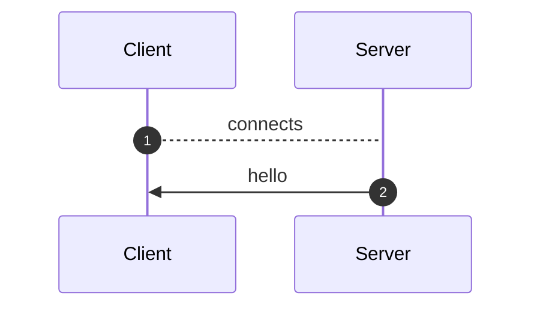
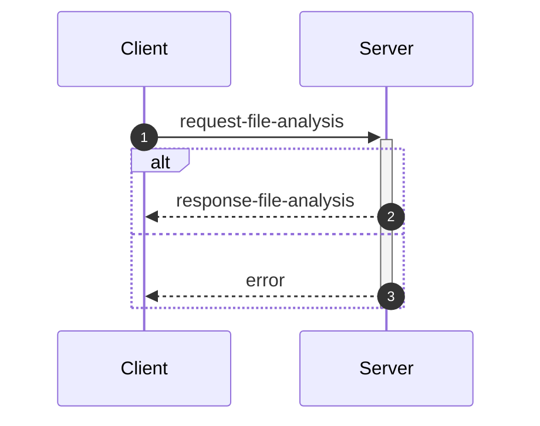
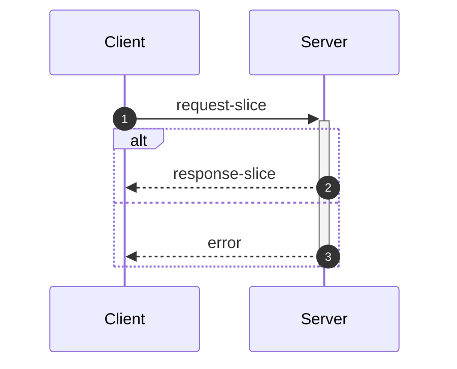
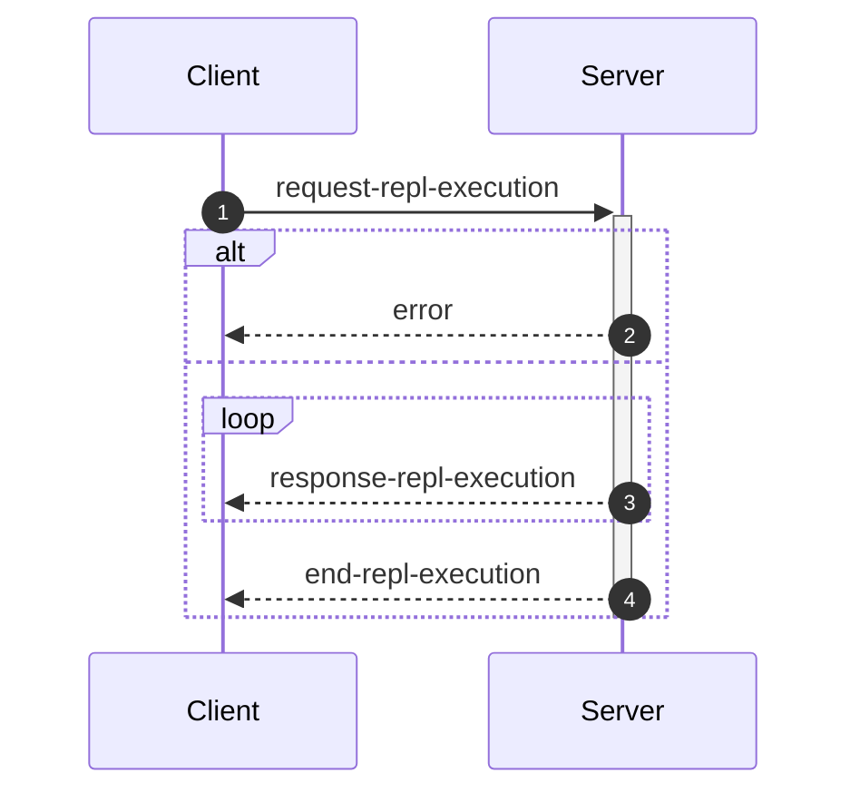

_This document was generated from '[src/documentation/wiki-interface.ts](https://github.com/flowr-analysis/flowr/tree/main//src/documentation/wiki-interface.ts)' on 2025-12-02, 15:22:21 UTC presenting an overview of flowR's interface (v2.6.3, using R v4.5.0). Please do not edit this file/wiki page directly._

Although far from being as detailed as the in-depth explanation of
[_flowR_](https://github.com/flowr-analysis/flowr/wiki/Core),
this wiki page explains how to interface with _flowR_ in more detail.
In general, command line arguments and other options provide short descriptions on hover over.

* [💬 Communicating with the Server](#communicating-with-the-server)
* [💻 Using the REPL](#using-the-repl)
* [⚙️ Configuring FlowR](#configuring-flowr)
* [⚒️ Writing Code](#writing-code)

<a id='communicating-with-the-server'></a>
## 💬 Communicating with the Server


As explained in the [Overview](https://github.com/flowr-analysis/flowr/wiki/Overview), you can simply run the [TCP](https://de.wikipedia.org/wiki/Transmission_Control_Protocol)&nbsp;server by adding the <span title="Description (Command Line Argument): Do not drop into a repl, but instead start a server on the given port (default: 1042) and listen for messages.">`--server`</span> flag (and, due to the interactive mode, exit with the conventional <kbd>CTRL</kbd>+<kbd>C</kbd>).
Currently, every connection is handled by the same underlying `RShell` - so the server is not designed to handle many clients at a time.
Additionally, the server is not well guarded against attacks (e.g., you can theoretically spawn an arbitrary number of&nbsp;RShell sessions on the target machine).

Every message has to be given in a single line (i.e., without a newline in-between) and end with a newline character. Nevertheless, we will pretty-print example given in the following segments for the ease of reading.


> [!NOTE]
> 
> The default <span title="Description (Command Line Argument): Do not drop into a repl, but instead start a server on the given port (default: 1042) and listen for messages.">`--server`</span> uses a simple [TCP](https://de.wikipedia.org/wiki/Transmission_Control_Protocol)
> connection. If you want _flowR_ to expose a [WebSocket](https://de.wikipedia.org/wiki/WebSocket) server instead, add the <span title="Description (Command Line Argument): If the server flag is set, use websocket for messaging">`--ws`</span> flag (i.e., <span title="Description (Command Line Argument): Do not drop into a repl, but instead start a server on the given port (default: 1042) and listen for messages.">`--server`</span> <span title="Description (Command Line Argument): If the server flag is set, use websocket for messaging">`--ws`</span>) when starting _flowR_ from the command line.
> 			


<ul><li>
<a id="message-hello"></a>
<b>Hello</b> Message (<code>hello</code>) 
<details>

<summary style="color:gray"> View Details. <i>The server informs the client about the successful connection and provides Meta-Information.</i> </summary>




	
After launching _flowR_, for example, with <code>docker run -it --rm eagleoutice/flowr <span title="Description (Command Line Argument): Do not drop into a repl, but instead start a server on the given port (default: 1042) and listen for messages.">-<span/>-server</span></code>&nbsp;(🐳️), simply connecting should present you with a `hello` message, that amongst others should reveal the versions of&nbsp;_flowR_ and&nbsp;R, using the [semver 2.0](https://semver.org/spec/v2.0.0.html) versioning scheme.
The message looks like this:


```json
{
  "type": "hello",
  "clientName": "client-0",
  "versions": {
    "flowr": "2.6.3",
    "r": "4.5.0",
    "engine": "r-shell"
  }
}
```


There are currently a few messages that you can send after the hello message.
If you want to _slice_ a piece of R code you first have to send an [analysis request](#message-request-file-analysis), so that you can send one or multiple slice requests afterward.
Requests for the [REPL](#message-request-repl) are independent of that.
	

<hr>


<details>
<summary style="color:gray">Message schema (<code>hello</code>)</summary>

For the definition of the hello message, please see it's implementation at [`./src/cli/repl/server/messages/message-hello.ts`](https://github.com/flowr-analysis/flowr/tree/main/./src/cli/repl/server/messages/message-hello.ts).

- **.** object [required]
    - **type** string [required]
        _The type of the hello message._
        Allows only the values: 'hello'
    - **id** any [forbidden]
        _The id of the message is always undefined (as it is the initial message and not requested)._
    - **clientName** string [required]
        _A unique name that is assigned to each client. It has no semantic meaning and is only used/useful for debugging._
    - **versions** object [required]
        - **flowr** string [required]
            _The version of the flowr server running in semver format._
        - **r** string [required]
            _The version of the underlying R shell running in semver format._
        - **engine** string [required]
            _The parser backend that is used to parse the R code._

</details>


<hr>

</details>
	</li>

<li>
<a id="message-request-file-analysis"></a>
<b>Analysis</b> Message (<code>request-file-analysis</code>) 
<details>

<summary style="color:gray"> View Details. <i>The server builds the dataflow graph for a given input file (or a set of files).</i> </summary>




	
The request allows the server to analyze a file and prepare it for slicing.
The message can contain a `filetoken`, which is used to identify the file in later slice or query requests (if you do not add one, the request will not be stored and therefore, it is not available for subsequent requests).

> **Please note!**\
> If you want to send and process a lot of analysis requests, but do not want to slice them, please do not pass the `filetoken` field. This will save the server a lot of memory allocation.

Furthermore, the request must contain either a `content` field to directly pass the file's content or a `filepath` field which contains the path to the file (this path must be accessible for the server to be useful).
If you add the `id` field, the answer will use the same `id` so you can match requests and the corresponding answers.
See the implementation of the request-file-analysis message for more information.


<details>
<summary>Example of the <code>request-file-analysis</code> Message</summary>

_Note:_ even though we pretty-print these messages, they are sent as a single line, ending with a newline.

The following lists all messages that were sent and received in case you want to reproduce the scenario:

<ol>
<li> <code>hello</code> (response)
<details> 

<summary> Show Details </summary>

The first message is always a hello message.


```json
{
  "type": "hello",
  "clientName": "client-0",
  "versions": {
    "flowr": "2.6.3",
    "r": "4.5.0",
    "engine": "r-shell"
  }
}
```


</details>
</li>

<li> <b><code>request-file-analysis</code> (request)</b>
<details open> 

<summary> Show Details </summary>

Let's suppose you simply want to analyze the following script:
 
```r
x <- 1
x + 1
```

 For this, you can send the following request:


```json
{
  "type": "request-file-analysis",
  "id": "1",
  "filetoken": "x",
  "content": "x <- 1\nx + 1"
}
```


</details>
</li>

<li> <code>response-file-analysis</code> (response)
<details> 

<summary> Show Details </summary>


The `results` field of the response effectively contains three keys of importance:

- `parse`: which contains 1:1 the parse result in CSV format that we received from the `RShell` (i.e., the AST produced by the parser of the R interpreter).
- `normalize`: which contains the normalized AST, including ids (see the `info` field and the [Normalized AST](https://github.com/flowr-analysis/flowr/wiki/Normalized%20AST) wiki page).
- `dataflow`: especially important is the `graph` field which contains the dataflow graph as a set of root vertices (see the [Dataflow Graph](https://github.com/flowr-analysis/flowr/wiki/Dataflow%20Graph) wiki page).
			


_As the code is pretty long, we inhibit pretty printing and syntax highlighting (JSON, hiding built-in):_

```text
{"type":"response-file-analysis","format":"json","id":"1","results":{"parse":{"files":[{"parsed":"[1,1,1,6,7,0,\"expr\",false,\"x <- 1\"],[1,1,1,1,1,3,\"SYMBOL\",true,\"x\"],[1,1,1,1,3,7,\"expr\",false,\"x\"],[1,3,1,4,2,7,\"LEFT_ASSIGN\",true,\"<-\"],[1,6,1,6,4,5,\"NUM_CONST\",true,\"1\"],[1,6,1,6,5,7,\"expr\",false,\"1\"],[2,1,2,5,16,0,\"expr\",false,\"x + 1\"],[2,1,2,1,10,12,\"SYMBOL\",true,\"x\"],[2,1,2,1,12,16,\"expr\",false,\"x\"],[2,3,2,3,11,16,\"'+'\",true,\"+\"],[2,5,2,5,13,14,\"NUM_CONST\",true,\"1\"],[2,5,2,5,14,16,\"expr\",false,\"1\"]","filePath":"/tmp/tmp-8253-FCRScliw4VZ7-.R"}],".meta":{"timing":2}},"normalize":{"ast":{"type":"RProject","files":[{"root":{"type":"RExpressionList","children":[{"type":"RBinaryOp","location":[1,3,1,4],"lhs":{"type":"RSymbol","location":[1,1,1,1],"content":"x","lexeme":"x","info":{"fullRange":[1,1,1,1],"additionalTokens":[],"id":0,"parent":2,"role":"binop-lhs","index":0,"nesting":0,"file":"/tmp/tmp-8253-FCRScliw4VZ7-.R"}},"rhs":{"location":[1,6,1,6],"lexeme":"1","info":{"fullRange":[1,6,1,6],"additionalTokens":[],"id":1,"parent":2,"role":"binop-rhs","index":1,"nesting":0,"file":"/tmp/tmp-8253-FCRScliw4VZ7-.R"},"type":"RNumber","content":{"num":1,"complexNumber":false,"markedAsInt":false}},"operator":"<-","lexeme":"<-","info":{"fullRange":[1,1,1,6],"additionalTokens":[],"id":2,"parent":6,"nesting":0,"file":"/tmp/tmp-8253-FCRScliw4VZ7-.R","index":0,"role":"expr-list-child"}},{"type":"RBinaryOp","location":[2,3,2,3],"lhs":{"type":"RSymbol","location":[2,1,2,1],"content":"x","lexeme":"x","info":{"fullRange":[2,1,2,1],"additionalTokens":[],"id":3,"parent":5,"role":"binop-lhs","index":0,"nesting":0,"file":"/tmp/tmp-8253-FCRScliw4VZ7-.R"}},"rhs":{"location":[2,5,2,5],"lexeme":"1","info":{"fullRange":[2,5,2,5],"additionalTokens":[],"id":4,"parent":5,"role":"binop-rhs","index":1,"nesting":0,"file":"/tmp/tmp-8253-FCRScliw4VZ7-.R"},"type":"RNumber","content":{"num":1,"complexNumber":false,"markedAsInt":false}},"operator":"+","lexeme":"+","info":{"fullRange":[2,1,2,5],"additionalTokens":[],"id":5,"parent":6,"nesting":0,"file":"/tmp/tmp-8253-FCRScliw4VZ7-.R","index":1,"role":"expr-list-child"}}],"info":{"additionalTokens":[],"id":6,"nesting":0,"file":"/tmp/tmp-8253-FCRScliw4VZ7-.R","role":"root","index":0}},"filePath":"/tmp/tmp-8253-FCRScliw4VZ7-.R"}],"info":{"id":7}},".meta":{"timing":0}},"dataflow":{"unknownReferences":[],"in":[{"nodeId":2,"name":"<-","type":2},{"nodeId":5,"name":"+","type":2}],"out":[{"nodeId":0,"name":"x","type":4,"definedAt":2,"value":[1]}],"environment":{"current":{"id":2386,"parent":"<BuiltInEnvironment>","memory":[["x",[{"nodeId":0,"name":"x","type":4,"definedAt":2,"value":[1]}]]]},"level":0},"graph":{"rootVertices":[1,0,2,3,4,5],"vertexInformation":[[1,{"tag":"value","id":1}],[0,{"tag":"vdef","id":0}],[2,{"tag":"fcall","id":2,"name":"<-","onlyBuiltin":true,"args":[{"nodeId":0,"type":32},{"nodeId":1,"type":32}],"origin":["builtin:assignment"]}],[3,{"tag":"use","id":3}],[4,{"tag":"value","id":4}],[5,{"tag":"fcall","id":5,"name":"+","onlyBuiltin":true,"args":[{"nodeId":3,"type":32},{"nodeId":4,"type":32}],"origin":["builtin:default"]}]],"edgeInformation":[[2,[[1,{"types":64}],[0,{"types":72}],["built-in:<-",{"types":5}]]],[0,[[1,{"types":2}],[2,{"types":2}]]],[3,[[0,{"types":1}]]],[5,[[3,{"types":65}],[4,{"types":65}],["built-in:+",{"types":5}]]]],"_unknownSideEffects":[]},"entryPoint":2,"exitPoints":[{"type":0,"nodeId":5}],".meta":{"timing":0}}}}
```


</details>
</li>
</ol>

The complete round-trip took 8.6 ms (including time required to validate the messages, start, and stop the internal mock server).

</details>


You receive an error if, for whatever reason, the analysis fails (e.g., the message or code you sent contained syntax errors).
It contains a human-readable description *why* the analysis failed (see the error message implementation for more details).


<details>
<summary>Example Error Message</summary>

_Note:_ even though we pretty-print these messages, they are sent as a single line, ending with a newline.

The following lists all messages that were sent and received in case you want to reproduce the scenario:

<ol>
<li> <code>hello</code> (response)
<details> 

<summary> Show Details </summary>

The first message is always a hello message.


```json
{
  "type": "hello",
  "clientName": "client-0",
  "versions": {
    "flowr": "2.6.3",
    "r": "4.5.0",
    "engine": "r-shell"
  }
}
```


</details>
</li>

<li> <code>request-file-analysis</code> (request)
<details> 

<summary> Show Details </summary>


```json
{
  "type": "request-file-analysis",
  "id": "1",
  "filename": "sample.R",
  "content": "x <-"
}
```


</details>
</li>

<li> <b><code>error</code> (response)</b>
<details open> 

<summary> Show Details </summary>


```json
{
  "id": "1",
  "type": "error",
  "fatal": false,
  "reason": "Error while analyzing file sample.R: GuardError: unable to parse R code (see the log for more information) for request {\"request\":\"text\",\"content\":\"x <-\"}}\n Report a Bug: https://github.com/flowr-analysis/flowr/issues/new?body=%3C!%2D%2D%20Please%20describe%20your%20issue%20in%20more%20detail%20below!%20%2D%2D%3E%0A%0A%0A%3C!%2D%2D%20Automatically%20generated%20issue%20metadata%2C%20please%20do%20not%20edit%20or%20delete%20content%20below%20this%20line%20%2D%2D%3E%0A%2D%2D%2D%0A%0AflowR%20version%3A%202.6.3%0Anode%20version%3A%20v22.14.0%0Anode%20arch%3A%20x64%0Anode%20platform%3A%20linux%0Amessage%3A%20%60unable%20to%20parse%20R%20code%20%28see%20the%20log%20for%20more%20information%29%20for%20request%20%7B%22request%22%3A%22text%22%2C%22content%22%3A%22x%20%3C%2D%22%7D%7D%60%0Astack%20trace%3A%0A%60%60%60%0A%20%20%20%20at%20guard%20%28%3C%3E%2Fsrc%2Futil%2Fassert.ts%3A128%3A9%29%0A%20%20%20%20at%20guardRetrievedOutput%20%28%3C%3E%2Fsrc%2Fr%2Dbridge%2Fretriever.ts%3A221%3A7%29%0A%20%20%20%20at%20%2Fhome%2Frunner%2Fwork%2Fflowr%2Fflowr%2Fsrc%2Fr%2Dbridge%2Fretriever.ts%3A182%3A4%0A%20%20%20%20at%20processTicksAndRejections%20%28node%3Ainternal%2Fprocess%2Ftask_queues%3A105%3A5%29%0A%20%20%20%20at%20async%20Object.parseRequests%20%5Bas%20processor%5D%20%28%3C%3E%2Fsrc%2Fr%2Dbridge%2Fparser.ts%3A104%3A19%29%0A%20%20%20%20at%20async%20PipelineExecutor.nextStep%20%28%3C%3E%2Fsrc%2Fcore%2Fpipeline%2Dexecutor.ts%3A192%3A25%29%0A%20%20%20%20at%20async%20FlowrAnalyzerCache.runTapeUntil%20%28%3C%3E%2Fsrc%2Fproject%2Fcache%2Fflowr%2Danalyzer%2Dcache.ts%3A89%3A4%29%0A%20%20%20%20at%20async%20FlowRServerConnection.sendFileAnalysisResponse%20%28%3C%3E%2Fsrc%2Fcli%2Frepl%2Fserver%2Fconnection.ts%3A163%3A52%29%0A%60%60%60%0A%0A%2D%2D%2D%0A%09"
}
```


</details>
</li>
</ol>

The complete round-trip took 8.5 ms (including time required to validate the messages, start, and stop the internal mock server).

</details>


&nbsp;

<a id="analysis-include-cfg"></a>
**Including the Control Flow Graph**

While _flowR_ does (for the time being) not use an explicit control flow graph but instead relies on control-dependency edges within the dataflow graph, 
the respective structure can still be exposed using the server (note that, as this feature is not needed within _flowR_, it is tested significantly less - 
so please create a [new issue](https://github.com/flowr-analysis/flowr/issues/new/choose) for any bug you may encounter).
For this, the analysis request may add `cfg: true` to its list of options.


<details>
<summary>Requesting a Control Flow Graph</summary>

_Note:_ even though we pretty-print these messages, they are sent as a single line, ending with a newline.

The following lists all messages that were sent and received in case you want to reproduce the scenario:

<ol>
<li> <code>hello</code> (response)
<details> 

<summary> Show Details </summary>

The first message is always a hello message.


```json
{
  "type": "hello",
  "clientName": "client-0",
  "versions": {
    "flowr": "2.6.3",
    "r": "4.5.0",
    "engine": "r-shell"
  }
}
```


</details>
</li>

<li> <b><code>request-file-analysis</code> (request)</b>
<details open> 

<summary> Show Details </summary>


```json
{
  "type": "request-file-analysis",
  "id": "1",
  "filetoken": "x",
  "content": "if(unknown > 0) { x <- 2 } else { x <- 5 }\nfor(i in 1:x) { print(x); print(i) }",
  "cfg": true
}
```


</details>
</li>

<li> <code>response-file-analysis</code> (response)
<details> 

<summary> Show Details </summary>


The response looks basically the same as a response sent without the `cfg` flag. However, additionally it contains a `cfg` field. 
If you are interested in a visual representation of the control flow graph, see the 
[visualization with mermaid](https://mermaid.live/view#base64:eyJjb2RlIjoiZmxvd2NoYXJ0IEJUXG4gICAgbjMyKFtcImBSRXhwcmVzc2lvbkxpc3QgKDMyKWBcIl0pXG4gICAgbjE1W1wiYFJJZlRoZW5FbHNlICgxNSlcbiMzNDtpZih1bmtub3duICM2MjsgMCkgIzEyMzsgeCAjNjA7IzQ1OyAyICMxMjU7IGVsc2UgIzEyMzsgeCAjNjA7IzQ1OyA1ICMxMjU7IzM0O2BcIl1cbiAgICBuMTUtZXhpdCgoMTUtZXhpdCkpXG4gICAgbjAoW1wiYFJTeW1ib2wgKDApXG4jMzQ7dW5rbm93biMzNDtgXCJdKVxuICAgIG4xKFtcImBSTnVtYmVyICgxKVxuIzM0OzAjMzQ7YFwiXSlcbiAgICBuMihbXCJgUkJpbmFyeU9wICgyKVxuIzM0O3Vua25vd24gIzYyOyAwIzM0O2BcIl0pXG4gICAgbjItZXhpdCgoMi1leGl0KSlcbiAgICBuOChbXCJgUkV4cHJlc3Npb25MaXN0ICg4KWBcIl0pXG4gICAgbjUoW1wiYFJTeW1ib2wgKDUpXG4jMzQ7eCMzNDtgXCJdKVxuICAgIG42KFtcImBSTnVtYmVyICg2KVxuIzM0OzIjMzQ7YFwiXSlcbiAgICBuNyhbXCJgUkJpbmFyeU9wICg3KVxuIzM0O3ggIzYwOyM0NTsgMiMzNDtgXCJdKVxuICAgIG43LWV4aXQoKDctZXhpdCkpXG4gICAgbjgtZXhpdCgoOC1leGl0KSlcbiAgICBuMTQoW1wiYFJFeHByZXNzaW9uTGlzdCAoMTQpYFwiXSlcbiAgICBuMTEoW1wiYFJTeW1ib2wgKDExKVxuIzM0O3gjMzQ7YFwiXSlcbiAgICBuMTIoW1wiYFJOdW1iZXIgKDEyKVxuIzM0OzUjMzQ7YFwiXSlcbiAgICBuMTMoW1wiYFJCaW5hcnlPcCAoMTMpXG4jMzQ7eCAjNjA7IzQ1OyA1IzM0O2BcIl0pXG4gICAgbjEzLWV4aXQoKDEzLWV4aXQpKVxuICAgIG4xNC1leGl0KCgxNC1leGl0KSlcbiAgICBuMTYoW1wiYFJTeW1ib2wgKDE2KVxuIzM0O2kjMzQ7YFwiXSlcbiAgICBuMzFbXCJgUkZvckxvb3AgKDMxKVxuIzM0O2ZvcihpIGluIDEjNTg7eCkgIzEyMzsgcHJpbnQoeCk7IHByaW50KGkpICMxMjU7IzM0O2BcIl1cbiAgICBuMTcoW1wiYFJOdW1iZXIgKDE3KVxuIzM0OzEjMzQ7YFwiXSlcbiAgICBuMTgoW1wiYFJTeW1ib2wgKDE4KVxuIzM0O3gjMzQ7YFwiXSlcbiAgICBuMTkoW1wiYFJCaW5hcnlPcCAoMTkpXG4jMzQ7MSM1ODt4IzM0O2BcIl0pXG4gICAgbjE5LWV4aXQoKDE5LWV4aXQpKVxuICAgIG4zMChbXCJgUkV4cHJlc3Npb25MaXN0ICgzMClgXCJdKVxuICAgIG4yMihbXCJgUlN5bWJvbCAoMjIpXG4jMzQ7cHJpbnQoeCkjMzQ7YFwiXSlcbiAgICBuMjVbXCJgUkZ1bmN0aW9uQ2FsbCAoMjUpXG4jMzQ7cHJpbnQoeCkjMzQ7YFwiXVxuICAgIG4yNS1leGl0KCgyNS1leGl0KSlcbiAgICBuMjQoW1wiYFJBcmd1bWVudCAoMjQpXG4jMzQ7eCMzNDtgXCJdKVxuICAgIG4yMyhbXCJgUlN5bWJvbCAoMjMpXG4jMzQ7eCMzNDtgXCJdKVxuICAgIG4yNC1leGl0KCgyNC1leGl0KSlcbiAgICBuMjYoW1wiYFJTeW1ib2wgKDI2KVxuIzM0O3ByaW50KGkpIzM0O2BcIl0pXG4gICAgbjI5W1wiYFJGdW5jdGlvbkNhbGwgKDI5KVxuIzM0O3ByaW50KGkpIzM0O2BcIl1cbiAgICBuMjktZXhpdCgoMjktZXhpdCkpXG4gICAgbjI4KFtcImBSQXJndW1lbnQgKDI4KVxuIzM0O2kjMzQ7YFwiXSlcbiAgICBuMjcoW1wiYFJTeW1ib2wgKDI3KVxuIzM0O2kjMzQ7YFwiXSlcbiAgICBuMjgtZXhpdCgoMjgtZXhpdCkpXG4gICAgbjMwLWV4aXQoKDMwLWV4aXQpKVxuICAgIG4zMS1leGl0KCgzMS1leGl0KSlcbiAgICBuMzItZXhpdCgoMzItZXhpdCkpXG4gICAgbjE1IC0uLT58XCJGRFwifCBuMzJcbiAgICBuMSAtLi0+fFwiRkRcInwgbjBcbiAgICBuMCAtLi0+fFwiRkRcInwgbjJcbiAgICBuMi1leGl0IC0uLT58XCJGRFwifCBuMVxuICAgIG43IC0uLT58XCJGRFwifCBuOFxuICAgIG42IC0uLT58XCJGRFwifCBuNVxuICAgIG41IC0uLT58XCJGRFwifCBuN1xuICAgIG43LWV4aXQgLS4tPnxcIkZEXCJ8IG42XG4gICAgbjgtZXhpdCAtLi0+fFwiRkRcInwgbjctZXhpdFxuICAgIG4xMyAtLi0+fFwiRkRcInwgbjE0XG4gICAgbjEyIC0uLT58XCJGRFwifCBuMTFcbiAgICBuMTEgLS4tPnxcIkZEXCJ8IG4xM1xuICAgIG4xMy1leGl0IC0uLT58XCJGRFwifCBuMTJcbiAgICBuMTQtZXhpdCAtLi0+fFwiRkRcInwgbjEzLWV4aXRcbiAgICBuOCAtLT58XCJDRCAoVFJVRSlcInwgbjItZXhpdFxuICAgIG4xNCAtLT58XCJDRCAoRkFMU0UpXCJ8IG4yLWV4aXRcbiAgICBuMiAtLi0+fFwiRkRcInwgbjE1XG4gICAgbjE1LWV4aXQgLS4tPnxcIkZEXCJ8IG44LWV4aXRcbiAgICBuMTUtZXhpdCAtLi0+fFwiRkRcInwgbjE0LWV4aXRcbiAgICBuMzEgLS4tPnxcIkZEXCJ8IG4xNS1leGl0XG4gICAgbjMxIC0uLT58XCJGRFwifCBuMzAtZXhpdFxuICAgIG4xOCAtLi0+fFwiRkRcInwgbjE3XG4gICAgbjE3IC0uLT58XCJGRFwifCBuMTlcbiAgICBuMTktZXhpdCAtLi0+fFwiRkRcInwgbjE4XG4gICAgbjI1IC0uLT58XCJGRFwifCBuMzBcbiAgICBuMjIgLS4tPnxcIkZEXCJ8IG4yNVxuICAgIG4yMyAtLi0+fFwiRkRcInwgbjI0XG4gICAgbjI0LWV4aXQgLS4tPnxcIkZEXCJ8IG4yM1xuICAgIG4yNCAtLi0+fFwiRkRcInwgbjIyXG4gICAgbjI1LWV4aXQgLS4tPnxcIkZEXCJ8IG4yNC1leGl0XG4gICAgbjI5IC0uLT58XCJGRFwifCBuMjUtZXhpdFxuICAgIG4yNiAtLi0+fFwiRkRcInwgbjI5XG4gICAgbjI3IC0uLT58XCJGRFwifCBuMjhcbiAgICBuMjgtZXhpdCAtLi0+fFwiRkRcInwgbjI3XG4gICAgbjI4IC0uLT58XCJGRFwifCBuMjZcbiAgICBuMjktZXhpdCAtLi0+fFwiRkRcInwgbjI4LWV4aXRcbiAgICBuMzAtZXhpdCAtLi0+fFwiRkRcInwgbjI5LWV4aXRcbiAgICBuMTkgLS4tPnxcIkZEXCJ8IG4zMVxuICAgIG4xNiAtLi0+fFwiRkRcInwgbjE5LWV4aXRcbiAgICBuMzAgLS0+fFwiQ0QgKFRSVUUpXCJ8IG4xNlxuICAgIG4zMS1leGl0IC0tPnxcIkNEIChGQUxTRSlcInwgbjE2XG4gICAgbjMyLWV4aXQgLS4tPnxcIkZEXCJ8IG4zMS1leGl0XG4gICAgc3R5bGUgbjMyIHN0cm9rZTpjeWFuLHN0cm9rZS13aWR0aDo2LjVweDsgICAgc3R5bGUgbjMyLWV4aXQgc3Ryb2tlOmdyZWVuLHN0cm9rZS13aWR0aDo2LjVweDsiLCJtZXJtYWlkIjp7ImF1dG9TeW5jIjp0cnVlfX0=).
			


_As the code is pretty long, we inhibit pretty printing and syntax highlighting (JSON, hiding built-in):_

```text
{"type":"response-file-analysis","format":"json","id":"1","cfg":{"returns":[],"entryPoints":[32],"exitPoints":["32-exit"],"breaks":[],"nexts":[],"graph":{"rootVertices":[32,15,"15-exit",0,1,2,"2-exit",8,5,6,7,"7-exit","8-exit",14,11,12,13,"13-exit","14-exit",16,31,17,18,19,"19-exit",30,22,25,"25-exit",24,23,"24-exit",26,29,"29-exit",28,27,"28-exit","30-exit","31-exit","32-exit"],"vertexInformation":[[32,{"id":32,"type":"expr","end":["32-exit"]}],[15,{"id":15,"type":"stm","mid":["2-exit"],"end":["15-exit"]}],["15-exit",{"id":"15-exit","type":"end","root":15}],[0,{"id":0,"type":"expr"}],[1,{"id":1,"type":"expr"}],[2,{"id":2,"type":"expr","end":["2-exit"]}],["2-exit",{"id":"2-exit","type":"end","root":2}],[8,{"id":8,"type":"expr","end":["8-exit"]}],[5,{"id":5,"type":"expr"}],[6,{"id":6,"type":"expr"}],[7,{"id":7,"type":"expr","end":["7-exit"]}],["7-exit",{"id":"7-exit","type":"end","root":7}],["8-exit",{"id":"8-exit","type":"end","root":8}],[14,{"id":14,"type":"expr","end":["14-exit"]}],[11,{"id":11,"type":"expr"}],[12,{"id":12,"type":"expr"}],[13,{"id":13,"type":"expr","end":["13-exit"]}],["13-exit",{"id":"13-exit","type":"end","root":13}],["14-exit",{"id":"14-exit","type":"end","root":14}],[16,{"id":16,"type":"expr"}],[31,{"id":31,"type":"stm","end":["31-exit"],"mid":[16]}],[17,{"id":17,"type":"expr"}],[18,{"id":18,"type":"expr"}],[19,{"id":19,"type":"expr","end":["19-exit"]}],["19-exit",{"id":"19-exit","type":"end","root":19}],[30,{"id":30,"type":"expr","end":["30-exit"]}],[22,{"id":22,"type":"expr"}],[25,{"id":25,"type":"stm","mid":[22],"end":["25-exit"]}],["25-exit",{"id":"25-exit","type":"end","root":25}],[24,{"id":24,"type":"expr","mid":[24],"end":["24-exit"]}],[23,{"id":23,"type":"expr"}],["24-exit",{"id":"24-exit","type":"end","root":24}],[26,{"id":26,"type":"expr"}],[29,{"id":29,"type":"stm","mid":[26],"end":["29-exit"]}],["29-exit",{"id":"29-exit","type":"end","root":29}],[28,{"id":28,"type":"expr","mid":[28],"end":["28-exit"]}],[27,{"id":27,"type":"expr"}],["28-exit",{"id":"28-exit","type":"end","root":28}],["30-exit",{"id":"30-exit","type":"end","root":30}],["31-exit",{"id":"31-exit","type":"end","root":31}],["32-exit",{"id":"32-exit","type":"end","root":32}]],"bbChildren":[],"edgeInformation":[[15,[[32,{"label":0}]]],[1,[[0,{"label":0}]]],[0,[[2,{"label":0}]]],["2-exit",[[1,{"label":0}]]],[7,[[8,{"label":0}]]],[6,[[5,{"label":0}]]],[5,[[7,{"label":0}]]],["7-exit",[[6,{"label":0}]]],["8-exit",[["7-exit",{"label":0}]]],[13,[[14,{"label":0}]]],[12,[[11,{"label":0}]]],[11,[[13,{"label":0}]]],["13-exit",[[12,{"label":0}]]],["14-exit",[["13-exit",{"label":0}]]],[8,[["2-exit",{"label":1,"when":"TRUE","caused":15}]]],[14,[["2-exit",{"label":1,"when":"FALSE","caused":15}]]],[2,[[15,{"label":0}]]],["15-exit",[["8-exit",{"label":0}],["14-exit",{"label":0}]]],[31,[["15-exit",{"label":0}],["30-exit",{"label":0}]]],[18,[[17,{"label":0}]]],[17,[[19,{"label":0}]]],["19-exit",[[18,{"label":0}]]],[25,[[30,{"label":0}]]],[22,[[25,{"label":0}]]],[23,[[24,{"label":0}]]],["24-exit",[[23,{"label":0}]]],[24,[[22,{"label":0}]]],["25-exit",[["24-exit",{"label":0}]]],[29,[["25-exit",{"label":0}]]],[26,[[29,{"label":0}]]],[27,[[28,{"label":0}]]],["28-exit",[[27,{"label":0}]]],[28,[[26,{"label":0}]]],["29-exit",[["28-exit",{"label":0}]]],["30-exit",[["29-exit",{"label":0}]]],[19,[[31,{"label":0}]]],[16,[["19-exit",{"label":0}]]],[30,[[16,{"label":1,"when":"TRUE","caused":31}]]],["31-exit",[[16,{"label":1,"when":"FALSE","caused":31}]]],["32-exit",[["31-exit",{"label":0}]]]],"_mayHaveBasicBlocks":false}},"results":{"parse":{"files":[{"parsed":"[1,1,1,42,38,0,\"expr\",false,\"if(unknown > 0) { x <- 2 } else { x <- 5 }\"],[1,1,1,2,1,38,\"IF\",true,\"if\"],[1,3,1,3,2,38,\"'('\",true,\"(\"],[1,4,1,14,9,38,\"expr\",false,\"unknown > 0\"],[1,4,1,10,3,5,\"SYMBOL\",true,\"unknown\"],[1,4,1,10,5,9,\"expr\",false,\"unknown\"],[1,12,1,12,4,9,\"GT\",true,\">\"],[1,14,1,14,6,7,\"NUM_CONST\",true,\"0\"],[1,14,1,14,7,9,\"expr\",false,\"0\"],[1,15,1,15,8,38,\"')'\",true,\")\"],[1,17,1,26,22,38,\"expr\",false,\"{ x <- 2 }\"],[1,17,1,17,12,22,\"'{'\",true,\"{\"],[1,19,1,24,19,22,\"expr\",false,\"x <- 2\"],[1,19,1,19,13,15,\"SYMBOL\",true,\"x\"],[1,19,1,19,15,19,\"expr\",false,\"x\"],[1,21,1,22,14,19,\"LEFT_ASSIGN\",true,\"<-\"],[1,24,1,24,16,17,\"NUM_CONST\",true,\"2\"],[1,24,1,24,17,19,\"expr\",false,\"2\"],[1,26,1,26,18,22,\"'}'\",true,\"}\"],[1,28,1,31,23,38,\"ELSE\",true,\"else\"],[1,33,1,42,35,38,\"expr\",false,\"{ x <- 5 }\"],[1,33,1,33,25,35,\"'{'\",true,\"{\"],[1,35,1,40,32,35,\"expr\",false,\"x <- 5\"],[1,35,1,35,26,28,\"SYMBOL\",true,\"x\"],[1,35,1,35,28,32,\"expr\",false,\"x\"],[1,37,1,38,27,32,\"LEFT_ASSIGN\",true,\"<-\"],[1,40,1,40,29,30,\"NUM_CONST\",true,\"5\"],[1,40,1,40,30,32,\"expr\",false,\"5\"],[1,42,1,42,31,35,\"'}'\",true,\"}\"],[2,1,2,36,84,0,\"expr\",false,\"for(i in 1:x) { print(x); print(i) }\"],[2,1,2,3,41,84,\"FOR\",true,\"for\"],[2,4,2,13,53,84,\"forcond\",false,\"(i in 1:x)\"],[2,4,2,4,42,53,\"'('\",true,\"(\"],[2,5,2,5,43,53,\"SYMBOL\",true,\"i\"],[2,7,2,8,44,53,\"IN\",true,\"in\"],[2,10,2,12,51,53,\"expr\",false,\"1:x\"],[2,10,2,10,45,46,\"NUM_CONST\",true,\"1\"],[2,10,2,10,46,51,\"expr\",false,\"1\"],[2,11,2,11,47,51,\"':'\",true,\":\"],[2,12,2,12,48,50,\"SYMBOL\",true,\"x\"],[2,12,2,12,50,51,\"expr\",false,\"x\"],[2,13,2,13,49,53,\"')'\",true,\")\"],[2,15,2,36,81,84,\"expr\",false,\"{ print(x); print(i) }\"],[2,15,2,15,54,81,\"'{'\",true,\"{\"],[2,17,2,24,64,81,\"expr\",false,\"print(x)\"],[2,17,2,21,55,57,\"SYMBOL_FUNCTION_CALL\",true,\"print\"],[2,17,2,21,57,64,\"expr\",false,\"print\"],[2,22,2,22,56,64,\"'('\",true,\"(\"],[2,23,2,23,58,60,\"SYMBOL\",true,\"x\"],[2,23,2,23,60,64,\"expr\",false,\"x\"],[2,24,2,24,59,64,\"')'\",true,\")\"],[2,25,2,25,65,81,\"';'\",true,\";\"],[2,27,2,34,77,81,\"expr\",false,\"print(i)\"],[2,27,2,31,68,70,\"SYMBOL_FUNCTION_CALL\",true,\"print\"],[2,27,2,31,70,77,\"expr\",false,\"print\"],[2,32,2,32,69,77,\"'('\",true,\"(\"],[2,33,2,33,71,73,\"SYMBOL\",true,\"i\"],[2,33,2,33,73,77,\"expr\",false,\"i\"],[2,34,2,34,72,77,\"')'\",true,\")\"],[2,36,2,36,78,81,\"'}'\",true,\"}\"]","filePath":"/tmp/tmp-8253-G7r1tzPgr1te-.R"}],".meta":{"timing":3}},"normalize":{"ast":{"type":"RProject","files":[{"root":{"type":"RExpressionList","children":[{"type":"RIfThenElse","condition":{"type":"RBinaryOp","location":[1,12,1,12],"lhs":{"type":"RSymbol","location":[1,4,1,10],"content":"unknown","lexeme":"unknown","info":{"fullRange":[1,4,1,10],"additionalTokens":[],"id":0,"parent":2,"role":"binop-lhs","index":0,"nesting":1,"file":"/tmp/tmp-8253-G7r1tzPgr1te-.R"}},"rhs":{"location":[1,14,1,14],"lexeme":"0","info":{"fullRange":[1,14,1,14],"additionalTokens":[],"id":1,"parent":2,"role":"binop-rhs","index":1,"nesting":1,"file":"/tmp/tmp-8253-G7r1tzPgr1te-.R"},"type":"RNumber","content":{"num":0,"complexNumber":false,"markedAsInt":false}},"operator":">","lexeme":">","info":{"fullRange":[1,4,1,14],"additionalTokens":[],"id":2,"parent":15,"nesting":1,"file":"/tmp/tmp-8253-G7r1tzPgr1te-.R","role":"if-cond"}},"then":{"type":"RExpressionList","children":[{"type":"RBinaryOp","location":[1,21,1,22],"lhs":{"type":"RSymbol","location":[1,19,1,19],"content":"x","lexeme":"x","info":{"fullRange":[1,19,1,19],"additionalTokens":[],"id":5,"parent":7,"role":"binop-lhs","index":0,"nesting":1,"file":"/tmp/tmp-8253-G7r1tzPgr1te-.R"}},"rhs":{"location":[1,24,1,24],"lexeme":"2","info":{"fullRange":[1,24,1,24],"additionalTokens":[],"id":6,"parent":7,"role":"binop-rhs","index":1,"nesting":1,"file":"/tmp/tmp-8253-G7r1tzPgr1te-.R"},"type":"RNumber","content":{"num":2,"complexNumber":false,"markedAsInt":false}},"operator":"<-","lexeme":"<-","info":{"fullRange":[1,19,1,24],"additionalTokens":[],"id":7,"parent":8,"nesting":1,"file":"/tmp/tmp-8253-G7r1tzPgr1te-.R","index":0,"role":"expr-list-child"}}],"grouping":[{"type":"RSymbol","location":[1,17,1,17],"content":"{","lexeme":"{","info":{"fullRange":[1,17,1,26],"additionalTokens":[],"id":3,"role":"root","index":0,"nesting":1,"file":"/tmp/tmp-8253-G7r1tzPgr1te-.R"}},{"type":"RSymbol","location":[1,26,1,26],"content":"}","lexeme":"}","info":{"fullRange":[1,17,1,26],"additionalTokens":[],"id":4,"role":"root","index":0,"nesting":1,"file":"/tmp/tmp-8253-G7r1tzPgr1te-.R"}}],"info":{"additionalTokens":[],"id":8,"parent":15,"nesting":1,"file":"/tmp/tmp-8253-G7r1tzPgr1te-.R","index":1,"role":"if-then"}},"location":[1,1,1,2],"lexeme":"if","info":{"fullRange":[1,1,1,42],"additionalTokens":[],"id":15,"parent":32,"nesting":1,"file":"/tmp/tmp-8253-G7r1tzPgr1te-.R","index":0,"role":"expr-list-child"},"otherwise":{"type":"RExpressionList","children":[{"type":"RBinaryOp","location":[1,37,1,38],"lhs":{"type":"RSymbol","location":[1,35,1,35],"content":"x","lexeme":"x","info":{"fullRange":[1,35,1,35],"additionalTokens":[],"id":11,"parent":13,"role":"binop-lhs","index":0,"nesting":1,"file":"/tmp/tmp-8253-G7r1tzPgr1te-.R"}},"rhs":{"location":[1,40,1,40],"lexeme":"5","info":{"fullRange":[1,40,1,40],"additionalTokens":[],"id":12,"parent":13,"role":"binop-rhs","index":1,"nesting":1,"file":"/tmp/tmp-8253-G7r1tzPgr1te-.R"},"type":"RNumber","content":{"num":5,"complexNumber":false,"markedAsInt":false}},"operator":"<-","lexeme":"<-","info":{"fullRange":[1,35,1,40],"additionalTokens":[],"id":13,"parent":14,"nesting":1,"file":"/tmp/tmp-8253-G7r1tzPgr1te-.R","index":0,"role":"expr-list-child"}}],"grouping":[{"type":"RSymbol","location":[1,33,1,33],"content":"{","lexeme":"{","info":{"fullRange":[1,33,1,42],"additionalTokens":[],"id":9,"role":"root","index":0,"nesting":1,"file":"/tmp/tmp-8253-G7r1tzPgr1te-.R"}},{"type":"RSymbol","location":[1,42,1,42],"content":"}","lexeme":"}","info":{"fullRange":[1,33,1,42],"additionalTokens":[],"id":10,"role":"root","index":0,"nesting":1,"file":"/tmp/tmp-8253-G7r1tzPgr1te-.R"}}],"info":{"additionalTokens":[],"id":14,"parent":15,"nesting":1,"file":"/tmp/tmp-8253-G7r1tzPgr1te-.R","index":2,"role":"if-otherwise"}}},{"type":"RForLoop","variable":{"type":"RSymbol","location":[2,5,2,5],"content":"i","lexeme":"i","info":{"additionalTokens":[],"id":16,"parent":31,"role":"for-variable","index":0,"nesting":1,"file":"/tmp/tmp-8253-G7r1tzPgr1te-.R"}},"vector":{"type":"RBinaryOp","location":[2,11,2,11],"lhs":{"location":[2,10,2,10],"lexeme":"1","info":{"fullRange":[2,10,2,10],"additionalTokens":[],"id":17,"parent":19,"role":"binop-lhs","index":0,"nesting":1,"file":"/tmp/tmp-8253-G7r1tzPgr1te-.R"},"type":"RNumber","content":{"num":1,"complexNumber":false,"markedAsInt":false}},"rhs":{"type":"RSymbol","location":[2,12,2,12],"content":"x","lexeme":"x","info":{"fullRange":[2,12,2,12],"additionalTokens":[],"id":18,"parent":19,"role":"binop-rhs","index":1,"nesting":1,"file":"/tmp/tmp-8253-G7r1tzPgr1te-.R"}},"operator":":","lexeme":":","info":{"fullRange":[2,10,2,12],"additionalTokens":[],"id":19,"parent":31,"nesting":1,"file":"/tmp/tmp-8253-G7r1tzPgr1te-.R","index":1,"role":"for-vector"}},"body":{"type":"RExpressionList","children":[{"type":"RFunctionCall","named":true,"location":[2,17,2,21],"lexeme":"print","functionName":{"type":"RSymbol","location":[2,17,2,21],"content":"print","lexeme":"print","info":{"fullRange":[2,17,2,24],"additionalTokens":[],"id":22,"parent":25,"role":"call-name","index":0,"nesting":1,"file":"/tmp/tmp-8253-G7r1tzPgr1te-.R"}},"arguments":[{"type":"RArgument","location":[2,23,2,23],"lexeme":"x","value":{"type":"RSymbol","location":[2,23,2,23],"content":"x","lexeme":"x","info":{"fullRange":[2,23,2,23],"additionalTokens":[],"id":23,"parent":24,"role":"arg-value","index":0,"nesting":1,"file":"/tmp/tmp-8253-G7r1tzPgr1te-.R"}},"info":{"fullRange":[2,23,2,23],"additionalTokens":[],"id":24,"parent":25,"nesting":1,"file":"/tmp/tmp-8253-G7r1tzPgr1te-.R","index":1,"role":"call-argument"}}],"info":{"fullRange":[2,17,2,24],"additionalTokens":[],"id":25,"parent":30,"nesting":1,"file":"/tmp/tmp-8253-G7r1tzPgr1te-.R","index":0,"role":"expr-list-child"}},{"type":"RFunctionCall","named":true,"location":[2,27,2,31],"lexeme":"print","functionName":{"type":"RSymbol","location":[2,27,2,31],"content":"print","lexeme":"print","info":{"fullRange":[2,27,2,34],"additionalTokens":[],"id":26,"parent":29,"role":"call-name","index":0,"nesting":1,"file":"/tmp/tmp-8253-G7r1tzPgr1te-.R"}},"arguments":[{"type":"RArgument","location":[2,33,2,33],"lexeme":"i","value":{"type":"RSymbol","location":[2,33,2,33],"content":"i","lexeme":"i","info":{"fullRange":[2,33,2,33],"additionalTokens":[],"id":27,"parent":28,"role":"arg-value","index":0,"nesting":1,"file":"/tmp/tmp-8253-G7r1tzPgr1te-.R"}},"info":{"fullRange":[2,33,2,33],"additionalTokens":[],"id":28,"parent":29,"nesting":1,"file":"/tmp/tmp-8253-G7r1tzPgr1te-.R","index":1,"role":"call-argument"}}],"info":{"fullRange":[2,27,2,34],"additionalTokens":[],"id":29,"parent":30,"nesting":1,"file":"/tmp/tmp-8253-G7r1tzPgr1te-.R","index":1,"role":"expr-list-child"}}],"grouping":[{"type":"RSymbol","location":[2,15,2,15],"content":"{","lexeme":"{","info":{"fullRange":[2,15,2,36],"additionalTokens":[],"id":20,"role":"root","index":0,"nesting":1,"file":"/tmp/tmp-8253-G7r1tzPgr1te-.R"}},{"type":"RSymbol","location":[2,36,2,36],"content":"}","lexeme":"}","info":{"fullRange":[2,15,2,36],"additionalTokens":[],"id":21,"role":"root","index":0,"nesting":1,"file":"/tmp/tmp-8253-G7r1tzPgr1te-.R"}}],"info":{"additionalTokens":[],"id":30,"parent":31,"nesting":1,"file":"/tmp/tmp-8253-G7r1tzPgr1te-.R","index":2,"role":"for-body"}},"lexeme":"for","info":{"fullRange":[2,1,2,36],"additionalTokens":[],"id":31,"parent":32,"nesting":1,"file":"/tmp/tmp-8253-G7r1tzPgr1te-.R","index":1,"role":"expr-list-child"},"location":[2,1,2,3]}],"info":{"additionalTokens":[],"id":32,"nesting":0,"file":"/tmp/tmp-8253-G7r1tzPgr1te-.R","role":"root","index":0}},"filePath":"/tmp/tmp-8253-G7r1tzPgr1te-.R"}],"info":{"id":33}},".meta":{"timing":0}},"dataflow":{"unknownReferences":[],"in":[{"nodeId":15,"name":"if","type":2},{"nodeId":0,"name":"unknown","type":1},{"nodeId":2,"name":">","type":2},{"nodeId":7,"name":"<-","controlDependencies":[{"id":15,"when":true}],"type":2},{"nodeId":13,"name":"<-","controlDependencies":[{"id":15,"when":false}],"type":2},{"nodeId":8,"name":"{","controlDependencies":[{"id":15,"when":true}],"type":2},{"nodeId":14,"name":"{","controlDependencies":[{"id":15,"when":false}],"type":2},{"nodeId":31,"name":"for","type":2},{"name":":","nodeId":19,"type":2},{"name":"print","nodeId":25,"type":2},{"name":"print","nodeId":29,"type":2}],"out":[{"nodeId":5,"name":"x","controlDependencies":[{"id":15,"when":true},{"id":15,"when":false}],"type":4,"definedAt":7,"value":[6]},{"nodeId":11,"name":"x","controlDependencies":[{"id":15,"when":true},{"id":15,"when":false}],"type":4,"definedAt":13,"value":[12]},{"nodeId":16,"name":"i","type":1}],"environment":{"current":{"id":2523,"parent":"<BuiltInEnvironment>","memory":[["x",[{"nodeId":5,"name":"x","controlDependencies":[{"id":15,"when":true},{"id":15,"when":false}],"type":4,"definedAt":7,"value":[6]},{"nodeId":11,"name":"x","controlDependencies":[{"id":15,"when":true},{"id":15,"when":false}],"type":4,"definedAt":13,"value":[12]}]],["i",[{"nodeId":16,"name":"i","type":4,"definedAt":31}]]]},"level":0},"graph":{"rootVertices":[0,1,2,6,5,7,8,12,11,13,14,15,16,17,18,19,23,25,27,29,30,31],"vertexInformation":[[0,{"tag":"use","id":0}],[1,{"tag":"value","id":1}],[2,{"tag":"fcall","id":2,"name":">","onlyBuiltin":true,"args":[{"nodeId":0,"type":32},{"nodeId":1,"type":32}],"origin":["builtin:default"]}],[6,{"tag":"value","id":6}],[5,{"tag":"vdef","id":5,"cds":[{"id":15,"when":true}]}],[7,{"tag":"fcall","id":7,"name":"<-","onlyBuiltin":true,"cds":[{"id":15,"when":true}],"args":[{"nodeId":5,"type":32},{"nodeId":6,"type":32}],"origin":["builtin:assignment"]}],[8,{"tag":"fcall","id":8,"name":"{","onlyBuiltin":true,"cds":[{"id":15,"when":true}],"args":[{"nodeId":7,"type":32}],"origin":["builtin:expression-list"]}],[12,{"tag":"value","id":12}],[11,{"tag":"vdef","id":11,"cds":[{"id":15,"when":false}]}],[13,{"tag":"fcall","id":13,"name":"<-","onlyBuiltin":true,"cds":[{"id":15,"when":false}],"args":[{"nodeId":11,"type":32},{"nodeId":12,"type":32}],"origin":["builtin:assignment"]}],[14,{"tag":"fcall","id":14,"name":"{","onlyBuiltin":true,"cds":[{"id":15,"when":false}],"args":[{"nodeId":13,"type":32}],"origin":["builtin:expression-list"]}],[15,{"tag":"fcall","id":15,"name":"if","onlyBuiltin":true,"args":[{"nodeId":2,"type":32},{"nodeId":8,"type":32},{"nodeId":14,"type":32}],"origin":["builtin:if-then-else"]}],[16,{"tag":"vdef","id":16}],[17,{"tag":"value","id":17}],[18,{"tag":"use","id":18}],[19,{"tag":"fcall","id":19,"name":":","onlyBuiltin":true,"args":[{"nodeId":17,"type":32},{"nodeId":18,"type":32}],"origin":["builtin:default"]}],[23,{"tag":"use","id":23,"cds":[{"id":31,"when":true}]}],[25,{"tag":"fcall","id":25,"name":"print","onlyBuiltin":true,"cds":[{"id":31,"when":true}],"args":[{"nodeId":23,"type":32}],"origin":["builtin:default"]}],[27,{"tag":"use","id":27,"cds":[{"id":31,"when":true}]}],[29,{"tag":"fcall","id":29,"name":"print","onlyBuiltin":true,"cds":[{"id":31,"when":true}],"args":[{"nodeId":27,"type":32}],"origin":["builtin:default"]}],[30,{"tag":"fcall","id":30,"name":"{","onlyBuiltin":true,"cds":[{"id":31,"when":true}],"args":[{"nodeId":25,"type":32},{"nodeId":29,"type":32}],"origin":["builtin:expression-list"]}],[31,{"tag":"fcall","id":31,"name":"for","onlyBuiltin":true,"args":[{"nodeId":16,"type":32},{"nodeId":19,"type":32},{"nodeId":30,"type":32}],"origin":["builtin:for-loop"]}]],"edgeInformation":[[2,[[0,{"types":65}],[1,{"types":65}],["built-in:>",{"types":5}]]],[7,[[6,{"types":64}],[5,{"types":72}],["built-in:<-",{"types":5}]]],[5,[[6,{"types":2}],[7,{"types":2}]]],[8,[[7,{"types":72}],["built-in:{",{"types":5}]]],[15,[[8,{"types":72}],[14,{"types":72}],[2,{"types":65}],["built-in:if",{"types":5}]]],[13,[[12,{"types":64}],[11,{"types":72}],["built-in:<-",{"types":5}]]],[11,[[12,{"types":2}],[13,{"types":2}]]],[14,[[13,{"types":72}],["built-in:{",{"types":5}]]],[19,[[17,{"types":65}],[18,{"types":65}],["built-in::",{"types":5}]]],[18,[[5,{"types":1}],[11,{"types":1}]]],[25,[[23,{"types":73}],["built-in:print",{"types":5}]]],[23,[[5,{"types":1}],[11,{"types":1}]]],[29,[[27,{"types":73}],["built-in:print",{"types":5}]]],[27,[[16,{"types":1}]]],[30,[[25,{"types":64}],[29,{"types":72}],["built-in:{",{"types":5}]]],[16,[[19,{"types":2}]]],[31,[[16,{"types":64}],[19,{"types":65}],[30,{"types":320}],["built-in:for",{"types":5}]]]],"_unknownSideEffects":[{"id":25,"linkTo":{"type":"link-to-last-call","callName":{}}},{"id":29,"linkTo":{"type":"link-to-last-call","callName":{}}}]},"entryPoint":15,"exitPoints":[{"type":0,"nodeId":31}],"cfgQuick":{"graph":{"rootVertices":[32,15,"15-exit",0,1,2,"2-exit",8,5,6,7,"7-exit","8-exit",14,11,12,13,"13-exit","14-exit",16,31,17,18,19,"19-exit",30,22,25,"25-exit",24,23,"24-exit",26,29,"29-exit",28,27,"28-exit","30-exit","31-exit","32-exit"],"vertexInformation":[[32,{"id":32,"type":"expr","end":["32-exit"]}],[15,{"id":15,"type":"stm","mid":["2-exit"],"end":["15-exit"]}],["15-exit",{"id":"15-exit","type":"end","root":15}],[0,{"id":0,"type":"expr"}],[1,{"id":1,"type":"expr"}],[2,{"id":2,"type":"expr","end":["2-exit"]}],["2-exit",{"id":"2-exit","type":"end","root":2}],[8,{"id":8,"type":"expr","end":["8-exit"]}],[5,{"id":5,"type":"expr"}],[6,{"id":6,"type":"expr"}],[7,{"id":7,"type":"expr","end":["7-exit"]}],["7-exit",{"id":"7-exit","type":"end","root":7}],["8-exit",{"id":"8-exit","type":"end","root":8}],[14,{"id":14,"type":"expr","end":["14-exit"]}],[11,{"id":11,"type":"expr"}],[12,{"id":12,"type":"expr"}],[13,{"id":13,"type":"expr","end":["13-exit"]}],["13-exit",{"id":"13-exit","type":"end","root":13}],["14-exit",{"id":"14-exit","type":"end","root":14}],[16,{"id":16,"type":"expr"}],[31,{"id":31,"type":"stm","end":["31-exit"],"mid":[16]}],[17,{"id":17,"type":"expr"}],[18,{"id":18,"type":"expr"}],[19,{"id":19,"type":"expr","end":["19-exit"]}],["19-exit",{"id":"19-exit","type":"end","root":19}],[30,{"id":30,"type":"expr","end":["30-exit"]}],[22,{"id":22,"type":"expr"}],[25,{"id":25,"type":"stm","mid":[22],"end":["25-exit"]}],["25-exit",{"id":"25-exit","type":"end","root":25}],[24,{"id":24,"type":"expr","mid":[24],"end":["24-exit"]}],[23,{"id":23,"type":"expr"}],["24-exit",{"id":"24-exit","type":"end","root":24}],[26,{"id":26,"type":"expr"}],[29,{"id":29,"type":"stm","mid":[26],"end":["29-exit"]}],["29-exit",{"id":"29-exit","type":"end","root":29}],[28,{"id":28,"type":"expr","mid":[28],"end":["28-exit"]}],[27,{"id":27,"type":"expr"}],["28-exit",{"id":"28-exit","type":"end","root":28}],["30-exit",{"id":"30-exit","type":"end","root":30}],["31-exit",{"id":"31-exit","type":"end","root":31}],["32-exit",{"id":"32-exit","type":"end","root":32}]],"bbChildren":[],"edgeInformation":[[15,[[32,{"label":0}]]],[1,[[0,{"label":0}]]],[0,[[2,{"label":0}]]],["2-exit",[[1,{"label":0}]]],[7,[[8,{"label":0}]]],[6,[[5,{"label":0}]]],[5,[[7,{"label":0}]]],["7-exit",[[6,{"label":0}]]],["8-exit",[["7-exit",{"label":0}]]],[13,[[14,{"label":0}]]],[12,[[11,{"label":0}]]],[11,[[13,{"label":0}]]],["13-exit",[[12,{"label":0}]]],["14-exit",[["13-exit",{"label":0}]]],[8,[["2-exit",{"label":1,"when":"TRUE","caused":15}]]],[14,[["2-exit",{"label":1,"when":"FALSE","caused":15}]]],[2,[[15,{"label":0}]]],["15-exit",[["8-exit",{"label":0}],["14-exit",{"label":0}]]],[31,[["15-exit",{"label":0}],["30-exit",{"label":0}]]],[18,[[17,{"label":0}]]],[17,[[19,{"label":0}]]],["19-exit",[[18,{"label":0}]]],[25,[[30,{"label":0}]]],[22,[[25,{"label":0}]]],[23,[[24,{"label":0}]]],["24-exit",[[23,{"label":0}]]],[24,[[22,{"label":0}]]],["25-exit",[["24-exit",{"label":0}]]],[29,[["25-exit",{"label":0}]]],[26,[[29,{"label":0}]]],[27,[[28,{"label":0}]]],["28-exit",[[27,{"label":0}]]],[28,[[26,{"label":0}]]],["29-exit",[["28-exit",{"label":0}]]],["30-exit",[["29-exit",{"label":0}]]],[19,[[31,{"label":0}]]],[16,[["19-exit",{"label":0}]]],[30,[[16,{"label":1,"when":"TRUE","caused":31}]]],["31-exit",[[16,{"label":1,"when":"FALSE","caused":31}]]],["32-exit",[["31-exit",{"label":0}]]]],"_mayHaveBasicBlocks":false},"breaks":[],"nexts":[],"returns":[],"exitPoints":["32-exit"],"entryPoints":[32]},".meta":{"timing":1}}}}
```


</details>
</li>
</ol>

The complete round-trip took 7.7 ms (including time required to validate the messages, start, and stop the internal mock server).

</details>


&nbsp;

<a id="analysis-format-n-quads"></a>
**Retrieve the Output as RDF N-Quads**

The default response is formatted as JSON.
However, by specifying `format: "n-quads"`, you can retrieve the individual results (e.g., the [Normalized AST](https://github.com/flowr-analysis/flowr/wiki/Normalized%20AST)),
as [RDF N-Quads](https://www.w3.org/TR/n-quads/).
This works with and without the control flow graph as described [above](#analysis-include-cfg).


<details>
<summary>Requesting RDF N-Quads</summary>

_Note:_ even though we pretty-print these messages, they are sent as a single line, ending with a newline.

The following lists all messages that were sent and received in case you want to reproduce the scenario:

<ol>
<li> <code>hello</code> (response)
<details> 

<summary> Show Details </summary>

The first message is always a hello message.


```json
{
  "type": "hello",
  "clientName": "client-0",
  "versions": {
    "flowr": "2.6.3",
    "r": "4.5.0",
    "engine": "r-shell"
  }
}
```


</details>
</li>

<li> <b><code>request-file-analysis</code> (request)</b>
<details open> 

<summary> Show Details </summary>


```json
{
  "type": "request-file-analysis",
  "id": "1",
  "filetoken": "x",
  "content": "x <- 1\nx + 1",
  "format": "n-quads",
  "cfg": true
}
```


</details>
</li>

<li> <code>response-file-analysis</code> (response)
<details> 

<summary> Show Details </summary>


Please note, that the base message format is still JSON. Only the individual results get converted. 
While the context is derived from the `filename`, we currently offer no way to customize other parts of the quads 
(please open a [new issue](https://github.com/flowr-analysis/flowr/issues/new/choose) if you require this).

			


_As the code is pretty long, we inhibit pretty printing and syntax highlighting (JSON, hiding built-in):_

```text
{"type":"response-file-analysis","format":"n-quads","id":"1","cfg":"<https://uni-ulm.de/r-ast/unknown/0> <https://uni-ulm.de/r-ast/rootIds> \"6\"^^<http://www.w3.org/2001/XMLSchema#integer> <unknown> .\n<https://uni-ulm.de/r-ast/unknown/0> <https://uni-ulm.de/r-ast/rootIds> \"0\"^^<http://www.w3.org/2001/XMLSchema#integer> <unknown> .\n<https://uni-ulm.de/r-ast/unknown/0> <https://uni-ulm.de/r-ast/rootIds> \"1\"^^<http://www.w3.org/2001/XMLSchema#integer> <unknown> .\n<https://uni-ulm.de/r-ast/unknown/0> <https://uni-ulm.de/r-ast/rootIds> \"2\"^^<http://www.w3.org/2001/XMLSchema#integer> <unknown> .\n<https://uni-ulm.de/r-ast/unknown/0> <https://uni-ulm.de/r-ast/rootIds> \"2-exit\" <unknown> .\n<https://uni-ulm.de/r-ast/unknown/0> <https://uni-ulm.de/r-ast/rootIds> \"3\"^^<http://www.w3.org/2001/XMLSchema#integer> <unknown> .\n<https://uni-ulm.de/r-ast/unknown/0> <https://uni-ulm.de/r-ast/rootIds> \"4\"^^<http://www.w3.org/2001/XMLSchema#integer> <unknown> .\n<https://uni-ulm.de/r-ast/unknown/0> <https://uni-ulm.de/r-ast/rootIds> \"5\"^^<http://www.w3.org/2001/XMLSchema#integer> <unknown> .\n<https://uni-ulm.de/r-ast/unknown/0> <https://uni-ulm.de/r-ast/rootIds> \"5-exit\" <unknown> .\n<https://uni-ulm.de/r-ast/unknown/0> <https://uni-ulm.de/r-ast/rootIds> \"6-exit\" <unknown> .\n<https://uni-ulm.de/r-ast/unknown/0> <https://uni-ulm.de/r-ast/vertices> <https://uni-ulm.de/r-ast/unknown/1> <unknown> .\n<https://uni-ulm.de/r-ast/unknown/1> <https://uni-ulm.de/r-ast/next> <https://uni-ulm.de/r-ast/unknown/2> <unknown> .\n<https://uni-ulm.de/r-ast/unknown/1> <https://uni-ulm.de/r-ast/id> \"6\"^^<http://www.w3.org/2001/XMLSchema#integer> <unknown> .\n<https://uni-ulm.de/r-ast/unknown/0> <https://uni-ulm.de/r-ast/vertices> <https://uni-ulm.de/r-ast/unknown/2> <unknown> .\n<https://uni-ulm.de/r-ast/unknown/2> <https://uni-ulm.de/r-ast/next> <https://uni-ulm.de/r-ast/unknown/3> <unknown> .\n<https://uni-ulm.de/r-ast/unknown/2> <https://uni-ulm.de/r-ast/id> \"0\"^^<http://www.w3.org/2001/XMLSchema#integer> <unknown> .\n<https://uni-ulm.de/r-ast/unknown/0> <https://uni-ulm.de/r-ast/vertices> <https://uni-ulm.de/r-ast/unknown/3> <unknown> .\n<https://uni-ulm.de/r-ast/unknown/3> <https://uni-ulm.de/r-ast/next> <https://uni-ulm.de/r-ast/unknown/4> <unknown> .\n<https://uni-ulm.de/r-ast/unknown/3> <https://uni-ulm.de/r-ast/id> \"1\"^^<http://www.w3.org/2001/XMLSchema#integer> <unknown> .\n<https://uni-ulm.de/r-ast/unknown/0> <https://uni-ulm.de/r-ast/vertices> <https://uni-ulm.de/r-ast/unknown/4> <unknown> .\n<https://uni-ulm.de/r-ast/unknown/4> <https://uni-ulm.de/r-ast/next> <https://uni-ulm.de/r-ast/unknown/5> <unknown> .\n<https://uni-ulm.de/r-ast/unknown/4> <https://uni-ulm.de/r-ast/id> \"2\"^^<http://www.w3.org/2001/XMLSchema#integer> <unknown> .\n<https://uni-ulm.de/r-ast/unknown/0> <https://uni-ulm.de/r-ast/vertices> <https://uni-ulm.de/r-ast/unknown/5> <unknown> .\n<https://uni-ulm.de/r-ast/unknown/5> <https://uni-ulm.de/r-ast/next> <https://uni-ulm.de/r-ast/unknown/6> <unknown> .\n<https://uni-ulm.de/r-ast/unknown/5> <https://uni-ulm.de/r-ast/id> \"2-exit\" <unknown> .\n<https://uni-ulm.de/r-ast/unknown/0> <https://uni-ulm.de/r-ast/vertices> <https://uni-ulm.de/r-ast/unknown/6> <unknown> .\n<https://uni-ulm.de/r-ast/unknown/6> <https://uni-ulm.de/r-ast/next> <https://uni-ulm.de/r-ast/unknown/7> <unknown> .\n<https://uni-ulm.de/r-ast/unknown/6> <https://uni-ulm.de/r-ast/id> \"3\"^^<http://www.w3.org/2001/XMLSchema#integer> <unknown> .\n<https://uni-ulm.de/r-ast/unknown/0> <https://uni-ulm.de/r-ast/vertices> <https://uni-ulm.de/r-ast/unknown/7> <unknown> .\n<https://uni-ulm.de/r-ast/unknown/7> <https://uni-ulm.de/r-ast/next> <https://uni-ulm.de/r-ast/unknown/8> <unknown> .\n<https://uni-ulm.de/r-ast/unknown/7> <https://uni-ulm.de/r-ast/id> \"4\"^^<http://www.w3.org/2001/XMLSchema#integer> <unknown> .\n<https://uni-ulm.de/r-ast/unknown/0> <https://uni-ulm.de/r-ast/vertices> <https://uni-ulm.de/r-ast/unknown/8> <unknown> .\n<https://uni-ulm.de/r-ast/unknown/8> <https://uni-ulm.de/r-ast/next> <https://uni-ulm.de/r-ast/unknown/9> <unknown> .\n<https://uni-ulm.de/r-ast/unknown/8> <https://uni-ulm.de/r-ast/id> \"5\"^^<http://www.w3.org/2001/XMLSchema#integer> <unknown> .\n<https://uni-ulm.de/r-ast/unknown/0> <https://uni-ulm.de/r-ast/vertices> <https://uni-ulm.de/r-ast/unknown/9> <unknown> .\n<https://uni-ulm.de/r-ast/unknown/9> <https://uni-ulm.de/r-ast/next> <https://uni-ulm.de/r-ast/unknown/10> <unknown> .\n<https://uni-ulm.de/r-ast/unknown/9> <https://uni-ulm.de/r-ast/id> \"5-exit\" <unknown> .\n<https://uni-ulm.de/r-ast/unknown/0> <https://uni-ulm.de/r-ast/vertices> <https://uni-ulm.de/r-ast/unknown/10> <unknown> .\n<https://uni-ulm.de/r-ast/unknown/10> <https://uni-ulm.de/r-ast/id> \"6-exit\" <unknown> .\n<https://uni-ulm.de/r-ast/unknown/0> <https://uni-ulm.de/r-ast/edges> <https://uni-ulm.de/r-ast/unknown/11> <unknown> .\n<https://uni-ulm.de/r-ast/unknown/11> <https://uni-ulm.de/r-ast/next> <https://uni-ulm.de/r-ast/unknown/12> <unknown> .\n<https://uni-ulm.de/r-ast/unknown/11> <https://uni-ulm.de/r-ast/from> \"2\"^^<http://www.w3.org/2001/XMLSchema#integer> <unknown> .\n<https://uni-ulm.de/r-ast/unknown/11> <https://uni-ulm.de/r-ast/to> \"6\"^^<http://www.w3.org/2001/XMLSchema#integer> <unknown> .\n<https://uni-ulm.de/r-ast/unknown/11> <https://uni-ulm.de/r-ast/type> \"0\"^^<http://www.w3.org/2001/XMLSchema#integer> <unknown> .\n<https://uni-ulm.de/r-ast/unknown/0> <https://uni-ulm.de/r-ast/edges> <https://uni-ulm.de/r-ast/unknown/12> <unknown> .\n<https://uni-ulm.de/r-ast/unknown/12> <https://uni-ulm.de/r-ast/next> <https://uni-ulm.de/r-ast/unknown/13> <unknown> .\n<https://uni-ulm.de/r-ast/unknown/12> <https://uni-ulm.de/r-ast/from> \"1\"^^<http://www.w3.org/2001/XMLSchema#integer> <unknown> .\n<https://uni-ulm.de/r-ast/unknown/12> <https://uni-ulm.de/r-ast/to> \"0\"^^<http://www.w3.org/2001/XMLSchema#integer> <unknown> .\n<https://uni-ulm.de/r-ast/unknown/12> <https://uni-ulm.de/r-ast/type> \"0\"^^<http://www.w3.org/2001/XMLSchema#integer> <unknown> .\n<https://uni-ulm.de/r-ast/unknown/0> <https://uni-ulm.de/r-ast/edges> <https://uni-ulm.de/r-ast/unknown/13> <unknown> .\n<https://uni-ulm.de/r-ast/unknown/13> <https://uni-ulm.de/r-ast/next> <https://uni-ulm.de/r-ast/unknown/14> <unknown> .\n<https://uni-ulm.de/r-ast/unknown/13> <https://uni-ulm.de/r-ast/from> \"0\"^^<http://www.w3.org/2001/XMLSchema#integer> <unknown> .\n<https://uni-ulm.de/r-ast/unknown/13> <https://uni-ulm.de/r-ast/to> \"2\"^^<http://www.w3.org/2001/XMLSchema#integer> <unknown> .\n<https://uni-ulm.de/r-ast/unknown/13> <https://uni-ulm.de/r-ast/type> \"0\"^^<http://www.w3.org/2001/XMLSchema#integer> <unknown> .\n<https://uni-ulm.de/r-ast/unknown/0> <https://uni-ulm.de/r-ast/edges> <https://uni-ulm.de/r-ast/unknown/14> <unknown> .\n<https://uni-ulm.de/r-ast/unknown/14> <https://uni-ulm.de/r-ast/next> <https://uni-ulm.de/r-ast/unknown/15> <unknown> .\n<https://uni-ulm.de/r-ast/unknown/14> <https://uni-ulm.de/r-ast/from> \"2-exit\" <unknown> .\n<https://uni-ulm.de/r-ast/unknown/14> <https://uni-ulm.de/r-ast/to> \"1\"^^<http://www.w3.org/2001/XMLSchema#integer> <unknown> .\n<https://uni-ulm.de/r-ast/unknown/14> <https://uni-ulm.de/r-ast/type> \"0\"^^<http://www.w3.org/2001/XMLSchema#integer> <unknown> .\n<https://uni-ulm.de/r-ast/unknown/0> <https://uni-ulm.de/r-ast/edges> <https://uni-ulm.de/r-ast/unknown/15> <unknown> .\n<https://uni-ulm.de/r-ast/unknown/15> <https://uni-ulm.de/r-ast/next> <https://uni-ulm.de/r-ast/unknown/16> <unknown> .\n<https://uni-ulm.de/r-ast/unknown/15> <https://uni-ulm.de/r-ast/from> \"5\"^^<http://www.w3.org/2001/XMLSchema#integer> <unknown> .\n<https://uni-ulm.de/r-ast/unknown/15> <https://uni-ulm.de/r-ast/to> \"2-exit\" <unknown> .\n<https://uni-ulm.de/r-ast/unknown/15> <https://uni-ulm.de/r-ast/type> \"0\"^^<http://www.w3.org/2001/XMLSchema#integer> <unknown> .\n<https://uni-ulm.de/r-ast/unknown/0> <https://uni-ulm.de/r-ast/edges> <https://uni-ulm.de/r-ast/unknown/16> <unknown> .\n<https://uni-ulm.de/r-ast/unknown/16> <https://uni-ulm.de/r-ast/next> <https://uni-ulm.de/r-ast/unknown/17> <unknown> .\n<https://uni-ulm.de/r-ast/unknown/16> <https://uni-ulm.de/r-ast/from> \"4\"^^<http://www.w3.org/2001/XMLSchema#integer> <unknown> .\n<https://uni-ulm.de/r-ast/unknown/16> <https://uni-ulm.de/r-ast/to> \"3\"^^<http://www.w3.org/2001/XMLSchema#integer> <unknown> .\n<https://uni-ulm.de/r-ast/unknown/16> <https://uni-ulm.de/r-ast/type> \"0\"^^<http://www.w3.org/2001/XMLSchema#integer> <unknown> .\n<https://uni-ulm.de/r-ast/unknown/0> <https://uni-ulm.de/r-ast/edges> <https://uni-ulm.de/r-ast/unknown/17> <unknown> .\n<https://uni-ulm.de/r-ast/unknown/17> <https://uni-ulm.de/r-ast/next> <https://uni-ulm.de/r-ast/unknown/18> <unknown> .\n<https://uni-ulm.de/r-ast/unknown/17> <https://uni-ulm.de/r-ast/from> \"3\"^^<http://www.w3.org/2001/XMLSchema#integer> <unknown> .\n<https://uni-ulm.de/r-ast/unknown/17> <https://uni-ulm.de/r-ast/to> \"5\"^^<http://www.w3.org/2001/XMLSchema#integer> <unknown> .\n<https://uni-ulm.de/r-ast/unknown/17> <https://uni-ulm.de/r-ast/type> \"0\"^^<http://www.w3.org/2001/XMLSchema#integer> <unknown> .\n<https://uni-ulm.de/r-ast/unknown/0> <https://uni-ulm.de/r-ast/edges> <https://uni-ulm.de/r-ast/unknown/18> <unknown> .\n<https://uni-ulm.de/r-ast/unknown/18> <https://uni-ulm.de/r-ast/next> <https://uni-ulm.de/r-ast/unknown/19> <unknown> .\n<https://uni-ulm.de/r-ast/unknown/18> <https://uni-ulm.de/r-ast/from> \"5-exit\" <unknown> .\n<https://uni-ulm.de/r-ast/unknown/18> <https://uni-ulm.de/r-ast/to> \"4\"^^<http://www.w3.org/2001/XMLSchema#integer> <unknown> .\n<https://uni-ulm.de/r-ast/unknown/18> <https://uni-ulm.de/r-ast/type> \"0\"^^<http://www.w3.org/2001/XMLSchema#integer> <unknown> .\n<https://uni-ulm.de/r-ast/unknown/0> <https://uni-ulm.de/r-ast/edges> <https://uni-ulm.de/r-ast/unknown/19> <unknown> .\n<https://uni-ulm.de/r-ast/unknown/19> <https://uni-ulm.de/r-ast/from> \"6-exit\" <unknown> .\n<https://uni-ulm.de/r-ast/unknown/19> <https://uni-ulm.de/r-ast/to> \"5-exit\" <unknown> .\n<https://uni-ulm.de/r-ast/unknown/19> <https://uni-ulm.de/r-ast/type> \"0\"^^<http://www.w3.org/2001/XMLSchema#integer> <unknown> .\n<https://uni-ulm.de/r-ast/unknown/0> <https://uni-ulm.de/r-ast/entryPoints> \"6\"^^<http://www.w3.org/2001/XMLSchema#integer> <unknown> .\n<https://uni-ulm.de/r-ast/unknown/0> <https://uni-ulm.de/r-ast/exitPoints> \"6-exit\" <unknown> .\n","results":{"parse":"<https://uni-ulm.de/r-ast/unknown/0> <https://uni-ulm.de/r-ast/token> \"exprlist\" <unknown> .\n<https://uni-ulm.de/r-ast/unknown/0> <https://uni-ulm.de/r-ast/text> \"\" <unknown> .\n<https://uni-ulm.de/r-ast/unknown/0> <https://uni-ulm.de/r-ast/id> \"0\"^^<http://www.w3.org/2001/XMLSchema#integer> <unknown> .\n<https://uni-ulm.de/r-ast/unknown/0> <https://uni-ulm.de/r-ast/parent> \"0\"^^<http://www.w3.org/2001/XMLSchema#integer> <unknown> .\n<https://uni-ulm.de/r-ast/unknown/0> <https://uni-ulm.de/r-ast/line1> \"1\"^^<http://www.w3.org/2001/XMLSchema#integer> <unknown> .\n<https://uni-ulm.de/r-ast/unknown/0> <https://uni-ulm.de/r-ast/col1> \"1\"^^<http://www.w3.org/2001/XMLSchema#integer> <unknown> .\n<https://uni-ulm.de/r-ast/unknown/0> <https://uni-ulm.de/r-ast/line2> \"2\"^^<http://www.w3.org/2001/XMLSchema#integer> <unknown> .\n<https://uni-ulm.de/r-ast/unknown/0> <https://uni-ulm.de/r-ast/col2> \"5\"^^<http://www.w3.org/2001/XMLSchema#integer> <unknown> .\n<https://uni-ulm.de/r-ast/unknown/0> <https://uni-ulm.de/r-ast/children> <https://uni-ulm.de/r-ast/unknown/1> <unknown> .\n<https://uni-ulm.de/r-ast/unknown/1> <https://uni-ulm.de/r-ast/next> <https://uni-ulm.de/r-ast/unknown/2> <unknown> .\n<https://uni-ulm.de/r-ast/unknown/1> <https://uni-ulm.de/r-ast/line1> \"1\"^^<http://www.w3.org/2001/XMLSchema#integer> <unknown> .\n<https://uni-ulm.de/r-ast/unknown/1> <https://uni-ulm.de/r-ast/col1> \"1\"^^<http://www.w3.org/2001/XMLSchema#integer> <unknown> .\n<https://uni-ulm.de/r-ast/unknown/1> <https://uni-ulm.de/r-ast/line2> \"1\"^^<http://www.w3.org/2001/XMLSchema#integer> <unknown> .\n<https://uni-ulm.de/r-ast/unknown/1> <https://uni-ulm.de/r-ast/col2> \"6\"^^<http://www.w3.org/2001/XMLSchema#integer> <unknown> .\n<https://uni-ulm.de/r-ast/unknown/1> <https://uni-ulm.de/r-ast/id> \"7\"^^<http://www.w3.org/2001/XMLSchema#integer> <unknown> .\n<https://uni-ulm.de/r-ast/unknown/1> <https://uni-ulm.de/r-ast/parent> \"0\"^^<http://www.w3.org/2001/XMLSchema#integer> <unknown> .\n<https://uni-ulm.de/r-ast/unknown/1> <https://uni-ulm.de/r-ast/token> \"expr\" <unknown> .\n<https://uni-ulm.de/r-ast/unknown/1> <https://uni-ulm.de/r-ast/terminal> \"false\"^^<http://www.w3.org/2001/XMLSchema#boolean> <unknown> .\n<https://uni-ulm.de/r-ast/unknown/1> <https://uni-ulm.de/r-ast/text> \"x <- 1\" <unknown> .\n<https://uni-ulm.de/r-ast/unknown/1> <https://uni-ulm.de/r-ast/children> <https://uni-ulm.de/r-ast/unknown/3> <unknown> .\n<https://uni-ulm.de/r-ast/unknown/3> <https://uni-ulm.de/r-ast/next> <https://uni-ulm.de/r-ast/unknown/4> <unknown> .\n<https://uni-ulm.de/r-ast/unknown/3> <https://uni-ulm.de/r-ast/line1> \"1\"^^<http://www.w3.org/2001/XMLSchema#integer> <unknown> .\n<https://uni-ulm.de/r-ast/unknown/3> <https://uni-ulm.de/r-ast/col1> \"1\"^^<http://www.w3.org/2001/XMLSchema#integer> <unknown> .\n<https://uni-ulm.de/r-ast/unknown/3> <https://uni-ulm.de/r-ast/line2> \"1\"^^<http://www.w3.org/2001/XMLSchema#integer> <unknown> .\n<https://uni-ulm.de/r-ast/unknown/3> <https://uni-ulm.de/r-ast/col2> \"1\"^^<http://www.w3.org/2001/XMLSchema#integer> <unknown> .\n<https://uni-ulm.de/r-ast/unknown/3> <https://uni-ulm.de/r-ast/id> \"3\"^^<http://www.w3.org/2001/XMLSchema#integer> <unknown> .\n<https://uni-ulm.de/r-ast/unknown/3> <https://uni-ulm.de/r-ast/parent> \"7\"^^<http://www.w3.org/2001/XMLSchema#integer> <unknown> .\n<https://uni-ulm.de/r-ast/unknown/3> <https://uni-ulm.de/r-ast/token> \"expr\" <unknown> .\n<https://uni-ulm.de/r-ast/unknown/3> <https://uni-ulm.de/r-ast/terminal> \"false\"^^<http://www.w3.org/2001/XMLSchema#boolean> <unknown> .\n<https://uni-ulm.de/r-ast/unknown/3> <https://uni-ulm.de/r-ast/text> \"x\" <unknown> .\n<https://uni-ulm.de/r-ast/unknown/3> <https://uni-ulm.de/r-ast/children> <https://uni-ulm.de/r-ast/unknown/5> <unknown> .\n<https://uni-ulm.de/r-ast/unknown/5> <https://uni-ulm.de/r-ast/line1> \"1\"^^<http://www.w3.org/2001/XMLSchema#integer> <unknown> .\n<https://uni-ulm.de/r-ast/unknown/5> <https://uni-ulm.de/r-ast/col1> \"1\"^^<http://www.w3.org/2001/XMLSchema#integer> <unknown> .\n<https://uni-ulm.de/r-ast/unknown/5> <https://uni-ulm.de/r-ast/line2> \"1\"^^<http://www.w3.org/2001/XMLSchema#integer> <unknown> .\n<https://uni-ulm.de/r-ast/unknown/5> <https://uni-ulm.de/r-ast/col2> \"1\"^^<http://www.w3.org/2001/XMLSchema#integer> <unknown> .\n<https://uni-ulm.de/r-ast/unknown/5> <https://uni-ulm.de/r-ast/id> \"1\"^^<http://www.w3.org/2001/XMLSchema#integer> <unknown> .\n<https://uni-ulm.de/r-ast/unknown/5> <https://uni-ulm.de/r-ast/parent> \"3\"^^<http://www.w3.org/2001/XMLSchema#integer> <unknown> .\n<https://uni-ulm.de/r-ast/unknown/5> <https://uni-ulm.de/r-ast/token> \"SYMBOL\" <unknown> .\n<https://uni-ulm.de/r-ast/unknown/5> <https://uni-ulm.de/r-ast/terminal> \"true\"^^<http://www.w3.org/2001/XMLSchema#boolean> <unknown> .\n<https://uni-ulm.de/r-ast/unknown/5> <https://uni-ulm.de/r-ast/text> \"x\" <unknown> .\n<https://uni-ulm.de/r-ast/unknown/1> <https://uni-ulm.de/r-ast/children> <https://uni-ulm.de/r-ast/unknown/4> <unknown> .\n<https://uni-ulm.de/r-ast/unknown/4> <https://uni-ulm.de/r-ast/next> <https://uni-ulm.de/r-ast/unknown/6> <unknown> .\n<https://uni-ulm.de/r-ast/unknown/4> <https://uni-ulm.de/r-ast/line1> \"1\"^^<http://www.w3.org/2001/XMLSchema#integer> <unknown> .\n<https://uni-ulm.de/r-ast/unknown/4> <https://uni-ulm.de/r-ast/col1> \"3\"^^<http://www.w3.org/2001/XMLSchema#integer> <unknown> .\n<https://uni-ulm.de/r-ast/unknown/4> <https://uni-ulm.de/r-ast/line2> \"1\"^^<http://www.w3.org/2001/XMLSchema#integer> <unknown> .\n<https://uni-ulm.de/r-ast/unknown/4> <https://uni-ulm.de/r-ast/col2> \"4\"^^<http://www.w3.org/2001/XMLSchema#integer> <unknown> .\n<https://uni-ulm.de/r-ast/unknown/4> <https://uni-ulm.de/r-ast/id> \"2\"^^<http://www.w3.org/2001/XMLSchema#integer> <unknown> .\n<https://uni-ulm.de/r-ast/unknown/4> <https://uni-ulm.de/r-ast/parent> \"7\"^^<http://www.w3.org/2001/XMLSchema#integer> <unknown> .\n<https://uni-ulm.de/r-ast/unknown/4> <https://uni-ulm.de/r-ast/token> \"LEFT_ASSIGN\" <unknown> .\n<https://uni-ulm.de/r-ast/unknown/4> <https://uni-ulm.de/r-ast/terminal> \"true\"^^<http://www.w3.org/2001/XMLSchema#boolean> <unknown> .\n<https://uni-ulm.de/r-ast/unknown/4> <https://uni-ulm.de/r-ast/text> \"<-\" <unknown> .\n<https://uni-ulm.de/r-ast/unknown/1> <https://uni-ulm.de/r-ast/children> <https://uni-ulm.de/r-ast/unknown/6> <unknown> .\n<https://uni-ulm.de/r-ast/unknown/6> <https://uni-ulm.de/r-ast/line1> \"1\"^^<http://www.w3.org/2001/XMLSchema#integer> <unknown> .\n<https://uni-ulm.de/r-ast/unknown/6> <https://uni-ulm.de/r-ast/col1> \"6\"^^<http://www.w3.org/2001/XMLSchema#integer> <unknown> .\n<https://uni-ulm.de/r-ast/unknown/6> <https://uni-ulm.de/r-ast/line2> \"1\"^^<http://www.w3.org/2001/XMLSchema#integer> <unknown> .\n<https://uni-ulm.de/r-ast/unknown/6> <https://uni-ulm.de/r-ast/col2> \"6\"^^<http://www.w3.org/2001/XMLSchema#integer> <unknown> .\n<https://uni-ulm.de/r-ast/unknown/6> <https://uni-ulm.de/r-ast/id> \"5\"^^<http://www.w3.org/2001/XMLSchema#integer> <unknown> .\n<https://uni-ulm.de/r-ast/unknown/6> <https://uni-ulm.de/r-ast/parent> \"7\"^^<http://www.w3.org/2001/XMLSchema#integer> <unknown> .\n<https://uni-ulm.de/r-ast/unknown/6> <https://uni-ulm.de/r-ast/token> \"expr\" <unknown> .\n<https://uni-ulm.de/r-ast/unknown/6> <https://uni-ulm.de/r-ast/terminal> \"false\"^^<http://www.w3.org/2001/XMLSchema#boolean> <unknown> .\n<https://uni-ulm.de/r-ast/unknown/6> <https://uni-ulm.de/r-ast/text> \"1\" <unknown> .\n<https://uni-ulm.de/r-ast/unknown/6> <https://uni-ulm.de/r-ast/children> <https://uni-ulm.de/r-ast/unknown/7> <unknown> .\n<https://uni-ulm.de/r-ast/unknown/7> <https://uni-ulm.de/r-ast/line1> \"1\"^^<http://www.w3.org/2001/XMLSchema#integer> <unknown> .\n<https://uni-ulm.de/r-ast/unknown/7> <https://uni-ulm.de/r-ast/col1> \"6\"^^<http://www.w3.org/2001/XMLSchema#integer> <unknown> .\n<https://uni-ulm.de/r-ast/unknown/7> <https://uni-ulm.de/r-ast/line2> \"1\"^^<http://www.w3.org/2001/XMLSchema#integer> <unknown> .\n<https://uni-ulm.de/r-ast/unknown/7> <https://uni-ulm.de/r-ast/col2> \"6\"^^<http://www.w3.org/2001/XMLSchema#integer> <unknown> .\n<https://uni-ulm.de/r-ast/unknown/7> <https://uni-ulm.de/r-ast/id> \"4\"^^<http://www.w3.org/2001/XMLSchema#integer> <unknown> .\n<https://uni-ulm.de/r-ast/unknown/7> <https://uni-ulm.de/r-ast/parent> \"5\"^^<http://www.w3.org/2001/XMLSchema#integer> <unknown> .\n<https://uni-ulm.de/r-ast/unknown/7> <https://uni-ulm.de/r-ast/token> \"NUM_CONST\" <unknown> .\n<https://uni-ulm.de/r-ast/unknown/7> <https://uni-ulm.de/r-ast/terminal> \"true\"^^<http://www.w3.org/2001/XMLSchema#boolean> <unknown> .\n<https://uni-ulm.de/r-ast/unknown/7> <https://uni-ulm.de/r-ast/text> \"1\" <unknown> .\n<https://uni-ulm.de/r-ast/unknown/0> <https://uni-ulm.de/r-ast/children> <https://uni-ulm.de/r-ast/unknown/2> <unknown> .\n<https://uni-ulm.de/r-ast/unknown/2> <https://uni-ulm.de/r-ast/line1> \"2\"^^<http://www.w3.org/2001/XMLSchema#integer> <unknown> .\n<https://uni-ulm.de/r-ast/unknown/2> <https://uni-ulm.de/r-ast/col1> \"1\"^^<http://www.w3.org/2001/XMLSchema#integer> <unknown> .\n<https://uni-ulm.de/r-ast/unknown/2> <https://uni-ulm.de/r-ast/line2> \"2\"^^<http://www.w3.org/2001/XMLSchema#integer> <unknown> .\n<https://uni-ulm.de/r-ast/unknown/2> <https://uni-ulm.de/r-ast/col2> \"5\"^^<http://www.w3.org/2001/XMLSchema#integer> <unknown> .\n<https://uni-ulm.de/r-ast/unknown/2> <https://uni-ulm.de/r-ast/id> \"16\"^^<http://www.w3.org/2001/XMLSchema#integer> <unknown> .\n<https://uni-ulm.de/r-ast/unknown/2> <https://uni-ulm.de/r-ast/parent> \"0\"^^<http://www.w3.org/2001/XMLSchema#integer> <unknown> .\n<https://uni-ulm.de/r-ast/unknown/2> <https://uni-ulm.de/r-ast/token> \"expr\" <unknown> .\n<https://uni-ulm.de/r-ast/unknown/2> <https://uni-ulm.de/r-ast/terminal> \"false\"^^<http://www.w3.org/2001/XMLSchema#boolean> <unknown> .\n<https://uni-ulm.de/r-ast/unknown/2> <https://uni-ulm.de/r-ast/text> \"x + 1\" <unknown> .\n<https://uni-ulm.de/r-ast/unknown/2> <https://uni-ulm.de/r-ast/children> <https://uni-ulm.de/r-ast/unknown/8> <unknown> .\n<https://uni-ulm.de/r-ast/unknown/8> <https://uni-ulm.de/r-ast/next> <https://uni-ulm.de/r-ast/unknown/9> <unknown> .\n<https://uni-ulm.de/r-ast/unknown/8> <https://uni-ulm.de/r-ast/line1> \"2\"^^<http://www.w3.org/2001/XMLSchema#integer> <unknown> .\n<https://uni-ulm.de/r-ast/unknown/8> <https://uni-ulm.de/r-ast/col1> \"1\"^^<http://www.w3.org/2001/XMLSchema#integer> <unknown> .\n<https://uni-ulm.de/r-ast/unknown/8> <https://uni-ulm.de/r-ast/line2> \"2\"^^<http://www.w3.org/2001/XMLSchema#integer> <unknown> .\n<https://uni-ulm.de/r-ast/unknown/8> <https://uni-ulm.de/r-ast/col2> \"1\"^^<http://www.w3.org/2001/XMLSchema#integer> <unknown> .\n<https://uni-ulm.de/r-ast/unknown/8> <https://uni-ulm.de/r-ast/id> \"12\"^^<http://www.w3.org/2001/XMLSchema#integer> <unknown> .\n<https://uni-ulm.de/r-ast/unknown/8> <https://uni-ulm.de/r-ast/parent> \"16\"^^<http://www.w3.org/2001/XMLSchema#integer> <unknown> .\n<https://uni-ulm.de/r-ast/unknown/8> <https://uni-ulm.de/r-ast/token> \"expr\" <unknown> .\n<https://uni-ulm.de/r-ast/unknown/8> <https://uni-ulm.de/r-ast/terminal> \"false\"^^<http://www.w3.org/2001/XMLSchema#boolean> <unknown> .\n<https://uni-ulm.de/r-ast/unknown/8> <https://uni-ulm.de/r-ast/text> \"x\" <unknown> .\n<https://uni-ulm.de/r-ast/unknown/8> <https://uni-ulm.de/r-ast/children> <https://uni-ulm.de/r-ast/unknown/10> <unknown> .\n<https://uni-ulm.de/r-ast/unknown/10> <https://uni-ulm.de/r-ast/line1> \"2\"^^<http://www.w3.org/2001/XMLSchema#integer> <unknown> .\n<https://uni-ulm.de/r-ast/unknown/10> <https://uni-ulm.de/r-ast/col1> \"1\"^^<http://www.w3.org/2001/XMLSchema#integer> <unknown> .\n<https://uni-ulm.de/r-ast/unknown/10> <https://uni-ulm.de/r-ast/line2> \"2\"^^<http://www.w3.org/2001/XMLSchema#integer> <unknown> .\n<https://uni-ulm.de/r-ast/unknown/10> <https://uni-ulm.de/r-ast/col2> \"1\"^^<http://www.w3.org/2001/XMLSchema#integer> <unknown> .\n<https://uni-ulm.de/r-ast/unknown/10> <https://uni-ulm.de/r-ast/id> \"10\"^^<http://www.w3.org/2001/XMLSchema#integer> <unknown> .\n<https://uni-ulm.de/r-ast/unknown/10> <https://uni-ulm.de/r-ast/parent> \"12\"^^<http://www.w3.org/2001/XMLSchema#integer> <unknown> .\n<https://uni-ulm.de/r-ast/unknown/10> <https://uni-ulm.de/r-ast/token> \"SYMBOL\" <unknown> .\n<https://uni-ulm.de/r-ast/unknown/10> <https://uni-ulm.de/r-ast/terminal> \"true\"^^<http://www.w3.org/2001/XMLSchema#boolean> <unknown> .\n<https://uni-ulm.de/r-ast/unknown/10> <https://uni-ulm.de/r-ast/text> \"x\" <unknown> .\n<https://uni-ulm.de/r-ast/unknown/2> <https://uni-ulm.de/r-ast/children> <https://uni-ulm.de/r-ast/unknown/9> <unknown> .\n<https://uni-ulm.de/r-ast/unknown/9> <https://uni-ulm.de/r-ast/next> <https://uni-ulm.de/r-ast/unknown/11> <unknown> .\n<https://uni-ulm.de/r-ast/unknown/9> <https://uni-ulm.de/r-ast/line1> \"2\"^^<http://www.w3.org/2001/XMLSchema#integer> <unknown> .\n<https://uni-ulm.de/r-ast/unknown/9> <https://uni-ulm.de/r-ast/col1> \"3\"^^<http://www.w3.org/2001/XMLSchema#integer> <unknown> .\n<https://uni-ulm.de/r-ast/unknown/9> <https://uni-ulm.de/r-ast/line2> \"2\"^^<http://www.w3.org/2001/XMLSchema#integer> <unknown> .\n<https://uni-ulm.de/r-ast/unknown/9> <https://uni-ulm.de/r-ast/col2> \"3\"^^<http://www.w3.org/2001/XMLSchema#integer> <unknown> .\n<https://uni-ulm.de/r-ast/unknown/9> <https://uni-ulm.de/r-ast/id> \"11\"^^<http://www.w3.org/2001/XMLSchema#integer> <unknown> .\n<https://uni-ulm.de/r-ast/unknown/9> <https://uni-ulm.de/r-ast/parent> \"16\"^^<http://www.w3.org/2001/XMLSchema#integer> <unknown> .\n<https://uni-ulm.de/r-ast/unknown/9> <https://uni-ulm.de/r-ast/token> \"+\" <unknown> .\n<https://uni-ulm.de/r-ast/unknown/9> <https://uni-ulm.de/r-ast/terminal> \"true\"^^<http://www.w3.org/2001/XMLSchema#boolean> <unknown> .\n<https://uni-ulm.de/r-ast/unknown/9> <https://uni-ulm.de/r-ast/text> \"+\" <unknown> .\n<https://uni-ulm.de/r-ast/unknown/2> <https://uni-ulm.de/r-ast/children> <https://uni-ulm.de/r-ast/unknown/11> <unknown> .\n<https://uni-ulm.de/r-ast/unknown/11> <https://uni-ulm.de/r-ast/line1> \"2\"^^<http://www.w3.org/2001/XMLSchema#integer> <unknown> .\n<https://uni-ulm.de/r-ast/unknown/11> <https://uni-ulm.de/r-ast/col1> \"5\"^^<http://www.w3.org/2001/XMLSchema#integer> <unknown> .\n<https://uni-ulm.de/r-ast/unknown/11> <https://uni-ulm.de/r-ast/line2> \"2\"^^<http://www.w3.org/2001/XMLSchema#integer> <unknown> .\n<https://uni-ulm.de/r-ast/unknown/11> <https://uni-ulm.de/r-ast/col2> \"5\"^^<http://www.w3.org/2001/XMLSchema#integer> <unknown> .\n<https://uni-ulm.de/r-ast/unknown/11> <https://uni-ulm.de/r-ast/id> \"14\"^^<http://www.w3.org/2001/XMLSchema#integer> <unknown> .\n<https://uni-ulm.de/r-ast/unknown/11> <https://uni-ulm.de/r-ast/parent> \"16\"^^<http://www.w3.org/2001/XMLSchema#integer> <unknown> .\n<https://uni-ulm.de/r-ast/unknown/11> <https://uni-ulm.de/r-ast/token> \"expr\" <unknown> .\n<https://uni-ulm.de/r-ast/unknown/11> <https://uni-ulm.de/r-ast/terminal> \"false\"^^<http://www.w3.org/2001/XMLSchema#boolean> <unknown> .\n<https://uni-ulm.de/r-ast/unknown/11> <https://uni-ulm.de/r-ast/text> \"1\" <unknown> .\n<https://uni-ulm.de/r-ast/unknown/11> <https://uni-ulm.de/r-ast/children> <https://uni-ulm.de/r-ast/unknown/12> <unknown> .\n<https://uni-ulm.de/r-ast/unknown/12> <https://uni-ulm.de/r-ast/line1> \"2\"^^<http://www.w3.org/2001/XMLSchema#integer> <unknown> .\n<https://uni-ulm.de/r-ast/unknown/12> <https://uni-ulm.de/r-ast/col1> \"5\"^^<http://www.w3.org/2001/XMLSchema#integer> <unknown> .\n<https://uni-ulm.de/r-ast/unknown/12> <https://uni-ulm.de/r-ast/line2> \"2\"^^<http://www.w3.org/2001/XMLSchema#integer> <unknown> .\n<https://uni-ulm.de/r-ast/unknown/12> <https://uni-ulm.de/r-ast/col2> \"5\"^^<http://www.w3.org/2001/XMLSchema#integer> <unknown> .\n<https://uni-ulm.de/r-ast/unknown/12> <https://uni-ulm.de/r-ast/id> \"13\"^^<http://www.w3.org/2001/XMLSchema#integer> <unknown> .\n<https://uni-ulm.de/r-ast/unknown/12> <https://uni-ulm.de/r-ast/parent> \"14\"^^<http://www.w3.org/2001/XMLSchema#integer> <unknown> .\n<https://uni-ulm.de/r-ast/unknown/12> <https://uni-ulm.de/r-ast/token> \"NUM_CONST\" <unknown> .\n<https://uni-ulm.de/r-ast/unknown/12> <https://uni-ulm.de/r-ast/terminal> \"true\"^^<http://www.w3.org/2001/XMLSchema#boolean> <unknown> .\n<https://uni-ulm.de/r-ast/unknown/12> <https://uni-ulm.de/r-ast/text> \"1\" <unknown> .\n<https://uni-ulm.de/r-ast/unknown/0> <https://uni-ulm.de/r-ast/terminal> \"false\"^^<http://www.w3.org/2001/XMLSchema#boolean> <unknown> .\n","normalize":"<https://uni-ulm.de/r-ast/unknown/0> <https://uni-ulm.de/r-ast/type> \"RExpressionList\" <unknown> .\n<https://uni-ulm.de/r-ast/unknown/0> <https://uni-ulm.de/r-ast/children> <https://uni-ulm.de/r-ast/unknown/1> <unknown> .\n<https://uni-ulm.de/r-ast/unknown/1> <https://uni-ulm.de/r-ast/next> <https://uni-ulm.de/r-ast/unknown/2> <unknown> .\n<https://uni-ulm.de/r-ast/unknown/1> <https://uni-ulm.de/r-ast/type> \"RBinaryOp\" <unknown> .\n<https://uni-ulm.de/r-ast/unknown/1> <https://uni-ulm.de/r-ast/location> \"1\"^^<http://www.w3.org/2001/XMLSchema#integer> <unknown> .\n<https://uni-ulm.de/r-ast/unknown/1> <https://uni-ulm.de/r-ast/location> \"3\"^^<http://www.w3.org/2001/XMLSchema#integer> <unknown> .\n<https://uni-ulm.de/r-ast/unknown/1> <https://uni-ulm.de/r-ast/location> \"1\"^^<http://www.w3.org/2001/XMLSchema#integer> <unknown> .\n<https://uni-ulm.de/r-ast/unknown/1> <https://uni-ulm.de/r-ast/location> \"4\"^^<http://www.w3.org/2001/XMLSchema#integer> <unknown> .\n<https://uni-ulm.de/r-ast/unknown/1> <https://uni-ulm.de/r-ast/lhs> <https://uni-ulm.de/r-ast/unknown/3> <unknown> .\n<https://uni-ulm.de/r-ast/unknown/3> <https://uni-ulm.de/r-ast/type> \"RSymbol\" <unknown> .\n<https://uni-ulm.de/r-ast/unknown/3> <https://uni-ulm.de/r-ast/location> \"1\"^^<http://www.w3.org/2001/XMLSchema#integer> <unknown> .\n<https://uni-ulm.de/r-ast/unknown/3> <https://uni-ulm.de/r-ast/location> \"1\"^^<http://www.w3.org/2001/XMLSchema#integer> <unknown> .\n<https://uni-ulm.de/r-ast/unknown/3> <https://uni-ulm.de/r-ast/location> \"1\"^^<http://www.w3.org/2001/XMLSchema#integer> <unknown> .\n<https://uni-ulm.de/r-ast/unknown/3> <https://uni-ulm.de/r-ast/location> \"1\"^^<http://www.w3.org/2001/XMLSchema#integer> <unknown> .\n<https://uni-ulm.de/r-ast/unknown/3> <https://uni-ulm.de/r-ast/content> \"x\" <unknown> .\n<https://uni-ulm.de/r-ast/unknown/3> <https://uni-ulm.de/r-ast/lexeme> \"x\" <unknown> .\n<https://uni-ulm.de/r-ast/unknown/1> <https://uni-ulm.de/r-ast/rhs> <https://uni-ulm.de/r-ast/unknown/4> <unknown> .\n<https://uni-ulm.de/r-ast/unknown/4> <https://uni-ulm.de/r-ast/location> \"1\"^^<http://www.w3.org/2001/XMLSchema#integer> <unknown> .\n<https://uni-ulm.de/r-ast/unknown/4> <https://uni-ulm.de/r-ast/location> \"6\"^^<http://www.w3.org/2001/XMLSchema#integer> <unknown> .\n<https://uni-ulm.de/r-ast/unknown/4> <https://uni-ulm.de/r-ast/location> \"1\"^^<http://www.w3.org/2001/XMLSchema#integer> <unknown> .\n<https://uni-ulm.de/r-ast/unknown/4> <https://uni-ulm.de/r-ast/location> \"6\"^^<http://www.w3.org/2001/XMLSchema#integer> <unknown> .\n<https://uni-ulm.de/r-ast/unknown/4> <https://uni-ulm.de/r-ast/lexeme> \"1\" <unknown> .\n<https://uni-ulm.de/r-ast/unknown/4> <https://uni-ulm.de/r-ast/type> \"RNumber\" <unknown> .\n<https://uni-ulm.de/r-ast/unknown/4> <https://uni-ulm.de/r-ast/content> <https://uni-ulm.de/r-ast/unknown/5> <unknown> .\n<https://uni-ulm.de/r-ast/unknown/5> <https://uni-ulm.de/r-ast/num> \"1\"^^<http://www.w3.org/2001/XMLSchema#integer> <unknown> .\n<https://uni-ulm.de/r-ast/unknown/1> <https://uni-ulm.de/r-ast/operator> \"<-\" <unknown> .\n<https://uni-ulm.de/r-ast/unknown/1> <https://uni-ulm.de/r-ast/lexeme> \"<-\" <unknown> .\n<https://uni-ulm.de/r-ast/unknown/0> <https://uni-ulm.de/r-ast/children> <https://uni-ulm.de/r-ast/unknown/2> <unknown> .\n<https://uni-ulm.de/r-ast/unknown/2> <https://uni-ulm.de/r-ast/type> \"RBinaryOp\" <unknown> .\n<https://uni-ulm.de/r-ast/unknown/2> <https://uni-ulm.de/r-ast/location> \"2\"^^<http://www.w3.org/2001/XMLSchema#integer> <unknown> .\n<https://uni-ulm.de/r-ast/unknown/2> <https://uni-ulm.de/r-ast/location> \"3\"^^<http://www.w3.org/2001/XMLSchema#integer> <unknown> .\n<https://uni-ulm.de/r-ast/unknown/2> <https://uni-ulm.de/r-ast/location> \"2\"^^<http://www.w3.org/2001/XMLSchema#integer> <unknown> .\n<https://uni-ulm.de/r-ast/unknown/2> <https://uni-ulm.de/r-ast/location> \"3\"^^<http://www.w3.org/2001/XMLSchema#integer> <unknown> .\n<https://uni-ulm.de/r-ast/unknown/2> <https://uni-ulm.de/r-ast/lhs> <https://uni-ulm.de/r-ast/unknown/6> <unknown> .\n<https://uni-ulm.de/r-ast/unknown/6> <https://uni-ulm.de/r-ast/type> \"RSymbol\" <unknown> .\n<https://uni-ulm.de/r-ast/unknown/6> <https://uni-ulm.de/r-ast/location> \"2\"^^<http://www.w3.org/2001/XMLSchema#integer> <unknown> .\n<https://uni-ulm.de/r-ast/unknown/6> <https://uni-ulm.de/r-ast/location> \"1\"^^<http://www.w3.org/2001/XMLSchema#integer> <unknown> .\n<https://uni-ulm.de/r-ast/unknown/6> <https://uni-ulm.de/r-ast/location> \"2\"^^<http://www.w3.org/2001/XMLSchema#integer> <unknown> .\n<https://uni-ulm.de/r-ast/unknown/6> <https://uni-ulm.de/r-ast/location> \"1\"^^<http://www.w3.org/2001/XMLSchema#integer> <unknown> .\n<https://uni-ulm.de/r-ast/unknown/6> <https://uni-ulm.de/r-ast/content> \"x\" <unknown> .\n<https://uni-ulm.de/r-ast/unknown/6> <https://uni-ulm.de/r-ast/lexeme> \"x\" <unknown> .\n<https://uni-ulm.de/r-ast/unknown/2> <https://uni-ulm.de/r-ast/rhs> <https://uni-ulm.de/r-ast/unknown/7> <unknown> .\n<https://uni-ulm.de/r-ast/unknown/7> <https://uni-ulm.de/r-ast/location> \"2\"^^<http://www.w3.org/2001/XMLSchema#integer> <unknown> .\n<https://uni-ulm.de/r-ast/unknown/7> <https://uni-ulm.de/r-ast/location> \"5\"^^<http://www.w3.org/2001/XMLSchema#integer> <unknown> .\n<https://uni-ulm.de/r-ast/unknown/7> <https://uni-ulm.de/r-ast/location> \"2\"^^<http://www.w3.org/2001/XMLSchema#integer> <unknown> .\n<https://uni-ulm.de/r-ast/unknown/7> <https://uni-ulm.de/r-ast/location> \"5\"^^<http://www.w3.org/2001/XMLSchema#integer> <unknown> .\n<https://uni-ulm.de/r-ast/unknown/7> <https://uni-ulm.de/r-ast/lexeme> \"1\" <unknown> .\n<https://uni-ulm.de/r-ast/unknown/7> <https://uni-ulm.de/r-ast/type> \"RNumber\" <unknown> .\n<https://uni-ulm.de/r-ast/unknown/7> <https://uni-ulm.de/r-ast/content> <https://uni-ulm.de/r-ast/unknown/8> <unknown> .\n<https://uni-ulm.de/r-ast/unknown/8> <https://uni-ulm.de/r-ast/num> \"1\"^^<http://www.w3.org/2001/XMLSchema#integer> <unknown> .\n<https://uni-ulm.de/r-ast/unknown/2> <https://uni-ulm.de/r-ast/operator> \"+\" <unknown> .\n<https://uni-ulm.de/r-ast/unknown/2> <https://uni-ulm.de/r-ast/lexeme> \"+\" <unknown> .\n","dataflow":"<https://uni-ulm.de/r-ast/unknown/0> <https://uni-ulm.de/r-ast/rootIds> \"1\"^^<http://www.w3.org/2001/XMLSchema#integer> <unknown> .\n<https://uni-ulm.de/r-ast/unknown/0> <https://uni-ulm.de/r-ast/rootIds> \"0\"^^<http://www.w3.org/2001/XMLSchema#integer> <unknown> .\n<https://uni-ulm.de/r-ast/unknown/0> <https://uni-ulm.de/r-ast/rootIds> \"2\"^^<http://www.w3.org/2001/XMLSchema#integer> <unknown> .\n<https://uni-ulm.de/r-ast/unknown/0> <https://uni-ulm.de/r-ast/rootIds> \"3\"^^<http://www.w3.org/2001/XMLSchema#integer> <unknown> .\n<https://uni-ulm.de/r-ast/unknown/0> <https://uni-ulm.de/r-ast/rootIds> \"4\"^^<http://www.w3.org/2001/XMLSchema#integer> <unknown> .\n<https://uni-ulm.de/r-ast/unknown/0> <https://uni-ulm.de/r-ast/rootIds> \"5\"^^<http://www.w3.org/2001/XMLSchema#integer> <unknown> .\n<https://uni-ulm.de/r-ast/unknown/0> <https://uni-ulm.de/r-ast/vertices> <https://uni-ulm.de/r-ast/unknown/1> <unknown> .\n<https://uni-ulm.de/r-ast/unknown/1> <https://uni-ulm.de/r-ast/next> <https://uni-ulm.de/r-ast/unknown/2> <unknown> .\n<https://uni-ulm.de/r-ast/unknown/1> <https://uni-ulm.de/r-ast/tag> \"value\" <unknown> .\n<https://uni-ulm.de/r-ast/unknown/1> <https://uni-ulm.de/r-ast/id> \"1\"^^<http://www.w3.org/2001/XMLSchema#integer> <unknown> .\n<https://uni-ulm.de/r-ast/unknown/0> <https://uni-ulm.de/r-ast/vertices> <https://uni-ulm.de/r-ast/unknown/2> <unknown> .\n<https://uni-ulm.de/r-ast/unknown/2> <https://uni-ulm.de/r-ast/next> <https://uni-ulm.de/r-ast/unknown/3> <unknown> .\n<https://uni-ulm.de/r-ast/unknown/2> <https://uni-ulm.de/r-ast/tag> \"vdef\" <unknown> .\n<https://uni-ulm.de/r-ast/unknown/2> <https://uni-ulm.de/r-ast/id> \"0\"^^<http://www.w3.org/2001/XMLSchema#integer> <unknown> .\n<https://uni-ulm.de/r-ast/unknown/0> <https://uni-ulm.de/r-ast/vertices> <https://uni-ulm.de/r-ast/unknown/3> <unknown> .\n<https://uni-ulm.de/r-ast/unknown/3> <https://uni-ulm.de/r-ast/next> <https://uni-ulm.de/r-ast/unknown/4> <unknown> .\n<https://uni-ulm.de/r-ast/unknown/3> <https://uni-ulm.de/r-ast/tag> \"fcall\" <unknown> .\n<https://uni-ulm.de/r-ast/unknown/3> <https://uni-ulm.de/r-ast/id> \"2\"^^<http://www.w3.org/2001/XMLSchema#integer> <unknown> .\n<https://uni-ulm.de/r-ast/unknown/3> <https://uni-ulm.de/r-ast/name> \"<-\" <unknown> .\n<https://uni-ulm.de/r-ast/unknown/3> <https://uni-ulm.de/r-ast/onlyBuiltin> \"true\"^^<http://www.w3.org/2001/XMLSchema#boolean> <unknown> .\n<https://uni-ulm.de/r-ast/unknown/3> <https://uni-ulm.de/r-ast/args> <https://uni-ulm.de/r-ast/unknown/5> <unknown> .\n<https://uni-ulm.de/r-ast/unknown/5> <https://uni-ulm.de/r-ast/next> <https://uni-ulm.de/r-ast/unknown/6> <unknown> .\n<https://uni-ulm.de/r-ast/unknown/5> <https://uni-ulm.de/r-ast/nodeId> \"0\"^^<http://www.w3.org/2001/XMLSchema#integer> <unknown> .\n<https://uni-ulm.de/r-ast/unknown/5> <https://uni-ulm.de/r-ast/type> \"32\"^^<http://www.w3.org/2001/XMLSchema#integer> <unknown> .\n<https://uni-ulm.de/r-ast/unknown/3> <https://uni-ulm.de/r-ast/args> <https://uni-ulm.de/r-ast/unknown/6> <unknown> .\n<https://uni-ulm.de/r-ast/unknown/6> <https://uni-ulm.de/r-ast/nodeId> \"1\"^^<http://www.w3.org/2001/XMLSchema#integer> <unknown> .\n<https://uni-ulm.de/r-ast/unknown/6> <https://uni-ulm.de/r-ast/type> \"32\"^^<http://www.w3.org/2001/XMLSchema#integer> <unknown> .\n<https://uni-ulm.de/r-ast/unknown/3> <https://uni-ulm.de/r-ast/origin> \"builtin:assignment\" <unknown> .\n<https://uni-ulm.de/r-ast/unknown/0> <https://uni-ulm.de/r-ast/vertices> <https://uni-ulm.de/r-ast/unknown/4> <unknown> .\n<https://uni-ulm.de/r-ast/unknown/4> <https://uni-ulm.de/r-ast/next> <https://uni-ulm.de/r-ast/unknown/7> <unknown> .\n<https://uni-ulm.de/r-ast/unknown/4> <https://uni-ulm.de/r-ast/tag> \"use\" <unknown> .\n<https://uni-ulm.de/r-ast/unknown/4> <https://uni-ulm.de/r-ast/id> \"3\"^^<http://www.w3.org/2001/XMLSchema#integer> <unknown> .\n<https://uni-ulm.de/r-ast/unknown/0> <https://uni-ulm.de/r-ast/vertices> <https://uni-ulm.de/r-ast/unknown/7> <unknown> .\n<https://uni-ulm.de/r-ast/unknown/7> <https://uni-ulm.de/r-ast/next> <https://uni-ulm.de/r-ast/unknown/8> <unknown> .\n<https://uni-ulm.de/r-ast/unknown/7> <https://uni-ulm.de/r-ast/tag> \"value\" <unknown> .\n<https://uni-ulm.de/r-ast/unknown/7> <https://uni-ulm.de/r-ast/id> \"4\"^^<http://www.w3.org/2001/XMLSchema#integer> <unknown> .\n<https://uni-ulm.de/r-ast/unknown/0> <https://uni-ulm.de/r-ast/vertices> <https://uni-ulm.de/r-ast/unknown/8> <unknown> .\n<https://uni-ulm.de/r-ast/unknown/8> <https://uni-ulm.de/r-ast/tag> \"fcall\" <unknown> .\n<https://uni-ulm.de/r-ast/unknown/8> <https://uni-ulm.de/r-ast/id> \"5\"^^<http://www.w3.org/2001/XMLSchema#integer> <unknown> .\n<https://uni-ulm.de/r-ast/unknown/8> <https://uni-ulm.de/r-ast/name> \"+\" <unknown> .\n<https://uni-ulm.de/r-ast/unknown/8> <https://uni-ulm.de/r-ast/onlyBuiltin> \"true\"^^<http://www.w3.org/2001/XMLSchema#boolean> <unknown> .\n<https://uni-ulm.de/r-ast/unknown/8> <https://uni-ulm.de/r-ast/args> <https://uni-ulm.de/r-ast/unknown/9> <unknown> .\n<https://uni-ulm.de/r-ast/unknown/9> <https://uni-ulm.de/r-ast/next> <https://uni-ulm.de/r-ast/unknown/10> <unknown> .\n<https://uni-ulm.de/r-ast/unknown/9> <https://uni-ulm.de/r-ast/nodeId> \"3\"^^<http://www.w3.org/2001/XMLSchema#integer> <unknown> .\n<https://uni-ulm.de/r-ast/unknown/9> <https://uni-ulm.de/r-ast/type> \"32\"^^<http://www.w3.org/2001/XMLSchema#integer> <unknown> .\n<https://uni-ulm.de/r-ast/unknown/8> <https://uni-ulm.de/r-ast/args> <https://uni-ulm.de/r-ast/unknown/10> <unknown> .\n<https://uni-ulm.de/r-ast/unknown/10> <https://uni-ulm.de/r-ast/nodeId> \"4\"^^<http://www.w3.org/2001/XMLSchema#integer> <unknown> .\n<https://uni-ulm.de/r-ast/unknown/10> <https://uni-ulm.de/r-ast/type> \"32\"^^<http://www.w3.org/2001/XMLSchema#integer> <unknown> .\n<https://uni-ulm.de/r-ast/unknown/8> <https://uni-ulm.de/r-ast/origin> \"builtin:default\" <unknown> .\n<https://uni-ulm.de/r-ast/unknown/0> <https://uni-ulm.de/r-ast/edges> <https://uni-ulm.de/r-ast/unknown/11> <unknown> .\n<https://uni-ulm.de/r-ast/unknown/11> <https://uni-ulm.de/r-ast/next> <https://uni-ulm.de/r-ast/unknown/12> <unknown> .\n<https://uni-ulm.de/r-ast/unknown/11> <https://uni-ulm.de/r-ast/from> \"2\"^^<http://www.w3.org/2001/XMLSchema#integer> <unknown> .\n<https://uni-ulm.de/r-ast/unknown/11> <https://uni-ulm.de/r-ast/to> \"1\"^^<http://www.w3.org/2001/XMLSchema#integer> <unknown> .\n<https://uni-ulm.de/r-ast/unknown/11> <https://uni-ulm.de/r-ast/type> \"argument\" <unknown> .\n<https://uni-ulm.de/r-ast/unknown/0> <https://uni-ulm.de/r-ast/edges> <https://uni-ulm.de/r-ast/unknown/12> <unknown> .\n<https://uni-ulm.de/r-ast/unknown/12> <https://uni-ulm.de/r-ast/next> <https://uni-ulm.de/r-ast/unknown/13> <unknown> .\n<https://uni-ulm.de/r-ast/unknown/12> <https://uni-ulm.de/r-ast/from> \"2\"^^<http://www.w3.org/2001/XMLSchema#integer> <unknown> .\n<https://uni-ulm.de/r-ast/unknown/12> <https://uni-ulm.de/r-ast/to> \"0\"^^<http://www.w3.org/2001/XMLSchema#integer> <unknown> .\n<https://uni-ulm.de/r-ast/unknown/12> <https://uni-ulm.de/r-ast/type> \"returns\" <unknown> .\n<https://uni-ulm.de/r-ast/unknown/12> <https://uni-ulm.de/r-ast/type> \"argument\" <unknown> .\n<https://uni-ulm.de/r-ast/unknown/0> <https://uni-ulm.de/r-ast/edges> <https://uni-ulm.de/r-ast/unknown/13> <unknown> .\n<https://uni-ulm.de/r-ast/unknown/13> <https://uni-ulm.de/r-ast/next> <https://uni-ulm.de/r-ast/unknown/14> <unknown> .\n<https://uni-ulm.de/r-ast/unknown/13> <https://uni-ulm.de/r-ast/from> \"2\"^^<http://www.w3.org/2001/XMLSchema#integer> <unknown> .\n<https://uni-ulm.de/r-ast/unknown/13> <https://uni-ulm.de/r-ast/to> \"built-in:<-\" <unknown> .\n<https://uni-ulm.de/r-ast/unknown/13> <https://uni-ulm.de/r-ast/type> \"reads\" <unknown> .\n<https://uni-ulm.de/r-ast/unknown/13> <https://uni-ulm.de/r-ast/type> \"calls\" <unknown> .\n<https://uni-ulm.de/r-ast/unknown/0> <https://uni-ulm.de/r-ast/edges> <https://uni-ulm.de/r-ast/unknown/14> <unknown> .\n<https://uni-ulm.de/r-ast/unknown/14> <https://uni-ulm.de/r-ast/next> <https://uni-ulm.de/r-ast/unknown/15> <unknown> .\n<https://uni-ulm.de/r-ast/unknown/14> <https://uni-ulm.de/r-ast/from> \"0\"^^<http://www.w3.org/2001/XMLSchema#integer> <unknown> .\n<https://uni-ulm.de/r-ast/unknown/14> <https://uni-ulm.de/r-ast/to> \"1\"^^<http://www.w3.org/2001/XMLSchema#integer> <unknown> .\n<https://uni-ulm.de/r-ast/unknown/14> <https://uni-ulm.de/r-ast/type> \"defined-by\" <unknown> .\n<https://uni-ulm.de/r-ast/unknown/0> <https://uni-ulm.de/r-ast/edges> <https://uni-ulm.de/r-ast/unknown/15> <unknown> .\n<https://uni-ulm.de/r-ast/unknown/15> <https://uni-ulm.de/r-ast/next> <https://uni-ulm.de/r-ast/unknown/16> <unknown> .\n<https://uni-ulm.de/r-ast/unknown/15> <https://uni-ulm.de/r-ast/from> \"0\"^^<http://www.w3.org/2001/XMLSchema#integer> <unknown> .\n<https://uni-ulm.de/r-ast/unknown/15> <https://uni-ulm.de/r-ast/to> \"2\"^^<http://www.w3.org/2001/XMLSchema#integer> <unknown> .\n<https://uni-ulm.de/r-ast/unknown/15> <https://uni-ulm.de/r-ast/type> \"defined-by\" <unknown> .\n<https://uni-ulm.de/r-ast/unknown/0> <https://uni-ulm.de/r-ast/edges> <https://uni-ulm.de/r-ast/unknown/16> <unknown> .\n<https://uni-ulm.de/r-ast/unknown/16> <https://uni-ulm.de/r-ast/next> <https://uni-ulm.de/r-ast/unknown/17> <unknown> .\n<https://uni-ulm.de/r-ast/unknown/16> <https://uni-ulm.de/r-ast/from> \"3\"^^<http://www.w3.org/2001/XMLSchema#integer> <unknown> .\n<https://uni-ulm.de/r-ast/unknown/16> <https://uni-ulm.de/r-ast/to> \"0\"^^<http://www.w3.org/2001/XMLSchema#integer> <unknown> .\n<https://uni-ulm.de/r-ast/unknown/16> <https://uni-ulm.de/r-ast/type> \"reads\" <unknown> .\n<https://uni-ulm.de/r-ast/unknown/0> <https://uni-ulm.de/r-ast/edges> <https://uni-ulm.de/r-ast/unknown/17> <unknown> .\n<https://uni-ulm.de/r-ast/unknown/17> <https://uni-ulm.de/r-ast/next> <https://uni-ulm.de/r-ast/unknown/18> <unknown> .\n<https://uni-ulm.de/r-ast/unknown/17> <https://uni-ulm.de/r-ast/from> \"5\"^^<http://www.w3.org/2001/XMLSchema#integer> <unknown> .\n<https://uni-ulm.de/r-ast/unknown/17> <https://uni-ulm.de/r-ast/to> \"3\"^^<http://www.w3.org/2001/XMLSchema#integer> <unknown> .\n<https://uni-ulm.de/r-ast/unknown/17> <https://uni-ulm.de/r-ast/type> \"reads\" <unknown> .\n<https://uni-ulm.de/r-ast/unknown/17> <https://uni-ulm.de/r-ast/type> \"argument\" <unknown> .\n<https://uni-ulm.de/r-ast/unknown/0> <https://uni-ulm.de/r-ast/edges> <https://uni-ulm.de/r-ast/unknown/18> <unknown> .\n<https://uni-ulm.de/r-ast/unknown/18> <https://uni-ulm.de/r-ast/next> <https://uni-ulm.de/r-ast/unknown/19> <unknown> .\n<https://uni-ulm.de/r-ast/unknown/18> <https://uni-ulm.de/r-ast/from> \"5\"^^<http://www.w3.org/2001/XMLSchema#integer> <unknown> .\n<https://uni-ulm.de/r-ast/unknown/18> <https://uni-ulm.de/r-ast/to> \"4\"^^<http://www.w3.org/2001/XMLSchema#integer> <unknown> .\n<https://uni-ulm.de/r-ast/unknown/18> <https://uni-ulm.de/r-ast/type> \"reads\" <unknown> .\n<https://uni-ulm.de/r-ast/unknown/18> <https://uni-ulm.de/r-ast/type> \"argument\" <unknown> .\n<https://uni-ulm.de/r-ast/unknown/0> <https://uni-ulm.de/r-ast/edges> <https://uni-ulm.de/r-ast/unknown/19> <unknown> .\n<https://uni-ulm.de/r-ast/unknown/19> <https://uni-ulm.de/r-ast/from> \"5\"^^<http://www.w3.org/2001/XMLSchema#integer> <unknown> .\n<https://uni-ulm.de/r-ast/unknown/19> <https://uni-ulm.de/r-ast/to> \"built-in:+\" <unknown> .\n<https://uni-ulm.de/r-ast/unknown/19> <https://uni-ulm.de/r-ast/type> \"reads\" <unknown> .\n<https://uni-ulm.de/r-ast/unknown/19> <https://uni-ulm.de/r-ast/type> \"calls\" <unknown> .\n"}}
```


</details>
</li>
</ol>

The complete round-trip took 6.4 ms (including time required to validate the messages, start, and stop the internal mock server).

</details>


<a id="analysis-format-compact"></a>
**Retrieve the Output in a Compacted Form**

The default response is formatted as JSON. But this can get very big quickly.
By specifying `format: "compact"`, you can retrieve the results heavily compacted (using [lz-string](https://www.npmjs.com/package/lz-string)).
This works with and without the control flow graph as described [above](#analysis-include-cfg).


<details>
<summary>Requesting Compacted Results</summary>

_Note:_ even though we pretty-print these messages, they are sent as a single line, ending with a newline.

The following lists all messages that were sent and received in case you want to reproduce the scenario:

<ol>
<li> <code>hello</code> (response)
<details> 

<summary> Show Details </summary>

The first message is always a hello message.


```json
{
  "type": "hello",
  "clientName": "client-0",
  "versions": {
    "flowr": "2.6.3",
    "r": "4.5.0",
    "engine": "r-shell"
  }
}
```


</details>
</li>

<li> <b><code>request-file-analysis</code> (request)</b>
<details open> 

<summary> Show Details </summary>


```json
{
  "type": "request-file-analysis",
  "id": "1",
  "filetoken": "x",
  "content": "x <- 1\nx + 1",
  "format": "compact",
  "cfg": true
}
```


</details>
</li>

<li> <code>response-file-analysis</code> (response)
<details> 

<summary> Show Details </summary>


Please note, that the base message format is still JSON. Only the individual results are printed as binary objects.
			


_As the code is pretty long, we inhibit pretty printing and syntax highlighting (JSON, hiding built-in):_

```text
{"type":"response-file-analysis","format":"compact","id":"1","cfg":"ᯡ࠳䅬̀坐ᶡ乀஠洢琣℥犸ŜHߐএ妔Ǔ㗠ߙ⣬啕㑡偍Ɇ傧値㒠ࢀඁ潾࿛⩬ᰡ暁∠ᰠ⵲䆥ᕅ-ℬਖ਼ƒЮ᩸8堢ᣐŐ牝砂֠ᦫ+ଠ⬮῭泡猁Ы栠湦⡞D帠ڊ⌠˺䑭┐祔ᗈᲠʊ䋑Ţॴ჈䙵ᠸ⼸庮అҀƝ墈嬢掍䳂啲䇋咕ヰ๝吧㾅㫏䭲Ի⍚♱乓䈁綜ᇓ䬂沪ⲣ矼壋推墙㚈ヶ৳櫂Ჷ廋漭峣Ɖ㠊尐综弱又્Ġ⮃䇼䶀䄈ᄽン崈䚤㢋厇㤀༡ԯ焼㱘ⴂĵ唢㔁ڃ恽ܳₕ䉁,ᝳ䠠ශ⤡旰稤ࡴ⡀䒪⺴旨泎ⴃℒ≫ᩂࡀᚊඃ博ܤ己Dž妜劤⩐嵸殀䩶畬坈⪵ㆥ桨䩆掆嚍橡ㆾ榒䩭⵮埋ℜঋ殍ᯕ獺฀䭡㾛堹qij尓ࠍ侓⪐䭃ឈǏ穝㵨'梅Рɴ↨b兂چᙹ剉䥅₲儫ᢠ䃺㚰  ","results":"ᯡࠣ䄬Ԁ朥ᢠ⹰ڀ■㚑䤦檲ⲐŒ≎ĸó⻀ᬵǸ吠拀ຨ㠠禥Ꮚᐰᨀ㢦瀠‣怫₱⧠ᝪ劭᫺⨡䲂ƴŔƄ¤Ȅ„Ƞ峀˙憮牲凃㮓✾㸢䉧溔㤦⫋㗈L⨠ጳ౬怪ဣࠠ吡稠䄽ຠበเβ嫹籡㉮唦㴵᱀૦ᗨˈ඲â፼仂⃎晀吮㥳䰚呕睎⽟аⱊᔁ甥⏈兕ਦᬧ䲛敔Ⲱͳ敫玱畖Դ㎿Ⲏ㔊瀍吮❔ٕ垤柺㹃㻲䒦椾†犍倅㦩嬻䛈声←厯⩔ⵖ䏁᭸崹䰸㥍憅䱩玭፿ᯄ偬ₔଠH₶\"晠ȉᘠ᛬φᥒ#䄲啔ᤡ䀢䡤甠ᳬ͠:ᘠހɈĎᤠݠň䀠⿒䈣䰉㡅䄢Ⅰ䬺ཫ⇥ŲĶ⮵⨨่Ȍ傚㡦䀠帨㈤ 悶⻄Ӑ¾〫删⭩⡕倢姠ƒ⟒楇゘⠤Ỗ㷎濟歀ᗑ᣻ơ僶磌捠㵤䒒䳣ࡰ᰼⾯㶞䂁⩑෰࿄挡स㗂ᣆ獵戸፲䊊䘲䧠叕窇∗椠ᇕ冣㙛⻾㞡㢈㕤㞼奋攘䛹焀䵹෢ክᑕ嘉₌దÈ䆭ដ䌃⩀扑ڧ欓慂ⶈǍᖱ眦哰⤨䃸㠭×⧉㑣ᘦ⃇ᇍ㓠ತᲐ◄㖨༤䅠磍䈕㇉䊃☠ඹፀ攰等旙Ὀᖥᣅᖅ⋂呍ࠥƧ៎浛㰃泪ᪧ℧ἀ㴰ࠡ↯㣊㷯☍㶏Ï㱊㴤籿ᰍ浟ဇ紐‼ψᠱⷥ㊅স洀ഀ䷈䉸䨲ð䘸䅔瘱璭ূȨ䰸Ꭸ然摙ᝋ昙჊ᑅ೏ᒵጺ䴋⹣㇇ᰥƫ܁ͽ㣊ર⚾崹ᘭ恢塱ର⯯だ㷅Ɵㄪ䢀♣劰♾㕍Ⱦ੉ⷆↄ⼍戗‹⭰梶㵽؅㲏Ḍ巴㽯፿✼原㣏練搵参䌥㒐嶿䎩℻╨殾≜唽玈徰掺稴㰼纴獦ἤ䌫▣ၫᦈ拈Ệᴤ綈泀㎊浍㬸峘埨㥔ℊ捧᪃㩇㔋ḇܽ洐ǯ᣷ᑼ⬤刄簘䂍߬䭾ቚ咿㵡欉㖿㽴剐᠄ᩦ樼ϔ㣹ڊỸ㐀戼䉤盻᪌渿㍠沀嬹ዾ獈垳⎜細સ榶户✲ڦ㩇搊䂴ቤ墶橄杽እ硄ᤚ抱粑䪼᫴䅔䇢ㅜ䵩琾➬䲧曖施㏆帻媹玸孨宱⍜申猈羲啍ၾ䵲唎ୂ亽ୠⱿ☂旈䫠㉹矝䙹奍๷䨪兼䵪匱⫀ᕾ䩠㛧⨺夡侺哚䂅䩔ᘶ⋑䘴䃺圑䛞㎠楘⁆旇⚆旟ᯍ䭛㞶筘矶睝❭吰㋨ไ㩝⧺ⱐ⤮㔠扚畑狞ᔦ檻浦戩ᬻ䗘晻䠢珻子盶坒砛绸䷃ɓ♠奷᫩Ս╻䤲摛弙枽䌺喓歺 刨慏䛅咕઀ᩆ熀䰌‴䄠⠽姅௰汘厞ෆ䪑⁴㠢䄁⥸ᆮᢷ始⬭叁♦ŝើ熄橕䐔暲瓍᫱灭㡗Ч଼畁ᝦ㒊䶈㘹ᨐኧ⢍᧰屒ኗ㑠涎䌈ඥ祷╍!嶤໣ᝂ䇟ᜧઑୠხᒺ䤭•ᢌਣ㓒㊟Ī呚۶㬆凵歔厦慐ዡૌ⁈刦≌哴穫㑞䞡㠤Ȋೡ䰤悐缨ᣫ∱⍢⃉ෘ時抄ࣲၛ䚘䒪䢷▪⯫∂椲䒷̀ἦ惙䒀৷ӄ䵴₦燉؂坧疜␣籨䔤穭Ԍ䡉梱䃲ᢠ煃2⁒爭⚐橮İĩ䲶ਂ䄲՗ቴ෤⁎∴挪′䭉䂼हᖲ絗ၦ⢲⑽⛤䒶㓒y冰湴ᇳᕇ叒ㆆڋ䛔牢ᩭ暲⠬䢃ᐃɅȢ㑥發栔槭笫䫙媿⦭ồɤ狮⸡庒┌婬঎䪙徺稁▒䝟Ꮂ˓ћ枘痴䳛佉ᦵ⨓᪱ノȁ⦄扲Ɯ嗁炭䳥㡱䄏ỳ䃋历㟇ẉᕢ抣撳䤮擀䕥ጉ䣘⏆㈄楳᝺ቱ炒⹹侶妤墳ᣙ䨥〵㡨ᝲ畮␩⼀穸昂奩倢Ãሷ⹲᛼杈㲹⽥枲Ⲋ凋᝗੶㼴䕱Ӕ䫎᫭敕涽ᕴ傊䳕⩳䓵ᕰ晄˃呸䋵抳嘗ᅳ竟㌚⯴絹埴嶮粰̭彰痛᰺佖᩵ƶ㵿埒䂍⌎⼩䒡ൎ䔻⋀ᦓ㹖⦈ᓲ溎䌘䕨㌣傑墫经扱⮶፭ᕶ䶋䚰ȵᝩ䫱囻㗊⨳⧴䎂Ȗ濌圔梹䳼浣唓焯ᩪ䩚୹Ǯ䦌瓒漩㧽Ԡࠁᵶℱⲱ宕⡔杭ᔎ炓暔ߒӭ䘙▙⤪%ᑉ㜨燸匲嫒͝੶巒埲㯚ઓ廔崩怾楪㛝⥝炰戋䩄株箸䜖刽瑞吉椷汈㟴▢⃢⥔媟ㄠ㏔ᓨ⼎ǣ氭㑼ᵤ㺚ゎ܁㜔そ癞檬塔ᯐ౞ᚴ㘛姏动稴5᢯瞉ආ䮏Ԟ᫃䯵瓔㢧璙ڸ断总దᢼ熱ᰉ繝Ք䁆₊㏠綕窆侩氼䦤ᩣ䙜緖ầ净晴戯瓪㘄䀣榉傾仝ᱠ❘㍔㊆㊌杰拮夔㒙䶻㧇ấ(⚓偔㸄㔒ᆓ枬稓ⓣು猿禥ậ㣜஘ㄷ僀șᆇ➯ⷯ猜⻚ᒽᦴ徳䕖⁅㖶۟᜘汮Ĝ⨩呻ᇎᱠ幜台ㅆ斛枲湭匕⸩᝸໼ᡕ凝Ԡ௥ᬥ㘦䖏چ柺笕癅䕼෤֝棴寋凶䮜ឆ敡奫⾉糹䖺⬫䏒]㒆綍㚜狍ۦ⵽举纣ⳛ答ᤠߧᯱㇶ㾔坶溬ܙ亍斺⻡ဧ㫜ᵟ㴪刷矺畮ၜḣ簿嶰㰓ゐର籰掍瞧㸿ⅷ渽獻滳尛⒜⟫㮖䄉ង琽㛮ᵳ滼叹宧ኜ㮄猇㪏ۄଌ滷促絜揦㾝䅇枘燶ጚਠᒦ⸱确洂ǫ畜ఀ㸷哕䠉㎮⬅亵敾旭Ꮻ凿೎㮋䖖獒璏⬁៵矮㘈庁䠢尃㺧➲瞿㬂㌗䞭璼䤙廙帾篷㠷宗⠖畷凘ὅ椿␌崺⿜琟㱋珞॒炾㜎眍爍㘐潛䚛毫㣯桸ቆ翣䨌癚瓟⻥瓳婞枭岗熍⿏㕿἞ܾ俾嫪㲕䖄㴺练ㄞ嬬縮挃広楽簛㿠$㡋悘᫹糯媜ὂ穞伉㼫漭᠔ᛯ牢恊捏毁⼴瓎簀羷统䏮㵗䂇Ὺ悿㝟㽵䯞瀦㾲ᡡ猩儿俱ῤ㭟㠐翛ㄐ䪮狐㷃㷷湌㸔羨˽捪栮i兿捞㥣᳜粙棞㠕ₑ⥠ῶඔ䞮ᶇ涡吅㞲Შᚡ桰ਬŒ՘琨ⶡ哈፡䰓f᰽椡äろ˗惡樭傔ᗅ੸ዣ傊㴚⁁㐢ࢎʥ愾⟑掸䉄ᜡ炳䢕ᇁℸధ㨪ࣛ湮耓㧊䏴᳡㰮䢎㷃⯁ᠣ᥉ʵ抁ᰦ䋋爉֊പ⟗㵋撮ᬫ增䋄᎞瘫ါ䊘⚁⁷掳旜ᧈ⬭⛋䔭࢞䴮珝Χ☱㜨㞨緑晞᢮炔⊭໾筦䌤∣憡梨䁜ᥣ斾氐䁢⊽溱䠓應⏁⠒∢䙐䉚敱砡咄䌂ᛞ抯ଢ଼⍃ɡ㼫咏姊ᨈ帑傜ǃ঱ἓၠ拕଱䊯䒖峧毡䆫ᒂ糦៱Ⴎ攥၄᱑✪⯝兌ཁ粩⿘ˆើ⶯䢙䋼撑攮ⱬ‡攠↨㡶䉍淞⮭὎拏櫞㘭㑽紾ὑ懴岕揻愠⧧墉崟澑ͷ籹䦾ዡ簩䡸糡ᘑ➵䊔ᑣଢ刡羰഼᪞㝒⊘偱ၞᗑ㲞扺ᵑ➒扮ቮឦቯ㟄׍൴呩᷄≤ᆴ盡劎ጋ椩䌭徹Éᳩ㉨᪷ቂ䋁㠤怬榉ᚎᆨ墀剐౉ᙫ⯄挩ើలઌʙᱚլ䩾গ欦煣‪Ɗᙡ䵮橤捾ၡ᦯橮厲ᔒ᳠ਸ਼劕ᴪ摧ਤ㆕ᓎ㭨㩳⎅ᜑ≯୓匁፪⽮䋛㇟滑౫懟匭ၩ睫枨㏭፪ძ窕倥Šᘤ㩻丝Ⴙ僭ゑ劽抹䓪䚘ⓓỾ罨䐲㎣᜹䋭㩱叁ᦹዮ窎㋋῱䄁ઐሷ渑㣃ᙸ㉓ᔡᛨ⡿◈ᠼ桴橍炫ႊ绬῔劧曹૯୐珋៲⧮䋌Ӱ͞椰㚚Ꮤឦ秬⹢Żẹ২ٚ犷ᗹ䐣湢ǁ⤠ཤ満㍷ႊ召渺㋁ᒁᲖ庆爯ᤙ眔㺖㉏ሩ懳㺍珹ᨁ䅆繮㌚⸙䑩庼偃̠焴ຐ疈春ࡉ繧䏾ᙠᡏƄଠ墠摋䆅⊀݈䚲䅳攫Υे䅱≝းɍ慺௨呥桰ݘ⧤ឥ᩵兴Ȉ嗙㯨犀䢸勥Ϭ煣叁⼈き㫚唍⃥炷煱哽ⱅ噍纂ତ䙅䅉᫔猰݅孶笿ௐ堒றॿ☘凅澂䥢୨噠ᵈ䊤⣰岅玵⦒搘怉焮࠶䪴嶥ᭌ瘼爔剥㴖奼㎌包Ϩ祠僜堑汉熝䰘吵坈Ე㑢唚晉㩯䬢唵穋⥦偉೥ಭ岝ቚ濥ⶩ░௢厮䳎╺ȁ䳉确慶⬪廾⠢ᤪ቟ᓹ➴啺࢒坉棷喖ጴ勵ਆⲘ偣ഢ旫岍⬸巵䛏ڔ㓚嶈Ỏ熀檈廘ᝉ喖⊾⾉ƒճ⪑惕潎ᖃெ廾次稳ⅶᵨ廏╲ᷖ寕涯消爪ṹ篫࿑欖壅ᯍᶛ㲑ම悀ᵶ⋂ᔒ⟍ᡫ毮埑淪嵳嵞厸◣ↀᮡ䴪™䘭ᎆ引ᩰ䎅䆹ᄩ̨᥾㴁巩⺪⏊ᰙ᳑䍢絨ρ僩Ᲊ晌̱弁㝎䛁᫅ổ炰厚勌嶥〶樼偰ʼϥ㵸勼濥ڈ䀳᩹唙኎㒐欒彭瀱獱ᓬ屍䚎㍱ᗌቍ⦍㎞ᩚ旭再㍯民᠕癍ᓌ宙壅▋䮑獚巭㹳㹝䰇䝈⎊㲍㲅ᦕඍᮙ嬴宍䍢Ȿ◚嬁㚈沆ዦ嬍喋㊒ᮺ娍Ἣ㖟媢Ỿ垈⭲᳝忭㝯㙠ポ啭㺵㢔ᖍ຤卋ݲ岳埅澊⍹᪑溽午Ẏ㰓᥸Ţ剝䨯汽㏌䞕嬟ሠ㌉᝺஋庑㲵幓䓽吹偯ਫ㭓婭峉䉧㬴峽眑墝䪧哕䆋ྨ稯ᑝ㻨ᖊ⪡ዙ俪㲹⬒ᦍ㇯⮕㪷壅ฉ⡵Ⰼ儸ḍྔ㫨ߝۋ↑筺啕坱ᮘ䪦墝๎彺఍ᦝᏮ္即圆〡㽭窗ᙠဋ᪓獟崪僧稠㋲圕٪ğ擟怕熀䄗簯ᬣ埫授߹垦〦፪穎幙核غ܀㜽䐥愛㷅ڤ㇌ʙ㸇念䔩ᄔ凡ᆣ忋㆕㮨㶩刼⥳ިˣᏮ娧傀ĸ晋-指埵㧉劸Ø㳦帻 ۀ㇍儾烤䛄㚥夿ࣿڽ呒渠䧋㭏ᱚ町ᦡ篟唬സṮ䚰᳑㡀㈤ś沣瞋憹䠍࿾䬊惦完ㆃ䕎㤋はṁ䷥侙ڤ㌭炶ਦ喷塞䰻⽬䯠ਃౄ⣤⚯ˁࠢ⣕冲ఝ帋䓨ㄲ㨝㴾惱穲コⒽᾖ⛲㎉யࢨܤ㢕㐖ᔔ䟋儥㰿⎙♬㞲⧤㉝䬺㾃㨻⭣ۢ㋳场㔍叕ᬝ⬻㞐瘕ʠ䀈㤈✬塄憻羞ۆ㻾ᅠ偐䥔ポ᩷䴂曛偍尉J朴巓桴⺔Ōई筏洕抮ㆳඉᴁ朴妓⎼û煄圝㱕ٝ晓噓ຸ䳨ƾ㦀䥏䃫曑垲Ĺ磹⛼憍悿儔䩞㧱䝱˿搝ވ惋䌝㏶㔽紻㩂᠛庫䑯嚃昭⼫䂓枾ᘯἫ䔏焗ヨ㲞ਾघ␰䧤娻˨ŵ⌠㪣䂢ץπ⁃䁌⁦ㇱ祑䙍偐⃦ᇣ㨵煽䎽剻晏䏁㞦᩻ዺ≌㨼ᜉ拮⋠Ë䰐套lʠ碥䂴ㆡ䯔⭴欖堍᧤嘮⺽Ⅶ⢑祸恇㰐㞃啾䊡䃍㣋ƺ棳攽㋋死⬖ኘࢋᵼ୞嚘Ⰻ捾癉圤估獽૸緽㫋㑎䜇圝ᔋ匌✊᷵㐻嵺⸵䦺⚻፸殹噍㴺㔨竭垊㲹䓽濒㚵ㆉ擽⮊㛕㠋㵾奀㜋㰻㳥ۨǣ㾻䈮圞ڀٻ斬䢱㠌偛᣹圗噕㳻瓹癃㝕රჽ書㙃㞾懼竺ஷ㴂桳ᠥ㙽㳓炴漀癳㙛姸朔眀қ煣㛧㝃㔎㷹༞ڏ㼻斩栶睪㘣໒㼞睧㷔㏺݁㓯㆛䗾䛛瞏㉻㱒ǣ眒†㖇洢瘖䤅ί潜㛖䛙ᶿ氺抖㧟㝜浾籹炜ωⰺ圯悔ᦈᱲ矦ಽⷤḾ紮竘ⅆ潁挮⦅䐗ᒞ缦緐ֲ἟劶繗榍⁁淆䢟ⶬ滱暗咚渙濖怮㤋揜Ḯ䐶沙甮᷂Ⲯᶈ䠪‑檯璓⏌溩紗抙㷜竉斮ₐ㕣Ὼ禂簦䃅买栫䱳䃬癸፥䍫䡊⊦熹糗aⴹ⑷ᚨ昆⿠叻泞䉎⻀䩐⎩机町ᰐ㈯ۄᏚԉ乽犤屌䁩䀮㑜硹滯硑䯵຤㭐ဧᙋᵲ暒禐Ⱋṙ昡亙⑷Ḓ樠ː絁⼨ᯫ㺒斠岒硎㳕璞ࡥ渥冝㑸岯ŏ䖨氄峚ᕏ៨䢲嵞㛷᎔∈Ɗ⤦⿒䆣⭪ຎ劸䚧ᵠ৮⺟ᷗỵ揯疕珆忚࿯Ⳙ௮⾒瑏ᶝ㪎嵥晎樰᯦崭欐⎛呔彦䖏ᮙ✃Ἦ䐏玟⧁䪧॑癸߰⸂㔐箙珹យ憷䞒毤ঽ総ឝ稠懊㜎綟㰘幝硙䎙䍑必緐僛Ᏼళ瘒ԓ䋘ĕ㋖≖⠌Ꭽ㨃愗⯊ؽ梱䶟琘㷕挏ᬎ௴㼕翏ᤝ߄弃渎ླ➪㹉␿攝ƈ⮐ء⇠ছᓫ湿塩㼦䀍榾儔㯆ⷣ涶ᴒ௎㺻䜏㴑䟳冃笌㤒䰁㶯兾檵ᰏ嵜嫿猝ừํ竦䎲燴㫋爿䋝猋΂勠կ࢑⌍⑶浮啍⍄q䱼ɷৈ⯸垭癹ङ瘾洓埀库汎ܓ柛工擾̞㟱幻擃漐㳛࿗䍤倮ᆓ枎端࠮⿪糋緮弚㟿㱲^䈘篰粀勠ሕ࿜÷䀂瀯ྨ則显嬒侤㿇欎㽨㠌籝潟侔᠑嵛仟㜟䎵⚈廟ᔿ㐢嵳籄گ䯞㗔現ޑ埞ৢ忾〨က緮Ꮯ戙࿏猖῞爕䂁絑ᖿ➛垮彃沠娞䞼縭笾ؘ⸄徻⋻竏摯lj簓䬺ਹ憘Ň僎湚ါhḭ硣抟㟜栓篭律緯̯寞簛␄翀繏稤ܟ㊜–⟯⼬糚瘟侾崚ጏ俋湀عඈᰢ䄓ⅹ²㷌ቬᱪ䁺䤌־ഌ᪽ₓ⨣ഐ㗺ྗ絺瓀Ⱎ溚⌄㟟细稫氠庘䈭灇ⴾͽ⇫䐠横䒥Ř⡈рჩຢ咶䨿℘͵噟嵾థᐆᾥȇ㥰ᕟੜ爭俿伦ʠࡏ妡㈣ష側&о⸀壴昪ϦĈ,෿俄⧢䈾ゝậ節᳿㨝堨矵\\ʛ炟䙞șࠊ䅇㥨ᾀ䲣ᨖ㡏罙糼࣠؎搢ఎᙄ⇞޸ᾣᕢ⠮佲恐䏋牋儠ⶩ簳ࡺŶߤᖠ昝渑߹჎絲ీ㙞戤ᐆ₍䇙ك濏ണԫ偀Ó㷼઀㋶䚤樷㞭ᒍ֐᳑⦀䖤ᡃ嚍䍡珏ዡ焦㘃䢛ỲՃ歀佼ⸯ偉睲䌷珯ᾁ䕊ḻ彆烸孔ᢠ娄䣐瑌℆㷒໷䊞ܧ䀈ቍǦ篬ᓀ䞢稄籑╈⏌ᐜฐ杸师ᦠ⊐䜚ੀ嫝䜩㏼䃩䍇爤⚞⊦尻㡹↘筦交ヱ炩步क汎ᒑॐ䩠琡戣朏Ը፨啁璨刧玏䏱ธ㒞厦吇䡥愥ռᾨ䷣+屙℈梀Ƅ⺱٤㏃涴册䞜榅ṩ傇䍳≽瑗ցཚ乥ᰁၶᆇࠒᵐ痼₨⡞㽑≁๐䍱㕦俉㒟映箥୏そ皭㓾䭃䏙ರ㽱⦧⠴㒌懀䙈ᣠ祣ḯ繩椑㶣ລѰ㴢䤯˜↨Φᤸ笢ᘭ䑋僽≆औ✱䮥切᡿冫Цើⲃ⬫⿩牜探๸宠㽡⌴摧ⳅ䟔ᒟ⊂᢫籜㽯簥স⡱䳦䴴⑥←憶Ἰ縬喬汏ሯ℘㊈ㄱ坻恍い䛵䓚᭸寂窫牓棧ʟ爔⓱ኧ嬸ಖ䆃䒚淸嫣慀๜㣞抦⊼ᩰ⇤愄寐琧䑮ᘯᔃ⠗噎惙掑๔㣁䉧渽ഹ爙䑠᪘戂箭㢨⃘挘ഃ奮朩ጣ籺ᅚ䒼‐掃ڮ俾碢⍥ॼ╡䁆弾᭐瓿䚞ᩲኀ䞯灖݅㢤ཛྷ㄁䯧ⰳ摸ਇѡᔀ䮃㺫㙉碼㧐䡢㿢ᩱ⢼Ȿ┛ԡᯐ剙౮䑆壮䌋ࡂ⇑≅㴹ʂ焯䓡ᅤ夙ⱬ湀墺⡤䫰㒱᳢紤抔ㅲ⟢ᓤ䊂ᱮ久᣹拳ఴ⍑㉇᜴ታ崒ⓩᵤ拕ᒪŏ㍹ቋ੧ڜ䕇㔷࢒㇜䐢ᾰ玃ᩪ⹑礑⊑惒⃩獇಼墬籓珁᠘䂢ۆ祇Ә᥽૜⮩ᯧ咰犜䄢⑌ᚈ勣凄՝擅㠲係⢄潆䲼ᱮ皝ᇅᛤ攃䩭՝棕ጡཬ⩉桄抻ʜ⦎⚩᜘叩奩╕扸ϲ乜㗾另堹㊛य़ࠅፘ嶲䶮穔䓇ጤ䦒Ⲝۆ኶獐榕▔䯠㍭፨篯ӳ㰪伊㢩ץ窽ઘᆑ┃䕘㓲ް浝捚㒀Č៩╛粼ᵚ䌛┅ᆘ平硯䵜Ӿቨ䲒▉罧ऴᚾ椱䈘᫧⦥❯൑找淤ၚ⺲䱆久憼♏▽ᮤ䗲獪畚甙採ဂ㓉嗄猾⛀ᥟ⒭ṱ≓䃯േ㣐ôຂⴜ痥ㆴ剧⦷④Ꮴ呒碭㙛ⓡ剗旦㍡桥⦲႘᪺䚾๜⿳⊶㕉牳慔⒆㢠⃇伫ᩭ䦤␺᎔勲睭䍁璮捙ႆ㚐⺇ᆻ撤奬擁ᅏ⦃䄓Ᏹⲹ勡䰆㮩Ƅ䦵ɨ内┉Ṍ˓䗓य़掅㋉௩ɾ炛椩㰮僸柟♯ג囮Ś擰ቕ䷜㣉殥䄺ᚊ爆曺ঌ媥挓孇沧㉯ፇ䡤ࠢ⼫粁樟✳撸᳁⇯ݑ泄掽伪⣉ൄ䪳噼᦯▯䅏Დ᥇筆᲼狔໮㬠䵩ᖿ云㥶䡇᧤嗳䓫幆ഔ獝俧䳙䭨䝅䮨㨅擟䆑㛁〧奣梈ĉ㝚₹炆咰媀姰杍ቌ皃᧬协岺㊇䥰䥐羫ᦸ沫∋䎊՘㝒浥獉ᴌ≳䲪㷹⳦抿ٮ᳋晏ᵌ䫄௯⽞⳪ℝ畏䛹吻⾱⑍稘斒᧴焓ჭ坜㴚獇䬶䀒ࠇ䲏漶⺟暷毞チ塢⽋䝃͠⮠Ι吡㞹䑻祕旛᱈䟓忭⹖⼠䥾䫼㯒⠷樼墯煉懾๫ᾲ凨ᪿʴ㈛䴦゙疇Ꮏ㊏⧢斟ᢜ唓拣ა䋥ᑸ⺲ᡂ枋繡ⱛ榱称侅ցሖ昮ᤶ㕋䥲㛩砅ၶ⚓䨆䔃䡂伪筫烉ஜค⸱⥥眐朣恦繵碅፿⚫嬶棌⋷牄ⱡ㕙縇䢱⚅⇴䠸兿㠣ࡪ㲿⊵糲ᛥᱰ瀷缹墫䕐ᜲܢ瘂㯭像䓯牰ⲁ⠙泂㱶㺂突ឭᣂȱ断棅儈䫜⤪スж㖱纝ա឵Ꭾɫ慉劻጑區ɱࢥ䤄伴礡◽曋ᕢ眓⦭潎䋔牒⯶✦ᒺ▍⩨䙭ᖷ悤ⴁ氮䙝㡱ౡ个⟥ヅ米橠☉ᐿᦲ夘㵌瓐供ઉⒹ┩綤䑿慽礦偌廂䕪⿮Ⓞ拴䫄⫲♥㗇Ҽ㩂旪ᖀ墠⫫≉Ý塗䌂⤘〾⾧媱奰祻ᛛᚂ爪捈㓋惻䯁ങ⿲汲ᣒ旣冀Ģᘠܯ瓍Ⳋ䬪們㜉㪵幹ㅪởᒢ壅၊罊桁䢄䂀յ൐uṦ䕦ᔶᨿ殴敫灊㳂ᓺ䯬⽆㙥毋椮䖆ᖖᓱḲ⹋㓍Ꮹᢝ砱ઊ⤱檘奲巓祀✲忬珪篭㳂拪⪽愧喵㴇㰄⏋䑀符ඈਠ֦縴峫ƅ⾵ⴠ䕷噻斏䗵ᕢ呌䱋䋏泔⪢㱵⡵≵捵啼斅䄌嬛ᅨड䡁昸䀻Æɵ⫵⮆㜬‽啠≚剀ᆫ᭏狔䪱䬕⣅⃵綄ਂ畺䊎咚儊友੕ۀ桷⮍⹎⩕潷δ䱐牥ᘝቲ杊ಡ㣂䋐⪩⫵㈵憷ⅾ╾敧文ၯ᪊ዌ囑ᵪ緊ଉ⳩㔊歸䥠旵枌匒璪ͩ૜ⲋ₻⧩㪶廷䚳慰ࢎᔽ᝵⊋䷏ˏ䪷㐝⹍⡵⃵䭼ⓘ疝嘔䑚哓捪Â捙Ⅻᚬ⎕〡㝳疃斞哴债䦋᷎ۀ᡽気⭢匕䋩組䨲・呖岹㸋ᘥᙧ䫇㋇⧁⣕嵶佻噼ᕟ磞圚縬ᠤǚ㹨屧⥁㰂灕穳暄甥咯ᗌ嶓畏绐⑂㗟ӡ⣹滫⃾᩷䙋߶嶒䍅㢈仟᫡䯕⼝ⲙ冷異嶇剜ȁ嵒絊㲕凗ʦ䵸ध刕ɔ㫩恣甧坰呒拲ᒌ۔嫆੸஀㘕场声⟍瘆㢦૊砀䴤搸༹ᨵ⾳➭ࡴჶ䦀䶇坱厣ኺ櫉⧑⍽ᬄ桳㟆༈⃹䵣ᕦ䆖ᨪ氺⒍㛀⫒⬇⨳⑅屁⳷㫅䷬㐣殼癋唖姓㳘᭨汍㾭劆癵厐䵟榙崙⺓ᐲਸ਼጖⩧༩pᣗ挵㊂㦿嘑婜灻絫绋媮Ҳ濃⏌䓔㳺煁ⴤ磎洸䥺䦦狅ᛊ犩䮍ふ໷㋾㵹5㙸෪縬ⶊ䫄d嬽ゝᇐᧉί䍗ⷰș⽜≽睌櫀᜕᪖⫫⍙Ⴕۻ殈涪⯭剖嶵冏⸫≓᭹䧅ᅍ痕死玌؞㗹博個ຍ׎㚡↖棣◅Ӕ⻻㐾渍牅张㯀禤淃䪻媾毺㗥ᡕ系㎍⸖㒾媖捻媎㗊䆌⥞櫛⚅矕䇲筪঩㚲Ṹᇫ癳䏒堤㫶⾝㕍硖⑾浨ⵠ疥塄㉛墱ح༖娥ާ⢽玵㲻㺔ㅓ煟ᵶ碪䟉櫀⛿殆浼⚽挛炆杮榙ᄙᬶ䘳暊敘䚧䮘歃⡍涇ჳ䭹\\畵᤮䃚⡬⹼↔ᮙ湁㾽䐣旱ూ巩㞭刚晛♏嗇ຶ㬓捷⍽糗䲾ㅚ嵥㗚ۢ౫碋䗓ᓅᓍ氷⊍⏗ཻᵣ⴦瑥ℎ猋眏䍢溢̅ڠ¥Ḙ۰悴㼞疈䡼ۋ嬌䷋ໝ㪆梎㩔㾔ϱཡ犩瞧嗴㡕੄㨱፮憲΢ᘍ磕穢䁆㷹瑠ா播很ᷗ皴䰞涗㽽礔燤⽳偅疷儮䌺ᥦ៓ೲ笓楢㇝ⴖ㯿㋏㵅盉嚶䣚ᦋ௖઩㬤䐿㿝㑋⟹汅ሽ甇劝㒂琍ោ綔㪊滏㤍⚖Ǿ督㶫痏嫵ⴚࠉ㲣啜䥷湨ቤᔋϼᴥ絷眯収嵺຋㯞廑礏溠ᅪ砖洺煀絜ᡶഢ勛䕊淜ቿ箘㎠#䶖ॴ᝺䵑睟坾横⣶៏缐ݻ椋ᐣ耔ⷸᾝၙ瞗厎彛䀼៘弌ۛ潏㈣ȇ⁒ᾀⶃ畁兞卺吊ႇDz٭橷ଣ䘮ぐ愕奋璐ㄞ璛㬋䂎Ấ߃▀竹ϫѐ彳㷤຿偞䜦刼䟃໾ڿ栧☝䄯矱ჲ絧皨㍁䍴ᨋ⢔弛篜椠晣紬㟿➔畎璽峁火⮮࢒纯箯淰監瀗ब⾊䉖ƾ⶞䜺ᣱ㢎劗ژẗㆽ䳗溲僻緾ෘ㐓㸭Ѝ㢗憽ۓ澧㩣✕扗ᄆ組垸㏞斧捊㮰㻤䝔ᡨ攽ߖᡁ⿞㶖癝凟⏚刏碜䛠䙇䫐潜ኮ੕睽␂ၻ婃᧩槉㍍盀ᗍֈ枣᜘々㾲⇤䃄ၠ徜⌬摄㼪䝥槀檭㲗䀥棿䲪᧬㪶ἴ厡寸ᔵ䠅牨箱庮ሿ梀掣ܬ㤟⣦␯ಏ眍竊ᢁ⍃熃繊壹䬋ཋ柹⸻癷刱燭䝢仸矁ᰦ瀏䂏㺧಄Ბ磢⤸Ҝ㼉䙢⺘皭上ṗ璠⒍ཏᢠ䷝㧉姂䇗〲घ悃ࢉ瀃礚⇯禬ᤞ䶚ᘿ䂆冢淁ᩥ㢳孫䅐㄃෼Ѝ市羻漿璗㈔⟞᭨⢡ㆬŐ枅⏠修卑䯦޴䊙ㅌDŽ䉟㩑ŭ牚礞ঔ且᎟âᢾ㊈熼☴ᯤ浃ɮ⹟ր叄䢼剉稕䬷樵嚽஍槏䝳ᡁ䕝梋㻈䱒㑑晆ⲿ粗৓䝙᪓㖑䍭楱歃原ஐࡸぴ溸⊇盄⟝Ť纳⥭癓ᔐ憟࿪ㅑ甧ō傘໹ᕝ‎䙓主ⶀᑐ᫱䜔合⊆⎳反營❅ᷠ㾃䭭敚羭叉ྼ㹎崧㌸⚘ඇ文լ榐磭紣㹐ṵ习ݽধᦹ瑟榼暣ᤸ摓ˬᕛ㓴捼䲤効历杲旱娚晜㏴缣ຬࢆ䀡ᘄ౭光柧劺㊘ᨌ⚛ᬬ焭࣬䅕皌琂笎㈥⍥冨嘱儶查᫬榓䃬坕泺獹ܖ㑹巆枍⹘稆ݑᄈ媜羲ۡ│Đ*ਙ樆⚻璛᧏䚦ໜ璁痮也㴟㐖乢ሙ禸桱纐㙞ᓔↁ䰓Ĕ僟純ẫ䷂ㆉ泇嶽広㦭᮹涟⧼㑌梏滒஄⼏䥘ഁ廊纆Šជ̔狝Ὥマ㔎㏘⳾㊑圛ၺ満㧔ਸ巂翡Ŏ㡺䩬籗ཱི噅䛦᡹篼稌៸嵼氫籌⃔Ӵய主奅狜桶祕㇝䲇懔༶ॏ瓗㥴̫仩㛥枇㼼熍䧓ٴ市稫ૅೝ㦾䭞摵✷㡱ᤣ@⋗ᛀĒ愞ậ䳐ഃፀ⹹㣅圷¸犕◼㩢⥮ᷣ彎䬂冗䮑》‫㦚ᤩ䊂̇❲宯䦫ᩬ䣺挀⭘ⱉ㫩憇㙼减䗜稕Ԯോ㝕⫝䫥⩖´濉䭣㘣䃣᧓曻ᨢ禓惍ㅚକ䭿噬㞅媷䵰㖍唱坈ᘏ䰓憯൙䋠⬽䵾㈵煶瞽ᖓ⛈坷઺敝弘怺悓⛻⽭㍅䝶ឺր熾圶塂窍₮फ़媎死➍㋁Ⓟ伒㖑õՄ㠒愋㥌Ⳓ㬕卫ⱥ㡕櫷犷嶑▇囙樹ශ䖯勞熉戴䃔㽑璷ᠭ᪝娀ឮ嫔瑓敌绖⬝䭘犣㷱娴壻禡儘⚾ᣄ»㷍懘́殥⺡㪕橖Ϳ⎈㗬㚩幄朻ڌ沠筼œ只䫢ล斋㎚䬕憀⛄楅L癐⬜䮴涝㚕癚ȼ嶌㺉ᇹ将獎Ꮆ旛朇᭺Ջ㙾磁䤠䐺唻窾⍶棨䶌煆櫰宆䲫㈕牗恾熙㗂អ᪗ཻ⍠ු孯ᰊ汛㥡Ꮧ㌑⤩໗㝤㘜ᘋ碎㫙㴗Ⰶ浉㦍婖⭻濆⷏㙝孢䵻瞌線眛ᰚ䄺㷭䊗獡᎙ৗ埬徺琋ᒌ䏓⛸㯤⾫ۍ抖人⎨帙刃廅㨓侏姕⻺㯞䲇㪍嚖䇻֝䧜矍庶盻➎毒佷㮏䱷㲰؀⷗ѧ⸍媽尾攮㬏狗ᬀ㰙伧㸵宗㰈ឃ䅑眤熎ㅻᘍߚ曼孁䊸╰疗㳹澆]睇嶺焻㳭烒滭䯁濗㋉獺份烫䍃県ᨎ箛䠍矟滾䥞䆋㿝牡῾羄綦矇婦皛䰏竞഍ᮟⱇ唍怗檼懑U㚀㫾窵殬㙜伒ޗ෮㥢䬷⟺疘Ϋ眚彫㎓࠿䏙漛ᭈẉ㌝種㩾Ɑ⸐偣ӊ代㐿ሧ∍僧滣㺽志擽஁㘑㟉弡罛ᮎ௔盫ܬḇ⻶炯䡽उІང㫈㾊☼䒗ሏ宄濝㓽䠮ѝ࿈䎡๛娱綻䔿•ᴚ箚Ứ炃璮彔㉓懅㣵彑瘆⶗摕ỹ笼⼕㉵瘗௼ङ㸖㚌㬱棧橵㲝መ䭃汅唍䷧江垓䏵ງ忡旧؏剞禞ᷡᵩ㹃筗呛撡Ϫ⊟崞祧憍ž㻵䯱‐玝屮嶎䄝ᐈ癪㭄㔱缏皃削㭬ὴ籽噮⛹攉揊㞓塉淧ᴼ㲝▝⟉湰粰཮ぢ唎㹩嚽弒㇇Ҏ炛䨓䟿ⳤ糉兮櫻ഌ吖㛦㨹羜吾ʗ椢栏炤璍䳷\\㤈嗾໺㫱烇ᑗજ娖枩ᴘ翳旯眹儍淸ᛙ壹縧޾网Ƞࠁẇ㤳幮㍟㔖Ꮣ亃岙易䇖应损䜹ԟ㩑磯绺ᶊ㏶倇尙溇ʑײ柴啢爝敂໹ഝ䷯矑㴩懧䦼媔㧢ᝇᲔ箝籯㣚挟緞休㼞翛梵啃缃៉࢜狃埮硙紂ⷸ穎壅紇橴妖廼ފ渪絃䫃᪩羜⯋∩㧡恛乿⚝星Ϝ忬羝䷃໻䮍Ⱎ盘梮⍕Ȭ庞朖埰嶐皍窯祛ጟ珩簙㷯≭榕寷园埊滊翶斮溃⮓㕖⿒㡙汻ᴎ䦘⌙ᝊ岊盕㗯᭲欍⅘࢟奸眐畴斟姱ឧᴚ竽扎勻猏ⷐ濃㩩窵䣿䎟滹敫ᕐ箻熷玺䟐䯙⼁㥅煗獽ᆙ㗺嬥忊絪涎㧘ԅ殰⿹峄އ㬾㢲⸌៤屆疝泯䧘ܞ宰乓㹨෗䞛準⇼ᑟ澡Ɂ滯筼紑帏丵㰁狗ǿᆙḖᒕ岟䕛羖〡‹့䚸㯽愗牬掐帓⠑屻㰋秷唹✍渝溙᤽礗㹮劖直兟湪ᶂ䖔ᷚ沖Ⰾ潏㮾拗㽼⶚ⳬ㰏巂纪簏緼Ἑ珂睯㮽璻佽掝痵睠㳾熑愎⟚劋㮷溦⍩拇』ࠠἆx΋㳻䌥敞䥐䠂 瑖栗囯侕痯ߝ嶠竛狏毞勆κὨ竽殯በ礟漓ੳ䃮ౝ礿䏃⮈➱ậ㢩繷硽儙᜛࿵嶗㚠ゾᖹ༒➺晇㻅⾗࿾䚏␛⮬㽁糧樾線✑⟰‏㫽杯ဍ傸Ď埳䱀箇夦塝ᦖ᯲溛㥓疯恝⮑㐎ᝮ㼢照徾璎䤙䵗硳᨞瑏ὅ⭝Ꮷច峑硣瞾毚⨝䷨忢碣畏棞瞙尣歳䰷忋皿妙䘑㯹Ύ㵓涯対ㄖ㲠׷ᵵ絃啛゚㮖伝ᾭ墹緯^䂐䰚ཅ䵦㖋吒⏞Ë⠕㠟媁棨᩼ᄑ戛៥㷥稇松ઘ嘃䟁往㻛㎇➎䜖㽾ཽ沭㎫斖宛ἒ㞫湰簣泏䓟䴓毤俛㿉癕惾ㅸ夑疦⑄缒棏ϟഔ㯷佽㹦㍑䏿㸸䈆矅≖羆稻欠⏴戀ᾡ皀瞺瘮溟缐瞮彔㥛纏擟⥺ࠒ㵃彃纾惿ę羓ྯ⺺㪃筛᧝戞簖珕൛㶯彯ᤙ朒᎜潂㏻椯㛜我凵Ѕ㲁烗瘒䕶崍俑⺍༃撠䥿㨟搏὘绕累䯿ㄚ㐞ྶ㼱礆杨䵤稔寬帙㽫竈旨̟⸘囵弸㢋惷栏䜖ਞ澘罗㣯哺玜䰗柬澿夽縛䇟䑤淽漥㕛㎏咷㬚眂䷱㺭綠楣Ὕ伐砐矷ṛ瞓氏䥘Ҭ࿨⾣繯㧿㿾帟䠋濓㴒炯姞歞愤ᾨẍ焯翛✷㜟ᕁ䕢糢甿懞曘䰛埯怏廯濇✷篜ᳶ―䴇粋媮兝紙係缆浇竟犟䝑䟵㎉䶃秿䖆ሚ䐏ῳ⸻籏搏朜ȓ濰埫㹋犹垟㯟漊௬羯㾿皿岝ഝ࿸忦緧窏矟泼〕௞侗箯婧㩽च埦⟴岿牧惟䰞ఀ䀚缵㴗楏ԟဗ᠏ဇ糟爝桱䊞၃Ꮿ羿犛惿䈝砚毴䀍忳䟏羏縰㰽⭮П濽崤ከ唩Ꮋᗳ欋⇾楜Ã⛷經箐獿漏侣О叝䘙璕※⮽h睘Ǥβ夬䘎ⷿṻ໎皬禙⠨玏替翊羜繣粩箵ゴⷈ᪠䫖娅尥ᠩ㱁␷緉➈戬͒㣷熳浗䙟⅞᎜丙偲瀴၀䟏¥Ŵ㷇揨࿶槯享᪡箌ᨤ〭堄差⟑澖ĸ沆ᆈࣶ揀⟖⦡凼ᡠЮ矯囸㟓朦Ɩ̈碹㙍椿䬠次‣碸䀩䲈灞涭ᜫƢʼۈరᏹ݈࿀疌㷫搭д氢႘䃸帾㳄ޫ牐᝭䓠䡡僀愦戯硅࡝ၬ⃃სϛ炒應檨占悡䊢㪺㯃砈㏾侻弢绩̀㨰➰ᙰ㲱㰶䚣⒫䨯搳㧲ႀ䃥仚Ʉфཿ戏堠縡Ⴔత稨н澥㏇㥠䅦䁔Ҩ൐Ꮐ㋀绞ᘣ$垖ဌ⟳䂔愑℆ɮ⬘૸ᶀ⪀涡ݼ崦อৌ恚傖ú䅒ɧ秨నᒐ◀淡厢㘤ߕ⾌㡙炆筘䅳㸚Ԁ౰摐㹟ཾأ揺֧尽澰ࡸᨣ䅠࡫䢴༏䄈˙ߡ柜ᜥ堪尾塁傀䂸ℳ簵硐୤ᇰ⩷૞䰜撙渓ၯ၇࡫罘℠̏竌ைባ䨢ᅁ纜碥ᐮሺ㿩炔ℛ僸崆ׄ࿄ưⲏ㍾㶼唤䘐∹灉⧗䂱䇹əӤတᏐ⑰杁㖜殫㨭崈䁈ǔ獱䆒䋮ؒऐᅨ⤰䜡ᑢጧᔮȳ㧱ᾥ÷ࠬʑۜ๔ᩨ㦀祁掼欦㔭␽恆⿔垑䅪籅㥜ਔـⶰ瞜ᝣ╚稯䐾毻炂厂曷́௨औᣀ㝰炁ᔢ䲤爩㈻ᡁ悄傸䄫ϙ߮牸Ẑ⵰旁䩢䯹㰵䘵ె侣儆∁͙硦ഴᾔỠ墾୩ᦦऑ⨻㿫䯚僭绒̣ߒନṈ⸧̡峣瓛䄮Ἆ尩ᵃね愀浧⪮ᄨΊ䏐吠埡珣㬨嘾灅りキ⇦χ䮗枌ᵩ࢐垁㣡㪥本瘲ᱎᠳ愇织糁݈ྤ₍䒰埁侢㺦⸩嘰ృ゗㹭憔䎕Ѿස懰㐗ⵂ垢瞧᭔ⰷ⟵⡤焋湳䉲Ӯಣ昛䥠搁䜉ᐧ搬ℍ屈ѡ焘ⅉ䏿Ҿ๤ᎈ➐激䛣ᐚ䐬削江壜䃨愉᣽ݐ炬ຳᐨ奁⫣Ꭶ₮娵籕Ҕ昩↢ʨ䛾ဉ䉸⿐洁㵜⸧沓㠲㗢桤ࣅ⺟ʜդโᓸⶨ䝡ƽ犧洗倿ၛ䑸炦ᇘ⊸䘀ং᱈㯀揊᪼␤䢨䰹ቁ厳惃擏̴䖺๬᜘㹯㸱槣咦Ю⤵䡛⑶刭搽ί竜੒ዄ㘐挱畃䱥㠕ㄸ၄撎䤓戇籚ܰᒱ传ᘀ厱〠⹦䲬嘼巯҅䣺憇䎸㥾ڒች䜹⤱䃃湤ഩ䨻᱒᡻ᕼ庖疻ݥల᝿塨䖱兂噧䒪䔸ⱐ泜࣒憦⌰䑿燜ᰤ⽈缁柢Ⱊ咯ᤸぃ碝℈ᆜ㵏׹ঢᵧ冰硁㲣宧᪮愾㑙ᑥ⢭ᆿ䋔䛸අ杴⽀䆁ߣᶰ䪩怎ᱜ呻潪兴䌏悪ผ᜴র矖Ṃ琥抪䐰婑ᒞ䃲帳⋚䕵ଜᬽ塈吘ᗂỹḫ⸊硘璇䣑儽⍖䜙൜ᗈ㆏ኡ揂৐ł⛨穌瑰䤏ᅂ⎞ׅർ⬿ᧅ˞濂孳⾴権㽫凞ჸ儦䰡䗠Ȧᘜ؈剱㟂⥤㺫礵Ꮌ಄ᤙ㺍瓉U٦—㴸瞁娣ズࣲ⌽䙍㑩⾘廲˖䕭ୀڬ〸䅑㑈ᓤ↨ጻ㒩౸⊝糮尩՚₆ᒈস慑䤢̦瀯䌽㩚画ᣍ┖䂣㧠燆Ჰᆸ僑䲃æ╀਩␧౦⭃周揅䛫ആᘐ㤐嗱⡂伂䖪⬰௨㍂壸ᣪ搉䖇̜捬╸刁䑣ⓧ匬䳮َ畕壣ㆠ揄䇫ࢦ枦ᑸ䏑厂ങ喭┰䙟䲚᣷ㇴ抱䛛௖ᄬ⾥౱␣厸嶩✡⡁ᢂི円≎䛧睶ၤ㏲㿑ं㛤綩✸๗緔•⫱䕥䖠䗪܌⛀科ԃᩤ̥朵乕ᲀᣜ熪呓䙸ↂ䎼⤸涑ᣈ⍦〭㴰げ璇壞ㆺ戻䟽懬̵چ㞑用ॳ㕓欲ᄥ᱅ẇ乺搎↯ࡎῨ㫐熑滃◤䞩ိṏ沚ᢻ㴅䁀ū显Ậ⛠ࠔ᭵癲䖭漰暼࿂፷Ờ䋜䗗ྮᇼ⍸劑Ḃ篤潅⼸و粞碬熝烴ႀ䁞ᒬ⸘墜ᨃ恥憪砼ᡁ榷碠ٟ挿䑣༞ሜ⍘傪ᄂથ猗ܷ2᲍࣮演⊁䙿ॆ὜㮈渑箂ᖡ㊨ⰏŔ沰摱ㄧ䕟䟃แᴬ㶈煑⒣፦ⶮ稤䙌䊏ፚॻ戡㐃৐ʠȘ綑ⲃⱄᾫ㔶⩎Ლԋ熩挷䚐䮁។㧸䬩ᄳዤ↮偡⾬ᄾ䨮ঠ揄➨䖱ᗈ䩘䓾២៤㚪弻晆籰䒥ऻ禴⑷઱ῂ㡟╄ᒤᑰ埳ᢴ⊼䉱ᢢ㹴ቍ䟘甄䦂㨾Ѧ✲玣䇀厅糺࿕䓎㇞䌛ᬝ㍆ᕞ䏤梦ઍ湆ض䨢丧ៈ㣜幡ⷢ✷暎ៀ⛤扡ผᡄɨދग़垼ܸ䤱ᏻ掐֯䃏ང瞩喂䗤ѩ᜸㰠剱䙜䧲祅ᅼ円ᜆᝄ䇀怂橦㪩⒳⅞劑敘ຍᏻ愚Iᴸ寄翤䚳捥㑨¶ቕ㢿ⓎЧ䣦▔仉ᾅᯄ䍩䊲曤ԯ稳兌䁌攖䦳絶❯䚒䄬⛾ㄬ戠咣ሥ⸷㊮䖶攝⇛ᐖ☼䬻⒢㠗㾞珃ョᩩᒰ幋悩撽䥠⇮⑎౻⼥娄䁨㎳ᒠ๯㲺孢焩攞Ἀ嗒礖ಣ↉࠴䤾ၳ偈狔ஃ摉ᢌ㣛䨍揔☨䪙᱀ȸ灉⫝̸㽥寱烮䕛䟔ᔗᆻ጑❭◔Ͽᨐⴆᵁ沊橮澢㥄䪅摞૏䃗Ǟ垩៰ↄ崑޳ᡅ濥効楾䩪㡦⦴叁ஒ侌௪㲴卉≲堣兲㨡ٞ桌⡃䥂ɮ┆ڔٌ㜐៊Ʋ籅汩㒰煕ڢ哉⧪厅✫ྡྷᏊ⥴䳉啳㰁խ䰊簹ǛҧȆ協⌟㑌ء室䭉潣滧੩⊺⥛⪑ᓮ䪖卍♚䴱ᣞᛴ旨彲ᖠ潃᪵畘⪉摖䇭Ѕ➦䵅ᓰ㣀伩䑲桄㕨犺䥗੤哚⦱勗͔တ⺊㌄㲉ȳڦⅪ帠Ỽᐳౙॖ匑✢䵡ވஐⶮ⮲ಘᅨ梹⅙ኊ㒺ਉ剑╢䧍Ṻ㯧ᎁ拲擃㭫嚴烣婰ɐÊ儕⛊乙ឪ㡠ᤉ匔⛅๬⚼浖抋㔗⦯፝⑪䦽Ṛ㺔䇉ౢ❆㝫亲啀ટ㆞榄吙♛ฌᷘ䔔䍉ੲ˸ٱ㰋㥙ᩪ甁䦿⍁ॾ䰅᎚ぴ喉⡳埄₣ڱᕑ⩤ᤃ煝播☡俾ὒ㗴择߭᳅兯纻啈ڇ擜⤠㍓䚦䰥ᘚⓔ抨⤙֢珶ƶ䍌䨦ೀၸ㏦❚䱜ᄦ㶴欉桓毆㭯↴儠䙬Œᤨ㉅✢俣ᦊ㬬怉ࢃૃ甧䭩ⵂ⩧ಣ⁇揝ᦿઍᄚ㍤缩牒槄乭熲嚧嬤䲣溜㏥➌䠩дʔ峉湒ઇア⦽嵍⩲ᓁ䦢䌠⛞䯥ᎏͬ戉ᷲ㣅㹯⦻ⰹ♻䓴᤻剐ˮ佶扂ܬ䶹㭒䙠ᳯƸ⹒ڄ⮑᧳厌枮䦓ᖟ婬瞹杒䚠ᳫㆱ曢᪔ӧᤰ捓⑥䮓᭜⟨安⵳娩獩矠䅓穦㒾⥉㌫╅䶭ដ⠔叮䩃ោ狩શ㵋⚃瓡䇯勝䒏䐭᪚␔䌹⣓廇૨纺୅牾擿䨐㊃⑪䦋ῒ㸬按慒⷇䫭榲ᥟ⚇ⴏ䧏ዺ斡䷭ႆ㒌歹摒ᅤ䝬暵䕊䪈ᢶ䌓㉒晍䵋ቆ╔墹盳䦇囫営୔䪚泰妹厸昱䲫႖㌄⧹㩒䒆呫氎兏嚒璡奫፱♱䣛ᦞ䚬䬹熲Ƈ勨䚵㭕䚕䳉৚匜撣઩᜴␬綹Ⱍ䒅䂪㒼䕂嚇㣈Ԁ玡旅䰧ᓊ⤼燹ے㖅㜥਍╀ᩱⳬ㥚⇳᫽保᫼㎌吉䇒⿄┶喷䭒恚ჳᦘ珉撗ᙝᕖ㚾᣹䭓枅㫭粹卖ᙿ礛䧻㌲撮䤇ᛮ㾌惙䵓ↅᣨ綵䍅椧Ⳋᦘ㉅旱䪎ᑮ┤䔩䟒㳥懮Ⲻ筜⺆ങ㧨琑☝丂䀮㼴坙榓܇೨涿歕⺙ᳪ夨玐攫䲻ᣦ⨴棙Β➅旯䪮㭙湶峷㧼犁攉些ሊ㭌俹割笄痯㮻⍕湸峈⧡動ɍ෦ᇶҔ灉䤒仆ᗩ岲❜湯惕㥏㐝擫俕ᖊ㿴矤Ᏺਅ曯ΰ⽜癲ം祾猦⚩佯᠎⒔榙ݲ⇆珨䊸䍎ٽ㳈稒㐑╃䪽ᾎⓔ䞙廒⨄嗫➹㝞๷ᒻ㥝珞文䭧ႎ㍼梙႓ぅ䇩宷筙恱㝚ᇩ獰⚳䪛ᔦ⯬垙妒ἄ冭䞲㵁㹻㲲⦖匧└⎗ᆮ├䝂┓柤ỪⒾ当普泜㤷玅ऌ໋ᔞ㢔特Гḇ櫭網睑㹫佷ŋ玵替䣗ᰎⶔ暙㟓 淮羸བྷ繻㳥⣧捘杧侶᚞٬䈥㥓昇啫ᎺÂ䚘̘Ֆ唰ᔋ䯠姘¢桹⑒ׄ䯭檾⃃Ɩ䳪禣珵枠⭀唺⅔夙䥲䫇䡎㖽᭟㉵̃㦢狈᜗䵿᪾⿰䜙ࠒ⎄姩䶷情䆏ˆչ㊋曲吙᱘╬䅹滨ૅ摈岶㝟幰䌛稜牴᠂垰埶䝼幊罠稶ᛰ灶მ噫㴋⥪௟ᦹ䣇䫮Ⳝ缥‫峤߮恹彍⚍䊹娖ୄᚐ⮋ᆁボ䷙㔪怇煨Ѱ烑ታ䋭؞ቤᖇ丨勡㠴媥僓愤ࡌѰ䣝Ũ⊿ा挙暔熣ᄬ㥂咹᠒磄牋硰དྷ爠⌃㦹厢ᕣ䧢፡⮌喙〫⮄⍮䑷䣈冑䋃榴ϡ撴⵳᫡∸祥Ⱂ䊅篮|烘↖䋆祪刺ᘖ丸嗱䀄喹⚒Ȅ絮ᴩ㿣憮᳜禘獍♇ㅀⵡⳌ䠥䆫ᤶ廪ᾴൎㆆ↝姛௓曌Ⱋ摺㦼箥滓砷偉災烖㚂⋴䕥ቜ摤⨸婁⌂磹截⤵㱋᡾磋⠼䳰娛勓┴ডᯤ⺜厹燲簴⩏㔵⣋Ŷ拞⹃刡ᑨⲈ儬Ⅎ璥䐒殆䅫ᾱോચ䌞䘁ந㩤⮛ᶩ㄂穅ᡲ渄ŋូ㝜䦏䊼▁ଜ⠂⦘岩⟬榚伪䢶䝯ຼ⽜ṩ㔖夽ః摭䲤寢㨲帙枫嬷䁍牽慆ᅤ㲷焦猵⁶׍∄㣼䳅㠠犷磮ㆈ፞癿⋺╜⸉ᒪ⤽ᣉ㥲愥ⱱ窶㥋አ杜皐ᓳ☋૷暌⫰叉⸔棉ʒ㬇䵏㺵䝍庉㳋䕼㋌ᓷ䮣Ἁ╲湶䢝堄㕍碵哛⎼ዂ神䨬រ⤘傘Ṃ勞⍠㘢塣ʲ坤㪘₵⊑䨳ᓲ⨬喍忷᧮擫ㆶ抧♿孅ᥦ灔斎ೱ៖ϕᑩ㓂䙙≪༵奯䖱䣔᥾Ჺ敌મគ⽧ᄺ▂糥䱫Ⓠ㭈ᱻⳔ䚝㊺䕘ଊᔖ⿸囑⨢对廪␫孍䰎棓榕ⴎ䔭刬笔⠰凁⺲䢅⊼⎵浭౸㕏๼⊣㨁˰ᒚⱸ壾≴戅烫ᚶя⹺㧲毎㋃攭琀Ⴜ作唹ヂ宥╒ᒴ㩌ᦱ㍞憟ዄ楶䨦ᓺⲌ嬑㸒畅憓ઇ㽎剳᳎橿泎ѵ䯫ᙽ䦗᎖⦒䭾ᜃ⮶煎幽䳖禕Ⲹᗡ牑攁〘哩⼂痥ຫ撴⽏百獌䙰狷֌䮹ᖱ⦀婥☒婅᪽禵屔ɾ桐ᆊ㊶ᖔ㉁ᔔ⽴嚥㍲嚅ၝ缧㥮ㅿೕ䖂ዑ䘉㍤呆⮂幨売溚ૡ☨ᙎⶱ硤穴灥ᘕ劷杀䰠娱㍒殮⅊㸥哈楻浗㥶粥ᔴ祮ᑐ⮰巡⏂憥ࢂ㱷჏䊷拑慾䬞溚㍉晁仒媩㾌嶵奋ᕙᷨ斱糞㦌㓝䕙牓ោ⫂偩㍔䭅䥋倶䋋窶Ⳗ⾰㲮ᖘ⩽摋䲒墸㧪溵࣊琴㏪湰䋃湿㣶╧ણ暸⫴Ɔ⛪灵恊ᕷ㳏ᅷଢ଼璄⪦☚䊴摩ⵒ圙⛊皉罋匷⁋媹␩㤼ૹ㺝⮝ᗢ䳪匼⦔稵惪㞶䭗敺᷿㤫㊬㥣⫻昫䤏᎑㰂䑙䀒ᄙ啋൳㽀▞䫏㺦⯮ᔜ佺収㦊灹府㎶⹤⵲䫂᩵櫚啜玁朅⻏Ჶ㜊糵ᯋ剂䡋䡹拌▂㋝⻒ஔᖝ⡌垕㯼津ᜪҶ糈ͺⳇ文欂敼⬲坡ⶠ嶕⥊䉕₊ᘇ⩌㵻⣛֒᫷啨檗曚ⷵᄭ⠊拁炒ӷ䋋㪸櫖榘拜旿⩃ᕊ䥆冕⡼䃵䮰崄凌恴ᓛ⥰૘嗖珑啓ⵗၥ⻬睅⫋ಷ秋牻招㖀㊼嗀檺呑⢜塶ⰲ洵ᑓ嵷ሧг碼窘ᓧ昙௱⪜ⓜ囙㊊昵槊侶㗍籨Ⳑ浶䅟啦੶囹⮰叾㠒磵巊湵ۨ祿絊浹櫽禄࢔ុ⦖垭㧰ԥ澋嫴⛌ॿ嫄と಺㗏䫾旟伌勏䳔儉劊伷姌湼䭜ᶑከ樁氉喂仧ዅ⣡⻹偳Ԅ㋎䜺ᩜ⵹ᬔ㗣䫓哢䷇៞⑊䅉ᠡആ婌即ᷧ涒ዉ溞欍喹炖塡᰼嶕Ὃ㫅毉䙱㛐⵲嬃啭歼哗⣇᛽⍺椙噫愤⟬⭸㳔֑岹疁⬧呫ⶤ弽⍺䱵㛋練㥈᮰ӄ䶀⌍畐毉噏ⱎ奍⊺峕⪋÷棌ᅷ⛒㹴ᒽ痦玡┏⦆塉㫲烅຋磄Ὲ䩲ⵊ綂嫏敦ஏ嚞⼢尝㾚恕ᮊ㭵ߌ㠄Ὃᆓ⪫ᨏ歹ᔟ⿋ᵅ㓒吵䮰箄ۈ噺ՙ䪈嬜瘜⫠㕺ચ哹㴦渵硋ᗵ⓴⭴㣞禗㊿⦄⩠㐷ⶮ凙❒畹爺䧴ⵯٴ䇓ᙥ۾⧉㌯困檺居㺼丩䈻㌘⋭ָ唯᥀⊱එ䥳ᆐ泂命㪪碭磩妰❋䣺䲸⎖㲤喂᭴㟷䦮嵃㤚氕砫⁶ᒈ棺潞䵿竞疹刿坰满哝〪䬕⚪ざ拋㶵细嵤唗ァ੼㙟⣸倥☚䶭媂掣盯㬣ೖ⦝兄ծ掑斾ⱔ吳⭦愅᤺ҷ䈬Ӵ‧⺌⛅┱᭸㝳䩻ᨮ⛞೵咻ᅔᫎ䓴櫈煶⛆ෙ㎽ᐪ俆壣ㆺ儵ᖈᙔ峊壵燞䍥㫦ള䯂哐株凹Ⱜ祭Ồ啗㋊ὼ廎即⊾姼殆无⭞夭ⅲ热塲矅ᗪ瓽懏ⶏھᦃᨭᙘ歘卑➺绉瘻㜆㪋⑽槚掏⚾啋ᭇ♔棧ᤎㅺ叅筪把ɉᳶ㵃Ύ㫕ং歌㖌淉喥⛼䅭৪᝔潩ჴ燋Ṭⳛ痿吘㕨檩參㯦繉ᣒ⽔纍►懍ᵺ暨⶟᪒㐢槹傖⴦榕ĺࣗ岮坴姗㍠竴භᇍ嚀浢嵳㼆岕㡺䜷䟏壴◓涝᫾畇䯵啔⻥嶓⼌淭㱻協ೊݱ⻘䮚竬楳橞㗝䣔平⋲箭翪碵梌㳴棗䭠曳◌ᨥ噲涶庫⏆乍ҳ᭖ᦌݶ䅡䍤洌㖴ᨵ嚒澯ᙙ⋔徕䵻㙡筈泸磛⍯⛁⵹狇᝟俑寋│簙ଋ唄⏏掻㵖䧄朙ⵦ寖㒺欅屳❸樅事㛕䫊ᵲ㇒⮒䋣嗌珬㛪涅ၙ☶燍綊䇔曫壾廐⺂曋ᘘ呫敒嚥怜㝆䨕⤲⧔❋奶潘ੵ欏䵅厎吺毌儻㗶咍㍊⽶奋曾竀湼ܖ㤠ᮦ呬槲崋䀆撍妻浵ㅰ乷ⷕ䎅⪠淶଑摙⫲嶒⁒巭պ䊥ᖈ໻⫕⮞㓴◁㈫摓⤈彛㦺熍烺槖憋㫴巔溞泭淋ᰄ圖森幽⳪愍耓䰄䞈㋲痁玙㛌种⮗⓻侀備㾜ҭ矨ᴷ䈭ࣷ旊禎嫆ⴳ嫢㗞榀嬛⨖勵ۺᣗ翏ᦱ盜⡋䴗浚樣垮渻ᇻ∸歍寻啵䄉ְ㝉ڐᴍ溻崢ᗁ榖冧㚗⢍ᝲᑶ宋᛾淓冚櫼ᵁ櫨瞗⢝克№寕嘊⋶榎Ꮊ᷂筡ᛗⷯ䪅嘦欩否╦䕍婚⠵煬⪣◈㮃㓌啍孫㙾楃塇㏺绹⥛悗仍⇷჈ᕿ㛓㖠㐔㓎汃幇㖮嘍᩵㨵埌⇹䷗➄શ䷒練呹⹲庳▌畹博䩷㊋⻶淀疒朓ᕖ㬪㖂湒呓⚮䖽啊ʖڍ⛻杜䶎䚿ᴦᯘ琻侽忛㏮暕㱳↖櫏⧿⫎枑ວ᷊㪓昙ⷡᝮ≴命今㈵睪㉾㭟㪍仟ḉ孿圅濻᮷㹪䨭Ṫ僅盬䇿盏㕬໧㕹獊璟⭅Җ㣮殽㍚盗ⴌ楲㷛╹盉䵌㬥㞉澅圇⦦歽᭛牵䪏ᗵ擊䎞າ᤺㬂瑩桫循⇆捽઻⇶糊᮹㛗→眉巰獱哢⾫峫⧺曽ⷻ姕摊᳹旈熟回ᵯ燊撦沃唋ヶ儽秚ޗ再䛿叞அ搤渐䬨嗮⹳喷⻬挅慛䮶䔈㷹叟坩ຠ╛䫾瑣沸堧㰂綍㢛㺔ỏ⻽參乩欏գ᩵垽䱵যㄾ俙筛侗ሦ揵囀掆Ỳ巹櫭ᑵ潇宯␺繝濻疕⨉˲ⵂஈⴗ楃ᩚᛓ漹夋㧖䡝㧚媔䤈珳址⾂ሥ犻䄲˱儴B䑾尠㆚咸☎叶䛙཯⼰恼υ瞫氮䋏♾斠চ⁲ᱤ埭䠪Ἴ廃望䂛⧠߷吤๾啽朋恗案嘫埔潡廖哦笕瑛槷劏⳾焠㴠ɉḏ寴ȳ澜廝嵯㪿ᮛ澗堏⢶ゝ⤙἖帎㯵و潽弗㶙㪱盳桅丿⨸墝㤛᭻ᙄิ⏨࿚塏晹稯㠰唇垵弎䦍庚愔晗柳俛੧ⱪ綥篺⥇❥Ⅴ⿖纝ᵝ缕姏៲॥徛ࣩ繽簋甮ྵ“ᣙĄ㴛玥औ瘭㢨㽮㫠㵈⬅㔓濫壏⋞椝Țᐔ猦࿰㲿ᾘ缎憈'Ꮿႏ庠Ỉങၪ㘓琏濹ݛ㞅⊯ഢ媘㙏毿塵Ῥ䧪ᐚ砗┩῰ۤ㽾绷綶窐㗆౫ጟ☋㗂砚⽺砏矴㝾垵䌜絀܂➿檤妟〉堍票䰔‸撳濁ù嶏怣㶵ॏ殟ग़㯅☣綹ᝇ⠊㥿◗垃滞㵗簛疀᡽ᾣ὞䔣⦪䍃琍\\濉㽳⽛巼筫矯橯冈䇞彾ࠚ䰬岂T⏷勆彐ͫ笤ೈ䦀㏷Ɱ妝氛Ḕ䐽両㟧䃣㻱Ν窨穻ᒞ仈䮡仌濽戬坏Ỳ₃徊熚κܡ奐ᩐ㿠瘴㥉䔫బᰏ㺰嵆ឝ櫜㸛㨬൏槐㊆⛞玣ଧ㐮履帣㐥⾐⪐ᵲ稳瑘ᰯ弅ῡ澣㍉ℭ╊㝡࢓䐶㼯ₜ儜ഘᦚର縺↎⻛䏔琾ၚߚℊ熏͂篛̈́ᾨ㸰煁䱣ര焮筂奭࢟ᄏ澓ᷓ犋猄ᬀᕰ爏ᮝ栋␬䉷呔䢚償㩪䎙䇬ཤト㱰罁䌣⯚碃娹䑜悀䄈櫌ේے೬榸橐炁筚Ꮅ猬稿⁜⎻僦実┚䇵樳⯫泐掁岄⶧御ఏ穱䢒ℛǧ́ئഔ᳸ノ嫞剘㶧࿗௅屑具ᴮ懛㩓䂧ߺᐨ㍯⌁琂垧把㸾睍୥槄歇䏚䷞ో椀㎮ᅍࡃᔔ悮ږⱩ瀶砰᪔瘁㩚慂᭄⯿䨡䃅ᠧῖᖋ枡䒅ं䩢⎀䌒₂ᩃ浲⸐ᯣᬙ播嚔㭬㢋㕴懬䍲ކತ嗄㥨界ࡔ帡㞠⤺¤壱गሌ┈哖⟹◄ㇺ∱䂝嚧⮩䔹੕撒0刑⎴৬⏁ۄ㋰刔݌٦4␻俸俗焔ህ⍫䉳栺ᤲ欂ᵄ溚恪䭤氃ᩕᰱɤ懜痘容ྼḨ㼗Ʉ秃嘹⺬洼䢾䕶㠬㺩煨挖䩪⃺媜⭱槣ᵦ䄭┸喏璇椋嫶㈈戣ඟîᥨ੼心璂䦬┿㟽䢒ᤊ㇂啂抱䗆ᣮᏠ̤᥈媘⑆ƬᙘᾹဩ㈆䎾ᩃས䔶Ṹ磑壜〳䱛㠢ᙙⲌ⼦㣴ः拌ᚫଌ㺸旁纣⳧å笾㙗沆屰ᕴ⏕ٺફࡠᛟ⻡灕䡦窯㶬̻᲌嵢夔㇋䛝೰攬੸戸眃绦㖮ܻ噔䙟㤓㈝捕掤͆ᨌー㌑䈃Ⱋⲭh湛㲙夓䪝㧬Ᏹ䘰׼㢳ݿ㙃㿪ῗℏ㥸䙃礜䇼揠⚼᪫ඣʼ㣸剑䡆ဢ活⑒Ꮘ䃹懽⏮䚠丣ජ㊷㧳ళ愂庬̾䀥ᕈ䞺⛉推ե䘁Ẃ䴈Ⴉ布堧碯༻䙗ႜ䓩m㚦Ꮭ෈₂㥤惑殃䈘徬ᬺ兗䒖坺নㅜ➻഑ᡌ㴦ࣺ໢礳ɭ䒹捠痘律ǵ浮䞋఩ᣢីᱩ柍Ὠ䣦⌥⥓ኗӷîى䘴☉Ḃ〤痚猃⤲䙯ᬺ倳吣ᱰ懔␋䜡䞬ᡢ㐯⤩境ᾧ⡭䲾⪴䂏ɣᣞϻ控වӏ䕨।⿀䅨㋦嗉⯋沀ᓶ偲惷࢝ʥṶᵸ缑尣婇繮ʹ䕒ટⲚ䦦⩨揰DžḪ㜴獉埃ⵆ㚠撾␦Ⴒ慿㜚揲➮䆵ᵌࢾ㭡灝㘦⡭ᒸ祜⪍┍⧗怼㭖抉Ị㈈ω竍地䑇崦ӱ㵇䜽ԁ另⚊瘡ᤒ㤰䏨䌩刲፮㬼玀暥畄䦡盫♾䉭ῖ剝⏩筒汩᭮䜸浘ᘪʛڐᑿ䝩梖Ӵ㪛㑑即烦䞯ᒸ嵖㪙夃榳⏔Ꭰ侚懈㒟㪑剑祧䧱㚾ཱུ㝗≤᣿吆孇窫द㸤橑欳Ɇ徭䢹䍘䪚䔟য᎐晈佑ᥦ㽇ㅺ澵㘄䃈氦⛻僛ഖᑼ㌨朘佭᫋ᨅ㼹痦䊆ص摈ፖ๷᭴ᒨ㌴穫♓Ṇ㊄枉奓㍊ⳮᨋከ暃疎䊱揦玜咮ᴟ即◉䝓͚䘷ֹぴᚃ夑仛⤭䟻ྖḛ垮ⅹ喃ᆇ磗溹䱭⭕ⳳㆣ䵤᪕䵐佛僕⬑狓䝚榮妺䵚㊜ⴛ滱湙䛹㜻ῆ㳬縺㍑憧⅕㏯烨媽⳸盲㏶獙佛Ე僬翹粵咺ߚ⦻卞㧇玉暨䃁晶ᥳᣖ㷔瀹搭垺䳄掹捐ຄ婨㧺㏘朙伟⺜㡌琊球⾆綖㌻嗳受᳦[㎏㯡图ᭇ帢হ卽୆䗭琹᝚Ọ敵䨔猭朋仐櫮㛓⟙粓†ၔ癈掷溏ⴌ弾珌ᬉ◼㑟妈狮幙䨆檱̸ল಑哢䨆厺柍䱽樅ᕜ椶䟽⸆௮ዎ⃱㊜厛㨞珶笒喇⯎㱗␴垓㦇ᝁ媹楘䛞ⴏ⧹ፇٷ仭汲㻜矹積簇䝠瞹⥒⪗紜䫷搕昧瑷‚㚜漦妵怷箇濉坝㻃᳧围玑昫㒺ⱡ㉜纑滽೦ྮ愊˶䆌ᳱᨎ㐖媰ⷳ᧮㔶⬠▜ヽ召揫凸㯗継ס籜䟠⼀棦幬溥剭䨷哯经僑憞䵫ᨒ䵼晐⻓⠼㋼歹䖕⺆͖禽彝粃瓺暡௟䞍喟滁ឳ⌼碫拊⩌礼奲᳗ࡾ⧸向⟢伝⡮唴桉溫䋇⟯᡾᝱⻗ᔔ⨜厚ᘤ㞈廑㊂汉䈓㋆〠眼⍹㤴磳㦹䏩❻亓ⴑこ㴑䊽崪⟯玾Ә源⋳竣捂៍伙⥞㊗ⱅ专刺ᤄ庻Ⳳ䦌挗纬浖曲⺯ᷫ᪔瘉嚫ㆻ䑍িᓰ⛈勳֬䯏櫬㔠涂剜悆楫爇灍䥢॒䆅壱㈒䭪ᝒ⼢䨲㡢摩䭽勲䫮嶺ⱴ棘ⳤ◼⎌朳䴯Ṯ富悆夃嫺䂔䉹Ǿ⫈慼◱䰜嬱䴛ḿᒧ㳩易⻻獍ಽა⿟㡆倷㎖⠘盰巆ᮏ㤅筫笳᥍ㆼ峕把ඞᨛ䮾ߠᚆ䰎㹳㴥粫倻⋮㾼泙曖勺䖨椭ᚲⱦ侾㳞䏂啫慳寯剸瓙⦃ᙸᖭڕ᜗侈㒉㆖㨵䭫ѷ௮啎⽒犖瓻䧑㍿替坂履㕻✚煋楢㍴ᙽ᣽Ⳝዷ斺෥某⺷ᶌ壼窖瘓浡໭䥥Ṓ榓挊星掶柹串帥 璵䦉䂶⃎昖䃙䗔̚⫛⍗᪹ཁᯚ㴲炵䗽䌇ⳏ}ヵ㆘拦⧇ய栌ⶊ塊㏊毥䭃ἷ≎ᴌ櫞䪀櫢⦼䮚噍⻸徲庌旅秓⍶῭ᕻ糟䕉欒漜捡ស嗀௙งᑅ俋爣粛⹼檻㦓疏嘀殯ᜣⱀอ㽅⃹䠫磶ヌ湽㽵榓䔃㈑哫㰃⻇⿂㼬礙事咆䧎䍻䋕䓟ᬝ纲ⶋ㍫Ⱳ幫ᳲ戵䙹溷㳍ℏ狑ᦕ狽㗔殖᝺ⶑᶁ卺窵结㛷׌ዬ擔㣛匋ᗾ䯧᫁⟜墻噪ᐅ䍳屷⯮ᕼ㋛熟੠ᖫ⸃堐ⷣⳙȌ攅焳ࣛຖ㝹ېᶘ嬌彝歎㬲ㄧ᪱㧸Ť㺳Ỷዎ漤䢯嶁妀ᚵ⮷土䱾寝㽭㍙嬋眷盗⎾仛ᖎ䮜嗷Ꭻ䟼䲏ᣫሚ癙碓切඄厾˔㚈䎚᧊௨௎畖ⳍ㾚翮搋櫪⢌使䇞嶛竹◽⯘㞟ⵙᦿ嘻㸙嬓坷ၗ犈竳經笕喢ᮋ嚠⻾嫝㪌歜氋㱚㏌û拔΀䫻嗸௯嚀⳿ⲃ㴂礕缫羇緌ὼዱ䭘笄ෳ欠戉噆彉墺秵夻׷⛎㧌⧐᧋᫿▿猲➋ⱦ仳㌜熱䏃շ磎繸凗⶙紛㘝ᬼ堟䷉ᡭㆆ汭娻㡺嵏泹瓑㎞▙喻ெᙺⲙ岑㖊懕畽ԇϮ䕊皴㆖欉䗢୞㟕ⰻ઱㵮⼭哋壗Ҏ㛉拑掎㫩丒᮳ᜤ㘀弣ぢ疵䉻穖剌ֽ槛៤㋽ᘆᷭ晴没婁啌瀵煻妇拌㼋杔⮁囸֧ᬥ㯰溢嵵㍶种尃ൺ巅ᬾ秛嚟曵弓௴⯋❬夵ず⻍潻ആ祌䁾擔ᮑ⌒㗠⸆䮆瀑妻㦔秥䏋⛗㛮僻㗑ᎆ疅㧴嶼櫝⿵墯䫖架櫻╗珌䵼嗚╛ገ囹實ᬤ涞嶃㯖憞䅝㌻侏⓽㷞綋᛺㧏殙㟒淝媤㫆緶槭㱗劎ǻ❚⯓۫☌ᯍ㟾淳濥Ἦ炥瘻‷啍棨仓嗌䫢۬㭔㘶洜彫㰶琚䙛ࢗ䮗橿旞ᖎ橷ᗂ寴睼⼣婼㮖溽宫婖拍焔⃗╉ວᶾ⤬瞠渷㜇㱊⦍Û櫁冊ᑫૉ䘨Ķ痏厨Ժ᮫妜ॎ瞽眻႔挌਀羯ប漩ᴵ㭌呅湝慭⦀Ὥ㊆ʙ窉⻻◑⮄᪲ゃ㯍摍漹啑䏨棃Ẫ㮖ᘉ経᧛ΐ䜄凳ᭀ儽滺甃☎歡ᵢ䥕䵑∶燀䞄໳岟㯡盖䤧嬳⌠䚢ⲓ箖⴩䱦ਅ䀬凕槗珑㩽ⶻ屒ା祝埚䔖爎懵Ꮒ幜囁㷭熞హ⳽屎找捕拖⬗禱挄ⓧ㏦㳼᎚等瞲ᬺ姂㎮̾Λ澖䤁㯸寂獮⻢ධ䵣᧼櫋峦پ糍䖛匃␏㗹㸦獴暸緙篡旁ׯ嬜樼֝噋林攻䯸矞ⵣ㼟妝筻砯熵Ẃ䅴炅縴〤⠎㪸保熗㻳屈ʛ䝯涕ᢟ㖞悉禰䰗ᶣ碄梢᪍⵾縯笶ᡖ牖汛⏞椹縛耖怌⬤⥢羓缀ϡ瑪䫠倠㼟㱝ḣ䰧␮痻㶺孞ᘽј䐤ܰ໚侀㷠笡瘱ว㥴丗俽兏Ĕ䇭縖節໐Ṱ㤹䅨䒣䌧桰 ⨌凐㷠䇗எᕼᷘ稀㡘Ṧ愖ᥓ灲瓶䆤ể䁂恺щ⸠㬰␑䟧㘦ᄀ祜䐉Ⅺี涞ㅰ磀䷆ҧ䊠㖐㪶䢘⠶∅㊇惊༴Ẩ㩃毎挂ᛀ楠䐎䚾纉ㄓ㻶䏎䁻矵爈㯐樢ᶧ桤Ḿ忤堧ᐾ@弱ź䆜ᾠ㟐竐㉣昂ᜮ瀡屛徨ए懬㇇硑ྡྷ᳜Ṁƈ窥勘᧡䤾⿠㢕䨪⇬䏜礉ཐ䵃䟨祩߹㒊ᘔ┾Ӗ㱥䤇⇫礨䝱࿥䧺ڭ⩁峃毳䫠ᢅ猣̅糵刜☵एᵵ兴㪐耘ᝃ璈⺯䩀㩘Ṣᤝ刏甅䒒䂐ঞㆸ燁纶㽧Ჯ稽敿箏ᤄὋ䑙⃍ာ̚䍴݈ፐ᷈䗕ထ㙝␣夗做偆䂝确ᶼ㯸缰ᛰຝ⮯嬾癝⹎夕惲ᱷ䠍爖ᵲ㜪Ȓ㩑៧䎯㘮㑝ҝ儀ㇾ9ߋ๏ᢜ㹘甑紃翧ᾮ癳⅝Მ夒栬揧䝨侁᷼㻘䁢䴳䷧ឮܿ慛㲔圮ਆ渶䖻ཎᷬ㽄矱砳控斯⸼⅘ಅԓ㇬Ꮭ䠘乩᳿抄纩澃旧䑮㜼兜抐礇䨓揜磈仰勂㺥݈ᾳ癇㦯ኽ机ʙ㑌ᇾ⥺䠔侖ᩒ㽴೩攳歇⎮Ჾ祘岓䔙ਚ倹❼⃵Ẓ㦘碉煪Ӈ箯墿Ⅲ⩹゜䈘␻⠘܋愺֐溤፮Ẁ侬᫰ᵞቜ夬弥ႄ䰦㟗湯察㹌Ψ⁖㽯㰃ࢀ㵧⋲᧮抚ổཁࣦ㱑擸ㅓ䕴ⵡຑ㸊炟傫䇥⺍岸㦖䁦Š྄፨ᮦམ〢数悮穭᱈ᒐ䡁右὇泬皥ᛓ曼唢ࡢ∭㚚䜤姡⢒柢ᓋỬ䛼␎嬮㓱目夦孙㱀䈻⤯䇖柢䁰ɮ㤌缠௓䢀૮筪筘墯洜㧬琀䊼ϷỮ㤼絙犓䰢㡱姧ẕ᧱:ᯓ扮枅伷ᴖ㲙าԓ娇䋯⚡牜ẚ熹秭઒⛱䗐䎁畧y绨⚠㴑᾽㊿䝮ӺੈO曀⺞切䜢羣ᐠ⼘䵤ῥ棓䆛瓙槽⑷⟋汝Ტ㵷䞑欐ᣴױ㸢ℴ↝Ѡ䘔ᑷࡿ䱨廋☈摴ᘐևˀ㨡䜰嬪⨺ᨹజ೎ᆨ岱㺬⮠ಫ珤੏墳䑆怣⌎䘝䠦᝘灘幉Ⅎ紪 ढ़䩩ៈ燘嵱㰂猠ᚫ涼筀᫳ⓘṩጚਠ!㶴ⵎ㉿倄军挆_௅ៈ墔尾⋲祱ಣ槫㝐ڳ熆䚣㌀礡别ឣ稅᝜直䴅敲庘㝏㸡⁝₭猕淞䖧἟ᑀ嵠琢猓䭡Ⓞ畊䶢䯁⨂举瑒簨摑⻂忷⑪眵搪㳚䠮徸⬧░猙唶Džࡽ⛒徸䒠眮ኬ㒂ሱ估⽺ᠧ9ȵ⬬ࢀ嵒㎫䄃ྣᛈ㓸等紁媄喝⬄ɽⰈ债桾悼厇೑ᄠݘ⬫䍿拞䚦ᬍԸ毕ᓭ斢冝▤ṥ碍ᛀ⡙䱲⦽⋨ṁ㗻楹埐䓴ᇥῪཕ犑瓛٩桢盜Ҡ㬒繂牄悐”1㫷܌ঋ斠ᗏ尖掽⋢㬎ӹ毹垈⣾帍㡊෕禂ᒠ⛀敿䫛㓭₮୏毭┕⸫⊕㧊缜⇈⑐ඈý᫙᳈䜝帬䀠㣱䓱广䆠˗ఠ෷䴰˓ㅅ⧠紼ㄽ毓㴂䃊峣㬯䤭竚♗㑉᣾࣢綮䜙玺ᯈ㣯ॡ徥ܦ疉᪻控沎ᙑ燘䏨✁痺Ⲍ㴄滚廵㮦粸ͺୗ䕉勿Ⅰ&⎶羅Ż昘㔩ຣᱥ᎐甁⡐瀠Ċ氄㶠㗆⮖䊹⸜寅㝊湀Nj㸶痠ᦄᛗᠡ㫼ῠ㖒1ⷱ尖砠œ⻿泃㮖㜂淦尋㝚漕弁㾠޾ᏻ娴侏僃巚纎༕ⵊ尕㜥兕帛㿖瑅沜⒗簹滽䏚㎕ヅ渋ᯚౡ滁惇㶧೑ټ៸䔐嘶௙ޭ伊ḱ㯥ᓅ潉ნ഑᭽硋䎚笎ᄸ帮䊮怠⁔ㅖ砃⺑抗㭢䧽澆㲅㐖噽烤嶟⪏न篕㲵㇕州ӄ॥狨ࠨ磄Ͻ㪿ྜྷἠㄮ卖࡟皳ᛏ㮜ໝ挋挗瓨叽⤥侓娾㸁ɍ眮㧥ᔌ୞珝昡㌗⿬厢濝⭮἟㸔篃瞸ℒᱟ㷈ⳝ纹⟳✖ಳ䈂瞖罭െ⒱㯫छ戛挗怈࿳涷㤵偋䂜㚛Ȝᨒ扑ѩ涾㭀秪筁ಘᝳ㐿ϳⴠ₟疙珛ٜྮ伀怩擾比ᘤ㤗㝯竿⯄ᄟ᡿͍ࠓޙᄅ̦Є㔴绪㌯晉໱墘ụ綧❌株ྫ滈㹻㨁⭘ዞᖨԱ崿櫚痎氲Ⴛ䔈格ὸ㿷攴狣殧朜榯燠य़ㄑ刍䧷噾རῨ㾪Ӂ猐㒻䢯ఠ扟䔦墦椇刄ᢉ࿶䆄㸮㭀݈᭧䟩Ϩ乜穁᡼墪儭㔔࠻漕㦘筡ྉ៲䂯⯏穜ୣ⇥∍嬿*値㱾⎼䁁⅜໫佤漿ŝ⁚┐਒ʒ户恑处䥫អ㜦ᡇ最傾₾䢙⇨䀸❉瘽᲍墹勠䂑硄େ孺Ꮅ畝㋬䩣厊慫⠝娩⺖ੈ㰡㦿㞚/昙û彑厰ຮ䖶倨琽⾏s㼊煍恛噰⼄໥ớ⶙฿ࠪ承悮墝ƛӖ羈߰ नµ砬˺ƞ⇍ႂⲔᶢ捜φ碒᮵⣧慍⃷὏捣㺹罵柔㟀ߏଡ଼廞ⴚဵ㏼•侻Ὡ後篹炓椇摜Ꮎ睜䚟硆ؘᵗ䏿恉༰澏䋴̫戇擯㆏ヿẜ⺯ᨙ㘞৅住‍nj箢㠓惔O綾㽟ƙῪؒ恂᠘ᘨ廡㑸㣅炢㔪g㩾㺢僅⭨稜ⷺ឵伸弾嶂礙玫甓俯籿秀䅚ጔ؂堨៊䳴徹㺘㪅礥ᯣ竌ἅ㼵䞂⌚ᜒ䷯⯨くộ㿜窒߫漷䛯ⅿ฼䖙጖ᘌ䯤埼ၔ惉㶺翸Ὸ具盰پฤ涙瀢昂嘒៵⽓὞㷬箙珫筷挈屾˝疚洗ʐ௱堃俆念ヒ稍䄋箠ⳏ婿沨翝⒟ऋ䂕䂅⽳Ό㽥õ程疋潏὿糞纟欟㄰ᰑ៣俦念玲維絋泗抔煠犠砦᭥糯ᡕ㟗⛴䳒ḇ䟍獻瑋殏䛿吀紦慡渖寨䄎澆棋㷖糨絩搆㴶Ỿ䏞㮟䆀ḗ封㥁Ν孟ྨ㴽纷Щ攞俧㚲យ朸帊䨜吊璭շ㸀佽熑቎ྒ᏾䯞瞛Ӧ䍺ࢩ瞳ᩞ䁭䜻೓⾛林濎ඈ⺉ᾙ䳨縖汿䧉ਟᓶ䷬❝猛澗翃⃏緥挿౦䬈嗼‹侰Ȁ崻滪紧琤琏⁜᫲૟斐䐞׸㼘὞ࢀ籥ੰ级矧甆㱟增ᄜ咜帀孉䐜Ὠ呈缱磩瓽ᰆ㫈䩡ᒞ僗划Ⱙ䟲ဃ帺槹ࡑ箃竧֯挿ᩞᅧ崢㈝౨⟠侱漷幞㊩稨䎧翚ռㅞ傺⋟崫๧栱҈垪㺝͉絳瀧礯疔࣏ㅼ㔞⒕君吚俭“ᕊጭ۴֘๰ి濠ࠐ溘㉤㐷岵侻ᾖ㿤縡笩䤇狯䘠歟櫂洘烊䨉栗侷„㿬縥習䨇憃幄替ढ़䌜兡㐑䏰搨弹柇嵐⌜撷擲䩿⑊冝䤙掮䰂὆⾠彾䀒絲ʀ䨷棏徴囕絅匟䘜䰒埶⿚磱㾒糵磫睷烏捼拟ᕆ㲞㘖⽲怹䒕㫟彼徕筑䟷砐ᎏ᳞搁猞ณ〿堈⯩徏䁦羡笋砷祀⚨⦗㿿㩆⸚對柮侯´㻖緥系甠؅广૟憟㬝ḝ吃䠕㨳忕帼徽繖䙷総䐴䏏殝ᇣ昜簛㟵濽快㹞簽穋爗爏䦉柀殟掛憧䰘ဇ濏Ḻ槡籎ф綅篏䑟䂞碇洵ⵘᰙ㟼匏哄㹄纙㼋熯浯৪㳞礞冉,繓㡗爕㫎㻟᪳縦㰇犿笿⢟嗳⨟ᐗ琐椞ن㿡㿷չ␃簵ᮿ旿ڞ慑㤞ᱤ墛俼犐ᶂ槃ૠ䞝߯慏۔䦞拰གྷ䰝೓ᐅ秙ቛᛑ翙礙䗭ݺ≫↱⾡‣Ů㾠䟾⽝㼦缝猚ⲋ繝।⧟ᕻ൝⸛‰ࢗ⿲䒙⢦羧兛翗穝懏磿嵄漜帚經砌瀛㰩惸⡫ɘ䛐簞濄႟ʼn∞∙䰝⺲Ῠ㿊ࢪ⨃繲گ穏甾㶴報樟☛䐋᠜⠶㾥㾙纏㽌▬݈᛾䧝ȕѢ䰞篳ဇ―㨲羅纴㺨㓏烿扈綟䫡挟ẓ㠕᠞倌㿐䱽者籤㚏绿楿稚䬞㵊憞࿖晬㿢࡜佾䁍纄㚿瘠Ã䬦䘞妄䰚栒彲怞䀕㽛㹞㏏筝瓿欠᳀生惲Ⱏ䫪ᓳ㿱耓缺ಗ綝篿皟敶⣆䐞瀣練䀕哯ቄ㿰惕濃ટ翎箟羿䟬〟㯡Ȅဠ䨼ㄷ⁗㏮⸠し㵌ⴸ㺷և◗۷㖯■஀╰㱔᪐न⿏⺏⩌ᐠ剗ᰮภ箘ᐠ䐠喥℠䜸㽔ᰠ昨ƈ∠匸ਠ䪐ᨠ䵰ؠ亏⃏㘠䩗ᨴठ䄠縠椷ܠ竬㤠潌ᯀǷ㔠屌⪐൰ܸ☠匠䏗ܷन㌷㸠欷ଠ笷ᬠ卤༠䈠缠圀ഠ傠磘̠滏ŏ㖔Ҡ撠䧪ຠ伸ǔၤᄠ徍ᶤ㐠幄Ⱐ伷㰠楗ᔠ䪠悠崠捷ᅀ⢠翏ϗ⦠渠攞⮠䢔ྤⲠ珮⦠妠歄จ⊠疠犠亰⪠綠煠ڠ忏ᚠ塬⾠宠䋞ౠ愔ǀޠ堆⁤㘠ᾠ嫘⁠攠灠爠嶠異Π璐⌠玠䛔੠䰠⺠尮ㅠ䭷♯≠垠熠巇Ὠ㥠婠淘٠䡇ච䡠习稠䑠嘠䏗㵠池定㝠忤㟬Ⴞ㬗ॠ楷㏮ⲏાრ䍠嚘፠控ୠ癠樠湠煠ࢠ䅠呠撿à磠瞁⥠攞ᣠ妨۠䆠崿ᤂ໠橠䵠儗⡄᫠懠䥠擠偘㓠噰Ⳡ桠䋠䬠矯❠朿᧠䓠曠䋞㛠毠廠焼à燠看ٴ࿠椠孬֠岷⼠淠孠炠掠狠序㮴@羔ⱀ弴࿠濠凷㿠疠Ϡ夠斠䔠獠噠巠筠勠暠瑀䑴≀你䩀吠੗᷶㪤ቀ毿֤ྑ◠綘㗠䙐㙀础幠揠墠䛔▤ᯠ定㭀埠殨㭀敀桟Lj⽀恀䰠䁠䙀桀捀糠湀摀繀橌⃀恖ീ䕠幨㜫ム榔㬫㋀䊠检加玒 䓀䑀繠瓀䏗ዀ䝀䝸⇀着䶔⫀瞠孯㧀浀灀䆷⛀䑗ⶠ什窠幀摠䅀枛ᗀ煀澛㯀䕴႔⩠䣠喥௔ហ僀禠䣀䡀巀块π洠締珀叠疔€冠䟀攘࿀狀烝∨㕠忀徍ᲀ几傀羠琀㵀张囀䒀媠硠璀歀沀劀䏠䪪㦀䋀崣ⴀበ丣ؠበ眠䛀偠䆀歠揀拠哀䯀䳀涀悀熣΀澀紒㾀冠彀屏À侀焀皀穠玀晠殀峠撀擀廀垀䏗㓴㱠痂ᄀ嚀剧࿀ऀ攟ൈ㹧㗀䢀淀䮀緀宀紀滀䭀慠疔ἀ䊀棲ᔨᜀ槀开眀䶧Ѐ攀捠甀噀洀乀素䦀䘀杬⸀䖀䧪㐀援ү⣧ᜀ␀碟∠ӧሠ缀満尀䳠磀樀獀厠䫠䅃〰擧ະᇀ剘␰匸㖀殨ᘰ栰堰䫚Ḱ稰琰焠Ẁ塀简䏠到毀夘ᄰ斠䀀尮ⴰ奀熟㍧İ廎גᓠर夰簰冀䝠榀徟ର瘀常㬰䢠ะ䵆ბנ窀浠䙰ର朰氰䷠眰塠攰呀橌グ䒰栚ರ槀碷⬰甆ᚰ䰀哠玀䯯㤰䈰䞀挀䲀塬⺰抴ְ䒷׀徍ᚰ沰梀篏̀䠀區熀枀妰䟬ᶰ悰䇈➰箘ڷ㚰幾ᾰ庰嗠䆰挈ᆰ估砀爰璈⁰抴㑰暷ධ咰徰綰戀憰䊰締漰倀䟬≰垰焈ᙰ綸जΨᎨநༀ৘⤤ᘰᏘ㱐㼨ᔈỈẰឈನ⹨ज㜫ᰗ◀ἪᤉⒸ㖪м㡰ᛣ☨⪠ᬠᯰ㕠ᫀⶊឬᅰ㬰翌ܷ㔠Ề㹼ᤠ⵰曐ᖰᰐ⸠ᬠӰ綰➈Ⴈ㈀〰ࠨ᳠Ԩ㛀ደ䨠㳢М㥯ᨀ庀㗌ᆠᾇ㔯ೠ䨜ܨ⥰寐㗰⚠㤨㿐㩔⚰㼨෰岨ⷀⰸ⩤␜㖇㚴ᙠ椢ၠ㚠⋰夠ই⫰删 ၠ㡠῰悰㓰䦨¨ᳰ䵠ᡐ煀⻰䴨๘̨⇰俀ㇰ欇⧰䷠称巰瓈ᅐ⏰淰䪸㛐⹐珰猴ࣺᾜ߰戠ƒ㟰嫀ठ㒰ヰ䥧⣰渠ᑠᣰ曰涀ऀƨᳰ䋰挨ऀ⌠㌨㼂⽘┸ᭈऀᕠ㵰䪠ᬠፐ䃐搇۰磐奯バ渠㚠ܷݐ偰ऀԠ೐䵠ܷ⿰材䓨ა䡐獐翀⭐囐潐䇈ຐᓐ囐䍈ᫀ૿ှ0ጰᜀ㷰⥀⋦ᣰᮏⷐ睦⾀❘ᘰ㩔㻐竀⛀㭋
ᡤ͐᩼ဠ  "}
```


</details>
</li>
</ol>

The complete round-trip took 44.6 ms (including time required to validate the messages, start, and stop the internal mock server).

</details>

	

<hr>

<details>
<summary style="color:gray">Message schema (<code>request-file-analysis</code>)</summary>

For the definition of the hello message, please see it's implementation at [`./src/cli/repl/server/messages/message-analysis.ts`](https://github.com/flowr-analysis/flowr/tree/main/./src/cli/repl/server/messages/message-analysis.ts).

- **.** object 
    - **type** string [required]
        _The type of the message._
        Allows only the values: 'request-file-analysis'
    - **id** string [optional]
        _You may pass an id to link requests with responses (they get the same id)._
    - **filetoken** string [optional]
        _A unique token to identify the file for subsequent requests. Only use this if you plan to send more queries!_
    - **filename** string [optional]
        _A human-readable name of the file, only for debugging purposes._
    - **content** string [optional]
        _The content of the file or an R expression (either give this or the filepath)._
    - **filepath** alternatives [optional]
        _The path to the file(s) on the local machine (either give this or the content)._
        - **.** string 
        - **.** array 
        Valid item types:
            - **.** string 
    - **cfg** boolean [optional]
        _If you want to extract the control flow information of the file._
    - **format** string [optional]
        _The format of the results, if missing we assume json._
        Allows only the values: 'json', 'n-quads', 'compact'

</details>

<details>
<summary style="color:gray">Message schema (<code>response-file-analysis</code>)</summary>

For the definition of the hello message, please see it's implementation at [`./src/cli/repl/server/messages/message-analysis.ts`](https://github.com/flowr-analysis/flowr/tree/main/./src/cli/repl/server/messages/message-analysis.ts).

- **.** alternatives [required]
    _The response to a file analysis request (based on the `format` field)._
    - **.** object 
        _The response in JSON format._
        - **type** string [required]
            _The type of the message._
            Allows only the values: 'response-file-analysis'
        - **id** string [optional]
            _The id of the message, if you passed one in the request._
        - **format** string [required]
            _The format of the results in json format._
            Allows only the values: 'json'
        - **results** object [required]
            _The results of the analysis (one field per step)._
        - **cfg** object [optional]
            _The control flow information of the file, only present if requested._
    - **.** object 
        _The response as n-quads._
        - **type** string [required]
            _The type of the message._
            Allows only the values: 'response-file-analysis'
        - **id** string [optional]
            _The id of the message, if you passed one in the request._
        - **format** string [required]
            _The format of the results in n-quads format._
            Allows only the values: 'n-quads'
        - **results** object [required]
            _The results of the analysis (one field per step). Quads are presented as string._
        - **cfg** string [optional]
            _The control flow information of the file, only present if requested._
    - **.** object 
        - **type** string [required]
            _The type of the message._
            Allows only the values: 'response-file-analysis'
        - **id** string [optional]
            _The id of the message, if you passed one in the request._
        - **format** string [required]
            _The format of the results in bson format._
            Allows only the values: 'bson'
        - **results** string [required]
            _The results of the analysis (one field per step)._
        - **cfg** string [optional]
            _The control flow information of the file, only present if requested._

</details>


<hr>

</details>
	</li>

<li>
<a id="message-request-slice"></a>
<b>Slice</b> Message (<code>request-slice</code>) 
<details>

<summary style="color:gray"> View Details. <i>(<a href="https://github.com/flowr-analysis/flowr/wiki/Query%20API">deprecated</a>) The server slices a file based on the given criteria.</i> </summary>




**We deprecated the slice request in favor of the `static-slice` [Query](https://github.com/flowr-analysis/flowr/wiki/Query%20API).**

To slice, you have to send a file analysis request first. The `filetoken` you assign is of use here as you can re-use it to repeatedly slice the same file.
Besides that, you only need to add an array of slicing criteria, using one of the formats described on the [terminology wiki page](https://github.com/flowr-analysis/flowr/wiki/Terminology#slicing-criterion) 
(however, instead of using `;`, you can simply pass separate array elements).
See the implementation of the request-slice message for more information.

Additionally, you may pass `"noMagicComments": true` to disable the automatic selection of elements based on magic comments (see below).


<details>
<summary>Example of the <code>request-slice</code> Message</summary>

_Note:_ even though we pretty-print these messages, they are sent as a single line, ending with a newline.

The following lists all messages that were sent and received in case you want to reproduce the scenario:

<ol>
<li> <code>hello</code> (response)
<details> 

<summary> Show Details </summary>

The first message is always a hello message.


```json
{
  "type": "hello",
  "clientName": "client-0",
  "versions": {
    "flowr": "2.6.3",
    "r": "4.5.0",
    "engine": "r-shell"
  }
}
```


</details>
</li>

<li> <code>request-file-analysis</code> (request)
<details> 

<summary> Show Details </summary>

Let's assume you want to slice the following script:

```r
x <- 1
x + 1
```


For this we first request the analysis, using a `filetoken` of `x` to slice the file in the next request.


```json
{
  "type": "request-file-analysis",
  "id": "1",
  "filetoken": "x",
  "content": "x <- 1\nx + 1"
}
```


</details>
</li>

<li> <code>response-file-analysis</code> (response)
<details> 

<summary> Show Details </summary>


See [above](#message-request-file-analysis) for the general structure of the response.
			


_As the code is pretty long, we inhibit pretty printing and syntax highlighting (JSON, hiding built-in):_

```text
{"type":"response-file-analysis","format":"json","id":"1","results":{"parse":{"files":[{"parsed":"[1,1,1,6,7,0,\"expr\",false,\"x <- 1\"],[1,1,1,1,1,3,\"SYMBOL\",true,\"x\"],[1,1,1,1,3,7,\"expr\",false,\"x\"],[1,3,1,4,2,7,\"LEFT_ASSIGN\",true,\"<-\"],[1,6,1,6,4,5,\"NUM_CONST\",true,\"1\"],[1,6,1,6,5,7,\"expr\",false,\"1\"],[2,1,2,5,16,0,\"expr\",false,\"x + 1\"],[2,1,2,1,10,12,\"SYMBOL\",true,\"x\"],[2,1,2,1,12,16,\"expr\",false,\"x\"],[2,3,2,3,11,16,\"'+'\",true,\"+\"],[2,5,2,5,13,14,\"NUM_CONST\",true,\"1\"],[2,5,2,5,14,16,\"expr\",false,\"1\"]","filePath":"/tmp/tmp-8253-d8cbActorqDZ-.R"}],".meta":{"timing":2}},"normalize":{"ast":{"type":"RProject","files":[{"root":{"type":"RExpressionList","children":[{"type":"RBinaryOp","location":[1,3,1,4],"lhs":{"type":"RSymbol","location":[1,1,1,1],"content":"x","lexeme":"x","info":{"fullRange":[1,1,1,1],"additionalTokens":[],"id":0,"parent":2,"role":"binop-lhs","index":0,"nesting":0,"file":"/tmp/tmp-8253-d8cbActorqDZ-.R"}},"rhs":{"location":[1,6,1,6],"lexeme":"1","info":{"fullRange":[1,6,1,6],"additionalTokens":[],"id":1,"parent":2,"role":"binop-rhs","index":1,"nesting":0,"file":"/tmp/tmp-8253-d8cbActorqDZ-.R"},"type":"RNumber","content":{"num":1,"complexNumber":false,"markedAsInt":false}},"operator":"<-","lexeme":"<-","info":{"fullRange":[1,1,1,6],"additionalTokens":[],"id":2,"parent":6,"nesting":0,"file":"/tmp/tmp-8253-d8cbActorqDZ-.R","index":0,"role":"expr-list-child"}},{"type":"RBinaryOp","location":[2,3,2,3],"lhs":{"type":"RSymbol","location":[2,1,2,1],"content":"x","lexeme":"x","info":{"fullRange":[2,1,2,1],"additionalTokens":[],"id":3,"parent":5,"role":"binop-lhs","index":0,"nesting":0,"file":"/tmp/tmp-8253-d8cbActorqDZ-.R"}},"rhs":{"location":[2,5,2,5],"lexeme":"1","info":{"fullRange":[2,5,2,5],"additionalTokens":[],"id":4,"parent":5,"role":"binop-rhs","index":1,"nesting":0,"file":"/tmp/tmp-8253-d8cbActorqDZ-.R"},"type":"RNumber","content":{"num":1,"complexNumber":false,"markedAsInt":false}},"operator":"+","lexeme":"+","info":{"fullRange":[2,1,2,5],"additionalTokens":[],"id":5,"parent":6,"nesting":0,"file":"/tmp/tmp-8253-d8cbActorqDZ-.R","index":1,"role":"expr-list-child"}}],"info":{"additionalTokens":[],"id":6,"nesting":0,"file":"/tmp/tmp-8253-d8cbActorqDZ-.R","role":"root","index":0}},"filePath":"/tmp/tmp-8253-d8cbActorqDZ-.R"}],"info":{"id":7}},".meta":{"timing":0}},"dataflow":{"unknownReferences":[],"in":[{"nodeId":2,"name":"<-","type":2},{"nodeId":5,"name":"+","type":2}],"out":[{"nodeId":0,"name":"x","type":4,"definedAt":2,"value":[1]}],"environment":{"current":{"id":2585,"parent":"<BuiltInEnvironment>","memory":[["x",[{"nodeId":0,"name":"x","type":4,"definedAt":2,"value":[1]}]]]},"level":0},"graph":{"rootVertices":[1,0,2,3,4,5],"vertexInformation":[[1,{"tag":"value","id":1}],[0,{"tag":"vdef","id":0}],[2,{"tag":"fcall","id":2,"name":"<-","onlyBuiltin":true,"args":[{"nodeId":0,"type":32},{"nodeId":1,"type":32}],"origin":["builtin:assignment"]}],[3,{"tag":"use","id":3}],[4,{"tag":"value","id":4}],[5,{"tag":"fcall","id":5,"name":"+","onlyBuiltin":true,"args":[{"nodeId":3,"type":32},{"nodeId":4,"type":32}],"origin":["builtin:default"]}]],"edgeInformation":[[2,[[1,{"types":64}],[0,{"types":72}],["built-in:<-",{"types":5}]]],[0,[[1,{"types":2}],[2,{"types":2}]]],[3,[[0,{"types":1}]]],[5,[[3,{"types":65}],[4,{"types":65}],["built-in:+",{"types":5}]]]],"_unknownSideEffects":[]},"entryPoint":2,"exitPoints":[{"type":0,"nodeId":5}],".meta":{"timing":0}}}}
```


</details>
</li>

<li> <b><code>request-slice</code> (request)</b>
<details open> 

<summary> Show Details </summary>

Of course, the second slice criterion `2:1` is redundant for the input, as they refer to the same variable. It is only for demonstration purposes.


```json
{
  "type": "request-slice",
  "id": "2",
  "filetoken": "x",
  "criterion": [
    "2@x",
    "2:1"
  ]
}
```


</details>
</li>

<li> <code>response-slice</code> (response)
<details> 

<summary> Show Details </summary>


The `results` field of the response contains two keys of importance:

- `slice`: which contains the result of the slicing (e.g., the ids included in the slice in `result`).
- `reconstruct`: contains the reconstructed code, as well as additional meta information. 
                   The automatically selected lines correspond to additional filters (e.g., magic comments) which force the unconditiojnal inclusion of certain elements.


```json
{
  "type": "response-slice",
  "id": "2",
  "results": {}
}
```


</details>
</li>
</ol>

The complete round-trip took 9.9 ms (including time required to validate the messages, start, and stop the internal mock server).

</details>


The semantics of the error message are similar. If, for example, the slicing criterion is invalid or the `filetoken` is unknown, _flowR_ will respond with an error.

&nbsp;

<a id="slice-magic-comments"></a>
**Magic Comments**


Within a document that is to be sliced, you can use magic comments to influence the slicing process:

- `# flowr@include_next_line` will cause the next line to be included, independent of if it is important for the slice.
- `# flowr@include_this_line` will cause the current line to be included, independent of if it is important for the slice.
- `# flowr@include_start` and `# flowr@include_end` will cause the lines between them to be included, independent of if they are important for the slice. These magic comments can be nested but should appear on a separate line.

	

<hr>

<details>
<summary style="color:gray">Message schema (<code>request-slice</code>)</summary>

For the definition of the hello message, please see it's implementation at [`./src/cli/repl/server/messages/message-slice.ts`](https://github.com/flowr-analysis/flowr/tree/main/./src/cli/repl/server/messages/message-slice.ts).

- **.** object 
    - **type** string [required]
        _The type of the message._
        Allows only the values: 'request-slice'
    - **id** string [optional]
        _The id of the message, if you passed one in the request._
    - **filetoken** string [required]
        _The filetoken of the file to slice must be the same as with the analysis request._
    - **criterion** array [required]
        _The slicing criteria to use._
    Valid item types:
        - **.** string 
    - **direction** string 
        _The direction to slice in. Defaults to backward slicing if unset._
        Allows only the values: 'backward', 'forward'

</details>

<details>
<summary style="color:gray">Message schema (<code>response-slice</code>)</summary>

For the definition of the hello message, please see it's implementation at [`./src/cli/repl/server/messages/message-slice.ts`](https://github.com/flowr-analysis/flowr/tree/main/./src/cli/repl/server/messages/message-slice.ts).

- **.** object 
    _The response to a slice request._
    - **type** string [required]
        _The type of the message._
        Allows only the values: 'response-slice'
    - **id** string [optional]
        _The id of the message, if you passed one in the request._
    - **results** object [required]
        _The results of the slice (one field per step slicing step)._

</details>


<hr>

</details>
	</li>

<li>
<a id="message-request-repl-execution"></a>
<b>REPL</b> Message (<code>request-repl-execution</code>) 
<details>

<summary style="color:gray"> View Details. <i>Access the read evaluate print loop of flowR.</i> </summary>




> [!WARNING]
> To execute arbitrary R commands with a request, the server has to be started explicitly with <span title="Description (Command Line Argument): Allow to access the underlying R session when using flowR (security warning: this allows the execution of arbitrary R code!)">`--r-session-access`</span>.
> Please be aware that this introduces a security risk.


The REPL execution message allows to send a REPL command to receive its output. 
For more on the REPL, see the [introduction](https://github.com/flowr-analysis/flowr/wiki/Overview#the-read-eval-print-loop-repl), or the [description below](#using-the-repl).
You only have to pass the command you want to execute in the `expression` field. 
Furthermore, you can set the `ansi` field to `true` if you are interested in output formatted using [ANSI escape codes](https://en.wikipedia.org/wiki/ANSI_escape_code).
We strongly recommend you to make use of the `id` field to link answers with requests as you can theoretically request the execution of multiple scripts at the same time, which then happens in parallel.

> [!WARNING]
> There is currently no automatic sandboxing or safeguarding against such requests. They simply execute the respective&nbsp;R code on your machine. 
> Please be very careful (and do not use <span title="Description (Command Line Argument): Allow to access the underlying R session when using flowR (security warning: this allows the execution of arbitrary R code!)">`--r-session-access`</span> if you are unsure).


The answer on such a request is different from the other messages as the `response-repl-execution` message may be sent multiple times. 
This allows to better handle requests that require more time but already output intermediate results.
You can detect the end of the execution by receiving the `end-repl-execution` message.

The semantics of the error message are similar to that of the other messages.

<details>
<summary>Example of the <code>request-slice</code> Message</summary>

_Note:_ even though we pretty-print these messages, they are sent as a single line, ending with a newline.

The following lists all messages that were sent and received in case you want to reproduce the scenario:

<ol>
<li> <code>hello</code> (response)
<details> 

<summary> Show Details </summary>

The first message is always a hello message.


```json
{
  "type": "hello",
  "clientName": "client-0",
  "versions": {
    "flowr": "2.6.3",
    "r": "4.5.0",
    "engine": "r-shell"
  }
}
```


</details>
</li>

<li> <b><code>request-repl-execution</code> (request)</b>
<details open> 

<summary> Show Details </summary>


```json
{
  "type": "request-repl-execution",
  "id": "1",
  "expression": ":help"
}
```


</details>
</li>

<li> <code>response-repl-execution</code> (response)
<details> 

<summary> Show Details </summary>


The `stream` field (either `stdout` or `stderr`) informs you of the output's origin: either the standard output or the standard error channel. After this message follows the end marker.


<details>
<summary>Pretty-Printed Result</summary>


```text
If enabled ('--r-session-access' and if using the 'r-shell' engine), you can just enter R expressions which get evaluated right away:
R> 1 + 1
[1] 2

Besides that, you can use the following commands. The scripts can accept further arguments. In general, those ending with [*] may be called with and without the star. 
There are the following basic commands:
  :controlflow[*]     Get mermaid code for the control-flow graph of R code, start with 'file://' to indicate a file (star: Returns the URL to mermaid.live) (aliases: :cfg, :cf)
  :controlflowbb[*]   Get mermaid code for the control-flow graph with basic blocks, start with 'file://' to indicate a file (star: Returns the URL to mermaid.live) (aliases: :cfgb, :cfb)
  :dataflow[*]        Get mermaid code for the dataflow graph, start with 'file://' to indicate a file (star: Returns the URL to mermaid.live) (aliases: :d, :df)
  :dataflowsimple[*]  Get mermaid code for the simplified dataflow graph, start with 'file://' to indicate a file (star: Returns the URL to mermaid.live) (aliases: :ds, :dfs)
  :execute            Execute the given code as R code (essentially similar to using now command). This requires the `--r-session-access` flag to be set and requires the r-shell engine. (aliases: :e, :r)
  :help               Show help information (aliases: :h, :?)
  :normalize[*]       Get mermaid code for the normalized AST of R code, start with 'file://' to indicate a file (star: Returns the URL to mermaid.live) (alias: :n)
  :parse              Prints ASCII Art of the parsed, unmodified AST, start with 'file://' to indicate a file (alias: :p)
  :query[*]           Query the given R code, start with 'file://' to indicate a file. The query is to be a valid query in json format (use 'help' to get more information). (star: Similar to query, but returns the output in json format.)
  :quit               End the repl (aliases: :q, :exit)
  :version            Prints the version of flowR as well as the current version of R

Furthermore, you can directly call the following scripts which accept arguments. If you are unsure, try to add --help after the command.
  :benchmark          Benchmark the static backwards slicer
  :export-quads       Export quads of the normalized AST of a given R code file
  :slicer             Static backwards executable slicer for R
  :stats              Generate usage Statistics for R scripts
  :summarizer         Summarize the results of the benchmark

You can combine commands by separating them with a semicolon ;.
```


</details>
				


```json
{
  "type": "response-repl-execution",
  "id": "1",
  "result": "\nIf enabled ('--r-session-access' and if using the 'r-shell' engine), you can just enter R expressions which get evaluated right away:\nR> 1 + 1\n[1] 2\n\nBesides that, you can use the following commands. The scripts can accept further arguments. In general, those ending with [*] may be called with and without the star. \nThere are the following basic commands:\n  :controlflow[*]     Get mermaid code for the control-flow graph of R code, start with 'file://' to indicate a file (star: Returns the URL to mermaid.live) (aliases: :cfg, :cf)\n  :controlflowbb[*]   Get mermaid code for the control-flow graph with basic blocks, start with 'file://' to indicate a file (star: Returns the URL to mermaid.live) (aliases: :cfgb, :cfb)\n  :dataflow[*]        Get mermaid code for the dataflow graph, start with 'file://' to indicate a file (star: Returns the URL to mermaid.live) (aliases: :d, :df)\n  :dataflowsimple[*]  Get mermaid code for the simplified dataflow graph, start with 'file://' to indicate a file (star: Returns the URL to mermaid.live) (aliases: :ds, :dfs)\n  :execute            Execute the given code as R code (essentially similar to using now command). This requires the `--r-session-access` flag to be set and requires the r-shell engine. (aliases: :e, :r)\n  :help               Show help information (aliases: :h, :?)\n  :normalize[*]       Get mermaid code for the normalized AST of R code, start with 'file://' to indicate a file (star: Returns the URL to mermaid.live) (alias: :n)\n  :parse              Prints ASCII Art of the parsed, unmodified AST, start with 'file://' to indicate a file (alias: :p)\n  :query[*]           Query the given R code, start with 'file://' to indicate a file. The query is to be a valid query in json format (use 'help' to get more information). (star: Similar to query, but returns the output in json format.)\n  :quit               End the repl (aliases: :q, :exit)\n  :version            Prints the version of flowR as well as the current version of R\n\nFurthermore, you can directly call the following scripts which accept arguments. If you are unsure, try to add --help after the command.\n  :benchmark          Benchmark the static backwards slicer\n  :export-quads       Export quads of the normalized AST of a given R code file\n  :slicer             Static backwards executable slicer for R\n  :stats              Generate usage Statistics for R scripts\n  :summarizer         Summarize the results of the benchmark\n\nYou can combine commands by separating them with a semicolon ;.\n",
  "stream": "stdout"
}
```


</details>
</li>

<li> <code>end-repl-execution</code> (response)
<details> 

<summary> Show Details </summary>


```json
{
  "type": "end-repl-execution",
  "id": "1"
}
```


</details>
</li>
</ol>

The complete round-trip took 1.1 ms (including time required to validate the messages, start, and stop the internal mock server).

</details>

	

<hr>

<details>
<summary style="color:gray">Message schema (<code>request-repl-execution</code>)</summary>

For the definition of the hello message, please see it's implementation at [`./src/cli/repl/server/messages/message-repl.ts`](https://github.com/flowr-analysis/flowr/tree/main/./src/cli/repl/server/messages/message-repl.ts).

- **.** object 
    - **type** string [required]
        _The type of the message._
        Allows only the values: 'request-repl-execution'
    - **id** string [optional]
        _The id of the message, will be the same for the request._
    - **ansi** boolean [optional]
        _Should ansi formatting be enabled for the response? Is `false` by default._
    - **expression** string [required]
        _The expression to execute._

</details>

<details>
<summary style="color:gray">Message schema (<code>response-repl-execution</code>)</summary>

For the definition of the hello message, please see it's implementation at [`./src/cli/repl/server/messages/message-repl.ts`](https://github.com/flowr-analysis/flowr/tree/main/./src/cli/repl/server/messages/message-repl.ts).

- **.** object 
    - **type** string [required]
        _The type of the message._
        Allows only the values: 'response-repl-execution'
    - **id** string [optional]
        _The id of the message, will be the same for the request._
    - **stream** string [required]
        _The stream the message is from._
        Allows only the values: 'stdout', 'stderr'
    - **result** string [required]
        _The output of the execution._

</details>

<details>
<summary style="color:gray">Message schema (<code>end-repl-execution</code>)</summary>

For the definition of the hello message, please see it's implementation at [`./src/cli/repl/server/messages/message-repl.ts`](https://github.com/flowr-analysis/flowr/tree/main/./src/cli/repl/server/messages/message-repl.ts).

- **.** object 
    - **type** string [required]
        _The type of the message._
        Allows only the values: 'end-repl-execution'
    - **id** string [optional]
        _The id of the message, will be the same for the request._

</details>


<hr>

</details>
	</li>

<li>
<a id="message-request-query"></a>
<b>Query</b> Message (<code>request-query</code>) 
<details>

<summary style="color:gray"> View Details. <i>Query an analysis result for specific information.</i> </summary>


To send queries, you have to send an [analysis request](#message-request-file-analysis) first. The `filetoken` you assign is of use here as you can re-use it to repeatedly query the same file.
This message provides direct access to _flowR_'s Query API. Please consult the [Query API documentation](https://github.com/flowr-analysis/flowr/wiki/Query%20API) for more information.


<details>
<summary>Example of the <code>request-query</code> Message</summary>

_Note:_ even though we pretty-print these messages, they are sent as a single line, ending with a newline.

The following lists all messages that were sent and received in case you want to reproduce the scenario:

<ol>
<li> <code>hello</code> (response)
<details> 

<summary> Show Details </summary>

The first message is always a hello message.


```json
{
  "type": "hello",
  "clientName": "client-0",
  "versions": {
    "flowr": "2.6.3",
    "r": "4.5.0",
    "engine": "r-shell"
  }
}
```


</details>
</li>

<li> <code>request-file-analysis</code> (request)
<details> 

<summary> Show Details </summary>

Let's assume you want to query the following script:

```r
library(ggplot)
library(dplyr)
library(readr)

# read data with read_csv
data <- read_csv('data.csv')
data2 <- read_csv('data2.csv')

m <- mean(data$x) 
print(m)

data %>%
	ggplot(aes(x = x, y = y)) +
	geom_point()
	
plot(data2$x, data2$y)
points(data2$x, data2$y)
	
print(mean(data2$k))
```
.

For this we first request the analysis, using a dummy `filetoken` of `x` to slice the file in the next request.


```json
{
  "type": "request-file-analysis",
  "id": "1",
  "filetoken": "x",
  "content": "library(ggplot)\nlibrary(dplyr)\nlibrary(readr)\n\n# read data with read_csv\ndata <- read_csv('data.csv')\ndata2 <- read_csv('data2.csv')\n\nm <- mean(data$x) \nprint(m)\n\ndata %>%\n\tggplot(aes(x = x, y = y)) +\n\tgeom_point()\n\t\nplot(data2$x, data2$y)\npoints(data2$x, data2$y)\n\t\nprint(mean(data2$k))"
}
```


</details>
</li>

<li> <code>response-file-analysis</code> (response)
<details> 

<summary> Show Details </summary>


See [above](#message-request-file-analysis) for the general structure of the response.
			


_As the code is pretty long, we inhibit pretty printing and syntax highlighting (JSON, hiding built-in):_

```text
{"type":"response-file-analysis","format":"json","id":"1","results":{"parse":{"files":[{"parsed":"[1,1,1,15,10,0,\"expr\",false,\"library(ggplot)\"],[1,1,1,7,1,3,\"SYMBOL_FUNCTION_CALL\",true,\"library\"],[1,1,1,7,3,10,\"expr\",false,\"library\"],[1,8,1,8,2,10,\"'('\",true,\"(\"],[1,9,1,14,4,6,\"SYMBOL\",true,\"ggplot\"],[1,9,1,14,6,10,\"expr\",false,\"ggplot\"],[1,15,1,15,5,10,\"')'\",true,\")\"],[2,1,2,14,23,0,\"expr\",false,\"library(dplyr)\"],[2,1,2,7,14,16,\"SYMBOL_FUNCTION_CALL\",true,\"library\"],[2,1,2,7,16,23,\"expr\",false,\"library\"],[2,8,2,8,15,23,\"'('\",true,\"(\"],[2,9,2,13,17,19,\"SYMBOL\",true,\"dplyr\"],[2,9,2,13,19,23,\"expr\",false,\"dplyr\"],[2,14,2,14,18,23,\"')'\",true,\")\"],[3,1,3,14,36,0,\"expr\",false,\"library(readr)\"],[3,1,3,7,27,29,\"SYMBOL_FUNCTION_CALL\",true,\"library\"],[3,1,3,7,29,36,\"expr\",false,\"library\"],[3,8,3,8,28,36,\"'('\",true,\"(\"],[3,9,3,13,30,32,\"SYMBOL\",true,\"readr\"],[3,9,3,13,32,36,\"expr\",false,\"readr\"],[3,14,3,14,31,36,\"')'\",true,\")\"],[5,1,5,25,42,-59,\"COMMENT\",true,\"# read data with read_csv\"],[6,1,6,28,59,0,\"expr\",false,\"data <- read_csv('data.csv')\"],[6,1,6,4,45,47,\"SYMBOL\",true,\"data\"],[6,1,6,4,47,59,\"expr\",false,\"data\"],[6,6,6,7,46,59,\"LEFT_ASSIGN\",true,\"<-\"],[6,9,6,28,57,59,\"expr\",false,\"read_csv('data.csv')\"],[6,9,6,16,48,50,\"SYMBOL_FUNCTION_CALL\",true,\"read_csv\"],[6,9,6,16,50,57,\"expr\",false,\"read_csv\"],[6,17,6,17,49,57,\"'('\",true,\"(\"],[6,18,6,27,51,53,\"STR_CONST\",true,\"'data.csv'\"],[6,18,6,27,53,57,\"expr\",false,\"'data.csv'\"],[6,28,6,28,52,57,\"')'\",true,\")\"],[7,1,7,30,76,0,\"expr\",false,\"data2 <- read_csv('data2.csv')\"],[7,1,7,5,62,64,\"SYMBOL\",true,\"data2\"],[7,1,7,5,64,76,\"expr\",false,\"data2\"],[7,7,7,8,63,76,\"LEFT_ASSIGN\",true,\"<-\"],[7,10,7,30,74,76,\"expr\",false,\"read_csv('data2.csv')\"],[7,10,7,17,65,67,\"SYMBOL_FUNCTION_CALL\",true,\"read_csv\"],[7,10,7,17,67,74,\"expr\",false,\"read_csv\"],[7,18,7,18,66,74,\"'('\",true,\"(\"],[7,19,7,29,68,70,\"STR_CONST\",true,\"'data2.csv'\"],[7,19,7,29,70,74,\"expr\",false,\"'data2.csv'\"],[7,30,7,30,69,74,\"')'\",true,\")\"],[9,1,9,17,98,0,\"expr\",false,\"m <- mean(data$x)\"],[9,1,9,1,81,83,\"SYMBOL\",true,\"m\"],[9,1,9,1,83,98,\"expr\",false,\"m\"],[9,3,9,4,82,98,\"LEFT_ASSIGN\",true,\"<-\"],[9,6,9,17,96,98,\"expr\",false,\"mean(data$x)\"],[9,6,9,9,84,86,\"SYMBOL_FUNCTION_CALL\",true,\"mean\"],[9,6,9,9,86,96,\"expr\",false,\"mean\"],[9,10,9,10,85,96,\"'('\",true,\"(\"],[9,11,9,16,91,96,\"expr\",false,\"data$x\"],[9,11,9,14,87,89,\"SYMBOL\",true,\"data\"],[9,11,9,14,89,91,\"expr\",false,\"data\"],[9,15,9,15,88,91,\"'$'\",true,\"$\"],[9,16,9,16,90,91,\"SYMBOL\",true,\"x\"],[9,17,9,17,92,96,\"')'\",true,\")\"],[10,1,10,8,110,0,\"expr\",false,\"print(m)\"],[10,1,10,5,101,103,\"SYMBOL_FUNCTION_CALL\",true,\"print\"],[10,1,10,5,103,110,\"expr\",false,\"print\"],[10,6,10,6,102,110,\"'('\",true,\"(\"],[10,7,10,7,104,106,\"SYMBOL\",true,\"m\"],[10,7,10,7,106,110,\"expr\",false,\"m\"],[10,8,10,8,105,110,\"')'\",true,\")\"],[12,1,14,20,158,0,\"expr\",false,\"data %>%\\n\\tggplot(aes(x = x, y = y)) +\\n\\tgeom_point()\"],[12,1,13,33,149,158,\"expr\",false,\"data %>%\\n\\tggplot(aes(x = x, y = y))\"],[12,1,12,4,116,118,\"SYMBOL\",true,\"data\"],[12,1,12,4,118,149,\"expr\",false,\"data\"],[12,6,12,8,117,149,\"SPECIAL\",true,\"%>%\"],[13,9,13,33,147,149,\"expr\",false,\"ggplot(aes(x = x, y = y))\"],[13,9,13,14,120,122,\"SYMBOL_FUNCTION_CALL\",true,\"ggplot\"],[13,9,13,14,122,147,\"expr\",false,\"ggplot\"],[13,15,13,15,121,147,\"'('\",true,\"(\"],[13,16,13,32,142,147,\"expr\",false,\"aes(x = x, y = y)\"],[13,16,13,18,123,125,\"SYMBOL_FUNCTION_CALL\",true,\"aes\"],[13,16,13,18,125,142,\"expr\",false,\"aes\"],[13,19,13,19,124,142,\"'('\",true,\"(\"],[13,20,13,20,126,142,\"SYMBOL_SUB\",true,\"x\"],[13,22,13,22,127,142,\"EQ_SUB\",true,\"=\"],[13,24,13,24,128,130,\"SYMBOL\",true,\"x\"],[13,24,13,24,130,142,\"expr\",false,\"x\"],[13,25,13,25,129,142,\"','\",true,\",\"],[13,27,13,27,134,142,\"SYMBOL_SUB\",true,\"y\"],[13,29,13,29,135,142,\"EQ_SUB\",true,\"=\"],[13,31,13,31,136,138,\"SYMBOL\",true,\"y\"],[13,31,13,31,138,142,\"expr\",false,\"y\"],[13,32,13,32,137,142,\"')'\",true,\")\"],[13,33,13,33,143,147,\"')'\",true,\")\"],[13,35,13,35,148,158,\"'+'\",true,\"+\"],[14,9,14,20,156,158,\"expr\",false,\"geom_point()\"],[14,9,14,18,151,153,\"SYMBOL_FUNCTION_CALL\",true,\"geom_point\"],[14,9,14,18,153,156,\"expr\",false,\"geom_point\"],[14,19,14,19,152,156,\"'('\",true,\"(\"],[14,20,14,20,154,156,\"')'\",true,\")\"],[16,1,16,22,184,0,\"expr\",false,\"plot(data2$x, data2$y)\"],[16,1,16,4,163,165,\"SYMBOL_FUNCTION_CALL\",true,\"plot\"],[16,1,16,4,165,184,\"expr\",false,\"plot\"],[16,5,16,5,164,184,\"'('\",true,\"(\"],[16,6,16,12,170,184,\"expr\",false,\"data2$x\"],[16,6,16,10,166,168,\"SYMBOL\",true,\"data2\"],[16,6,16,10,168,170,\"expr\",false,\"data2\"],[16,11,16,11,167,170,\"'$'\",true,\"$\"],[16,12,16,12,169,170,\"SYMBOL\",true,\"x\"],[16,13,16,13,171,184,\"','\",true,\",\"],[16,15,16,21,179,184,\"expr\",false,\"data2$y\"],[16,15,16,19,175,177,\"SYMBOL\",true,\"data2\"],[16,15,16,19,177,179,\"expr\",false,\"data2\"],[16,20,16,20,176,179,\"'$'\",true,\"$\"],[16,21,16,21,178,179,\"SYMBOL\",true,\"y\"],[16,22,16,22,180,184,\"')'\",true,\")\"],[17,1,17,24,209,0,\"expr\",false,\"points(data2$x, data2$y)\"],[17,1,17,6,188,190,\"SYMBOL_FUNCTION_CALL\",true,\"points\"],[17,1,17,6,190,209,\"expr\",false,\"points\"],[17,7,17,7,189,209,\"'('\",true,\"(\"],[17,8,17,14,195,209,\"expr\",false,\"data2$x\"],[17,8,17,12,191,193,\"SYMBOL\",true,\"data2\"],[17,8,17,12,193,195,\"expr\",false,\"data2\"],[17,13,17,13,192,195,\"'$'\",true,\"$\"],[17,14,17,14,194,195,\"SYMBOL\",true,\"x\"],[17,15,17,15,196,209,\"','\",true,\",\"],[17,17,17,23,204,209,\"expr\",false,\"data2$y\"],[17,17,17,21,200,202,\"SYMBOL\",true,\"data2\"],[17,17,17,21,202,204,\"expr\",false,\"data2\"],[17,22,17,22,201,204,\"'$'\",true,\"$\"],[17,23,17,23,203,204,\"SYMBOL\",true,\"y\"],[17,24,17,24,205,209,\"')'\",true,\")\"],[19,1,19,20,235,0,\"expr\",false,\"print(mean(data2$k))\"],[19,1,19,5,215,217,\"SYMBOL_FUNCTION_CALL\",true,\"print\"],[19,1,19,5,217,235,\"expr\",false,\"print\"],[19,6,19,6,216,235,\"'('\",true,\"(\"],[19,7,19,19,230,235,\"expr\",false,\"mean(data2$k)\"],[19,7,19,10,218,220,\"SYMBOL_FUNCTION_CALL\",true,\"mean\"],[19,7,19,10,220,230,\"expr\",false,\"mean\"],[19,11,19,11,219,230,\"'('\",true,\"(\"],[19,12,19,18,225,230,\"expr\",false,\"data2$k\"],[19,12,19,16,221,223,\"SYMBOL\",true,\"data2\"],[19,12,19,16,223,225,\"expr\",false,\"data2\"],[19,17,19,17,222,225,\"'$'\",true,\"$\"],[19,18,19,18,224,225,\"SYMBOL\",true,\"k\"],[19,19,19,19,226,230,\"')'\",true,\")\"],[19,20,19,20,231,235,\"')'\",true,\")\"]","filePath":"/tmp/tmp-8253-4VDkdWJfzlCH-.R"}],".meta":{"timing":4}},"normalize":{"ast":{"type":"RProject","files":[{"root":{"type":"RExpressionList","children":[{"type":"RFunctionCall","named":true,"location":[1,1,1,7],"lexeme":"library","functionName":{"type":"RSymbol","location":[1,1,1,7],"content":"library","lexeme":"library","info":{"fullRange":[1,1,1,15],"additionalTokens":[],"id":0,"parent":3,"role":"call-name","index":0,"nesting":0,"file":"/tmp/tmp-8253-4VDkdWJfzlCH-.R"}},"arguments":[{"type":"RArgument","location":[1,9,1,14],"lexeme":"ggplot","value":{"type":"RSymbol","location":[1,9,1,14],"content":"ggplot","lexeme":"ggplot","info":{"fullRange":[1,9,1,14],"additionalTokens":[],"id":1,"parent":2,"role":"arg-value","index":0,"nesting":0,"file":"/tmp/tmp-8253-4VDkdWJfzlCH-.R"}},"info":{"fullRange":[1,9,1,14],"additionalTokens":[],"id":2,"parent":3,"nesting":0,"file":"/tmp/tmp-8253-4VDkdWJfzlCH-.R","index":1,"role":"call-argument"}}],"info":{"fullRange":[1,1,1,15],"additionalTokens":[],"id":3,"parent":90,"nesting":0,"file":"/tmp/tmp-8253-4VDkdWJfzlCH-.R","index":0,"role":"expr-list-child"}},{"type":"RFunctionCall","named":true,"location":[2,1,2,7],"lexeme":"library","functionName":{"type":"RSymbol","location":[2,1,2,7],"content":"library","lexeme":"library","info":{"fullRange":[2,1,2,14],"additionalTokens":[],"id":4,"parent":7,"role":"call-name","index":0,"nesting":0,"file":"/tmp/tmp-8253-4VDkdWJfzlCH-.R"}},"arguments":[{"type":"RArgument","location":[2,9,2,13],"lexeme":"dplyr","value":{"type":"RSymbol","location":[2,9,2,13],"content":"dplyr","lexeme":"dplyr","info":{"fullRange":[2,9,2,13],"additionalTokens":[],"id":5,"parent":6,"role":"arg-value","index":0,"nesting":0,"file":"/tmp/tmp-8253-4VDkdWJfzlCH-.R"}},"info":{"fullRange":[2,9,2,13],"additionalTokens":[],"id":6,"parent":7,"nesting":0,"file":"/tmp/tmp-8253-4VDkdWJfzlCH-.R","index":1,"role":"call-argument"}}],"info":{"fullRange":[2,1,2,14],"additionalTokens":[],"id":7,"parent":90,"nesting":0,"file":"/tmp/tmp-8253-4VDkdWJfzlCH-.R","index":1,"role":"expr-list-child"}},{"type":"RFunctionCall","named":true,"location":[3,1,3,7],"lexeme":"library","functionName":{"type":"RSymbol","location":[3,1,3,7],"content":"library","lexeme":"library","info":{"fullRange":[3,1,3,14],"additionalTokens":[],"id":8,"parent":11,"role":"call-name","index":0,"nesting":0,"file":"/tmp/tmp-8253-4VDkdWJfzlCH-.R"}},"arguments":[{"type":"RArgument","location":[3,9,3,13],"lexeme":"readr","value":{"type":"RSymbol","location":[3,9,3,13],"content":"readr","lexeme":"readr","info":{"fullRange":[3,9,3,13],"additionalTokens":[],"id":9,"parent":10,"role":"arg-value","index":0,"nesting":0,"file":"/tmp/tmp-8253-4VDkdWJfzlCH-.R"}},"info":{"fullRange":[3,9,3,13],"additionalTokens":[],"id":10,"parent":11,"nesting":0,"file":"/tmp/tmp-8253-4VDkdWJfzlCH-.R","index":1,"role":"call-argument"}}],"info":{"fullRange":[3,1,3,14],"additionalTokens":[],"id":11,"parent":90,"nesting":0,"file":"/tmp/tmp-8253-4VDkdWJfzlCH-.R","index":2,"role":"expr-list-child"}},{"type":"RBinaryOp","location":[6,6,6,7],"lhs":{"type":"RSymbol","location":[6,1,6,4],"content":"data","lexeme":"data","info":{"fullRange":[6,1,6,4],"additionalTokens":[],"id":12,"parent":17,"role":"binop-lhs","index":0,"nesting":0,"file":"/tmp/tmp-8253-4VDkdWJfzlCH-.R"}},"rhs":{"type":"RFunctionCall","named":true,"location":[6,9,6,16],"lexeme":"read_csv","functionName":{"type":"RSymbol","location":[6,9,6,16],"content":"read_csv","lexeme":"read_csv","info":{"fullRange":[6,9,6,28],"additionalTokens":[],"id":13,"parent":16,"role":"call-name","index":0,"nesting":0,"file":"/tmp/tmp-8253-4VDkdWJfzlCH-.R"}},"arguments":[{"type":"RArgument","location":[6,18,6,27],"lexeme":"'data.csv'","value":{"type":"RString","location":[6,18,6,27],"content":{"str":"data.csv","quotes":"'"},"lexeme":"'data.csv'","info":{"fullRange":[6,18,6,27],"additionalTokens":[],"id":14,"parent":15,"role":"arg-value","index":0,"nesting":0,"file":"/tmp/tmp-8253-4VDkdWJfzlCH-.R"}},"info":{"fullRange":[6,18,6,27],"additionalTokens":[],"id":15,"parent":16,"nesting":0,"file":"/tmp/tmp-8253-4VDkdWJfzlCH-.R","index":1,"role":"call-argument"}}],"info":{"fullRange":[6,9,6,28],"additionalTokens":[],"id":16,"parent":17,"nesting":0,"file":"/tmp/tmp-8253-4VDkdWJfzlCH-.R","index":1,"role":"binop-rhs"}},"operator":"<-","lexeme":"<-","info":{"fullRange":[6,1,6,28],"additionalTokens":[{"type":"RComment","location":[5,1,5,25],"content":" read data with read_csv","lexeme":"# read data with read_csv","info":{"fullRange":[6,1,6,28],"additionalTokens":[]}}],"id":17,"parent":90,"nesting":0,"file":"/tmp/tmp-8253-4VDkdWJfzlCH-.R","index":3,"role":"expr-list-child"}},{"type":"RBinaryOp","location":[7,7,7,8],"lhs":{"type":"RSymbol","location":[7,1,7,5],"content":"data2","lexeme":"data2","info":{"fullRange":[7,1,7,5],"additionalTokens":[],"id":18,"parent":23,"role":"binop-lhs","index":0,"nesting":0,"file":"/tmp/tmp-8253-4VDkdWJfzlCH-.R"}},"rhs":{"type":"RFunctionCall","named":true,"location":[7,10,7,17],"lexeme":"read_csv","functionName":{"type":"RSymbol","location":[7,10,7,17],"content":"read_csv","lexeme":"read_csv","info":{"fullRange":[7,10,7,30],"additionalTokens":[],"id":19,"parent":22,"role":"call-name","index":0,"nesting":0,"file":"/tmp/tmp-8253-4VDkdWJfzlCH-.R"}},"arguments":[{"type":"RArgument","location":[7,19,7,29],"lexeme":"'data2.csv'","value":{"type":"RString","location":[7,19,7,29],"content":{"str":"data2.csv","quotes":"'"},"lexeme":"'data2.csv'","info":{"fullRange":[7,19,7,29],"additionalTokens":[],"id":20,"parent":21,"role":"arg-value","index":0,"nesting":0,"file":"/tmp/tmp-8253-4VDkdWJfzlCH-.R"}},"info":{"fullRange":[7,19,7,29],"additionalTokens":[],"id":21,"parent":22,"nesting":0,"file":"/tmp/tmp-8253-4VDkdWJfzlCH-.R","index":1,"role":"call-argument"}}],"info":{"fullRange":[7,10,7,30],"additionalTokens":[],"id":22,"parent":23,"nesting":0,"file":"/tmp/tmp-8253-4VDkdWJfzlCH-.R","index":1,"role":"binop-rhs"}},"operator":"<-","lexeme":"<-","info":{"fullRange":[7,1,7,30],"additionalTokens":[],"id":23,"parent":90,"nesting":0,"file":"/tmp/tmp-8253-4VDkdWJfzlCH-.R","index":4,"role":"expr-list-child"}},{"type":"RBinaryOp","location":[9,3,9,4],"lhs":{"type":"RSymbol","location":[9,1,9,1],"content":"m","lexeme":"m","info":{"fullRange":[9,1,9,1],"additionalTokens":[],"id":24,"parent":32,"role":"binop-lhs","index":0,"nesting":0,"file":"/tmp/tmp-8253-4VDkdWJfzlCH-.R"}},"rhs":{"type":"RFunctionCall","named":true,"location":[9,6,9,9],"lexeme":"mean","functionName":{"type":"RSymbol","location":[9,6,9,9],"content":"mean","lexeme":"mean","info":{"fullRange":[9,6,9,17],"additionalTokens":[],"id":25,"parent":31,"role":"call-name","index":0,"nesting":0,"file":"/tmp/tmp-8253-4VDkdWJfzlCH-.R"}},"arguments":[{"type":"RArgument","location":[9,11,9,16],"lexeme":"data$x","value":{"type":"RAccess","location":[9,15,9,15],"lexeme":"$","accessed":{"type":"RSymbol","location":[9,11,9,14],"content":"data","lexeme":"data","info":{"fullRange":[9,11,9,14],"additionalTokens":[],"id":26,"parent":29,"role":"accessed","index":0,"nesting":0,"file":"/tmp/tmp-8253-4VDkdWJfzlCH-.R"}},"operator":"$","access":[{"type":"RArgument","location":[9,16,9,16],"lexeme":"x","value":{"type":"RSymbol","location":[9,16,9,16],"content":"x","lexeme":"x","info":{"fullRange":[9,11,9,16],"additionalTokens":[],"id":27,"parent":28,"role":"arg-value","index":0,"nesting":0,"file":"/tmp/tmp-8253-4VDkdWJfzlCH-.R"}},"info":{"fullRange":[9,16,9,16],"additionalTokens":[],"id":28,"parent":29,"nesting":0,"file":"/tmp/tmp-8253-4VDkdWJfzlCH-.R","index":1,"role":"index-access"}}],"info":{"fullRange":[9,11,9,16],"additionalTokens":[],"id":29,"parent":30,"nesting":0,"file":"/tmp/tmp-8253-4VDkdWJfzlCH-.R","index":0,"role":"arg-value"}},"info":{"fullRange":[9,11,9,16],"additionalTokens":[],"id":30,"parent":31,"nesting":0,"file":"/tmp/tmp-8253-4VDkdWJfzlCH-.R","index":1,"role":"call-argument"}}],"info":{"fullRange":[9,6,9,17],"additionalTokens":[],"id":31,"parent":32,"nesting":0,"file":"/tmp/tmp-8253-4VDkdWJfzlCH-.R","index":1,"role":"binop-rhs"}},"operator":"<-","lexeme":"<-","info":{"fullRange":[9,1,9,17],"additionalTokens":[],"id":32,"parent":90,"nesting":0,"file":"/tmp/tmp-8253-4VDkdWJfzlCH-.R","index":5,"role":"expr-list-child"}},{"type":"RFunctionCall","named":true,"location":[10,1,10,5],"lexeme":"print","functionName":{"type":"RSymbol","location":[10,1,10,5],"content":"print","lexeme":"print","info":{"fullRange":[10,1,10,8],"additionalTokens":[],"id":33,"parent":36,"role":"call-name","index":0,"nesting":0,"file":"/tmp/tmp-8253-4VDkdWJfzlCH-.R"}},"arguments":[{"type":"RArgument","location":[10,7,10,7],"lexeme":"m","value":{"type":"RSymbol","location":[10,7,10,7],"content":"m","lexeme":"m","info":{"fullRange":[10,7,10,7],"additionalTokens":[],"id":34,"parent":35,"role":"arg-value","index":0,"nesting":0,"file":"/tmp/tmp-8253-4VDkdWJfzlCH-.R"}},"info":{"fullRange":[10,7,10,7],"additionalTokens":[],"id":35,"parent":36,"nesting":0,"file":"/tmp/tmp-8253-4VDkdWJfzlCH-.R","index":1,"role":"call-argument"}}],"info":{"fullRange":[10,1,10,8],"additionalTokens":[],"id":36,"parent":90,"nesting":0,"file":"/tmp/tmp-8253-4VDkdWJfzlCH-.R","index":6,"role":"expr-list-child"}},{"type":"RBinaryOp","location":[13,35,13,35],"lhs":{"type":"RFunctionCall","named":true,"infixSpecial":true,"lexeme":"data %>%\n\tggplot(aes(x = x, y = y))","location":[12,6,12,8],"functionName":{"type":"RSymbol","location":[12,6,12,8],"lexeme":"%>%","content":"%>%","info":{"id":37,"parent":52,"role":"call-name","index":0,"nesting":0,"file":"/tmp/tmp-8253-4VDkdWJfzlCH-.R"}},"arguments":[{"type":"RArgument","location":[12,1,12,4],"value":{"type":"RSymbol","location":[12,1,12,4],"content":"data","lexeme":"data","info":{"fullRange":[12,1,12,4],"additionalTokens":[],"id":38,"parent":39,"role":"arg-value","index":0,"nesting":0,"file":"/tmp/tmp-8253-4VDkdWJfzlCH-.R"}},"lexeme":"data","info":{"id":39,"parent":52,"nesting":0,"file":"/tmp/tmp-8253-4VDkdWJfzlCH-.R","index":1,"role":"call-argument"}},{"type":"RArgument","location":[13,9,13,14],"value":{"type":"RFunctionCall","named":true,"location":[13,9,13,14],"lexeme":"ggplot","functionName":{"type":"RSymbol","location":[13,9,13,14],"content":"ggplot","lexeme":"ggplot","info":{"fullRange":[13,9,13,33],"additionalTokens":[],"id":40,"parent":50,"role":"call-name","index":0,"nesting":0,"file":"/tmp/tmp-8253-4VDkdWJfzlCH-.R"}},"arguments":[{"type":"RArgument","location":[13,16,13,32],"lexeme":"aes(x = x, y = y)","value":{"type":"RFunctionCall","named":true,"location":[13,16,13,18],"lexeme":"aes","functionName":{"type":"RSymbol","location":[13,16,13,18],"content":"aes","lexeme":"aes","info":{"fullRange":[13,16,13,32],"additionalTokens":[],"id":41,"parent":48,"role":"call-name","index":0,"nesting":0,"file":"/tmp/tmp-8253-4VDkdWJfzlCH-.R"}},"arguments":[{"type":"RArgument","location":[13,20,13,20],"lexeme":"x","name":{"type":"RSymbol","location":[13,20,13,20],"content":"x","lexeme":"x","info":{"fullRange":[13,20,13,20],"additionalTokens":[],"id":42,"parent":44,"role":"arg-name","index":0,"nesting":0,"file":"/tmp/tmp-8253-4VDkdWJfzlCH-.R"}},"value":{"type":"RSymbol","location":[13,24,13,24],"content":"x","lexeme":"x","info":{"fullRange":[13,24,13,24],"additionalTokens":[],"id":43,"parent":44,"role":"arg-value","index":1,"nesting":0,"file":"/tmp/tmp-8253-4VDkdWJfzlCH-.R"}},"info":{"fullRange":[13,20,13,20],"additionalTokens":[],"id":44,"parent":48,"nesting":0,"file":"/tmp/tmp-8253-4VDkdWJfzlCH-.R","index":1,"role":"call-argument"}},{"type":"RArgument","location":[13,27,13,27],"lexeme":"y","name":{"type":"RSymbol","location":[13,27,13,27],"content":"y","lexeme":"y","info":{"fullRange":[13,27,13,27],"additionalTokens":[],"id":45,"parent":47,"role":"arg-name","index":0,"nesting":0,"file":"/tmp/tmp-8253-4VDkdWJfzlCH-.R"}},"value":{"type":"RSymbol","location":[13,31,13,31],"content":"y","lexeme":"y","info":{"fullRange":[13,31,13,31],"additionalTokens":[],"id":46,"parent":47,"role":"arg-value","index":1,"nesting":0,"file":"/tmp/tmp-8253-4VDkdWJfzlCH-.R"}},"info":{"fullRange":[13,27,13,27],"additionalTokens":[],"id":47,"parent":48,"nesting":0,"file":"/tmp/tmp-8253-4VDkdWJfzlCH-.R","index":2,"role":"call-argument"}}],"info":{"fullRange":[13,16,13,32],"additionalTokens":[],"id":48,"parent":49,"nesting":0,"file":"/tmp/tmp-8253-4VDkdWJfzlCH-.R","index":0,"role":"arg-value"}},"info":{"fullRange":[13,16,13,32],"additionalTokens":[],"id":49,"parent":50,"nesting":0,"file":"/tmp/tmp-8253-4VDkdWJfzlCH-.R","index":1,"role":"call-argument"}}],"info":{"fullRange":[13,9,13,33],"additionalTokens":[],"id":50,"parent":51,"nesting":0,"file":"/tmp/tmp-8253-4VDkdWJfzlCH-.R","index":0,"role":"arg-value"}},"lexeme":"ggplot","info":{"id":51,"parent":52,"nesting":0,"file":"/tmp/tmp-8253-4VDkdWJfzlCH-.R","index":2,"role":"call-argument"}}],"info":{"additionalTokens":[],"id":52,"parent":55,"nesting":0,"file":"/tmp/tmp-8253-4VDkdWJfzlCH-.R","role":"binop-lhs"}},"rhs":{"type":"RFunctionCall","named":true,"location":[14,9,14,18],"lexeme":"geom_point","functionName":{"type":"RSymbol","location":[14,9,14,18],"content":"geom_point","lexeme":"geom_point","info":{"fullRange":[14,9,14,20],"additionalTokens":[],"id":53,"parent":54,"role":"call-name","index":0,"nesting":0,"file":"/tmp/tmp-8253-4VDkdWJfzlCH-.R"}},"arguments":[],"info":{"fullRange":[14,9,14,20],"additionalTokens":[],"id":54,"parent":55,"nesting":0,"file":"/tmp/tmp-8253-4VDkdWJfzlCH-.R","index":1,"role":"binop-rhs"}},"operator":"+","lexeme":"+","info":{"fullRange":[12,1,14,20],"additionalTokens":[],"id":55,"parent":90,"nesting":0,"file":"/tmp/tmp-8253-4VDkdWJfzlCH-.R","index":7,"role":"expr-list-child"}},{"type":"RFunctionCall","named":true,"location":[16,1,16,4],"lexeme":"plot","functionName":{"type":"RSymbol","location":[16,1,16,4],"content":"plot","lexeme":"plot","info":{"fullRange":[16,1,16,22],"additionalTokens":[],"id":56,"parent":67,"role":"call-name","index":0,"nesting":0,"file":"/tmp/tmp-8253-4VDkdWJfzlCH-.R"}},"arguments":[{"type":"RArgument","location":[16,6,16,12],"lexeme":"data2$x","value":{"type":"RAccess","location":[16,11,16,11],"lexeme":"$","accessed":{"type":"RSymbol","location":[16,6,16,10],"content":"data2","lexeme":"data2","info":{"fullRange":[16,6,16,10],"additionalTokens":[],"id":57,"parent":60,"role":"accessed","index":0,"nesting":0,"file":"/tmp/tmp-8253-4VDkdWJfzlCH-.R"}},"operator":"$","access":[{"type":"RArgument","location":[16,12,16,12],"lexeme":"x","value":{"type":"RSymbol","location":[16,12,16,12],"content":"x","lexeme":"x","info":{"fullRange":[16,6,16,12],"additionalTokens":[],"id":58,"parent":59,"role":"arg-value","index":0,"nesting":0,"file":"/tmp/tmp-8253-4VDkdWJfzlCH-.R"}},"info":{"fullRange":[16,12,16,12],"additionalTokens":[],"id":59,"parent":60,"nesting":0,"file":"/tmp/tmp-8253-4VDkdWJfzlCH-.R","index":1,"role":"index-access"}}],"info":{"fullRange":[16,6,16,12],"additionalTokens":[],"id":60,"parent":61,"nesting":0,"file":"/tmp/tmp-8253-4VDkdWJfzlCH-.R","index":0,"role":"arg-value"}},"info":{"fullRange":[16,6,16,12],"additionalTokens":[],"id":61,"parent":67,"nesting":0,"file":"/tmp/tmp-8253-4VDkdWJfzlCH-.R","index":1,"role":"call-argument"}},{"type":"RArgument","location":[16,15,16,21],"lexeme":"data2$y","value":{"type":"RAccess","location":[16,20,16,20],"lexeme":"$","accessed":{"type":"RSymbol","location":[16,15,16,19],"content":"data2","lexeme":"data2","info":{"fullRange":[16,15,16,19],"additionalTokens":[],"id":62,"parent":65,"role":"accessed","index":0,"nesting":0,"file":"/tmp/tmp-8253-4VDkdWJfzlCH-.R"}},"operator":"$","access":[{"type":"RArgument","location":[16,21,16,21],"lexeme":"y","value":{"type":"RSymbol","location":[16,21,16,21],"content":"y","lexeme":"y","info":{"fullRange":[16,15,16,21],"additionalTokens":[],"id":63,"parent":64,"role":"arg-value","index":0,"nesting":0,"file":"/tmp/tmp-8253-4VDkdWJfzlCH-.R"}},"info":{"fullRange":[16,21,16,21],"additionalTokens":[],"id":64,"parent":65,"nesting":0,"file":"/tmp/tmp-8253-4VDkdWJfzlCH-.R","index":1,"role":"index-access"}}],"info":{"fullRange":[16,15,16,21],"additionalTokens":[],"id":65,"parent":66,"nesting":0,"file":"/tmp/tmp-8253-4VDkdWJfzlCH-.R","index":0,"role":"arg-value"}},"info":{"fullRange":[16,15,16,21],"additionalTokens":[],"id":66,"parent":67,"nesting":0,"file":"/tmp/tmp-8253-4VDkdWJfzlCH-.R","index":2,"role":"call-argument"}}],"info":{"fullRange":[16,1,16,22],"additionalTokens":[],"id":67,"parent":90,"nesting":0,"file":"/tmp/tmp-8253-4VDkdWJfzlCH-.R","index":8,"role":"expr-list-child"}},{"type":"RFunctionCall","named":true,"location":[17,1,17,6],"lexeme":"points","functionName":{"type":"RSymbol","location":[17,1,17,6],"content":"points","lexeme":"points","info":{"fullRange":[17,1,17,24],"additionalTokens":[],"id":68,"parent":79,"role":"call-name","index":0,"nesting":0,"file":"/tmp/tmp-8253-4VDkdWJfzlCH-.R"}},"arguments":[{"type":"RArgument","location":[17,8,17,14],"lexeme":"data2$x","value":{"type":"RAccess","location":[17,13,17,13],"lexeme":"$","accessed":{"type":"RSymbol","location":[17,8,17,12],"content":"data2","lexeme":"data2","info":{"fullRange":[17,8,17,12],"additionalTokens":[],"id":69,"parent":72,"role":"accessed","index":0,"nesting":0,"file":"/tmp/tmp-8253-4VDkdWJfzlCH-.R"}},"operator":"$","access":[{"type":"RArgument","location":[17,14,17,14],"lexeme":"x","value":{"type":"RSymbol","location":[17,14,17,14],"content":"x","lexeme":"x","info":{"fullRange":[17,8,17,14],"additionalTokens":[],"id":70,"parent":71,"role":"arg-value","index":0,"nesting":0,"file":"/tmp/tmp-8253-4VDkdWJfzlCH-.R"}},"info":{"fullRange":[17,14,17,14],"additionalTokens":[],"id":71,"parent":72,"nesting":0,"file":"/tmp/tmp-8253-4VDkdWJfzlCH-.R","index":1,"role":"index-access"}}],"info":{"fullRange":[17,8,17,14],"additionalTokens":[],"id":72,"parent":73,"nesting":0,"file":"/tmp/tmp-8253-4VDkdWJfzlCH-.R","index":0,"role":"arg-value"}},"info":{"fullRange":[17,8,17,14],"additionalTokens":[],"id":73,"parent":79,"nesting":0,"file":"/tmp/tmp-8253-4VDkdWJfzlCH-.R","index":1,"role":"call-argument"}},{"type":"RArgument","location":[17,17,17,23],"lexeme":"data2$y","value":{"type":"RAccess","location":[17,22,17,22],"lexeme":"$","accessed":{"type":"RSymbol","location":[17,17,17,21],"content":"data2","lexeme":"data2","info":{"fullRange":[17,17,17,21],"additionalTokens":[],"id":74,"parent":77,"role":"accessed","index":0,"nesting":0,"file":"/tmp/tmp-8253-4VDkdWJfzlCH-.R"}},"operator":"$","access":[{"type":"RArgument","location":[17,23,17,23],"lexeme":"y","value":{"type":"RSymbol","location":[17,23,17,23],"content":"y","lexeme":"y","info":{"fullRange":[17,17,17,23],"additionalTokens":[],"id":75,"parent":76,"role":"arg-value","index":0,"nesting":0,"file":"/tmp/tmp-8253-4VDkdWJfzlCH-.R"}},"info":{"fullRange":[17,23,17,23],"additionalTokens":[],"id":76,"parent":77,"nesting":0,"file":"/tmp/tmp-8253-4VDkdWJfzlCH-.R","index":1,"role":"index-access"}}],"info":{"fullRange":[17,17,17,23],"additionalTokens":[],"id":77,"parent":78,"nesting":0,"file":"/tmp/tmp-8253-4VDkdWJfzlCH-.R","index":0,"role":"arg-value"}},"info":{"fullRange":[17,17,17,23],"additionalTokens":[],"id":78,"parent":79,"nesting":0,"file":"/tmp/tmp-8253-4VDkdWJfzlCH-.R","index":2,"role":"call-argument"}}],"info":{"fullRange":[17,1,17,24],"additionalTokens":[],"id":79,"parent":90,"nesting":0,"file":"/tmp/tmp-8253-4VDkdWJfzlCH-.R","index":9,"role":"expr-list-child"}},{"type":"RFunctionCall","named":true,"location":[19,1,19,5],"lexeme":"print","functionName":{"type":"RSymbol","location":[19,1,19,5],"content":"print","lexeme":"print","info":{"fullRange":[19,1,19,20],"additionalTokens":[],"id":80,"parent":89,"role":"call-name","index":0,"nesting":0,"file":"/tmp/tmp-8253-4VDkdWJfzlCH-.R"}},"arguments":[{"type":"RArgument","location":[19,7,19,19],"lexeme":"mean(data2$k)","value":{"type":"RFunctionCall","named":true,"location":[19,7,19,10],"lexeme":"mean","functionName":{"type":"RSymbol","location":[19,7,19,10],"content":"mean","lexeme":"mean","info":{"fullRange":[19,7,19,19],"additionalTokens":[],"id":81,"parent":87,"role":"call-name","index":0,"nesting":0,"file":"/tmp/tmp-8253-4VDkdWJfzlCH-.R"}},"arguments":[{"type":"RArgument","location":[19,12,19,18],"lexeme":"data2$k","value":{"type":"RAccess","location":[19,17,19,17],"lexeme":"$","accessed":{"type":"RSymbol","location":[19,12,19,16],"content":"data2","lexeme":"data2","info":{"fullRange":[19,12,19,16],"additionalTokens":[],"id":82,"parent":85,"role":"accessed","index":0,"nesting":0,"file":"/tmp/tmp-8253-4VDkdWJfzlCH-.R"}},"operator":"$","access":[{"type":"RArgument","location":[19,18,19,18],"lexeme":"k","value":{"type":"RSymbol","location":[19,18,19,18],"content":"k","lexeme":"k","info":{"fullRange":[19,12,19,18],"additionalTokens":[],"id":83,"parent":84,"role":"arg-value","index":0,"nesting":0,"file":"/tmp/tmp-8253-4VDkdWJfzlCH-.R"}},"info":{"fullRange":[19,18,19,18],"additionalTokens":[],"id":84,"parent":85,"nesting":0,"file":"/tmp/tmp-8253-4VDkdWJfzlCH-.R","index":1,"role":"index-access"}}],"info":{"fullRange":[19,12,19,18],"additionalTokens":[],"id":85,"parent":86,"nesting":0,"file":"/tmp/tmp-8253-4VDkdWJfzlCH-.R","index":0,"role":"arg-value"}},"info":{"fullRange":[19,12,19,18],"additionalTokens":[],"id":86,"parent":87,"nesting":0,"file":"/tmp/tmp-8253-4VDkdWJfzlCH-.R","index":1,"role":"call-argument"}}],"info":{"fullRange":[19,7,19,19],"additionalTokens":[],"id":87,"parent":88,"nesting":0,"file":"/tmp/tmp-8253-4VDkdWJfzlCH-.R","index":0,"role":"arg-value"}},"info":{"fullRange":[19,7,19,19],"additionalTokens":[],"id":88,"parent":89,"nesting":0,"file":"/tmp/tmp-8253-4VDkdWJfzlCH-.R","index":1,"role":"call-argument"}}],"info":{"fullRange":[19,1,19,20],"additionalTokens":[],"id":89,"parent":90,"nesting":0,"file":"/tmp/tmp-8253-4VDkdWJfzlCH-.R","index":10,"role":"expr-list-child"}}],"info":{"additionalTokens":[],"id":90,"nesting":0,"file":"/tmp/tmp-8253-4VDkdWJfzlCH-.R","role":"root","index":0}},"filePath":"/tmp/tmp-8253-4VDkdWJfzlCH-.R"}],"info":{"id":91}},".meta":{"timing":0}},"dataflow":{"unknownReferences":[],"in":[{"nodeId":3,"name":"library","type":2},{"nodeId":7,"name":"library","type":2},{"nodeId":11,"name":"library","type":2},{"nodeId":17,"name":"<-","type":2},{"nodeId":23,"name":"<-","type":2},{"nodeId":32,"name":"<-","type":2},{"nodeId":16,"name":"read_csv","type":2},{"nodeId":22,"name":"read_csv","type":2},{"nodeId":29,"name":"$","type":2},{"nodeId":60,"name":"$","type":2},{"nodeId":65,"name":"$","type":2},{"nodeId":72,"name":"$","type":2},{"nodeId":77,"name":"$","type":2},{"nodeId":85,"name":"$","type":2},{"nodeId":31,"name":"mean","type":2},{"nodeId":87,"name":"mean","type":2},{"nodeId":36,"name":"print","type":2},{"nodeId":89,"name":"print","type":2},{"nodeId":43,"name":"x","type":1},{"nodeId":46,"name":"y","type":1},{"nodeId":48,"name":"aes","type":2},{"nodeId":50,"name":"ggplot","type":2},{"nodeId":52,"name":"%>%","type":2},{"nodeId":54,"name":"geom_point","type":2},{"nodeId":55,"name":"+","type":2},{"nodeId":67,"name":"plot","type":2},{"nodeId":79,"name":"points","type":2}],"out":[{"nodeId":12,"name":"data","type":1,"definedAt":17,"value":[]},{"nodeId":18,"name":"data2","type":1,"definedAt":23,"value":[]},{"nodeId":24,"name":"m","type":1,"definedAt":32,"value":[31]}],"environment":{"current":{"id":2773,"parent":"<BuiltInEnvironment>","memory":[["data",[{"nodeId":12,"name":"data","type":1,"definedAt":17,"value":[]}]],["data2",[{"nodeId":18,"name":"data2","type":1,"definedAt":23,"value":[]}]],["m",[{"nodeId":24,"name":"m","type":1,"definedAt":32,"value":[31]}]]]},"level":0},"graph":{"rootVertices":[1,3,5,7,9,11,14,16,12,17,20,22,18,23,26,27,29,31,24,32,34,36,38,43,44,46,47,48,50,52,54,55,57,58,60,62,63,65,67,69,70,72,74,75,77,79,82,83,85,87,89],"vertexInformation":[[1,{"tag":"value","id":1}],[3,{"tag":"fcall","id":3,"name":"library","onlyBuiltin":true,"args":[{"nodeId":1,"type":32}],"origin":["builtin:library"]}],[5,{"tag":"value","id":5}],[7,{"tag":"fcall","id":7,"name":"library","onlyBuiltin":true,"args":[{"nodeId":5,"type":32}],"origin":["builtin:library"]}],[9,{"tag":"value","id":9}],[11,{"tag":"fcall","id":11,"name":"library","onlyBuiltin":true,"args":[{"nodeId":9,"type":32}],"origin":["builtin:library"]}],[14,{"tag":"value","id":14}],[16,{"tag":"fcall","id":16,"environment":{"current":{"id":2616,"parent":"<BuiltInEnvironment>","memory":[]},"level":0},"name":"read_csv","onlyBuiltin":false,"args":[{"nodeId":14,"type":32}],"origin":["function"]}],[12,{"tag":"vdef","id":12}],[17,{"tag":"fcall","id":17,"name":"<-","onlyBuiltin":true,"args":[{"nodeId":12,"type":32},{"nodeId":16,"type":32}],"origin":["builtin:assignment"]}],[20,{"tag":"value","id":20}],[22,{"tag":"fcall","id":22,"environment":{"current":{"id":2632,"parent":"<BuiltInEnvironment>","memory":[["data",[{"nodeId":12,"name":"data","type":1,"definedAt":17,"value":[]}]]]},"level":0},"name":"read_csv","onlyBuiltin":false,"args":[{"nodeId":20,"type":32}],"origin":["function"]}],[18,{"tag":"vdef","id":18}],[23,{"tag":"fcall","id":23,"name":"<-","onlyBuiltin":true,"args":[{"nodeId":18,"type":32},{"nodeId":22,"type":32}],"origin":["builtin:assignment"]}],[26,{"tag":"use","id":26}],[27,{"tag":"value","id":27}],[29,{"tag":"fcall","id":29,"name":"$","onlyBuiltin":true,"args":[{"nodeId":26,"type":32},{"nodeId":27,"type":32}],"origin":["builtin:access"]}],[31,{"tag":"fcall","id":31,"name":"mean","onlyBuiltin":true,"args":[{"nodeId":29,"type":32}],"origin":["builtin:default"]}],[24,{"tag":"vdef","id":24}],[32,{"tag":"fcall","id":32,"name":"<-","onlyBuiltin":true,"args":[{"nodeId":24,"type":32},{"nodeId":31,"type":32}],"origin":["builtin:assignment"]}],[34,{"tag":"use","id":34}],[36,{"tag":"fcall","id":36,"name":"print","onlyBuiltin":true,"args":[{"nodeId":34,"type":32}],"origin":["builtin:default"]}],[38,{"tag":"use","id":38}],[43,{"tag":"use","id":43}],[44,{"tag":"use","id":44}],[46,{"tag":"use","id":46}],[47,{"tag":"use","id":47}],[48,{"tag":"fcall","id":48,"environment":{"current":{"id":2690,"parent":"<BuiltInEnvironment>","memory":[["data",[{"nodeId":12,"name":"data","type":1,"definedAt":17,"value":[]}]],["data2",[{"nodeId":18,"name":"data2","type":1,"definedAt":23,"value":[]}]],["m",[{"nodeId":24,"name":"m","type":1,"definedAt":32,"value":[31]}]]]},"level":0},"name":"aes","onlyBuiltin":false,"args":[{"nodeId":44,"name":"x","type":32},{"nodeId":47,"name":"y","type":32}],"origin":["function"]}],[50,{"tag":"fcall","id":50,"name":"ggplot","onlyBuiltin":true,"args":[{"nodeId":38,"type":2},{"nodeId":48,"type":32}],"origin":["builtin:default"]}],[52,{"tag":"fcall","id":52,"name":"%>%","onlyBuiltin":true,"args":[{"nodeId":38,"type":32},{"nodeId":50,"type":32}],"origin":["builtin:pipe"]}],[54,{"tag":"fcall","id":54,"name":"geom_point","onlyBuiltin":true,"args":[],"origin":["builtin:default"]}],[55,{"tag":"fcall","id":55,"name":"+","onlyBuiltin":true,"args":[{"nodeId":52,"type":32},{"nodeId":54,"type":32}],"origin":["builtin:default"]}],[57,{"tag":"use","id":57}],[58,{"tag":"value","id":58}],[60,{"tag":"fcall","id":60,"name":"$","onlyBuiltin":true,"args":[{"nodeId":57,"type":32},{"nodeId":58,"type":32}],"origin":["builtin:access"]}],[62,{"tag":"use","id":62}],[63,{"tag":"value","id":63}],[65,{"tag":"fcall","id":65,"name":"$","onlyBuiltin":true,"args":[{"nodeId":62,"type":32},{"nodeId":63,"type":32}],"origin":["builtin:access"]}],[67,{"tag":"fcall","id":67,"name":"plot","onlyBuiltin":true,"args":[{"nodeId":60,"type":32},{"nodeId":65,"type":32}],"origin":["builtin:default"]}],[69,{"tag":"use","id":69}],[70,{"tag":"value","id":70}],[72,{"tag":"fcall","id":72,"name":"$","onlyBuiltin":true,"args":[{"nodeId":69,"type":32},{"nodeId":70,"type":32}],"origin":["builtin:access"]}],[74,{"tag":"use","id":74}],[75,{"tag":"value","id":75}],[77,{"tag":"fcall","id":77,"name":"$","onlyBuiltin":true,"args":[{"nodeId":74,"type":32},{"nodeId":75,"type":32}],"origin":["builtin:access"]}],[79,{"tag":"fcall","id":79,"name":"points","onlyBuiltin":true,"args":[{"nodeId":72,"type":32},{"nodeId":77,"type":32}],"origin":["builtin:default"]}],[82,{"tag":"use","id":82}],[83,{"tag":"value","id":83}],[85,{"tag":"fcall","id":85,"name":"$","onlyBuiltin":true,"args":[{"nodeId":82,"type":32},{"nodeId":83,"type":32}],"origin":["builtin:access"]}],[87,{"tag":"fcall","id":87,"name":"mean","onlyBuiltin":true,"args":[{"nodeId":85,"type":32}],"origin":["builtin:default"]}],[89,{"tag":"fcall","id":89,"name":"print","onlyBuiltin":true,"args":[{"nodeId":87,"type":32}],"origin":["builtin:default"]}]],"edgeInformation":[[3,[[1,{"types":64}],["built-in:library",{"types":5}]]],[7,[[5,{"types":64}],["built-in:library",{"types":5}]]],[11,[[9,{"types":64}],["built-in:library",{"types":5}]]],[16,[[14,{"types":64}]]],[17,[[16,{"types":64}],[12,{"types":72}],["built-in:<-",{"types":5}]]],[12,[[16,{"types":2}],[17,{"types":2}]]],[22,[[20,{"types":64}]]],[23,[[22,{"types":64}],[18,{"types":72}],["built-in:<-",{"types":5}]]],[18,[[22,{"types":2}],[23,{"types":2}]]],[26,[[12,{"types":1}]]],[29,[[26,{"types":73}],[27,{"types":65}],["built-in:$",{"types":5}]]],[31,[[29,{"types":65}],["built-in:mean",{"types":5}]]],[32,[[31,{"types":64}],[24,{"types":72}],["built-in:<-",{"types":5}]]],[24,[[31,{"types":2}],[32,{"types":2}]]],[36,[[34,{"types":73}],["built-in:print",{"types":5}]]],[34,[[24,{"types":1}]]],[38,[[12,{"types":1}]]],[52,[[38,{"types":64}],[50,{"types":64}],["built-in:%>%",{"types":5}]]],[44,[[43,{"types":1}]]],[48,[[43,{"types":1}],[44,{"types":64}],[46,{"types":1}],[47,{"types":64}]]],[47,[[46,{"types":1}]]],[50,[[48,{"types":65}],["built-in:ggplot",{"types":5}],[38,{"types":65}]]],[55,[[52,{"types":65}],[54,{"types":65}],["built-in:+",{"types":5}]]],[54,[["built-in:geom_point",{"types":5}],[50,{"types":1}]]],[57,[[18,{"types":1}]]],[60,[[57,{"types":73}],[58,{"types":65}],["built-in:$",{"types":5}]]],[67,[[60,{"types":65}],[65,{"types":65}],["built-in:plot",{"types":5}]]],[62,[[18,{"types":1}]]],[65,[[62,{"types":73}],[63,{"types":65}],["built-in:$",{"types":5}]]],[69,[[18,{"types":1}]]],[72,[[69,{"types":73}],[70,{"types":65}],["built-in:$",{"types":5}]]],[79,[[72,{"types":65}],[77,{"types":65}],["built-in:points",{"types":5}],[67,{"types":1}]]],[74,[[18,{"types":1}]]],[77,[[74,{"types":73}],[75,{"types":65}],["built-in:$",{"types":5}]]],[82,[[18,{"types":1}]]],[85,[[82,{"types":73}],[83,{"types":65}],["built-in:$",{"types":5}]]],[87,[[85,{"types":65}],["built-in:mean",{"types":5}]]],[89,[[87,{"types":73}],["built-in:print",{"types":5}]]]],"_unknownSideEffects":[3,7,11,{"id":36,"linkTo":{"type":"link-to-last-call","callName":{}}},{"id":50,"linkTo":{"type":"link-to-last-call","callName":{}}},{"id":67,"linkTo":{"type":"link-to-last-call","callName":{}}},{"id":89,"linkTo":{"type":"link-to-last-call","callName":{}}}]},"entryPoint":3,"exitPoints":[{"type":0,"nodeId":89}],"cfgQuick":{"graph":{"rootVertices":[90,0,3,"3-exit",2,1,"2-exit",4,7,"7-exit",6,5,"6-exit",8,11,"11-exit",10,9,"10-exit",12,13,16,"16-exit",15,14,"15-exit",17,"17-exit",18,19,22,"22-exit",21,20,"21-exit",23,"23-exit",24,25,31,"31-exit",30,26,29,28,27,"28-exit","29-exit","30-exit",32,"32-exit",33,36,"36-exit",35,34,"35-exit",37,52,"52-exit",39,38,"39-exit",51,40,50,"50-exit",49,41,48,"48-exit",44,42,43,"44-exit",47,45,46,"47-exit","49-exit","51-exit",53,54,"54-exit",55,"55-exit",56,67,"67-exit",61,57,60,59,58,"59-exit","60-exit","61-exit",66,62,65,64,63,"64-exit","65-exit","66-exit",68,79,"79-exit",73,69,72,71,70,"71-exit","72-exit","73-exit",78,74,77,76,75,"76-exit","77-exit","78-exit",80,89,"89-exit",88,81,87,"87-exit",86,82,85,84,83,"84-exit","85-exit","86-exit","88-exit","90-exit"],"vertexInformation":[[90,{"id":90,"type":"expr","end":["90-exit"]}],[0,{"id":0,"type":"expr"}],[3,{"id":3,"type":"stm","mid":[0],"end":["3-exit"]}],["3-exit",{"id":"3-exit","type":"end","root":3}],[2,{"id":2,"type":"expr","mid":[2],"end":["2-exit"]}],[1,{"id":1,"type":"expr"}],["2-exit",{"id":"2-exit","type":"end","root":2}],[4,{"id":4,"type":"expr"}],[7,{"id":7,"type":"stm","mid":[4],"end":["7-exit"]}],["7-exit",{"id":"7-exit","type":"end","root":7}],[6,{"id":6,"type":"expr","mid":[6],"end":["6-exit"]}],[5,{"id":5,"type":"expr"}],["6-exit",{"id":"6-exit","type":"end","root":6}],[8,{"id":8,"type":"expr"}],[11,{"id":11,"type":"stm","mid":[8],"end":["11-exit"]}],["11-exit",{"id":"11-exit","type":"end","root":11}],[10,{"id":10,"type":"expr","mid":[10],"end":["10-exit"]}],[9,{"id":9,"type":"expr"}],["10-exit",{"id":"10-exit","type":"end","root":10}],[12,{"id":12,"type":"expr"}],[13,{"id":13,"type":"expr"}],[16,{"id":16,"type":"expr","mid":[13],"end":["16-exit"]}],["16-exit",{"id":"16-exit","type":"end","root":16}],[15,{"id":15,"type":"expr","mid":[15],"end":["15-exit"]}],[14,{"id":14,"type":"expr"}],["15-exit",{"id":"15-exit","type":"end","root":15}],[17,{"id":17,"type":"expr","end":["17-exit"]}],["17-exit",{"id":"17-exit","type":"end","root":17}],[18,{"id":18,"type":"expr"}],[19,{"id":19,"type":"expr"}],[22,{"id":22,"type":"expr","mid":[19],"end":["22-exit"]}],["22-exit",{"id":"22-exit","type":"end","root":22}],[21,{"id":21,"type":"expr","mid":[21],"end":["21-exit"]}],[20,{"id":20,"type":"expr"}],["21-exit",{"id":"21-exit","type":"end","root":21}],[23,{"id":23,"type":"expr","end":["23-exit"]}],["23-exit",{"id":"23-exit","type":"end","root":23}],[24,{"id":24,"type":"expr"}],[25,{"id":25,"type":"expr"}],[31,{"id":31,"type":"expr","mid":[25],"end":["31-exit"]}],["31-exit",{"id":"31-exit","type":"end","root":31}],[30,{"id":30,"type":"expr","mid":[30],"end":["30-exit"]}],[26,{"id":26,"type":"expr"}],[29,{"id":29,"type":"expr","mid":[26],"end":["29-exit"]}],[28,{"id":28,"type":"expr","mid":[28],"end":["28-exit"]}],[27,{"id":27,"type":"expr"}],["28-exit",{"id":"28-exit","type":"end","root":28}],["29-exit",{"id":"29-exit","type":"end","root":29}],["30-exit",{"id":"30-exit","type":"end","root":30}],[32,{"id":32,"type":"expr","end":["32-exit"]}],["32-exit",{"id":"32-exit","type":"end","root":32}],[33,{"id":33,"type":"expr"}],[36,{"id":36,"type":"stm","mid":[33],"end":["36-exit"]}],["36-exit",{"id":"36-exit","type":"end","root":36}],[35,{"id":35,"type":"expr","mid":[35],"end":["35-exit"]}],[34,{"id":34,"type":"expr"}],["35-exit",{"id":"35-exit","type":"end","root":35}],[37,{"id":37,"type":"expr"}],[52,{"id":52,"type":"expr","mid":[37],"end":["52-exit"]}],["52-exit",{"id":"52-exit","type":"end","root":52}],[39,{"id":39,"type":"expr","mid":[39],"end":["39-exit"]}],[38,{"id":38,"type":"expr"}],["39-exit",{"id":"39-exit","type":"end","root":39}],[51,{"id":51,"type":"expr","mid":[51],"end":["51-exit"]}],[40,{"id":40,"type":"expr"}],[50,{"id":50,"type":"expr","mid":[40],"end":["50-exit"]}],["50-exit",{"id":"50-exit","type":"end","root":50}],[49,{"id":49,"type":"expr","mid":[49],"end":["49-exit"]}],[41,{"id":41,"type":"expr"}],[48,{"id":48,"type":"expr","mid":[41],"end":["48-exit"]}],["48-exit",{"id":"48-exit","type":"end","root":48}],[44,{"id":44,"type":"expr","mid":[42],"end":["44-exit"]}],[42,{"id":42,"type":"expr"}],[43,{"id":43,"type":"expr"}],["44-exit",{"id":"44-exit","type":"end","root":44}],[47,{"id":47,"type":"expr","mid":[45],"end":["47-exit"]}],[45,{"id":45,"type":"expr"}],[46,{"id":46,"type":"expr"}],["47-exit",{"id":"47-exit","type":"end","root":47}],["49-exit",{"id":"49-exit","type":"end","root":49}],["51-exit",{"id":"51-exit","type":"end","root":51}],[53,{"id":53,"type":"expr"}],[54,{"id":54,"type":"expr","mid":[53],"end":["54-exit"]}],["54-exit",{"id":"54-exit","type":"end","root":54}],[55,{"id":55,"type":"expr","end":["55-exit"]}],["55-exit",{"id":"55-exit","type":"end","root":55}],[56,{"id":56,"type":"expr"}],[67,{"id":67,"type":"stm","mid":[56],"end":["67-exit"]}],["67-exit",{"id":"67-exit","type":"end","root":67}],[61,{"id":61,"type":"expr","mid":[61],"end":["61-exit"]}],[57,{"id":57,"type":"expr"}],[60,{"id":60,"type":"expr","mid":[57],"end":["60-exit"]}],[59,{"id":59,"type":"expr","mid":[59],"end":["59-exit"]}],[58,{"id":58,"type":"expr"}],["59-exit",{"id":"59-exit","type":"end","root":59}],["60-exit",{"id":"60-exit","type":"end","root":60}],["61-exit",{"id":"61-exit","type":"end","root":61}],[66,{"id":66,"type":"expr","mid":[66],"end":["66-exit"]}],[62,{"id":62,"type":"expr"}],[65,{"id":65,"type":"expr","mid":[62],"end":["65-exit"]}],[64,{"id":64,"type":"expr","mid":[64],"end":["64-exit"]}],[63,{"id":63,"type":"expr"}],["64-exit",{"id":"64-exit","type":"end","root":64}],["65-exit",{"id":"65-exit","type":"end","root":65}],["66-exit",{"id":"66-exit","type":"end","root":66}],[68,{"id":68,"type":"expr"}],[79,{"id":79,"type":"stm","mid":[68],"end":["79-exit"]}],["79-exit",{"id":"79-exit","type":"end","root":79}],[73,{"id":73,"type":"expr","mid":[73],"end":["73-exit"]}],[69,{"id":69,"type":"expr"}],[72,{"id":72,"type":"expr","mid":[69],"end":["72-exit"]}],[71,{"id":71,"type":"expr","mid":[71],"end":["71-exit"]}],[70,{"id":70,"type":"expr"}],["71-exit",{"id":"71-exit","type":"end","root":71}],["72-exit",{"id":"72-exit","type":"end","root":72}],["73-exit",{"id":"73-exit","type":"end","root":73}],[78,{"id":78,"type":"expr","mid":[78],"end":["78-exit"]}],[74,{"id":74,"type":"expr"}],[77,{"id":77,"type":"expr","mid":[74],"end":["77-exit"]}],[76,{"id":76,"type":"expr","mid":[76],"end":["76-exit"]}],[75,{"id":75,"type":"expr"}],["76-exit",{"id":"76-exit","type":"end","root":76}],["77-exit",{"id":"77-exit","type":"end","root":77}],["78-exit",{"id":"78-exit","type":"end","root":78}],[80,{"id":80,"type":"expr"}],[89,{"id":89,"type":"stm","mid":[80],"end":["89-exit"]}],["89-exit",{"id":"89-exit","type":"end","root":89}],[88,{"id":88,"type":"expr","mid":[88],"end":["88-exit"]}],[81,{"id":81,"type":"expr"}],[87,{"id":87,"type":"expr","mid":[81],"end":["87-exit"]}],["87-exit",{"id":"87-exit","type":"end","root":87}],[86,{"id":86,"type":"expr","mid":[86],"end":["86-exit"]}],[82,{"id":82,"type":"expr"}],[85,{"id":85,"type":"expr","mid":[82],"end":["85-exit"]}],[84,{"id":84,"type":"expr","mid":[84],"end":["84-exit"]}],[83,{"id":83,"type":"expr"}],["84-exit",{"id":"84-exit","type":"end","root":84}],["85-exit",{"id":"85-exit","type":"end","root":85}],["86-exit",{"id":"86-exit","type":"end","root":86}],["88-exit",{"id":"88-exit","type":"end","root":88}],["90-exit",{"id":"90-exit","type":"end","root":90}]],"bbChildren":[],"edgeInformation":[[3,[[90,{"label":0}]]],[0,[[3,{"label":0}]]],[1,[[2,{"label":0}]]],["2-exit",[[1,{"label":0}]]],[2,[[0,{"label":0}]]],["3-exit",[["2-exit",{"label":0}]]],[7,[["3-exit",{"label":0}]]],[4,[[7,{"label":0}]]],[5,[[6,{"label":0}]]],["6-exit",[[5,{"label":0}]]],[6,[[4,{"label":0}]]],["7-exit",[["6-exit",{"label":0}]]],[11,[["7-exit",{"label":0}]]],[8,[[11,{"label":0}]]],[9,[[10,{"label":0}]]],["10-exit",[[9,{"label":0}]]],[10,[[8,{"label":0}]]],["11-exit",[["10-exit",{"label":0}]]],[17,[["11-exit",{"label":0}]]],[13,[[16,{"label":0}]]],[14,[[15,{"label":0}]]],["15-exit",[[14,{"label":0}]]],[15,[[13,{"label":0}]]],["16-exit",[["15-exit",{"label":0}]]],[16,[[12,{"label":0}]]],[12,[[17,{"label":0}]]],["17-exit",[["16-exit",{"label":0}]]],[23,[["17-exit",{"label":0}]]],[19,[[22,{"label":0}]]],[20,[[21,{"label":0}]]],["21-exit",[[20,{"label":0}]]],[21,[[19,{"label":0}]]],["22-exit",[["21-exit",{"label":0}]]],[22,[[18,{"label":0}]]],[18,[[23,{"label":0}]]],["23-exit",[["22-exit",{"label":0}]]],[32,[["23-exit",{"label":0}]]],[25,[[31,{"label":0}]]],[26,[[29,{"label":0}]]],[27,[[28,{"label":0}]]],["28-exit",[[27,{"label":0}]]],[28,[[26,{"label":0}]]],["29-exit",[["28-exit",{"label":0}]]],[29,[[30,{"label":0}]]],["30-exit",[["29-exit",{"label":0}]]],[30,[[25,{"label":0}]]],["31-exit",[["30-exit",{"label":0}]]],[31,[[24,{"label":0}]]],[24,[[32,{"label":0}]]],["32-exit",[["31-exit",{"label":0}]]],[36,[["32-exit",{"label":0}]]],[33,[[36,{"label":0}]]],[34,[[35,{"label":0}]]],["35-exit",[[34,{"label":0}]]],[35,[[33,{"label":0}]]],["36-exit",[["35-exit",{"label":0}]]],[55,[["36-exit",{"label":0}]]],[37,[[52,{"label":0}]]],[38,[[39,{"label":0}]]],["39-exit",[[38,{"label":0}]]],[39,[[37,{"label":0}]]],[40,[[50,{"label":0}]]],[41,[[48,{"label":0}]]],[42,[[44,{"label":0}]]],[43,[[42,{"label":0}]]],["44-exit",[[43,{"label":0}]]],[44,[[41,{"label":0}]]],[45,[[47,{"label":0}]]],[46,[[45,{"label":0}]]],["47-exit",[[46,{"label":0}]]],[47,[["44-exit",{"label":0}]]],["48-exit",[["47-exit",{"label":0}]]],[48,[[49,{"label":0}]]],["49-exit",[["48-exit",{"label":0}]]],[49,[[40,{"label":0}]]],["50-exit",[["49-exit",{"label":0}]]],[50,[[51,{"label":0}]]],["51-exit",[["50-exit",{"label":0}]]],[51,[["39-exit",{"label":0}]]],["52-exit",[["51-exit",{"label":0}]]],[53,[[54,{"label":0}]]],["54-exit",[[53,{"label":0}]]],[54,[["52-exit",{"label":0}]]],[52,[[55,{"label":0}]]],["55-exit",[["54-exit",{"label":0}]]],[67,[["55-exit",{"label":0}]]],[56,[[67,{"label":0}]]],[57,[[60,{"label":0}]]],[58,[[59,{"label":0}]]],["59-exit",[[58,{"label":0}]]],[59,[[57,{"label":0}]]],["60-exit",[["59-exit",{"label":0}]]],[60,[[61,{"label":0}]]],["61-exit",[["60-exit",{"label":0}]]],[61,[[56,{"label":0}]]],[62,[[65,{"label":0}]]],[63,[[64,{"label":0}]]],["64-exit",[[63,{"label":0}]]],[64,[[62,{"label":0}]]],["65-exit",[["64-exit",{"label":0}]]],[65,[[66,{"label":0}]]],["66-exit",[["65-exit",{"label":0}]]],[66,[["61-exit",{"label":0}]]],["67-exit",[["66-exit",{"label":0}]]],[79,[["67-exit",{"label":0}]]],[68,[[79,{"label":0}]]],[69,[[72,{"label":0}]]],[70,[[71,{"label":0}]]],["71-exit",[[70,{"label":0}]]],[71,[[69,{"label":0}]]],["72-exit",[["71-exit",{"label":0}]]],[72,[[73,{"label":0}]]],["73-exit",[["72-exit",{"label":0}]]],[73,[[68,{"label":0}]]],[74,[[77,{"label":0}]]],[75,[[76,{"label":0}]]],["76-exit",[[75,{"label":0}]]],[76,[[74,{"label":0}]]],["77-exit",[["76-exit",{"label":0}]]],[77,[[78,{"label":0}]]],["78-exit",[["77-exit",{"label":0}]]],[78,[["73-exit",{"label":0}]]],["79-exit",[["78-exit",{"label":0}]]],[89,[["79-exit",{"label":0}]]],[80,[[89,{"label":0}]]],[81,[[87,{"label":0}]]],[82,[[85,{"label":0}]]],[83,[[84,{"label":0}]]],["84-exit",[[83,{"label":0}]]],[84,[[82,{"label":0}]]],["85-exit",[["84-exit",{"label":0}]]],[85,[[86,{"label":0}]]],["86-exit",[["85-exit",{"label":0}]]],[86,[[81,{"label":0}]]],["87-exit",[["86-exit",{"label":0}]]],[87,[[88,{"label":0}]]],["88-exit",[["87-exit",{"label":0}]]],[88,[[80,{"label":0}]]],["89-exit",[["88-exit",{"label":0}]]],["90-exit",[["89-exit",{"label":0}]]]],"_mayHaveBasicBlocks":false},"breaks":[],"nexts":[],"returns":[],"exitPoints":["90-exit"],"entryPoints":[90]},".meta":{"timing":2}}}}
```


</details>
</li>

<li> <b><code>request-query</code> (request)</b>
<details open> 

<summary> Show Details </summary>


```json
{
  "type": "request-query",
  "id": "2",
  "filetoken": "x",
  "query": [
    {
      "type": "compound",
      "query": "call-context",
      "commonArguments": {
        "kind": "visualize",
        "subkind": "text",
        "callTargets": "global"
      },
      "arguments": [
        {
          "callName": "^mean$"
        },
        {
          "callName": "^print$",
          "callTargets": "local"
        }
      ]
    }
  ]
}
```


</details>
</li>

<li> <code>response-query</code> (response)
<details> 

<summary> Show Details </summary>


```json
{
  "type": "response-query",
  "id": "2",
  "results": {
    "call-context": {
      ".meta": {
        "timing": 0
      },
      "kinds": {
        "visualize": {
          "subkinds": {
            "text": [
              {
                "id": 31,
                "name": "mean",
                "calls": [
                  "built-in"
                ]
              },
              {
                "id": 87,
                "name": "mean",
                "calls": [
                  "built-in"
                ]
              }
            ]
          }
        }
      }
    },
    ".meta": {
      "timing": 0
    }
  }
}
```


</details>
</li>
</ol>

The complete round-trip took 20.4 ms (including time required to validate the messages, start, and stop the internal mock server).

</details>


	

<hr>

<details>
<summary style="color:gray">Message schema (<code>request-query</code>)</summary>

For the definition of the hello message, please see it's implementation at [`./src/cli/repl/server/messages/message-query.ts`](https://github.com/flowr-analysis/flowr/tree/main/./src/cli/repl/server/messages/message-query.ts).

- **.** object 
    _Request a query to be run on the file analysis information._
    - **type** string [required]
        _The type of the message._
        Allows only the values: 'request-query'
    - **id** string [optional]
        _If you give the id, the response will be sent to the client with the same id._
    - **filetoken** string [required]
        _The filetoken of the file/data retrieved from the analysis request._
    - **query** array [required]
        _The query to run on the file analysis information._
    Valid item types:
        - **.** alternatives 
            _Any query_
            - **.** alternatives 
                _Supported queries_
                - **.** object 
                    _Call context query used to find calls in the dataflow graph_
                    - **type** string [required]
                        _The type of the query._
                        Allows only the values: 'call-context'
                    - **callName** string [required]
                        _Regex regarding the function name!_
                    - **callNameExact** boolean [optional]
                        _Should we automatically add the `^` and `$` anchors to the regex to make it an exact match?_
                    - **kind** string [optional]
                        _The kind of the call, this can be used to group calls together (e.g., linking `plot` to `visualize`). Defaults to `.`_
                    - **subkind** string [optional]
                        _The subkind of the call, this can be used to uniquely identify the respective call type when grouping the output (e.g., the normalized name, linking `ggplot` to `plot`). Defaults to `.`_
                    - **callTargets** string [optional]
                        _Call targets the function may have. This defaults to `any`. Request this specifically to gain all call targets we can resolve._
                        Allows only the values: 'global', 'must-include-global', 'local', 'must-include-local', 'any'
                    - **ignoreParameterValues** boolean [optional]
                        _Should we ignore default values for parameters in the results?_
                    - **includeAliases** boolean [optional]
                        _Consider a case like `f <- function_of_interest`, do you want uses of `f` to be included in the results?_
                    - **fileFilter** object [optional]
                        _Filter that, when set, a node's file attribute must match to be considered_
                        - **fileFilter** string [required]
                            _Regex that a node's file attribute must match to be considered_
                        - **includeUndefinedFiles** boolean [optional]
                            _If `fileFilter` is set, but a nodes `file` attribute is `undefined`, should we include it in the results? Defaults to `true`._
                    - **linkTo** alternatives [optional]
                        _Links the current call to the last call of the given kind. This way, you can link a call like `points` to the latest graphics plot etc._
                        - **.** object 
                            - **type** string [required]
                                _The type of the linkTo sub-query._
                                Allows only the values: 'link-to-last-call'
                            - **callName** alternatives [required]
                                _Test regarding the function name of the last call. Similar to `callName`, strings are interpreted as a regular expression, and string arrays are checked for containment._
                                - **.** string 
                                - **.** array 
                                Valid item types:
                                    - **.** string 
                            - **ignoreIf** function [optional]
                                _Should we ignore this (source) call? Currently, there is no well working serialization for this._
                            - **cascadeIf** function [optional]
                                _Should we continue searching after the link was created? Currently, there is no well working serialization for this._
                            - **attachLinkInfo** object [optional]
                                _Additional information to attach to the link._
                        - **.** array 
                        Valid item types:
                            - **.** object 
                                - **type** string [required]
                                    _The type of the linkTo sub-query._
                                    Allows only the values: 'link-to-last-call'
                                - **callName** alternatives [required]
                                    _Test regarding the function name of the last call. Similar to `callName`, strings are interpreted as a regular expression, and string arrays are checked for containment._
                                    - **.** string 
                                    - **.** array 
                                    Valid item types:
                                        - **.** string 
                                - **ignoreIf** function [optional]
                                    _Should we ignore this (source) call? Currently, there is no well working serialization for this._
                                - **cascadeIf** function [optional]
                                    _Should we continue searching after the link was created? Currently, there is no well working serialization for this._
                                - **attachLinkInfo** object [optional]
                                    _Additional information to attach to the link._
                - **.** object 
                    _The config query retrieves the current configuration of the flowR instance and optionally also updates it._
                    - **type** string [required]
                        _The type of the query._
                        Allows only the values: 'config'
                    - **update** object [optional]
                        _An optional partial configuration to update the current configuration with before returning it. Only the provided fields will be updated, all other fields will remain unchanged._
                - **.** object 
                    _The control flow query provides the control flow graph of the analysis, optionally simplified._
                    - **type** string [required]
                        _The type of the query._
                        Allows only the values: 'control-flow'
                    - **config** object [optional]
                        _Optional configuration for the control flow query._
                        - **simplificationPasses** array 
                            _The simplification passes to apply to the control flow graph. If unset, the default simplification order will be used._
                        Valid item types:
                            - **.** string 
                                Allows only the values: 'unique-cf-sets', 'analyze-dead-code', 'remove-dead-code', 'to-basic-blocks'
                - **.** object 
                    _The dataflow query simply returns the dataflow graph, there is no need to pass it multiple times!_
                    - **type** string [required]
                        _The type of the query._
                        Allows only the values: 'dataflow'
                - **.** object 
                    _The dataflow-lens query returns a simplified view on the dataflow graph_
                    - **type** string [required]
                        _The type of the query._
                        Allows only the values: 'dataflow-lens'
                - **.** object 
                    _The df-shape query retrieves information on the shape of dataframes_
                    - **type** string [required]
                        _The type of the query._
                        Allows only the values: 'df-shape'
                    - **criterion** string [optional]
                        _The slicing criterion of the node to get the dataframe shape for._
                - **.** object 
                    _The id map query retrieves the id map from the normalized AST._
                    - **type** string [required]
                        _The type of the query._
                        Allows only the values: 'id-map'
                - **.** object 
                    _The normalized AST query simply returns the normalized AST, there is no need to pass it multiple times!_
                    - **type** string [required]
                        _The type of the query._
                        Allows only the values: 'normalized-ast'
                - **.** object 
                    _The cluster query calculates and returns all clusters in the dataflow graph._
                    - **type** string [required]
                        _The type of the query._
                        Allows only the values: 'dataflow-cluster'
                - **.** object 
                    _Slice query used to slice the dataflow graph_
                    - **type** string [required]
                        _The type of the query._
                        Allows only the values: 'static-slice'
                    - **criteria** array [required]
                        _The slicing criteria to use._
                    Valid item types:
                        - **.** string 
                    - **noReconstruction** boolean [optional]
                        _Do not reconstruct the slice into readable code._
                    - **noMagicComments** boolean [optional]
                        _Should the magic comments (force-including lines within the slice) be ignored?_
                    - **direction** string [optional]
                        _The direction to slice in. Defaults to backward slicing if unset._
                        Allows only the values: 'backward', 'forward'
                - **.** object 
                    _The dependencies query retrieves and returns the set of all dependencies in the dataflow graph, which includes libraries, sourced files, read data, and written data._
                    - **type** string [required]
                        _The type of the query._
                        Allows only the values: 'dependencies'
                    - **ignoreDefaultFunctions** boolean [optional]
                        _Should the set of functions that are detected by default be ignored/skipped? Defaults to false._
                    - **libraryFunctions** array [optional]
                        _The set of library functions to search for._
                    Valid item types:
                        - **.** object 
                            - **name** string [required]
                                _The name of the library function._
                            - **package** string [optional]
                                _The package name of the library function_
                            - **argIdx** number [optional]
                                _The index of the argument that contains the library name._
                            - **argName** string [optional]
                                _The name of the argument that contains the library name._
                    - **sourceFunctions** array [optional]
                        _The set of source functions to search for._
                    Valid item types:
                        - **.** object 
                            - **name** string [required]
                                _The name of the library function._
                            - **package** string [optional]
                                _The package name of the library function_
                            - **argIdx** number [optional]
                                _The index of the argument that contains the library name._
                            - **argName** string [optional]
                                _The name of the argument that contains the library name._
                    - **readFunctions** array [optional]
                        _The set of read functions to search for._
                    Valid item types:
                        - **.** object 
                            - **name** string [required]
                                _The name of the library function._
                            - **package** string [optional]
                                _The package name of the library function_
                            - **argIdx** number [optional]
                                _The index of the argument that contains the library name._
                            - **argName** string [optional]
                                _The name of the argument that contains the library name._
                    - **writeFunctions** array [optional]
                        _The set of write functions to search for._
                    Valid item types:
                        - **.** object 
                            - **name** string [required]
                                _The name of the library function._
                            - **package** string [optional]
                                _The package name of the library function_
                            - **argIdx** number [optional]
                                _The index of the argument that contains the library name._
                            - **argName** string [optional]
                                _The name of the argument that contains the library name._
                    - **visualizeFunctions** array [optional]
                        _The set of visualize functions to search for._
                    Valid item types:
                        - **.** object 
                            - **name** string [required]
                                _The name of the library function._
                            - **package** string [optional]
                                _The package name of the library function_
                            - **argIdx** number [optional]
                                _The index of the argument that contains the library name._
                            - **argName** string [optional]
                                _The name of the argument that contains the library name._
                    - **enabledCategories** array [optional]
                        _A set of flags that determines what types of dependencies are searched for. If unset or empty, all dependency types are searched for._
                    Valid item types:
                        - **.** string 
                            Allows only the values: 'library', 'source', 'read', 'write', 'visualize'
                    - **additionalCategories** object [optional]
                        _A set of additional, user-supplied dependency categories, whose results will be included in the query return value._
                        Allows only the values: '[object Object]'
                - **.** object 
                    _The location map query retrieves the location of every id in the ast._
                    - **type** string [required]
                        _The type of the query._
                        Allows only the values: 'location-map'
                    - **ids** array [optional]
                        _Optional list of ids to filter the results by._
                    Valid item types:
                        - **.** string 
                - **.** object 
                    _The search query searches the normalized AST and dataflow graph for nodes that match the given search query._
                    - **type** string [required]
                        _The type of the query._
                        Allows only the values: 'search'
                    - **search** object [required]
                        _The search query to execute._
                - **.** object 
                    _Happens-Before tracks whether a always happens before b._
                    - **type** string [required]
                        _The type of the query._
                        Allows only the values: 'happens-before'
                    - **a** string [required]
                        _The first slicing criterion._
                    - **b** string [required]
                        _The second slicing criterion._
                - **.** object 
                    _Either returns all function definitions alongside whether they are higher-order functions, or just those matching the filters._
                    - **type** string [required]
                        _The type of the query._
                        Allows only the values: 'inspect-higher-order'
                    - **filter** array [optional]
                        _If given, only function definitions that match one of the given slicing criteria are considered. Each criterion can be either `line:column`, `line@variable-name`, or `$id`, where the latter directly specifies the node id of the function definition to be considered._
                    Valid item types:
                        - **.** string [required]
                - **.** object 
                    _The resolve value query used to get definitions of an identifier_
                    - **type** string [required]
                        _The type of the query._
                        Allows only the values: 'resolve-value'
                    - **criteria** array [required]
                        _The slicing criteria to use._
                    Valid item types:
                        - **.** string 
                - **.** object 
                    _The project query provides information on the analyzed project._
                    - **type** string [required]
                        _The type of the query._
                        Allows only the values: 'project'
                - **.** object 
                    _The resolve value query used to get definitions of an identifier_
                    - **type** string [required]
                        _The type of the query._
                        Allows only the values: 'origin'
                    - **criterion** string [required]
                        _The slicing criteria to use_
                - **.** object 
                    _The linter query lints for the given set of rules and returns the result._
                    - **type** string [required]
                        _The type of the query._
                        Allows only the values: 'linter'
                    - **rules** array 
                        _The rules to lint for. If unset, all rules will be included._
                    Valid item types:
                        - **.** string 
                            Allows only the values: 'deprecated-functions', 'file-path-validity', 'seeded-randomness', 'absolute-file-paths', 'unused-definitions', 'naming-convention', 'network-functions', 'dataframe-access-validation', 'dead-code', 'useless-loop'
                        - **.** object 
                            - **name** string [required]
                                Allows only the values: 'deprecated-functions', 'file-path-validity', 'seeded-randomness', 'absolute-file-paths', 'unused-definitions', 'naming-convention', 'network-functions', 'dataframe-access-validation', 'dead-code', 'useless-loop'
                            - **config** object 
            - **.** alternatives 
                _Virtual queries (used for structure)_
                - **.** object 
                    _Compound query used to combine queries of the same type_
                    - **type** string [required]
                        _The type of the query._
                        Allows only the values: 'compound'
                    - **query** string [required]
                        _The query to run on the file analysis information._
                    - **commonArguments** object [required]
                        _Common arguments for all queries._
                    - **arguments** array [required]
                        _Arguments for each query._
                    Valid item types:
                        - **.** object 

</details>

<details>
<summary style="color:gray">Message schema (<code>response-query</code>)</summary>

For the definition of the hello message, please see it's implementation at [`./src/cli/repl/server/messages/message-query.ts`](https://github.com/flowr-analysis/flowr/tree/main/./src/cli/repl/server/messages/message-query.ts).

- **.** object 
    _The response to a query request._
    - **type** string [required]
        Allows only the values: 'response-query'
    - **id** string [optional]
        _The id of the message, will be the same for the request._
    - **results** object [required]
        _The results of the query._

</details>


<hr>

</details>
	</li>

</ul>

### 📡 Ways of Connecting

If you are interested in clients that communicate with _flowR_, please check out the [R adapter](https://github.com/flowr-analysis/flowr-r-adapter)
as well as the [Visual Studio Code extension](https://github.com/flowr-analysis/vscode-flowr). 

<ol>

<li>
<a id="using-netcat-without-websocket"></a>Using Netcat

<details>

<summary>Without Websocket</summary>

Suppose, you want to launch the server using a docker container. Then, start the server by (forwarding the internal default port):


```shell
docker run -p1042:1042 -it --rm eagleoutice/flowr --server
```


Now, using a tool like [_netcat_](https://linux.die.net/man/1/nc) to connect:


```shell
nc 127.0.0.1 1042
```


Within the started session, type the following message (as a single line) and press enter to see the response:


```json
{"type":"request-file-analysis","content":"x <- 1","id":"1"}
```


</details>
</li>

<li> Using Python
<details>
<summary>Without Websocket</summary>

In Python, a similar process would look like this. After starting the server as with using [netcat](#using-netcat-without-websocket), you can use the following script to connect:


```python
import socket

with socket.socket(socket.AF_INET, socket.SOCK_STREAM) as s:
    s.connect(('127.0.0.1', 1042))
    print(s.recv(4096))  # for the hello message

    s.send(b'{"type":"request-file-analysis","content":"x <- 1","id":"1"}\n')

    print(s.recv(65536))  # for the response (please use a more sophisticated mechanism)
```


</details>
</li>

</ol>


<a id='using-the-repl'></a>
## 💻 Using the REPL


> [!NOTE]
> To execute arbitrary R commands with a repl request, _flowR_ has to be started explicitly with <span title="Description (Command Line Argument): Allow to access the underlying R session when using flowR (security warning: this allows the execution of arbitrary R code!)">`--r-session-access`</span>.
> Please be aware that this introduces a security risk and note that this relies on the [`r-shell` engine](https://github.com/flowr-analysis/flowr/wiki/Engines).

Although primarily meant for users to explore, 
there is nothing which forbids simply calling _flowR_ as a subprocess to use standard-in, -output, and -error 
for communication (although you can access the REPL using the server as well, 
with the [REPL Request](#message-request-repl-execution) message).

The read-eval-print loop&nbsp;(REPL) works relatively simple.
You can submit an expression (using <kbd>Enter</kbd>),
which is interpreted as an R&nbsp;expression by default but interpreted as a *command* if it starts with a colon (`:`).
The best command to get started with the REPL is <span title="Description (Repl Command): Show help information (aliases: :h, :?)">`:help`</span>.
Besides, you can leave the REPL either with the command <span title="Description (Repl Command): End the repl (aliases: :q, :exit)">`:quit`</span> or by pressing <kbd>Ctrl</kbd>+<kbd>C</kbd> twice.
When writing a *command*, you may press <kbd>Tab</kbd> to get a list of completions, if available.
Multiple commands can be entered in a single line by separating them with a semicolon (`;`), e.g. `:parse "x<-2"; :df*`.
If a command is given without R code, the REPL will re-use R code given in a previous command. 
The prior example will hence return first the parsed AST of the program and then the dataflow graph for `"x <- 2"`.

> [!NOTE]
> If you develop flowR, you may want to launch the repl using the `npm run main-dev` command, this way, you get a non-minified version of flowR with debug information and hot-reloading of source files.

<details>
<summary>Available Commands</summary>

We currently offer the following commands (this with a `[*]` suffix are available with and without the star):


| Command | Description |
| ------- | ----------- |
| **<span title="Description (Repl Command): End the repl (aliases: :q, :exit)">:quit</span>** | End the repl (aliases: **:<span title="Alias of ':quit'. End the repl">q</span>**, **:<span title="Alias of ':quit'. End the repl">exit</span>**) |
| **<span title="Description (Repl Command): Execute the given code as R code (essentially similar to using now command). This requires the `--r-session-access` flag to be set and requires the r-shell engine. (aliases: :e, :r)">:execute</span>** | Execute the given code as R code (essentially similar to using now command). This requires the `--r-session-access` flag to be set and requires the r-shell engine. (aliases: **:<span title="Alias of ':execute'. Execute the given code as R code (essentially similar to using now command). This requires the `--r-session-access` flag to be set and requires the r-shell engine.">e</span>**, **:<span title="Alias of ':execute'. Execute the given code as R code (essentially similar to using now command). This requires the `--r-session-access` flag to be set and requires the r-shell engine.">r</span>**) |
| **<span title="Description (Repl Command): Get mermaid code for the control-flow graph of R code, start with 'file://' to indicate a file (aliases: :cfg, :cf)">:controlflow[*]</span>** | Get mermaid code for the control-flow graph of R code, start with 'file://' to indicate a file (star: Returns the URL to mermaid.live) (aliases: **:<span title="Alias of ':controlflow'. Get mermaid code for the control-flow graph of R code, start with 'file://' to indicate a file">cfg</span>**, **:<span title="Alias of ':controlflow'. Get mermaid code for the control-flow graph of R code, start with 'file://' to indicate a file">cf</span>**) |
| **<span title="Description (Repl Command): Get mermaid code for the control-flow graph with basic blocks, start with 'file://' to indicate a file (aliases: :cfgb, :cfb)">:controlflowbb[*]</span>** | Get mermaid code for the control-flow graph with basic blocks, start with 'file://' to indicate a file (star: Returns the URL to mermaid.live) (aliases: **:<span title="Alias of ':controlflowbb'. Get mermaid code for the control-flow graph with basic blocks, start with 'file://' to indicate a file">cfgb</span>**, **:<span title="Alias of ':controlflowbb'. Get mermaid code for the control-flow graph with basic blocks, start with 'file://' to indicate a file">cfb</span>**) |
| **<span title="Description (Repl Command): Get mermaid code for the dataflow graph, start with 'file://' to indicate a file (aliases: :d, :df)">:dataflow[*]</span>** | Get mermaid code for the dataflow graph, start with 'file://' to indicate a file (star: Returns the URL to mermaid.live) (aliases: **:<span title="Alias of ':dataflow'. Get mermaid code for the dataflow graph, start with 'file://' to indicate a file">d</span>**, **:<span title="Alias of ':dataflow'. Get mermaid code for the dataflow graph, start with 'file://' to indicate a file">df</span>**) |
| **<span title="Description (Repl Command): Get mermaid code for the normalized AST of R code, start with 'file://' to indicate a file (aliases: :n)">:normalize[*]</span>** | Get mermaid code for the normalized AST of R code, start with 'file://' to indicate a file (star: Returns the URL to mermaid.live) (alias: **:<span title="Alias of ':normalize'. Get mermaid code for the normalized AST of R code, start with 'file://' to indicate a file">n</span>**) |
| **<span title="Description (Repl Command): Get mermaid code for the simplified dataflow graph, start with 'file://' to indicate a file (aliases: :ds, :dfs)">:dataflowsimple[*]</span>** | Get mermaid code for the simplified dataflow graph, start with 'file://' to indicate a file (star: Returns the URL to mermaid.live) (aliases: **:<span title="Alias of ':dataflowsimple'. Get mermaid code for the simplified dataflow graph, start with 'file://' to indicate a file">ds</span>**, **:<span title="Alias of ':dataflowsimple'. Get mermaid code for the simplified dataflow graph, start with 'file://' to indicate a file">dfs</span>**) |
| **<span title="Description (Repl Command): Prints ASCII Art of the parsed, unmodified AST, start with 'file://' to indicate a file (aliases: :p)">:parse</span>** | Prints ASCII Art of the parsed, unmodified AST, start with 'file://' to indicate a file (alias: **:<span title="Alias of ':parse'. Prints ASCII Art of the parsed, unmodified AST, start with 'file://' to indicate a file">p</span>**) |
| **<span title="Description (Repl Command): Prints the version of flowR as well as the current version of R">:version</span>** | Prints the version of flowR as well as the current version of R
| **<span title="Description (Repl Command): Query the given R code, start with 'file://' to indicate a file. The query is to be a valid query in json format (use 'help' to get more information).">:query[*]</span>** | Query the given R code, start with 'file://' to indicate a file. The query is to be a valid query in json format (use 'help' to get more information). (star: Similar to query, but returns the output in json format.)
| **<span title="Description (Repl Command): Show help information (aliases: :h, :?)">:help</span>** | Show help information (aliases: **:<span title="Alias of ':help'. Show help information">h</span>**, **:<span title="Alias of ':help'. Show help information">?</span>**) |


</details>


> [!TIP]
> 
> As indicated by the examples before, all REPL commands that operate on code keep track of the state.
> Hence, if you run a command like <span title="Description (Repl Command, starred version): Returns the URL to mermaid.live; Base Command: Get mermaid code for the dataflow graph, start with 'file://' to indicate a file (aliases: :d*, :df*)">`:dataflow*`</span> without providing R code,
> the REPL will re-use the R code provided in a previous command.
> Likewise, doing this will benefit from incrementality!
> If you request the dataflow graph with `:df* x <- 2 * y` and then want to see the parsed AST with `:parse`,
> the REPL will re-use previously obtained information and not re-parse the code again.
> 		


### Example: Retrieving the Dataflow Graph

To retrieve a URL to the [mermaid](https://mermaid.js.org/) diagram of the dataflow of a given expression, 
use <span title="Description (Repl Command, starred version): Returns the URL to mermaid.live; Base Command: Get mermaid code for the dataflow graph, start with 'file://' to indicate a file (aliases: :d*, :df*)">`:dataflow*`</span> (or <span title="Description (Repl Command): Get mermaid code for the dataflow graph, start with 'file://' to indicate a file (aliases: :d, :df)">`:dataflow`</span> to get the mermaid code in the cli):


```shell
$ docker run -it --rm eagleoutice/flowr # or npm run flowr 
flowR repl using flowR v2.6.3, R grammar v14 (tree-sitter engine)
R> :dataflow* y <- 1 + x
```

<details>
<summary style='color:gray'>Output</summary>


```text
https://mermaid.live/view#base64:eyJjb2RlIjoiZmxvd2NoYXJ0IEJUXG4gICAgMXt7XCJgIzkxO1JOdW1iZXIjOTM7IDFcbiAgICAgICgxKVxuICAgICAgKjEuNipgXCJ9fVxuICAgIDIoW1wiYCM5MTtSU3ltYm9sIzkzOyB4XG4gICAgICAoMilcbiAgICAgICoxLjEwKmBcIl0pXG4gICAgM1tbXCJgIzkxO1JCaW5hcnlPcCM5MzsgIzQzO1xuICAgICAgKDMpXG4gICAgICAqMS42LTEwKlxuICAgICgxLCAyKWBcIl1dXG4gICAgYnVpbHQtaW46X1tcImBCdWlsdC1JbjpcbiM0MztgXCJdXG4gICAgc3R5bGUgYnVpbHQtaW46XyBzdHJva2U6Z3JheSxmaWxsOmxpZ2h0Z3JheSxzdHJva2Utd2lkdGg6MnB4LG9wYWNpdHk6Ljg7XG4gICAgMFtcImAjOTE7UlN5bWJvbCM5MzsgeVxuICAgICAgKDApXG4gICAgICAqMS4xKmBcIl1cbiAgICA0W1tcImAjOTE7UkJpbmFyeU9wIzkzOyAjNjA7IzQ1O1xuICAgICAgKDQpXG4gICAgICAqMS4xLTEwKlxuICAgICgwLCAzKWBcIl1dXG4gICAgYnVpbHQtaW46Xy1bXCJgQnVpbHQtSW46XG4jNjA7IzQ1O2BcIl1cbiAgICBzdHlsZSBidWlsdC1pbjpfLSBzdHJva2U6Z3JheSxmaWxsOmxpZ2h0Z3JheSxzdHJva2Utd2lkdGg6MnB4LG9wYWNpdHk6Ljg7XG4gICAgMyAtLT58XCJyZWFkcywgYXJndW1lbnRcInwgMVxuICAgIDMgLS0+fFwicmVhZHMsIGFyZ3VtZW50XCJ8IDJcbiAgICAzIC0uLT58XCJyZWFkcywgY2FsbHNcInwgYnVpbHQtaW46X1xuICAgIGxpbmtTdHlsZSAyIHN0cm9rZTpncmF5O1xuICAgIDAgLS0+fFwiZGVmaW5lZC1ieVwifCAzXG4gICAgMCAtLT58XCJkZWZpbmVkLWJ5XCJ8IDRcbiAgICA0IC0tPnxcImFyZ3VtZW50XCJ8IDNcbiAgICA0IC0tPnxcInJldHVybnMsIGFyZ3VtZW50XCJ8IDBcbiAgICA0IC0uLT58XCJyZWFkcywgY2FsbHNcInwgYnVpbHQtaW46Xy1cbiAgICBsaW5rU3R5bGUgNyBzdHJva2U6Z3JheTsiLCJtZXJtYWlkIjp7ImF1dG9TeW5jIjp0cnVlfX0=
```


Retrieve the dataflow graph of the expression `y <- 1 + x`. It looks like this:


	
<details>

<summary style="color:gray">R Code of the Dataflow Graph</summary>

The analysis required _0.7 ms_ (including parse and normalize, using the [tree-sitter](https://github.com/flowr-analysis/flowr/wiki/Engines) engine) within the generation environment. 
We encountered no unknown side effects during the analysis.


```r
y <- 1 + x
```


</details>


</details>


For the slicing with <span title="Description (Repl Command): Static backwards executable slicer for R">`:slicer`</span>, you have access to the same [magic comments](#slice-magic-comments) as with the [slice request](#message-request-slice).

### Example: Interfacing with the File System

Many commands that allow for an R-expression (like <span title="Description (Repl Command, starred version): Returns the URL to mermaid.live; Base Command: Get mermaid code for the dataflow graph, start with 'file://' to indicate a file (aliases: :d*, :df*)">`:dataflow*`</span>) allow for a file as well 
if the argument starts with `file://`. 
If you are working from the root directory of the _flowR_ repository, the following gives you the parsed AST of the example file using the <span title="Description (Repl Command): Prints ASCII Art of the parsed, unmodified AST, start with 'file://' to indicate a file (aliases: :p)">`:parse`</span> command:


```shell
$ docker run -it --rm eagleoutice/flowr # or npm run flowr 
flowR repl using flowR v2.6.3, R grammar v14 (tree-sitter engine)
R> :parse file://test/testfiles/example.R
```

<details>
<summary style='color:gray'>Output</summary>


```text
File: test/testfiles/example.R

program
├ binary_operator
│ ├ identifier "sum" (1:1─4)
│ ├ <- "<-" (1:5─7)
│ ╰ float "0" (1:8─9)
├ binary_operator
│ ├ identifier "product" (2:1─8)
│ ├ <- "<-" (2:9─11)
│ ╰ float "1" (2:12─13)
├ binary_operator
│ ├ identifier "w" (3:1─2)
│ ├ <- "<-" (3:3─5)
│ ╰ float "7" (3:6─7)
├ binary_operator
│ ├ identifier "N" (4:1─2)
│ ├ <- "<-" (4:3─5)
│ ╰ float "10" (4:6─8)
├ for_statement
│ ├ for "for" (6:1─4)
│ ├ ( "(" (6:5─6)
│ ├ identifier "i" (6:6─7)
│ ├ in "in" (6:8─10)
│ ├ binary_operator
│ │ ├ float "1" (6:11─12)
│ │ ├ : ":" (6:12─13)
│ │ ╰ parenthesized_expression
│ │   ├ ( "(" (6:13─14)
│ │   ├ binary_operator
│ │   │ ├ identifier "N" (6:14─15)
│ │   │ ├ - "-" (6:15─16)
│ │   │ ╰ float "1" (6:16─17)
│ │   ╰ ) ")" (6:17─18)
│ ├ ) ")" (6:18─19)
│ ╰ braced_expression
│   ├ { "{" (6:20─21)
│   ├ binary_operator
│   │ ├ identifier "sum" (7:3─6)
│   │ ├ <- "<-" (7:7─9)
│   │ ╰ binary_operator
│   │   ├ binary_operator
│   │   │ ├ identifier "sum" (7:10─13)
│   │   │ ├ + "+" (7:14─15)
│   │   │ ╰ identifier "i" (7:16─17)
│   │   ├ + "+" (7:18─19)
│   │   ╰ identifier "w" (7:20─21)
│   ├ binary_operator
│   │ ├ identifier "product" (8:3─10)
│   │ ├ <- "<-" (8:11─13)
│   │ ╰ binary_operator
│   │   ├ identifier "product" (8:14─21)
│   │   ├ * "*" (8:22─23)
│   │   ╰ identifier "i" (8:24─25)
│   ╰ } "}" (9:1─2)
├ call
│ ├ identifier "cat" (11:1─4)
│ ╰ arguments
│   ├ ( "(" (11:4─5)
│   ├ argument
│   │ ╰ string
│   │   ├ " "\"" (11:5─6)
│   │   ├ string_content "Sum:" (11:6─10)
│   │   ╰ " "\"" (11:10─11)
│   ├ comma "," (11:11─12)
│   ├ argument
│   │ ╰ identifier "sum" (11:13─16)
│   ├ comma "," (11:16─17)
│   ├ argument
│   │ ╰ string
│   │   ├ " "\"" (11:18─19)
│   │   ├ string_content
│   │   │ ╰ escape_sequence "\\n" (11:19─21)
│   │   ╰ " "\"" (11:21─22)
│   ╰ ) ")" (11:22─23)
╰ call
  ├ identifier "cat" (12:1─4)
  ╰ arguments
    ├ ( "(" (12:4─5)
    ├ argument
    │ ╰ string
    │   ├ " "\"" (12:5─6)
    │   ├ string_content "Product:" (12:6─14)
    │   ╰ " "\"" (12:14─15)
    ├ comma "," (12:15─16)
    ├ argument
    │ ╰ identifier "product" (12:17─24)
    ├ comma "," (12:24─25)
    ├ argument
    │ ╰ string
    │   ├ " "\"" (12:26─27)
    │   ├ string_content
    │   │ ╰ escape_sequence "\\n" (12:27─29)
    │   ╰ " "\"" (12:29─30)
    ╰ ) ")" (12:30─31)
```


Retrieve the parsed AST of the example file.

<details>

<summary>File Content</summary>


```r
sum <- 0
product <- 1
w <- 7
N <- 10

for (i in 1:(N-1)) {
  sum <- sum + i + w
  product <- product * i
}

cat("Sum:", sum, "\n")
cat("Product:", product, "\n")
```


</details>

As _flowR_ directly transforms this AST the output focuses on being human-readable instead of being machine-readable. 
		

</details>


<a id='configuring-flowr'></a>
## ⚙️ Configuring FlowR


When running _flowR_, you may want to specify some behaviors with a dedicated configuration file. 
By default, flowR looks for a file named `flowr.json` in the current working directory (or any higher directory). 
You can also specify a different file with <span title="Description (Command Line Argument): The name of the configuration file to use">`--config-file`</span> or pass the configuration inline using <span title="Description (Command Line Argument): The flowR configuration to use, as a JSON string">`--config-json`</span>.
To inspect the current configuration, you can run flowr with the <span title="Description (Command Line Argument): Run with verbose logging (will be passed to the corresponding script)">`--verbose`</span> flag, or use the `config` [Query](https://github.com/flowr-analysis/flowr/wiki/Query%20API).
Within the REPL this works by running the following:


```shell
:query @config
```


The following summarizes the configuration options:

- `ignoreSourceCalls`: If set to `true`, _flowR_ will ignore source calls when analyzing the code, i.e., ignoring the inclusion of other files.
- `semantics`: allows to configure the way _flowR_ handles R, although we currently only support `semantics/environment/overwriteBuiltIns`. 
  You may use this to overwrite _flowR_'s handling of built-in function and even completely clear the preset definitions shipped with flowR. 
  See [Configure BuiltIn Semantics](#configure-builtin-semantics) for more information.
- `solver`: allows to configure how _flowR_ resolves variables and their values (currently we support: `disabled`, `alias`, `builtin`), as well as if pointer analysis should be active.
- `engines`: allows to configure the engines used by _flowR_ to interact with R code. See the [Engines wiki page](https://github.com/flowr-analysis/flowr/wiki/Engines) for more information.
- `defaultEngine`: allows to specify the default engine to use for interacting with R code. If not set, an arbitrary engine from the specified list will be used.
- `abstractInterpretation`: allows to configure how _flowR_ performs abstract interpretation, although we currently only support data frame shape inference through abstract interpretation.

So you can configure _flowR_ by adding a file like the following:

<details>

<summary>Example Configuration File</summary>


```json
{
  "ignoreSourceCalls": true,
  "semantics": {
    "environment": {
      "overwriteBuiltIns": {
        "definitions": [
          {
            "type": "function",
            "names": [
              "foo"
            ],
            "processor": "builtin:assignment",
            "config": {}
          }
        ]
      }
    }
  },
  "project": {
    "resolveUnknownPathsOnDisk": true
  },
  "engines": [
    {
      "type": "r-shell"
    }
  ],
  "solver": {
    "variables": "alias",
    "evalStrings": true,
    "pointerTracking": true,
    "resolveSource": {
      "dropPaths": "no",
      "ignoreCapitalization": true,
      "inferWorkingDirectory": "active-script",
      "searchPath": []
    },
    "slicer": {
      "threshold": 50
    }
  },
  "abstractInterpretation": {
    "dataFrame": {
      "maxColNames": 20,
      "wideningThreshold": 4,
      "readLoadedData": {
        "readExternalFiles": true,
        "maxReadLines": 1000000
      }
    }
  }
}
```


</details>

<details> 
<a id='configure-builtin-semantics'></a>
<summary>Configure Built-In Semantics</summary> 


`semantics/environment/overwriteBuiltins` accepts two keys:

- `loadDefaults` (boolean, initially `true`): If set to `true`, the default built-in definitions are loaded before applying the custom definitions. Setting this flag to `false` explicitly disables the loading of the default definitions.
- `definitions` (array, initially empty): Allows to overwrite or define new built-in elements. Each object within must have a `type` which is one of the below. Furthermore, they may define a string array of `names` which specifies the identifiers to bind the definitions to. You may use `assumePrimitive` to specify whether _flowR_ should assume that this is a primitive non-library definition (so you probably just do not want to specify the key).

  | Type            | Description                                                                                                                                                                                                                                                                                              | Example                                                                                                    |
  | --------------- | -------------------------------------------------------------------------------------------------------------------------------------------------------------------------------------------------------------------------------------------------------------------------------------------------------- | ---------------------------------------------------------------------------------------------------------- |
  | `constant`    | Additionally allows for a `value` this should resolve to.                                                                                                                                                                                                                                                | `{ type: 'constant', names: ['NULL', 'NA'],  value: null }`                                                |
  | `function`    | Is a rather flexible way to define and bind built-in functions. For the time, we do not have extensive documentation to cover all the cases, so please either consult the sources with the `default-builtin-config.ts` or open a [new issue](https://github.com/flowr-analysis/flowr/issues/new/choose). | `{ type: 'function', names: ['next'], processor: 'builtin:default', config: { cfg: ExitPointType.Next } }` |
  | `replacement` | A comfortable way to specify replacement functions like `$<-` or `names<-`. `suffixes` describes the... suffixes to attach automatically. | `{ type: 'replacement', suffixes: ['<-', '<<-'], names: ['[', '[['] }` |


</details>

<details>

<summary style='color:gray'>Full Configuration-File Schema</summary>

- **.** object 
    _The configuration file format for flowR._
    - **ignoreSourceCalls** boolean [optional]
        _Whether source calls should be ignored, causing {@link processSourceCall}'s behavior to be skipped._
    - **semantics** object 
        _Configure language semantics and how flowR handles them._
        - **environment** object [optional]
            _Semantics regarding how to handle the R environment._
            - **overwriteBuiltIns** object [optional]
                _Do you want to overwrite (parts) of the builtin definition?_
                - **loadDefaults** boolean [optional]
                    _Should the default configuration still be loaded?_
                - **definitions** array [optional]
                    _The definitions to load/overwrite._
                Valid item types:
                    - **.** object 
    - **project** object 
        _Project specific configuration options._
        - **resolveUnknownPathsOnDisk** boolean [optional]
            _Whether to resolve unknown paths loaded by the r project disk when trying to source/analyze files._
    - **engines** array 
        _The engine or set of engines to use for interacting with R code. An empty array means all available engines will be used._
    Valid item types:
        - **.** alternatives 
            - **.** object 
                _The configuration for the tree sitter engine._
                - **type** string [required]
                    _Use the tree sitter engine._
                    Allows only the values: 'tree-sitter'
                - **wasmPath** string [optional]
                    _The path to the tree-sitter-r WASM binary to use. If this is undefined, this uses the default path._
                - **treeSitterWasmPath** string [optional]
                    _The path to the tree-sitter WASM binary to use. If this is undefined, this uses the default path._
                - **lax** boolean [optional]
                    _Whether to use the lax parser for parsing R code (allowing for syntax errors). If this is undefined, the strict parser will be used._
            - **.** object 
                _The configuration for the R shell engine._
                - **type** string [required]
                    _Use the R shell engine._
                    Allows only the values: 'r-shell'
                - **rPath** string [optional]
                    _The path to the R executable to use. If this is undefined, this uses the default path._
    - **defaultEngine** string [optional]
        _The default engine to use for interacting with R code. If this is undefined, an arbitrary engine from the specified list will be used._
        Allows only the values: 'tree-sitter', 'r-shell'
    - **solver** object 
        _How to resolve constants, constraints, cells, ..._
        - **variables** string 
            _How to resolve variables and their values._
            Allows only the values: 'disabled', 'alias', 'builtin'
        - **evalStrings** boolean 
            _Should we include eval(parse(text="...")) calls in the dataflow graph?_
        - **pointerTracking** alternatives 
            _Whether to track pointers in the dataflow graph, if not, the graph will be over-approximated wrt. containers and accesses._
            - **.** boolean 
            - **.** object 
                - **maxIndexCount** number [required]
                    _The maximum number of indices tracked per object with the pointer analysis._
        - **resolveSource** object [optional]
            _If lax source calls are active, flowR searches for sourced files much more freely, based on the configurations you give it. This option is only in effect if `ignoreSourceCalls` is set to false._
            - **dropPaths** string 
                _Allow to drop the first or all parts of the sourced path, if it is relative._
                Allows only the values: 'no', 'once', 'all'
            - **ignoreCapitalization** boolean 
                _Search for filenames matching in the lowercase._
            - **inferWorkingDirectory** string 
                _Try to infer the working directory from the main or any script to analyze._
                Allows only the values: 'no', 'main-script', 'active-script', 'any-script'
            - **searchPath** array 
                _Additionally search in these paths._
            Valid item types:
                - **.** string 
            - **repeatedSourceLimit** number [optional]
                _How often the same file can be sourced within a single run? Please be aware: in case of cyclic sources this may not reach a fixpoint so give this a sensible limit._
            - **applyReplacements** array 
                _Provide name replacements for loaded files_
            Valid item types:
                - **.** object 
        - **slicer** object [optional]
            _The configuration for the slicer._
            - **threshold** number [optional]
                _The maximum number of iterations to perform on a single function call during slicing._
    - **abstractInterpretation** object 
        _The configuration options for abstract interpretation._
        - **dataFrame** object 
            _The configuration of the shape inference for data frames._
            - **maxColNames** number 
                _The maximum number of columns names to infer for data frames before over-approximating the column names to top._
            - **wideningThreshold** number 
                _The threshold for the number of visitations of a node at which widening should be performed to ensure the termination of the fixpoint iteration._
            - **readLoadedData** object 
                _Configuration options for reading data frame shapes from loaded external data files, such as CSV files._
                - **readExternalFiles** boolean 
                    _Whether data frame shapes should be extracted from loaded external files, such as CSV files._
                - **maxReadLines** number 
                    _The maximum number of lines to read when extracting data frame shapes from loaded files, such as CSV files._

</details>

	

<a id='writing-code'></a>
## ⚒️ Writing Code


_flowR_ can be used as a [module](https://www.npmjs.com/package/@eagleoutice/flowr) and offers several main classes and interfaces that are interesting for extension writers 
(see the [Visual Studio Code extension](https://github.com/flowr-analysis/vscode-flowr) or the [core](https://github.com/flowr-analysis/flowr/wiki/Core) wiki page for more information).

### Using the <a href="https://github.com/flowr-analysis/flowr/tree/main//src/r-bridge/shell.ts#L143"><code><span title="The RShell represents an interactive session with the R interpreter. You can configure it by RShellOptions . At the moment we are using a live R session (and not networking etc.) to communicate with R easily, which allows us to install packages etc. However, this might and probably will change in the future (leaving this as a legacy mode :D)">RShell</span></code></a> to Interact with R

The <a href="https://github.com/flowr-analysis/flowr/tree/main//src/r-bridge/shell.ts#L143"><code><span title="The RShell represents an interactive session with the R interpreter. You can configure it by RShellOptions . At the moment we are using a live R session (and not networking etc.) to communicate with R easily, which allows us to install packages etc. However, this might and probably will change in the future (leaving this as a legacy mode :D)">RShell</span></code></a> class allows interfacing with the `R`&nbsp;ecosystem installed on the host system.
Please have a look at [flowR's engines](https://github.com/flowr-analysis/flowr/wiki/Engines) for more information on alterantives (for example, the <a href="https://github.com/flowr-analysis/flowr/tree/main//src/r-bridge/lang-4.x/tree-sitter/tree-sitter-executor.ts#L18"><code><span title="Synchronous and (way) faster alternative to the RShell using tree-sitter.">TreeSitterExecutor</span></code></a>).


> [!IMPORTANT]
> 
> Each <a href="https://github.com/flowr-analysis/flowr/tree/main//src/r-bridge/shell.ts#L143"><code><span title="The RShell represents an interactive session with the R interpreter. You can configure it by RShellOptions . At the moment we are using a live R session (and not networking etc.) to communicate with R easily, which allows us to install packages etc. However, this might and probably will change in the future (leaving this as a legacy mode :D)">RShell</span></code></a> controls a new instance of the R&nbsp;interpreter, 
> make sure to call <code><a href="https://github.com/flowr-analysis/flowr/tree/main//src/r-bridge/shell.ts#L317"><span title="Close the current R session, makes the object effectively invalid (can no longer be reopened etc.)">RShell::<i>close</i></span></a>()</code> when you are done.


You can start a new "session" simply by constructing a new object with <code>new <a href="https://github.com/flowr-analysis/flowr/tree/main//src/r-bridge/shell.ts#L143"><span title="The RShell represents an interactive session with the R interpreter. You can configure it by RShellOptions . At the moment we are using a live R session (and not networking etc.) to communicate with R easily, which allows us to install packages etc. However, this might and probably will change in the future (leaving this as a legacy mode :D)">RShell</span></a>()</code>.

However, there are several options that may be of interest 
(e.g., to automatically revive the shell in case of errors or to control the name location of the R process on the system).

With a shell object (let's call it `shell`), you can execute R code by using <a href="https://github.com/flowr-analysis/flowr/tree/main//src/r-bridge/shell.ts#L195"><code><span title="sends the given command directly to the current R session will not do anything to alter input markers!">RShell::<i>sendCommand</i></span></code></a>, 
for example <code>shell.<a href="https://github.com/flowr-analysis/flowr/tree/main//src/r-bridge/shell.ts#L195"><span title="sends the given command directly to the current R session will not do anything to alter input markers!">sendCommand</span></a>("1 + 1")</code>. 
However, this does not return anything, so if you want to collect the output of your command, use
<a href="https://github.com/flowr-analysis/flowr/tree/main//src/r-bridge/shell.ts#L261"><code><span title="Send a command and collect the output">RShell::<i>sendCommandWithOutput</i></span></code></a> instead.

Besides that, the command <a href="https://github.com/flowr-analysis/flowr/tree/main//src/r-bridge/shell.ts#L233"><code>RShell::<b>tryToInjectHomeLibPath</b></code></a> may be of interest, as it enables all libraries available on the host system.

### Creating _flowR_ analyses

Nowadays, instances of <a href="https://github.com/flowr-analysis/flowr/tree/main//src/project/flowr-analyzer.ts#L135"><code><span title="Central class for conducting analyses with FlowR. Use the FlowrAnalyzerBuilder to create a new instance. If you want the original pattern of creating a pipeline and running all steps, you can still do this with FlowrAnalyzer#runFull . To inspect the context of the analyzer, use FlowrAnalyzer#inspectContext (if you are a plugin and need to modify it, use FlowrAnalyzer#context instead).">FlowrAnalyzer</span></code></a> should be used as central frontend to get analysis results from _flowR_.
For example, a program slice can be created like this:


```ts
const analyzer = await new FlowrAnalyzerBuilder(requestFromInput('x <- 1\ny <- x\nx')).build();
const result = await analyzer.query([
	{
		type:     'static-slice',
		criteria: ['3@x']
	}
]);
//console.log(result['static-slice']);
```

        
### The Pipeline Executor

Once, in the beginning, _flowR_ was meant to produce a dataflow graph merely to provide *program slices*. 
However, with continuous updates, the [dataflow graph](https://github.com/flowr-analysis/flowr/wiki/Dataflow-Graph) repeatedly proves to be the more interesting part.
With this, we restructured _flowR_'s originally *hardcoded* pipeline to be far more flexible. 
Now, it can be theoretically extended or replaced with arbitrary steps, optional steps, and what we call 'decorations' of these steps. 
In short, a slicing pipeline using the <a href="https://github.com/flowr-analysis/flowr/tree/main//src/core/pipeline-executor.ts#L97"><code><span title="**Please note:** The PipelineExecutor is now considered to be a rather low-level API for flowR. While it still works and is the basis for all other layers, we strongly recommend using the FlowrAnalyzer and its builder to create and use an analyzer instance that is pre-configured for your use-case. The pipeline executor allows to execute arbitrary pipelines in a step-by-step fashion. If you are not...">PipelineExecutor</span></code></a> looks like this:


```ts
const slicer = new PipelineExecutor(DEFAULT_SLICING_PIPELINE, {
  parser:    new RShell(),
  request:   requestFromInput('x <- 1\nx + 1'),
  criterion: ['2@x']
})
const slice = await slicer.allRemainingSteps()
// console.log(slice.reconstruct.code)
```


<details><summary>More Information</summary>


If you compare this, with what you would have done with the old (and removed) `SteppingSlicer`, 
this essentially just requires you to replace the `SteppingSlicer` with the <a href="https://github.com/flowr-analysis/flowr/tree/main//src/core/pipeline-executor.ts#L97"><code><span title="**Please note:** The PipelineExecutor is now considered to be a rather low-level API for flowR. While it still works and is the basis for all other layers, we strongly recommend using the FlowrAnalyzer and its builder to create and use an analyzer instance that is pre-configured for your use-case. The pipeline executor allows to execute arbitrary pipelines in a step-by-step fashion. If you are not...">PipelineExecutor</span></code></a>
and to pass the <a href="https://github.com/flowr-analysis/flowr/tree/main//src/core/steps/pipeline/default-pipelines.ts#L18"><code>DEFAULT_SLICING_PIPELINE</code></a> as the first argument.
The <a href="https://github.com/flowr-analysis/flowr/tree/main//src/core/pipeline-executor.ts#L97"><code><span title="**Please note:** The PipelineExecutor is now considered to be a rather low-level API for flowR. While it still works and is the basis for all other layers, we strongly recommend using the FlowrAnalyzer and its builder to create and use an analyzer instance that is pre-configured for your use-case. The pipeline executor allows to execute arbitrary pipelines in a step-by-step fashion. If you are not...">PipelineExecutor</span></code></a>...

1. Provides structures to investigate the results of all intermediate steps
2. Can be executed step-by-step
3. Can repeat steps (e.g., to calculate multiple slices on the same input)

See the in-code documentation for more information.

	

</details>
    


### Generate Statistics


<details>

<summary>Adding a New Feature to Extract</summary>

In this example, we construct a new feature to extract, with the name "*example*".
Whenever this name appears, you may substitute this with whatever name fits your feature best (as long as the name is unique).

1. **Create a new file in `src/statistics/features/supported`**\
   Create the file `example.ts`, and add its export to the `index.ts` file in the same directory (if not done automatically).

2. **Create the basic structure**\
   To get a better feel of what a feature must have, let's look
   at the basic structure (of course, due to TypeScript syntax,
   there are other ways to achieve the same goal):

   ```ts
   const initialExampleInfo = {
       /* whatever start value is good for you */
       someCounter: 0
   }

   export type ExampleInfo = Writable<typeof initialExampleInfo>

   export const example: Feature<ExampleInfo> = {
    name:        'Example Feature',
    description: 'A longer example description',

    process(existing: ExampleInfo, input: FeatureProcessorInput): ExampleInfo {
      /* perform analysis on the input */
      return existing
    },

    initialValue: initialExampleInfo
   }
   ```

   The `initialExampleInfo` type holds the initial values for each counter that you want to maintain during the feature extraction (they will usually be initialized with 0). The resulting `ExampleInfo` type holds the structure of the data that is to be counted. Due to the vast amount of data processed, information like the name and location of a function call is not stored here, but instead written to disk (see below).

   Every new feature must be of the `Feature<Info>` type, with `Info` referring to a `FeatureInfo` (like `ExampleInfo` in this example). Next to a `name` and a `description`, each Feature must provide:

   - a processor that extracts the information from the input, adding it to the existing information.
   - a function returning the initial value of the information (in this case, `initialExampleInfo`).

3. **Add it to the feature-mapping**\
   Now, in the `feature.ts` file in `src/statistics/features`, add your feature to the `ALL_FEATURES` object.

Now, we want to extract something. For the *example* feature created in the previous steps, we choose to count the amount of `COMMENT` tokens.
So we define a corresponding [XPath](https://developer.mozilla.org/en-US/docs/Web/XPath) query:

```ts
const commentQuery: Query = xpath.parse('//COMMENT')
```

Within our feature's `process` function, running the query is as simple as:

```ts
const comments = commentQuery.select({ node: input.parsedRAst })
```

Now we could do a lot of further processing, but for simplicity, we only record every comment found this way:

```ts
appendStatisticsFile(example.name, 'comments', comments, input.filepath)
```

We use `example.name` to avoid duplication with the name that we’ve assigned to the feature. It corresponds to the name of the folder in the statistics output.
`'comments'` refers to a freely chosen (but unique) name, that will be used as the name for the output file within the folder. The `comments` variable holds the result of the query, which is an array of nodes. Finally, we pass the `filepath` of the file that was analyzed (if known), so that it can be added to the statistics file (as additional information).

</details>
	
