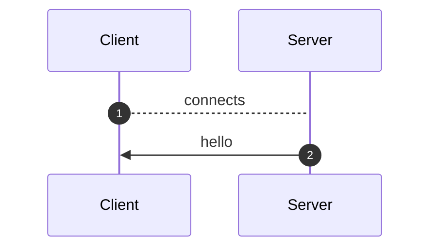
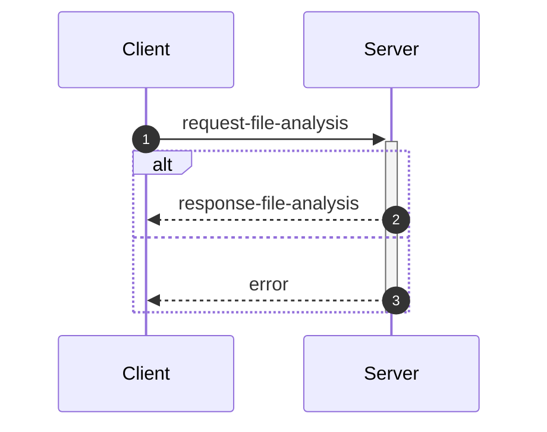
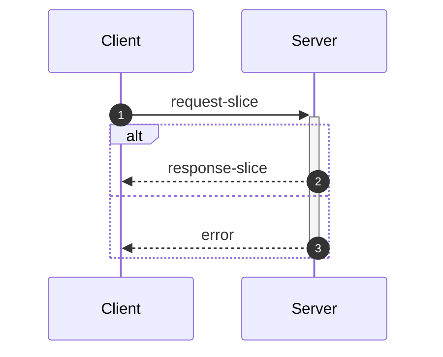
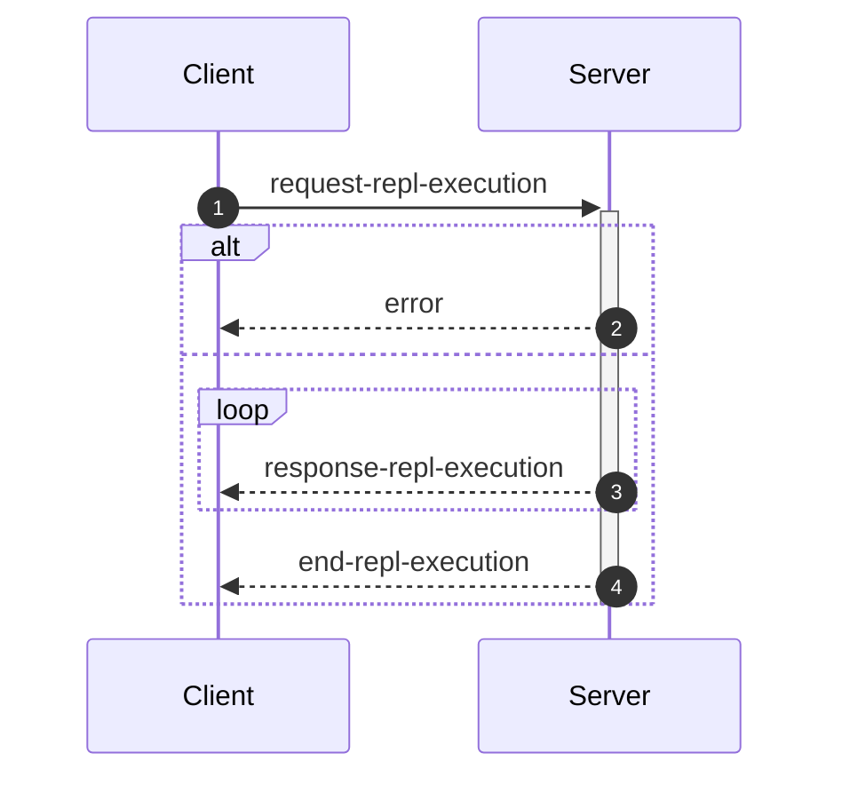
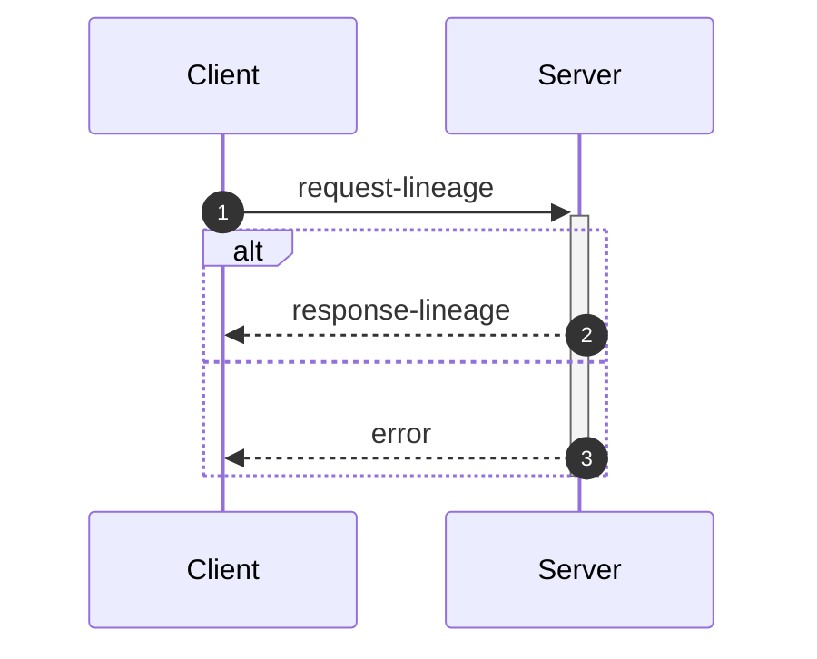

_This document was generated from '[src/documentation/print-interface-wiki.ts](https://github.com/flowr-analysis/flowr/tree/main//src/documentation/print-interface-wiki.ts)' on 2025-05-12, 08:28:28 UTC presenting an overview of flowR's interfaces (v2.2.12, using R v4.4.3). Please do not edit this file/wiki page directly._

Although far from being as detailed as the in-depth explanation of
[_flowR_](https://github.com/flowr-analysis/flowr/wiki/Core),
this wiki page explains how to interface with _flowR_ in more detail.
In general, command line arguments and other options provide short descriptions on hover over.

* [💬 Communicating with the Server](#communicating-with-the-server)
* [💻 Using the REPL](#using-the-repl)
* [⚙️ Configuring FlowR](#configuring-flowr)
* [⚒️ Writing Code](#writing-code)

<a id='communicating-with-the-server'></a>
## 💬 Communicating with the Server


As explained in the [Overview](https://github.com/flowr-analysis/flowr/wiki/Overview), you can simply run the [TCP](https://de.wikipedia.org/wiki/Transmission_Control_Protocol)&nbsp;server by adding the <span title="Description (Command Line Argument): Do not drop into a repl, but instead start a server on the given port (default: 1042) and listen for messages.">`--server`</span> flag (and, due to the interactive mode, exit with the conventional <kbd>CTRL</kbd>+<kbd>C</kbd>).
Currently, every connection is handled by the same underlying `RShell` - so the server is not designed to handle many clients at a time.
Additionally, the server is not well guarded against attacks (e.g., you can theoretically spawn an arbitrary number of&nbsp;RShell sessions on the target machine).

Every message has to be given in a single line (i.e., without a newline in-between) and end with a newline character. Nevertheless, we will pretty-print example given in the following segments for the ease of reading.


> [!NOTE]
> 
> The default <span title="Description (Command Line Argument): Do not drop into a repl, but instead start a server on the given port (default: 1042) and listen for messages.">`--server`</span> uses a simple [TCP](https://de.wikipedia.org/wiki/Transmission_Control_Protocol)
> connection. If you want _flowR_ to expose a [WebSocket](https://de.wikipedia.org/wiki/WebSocket) server instead, add the <span title="Description (Command Line Argument): If the server flag is set, use websocket for messaging">`--ws`</span> flag (i.e., <span title="Description (Command Line Argument): Do not drop into a repl, but instead start a server on the given port (default: 1042) and listen for messages.">`--server`</span> <span title="Description (Command Line Argument): If the server flag is set, use websocket for messaging">`--ws`</span>) when starting _flowR_ from the command line.
> 			


<ul><li>
<a id="message-hello"></a>
<b>Hello</b> Message (<code>hello</code>) 
<details>

<summary style="color:gray"> View Details. <i>The server informs the client about the successful connection and provides Meta-Information.</i> </summary>




	
After launching _flowR_, for example, with <code>docker run -it --rm eagleoutice/flowr <span title="Description (Command Line Argument): Do not drop into a repl, but instead start a server on the given port (default: 1042) and listen for messages.">-<span/>-server</span></code>&nbsp;(🐳️), simply connecting should present you with a `hello` message, that amongst others should reveal the versions of&nbsp;_flowR_ and&nbsp;R, using the [semver 2.0](https://semver.org/spec/v2.0.0.html) versioning scheme.
The message looks like this:


```json
{
  "type": "hello",
  "clientName": "client-0",
  "versions": {
    "flowr": "2.2.12",
    "r": "4.4.3",
    "engine": "r-shell"
  }
}
```


There are currently a few messages that you can send after the hello message.
If you want to _slice_ a piece of R code you first have to send an [analysis request](#message-request-file-analysis), so that you can send one or multiple slice requests afterward.
Requests for the [REPL](#message-request-repl) are independent of that.
	

<hr>


<details>
<summary style="color:gray">Message schema (<code>hello</code>)</summary>

For the definition of the hello message, please see it's implementation at [`./src/cli/repl/server/messages/message-hello.ts`](https://github.com/flowr-analysis/flowr/tree/main/./src/cli/repl/server/messages/message-hello.ts).

- **.** object [required]
    - **type** string [required]
        _The type of the hello message._
        Allows only the values: 'hello'
    - **id** any [forbidden]
        _The id of the message is always undefined (as it is the initial message and not requested)._
    - **clientName** string [required]
        _A unique name that is assigned to each client. It has no semantic meaning and is only used/useful for debugging._
    - **versions** object [required]
        - **flowr** string [required]
            _The version of the flowr server running in semver format._
        - **r** string [required]
            _The version of the underlying R shell running in semver format._
        - **engine** string [required]
            _The parser backend that is used to parse the R code._

</details>


<hr>

</details>	
	</li>

<li>
<a id="message-request-file-analysis"></a>
<b>Analysis</b> Message (<code>request-file-analysis</code>) 
<details>

<summary style="color:gray"> View Details. <i>The server builds the dataflow graph for a given input file (or a set of files).</i> </summary>




	
The request allows the server to analyze a file and prepare it for slicing.
The message can contain a `filetoken`, which is used to identify the file in later slice or lineage requests (if you do not add one, the request will not be stored and therefore, it is not available for subsequent requests).

> **Please note!**\
> If you want to send and process a lot of analysis requests, but do not want to slice them, please do not pass the `filetoken` field. This will save the server a lot of memory allocation.

Furthermore, the request must contain either a `content` field to directly pass the file's content or a `filepath` field which contains the path to the file (this path must be accessible for the server to be useful).
If you add the `id` field, the answer will use the same `id` so you can match requests and the corresponding answers.
See the implementation of the request-file-analysis message for more information.


<details>
<summary>Example of the <code>request-file-analysis</code> Message</summary>

_Note:_ even though we pretty-print these messages, they are sent as a single line, ending with a newline.

The following lists all messages that were sent and received in case you want to reproduce the scenario:

<ol>
<li> <code>hello</code> (response)
<details> 

<summary> Show Details </summary>

The first message is always a hello message.


```json
{
  "type": "hello",
  "clientName": "client-0",
  "versions": {
    "flowr": "2.2.12",
    "r": "4.4.3",
    "engine": "r-shell"
  }
}
```


</details>
</li>

<li> <b><code>request-file-analysis</code> (request)</b>
<details open> 

<summary> Show Details </summary>

Let' suppose you simply want to analyze the following script:
 
```r
x <- 1
x + 1
```

 For this, you can send the following request:


```json
{
  "type": "request-file-analysis",
  "id": "1",
  "filetoken": "x",
  "content": "x <- 1\nx + 1"
}
```


</details>
</li>

<li> <code>response-file-analysis</code> (response)
<details> 

<summary> Show Details </summary>


The `results` field of the response effectively contains three keys of importance:

- `parse`: which contains 1:1 the parse result in CSV format that we received from the `RShell` (i.e., the AST produced by the parser of the R interpreter).
- `normalize`: which contains the normalized AST, including ids (see the `info` field and the [Normalized AST](https://github.com/flowr-analysis/flowr/wiki/Normalized%20AST) wiki page).
- `dataflow`: especially important is the `graph` field which contains the dataflow graph as a set of root vertices (see the [Dataflow Graph](https://github.com/flowr-analysis/flowr/wiki/Dataflow%20Graph) wiki page).
			


_As the code is pretty long, we inhibit pretty printing and syntax highlighting (JSON, hiding built-in):_

```text
{"type":"response-file-analysis","format":"json","id":"1","results":{"parse":{"parsed":"[1,1,1,6,7,0,\"expr\",false,\"x <- 1\"],[1,1,1,1,1,3,\"SYMBOL\",true,\"x\"],[1,1,1,1,3,7,\"expr\",false,\"x\"],[1,3,1,4,2,7,\"LEFT_ASSIGN\",true,\"<-\"],[1,6,1,6,4,5,\"NUM_CONST\",true,\"1\"],[1,6,1,6,5,7,\"expr\",false,\"1\"],[2,1,2,5,16,0,\"expr\",false,\"x + 1\"],[2,1,2,1,10,12,\"SYMBOL\",true,\"x\"],[2,1,2,1,12,16,\"expr\",false,\"x\"],[2,3,2,3,11,16,\"'+'\",true,\"+\"],[2,5,2,5,13,14,\"NUM_CONST\",true,\"1\"],[2,5,2,5,14,16,\"expr\",false,\"1\"]",".meta":{"timing":5}},"normalize":{"ast":{"type":"RExpressionList","children":[{"type":"RBinaryOp","location":[1,3,1,4],"lhs":{"type":"RSymbol","location":[1,1,1,1],"content":"x","lexeme":"x","info":{"fullRange":[1,1,1,1],"additionalTokens":[],"id":0,"parent":2,"role":"binop-lhs","index":0,"nesting":0,"file":"/tmp/tmp-7879-QqwoKXFbYMTe-.R"}},"rhs":{"location":[1,6,1,6],"lexeme":"1","info":{"fullRange":[1,6,1,6],"additionalTokens":[],"id":1,"parent":2,"role":"binop-rhs","index":1,"nesting":0,"file":"/tmp/tmp-7879-QqwoKXFbYMTe-.R"},"type":"RNumber","content":{"num":1,"complexNumber":false,"markedAsInt":false}},"operator":"<-","lexeme":"<-","info":{"fullRange":[1,1,1,6],"additionalTokens":[],"id":2,"parent":6,"nesting":0,"file":"/tmp/tmp-7879-QqwoKXFbYMTe-.R","index":0,"role":"expr-list-child"}},{"type":"RBinaryOp","location":[2,3,2,3],"lhs":{"type":"RSymbol","location":[2,1,2,1],"content":"x","lexeme":"x","info":{"fullRange":[2,1,2,1],"additionalTokens":[],"id":3,"parent":5,"role":"binop-lhs","index":0,"nesting":0,"file":"/tmp/tmp-7879-QqwoKXFbYMTe-.R"}},"rhs":{"location":[2,5,2,5],"lexeme":"1","info":{"fullRange":[2,5,2,5],"additionalTokens":[],"id":4,"parent":5,"role":"binop-rhs","index":1,"nesting":0,"file":"/tmp/tmp-7879-QqwoKXFbYMTe-.R"},"type":"RNumber","content":{"num":1,"complexNumber":false,"markedAsInt":false}},"operator":"+","lexeme":"+","info":{"fullRange":[2,1,2,5],"additionalTokens":[],"id":5,"parent":6,"nesting":0,"file":"/tmp/tmp-7879-QqwoKXFbYMTe-.R","index":1,"role":"expr-list-child"}}],"info":{"additionalTokens":[],"id":6,"nesting":0,"file":"/tmp/tmp-7879-QqwoKXFbYMTe-.R","role":"root","index":0}},".meta":{"timing":3}},"dataflow":{"unknownReferences":[],"in":[{"nodeId":2,"name":"<-","type":2},{"nodeId":5,"name":"+","type":2}],"out":[{"nodeId":0,"name":"x","type":4,"definedAt":2,"value":[1]}],"environment":{"current":{"id":12,"parent":"<BuiltInEnvironment>","memory":[["x",[{"nodeId":0,"name":"x","type":4,"definedAt":2,"value":[1]}]]]},"level":0},"graph":{"_sourced":["/tmp/tmp-7879-QqwoKXFbYMTe-.R"],"_unknownSideEffects":[],"rootVertices":[1,0,2,3,4,5],"vertexInformation":[[1,{"tag":"value","id":1}],[0,{"tag":"variable-definition","id":0}],[2,{"tag":"function-call","id":2,"name":"<-","onlyBuiltin":true,"args":[{"nodeId":0,"type":32},{"nodeId":1,"type":32}],"origin":["builtin:assignment"]}],[3,{"tag":"use","id":3}],[4,{"tag":"value","id":4}],[5,{"tag":"function-call","id":5,"name":"+","onlyBuiltin":true,"args":[{"nodeId":3,"type":32},{"nodeId":4,"type":32}],"origin":["builtin:default"]}]],"edgeInformation":[[2,[[1,{"types":64}],[0,{"types":72}],["built-in:<-",{"types":1}]]],[0,[[1,{"types":2}],[2,{"types":2}]]],[3,[[0,{"types":1}]]],[5,[[3,{"types":65}],[4,{"types":65}],["built-in:+",{"types":1}]]]]},"entryPoint":2,"exitPoints":[{"type":0,"nodeId":5}],".meta":{"timing":4}}}}
```


</details>
</li>
</ol>

The complete round-trip took 17.3 ms (including time required to validate the messages, start, and stop the internal mock server).

</details>


You receive an error if, for whatever reason, the analysis fails (e.g., the message or code you sent contained syntax errors).
It contains a human-readable description *why* the analysis failed (see the error message implementation for more details).


<details>
<summary>Example Error Message</summary>

_Note:_ even though we pretty-print these messages, they are sent as a single line, ending with a newline.

The following lists all messages that were sent and received in case you want to reproduce the scenario:

<ol>
<li> <code>hello</code> (response)
<details> 

<summary> Show Details </summary>

The first message is always a hello message.


```json
{
  "type": "hello",
  "clientName": "client-0",
  "versions": {
    "flowr": "2.2.12",
    "r": "4.4.3",
    "engine": "r-shell"
  }
}
```


</details>
</li>

<li> <code>request-file-analysis</code> (request)
<details> 

<summary> Show Details </summary>


```json
{
  "type": "request-file-analysis",
  "id": "1",
  "filename": "sample.R",
  "content": "x <-"
}
```


</details>
</li>

<li> <b><code>error</code> (response)</b>
<details open> 

<summary> Show Details </summary>


```json
{
  "id": "1",
  "type": "error",
  "fatal": false,
  "reason": "Error while analyzing file sample.R: GuardError: unable to parse R code (see the log for more information) for request {\"request\":\"file\",\"content\":\"/tmp/tmp-7879-3mvBok4XUv8I-.R\"}}"
}
```


</details>
</li>
</ol>

The complete round-trip took 1.4 ms (including time required to validate the messages, start, and stop the internal mock server).

</details>


&nbsp;

<a id="analysis-include-cfg"></a>
**Including the Control Flow Graph**

While _flowR_ does (for the time being) not use an explicit control flow graph but instead relies on control-dependency edges within the dataflow graph, 
the respective structure can still be exposed using the server (note that, as this feature is not needed within _flowR_, it is tested significantly less - 
so please create a [new issue](https://github.com/flowr-analysis/flowr/issues/new/choose) for any bug you may encounter).
For this, the analysis request may add `cfg: true` to its list of options.


<details>
<summary>Requesting a Control Flow Graph</summary>

_Note:_ even though we pretty-print these messages, they are sent as a single line, ending with a newline.

The following lists all messages that were sent and received in case you want to reproduce the scenario:

<ol>
<li> <code>hello</code> (response)
<details> 

<summary> Show Details </summary>

The first message is always a hello message.


```json
{
  "type": "hello",
  "clientName": "client-0",
  "versions": {
    "flowr": "2.2.12",
    "r": "4.4.3",
    "engine": "r-shell"
  }
}
```


</details>
</li>

<li> <b><code>request-file-analysis</code> (request)</b>
<details open> 

<summary> Show Details </summary>


```json
{
  "type": "request-file-analysis",
  "id": "1",
  "filetoken": "x",
  "content": "if(unknown > 0) { x <- 2 } else { x <- 5 }\nfor(i in 1:x) { print(x); print(i) }",
  "cfg": true
}
```


</details>
</li>

<li> <code>response-file-analysis</code> (response)
<details> 

<summary> Show Details </summary>


The response looks basically the same as a response sent without the `cfg` flag. However, additionally it contains a `cfg` field. 
If you are interested in a visual representation of the control flow graph, see the 
[visualization with mermaid](https://mermaid.live/view#base64:eyJjb2RlIjoiZmxvd2NoYXJ0IEJUXG4gICAgbjMyKFtcImBSRXhwcmVzc2lvbkxpc3QgKDMyKWBcIl0pXG4gICAgbjE1W1wiYFJJZlRoZW5FbHNlICgxNSlcbiMzNDtpZih1bmtub3duICM2MjsgMCkgIzEyMzsgeCAjNjA7IzQ1OyAyICMxMjU7IGVsc2UgIzEyMzsgeCAjNjA7IzQ1OyA1ICMxMjU7IzM0O2BcIl1cbiAgICBuMTUtY29uZGl0aW9uW1sxNS1jb25kaXRpb25dXVxuICAgIG4xNS1leGl0KCgxNS1leGl0KSlcbiAgICBuMChbXCJgUlN5bWJvbCAoMClcbiMzNDt1bmtub3duIzM0O2BcIl0pXG4gICAgbjEoW1wiYFJOdW1iZXIgKDEpXG4jMzQ7MCMzNDtgXCJdKVxuICAgIG4yKFtcImBSQmluYXJ5T3AgKDIpXG4jMzQ7dW5rbm93biAjNjI7IDAjMzQ7YFwiXSlcbiAgICBuMi1leGl0KCgyLWV4aXQpKVxuICAgIG44KFtcImBSRXhwcmVzc2lvbkxpc3QgKDgpYFwiXSlcbiAgICBuNShbXCJgUlN5bWJvbCAoNSlcbiMzNDt4IzM0O2BcIl0pXG4gICAgbjYoW1wiYFJOdW1iZXIgKDYpXG4jMzQ7MiMzNDtgXCJdKVxuICAgIG43KFtcImBSQmluYXJ5T3AgKDcpXG4jMzQ7eCAjNjA7IzQ1OyAyIzM0O2BcIl0pXG4gICAgbjctZXhpdCgoNy1leGl0KSlcbiAgICBuOC1leGl0KCg4LWV4aXQpKVxuICAgIG4xNChbXCJgUkV4cHJlc3Npb25MaXN0ICgxNClgXCJdKVxuICAgIG4xMShbXCJgUlN5bWJvbCAoMTEpXG4jMzQ7eCMzNDtgXCJdKVxuICAgIG4xMihbXCJgUk51bWJlciAoMTIpXG4jMzQ7NSMzNDtgXCJdKVxuICAgIG4xMyhbXCJgUkJpbmFyeU9wICgxMylcbiMzNDt4ICM2MDsjNDU7IDUjMzQ7YFwiXSlcbiAgICBuMTMtZXhpdCgoMTMtZXhpdCkpXG4gICAgbjE0LWV4aXQoKDE0LWV4aXQpKVxuICAgIG4xNihbXCJgUlN5bWJvbCAoMTYpXG4jMzQ7aSMzNDtgXCJdKVxuICAgIG4zMVtcImBSRm9yTG9vcCAoMzEpXG4jMzQ7Zm9yKGkgaW4gMSM1ODt4KSAjMTIzOyBwcmludCh4KTsgcHJpbnQoaSkgIzEyNTsjMzQ7YFwiXVxuICAgIG4xNyhbXCJgUk51bWJlciAoMTcpXG4jMzQ7MSMzNDtgXCJdKVxuICAgIG4xOChbXCJgUlN5bWJvbCAoMTgpXG4jMzQ7eCMzNDtgXCJdKVxuICAgIG4xOShbXCJgUkJpbmFyeU9wICgxOSlcbiMzNDsxIzU4O3gjMzQ7YFwiXSlcbiAgICBuMTktZXhpdCgoMTktZXhpdCkpXG4gICAgbjMwKFtcImBSRXhwcmVzc2lvbkxpc3QgKDMwKWBcIl0pXG4gICAgbjIyKFtcImBSU3ltYm9sICgyMilcbiMzNDtwcmludCh4KSMzNDtgXCJdKVxuICAgIG4yNVtcImBSRnVuY3Rpb25DYWxsICgyNSlcbiMzNDtwcmludCh4KSMzNDtgXCJdXG4gICAgbjI1LW5hbWVbWzI1LW5hbWVdXVxuICAgIG4yNS1leGl0KCgyNS1leGl0KSlcbiAgICBuMjQoW1wiYFJBcmd1bWVudCAoMjQpXG4jMzQ7eCMzNDtgXCJdKVxuICAgIG4yNC1iZWZvcmUtdmFsdWVbWzI0LWJlZm9yZS12YWx1ZV1dXG4gICAgbjIzKFtcImBSU3ltYm9sICgyMylcbiMzNDt4IzM0O2BcIl0pXG4gICAgbjI0LWV4aXQoKDI0LWV4aXQpKVxuICAgIG4yNihbXCJgUlN5bWJvbCAoMjYpXG4jMzQ7cHJpbnQoaSkjMzQ7YFwiXSlcbiAgICBuMjlbXCJgUkZ1bmN0aW9uQ2FsbCAoMjkpXG4jMzQ7cHJpbnQoaSkjMzQ7YFwiXVxuICAgIG4yOS1uYW1lW1syOS1uYW1lXV1cbiAgICBuMjktZXhpdCgoMjktZXhpdCkpXG4gICAgbjI4KFtcImBSQXJndW1lbnQgKDI4KVxuIzM0O2kjMzQ7YFwiXSlcbiAgICBuMjgtYmVmb3JlLXZhbHVlW1syOC1iZWZvcmUtdmFsdWVdXVxuICAgIG4yNyhbXCJgUlN5bWJvbCAoMjcpXG4jMzQ7aSMzNDtgXCJdKVxuICAgIG4yOC1leGl0KCgyOC1leGl0KSlcbiAgICBuMzAtZXhpdCgoMzAtZXhpdCkpXG4gICAgbjMxLWhlYWRbWzMxLWhlYWRdXVxuICAgIG4zMS1leGl0KCgzMS1leGl0KSlcbiAgICBuMzItZXhpdCgoMzItZXhpdCkpXG4gICAgbjE1IC0uLT58XCJGRFwifCBuMzJcbiAgICBuMSAtLi0+fFwiRkRcInwgbjBcbiAgICBuMCAtLi0+fFwiRkRcInwgbjJcbiAgICBuMi1leGl0IC0uLT58XCJGRFwifCBuMVxuICAgIG43IC0uLT58XCJGRFwifCBuOFxuICAgIG42IC0uLT58XCJGRFwifCBuNVxuICAgIG41IC0uLT58XCJGRFwifCBuN1xuICAgIG43LWV4aXQgLS4tPnxcIkZEXCJ8IG42XG4gICAgbjgtZXhpdCAtLi0+fFwiRkRcInwgbjctZXhpdFxuICAgIG4xMyAtLi0+fFwiRkRcInwgbjE0XG4gICAgbjEyIC0uLT58XCJGRFwifCBuMTFcbiAgICBuMTEgLS4tPnxcIkZEXCJ8IG4xM1xuICAgIG4xMy1leGl0IC0uLT58XCJGRFwifCBuMTJcbiAgICBuMTQtZXhpdCAtLi0+fFwiRkRcInwgbjEzLWV4aXRcbiAgICBuMTUtY29uZGl0aW9uIC0uLT58XCJGRFwifCBuMi1leGl0XG4gICAgbjggLS0+fFwiQ0QgKFRSVUUpXCJ8IG4xNS1jb25kaXRpb25cbiAgICBuMTQgLS0+fFwiQ0QgKEZBTFNFKVwifCBuMTUtY29uZGl0aW9uXG4gICAgbjIgLS4tPnxcIkZEXCJ8IG4xNVxuICAgIG4xNS1leGl0IC0uLT58XCJGRFwifCBuOC1leGl0XG4gICAgbjE1LWV4aXQgLS4tPnxcIkZEXCJ8IG4xNC1leGl0XG4gICAgbjMxIC0uLT58XCJGRFwifCBuMTUtZXhpdFxuICAgIG4zMSAtLi0+fFwiRkRcInwgbjMwLWV4aXRcbiAgICBuMTggLS4tPnxcIkZEXCJ8IG4xN1xuICAgIG4xNyAtLi0+fFwiRkRcInwgbjE5XG4gICAgbjE5LWV4aXQgLS4tPnxcIkZEXCJ8IG4xOFxuICAgIG4yNSAtLi0+fFwiRkRcInwgbjMwXG4gICAgbjIyIC0uLT58XCJGRFwifCBuMjVcbiAgICBuMjUtbmFtZSAtLi0+fFwiRkRcInwgbjIyXG4gICAgbjI0LWJlZm9yZS12YWx1ZSAtLi0+fFwiRkRcInwgbjI0XG4gICAgbjIzIC0uLT58XCJGRFwifCBuMjQtYmVmb3JlLXZhbHVlXG4gICAgbjI0LWV4aXQgLS4tPnxcIkZEXCJ8IG4yM1xuICAgIG4yNCAtLi0+fFwiRkRcInwgbjI1LW5hbWVcbiAgICBuMjUtZXhpdCAtLi0+fFwiRkRcInwgbjI0LWV4aXRcbiAgICBuMjkgLS4tPnxcIkZEXCJ8IG4yNS1leGl0XG4gICAgbjI2IC0uLT58XCJGRFwifCBuMjlcbiAgICBuMjktbmFtZSAtLi0+fFwiRkRcInwgbjI2XG4gICAgbjI4LWJlZm9yZS12YWx1ZSAtLi0+fFwiRkRcInwgbjI4XG4gICAgbjI3IC0uLT58XCJGRFwifCBuMjgtYmVmb3JlLXZhbHVlXG4gICAgbjI4LWV4aXQgLS4tPnxcIkZEXCJ8IG4yN1xuICAgIG4yOCAtLi0+fFwiRkRcInwgbjI5LW5hbWVcbiAgICBuMjktZXhpdCAtLi0+fFwiRkRcInwgbjI4LWV4aXRcbiAgICBuMzAtZXhpdCAtLi0+fFwiRkRcInwgbjI5LWV4aXRcbiAgICBuMTkgLS4tPnxcIkZEXCJ8IG4zMVxuICAgIG4xNiAtLi0+fFwiRkRcInwgbjE5LWV4aXRcbiAgICBuMzEtaGVhZCAtLi0+fFwiRkRcInwgbjE2XG4gICAgbjMwIC0tPnxcIkNEIChUUlVFKVwifCBuMzEtaGVhZFxuICAgIG4zMS1leGl0IC0tPnxcIkNEIChGQUxTRSlcInwgbjE5LWV4aXRcbiAgICBuMzItZXhpdCAtLi0+fFwiRkRcInwgbjMxLWV4aXRcbiAgICBzdHlsZSBuMzIgc3Ryb2tlOmN5YW4sc3Ryb2tlLXdpZHRoOjYuNXB4OyAgICBzdHlsZSBuMzItZXhpdCBzdHJva2U6Z3JlZW4sc3Ryb2tlLXdpZHRoOjYuNXB4OyIsIm1lcm1haWQiOnsiYXV0b1N5bmMiOnRydWV9fQ==).
			


_As the code is pretty long, we inhibit pretty printing and syntax highlighting (JSON, hiding built-in):_

```text
{"type":"response-file-analysis","format":"json","id":"1","cfg":{"returns":[],"entryPoints":[32],"exitPoints":["32-exit"],"breaks":[],"nexts":[],"graph":{"rootVertices":[32,15,"15-condition","15-exit",0,1,2,"2-exit",8,5,6,7,"7-exit","8-exit",14,11,12,13,"13-exit","14-exit",16,31,17,18,19,"19-exit",30,22,25,"25-name","25-exit",24,"24-before-value",23,"24-exit",26,29,"29-name","29-exit",28,"28-before-value",27,"28-exit","30-exit","31-head","31-exit","32-exit"],"vertexInformation":[[32,{"id":32,"type":"expr","end":["32-exit"]}],[15,{"id":15,"type":"stm","mid":["15-condition"],"end":["15-exit"]}],["15-condition",{"id":"15-condition","kind":"condition","type":"mid","root":15}],["15-exit",{"id":"15-exit","type":"end","root":15}],[0,{"id":0,"type":"expr"}],[1,{"id":1,"type":"expr"}],[2,{"id":2,"type":"expr","end":["2-exit"]}],["2-exit",{"id":"2-exit","type":"end","root":2}],[8,{"id":8,"type":"expr","end":["8-exit"]}],[5,{"id":5,"type":"expr"}],[6,{"id":6,"type":"expr"}],[7,{"id":7,"type":"expr","end":["7-exit"]}],["7-exit",{"id":"7-exit","type":"end","root":7}],["8-exit",{"id":"8-exit","type":"end","root":8}],[14,{"id":14,"type":"expr","end":["14-exit"]}],[11,{"id":11,"type":"expr"}],[12,{"id":12,"type":"expr"}],[13,{"id":13,"type":"expr","end":["13-exit"]}],["13-exit",{"id":"13-exit","type":"end","root":13}],["14-exit",{"id":"14-exit","type":"end","root":14}],[16,{"id":16,"type":"expr"}],[31,{"id":31,"type":"stm","exit":["31-exit"],"mid":["31-head"]}],[17,{"id":17,"type":"expr"}],[18,{"id":18,"type":"expr"}],[19,{"id":19,"type":"expr","end":["19-exit"]}],["19-exit",{"id":"19-exit","type":"end","root":19}],[30,{"id":30,"type":"expr","end":["30-exit"]}],[22,{"id":22,"type":"expr"}],[25,{"id":25,"type":"stm","mid":["25-name"],"end":["25-exit"]}],["25-name",{"id":"25-name","kind":"name","type":"mid","root":25}],["25-exit",{"id":"25-exit","type":"end","root":25}],[24,{"id":24,"type":"expr","mid":["24-before-value"],"end":["24-exit"]}],["24-before-value",{"id":"24-before-value","kind":"before-value","type":"mid","root":24}],[23,{"id":23,"type":"expr"}],["24-exit",{"id":"24-exit","type":"end","root":24}],[26,{"id":26,"type":"expr"}],[29,{"id":29,"type":"stm","mid":["29-name"],"end":["29-exit"]}],["29-name",{"id":"29-name","kind":"name","type":"mid","root":29}],["29-exit",{"id":"29-exit","type":"end","root":29}],[28,{"id":28,"type":"expr","mid":["28-before-value"],"end":["28-exit"]}],["28-before-value",{"id":"28-before-value","kind":"before-value","type":"mid","root":28}],[27,{"id":27,"type":"expr"}],["28-exit",{"id":"28-exit","type":"end","root":28}],["30-exit",{"id":"30-exit","type":"end","root":30}],["31-head",{"id":"31-head","type":"mid","root":31,"kind":"head"}],["31-exit",{"id":"31-exit","type":"end","root":31}],["32-exit",{"id":"32-exit","type":"end","root":32}]],"bbChildren":[],"edgeInformation":[[15,[[32,{"label":0}]]],[1,[[0,{"label":0}]]],[0,[[2,{"label":0}]]],["2-exit",[[1,{"label":0}]]],[7,[[8,{"label":0}]]],[6,[[5,{"label":0}]]],[5,[[7,{"label":0}]]],["7-exit",[[6,{"label":0}]]],["8-exit",[["7-exit",{"label":0}]]],[13,[[14,{"label":0}]]],[12,[[11,{"label":0}]]],[11,[[13,{"label":0}]]],["13-exit",[[12,{"label":0}]]],["14-exit",[["13-exit",{"label":0}]]],["15-condition",[["2-exit",{"label":0}]]],[8,[["15-condition",{"label":1,"when":"TRUE","caused":15}]]],[14,[["15-condition",{"label":1,"when":"FALSE","caused":15}]]],[2,[[15,{"label":0}]]],["15-exit",[["8-exit",{"label":0}],["14-exit",{"label":0}]]],[31,[["15-exit",{"label":0}],["30-exit",{"label":0}]]],[18,[[17,{"label":0}]]],[17,[[19,{"label":0}]]],["19-exit",[[18,{"label":0}]]],[25,[[30,{"label":0}]]],[22,[[25,{"label":0}]]],["25-name",[[22,{"label":0}]]],["24-before-value",[[24,{"label":0}]]],[23,[["24-before-value",{"label":0}]]],["24-exit",[[23,{"label":0}]]],[24,[["25-name",{"label":0}]]],["25-exit",[["24-exit",{"label":0}]]],[29,[["25-exit",{"label":0}]]],[26,[[29,{"label":0}]]],["29-name",[[26,{"label":0}]]],["28-before-value",[[28,{"label":0}]]],[27,[["28-before-value",{"label":0}]]],["28-exit",[[27,{"label":0}]]],[28,[["29-name",{"label":0}]]],["29-exit",[["28-exit",{"label":0}]]],["30-exit",[["29-exit",{"label":0}]]],[19,[[31,{"label":0}]]],[16,[["19-exit",{"label":0}]]],["31-head",[[16,{"label":0}]]],[30,[["31-head",{"label":1,"when":"TRUE","caused":31}]]],["31-exit",[["19-exit",{"label":1,"when":"FALSE","caused":31}]]],["32-exit",[["31-exit",{"label":0}]]]]}},"results":{"parse":{"parsed":"[1,1,1,42,38,0,\"expr\",false,\"if(unknown > 0) { x <- 2 } else { x <- 5 }\"],[1,1,1,2,1,38,\"IF\",true,\"if\"],[1,3,1,3,2,38,\"'('\",true,\"(\"],[1,4,1,14,9,38,\"expr\",false,\"unknown > 0\"],[1,4,1,10,3,5,\"SYMBOL\",true,\"unknown\"],[1,4,1,10,5,9,\"expr\",false,\"unknown\"],[1,12,1,12,4,9,\"GT\",true,\">\"],[1,14,1,14,6,7,\"NUM_CONST\",true,\"0\"],[1,14,1,14,7,9,\"expr\",false,\"0\"],[1,15,1,15,8,38,\"')'\",true,\")\"],[1,17,1,26,22,38,\"expr\",false,\"{ x <- 2 }\"],[1,17,1,17,12,22,\"'{'\",true,\"{\"],[1,19,1,24,19,22,\"expr\",false,\"x <- 2\"],[1,19,1,19,13,15,\"SYMBOL\",true,\"x\"],[1,19,1,19,15,19,\"expr\",false,\"x\"],[1,21,1,22,14,19,\"LEFT_ASSIGN\",true,\"<-\"],[1,24,1,24,16,17,\"NUM_CONST\",true,\"2\"],[1,24,1,24,17,19,\"expr\",false,\"2\"],[1,26,1,26,18,22,\"'}'\",true,\"}\"],[1,28,1,31,23,38,\"ELSE\",true,\"else\"],[1,33,1,42,35,38,\"expr\",false,\"{ x <- 5 }\"],[1,33,1,33,25,35,\"'{'\",true,\"{\"],[1,35,1,40,32,35,\"expr\",false,\"x <- 5\"],[1,35,1,35,26,28,\"SYMBOL\",true,\"x\"],[1,35,1,35,28,32,\"expr\",false,\"x\"],[1,37,1,38,27,32,\"LEFT_ASSIGN\",true,\"<-\"],[1,40,1,40,29,30,\"NUM_CONST\",true,\"5\"],[1,40,1,40,30,32,\"expr\",false,\"5\"],[1,42,1,42,31,35,\"'}'\",true,\"}\"],[2,1,2,36,84,0,\"expr\",false,\"for(i in 1:x) { print(x); print(i) }\"],[2,1,2,3,41,84,\"FOR\",true,\"for\"],[2,4,2,13,53,84,\"forcond\",false,\"(i in 1:x)\"],[2,4,2,4,42,53,\"'('\",true,\"(\"],[2,5,2,5,43,53,\"SYMBOL\",true,\"i\"],[2,7,2,8,44,53,\"IN\",true,\"in\"],[2,10,2,12,51,53,\"expr\",false,\"1:x\"],[2,10,2,10,45,46,\"NUM_CONST\",true,\"1\"],[2,10,2,10,46,51,\"expr\",false,\"1\"],[2,11,2,11,47,51,\"':'\",true,\":\"],[2,12,2,12,48,50,\"SYMBOL\",true,\"x\"],[2,12,2,12,50,51,\"expr\",false,\"x\"],[2,13,2,13,49,53,\"')'\",true,\")\"],[2,15,2,36,81,84,\"expr\",false,\"{ print(x); print(i) }\"],[2,15,2,15,54,81,\"'{'\",true,\"{\"],[2,17,2,24,64,81,\"expr\",false,\"print(x)\"],[2,17,2,21,55,57,\"SYMBOL_FUNCTION_CALL\",true,\"print\"],[2,17,2,21,57,64,\"expr\",false,\"print\"],[2,22,2,22,56,64,\"'('\",true,\"(\"],[2,23,2,23,58,60,\"SYMBOL\",true,\"x\"],[2,23,2,23,60,64,\"expr\",false,\"x\"],[2,24,2,24,59,64,\"')'\",true,\")\"],[2,25,2,25,65,81,\"';'\",true,\";\"],[2,27,2,34,77,81,\"expr\",false,\"print(i)\"],[2,27,2,31,68,70,\"SYMBOL_FUNCTION_CALL\",true,\"print\"],[2,27,2,31,70,77,\"expr\",false,\"print\"],[2,32,2,32,69,77,\"'('\",true,\"(\"],[2,33,2,33,71,73,\"SYMBOL\",true,\"i\"],[2,33,2,33,73,77,\"expr\",false,\"i\"],[2,34,2,34,72,77,\"')'\",true,\")\"],[2,36,2,36,78,81,\"'}'\",true,\"}\"]",".meta":{"timing":2}},"normalize":{"ast":{"type":"RExpressionList","children":[{"type":"RIfThenElse","condition":{"type":"RBinaryOp","location":[1,12,1,12],"lhs":{"type":"RSymbol","location":[1,4,1,10],"content":"unknown","lexeme":"unknown","info":{"fullRange":[1,4,1,10],"additionalTokens":[],"id":0,"parent":2,"role":"binop-lhs","index":0,"nesting":1,"file":"/tmp/tmp-7879-HSe2tJ69n31B-.R"}},"rhs":{"location":[1,14,1,14],"lexeme":"0","info":{"fullRange":[1,14,1,14],"additionalTokens":[],"id":1,"parent":2,"role":"binop-rhs","index":1,"nesting":1,"file":"/tmp/tmp-7879-HSe2tJ69n31B-.R"},"type":"RNumber","content":{"num":0,"complexNumber":false,"markedAsInt":false}},"operator":">","lexeme":">","info":{"fullRange":[1,4,1,14],"additionalTokens":[],"id":2,"parent":15,"nesting":1,"file":"/tmp/tmp-7879-HSe2tJ69n31B-.R","role":"if-cond"}},"then":{"type":"RExpressionList","children":[{"type":"RBinaryOp","location":[1,21,1,22],"lhs":{"type":"RSymbol","location":[1,19,1,19],"content":"x","lexeme":"x","info":{"fullRange":[1,19,1,19],"additionalTokens":[],"id":5,"parent":7,"role":"binop-lhs","index":0,"nesting":1,"file":"/tmp/tmp-7879-HSe2tJ69n31B-.R"}},"rhs":{"location":[1,24,1,24],"lexeme":"2","info":{"fullRange":[1,24,1,24],"additionalTokens":[],"id":6,"parent":7,"role":"binop-rhs","index":1,"nesting":1,"file":"/tmp/tmp-7879-HSe2tJ69n31B-.R"},"type":"RNumber","content":{"num":2,"complexNumber":false,"markedAsInt":false}},"operator":"<-","lexeme":"<-","info":{"fullRange":[1,19,1,24],"additionalTokens":[],"id":7,"parent":8,"nesting":1,"file":"/tmp/tmp-7879-HSe2tJ69n31B-.R","index":0,"role":"expr-list-child"}}],"grouping":[{"type":"RSymbol","location":[1,17,1,17],"content":"{","lexeme":"{","info":{"fullRange":[1,17,1,26],"additionalTokens":[],"id":3,"role":"root","index":0,"nesting":1,"file":"/tmp/tmp-7879-HSe2tJ69n31B-.R"}},{"type":"RSymbol","location":[1,26,1,26],"content":"}","lexeme":"}","info":{"fullRange":[1,17,1,26],"additionalTokens":[],"id":4,"role":"root","index":0,"nesting":1,"file":"/tmp/tmp-7879-HSe2tJ69n31B-.R"}}],"info":{"additionalTokens":[],"id":8,"parent":15,"nesting":1,"file":"/tmp/tmp-7879-HSe2tJ69n31B-.R","index":1,"role":"if-then"}},"location":[1,1,1,2],"lexeme":"if","info":{"fullRange":[1,1,1,42],"additionalTokens":[],"id":15,"parent":32,"nesting":1,"file":"/tmp/tmp-7879-HSe2tJ69n31B-.R","index":0,"role":"expr-list-child"},"otherwise":{"type":"RExpressionList","children":[{"type":"RBinaryOp","location":[1,37,1,38],"lhs":{"type":"RSymbol","location":[1,35,1,35],"content":"x","lexeme":"x","info":{"fullRange":[1,35,1,35],"additionalTokens":[],"id":11,"parent":13,"role":"binop-lhs","index":0,"nesting":1,"file":"/tmp/tmp-7879-HSe2tJ69n31B-.R"}},"rhs":{"location":[1,40,1,40],"lexeme":"5","info":{"fullRange":[1,40,1,40],"additionalTokens":[],"id":12,"parent":13,"role":"binop-rhs","index":1,"nesting":1,"file":"/tmp/tmp-7879-HSe2tJ69n31B-.R"},"type":"RNumber","content":{"num":5,"complexNumber":false,"markedAsInt":false}},"operator":"<-","lexeme":"<-","info":{"fullRange":[1,35,1,40],"additionalTokens":[],"id":13,"parent":14,"nesting":1,"file":"/tmp/tmp-7879-HSe2tJ69n31B-.R","index":0,"role":"expr-list-child"}}],"grouping":[{"type":"RSymbol","location":[1,33,1,33],"content":"{","lexeme":"{","info":{"fullRange":[1,33,1,42],"additionalTokens":[],"id":9,"role":"root","index":0,"nesting":1,"file":"/tmp/tmp-7879-HSe2tJ69n31B-.R"}},{"type":"RSymbol","location":[1,42,1,42],"content":"}","lexeme":"}","info":{"fullRange":[1,33,1,42],"additionalTokens":[],"id":10,"role":"root","index":0,"nesting":1,"file":"/tmp/tmp-7879-HSe2tJ69n31B-.R"}}],"info":{"additionalTokens":[],"id":14,"parent":15,"nesting":1,"file":"/tmp/tmp-7879-HSe2tJ69n31B-.R","index":2,"role":"if-otherwise"}}},{"type":"RForLoop","variable":{"type":"RSymbol","location":[2,5,2,5],"content":"i","lexeme":"i","info":{"additionalTokens":[],"id":16,"parent":31,"role":"for-variable","index":0,"nesting":1,"file":"/tmp/tmp-7879-HSe2tJ69n31B-.R"}},"vector":{"type":"RBinaryOp","location":[2,11,2,11],"lhs":{"location":[2,10,2,10],"lexeme":"1","info":{"fullRange":[2,10,2,10],"additionalTokens":[],"id":17,"parent":19,"role":"binop-lhs","index":0,"nesting":1,"file":"/tmp/tmp-7879-HSe2tJ69n31B-.R"},"type":"RNumber","content":{"num":1,"complexNumber":false,"markedAsInt":false}},"rhs":{"type":"RSymbol","location":[2,12,2,12],"content":"x","lexeme":"x","info":{"fullRange":[2,12,2,12],"additionalTokens":[],"id":18,"parent":19,"role":"binop-rhs","index":1,"nesting":1,"file":"/tmp/tmp-7879-HSe2tJ69n31B-.R"}},"operator":":","lexeme":":","info":{"fullRange":[2,10,2,12],"additionalTokens":[],"id":19,"parent":31,"nesting":1,"file":"/tmp/tmp-7879-HSe2tJ69n31B-.R","index":1,"role":"for-vector"}},"body":{"type":"RExpressionList","children":[{"type":"RFunctionCall","named":true,"location":[2,17,2,21],"lexeme":"print","functionName":{"type":"RSymbol","location":[2,17,2,21],"content":"print","lexeme":"print","info":{"fullRange":[2,17,2,24],"additionalTokens":[],"id":22,"parent":25,"role":"call-name","index":0,"nesting":1,"file":"/tmp/tmp-7879-HSe2tJ69n31B-.R"}},"arguments":[{"type":"RArgument","location":[2,23,2,23],"lexeme":"x","value":{"type":"RSymbol","location":[2,23,2,23],"content":"x","lexeme":"x","info":{"fullRange":[2,23,2,23],"additionalTokens":[],"id":23,"parent":24,"role":"arg-value","index":0,"nesting":1,"file":"/tmp/tmp-7879-HSe2tJ69n31B-.R"}},"info":{"fullRange":[2,23,2,23],"additionalTokens":[],"id":24,"parent":25,"nesting":1,"file":"/tmp/tmp-7879-HSe2tJ69n31B-.R","index":1,"role":"call-argument"}}],"info":{"fullRange":[2,17,2,24],"additionalTokens":[],"id":25,"parent":30,"nesting":1,"file":"/tmp/tmp-7879-HSe2tJ69n31B-.R","index":0,"role":"expr-list-child"}},{"type":"RFunctionCall","named":true,"location":[2,27,2,31],"lexeme":"print","functionName":{"type":"RSymbol","location":[2,27,2,31],"content":"print","lexeme":"print","info":{"fullRange":[2,27,2,34],"additionalTokens":[],"id":26,"parent":29,"role":"call-name","index":0,"nesting":1,"file":"/tmp/tmp-7879-HSe2tJ69n31B-.R"}},"arguments":[{"type":"RArgument","location":[2,33,2,33],"lexeme":"i","value":{"type":"RSymbol","location":[2,33,2,33],"content":"i","lexeme":"i","info":{"fullRange":[2,33,2,33],"additionalTokens":[],"id":27,"parent":28,"role":"arg-value","index":0,"nesting":1,"file":"/tmp/tmp-7879-HSe2tJ69n31B-.R"}},"info":{"fullRange":[2,33,2,33],"additionalTokens":[],"id":28,"parent":29,"nesting":1,"file":"/tmp/tmp-7879-HSe2tJ69n31B-.R","index":1,"role":"call-argument"}}],"info":{"fullRange":[2,27,2,34],"additionalTokens":[],"id":29,"parent":30,"nesting":1,"file":"/tmp/tmp-7879-HSe2tJ69n31B-.R","index":1,"role":"expr-list-child"}}],"grouping":[{"type":"RSymbol","location":[2,15,2,15],"content":"{","lexeme":"{","info":{"fullRange":[2,15,2,36],"additionalTokens":[],"id":20,"role":"root","index":0,"nesting":1,"file":"/tmp/tmp-7879-HSe2tJ69n31B-.R"}},{"type":"RSymbol","location":[2,36,2,36],"content":"}","lexeme":"}","info":{"fullRange":[2,15,2,36],"additionalTokens":[],"id":21,"role":"root","index":0,"nesting":1,"file":"/tmp/tmp-7879-HSe2tJ69n31B-.R"}}],"info":{"additionalTokens":[],"id":30,"parent":31,"nesting":1,"file":"/tmp/tmp-7879-HSe2tJ69n31B-.R","index":2,"role":"for-body"}},"lexeme":"for","info":{"fullRange":[2,1,2,36],"additionalTokens":[],"id":31,"parent":32,"nesting":1,"file":"/tmp/tmp-7879-HSe2tJ69n31B-.R","index":1,"role":"expr-list-child"},"location":[2,1,2,3]}],"info":{"additionalTokens":[],"id":32,"nesting":0,"file":"/tmp/tmp-7879-HSe2tJ69n31B-.R","role":"root","index":0}},".meta":{"timing":1}},"dataflow":{"unknownReferences":[],"in":[{"nodeId":15,"name":"if","type":2},{"nodeId":0,"name":"unknown","type":1},{"nodeId":2,"name":">","type":2},{"nodeId":7,"name":"<-","controlDependencies":[{"id":15,"when":true}],"type":2},{"nodeId":13,"name":"<-","controlDependencies":[{"id":15,"when":false}],"type":2},{"nodeId":8,"name":"{","controlDependencies":[{"id":15,"when":true}],"type":2},{"nodeId":14,"name":"{","controlDependencies":[{"id":15,"when":false}],"type":2},{"nodeId":31,"name":"for","type":2},{"name":":","nodeId":19,"type":2},{"name":"print","nodeId":25,"type":2},{"name":"print","nodeId":29,"type":2}],"out":[{"nodeId":5,"name":"x","controlDependencies":[{"id":15,"when":true},{"id":15,"when":true}],"type":4,"definedAt":7,"value":[6]},{"nodeId":11,"name":"x","controlDependencies":[{"id":15,"when":false},{"id":15,"when":false}],"type":4,"definedAt":13,"value":[12]},{"nodeId":16,"name":"i","type":1}],"environment":{"current":{"id":93,"parent":"<BuiltInEnvironment>","memory":[["x",[{"nodeId":5,"name":"x","controlDependencies":[{"id":15,"when":false}],"type":4,"definedAt":7,"value":[6]},{"nodeId":11,"name":"x","controlDependencies":[{"id":15,"when":false}],"type":4,"definedAt":13,"value":[12]}]],["i",[{"nodeId":16,"name":"i","type":4,"definedAt":31}]]]},"level":0},"graph":{"_sourced":["/tmp/tmp-7879-HSe2tJ69n31B-.R"],"_unknownSideEffects":[{"id":25,"linkTo":{"type":"link-to-last-call","callName":{}}},{"id":29,"linkTo":{"type":"link-to-last-call","callName":{}}}],"rootVertices":[0,1,2,6,5,7,8,12,11,13,14,15,16,17,18,19,23,25,27,29,30,31],"vertexInformation":[[0,{"tag":"use","id":0}],[1,{"tag":"value","id":1}],[2,{"tag":"function-call","id":2,"name":">","onlyBuiltin":true,"args":[{"nodeId":0,"type":32},{"nodeId":1,"type":32}],"origin":["builtin:default"]}],[6,{"tag":"value","id":6}],[5,{"tag":"variable-definition","id":5,"cds":[{"id":15,"when":true}]}],[7,{"tag":"function-call","id":7,"name":"<-","onlyBuiltin":true,"cds":[{"id":15,"when":true}],"args":[{"nodeId":5,"type":32},{"nodeId":6,"type":32}],"origin":["builtin:assignment"]}],[8,{"tag":"function-call","id":8,"name":"{","onlyBuiltin":true,"cds":[{"id":15,"when":true}],"args":[{"nodeId":7,"type":32}],"origin":["builtin:expression-list"]}],[12,{"tag":"value","id":12}],[11,{"tag":"variable-definition","id":11,"cds":[{"id":15,"when":false}]}],[13,{"tag":"function-call","id":13,"name":"<-","onlyBuiltin":true,"cds":[{"id":15,"when":false}],"args":[{"nodeId":11,"type":32},{"nodeId":12,"type":32}],"origin":["builtin:assignment"]}],[14,{"tag":"function-call","id":14,"name":"{","onlyBuiltin":true,"cds":[{"id":15,"when":false}],"args":[{"nodeId":13,"type":32}],"origin":["builtin:expression-list"]}],[15,{"tag":"function-call","id":15,"name":"if","onlyBuiltin":true,"args":[{"nodeId":2,"type":32},{"nodeId":8,"type":32},{"nodeId":14,"type":32}],"origin":["builtin:if-then-else"]}],[16,{"tag":"variable-definition","id":16}],[17,{"tag":"value","id":17}],[18,{"tag":"use","id":18}],[19,{"tag":"function-call","id":19,"name":":","onlyBuiltin":true,"args":[{"nodeId":17,"type":32},{"nodeId":18,"type":32}],"origin":["builtin:default"]}],[23,{"tag":"use","id":23,"cds":[{"id":31,"when":true}]}],[25,{"tag":"function-call","id":25,"name":"print","onlyBuiltin":true,"cds":[{"id":31,"when":true}],"args":[{"nodeId":23,"type":32}],"origin":["builtin:default"]}],[27,{"tag":"use","id":27,"cds":[{"id":31,"when":true}]}],[29,{"tag":"function-call","id":29,"name":"print","onlyBuiltin":true,"cds":[{"id":31,"when":true}],"args":[{"nodeId":27,"type":32}],"origin":["builtin:default"]}],[30,{"tag":"function-call","id":30,"name":"{","onlyBuiltin":true,"cds":[{"id":31,"when":true}],"args":[{"nodeId":25,"type":32},{"nodeId":29,"type":32}],"origin":["builtin:expression-list"]}],[31,{"tag":"function-call","id":31,"name":"for","onlyBuiltin":true,"args":[{"nodeId":16,"type":32},{"nodeId":19,"type":32},{"nodeId":30,"type":32}],"origin":["builtin:for-loop"]}]],"edgeInformation":[[2,[[0,{"types":65}],[1,{"types":65}],["built-in:>",{"types":1}]]],[7,[[6,{"types":64}],[5,{"types":72}],["built-in:<-",{"types":1}]]],[5,[[6,{"types":2}],[7,{"types":2}]]],[8,[[7,{"types":72}],["built-in:{",{"types":1}]]],[15,[[8,{"types":72}],[14,{"types":72}],[2,{"types":65}],["built-in:if",{"types":1}]]],[13,[[12,{"types":64}],[11,{"types":72}],["built-in:<-",{"types":1}]]],[11,[[12,{"types":2}],[13,{"types":2}]]],[14,[[13,{"types":72}],["built-in:{",{"types":1}]]],[19,[[17,{"types":65}],[18,{"types":65}],["built-in::",{"types":1}]]],[18,[[5,{"types":1}],[11,{"types":1}]]],[25,[[23,{"types":73}],["built-in:print",{"types":1}]]],[23,[[5,{"types":1}],[11,{"types":1}]]],[29,[[27,{"types":73}],["built-in:print",{"types":1}]]],[27,[[16,{"types":1}]]],[30,[[25,{"types":64}],[29,{"types":72}],["built-in:{",{"types":1}]]],[16,[[19,{"types":2}]]],[31,[[16,{"types":65}],[19,{"types":65}],[30,{"types":320}],["built-in:for",{"types":1}]]]]},"entryPoint":15,"exitPoints":[{"type":0,"nodeId":31}],".meta":{"timing":2}}}}
```


</details>
</li>
</ol>

The complete round-trip took 9.5 ms (including time required to validate the messages, start, and stop the internal mock server).

</details>


&nbsp;

<a id="analysis-format-n-quads"></a>
**Retrieve the Output as RDF N-Quads**

The default response is formatted as JSON.
However, by specifying `format: "n-quads"`, you can retrieve the individual results (e.g., the [Normalized AST](https://github.com/flowr-analysis/flowr/wiki/Normalized%20AST)),
as [RDF N-Quads](https://www.w3.org/TR/n-quads/).
This works with and without the control flow graph as described [above](#analysis-include-cfg).


<details>
<summary>Requesting RDF N-Quads</summary>

_Note:_ even though we pretty-print these messages, they are sent as a single line, ending with a newline.

The following lists all messages that were sent and received in case you want to reproduce the scenario:

<ol>
<li> <code>hello</code> (response)
<details> 

<summary> Show Details </summary>

The first message is always a hello message.


```json
{
  "type": "hello",
  "clientName": "client-0",
  "versions": {
    "flowr": "2.2.12",
    "r": "4.4.3",
    "engine": "r-shell"
  }
}
```


</details>
</li>

<li> <b><code>request-file-analysis</code> (request)</b>
<details open> 

<summary> Show Details </summary>


```json
{
  "type": "request-file-analysis",
  "id": "1",
  "filetoken": "x",
  "content": "x <- 1\nx + 1",
  "format": "n-quads",
  "cfg": true
}
```


</details>
</li>

<li> <code>response-file-analysis</code> (response)
<details> 

<summary> Show Details </summary>


Please note, that the base message format is still JSON. Only the individual results get converted. 
While the context is derived from the `filename`, we currently offer no way to customize other parts of the quads 
(please open a [new issue](https://github.com/flowr-analysis/flowr/issues/new/choose) if you require this).

			


_As the code is pretty long, we inhibit pretty printing and syntax highlighting (JSON, hiding built-in):_

```text
{"type":"response-file-analysis","format":"n-quads","id":"1","cfg":"<https://uni-ulm.de/r-ast/unknown/0> <https://uni-ulm.de/r-ast/rootIds> \"6\"^^<http://www.w3.org/2001/XMLSchema#integer> <unknown> .\n<https://uni-ulm.de/r-ast/unknown/0> <https://uni-ulm.de/r-ast/rootIds> \"0\"^^<http://www.w3.org/2001/XMLSchema#integer> <unknown> .\n<https://uni-ulm.de/r-ast/unknown/0> <https://uni-ulm.de/r-ast/rootIds> \"1\"^^<http://www.w3.org/2001/XMLSchema#integer> <unknown> .\n<https://uni-ulm.de/r-ast/unknown/0> <https://uni-ulm.de/r-ast/rootIds> \"2\"^^<http://www.w3.org/2001/XMLSchema#integer> <unknown> .\n<https://uni-ulm.de/r-ast/unknown/0> <https://uni-ulm.de/r-ast/rootIds> \"2-exit\" <unknown> .\n<https://uni-ulm.de/r-ast/unknown/0> <https://uni-ulm.de/r-ast/rootIds> \"3\"^^<http://www.w3.org/2001/XMLSchema#integer> <unknown> .\n<https://uni-ulm.de/r-ast/unknown/0> <https://uni-ulm.de/r-ast/rootIds> \"4\"^^<http://www.w3.org/2001/XMLSchema#integer> <unknown> .\n<https://uni-ulm.de/r-ast/unknown/0> <https://uni-ulm.de/r-ast/rootIds> \"5\"^^<http://www.w3.org/2001/XMLSchema#integer> <unknown> .\n<https://uni-ulm.de/r-ast/unknown/0> <https://uni-ulm.de/r-ast/rootIds> \"5-exit\" <unknown> .\n<https://uni-ulm.de/r-ast/unknown/0> <https://uni-ulm.de/r-ast/rootIds> \"6-exit\" <unknown> .\n<https://uni-ulm.de/r-ast/unknown/0> <https://uni-ulm.de/r-ast/vertices> <https://uni-ulm.de/r-ast/unknown/1> <unknown> .\n<https://uni-ulm.de/r-ast/unknown/1> <https://uni-ulm.de/r-ast/next> <https://uni-ulm.de/r-ast/unknown/2> <unknown> .\n<https://uni-ulm.de/r-ast/unknown/1> <https://uni-ulm.de/r-ast/id> \"6\"^^<http://www.w3.org/2001/XMLSchema#integer> <unknown> .\n<https://uni-ulm.de/r-ast/unknown/0> <https://uni-ulm.de/r-ast/vertices> <https://uni-ulm.de/r-ast/unknown/2> <unknown> .\n<https://uni-ulm.de/r-ast/unknown/2> <https://uni-ulm.de/r-ast/next> <https://uni-ulm.de/r-ast/unknown/3> <unknown> .\n<https://uni-ulm.de/r-ast/unknown/2> <https://uni-ulm.de/r-ast/id> \"0\"^^<http://www.w3.org/2001/XMLSchema#integer> <unknown> .\n<https://uni-ulm.de/r-ast/unknown/0> <https://uni-ulm.de/r-ast/vertices> <https://uni-ulm.de/r-ast/unknown/3> <unknown> .\n<https://uni-ulm.de/r-ast/unknown/3> <https://uni-ulm.de/r-ast/next> <https://uni-ulm.de/r-ast/unknown/4> <unknown> .\n<https://uni-ulm.de/r-ast/unknown/3> <https://uni-ulm.de/r-ast/id> \"1\"^^<http://www.w3.org/2001/XMLSchema#integer> <unknown> .\n<https://uni-ulm.de/r-ast/unknown/0> <https://uni-ulm.de/r-ast/vertices> <https://uni-ulm.de/r-ast/unknown/4> <unknown> .\n<https://uni-ulm.de/r-ast/unknown/4> <https://uni-ulm.de/r-ast/next> <https://uni-ulm.de/r-ast/unknown/5> <unknown> .\n<https://uni-ulm.de/r-ast/unknown/4> <https://uni-ulm.de/r-ast/id> \"2\"^^<http://www.w3.org/2001/XMLSchema#integer> <unknown> .\n<https://uni-ulm.de/r-ast/unknown/0> <https://uni-ulm.de/r-ast/vertices> <https://uni-ulm.de/r-ast/unknown/5> <unknown> .\n<https://uni-ulm.de/r-ast/unknown/5> <https://uni-ulm.de/r-ast/next> <https://uni-ulm.de/r-ast/unknown/6> <unknown> .\n<https://uni-ulm.de/r-ast/unknown/5> <https://uni-ulm.de/r-ast/id> \"2-exit\" <unknown> .\n<https://uni-ulm.de/r-ast/unknown/0> <https://uni-ulm.de/r-ast/vertices> <https://uni-ulm.de/r-ast/unknown/6> <unknown> .\n<https://uni-ulm.de/r-ast/unknown/6> <https://uni-ulm.de/r-ast/next> <https://uni-ulm.de/r-ast/unknown/7> <unknown> .\n<https://uni-ulm.de/r-ast/unknown/6> <https://uni-ulm.de/r-ast/id> \"3\"^^<http://www.w3.org/2001/XMLSchema#integer> <unknown> .\n<https://uni-ulm.de/r-ast/unknown/0> <https://uni-ulm.de/r-ast/vertices> <https://uni-ulm.de/r-ast/unknown/7> <unknown> .\n<https://uni-ulm.de/r-ast/unknown/7> <https://uni-ulm.de/r-ast/next> <https://uni-ulm.de/r-ast/unknown/8> <unknown> .\n<https://uni-ulm.de/r-ast/unknown/7> <https://uni-ulm.de/r-ast/id> \"4\"^^<http://www.w3.org/2001/XMLSchema#integer> <unknown> .\n<https://uni-ulm.de/r-ast/unknown/0> <https://uni-ulm.de/r-ast/vertices> <https://uni-ulm.de/r-ast/unknown/8> <unknown> .\n<https://uni-ulm.de/r-ast/unknown/8> <https://uni-ulm.de/r-ast/next> <https://uni-ulm.de/r-ast/unknown/9> <unknown> .\n<https://uni-ulm.de/r-ast/unknown/8> <https://uni-ulm.de/r-ast/id> \"5\"^^<http://www.w3.org/2001/XMLSchema#integer> <unknown> .\n<https://uni-ulm.de/r-ast/unknown/0> <https://uni-ulm.de/r-ast/vertices> <https://uni-ulm.de/r-ast/unknown/9> <unknown> .\n<https://uni-ulm.de/r-ast/unknown/9> <https://uni-ulm.de/r-ast/next> <https://uni-ulm.de/r-ast/unknown/10> <unknown> .\n<https://uni-ulm.de/r-ast/unknown/9> <https://uni-ulm.de/r-ast/id> \"5-exit\" <unknown> .\n<https://uni-ulm.de/r-ast/unknown/0> <https://uni-ulm.de/r-ast/vertices> <https://uni-ulm.de/r-ast/unknown/10> <unknown> .\n<https://uni-ulm.de/r-ast/unknown/10> <https://uni-ulm.de/r-ast/id> \"6-exit\" <unknown> .\n<https://uni-ulm.de/r-ast/unknown/0> <https://uni-ulm.de/r-ast/edges> <https://uni-ulm.de/r-ast/unknown/11> <unknown> .\n<https://uni-ulm.de/r-ast/unknown/11> <https://uni-ulm.de/r-ast/next> <https://uni-ulm.de/r-ast/unknown/12> <unknown> .\n<https://uni-ulm.de/r-ast/unknown/11> <https://uni-ulm.de/r-ast/from> \"2\"^^<http://www.w3.org/2001/XMLSchema#integer> <unknown> .\n<https://uni-ulm.de/r-ast/unknown/11> <https://uni-ulm.de/r-ast/to> \"6\"^^<http://www.w3.org/2001/XMLSchema#integer> <unknown> .\n<https://uni-ulm.de/r-ast/unknown/11> <https://uni-ulm.de/r-ast/type> \"0\"^^<http://www.w3.org/2001/XMLSchema#integer> <unknown> .\n<https://uni-ulm.de/r-ast/unknown/0> <https://uni-ulm.de/r-ast/edges> <https://uni-ulm.de/r-ast/unknown/12> <unknown> .\n<https://uni-ulm.de/r-ast/unknown/12> <https://uni-ulm.de/r-ast/next> <https://uni-ulm.de/r-ast/unknown/13> <unknown> .\n<https://uni-ulm.de/r-ast/unknown/12> <https://uni-ulm.de/r-ast/from> \"1\"^^<http://www.w3.org/2001/XMLSchema#integer> <unknown> .\n<https://uni-ulm.de/r-ast/unknown/12> <https://uni-ulm.de/r-ast/to> \"0\"^^<http://www.w3.org/2001/XMLSchema#integer> <unknown> .\n<https://uni-ulm.de/r-ast/unknown/12> <https://uni-ulm.de/r-ast/type> \"0\"^^<http://www.w3.org/2001/XMLSchema#integer> <unknown> .\n<https://uni-ulm.de/r-ast/unknown/0> <https://uni-ulm.de/r-ast/edges> <https://uni-ulm.de/r-ast/unknown/13> <unknown> .\n<https://uni-ulm.de/r-ast/unknown/13> <https://uni-ulm.de/r-ast/next> <https://uni-ulm.de/r-ast/unknown/14> <unknown> .\n<https://uni-ulm.de/r-ast/unknown/13> <https://uni-ulm.de/r-ast/from> \"0\"^^<http://www.w3.org/2001/XMLSchema#integer> <unknown> .\n<https://uni-ulm.de/r-ast/unknown/13> <https://uni-ulm.de/r-ast/to> \"2\"^^<http://www.w3.org/2001/XMLSchema#integer> <unknown> .\n<https://uni-ulm.de/r-ast/unknown/13> <https://uni-ulm.de/r-ast/type> \"0\"^^<http://www.w3.org/2001/XMLSchema#integer> <unknown> .\n<https://uni-ulm.de/r-ast/unknown/0> <https://uni-ulm.de/r-ast/edges> <https://uni-ulm.de/r-ast/unknown/14> <unknown> .\n<https://uni-ulm.de/r-ast/unknown/14> <https://uni-ulm.de/r-ast/next> <https://uni-ulm.de/r-ast/unknown/15> <unknown> .\n<https://uni-ulm.de/r-ast/unknown/14> <https://uni-ulm.de/r-ast/from> \"2-exit\" <unknown> .\n<https://uni-ulm.de/r-ast/unknown/14> <https://uni-ulm.de/r-ast/to> \"1\"^^<http://www.w3.org/2001/XMLSchema#integer> <unknown> .\n<https://uni-ulm.de/r-ast/unknown/14> <https://uni-ulm.de/r-ast/type> \"0\"^^<http://www.w3.org/2001/XMLSchema#integer> <unknown> .\n<https://uni-ulm.de/r-ast/unknown/0> <https://uni-ulm.de/r-ast/edges> <https://uni-ulm.de/r-ast/unknown/15> <unknown> .\n<https://uni-ulm.de/r-ast/unknown/15> <https://uni-ulm.de/r-ast/next> <https://uni-ulm.de/r-ast/unknown/16> <unknown> .\n<https://uni-ulm.de/r-ast/unknown/15> <https://uni-ulm.de/r-ast/from> \"5\"^^<http://www.w3.org/2001/XMLSchema#integer> <unknown> .\n<https://uni-ulm.de/r-ast/unknown/15> <https://uni-ulm.de/r-ast/to> \"2-exit\" <unknown> .\n<https://uni-ulm.de/r-ast/unknown/15> <https://uni-ulm.de/r-ast/type> \"0\"^^<http://www.w3.org/2001/XMLSchema#integer> <unknown> .\n<https://uni-ulm.de/r-ast/unknown/0> <https://uni-ulm.de/r-ast/edges> <https://uni-ulm.de/r-ast/unknown/16> <unknown> .\n<https://uni-ulm.de/r-ast/unknown/16> <https://uni-ulm.de/r-ast/next> <https://uni-ulm.de/r-ast/unknown/17> <unknown> .\n<https://uni-ulm.de/r-ast/unknown/16> <https://uni-ulm.de/r-ast/from> \"4\"^^<http://www.w3.org/2001/XMLSchema#integer> <unknown> .\n<https://uni-ulm.de/r-ast/unknown/16> <https://uni-ulm.de/r-ast/to> \"3\"^^<http://www.w3.org/2001/XMLSchema#integer> <unknown> .\n<https://uni-ulm.de/r-ast/unknown/16> <https://uni-ulm.de/r-ast/type> \"0\"^^<http://www.w3.org/2001/XMLSchema#integer> <unknown> .\n<https://uni-ulm.de/r-ast/unknown/0> <https://uni-ulm.de/r-ast/edges> <https://uni-ulm.de/r-ast/unknown/17> <unknown> .\n<https://uni-ulm.de/r-ast/unknown/17> <https://uni-ulm.de/r-ast/next> <https://uni-ulm.de/r-ast/unknown/18> <unknown> .\n<https://uni-ulm.de/r-ast/unknown/17> <https://uni-ulm.de/r-ast/from> \"3\"^^<http://www.w3.org/2001/XMLSchema#integer> <unknown> .\n<https://uni-ulm.de/r-ast/unknown/17> <https://uni-ulm.de/r-ast/to> \"5\"^^<http://www.w3.org/2001/XMLSchema#integer> <unknown> .\n<https://uni-ulm.de/r-ast/unknown/17> <https://uni-ulm.de/r-ast/type> \"0\"^^<http://www.w3.org/2001/XMLSchema#integer> <unknown> .\n<https://uni-ulm.de/r-ast/unknown/0> <https://uni-ulm.de/r-ast/edges> <https://uni-ulm.de/r-ast/unknown/18> <unknown> .\n<https://uni-ulm.de/r-ast/unknown/18> <https://uni-ulm.de/r-ast/next> <https://uni-ulm.de/r-ast/unknown/19> <unknown> .\n<https://uni-ulm.de/r-ast/unknown/18> <https://uni-ulm.de/r-ast/from> \"5-exit\" <unknown> .\n<https://uni-ulm.de/r-ast/unknown/18> <https://uni-ulm.de/r-ast/to> \"4\"^^<http://www.w3.org/2001/XMLSchema#integer> <unknown> .\n<https://uni-ulm.de/r-ast/unknown/18> <https://uni-ulm.de/r-ast/type> \"0\"^^<http://www.w3.org/2001/XMLSchema#integer> <unknown> .\n<https://uni-ulm.de/r-ast/unknown/0> <https://uni-ulm.de/r-ast/edges> <https://uni-ulm.de/r-ast/unknown/19> <unknown> .\n<https://uni-ulm.de/r-ast/unknown/19> <https://uni-ulm.de/r-ast/from> \"6-exit\" <unknown> .\n<https://uni-ulm.de/r-ast/unknown/19> <https://uni-ulm.de/r-ast/to> \"5-exit\" <unknown> .\n<https://uni-ulm.de/r-ast/unknown/19> <https://uni-ulm.de/r-ast/type> \"0\"^^<http://www.w3.org/2001/XMLSchema#integer> <unknown> .\n<https://uni-ulm.de/r-ast/unknown/0> <https://uni-ulm.de/r-ast/entryPoints> \"6\"^^<http://www.w3.org/2001/XMLSchema#integer> <unknown> .\n<https://uni-ulm.de/r-ast/unknown/0> <https://uni-ulm.de/r-ast/exitPoints> \"6-exit\" <unknown> .\n","results":{"parse":"<https://uni-ulm.de/r-ast/unknown/0> <https://uni-ulm.de/r-ast/token> \"exprlist\" <unknown> .\n<https://uni-ulm.de/r-ast/unknown/0> <https://uni-ulm.de/r-ast/text> \"\" <unknown> .\n<https://uni-ulm.de/r-ast/unknown/0> <https://uni-ulm.de/r-ast/id> \"0\"^^<http://www.w3.org/2001/XMLSchema#integer> <unknown> .\n<https://uni-ulm.de/r-ast/unknown/0> <https://uni-ulm.de/r-ast/parent> \"0\"^^<http://www.w3.org/2001/XMLSchema#integer> <unknown> .\n<https://uni-ulm.de/r-ast/unknown/0> <https://uni-ulm.de/r-ast/line1> \"1\"^^<http://www.w3.org/2001/XMLSchema#integer> <unknown> .\n<https://uni-ulm.de/r-ast/unknown/0> <https://uni-ulm.de/r-ast/col1> \"1\"^^<http://www.w3.org/2001/XMLSchema#integer> <unknown> .\n<https://uni-ulm.de/r-ast/unknown/0> <https://uni-ulm.de/r-ast/line2> \"2\"^^<http://www.w3.org/2001/XMLSchema#integer> <unknown> .\n<https://uni-ulm.de/r-ast/unknown/0> <https://uni-ulm.de/r-ast/col2> \"5\"^^<http://www.w3.org/2001/XMLSchema#integer> <unknown> .\n<https://uni-ulm.de/r-ast/unknown/0> <https://uni-ulm.de/r-ast/children> <https://uni-ulm.de/r-ast/unknown/1> <unknown> .\n<https://uni-ulm.de/r-ast/unknown/1> <https://uni-ulm.de/r-ast/next> <https://uni-ulm.de/r-ast/unknown/2> <unknown> .\n<https://uni-ulm.de/r-ast/unknown/1> <https://uni-ulm.de/r-ast/line1> \"1\"^^<http://www.w3.org/2001/XMLSchema#integer> <unknown> .\n<https://uni-ulm.de/r-ast/unknown/1> <https://uni-ulm.de/r-ast/col1> \"1\"^^<http://www.w3.org/2001/XMLSchema#integer> <unknown> .\n<https://uni-ulm.de/r-ast/unknown/1> <https://uni-ulm.de/r-ast/line2> \"1\"^^<http://www.w3.org/2001/XMLSchema#integer> <unknown> .\n<https://uni-ulm.de/r-ast/unknown/1> <https://uni-ulm.de/r-ast/col2> \"6\"^^<http://www.w3.org/2001/XMLSchema#integer> <unknown> .\n<https://uni-ulm.de/r-ast/unknown/1> <https://uni-ulm.de/r-ast/id> \"7\"^^<http://www.w3.org/2001/XMLSchema#integer> <unknown> .\n<https://uni-ulm.de/r-ast/unknown/1> <https://uni-ulm.de/r-ast/parent> \"0\"^^<http://www.w3.org/2001/XMLSchema#integer> <unknown> .\n<https://uni-ulm.de/r-ast/unknown/1> <https://uni-ulm.de/r-ast/token> \"expr\" <unknown> .\n<https://uni-ulm.de/r-ast/unknown/1> <https://uni-ulm.de/r-ast/terminal> \"false\"^^<http://www.w3.org/2001/XMLSchema#boolean> <unknown> .\n<https://uni-ulm.de/r-ast/unknown/1> <https://uni-ulm.de/r-ast/text> \"x <- 1\" <unknown> .\n<https://uni-ulm.de/r-ast/unknown/1> <https://uni-ulm.de/r-ast/children> <https://uni-ulm.de/r-ast/unknown/3> <unknown> .\n<https://uni-ulm.de/r-ast/unknown/3> <https://uni-ulm.de/r-ast/next> <https://uni-ulm.de/r-ast/unknown/4> <unknown> .\n<https://uni-ulm.de/r-ast/unknown/3> <https://uni-ulm.de/r-ast/line1> \"1\"^^<http://www.w3.org/2001/XMLSchema#integer> <unknown> .\n<https://uni-ulm.de/r-ast/unknown/3> <https://uni-ulm.de/r-ast/col1> \"1\"^^<http://www.w3.org/2001/XMLSchema#integer> <unknown> .\n<https://uni-ulm.de/r-ast/unknown/3> <https://uni-ulm.de/r-ast/line2> \"1\"^^<http://www.w3.org/2001/XMLSchema#integer> <unknown> .\n<https://uni-ulm.de/r-ast/unknown/3> <https://uni-ulm.de/r-ast/col2> \"1\"^^<http://www.w3.org/2001/XMLSchema#integer> <unknown> .\n<https://uni-ulm.de/r-ast/unknown/3> <https://uni-ulm.de/r-ast/id> \"3\"^^<http://www.w3.org/2001/XMLSchema#integer> <unknown> .\n<https://uni-ulm.de/r-ast/unknown/3> <https://uni-ulm.de/r-ast/parent> \"7\"^^<http://www.w3.org/2001/XMLSchema#integer> <unknown> .\n<https://uni-ulm.de/r-ast/unknown/3> <https://uni-ulm.de/r-ast/token> \"expr\" <unknown> .\n<https://uni-ulm.de/r-ast/unknown/3> <https://uni-ulm.de/r-ast/terminal> \"false\"^^<http://www.w3.org/2001/XMLSchema#boolean> <unknown> .\n<https://uni-ulm.de/r-ast/unknown/3> <https://uni-ulm.de/r-ast/text> \"x\" <unknown> .\n<https://uni-ulm.de/r-ast/unknown/3> <https://uni-ulm.de/r-ast/children> <https://uni-ulm.de/r-ast/unknown/5> <unknown> .\n<https://uni-ulm.de/r-ast/unknown/5> <https://uni-ulm.de/r-ast/line1> \"1\"^^<http://www.w3.org/2001/XMLSchema#integer> <unknown> .\n<https://uni-ulm.de/r-ast/unknown/5> <https://uni-ulm.de/r-ast/col1> \"1\"^^<http://www.w3.org/2001/XMLSchema#integer> <unknown> .\n<https://uni-ulm.de/r-ast/unknown/5> <https://uni-ulm.de/r-ast/line2> \"1\"^^<http://www.w3.org/2001/XMLSchema#integer> <unknown> .\n<https://uni-ulm.de/r-ast/unknown/5> <https://uni-ulm.de/r-ast/col2> \"1\"^^<http://www.w3.org/2001/XMLSchema#integer> <unknown> .\n<https://uni-ulm.de/r-ast/unknown/5> <https://uni-ulm.de/r-ast/id> \"1\"^^<http://www.w3.org/2001/XMLSchema#integer> <unknown> .\n<https://uni-ulm.de/r-ast/unknown/5> <https://uni-ulm.de/r-ast/parent> \"3\"^^<http://www.w3.org/2001/XMLSchema#integer> <unknown> .\n<https://uni-ulm.de/r-ast/unknown/5> <https://uni-ulm.de/r-ast/token> \"SYMBOL\" <unknown> .\n<https://uni-ulm.de/r-ast/unknown/5> <https://uni-ulm.de/r-ast/terminal> \"true\"^^<http://www.w3.org/2001/XMLSchema#boolean> <unknown> .\n<https://uni-ulm.de/r-ast/unknown/5> <https://uni-ulm.de/r-ast/text> \"x\" <unknown> .\n<https://uni-ulm.de/r-ast/unknown/1> <https://uni-ulm.de/r-ast/children> <https://uni-ulm.de/r-ast/unknown/4> <unknown> .\n<https://uni-ulm.de/r-ast/unknown/4> <https://uni-ulm.de/r-ast/next> <https://uni-ulm.de/r-ast/unknown/6> <unknown> .\n<https://uni-ulm.de/r-ast/unknown/4> <https://uni-ulm.de/r-ast/line1> \"1\"^^<http://www.w3.org/2001/XMLSchema#integer> <unknown> .\n<https://uni-ulm.de/r-ast/unknown/4> <https://uni-ulm.de/r-ast/col1> \"3\"^^<http://www.w3.org/2001/XMLSchema#integer> <unknown> .\n<https://uni-ulm.de/r-ast/unknown/4> <https://uni-ulm.de/r-ast/line2> \"1\"^^<http://www.w3.org/2001/XMLSchema#integer> <unknown> .\n<https://uni-ulm.de/r-ast/unknown/4> <https://uni-ulm.de/r-ast/col2> \"4\"^^<http://www.w3.org/2001/XMLSchema#integer> <unknown> .\n<https://uni-ulm.de/r-ast/unknown/4> <https://uni-ulm.de/r-ast/id> \"2\"^^<http://www.w3.org/2001/XMLSchema#integer> <unknown> .\n<https://uni-ulm.de/r-ast/unknown/4> <https://uni-ulm.de/r-ast/parent> \"7\"^^<http://www.w3.org/2001/XMLSchema#integer> <unknown> .\n<https://uni-ulm.de/r-ast/unknown/4> <https://uni-ulm.de/r-ast/token> \"LEFT_ASSIGN\" <unknown> .\n<https://uni-ulm.de/r-ast/unknown/4> <https://uni-ulm.de/r-ast/terminal> \"true\"^^<http://www.w3.org/2001/XMLSchema#boolean> <unknown> .\n<https://uni-ulm.de/r-ast/unknown/4> <https://uni-ulm.de/r-ast/text> \"<-\" <unknown> .\n<https://uni-ulm.de/r-ast/unknown/1> <https://uni-ulm.de/r-ast/children> <https://uni-ulm.de/r-ast/unknown/6> <unknown> .\n<https://uni-ulm.de/r-ast/unknown/6> <https://uni-ulm.de/r-ast/line1> \"1\"^^<http://www.w3.org/2001/XMLSchema#integer> <unknown> .\n<https://uni-ulm.de/r-ast/unknown/6> <https://uni-ulm.de/r-ast/col1> \"6\"^^<http://www.w3.org/2001/XMLSchema#integer> <unknown> .\n<https://uni-ulm.de/r-ast/unknown/6> <https://uni-ulm.de/r-ast/line2> \"1\"^^<http://www.w3.org/2001/XMLSchema#integer> <unknown> .\n<https://uni-ulm.de/r-ast/unknown/6> <https://uni-ulm.de/r-ast/col2> \"6\"^^<http://www.w3.org/2001/XMLSchema#integer> <unknown> .\n<https://uni-ulm.de/r-ast/unknown/6> <https://uni-ulm.de/r-ast/id> \"5\"^^<http://www.w3.org/2001/XMLSchema#integer> <unknown> .\n<https://uni-ulm.de/r-ast/unknown/6> <https://uni-ulm.de/r-ast/parent> \"7\"^^<http://www.w3.org/2001/XMLSchema#integer> <unknown> .\n<https://uni-ulm.de/r-ast/unknown/6> <https://uni-ulm.de/r-ast/token> \"expr\" <unknown> .\n<https://uni-ulm.de/r-ast/unknown/6> <https://uni-ulm.de/r-ast/terminal> \"false\"^^<http://www.w3.org/2001/XMLSchema#boolean> <unknown> .\n<https://uni-ulm.de/r-ast/unknown/6> <https://uni-ulm.de/r-ast/text> \"1\" <unknown> .\n<https://uni-ulm.de/r-ast/unknown/6> <https://uni-ulm.de/r-ast/children> <https://uni-ulm.de/r-ast/unknown/7> <unknown> .\n<https://uni-ulm.de/r-ast/unknown/7> <https://uni-ulm.de/r-ast/line1> \"1\"^^<http://www.w3.org/2001/XMLSchema#integer> <unknown> .\n<https://uni-ulm.de/r-ast/unknown/7> <https://uni-ulm.de/r-ast/col1> \"6\"^^<http://www.w3.org/2001/XMLSchema#integer> <unknown> .\n<https://uni-ulm.de/r-ast/unknown/7> <https://uni-ulm.de/r-ast/line2> \"1\"^^<http://www.w3.org/2001/XMLSchema#integer> <unknown> .\n<https://uni-ulm.de/r-ast/unknown/7> <https://uni-ulm.de/r-ast/col2> \"6\"^^<http://www.w3.org/2001/XMLSchema#integer> <unknown> .\n<https://uni-ulm.de/r-ast/unknown/7> <https://uni-ulm.de/r-ast/id> \"4\"^^<http://www.w3.org/2001/XMLSchema#integer> <unknown> .\n<https://uni-ulm.de/r-ast/unknown/7> <https://uni-ulm.de/r-ast/parent> \"5\"^^<http://www.w3.org/2001/XMLSchema#integer> <unknown> .\n<https://uni-ulm.de/r-ast/unknown/7> <https://uni-ulm.de/r-ast/token> \"NUM_CONST\" <unknown> .\n<https://uni-ulm.de/r-ast/unknown/7> <https://uni-ulm.de/r-ast/terminal> \"true\"^^<http://www.w3.org/2001/XMLSchema#boolean> <unknown> .\n<https://uni-ulm.de/r-ast/unknown/7> <https://uni-ulm.de/r-ast/text> \"1\" <unknown> .\n<https://uni-ulm.de/r-ast/unknown/0> <https://uni-ulm.de/r-ast/children> <https://uni-ulm.de/r-ast/unknown/2> <unknown> .\n<https://uni-ulm.de/r-ast/unknown/2> <https://uni-ulm.de/r-ast/line1> \"2\"^^<http://www.w3.org/2001/XMLSchema#integer> <unknown> .\n<https://uni-ulm.de/r-ast/unknown/2> <https://uni-ulm.de/r-ast/col1> \"1\"^^<http://www.w3.org/2001/XMLSchema#integer> <unknown> .\n<https://uni-ulm.de/r-ast/unknown/2> <https://uni-ulm.de/r-ast/line2> \"2\"^^<http://www.w3.org/2001/XMLSchema#integer> <unknown> .\n<https://uni-ulm.de/r-ast/unknown/2> <https://uni-ulm.de/r-ast/col2> \"5\"^^<http://www.w3.org/2001/XMLSchema#integer> <unknown> .\n<https://uni-ulm.de/r-ast/unknown/2> <https://uni-ulm.de/r-ast/id> \"16\"^^<http://www.w3.org/2001/XMLSchema#integer> <unknown> .\n<https://uni-ulm.de/r-ast/unknown/2> <https://uni-ulm.de/r-ast/parent> \"0\"^^<http://www.w3.org/2001/XMLSchema#integer> <unknown> .\n<https://uni-ulm.de/r-ast/unknown/2> <https://uni-ulm.de/r-ast/token> \"expr\" <unknown> .\n<https://uni-ulm.de/r-ast/unknown/2> <https://uni-ulm.de/r-ast/terminal> \"false\"^^<http://www.w3.org/2001/XMLSchema#boolean> <unknown> .\n<https://uni-ulm.de/r-ast/unknown/2> <https://uni-ulm.de/r-ast/text> \"x + 1\" <unknown> .\n<https://uni-ulm.de/r-ast/unknown/2> <https://uni-ulm.de/r-ast/children> <https://uni-ulm.de/r-ast/unknown/8> <unknown> .\n<https://uni-ulm.de/r-ast/unknown/8> <https://uni-ulm.de/r-ast/next> <https://uni-ulm.de/r-ast/unknown/9> <unknown> .\n<https://uni-ulm.de/r-ast/unknown/8> <https://uni-ulm.de/r-ast/line1> \"2\"^^<http://www.w3.org/2001/XMLSchema#integer> <unknown> .\n<https://uni-ulm.de/r-ast/unknown/8> <https://uni-ulm.de/r-ast/col1> \"1\"^^<http://www.w3.org/2001/XMLSchema#integer> <unknown> .\n<https://uni-ulm.de/r-ast/unknown/8> <https://uni-ulm.de/r-ast/line2> \"2\"^^<http://www.w3.org/2001/XMLSchema#integer> <unknown> .\n<https://uni-ulm.de/r-ast/unknown/8> <https://uni-ulm.de/r-ast/col2> \"1\"^^<http://www.w3.org/2001/XMLSchema#integer> <unknown> .\n<https://uni-ulm.de/r-ast/unknown/8> <https://uni-ulm.de/r-ast/id> \"12\"^^<http://www.w3.org/2001/XMLSchema#integer> <unknown> .\n<https://uni-ulm.de/r-ast/unknown/8> <https://uni-ulm.de/r-ast/parent> \"16\"^^<http://www.w3.org/2001/XMLSchema#integer> <unknown> .\n<https://uni-ulm.de/r-ast/unknown/8> <https://uni-ulm.de/r-ast/token> \"expr\" <unknown> .\n<https://uni-ulm.de/r-ast/unknown/8> <https://uni-ulm.de/r-ast/terminal> \"false\"^^<http://www.w3.org/2001/XMLSchema#boolean> <unknown> .\n<https://uni-ulm.de/r-ast/unknown/8> <https://uni-ulm.de/r-ast/text> \"x\" <unknown> .\n<https://uni-ulm.de/r-ast/unknown/8> <https://uni-ulm.de/r-ast/children> <https://uni-ulm.de/r-ast/unknown/10> <unknown> .\n<https://uni-ulm.de/r-ast/unknown/10> <https://uni-ulm.de/r-ast/line1> \"2\"^^<http://www.w3.org/2001/XMLSchema#integer> <unknown> .\n<https://uni-ulm.de/r-ast/unknown/10> <https://uni-ulm.de/r-ast/col1> \"1\"^^<http://www.w3.org/2001/XMLSchema#integer> <unknown> .\n<https://uni-ulm.de/r-ast/unknown/10> <https://uni-ulm.de/r-ast/line2> \"2\"^^<http://www.w3.org/2001/XMLSchema#integer> <unknown> .\n<https://uni-ulm.de/r-ast/unknown/10> <https://uni-ulm.de/r-ast/col2> \"1\"^^<http://www.w3.org/2001/XMLSchema#integer> <unknown> .\n<https://uni-ulm.de/r-ast/unknown/10> <https://uni-ulm.de/r-ast/id> \"10\"^^<http://www.w3.org/2001/XMLSchema#integer> <unknown> .\n<https://uni-ulm.de/r-ast/unknown/10> <https://uni-ulm.de/r-ast/parent> \"12\"^^<http://www.w3.org/2001/XMLSchema#integer> <unknown> .\n<https://uni-ulm.de/r-ast/unknown/10> <https://uni-ulm.de/r-ast/token> \"SYMBOL\" <unknown> .\n<https://uni-ulm.de/r-ast/unknown/10> <https://uni-ulm.de/r-ast/terminal> \"true\"^^<http://www.w3.org/2001/XMLSchema#boolean> <unknown> .\n<https://uni-ulm.de/r-ast/unknown/10> <https://uni-ulm.de/r-ast/text> \"x\" <unknown> .\n<https://uni-ulm.de/r-ast/unknown/2> <https://uni-ulm.de/r-ast/children> <https://uni-ulm.de/r-ast/unknown/9> <unknown> .\n<https://uni-ulm.de/r-ast/unknown/9> <https://uni-ulm.de/r-ast/next> <https://uni-ulm.de/r-ast/unknown/11> <unknown> .\n<https://uni-ulm.de/r-ast/unknown/9> <https://uni-ulm.de/r-ast/line1> \"2\"^^<http://www.w3.org/2001/XMLSchema#integer> <unknown> .\n<https://uni-ulm.de/r-ast/unknown/9> <https://uni-ulm.de/r-ast/col1> \"3\"^^<http://www.w3.org/2001/XMLSchema#integer> <unknown> .\n<https://uni-ulm.de/r-ast/unknown/9> <https://uni-ulm.de/r-ast/line2> \"2\"^^<http://www.w3.org/2001/XMLSchema#integer> <unknown> .\n<https://uni-ulm.de/r-ast/unknown/9> <https://uni-ulm.de/r-ast/col2> \"3\"^^<http://www.w3.org/2001/XMLSchema#integer> <unknown> .\n<https://uni-ulm.de/r-ast/unknown/9> <https://uni-ulm.de/r-ast/id> \"11\"^^<http://www.w3.org/2001/XMLSchema#integer> <unknown> .\n<https://uni-ulm.de/r-ast/unknown/9> <https://uni-ulm.de/r-ast/parent> \"16\"^^<http://www.w3.org/2001/XMLSchema#integer> <unknown> .\n<https://uni-ulm.de/r-ast/unknown/9> <https://uni-ulm.de/r-ast/token> \"+\" <unknown> .\n<https://uni-ulm.de/r-ast/unknown/9> <https://uni-ulm.de/r-ast/terminal> \"true\"^^<http://www.w3.org/2001/XMLSchema#boolean> <unknown> .\n<https://uni-ulm.de/r-ast/unknown/9> <https://uni-ulm.de/r-ast/text> \"+\" <unknown> .\n<https://uni-ulm.de/r-ast/unknown/2> <https://uni-ulm.de/r-ast/children> <https://uni-ulm.de/r-ast/unknown/11> <unknown> .\n<https://uni-ulm.de/r-ast/unknown/11> <https://uni-ulm.de/r-ast/line1> \"2\"^^<http://www.w3.org/2001/XMLSchema#integer> <unknown> .\n<https://uni-ulm.de/r-ast/unknown/11> <https://uni-ulm.de/r-ast/col1> \"5\"^^<http://www.w3.org/2001/XMLSchema#integer> <unknown> .\n<https://uni-ulm.de/r-ast/unknown/11> <https://uni-ulm.de/r-ast/line2> \"2\"^^<http://www.w3.org/2001/XMLSchema#integer> <unknown> .\n<https://uni-ulm.de/r-ast/unknown/11> <https://uni-ulm.de/r-ast/col2> \"5\"^^<http://www.w3.org/2001/XMLSchema#integer> <unknown> .\n<https://uni-ulm.de/r-ast/unknown/11> <https://uni-ulm.de/r-ast/id> \"14\"^^<http://www.w3.org/2001/XMLSchema#integer> <unknown> .\n<https://uni-ulm.de/r-ast/unknown/11> <https://uni-ulm.de/r-ast/parent> \"16\"^^<http://www.w3.org/2001/XMLSchema#integer> <unknown> .\n<https://uni-ulm.de/r-ast/unknown/11> <https://uni-ulm.de/r-ast/token> \"expr\" <unknown> .\n<https://uni-ulm.de/r-ast/unknown/11> <https://uni-ulm.de/r-ast/terminal> \"false\"^^<http://www.w3.org/2001/XMLSchema#boolean> <unknown> .\n<https://uni-ulm.de/r-ast/unknown/11> <https://uni-ulm.de/r-ast/text> \"1\" <unknown> .\n<https://uni-ulm.de/r-ast/unknown/11> <https://uni-ulm.de/r-ast/children> <https://uni-ulm.de/r-ast/unknown/12> <unknown> .\n<https://uni-ulm.de/r-ast/unknown/12> <https://uni-ulm.de/r-ast/line1> \"2\"^^<http://www.w3.org/2001/XMLSchema#integer> <unknown> .\n<https://uni-ulm.de/r-ast/unknown/12> <https://uni-ulm.de/r-ast/col1> \"5\"^^<http://www.w3.org/2001/XMLSchema#integer> <unknown> .\n<https://uni-ulm.de/r-ast/unknown/12> <https://uni-ulm.de/r-ast/line2> \"2\"^^<http://www.w3.org/2001/XMLSchema#integer> <unknown> .\n<https://uni-ulm.de/r-ast/unknown/12> <https://uni-ulm.de/r-ast/col2> \"5\"^^<http://www.w3.org/2001/XMLSchema#integer> <unknown> .\n<https://uni-ulm.de/r-ast/unknown/12> <https://uni-ulm.de/r-ast/id> \"13\"^^<http://www.w3.org/2001/XMLSchema#integer> <unknown> .\n<https://uni-ulm.de/r-ast/unknown/12> <https://uni-ulm.de/r-ast/parent> \"14\"^^<http://www.w3.org/2001/XMLSchema#integer> <unknown> .\n<https://uni-ulm.de/r-ast/unknown/12> <https://uni-ulm.de/r-ast/token> \"NUM_CONST\" <unknown> .\n<https://uni-ulm.de/r-ast/unknown/12> <https://uni-ulm.de/r-ast/terminal> \"true\"^^<http://www.w3.org/2001/XMLSchema#boolean> <unknown> .\n<https://uni-ulm.de/r-ast/unknown/12> <https://uni-ulm.de/r-ast/text> \"1\" <unknown> .\n<https://uni-ulm.de/r-ast/unknown/0> <https://uni-ulm.de/r-ast/terminal> \"false\"^^<http://www.w3.org/2001/XMLSchema#boolean> <unknown> .\n","normalize":"<https://uni-ulm.de/r-ast/unknown/0> <https://uni-ulm.de/r-ast/type> \"RExpressionList\" <unknown> .\n<https://uni-ulm.de/r-ast/unknown/0> <https://uni-ulm.de/r-ast/children> <https://uni-ulm.de/r-ast/unknown/1> <unknown> .\n<https://uni-ulm.de/r-ast/unknown/1> <https://uni-ulm.de/r-ast/next> <https://uni-ulm.de/r-ast/unknown/2> <unknown> .\n<https://uni-ulm.de/r-ast/unknown/1> <https://uni-ulm.de/r-ast/type> \"RBinaryOp\" <unknown> .\n<https://uni-ulm.de/r-ast/unknown/1> <https://uni-ulm.de/r-ast/location> \"1\"^^<http://www.w3.org/2001/XMLSchema#integer> <unknown> .\n<https://uni-ulm.de/r-ast/unknown/1> <https://uni-ulm.de/r-ast/location> \"3\"^^<http://www.w3.org/2001/XMLSchema#integer> <unknown> .\n<https://uni-ulm.de/r-ast/unknown/1> <https://uni-ulm.de/r-ast/location> \"1\"^^<http://www.w3.org/2001/XMLSchema#integer> <unknown> .\n<https://uni-ulm.de/r-ast/unknown/1> <https://uni-ulm.de/r-ast/location> \"4\"^^<http://www.w3.org/2001/XMLSchema#integer> <unknown> .\n<https://uni-ulm.de/r-ast/unknown/1> <https://uni-ulm.de/r-ast/lhs> <https://uni-ulm.de/r-ast/unknown/3> <unknown> .\n<https://uni-ulm.de/r-ast/unknown/3> <https://uni-ulm.de/r-ast/type> \"RSymbol\" <unknown> .\n<https://uni-ulm.de/r-ast/unknown/3> <https://uni-ulm.de/r-ast/location> \"1\"^^<http://www.w3.org/2001/XMLSchema#integer> <unknown> .\n<https://uni-ulm.de/r-ast/unknown/3> <https://uni-ulm.de/r-ast/location> \"1\"^^<http://www.w3.org/2001/XMLSchema#integer> <unknown> .\n<https://uni-ulm.de/r-ast/unknown/3> <https://uni-ulm.de/r-ast/location> \"1\"^^<http://www.w3.org/2001/XMLSchema#integer> <unknown> .\n<https://uni-ulm.de/r-ast/unknown/3> <https://uni-ulm.de/r-ast/location> \"1\"^^<http://www.w3.org/2001/XMLSchema#integer> <unknown> .\n<https://uni-ulm.de/r-ast/unknown/3> <https://uni-ulm.de/r-ast/content> \"x\" <unknown> .\n<https://uni-ulm.de/r-ast/unknown/3> <https://uni-ulm.de/r-ast/lexeme> \"x\" <unknown> .\n<https://uni-ulm.de/r-ast/unknown/1> <https://uni-ulm.de/r-ast/rhs> <https://uni-ulm.de/r-ast/unknown/4> <unknown> .\n<https://uni-ulm.de/r-ast/unknown/4> <https://uni-ulm.de/r-ast/location> \"1\"^^<http://www.w3.org/2001/XMLSchema#integer> <unknown> .\n<https://uni-ulm.de/r-ast/unknown/4> <https://uni-ulm.de/r-ast/location> \"6\"^^<http://www.w3.org/2001/XMLSchema#integer> <unknown> .\n<https://uni-ulm.de/r-ast/unknown/4> <https://uni-ulm.de/r-ast/location> \"1\"^^<http://www.w3.org/2001/XMLSchema#integer> <unknown> .\n<https://uni-ulm.de/r-ast/unknown/4> <https://uni-ulm.de/r-ast/location> \"6\"^^<http://www.w3.org/2001/XMLSchema#integer> <unknown> .\n<https://uni-ulm.de/r-ast/unknown/4> <https://uni-ulm.de/r-ast/lexeme> \"1\" <unknown> .\n<https://uni-ulm.de/r-ast/unknown/4> <https://uni-ulm.de/r-ast/type> \"RNumber\" <unknown> .\n<https://uni-ulm.de/r-ast/unknown/4> <https://uni-ulm.de/r-ast/content> <https://uni-ulm.de/r-ast/unknown/5> <unknown> .\n<https://uni-ulm.de/r-ast/unknown/5> <https://uni-ulm.de/r-ast/num> \"1\"^^<http://www.w3.org/2001/XMLSchema#integer> <unknown> .\n<https://uni-ulm.de/r-ast/unknown/1> <https://uni-ulm.de/r-ast/operator> \"<-\" <unknown> .\n<https://uni-ulm.de/r-ast/unknown/1> <https://uni-ulm.de/r-ast/lexeme> \"<-\" <unknown> .\n<https://uni-ulm.de/r-ast/unknown/0> <https://uni-ulm.de/r-ast/children> <https://uni-ulm.de/r-ast/unknown/2> <unknown> .\n<https://uni-ulm.de/r-ast/unknown/2> <https://uni-ulm.de/r-ast/type> \"RBinaryOp\" <unknown> .\n<https://uni-ulm.de/r-ast/unknown/2> <https://uni-ulm.de/r-ast/location> \"2\"^^<http://www.w3.org/2001/XMLSchema#integer> <unknown> .\n<https://uni-ulm.de/r-ast/unknown/2> <https://uni-ulm.de/r-ast/location> \"3\"^^<http://www.w3.org/2001/XMLSchema#integer> <unknown> .\n<https://uni-ulm.de/r-ast/unknown/2> <https://uni-ulm.de/r-ast/location> \"2\"^^<http://www.w3.org/2001/XMLSchema#integer> <unknown> .\n<https://uni-ulm.de/r-ast/unknown/2> <https://uni-ulm.de/r-ast/location> \"3\"^^<http://www.w3.org/2001/XMLSchema#integer> <unknown> .\n<https://uni-ulm.de/r-ast/unknown/2> <https://uni-ulm.de/r-ast/lhs> <https://uni-ulm.de/r-ast/unknown/6> <unknown> .\n<https://uni-ulm.de/r-ast/unknown/6> <https://uni-ulm.de/r-ast/type> \"RSymbol\" <unknown> .\n<https://uni-ulm.de/r-ast/unknown/6> <https://uni-ulm.de/r-ast/location> \"2\"^^<http://www.w3.org/2001/XMLSchema#integer> <unknown> .\n<https://uni-ulm.de/r-ast/unknown/6> <https://uni-ulm.de/r-ast/location> \"1\"^^<http://www.w3.org/2001/XMLSchema#integer> <unknown> .\n<https://uni-ulm.de/r-ast/unknown/6> <https://uni-ulm.de/r-ast/location> \"2\"^^<http://www.w3.org/2001/XMLSchema#integer> <unknown> .\n<https://uni-ulm.de/r-ast/unknown/6> <https://uni-ulm.de/r-ast/location> \"1\"^^<http://www.w3.org/2001/XMLSchema#integer> <unknown> .\n<https://uni-ulm.de/r-ast/unknown/6> <https://uni-ulm.de/r-ast/content> \"x\" <unknown> .\n<https://uni-ulm.de/r-ast/unknown/6> <https://uni-ulm.de/r-ast/lexeme> \"x\" <unknown> .\n<https://uni-ulm.de/r-ast/unknown/2> <https://uni-ulm.de/r-ast/rhs> <https://uni-ulm.de/r-ast/unknown/7> <unknown> .\n<https://uni-ulm.de/r-ast/unknown/7> <https://uni-ulm.de/r-ast/location> \"2\"^^<http://www.w3.org/2001/XMLSchema#integer> <unknown> .\n<https://uni-ulm.de/r-ast/unknown/7> <https://uni-ulm.de/r-ast/location> \"5\"^^<http://www.w3.org/2001/XMLSchema#integer> <unknown> .\n<https://uni-ulm.de/r-ast/unknown/7> <https://uni-ulm.de/r-ast/location> \"2\"^^<http://www.w3.org/2001/XMLSchema#integer> <unknown> .\n<https://uni-ulm.de/r-ast/unknown/7> <https://uni-ulm.de/r-ast/location> \"5\"^^<http://www.w3.org/2001/XMLSchema#integer> <unknown> .\n<https://uni-ulm.de/r-ast/unknown/7> <https://uni-ulm.de/r-ast/lexeme> \"1\" <unknown> .\n<https://uni-ulm.de/r-ast/unknown/7> <https://uni-ulm.de/r-ast/type> \"RNumber\" <unknown> .\n<https://uni-ulm.de/r-ast/unknown/7> <https://uni-ulm.de/r-ast/content> <https://uni-ulm.de/r-ast/unknown/8> <unknown> .\n<https://uni-ulm.de/r-ast/unknown/8> <https://uni-ulm.de/r-ast/num> \"1\"^^<http://www.w3.org/2001/XMLSchema#integer> <unknown> .\n<https://uni-ulm.de/r-ast/unknown/2> <https://uni-ulm.de/r-ast/operator> \"+\" <unknown> .\n<https://uni-ulm.de/r-ast/unknown/2> <https://uni-ulm.de/r-ast/lexeme> \"+\" <unknown> .\n","dataflow":"<https://uni-ulm.de/r-ast/unknown/0> <https://uni-ulm.de/r-ast/rootIds> \"1\"^^<http://www.w3.org/2001/XMLSchema#integer> <unknown> .\n<https://uni-ulm.de/r-ast/unknown/0> <https://uni-ulm.de/r-ast/rootIds> \"0\"^^<http://www.w3.org/2001/XMLSchema#integer> <unknown> .\n<https://uni-ulm.de/r-ast/unknown/0> <https://uni-ulm.de/r-ast/rootIds> \"2\"^^<http://www.w3.org/2001/XMLSchema#integer> <unknown> .\n<https://uni-ulm.de/r-ast/unknown/0> <https://uni-ulm.de/r-ast/rootIds> \"3\"^^<http://www.w3.org/2001/XMLSchema#integer> <unknown> .\n<https://uni-ulm.de/r-ast/unknown/0> <https://uni-ulm.de/r-ast/rootIds> \"4\"^^<http://www.w3.org/2001/XMLSchema#integer> <unknown> .\n<https://uni-ulm.de/r-ast/unknown/0> <https://uni-ulm.de/r-ast/rootIds> \"5\"^^<http://www.w3.org/2001/XMLSchema#integer> <unknown> .\n<https://uni-ulm.de/r-ast/unknown/0> <https://uni-ulm.de/r-ast/vertices> <https://uni-ulm.de/r-ast/unknown/1> <unknown> .\n<https://uni-ulm.de/r-ast/unknown/1> <https://uni-ulm.de/r-ast/next> <https://uni-ulm.de/r-ast/unknown/2> <unknown> .\n<https://uni-ulm.de/r-ast/unknown/1> <https://uni-ulm.de/r-ast/tag> \"value\" <unknown> .\n<https://uni-ulm.de/r-ast/unknown/1> <https://uni-ulm.de/r-ast/id> \"1\"^^<http://www.w3.org/2001/XMLSchema#integer> <unknown> .\n<https://uni-ulm.de/r-ast/unknown/0> <https://uni-ulm.de/r-ast/vertices> <https://uni-ulm.de/r-ast/unknown/2> <unknown> .\n<https://uni-ulm.de/r-ast/unknown/2> <https://uni-ulm.de/r-ast/next> <https://uni-ulm.de/r-ast/unknown/3> <unknown> .\n<https://uni-ulm.de/r-ast/unknown/2> <https://uni-ulm.de/r-ast/tag> \"variable-definition\" <unknown> .\n<https://uni-ulm.de/r-ast/unknown/2> <https://uni-ulm.de/r-ast/id> \"0\"^^<http://www.w3.org/2001/XMLSchema#integer> <unknown> .\n<https://uni-ulm.de/r-ast/unknown/0> <https://uni-ulm.de/r-ast/vertices> <https://uni-ulm.de/r-ast/unknown/3> <unknown> .\n<https://uni-ulm.de/r-ast/unknown/3> <https://uni-ulm.de/r-ast/next> <https://uni-ulm.de/r-ast/unknown/4> <unknown> .\n<https://uni-ulm.de/r-ast/unknown/3> <https://uni-ulm.de/r-ast/tag> \"function-call\" <unknown> .\n<https://uni-ulm.de/r-ast/unknown/3> <https://uni-ulm.de/r-ast/id> \"2\"^^<http://www.w3.org/2001/XMLSchema#integer> <unknown> .\n<https://uni-ulm.de/r-ast/unknown/3> <https://uni-ulm.de/r-ast/name> \"<-\" <unknown> .\n<https://uni-ulm.de/r-ast/unknown/3> <https://uni-ulm.de/r-ast/onlyBuiltin> \"true\"^^<http://www.w3.org/2001/XMLSchema#boolean> <unknown> .\n<https://uni-ulm.de/r-ast/unknown/3> <https://uni-ulm.de/r-ast/args> <https://uni-ulm.de/r-ast/unknown/5> <unknown> .\n<https://uni-ulm.de/r-ast/unknown/5> <https://uni-ulm.de/r-ast/next> <https://uni-ulm.de/r-ast/unknown/6> <unknown> .\n<https://uni-ulm.de/r-ast/unknown/5> <https://uni-ulm.de/r-ast/nodeId> \"0\"^^<http://www.w3.org/2001/XMLSchema#integer> <unknown> .\n<https://uni-ulm.de/r-ast/unknown/5> <https://uni-ulm.de/r-ast/type> \"32\"^^<http://www.w3.org/2001/XMLSchema#integer> <unknown> .\n<https://uni-ulm.de/r-ast/unknown/3> <https://uni-ulm.de/r-ast/args> <https://uni-ulm.de/r-ast/unknown/6> <unknown> .\n<https://uni-ulm.de/r-ast/unknown/6> <https://uni-ulm.de/r-ast/nodeId> \"1\"^^<http://www.w3.org/2001/XMLSchema#integer> <unknown> .\n<https://uni-ulm.de/r-ast/unknown/6> <https://uni-ulm.de/r-ast/type> \"32\"^^<http://www.w3.org/2001/XMLSchema#integer> <unknown> .\n<https://uni-ulm.de/r-ast/unknown/3> <https://uni-ulm.de/r-ast/origin> \"builtin:assignment\" <unknown> .\n<https://uni-ulm.de/r-ast/unknown/0> <https://uni-ulm.de/r-ast/vertices> <https://uni-ulm.de/r-ast/unknown/4> <unknown> .\n<https://uni-ulm.de/r-ast/unknown/4> <https://uni-ulm.de/r-ast/next> <https://uni-ulm.de/r-ast/unknown/7> <unknown> .\n<https://uni-ulm.de/r-ast/unknown/4> <https://uni-ulm.de/r-ast/tag> \"use\" <unknown> .\n<https://uni-ulm.de/r-ast/unknown/4> <https://uni-ulm.de/r-ast/id> \"3\"^^<http://www.w3.org/2001/XMLSchema#integer> <unknown> .\n<https://uni-ulm.de/r-ast/unknown/0> <https://uni-ulm.de/r-ast/vertices> <https://uni-ulm.de/r-ast/unknown/7> <unknown> .\n<https://uni-ulm.de/r-ast/unknown/7> <https://uni-ulm.de/r-ast/next> <https://uni-ulm.de/r-ast/unknown/8> <unknown> .\n<https://uni-ulm.de/r-ast/unknown/7> <https://uni-ulm.de/r-ast/tag> \"value\" <unknown> .\n<https://uni-ulm.de/r-ast/unknown/7> <https://uni-ulm.de/r-ast/id> \"4\"^^<http://www.w3.org/2001/XMLSchema#integer> <unknown> .\n<https://uni-ulm.de/r-ast/unknown/0> <https://uni-ulm.de/r-ast/vertices> <https://uni-ulm.de/r-ast/unknown/8> <unknown> .\n<https://uni-ulm.de/r-ast/unknown/8> <https://uni-ulm.de/r-ast/tag> \"function-call\" <unknown> .\n<https://uni-ulm.de/r-ast/unknown/8> <https://uni-ulm.de/r-ast/id> \"5\"^^<http://www.w3.org/2001/XMLSchema#integer> <unknown> .\n<https://uni-ulm.de/r-ast/unknown/8> <https://uni-ulm.de/r-ast/name> \"+\" <unknown> .\n<https://uni-ulm.de/r-ast/unknown/8> <https://uni-ulm.de/r-ast/onlyBuiltin> \"true\"^^<http://www.w3.org/2001/XMLSchema#boolean> <unknown> .\n<https://uni-ulm.de/r-ast/unknown/8> <https://uni-ulm.de/r-ast/args> <https://uni-ulm.de/r-ast/unknown/9> <unknown> .\n<https://uni-ulm.de/r-ast/unknown/9> <https://uni-ulm.de/r-ast/next> <https://uni-ulm.de/r-ast/unknown/10> <unknown> .\n<https://uni-ulm.de/r-ast/unknown/9> <https://uni-ulm.de/r-ast/nodeId> \"3\"^^<http://www.w3.org/2001/XMLSchema#integer> <unknown> .\n<https://uni-ulm.de/r-ast/unknown/9> <https://uni-ulm.de/r-ast/type> \"32\"^^<http://www.w3.org/2001/XMLSchema#integer> <unknown> .\n<https://uni-ulm.de/r-ast/unknown/8> <https://uni-ulm.de/r-ast/args> <https://uni-ulm.de/r-ast/unknown/10> <unknown> .\n<https://uni-ulm.de/r-ast/unknown/10> <https://uni-ulm.de/r-ast/nodeId> \"4\"^^<http://www.w3.org/2001/XMLSchema#integer> <unknown> .\n<https://uni-ulm.de/r-ast/unknown/10> <https://uni-ulm.de/r-ast/type> \"32\"^^<http://www.w3.org/2001/XMLSchema#integer> <unknown> .\n<https://uni-ulm.de/r-ast/unknown/8> <https://uni-ulm.de/r-ast/origin> \"builtin:default\" <unknown> .\n<https://uni-ulm.de/r-ast/unknown/0> <https://uni-ulm.de/r-ast/edges> <https://uni-ulm.de/r-ast/unknown/11> <unknown> .\n<https://uni-ulm.de/r-ast/unknown/11> <https://uni-ulm.de/r-ast/next> <https://uni-ulm.de/r-ast/unknown/12> <unknown> .\n<https://uni-ulm.de/r-ast/unknown/11> <https://uni-ulm.de/r-ast/from> \"2\"^^<http://www.w3.org/2001/XMLSchema#integer> <unknown> .\n<https://uni-ulm.de/r-ast/unknown/11> <https://uni-ulm.de/r-ast/to> \"1\"^^<http://www.w3.org/2001/XMLSchema#integer> <unknown> .\n<https://uni-ulm.de/r-ast/unknown/11> <https://uni-ulm.de/r-ast/type> \"argument\" <unknown> .\n<https://uni-ulm.de/r-ast/unknown/0> <https://uni-ulm.de/r-ast/edges> <https://uni-ulm.de/r-ast/unknown/12> <unknown> .\n<https://uni-ulm.de/r-ast/unknown/12> <https://uni-ulm.de/r-ast/next> <https://uni-ulm.de/r-ast/unknown/13> <unknown> .\n<https://uni-ulm.de/r-ast/unknown/12> <https://uni-ulm.de/r-ast/from> \"2\"^^<http://www.w3.org/2001/XMLSchema#integer> <unknown> .\n<https://uni-ulm.de/r-ast/unknown/12> <https://uni-ulm.de/r-ast/to> \"0\"^^<http://www.w3.org/2001/XMLSchema#integer> <unknown> .\n<https://uni-ulm.de/r-ast/unknown/12> <https://uni-ulm.de/r-ast/type> \"returns\" <unknown> .\n<https://uni-ulm.de/r-ast/unknown/12> <https://uni-ulm.de/r-ast/type> \"argument\" <unknown> .\n<https://uni-ulm.de/r-ast/unknown/0> <https://uni-ulm.de/r-ast/edges> <https://uni-ulm.de/r-ast/unknown/13> <unknown> .\n<https://uni-ulm.de/r-ast/unknown/13> <https://uni-ulm.de/r-ast/next> <https://uni-ulm.de/r-ast/unknown/14> <unknown> .\n<https://uni-ulm.de/r-ast/unknown/13> <https://uni-ulm.de/r-ast/from> \"2\"^^<http://www.w3.org/2001/XMLSchema#integer> <unknown> .\n<https://uni-ulm.de/r-ast/unknown/13> <https://uni-ulm.de/r-ast/to> \"built-in:<-\" <unknown> .\n<https://uni-ulm.de/r-ast/unknown/13> <https://uni-ulm.de/r-ast/type> \"reads\" <unknown> .\n<https://uni-ulm.de/r-ast/unknown/0> <https://uni-ulm.de/r-ast/edges> <https://uni-ulm.de/r-ast/unknown/14> <unknown> .\n<https://uni-ulm.de/r-ast/unknown/14> <https://uni-ulm.de/r-ast/next> <https://uni-ulm.de/r-ast/unknown/15> <unknown> .\n<https://uni-ulm.de/r-ast/unknown/14> <https://uni-ulm.de/r-ast/from> \"0\"^^<http://www.w3.org/2001/XMLSchema#integer> <unknown> .\n<https://uni-ulm.de/r-ast/unknown/14> <https://uni-ulm.de/r-ast/to> \"1\"^^<http://www.w3.org/2001/XMLSchema#integer> <unknown> .\n<https://uni-ulm.de/r-ast/unknown/14> <https://uni-ulm.de/r-ast/type> \"defined-by\" <unknown> .\n<https://uni-ulm.de/r-ast/unknown/0> <https://uni-ulm.de/r-ast/edges> <https://uni-ulm.de/r-ast/unknown/15> <unknown> .\n<https://uni-ulm.de/r-ast/unknown/15> <https://uni-ulm.de/r-ast/next> <https://uni-ulm.de/r-ast/unknown/16> <unknown> .\n<https://uni-ulm.de/r-ast/unknown/15> <https://uni-ulm.de/r-ast/from> \"0\"^^<http://www.w3.org/2001/XMLSchema#integer> <unknown> .\n<https://uni-ulm.de/r-ast/unknown/15> <https://uni-ulm.de/r-ast/to> \"2\"^^<http://www.w3.org/2001/XMLSchema#integer> <unknown> .\n<https://uni-ulm.de/r-ast/unknown/15> <https://uni-ulm.de/r-ast/type> \"defined-by\" <unknown> .\n<https://uni-ulm.de/r-ast/unknown/0> <https://uni-ulm.de/r-ast/edges> <https://uni-ulm.de/r-ast/unknown/16> <unknown> .\n<https://uni-ulm.de/r-ast/unknown/16> <https://uni-ulm.de/r-ast/next> <https://uni-ulm.de/r-ast/unknown/17> <unknown> .\n<https://uni-ulm.de/r-ast/unknown/16> <https://uni-ulm.de/r-ast/from> \"3\"^^<http://www.w3.org/2001/XMLSchema#integer> <unknown> .\n<https://uni-ulm.de/r-ast/unknown/16> <https://uni-ulm.de/r-ast/to> \"0\"^^<http://www.w3.org/2001/XMLSchema#integer> <unknown> .\n<https://uni-ulm.de/r-ast/unknown/16> <https://uni-ulm.de/r-ast/type> \"reads\" <unknown> .\n<https://uni-ulm.de/r-ast/unknown/0> <https://uni-ulm.de/r-ast/edges> <https://uni-ulm.de/r-ast/unknown/17> <unknown> .\n<https://uni-ulm.de/r-ast/unknown/17> <https://uni-ulm.de/r-ast/next> <https://uni-ulm.de/r-ast/unknown/18> <unknown> .\n<https://uni-ulm.de/r-ast/unknown/17> <https://uni-ulm.de/r-ast/from> \"5\"^^<http://www.w3.org/2001/XMLSchema#integer> <unknown> .\n<https://uni-ulm.de/r-ast/unknown/17> <https://uni-ulm.de/r-ast/to> \"3\"^^<http://www.w3.org/2001/XMLSchema#integer> <unknown> .\n<https://uni-ulm.de/r-ast/unknown/17> <https://uni-ulm.de/r-ast/type> \"reads\" <unknown> .\n<https://uni-ulm.de/r-ast/unknown/17> <https://uni-ulm.de/r-ast/type> \"argument\" <unknown> .\n<https://uni-ulm.de/r-ast/unknown/0> <https://uni-ulm.de/r-ast/edges> <https://uni-ulm.de/r-ast/unknown/18> <unknown> .\n<https://uni-ulm.de/r-ast/unknown/18> <https://uni-ulm.de/r-ast/next> <https://uni-ulm.de/r-ast/unknown/19> <unknown> .\n<https://uni-ulm.de/r-ast/unknown/18> <https://uni-ulm.de/r-ast/from> \"5\"^^<http://www.w3.org/2001/XMLSchema#integer> <unknown> .\n<https://uni-ulm.de/r-ast/unknown/18> <https://uni-ulm.de/r-ast/to> \"4\"^^<http://www.w3.org/2001/XMLSchema#integer> <unknown> .\n<https://uni-ulm.de/r-ast/unknown/18> <https://uni-ulm.de/r-ast/type> \"reads\" <unknown> .\n<https://uni-ulm.de/r-ast/unknown/18> <https://uni-ulm.de/r-ast/type> \"argument\" <unknown> .\n<https://uni-ulm.de/r-ast/unknown/0> <https://uni-ulm.de/r-ast/edges> <https://uni-ulm.de/r-ast/unknown/19> <unknown> .\n<https://uni-ulm.de/r-ast/unknown/19> <https://uni-ulm.de/r-ast/from> \"5\"^^<http://www.w3.org/2001/XMLSchema#integer> <unknown> .\n<https://uni-ulm.de/r-ast/unknown/19> <https://uni-ulm.de/r-ast/to> \"built-in:+\" <unknown> .\n<https://uni-ulm.de/r-ast/unknown/19> <https://uni-ulm.de/r-ast/type> \"reads\" <unknown> .\n"}}
```


</details>
</li>
</ol>

The complete round-trip took 6.3 ms (including time required to validate the messages, start, and stop the internal mock server).

</details>


<a id="analysis-format-compact"></a>
**Retrieve the Output in a Compacted Form**

The default response is formatted as JSON. But this can get very big quickly.
By specifying `format: "compact"`, you can retrieve the results heavily compacted (using [lz-string](https://www.npmjs.com/package/lz-string)).
This works with and without the control flow graph as described [above](#analysis-include-cfg).


<details>
<summary>Requesting Compacted Results</summary>

_Note:_ even though we pretty-print these messages, they are sent as a single line, ending with a newline.

The following lists all messages that were sent and received in case you want to reproduce the scenario:

<ol>
<li> <code>hello</code> (response)
<details> 

<summary> Show Details </summary>

The first message is always a hello message.


```json
{
  "type": "hello",
  "clientName": "client-0",
  "versions": {
    "flowr": "2.2.12",
    "r": "4.4.3",
    "engine": "r-shell"
  }
}
```


</details>
</li>

<li> <b><code>request-file-analysis</code> (request)</b>
<details open> 

<summary> Show Details </summary>


```json
{
  "type": "request-file-analysis",
  "id": "1",
  "filetoken": "x",
  "content": "x <- 1\nx + 1",
  "format": "compact",
  "cfg": true
}
```


</details>
</li>

<li> <code>response-file-analysis</code> (response)
<details> 

<summary> Show Details </summary>


Please note, that the base message format is still JSON. Only the individual results are printed as binary objects.
			


_As the code is pretty long, we inhibit pretty printing and syntax highlighting (JSON, hiding built-in):_

```text
{"type":"response-file-analysis","format":"compact","id":"1","cfg":"ᯡ࠳䅬̀坐ᶡ乀஠洢琣℥犸ŜHߐএ妔Ǔ㗠ߙ⣬啕㑡偍Ɇ傧値㒠ࢀඁ潾࿛⩬ᰡ暁∠ᰠ⵲䆥ᕅ-ℬਖ਼ƒЮ᩸8堢ᣐŐ牝砂֠ᦫ+ଠ⬮῭泡猁Ы栠湦⡞D帠ڊ⌠˺䑭┐祔ᗈᲠʊ䋑Ţॴ჈䙵ᠸ⼸庮అҀƝ墈嬢掍䳂啲䇋咕ヰ๝吧㾅㫏䭲Ի⍚♱乓䈁綜ᇓ䬂沪ⲣ矼壋推墙㚈ヶ৳櫂Ჷ廋漭峣Ɖ㠊尐综弱又્Ġ⮃䇼䶀䄈ᄽン崈䚤㢋厇㤀༡ԯ焼㱘ⴂĵ唢㔁ڃ恽ܳₕ䉁,ᝳ䠠ශ⤡旰稤ࡴ⡀䒪⺴旨泎ⴃℒ≫ᩂࡀᚊඃ博ܤ己Dž妜劤⩐嵸殀䩶畬坈⪵ㆥ桨䩆掆嚍橡ㆾ榒䩭⵮埋ℜঋ殍ᯕ獺฀䭡㾛堹qij尓ࠍ侓⪐䭃ឈǏ穝嵻⛲  ","results":"ᯡࠣ䄬Ԁ朥ᢠ⹲⭘ʄ䠭偃TȨۯ䂖㸠ᨐςภẁ⏟†ࠡ寫␦0Đ˳笃倫埧䡶⣞†⼠攠䴠夠℠礠᥶N⠡⺑㰺❯侴兮凓⬮溆瑌䅩䩰‥侠়䯫倥ࠡ䐠⨠素⃒奠ीܰǪ౭⹀ᅫ೉ҿࠀօ烄ŵ橱㚪㥢Ẻ㘇࢙⸐禍粂川থ䈮持燳᭝Ĥ䄂湉᪾毴琼搨Lj扙ㆠ峕ᜰᝦ勳桖ᛷ㌋淢⥌燿崄ᰆᵊϜ䐷ဠ㤲瘐篤幞ᑮড়㼽ٰ嗊嫝⿲᤺懏懔䴜⧏ă琦ᜳ⥇瑠=+㎠రሴP¶ᱩဣ堡晨⸠ؓ吐ဥဧ奠㣎ҰƘშࠢƠ౤䠠怢㳠幨\"⢥㵘أ²Ⲫ㝢☫ᢠᣠÑፘ琴ܠ劰汑Ṍ䫅䵅ᴥ௔う᧡㉕ࡉ᳎ᨨ漡╁Ř⵬ో੅ⰴ峅ઑ1䖹揻༇⥴㙀㊋௱坊٣⡸䈑盦ว䖀౬㊶惓䋖ᣩ抐动᪻晆牏∮䏀Ⓑ⊵恤Ⲡ᫰气፾䥓ѣ⤀㐽ᩢɀᐲᲵ䎴䭌ذ綞卒佢ᡨ㄂侶䧴䜉䮂疲䀾䂁拠ᏹ籃ဠ๒)昱惤੷∐r⠠ۉ润1*汁ㅉ∠᥆┢綁℉ᵶ月㨲؊㠼枺㍼ࡸ⦂橻䭪浹⥺澰჆⣻᭶滹㬾沋筡恠䜣Ⅸ㌩教჌୚夥愧ᜰ૛坤ͥ㝡⥨楁濚ཌƛ佳惘澛椛ί戛㽟栧ðᓨΓ⊳ಐ朡⪹䝞Ⅹ㓺ⓨ卓撤ᡭ᷆瓤Α䰰ǩ₎溠戸³棄ޅ䂰མ甇⛩〱ම᡼楉ʵ憤䭞♸⭊捹愙ౠᭆ拹捒᷸⥾涡⤑擪倣ᩣᦍ桅眰›ᣬ湇䓋殘὇挛彏搘Àሤ⋕恻ө浙や⣙唣ృ㕽⦡䃳⠺㌫▉※➉ᦈᬺ崤椐㘥ࢦ⃞⻅̰渺⎈挥掃⻑䚄濄㳬恻朄᥊⻎ᤵヸ宦殃塣ኲᚶ㠮憵㊼墡ᑺႇ઎兴䁶὚ᝨỴ磭汶睎幷ཀྵᵷⓚ坆᫥ዴ唏ᇥ₸欧ᛮ䜪ᄋ喡储妧⌌᜵烃塬♗媷ᖔ入笵桙簠㺕džፙ枖᤭溮劅ડᜯܤ㙅ᇩ፴攚彅᫅᫶咱⚉͋ᘸ瓝ὤ೰҄熁㚅䀫Ỏ㗻ბᥧᴆ崗ᆹ㳦␄╈င沰ӓ˰喡帒㔶䀸厧抢㹒㨦㩦㼒ᦶ⣖㒡Ȝ庖ଞᏙԑ㩆⫉㦘凹ჴᔆ峅嫡㏤梾㯶窞塉ڽ⟊䃚⿻滞ⱦ᧖昿㻨痦ޘ笭Ꮁር⬉ㆽ昔㎽ᘐ᏶㍉择Ո㧶⢏᮫煢⧕䤲寧㴔ഈ⁖Ĉ—ヌぉ➊敗䕅ᔀᬣ匭ۏᑻ敌㖕䭆尲℁᳻ਵ䦤♅嬰㾨斏縘Ს琙ᑾ拌፫糝ֳదズ㍃彘ž勀ș伝⫱Y䶐༶烙̲㈠Β灳Δभ⹬䢉塄䣇ʱ煙檠ۆᡈς೪#䭩㠺礒咑⢋㪵ṁ扖┴捭䁀ٱ㨷√ਤ㿑ˀ䨔刬ƨ೪ۦ௉Ͳ䤰ࡤ䑮؀潂ᤪ抄й䳊ᦩⲷ籸䅦㠲䑲ભᒁഢऩ炢ጱ≜㖙ɥ᤺ݨ昮ᣥะ攲䤖ể᰿̰୦㠮䑠఑碣ড㠹䲁䊂晅␌㫚汤Ⅺ⥡Чม✹ለፂ牆፜㥧ኊ⚂ⸯ磾⊤筋兀ࡲ楇⍂ん撞➸畮壄佩焵䦎ᭂṔ拜⧇੦䕀㥩ҷ炨ࢴㇱᬳ㵑Ŧㅇ␨Ƥ౥梅ljㄼ䇮ሡ⹃˚⊆᪂L勩咰ʼn·㋣᥉筙㋦㘧橾└犨峔䶹Ķࢍᛒᵋ㎒㊇溟⚴枷ᮆ┩玵㥱ჲ睜找⨄䀠Ț幤殌⬨泉ङ溷ॐ媅䪠碤吠ൃヤց䑈˄ⵎ䳝乳盲勱㨧䚈ᛂ䭫䳏㕹㡿瀨姒㥅૆⠤匦ࢲᙌ乘ץ籸◤彥Ⓝᇩ〶㷐ᓼ埯ᣗ㒥㠍Ⴎ᭩䳅抱ⶴ癸ᙀˉN⳥慣䕎⡊䓒䈬ᑶ䱘哟㛌ᤋ侅收纰倠哐審烕⯒㷤㕼╚穎狾⡕㱹怤岊ⓐ㋥ⴅし啲䷌竉䪕䡴㳮峊ⳍ⩝⚵♢㔚廋犟⩕慺㗁庋懒哅㛷䱢㙢䀣橆漱⫤⾕涶䷪ᕻᧇ䰕㾶඀㔪䧋᫘Õ䥬浱别㝎ዋ㈴A᫖嵽㚔柭沩榍㽾洡吺秇嬛⬣枀睪崋务ࠠ繩淍噺䷣啒߁㫻⁶㮐㒪䆍盂椠珵巅墠ߑ毝ㆴ嵱瓆䎍ἅ࢕䣻嗍嶺䯗ᯛ⼗垆〡䦉䜟殭ᬷᤠ௨䎧岻痖㭕㤭㖶㞂栾廵梣ߵ䏕ᵪ翜拐粔儂咄劋㪹榝ㇵ⍚冫䂗ۏ▗䄂Ʋ䐌ㆸ᲍猻掰倠糈㝧䣖߬⑬⽨࿑垉ێᬭr繲㴚ኑd父ш佮碿燤˳楖挽凧犛䚴汉磹ဉ漉A᫃俻⍚㻊窎某疭禌䳾纈⧢潓Ⱚ獄㴺⺅ݔ续ᕭ㗁紻⧡ʃ⁘嶾て㺞笜獐挅䳪纹֤ᠱ*⇫浜㷟冶禍栂磭攍畅搹2尫⇼Ⱉ㤪㦈稒窬㾴瘵䘻䔆嶋晛疷并庍㨿⟏匎暭卸㫶墓ࣖᏮ㖆㦊㝪悏ᝥ⾙妼哥帋歿Ⰳ㓖䶒䧆籌㫯疕哩旣幻ᥘᮩ㇖ዓᡎ抳㛽ⓞ揼㘌嫠㛜䅇㺦⿓᤬揬漇෽䰗緵᯳䳩Ԧ䝔㎇盂潯⇵洹櫺෢ᥫ㹷ᬀ疇ऒఀ\"ᰪ甌從ᵃ恙⏻屳䪲➕㷛᫄侑渡燴⅁ᇂ緆ⲫ嵕㐘糯ڴ亓㼯ȅ´䠦玶㬻㪘杜璈ഉ付ᥰ椻ᶞ䝟䶬弇㦛尠翮⚒噡牱嗣傋噝⯩㽷ᩣ᝸䥨᏶࿟㠍唞ᱻ䞴毜ỷ痔ᝏ澏᜜⼂⏼㳄ᕲదᡐ摇宗吞砾紙滶碏凸㴧䵙㻸秓七哺䰿焊枳撲右居惝秪䳯洔㟛᡾媦晕ᎠՒ獻狙Ậ壏⬑࿙窆漒⠻慱㷴柗忄䌆懤=⿧㎏樃᜛悝ᯰ᳗纞௑簥乃寔眳㐏࢛搏䥋᳷峻埽使ਞ➙粷ᕗ䀃浮砄ᒒ◴濇ỿ䵱㾛瘦吐羥漜俾䷿摌宽ហ൥㝣签䖗㊿獠ရ濠⺯盋ဧ㿢㳥瓵␥怤ǘ琯㰢翦䛓㛟%槩Ș䔠䯛⏪乸ຠ䌛ৠ䅖㄄ƣ㏪纽㆝ᤥ௮ᙋゟ໚寫T୏Ⱉ⳥䅖ㆠṙ‥ȍ㘿❚嗻䇰ீ痻矼į匀伦㯹⊲਴⑈‬ᢣ畠屘ї㈪ംࢧᇡ䇎皿ఓ呚∆៰呛䁢䢸ѷ⎹⡍♳䗾ᦥ竧ڄ盰帧׺懆ࡐ戠屔㐿ヾୀʼ憈೐庻㱗憖ྒྷᛙ⏭ີረ溱塃ᙱཏᰢ甤咞॰䫚癢粩౗⚤᱌Ƭ෰官ቓ䁩ঠ屫剐凛䗧཈⤤䢌ͯ⪥槲凵ৠ硥⫢ℭৈ䱦癱⡴䋈䵦Ⅺ࠴䃴ⵦ剓⬝స亚⟷ᅯ熞⣥屆ㆰ傔˚⡈亊へ卦凥刈畸䝦㕵㈓঄ᕂ瀲䁣য়ᱨᙐ熋ࣇṥ〬照໸槧癜熛ૄ㾣ใȗຘ䗤࿺嘫ঘ工♧熼๒㉧硘ㇾ爤䡥䫬↳໋›疯煒๒㨛祣㺟狿ᯥ♯ࣵ䔘碧凳ৌ癈䙇ᅆ曛慄ṛ灸ਟ獛㊨䥌䤨ܸ呄瑊ㆲ䇄祄ग़䥵හ䶺‰⢔䩸䢙⳻䦉䛤瑄ὰ⦔䮄禩䕋䤢䍬ⷥ祄㻛ጴ淤⅞䅙಄畹ᕍ憺䪧㮉ㄣ⡐ۡ⯥⥜戦叴䇇՝⤯啔细൞ॆ䷴䷆㡀愓䉔煛ᵓ๹ନ竦痫¢䆔巆ု榖䄟డㄨዎ䭳᫁䍛ж䪐䰑⍜ᤡ䡬䲆Ⅿⱚ⋯҅瓭ᥰì絆᱂ᇢ盬溄═ዤ凬惧摔᧺䚠Р翳ⰴ䭤燆ဠ⢚䫴අ歚ᅊ䴰纄㙒前仌叐㭍戝䮌愅匷⒵䢗᪁為ሒ䯈屨孓繓䶬䆅瑔ᥫ俌䦆᝛Ⳬ䲼䋥㏫䂹䫓இ睉桱䏬嫅捒⡇俸䈇佋㧁䵜戆❈妃஼桅♥姏䥼澇׫禅乌儥哿禘䝌䶸孌䅙䳟⩇偉夰⺔ᐴ罇榹䞢冠䤶瑠⯳⨶჊໌⍐簄乊㉰Ϣ刵ᡔ㱄⠬然圦昴䊼㜐᭖Տ嗂䭃棋奺೜欆┹䗌Ⳣ喻㣆䕉䝜䄷兙∣௺؆灓䕸̲縆磃ᙒ⧓ᆢ䔲僮䃀䰴Ɋ晪⥲礦塍䗹ಲ瀇♆㓺⩏Ჶ癫◊⭏⑋ᄾ⢪䖔̴㓃ᙖ⡴⇰ⓙ凨⨈㌢法故互嶷◫懕五洇哙ㆡਪ灦㵒Ỿ䭂奰⋓妆⳵ܠ翠ᔇ獴⋀㗸╭佄ஶ㉅䚰䨌䞴狃ᔪ煌煴䪲㧋恄ᙁ堩沙䂒塷པ᥵⢠൵櫜⥱⺏ࣇ凥奍⮊䓈͗喋栊庂篸㗕⠺噴彯唳⿊庵㵒煬䫠೷嫍態⢵⪆嫅䤄䘀矸䅐䗂⫺件䣊熹䎌ᙃ㛅墎ཚ旵摃皔⼿ͷ祃ᘯ⮿৵ᛔ㱌Ⲛ䦆廅㹔⮚叴ᕓ⫿ⴊ䓦ⵝ໿ⱪ屫䟲ઌ䍼ࡷᑟ㕂⽑᱖㝔ബ䫜嘢凁ᕏ㍳㙔泥乴䁐⬥⛅ㆦ䉆溷凐嗑ⱆ煕屖䵶⤛㖁硰ณ䴜䕀姞㗱ⱺ畻᧘㤼槓ᾙཔ㺄䞚畹׀ᥢ潟ȷ僘ⵛ熶深⧃䖦Ⲵ␶旀ᦊ桌⑈㔢䗄毳໗⣍救ⵚ仈⣄夦涐檄ݎⷠ滖凔私稣഼痷ⷒ઀ݠ㭥痀⤾欶棄緀ᨎ済䟻缢⢫പ珶癤ᶐՊ勔ೃ敱浊呕♡ᵼ䳪碕ǎኀϪ罻㭙ⴾ⫮抖燏☥橯⬀壉↜ೄ䰊㞬嶻惰繶啎᷑⧎榧䯍慍潠ᮕ巅䢢䆠ۀ獌Û⾇⎄彬]浕㾔䤰㷞潧ᤖ篒㷳栮礕節㶗ⷑ̡畵䴿乱ܖ孾浿࢝⼖௔䘹㉞䶺朴砰Ƨ㪕姙∷椄߄ᯗᵭ楖縕⿍憏測䟹䀫ẉ䚢払⯍♟毌拕῝䕏椚砢翝㠡溡囔㻩梄ᆄᑢφ浅ࢠሬ傟浼權硖⩱ͳ䋡筧䷃Τᵡ湛ぬᴠ᤾巚⢆㵴珁䂄ൌ渿㌬ᨁ傊㊌Პ亗䂝旑⬁䠗墏凵ഖ丗㟜拄䎀ㄮ描䍆沱焭Ꮩ⌒᧓ 㖐٬⾈斺䛩䎣れ掆㇔㜁䌼䊹Ꮐ€⹠焒䕬㏡ି潮ፊⶃ猻㢃䙌㤪翡㙘獌㺂眸ᡇ䜌㷵䪱磿䙫ᐳ䶃瑷䛘潣憔ၱ㭔帥䞃䊆䛴Ⴓ⢻桪✦劳⢔⓸䘮劉㡫㆕ⷹ܁⊽䎀笃Ž㷌þ万૸笉烨ûጠ劣漡硉ೀǣ䀨⃄㼡䙯渻၏䐺廧爥ㆵ䥲ᪿᓻ䏦㳈嘕墣窭䋭Ⓗ徵簆㩮湀ざ䃸ذ币翁棚䀢ය泠捻̎Ⱓщ⁲੓栖ⴇř壃猳䳭暌滀殸ⳮ➱墠枻*昡曓ξ洞ᥗࠪ㾺᳼の㦸㎸崕ⵞ㸓ዮ䌃栆ጓࢼ垷朾㐓匬ぐᚖ㓔㹂̆栞㨫㗕ᴙ李㌜摹䋽朰٫硸綬ı㗝岼ٽ᜔尓㱹̖ᛮ⦫掼ጘឩ㌩♸匍ᙱ㟢䡵悰噂㩋᡺摫ᜮ㖫磡拾ᅙに⽒ጄᘿ⅋呹ᚚ垥㈖崣匂朂⯋ㅻ⋧⤵㻫獕᫥ს㽒幸㻁埩㬳೓嬕ឌⳀ㵻㳳㍽㒋晿⌚杹㭋憇泿囙㳋ṽ⬚ᵝ㾋ᐍ沤㞽㝒俣㬕ܸ囆磺竴嚝ㆋý括垣㞺ᕹጄ偳㤻⃒姁㞃あӼ坭ې媻〿杏埓㯓⠂朞឵֋ࡿ曶șㄋ撹⳿≋㥳⫼楳ᛳ㊋⃼㛧ᛧ㫻湾嫸㝊⁨⽸匜瞛㈖ࢧ眐窳㟆嗹圝⟅㋻磢㛢均㦋槿㜕ⳗ㑻巔櫙盫㸠ᳬ㯞囆Ⳡ侒㮡䆈⦴ᒦ፸៥俳㠤ഇ㙦㓨䚾㔞磞廳㗢甉碟毸烖穅ᅛీ杬⸬劦䗠篫ẇrྖ怠㈦匏㌳⣼檳瞝曞孈䀭ᨉ㼓ᘕ匙໙嬛⠧㼇矙㸛⠠ഁᒦ㪧䱢ǫ❠燳࡙甔཰ᬧ㸀⇫Ⴐ發瑜橊ཐ犤汞礱絨獧੺凹ะप丆䀵⋳墻䝉ឦ亪ᔵ㩘ㇶ僟㟳ᙝ绻ဟ㾙⹙ȁ磠秳溺䈟冰⑇硜∅㷤燧卂䧶ຐ焚畟凱≉䀇䵙ㄍ䒭乜ࢿؐ䎋㱸㍛绪ਠ烳Ŧȋ✌矧䝜浓仪ᬇ兟㨀桄瘇૦䨏ᆄ燉ݧ我㙒攷⹯ᗸ㌀ཥ߾⢴⼊童ⲭ䘋ဝ榇乞☗ྌ篧ݞ禬࿒片ㅟ昇井⸇ᥝ稌箊痘Ṏ省྆罷᭐〬­䵂ࢽ⸚滗੮盟ᨇ⸲疇ộ姻⠚礧䇜ਐ滼粧˘䷱⺜睇憒淹⏥ᅫ柘渔寏巇䛈斣箖琛磞ഝ犬࿪̥㤸⁉˅ᆾ䕍㐑԰⩡暀瀤⥾඀噆夨⠧揝◹瀘甇ু㧨漒犧䓟∑⺩ൗ␗㽦寿巍娶惏ᏽ㌚ᨲ䁝„眷ଡ଼ḛ碑☯ᠠ䏴ể̯ఀᡜἱ粈潠⡼ñ範ಚ◳➚窗灘෠也䁯毘秩὆牷ઞ௓ό瀹嶝⧧泩ˇࢾᯭ໺瀯ບϷὡ縯䢘爀弁炯☰♘影璤榟孕俑磏珞⯶⼀硯ᯟฉḾ無๤⧢漂⚏䎝墤ジ๷ࢿ䠕⸡柗䂟෨᾽ޏ纝ᙌᾥ紏⒛㰄幝爀⾚揯ྜྷ箯䳟揵澒簿ඟ巴漾猜攜⟠㍻焷弗༠犧哎䇽࿗㽧ᴷ窻⟵忦縏ଟ姿弑祈嬝ฑỰ秏犞㠄兛叅㌻ⶀ繗碡ూ漮䡳磷猰ߎ繸忟㜛榈縮綏䲛䯩滲瓏᨞岀㻵癗ܘ懸㹄ᯜ漬漹繂瓣〛濪Š嵁⌬ᨠКᨆ午Š޿憏㭜堐査侌簽瘖ཞᆘ希䞤干窷掟੽ᐗ◢眵㴇片圎儙ᰍ⬴ʼn碶Ⅰ抝勰ᠼď屃剹亡ᠤ按㟜Ʃ㪇揯Ὕ䠫䕨⽔̫照壞璙䰋㾯平祷摗㐜瘗⯱㽦糕煿妢杢⠴厲䅔ҝ䏈㫀ᒒ㙣℁縌ᓟ嶮䓘⠇毅㸹㩨᱇జఔ䧮℅緊懰ⷢ㬦燦䱖☬҇╒ཅ祕䁃圣ʮ田⼡ࠛⰋᾴ䈓碰ᓟ㈡嬗㮩惗׼శ䟐ᛢ庂炍笆ᇎ঴ᱢ洒硋圼Ѕ矟媞¥‎ゔ䇏竨἟ᤢ࿆⑑⡑⃶喨⋁岐确Ḷ僪áࠃ∝Ƶ员䴦䎽ة叡緛㰽每䇦ި᪀旼䄮၄ὰ䍪炰嗁窦ᨹ岠嚳ߔᰃᡬࡕ☼Ȥ㕋ヽ䫬⹳ᵋ℺⇽҄᭏⸣累恟漺綦࿏䣁㊙䈰傆セӌᜁ෣嬫㭫繏島৳傮➤瘾俁䈅稼 妢㦖єㄋ͎ࣴ币ċ帹Ԫ䛊 Æ濓↰䓢᠟؜氩瑓მ粑琸ァ厤搵ゑ−ݵ伨稜ᓐቓ弯堸ܴᘱࠥ瓦⒅Žڜ᐀䇢ଐీ䂠縒ࠤ⸞஧䘾䝕ᆤ䕧敒㝂⒭墰⠡瘈ঘ⠎亩僂䗂ᇔ䖯昐彣ಪ᱑罬您୘✱๧䈷圤凪ܒፁ⛂樫䟳㰱∧㝸⍌ムല恨绨䘌ᒀ糃㼪ౕ䢱䏹ट崼卥㔰⎼⑎䘊ᝒᬜࢭ矢慑⍕✔㳱㴦ⴹ柊ᆂъ᮰勂墬ᑕ⣇⍊␬ㄱ੸ጶ康刃戺ớ⯢䰃♈ᤗᨔ૔㰁᭤爷硰㻸䘵殨䶣┮晑ᤍ⊲ૌ║İ琳瑤⚭䔆ᯪẃ↯汋ᄔ⎹क़㻱ᕥ䬶呵愭ᠭӸ䂄ⶨੋ棊䍥Լ㧁㊥戺ᱲᆐӂ᧸婂☩癐პ捫௛峑恦䨵ᱢ煩䠎ᨈ䂨礁乒䣋᥯ඌ㓐ყ。岘㇖䚂᧘䲂Ϋ䙘⹫揋ஔ⪄矧欲>Ი珆៿㇃㭃繆䣶ʷ࿬⹱沤␷㒟愮䞼ᬘ䰐⁩牓磋ฟ๜㠑濤⊇籢燲䟐Ὠ垂殮᱃㣸ᐛ໼ゑ櫓ゼ䊅⻠⚁ሠ䭀ణṁᄑരޯ䜩ぇ刱沕兰⒂የ䤲宭၏ࢧ楸䫂㌖睧梴汨ŬŇ敄檜㞯࿠夎᏷௨⾩查䢰䉬灒╰ᕄ斄〤㨠ӟ⌸ࡼ䅰㵅⼽਼䧒䑒ᣄ儳䩩ᙕ⒡ቋਊ壩ൢ崽⊆呵点ᅘ䂨㱅勫ẝᐜ᠔⹄潄れ犉䧞掹ᾤ欂䲮奊ᣇ捌জⓁ屨篌੫䧂⒂⒴澳桪੊㴾籂㋪Ⱐ᳆撾ʇप➖ᴴ櫜ԫ䕍⒤勉悴⃉ዩ犳䪄ᓥ䋰䱸Ề繩②䮆勀֊㴠偄ⴴ⪍煼⚵ᣈ祲沯䅚唁㣚䨊╉䘑♥᪄ポ⟁᳷᥃ᆕ嗥㓢剘䰺Ⓣ䉄䚼咟ঃߊᖠ㋳㝑噑ƒ劊眾ۊ㙠焮ⱁၺگ⭷ⱼ㝬垣点≂俜⣑ᡆ油⪝䧛䓭榔右㝪橱甋务䮖囎㐰‮ⱏ刞☹ᤛђ⟢䍔扷匐丈㋩懆⌺᩼৑䑭ጜ㍽ხ䍘೫利书㰹抇攩⣊樄斔⾩⸳䮪േ㓬㌖䯒℉⇧熱⚗≤搸֨ᬀ㓪㩺*䱓ࠪⷡɢ怢䚝᧻╥ᯔ璂㽭㍆ॱ㐇敚ばƇ䯮Ḣ䌍╃⓹઀ңد唀戦侲㈩ಇ଱とⅠ䚒ᾣ᫓㫩ॖ㔅৕佶⦉ⵢ䈇篝楠ᥛᴈ௓஬浐洔㌹䥖⋉㎄眱㚐岀ϛᦝ♘ᓕݙ沺㲉㈞䮐අ⪅朼㦐ȋ᮸硲棨ᅊⳆ㊅䰮㲩फᎳ᪑ᰥ柁ᐈ叐㖤୐Ӭ拆╎⨈㪻疽癥䦹摦‌売㣬ढ़ฺ珫䮐叙㱀暇ᤡ倨竹⿑ᵴᅐཀ梃ሱ甩ᱹࡆ綵乫㧸查Ỽ敨揪དྷ㴜䱉ㅾ⊙ህ梽澽Ḭ祑ძҁ㯩㏣喖᎖๊⣹㾅㺺㚀ᅡ昽ᴲྥ搳潃絧爭畀夲ԇ簃弧私▵ຼ墂縬絑碵ᎅ佖㼙݀羱粋䦡♠吘椩玠剀紗一⵮ⷑ者漸Ɣৠឝᮼ窲堡⃆沷栨ⴒ⒐㈰⮰㊋䅭㪰杼媒۬㝒ᔆ珏䠮㜙㴆柍ⅶ匌ឋ⽘⒀耖㑅ᡑ疟侌⮉䰅枴憋㦫摙ᦌ䂪偍╎洎௰䧰㢙⨆嶷卂䖋杯ᆜ洓౎惆糧⎑䲴൥ህ䜰ᨲ䘚挃丷㎣⊫䍆Å੔⸱⭥ߦ碳䅫֘ᚆۗρ毪⭖挙䘙⃾ᬢᔵⳤ䉚硨⌈᭢䎓潬惇䓾扠ⷡ㽥殪籲ঝᨩក⟱เ儡䀭奠怢⣫ᔐ璶㉺㺟⨁ᒇტ掫兎㣏⋅珂㍩⍅Ⰺ弊㪎╕ᘦ٬烝⣖㑊ឆ㥙叆⚙✆䩼⊙☃♴垬祼ᵊ獄㌆䫁઼ච啢㬥♡䀳ᓒՒ䥀㍈浜紛ચ⨡⧥崴ٹᅨ㨅㯬壒狪▲䗿㌉䩎䡐᷆柇ᴡ䁑碪䏀ಀ⃡㍈峖瓔懰Ǚₐ箷㠧ㅯ娋ᖀ姒猪ᕉ泈㌑炾ⳏ؅㞵湰祠㬅㢢喒毪ᓨ䋓猆䬑ᝁ㘹䨶╎⯒ᕿ៰刔濪敊泍峠⭅ʫ匵⡷䞩䖌ᬔ筠ᯢ稂ᦁ㈲䫴௏ு≅ᾤ㙷䖟旻ᘝᙓ㵋ы捻䪲௧䠼ᐙ⁆㕠ᖂ楲䖿ᝨ煪㣊䓏匜⩄ⴅ㧢硶வゲ唪ᝧᘠᙁ㼶㑌Ყ畕⫥㦵䋦煻ᖛᔤ告匜໊埳櫌㤕⬕⾸峨爁㕳▎撼Ϻ傀⿤廭ⳛ犲䭹⹕㱥⫆ٻΉ嘎呲挊呼⼰呯㱁⫋䦰丮ٵ䲴整喱ᕉጴ䱪⹋䓍拸檙⯳͊代1笿竬ݲ咢厄׋䛌ᒤ樠⦅⣵ᭅ敿疁ᕸʶ喺暵తᛇ碮糽⩯庩ヷ畸䵵㕒哶劊糋䇩㟫嬒嶣ⵚ㷕烷㿉ᦔ斵Dषഊ䭋仇嫪欭」╕纶䵼ᵱᖫ嚖೚䂕㯎⻘⌮㓃⸶⥦䩣䤾ᖁ▾垂咺女䳭Î糁抗ӝ⋎头⒁㵾㖁㭃ᶲ拄㿈竒⫵櫌亶㙉墴ʹ㪟疱暳ሖᕀ咥Ớ挓ঀ歍〙૴ぷ涒㕸暱ᰔ眊堢⇉媬夐楁キ̢婴疆哤㒊旲暪㽏⻓ܝ勠⨼⊭Ꮔ傸䍼ฅ㣾欦班ӂ娨╒ᬂ┃㨠⩠磲嵺උ咁儚堻痌映✎ᬻ䎐䙭⅕擷眵၉䇰伦婋ࠥ䇕⛊⭢⭡㔭چ䑳冀疕喺奈ᚺ没槞⚵ᩌ欝⺄塗怠ᑒ儊㙄ᧆ翙糅楂䢄᪤⬕㩵煔玶䶘ෲ㗙夆枻碍沾朗᪼潢㘭撧甪ㅤ♑㘺ܶ窪⭌ǔ✀ᯓ䴣⁍⥔䀨䮉䉳䃅剹ṻ䦎潃癜㡽予㳍⪘ö窏㖂㟾怆䁋⚊怪嚨獮䶋⛬㑅୵ㅦ䵽㜉壪兪䂎ᭌ⊥牬槣㍐㻗᲋㍩焪ႊ஺截㶉㧌䥌稆櫝㻙᯴൱䮜祸㗫ᄚ㋺玎⫏⚝孶樜⨹睨ᛴ㒔㖦ࡠ䂢嫺慈淎囍婦槻↭庈滸㮑猏㝥墯ᙁ倣᝜䞆䈫瘛⺤⟀䓰㎖䖟ᘚ嶦砪䄋緔ຠ斁椧㹈⛆䡥搪ٮ䅤୘㎻䱫〵༔㩀ӧ⪚䄷偾ޏ┣啣寖穙㤎爿໢㩞涨伽糄৵䞚৴痃哮䑬洏揌໩㉁殅⊽埔ὥ杧ᴡ䬫唈ම挈Ꮠ涆䍅檨ჺ᫖冴᭵祦㐫唚畹㌏䯂䬭㭍匐冽ಖ灪墅涇垸䭎䇚㴉࣏仿⭦溧⢑厗…炽崳䬋卮䬔瀡❂盁㈰淒༽垗巷㭾䶣㟅屖䫛圌叒ᄿ㰛厗㺽嶱㧻瞔涅∃厨ٚⴎ痈滏㫙橯㦽⊗緰᭣浪瘹央梛̊发ἄ篓殝㛹᎖䯵侜㴹瞫尚創嘏ᯁ抿⯩橏⵽↕᯺ᝳ㵈瓳妾峛⸰㟎ቚ竅氿ⅽ঄ⷶ❦痕哻廎疚Ѝ填⼙篈嘏ⴽ缕䷴ὼ樓璏幞睫廎囚㼃ᮇ洏⿝綗淽澉紤疻嫞呠ᘆᠧ䥣㭝棳⮽㰔ῼ潭ඞ㖅哶磺ਉ叕缀䲷氟㿤㠔濻இᶘ疠㪶浻稌寍康婛楏⚽䠬䭅杸Ϫ㐧䋯㙚೗姎住ᩩ渇⪝㩔妼⾅⑘຀㘶示戇ႄ䋑畍慥⏉瞺桛㴴Ϊ璪ࢠ潝眖䏥Þȫ猷偡Ⱔ昊➋㶧盋嫢敨䰿暩㵚ߠ匬؎ࢸᑇძϫ䚐ᒠ圧㰪㯴⽷㸘᥏偣ȯє℃疂พ⭁䛽ͱᢇ㞓砫⢩䜰⬭ᑗ塪䌼ഇ椏㺝ᨸ恝澁ʀ᱀扭泗᫹䰭䍍嗘、䌠㾩㷾䇭㉿┨摭ܯ㠶儒⨺࿀ᑿ¦∩㟀纣݄渐桮䰀͉ࣿ∡ຏ哃ṧ㰈癚ᇮإ眀繃Ħ〳儒⌿瑕嘞䝊䀍墄奋ڜ⯢ႝ暥Ⴆ植䉴㛾ቱ厧改㢁ልٜᨯ㥽䌗恔ㄉᛱ楅咲坧ੱ㘹䒜䙟⥃⃅痕勷棯Ƒฬ㥱箧ἔ碟∏ߟ漡㒰ᖮ晀夌㺓ၠà᫁爾岆䊠笓殀盾䜮㙚䂏ͺ൴㉑傧⤼ᲁ刐૎᧘炊㮭㥉ై側䏹⛲桇悽卂⬈ھ᫯䘃墭幚焂⏵ဌ㐑捺缻㍊ਛᒮ⧤恊ペ䅙=ᩫලᑩ珁ᓵ䊕䆭䚱ᨀ攳憭癚ᣡ㸜矗契克撹኏঻䶩ᲆ䱎ባ瞸宓य़櫌㾖竧氹䒌刕ߖᰀ球䙯㹛⎏捻垠屉囅粹妠栰թᣴ翍磶ϳ┄卻တፉ滧堪㊖Ʊݹᶑ⾴䵬练槇˱殡䩩簠咤㪈凾䟥ᵈ睞㩭ٛᔉ吒亟媺処䎮㪕榡ⰽ᤭Ṣ㨱寊⓿深䷚゠珦ኺ窂刃⚤ழ潣౯橔哰燑䷷ⱙᒆ禽掴ᠨ慞⪔磓䣣湛佸厩亚㴁准Ἱ᪗⇩種᳤筓ᡫ䭚ⴝ⤽丗ኘ幙਼嗏姳ࠃᤀ⏳纭╟⳻䎉业ㆹ䋇ⶺໜ˟挴᥌冓࿙䫷䝋ၥ᪲㠘䜆Ḫ劙⇱松ἔ枃⧭᭒䤌獹修㑘眇坮㣽㦻曁憴䝨Ҡ␀ᓺ㴺㕛Ğ理✓墘冣枉ᥬ懓Ꮼ機徙玡䶂㡳␆倢纒ἶ᯼ᒢ稫஬Ѫ␱墸֤㢼乪䔍↊ᇟ昭Ṥ柳䛯Û獽⎀ⷖㄚ㈷簼⭖ؒᛐ媧ᣠ⨺Ր斩䁑樎㾁丷䦾䪐ׄ䟱ᴢ玕䯮ઇ⌑☢⸛䩏⥇㰹纝榺曧᱔縃䧭㣖㓷䎓䶭匮䢶䖍௮䔟琸徙幞汎ⓘ㳠௒ⷂ㽅䮆ឺ⦈㤍៻矂㳜䊫Ḷ糫䴵煯⏅䉆䦻嚆◴⛞ᦼ恓幎䳝⭝䮍㛡㰅椤䨩㈺⇲⛨Ⴐ狓嵮ṟ唛ଳ䷙㺹率ᦹᆏ䖧棢帪禣㋉˝ᄍƱລ㴈๷䎾ϭ䖷᠉Ḕ甓媬䃴䬗䭉⸅㵂┷偈扦嘞ႌ揢ᮊ尔䱃٣ͭ䣕㚲䪁㯡檜嫝⚪堸癋ٯ❐䫯୓疧屎㝶浻疞⛘ź帊碮嬰曚戴℞Ё哩⭼刽㘎䙸帜睫翬㣐㌛䰃⺙㥕䤧卸ⶍዕ噖徺痋㯎㱂嫭氉ᖯⷸɻ⽻ⷼ䑧ᛘ෌碋坎䛖⫨ଷⴿ啕䰐㍾綃疤㫞徚焫峖廚⑂掠癃㩄㢶঺㦟瘑朡嵊炫㯴⫕猑絑狃㣑兺⓿䎆㘍❞嶊檻璌䝔㬎୧仆㝅翇䑼᎜ී᭾巆治᪍浗睋殅䇒抩ㆊ਀ஏ㭿坴ᲆ罫㣍䛖㴈ᯂൺ㍕惗绑䎕嘅㞀䠆熋⧠ᔥ•᭝⾋㌠⻖瓼ᖁ䶸嚑塂箫禎ⵞ䵢᭺洗⢍稚㳿殞淽㝕孩⺑ㅣ滚ጋ款溪؍䅶㜔掊◜ឯᦆ揫㚎⻐䄉͞浮‍䕌㍽箞痗㛂p瓣ᒎ嫚仮滦渧㠕炖䳼熐时㘩岮涳屖廙份◐Ⳮㅽ獷⽹椪㢂ᗯ潮浅笍夤㛠㮊ℭ㶭䥶᛺ᦑᘖ㛎墦滛⣮ᯓ䚵㯣汗㬍䰺ᏻ㞚2㓖幱ڋ圎䟙┕痵䴧㟅䧶㋾Έ䘂盡尾玻囏៕Ž䬑泯㋝涗⵽ӱ绪玭泳㘋氌◘䓴孻洣㞭稺ᇿ澊ḋ囏夑䚁叄曘缒㰝䱏㢦毶䮹璃෼睗夺眻䮎㿐园孓ⵎ㚝歶爾➗淝㛂ӡ筛伎䷜⬞ୠ⿠矝戯ƍ宝淉戾壁敁檧⟚欉䜔⇃㳽呠ౚ⎄⦧䟷庡礋堾篔⼆ⶵⴳ㴽累睌ㄔ䷴໲ⶁ瑨攍缵䇬䟘ῢ㗣䰖㱚ᄏ嶩囟嵎穭埍撔盫ܤ獨瓮࠮⋻⦦㗟掹戼爧窌㟝戙孊Ḑ緖紻忺ྞ䎣ວἱ睧㌼ⱗ∕☁俾樣縗⵹ڌ㢙࿂塁瑛䌏䏒∕宄ṣ㐃䖛⋸ԖᏫ盲　欧ᒿʕ演䭝滸焳缮ϼ㤐縄佐ુ禼⊼ゕ᱾歸Ἓㅳ穯硘΋Ꮠ矮塡橇᳔Ꮮ⧼㬠᳧㍣检ᕞ➞˒䓐㰉笘᪽Ⲕ凭䜭ᷫ㓳䓧૽㶐㐜⓼㶹楇㛏梫㢗宫⽌᷐烯ਜ਼ᮞ吐伺㲩檇␾廟㡸簕⹏㒓竮伉㶑痱歳檟◭嗌溟櫪ඣ⻴緽愯损ᖗᎲ矆㻙慞ᤶ⯿爍殯Ṍ硅ᘯ⃜洒⸍俾㷹抇綼Ბ则ލ⻩⇳嫮冦➖∊憶⺁挷㸁῜狽⟰嶽㬫埯橙紖痪禑㵶粷䱾ᚘ㆒䗬ᷲ篙嬖点Ԁ䯐亩㴙继戯犖⼋⮬弴翫犖媤ᤓ◎坾帵糧όⓒ᧴᠌忥㱫坏ػጊဩ⻓姱畷એ䯓䔶߃䇽ᇽ䊯ოԙ䶸⽙㺛㸷敾疜⨅埩泠۠ᑡ㘾ㄖ氛⼪ᣑ擻᥽ඐ⻧ᝀ湬纋懮ś嬉凗ຽ㦈毧璶☵䇬ā屢紝泏䛚笗㶲⽨㦉氋⣼璙ฃ秜䷹墭幧䱚㒕殼眭㮅湗祾䶒ཡ柱ᾆ簱煮⇚崚䐒䌝彠ੀ狁Ⴉ嫱䟁犔罻䛶䷝樥寜⻑峩炷ዿ㶗ؗᜨ廔痳垏䷘怸古眻㪽程⳼槒␸〱䌫㩋籮楉晥㯼⠓㯡緷⋾㶔ᷢ㞪忄㐞敗䯝⼘反潏㧕瑦㛽⳩ܔ䙲嵠硻寮狝䮔少䞝㣍翷抾涘姺繸࿜悽嶂緛枚⷗瞨㱭秇ಬ䄚浬矀㽇㭵⍘ɏ䑝㰃ล塔‑偭䄓Ǹ杆弮紧福䧛⮋ߴᾪ㹣笯๕㻖䰭䮗ὑ᤭洿㢞备㐘瀑婃簗቟⩴揵᠉ᕑ粽䕺繙䶓泽渭㦭揷反ྞ揩睞඾笕柒湛緽௪⃝廥敯総ᦝⓦ❁漶爛愾㊚ښ嘽噉މ粛䟏唘姳୸ᵹ紻繎濝樇㸉ử㴽祷᭜璕㐒㬿䵔ᑇ块ၾ㈔㏶Ễ礞撗╽継巿俜㶙磐涎⡓█悘㮸㢰耍瘽⭒昖候湩矇爏亝؇篔䪲羧❧˟ᇺ෤䍸ᶵ箇美㪜Ἃះừ㴃瘯埌⬔⯼⿔峠惫䰭竝㌞枺弼縫掯᝝䌒嘇⾎ᵛἣ౿䝞眍ྲྀ濰羍涇斾桥ᰏ㞵㾡笝尯⩚官䟦怆竸⨠◟➛搄瀓幌璍癏໽ਛ垡濿㰋绍პ侓ދ氍淘畝䱿塁ଖ斦Ẇ㢡稗䬽㚑ᐖ簏滽灗湾岚䐭矷๱㭩㰿似挒篒⿉Ὠ伯䫾碜ؖ堞帬缢戔搾መ⯻䞐纣岽尓⭙疙約㹸簽洿ₜ㈚⌑᮫⺳珃尓䧹犜垪⠜維矏䂝ỿⰀ澙㳀櫯漿䴚㐟਒徥筇恏જ漕柷睜纣窧瑇䕛䰕桻湪㵧䉗㭽劕氚⼰㿍瞃乿瞜㇋瘕㺪㸃槷ᒽ䪕槾氛㳭爗瘦ᷛ䑒瀃廥羇獏䦟Ͻ៨Ώ㷶羏攎㷘ḇ⏊亝纻怯ⵀ垜⿅❁翛曯翿႘渇殹㽝绡扟ㄞ礗㦘ケ罇㺜ᤨᘅ㺞䟻㺯堸䭟劌⼕基濜ᴄ絯牷㔙㞀徶᳤㲧橀䴞氟ܒ姢祍ㇵ硦眀ስ怖囃硝旿亝帒擶潟瓗筕揙番砌㾿捧秡私᨞⢔研㽚羷矏沿恏個又䍇糡燡杢ৱ⑐漺⳻缓⤞死ท徾怛窣拟⫏凪䀎氇結楟娟殥瀘⽇垒亟瞋羏చ秵漮㰯猸摟䇏ञ〜ࠚ䴕ᴄ㾬o✺ⲳ綁቙܉櫤ᐟ἞砣嚣砐怏翣俕罵约㱄ᇠ૲ 㴠吞ᐢХ倪‶翮⻒ℳ䚈㶯祖┿懳ᆧբ䘜縘Ȗ怽柣濈Ý縬ψ֏猀ᕠ㕁ԡ㤼琚⠖椋翿㯅罶Ǒ紎秏瘬所₼ㄡ憘㉘⠭ㄨ翸⁾缵ƽ㳤؝熀ጿ坿㬡綝狫听刨翢㾱䂪ℇ綴ܢ犔洟䫠曞䀝喙〒䠼ߠ恾ĕǖȥヸఙ浟功㫖坈樧؅砳巧瞻垍IJΔӏ矰ፀム䁡熌ਥᮗ஁⁓䡇ᦋƛ粲Ӣ㓳濙廠䙾䤢稧帑㠷㿲㾺⃾Ǣ碪Ѱਜ਼氏嫿⺞ᐝᐛ䨪ࠌ恌႒罝仮˂ۘ༏惗侏⏞匢洦眒小晸⽊¹僵Ḝ߄啀ᡐ⠟ち˽折琬㐰嗧†ἢ䅄ʑȰࢠἚ偒㸡▢栥Ꮥ䀷忴換潊䆔̄Ҙ煫椵厧Ⰾ䰣ฦ爮?࿳䂂䂷ຊ屜Ԍ௘᳿䛀䗮搣崤嚓堾ၜ灮₨䆙ɺь྘ᇓ䯀勮巜紥∥ਫ`揈缨Å絞ڤ༘Ḱ⧀丞䄽䌃℩愌цࢆ缪ģϚ㫈તỐ゠䦡ⴢ朤ᰩ簴䑎ねἺ劫̩ҭ牶⁨ⴠ䖡涣紦䘨㜆硄て悹儃ɒۑ㋨᷏䳟㥁䢣㠤į㈰䁅だ᝱繘䋖تᎠឋ䕐᱔⭠榡僒罇✦⡻⮙↍䄵Ҁൄᢨ㚀惁禢咧稭䨳炪S〭ⅹඡ՚玴ኈⅰ昐ਢș析吶摞梏ℚ䄨䊆ڞ狘ᇠ㶟㜞㚼ລ樮ȼ瑘矖჈滣ϳ㧴ዴᶰ❰䟁⮕䐛㴩›䷡炟ℐ準䎃婴ෞ明䎟➎൜欹匕爺⿻Ꭰ僟䅢䈭ހ畬ᱰ㓐䔎׼ɂ䠗䁯皸ろデ滼䌮妜໴Ἀ㽯Ձ䬜▤ᬯᘽ汛ࡽ睹幼炅Ѧఄၸ㝰冁絣⢥ܫ䐿緰⁨䝖ຌ䍄㤷炸៛帰殁繢掦㴯搲ⱑ㢅㭨Ƌʖ׮઱擨⩀ୄᴝ榤㓵ည㱘㢞ク伍䌕ٲ಼៟䬐屡⯢⦤⸕⨏䑏㿝儋懪ᶏޅ矜᧸㈐烜濢焧㼨值⾪㵜Vℰ⋠šඔᛘ㒐璁㠬‥挮௣ɎҐᄔᇯωݺ΄Ꭸ⠐績㙝椘㬭怂ⱟҔ炶ↀ䎇㣚ุᵤ㏀煁⦢ധ圪ℱ㓶ᢌ䃏應䉽Цംᐸ㤐刡ᒣ瀙ړ䈲⑒᡻ㄟ戃䈿ѤፐṸ㲠爁塨硧䅀ㄷ㏭梓ࣛ愲⌠䕩ຄᨂ嘫Ӂ䑨牥懓愰㉞҈䣵ሂ⍗ࠜୂᒄ⋰䆱攢ᚘү瀅摇ᡶ作懟䈨禹বኤ㶨悱፝ఉ椫ᠵᑎ㈪ṅ⇢啮ᐈ♒ቘ【嵾畃⑧עԿ⚨慞㕇㊘䃡笥㍬ᅢ䗭ㅔ僀⥥ᡧԳ㱍摴⤓ᇥ䏂ㅅ஠ප㟨唶ዂ敦ᓄ唸呝忚ஓᑕ⏗1൧欏䠠䞱殣䜺᪬桌棫呯煬凩⏷挻昃⾛䝅╱䇂Ს儆⸶ᏹ③ࣨ凤∠䓥ຸ䙔㊰ჱ妩䭥⩀䴽⩋ᒁ≊⁺䄊䝊ன࿴㓈仱㷃䵤☔<擽呷儇檵≮䗤獳Ҕ⳧⻱㻂╤⊂ᴶ㩚瞥椓⚉ౌ䜵ख9Ḉ彤䫂硣皩Եᤱ瑨᢯儠˸ݥ।ᓔ⭈摑ƒ䃤剴┰䙉氭ĝ䅏偁䟃દᖠ⧠牁ຌ෋Ʃ挴䙍౤Ⳗᄾ䛏ʒܔ㋈畑䎴䩥⬑ᤸ䉍⒁⢩成掲䟳୺ᖴ⮸偑ⳃ市獆㑈穀ⱸ抁ᆬ≴䓓ྒᲤ⏈䷱纃溒ᔥସ嶲周壍凩≾琊 ÷࿧⏱疂仢嬂䴹㯶㒞⤙凐挩䚆Ƕᜂླྀ睑㖃ᛦ㖭⬺⩘恛婋䫔拒䙛૊䲐₋ᑶጝ⹥ࢪ吂≎಄偧冎掽䚳๪᰼⡲ὑ擃儂⯠弢癊Მ嵸㳘扎ܜஆ᥄じ敱椃০䎭ᔹ乖ᲄ㣲冣摑䞾࣪ᱬ⸠❪΃廦ࢪ؇癁㑠㣂ㆈ拫䝻ࡎႈʸ峨䟃⚩掭ᔱ湗ᑯ夊煲絳䒉཮ᖴ㯘佱戃寣环嬌〭䀰割⚯⍿㍯खᴓ䯸䮱⬃ᔛ箪崵屏璒⤙煓捧䞏ાᄼ㔸牱భ塃埧噤ᙒ呩磓熽䤹䛍瘎ᛜゟܑ忂᳦䪪弸䟩屨悶㳷扅櫀ᑬ䍎堘䲄ἃ⯦媬崽ᙚ璚崠঩㣕橠䭥栵঻⥆耜䁄媪細勤施㣬您ተᤉ犊⪠厘Ꮠ㩝䗤燵悿䅉ᱹႭ慯抪䓟є枢㫍㐩㸤㑅㿇⽢䞳㝓ӄਇ⊁䐯౺᎔ᖤ䦄ء䱆Ⅳ為ᚴ䧀䓆⹮⍒Ӗຆ᝔⛘槑Ѝ禢੆椷屄≭䱱⃌Ꮊࣈ䡰䩢⩐歑ਲ਼泦┧⢷༤奞䔅਒ቂト䨱ᙌ⚈撩掃剆㡯₲,扢䓵䄮ፘᆾ♚ᵂۚ㨠抈儣唬Ṥ瓵扱悯ॾኜ♭ઌᵋ喐喩徃毥䁬漾眿扫湠䥺䇜❺ளⓣไ箩Ǡ䅇ቮ㹣▿抓㝞ṉ斢䕽听䮲⟗㹩塃ᩅ䒨ᔳ免᲏刲䤵䃪◵㕸៽஠⥱㲲㲳䩭掯煐┻ေ㲭䈙ᯱҕ≔㏂ᝩḴ箚➶㘮䰽櫍碴㼌ᐑ䠛ୖ቎҄䏀ㆲ仠♨ವࡩ㉯┑䨝ቛ⪔䦉Ẳ宰⥱๠䙢籫倏煑⠯၈䃧቞⡴䵒ᕲ㩄琑㶑杆๪岽Ⱖ犊┝䤷ኮ◜仩ᡈ厄拾曡⼈枫Ჿ奛剠ᓕ₱疗䝬佇樔⎤畩䈃㕆䅩烎Ո઎烆䨟጖稢䲥᳿厄廾渣⤩籪⊼奒䂚〢⤶ኹ䑥໑ᔲ㖨枱ᡩ㣄䥬〼捯㢓Ⓞၨ岚⠂䷁栒㾄幩吁沣匧ἵю劇F湚⇃⃎ዜ㤤屉޳ᑅṮ犺⥗䩸咳伈吅⟴䱵Ὺ㌇᳨ᙳ╥㠥݀❺犉擡⨛᎕◖▙ኒ⑄墩Ṣቆ⥬䒸繆⪎䓤⧌剭⠊䨙Ძ䝨義杲曄湫沺敏ኖ擀乀厝⚴倕ṟ娴磞塲獆殨ⲽ啉㟏ⓕ䨗⏓⤪䮭Ꮢ◤柩ឳ滦状㲹㥃᩻Ҩ榷Ё▐䲕ᬜ㵔䢑竄姆䪨暳畕劉⓲ࢨ磵ʃ哭᫊㡴涉ǡ痄౫ڼ矬䉫ࢿ凒劫⛦䦍ᠪ⇔䟩⃳畄ݫ㚺䵕䩣›⺄䃯߅ຂ⌺⪔楀㧈᷅᠓岲㙖抔㔟ফ劇⒌俹ᷚ㒊๩網⾓咢窸㕈㉽᱔䥻䁯␺䣕ᩉ坐痉㳃㛅媯媳⥍担甜₆䅯◚亅Ἒ㬔毉৲㫆㠣檿忣Ƀ㓇⥠㍭⛑ԣᮺ㨸撉ᤲ㳙彮᪱͋ấႈᦅ劰朡䪣ᵛ䫔孉ᖳ෦७㊽楏ڙ㣰䥏工䔻ઝᨢ⚴䳑㩲䓅㙩㜻嵐䚈撱㲭抐斢䥹៲⁔凉♒ຢᜑڴ移曏漱ᅖ匛䗺仃Ḣ≢ى擲䅛僩熲塺⚒歍⨏刲➀焮ᠺⷤ峼ಳॄ獯኷㹘ɪԃᘢᵗ┾佩ᨂ㭬榉Ź䪅㓭⦸㹋䩼䳝弍ኀȬ䠼ᫎẴ掹⦲ዄὯ弲ś璂匤⦨㐌摔伽⼊⺬䎹婜亄í憶߬䉋㒸c叴敥䬽᜶㷔枹炲⊄ᾮ㺾ፆቼ哠奩㊧⛩䵊ᑦ㩌嶉擓ᆅ㹩ư㯡ᚙⳌ᧹䌏❙ଓῆ㩴噹䞲緇⫬刦䍒智㓫䥕㍂柑䡳ႀ඗ⴡ抐劇磯␹㕙塺⳧槂㍒攖䢕ံヌ牉๓燅暒⭂᭕㉮撢♪㉬暉䭓ᘚⰬ䚹站嚄潭岹ᙞ犓⳾樓㈢┽倝ᱚℌ䪹插㢅牫斶粻䚕㓱楑㌧⚫ॽᵐⶔ䶩˲癄捪㶱筞媂壵奭厪曥䷟⤶⽄燹ɒ澇խ䎻卆㉾㒴爟㎬撮䡧᎖⃌沉ߓ߆狮η୅皙甏㤔厾撽䪱ᵪ㚌氉䖳ↄ⇬綸捁㚑ᓒ㦯㍪▂䡔ప㘌沉㚓碢ឬলࡘ♴沬奴㋉栙䧇ᆮ㬧щ皒棇䔪⚽杖晶泶⨅㌅曮䵥⌆䙔務䦒㴇䧪劶ፄ⺁㓫夺獱⑓䡙ᶺ㍼糙櫢䧄竫䎻ൊ湲Ჸ⧐㐓ⓞ䴷ᠮ㓄淙仓挄竩㎾筄嚖ޝ娝利望䦣ឬㇼ秹㧒指懫县ⵜ呯甐㦙㋋ާ䮅ᣗ嵴盐ᰌ珄ᦁ䚷歙ẇⅴ夢珜搹倎渓䛻ڙ䗒⋅祩➼㝓Ẉ咭⧝㎸旧䰗ᑶ⻜備攃֤㝭䢹㭁幠㴈祊向攛侯ლ⛬繀ᷳ圅❯㬴嵗亚գㄱᏆ末䰓῎⅜䤙⮴搇෨⾶䰩㹮ഒ夼劫䗇䥟湺↴伡✒巇㑪㮷Ὕ⹫擭秦牗栐അ჎⼌疹琓圇扫徵㽄䚘泐䧙猺旡䶏Ⴆ⅜搙巓砇㇭羵煜纚紜䩩፭־䦓᱒㐄栥悳嬆⣭禸勠ນ撸չᏟ➗䶞ኡ㰢氩㭓㠆目⮷睐Ɩ䳓㨃獰橯佫ᐆ㔤冹㜒䀆䳪碿䃖癵泜פு暴䶠嶎⽄嬥㮓懄ᷭ⎼㽉Ƙᳮ؎牃曠⧣ᷳ䦜痙ㄪ䐅㡌皵兊Ⲉ㴊㥑卄ᗭ∰帨㪔䈉ᰪ内塈▴⭓䆗泆ᇇ㏷◃什屾㢴悥んƄ䑋掼ⵒ牶䋮㨅㎔ᔇ佃ᕞ⡼䈥㐳椇ⱍᔶツᚂ岷䦶੔ᘕ䰥ᒭ䓞㗙ª͢縑弸烒抙̜禊Ჳ㢄ㅐ彆あ硥଒★ቊ恃䍐䅠紑ԩ㍒ᚯ䪰埁≸䕙嶓㐇硍㊻䣑㹴䊵؅୷攎䧣ᨊ㼜䉹窫倅恎侺烊䆗粸業୩═໧ᗱㆴ䶙扳ງ毮ㆴᣀ續䋓妚獪ᙓ䨉ᩑ㬼兹↪男შ䮴㝚溇唚ײ୷␸Ⱋ១㷢䪖▫欴呋ⱼ惋源咼椩㌒┉䡈兦㗂攥㲼ࣘ巯咳卅Ⅵ指ㅘ㋇␺Ӆ✤⅌篥㠡ἴ䡉㴀歊⪇糃Խ૗╤Ę嘞᩼烹㷳悶繌䉲惞劈泟㦞叶柆̻᝶㱤擹㴒䶆♍汲䓓䚝࠵姾੃敂⽿ቺ⛂絴⫓撶߮⺹ࣂ䪀岪֦㌎ᕺ㕟ᶺ⋂犥猪ḵ㉍呵フↆ慪⃦Ǡ∴䯞棁␰䃅Ⅺⴴ屍屸⽌䏈匞╦⁅ᑐ⼉潉ひ縚ƫ犆䙎桲⽖ㅵ指֬䨫暲牏ᕆ㚂䪥㻒ଶ祊ᖶ䣘ᅶ匂⥶䯥⚱䨳ᔁ㩂久ካ㬶ⵋѵ䁡䆛务ᄉ੍ᒷ䷐屮ⷡᒹܪື秪㩰擆ᆆ潺⦲㌈晍猐匾⹬岅含ᆇ㪓摹ⓓ亊㌖☟ஷ䘢ⶹሾ㜲熥缳ᦴ⥊䉷㜨妗ጕ՗犮Ҿ俀厱㩤අ昪挶⩬ᡳ壐妖沯椲䆶គ乗Ლ㐔縥㙒★狫䞣㓞♰狩☚䮂ᓡ焿敆Ⲓ埅䇪ȅϤⱼ͍ᥪ峮困䯠李⫬幙㉒岞॒砘㵯汵峁䅺拍攣䬸㡊⿟⟞₴囅珫⪵拯羻哙榐ዶ旀䪱⛾⨴喙⟂槅員抶⽎{擏ቸ〣 祳曋侽ᦎ㠪緅堒撅≈䙲瓑žዷ㦰⮵⓫伧ᐥ㻎㑾⫫ൊ䪨㑷ピţ狚▚㊡᠆ⶔ囹ㅼ縵暪షヌ繺湂溍ᳺ於珝ព⪌尖㊼椵埫Ƅ์牵ୟ奿勾ᦛ㳩撤⾼后Ⰼ愵撒㰴審ɿ㣆㥠㳰㧤䬳搩ⶲ夶㟒枅屋ƴ摅纹絀䖈㋩䇐⯑᝞⾰崎㍪檵䩊7歊楼检㦟વ⼄䡧ᙍ狴૩ሒ尵ִ͊㣎䱿㋕䥗猋ᔮ⪑⟖⥳ᖎ⻒仹⼳㜅᳏楲⋁չૼס⯺昛狈孡ㅄ柙㹊㵄糎౼╅ᕫ્䖌⩂嗙⪫ẵ⺂猹ᓊ‶橳ੱ㳘⥦㄄ץ⩵ᙊ⣸吖㍊煥泋剷⁌啳糔啥糰յ⫵ᕹⴼ姾㕊睵弓宷惋㡹ુ▄㳘好獰噆Ⱳ念Ⲳ早໊整⼭澷ᫀ㕫䬖ᖭ⪜᛭⦊垙⌜䯩◊嵵眕䎲᳟㕶ᳰ唿珢唭⧪呶ㄼ垵ẳ㤄㑉ṱ杝╱縣斻䫁▩⿗᰾㞢憵ᐓ佶䵪㱽拞疏䫶⧽ᶄማ並呁ᦊ姵皪歶䪫͵Ⴉ⦚▐㕥⭛ᐥ⯢屵⑊寵渪ὶⓉ㹽ۏኺ᪸嘃⯷ᒀ⿦媦㬬潅⾲缄⧈整⣆㚊檶★取唒ݴ凰⫝̸禙⅋䓅㏪䅱䓊橶ዳ喿⭼圃⩋᧭┪兕⣓䋷ᧈ㒸᭓౹㋺㦮㏱ᒐ矝ᯭ㢪罕㪊䚶族ִⓁᦔ拐夥ፖ旱⽺及㭷㗙狓ᛛ⧉殻⛁喝ᫎ妦氙≓⧖塨ᑢ䕹㓂恷可ᙾ䛇╪焗秪毑喝⪸嫁ⷼ眵䐢Ӵ半癵᝔ඈ㫍㦆氀ᝪⱔ孉㳒圵祋⦷ํ特畉㖊担䖉檊堈⧆卞㋺嫕෫⛆㏌ᱱ仓㕤劳䕅⫖埐ⵉᦽ┊矕爲㣵⷏ழ⻛䕾⓽嗜䩴呍侜囉∜禵仪㗴㇉䡼泛㆏嫽䔽橋坵⮪喚㐔宕缫媷䋮㦴ᭆⶄ櫀夰橵嘇⮮嬹❺氱惒嫴䛏㦾哀ੱ狛ᖸ劯ᖇⱈ庍㝚秵䆋⤶俎嵸㻄奡笂᧝⬘摑䪮厑⦲䳅᳔ऴ忏憿䫚斁㣨女劎ማ䨡儑ᥲⶕ㳪毵⿌㝺⩔͡抅⑊଀㙜☄剞㇒知ऋ⽴㷎䴿Ⓦᕴۈ㕐᫂ˀ楸嶮⢦瞅㷋揷㯌ᵱ⇂ᗇ壳䈁䮐㔛⠶偣⣌玕祊ⱖ䯌畻擋㑕崎ඇ毎ᕪ⤞嬽Ⱊ義帺⨵㚤㭱ӍX㫩സ≀㓃䲁嫍⎚偕塪缷෮甃ᇐඛ䫅奛ሷ坫Ɑ᧝㿌䞹ⰺ搷᳌䍼擟ᵶ䛣൉ట囂⽹ṣ▒潵ᐊ࿵忈ࣰ㓎ᆔ猚ᗗ毘噺ⵜ咵⧦欅༝穖㣍ᚷᇂ▝㪱痣⪜㜏໚怃〦甭ျ煔岈乵ೆ䙬㋩榩ᩨ㟤權壗䄊挵ጓआ䊊捾৉䍥䚱啷⯜㠄瀝ṽ㾬溭䈳⻷䇩哺廁⎚笁ഭᮌ㒖傀復㹔唊പ⢷烯ᱼൕ絿۝╛䯄ѽ䡯៳⦴稥売W㊊潳*⵽⚽礦ᬅ啔湉壃㗆猕喺玷ⳍ⳷ᧉ涓竝弎毀噚⯲埭㧆琭劺綄ϋヲ⽑ᖌ笂⥈款圴䷇Დ㮺䓹⾋ၔ⺏惵㧙䙭曽略㐎㕶⩋ᒩ㶺紹ɪ΅嚎皱姞ᆝᓰ⶟毡㝍䲞偞ㄆ䩍Ⓕ⍗ᨯ೽绖፮曤䗏ਠ囓䤔嶉㎼䗥≺峴ᗏ喴囋玚暶䷐寡旺⤶哝≜䍍ঋ粆᲏疵׈繤⚫嗬㋹㜂滱噘͂籵䒻Ŷ໭涿滘掅㣚痰安㒘歈屋㖦漕䲪㏵ハ擉⛍⮚ᛡ啟᪴㜳⫩ⶮ㬪䉅慳楴ڏ咷䫐厓㲺⶷᪕㛦䯪崑㓄慵看㷴ʏ唱㵝妏ܓ⶧猄ᒴ滕函⟒反摺橶⁍㫼廛╩曐文ᯅ㖒漕姓㋦耙㰊磆ⳍ牼坏㚕崄津ᨧ嚌⧮囱㳦痍㓺处呋曾㕐歭଄◅፣㟜殟ὣ㴆旍浺㇖捫䛲滌宂㚭׽ᶠ㑨⺇أ㎶埍᡺狔懈盿Ǎ⎟㜄ഺ૧啜樭剮ⷶ栉㞺ᓖㅌ糿ᇆ孮㛚淃宣呐⹽婭⿜漙᫒⧹්剽歀䶖盻㖺婶囪潿槛㾖槕絺⽅㞎嬋擘妓嚣兡䰖◾欍兑⟖樍⟺棗㇮㻶磀玐糿淣ᪿᖸ洞坫㵆翭榺叅Ə死嗂婺۴㖽䯶ᒚ漸勹㮶湕橊৶矋⇼仁玜䴔ᕀ⭱㜁潅媷劶崍ズ㋕ⶋ国㧙֕䚼ᵴ㪟㖼ⴇዞ㭒崭ࣻ哕䤍囲ϖ·盤ൈ媐杆氭壝⡆䰽呲◕ྊǴᇃ䝦ڼᗆ⨫㜰⥍哙ⷒῙ杲⿗ᄎ䛱Ꮙ➑猄᧥尗啷⿉᷇‮榭㰻௔┋㒿Ộ湩亢䥝ᮡ㘜櫃嘫⤆䶽絚౔ណǻ淊ᙡ໦ⶢ㭼盱桅夑⤚䥍嚓⟶ᄊཱུ䫜䞑伟ᷮᯑ擜⢞咭㰄再掋‷厌䫹ᕕ䝴㛗淡䱊嚖⽉彅㪪淵⭛噵収ά䧐ឋଚ啁㩼瘕䱵嵓㳎䜭Ửਆ㵨پ᷑筡㪢㩁䫣㜉⧡嵻ⶮ冽᝚疗ፈ槼͏慵㋢Ԥం坉渾嫇◮僽嗺⎔羉ͷ緖㝣亮嵉㩯㗅榤彗㮮䡕猋孔䶎ઽ姁㞄㜎淫㮈枫䷻型㝮䛕䣓殆⢌玹㯆䍲礆ḍ㰖盞汛嚳❘彩漋处漏⪆噭ᠤ‶橊ᥧ䮝殠గ㡃㿽兛ڗᴏÅᰫ徰ở工ᤡ眣桐ဗ❲༨窘䤢ህϼ桠株Ộˆ稧ʣ毻岷ℎ楽䢛㦡楱揾䟘卉Ỵ㴴箱疳淧庠ᕠ⤒⪛攔ܤ㏶ߛ獷⺲㷸簉痓淔淯ㄾ⍝媛唔犬揼柞侈漀希㪟榃毇勅䎙ᣝ㕌䬩懇嬆⹾㕽䮃↭市硧އ唇㱮倚⭣ᬖ嘋屁埅⾕〺崦篲Ⱆ࠳凐䓾耎ᶛᶔ∊แ㟎澙婻㵡榌⁻檔ϡʹᙄ剭ἕ䲁篿ᛈ䞌益涯㩴盅樒抏⯾拁ቡ㼖帎⯽࿐ᾊ妅㴧䁢䍛⭼囆˾檝㾜䖕櫈孼⟉潩弌綤歓男潢䙭⏾冝歌ᅑ㐎埿㟉㝡㻨絉笋矧楔ᓻ嫞圪斛䞊Ԗ㳱㟛徕⵼絹媃埘漡⟿㚍➀՝❩䠉ⷄ叩⽻㻦㤏ጘ⢻桿専₾納ޚ笖䠎⿺ㆭŠᜫ㵋篐ᗬ䃗叿⇎岪斚⊘㎍啴ῐ⍨绢縇箈╯楗孟㋞狝Ĵ䷹粐寶翂ᆂ⻼昋稻畫櫿嬟㉐⏖੹‗<檰ᄸ羖暙盝窿睠ᢷ剷‡帝㜚㝩᷆᯾㿞ć㻖縋㉀᝻濏ʏ✡渉᧺㳴䤊ᓱ忖罳㼌Ν፷皠ᡀ㵠焞禌呓ė摒そ߁Ğ㻄Ϝ楸౹䵚⵸ᖰᬣ礩尮嬥忏㽹楅䕜Ίࢤ෦İ㠉ᑤ䖍ᡊྖਊ㷸濁稿ȏ已ڈ⋨ 俠熈Ȟ䴦戯䃂䡜吼।⾆䊊ۛ筨᪫渟㗎柕儚䨯䐎㷳檨惡罋Ϻߴ༸ᶐ㡀条炣ᐚር岶㡚祛䌭䈌൤Ⰼත梯嫀恁攝塍昮琼ј゛愔䆥䓄䄆構溂⬰硡牣ᗕ㞕秫㗺࢏罱Ữαܲ༸᫨㪰淡䖣劧笰刼瘣⯂ᠩ像碽吺ණ៏塰玾妶沉ൄƗ呟ڦ垌ള䛨沤礳❘滠猚兣ᤑ䌮乐⏉ᢙ䑕䩆†笜ؘ炐Ð桀倝⩺ԯᐿౙ⤹リⅼ☴墖မ⇓ϐ燗㲩ᛠ椬ᦆ᱖㇧㔮↩祲嫢๫澈㵶ጁ槣䤭㹳昽ᡥ㢌烱戗䎭巕⑤擘㠐痁曣䞦࿀Ľ㢶炬࣫┆嘪ᆙ䡅冤㺈ゞ䘕泻༕ഗ䉕梁Ḻᇄ礘ፑ榏䦖弓Ƥ乃冧䢮㠊เ⒌ᠴ暠⺄䞈咪ӞᤸѾ监婧Բ櫮ၑ秎惦憧͊߱扝ෲⓨ搘佃☰Ꮵ㔢Ꮊ㿂⍅⣁⍤䞧畮ⴊᖴ㱱皑ᕼᖱྭᔸ怢籐哙岽戻硐Ŵ㔰൱偃๦嬭㞪⩙咒⽖刅岒䞵༺᭴ㅜ㔘ᛑ枻ཧⴸ䩓㿊⤌处刖䜅࿺ᢾᶿ埾䘑㦂䒲甿ј炎㭒壀䪺歶ܫฬ㾌⩀ᶔ翡檭⌸㩖燉椕Ⱨ凑䜅໦ᤔ㗠ᡱ徣䏃䫧医䙙᳍䒂㈌掼Ą嘎ึᎸ折樠畦ᖭ紸㱒䒌䗅⣊掛捪䑶ᢾᏪҸ矃擃⶯䦭晒䧏㦀㇌冽䙉ඃೊၘ扑佃校݆ᮕ哽彄嫃ሑ捜䅇ྖ᷼嶶㻘爑瀦Ꭿ囓牖岞㣦熩爆䞦䒪ᬃॴ⾑挃ㆺ戆ẮṖ㒈棣ƺ⍹␀ፊӚ䧀巑勃⹰ྫྷӭ屔䯝䤟凮⎝䞲䗾ᶄεŔ暴⏦⾬½๕濮璳燞ẋ息ຂ歜㦜㰩彃цᏦ簻棴ʋᑥ绕䏄ٍ㞰ᡬ㝸紩䐝ૃ确ᡫ㜹⩀硝Ẃ㒄ქD⚚Ỉ沩繀ᵠ㰲䔦党㩚夂ư⍼䝨䲲݂ヤ檩佈ᙇද㮖煙⊉䓿ষ凗䙠䰭Ҭ㏈Ȋ䈃珦ቮԢ䥒氩䞂嫌Ꮎ审໶ᤂ㹄缑䀳䕇兗橶ŝ劒┆㲓㥗䞲䚠ጘ僨碘䃀敇䒕夽ᇿ翝䓯燎燶♟䞹ᾦ枈擢ᕴ䖧㚮䢼祛傆ӡᤊԾ⚌ᐙᮔ㠄捻⋃碙ᷳ畇⩕␺ᓭ懲֗ݟ೶᥄へ愸米ဂ煮ᴡ嗸穒Zᙰᔹ笔挅Ọ༭I糩⃇疬䪿羈⊙ᑾ⧲匳拧ആ➼㻈燉䔃㋆凄⪺攺檙哼刎匵筵㜵⧶␲壠㫍䇆਻祡൚抃䄃䧴∉㭪䔭ᢺ㛵ⲉ沦䗇旵檸઼私熐唕叶ࠄຼ汰㲴涩䚳⪐䧄皻᧺⥌甔⺱⥖䘯࿋䴠嬈涞綳㚧䝮暺㕹況瓪䌊ᘎ䚲噍珼㊈有暃䛛ᙕ纹橘窌䃣䦷发ሬ㒣ᵔカ㠉嘃翇䣖攸ᗻᒌഖন㏉♾璭ⵦ㼻㹱熍䈉扳㜉⃬璨䄐㺲Ζ⟡佝᳦㿙㰼䅓帛⋵牫卜ⷆ厝垑印敫㙂⾉怀ᖹ䫳皆卭䘹䵕ڜ⹫ᦥ厜時瘬梥巬瑹䣳⯆枰㌽⅚獍甁Ⲽ搜枩౰᫦㵥⹹勳㼊斯㴉淰䊇➞娈Ꮚ杅ဆ᫦㊇㣹磓㏛偯皎䭚䗎泩姧⎆暉住⢖㜬澏ᷓ綺䒇䱗⟸ো临䴏㎅হඳᶄ㋧ㄉ瓳䢆㦆Ⲍݙ坢卾⻱䥞晅哗炢㞳も䇓㒆橭甼୕ຊᚒ㨊ᶁ㊍䴝᯻栘瘑橍ጇᶿ䙜的甔ᨙᎠ✵住⽎ごᣖ囓䎇㠈喸杔䏋礞凁㌱獻䵻ḵᗌ竆筭ẇ䍬㦾િ捔㴂槪玙䟃ᓛ᥄剜淹槽ਇ௭妹䭞⛝啲࢚㰴嶝䳚梽幥㋊圓䦘╯媿䆺䏓㳼ኽ珺未政᫞㹣ⴉ涽㺝祮侺羽㻘䩣禤⶛㵎䴷᪞㩴氶拾ဇࢯ⏊㭗Ẇ崒窯珘柟侁椈ᗤ纩炳晇⃥੨⑳ƈ┃ত୏曄坐溃ᝤ抩娫兇秮һ䃗䆆䔙܄捴᮳ທᨫ咔窹堫涋ᆬ怦䙟旞䌔㇋厙朂眵⮁㥢磎䒓ᨷ⽬ྼ癹憓甈˜琛᫒䳥„㙒⍉䴓ủ䮯審ាᆝࣳᚱ唪ᙅ嗭⪾㟬檦媫㞆䁏忊坚Ə䋽׍஋昨ⴸ帆㻜矆楩௦䓬⼺烗俀ⴄ㧞榙ኌ⽏ᣴ㋈扺毃⨺ཬ瑽㣻ẕ᎜科㗐暂㝽Ṳ唋⨩䅀懚叴ѿ❝熙፲熶妷㋧嘨异墲椩䜓䇆夕焧湘ڃ╲妵㷙䅒Ⲁ墎婳㪪䡜▣ጓ⾻擖⦚礒ؕள⛈㞈峟嶽⤱槓紷㷭⋪⽗ງ劇姟ෘ㌳也᦮㙞䙅䙍䃆㳗२೒⿃枛܅䦩柫垬弾㯲桙慫ᑚі寈❘妓厕㫕䭋璟䷐塋姢梅囍洆緅䵏❛䚄⋾娆ఓᙈⰼ幝帘惥沉ਸ਼⹎匹罚満垟㦻䮂㯵倘彋凼眹儓 㡌碹॓⊂⌁׼௜♡⻸廟埂濥洫ᇋÏ恿惛䗉Ẍؐ⯠坮䞷⹦㠇㓶梵䱆ᓯ冺单禎૾Ⓖ㎭媑ⶵ侊塿䩤<⫓ᓍᰖ㜄妜㞛眞஥㋉ⱒ嫂坪筟͋猊レƸ⭕Ü⺏ᗦ⬱ࠜⵘ塦㨬日僋爺絮瞸㻳䦐ᙬ嘁⬡䠎⿬⫼㬵㏅䎹㕶ᯖ槪壚亇剭䖯䰀箘ⷔ婋ᴂ捵殫犷策畼浕ፀ欃☓痠ᚁ⼖᥵㉾⳵淭歋䞯䯈㭔⚁勾ᗐ獯⟴伺姮㞲⏅粵ჷ䙏皊㍚֊᫴ᘆ䭀ខⳚ廒区爥䥓摺亠⤥悪䗝ᬆ㘉஑ᛑ㐧Ọκ緹箓೶໴穹ଡ଼㆑糥㗓୪圎Ⲻ帅嗬盅䄫櫶揯皌⫚֝嬌㗧⯞ួ⿶巹嗊窮拾䕷≎᭾竗喅綄姆毙坯ై⭻ᥚ瑕䁍礷⏌⍸峝䶅᳭嘐㦋型ⴗḭ㵽フ廎᜶寏澽⛘纆ᬁ單㴮ᜄ⿟ᥝ㨜碹廰爺䋎ᾼ㻕涗⋯㗹଩獭⾪尩㺊橵佫✇ྭ畾᝗⺛㫱旋氚垠浐思㵟䥔吻禷わ❽䅛ᶜຜඡ猭綠澷⡥㱢斩兓䱖჏碿ớ埈䬝斾⧈嚡⿀壹㛊㒭手ሶ㿮➻໑嶙㵽෪歏嚜⳨復㈚榕䑍⧷䗍᣹囟姃挘疶㘚挝ⰽᠭ㖼猕䜻歊Ὦ㩺➼宼䎋无ᰍ暫ಡ墳㍲翙偫羶ᙍ啭ᩓ䎖ೡ඼Ᏽ枨汊伝㘺磭礑ஶ⩍宼姒掖ዬ痃ᔭ᫄⻁奱㹣⬵䌻㨷⣯瓸捔⎏嬒⬂掵㨪告ạ㔴等筍歗Ẏॽ慝禗䮃䷀䯮㚚ⶎ怉㿚敭傋掷䲄ዽ廔㶜嬊禺歵埒涯ᡣ㉒渙才ᶳ岎拻旚媂猛㗂㎽埢渦弓㯚睮䄋੖㮔ݽ䳝⯊㫱᧳ఙ㚌漬彊㎵㖅垕㣒௏⚈ී尮祳㘝䶄ᜤ湼塋㟶棍拾䞶㊍眖㳒嫤㳱ತ媋㝦❅忋㮦厍狩祔箎勁䇅⃻ɛ▂ႛ૒〒峀抜ⴍ厀ௗ宎⋽ႂ㮖眃㞑崑涾漬坛㇧ᧅ㼊㚵斓睱痘㦂⛴⸠㭰㗧䄾喁䉴栯ᎄ倥☱灔║粌✗㧰ᯀ惁汰㞔⚮撥㔢ݴ䨑䀳ເ箐曫㹜㭘矻猳巹᫣ၜ૳梖⿀扡⼄䈾໠ጕ䍨癲䴍墹ݮ濽㶓嶱㔍⧾䗇ઊ沈䭞㮖搄㪜岛㵕偽糼⬍挌ু䩢䆣溲曆撙㦅洇兘ᜩ䑽慛娘㌏⏱汩垝ҫ男宏⍟⪝媌༞䯭棛榩܏䞡➌㞀౥嶲䇦矡䧻嶵㘬⧎⦨⮗䇬嗽ゆ垕勱ᕷ㯤↡䩛姓̿ቑ亄᥇奏䱢ߗ䅉ⓩ嶨尊盐g夯㩹⽬㲛⤖ 彗㝘Ặ䉝眇㰁盳浚ïよᩝ嵻㎗ኡϻ柗⎱ỵ䱲筷槫泤ᛡ߉᫝暛ࢸ殡毻៘澘⻱嗶㮨偻汗塏㥍᠂綛紗烻᯸嵥ᆩ弟㶥䪭䎢ඛ塭㌜ᢝ䔛䪤瘏柼䊠\"䄳ᖝ䰌㟸〠㾆᧤掺噚網擋眖ቖɥ䋨ᤝ䁘㸼䍁漈班䀼刬幪䠮䃯沶₟㼾㨝緻剭「䐅囡㾃၉丮቗癒ǿ嶪᪞瘍吩叄‌䚀㎠〳㰳巄ఘ䇀ẳ䜟㣰ଝ䇼耗☢_㮧Ă㋷ᱬࠖ䷙䯠Ӌᔨ㼰ᙀ簯漎䀤₟㈽壊ϘĈ༕愰㥀田亣寚礒ᆣ倥托⪊昫η税㇨἟彞╡暣䬰㰁ή′࢑᝺瓄ᔹ㬂ཛᦄ∀粡歈⸛疔刾ᑼѤ儈烦㗄ఴი杜楁ǁ擴ȧᲽ᠎⡘⢚ҝ∙ѝܡ䢔ᶸ㰵刖᠂渣⯖煂汝ፗ搲䠽絕怭妵Řㄒ䤁戱䥨猑亠氏碞澂竪⸋䊡๨㍯燎䏅ᝉ⑧娨ݻ硙䉣औ網奤䠊丑Ǟ抇墇ɜ↼⸗ಐ䎆ม吭䀰䢚⁶䣲῱擇妱搡่ⱼ繛僈䀠晖嬡⏁ၿ悤䥴㤞䫱畒ຎ㼼审⮐Ψ椉\"䂊壽ཙ漣
椪ᐠ⥆熮Րὤ䲑▴Nᰵ䋑抽ᡌ㱾ጁ翤ᮧ㷹Ḽ翺⼶࠲ᠶ硟䡎ፌ㪨⒑爴¨剬朽瓄灎爹堥砸Î↴ǁ⎦؄Ȕק੸ɂ乛Ნ桻%揌䑷ཬᆇ䞴ྑ爃傰枯椃㹛㡮Ԓਠ2Ѭᡮā繙岘Ԇ#換汢⁜凢㥌䌩爴 Ĩ䳘倁ᾓ曘瀩漃片恮割㌧抒ⲷ১籋㸖ໆ≔⑓ġŦ⧲䚨㒾☀奜秚兛Ꭿㅬ俙ᷘ⌄猀ᛛ∫㰍ࣥ♞ᎌ᤟䚪᣻ࢥࢠ圁ྟ㳛䧸೰⒑弰ᕛ䪔羕⧲厽⓫㖛溫滴珩擃廇䪛ھ㓠⪬桼ᐾ䪔殺Ā̿Ţ憜ལ䫔䃀囂亲ԩԬᙓ書堭࿋ź㧔猼㑈㧰཈䲀⦂斫ㄱ;厣揁侵ᱞ䂬瀹ɓ亲䪄ㆸ峆␹㤐⛞႘汙䧦侲䀄ࢹ摑䁎⬑ᓪ篦ὔ抅摖㏑箵炫ộІ‮ಲ㤐㠡䨡๚▦別᧡䁔柑究了㭼ٹ晤ই㼗ᶿ୛獉匼ᐹ吓❹ࠣ扛Ì祱ỳ昛䭯嚼Ꭻ媐㈣敀䂓✴夷Ὼ䄛ీ੬㍢痯─性⧦.娍С䳆ॷ㈲䛠䃹抎Հ潯㎽絘昡犫㧠㉍栒傤悎㰑滙敬इ䞂㩣䝞瑩ᴋ㇮珋甛伂焾㪌瞚௮؇᧯㚿⽜暚納慔௨⠠è灼⊀↚✲帷ၞࢇ似ᵪؔ ᵩ泜〯ᓨ⸣ፁ㾢璥攫䐠㑎ⁿ校ᒥ䌆N௾㠮体Ɂ㩂玆 ྫந䲌⻨山㣢絥末帷綯瀣⫤熐ಳ䘄ᒖោ䷤帉╢纥猝昷㹏瑾䅜咩ጂ䭛௑៯侾㓑㮜瘣࡫䪸ᕎ᪀㻡斤ጨ癓曣៝ㅔ፵䕒省ያ卲墢㌊戫ઙࢾ时崤䄿よːڈ✅牓穘低Ʋ㳙ᣨᓔỽᏋడ⼷䝶㭬஡ᬫ䮀ⵡ圿↠兂ଙ捜⯤Ҫ࡮ᡠ䋯㒢椢੷䰻瘱䋟淪崲ᘑᨸ坳悁ႅ㦌વ橁ॷ埸♭䌡斔侦嗵㎰圱⻂帵㣼๠介唢ᫎ䵪籄䢛媋ੂ䐗ᵶㆂ狄㢴࠱瑾烷绍Ր厵ϩ⟌㗲㰪炉⼏媇䉼Ꮳᫌ⋷ଖᦂ囜ୢ搾廭ᗟຽ槖嵘㲁ົख⥰帀㥿屟憛ય㘍湄扻⹄牢䋤Œ冘⥀㶙䴨ộ晣媶̊晃堇⹮屲͚繍䴓礒䣡甓岡Ъㄙ⡝叼娮䅠ূ炝ܕ樋柷é烼㻝㏯㬆氮䠴䧏⿱忱敿剛̶ㇷ⻁❼䋙綘ܞ⡐᯸࠴䃡延䢦炄਻䭀ᢎ᷒㌢戭䜅ቩ㊆㝉犴椻慯ᯪ㴘㳷⾔䀰秘౨幈䷭㎲㞷眣㎽㫕䳠៨מ◨旪䚠㺠ᜌ簰尞⟼澵帇छӸᰆⴂ䗄尾祡஖䰬ⷶ揽汢涒䎺扝䖋ۊ⼐䚎ᭂ痛ⵧ㜞ㅓ㨙⟽⏬属䑈䷴⑕㎓消㘕㳟惧㡷ȃ橙缘䁡劚㬢琉瘾㷇厰⊡᭙㚑䴌氺ဧ႕ༀ͜攴njካ䝀兠 ⑀ϳ杰ۨᴙ޴搩ჱᖶޖ窲ȑ⺓䍇縑w㵇൙籛崇珀凾䖱̻།娜㮾©濛Ç㭮皙捛皗崏秿挄ឝ⼀൝⤱瞟⥀ᾖ΀砌磼Ơ⨏㗽㵟ƛ甒ḟ撆矉俧෧㪮燨௛祑Ἇ᠍篙果伐㷧ẁ瞓澟喦㍞絨礢ᔗ孨䇾⿝婡㔑㸝㯨᠍瀌䇏㺌燝淛圗┏巽䩢沐㼀㷡偁矑⧏嶷࢞熝望渧㖹㥪ߩ章弌᷵玵眩濿廗㣊ฝ枛檗䀎䠼šᾔȄ編߸ར悸㈰綟捫ҧ䌠小м眠甠缋ᄽ㯤༦₻峧㴞皣耄㜗攏㯽ゟ夣䈏᷾ޣ峇滶㎠祎絣熠⇄䠮ᴨહ侙梮㱏䘾埢䈈㱡㩡燽攧䬯幡桜㢜愞伜䲟㯼༥渨㶗牐á惧䐣ὀᒡㄤ〥㪴䧒傓࿷ಾ㮰㻋ඃ拧䓇⦱๞沜灪ᐴ᥋䟫ྒྷ籜㱽⍑甃罣卡䌏㹝㲞㤓Ⴄᐟ䟗ྎ槿睜梌㍁惣汴ۧᇫ淳瑥Ⲉⱼ⟏笩ἄㅄ翉⳸暶᰼峄՟俺攙Ƨ᪴™俧啥ϝ඾ᆚ嫇庴笾摺檝㴳㞃䵀ᣨ叨ࡺ倘埉牳浉爑⺾䫥㪺䪟湡㽹ј5潀Ɍ㷴烂ð㣯ⴃ嵝ʝ䕥䏺㏸柙砳Ỷ弌䉹穓皇䛗楯䀿㚛玑卹缞柠俤屜儼絹睓摕ữா㭞⹕磫ⲫ⡑枸朗῕Ŝ羹窓癊ݢ޾潜⦂級稆琜ᬡỬඏ堥犓琇޴⁾惞ۅ̒弭㏡ᨭ⟂䂙䪪ڞҫᄷ牏呿䕜ᚙ᭣ᔑ⧲៶޸念Ừ㦺ƫ檙࠘䳀Ҡ⬢戡ᨓ堪乪睭䥉͋ዅ獫溷硏䉜Ṳᦜ匙怺䰍㉺⿝敵嵒缅狫羷祏䅿✐⦜翟⦡吚ᱮ⾏㙹ᱪ碠痭灷籜⣏戂䥕䬘䓕⯪ⳉ⽝ἵ届碾㗋恷坏ᕿ䓳䏥ଜ㘈⚩ഭਊ怕㲺稁ἳ笷搬ൾ۝⶘ᢱ▹毽垭ਆ彰爳偐̲ຍ㾪暤Ờ⿇笝氮搎垹⿖幣㼸-瘳籝咏ᛡ⇝ژࢡ瘖䉅渙㭏关㵠Z甀⎷淏㓾䛜綘᜝瘓Ⱀ吞㟖彍㷒硭枻祷斏ⓨᗝ⻁ᜓ寛ɂ有掹徍㰺∯埨᩷敨ཿᷞ஝槲渐Ἅ垥儉廻㹦ℽ猸ݗ侏憐Ở䞘༜ᕞ㯳㟐㹿燜䰾ᤕ稑⟪Ϗ྾⛰㞝⼗增Ⱂ埭潪籞控ઌ㯫疷楆㏾紙更弞稂ఌ⪋濢忭Ѳ抝熛摷協ើ〬༻級廾愬矝ѿ徧ᄡ粥௜Ĥᘏ呒ͳ澟㌘縒ߧዸ 㹖劋㹖㭘勹眏߾⛰嫃⵨⺖打えš䧙瀼禓➧悯桜䘂ž堃Ⴊ␇䄌ଲᾱ瘑㜁筁ஞ傯厛♟璝㋞炑พᢻྶᾲ梘綱秓ȸ૒ᛀḰ〽濒ਚ沴⟵㠖Ḿ⡄羊ʳ瀹๯䢿㰁䒰⤦旡ষ㱚俌⽛彀㊉穉特཯湎⛅ޡㄡ䯲笏探ᡳῬ範耕焒䦇泯端Ⓢ⚜ᴘ䯌琐桄樫ᾎ㿠罡绍笵ữ箿硞箧紘€㐉о劙想漗䷭ᅓ翢佻烀ਫ਼堢ⴝ䘐睦៤⿷ᾁ㻔糫兓症柯䲿㽟妟甚毀Ⰸ柷䈳Ύᢆᡀ䭋瘓ˏ湿孟禝䌟ᘖὨ埣《彚瑽㌘耜அ濧ҿ仟⛿㔘戙Ƨ埳䯳剣㽭庼㰼砃嬠ㄇ嫸ہढ़岙⌏ᨗ琔惖䄜䌥⒔禨ᶧ瀗䳮厝ᵝ䆃将昴澩忯ᬮ羊䔦䝗猘ᨇ䗟ᨿ梡⸔瘭㠊ⲓ➻㽘㾍祼焩瘏䟧⏞ޯ㹞丟⦶㠟搙德㿓Ჺ䗛紌ᶏ䗐‏侜ᣙ怯尀ᥗ濵柖ᇞ纝笯ジԏ䔘珞㷁ࢢМ少汈ᾧ忺傾纈窧碯瞏弁抟罰埢␔ଜ戠簿怖ञ繂㣧疹暹たᲟ瞞徠渑ࠐ俧䨺㽄罶ԓ罇罈ᘏ楆᪟㔞䉇㚮䠁㟶Ά忌縢䈃礇熣澛汴ᆟ㴜ƖⰘᚬ䡟ῲ⛫焥纽离繏耏䗿䰖垜娝⸛᠝倘ᾥ㽼ῥ傋箿ә甉㛟ᠠ⺾㗙少⠒俦㟕ᠮ纥缈悷砯禿癟厞⻡㸘ᐘ堓߫忡㾖羈綧粗甏盤ү旽⥾ḝ᪗燮Ῥ⑥⇂绪愛穗畏惠࡟㚟ྞ㨙࠙ƥῢ㾨羛䎫緇羧瞓洪⪟焞䨟ẏ᠛」࿡忦㿦耝緽筗琿惟嗟唧㉟搛⠚〕っ䀈羵翫㋨算繛欪᤟嶟㾟瘘㐙᠏瀔徠羀罛岈籏篭ટ瀿⌠㈝Ⱊ䀤᠌惸耔缣ㅓ綌㶏磟緟悟紟᜞㍘䤕砗珡羱罚刅䞯篤㗌䨟生㪟㐟य़們ᴍ怎–㽋绖糁緛性紗瓿糌壋愗籟璿累緎憯粰ᵯ粓粅籏縑糛絓ᶠɠʹ燀ȿ綏䴳粱ㅏ䶐ϦᄀЌ䀰Γ籛籰ˏ糁粐ɐ˩凗䶐ʜ⦈̀ξ㓈ʀʬ您͑簷細ʷ紅籍絷緛絖ሐΏ糠ᰤϗ簤↞傕簡甯䆍緿糥紻øʹ粟糯紟絏綘᳤͓Ȩʞ僞僄˞畄ͽ紋簯೴˝糮綻緟粶紴̓綴̠ɜ倬ψȱ慔Δ͵䥘ŕ粷甼˔̨άΝ簴͘ϯ綷綣紘͍䡼ɉ籵粹煃ș糘⠢̻紝瑢΍籸̡愄ɨʰ̢䁌́籜儤僵縕烂Ќ̈䥸ᶿ緸ᱭࢤᲂЉ糟籜ͬ˜ʴϨɴˁ絘᲌ɘḒȿ糊ʒ˄㵕∊τɓ緼˓籘ͨΰЅ籊ɜ冺ɿ䧒ɤЈǡ巎簬:˂綴⅌Ᲊ师䀪͟簡緺͚͜ʜͰˁ絆ɦϊʼ冦ɭΩͶ˖˦̅ⷬₖϳĬ̕綄˺ɯ緓紶ϘȠβ΂儮φ϶Ζℎ̦ͦʾ䤦Ėϓ涌䂴ᲆͮ̇綪ɦ͎П綜͓ᵾϘ>ʲ僞ȿ籡Χ絙棞ϞϰĂɎȲˎʡˁ糁̤΀壱̦ˁ᷾ʪ◑ɺʯ緼˃市˘̡ζϱ᳡̂ℑʌ懑ʑ̏墉Б΀̩О↩Ϝα˩΂刉˼ᅙʑᶉ˝槑ᴁʝ粩̱ɩʲ˙綂则ʢ˴恅ʌ戙Ιɔ榅ȹ͸ʹȳ屹ʴͥ˷簿‵˼ვ̲₅燘↘∘⃓Lj悠儡み䆎䁟䇾⇵⁇Ʈ∐䄨₌₅熏䱺岹Ň䥣䦥Dz⦶ᴫ炛䇳䆊䅓䈅䁑䆓䁺`o՞㧒䆧䇧䅟”䁲౎粄Ljv䂪Ýʼn⤟凼䅾Б䇞ᰨƩè爐⠦⃃䆷䅜LjSʤ䂮ⅴ㶤Ŗ※䄫ħLJ䅦Ȑ+̲紗ㅊ䡽瀯モ䇕↵ŽㅔƂ⇏䅎総沟䇃↧_䀴ƺᷛ˂₈䄛͠₹ù™⁛Ȥ↧↴‰ͫ煜´‹͓ȏ槥ၽ瀦ᵜĜķʫΞₓʜ¨⇐ƪŗ̢щȋ̟䀿₠⁻ͥû̴⁛ʭ糛ʹ戞䁧ϟ䅴恙䄿ˠₓᄴ棥燇ʲऱ䤩䤍˝PĐ䆳ϤᵳϐĢóϋɒ↛D℗Г̀䊰èŧˇɒ懢䄼↛ȉȍτLjǠ䍰䏧ė̢䍟䆕τ´Ǟᶀ䏴䃰䊨䐗τǐ7̀䌰ƨĪėɗ̈䈸䌗̔惝䀨䏰䐍Ѝ䇳†䃁ॺ祟䆨↌㸘䏄ᠳǢ慗Ƒ儸䋝Ƈ䇢ⰷ䇷悳䂐炠  "}
```


</details>
</li>
</ol>

The complete round-trip took 42.2 ms (including time required to validate the messages, start, and stop the internal mock server).

</details>

	

<hr>

<details>
<summary style="color:gray">Message schema (<code>request-file-analysis</code>)</summary>

For the definition of the hello message, please see it's implementation at [`./src/cli/repl/server/messages/message-analysis.ts`](https://github.com/flowr-analysis/flowr/tree/main/./src/cli/repl/server/messages/message-analysis.ts).

- **.** object 
    - **type** string [required]
        _The type of the message._
        Allows only the values: 'request-file-analysis'
    - **id** string [optional]
        _You may pass an id to link requests with responses (they get the same id)._
    - **filetoken** string [optional]
        _A unique token to identify the file for subsequent requests. Only use this if you plan to send more queries!_
    - **filename** string [optional]
        _A human-readable name of the file, only for debugging purposes._
    - **content** string [optional]
        _The content of the file or an R expression (either give this or the filepath)._
    - **filepath** alternatives [optional]
        _The path to the file(s) on the local machine (either give this or the content)._
        - **.** string 
        - **.** array 
        Valid item types:
            - **.** string 
    - **cfg** boolean [optional]
        _If you want to extract the control flow information of the file._
    - **format** string [optional]
        _The format of the results, if missing we assume json._
        Allows only the values: 'json', 'n-quads', 'compact'

</details>

<details>
<summary style="color:gray">Message schema (<code>response-file-analysis</code>)</summary>

For the definition of the hello message, please see it's implementation at [`./src/cli/repl/server/messages/message-analysis.ts`](https://github.com/flowr-analysis/flowr/tree/main/./src/cli/repl/server/messages/message-analysis.ts).

- **.** alternatives [required]
    _The response to a file analysis request (based on the `format` field)._
    - **.** object 
        _The response in JSON format._
        - **type** string [required]
            _The type of the message._
            Allows only the values: 'response-file-analysis'
        - **id** string [optional]
            _The id of the message, if you passed one in the request._
        - **format** string [required]
            _The format of the results in json format._
            Allows only the values: 'json'
        - **results** object [required]
            _The results of the analysis (one field per step)._
        - **cfg** object [optional]
            _The control flow information of the file, only present if requested._
    - **.** object 
        _The response as n-quads._
        - **type** string [required]
            _The type of the message._
            Allows only the values: 'response-file-analysis'
        - **id** string [optional]
            _The id of the message, if you passed one in the request._
        - **format** string [required]
            _The format of the results in n-quads format._
            Allows only the values: 'n-quads'
        - **results** object [required]
            _The results of the analysis (one field per step). Quads are presented as string._
        - **cfg** string [optional]
            _The control flow information of the file, only present if requested._
    - **.** object 
        - **type** string [required]
            _The type of the message._
            Allows only the values: 'response-file-analysis'
        - **id** string [optional]
            _The id of the message, if you passed one in the request._
        - **format** string [required]
            _The format of the results in bson format._
            Allows only the values: 'bson'
        - **results** string [required]
            _The results of the analysis (one field per step)._
        - **cfg** string [optional]
            _The control flow information of the file, only present if requested._

</details>


<hr>

</details>	
	</li>

<li>
<a id="message-request-slice"></a>
<b>Slice</b> Message (<code>request-slice</code>) 
<details>

<summary style="color:gray"> View Details. <i>(<a href="https://github.com/flowr-analysis/flowr/wiki/Query%20API">deprecated</a>) The server slices a file based on the given criteria.</i> </summary>




**We deprecated the slice request in favor of the `static-slice` [Query](https://github.com/flowr-analysis/flowr/wiki/Query%20API).**

To slice, you have to send a file analysis request first. The `filetoken` you assign is of use here as you can re-use it to repeatedly slice the same file.
Besides that, you only need to add an array of slicing criteria, using one of the formats described on the [terminology wiki page](https://github.com/flowr-analysis/flowr/wiki/Terminology#slicing-criterion) 
(however, instead of using `;`, you can simply pass separate array elements).
See the implementation of the request-slice message for more information.

Additionally, you may pass `"noMagicComments": true` to disable the automatic selection of elements based on magic comments (see below).


<details>
<summary>Example of the <code>request-slice</code> Message</summary>

_Note:_ even though we pretty-print these messages, they are sent as a single line, ending with a newline.

The following lists all messages that were sent and received in case you want to reproduce the scenario:

<ol>
<li> <code>hello</code> (response)
<details> 

<summary> Show Details </summary>

The first message is always a hello message.


```json
{
  "type": "hello",
  "clientName": "client-0",
  "versions": {
    "flowr": "2.2.12",
    "r": "4.4.3",
    "engine": "r-shell"
  }
}
```


</details>
</li>

<li> <code>request-file-analysis</code> (request)
<details> 

<summary> Show Details </summary>

Let's assume you want to slice the following script:

```r
x <- 1
x + 1
```


For this we first request the analysis, using a `filetoken` of `x` to slice the file in the next request.


```json
{
  "type": "request-file-analysis",
  "id": "1",
  "filetoken": "x",
  "content": "x <- 1\nx + 1"
}
```


</details>
</li>

<li> <code>response-file-analysis</code> (response)
<details> 

<summary> Show Details </summary>


See [above](#message-request-file-analysis) for the general structure of the response.
			


_As the code is pretty long, we inhibit pretty printing and syntax highlighting (JSON, hiding built-in):_

```text
{"type":"response-file-analysis","format":"json","id":"1","results":{"parse":{"parsed":"[1,1,1,6,7,0,\"expr\",false,\"x <- 1\"],[1,1,1,1,1,3,\"SYMBOL\",true,\"x\"],[1,1,1,1,3,7,\"expr\",false,\"x\"],[1,3,1,4,2,7,\"LEFT_ASSIGN\",true,\"<-\"],[1,6,1,6,4,5,\"NUM_CONST\",true,\"1\"],[1,6,1,6,5,7,\"expr\",false,\"1\"],[2,1,2,5,16,0,\"expr\",false,\"x + 1\"],[2,1,2,1,10,12,\"SYMBOL\",true,\"x\"],[2,1,2,1,12,16,\"expr\",false,\"x\"],[2,3,2,3,11,16,\"'+'\",true,\"+\"],[2,5,2,5,13,14,\"NUM_CONST\",true,\"1\"],[2,5,2,5,14,16,\"expr\",false,\"1\"]",".meta":{"timing":7}},"normalize":{"ast":{"type":"RExpressionList","children":[{"type":"RBinaryOp","location":[1,3,1,4],"lhs":{"type":"RSymbol","location":[1,1,1,1],"content":"x","lexeme":"x","info":{"fullRange":[1,1,1,1],"additionalTokens":[],"id":0,"parent":2,"role":"binop-lhs","index":0,"nesting":0,"file":"/tmp/tmp-7879-Ux5CRgc5lca7-.R"}},"rhs":{"location":[1,6,1,6],"lexeme":"1","info":{"fullRange":[1,6,1,6],"additionalTokens":[],"id":1,"parent":2,"role":"binop-rhs","index":1,"nesting":0,"file":"/tmp/tmp-7879-Ux5CRgc5lca7-.R"},"type":"RNumber","content":{"num":1,"complexNumber":false,"markedAsInt":false}},"operator":"<-","lexeme":"<-","info":{"fullRange":[1,1,1,6],"additionalTokens":[],"id":2,"parent":6,"nesting":0,"file":"/tmp/tmp-7879-Ux5CRgc5lca7-.R","index":0,"role":"expr-list-child"}},{"type":"RBinaryOp","location":[2,3,2,3],"lhs":{"type":"RSymbol","location":[2,1,2,1],"content":"x","lexeme":"x","info":{"fullRange":[2,1,2,1],"additionalTokens":[],"id":3,"parent":5,"role":"binop-lhs","index":0,"nesting":0,"file":"/tmp/tmp-7879-Ux5CRgc5lca7-.R"}},"rhs":{"location":[2,5,2,5],"lexeme":"1","info":{"fullRange":[2,5,2,5],"additionalTokens":[],"id":4,"parent":5,"role":"binop-rhs","index":1,"nesting":0,"file":"/tmp/tmp-7879-Ux5CRgc5lca7-.R"},"type":"RNumber","content":{"num":1,"complexNumber":false,"markedAsInt":false}},"operator":"+","lexeme":"+","info":{"fullRange":[2,1,2,5],"additionalTokens":[],"id":5,"parent":6,"nesting":0,"file":"/tmp/tmp-7879-Ux5CRgc5lca7-.R","index":1,"role":"expr-list-child"}}],"info":{"additionalTokens":[],"id":6,"nesting":0,"file":"/tmp/tmp-7879-Ux5CRgc5lca7-.R","role":"root","index":0}},".meta":{"timing":0}},"dataflow":{"unknownReferences":[],"in":[{"nodeId":2,"name":"<-","type":2},{"nodeId":5,"name":"+","type":2}],"out":[{"nodeId":0,"name":"x","type":4,"definedAt":2,"value":[1]}],"environment":{"current":{"id":131,"parent":"<BuiltInEnvironment>","memory":[["x",[{"nodeId":0,"name":"x","type":4,"definedAt":2,"value":[1]}]]]},"level":0},"graph":{"_sourced":["/tmp/tmp-7879-Ux5CRgc5lca7-.R"],"_unknownSideEffects":[],"rootVertices":[1,0,2,3,4,5],"vertexInformation":[[1,{"tag":"value","id":1}],[0,{"tag":"variable-definition","id":0}],[2,{"tag":"function-call","id":2,"name":"<-","onlyBuiltin":true,"args":[{"nodeId":0,"type":32},{"nodeId":1,"type":32}],"origin":["builtin:assignment"]}],[3,{"tag":"use","id":3}],[4,{"tag":"value","id":4}],[5,{"tag":"function-call","id":5,"name":"+","onlyBuiltin":true,"args":[{"nodeId":3,"type":32},{"nodeId":4,"type":32}],"origin":["builtin:default"]}]],"edgeInformation":[[2,[[1,{"types":64}],[0,{"types":72}],["built-in:<-",{"types":1}]]],[0,[[1,{"types":2}],[2,{"types":2}]]],[3,[[0,{"types":1}]]],[5,[[3,{"types":65}],[4,{"types":65}],["built-in:+",{"types":1}]]]]},"entryPoint":2,"exitPoints":[{"type":0,"nodeId":5}],".meta":{"timing":0}}}}
```


</details>
</li>

<li> <b><code>request-slice</code> (request)</b>
<details open> 

<summary> Show Details </summary>

Of course, the second slice criterion `2:1` is redundant for the input, as they refer to the same variable. It is only for demonstration purposes.


```json
{
  "type": "request-slice",
  "id": "2",
  "filetoken": "x",
  "criterion": [
    "2@x",
    "2:1"
  ]
}
```


</details>
</li>

<li> <code>response-slice</code> (response)
<details> 

<summary> Show Details </summary>


The `results` field of the response contains two keys of importance:

- `slice`: which contains the result of the slicing (e.g., the ids included in the slice in `result`).
- `reconstruct`: contains the reconstructed code, as well as additional meta information. 
                   The automatically selected lines correspond to additional filters (e.g., magic comments) which force the unconditiojnal inclusion of certain elements.


```json
{
  "type": "response-slice",
  "id": "2",
  "results": {
    "slice": {
      "timesHitThreshold": 0,
      "result": [
        3,
        0,
        1,
        2,
        "built-in:<-"
      ],
      "decodedCriteria": [
        {
          "criterion": "2@x",
          "id": 3
        },
        {
          "criterion": "2:1",
          "id": 3
        }
      ],
      ".meta": {
        "timing": 2
      }
    },
    "reconstruct": {
      "code": "x <- 1\nx",
      "linesWithAutoSelected": 0,
      ".meta": {
        "timing": 0
      }
    }
  }
}
```


</details>
</li>
</ol>

The complete round-trip took 14.1 ms (including time required to validate the messages, start, and stop the internal mock server).

</details>


The semantics of the error message are similar. If, for example, the slicing criterion is invalid or the `filetoken` is unknown, _flowR_ will respond with an error.

&nbsp;

<a id="slice-magic-comments"></a>
**Magic Comments**


Within a document that is to be sliced, you can use magic comments to influence the slicing process:

- `# flowr@include_next_line` will cause the next line to be included, independent of if it is important for the slice.
- `# flowr@include_this_line` will cause the current line to be included, independent of if it is important for the slice.
- `# flowr@include_start` and `# flowr@include_end` will cause the lines between them to be included, independent of if they are important for the slice. These magic comments can be nested but should appear on a separate line.

	

<hr>

<details>
<summary style="color:gray">Message schema (<code>request-slice</code>)</summary>

For the definition of the hello message, please see it's implementation at [`./src/cli/repl/server/messages/message-slice.ts`](https://github.com/flowr-analysis/flowr/tree/main/./src/cli/repl/server/messages/message-slice.ts).

- **.** object 
    - **type** string [required]
        _The type of the message._
        Allows only the values: 'request-slice'
    - **id** string [optional]
        _The id of the message, if you passed one in the request._
    - **filetoken** string [required]
        _The filetoken of the file to slice must be the same as with the analysis request._
    - **criterion** array [required]
        _The slicing criteria to use._
    Valid item types:
        - **.** string 

</details>

<details>
<summary style="color:gray">Message schema (<code>response-slice</code>)</summary>

For the definition of the hello message, please see it's implementation at [`./src/cli/repl/server/messages/message-slice.ts`](https://github.com/flowr-analysis/flowr/tree/main/./src/cli/repl/server/messages/message-slice.ts).

- **.** object 
    _The response to a slice request._
    - **type** string [required]
        _The type of the message._
        Allows only the values: 'response-slice'
    - **id** string [optional]
        _The id of the message, if you passed one in the request._
    - **results** object [required]
        _The results of the slice (one field per step slicing step)._

</details>


<hr>

</details>	
	</li>

<li>
<a id="message-request-repl-execution"></a>
<b>REPL</b> Message (<code>request-repl-execution</code>) 
<details>

<summary style="color:gray"> View Details. <i>Access the read evaluate print loop of flowR.</i> </summary>




> [!WARNING]
> To execute arbitrary R commands with a request, the server has to be started explicitly with <span title="Description (Command Line Argument): Allow to access the underlying R session when using flowR (security warning: this allows the execution of arbitrary R code!)">`--r-session-access`</span>.
> Please be aware that this introduces a security risk.


The REPL execution message allows to send a REPL command to receive its output. 
For more on the REPL, see the [introduction](https://github.com/flowr-analysis/flowr/wiki/Overview#the-read-eval-print-loop-repl), or the [description below](#using-the-repl).
You only have to pass the command you want to execute in the `expression` field. 
Furthermore, you can set the `ansi` field to `true` if you are interested in output formatted using [ANSI escape codes](https://en.wikipedia.org/wiki/ANSI_escape_code).
We strongly recommend you to make use of the `id` field to link answers with requests as you can theoretically request the execution of multiple scripts at the same time, which then happens in parallel.

> [!WARNING]
> There is currently no automatic sandboxing or safeguarding against such requests. They simply execute the respective&nbsp;R code on your machine. 
> Please be very careful (and do not use <span title="Description (Command Line Argument): Allow to access the underlying R session when using flowR (security warning: this allows the execution of arbitrary R code!)">`--r-session-access`</span> if you are unsure).


The answer on such a request is different from the other messages as the `response-repl-execution` message may be sent multiple times. 
This allows to better handle requests that require more time but already output intermediate results.
You can detect the end of the execution by receiving the `end-repl-execution` message.

The semantics of the error message are similar to that of the other messages.

<details>
<summary>Example of the <code>request-slice</code> Message</summary>

_Note:_ even though we pretty-print these messages, they are sent as a single line, ending with a newline.

The following lists all messages that were sent and received in case you want to reproduce the scenario:

<ol>
<li> <code>hello</code> (response)
<details> 

<summary> Show Details </summary>

The first message is always a hello message.


```json
{
  "type": "hello",
  "clientName": "client-0",
  "versions": {
    "flowr": "2.2.12",
    "r": "4.4.3",
    "engine": "r-shell"
  }
}
```


</details>
</li>

<li> <b><code>request-repl-execution</code> (request)</b>
<details open> 

<summary> Show Details </summary>


```json
{
  "type": "request-repl-execution",
  "id": "1",
  "expression": ":help"
}
```


</details>
</li>

<li> <code>response-repl-execution</code> (response)
<details> 

<summary> Show Details </summary>


The `stream` field (either `stdout` or `stderr`) informs you of the output's origin: either the standard output or the standard error channel. After this message follows the end marker.


<details>
<summary>Pretty-Printed Result</summary>


```text
If enabled ('--r-session-access'), you can just enter R expressions which get evaluated right away:
R> 1 + 1
[1] 2

Besides that, you can use the following commands. The scripts can accept further arguments. In general, those ending with [*] may be called with and without the star. 
There are the following basic commands:
  :controlflow[*]     Get mermaid code for the control-flow graph of R code, start with 'file://' to indicate a file (star: Returns the URL to mermaid.live) (aliases: :cfg, :cf)
  :controlflowbb[*]   Get mermaid code for the control-flow graph with basic blocks, start with 'file://' to indicate a file (star: Returns the URL to mermaid.live) (aliases: :cfgb, :cfb)
  :dataflow[*]        Get mermaid code for the dataflow graph, start with 'file://' to indicate a file (star: Returns the URL to mermaid.live) (aliases: :d, :df)
  :dataflowsimple[*]  Get mermaid code for the simplified dataflow graph, start with 'file://' to indicate a file (star: Returns the URL to mermaid.live) (aliases: :ds, :dfs)
  :execute            Execute the given code as R code (essentially similar to using now command). This requires the `--r-session-access` flag to be set and requires the r-shell engine. (aliases: :e, :r)
  :help               Show help information (aliases: :h, :?)
  :lineage            Get the lineage of an R object (alias: :lin)
  :normalize[*]       Get mermaid code for the normalized AST of R code, start with 'file://' to indicate a file (star: Returns the URL to mermaid.live) (alias: :n)
  :parse              Prints ASCII Art of the parsed, unmodified AST, start with 'file://' to indicate a file (alias: :p)
  :query[*]           Query the given R code, start with 'file://' to indicate a file. The query is to be a valid query in json format (use 'help' to get more information). (star: Similar to query, but returns the output in json format.)
  :quit               End the repl (aliases: :q, :exit)
  :version            Prints the version of flowR as well as the current version of R

Furthermore, you can directly call the following scripts which accept arguments. If you are unsure, try to add --help after the command.
  :benchmark          Benchmark the static backwards slicer
  :export-quads       Export quads of the normalized AST of a given R code file
  :slicer             Static backwards executable slicer for R
  :stats              Generate usage Statistics for R scripts
  :summarizer         Summarize the results of the benchmark

You can combine commands by separating them with a semicolon ;.
```


</details>
				


```json
{
  "type": "response-repl-execution",
  "id": "1",
  "result": "\nIf enabled ('--r-session-access'), you can just enter R expressions which get evaluated right away:\nR> 1 + 1\n[1] 2\n\nBesides that, you can use the following commands. The scripts can accept further arguments. In general, those ending with [*] may be called with and without the star. \nThere are the following basic commands:\n  :controlflow[*]     Get mermaid code for the control-flow graph of R code, start with 'file://' to indicate a file (star: Returns the URL to mermaid.live) (aliases: :cfg, :cf)\n  :controlflowbb[*]   Get mermaid code for the control-flow graph with basic blocks, start with 'file://' to indicate a file (star: Returns the URL to mermaid.live) (aliases: :cfgb, :cfb)\n  :dataflow[*]        Get mermaid code for the dataflow graph, start with 'file://' to indicate a file (star: Returns the URL to mermaid.live) (aliases: :d, :df)\n  :dataflowsimple[*]  Get mermaid code for the simplified dataflow graph, start with 'file://' to indicate a file (star: Returns the URL to mermaid.live) (aliases: :ds, :dfs)\n  :execute            Execute the given code as R code (essentially similar to using now command). This requires the `--r-session-access` flag to be set and requires the r-shell engine. (aliases: :e, :r)\n  :help               Show help information (aliases: :h, :?)\n  :lineage            Get the lineage of an R object (alias: :lin)\n  :normalize[*]       Get mermaid code for the normalized AST of R code, start with 'file://' to indicate a file (star: Returns the URL to mermaid.live) (alias: :n)\n  :parse              Prints ASCII Art of the parsed, unmodified AST, start with 'file://' to indicate a file (alias: :p)\n  :query[*]           Query the given R code, start with 'file://' to indicate a file. The query is to be a valid query in json format (use 'help' to get more information). (star: Similar to query, but returns the output in json format.)\n  :quit               End the repl (aliases: :q, :exit)\n  :version            Prints the version of flowR as well as the current version of R\n\nFurthermore, you can directly call the following scripts which accept arguments. If you are unsure, try to add --help after the command.\n  :benchmark          Benchmark the static backwards slicer\n  :export-quads       Export quads of the normalized AST of a given R code file\n  :slicer             Static backwards executable slicer for R\n  :stats              Generate usage Statistics for R scripts\n  :summarizer         Summarize the results of the benchmark\n\nYou can combine commands by separating them with a semicolon ;.\n",
  "stream": "stdout"
}
```


</details>
</li>

<li> <code>end-repl-execution</code> (response)
<details> 

<summary> Show Details </summary>


```json
{
  "type": "end-repl-execution",
  "id": "1"
}
```


</details>
</li>
</ol>

The complete round-trip took 1.3 ms (including time required to validate the messages, start, and stop the internal mock server).

</details>

	

<hr>

<details>
<summary style="color:gray">Message schema (<code>request-repl-execution</code>)</summary>

For the definition of the hello message, please see it's implementation at [`./src/cli/repl/server/messages/message-repl.ts`](https://github.com/flowr-analysis/flowr/tree/main/./src/cli/repl/server/messages/message-repl.ts).

- **.** object 
    - **type** string [required]
        _The type of the message._
        Allows only the values: 'request-repl-execution'
    - **id** string [optional]
        _The id of the message, will be the same for the request._
    - **ansi** boolean [optional]
        _Should ansi formatting be enabled for the response? Is `false` by default._
    - **expression** string [required]
        _The expression to execute._

</details>

<details>
<summary style="color:gray">Message schema (<code>response-repl-execution</code>)</summary>

For the definition of the hello message, please see it's implementation at [`./src/cli/repl/server/messages/message-repl.ts`](https://github.com/flowr-analysis/flowr/tree/main/./src/cli/repl/server/messages/message-repl.ts).

- **.** object 
    - **type** string [required]
        _The type of the message._
        Allows only the values: 'response-repl-execution'
    - **id** string [optional]
        _The id of the message, will be the same for the request._
    - **stream** string [required]
        _The stream the message is from._
        Allows only the values: 'stdout', 'stderr'
    - **result** string [required]
        _The output of the execution._

</details>

<details>
<summary style="color:gray">Message schema (<code>end-repl-execution</code>)</summary>

For the definition of the hello message, please see it's implementation at [`./src/cli/repl/server/messages/message-repl.ts`](https://github.com/flowr-analysis/flowr/tree/main/./src/cli/repl/server/messages/message-repl.ts).

- **.** object 
    - **type** string [required]
        _The type of the message._
        Allows only the values: 'end-repl-execution'
    - **id** string [optional]
        _The id of the message, will be the same for the request._

</details>


<hr>

</details>	
	</li>

<li>
<a id="message-request-query"></a>
<b>Query</b> Message (<code>request-query</code>) 
<details>

<summary style="color:gray"> View Details. <i>Query an analysis result for specific information.</i> </summary>


To send queries, you have to send an [analysis request](#message-request-file-analysis) first. The `filetoken` you assign is of use here as you can re-use it to repeatedly query the same file.
This message provides direct access to _flowR_'s Query API. Please consult the [Query API documentation](https://github.com/flowr-analysis/flowr/wiki/Query%20API) for more information.


<details>
<summary>Example of the <code>request-query</code> Message</summary>

_Note:_ even though we pretty-print these messages, they are sent as a single line, ending with a newline.

The following lists all messages that were sent and received in case you want to reproduce the scenario:

<ol>
<li> <code>hello</code> (response)
<details> 

<summary> Show Details </summary>

The first message is always a hello message.


```json
{
  "type": "hello",
  "clientName": "client-0",
  "versions": {
    "flowr": "2.2.12",
    "r": "4.4.3",
    "engine": "r-shell"
  }
}
```


</details>
</li>

<li> <code>request-file-analysis</code> (request)
<details> 

<summary> Show Details </summary>

Let's assume you want to query the following script:

```r
library(ggplot)
library(dplyr)
library(readr)

# read data with read_csv
data <- read_csv('data.csv')
data2 <- read_csv('data2.csv')

m <- mean(data$x) 
print(m)

data %>%
	ggplot(aes(x = x, y = y)) +
	geom_point()
	
plot(data2$x, data2$y)
points(data2$x, data2$y)
	
print(mean(data2$k))
```
.

For this we first request the analysis, using a dummy `filetoken` of `x` to slice the file in the next request.


```json
{
  "type": "request-file-analysis",
  "id": "1",
  "filetoken": "x",
  "content": "library(ggplot)\nlibrary(dplyr)\nlibrary(readr)\n\n# read data with read_csv\ndata <- read_csv('data.csv')\ndata2 <- read_csv('data2.csv')\n\nm <- mean(data$x) \nprint(m)\n\ndata %>%\n\tggplot(aes(x = x, y = y)) +\n\tgeom_point()\n\t\nplot(data2$x, data2$y)\npoints(data2$x, data2$y)\n\t\nprint(mean(data2$k))"
}
```


</details>
</li>

<li> <code>response-file-analysis</code> (response)
<details> 

<summary> Show Details </summary>


See [above](#message-request-file-analysis) for the general structure of the response.
			


_As the code is pretty long, we inhibit pretty printing and syntax highlighting (JSON, hiding built-in):_

```text
{"type":"response-file-analysis","format":"json","id":"1","results":{"parse":{"parsed":"[1,1,1,15,10,0,\"expr\",false,\"library(ggplot)\"],[1,1,1,7,1,3,\"SYMBOL_FUNCTION_CALL\",true,\"library\"],[1,1,1,7,3,10,\"expr\",false,\"library\"],[1,8,1,8,2,10,\"'('\",true,\"(\"],[1,9,1,14,4,6,\"SYMBOL\",true,\"ggplot\"],[1,9,1,14,6,10,\"expr\",false,\"ggplot\"],[1,15,1,15,5,10,\"')'\",true,\")\"],[2,1,2,14,23,0,\"expr\",false,\"library(dplyr)\"],[2,1,2,7,14,16,\"SYMBOL_FUNCTION_CALL\",true,\"library\"],[2,1,2,7,16,23,\"expr\",false,\"library\"],[2,8,2,8,15,23,\"'('\",true,\"(\"],[2,9,2,13,17,19,\"SYMBOL\",true,\"dplyr\"],[2,9,2,13,19,23,\"expr\",false,\"dplyr\"],[2,14,2,14,18,23,\"')'\",true,\")\"],[3,1,3,14,36,0,\"expr\",false,\"library(readr)\"],[3,1,3,7,27,29,\"SYMBOL_FUNCTION_CALL\",true,\"library\"],[3,1,3,7,29,36,\"expr\",false,\"library\"],[3,8,3,8,28,36,\"'('\",true,\"(\"],[3,9,3,13,30,32,\"SYMBOL\",true,\"readr\"],[3,9,3,13,32,36,\"expr\",false,\"readr\"],[3,14,3,14,31,36,\"')'\",true,\")\"],[5,1,5,25,42,-59,\"COMMENT\",true,\"# read data with read_csv\"],[6,1,6,28,59,0,\"expr\",false,\"data <- read_csv('data.csv')\"],[6,1,6,4,45,47,\"SYMBOL\",true,\"data\"],[6,1,6,4,47,59,\"expr\",false,\"data\"],[6,6,6,7,46,59,\"LEFT_ASSIGN\",true,\"<-\"],[6,9,6,28,57,59,\"expr\",false,\"read_csv('data.csv')\"],[6,9,6,16,48,50,\"SYMBOL_FUNCTION_CALL\",true,\"read_csv\"],[6,9,6,16,50,57,\"expr\",false,\"read_csv\"],[6,17,6,17,49,57,\"'('\",true,\"(\"],[6,18,6,27,51,53,\"STR_CONST\",true,\"'data.csv'\"],[6,18,6,27,53,57,\"expr\",false,\"'data.csv'\"],[6,28,6,28,52,57,\"')'\",true,\")\"],[7,1,7,30,76,0,\"expr\",false,\"data2 <- read_csv('data2.csv')\"],[7,1,7,5,62,64,\"SYMBOL\",true,\"data2\"],[7,1,7,5,64,76,\"expr\",false,\"data2\"],[7,7,7,8,63,76,\"LEFT_ASSIGN\",true,\"<-\"],[7,10,7,30,74,76,\"expr\",false,\"read_csv('data2.csv')\"],[7,10,7,17,65,67,\"SYMBOL_FUNCTION_CALL\",true,\"read_csv\"],[7,10,7,17,67,74,\"expr\",false,\"read_csv\"],[7,18,7,18,66,74,\"'('\",true,\"(\"],[7,19,7,29,68,70,\"STR_CONST\",true,\"'data2.csv'\"],[7,19,7,29,70,74,\"expr\",false,\"'data2.csv'\"],[7,30,7,30,69,74,\"')'\",true,\")\"],[9,1,9,17,98,0,\"expr\",false,\"m <- mean(data$x)\"],[9,1,9,1,81,83,\"SYMBOL\",true,\"m\"],[9,1,9,1,83,98,\"expr\",false,\"m\"],[9,3,9,4,82,98,\"LEFT_ASSIGN\",true,\"<-\"],[9,6,9,17,96,98,\"expr\",false,\"mean(data$x)\"],[9,6,9,9,84,86,\"SYMBOL_FUNCTION_CALL\",true,\"mean\"],[9,6,9,9,86,96,\"expr\",false,\"mean\"],[9,10,9,10,85,96,\"'('\",true,\"(\"],[9,11,9,16,91,96,\"expr\",false,\"data$x\"],[9,11,9,14,87,89,\"SYMBOL\",true,\"data\"],[9,11,9,14,89,91,\"expr\",false,\"data\"],[9,15,9,15,88,91,\"'$'\",true,\"$\"],[9,16,9,16,90,91,\"SYMBOL\",true,\"x\"],[9,17,9,17,92,96,\"')'\",true,\")\"],[10,1,10,8,110,0,\"expr\",false,\"print(m)\"],[10,1,10,5,101,103,\"SYMBOL_FUNCTION_CALL\",true,\"print\"],[10,1,10,5,103,110,\"expr\",false,\"print\"],[10,6,10,6,102,110,\"'('\",true,\"(\"],[10,7,10,7,104,106,\"SYMBOL\",true,\"m\"],[10,7,10,7,106,110,\"expr\",false,\"m\"],[10,8,10,8,105,110,\"')'\",true,\")\"],[12,1,14,20,158,0,\"expr\",false,\"data %>%\\n\\tggplot(aes(x = x, y = y)) +\\n\\tgeom_point()\"],[12,1,13,33,149,158,\"expr\",false,\"data %>%\\n\\tggplot(aes(x = x, y = y))\"],[12,1,12,4,116,118,\"SYMBOL\",true,\"data\"],[12,1,12,4,118,149,\"expr\",false,\"data\"],[12,6,12,8,117,149,\"SPECIAL\",true,\"%>%\"],[13,9,13,33,147,149,\"expr\",false,\"ggplot(aes(x = x, y = y))\"],[13,9,13,14,120,122,\"SYMBOL_FUNCTION_CALL\",true,\"ggplot\"],[13,9,13,14,122,147,\"expr\",false,\"ggplot\"],[13,15,13,15,121,147,\"'('\",true,\"(\"],[13,16,13,32,142,147,\"expr\",false,\"aes(x = x, y = y)\"],[13,16,13,18,123,125,\"SYMBOL_FUNCTION_CALL\",true,\"aes\"],[13,16,13,18,125,142,\"expr\",false,\"aes\"],[13,19,13,19,124,142,\"'('\",true,\"(\"],[13,20,13,20,126,142,\"SYMBOL_SUB\",true,\"x\"],[13,22,13,22,127,142,\"EQ_SUB\",true,\"=\"],[13,24,13,24,128,130,\"SYMBOL\",true,\"x\"],[13,24,13,24,130,142,\"expr\",false,\"x\"],[13,25,13,25,129,142,\"','\",true,\",\"],[13,27,13,27,134,142,\"SYMBOL_SUB\",true,\"y\"],[13,29,13,29,135,142,\"EQ_SUB\",true,\"=\"],[13,31,13,31,136,138,\"SYMBOL\",true,\"y\"],[13,31,13,31,138,142,\"expr\",false,\"y\"],[13,32,13,32,137,142,\"')'\",true,\")\"],[13,33,13,33,143,147,\"')'\",true,\")\"],[13,35,13,35,148,158,\"'+'\",true,\"+\"],[14,9,14,20,156,158,\"expr\",false,\"geom_point()\"],[14,9,14,18,151,153,\"SYMBOL_FUNCTION_CALL\",true,\"geom_point\"],[14,9,14,18,153,156,\"expr\",false,\"geom_point\"],[14,19,14,19,152,156,\"'('\",true,\"(\"],[14,20,14,20,154,156,\"')'\",true,\")\"],[16,1,16,22,184,0,\"expr\",false,\"plot(data2$x, data2$y)\"],[16,1,16,4,163,165,\"SYMBOL_FUNCTION_CALL\",true,\"plot\"],[16,1,16,4,165,184,\"expr\",false,\"plot\"],[16,5,16,5,164,184,\"'('\",true,\"(\"],[16,6,16,12,170,184,\"expr\",false,\"data2$x\"],[16,6,16,10,166,168,\"SYMBOL\",true,\"data2\"],[16,6,16,10,168,170,\"expr\",false,\"data2\"],[16,11,16,11,167,170,\"'$'\",true,\"$\"],[16,12,16,12,169,170,\"SYMBOL\",true,\"x\"],[16,13,16,13,171,184,\"','\",true,\",\"],[16,15,16,21,179,184,\"expr\",false,\"data2$y\"],[16,15,16,19,175,177,\"SYMBOL\",true,\"data2\"],[16,15,16,19,177,179,\"expr\",false,\"data2\"],[16,20,16,20,176,179,\"'$'\",true,\"$\"],[16,21,16,21,178,179,\"SYMBOL\",true,\"y\"],[16,22,16,22,180,184,\"')'\",true,\")\"],[17,1,17,24,209,0,\"expr\",false,\"points(data2$x, data2$y)\"],[17,1,17,6,188,190,\"SYMBOL_FUNCTION_CALL\",true,\"points\"],[17,1,17,6,190,209,\"expr\",false,\"points\"],[17,7,17,7,189,209,\"'('\",true,\"(\"],[17,8,17,14,195,209,\"expr\",false,\"data2$x\"],[17,8,17,12,191,193,\"SYMBOL\",true,\"data2\"],[17,8,17,12,193,195,\"expr\",false,\"data2\"],[17,13,17,13,192,195,\"'$'\",true,\"$\"],[17,14,17,14,194,195,\"SYMBOL\",true,\"x\"],[17,15,17,15,196,209,\"','\",true,\",\"],[17,17,17,23,204,209,\"expr\",false,\"data2$y\"],[17,17,17,21,200,202,\"SYMBOL\",true,\"data2\"],[17,17,17,21,202,204,\"expr\",false,\"data2\"],[17,22,17,22,201,204,\"'$'\",true,\"$\"],[17,23,17,23,203,204,\"SYMBOL\",true,\"y\"],[17,24,17,24,205,209,\"')'\",true,\")\"],[19,1,19,20,235,0,\"expr\",false,\"print(mean(data2$k))\"],[19,1,19,5,215,217,\"SYMBOL_FUNCTION_CALL\",true,\"print\"],[19,1,19,5,217,235,\"expr\",false,\"print\"],[19,6,19,6,216,235,\"'('\",true,\"(\"],[19,7,19,19,230,235,\"expr\",false,\"mean(data2$k)\"],[19,7,19,10,218,220,\"SYMBOL_FUNCTION_CALL\",true,\"mean\"],[19,7,19,10,220,230,\"expr\",false,\"mean\"],[19,11,19,11,219,230,\"'('\",true,\"(\"],[19,12,19,18,225,230,\"expr\",false,\"data2$k\"],[19,12,19,16,221,223,\"SYMBOL\",true,\"data2\"],[19,12,19,16,223,225,\"expr\",false,\"data2\"],[19,17,19,17,222,225,\"'$'\",true,\"$\"],[19,18,19,18,224,225,\"SYMBOL\",true,\"k\"],[19,19,19,19,226,230,\"')'\",true,\")\"],[19,20,19,20,231,235,\"')'\",true,\")\"]",".meta":{"timing":4}},"normalize":{"ast":{"type":"RExpressionList","children":[{"type":"RFunctionCall","named":true,"location":[1,1,1,7],"lexeme":"library","functionName":{"type":"RSymbol","location":[1,1,1,7],"content":"library","lexeme":"library","info":{"fullRange":[1,1,1,15],"additionalTokens":[],"id":0,"parent":3,"role":"call-name","index":0,"nesting":0,"file":"/tmp/tmp-7879-83AISNmpV692-.R"}},"arguments":[{"type":"RArgument","location":[1,9,1,14],"lexeme":"ggplot","value":{"type":"RSymbol","location":[1,9,1,14],"content":"ggplot","lexeme":"ggplot","info":{"fullRange":[1,9,1,14],"additionalTokens":[],"id":1,"parent":2,"role":"arg-value","index":0,"nesting":0,"file":"/tmp/tmp-7879-83AISNmpV692-.R"}},"info":{"fullRange":[1,9,1,14],"additionalTokens":[],"id":2,"parent":3,"nesting":0,"file":"/tmp/tmp-7879-83AISNmpV692-.R","index":1,"role":"call-argument"}}],"info":{"fullRange":[1,1,1,15],"additionalTokens":[],"id":3,"parent":90,"nesting":0,"file":"/tmp/tmp-7879-83AISNmpV692-.R","index":0,"role":"expr-list-child"}},{"type":"RFunctionCall","named":true,"location":[2,1,2,7],"lexeme":"library","functionName":{"type":"RSymbol","location":[2,1,2,7],"content":"library","lexeme":"library","info":{"fullRange":[2,1,2,14],"additionalTokens":[],"id":4,"parent":7,"role":"call-name","index":0,"nesting":0,"file":"/tmp/tmp-7879-83AISNmpV692-.R"}},"arguments":[{"type":"RArgument","location":[2,9,2,13],"lexeme":"dplyr","value":{"type":"RSymbol","location":[2,9,2,13],"content":"dplyr","lexeme":"dplyr","info":{"fullRange":[2,9,2,13],"additionalTokens":[],"id":5,"parent":6,"role":"arg-value","index":0,"nesting":0,"file":"/tmp/tmp-7879-83AISNmpV692-.R"}},"info":{"fullRange":[2,9,2,13],"additionalTokens":[],"id":6,"parent":7,"nesting":0,"file":"/tmp/tmp-7879-83AISNmpV692-.R","index":1,"role":"call-argument"}}],"info":{"fullRange":[2,1,2,14],"additionalTokens":[],"id":7,"parent":90,"nesting":0,"file":"/tmp/tmp-7879-83AISNmpV692-.R","index":1,"role":"expr-list-child"}},{"type":"RFunctionCall","named":true,"location":[3,1,3,7],"lexeme":"library","functionName":{"type":"RSymbol","location":[3,1,3,7],"content":"library","lexeme":"library","info":{"fullRange":[3,1,3,14],"additionalTokens":[],"id":8,"parent":11,"role":"call-name","index":0,"nesting":0,"file":"/tmp/tmp-7879-83AISNmpV692-.R"}},"arguments":[{"type":"RArgument","location":[3,9,3,13],"lexeme":"readr","value":{"type":"RSymbol","location":[3,9,3,13],"content":"readr","lexeme":"readr","info":{"fullRange":[3,9,3,13],"additionalTokens":[],"id":9,"parent":10,"role":"arg-value","index":0,"nesting":0,"file":"/tmp/tmp-7879-83AISNmpV692-.R"}},"info":{"fullRange":[3,9,3,13],"additionalTokens":[],"id":10,"parent":11,"nesting":0,"file":"/tmp/tmp-7879-83AISNmpV692-.R","index":1,"role":"call-argument"}}],"info":{"fullRange":[3,1,3,14],"additionalTokens":[],"id":11,"parent":90,"nesting":0,"file":"/tmp/tmp-7879-83AISNmpV692-.R","index":2,"role":"expr-list-child"}},{"type":"RBinaryOp","location":[6,6,6,7],"lhs":{"type":"RSymbol","location":[6,1,6,4],"content":"data","lexeme":"data","info":{"fullRange":[6,1,6,4],"additionalTokens":[],"id":12,"parent":17,"role":"binop-lhs","index":0,"nesting":0,"file":"/tmp/tmp-7879-83AISNmpV692-.R"}},"rhs":{"type":"RFunctionCall","named":true,"location":[6,9,6,16],"lexeme":"read_csv","functionName":{"type":"RSymbol","location":[6,9,6,16],"content":"read_csv","lexeme":"read_csv","info":{"fullRange":[6,9,6,28],"additionalTokens":[],"id":13,"parent":16,"role":"call-name","index":0,"nesting":0,"file":"/tmp/tmp-7879-83AISNmpV692-.R"}},"arguments":[{"type":"RArgument","location":[6,18,6,27],"lexeme":"'data.csv'","value":{"type":"RString","location":[6,18,6,27],"content":{"str":"data.csv","quotes":"'"},"lexeme":"'data.csv'","info":{"fullRange":[6,18,6,27],"additionalTokens":[],"id":14,"parent":15,"role":"arg-value","index":0,"nesting":0,"file":"/tmp/tmp-7879-83AISNmpV692-.R"}},"info":{"fullRange":[6,18,6,27],"additionalTokens":[],"id":15,"parent":16,"nesting":0,"file":"/tmp/tmp-7879-83AISNmpV692-.R","index":1,"role":"call-argument"}}],"info":{"fullRange":[6,9,6,28],"additionalTokens":[],"id":16,"parent":17,"nesting":0,"file":"/tmp/tmp-7879-83AISNmpV692-.R","index":1,"role":"binop-rhs"}},"operator":"<-","lexeme":"<-","info":{"fullRange":[6,1,6,28],"additionalTokens":[{"type":"RComment","location":[5,1,5,25],"content":" read data with read_csv","lexeme":"# read data with read_csv","info":{"fullRange":[6,1,6,28],"additionalTokens":[]}}],"id":17,"parent":90,"nesting":0,"file":"/tmp/tmp-7879-83AISNmpV692-.R","index":3,"role":"expr-list-child"}},{"type":"RBinaryOp","location":[7,7,7,8],"lhs":{"type":"RSymbol","location":[7,1,7,5],"content":"data2","lexeme":"data2","info":{"fullRange":[7,1,7,5],"additionalTokens":[],"id":18,"parent":23,"role":"binop-lhs","index":0,"nesting":0,"file":"/tmp/tmp-7879-83AISNmpV692-.R"}},"rhs":{"type":"RFunctionCall","named":true,"location":[7,10,7,17],"lexeme":"read_csv","functionName":{"type":"RSymbol","location":[7,10,7,17],"content":"read_csv","lexeme":"read_csv","info":{"fullRange":[7,10,7,30],"additionalTokens":[],"id":19,"parent":22,"role":"call-name","index":0,"nesting":0,"file":"/tmp/tmp-7879-83AISNmpV692-.R"}},"arguments":[{"type":"RArgument","location":[7,19,7,29],"lexeme":"'data2.csv'","value":{"type":"RString","location":[7,19,7,29],"content":{"str":"data2.csv","quotes":"'"},"lexeme":"'data2.csv'","info":{"fullRange":[7,19,7,29],"additionalTokens":[],"id":20,"parent":21,"role":"arg-value","index":0,"nesting":0,"file":"/tmp/tmp-7879-83AISNmpV692-.R"}},"info":{"fullRange":[7,19,7,29],"additionalTokens":[],"id":21,"parent":22,"nesting":0,"file":"/tmp/tmp-7879-83AISNmpV692-.R","index":1,"role":"call-argument"}}],"info":{"fullRange":[7,10,7,30],"additionalTokens":[],"id":22,"parent":23,"nesting":0,"file":"/tmp/tmp-7879-83AISNmpV692-.R","index":1,"role":"binop-rhs"}},"operator":"<-","lexeme":"<-","info":{"fullRange":[7,1,7,30],"additionalTokens":[],"id":23,"parent":90,"nesting":0,"file":"/tmp/tmp-7879-83AISNmpV692-.R","index":4,"role":"expr-list-child"}},{"type":"RBinaryOp","location":[9,3,9,4],"lhs":{"type":"RSymbol","location":[9,1,9,1],"content":"m","lexeme":"m","info":{"fullRange":[9,1,9,1],"additionalTokens":[],"id":24,"parent":32,"role":"binop-lhs","index":0,"nesting":0,"file":"/tmp/tmp-7879-83AISNmpV692-.R"}},"rhs":{"type":"RFunctionCall","named":true,"location":[9,6,9,9],"lexeme":"mean","functionName":{"type":"RSymbol","location":[9,6,9,9],"content":"mean","lexeme":"mean","info":{"fullRange":[9,6,9,17],"additionalTokens":[],"id":25,"parent":31,"role":"call-name","index":0,"nesting":0,"file":"/tmp/tmp-7879-83AISNmpV692-.R"}},"arguments":[{"type":"RArgument","location":[9,11,9,16],"lexeme":"data$x","value":{"type":"RAccess","location":[9,15,9,15],"lexeme":"$","accessed":{"type":"RSymbol","location":[9,11,9,14],"content":"data","lexeme":"data","info":{"fullRange":[9,11,9,14],"additionalTokens":[],"id":26,"parent":29,"role":"accessed","index":0,"nesting":0,"file":"/tmp/tmp-7879-83AISNmpV692-.R"}},"operator":"$","access":[{"type":"RArgument","location":[9,16,9,16],"lexeme":"x","value":{"type":"RSymbol","location":[9,16,9,16],"content":"x","lexeme":"x","info":{"fullRange":[9,11,9,16],"additionalTokens":[],"id":27,"parent":28,"role":"arg-value","index":0,"nesting":0,"file":"/tmp/tmp-7879-83AISNmpV692-.R"}},"info":{"fullRange":[9,16,9,16],"additionalTokens":[],"id":28,"parent":29,"nesting":0,"file":"/tmp/tmp-7879-83AISNmpV692-.R","index":1,"role":"index-access"}}],"info":{"fullRange":[9,11,9,16],"additionalTokens":[],"id":29,"parent":30,"nesting":0,"file":"/tmp/tmp-7879-83AISNmpV692-.R","index":0,"role":"arg-value"}},"info":{"fullRange":[9,11,9,16],"additionalTokens":[],"id":30,"parent":31,"nesting":0,"file":"/tmp/tmp-7879-83AISNmpV692-.R","index":1,"role":"call-argument"}}],"info":{"fullRange":[9,6,9,17],"additionalTokens":[],"id":31,"parent":32,"nesting":0,"file":"/tmp/tmp-7879-83AISNmpV692-.R","index":1,"role":"binop-rhs"}},"operator":"<-","lexeme":"<-","info":{"fullRange":[9,1,9,17],"additionalTokens":[],"id":32,"parent":90,"nesting":0,"file":"/tmp/tmp-7879-83AISNmpV692-.R","index":5,"role":"expr-list-child"}},{"type":"RFunctionCall","named":true,"location":[10,1,10,5],"lexeme":"print","functionName":{"type":"RSymbol","location":[10,1,10,5],"content":"print","lexeme":"print","info":{"fullRange":[10,1,10,8],"additionalTokens":[],"id":33,"parent":36,"role":"call-name","index":0,"nesting":0,"file":"/tmp/tmp-7879-83AISNmpV692-.R"}},"arguments":[{"type":"RArgument","location":[10,7,10,7],"lexeme":"m","value":{"type":"RSymbol","location":[10,7,10,7],"content":"m","lexeme":"m","info":{"fullRange":[10,7,10,7],"additionalTokens":[],"id":34,"parent":35,"role":"arg-value","index":0,"nesting":0,"file":"/tmp/tmp-7879-83AISNmpV692-.R"}},"info":{"fullRange":[10,7,10,7],"additionalTokens":[],"id":35,"parent":36,"nesting":0,"file":"/tmp/tmp-7879-83AISNmpV692-.R","index":1,"role":"call-argument"}}],"info":{"fullRange":[10,1,10,8],"additionalTokens":[],"id":36,"parent":90,"nesting":0,"file":"/tmp/tmp-7879-83AISNmpV692-.R","index":6,"role":"expr-list-child"}},{"type":"RBinaryOp","location":[13,35,13,35],"lhs":{"type":"RFunctionCall","named":true,"infixSpecial":true,"lexeme":"data %>%\n\tggplot(aes(x = x, y = y))","location":[12,6,12,8],"functionName":{"type":"RSymbol","location":[12,6,12,8],"lexeme":"%>%","content":"%>%","info":{"id":37,"parent":52,"role":"call-name","index":0,"nesting":0,"file":"/tmp/tmp-7879-83AISNmpV692-.R"}},"arguments":[{"type":"RArgument","location":[12,1,12,4],"value":{"type":"RSymbol","location":[12,1,12,4],"content":"data","lexeme":"data","info":{"fullRange":[12,1,12,4],"additionalTokens":[],"id":38,"parent":39,"role":"arg-value","index":0,"nesting":0,"file":"/tmp/tmp-7879-83AISNmpV692-.R"}},"lexeme":"data","info":{"id":39,"parent":52,"nesting":0,"file":"/tmp/tmp-7879-83AISNmpV692-.R","index":1,"role":"call-argument"}},{"type":"RArgument","location":[13,9,13,14],"value":{"type":"RFunctionCall","named":true,"location":[13,9,13,14],"lexeme":"ggplot","functionName":{"type":"RSymbol","location":[13,9,13,14],"content":"ggplot","lexeme":"ggplot","info":{"fullRange":[13,9,13,33],"additionalTokens":[],"id":40,"parent":50,"role":"call-name","index":0,"nesting":0,"file":"/tmp/tmp-7879-83AISNmpV692-.R"}},"arguments":[{"type":"RArgument","location":[13,16,13,32],"lexeme":"aes(x = x, y = y)","value":{"type":"RFunctionCall","named":true,"location":[13,16,13,18],"lexeme":"aes","functionName":{"type":"RSymbol","location":[13,16,13,18],"content":"aes","lexeme":"aes","info":{"fullRange":[13,16,13,32],"additionalTokens":[],"id":41,"parent":48,"role":"call-name","index":0,"nesting":0,"file":"/tmp/tmp-7879-83AISNmpV692-.R"}},"arguments":[{"type":"RArgument","location":[13,20,13,20],"lexeme":"x","name":{"type":"RSymbol","location":[13,20,13,20],"content":"x","lexeme":"x","info":{"fullRange":[13,20,13,20],"additionalTokens":[],"id":42,"parent":44,"role":"arg-name","index":0,"nesting":0,"file":"/tmp/tmp-7879-83AISNmpV692-.R"}},"value":{"type":"RSymbol","location":[13,24,13,24],"content":"x","lexeme":"x","info":{"fullRange":[13,24,13,24],"additionalTokens":[],"id":43,"parent":44,"role":"arg-value","index":1,"nesting":0,"file":"/tmp/tmp-7879-83AISNmpV692-.R"}},"info":{"fullRange":[13,20,13,20],"additionalTokens":[],"id":44,"parent":48,"nesting":0,"file":"/tmp/tmp-7879-83AISNmpV692-.R","index":1,"role":"call-argument"}},{"type":"RArgument","location":[13,27,13,27],"lexeme":"y","name":{"type":"RSymbol","location":[13,27,13,27],"content":"y","lexeme":"y","info":{"fullRange":[13,27,13,27],"additionalTokens":[],"id":45,"parent":47,"role":"arg-name","index":0,"nesting":0,"file":"/tmp/tmp-7879-83AISNmpV692-.R"}},"value":{"type":"RSymbol","location":[13,31,13,31],"content":"y","lexeme":"y","info":{"fullRange":[13,31,13,31],"additionalTokens":[],"id":46,"parent":47,"role":"arg-value","index":1,"nesting":0,"file":"/tmp/tmp-7879-83AISNmpV692-.R"}},"info":{"fullRange":[13,27,13,27],"additionalTokens":[],"id":47,"parent":48,"nesting":0,"file":"/tmp/tmp-7879-83AISNmpV692-.R","index":2,"role":"call-argument"}}],"info":{"fullRange":[13,16,13,32],"additionalTokens":[],"id":48,"parent":49,"nesting":0,"file":"/tmp/tmp-7879-83AISNmpV692-.R","index":0,"role":"arg-value"}},"info":{"fullRange":[13,16,13,32],"additionalTokens":[],"id":49,"parent":50,"nesting":0,"file":"/tmp/tmp-7879-83AISNmpV692-.R","index":1,"role":"call-argument"}}],"info":{"fullRange":[13,9,13,33],"additionalTokens":[],"id":50,"parent":51,"nesting":0,"file":"/tmp/tmp-7879-83AISNmpV692-.R","index":0,"role":"arg-value"}},"lexeme":"ggplot","info":{"id":51,"parent":52,"nesting":0,"file":"/tmp/tmp-7879-83AISNmpV692-.R","index":2,"role":"call-argument"}}],"info":{"additionalTokens":[],"id":52,"parent":55,"nesting":0,"file":"/tmp/tmp-7879-83AISNmpV692-.R","role":"binop-lhs"}},"rhs":{"type":"RFunctionCall","named":true,"location":[14,9,14,18],"lexeme":"geom_point","functionName":{"type":"RSymbol","location":[14,9,14,18],"content":"geom_point","lexeme":"geom_point","info":{"fullRange":[14,9,14,20],"additionalTokens":[],"id":53,"parent":54,"role":"call-name","index":0,"nesting":0,"file":"/tmp/tmp-7879-83AISNmpV692-.R"}},"arguments":[],"info":{"fullRange":[14,9,14,20],"additionalTokens":[],"id":54,"parent":55,"nesting":0,"file":"/tmp/tmp-7879-83AISNmpV692-.R","index":1,"role":"binop-rhs"}},"operator":"+","lexeme":"+","info":{"fullRange":[12,1,14,20],"additionalTokens":[],"id":55,"parent":90,"nesting":0,"file":"/tmp/tmp-7879-83AISNmpV692-.R","index":7,"role":"expr-list-child"}},{"type":"RFunctionCall","named":true,"location":[16,1,16,4],"lexeme":"plot","functionName":{"type":"RSymbol","location":[16,1,16,4],"content":"plot","lexeme":"plot","info":{"fullRange":[16,1,16,22],"additionalTokens":[],"id":56,"parent":67,"role":"call-name","index":0,"nesting":0,"file":"/tmp/tmp-7879-83AISNmpV692-.R"}},"arguments":[{"type":"RArgument","location":[16,6,16,12],"lexeme":"data2$x","value":{"type":"RAccess","location":[16,11,16,11],"lexeme":"$","accessed":{"type":"RSymbol","location":[16,6,16,10],"content":"data2","lexeme":"data2","info":{"fullRange":[16,6,16,10],"additionalTokens":[],"id":57,"parent":60,"role":"accessed","index":0,"nesting":0,"file":"/tmp/tmp-7879-83AISNmpV692-.R"}},"operator":"$","access":[{"type":"RArgument","location":[16,12,16,12],"lexeme":"x","value":{"type":"RSymbol","location":[16,12,16,12],"content":"x","lexeme":"x","info":{"fullRange":[16,6,16,12],"additionalTokens":[],"id":58,"parent":59,"role":"arg-value","index":0,"nesting":0,"file":"/tmp/tmp-7879-83AISNmpV692-.R"}},"info":{"fullRange":[16,12,16,12],"additionalTokens":[],"id":59,"parent":60,"nesting":0,"file":"/tmp/tmp-7879-83AISNmpV692-.R","index":1,"role":"index-access"}}],"info":{"fullRange":[16,6,16,12],"additionalTokens":[],"id":60,"parent":61,"nesting":0,"file":"/tmp/tmp-7879-83AISNmpV692-.R","index":0,"role":"arg-value"}},"info":{"fullRange":[16,6,16,12],"additionalTokens":[],"id":61,"parent":67,"nesting":0,"file":"/tmp/tmp-7879-83AISNmpV692-.R","index":1,"role":"call-argument"}},{"type":"RArgument","location":[16,15,16,21],"lexeme":"data2$y","value":{"type":"RAccess","location":[16,20,16,20],"lexeme":"$","accessed":{"type":"RSymbol","location":[16,15,16,19],"content":"data2","lexeme":"data2","info":{"fullRange":[16,15,16,19],"additionalTokens":[],"id":62,"parent":65,"role":"accessed","index":0,"nesting":0,"file":"/tmp/tmp-7879-83AISNmpV692-.R"}},"operator":"$","access":[{"type":"RArgument","location":[16,21,16,21],"lexeme":"y","value":{"type":"RSymbol","location":[16,21,16,21],"content":"y","lexeme":"y","info":{"fullRange":[16,15,16,21],"additionalTokens":[],"id":63,"parent":64,"role":"arg-value","index":0,"nesting":0,"file":"/tmp/tmp-7879-83AISNmpV692-.R"}},"info":{"fullRange":[16,21,16,21],"additionalTokens":[],"id":64,"parent":65,"nesting":0,"file":"/tmp/tmp-7879-83AISNmpV692-.R","index":1,"role":"index-access"}}],"info":{"fullRange":[16,15,16,21],"additionalTokens":[],"id":65,"parent":66,"nesting":0,"file":"/tmp/tmp-7879-83AISNmpV692-.R","index":0,"role":"arg-value"}},"info":{"fullRange":[16,15,16,21],"additionalTokens":[],"id":66,"parent":67,"nesting":0,"file":"/tmp/tmp-7879-83AISNmpV692-.R","index":2,"role":"call-argument"}}],"info":{"fullRange":[16,1,16,22],"additionalTokens":[],"id":67,"parent":90,"nesting":0,"file":"/tmp/tmp-7879-83AISNmpV692-.R","index":8,"role":"expr-list-child"}},{"type":"RFunctionCall","named":true,"location":[17,1,17,6],"lexeme":"points","functionName":{"type":"RSymbol","location":[17,1,17,6],"content":"points","lexeme":"points","info":{"fullRange":[17,1,17,24],"additionalTokens":[],"id":68,"parent":79,"role":"call-name","index":0,"nesting":0,"file":"/tmp/tmp-7879-83AISNmpV692-.R"}},"arguments":[{"type":"RArgument","location":[17,8,17,14],"lexeme":"data2$x","value":{"type":"RAccess","location":[17,13,17,13],"lexeme":"$","accessed":{"type":"RSymbol","location":[17,8,17,12],"content":"data2","lexeme":"data2","info":{"fullRange":[17,8,17,12],"additionalTokens":[],"id":69,"parent":72,"role":"accessed","index":0,"nesting":0,"file":"/tmp/tmp-7879-83AISNmpV692-.R"}},"operator":"$","access":[{"type":"RArgument","location":[17,14,17,14],"lexeme":"x","value":{"type":"RSymbol","location":[17,14,17,14],"content":"x","lexeme":"x","info":{"fullRange":[17,8,17,14],"additionalTokens":[],"id":70,"parent":71,"role":"arg-value","index":0,"nesting":0,"file":"/tmp/tmp-7879-83AISNmpV692-.R"}},"info":{"fullRange":[17,14,17,14],"additionalTokens":[],"id":71,"parent":72,"nesting":0,"file":"/tmp/tmp-7879-83AISNmpV692-.R","index":1,"role":"index-access"}}],"info":{"fullRange":[17,8,17,14],"additionalTokens":[],"id":72,"parent":73,"nesting":0,"file":"/tmp/tmp-7879-83AISNmpV692-.R","index":0,"role":"arg-value"}},"info":{"fullRange":[17,8,17,14],"additionalTokens":[],"id":73,"parent":79,"nesting":0,"file":"/tmp/tmp-7879-83AISNmpV692-.R","index":1,"role":"call-argument"}},{"type":"RArgument","location":[17,17,17,23],"lexeme":"data2$y","value":{"type":"RAccess","location":[17,22,17,22],"lexeme":"$","accessed":{"type":"RSymbol","location":[17,17,17,21],"content":"data2","lexeme":"data2","info":{"fullRange":[17,17,17,21],"additionalTokens":[],"id":74,"parent":77,"role":"accessed","index":0,"nesting":0,"file":"/tmp/tmp-7879-83AISNmpV692-.R"}},"operator":"$","access":[{"type":"RArgument","location":[17,23,17,23],"lexeme":"y","value":{"type":"RSymbol","location":[17,23,17,23],"content":"y","lexeme":"y","info":{"fullRange":[17,17,17,23],"additionalTokens":[],"id":75,"parent":76,"role":"arg-value","index":0,"nesting":0,"file":"/tmp/tmp-7879-83AISNmpV692-.R"}},"info":{"fullRange":[17,23,17,23],"additionalTokens":[],"id":76,"parent":77,"nesting":0,"file":"/tmp/tmp-7879-83AISNmpV692-.R","index":1,"role":"index-access"}}],"info":{"fullRange":[17,17,17,23],"additionalTokens":[],"id":77,"parent":78,"nesting":0,"file":"/tmp/tmp-7879-83AISNmpV692-.R","index":0,"role":"arg-value"}},"info":{"fullRange":[17,17,17,23],"additionalTokens":[],"id":78,"parent":79,"nesting":0,"file":"/tmp/tmp-7879-83AISNmpV692-.R","index":2,"role":"call-argument"}}],"info":{"fullRange":[17,1,17,24],"additionalTokens":[],"id":79,"parent":90,"nesting":0,"file":"/tmp/tmp-7879-83AISNmpV692-.R","index":9,"role":"expr-list-child"}},{"type":"RFunctionCall","named":true,"location":[19,1,19,5],"lexeme":"print","functionName":{"type":"RSymbol","location":[19,1,19,5],"content":"print","lexeme":"print","info":{"fullRange":[19,1,19,20],"additionalTokens":[],"id":80,"parent":89,"role":"call-name","index":0,"nesting":0,"file":"/tmp/tmp-7879-83AISNmpV692-.R"}},"arguments":[{"type":"RArgument","location":[19,7,19,19],"lexeme":"mean(data2$k)","value":{"type":"RFunctionCall","named":true,"location":[19,7,19,10],"lexeme":"mean","functionName":{"type":"RSymbol","location":[19,7,19,10],"content":"mean","lexeme":"mean","info":{"fullRange":[19,7,19,19],"additionalTokens":[],"id":81,"parent":87,"role":"call-name","index":0,"nesting":0,"file":"/tmp/tmp-7879-83AISNmpV692-.R"}},"arguments":[{"type":"RArgument","location":[19,12,19,18],"lexeme":"data2$k","value":{"type":"RAccess","location":[19,17,19,17],"lexeme":"$","accessed":{"type":"RSymbol","location":[19,12,19,16],"content":"data2","lexeme":"data2","info":{"fullRange":[19,12,19,16],"additionalTokens":[],"id":82,"parent":85,"role":"accessed","index":0,"nesting":0,"file":"/tmp/tmp-7879-83AISNmpV692-.R"}},"operator":"$","access":[{"type":"RArgument","location":[19,18,19,18],"lexeme":"k","value":{"type":"RSymbol","location":[19,18,19,18],"content":"k","lexeme":"k","info":{"fullRange":[19,12,19,18],"additionalTokens":[],"id":83,"parent":84,"role":"arg-value","index":0,"nesting":0,"file":"/tmp/tmp-7879-83AISNmpV692-.R"}},"info":{"fullRange":[19,18,19,18],"additionalTokens":[],"id":84,"parent":85,"nesting":0,"file":"/tmp/tmp-7879-83AISNmpV692-.R","index":1,"role":"index-access"}}],"info":{"fullRange":[19,12,19,18],"additionalTokens":[],"id":85,"parent":86,"nesting":0,"file":"/tmp/tmp-7879-83AISNmpV692-.R","index":0,"role":"arg-value"}},"info":{"fullRange":[19,12,19,18],"additionalTokens":[],"id":86,"parent":87,"nesting":0,"file":"/tmp/tmp-7879-83AISNmpV692-.R","index":1,"role":"call-argument"}}],"info":{"fullRange":[19,7,19,19],"additionalTokens":[],"id":87,"parent":88,"nesting":0,"file":"/tmp/tmp-7879-83AISNmpV692-.R","index":0,"role":"arg-value"}},"info":{"fullRange":[19,7,19,19],"additionalTokens":[],"id":88,"parent":89,"nesting":0,"file":"/tmp/tmp-7879-83AISNmpV692-.R","index":1,"role":"call-argument"}}],"info":{"fullRange":[19,1,19,20],"additionalTokens":[],"id":89,"parent":90,"nesting":0,"file":"/tmp/tmp-7879-83AISNmpV692-.R","index":10,"role":"expr-list-child"}}],"info":{"additionalTokens":[],"id":90,"nesting":0,"file":"/tmp/tmp-7879-83AISNmpV692-.R","role":"root","index":0}},".meta":{"timing":1}},"dataflow":{"unknownReferences":[],"in":[{"nodeId":3,"name":"library","type":2},{"nodeId":7,"name":"library","type":2},{"nodeId":11,"name":"library","type":2},{"nodeId":17,"name":"<-","type":2},{"nodeId":23,"name":"<-","type":2},{"nodeId":32,"name":"<-","type":2},{"nodeId":16,"name":"read_csv","type":2},{"nodeId":22,"name":"read_csv","type":2},{"nodeId":29,"name":"$","type":2},{"nodeId":60,"name":"$","type":2},{"nodeId":65,"name":"$","type":2},{"nodeId":72,"name":"$","type":2},{"nodeId":77,"name":"$","type":2},{"nodeId":85,"name":"$","type":2},{"nodeId":31,"name":"mean","type":2},{"nodeId":87,"name":"mean","type":2},{"nodeId":36,"name":"print","type":2},{"nodeId":89,"name":"print","type":2},{"nodeId":43,"name":"x","type":1},{"nodeId":46,"name":"y","type":1},{"nodeId":48,"name":"aes","type":2},{"nodeId":50,"name":"ggplot","type":2},{"nodeId":52,"name":"%>%","type":2},{"nodeId":54,"name":"geom_point","type":2},{"nodeId":55,"name":"+","type":2},{"nodeId":67,"name":"plot","type":2},{"nodeId":79,"name":"points","type":2}],"out":[{"nodeId":12,"name":"data","type":1,"definedAt":17,"value":[]},{"nodeId":18,"name":"data2","type":1,"definedAt":23,"value":[]},{"nodeId":24,"name":"m","type":1,"definedAt":32,"value":[]}],"environment":{"current":{"id":240,"parent":"<BuiltInEnvironment>","memory":[["data",[{"nodeId":12,"name":"data","type":1,"definedAt":17,"value":[]}]],["data2",[{"nodeId":18,"name":"data2","type":1,"definedAt":23,"value":[]}]],["m",[{"nodeId":24,"name":"m","type":1,"definedAt":32,"value":[]}]]]},"level":0},"graph":{"_sourced":["/tmp/tmp-7879-83AISNmpV692-.R"],"_unknownSideEffects":[3,7,11,{"id":36,"linkTo":{"type":"link-to-last-call","callName":{}}},{"id":50,"linkTo":{"type":"link-to-last-call","callName":{}}},{"id":67,"linkTo":{"type":"link-to-last-call","callName":{}}},{"id":89,"linkTo":{"type":"link-to-last-call","callName":{}}}],"rootVertices":[1,3,5,7,9,11,14,16,12,17,20,22,18,23,26,27,29,31,24,32,34,36,38,43,44,46,47,48,50,52,54,55,57,58,60,62,63,65,67,69,70,72,74,75,77,79,82,83,85,87,89],"vertexInformation":[[1,{"tag":"value","id":1}],[3,{"tag":"function-call","id":3,"name":"library","onlyBuiltin":true,"args":[{"nodeId":1,"type":32}],"origin":["builtin:library"]}],[5,{"tag":"value","id":5}],[7,{"tag":"function-call","id":7,"name":"library","onlyBuiltin":true,"args":[{"nodeId":5,"type":32}],"origin":["builtin:library"]}],[9,{"tag":"value","id":9}],[11,{"tag":"function-call","id":11,"name":"library","onlyBuiltin":true,"args":[{"nodeId":9,"type":32}],"origin":["builtin:library"]}],[14,{"tag":"value","id":14}],[16,{"tag":"function-call","id":16,"environment":{"current":{"id":147,"parent":"<BuiltInEnvironment>","memory":[]},"level":0},"name":"read_csv","onlyBuiltin":false,"args":[{"nodeId":14,"type":32}],"origin":["function"]}],[12,{"tag":"variable-definition","id":12}],[17,{"tag":"function-call","id":17,"name":"<-","onlyBuiltin":true,"args":[{"nodeId":12,"type":32},{"nodeId":16,"type":32}],"origin":["builtin:assignment"]}],[20,{"tag":"value","id":20}],[22,{"tag":"function-call","id":22,"environment":{"current":{"id":157,"parent":"<BuiltInEnvironment>","memory":[["data",[{"nodeId":12,"name":"data","type":1,"definedAt":17,"value":[]}]]]},"level":0},"name":"read_csv","onlyBuiltin":false,"args":[{"nodeId":20,"type":32}],"origin":["function"]}],[18,{"tag":"variable-definition","id":18}],[23,{"tag":"function-call","id":23,"name":"<-","onlyBuiltin":true,"args":[{"nodeId":18,"type":32},{"nodeId":22,"type":32}],"origin":["builtin:assignment"]}],[26,{"tag":"use","id":26}],[27,{"tag":"value","id":27}],[29,{"tag":"function-call","id":29,"name":"$","onlyBuiltin":true,"args":[{"nodeId":26,"type":32},{"nodeId":27,"type":32}],"origin":["builtin:access"]}],[31,{"tag":"function-call","id":31,"name":"mean","onlyBuiltin":true,"args":[{"nodeId":29,"type":32}],"origin":["builtin:default"]}],[24,{"tag":"variable-definition","id":24}],[32,{"tag":"function-call","id":32,"name":"<-","onlyBuiltin":true,"args":[{"nodeId":24,"type":32},{"nodeId":31,"type":32}],"origin":["builtin:assignment"]}],[34,{"tag":"use","id":34}],[36,{"tag":"function-call","id":36,"name":"print","onlyBuiltin":true,"args":[{"nodeId":34,"type":32}],"origin":["builtin:default"]}],[38,{"tag":"use","id":38}],[43,{"tag":"use","id":43}],[44,{"tag":"use","id":44}],[46,{"tag":"use","id":46}],[47,{"tag":"use","id":47}],[48,{"tag":"function-call","id":48,"environment":{"current":{"id":189,"parent":"<BuiltInEnvironment>","memory":[["data",[{"nodeId":12,"name":"data","type":1,"definedAt":17,"value":[]}]],["data2",[{"nodeId":18,"name":"data2","type":1,"definedAt":23,"value":[]}]],["m",[{"nodeId":24,"name":"m","type":1,"definedAt":32,"value":[]}]]]},"level":0},"name":"aes","onlyBuiltin":false,"args":[{"nodeId":44,"name":"x","type":32},{"nodeId":47,"name":"y","type":32}],"origin":["function"]}],[50,{"tag":"function-call","id":50,"name":"ggplot","onlyBuiltin":true,"args":[{"nodeId":38,"type":2},{"nodeId":48,"type":32}],"origin":["builtin:default"]}],[52,{"tag":"function-call","id":52,"name":"%>%","onlyBuiltin":true,"args":[{"nodeId":38,"type":32},{"nodeId":50,"type":32}],"origin":["builtin:pipe"]}],[54,{"tag":"function-call","id":54,"name":"geom_point","onlyBuiltin":true,"args":[],"origin":["builtin:default"]}],[55,{"tag":"function-call","id":55,"name":"+","onlyBuiltin":true,"args":[{"nodeId":52,"type":32},{"nodeId":54,"type":32}],"origin":["builtin:default"]}],[57,{"tag":"use","id":57}],[58,{"tag":"value","id":58}],[60,{"tag":"function-call","id":60,"name":"$","onlyBuiltin":true,"args":[{"nodeId":57,"type":32},{"nodeId":58,"type":32}],"origin":["builtin:access"]}],[62,{"tag":"use","id":62}],[63,{"tag":"value","id":63}],[65,{"tag":"function-call","id":65,"name":"$","onlyBuiltin":true,"args":[{"nodeId":62,"type":32},{"nodeId":63,"type":32}],"origin":["builtin:access"]}],[67,{"tag":"function-call","id":67,"name":"plot","onlyBuiltin":true,"args":[{"nodeId":60,"type":32},{"nodeId":65,"type":32}],"origin":["builtin:default"]}],[69,{"tag":"use","id":69}],[70,{"tag":"value","id":70}],[72,{"tag":"function-call","id":72,"name":"$","onlyBuiltin":true,"args":[{"nodeId":69,"type":32},{"nodeId":70,"type":32}],"origin":["builtin:access"]}],[74,{"tag":"use","id":74}],[75,{"tag":"value","id":75}],[77,{"tag":"function-call","id":77,"name":"$","onlyBuiltin":true,"args":[{"nodeId":74,"type":32},{"nodeId":75,"type":32}],"origin":["builtin:access"]}],[79,{"tag":"function-call","id":79,"name":"points","onlyBuiltin":true,"args":[{"nodeId":72,"type":32},{"nodeId":77,"type":32}],"origin":["builtin:default"]}],[82,{"tag":"use","id":82}],[83,{"tag":"value","id":83}],[85,{"tag":"function-call","id":85,"name":"$","onlyBuiltin":true,"args":[{"nodeId":82,"type":32},{"nodeId":83,"type":32}],"origin":["builtin:access"]}],[87,{"tag":"function-call","id":87,"name":"mean","onlyBuiltin":true,"args":[{"nodeId":85,"type":32}],"origin":["builtin:default"]}],[89,{"tag":"function-call","id":89,"name":"print","onlyBuiltin":true,"args":[{"nodeId":87,"type":32}],"origin":["builtin:default"]}]],"edgeInformation":[[3,[[1,{"types":64}],["built-in:library",{"types":1}]]],[7,[[5,{"types":64}],["built-in:library",{"types":1}]]],[11,[[9,{"types":64}],["built-in:library",{"types":1}]]],[16,[[14,{"types":64}]]],[17,[[16,{"types":64}],[12,{"types":72}],["built-in:<-",{"types":1}]]],[12,[[16,{"types":2}],[17,{"types":2}]]],[22,[[20,{"types":64}]]],[23,[[22,{"types":64}],[18,{"types":72}],["built-in:<-",{"types":1}]]],[18,[[22,{"types":2}],[23,{"types":2}]]],[26,[[12,{"types":1}]]],[29,[[26,{"types":73}],[27,{"types":65}],["built-in:$",{"types":1}]]],[31,[[29,{"types":65}],["built-in:mean",{"types":1}]]],[32,[[31,{"types":64}],[24,{"types":72}],["built-in:<-",{"types":1}]]],[24,[[31,{"types":2}],[32,{"types":2}]]],[36,[[34,{"types":73}],["built-in:print",{"types":1}]]],[34,[[24,{"types":1}]]],[38,[[12,{"types":1}]]],[52,[[38,{"types":64}],[50,{"types":64}],["built-in:%>%",{"types":1}]]],[44,[[43,{"types":1}]]],[48,[[43,{"types":1}],[44,{"types":64}],[46,{"types":1}],[47,{"types":64}]]],[47,[[46,{"types":1}]]],[50,[[48,{"types":65}],["built-in:ggplot",{"types":1}],[38,{"types":65}]]],[55,[[52,{"types":65}],[54,{"types":65}],["built-in:+",{"types":1}]]],[54,[["built-in:geom_point",{"types":1}],[50,{"types":1}]]],[57,[[18,{"types":1}]]],[60,[[57,{"types":73}],[58,{"types":65}],["built-in:$",{"types":1}]]],[67,[[60,{"types":65}],[65,{"types":65}],["built-in:plot",{"types":1}]]],[62,[[18,{"types":1}]]],[65,[[62,{"types":73}],[63,{"types":65}],["built-in:$",{"types":1}]]],[69,[[18,{"types":1}]]],[72,[[69,{"types":73}],[70,{"types":65}],["built-in:$",{"types":1}]]],[79,[[72,{"types":65}],[77,{"types":65}],["built-in:points",{"types":1}],[67,{"types":1}]]],[74,[[18,{"types":1}]]],[77,[[74,{"types":73}],[75,{"types":65}],["built-in:$",{"types":1}]]],[82,[[18,{"types":1}]]],[85,[[82,{"types":73}],[83,{"types":65}],["built-in:$",{"types":1}]]],[87,[[85,{"types":65}],["built-in:mean",{"types":1}]]],[89,[[87,{"types":73}],["built-in:print",{"types":1}]]]]},"entryPoint":3,"exitPoints":[{"type":0,"nodeId":89}],".meta":{"timing":7}}}}
```


</details>
</li>

<li> <b><code>request-query</code> (request)</b>
<details open> 

<summary> Show Details </summary>


```json
{
  "type": "request-query",
  "id": "2",
  "filetoken": "x",
  "query": [
    {
      "type": "compound",
      "query": "call-context",
      "commonArguments": {
        "kind": "visualize",
        "subkind": "text",
        "callTargets": "global"
      },
      "arguments": [
        {
          "callName": "^mean$"
        },
        {
          "callName": "^print$",
          "callTargets": "local"
        }
      ]
    }
  ]
}
```


</details>
</li>

<li> <code>response-query</code> (response)
<details> 

<summary> Show Details </summary>


```json
{
  "type": "response-query",
  "id": "2",
  "results": {
    "call-context": {
      ".meta": {
        "timing": 0
      },
      "kinds": {
        "visualize": {
          "subkinds": {
            "text": [
              {
                "id": 31,
                "name": "mean",
                "calls": [
                  "built-in"
                ]
              },
              {
                "id": 87,
                "name": "mean",
                "calls": [
                  "built-in"
                ]
              }
            ]
          }
        }
      }
    },
    ".meta": {
      "timing": 1
    }
  }
}
```


</details>
</li>
</ol>

The complete round-trip took 26.8 ms (including time required to validate the messages, start, and stop the internal mock server).

</details>


	

<hr>

<details>
<summary style="color:gray">Message schema (<code>request-query</code>)</summary>

For the definition of the hello message, please see it's implementation at [`./src/cli/repl/server/messages/message-query.ts`](https://github.com/flowr-analysis/flowr/tree/main/./src/cli/repl/server/messages/message-query.ts).

- **.** object 
    _Request a query to be run on the file analysis information._
    - **type** string [required]
        _The type of the message._
        Allows only the values: 'request-query'
    - **id** string [optional]
        _If you give the id, the response will be sent to the client with the same id._
    - **filetoken** string [required]
        _The filetoken of the file/data retrieved from the analysis request._
    - **query** array [required]
        _The query to run on the file analysis information._
    Valid item types:
        - **.** alternatives 
            _Any query_
            - **.** alternatives 
                _Supported queries_
                - **.** object 
                    _Call context query used to find calls in the dataflow graph_
                    - **type** string [required]
                        _The type of the query._
                        Allows only the values: 'call-context'
                    - **callName** string [required]
                        _Regex regarding the function name!_
                    - **callNameExact** boolean [optional]
                        _Should we automatically add the `^` and `$` anchors to the regex to make it an exact match?_
                    - **kind** string [optional]
                        _The kind of the call, this can be used to group calls together (e.g., linking `plot` to `visualize`). Defaults to `.`_
                    - **subkind** string [optional]
                        _The subkind of the call, this can be used to uniquely identify the respective call type when grouping the output (e.g., the normalized name, linking `ggplot` to `plot`). Defaults to `.`_
                    - **callTargets** string [optional]
                        _Call targets the function may have. This defaults to `any`. Request this specifically to gain all call targets we can resolve._
                        Allows only the values: 'global', 'must-include-global', 'local', 'must-include-local', 'any'
                    - **ignoreParameterValues** boolean [optional]
                        _Should we ignore default values for parameters in the results?_
                    - **includeAliases** boolean [optional]
                        _Consider a case like `f <- function_of_interest`, do you want uses of `f` to be included in the results?_
                    - **fileFilter** object [optional]
                        _Filter that, when set, a node's file attribute must match to be considered_
                        - **fileFilter** string [required]
                            _Regex that a node's file attribute must match to be considered_
                        - **includeUndefinedFiles** boolean [optional]
                            _If `fileFilter` is set, but a nodes `file` attribute is `undefined`, should we include it in the results? Defaults to `true`._
                    - **linkTo** alternatives [optional]
                        _Links the current call to the last call of the given kind. This way, you can link a call like `points` to the latest graphics plot etc._
                        - **.** object 
                            - **type** string [required]
                                _The type of the linkTo sub-query._
                                Allows only the values: 'link-to-last-call'
                            - **callName** string [required]
                                _Regex regarding the function name of the last call. Similar to `callName`, strings are interpreted as a regular expression._
                            - **ignoreIf** function [optional]
                                _Should we ignore this (source) call? Currently, there is no well working serialization for this._
                            - **cascadeIf** function [optional]
                                _Should we continue searching after the link was created? Currently, there is no well working serialization for this._
                            - **attachLinkInfo** object [optional]
                                _Additional information to attach to the link._
                        - **.** array 
                        Valid item types:
                            - **.** object 
                                - **type** string [required]
                                    _The type of the linkTo sub-query._
                                    Allows only the values: 'link-to-last-call'
                                - **callName** string [required]
                                    _Regex regarding the function name of the last call. Similar to `callName`, strings are interpreted as a regular expression._
                                - **ignoreIf** function [optional]
                                    _Should we ignore this (source) call? Currently, there is no well working serialization for this._
                                - **cascadeIf** function [optional]
                                    _Should we continue searching after the link was created? Currently, there is no well working serialization for this._
                                - **attachLinkInfo** object [optional]
                                    _Additional information to attach to the link._
                - **.** object 
                    _The config query retrieves the current configuration of the flowR instance._
                    - **type** string [required]
                        _The type of the query._
                        Allows only the values: 'config'
                - **.** object 
                    _The dataflow query simply returns the dataflow graph, there is no need to pass it multiple times!_
                    - **type** string [required]
                        _The type of the query._
                        Allows only the values: 'dataflow'
                - **.** object 
                    _The dataflow-lens query returns a simplified view on the dataflow graph_
                    - **type** string [required]
                        _The type of the query._
                        Allows only the values: 'dataflow-lens'
                - **.** object 
                    _The id map query retrieves the id map from the normalized AST._
                    - **type** string [required]
                        _The type of the query._
                        Allows only the values: 'id-map'
                - **.** object 
                    _The normalized AST query simply returns the normalized AST, there is no need to pass it multiple times!_
                    - **type** string [required]
                        _The type of the query._
                        Allows only the values: 'normalized-ast'
                - **.** object 
                    _The cluster query calculates and returns all clusters in the dataflow graph._
                    - **type** string [required]
                        _The type of the query._
                        Allows only the values: 'dataflow-cluster'
                - **.** object 
                    _Slice query used to slice the dataflow graph_
                    - **type** string [required]
                        _The type of the query._
                        Allows only the values: 'static-slice'
                    - **criteria** array [required]
                        _The slicing criteria to use._
                    Valid item types:
                        - **.** string 
                    - **noReconstruction** boolean [optional]
                        _Do not reconstruct the slice into readable code._
                    - **noMagicComments** boolean [optional]
                        _Should the magic comments (force-including lines within the slice) be ignored?_
                - **.** object 
                    _Lineage query used to find the lineage of a node in the dataflow graph_
                    - **type** string [required]
                        _The type of the query._
                        Allows only the values: 'lineage'
                    - **criterion** string [required]
                        _The slicing criterion of the node to get the lineage of._
                - **.** object 
                    _The dependencies query retrieves and returns the set of all dependencies in the dataflow graph, which includes libraries, sourced files, read data, and written data._
                    - **type** string [required]
                        _The type of the query._
                        Allows only the values: 'dependencies'
                    - **ignoreDefaultFunctions** boolean [optional]
                        _Should the set of functions that are detected by default be ignored/skipped?_
                    - **libraryFunctions** array [optional]
                        _The set of library functions to search for._
                    Valid item types:
                        - **.** object 
                            - **name** string [required]
                                _The name of the library function._
                            - **package** string [optional]
                                _The package name of the library function_
                            - **argIdx** number [optional]
                                _The index of the argument that contains the library name._
                            - **argName** string [optional]
                                _The name of the argument that contains the library name._
                    - **sourceFunctions** array [optional]
                        _The set of source functions to search for._
                    Valid item types:
                        - **.** object 
                            - **name** string [required]
                                _The name of the library function._
                            - **package** string [optional]
                                _The package name of the library function_
                            - **argIdx** number [optional]
                                _The index of the argument that contains the library name._
                            - **argName** string [optional]
                                _The name of the argument that contains the library name._
                    - **readFunctions** array [optional]
                        _The set of data reading functions to search for._
                    Valid item types:
                        - **.** object 
                            - **name** string [required]
                                _The name of the library function._
                            - **package** string [optional]
                                _The package name of the library function_
                            - **argIdx** number [optional]
                                _The index of the argument that contains the library name._
                            - **argName** string [optional]
                                _The name of the argument that contains the library name._
                    - **writeFunctions** array [optional]
                        _The set of data writing functions to search for._
                    Valid item types:
                        - **.** object 
                            - **name** string [required]
                                _The name of the library function._
                            - **package** string [optional]
                                _The package name of the library function_
                            - **argIdx** number [optional]
                                _The index of the argument that contains the library name._
                            - **argName** string [optional]
                                _The name of the argument that contains the library name._
                - **.** object 
                    _The location map query retrieves the location of every id in the ast._
                    - **type** string [required]
                        _The type of the query._
                        Allows only the values: 'location-map'
                - **.** object 
                    _The search query searches the normalized AST and dataflow graph for nodes that match the given search query._
                    - **type** string [required]
                        _The type of the query._
                        Allows only the values: 'search'
                    - **search** object [required]
                        _The search query to execute._
                - **.** object 
                    _Happens-Before tracks whether a always happens before b._
                    - **type** string [required]
                        _The type of the query._
                        Allows only the values: 'happens-before'
                    - **a** string [required]
                        _The first slicing criterion._
                    - **b** string [required]
                        _The second slicing criterion._
                - **.** object 
                    _The resolve value query used to get definitions of an identifier_
                    - **type** string [required]
                        _The type of the query._
                        Allows only the values: 'resolve-value'
                    - **criteria** array [required]
                        _The slicing criteria to use._
                    Valid item types:
                        - **.** string 
                - **.** object 
                    _The project query provides information on the analyzed project._
                    - **type** string [required]
                        _The type of the query._
                        Allows only the values: 'project'
                - **.** object 
                    _The resolve value query used to get definitions of an identifier_
                    - **type** string [required]
                        _The type of the query._
                        Allows only the values: 'origin'
                    - **criterion** string [required]
                        _The slicing criteria to use_
            - **.** alternatives 
                _Virtual queries (used for structure)_
                - **.** object 
                    _Compound query used to combine queries of the same type_
                    - **type** string [required]
                        _The type of the query._
                        Allows only the values: 'compound'
                    - **query** string [required]
                        _The query to run on the file analysis information._
                    - **commonArguments** object [required]
                        _Common arguments for all queries._
                    - **arguments** array [required]
                        _Arguments for each query._
                    Valid item types:
                        - **.** object 

</details>

<details>
<summary style="color:gray">Message schema (<code>response-query</code>)</summary>

For the definition of the hello message, please see it's implementation at [`./src/cli/repl/server/messages/message-query.ts`](https://github.com/flowr-analysis/flowr/tree/main/./src/cli/repl/server/messages/message-query.ts).

- **.** object 
    _The response to a query request._
    - **type** string [required]
        Allows only the values: 'response-query'
    - **id** string [optional]
        _The id of the message, will be the same for the request._
    - **results** object [required]
        _The results of the query._

</details>


<hr>

</details>	
	</li>

<li>
<a id="message-request-lineage"></a>
<b>Lineage</b> Message (<code>request-lineage</code>) 
<details>

<summary style="color:gray"> View Details. <i>(<a href="https://github.com/flowr-analysis/flowr/wiki/Query%20API">deprecated</a>) Obtain the lineage of a given slicing criterion.</i> </summary>




**We deprecated the lineage request in favor of the `lineage` [Query](https://github.com/flowr-analysis/flowr/wiki/Query%20API).**

In order to retrieve the lineage of an object, you have to send a file analysis request first. The `filetoken` you assign is of use here as you can re-use it to repeatedly retrieve the lineage of the same file.
Besides that, you will need to add a [criterion](https://github.com/flowr-analysis/flowr/wiki/Terminology#slicing-criterion) that specifies the object whose lineage you're interested in.


<details>
<summary>Example of the <code>request-query</code> Message</summary>

_Note:_ even though we pretty-print these messages, they are sent as a single line, ending with a newline.

The following lists all messages that were sent and received in case you want to reproduce the scenario:

<ol>
<li> <code>hello</code> (response)
<details> 

<summary> Show Details </summary>

The first message is always a hello message.


```json
{
  "type": "hello",
  "clientName": "client-0",
  "versions": {
    "flowr": "2.2.12",
    "r": "4.4.3",
    "engine": "r-shell"
  }
}
```


</details>
</li>

<li> <code>request-file-analysis</code> (request)
<details> 

<summary> Show Details </summary>


```json
{
  "type": "request-file-analysis",
  "id": "1",
  "filetoken": "x",
  "content": "x <- 1\nx + 1"
}
```


</details>
</li>

<li> <code>response-file-analysis</code> (response)
<details> 

<summary> Show Details </summary>


See [above](#message-request-file-analysis) for the general structure of the response.
			


_As the code is pretty long, we inhibit pretty printing and syntax highlighting (JSON, hiding built-in):_

```text
{"type":"response-file-analysis","format":"json","id":"1","results":{"parse":{"parsed":"[1,1,1,6,7,0,\"expr\",false,\"x <- 1\"],[1,1,1,1,1,3,\"SYMBOL\",true,\"x\"],[1,1,1,1,3,7,\"expr\",false,\"x\"],[1,3,1,4,2,7,\"LEFT_ASSIGN\",true,\"<-\"],[1,6,1,6,4,5,\"NUM_CONST\",true,\"1\"],[1,6,1,6,5,7,\"expr\",false,\"1\"],[2,1,2,5,16,0,\"expr\",false,\"x + 1\"],[2,1,2,1,10,12,\"SYMBOL\",true,\"x\"],[2,1,2,1,12,16,\"expr\",false,\"x\"],[2,3,2,3,11,16,\"'+'\",true,\"+\"],[2,5,2,5,13,14,\"NUM_CONST\",true,\"1\"],[2,5,2,5,14,16,\"expr\",false,\"1\"]",".meta":{"timing":5}},"normalize":{"ast":{"type":"RExpressionList","children":[{"type":"RBinaryOp","location":[1,3,1,4],"lhs":{"type":"RSymbol","location":[1,1,1,1],"content":"x","lexeme":"x","info":{"fullRange":[1,1,1,1],"additionalTokens":[],"id":0,"parent":2,"role":"binop-lhs","index":0,"nesting":0,"file":"/tmp/tmp-7879-QWhBJZGQQVUa-.R"}},"rhs":{"location":[1,6,1,6],"lexeme":"1","info":{"fullRange":[1,6,1,6],"additionalTokens":[],"id":1,"parent":2,"role":"binop-rhs","index":1,"nesting":0,"file":"/tmp/tmp-7879-QWhBJZGQQVUa-.R"},"type":"RNumber","content":{"num":1,"complexNumber":false,"markedAsInt":false}},"operator":"<-","lexeme":"<-","info":{"fullRange":[1,1,1,6],"additionalTokens":[],"id":2,"parent":6,"nesting":0,"file":"/tmp/tmp-7879-QWhBJZGQQVUa-.R","index":0,"role":"expr-list-child"}},{"type":"RBinaryOp","location":[2,3,2,3],"lhs":{"type":"RSymbol","location":[2,1,2,1],"content":"x","lexeme":"x","info":{"fullRange":[2,1,2,1],"additionalTokens":[],"id":3,"parent":5,"role":"binop-lhs","index":0,"nesting":0,"file":"/tmp/tmp-7879-QWhBJZGQQVUa-.R"}},"rhs":{"location":[2,5,2,5],"lexeme":"1","info":{"fullRange":[2,5,2,5],"additionalTokens":[],"id":4,"parent":5,"role":"binop-rhs","index":1,"nesting":0,"file":"/tmp/tmp-7879-QWhBJZGQQVUa-.R"},"type":"RNumber","content":{"num":1,"complexNumber":false,"markedAsInt":false}},"operator":"+","lexeme":"+","info":{"fullRange":[2,1,2,5],"additionalTokens":[],"id":5,"parent":6,"nesting":0,"file":"/tmp/tmp-7879-QWhBJZGQQVUa-.R","index":1,"role":"expr-list-child"}}],"info":{"additionalTokens":[],"id":6,"nesting":0,"file":"/tmp/tmp-7879-QWhBJZGQQVUa-.R","role":"root","index":0}},".meta":{"timing":0}},"dataflow":{"unknownReferences":[],"in":[{"nodeId":2,"name":"<-","type":2},{"nodeId":5,"name":"+","type":2}],"out":[{"nodeId":0,"name":"x","type":4,"definedAt":2,"value":[1]}],"environment":{"current":{"id":256,"parent":"<BuiltInEnvironment>","memory":[["x",[{"nodeId":0,"name":"x","type":4,"definedAt":2,"value":[1]}]]]},"level":0},"graph":{"_sourced":["/tmp/tmp-7879-QWhBJZGQQVUa-.R"],"_unknownSideEffects":[],"rootVertices":[1,0,2,3,4,5],"vertexInformation":[[1,{"tag":"value","id":1}],[0,{"tag":"variable-definition","id":0}],[2,{"tag":"function-call","id":2,"name":"<-","onlyBuiltin":true,"args":[{"nodeId":0,"type":32},{"nodeId":1,"type":32}],"origin":["builtin:assignment"]}],[3,{"tag":"use","id":3}],[4,{"tag":"value","id":4}],[5,{"tag":"function-call","id":5,"name":"+","onlyBuiltin":true,"args":[{"nodeId":3,"type":32},{"nodeId":4,"type":32}],"origin":["builtin:default"]}]],"edgeInformation":[[2,[[1,{"types":64}],[0,{"types":72}],["built-in:<-",{"types":1}]]],[0,[[1,{"types":2}],[2,{"types":2}]]],[3,[[0,{"types":1}]]],[5,[[3,{"types":65}],[4,{"types":65}],["built-in:+",{"types":1}]]]]},"entryPoint":2,"exitPoints":[{"type":0,"nodeId":5}],".meta":{"timing":0}}}}
```


</details>
</li>

<li> <b><code>request-lineage</code> (request)</b>
<details open> 

<summary> Show Details </summary>


```json
{
  "type": "request-lineage",
  "id": "2",
  "filetoken": "x",
  "criterion": "2@x"
}
```


</details>
</li>

<li> <code>response-lineage</code> (response)
<details> 

<summary> Show Details </summary>

The response contains the lineage of the desired object in form of an array of IDs (as the representation of a set).


```json
{
  "type": "response-lineage",
  "id": "2",
  "lineage": [
    3,
    0,
    1,
    2,
    "built-in:<-"
  ]
}
```


</details>
</li>
</ol>

The complete round-trip took 8.7 ms (including time required to validate the messages, start, and stop the internal mock server).

</details>


	

<hr>

<details>
<summary style="color:gray">Message schema (<code>request-lineage</code>)</summary>

For the definition of the hello message, please see it's implementation at [`./src/cli/repl/server/messages/message-lineage.ts`](https://github.com/flowr-analysis/flowr/tree/main/./src/cli/repl/server/messages/message-lineage.ts).

- **.** object 
    - **type** string [required]
        _The type of the message._
        Allows only the values: 'request-lineage'
    - **id** string [optional]
        _If you give the id, the response will be sent to the client with the same id._
    - **filetoken** string [required]
        _The filetoken of the file/data retrieved from the analysis request._
    - **criterion** string [required]
        _The criterion to start the lineage from._

</details>

<details>
<summary style="color:gray">Message schema (<code>response-lineage</code>)</summary>

For the definition of the hello message, please see it's implementation at [`./src/cli/repl/server/messages/message-lineage.ts`](https://github.com/flowr-analysis/flowr/tree/main/./src/cli/repl/server/messages/message-lineage.ts).

- **.** object 
    - **type** string [required]
        Allows only the values: 'response-lineage'
    - **id** string [optional]
        _The id of the message, will be the same for the request._
    - **lineage** array [required]
        _The lineage of the given criterion._
    Valid item types:
        - **.** string 

</details>


<hr>

</details>	
	</li>

</ul>

### 📡 Ways of Connecting

If you are interested in clients that communicate with _flowR_, please check out the [R adapter](https://github.com/flowr-analysis/flowr-r-adapter)
as well as the [Visual Studio Code extension](https://github.com/flowr-analysis/vscode-flowr). 

<ol>

<li>
<a id="using-netcat-without-websocket"></a>Using Netcat

<details>

<summary>Without Websocket</summary>

Suppose, you want to launch the server using a docker container. Then, start the server by (forwarding the internal default port):


```shell
docker run -p1042:1042 -it --rm eagleoutice/flowr --server
```


Now, using a tool like [_netcat_](https://linux.die.net/man/1/nc) to connect:


```shell
nc 127.0.0.1 1042
```


Within the started session, type the following message (as a single line) and press enter to see the response:


```json
{"type":"request-file-analysis","content":"x <- 1","id":"1"}
```


</details>
</li>

<li> Using Python
<details>
<summary>Without Websocket</summary>

In Python, a similar process would look like this. After starting the server as with using [netcat](#using-netcat-without-websocket), you can use the following script to connect:


```python
import socket

with socket.socket(socket.AF_INET, socket.SOCK_STREAM) as s:
    s.connect(('127.0.0.1', 1042))
    print(s.recv(4096))  # for the hello message

    s.send(b'{"type":"request-file-analysis","content":"x <- 1","id":"1"}\n')

    print(s.recv(65536))  # for the response (please use a more sophisticated mechanism)
```


</details>
</li>

</ol>


<a id='using-the-repl'></a>
## 💻 Using the REPL


> [!NOTE]
> To execute arbitrary R commands with a repl request, _flowR_ has to be started explicitly with <span title="Description (Command Line Argument): Allow to access the underlying R session when using flowR (security warning: this allows the execution of arbitrary R code!)">`--r-session-access`</span>.
> Please be aware that this introduces a security risk and note that this relies on the [`r-shell` engine](https://github.com/flowr-analysis/flowr/wiki/Engines).


Although primarily meant for users to explore, 
there is nothing which forbids simply calling _flowR_ as a subprocess to use standard-in, -output, and -error 
for communication (although you can access the REPL using the server as well, 
with the [REPL Request](#message-request-repl-execution) message).

The read-eval-print loop&nbsp;(REPL) works relatively simple.
You can submit an expression (using enter),
which is interpreted as an R&nbsp;expression by default but interpreted as a *command* if it starts with a colon (`:`).
The best command to get started with the REPL is <span title="Description (Repl Command): Show help information (aliases: :h, :?)">`:help`</span>.
Besides, you can leave the REPL either with the command <span title="Description (Repl Command): End the repl (aliases: :q, :exit)">`:quit`</span> or by pressing <kbd>CTRL</kbd>+<kbd>C</kbd> twice.


<details>
<summary>Available Commands</summary>

We currently offer the following commands (this with a `[*]` suffix are available with and without the star):


| Command | Description |
| ------- | ----------- |
| **<span title="Description (Repl Command): End the repl (aliases: :q, :exit)">:quit</span>** | End the repl (aliases: **:<span title="Alias of ':quit'. End the repl">q</span>**, **:<span title="Alias of ':quit'. End the repl">exit</span>**) |
| **<span title="Description (Repl Command): Execute the given code as R code (essentially similar to using now command). This requires the `--r-session-access` flag to be set and requires the r-shell engine. (aliases: :e, :r)">:execute</span>** | Execute the given code as R code (essentially similar to using now command). This requires the `--r-session-access` flag to be set and requires the r-shell engine. (aliases: **:<span title="Alias of ':execute'. Execute the given code as R code (essentially similar to using now command). This requires the `--r-session-access` flag to be set and requires the r-shell engine.">e</span>**, **:<span title="Alias of ':execute'. Execute the given code as R code (essentially similar to using now command). This requires the `--r-session-access` flag to be set and requires the r-shell engine.">r</span>**) |
| **<span title="Description (Repl Command): Get mermaid code for the control-flow graph of R code, start with 'file://' to indicate a file (aliases: :cfg, :cf)">:controlflow[*]</span>** | Get mermaid code for the control-flow graph of R code, start with 'file://' to indicate a file (star: Returns the URL to mermaid.live) (aliases: **:<span title="Alias of ':controlflow'. Get mermaid code for the control-flow graph of R code, start with 'file://' to indicate a file">cfg</span>**, **:<span title="Alias of ':controlflow'. Get mermaid code for the control-flow graph of R code, start with 'file://' to indicate a file">cf</span>**) |
| **<span title="Description (Repl Command): Get mermaid code for the control-flow graph with basic blocks, start with 'file://' to indicate a file (aliases: :cfgb, :cfb)">:controlflowbb[*]</span>** | Get mermaid code for the control-flow graph with basic blocks, start with 'file://' to indicate a file (star: Returns the URL to mermaid.live) (aliases: **:<span title="Alias of ':controlflowbb'. Get mermaid code for the control-flow graph with basic blocks, start with 'file://' to indicate a file">cfgb</span>**, **:<span title="Alias of ':controlflowbb'. Get mermaid code for the control-flow graph with basic blocks, start with 'file://' to indicate a file">cfb</span>**) |
| **<span title="Description (Repl Command): Get mermaid code for the dataflow graph, start with 'file://' to indicate a file (aliases: :d, :df)">:dataflow[*]</span>** | Get mermaid code for the dataflow graph, start with 'file://' to indicate a file (star: Returns the URL to mermaid.live) (aliases: **:<span title="Alias of ':dataflow'. Get mermaid code for the dataflow graph, start with 'file://' to indicate a file">d</span>**, **:<span title="Alias of ':dataflow'. Get mermaid code for the dataflow graph, start with 'file://' to indicate a file">df</span>**) |
| **<span title="Description (Repl Command): Get mermaid code for the normalized AST of R code, start with 'file://' to indicate a file (aliases: :n)">:normalize[*]</span>** | Get mermaid code for the normalized AST of R code, start with 'file://' to indicate a file (star: Returns the URL to mermaid.live) (alias: **:<span title="Alias of ':normalize'. Get mermaid code for the normalized AST of R code, start with 'file://' to indicate a file">n</span>**) |
| **<span title="Description (Repl Command): Get mermaid code for the simplified dataflow graph, start with 'file://' to indicate a file (aliases: :ds, :dfs)">:dataflowsimple[*]</span>** | Get mermaid code for the simplified dataflow graph, start with 'file://' to indicate a file (star: Returns the URL to mermaid.live) (aliases: **:<span title="Alias of ':dataflowsimple'. Get mermaid code for the simplified dataflow graph, start with 'file://' to indicate a file">ds</span>**, **:<span title="Alias of ':dataflowsimple'. Get mermaid code for the simplified dataflow graph, start with 'file://' to indicate a file">dfs</span>**) |
| **<span title="Description (Repl Command): Get the lineage of an R object (aliases: :lin)">:lineage</span>** | Get the lineage of an R object (alias: **:<span title="Alias of ':lineage'. Get the lineage of an R object">lin</span>**) |
| **<span title="Description (Repl Command): Prints ASCII Art of the parsed, unmodified AST, start with 'file://' to indicate a file (aliases: :p)">:parse</span>** | Prints ASCII Art of the parsed, unmodified AST, start with 'file://' to indicate a file (alias: **:<span title="Alias of ':parse'. Prints ASCII Art of the parsed, unmodified AST, start with 'file://' to indicate a file">p</span>**) |
| **<span title="Description (Repl Command): Prints the version of flowR as well as the current version of R">:version</span>** | Prints the version of flowR as well as the current version of R
| **<span title="Description (Repl Command): Query the given R code, start with 'file://' to indicate a file. The query is to be a valid query in json format (use 'help' to get more information).">:query[*]</span>** | Query the given R code, start with 'file://' to indicate a file. The query is to be a valid query in json format (use 'help' to get more information). (star: Similar to query, but returns the output in json format.)
| **<span title="Description (Repl Command): Show help information (aliases: :h, :?)">:help</span>** | Show help information (aliases: **:<span title="Alias of ':help'. Show help information">h</span>**, **:<span title="Alias of ':help'. Show help information">?</span>**) |


</details>


### Example: Retrieving the Dataflow Graph

To retrieve a URL to the [mermaid](https://mermaid.js.org/) diagram of the dataflow of a given expression, 
use <span title="Description (Repl Command, starred version): Returns the URL to mermaid.live; Base Command: Get mermaid code for the dataflow graph, start with 'file://' to indicate a file (aliases: :d*, :df*)">`:dataflow*`</span> (or <span title="Description (Repl Command): Get mermaid code for the dataflow graph, start with 'file://' to indicate a file (aliases: :d, :df)">`:dataflow`</span> to get the mermaid code in the cli):


```shell
$ docker run -it --rm eagleoutice/flowr # or npm run flowr 
flowR repl using flowR v2.2.12, R v4.4.3 (r-shell engine)
R> :dataflow* y <- 1 + x
```

<details>
<summary style='color:gray'>Output</summary>


```text
https://mermaid.live/view#base64:eyJjb2RlIjoiZmxvd2NoYXJ0IEJUXG4gICAgMXt7XCJgIzkxO1JOdW1iZXIjOTM7IDFcbiAgICAgICgxKVxuICAgICAgKjEuNipgXCJ9fVxuICAgIDIoW1wiYCM5MTtSU3ltYm9sIzkzOyB4XG4gICAgICAoMilcbiAgICAgICoxLjEwKmBcIl0pXG4gICAgM1tbXCJgIzkxO1JCaW5hcnlPcCM5MzsgIzQzO1xuICAgICAgKDMpXG4gICAgICAqMS42LTEwKlxuICAgICgxLCAyKWBcIl1dXG4gICAgYnVpbHQtaW46X1tcImBCdWlsdC1JbjpcbiM0MztgXCJdXG4gICAgc3R5bGUgYnVpbHQtaW46XyBzdHJva2U6Z3JheSxmaWxsOmxpZ2h0Z3JheSxzdHJva2Utd2lkdGg6MnB4LG9wYWNpdHk6Ljg7XG4gICAgMFtcImAjOTE7UlN5bWJvbCM5MzsgeVxuICAgICAgKDApXG4gICAgICAqMS4xKmBcIl1cbiAgICA0W1tcImAjOTE7UkJpbmFyeU9wIzkzOyAjNjA7IzQ1O1xuICAgICAgKDQpXG4gICAgICAqMS4xLTEwKlxuICAgICgwLCAzKWBcIl1dXG4gICAgYnVpbHQtaW46Xy1bXCJgQnVpbHQtSW46XG4jNjA7IzQ1O2BcIl1cbiAgICBzdHlsZSBidWlsdC1pbjpfLSBzdHJva2U6Z3JheSxmaWxsOmxpZ2h0Z3JheSxzdHJva2Utd2lkdGg6MnB4LG9wYWNpdHk6Ljg7XG4gICAgMyAtLT58XCJyZWFkcywgYXJndW1lbnRcInwgMVxuICAgIDMgLS0+fFwicmVhZHMsIGFyZ3VtZW50XCJ8IDJcbiAgICAzIC0uLT58XCJyZWFkc1wifCBidWlsdC1pbjpfXG4gICAgbGlua1N0eWxlIDIgc3Ryb2tlOmdyYXk7XG4gICAgMCAtLT58XCJkZWZpbmVkLWJ5XCJ8IDNcbiAgICAwIC0tPnxcImRlZmluZWQtYnlcInwgNFxuICAgIDQgLS0+fFwiYXJndW1lbnRcInwgM1xuICAgIDQgLS0+fFwicmV0dXJucywgYXJndW1lbnRcInwgMFxuICAgIDQgLS4tPnxcInJlYWRzXCJ8IGJ1aWx0LWluOl8tXG4gICAgbGlua1N0eWxlIDcgc3Ryb2tlOmdyYXk7IiwibWVybWFpZCI6eyJhdXRvU3luYyI6dHJ1ZX19
```


Retrieve the dataflow graph of the expression `y <- 1 + x`. It looks like this:


	
<details>

<summary style="color:gray">R Code of the Dataflow Graph</summary>

The analysis required _1.7 ms_ (including parse and normalize, using the [r-shell](https://github.com/flowr-analysis/flowr/wiki/Engines) engine) within the generation environment. 
We encountered no unknown side effects during the analysis.


```r
y <- 1 + x
```


</details>


</details>


For the slicing with <span title="Description (Repl Command): Static backwards executable slicer for R">`:slicer`</span>, you have access to the same [magic comments](#slice-magic-comments) as with the [slice request](#message-request-slice).

### Example: Interfacing with the File System

Many commands that allow for an R-expression (like <span title="Description (Repl Command, starred version): Returns the URL to mermaid.live; Base Command: Get mermaid code for the dataflow graph, start with 'file://' to indicate a file (aliases: :d*, :df*)">`:dataflow*`</span>) allow for a file as well 
if the argument starts with `file://`. 
If you are working from the root directory of the _flowR_ repository, the following gives you the parsed AST of the example file using the <span title="Description (Repl Command): Prints ASCII Art of the parsed, unmodified AST, start with 'file://' to indicate a file (aliases: :p)">`:parse`</span> command:


```shell
$ docker run -it --rm eagleoutice/flowr # or npm run flowr 
flowR repl using flowR v2.2.12, R v4.4.3 (r-shell engine)
R> :parse file://test/testfiles/example.R
```

<details>
<summary style='color:gray'>Output</summary>


```text
exprlist
├ expr
│ ├ expr
│ │ ╰ SYMBOL "sum" (1:1─3)
│ ├ LEFT_ASSIGN "<-" (1:5─6)
│ ╰ expr
│   ╰ NUM_CONST "0" (1:8)
├ expr
│ ├ expr
│ │ ╰ SYMBOL "product" (2:1─7)
│ ├ LEFT_ASSIGN "<-" (2:9─10)
│ ╰ expr
│   ╰ NUM_CONST "1" (2:12)
├ expr
│ ├ expr
│ │ ╰ SYMBOL "w" (3:1)
│ ├ LEFT_ASSIGN "<-" (3:3─4)
│ ╰ expr
│   ╰ NUM_CONST "7" (3:6)
├ expr
│ ├ expr
│ │ ╰ SYMBOL "N" (4:1)
│ ├ LEFT_ASSIGN "<-" (4:3─4)
│ ╰ expr
│   ╰ NUM_CONST "10" (4:6─7)
├ expr
│ ├ FOR "for" (6:1─3)
│ ├ forcond
│ │ ├ ( "(" (6:5)
│ │ ├ SYMBOL "i" (6:6)
│ │ ├ IN "in" (6:8─9)
│ │ ├ expr
│ │ │ ├ expr
│ │ │ │ ╰ NUM_CONST "1" (6:11)
│ │ │ ├ : ":" (6:12)
│ │ │ ╰ expr
│ │ │   ├ ( "(" (6:13)
│ │ │   ├ expr
│ │ │   │ ├ expr
│ │ │   │ │ ╰ SYMBOL "N" (6:14)
│ │ │   │ ├ - "-" (6:15)
│ │ │   │ ╰ expr
│ │ │   │   ╰ NUM_CONST "1" (6:16)
│ │ │   ╰ ) ")" (6:17)
│ │ ╰ ) ")" (6:18)
│ ╰ expr
│   ├ { "{" (6:20)
│   ├ expr
│   │ ├ expr
│   │ │ ╰ SYMBOL "sum" (7:3─5)
│   │ ├ LEFT_ASSIGN "<-" (7:7─8)
│   │ ╰ expr
│   │   ├ expr
│   │   │ ├ expr
│   │   │ │ ╰ SYMBOL "sum" (7:10─12)
│   │   │ ├ + "+" (7:14)
│   │   │ ╰ expr
│   │   │   ╰ SYMBOL "i" (7:16)
│   │   ├ + "+" (7:18)
│   │   ╰ expr
│   │     ╰ SYMBOL "w" (7:20)
│   ├ expr
│   │ ├ expr
│   │ │ ╰ SYMBOL "product" (8:3─9)
│   │ ├ LEFT_ASSIGN "<-" (8:11─12)
│   │ ╰ expr
│   │   ├ expr
│   │   │ ╰ SYMBOL "product" (8:14─20)
│   │   ├ * "*" (8:22)
│   │   ╰ expr
│   │     ╰ SYMBOL "i" (8:24)
│   ╰ } "}" (9:1)
├ expr
│ ├ expr
│ │ ╰ SYMBOL_FUNCTION_CALL "cat" (11:1─3)
│ ├ ( "(" (11:4)
│ ├ expr
│ │ ╰ STR_CONST "\"Sum:\"" (11:5─10)
│ ├ , "," (11:11)
│ ├ expr
│ │ ╰ SYMBOL "sum" (11:13─15)
│ ├ , "," (11:16)
│ ├ expr
│ │ ╰ STR_CONST "\"\\n\"" (11:18─21)
│ ╰ ) ")" (11:22)
╰ expr
  ├ expr
  │ ╰ SYMBOL_FUNCTION_CALL "cat" (12:1─3)
  ├ ( "(" (12:4)
  ├ expr
  │ ╰ STR_CONST "\"Product:\"" (12:5─14)
  ├ , "," (12:15)
  ├ expr
  │ ╰ SYMBOL "product" (12:17─23)
  ├ , "," (12:24)
  ├ expr
  │ ╰ STR_CONST "\"\\n\"" (12:26─29)
  ╰ ) ")" (12:30)
```


Retrieve the parsed AST of the example file.

<details>

<summary>File Content</summary>	


```r
sum <- 0
product <- 1
w <- 7
N <- 10

for (i in 1:(N-1)) {
  sum <- sum + i + w
  product <- product * i
}

cat("Sum:", sum, "\n")
cat("Product:", product, "\n")
```


</details>

As _flowR_ directly transforms this AST the output focuses on being human-readable instead of being machine-readable. 
		

</details>


<a id='configuring-flowr'></a>
## ⚙️ Configuring FlowR


When running _flowR_, you may want to specify some behaviors with a dedicated configuration file. 
By default, flowR looks for a file named `flowr.json` in the current working directory (or any higher directory). 
You can also specify a different file with <span title="Description (Command Line Argument): The name of the configuration file to use">`--config-file`</span> or pass the configuration inline using <span title="Description (Command Line Argument): The flowR configuration to use, as a JSON string">`--config-json`</span>.
To inspect the current configuration, you can run flowr with the <span title="Description (Command Line Argument): Run with verbose logging (will be passed to the corresponding script)">`--verbose`</span> flag, or use the `config` [Query](https://github.com/flowr-analysis/flowr/wiki/Query%20API).
Within the REPL this works by running the following:


```shell
:query @config
```


The following summarizes the configuration options:

- `ignoreSourceCalls`: If set to `true`, _flowR_ will ignore source calls when analyzing the code, i.e., ignoring the inclusion of other files.
- `semantics`: allows to configure the way _flowR_ handles R, although we currently only support `semantics/environment/overwriteBuiltIns`. 
  You may use this to overwrite _flowR_'s handling of built-in function and even completely clear the preset definitions shipped with flowR. 
  See [Configure BuiltIn Semantics](#configure-builtin-semantics) for more information.
- `solver`: allows to configure how _flowR_ resolves variables and their values (currently we support: `disabled`, `alias`, `builtin`), as well as if pointer analysis should be active.
- `engines`: allows to configure the engines used by _flowR_ to interact with R code. See the [Engines wiki page](https://github.com/flowr-analysis/flowr/wiki/Engines) for more information.
- `defaultEngine`: allows to specify the default engine to use for interacting with R code. If not set, an arbitrary engine from the specified list will be used.

So you can configure _flowR_ by adding a file like the following:

<details>

<summary>Example Configuration File</summary>


```json
{
  "ignoreSourceCalls": true,
  "semantics": {
    "environment": {
      "overwriteBuiltIns": {
        "definitions": [
          {
            "type": "function",
            "names": [
              "foo"
            ],
            "processor": "builtin:assignment",
            "config": {}
          }
        ]
      }
    }
  },
  "engines": [
    {
      "type": "r-shell"
    }
  ],
  "solver": {
    "variables": "alias",
    "evalStrings": true,
    "pointerTracking": true,
    "resolveSource": {
      "dropPaths": "no",
      "ignoreCapitalization": true,
      "inferWorkingDirectory": "active-script",
      "searchPath": []
    },
    "slicer": {
      "threshold": 50
    }
  }
}
```


</details>

<details> 
<a id='configure-builtin-semantics'></a>
<summary>Configure Built-In Semantics</summary> 


`semantics/environment/overwriteBuiltins` accepts two keys:

- `loadDefaults` (boolean, initially `true`): If set to `true`, the default built-in definitions are loaded before applying the custom definitions. Setting this flag to `false` explicitly disables the loading of the default definitions.
- `definitions` (array, initially empty): Allows to overwrite or define new built-in elements. Each object within must have a `type` which is one of the below. Furthermore, they may define a string array of `names` which specifies the identifiers to bind the definitions to. You may use `assumePrimitive` to specify whether _flowR_ should assume that this is a primitive non-library definition (so you probably just do not want to specify the key).

  | Type            | Description                                                                                                                                                                                                                                                                                              | Example                                                                                                    |
  | --------------- | -------------------------------------------------------------------------------------------------------------------------------------------------------------------------------------------------------------------------------------------------------------------------------------------------------- | ---------------------------------------------------------------------------------------------------------- |
  | `constant`    | Additionally allows for a `value` this should resolve to.                                                                                                                                                                                                                                                | `{ type: 'constant', names: ['NULL', 'NA'],  value: null }`                                                |
  | `function`    | Is a rather flexible way to define and bind built-in functions. For the time, we do not have extensive documentation to cover all the cases, so please either consult the sources with the `default-builtin-config.ts` or open a [new issue](https://github.com/flowr-analysis/flowr/issues/new/choose). | `{ type: 'function', names: ['next'], processor: 'builtin:default', config: { cfg: ExitPointType.Next } }` |
  | `replacement` | A comfortable way to specify replacement functions like `$<-` or `names<-`. `suffixes` describes the... suffixes to attach automatically. | `{ type: 'replacement', suffixes: ['<-', '<<-'], names: ['[', '[['] }` |


</details>

<details>

<summary style='color:gray'>Full Configuration-File Schema</summary>

- **.** object 
    _The configuration file format for flowR._
    - **ignoreSourceCalls** boolean [optional]
        _Whether source calls should be ignored, causing {@link processSourceCall}'s behavior to be skipped._
    - **semantics** object 
        _Configure language semantics and how flowR handles them._
        - **environment** object [optional]
            _Semantics regarding how to handle the R environment._
            - **overwriteBuiltIns** object [optional]
                _Do you want to overwrite (parts) of the builtin definition?_
                - **loadDefaults** boolean [optional]
                    _Should the default configuration still be loaded?_
                - **definitions** array [optional]
                    _The definitions to load/overwrite._
                Valid item types:
                    - **.** object 
    - **engines** array 
        _The engine or set of engines to use for interacting with R code. An empty array means all available engines will be used._
    Valid item types:
        - **.** alternatives 
            - **.** object 
                _The configuration for the tree sitter engine._
                - **type** string [required]
                    _Use the tree sitter engine._
                    Allows only the values: 'tree-sitter'
                - **wasmPath** string [optional]
                    _The path to the tree-sitter-r WASM binary to use. If this is undefined, this uses the default path._
                - **treeSitterWasmPath** string [optional]
                    _The path to the tree-sitter WASM binary to use. If this is undefined, this uses the default path._
                - **lax** boolean [optional]
                    _Whether to use the lax parser for parsing R code (allowing for syntax errors). If this is undefined, the strict parser will be used._
            - **.** object 
                _The configuration for the R shell engine._
                - **type** string [required]
                    _Use the R shell engine._
                    Allows only the values: 'r-shell'
                - **rPath** string [optional]
                    _The path to the R executable to use. If this is undefined, this uses the default path._
    - **defaultEngine** string [optional]
        _The default engine to use for interacting with R code. If this is undefined, an arbitrary engine from the specified list will be used._
        Allows only the values: 'tree-sitter', 'r-shell'
    - **solver** object 
        _How to resolve constants, constraints, cells, ..._
        - **variables** string 
            _How to resolve variables and their values._
            Allows only the values: 'disabled', 'alias', 'builtin'
        - **evalStrings** boolean 
            _Should we include eval(parse(text="...")) calls in the dataflow graph?_
        - **pointerTracking** alternatives 
            _Whether to track pointers in the dataflow graph, if not, the graph will be over-approximated wrt. containers and accesses._
            - **.** boolean 
            - **.** object 
                - **maxIndexCount** number [required]
                    _The maximum number of indices tracked per object with the pointer analysis._
        - **resolveSource** object [optional]
            _If lax source calls are active, flowR searches for sourced files much more freely, based on the configurations you give it. This option is only in effect if `ignoreSourceCalls` is set to false._
            - **dropPaths** string 
                _Allow to drop the first or all parts of the sourced path, if it is relative._
                Allows only the values: 'no', 'once', 'all'
            - **ignoreCapitalization** boolean 
                _Search for filenames matching in the lowercase._
            - **inferWorkingDirectory** string 
                _Try to infer the working directory from the main or any script to analyze._
                Allows only the values: 'no', 'main-script', 'active-script', 'any-script'
            - **searchPath** array 
                _Additionally search in these paths._
            Valid item types:
                - **.** string 
            - **repeatedSourceLimit** number [optional]
                _How often the same file can be sourced within a single run? Please be aware: in case of cyclic sources this may not reach a fixpoint so give this a sensible limit._
            - **applyReplacements** array 
                _Provide name replacements for loaded files_
            Valid item types:
                - **.** object 
        - **slicer** object [optional]
            _The configuration for the slicer._
            - **threshold** number [optional]
                _The maximum number of iterations to perform on a single function call during slicing._

</details>

	

<a id='writing-code'></a>
## ⚒️ Writing Code


_flowR_ can be used as a [module](https://www.npmjs.com/package/@eagleoutice/flowr) and offers several main classes and interfaces that are interesting for extension writers 
(see the [Visual Studio Code extension](https://github.com/flowr-analysis/vscode-flowr) or the [core](https://github.com/flowr-analysis/flowr/wiki/Core) wiki page for more information).

### Using the [<code><span title="The RShell represents an interactive session with the R interpreter. You can configure it by RShellOptions .  At the moment we are using a live R session (and not networking etc.) to communicate with R easily, which allows us to install packages etc. However, this might and probably will change in the future (leaving this as a legacy mode :D)">RShell</span></code>](https://github.com/flowr-analysis/flowr/tree/main//src/r-bridge/shell.ts#L140) to Interact with R

The [<code><span title="The RShell represents an interactive session with the R interpreter. You can configure it by RShellOptions .  At the moment we are using a live R session (and not networking etc.) to communicate with R easily, which allows us to install packages etc. However, this might and probably will change in the future (leaving this as a legacy mode :D)">RShell</span></code>](https://github.com/flowr-analysis/flowr/tree/main//src/r-bridge/shell.ts#L140) class allows interfacing with the `R`&nbsp;ecosystem installed on the host system.
Please have a look at [flowR's engines](https://github.com/flowr-analysis/flowr/wiki/Engines) for more information on alterantives (for example, the [<code><span title="Synchronous and (way) faster alternative to the RShell using tree-sitter.">TreeSitterExecutor</span></code>](https://github.com/flowr-analysis/flowr/tree/main//src/r-bridge/lang-4.x/tree-sitter/tree-sitter-executor.ts#L16)).


> [!IMPORTANT]
> 
> Each [<code><span title="The RShell represents an interactive session with the R interpreter. You can configure it by RShellOptions .  At the moment we are using a live R session (and not networking etc.) to communicate with R easily, which allows us to install packages etc. However, this might and probably will change in the future (leaving this as a legacy mode :D)">RShell</span></code>](https://github.com/flowr-analysis/flowr/tree/main//src/r-bridge/shell.ts#L140) controls a new instance of the R&nbsp;interpreter, 
> make sure to call <code>[<span title="Close the current R session, makes the object effectively invalid (can no longer be reopened etc.)">RShell::<i>close</i></span>](https://github.com/flowr-analysis/flowr/tree/main//src/r-bridge/shell.ts#L307)()</code> when you are done.


You can start a new "session" simply by constructing a new object with <code>new [<span title="The RShell represents an interactive session with the R interpreter. You can configure it by RShellOptions .  At the moment we are using a live R session (and not networking etc.) to communicate with R easily, which allows us to install packages etc. However, this might and probably will change in the future (leaving this as a legacy mode :D)">RShell</span>](https://github.com/flowr-analysis/flowr/tree/main//src/r-bridge/shell.ts#L140)()</code>.

However, there are several options that may be of interest 
(e.g., to automatically revive the shell in case of errors or to control the name location of the R process on the system).

With a shell object (let's call it `shell`), you can execute R code by using [<code><span title="sends the given command directly to the current R session will not do anything to alter input markers!">RShell::<i>sendCommand</i></span></code>](https://github.com/flowr-analysis/flowr/tree/main//src/r-bridge/shell.ts#L182), 
for example <code>shell.[<span title="sends the given command directly to the current R session will not do anything to alter input markers!">sendCommand</span>](https://github.com/flowr-analysis/flowr/tree/main//src/r-bridge/shell.ts#L182)("1 + 1")</code>. 
However, this does not return anything, so if you want to collect the output of your command, use
[<code><span title="Send a command and collect the output">RShell::<i>sendCommandWithOutput</i></span></code>](https://github.com/flowr-analysis/flowr/tree/main//src/r-bridge/shell.ts#L249) instead.

Besides that, the command [<code>tryToInjectHomeLibPath</code>](https://github.com/flowr-analysis/flowr/tree/main//src/r-bridge/shell.ts#L220) may be of interest, as it enables all libraries available on the host system.

### The Pipeline Executor

Once, in the beginning, _flowR_ was meant to produce a dataflow graph merely to provide *program slices*. 
However, with continuous updates, the [dataflow graph](https://github.com/flowr-analysis/flowr/wiki/Dataflow%20Graph) repeatedly proves to be the more interesting part.
With this, we restructured _flowR_'s originally *hardcoded* pipeline to be far more flexible. 
Now, it can be theoretically extended or replaced with arbitrary steps, optional steps, and what we call 'decorations' of these steps. 
In short, if you still "just want to slice" you can do it like this with the [<code><span title="The pipeline executor allows to execute arbitrary pipelines in a step-by-step fashion. If you are not yet in the possession of a pipeline , you can use the createPipeline function to create one for yourself, based on the steps that you want to execute.  Those steps are split into two phases or 'stages' (which is the name that we will use in the following), represented by the PipelineStepStage type...">PipelineExecutor</span></code>](https://github.com/flowr-analysis/flowr/tree/main//src/core/pipeline-executor.ts#L98):


```ts
const slicer = new PipelineExecutor(DEFAULT_SLICING_PIPELINE, {
  parser:    new RShell(),
  request:   requestFromInput('x <- 1\nx + 1'),
  criterion: ['2@x']
})
const slice = await slicer.allRemainingSteps()
// console.log(slice.reconstruct.code)
```


<details><summary style="">More Information</summary>


If you compare this, with what you would have done with the old (and removed) `SteppingSlicer`, 
this essentially just requires you to replace the `SteppingSlicer` with the [<code><span title="The pipeline executor allows to execute arbitrary pipelines in a step-by-step fashion. If you are not yet in the possession of a pipeline , you can use the createPipeline function to create one for yourself, based on the steps that you want to execute.  Those steps are split into two phases or 'stages' (which is the name that we will use in the following), represented by the PipelineStepStage type...">PipelineExecutor</span></code>](https://github.com/flowr-analysis/flowr/tree/main//src/core/pipeline-executor.ts#L98)
and to pass the [<code>DEFAULT_SLICING_PIPELINE</code>](https://github.com/flowr-analysis/flowr/tree/main//src/core/steps/pipeline/default-pipelines.ts#L18) as the first argument.
The [<code><span title="The pipeline executor allows to execute arbitrary pipelines in a step-by-step fashion. If you are not yet in the possession of a pipeline , you can use the createPipeline function to create one for yourself, based on the steps that you want to execute.  Those steps are split into two phases or 'stages' (which is the name that we will use in the following), represented by the PipelineStepStage type...">PipelineExecutor</span></code>](https://github.com/flowr-analysis/flowr/tree/main//src/core/pipeline-executor.ts#L98)...

1. Provides structures to investigate the results of all intermediate steps
2. Can be executed step-by-step
3. Can repeat steps (e.g., to calculate multiple slices on the same input)

See the in-code documentation for more information.

	

</details>
    


### Generate Statistics


<details>

<summary>Adding a New Feature to Extract</summary>

In this example, we construct a new feature to extract, with the name "*example*".
Whenever this name appears, you may substitute this with whatever name fits your feature best (as long as the name is unique).

1. **Create a new file in `src/statistics/features/supported`**\
   Create the file `example.ts`, and add its export to the `index.ts` file in the same directory (if not done automatically).

2. **Create the basic structure**\
   To get a better feel of what a feature must have, let's look
   at the basic structure (of course, due to TypeScript syntax,
   there are other ways to achieve the same goal):

   ```ts
   const initialExampleInfo = {
       /* whatever start value is good for you */
       someCounter: 0
   }

   export type ExampleInfo = Writable<typeof initialExampleInfo>

   export const example: Feature<ExampleInfo> = {
    name:        'Example Feature',
    description: 'A longer example description',

    process(existing: ExampleInfo, input: FeatureProcessorInput): ExampleInfo {
      /* perform analysis on the input */
      return existing
    },

    initialValue: initialExampleInfo
   }
   ```

   The `initialExampleInfo` type holds the initial values for each counter that you want to maintain during the feature extraction (they will usually be initialized with 0). The resulting `ExampleInfo` type holds the structure of the data that is to be counted. Due to the vast amount of data processed, information like the name and location of a function call is not stored here, but instead written to disk (see below).

   Every new feature must be of the `Feature<Info>` type, with `Info` referring to a `FeatureInfo` (like `ExampleInfo` in this example). Next to a `name` and a `description`, each Feature must provide:

   - a processor that extracts the information from the input, adding it to the existing information.
   - a function returning the initial value of the information (in this case, `initialExampleInfo`).

3. **Add it to the feature-mapping**\
   Now, in the `feature.ts` file in `src/statistics/features`, add your feature to the `ALL_FEATURES` object.

Now, we want to extract something. For the *example* feature created in the previous steps, we choose to count the amount of `COMMENT` tokens.
So we define a corresponding [XPath](https://developer.mozilla.org/en-US/docs/Web/XPath) query:

```ts
const commentQuery: Query = xpath.parse('//COMMENT')
```

Within our feature's `process` function, running the query is as simple as:

```ts
const comments = commentQuery.select({ node: input.parsedRAst })
```

Now we could do a lot of further processing, but for simplicity, we only record every comment found this way:

```ts
appendStatisticsFile(example.name, 'comments', comments, input.filepath)
```

We use `example.name` to avoid duplication with the name that we’ve assigned to the feature. It corresponds to the name of the folder in the statistics output.
`'comments'` refers to a freely chosen (but unique) name, that will be used as the name for the output file within the folder. The `comments` variable holds the result of the query, which is an array of nodes. Finally, we pass the `filepath` of the file that was analyzed (if known), so that it can be added to the statistics file (as additional information).

</details>
	


