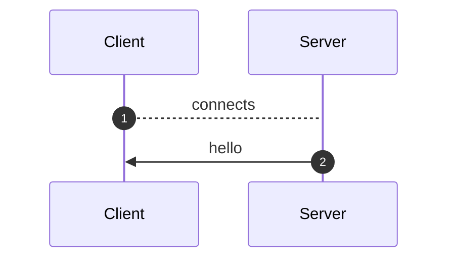
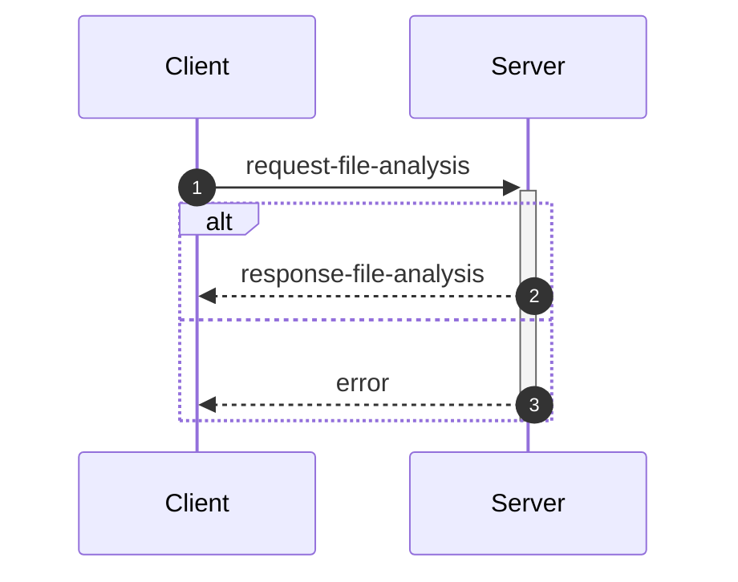
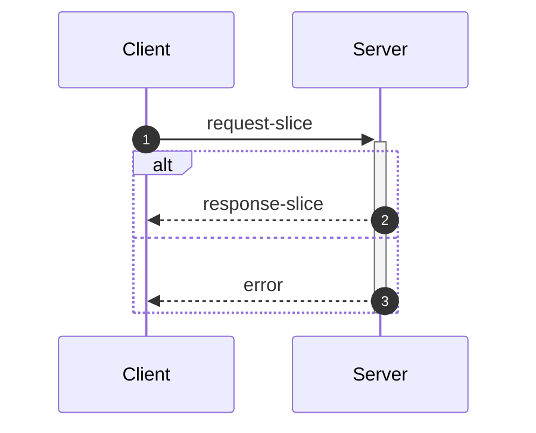
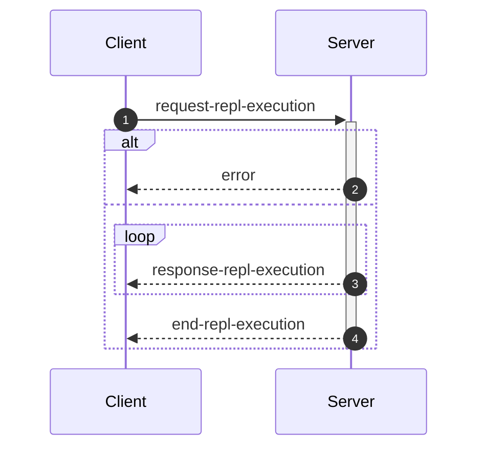

_This document was generated from '[src/documentation/wiki-interface.ts](https://github.com/flowr-analysis/flowr/tree/main//src/documentation/wiki-interface.ts)' on 2026-01-31, 16:54:42 UTC presenting an overview of flowR's interface (v2.8.15, using R v4.5.2). Please do not edit this file/wiki page directly._

Although far from being as detailed as the in-depth explanation of [_flowR_](https://github.com/flowr-analysis/flowr/wiki/core),
this wiki page explains how to interface with _flowR_ in more detail.
In general, command line arguments and other options provide short descriptions on hover over.

* [💻 Using the REPL](#using-the-repl)
* [💬 Communicating with the Server](#communicating-with-the-server)
* [⚙️ Configuring FlowR](#configuring-flowr)
* [⚒️ Writing Code](#writing-code)

<a id='using-the-repl'></a>
## 💻 Using the REPL


> [!NOTE]
> To execute arbitrary R commands with a repl request, _flowR_ has to be started explicitly with <span title="Description (Command Line Argument): Allow to access the underlying R session when using flowR (security warning: this allows the execution of arbitrary R code!)">`--r-session-access`</span>.
> Please be aware that this introduces a security risk and note that this relies on the [`r-shell` engine](https://github.com/flowr-analysis/flowr/wiki/engines) .

Although primarily meant for users to explore, 
there is nothing which forbids simply calling _flowR_ as a subprocess to use standard-in, -output, and -error 
for communication (although you can access the REPL using the server as well, 
with the [REPL Request](#message-request-repl-execution) message).

The read-eval-print loop&nbsp;(REPL) works relatively simple.
You can submit an expression (using <kbd>Enter</kbd>),
which is interpreted as an R&nbsp;expression by default but interpreted as a *command* if it starts with a colon (`:`).
The best command to get started with the REPL is <span title="Description (Repl Command): Show help information (aliases: :h, :?)">`:help`</span>.
Besides, you can leave the REPL either with the command <span title="Description (Repl Command): End the repl (aliases: :q, :exit)">`:quit`</span> or by pressing <kbd>Ctrl</kbd>+<kbd>C</kbd> twice.
When writing a *command*, you may press <kbd>Tab</kbd> to get a list of completions, if available.
Multiple commands can be entered in a single line by separating them with a semicolon (`;`), e.g. `:parse "x<-2"; :df*`.
If a command is given without R code, the REPL will re-use R code given in a previous command. 
The prior example will hence return first the parsed AST of the program and then the dataflow graph for `"x <- 2"`.

> [!NOTE]
> If you develop flowR, you may want to launch the repl using the `npm run main-dev` command, this way, you get a non-minified version of flowR with debug information and hot-reloading of source files.

<details>
<summary>Available Commands</summary>

We currently offer the following commands (this with a `[*]` suffix are available with and without the star):


| Command | Description |
| ------- | ----------- |
| **<span title="Description (Repl Command): End the repl (aliases: :q, :exit)">:quit</span>** | End the repl (aliases: **:<span title="Alias of ':quit'. End the repl">q</span>**, **:<span title="Alias of ':quit'. End the repl">exit</span>**) |
| **<span title="Description (Repl Command): Execute the given code as R code. This requires the `--r-session-access` flag to be set and requires the r-shell engine. (aliases: :e, :r)">:execute</span>** | Execute the given code as R code. This requires the `--r-session-access` flag to be set and requires the r-shell engine. (aliases: **:<span title="Alias of ':execute'. Execute the given code as R code. This requires the `--r-session-access` flag to be set and requires the r-shell engine.">e</span>**, **:<span title="Alias of ':execute'. Execute the given code as R code. This requires the `--r-session-access` flag to be set and requires the r-shell engine.">r</span>**) |
| **<span title="Description (Repl Command): Get mermaid code for the control-flow graph of R code, start with 'file://' to indicate a file (aliases: :cfg, :cf)">:controlflow[*]</span>** | Get mermaid code for the control-flow graph of R code, start with 'file://' to indicate a file (star: Returns the URL to mermaid.live) (aliases: **:<span title="Alias of ':controlflow'. Get mermaid code for the control-flow graph of R code, start with 'file://' to indicate a file">cfg</span>**, **:<span title="Alias of ':controlflow'. Get mermaid code for the control-flow graph of R code, start with 'file://' to indicate a file">cf</span>**) |
| **<span title="Description (Repl Command): Get mermaid code for the control-flow graph with basic blocks, start with 'file://' to indicate a file (aliases: :cfgb, :cfb)">:controlflowbb[*]</span>** | Get mermaid code for the control-flow graph with basic blocks, start with 'file://' to indicate a file (star: Returns the URL to mermaid.live) (aliases: **:<span title="Alias of ':controlflowbb'. Get mermaid code for the control-flow graph with basic blocks, start with 'file://' to indicate a file">cfgb</span>**, **:<span title="Alias of ':controlflowbb'. Get mermaid code for the control-flow graph with basic blocks, start with 'file://' to indicate a file">cfb</span>**) |
| **<span title="Description (Repl Command): Get mermaid code for the dataflow graph, start with 'file://' to indicate a file (aliases: :d, :df)">:dataflow[*]</span>** | Get mermaid code for the dataflow graph, start with 'file://' to indicate a file (star: Returns the URL to mermaid.live) (aliases: **:<span title="Alias of ':dataflow'. Get mermaid code for the dataflow graph, start with 'file://' to indicate a file">d</span>**, **:<span title="Alias of ':dataflow'. Get mermaid code for the dataflow graph, start with 'file://' to indicate a file">df</span>**) |
| **<span title="Description (Repl Command): Get mermaid code for the normalized AST of R code, start with 'file://' to indicate a file (aliases: :n)">:normalize[*]</span>** | Get mermaid code for the normalized AST of R code, start with 'file://' to indicate a file (star: Returns the URL to mermaid.live) (alias: **:<span title="Alias of ':normalize'. Get mermaid code for the normalized AST of R code, start with 'file://' to indicate a file">n</span>**) |
| **<span title="Description (Repl Command): Get mermaid code for the simplified dataflow graph, start with 'file://' to indicate a file (aliases: :ds, :dfs)">:dataflowsimple[*]</span>** | Get mermaid code for the simplified dataflow graph, start with 'file://' to indicate a file (star: Returns the URL to mermaid.live) (aliases: **:<span title="Alias of ':dataflowsimple'. Get mermaid code for the simplified dataflow graph, start with 'file://' to indicate a file">ds</span>**, **:<span title="Alias of ':dataflowsimple'. Get mermaid code for the simplified dataflow graph, start with 'file://' to indicate a file">dfs</span>**) |
| **<span title="Description (Repl Command): Just calculates the DFG, but only prints summary info (aliases: :d#, :df#)">:dataflowsilent</span>** | Just calculates the DFG, but only prints summary info (aliases: **:<span title="Alias of ':dataflowsilent'. Just calculates the DFG, but only prints summary info">d#</span>**, **:<span title="Alias of ':dataflowsilent'. Just calculates the DFG, but only prints summary info">df#</span>**) |
| **<span title="Description (Repl Command): Prints ASCII Art of the parsed, unmodified AST, start with 'file://' to indicate a file (aliases: :p)">:parse</span>** | Prints ASCII Art of the parsed, unmodified AST, start with 'file://' to indicate a file (alias: **:<span title="Alias of ':parse'. Prints ASCII Art of the parsed, unmodified AST, start with 'file://' to indicate a file">p</span>**) |
| **<span title="Description (Repl Command): Prints the version of flowR as well as the current version of R">:version</span>** | Prints the version of flowR as well as the current version of R
| **<span title="Description (Repl Command): Query the given R code, start with 'file://' to indicate a file. The query is to be a valid query in json format (use 'help' to get more information).">:query[*]</span>** | Query the given R code, start with 'file://' to indicate a file. The query is to be a valid query in json format (use 'help' to get more information). (star: Similar to query, but returns the output in json format.)
| **<span title="Description (Repl Command): Returns an ASCII representation of the dataflow graph (aliases: :df!)">:dataflowascii</span>** | Returns an ASCII representation of the dataflow graph (alias: **:<span title="Alias of ':dataflowascii'. Returns an ASCII representation of the dataflow graph">df!</span>**) |
| **<span title="Description (Repl Command): Show help information (aliases: :h, :?)">:help</span>** | Show help information (aliases: **:<span title="Alias of ':help'. Show help information">h</span>**, **:<span title="Alias of ':help'. Show help information">?</span>**) |


</details>


> [!TIP]
> 
> As indicated by the examples before, all REPL commands that operate on code keep track of the state.
> Hence, if you run a command like <span title="Description (Repl Command, starred version): Returns the URL to mermaid.live; Base Command: Get mermaid code for the dataflow graph, start with 'file://' to indicate a file (aliases: :d*, :df*)">`:dataflow*`</span> without providing R code,
> the REPL will re-use the R code provided in a previous command.
> Likewise, doing this will benefit from incrementality!
> If you request the dataflow graph with `:df* x <- 2 * y` and then want to see the parsed AST with `:parse`,
> the REPL will re-use previously obtained information and not re-parse the code again.
> 		


Generally, many commands offer shortcut versions in the REPL. Many queries, for example, offer a shortened format (see the example below).
Of special note, the [Config Query](https://github.com/flowr-analysis/flowr/wiki/query-api#Config-Query)
can be used to also modify the currently active configuration of _flowR_ within the REPL (see the [wiki page](https://github.com/flowr-analysis/flowr/wiki/query-api#Config-Query) for more information).

### Example: Retrieving the Dataflow Graph

To retrieve a URL to the [mermaid](https://mermaid.js.org/) diagram of the dataflow of a given expression, 
use <span title="Description (Repl Command, starred version): Returns the URL to mermaid.live; Base Command: Get mermaid code for the dataflow graph, start with 'file://' to indicate a file (aliases: :d*, :df*)">`:dataflow*`</span> (or <span title="Description (Repl Command): Get mermaid code for the dataflow graph, start with 'file://' to indicate a file (aliases: :d, :df)">`:dataflow`</span> to get the mermaid code in the cli):


```shell
$ docker run -it --rm eagleoutice/flowr # or npm run flowr 
flowR repl using flowR v2.8.15, R grammar v14 (tree-sitter engine)
R> :dataflow* y <- 1 + x
```

<details>
<summary style='color:gray'>Output</summary>


```text
https://mermaid.live/view#base64:eyJjb2RlIjoiZmxvd2NoYXJ0IEJUXG4gICAgMXt7XCJgIzkxO1JOdW1iZXIjOTM7IDFcbiAgICAgICgxKVxuICAgICAgKjEuNipgXCJ9fVxuICAgIDIoW1wiYCM5MTtSU3ltYm9sIzkzOyB4XG4gICAgICAoMilcbiAgICAgICoxLjEwKmBcIl0pXG4gICAgM1tbXCJgIzkxO1JCaW5hcnlPcCM5MzsgIzQzO1xuICAgICAgKDMpXG4gICAgICAqMS42LTEwKlxuICAgICgxLCAyKWBcIl1dXG4gICAgYnVpbHQtaW46X1tcImBCdWlsdC1JbjpcbiM0MztgXCJdXG4gICAgc3R5bGUgYnVpbHQtaW46XyBzdHJva2U6Z3JheSxmaWxsOmdyYXksc3Ryb2tlLXdpZHRoOjJweCxvcGFjaXR5Oi44O1xuICAgIDBbXCJgIzkxO1JTeW1ib2wjOTM7IHlcbiAgICAgICgwKVxuICAgICAgKjEuMSpgXCJdXG4gICAgNFtbXCJgIzkxO1JCaW5hcnlPcCM5MzsgIzYwOyM0NTtcbiAgICAgICg0KVxuICAgICAgKjEuMS0xMCpcbiAgICAoMCwgMylgXCJdXVxuICAgIGJ1aWx0LWluOl8tW1wiYEJ1aWx0LUluOlxuIzYwOyM0NTtgXCJdXG4gICAgc3R5bGUgYnVpbHQtaW46Xy0gc3Ryb2tlOmdyYXksZmlsbDpncmF5LHN0cm9rZS13aWR0aDoycHgsb3BhY2l0eTouODtcbiAgICAzIC0tPnxcInJlYWRzLCBhcmd1bWVudFwifCAxXG4gICAgMyAtLT58XCJyZWFkcywgYXJndW1lbnRcInwgMlxuICAgIDMgLS4tPnxcInJlYWRzLCBjYWxsc1wifCBidWlsdC1pbjpfXG4gICAgbGlua1N0eWxlIDIgc3Ryb2tlOmdyYXk7XG4gICAgMCAtLT58XCJkZWZpbmVkLWJ5XCJ8IDNcbiAgICAwIC0tPnxcImRlZmluZWQtYnlcInwgNFxuICAgIDQgLS0+fFwicmVhZHMsIGFyZ3VtZW50XCJ8IDNcbiAgICA0IC0tPnxcInJldHVybnMsIGFyZ3VtZW50XCJ8IDBcbiAgICA0IC0uLT58XCJyZWFkcywgY2FsbHNcInwgYnVpbHQtaW46Xy1cbiAgICBsaW5rU3R5bGUgNyBzdHJva2U6Z3JheTsiLCJtZXJtYWlkIjp7ImF1dG9TeW5jIjp0cnVlfX0=
Copied mermaid url to clipboard (dataflow: 0ms).
```


Retrieve the dataflow graph of the expression `y <- 1 + x`. It looks like this:


	
<details>

<summary style="color:gray">R Code of the Dataflow Graph</summary>

The analysis required _0.3 ms_ (including parse and normalize, using the [tree-sitter](https://github.com/flowr-analysis/flowr/wiki/Engines) engine) within the generation environment. 
We encountered no unknown side effects during the analysis.


```r
y <- 1 + x
```


</details>


</details>


For small graphs like this, <span title="Description (Repl Command): Returns an ASCII representation of the dataflow graph (aliases: :df!)">`:dataflowascii`</span> also provides an ASCII representation directly in the REPL:


```shell
$ docker run -it --rm eagleoutice/flowr # or npm run flowr 
flowR repl using flowR v2.8.15, R grammar v14 (tree-sitter engine)
R> :df! y <- 1 + x
```

<details open>
<summary style='color:gray'>Output</summary>


```text
                        0<1>0
                   ┌────| 1 |
    ┌────────┐     │    0---0
 c<4>c       └──c<3>c
 |<- |  v<0>v┌──| + |
 c---c──| y |┘  c---c   u<2>u
        v---v      └────| x |
                        u---u
Edges:
3 -> 1: reads, argument  3 -> 2: reads, argument
4 -> 3: reads, argument  4 -> 0: returns, argument
0 -> 3: defined-by       0 -> 4: defined-by
```


Retrieve the dataflow graph of the expression `y <- 1 + x` as ASCII art.

</details>


For the slicing with <span title="Description (Repl Command): Static backwards executable slicer for R">`:slicer`</span>, you have access to the same [magic comments](#slice-magic-comments) as with the [slice request](#message-request-slice).

### Example: Interfacing with the File System

Many commands that allow for an R-expression (like <span title="Description (Repl Command, starred version): Returns the URL to mermaid.live; Base Command: Get mermaid code for the dataflow graph, start with 'file://' to indicate a file (aliases: :d*, :df*)">`:dataflow*`</span>) allow for a file as well 
if the argument starts with `file://`. 
If you are working from the root directory of the _flowR_ repository, the following gives you the parsed AST of the example file using the <span title="Description (Repl Command): Prints ASCII Art of the parsed, unmodified AST, start with 'file://' to indicate a file (aliases: :p)">`:parse`</span> command:


```shell
$ docker run -it --rm eagleoutice/flowr # or npm run flowr 
flowR repl using flowR v2.8.15, R grammar v14 (tree-sitter engine)
R> :parse file://test/testfiles/example.R
```

<details>
<summary style='color:gray'>Output</summary>


```text
File: test/testfiles/example.R

program
├ binaryoperator
│ ├ identifier "sum" (1:1─4)
│ ├ <- "<-" (1:5─7)
│ ╰ float "0" (1:8─9)
├ binaryoperator
│ ├ identifier "product" (2:1─8)
│ ├ <- "<-" (2:9─11)
│ ╰ float "1" (2:12─13)
├ binaryoperator
│ ├ identifier "w" (3:1─2)
│ ├ <- "<-" (3:3─5)
│ ╰ float "7" (3:6─7)
├ binaryoperator
│ ├ identifier "N" (4:1─2)
│ ├ <- "<-" (4:3─5)
│ ╰ float "10" (4:6─8)
├ forstatement
│ ├ for "for" (6:1─4)
│ ├ ( "(" (6:5─6)
│ ├ identifier "i" (6:6─7)
│ ├ in "in" (6:8─10)
│ ├ binaryoperator
│ │ ├ float "1" (6:11─12)
│ │ ├ : ":" (6:12─13)
│ │ ╰ parenthesizedexpression
│ │   ├ ( "(" (6:13─14)
│ │   ├ binaryoperator
│ │   │ ├ identifier "N" (6:14─15)
│ │   │ ├ - "-" (6:15─16)
│ │   │ ╰ float "1" (6:16─17)
│ │   ╰ ) ")" (6:17─18)
│ ├ ) ")" (6:18─19)
│ ╰ bracedexpression
│   ├ { "{" (6:20─21)
│   ├ binaryoperator
│   │ ├ identifier "sum" (7:3─6)
│   │ ├ <- "<-" (7:7─9)
│   │ ╰ binaryoperator
│   │   ├ binaryoperator
│   │   │ ├ identifier "sum" (7:10─13)
│   │   │ ├ + "+" (7:14─15)
│   │   │ ╰ identifier "i" (7:16─17)
│   │   ├ + "+" (7:18─19)
│   │   ╰ identifier "w" (7:20─21)
│   ├ binaryoperator
│   │ ├ identifier "product" (8:3─10)
│   │ ├ <- "<-" (8:11─13)
│   │ ╰ binaryoperator
│   │   ├ identifier "product" (8:14─21)
│   │   ├  "" (8:22─23)
│   │   ╰ identifier "i" (8:24─25)
│   ╰ } "}" (9:1─2)
├ call
│ ├ identifier "cat" (11:1─4)
│ ╰ arguments
│   ├ ( "(" (11:4─5)
│   ├ argument
│   │ ╰ string
│   │   ├ " "\"" (11:5─6)
│   │   ├ stringcontent "Sum:" (11:6─10)
│   │   ╰ " "\"" (11:10─11)
│   ├ comma "," (11:11─12)
│   ├ argument
│   │ ╰ identifier "sum" (11:13─16)
│   ├ comma "," (11:16─17)
│   ├ argument
│   │ ╰ string
│   │   ├ " "\"" (11:18─19)
│   │   ├ stringcontent
│   │   │ ╰ escapesequence "\\n" (11:19─21)
│   │   ╰ " "\"" (11:21─22)
│   ╰ ) ")" (11:22─23)
╰ call
  ├ identifier "cat" (12:1─4)
  ╰ arguments
    ├ ( "(" (12:4─5)
    ├ argument
    │ ╰ string
    │   ├ " "\"" (12:5─6)
    │   ├ stringcontent "Product:" (12:6─14)
    │   ╰ " "\"" (12:14─15)
    ├ comma "," (12:15─16)
    ├ argument
    │ ╰ identifier "product" (12:17─24)
    ├ comma "," (12:24─25)
    ├ argument
    │ ╰ string
    │   ├ " "\"" (12:26─27)
    │   ├ stringcontent
    │   │ ╰ escapesequence "\\n" (12:27─29)
    │   ╰ " "\"" (12:29─30)
    ╰ ) ")" (12:30─31)
```


Retrieve the parsed AST of the example file.

<details>

<summary>File Content</summary>


```r
sum <- 0
product <- 1
w <- 7
N <- 10

for (i in 1:(N-1)) {
  sum <- sum + i + w
  product <- product * i
}

cat("Sum:", sum, "\n")
cat("Product:", product, "\n")
```


</details>

As _flowR_ directly transforms this AST the output focuses on being human-readable instead of being machine-readable. 
		

</details>


### Example: Run a Query

You can run any query supported by _flowR_ using the <span title="Description (Repl Command): Query the given R code, start with 'file://' to indicate a file. The query is to be a valid query in json format (use 'help' to get more information).">`:query`</span> command.
For example, to obtain the shapes of all data frames in a given piece of code, you can run:


```shell
$ docker run -it --rm eagleoutice/flowr # or npm run flowr 
flowR repl using flowR v2.8.15, R grammar v14 (tree-sitter engine)
R> :query @df-shape "x <- data.frame(a = 1:10, b = 1:10)\ny <- x$a"
```

<details open>
<summary style='color:gray'>Output</summary>


```text
Query: df-shape (0 ms)
   ╰ 12: (colnames: [{"a", "b"}, {}], cols: [2, 2], rows: [10, 10])
   ╰ 0: (colnames: [{"a", "b"}, {}], cols: [2, 2], rows: [10, 10])
All queries together required ≈1 ms (1ms accuracy, total 1 ms)
```


Retrieve the shapes of all data frames in the given code.

</details>


To run the linter on a file, you can use (in this example, we just issue the `dead-code` linter on a small piece of code):


```shell
$ docker run -it --rm eagleoutice/flowr # or npm run flowr 
flowR repl using flowR v2.8.15, R grammar v14 (tree-sitter engine)
R> :query @linter rules:dead-code "if(FALSE) x <- 2"
```

<details open>
<summary style='color:gray'>Output</summary>


```text
Query: linter (1 ms)
   ╰ Dead Code (dead-code):
       ╰ certain:
           ╰ Code at 1.11-16
       ╰ Metadata: consideredNodes: 7, searchTimeMs: 0, processTimeMs: 1
All queries together required ≈1 ms (1ms accuracy, total 1 ms)
```


Run the linter on the given code, with only the `dead-code` rule enabled.

</details>


For more information on the available queries, please check out the [Query API](https://github.com/flowr-analysis/flowr/wiki/query-api).


<a id='communicating-with-the-server'></a>
## 💬 Communicating with the Server


As explained in the [Overview](https://github.com/flowr-analysis/flowr/wiki/Overview), you can simply run the [TCP](https://de.wikipedia.org/wiki/Transmission_Control_Protocol)&nbsp;server by adding the <span title="Description (Command Line Argument): Do not drop into a repl, but instead start a server on the given port (default: 1042) and listen for messages.">`--server`</span> flag (and, due to the interactive mode, exit with the conventional <kbd>CTRL</kbd>+<kbd>C</kbd>).
Currently, every connection is handled by the same underlying `RShell` - so the server is not designed to handle many clients at a time.
Additionally, the server is not well guarded against attacks (e.g., you can theoretically spawn an arbitrary number of&nbsp;RShell sessions on the target machine).

Every message has to be given in a single line (i.e., without a newline in-between) and end with a newline character. Nevertheless, we will pretty-print example given in the following segments for the ease of reading.


> [!NOTE]
> 
> The default <span title="Description (Command Line Argument): Do not drop into a repl, but instead start a server on the given port (default: 1042) and listen for messages.">`--server`</span> uses a simple [TCP](https://de.wikipedia.org/wiki/Transmission_Control_Protocol)
> connection. If you want _flowR_ to expose a [WebSocket](https://de.wikipedia.org/wiki/WebSocket) server instead, add the <span title="Description (Command Line Argument): If the server flag is set, use websocket for messaging">`--ws`</span> flag (i.e., <span title="Description (Command Line Argument): Do not drop into a repl, but instead start a server on the given port (default: 1042) and listen for messages.">`--server`</span> <span title="Description (Command Line Argument): If the server flag is set, use websocket for messaging">`--ws`</span>) when starting _flowR_ from the command line.
> 			


<ul><li>
<a id="message-hello"></a>
<b>Hello</b> Message (<code>hello</code>) 
<details>

<summary style="color:gray"> View Details. <i>The server informs the client about the successful connection and provides Meta-Information.</i> </summary>




	
After launching _flowR_, for example, with <code>docker run -it --rm eagleoutice/flowr <span title="Description (Command Line Argument): Do not drop into a repl, but instead start a server on the given port (default: 1042) and listen for messages.">-<span/>-server</span></code>&nbsp;(🐳️), simply connecting should present you with a `hello` message, that amongst others should reveal the versions of&nbsp;_flowR_ and&nbsp;R, using the [semver 2.0](https://semver.org/spec/v2.0.0.html) versioning scheme.
The message looks like this:


```json
{
  "type": "hello",
  "clientName": "client-0",
  "versions": {
    "flowr": "2.8.15",
    "r": "4.5.2",
    "engine": "r-shell"
  }
}
```


There are currently a few messages that you can send after the hello message.
If you want to _slice_ a piece of R code you first have to send an [analysis request](#message-request-file-analysis), so that you can send one or multiple slice requests afterward.
Requests for the [REPL](#message-request-repl) are independent of that.
	

<hr>


<details>
<summary style="color:gray">Message schema (<code>hello</code>)</summary>

For the definition of the hello message, please see it's implementation at [`./src/cli/repl/server/messages/message-hello.ts`](https://github.com/flowr-analysis/flowr/tree/main/./src/cli/repl/server/messages/message-hello.ts).

- [required] (object)
    - **type** [required] _The type of the hello message._ (string)
        Only allows: 'hello'
    - **id** [forbidden] _The id of the message is always undefined (as it is the initial message and not requested)._ (any)
    - **clientName** [required] _A unique name that is assigned to each client. It has no semantic meaning and is only used/useful for debugging._ (string)
    - **versions** [required] (object)
        - **flowr** [required] _The version of the flowr server running in semver format._ (string)
        - **r** [required] _The version of the underlying R shell running in semver format._ (string)
        - **engine** [required] _The parser backend that is used to parse the R code._ (string)

</details>


<hr>

</details>
	</li>

<li>
<a id="message-request-file-analysis"></a>
<b>Analysis</b> Message (<code>request-file-analysis</code>) 
<details>

<summary style="color:gray"> View Details. <i>The server builds the dataflow graph for a given input file (or a set of files).</i> </summary>




	
The request allows the server to analyze a file and prepare it for slicing.
The message can contain a `filetoken`, which is used to identify the file in later slice or query requests (if you do not add one, the request will not be stored and therefore, it is not available for subsequent requests).

> **Please note!**\
> If you want to send and process a lot of analysis requests, but do not want to slice them, please do not pass the `filetoken` field. This will save the server a lot of memory allocation.

Furthermore, the request must contain either a `content` field to directly pass the file's content or a `filepath` field which contains the path to the file (this path must be accessible for the server to be useful).
If you add the `id` field, the answer will use the same `id` so you can match requests and the corresponding answers.
See the implementation of the request-file-analysis message for more information.


<details>
<summary>Example of the <code>request-file-analysis</code> Message</summary>

_Note:_ even though we pretty-print these messages, they are sent as a single line, ending with a newline.

The following lists all messages that were sent and received in case you want to reproduce the scenario:

<ol>
<li> <code>hello</code> (response)
<details> 

<summary> Show Details </summary>

The first message is always a hello message.


```json
{
  "type": "hello",
  "clientName": "client-0",
  "versions": {
    "flowr": "2.8.15",
    "r": "4.5.2",
    "engine": "r-shell"
  }
}
```


</details>
</li>

<li> <b><code>request-file-analysis</code> (request)</b>
<details open> 

<summary> Show Details </summary>

Let's suppose you simply want to analyze the following script:
 
```r
x <- 1
x + 1
```

 For this, you can send the following request:


```json
{
  "type": "request-file-analysis",
  "id": "1",
  "filetoken": "x",
  "content": "x <- 1\nx + 1"
}
```


</details>
</li>

<li> <code>response-file-analysis</code> (response)
<details> 

<summary> Show Details </summary>


The `results` field of the response effectively contains three keys of importance:

- `parse`: which contains 1:1 the parse result in CSV format that we received from the `RShell` (i.e., the AST produced by the parser of the R interpreter).
- `normalize`: which contains the normalized AST, including ids (see the `info` field and the [Normalized AST](https://github.com/flowr-analysis/flowr/wiki/Normalized%20AST) wiki page).
- `dataflow`: especially important is the `graph` field which contains the dataflow graph as a set of root vertices (see the [Dataflow Graph](https://github.com/flowr-analysis/flowr/wiki/Dataflow%20Graph) wiki page).
			


_As the code is pretty long, we inhibit pretty printing and syntax highlighting (JSON, hiding built-in):_

```text
{"type":"response-file-analysis","format":"json","id":"1","results":{"parse":{"files":[{"parsed":"[1,1,1,6,7,0,\"expr\",false,\"x <- 1\"],[1,1,1,1,1,3,\"SYMBOL\",true,\"x\"],[1,1,1,1,3,7,\"expr\",false,\"x\"],[1,3,1,4,2,7,\"LEFT_ASSIGN\",true,\"<-\"],[1,6,1,6,4,5,\"NUM_CONST\",true,\"1\"],[1,6,1,6,5,7,\"expr\",false,\"1\"],[2,1,2,5,16,0,\"expr\",false,\"x + 1\"],[2,1,2,1,10,12,\"SYMBOL\",true,\"x\"],[2,1,2,1,12,16,\"expr\",false,\"x\"],[2,3,2,3,11,16,\"'+'\",true,\"+\"],[2,5,2,5,13,14,\"NUM_CONST\",true,\"1\"],[2,5,2,5,14,16,\"expr\",false,\"1\"]","filePath":"/tmp/tmp-728990-2Q0Z3WxNWf6n-.R"}],".meta":{"timing":2}},"normalize":{"ast":{"type":"RProject","files":[{"root":{"type":"RExpressionList","children":[{"type":"RBinaryOp","location":[1,3,1,4],"lhs":{"type":"RSymbol","location":[1,1,1,1],"content":"x","lexeme":"x","info":{"fullRange":[1,1,1,1],"additionalTokens":[],"id":0,"parent":2,"role":"binop-lhs","index":0,"nesting":0,"file":"/tmp/tmp-728990-2Q0Z3WxNWf6n-.R"}},"rhs":{"location":[1,6,1,6],"lexeme":"1","info":{"fullRange":[1,6,1,6],"additionalTokens":[],"id":1,"parent":2,"role":"binop-rhs","index":1,"nesting":0,"file":"/tmp/tmp-728990-2Q0Z3WxNWf6n-.R"},"type":"RNumber","content":{"num":1,"complexNumber":false,"markedAsInt":false}},"operator":"<-","lexeme":"<-","info":{"fullRange":[1,1,1,6],"additionalTokens":[],"id":2,"parent":6,"nesting":0,"file":"/tmp/tmp-728990-2Q0Z3WxNWf6n-.R","index":0,"role":"expr-list-child"}},{"type":"RBinaryOp","location":[2,3,2,3],"lhs":{"type":"RSymbol","location":[2,1,2,1],"content":"x","lexeme":"x","info":{"fullRange":[2,1,2,1],"additionalTokens":[],"id":3,"parent":5,"role":"binop-lhs","index":0,"nesting":0,"file":"/tmp/tmp-728990-2Q0Z3WxNWf6n-.R"}},"rhs":{"location":[2,5,2,5],"lexeme":"1","info":{"fullRange":[2,5,2,5],"additionalTokens":[],"id":4,"parent":5,"role":"binop-rhs","index":1,"nesting":0,"file":"/tmp/tmp-728990-2Q0Z3WxNWf6n-.R"},"type":"RNumber","content":{"num":1,"complexNumber":false,"markedAsInt":false}},"operator":"+","lexeme":"+","info":{"fullRange":[2,1,2,5],"additionalTokens":[],"id":5,"parent":6,"nesting":0,"file":"/tmp/tmp-728990-2Q0Z3WxNWf6n-.R","index":1,"role":"expr-list-child"}}],"info":{"additionalTokens":[],"id":6,"nesting":0,"file":"/tmp/tmp-728990-2Q0Z3WxNWf6n-.R","role":"root","index":0}},"filePath":"/tmp/tmp-728990-2Q0Z3WxNWf6n-.R"}],"info":{"id":7}},".meta":{"timing":0}},"dataflow":{"unknownReferences":[],"in":[{"nodeId":2,"name":"<-","type":2},{"nodeId":5,"name":"+","type":2}],"out":[{"nodeId":0,"name":"x","type":4,"definedAt":2,"value":[1]}],"environment":{"current":{"id":4927,"parent":"<BuiltInEnvironment>","memory":[["x",[{"nodeId":0,"name":"x","type":4,"definedAt":2,"value":[1]}]]]},"level":0},"graph":{"rootVertices":[1,0,2,3,4,5],"vertexInformation":[[1,{"tag":"value","id":1}],[0,{"tag":"vdef","id":0}],[2,{"tag":"fcall","id":2,"name":"<-","onlyBuiltin":true,"args":[{"nodeId":0,"type":32},{"nodeId":1,"type":32}],"origin":["builtin:assignment"]}],[3,{"tag":"use","id":3}],[4,{"tag":"value","id":4}],[5,{"tag":"fcall","id":5,"name":"+","onlyBuiltin":true,"args":[{"nodeId":3,"type":32},{"nodeId":4,"type":32}],"origin":["builtin:default"]}]],"edgeInformation":[[2,[[1,{"types":65}],[0,{"types":72}],["built-in:<-",{"types":5}]]],[0,[[1,{"types":2}],[2,{"types":2}]]],[3,[[0,{"types":1}]]],[5,[[3,{"types":65}],[4,{"types":65}],["built-in:+",{"types":5}]]]],"_unknownSideEffects":[]},"entryPoint":2,"exitPoints":[{"type":0,"nodeId":5}],"hooks":[],".meta":{"timing":0}}}}
```


</details>
</li>
</ol>

The complete round-trip took 4.9 ms (including time required to validate the messages, start, and stop the internal mock server).

</details>


You receive an error if, for whatever reason, the analysis fails (e.g., the message or code you sent contained syntax errors).
It contains a human-readable description *why* the analysis failed (see the error message implementation for more details).


<details>
<summary>Example Error Message</summary>

_Note:_ even though we pretty-print these messages, they are sent as a single line, ending with a newline.

The following lists all messages that were sent and received in case you want to reproduce the scenario:

<ol>
<li> <code>hello</code> (response)
<details> 

<summary> Show Details </summary>

The first message is always a hello message.


```json
{
  "type": "hello",
  "clientName": "client-0",
  "versions": {
    "flowr": "2.8.15",
    "r": "4.5.2",
    "engine": "r-shell"
  }
}
```


</details>
</li>

<li> <code>request-file-analysis</code> (request)
<details> 

<summary> Show Details </summary>


```json
{
  "type": "request-file-analysis",
  "id": "1",
  "filename": "sample.R",
  "content": "x <-"
}
```


</details>
</li>

<li> <b><code>error</code> (response)</b>
<details open> 

<summary> Show Details </summary>


```json
{
  "id": "1",
  "type": "error",
  "fatal": false,
  "reason": "Error while analyzing file sample.R: GuardError: unable to parse R code (see the log for more information) for request {\"request\":\"text\",\"content\":\"x <-\"}}\n Report a Bug: https://github.com/flowr-analysis/flowr/issues/new?body=%3C!%2D%2D%20Please%20describe%20your%20issue%20in%20more%20detail%20below!%20%2D%2D%3E%0A%0A%0A%3C!%2D%2D%20Automatically%20generated%20issue%20metadata%2C%20please%20do%20not%20edit%20or%20delete%20content%20below%20this%20line%20%2D%2D%3E%0A%2D%2D%2D%0A%0AflowR%20version%3A%202.8.15%0Anode%20version%3A%20v24.13.0%0Anode%20arch%3A%20x64%0Anode%20platform%3A%20linux%0Amessage%3A%20%60unable%20to%20parse%20R%20code%20%28see%20the%20log%20for%20more%20information%29%20for%20request%20%7B%22request%22%3A%22text%22%2C%22content%22%3A%22x%20%3C%2D%22%7D%7D%60%0Astack%20trace%3A%0A%60%60%60%0A%20%20%20%20at%20guard%20%28%3C%3E%2Fsrc%2Futil%2Fassert.ts%3A128%3A9%29%0A%20%20%20%20at%20guardRetrievedOutput%20%28%3C%3E%2Fsrc%2Fr%2Dbridge%2Fretriever.ts%3A221%3A7%29%0A%20%20%20%20at%20%2Fhome%2Fostwind%2Fgit%2Fphd%2Fflowr%2Dfield%2Fflowr%2Fsrc%2Fr%2Dbridge%2Fretriever.ts%3A182%3A4%0A%20%20%20%20at%20processTicksAndRejections%20%28node%3Ainternal%2Fprocess%2Ftask_queues%3A103%3A5%29%0A%20%20%20%20at%20async%20Object.parseRequests%20%5Bas%20processor%5D%20%28%3C%3E%2Fsrc%2Fr%2Dbridge%2Fparser.ts%3A104%3A19%29%0A%20%20%20%20at%20async%20PipelineExecutor.nextStep%20%28%3C%3E%2Fsrc%2Fcore%2Fpipeline%2Dexecutor.ts%3A192%3A25%29%0A%20%20%20%20at%20async%20FlowrAnalyzerCache.runTapeUntil%20%28%3C%3E%2Fsrc%2Fproject%2Fcache%2Fflowr%2Danalyzer%2Dcache.ts%3A93%3A4%29%0A%20%20%20%20at%20async%20FlowRServerConnection.sendFileAnalysisResponse%20%28%3C%3E%2Fsrc%2Fcli%2Frepl%2Fserver%2Fconnection.ts%3A163%3A52%29%0A%60%60%60%0A%0A%2D%2D%2D%0A%09"
}
```


</details>
</li>
</ol>

The complete round-trip took 3.6 ms (including time required to validate the messages, start, and stop the internal mock server).

</details>


&nbsp;

<a id="analysis-include-cfg"></a>
**Including the Control Flow Graph**

While _flowR_ does (for the time being) not use an explicit control flow graph but instead relies on control-dependency edges within the dataflow graph, 
the respective structure can still be exposed using the server (note that, as this feature is not needed within _flowR_, it is tested significantly less - 
so please create a [new issue](https://github.com/flowr-analysis/flowr/issues/new/choose) for any bug you may encounter).
For this, the analysis request may add `cfg: true` to its list of options.


<details>
<summary>Requesting a Control Flow Graph</summary>

_Note:_ even though we pretty-print these messages, they are sent as a single line, ending with a newline.

The following lists all messages that were sent and received in case you want to reproduce the scenario:

<ol>
<li> <code>hello</code> (response)
<details> 

<summary> Show Details </summary>

The first message is always a hello message.


```json
{
  "type": "hello",
  "clientName": "client-0",
  "versions": {
    "flowr": "2.8.15",
    "r": "4.5.2",
    "engine": "r-shell"
  }
}
```


</details>
</li>

<li> <b><code>request-file-analysis</code> (request)</b>
<details open> 

<summary> Show Details </summary>


```json
{
  "type": "request-file-analysis",
  "id": "1",
  "filetoken": "x",
  "content": "if(unknown > 0) { x <- 2 } else { x <- 5 }\nfor(i in 1:x) { print(x); print(i) }",
  "cfg": true
}
```


</details>
</li>

<li> <code>response-file-analysis</code> (response)
<details> 

<summary> Show Details </summary>


The response looks basically the same as a response sent without the `cfg` flag. However, additionally it contains a `cfg` field. 
If you are interested in a visual representation of the control flow graph, see the 
[visualization with mermaid](https://mermaid.live/view#base64:eyJjb2RlIjoiZmxvd2NoYXJ0IEJUXG4gICAgbjMyKFtcImBSRXhwcmVzc2lvbkxpc3QgKDMyKWBcIl0pXG4gICAgbjE1W1wiYFJJZlRoZW5FbHNlICgxNSlcbiMzNDtpZih1bmtub3duICM2MjsgMCkgIzEyMzsgeCAjNjA7IzQ1OyAyICMxMjU7IGVsc2UgIzEyMzsgeCAjNjA7IzQ1OyA1ICMxMjU7IzM0O2BcIl1cbiAgICBuMTUtZXhpdCgoMTUtZXhpdCkpXG4gICAgbjAoW1wiYFJTeW1ib2wgKDApXG4jMzQ7dW5rbm93biMzNDtgXCJdKVxuICAgIG4xKFtcImBSTnVtYmVyICgxKVxuIzM0OzAjMzQ7YFwiXSlcbiAgICBuMihbXCJgUkJpbmFyeU9wICgyKVxuIzM0O3Vua25vd24gIzYyOyAwIzM0O2BcIl0pXG4gICAgbjItZXhpdCgoMi1leGl0KSlcbiAgICBuOChbXCJgUkV4cHJlc3Npb25MaXN0ICg4KWBcIl0pXG4gICAgbjUoW1wiYFJTeW1ib2wgKDUpXG4jMzQ7eCMzNDtgXCJdKVxuICAgIG42KFtcImBSTnVtYmVyICg2KVxuIzM0OzIjMzQ7YFwiXSlcbiAgICBuNyhbXCJgUkJpbmFyeU9wICg3KVxuIzM0O3ggIzYwOyM0NTsgMiMzNDtgXCJdKVxuICAgIG43LWV4aXQoKDctZXhpdCkpXG4gICAgbjgtZXhpdCgoOC1leGl0KSlcbiAgICBuMTQoW1wiYFJFeHByZXNzaW9uTGlzdCAoMTQpYFwiXSlcbiAgICBuMTEoW1wiYFJTeW1ib2wgKDExKVxuIzM0O3gjMzQ7YFwiXSlcbiAgICBuMTIoW1wiYFJOdW1iZXIgKDEyKVxuIzM0OzUjMzQ7YFwiXSlcbiAgICBuMTMoW1wiYFJCaW5hcnlPcCAoMTMpXG4jMzQ7eCAjNjA7IzQ1OyA1IzM0O2BcIl0pXG4gICAgbjEzLWV4aXQoKDEzLWV4aXQpKVxuICAgIG4xNC1leGl0KCgxNC1leGl0KSlcbiAgICBuMTYoW1wiYFJTeW1ib2wgKDE2KVxuIzM0O2kjMzQ7YFwiXSlcbiAgICBuMzFbXCJgUkZvckxvb3AgKDMxKVxuIzM0O2ZvcihpIGluIDEjNTg7eCkgIzEyMzsgcHJpbnQoeCk7IHByaW50KGkpICMxMjU7IzM0O2BcIl1cbiAgICBuMTcoW1wiYFJOdW1iZXIgKDE3KVxuIzM0OzEjMzQ7YFwiXSlcbiAgICBuMTgoW1wiYFJTeW1ib2wgKDE4KVxuIzM0O3gjMzQ7YFwiXSlcbiAgICBuMTkoW1wiYFJCaW5hcnlPcCAoMTkpXG4jMzQ7MSM1ODt4IzM0O2BcIl0pXG4gICAgbjE5LWV4aXQoKDE5LWV4aXQpKVxuICAgIG4zMChbXCJgUkV4cHJlc3Npb25MaXN0ICgzMClgXCJdKVxuICAgIG4yMihbXCJgUlN5bWJvbCAoMjIpXG4jMzQ7cHJpbnQoeCkjMzQ7YFwiXSlcbiAgICBuMjVbXCJgUkZ1bmN0aW9uQ2FsbCAoMjUpXG4jMzQ7cHJpbnQoeCkjMzQ7YFwiXVxuICAgIG4yNS1leGl0KCgyNS1leGl0KSlcbiAgICBuMjQoW1wiYFJBcmd1bWVudCAoMjQpXG4jMzQ7eCMzNDtgXCJdKVxuICAgIG4yMyhbXCJgUlN5bWJvbCAoMjMpXG4jMzQ7eCMzNDtgXCJdKVxuICAgIG4yNC1leGl0KCgyNC1leGl0KSlcbiAgICBuMjYoW1wiYFJTeW1ib2wgKDI2KVxuIzM0O3ByaW50KGkpIzM0O2BcIl0pXG4gICAgbjI5W1wiYFJGdW5jdGlvbkNhbGwgKDI5KVxuIzM0O3ByaW50KGkpIzM0O2BcIl1cbiAgICBuMjktZXhpdCgoMjktZXhpdCkpXG4gICAgbjI4KFtcImBSQXJndW1lbnQgKDI4KVxuIzM0O2kjMzQ7YFwiXSlcbiAgICBuMjcoW1wiYFJTeW1ib2wgKDI3KVxuIzM0O2kjMzQ7YFwiXSlcbiAgICBuMjgtZXhpdCgoMjgtZXhpdCkpXG4gICAgbjMwLWV4aXQoKDMwLWV4aXQpKVxuICAgIG4zMS1leGl0KCgzMS1leGl0KSlcbiAgICBuMzItZXhpdCgoMzItZXhpdCkpXG4gICAgbjE1IC0uLT58XCJGRFwifCBuMzJcbiAgICBuMSAtLi0+fFwiRkRcInwgbjBcbiAgICBuMCAtLi0+fFwiRkRcInwgbjJcbiAgICBuMi1leGl0IC0uLT58XCJGRFwifCBuMVxuICAgIG43IC0uLT58XCJGRFwifCBuOFxuICAgIG42IC0uLT58XCJGRFwifCBuNVxuICAgIG41IC0uLT58XCJGRFwifCBuN1xuICAgIG43LWV4aXQgLS4tPnxcIkZEXCJ8IG42XG4gICAgbjgtZXhpdCAtLi0+fFwiRkRcInwgbjctZXhpdFxuICAgIG4xMyAtLi0+fFwiRkRcInwgbjE0XG4gICAgbjEyIC0uLT58XCJGRFwifCBuMTFcbiAgICBuMTEgLS4tPnxcIkZEXCJ8IG4xM1xuICAgIG4xMy1leGl0IC0uLT58XCJGRFwifCBuMTJcbiAgICBuMTQtZXhpdCAtLi0+fFwiRkRcInwgbjEzLWV4aXRcbiAgICBuOCAtLT58XCJDRCAoVFJVRSlcInwgbjItZXhpdFxuICAgIG4xNCAtLT58XCJDRCAoRkFMU0UpXCJ8IG4yLWV4aXRcbiAgICBuMiAtLi0+fFwiRkRcInwgbjE1XG4gICAgbjE1LWV4aXQgLS4tPnxcIkZEXCJ8IG44LWV4aXRcbiAgICBuMTUtZXhpdCAtLi0+fFwiRkRcInwgbjE0LWV4aXRcbiAgICBuMzEgLS4tPnxcIkZEXCJ8IG4xNS1leGl0XG4gICAgbjMxIC0uLT58XCJGRFwifCBuMzAtZXhpdFxuICAgIG4xOCAtLi0+fFwiRkRcInwgbjE3XG4gICAgbjE3IC0uLT58XCJGRFwifCBuMTlcbiAgICBuMTktZXhpdCAtLi0+fFwiRkRcInwgbjE4XG4gICAgbjI1IC0uLT58XCJGRFwifCBuMzBcbiAgICBuMjIgLS4tPnxcIkZEXCJ8IG4yNVxuICAgIG4yMyAtLi0+fFwiRkRcInwgbjI0XG4gICAgbjI0LWV4aXQgLS4tPnxcIkZEXCJ8IG4yM1xuICAgIG4yNCAtLi0+fFwiRkRcInwgbjIyXG4gICAgbjI1LWV4aXQgLS4tPnxcIkZEXCJ8IG4yNC1leGl0XG4gICAgbjI5IC0uLT58XCJGRFwifCBuMjUtZXhpdFxuICAgIG4yNiAtLi0+fFwiRkRcInwgbjI5XG4gICAgbjI3IC0uLT58XCJGRFwifCBuMjhcbiAgICBuMjgtZXhpdCAtLi0+fFwiRkRcInwgbjI3XG4gICAgbjI4IC0uLT58XCJGRFwifCBuMjZcbiAgICBuMjktZXhpdCAtLi0+fFwiRkRcInwgbjI4LWV4aXRcbiAgICBuMzAtZXhpdCAtLi0+fFwiRkRcInwgbjI5LWV4aXRcbiAgICBuMTkgLS4tPnxcIkZEXCJ8IG4zMVxuICAgIG4xNiAtLi0+fFwiRkRcInwgbjE5LWV4aXRcbiAgICBuMzAgLS0+fFwiQ0QgKFRSVUUpXCJ8IG4xNlxuICAgIG4zMS1leGl0IC0tPnxcIkNEIChGQUxTRSlcInwgbjE2XG4gICAgbjMyLWV4aXQgLS4tPnxcIkZEXCJ8IG4zMS1leGl0XG4gICAgc3R5bGUgbjMyIHN0cm9rZTpjeWFuLHN0cm9rZS13aWR0aDo2LjVweDsgICAgc3R5bGUgbjMyLWV4aXQgc3Ryb2tlOmdyZWVuLHN0cm9rZS13aWR0aDo2LjVweDsiLCJtZXJtYWlkIjp7ImF1dG9TeW5jIjp0cnVlfX0=).
			


_As the code is pretty long, we inhibit pretty printing and syntax highlighting (JSON, hiding built-in):_

```text
{"type":"response-file-analysis","format":"json","id":"1","cfg":{"returns":[],"entryPoints":[32],"exitPoints":["32-exit"],"breaks":[],"nexts":[],"graph":{"rootVertices":[32,15,"15-exit",0,1,2,"2-exit",8,5,6,7,"7-exit","8-exit",14,11,12,13,"13-exit","14-exit",16,31,17,18,19,"19-exit",30,22,25,"25-exit",24,23,"24-exit",26,29,"29-exit",28,27,"28-exit","30-exit","31-exit","32-exit"],"vertexInformation":[[32,{"id":32,"type":"expr","end":["32-exit"]}],[15,{"id":15,"type":"stm","mid":["2-exit"],"end":["15-exit"]}],["15-exit",{"id":"15-exit","type":"end","root":15}],[0,{"id":0,"type":"expr"}],[1,{"id":1,"type":"expr"}],[2,{"id":2,"type":"expr","end":["2-exit"]}],["2-exit",{"id":"2-exit","type":"end","root":2}],[8,{"id":8,"type":"expr","end":["8-exit"]}],[5,{"id":5,"type":"expr"}],[6,{"id":6,"type":"expr"}],[7,{"id":7,"type":"expr","end":["7-exit"]}],["7-exit",{"id":"7-exit","type":"end","root":7}],["8-exit",{"id":"8-exit","type":"end","root":8}],[14,{"id":14,"type":"expr","end":["14-exit"]}],[11,{"id":11,"type":"expr"}],[12,{"id":12,"type":"expr"}],[13,{"id":13,"type":"expr","end":["13-exit"]}],["13-exit",{"id":"13-exit","type":"end","root":13}],["14-exit",{"id":"14-exit","type":"end","root":14}],[16,{"id":16,"type":"expr"}],[31,{"id":31,"type":"stm","end":["31-exit"],"mid":[16]}],[17,{"id":17,"type":"expr"}],[18,{"id":18,"type":"expr"}],[19,{"id":19,"type":"expr","end":["19-exit"]}],["19-exit",{"id":"19-exit","type":"end","root":19}],[30,{"id":30,"type":"expr","end":["30-exit"]}],[22,{"id":22,"type":"expr"}],[25,{"id":25,"type":"stm","mid":[22],"end":["25-exit"]}],["25-exit",{"id":"25-exit","type":"end","root":25}],[24,{"id":24,"type":"expr","mid":[24],"end":["24-exit"]}],[23,{"id":23,"type":"expr"}],["24-exit",{"id":"24-exit","type":"end","root":24}],[26,{"id":26,"type":"expr"}],[29,{"id":29,"type":"stm","mid":[26],"end":["29-exit"]}],["29-exit",{"id":"29-exit","type":"end","root":29}],[28,{"id":28,"type":"expr","mid":[28],"end":["28-exit"]}],[27,{"id":27,"type":"expr"}],["28-exit",{"id":"28-exit","type":"end","root":28}],["30-exit",{"id":"30-exit","type":"end","root":30}],["31-exit",{"id":"31-exit","type":"end","root":31}],["32-exit",{"id":"32-exit","type":"end","root":32}]],"bbChildren":[],"edgeInformation":[[15,[[32,{"label":0}]]],[1,[[0,{"label":0}]]],[0,[[2,{"label":0}]]],["2-exit",[[1,{"label":0}]]],[7,[[8,{"label":0}]]],[6,[[5,{"label":0}]]],[5,[[7,{"label":0}]]],["7-exit",[[6,{"label":0}]]],["8-exit",[["7-exit",{"label":0}]]],[13,[[14,{"label":0}]]],[12,[[11,{"label":0}]]],[11,[[13,{"label":0}]]],["13-exit",[[12,{"label":0}]]],["14-exit",[["13-exit",{"label":0}]]],[8,[["2-exit",{"label":1,"when":"TRUE","caused":15}]]],[14,[["2-exit",{"label":1,"when":"FALSE","caused":15}]]],[2,[[15,{"label":0}]]],["15-exit",[["8-exit",{"label":0}],["14-exit",{"label":0}]]],[31,[["15-exit",{"label":0}],["30-exit",{"label":0}]]],[18,[[17,{"label":0}]]],[17,[[19,{"label":0}]]],["19-exit",[[18,{"label":0}]]],[25,[[30,{"label":0}]]],[22,[[25,{"label":0}]]],[23,[[24,{"label":0}]]],["24-exit",[[23,{"label":0}]]],[24,[[22,{"label":0}]]],["25-exit",[["24-exit",{"label":0}]]],[29,[["25-exit",{"label":0}]]],[26,[[29,{"label":0}]]],[27,[[28,{"label":0}]]],["28-exit",[[27,{"label":0}]]],[28,[[26,{"label":0}]]],["29-exit",[["28-exit",{"label":0}]]],["30-exit",[["29-exit",{"label":0}]]],[19,[[31,{"label":0}]]],[16,[["19-exit",{"label":0}]]],[30,[[16,{"label":1,"when":"TRUE","caused":31}]]],["31-exit",[[16,{"label":1,"when":"FALSE","caused":31}]]],["32-exit",[["31-exit",{"label":0}]]]],"_mayHaveBasicBlocks":false}},"results":{"parse":{"files":[{"parsed":"[1,1,1,42,38,0,\"expr\",false,\"if(unknown > 0) { x <- 2 } else { x <- 5 }\"],[1,1,1,2,1,38,\"IF\",true,\"if\"],[1,3,1,3,2,38,\"'('\",true,\"(\"],[1,4,1,14,9,38,\"expr\",false,\"unknown > 0\"],[1,4,1,10,3,5,\"SYMBOL\",true,\"unknown\"],[1,4,1,10,5,9,\"expr\",false,\"unknown\"],[1,12,1,12,4,9,\"GT\",true,\">\"],[1,14,1,14,6,7,\"NUM_CONST\",true,\"0\"],[1,14,1,14,7,9,\"expr\",false,\"0\"],[1,15,1,15,8,38,\"')'\",true,\")\"],[1,17,1,26,22,38,\"expr\",false,\"{ x <- 2 }\"],[1,17,1,17,12,22,\"'{'\",true,\"{\"],[1,19,1,24,19,22,\"expr\",false,\"x <- 2\"],[1,19,1,19,13,15,\"SYMBOL\",true,\"x\"],[1,19,1,19,15,19,\"expr\",false,\"x\"],[1,21,1,22,14,19,\"LEFT_ASSIGN\",true,\"<-\"],[1,24,1,24,16,17,\"NUM_CONST\",true,\"2\"],[1,24,1,24,17,19,\"expr\",false,\"2\"],[1,26,1,26,18,22,\"'}'\",true,\"}\"],[1,28,1,31,23,38,\"ELSE\",true,\"else\"],[1,33,1,42,35,38,\"expr\",false,\"{ x <- 5 }\"],[1,33,1,33,25,35,\"'{'\",true,\"{\"],[1,35,1,40,32,35,\"expr\",false,\"x <- 5\"],[1,35,1,35,26,28,\"SYMBOL\",true,\"x\"],[1,35,1,35,28,32,\"expr\",false,\"x\"],[1,37,1,38,27,32,\"LEFT_ASSIGN\",true,\"<-\"],[1,40,1,40,29,30,\"NUM_CONST\",true,\"5\"],[1,40,1,40,30,32,\"expr\",false,\"5\"],[1,42,1,42,31,35,\"'}'\",true,\"}\"],[2,1,2,36,84,0,\"expr\",false,\"for(i in 1:x) { print(x); print(i) }\"],[2,1,2,3,41,84,\"FOR\",true,\"for\"],[2,4,2,13,53,84,\"forcond\",false,\"(i in 1:x)\"],[2,4,2,4,42,53,\"'('\",true,\"(\"],[2,5,2,5,43,53,\"SYMBOL\",true,\"i\"],[2,7,2,8,44,53,\"IN\",true,\"in\"],[2,10,2,12,51,53,\"expr\",false,\"1:x\"],[2,10,2,10,45,46,\"NUM_CONST\",true,\"1\"],[2,10,2,10,46,51,\"expr\",false,\"1\"],[2,11,2,11,47,51,\"':'\",true,\":\"],[2,12,2,12,48,50,\"SYMBOL\",true,\"x\"],[2,12,2,12,50,51,\"expr\",false,\"x\"],[2,13,2,13,49,53,\"')'\",true,\")\"],[2,15,2,36,81,84,\"expr\",false,\"{ print(x); print(i) }\"],[2,15,2,15,54,81,\"'{'\",true,\"{\"],[2,17,2,24,64,81,\"expr\",false,\"print(x)\"],[2,17,2,21,55,57,\"SYMBOL_FUNCTION_CALL\",true,\"print\"],[2,17,2,21,57,64,\"expr\",false,\"print\"],[2,22,2,22,56,64,\"'('\",true,\"(\"],[2,23,2,23,58,60,\"SYMBOL\",true,\"x\"],[2,23,2,23,60,64,\"expr\",false,\"x\"],[2,24,2,24,59,64,\"')'\",true,\")\"],[2,25,2,25,65,81,\"';'\",true,\";\"],[2,27,2,34,77,81,\"expr\",false,\"print(i)\"],[2,27,2,31,68,70,\"SYMBOL_FUNCTION_CALL\",true,\"print\"],[2,27,2,31,70,77,\"expr\",false,\"print\"],[2,32,2,32,69,77,\"'('\",true,\"(\"],[2,33,2,33,71,73,\"SYMBOL\",true,\"i\"],[2,33,2,33,73,77,\"expr\",false,\"i\"],[2,34,2,34,72,77,\"')'\",true,\")\"],[2,36,2,36,78,81,\"'}'\",true,\"}\"]","filePath":"/tmp/tmp-728990-9nIBF15L5Nhi-.R"}],".meta":{"timing":2}},"normalize":{"ast":{"type":"RProject","files":[{"root":{"type":"RExpressionList","children":[{"type":"RIfThenElse","condition":{"type":"RBinaryOp","location":[1,12,1,12],"lhs":{"type":"RSymbol","location":[1,4,1,10],"content":"unknown","lexeme":"unknown","info":{"fullRange":[1,4,1,10],"additionalTokens":[],"id":0,"parent":2,"role":"binop-lhs","index":0,"nesting":1,"file":"/tmp/tmp-728990-9nIBF15L5Nhi-.R"}},"rhs":{"location":[1,14,1,14],"lexeme":"0","info":{"fullRange":[1,14,1,14],"additionalTokens":[],"id":1,"parent":2,"role":"binop-rhs","index":1,"nesting":1,"file":"/tmp/tmp-728990-9nIBF15L5Nhi-.R"},"type":"RNumber","content":{"num":0,"complexNumber":false,"markedAsInt":false}},"operator":">","lexeme":">","info":{"fullRange":[1,4,1,14],"additionalTokens":[],"id":2,"parent":15,"nesting":1,"file":"/tmp/tmp-728990-9nIBF15L5Nhi-.R","role":"if-cond"}},"then":{"type":"RExpressionList","children":[{"type":"RBinaryOp","location":[1,21,1,22],"lhs":{"type":"RSymbol","location":[1,19,1,19],"content":"x","lexeme":"x","info":{"fullRange":[1,19,1,19],"additionalTokens":[],"id":5,"parent":7,"role":"binop-lhs","index":0,"nesting":1,"file":"/tmp/tmp-728990-9nIBF15L5Nhi-.R"}},"rhs":{"location":[1,24,1,24],"lexeme":"2","info":{"fullRange":[1,24,1,24],"additionalTokens":[],"id":6,"parent":7,"role":"binop-rhs","index":1,"nesting":1,"file":"/tmp/tmp-728990-9nIBF15L5Nhi-.R"},"type":"RNumber","content":{"num":2,"complexNumber":false,"markedAsInt":false}},"operator":"<-","lexeme":"<-","info":{"fullRange":[1,19,1,24],"additionalTokens":[],"id":7,"parent":8,"nesting":1,"file":"/tmp/tmp-728990-9nIBF15L5Nhi-.R","index":0,"role":"expr-list-child"}}],"grouping":[{"type":"RSymbol","location":[1,17,1,17],"content":"{","lexeme":"{","info":{"fullRange":[1,17,1,26],"additionalTokens":[],"id":3,"role":"root","index":0,"nesting":1,"file":"/tmp/tmp-728990-9nIBF15L5Nhi-.R"}},{"type":"RSymbol","location":[1,26,1,26],"content":"}","lexeme":"}","info":{"fullRange":[1,17,1,26],"additionalTokens":[],"id":4,"role":"root","index":0,"nesting":1,"file":"/tmp/tmp-728990-9nIBF15L5Nhi-.R"}}],"info":{"additionalTokens":[],"id":8,"parent":15,"nesting":1,"file":"/tmp/tmp-728990-9nIBF15L5Nhi-.R","index":1,"role":"if-then"}},"location":[1,1,1,2],"lexeme":"if","info":{"fullRange":[1,1,1,42],"additionalTokens":[],"id":15,"parent":32,"nesting":1,"file":"/tmp/tmp-728990-9nIBF15L5Nhi-.R","index":0,"role":"expr-list-child"},"otherwise":{"type":"RExpressionList","children":[{"type":"RBinaryOp","location":[1,37,1,38],"lhs":{"type":"RSymbol","location":[1,35,1,35],"content":"x","lexeme":"x","info":{"fullRange":[1,35,1,35],"additionalTokens":[],"id":11,"parent":13,"role":"binop-lhs","index":0,"nesting":1,"file":"/tmp/tmp-728990-9nIBF15L5Nhi-.R"}},"rhs":{"location":[1,40,1,40],"lexeme":"5","info":{"fullRange":[1,40,1,40],"additionalTokens":[],"id":12,"parent":13,"role":"binop-rhs","index":1,"nesting":1,"file":"/tmp/tmp-728990-9nIBF15L5Nhi-.R"},"type":"RNumber","content":{"num":5,"complexNumber":false,"markedAsInt":false}},"operator":"<-","lexeme":"<-","info":{"fullRange":[1,35,1,40],"additionalTokens":[],"id":13,"parent":14,"nesting":1,"file":"/tmp/tmp-728990-9nIBF15L5Nhi-.R","index":0,"role":"expr-list-child"}}],"grouping":[{"type":"RSymbol","location":[1,33,1,33],"content":"{","lexeme":"{","info":{"fullRange":[1,33,1,42],"additionalTokens":[],"id":9,"role":"root","index":0,"nesting":1,"file":"/tmp/tmp-728990-9nIBF15L5Nhi-.R"}},{"type":"RSymbol","location":[1,42,1,42],"content":"}","lexeme":"}","info":{"fullRange":[1,33,1,42],"additionalTokens":[],"id":10,"role":"root","index":0,"nesting":1,"file":"/tmp/tmp-728990-9nIBF15L5Nhi-.R"}}],"info":{"additionalTokens":[],"id":14,"parent":15,"nesting":1,"file":"/tmp/tmp-728990-9nIBF15L5Nhi-.R","index":2,"role":"if-other"}}},{"type":"RForLoop","variable":{"type":"RSymbol","location":[2,5,2,5],"content":"i","lexeme":"i","info":{"additionalTokens":[],"id":16,"parent":31,"role":"for-var","index":0,"nesting":1,"file":"/tmp/tmp-728990-9nIBF15L5Nhi-.R"}},"vector":{"type":"RBinaryOp","location":[2,11,2,11],"lhs":{"location":[2,10,2,10],"lexeme":"1","info":{"fullRange":[2,10,2,10],"additionalTokens":[],"id":17,"parent":19,"role":"binop-lhs","index":0,"nesting":1,"file":"/tmp/tmp-728990-9nIBF15L5Nhi-.R"},"type":"RNumber","content":{"num":1,"complexNumber":false,"markedAsInt":false}},"rhs":{"type":"RSymbol","location":[2,12,2,12],"content":"x","lexeme":"x","info":{"fullRange":[2,12,2,12],"additionalTokens":[],"id":18,"parent":19,"role":"binop-rhs","index":1,"nesting":1,"file":"/tmp/tmp-728990-9nIBF15L5Nhi-.R"}},"operator":":","lexeme":":","info":{"fullRange":[2,10,2,12],"additionalTokens":[],"id":19,"parent":31,"nesting":1,"file":"/tmp/tmp-728990-9nIBF15L5Nhi-.R","index":1,"role":"for-vec"}},"body":{"type":"RExpressionList","children":[{"type":"RFunctionCall","named":true,"location":[2,17,2,21],"lexeme":"print","functionName":{"type":"RSymbol","location":[2,17,2,21],"content":"print","lexeme":"print","info":{"fullRange":[2,17,2,24],"additionalTokens":[],"id":22,"parent":25,"role":"call-name","index":0,"nesting":1,"file":"/tmp/tmp-728990-9nIBF15L5Nhi-.R"}},"arguments":[{"type":"RArgument","location":[2,23,2,23],"lexeme":"x","value":{"type":"RSymbol","location":[2,23,2,23],"content":"x","lexeme":"x","info":{"fullRange":[2,23,2,23],"additionalTokens":[],"id":23,"parent":24,"role":"arg-value","index":0,"nesting":1,"file":"/tmp/tmp-728990-9nIBF15L5Nhi-.R"}},"info":{"fullRange":[2,23,2,23],"additionalTokens":[],"id":24,"parent":25,"nesting":1,"file":"/tmp/tmp-728990-9nIBF15L5Nhi-.R","index":1,"role":"call-arg"}}],"info":{"fullRange":[2,17,2,24],"additionalTokens":[],"id":25,"parent":30,"nesting":1,"file":"/tmp/tmp-728990-9nIBF15L5Nhi-.R","index":0,"role":"expr-list-child"}},{"type":"RFunctionCall","named":true,"location":[2,27,2,31],"lexeme":"print","functionName":{"type":"RSymbol","location":[2,27,2,31],"content":"print","lexeme":"print","info":{"fullRange":[2,27,2,34],"additionalTokens":[],"id":26,"parent":29,"role":"call-name","index":0,"nesting":1,"file":"/tmp/tmp-728990-9nIBF15L5Nhi-.R"}},"arguments":[{"type":"RArgument","location":[2,33,2,33],"lexeme":"i","value":{"type":"RSymbol","location":[2,33,2,33],"content":"i","lexeme":"i","info":{"fullRange":[2,33,2,33],"additionalTokens":[],"id":27,"parent":28,"role":"arg-value","index":0,"nesting":1,"file":"/tmp/tmp-728990-9nIBF15L5Nhi-.R"}},"info":{"fullRange":[2,33,2,33],"additionalTokens":[],"id":28,"parent":29,"nesting":1,"file":"/tmp/tmp-728990-9nIBF15L5Nhi-.R","index":1,"role":"call-arg"}}],"info":{"fullRange":[2,27,2,34],"additionalTokens":[],"id":29,"parent":30,"nesting":1,"file":"/tmp/tmp-728990-9nIBF15L5Nhi-.R","index":1,"role":"expr-list-child"}}],"grouping":[{"type":"RSymbol","location":[2,15,2,15],"content":"{","lexeme":"{","info":{"fullRange":[2,15,2,36],"additionalTokens":[],"id":20,"role":"root","index":0,"nesting":1,"file":"/tmp/tmp-728990-9nIBF15L5Nhi-.R"}},{"type":"RSymbol","location":[2,36,2,36],"content":"}","lexeme":"}","info":{"fullRange":[2,15,2,36],"additionalTokens":[],"id":21,"role":"root","index":0,"nesting":1,"file":"/tmp/tmp-728990-9nIBF15L5Nhi-.R"}}],"info":{"additionalTokens":[],"id":30,"parent":31,"nesting":1,"file":"/tmp/tmp-728990-9nIBF15L5Nhi-.R","index":2,"role":"for-body"}},"lexeme":"for","info":{"fullRange":[2,1,2,36],"additionalTokens":[],"id":31,"parent":32,"nesting":1,"file":"/tmp/tmp-728990-9nIBF15L5Nhi-.R","index":1,"role":"expr-list-child"},"location":[2,1,2,3]}],"info":{"additionalTokens":[],"id":32,"nesting":0,"file":"/tmp/tmp-728990-9nIBF15L5Nhi-.R","role":"root","index":0}},"filePath":"/tmp/tmp-728990-9nIBF15L5Nhi-.R"}],"info":{"id":33}},".meta":{"timing":0}},"dataflow":{"unknownReferences":[],"in":[{"nodeId":15,"name":"if","type":2},{"nodeId":0,"name":"unknown","type":1},{"nodeId":2,"name":">","type":2},{"nodeId":7,"name":"<-","cds":[{"id":15,"when":true}],"type":2},{"nodeId":13,"name":"<-","cds":[{"id":15,"when":false}],"type":2},{"nodeId":8,"name":"{","cds":[{"id":15,"when":true}],"type":2},{"nodeId":14,"name":"{","cds":[{"id":15,"when":false}],"type":2},{"nodeId":31,"name":"for","type":2},{"name":":","nodeId":19,"type":2},{"name":"print","nodeId":25,"type":2},{"name":"print","nodeId":29,"type":2}],"out":[{"nodeId":5,"name":"x","type":4,"definedAt":7,"cds":[{"id":15,"when":true}],"value":[6]},{"nodeId":11,"name":"x","type":4,"definedAt":13,"cds":[{"id":15,"when":true},{"id":15,"when":false}],"value":[12]},{"nodeId":16,"name":"i","type":1}],"environment":{"current":{"id":5056,"parent":"<BuiltInEnvironment>","memory":[["x",[{"nodeId":5,"name":"x","type":4,"definedAt":7,"cds":[{"id":15,"when":true},{"id":15,"when":false}],"value":[6]},{"nodeId":11,"name":"x","type":4,"definedAt":13,"cds":[{"id":15,"when":true},{"id":15,"when":false}],"value":[12]}]],["i",[{"nodeId":16,"name":"i","type":4,"definedAt":31}]]]},"level":0},"graph":{"rootVertices":[0,1,2,6,5,7,8,12,11,13,14,15,16,17,18,19,23,25,27,29,30,31],"vertexInformation":[[0,{"tag":"use","id":0}],[1,{"tag":"value","id":1}],[2,{"tag":"fcall","id":2,"name":">","onlyBuiltin":true,"args":[{"nodeId":0,"type":32},{"nodeId":1,"type":32}],"origin":["builtin:default"]}],[6,{"tag":"value","id":6}],[5,{"tag":"vdef","id":5,"cds":[{"id":15,"when":true}]}],[7,{"tag":"fcall","id":7,"name":"<-","onlyBuiltin":true,"cds":[{"id":15,"when":true}],"args":[{"nodeId":5,"type":32},{"nodeId":6,"type":32}],"origin":["builtin:assignment"]}],[8,{"tag":"fcall","id":8,"name":"{","onlyBuiltin":true,"cds":[{"id":15,"when":true}],"args":[{"nodeId":7,"type":32}],"origin":["builtin:expression-list"]}],[12,{"tag":"value","id":12}],[11,{"tag":"vdef","id":11,"cds":[{"id":15,"when":false}]}],[13,{"tag":"fcall","id":13,"name":"<-","onlyBuiltin":true,"cds":[{"id":15,"when":false}],"args":[{"nodeId":11,"type":32},{"nodeId":12,"type":32}],"origin":["builtin:assignment"]}],[14,{"tag":"fcall","id":14,"name":"{","onlyBuiltin":true,"cds":[{"id":15,"when":false}],"args":[{"nodeId":13,"type":32}],"origin":["builtin:expression-list"]}],[15,{"tag":"fcall","id":15,"name":"if","onlyBuiltin":true,"args":[{"nodeId":2,"type":32},{"nodeId":8,"type":32},{"nodeId":14,"type":32}],"origin":["builtin:if-then-else"]}],[16,{"tag":"vdef","id":16}],[17,{"tag":"value","id":17}],[18,{"tag":"use","id":18}],[19,{"tag":"fcall","id":19,"name":":","onlyBuiltin":true,"args":[{"nodeId":17,"type":32},{"nodeId":18,"type":32}],"origin":["builtin:default"]}],[23,{"tag":"use","id":23,"cds":[{"id":31,"when":true}]}],[25,{"tag":"fcall","id":25,"name":"print","onlyBuiltin":true,"cds":[{"id":31,"when":true}],"args":[{"nodeId":23,"type":32}],"origin":["builtin:default"]}],[27,{"tag":"use","id":27,"cds":[{"id":31,"when":true}]}],[29,{"tag":"fcall","id":29,"name":"print","onlyBuiltin":true,"cds":[{"id":31,"when":true}],"args":[{"nodeId":27,"type":32}],"origin":["builtin:default"]}],[30,{"tag":"fcall","id":30,"name":"{","onlyBuiltin":true,"cds":[{"id":31,"when":true}],"args":[{"nodeId":25,"type":32},{"nodeId":29,"type":32}],"origin":["builtin:expression-list"]}],[31,{"tag":"fcall","id":31,"name":"for","onlyBuiltin":true,"args":[{"nodeId":16,"type":32},{"nodeId":19,"type":32},{"nodeId":30,"type":32}],"origin":["builtin:for-loop"]}]],"edgeInformation":[[2,[[0,{"types":65}],[1,{"types":65}],["built-in:>",{"types":5}]]],[7,[[6,{"types":65}],[5,{"types":72}],["built-in:<-",{"types":5}]]],[5,[[6,{"types":2}],[7,{"types":2}]]],[8,[[7,{"types":72}],["built-in:{",{"types":5}]]],[15,[[8,{"types":72}],[14,{"types":72}],[2,{"types":65}],["built-in:if",{"types":5}]]],[13,[[12,{"types":65}],[11,{"types":72}],["built-in:<-",{"types":5}]]],[11,[[12,{"types":2}],[13,{"types":2}]]],[14,[[13,{"types":72}],["built-in:{",{"types":5}]]],[19,[[17,{"types":65}],[18,{"types":65}],["built-in::",{"types":5}]]],[18,[[5,{"types":1}],[11,{"types":1}]]],[25,[[23,{"types":73}],["built-in:print",{"types":5}]]],[23,[[5,{"types":1}],[11,{"types":1}]]],[29,[[27,{"types":73}],["built-in:print",{"types":5}]]],[27,[[16,{"types":1}]]],[30,[[25,{"types":64}],[29,{"types":72}],["built-in:{",{"types":5}]]],[16,[[19,{"types":2}]]],[31,[[16,{"types":64}],[19,{"types":65}],[30,{"types":320}],["built-in:for",{"types":5}]]]],"_unknownSideEffects":[{"id":25,"linkTo":{"type":"link-to-last-call","callName":{}}},{"id":29,"linkTo":{"type":"link-to-last-call","callName":{}}}]},"entryPoint":15,"exitPoints":[{"type":0,"nodeId":31}],"hooks":[],"cfgQuick":{"graph":{"rootVertices":[32,15,"15-exit",0,1,2,"2-exit",8,5,6,7,"7-exit","8-exit",14,11,12,13,"13-exit","14-exit",16,31,17,18,19,"19-exit",30,22,25,"25-exit",24,23,"24-exit",26,29,"29-exit",28,27,"28-exit","30-exit","31-exit","32-exit"],"vertexInformation":[[32,{"id":32,"type":"expr","end":["32-exit"]}],[15,{"id":15,"type":"stm","mid":["2-exit"],"end":["15-exit"]}],["15-exit",{"id":"15-exit","type":"end","root":15}],[0,{"id":0,"type":"expr"}],[1,{"id":1,"type":"expr"}],[2,{"id":2,"type":"expr","end":["2-exit"]}],["2-exit",{"id":"2-exit","type":"end","root":2}],[8,{"id":8,"type":"expr","end":["8-exit"]}],[5,{"id":5,"type":"expr"}],[6,{"id":6,"type":"expr"}],[7,{"id":7,"type":"expr","end":["7-exit"]}],["7-exit",{"id":"7-exit","type":"end","root":7}],["8-exit",{"id":"8-exit","type":"end","root":8}],[14,{"id":14,"type":"expr","end":["14-exit"]}],[11,{"id":11,"type":"expr"}],[12,{"id":12,"type":"expr"}],[13,{"id":13,"type":"expr","end":["13-exit"]}],["13-exit",{"id":"13-exit","type":"end","root":13}],["14-exit",{"id":"14-exit","type":"end","root":14}],[16,{"id":16,"type":"expr"}],[31,{"id":31,"type":"stm","end":["31-exit"],"mid":[16]}],[17,{"id":17,"type":"expr"}],[18,{"id":18,"type":"expr"}],[19,{"id":19,"type":"expr","end":["19-exit"]}],["19-exit",{"id":"19-exit","type":"end","root":19}],[30,{"id":30,"type":"expr","end":["30-exit"]}],[22,{"id":22,"type":"expr"}],[25,{"id":25,"type":"stm","mid":[22],"end":["25-exit"]}],["25-exit",{"id":"25-exit","type":"end","root":25}],[24,{"id":24,"type":"expr","mid":[24],"end":["24-exit"]}],[23,{"id":23,"type":"expr"}],["24-exit",{"id":"24-exit","type":"end","root":24}],[26,{"id":26,"type":"expr"}],[29,{"id":29,"type":"stm","mid":[26],"end":["29-exit"]}],["29-exit",{"id":"29-exit","type":"end","root":29}],[28,{"id":28,"type":"expr","mid":[28],"end":["28-exit"]}],[27,{"id":27,"type":"expr"}],["28-exit",{"id":"28-exit","type":"end","root":28}],["30-exit",{"id":"30-exit","type":"end","root":30}],["31-exit",{"id":"31-exit","type":"end","root":31}],["32-exit",{"id":"32-exit","type":"end","root":32}]],"bbChildren":[],"edgeInformation":[[15,[[32,{"label":0}]]],[1,[[0,{"label":0}]]],[0,[[2,{"label":0}]]],["2-exit",[[1,{"label":0}]]],[7,[[8,{"label":0}]]],[6,[[5,{"label":0}]]],[5,[[7,{"label":0}]]],["7-exit",[[6,{"label":0}]]],["8-exit",[["7-exit",{"label":0}]]],[13,[[14,{"label":0}]]],[12,[[11,{"label":0}]]],[11,[[13,{"label":0}]]],["13-exit",[[12,{"label":0}]]],["14-exit",[["13-exit",{"label":0}]]],[8,[["2-exit",{"label":1,"when":"TRUE","caused":15}]]],[14,[["2-exit",{"label":1,"when":"FALSE","caused":15}]]],[2,[[15,{"label":0}]]],["15-exit",[["8-exit",{"label":0}],["14-exit",{"label":0}]]],[31,[["15-exit",{"label":0}],["30-exit",{"label":0}]]],[18,[[17,{"label":0}]]],[17,[[19,{"label":0}]]],["19-exit",[[18,{"label":0}]]],[25,[[30,{"label":0}]]],[22,[[25,{"label":0}]]],[23,[[24,{"label":0}]]],["24-exit",[[23,{"label":0}]]],[24,[[22,{"label":0}]]],["25-exit",[["24-exit",{"label":0}]]],[29,[["25-exit",{"label":0}]]],[26,[[29,{"label":0}]]],[27,[[28,{"label":0}]]],["28-exit",[[27,{"label":0}]]],[28,[[26,{"label":0}]]],["29-exit",[["28-exit",{"label":0}]]],["30-exit",[["29-exit",{"label":0}]]],[19,[[31,{"label":0}]]],[16,[["19-exit",{"label":0}]]],[30,[[16,{"label":1,"when":"TRUE","caused":31}]]],["31-exit",[[16,{"label":1,"when":"FALSE","caused":31}]]],["32-exit",[["31-exit",{"label":0}]]]],"_mayHaveBasicBlocks":false},"breaks":[],"nexts":[],"returns":[],"exitPoints":["32-exit"],"entryPoints":[32]},".meta":{"timing":0}}}}
```


</details>
</li>
</ol>

The complete round-trip took 5.2 ms (including time required to validate the messages, start, and stop the internal mock server).

</details>


&nbsp;

<a id="analysis-format-n-quads"></a>
**Retrieve the Output as RDF N-Quads**

The default response is formatted as JSON.
However, by specifying `format: "n-quads"`, you can retrieve the individual results (e.g., the [Normalized AST](https://github.com/flowr-analysis/flowr/wiki/Normalized%20AST)),
as [RDF N-Quads](https://www.w3.org/TR/n-quads/).
This works with and without the control flow graph as described [above](#analysis-include-cfg).


<details>
<summary>Requesting RDF N-Quads</summary>

_Note:_ even though we pretty-print these messages, they are sent as a single line, ending with a newline.

The following lists all messages that were sent and received in case you want to reproduce the scenario:

<ol>
<li> <code>hello</code> (response)
<details> 

<summary> Show Details </summary>

The first message is always a hello message.


```json
{
  "type": "hello",
  "clientName": "client-0",
  "versions": {
    "flowr": "2.8.15",
    "r": "4.5.2",
    "engine": "r-shell"
  }
}
```


</details>
</li>

<li> <b><code>request-file-analysis</code> (request)</b>
<details open> 

<summary> Show Details </summary>


```json
{
  "type": "request-file-analysis",
  "id": "1",
  "filetoken": "x",
  "content": "x <- 1\nx + 1",
  "format": "n-quads",
  "cfg": true
}
```


</details>
</li>

<li> <code>response-file-analysis</code> (response)
<details> 

<summary> Show Details </summary>


Please note, that the base message format is still JSON. Only the individual results get converted. 
While the context is derived from the `filename`, we currently offer no way to customize other parts of the quads 
(please open a [new issue](https://github.com/flowr-analysis/flowr/issues/new/choose) if you require this).

			


_As the code is pretty long, we inhibit pretty printing and syntax highlighting (JSON, hiding built-in):_

```text
{"type":"response-file-analysis","format":"n-quads","id":"1","cfg":"<https://uni-ulm.de/r-ast/unknown/0> <https://uni-ulm.de/r-ast/rootIds> \"6\"^^<http://www.w3.org/2001/XMLSchema#integer> <unknown> .\n<https://uni-ulm.de/r-ast/unknown/0> <https://uni-ulm.de/r-ast/rootIds> \"0\"^^<http://www.w3.org/2001/XMLSchema#integer> <unknown> .\n<https://uni-ulm.de/r-ast/unknown/0> <https://uni-ulm.de/r-ast/rootIds> \"1\"^^<http://www.w3.org/2001/XMLSchema#integer> <unknown> .\n<https://uni-ulm.de/r-ast/unknown/0> <https://uni-ulm.de/r-ast/rootIds> \"2\"^^<http://www.w3.org/2001/XMLSchema#integer> <unknown> .\n<https://uni-ulm.de/r-ast/unknown/0> <https://uni-ulm.de/r-ast/rootIds> \"2-exit\" <unknown> .\n<https://uni-ulm.de/r-ast/unknown/0> <https://uni-ulm.de/r-ast/rootIds> \"3\"^^<http://www.w3.org/2001/XMLSchema#integer> <unknown> .\n<https://uni-ulm.de/r-ast/unknown/0> <https://uni-ulm.de/r-ast/rootIds> \"4\"^^<http://www.w3.org/2001/XMLSchema#integer> <unknown> .\n<https://uni-ulm.de/r-ast/unknown/0> <https://uni-ulm.de/r-ast/rootIds> \"5\"^^<http://www.w3.org/2001/XMLSchema#integer> <unknown> .\n<https://uni-ulm.de/r-ast/unknown/0> <https://uni-ulm.de/r-ast/rootIds> \"5-exit\" <unknown> .\n<https://uni-ulm.de/r-ast/unknown/0> <https://uni-ulm.de/r-ast/rootIds> \"6-exit\" <unknown> .\n<https://uni-ulm.de/r-ast/unknown/0> <https://uni-ulm.de/r-ast/vertices> <https://uni-ulm.de/r-ast/unknown/1> <unknown> .\n<https://uni-ulm.de/r-ast/unknown/1> <https://uni-ulm.de/r-ast/next> <https://uni-ulm.de/r-ast/unknown/2> <unknown> .\n<https://uni-ulm.de/r-ast/unknown/1> <https://uni-ulm.de/r-ast/id> \"6\"^^<http://www.w3.org/2001/XMLSchema#integer> <unknown> .\n<https://uni-ulm.de/r-ast/unknown/0> <https://uni-ulm.de/r-ast/vertices> <https://uni-ulm.de/r-ast/unknown/2> <unknown> .\n<https://uni-ulm.de/r-ast/unknown/2> <https://uni-ulm.de/r-ast/next> <https://uni-ulm.de/r-ast/unknown/3> <unknown> .\n<https://uni-ulm.de/r-ast/unknown/2> <https://uni-ulm.de/r-ast/id> \"0\"^^<http://www.w3.org/2001/XMLSchema#integer> <unknown> .\n<https://uni-ulm.de/r-ast/unknown/0> <https://uni-ulm.de/r-ast/vertices> <https://uni-ulm.de/r-ast/unknown/3> <unknown> .\n<https://uni-ulm.de/r-ast/unknown/3> <https://uni-ulm.de/r-ast/next> <https://uni-ulm.de/r-ast/unknown/4> <unknown> .\n<https://uni-ulm.de/r-ast/unknown/3> <https://uni-ulm.de/r-ast/id> \"1\"^^<http://www.w3.org/2001/XMLSchema#integer> <unknown> .\n<https://uni-ulm.de/r-ast/unknown/0> <https://uni-ulm.de/r-ast/vertices> <https://uni-ulm.de/r-ast/unknown/4> <unknown> .\n<https://uni-ulm.de/r-ast/unknown/4> <https://uni-ulm.de/r-ast/next> <https://uni-ulm.de/r-ast/unknown/5> <unknown> .\n<https://uni-ulm.de/r-ast/unknown/4> <https://uni-ulm.de/r-ast/id> \"2\"^^<http://www.w3.org/2001/XMLSchema#integer> <unknown> .\n<https://uni-ulm.de/r-ast/unknown/0> <https://uni-ulm.de/r-ast/vertices> <https://uni-ulm.de/r-ast/unknown/5> <unknown> .\n<https://uni-ulm.de/r-ast/unknown/5> <https://uni-ulm.de/r-ast/next> <https://uni-ulm.de/r-ast/unknown/6> <unknown> .\n<https://uni-ulm.de/r-ast/unknown/5> <https://uni-ulm.de/r-ast/id> \"2-exit\" <unknown> .\n<https://uni-ulm.de/r-ast/unknown/0> <https://uni-ulm.de/r-ast/vertices> <https://uni-ulm.de/r-ast/unknown/6> <unknown> .\n<https://uni-ulm.de/r-ast/unknown/6> <https://uni-ulm.de/r-ast/next> <https://uni-ulm.de/r-ast/unknown/7> <unknown> .\n<https://uni-ulm.de/r-ast/unknown/6> <https://uni-ulm.de/r-ast/id> \"3\"^^<http://www.w3.org/2001/XMLSchema#integer> <unknown> .\n<https://uni-ulm.de/r-ast/unknown/0> <https://uni-ulm.de/r-ast/vertices> <https://uni-ulm.de/r-ast/unknown/7> <unknown> .\n<https://uni-ulm.de/r-ast/unknown/7> <https://uni-ulm.de/r-ast/next> <https://uni-ulm.de/r-ast/unknown/8> <unknown> .\n<https://uni-ulm.de/r-ast/unknown/7> <https://uni-ulm.de/r-ast/id> \"4\"^^<http://www.w3.org/2001/XMLSchema#integer> <unknown> .\n<https://uni-ulm.de/r-ast/unknown/0> <https://uni-ulm.de/r-ast/vertices> <https://uni-ulm.de/r-ast/unknown/8> <unknown> .\n<https://uni-ulm.de/r-ast/unknown/8> <https://uni-ulm.de/r-ast/next> <https://uni-ulm.de/r-ast/unknown/9> <unknown> .\n<https://uni-ulm.de/r-ast/unknown/8> <https://uni-ulm.de/r-ast/id> \"5\"^^<http://www.w3.org/2001/XMLSchema#integer> <unknown> .\n<https://uni-ulm.de/r-ast/unknown/0> <https://uni-ulm.de/r-ast/vertices> <https://uni-ulm.de/r-ast/unknown/9> <unknown> .\n<https://uni-ulm.de/r-ast/unknown/9> <https://uni-ulm.de/r-ast/next> <https://uni-ulm.de/r-ast/unknown/10> <unknown> .\n<https://uni-ulm.de/r-ast/unknown/9> <https://uni-ulm.de/r-ast/id> \"5-exit\" <unknown> .\n<https://uni-ulm.de/r-ast/unknown/0> <https://uni-ulm.de/r-ast/vertices> <https://uni-ulm.de/r-ast/unknown/10> <unknown> .\n<https://uni-ulm.de/r-ast/unknown/10> <https://uni-ulm.de/r-ast/id> \"6-exit\" <unknown> .\n<https://uni-ulm.de/r-ast/unknown/0> <https://uni-ulm.de/r-ast/edges> <https://uni-ulm.de/r-ast/unknown/11> <unknown> .\n<https://uni-ulm.de/r-ast/unknown/11> <https://uni-ulm.de/r-ast/next> <https://uni-ulm.de/r-ast/unknown/12> <unknown> .\n<https://uni-ulm.de/r-ast/unknown/11> <https://uni-ulm.de/r-ast/from> \"2\"^^<http://www.w3.org/2001/XMLSchema#integer> <unknown> .\n<https://uni-ulm.de/r-ast/unknown/11> <https://uni-ulm.de/r-ast/to> \"6\"^^<http://www.w3.org/2001/XMLSchema#integer> <unknown> .\n<https://uni-ulm.de/r-ast/unknown/11> <https://uni-ulm.de/r-ast/type> \"0\"^^<http://www.w3.org/2001/XMLSchema#integer> <unknown> .\n<https://uni-ulm.de/r-ast/unknown/0> <https://uni-ulm.de/r-ast/edges> <https://uni-ulm.de/r-ast/unknown/12> <unknown> .\n<https://uni-ulm.de/r-ast/unknown/12> <https://uni-ulm.de/r-ast/next> <https://uni-ulm.de/r-ast/unknown/13> <unknown> .\n<https://uni-ulm.de/r-ast/unknown/12> <https://uni-ulm.de/r-ast/from> \"1\"^^<http://www.w3.org/2001/XMLSchema#integer> <unknown> .\n<https://uni-ulm.de/r-ast/unknown/12> <https://uni-ulm.de/r-ast/to> \"0\"^^<http://www.w3.org/2001/XMLSchema#integer> <unknown> .\n<https://uni-ulm.de/r-ast/unknown/12> <https://uni-ulm.de/r-ast/type> \"0\"^^<http://www.w3.org/2001/XMLSchema#integer> <unknown> .\n<https://uni-ulm.de/r-ast/unknown/0> <https://uni-ulm.de/r-ast/edges> <https://uni-ulm.de/r-ast/unknown/13> <unknown> .\n<https://uni-ulm.de/r-ast/unknown/13> <https://uni-ulm.de/r-ast/next> <https://uni-ulm.de/r-ast/unknown/14> <unknown> .\n<https://uni-ulm.de/r-ast/unknown/13> <https://uni-ulm.de/r-ast/from> \"0\"^^<http://www.w3.org/2001/XMLSchema#integer> <unknown> .\n<https://uni-ulm.de/r-ast/unknown/13> <https://uni-ulm.de/r-ast/to> \"2\"^^<http://www.w3.org/2001/XMLSchema#integer> <unknown> .\n<https://uni-ulm.de/r-ast/unknown/13> <https://uni-ulm.de/r-ast/type> \"0\"^^<http://www.w3.org/2001/XMLSchema#integer> <unknown> .\n<https://uni-ulm.de/r-ast/unknown/0> <https://uni-ulm.de/r-ast/edges> <https://uni-ulm.de/r-ast/unknown/14> <unknown> .\n<https://uni-ulm.de/r-ast/unknown/14> <https://uni-ulm.de/r-ast/next> <https://uni-ulm.de/r-ast/unknown/15> <unknown> .\n<https://uni-ulm.de/r-ast/unknown/14> <https://uni-ulm.de/r-ast/from> \"2-exit\" <unknown> .\n<https://uni-ulm.de/r-ast/unknown/14> <https://uni-ulm.de/r-ast/to> \"1\"^^<http://www.w3.org/2001/XMLSchema#integer> <unknown> .\n<https://uni-ulm.de/r-ast/unknown/14> <https://uni-ulm.de/r-ast/type> \"0\"^^<http://www.w3.org/2001/XMLSchema#integer> <unknown> .\n<https://uni-ulm.de/r-ast/unknown/0> <https://uni-ulm.de/r-ast/edges> <https://uni-ulm.de/r-ast/unknown/15> <unknown> .\n<https://uni-ulm.de/r-ast/unknown/15> <https://uni-ulm.de/r-ast/next> <https://uni-ulm.de/r-ast/unknown/16> <unknown> .\n<https://uni-ulm.de/r-ast/unknown/15> <https://uni-ulm.de/r-ast/from> \"5\"^^<http://www.w3.org/2001/XMLSchema#integer> <unknown> .\n<https://uni-ulm.de/r-ast/unknown/15> <https://uni-ulm.de/r-ast/to> \"2-exit\" <unknown> .\n<https://uni-ulm.de/r-ast/unknown/15> <https://uni-ulm.de/r-ast/type> \"0\"^^<http://www.w3.org/2001/XMLSchema#integer> <unknown> .\n<https://uni-ulm.de/r-ast/unknown/0> <https://uni-ulm.de/r-ast/edges> <https://uni-ulm.de/r-ast/unknown/16> <unknown> .\n<https://uni-ulm.de/r-ast/unknown/16> <https://uni-ulm.de/r-ast/next> <https://uni-ulm.de/r-ast/unknown/17> <unknown> .\n<https://uni-ulm.de/r-ast/unknown/16> <https://uni-ulm.de/r-ast/from> \"4\"^^<http://www.w3.org/2001/XMLSchema#integer> <unknown> .\n<https://uni-ulm.de/r-ast/unknown/16> <https://uni-ulm.de/r-ast/to> \"3\"^^<http://www.w3.org/2001/XMLSchema#integer> <unknown> .\n<https://uni-ulm.de/r-ast/unknown/16> <https://uni-ulm.de/r-ast/type> \"0\"^^<http://www.w3.org/2001/XMLSchema#integer> <unknown> .\n<https://uni-ulm.de/r-ast/unknown/0> <https://uni-ulm.de/r-ast/edges> <https://uni-ulm.de/r-ast/unknown/17> <unknown> .\n<https://uni-ulm.de/r-ast/unknown/17> <https://uni-ulm.de/r-ast/next> <https://uni-ulm.de/r-ast/unknown/18> <unknown> .\n<https://uni-ulm.de/r-ast/unknown/17> <https://uni-ulm.de/r-ast/from> \"3\"^^<http://www.w3.org/2001/XMLSchema#integer> <unknown> .\n<https://uni-ulm.de/r-ast/unknown/17> <https://uni-ulm.de/r-ast/to> \"5\"^^<http://www.w3.org/2001/XMLSchema#integer> <unknown> .\n<https://uni-ulm.de/r-ast/unknown/17> <https://uni-ulm.de/r-ast/type> \"0\"^^<http://www.w3.org/2001/XMLSchema#integer> <unknown> .\n<https://uni-ulm.de/r-ast/unknown/0> <https://uni-ulm.de/r-ast/edges> <https://uni-ulm.de/r-ast/unknown/18> <unknown> .\n<https://uni-ulm.de/r-ast/unknown/18> <https://uni-ulm.de/r-ast/next> <https://uni-ulm.de/r-ast/unknown/19> <unknown> .\n<https://uni-ulm.de/r-ast/unknown/18> <https://uni-ulm.de/r-ast/from> \"5-exit\" <unknown> .\n<https://uni-ulm.de/r-ast/unknown/18> <https://uni-ulm.de/r-ast/to> \"4\"^^<http://www.w3.org/2001/XMLSchema#integer> <unknown> .\n<https://uni-ulm.de/r-ast/unknown/18> <https://uni-ulm.de/r-ast/type> \"0\"^^<http://www.w3.org/2001/XMLSchema#integer> <unknown> .\n<https://uni-ulm.de/r-ast/unknown/0> <https://uni-ulm.de/r-ast/edges> <https://uni-ulm.de/r-ast/unknown/19> <unknown> .\n<https://uni-ulm.de/r-ast/unknown/19> <https://uni-ulm.de/r-ast/from> \"6-exit\" <unknown> .\n<https://uni-ulm.de/r-ast/unknown/19> <https://uni-ulm.de/r-ast/to> \"5-exit\" <unknown> .\n<https://uni-ulm.de/r-ast/unknown/19> <https://uni-ulm.de/r-ast/type> \"0\"^^<http://www.w3.org/2001/XMLSchema#integer> <unknown> .\n<https://uni-ulm.de/r-ast/unknown/0> <https://uni-ulm.de/r-ast/entryPoints> \"6\"^^<http://www.w3.org/2001/XMLSchema#integer> <unknown> .\n<https://uni-ulm.de/r-ast/unknown/0> <https://uni-ulm.de/r-ast/exitPoints> \"6-exit\" <unknown> .\n","results":{"parse":"<https://uni-ulm.de/r-ast/unknown/0> <https://uni-ulm.de/r-ast/token> \"exprlist\" <unknown> .\n<https://uni-ulm.de/r-ast/unknown/0> <https://uni-ulm.de/r-ast/text> \"\" <unknown> .\n<https://uni-ulm.de/r-ast/unknown/0> <https://uni-ulm.de/r-ast/id> \"0\"^^<http://www.w3.org/2001/XMLSchema#integer> <unknown> .\n<https://uni-ulm.de/r-ast/unknown/0> <https://uni-ulm.de/r-ast/parent> \"0\"^^<http://www.w3.org/2001/XMLSchema#integer> <unknown> .\n<https://uni-ulm.de/r-ast/unknown/0> <https://uni-ulm.de/r-ast/line1> \"1\"^^<http://www.w3.org/2001/XMLSchema#integer> <unknown> .\n<https://uni-ulm.de/r-ast/unknown/0> <https://uni-ulm.de/r-ast/col1> \"1\"^^<http://www.w3.org/2001/XMLSchema#integer> <unknown> .\n<https://uni-ulm.de/r-ast/unknown/0> <https://uni-ulm.de/r-ast/line2> \"2\"^^<http://www.w3.org/2001/XMLSchema#integer> <unknown> .\n<https://uni-ulm.de/r-ast/unknown/0> <https://uni-ulm.de/r-ast/col2> \"5\"^^<http://www.w3.org/2001/XMLSchema#integer> <unknown> .\n<https://uni-ulm.de/r-ast/unknown/0> <https://uni-ulm.de/r-ast/children> <https://uni-ulm.de/r-ast/unknown/1> <unknown> .\n<https://uni-ulm.de/r-ast/unknown/1> <https://uni-ulm.de/r-ast/next> <https://uni-ulm.de/r-ast/unknown/2> <unknown> .\n<https://uni-ulm.de/r-ast/unknown/1> <https://uni-ulm.de/r-ast/line1> \"1\"^^<http://www.w3.org/2001/XMLSchema#integer> <unknown> .\n<https://uni-ulm.de/r-ast/unknown/1> <https://uni-ulm.de/r-ast/col1> \"1\"^^<http://www.w3.org/2001/XMLSchema#integer> <unknown> .\n<https://uni-ulm.de/r-ast/unknown/1> <https://uni-ulm.de/r-ast/line2> \"1\"^^<http://www.w3.org/2001/XMLSchema#integer> <unknown> .\n<https://uni-ulm.de/r-ast/unknown/1> <https://uni-ulm.de/r-ast/col2> \"6\"^^<http://www.w3.org/2001/XMLSchema#integer> <unknown> .\n<https://uni-ulm.de/r-ast/unknown/1> <https://uni-ulm.de/r-ast/id> \"7\"^^<http://www.w3.org/2001/XMLSchema#integer> <unknown> .\n<https://uni-ulm.de/r-ast/unknown/1> <https://uni-ulm.de/r-ast/parent> \"0\"^^<http://www.w3.org/2001/XMLSchema#integer> <unknown> .\n<https://uni-ulm.de/r-ast/unknown/1> <https://uni-ulm.de/r-ast/token> \"expr\" <unknown> .\n<https://uni-ulm.de/r-ast/unknown/1> <https://uni-ulm.de/r-ast/terminal> \"false\"^^<http://www.w3.org/2001/XMLSchema#boolean> <unknown> .\n<https://uni-ulm.de/r-ast/unknown/1> <https://uni-ulm.de/r-ast/text> \"x <- 1\" <unknown> .\n<https://uni-ulm.de/r-ast/unknown/1> <https://uni-ulm.de/r-ast/children> <https://uni-ulm.de/r-ast/unknown/3> <unknown> .\n<https://uni-ulm.de/r-ast/unknown/3> <https://uni-ulm.de/r-ast/next> <https://uni-ulm.de/r-ast/unknown/4> <unknown> .\n<https://uni-ulm.de/r-ast/unknown/3> <https://uni-ulm.de/r-ast/line1> \"1\"^^<http://www.w3.org/2001/XMLSchema#integer> <unknown> .\n<https://uni-ulm.de/r-ast/unknown/3> <https://uni-ulm.de/r-ast/col1> \"1\"^^<http://www.w3.org/2001/XMLSchema#integer> <unknown> .\n<https://uni-ulm.de/r-ast/unknown/3> <https://uni-ulm.de/r-ast/line2> \"1\"^^<http://www.w3.org/2001/XMLSchema#integer> <unknown> .\n<https://uni-ulm.de/r-ast/unknown/3> <https://uni-ulm.de/r-ast/col2> \"1\"^^<http://www.w3.org/2001/XMLSchema#integer> <unknown> .\n<https://uni-ulm.de/r-ast/unknown/3> <https://uni-ulm.de/r-ast/id> \"3\"^^<http://www.w3.org/2001/XMLSchema#integer> <unknown> .\n<https://uni-ulm.de/r-ast/unknown/3> <https://uni-ulm.de/r-ast/parent> \"7\"^^<http://www.w3.org/2001/XMLSchema#integer> <unknown> .\n<https://uni-ulm.de/r-ast/unknown/3> <https://uni-ulm.de/r-ast/token> \"expr\" <unknown> .\n<https://uni-ulm.de/r-ast/unknown/3> <https://uni-ulm.de/r-ast/terminal> \"false\"^^<http://www.w3.org/2001/XMLSchema#boolean> <unknown> .\n<https://uni-ulm.de/r-ast/unknown/3> <https://uni-ulm.de/r-ast/text> \"x\" <unknown> .\n<https://uni-ulm.de/r-ast/unknown/3> <https://uni-ulm.de/r-ast/children> <https://uni-ulm.de/r-ast/unknown/5> <unknown> .\n<https://uni-ulm.de/r-ast/unknown/5> <https://uni-ulm.de/r-ast/line1> \"1\"^^<http://www.w3.org/2001/XMLSchema#integer> <unknown> .\n<https://uni-ulm.de/r-ast/unknown/5> <https://uni-ulm.de/r-ast/col1> \"1\"^^<http://www.w3.org/2001/XMLSchema#integer> <unknown> .\n<https://uni-ulm.de/r-ast/unknown/5> <https://uni-ulm.de/r-ast/line2> \"1\"^^<http://www.w3.org/2001/XMLSchema#integer> <unknown> .\n<https://uni-ulm.de/r-ast/unknown/5> <https://uni-ulm.de/r-ast/col2> \"1\"^^<http://www.w3.org/2001/XMLSchema#integer> <unknown> .\n<https://uni-ulm.de/r-ast/unknown/5> <https://uni-ulm.de/r-ast/id> \"1\"^^<http://www.w3.org/2001/XMLSchema#integer> <unknown> .\n<https://uni-ulm.de/r-ast/unknown/5> <https://uni-ulm.de/r-ast/parent> \"3\"^^<http://www.w3.org/2001/XMLSchema#integer> <unknown> .\n<https://uni-ulm.de/r-ast/unknown/5> <https://uni-ulm.de/r-ast/token> \"SYMBOL\" <unknown> .\n<https://uni-ulm.de/r-ast/unknown/5> <https://uni-ulm.de/r-ast/terminal> \"true\"^^<http://www.w3.org/2001/XMLSchema#boolean> <unknown> .\n<https://uni-ulm.de/r-ast/unknown/5> <https://uni-ulm.de/r-ast/text> \"x\" <unknown> .\n<https://uni-ulm.de/r-ast/unknown/1> <https://uni-ulm.de/r-ast/children> <https://uni-ulm.de/r-ast/unknown/4> <unknown> .\n<https://uni-ulm.de/r-ast/unknown/4> <https://uni-ulm.de/r-ast/next> <https://uni-ulm.de/r-ast/unknown/6> <unknown> .\n<https://uni-ulm.de/r-ast/unknown/4> <https://uni-ulm.de/r-ast/line1> \"1\"^^<http://www.w3.org/2001/XMLSchema#integer> <unknown> .\n<https://uni-ulm.de/r-ast/unknown/4> <https://uni-ulm.de/r-ast/col1> \"3\"^^<http://www.w3.org/2001/XMLSchema#integer> <unknown> .\n<https://uni-ulm.de/r-ast/unknown/4> <https://uni-ulm.de/r-ast/line2> \"1\"^^<http://www.w3.org/2001/XMLSchema#integer> <unknown> .\n<https://uni-ulm.de/r-ast/unknown/4> <https://uni-ulm.de/r-ast/col2> \"4\"^^<http://www.w3.org/2001/XMLSchema#integer> <unknown> .\n<https://uni-ulm.de/r-ast/unknown/4> <https://uni-ulm.de/r-ast/id> \"2\"^^<http://www.w3.org/2001/XMLSchema#integer> <unknown> .\n<https://uni-ulm.de/r-ast/unknown/4> <https://uni-ulm.de/r-ast/parent> \"7\"^^<http://www.w3.org/2001/XMLSchema#integer> <unknown> .\n<https://uni-ulm.de/r-ast/unknown/4> <https://uni-ulm.de/r-ast/token> \"LEFT_ASSIGN\" <unknown> .\n<https://uni-ulm.de/r-ast/unknown/4> <https://uni-ulm.de/r-ast/terminal> \"true\"^^<http://www.w3.org/2001/XMLSchema#boolean> <unknown> .\n<https://uni-ulm.de/r-ast/unknown/4> <https://uni-ulm.de/r-ast/text> \"<-\" <unknown> .\n<https://uni-ulm.de/r-ast/unknown/1> <https://uni-ulm.de/r-ast/children> <https://uni-ulm.de/r-ast/unknown/6> <unknown> .\n<https://uni-ulm.de/r-ast/unknown/6> <https://uni-ulm.de/r-ast/line1> \"1\"^^<http://www.w3.org/2001/XMLSchema#integer> <unknown> .\n<https://uni-ulm.de/r-ast/unknown/6> <https://uni-ulm.de/r-ast/col1> \"6\"^^<http://www.w3.org/2001/XMLSchema#integer> <unknown> .\n<https://uni-ulm.de/r-ast/unknown/6> <https://uni-ulm.de/r-ast/line2> \"1\"^^<http://www.w3.org/2001/XMLSchema#integer> <unknown> .\n<https://uni-ulm.de/r-ast/unknown/6> <https://uni-ulm.de/r-ast/col2> \"6\"^^<http://www.w3.org/2001/XMLSchema#integer> <unknown> .\n<https://uni-ulm.de/r-ast/unknown/6> <https://uni-ulm.de/r-ast/id> \"5\"^^<http://www.w3.org/2001/XMLSchema#integer> <unknown> .\n<https://uni-ulm.de/r-ast/unknown/6> <https://uni-ulm.de/r-ast/parent> \"7\"^^<http://www.w3.org/2001/XMLSchema#integer> <unknown> .\n<https://uni-ulm.de/r-ast/unknown/6> <https://uni-ulm.de/r-ast/token> \"expr\" <unknown> .\n<https://uni-ulm.de/r-ast/unknown/6> <https://uni-ulm.de/r-ast/terminal> \"false\"^^<http://www.w3.org/2001/XMLSchema#boolean> <unknown> .\n<https://uni-ulm.de/r-ast/unknown/6> <https://uni-ulm.de/r-ast/text> \"1\" <unknown> .\n<https://uni-ulm.de/r-ast/unknown/6> <https://uni-ulm.de/r-ast/children> <https://uni-ulm.de/r-ast/unknown/7> <unknown> .\n<https://uni-ulm.de/r-ast/unknown/7> <https://uni-ulm.de/r-ast/line1> \"1\"^^<http://www.w3.org/2001/XMLSchema#integer> <unknown> .\n<https://uni-ulm.de/r-ast/unknown/7> <https://uni-ulm.de/r-ast/col1> \"6\"^^<http://www.w3.org/2001/XMLSchema#integer> <unknown> .\n<https://uni-ulm.de/r-ast/unknown/7> <https://uni-ulm.de/r-ast/line2> \"1\"^^<http://www.w3.org/2001/XMLSchema#integer> <unknown> .\n<https://uni-ulm.de/r-ast/unknown/7> <https://uni-ulm.de/r-ast/col2> \"6\"^^<http://www.w3.org/2001/XMLSchema#integer> <unknown> .\n<https://uni-ulm.de/r-ast/unknown/7> <https://uni-ulm.de/r-ast/id> \"4\"^^<http://www.w3.org/2001/XMLSchema#integer> <unknown> .\n<https://uni-ulm.de/r-ast/unknown/7> <https://uni-ulm.de/r-ast/parent> \"5\"^^<http://www.w3.org/2001/XMLSchema#integer> <unknown> .\n<https://uni-ulm.de/r-ast/unknown/7> <https://uni-ulm.de/r-ast/token> \"NUM_CONST\" <unknown> .\n<https://uni-ulm.de/r-ast/unknown/7> <https://uni-ulm.de/r-ast/terminal> \"true\"^^<http://www.w3.org/2001/XMLSchema#boolean> <unknown> .\n<https://uni-ulm.de/r-ast/unknown/7> <https://uni-ulm.de/r-ast/text> \"1\" <unknown> .\n<https://uni-ulm.de/r-ast/unknown/0> <https://uni-ulm.de/r-ast/children> <https://uni-ulm.de/r-ast/unknown/2> <unknown> .\n<https://uni-ulm.de/r-ast/unknown/2> <https://uni-ulm.de/r-ast/line1> \"2\"^^<http://www.w3.org/2001/XMLSchema#integer> <unknown> .\n<https://uni-ulm.de/r-ast/unknown/2> <https://uni-ulm.de/r-ast/col1> \"1\"^^<http://www.w3.org/2001/XMLSchema#integer> <unknown> .\n<https://uni-ulm.de/r-ast/unknown/2> <https://uni-ulm.de/r-ast/line2> \"2\"^^<http://www.w3.org/2001/XMLSchema#integer> <unknown> .\n<https://uni-ulm.de/r-ast/unknown/2> <https://uni-ulm.de/r-ast/col2> \"5\"^^<http://www.w3.org/2001/XMLSchema#integer> <unknown> .\n<https://uni-ulm.de/r-ast/unknown/2> <https://uni-ulm.de/r-ast/id> \"16\"^^<http://www.w3.org/2001/XMLSchema#integer> <unknown> .\n<https://uni-ulm.de/r-ast/unknown/2> <https://uni-ulm.de/r-ast/parent> \"0\"^^<http://www.w3.org/2001/XMLSchema#integer> <unknown> .\n<https://uni-ulm.de/r-ast/unknown/2> <https://uni-ulm.de/r-ast/token> \"expr\" <unknown> .\n<https://uni-ulm.de/r-ast/unknown/2> <https://uni-ulm.de/r-ast/terminal> \"false\"^^<http://www.w3.org/2001/XMLSchema#boolean> <unknown> .\n<https://uni-ulm.de/r-ast/unknown/2> <https://uni-ulm.de/r-ast/text> \"x + 1\" <unknown> .\n<https://uni-ulm.de/r-ast/unknown/2> <https://uni-ulm.de/r-ast/children> <https://uni-ulm.de/r-ast/unknown/8> <unknown> .\n<https://uni-ulm.de/r-ast/unknown/8> <https://uni-ulm.de/r-ast/next> <https://uni-ulm.de/r-ast/unknown/9> <unknown> .\n<https://uni-ulm.de/r-ast/unknown/8> <https://uni-ulm.de/r-ast/line1> \"2\"^^<http://www.w3.org/2001/XMLSchema#integer> <unknown> .\n<https://uni-ulm.de/r-ast/unknown/8> <https://uni-ulm.de/r-ast/col1> \"1\"^^<http://www.w3.org/2001/XMLSchema#integer> <unknown> .\n<https://uni-ulm.de/r-ast/unknown/8> <https://uni-ulm.de/r-ast/line2> \"2\"^^<http://www.w3.org/2001/XMLSchema#integer> <unknown> .\n<https://uni-ulm.de/r-ast/unknown/8> <https://uni-ulm.de/r-ast/col2> \"1\"^^<http://www.w3.org/2001/XMLSchema#integer> <unknown> .\n<https://uni-ulm.de/r-ast/unknown/8> <https://uni-ulm.de/r-ast/id> \"12\"^^<http://www.w3.org/2001/XMLSchema#integer> <unknown> .\n<https://uni-ulm.de/r-ast/unknown/8> <https://uni-ulm.de/r-ast/parent> \"16\"^^<http://www.w3.org/2001/XMLSchema#integer> <unknown> .\n<https://uni-ulm.de/r-ast/unknown/8> <https://uni-ulm.de/r-ast/token> \"expr\" <unknown> .\n<https://uni-ulm.de/r-ast/unknown/8> <https://uni-ulm.de/r-ast/terminal> \"false\"^^<http://www.w3.org/2001/XMLSchema#boolean> <unknown> .\n<https://uni-ulm.de/r-ast/unknown/8> <https://uni-ulm.de/r-ast/text> \"x\" <unknown> .\n<https://uni-ulm.de/r-ast/unknown/8> <https://uni-ulm.de/r-ast/children> <https://uni-ulm.de/r-ast/unknown/10> <unknown> .\n<https://uni-ulm.de/r-ast/unknown/10> <https://uni-ulm.de/r-ast/line1> \"2\"^^<http://www.w3.org/2001/XMLSchema#integer> <unknown> .\n<https://uni-ulm.de/r-ast/unknown/10> <https://uni-ulm.de/r-ast/col1> \"1\"^^<http://www.w3.org/2001/XMLSchema#integer> <unknown> .\n<https://uni-ulm.de/r-ast/unknown/10> <https://uni-ulm.de/r-ast/line2> \"2\"^^<http://www.w3.org/2001/XMLSchema#integer> <unknown> .\n<https://uni-ulm.de/r-ast/unknown/10> <https://uni-ulm.de/r-ast/col2> \"1\"^^<http://www.w3.org/2001/XMLSchema#integer> <unknown> .\n<https://uni-ulm.de/r-ast/unknown/10> <https://uni-ulm.de/r-ast/id> \"10\"^^<http://www.w3.org/2001/XMLSchema#integer> <unknown> .\n<https://uni-ulm.de/r-ast/unknown/10> <https://uni-ulm.de/r-ast/parent> \"12\"^^<http://www.w3.org/2001/XMLSchema#integer> <unknown> .\n<https://uni-ulm.de/r-ast/unknown/10> <https://uni-ulm.de/r-ast/token> \"SYMBOL\" <unknown> .\n<https://uni-ulm.de/r-ast/unknown/10> <https://uni-ulm.de/r-ast/terminal> \"true\"^^<http://www.w3.org/2001/XMLSchema#boolean> <unknown> .\n<https://uni-ulm.de/r-ast/unknown/10> <https://uni-ulm.de/r-ast/text> \"x\" <unknown> .\n<https://uni-ulm.de/r-ast/unknown/2> <https://uni-ulm.de/r-ast/children> <https://uni-ulm.de/r-ast/unknown/9> <unknown> .\n<https://uni-ulm.de/r-ast/unknown/9> <https://uni-ulm.de/r-ast/next> <https://uni-ulm.de/r-ast/unknown/11> <unknown> .\n<https://uni-ulm.de/r-ast/unknown/9> <https://uni-ulm.de/r-ast/line1> \"2\"^^<http://www.w3.org/2001/XMLSchema#integer> <unknown> .\n<https://uni-ulm.de/r-ast/unknown/9> <https://uni-ulm.de/r-ast/col1> \"3\"^^<http://www.w3.org/2001/XMLSchema#integer> <unknown> .\n<https://uni-ulm.de/r-ast/unknown/9> <https://uni-ulm.de/r-ast/line2> \"2\"^^<http://www.w3.org/2001/XMLSchema#integer> <unknown> .\n<https://uni-ulm.de/r-ast/unknown/9> <https://uni-ulm.de/r-ast/col2> \"3\"^^<http://www.w3.org/2001/XMLSchema#integer> <unknown> .\n<https://uni-ulm.de/r-ast/unknown/9> <https://uni-ulm.de/r-ast/id> \"11\"^^<http://www.w3.org/2001/XMLSchema#integer> <unknown> .\n<https://uni-ulm.de/r-ast/unknown/9> <https://uni-ulm.de/r-ast/parent> \"16\"^^<http://www.w3.org/2001/XMLSchema#integer> <unknown> .\n<https://uni-ulm.de/r-ast/unknown/9> <https://uni-ulm.de/r-ast/token> \"+\" <unknown> .\n<https://uni-ulm.de/r-ast/unknown/9> <https://uni-ulm.de/r-ast/terminal> \"true\"^^<http://www.w3.org/2001/XMLSchema#boolean> <unknown> .\n<https://uni-ulm.de/r-ast/unknown/9> <https://uni-ulm.de/r-ast/text> \"+\" <unknown> .\n<https://uni-ulm.de/r-ast/unknown/2> <https://uni-ulm.de/r-ast/children> <https://uni-ulm.de/r-ast/unknown/11> <unknown> .\n<https://uni-ulm.de/r-ast/unknown/11> <https://uni-ulm.de/r-ast/line1> \"2\"^^<http://www.w3.org/2001/XMLSchema#integer> <unknown> .\n<https://uni-ulm.de/r-ast/unknown/11> <https://uni-ulm.de/r-ast/col1> \"5\"^^<http://www.w3.org/2001/XMLSchema#integer> <unknown> .\n<https://uni-ulm.de/r-ast/unknown/11> <https://uni-ulm.de/r-ast/line2> \"2\"^^<http://www.w3.org/2001/XMLSchema#integer> <unknown> .\n<https://uni-ulm.de/r-ast/unknown/11> <https://uni-ulm.de/r-ast/col2> \"5\"^^<http://www.w3.org/2001/XMLSchema#integer> <unknown> .\n<https://uni-ulm.de/r-ast/unknown/11> <https://uni-ulm.de/r-ast/id> \"14\"^^<http://www.w3.org/2001/XMLSchema#integer> <unknown> .\n<https://uni-ulm.de/r-ast/unknown/11> <https://uni-ulm.de/r-ast/parent> \"16\"^^<http://www.w3.org/2001/XMLSchema#integer> <unknown> .\n<https://uni-ulm.de/r-ast/unknown/11> <https://uni-ulm.de/r-ast/token> \"expr\" <unknown> .\n<https://uni-ulm.de/r-ast/unknown/11> <https://uni-ulm.de/r-ast/terminal> \"false\"^^<http://www.w3.org/2001/XMLSchema#boolean> <unknown> .\n<https://uni-ulm.de/r-ast/unknown/11> <https://uni-ulm.de/r-ast/text> \"1\" <unknown> .\n<https://uni-ulm.de/r-ast/unknown/11> <https://uni-ulm.de/r-ast/children> <https://uni-ulm.de/r-ast/unknown/12> <unknown> .\n<https://uni-ulm.de/r-ast/unknown/12> <https://uni-ulm.de/r-ast/line1> \"2\"^^<http://www.w3.org/2001/XMLSchema#integer> <unknown> .\n<https://uni-ulm.de/r-ast/unknown/12> <https://uni-ulm.de/r-ast/col1> \"5\"^^<http://www.w3.org/2001/XMLSchema#integer> <unknown> .\n<https://uni-ulm.de/r-ast/unknown/12> <https://uni-ulm.de/r-ast/line2> \"2\"^^<http://www.w3.org/2001/XMLSchema#integer> <unknown> .\n<https://uni-ulm.de/r-ast/unknown/12> <https://uni-ulm.de/r-ast/col2> \"5\"^^<http://www.w3.org/2001/XMLSchema#integer> <unknown> .\n<https://uni-ulm.de/r-ast/unknown/12> <https://uni-ulm.de/r-ast/id> \"13\"^^<http://www.w3.org/2001/XMLSchema#integer> <unknown> .\n<https://uni-ulm.de/r-ast/unknown/12> <https://uni-ulm.de/r-ast/parent> \"14\"^^<http://www.w3.org/2001/XMLSchema#integer> <unknown> .\n<https://uni-ulm.de/r-ast/unknown/12> <https://uni-ulm.de/r-ast/token> \"NUM_CONST\" <unknown> .\n<https://uni-ulm.de/r-ast/unknown/12> <https://uni-ulm.de/r-ast/terminal> \"true\"^^<http://www.w3.org/2001/XMLSchema#boolean> <unknown> .\n<https://uni-ulm.de/r-ast/unknown/12> <https://uni-ulm.de/r-ast/text> \"1\" <unknown> .\n<https://uni-ulm.de/r-ast/unknown/0> <https://uni-ulm.de/r-ast/terminal> \"false\"^^<http://www.w3.org/2001/XMLSchema#boolean> <unknown> .\n","normalize":"<https://uni-ulm.de/r-ast/unknown/0> <https://uni-ulm.de/r-ast/type> \"RExpressionList\" <unknown> .\n<https://uni-ulm.de/r-ast/unknown/0> <https://uni-ulm.de/r-ast/children> <https://uni-ulm.de/r-ast/unknown/1> <unknown> .\n<https://uni-ulm.de/r-ast/unknown/1> <https://uni-ulm.de/r-ast/next> <https://uni-ulm.de/r-ast/unknown/2> <unknown> .\n<https://uni-ulm.de/r-ast/unknown/1> <https://uni-ulm.de/r-ast/type> \"RBinaryOp\" <unknown> .\n<https://uni-ulm.de/r-ast/unknown/1> <https://uni-ulm.de/r-ast/location> \"1\"^^<http://www.w3.org/2001/XMLSchema#integer> <unknown> .\n<https://uni-ulm.de/r-ast/unknown/1> <https://uni-ulm.de/r-ast/location> \"3\"^^<http://www.w3.org/2001/XMLSchema#integer> <unknown> .\n<https://uni-ulm.de/r-ast/unknown/1> <https://uni-ulm.de/r-ast/location> \"1\"^^<http://www.w3.org/2001/XMLSchema#integer> <unknown> .\n<https://uni-ulm.de/r-ast/unknown/1> <https://uni-ulm.de/r-ast/location> \"4\"^^<http://www.w3.org/2001/XMLSchema#integer> <unknown> .\n<https://uni-ulm.de/r-ast/unknown/1> <https://uni-ulm.de/r-ast/lhs> <https://uni-ulm.de/r-ast/unknown/3> <unknown> .\n<https://uni-ulm.de/r-ast/unknown/3> <https://uni-ulm.de/r-ast/type> \"RSymbol\" <unknown> .\n<https://uni-ulm.de/r-ast/unknown/3> <https://uni-ulm.de/r-ast/location> \"1\"^^<http://www.w3.org/2001/XMLSchema#integer> <unknown> .\n<https://uni-ulm.de/r-ast/unknown/3> <https://uni-ulm.de/r-ast/location> \"1\"^^<http://www.w3.org/2001/XMLSchema#integer> <unknown> .\n<https://uni-ulm.de/r-ast/unknown/3> <https://uni-ulm.de/r-ast/location> \"1\"^^<http://www.w3.org/2001/XMLSchema#integer> <unknown> .\n<https://uni-ulm.de/r-ast/unknown/3> <https://uni-ulm.de/r-ast/location> \"1\"^^<http://www.w3.org/2001/XMLSchema#integer> <unknown> .\n<https://uni-ulm.de/r-ast/unknown/3> <https://uni-ulm.de/r-ast/content> \"x\" <unknown> .\n<https://uni-ulm.de/r-ast/unknown/3> <https://uni-ulm.de/r-ast/lexeme> \"x\" <unknown> .\n<https://uni-ulm.de/r-ast/unknown/1> <https://uni-ulm.de/r-ast/rhs> <https://uni-ulm.de/r-ast/unknown/4> <unknown> .\n<https://uni-ulm.de/r-ast/unknown/4> <https://uni-ulm.de/r-ast/location> \"1\"^^<http://www.w3.org/2001/XMLSchema#integer> <unknown> .\n<https://uni-ulm.de/r-ast/unknown/4> <https://uni-ulm.de/r-ast/location> \"6\"^^<http://www.w3.org/2001/XMLSchema#integer> <unknown> .\n<https://uni-ulm.de/r-ast/unknown/4> <https://uni-ulm.de/r-ast/location> \"1\"^^<http://www.w3.org/2001/XMLSchema#integer> <unknown> .\n<https://uni-ulm.de/r-ast/unknown/4> <https://uni-ulm.de/r-ast/location> \"6\"^^<http://www.w3.org/2001/XMLSchema#integer> <unknown> .\n<https://uni-ulm.de/r-ast/unknown/4> <https://uni-ulm.de/r-ast/lexeme> \"1\" <unknown> .\n<https://uni-ulm.de/r-ast/unknown/4> <https://uni-ulm.de/r-ast/type> \"RNumber\" <unknown> .\n<https://uni-ulm.de/r-ast/unknown/4> <https://uni-ulm.de/r-ast/content> <https://uni-ulm.de/r-ast/unknown/5> <unknown> .\n<https://uni-ulm.de/r-ast/unknown/5> <https://uni-ulm.de/r-ast/num> \"1\"^^<http://www.w3.org/2001/XMLSchema#integer> <unknown> .\n<https://uni-ulm.de/r-ast/unknown/1> <https://uni-ulm.de/r-ast/operator> \"<-\" <unknown> .\n<https://uni-ulm.de/r-ast/unknown/1> <https://uni-ulm.de/r-ast/lexeme> \"<-\" <unknown> .\n<https://uni-ulm.de/r-ast/unknown/0> <https://uni-ulm.de/r-ast/children> <https://uni-ulm.de/r-ast/unknown/2> <unknown> .\n<https://uni-ulm.de/r-ast/unknown/2> <https://uni-ulm.de/r-ast/type> \"RBinaryOp\" <unknown> .\n<https://uni-ulm.de/r-ast/unknown/2> <https://uni-ulm.de/r-ast/location> \"2\"^^<http://www.w3.org/2001/XMLSchema#integer> <unknown> .\n<https://uni-ulm.de/r-ast/unknown/2> <https://uni-ulm.de/r-ast/location> \"3\"^^<http://www.w3.org/2001/XMLSchema#integer> <unknown> .\n<https://uni-ulm.de/r-ast/unknown/2> <https://uni-ulm.de/r-ast/location> \"2\"^^<http://www.w3.org/2001/XMLSchema#integer> <unknown> .\n<https://uni-ulm.de/r-ast/unknown/2> <https://uni-ulm.de/r-ast/location> \"3\"^^<http://www.w3.org/2001/XMLSchema#integer> <unknown> .\n<https://uni-ulm.de/r-ast/unknown/2> <https://uni-ulm.de/r-ast/lhs> <https://uni-ulm.de/r-ast/unknown/6> <unknown> .\n<https://uni-ulm.de/r-ast/unknown/6> <https://uni-ulm.de/r-ast/type> \"RSymbol\" <unknown> .\n<https://uni-ulm.de/r-ast/unknown/6> <https://uni-ulm.de/r-ast/location> \"2\"^^<http://www.w3.org/2001/XMLSchema#integer> <unknown> .\n<https://uni-ulm.de/r-ast/unknown/6> <https://uni-ulm.de/r-ast/location> \"1\"^^<http://www.w3.org/2001/XMLSchema#integer> <unknown> .\n<https://uni-ulm.de/r-ast/unknown/6> <https://uni-ulm.de/r-ast/location> \"2\"^^<http://www.w3.org/2001/XMLSchema#integer> <unknown> .\n<https://uni-ulm.de/r-ast/unknown/6> <https://uni-ulm.de/r-ast/location> \"1\"^^<http://www.w3.org/2001/XMLSchema#integer> <unknown> .\n<https://uni-ulm.de/r-ast/unknown/6> <https://uni-ulm.de/r-ast/content> \"x\" <unknown> .\n<https://uni-ulm.de/r-ast/unknown/6> <https://uni-ulm.de/r-ast/lexeme> \"x\" <unknown> .\n<https://uni-ulm.de/r-ast/unknown/2> <https://uni-ulm.de/r-ast/rhs> <https://uni-ulm.de/r-ast/unknown/7> <unknown> .\n<https://uni-ulm.de/r-ast/unknown/7> <https://uni-ulm.de/r-ast/location> \"2\"^^<http://www.w3.org/2001/XMLSchema#integer> <unknown> .\n<https://uni-ulm.de/r-ast/unknown/7> <https://uni-ulm.de/r-ast/location> \"5\"^^<http://www.w3.org/2001/XMLSchema#integer> <unknown> .\n<https://uni-ulm.de/r-ast/unknown/7> <https://uni-ulm.de/r-ast/location> \"2\"^^<http://www.w3.org/2001/XMLSchema#integer> <unknown> .\n<https://uni-ulm.de/r-ast/unknown/7> <https://uni-ulm.de/r-ast/location> \"5\"^^<http://www.w3.org/2001/XMLSchema#integer> <unknown> .\n<https://uni-ulm.de/r-ast/unknown/7> <https://uni-ulm.de/r-ast/lexeme> \"1\" <unknown> .\n<https://uni-ulm.de/r-ast/unknown/7> <https://uni-ulm.de/r-ast/type> \"RNumber\" <unknown> .\n<https://uni-ulm.de/r-ast/unknown/7> <https://uni-ulm.de/r-ast/content> <https://uni-ulm.de/r-ast/unknown/8> <unknown> .\n<https://uni-ulm.de/r-ast/unknown/8> <https://uni-ulm.de/r-ast/num> \"1\"^^<http://www.w3.org/2001/XMLSchema#integer> <unknown> .\n<https://uni-ulm.de/r-ast/unknown/2> <https://uni-ulm.de/r-ast/operator> \"+\" <unknown> .\n<https://uni-ulm.de/r-ast/unknown/2> <https://uni-ulm.de/r-ast/lexeme> \"+\" <unknown> .\n","dataflow":"<https://uni-ulm.de/r-ast/unknown/0> <https://uni-ulm.de/r-ast/rootIds> \"1\"^^<http://www.w3.org/2001/XMLSchema#integer> <unknown> .\n<https://uni-ulm.de/r-ast/unknown/0> <https://uni-ulm.de/r-ast/rootIds> \"0\"^^<http://www.w3.org/2001/XMLSchema#integer> <unknown> .\n<https://uni-ulm.de/r-ast/unknown/0> <https://uni-ulm.de/r-ast/rootIds> \"2\"^^<http://www.w3.org/2001/XMLSchema#integer> <unknown> .\n<https://uni-ulm.de/r-ast/unknown/0> <https://uni-ulm.de/r-ast/rootIds> \"3\"^^<http://www.w3.org/2001/XMLSchema#integer> <unknown> .\n<https://uni-ulm.de/r-ast/unknown/0> <https://uni-ulm.de/r-ast/rootIds> \"4\"^^<http://www.w3.org/2001/XMLSchema#integer> <unknown> .\n<https://uni-ulm.de/r-ast/unknown/0> <https://uni-ulm.de/r-ast/rootIds> \"5\"^^<http://www.w3.org/2001/XMLSchema#integer> <unknown> .\n<https://uni-ulm.de/r-ast/unknown/0> <https://uni-ulm.de/r-ast/vertices> <https://uni-ulm.de/r-ast/unknown/1> <unknown> .\n<https://uni-ulm.de/r-ast/unknown/1> <https://uni-ulm.de/r-ast/next> <https://uni-ulm.de/r-ast/unknown/2> <unknown> .\n<https://uni-ulm.de/r-ast/unknown/1> <https://uni-ulm.de/r-ast/tag> \"value\" <unknown> .\n<https://uni-ulm.de/r-ast/unknown/1> <https://uni-ulm.de/r-ast/id> \"1\"^^<http://www.w3.org/2001/XMLSchema#integer> <unknown> .\n<https://uni-ulm.de/r-ast/unknown/0> <https://uni-ulm.de/r-ast/vertices> <https://uni-ulm.de/r-ast/unknown/2> <unknown> .\n<https://uni-ulm.de/r-ast/unknown/2> <https://uni-ulm.de/r-ast/next> <https://uni-ulm.de/r-ast/unknown/3> <unknown> .\n<https://uni-ulm.de/r-ast/unknown/2> <https://uni-ulm.de/r-ast/tag> \"vdef\" <unknown> .\n<https://uni-ulm.de/r-ast/unknown/2> <https://uni-ulm.de/r-ast/id> \"0\"^^<http://www.w3.org/2001/XMLSchema#integer> <unknown> .\n<https://uni-ulm.de/r-ast/unknown/0> <https://uni-ulm.de/r-ast/vertices> <https://uni-ulm.de/r-ast/unknown/3> <unknown> .\n<https://uni-ulm.de/r-ast/unknown/3> <https://uni-ulm.de/r-ast/next> <https://uni-ulm.de/r-ast/unknown/4> <unknown> .\n<https://uni-ulm.de/r-ast/unknown/3> <https://uni-ulm.de/r-ast/tag> \"fcall\" <unknown> .\n<https://uni-ulm.de/r-ast/unknown/3> <https://uni-ulm.de/r-ast/id> \"2\"^^<http://www.w3.org/2001/XMLSchema#integer> <unknown> .\n<https://uni-ulm.de/r-ast/unknown/3> <https://uni-ulm.de/r-ast/name> \"<-\" <unknown> .\n<https://uni-ulm.de/r-ast/unknown/3> <https://uni-ulm.de/r-ast/onlyBuiltin> \"true\"^^<http://www.w3.org/2001/XMLSchema#boolean> <unknown> .\n<https://uni-ulm.de/r-ast/unknown/3> <https://uni-ulm.de/r-ast/args> <https://uni-ulm.de/r-ast/unknown/5> <unknown> .\n<https://uni-ulm.de/r-ast/unknown/5> <https://uni-ulm.de/r-ast/next> <https://uni-ulm.de/r-ast/unknown/6> <unknown> .\n<https://uni-ulm.de/r-ast/unknown/5> <https://uni-ulm.de/r-ast/nodeId> \"0\"^^<http://www.w3.org/2001/XMLSchema#integer> <unknown> .\n<https://uni-ulm.de/r-ast/unknown/5> <https://uni-ulm.de/r-ast/type> \"32\"^^<http://www.w3.org/2001/XMLSchema#integer> <unknown> .\n<https://uni-ulm.de/r-ast/unknown/3> <https://uni-ulm.de/r-ast/args> <https://uni-ulm.de/r-ast/unknown/6> <unknown> .\n<https://uni-ulm.de/r-ast/unknown/6> <https://uni-ulm.de/r-ast/nodeId> \"1\"^^<http://www.w3.org/2001/XMLSchema#integer> <unknown> .\n<https://uni-ulm.de/r-ast/unknown/6> <https://uni-ulm.de/r-ast/type> \"32\"^^<http://www.w3.org/2001/XMLSchema#integer> <unknown> .\n<https://uni-ulm.de/r-ast/unknown/3> <https://uni-ulm.de/r-ast/origin> \"builtin:assignment\" <unknown> .\n<https://uni-ulm.de/r-ast/unknown/0> <https://uni-ulm.de/r-ast/vertices> <https://uni-ulm.de/r-ast/unknown/4> <unknown> .\n<https://uni-ulm.de/r-ast/unknown/4> <https://uni-ulm.de/r-ast/next> <https://uni-ulm.de/r-ast/unknown/7> <unknown> .\n<https://uni-ulm.de/r-ast/unknown/4> <https://uni-ulm.de/r-ast/tag> \"use\" <unknown> .\n<https://uni-ulm.de/r-ast/unknown/4> <https://uni-ulm.de/r-ast/id> \"3\"^^<http://www.w3.org/2001/XMLSchema#integer> <unknown> .\n<https://uni-ulm.de/r-ast/unknown/0> <https://uni-ulm.de/r-ast/vertices> <https://uni-ulm.de/r-ast/unknown/7> <unknown> .\n<https://uni-ulm.de/r-ast/unknown/7> <https://uni-ulm.de/r-ast/next> <https://uni-ulm.de/r-ast/unknown/8> <unknown> .\n<https://uni-ulm.de/r-ast/unknown/7> <https://uni-ulm.de/r-ast/tag> \"value\" <unknown> .\n<https://uni-ulm.de/r-ast/unknown/7> <https://uni-ulm.de/r-ast/id> \"4\"^^<http://www.w3.org/2001/XMLSchema#integer> <unknown> .\n<https://uni-ulm.de/r-ast/unknown/0> <https://uni-ulm.de/r-ast/vertices> <https://uni-ulm.de/r-ast/unknown/8> <unknown> .\n<https://uni-ulm.de/r-ast/unknown/8> <https://uni-ulm.de/r-ast/tag> \"fcall\" <unknown> .\n<https://uni-ulm.de/r-ast/unknown/8> <https://uni-ulm.de/r-ast/id> \"5\"^^<http://www.w3.org/2001/XMLSchema#integer> <unknown> .\n<https://uni-ulm.de/r-ast/unknown/8> <https://uni-ulm.de/r-ast/name> \"+\" <unknown> .\n<https://uni-ulm.de/r-ast/unknown/8> <https://uni-ulm.de/r-ast/onlyBuiltin> \"true\"^^<http://www.w3.org/2001/XMLSchema#boolean> <unknown> .\n<https://uni-ulm.de/r-ast/unknown/8> <https://uni-ulm.de/r-ast/args> <https://uni-ulm.de/r-ast/unknown/9> <unknown> .\n<https://uni-ulm.de/r-ast/unknown/9> <https://uni-ulm.de/r-ast/next> <https://uni-ulm.de/r-ast/unknown/10> <unknown> .\n<https://uni-ulm.de/r-ast/unknown/9> <https://uni-ulm.de/r-ast/nodeId> \"3\"^^<http://www.w3.org/2001/XMLSchema#integer> <unknown> .\n<https://uni-ulm.de/r-ast/unknown/9> <https://uni-ulm.de/r-ast/type> \"32\"^^<http://www.w3.org/2001/XMLSchema#integer> <unknown> .\n<https://uni-ulm.de/r-ast/unknown/8> <https://uni-ulm.de/r-ast/args> <https://uni-ulm.de/r-ast/unknown/10> <unknown> .\n<https://uni-ulm.de/r-ast/unknown/10> <https://uni-ulm.de/r-ast/nodeId> \"4\"^^<http://www.w3.org/2001/XMLSchema#integer> <unknown> .\n<https://uni-ulm.de/r-ast/unknown/10> <https://uni-ulm.de/r-ast/type> \"32\"^^<http://www.w3.org/2001/XMLSchema#integer> <unknown> .\n<https://uni-ulm.de/r-ast/unknown/8> <https://uni-ulm.de/r-ast/origin> \"builtin:default\" <unknown> .\n<https://uni-ulm.de/r-ast/unknown/0> <https://uni-ulm.de/r-ast/edges> <https://uni-ulm.de/r-ast/unknown/11> <unknown> .\n<https://uni-ulm.de/r-ast/unknown/11> <https://uni-ulm.de/r-ast/next> <https://uni-ulm.de/r-ast/unknown/12> <unknown> .\n<https://uni-ulm.de/r-ast/unknown/11> <https://uni-ulm.de/r-ast/from> \"2\"^^<http://www.w3.org/2001/XMLSchema#integer> <unknown> .\n<https://uni-ulm.de/r-ast/unknown/11> <https://uni-ulm.de/r-ast/to> \"1\"^^<http://www.w3.org/2001/XMLSchema#integer> <unknown> .\n<https://uni-ulm.de/r-ast/unknown/11> <https://uni-ulm.de/r-ast/type> \"reads\" <unknown> .\n<https://uni-ulm.de/r-ast/unknown/11> <https://uni-ulm.de/r-ast/type> \"argument\" <unknown> .\n<https://uni-ulm.de/r-ast/unknown/0> <https://uni-ulm.de/r-ast/edges> <https://uni-ulm.de/r-ast/unknown/12> <unknown> .\n<https://uni-ulm.de/r-ast/unknown/12> <https://uni-ulm.de/r-ast/next> <https://uni-ulm.de/r-ast/unknown/13> <unknown> .\n<https://uni-ulm.de/r-ast/unknown/12> <https://uni-ulm.de/r-ast/from> \"2\"^^<http://www.w3.org/2001/XMLSchema#integer> <unknown> .\n<https://uni-ulm.de/r-ast/unknown/12> <https://uni-ulm.de/r-ast/to> \"0\"^^<http://www.w3.org/2001/XMLSchema#integer> <unknown> .\n<https://uni-ulm.de/r-ast/unknown/12> <https://uni-ulm.de/r-ast/type> \"returns\" <unknown> .\n<https://uni-ulm.de/r-ast/unknown/12> <https://uni-ulm.de/r-ast/type> \"argument\" <unknown> .\n<https://uni-ulm.de/r-ast/unknown/0> <https://uni-ulm.de/r-ast/edges> <https://uni-ulm.de/r-ast/unknown/13> <unknown> .\n<https://uni-ulm.de/r-ast/unknown/13> <https://uni-ulm.de/r-ast/next> <https://uni-ulm.de/r-ast/unknown/14> <unknown> .\n<https://uni-ulm.de/r-ast/unknown/13> <https://uni-ulm.de/r-ast/from> \"2\"^^<http://www.w3.org/2001/XMLSchema#integer> <unknown> .\n<https://uni-ulm.de/r-ast/unknown/13> <https://uni-ulm.de/r-ast/to> \"built-in:<-\" <unknown> .\n<https://uni-ulm.de/r-ast/unknown/13> <https://uni-ulm.de/r-ast/type> \"reads\" <unknown> .\n<https://uni-ulm.de/r-ast/unknown/13> <https://uni-ulm.de/r-ast/type> \"calls\" <unknown> .\n<https://uni-ulm.de/r-ast/unknown/0> <https://uni-ulm.de/r-ast/edges> <https://uni-ulm.de/r-ast/unknown/14> <unknown> .\n<https://uni-ulm.de/r-ast/unknown/14> <https://uni-ulm.de/r-ast/next> <https://uni-ulm.de/r-ast/unknown/15> <unknown> .\n<https://uni-ulm.de/r-ast/unknown/14> <https://uni-ulm.de/r-ast/from> \"0\"^^<http://www.w3.org/2001/XMLSchema#integer> <unknown> .\n<https://uni-ulm.de/r-ast/unknown/14> <https://uni-ulm.de/r-ast/to> \"1\"^^<http://www.w3.org/2001/XMLSchema#integer> <unknown> .\n<https://uni-ulm.de/r-ast/unknown/14> <https://uni-ulm.de/r-ast/type> \"defined-by\" <unknown> .\n<https://uni-ulm.de/r-ast/unknown/0> <https://uni-ulm.de/r-ast/edges> <https://uni-ulm.de/r-ast/unknown/15> <unknown> .\n<https://uni-ulm.de/r-ast/unknown/15> <https://uni-ulm.de/r-ast/next> <https://uni-ulm.de/r-ast/unknown/16> <unknown> .\n<https://uni-ulm.de/r-ast/unknown/15> <https://uni-ulm.de/r-ast/from> \"0\"^^<http://www.w3.org/2001/XMLSchema#integer> <unknown> .\n<https://uni-ulm.de/r-ast/unknown/15> <https://uni-ulm.de/r-ast/to> \"2\"^^<http://www.w3.org/2001/XMLSchema#integer> <unknown> .\n<https://uni-ulm.de/r-ast/unknown/15> <https://uni-ulm.de/r-ast/type> \"defined-by\" <unknown> .\n<https://uni-ulm.de/r-ast/unknown/0> <https://uni-ulm.de/r-ast/edges> <https://uni-ulm.de/r-ast/unknown/16> <unknown> .\n<https://uni-ulm.de/r-ast/unknown/16> <https://uni-ulm.de/r-ast/next> <https://uni-ulm.de/r-ast/unknown/17> <unknown> .\n<https://uni-ulm.de/r-ast/unknown/16> <https://uni-ulm.de/r-ast/from> \"3\"^^<http://www.w3.org/2001/XMLSchema#integer> <unknown> .\n<https://uni-ulm.de/r-ast/unknown/16> <https://uni-ulm.de/r-ast/to> \"0\"^^<http://www.w3.org/2001/XMLSchema#integer> <unknown> .\n<https://uni-ulm.de/r-ast/unknown/16> <https://uni-ulm.de/r-ast/type> \"reads\" <unknown> .\n<https://uni-ulm.de/r-ast/unknown/0> <https://uni-ulm.de/r-ast/edges> <https://uni-ulm.de/r-ast/unknown/17> <unknown> .\n<https://uni-ulm.de/r-ast/unknown/17> <https://uni-ulm.de/r-ast/next> <https://uni-ulm.de/r-ast/unknown/18> <unknown> .\n<https://uni-ulm.de/r-ast/unknown/17> <https://uni-ulm.de/r-ast/from> \"5\"^^<http://www.w3.org/2001/XMLSchema#integer> <unknown> .\n<https://uni-ulm.de/r-ast/unknown/17> <https://uni-ulm.de/r-ast/to> \"3\"^^<http://www.w3.org/2001/XMLSchema#integer> <unknown> .\n<https://uni-ulm.de/r-ast/unknown/17> <https://uni-ulm.de/r-ast/type> \"reads\" <unknown> .\n<https://uni-ulm.de/r-ast/unknown/17> <https://uni-ulm.de/r-ast/type> \"argument\" <unknown> .\n<https://uni-ulm.de/r-ast/unknown/0> <https://uni-ulm.de/r-ast/edges> <https://uni-ulm.de/r-ast/unknown/18> <unknown> .\n<https://uni-ulm.de/r-ast/unknown/18> <https://uni-ulm.de/r-ast/next> <https://uni-ulm.de/r-ast/unknown/19> <unknown> .\n<https://uni-ulm.de/r-ast/unknown/18> <https://uni-ulm.de/r-ast/from> \"5\"^^<http://www.w3.org/2001/XMLSchema#integer> <unknown> .\n<https://uni-ulm.de/r-ast/unknown/18> <https://uni-ulm.de/r-ast/to> \"4\"^^<http://www.w3.org/2001/XMLSchema#integer> <unknown> .\n<https://uni-ulm.de/r-ast/unknown/18> <https://uni-ulm.de/r-ast/type> \"reads\" <unknown> .\n<https://uni-ulm.de/r-ast/unknown/18> <https://uni-ulm.de/r-ast/type> \"argument\" <unknown> .\n<https://uni-ulm.de/r-ast/unknown/0> <https://uni-ulm.de/r-ast/edges> <https://uni-ulm.de/r-ast/unknown/19> <unknown> .\n<https://uni-ulm.de/r-ast/unknown/19> <https://uni-ulm.de/r-ast/from> \"5\"^^<http://www.w3.org/2001/XMLSchema#integer> <unknown> .\n<https://uni-ulm.de/r-ast/unknown/19> <https://uni-ulm.de/r-ast/to> \"built-in:+\" <unknown> .\n<https://uni-ulm.de/r-ast/unknown/19> <https://uni-ulm.de/r-ast/type> \"reads\" <unknown> .\n<https://uni-ulm.de/r-ast/unknown/19> <https://uni-ulm.de/r-ast/type> \"calls\" <unknown> .\n"}}
```


</details>
</li>
</ol>

The complete round-trip took 3.2 ms (including time required to validate the messages, start, and stop the internal mock server).

</details>


<a id="analysis-format-compact"></a>
**Retrieve the Output in a Compacted Form**

The default response is formatted as JSON. But this can get very big quickly.
By specifying `format: "compact"`, you can retrieve the results heavily compacted (using [lz-string](https://www.npmjs.com/package/lz-string)).
This works with and without the control flow graph as described [above](#analysis-include-cfg).


<details>
<summary>Requesting Compacted Results</summary>

_Note:_ even though we pretty-print these messages, they are sent as a single line, ending with a newline.

The following lists all messages that were sent and received in case you want to reproduce the scenario:

<ol>
<li> <code>hello</code> (response)
<details> 

<summary> Show Details </summary>

The first message is always a hello message.


```json
{
  "type": "hello",
  "clientName": "client-0",
  "versions": {
    "flowr": "2.8.15",
    "r": "4.5.2",
    "engine": "r-shell"
  }
}
```


</details>
</li>

<li> <b><code>request-file-analysis</code> (request)</b>
<details open> 

<summary> Show Details </summary>


```json
{
  "type": "request-file-analysis",
  "id": "1",
  "filetoken": "x",
  "content": "x <- 1\nx + 1",
  "format": "compact",
  "cfg": true
}
```


</details>
</li>

<li> <code>response-file-analysis</code> (response)
<details> 

<summary> Show Details </summary>


Please note, that the base message format is still JSON. Only the individual results are printed as binary objects.
			


_As the code is pretty long, we inhibit pretty printing and syntax highlighting (JSON, hiding built-in):_

```text
{"type":"response-file-analysis","format":"compact","id":"1","cfg":"ᯡ࠳䅬̀坐ᶡ乀஠洢琣℥犸ŜHߐএ妔Ǔ㗠ߙ⣬啕㑡偍Ɇ傧値㒠ࢀඁ潾࿛⩬ᰡ暁∠ᰠ⵲䆥ᕅ-ℬਖ਼ƒЮ᩸8堢ᣐŐ牝砂֠ᦫ+ଠ⬮῭泡猁Ы栠湦⡞D帠ڊ⌠˺䑭┐祔ᗈᲠʊ䋑Ţॴ჈䙵ᠸ⼸庮అҀƝ墈嬢掍䳂啲䇋咕ヰ๝吧㾅㫏䭲Ի⍚♱乓䈁綜ᇓ䬂沪ⲣ矼壋推墙㚈ヶ৳櫂Ჷ廋漭峣Ɖ㠊尐综弱又્Ġ⮃䇼䶀䄈ᄽン崈䚤㢋厇㤀༡ԯ焼㱘ⴂĵ唢㔁ڃ恽ܳₕ䉁,ᝳ䠠ශ⤡旰稤ࡴ⡀䒪⺴旨泎ⴃℒ≫ᩂࡀᚊඃ博ܤ己Dž妜劤⩐嵸殀䩶畬坈⪵ㆥ桨䩆掆嚍橡ㆾ榒䩭⵮埋ℜঋ殍ᯕ獺฀䭡㾛堹qij尓ࠍ侓⪐䭃ឈǏ穝㵨'梅Рɴ↨b兂چᙹ剉䥅₲儫ᢠ䃺㚰  ","results":"ᯡࠣ䄬Ԁ朥ᢠ⹰ڀ■㚑䤦檲ⲐŒ≎ĸó⻀ᬵǸ吠拀ຨ㠠禥Ꮚᐰᨀ㢦瀠‣怫₱⧠ᝪ劭᫺⨡䲂ƴŔƄ¤Ȅ„Ƞ峀˙憮牲凃㮓✾㸢䉧溔㤦⫋㗈L⨠ጳ౬怪ဣࠠ吡稠䄽ຠበเβ嫹籡㉮唦㴵᱀૦ᗨˈ඲â፼仂⃎晀吮㥳䰚呕睎⽟аⱊᔁ甥⏈兕ਦᬧ䲛敔Ⲱͳ敫玱畖Դ㎿Ⲏ㔊瀍吮❔ٕ垤柺㹃㻲䒦椾†犍倅㦩嬻䛈声←厯⩔ⵖ䏁᭸崹䰸㥍憅䱩玭፿ᯄ偬ₔଠH₶\"晠ȉᘠ᛬φᥒ⌢ဠ㠠乮▣အહ఻ងæY你Ǜ拼⽀π´†៹℡昔尲悡Ⴠ▭߅倠ᶸ咠况敵Ȣᨠ筈ẼᇀOȹĠ⁐▷⤢Ⱐ➸ଉ5剴ΈÌ瀱⯵㒳塜ᐪ೺廗⿰ධ૸䲍䃠栻⣶㇁Ể⑹⚁䑈ฤ㟦㼟ぐ唹䜈៲ㆠ䒬۲ᑳ㧊焬৉⅕〈─⧺絓匛璠ࣦ棡嬽垏ᯠ屔᫄⯮ⲵ犜⎌碐⛌䜁০䨦演偖أt⁆毕↑唰ㄸ䍣疙炱ᇔö䫨箣⪈ᒤ₌ᰦ䁻䤢䑀ᑒ悄ખᩖ䰡䡣䜢嫦墡灨ᐪ᫸ά᩸♔悡妲㈬䤫㉼䞷犢塷ੲ䙷䩪䋲婰ᢖ笍受㹝䳃⢔႓渧儡4ᤒ᫇崔廷圓ଗ䋇偯䘓㻽向纟伤Ǡ㪣ĵ䣶♰☬ܐ㛲⇌㔩Ĉ㌬⁺✬竦哱Ƥ㘪ॄ⒭㈼宵爢䡵ਲ婵䩒ᅱ⩶啓囙ۦ亐ਦᘻ䈫㩦屋᩶嶔㉸ᮣԱ⩌⃏ỡ.䨥绤ᕁ䂹ᝪ⃹㦩¨㉈劖䲥䣛宧溡廋ↂⴓ㨷䬑店妗⤝ŭ㹼╭繦怐榰⫴ბ↦嫘⻨ᇤ䢭劄㗨儾㪮禔⿬㇂〉Ḯ㨭亡䜶↥勡䡅䳑⪶佳๢㻔㙰᧕㙶䎬⻼ⰄᲺ႓㇃䵗崳媕伓厮皘ć䲋䙍ᕢ⤕㴢こ䐆ⷈ䥽㩯帰疒嫯傎⤸఑ඃ⴮Ǻ᭭䕕ᄊ㥀࣬⇨ⶭ㖛↉妘㻭Ǒ妌㋋㷪兾㚭礬⁊ㆶ娭緀ช爀梇⌜㇌ৢ㑯ऽ㉮畒㉿ɣŠ⤿弽⧃㵮፨᱃ፐ抸ᦐ℩ᨔ礼㍶⫶㐓ℏ㏮▋ᆎ㊬祔⟯刞ぎୁ㵗╳剎䗚㙍đ㺴╀᥋Éぞݹ㎂媙⃊ᕅ㥗ᗢ櫊䁕㍉ûNJ㖄Ý㖪甦Ⰸ牸ⰺ笼⥣❼ᐚ糮Ĵ檉䍓㻿憮榎㮼痻ⵜ珺洢灈㎶⭫᭢┈悇⌍ᘸᒠ媠┻㩘歺᫣⵭眃ㄠ瞓⯛㍝搡㨝箸箻㾹筪䖪ᶄᅖ䛶狩〵㙗ቴ䎽ᅌ䂟ᾜ篹淊哛嫈ġሤ〪僴ⵣ呉䂈໹綥墠⤤À㮀—㟁塃✜孢䅦䃈瀥ł勐䔼㎏⭶噻⃢䲬ɰ⇜狥咋 ∭歺හ傶珖ࠧᙅ惣⺩䋵۰汒㐀ଫテ㔁䒄┞梠䛣װܪા䥺Ⓠ࡛ټ䔠ż҉ክţࣲ㔬᪠ࣁ塈Dz擬ō拡Ჴ䳻䳧ᮢ楮ඤ恫Ŋ墥全ನ㥳⨉໲紾̀ࠧ呓͐বᅲᝠ㉟έҢ剖灘厩䢃①䂼४ዃ⺾ᓏΥ旒┲ԫ䁊஢䜱䄇⢲㥕⢢F刨⛽㿷Ӌ▱⢰冥ἳ╊卲⌢咂„䘢擠旨㚲ሙᰥ哨剪⣱ት➴䪠Ҩר檳慨ݲ‡各♇᪑⑄磭摹䩄攱樉᥅㵌䇖⺅淋Ԭ竫ೄ䧹⦿爝Ჱ䚳㢄䨣ቜ斤䑫䤈䶩冹夳ᄓ⇹獾㷆㪗┼傷峧䮠䁻䨇ၲ䉮ቖ㗇繳晥⯭峪乨૬ၠ娲睩㉶Ⰶ⺏柼噈恀⤠㶲֧ᶉ托獲ጵ恖ᓢ梯䊿䩥剶䖪ų睆ᵲ䜴檋吂摭ⴏ䦉⶿◜叡擒䨮㍄榖⑪䷁╉⺅஺斂堓ዛ䅙㮴▅፠Т䙴⮙㱱禭ᛓ櫑௥㥀䬡唺䯭泔䩠偿ᖝ៊盓㠽ⴄ奨撊住檼矕ᵽᦩÈ甶ၭ㛅䵨唲扭ܐ沕綾熥ت‾ᩃ㯵喏啺戧⚵⌅ჹජ崻Ӓ櫎ㅂᎇ⒘檈囬殥泾⸙关焵წݠ㎎ᕦ絮૲梍徲涍冺ᓉ欳弲嵹.箍⬚桥⮹ᴱ庫焨嬶ⓕ᩹㠖斍㪌啭◷ⷣ᭚ᯝਠ࿹㫌䎳㮇旎後⒳橪㳮䄖₹೐哏ᕁ‸厥ᜁฯึ娸೗塒㏍䯦┗兩㪖毁Ზ⃝獺ᕙ巣殬⓰ሗ⃓盄Ⰿ㻯淲濸⣟孪䉻䌒⠬㕡㯂䲥Ỉᦣ᣾嶩Ṧ矉ٰ欴彦Ǟ䠏棫ǣ㬧䎒杧Ÿ㮠焣䤚ᐠᔥ྾狩盋桝䒺ᐔㄛ庩䟰斮ㄛຑ尦燠斳㹛ฃᩇ棆䣤稬┅瑺瘏ಣ᮳摐厈ㆦ沋箳⮮卥侉䴿ᧆ溹'呓⩛淲㹒庒朸曯ᓽ侁䎿⧴栫᝖㎨؇检ĩ庘枀杮၂⸥疾㹅ᶃⱑ搁㇆搽ែ濭匛倘䀧煅䅊䦡᳋ೖ璪㮇㦍☪桩欑⻵她ᶳࡖ㔂㵷⚄嚚摛擣⼥乽⨜嵭ᇗ巉㉗检ƙஊ坄梌Ԓ溭喿෌媋⧘䁟媻ᮎ㝼焢㛢ⳍ䪠ଞ婓䇗ͷἷរḏ㮍ᾎ沥獾丑樲䟝Ḝ㇋㾝ਠྵ㙬缎繨῵対㇩忓ϛ䏉央ᶃ⩡紵⑈᳅槿⏈㵣矛ށ㼯ປ瞪ဎ匚ἣ旻痓淛㗞ީᐮ侑ۦ稿㋪䷣懾Ꭶ㵇叕枈祯垚亜曌㕴䉓䯺ל㮇ʑ枟坴侈䠞杖䗷Ⱐ⤪岃甹䗕㫻ওݲ瞷Ԃឩ筼件忋穉⮺❷⯐妢粷ᬄ坍竿ợ຅廝֣㦷籒n緮嬊潵硯ⷵṱ緝禡᥷ℓ垎竮ἅ坳㉟ᷢ廅抝Ⰳ☯ƚྗ㊿樚ẖ緾㼁廕保柳㲗崞䕢⎎剋ᾉ畍⯫当湘᠝嬗㦀濩窖䉽ੋ؈䏠混槽矜禇㷞木籯䐌帤碟农 ⎦徧䛈⾱纏夘⾍砹Ⱊ㹷渢៼耏牢恊曏㯋⾀窶ఘ罋ඞ᫧滗䔝䯁ᛟᐗ睅㬟㠐耇祃о㊺ᨛ红纸熫㘙翿ј矟㹚㷩绾猠简⁙๙垠耙㫡㺒䒙ጛ׹ț烠楲⁂㜚瞯ㅛ偓Ǜ燠紙灋椈匴ఠ氪㡸ཻۊ桞䆗瑀岙㻹繀ƀ䌧䡊牜ଋਪ䬤墬ே㣩эBࡀ擘㡈廉傰咥၊爪ໄ㩈䔣>䕢㾘槲织㝰暥塆↻疠峓瑆†┏౹䱇Ĉ喜㵁罫↹瀿⺤拮愮౐䮛䟨乼ஐ碨ⱖપ狙⾦㔦愥堑⇂俻Ⅲ犀予≃愻璟㞧㷮ᆜนᱧ兡梐抨墛お犹ྨ夛◤憡䟨橦ቿለ咥ᄡ⌴⇉㋈簠橚↾ੈ剥斾冱䂞▤䫽兕ி㴧怺᣹໯⧹桊㠣ࡈ䐙㱈湼സ磥䩜㋓૴᝸ᴲ恲ਸ愘拥ㆪઇ⯻埰児ඈ䥤⤱ⅽ࠳ᛦ呌ᅀƠ㴙‰ㅮৰ䠤㿦焯懸滘ቊ㇥盘淧忠♿ເ旤‬㇕൛⁅䲵煑矸焥㡔य़ࣵౄ篠≦䕀…⃹憯ি≇ᅑ廛ઠ儦㡛滁䃡ᙆ乃⪤䩤坻ၦ棕Ⅴ䷻≌ⅹ➌㕇ㅍ熰俤峒⥉䥄䧭݅⊭←Ӡ㳰楎滣ૐ罄枱Ȁ俯㯤婚ㇾ癁Æ။䥷឴磆䴮㻨㉔ᨠ倸ীࣴ囄♚Ű䮠廇㕞ㆨǬᣂ㕛⨈噤ᇀ䔧⥅㗔緅ᩚ⤧ප峑ᵖख़唔穋嬠ȋঐ䥹絀榘䮰煛͌槡且䷁䔢䁌”䂹絎᥁䶰圙䠩ᨑ䲬䲇ፚᦂ䂨ʄ㕯標䦔歅䍋䅥䬔嗨⭏冱戴瀤᷷焩⅌擤敓煭䩰濩桒᰹ಅ⑧湎䧉㓴⸀単憧ୀᄆ俣娅ฌ坸ねē畱ᶅ允夺厼䌄္妦䮄悁坑㥳伹⼄ွરԔ܄͝ऺ兜最䝑ሎ䰬ᘄ㝟㦨œ坸ὓᨇ䥼争彆礿൭㠅䵛祝皝᳀䔦²䁌争ᣤր⨜殆卪׀⼢姄჆ֵঠ᳃㩢շᑌضⒶ֎乏ึヌ楤⯢穈⎲ᒲૢ濨⣊t⳼梅午ⓔ⿂各壞樈儔࠴Ͱ檾囂扩㣖檡吂䌶単冄в伷浲姟ᒲ䟋γ䘈ⲥ㏫磜㉼⹲炒䓔㦗䢲労ų╯佲纶祀ਈⰔ撧е▨̂禶㬮㡺ⷜ熘泆ᤶ⿒憵䳅斖⬋᜷壊敞ⴝᴷᵙ䤰䦌䄶卿斺䐪䲴ӝמⱲ䛀⤮䕹ဌ乤扊牼⥸剷烈榒惪扵倩౪䶲稶㋀啽㊠ᆳᅃ秫璢敷㋛㦗揊爵櫜䗁䍡ጄṓ祷ቔ᭷櫌姾爊䷃嫍䗝⽂笃泚嗙ূ磵竉䗶䆺姅浘ౖ䪚፣๚䠽⠼槻ⰷ梋⵸䛷ˍ桳䄂㠁䠧ࡤ䟵ቅ〶þ䒪⢁玮畬䮱゠〷扢⚚嘂籢呼৺廴乀ᇉ㘚竵㫧ࣹ䌦⛶勞䧀潐硖໔㻁⧪燱㌦൫䍔瑔猩㤈到ᒃ⥒㖉⸙㙖Ⱙ䦲侦圇竝䧜ⴄ䁖仰䷕⃨憀猢Ƙ濄懀懂⨂焪奕曕䶬栠各秞㔑⡡㛁攥Y恜є䕄噼⸶䐢䗜⶯䥆廤ᇁ啢↶戫旖䪆佶䣕䗖䫖ࣶ廔◙䷉㖶曔◎෪欆碵Ҭ浦沜其ቮ洪欋ܑ攩⪏䋒寔㷅焼檴榅曛润䔈畔拨ᶾ桤丩籊斍⾐䎶罒㹣⮮吆揚Ḅ⺮擔㙄囩橶湅䓌㧬⣮嬵叒熖䃢ᑲ㏐ᤢ㍎䆶珝䇺⹏ඔ⯉祭欋ਙ䔽粵棜事寓嶶毮䎖卷崧Ⲗ磫ߛ敦䘑ផ㫖△涺䷗崮㷺殾涤പ斖྾䆗᙭㶆䣾䙧狙ᗖ矌䵵牀綻槲傲䫐嗁楋ᘕ㫤⡭⥖庥᫟帕沒檈῝ӱ⼹⠗䥌㔡化傷俘庖䠡拵˜秤Ք吔括pḡ怇悀ؐὥᢀ̿楉⪶䂹傊ਨṇอ秔㶨A氅᧓͹栳ᠣ姕漞楶祗潑⥗況縳入̈∺接࿙㥇渙ᬭᅃ䎘ᬀ弯ࠠ⎆丱䂯ཆ梾䆠ࣁ棌—ଁ杴碑ኀʱ䜺撍Ēᰱ矚咚⌺᫱䀵咆⎒‘䕫㠾⛳湱磫䲊朑殢煘沐䍬ᣵ⎭㫾Ь䂠ᾛ䢊崺垑䏀庵給ྞ煙粓揿池⡮嬸禲೼∔毻䍳⥱䱮ギ掁⹇ᠣኚ絞克٭൨碊ࢠຨ洹႐ạ瞯㯙⦥ᴬ७႐Ꮽ୩圦㬨单ᵔ吅᪚叅᭠擀ゑ⍻ⴠ睯㒎Ⲁ⪑癮繀㐈劼⍁Ⳓ㌡ᯎ偬Ꮛ䅓Ἡ勬测⦅ḉ摖Ǎ㎣ᰬ㻀倵卤᯹痆⹀:ਡॅ䜲㹒㎸峽❽᢭㈡崘⚾㺪׮䁅䂽օ㞽岇杲ㄓⅆ糧柢㠫侽⃻灤匣ዓ٘ឋ堍劌ㅢ篁㦀ᅊ㹲᜘厉⭍筭ࠁ㾽ఉ穘❬㵒似䕍㍁う承娮晄倸䩾歭៛ᦑ婻ጉᎋᜭ挕勪㨹ㅲ䑂煇ࠂ㓃⮼ ៛ة㡹^咀ݰ䰶悱傔Ф㠥䑞晚ᛆᣣ婑ո托睢帰⦩汋㳧碈晕⟋㶇潸ƃ䕝晽䒇䟭㛞୆瀩䁰༰ల䘸ᠮ䠚ݺ㫽勘䴡৳吼斫瀃᭻᪀㝾嗶̦嬈㝎㾭䒷۹坃㦍㭸笓噅䜋焲⛷埛Ћⅇ䐿嚕㗡壺۳爫㨻彨䛥埪㍝䒰桼㛇傻⑩灚㙽㓘宅㫃㟝㿎彿竰竫㸳櫹嫼粛㔻穩䁀看㟔㛽㬕䣳㤋擼曧㟓㮻侭໱٧㍻⻖⢺皧㪶෼ᛲ嬳㍛೾㛴睕ś㳢曨“㗻抑漜㚨㎛⿌屹䄧㦋⮲㼆盧・Ϻ㛯ㆯ㜠叺ᩙ睏㞻澓㼁㚨㨧ዼ屮䆿ㅻ⬼⁔࿿㟛竿嫷癳㰛翼Ȃ睳₧ぞ㣮㒐礧ર:䘮᭕䆭⢱焮拟巯⾞橙滚䏙沛受䂗ᙪἁ烶㧎揢ᴲ玖⿛ዊᾂ爘⢛⎴泰媗⊔揼壑槫濔↾泺㒯糗槧⚮椯揘搆澩攗᪐Й汾欯䔍呙ḁ欅䚟淫䙄९栀䨈澬䫯ʔ漺Ữ歯㵁䐝ᴡ磜ຑ揌梵寮㲟煞ư㾮⩗⌜۟㋡䙊᩼䅲ୖ泦嗘Š扫嫕㐩⵪欤䧷ᖬቊ悤冢ᰡ㢠ᱳ徣၂㝁ϱ杧㋗ᙵ箅ɬ+⌷䡏憔⇦帲籃妡uㆎ甌Ⅎᷮ履橎〣௪⇥當倮嘗檊昊᝱璔峪歎૔嗜徚੥֜㒂庵捣ạ㩉嵅؊㖚瑚徝㥃涗毂ക揎䞹㢴ୠ፲摖⎪ಊ嬎倫㯞㗷㉏侘᯸忮繎掘䮩彅淪榝ᗬ忪杏䫜寛勍猤▓㑒嶍狏䖧尜ᨽ磜侒簐䷃灺垓㯋ᗃ涣澝௏彑燸ঔ䯕㓅籶㎜޼௭氾䮗穠愵显焑⮽彧ि㖟Ⱉԃ汦㤙⢴㆕晌➦㰢г琏䎝篱徭皢ĝᯩ⽳癷℘宣㠵榾ᮞⰍ屳竏䤕栂㬫籇笜㴖恈祯᭚㭸煆ඝ➫篒㶊瀾唑䮺㵋睎⬛㝈㿍瘿ᮚ柍㲓意㬕悫㲧㎮坈࿷朻挪瀮檰徬偞ሜ᫅㝻穿᎑⟀㹛煿妜堜巛浿ἑ垤㼍欑箛咟㴈籞㡬ᬆ嶷牞嶍怸˧੄噻〚紁૿┟簒㿻繾樛⟬籣耉漜柏㺋櫏㼜⿃巫য়抰盳Ἔ办บ㗋᠘痞㜞濛㹨䬵ᘤ⪘䄺උ嫑橣⦊᥀抧⌀ᐘ䍢䇥㲀珈啎༗ᰇ㾣憿榶寡縇涿嬙树紼⁆枖৕ܸ剰枵䇰⭃ࣀ 㦞┚昌ਦ繻礏敗㼝䑄堨缳紐ы倲㠢々੕纴禗枟ڜ⼒查㜼籹瘿儾䌘瘉羹@֠ᚉᔣថ咠栫峌傀⿎ԙ尃ឧ㼋穒䧟డ尕濮㢘̯癟䐤廢倱㿕檡̫િ⸢஗恏彦㶿睷帾㠚䠌䀩㺍࡚ગഝॆぎ䄉䢇؀᣾榸洠ゅ幘片栗㬢氒䁋䂸̘ཛྷĞ䐥к㿈䈈ިᖠ咢ℓ恁罵㰴෯䥡ᾙ䠱翑㴚ڧ暉ࡣح塩ᡁᑭ燓䁶㭚ဢᇞ欏ᮠᆀ犝ḕ䷳悹Ϝ໯埡戧琎柀↞硰ᮍᑢǂ߷朡ᤲຨⴢల⥂䅄⣁ݧ溉ⵣ⡀㑐惓˸୨⹾ಥḅ炝Ṟݣ检矜␔ᑌ㽖擤䖈⨠傥὇₤慣⧔ᦏӭ値㑈Ę䋇ٸ㷁䮋䰻㞻ỶøᏠ氢簕‡惄Τୟ䴡త␳㾮ƹ׳欏℣㤪࿿ᄗ粪ศ⎁匥὎塴愱ټ⋑ૣ瞑磪歫dž඀▞䬦瘽a憖Шᤀ爢∯῵惋組ෟ圁弚 ሱů݈ᩐ檣䔭攢䢉䊟瘤⠁લ䬤ⱀ幅ㆲᖫ᎙嬭⿭伯Κ૨㿁Ღط炐懄Ҁѿ⹃䘂剜፾⌇擼ᒶ喧ވᑪ⅛Ӈ抨捂眨ၒཬ⍿瀨㎱爦㹊ᑹ勇䦒浒ر⍣㸼嬠≊㘙፱᳡紦ᑽᄲ䓼ᕈ婂̨篯ᄌ⌵ਨ㕔ͧ㔾ণ兦䗯丂ኁᒡ栳䐨ⶥ૟෱⩢㴱␪ᛀ䑠ᇠ痢㴯⟩䤛䎅ಘ㹱ᆦ洺碊㑐Țለ埂ٱ⻹ᢠ掱ひ匂䑑ৌㄵ䫙䐨䳽ゃ⤬䁛Đ抛疰㴱șز⁡㼑䖬ም܀䖯Ӱ夜掯ᒪໞ⭈榅汧ↀ䖔ᘸ䋝ᖮ摁烶⏍ࡴ⮱ᒙ罉沗繺ӧ捘坸❓栴䢖䊺੼░ྤ䬾ᒚⅣ䟿注椂嚪扂㣅⍳❼㎁∹伸墅拼К૘促➁幄࣑ⶉ༤㓱૥眵ಟ㺒䠘᜸攂樬⌶碯䊨㒜⒱榲㴧ᇟ懆箱没㖡ᩒ㹈✷戧ཌ㞑㺦㼿ၸ照䜞ኘ䤥に䛨ә揭ᗢ㑞স偩ʌ⅊㠩䕘⤳ᬪ湄梽換焜♱⿤挳籧ᆟ䘂ᕤ慂Ѭ煔ԟलࣼ♁‪洏ⓟ॔❞᧰如ನ䙚⣙ʿ烢㙑㙇コ炲〢╚ዄ漳䭂☬䓁ጂल⭩ㅄႱኈ㇨⑑᪤匳桬ṁ┚揸乏ᅁ⹇Џ咞䥷䚲ᚔ⪲ᒨপ䣗ዖ੒⫡ፇ␳ንㇿ䟒ᶄ劳弄祜碢Ꮲ互⍱㿣㔶牳⇮䜚؄洳⾯兟撫≹೒㖩Ⴥ洼❂⥾┰澴䚳琇䕞碸塪䡒⚱὇椹ᒔ䤹␾ጟ㙲Ԩ㙛䣴桊俢⇩䒳媺殨ē珯䷄橅㩭▯唘ዊ倌㉩嫇ܿ岔㈒╕ጐ掃䔁ൂᓮ另≺㩉缱窺⪎况嫍ᷴ燃⥮瑅Ө揬䮲⭉惇᪳㉻⦛►⧔䚳稪浊ҧ岓⟚㋉嶪Ⴑ᩹冕╶ᦈ捳杯䵕咰䶬ࡊ㮩₅溻恔最昖ሸ澲剪䵍ӳ厞䯌⌉僅斥᱄ᦿޣᣅఠᶠൖ䥓㲂擰䜹埄僮窑䧐晑᭄䙂Ⱬ絅⃉掩摆⑰筄⨷ә䉤柍᮴ᒭՔ㍎礍匀眑Җ䤪䚶窕⦏䔽ဴ俳㖮㱖䴟揧ᔆべ旇ᦻࢼ姼染Ḥ暭唯㥅㹼ቕ伒㲉㊆⚱⚀⧴敃—嵒㌶歌儐䳵䬠᫁ⲉ଺㰢磘未└嗩➦ᢡ洂¥䥆⑹㓆儽窆⦨敫Ꭸ姓弃㭊/㊹乃᮲箆朩癦䧑磾᷸碝৪䍔夝㍞䮦┉⪆暳⚐㥒攩¼涍ᘒ☮⡤犭煎㫾穢⼣呆奿䮧楼疓筪⅜䳓ፉ䧌ⶱᎇ▷䒌㸭撈⸳ྒ皢坏崒獌δᙤࠢ⼨ኀ椴♾⸿㤓Ꮺ㝃甗捻䩖❙伅玽湼稘ၯᱲ㾒寪ࠡ㲱狧仠Ͳ┄䮱䈥劳䣅᳼䇒⯨䭃峀牺䤮⹸夘⾺㹠੻晿ᚡ㛀㝵坊牯⇀Ե僩㶄憻㺑榍攥Ờ吓秪屧粣ⴵ倞⸥簉ጨҳ姧欠ኢ唀廯ḧ泣卬伡㖙㏅⁹㪑ᴋ䎊֢䋒凮⩳̂ፎጠኰ⸥᠇纏攔ᙐ嘳⪓宫惝ᔟ㈺䲶⛱ሴЀ慥ၬᕞ⫢炫䀔屮彈䣰⸲⬜ಸ炭䅧⣘ᘮᾢ磒ǫ烘磼劆ឱ⸠䤆ɉ沮䗔ᑴ䁄亐瞣狼䔜㉪慑㴸‵䚽٭⤹昻ᾜ礂塪棛溋૬⼩䏥᥂䉁⤥ョ箆̹㣔ㇲ䊢塶㎯甁ᆙ甇ឰ↓䖸♉ᜂ峑繋ӛನ䭹㉁奅䂵剶熵ዋట栠潓ˑ个ᄜ䫂ⴡ㇥㰇呰纟Ո昹ல洣䭗哔劾斏Ʊ⢉滚筈冊êᘙ᠌䤂㍪ბ粡ம疉㊥紷❊ᦛ᧺ቁϬ揳ª岺㋎䮩ȉ◙墵⩲煢┩䝾殸ẫ寑泞᳊䷬⧲⚙⿪๶⥣䕑ᗈ寢畫ᩊ泀ὓ䨠卙ⵢ䑂未び∋䋈汬个⁈峌ⴚ刦Ⱞ⛅䒶̡禋昅հ尒⡊ᩪ剈የ䮸Ⱪص沴㡷≷֝᝭᳤嬒䍍哌䁤⮢⭔圵䢵柡㞰冥៤᝿㮁Ⳗ彉㳟䪘⠥⍥圵湷Ñᕶ杒尉⍉䡂Ȿ૑痹⫠᪱憄繺ᚊ䘟ᒂ塒偋ೋ䬫Dঙ⸍䞵▨浏⑒⁐Њ䚸ᝊހ⫉⬂ⷮⰵ㮥纴䕸֍攫┝⻊狋向ⵍ⫥⩭⬯䥐搐男᥾兊ᬻ掊囋㻯ᩖ䫝Ⰹ⳹ヵ匛⵻㶡ড祚剜䢀㚡†塳啵Ⱟ䡕ჵ倦ඎ娖ដ嚪籓姭ી檠㈣癗剕僵瞲劈ぱ嚽≜峌䏨判䁜࢓ـ۠⦡侹〡㗵暎ౠঊ䁧ᛄ₇⭱ⶕ㝵େ異敷問朻浺䚥㗏囌媪機䩬៕⋵歲㺀畭咯ᅙᇫ召壒䎃㲇⺍╥ᵷ兾浧啙➪徙⌋㶷䃂ધ⪳ɽ㴴᭠=硻斅⒵䊚䋢糎筀⪷⫞䮍ℹ෷ᆼչw喾帪磫捇㻈按䣢⨢ළᎵ⹯絼㦻䞩រ䮊࿋⻉窻䭛⵭₲৶癴ὂ෰嗐嘠᳁䖲㑈⊯෰湌噕㔇䩹㦐嘋囡娊簺狦懟挬ᬙୣ㪭彨劤䱆ഷ噆⃦斠碊勚ኺ⬿⩭⏕㉗Ᾰ柋඘㔰憠₺栳ⷰܙ橷朳Ⰵ┴⃲嵢㕹柗ᇒ朊巎澺⚮到ⴌ嵭Ệ抌⒙痄埲⯆勫⓬ᇋ䜈᪘溝㓹ᠵ೶ᦀᩜȉ叴硣ಊᡄ惖᮷⸉㗕獕ᓿ४丄㗴嬆傺⃨ו礼正⪈ፀ滦䋽඘⸎㛌喒嵋⒍租䛒ĘحⱍࣔÅ஗灑㛌楝һ偫᧸桠኏⼙⹕篶㎱Ƒ奸回呄ḱ䖈የ囿欢痾㱕ᛗ烹憜䶾㙆帆喲⿊滅ᛖ孋爊Ɒㅣ狲皏摃㜹勒堫熏㫑ᛞ孴歀ኍ孖们宛ᦋ㙸ऻ።ᮏ䛣䛳᪥⮕⒭敔ᛷ獲淃㜻氊姊㮈㻢刱寣㞝ᇐো᣼悸儗㖪ख決㎎ᇆ܃嫌毤⼍栣廱帻䩤ᠣ儖灚嶁ෝ㠳ࣦ澹⊍ㅣ⇱綇洵ᗌ嶒濺差ឪ໛₱歔䬽ᢔ㒲ᮜ>䈆ମ緋捄Ꮡ䪌㊭ʻ⹭ཕ⃽殄׵㠕呄՛䔎叅㚸她櫇⧍温䔩咙バ咲垊仳ࠡෟ仰悱⾋┵仗槸厃ᶂ噍勮彛ᖠ௒⻰㮵橤䉽悶庄慳∓炨埖濪ގ燇囙剑殊⑥∻痱ᅥ┝⛬冂䅻㽃富܀૪沣⋍䈶磴䭬׮皞屔佚ழ䡻硲㩥氯⑰愔擽榍ᶑ㞝円糺美ឬẨ穔濽㖉䜳䏳杤祤梧圧ᚚ㍉㯎抢᪭浽↽⫔ᗺ㭺媢ᐇ堎䡄嘉珉惙⇀Ց㏎淔倈潩䒵捂傔䳚Ἃ䓗嚤筳₏⧝伕ὄὧ㵝ↃⷂᏀ╔瘹႘႓氵䔠⨔柱<綺ᩧ峒璚後᷇皿ᩮ湫㸊昔涺徜紼璵䓞珀Ⰻ⿇享篇湟⫪尔埼䝱൛痧庮䜓䘄㿞结ⓟ洌ʲ␖柵绊嗟盏吡哛帋受引䬗栿㢼ု繬⒡ਐඟ⥞昛䠎␹∪璺ྠ猣栕䳺⾆ᘅ琿屨'Ⰽ悇绲ِẠ”䰗ಇN䘖眼奆睅䰋傁䆢簙⮗⟝✷ 澙嶐໐㭃㴦䢉䖱绖ڏ湿㺰娖俿厐嶐㩟啁䨛氈炖竎݀ᨀ洽ᠯ硕悢䏲཈㍾梧ሻ梂⇫笴ᢟ⣣ᬇ䁓㹪ᷓ㔽嗁䠛⧅梒懂಼ᧀ窝䔬ၞㄉ䎠ྲ◾疦〉ᯞ⺴殨᪐珣ਯ㱚ÿ窷ત㹡瘦ᘺ傘夐᫴᦯㘝厖玽žᅑ཰㸱箧㐍悕ȉ篴ᇐᔒⰯỲ愅絥಴㞡燚床Ҏڰ䞷泈收ᜮᩑ椵⌥ང࿮垧吊璏戊⪊ᡀ祕窬恸羏⍯䪬㋎摚ⰵA㼘䌩瀟䚽撯㟸ࣹ㷡ೠ彑䳦栈ণ㇩ₙ浱刄姵熸睪䙖䀼㼆廢ᒥ塎ă䈰൘㧡Ѧ⸾炒揕໌㱑瞓✻ְ捓䝘噚䇞啶ŅῙ掰䜐ᶑ煀✪㡅§䛼๤⛣夕剜↖ᖊ欜㋿㛕䢽桜ᅽᬷ瓤濃捄⹝恨፧֢㮑䑇炨屚਎݊⳰澣ܯ৯⑖ᐜ檂㰉ᑩܾ㭎໊涹ᨤ羁ɯ砳㤀䆐䞼ᙀ剂ᒽ⏁᜗穒ṏઞ㷵㽸䁄卽㎂㓰絇܈可ো䜩Ủ侳㎤尸磬ጡ೜㡡嫦碯劐玛᫻劥ኃ啵〣቏䍶බዉ呃₿⪖࣭⛁ᨴ絣䩮䕟ㄘ卣榺㶉為㺼⼲熝⅖桉⹣䅹͛ȮᏞ◺㷩綣䒿犋⨒⛽ᤴ溍ㅯٱ璻瀱䵞⸹穇溦瀰塟ᔓ᷑㎣⌗ᕜԁ慜䴲㇉緦撽㪅ᆵ䠕ᮘ槪䋯䊁S㎲᫝♈⩔䴬糗桮曏䩨擓㝋⍞ⴌ㍵乢㍹昢㪿悎⻷䜘榡⟓㻯箻ᱏ㎸槰峙搡᷶皝㦪‮剴梓㋯℻擳叵个㥙烇㘽濚䧏⟲㛼濚曚潑㢥␹ᢦㄎ磺䥔⭠㦮媝\\懳灯捒瓹獩䱾㜞柆榿幭s⭔澜糊ຨ䉸梭变䴞㛉怇亸亊烀ᜁᯈ溓㱤⬯˦◐⸿䙈ᓹ⫏䀨䘛᥃ᢤ⮳ᇬ愷㤘珇俁㝹廆䌾憓煈⦨妸ⶫ筒㣂ㅈ䙭՗婃ȶ冺ↂ姧➈嵄纫➮慚䣶௾瘂ῥ䨨劽▾◿ૠ䲼ڐ⛴䣖匌灥仈㡙朣᜿媙ט杰墲檓Ƭ材泫ன䖉㇅䳢㙹⦃㔙礡ᵵ⿉李ә⋡䭑䳱㉩䃇ࢬƑ䗡䛝濿⟽❍織糋䰓穼⟴淀䳓ᒊ犈圧䴄珫橍བጏ䯺侾㦥洇㉼⟞㸸埲⡂⅋䩸篮⯄⢹ˆጙ匧䜿ಧᰲ䟪岀⊫勭⣘㴅㏧䷱㠅䌷似֒服ةᕊ樠竎㐶㖍⮾刭㎹绁㇠居䨔ంࢺ戃ᵎ䫷匕䇩ⳕ㩅侶ঽ嚋喫ី姪畔㧍⛐殄欷硙㴤ච㵕ڞ჻ž甜穽濯᫛紑䭇䲕㥅滇嵿䟗嗄䫮弩䬋䢗်啤Ꭽ『㾕冶掿ঙ痓ᙫ滺桋堭㡀܈編Ѭ沀䮺䥿抅ᗶ囲壺翫ⷎ⫹㌎殠斄攥磩稯彦㱏బ浫ᵢ䴸凚哨䭈ⵝㆵ䘷剾斘ᗜ⍉嶼⳵㚏ᙀ⑧掙㋊堐佖୽䧍∁杶密緋ڌ˕ۯ⭔䶐⿭姧䇖玛燿䉉ִ澻ᖌ㥘ܞ䯈溫㤕磗়䮇ල噹堭嵻ᭃ䊂壌協ৠӊ෉ࢲ佈燗柩滖慵痠ぢ⭰孫ⷽ㋕䏷⃿▟⸌㝝溶笓墏ᷛ㛻封ᣩ΍毗╢宆淃ᆲ¨૊㣌⛺༜㮩潳㢅浗㫻΂ⶠ眛歗♻澒⏐啺㮨ൽ媽燀৸ږ盰看畲૪挎ᕺ减瀹涙㪵競|疊☚暭妦棛嬏ᯙ̊㷂琯㽽沖૏樢ᨍ季岾搓垖㷒ᛯ宍ⴇ䀍瞖䱾䎃痠愻嶾扛ᨍᚮợᒭ୯㎍渷滺䟘⸁ᝧṾ濻䷍埖笊㎨侐⨽樗㯹ᾀ䗫䔻壜ᄖ㻫䧚守㭿深槍狷嫺⾃෮百庼烻ฎௗᙇ筎㩮⨮耗灜䏔᷹ೄㆠఁ܎傚ౙ䊸ᴠ瘍䠮⃾従෎睾媶縋ᠽ㟝䈚ޘắ嵣港吸ᾑᔔ砞崮禧Ⱪ睕园᭷涠皥䐯智䄈᷐ᚶ殁癉㽠増⇭尌᳀玍䁆缾ᾁ⫙๱ᾒ構澍࢛戉䮹ⵓ㮭燗Ѝމ⏁矅᲎惧᤼ᕸ窥⫹ై粰㦯㑜焘Ў࿜怜澧ࢌᓸᇥߡ瀗㎍䶯夼䤌掾ᙌ㥒䛛⼿粕硦橶ᾘ竤⮖棻ⶉ揭༹娎稧༾悚໤❃栱᣽橯♞␭୭ᓌ㧩煃稍㽘弚䜽潘痃䉮䉜㾑帜使塵⛇Џ᳕ㇻ䮖ᰰ焃算ㅟΜ吕睊㧋⨛ᮍ峘䈟➱ⴤ烊扲塚䤌⏺決㹉歛後䢟戄ᮎᱟ㯳掖捝揔⏍≽ञ瑛㞺璤婋ݖ漌珝縮㍙焔变中尮緧愼姳娙㖛Ẇ㡓䋊䝟澛㏣伷恙稇ྼ咔ۺ䟓ἰ縣䮮嶏ᄙ㐆㬚㬙盇撡窵䧿⧧珨粽扩෽䌙去噀ᵙ燧ፎ㪟ਗ⟷ᵴ珓倘͟┟௘⹻灞璫癓䚞喇ఁ㭬禝䙏瓽⾌䏅你寥曻牼₮姻៴弭娽䏧ᓞᾢ烈井容瀷⺿濒旪柜帪秫䋊糚ㄒ㏊砙㱪ㅷᎽ榞樆៙淿㈫䓎惝ⴁ⮩຾㴈罷欏♨演昂䰒纋燀䋝Ĝ珌⽎㿮絃ᮿ䆑䄎〶峪笋洁囘ᾍ売䞟崇㔧曧猺嘐ᰟᲈ羋店㰸ញᏊໃ娭秚䍾綕䧳世滒㙮䤖燾ᡑㆥ盵㽦滷䵽ᦕ㨈ឪ瓚犻摎旙笘౯侍嫋唷⑇冞嗣ៗ渶礋䉇ዛ䜄ໂ⹛㹭换䰳禜㫍灑囲稻姮ᵘᜒς溕㥍燛ǽ箑瘌瞙嗜烊䅊䌍㺍䧇㚍好曷ኽ䞘旤矍嵓嵛梖寘笋㮣睉҉愷෿ធ䘁⟗ⱖ瞻漏䷟漊ᯇ⽹㧝汋䍼⾜ᨉ堚ᶂ俫砱ᘾ༏珱湕㯽恧䧽⽜瘑䠟岚砧噮〡‹႙⛏㣭絵⑞ᕗ⸍叙峤瘧琎႘Ἀ䈕䞋壣擳ཾᄜ䏩厄彆Ύ劃㥍溋ߤᙧ㿅潻籞ᚙД㟰㻷㍧社㒘ᾅࠟ⹪曾沯᾽㢙伈཭嶃㗋獎傟㼒䠎,ᨳ暛⩝ប㘆柞䉇㲰ी堢➐⠍䙖㱔⍯戡㔙䀮俻嶦羻砿沜ሀ槬㨬维㍯浜䠩؛݆㹿抋義෻兪㠹悟壚纲⽝倣琊᫂㿸繇䬾⯻㈕掮ỿ㾍慵潞紙ע⿋䲬磊竭纝▱巤Ῥ碳疯⥜定緻㟚岱礫百䱚㥕᮹嘢箁拏᳜⌓㼞⽏嵲㧧岾癪沙䄺帼櫩決縐筟旯〝❎㝷掎禝ᄉ垯➄箫歯ૢܙ㮁ᮈ㽭篷僾擜測䶬弟宅疏懞ᾗ䐃⼤㸵碛䖚⻝ṽ丙廒竻愛嶖儘满嶬㴩㳧䣿ᆛ渚枣庨耛㑛䮕㮐啲縧洹ˣ單羘焎瞯ᜨ㣓樗柟⌓㐃㎚ᷧ㲈ǎ徛⿈梔瘯娚竗咞䌚樘⾯㱕癗绿䶝䘘垳盞夕栋ᒟ竟旨毐姾皫举拺㸗ྷ怑穋椗ᐏ䨒⠙ἧ瀌㯄㎛ᕻ仚喥廙绐ҝ恞䈛䰝Ἣṣ笗涾ㄘ⫐⾾㽁㮷狘亜租昀忻㼁祇䍟ጚ㐐砂ܻ孷揷㖟侒䦵䜬ᕃɏ孮㮜氂　⺄禋檏㎞↘砅㟚ℶᜇ妿嗝笝瀇ṣ㤣经禽ƛ᝽弤糓猍粏弛ឌ矠潽繑ɟ擾ⲝ㰊㭞ᱻ疯嗟⎙專Ᾰ徹穛暗Ἶ඙䇡箲䉾矇䝾㛺᠌ᖴ绻孯籿䄝⁓埻澖㶷硫禖丙缓柾⻂➷竗⨙㰑䟣眺翇筿䚦᎟尐俹⽛礿ヷἝᘚ口▾纴小棟缝ଛ఑⽆笿更؞粙怈ř個珙櫞ࠜ〒澡纋笵筷瘞䐒⦱翻粎㤙瀎㛸⺋姤缿繼熓搞吚㿮Ἱ緷牟䢞㨝ބ翡΢ὀĨ㲰稒盍慧䈠從媝姻䀒ဎ瓥ᦴ眠ƌ巠ݪ盿攠ぷ㳎畜嗹搖圌嗱柉伿㹐Ⱦ筷瞠ẟ塟㚞㶝皙紥怴珲ῐ筝⹘̨ߙ狩智媐ᢢ╽慠紕㡎埮俙õ縷絧祿瞀Ꮰ⊾⇎儣ᰤ࿒Ⴃ儽⅏ἧ㜋尶磨଻䦹募㑮縢Ș⠪栋埸䞷䝛ⓒ̾㡃癰ᝀ㰙Հㄍ砱ᨰÈ䁺ᶹ筭稷浨֟瓰ᡀ㊠亡㱤嘧䰬⨋碻⡕䃛㛆̰ৌ瓐Ḁⵯ↾㸢瀥ᰨ㬅៺ྮ॓Ƌᲆतହ恈䳠粖䞜⑹Ȯ␲䦤䁿後㼁̓㯷皷洰ㄡ㩡ʍ䏻尪ᐷ灑ྪ坠䅩͋塨獰᱋䀷᥮朣娤ᰔ♆䡆偣ĉ⛅Ϻ޴ଌ䞴៰≞⭉渦稪㘠ᡃ羵㽧ŋ籂؄નẌ䳠烡⟁⌥戫䰾ਯ偠惤䆨؅㈌牔⪰Ⳡ曡⃬卛ȕ⤄忻ႄ惼䆟糈Ӡ垐័ㇱ⫂₣圥㚐咮灚ம惤˯ܼ͒ୀᎰ㩯㍡粣㌦帮紂嶨႔ផ䆨籲մైᲈՀ篡ᐜᨦ丮簵ߪ斡⃰ℹ̡ݴ੔ഏ剥ᩡ⳽హ稔㮈≩႖ႵګⲪ㫠व棰⪀秡圣䪨भ㧅㙫ࢍႰ℠᱅䃜૳沣䲀窡ア炤ଖ䰸䑏炋ᄏ皔䋬ՒଦȨㇰ◄䆢䄥䔯皍⟾寉Ⴆ䄷ᳮՀ೟撗巠品䅣ࠩ唩ȵ矾䁤僓Ǻ䊨ԣ熴ᶧ䇠汁牣થ汖⨼⃽悞僶Ǘ̕ާ燴ረ㺀罡翝⢙ةⰲᡖ傁惿丿Ɇֺྤᤰ㞰尤₣交喒ⰸ䁴ᢒὬↆα㯢煏挤䙐䅎ଝ庥䔗఺㑁⡠ゾ↘洙ۦ๱檨䀀䥎᳭嚧掕樳灆ᾡ❢穄䉭ڒနᷨ㊰䭡③䧙洫ᘷ䱰Ꮈी䇞䀢ךऌᬰ⻀淎炜嬚渑簳ᡘ᡹䃮憳݄ܼ᷵ệ䟀䟁֢悧㬮ⰿ␵ぴპ慛嶖種೯您㭐椁࣢玧稪䈿䱑⫞焄䀸䌾Ҧ࿼ᬈ㹐截◢紥㴪ᨴ揫ႇ惎∃㲵ܨॴᆘ㦐厀碜曋崪縴稪ᢙ烙䅨㷷Ʒ⒌৘᪋Ⲫᆨ↤䂪剥5砦砨ᇁ˩҆ௌ᜘䀟ᗁᡃ㛹䂬ℷహ塺⾌ሐ⏠䗦Ĥၠ㣯ແᙢ摥瀮䈹翽ᡤ㝬戕䎞܎ศ᷈亠䇁䧢呦ᴮ䘱ే䟘ქ⩜㲈䗆ৌ᪤㘐䗁矣ᡥ昨ऴ㱎䟛冒䇲ᵈ䙬矜᥸㼗᳁烽揙爔ㄲ᱈㍜⃥ᄽˏ愉ཱི栤㷐妡䣠䡑碭᤺榭㡸Ἥ慟綧篁ࣘᜀ⡀䖱䧣乥ᴯ☆巽᮰惫ᅉ䋢礩ॢὤ⴨墱ృᜤ悬丶⯻䑴ល仧ᴘ䓜異ᐄ㌿ᾱ祢Ŧ䒬庎ቄᑬト创ᷣ٥ොϝ䐰戄勣䤠ય㈿⡍⑵侍㺺⊣މ୐ᱴ㭈䅱剃䛚ફᄼ䉉ᒚ䣦㺵⊗ݵတᣴ㼨獱ၣ⸪㒇䀨⩀㑸A充␛ӹࡠᲹ䡈䎱橣ࠨ䚫ഽ䩁㑱ワ憝̪䝚ঊᙴ⩏ᄁ淣㩙ᄨ洿䉃㑣⣣ሄ⏸䑉ग़ᵤ⫨壞Ģᒧ沪刺框ႎ䤊ᅧ䍼禑ਢᄨ⿯ޱᆔ崧┮⤳⟺墟䣖儵⌎䑖ఄᒄነ硑❢䶱碪癩婒柖棍憡䍚䞏䔜ᘴⅈᏁ䈍武ㆯാ屚澴椀ᜐ与䠍໦ᶴ⻛஖ၣĚબ匳䙚摾ᣍǛ⌛妕౧搘㺏࿱⍂ʺ₯㓃଼罀宓癙尡䛕ཊᏔ⤸廱狨ゲ⍇䉨ೡ䋆倬ۇඔ篍熫ըৈⳑူ㓧⺪簸੕ᒐ⣣⛲挀Ë௲ᷕ᝸绑㥬䛤€嘅ɑⲉ壼႐戧۹ౠፔ⢸俴⮃撩㍖㬳卨汤∦ɯ㗏ܜ䉶ፌ㏸䏀嫼ྦྷ漒㸷瑄⑦䢰ㅬ≝ႛ๔،₶಑䵩Ǥ䶮⬳Ḭ⡅႓ㅼ挽ᄻ൮Ẽ⛸擱窂⋦᦭泭乙َ㣓⒞挕䔇ྖᑼᕵ֑㴂瓥ᨨ㌹廬䀽㤒燚掳䓫লƼ⠭⿑⎂巧殬က⹋ᢈ夏㠵抯犒喖᳌㿘䷄㼂㧢浲紷ά㱤┣䇡扡磢าᲴ≘䏑傃⏦枨䀤⹠䒲磙焽挕䑀䟪ফࣸ娑⇽照簓儴٘Ⲑ磂煍捏䝠ƭ⢓ؘ稑ᨃ䫧ⱇ兠哨汯磀呷⎷競४ሥ勰疺考ᮐ猢ծ繛籴ӊᑿ抅䕯杌Ġਫ਼⨾㈃䡄玧䟣㹕⒜ᢨ㸯扚䒯ຮኼ㇄ᘩ礂⑇摣Ⴘ䅏Ɑ䁘౥呏䝋ශᱍປ῱奢˥㚯悸䙑粓㣺婦抸⟰䮎ᣢ⺤瘄樲ೂ⛖Ⴀ慆ⲏ㰭вድ䜠伮Ỵ㉘嚱挃䫧⑨΅⅊≣Εূሢ⯯૊枨⤘尠ᘃⱇഭܷ㹈ⱷӢ९掘╯࣌œ⳵↩ᯕ十䞪光ᅏⲋ䓙ेɠ▏૶᭔⾋ᇑ༳Ꮴ断㢺ᅒᜪ‹擕捭䓸ܩዢ㣓ᖁ㌲ᯧ澬墴兊呪䒹ㆁቂ┤䯶ᆲ㲋ᇑ㨩
≅攎䅏ኟ繢䤵䌂Ⓣཱྀអ㎐瀞ᒳ䣧ᾮ⬿䥒⠹⒭চ抺ⓔ䫦䊐墪㘦⺲硲㱮㸽煑⊖磈熡䅤嬱✸毲㭶❩嶍䀹䗗璶๓㱰擿ম捣䧬䢹ᯍ媄戜ᐰ㧡圐⼸彤烖攖ઢ≙أ࣑᭲㢄犩㈡≺๭ḌỺ牮撺紇礻煜侹Ẃℸ秩斲㯤⠁㲴粻䀳攔⢟ኗ兔ᐥᥪ䜤啩它磥㋑植ㅜ‬砢嚆呡▕䘔̒⧁㉉䁨ϥ倔㜸⹇䉨T⧜ࢿሂ䩥ᜪ⫪㉉ḉ䝆䪮咷㙚㒇撱䦄ũ⟢侻潪ⴢᶴ䬂允墆ဥ␹ီ࣫ᑄⱹ☶྅᧪㮴傑ጳྦ紫㲹慃牸Ӕ冎̙╯怵ᥨழ儱࢕⪪敫㊴Ȱ⩲哫ᒓ焙➉瑵⫗厸侑䒰㉓У欻啄矏ᣛȜ戲⚼侙ង⌄橩㈡䛅〧㰇啗⋂䬱䑚卬竚䴺ᳪ⓴䶎㭠䠫ἠ䆋利䚯壃⦜另倦䢩⬘ஐ㬺び囆֭媿㙆䪅撷砱卾⣜䚭᰺ⷭૉ㽳ᇆ㍩朣ൄ᪏唇⥙䁽̈́”༴޴斡㹲旅疬嚸浣੭椓ⅉ刽◆䰕᝺⋔渀䛳㧆䭮㨯ⵛ婶哩ଉ叻˧疜ݡ䉄䶉㳳⽉䝬ᘤჳተӏपᎡ䟺俉Ỻ㧴撉姲Ꮖಒ徢ᵍ濘甙楥䌗ⓜ䟘ែ㜰抡❲竧獨㲩呿び㒭㇀ጩ䖜仿ಚ✔圀ᮢ㌪彭Ẳⵔ橷咢ख䃗Ĵ䬭ბᏴ嘀ⵜⓒïᒻ勾ቸ哤䦇ግ⛖䭽ᖑᐬ奈翳沁匰ᅉ㵅橺೨ᥟ原悀߁⫞䇔疉㝢糇Фᆵ浊媐咪䨟∳⒐䧉Ⴆ⩴监侨撄࣯檩⍇媇瓟⨄㏸朱䮼්⿴滉Ⳳ᳙❮㪴ፐ媖㔛楏䊜║䰑ቡԬ悉⋳Ḥ埠⦼ፆ᷐璮樝博ᠨ䴳ᛲ⭬猩⥓̈́坬↴ⅅ窆䴒椦㎛☉䣓ὢ墹⽳婀倄ᘧὰぢ䳧ᥠ↼栂䱽ၒ㦔䄩㪳⚆ᵫ㦳儣晬7᥶㉽⟙伽ጆ⻬廑浱窣ළᆷ畎ᙡ偸䧰㍊◱䳅ᤪ㭧⾖ᱲ墇የ孢嶯䪞ⳃ榞勇炥ăቦ㠬秄啲㡣䫫熸㍗暒⓵椡㏷⛒䷋᭸ˌ枎忢㖅㔠疿⭆᚞ಪᥦ∄⋙伃ᛦ⥣ᇀᇓ⽅惪⚽╖♪擁䳌㊦机ʻᗦ㧴伹৒⎄ۮ庻兔㙦璬楨Ҭ⑕䱹ᲆ㺌琉䃓叇嬠ᚴ㭜᙮泛ঘ㍗␶䨭ቆㅌ绹凲侅ᓮᶴ䥒⩳瓺⧍㐝⛧獳᳆㤢Ἁ䂒ኄ₠භᕝ⩢哫᧚㐙❣仳ლ㹔氹᭲዆ᣭ綺䵙ډⳕ⤼劁搨䭻ᛶ㉞ə͓宄໯᪺ുⱧ籷樄狞柡乭ᚖ「噙㟒DŽ槭嶶❟⪞㉲㥷㍽㥙䴫ᯡ฼瘉䣓Ẇ槭䶰♆▫Ⳇ㥷刮攫䰇ᖌ嘔䳙棒᪅筯ᚼᭇ澼ᳮ槊猭Ҫ䤮ኮㅔ婙窒ᤅ孬䮸啫⚆峙㨆㏼Ⓧ亓旮ⷿၙ促穄⽭α筛᪏梺ᦌቒ摢䨾ᖂ㝌叙䕒⼇䷮㎶ݙ皎䡊悰犑暒俋ᯪ㬼禜ғሇ䥨䴰湖璓Ⲹ⥸㋁會䴋ှゼ糉ഒΆ畨⮼璮๾㴀奱㌠❃佾᪮↬䇙熒⨅˭玳㔳Ṥⴂ秮㉘克丝ᘦ㉜憙⽲爇㳨ⲽ筝ຕ㲿㦢㋛昮䬋᫬Ⅼ罹圓组幧枷孊⺗Ჹ秳㉋敲䬷᳭䛜旹òఄ৪侳杄᚝㳼祾刯⑶ҽᬖⷜ奈䐒媢勮ሾ䭗⺝അ祰劒晰烛ᾆⰬ稙䲳օߩ㾷ᵈ繩ⴅ㧇拟摿䶿኎⋬耙⒓⯥ฯិ坒幼泣㥨㋐暖䶟Ꮪ⏴䗙京‴翭Ᾰ䟪㚇㳐ᦆ猷晠⯟ᶶㅇ㏎ⱓ㫄灊澲⃊湧侃㥥猋柫௹ᙪ囜漙ⶒ漆䱩徹䭋溟䳕积狩⁋䡖ᨡƢ呹䨪墆ữư͔᰿坪㧟ঝ攁䬰剎㽼琥ȓဇ绮ࡽკ准೉԰㊄ᓻ亿ᓾ㑌津ޓṧ早桹棶ⅴʵ称匧杓仰卡⇜惙⌫ȵ૬⎵吥 ̍⣬ᐂ晿䤖挦∢渙Ⳓᕚ熕甇䭑憛䊦秎ફ⬤⠻᧺㰔咙怒濅㘮ᢼ惔⪗䋖ո变♈⹗ᤱ㜔䠉砒ㄷ㽫޳ཝṴ⋘㦉獙╤⾯ᮬ゘䩥澒椶可ް啔冖⋌礨玒ᙯ䣵‸ᅴ䈱䫒ሴ哨皲㕽內浼՞௸ᝇ䣐囲㟂僉ܓⴵ疯౷䣈亚㲤֠பᓣ䵠劁㼢徥拼⪤竮枿ᣜᚂ抴׻匐朊伸崱㴢凥㊫㓤⩊➲㍓䅩拭⧃牪щ亸奞㿀灥措厧ᄖ㡰ᣙᆅ抦㦸狐杜⤘嗞䀂䈀⴪紷ᕨர㭔煯㴑⧆ఏ昰Ⲟ摁∲淥ᬫࢴ㩏熲棋♱挕㤸䪱᚜ⴗᥱ⎢䣥‪匴煊澹浑熃惿㨃升宨ᖘ屁⪲儡⡒堆棭ぷ䓛煬ʩ㤨䯾昌⻄冦㯌笙ⷲ㲵嬯碣⣟ᆇᓗԿપᛴ⨨倩⨲䳹㤪昴Ῡ䜄网兼拐䔠䨺៣䵴姘᱂攙ීㄵ潭㱷哔册勅秞ઑ㯌⫔ᓖ㶬絥㔪掄⣮㑱ⓝ㹫撓⦠௏ⓚⷤ徼㼲烥檫唇畮≽杅楠泝◻ଁ朦⹸刉ㅜ䮉ᾪ䜅ルٿ壜ᙼ㋣椧ਯ攉䥟ጊ㋬姥疃劅᙮䙻Á♦㊭◚剩景仵Ÿᔕᣱ㢓▵性ᙱ烏䱷䋺ᆒ䪁ᐰ⨉昫偂妅以࠵硊▰攦妒㋐ᦖ猠ឩ丯ᦀᗼ婹晪䤶奊䙾據煫咡昁㊧ᕉ䴯ẩ⛬盅४榷恋⩱㚤楾˓▋緅ⓑ习幉⃌淅ᢪ䞵偋㱻䱸栭䀡ࠦ厸ᰟᐅ῰㌒籰ᯪ⬶睊࠼捑ᢣ狻㚛ᶿ᜴わᤙ⎐ᘅ៪㜆搗㩾Ӌ䦛勬昒ቮ昙伔哉⥢䴉杪纵姨䅷瓄ঝያ䋔䨮撁⧄唥⦔䰵⛒圶ॎ庳䋗䥸糇◼䨹ᑝ䱢娩㏂崥懹㼆⅋ឰ泔楰拂ᕞ䰙ᓜ䕘凉㡢祅い徵佌桐╤㊫䕳䨴១⹗᱅㎒枅⪒织Ⓧ⹼Ӓ㹹Ⲯ奁䫳ᓉ⮈巑⼪侹Ɋ㾄Ⓤၳ歜噶䪭┺⬟栌⤢喁㞜罙㓫䈴ᗪ禼拑ᒀ拏☌⭄嚒⮗枅㿲箵〉ఱ͏ලᓁᙵ⳸斞⩤垉⸏ᝮ㹢欙䉫䆴擈㞽૑▙狇旷䮪ᰊ⧘ḩ⠒創僓䚴᳉Ჳ峍䖎㊮☉史哾⥪巐⮜扵拊ື磈羶┪㠥゚䌂ఈ圎今坞今啞涒毤壍敼狟ᕬ犲׍⨳㢾⽠孵㉞㚂䝫◆穌ᑾ峂㖆⋲嗻䪼嗒⿲弩㛔瓵石╴㕌䱲⫉抐勷榊⬢唍⼬娵㨲櫥獫䠦ⵈ兼㋐㖖紙䔶⪗撷䶔卥㎜峵⾫扶⋈煸དྷ敽檴ᕾ⬋擗䬺塮㳌擵㷋分竫㑵䫌ů傩斾䨶囝ⶒ墅⏌䷅㹫仆䳌浽⋋䦅ၥ攀⫽篃ⷌ妊㻒掵柊౤ो㵷Ὃൾ爾ᕔ⯑嘁䷸厡㉲棅ճ␵Ọ乸⛎ա䬀㗹獨ᒹ⪴嚎␲敕ⱋ崆秌ᵸ泘畾犯昒㉈含⽆忭㕤ѥ庫敵罍㱱嫎ⵥ咳ᨽⰑ啓⳶Ᏽゲ拕䁋㾷嵪百᫘䭗狜္⭱垝Ⲁ徕⮲伥埪祷❎ᅰ竎憇䫸繶橂ᖉ䩶堡㏔寕克ᣇ⇏᡼⛈䥱嫀ᘒ歩ᛛ⧶劍␲䞙ᭊއ㯮敱╝ⶃ瓥唡୿◧䲶债⊜念䇓沆懫♷ે൪嬐ֽⰆ哝⸖嬭⻲暕粒᪴珋憿桏焰䫥⫯্垕ⷖ堍㫚綕烒ⷷ㹁䭸㛆䵴櫎甴਻唛ⱴ嫭⃺孥຋᝴㛎獼峞⁺㞏凕君⠗⩎塝⦊䗙প珴䅉⡴͋全Ცᘋ欹ᚘ⻟᤭㉒獕ᝊ䏴䧉㲣廓敹窭؈奇旚⿵ᾎ㴔䆥ੋ曆䝊㉾睅䥴᪥疐䬳啟⯞冝㯴䰠◫槶㭯䈀囋♨ۡ㗌⬻呇ⶌ孝㳔砭痊恗羐඿桛嵰ᬇ⥈ᬛ喛⺍ᒝ㍺玕ఫ䐤㕈惹᭚湳拝䕩䭾ᜩ⡚壭␚中✊◷傋ჽ罟禃ڠמ⩈暛⴬堅㏺䐭⻊ϵ㿉䃺⻕㻗ڪ畼᭣圡ⲿᯊ⎦媅䤺払ώ僸㻃⵽ڳ畎厤㙽⦱呵〒䳥狒剕傏統歛䎜䛑ᗔᯀ㒶焴刭⩼䚭㶊牵ᇊ䒭凖⍩歗ᗀ⩙摻⮗櫮➦憕挺ヷᒎࡶ燅ᵳ䛗⦼犏哱⤲妭Ⲕ䱵ⰺ࿄擪⣴廝疟䫹ᖲ୘嗤浖嘮✌桭毓焵䝋㽰㻈掂䚳഻ଲ㜍䬚劳⮊燙浰ᦰ屎ᾭ䲳ᥛ䚢㗙᫜㓤涫ᥳ㙒㕭൪敕⪋憺烜ᦅ㊶ව௺堇⭶卣⻆熕攻ᵗ捊澺ᧉᥨኽර氏ᑱ⡑匽⅜乭礋畗㿌塰໗⵿竗㔣㐝䋜⧹即⹚呭㲺杷ᵫ泱哟汒ھ攽䮋埖⩀ཝ㏦热ں漴溌ⴸ⇒玍暻啠牉晕⩠嬳㐆巭↻௶嚉፴ཉ⚀ⵤ㗠宽曦䵖匒ц撕溒ⅶಎ筹绅妉䚽嘁᫪垁⦪庥㕒溭⯋礆ᆎ惰ן䎊ᜓ嘅歎咱ⷓቹ㶆䧕垫嫃暏ͺ䱇ᕧ䛂ⵈ尒㝚䯅徃⑂畍焻槷ш䝻䗏䭨紟䷫ᨾ㔢栧ጒᥚ祍ᩊ槵⫊灷睊஋报旹匃⑒渒ᓫ㛆䣍䁺ɕ斋糿᳋橿朝稝䰎晊濵岋㾆惭䵻䓕妏⁸⧌䆉囃套⮿哘瀑婔☚引燪״㖌ᳲ姛⭤ᜟ痠ϡ㞪瀕岳☄⨭ᦻᶲ編㍰姜兲᜛䵺婩㛤派堻㡢䔕幺ޅ䎎糿囔綞ۆֹ᩸ង涭勫㿢濍渒䧗䣋⳺䷖⮖㛙斸歁㒧丵帋㑶䦍㯓䎴Ώ᛽ⷜຝ㚻啹樥㜤濥崻㴂憍䭻ⳗ຋竰Ⳋ⭷ጂ昉檫ᖽ˂劋㐜涰䱋曔ᒎ໼ⷁᮚ˲ᔣ⬣㓮汽幀䐲偙᜺痖氫東ۓ歡暼旱᫥㓖洛ᘕ⤖啕⥫卖㎎売哓䪝ᛞ䷇娦㓎沍弻㫶曅埻᳔癈㻹旓嵪喕㦶呂㞆ⵛᦛⓖ擥ফᛊඋካ曋Ƃໝ搤孂㑾橙妐Ⅼ䓕㔺廆⧊棶ᰵ熉䪦洸㪝㟎汌᪓㌊焽ᯋ÷䎏ڸ䧌ඛ盦ⷑ橍㞞櫕婛⡖䉕盻Ე曉ᓵ䍁Ŧ㳷䔢㯃囊桪ị㴖吽䱚㋅絮৴ᗜᚌ今ᦝ䫩⋱檝傳⹶挽Ҫ㬄஌ዺ巂楶༆啼㰎ᐹ渃啽⧆犄਺暗⪋⇹ϖ֑竧丝Ϫ㗗ⳓ徛㷌䤕䰻㓷䲉曲⏒❹໿淨櫫㔹槑嬇㋼焭笫䠶㗭羫ϫ४岪ֱ㬹⎙淓宣㺦疹მ牁挎㢆Ổ溌⼘ḷ᪛㗱椣ὅ㇢䉽䉊䦗ᒈ⥿৛兣ۉ浵宲Ί䃭忁⚚瞅⣻⊖澪୶糅悙洟妕㭐㞬欓刧⳪礭せ۵㓎姴㍑ប༒ᴻ⩎嘦檻峑✊烵立他䎏畼⯏▏亮ᵉ婶甴湻剕⡲業⋛㓔༎⻴姍䝨眝Ḍ媮盔橋偖䪽ۚ炓礍⁲䛂ݸ溲崳㮟㛽楓彇⨎敵淋ɖH涺察庚漓嶚挡瑆⼻ᓇ䀚埭篛˓ࡊ窶燔㞃ⳕ嵭寨疺云埋Ⱜ䵙ၪஔ㟍⧹⯛ᮎỽ疕䰗喾涃婧㔾瀍毲䔕翉台䏉᎜盓稈媱眉⸧奯⎮内瑻ִ协䕷䍃㖟᜜巵㊚ᘻ⤳哧⵶䬽⿺ᔔ羈燿柎➉ዾ䕒嬞盤沝嬯㺢扭㟻᪖嗏৾⟇枛Ự㵡孴㝆槂嗓㝲徵䱫姵三ቲ柏幵㲰㷲㯶晻浤嬵ㇾ䟺ᦫ狄ᙍ呴ߖ潾弛㵏嫲㨦汸凳⻚矤䏚㗴弎⏶柚⾞弍⢁箚瓷⿇唋ㆾ炍焛ⴗ㸊䟻矅檂㻛⵸箟吭䢳Ὅ⸼纝斊㵊嬌䃷懌睦㻂紭狋瑂✐ᜠᅀ㶺Ꮈㇰ側渠濁➳㺴絖穂唛澅䋿㻞掝濌縕尌堤濈՗䐠˹o炗檈ⅸᲞ尠䨚䁠㰎ᷴᷔ睺盃廓竏⡏湀ӟ㼫ᴝ⸛␖ᦇ温忄缾䀰䪛穯疛漏庿㶶ምਚ᠗Ⴥ忿ῂ罸缃緊抇癟櫿妟ⅲ笽ᠴᰕ瀍⬲亣罢ᬼ抐⎬礫珶૊吨簱摝♋఍及⿗䎒ᛕ緤ೀචᶠ㫸吡䰣寠❺倻☀ⱳĖ⽮縁⯟瑷湏஠炡孬ȧ䝐⩥恙氶焩禁撰ݐ෰ᢢᚠᆡ猝ᵛⰕ甍㎌悝猣ǖ淣消ฐ᧬ౙᨅᦔ፝ൡ瑈㽲᝷ĚiͿ箁ᚰ᪌⹀湡䄭Ʌ㈬ુჳₓĒъ㙬ٴຳば㳹㤡䰪大ج栱桘れ℔DŽ穷㳊最᷐㒒㫾焣䔦☬砿ࡘ炖犔匧Љ痟ĝ焠㹀羜ྉ瞵ᠭȹ犱悝ގ弋緪߀ඤᯘ帀瑁寬㑫娯䐻塘ៗč漶巘ቄ瞭檳噠猡柾ຌԬ淶䲫䂓犢㾛θߪ༳淦婯㐖䧽⦚䀗尾䁝⢃Ę䇶䏶ެ祷ᔡ侠畁珌ٜ夯䅩毻䢎澞⇞䍝ٌྫྷᤰ䧰猴ႉ㩋⬗楅恑፜ᄓ䇱㧎ߘඬẠ㳐繁䕖䰧嬬⟅娧⿏敄泞給۶ᚽ⦡⮘ᄁ奍㍴圮丼煢㢛悗ね纾䂵⌼Ộ㗤؁兔偳̬㷮ౖ篏ᄘ⩧䐏⃞ොṾ䈐稁冨垧檫籣屔碏ᡌ懊䜟ඡຜ᳇捰攖猽䖺Ⱆᨺ⡟♥ओ懔⍍丑ూ᱄ㄐ戱䉃㒧礔獣䉒ғჸ廑ᴲ稺൤᪈㔅ᢱ净⻲席ᓓ㉑撀烫㼇䎞䨕Χ嗜忯䚱柣Ŧ䈉怿堷碒⾓ᇼ⏰䧙ྪᨴ㑨粱筃䕧徠仑丯ɓ墱䅍⏟摂೹栤㩐畔⛃猈噖⢲㝢㫤㛖㌦瘽桓ᬇ⥏嶰老䩝梧䔁ⴻ婑໶椐㌰㓜ǐྣ⊈⨀៱䡾喧犷嘸屗䑠᣶儰幤ᡃಃ␡嵒ɑ熾㡲澣Ի戰䲎ௐ㩩⍶叿哪ᤸ㏿㕔᪃ⓧ㳹ὀᙓįᙚᑔ掷勌偶ᦅᚐ攊砩烦㺭ᅄ⫃ⲍൃ㈃ẵ䚈ቘ䃞⃽䯑帱絧⾗ᴹ㉘ί壹分у䜤ᄌ䮿⚚Ⅰ窎᮲厮欹୷ፈ⍄燉愖ᐆ秮ᵼ㊜ㅵ៎⤦㎬䗳༽䙦㱎㛷瘙嫩甆᱔㞸森ṩᷧⵇ㜺ṕ岒䠡㴂䧪挿౎ᾜ哘瞘䰃ᠳߥත㹚ᅇ䁑ђ⤅磼❸眀ࠤ祀〳∦欯స江煙ⱠਔȰ⟋爨䦶Ⴄ栩疜儲с偪営ṋӻ熮嶬玐佁᫩Ḧⴤ⢩㤣భ羫䂳ᲪӨㆸᎁ䞫憯ࣂ぀穳ጳ䥴熯籣༰勬ᠨ਎ᐘ➧Ի䬂㌠ީ䨳㶂籯䢾ࠤ粇ԟ磩ᐜ⚻䗄⪂㭄瑩䷈奇≆ࠡŞ劖䓳㌓䐕䜸䴻ೲ㉤絩梩摑䟦≮⬲㊟㱼䨌⤪⚭䑹᭼㱝䲘嶳ⷧޯ‧皼㏦ྔ䇥燷䙔ᇱ↔༄櫩橥䥊ޮ朥㥗犁᷍熷Ꮮ♨Υ“㘤紡࠳㑆ŭ⩊Ք㙑ᔒ䧤吟䜰悛❄╤甩噳嚉䟔ᴺ౞㲐㣼凯掙✓΅ḧᚇᕉ繳㏁乯㰩坋䪍劃⧄卤橲乔䶊㳄櫠什儳ᒬᘼ͡癉惠盌攣䝃甮᫜㳌チ糾㈃縬⩥慖䀠µွ࢞䈙ᇇ༎យ㟘狑琠䭮䬥屫琭㓹㤞挱竳瑭᪖ᷔ熉囀㷇⭮䮮啕媆Ɱ構卋☮份᫼㤸ዉ䅳撠ሳ࿮䥟ʎ唇偏叅䆚㚋瀉巏Ⓣ磳㋇䑄⪽娩窛瓥⼏ⓕ♞䶽Ц㜘ᝄ狑疤ᖷἾұ琾検ǧ␀杮乣᭩ἂ✹渃ಆ棬Ẽ扮稤ӻ奄⓴曔伫⾜ブ㢹嚾⪇䲤䢽卜ᚤ⡴壉煂ᥠ傡ᰇ⇸ፑ幕ゆ䲮猹㩞㪓屿᧱挨枙䴫᫼㤠Ỗ͵LJۧᖬ⭞⺭哫᫧皃揵䶱⢒㿄眐ۓ儳ᅭ岹Œ㚏攆姛ᷝᶢ䴙ᵖ㷴摉味ホ䏷㉨ʈ攦恛嫾䘄ᕅ⯛ᢆ㻷⁩庅憚洵㶻㭗ϐ涐㦩牰箕佋ᴒ㜯Ⅼ咓䮇▖ẍ檿ຓཹᒘ琝㭨䲛᱖垤矹䷕䁦拷ᶼ杞ୃ㕾঻喈⚰侁᰷夃☄㦓䡇䝮吊忶㪎ŏ峺珤✜㓷᮪㺤沩偭㒊剭⮽箺粗᳴ۃ⌥朝㘯ᣥ导牙兔澃緯᫏䣥ⷾ峷㺲Ύدᗪ澾㏐栆稥瘆儖㺎∊皂ᳲ㻽琁暝乏ᦐ㽤睩栅曊䟯瞹Ὕ柈殐犨䂛枮傧ᣮ㞅࿙啃妻׭徸❞篆⾌嫅ᐒ笭垟ᡯ嗴礮廉䐰㿯玹䱠升哣㴔㴰ᚎ圿᩻唜篹搫ሇ偎ኊ⃝寅˫禾玎縓❂㗼㵝∎濙ȷ抳༿㫵䧌磸妫挲枻俋棭ᡢ燺䯨㈶⠹灺ⅱƏ䵫᳎叇柀䴉ῼ妜涆氫寻恏㔡۽ㇿ瓦樞㻵晄ⵃᦖ᰸筩嶃ķ⏭Ώ㵓ڞ唖ו୵⛁瞟ᩯ寂瞥崳縷⋴ほ䫿冎糹ᒀଲ᭭㜮⧡゜氥偙嬶⟬ᑼ㍐⊗熊䳮涨Ӑ⾇歅Ă椥氓Ⱐ*箒ვ⯩啷禠䰈ԭ䷀峜㊂璂倫炶䅎䎻㑷ၐጄ▰╉枋㝿牶㔲溥拹੊⧬➸ھ亏̌㾔䮐嫽簄庑㠌繩牽⃻祏宼擔㚝䋩佽可✮䵨寤ᜅⴚ旳旇筭婾擔溗ዺ曧卝ᚎ俍ᰞ屒笉䯳ㆶ₵確烒礶㋡䗥஫䞹佊⻿გ敚糫慆紖穎ࣔᯍ冐䗥䭎᠝䰵Ⱞ㋴玥怫綷⵬㺎䭜䆐ⴟᧁ琅穷丨尕垒晹栓ា㝍⚏壸熐算ᜄ啾ᝊ⸇ὡ㽢涆動ᾶ≍䅻磕ㆌٺ⧐உ✮⵴廒㍲睴籋猷¾䋴⺃ዮ㦤⭠埂Ⲣ廭厪掅暓ɛᝎ㡸秾⭀猀ᘁ琘圦⸈歅㙂瀮災儷㵬婌筛ΐ⠬禯猱孮Ⳡῼ৪翅兓営᭵瘶⸿ઘ崛ᘞⰑ♡ᖀ壩〪撉琵☇↬⾹⣝㵋挑ᗈ⮉寙曐帐憲杵䔫ኚỗ樾扛ᒉ猊喣娚坖㙐彁㏂竵倦〷ᛌṺ⁛ʅ⋬䛋奬ᝳ䵯䪁㤋㐥奫✻杏⥼㳒疆ደ㚣䰕ក⿳涹㘢憅悋杶౯ṹ㪾妗ݸ഑Ꮵᙸⵉ᭩勄挠⦙徧妬桽ᕖ㖄ᬐ䋓ଳ尐⻉᭭㳲樉潫埆屎搐䳚榆嬎ᖺ⭙᛬曤濍㵺沅瘫盷⍎环司Ẍ̘秸殑娦⻖彠幜洵怃㙶䁌బ䒢䮯㋵璹毺㴥⸶塅ㆊ媕䪡姶ᯭ㎋⻔䦑㬉佈㷍杋侒心坋ㄕ猋惷⯌兼睑⺎˷哓歀䯭䷋䭉㴉⇹巓⛶䇏捿᫐ೕ童妱ய嚽來涥㴚紵磋矶燌啺ᛐ㭕ଉ㖮猸囫亗ṡ㼪梕再௶瓎呸⇙冁ܝỹ⯲᫝⟪巭㷇㉁磓ᇷ⭎畯⫝̸䶌䩆喺巢ௗ件妙୦氭焋ⅶࡵ㥈㇟⦛㳭櫮恺Ⴚ业彭㷦紕栋䡖岵㣾⢬憅┟ฝ派᜿䴁帍差㬙琓Їಌ僼৚嶚箒圐⬥ᚯ㝩姞㹂耕爫㵖仍᣹⻖䎇捯痕ͦ穀喹堣㐻㹭樫㩗狔䍨槜䎗❪䶳᭔⮌沧ỡ㈆扙絝ᅖ㲎熌䣻㰴✁丅ᬰ㝏⶚䰓㮚氬摻㒷叮繸㇜王䄋䷱毻狸泡奉䜶搲娋㦶₍㮸৖஍朗ᴌ宺㞒泾嫫㥂砅嚫ˇ福ᑺ৐ൊ囦䖲嬭㚫ϳ溋㻲燼獵㛖㖏౿דւ圇嗎尔篛⵬孎ᘢ碍彫ზ⺌ૹ◛啜㜃㗔⮓㟆ⱶ帑㏆续䫻Ֆ乌ᕿ慴喜納ⷵᰎ㙜ⲉ忉㻖甥䷵ᴇ᧌煼◓䒘曪⸅֍杫ⷶ壢㓲睥廋6垎䵽⇛㮂櫠؂⮶ះ㘞乢㙖碩篻扗䲍⡈ϑ⾢䛩ᘈ⭞ᚎ⸿ᮧ㓆檍廻㑖䊄ᇻ⋚禓ଟ㘀ᮣ囖洉⧻㒂搑慻ó描勼仕喊᩼ᶬ䬸睆浅庻㫒枌婛瓖ᤍ⚊ן玖㴈ᗶ㯽㜩涝廵㧮戵杛䥖㙌擿㏑淈⼊淤㯔瞱洓媭ᢖ粭䖻ᦖ挌㛺䏰㎌ˡ䶩㯷㝞溱塧喆橍奈㵗㺏㹾௜㶀垉䗣㰂癡滰奃䀖㵦燕拊猏㤉寘໔ᙵළ㶞嫃⼑嬚㗒暽䛛擗甌棊⛟ពῊ㗻媧㠓⑗㔯ㆺ⮽䫫ᚔል⻨䞋ྎ䴧箉䛛ഽ⤃ߣᗪ敹杚攗绉叻㿫䞌ᕿׅଢ଼㞀㮇嵯㌘ᵝ䟃⚲㨏䯺䷢Ṧᛋⵄ愕矵沝帗ぼ壾᎛挅ᘠ狴屮塩ौ掚ⓝ睠樵᯦㱴罕䑓ᯖ灢ඹࢂ⬰㻯ᵏ䊡硜与ᮣ佞磾્穦࠯ᦊ⏜⾐摛愼榿֗渤棉Ă߯ᘠ缗⦃࿾㽝䷤ⴃᆳ⯀癇滒䅟㻡伉扨గ⠌৳珆⅟疧練ঋ炇䅮ۿ丶੾⟖࿶甍ᗱ₹ފ盗縎猵ო炴懤ᓞ灶Ⱗ▴而\\ᮤċ禨ω㰉䧪燠㥯ⵉ䤣䚲㫕嘏ɸ嬸璱嚹㶣⯋㨟洖ۍ୰戣☧渖ⷧ䡞嫃䘡嚾⴪ށ硕Ӟɮ◡犣䨧ᨮ⧁桟碅徛仠浾ޛ旤Ṵ⃊昔溪࿳䆚㨨摝⍛羈៊Ϻܸ䜑Ⳗ孀Á箄劧቉刼瑙ࢹ㢡∇゙೦Ⴧ咤嵛ಁ珦㯼᲋簾Z࢟棧漈Гჲ๬᳸㡗䬁竣妧⻐ᡢ┡ť焂塚窊昞ཬḤ㧧ށ洣䎧乕ጎᡝ孬ऍ戗䏽甑ยᴆ㘐缍ᾆၧ㼯䇋㲪ৡऍ∔浃ᮺ眂ᶄ㣨璱擃産榰 ⣌却㴷䁗ࢎᱼ挑㔽὆咝ಹ砵䪖愍ຑ扼矨矌圠ިⰥ新洢璔粳刅ˑ䜵癍ᬬ㹓枾桮ཧ䄯⓫穜ᐨᤛ渤揖㳢㗆ᱷ屟ঀԤध䴃㼱㔥沖弾ㇷ⁈䝫༌Ì㨹䢑瞢䠘殮栱㔣䨯)笀⪧䝯཈᲼㧪࣑悃欶刄漽ⶵ㲟⃲䅬炂ó䞨ⴴ喁Ƴ㯰ߧ琯渓乛䀩㤎动Ꮶ䩨伍䯺Ƚⶡ備ᄊ䮉傽乞粘烳਍䬷ؤ乮婶ғីʷ⫊剮䕑瑠猍䔀᷏⎰抐丱ᶽ⋱൩抳熃噯㩀⦗⊧ᐮ惊啾⟓ົ愂㬘糑籾框Ů簓籣䨯椠怤㑕ₒ䅓ʚ䂧≀婳橠奯㴣唢㐢䁵⨚吙⠑čΠỴ獉湳幂८富䫣᪕次⧢佨傀䭰筺㩴狐汶デ⍄䲽䕜኉㔅⨑厭✮侍ṹ⌔盉湳嗀幮䚾͙窟唖煉䕰柚佭Ṋ㰔纉恬⿇柘䏄⩡ڟ攋⨗␚✫ཽᰬ㾔煹右哇潯犽捞⚟恰姸㐙❺丣Ἂ㸬焹烳疇፯䘁博㹢ഇ䧽㏈栜俻ῐ᩶䌉濃溇٧抿ℷᚓⴝ⠩㐅⟣亣Ẋ㺬祙湰ជ湁檡ଢ଼᪗ᴜፌ玣❱俫ฌ䋌㧙朼㇀⊬ᡢ┃昭Ѯ㕕㌐䏱䝗ᰴ枋㺻厨㕦✮堽Ҧ库⁢䠺ɖഛ⤦Ӟ㻸䣧䦳柤矯编妩纓ˠ伨╠ផ๞灔㲷䴼Ԡ㶰ⵁ䔺ጁ䀤൸䉋ᥜ烓儲ℿ䪫䫧ၐ⨷柙役㔣←ᑱФ儜᝘炀崵ޢ砲䤫棨⍳娋ତ䆘㘦ਛŸ⏺妹᳟䋂箐㼫俦ͮ繲㔽堼⌎؈〤៸旨嵘䓂硥戫綰⎁ଽ堂㆞琫䗫㌹ដࢇ䌟䆲礠慫恄๎䑿怡ᆗ挌䘅撁៓ᢈ彨䏂耘ቫ夣ᕎ䩽媅ᦑ挆㲏⩨䧶⽍儑㵂碥杫䋤ᙏ≾棛Ნ㌟抍䰗燃⥑فοⴘ᤯ℽ䂢繿嘳X⏎旦䯾᜽䇔嶶䗲絥汫憷ᐤ厑ⓝ㱖?旸⮵⪑ɢ尥㽙尅测桷欼堣壤֚ϛ墖ⰃἈҺ䌉Ŋ玭㻫嚷䝏ㅿ᳙঒ᐿ☘䯷✾⺐䮵㱊畵珥硷䁢嵾⫞ᖛ䬜硠毂坻䂏悺Ӽ晵罋䁷䇏捿䟇⦛́无䯇ឤ►廕㱪牀奋狂凎㵼⛘睫約傖㶔埽⾪徯ⅺ䨩拣拑⟀氃ເ瘪㪪㰸悉屷⧕༂ᏺ掕糘䷷௎署⤣ᠣಳ୊檕咟⿎天揚績䴊᏷ᰘ⽼滃㨮㇬畟䝂‿⥣㏝⒛≻ᆩ恗緉䃼ঀ排Ⱛ෾஬䱈Įఱ㡆瑭樼໷኎砿璬℥咨䷶ᥨ傾᠕≾㤷⧁ẻ爾䚎␁᳇ᡪ朊䠳琍㑼澎ᇓ㪜煓଴ᢊ⚥䍴…弴Ꭾ嘔⮦圭偿沫㾪礤ᡁ˗イ૿䣃ሄ桧Т何硍「䊈ġ䉇䢦ᛗễ•啵ᮖ斵ᩙ寂ೀć愶ᖱᦀ⻻乕差ᵃ睟䄄㴛ᨏ溝❷䂦况Ӹ਑ᇻ嗒ď棃籥⫂༒派ጲ像䀰崵ǰତ䯘㥰哰懽ࢇ碬༄ᷳⅼ溵偧㩤䥁ᬠಗ㤏癠ᏞᎡ伜ጩ㰔⠠h噲⯙掭伊᷾㮸Ñ滢珹κ䵽樒▗瑰 ӌ冗㧎營ቛ溗ᠡ秽ᯝ⭢'巳牎瞵ৼ䚇弈䎱禼ℴθѫ畄侞䁳೵ⳍ⑋溑嘣勯䢦ᢄ᧑≠ݮ㖀ᾓԬ䁍傋僉凷弘W䁢ጛ噔ఏ⯾؏‭㼑㑲婍矾䂗峗໖ᖈछ傰␎杀俛ḩ䣮縜᧷㉠Ớ抄Šରጛ櫊瀿ၟΊ૪缍桛篺媿澑⒰䕡老‛娗抐そₚ㹣䈈㒄篢堗澭湀˴䑣玛箜䌰禣١澞帿㷺ޯࣧ濾劌ˡ痡ಧ䜗Ⰿ摜傒㎗ο屹ᯝ໯皽夕ᐟ㎼Ћ卢ᄾ䶠㧚ཤ௴␝䨜ݒὄ㴡␯☱縞犯嫪㠕咞憙刍฽ె䌔Ⴕ冑婐ܠ༤㢩Ỏ⏿桢ჯ⨩㘵䩑㡢㤬㼸竱ᱢʷ㴬㈡猀ࢱⶩ⼿丵ⳓ塲ᾩ愘答䐃欹㰒㹌ン䔩垘ݫ⠩๚ᓎ栌ᱚؔ ɢ ģ–䃳䧭⓰伜巪᠒涯夢⬤兮纚㷡揫ÙẐ䅥✩缚ቇ殳ᢿᄽ抜├䨕ᏹṙ吣ࡪ䀄耘米潇呴涮⒑༽╶瑒可⟹喂墟䦗઩盠稙汯縂畝怡┑ⰱ叢稡䓽Ṝ旍ⳣῳ榇弽ⵠء⺽エᡃ㏶柪ߣὊ㽤缹礱继䦯ᤲ晞䝥ࠣ琢ᐍ䑀ᄛ⇐䊧ᇵ䶬壤ҩ㝠睜⚣敌ᔮ䏻䃽佴䇖㻊ᘙ票ᮇ涤ࢶݮથԟ㻁Ȝℬ်࣡㴵̞⎮ƒኀ㠠㨠Ϝ䒐㨒恈栊侓⢁䀏ຩī槱⡏籿奞⹂䠢樯␞䟑Ⲕࢉ㏢磴䴃皣槯䜾᝝曃ጛ挲揵䟫䑒Ł慔ጅ盞ؠ㗼〡⣜府◤䒪朥⠄怬徏ĸ筙炟ặ䌔幾暲禛ᆤܻ䰊ཎ⽨炵卲粪୫狲᳏厯糞㲂ଓ㞴⯭栛ެ彬㸊篥介籆㗏瑰!䤍㵹ₕ簞戠Ꮐ㟉㐼佞帬ᰠZ䆥§⸉仝䵆㬟㘉毫埗〖ཝ㱊ȕ砋撛描⃾嶀!硆竒䒻汗篏䄯ᇟ⎝復㨏୊㟓Ⓣ忱⍆絵⑻狺ڤ烿ᄾ㎙䀫瘛ᯱ㯎х庨㍆籍立櫌䊏ൾ烓௥㜞঳寥局㠹烊擋䘍簃殢ď┐Ѩ䞘剦摛ƻႫ㞐෇㳘㙡溪ᶠ ⚤䯝ޞ箪希楊矷䳷䬄Ჰ穥簬攬㼏ଥ䶃㶛㸩␲ᷳ硤穛徠㵛囝獰䲂ႆ䄱显䡜㙠縍砳矕硧弭ኾ竄ƛ缇宄㟿ᆑ忬憿梱簁䏃筧忆㉡籥綛簗娏㿾塣ȶ䈙硲ࠔ㉏ᑳ࿰繻⁡稠ᒳ䭇䝒䒣仄㶗怵䐊接怩伫ᆱ磄䮭ᔯ㗜㗿沱⧃᫋␈Ԡま㠏穸綿㇟廧笫圿嘹珣ᾟ沘箯䟽࿠怲बֺ唳窱曰㾧㧷⢘䒆䨝⍅ٓ両℧⁐ℾ硜耋漶Ჿ粥թ┘⏮䔷ၝ䵭侟἖Ḻ䫹ࢇ澇淌摙翐ᚥ⨝㸝⠝䏐䫓䀠ࣘ䔄繩癈㜤盡欫磭⚠㐁➱俀⽗ฤ挙糐ဇ砷旤㪡瀢䌙ᨙ媑ሤ〉伶㺑掁窞橳檪ⷮᓞ䅰洢両ద儰䡬忹㿈ጷ䎫男籆ᅿ୞㲼䌥ᙙ㪊攼倪忡棊紎㫓篇ۯ净㕟䡚≜㨑䀹柱偷ࢄ争᳣ē禷歴檈᫞瑱欞偂洖埲䡐ɜ俳䏦㻋筗瓓斿൙皜唙㘗㐍堍ή彽㺚緒㾓癈Ꮿ僿抐犠᜞⪲洄矪㐉䡵ਟ┰䠃窇璧墥毞皲櫛⸜䘅㠍Φᴊ㿯㋅倬Π㥪⦪ⱨ礼ែ帘℩矡帧彀繄⛸⎮⦕昗䛈១㯑䖅娚簃㠀䏅ᾔ㤰Ή搝䯇ᴖ⣔ర涠员樛㉺࿳冂㽬䲒仁熾ག緗璯ឃ䊋檿⊧䄿ἳⅦ㾢侖ሣ竾䋯籠䄲亟䤮䨸ᙌᐒ䃋㆛䝃䩓剸૴ν౶㧏玿也㝦崞ᘋ఑柹㼮䆟Φ昔мʇ䉯Ⓙ卜᪟㟤樜⿱㨵洚繢ጫ翻䊸挔囀厞㫽▘㤑㘖ᑌ徬⼪纼䅋碶絓羘竟ᪿ፝㘙䴖䨞㏥徣㽋Ὄɻ绸簘ؿ䂿ᰩᘠ䐚尔㐺⯳ឹ㽩愅粬竉磏繟狟垞欞崥傛⨋濮怖ʚ繃糽䤂澿綇冟⑈挜䰚䠓ဖ濬ᢛ㽗Ἵ綎䅯猏畿篟䴟἟檝䴛堗瀙㾠々翖᷺懹瞤ᆸ๘⦟㋝渟䠐砉ῳ徦罊绽粇簰疿淟俟⸈̱簞砗瀗怒๲羝ḧ紐ɢ䦍ᢟ厯刞揃䠚ᴙ‌㩊㿆翓置`绷绿睟枟㭹㰞พ瀝怼Ֆ揠拱曁㼮撡ಫہ缟ா㘟昘⠛氙倚ᰘ栘㘙⚛㸙暙᠛䀛Ⱑ媛怙偂紣僁猡攠砢㷂㓑ဥഠ倥獒氨㹚㹂ဧ巂〦倦қ䵃瀧ဥࠦ彀⨺؈ಸ筙㍙㟀಻ᬂᢒ͒㒸ᕓ⠧ᵚ栥熃ı琒ྩ಺⑱圂ة砦㍛㸩᪘Ф昱砥ᒚᱠ⬢业‣淚儐朐␥怡␧呪Ц஑曁搤瑠ᐥ籃␤澘僙Ȼ否ᐦ√⹁䙛琦漘挙䟃♛ధ๛堤╓䰦㐥ᐦ䙘氤䉁㐧㳃ᆂൢ⤠Ⱗ繐尤䬣尥楙Фែ̲尧㰧攂㰥尦氤త⩠㴣尤䊛㰤栦簥㟀∦䈧㐥哂܀ሧᰧ㔡噂儓簤㽙晙Ⱗ䋃Ȥ孑爧兠ぢ既啱ਥ㗀簤吤ែ䨧ཉ䵱⨦剛䥺攘͹堦戦㔛乺રၺ⹂弡†䃀㠀䰧稒㨧㨥㠰燊瀧洰瑠ؤ渻朓稥ђ⦈⩢㨤浠稧埀瑡昦ئⰧᨦ沲ᘥ☧ę䵲昤㘤獐✣僀䬣㱣⌛稑瘧㣂ฤ嘤⨥㟀两ว纙ὁ⸦⤡並ਥഡଁⳀっḧᐤ➑曂帤䐥ࢁ㸥箒濙〡攡耊稥焪挢Ħ​两㸤ែ䄥ħ䊃℧䄧縥怡䄧ਧけࢡᄥ䨤戤⸥熁愧ਧ䙒儤璣痃≒儤㹲䐙漚䄧तℤℑ曁䤦Ⴁ撚勣⤥䀠䪊䄥帤儤ĥ帧䨦℥㟁ᤧ㸥ၒ儧Ḥᄦᯱ䶃䵐夦ᄧⶃ䵓夦⤥Ω儦䔦結礤ħ┦⡈严䌢➚儒ᔧ➘ㄤ㤥熂唤ԩ䵁㔥椂狲索宨ᕑ૲宫䔧夒桛娘㠧ധ宫䮩ⴥணය㥳᪺ᕰ➫唤┦乘ⴥ璺ᩨ➪恨斫䙁ᥒ櫉ᬡ䞲索桠㩘ᒙẢ̧̧带崤犣崧⒛紥䌤䅘⌦䙚䌦紣䌦ॱౚ䚣㔡⼡攣␧㼠⼁丛厓ഠq㌤猥猤⤥䴦ј挥瘀㌤廃㌦ൢ猤籱䈙ତ〢欧䏲䬧稁ᬥᠳ⬥㘁ᨦㄦ庠ਘ䟚ଦ㌧䤘獢ܦ毻匥ᬥခ侚塂啲䜧等✧泋㈧ᨥ笧⡘ܥ㬤类朦ᬥܦ✥⤢塃嬥㜧廲㛳全朥圧㜤繨崧䬥崧笤岙Ң朧圦༧煩ࢂ漦伧兩眤廁埲Ⱐᱣ䏰ᴦ儑ἧ岂㼦缠瀧堧ᜦ呙Ș伥缤氡㼧ࠦ缥弣缥敳䜥㜧ౠ㏸掻戱ἦႥ䬧⌓䴥⼥曂傥‣ܧダ伥傦弥朤碚ցἤ༧傥ܪイ圧⼧ᆠ✧䢤䣀伧䢥ࢥ痺┢↙䅘傤伥䃁嶊䀠煚⬥墚㢦墦㜥弥㢥㫡ἥ庡Ⴆ䀙橀伧䒤⢦㐑⢤䂥㟁䒦⤘ᢤ✤撧ᢤげ㬱紸缤伧䭊懃伤イ⬥ウ䂤✦璥⌺៘璦㒤匓♣硪㜣〒嬤ᬤ䨧ѩ疨䬤Ღ䴤ದ⼧⢦㸥Ქ沧欥笸縧㲤岤䢪䯂ࠧ〥ⳁ䠦䊧㩙⥀ớडഠ搣䠧ㆢ⢚䘣ङ庛ࠣ溛猹ớ֢塘劧皢羀Ⓝ㡘⽠瞰㎡緛ㆠ扪㊣䱣皢㈘Ⓜ䪥ण枲瞱௡焳䊥値寀䊤⏂⹂瀣䦚儓媦磡暃ࠣ篘მ汘㊚疙㜠嬣⪡ু玣档候䀤梥㪦䯘㦘⩣媤㪥⫨ᚧ㪥䖁ᣡ窤䡢桚ڥ笚Ⱐ䚤玡䚥檠⚦䀧吘䟛ᚦ暥暧♠㏚ᚦ؊⺤嚥ԁ嚤珛窦≙㚧壢皦玡檢磢⚧ວ⚤暥䵀溥㫢⺥⺤䢘Ʀ溥ᯣ溥毘喃崠↘庤榁庥Ң妙ढ㺧ᰘៃƦ䯚产叀䉂Ʀઘ㕠᱂⦙溧ὣ嚤↧ầڤ憧皥憤㺥ລᆥ㟀熥妘ࢳ⦦巁籃憦啰熦熦䆧熤Ấ㚦љদ璢度䦧ਢວ⠙㺦πᦤⲚ榧֥Ӡ㨤ഡ榦啳Ƀ〠妤煁妧䆤ڥ↧দ䚦檡䦤ᆤ⦦〚㔚▤ᦤ榥㘤疤ㆧ䖤昤ඦ斦ㆧႤ䒰䶤怢ᦥ檀থᖦ⾳↦喧䚧禥吚⦧㖧汁䖥ᴲ⶧憦㣀耙̑ᾙⶦ璘㈦綤ᱠ₩斦痢涥ầᖧ㦤䦥喧ਣ䦤֦嶥᳃Χ綤䖦渻Ꭶ䎥ඥঃ厦䶦Υ⫫怙綦䎥䎥巠⎦㚥⎤皤接ᶧ掤嶥㖥Ꭶ悰䎤玧爥殤厧亦愸耙䶦⒤䅁室䆧斧ἠ䮦㦥䮤禦控ᶤ〘䟛怚厧朑䞦㎦宧Ⱒᦥ磑宥஧珡箦乙㦧䮦ᶤລ⮤䞤梥䞧䞧ߓ㞥➧⎡宧墦ᘺྦྷ㮧䎧妦তޤ⮧庤㖤Ꭴ殤㿂侦嬲ᾧ據㑂枦儓ⱃⶤ窥ឤ犠垦ަ⮦澧⮤䟘㾤瞧㰺ྤ宦ଃ⭈埙ྥ⻙͂⁤䐠ឧ⇣㾧ㆡ⾥垧喧Ꭲ㖤䟛扸Τ敲ɻづ奲灥徥⫩て㾦嚤ᖤߙ涥榘喥皥ާޥ⚥曃ࡤ䁦勠ᡧ瞦参ටᰉ⏁塥ᩁၦ↧涥⡦憥掤f㞦吥Ꮒ疦ࠈ㡦斤塤䑤ㆧ⁦戚⃁⑤ᮥ㡤⾤⡥ڧ⎦健禤㞥桤ែ塤ᑤ參摥⶧䁧䛁▤䈸〡▤涥ᑦ⎦硦呧⡧䚤㑦֤ែ౦䑤ⰸ䱦䑧ṳᱧ⑦玧刺朣ᦥ侧஧䱦䮦ⱦ垧Ⱨ垦Ѧ㑥㟀ᱧ層〹層ᮦᇐ䅘摥䐙⹣Ś素ၧᯣ㡦羧⾥偧焱澤䟚ቦᡦ仠牧瞤牥扥漚੤籦ឥ籧箤ɥ羧ɧ健㉤梤䩧ᅙቧ䁥⥙㥙㜡੦䰦ဣᩥ崚璣ብ䆧䡤ⱦ⡥Ⱨ硦桥汥㟂㩧㚦牤拡䙧壡ᩦ崛䙥婧稑♦婤穥䡦ầ籤٦ɥ٧٦Ꭷ猺晧♤♤䫢ᙧ㩧䁦⮱☣晤䄧ज़ᙦ箧䩧ឤ健ɤ㉦ᆧ澥恐⹥疧朐乧恧瞥幧瑤㱤䢚㹤䡥熥⹦ᖧ穤呤㙦禧ⶤṤ䟚繧癤ӢⅧ瞧䯙书ᐩ慦䩦ၧ䱦昙剥呥㙦ṥ㡂ᅧ䊃ㅤ⯚ࡦ؉慦⹦窤內搙入湧呤䉤䙥熂।幧ߐ楥㫠㯛慧厒ᥥᅤ剤䥥䝡䥥٦汧㙧ৠ奧䊁祦㯛煤䢚ᥥ।⎦兦湦㙧㥦ㅧ㷠䕦楧╒敥᭡〱㱠籡籠眠淢㯠ẘ⠂②溢坠ⵡ₠敡呣䩡〳扺ᄙⴠ≳桰ᓢ牱ः槙穦吡堢㺣⨡唢佲技䪠乤厀㏛⠡甠㬁䠠൤ඡⲠb瀡堡㵧沠⥢摣༣£ᾡ昡⠣ͥ⹫爳в⪤㉥猢廁ఠ⣘㔘ኧ棛䎣⧂䂡③㐡ᡣ⍤峡㒠獥硡ⴡ洣უⶐ䐳კሤɤ␱ȣ㐠捥Ҡ惛䍥ဣ痙ȣ䈣歧ݡ፡給䈠ͤ樣孤倡捧塣ৣ㡡፦素卥ә卧崢慚㍤奢䦡୧ᡢ㯡ඡ杧硡棁ǰ倲⭤ሳ㞰ឳ呠ୡ㠣ࠠ撢嵦ㅛ嵦瀡∠㵧獤䊠䜡校⨠ͥͤ硠䜡夠ͤ拠媠ՠ䜡⽥㥡ȡ堢佧ὥᗙ⍥㽤㈙൤吣㐠㏘潧佥䴣罦瀠樠㏙武潦ᙢ彤吡孧⃦瞢惧籠䫠䮢罦彥彥ⴡન➐£֡㜡Ả䤠嘐㈙ⴡࠤࣥ乒笠ףィ⧂惧䖁⊥ণ唢㔡䑻⁠≂妣欁  "}
```


</details>
</li>
</ol>

The complete round-trip took 23.8 ms (including time required to validate the messages, start, and stop the internal mock server).

</details>

	

<hr>

<details>
<summary style="color:gray">Message schema (<code>request-file-analysis</code>)</summary>

For the definition of the hello message, please see it's implementation at [`./src/cli/repl/server/messages/message-analysis.ts`](https://github.com/flowr-analysis/flowr/tree/main/./src/cli/repl/server/messages/message-analysis.ts).

- (object)
    - **type** [required] _The type of the message._ (string)
        Only allows: 'request-file-analysis'
    - **id** [optional] _You may pass an id to link requests with responses (they get the same id)._ (string)
    - **filetoken** [optional] _A unique token to identify the file for subsequent requests. Only use this if you plan to send more queries!_ (string)
    - **filename** [optional] _A human-readable name of the file, only for debugging purposes._ (string)
    - **content** [optional] _The content of the file or an R expression (either give this or the filepath)._ (string)
    - **filepath** [optional] _The path to the file(s) on the local machine (either give this or the content)._ (alternatives)
        - (string)
        - (array)
        Valid item types:
            - (string)
    - **cfg** [optional] _If you want to extract the control flow information of the file._ (boolean)
    - **format** [optional] _The format of the results, if missing we assume json._ (string)
        Only allows: 'json', 'n-quads', 'compact'

</details>

<details>
<summary style="color:gray">Message schema (<code>response-file-analysis</code>)</summary>

For the definition of the hello message, please see it's implementation at [`./src/cli/repl/server/messages/message-analysis.ts`](https://github.com/flowr-analysis/flowr/tree/main/./src/cli/repl/server/messages/message-analysis.ts).

- [required] _The response to a file analysis request (based on the `format` field)._ (alternatives)
    - _The response in JSON format._ (object)
        - **type** [required] _The type of the message._ (string)
            Only allows: 'response-file-analysis'
        - **id** [optional] _The id of the message, if you passed one in the request._ (string)
        - **format** [required] _The format of the results in json format._ (string)
            Only allows: 'json'
        - **results** [required] _The results of the analysis (one field per step)._ (object)
        - **cfg** [optional] _The control flow information of the file, only present if requested._ (object)
    - _The response as n-quads._ (object)
        - **type** [required] _The type of the message._ (string)
            Only allows: 'response-file-analysis'
        - **id** [optional] _The id of the message, if you passed one in the request._ (string)
        - **format** [required] _The format of the results in n-quads format._ (string)
            Only allows: 'n-quads'
        - **results** [required] _The results of the analysis (one field per step). Quads are presented as string._ (object)
        - **cfg** [optional] _The control flow information of the file, only present if requested._ (string)
    - (object)
        - **type** [required] _The type of the message._ (string)
            Only allows: 'response-file-analysis'
        - **id** [optional] _The id of the message, if you passed one in the request._ (string)
        - **format** [required] _The format of the results in bson format._ (string)
            Only allows: 'bson'
        - **results** [required] _The results of the analysis (one field per step)._ (string)
        - **cfg** [optional] _The control flow information of the file, only present if requested._ (string)

</details>


<hr>

</details>
	</li>

<li>
<a id="message-request-slice"></a>
<b>Slice</b> Message (<code>request-slice</code>) 
<details>

<summary style="color:gray"> View Details. <i>(<a href="https://github.com/flowr-analysis/flowr/wiki/Query%20API">deprecated</a>) The server slices a file based on the given criteria.</i> </summary>




**We deprecated the slice request in favor of the `static-slice` [Query](https://github.com/flowr-analysis/flowr/wiki/Query%20API).**

To slice, you have to send a file analysis request first. The `filetoken` you assign is of use here as you can re-use it to repeatedly slice the same file.
Besides that, you only need to add an array of slicing criteria, using one of the formats described on the [terminology wiki page](https://github.com/flowr-analysis/flowr/wiki/Terminology#slicing-criterion) 
(however, instead of using `;`, you can simply pass separate array elements).
See the implementation of the request-slice message for more information.

Additionally, you may pass `"noMagicComments": true` to disable the automatic selection of elements based on magic comments (see below).


<details>
<summary>Example of the <code>request-slice</code> Message</summary>

_Note:_ even though we pretty-print these messages, they are sent as a single line, ending with a newline.

The following lists all messages that were sent and received in case you want to reproduce the scenario:

<ol>
<li> <code>hello</code> (response)
<details> 

<summary> Show Details </summary>

The first message is always a hello message.


```json
{
  "type": "hello",
  "clientName": "client-0",
  "versions": {
    "flowr": "2.8.15",
    "r": "4.5.2",
    "engine": "r-shell"
  }
}
```


</details>
</li>

<li> <code>request-file-analysis</code> (request)
<details> 

<summary> Show Details </summary>

Let's assume you want to slice the following script:

```r
x <- 1
x + 1
```


For this we first request the analysis, using a `filetoken` of `x` to slice the file in the next request.


```json
{
  "type": "request-file-analysis",
  "id": "1",
  "filetoken": "x",
  "content": "x <- 1\nx + 1"
}
```


</details>
</li>

<li> <code>response-file-analysis</code> (response)
<details> 

<summary> Show Details </summary>


See [above](#message-request-file-analysis) for the general structure of the response.
			


_As the code is pretty long, we inhibit pretty printing and syntax highlighting (JSON, hiding built-in):_

```text
{"type":"response-file-analysis","format":"json","id":"1","results":{"parse":{"files":[{"parsed":"[1,1,1,6,7,0,\"expr\",false,\"x <- 1\"],[1,1,1,1,1,3,\"SYMBOL\",true,\"x\"],[1,1,1,1,3,7,\"expr\",false,\"x\"],[1,3,1,4,2,7,\"LEFT_ASSIGN\",true,\"<-\"],[1,6,1,6,4,5,\"NUM_CONST\",true,\"1\"],[1,6,1,6,5,7,\"expr\",false,\"1\"],[2,1,2,5,16,0,\"expr\",false,\"x + 1\"],[2,1,2,1,10,12,\"SYMBOL\",true,\"x\"],[2,1,2,1,12,16,\"expr\",false,\"x\"],[2,3,2,3,11,16,\"'+'\",true,\"+\"],[2,5,2,5,13,14,\"NUM_CONST\",true,\"1\"],[2,5,2,5,14,16,\"expr\",false,\"1\"]","filePath":"/tmp/tmp-728990-2c2VrFRX196j-.R"}],".meta":{"timing":1}},"normalize":{"ast":{"type":"RProject","files":[{"root":{"type":"RExpressionList","children":[{"type":"RBinaryOp","location":[1,3,1,4],"lhs":{"type":"RSymbol","location":[1,1,1,1],"content":"x","lexeme":"x","info":{"fullRange":[1,1,1,1],"additionalTokens":[],"id":0,"parent":2,"role":"binop-lhs","index":0,"nesting":0,"file":"/tmp/tmp-728990-2c2VrFRX196j-.R"}},"rhs":{"location":[1,6,1,6],"lexeme":"1","info":{"fullRange":[1,6,1,6],"additionalTokens":[],"id":1,"parent":2,"role":"binop-rhs","index":1,"nesting":0,"file":"/tmp/tmp-728990-2c2VrFRX196j-.R"},"type":"RNumber","content":{"num":1,"complexNumber":false,"markedAsInt":false}},"operator":"<-","lexeme":"<-","info":{"fullRange":[1,1,1,6],"additionalTokens":[],"id":2,"parent":6,"nesting":0,"file":"/tmp/tmp-728990-2c2VrFRX196j-.R","index":0,"role":"expr-list-child"}},{"type":"RBinaryOp","location":[2,3,2,3],"lhs":{"type":"RSymbol","location":[2,1,2,1],"content":"x","lexeme":"x","info":{"fullRange":[2,1,2,1],"additionalTokens":[],"id":3,"parent":5,"role":"binop-lhs","index":0,"nesting":0,"file":"/tmp/tmp-728990-2c2VrFRX196j-.R"}},"rhs":{"location":[2,5,2,5],"lexeme":"1","info":{"fullRange":[2,5,2,5],"additionalTokens":[],"id":4,"parent":5,"role":"binop-rhs","index":1,"nesting":0,"file":"/tmp/tmp-728990-2c2VrFRX196j-.R"},"type":"RNumber","content":{"num":1,"complexNumber":false,"markedAsInt":false}},"operator":"+","lexeme":"+","info":{"fullRange":[2,1,2,5],"additionalTokens":[],"id":5,"parent":6,"nesting":0,"file":"/tmp/tmp-728990-2c2VrFRX196j-.R","index":1,"role":"expr-list-child"}}],"info":{"additionalTokens":[],"id":6,"nesting":0,"file":"/tmp/tmp-728990-2c2VrFRX196j-.R","role":"root","index":0}},"filePath":"/tmp/tmp-728990-2c2VrFRX196j-.R"}],"info":{"id":7}},".meta":{"timing":0}},"dataflow":{"unknownReferences":[],"in":[{"nodeId":2,"name":"<-","type":2},{"nodeId":5,"name":"+","type":2}],"out":[{"nodeId":0,"name":"x","type":4,"definedAt":2,"value":[1]}],"environment":{"current":{"id":5112,"parent":"<BuiltInEnvironment>","memory":[["x",[{"nodeId":0,"name":"x","type":4,"definedAt":2,"value":[1]}]]]},"level":0},"graph":{"rootVertices":[1,0,2,3,4,5],"vertexInformation":[[1,{"tag":"value","id":1}],[0,{"tag":"vdef","id":0}],[2,{"tag":"fcall","id":2,"name":"<-","onlyBuiltin":true,"args":[{"nodeId":0,"type":32},{"nodeId":1,"type":32}],"origin":["builtin:assignment"]}],[3,{"tag":"use","id":3}],[4,{"tag":"value","id":4}],[5,{"tag":"fcall","id":5,"name":"+","onlyBuiltin":true,"args":[{"nodeId":3,"type":32},{"nodeId":4,"type":32}],"origin":["builtin:default"]}]],"edgeInformation":[[2,[[1,{"types":65}],[0,{"types":72}],["built-in:<-",{"types":5}]]],[0,[[1,{"types":2}],[2,{"types":2}]]],[3,[[0,{"types":1}]]],[5,[[3,{"types":65}],[4,{"types":65}],["built-in:+",{"types":5}]]]],"_unknownSideEffects":[]},"entryPoint":2,"exitPoints":[{"type":0,"nodeId":5}],"hooks":[],".meta":{"timing":0}}}}
```


</details>
</li>

<li> <b><code>request-slice</code> (request)</b>
<details open> 

<summary> Show Details </summary>

Of course, the second slice criterion `2:1` is redundant for the input, as they refer to the same variable. It is only for demonstration purposes.


```json
{
  "type": "request-slice",
  "id": "2",
  "filetoken": "x",
  "criterion": [
    "2@x",
    "2:1"
  ]
}
```


</details>
</li>

<li> <code>response-slice</code> (response)
<details> 

<summary> Show Details </summary>


The `results` field of the response contains two keys of importance:

- `slice`: which contains the result of the slicing (e.g., the ids included in the slice in `result`).
- `reconstruct`: contains the reconstructed code, as well as additional meta information. 
                   The automatically selected lines correspond to additional filters (e.g., magic comments) which force the unconditiojnal inclusion of certain elements.


```json
{
  "type": "response-slice",
  "id": "2",
  "results": {}
}
```


</details>
</li>
</ol>

The complete round-trip took 4.1 ms (including time required to validate the messages, start, and stop the internal mock server).

</details>


The semantics of the error message are similar. If, for example, the slicing criterion is invalid or the `filetoken` is unknown, _flowR_ will respond with an error.

&nbsp;

<a id="slice-magic-comments"></a>
**Magic Comments**


Within a document that is to be sliced, you can use magic comments to influence the slicing process:

- `# flowr@include_next_line` will cause the next line to be included, independent of if it is important for the slice.
- `# flowr@include_this_line` will cause the current line to be included, independent of if it is important for the slice.
- `# flowr@include_start` and `# flowr@include_end` will cause the lines between them to be included, independent of if they are important for the slice. These magic comments can be nested but should appear on a separate line.

	

<hr>

<details>
<summary style="color:gray">Message schema (<code>request-slice</code>)</summary>

For the definition of the hello message, please see it's implementation at [`./src/cli/repl/server/messages/message-slice.ts`](https://github.com/flowr-analysis/flowr/tree/main/./src/cli/repl/server/messages/message-slice.ts).

- (object)
    - **type** [required] _The type of the message._ (string)
        Only allows: 'request-slice'
    - **id** [optional] _The id of the message, if you passed one in the request._ (string)
    - **filetoken** [required] _The filetoken of the file to slice must be the same as with the analysis request._ (string)
    - **criterion** [required] _The slicing criteria to use._ (array)
    Valid item types:
        - (string)
    - **direction** _The direction to slice in. Defaults to backward slicing if unset._ (string)
        Only allows: 'backward', 'forward'

</details>

<details>
<summary style="color:gray">Message schema (<code>response-slice</code>)</summary>

For the definition of the hello message, please see it's implementation at [`./src/cli/repl/server/messages/message-slice.ts`](https://github.com/flowr-analysis/flowr/tree/main/./src/cli/repl/server/messages/message-slice.ts).

- _The response to a slice request._ (object)
    - **type** [required] _The type of the message._ (string)
        Only allows: 'response-slice'
    - **id** [optional] _The id of the message, if you passed one in the request._ (string)
    - **results** [required] _The results of the slice (one field per step slicing step)._ (object)

</details>


<hr>

</details>
	</li>

<li>
<a id="message-request-repl-execution"></a>
<b>REPL</b> Message (<code>request-repl-execution</code>) 
<details>

<summary style="color:gray"> View Details. <i>Access the read evaluate print loop of flowR.</i> </summary>




> [!WARNING]
> To execute arbitrary R commands with a request, the server has to be started explicitly with <span title="Description (Command Line Argument): Allow to access the underlying R session when using flowR (security warning: this allows the execution of arbitrary R code!)">`--r-session-access`</span>.
> Please be aware that this introduces a security risk.


The REPL execution message allows to send a REPL command to receive its output. 
For more on the REPL, see the [introduction](https://github.com/flowr-analysis/flowr/wiki/Overview#the-read-eval-print-loop-repl), or the [description below](#using-the-repl).
You only have to pass the command you want to execute in the `expression` field. 
Furthermore, you can set the `ansi` field to `true` if you are interested in output formatted using [ANSI escape codes](https://en.wikipedia.org/wiki/ANSI_escape_code).
We strongly recommend you to make use of the `id` field to link answers with requests as you can theoretically request the execution of multiple scripts at the same time, which then happens in parallel.

> [!WARNING]
> There is currently no automatic sandboxing or safeguarding against such requests. They simply execute the respective&nbsp;R code on your machine. 
> Please be very careful (and do not use <span title="Description (Command Line Argument): Allow to access the underlying R session when using flowR (security warning: this allows the execution of arbitrary R code!)">`--r-session-access`</span> if you are unsure).


The answer on such a request is different from the other messages as the `response-repl-execution` message may be sent multiple times. 
This allows to better handle requests that require more time but already output intermediate results.
You can detect the end of the execution by receiving the `end-repl-execution` message.

The semantics of the error message are similar to that of the other messages.

<details>
<summary>Example of the <code>request-slice</code> Message</summary>

_Note:_ even though we pretty-print these messages, they are sent as a single line, ending with a newline.

The following lists all messages that were sent and received in case you want to reproduce the scenario:

<ol>
<li> <code>hello</code> (response)
<details> 

<summary> Show Details </summary>

The first message is always a hello message.


```json
{
  "type": "hello",
  "clientName": "client-0",
  "versions": {
    "flowr": "2.8.15",
    "r": "4.5.2",
    "engine": "r-shell"
  }
}
```


</details>
</li>

<li> <b><code>request-repl-execution</code> (request)</b>
<details open> 

<summary> Show Details </summary>


```json
{
  "type": "request-repl-execution",
  "id": "1",
  "expression": ":help"
}
```


</details>
</li>

<li> <code>response-repl-execution</code> (response)
<details> 

<summary> Show Details </summary>


The `stream` field (either `stdout` or `stderr`) informs you of the output's origin: either the standard output or the standard error channel. After this message follows the end marker.


<details>
<summary>Pretty-Printed Result</summary>


```text

If enabled ('--r-session-access' and if using the 'r-shell' engine), you can just enter R expressions which get evaluated right away:
R> 1 + 1
[1] 2

Besides that, you can use the following commands. The scripts can accept further arguments. In general, those ending with [*] may be called with and without the star. 
There are the following basic commands:
  :controlflow[*]     Get mermaid code for the control-flow graph of R code, start with 'file://' to indicate a file (star: Returns the URL to mermaid.live) (aliases: :cfg, :cf)
  :controlflowbb[*]   Get mermaid code for the control-flow graph with basic blocks, start with 'file://' to indicate a file (star: Returns the URL to mermaid.live) (aliases: :cfgb, :cfb)
  :dataflow[*]        Get mermaid code for the dataflow graph, start with 'file://' to indicate a file (star: Returns the URL to mermaid.live) (aliases: :d, :df)
  :dataflowascii      Returns an ASCII representation of the dataflow graph (alias: :df!)
  :dataflowsilent     Just calculates the DFG, but only prints summary info (aliases: :d#, :df#)
  :dataflowsimple[*]  Get mermaid code for the simplified dataflow graph, start with 'file://' to indicate a file (star: Returns the URL to mermaid.live) (aliases: :ds, :dfs)
  :execute            Execute the given code as R code. This requires the `--r-session-access` flag to be set and requires the r-shell engine. (aliases: :e, :r)
  :help               Show help information (aliases: :h, :?)
  :normalize[*]       Get mermaid code for the normalized AST of R code, start with 'file://' to indicate a file (star: Returns the URL to mermaid.live) (alias: :n)
  :parse              Prints ASCII Art of the parsed, unmodified AST, start with 'file://' to indicate a file (alias: :p)
  :query[*]           Query the given R code, start with 'file://' to indicate a file. The query is to be a valid query in json format (use 'help' to get more information). (star: Similar to query, but returns the output in json format.)
  :quit               End the repl (aliases: :q, :exit)
  :version            Prints the version of flowR as well as the current version of R

Furthermore, you can directly call the following scripts which accept arguments. If you are unsure, try to add --help after the command.
  :benchmark          Benchmark the static backwards slicer
  :export-quads       Export quads of the normalized AST of a given R code file
  :slicer             Static backwards executable slicer for R
  :stats              Generate usage Statistics for R scripts
  :summarizer         Summarize the results of the benchmark

You can combine commands by separating them with a semicolon ;.
```


</details>
				


```json
{
  "type": "response-repl-execution",
  "id": "1",
  "result": "\nIf enabled ('--r-session-access' and if using the 'r-shell' engine), you can just enter R expressions which get evaluated right away:\nR> 1 + 1\n[1] 2\n\nBesides that, you can use the following commands. The scripts can accept further arguments. In general, those ending with [*] may be called with and without the star. \nThere are the following basic commands:\n  :controlflow[*]     Get mermaid code for the control-flow graph of R code, start with 'file://' to indicate a file (star: Returns the URL to mermaid.live) (aliases: :cfg, :cf)\n  :controlflowbb[*]   Get mermaid code for the control-flow graph with basic blocks, start with 'file://' to indicate a file (star: Returns the URL to mermaid.live) (aliases: :cfgb, :cfb)\n  :dataflow[*]        Get mermaid code for the dataflow graph, start with 'file://' to indicate a file (star: Returns the URL to mermaid.live) (aliases: :d, :df)\n  :dataflowascii      Returns an ASCII representation of the dataflow graph (alias: :df!)\n  :dataflowsilent     Just calculates the DFG, but only prints summary info (aliases: :d#, :df#)\n  :dataflowsimple[*]  Get mermaid code for the simplified dataflow graph, start with 'file://' to indicate a file (star: Returns the URL to mermaid.live) (aliases: :ds, :dfs)\n  :execute            Execute the given code as R code. This requires the `--r-session-access` flag to be set and requires the r-shell engine. (aliases: :e, :r)\n  :help               Show help information (aliases: :h, :?)\n  :normalize[*]       Get mermaid code for the normalized AST of R code, start with 'file://' to indicate a file (star: Returns the URL to mermaid.live) (alias: :n)\n  :parse              Prints ASCII Art of the parsed, unmodified AST, start with 'file://' to indicate a file (alias: :p)\n  :query[*]           Query the given R code, start with 'file://' to indicate a file. The query is to be a valid query in json format (use 'help' to get more information). (star: Similar to query, but returns the output in json format.)\n  :quit               End the repl (aliases: :q, :exit)\n  :version            Prints the version of flowR as well as the current version of R\n\nFurthermore, you can directly call the following scripts which accept arguments. If you are unsure, try to add --help after the command.\n  :benchmark          Benchmark the static backwards slicer\n  :export-quads       Export quads of the normalized AST of a given R code file\n  :slicer             Static backwards executable slicer for R\n  :stats              Generate usage Statistics for R scripts\n  :summarizer         Summarize the results of the benchmark\n\nYou can combine commands by separating them with a semicolon ;.\n",
  "stream": "stdout"
}
```


</details>
</li>

<li> <code>end-repl-execution</code> (response)
<details> 

<summary> Show Details </summary>


```json
{
  "type": "end-repl-execution",
  "id": "1"
}
```


</details>
</li>
</ol>

The complete round-trip took 0.7 ms (including time required to validate the messages, start, and stop the internal mock server).

</details>

	

<hr>

<details>
<summary style="color:gray">Message schema (<code>request-repl-execution</code>)</summary>

For the definition of the hello message, please see it's implementation at [`./src/cli/repl/server/messages/message-repl.ts`](https://github.com/flowr-analysis/flowr/tree/main/./src/cli/repl/server/messages/message-repl.ts).

- (object)
    - **type** [required] _The type of the message._ (string)
        Only allows: 'request-repl-execution'
    - **id** [optional] _The id of the message, will be the same for the request._ (string)
    - **ansi** [optional] _Should ansi formatting be enabled for the response? Is `false` by default._ (boolean)
    - **expression** [required] _The expression to execute._ (string)

</details>

<details>
<summary style="color:gray">Message schema (<code>response-repl-execution</code>)</summary>

For the definition of the hello message, please see it's implementation at [`./src/cli/repl/server/messages/message-repl.ts`](https://github.com/flowr-analysis/flowr/tree/main/./src/cli/repl/server/messages/message-repl.ts).

- (object)
    - **type** [required] _The type of the message._ (string)
        Only allows: 'response-repl-execution'
    - **id** [optional] _The id of the message, will be the same for the request._ (string)
    - **stream** [required] _The stream the message is from._ (string)
        Only allows: 'stdout', 'stderr'
    - **result** [required] _The output of the execution._ (string)

</details>

<details>
<summary style="color:gray">Message schema (<code>end-repl-execution</code>)</summary>

For the definition of the hello message, please see it's implementation at [`./src/cli/repl/server/messages/message-repl.ts`](https://github.com/flowr-analysis/flowr/tree/main/./src/cli/repl/server/messages/message-repl.ts).

- (object)
    - **type** [required] _The type of the message._ (string)
        Only allows: 'end-repl-execution'
    - **id** [optional] _The id of the message, will be the same for the request._ (string)

</details>


<hr>

</details>
	</li>

<li>
<a id="message-request-query"></a>
<b>Query</b> Message (<code>request-query</code>) 
<details>

<summary style="color:gray"> View Details. <i>Query an analysis result for specific information.</i> </summary>


To send queries, you have to send an [analysis request](#message-request-file-analysis) first. The `filetoken` you assign is of use here as you can re-use it to repeatedly query the same file.
This message provides direct access to _flowR_'s Query API. Please consult the [Query API documentation](https://github.com/flowr-analysis/flowr/wiki/Query%20API) for more information.


<details>
<summary>Example of the <code>request-query</code> Message</summary>

_Note:_ even though we pretty-print these messages, they are sent as a single line, ending with a newline.

The following lists all messages that were sent and received in case you want to reproduce the scenario:

<ol>
<li> <code>hello</code> (response)
<details> 

<summary> Show Details </summary>

The first message is always a hello message.


```json
{
  "type": "hello",
  "clientName": "client-0",
  "versions": {
    "flowr": "2.8.15",
    "r": "4.5.2",
    "engine": "r-shell"
  }
}
```


</details>
</li>

<li> <code>request-file-analysis</code> (request)
<details> 

<summary> Show Details </summary>

Let's assume you want to query the following script:

```r
library(ggplot)
library(dplyr)
library(readr)

# read data with read_csv
data <- read_csv('data.csv')
data2 <- read_csv('data2.csv')

m <- mean(data$x) 
print(m)

data %>%
	ggplot(aes(x = x, y = y)) +
	geom_point()
	
plot(data2$x, data2$y)
points(data2$x, data2$y)
	
print(mean(data2$k))
```
.

For this we first request the analysis, using a dummy `filetoken` of `x` to slice the file in the next request.


```json
{
  "type": "request-file-analysis",
  "id": "1",
  "filetoken": "x",
  "content": "library(ggplot)\nlibrary(dplyr)\nlibrary(readr)\n\n# read data with read_csv\ndata <- read_csv('data.csv')\ndata2 <- read_csv('data2.csv')\n\nm <- mean(data$x) \nprint(m)\n\ndata %>%\n\tggplot(aes(x = x, y = y)) +\n\tgeom_point()\n\t\nplot(data2$x, data2$y)\npoints(data2$x, data2$y)\n\t\nprint(mean(data2$k))"
}
```


</details>
</li>

<li> <code>response-file-analysis</code> (response)
<details> 

<summary> Show Details </summary>


See [above](#message-request-file-analysis) for the general structure of the response.
			


_As the code is pretty long, we inhibit pretty printing and syntax highlighting (JSON, hiding built-in):_

```text
{"type":"response-file-analysis","format":"json","id":"1","results":{"parse":{"files":[{"parsed":"[1,1,1,15,10,0,\"expr\",false,\"library(ggplot)\"],[1,1,1,7,1,3,\"SYMBOL_FUNCTION_CALL\",true,\"library\"],[1,1,1,7,3,10,\"expr\",false,\"library\"],[1,8,1,8,2,10,\"'('\",true,\"(\"],[1,9,1,14,4,6,\"SYMBOL\",true,\"ggplot\"],[1,9,1,14,6,10,\"expr\",false,\"ggplot\"],[1,15,1,15,5,10,\"')'\",true,\")\"],[2,1,2,14,23,0,\"expr\",false,\"library(dplyr)\"],[2,1,2,7,14,16,\"SYMBOL_FUNCTION_CALL\",true,\"library\"],[2,1,2,7,16,23,\"expr\",false,\"library\"],[2,8,2,8,15,23,\"'('\",true,\"(\"],[2,9,2,13,17,19,\"SYMBOL\",true,\"dplyr\"],[2,9,2,13,19,23,\"expr\",false,\"dplyr\"],[2,14,2,14,18,23,\"')'\",true,\")\"],[3,1,3,14,36,0,\"expr\",false,\"library(readr)\"],[3,1,3,7,27,29,\"SYMBOL_FUNCTION_CALL\",true,\"library\"],[3,1,3,7,29,36,\"expr\",false,\"library\"],[3,8,3,8,28,36,\"'('\",true,\"(\"],[3,9,3,13,30,32,\"SYMBOL\",true,\"readr\"],[3,9,3,13,32,36,\"expr\",false,\"readr\"],[3,14,3,14,31,36,\"')'\",true,\")\"],[5,1,5,25,42,-59,\"COMMENT\",true,\"# read data with read_csv\"],[6,1,6,28,59,0,\"expr\",false,\"data <- read_csv('data.csv')\"],[6,1,6,4,45,47,\"SYMBOL\",true,\"data\"],[6,1,6,4,47,59,\"expr\",false,\"data\"],[6,6,6,7,46,59,\"LEFT_ASSIGN\",true,\"<-\"],[6,9,6,28,57,59,\"expr\",false,\"read_csv('data.csv')\"],[6,9,6,16,48,50,\"SYMBOL_FUNCTION_CALL\",true,\"read_csv\"],[6,9,6,16,50,57,\"expr\",false,\"read_csv\"],[6,17,6,17,49,57,\"'('\",true,\"(\"],[6,18,6,27,51,53,\"STR_CONST\",true,\"'data.csv'\"],[6,18,6,27,53,57,\"expr\",false,\"'data.csv'\"],[6,28,6,28,52,57,\"')'\",true,\")\"],[7,1,7,30,76,0,\"expr\",false,\"data2 <- read_csv('data2.csv')\"],[7,1,7,5,62,64,\"SYMBOL\",true,\"data2\"],[7,1,7,5,64,76,\"expr\",false,\"data2\"],[7,7,7,8,63,76,\"LEFT_ASSIGN\",true,\"<-\"],[7,10,7,30,74,76,\"expr\",false,\"read_csv('data2.csv')\"],[7,10,7,17,65,67,\"SYMBOL_FUNCTION_CALL\",true,\"read_csv\"],[7,10,7,17,67,74,\"expr\",false,\"read_csv\"],[7,18,7,18,66,74,\"'('\",true,\"(\"],[7,19,7,29,68,70,\"STR_CONST\",true,\"'data2.csv'\"],[7,19,7,29,70,74,\"expr\",false,\"'data2.csv'\"],[7,30,7,30,69,74,\"')'\",true,\")\"],[9,1,9,17,98,0,\"expr\",false,\"m <- mean(data$x)\"],[9,1,9,1,81,83,\"SYMBOL\",true,\"m\"],[9,1,9,1,83,98,\"expr\",false,\"m\"],[9,3,9,4,82,98,\"LEFT_ASSIGN\",true,\"<-\"],[9,6,9,17,96,98,\"expr\",false,\"mean(data$x)\"],[9,6,9,9,84,86,\"SYMBOL_FUNCTION_CALL\",true,\"mean\"],[9,6,9,9,86,96,\"expr\",false,\"mean\"],[9,10,9,10,85,96,\"'('\",true,\"(\"],[9,11,9,16,91,96,\"expr\",false,\"data$x\"],[9,11,9,14,87,89,\"SYMBOL\",true,\"data\"],[9,11,9,14,89,91,\"expr\",false,\"data\"],[9,15,9,15,88,91,\"'$'\",true,\"$\"],[9,16,9,16,90,91,\"SYMBOL\",true,\"x\"],[9,17,9,17,92,96,\"')'\",true,\")\"],[10,1,10,8,110,0,\"expr\",false,\"print(m)\"],[10,1,10,5,101,103,\"SYMBOL_FUNCTION_CALL\",true,\"print\"],[10,1,10,5,103,110,\"expr\",false,\"print\"],[10,6,10,6,102,110,\"'('\",true,\"(\"],[10,7,10,7,104,106,\"SYMBOL\",true,\"m\"],[10,7,10,7,106,110,\"expr\",false,\"m\"],[10,8,10,8,105,110,\"')'\",true,\")\"],[12,1,14,20,158,0,\"expr\",false,\"data %>%\\n\\tggplot(aes(x = x, y = y)) +\\n\\tgeom_point()\"],[12,1,13,33,149,158,\"expr\",false,\"data %>%\\n\\tggplot(aes(x = x, y = y))\"],[12,1,12,4,116,118,\"SYMBOL\",true,\"data\"],[12,1,12,4,118,149,\"expr\",false,\"data\"],[12,6,12,8,117,149,\"SPECIAL\",true,\"%>%\"],[13,9,13,33,147,149,\"expr\",false,\"ggplot(aes(x = x, y = y))\"],[13,9,13,14,120,122,\"SYMBOL_FUNCTION_CALL\",true,\"ggplot\"],[13,9,13,14,122,147,\"expr\",false,\"ggplot\"],[13,15,13,15,121,147,\"'('\",true,\"(\"],[13,16,13,32,142,147,\"expr\",false,\"aes(x = x, y = y)\"],[13,16,13,18,123,125,\"SYMBOL_FUNCTION_CALL\",true,\"aes\"],[13,16,13,18,125,142,\"expr\",false,\"aes\"],[13,19,13,19,124,142,\"'('\",true,\"(\"],[13,20,13,20,126,142,\"SYMBOL_SUB\",true,\"x\"],[13,22,13,22,127,142,\"EQ_SUB\",true,\"=\"],[13,24,13,24,128,130,\"SYMBOL\",true,\"x\"],[13,24,13,24,130,142,\"expr\",false,\"x\"],[13,25,13,25,129,142,\"','\",true,\",\"],[13,27,13,27,134,142,\"SYMBOL_SUB\",true,\"y\"],[13,29,13,29,135,142,\"EQ_SUB\",true,\"=\"],[13,31,13,31,136,138,\"SYMBOL\",true,\"y\"],[13,31,13,31,138,142,\"expr\",false,\"y\"],[13,32,13,32,137,142,\"')'\",true,\")\"],[13,33,13,33,143,147,\"')'\",true,\")\"],[13,35,13,35,148,158,\"'+'\",true,\"+\"],[14,9,14,20,156,158,\"expr\",false,\"geom_point()\"],[14,9,14,18,151,153,\"SYMBOL_FUNCTION_CALL\",true,\"geom_point\"],[14,9,14,18,153,156,\"expr\",false,\"geom_point\"],[14,19,14,19,152,156,\"'('\",true,\"(\"],[14,20,14,20,154,156,\"')'\",true,\")\"],[16,1,16,22,184,0,\"expr\",false,\"plot(data2$x, data2$y)\"],[16,1,16,4,163,165,\"SYMBOL_FUNCTION_CALL\",true,\"plot\"],[16,1,16,4,165,184,\"expr\",false,\"plot\"],[16,5,16,5,164,184,\"'('\",true,\"(\"],[16,6,16,12,170,184,\"expr\",false,\"data2$x\"],[16,6,16,10,166,168,\"SYMBOL\",true,\"data2\"],[16,6,16,10,168,170,\"expr\",false,\"data2\"],[16,11,16,11,167,170,\"'$'\",true,\"$\"],[16,12,16,12,169,170,\"SYMBOL\",true,\"x\"],[16,13,16,13,171,184,\"','\",true,\",\"],[16,15,16,21,179,184,\"expr\",false,\"data2$y\"],[16,15,16,19,175,177,\"SYMBOL\",true,\"data2\"],[16,15,16,19,177,179,\"expr\",false,\"data2\"],[16,20,16,20,176,179,\"'$'\",true,\"$\"],[16,21,16,21,178,179,\"SYMBOL\",true,\"y\"],[16,22,16,22,180,184,\"')'\",true,\")\"],[17,1,17,24,209,0,\"expr\",false,\"points(data2$x, data2$y)\"],[17,1,17,6,188,190,\"SYMBOL_FUNCTION_CALL\",true,\"points\"],[17,1,17,6,190,209,\"expr\",false,\"points\"],[17,7,17,7,189,209,\"'('\",true,\"(\"],[17,8,17,14,195,209,\"expr\",false,\"data2$x\"],[17,8,17,12,191,193,\"SYMBOL\",true,\"data2\"],[17,8,17,12,193,195,\"expr\",false,\"data2\"],[17,13,17,13,192,195,\"'$'\",true,\"$\"],[17,14,17,14,194,195,\"SYMBOL\",true,\"x\"],[17,15,17,15,196,209,\"','\",true,\",\"],[17,17,17,23,204,209,\"expr\",false,\"data2$y\"],[17,17,17,21,200,202,\"SYMBOL\",true,\"data2\"],[17,17,17,21,202,204,\"expr\",false,\"data2\"],[17,22,17,22,201,204,\"'$'\",true,\"$\"],[17,23,17,23,203,204,\"SYMBOL\",true,\"y\"],[17,24,17,24,205,209,\"')'\",true,\")\"],[19,1,19,20,235,0,\"expr\",false,\"print(mean(data2$k))\"],[19,1,19,5,215,217,\"SYMBOL_FUNCTION_CALL\",true,\"print\"],[19,1,19,5,217,235,\"expr\",false,\"print\"],[19,6,19,6,216,235,\"'('\",true,\"(\"],[19,7,19,19,230,235,\"expr\",false,\"mean(data2$k)\"],[19,7,19,10,218,220,\"SYMBOL_FUNCTION_CALL\",true,\"mean\"],[19,7,19,10,220,230,\"expr\",false,\"mean\"],[19,11,19,11,219,230,\"'('\",true,\"(\"],[19,12,19,18,225,230,\"expr\",false,\"data2$k\"],[19,12,19,16,221,223,\"SYMBOL\",true,\"data2\"],[19,12,19,16,223,225,\"expr\",false,\"data2\"],[19,17,19,17,222,225,\"'$'\",true,\"$\"],[19,18,19,18,224,225,\"SYMBOL\",true,\"k\"],[19,19,19,19,226,230,\"')'\",true,\")\"],[19,20,19,20,231,235,\"')'\",true,\")\"]","filePath":"/tmp/tmp-728990-awfEFy6PqFQN-.R"}],".meta":{"timing":3}},"normalize":{"ast":{"type":"RProject","files":[{"root":{"type":"RExpressionList","children":[{"type":"RFunctionCall","named":true,"location":[1,1,1,7],"lexeme":"library","functionName":{"type":"RSymbol","location":[1,1,1,7],"content":"library","lexeme":"library","info":{"fullRange":[1,1,1,15],"additionalTokens":[],"id":0,"parent":3,"role":"call-name","index":0,"nesting":0,"file":"/tmp/tmp-728990-awfEFy6PqFQN-.R"}},"arguments":[{"type":"RArgument","location":[1,9,1,14],"lexeme":"ggplot","value":{"type":"RSymbol","location":[1,9,1,14],"content":"ggplot","lexeme":"ggplot","info":{"fullRange":[1,9,1,14],"additionalTokens":[],"id":1,"parent":2,"role":"arg-value","index":0,"nesting":0,"file":"/tmp/tmp-728990-awfEFy6PqFQN-.R"}},"info":{"fullRange":[1,9,1,14],"additionalTokens":[],"id":2,"parent":3,"nesting":0,"file":"/tmp/tmp-728990-awfEFy6PqFQN-.R","index":1,"role":"call-arg"}}],"info":{"fullRange":[1,1,1,15],"additionalTokens":[],"id":3,"parent":90,"nesting":0,"file":"/tmp/tmp-728990-awfEFy6PqFQN-.R","index":0,"role":"expr-list-child"}},{"type":"RFunctionCall","named":true,"location":[2,1,2,7],"lexeme":"library","functionName":{"type":"RSymbol","location":[2,1,2,7],"content":"library","lexeme":"library","info":{"fullRange":[2,1,2,14],"additionalTokens":[],"id":4,"parent":7,"role":"call-name","index":0,"nesting":0,"file":"/tmp/tmp-728990-awfEFy6PqFQN-.R"}},"arguments":[{"type":"RArgument","location":[2,9,2,13],"lexeme":"dplyr","value":{"type":"RSymbol","location":[2,9,2,13],"content":"dplyr","lexeme":"dplyr","info":{"fullRange":[2,9,2,13],"additionalTokens":[],"id":5,"parent":6,"role":"arg-value","index":0,"nesting":0,"file":"/tmp/tmp-728990-awfEFy6PqFQN-.R"}},"info":{"fullRange":[2,9,2,13],"additionalTokens":[],"id":6,"parent":7,"nesting":0,"file":"/tmp/tmp-728990-awfEFy6PqFQN-.R","index":1,"role":"call-arg"}}],"info":{"fullRange":[2,1,2,14],"additionalTokens":[],"id":7,"parent":90,"nesting":0,"file":"/tmp/tmp-728990-awfEFy6PqFQN-.R","index":1,"role":"expr-list-child"}},{"type":"RFunctionCall","named":true,"location":[3,1,3,7],"lexeme":"library","functionName":{"type":"RSymbol","location":[3,1,3,7],"content":"library","lexeme":"library","info":{"fullRange":[3,1,3,14],"additionalTokens":[],"id":8,"parent":11,"role":"call-name","index":0,"nesting":0,"file":"/tmp/tmp-728990-awfEFy6PqFQN-.R"}},"arguments":[{"type":"RArgument","location":[3,9,3,13],"lexeme":"readr","value":{"type":"RSymbol","location":[3,9,3,13],"content":"readr","lexeme":"readr","info":{"fullRange":[3,9,3,13],"additionalTokens":[],"id":9,"parent":10,"role":"arg-value","index":0,"nesting":0,"file":"/tmp/tmp-728990-awfEFy6PqFQN-.R"}},"info":{"fullRange":[3,9,3,13],"additionalTokens":[],"id":10,"parent":11,"nesting":0,"file":"/tmp/tmp-728990-awfEFy6PqFQN-.R","index":1,"role":"call-arg"}}],"info":{"fullRange":[3,1,3,14],"additionalTokens":[],"id":11,"parent":90,"nesting":0,"file":"/tmp/tmp-728990-awfEFy6PqFQN-.R","index":2,"role":"expr-list-child"}},{"type":"RBinaryOp","location":[6,6,6,7],"lhs":{"type":"RSymbol","location":[6,1,6,4],"content":"data","lexeme":"data","info":{"fullRange":[6,1,6,4],"additionalTokens":[],"id":12,"parent":17,"role":"binop-lhs","index":0,"nesting":0,"file":"/tmp/tmp-728990-awfEFy6PqFQN-.R"}},"rhs":{"type":"RFunctionCall","named":true,"location":[6,9,6,16],"lexeme":"read_csv","functionName":{"type":"RSymbol","location":[6,9,6,16],"content":"read_csv","lexeme":"read_csv","info":{"fullRange":[6,9,6,28],"additionalTokens":[],"id":13,"parent":16,"role":"call-name","index":0,"nesting":0,"file":"/tmp/tmp-728990-awfEFy6PqFQN-.R"}},"arguments":[{"type":"RArgument","location":[6,18,6,27],"lexeme":"'data.csv'","value":{"type":"RString","location":[6,18,6,27],"content":{"str":"data.csv","quotes":"'"},"lexeme":"'data.csv'","info":{"fullRange":[6,18,6,27],"additionalTokens":[],"id":14,"parent":15,"role":"arg-value","index":0,"nesting":0,"file":"/tmp/tmp-728990-awfEFy6PqFQN-.R"}},"info":{"fullRange":[6,18,6,27],"additionalTokens":[],"id":15,"parent":16,"nesting":0,"file":"/tmp/tmp-728990-awfEFy6PqFQN-.R","index":1,"role":"call-arg"}}],"info":{"fullRange":[6,9,6,28],"additionalTokens":[],"id":16,"parent":17,"nesting":0,"file":"/tmp/tmp-728990-awfEFy6PqFQN-.R","index":1,"role":"binop-rhs"}},"operator":"<-","lexeme":"<-","info":{"fullRange":[6,1,6,28],"additionalTokens":[{"type":"RComment","location":[5,1,5,25],"lexeme":"# read data with read_csv","info":{"fullRange":[6,1,6,28],"additionalTokens":[]}}],"id":17,"parent":90,"nesting":0,"file":"/tmp/tmp-728990-awfEFy6PqFQN-.R","index":3,"role":"expr-list-child"}},{"type":"RBinaryOp","location":[7,7,7,8],"lhs":{"type":"RSymbol","location":[7,1,7,5],"content":"data2","lexeme":"data2","info":{"fullRange":[7,1,7,5],"additionalTokens":[],"id":18,"parent":23,"role":"binop-lhs","index":0,"nesting":0,"file":"/tmp/tmp-728990-awfEFy6PqFQN-.R"}},"rhs":{"type":"RFunctionCall","named":true,"location":[7,10,7,17],"lexeme":"read_csv","functionName":{"type":"RSymbol","location":[7,10,7,17],"content":"read_csv","lexeme":"read_csv","info":{"fullRange":[7,10,7,30],"additionalTokens":[],"id":19,"parent":22,"role":"call-name","index":0,"nesting":0,"file":"/tmp/tmp-728990-awfEFy6PqFQN-.R"}},"arguments":[{"type":"RArgument","location":[7,19,7,29],"lexeme":"'data2.csv'","value":{"type":"RString","location":[7,19,7,29],"content":{"str":"data2.csv","quotes":"'"},"lexeme":"'data2.csv'","info":{"fullRange":[7,19,7,29],"additionalTokens":[],"id":20,"parent":21,"role":"arg-value","index":0,"nesting":0,"file":"/tmp/tmp-728990-awfEFy6PqFQN-.R"}},"info":{"fullRange":[7,19,7,29],"additionalTokens":[],"id":21,"parent":22,"nesting":0,"file":"/tmp/tmp-728990-awfEFy6PqFQN-.R","index":1,"role":"call-arg"}}],"info":{"fullRange":[7,10,7,30],"additionalTokens":[],"id":22,"parent":23,"nesting":0,"file":"/tmp/tmp-728990-awfEFy6PqFQN-.R","index":1,"role":"binop-rhs"}},"operator":"<-","lexeme":"<-","info":{"fullRange":[7,1,7,30],"additionalTokens":[],"id":23,"parent":90,"nesting":0,"file":"/tmp/tmp-728990-awfEFy6PqFQN-.R","index":4,"role":"expr-list-child"}},{"type":"RBinaryOp","location":[9,3,9,4],"lhs":{"type":"RSymbol","location":[9,1,9,1],"content":"m","lexeme":"m","info":{"fullRange":[9,1,9,1],"additionalTokens":[],"id":24,"parent":32,"role":"binop-lhs","index":0,"nesting":0,"file":"/tmp/tmp-728990-awfEFy6PqFQN-.R"}},"rhs":{"type":"RFunctionCall","named":true,"location":[9,6,9,9],"lexeme":"mean","functionName":{"type":"RSymbol","location":[9,6,9,9],"content":"mean","lexeme":"mean","info":{"fullRange":[9,6,9,17],"additionalTokens":[],"id":25,"parent":31,"role":"call-name","index":0,"nesting":0,"file":"/tmp/tmp-728990-awfEFy6PqFQN-.R"}},"arguments":[{"type":"RArgument","location":[9,11,9,16],"lexeme":"data$x","value":{"type":"RAccess","location":[9,15,9,15],"lexeme":"$","accessed":{"type":"RSymbol","location":[9,11,9,14],"content":"data","lexeme":"data","info":{"fullRange":[9,11,9,14],"additionalTokens":[],"id":26,"parent":29,"role":"accessed","index":0,"nesting":0,"file":"/tmp/tmp-728990-awfEFy6PqFQN-.R"}},"operator":"$","access":[{"type":"RArgument","location":[9,16,9,16],"lexeme":"x","value":{"type":"RSymbol","location":[9,16,9,16],"content":"x","lexeme":"x","info":{"fullRange":[9,11,9,16],"additionalTokens":[],"id":27,"parent":28,"role":"arg-value","index":0,"nesting":0,"file":"/tmp/tmp-728990-awfEFy6PqFQN-.R"}},"info":{"fullRange":[9,16,9,16],"additionalTokens":[],"id":28,"parent":29,"nesting":0,"file":"/tmp/tmp-728990-awfEFy6PqFQN-.R","index":1,"role":"index-acc"}}],"info":{"fullRange":[9,11,9,16],"additionalTokens":[],"id":29,"parent":30,"nesting":0,"file":"/tmp/tmp-728990-awfEFy6PqFQN-.R","index":0,"role":"arg-value"}},"info":{"fullRange":[9,11,9,16],"additionalTokens":[],"id":30,"parent":31,"nesting":0,"file":"/tmp/tmp-728990-awfEFy6PqFQN-.R","index":1,"role":"call-arg"}}],"info":{"fullRange":[9,6,9,17],"additionalTokens":[],"id":31,"parent":32,"nesting":0,"file":"/tmp/tmp-728990-awfEFy6PqFQN-.R","index":1,"role":"binop-rhs"}},"operator":"<-","lexeme":"<-","info":{"fullRange":[9,1,9,17],"additionalTokens":[],"id":32,"parent":90,"nesting":0,"file":"/tmp/tmp-728990-awfEFy6PqFQN-.R","index":5,"role":"expr-list-child"}},{"type":"RFunctionCall","named":true,"location":[10,1,10,5],"lexeme":"print","functionName":{"type":"RSymbol","location":[10,1,10,5],"content":"print","lexeme":"print","info":{"fullRange":[10,1,10,8],"additionalTokens":[],"id":33,"parent":36,"role":"call-name","index":0,"nesting":0,"file":"/tmp/tmp-728990-awfEFy6PqFQN-.R"}},"arguments":[{"type":"RArgument","location":[10,7,10,7],"lexeme":"m","value":{"type":"RSymbol","location":[10,7,10,7],"content":"m","lexeme":"m","info":{"fullRange":[10,7,10,7],"additionalTokens":[],"id":34,"parent":35,"role":"arg-value","index":0,"nesting":0,"file":"/tmp/tmp-728990-awfEFy6PqFQN-.R"}},"info":{"fullRange":[10,7,10,7],"additionalTokens":[],"id":35,"parent":36,"nesting":0,"file":"/tmp/tmp-728990-awfEFy6PqFQN-.R","index":1,"role":"call-arg"}}],"info":{"fullRange":[10,1,10,8],"additionalTokens":[],"id":36,"parent":90,"nesting":0,"file":"/tmp/tmp-728990-awfEFy6PqFQN-.R","index":6,"role":"expr-list-child"}},{"type":"RBinaryOp","location":[13,35,13,35],"lhs":{"type":"RFunctionCall","named":true,"infixSpecial":true,"lexeme":"data %>%\n\tggplot(aes(x = x, y = y))","location":[12,6,12,8],"functionName":{"type":"RSymbol","location":[12,6,12,8],"lexeme":"%>%","content":"%>%","info":{"id":37,"parent":52,"role":"call-name","index":0,"nesting":0,"file":"/tmp/tmp-728990-awfEFy6PqFQN-.R"}},"arguments":[{"type":"RArgument","location":[12,1,12,4],"value":{"type":"RSymbol","location":[12,1,12,4],"content":"data","lexeme":"data","info":{"fullRange":[12,1,12,4],"additionalTokens":[],"id":38,"parent":39,"role":"arg-value","index":0,"nesting":0,"file":"/tmp/tmp-728990-awfEFy6PqFQN-.R"}},"lexeme":"data","info":{"id":39,"parent":52,"nesting":0,"file":"/tmp/tmp-728990-awfEFy6PqFQN-.R","index":1,"role":"call-arg"}},{"type":"RArgument","location":[13,9,13,14],"value":{"type":"RFunctionCall","named":true,"location":[13,9,13,14],"lexeme":"ggplot","functionName":{"type":"RSymbol","location":[13,9,13,14],"content":"ggplot","lexeme":"ggplot","info":{"fullRange":[13,9,13,33],"additionalTokens":[],"id":40,"parent":50,"role":"call-name","index":0,"nesting":0,"file":"/tmp/tmp-728990-awfEFy6PqFQN-.R"}},"arguments":[{"type":"RArgument","location":[13,16,13,32],"lexeme":"aes(x = x, y = y)","value":{"type":"RFunctionCall","named":true,"location":[13,16,13,18],"lexeme":"aes","functionName":{"type":"RSymbol","location":[13,16,13,18],"content":"aes","lexeme":"aes","info":{"fullRange":[13,16,13,32],"additionalTokens":[],"id":41,"parent":48,"role":"call-name","index":0,"nesting":0,"file":"/tmp/tmp-728990-awfEFy6PqFQN-.R"}},"arguments":[{"type":"RArgument","location":[13,20,13,20],"lexeme":"x","name":{"type":"RSymbol","location":[13,20,13,20],"content":"x","lexeme":"x","info":{"fullRange":[13,20,13,20],"additionalTokens":[],"id":42,"parent":44,"role":"arg-name","index":0,"nesting":0,"file":"/tmp/tmp-728990-awfEFy6PqFQN-.R"}},"value":{"type":"RSymbol","location":[13,24,13,24],"content":"x","lexeme":"x","info":{"fullRange":[13,24,13,24],"additionalTokens":[],"id":43,"parent":44,"role":"arg-value","index":1,"nesting":0,"file":"/tmp/tmp-728990-awfEFy6PqFQN-.R"}},"info":{"fullRange":[13,20,13,20],"additionalTokens":[],"id":44,"parent":48,"nesting":0,"file":"/tmp/tmp-728990-awfEFy6PqFQN-.R","index":1,"role":"call-arg"}},{"type":"RArgument","location":[13,27,13,27],"lexeme":"y","name":{"type":"RSymbol","location":[13,27,13,27],"content":"y","lexeme":"y","info":{"fullRange":[13,27,13,27],"additionalTokens":[],"id":45,"parent":47,"role":"arg-name","index":0,"nesting":0,"file":"/tmp/tmp-728990-awfEFy6PqFQN-.R"}},"value":{"type":"RSymbol","location":[13,31,13,31],"content":"y","lexeme":"y","info":{"fullRange":[13,31,13,31],"additionalTokens":[],"id":46,"parent":47,"role":"arg-value","index":1,"nesting":0,"file":"/tmp/tmp-728990-awfEFy6PqFQN-.R"}},"info":{"fullRange":[13,27,13,27],"additionalTokens":[],"id":47,"parent":48,"nesting":0,"file":"/tmp/tmp-728990-awfEFy6PqFQN-.R","index":2,"role":"call-arg"}}],"info":{"fullRange":[13,16,13,32],"additionalTokens":[],"id":48,"parent":49,"nesting":0,"file":"/tmp/tmp-728990-awfEFy6PqFQN-.R","index":0,"role":"arg-value"}},"info":{"fullRange":[13,16,13,32],"additionalTokens":[],"id":49,"parent":50,"nesting":0,"file":"/tmp/tmp-728990-awfEFy6PqFQN-.R","index":1,"role":"call-arg"}}],"info":{"fullRange":[13,9,13,33],"additionalTokens":[],"id":50,"parent":51,"nesting":0,"file":"/tmp/tmp-728990-awfEFy6PqFQN-.R","index":0,"role":"arg-value"}},"lexeme":"ggplot","info":{"id":51,"parent":52,"nesting":0,"file":"/tmp/tmp-728990-awfEFy6PqFQN-.R","index":2,"role":"call-arg"}}],"info":{"additionalTokens":[],"id":52,"parent":55,"nesting":0,"file":"/tmp/tmp-728990-awfEFy6PqFQN-.R","role":"binop-lhs"}},"rhs":{"type":"RFunctionCall","named":true,"location":[14,9,14,18],"lexeme":"geom_point","functionName":{"type":"RSymbol","location":[14,9,14,18],"content":"geom_point","lexeme":"geom_point","info":{"fullRange":[14,9,14,20],"additionalTokens":[],"id":53,"parent":54,"role":"call-name","index":0,"nesting":0,"file":"/tmp/tmp-728990-awfEFy6PqFQN-.R"}},"arguments":[],"info":{"fullRange":[14,9,14,20],"additionalTokens":[],"id":54,"parent":55,"nesting":0,"file":"/tmp/tmp-728990-awfEFy6PqFQN-.R","index":1,"role":"binop-rhs"}},"operator":"+","lexeme":"+","info":{"fullRange":[12,1,14,20],"additionalTokens":[],"id":55,"parent":90,"nesting":0,"file":"/tmp/tmp-728990-awfEFy6PqFQN-.R","index":7,"role":"expr-list-child"}},{"type":"RFunctionCall","named":true,"location":[16,1,16,4],"lexeme":"plot","functionName":{"type":"RSymbol","location":[16,1,16,4],"content":"plot","lexeme":"plot","info":{"fullRange":[16,1,16,22],"additionalTokens":[],"id":56,"parent":67,"role":"call-name","index":0,"nesting":0,"file":"/tmp/tmp-728990-awfEFy6PqFQN-.R"}},"arguments":[{"type":"RArgument","location":[16,6,16,12],"lexeme":"data2$x","value":{"type":"RAccess","location":[16,11,16,11],"lexeme":"$","accessed":{"type":"RSymbol","location":[16,6,16,10],"content":"data2","lexeme":"data2","info":{"fullRange":[16,6,16,10],"additionalTokens":[],"id":57,"parent":60,"role":"accessed","index":0,"nesting":0,"file":"/tmp/tmp-728990-awfEFy6PqFQN-.R"}},"operator":"$","access":[{"type":"RArgument","location":[16,12,16,12],"lexeme":"x","value":{"type":"RSymbol","location":[16,12,16,12],"content":"x","lexeme":"x","info":{"fullRange":[16,6,16,12],"additionalTokens":[],"id":58,"parent":59,"role":"arg-value","index":0,"nesting":0,"file":"/tmp/tmp-728990-awfEFy6PqFQN-.R"}},"info":{"fullRange":[16,12,16,12],"additionalTokens":[],"id":59,"parent":60,"nesting":0,"file":"/tmp/tmp-728990-awfEFy6PqFQN-.R","index":1,"role":"index-acc"}}],"info":{"fullRange":[16,6,16,12],"additionalTokens":[],"id":60,"parent":61,"nesting":0,"file":"/tmp/tmp-728990-awfEFy6PqFQN-.R","index":0,"role":"arg-value"}},"info":{"fullRange":[16,6,16,12],"additionalTokens":[],"id":61,"parent":67,"nesting":0,"file":"/tmp/tmp-728990-awfEFy6PqFQN-.R","index":1,"role":"call-arg"}},{"type":"RArgument","location":[16,15,16,21],"lexeme":"data2$y","value":{"type":"RAccess","location":[16,20,16,20],"lexeme":"$","accessed":{"type":"RSymbol","location":[16,15,16,19],"content":"data2","lexeme":"data2","info":{"fullRange":[16,15,16,19],"additionalTokens":[],"id":62,"parent":65,"role":"accessed","index":0,"nesting":0,"file":"/tmp/tmp-728990-awfEFy6PqFQN-.R"}},"operator":"$","access":[{"type":"RArgument","location":[16,21,16,21],"lexeme":"y","value":{"type":"RSymbol","location":[16,21,16,21],"content":"y","lexeme":"y","info":{"fullRange":[16,15,16,21],"additionalTokens":[],"id":63,"parent":64,"role":"arg-value","index":0,"nesting":0,"file":"/tmp/tmp-728990-awfEFy6PqFQN-.R"}},"info":{"fullRange":[16,21,16,21],"additionalTokens":[],"id":64,"parent":65,"nesting":0,"file":"/tmp/tmp-728990-awfEFy6PqFQN-.R","index":1,"role":"index-acc"}}],"info":{"fullRange":[16,15,16,21],"additionalTokens":[],"id":65,"parent":66,"nesting":0,"file":"/tmp/tmp-728990-awfEFy6PqFQN-.R","index":0,"role":"arg-value"}},"info":{"fullRange":[16,15,16,21],"additionalTokens":[],"id":66,"parent":67,"nesting":0,"file":"/tmp/tmp-728990-awfEFy6PqFQN-.R","index":2,"role":"call-arg"}}],"info":{"fullRange":[16,1,16,22],"additionalTokens":[],"id":67,"parent":90,"nesting":0,"file":"/tmp/tmp-728990-awfEFy6PqFQN-.R","index":8,"role":"expr-list-child"}},{"type":"RFunctionCall","named":true,"location":[17,1,17,6],"lexeme":"points","functionName":{"type":"RSymbol","location":[17,1,17,6],"content":"points","lexeme":"points","info":{"fullRange":[17,1,17,24],"additionalTokens":[],"id":68,"parent":79,"role":"call-name","index":0,"nesting":0,"file":"/tmp/tmp-728990-awfEFy6PqFQN-.R"}},"arguments":[{"type":"RArgument","location":[17,8,17,14],"lexeme":"data2$x","value":{"type":"RAccess","location":[17,13,17,13],"lexeme":"$","accessed":{"type":"RSymbol","location":[17,8,17,12],"content":"data2","lexeme":"data2","info":{"fullRange":[17,8,17,12],"additionalTokens":[],"id":69,"parent":72,"role":"accessed","index":0,"nesting":0,"file":"/tmp/tmp-728990-awfEFy6PqFQN-.R"}},"operator":"$","access":[{"type":"RArgument","location":[17,14,17,14],"lexeme":"x","value":{"type":"RSymbol","location":[17,14,17,14],"content":"x","lexeme":"x","info":{"fullRange":[17,8,17,14],"additionalTokens":[],"id":70,"parent":71,"role":"arg-value","index":0,"nesting":0,"file":"/tmp/tmp-728990-awfEFy6PqFQN-.R"}},"info":{"fullRange":[17,14,17,14],"additionalTokens":[],"id":71,"parent":72,"nesting":0,"file":"/tmp/tmp-728990-awfEFy6PqFQN-.R","index":1,"role":"index-acc"}}],"info":{"fullRange":[17,8,17,14],"additionalTokens":[],"id":72,"parent":73,"nesting":0,"file":"/tmp/tmp-728990-awfEFy6PqFQN-.R","index":0,"role":"arg-value"}},"info":{"fullRange":[17,8,17,14],"additionalTokens":[],"id":73,"parent":79,"nesting":0,"file":"/tmp/tmp-728990-awfEFy6PqFQN-.R","index":1,"role":"call-arg"}},{"type":"RArgument","location":[17,17,17,23],"lexeme":"data2$y","value":{"type":"RAccess","location":[17,22,17,22],"lexeme":"$","accessed":{"type":"RSymbol","location":[17,17,17,21],"content":"data2","lexeme":"data2","info":{"fullRange":[17,17,17,21],"additionalTokens":[],"id":74,"parent":77,"role":"accessed","index":0,"nesting":0,"file":"/tmp/tmp-728990-awfEFy6PqFQN-.R"}},"operator":"$","access":[{"type":"RArgument","location":[17,23,17,23],"lexeme":"y","value":{"type":"RSymbol","location":[17,23,17,23],"content":"y","lexeme":"y","info":{"fullRange":[17,17,17,23],"additionalTokens":[],"id":75,"parent":76,"role":"arg-value","index":0,"nesting":0,"file":"/tmp/tmp-728990-awfEFy6PqFQN-.R"}},"info":{"fullRange":[17,23,17,23],"additionalTokens":[],"id":76,"parent":77,"nesting":0,"file":"/tmp/tmp-728990-awfEFy6PqFQN-.R","index":1,"role":"index-acc"}}],"info":{"fullRange":[17,17,17,23],"additionalTokens":[],"id":77,"parent":78,"nesting":0,"file":"/tmp/tmp-728990-awfEFy6PqFQN-.R","index":0,"role":"arg-value"}},"info":{"fullRange":[17,17,17,23],"additionalTokens":[],"id":78,"parent":79,"nesting":0,"file":"/tmp/tmp-728990-awfEFy6PqFQN-.R","index":2,"role":"call-arg"}}],"info":{"fullRange":[17,1,17,24],"additionalTokens":[],"id":79,"parent":90,"nesting":0,"file":"/tmp/tmp-728990-awfEFy6PqFQN-.R","index":9,"role":"expr-list-child"}},{"type":"RFunctionCall","named":true,"location":[19,1,19,5],"lexeme":"print","functionName":{"type":"RSymbol","location":[19,1,19,5],"content":"print","lexeme":"print","info":{"fullRange":[19,1,19,20],"additionalTokens":[],"id":80,"parent":89,"role":"call-name","index":0,"nesting":0,"file":"/tmp/tmp-728990-awfEFy6PqFQN-.R"}},"arguments":[{"type":"RArgument","location":[19,7,19,19],"lexeme":"mean(data2$k)","value":{"type":"RFunctionCall","named":true,"location":[19,7,19,10],"lexeme":"mean","functionName":{"type":"RSymbol","location":[19,7,19,10],"content":"mean","lexeme":"mean","info":{"fullRange":[19,7,19,19],"additionalTokens":[],"id":81,"parent":87,"role":"call-name","index":0,"nesting":0,"file":"/tmp/tmp-728990-awfEFy6PqFQN-.R"}},"arguments":[{"type":"RArgument","location":[19,12,19,18],"lexeme":"data2$k","value":{"type":"RAccess","location":[19,17,19,17],"lexeme":"$","accessed":{"type":"RSymbol","location":[19,12,19,16],"content":"data2","lexeme":"data2","info":{"fullRange":[19,12,19,16],"additionalTokens":[],"id":82,"parent":85,"role":"accessed","index":0,"nesting":0,"file":"/tmp/tmp-728990-awfEFy6PqFQN-.R"}},"operator":"$","access":[{"type":"RArgument","location":[19,18,19,18],"lexeme":"k","value":{"type":"RSymbol","location":[19,18,19,18],"content":"k","lexeme":"k","info":{"fullRange":[19,12,19,18],"additionalTokens":[],"id":83,"parent":84,"role":"arg-value","index":0,"nesting":0,"file":"/tmp/tmp-728990-awfEFy6PqFQN-.R"}},"info":{"fullRange":[19,18,19,18],"additionalTokens":[],"id":84,"parent":85,"nesting":0,"file":"/tmp/tmp-728990-awfEFy6PqFQN-.R","index":1,"role":"index-acc"}}],"info":{"fullRange":[19,12,19,18],"additionalTokens":[],"id":85,"parent":86,"nesting":0,"file":"/tmp/tmp-728990-awfEFy6PqFQN-.R","index":0,"role":"arg-value"}},"info":{"fullRange":[19,12,19,18],"additionalTokens":[],"id":86,"parent":87,"nesting":0,"file":"/tmp/tmp-728990-awfEFy6PqFQN-.R","index":1,"role":"call-arg"}}],"info":{"fullRange":[19,7,19,19],"additionalTokens":[],"id":87,"parent":88,"nesting":0,"file":"/tmp/tmp-728990-awfEFy6PqFQN-.R","index":0,"role":"arg-value"}},"info":{"fullRange":[19,7,19,19],"additionalTokens":[],"id":88,"parent":89,"nesting":0,"file":"/tmp/tmp-728990-awfEFy6PqFQN-.R","index":1,"role":"call-arg"}}],"info":{"fullRange":[19,1,19,20],"additionalTokens":[],"id":89,"parent":90,"nesting":0,"file":"/tmp/tmp-728990-awfEFy6PqFQN-.R","index":10,"role":"expr-list-child"}}],"info":{"additionalTokens":[],"id":90,"nesting":0,"file":"/tmp/tmp-728990-awfEFy6PqFQN-.R","role":"root","index":0}},"filePath":"/tmp/tmp-728990-awfEFy6PqFQN-.R"}],"info":{"id":91}},".meta":{"timing":0}},"dataflow":{"unknownReferences":[],"in":[{"nodeId":3,"name":"library","type":2},{"nodeId":7,"name":"library","type":2},{"nodeId":11,"name":"library","type":2},{"nodeId":17,"name":"<-","type":2},{"nodeId":23,"name":"<-","type":2},{"nodeId":32,"name":"<-","type":2},{"nodeId":16,"name":"read_csv","type":2},{"nodeId":22,"name":"read_csv","type":2},{"nodeId":29,"name":"$","type":2},{"nodeId":60,"name":"$","type":2},{"nodeId":65,"name":"$","type":2},{"nodeId":72,"name":"$","type":2},{"nodeId":77,"name":"$","type":2},{"nodeId":85,"name":"$","type":2},{"nodeId":31,"name":"mean","type":2},{"nodeId":87,"name":"mean","type":2},{"nodeId":36,"name":"print","type":2},{"nodeId":89,"name":"print","type":2},{"nodeId":43,"name":"x","type":1},{"nodeId":46,"name":"y","type":1},{"nodeId":48,"name":"aes","type":2},{"nodeId":50,"name":"ggplot","type":2},{"nodeId":52,"name":"%>%","type":2},{"nodeId":54,"name":"geom_point","type":2},{"nodeId":55,"name":"+","type":2},{"nodeId":67,"name":"plot","type":2},{"nodeId":79,"name":"points","type":2}],"out":[{"nodeId":12,"name":"data","type":1,"definedAt":17,"value":[]},{"nodeId":18,"name":"data2","type":1,"definedAt":23,"value":[]},{"nodeId":24,"name":"m","type":1,"definedAt":32,"value":[31]}],"environment":{"current":{"id":5289,"parent":"<BuiltInEnvironment>","memory":[["data",[{"nodeId":12,"name":"data","type":1,"definedAt":17,"value":[]}]],["data2",[{"nodeId":18,"name":"data2","type":1,"definedAt":23,"value":[]}]],["m",[{"nodeId":24,"name":"m","type":1,"definedAt":32,"value":[31]}]]]},"level":0},"graph":{"rootVertices":[1,3,5,7,9,11,14,16,12,17,20,22,18,23,26,27,29,31,24,32,34,36,38,43,44,46,47,48,50,52,54,55,57,58,60,62,63,65,67,69,70,72,74,75,77,79,82,83,85,87,89],"vertexInformation":[[1,{"tag":"value","id":1}],[3,{"tag":"fcall","id":3,"name":"library","onlyBuiltin":true,"args":[{"nodeId":1,"type":32}],"origin":["builtin:library"]}],[5,{"tag":"value","id":5}],[7,{"tag":"fcall","id":7,"name":"library","onlyBuiltin":true,"args":[{"nodeId":5,"type":32}],"origin":["builtin:library"]}],[9,{"tag":"value","id":9}],[11,{"tag":"fcall","id":11,"name":"library","onlyBuiltin":true,"args":[{"nodeId":9,"type":32}],"origin":["builtin:library"]}],[14,{"tag":"value","id":14}],[16,{"tag":"fcall","id":16,"environment":{"current":{"id":5139,"parent":"<BuiltInEnvironment>","memory":[]},"level":0},"name":"read_csv","onlyBuiltin":false,"args":[{"nodeId":14,"type":32}],"origin":["function"]}],[12,{"tag":"vdef","id":12}],[17,{"tag":"fcall","id":17,"name":"<-","onlyBuiltin":true,"args":[{"nodeId":12,"type":32},{"nodeId":16,"type":32}],"origin":["builtin:assignment"]}],[20,{"tag":"value","id":20}],[22,{"tag":"fcall","id":22,"environment":{"current":{"id":5154,"parent":"<BuiltInEnvironment>","memory":[["data",[{"nodeId":12,"name":"data","type":1,"definedAt":17,"value":[]}]]]},"level":0},"name":"read_csv","onlyBuiltin":false,"args":[{"nodeId":20,"type":32}],"origin":["function"]}],[18,{"tag":"vdef","id":18}],[23,{"tag":"fcall","id":23,"name":"<-","onlyBuiltin":true,"args":[{"nodeId":18,"type":32},{"nodeId":22,"type":32}],"origin":["builtin:assignment"]}],[26,{"tag":"use","id":26}],[27,{"tag":"value","id":27}],[29,{"tag":"fcall","id":29,"name":"$","onlyBuiltin":true,"args":[{"nodeId":26,"type":32},{"nodeId":27,"type":32}],"origin":["builtin:access"]}],[31,{"tag":"fcall","id":31,"name":"mean","onlyBuiltin":true,"args":[{"nodeId":29,"type":32}],"origin":["builtin:default"]}],[24,{"tag":"vdef","id":24}],[32,{"tag":"fcall","id":32,"name":"<-","onlyBuiltin":true,"args":[{"nodeId":24,"type":32},{"nodeId":31,"type":32}],"origin":["builtin:assignment"]}],[34,{"tag":"use","id":34}],[36,{"tag":"fcall","id":36,"name":"print","onlyBuiltin":true,"args":[{"nodeId":34,"type":32}],"origin":["builtin:default"]}],[38,{"tag":"use","id":38}],[43,{"tag":"use","id":43}],[44,{"tag":"use","id":44}],[46,{"tag":"use","id":46}],[47,{"tag":"use","id":47}],[48,{"tag":"fcall","id":48,"environment":{"current":{"id":5211,"parent":"<BuiltInEnvironment>","memory":[["data",[{"nodeId":12,"name":"data","type":1,"definedAt":17,"value":[]}]],["data2",[{"nodeId":18,"name":"data2","type":1,"definedAt":23,"value":[]}]],["m",[{"nodeId":24,"name":"m","type":1,"definedAt":32,"value":[31]}]]]},"level":0},"name":"aes","onlyBuiltin":false,"args":[{"nodeId":44,"name":"x","type":32},{"nodeId":47,"name":"y","type":32}],"origin":["function"]}],[50,{"tag":"fcall","id":50,"name":"ggplot","onlyBuiltin":true,"args":[{"nodeId":38,"type":2},{"nodeId":48,"type":32}],"origin":["builtin:default"]}],[52,{"tag":"fcall","id":52,"name":"%>%","onlyBuiltin":true,"args":[{"nodeId":38,"type":32},{"nodeId":50,"type":32}],"origin":["builtin:pipe"]}],[54,{"tag":"fcall","id":54,"name":"geom_point","onlyBuiltin":true,"args":[],"origin":["builtin:default"]}],[55,{"tag":"fcall","id":55,"name":"+","onlyBuiltin":true,"args":[{"nodeId":52,"type":32},{"nodeId":54,"type":32}],"origin":["builtin:default"]}],[57,{"tag":"use","id":57}],[58,{"tag":"value","id":58}],[60,{"tag":"fcall","id":60,"name":"$","onlyBuiltin":true,"args":[{"nodeId":57,"type":32},{"nodeId":58,"type":32}],"origin":["builtin:access"]}],[62,{"tag":"use","id":62}],[63,{"tag":"value","id":63}],[65,{"tag":"fcall","id":65,"name":"$","onlyBuiltin":true,"args":[{"nodeId":62,"type":32},{"nodeId":63,"type":32}],"origin":["builtin:access"]}],[67,{"tag":"fcall","id":67,"name":"plot","onlyBuiltin":true,"args":[{"nodeId":60,"type":32},{"nodeId":65,"type":32}],"origin":["builtin:default"]}],[69,{"tag":"use","id":69}],[70,{"tag":"value","id":70}],[72,{"tag":"fcall","id":72,"name":"$","onlyBuiltin":true,"args":[{"nodeId":69,"type":32},{"nodeId":70,"type":32}],"origin":["builtin:access"]}],[74,{"tag":"use","id":74}],[75,{"tag":"value","id":75}],[77,{"tag":"fcall","id":77,"name":"$","onlyBuiltin":true,"args":[{"nodeId":74,"type":32},{"nodeId":75,"type":32}],"origin":["builtin:access"]}],[79,{"tag":"fcall","id":79,"name":"points","onlyBuiltin":true,"args":[{"nodeId":72,"type":32},{"nodeId":77,"type":32}],"origin":["builtin:default"]}],[82,{"tag":"use","id":82}],[83,{"tag":"value","id":83}],[85,{"tag":"fcall","id":85,"name":"$","onlyBuiltin":true,"args":[{"nodeId":82,"type":32},{"nodeId":83,"type":32}],"origin":["builtin:access"]}],[87,{"tag":"fcall","id":87,"name":"mean","onlyBuiltin":true,"args":[{"nodeId":85,"type":32}],"origin":["builtin:default"]}],[89,{"tag":"fcall","id":89,"name":"print","onlyBuiltin":true,"args":[{"nodeId":87,"type":32}],"origin":["builtin:default"]}]],"edgeInformation":[[3,[[1,{"types":64}],["built-in:library",{"types":5}]]],[7,[[5,{"types":64}],["built-in:library",{"types":5}]]],[11,[[9,{"types":64}],["built-in:library",{"types":5}]]],[16,[[14,{"types":64}]]],[17,[[16,{"types":65}],[12,{"types":72}],["built-in:<-",{"types":5}]]],[12,[[16,{"types":2}],[17,{"types":2}]]],[22,[[20,{"types":64}]]],[23,[[22,{"types":65}],[18,{"types":72}],["built-in:<-",{"types":5}]]],[18,[[22,{"types":2}],[23,{"types":2}]]],[26,[[12,{"types":1}]]],[29,[[26,{"types":73}],[27,{"types":65}],["built-in:$",{"types":5}]]],[31,[[29,{"types":65}],["built-in:mean",{"types":5}]]],[32,[[31,{"types":65}],[24,{"types":72}],["built-in:<-",{"types":5}]]],[24,[[31,{"types":2}],[32,{"types":2}]]],[36,[[34,{"types":73}],["built-in:print",{"types":5}]]],[34,[[24,{"types":1}]]],[38,[[12,{"types":1}]]],[52,[[38,{"types":64}],[50,{"types":64}],["built-in:%>%",{"types":5}]]],[44,[[43,{"types":1}]]],[48,[[43,{"types":1}],[44,{"types":64}],[46,{"types":1}],[47,{"types":64}]]],[47,[[46,{"types":1}]]],[50,[[48,{"types":65}],["built-in:ggplot",{"types":5}],[38,{"types":65}]]],[55,[[52,{"types":65}],[54,{"types":65}],["built-in:+",{"types":5}]]],[54,[["built-in:geom_point",{"types":5}],[50,{"types":1}]]],[57,[[18,{"types":1}]]],[60,[[57,{"types":73}],[58,{"types":65}],["built-in:$",{"types":5}]]],[67,[[60,{"types":65}],[65,{"types":65}],["built-in:plot",{"types":5}]]],[62,[[18,{"types":1}]]],[65,[[62,{"types":73}],[63,{"types":65}],["built-in:$",{"types":5}]]],[69,[[18,{"types":1}]]],[72,[[69,{"types":73}],[70,{"types":65}],["built-in:$",{"types":5}]]],[79,[[72,{"types":65}],[77,{"types":65}],["built-in:points",{"types":5}],[67,{"types":1}]]],[74,[[18,{"types":1}]]],[77,[[74,{"types":73}],[75,{"types":65}],["built-in:$",{"types":5}]]],[82,[[18,{"types":1}]]],[85,[[82,{"types":73}],[83,{"types":65}],["built-in:$",{"types":5}]]],[87,[[85,{"types":65}],["built-in:mean",{"types":5}]]],[89,[[87,{"types":73}],["built-in:print",{"types":5}]]]],"_unknownSideEffects":[3,7,11,{"id":36,"linkTo":{"type":"link-to-last-call","callName":{}}},{"id":50,"linkTo":{"type":"link-to-last-call","callName":{}}},{"id":67,"linkTo":{"type":"link-to-last-call","callName":{}}},{"id":89,"linkTo":{"type":"link-to-last-call","callName":{}}}]},"entryPoint":3,"exitPoints":[{"type":0,"nodeId":89}],"hooks":[],"cfgQuick":{"graph":{"rootVertices":[90,0,3,"3-exit",2,1,"2-exit",4,7,"7-exit",6,5,"6-exit",8,11,"11-exit",10,9,"10-exit",12,13,16,"16-exit",15,14,"15-exit",17,"17-exit",18,19,22,"22-exit",21,20,"21-exit",23,"23-exit",24,25,31,"31-exit",30,26,29,28,27,"28-exit","29-exit","30-exit",32,"32-exit",33,36,"36-exit",35,34,"35-exit",37,52,"52-exit",39,38,"39-exit",51,40,50,"50-exit",49,41,48,"48-exit",44,42,43,"44-exit",47,45,46,"47-exit","49-exit","51-exit",53,54,"54-exit",55,"55-exit",56,67,"67-exit",61,57,60,59,58,"59-exit","60-exit","61-exit",66,62,65,64,63,"64-exit","65-exit","66-exit",68,79,"79-exit",73,69,72,71,70,"71-exit","72-exit","73-exit",78,74,77,76,75,"76-exit","77-exit","78-exit",80,89,"89-exit",88,81,87,"87-exit",86,82,85,84,83,"84-exit","85-exit","86-exit","88-exit","90-exit"],"vertexInformation":[[90,{"id":90,"type":"expr","end":["90-exit"]}],[0,{"id":0,"type":"expr"}],[3,{"id":3,"type":"stm","mid":[0],"end":["3-exit"]}],["3-exit",{"id":"3-exit","type":"end","root":3}],[2,{"id":2,"type":"expr","mid":[2],"end":["2-exit"]}],[1,{"id":1,"type":"expr"}],["2-exit",{"id":"2-exit","type":"end","root":2}],[4,{"id":4,"type":"expr"}],[7,{"id":7,"type":"stm","mid":[4],"end":["7-exit"]}],["7-exit",{"id":"7-exit","type":"end","root":7}],[6,{"id":6,"type":"expr","mid":[6],"end":["6-exit"]}],[5,{"id":5,"type":"expr"}],["6-exit",{"id":"6-exit","type":"end","root":6}],[8,{"id":8,"type":"expr"}],[11,{"id":11,"type":"stm","mid":[8],"end":["11-exit"]}],["11-exit",{"id":"11-exit","type":"end","root":11}],[10,{"id":10,"type":"expr","mid":[10],"end":["10-exit"]}],[9,{"id":9,"type":"expr"}],["10-exit",{"id":"10-exit","type":"end","root":10}],[12,{"id":12,"type":"expr"}],[13,{"id":13,"type":"expr"}],[16,{"id":16,"type":"expr","mid":[13],"end":["16-exit"]}],["16-exit",{"id":"16-exit","type":"end","root":16}],[15,{"id":15,"type":"expr","mid":[15],"end":["15-exit"]}],[14,{"id":14,"type":"expr"}],["15-exit",{"id":"15-exit","type":"end","root":15}],[17,{"id":17,"type":"expr","end":["17-exit"]}],["17-exit",{"id":"17-exit","type":"end","root":17}],[18,{"id":18,"type":"expr"}],[19,{"id":19,"type":"expr"}],[22,{"id":22,"type":"expr","mid":[19],"end":["22-exit"]}],["22-exit",{"id":"22-exit","type":"end","root":22}],[21,{"id":21,"type":"expr","mid":[21],"end":["21-exit"]}],[20,{"id":20,"type":"expr"}],["21-exit",{"id":"21-exit","type":"end","root":21}],[23,{"id":23,"type":"expr","end":["23-exit"]}],["23-exit",{"id":"23-exit","type":"end","root":23}],[24,{"id":24,"type":"expr"}],[25,{"id":25,"type":"expr"}],[31,{"id":31,"type":"expr","mid":[25],"end":["31-exit"]}],["31-exit",{"id":"31-exit","type":"end","root":31}],[30,{"id":30,"type":"expr","mid":[30],"end":["30-exit"]}],[26,{"id":26,"type":"expr"}],[29,{"id":29,"type":"expr","mid":[26],"end":["29-exit"]}],[28,{"id":28,"type":"expr","mid":[28],"end":["28-exit"]}],[27,{"id":27,"type":"expr"}],["28-exit",{"id":"28-exit","type":"end","root":28}],["29-exit",{"id":"29-exit","type":"end","root":29}],["30-exit",{"id":"30-exit","type":"end","root":30}],[32,{"id":32,"type":"expr","end":["32-exit"]}],["32-exit",{"id":"32-exit","type":"end","root":32}],[33,{"id":33,"type":"expr"}],[36,{"id":36,"type":"stm","mid":[33],"end":["36-exit"]}],["36-exit",{"id":"36-exit","type":"end","root":36}],[35,{"id":35,"type":"expr","mid":[35],"end":["35-exit"]}],[34,{"id":34,"type":"expr"}],["35-exit",{"id":"35-exit","type":"end","root":35}],[37,{"id":37,"type":"expr"}],[52,{"id":52,"type":"expr","mid":[37],"end":["52-exit"]}],["52-exit",{"id":"52-exit","type":"end","root":52}],[39,{"id":39,"type":"expr","mid":[39],"end":["39-exit"]}],[38,{"id":38,"type":"expr"}],["39-exit",{"id":"39-exit","type":"end","root":39}],[51,{"id":51,"type":"expr","mid":[51],"end":["51-exit"]}],[40,{"id":40,"type":"expr"}],[50,{"id":50,"type":"expr","mid":[40],"end":["50-exit"]}],["50-exit",{"id":"50-exit","type":"end","root":50}],[49,{"id":49,"type":"expr","mid":[49],"end":["49-exit"]}],[41,{"id":41,"type":"expr"}],[48,{"id":48,"type":"expr","mid":[41],"end":["48-exit"]}],["48-exit",{"id":"48-exit","type":"end","root":48}],[44,{"id":44,"type":"expr","mid":[42],"end":["44-exit"]}],[42,{"id":42,"type":"expr"}],[43,{"id":43,"type":"expr"}],["44-exit",{"id":"44-exit","type":"end","root":44}],[47,{"id":47,"type":"expr","mid":[45],"end":["47-exit"]}],[45,{"id":45,"type":"expr"}],[46,{"id":46,"type":"expr"}],["47-exit",{"id":"47-exit","type":"end","root":47}],["49-exit",{"id":"49-exit","type":"end","root":49}],["51-exit",{"id":"51-exit","type":"end","root":51}],[53,{"id":53,"type":"expr"}],[54,{"id":54,"type":"expr","mid":[53],"end":["54-exit"]}],["54-exit",{"id":"54-exit","type":"end","root":54}],[55,{"id":55,"type":"expr","end":["55-exit"]}],["55-exit",{"id":"55-exit","type":"end","root":55}],[56,{"id":56,"type":"expr"}],[67,{"id":67,"type":"stm","mid":[56],"end":["67-exit"]}],["67-exit",{"id":"67-exit","type":"end","root":67}],[61,{"id":61,"type":"expr","mid":[61],"end":["61-exit"]}],[57,{"id":57,"type":"expr"}],[60,{"id":60,"type":"expr","mid":[57],"end":["60-exit"]}],[59,{"id":59,"type":"expr","mid":[59],"end":["59-exit"]}],[58,{"id":58,"type":"expr"}],["59-exit",{"id":"59-exit","type":"end","root":59}],["60-exit",{"id":"60-exit","type":"end","root":60}],["61-exit",{"id":"61-exit","type":"end","root":61}],[66,{"id":66,"type":"expr","mid":[66],"end":["66-exit"]}],[62,{"id":62,"type":"expr"}],[65,{"id":65,"type":"expr","mid":[62],"end":["65-exit"]}],[64,{"id":64,"type":"expr","mid":[64],"end":["64-exit"]}],[63,{"id":63,"type":"expr"}],["64-exit",{"id":"64-exit","type":"end","root":64}],["65-exit",{"id":"65-exit","type":"end","root":65}],["66-exit",{"id":"66-exit","type":"end","root":66}],[68,{"id":68,"type":"expr"}],[79,{"id":79,"type":"stm","mid":[68],"end":["79-exit"]}],["79-exit",{"id":"79-exit","type":"end","root":79}],[73,{"id":73,"type":"expr","mid":[73],"end":["73-exit"]}],[69,{"id":69,"type":"expr"}],[72,{"id":72,"type":"expr","mid":[69],"end":["72-exit"]}],[71,{"id":71,"type":"expr","mid":[71],"end":["71-exit"]}],[70,{"id":70,"type":"expr"}],["71-exit",{"id":"71-exit","type":"end","root":71}],["72-exit",{"id":"72-exit","type":"end","root":72}],["73-exit",{"id":"73-exit","type":"end","root":73}],[78,{"id":78,"type":"expr","mid":[78],"end":["78-exit"]}],[74,{"id":74,"type":"expr"}],[77,{"id":77,"type":"expr","mid":[74],"end":["77-exit"]}],[76,{"id":76,"type":"expr","mid":[76],"end":["76-exit"]}],[75,{"id":75,"type":"expr"}],["76-exit",{"id":"76-exit","type":"end","root":76}],["77-exit",{"id":"77-exit","type":"end","root":77}],["78-exit",{"id":"78-exit","type":"end","root":78}],[80,{"id":80,"type":"expr"}],[89,{"id":89,"type":"stm","mid":[80],"end":["89-exit"]}],["89-exit",{"id":"89-exit","type":"end","root":89}],[88,{"id":88,"type":"expr","mid":[88],"end":["88-exit"]}],[81,{"id":81,"type":"expr"}],[87,{"id":87,"type":"expr","mid":[81],"end":["87-exit"]}],["87-exit",{"id":"87-exit","type":"end","root":87}],[86,{"id":86,"type":"expr","mid":[86],"end":["86-exit"]}],[82,{"id":82,"type":"expr"}],[85,{"id":85,"type":"expr","mid":[82],"end":["85-exit"]}],[84,{"id":84,"type":"expr","mid":[84],"end":["84-exit"]}],[83,{"id":83,"type":"expr"}],["84-exit",{"id":"84-exit","type":"end","root":84}],["85-exit",{"id":"85-exit","type":"end","root":85}],["86-exit",{"id":"86-exit","type":"end","root":86}],["88-exit",{"id":"88-exit","type":"end","root":88}],["90-exit",{"id":"90-exit","type":"end","root":90}]],"bbChildren":[],"edgeInformation":[[3,[[90,{"label":0}]]],[0,[[3,{"label":0}]]],[1,[[2,{"label":0}]]],["2-exit",[[1,{"label":0}]]],[2,[[0,{"label":0}]]],["3-exit",[["2-exit",{"label":0}]]],[7,[["3-exit",{"label":0}]]],[4,[[7,{"label":0}]]],[5,[[6,{"label":0}]]],["6-exit",[[5,{"label":0}]]],[6,[[4,{"label":0}]]],["7-exit",[["6-exit",{"label":0}]]],[11,[["7-exit",{"label":0}]]],[8,[[11,{"label":0}]]],[9,[[10,{"label":0}]]],["10-exit",[[9,{"label":0}]]],[10,[[8,{"label":0}]]],["11-exit",[["10-exit",{"label":0}]]],[17,[["11-exit",{"label":0}]]],[13,[[16,{"label":0}]]],[14,[[15,{"label":0}]]],["15-exit",[[14,{"label":0}]]],[15,[[13,{"label":0}]]],["16-exit",[["15-exit",{"label":0}]]],[16,[[12,{"label":0}]]],[12,[[17,{"label":0}]]],["17-exit",[["16-exit",{"label":0}]]],[23,[["17-exit",{"label":0}]]],[19,[[22,{"label":0}]]],[20,[[21,{"label":0}]]],["21-exit",[[20,{"label":0}]]],[21,[[19,{"label":0}]]],["22-exit",[["21-exit",{"label":0}]]],[22,[[18,{"label":0}]]],[18,[[23,{"label":0}]]],["23-exit",[["22-exit",{"label":0}]]],[32,[["23-exit",{"label":0}]]],[25,[[31,{"label":0}]]],[26,[[29,{"label":0}]]],[27,[[28,{"label":0}]]],["28-exit",[[27,{"label":0}]]],[28,[[26,{"label":0}]]],["29-exit",[["28-exit",{"label":0}]]],[29,[[30,{"label":0}]]],["30-exit",[["29-exit",{"label":0}]]],[30,[[25,{"label":0}]]],["31-exit",[["30-exit",{"label":0}]]],[31,[[24,{"label":0}]]],[24,[[32,{"label":0}]]],["32-exit",[["31-exit",{"label":0}]]],[36,[["32-exit",{"label":0}]]],[33,[[36,{"label":0}]]],[34,[[35,{"label":0}]]],["35-exit",[[34,{"label":0}]]],[35,[[33,{"label":0}]]],["36-exit",[["35-exit",{"label":0}]]],[55,[["36-exit",{"label":0}]]],[37,[[52,{"label":0}]]],[38,[[39,{"label":0}]]],["39-exit",[[38,{"label":0}]]],[39,[[37,{"label":0}]]],[40,[[50,{"label":0}]]],[41,[[48,{"label":0}]]],[42,[[44,{"label":0}]]],[43,[[42,{"label":0}]]],["44-exit",[[43,{"label":0}]]],[44,[[41,{"label":0}]]],[45,[[47,{"label":0}]]],[46,[[45,{"label":0}]]],["47-exit",[[46,{"label":0}]]],[47,[["44-exit",{"label":0}]]],["48-exit",[["47-exit",{"label":0}]]],[48,[[49,{"label":0}]]],["49-exit",[["48-exit",{"label":0}]]],[49,[[40,{"label":0}]]],["50-exit",[["49-exit",{"label":0}]]],[50,[[51,{"label":0}]]],["51-exit",[["50-exit",{"label":0}]]],[51,[["39-exit",{"label":0}]]],["52-exit",[["51-exit",{"label":0}]]],[53,[[54,{"label":0}]]],["54-exit",[[53,{"label":0}]]],[54,[["52-exit",{"label":0}]]],[52,[[55,{"label":0}]]],["55-exit",[["54-exit",{"label":0}]]],[67,[["55-exit",{"label":0}]]],[56,[[67,{"label":0}]]],[57,[[60,{"label":0}]]],[58,[[59,{"label":0}]]],["59-exit",[[58,{"label":0}]]],[59,[[57,{"label":0}]]],["60-exit",[["59-exit",{"label":0}]]],[60,[[61,{"label":0}]]],["61-exit",[["60-exit",{"label":0}]]],[61,[[56,{"label":0}]]],[62,[[65,{"label":0}]]],[63,[[64,{"label":0}]]],["64-exit",[[63,{"label":0}]]],[64,[[62,{"label":0}]]],["65-exit",[["64-exit",{"label":0}]]],[65,[[66,{"label":0}]]],["66-exit",[["65-exit",{"label":0}]]],[66,[["61-exit",{"label":0}]]],["67-exit",[["66-exit",{"label":0}]]],[79,[["67-exit",{"label":0}]]],[68,[[79,{"label":0}]]],[69,[[72,{"label":0}]]],[70,[[71,{"label":0}]]],["71-exit",[[70,{"label":0}]]],[71,[[69,{"label":0}]]],["72-exit",[["71-exit",{"label":0}]]],[72,[[73,{"label":0}]]],["73-exit",[["72-exit",{"label":0}]]],[73,[[68,{"label":0}]]],[74,[[77,{"label":0}]]],[75,[[76,{"label":0}]]],["76-exit",[[75,{"label":0}]]],[76,[[74,{"label":0}]]],["77-exit",[["76-exit",{"label":0}]]],[77,[[78,{"label":0}]]],["78-exit",[["77-exit",{"label":0}]]],[78,[["73-exit",{"label":0}]]],["79-exit",[["78-exit",{"label":0}]]],[89,[["79-exit",{"label":0}]]],[80,[[89,{"label":0}]]],[81,[[87,{"label":0}]]],[82,[[85,{"label":0}]]],[83,[[84,{"label":0}]]],["84-exit",[[83,{"label":0}]]],[84,[[82,{"label":0}]]],["85-exit",[["84-exit",{"label":0}]]],[85,[[86,{"label":0}]]],["86-exit",[["85-exit",{"label":0}]]],[86,[[81,{"label":0}]]],["87-exit",[["86-exit",{"label":0}]]],[87,[[88,{"label":0}]]],["88-exit",[["87-exit",{"label":0}]]],[88,[[80,{"label":0}]]],["89-exit",[["88-exit",{"label":0}]]],["90-exit",[["89-exit",{"label":0}]]]],"_mayHaveBasicBlocks":false},"breaks":[],"nexts":[],"returns":[],"exitPoints":["90-exit"],"entryPoints":[90]},".meta":{"timing":1}}}}
```


</details>
</li>

<li> <b><code>request-query</code> (request)</b>
<details open> 

<summary> Show Details </summary>


```json
{
  "type": "request-query",
  "id": "2",
  "filetoken": "x",
  "query": [
    {
      "type": "compound",
      "query": "call-context",
      "commonArguments": {
        "kind": "visualize",
        "subkind": "text",
        "callTargets": "global"
      },
      "arguments": [
        {
          "callName": "^mean$"
        },
        {
          "callName": "^print$",
          "callTargets": "local"
        }
      ]
    }
  ]
}
```


</details>
</li>

<li> <code>response-query</code> (response)
<details> 

<summary> Show Details </summary>


```json
{
  "type": "response-query",
  "id": "2",
  "results": {
    "call-context": {
      ".meta": {
        "timing": 0
      },
      "kinds": {
        "visualize": {
          "subkinds": {
            "text": [
              {
                "id": 31,
                "name": "mean",
                "calls": [
                  "built-in"
                ]
              },
              {
                "id": 87,
                "name": "mean",
                "calls": [
                  "built-in"
                ]
              }
            ]
          }
        }
      }
    },
    ".meta": {
      "timing": 0
    }
  }
}
```


</details>
</li>
</ol>

The complete round-trip took 10.4 ms (including time required to validate the messages, start, and stop the internal mock server).

</details>


	

<hr>

<details>
<summary style="color:gray">Message schema (<code>request-query</code>)</summary>

For the definition of the hello message, please see it's implementation at [`./src/cli/repl/server/messages/message-query.ts`](https://github.com/flowr-analysis/flowr/tree/main/./src/cli/repl/server/messages/message-query.ts).

- _Request a query to be run on the file analysis information._ (object)
    - **type** [required] _The type of the message._ (string)
        Only allows: 'request-query'
    - **id** [optional] _If you give the id, the response will be sent to the client with the same id._ (string)
    - **filetoken** [required] _The filetoken of the file/data retrieved from the analysis request._ (string)
    - **query** [required] _The query to run on the file analysis information._ (array)
    Valid item types:
        - _A virtual or an active query!_ (alternatives)
            - _Supported queries_ (alternatives)
                - _Call context query used to find calls in the dataflow graph_ (object)
                    - **type** [required] _The type of the query._ (string)
                        Only allows: 'call-context'
                    - **callName** [required] _Regex regarding the function name!_ (string)
                    - **callNameExact** [optional] _Should we automatically add the `^` and `$` anchors to the regex to make it an exact match?_ (boolean)
                    - **kind** [optional] _The kind of the call, this can be used to group calls together (e.g., linking `plot` to `visualize`). Defaults to `.`_ (string)
                    - **subkind** [optional] _The subkind of the call, this can be used to uniquely identify the respective call type when grouping the output (e.g., the normalized name, linking `ggplot` to `plot`). Defaults to `.`_ (string)
                    - **callTargets** [optional] _Call targets the function may have. This defaults to `any`. Request this specifically to gain all call targets we can resolve._ (string)
                        Only allows: 'global', 'must-include-global', 'local', 'must-include-local', 'any'
                    - **ignoreParameterValues** [optional] _Should we ignore default values for parameters in the results?_ (boolean)
                    - **includeAliases** [optional] _Consider a case like `f <- function_of_interest`, do you want uses of `f` to be included in the results?_ (boolean)
                    - **fileFilter** [optional] _Filter that, when set, a node's file attribute must match to be considered_ (object)
                        - **fileFilter** [required] _Regex that a node's file attribute must match to be considered_ (string)
                        - **includeUndefinedFiles** [optional] _If `fileFilter` is set, but a nodes `file` attribute is `undefined`, should we include it in the results? Defaults to `true`._ (boolean)
                    - **linkTo** [optional] _Links the current call to the last call of the given kind. This way, you can link a call like `points` to the latest graphics plot etc._ (alternatives)
                        - (alternatives)
                            - _Links the current call to the last call of the given kind. This way, you can link a call like `points` to the latest graphics plot etc._ (object)
                                - **type** [required] _The type of the linkTo sub-query._ (string)
                                    Only allows: 'link-to-last-call'
                                - **callName** [required] _Test regarding the function name of the last call. Similar to `callName`, strings are interpreted as a regular expression, and string arrays are checked for containment._ (alternatives)
                                    - (string)
                                    - (array)
                                    Valid item types:
                                        - (string)
                                - **ignoreIf** [optional] _Should we ignore this (source) call? Currently, there is no well working serialization for this._ (function)
                                - **cascadeIf** [optional] _Should we continue searching after the link was created? Currently, there is no well working serialization for this._ (function)
                                - **attachLinkInfo** [optional] _Additional information to attach to the link._ (object)
                            - _Allows to link nested calls to their parent calls. This way, you can link an `assert_equal` call to the parent `test_that` call etc._ (object)
                                - **type** [required] _The type of the linkTo sub-query._ (string)
                                    Only allows: 'link-to-nested-call'
                                - **callName** [required] _Test regarding the function name of the last call. Similar to `callName`, strings are interpreted as a regular expression, and string arrays are checked for containment._ (alternatives)
                                    - (string)
                                    - (array)
                                    Valid item types:
                                        - (string)
                                - **ignoreIf** [optional] _Should we ignore this (source) call? Currently, there is no well working serialization for this._ (function)
                                - **attachLinkInfo** [optional] _Additional information to attach to the link._ (object)
                        - (array)
                        Valid item types:
                            - (alternatives)
                                - _Links the current call to the last call of the given kind. This way, you can link a call like `points` to the latest graphics plot etc._ (object)
                                    - **type** [required] _The type of the linkTo sub-query._ (string)
                                        Only allows: 'link-to-last-call'
                                    - **callName** [required] _Test regarding the function name of the last call. Similar to `callName`, strings are interpreted as a regular expression, and string arrays are checked for containment._ (alternatives)
                                        - (string)
                                        - (array)
                                        Valid item types:
                                            - (string)
                                    - **ignoreIf** [optional] _Should we ignore this (source) call? Currently, there is no well working serialization for this._ (function)
                                    - **cascadeIf** [optional] _Should we continue searching after the link was created? Currently, there is no well working serialization for this._ (function)
                                    - **attachLinkInfo** [optional] _Additional information to attach to the link._ (object)
                                - _Allows to link nested calls to their parent calls. This way, you can link an `assert_equal` call to the parent `test_that` call etc._ (object)
                                    - **type** [required] _The type of the linkTo sub-query._ (string)
                                        Only allows: 'link-to-nested-call'
                                    - **callName** [required] _Test regarding the function name of the last call. Similar to `callName`, strings are interpreted as a regular expression, and string arrays are checked for containment._ (alternatives)
                                        - (string)
                                        - (array)
                                        Valid item types:
                                            - (string)
                                    - **ignoreIf** [optional] _Should we ignore this (source) call? Currently, there is no well working serialization for this._ (function)
                                    - **attachLinkInfo** [optional] _Additional information to attach to the link._ (object)
                - _The config query retrieves the current configuration of the flowR instance and optionally also updates it._ (object)
                    - **type** [required] _The type of the query._ (string)
                        Only allows: 'config'
                    - **update** [optional] _An optional partial configuration to update the current configuration with before returning it. Only the provided fields will be updated, all other fields will remain unchanged._ (object)
                - _The control flow query provides the control flow graph of the analysis, optionally simplified._ (object)
                    - **type** [required] _The type of the query._ (string)
                        Only allows: 'control-flow'
                    - **config** [optional] _Optional configuration for the control flow query._ (object)
                        - **simplificationPasses** _The simplification passes to apply to the control flow graph. If unset, the default simplification order will be used._ (array)
                        Valid item types:
                            - (string)
                                Only allows: 'unique-cf-sets', 'analyze-dead-code', 'remove-dead-code', 'to-basic-blocks'
                - _A query to compute the Call Graph of the analyzed project._ (object)
                    - **type** [required] _The type of the query._ (string)
                        Only allows: 'call-graph'
                - _The dataflow query simply returns the dataflow graph, there is no need to pass it multiple times!_ (object)
                    - **type** [required] _The type of the query._ (string)
                        Only allows: 'dataflow'
                - _Either returns all function definitions alongside whether they are recursive, or just those matching the filters._ (object)
                    - **type** [required] _The type of the query._ (string)
                        Only allows: 'does-call'
                    - **queryId** [optional] _An optional unique identifier for this query, to identify it in the output._ (string)
                    - **call** _The function from which calls are being made. This is a slicing criterion that resolves to a function definition node._ (string)
                    - **calls** [required] _The constraints on which functions are being called. This can be a combination of name-based or id-based constraints, combined with logical operators (and, or, one-of)._ (object)
                - _The dataflow-lens query returns a simplified view on the dataflow graph_ (object)
                    - **type** [required] _The type of the query._ (string)
                        Only allows: 'dataflow-lens'
                - _The df-shape query retrieves information on the shape of dataframes_ (object)
                    - **type** [required] _The type of the query._ (string)
                        Only allows: 'df-shape'
                    - **criterion** [optional] _The slicing criterion of the node to get the dataframe shape for._ (string)
                - _The file query finds files in the project based on their roles and path patterns._ (object)
                    - **type** [required] _The type of the query._ (string)
                        Only allows: 'files'
                    - **roles** [optional] _Optional roles of the files to query. If not provided, all roles are considered._ (array)
                    Valid item types:
                        - (string)
                            Only allows: 'description', 'namespace', 'news', 'vignette', 'test', 'data', 'license', 'source', 'other'
                    - **matchesPathRegex** [optional] _An optional regular expression to match the file paths against._ (string)
                - _The id map query retrieves the id map from the normalized AST._ (object)
                    - **type** [required] _The type of the query._ (string)
                        Only allows: 'id-map'
                - _The normalized AST query simply returns the normalized AST, there is no need to pass it multiple times!_ (object)
                    - **type** [required] _The type of the query._ (string)
                        Only allows: 'normalized-ast'
                - _The cluster query calculates and returns all clusters in the dataflow graph._ (object)
                    - **type** [required] _The type of the query._ (string)
                        Only allows: 'dataflow-cluster'
                - _Slice query used to slice the dataflow graph_ (object)
                    - **type** [required] _The type of the query._ (string)
                        Only allows: 'static-slice'
                    - **criteria** [required] _The slicing criteria to use._ (array)
                    Valid item types:
                        - (string)
                    - **noReconstruction** [optional] _Do not reconstruct the slice into readable code._ (boolean)
                    - **noMagicComments** [optional] _Should the magic comments (force-including lines within the slice) be ignored?_ (boolean)
                    - **direction** [optional] _The direction to slice in. Defaults to backward slicing if unset._ (string)
                        Only allows: 'backward', 'forward'
                - _The dependencies query retrieves and returns the set of all dependencies in the dataflow graph, which includes libraries, sourced files, read data, and written data._ (object)
                    - **type** [required] _The type of the query._ (string)
                        Only allows: 'dependencies'
                    - **ignoreDefaultFunctions** [optional] _Should the set of functions that are detected by default be ignored/skipped? Defaults to false._ (boolean)
                    - **libraryFunctions** [optional] _The set of library functions to search for._ (array)
                    Valid item types:
                        - (object)
                            - **name** [required] _The name of the library function._ (string)
                            - **package** [optional] _The package name of the library function_ (string)
                            - **argIdx** [optional] _The index of the argument that contains the library name._ (number)
                            - **argName** [optional] _The name of the argument that contains the library name._ (string)
                    - **sourceFunctions** [optional] _The set of source functions to search for._ (array)
                    Valid item types:
                        - (object)
                            - **name** [required] _The name of the library function._ (string)
                            - **package** [optional] _The package name of the library function_ (string)
                            - **argIdx** [optional] _The index of the argument that contains the library name._ (number)
                            - **argName** [optional] _The name of the argument that contains the library name._ (string)
                    - **readFunctions** [optional] _The set of read functions to search for._ (array)
                    Valid item types:
                        - (object)
                            - **name** [required] _The name of the library function._ (string)
                            - **package** [optional] _The package name of the library function_ (string)
                            - **argIdx** [optional] _The index of the argument that contains the library name._ (number)
                            - **argName** [optional] _The name of the argument that contains the library name._ (string)
                    - **writeFunctions** [optional] _The set of write functions to search for._ (array)
                    Valid item types:
                        - (object)
                            - **name** [required] _The name of the library function._ (string)
                            - **package** [optional] _The package name of the library function_ (string)
                            - **argIdx** [optional] _The index of the argument that contains the library name._ (number)
                            - **argName** [optional] _The name of the argument that contains the library name._ (string)
                    - **visualizeFunctions** [optional] _The set of visualize functions to search for._ (array)
                    Valid item types:
                        - (object)
                            - **name** [required] _The name of the library function._ (string)
                            - **package** [optional] _The package name of the library function_ (string)
                            - **argIdx** [optional] _The index of the argument that contains the library name._ (number)
                            - **argName** [optional] _The name of the argument that contains the library name._ (string)
                    - **testFunctions** [optional] _The set of test functions to search for._ (array)
                    Valid item types:
                        - (object)
                            - **name** [required] _The name of the library function._ (string)
                            - **package** [optional] _The package name of the library function_ (string)
                            - **argIdx** [optional] _The index of the argument that contains the library name._ (number)
                            - **argName** [optional] _The name of the argument that contains the library name._ (string)
                    - **enabledCategories** [optional] _A set of flags that determines what types of dependencies are searched for. If unset, all dependency types are searched for._ (array)
                    Valid item types:
                        - (string)
                    - **additionalCategories** [optional] _A set of additional, user-supplied dependency categories, whose results will be included in the query return value._ (object)
                        Only allows: '[object Object]'
                - _The location map query retrieves the location of every id in the ast._ (object)
                    - **type** [required] _The type of the query._ (string)
                        Only allows: 'location-map'
                    - **ids** [optional] _Optional list of ids to filter the results by._ (array)
                    Valid item types:
                        - (string)
                - _The search query searches the normalized AST and dataflow graph for nodes that match the given search query._ (object)
                    - **type** [required] _The type of the query._ (string)
                        Only allows: 'search'
                    - **search** [required] _The search query to execute._ (object)
                - _Happens-Before tracks whether a always happens before b._ (object)
                    - **type** [required] _The type of the query._ (string)
                        Only allows: 'happens-before'
                    - **a** [required] _The first slicing criterion._ (string)
                    - **b** [required] _The second slicing criterion._ (string)
                - _Query to inspect which functions throw exceptions._ (object)
                    - **type** [required] _The type of the query._ (string)
                        Only allows: 'inspect-exception'
                    - **filter** [optional] _If given, only function definitions that match one of the given slicing criteria are considered. Each criterion can be either `line:column`, `line@variable-name`, or `$id`, where the latter directly specifies the node id of the function definition to be considered._ (array)
                    Valid item types:
                        - [required] (string)
                - _Either returns all function definitions alongside whether they are higher-order functions, or just those matching the filters._ (object)
                    - **type** [required] _The type of the query._ (string)
                        Only allows: 'inspect-higher-order'
                    - **filter** [optional] _If given, only function definitions that match one of the given slicing criteria are considered. Each criterion can be either `line:column`, `line@variable-name`, or `$id`, where the latter directly specifies the node id of the function definition to be considered._ (array)
                    Valid item types:
                        - [required] (string)
                - _Either returns all function definitions alongside whether they are recursive, or just those matching the filters._ (object)
                    - **type** [required] _The type of the query._ (string)
                        Only allows: 'inspect-recursion'
                    - **filter** [optional] _If given, only function definitions that match one of the given slicing criteria are considered. Each criterion can be either `line:column`, `line@variable-name`, or `$id`, where the latter directly specifies the node id of the function definition to be considered._ (array)
                    Valid item types:
                        - [required] (string)
                - _The resolve value query used to get definitions of an identifier_ (object)
                    - **type** [required] _The type of the query._ (string)
                        Only allows: 'resolve-value'
                    - **criteria** [required] _The slicing criteria to use._ (array)
                    Valid item types:
                        - (string)
                - _The project query provides information on the analyzed project._ (object)
                    - **type** [required] _The type of the query._ (string)
                        Only allows: 'project'
                    - **withDf** [optional] _Whether to include Dataflow information in the result._ (boolean)
                - _The resolve value query used to get definitions of an identifier_ (object)
                    - **type** [required] _The type of the query._ (string)
                        Only allows: 'origin'
                    - **criterion** [required] _The slicing criteria to use_ (string)
                - _The linter query lints for the given set of rules and returns the result._ (object)
                    - **type** [required] _The type of the query._ (string)
                        Only allows: 'linter'
                    - **rules** _The rules to lint for. If unset, all rules will be included._ (array)
                    Valid item types:
                        - (string)
                            Only allows: 'deprecated-functions', 'file-path-validity', 'seeded-randomness', 'absolute-file-paths', 'unused-definitions', 'naming-convention', 'network-functions', 'dataframe-access-validation', 'dead-code', 'useless-loop'
                        - (object)
                            - **name** [required] (string)
                                Only allows: 'deprecated-functions', 'file-path-validity', 'seeded-randomness', 'absolute-file-paths', 'unused-definitions', 'naming-convention', 'network-functions', 'dataframe-access-validation', 'dead-code', 'useless-loop'
                            - **config** (object)
            - _Virtual queries (used for structure)_ (alternatives)
                - _Compound query used to combine queries of the same type_ (object)
                    - **type** [required] _The type of the query._ (string)
                        Only allows: 'compound'
                    - **query** [required] _The query to run on the file analysis information._ (string)
                    - **commonArguments** [required] _Common arguments for all queries._ (object)
                    - **arguments** [required] _Arguments for each query._ (array)
                    Valid item types:
                        - (object)

</details>

<details>
<summary style="color:gray">Message schema (<code>response-query</code>)</summary>

For the definition of the hello message, please see it's implementation at [`./src/cli/repl/server/messages/message-query.ts`](https://github.com/flowr-analysis/flowr/tree/main/./src/cli/repl/server/messages/message-query.ts).

- _The response to a query request._ (object)
    - **type** [required] (string)
        Only allows: 'response-query'
    - **id** [optional] _The id of the message, will be the same for the request._ (string)
    - **results** [required] _The results of the query._ (object)

</details>


<hr>

</details>
	</li>

</ul>

### 📡 Ways of Connecting

If you are interested in clients that communicate with _flowR_, please check out the [R adapter](https://github.com/flowr-analysis/flowr-r-adapter)
as well as the [Visual Studio Code extension](https://github.com/flowr-analysis/vscode-flowr). 

<ol>

<li>
<a id="using-netcat-without-websocket"></a>Using Netcat

<details>

<summary>Without Websocket</summary>

Suppose, you want to launch the server using a docker container. Then, start the server by (forwarding the internal default port):


```shell
docker run -p1042:1042 -it --rm eagleoutice/flowr --server
```


Now, using a tool like [_netcat_](https://linux.die.net/man/1/nc) to connect:


```shell
nc 127.0.0.1 1042
```


Within the started session, type the following message (as a single line) and press enter to see the response:


```json
{"type":"request-file-analysis","content":"x <- 1","id":"1"}
```


</details>
</li>

<li> Using Python
<details>
<summary>Without Websocket</summary>

In Python, a similar process would look like this. After starting the server as with using [netcat](#using-netcat-without-websocket), you can use the following script to connect:


```python

import socket

with socket.socket(socket.AF_INET, socket.SOCK_STREAM) as s:
    s.connect(('127.0.0.1', 1042))
    print(s.recv(4096))  # for the hello message

    s.send(b'{"type":"request-file-analysis","content":"x <- 1","id":"1"}\n')

    print(s.recv(65536))  # for the response (please use a more sophisticated mechanism)
```


</details>
</li>

</ol>


<a id='configuring-flowr'></a>
## ⚙️ Configuring FlowR


When running _flowR_, you may want to specify some behaviors with a dedicated configuration file. 
By default, flowR looks for a file named `flowr.json` in the current working directory (or any higher directory). 
You can also specify a different file with <span title="Description (Command Line Argument): The name of the configuration file to use">`--config-file`</span> or pass the configuration inline using <span title="Description (Command Line Argument): The flowR configuration to use, as a JSON string">`--config-json`</span>.
To inspect the current configuration, you can run flowr with the <span title="Description (Command Line Argument): Run with verbose logging (will be passed to the corresponding script)">`--verbose`</span> flag, or use the `config` [Query](https://github.com/flowr-analysis/flowr/wiki/Query%20API).
Within the REPL this works by running the following:


```shell
:query @config
```


The following summarizes the configuration options:

- `ignoreSourceCalls`: If set to `true`, _flowR_ will ignore source calls when analyzing the code, i.e., ignoring the inclusion of other files.
- `semantics`: allows to configure the way _flowR_ handles R, although we currently only support `semantics/environment/overwriteBuiltIns`. 
  You may use this to overwrite _flowR_'s handling of built-in function and even completely clear the preset definitions shipped with flowR. 
  See [Configure BuiltIn Semantics](#configure-builtin-semantics) for more information.
- `solver`: allows to configure how _flowR_ resolves variables and their values (currently we support: `disabled`, `alias`, `builtin`), as well as if pointer analysis should be active.
- `engines`: allows to configure the engines used by _flowR_ to interact with R code. See the [Engines wiki page](https://github.com/flowr-analysis/flowr/wiki/Engines) for more information.
- `defaultEngine`: allows to specify the default engine to use for interacting with R code. If not set, an arbitrary engine from the specified list will be used.
- `abstractInterpretation`: allows to configure how _flowR_ performs abstract interpretation, although we currently only support data frame shape inference through abstract interpretation.

So you can configure _flowR_ by adding a file like the following:

<details>

<summary>Example Configuration File</summary>


```json
{
  "ignoreSourceCalls": true,
  "semantics": {
    "environment": {
      "overwriteBuiltIns": {
        "definitions": [
          {
            "type": "function",
            "names": [
              "foo"
            ],
            "processor": "builtin:assignment",
            "config": {}
          }
        ]
      }
    }
  },
  "repl": {
    "quickStats": false,
    "dfProcessorHeat": false
  },
  "project": {
    "resolveUnknownPathsOnDisk": true
  },
  "engines": [
    {
      "type": "r-shell"
    }
  ],
  "solver": {
    "variables": "alias",
    "evalStrings": true,
    "pointerTracking": true,
    "resolveSource": {
      "dropPaths": "no",
      "ignoreCapitalization": true,
      "inferWorkingDirectory": "active-script",
      "searchPath": []
    },
    "instrument": {},
    "slicer": {
      "threshold": 50
    }
  },
  "abstractInterpretation": {
    "wideningThreshold": 4,
    "dataFrame": {
      "maxColNames": 20,
      "readLoadedData": {
        "readExternalFiles": true,
        "maxReadLines": 1000000
      }
    }
  }
}
```


</details>

<details> 
<a id='configure-builtin-semantics'></a>
<summary>Configure Built-In Semantics</summary> 


`semantics/environment/overwriteBuiltins` accepts two keys:

- `loadDefaults` (boolean, initially `true`): If set to `true`, the default built-in definitions are loaded before applying the custom definitions. Setting this flag to `false` explicitly disables the loading of the default definitions.
- `definitions` (array, initially empty): Allows to overwrite or define new built-in elements. Each object within must have a `type` which is one of the below. Furthermore, they may define a string array of `names` which specifies the identifiers to bind the definitions to. You may use `assumePrimitive` to specify whether _flowR_ should assume that this is a primitive non-library definition (so you probably just do not want to specify the key).

  | Type            | Description                                                                                                                                                                                                                                                                                              | Example                                                                                                    |
  | --------------- | -------------------------------------------------------------------------------------------------------------------------------------------------------------------------------------------------------------------------------------------------------------------------------------------------------- | ---------------------------------------------------------------------------------------------------------- |
  | `constant`    | Additionally allows for a `value` this should resolve to.                                                                                                                                                                                                                                                | `{ type: 'constant', names: ['NULL', 'NA'],  value: null }`                                                |
  | `function`    | Is a rather flexible way to define and bind built-in functions. For the time, we do not have extensive documentation to cover all the cases, so please either consult the sources with the `default-builtin-config.ts` or open a [new issue](https://github.com/flowr-analysis/flowr/issues/new/choose). | `{ type: 'function', names: ['next'], processor: 'builtin:default', config: { cfg: ExitPointType.Next } }` |
  | `replacement` | A comfortable way to specify replacement functions like `$<-` or `names<-`. `suffixes` describes the... suffixes to attach automatically. | `{ type: 'replacement', suffixes: ['<-', '<<-'], names: ['[', '[['] }` |


</details>

<details>

<summary style='color:gray'>Full Configuration-File Schema</summary>

- _The configuration file format for flowR._ (object)
    - **ignoreSourceCalls** [optional] _Whether source calls should be ignored, causing {@link processSourceCall}'s behavior to be skipped._ (boolean)
    - **semantics** _Configure language semantics and how flowR handles them._ (object)
        - **environment** [optional] _Semantics regarding how to handle the R environment._ (object)
            - **overwriteBuiltIns** [optional] _Do you want to overwrite (parts) of the builtin definition?_ (object)
                - **loadDefaults** [optional] _Should the default configuration still be loaded?_ (boolean)
                - **definitions** [optional] _The definitions to load/overwrite._ (array)
                Valid item types:
                    - (object)
    - **repl** _Configuration options for the REPL._ (object)
        - **quickStats** [optional] _Whether to show quick stats in the REPL after each evaluation._ (boolean)
        - **dfProcessorHeat** [optional] _This instruments the dataflow processors to count how often each processor is called._ (boolean)
    - **project** _Project specific configuration options._ (object)
        - **resolveUnknownPathsOnDisk** [optional] _Whether to resolve unknown paths loaded by the r project disk when trying to source/analyze files._ (boolean)
    - **engines** _The engine or set of engines to use for interacting with R code. An empty array means all available engines will be used._ (array)
    Valid item types:
        - (alternatives)
            - _The configuration for the tree sitter engine._ (object)
                - **type** [required] _Use the tree sitter engine._ (string)
                    Only allows: 'tree-sitter'
                - **wasmPath** [optional] _The path to the tree-sitter-r WASM binary to use. If this is undefined, this uses the default path._ (string)
                - **treeSitterWasmPath** [optional] _The path to the tree-sitter WASM binary to use. If this is undefined, this uses the default path._ (string)
                - **lax** [optional] _Whether to use the lax parser for parsing R code (allowing for syntax errors). If this is undefined, the strict parser will be used._ (boolean)
            - _The configuration for the R shell engine._ (object)
                - **type** [required] _Use the R shell engine._ (string)
                    Only allows: 'r-shell'
                - **rPath** [optional] _The path to the R executable to use. If this is undefined, this uses the default path._ (string)
    - **defaultEngine** [optional] _The default engine to use for interacting with R code. If this is undefined, an arbitrary engine from the specified list will be used._ (string)
        Only allows: 'tree-sitter', 'r-shell'
    - **solver** _How to resolve constants, constraints, cells, ..._ (object)
        - **variables** _How to resolve variables and their values._ (string)
            Only allows: 'disabled', 'alias', 'builtin'
        - **evalStrings** _Should we include eval(parse(text="...")) calls in the dataflow graph?_ (boolean)
        - **pointerTracking** _Whether to track pointers in the dataflow graph, if not, the graph will be over-approximated wrt. containers and accesses._ (alternatives)
            - (boolean)
            - (object)
                - **maxIndexCount** [required] _The maximum number of indices tracked per object with the pointer analysis._ (number)
        - **instrument** (object)
            - **dataflowExtractors** [optional] _These keys are only intended for use within code, allowing to instrument the dataflow analyzer!_ (any)
        - **resolveSource** [optional] _If lax source calls are active, flowR searches for sourced files much more freely, based on the configurations you give it. This option is only in effect if `ignoreSourceCalls` is set to false._ (object)
            - **dropPaths** _Allow to drop the first or all parts of the sourced path, if it is relative._ (string)
                Only allows: 'no', 'once', 'all'
            - **ignoreCapitalization** _Search for filenames matching in the lowercase._ (boolean)
            - **inferWorkingDirectory** _Try to infer the working directory from the main or any script to analyze._ (string)
                Only allows: 'no', 'main-script', 'active-script', 'any-script'
            - **searchPath** _Additionally search in these paths._ (array)
            Valid item types:
                - (string)
            - **repeatedSourceLimit** [optional] _How often the same file can be sourced within a single run? Please be aware: in case of cyclic sources this may not reach a fixpoint so give this a sensible limit._ (number)
            - **applyReplacements** _Provide name replacements for loaded files_ (array)
            Valid item types:
                - (object)
        - **slicer** [optional] _The configuration for the slicer._ (object)
            - **threshold** [optional] _The maximum number of iterations to perform on a single function call during slicing._ (number)
    - **abstractInterpretation** _The configuration options for abstract interpretation._ (object)
        - **dataFrame** _The configuration of the shape inference for data frames._ (object)
            - **maxColNames** _The maximum number of columns names to infer for data frames before over-approximating the column names to top._ (number)
            - **wideningThreshold** _The threshold for the number of visitations of a node at which widening should be performed to ensure the termination of the fixpoint iteration._ (number)
            - **readLoadedData** _Configuration options for reading data frame shapes from loaded external data files, such as CSV files._ (object)
                - **readExternalFiles** _Whether data frame shapes should be extracted from loaded external files, such as CSV files._ (boolean)
                - **maxReadLines** _The maximum number of lines to read when extracting data frame shapes from loaded files, such as CSV files._ (number)

</details>

	

<a id='writing-code'></a>
## ⚒️ Writing Code


_flowR_ can be used as a [module](https://www.npmjs.com/package/@eagleoutice/flowr) and offers several main classes and interfaces that are interesting for extension writers 
(see the [Visual Studio Code extension](https://github.com/flowr-analysis/vscode-flowr) or the [core](https://github.com/flowr-analysis/flowr/wiki/Core) wiki page for more information).

### Using the <a href="https://github.com/flowr-analysis/flowr/tree/main//src/r-bridge/shell.ts#L143"><code><span title="The RShell represents an interactive session with the R interpreter. You can configure it by RShellOptions . At the moment we are using a live R session (and not networking etc.) to communicate with R easily, which allows us to install packages etc. However, this might and probably will change in the future (leaving this as a legacy mode :D)">RShell</span></code></a> to Interact with R

The <a href="https://github.com/flowr-analysis/flowr/tree/main//src/r-bridge/shell.ts#L143"><code><span title="The RShell represents an interactive session with the R interpreter. You can configure it by RShellOptions . At the moment we are using a live R session (and not networking etc.) to communicate with R easily, which allows us to install packages etc. However, this might and probably will change in the future (leaving this as a legacy mode :D)">RShell</span></code></a> class allows interfacing with the `R`&nbsp;ecosystem installed on the host system.
Please have a look at [flowR's engines](https://github.com/flowr-analysis/flowr/wiki/Engines) for more information on alterantives (for example, the <a href="https://github.com/flowr-analysis/flowr/tree/main//src/r-bridge/lang-4.x/tree-sitter/tree-sitter-executor.ts#L18"><code><span title="Synchronous and (way) faster alternative to the RShell using tree-sitter.">TreeSitterExecutor</span></code></a>).


> [!IMPORTANT]
> 
> Each <a href="https://github.com/flowr-analysis/flowr/tree/main//src/r-bridge/shell.ts#L143"><code><span title="The RShell represents an interactive session with the R interpreter. You can configure it by RShellOptions . At the moment we are using a live R session (and not networking etc.) to communicate with R easily, which allows us to install packages etc. However, this might and probably will change in the future (leaving this as a legacy mode :D)">RShell</span></code></a> controls a new instance of the R&nbsp;interpreter, 
> make sure to call <code><a href="https://github.com/flowr-analysis/flowr/tree/main//src/r-bridge/shell.ts#L317"><span title="Close the current R session, makes the object effectively invalid (can no longer be reopened etc.)">RShell::<i>close</i></span></a>()</code> when you are done.


You can start a new "session" simply by constructing a new object with <code>new <a href="https://github.com/flowr-analysis/flowr/tree/main//src/r-bridge/shell.ts#L143"><span title="The RShell represents an interactive session with the R interpreter. You can configure it by RShellOptions . At the moment we are using a live R session (and not networking etc.) to communicate with R easily, which allows us to install packages etc. However, this might and probably will change in the future (leaving this as a legacy mode :D)">RShell</span></a>()</code>.

However, there are several options that may be of interest 
(e.g., to automatically revive the shell in case of errors or to control the name location of the R process on the system).

With a shell object (let's call it `shell`), you can execute R code by using <a href="https://github.com/flowr-analysis/flowr/tree/main//src/r-bridge/shell.ts#L195"><code><span title="sends the given command directly to the current R session will not do anything to alter input markers!">RShell::<i>sendCommand</i></span></code></a>, 
for example <code>shell.<a href="https://github.com/flowr-analysis/flowr/tree/main//src/r-bridge/shell.ts#L195"><span title="sends the given command directly to the current R session will not do anything to alter input markers!">sendCommand</span></a>("1 + 1")</code>. 
However, this does not return anything, so if you want to collect the output of your command, use
<a href="https://github.com/flowr-analysis/flowr/tree/main//src/r-bridge/shell.ts#L261"><code><span title="Send a command and collect the output">RShell::<i>sendCommandWithOutput</i></span></code></a> instead.

Besides that, the command <a href="https://github.com/flowr-analysis/flowr/tree/main//src/r-bridge/shell.ts#L233"><code>RShell::<b>tryToInjectHomeLibPath</b></code></a> may be of interest, as it enables all libraries available on the host system.

### Creating _flowR_ analyses

Nowadays, instances of <a href="https://github.com/flowr-analysis/flowr/tree/main//src/project/flowr-analyzer.ts#L144"><code><span title="Central class for conducting analyses with FlowR. Use the FlowrAnalyzerBuilder to create a new instance. If you want the original pattern of creating a pipeline and running all steps, you can still do this with FlowrAnalyzer#runFull . To inspect the context of the analyzer, use FlowrAnalyzer#inspectContext (if you are a plugin and need to modify it, use FlowrAnalyzer#context instead).">FlowrAnalyzer</span></code></a> should be used as central frontend to get analysis results from _flowR_.
For example, a program slice can be created like this:


```ts

const analyzer = await new FlowrAnalyzerBuilder(requestFromInput('x <- 1\ny <- x\nx')).build();
const result = await analyzer.query([
	{
		type:     'static-slice',
		criteria: ['3@x']
	}
]);
//console.log(result['static-slice']);
```

        
### The Pipeline Executor

Once, in the beginning, _flowR_ was meant to produce a dataflow graph merely to provide *program slices*. 
However, with continuous updates, the [dataflow graph](https://github.com/flowr-analysis/flowr/wiki/Dataflow-Graph) repeatedly proves to be the more interesting part.
With this, we restructured _flowR_'s originally *hardcoded* pipeline to be far more flexible. 
Now, it can be theoretically extended or replaced with arbitrary steps, optional steps, and what we call 'decorations' of these steps. 
In short, a slicing pipeline using the <a href="https://github.com/flowr-analysis/flowr/tree/main//src/core/pipeline-executor.ts#L97"><code><span title="**Please note:** The PipelineExecutor is now considered to be a rather low-level API for flowR. While it still works and is the basis for all other layers, we strongly recommend using the FlowrAnalyzer and its builder to create and use an analyzer instance that is pre-configured for your use-case. The pipeline executor allows to execute arbitrary pipelines in a step-by-step fashion. If you are not...">PipelineExecutor</span></code></a> looks like this:


```ts

const slicer = new PipelineExecutor(DEFAULT_SLICING_PIPELINE, {
  parser:    new RShell(),
  request:   requestFromInput('x <- 1\nx + 1'),
  criterion: ['2@x']
})
const slice = await slicer.allRemainingSteps()
// console.log(slice.reconstruct.code)
```


<details><summary>More Information</summary>


If you compare this, with what you would have done with the old (and removed) `SteppingSlicer`, 
this essentially just requires you to replace the `SteppingSlicer` with the <a href="https://github.com/flowr-analysis/flowr/tree/main//src/core/pipeline-executor.ts#L97"><code><span title="**Please note:** The PipelineExecutor is now considered to be a rather low-level API for flowR. While it still works and is the basis for all other layers, we strongly recommend using the FlowrAnalyzer and its builder to create and use an analyzer instance that is pre-configured for your use-case. The pipeline executor allows to execute arbitrary pipelines in a step-by-step fashion. If you are not...">PipelineExecutor</span></code></a>
and to pass the <a href="https://github.com/flowr-analysis/flowr/tree/main//src/core/steps/pipeline/default-pipelines.ts#L18"><code>DEFAULT_SLICING_PIPELINE</code></a> as the first argument.
The <a href="https://github.com/flowr-analysis/flowr/tree/main//src/core/pipeline-executor.ts#L97"><code><span title="**Please note:** The PipelineExecutor is now considered to be a rather low-level API for flowR. While it still works and is the basis for all other layers, we strongly recommend using the FlowrAnalyzer and its builder to create and use an analyzer instance that is pre-configured for your use-case. The pipeline executor allows to execute arbitrary pipelines in a step-by-step fashion. If you are not...">PipelineExecutor</span></code></a>...

1. Provides structures to investigate the results of all intermediate steps
2. Can be executed step-by-step
3. Can repeat steps (e.g., to calculate multiple slices on the same input)

See the in-code documentation for more information.

	

</details>
    


### Generate Statistics


<details>

<summary>Adding a New Feature to Extract</summary>

In this example, we construct a new feature to extract, with the name "*example*".
Whenever this name appears, you may substitute this with whatever name fits your feature best (as long as the name is unique).

1. **Create a new file in `src/statistics/features/supported`**\
   Create the file `example.ts`, and add its export to the `index.ts` file in the same directory (if not done automatically).

2. **Create the basic structure**\
   To get a better feel of what a feature must have, let's look
   at the basic structure (of course, due to TypeScript syntax,
   there are other ways to achieve the same goal):

   ```ts
   const initialExampleInfo = {
       /* whatever start value is good for you */
       someCounter: 0
   }

   export type ExampleInfo = Writable<typeof initialExampleInfo>

   export const example: Feature<ExampleInfo> = {
    name:        'Example Feature',
    description: 'A longer example description',

    process(existing: ExampleInfo, input: FeatureProcessorInput): ExampleInfo {
      /* perform analysis on the input */
      return existing
    },

    initialValue: initialExampleInfo
   }
   ```

   The `initialExampleInfo` type holds the initial values for each counter that you want to maintain during the feature extraction (they will usually be initialized with 0). The resulting `ExampleInfo` type holds the structure of the data that is to be counted. Due to the vast amount of data processed, information like the name and location of a function call is not stored here, but instead written to disk (see below).

   Every new feature must be of the `Feature<Info>` type, with `Info` referring to a `FeatureInfo` (like `ExampleInfo` in this example). Next to a `name` and a `description`, each Feature must provide:

   - a processor that extracts the information from the input, adding it to the existing information.
   - a function returning the initial value of the information (in this case, `initialExampleInfo`).

3. **Add it to the feature-mapping**\
   Now, in the `feature.ts` file in `src/statistics/features`, add your feature to the `ALL_FEATURES` object.

Now, we want to extract something. For the *example* feature created in the previous steps, we choose to count the amount of `COMMENT` tokens.
So we define a corresponding [XPath](https://developer.mozilla.org/en-US/docs/Web/XPath) query:

```ts
const commentQuery: Query = xpath.parse('//COMMENT')
```

Within our feature's `process` function, running the query is as simple as:

```ts
const comments = commentQuery.select({ node: input.parsedRAst })
```

Now we could do a lot of further processing, but for simplicity, we only record every comment found this way:

```ts
appendStatisticsFile(example.name, 'comments', comments, input.filepath)
```

We use `example.name` to avoid duplication with the name that we’ve assigned to the feature. It corresponds to the name of the folder in the statistics output.
`'comments'` refers to a freely chosen (but unique) name, that will be used as the name for the output file within the folder. The `comments` variable holds the result of the query, which is an array of nodes. Finally, we pass the `filepath` of the file that was analyzed (if known), so that it can be added to the statistics file (as additional information).

</details>
	
