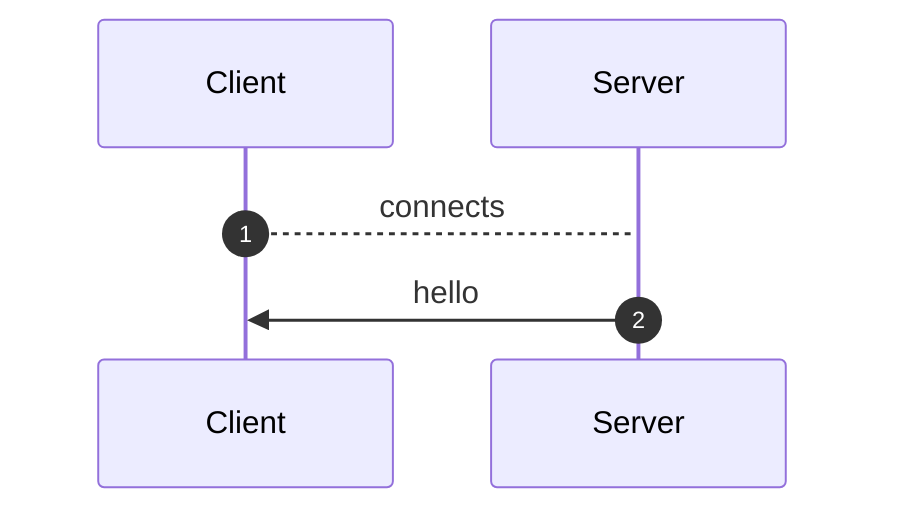
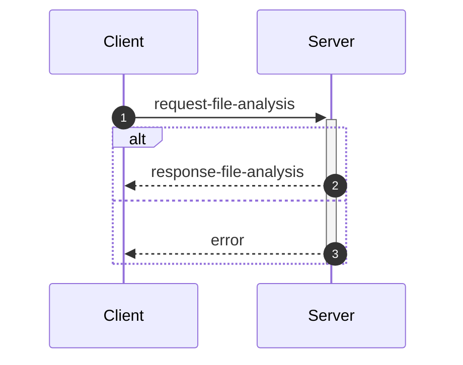
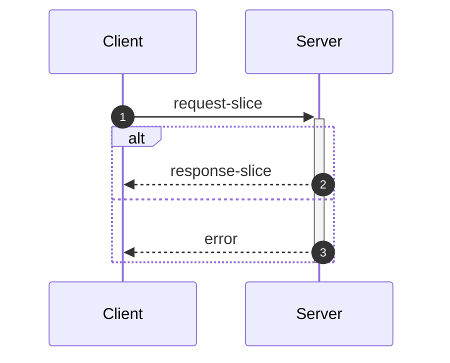
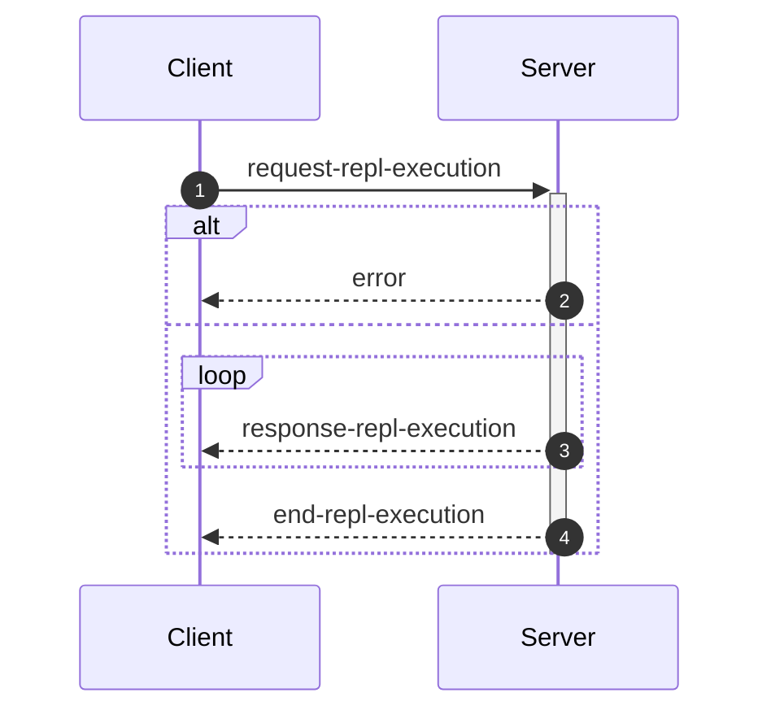

_This document was generated from '[src/documentation/wiki-interface.ts](https://github.com/flowr-analysis/flowr/tree/main//src/documentation/wiki-interface.ts)' on 2025-12-29, 10:28:59 UTC presenting an overview of flowR's interface (v2.7.6, using R v4.5.0). Please do not edit this file/wiki page directly._

Although far from being as detailed as the in-depth explanation of [_flowR_](https://github.com/flowr-analysis/flowr/wiki/core),
this wiki page explains how to interface with _flowR_ in more detail.
In general, command line arguments and other options provide short descriptions on hover over.

* [💬 Communicating with the Server](#communicating-with-the-server)
* [💻 Using the REPL](#using-the-repl)
* [⚙️ Configuring FlowR](#configuring-flowr)
* [⚒️ Writing Code](#writing-code)

<a id='communicating-with-the-server'></a>
## 💬 Communicating with the Server


As explained in the [Overview](https://github.com/flowr-analysis/flowr/wiki/Overview), you can simply run the [TCP](https://de.wikipedia.org/wiki/Transmission_Control_Protocol)&nbsp;server by adding the <span title="Description (Command Line Argument): Do not drop into a repl, but instead start a server on the given port (default: 1042) and listen for messages.">`--server`</span> flag (and, due to the interactive mode, exit with the conventional <kbd>CTRL</kbd>+<kbd>C</kbd>).
Currently, every connection is handled by the same underlying `RShell` - so the server is not designed to handle many clients at a time.
Additionally, the server is not well guarded against attacks (e.g., you can theoretically spawn an arbitrary number of&nbsp;RShell sessions on the target machine).

Every message has to be given in a single line (i.e., without a newline in-between) and end with a newline character. Nevertheless, we will pretty-print example given in the following segments for the ease of reading.


> [!NOTE]
> 
> The default <span title="Description (Command Line Argument): Do not drop into a repl, but instead start a server on the given port (default: 1042) and listen for messages.">`--server`</span> uses a simple [TCP](https://de.wikipedia.org/wiki/Transmission_Control_Protocol)
> connection. If you want _flowR_ to expose a [WebSocket](https://de.wikipedia.org/wiki/WebSocket) server instead, add the <span title="Description (Command Line Argument): If the server flag is set, use websocket for messaging">`--ws`</span> flag (i.e., <span title="Description (Command Line Argument): Do not drop into a repl, but instead start a server on the given port (default: 1042) and listen for messages.">`--server`</span> <span title="Description (Command Line Argument): If the server flag is set, use websocket for messaging">`--ws`</span>) when starting _flowR_ from the command line.
> 			


<ul><li>
<a id="message-hello"></a>
<b>Hello</b> Message (<code>hello</code>) 
<details>

<summary style="color:gray"> View Details. <i>The server informs the client about the successful connection and provides Meta-Information.</i> </summary>




	
After launching _flowR_, for example, with <code>docker run -it --rm eagleoutice/flowr <span title="Description (Command Line Argument): Do not drop into a repl, but instead start a server on the given port (default: 1042) and listen for messages.">-<span/>-server</span></code>&nbsp;(🐳️), simply connecting should present you with a `hello` message, that amongst others should reveal the versions of&nbsp;_flowR_ and&nbsp;R, using the [semver 2.0](https://semver.org/spec/v2.0.0.html) versioning scheme.
The message looks like this:


```json
{
  "type": "hello",
  "clientName": "client-0",
  "versions": {
    "flowr": "2.7.6",
    "r": "4.5.0",
    "engine": "r-shell"
  }
}
```


There are currently a few messages that you can send after the hello message.
If you want to _slice_ a piece of R code you first have to send an [analysis request](#message-request-file-analysis), so that you can send one or multiple slice requests afterward.
Requests for the [REPL](#message-request-repl) are independent of that.
	

<hr>


<details>
<summary style="color:gray">Message schema (<code>hello</code>)</summary>

For the definition of the hello message, please see it's implementation at [`./src/cli/repl/server/messages/message-hello.ts`](https://github.com/flowr-analysis/flowr/tree/main/./src/cli/repl/server/messages/message-hello.ts).

- **.** object [required]
    - **type** string [required]
        _The type of the hello message._
        Allows only the values: 'hello'
    - **id** any [forbidden]
        _The id of the message is always undefined (as it is the initial message and not requested)._
    - **clientName** string [required]
        _A unique name that is assigned to each client. It has no semantic meaning and is only used/useful for debugging._
    - **versions** object [required]
        - **flowr** string [required]
            _The version of the flowr server running in semver format._
        - **r** string [required]
            _The version of the underlying R shell running in semver format._
        - **engine** string [required]
            _The parser backend that is used to parse the R code._

</details>


<hr>

</details>
	</li>

<li>
<a id="message-request-file-analysis"></a>
<b>Analysis</b> Message (<code>request-file-analysis</code>) 
<details>

<summary style="color:gray"> View Details. <i>The server builds the dataflow graph for a given input file (or a set of files).</i> </summary>




	
The request allows the server to analyze a file and prepare it for slicing.
The message can contain a `filetoken`, which is used to identify the file in later slice or query requests (if you do not add one, the request will not be stored and therefore, it is not available for subsequent requests).

> **Please note!**\
> If you want to send and process a lot of analysis requests, but do not want to slice them, please do not pass the `filetoken` field. This will save the server a lot of memory allocation.

Furthermore, the request must contain either a `content` field to directly pass the file's content or a `filepath` field which contains the path to the file (this path must be accessible for the server to be useful).
If you add the `id` field, the answer will use the same `id` so you can match requests and the corresponding answers.
See the implementation of the request-file-analysis message for more information.


<details>
<summary>Example of the <code>request-file-analysis</code> Message</summary>

_Note:_ even though we pretty-print these messages, they are sent as a single line, ending with a newline.

The following lists all messages that were sent and received in case you want to reproduce the scenario:

<ol>
<li> <code>hello</code> (response)
<details> 

<summary> Show Details </summary>

The first message is always a hello message.


```json
{
  "type": "hello",
  "clientName": "client-0",
  "versions": {
    "flowr": "2.7.6",
    "r": "4.5.0",
    "engine": "r-shell"
  }
}
```


</details>
</li>

<li> <b><code>request-file-analysis</code> (request)</b>
<details open> 

<summary> Show Details </summary>

Let's suppose you simply want to analyze the following script:
 
```r
x <- 1
x + 1
```

 For this, you can send the following request:


```json
{
  "type": "request-file-analysis",
  "id": "1",
  "filetoken": "x",
  "content": "x <- 1\nx + 1"
}
```


</details>
</li>

<li> <code>response-file-analysis</code> (response)
<details> 

<summary> Show Details </summary>


The `results` field of the response effectively contains three keys of importance:

- `parse`: which contains 1:1 the parse result in CSV format that we received from the `RShell` (i.e., the AST produced by the parser of the R interpreter).
- `normalize`: which contains the normalized AST, including ids (see the `info` field and the [Normalized AST](https://github.com/flowr-analysis/flowr/wiki/Normalized%20AST) wiki page).
- `dataflow`: especially important is the `graph` field which contains the dataflow graph as a set of root vertices (see the [Dataflow Graph](https://github.com/flowr-analysis/flowr/wiki/Dataflow%20Graph) wiki page).
			


_As the code is pretty long, we inhibit pretty printing and syntax highlighting (JSON, hiding built-in):_

```text
{"type":"response-file-analysis","format":"json","id":"1","results":{"parse":{"files":[{"parsed":"[1,1,1,6,7,0,\"expr\",false,\"x <- 1\"],[1,1,1,1,1,3,\"SYMBOL\",true,\"x\"],[1,1,1,1,3,7,\"expr\",false,\"x\"],[1,3,1,4,2,7,\"LEFT_ASSIGN\",true,\"<-\"],[1,6,1,6,4,5,\"NUM_CONST\",true,\"1\"],[1,6,1,6,5,7,\"expr\",false,\"1\"],[2,1,2,5,16,0,\"expr\",false,\"x + 1\"],[2,1,2,1,10,12,\"SYMBOL\",true,\"x\"],[2,1,2,1,12,16,\"expr\",false,\"x\"],[2,3,2,3,11,16,\"'+'\",true,\"+\"],[2,5,2,5,13,14,\"NUM_CONST\",true,\"1\"],[2,5,2,5,14,16,\"expr\",false,\"1\"]","filePath":"/tmp/tmp-8309-5oV3Itvmx99G-.R"}],".meta":{"timing":2}},"normalize":{"ast":{"type":"RProject","files":[{"root":{"type":"RExpressionList","children":[{"type":"RBinaryOp","location":[1,3,1,4],"lhs":{"type":"RSymbol","location":[1,1,1,1],"content":"x","lexeme":"x","info":{"fullRange":[1,1,1,1],"additionalTokens":[],"id":0,"parent":2,"role":"binop-lhs","index":0,"nesting":0,"file":"/tmp/tmp-8309-5oV3Itvmx99G-.R"}},"rhs":{"location":[1,6,1,6],"lexeme":"1","info":{"fullRange":[1,6,1,6],"additionalTokens":[],"id":1,"parent":2,"role":"binop-rhs","index":1,"nesting":0,"file":"/tmp/tmp-8309-5oV3Itvmx99G-.R"},"type":"RNumber","content":{"num":1,"complexNumber":false,"markedAsInt":false}},"operator":"<-","lexeme":"<-","info":{"fullRange":[1,1,1,6],"additionalTokens":[],"id":2,"parent":6,"nesting":0,"file":"/tmp/tmp-8309-5oV3Itvmx99G-.R","index":0,"role":"expr-list-child"}},{"type":"RBinaryOp","location":[2,3,2,3],"lhs":{"type":"RSymbol","location":[2,1,2,1],"content":"x","lexeme":"x","info":{"fullRange":[2,1,2,1],"additionalTokens":[],"id":3,"parent":5,"role":"binop-lhs","index":0,"nesting":0,"file":"/tmp/tmp-8309-5oV3Itvmx99G-.R"}},"rhs":{"location":[2,5,2,5],"lexeme":"1","info":{"fullRange":[2,5,2,5],"additionalTokens":[],"id":4,"parent":5,"role":"binop-rhs","index":1,"nesting":0,"file":"/tmp/tmp-8309-5oV3Itvmx99G-.R"},"type":"RNumber","content":{"num":1,"complexNumber":false,"markedAsInt":false}},"operator":"+","lexeme":"+","info":{"fullRange":[2,1,2,5],"additionalTokens":[],"id":5,"parent":6,"nesting":0,"file":"/tmp/tmp-8309-5oV3Itvmx99G-.R","index":1,"role":"expr-list-child"}}],"info":{"additionalTokens":[],"id":6,"nesting":0,"file":"/tmp/tmp-8309-5oV3Itvmx99G-.R","role":"root","index":0}},"filePath":"/tmp/tmp-8309-5oV3Itvmx99G-.R"}],"info":{"id":7}},".meta":{"timing":0}},"dataflow":{"unknownReferences":[],"in":[{"nodeId":2,"name":"<-","type":2},{"nodeId":5,"name":"+","type":2}],"out":[{"nodeId":0,"name":"x","type":4,"definedAt":2,"value":[1]}],"environment":{"current":{"id":2397,"parent":"<BuiltInEnvironment>","memory":[["x",[{"nodeId":0,"name":"x","type":4,"definedAt":2,"value":[1]}]]]},"level":0},"graph":{"rootVertices":[1,0,2,3,4,5],"vertexInformation":[[1,{"tag":"value","id":1}],[0,{"tag":"vdef","id":0}],[2,{"tag":"fcall","id":2,"name":"<-","onlyBuiltin":true,"args":[{"nodeId":0,"type":32},{"nodeId":1,"type":32}],"origin":["builtin:assignment"]}],[3,{"tag":"use","id":3}],[4,{"tag":"value","id":4}],[5,{"tag":"fcall","id":5,"name":"+","onlyBuiltin":true,"args":[{"nodeId":3,"type":32},{"nodeId":4,"type":32}],"origin":["builtin:default"]}]],"edgeInformation":[[2,[[1,{"types":65}],[0,{"types":72}],["built-in:<-",{"types":5}]]],[0,[[1,{"types":2}],[2,{"types":2}]]],[3,[[0,{"types":1}]]],[5,[[3,{"types":65}],[4,{"types":65}],["built-in:+",{"types":5}]]]],"_unknownSideEffects":[]},"entryPoint":2,"exitPoints":[{"type":0,"nodeId":5}],".meta":{"timing":0}}}}
```


</details>
</li>
</ol>

The complete round-trip took 7.2 ms (including time required to validate the messages, start, and stop the internal mock server).

</details>


You receive an error if, for whatever reason, the analysis fails (e.g., the message or code you sent contained syntax errors).
It contains a human-readable description *why* the analysis failed (see the error message implementation for more details).


<details>
<summary>Example Error Message</summary>

_Note:_ even though we pretty-print these messages, they are sent as a single line, ending with a newline.

The following lists all messages that were sent and received in case you want to reproduce the scenario:

<ol>
<li> <code>hello</code> (response)
<details> 

<summary> Show Details </summary>

The first message is always a hello message.


```json
{
  "type": "hello",
  "clientName": "client-0",
  "versions": {
    "flowr": "2.7.6",
    "r": "4.5.0",
    "engine": "r-shell"
  }
}
```


</details>
</li>

<li> <code>request-file-analysis</code> (request)
<details> 

<summary> Show Details </summary>


```json
{
  "type": "request-file-analysis",
  "id": "1",
  "filename": "sample.R",
  "content": "x <-"
}
```


</details>
</li>

<li> <b><code>error</code> (response)</b>
<details open> 

<summary> Show Details </summary>


```json
{
  "id": "1",
  "type": "error",
  "fatal": false,
  "reason": "Error while analyzing file sample.R: GuardError: unable to parse R code (see the log for more information) for request {\"request\":\"text\",\"content\":\"x <-\"}}\n Report a Bug: https://github.com/flowr-analysis/flowr/issues/new?body=%3C!%2D%2D%20Please%20describe%20your%20issue%20in%20more%20detail%20below!%20%2D%2D%3E%0A%0A%0A%3C!%2D%2D%20Automatically%20generated%20issue%20metadata%2C%20please%20do%20not%20edit%20or%20delete%20content%20below%20this%20line%20%2D%2D%3E%0A%2D%2D%2D%0A%0AflowR%20version%3A%202.7.6%0Anode%20version%3A%20v22.14.0%0Anode%20arch%3A%20x64%0Anode%20platform%3A%20linux%0Amessage%3A%20%60unable%20to%20parse%20R%20code%20%28see%20the%20log%20for%20more%20information%29%20for%20request%20%7B%22request%22%3A%22text%22%2C%22content%22%3A%22x%20%3C%2D%22%7D%7D%60%0Astack%20trace%3A%0A%60%60%60%0A%20%20%20%20at%20guard%20%28%3C%3E%2Fsrc%2Futil%2Fassert.ts%3A128%3A9%29%0A%20%20%20%20at%20guardRetrievedOutput%20%28%3C%3E%2Fsrc%2Fr%2Dbridge%2Fretriever.ts%3A221%3A7%29%0A%20%20%20%20at%20%2Fhome%2Frunner%2Fwork%2Fflowr%2Fflowr%2Fsrc%2Fr%2Dbridge%2Fretriever.ts%3A182%3A4%0A%20%20%20%20at%20processTicksAndRejections%20%28node%3Ainternal%2Fprocess%2Ftask_queues%3A105%3A5%29%0A%20%20%20%20at%20async%20Object.parseRequests%20%5Bas%20processor%5D%20%28%3C%3E%2Fsrc%2Fr%2Dbridge%2Fparser.ts%3A104%3A19%29%0A%20%20%20%20at%20async%20PipelineExecutor.nextStep%20%28%3C%3E%2Fsrc%2Fcore%2Fpipeline%2Dexecutor.ts%3A192%3A25%29%0A%20%20%20%20at%20async%20FlowrAnalyzerCache.runTapeUntil%20%28%3C%3E%2Fsrc%2Fproject%2Fcache%2Fflowr%2Danalyzer%2Dcache.ts%3A92%3A4%29%0A%20%20%20%20at%20async%20FlowRServerConnection.sendFileAnalysisResponse%20%28%3C%3E%2Fsrc%2Fcli%2Frepl%2Fserver%2Fconnection.ts%3A163%3A52%29%0A%60%60%60%0A%0A%2D%2D%2D%0A%09"
}
```


</details>
</li>
</ol>

The complete round-trip took 9.9 ms (including time required to validate the messages, start, and stop the internal mock server).

</details>


&nbsp;

<a id="analysis-include-cfg"></a>
**Including the Control Flow Graph**

While _flowR_ does (for the time being) not use an explicit control flow graph but instead relies on control-dependency edges within the dataflow graph, 
the respective structure can still be exposed using the server (note that, as this feature is not needed within _flowR_, it is tested significantly less - 
so please create a [new issue](https://github.com/flowr-analysis/flowr/issues/new/choose) for any bug you may encounter).
For this, the analysis request may add `cfg: true` to its list of options.


<details>
<summary>Requesting a Control Flow Graph</summary>

_Note:_ even though we pretty-print these messages, they are sent as a single line, ending with a newline.

The following lists all messages that were sent and received in case you want to reproduce the scenario:

<ol>
<li> <code>hello</code> (response)
<details> 

<summary> Show Details </summary>

The first message is always a hello message.


```json
{
  "type": "hello",
  "clientName": "client-0",
  "versions": {
    "flowr": "2.7.6",
    "r": "4.5.0",
    "engine": "r-shell"
  }
}
```


</details>
</li>

<li> <b><code>request-file-analysis</code> (request)</b>
<details open> 

<summary> Show Details </summary>


```json
{
  "type": "request-file-analysis",
  "id": "1",
  "filetoken": "x",
  "content": "if(unknown > 0) { x <- 2 } else { x <- 5 }\nfor(i in 1:x) { print(x); print(i) }",
  "cfg": true
}
```


</details>
</li>

<li> <code>response-file-analysis</code> (response)
<details> 

<summary> Show Details </summary>


The response looks basically the same as a response sent without the `cfg` flag. However, additionally it contains a `cfg` field. 
If you are interested in a visual representation of the control flow graph, see the 
[visualization with mermaid](https://mermaid.live/view#base64:eyJjb2RlIjoiZmxvd2NoYXJ0IEJUXG4gICAgbjMyKFtcImBSRXhwcmVzc2lvbkxpc3QgKDMyKWBcIl0pXG4gICAgbjE1W1wiYFJJZlRoZW5FbHNlICgxNSlcbiMzNDtpZih1bmtub3duICM2MjsgMCkgIzEyMzsgeCAjNjA7IzQ1OyAyICMxMjU7IGVsc2UgIzEyMzsgeCAjNjA7IzQ1OyA1ICMxMjU7IzM0O2BcIl1cbiAgICBuMTUtZXhpdCgoMTUtZXhpdCkpXG4gICAgbjAoW1wiYFJTeW1ib2wgKDApXG4jMzQ7dW5rbm93biMzNDtgXCJdKVxuICAgIG4xKFtcImBSTnVtYmVyICgxKVxuIzM0OzAjMzQ7YFwiXSlcbiAgICBuMihbXCJgUkJpbmFyeU9wICgyKVxuIzM0O3Vua25vd24gIzYyOyAwIzM0O2BcIl0pXG4gICAgbjItZXhpdCgoMi1leGl0KSlcbiAgICBuOChbXCJgUkV4cHJlc3Npb25MaXN0ICg4KWBcIl0pXG4gICAgbjUoW1wiYFJTeW1ib2wgKDUpXG4jMzQ7eCMzNDtgXCJdKVxuICAgIG42KFtcImBSTnVtYmVyICg2KVxuIzM0OzIjMzQ7YFwiXSlcbiAgICBuNyhbXCJgUkJpbmFyeU9wICg3KVxuIzM0O3ggIzYwOyM0NTsgMiMzNDtgXCJdKVxuICAgIG43LWV4aXQoKDctZXhpdCkpXG4gICAgbjgtZXhpdCgoOC1leGl0KSlcbiAgICBuMTQoW1wiYFJFeHByZXNzaW9uTGlzdCAoMTQpYFwiXSlcbiAgICBuMTEoW1wiYFJTeW1ib2wgKDExKVxuIzM0O3gjMzQ7YFwiXSlcbiAgICBuMTIoW1wiYFJOdW1iZXIgKDEyKVxuIzM0OzUjMzQ7YFwiXSlcbiAgICBuMTMoW1wiYFJCaW5hcnlPcCAoMTMpXG4jMzQ7eCAjNjA7IzQ1OyA1IzM0O2BcIl0pXG4gICAgbjEzLWV4aXQoKDEzLWV4aXQpKVxuICAgIG4xNC1leGl0KCgxNC1leGl0KSlcbiAgICBuMTYoW1wiYFJTeW1ib2wgKDE2KVxuIzM0O2kjMzQ7YFwiXSlcbiAgICBuMzFbXCJgUkZvckxvb3AgKDMxKVxuIzM0O2ZvcihpIGluIDEjNTg7eCkgIzEyMzsgcHJpbnQoeCk7IHByaW50KGkpICMxMjU7IzM0O2BcIl1cbiAgICBuMTcoW1wiYFJOdW1iZXIgKDE3KVxuIzM0OzEjMzQ7YFwiXSlcbiAgICBuMTgoW1wiYFJTeW1ib2wgKDE4KVxuIzM0O3gjMzQ7YFwiXSlcbiAgICBuMTkoW1wiYFJCaW5hcnlPcCAoMTkpXG4jMzQ7MSM1ODt4IzM0O2BcIl0pXG4gICAgbjE5LWV4aXQoKDE5LWV4aXQpKVxuICAgIG4zMChbXCJgUkV4cHJlc3Npb25MaXN0ICgzMClgXCJdKVxuICAgIG4yMihbXCJgUlN5bWJvbCAoMjIpXG4jMzQ7cHJpbnQoeCkjMzQ7YFwiXSlcbiAgICBuMjVbXCJgUkZ1bmN0aW9uQ2FsbCAoMjUpXG4jMzQ7cHJpbnQoeCkjMzQ7YFwiXVxuICAgIG4yNS1leGl0KCgyNS1leGl0KSlcbiAgICBuMjQoW1wiYFJBcmd1bWVudCAoMjQpXG4jMzQ7eCMzNDtgXCJdKVxuICAgIG4yMyhbXCJgUlN5bWJvbCAoMjMpXG4jMzQ7eCMzNDtgXCJdKVxuICAgIG4yNC1leGl0KCgyNC1leGl0KSlcbiAgICBuMjYoW1wiYFJTeW1ib2wgKDI2KVxuIzM0O3ByaW50KGkpIzM0O2BcIl0pXG4gICAgbjI5W1wiYFJGdW5jdGlvbkNhbGwgKDI5KVxuIzM0O3ByaW50KGkpIzM0O2BcIl1cbiAgICBuMjktZXhpdCgoMjktZXhpdCkpXG4gICAgbjI4KFtcImBSQXJndW1lbnQgKDI4KVxuIzM0O2kjMzQ7YFwiXSlcbiAgICBuMjcoW1wiYFJTeW1ib2wgKDI3KVxuIzM0O2kjMzQ7YFwiXSlcbiAgICBuMjgtZXhpdCgoMjgtZXhpdCkpXG4gICAgbjMwLWV4aXQoKDMwLWV4aXQpKVxuICAgIG4zMS1leGl0KCgzMS1leGl0KSlcbiAgICBuMzItZXhpdCgoMzItZXhpdCkpXG4gICAgbjE1IC0uLT58XCJGRFwifCBuMzJcbiAgICBuMSAtLi0+fFwiRkRcInwgbjBcbiAgICBuMCAtLi0+fFwiRkRcInwgbjJcbiAgICBuMi1leGl0IC0uLT58XCJGRFwifCBuMVxuICAgIG43IC0uLT58XCJGRFwifCBuOFxuICAgIG42IC0uLT58XCJGRFwifCBuNVxuICAgIG41IC0uLT58XCJGRFwifCBuN1xuICAgIG43LWV4aXQgLS4tPnxcIkZEXCJ8IG42XG4gICAgbjgtZXhpdCAtLi0+fFwiRkRcInwgbjctZXhpdFxuICAgIG4xMyAtLi0+fFwiRkRcInwgbjE0XG4gICAgbjEyIC0uLT58XCJGRFwifCBuMTFcbiAgICBuMTEgLS4tPnxcIkZEXCJ8IG4xM1xuICAgIG4xMy1leGl0IC0uLT58XCJGRFwifCBuMTJcbiAgICBuMTQtZXhpdCAtLi0+fFwiRkRcInwgbjEzLWV4aXRcbiAgICBuOCAtLT58XCJDRCAoVFJVRSlcInwgbjItZXhpdFxuICAgIG4xNCAtLT58XCJDRCAoRkFMU0UpXCJ8IG4yLWV4aXRcbiAgICBuMiAtLi0+fFwiRkRcInwgbjE1XG4gICAgbjE1LWV4aXQgLS4tPnxcIkZEXCJ8IG44LWV4aXRcbiAgICBuMTUtZXhpdCAtLi0+fFwiRkRcInwgbjE0LWV4aXRcbiAgICBuMzEgLS4tPnxcIkZEXCJ8IG4xNS1leGl0XG4gICAgbjMxIC0uLT58XCJGRFwifCBuMzAtZXhpdFxuICAgIG4xOCAtLi0+fFwiRkRcInwgbjE3XG4gICAgbjE3IC0uLT58XCJGRFwifCBuMTlcbiAgICBuMTktZXhpdCAtLi0+fFwiRkRcInwgbjE4XG4gICAgbjI1IC0uLT58XCJGRFwifCBuMzBcbiAgICBuMjIgLS4tPnxcIkZEXCJ8IG4yNVxuICAgIG4yMyAtLi0+fFwiRkRcInwgbjI0XG4gICAgbjI0LWV4aXQgLS4tPnxcIkZEXCJ8IG4yM1xuICAgIG4yNCAtLi0+fFwiRkRcInwgbjIyXG4gICAgbjI1LWV4aXQgLS4tPnxcIkZEXCJ8IG4yNC1leGl0XG4gICAgbjI5IC0uLT58XCJGRFwifCBuMjUtZXhpdFxuICAgIG4yNiAtLi0+fFwiRkRcInwgbjI5XG4gICAgbjI3IC0uLT58XCJGRFwifCBuMjhcbiAgICBuMjgtZXhpdCAtLi0+fFwiRkRcInwgbjI3XG4gICAgbjI4IC0uLT58XCJGRFwifCBuMjZcbiAgICBuMjktZXhpdCAtLi0+fFwiRkRcInwgbjI4LWV4aXRcbiAgICBuMzAtZXhpdCAtLi0+fFwiRkRcInwgbjI5LWV4aXRcbiAgICBuMTkgLS4tPnxcIkZEXCJ8IG4zMVxuICAgIG4xNiAtLi0+fFwiRkRcInwgbjE5LWV4aXRcbiAgICBuMzAgLS0+fFwiQ0QgKFRSVUUpXCJ8IG4xNlxuICAgIG4zMS1leGl0IC0tPnxcIkNEIChGQUxTRSlcInwgbjE2XG4gICAgbjMyLWV4aXQgLS4tPnxcIkZEXCJ8IG4zMS1leGl0XG4gICAgc3R5bGUgbjMyIHN0cm9rZTpjeWFuLHN0cm9rZS13aWR0aDo2LjVweDsgICAgc3R5bGUgbjMyLWV4aXQgc3Ryb2tlOmdyZWVuLHN0cm9rZS13aWR0aDo2LjVweDsiLCJtZXJtYWlkIjp7ImF1dG9TeW5jIjp0cnVlfX0=).
			


_As the code is pretty long, we inhibit pretty printing and syntax highlighting (JSON, hiding built-in):_

```text
{"type":"response-file-analysis","format":"json","id":"1","cfg":{"returns":[],"entryPoints":[32],"exitPoints":["32-exit"],"breaks":[],"nexts":[],"graph":{"rootVertices":[32,15,"15-exit",0,1,2,"2-exit",8,5,6,7,"7-exit","8-exit",14,11,12,13,"13-exit","14-exit",16,31,17,18,19,"19-exit",30,22,25,"25-exit",24,23,"24-exit",26,29,"29-exit",28,27,"28-exit","30-exit","31-exit","32-exit"],"vertexInformation":[[32,{"id":32,"type":"expr","end":["32-exit"]}],[15,{"id":15,"type":"stm","mid":["2-exit"],"end":["15-exit"]}],["15-exit",{"id":"15-exit","type":"end","root":15}],[0,{"id":0,"type":"expr"}],[1,{"id":1,"type":"expr"}],[2,{"id":2,"type":"expr","end":["2-exit"]}],["2-exit",{"id":"2-exit","type":"end","root":2}],[8,{"id":8,"type":"expr","end":["8-exit"]}],[5,{"id":5,"type":"expr"}],[6,{"id":6,"type":"expr"}],[7,{"id":7,"type":"expr","end":["7-exit"]}],["7-exit",{"id":"7-exit","type":"end","root":7}],["8-exit",{"id":"8-exit","type":"end","root":8}],[14,{"id":14,"type":"expr","end":["14-exit"]}],[11,{"id":11,"type":"expr"}],[12,{"id":12,"type":"expr"}],[13,{"id":13,"type":"expr","end":["13-exit"]}],["13-exit",{"id":"13-exit","type":"end","root":13}],["14-exit",{"id":"14-exit","type":"end","root":14}],[16,{"id":16,"type":"expr"}],[31,{"id":31,"type":"stm","end":["31-exit"],"mid":[16]}],[17,{"id":17,"type":"expr"}],[18,{"id":18,"type":"expr"}],[19,{"id":19,"type":"expr","end":["19-exit"]}],["19-exit",{"id":"19-exit","type":"end","root":19}],[30,{"id":30,"type":"expr","end":["30-exit"]}],[22,{"id":22,"type":"expr"}],[25,{"id":25,"type":"stm","mid":[22],"end":["25-exit"]}],["25-exit",{"id":"25-exit","type":"end","root":25}],[24,{"id":24,"type":"expr","mid":[24],"end":["24-exit"]}],[23,{"id":23,"type":"expr"}],["24-exit",{"id":"24-exit","type":"end","root":24}],[26,{"id":26,"type":"expr"}],[29,{"id":29,"type":"stm","mid":[26],"end":["29-exit"]}],["29-exit",{"id":"29-exit","type":"end","root":29}],[28,{"id":28,"type":"expr","mid":[28],"end":["28-exit"]}],[27,{"id":27,"type":"expr"}],["28-exit",{"id":"28-exit","type":"end","root":28}],["30-exit",{"id":"30-exit","type":"end","root":30}],["31-exit",{"id":"31-exit","type":"end","root":31}],["32-exit",{"id":"32-exit","type":"end","root":32}]],"bbChildren":[],"edgeInformation":[[15,[[32,{"label":0}]]],[1,[[0,{"label":0}]]],[0,[[2,{"label":0}]]],["2-exit",[[1,{"label":0}]]],[7,[[8,{"label":0}]]],[6,[[5,{"label":0}]]],[5,[[7,{"label":0}]]],["7-exit",[[6,{"label":0}]]],["8-exit",[["7-exit",{"label":0}]]],[13,[[14,{"label":0}]]],[12,[[11,{"label":0}]]],[11,[[13,{"label":0}]]],["13-exit",[[12,{"label":0}]]],["14-exit",[["13-exit",{"label":0}]]],[8,[["2-exit",{"label":1,"when":"TRUE","caused":15}]]],[14,[["2-exit",{"label":1,"when":"FALSE","caused":15}]]],[2,[[15,{"label":0}]]],["15-exit",[["8-exit",{"label":0}],["14-exit",{"label":0}]]],[31,[["15-exit",{"label":0}],["30-exit",{"label":0}]]],[18,[[17,{"label":0}]]],[17,[[19,{"label":0}]]],["19-exit",[[18,{"label":0}]]],[25,[[30,{"label":0}]]],[22,[[25,{"label":0}]]],[23,[[24,{"label":0}]]],["24-exit",[[23,{"label":0}]]],[24,[[22,{"label":0}]]],["25-exit",[["24-exit",{"label":0}]]],[29,[["25-exit",{"label":0}]]],[26,[[29,{"label":0}]]],[27,[[28,{"label":0}]]],["28-exit",[[27,{"label":0}]]],[28,[[26,{"label":0}]]],["29-exit",[["28-exit",{"label":0}]]],["30-exit",[["29-exit",{"label":0}]]],[19,[[31,{"label":0}]]],[16,[["19-exit",{"label":0}]]],[30,[[16,{"label":1,"when":"TRUE","caused":31}]]],["31-exit",[[16,{"label":1,"when":"FALSE","caused":31}]]],["32-exit",[["31-exit",{"label":0}]]]],"_mayHaveBasicBlocks":false}},"results":{"parse":{"files":[{"parsed":"[1,1,1,42,38,0,\"expr\",false,\"if(unknown > 0) { x <- 2 } else { x <- 5 }\"],[1,1,1,2,1,38,\"IF\",true,\"if\"],[1,3,1,3,2,38,\"'('\",true,\"(\"],[1,4,1,14,9,38,\"expr\",false,\"unknown > 0\"],[1,4,1,10,3,5,\"SYMBOL\",true,\"unknown\"],[1,4,1,10,5,9,\"expr\",false,\"unknown\"],[1,12,1,12,4,9,\"GT\",true,\">\"],[1,14,1,14,6,7,\"NUM_CONST\",true,\"0\"],[1,14,1,14,7,9,\"expr\",false,\"0\"],[1,15,1,15,8,38,\"')'\",true,\")\"],[1,17,1,26,22,38,\"expr\",false,\"{ x <- 2 }\"],[1,17,1,17,12,22,\"'{'\",true,\"{\"],[1,19,1,24,19,22,\"expr\",false,\"x <- 2\"],[1,19,1,19,13,15,\"SYMBOL\",true,\"x\"],[1,19,1,19,15,19,\"expr\",false,\"x\"],[1,21,1,22,14,19,\"LEFT_ASSIGN\",true,\"<-\"],[1,24,1,24,16,17,\"NUM_CONST\",true,\"2\"],[1,24,1,24,17,19,\"expr\",false,\"2\"],[1,26,1,26,18,22,\"'}'\",true,\"}\"],[1,28,1,31,23,38,\"ELSE\",true,\"else\"],[1,33,1,42,35,38,\"expr\",false,\"{ x <- 5 }\"],[1,33,1,33,25,35,\"'{'\",true,\"{\"],[1,35,1,40,32,35,\"expr\",false,\"x <- 5\"],[1,35,1,35,26,28,\"SYMBOL\",true,\"x\"],[1,35,1,35,28,32,\"expr\",false,\"x\"],[1,37,1,38,27,32,\"LEFT_ASSIGN\",true,\"<-\"],[1,40,1,40,29,30,\"NUM_CONST\",true,\"5\"],[1,40,1,40,30,32,\"expr\",false,\"5\"],[1,42,1,42,31,35,\"'}'\",true,\"}\"],[2,1,2,36,84,0,\"expr\",false,\"for(i in 1:x) { print(x); print(i) }\"],[2,1,2,3,41,84,\"FOR\",true,\"for\"],[2,4,2,13,53,84,\"forcond\",false,\"(i in 1:x)\"],[2,4,2,4,42,53,\"'('\",true,\"(\"],[2,5,2,5,43,53,\"SYMBOL\",true,\"i\"],[2,7,2,8,44,53,\"IN\",true,\"in\"],[2,10,2,12,51,53,\"expr\",false,\"1:x\"],[2,10,2,10,45,46,\"NUM_CONST\",true,\"1\"],[2,10,2,10,46,51,\"expr\",false,\"1\"],[2,11,2,11,47,51,\"':'\",true,\":\"],[2,12,2,12,48,50,\"SYMBOL\",true,\"x\"],[2,12,2,12,50,51,\"expr\",false,\"x\"],[2,13,2,13,49,53,\"')'\",true,\")\"],[2,15,2,36,81,84,\"expr\",false,\"{ print(x); print(i) }\"],[2,15,2,15,54,81,\"'{'\",true,\"{\"],[2,17,2,24,64,81,\"expr\",false,\"print(x)\"],[2,17,2,21,55,57,\"SYMBOL_FUNCTION_CALL\",true,\"print\"],[2,17,2,21,57,64,\"expr\",false,\"print\"],[2,22,2,22,56,64,\"'('\",true,\"(\"],[2,23,2,23,58,60,\"SYMBOL\",true,\"x\"],[2,23,2,23,60,64,\"expr\",false,\"x\"],[2,24,2,24,59,64,\"')'\",true,\")\"],[2,25,2,25,65,81,\"';'\",true,\";\"],[2,27,2,34,77,81,\"expr\",false,\"print(i)\"],[2,27,2,31,68,70,\"SYMBOL_FUNCTION_CALL\",true,\"print\"],[2,27,2,31,70,77,\"expr\",false,\"print\"],[2,32,2,32,69,77,\"'('\",true,\"(\"],[2,33,2,33,71,73,\"SYMBOL\",true,\"i\"],[2,33,2,33,73,77,\"expr\",false,\"i\"],[2,34,2,34,72,77,\"')'\",true,\")\"],[2,36,2,36,78,81,\"'}'\",true,\"}\"]","filePath":"/tmp/tmp-8309-1ofiWpvKQJCk-.R"}],".meta":{"timing":2}},"normalize":{"ast":{"type":"RProject","files":[{"root":{"type":"RExpressionList","children":[{"type":"RIfThenElse","condition":{"type":"RBinaryOp","location":[1,12,1,12],"lhs":{"type":"RSymbol","location":[1,4,1,10],"content":"unknown","lexeme":"unknown","info":{"fullRange":[1,4,1,10],"additionalTokens":[],"id":0,"parent":2,"role":"binop-lhs","index":0,"nesting":1,"file":"/tmp/tmp-8309-1ofiWpvKQJCk-.R"}},"rhs":{"location":[1,14,1,14],"lexeme":"0","info":{"fullRange":[1,14,1,14],"additionalTokens":[],"id":1,"parent":2,"role":"binop-rhs","index":1,"nesting":1,"file":"/tmp/tmp-8309-1ofiWpvKQJCk-.R"},"type":"RNumber","content":{"num":0,"complexNumber":false,"markedAsInt":false}},"operator":">","lexeme":">","info":{"fullRange":[1,4,1,14],"additionalTokens":[],"id":2,"parent":15,"nesting":1,"file":"/tmp/tmp-8309-1ofiWpvKQJCk-.R","role":"if-cond"}},"then":{"type":"RExpressionList","children":[{"type":"RBinaryOp","location":[1,21,1,22],"lhs":{"type":"RSymbol","location":[1,19,1,19],"content":"x","lexeme":"x","info":{"fullRange":[1,19,1,19],"additionalTokens":[],"id":5,"parent":7,"role":"binop-lhs","index":0,"nesting":1,"file":"/tmp/tmp-8309-1ofiWpvKQJCk-.R"}},"rhs":{"location":[1,24,1,24],"lexeme":"2","info":{"fullRange":[1,24,1,24],"additionalTokens":[],"id":6,"parent":7,"role":"binop-rhs","index":1,"nesting":1,"file":"/tmp/tmp-8309-1ofiWpvKQJCk-.R"},"type":"RNumber","content":{"num":2,"complexNumber":false,"markedAsInt":false}},"operator":"<-","lexeme":"<-","info":{"fullRange":[1,19,1,24],"additionalTokens":[],"id":7,"parent":8,"nesting":1,"file":"/tmp/tmp-8309-1ofiWpvKQJCk-.R","index":0,"role":"expr-list-child"}}],"grouping":[{"type":"RSymbol","location":[1,17,1,17],"content":"{","lexeme":"{","info":{"fullRange":[1,17,1,26],"additionalTokens":[],"id":3,"role":"root","index":0,"nesting":1,"file":"/tmp/tmp-8309-1ofiWpvKQJCk-.R"}},{"type":"RSymbol","location":[1,26,1,26],"content":"}","lexeme":"}","info":{"fullRange":[1,17,1,26],"additionalTokens":[],"id":4,"role":"root","index":0,"nesting":1,"file":"/tmp/tmp-8309-1ofiWpvKQJCk-.R"}}],"info":{"additionalTokens":[],"id":8,"parent":15,"nesting":1,"file":"/tmp/tmp-8309-1ofiWpvKQJCk-.R","index":1,"role":"if-then"}},"location":[1,1,1,2],"lexeme":"if","info":{"fullRange":[1,1,1,42],"additionalTokens":[],"id":15,"parent":32,"nesting":1,"file":"/tmp/tmp-8309-1ofiWpvKQJCk-.R","index":0,"role":"expr-list-child"},"otherwise":{"type":"RExpressionList","children":[{"type":"RBinaryOp","location":[1,37,1,38],"lhs":{"type":"RSymbol","location":[1,35,1,35],"content":"x","lexeme":"x","info":{"fullRange":[1,35,1,35],"additionalTokens":[],"id":11,"parent":13,"role":"binop-lhs","index":0,"nesting":1,"file":"/tmp/tmp-8309-1ofiWpvKQJCk-.R"}},"rhs":{"location":[1,40,1,40],"lexeme":"5","info":{"fullRange":[1,40,1,40],"additionalTokens":[],"id":12,"parent":13,"role":"binop-rhs","index":1,"nesting":1,"file":"/tmp/tmp-8309-1ofiWpvKQJCk-.R"},"type":"RNumber","content":{"num":5,"complexNumber":false,"markedAsInt":false}},"operator":"<-","lexeme":"<-","info":{"fullRange":[1,35,1,40],"additionalTokens":[],"id":13,"parent":14,"nesting":1,"file":"/tmp/tmp-8309-1ofiWpvKQJCk-.R","index":0,"role":"expr-list-child"}}],"grouping":[{"type":"RSymbol","location":[1,33,1,33],"content":"{","lexeme":"{","info":{"fullRange":[1,33,1,42],"additionalTokens":[],"id":9,"role":"root","index":0,"nesting":1,"file":"/tmp/tmp-8309-1ofiWpvKQJCk-.R"}},{"type":"RSymbol","location":[1,42,1,42],"content":"}","lexeme":"}","info":{"fullRange":[1,33,1,42],"additionalTokens":[],"id":10,"role":"root","index":0,"nesting":1,"file":"/tmp/tmp-8309-1ofiWpvKQJCk-.R"}}],"info":{"additionalTokens":[],"id":14,"parent":15,"nesting":1,"file":"/tmp/tmp-8309-1ofiWpvKQJCk-.R","index":2,"role":"if-other"}}},{"type":"RForLoop","variable":{"type":"RSymbol","location":[2,5,2,5],"content":"i","lexeme":"i","info":{"additionalTokens":[],"id":16,"parent":31,"role":"for-var","index":0,"nesting":1,"file":"/tmp/tmp-8309-1ofiWpvKQJCk-.R"}},"vector":{"type":"RBinaryOp","location":[2,11,2,11],"lhs":{"location":[2,10,2,10],"lexeme":"1","info":{"fullRange":[2,10,2,10],"additionalTokens":[],"id":17,"parent":19,"role":"binop-lhs","index":0,"nesting":1,"file":"/tmp/tmp-8309-1ofiWpvKQJCk-.R"},"type":"RNumber","content":{"num":1,"complexNumber":false,"markedAsInt":false}},"rhs":{"type":"RSymbol","location":[2,12,2,12],"content":"x","lexeme":"x","info":{"fullRange":[2,12,2,12],"additionalTokens":[],"id":18,"parent":19,"role":"binop-rhs","index":1,"nesting":1,"file":"/tmp/tmp-8309-1ofiWpvKQJCk-.R"}},"operator":":","lexeme":":","info":{"fullRange":[2,10,2,12],"additionalTokens":[],"id":19,"parent":31,"nesting":1,"file":"/tmp/tmp-8309-1ofiWpvKQJCk-.R","index":1,"role":"for-vec"}},"body":{"type":"RExpressionList","children":[{"type":"RFunctionCall","named":true,"location":[2,17,2,21],"lexeme":"print","functionName":{"type":"RSymbol","location":[2,17,2,21],"content":"print","lexeme":"print","info":{"fullRange":[2,17,2,24],"additionalTokens":[],"id":22,"parent":25,"role":"call-name","index":0,"nesting":1,"file":"/tmp/tmp-8309-1ofiWpvKQJCk-.R"}},"arguments":[{"type":"RArgument","location":[2,23,2,23],"lexeme":"x","value":{"type":"RSymbol","location":[2,23,2,23],"content":"x","lexeme":"x","info":{"fullRange":[2,23,2,23],"additionalTokens":[],"id":23,"parent":24,"role":"arg-value","index":0,"nesting":1,"file":"/tmp/tmp-8309-1ofiWpvKQJCk-.R"}},"info":{"fullRange":[2,23,2,23],"additionalTokens":[],"id":24,"parent":25,"nesting":1,"file":"/tmp/tmp-8309-1ofiWpvKQJCk-.R","index":1,"role":"call-arg"}}],"info":{"fullRange":[2,17,2,24],"additionalTokens":[],"id":25,"parent":30,"nesting":1,"file":"/tmp/tmp-8309-1ofiWpvKQJCk-.R","index":0,"role":"expr-list-child"}},{"type":"RFunctionCall","named":true,"location":[2,27,2,31],"lexeme":"print","functionName":{"type":"RSymbol","location":[2,27,2,31],"content":"print","lexeme":"print","info":{"fullRange":[2,27,2,34],"additionalTokens":[],"id":26,"parent":29,"role":"call-name","index":0,"nesting":1,"file":"/tmp/tmp-8309-1ofiWpvKQJCk-.R"}},"arguments":[{"type":"RArgument","location":[2,33,2,33],"lexeme":"i","value":{"type":"RSymbol","location":[2,33,2,33],"content":"i","lexeme":"i","info":{"fullRange":[2,33,2,33],"additionalTokens":[],"id":27,"parent":28,"role":"arg-value","index":0,"nesting":1,"file":"/tmp/tmp-8309-1ofiWpvKQJCk-.R"}},"info":{"fullRange":[2,33,2,33],"additionalTokens":[],"id":28,"parent":29,"nesting":1,"file":"/tmp/tmp-8309-1ofiWpvKQJCk-.R","index":1,"role":"call-arg"}}],"info":{"fullRange":[2,27,2,34],"additionalTokens":[],"id":29,"parent":30,"nesting":1,"file":"/tmp/tmp-8309-1ofiWpvKQJCk-.R","index":1,"role":"expr-list-child"}}],"grouping":[{"type":"RSymbol","location":[2,15,2,15],"content":"{","lexeme":"{","info":{"fullRange":[2,15,2,36],"additionalTokens":[],"id":20,"role":"root","index":0,"nesting":1,"file":"/tmp/tmp-8309-1ofiWpvKQJCk-.R"}},{"type":"RSymbol","location":[2,36,2,36],"content":"}","lexeme":"}","info":{"fullRange":[2,15,2,36],"additionalTokens":[],"id":21,"role":"root","index":0,"nesting":1,"file":"/tmp/tmp-8309-1ofiWpvKQJCk-.R"}}],"info":{"additionalTokens":[],"id":30,"parent":31,"nesting":1,"file":"/tmp/tmp-8309-1ofiWpvKQJCk-.R","index":2,"role":"for-body"}},"lexeme":"for","info":{"fullRange":[2,1,2,36],"additionalTokens":[],"id":31,"parent":32,"nesting":1,"file":"/tmp/tmp-8309-1ofiWpvKQJCk-.R","index":1,"role":"expr-list-child"},"location":[2,1,2,3]}],"info":{"additionalTokens":[],"id":32,"nesting":0,"file":"/tmp/tmp-8309-1ofiWpvKQJCk-.R","role":"root","index":0}},"filePath":"/tmp/tmp-8309-1ofiWpvKQJCk-.R"}],"info":{"id":33}},".meta":{"timing":0}},"dataflow":{"unknownReferences":[],"in":[{"nodeId":15,"name":"if","type":2},{"nodeId":0,"name":"unknown","type":1},{"nodeId":2,"name":">","type":2},{"nodeId":7,"name":"<-","controlDependencies":[{"id":15,"when":true}],"type":2},{"nodeId":13,"name":"<-","controlDependencies":[{"id":15,"when":false}],"type":2},{"nodeId":8,"name":"{","controlDependencies":[{"id":15,"when":true}],"type":2},{"nodeId":14,"name":"{","controlDependencies":[{"id":15,"when":false}],"type":2},{"nodeId":31,"name":"for","type":2},{"name":":","nodeId":19,"type":2},{"name":"print","nodeId":25,"type":2},{"name":"print","nodeId":29,"type":2}],"out":[{"nodeId":5,"name":"x","controlDependencies":[{"id":15,"when":true}],"type":4,"definedAt":7,"value":[6]},{"nodeId":11,"name":"x","controlDependencies":[{"id":15,"when":true},{"id":15,"when":false}],"type":4,"definedAt":13,"value":[12]},{"nodeId":16,"name":"i","type":1}],"environment":{"current":{"id":2534,"parent":"<BuiltInEnvironment>","memory":[["x",[{"nodeId":5,"name":"x","controlDependencies":[{"id":15,"when":true},{"id":15,"when":false}],"type":4,"definedAt":7,"value":[6]},{"nodeId":11,"name":"x","controlDependencies":[{"id":15,"when":true},{"id":15,"when":false}],"type":4,"definedAt":13,"value":[12]}]],["i",[{"nodeId":16,"name":"i","type":4,"definedAt":31}]]]},"level":0},"graph":{"rootVertices":[0,1,2,6,5,7,8,12,11,13,14,15,16,17,18,19,23,25,27,29,30,31],"vertexInformation":[[0,{"tag":"use","id":0}],[1,{"tag":"value","id":1}],[2,{"tag":"fcall","id":2,"name":">","onlyBuiltin":true,"args":[{"nodeId":0,"type":32},{"nodeId":1,"type":32}],"origin":["builtin:default"]}],[6,{"tag":"value","id":6}],[5,{"tag":"vdef","id":5,"cds":[{"id":15,"when":true}]}],[7,{"tag":"fcall","id":7,"name":"<-","onlyBuiltin":true,"cds":[{"id":15,"when":true}],"args":[{"nodeId":5,"type":32},{"nodeId":6,"type":32}],"origin":["builtin:assignment"]}],[8,{"tag":"fcall","id":8,"name":"{","onlyBuiltin":true,"cds":[{"id":15,"when":true}],"args":[{"nodeId":7,"type":32}],"origin":["builtin:expression-list"]}],[12,{"tag":"value","id":12}],[11,{"tag":"vdef","id":11,"cds":[{"id":15,"when":false}]}],[13,{"tag":"fcall","id":13,"name":"<-","onlyBuiltin":true,"cds":[{"id":15,"when":false}],"args":[{"nodeId":11,"type":32},{"nodeId":12,"type":32}],"origin":["builtin:assignment"]}],[14,{"tag":"fcall","id":14,"name":"{","onlyBuiltin":true,"cds":[{"id":15,"when":false}],"args":[{"nodeId":13,"type":32}],"origin":["builtin:expression-list"]}],[15,{"tag":"fcall","id":15,"name":"if","onlyBuiltin":true,"args":[{"nodeId":2,"type":32},{"nodeId":8,"type":32},{"nodeId":14,"type":32}],"origin":["builtin:if-then-else"]}],[16,{"tag":"vdef","id":16}],[17,{"tag":"value","id":17}],[18,{"tag":"use","id":18}],[19,{"tag":"fcall","id":19,"name":":","onlyBuiltin":true,"args":[{"nodeId":17,"type":32},{"nodeId":18,"type":32}],"origin":["builtin:default"]}],[23,{"tag":"use","id":23,"cds":[{"id":31,"when":true}]}],[25,{"tag":"fcall","id":25,"name":"print","onlyBuiltin":true,"cds":[{"id":31,"when":true}],"args":[{"nodeId":23,"type":32}],"origin":["builtin:default"]}],[27,{"tag":"use","id":27,"cds":[{"id":31,"when":true}]}],[29,{"tag":"fcall","id":29,"name":"print","onlyBuiltin":true,"cds":[{"id":31,"when":true}],"args":[{"nodeId":27,"type":32}],"origin":["builtin:default"]}],[30,{"tag":"fcall","id":30,"name":"{","onlyBuiltin":true,"cds":[{"id":31,"when":true}],"args":[{"nodeId":25,"type":32},{"nodeId":29,"type":32}],"origin":["builtin:expression-list"]}],[31,{"tag":"fcall","id":31,"name":"for","onlyBuiltin":true,"args":[{"nodeId":16,"type":32},{"nodeId":19,"type":32},{"nodeId":30,"type":32}],"origin":["builtin:for-loop"]}]],"edgeInformation":[[2,[[0,{"types":65}],[1,{"types":65}],["built-in:>",{"types":5}]]],[7,[[6,{"types":65}],[5,{"types":72}],["built-in:<-",{"types":5}]]],[5,[[6,{"types":2}],[7,{"types":2}]]],[8,[[7,{"types":72}],["built-in:{",{"types":5}]]],[15,[[8,{"types":72}],[14,{"types":72}],[2,{"types":65}],["built-in:if",{"types":5}]]],[13,[[12,{"types":65}],[11,{"types":72}],["built-in:<-",{"types":5}]]],[11,[[12,{"types":2}],[13,{"types":2}]]],[14,[[13,{"types":72}],["built-in:{",{"types":5}]]],[19,[[17,{"types":65}],[18,{"types":65}],["built-in::",{"types":5}]]],[18,[[5,{"types":1}],[11,{"types":1}]]],[25,[[23,{"types":73}],["built-in:print",{"types":5}]]],[23,[[5,{"types":1}],[11,{"types":1}]]],[29,[[27,{"types":73}],["built-in:print",{"types":5}]]],[27,[[16,{"types":1}]]],[30,[[25,{"types":64}],[29,{"types":72}],["built-in:{",{"types":5}]]],[16,[[19,{"types":2}]]],[31,[[16,{"types":64}],[19,{"types":65}],[30,{"types":320}],["built-in:for",{"types":5}]]]],"_unknownSideEffects":[{"id":25,"linkTo":{"type":"link-to-last-call","callName":{}}},{"id":29,"linkTo":{"type":"link-to-last-call","callName":{}}}]},"entryPoint":15,"exitPoints":[{"type":0,"nodeId":31}],"cfgQuick":{"graph":{"rootVertices":[32,15,"15-exit",0,1,2,"2-exit",8,5,6,7,"7-exit","8-exit",14,11,12,13,"13-exit","14-exit",16,31,17,18,19,"19-exit",30,22,25,"25-exit",24,23,"24-exit",26,29,"29-exit",28,27,"28-exit","30-exit","31-exit","32-exit"],"vertexInformation":[[32,{"id":32,"type":"expr","end":["32-exit"]}],[15,{"id":15,"type":"stm","mid":["2-exit"],"end":["15-exit"]}],["15-exit",{"id":"15-exit","type":"end","root":15}],[0,{"id":0,"type":"expr"}],[1,{"id":1,"type":"expr"}],[2,{"id":2,"type":"expr","end":["2-exit"]}],["2-exit",{"id":"2-exit","type":"end","root":2}],[8,{"id":8,"type":"expr","end":["8-exit"]}],[5,{"id":5,"type":"expr"}],[6,{"id":6,"type":"expr"}],[7,{"id":7,"type":"expr","end":["7-exit"]}],["7-exit",{"id":"7-exit","type":"end","root":7}],["8-exit",{"id":"8-exit","type":"end","root":8}],[14,{"id":14,"type":"expr","end":["14-exit"]}],[11,{"id":11,"type":"expr"}],[12,{"id":12,"type":"expr"}],[13,{"id":13,"type":"expr","end":["13-exit"]}],["13-exit",{"id":"13-exit","type":"end","root":13}],["14-exit",{"id":"14-exit","type":"end","root":14}],[16,{"id":16,"type":"expr"}],[31,{"id":31,"type":"stm","end":["31-exit"],"mid":[16]}],[17,{"id":17,"type":"expr"}],[18,{"id":18,"type":"expr"}],[19,{"id":19,"type":"expr","end":["19-exit"]}],["19-exit",{"id":"19-exit","type":"end","root":19}],[30,{"id":30,"type":"expr","end":["30-exit"]}],[22,{"id":22,"type":"expr"}],[25,{"id":25,"type":"stm","mid":[22],"end":["25-exit"]}],["25-exit",{"id":"25-exit","type":"end","root":25}],[24,{"id":24,"type":"expr","mid":[24],"end":["24-exit"]}],[23,{"id":23,"type":"expr"}],["24-exit",{"id":"24-exit","type":"end","root":24}],[26,{"id":26,"type":"expr"}],[29,{"id":29,"type":"stm","mid":[26],"end":["29-exit"]}],["29-exit",{"id":"29-exit","type":"end","root":29}],[28,{"id":28,"type":"expr","mid":[28],"end":["28-exit"]}],[27,{"id":27,"type":"expr"}],["28-exit",{"id":"28-exit","type":"end","root":28}],["30-exit",{"id":"30-exit","type":"end","root":30}],["31-exit",{"id":"31-exit","type":"end","root":31}],["32-exit",{"id":"32-exit","type":"end","root":32}]],"bbChildren":[],"edgeInformation":[[15,[[32,{"label":0}]]],[1,[[0,{"label":0}]]],[0,[[2,{"label":0}]]],["2-exit",[[1,{"label":0}]]],[7,[[8,{"label":0}]]],[6,[[5,{"label":0}]]],[5,[[7,{"label":0}]]],["7-exit",[[6,{"label":0}]]],["8-exit",[["7-exit",{"label":0}]]],[13,[[14,{"label":0}]]],[12,[[11,{"label":0}]]],[11,[[13,{"label":0}]]],["13-exit",[[12,{"label":0}]]],["14-exit",[["13-exit",{"label":0}]]],[8,[["2-exit",{"label":1,"when":"TRUE","caused":15}]]],[14,[["2-exit",{"label":1,"when":"FALSE","caused":15}]]],[2,[[15,{"label":0}]]],["15-exit",[["8-exit",{"label":0}],["14-exit",{"label":0}]]],[31,[["15-exit",{"label":0}],["30-exit",{"label":0}]]],[18,[[17,{"label":0}]]],[17,[[19,{"label":0}]]],["19-exit",[[18,{"label":0}]]],[25,[[30,{"label":0}]]],[22,[[25,{"label":0}]]],[23,[[24,{"label":0}]]],["24-exit",[[23,{"label":0}]]],[24,[[22,{"label":0}]]],["25-exit",[["24-exit",{"label":0}]]],[29,[["25-exit",{"label":0}]]],[26,[[29,{"label":0}]]],[27,[[28,{"label":0}]]],["28-exit",[[27,{"label":0}]]],[28,[[26,{"label":0}]]],["29-exit",[["28-exit",{"label":0}]]],["30-exit",[["29-exit",{"label":0}]]],[19,[[31,{"label":0}]]],[16,[["19-exit",{"label":0}]]],[30,[[16,{"label":1,"when":"TRUE","caused":31}]]],["31-exit",[[16,{"label":1,"when":"FALSE","caused":31}]]],["32-exit",[["31-exit",{"label":0}]]]],"_mayHaveBasicBlocks":false},"breaks":[],"nexts":[],"returns":[],"exitPoints":["32-exit"],"entryPoints":[32]},".meta":{"timing":1}}}}
```


</details>
</li>
</ol>

The complete round-trip took 7.5 ms (including time required to validate the messages, start, and stop the internal mock server).

</details>


&nbsp;

<a id="analysis-format-n-quads"></a>
**Retrieve the Output as RDF N-Quads**

The default response is formatted as JSON.
However, by specifying `format: "n-quads"`, you can retrieve the individual results (e.g., the [Normalized AST](https://github.com/flowr-analysis/flowr/wiki/Normalized%20AST)),
as [RDF N-Quads](https://www.w3.org/TR/n-quads/).
This works with and without the control flow graph as described [above](#analysis-include-cfg).


<details>
<summary>Requesting RDF N-Quads</summary>

_Note:_ even though we pretty-print these messages, they are sent as a single line, ending with a newline.

The following lists all messages that were sent and received in case you want to reproduce the scenario:

<ol>
<li> <code>hello</code> (response)
<details> 

<summary> Show Details </summary>

The first message is always a hello message.


```json
{
  "type": "hello",
  "clientName": "client-0",
  "versions": {
    "flowr": "2.7.6",
    "r": "4.5.0",
    "engine": "r-shell"
  }
}
```


</details>
</li>

<li> <b><code>request-file-analysis</code> (request)</b>
<details open> 

<summary> Show Details </summary>


```json
{
  "type": "request-file-analysis",
  "id": "1",
  "filetoken": "x",
  "content": "x <- 1\nx + 1",
  "format": "n-quads",
  "cfg": true
}
```


</details>
</li>

<li> <code>response-file-analysis</code> (response)
<details> 

<summary> Show Details </summary>


Please note, that the base message format is still JSON. Only the individual results get converted. 
While the context is derived from the `filename`, we currently offer no way to customize other parts of the quads 
(please open a [new issue](https://github.com/flowr-analysis/flowr/issues/new/choose) if you require this).

			


_As the code is pretty long, we inhibit pretty printing and syntax highlighting (JSON, hiding built-in):_

```text
{"type":"response-file-analysis","format":"n-quads","id":"1","cfg":"<https://uni-ulm.de/r-ast/unknown/0> <https://uni-ulm.de/r-ast/rootIds> \"6\"^^<http://www.w3.org/2001/XMLSchema#integer> <unknown> .\n<https://uni-ulm.de/r-ast/unknown/0> <https://uni-ulm.de/r-ast/rootIds> \"0\"^^<http://www.w3.org/2001/XMLSchema#integer> <unknown> .\n<https://uni-ulm.de/r-ast/unknown/0> <https://uni-ulm.de/r-ast/rootIds> \"1\"^^<http://www.w3.org/2001/XMLSchema#integer> <unknown> .\n<https://uni-ulm.de/r-ast/unknown/0> <https://uni-ulm.de/r-ast/rootIds> \"2\"^^<http://www.w3.org/2001/XMLSchema#integer> <unknown> .\n<https://uni-ulm.de/r-ast/unknown/0> <https://uni-ulm.de/r-ast/rootIds> \"2-exit\" <unknown> .\n<https://uni-ulm.de/r-ast/unknown/0> <https://uni-ulm.de/r-ast/rootIds> \"3\"^^<http://www.w3.org/2001/XMLSchema#integer> <unknown> .\n<https://uni-ulm.de/r-ast/unknown/0> <https://uni-ulm.de/r-ast/rootIds> \"4\"^^<http://www.w3.org/2001/XMLSchema#integer> <unknown> .\n<https://uni-ulm.de/r-ast/unknown/0> <https://uni-ulm.de/r-ast/rootIds> \"5\"^^<http://www.w3.org/2001/XMLSchema#integer> <unknown> .\n<https://uni-ulm.de/r-ast/unknown/0> <https://uni-ulm.de/r-ast/rootIds> \"5-exit\" <unknown> .\n<https://uni-ulm.de/r-ast/unknown/0> <https://uni-ulm.de/r-ast/rootIds> \"6-exit\" <unknown> .\n<https://uni-ulm.de/r-ast/unknown/0> <https://uni-ulm.de/r-ast/vertices> <https://uni-ulm.de/r-ast/unknown/1> <unknown> .\n<https://uni-ulm.de/r-ast/unknown/1> <https://uni-ulm.de/r-ast/next> <https://uni-ulm.de/r-ast/unknown/2> <unknown> .\n<https://uni-ulm.de/r-ast/unknown/1> <https://uni-ulm.de/r-ast/id> \"6\"^^<http://www.w3.org/2001/XMLSchema#integer> <unknown> .\n<https://uni-ulm.de/r-ast/unknown/0> <https://uni-ulm.de/r-ast/vertices> <https://uni-ulm.de/r-ast/unknown/2> <unknown> .\n<https://uni-ulm.de/r-ast/unknown/2> <https://uni-ulm.de/r-ast/next> <https://uni-ulm.de/r-ast/unknown/3> <unknown> .\n<https://uni-ulm.de/r-ast/unknown/2> <https://uni-ulm.de/r-ast/id> \"0\"^^<http://www.w3.org/2001/XMLSchema#integer> <unknown> .\n<https://uni-ulm.de/r-ast/unknown/0> <https://uni-ulm.de/r-ast/vertices> <https://uni-ulm.de/r-ast/unknown/3> <unknown> .\n<https://uni-ulm.de/r-ast/unknown/3> <https://uni-ulm.de/r-ast/next> <https://uni-ulm.de/r-ast/unknown/4> <unknown> .\n<https://uni-ulm.de/r-ast/unknown/3> <https://uni-ulm.de/r-ast/id> \"1\"^^<http://www.w3.org/2001/XMLSchema#integer> <unknown> .\n<https://uni-ulm.de/r-ast/unknown/0> <https://uni-ulm.de/r-ast/vertices> <https://uni-ulm.de/r-ast/unknown/4> <unknown> .\n<https://uni-ulm.de/r-ast/unknown/4> <https://uni-ulm.de/r-ast/next> <https://uni-ulm.de/r-ast/unknown/5> <unknown> .\n<https://uni-ulm.de/r-ast/unknown/4> <https://uni-ulm.de/r-ast/id> \"2\"^^<http://www.w3.org/2001/XMLSchema#integer> <unknown> .\n<https://uni-ulm.de/r-ast/unknown/0> <https://uni-ulm.de/r-ast/vertices> <https://uni-ulm.de/r-ast/unknown/5> <unknown> .\n<https://uni-ulm.de/r-ast/unknown/5> <https://uni-ulm.de/r-ast/next> <https://uni-ulm.de/r-ast/unknown/6> <unknown> .\n<https://uni-ulm.de/r-ast/unknown/5> <https://uni-ulm.de/r-ast/id> \"2-exit\" <unknown> .\n<https://uni-ulm.de/r-ast/unknown/0> <https://uni-ulm.de/r-ast/vertices> <https://uni-ulm.de/r-ast/unknown/6> <unknown> .\n<https://uni-ulm.de/r-ast/unknown/6> <https://uni-ulm.de/r-ast/next> <https://uni-ulm.de/r-ast/unknown/7> <unknown> .\n<https://uni-ulm.de/r-ast/unknown/6> <https://uni-ulm.de/r-ast/id> \"3\"^^<http://www.w3.org/2001/XMLSchema#integer> <unknown> .\n<https://uni-ulm.de/r-ast/unknown/0> <https://uni-ulm.de/r-ast/vertices> <https://uni-ulm.de/r-ast/unknown/7> <unknown> .\n<https://uni-ulm.de/r-ast/unknown/7> <https://uni-ulm.de/r-ast/next> <https://uni-ulm.de/r-ast/unknown/8> <unknown> .\n<https://uni-ulm.de/r-ast/unknown/7> <https://uni-ulm.de/r-ast/id> \"4\"^^<http://www.w3.org/2001/XMLSchema#integer> <unknown> .\n<https://uni-ulm.de/r-ast/unknown/0> <https://uni-ulm.de/r-ast/vertices> <https://uni-ulm.de/r-ast/unknown/8> <unknown> .\n<https://uni-ulm.de/r-ast/unknown/8> <https://uni-ulm.de/r-ast/next> <https://uni-ulm.de/r-ast/unknown/9> <unknown> .\n<https://uni-ulm.de/r-ast/unknown/8> <https://uni-ulm.de/r-ast/id> \"5\"^^<http://www.w3.org/2001/XMLSchema#integer> <unknown> .\n<https://uni-ulm.de/r-ast/unknown/0> <https://uni-ulm.de/r-ast/vertices> <https://uni-ulm.de/r-ast/unknown/9> <unknown> .\n<https://uni-ulm.de/r-ast/unknown/9> <https://uni-ulm.de/r-ast/next> <https://uni-ulm.de/r-ast/unknown/10> <unknown> .\n<https://uni-ulm.de/r-ast/unknown/9> <https://uni-ulm.de/r-ast/id> \"5-exit\" <unknown> .\n<https://uni-ulm.de/r-ast/unknown/0> <https://uni-ulm.de/r-ast/vertices> <https://uni-ulm.de/r-ast/unknown/10> <unknown> .\n<https://uni-ulm.de/r-ast/unknown/10> <https://uni-ulm.de/r-ast/id> \"6-exit\" <unknown> .\n<https://uni-ulm.de/r-ast/unknown/0> <https://uni-ulm.de/r-ast/edges> <https://uni-ulm.de/r-ast/unknown/11> <unknown> .\n<https://uni-ulm.de/r-ast/unknown/11> <https://uni-ulm.de/r-ast/next> <https://uni-ulm.de/r-ast/unknown/12> <unknown> .\n<https://uni-ulm.de/r-ast/unknown/11> <https://uni-ulm.de/r-ast/from> \"2\"^^<http://www.w3.org/2001/XMLSchema#integer> <unknown> .\n<https://uni-ulm.de/r-ast/unknown/11> <https://uni-ulm.de/r-ast/to> \"6\"^^<http://www.w3.org/2001/XMLSchema#integer> <unknown> .\n<https://uni-ulm.de/r-ast/unknown/11> <https://uni-ulm.de/r-ast/type> \"0\"^^<http://www.w3.org/2001/XMLSchema#integer> <unknown> .\n<https://uni-ulm.de/r-ast/unknown/0> <https://uni-ulm.de/r-ast/edges> <https://uni-ulm.de/r-ast/unknown/12> <unknown> .\n<https://uni-ulm.de/r-ast/unknown/12> <https://uni-ulm.de/r-ast/next> <https://uni-ulm.de/r-ast/unknown/13> <unknown> .\n<https://uni-ulm.de/r-ast/unknown/12> <https://uni-ulm.de/r-ast/from> \"1\"^^<http://www.w3.org/2001/XMLSchema#integer> <unknown> .\n<https://uni-ulm.de/r-ast/unknown/12> <https://uni-ulm.de/r-ast/to> \"0\"^^<http://www.w3.org/2001/XMLSchema#integer> <unknown> .\n<https://uni-ulm.de/r-ast/unknown/12> <https://uni-ulm.de/r-ast/type> \"0\"^^<http://www.w3.org/2001/XMLSchema#integer> <unknown> .\n<https://uni-ulm.de/r-ast/unknown/0> <https://uni-ulm.de/r-ast/edges> <https://uni-ulm.de/r-ast/unknown/13> <unknown> .\n<https://uni-ulm.de/r-ast/unknown/13> <https://uni-ulm.de/r-ast/next> <https://uni-ulm.de/r-ast/unknown/14> <unknown> .\n<https://uni-ulm.de/r-ast/unknown/13> <https://uni-ulm.de/r-ast/from> \"0\"^^<http://www.w3.org/2001/XMLSchema#integer> <unknown> .\n<https://uni-ulm.de/r-ast/unknown/13> <https://uni-ulm.de/r-ast/to> \"2\"^^<http://www.w3.org/2001/XMLSchema#integer> <unknown> .\n<https://uni-ulm.de/r-ast/unknown/13> <https://uni-ulm.de/r-ast/type> \"0\"^^<http://www.w3.org/2001/XMLSchema#integer> <unknown> .\n<https://uni-ulm.de/r-ast/unknown/0> <https://uni-ulm.de/r-ast/edges> <https://uni-ulm.de/r-ast/unknown/14> <unknown> .\n<https://uni-ulm.de/r-ast/unknown/14> <https://uni-ulm.de/r-ast/next> <https://uni-ulm.de/r-ast/unknown/15> <unknown> .\n<https://uni-ulm.de/r-ast/unknown/14> <https://uni-ulm.de/r-ast/from> \"2-exit\" <unknown> .\n<https://uni-ulm.de/r-ast/unknown/14> <https://uni-ulm.de/r-ast/to> \"1\"^^<http://www.w3.org/2001/XMLSchema#integer> <unknown> .\n<https://uni-ulm.de/r-ast/unknown/14> <https://uni-ulm.de/r-ast/type> \"0\"^^<http://www.w3.org/2001/XMLSchema#integer> <unknown> .\n<https://uni-ulm.de/r-ast/unknown/0> <https://uni-ulm.de/r-ast/edges> <https://uni-ulm.de/r-ast/unknown/15> <unknown> .\n<https://uni-ulm.de/r-ast/unknown/15> <https://uni-ulm.de/r-ast/next> <https://uni-ulm.de/r-ast/unknown/16> <unknown> .\n<https://uni-ulm.de/r-ast/unknown/15> <https://uni-ulm.de/r-ast/from> \"5\"^^<http://www.w3.org/2001/XMLSchema#integer> <unknown> .\n<https://uni-ulm.de/r-ast/unknown/15> <https://uni-ulm.de/r-ast/to> \"2-exit\" <unknown> .\n<https://uni-ulm.de/r-ast/unknown/15> <https://uni-ulm.de/r-ast/type> \"0\"^^<http://www.w3.org/2001/XMLSchema#integer> <unknown> .\n<https://uni-ulm.de/r-ast/unknown/0> <https://uni-ulm.de/r-ast/edges> <https://uni-ulm.de/r-ast/unknown/16> <unknown> .\n<https://uni-ulm.de/r-ast/unknown/16> <https://uni-ulm.de/r-ast/next> <https://uni-ulm.de/r-ast/unknown/17> <unknown> .\n<https://uni-ulm.de/r-ast/unknown/16> <https://uni-ulm.de/r-ast/from> \"4\"^^<http://www.w3.org/2001/XMLSchema#integer> <unknown> .\n<https://uni-ulm.de/r-ast/unknown/16> <https://uni-ulm.de/r-ast/to> \"3\"^^<http://www.w3.org/2001/XMLSchema#integer> <unknown> .\n<https://uni-ulm.de/r-ast/unknown/16> <https://uni-ulm.de/r-ast/type> \"0\"^^<http://www.w3.org/2001/XMLSchema#integer> <unknown> .\n<https://uni-ulm.de/r-ast/unknown/0> <https://uni-ulm.de/r-ast/edges> <https://uni-ulm.de/r-ast/unknown/17> <unknown> .\n<https://uni-ulm.de/r-ast/unknown/17> <https://uni-ulm.de/r-ast/next> <https://uni-ulm.de/r-ast/unknown/18> <unknown> .\n<https://uni-ulm.de/r-ast/unknown/17> <https://uni-ulm.de/r-ast/from> \"3\"^^<http://www.w3.org/2001/XMLSchema#integer> <unknown> .\n<https://uni-ulm.de/r-ast/unknown/17> <https://uni-ulm.de/r-ast/to> \"5\"^^<http://www.w3.org/2001/XMLSchema#integer> <unknown> .\n<https://uni-ulm.de/r-ast/unknown/17> <https://uni-ulm.de/r-ast/type> \"0\"^^<http://www.w3.org/2001/XMLSchema#integer> <unknown> .\n<https://uni-ulm.de/r-ast/unknown/0> <https://uni-ulm.de/r-ast/edges> <https://uni-ulm.de/r-ast/unknown/18> <unknown> .\n<https://uni-ulm.de/r-ast/unknown/18> <https://uni-ulm.de/r-ast/next> <https://uni-ulm.de/r-ast/unknown/19> <unknown> .\n<https://uni-ulm.de/r-ast/unknown/18> <https://uni-ulm.de/r-ast/from> \"5-exit\" <unknown> .\n<https://uni-ulm.de/r-ast/unknown/18> <https://uni-ulm.de/r-ast/to> \"4\"^^<http://www.w3.org/2001/XMLSchema#integer> <unknown> .\n<https://uni-ulm.de/r-ast/unknown/18> <https://uni-ulm.de/r-ast/type> \"0\"^^<http://www.w3.org/2001/XMLSchema#integer> <unknown> .\n<https://uni-ulm.de/r-ast/unknown/0> <https://uni-ulm.de/r-ast/edges> <https://uni-ulm.de/r-ast/unknown/19> <unknown> .\n<https://uni-ulm.de/r-ast/unknown/19> <https://uni-ulm.de/r-ast/from> \"6-exit\" <unknown> .\n<https://uni-ulm.de/r-ast/unknown/19> <https://uni-ulm.de/r-ast/to> \"5-exit\" <unknown> .\n<https://uni-ulm.de/r-ast/unknown/19> <https://uni-ulm.de/r-ast/type> \"0\"^^<http://www.w3.org/2001/XMLSchema#integer> <unknown> .\n<https://uni-ulm.de/r-ast/unknown/0> <https://uni-ulm.de/r-ast/entryPoints> \"6\"^^<http://www.w3.org/2001/XMLSchema#integer> <unknown> .\n<https://uni-ulm.de/r-ast/unknown/0> <https://uni-ulm.de/r-ast/exitPoints> \"6-exit\" <unknown> .\n","results":{"parse":"<https://uni-ulm.de/r-ast/unknown/0> <https://uni-ulm.de/r-ast/token> \"exprlist\" <unknown> .\n<https://uni-ulm.de/r-ast/unknown/0> <https://uni-ulm.de/r-ast/text> \"\" <unknown> .\n<https://uni-ulm.de/r-ast/unknown/0> <https://uni-ulm.de/r-ast/id> \"0\"^^<http://www.w3.org/2001/XMLSchema#integer> <unknown> .\n<https://uni-ulm.de/r-ast/unknown/0> <https://uni-ulm.de/r-ast/parent> \"0\"^^<http://www.w3.org/2001/XMLSchema#integer> <unknown> .\n<https://uni-ulm.de/r-ast/unknown/0> <https://uni-ulm.de/r-ast/line1> \"1\"^^<http://www.w3.org/2001/XMLSchema#integer> <unknown> .\n<https://uni-ulm.de/r-ast/unknown/0> <https://uni-ulm.de/r-ast/col1> \"1\"^^<http://www.w3.org/2001/XMLSchema#integer> <unknown> .\n<https://uni-ulm.de/r-ast/unknown/0> <https://uni-ulm.de/r-ast/line2> \"2\"^^<http://www.w3.org/2001/XMLSchema#integer> <unknown> .\n<https://uni-ulm.de/r-ast/unknown/0> <https://uni-ulm.de/r-ast/col2> \"5\"^^<http://www.w3.org/2001/XMLSchema#integer> <unknown> .\n<https://uni-ulm.de/r-ast/unknown/0> <https://uni-ulm.de/r-ast/children> <https://uni-ulm.de/r-ast/unknown/1> <unknown> .\n<https://uni-ulm.de/r-ast/unknown/1> <https://uni-ulm.de/r-ast/next> <https://uni-ulm.de/r-ast/unknown/2> <unknown> .\n<https://uni-ulm.de/r-ast/unknown/1> <https://uni-ulm.de/r-ast/line1> \"1\"^^<http://www.w3.org/2001/XMLSchema#integer> <unknown> .\n<https://uni-ulm.de/r-ast/unknown/1> <https://uni-ulm.de/r-ast/col1> \"1\"^^<http://www.w3.org/2001/XMLSchema#integer> <unknown> .\n<https://uni-ulm.de/r-ast/unknown/1> <https://uni-ulm.de/r-ast/line2> \"1\"^^<http://www.w3.org/2001/XMLSchema#integer> <unknown> .\n<https://uni-ulm.de/r-ast/unknown/1> <https://uni-ulm.de/r-ast/col2> \"6\"^^<http://www.w3.org/2001/XMLSchema#integer> <unknown> .\n<https://uni-ulm.de/r-ast/unknown/1> <https://uni-ulm.de/r-ast/id> \"7\"^^<http://www.w3.org/2001/XMLSchema#integer> <unknown> .\n<https://uni-ulm.de/r-ast/unknown/1> <https://uni-ulm.de/r-ast/parent> \"0\"^^<http://www.w3.org/2001/XMLSchema#integer> <unknown> .\n<https://uni-ulm.de/r-ast/unknown/1> <https://uni-ulm.de/r-ast/token> \"expr\" <unknown> .\n<https://uni-ulm.de/r-ast/unknown/1> <https://uni-ulm.de/r-ast/terminal> \"false\"^^<http://www.w3.org/2001/XMLSchema#boolean> <unknown> .\n<https://uni-ulm.de/r-ast/unknown/1> <https://uni-ulm.de/r-ast/text> \"x <- 1\" <unknown> .\n<https://uni-ulm.de/r-ast/unknown/1> <https://uni-ulm.de/r-ast/children> <https://uni-ulm.de/r-ast/unknown/3> <unknown> .\n<https://uni-ulm.de/r-ast/unknown/3> <https://uni-ulm.de/r-ast/next> <https://uni-ulm.de/r-ast/unknown/4> <unknown> .\n<https://uni-ulm.de/r-ast/unknown/3> <https://uni-ulm.de/r-ast/line1> \"1\"^^<http://www.w3.org/2001/XMLSchema#integer> <unknown> .\n<https://uni-ulm.de/r-ast/unknown/3> <https://uni-ulm.de/r-ast/col1> \"1\"^^<http://www.w3.org/2001/XMLSchema#integer> <unknown> .\n<https://uni-ulm.de/r-ast/unknown/3> <https://uni-ulm.de/r-ast/line2> \"1\"^^<http://www.w3.org/2001/XMLSchema#integer> <unknown> .\n<https://uni-ulm.de/r-ast/unknown/3> <https://uni-ulm.de/r-ast/col2> \"1\"^^<http://www.w3.org/2001/XMLSchema#integer> <unknown> .\n<https://uni-ulm.de/r-ast/unknown/3> <https://uni-ulm.de/r-ast/id> \"3\"^^<http://www.w3.org/2001/XMLSchema#integer> <unknown> .\n<https://uni-ulm.de/r-ast/unknown/3> <https://uni-ulm.de/r-ast/parent> \"7\"^^<http://www.w3.org/2001/XMLSchema#integer> <unknown> .\n<https://uni-ulm.de/r-ast/unknown/3> <https://uni-ulm.de/r-ast/token> \"expr\" <unknown> .\n<https://uni-ulm.de/r-ast/unknown/3> <https://uni-ulm.de/r-ast/terminal> \"false\"^^<http://www.w3.org/2001/XMLSchema#boolean> <unknown> .\n<https://uni-ulm.de/r-ast/unknown/3> <https://uni-ulm.de/r-ast/text> \"x\" <unknown> .\n<https://uni-ulm.de/r-ast/unknown/3> <https://uni-ulm.de/r-ast/children> <https://uni-ulm.de/r-ast/unknown/5> <unknown> .\n<https://uni-ulm.de/r-ast/unknown/5> <https://uni-ulm.de/r-ast/line1> \"1\"^^<http://www.w3.org/2001/XMLSchema#integer> <unknown> .\n<https://uni-ulm.de/r-ast/unknown/5> <https://uni-ulm.de/r-ast/col1> \"1\"^^<http://www.w3.org/2001/XMLSchema#integer> <unknown> .\n<https://uni-ulm.de/r-ast/unknown/5> <https://uni-ulm.de/r-ast/line2> \"1\"^^<http://www.w3.org/2001/XMLSchema#integer> <unknown> .\n<https://uni-ulm.de/r-ast/unknown/5> <https://uni-ulm.de/r-ast/col2> \"1\"^^<http://www.w3.org/2001/XMLSchema#integer> <unknown> .\n<https://uni-ulm.de/r-ast/unknown/5> <https://uni-ulm.de/r-ast/id> \"1\"^^<http://www.w3.org/2001/XMLSchema#integer> <unknown> .\n<https://uni-ulm.de/r-ast/unknown/5> <https://uni-ulm.de/r-ast/parent> \"3\"^^<http://www.w3.org/2001/XMLSchema#integer> <unknown> .\n<https://uni-ulm.de/r-ast/unknown/5> <https://uni-ulm.de/r-ast/token> \"SYMBOL\" <unknown> .\n<https://uni-ulm.de/r-ast/unknown/5> <https://uni-ulm.de/r-ast/terminal> \"true\"^^<http://www.w3.org/2001/XMLSchema#boolean> <unknown> .\n<https://uni-ulm.de/r-ast/unknown/5> <https://uni-ulm.de/r-ast/text> \"x\" <unknown> .\n<https://uni-ulm.de/r-ast/unknown/1> <https://uni-ulm.de/r-ast/children> <https://uni-ulm.de/r-ast/unknown/4> <unknown> .\n<https://uni-ulm.de/r-ast/unknown/4> <https://uni-ulm.de/r-ast/next> <https://uni-ulm.de/r-ast/unknown/6> <unknown> .\n<https://uni-ulm.de/r-ast/unknown/4> <https://uni-ulm.de/r-ast/line1> \"1\"^^<http://www.w3.org/2001/XMLSchema#integer> <unknown> .\n<https://uni-ulm.de/r-ast/unknown/4> <https://uni-ulm.de/r-ast/col1> \"3\"^^<http://www.w3.org/2001/XMLSchema#integer> <unknown> .\n<https://uni-ulm.de/r-ast/unknown/4> <https://uni-ulm.de/r-ast/line2> \"1\"^^<http://www.w3.org/2001/XMLSchema#integer> <unknown> .\n<https://uni-ulm.de/r-ast/unknown/4> <https://uni-ulm.de/r-ast/col2> \"4\"^^<http://www.w3.org/2001/XMLSchema#integer> <unknown> .\n<https://uni-ulm.de/r-ast/unknown/4> <https://uni-ulm.de/r-ast/id> \"2\"^^<http://www.w3.org/2001/XMLSchema#integer> <unknown> .\n<https://uni-ulm.de/r-ast/unknown/4> <https://uni-ulm.de/r-ast/parent> \"7\"^^<http://www.w3.org/2001/XMLSchema#integer> <unknown> .\n<https://uni-ulm.de/r-ast/unknown/4> <https://uni-ulm.de/r-ast/token> \"LEFT_ASSIGN\" <unknown> .\n<https://uni-ulm.de/r-ast/unknown/4> <https://uni-ulm.de/r-ast/terminal> \"true\"^^<http://www.w3.org/2001/XMLSchema#boolean> <unknown> .\n<https://uni-ulm.de/r-ast/unknown/4> <https://uni-ulm.de/r-ast/text> \"<-\" <unknown> .\n<https://uni-ulm.de/r-ast/unknown/1> <https://uni-ulm.de/r-ast/children> <https://uni-ulm.de/r-ast/unknown/6> <unknown> .\n<https://uni-ulm.de/r-ast/unknown/6> <https://uni-ulm.de/r-ast/line1> \"1\"^^<http://www.w3.org/2001/XMLSchema#integer> <unknown> .\n<https://uni-ulm.de/r-ast/unknown/6> <https://uni-ulm.de/r-ast/col1> \"6\"^^<http://www.w3.org/2001/XMLSchema#integer> <unknown> .\n<https://uni-ulm.de/r-ast/unknown/6> <https://uni-ulm.de/r-ast/line2> \"1\"^^<http://www.w3.org/2001/XMLSchema#integer> <unknown> .\n<https://uni-ulm.de/r-ast/unknown/6> <https://uni-ulm.de/r-ast/col2> \"6\"^^<http://www.w3.org/2001/XMLSchema#integer> <unknown> .\n<https://uni-ulm.de/r-ast/unknown/6> <https://uni-ulm.de/r-ast/id> \"5\"^^<http://www.w3.org/2001/XMLSchema#integer> <unknown> .\n<https://uni-ulm.de/r-ast/unknown/6> <https://uni-ulm.de/r-ast/parent> \"7\"^^<http://www.w3.org/2001/XMLSchema#integer> <unknown> .\n<https://uni-ulm.de/r-ast/unknown/6> <https://uni-ulm.de/r-ast/token> \"expr\" <unknown> .\n<https://uni-ulm.de/r-ast/unknown/6> <https://uni-ulm.de/r-ast/terminal> \"false\"^^<http://www.w3.org/2001/XMLSchema#boolean> <unknown> .\n<https://uni-ulm.de/r-ast/unknown/6> <https://uni-ulm.de/r-ast/text> \"1\" <unknown> .\n<https://uni-ulm.de/r-ast/unknown/6> <https://uni-ulm.de/r-ast/children> <https://uni-ulm.de/r-ast/unknown/7> <unknown> .\n<https://uni-ulm.de/r-ast/unknown/7> <https://uni-ulm.de/r-ast/line1> \"1\"^^<http://www.w3.org/2001/XMLSchema#integer> <unknown> .\n<https://uni-ulm.de/r-ast/unknown/7> <https://uni-ulm.de/r-ast/col1> \"6\"^^<http://www.w3.org/2001/XMLSchema#integer> <unknown> .\n<https://uni-ulm.de/r-ast/unknown/7> <https://uni-ulm.de/r-ast/line2> \"1\"^^<http://www.w3.org/2001/XMLSchema#integer> <unknown> .\n<https://uni-ulm.de/r-ast/unknown/7> <https://uni-ulm.de/r-ast/col2> \"6\"^^<http://www.w3.org/2001/XMLSchema#integer> <unknown> .\n<https://uni-ulm.de/r-ast/unknown/7> <https://uni-ulm.de/r-ast/id> \"4\"^^<http://www.w3.org/2001/XMLSchema#integer> <unknown> .\n<https://uni-ulm.de/r-ast/unknown/7> <https://uni-ulm.de/r-ast/parent> \"5\"^^<http://www.w3.org/2001/XMLSchema#integer> <unknown> .\n<https://uni-ulm.de/r-ast/unknown/7> <https://uni-ulm.de/r-ast/token> \"NUM_CONST\" <unknown> .\n<https://uni-ulm.de/r-ast/unknown/7> <https://uni-ulm.de/r-ast/terminal> \"true\"^^<http://www.w3.org/2001/XMLSchema#boolean> <unknown> .\n<https://uni-ulm.de/r-ast/unknown/7> <https://uni-ulm.de/r-ast/text> \"1\" <unknown> .\n<https://uni-ulm.de/r-ast/unknown/0> <https://uni-ulm.de/r-ast/children> <https://uni-ulm.de/r-ast/unknown/2> <unknown> .\n<https://uni-ulm.de/r-ast/unknown/2> <https://uni-ulm.de/r-ast/line1> \"2\"^^<http://www.w3.org/2001/XMLSchema#integer> <unknown> .\n<https://uni-ulm.de/r-ast/unknown/2> <https://uni-ulm.de/r-ast/col1> \"1\"^^<http://www.w3.org/2001/XMLSchema#integer> <unknown> .\n<https://uni-ulm.de/r-ast/unknown/2> <https://uni-ulm.de/r-ast/line2> \"2\"^^<http://www.w3.org/2001/XMLSchema#integer> <unknown> .\n<https://uni-ulm.de/r-ast/unknown/2> <https://uni-ulm.de/r-ast/col2> \"5\"^^<http://www.w3.org/2001/XMLSchema#integer> <unknown> .\n<https://uni-ulm.de/r-ast/unknown/2> <https://uni-ulm.de/r-ast/id> \"16\"^^<http://www.w3.org/2001/XMLSchema#integer> <unknown> .\n<https://uni-ulm.de/r-ast/unknown/2> <https://uni-ulm.de/r-ast/parent> \"0\"^^<http://www.w3.org/2001/XMLSchema#integer> <unknown> .\n<https://uni-ulm.de/r-ast/unknown/2> <https://uni-ulm.de/r-ast/token> \"expr\" <unknown> .\n<https://uni-ulm.de/r-ast/unknown/2> <https://uni-ulm.de/r-ast/terminal> \"false\"^^<http://www.w3.org/2001/XMLSchema#boolean> <unknown> .\n<https://uni-ulm.de/r-ast/unknown/2> <https://uni-ulm.de/r-ast/text> \"x + 1\" <unknown> .\n<https://uni-ulm.de/r-ast/unknown/2> <https://uni-ulm.de/r-ast/children> <https://uni-ulm.de/r-ast/unknown/8> <unknown> .\n<https://uni-ulm.de/r-ast/unknown/8> <https://uni-ulm.de/r-ast/next> <https://uni-ulm.de/r-ast/unknown/9> <unknown> .\n<https://uni-ulm.de/r-ast/unknown/8> <https://uni-ulm.de/r-ast/line1> \"2\"^^<http://www.w3.org/2001/XMLSchema#integer> <unknown> .\n<https://uni-ulm.de/r-ast/unknown/8> <https://uni-ulm.de/r-ast/col1> \"1\"^^<http://www.w3.org/2001/XMLSchema#integer> <unknown> .\n<https://uni-ulm.de/r-ast/unknown/8> <https://uni-ulm.de/r-ast/line2> \"2\"^^<http://www.w3.org/2001/XMLSchema#integer> <unknown> .\n<https://uni-ulm.de/r-ast/unknown/8> <https://uni-ulm.de/r-ast/col2> \"1\"^^<http://www.w3.org/2001/XMLSchema#integer> <unknown> .\n<https://uni-ulm.de/r-ast/unknown/8> <https://uni-ulm.de/r-ast/id> \"12\"^^<http://www.w3.org/2001/XMLSchema#integer> <unknown> .\n<https://uni-ulm.de/r-ast/unknown/8> <https://uni-ulm.de/r-ast/parent> \"16\"^^<http://www.w3.org/2001/XMLSchema#integer> <unknown> .\n<https://uni-ulm.de/r-ast/unknown/8> <https://uni-ulm.de/r-ast/token> \"expr\" <unknown> .\n<https://uni-ulm.de/r-ast/unknown/8> <https://uni-ulm.de/r-ast/terminal> \"false\"^^<http://www.w3.org/2001/XMLSchema#boolean> <unknown> .\n<https://uni-ulm.de/r-ast/unknown/8> <https://uni-ulm.de/r-ast/text> \"x\" <unknown> .\n<https://uni-ulm.de/r-ast/unknown/8> <https://uni-ulm.de/r-ast/children> <https://uni-ulm.de/r-ast/unknown/10> <unknown> .\n<https://uni-ulm.de/r-ast/unknown/10> <https://uni-ulm.de/r-ast/line1> \"2\"^^<http://www.w3.org/2001/XMLSchema#integer> <unknown> .\n<https://uni-ulm.de/r-ast/unknown/10> <https://uni-ulm.de/r-ast/col1> \"1\"^^<http://www.w3.org/2001/XMLSchema#integer> <unknown> .\n<https://uni-ulm.de/r-ast/unknown/10> <https://uni-ulm.de/r-ast/line2> \"2\"^^<http://www.w3.org/2001/XMLSchema#integer> <unknown> .\n<https://uni-ulm.de/r-ast/unknown/10> <https://uni-ulm.de/r-ast/col2> \"1\"^^<http://www.w3.org/2001/XMLSchema#integer> <unknown> .\n<https://uni-ulm.de/r-ast/unknown/10> <https://uni-ulm.de/r-ast/id> \"10\"^^<http://www.w3.org/2001/XMLSchema#integer> <unknown> .\n<https://uni-ulm.de/r-ast/unknown/10> <https://uni-ulm.de/r-ast/parent> \"12\"^^<http://www.w3.org/2001/XMLSchema#integer> <unknown> .\n<https://uni-ulm.de/r-ast/unknown/10> <https://uni-ulm.de/r-ast/token> \"SYMBOL\" <unknown> .\n<https://uni-ulm.de/r-ast/unknown/10> <https://uni-ulm.de/r-ast/terminal> \"true\"^^<http://www.w3.org/2001/XMLSchema#boolean> <unknown> .\n<https://uni-ulm.de/r-ast/unknown/10> <https://uni-ulm.de/r-ast/text> \"x\" <unknown> .\n<https://uni-ulm.de/r-ast/unknown/2> <https://uni-ulm.de/r-ast/children> <https://uni-ulm.de/r-ast/unknown/9> <unknown> .\n<https://uni-ulm.de/r-ast/unknown/9> <https://uni-ulm.de/r-ast/next> <https://uni-ulm.de/r-ast/unknown/11> <unknown> .\n<https://uni-ulm.de/r-ast/unknown/9> <https://uni-ulm.de/r-ast/line1> \"2\"^^<http://www.w3.org/2001/XMLSchema#integer> <unknown> .\n<https://uni-ulm.de/r-ast/unknown/9> <https://uni-ulm.de/r-ast/col1> \"3\"^^<http://www.w3.org/2001/XMLSchema#integer> <unknown> .\n<https://uni-ulm.de/r-ast/unknown/9> <https://uni-ulm.de/r-ast/line2> \"2\"^^<http://www.w3.org/2001/XMLSchema#integer> <unknown> .\n<https://uni-ulm.de/r-ast/unknown/9> <https://uni-ulm.de/r-ast/col2> \"3\"^^<http://www.w3.org/2001/XMLSchema#integer> <unknown> .\n<https://uni-ulm.de/r-ast/unknown/9> <https://uni-ulm.de/r-ast/id> \"11\"^^<http://www.w3.org/2001/XMLSchema#integer> <unknown> .\n<https://uni-ulm.de/r-ast/unknown/9> <https://uni-ulm.de/r-ast/parent> \"16\"^^<http://www.w3.org/2001/XMLSchema#integer> <unknown> .\n<https://uni-ulm.de/r-ast/unknown/9> <https://uni-ulm.de/r-ast/token> \"+\" <unknown> .\n<https://uni-ulm.de/r-ast/unknown/9> <https://uni-ulm.de/r-ast/terminal> \"true\"^^<http://www.w3.org/2001/XMLSchema#boolean> <unknown> .\n<https://uni-ulm.de/r-ast/unknown/9> <https://uni-ulm.de/r-ast/text> \"+\" <unknown> .\n<https://uni-ulm.de/r-ast/unknown/2> <https://uni-ulm.de/r-ast/children> <https://uni-ulm.de/r-ast/unknown/11> <unknown> .\n<https://uni-ulm.de/r-ast/unknown/11> <https://uni-ulm.de/r-ast/line1> \"2\"^^<http://www.w3.org/2001/XMLSchema#integer> <unknown> .\n<https://uni-ulm.de/r-ast/unknown/11> <https://uni-ulm.de/r-ast/col1> \"5\"^^<http://www.w3.org/2001/XMLSchema#integer> <unknown> .\n<https://uni-ulm.de/r-ast/unknown/11> <https://uni-ulm.de/r-ast/line2> \"2\"^^<http://www.w3.org/2001/XMLSchema#integer> <unknown> .\n<https://uni-ulm.de/r-ast/unknown/11> <https://uni-ulm.de/r-ast/col2> \"5\"^^<http://www.w3.org/2001/XMLSchema#integer> <unknown> .\n<https://uni-ulm.de/r-ast/unknown/11> <https://uni-ulm.de/r-ast/id> \"14\"^^<http://www.w3.org/2001/XMLSchema#integer> <unknown> .\n<https://uni-ulm.de/r-ast/unknown/11> <https://uni-ulm.de/r-ast/parent> \"16\"^^<http://www.w3.org/2001/XMLSchema#integer> <unknown> .\n<https://uni-ulm.de/r-ast/unknown/11> <https://uni-ulm.de/r-ast/token> \"expr\" <unknown> .\n<https://uni-ulm.de/r-ast/unknown/11> <https://uni-ulm.de/r-ast/terminal> \"false\"^^<http://www.w3.org/2001/XMLSchema#boolean> <unknown> .\n<https://uni-ulm.de/r-ast/unknown/11> <https://uni-ulm.de/r-ast/text> \"1\" <unknown> .\n<https://uni-ulm.de/r-ast/unknown/11> <https://uni-ulm.de/r-ast/children> <https://uni-ulm.de/r-ast/unknown/12> <unknown> .\n<https://uni-ulm.de/r-ast/unknown/12> <https://uni-ulm.de/r-ast/line1> \"2\"^^<http://www.w3.org/2001/XMLSchema#integer> <unknown> .\n<https://uni-ulm.de/r-ast/unknown/12> <https://uni-ulm.de/r-ast/col1> \"5\"^^<http://www.w3.org/2001/XMLSchema#integer> <unknown> .\n<https://uni-ulm.de/r-ast/unknown/12> <https://uni-ulm.de/r-ast/line2> \"2\"^^<http://www.w3.org/2001/XMLSchema#integer> <unknown> .\n<https://uni-ulm.de/r-ast/unknown/12> <https://uni-ulm.de/r-ast/col2> \"5\"^^<http://www.w3.org/2001/XMLSchema#integer> <unknown> .\n<https://uni-ulm.de/r-ast/unknown/12> <https://uni-ulm.de/r-ast/id> \"13\"^^<http://www.w3.org/2001/XMLSchema#integer> <unknown> .\n<https://uni-ulm.de/r-ast/unknown/12> <https://uni-ulm.de/r-ast/parent> \"14\"^^<http://www.w3.org/2001/XMLSchema#integer> <unknown> .\n<https://uni-ulm.de/r-ast/unknown/12> <https://uni-ulm.de/r-ast/token> \"NUM_CONST\" <unknown> .\n<https://uni-ulm.de/r-ast/unknown/12> <https://uni-ulm.de/r-ast/terminal> \"true\"^^<http://www.w3.org/2001/XMLSchema#boolean> <unknown> .\n<https://uni-ulm.de/r-ast/unknown/12> <https://uni-ulm.de/r-ast/text> \"1\" <unknown> .\n<https://uni-ulm.de/r-ast/unknown/0> <https://uni-ulm.de/r-ast/terminal> \"false\"^^<http://www.w3.org/2001/XMLSchema#boolean> <unknown> .\n","normalize":"<https://uni-ulm.de/r-ast/unknown/0> <https://uni-ulm.de/r-ast/type> \"RExpressionList\" <unknown> .\n<https://uni-ulm.de/r-ast/unknown/0> <https://uni-ulm.de/r-ast/children> <https://uni-ulm.de/r-ast/unknown/1> <unknown> .\n<https://uni-ulm.de/r-ast/unknown/1> <https://uni-ulm.de/r-ast/next> <https://uni-ulm.de/r-ast/unknown/2> <unknown> .\n<https://uni-ulm.de/r-ast/unknown/1> <https://uni-ulm.de/r-ast/type> \"RBinaryOp\" <unknown> .\n<https://uni-ulm.de/r-ast/unknown/1> <https://uni-ulm.de/r-ast/location> \"1\"^^<http://www.w3.org/2001/XMLSchema#integer> <unknown> .\n<https://uni-ulm.de/r-ast/unknown/1> <https://uni-ulm.de/r-ast/location> \"3\"^^<http://www.w3.org/2001/XMLSchema#integer> <unknown> .\n<https://uni-ulm.de/r-ast/unknown/1> <https://uni-ulm.de/r-ast/location> \"1\"^^<http://www.w3.org/2001/XMLSchema#integer> <unknown> .\n<https://uni-ulm.de/r-ast/unknown/1> <https://uni-ulm.de/r-ast/location> \"4\"^^<http://www.w3.org/2001/XMLSchema#integer> <unknown> .\n<https://uni-ulm.de/r-ast/unknown/1> <https://uni-ulm.de/r-ast/lhs> <https://uni-ulm.de/r-ast/unknown/3> <unknown> .\n<https://uni-ulm.de/r-ast/unknown/3> <https://uni-ulm.de/r-ast/type> \"RSymbol\" <unknown> .\n<https://uni-ulm.de/r-ast/unknown/3> <https://uni-ulm.de/r-ast/location> \"1\"^^<http://www.w3.org/2001/XMLSchema#integer> <unknown> .\n<https://uni-ulm.de/r-ast/unknown/3> <https://uni-ulm.de/r-ast/location> \"1\"^^<http://www.w3.org/2001/XMLSchema#integer> <unknown> .\n<https://uni-ulm.de/r-ast/unknown/3> <https://uni-ulm.de/r-ast/location> \"1\"^^<http://www.w3.org/2001/XMLSchema#integer> <unknown> .\n<https://uni-ulm.de/r-ast/unknown/3> <https://uni-ulm.de/r-ast/location> \"1\"^^<http://www.w3.org/2001/XMLSchema#integer> <unknown> .\n<https://uni-ulm.de/r-ast/unknown/3> <https://uni-ulm.de/r-ast/content> \"x\" <unknown> .\n<https://uni-ulm.de/r-ast/unknown/3> <https://uni-ulm.de/r-ast/lexeme> \"x\" <unknown> .\n<https://uni-ulm.de/r-ast/unknown/1> <https://uni-ulm.de/r-ast/rhs> <https://uni-ulm.de/r-ast/unknown/4> <unknown> .\n<https://uni-ulm.de/r-ast/unknown/4> <https://uni-ulm.de/r-ast/location> \"1\"^^<http://www.w3.org/2001/XMLSchema#integer> <unknown> .\n<https://uni-ulm.de/r-ast/unknown/4> <https://uni-ulm.de/r-ast/location> \"6\"^^<http://www.w3.org/2001/XMLSchema#integer> <unknown> .\n<https://uni-ulm.de/r-ast/unknown/4> <https://uni-ulm.de/r-ast/location> \"1\"^^<http://www.w3.org/2001/XMLSchema#integer> <unknown> .\n<https://uni-ulm.de/r-ast/unknown/4> <https://uni-ulm.de/r-ast/location> \"6\"^^<http://www.w3.org/2001/XMLSchema#integer> <unknown> .\n<https://uni-ulm.de/r-ast/unknown/4> <https://uni-ulm.de/r-ast/lexeme> \"1\" <unknown> .\n<https://uni-ulm.de/r-ast/unknown/4> <https://uni-ulm.de/r-ast/type> \"RNumber\" <unknown> .\n<https://uni-ulm.de/r-ast/unknown/4> <https://uni-ulm.de/r-ast/content> <https://uni-ulm.de/r-ast/unknown/5> <unknown> .\n<https://uni-ulm.de/r-ast/unknown/5> <https://uni-ulm.de/r-ast/num> \"1\"^^<http://www.w3.org/2001/XMLSchema#integer> <unknown> .\n<https://uni-ulm.de/r-ast/unknown/1> <https://uni-ulm.de/r-ast/operator> \"<-\" <unknown> .\n<https://uni-ulm.de/r-ast/unknown/1> <https://uni-ulm.de/r-ast/lexeme> \"<-\" <unknown> .\n<https://uni-ulm.de/r-ast/unknown/0> <https://uni-ulm.de/r-ast/children> <https://uni-ulm.de/r-ast/unknown/2> <unknown> .\n<https://uni-ulm.de/r-ast/unknown/2> <https://uni-ulm.de/r-ast/type> \"RBinaryOp\" <unknown> .\n<https://uni-ulm.de/r-ast/unknown/2> <https://uni-ulm.de/r-ast/location> \"2\"^^<http://www.w3.org/2001/XMLSchema#integer> <unknown> .\n<https://uni-ulm.de/r-ast/unknown/2> <https://uni-ulm.de/r-ast/location> \"3\"^^<http://www.w3.org/2001/XMLSchema#integer> <unknown> .\n<https://uni-ulm.de/r-ast/unknown/2> <https://uni-ulm.de/r-ast/location> \"2\"^^<http://www.w3.org/2001/XMLSchema#integer> <unknown> .\n<https://uni-ulm.de/r-ast/unknown/2> <https://uni-ulm.de/r-ast/location> \"3\"^^<http://www.w3.org/2001/XMLSchema#integer> <unknown> .\n<https://uni-ulm.de/r-ast/unknown/2> <https://uni-ulm.de/r-ast/lhs> <https://uni-ulm.de/r-ast/unknown/6> <unknown> .\n<https://uni-ulm.de/r-ast/unknown/6> <https://uni-ulm.de/r-ast/type> \"RSymbol\" <unknown> .\n<https://uni-ulm.de/r-ast/unknown/6> <https://uni-ulm.de/r-ast/location> \"2\"^^<http://www.w3.org/2001/XMLSchema#integer> <unknown> .\n<https://uni-ulm.de/r-ast/unknown/6> <https://uni-ulm.de/r-ast/location> \"1\"^^<http://www.w3.org/2001/XMLSchema#integer> <unknown> .\n<https://uni-ulm.de/r-ast/unknown/6> <https://uni-ulm.de/r-ast/location> \"2\"^^<http://www.w3.org/2001/XMLSchema#integer> <unknown> .\n<https://uni-ulm.de/r-ast/unknown/6> <https://uni-ulm.de/r-ast/location> \"1\"^^<http://www.w3.org/2001/XMLSchema#integer> <unknown> .\n<https://uni-ulm.de/r-ast/unknown/6> <https://uni-ulm.de/r-ast/content> \"x\" <unknown> .\n<https://uni-ulm.de/r-ast/unknown/6> <https://uni-ulm.de/r-ast/lexeme> \"x\" <unknown> .\n<https://uni-ulm.de/r-ast/unknown/2> <https://uni-ulm.de/r-ast/rhs> <https://uni-ulm.de/r-ast/unknown/7> <unknown> .\n<https://uni-ulm.de/r-ast/unknown/7> <https://uni-ulm.de/r-ast/location> \"2\"^^<http://www.w3.org/2001/XMLSchema#integer> <unknown> .\n<https://uni-ulm.de/r-ast/unknown/7> <https://uni-ulm.de/r-ast/location> \"5\"^^<http://www.w3.org/2001/XMLSchema#integer> <unknown> .\n<https://uni-ulm.de/r-ast/unknown/7> <https://uni-ulm.de/r-ast/location> \"2\"^^<http://www.w3.org/2001/XMLSchema#integer> <unknown> .\n<https://uni-ulm.de/r-ast/unknown/7> <https://uni-ulm.de/r-ast/location> \"5\"^^<http://www.w3.org/2001/XMLSchema#integer> <unknown> .\n<https://uni-ulm.de/r-ast/unknown/7> <https://uni-ulm.de/r-ast/lexeme> \"1\" <unknown> .\n<https://uni-ulm.de/r-ast/unknown/7> <https://uni-ulm.de/r-ast/type> \"RNumber\" <unknown> .\n<https://uni-ulm.de/r-ast/unknown/7> <https://uni-ulm.de/r-ast/content> <https://uni-ulm.de/r-ast/unknown/8> <unknown> .\n<https://uni-ulm.de/r-ast/unknown/8> <https://uni-ulm.de/r-ast/num> \"1\"^^<http://www.w3.org/2001/XMLSchema#integer> <unknown> .\n<https://uni-ulm.de/r-ast/unknown/2> <https://uni-ulm.de/r-ast/operator> \"+\" <unknown> .\n<https://uni-ulm.de/r-ast/unknown/2> <https://uni-ulm.de/r-ast/lexeme> \"+\" <unknown> .\n","dataflow":"<https://uni-ulm.de/r-ast/unknown/0> <https://uni-ulm.de/r-ast/rootIds> \"1\"^^<http://www.w3.org/2001/XMLSchema#integer> <unknown> .\n<https://uni-ulm.de/r-ast/unknown/0> <https://uni-ulm.de/r-ast/rootIds> \"0\"^^<http://www.w3.org/2001/XMLSchema#integer> <unknown> .\n<https://uni-ulm.de/r-ast/unknown/0> <https://uni-ulm.de/r-ast/rootIds> \"2\"^^<http://www.w3.org/2001/XMLSchema#integer> <unknown> .\n<https://uni-ulm.de/r-ast/unknown/0> <https://uni-ulm.de/r-ast/rootIds> \"3\"^^<http://www.w3.org/2001/XMLSchema#integer> <unknown> .\n<https://uni-ulm.de/r-ast/unknown/0> <https://uni-ulm.de/r-ast/rootIds> \"4\"^^<http://www.w3.org/2001/XMLSchema#integer> <unknown> .\n<https://uni-ulm.de/r-ast/unknown/0> <https://uni-ulm.de/r-ast/rootIds> \"5\"^^<http://www.w3.org/2001/XMLSchema#integer> <unknown> .\n<https://uni-ulm.de/r-ast/unknown/0> <https://uni-ulm.de/r-ast/vertices> <https://uni-ulm.de/r-ast/unknown/1> <unknown> .\n<https://uni-ulm.de/r-ast/unknown/1> <https://uni-ulm.de/r-ast/next> <https://uni-ulm.de/r-ast/unknown/2> <unknown> .\n<https://uni-ulm.de/r-ast/unknown/1> <https://uni-ulm.de/r-ast/tag> \"value\" <unknown> .\n<https://uni-ulm.de/r-ast/unknown/1> <https://uni-ulm.de/r-ast/id> \"1\"^^<http://www.w3.org/2001/XMLSchema#integer> <unknown> .\n<https://uni-ulm.de/r-ast/unknown/0> <https://uni-ulm.de/r-ast/vertices> <https://uni-ulm.de/r-ast/unknown/2> <unknown> .\n<https://uni-ulm.de/r-ast/unknown/2> <https://uni-ulm.de/r-ast/next> <https://uni-ulm.de/r-ast/unknown/3> <unknown> .\n<https://uni-ulm.de/r-ast/unknown/2> <https://uni-ulm.de/r-ast/tag> \"vdef\" <unknown> .\n<https://uni-ulm.de/r-ast/unknown/2> <https://uni-ulm.de/r-ast/id> \"0\"^^<http://www.w3.org/2001/XMLSchema#integer> <unknown> .\n<https://uni-ulm.de/r-ast/unknown/0> <https://uni-ulm.de/r-ast/vertices> <https://uni-ulm.de/r-ast/unknown/3> <unknown> .\n<https://uni-ulm.de/r-ast/unknown/3> <https://uni-ulm.de/r-ast/next> <https://uni-ulm.de/r-ast/unknown/4> <unknown> .\n<https://uni-ulm.de/r-ast/unknown/3> <https://uni-ulm.de/r-ast/tag> \"fcall\" <unknown> .\n<https://uni-ulm.de/r-ast/unknown/3> <https://uni-ulm.de/r-ast/id> \"2\"^^<http://www.w3.org/2001/XMLSchema#integer> <unknown> .\n<https://uni-ulm.de/r-ast/unknown/3> <https://uni-ulm.de/r-ast/name> \"<-\" <unknown> .\n<https://uni-ulm.de/r-ast/unknown/3> <https://uni-ulm.de/r-ast/onlyBuiltin> \"true\"^^<http://www.w3.org/2001/XMLSchema#boolean> <unknown> .\n<https://uni-ulm.de/r-ast/unknown/3> <https://uni-ulm.de/r-ast/args> <https://uni-ulm.de/r-ast/unknown/5> <unknown> .\n<https://uni-ulm.de/r-ast/unknown/5> <https://uni-ulm.de/r-ast/next> <https://uni-ulm.de/r-ast/unknown/6> <unknown> .\n<https://uni-ulm.de/r-ast/unknown/5> <https://uni-ulm.de/r-ast/nodeId> \"0\"^^<http://www.w3.org/2001/XMLSchema#integer> <unknown> .\n<https://uni-ulm.de/r-ast/unknown/5> <https://uni-ulm.de/r-ast/type> \"32\"^^<http://www.w3.org/2001/XMLSchema#integer> <unknown> .\n<https://uni-ulm.de/r-ast/unknown/3> <https://uni-ulm.de/r-ast/args> <https://uni-ulm.de/r-ast/unknown/6> <unknown> .\n<https://uni-ulm.de/r-ast/unknown/6> <https://uni-ulm.de/r-ast/nodeId> \"1\"^^<http://www.w3.org/2001/XMLSchema#integer> <unknown> .\n<https://uni-ulm.de/r-ast/unknown/6> <https://uni-ulm.de/r-ast/type> \"32\"^^<http://www.w3.org/2001/XMLSchema#integer> <unknown> .\n<https://uni-ulm.de/r-ast/unknown/3> <https://uni-ulm.de/r-ast/origin> \"builtin:assignment\" <unknown> .\n<https://uni-ulm.de/r-ast/unknown/0> <https://uni-ulm.de/r-ast/vertices> <https://uni-ulm.de/r-ast/unknown/4> <unknown> .\n<https://uni-ulm.de/r-ast/unknown/4> <https://uni-ulm.de/r-ast/next> <https://uni-ulm.de/r-ast/unknown/7> <unknown> .\n<https://uni-ulm.de/r-ast/unknown/4> <https://uni-ulm.de/r-ast/tag> \"use\" <unknown> .\n<https://uni-ulm.de/r-ast/unknown/4> <https://uni-ulm.de/r-ast/id> \"3\"^^<http://www.w3.org/2001/XMLSchema#integer> <unknown> .\n<https://uni-ulm.de/r-ast/unknown/0> <https://uni-ulm.de/r-ast/vertices> <https://uni-ulm.de/r-ast/unknown/7> <unknown> .\n<https://uni-ulm.de/r-ast/unknown/7> <https://uni-ulm.de/r-ast/next> <https://uni-ulm.de/r-ast/unknown/8> <unknown> .\n<https://uni-ulm.de/r-ast/unknown/7> <https://uni-ulm.de/r-ast/tag> \"value\" <unknown> .\n<https://uni-ulm.de/r-ast/unknown/7> <https://uni-ulm.de/r-ast/id> \"4\"^^<http://www.w3.org/2001/XMLSchema#integer> <unknown> .\n<https://uni-ulm.de/r-ast/unknown/0> <https://uni-ulm.de/r-ast/vertices> <https://uni-ulm.de/r-ast/unknown/8> <unknown> .\n<https://uni-ulm.de/r-ast/unknown/8> <https://uni-ulm.de/r-ast/tag> \"fcall\" <unknown> .\n<https://uni-ulm.de/r-ast/unknown/8> <https://uni-ulm.de/r-ast/id> \"5\"^^<http://www.w3.org/2001/XMLSchema#integer> <unknown> .\n<https://uni-ulm.de/r-ast/unknown/8> <https://uni-ulm.de/r-ast/name> \"+\" <unknown> .\n<https://uni-ulm.de/r-ast/unknown/8> <https://uni-ulm.de/r-ast/onlyBuiltin> \"true\"^^<http://www.w3.org/2001/XMLSchema#boolean> <unknown> .\n<https://uni-ulm.de/r-ast/unknown/8> <https://uni-ulm.de/r-ast/args> <https://uni-ulm.de/r-ast/unknown/9> <unknown> .\n<https://uni-ulm.de/r-ast/unknown/9> <https://uni-ulm.de/r-ast/next> <https://uni-ulm.de/r-ast/unknown/10> <unknown> .\n<https://uni-ulm.de/r-ast/unknown/9> <https://uni-ulm.de/r-ast/nodeId> \"3\"^^<http://www.w3.org/2001/XMLSchema#integer> <unknown> .\n<https://uni-ulm.de/r-ast/unknown/9> <https://uni-ulm.de/r-ast/type> \"32\"^^<http://www.w3.org/2001/XMLSchema#integer> <unknown> .\n<https://uni-ulm.de/r-ast/unknown/8> <https://uni-ulm.de/r-ast/args> <https://uni-ulm.de/r-ast/unknown/10> <unknown> .\n<https://uni-ulm.de/r-ast/unknown/10> <https://uni-ulm.de/r-ast/nodeId> \"4\"^^<http://www.w3.org/2001/XMLSchema#integer> <unknown> .\n<https://uni-ulm.de/r-ast/unknown/10> <https://uni-ulm.de/r-ast/type> \"32\"^^<http://www.w3.org/2001/XMLSchema#integer> <unknown> .\n<https://uni-ulm.de/r-ast/unknown/8> <https://uni-ulm.de/r-ast/origin> \"builtin:default\" <unknown> .\n<https://uni-ulm.de/r-ast/unknown/0> <https://uni-ulm.de/r-ast/edges> <https://uni-ulm.de/r-ast/unknown/11> <unknown> .\n<https://uni-ulm.de/r-ast/unknown/11> <https://uni-ulm.de/r-ast/next> <https://uni-ulm.de/r-ast/unknown/12> <unknown> .\n<https://uni-ulm.de/r-ast/unknown/11> <https://uni-ulm.de/r-ast/from> \"2\"^^<http://www.w3.org/2001/XMLSchema#integer> <unknown> .\n<https://uni-ulm.de/r-ast/unknown/11> <https://uni-ulm.de/r-ast/to> \"1\"^^<http://www.w3.org/2001/XMLSchema#integer> <unknown> .\n<https://uni-ulm.de/r-ast/unknown/11> <https://uni-ulm.de/r-ast/type> \"reads\" <unknown> .\n<https://uni-ulm.de/r-ast/unknown/11> <https://uni-ulm.de/r-ast/type> \"argument\" <unknown> .\n<https://uni-ulm.de/r-ast/unknown/0> <https://uni-ulm.de/r-ast/edges> <https://uni-ulm.de/r-ast/unknown/12> <unknown> .\n<https://uni-ulm.de/r-ast/unknown/12> <https://uni-ulm.de/r-ast/next> <https://uni-ulm.de/r-ast/unknown/13> <unknown> .\n<https://uni-ulm.de/r-ast/unknown/12> <https://uni-ulm.de/r-ast/from> \"2\"^^<http://www.w3.org/2001/XMLSchema#integer> <unknown> .\n<https://uni-ulm.de/r-ast/unknown/12> <https://uni-ulm.de/r-ast/to> \"0\"^^<http://www.w3.org/2001/XMLSchema#integer> <unknown> .\n<https://uni-ulm.de/r-ast/unknown/12> <https://uni-ulm.de/r-ast/type> \"returns\" <unknown> .\n<https://uni-ulm.de/r-ast/unknown/12> <https://uni-ulm.de/r-ast/type> \"argument\" <unknown> .\n<https://uni-ulm.de/r-ast/unknown/0> <https://uni-ulm.de/r-ast/edges> <https://uni-ulm.de/r-ast/unknown/13> <unknown> .\n<https://uni-ulm.de/r-ast/unknown/13> <https://uni-ulm.de/r-ast/next> <https://uni-ulm.de/r-ast/unknown/14> <unknown> .\n<https://uni-ulm.de/r-ast/unknown/13> <https://uni-ulm.de/r-ast/from> \"2\"^^<http://www.w3.org/2001/XMLSchema#integer> <unknown> .\n<https://uni-ulm.de/r-ast/unknown/13> <https://uni-ulm.de/r-ast/to> \"built-in:<-\" <unknown> .\n<https://uni-ulm.de/r-ast/unknown/13> <https://uni-ulm.de/r-ast/type> \"reads\" <unknown> .\n<https://uni-ulm.de/r-ast/unknown/13> <https://uni-ulm.de/r-ast/type> \"calls\" <unknown> .\n<https://uni-ulm.de/r-ast/unknown/0> <https://uni-ulm.de/r-ast/edges> <https://uni-ulm.de/r-ast/unknown/14> <unknown> .\n<https://uni-ulm.de/r-ast/unknown/14> <https://uni-ulm.de/r-ast/next> <https://uni-ulm.de/r-ast/unknown/15> <unknown> .\n<https://uni-ulm.de/r-ast/unknown/14> <https://uni-ulm.de/r-ast/from> \"0\"^^<http://www.w3.org/2001/XMLSchema#integer> <unknown> .\n<https://uni-ulm.de/r-ast/unknown/14> <https://uni-ulm.de/r-ast/to> \"1\"^^<http://www.w3.org/2001/XMLSchema#integer> <unknown> .\n<https://uni-ulm.de/r-ast/unknown/14> <https://uni-ulm.de/r-ast/type> \"defined-by\" <unknown> .\n<https://uni-ulm.de/r-ast/unknown/0> <https://uni-ulm.de/r-ast/edges> <https://uni-ulm.de/r-ast/unknown/15> <unknown> .\n<https://uni-ulm.de/r-ast/unknown/15> <https://uni-ulm.de/r-ast/next> <https://uni-ulm.de/r-ast/unknown/16> <unknown> .\n<https://uni-ulm.de/r-ast/unknown/15> <https://uni-ulm.de/r-ast/from> \"0\"^^<http://www.w3.org/2001/XMLSchema#integer> <unknown> .\n<https://uni-ulm.de/r-ast/unknown/15> <https://uni-ulm.de/r-ast/to> \"2\"^^<http://www.w3.org/2001/XMLSchema#integer> <unknown> .\n<https://uni-ulm.de/r-ast/unknown/15> <https://uni-ulm.de/r-ast/type> \"defined-by\" <unknown> .\n<https://uni-ulm.de/r-ast/unknown/0> <https://uni-ulm.de/r-ast/edges> <https://uni-ulm.de/r-ast/unknown/16> <unknown> .\n<https://uni-ulm.de/r-ast/unknown/16> <https://uni-ulm.de/r-ast/next> <https://uni-ulm.de/r-ast/unknown/17> <unknown> .\n<https://uni-ulm.de/r-ast/unknown/16> <https://uni-ulm.de/r-ast/from> \"3\"^^<http://www.w3.org/2001/XMLSchema#integer> <unknown> .\n<https://uni-ulm.de/r-ast/unknown/16> <https://uni-ulm.de/r-ast/to> \"0\"^^<http://www.w3.org/2001/XMLSchema#integer> <unknown> .\n<https://uni-ulm.de/r-ast/unknown/16> <https://uni-ulm.de/r-ast/type> \"reads\" <unknown> .\n<https://uni-ulm.de/r-ast/unknown/0> <https://uni-ulm.de/r-ast/edges> <https://uni-ulm.de/r-ast/unknown/17> <unknown> .\n<https://uni-ulm.de/r-ast/unknown/17> <https://uni-ulm.de/r-ast/next> <https://uni-ulm.de/r-ast/unknown/18> <unknown> .\n<https://uni-ulm.de/r-ast/unknown/17> <https://uni-ulm.de/r-ast/from> \"5\"^^<http://www.w3.org/2001/XMLSchema#integer> <unknown> .\n<https://uni-ulm.de/r-ast/unknown/17> <https://uni-ulm.de/r-ast/to> \"3\"^^<http://www.w3.org/2001/XMLSchema#integer> <unknown> .\n<https://uni-ulm.de/r-ast/unknown/17> <https://uni-ulm.de/r-ast/type> \"reads\" <unknown> .\n<https://uni-ulm.de/r-ast/unknown/17> <https://uni-ulm.de/r-ast/type> \"argument\" <unknown> .\n<https://uni-ulm.de/r-ast/unknown/0> <https://uni-ulm.de/r-ast/edges> <https://uni-ulm.de/r-ast/unknown/18> <unknown> .\n<https://uni-ulm.de/r-ast/unknown/18> <https://uni-ulm.de/r-ast/next> <https://uni-ulm.de/r-ast/unknown/19> <unknown> .\n<https://uni-ulm.de/r-ast/unknown/18> <https://uni-ulm.de/r-ast/from> \"5\"^^<http://www.w3.org/2001/XMLSchema#integer> <unknown> .\n<https://uni-ulm.de/r-ast/unknown/18> <https://uni-ulm.de/r-ast/to> \"4\"^^<http://www.w3.org/2001/XMLSchema#integer> <unknown> .\n<https://uni-ulm.de/r-ast/unknown/18> <https://uni-ulm.de/r-ast/type> \"reads\" <unknown> .\n<https://uni-ulm.de/r-ast/unknown/18> <https://uni-ulm.de/r-ast/type> \"argument\" <unknown> .\n<https://uni-ulm.de/r-ast/unknown/0> <https://uni-ulm.de/r-ast/edges> <https://uni-ulm.de/r-ast/unknown/19> <unknown> .\n<https://uni-ulm.de/r-ast/unknown/19> <https://uni-ulm.de/r-ast/from> \"5\"^^<http://www.w3.org/2001/XMLSchema#integer> <unknown> .\n<https://uni-ulm.de/r-ast/unknown/19> <https://uni-ulm.de/r-ast/to> \"built-in:+\" <unknown> .\n<https://uni-ulm.de/r-ast/unknown/19> <https://uni-ulm.de/r-ast/type> \"reads\" <unknown> .\n<https://uni-ulm.de/r-ast/unknown/19> <https://uni-ulm.de/r-ast/type> \"calls\" <unknown> .\n"}}
```


</details>
</li>
</ol>

The complete round-trip took 6.1 ms (including time required to validate the messages, start, and stop the internal mock server).

</details>


<a id="analysis-format-compact"></a>
**Retrieve the Output in a Compacted Form**

The default response is formatted as JSON. But this can get very big quickly.
By specifying `format: "compact"`, you can retrieve the results heavily compacted (using [lz-string](https://www.npmjs.com/package/lz-string)).
This works with and without the control flow graph as described [above](#analysis-include-cfg).


<details>
<summary>Requesting Compacted Results</summary>

_Note:_ even though we pretty-print these messages, they are sent as a single line, ending with a newline.

The following lists all messages that were sent and received in case you want to reproduce the scenario:

<ol>
<li> <code>hello</code> (response)
<details> 

<summary> Show Details </summary>

The first message is always a hello message.


```json
{
  "type": "hello",
  "clientName": "client-0",
  "versions": {
    "flowr": "2.7.6",
    "r": "4.5.0",
    "engine": "r-shell"
  }
}
```


</details>
</li>

<li> <b><code>request-file-analysis</code> (request)</b>
<details open> 

<summary> Show Details </summary>


```json
{
  "type": "request-file-analysis",
  "id": "1",
  "filetoken": "x",
  "content": "x <- 1\nx + 1",
  "format": "compact",
  "cfg": true
}
```


</details>
</li>

<li> <code>response-file-analysis</code> (response)
<details> 

<summary> Show Details </summary>


Please note, that the base message format is still JSON. Only the individual results are printed as binary objects.
			


_As the code is pretty long, we inhibit pretty printing and syntax highlighting (JSON, hiding built-in):_

```text
{"type":"response-file-analysis","format":"compact","id":"1","cfg":"ᯡ࠳䅬̀坐ᶡ乀஠洢琣℥犸ŜHߐএ妔Ǔ㗠ߙ⣬啕㑡偍Ɇ傧値㒠ࢀඁ潾࿛⩬ᰡ暁∠ᰠ⵲䆥ᕅ-ℬਖ਼ƒЮ᩸8堢ᣐŐ牝砂֠ᦫ+ଠ⬮῭泡猁Ы栠湦⡞D帠ڊ⌠˺䑭┐祔ᗈᲠʊ䋑Ţॴ჈䙵ᠸ⼸庮అҀƝ墈嬢掍䳂啲䇋咕ヰ๝吧㾅㫏䭲Ի⍚♱乓䈁綜ᇓ䬂沪ⲣ矼壋推墙㚈ヶ৳櫂Ჷ廋漭峣Ɖ㠊尐综弱又્Ġ⮃䇼䶀䄈ᄽン崈䚤㢋厇㤀༡ԯ焼㱘ⴂĵ唢㔁ڃ恽ܳₕ䉁,ᝳ䠠ශ⤡旰稤ࡴ⡀䒪⺴旨泎ⴃℒ≫ᩂࡀᚊඃ博ܤ己Dž妜劤⩐嵸殀䩶畬坈⪵ㆥ桨䩆掆嚍橡ㆾ榒䩭⵮埋ℜঋ殍ᯕ獺฀䭡㾛堹qij尓ࠍ侓⪐䭃ឈǏ穝㵨'梅Рɴ↨b兂چᙹ剉䥅₲儫ᢠ䃺㚰  ","results":"ᯡࠣ䄬Ԁ朥ᢠ⹰ڀ■㚑䤦檲ⲐŒ≎ĸó⻀ᬵǸ吠拀ຨ㠠禥Ꮚᐰᨀ㢦瀠‣怫₱⧠ᝪ劭᫺⨡䲂ƴŔƄ¤Ȅ„Ƞ峀˙憮牲凃㮓✾㸢䉧溔㤦⫋㗈L⨠ጳ౬怪ဣࠠ吡稠䄽ຠበเβ嫹籡㉮唦㴵᱀૦ᗨˈ඲â፼仂⃎晀吮㥳䰚呕睎⽟аⱊᔁ甥⏈兕ਦᬧ䲛敔Ⲱͳ敫玱畖Դ㎿Ⲏ㔊瀍吮❔ٕ垤柺㹃㻲䒦椾†犍倅㦩嬻䛈声←厯⩔ⵖ䏁᭸崹䰸㥍憅䱩玭፿ᯄ偬ₔଠH₶\"晠ȉᘠ᛬φᥒ#䧁〠丹ء䀠渠ᗂ‧⪓Ⲡ୷ᛩᩒ.䀢⢠㊤ַ榐▢ɢ䂶ᨾ䭠–Y䤡⅊䫊Ш㐡癰㵘⍠~ђȠ䂀䬮判堠佐ᗲϫⓈ۰ᗠƒ៊楇゘⠴᧕㶎忀ᭃ旑᣻ơ偖懌换㵤䒒䳣ࡰᰰ澬縞悞⩑෰⿄挡सෂᣆ獵戸፲䋊䘲䧠叕窇☗椠ᆭ冣㙛⻾㞡㢈啤㞼奋攘䛹焀൹෢ክᐭ帉₌ద཈䁭垊䌅⩀扑ڣ欓慂⎈Ǎᖱ眪哰⤨䃸㠭×ሥࡠ⢅䃨ᔄ㒍ᠣႧล㒭ㄣ悰⠸㗐Ể㓐䲉䄣㍄搹ሾ擙ཏ撥⣁ᓅೀ喵◍Χ㟎浛㰃泪ᪧ℧ἀ㴰ࠡ↯⇊㷯☍㶏㇏㱊㴤籿ᰍ浟ဇ紐‼ψᠱⴭ㊅ʀ悏΍ስŸ娸㑐刈䅔丹璭⧂̨永ቨ䤶摙㝋攥ࣆᕅ㓇ᔵ㌺䴋⹣㇇ᰥƫ܁˽⇊૭ᗎ崹ᘭ恢塱ର⯯だυƟㄪ䢀♣劰♱㓍∾੉᷆ↄ⼍戗₋⫬墶瑏ᘃ㴏㌎刚㲺絘犻紭䀎區嗈⇂䌭㖐嶰⎩ᄻⓨ殱≜甽猈徸括䖻ᰔ夣䖰憉やআⲸ唫哧₿ⴻᐬ浻ᗎ挷᜵礮⚨ᵸ椆䳎䔍ᶇ㴁換Ḡ㨆ᬅப悴㰾缸ു䠢㳯⭱ቚ璴ގ⬅㖿ὴ剐᠈ᮦ娼ϔᚽઊ㐻ᰬ䈴䉰䢽娼哻㐐嵛శ捄导唵玈澰戢猲㉧⠨筘橞ҦἿ⨤傲ቺ樤䛄縁Զ⽸剟๒劦媰⚰㡬⟡楛嬤憸䊄㽓❐喵㒌帿㍠獜猶夶獈枳⊜紿玵ᗄ௳⩵ᷢ摳参栫ఉ㱲IJ堬䮝翑䭖ᗃ䬒䅴⮳⥼扊吥⯲䠭夊䍶ₓ獰䞅筿᝱䋦ᙑ䊿櫵幙圁瀺硙ᫍ䳴栆線朽狱杽竳曭方刭棧怮柌㭫ت⁍›ካ篅⿑湚厛ࣸ䁻瓸枍䞒|瞞晽嫽晝嗂ἳ㒇߬秒惪島⑉㕉潨䭃溯坞眸䫈⿝ဴ䄸ḗ⩭⛴ᓯ咍溉䱸䁉Ƞ偛〠㯗僸⇆繻⎡䍯ᒐʡ慲塃๑垹䭶ⷀ慬䘢⡈㐰ौ䵦壞䉂ⵐ㣺ㄨ㝫チ䃠⻴ᬉ㑕⢍ۣ፞ͺ̫䀲ය爹ᛐ渍ࠧⱐ崠烞⬉ᗃ犁ϐ旨僿旡گ䣰ᑒദ厣⠠䘻ʠ浌䳀ࠝࠢ჊ᆢᯘଈ綕䵉懐䰩づ⬱橉Ʊୈ㕝ᇺ⿃恼Ġ窦ゆŐ籜⌈ቦぱ傰⩦溛಑ᤤ㒨2䅞⌴㗲抵獐擒Ⓜ≁䄼ɀଲᠨ琲㭄唰␘橦ҫ匚サ㑲ᤳ㉎м⣇抁剄敩⒬ɱ䐮䤸঳Ʒၚ㾦ᡳ◤䥬哒䥰缱Ùճ汉Ɗ␣橬䝤棩㒲䦹≠兽ᚲቿ勨ᝂ㚅堨催ᮆ义㚸㧓ᥒ繐㎲ࣲ㝔䥠㉣䳰伩椵॑ẓⵝ后すṫ暔睭甝䰲㮰禐*㥄琒ツ⺏摢呉岪乨૬Ⴀ刳᝱㎶㐅嚜ᗼ婈恠⤠涼֛ᶈⱀ獲ᔵ恚ᝢ䣫᳑䳙橸╏Ც睂ᶲ䌷⪋厂䑩ⳏ䪅徹敜౫ⓗ㉒⊵㊕ᒪ眦ዼ䵙ʽ稃Ჱ㋍䬴᳄㦅፠Т䚐圅禱式ჳ⭑䯶㦶喖咇Ỏ㳍䵩␢ղ偒㋊殕㎒涑摒勊્⧵᭾嘅ᢱ犮冂ᘅ㆑吪幉糀椭㭳妎ᡱ⃄ƒ㑖㵾╦䉩✅⃵⦸䢁卲ᇗ૭㸵獰ᛚ㮪⛲渹瓼ⷱ嶻敞ᅲೠ瑊㚂䆋唞⩍潾㖨ࣻ䷕ᩩ㻶揞ᅚ夣皶濅᫽渐幛⇙ంὖ禁㙔消⒥歍዇ໃ塅毚嬵⸴繢睂䀣穎姀䑶ℍྲ巳吓⟁ᔓᴣ沢㋲繲年䊠捪੻䉙湙䑤こ潾盢狋㓳湥̆淎䊑៉㍛✔ར◐笅॔ڝ桊緉༛Ί窔堖੟癲悳ゥ⤣ⅳ仨區柊摏⬔䶀唖唸㻴ὣ㑶紸Ț忇⍌Ἥ汁๫ጾƬ殉⩜䔠խ⍐㝧ᇕ㫺≯ᣳ瞚ᬺ憮᧣湛掐࿧ƾ⚤癮ဤ佂䵄䧺ᮣ毺㗗傲䚁⛰楮ㄖඑ倈⛞ᩭ⭛匶㛲䚙ਠླྀ枀朴ᄈเ྾姶ᯓ啐玘㔇᪉ᮢ淮჻┙版b⾾䧎澫䐢䭁㮇侥❘眬磴ⶉ夢旘尫ᓜ䔠࿪䯆㽧䊑NJ筍嵒俹䅸樂尲䛖⭢嵷択⛀紕紜ྐྵ䙻ঽᥣ䕜殁㾷檈嚳Ⲏ➞瘥䋾⊠؅ⶺ怓ᇘఋ〽ᎅ箒痎朂Ȟ劍淔橻ⅻ審㇖⨧䬦浌˰啅淿ݧ槓⧘㰁㛶玛㩠؎᛹ഖ䁞⊠Є渁境硾ݭ゗沆㜼攌ࣲ㓣睹眐㹥⤡ކ㔮㽋ཱྀ挭㻢ṥ剞㧟忧㒟ո瘯㞀㚈梌爝⺣毸䶯宧㳖厨窖羙伡榼㜆ỳ緿叧廻ⅵ၌缗ↈ余撿㧠೵⯽ሚ墷竵ᤠ੮埸睶窓⼖涾ਜừ慽ᐈ尛㶑㭠缪笙௵暱㗽渺咽喹ᾓ䐧㜮眖ⲇᚭ扌东崱䠠篞㷷箖垞Ỏ抁漉秽㜎᱄撜篶㺷従篆燶䈊ṣ淾ᐘ㴧准䠁㶯䢟Ⰺ灿笅ṙ濿嫲㖷懄簅㷷猜䖢⤏托弹潮寷怍懚埔砯䦍澭眏ɹੋἈ揩䷧絸侪稗缜㮣砸琒澇渢孒០$㮋毘施羿俚佫粮羐绷潮࿶締㜞⑌ˌ㜙㨽珎漇䀏狑ရᴽ坛ᾥ㰲砐㿖㰯殞ဒ嘭紏汀㳥ᨳ糞䌞縔כ糀ᾤʑ㗗浯普耑2ϻʡ䪑粮πើḕ䨣攗溶䐭忉Ϊ䪡槖ᮭ㷯敡㈬徻粸ᱴ摶ᨬŒ՘爪㶯㕘ᷡ〓瞯紅栞䄐࡯ɸᆶफ枼իɸ師ய㔄ᚠԭ偬巋氖Ⱙ⡺䐐Ⴒᴮ剒ᑃƠཥℴ簹欞ೖᢉ䊤ᚡ抗箸䍅䶁ᠥℾ䋺ⴁᰦ⋋爉&㌪។籫柆漭碍䌈ᧁ甒⛐≸⬁ሐ斴≕ਁᳳ碡儿溁冗䞻⑲ᨱന࿃䌣ֱ⤬ֶ⎱℈䢃⑫屈ᑊ劮摩綟榡䄖咁⋊ᄠ⏦⊤ᒨԸ䔨撂Ǻἠ亯⢍⍤ά䦅璄ㅏ䬱䃕ಇ⋗淡砦䙙⊇斞妬樭⌷東㎒恷ˇݑ怬ₒ拝ɱ੣⡢挢ᜎݤ塎䎳惞ᄨ㢐搒ᒑ橢㑯㗮Ⴡ⸖澴Ȇ ନ⁰咀༑䰂岑糶ᑑඬ޿扞ᯑ徯籾㱀ෑ⺯嗌፼ᠩ瀗ₚ打梩䡩皦Ꮷ淢獇䉾䵣Ң删ಐᎎᨩ䦄ቾኾἪ䩩伲⎩໸櫅䂔ఢ᧾㞕䂭傹᏾Γ墝˔ᠾ๪牤报⡉ࣂ᡼Ő͔晨㶥⌘Ἢ尴䩾α᱁呩ɦ㰵ᆠ⥫㢂Uፔ⸓⇁僰ʠ籫㾡劭᫑ᮨゆ拭Ᲊ橨ၭ匓沨䍠䘩剒攉ᝩኅ吙᥌睬抜ᖝᲪ盡䁩拹ᆶ⃨媊勩ᆾ烫婢◣ᠹ᭦ᨥxଉ䃒ڒ㉃ᾁ⭬ߚ㉳ᬹ㚵晾㲣ᄰ哪૑㍓៩ࢫ緙㐓ᢠ狩䲈㧅቎奪⢜ᓘ᣹湬垷勋᧑㣅嚛㌓懈寥ᚓ掉⤞仮岄㏓᥌⇯ຐ卧᱙摲₺Ǘ擂⛯䂅⊛ⳙ嗨⁇勇ḉ䃦湺珕ᒙЦ⋄ŝ௙წ墀ⱏ᧘૯Ғ糨ޙ差橫猓挙㳮幯抛⨙߭摽掿ለ䷣晻玠圠ᓯ࿋疅ĸᠣ爨犉ᴥ塏䅾狓႙㈣ㆬ଀堉ᾴ憒ଓ桸奥璢ઞ⡥才ↅ㊿ᡄ㉈䤮ਲ⍥⯣枨㧢䫁ቈⓓી૥ੌ㹾⋨ǥ⹎檟੽Ცཡ䆋咍⛥㚵३ㄝ⼊翨悙ጣ൅煋䦍㎴孅羁६Ljᤒ羇⺋኏ᑊ兌⊾䩇ᐩ滪军凔劅ࣃ⦕䰞⧅穭॰㍴᱀䥌⁓䬳ᬅ㧦煠଴噠低ᩗ䬈啅浉㦇ㄇׅ≎织੝ḙ䷯䋈䪤彅㑪⚲⪂偅秬▖䮲唵玬煹⋞ằѮ榞⫰ବ敭牯ଠ塄克ᖌᣒ吒㫈刡⬓攠䍆ኜ⬅ᮥ້╺劳⻵瑁ւĦ垩摴ᩈ〰⿅澨╯摆厈⧋ᥪደ叹䄗䶂欺廥䧊㆚炜嗵囫䶎欚唹⓶㩿榋ᚕ䣏劕䆝Ӱޯ㥭欎冑䞪⵪剶妅䟏嶍㍞崕㴑扖ㄡ䵕拋槟橼ᠭ埊啿䩓樭᳢⹍㊁堬摲࠴ス῕溮⎅䃙᥵オ䍲㑑呉ᡷ嗞᫥Ὡͣͪ˱彶㊉昲勅楙矍熀䧉嗉䷌撁ら媈⣊䂶内ʠഀḰ᩻ᷱ兎獤ƙ忭埮据∴庩浍஘孉➅奧䭿ᭉ☁栰⭠孉吱ඍ⭠婁厭ᦌ䒎婅展ᖍᮘ櫥厈ͤ米尬吙硷჌凍團揎亀ソ匍熬፾䵝厍㛈⵨⌥壑㞔䵰㨭嵍哋綸㯂᱕ᤈ⑳ஃ尽厨旘㫅塑Ꮛ緘㭹史夎⊽偐䮅涋㮡㭬庽副㭹ū宅浮坱㍋ಈ⩧㥣紻匕猈妃᩠˽✍嚗㬬ᔅ䍡磒㭣ᠶ寢ཤ㩓好嫌ྐ櫧垾漯㥢箜咍㿒⾖刷墑欧ᖛ䰊圍瑊㍫⯗孹帊ᢏ⮧墅Ự䘹穇兽縏ݕ窓喝⇏൬䪫呵↏嗓勍⟝嗌䬷節ౕ耉᎙ⓠౠ孮ᝦⵠ㮉ᰈ睭⯠أ懊䃾㰥8惯㽨㩒抣䡱羅䫐㌡浫惧牉庣ᔍ庍ᯝ溅緭羀ムޡᴍ儇ᰉᜢ瑀⵿䌍单滏桫܀⒩㪌僣ᬀ㳣獅ㄐ檤㱠ᄿṭ兝̠ࣤ煸ƍ廾箍䵢ⓠՃṕ䣺Ȅ㎣伍⤔䙔㗃嫭椚䜄ゑ穮灂䷯儍ᾷᣭ䶷唽Ⱙ夞ړ夃㴗䄣၀फ़ሹ཰哼ㄈ篁䃵݌尃༾ඐ❗潩〥⢆焪廣悋㯄✕ⅵ㸾ⶅઔ㔳䱄ᤚ❺Ὡ令梭冲ң䬾⤛䉀޳ʸ⃽䠚堖岽ٙ⟀㤝劽哲ۗ柨㐽䓧竏櫳活䃼઼㐍㠒甒ᓇࣨ睎ട䟻堳伋ഈ♦㲪㵡⁘ۜ㆝罪᪔نぃ罌ड़栊㿳㝭⳾㰠ǁ₁ᄴ玦浄㦳䰤掆ᨁ㨁囼礵⮽kŚᷫད碷乴獚堶稇伭⠆⽜䔡⇞ᕪၘୀ⹸ᕪ坚䧘ྡྷ父㧻ק឴䅧倄凓䲽寇᭓璁嚸糄Ṟ੦暢棪Ư㐬⿂㢶ᶳ仜Ⲳ粜Ӕ始ౄ䒷㄁佦⾊㪷璸䉮ᇐ煦᱐㪤䢒篑㱑⇰Ί䘠甬䅴਺ݠ䁧x䁌沂᪃౛⌀厬⎮瑦ᒇ徶禣ࣽ严卶᫨㣐ɧ࢛Ӝ碯ഺ档档怳ÀṀ䡅ౠㇳ-四㘇⚑Ợ揇⢋䥆俧曜㻓Ⲁߥ䣀ゟ⼺溷䕘䂀渺恖ᛝ㺎͚滷䋨疶௦痷嶮疽檚珸羉෿⾊❗凘ರ潗⣖ԉ㗘泺慖ໝ㊄汶畖禮䶰Ϥፗ冲⸍Ⓒ⩗ǟⒸ¶擶涺清▶敗盔尫ㅚ䢖滜㜯⶚紝ⷓ伎沖潜ੀ巳伒淄䯛䶡滦粖嗟榍濶犖᧝᷌ߎ穗㖲㷮澴䳠㷖ු⵾禗⽸᷺漮柑嗑呝渺ǖ䷔㷠秾睖㧻綢濲❡埞榬ล堯矙嶫Ꮮ汘仔綩減䪖姕䂨Ḟ杶䋊䏠ᾴ䀠橀㼅屬㋷ް㹩嘓℞ݛ嬽礿瞑ާ幣悙ऍݾ呃册䓙㯝媊焽֔䝶嫃侁䡦孎庝栏ᮍᘗ峅䌍暏݈娅睥㔳䟝璝悾᎟䞏布炿㾇槓彣侉攜毨周ᒽ恕ோ屠ƿ攀溪㳍䤌唎ď彳崾▬枬㪽ٹᴋݳ᐀㌧夅⎼⧀䇖Ⱐ扣◨ᕃ厖汪宠ૌˑ䕶䄵壌偰ᵲ壢ⳍなᠢ摕ផ഻硒Ӧ爳Ø瓢Ȓ碐ଐ爢☠׀㏳枞㿁澼熊㈩།䩐垛刕㢠⍿紐ᝐث敂䌑⭰ٵ栊喀坤䖫磌ጚ⯩㾵矃䑣៨᛫䷂猂㰱ⱋ勼䬕梅㯞ᘤ嬍坙櫻娅ᢚ¦乁栾䢈⪐ၛ囇㇀ᝰȫ䡼ྌឝ㢫䃽⌐坃㾫娪ጆ⮒嵫哾⺦㝹㧫䦦ᜈ㜩♋儻圃ẇ㻛䭗㔞ર籛挬䂝壨婓䲿櫲ᱩ䈰樀ἒ៕⺫䠢异⬿㢻矾㺰ᢺ䶻䁝猉㟥䔧楿䬉ᬈ编匾潉༿䩧儵怪㗾㮉⍜㨑㗪䫧罾㡙矣㤔᱾ਜ㝿㥗ベ缎㜫㩚㕜䈊磋㧴㵝绷佘⃺䱜繣⾼篯㜠怲Ჱធ䇝งҸ缫九喅瞂紻篾★៲罫祟缞㞠硷灝ଙ⾀筷䎮ผ俏云翟฀歛椩䅚ؑ矢緧慿ⰶ䪶J㱢മ疬ⶊ⻊㔹ღ䔂瀱籤憞拜㿐呦៖箛擌Ḓ㟄筀௝昝瀙㯧䫼縃㜭༯盅粏Ἒአὁ⽆筆㤏垜⸛཯㦯允搂䢩繯僽吗ʶӯ皝瀫巐䮠Ɯ⊨怘祏䓝ጊ⾉㺻疞⨈ပ緇嫾縐ẝ簯盜ቴ缤⢔⍿㨇凷粶䤾␊澾紿䊜怩Ὁ箼ᔜ㐋ῆᗯ挟᠈ࡓࠤ禭槟⏝尕緷㽗㳉甗䇞㪙ᰂᣝ绣Ⰺ૷ỽ敁丷䁶㲺矋̡䚘ࠄៀ溘竟湟⠝枧㽿粓灿彞Ⱐ堌š绀ڝ渠俼彥䯯㼯㰯眗帡ഒ瀵䂖勜҃昁ኁ⿶⏥䥴㲢ᘰ⫴j 㞰绶窫橋ᷜ易B弹㳀ྷ仞旚ည垢ơ䎨洕Ꮼ更䡐悹䕤䞡᱈㰧〴墹䄫⡸០䃝㈮䟾ℂ紴൏䢾⸘堶⟆⹕磠᧠䘠⬖‸罩ヘᇐ⸤㬤㈏沲м䦤ᔠḢ䍖䀲惻糇h㻡ᤦࠄ火纈凟戟┝⠧ၖ㽟緈੿嚡․尾ៃǤ祛揟㞣氬框低ʯ痰⸨ᒤ∿恫⇕㭄Ⅸ≢㸖㗫僴䋘犟乡䲧搂₎⇤䐄ᥠ紜稖ᑐ徚ͼࣿ䦡唧ḃ⢔ț禈ჰ亢ᨇᱲ惶級ర㺲勡ଥほ岧ݨၐ掣Щ対オ䉜೏偨甦氈垷弞ٗ憾⧣䍷㱋㹭憉㙛實Ỳ⽁沣䈉ټჀ祣眑⡄何ɶࣰ⨁㠦ᨱ传ᇣ⩂ᘁ 澥۷焅䲞⃢࢈㑧瀵ྨᆅՈἀ猢眫さギ϶ঘ㮡䢪儷琹嫔䑾敒ఠ幂☲䠽X䄥䟁竓᤹撵ᄌ䑲फ၂Щ௰䣗ϫ璤㦁છ䤷⡲年䟢ᒺགྷⲯ牂୳ᔇㆄ⾱๦ᆅᤪಸ核伅ໃ屁坨⤜≥୿嬁灦ᘱᒕⅲ䓢ᬠ皣Ī㑐␣⌕෌姱怸㴎ੁ弎⬲昈䒜ᜭᩄ«⍊ࢠ㖡ަ簹①∀硓樈羭瑑䙐獝ũˠ㜞κጿ梏㲣҄ឯ₃䨬婊僨ρಘ⻱ඤᴳ㦺㇍ԇ⪸劃笯ᒻ䂟↳଄⽬㫤瘼㒓绹䑐ᐸ淢傩婈壟̓ਨ☸竤⬾㾻⓭䛓昐岭崨扞䭖䥝Ҽ㵑Β㌰⑹冀䜆᰸枢嘔ᙜᤚ䌅೸ⅱ⸉⎌Დở࠾ᜰ組厣䂪㤜ᱚ㎗̑ᛥ刼ᒐ绂䑌Ộ楂憫ⱇ㤞挽ࡉ጑㸤珇㲘爔䰈ᵸ梢㊳Ǩ⪀ሷལ঑ä㬶屷ㆲ䛛殈徃⼬䑩ᠰኬ೐̩ΩⰥ㲔两㨥俀縃朮ɖԓ␀䥄㯑⑆笱ಊো楆ϐ五䑬Ŝ剳䉐乘⍌㙅₾㱟兯䓎ᑨ磃禭ً㢯掅ଜ⸁䏃墽咷ॕ䕬䶨亀级ㅖ羙ዱલ㗑↧嬾⊑ᅫݺᵤ眂扫克ĵጴ䰜⒑䐣಻瑖ਔ䮏䓄掂漁奛䓶冘亐㾩ㅤℴቷ䅝䠉ᴐ碲䧀㥈碷ᴢ栒⏁ဣ㟭弾ै砱ᑊᡳ䑨晙擯㲓໲⫱˥㲺ቯ䦦☧䌴榳䞩皫ᓹጜ〉㛩槧䎈⪃䧈ϥᧄ欂䥨祓㣴剉ജ⍉䦂䪰અ泙✥ᬃශ尢ᕚ礐ኛ⃠⵩ߤ䴷抂⦢⒦ᨄ庲楫䉏㣟娚仪ぉἺ㪵㊚ǜʬ拔心⑮ൎԊ勦䷊⊉竄ಽ⑬榋⠐ዔ嚴〠瘢ᓑ˂䫤䗢௅䪼␥⥷յᩔ䜃眩य़㔔匮䫠哢㯄媵㜳⫗⑦ژ票幆盵Ⅻ勠䥛娂⤺䪄ڝ楐⚍ᗄ䯲澯㵆⣯吅ఛᐹ墆ᢶ㉶ᨀ擑ᓨ䈂∯㥮㣭ඩ佺㈑ᝄ䚾牮榏◵ᚬ哳▯湎⎒㏕ᕆⰠ抅ᇈ㒉烳恣᳹⽳烅Ḡ戾㎨֪㆑䟆䄰ቭ᧏▲Ფ洲彨੻䳹慥䮺㗉䆅ᖻ晡ᦞጓ杸矃洕歂䳁勉䫺㤹⩄簹᪝共䟋濌礕瑑孍佄憙叔Ằ䯣㔡扫Ắ斃挌䦤碫㙉瓉㌓ෆ㙹ᩄ᪰嚄壜禛ᬌ戭洔䝇洓旹犱Ƞ䯢䂿晴ᨐ匓梼犓㻨楟泗ጣ䦶㸑࿆ᦵ㙶ȹ暀䒼兩凬㭓ᳪ球从㬠ͩ疿⹮ユ䎮⻄嚃㧩㹁ӽᏭ䩎㋹ǧὀ乣㧍敷ᦀ㋕䏯k孍ↀņ㪙䅹抱媑奨杫ኬ絓ク睛磯⇀۵䝉㛩枾澲バ䨓ᇙᩍ殢横㡑㏀䢶㨑ᮦ⢸䊏㤬撏ỉ−៭⭟璫籿並⏮䩣搆濛奢冠М䕀翭㵡೅玾䥾⳹媧垲Ⱪ㦡爠尜䮝瑒Ý掐䷪⑗剄搇഍梦՘≿Ꮴ挒३᭒̛珀⹌㞑⚇俩া֏枒ᵢ䜘嫩$Ҭ焏̅弩ᯤ㋬憜夓枫ᡢ敲ǭ㹊̉⊀⣁⸥䦁㡺憐樲ᝩࢱ㥨ᖢ査ᡤ昙垒幥ૢ溵侥ӹ撗᥌库ɍი⌒ஜ亮刴㔷亱入ᚆ⛈壂禪ᵮࡀ択縟䰊㞱䰚භ癮䕽旿ᏼ太⡫݀撇ఌ⭟垙ᾰ朧ㆇ㺈׵晙ᘫ戫ᱲጘ㏏䶒⏥ᵄ劷媃秐ᐯᓭⱪ罪即ኰ剔③Ǒ担冇䦞ծ☐姼渒䥎्㳣଺䰬ᣅ娵瓯⦞⦀⊈䛢摲ᱍ幱匾૏䭉㷥ષኵ⥪╂ᔸ婼坫ࡓೈ慤ᆇ¨㜞痢咇এ╗暖ᨂ牪࿮ೖ勒Ć⺹⦾秆⿅ᦃׇՈ姂掫烄᳆拷ઓ䰉㦅䪷䚶奭◞ᖰڒ犫㖲㳓⋍秱爘⟉㔄ࡁ祶䗫䝳ᾼ欒䍏峃೭䖞「堅䃪楫Ī扇ᔜ䖠న堣᱁㳪㊨⹾〵ℵ斺ຈᕙ䭢咪烴ࣉ䋄ᒦ↲Ơ᭴㓡慰䤩ᖄ嘂栒夲၈拟⋌⨮䧥⟲穢䥾▀◛᠚⻪䵊榣坆㽳涏璇弜爋宿禑֬喘傂侫ⳉ僩ཱ⭧䱵⁵რ洢䀡ヿ䅗ᖤ梁櫋″⪫䯔⩹⊩᮶皷㦌嗳⚷ᒯ⫋㫏櫍祋⪕⣵⇹䬡▍癥၄€䎸ㄠ㘢䰫⪷⭽䳼ᢠཱུ­畨䂔噃ც庫勎㋝ಫⰀ⩧俵ጨʹ൷啞嘸漺绁经㫁岴正⠵㚒㚵⺱楠ը簆嘺砪Ɏ睕㌏అ䮵゙ⓢ䭶䶝㖃䫨啒ව帕䑀勏䬞ྥ෕炧ᅻ憊ᘜᜈ奺惪曉囖᫩㆛⤍⭅㵑❵繿䒊ᔡԲ痳ࡴ竄匒匶⡩㿅᫅榼֙喴ᖀ⣚䫒㏍ݻᬙ民瑡Ⱐ奠䭉╻⑈ᘘ涚妊棈䛄㫻䯋⻥⊕䃣潱燃畏ᙾ多悄䥢☦竻籐ȣ㋠᯶䁿ॠᖱ啶半礊߉晼ۨ᪓匣ㆾያ界䅒略堜ᦷ㬊ཬ滆۷歭⾝▵俵䠣⛗灘攤傲┻柎䓷Ӯ毸⠶⠄ٗ烶Ɠ电哌婚椺㇌⇇椾ĸ楝ⷲ䅗佰ၤස᪕Ầ吊䏌Ⓚ㋗氀椝㾭㼶〼Έ♲㕃憦䑬໋櫉偬䇝৳㰐㵔擾⦕昒㒱壆夻䪎㹰會ᬬ㗓㽭㦹തᱪ㥇撹枤஺⚊峘欓ᮗ⬽⥭ㄶ̡玕෼囑崆程ᇥ㧛˔㵋䡕≵瑶想掅䶜㘥塜仪櫩毶崚▭ٔᬭᙔባ䮛෰㙪墶䊻凎᝝ኰĪ梉ⷼ櫗᩷⮅䁢嗹ᵁ⹺䤕Ừۢᩪ湃⿭幔⫽籣⸍㔇⁖捂繁旘᭯椻Ϻ姍䃑䛽0⬄ፍ桔宪䛎浀峴㏶⢙と委⛰宐櫻㟭圅ܥ䚧⸰扜寞⡋㤍㭣❿浯▣嚹吆伋䇮祏嚬碒楛㬍㷖⻺㮃ՙ㟠ȈẀ枎盇牿安❚ヰ⋖㫰䮗ⵯ㑻ᚲ罻ᰵπ຺婺氛ⰽ珴狽䒙で᚜峦秺浀插塌㯮⤋⼍潖围֟䵶㛅嗖燁ᤍظ仁安汇㺽攴ẇ纍绻炠幊絊岉᫇圄婾氒␥ᴊ㧲ণ暠皂Ⴒ㡲୍Ꮕ㛳㊹⤮⪽䫗◼፰⨇囎⫁ᔺ䲏㓟ᛖ䡕梬୽嚧㧾ඏᷞ㓣埼屚ᨇ毐演寿䯷⇤Η佴了ᨲ瓮ህ༩祊ᯉ㛫䬅楁⩕䖔勹⮓嶾盻傩ߛ椎柶⢈x⧟媍ⅲ⠵ཱྀ䓅懥叮焋岋ᗀỡ㬞息㩝攗㕃佲㶽⅃⇂ᏀՔ瘹႘ᅽ漭䔠ጕ䯱%㶺ᣫ和机樋珜滴䭤ⳋ⛝条毰潨ⴹ㑄䷾榚ᳯ埒廦ધ每㷪ਔ䟵玏嵲嗡并吒磵埆㻺旇洌ཛྷ瘗毴ᫍ甹⃏幾会┎㟖✍檣䱎⏝ᆴՏ徖絴䮊◞忨璷ᒾ纥ࣿ呉⓮栔‚佩巍疻庞䛻㗌ण纺璓删玝嬔撁ⰣՓᗧ叺Ԛျ䀪ƻ娨⶷⮕㍖ỷ罨ᘄ㘠㸡沬࠿矎滝窛澠焣〬篿⑙㶃睠㜞穕㘏႔㻦竝楂┣≗叱㎂綶睏噡䔦ఽߏ☩笈ᰏ㲝娬㟻徟͂ി峖樦ྋ῝㛬ߌ滠殣㞅濼ᄖ僥癈ㄞ唚⨸梋缒檟潠癣緷⧼␶䎧璠㊁壵璳࢞康答ὰ曣ᴬ寷᎞䏵ᘸ㗾嚧瘾⢎憠೴ᵏ㣢ᬢ⽊罷㖲痔䅞徦Ľ俊−㭑⳯⦝㿒䉕楘⎋盷嘱岴㸾␳໻ݫ棨懣ᐕ偓ძ䌨㔸ㅞ癧Ḻ撐仜禞濑⫝㑺⩙澤ᷬඕ嫡罛氼矞໎Ԋṧ⚍Ĩ㩜榊䘯ံ夬做⩑娿冨䞨ྟ䊞唙爽ᾡⅴݬᠠ欜ⰻ㟃Ƿߟఈ牌䌸䙙ନ䩳䀧漅ⱄ笹撖Ὄ䍦સ粁᦮☻氱Å෬ጚ卧渏翋ȗ↖ṗ䵪ឯ丂⢣൛榜㒑䤜✸䲔䄏籈ி䬃禬䨸夃⏫స㡱敻璡粕彏䜣ᒩƒ唅ِⳒᎃလ㎰姧䣱翤ਟ粈ම⺝動塓ࣧϵ䢂㯽ن獔ু畺➞ᬖଳ䦭䀍᣾Ꭵ֢㑩摧猏篙相䛐ឤ杚䑯楅䁔䡴䪡太㥦ಹ稩䧠❹Ḥ綳'䅛㤉差ฎ匩砂⊼䪍嬩♌ᩥ丐塂矷呃⴯祐㲞燦⌨ʌー⠅᮸煳乭ᙛ羔ጡ㙵咉䇇媵㪜ዟࡺᑌᾃ渠絕ᔘ揸䳒㺑孇㚼኎䄂⟁楸絳瑩絓庈⴩᎚㋺盓㎥稸桘㖥⵬絓㜇㷸㖔匶䴦㙠䗧碾岉⧨栎Ậ秳㖭㍗ڻ牕乯ሣ⪇အ睳ᦠ涻ᮎ坓旦͜擱㏁䵬ញ䒆岻篁㻒❺ᣋ䧓䠂ႁᳳ㬇䧀෿㔦椓亓ঢ暛ᨤ皃绯䍚⡰琓畅勱昛懪⺓፯♐栈圞ૣ穁ჯ帙䶯榉乆ጩᚃ䧡昽ᵴ犽䄗㼾㴏χ坬◻⑉㎅濞ƒ℟᳜潓滮敒೭医䳬ᔙ摇ຸᒊ妤⎟Დῒ䑏㙔狁䑂ᬏ崾䘷䁺皆⧋⠏ᡴ玓࡭⇱ⳳ卪瞞ᖥ伭㏷↊䗍祇Ƽᑕ翯棛᱗◨ය㠑䬆恾媝㧰☧᫼稓粭啟ˢ凬⹑㛬梷䦽՛㹣䙙溲瘃ᱎ䴺̞௥丱㔥缶べ㺗回❒䮲糾嫩䊷壣曻狺࣫Ⲷ♼ɓ姥ᜐ寜敫ロ哜⋽捰䷡㹥嗛䙾㭏獗᛹㎱㰪⠢㈤䂎紹怤㠅樣䮹庐姕李ᡄ绫敭瑘ጋ獹瘾吅灷宔壉ᗄʼ沮!ᑭ峻Ꮓ㵹⺥㶰欆犹熊ᖻ䟫᪒桫ᝍ፧呆Ⱉ篦ぞ孨㕿䲒◻ú㈨淽囌૚㤐㏼⹥㩹緆᩻䖋☒✯⧐࿆ᩕ婩櫧ʓ笏奐䂇噹疀䗛ᛪ廼撳暮䝟崀ん〇坟ჭᵬ䧉፳❄ᩲ曫㻮磔⋬⭮ഭぎ皷ዠ恝✌䷪♐卦給㕎ᧅ䮜Ⓗ㣕涷ၹⶀ◕宼宜絲㟏ی竺֕㦔ᗑ慹㰎汊෶ᝪ⥠氋廬⃞㬔Ⰵ⻡㥵偗廔䎔㇟ⶐ䮦炒੠Ѝ䬔⶚㎼Ɑ坷㞾綌痲囫ᵺ橓㉍㇙䙱᮴伌᣶畇妋䀺浵⦑ካ㩅椩㧞斚灨ᅀキ笷಼熙►㠚庢撫૏招㫶殢洓㉍廻䫾஝䅮㟙屒᥀ࢢ㫃Ĝᓲ⎋㒈⻗䒰⦓疥垱奊晻畍旑䛢孃⾨ⳍ他竻⮘淣Ⅽ壈祻䎘咮犱寜囈氘╗慾ᖏ嗧枍岒绻懍䝔䵟寄嘧㗪䍷ࠣ䞇淀癘ᙶ潰ͮ瀇༆㭆䳂幍瘇պ熉㗿圉怚抽椎㛖‮㰓⋶⍽氱槾玃租㞵庎纋䦎仒䜍ᬣⷻ㧅䷷໼䬮ᷖ砓涎沂⾏㧑㰽㛉࠻㰮狗᏾㻸᷂埠廖籛݌啝㫾猻ᖍ坝喼玳᥎ḙ瞥䒎桻僠屌䢀⏘痂㲽竗⟹䀼緥瞫娚画㿎ې܆ᬩⵛ㷭沬剓従纱盟州缛搏剐撋寓⽋ㆄ堯曹㥉ඨ嘿ᰂ涛壍忐盬㯹瑠稣姖䎏ℇࣟⅽ帡愃垯㏜囡ޚ⽠籐塶䯽疞Ϋ埱導玛䷕⫼∛掩氰㜽䤯䞻䞜ᑰ懺唟⢧溍㢗㑝簍汰礝瓗⯼嶔缄ཋ嫾熧縿僓成Л潋ぃ䊯揿㋅␓眾ᐁ絧社㒐维孽泻㢣嗶剟瞕ό՘㷱稠៉゗ሗޚἠ炫ؖ㬋揚縎㚼㿱珛ᘌ႑ᇾ⏆῰瀡沯泈礎帅㙜㸡晫ᨌૼ圁掄ᴰᦍ尯⩹㾗嶭癖妱湛墾沞斁䭺濒冄䮗峿攘⏂瘬㼑暧窎䣘ۧ箣澀烄淒䩜ᔁ䣕ྲҙ䝨嬏㒒樗喍ᷚ㲎䰮ढ़ޚ䏔㙊㾶穧ؽ揚樎㮎濒兓糱䁛Հ吉侗晉篋⮍䏓爍߉ἒそ勗峿䴔ᏽ侗掹漜䢼᝗単柧Ῡ㯳礮╚礍㐒俫庨殇猾㿘娝紒ⶄ狳䗮Ἵ攔䪴᜙好㚛溌Ý捇䟴游繃䛯繛┌㐏㜞㪹砇䁌₡ৠī῿䊫狮哽ⴐ㐄佃寁稷䂼㊞䘟篹᳂簣䖳ỿđ厼ྜྷÅ湇獬䒚⧽杣ᱜ烎叮嗾澊䯚侉㤙粷㰼纗䦙Ỉ尪璈⡎壚┌巷癋孑綷₿ሬᗾ笳ⷘ绪糏䵛㩕௕⹑㤮禛♼熞廴ឌ忄绍䜁گ䌍Ⰰ࿤浥拷䵾⢒⼓笲峄翋汛余唛ⶭ᭵澯㧻㝼䊷໱檴崫㺕ᵎᱸ㌖琌」㷥率❼斓痠㜿ᴽ⺋䦥䡄嬁᯻⫎㾩換ぽ䪜昄垯Ṧ碋盗䧟䌗ㇻ慕⸡瘅Ე岕㻼㮅庪碳狶懛權⮠亾ᫍ焈沗憝⸉㝇῕㸻ᖏㅝ✞䮻乓㧵绗␾ᮟ䘓㟪湲঳䍯泊伄Ἷ俠䎖⏇䗼殐ᨘ坝澦礋䗛仙洝䪵瀖㯽洴暼怢䁒 ಔ犛娏璼܂⸀溧㴭掗ۼ玝巴㟾溾灉䴏Ⓩ㼖䨀༵ঌ橇粗㷞呧㍧⵾㬣嬎痜㼔㰇湏毭瞵恟憗縟㬅ᄇ㽩䝯炿眈ᯡ滥㲣登䷽䞐㗬៼沞磋樿尦笖叔⌕幨ҰⰣ痚㨍ⶴ㼀籠ിᠣ刕㰍⸿㯣樗噾玔⏾✸ố灿☯῜䄅䟺Ṩډ玪⧠札ợ༢浗㚠ಿ㖼或簌ᾋ㵎樯ጼग握៍浉筇籏劜ᨗ篥丄离⸗๝⢞帗࿰㼑猛尾応∘楒⸸价フ嶕ᖞ䣻侬ဇ㲕罯Კ娂ᶾẙᷳ抗䊼紙糢侙ṥ糳录㠇䳝ऎ溊ᮾ拐烆单㐍埽滹緇䰿༿䢖Ⱈ忲簻㐗⋞ጜ㸆炾᮹爋偏ᖜ昉縌徢篓瑏ݟ礚╽⼧忕燞㍯洈ȋ柎㩞尉絗ᱞ㔓䰄䝚㻕矇睗䌌缍従⺭̡揇䍁ₚ吁㭋Ᲊ瞋嚿掛明⇃܃幻摯剟᷐尃絳ᄯ㙕橏ᵾ嬔␐⿶㸹橛楾ᴕ㰑ៈ偽簣恷Ხ嘟䅶皜忋汧㯜妒氌ྍ㲝竈栏℟㩔㜅㟶Ốᥝຼ戓ཾ㬣吷㸧恿㢚㘗᠛ᾡ窻綵ҝ珱秾ὥ甜猯橎┞帑䯎ṑ绻欿糝眝ߴᰐ岳穻䙬ᵙ罐痟Ỡ砫端璟ಝ⟰῔繵啻䙬⾛㐕Ⰳ⸬∳綯㽼秓剁冲繩繯䢎䆝琏掩忑缫翷妜☑ᐁ漩両瘝磟佁氙叁ຶ簞疏咟㨚᯵Ὴ納竑毻任羃珀မ㬍猛悭㴗搿㞣㽼绗䐿圙Ⱊ⇍濵硋湛⾟庙縘㿿᳁猳摩झ⌀ᾘ缵翝祿弽Ж埠思㛧玤ኞ⾜⠔岀๼⤉日᯽圙䗦澭㸧由䵟㮜ఝⶠ䭭㢏砧目䨙ᴒ㽃㺍癗淞㘟尖Ḉ㻻禛旟期歚⟨耍籷璃媟嘟琖忌翙屫筓䚜䠚㏺᠙竂禛糦羝帞琌溛禬濟⁾侙怇⼻纲琓潏抛㈁⾮乏羷泻஝㨕䰄羰岇筟䏟᳛≔淛老㷟磿㉾䊣ᏸ僊ᝏ⫳䂈এ瓭毋姏आ䉜㤛剐6S垨àȊ增㤀䓱ಁẓ㉾ፙᱛᵇ″槧澺㝛渽絋祯眄洠ⱏ⢞攽㠥笃㪁秭mă晻撇炋㠙掦侙Հᖌ纐‖กῢ௝潜⹐ʾᥐഀᔷ儢ᛀ昣㳻ࡇ࠲Ǻ䯌礮ťᵫ穻犟柠〿㤡䧜䈧␨⠷ᶳ⁳❏䈼ʕ媫砜浀⃠烞渢䐦砨Ћ忦㿏㾓磦ɭ娸ஆ➀⏻⣞㴢㐐巗刅䁇ʳ䃺⺆ϴ簛甏掏嵟ᷞ縝㘧琩ᮅǻ⁸₯㚜巰⭨ྌ䎴ڷ↰㤢㐓截㘠潧ᧈ༰ᚯ簺筟砀ᄻ嵠䅾愣⤦溧␴䑮ႈ⠤䇅ͼ߼䛤⒉䥏㯞㞕䈧▃㔇⑼㿟䂲ŏ綢ܩ㔨፟ᧀ嵡㊢ᰥ稭才⡏㏍纁ƛᴴބရ揟䇷Ⱎᬣᬳ␨䰹ࡆ㽜枊䆦ℬ֬ઐᄀ㟠忞㒜Ț䠮຋峼㯁⃍䇢綶߄ঐᕜ彠城撢ᘈ渫㐷塀ၵ㽒ŧ̤Ҽ໘᫆呠䨂ྣ柋Ьᾈڳでğ䅊㰨Ю痸ᖏ䨀䇡ᷬᨉ帪ᢇ硗㶠悹糠䈻ᨳᄀᤈҙᆡ㑣᪰ㄬ䰳恝傎⃵ǏɈעະẨⅷỞ䐡䈥䤪䠱恍棗罬Ⅎ˕礻狟澟吰嘾灣䨦Ⱝ䰵桊喯₹㻚䖹ܩ瑤Ῠ⹿„⮢⤤⨫␸寯垱⃩ⅅɶ秒୳懨❀䪡⬢樤䐑ሱ恘偭ᜨ䆆▅߲ӈጰ㔰䫡⾽ᠤᨯۮᡔ梘ā湻㷛筸नა⎠塲㞽⑛丮㨳䧶ႍუ㻗ɕ㬂ཐᾨ㕰睁㸝崦ᴬ㈰ᑘ⡹垑⇩ƝĴ琤ِ፟卮ޢႤ㨫搼࿳ᾢᆉĩ䎄ࠖ⓬ᾳ嫀盁撠ᬤ支ᐰ㑍႖惥ↅ糕㭆ࡄᛈ⢰䅡䵢ኦ䬩ᐰ灜灡ル䆾䌻фິᘗ嶠极⛠દ㈭憇䑑灪モ⅐䎩ٵ埴ᗸ㝿ኖ⧣綦伓碤⡔篚瀢璭䅗³㠆晀⭰猁乨倢弧Ⴎ屚梅ᾇ䆧ϧ߶಼ᜰ➐欁Ϣ熠献渳曺硻啩ᛢΟ磒ෘᬘ⡰劁乢㌧焑爴更ᡬ䃎⻴㶭秾ি䈘㶯㺁ќದ䥲䄷瑏恨為慡䐍Ҧତ䜰㘨殁ѝ唥䔗㸱䇨碊㽮䇡䎙С໢ᨤ〨唾ף堳␬䘡⦮ᢒ₊ᆋᡋՈॴᗨ㠐愱翣⡤㠯儼ᑋ䒞ビẾϙ੾௢Ꮿ䨰嫶ެ瀛眶渼ᑄ箭Ⴕ䅽ᵆ㭡হ澠ゐ営懣喦̭ㄼ䉈䑧ࣹᇗ䈄䙘ઔᝄ㚇ᒁ叩㜤䲪縼扇硨⾕∉䉄䓯捒ῄ⻨懄ᷨ㉥䢫稡◶䑥罁ማȨ䚉ྂᰰ䝠畎湼窤ʪı≘ₑⅭഐƎѥଠԴ㳨瓡⳼䡧ⲯष摆ᑼ⢧ᆔ⋏ɥಀቸ⅀淡浢幦℩礼䩞ゖ䣲⪒䐊㩊玼ᮔר墾穢Ṧԑķə⡢⣨Ƹ綜䝴琬̘㇈封剂略䔨瘺⡚Ѳ℘击紲䒉ॊᄈⳈ䣱ೂ䤧猫癫≀㥈梨Ń巺䙭ॢ ⭰径ೂγ猨➏䩟㒒梻ⅽ粢בഊᅦ乀懱᷃筥嘩ḋ㡀矁⣱懕䋯Ҋࣜᔰ㝰啱✢䚤ॐ渰׮ᤦቃ凧䉤䑓㋉棍䫞Q㛹墳⻁罁吮⮨振Ȇ䋱ㅲŠܬ〘⁑籃⦥昪䴳璦౼tㅓ䈨ᭃඦ៨Ḹ揄岂埙ี忤♏ಚ烱㘻唱奬଺ᛴ⾿㫱ⵂ㣤冭匽䖼䲇ᣙ䴄扲Ⴠኻ⏸㖭ὑ⍠˦Ậℱᩎ墋椏拴掲Г࢔ࡷၳ࣑䍨૥䦩⌽䑒䡋ïỒ払䗳ࡃ⃬㕨码燂噥▩夷笧ⱺ౭ㅼ揵䙻ๅ⮬∊㷑璃䉧ભᬲ䩟䧃夗✖掙䓃າ׌㗧ⳑ徃拧咩ᬲ穌沛墿㇐啝䑧௖ᐌ⍘㵡ૼἘΫ䜴ๅ䑨㣲⛐䉽᮳ࣱ⥴⊰劑ࠠ⎈紧ጵķᐣ墴㇥扳㩑ಆዔ㛰槱ໂ惥㚂᜽6檲壒煭拵䛣ऐ䗥સ祑伂ẳ᪯᠀ౕᱴ÷㇅⏹䒗ధ䎸࿘䮑爃☲壆笻ـὙ〨|礚硻঱Ƽι░䎂ᙧථ༺ํ沀㱕煄W䝻ࡾჲԘ紑㲂㘢䂃㫊⹖ಕ礎㑨綎棃狎Ე぀甞嚂繥˷ጰ繖粗樿煗搏ቿ৅঵圤ḑ㲂᐀䱃´癛撆ᣟ戇∻䓃ಡếᔘ䐩ش⡇h⣏ใ柟壌焵䃥⦏နႤ㡘弑甂Ꭴ斫悷'ᱲ㭄煴ᏻ䘃ࣜ⸢⋝✑敂᛻㞭㔺婅䱨礌ㇿ扱䙐倞២ℤ〩Ø⠣潄᪍晆恈䓇熌⸜篐䪆᧢⻰树гפ㦬䢶ᅊ᲌ᢱॠᏁ䓃ྈ柨ՂẴ漃㩇汰ᢴ㑰䊜ࣕᅣ拶䞐䣺ᯢ㘸庩匳⡇䪬矨煉൞→ᓗ秘宱⠎ᕸ⣸獑䔲㙅妬إ煖䔺綗৔⣼┝㔰扽䘤共㠲杧殫氶े痄⒬粐ၓ䅵砂១彁㩩᜘㬤ޮႵㅋ䊞磱燡ኒ⒄为䷥坄硖㼱尡琁ᯯ⥖ታ棄冡ዟ䘾҉᷉ໄ汄継᪳䮑悵㻮办倴熶⍨⟍ヮḘ傄䖪䕽ፅ珥稨楖缼攎䥭ቅ䗇ହṢ⍜⋩䤩媲㙭䲻楝攼擁䧫ቨ❸䥉ᏢⲠǩ⦲ᒤ⹮ၡયౠ㺆೤É̈́Ҝᡌ⭄尘宲⺦㨂Ĥ祅犐擽煇የ➾೾−㼄矩䩡佅眬䷄䑤઄␧䥟ፁ✍勿Ȓ㚯᝾壂⓫ᅫ㈊䕞ෝᢷ熒Ꮛ䒽ञ᫲㥤䲬愠磤公幦䕟夦ᓋ恸劎⚲䨆滸ᨄڪ埠宠䃱䨱祗㔽偹糯䄇ᤉң⾲㟤休缳㗥ᑬ⒲╋#ᓎ⧬厙⑩勅Ὢ㎴卉ഀⳅ祫励ᕇᠫ偙㇗䁣⯂俅Ị⼸䏀壀湱๪ᒰ॔犍䒪ᨿጕ⚊䱕ᣌ⽰旉条竅㕬᷅涣䪔攩㻏䈀ᦨ䬸ᬊ㷐㯉䋡㠻周ળ㗨⩢䒱⥤勥┚䮷戊⁔䬮湥ᇅ絬窸恒᪓摁䇍ϝ⟪亹⊺㛀湂捲⍄ūⲴՁ࣒㒺䅻䂓◓ᙍ⃘᪺磉㉳ᣅで娥尰抛ᔚ⥈匋➑䍎亂◈粩ᬃӅ䵪ұ㕙媍㔜Ⱝ匴㥵໅ᑪᗔ焉啲磧ФÏ⽠檖唟昿ኇ➊䛕ლ⟤炉ำ巄席皶楀IJ璬Ó卷┺位Ὢ㦔崉❲坳偳ຽ教⩿壋盵卅磾䦵᠒㡴侉䁳勥୨ຳ╚⩤࡙⤲剱┞䳶斚㝴䏉璬翧卫⪺͑籫瓰榏别⒞䡴⾊⍴琹㿲磥⵮䆴䕋穱ᐭࣹ礫w凵‚㌴丹⁀碅㙪ڳ㯿છ礍樏勣䖢⛝ᱦ⏴縹呓࿄ᣭᆵᵙြ呝⁺梻⑪䴃Ὲᩤ壖夲䑆Ⱬ暼⥆䙡礀䈿ጘ栋⎽䕆ⴗ㼹癒ȑʢẺ祑౩丧楪㎋É䦣ᗚ㔐碹劳緄╬榰఻⚓ഃ᦮劍⟑䭝Ằ♤Ĺ槲߄坬ᤫ㍗᪟擑ᨐ㎈晩䵝ᄆ㺣⇀杒⟄╮妴獒⟆಩⤪厇燰䱽ᆺㆴ硹ȳⱅܖষ煖ڕഗᤲ㋚䜶䫡ᴪ⩌哉簳沆㥨䰈͎穧弧榙㌵┒丝Ớ⊬少Ꮳ傧瓫Ჷ嵋᚞ⳅ⧯厸撵䪝ᒫ䗴絉偳ཇ䅩↱͎犌ᓐ⦀㌣⒖䡉ቆ㗬槉嫓曇櫪ᦰ᭛噰泸楷炁⚋搻ᆦ⏌桹䳲壅奪଻⍸婥ᒸĜ剦昪䳽ၪ㥌墱͓厅熫ַ孅ڽ哌姯ᇎ朅䣻᫦☠ጹ㻓዇Ṧ㶴捂噥Ἤㆃ䍆昖䣛἖⹷⚨ቒ⾅㙭䦷㭘ຎ೐㨌㋍┥䡦Ⴜ㇀刹ز䚡糯ᆳ筙沜ⓚ燻ᴬ旁䴣Ἦ㍌搹൲Ԅ䋬嶶畔嚍瓙ẏሯ揦䣇ፊ⍀䝞Ⲣ磅⫮̹⧽綤㒦妔狗β඼᭮ⷌ亰ᑣ஥ᛪ粷᭞㩱哗好㊾▫䱻✶㟿⣹䓓㪄櫩▾㭛Ő峘⨀叅昳個᳖㑼䘉癒⣆㻫䕣捆婭ᓣ㥚㉮昉乷᝶㕼嘹⢓℆啢殲捄຃ഁᒋ㉭攲䓷ᤶガ䵉侓待ᘔ掷筊湴治㧾牝昋亃ኪ㍼楙ₒ朅㷫Ꮍୖṿ岴縡玾䠝䷽ሾ㹜坉䔒ᄇ囨➼睏ڋ崀ᧁ珲ᰚ䣌؊㣼搉棲昄ө抴ፂ扢岫㥪狮杻䢝ኪ⫝̸曀ד潆淯㞽先幾ᴄᧅ牛旹䵅┦゜烹妓Ч毩ڸ坔⒅㌠㤹牧搯䱭ᤎ㴬夙⓳㜄৫䞸絓㹲㴂ŋ፦❗丯᫾㌴伙ᴓ漄泮ֶ睉溔ᴔ䛣爭标䦛᫨⊜塁禓吆ᯭ侸書䪝ಧ秗牃攱䨟ᘴ⾼䔉䄁乛穪ᖴÈ㩨̓㥴㍍昿便ᱶ㲼䴾䠪烒滭枺ᑙŶ允㦰獞摃䬠咮㬢䀥栫善㿭̳䝐๸Ⲽ֮版ᘰ⺯ᝊመ圹㍣ऄ⴫䦿⃁♫䳷槇㌇柇䢝ᝡ̥ⷵ䞓㰶㜧災ཊ檅㔁秂௓⛔෿ᆀ㑬䓹ℓ瀷ᇩᚲ桚䉡̧椲୫◲ᚯ᥎㰴墥⸓娵ᑏ琾惉ᚌˎտ獚曭䪙ᯁ㿬盙ᆓᘶ⑊嚹㕓䪤ᔝ戂牋昒另ᰒ⣢䴙ႃ洅䡈⾾烙慴ᔆᤡஞ█⣐叶⶜焙紪㸄毯欻䕁ᙻ粸խ獬ᒓ䦻Ꮞ⨄䱥䞓儶≎䞲䕓慻泜䔨厯⟃倗ᬢぜ尥渫埆㱎塸絔ᅵ粺⼜૗摔⮀嵁゘沥ヲ㯅䱈䪼棆⚊˜ㅝ௷旀⺙ྱ⋜塹檪┷Ꮻᑺ佞ↅ⋨㧵૯攣䯈埾㆜䞥⊫⪅ᡋ⋦僔ژ拣夻勛⟟䨐劣䙷ᛥ൳猵穉ⱸ࣑ੵ糶夾卓墴ዿ᎑ㄈᘞ㌳倇夭㾼㭉ᅩ˿՛嶑晪䡭ទⰿ⤉互☆沤FࣝᅯⳞ֌੅枤⾻ᣱ㗂慩皪炄⩊瑳ポ⹼኶䔫ூᕢ⡜ാ㫬溥㟓碷汊ၺ杄㏃漦ฯ助ᒈ⥰场⯬戉ㄫ刅⻬嘋積䁡ɽ姬䩩ᓛഈ媱㍜緹๪ⶄ㛫涵㍛晨ኸ槣珌暄⬐傑ⶼ凥᤽ᒴ䕌䩳⣂⥮⋋禍珠摷䭴幞ㆼ儁Ҫἷࡌᱺ᧰Ꮡ粺⥈㊊ᚊⰸ垬⹴ր直煥廪婷&榌⊮᪳獛♱俴卉ヲ傡㥓嚶㴴瞳❞䪝勧☚獑␵䫇ᛆ✥㘉僫Ჵ㇭ષ烘楱ᑈ斟珟╕伇ᬮ⨬久䘪砷ᡉƼ䍃ᦔ㌒䕉ଃᙈⶀ寱⠲兙㲂▴ⵎ䘿摈栭䂎ࡌ䭜硞䧅揈囒綅糫匴光牽ⳅ妌⡖旬㎻ᒎ֌态刌濉㹪ᰀ᭍㤀䃔㦍ᓉ▿ਭឲ⩔埮⡲䃅槪䊶᥈涻㣙熐糐妻䬠૮⾔噩⧗Ⅱ拳㮷湉味峉煸ጋ䖨੦ឍ䶼⟮➂毥╣漷癋乱瓁㥷匀▇૫ᚇ䢷擑⦱ߩ᩽ᖷߪŷ䳟㦉ኧ幧䬁ء⣤婹⊰厅塊喷䳭੽⽊ᆄ⒅ᦪ䩆ᘏ乙ᜆ㏒内猪㡠ヌ䑶㍝ն䳬䘋䯇᚝䲰䜖㗌唵盪ⵇ㥏慶䃂⾽વ斒紈嘂⡴嘥ゲ圵Kⴵド䡾ᭃ兺㳴◩Eᖡ⩴寥㍰ʹ痪浚筏碀デᩭૡ昒⩾數⠲囱⡪牅䋪㼷䡉⥷ⳁ╵䊥䕝䨬嗉⹄宱├䖀ᢤ砆Ⳍ珮浉禅ポ䖎䩀吨ཹᢦ⎜喵䁫灷⽪丩狒࿟䋇Ԥ䫼ᘥ⹄帥⮲䢵⻪ĵ೏ᱵ૜斕猈妲䮴呅⹂傩Ⲍ䜥ጫ 㭈幼彍䖓撒ᘑ⯸唟䩗យ㊰彙䔒᩶ᅊ楹惓ᕳ૿政㊪啰Ⱡ嚎㰲曀ⵒ䅴䫈榺⋄暚䫽䖵㊡䞥⦸婅㤪瑵Ύ὇ᓨ㉰⫂⿅ၕ摩⬅筭⪔弲䦨廅ᝋ礤ჯᾧ杞㖃⬉斻⩺埂⳿ጩ∲䘙⠓媴咭橺糀禄ଃ䇰⨨囸⼥᪞㴂纥ኒշṤ浰磃㚋櫴唭狿ᘾ⫚奘㣔䟵捋潵ᑡࡴ烄敿㋗夡ૡ圮⬪匹㱔浵๴磐歍⥲彔ඞ䫖攴⬪哿䷠塑尢灅䨪ヴ୉啻勁㺍ૢ֌⩸哰⫟ᖊ⨺䔅篳਴槏兹ᙑ䖑᪳䖄猄嚹⥿ᨦ↺䙕枱ἆ曍獾ན疂⊫嗎⬫⟙⨸媆㴒䛹⤒堇䓏ឱ櫟㪁瓳┵⫲圸⹨呭㤂拕ᗳ⚴ᙋ䭵Ⳇ䯘ቢ娘௚ᚲ嚤䁭⏒亵䶋瓄෋᭳⣆浤ሰ㖨氖圥⪖媮ⅿვ旊͵烉㍸烕涏䴗㔫ਢᕝ⹸埊㱢䏉䚋⭇㷊孾ⳓ䵫倱敼厠᚝盇ᢡᣔ投筊❵填ᵼ狋涅嫙◉橐ᒮ伒央ⵚ羵⧪峅盫ٱ壝⚛጑攬玱秷䶔勮❚䛕㴋ᄄ⯊浾⻙䦀崟׀㐗㡣⸎咛峺䌵࣋烵ⵯ漃⣌㵱瞈禩˽垃ⵤ殭⓺伙ᖊ彴䗍⵱獍ᚕ嫃單犇堛Ⱐ姝ㅊ䖙⁊⥷៎୲嫍ᢊ⳿䕧檒嗻⥢呞㎪戉ڊ將ⳬ㽱盜畹竌ㅧ狕執冞寍⑲睕啫ᣆῈᑸǍඔ᫷痹殁坓⺮庞⠚秥ᑳ翷ᙎⅴǂ干۰෸匂ᑗ⦜儣ズ椥ᾊ㝷ᓭ䃺᫕Λᬔ㖳⫧ᛥૻᲽ㠂ጅ晪ބ᳊⵶给嶎܈ඟ௨㠍䤎兏䈌䙕睳屶䙌⁼ˈ㵳᪱疘᮸嘅⢲堭㪒瀵渻ૄ⋭䵸歂ᚘۆ疰ᮤ㓐涋ᆶ㲺䲭ܪƷ濤♡䲫㹼呢撢ᭃ圇⣄坆ユ䵥̻㩖⃂德⃘䕽勻畺䰋嚓皇῵㥦惵⻫㙗⿈ⱹ燌⥯᫄㔼櫾坥䦞劝㏺宭⤋ⷴ◌ჴ⻒፺ܖ᧾惗柤汱嬃✦知ᘻ॔ᙎ笭Ệ䨰㋆䗹ᮝᑧ⡟ኃ㆒朕Ὢ䐣㟋擶⧚⎟᳹⦒᫙擊䩑塳◚榭恪ք滭൶凅ᥪ哟ഢᰙ噁⡉徺㱆獭ঊɕ◈╷䳛厚劥㖰玵圕⣧ᕑ㢚箭碊㮵羭೵敕㚒拙⣨᫆㜑們培⥆濹ஊ䵗ઉ泵ৗ亖䚤ഠ⮡ᘓⰁ嵙㟼䡭䘺慕ઌ繺ᇒⵤ䛙㹒殶ᐡ䴉即⍲䢅澺瑔㏏䖵ὔ፪⛹╣ᯯ曔沗ᘓⳌ坭;䦶撍糿ז ᛙ㥧㈾㚢洔岙㛼窭㍪罕桪哾滐፼形⸛ᩳ摌氹岓⻊噉ẓ⨴梍坿ໂ⿓嬍䵴媷囬浈圲⌶䠅ⱺ⽗滏㓸䃘ᶅ暩㕬嫈㠜ᙍ᫫㺦民撻ݗᢈ䓻擋㶎⫍疞ᬳ᜔汬婫㺆傭䖺≕斍⫶秎厅䂎疅檘㟫⤵囹ྼ䳭ॺ⹔ຏዴ秛䭵ᚽ㘇઎᛿࣒劉㌒緥怺⻖䅋ṿ㧛Δ围䷒孋曚欒嚓㣜樅䰪⓴㛨ᖽ峂ᮗ朞䷘⪍㝽⢶夻ⅶ撍巋΅㚉᫶擆疚ጀ䶌孆ᒒ渕嘫㊶柩泻ㅔ䣌ᵱ㧋ź哮⬂ோ㑔根弻《滉嫺᏷⮎㫴┵疛圖淧䧝㕈洅唥㇖熙Š灖ㅩ浵㽜智ૢᖃ䄋㗦橙崓⛢穭ߊ嵵⭍㖾櫃᭮洀╝⩍㖇⸍偻㌶䊍⩺⍷⊈ỷ૙ㅬ⋳ᦏ㋯㗼淭嶥⓴炵䵺ⱖ⾌୰壑箅䳖涪⫳♂橅৛┶䯅ⰺ㯗ⶍ任㗑突眀渇牆坌⧅梃⸌搽⬻㇕摈勷ᷚ妙䚥䕐㪳፸污哛㹶䇵囊⚇䖉绲罍୯嚠ᵒ寡㖭⫳ᯫ⤖夽屛㏵华ᎻỌ▀笞疔㮗呑淅ܧ⼖䈽⁚焇椏ླྀໟ๯້瘕ఆ撡⸳嵛㸮䎍恳篴嚉⇼Ꮦ䅶ສ禒儐畘檇ᷛ⩶焽㽻⒖ᔉ凼捋➎竸㥮ਯ坒桦劆㌪瘍䅋楷嗉ᇴⷀᆂ勠甦㩵ᝌⶋᰅ⻪栥᲋䛴妋祾換▀༝淌ᩋ檙棱怇◮笹䄫ᦵ崎晳姜殞໗䖤㰟㒊洃將㑎䂥奚堅侍⻾ೖ䥤哔巁⫵㠆潳塻ㄮ白橫༅଎⡼ᓖ㪘匏᥾㯊啹汣嚚ㇼ絽㟺྅㟯ኻ⇚坦⫺嵠㭺瞮⮉奧㯎䔭礋佃ᴎ奴◈㝠⻼巭ᐂ瑩洝ᑋ㲎滍⃛噵徉瓹総卸亮ᷳ㯥垿䤹僑㳲炥⪊丷⺊᧰࣊筶眀⸈宗㖒渓岗⨖䱵Ϛ笅⪏⛱䯑㚐ኼ淇㬻嗉檻吇ₖ啍去㓔弍䓿㻅㪍狕渗䬉ᔣ歸廷㋮䚽⋻嚇㽌击߂ྊ㜎夳宎噣欘偷⠮皥ⲫ愴䌍᭱ҿ⍾ờ㇮䨨留⮫岃Ⰾ撽ᶻ۷ጎ叴毋嵭䪺⥄媛㒝潇姷㟮罽ᠠ㓖㌏ι滚ṳⴈ㖏㐙矀湇匷㒾䭝䚺洗㼍⊣敌͢拁㴡槤נѨࡆ䄆પ䐅ᮣᘏሊ埍㞗仩㸏䷵畋楷圽þ曝䬡⬕⃂碥澻ၖ㺍㶇丗̖囗吤᭾䓽縓痔⨎㋯㟊潭廘璾笀ɛ湀ຏ㺲ր䮚缗㐃栢具澟弐絚窊督檘氿⇾墝ᾚ∕␋㕩࿆㖽庴絓ⱽ甁⼳式₊㪝㒃Ⳓఈ儲屏㡹眶૔橝禷榃欯䍸ಝ໚爔଑埱⿖硝⬢ٍ笋癩㆏嵄㞝ྜྷق澕羏௶矏⾓礢瑮㵽଎ঃ浄㊅㤝仠ἰ᮶๧濊㾊呇䲫笋坟ೡ嬷㢞䴍刚䧀小俾屍2缍␧竷甆Ѽ䎳֞稠竀珴狗喢濆羛嬆㵶孞瘏滉䶟㳊•㍅ပ䀍៽㿄ි缑緐ၾ塗檧冯⣣␝䀧⠔9㶋῜徕嵾幅⩻癀ᯩᚇ㍪䖽璚篖⫱⁐睻砬潥⻘ݕ槭狟幟㜜̉妴Ⱇ䠾ᑾ䂒喆ș昝察ࣗ滀㮊ァ唣䞹ះ㔱⿴䂄཮劎Έܧ瞏涟嫯⧞搣縧ㆨ耏ࡐ㹼㾜敾ຝ㱻盨ᦘ崷㨒傣㉺瀖䐹恒忑℈᭍ϓ䇜᪰὏匌䰚㻂渦盐䄖⡘狏喐䆩㴺ڸຸṐ㥟㲞冣垨ج夒㖺烙ê缗͒牌౐橃廀戡暣爛帬琾ѓ教檎ᙿᤦ簖ᥤᱷ嚯↡濵੍ㄯ┋᥋㰶格↱ᓩݘ䋊䠐榭࿄硽㑸椯嘎瘣䢓桕媘䐏䬸࿂⋨㉰罤ᥣ䮲䧹ਿ࠻⢗ᄙ⇬䐉ھ䍫汨殟ু杣࢜ᔬ经ಽ⢃儖∞䎊⢊ฆ̈㪱䂚ࣣኦ㰭Ἃ㮫梛რ潡΂篌ಯ淐㱐磁擣Ȧᒥᘻ䱖ᝦㄖ憯㙡䤕;勏圎征擣厧ᬋ،⵹ᗝㄎ续䎉⡆಼ᱬ䚐簐㮝ѩ⼬璌㝫㢃咾烯⊲㔡೯ጠ㖠猎敺᧠₭㸻榥Ґ嵄䬼娾䴝娜Ṕ恐猊僣夌⢮栯澅䒘秇䁖素䌚簂᧤∨㖁喣㔦∮Ⱦ繌⒖ഷẰ㓜)ൎ٥౨斯⽩㟠ᜯ䎁㉖秦洽懭檞۩瓸᫄㴭Ʊ禰湧沯ۂ牖撐噓ᆱ⏳箎⟙⌄㵺ⴱ棕㗊堲ᔿ䩟ڶ⤉ᖙ⌼࠼₁Ą㍱佱渁ᴛ㟖瘎㱝佨棬ᇺ媶䞄ႄ䣏ⶢ⃁䦼檳皯ᔻ⽱㻐⑓凉恔䬔抚ᡎᭌ㴉⛄㰛⓹巧穛ᰨ彫纪⎢䟐౰䷱ᘸ悸絸僧Ư桬ᘼ⫗䄌壪₝扃࿊泄㴸捜㪃⨂晫猾♓怷ȱᑭ㱬ቫ൏晨๸氱䉣౧曧䦬噖ⲏ⼠䓸ㅭ䟋ซ昡ᖢ֘䥵妃嶮崿ὲ坏士ㆭ঄卛ഈ伾ᙙত䘡ᐚ妭猈ћ䲚喯㢤⪔䙣ཎ᪼㰢➦À☲宬ܸ罿ὖⲎ燶掘掗༠䢪䪸憁寄ἃ䈢㌽做四憅⇤䎙䟏ಀL㣋噸稃擧Сᡮ繛ⲑ礝㈐燐掟ຮᡉ俀椶㥑㑑䧧䑩⌹ʟ᱾爘঩ᎅ䛡ἔ㛘昩皑擦Ư†㪲揲䎅燠墩䛐䳚Ǣ㼤慄徥ɇᱱࢽ殄煓ӥলt➠╖ᣌ㷠ᓑ䤳沓䓶斬ㅜ㲎䒓৅糥䙰惛Ⓠ᫜㇑缳㊈䔗渼嫹ಃヰ凅捈捃Ȇ2㘐❮コ祇≬タ࠴巨┎䔕Ꮜ➃៑὆ᓠ⥣㔑㑓婯o䱕⻖✿ᢡϞؾ๩᪘㵄懑䩑嶦㑆ⲹ咲兖ಚN籴䅔√´䲈૸琳睆栢㲽ᘡ碷桏䨟ፆ䚱ᛧ濒㠤曔灳潆慮涪㢱犓⠨⦿፩☸䲩ᱚರբ㇍㱆䋀㢺教琧ᔉでර箼㛉沘㞿㸞汳㩂䕬栅敗瓟Ԓ䧻⃂♪䷞ٜ歌㥁ⷅ䵇ョ㪸⵷撆攖㇈挰䚃ตᤔӴ惉祑织䦭ַᤤ稩䉼樎㔀椇๭槬㩔稑䩑◆୭㢾浔㻢㣾᣺㨽䀭࿙勮ṃᘪຳ㢊穬綯ᵕ㒊磭樃卿䞏ȷ∜㴔絚犽ᵪ林簿ⵕ⢆⓰ৗ厥殼䳃ಠගῪ礳汆䱄梸䍗粐・䪧ᐖጔ໱ᾬ㟆᰹儳絛ࣷ侰⋃〦学ᦣ䛔凑䳣ὤ㜬玂⿕ፓᣯ熹⍻䚗ㆥ᧗浀晾䳕泥ᝬ縉祳ᕚ彬Ժ䥘岝㖍峆㎠朞眷䨆㺬擬羃⸒ķּ䕕⫑彬⧚ᥭ嬱喫ᯓ孌粑掽䐫涬欽哽抔壧ㆶ৶♄伭ᤆ㇔玎徽ᖆ⎭庈䰄㚈≹ڴ捱寖图᭄㝓㺑俳ۮ嫨晑懅疁㳡⸇琄㎽┍偳ጺྣ࿇❵妹濽⪜棩ᨎ㎞曁㙓᢮㜛㗆娎㲆䧨ᨈ♿秎ᴕᦤ玤晵࿏⸘崫㜔䑠ᔆ壮⎾♳ׂھ㦺㐛㬱嚞ᤶ㨭✑旳⠻绖⇎坜࣊崋爀斬篔䱓ᶎ㴢ۙ䪭罻ⶖ㮺♴┠擣ᜇ䤄曳䷋᤾ぬ籹紣翧䓯▹㳾ẕ泩㦤猯㭓⟜㈬㧘㪦翽䙳⯭㮿廿痕噢唍玡㨯侳揾免゙棽盜緮➻⭾җ瓷᧓玍杶㘒ⴎ㕳⹩歳䏀园易㽐劇㳢⻉㷍㏟仉ᰫ堢搙對ଆ㻬⮾彐粖೸嬛獐ᨻ伂槅ᨘ晙短䘆Ӭ綸ᖶ䆗糦滘ய卐⿯‎㵳⬥揕ፒᠥ㰀✆序璈Ị清曐ΰ庚㶢罞渫䢊瑍᠀ヘ準䋣勖௚䱝䴣䠶㆜羥含楪ぎ唽佗ᗐ⌜溡㍵ᰘⷋᰱ㫔痾嶳了懬庈䣐痑Ŵ䘇嗌㸂亥Ἢ㒍≎峍ᓆ幬瑺╞亍棪峒痬䏔⿅ᰒ㣄瓶熕⃇⥬ኽ棘ᯇᓬ挷暯ന弚呬瘥犫㥻ṏ服Ṗ⺄暙禨㕮௯䶘嵾塘旜楓捆埯方Ӓ㊂泱榫卤尒曽ᲁ㍴汥徽ᒶ睬叉㓱䦏捭ᫌଷ枪ⰰ岩㼝℩勭ි敏掸佟ᯖ匊㨌㎏存䴛ᴂㅲ榦梓沶⣇婹淹䕑䓿䜁㏝᫥俨巯廗⦥徫ₒ狭呾䖿沅喒䳰䭈᭐瑤崹㪈穉劫沷䡴≺扼妉የ㫇֑砭ܑ᳎ㆬ硞䛀羆ⳮ㺿㷵⪜㋶◯ᥔᛩ䶼幙㋻㔅缀玶⹌ࡽ瓾⦕㋴⧩㌻᠎ⷪ潉㽗㺙八ᘆ⟮㾾㲬㺐纯斩㐀ࠞⲏ⦩嗜簵䋍⡶㱎⮉䃶և㺤׬⯗璁ⵯᤱ㦼瀼簭ᱷ䣭㯮ឺ䖔糵ᛥ䭦㭺擌寜㋝㋅椳⵺纗㙹䳜●㌏ִ⥧䚝亘寥㎜滑䴓w࿄ɾ໳╈ዲ娉昀ᚎ㗫璡㟪稥侫儶䋏瞸⃒㚒କ㧊䶦ᛲ久᧑㨜筿Ϋ⌷噌⊻䫜ᆁ⬁ᘐ淳䭕ⵘ契㫓⽵喫浶囥徉㭞溝孭娍㎵➌䲧᪶㑊攴友䐶⻎ּ嶷䁂ቔ⹐䰅暣⻱瓩㗲桵摕烶沚⦽მඅ‡朞䭜➻ഖḀ㼹㵹喃᫦ᵎẈ䳝榅᫦妼殝ᚉ▻ᦑ㔬洹䘓૷倗楽ό榋櫢ᗙⷵ坩〚⭞㢬戹徭嚷勏ṧ㓜㖛拦㨗␆囙✔宅㏺畕儓⳷欵㍌汷杗嬍㖰ⴷ㬏乬堡㹚砥礋㟻Ὄ圎糟ᶜ瞞⼘⭹村┢崵㑪е䗓⾆収ᴸ䙼Ӝ笄㖦毟୺擾尫厚戎渀Ա㫍啿⢤僯嫴☝揓੾㚖ԝボ怭尋╻䧮㝹勝෈崎㨍毖柹㗍᤺㓚筅塹夆䟍禎䖲䎎勤瘆氏坩⯖峍㮺濖揓尷㓍烾翶䎘䮉෪⭙ᛠ溁孩㟋㨭活ɗ்ࣾ⻘䃃۳▥琌㠓䶠嶝㇄森簭幗㟏睺ዘǐ✁؀ᯊൔ⹞帉多榭弋綇䒌㛭䧙ᆚᴆ䗒欷柴淩塼テ疭瑹䵗玕䭼盟⪂૽⦵ጿ杬⽤崞央␥凢⠇⚏徺ᘢ榘朓嘛᭟晌漞崲史秭忋块⩭後嫜ㆇ⫫䶠宦囤中᧶㾌愭䬻˶㓄䋿嫛㆓ᮑ㳘寮ᛊ㠀巃㛌浍䜻睖問᥸瓴⺄勭嗝ⷤᙍ䴬庵㷏䒑砋䙶汮和⁽ᦜ䜙⸓㌲囙╪墣㐳℥敻竷䊍ݻ⫝̸溅ଚ嗘⸃剻ഛ᤹㏚簉呻Fㆎۺ毪᫅媂姮⭁䩒ⳙ巩㑆杭擻䴙஌糾⷗燉欏⛿⬽㜓ⷼ岍㐮㟵糽ឆ䫖᛹⫱実㜁ඩ孪噃㒍徻嗖獥䒻ፖ⾏㋺㋓⮍圀ෞ宠㝠瀅弣ㆺ経樫ᡖ滍ι峖㒎竾䬔ᯠ眸湝妧㇦槎攻䔇㢌䱂⍒宑ܗ嗬⧸㜨⾁嬡㚣Ⓟ癋ሺੴ䇸ݙ仌໧嗻䭱嚮漲婇㌖㔭彽ျ㔏ૺ㗑៻䫹⸇䣜坦濓ᱱ㫖漍甅ᅷ疌㧻㣑⣵ˢ哟㛂睓⟃庫㡝䉽捉㷕㌏⪢᷇兄⫆ᡑᕁ圚竴㐄ˎ昐᫛ஶ㉄⪿Ꮫ嚇仦᷍国ೕ汊啷㨏ᆽ㋛஖㬍܀ે㍸⪲ṛ᩺㘽份徵Ⓒ׽巒侗຋伶㵝⣤杒↓ᄕขᘻ岫㟌擽獢愗ᴸ粇篘慼緔䵽稩睔楫得㳰嬍⽽┍䨍哲೭悺䳠㸎䔖ႄ禀į㗟ⶁ䕛࢖嶍௿染ྏ咾㶲筟㖉梿ය擾禘䑦ᯗˎ䷺⼽ᮂ䡦ᴫ燢䶠倴枓榚绌㯜∗㺚䧽梁ྚ⻹ṡ簘൧淯岁ⰶ国攫噪哋䋱⿞澙䛺㷍䰻皳Ʃ⦜ණྜྷ䴜䲀洐俼Ί彲ᚡ縃喳眼ᬻ妿㚶嬝璒琖ᑤ倶䤣䪓䔾⨓ᐕヿ沾ᴟご懃㲻䤗味瀀翑檙ÈД䨀໺አ㴌གྷä᡽稊漊翽⿿Ă堶緀ܯ癠Ềᕠ疗኉侈ᐮ瀽灟你瓆ԧ䚂ߛ瑐䈒̀皡怣䆖༗㹎Ϣ傓ℂ䈚穲ݤะᲰ㻀益侨繳ự䰼硘悝厘Ǽಎܫᨉন㦓潩 ՛䩹ߔ࣎烽朋䞗͜㲧浩㈼ፆ㸬溦栶䎢㤅汋₀樿䮠ᷤ⬜Ⱙ涢瑛㛣儂䒙䎶Ỡ祠楸㷷㑁ὣ抈䌯刓౜ᐪㄇᤣ䏋㮆⒌Ṙ㧟ঀฤ⬛䛫᪡ɚ㢙ᗠ懢ᦗޖŜἤᔨ狺犢⁧ッ᪢攧䀭㿦⡪⏔䝗矰捘㬈ଁ耐ধь揩㉚≉䤁ƥࢹ惤=ീ㼭䥱礶䇘岮奡≜ᒔ䴮刚䵊䞻疽䫆唑ᗱ汫㋄䚯㶒ἶ䒗6ሐ⓾䞙ᙥᎬ㰚仂ཆ㚨忳㠒⬡憷䰤ா䎨䝎ྺᲘ㺦䍑此૧浩ା晙̌䔶⡉Ž竧ྀࢱ怸羱漠ধᔦ䯹九然⡀搣Á兵˪Ӭ༊ឍᗦ➯⤠幝琦吩停縿䞟໾ῤϔݿ⠳珧垯徫湝け⑖৾㲗䠄㷢䌍啘爑攳䴣⹙᜼㙙䒛㤌֢ᐏ䝰倞ᵂ㴘眅Ⴓ濧垮嚣๜䊑┘䧸Ꭿ䑌ᒉᲢ㦤纩笎㈉ᴈⒼㅜ灘礐ਉ揾⟏⧑ἑᘸ竈ᔿŇ䞮䒽幝㊕礜⨍Ꮧ䞠俩Ტ㫄罩戳䋇桮ᨃ⥝噭┈爒另⟇ຕỮᣘ监潃乇ᆮ碽䘳ખ吢⧵Ꮙ➄亅Ṋ㠤瓩犳嫀絮屢ⵝ䪓ԅ樐橹₾侹ྌ䁴㠉瓖㏄⺰ᡡᔆ瘨Ӳ攣化➆╃ᾒ㩋䟂甙Հ℮漎㯼泈䴕棂㏍磬ᦞ吞㋬禑Ћデѥ㦼沓樴ⴍᾂ䎨縅临Ვ挋䏷᱘ਠ筁ᩣ籐䗣5⫎ѻ剹愁⁒擴࠷Ǯଘ滯垐縏ᚕ硱ь礱朤炻ᰵ֌磂䏓秨婔⼊筘崶ᴑ恨琁枱ᡰτᴼ盙掓礇砡Ꮎ䌣㚞㩦㨃䑙枨₭ႎ㣬᪙經篎群⼉佞㓌珂^啄䊈偋䖑悼狹羓甇㱰ीὙ✏ⴒЯķ柁ᢠ徭⍣柷䜨㤾ℨᆣ罜
倣Ḥத尌⢟㯲┠௞唫勴഑桼珅%弰棔ӑ䆘⾂ᔺА戹瞛㢇疯憑䅚帠媳㩏䀤⊤⺱ࡑ㹥ࠂឝଷ埉】થ㸦洀吮䁍璬慪䅆䎂玽࿤㌷ᙏ㠒瀣㆜咣䘙䡵Ӹ˜帑㿒E瀌ҷ懈⩿ᅠ\"➒䧅悼㒷⹎牼急熛玾摅䪍៺䥔彂䀠N犪旮䯌䊼⾄峠޲璅漚භ浨噽婅炝羏♙剆Ⱪ傜徊❔䈅榞ཱིዊ䚳˙垱伬ᘏ䂄ɸᇂ忇㞬綠㉘牄ޝࡾđՉ咷敳ゆ瑪㱓䃵ฒ煩卋幷㛸㥽㋚䅡坽Ǡ⮒κ၂尷潊羡焪ᵷ㴐䵢瀂催咠۱䁘8ᅠ⑕ܦঅતດ嫀殃峄䮥掽嘇Ⱄ৘ၡ㭰捀ӎ೩Ø穩ࠡסᕸ嬋縦㰵埕䡶嶽ᒎ⦥䰺แ⥎玊㔥懩抯೽穹煘䍉㌍㼎冤Ӣᡳ糁᝾ៃホ㬀含㤭緾䅷ᅆΠπƫ様⾀ݾⰢᶜ㿚䳽窋堙拂⏽㷌䈭樋緷䲑䵽笒䠪欄䜷ʂ⳯⸭ᅭ㡐癕毋吩ỏ䦡竟疖㉾จ䲚⑒拿晆瑁ؠ᧼〠彼౦⫮㈠杇琵䑟⺪爺Ċ禭絞ᩗ伈擾歃᎙⌴ษᯞ廤潱捊≦縴Ի殒ຎ礼⧘磭✛༽ᯟ坱ち烓㼺緵扻晌䆏䍳嗞⊠,䗍緪໗ℨ☱ᴡ碤朆᨜傁惢䂟䤖Ӓ俍盒㻗涎竼ෘ䀤㜁ⷷ䢆満{㴟ൕ灨⻗宎稀!簛㾒䠽燻珗ᎎ滿䷜宛⌞&㰰矕䡣彂䈮篞䥛毴䎏䛼ౝᮙ་淲䯌щ溓儧㱮翭擊翗↏䥒揝⎯伃๝ን㣀焫悵⧎璾೛涘嬏䍰ᯜ激䑔↧㮬ម棛岠つᲪᶠ 尙Ͼ囚⚢἖夨箧䲕䫟潮奓伕泉寷樎刑嫦ਦ簲䡇஻灶璷帜曾獑ᮂᇆḱ࠿瀊Ɐ弍硁篁ԓ澷忉䕾畨Λ新尀પ晀ᾞ兎㬳篓矝狆ⅮӞ穓ᰛ䅘䰎妰濟⾛ණЯſ砜ן嶓ᖓ危洶ᙜ刎焸ৄ⬋ȊԠご枖穰㷳ग庣柾嘯摰⨱㏓瘇䈆嗿汢࿂ᣇ䌾㜱䙡絽䥵ਿエ䤄姥Ỷ㐲ѫ矁乧㉹⇁琁煷㬯⓶卂攡ئį⠣䕻糜὘僻ₑ㌻ಮଯỡ⁡ᢚ⾙ህ淺䕹恽禼⎌㹸紴્㮀撥ᅱ፦ट戌␆叞࿂‛焼㹮ש緪Ⳁጾ沽痻㨯∁㶽ᠹ༿⼄㵓㡱翨ၤ⇀ᜰ䬽晟̮分框䞥枢⇬㲠ⵤ緉G楇壯洱歩悤㼘ᣦⲐ俸ᆽዤ⿑秘ᇧ䆧㡙ቜᮃ瀡⨰ᒂᐶ੓愜岠⢩缳礡㹯㢾恅㱁⭍⤘緻尷总塨牄箠ಳ旣䶯教㯑唀Ủ吲㶿䟅䤅ử厔穤桄擊曄字䥽፤ച䬎奈ּ䴚䔀㶀⎜ㅨ㷹持䵠䇱䘬ⴔ亵甦ᮩ埸濃嶅ھⰌ※䧷懱∣㊤㺗8᭏偟ぎ渽̚ Ł+弡䁛⁣╌凬⛮䟈▇䊔¯⮐亹惉吳珴௻惌湖㵭㳪క憻翷ⱇ筟ƚᴛ簴琙柆㞷Ẏ㷼碙环ਇ俯喾珒冟㴓糲恏瀪俱ἲᴂ簙瓍涻擷棁ნ皜ᶞ؈෡枯ࣧẁ㾶䆐缫眇䧯⑾䐐冞挐凝ఛ៊榺䂑㳁♹痫攪᫯羿䫽㇚̕崼䯸᠃坴彁㱚ڥ羼㘷䆧䙿ࣜ⬦⌙溮ㅏ៲䜢徨፩⸡耙䝷盰ʑ歜嗝ጞᘏ痾栉⽻内㲼羵罫潃勏晾⫞妛⬟嘌炋柜჻•ᶶ搅熱緷传䅾浿֞ጙ娚䯨៽侴庼䃪緅王指纑Ѿໞẞ㬛瘛䁀埮⽾忕㾨໐ɬ堤ь┦܁ඝ଒㘄㨤堓⼱彍㵦筙箋暷痯♿睞ᶞ䟦昀⣏ᨎ⋹当䀇⑔ୈޠ⯔帔禠㮛窇噑処嚖澽廦㴖總籡៰㚴凾緜䦰伜皨㰔矵䟓ʾ㻮窽痻籫┏秿⻳佃䡒⫘ԟ⏃➸妠俰挢㕒ᜩ༏㓦篞൚⼙溬篳㞴㏿䝐楞㦴ᦷ᱃瘏Ẹ⿟筁㼔獰㵕ᢧ哮㖟㹎翣戕‗䟑䅬₝玦³墠ᓺೄ坷庠糾翲㤼⣩濮Ⴤ榘ᱠ嘩稒^௞庈㿊庁祡ᠧ懗▴属ᢟ≂戟⬗Ե⯲Ἡ২紶⋐羧笯䃯穞撜घઐ㸚ᥓྺῌ㽰檑绠୧摪ь嵱ᒠᤚ䔞庋ी侲恂㽿㿡管䁈䡯咿㕈ኟԙ㈚⨉敇⸵ῂ㻈ⲙ❳痧稤嬿㟿ᣐ㴠⨝咨柦係摅⾎䍋☔ɂᭋ慷彠嚜洜ሚᷲ攦⯼堖㻊ṙ繊瞇懯寪穨䚡㞲師ᐫࠗ灴ɿẟ洭˴࠷硏桿楞䒞㯇稙ః0⿽⡁㺄⤴砫璷穏婿㚨ᆝ汛瘀䰜燶ᐖᾙṒ翅籫灥ᝏ砉㘏Ȳ矰ᘕⰊ䠭〝ὒ㽑ㇵ硬嵷簼妲囟ᨓ嬘嘑䰛堃ⵅ䧗磚紥※癦ⸯ屿㠹䎟畒Ⲱ଒埻⿱忝㼲籗哐ྂýⱊ⇞玟᜝⸛簿少⿟塽㻼㎍穣秷玏懿ᬠ殜䊲瘐ㄢ笔޳ᱷ㻀Ÿ縵䟗欢㷿㡮䧺弜⸐⮿堛䩉忛㸬繥㳻牗泏埿₞㦝笛䅩⻖㸗≎弰羂罙羫秗瘿涄ᢞ粣㯊瘘稦砅➸侻㹑緣绳榅ᴿ䌀㟞кਘ䕩簔溇兢⏁⽖糺⥺㹗縿擿᪟ᔞ歑来氖俳ሚⓟ捗ʡᡗ⌷瞝᝟㲂妟ി漟簉ᨠ徾㿉㾭ഇ✷瑏牫Ჿ推綛星ᡐ椙砀㱅㿓梴縇䉡Î᾿澹䖈䶜✜拭堟〔忝㿘䪠䨗Ṳ▜摿獿഑⋱䷁㽔ɳ∬ੌ䊺㻷淔䖜Ԡ׿粜墪Ϟ≆㰛䃥ᄇޠ翎耇劈䕵ਿ犣碟䄞௽崣簚庺 䀕璩纝縇䂼ළӐឨ悯⹛君॥倏ဘ潫ᓙ罓籐䘺䱿犰㺟◩ڠ帇㥤䄦忳倜㾽椋粞祜䵿気斦≁㊠ᐌग毶ᠷ㿿㴥罵穹␏緿抯愚伟␞㟰候ⰱⵇ䔉罚縭籓糥䉟暟尵┌Ⱌᗢ⍩瀎㋎៑ᾢ旗繁߈玱畿擐㼞㰞⩨‖ 屿䀚羓绐˪ߏ磟營尬ᰞ⸜䁔砓》䀝翓Ⲳ䴏締ʯ⢋׉䎏梏憾߿搟殞伟渟栠ᚪ戠ி恈ǽ殟ܠᗽ氠ᓟ憾Ҡუ歹ຠო䳥欭扵⮠­旧ۦ྅曹挍暕樃榀˸ॴভּբ֋杫枝ྠᡆ౅桕潩ྠᮠᯠ曠ᡆຽౠអ晠ᷦॠᆼൠ፴ୠṻ惋槽ৠ᫅恭枾Ņ滠១漪ୀᗠቧѠፅ扠ᓭ濠ᗘࡀᦼʹࡆݠᴻ渍湠࣠᫅撀ᩅ浀᫥楀ၑϠ჋օ̕恀ᱫවᡄڀᔫ涋慻惠ᆀ᷉ୀዠṲఁ݀ᘅ朎Ѐᓀᡠᬚր᩠ᦕ枀ᕠᵴऀᯀᙀ᥻漥洱ޭ棋䀰ᢽ±ڀᮟЀၠ᯾ˀៅ涀ᇀᏄ׀᱀ᤀᩀᝋ欀ႀẰᓠᚄ䙰ᘿ搁༰ᓦೄ俈Ұᦀᫀᯠጁ殰ᅠᾀၰᱰരᱰṀᜣ༱ච°ᅨ⟰ጠ؀ᝄ佰ἰᰀᔯ潶ѐᔀᷠᓰᎰᘰᧀỰᤰᱰѰጀᏰᦫ൐ၐᒽ䧐ᡭ殫λ擇䢝汐᭰ᣏ濐ᾂ໘↰Ꮹరᝐᨰᮀᣐᄰ፠ᗰᛐᬰᚵઐᢐᗐၡ䣻悐Ẑᯐᕒਐᚐ῰ᅐ቞柆ࠐᜐᆐኾȰỀაឰᓐ፠᫐ὠႀረẐἐႩଐᒨᐐᘉ䎻栨ᮗ汍নᠰᦰᖐᶰ᎐᪭析ᑀ᳐ᜨ῀ᦅࣻ沨ᰨᮨጩনᖨᖯ橝ཨឨᦐᴘĨ០ᔨᛰᾐቀᤐἨᥨ᳨ᇏ涀ീᒁŜ⃨ឫ摊ȁبᐎ໨ደ᧨ᾰᙨᯨᅨ᧽ैṰᡠ橈ẨḼੈᙈ៟搒ैᕈᲞ͈ឱ櫰Ὀᬨᣈተᦅ߈᫈ᝓ旈ᇈ᫢所෈ᗇ枈ᒐ፱࢈ᖴಈጨᏀᑨ߀Ẉ᧽Ԉᵨᜎࠈᮈᗢ澈ᄈἏ杹స᱐Ὲᜮଈᆬ݈ለᡰᚈỐᴹĸᔀ᪦䊸ቐლ䠽Ͱᛏ⚢මᣰᡨᤨᮐᴨᷨᔰᘈጰឝ༽࿰ᖈᒽ䥸ᴈᎩஸኰᨸᨇ䭸ፐ᳀ၨᄅ摨ṍ扨ᄀዐᢸᴐᴽָ᣸ᵸၡ䋸ᆸ᜖Ơðᥠ慘ីᅝ̸ᎀᱨᱸᩨᄐᙸᷰῸፓ歘ðጠ浘ኰᇈᯕ॰᳟ⷘဨየḨᶐᡸიᗨᓘᏨዘᔐឝߘṐ᱘ᄟ⇘ᾘᇴ䕱擸ᬃ䝱攸ᢎݘἈቸ᧰ᶘ៨ᕓâఈဈᆶȘᇈመ᜘ᖝ䄤Იᵈ᪘ᇨᑸᆘᏸᔀḈᒸ᫱搤᪸ᚄ䴤ᵑ戃淦तሏ俑揑旘ਘᖰᇸᚘᗸᣘᒤ៸ឝd᫃揄ȤᠶͤṠᙘᣤᮤឤᜎ䋤ᑤᱤỸᛀἤẘኈᖘἼ๸ႀᇤᝤὤᑊɄᦀైᦁ乑曤ᵾ䍄ጤႈᜤᭈႤῤ᩸ᡄ᫘ឝ،䕐لᬡ佄᧱澈හ᭄ጣ捄ᗤᛨᓄᒈ᜸ᰘᲤᑄᱟ抄ᄘ១䞄ើ໅撄ኇഄჄᴸ᪘ᤫ搘ᦘᛄᴀဤᜣ܄᱕࠴ᇅ檰៷䴄᪄ᱠĨᘄᦄᐄ᯸‘ᓈဴᆤᣋ临ᇈᆅ挄ᷱڴἄᘘᨄᗚคᥤἴᐈᜣ঴᱕౴ᦅ樴ት⚴ᄴᔴ᮴ጴᒤṨᡴᦫॴᾄᜎӴὺ૟ਂขంϘऎࣾඤ࠾قঔ೚ઊԤ๊ೂٲ૟ވሣ斈ǂ䠢䓆௨䶧ิڐ枢ી۠̔൰ૈ໺䴳ѴׄᢻŅ浠ை૷٠੔ᗌքผ஠۠”ᾄɪՂಘతஜݐດЈ࢔ᠡ䔐䪂·ਈṴൿ氈Ҁ୙斍拰ᒁ潢êਤโীୢऔ᣾ৄȬ᧢๴৥བ佟৹樵¤ᐠ䐰වঔᙠӹ殔ᒠܥ搰ะڬᡄಔᮂłڔ፰ެᱨଔᓢࠖۢ޸;ДᲙ栔ᒈာᯆѬԬᝢெόˬᗢବቋ䖑䂬Ẅ乼䖼䋂κנౠൄුᗱ比ᮠ԰ߔᤔᐴɘݠհڔᆔỢɘ࣠ബ᠂ƶӴϪɘÌᇊа۠ൌᗌဥ愔ᢌᚂ๔ዀවŅ擌ᭌᚈڌᮠͰŅ檬᳌გόዀ஬ᔌᇜ̌Ọᠶ|ʌᏌᯌᖈರҢਜ਼䀤೤טஔ੨ï䚂ֈ౛愼ᩑ䯸౎ඤЍ̌ᛈLj׈՗آො๷Р  "}
```


</details>
</li>
</ol>

The complete round-trip took 46.1 ms (including time required to validate the messages, start, and stop the internal mock server).

</details>

	

<hr>

<details>
<summary style="color:gray">Message schema (<code>request-file-analysis</code>)</summary>

For the definition of the hello message, please see it's implementation at [`./src/cli/repl/server/messages/message-analysis.ts`](https://github.com/flowr-analysis/flowr/tree/main/./src/cli/repl/server/messages/message-analysis.ts).

- **.** object 
    - **type** string [required]
        _The type of the message._
        Allows only the values: 'request-file-analysis'
    - **id** string [optional]
        _You may pass an id to link requests with responses (they get the same id)._
    - **filetoken** string [optional]
        _A unique token to identify the file for subsequent requests. Only use this if you plan to send more queries!_
    - **filename** string [optional]
        _A human-readable name of the file, only for debugging purposes._
    - **content** string [optional]
        _The content of the file or an R expression (either give this or the filepath)._
    - **filepath** alternatives [optional]
        _The path to the file(s) on the local machine (either give this or the content)._
        - **.** string 
        - **.** array 
        Valid item types:
            - **.** string 
    - **cfg** boolean [optional]
        _If you want to extract the control flow information of the file._
    - **format** string [optional]
        _The format of the results, if missing we assume json._
        Allows only the values: 'json', 'n-quads', 'compact'

</details>

<details>
<summary style="color:gray">Message schema (<code>response-file-analysis</code>)</summary>

For the definition of the hello message, please see it's implementation at [`./src/cli/repl/server/messages/message-analysis.ts`](https://github.com/flowr-analysis/flowr/tree/main/./src/cli/repl/server/messages/message-analysis.ts).

- **.** alternatives [required]
    _The response to a file analysis request (based on the `format` field)._
    - **.** object 
        _The response in JSON format._
        - **type** string [required]
            _The type of the message._
            Allows only the values: 'response-file-analysis'
        - **id** string [optional]
            _The id of the message, if you passed one in the request._
        - **format** string [required]
            _The format of the results in json format._
            Allows only the values: 'json'
        - **results** object [required]
            _The results of the analysis (one field per step)._
        - **cfg** object [optional]
            _The control flow information of the file, only present if requested._
    - **.** object 
        _The response as n-quads._
        - **type** string [required]
            _The type of the message._
            Allows only the values: 'response-file-analysis'
        - **id** string [optional]
            _The id of the message, if you passed one in the request._
        - **format** string [required]
            _The format of the results in n-quads format._
            Allows only the values: 'n-quads'
        - **results** object [required]
            _The results of the analysis (one field per step). Quads are presented as string._
        - **cfg** string [optional]
            _The control flow information of the file, only present if requested._
    - **.** object 
        - **type** string [required]
            _The type of the message._
            Allows only the values: 'response-file-analysis'
        - **id** string [optional]
            _The id of the message, if you passed one in the request._
        - **format** string [required]
            _The format of the results in bson format._
            Allows only the values: 'bson'
        - **results** string [required]
            _The results of the analysis (one field per step)._
        - **cfg** string [optional]
            _The control flow information of the file, only present if requested._

</details>


<hr>

</details>
	</li>

<li>
<a id="message-request-slice"></a>
<b>Slice</b> Message (<code>request-slice</code>) 
<details>

<summary style="color:gray"> View Details. <i>(<a href="https://github.com/flowr-analysis/flowr/wiki/Query%20API">deprecated</a>) The server slices a file based on the given criteria.</i> </summary>




**We deprecated the slice request in favor of the `static-slice` [Query](https://github.com/flowr-analysis/flowr/wiki/Query%20API).**

To slice, you have to send a file analysis request first. The `filetoken` you assign is of use here as you can re-use it to repeatedly slice the same file.
Besides that, you only need to add an array of slicing criteria, using one of the formats described on the [terminology wiki page](https://github.com/flowr-analysis/flowr/wiki/Terminology#slicing-criterion) 
(however, instead of using `;`, you can simply pass separate array elements).
See the implementation of the request-slice message for more information.

Additionally, you may pass `"noMagicComments": true` to disable the automatic selection of elements based on magic comments (see below).


<details>
<summary>Example of the <code>request-slice</code> Message</summary>

_Note:_ even though we pretty-print these messages, they are sent as a single line, ending with a newline.

The following lists all messages that were sent and received in case you want to reproduce the scenario:

<ol>
<li> <code>hello</code> (response)
<details> 

<summary> Show Details </summary>

The first message is always a hello message.


```json
{
  "type": "hello",
  "clientName": "client-0",
  "versions": {
    "flowr": "2.7.6",
    "r": "4.5.0",
    "engine": "r-shell"
  }
}
```


</details>
</li>

<li> <code>request-file-analysis</code> (request)
<details> 

<summary> Show Details </summary>

Let's assume you want to slice the following script:

```r
x <- 1
x + 1
```


For this we first request the analysis, using a `filetoken` of `x` to slice the file in the next request.


```json
{
  "type": "request-file-analysis",
  "id": "1",
  "filetoken": "x",
  "content": "x <- 1\nx + 1"
}
```


</details>
</li>

<li> <code>response-file-analysis</code> (response)
<details> 

<summary> Show Details </summary>


See [above](#message-request-file-analysis) for the general structure of the response.
			


_As the code is pretty long, we inhibit pretty printing and syntax highlighting (JSON, hiding built-in):_

```text
{"type":"response-file-analysis","format":"json","id":"1","results":{"parse":{"files":[{"parsed":"[1,1,1,6,7,0,\"expr\",false,\"x <- 1\"],[1,1,1,1,1,3,\"SYMBOL\",true,\"x\"],[1,1,1,1,3,7,\"expr\",false,\"x\"],[1,3,1,4,2,7,\"LEFT_ASSIGN\",true,\"<-\"],[1,6,1,6,4,5,\"NUM_CONST\",true,\"1\"],[1,6,1,6,5,7,\"expr\",false,\"1\"],[2,1,2,5,16,0,\"expr\",false,\"x + 1\"],[2,1,2,1,10,12,\"SYMBOL\",true,\"x\"],[2,1,2,1,12,16,\"expr\",false,\"x\"],[2,3,2,3,11,16,\"'+'\",true,\"+\"],[2,5,2,5,13,14,\"NUM_CONST\",true,\"1\"],[2,5,2,5,14,16,\"expr\",false,\"1\"]","filePath":"/tmp/tmp-8309-sXlV5a5leV3V-.R"}],".meta":{"timing":2}},"normalize":{"ast":{"type":"RProject","files":[{"root":{"type":"RExpressionList","children":[{"type":"RBinaryOp","location":[1,3,1,4],"lhs":{"type":"RSymbol","location":[1,1,1,1],"content":"x","lexeme":"x","info":{"fullRange":[1,1,1,1],"additionalTokens":[],"id":0,"parent":2,"role":"binop-lhs","index":0,"nesting":0,"file":"/tmp/tmp-8309-sXlV5a5leV3V-.R"}},"rhs":{"location":[1,6,1,6],"lexeme":"1","info":{"fullRange":[1,6,1,6],"additionalTokens":[],"id":1,"parent":2,"role":"binop-rhs","index":1,"nesting":0,"file":"/tmp/tmp-8309-sXlV5a5leV3V-.R"},"type":"RNumber","content":{"num":1,"complexNumber":false,"markedAsInt":false}},"operator":"<-","lexeme":"<-","info":{"fullRange":[1,1,1,6],"additionalTokens":[],"id":2,"parent":6,"nesting":0,"file":"/tmp/tmp-8309-sXlV5a5leV3V-.R","index":0,"role":"expr-list-child"}},{"type":"RBinaryOp","location":[2,3,2,3],"lhs":{"type":"RSymbol","location":[2,1,2,1],"content":"x","lexeme":"x","info":{"fullRange":[2,1,2,1],"additionalTokens":[],"id":3,"parent":5,"role":"binop-lhs","index":0,"nesting":0,"file":"/tmp/tmp-8309-sXlV5a5leV3V-.R"}},"rhs":{"location":[2,5,2,5],"lexeme":"1","info":{"fullRange":[2,5,2,5],"additionalTokens":[],"id":4,"parent":5,"role":"binop-rhs","index":1,"nesting":0,"file":"/tmp/tmp-8309-sXlV5a5leV3V-.R"},"type":"RNumber","content":{"num":1,"complexNumber":false,"markedAsInt":false}},"operator":"+","lexeme":"+","info":{"fullRange":[2,1,2,5],"additionalTokens":[],"id":5,"parent":6,"nesting":0,"file":"/tmp/tmp-8309-sXlV5a5leV3V-.R","index":1,"role":"expr-list-child"}}],"info":{"additionalTokens":[],"id":6,"nesting":0,"file":"/tmp/tmp-8309-sXlV5a5leV3V-.R","role":"root","index":0}},"filePath":"/tmp/tmp-8309-sXlV5a5leV3V-.R"}],"info":{"id":7}},".meta":{"timing":1}},"dataflow":{"unknownReferences":[],"in":[{"nodeId":2,"name":"<-","type":2},{"nodeId":5,"name":"+","type":2}],"out":[{"nodeId":0,"name":"x","type":4,"definedAt":2,"value":[1]}],"environment":{"current":{"id":2596,"parent":"<BuiltInEnvironment>","memory":[["x",[{"nodeId":0,"name":"x","type":4,"definedAt":2,"value":[1]}]]]},"level":0},"graph":{"rootVertices":[1,0,2,3,4,5],"vertexInformation":[[1,{"tag":"value","id":1}],[0,{"tag":"vdef","id":0}],[2,{"tag":"fcall","id":2,"name":"<-","onlyBuiltin":true,"args":[{"nodeId":0,"type":32},{"nodeId":1,"type":32}],"origin":["builtin:assignment"]}],[3,{"tag":"use","id":3}],[4,{"tag":"value","id":4}],[5,{"tag":"fcall","id":5,"name":"+","onlyBuiltin":true,"args":[{"nodeId":3,"type":32},{"nodeId":4,"type":32}],"origin":["builtin:default"]}]],"edgeInformation":[[2,[[1,{"types":65}],[0,{"types":72}],["built-in:<-",{"types":5}]]],[0,[[1,{"types":2}],[2,{"types":2}]]],[3,[[0,{"types":1}]]],[5,[[3,{"types":65}],[4,{"types":65}],["built-in:+",{"types":5}]]]],"_unknownSideEffects":[]},"entryPoint":2,"exitPoints":[{"type":0,"nodeId":5}],".meta":{"timing":0}}}}
```


</details>
</li>

<li> <b><code>request-slice</code> (request)</b>
<details open> 

<summary> Show Details </summary>

Of course, the second slice criterion `2:1` is redundant for the input, as they refer to the same variable. It is only for demonstration purposes.


```json
{
  "type": "request-slice",
  "id": "2",
  "filetoken": "x",
  "criterion": [
    "2@x",
    "2:1"
  ]
}
```


</details>
</li>

<li> <code>response-slice</code> (response)
<details> 

<summary> Show Details </summary>


The `results` field of the response contains two keys of importance:

- `slice`: which contains the result of the slicing (e.g., the ids included in the slice in `result`).
- `reconstruct`: contains the reconstructed code, as well as additional meta information. 
                   The automatically selected lines correspond to additional filters (e.g., magic comments) which force the unconditiojnal inclusion of certain elements.


```json
{
  "type": "response-slice",
  "id": "2",
  "results": {}
}
```


</details>
</li>
</ol>

The complete round-trip took 6.6 ms (including time required to validate the messages, start, and stop the internal mock server).

</details>


The semantics of the error message are similar. If, for example, the slicing criterion is invalid or the `filetoken` is unknown, _flowR_ will respond with an error.

&nbsp;

<a id="slice-magic-comments"></a>
**Magic Comments**


Within a document that is to be sliced, you can use magic comments to influence the slicing process:

- `# flowr@include_next_line` will cause the next line to be included, independent of if it is important for the slice.
- `# flowr@include_this_line` will cause the current line to be included, independent of if it is important for the slice.
- `# flowr@include_start` and `# flowr@include_end` will cause the lines between them to be included, independent of if they are important for the slice. These magic comments can be nested but should appear on a separate line.

	

<hr>

<details>
<summary style="color:gray">Message schema (<code>request-slice</code>)</summary>

For the definition of the hello message, please see it's implementation at [`./src/cli/repl/server/messages/message-slice.ts`](https://github.com/flowr-analysis/flowr/tree/main/./src/cli/repl/server/messages/message-slice.ts).

- **.** object 
    - **type** string [required]
        _The type of the message._
        Allows only the values: 'request-slice'
    - **id** string [optional]
        _The id of the message, if you passed one in the request._
    - **filetoken** string [required]
        _The filetoken of the file to slice must be the same as with the analysis request._
    - **criterion** array [required]
        _The slicing criteria to use._
    Valid item types:
        - **.** string 
    - **direction** string 
        _The direction to slice in. Defaults to backward slicing if unset._
        Allows only the values: 'backward', 'forward'

</details>

<details>
<summary style="color:gray">Message schema (<code>response-slice</code>)</summary>

For the definition of the hello message, please see it's implementation at [`./src/cli/repl/server/messages/message-slice.ts`](https://github.com/flowr-analysis/flowr/tree/main/./src/cli/repl/server/messages/message-slice.ts).

- **.** object 
    _The response to a slice request._
    - **type** string [required]
        _The type of the message._
        Allows only the values: 'response-slice'
    - **id** string [optional]
        _The id of the message, if you passed one in the request._
    - **results** object [required]
        _The results of the slice (one field per step slicing step)._

</details>


<hr>

</details>
	</li>

<li>
<a id="message-request-repl-execution"></a>
<b>REPL</b> Message (<code>request-repl-execution</code>) 
<details>

<summary style="color:gray"> View Details. <i>Access the read evaluate print loop of flowR.</i> </summary>




> [!WARNING]
> To execute arbitrary R commands with a request, the server has to be started explicitly with <span title="Description (Command Line Argument): Allow to access the underlying R session when using flowR (security warning: this allows the execution of arbitrary R code!)">`--r-session-access`</span>.
> Please be aware that this introduces a security risk.


The REPL execution message allows to send a REPL command to receive its output. 
For more on the REPL, see the [introduction](https://github.com/flowr-analysis/flowr/wiki/Overview#the-read-eval-print-loop-repl), or the [description below](#using-the-repl).
You only have to pass the command you want to execute in the `expression` field. 
Furthermore, you can set the `ansi` field to `true` if you are interested in output formatted using [ANSI escape codes](https://en.wikipedia.org/wiki/ANSI_escape_code).
We strongly recommend you to make use of the `id` field to link answers with requests as you can theoretically request the execution of multiple scripts at the same time, which then happens in parallel.

> [!WARNING]
> There is currently no automatic sandboxing or safeguarding against such requests. They simply execute the respective&nbsp;R code on your machine. 
> Please be very careful (and do not use <span title="Description (Command Line Argument): Allow to access the underlying R session when using flowR (security warning: this allows the execution of arbitrary R code!)">`--r-session-access`</span> if you are unsure).


The answer on such a request is different from the other messages as the `response-repl-execution` message may be sent multiple times. 
This allows to better handle requests that require more time but already output intermediate results.
You can detect the end of the execution by receiving the `end-repl-execution` message.

The semantics of the error message are similar to that of the other messages.

<details>
<summary>Example of the <code>request-slice</code> Message</summary>

_Note:_ even though we pretty-print these messages, they are sent as a single line, ending with a newline.

The following lists all messages that were sent and received in case you want to reproduce the scenario:

<ol>
<li> <code>hello</code> (response)
<details> 

<summary> Show Details </summary>

The first message is always a hello message.


```json
{
  "type": "hello",
  "clientName": "client-0",
  "versions": {
    "flowr": "2.7.6",
    "r": "4.5.0",
    "engine": "r-shell"
  }
}
```


</details>
</li>

<li> <b><code>request-repl-execution</code> (request)</b>
<details open> 

<summary> Show Details </summary>


```json
{
  "type": "request-repl-execution",
  "id": "1",
  "expression": ":help"
}
```


</details>
</li>

<li> <code>response-repl-execution</code> (response)
<details> 

<summary> Show Details </summary>


The `stream` field (either `stdout` or `stderr`) informs you of the output's origin: either the standard output or the standard error channel. After this message follows the end marker.


<details>
<summary>Pretty-Printed Result</summary>


```text
If enabled ('--r-session-access' and if using the 'r-shell' engine), you can just enter R expressions which get evaluated right away:
R> 1 + 1
[1] 2

Besides that, you can use the following commands. The scripts can accept further arguments. In general, those ending with [*] may be called with and without the star. 
There are the following basic commands:
  :controlflow[*]     Get mermaid code for the control-flow graph of R code, start with 'file://' to indicate a file (star: Returns the URL to mermaid.live) (aliases: :cfg, :cf)
  :controlflowbb[*]   Get mermaid code for the control-flow graph with basic blocks, start with 'file://' to indicate a file (star: Returns the URL to mermaid.live) (aliases: :cfgb, :cfb)
  :dataflow[*]        Get mermaid code for the dataflow graph, start with 'file://' to indicate a file (star: Returns the URL to mermaid.live) (aliases: :d, :df)
  :dataflowascii      Returns an ASCII representation of the dataflow graph (alias: :df!)
  :dataflowsilent     Just calculates the DFG, but only prints summary info (aliases: :d#, :df#)
  :dataflowsimple[*]  Get mermaid code for the simplified dataflow graph, start with 'file://' to indicate a file (star: Returns the URL to mermaid.live) (aliases: :ds, :dfs)
  :execute            Execute the given code as R code (essentially similar to using now command). This requires the `--r-session-access` flag to be set and requires the r-shell engine. (aliases: :e, :r)
  :help               Show help information (aliases: :h, :?)
  :normalize[*]       Get mermaid code for the normalized AST of R code, start with 'file://' to indicate a file (star: Returns the URL to mermaid.live) (alias: :n)
  :parse              Prints ASCII Art of the parsed, unmodified AST, start with 'file://' to indicate a file (alias: :p)
  :query[*]           Query the given R code, start with 'file://' to indicate a file. The query is to be a valid query in json format (use 'help' to get more information). (star: Similar to query, but returns the output in json format.)
  :quit               End the repl (aliases: :q, :exit)
  :version            Prints the version of flowR as well as the current version of R

Furthermore, you can directly call the following scripts which accept arguments. If you are unsure, try to add --help after the command.
  :benchmark          Benchmark the static backwards slicer
  :export-quads       Export quads of the normalized AST of a given R code file
  :slicer             Static backwards executable slicer for R
  :stats              Generate usage Statistics for R scripts
  :summarizer         Summarize the results of the benchmark

You can combine commands by separating them with a semicolon ;.
```


</details>
				


```json
{
  "type": "response-repl-execution",
  "id": "1",
  "result": "\nIf enabled ('--r-session-access' and if using the 'r-shell' engine), you can just enter R expressions which get evaluated right away:\nR> 1 + 1\n[1] 2\n\nBesides that, you can use the following commands. The scripts can accept further arguments. In general, those ending with [*] may be called with and without the star. \nThere are the following basic commands:\n  :controlflow[*]     Get mermaid code for the control-flow graph of R code, start with 'file://' to indicate a file (star: Returns the URL to mermaid.live) (aliases: :cfg, :cf)\n  :controlflowbb[*]   Get mermaid code for the control-flow graph with basic blocks, start with 'file://' to indicate a file (star: Returns the URL to mermaid.live) (aliases: :cfgb, :cfb)\n  :dataflow[*]        Get mermaid code for the dataflow graph, start with 'file://' to indicate a file (star: Returns the URL to mermaid.live) (aliases: :d, :df)\n  :dataflowascii      Returns an ASCII representation of the dataflow graph (alias: :df!)\n  :dataflowsilent     Just calculates the DFG, but only prints summary info (aliases: :d#, :df#)\n  :dataflowsimple[*]  Get mermaid code for the simplified dataflow graph, start with 'file://' to indicate a file (star: Returns the URL to mermaid.live) (aliases: :ds, :dfs)\n  :execute            Execute the given code as R code (essentially similar to using now command). This requires the `--r-session-access` flag to be set and requires the r-shell engine. (aliases: :e, :r)\n  :help               Show help information (aliases: :h, :?)\n  :normalize[*]       Get mermaid code for the normalized AST of R code, start with 'file://' to indicate a file (star: Returns the URL to mermaid.live) (alias: :n)\n  :parse              Prints ASCII Art of the parsed, unmodified AST, start with 'file://' to indicate a file (alias: :p)\n  :query[*]           Query the given R code, start with 'file://' to indicate a file. The query is to be a valid query in json format (use 'help' to get more information). (star: Similar to query, but returns the output in json format.)\n  :quit               End the repl (aliases: :q, :exit)\n  :version            Prints the version of flowR as well as the current version of R\n\nFurthermore, you can directly call the following scripts which accept arguments. If you are unsure, try to add --help after the command.\n  :benchmark          Benchmark the static backwards slicer\n  :export-quads       Export quads of the normalized AST of a given R code file\n  :slicer             Static backwards executable slicer for R\n  :stats              Generate usage Statistics for R scripts\n  :summarizer         Summarize the results of the benchmark\n\nYou can combine commands by separating them with a semicolon ;.\n",
  "stream": "stdout"
}
```


</details>
</li>

<li> <code>end-repl-execution</code> (response)
<details> 

<summary> Show Details </summary>


```json
{
  "type": "end-repl-execution",
  "id": "1"
}
```


</details>
</li>
</ol>

The complete round-trip took 1.1 ms (including time required to validate the messages, start, and stop the internal mock server).

</details>

	

<hr>

<details>
<summary style="color:gray">Message schema (<code>request-repl-execution</code>)</summary>

For the definition of the hello message, please see it's implementation at [`./src/cli/repl/server/messages/message-repl.ts`](https://github.com/flowr-analysis/flowr/tree/main/./src/cli/repl/server/messages/message-repl.ts).

- **.** object 
    - **type** string [required]
        _The type of the message._
        Allows only the values: 'request-repl-execution'
    - **id** string [optional]
        _The id of the message, will be the same for the request._
    - **ansi** boolean [optional]
        _Should ansi formatting be enabled for the response? Is `false` by default._
    - **expression** string [required]
        _The expression to execute._

</details>

<details>
<summary style="color:gray">Message schema (<code>response-repl-execution</code>)</summary>

For the definition of the hello message, please see it's implementation at [`./src/cli/repl/server/messages/message-repl.ts`](https://github.com/flowr-analysis/flowr/tree/main/./src/cli/repl/server/messages/message-repl.ts).

- **.** object 
    - **type** string [required]
        _The type of the message._
        Allows only the values: 'response-repl-execution'
    - **id** string [optional]
        _The id of the message, will be the same for the request._
    - **stream** string [required]
        _The stream the message is from._
        Allows only the values: 'stdout', 'stderr'
    - **result** string [required]
        _The output of the execution._

</details>

<details>
<summary style="color:gray">Message schema (<code>end-repl-execution</code>)</summary>

For the definition of the hello message, please see it's implementation at [`./src/cli/repl/server/messages/message-repl.ts`](https://github.com/flowr-analysis/flowr/tree/main/./src/cli/repl/server/messages/message-repl.ts).

- **.** object 
    - **type** string [required]
        _The type of the message._
        Allows only the values: 'end-repl-execution'
    - **id** string [optional]
        _The id of the message, will be the same for the request._

</details>


<hr>

</details>
	</li>

<li>
<a id="message-request-query"></a>
<b>Query</b> Message (<code>request-query</code>) 
<details>

<summary style="color:gray"> View Details. <i>Query an analysis result for specific information.</i> </summary>


To send queries, you have to send an [analysis request](#message-request-file-analysis) first. The `filetoken` you assign is of use here as you can re-use it to repeatedly query the same file.
This message provides direct access to _flowR_'s Query API. Please consult the [Query API documentation](https://github.com/flowr-analysis/flowr/wiki/Query%20API) for more information.


<details>
<summary>Example of the <code>request-query</code> Message</summary>

_Note:_ even though we pretty-print these messages, they are sent as a single line, ending with a newline.

The following lists all messages that were sent and received in case you want to reproduce the scenario:

<ol>
<li> <code>hello</code> (response)
<details> 

<summary> Show Details </summary>

The first message is always a hello message.


```json
{
  "type": "hello",
  "clientName": "client-0",
  "versions": {
    "flowr": "2.7.6",
    "r": "4.5.0",
    "engine": "r-shell"
  }
}
```


</details>
</li>

<li> <code>request-file-analysis</code> (request)
<details> 

<summary> Show Details </summary>

Let's assume you want to query the following script:

```r
library(ggplot)
library(dplyr)
library(readr)

# read data with read_csv
data <- read_csv('data.csv')
data2 <- read_csv('data2.csv')

m <- mean(data$x) 
print(m)

data %>%
	ggplot(aes(x = x, y = y)) +
	geom_point()
	
plot(data2$x, data2$y)
points(data2$x, data2$y)
	
print(mean(data2$k))
```
.

For this we first request the analysis, using a dummy `filetoken` of `x` to slice the file in the next request.


```json
{
  "type": "request-file-analysis",
  "id": "1",
  "filetoken": "x",
  "content": "library(ggplot)\nlibrary(dplyr)\nlibrary(readr)\n\n# read data with read_csv\ndata <- read_csv('data.csv')\ndata2 <- read_csv('data2.csv')\n\nm <- mean(data$x) \nprint(m)\n\ndata %>%\n\tggplot(aes(x = x, y = y)) +\n\tgeom_point()\n\t\nplot(data2$x, data2$y)\npoints(data2$x, data2$y)\n\t\nprint(mean(data2$k))"
}
```


</details>
</li>

<li> <code>response-file-analysis</code> (response)
<details> 

<summary> Show Details </summary>


See [above](#message-request-file-analysis) for the general structure of the response.
			


_As the code is pretty long, we inhibit pretty printing and syntax highlighting (JSON, hiding built-in):_

```text
{"type":"response-file-analysis","format":"json","id":"1","results":{"parse":{"files":[{"parsed":"[1,1,1,15,10,0,\"expr\",false,\"library(ggplot)\"],[1,1,1,7,1,3,\"SYMBOL_FUNCTION_CALL\",true,\"library\"],[1,1,1,7,3,10,\"expr\",false,\"library\"],[1,8,1,8,2,10,\"'('\",true,\"(\"],[1,9,1,14,4,6,\"SYMBOL\",true,\"ggplot\"],[1,9,1,14,6,10,\"expr\",false,\"ggplot\"],[1,15,1,15,5,10,\"')'\",true,\")\"],[2,1,2,14,23,0,\"expr\",false,\"library(dplyr)\"],[2,1,2,7,14,16,\"SYMBOL_FUNCTION_CALL\",true,\"library\"],[2,1,2,7,16,23,\"expr\",false,\"library\"],[2,8,2,8,15,23,\"'('\",true,\"(\"],[2,9,2,13,17,19,\"SYMBOL\",true,\"dplyr\"],[2,9,2,13,19,23,\"expr\",false,\"dplyr\"],[2,14,2,14,18,23,\"')'\",true,\")\"],[3,1,3,14,36,0,\"expr\",false,\"library(readr)\"],[3,1,3,7,27,29,\"SYMBOL_FUNCTION_CALL\",true,\"library\"],[3,1,3,7,29,36,\"expr\",false,\"library\"],[3,8,3,8,28,36,\"'('\",true,\"(\"],[3,9,3,13,30,32,\"SYMBOL\",true,\"readr\"],[3,9,3,13,32,36,\"expr\",false,\"readr\"],[3,14,3,14,31,36,\"')'\",true,\")\"],[5,1,5,25,42,-59,\"COMMENT\",true,\"# read data with read_csv\"],[6,1,6,28,59,0,\"expr\",false,\"data <- read_csv('data.csv')\"],[6,1,6,4,45,47,\"SYMBOL\",true,\"data\"],[6,1,6,4,47,59,\"expr\",false,\"data\"],[6,6,6,7,46,59,\"LEFT_ASSIGN\",true,\"<-\"],[6,9,6,28,57,59,\"expr\",false,\"read_csv('data.csv')\"],[6,9,6,16,48,50,\"SYMBOL_FUNCTION_CALL\",true,\"read_csv\"],[6,9,6,16,50,57,\"expr\",false,\"read_csv\"],[6,17,6,17,49,57,\"'('\",true,\"(\"],[6,18,6,27,51,53,\"STR_CONST\",true,\"'data.csv'\"],[6,18,6,27,53,57,\"expr\",false,\"'data.csv'\"],[6,28,6,28,52,57,\"')'\",true,\")\"],[7,1,7,30,76,0,\"expr\",false,\"data2 <- read_csv('data2.csv')\"],[7,1,7,5,62,64,\"SYMBOL\",true,\"data2\"],[7,1,7,5,64,76,\"expr\",false,\"data2\"],[7,7,7,8,63,76,\"LEFT_ASSIGN\",true,\"<-\"],[7,10,7,30,74,76,\"expr\",false,\"read_csv('data2.csv')\"],[7,10,7,17,65,67,\"SYMBOL_FUNCTION_CALL\",true,\"read_csv\"],[7,10,7,17,67,74,\"expr\",false,\"read_csv\"],[7,18,7,18,66,74,\"'('\",true,\"(\"],[7,19,7,29,68,70,\"STR_CONST\",true,\"'data2.csv'\"],[7,19,7,29,70,74,\"expr\",false,\"'data2.csv'\"],[7,30,7,30,69,74,\"')'\",true,\")\"],[9,1,9,17,98,0,\"expr\",false,\"m <- mean(data$x)\"],[9,1,9,1,81,83,\"SYMBOL\",true,\"m\"],[9,1,9,1,83,98,\"expr\",false,\"m\"],[9,3,9,4,82,98,\"LEFT_ASSIGN\",true,\"<-\"],[9,6,9,17,96,98,\"expr\",false,\"mean(data$x)\"],[9,6,9,9,84,86,\"SYMBOL_FUNCTION_CALL\",true,\"mean\"],[9,6,9,9,86,96,\"expr\",false,\"mean\"],[9,10,9,10,85,96,\"'('\",true,\"(\"],[9,11,9,16,91,96,\"expr\",false,\"data$x\"],[9,11,9,14,87,89,\"SYMBOL\",true,\"data\"],[9,11,9,14,89,91,\"expr\",false,\"data\"],[9,15,9,15,88,91,\"'$'\",true,\"$\"],[9,16,9,16,90,91,\"SYMBOL\",true,\"x\"],[9,17,9,17,92,96,\"')'\",true,\")\"],[10,1,10,8,110,0,\"expr\",false,\"print(m)\"],[10,1,10,5,101,103,\"SYMBOL_FUNCTION_CALL\",true,\"print\"],[10,1,10,5,103,110,\"expr\",false,\"print\"],[10,6,10,6,102,110,\"'('\",true,\"(\"],[10,7,10,7,104,106,\"SYMBOL\",true,\"m\"],[10,7,10,7,106,110,\"expr\",false,\"m\"],[10,8,10,8,105,110,\"')'\",true,\")\"],[12,1,14,20,158,0,\"expr\",false,\"data %>%\\n\\tggplot(aes(x = x, y = y)) +\\n\\tgeom_point()\"],[12,1,13,33,149,158,\"expr\",false,\"data %>%\\n\\tggplot(aes(x = x, y = y))\"],[12,1,12,4,116,118,\"SYMBOL\",true,\"data\"],[12,1,12,4,118,149,\"expr\",false,\"data\"],[12,6,12,8,117,149,\"SPECIAL\",true,\"%>%\"],[13,9,13,33,147,149,\"expr\",false,\"ggplot(aes(x = x, y = y))\"],[13,9,13,14,120,122,\"SYMBOL_FUNCTION_CALL\",true,\"ggplot\"],[13,9,13,14,122,147,\"expr\",false,\"ggplot\"],[13,15,13,15,121,147,\"'('\",true,\"(\"],[13,16,13,32,142,147,\"expr\",false,\"aes(x = x, y = y)\"],[13,16,13,18,123,125,\"SYMBOL_FUNCTION_CALL\",true,\"aes\"],[13,16,13,18,125,142,\"expr\",false,\"aes\"],[13,19,13,19,124,142,\"'('\",true,\"(\"],[13,20,13,20,126,142,\"SYMBOL_SUB\",true,\"x\"],[13,22,13,22,127,142,\"EQ_SUB\",true,\"=\"],[13,24,13,24,128,130,\"SYMBOL\",true,\"x\"],[13,24,13,24,130,142,\"expr\",false,\"x\"],[13,25,13,25,129,142,\"','\",true,\",\"],[13,27,13,27,134,142,\"SYMBOL_SUB\",true,\"y\"],[13,29,13,29,135,142,\"EQ_SUB\",true,\"=\"],[13,31,13,31,136,138,\"SYMBOL\",true,\"y\"],[13,31,13,31,138,142,\"expr\",false,\"y\"],[13,32,13,32,137,142,\"')'\",true,\")\"],[13,33,13,33,143,147,\"')'\",true,\")\"],[13,35,13,35,148,158,\"'+'\",true,\"+\"],[14,9,14,20,156,158,\"expr\",false,\"geom_point()\"],[14,9,14,18,151,153,\"SYMBOL_FUNCTION_CALL\",true,\"geom_point\"],[14,9,14,18,153,156,\"expr\",false,\"geom_point\"],[14,19,14,19,152,156,\"'('\",true,\"(\"],[14,20,14,20,154,156,\"')'\",true,\")\"],[16,1,16,22,184,0,\"expr\",false,\"plot(data2$x, data2$y)\"],[16,1,16,4,163,165,\"SYMBOL_FUNCTION_CALL\",true,\"plot\"],[16,1,16,4,165,184,\"expr\",false,\"plot\"],[16,5,16,5,164,184,\"'('\",true,\"(\"],[16,6,16,12,170,184,\"expr\",false,\"data2$x\"],[16,6,16,10,166,168,\"SYMBOL\",true,\"data2\"],[16,6,16,10,168,170,\"expr\",false,\"data2\"],[16,11,16,11,167,170,\"'$'\",true,\"$\"],[16,12,16,12,169,170,\"SYMBOL\",true,\"x\"],[16,13,16,13,171,184,\"','\",true,\",\"],[16,15,16,21,179,184,\"expr\",false,\"data2$y\"],[16,15,16,19,175,177,\"SYMBOL\",true,\"data2\"],[16,15,16,19,177,179,\"expr\",false,\"data2\"],[16,20,16,20,176,179,\"'$'\",true,\"$\"],[16,21,16,21,178,179,\"SYMBOL\",true,\"y\"],[16,22,16,22,180,184,\"')'\",true,\")\"],[17,1,17,24,209,0,\"expr\",false,\"points(data2$x, data2$y)\"],[17,1,17,6,188,190,\"SYMBOL_FUNCTION_CALL\",true,\"points\"],[17,1,17,6,190,209,\"expr\",false,\"points\"],[17,7,17,7,189,209,\"'('\",true,\"(\"],[17,8,17,14,195,209,\"expr\",false,\"data2$x\"],[17,8,17,12,191,193,\"SYMBOL\",true,\"data2\"],[17,8,17,12,193,195,\"expr\",false,\"data2\"],[17,13,17,13,192,195,\"'$'\",true,\"$\"],[17,14,17,14,194,195,\"SYMBOL\",true,\"x\"],[17,15,17,15,196,209,\"','\",true,\",\"],[17,17,17,23,204,209,\"expr\",false,\"data2$y\"],[17,17,17,21,200,202,\"SYMBOL\",true,\"data2\"],[17,17,17,21,202,204,\"expr\",false,\"data2\"],[17,22,17,22,201,204,\"'$'\",true,\"$\"],[17,23,17,23,203,204,\"SYMBOL\",true,\"y\"],[17,24,17,24,205,209,\"')'\",true,\")\"],[19,1,19,20,235,0,\"expr\",false,\"print(mean(data2$k))\"],[19,1,19,5,215,217,\"SYMBOL_FUNCTION_CALL\",true,\"print\"],[19,1,19,5,217,235,\"expr\",false,\"print\"],[19,6,19,6,216,235,\"'('\",true,\"(\"],[19,7,19,19,230,235,\"expr\",false,\"mean(data2$k)\"],[19,7,19,10,218,220,\"SYMBOL_FUNCTION_CALL\",true,\"mean\"],[19,7,19,10,220,230,\"expr\",false,\"mean\"],[19,11,19,11,219,230,\"'('\",true,\"(\"],[19,12,19,18,225,230,\"expr\",false,\"data2$k\"],[19,12,19,16,221,223,\"SYMBOL\",true,\"data2\"],[19,12,19,16,223,225,\"expr\",false,\"data2\"],[19,17,19,17,222,225,\"'$'\",true,\"$\"],[19,18,19,18,224,225,\"SYMBOL\",true,\"k\"],[19,19,19,19,226,230,\"')'\",true,\")\"],[19,20,19,20,231,235,\"')'\",true,\")\"]","filePath":"/tmp/tmp-8309-8j7rwVjxA1j6-.R"}],".meta":{"timing":5}},"normalize":{"ast":{"type":"RProject","files":[{"root":{"type":"RExpressionList","children":[{"type":"RFunctionCall","named":true,"location":[1,1,1,7],"lexeme":"library","functionName":{"type":"RSymbol","location":[1,1,1,7],"content":"library","lexeme":"library","info":{"fullRange":[1,1,1,15],"additionalTokens":[],"id":0,"parent":3,"role":"call-name","index":0,"nesting":0,"file":"/tmp/tmp-8309-8j7rwVjxA1j6-.R"}},"arguments":[{"type":"RArgument","location":[1,9,1,14],"lexeme":"ggplot","value":{"type":"RSymbol","location":[1,9,1,14],"content":"ggplot","lexeme":"ggplot","info":{"fullRange":[1,9,1,14],"additionalTokens":[],"id":1,"parent":2,"role":"arg-value","index":0,"nesting":0,"file":"/tmp/tmp-8309-8j7rwVjxA1j6-.R"}},"info":{"fullRange":[1,9,1,14],"additionalTokens":[],"id":2,"parent":3,"nesting":0,"file":"/tmp/tmp-8309-8j7rwVjxA1j6-.R","index":1,"role":"call-arg"}}],"info":{"fullRange":[1,1,1,15],"additionalTokens":[],"id":3,"parent":90,"nesting":0,"file":"/tmp/tmp-8309-8j7rwVjxA1j6-.R","index":0,"role":"expr-list-child"}},{"type":"RFunctionCall","named":true,"location":[2,1,2,7],"lexeme":"library","functionName":{"type":"RSymbol","location":[2,1,2,7],"content":"library","lexeme":"library","info":{"fullRange":[2,1,2,14],"additionalTokens":[],"id":4,"parent":7,"role":"call-name","index":0,"nesting":0,"file":"/tmp/tmp-8309-8j7rwVjxA1j6-.R"}},"arguments":[{"type":"RArgument","location":[2,9,2,13],"lexeme":"dplyr","value":{"type":"RSymbol","location":[2,9,2,13],"content":"dplyr","lexeme":"dplyr","info":{"fullRange":[2,9,2,13],"additionalTokens":[],"id":5,"parent":6,"role":"arg-value","index":0,"nesting":0,"file":"/tmp/tmp-8309-8j7rwVjxA1j6-.R"}},"info":{"fullRange":[2,9,2,13],"additionalTokens":[],"id":6,"parent":7,"nesting":0,"file":"/tmp/tmp-8309-8j7rwVjxA1j6-.R","index":1,"role":"call-arg"}}],"info":{"fullRange":[2,1,2,14],"additionalTokens":[],"id":7,"parent":90,"nesting":0,"file":"/tmp/tmp-8309-8j7rwVjxA1j6-.R","index":1,"role":"expr-list-child"}},{"type":"RFunctionCall","named":true,"location":[3,1,3,7],"lexeme":"library","functionName":{"type":"RSymbol","location":[3,1,3,7],"content":"library","lexeme":"library","info":{"fullRange":[3,1,3,14],"additionalTokens":[],"id":8,"parent":11,"role":"call-name","index":0,"nesting":0,"file":"/tmp/tmp-8309-8j7rwVjxA1j6-.R"}},"arguments":[{"type":"RArgument","location":[3,9,3,13],"lexeme":"readr","value":{"type":"RSymbol","location":[3,9,3,13],"content":"readr","lexeme":"readr","info":{"fullRange":[3,9,3,13],"additionalTokens":[],"id":9,"parent":10,"role":"arg-value","index":0,"nesting":0,"file":"/tmp/tmp-8309-8j7rwVjxA1j6-.R"}},"info":{"fullRange":[3,9,3,13],"additionalTokens":[],"id":10,"parent":11,"nesting":0,"file":"/tmp/tmp-8309-8j7rwVjxA1j6-.R","index":1,"role":"call-arg"}}],"info":{"fullRange":[3,1,3,14],"additionalTokens":[],"id":11,"parent":90,"nesting":0,"file":"/tmp/tmp-8309-8j7rwVjxA1j6-.R","index":2,"role":"expr-list-child"}},{"type":"RBinaryOp","location":[6,6,6,7],"lhs":{"type":"RSymbol","location":[6,1,6,4],"content":"data","lexeme":"data","info":{"fullRange":[6,1,6,4],"additionalTokens":[],"id":12,"parent":17,"role":"binop-lhs","index":0,"nesting":0,"file":"/tmp/tmp-8309-8j7rwVjxA1j6-.R"}},"rhs":{"type":"RFunctionCall","named":true,"location":[6,9,6,16],"lexeme":"read_csv","functionName":{"type":"RSymbol","location":[6,9,6,16],"content":"read_csv","lexeme":"read_csv","info":{"fullRange":[6,9,6,28],"additionalTokens":[],"id":13,"parent":16,"role":"call-name","index":0,"nesting":0,"file":"/tmp/tmp-8309-8j7rwVjxA1j6-.R"}},"arguments":[{"type":"RArgument","location":[6,18,6,27],"lexeme":"'data.csv'","value":{"type":"RString","location":[6,18,6,27],"content":{"str":"data.csv","quotes":"'"},"lexeme":"'data.csv'","info":{"fullRange":[6,18,6,27],"additionalTokens":[],"id":14,"parent":15,"role":"arg-value","index":0,"nesting":0,"file":"/tmp/tmp-8309-8j7rwVjxA1j6-.R"}},"info":{"fullRange":[6,18,6,27],"additionalTokens":[],"id":15,"parent":16,"nesting":0,"file":"/tmp/tmp-8309-8j7rwVjxA1j6-.R","index":1,"role":"call-arg"}}],"info":{"fullRange":[6,9,6,28],"additionalTokens":[],"id":16,"parent":17,"nesting":0,"file":"/tmp/tmp-8309-8j7rwVjxA1j6-.R","index":1,"role":"binop-rhs"}},"operator":"<-","lexeme":"<-","info":{"fullRange":[6,1,6,28],"additionalTokens":[{"type":"RComment","location":[5,1,5,25],"content":" read data with read_csv","lexeme":"# read data with read_csv","info":{"fullRange":[6,1,6,28],"additionalTokens":[]}}],"id":17,"parent":90,"nesting":0,"file":"/tmp/tmp-8309-8j7rwVjxA1j6-.R","index":3,"role":"expr-list-child"}},{"type":"RBinaryOp","location":[7,7,7,8],"lhs":{"type":"RSymbol","location":[7,1,7,5],"content":"data2","lexeme":"data2","info":{"fullRange":[7,1,7,5],"additionalTokens":[],"id":18,"parent":23,"role":"binop-lhs","index":0,"nesting":0,"file":"/tmp/tmp-8309-8j7rwVjxA1j6-.R"}},"rhs":{"type":"RFunctionCall","named":true,"location":[7,10,7,17],"lexeme":"read_csv","functionName":{"type":"RSymbol","location":[7,10,7,17],"content":"read_csv","lexeme":"read_csv","info":{"fullRange":[7,10,7,30],"additionalTokens":[],"id":19,"parent":22,"role":"call-name","index":0,"nesting":0,"file":"/tmp/tmp-8309-8j7rwVjxA1j6-.R"}},"arguments":[{"type":"RArgument","location":[7,19,7,29],"lexeme":"'data2.csv'","value":{"type":"RString","location":[7,19,7,29],"content":{"str":"data2.csv","quotes":"'"},"lexeme":"'data2.csv'","info":{"fullRange":[7,19,7,29],"additionalTokens":[],"id":20,"parent":21,"role":"arg-value","index":0,"nesting":0,"file":"/tmp/tmp-8309-8j7rwVjxA1j6-.R"}},"info":{"fullRange":[7,19,7,29],"additionalTokens":[],"id":21,"parent":22,"nesting":0,"file":"/tmp/tmp-8309-8j7rwVjxA1j6-.R","index":1,"role":"call-arg"}}],"info":{"fullRange":[7,10,7,30],"additionalTokens":[],"id":22,"parent":23,"nesting":0,"file":"/tmp/tmp-8309-8j7rwVjxA1j6-.R","index":1,"role":"binop-rhs"}},"operator":"<-","lexeme":"<-","info":{"fullRange":[7,1,7,30],"additionalTokens":[],"id":23,"parent":90,"nesting":0,"file":"/tmp/tmp-8309-8j7rwVjxA1j6-.R","index":4,"role":"expr-list-child"}},{"type":"RBinaryOp","location":[9,3,9,4],"lhs":{"type":"RSymbol","location":[9,1,9,1],"content":"m","lexeme":"m","info":{"fullRange":[9,1,9,1],"additionalTokens":[],"id":24,"parent":32,"role":"binop-lhs","index":0,"nesting":0,"file":"/tmp/tmp-8309-8j7rwVjxA1j6-.R"}},"rhs":{"type":"RFunctionCall","named":true,"location":[9,6,9,9],"lexeme":"mean","functionName":{"type":"RSymbol","location":[9,6,9,9],"content":"mean","lexeme":"mean","info":{"fullRange":[9,6,9,17],"additionalTokens":[],"id":25,"parent":31,"role":"call-name","index":0,"nesting":0,"file":"/tmp/tmp-8309-8j7rwVjxA1j6-.R"}},"arguments":[{"type":"RArgument","location":[9,11,9,16],"lexeme":"data$x","value":{"type":"RAccess","location":[9,15,9,15],"lexeme":"$","accessed":{"type":"RSymbol","location":[9,11,9,14],"content":"data","lexeme":"data","info":{"fullRange":[9,11,9,14],"additionalTokens":[],"id":26,"parent":29,"role":"accessed","index":0,"nesting":0,"file":"/tmp/tmp-8309-8j7rwVjxA1j6-.R"}},"operator":"$","access":[{"type":"RArgument","location":[9,16,9,16],"lexeme":"x","value":{"type":"RSymbol","location":[9,16,9,16],"content":"x","lexeme":"x","info":{"fullRange":[9,11,9,16],"additionalTokens":[],"id":27,"parent":28,"role":"arg-value","index":0,"nesting":0,"file":"/tmp/tmp-8309-8j7rwVjxA1j6-.R"}},"info":{"fullRange":[9,16,9,16],"additionalTokens":[],"id":28,"parent":29,"nesting":0,"file":"/tmp/tmp-8309-8j7rwVjxA1j6-.R","index":1,"role":"index-acc"}}],"info":{"fullRange":[9,11,9,16],"additionalTokens":[],"id":29,"parent":30,"nesting":0,"file":"/tmp/tmp-8309-8j7rwVjxA1j6-.R","index":0,"role":"arg-value"}},"info":{"fullRange":[9,11,9,16],"additionalTokens":[],"id":30,"parent":31,"nesting":0,"file":"/tmp/tmp-8309-8j7rwVjxA1j6-.R","index":1,"role":"call-arg"}}],"info":{"fullRange":[9,6,9,17],"additionalTokens":[],"id":31,"parent":32,"nesting":0,"file":"/tmp/tmp-8309-8j7rwVjxA1j6-.R","index":1,"role":"binop-rhs"}},"operator":"<-","lexeme":"<-","info":{"fullRange":[9,1,9,17],"additionalTokens":[],"id":32,"parent":90,"nesting":0,"file":"/tmp/tmp-8309-8j7rwVjxA1j6-.R","index":5,"role":"expr-list-child"}},{"type":"RFunctionCall","named":true,"location":[10,1,10,5],"lexeme":"print","functionName":{"type":"RSymbol","location":[10,1,10,5],"content":"print","lexeme":"print","info":{"fullRange":[10,1,10,8],"additionalTokens":[],"id":33,"parent":36,"role":"call-name","index":0,"nesting":0,"file":"/tmp/tmp-8309-8j7rwVjxA1j6-.R"}},"arguments":[{"type":"RArgument","location":[10,7,10,7],"lexeme":"m","value":{"type":"RSymbol","location":[10,7,10,7],"content":"m","lexeme":"m","info":{"fullRange":[10,7,10,7],"additionalTokens":[],"id":34,"parent":35,"role":"arg-value","index":0,"nesting":0,"file":"/tmp/tmp-8309-8j7rwVjxA1j6-.R"}},"info":{"fullRange":[10,7,10,7],"additionalTokens":[],"id":35,"parent":36,"nesting":0,"file":"/tmp/tmp-8309-8j7rwVjxA1j6-.R","index":1,"role":"call-arg"}}],"info":{"fullRange":[10,1,10,8],"additionalTokens":[],"id":36,"parent":90,"nesting":0,"file":"/tmp/tmp-8309-8j7rwVjxA1j6-.R","index":6,"role":"expr-list-child"}},{"type":"RBinaryOp","location":[13,35,13,35],"lhs":{"type":"RFunctionCall","named":true,"infixSpecial":true,"lexeme":"data %>%\n\tggplot(aes(x = x, y = y))","location":[12,6,12,8],"functionName":{"type":"RSymbol","location":[12,6,12,8],"lexeme":"%>%","content":"%>%","info":{"id":37,"parent":52,"role":"call-name","index":0,"nesting":0,"file":"/tmp/tmp-8309-8j7rwVjxA1j6-.R"}},"arguments":[{"type":"RArgument","location":[12,1,12,4],"value":{"type":"RSymbol","location":[12,1,12,4],"content":"data","lexeme":"data","info":{"fullRange":[12,1,12,4],"additionalTokens":[],"id":38,"parent":39,"role":"arg-value","index":0,"nesting":0,"file":"/tmp/tmp-8309-8j7rwVjxA1j6-.R"}},"lexeme":"data","info":{"id":39,"parent":52,"nesting":0,"file":"/tmp/tmp-8309-8j7rwVjxA1j6-.R","index":1,"role":"call-arg"}},{"type":"RArgument","location":[13,9,13,14],"value":{"type":"RFunctionCall","named":true,"location":[13,9,13,14],"lexeme":"ggplot","functionName":{"type":"RSymbol","location":[13,9,13,14],"content":"ggplot","lexeme":"ggplot","info":{"fullRange":[13,9,13,33],"additionalTokens":[],"id":40,"parent":50,"role":"call-name","index":0,"nesting":0,"file":"/tmp/tmp-8309-8j7rwVjxA1j6-.R"}},"arguments":[{"type":"RArgument","location":[13,16,13,32],"lexeme":"aes(x = x, y = y)","value":{"type":"RFunctionCall","named":true,"location":[13,16,13,18],"lexeme":"aes","functionName":{"type":"RSymbol","location":[13,16,13,18],"content":"aes","lexeme":"aes","info":{"fullRange":[13,16,13,32],"additionalTokens":[],"id":41,"parent":48,"role":"call-name","index":0,"nesting":0,"file":"/tmp/tmp-8309-8j7rwVjxA1j6-.R"}},"arguments":[{"type":"RArgument","location":[13,20,13,20],"lexeme":"x","name":{"type":"RSymbol","location":[13,20,13,20],"content":"x","lexeme":"x","info":{"fullRange":[13,20,13,20],"additionalTokens":[],"id":42,"parent":44,"role":"arg-name","index":0,"nesting":0,"file":"/tmp/tmp-8309-8j7rwVjxA1j6-.R"}},"value":{"type":"RSymbol","location":[13,24,13,24],"content":"x","lexeme":"x","info":{"fullRange":[13,24,13,24],"additionalTokens":[],"id":43,"parent":44,"role":"arg-value","index":1,"nesting":0,"file":"/tmp/tmp-8309-8j7rwVjxA1j6-.R"}},"info":{"fullRange":[13,20,13,20],"additionalTokens":[],"id":44,"parent":48,"nesting":0,"file":"/tmp/tmp-8309-8j7rwVjxA1j6-.R","index":1,"role":"call-arg"}},{"type":"RArgument","location":[13,27,13,27],"lexeme":"y","name":{"type":"RSymbol","location":[13,27,13,27],"content":"y","lexeme":"y","info":{"fullRange":[13,27,13,27],"additionalTokens":[],"id":45,"parent":47,"role":"arg-name","index":0,"nesting":0,"file":"/tmp/tmp-8309-8j7rwVjxA1j6-.R"}},"value":{"type":"RSymbol","location":[13,31,13,31],"content":"y","lexeme":"y","info":{"fullRange":[13,31,13,31],"additionalTokens":[],"id":46,"parent":47,"role":"arg-value","index":1,"nesting":0,"file":"/tmp/tmp-8309-8j7rwVjxA1j6-.R"}},"info":{"fullRange":[13,27,13,27],"additionalTokens":[],"id":47,"parent":48,"nesting":0,"file":"/tmp/tmp-8309-8j7rwVjxA1j6-.R","index":2,"role":"call-arg"}}],"info":{"fullRange":[13,16,13,32],"additionalTokens":[],"id":48,"parent":49,"nesting":0,"file":"/tmp/tmp-8309-8j7rwVjxA1j6-.R","index":0,"role":"arg-value"}},"info":{"fullRange":[13,16,13,32],"additionalTokens":[],"id":49,"parent":50,"nesting":0,"file":"/tmp/tmp-8309-8j7rwVjxA1j6-.R","index":1,"role":"call-arg"}}],"info":{"fullRange":[13,9,13,33],"additionalTokens":[],"id":50,"parent":51,"nesting":0,"file":"/tmp/tmp-8309-8j7rwVjxA1j6-.R","index":0,"role":"arg-value"}},"lexeme":"ggplot","info":{"id":51,"parent":52,"nesting":0,"file":"/tmp/tmp-8309-8j7rwVjxA1j6-.R","index":2,"role":"call-arg"}}],"info":{"additionalTokens":[],"id":52,"parent":55,"nesting":0,"file":"/tmp/tmp-8309-8j7rwVjxA1j6-.R","role":"binop-lhs"}},"rhs":{"type":"RFunctionCall","named":true,"location":[14,9,14,18],"lexeme":"geom_point","functionName":{"type":"RSymbol","location":[14,9,14,18],"content":"geom_point","lexeme":"geom_point","info":{"fullRange":[14,9,14,20],"additionalTokens":[],"id":53,"parent":54,"role":"call-name","index":0,"nesting":0,"file":"/tmp/tmp-8309-8j7rwVjxA1j6-.R"}},"arguments":[],"info":{"fullRange":[14,9,14,20],"additionalTokens":[],"id":54,"parent":55,"nesting":0,"file":"/tmp/tmp-8309-8j7rwVjxA1j6-.R","index":1,"role":"binop-rhs"}},"operator":"+","lexeme":"+","info":{"fullRange":[12,1,14,20],"additionalTokens":[],"id":55,"parent":90,"nesting":0,"file":"/tmp/tmp-8309-8j7rwVjxA1j6-.R","index":7,"role":"expr-list-child"}},{"type":"RFunctionCall","named":true,"location":[16,1,16,4],"lexeme":"plot","functionName":{"type":"RSymbol","location":[16,1,16,4],"content":"plot","lexeme":"plot","info":{"fullRange":[16,1,16,22],"additionalTokens":[],"id":56,"parent":67,"role":"call-name","index":0,"nesting":0,"file":"/tmp/tmp-8309-8j7rwVjxA1j6-.R"}},"arguments":[{"type":"RArgument","location":[16,6,16,12],"lexeme":"data2$x","value":{"type":"RAccess","location":[16,11,16,11],"lexeme":"$","accessed":{"type":"RSymbol","location":[16,6,16,10],"content":"data2","lexeme":"data2","info":{"fullRange":[16,6,16,10],"additionalTokens":[],"id":57,"parent":60,"role":"accessed","index":0,"nesting":0,"file":"/tmp/tmp-8309-8j7rwVjxA1j6-.R"}},"operator":"$","access":[{"type":"RArgument","location":[16,12,16,12],"lexeme":"x","value":{"type":"RSymbol","location":[16,12,16,12],"content":"x","lexeme":"x","info":{"fullRange":[16,6,16,12],"additionalTokens":[],"id":58,"parent":59,"role":"arg-value","index":0,"nesting":0,"file":"/tmp/tmp-8309-8j7rwVjxA1j6-.R"}},"info":{"fullRange":[16,12,16,12],"additionalTokens":[],"id":59,"parent":60,"nesting":0,"file":"/tmp/tmp-8309-8j7rwVjxA1j6-.R","index":1,"role":"index-acc"}}],"info":{"fullRange":[16,6,16,12],"additionalTokens":[],"id":60,"parent":61,"nesting":0,"file":"/tmp/tmp-8309-8j7rwVjxA1j6-.R","index":0,"role":"arg-value"}},"info":{"fullRange":[16,6,16,12],"additionalTokens":[],"id":61,"parent":67,"nesting":0,"file":"/tmp/tmp-8309-8j7rwVjxA1j6-.R","index":1,"role":"call-arg"}},{"type":"RArgument","location":[16,15,16,21],"lexeme":"data2$y","value":{"type":"RAccess","location":[16,20,16,20],"lexeme":"$","accessed":{"type":"RSymbol","location":[16,15,16,19],"content":"data2","lexeme":"data2","info":{"fullRange":[16,15,16,19],"additionalTokens":[],"id":62,"parent":65,"role":"accessed","index":0,"nesting":0,"file":"/tmp/tmp-8309-8j7rwVjxA1j6-.R"}},"operator":"$","access":[{"type":"RArgument","location":[16,21,16,21],"lexeme":"y","value":{"type":"RSymbol","location":[16,21,16,21],"content":"y","lexeme":"y","info":{"fullRange":[16,15,16,21],"additionalTokens":[],"id":63,"parent":64,"role":"arg-value","index":0,"nesting":0,"file":"/tmp/tmp-8309-8j7rwVjxA1j6-.R"}},"info":{"fullRange":[16,21,16,21],"additionalTokens":[],"id":64,"parent":65,"nesting":0,"file":"/tmp/tmp-8309-8j7rwVjxA1j6-.R","index":1,"role":"index-acc"}}],"info":{"fullRange":[16,15,16,21],"additionalTokens":[],"id":65,"parent":66,"nesting":0,"file":"/tmp/tmp-8309-8j7rwVjxA1j6-.R","index":0,"role":"arg-value"}},"info":{"fullRange":[16,15,16,21],"additionalTokens":[],"id":66,"parent":67,"nesting":0,"file":"/tmp/tmp-8309-8j7rwVjxA1j6-.R","index":2,"role":"call-arg"}}],"info":{"fullRange":[16,1,16,22],"additionalTokens":[],"id":67,"parent":90,"nesting":0,"file":"/tmp/tmp-8309-8j7rwVjxA1j6-.R","index":8,"role":"expr-list-child"}},{"type":"RFunctionCall","named":true,"location":[17,1,17,6],"lexeme":"points","functionName":{"type":"RSymbol","location":[17,1,17,6],"content":"points","lexeme":"points","info":{"fullRange":[17,1,17,24],"additionalTokens":[],"id":68,"parent":79,"role":"call-name","index":0,"nesting":0,"file":"/tmp/tmp-8309-8j7rwVjxA1j6-.R"}},"arguments":[{"type":"RArgument","location":[17,8,17,14],"lexeme":"data2$x","value":{"type":"RAccess","location":[17,13,17,13],"lexeme":"$","accessed":{"type":"RSymbol","location":[17,8,17,12],"content":"data2","lexeme":"data2","info":{"fullRange":[17,8,17,12],"additionalTokens":[],"id":69,"parent":72,"role":"accessed","index":0,"nesting":0,"file":"/tmp/tmp-8309-8j7rwVjxA1j6-.R"}},"operator":"$","access":[{"type":"RArgument","location":[17,14,17,14],"lexeme":"x","value":{"type":"RSymbol","location":[17,14,17,14],"content":"x","lexeme":"x","info":{"fullRange":[17,8,17,14],"additionalTokens":[],"id":70,"parent":71,"role":"arg-value","index":0,"nesting":0,"file":"/tmp/tmp-8309-8j7rwVjxA1j6-.R"}},"info":{"fullRange":[17,14,17,14],"additionalTokens":[],"id":71,"parent":72,"nesting":0,"file":"/tmp/tmp-8309-8j7rwVjxA1j6-.R","index":1,"role":"index-acc"}}],"info":{"fullRange":[17,8,17,14],"additionalTokens":[],"id":72,"parent":73,"nesting":0,"file":"/tmp/tmp-8309-8j7rwVjxA1j6-.R","index":0,"role":"arg-value"}},"info":{"fullRange":[17,8,17,14],"additionalTokens":[],"id":73,"parent":79,"nesting":0,"file":"/tmp/tmp-8309-8j7rwVjxA1j6-.R","index":1,"role":"call-arg"}},{"type":"RArgument","location":[17,17,17,23],"lexeme":"data2$y","value":{"type":"RAccess","location":[17,22,17,22],"lexeme":"$","accessed":{"type":"RSymbol","location":[17,17,17,21],"content":"data2","lexeme":"data2","info":{"fullRange":[17,17,17,21],"additionalTokens":[],"id":74,"parent":77,"role":"accessed","index":0,"nesting":0,"file":"/tmp/tmp-8309-8j7rwVjxA1j6-.R"}},"operator":"$","access":[{"type":"RArgument","location":[17,23,17,23],"lexeme":"y","value":{"type":"RSymbol","location":[17,23,17,23],"content":"y","lexeme":"y","info":{"fullRange":[17,17,17,23],"additionalTokens":[],"id":75,"parent":76,"role":"arg-value","index":0,"nesting":0,"file":"/tmp/tmp-8309-8j7rwVjxA1j6-.R"}},"info":{"fullRange":[17,23,17,23],"additionalTokens":[],"id":76,"parent":77,"nesting":0,"file":"/tmp/tmp-8309-8j7rwVjxA1j6-.R","index":1,"role":"index-acc"}}],"info":{"fullRange":[17,17,17,23],"additionalTokens":[],"id":77,"parent":78,"nesting":0,"file":"/tmp/tmp-8309-8j7rwVjxA1j6-.R","index":0,"role":"arg-value"}},"info":{"fullRange":[17,17,17,23],"additionalTokens":[],"id":78,"parent":79,"nesting":0,"file":"/tmp/tmp-8309-8j7rwVjxA1j6-.R","index":2,"role":"call-arg"}}],"info":{"fullRange":[17,1,17,24],"additionalTokens":[],"id":79,"parent":90,"nesting":0,"file":"/tmp/tmp-8309-8j7rwVjxA1j6-.R","index":9,"role":"expr-list-child"}},{"type":"RFunctionCall","named":true,"location":[19,1,19,5],"lexeme":"print","functionName":{"type":"RSymbol","location":[19,1,19,5],"content":"print","lexeme":"print","info":{"fullRange":[19,1,19,20],"additionalTokens":[],"id":80,"parent":89,"role":"call-name","index":0,"nesting":0,"file":"/tmp/tmp-8309-8j7rwVjxA1j6-.R"}},"arguments":[{"type":"RArgument","location":[19,7,19,19],"lexeme":"mean(data2$k)","value":{"type":"RFunctionCall","named":true,"location":[19,7,19,10],"lexeme":"mean","functionName":{"type":"RSymbol","location":[19,7,19,10],"content":"mean","lexeme":"mean","info":{"fullRange":[19,7,19,19],"additionalTokens":[],"id":81,"parent":87,"role":"call-name","index":0,"nesting":0,"file":"/tmp/tmp-8309-8j7rwVjxA1j6-.R"}},"arguments":[{"type":"RArgument","location":[19,12,19,18],"lexeme":"data2$k","value":{"type":"RAccess","location":[19,17,19,17],"lexeme":"$","accessed":{"type":"RSymbol","location":[19,12,19,16],"content":"data2","lexeme":"data2","info":{"fullRange":[19,12,19,16],"additionalTokens":[],"id":82,"parent":85,"role":"accessed","index":0,"nesting":0,"file":"/tmp/tmp-8309-8j7rwVjxA1j6-.R"}},"operator":"$","access":[{"type":"RArgument","location":[19,18,19,18],"lexeme":"k","value":{"type":"RSymbol","location":[19,18,19,18],"content":"k","lexeme":"k","info":{"fullRange":[19,12,19,18],"additionalTokens":[],"id":83,"parent":84,"role":"arg-value","index":0,"nesting":0,"file":"/tmp/tmp-8309-8j7rwVjxA1j6-.R"}},"info":{"fullRange":[19,18,19,18],"additionalTokens":[],"id":84,"parent":85,"nesting":0,"file":"/tmp/tmp-8309-8j7rwVjxA1j6-.R","index":1,"role":"index-acc"}}],"info":{"fullRange":[19,12,19,18],"additionalTokens":[],"id":85,"parent":86,"nesting":0,"file":"/tmp/tmp-8309-8j7rwVjxA1j6-.R","index":0,"role":"arg-value"}},"info":{"fullRange":[19,12,19,18],"additionalTokens":[],"id":86,"parent":87,"nesting":0,"file":"/tmp/tmp-8309-8j7rwVjxA1j6-.R","index":1,"role":"call-arg"}}],"info":{"fullRange":[19,7,19,19],"additionalTokens":[],"id":87,"parent":88,"nesting":0,"file":"/tmp/tmp-8309-8j7rwVjxA1j6-.R","index":0,"role":"arg-value"}},"info":{"fullRange":[19,7,19,19],"additionalTokens":[],"id":88,"parent":89,"nesting":0,"file":"/tmp/tmp-8309-8j7rwVjxA1j6-.R","index":1,"role":"call-arg"}}],"info":{"fullRange":[19,1,19,20],"additionalTokens":[],"id":89,"parent":90,"nesting":0,"file":"/tmp/tmp-8309-8j7rwVjxA1j6-.R","index":10,"role":"expr-list-child"}}],"info":{"additionalTokens":[],"id":90,"nesting":0,"file":"/tmp/tmp-8309-8j7rwVjxA1j6-.R","role":"root","index":0}},"filePath":"/tmp/tmp-8309-8j7rwVjxA1j6-.R"}],"info":{"id":91}},".meta":{"timing":1}},"dataflow":{"unknownReferences":[],"in":[{"nodeId":3,"name":"library","type":2},{"nodeId":7,"name":"library","type":2},{"nodeId":11,"name":"library","type":2},{"nodeId":17,"name":"<-","type":2},{"nodeId":23,"name":"<-","type":2},{"nodeId":32,"name":"<-","type":2},{"nodeId":16,"name":"read_csv","type":2},{"nodeId":22,"name":"read_csv","type":2},{"nodeId":29,"name":"$","type":2},{"nodeId":60,"name":"$","type":2},{"nodeId":65,"name":"$","type":2},{"nodeId":72,"name":"$","type":2},{"nodeId":77,"name":"$","type":2},{"nodeId":85,"name":"$","type":2},{"nodeId":31,"name":"mean","type":2},{"nodeId":87,"name":"mean","type":2},{"nodeId":36,"name":"print","type":2},{"nodeId":89,"name":"print","type":2},{"nodeId":43,"name":"x","type":1},{"nodeId":46,"name":"y","type":1},{"nodeId":48,"name":"aes","type":2},{"nodeId":50,"name":"ggplot","type":2},{"nodeId":52,"name":"%>%","type":2},{"nodeId":54,"name":"geom_point","type":2},{"nodeId":55,"name":"+","type":2},{"nodeId":67,"name":"plot","type":2},{"nodeId":79,"name":"points","type":2}],"out":[{"nodeId":12,"name":"data","type":1,"definedAt":17,"value":[]},{"nodeId":18,"name":"data2","type":1,"definedAt":23,"value":[]},{"nodeId":24,"name":"m","type":1,"definedAt":32,"value":[31]}],"environment":{"current":{"id":2784,"parent":"<BuiltInEnvironment>","memory":[["data",[{"nodeId":12,"name":"data","type":1,"definedAt":17,"value":[]}]],["data2",[{"nodeId":18,"name":"data2","type":1,"definedAt":23,"value":[]}]],["m",[{"nodeId":24,"name":"m","type":1,"definedAt":32,"value":[31]}]]]},"level":0},"graph":{"rootVertices":[1,3,5,7,9,11,14,16,12,17,20,22,18,23,26,27,29,31,24,32,34,36,38,43,44,46,47,48,50,52,54,55,57,58,60,62,63,65,67,69,70,72,74,75,77,79,82,83,85,87,89],"vertexInformation":[[1,{"tag":"value","id":1}],[3,{"tag":"fcall","id":3,"name":"library","onlyBuiltin":true,"args":[{"nodeId":1,"type":32}],"origin":["builtin:library"]}],[5,{"tag":"value","id":5}],[7,{"tag":"fcall","id":7,"name":"library","onlyBuiltin":true,"args":[{"nodeId":5,"type":32}],"origin":["builtin:library"]}],[9,{"tag":"value","id":9}],[11,{"tag":"fcall","id":11,"name":"library","onlyBuiltin":true,"args":[{"nodeId":9,"type":32}],"origin":["builtin:library"]}],[14,{"tag":"value","id":14}],[16,{"tag":"fcall","id":16,"environment":{"current":{"id":2627,"parent":"<BuiltInEnvironment>","memory":[]},"level":0},"name":"read_csv","onlyBuiltin":false,"args":[{"nodeId":14,"type":32}],"origin":["function"]}],[12,{"tag":"vdef","id":12}],[17,{"tag":"fcall","id":17,"name":"<-","onlyBuiltin":true,"args":[{"nodeId":12,"type":32},{"nodeId":16,"type":32}],"origin":["builtin:assignment"]}],[20,{"tag":"value","id":20}],[22,{"tag":"fcall","id":22,"environment":{"current":{"id":2643,"parent":"<BuiltInEnvironment>","memory":[["data",[{"nodeId":12,"name":"data","type":1,"definedAt":17,"value":[]}]]]},"level":0},"name":"read_csv","onlyBuiltin":false,"args":[{"nodeId":20,"type":32}],"origin":["function"]}],[18,{"tag":"vdef","id":18}],[23,{"tag":"fcall","id":23,"name":"<-","onlyBuiltin":true,"args":[{"nodeId":18,"type":32},{"nodeId":22,"type":32}],"origin":["builtin:assignment"]}],[26,{"tag":"use","id":26}],[27,{"tag":"value","id":27}],[29,{"tag":"fcall","id":29,"name":"$","onlyBuiltin":true,"args":[{"nodeId":26,"type":32},{"nodeId":27,"type":32}],"origin":["builtin:access"]}],[31,{"tag":"fcall","id":31,"name":"mean","onlyBuiltin":true,"args":[{"nodeId":29,"type":32}],"origin":["builtin:default"]}],[24,{"tag":"vdef","id":24}],[32,{"tag":"fcall","id":32,"name":"<-","onlyBuiltin":true,"args":[{"nodeId":24,"type":32},{"nodeId":31,"type":32}],"origin":["builtin:assignment"]}],[34,{"tag":"use","id":34}],[36,{"tag":"fcall","id":36,"name":"print","onlyBuiltin":true,"args":[{"nodeId":34,"type":32}],"origin":["builtin:default"]}],[38,{"tag":"use","id":38}],[43,{"tag":"use","id":43}],[44,{"tag":"use","id":44}],[46,{"tag":"use","id":46}],[47,{"tag":"use","id":47}],[48,{"tag":"fcall","id":48,"environment":{"current":{"id":2701,"parent":"<BuiltInEnvironment>","memory":[["data",[{"nodeId":12,"name":"data","type":1,"definedAt":17,"value":[]}]],["data2",[{"nodeId":18,"name":"data2","type":1,"definedAt":23,"value":[]}]],["m",[{"nodeId":24,"name":"m","type":1,"definedAt":32,"value":[31]}]]]},"level":0},"name":"aes","onlyBuiltin":false,"args":[{"nodeId":44,"name":"x","type":32},{"nodeId":47,"name":"y","type":32}],"origin":["function"]}],[50,{"tag":"fcall","id":50,"name":"ggplot","onlyBuiltin":true,"args":[{"nodeId":38,"type":2},{"nodeId":48,"type":32}],"origin":["builtin:default"]}],[52,{"tag":"fcall","id":52,"name":"%>%","onlyBuiltin":true,"args":[{"nodeId":38,"type":32},{"nodeId":50,"type":32}],"origin":["builtin:pipe"]}],[54,{"tag":"fcall","id":54,"name":"geom_point","onlyBuiltin":true,"args":[],"origin":["builtin:default"]}],[55,{"tag":"fcall","id":55,"name":"+","onlyBuiltin":true,"args":[{"nodeId":52,"type":32},{"nodeId":54,"type":32}],"origin":["builtin:default"]}],[57,{"tag":"use","id":57}],[58,{"tag":"value","id":58}],[60,{"tag":"fcall","id":60,"name":"$","onlyBuiltin":true,"args":[{"nodeId":57,"type":32},{"nodeId":58,"type":32}],"origin":["builtin:access"]}],[62,{"tag":"use","id":62}],[63,{"tag":"value","id":63}],[65,{"tag":"fcall","id":65,"name":"$","onlyBuiltin":true,"args":[{"nodeId":62,"type":32},{"nodeId":63,"type":32}],"origin":["builtin:access"]}],[67,{"tag":"fcall","id":67,"name":"plot","onlyBuiltin":true,"args":[{"nodeId":60,"type":32},{"nodeId":65,"type":32}],"origin":["builtin:default"]}],[69,{"tag":"use","id":69}],[70,{"tag":"value","id":70}],[72,{"tag":"fcall","id":72,"name":"$","onlyBuiltin":true,"args":[{"nodeId":69,"type":32},{"nodeId":70,"type":32}],"origin":["builtin:access"]}],[74,{"tag":"use","id":74}],[75,{"tag":"value","id":75}],[77,{"tag":"fcall","id":77,"name":"$","onlyBuiltin":true,"args":[{"nodeId":74,"type":32},{"nodeId":75,"type":32}],"origin":["builtin:access"]}],[79,{"tag":"fcall","id":79,"name":"points","onlyBuiltin":true,"args":[{"nodeId":72,"type":32},{"nodeId":77,"type":32}],"origin":["builtin:default"]}],[82,{"tag":"use","id":82}],[83,{"tag":"value","id":83}],[85,{"tag":"fcall","id":85,"name":"$","onlyBuiltin":true,"args":[{"nodeId":82,"type":32},{"nodeId":83,"type":32}],"origin":["builtin:access"]}],[87,{"tag":"fcall","id":87,"name":"mean","onlyBuiltin":true,"args":[{"nodeId":85,"type":32}],"origin":["builtin:default"]}],[89,{"tag":"fcall","id":89,"name":"print","onlyBuiltin":true,"args":[{"nodeId":87,"type":32}],"origin":["builtin:default"]}]],"edgeInformation":[[3,[[1,{"types":64}],["built-in:library",{"types":5}]]],[7,[[5,{"types":64}],["built-in:library",{"types":5}]]],[11,[[9,{"types":64}],["built-in:library",{"types":5}]]],[16,[[14,{"types":64}]]],[17,[[16,{"types":65}],[12,{"types":72}],["built-in:<-",{"types":5}]]],[12,[[16,{"types":2}],[17,{"types":2}]]],[22,[[20,{"types":64}]]],[23,[[22,{"types":65}],[18,{"types":72}],["built-in:<-",{"types":5}]]],[18,[[22,{"types":2}],[23,{"types":2}]]],[26,[[12,{"types":1}]]],[29,[[26,{"types":73}],[27,{"types":65}],["built-in:$",{"types":5}]]],[31,[[29,{"types":65}],["built-in:mean",{"types":5}]]],[32,[[31,{"types":65}],[24,{"types":72}],["built-in:<-",{"types":5}]]],[24,[[31,{"types":2}],[32,{"types":2}]]],[36,[[34,{"types":73}],["built-in:print",{"types":5}]]],[34,[[24,{"types":1}]]],[38,[[12,{"types":1}]]],[52,[[38,{"types":64}],[50,{"types":64}],["built-in:%>%",{"types":5}]]],[44,[[43,{"types":1}]]],[48,[[43,{"types":1}],[44,{"types":64}],[46,{"types":1}],[47,{"types":64}]]],[47,[[46,{"types":1}]]],[50,[[48,{"types":65}],["built-in:ggplot",{"types":5}],[38,{"types":65}]]],[55,[[52,{"types":65}],[54,{"types":65}],["built-in:+",{"types":5}]]],[54,[["built-in:geom_point",{"types":5}],[50,{"types":1}]]],[57,[[18,{"types":1}]]],[60,[[57,{"types":73}],[58,{"types":65}],["built-in:$",{"types":5}]]],[67,[[60,{"types":65}],[65,{"types":65}],["built-in:plot",{"types":5}]]],[62,[[18,{"types":1}]]],[65,[[62,{"types":73}],[63,{"types":65}],["built-in:$",{"types":5}]]],[69,[[18,{"types":1}]]],[72,[[69,{"types":73}],[70,{"types":65}],["built-in:$",{"types":5}]]],[79,[[72,{"types":65}],[77,{"types":65}],["built-in:points",{"types":5}],[67,{"types":1}]]],[74,[[18,{"types":1}]]],[77,[[74,{"types":73}],[75,{"types":65}],["built-in:$",{"types":5}]]],[82,[[18,{"types":1}]]],[85,[[82,{"types":73}],[83,{"types":65}],["built-in:$",{"types":5}]]],[87,[[85,{"types":65}],["built-in:mean",{"types":5}]]],[89,[[87,{"types":73}],["built-in:print",{"types":5}]]]],"_unknownSideEffects":[3,7,11,{"id":36,"linkTo":{"type":"link-to-last-call","callName":{}}},{"id":50,"linkTo":{"type":"link-to-last-call","callName":{}}},{"id":67,"linkTo":{"type":"link-to-last-call","callName":{}}},{"id":89,"linkTo":{"type":"link-to-last-call","callName":{}}}]},"entryPoint":3,"exitPoints":[{"type":0,"nodeId":89}],"cfgQuick":{"graph":{"rootVertices":[90,0,3,"3-exit",2,1,"2-exit",4,7,"7-exit",6,5,"6-exit",8,11,"11-exit",10,9,"10-exit",12,13,16,"16-exit",15,14,"15-exit",17,"17-exit",18,19,22,"22-exit",21,20,"21-exit",23,"23-exit",24,25,31,"31-exit",30,26,29,28,27,"28-exit","29-exit","30-exit",32,"32-exit",33,36,"36-exit",35,34,"35-exit",37,52,"52-exit",39,38,"39-exit",51,40,50,"50-exit",49,41,48,"48-exit",44,42,43,"44-exit",47,45,46,"47-exit","49-exit","51-exit",53,54,"54-exit",55,"55-exit",56,67,"67-exit",61,57,60,59,58,"59-exit","60-exit","61-exit",66,62,65,64,63,"64-exit","65-exit","66-exit",68,79,"79-exit",73,69,72,71,70,"71-exit","72-exit","73-exit",78,74,77,76,75,"76-exit","77-exit","78-exit",80,89,"89-exit",88,81,87,"87-exit",86,82,85,84,83,"84-exit","85-exit","86-exit","88-exit","90-exit"],"vertexInformation":[[90,{"id":90,"type":"expr","end":["90-exit"]}],[0,{"id":0,"type":"expr"}],[3,{"id":3,"type":"stm","mid":[0],"end":["3-exit"]}],["3-exit",{"id":"3-exit","type":"end","root":3}],[2,{"id":2,"type":"expr","mid":[2],"end":["2-exit"]}],[1,{"id":1,"type":"expr"}],["2-exit",{"id":"2-exit","type":"end","root":2}],[4,{"id":4,"type":"expr"}],[7,{"id":7,"type":"stm","mid":[4],"end":["7-exit"]}],["7-exit",{"id":"7-exit","type":"end","root":7}],[6,{"id":6,"type":"expr","mid":[6],"end":["6-exit"]}],[5,{"id":5,"type":"expr"}],["6-exit",{"id":"6-exit","type":"end","root":6}],[8,{"id":8,"type":"expr"}],[11,{"id":11,"type":"stm","mid":[8],"end":["11-exit"]}],["11-exit",{"id":"11-exit","type":"end","root":11}],[10,{"id":10,"type":"expr","mid":[10],"end":["10-exit"]}],[9,{"id":9,"type":"expr"}],["10-exit",{"id":"10-exit","type":"end","root":10}],[12,{"id":12,"type":"expr"}],[13,{"id":13,"type":"expr"}],[16,{"id":16,"type":"expr","mid":[13],"end":["16-exit"]}],["16-exit",{"id":"16-exit","type":"end","root":16}],[15,{"id":15,"type":"expr","mid":[15],"end":["15-exit"]}],[14,{"id":14,"type":"expr"}],["15-exit",{"id":"15-exit","type":"end","root":15}],[17,{"id":17,"type":"expr","end":["17-exit"]}],["17-exit",{"id":"17-exit","type":"end","root":17}],[18,{"id":18,"type":"expr"}],[19,{"id":19,"type":"expr"}],[22,{"id":22,"type":"expr","mid":[19],"end":["22-exit"]}],["22-exit",{"id":"22-exit","type":"end","root":22}],[21,{"id":21,"type":"expr","mid":[21],"end":["21-exit"]}],[20,{"id":20,"type":"expr"}],["21-exit",{"id":"21-exit","type":"end","root":21}],[23,{"id":23,"type":"expr","end":["23-exit"]}],["23-exit",{"id":"23-exit","type":"end","root":23}],[24,{"id":24,"type":"expr"}],[25,{"id":25,"type":"expr"}],[31,{"id":31,"type":"expr","mid":[25],"end":["31-exit"]}],["31-exit",{"id":"31-exit","type":"end","root":31}],[30,{"id":30,"type":"expr","mid":[30],"end":["30-exit"]}],[26,{"id":26,"type":"expr"}],[29,{"id":29,"type":"expr","mid":[26],"end":["29-exit"]}],[28,{"id":28,"type":"expr","mid":[28],"end":["28-exit"]}],[27,{"id":27,"type":"expr"}],["28-exit",{"id":"28-exit","type":"end","root":28}],["29-exit",{"id":"29-exit","type":"end","root":29}],["30-exit",{"id":"30-exit","type":"end","root":30}],[32,{"id":32,"type":"expr","end":["32-exit"]}],["32-exit",{"id":"32-exit","type":"end","root":32}],[33,{"id":33,"type":"expr"}],[36,{"id":36,"type":"stm","mid":[33],"end":["36-exit"]}],["36-exit",{"id":"36-exit","type":"end","root":36}],[35,{"id":35,"type":"expr","mid":[35],"end":["35-exit"]}],[34,{"id":34,"type":"expr"}],["35-exit",{"id":"35-exit","type":"end","root":35}],[37,{"id":37,"type":"expr"}],[52,{"id":52,"type":"expr","mid":[37],"end":["52-exit"]}],["52-exit",{"id":"52-exit","type":"end","root":52}],[39,{"id":39,"type":"expr","mid":[39],"end":["39-exit"]}],[38,{"id":38,"type":"expr"}],["39-exit",{"id":"39-exit","type":"end","root":39}],[51,{"id":51,"type":"expr","mid":[51],"end":["51-exit"]}],[40,{"id":40,"type":"expr"}],[50,{"id":50,"type":"expr","mid":[40],"end":["50-exit"]}],["50-exit",{"id":"50-exit","type":"end","root":50}],[49,{"id":49,"type":"expr","mid":[49],"end":["49-exit"]}],[41,{"id":41,"type":"expr"}],[48,{"id":48,"type":"expr","mid":[41],"end":["48-exit"]}],["48-exit",{"id":"48-exit","type":"end","root":48}],[44,{"id":44,"type":"expr","mid":[42],"end":["44-exit"]}],[42,{"id":42,"type":"expr"}],[43,{"id":43,"type":"expr"}],["44-exit",{"id":"44-exit","type":"end","root":44}],[47,{"id":47,"type":"expr","mid":[45],"end":["47-exit"]}],[45,{"id":45,"type":"expr"}],[46,{"id":46,"type":"expr"}],["47-exit",{"id":"47-exit","type":"end","root":47}],["49-exit",{"id":"49-exit","type":"end","root":49}],["51-exit",{"id":"51-exit","type":"end","root":51}],[53,{"id":53,"type":"expr"}],[54,{"id":54,"type":"expr","mid":[53],"end":["54-exit"]}],["54-exit",{"id":"54-exit","type":"end","root":54}],[55,{"id":55,"type":"expr","end":["55-exit"]}],["55-exit",{"id":"55-exit","type":"end","root":55}],[56,{"id":56,"type":"expr"}],[67,{"id":67,"type":"stm","mid":[56],"end":["67-exit"]}],["67-exit",{"id":"67-exit","type":"end","root":67}],[61,{"id":61,"type":"expr","mid":[61],"end":["61-exit"]}],[57,{"id":57,"type":"expr"}],[60,{"id":60,"type":"expr","mid":[57],"end":["60-exit"]}],[59,{"id":59,"type":"expr","mid":[59],"end":["59-exit"]}],[58,{"id":58,"type":"expr"}],["59-exit",{"id":"59-exit","type":"end","root":59}],["60-exit",{"id":"60-exit","type":"end","root":60}],["61-exit",{"id":"61-exit","type":"end","root":61}],[66,{"id":66,"type":"expr","mid":[66],"end":["66-exit"]}],[62,{"id":62,"type":"expr"}],[65,{"id":65,"type":"expr","mid":[62],"end":["65-exit"]}],[64,{"id":64,"type":"expr","mid":[64],"end":["64-exit"]}],[63,{"id":63,"type":"expr"}],["64-exit",{"id":"64-exit","type":"end","root":64}],["65-exit",{"id":"65-exit","type":"end","root":65}],["66-exit",{"id":"66-exit","type":"end","root":66}],[68,{"id":68,"type":"expr"}],[79,{"id":79,"type":"stm","mid":[68],"end":["79-exit"]}],["79-exit",{"id":"79-exit","type":"end","root":79}],[73,{"id":73,"type":"expr","mid":[73],"end":["73-exit"]}],[69,{"id":69,"type":"expr"}],[72,{"id":72,"type":"expr","mid":[69],"end":["72-exit"]}],[71,{"id":71,"type":"expr","mid":[71],"end":["71-exit"]}],[70,{"id":70,"type":"expr"}],["71-exit",{"id":"71-exit","type":"end","root":71}],["72-exit",{"id":"72-exit","type":"end","root":72}],["73-exit",{"id":"73-exit","type":"end","root":73}],[78,{"id":78,"type":"expr","mid":[78],"end":["78-exit"]}],[74,{"id":74,"type":"expr"}],[77,{"id":77,"type":"expr","mid":[74],"end":["77-exit"]}],[76,{"id":76,"type":"expr","mid":[76],"end":["76-exit"]}],[75,{"id":75,"type":"expr"}],["76-exit",{"id":"76-exit","type":"end","root":76}],["77-exit",{"id":"77-exit","type":"end","root":77}],["78-exit",{"id":"78-exit","type":"end","root":78}],[80,{"id":80,"type":"expr"}],[89,{"id":89,"type":"stm","mid":[80],"end":["89-exit"]}],["89-exit",{"id":"89-exit","type":"end","root":89}],[88,{"id":88,"type":"expr","mid":[88],"end":["88-exit"]}],[81,{"id":81,"type":"expr"}],[87,{"id":87,"type":"expr","mid":[81],"end":["87-exit"]}],["87-exit",{"id":"87-exit","type":"end","root":87}],[86,{"id":86,"type":"expr","mid":[86],"end":["86-exit"]}],[82,{"id":82,"type":"expr"}],[85,{"id":85,"type":"expr","mid":[82],"end":["85-exit"]}],[84,{"id":84,"type":"expr","mid":[84],"end":["84-exit"]}],[83,{"id":83,"type":"expr"}],["84-exit",{"id":"84-exit","type":"end","root":84}],["85-exit",{"id":"85-exit","type":"end","root":85}],["86-exit",{"id":"86-exit","type":"end","root":86}],["88-exit",{"id":"88-exit","type":"end","root":88}],["90-exit",{"id":"90-exit","type":"end","root":90}]],"bbChildren":[],"edgeInformation":[[3,[[90,{"label":0}]]],[0,[[3,{"label":0}]]],[1,[[2,{"label":0}]]],["2-exit",[[1,{"label":0}]]],[2,[[0,{"label":0}]]],["3-exit",[["2-exit",{"label":0}]]],[7,[["3-exit",{"label":0}]]],[4,[[7,{"label":0}]]],[5,[[6,{"label":0}]]],["6-exit",[[5,{"label":0}]]],[6,[[4,{"label":0}]]],["7-exit",[["6-exit",{"label":0}]]],[11,[["7-exit",{"label":0}]]],[8,[[11,{"label":0}]]],[9,[[10,{"label":0}]]],["10-exit",[[9,{"label":0}]]],[10,[[8,{"label":0}]]],["11-exit",[["10-exit",{"label":0}]]],[17,[["11-exit",{"label":0}]]],[13,[[16,{"label":0}]]],[14,[[15,{"label":0}]]],["15-exit",[[14,{"label":0}]]],[15,[[13,{"label":0}]]],["16-exit",[["15-exit",{"label":0}]]],[16,[[12,{"label":0}]]],[12,[[17,{"label":0}]]],["17-exit",[["16-exit",{"label":0}]]],[23,[["17-exit",{"label":0}]]],[19,[[22,{"label":0}]]],[20,[[21,{"label":0}]]],["21-exit",[[20,{"label":0}]]],[21,[[19,{"label":0}]]],["22-exit",[["21-exit",{"label":0}]]],[22,[[18,{"label":0}]]],[18,[[23,{"label":0}]]],["23-exit",[["22-exit",{"label":0}]]],[32,[["23-exit",{"label":0}]]],[25,[[31,{"label":0}]]],[26,[[29,{"label":0}]]],[27,[[28,{"label":0}]]],["28-exit",[[27,{"label":0}]]],[28,[[26,{"label":0}]]],["29-exit",[["28-exit",{"label":0}]]],[29,[[30,{"label":0}]]],["30-exit",[["29-exit",{"label":0}]]],[30,[[25,{"label":0}]]],["31-exit",[["30-exit",{"label":0}]]],[31,[[24,{"label":0}]]],[24,[[32,{"label":0}]]],["32-exit",[["31-exit",{"label":0}]]],[36,[["32-exit",{"label":0}]]],[33,[[36,{"label":0}]]],[34,[[35,{"label":0}]]],["35-exit",[[34,{"label":0}]]],[35,[[33,{"label":0}]]],["36-exit",[["35-exit",{"label":0}]]],[55,[["36-exit",{"label":0}]]],[37,[[52,{"label":0}]]],[38,[[39,{"label":0}]]],["39-exit",[[38,{"label":0}]]],[39,[[37,{"label":0}]]],[40,[[50,{"label":0}]]],[41,[[48,{"label":0}]]],[42,[[44,{"label":0}]]],[43,[[42,{"label":0}]]],["44-exit",[[43,{"label":0}]]],[44,[[41,{"label":0}]]],[45,[[47,{"label":0}]]],[46,[[45,{"label":0}]]],["47-exit",[[46,{"label":0}]]],[47,[["44-exit",{"label":0}]]],["48-exit",[["47-exit",{"label":0}]]],[48,[[49,{"label":0}]]],["49-exit",[["48-exit",{"label":0}]]],[49,[[40,{"label":0}]]],["50-exit",[["49-exit",{"label":0}]]],[50,[[51,{"label":0}]]],["51-exit",[["50-exit",{"label":0}]]],[51,[["39-exit",{"label":0}]]],["52-exit",[["51-exit",{"label":0}]]],[53,[[54,{"label":0}]]],["54-exit",[[53,{"label":0}]]],[54,[["52-exit",{"label":0}]]],[52,[[55,{"label":0}]]],["55-exit",[["54-exit",{"label":0}]]],[67,[["55-exit",{"label":0}]]],[56,[[67,{"label":0}]]],[57,[[60,{"label":0}]]],[58,[[59,{"label":0}]]],["59-exit",[[58,{"label":0}]]],[59,[[57,{"label":0}]]],["60-exit",[["59-exit",{"label":0}]]],[60,[[61,{"label":0}]]],["61-exit",[["60-exit",{"label":0}]]],[61,[[56,{"label":0}]]],[62,[[65,{"label":0}]]],[63,[[64,{"label":0}]]],["64-exit",[[63,{"label":0}]]],[64,[[62,{"label":0}]]],["65-exit",[["64-exit",{"label":0}]]],[65,[[66,{"label":0}]]],["66-exit",[["65-exit",{"label":0}]]],[66,[["61-exit",{"label":0}]]],["67-exit",[["66-exit",{"label":0}]]],[79,[["67-exit",{"label":0}]]],[68,[[79,{"label":0}]]],[69,[[72,{"label":0}]]],[70,[[71,{"label":0}]]],["71-exit",[[70,{"label":0}]]],[71,[[69,{"label":0}]]],["72-exit",[["71-exit",{"label":0}]]],[72,[[73,{"label":0}]]],["73-exit",[["72-exit",{"label":0}]]],[73,[[68,{"label":0}]]],[74,[[77,{"label":0}]]],[75,[[76,{"label":0}]]],["76-exit",[[75,{"label":0}]]],[76,[[74,{"label":0}]]],["77-exit",[["76-exit",{"label":0}]]],[77,[[78,{"label":0}]]],["78-exit",[["77-exit",{"label":0}]]],[78,[["73-exit",{"label":0}]]],["79-exit",[["78-exit",{"label":0}]]],[89,[["79-exit",{"label":0}]]],[80,[[89,{"label":0}]]],[81,[[87,{"label":0}]]],[82,[[85,{"label":0}]]],[83,[[84,{"label":0}]]],["84-exit",[[83,{"label":0}]]],[84,[[82,{"label":0}]]],["85-exit",[["84-exit",{"label":0}]]],[85,[[86,{"label":0}]]],["86-exit",[["85-exit",{"label":0}]]],[86,[[81,{"label":0}]]],["87-exit",[["86-exit",{"label":0}]]],[87,[[88,{"label":0}]]],["88-exit",[["87-exit",{"label":0}]]],[88,[[80,{"label":0}]]],["89-exit",[["88-exit",{"label":0}]]],["90-exit",[["89-exit",{"label":0}]]]],"_mayHaveBasicBlocks":false},"breaks":[],"nexts":[],"returns":[],"exitPoints":["90-exit"],"entryPoints":[90]},".meta":{"timing":2}}}}
```


</details>
</li>

<li> <b><code>request-query</code> (request)</b>
<details open> 

<summary> Show Details </summary>


```json
{
  "type": "request-query",
  "id": "2",
  "filetoken": "x",
  "query": [
    {
      "type": "compound",
      "query": "call-context",
      "commonArguments": {
        "kind": "visualize",
        "subkind": "text",
        "callTargets": "global"
      },
      "arguments": [
        {
          "callName": "^mean$"
        },
        {
          "callName": "^print$",
          "callTargets": "local"
        }
      ]
    }
  ]
}
```


</details>
</li>

<li> <code>response-query</code> (response)
<details> 

<summary> Show Details </summary>


```json
{
  "type": "response-query",
  "id": "2",
  "results": {
    "call-context": {
      ".meta": {
        "timing": 0
      },
      "kinds": {
        "visualize": {
          "subkinds": {
            "text": [
              {
                "id": 31,
                "name": "mean",
                "calls": [
                  "built-in"
                ]
              },
              {
                "id": 87,
                "name": "mean",
                "calls": [
                  "built-in"
                ]
              }
            ]
          }
        }
      }
    },
    ".meta": {
      "timing": 0
    }
  }
}
```


</details>
</li>
</ol>

The complete round-trip took 26.9 ms (including time required to validate the messages, start, and stop the internal mock server).

</details>


	

<hr>

<details>
<summary style="color:gray">Message schema (<code>request-query</code>)</summary>

For the definition of the hello message, please see it's implementation at [`./src/cli/repl/server/messages/message-query.ts`](https://github.com/flowr-analysis/flowr/tree/main/./src/cli/repl/server/messages/message-query.ts).

- **.** object 
    _Request a query to be run on the file analysis information._
    - **type** string [required]
        _The type of the message._
        Allows only the values: 'request-query'
    - **id** string [optional]
        _If you give the id, the response will be sent to the client with the same id._
    - **filetoken** string [required]
        _The filetoken of the file/data retrieved from the analysis request._
    - **query** array [required]
        _The query to run on the file analysis information._
    Valid item types:
        - **.** alternatives 
            _Any query_
            - **.** alternatives 
                _Supported queries_
                - **.** object 
                    _Call context query used to find calls in the dataflow graph_
                    - **type** string [required]
                        _The type of the query._
                        Allows only the values: 'call-context'
                    - **callName** string [required]
                        _Regex regarding the function name!_
                    - **callNameExact** boolean [optional]
                        _Should we automatically add the `^` and `$` anchors to the regex to make it an exact match?_
                    - **kind** string [optional]
                        _The kind of the call, this can be used to group calls together (e.g., linking `plot` to `visualize`). Defaults to `.`_
                    - **subkind** string [optional]
                        _The subkind of the call, this can be used to uniquely identify the respective call type when grouping the output (e.g., the normalized name, linking `ggplot` to `plot`). Defaults to `.`_
                    - **callTargets** string [optional]
                        _Call targets the function may have. This defaults to `any`. Request this specifically to gain all call targets we can resolve._
                        Allows only the values: 'global', 'must-include-global', 'local', 'must-include-local', 'any'
                    - **ignoreParameterValues** boolean [optional]
                        _Should we ignore default values for parameters in the results?_
                    - **includeAliases** boolean [optional]
                        _Consider a case like `f <- function_of_interest`, do you want uses of `f` to be included in the results?_
                    - **fileFilter** object [optional]
                        _Filter that, when set, a node's file attribute must match to be considered_
                        - **fileFilter** string [required]
                            _Regex that a node's file attribute must match to be considered_
                        - **includeUndefinedFiles** boolean [optional]
                            _If `fileFilter` is set, but a nodes `file` attribute is `undefined`, should we include it in the results? Defaults to `true`._
                    - **linkTo** alternatives [optional]
                        _Links the current call to the last call of the given kind. This way, you can link a call like `points` to the latest graphics plot etc._
                        - **.** object 
                            - **type** string [required]
                                _The type of the linkTo sub-query._
                                Allows only the values: 'link-to-last-call'
                            - **callName** alternatives [required]
                                _Test regarding the function name of the last call. Similar to `callName`, strings are interpreted as a regular expression, and string arrays are checked for containment._
                                - **.** string 
                                - **.** array 
                                Valid item types:
                                    - **.** string 
                            - **ignoreIf** function [optional]
                                _Should we ignore this (source) call? Currently, there is no well working serialization for this._
                            - **cascadeIf** function [optional]
                                _Should we continue searching after the link was created? Currently, there is no well working serialization for this._
                            - **attachLinkInfo** object [optional]
                                _Additional information to attach to the link._
                        - **.** array 
                        Valid item types:
                            - **.** object 
                                - **type** string [required]
                                    _The type of the linkTo sub-query._
                                    Allows only the values: 'link-to-last-call'
                                - **callName** alternatives [required]
                                    _Test regarding the function name of the last call. Similar to `callName`, strings are interpreted as a regular expression, and string arrays are checked for containment._
                                    - **.** string 
                                    - **.** array 
                                    Valid item types:
                                        - **.** string 
                                - **ignoreIf** function [optional]
                                    _Should we ignore this (source) call? Currently, there is no well working serialization for this._
                                - **cascadeIf** function [optional]
                                    _Should we continue searching after the link was created? Currently, there is no well working serialization for this._
                                - **attachLinkInfo** object [optional]
                                    _Additional information to attach to the link._
                - **.** object 
                    _The config query retrieves the current configuration of the flowR instance and optionally also updates it._
                    - **type** string [required]
                        _The type of the query._
                        Allows only the values: 'config'
                    - **update** object [optional]
                        _An optional partial configuration to update the current configuration with before returning it. Only the provided fields will be updated, all other fields will remain unchanged._
                - **.** object 
                    _The control flow query provides the control flow graph of the analysis, optionally simplified._
                    - **type** string [required]
                        _The type of the query._
                        Allows only the values: 'control-flow'
                    - **config** object [optional]
                        _Optional configuration for the control flow query._
                        - **simplificationPasses** array 
                            _The simplification passes to apply to the control flow graph. If unset, the default simplification order will be used._
                        Valid item types:
                            - **.** string 
                                Allows only the values: 'unique-cf-sets', 'analyze-dead-code', 'remove-dead-code', 'to-basic-blocks'
                - **.** object 
                    _A query to compute the Call Graph of the analyzed project._
                    - **type** string [required]
                        _The type of the query._
                        Allows only the values: 'call-graph'
                - **.** object 
                    _The dataflow query simply returns the dataflow graph, there is no need to pass it multiple times!_
                    - **type** string [required]
                        _The type of the query._
                        Allows only the values: 'dataflow'
                - **.** object 
                    _The dataflow-lens query returns a simplified view on the dataflow graph_
                    - **type** string [required]
                        _The type of the query._
                        Allows only the values: 'dataflow-lens'
                - **.** object 
                    _The df-shape query retrieves information on the shape of dataframes_
                    - **type** string [required]
                        _The type of the query._
                        Allows only the values: 'df-shape'
                    - **criterion** string [optional]
                        _The slicing criterion of the node to get the dataframe shape for._
                - **.** object 
                    _The file query finds files in the project based on their roles and path patterns._
                    - **type** string [required]
                        _The type of the query._
                        Allows only the values: 'files'
                    - **roles** array [optional]
                        _Optional roles of the files to query. If not provided, all roles are considered._
                    Valid item types:
                        - **.** string 
                            Allows only the values: 'description', 'namespace', 'news', 'data', 'source', 'other'
                    - **matchesPathRegex** string [optional]
                        _An optional regular expression to match the file paths against._
                - **.** object 
                    _The id map query retrieves the id map from the normalized AST._
                    - **type** string [required]
                        _The type of the query._
                        Allows only the values: 'id-map'
                - **.** object 
                    _The normalized AST query simply returns the normalized AST, there is no need to pass it multiple times!_
                    - **type** string [required]
                        _The type of the query._
                        Allows only the values: 'normalized-ast'
                - **.** object 
                    _The cluster query calculates and returns all clusters in the dataflow graph._
                    - **type** string [required]
                        _The type of the query._
                        Allows only the values: 'dataflow-cluster'
                - **.** object 
                    _Slice query used to slice the dataflow graph_
                    - **type** string [required]
                        _The type of the query._
                        Allows only the values: 'static-slice'
                    - **criteria** array [required]
                        _The slicing criteria to use._
                    Valid item types:
                        - **.** string 
                    - **noReconstruction** boolean [optional]
                        _Do not reconstruct the slice into readable code._
                    - **noMagicComments** boolean [optional]
                        _Should the magic comments (force-including lines within the slice) be ignored?_
                    - **direction** string [optional]
                        _The direction to slice in. Defaults to backward slicing if unset._
                        Allows only the values: 'backward', 'forward'
                - **.** object 
                    _The dependencies query retrieves and returns the set of all dependencies in the dataflow graph, which includes libraries, sourced files, read data, and written data._
                    - **type** string [required]
                        _The type of the query._
                        Allows only the values: 'dependencies'
                    - **ignoreDefaultFunctions** boolean [optional]
                        _Should the set of functions that are detected by default be ignored/skipped? Defaults to false._
                    - **libraryFunctions** array [optional]
                        _The set of library functions to search for._
                    Valid item types:
                        - **.** object 
                            - **name** string [required]
                                _The name of the library function._
                            - **package** string [optional]
                                _The package name of the library function_
                            - **argIdx** number [optional]
                                _The index of the argument that contains the library name._
                            - **argName** string [optional]
                                _The name of the argument that contains the library name._
                    - **sourceFunctions** array [optional]
                        _The set of source functions to search for._
                    Valid item types:
                        - **.** object 
                            - **name** string [required]
                                _The name of the library function._
                            - **package** string [optional]
                                _The package name of the library function_
                            - **argIdx** number [optional]
                                _The index of the argument that contains the library name._
                            - **argName** string [optional]
                                _The name of the argument that contains the library name._
                    - **readFunctions** array [optional]
                        _The set of read functions to search for._
                    Valid item types:
                        - **.** object 
                            - **name** string [required]
                                _The name of the library function._
                            - **package** string [optional]
                                _The package name of the library function_
                            - **argIdx** number [optional]
                                _The index of the argument that contains the library name._
                            - **argName** string [optional]
                                _The name of the argument that contains the library name._
                    - **writeFunctions** array [optional]
                        _The set of write functions to search for._
                    Valid item types:
                        - **.** object 
                            - **name** string [required]
                                _The name of the library function._
                            - **package** string [optional]
                                _The package name of the library function_
                            - **argIdx** number [optional]
                                _The index of the argument that contains the library name._
                            - **argName** string [optional]
                                _The name of the argument that contains the library name._
                    - **visualizeFunctions** array [optional]
                        _The set of visualize functions to search for._
                    Valid item types:
                        - **.** object 
                            - **name** string [required]
                                _The name of the library function._
                            - **package** string [optional]
                                _The package name of the library function_
                            - **argIdx** number [optional]
                                _The index of the argument that contains the library name._
                            - **argName** string [optional]
                                _The name of the argument that contains the library name._
                    - **enabledCategories** array [optional]
                        _A set of flags that determines what types of dependencies are searched for. If unset or empty, all dependency types are searched for._
                    Valid item types:
                        - **.** string 
                            Allows only the values: 'library', 'source', 'read', 'write', 'visualize'
                    - **additionalCategories** object [optional]
                        _A set of additional, user-supplied dependency categories, whose results will be included in the query return value._
                        Allows only the values: '[object Object]'
                - **.** object 
                    _The location map query retrieves the location of every id in the ast._
                    - **type** string [required]
                        _The type of the query._
                        Allows only the values: 'location-map'
                    - **ids** array [optional]
                        _Optional list of ids to filter the results by._
                    Valid item types:
                        - **.** string 
                - **.** object 
                    _The search query searches the normalized AST and dataflow graph for nodes that match the given search query._
                    - **type** string [required]
                        _The type of the query._
                        Allows only the values: 'search'
                    - **search** object [required]
                        _The search query to execute._
                - **.** object 
                    _Happens-Before tracks whether a always happens before b._
                    - **type** string [required]
                        _The type of the query._
                        Allows only the values: 'happens-before'
                    - **a** string [required]
                        _The first slicing criterion._
                    - **b** string [required]
                        _The second slicing criterion._
                - **.** object 
                    _Either returns all function definitions alongside whether they are higher-order functions, or just those matching the filters._
                    - **type** string [required]
                        _The type of the query._
                        Allows only the values: 'inspect-higher-order'
                    - **filter** array [optional]
                        _If given, only function definitions that match one of the given slicing criteria are considered. Each criterion can be either `line:column`, `line@variable-name`, or `$id`, where the latter directly specifies the node id of the function definition to be considered._
                    Valid item types:
                        - **.** string [required]
                - **.** object 
                    _The resolve value query used to get definitions of an identifier_
                    - **type** string [required]
                        _The type of the query._
                        Allows only the values: 'resolve-value'
                    - **criteria** array [required]
                        _The slicing criteria to use._
                    Valid item types:
                        - **.** string 
                - **.** object 
                    _The project query provides information on the analyzed project._
                    - **type** string [required]
                        _The type of the query._
                        Allows only the values: 'project'
                    - **withDf** boolean [optional]
                        _Whether to include Dataflow information in the result._
                - **.** object 
                    _The resolve value query used to get definitions of an identifier_
                    - **type** string [required]
                        _The type of the query._
                        Allows only the values: 'origin'
                    - **criterion** string [required]
                        _The slicing criteria to use_
                - **.** object 
                    _The linter query lints for the given set of rules and returns the result._
                    - **type** string [required]
                        _The type of the query._
                        Allows only the values: 'linter'
                    - **rules** array 
                        _The rules to lint for. If unset, all rules will be included._
                    Valid item types:
                        - **.** string 
                            Allows only the values: 'deprecated-functions', 'file-path-validity', 'seeded-randomness', 'absolute-file-paths', 'unused-definitions', 'naming-convention', 'network-functions', 'dataframe-access-validation', 'dead-code', 'useless-loop'
                        - **.** object 
                            - **name** string [required]
                                Allows only the values: 'deprecated-functions', 'file-path-validity', 'seeded-randomness', 'absolute-file-paths', 'unused-definitions', 'naming-convention', 'network-functions', 'dataframe-access-validation', 'dead-code', 'useless-loop'
                            - **config** object 
            - **.** alternatives 
                _Virtual queries (used for structure)_
                - **.** object 
                    _Compound query used to combine queries of the same type_
                    - **type** string [required]
                        _The type of the query._
                        Allows only the values: 'compound'
                    - **query** string [required]
                        _The query to run on the file analysis information._
                    - **commonArguments** object [required]
                        _Common arguments for all queries._
                    - **arguments** array [required]
                        _Arguments for each query._
                    Valid item types:
                        - **.** object 

</details>

<details>
<summary style="color:gray">Message schema (<code>response-query</code>)</summary>

For the definition of the hello message, please see it's implementation at [`./src/cli/repl/server/messages/message-query.ts`](https://github.com/flowr-analysis/flowr/tree/main/./src/cli/repl/server/messages/message-query.ts).

- **.** object 
    _The response to a query request._
    - **type** string [required]
        Allows only the values: 'response-query'
    - **id** string [optional]
        _The id of the message, will be the same for the request._
    - **results** object [required]
        _The results of the query._

</details>


<hr>

</details>
	</li>

</ul>

### 📡 Ways of Connecting

If you are interested in clients that communicate with _flowR_, please check out the [R adapter](https://github.com/flowr-analysis/flowr-r-adapter)
as well as the [Visual Studio Code extension](https://github.com/flowr-analysis/vscode-flowr). 

<ol>

<li>
<a id="using-netcat-without-websocket"></a>Using Netcat

<details>

<summary>Without Websocket</summary>

Suppose, you want to launch the server using a docker container. Then, start the server by (forwarding the internal default port):


```shell
docker run -p1042:1042 -it --rm eagleoutice/flowr --server
```


Now, using a tool like [_netcat_](https://linux.die.net/man/1/nc) to connect:


```shell
nc 127.0.0.1 1042
```


Within the started session, type the following message (as a single line) and press enter to see the response:


```json
{"type":"request-file-analysis","content":"x <- 1","id":"1"}
```


</details>
</li>

<li> Using Python
<details>
<summary>Without Websocket</summary>

In Python, a similar process would look like this. After starting the server as with using [netcat](#using-netcat-without-websocket), you can use the following script to connect:


```python
import socket

with socket.socket(socket.AF_INET, socket.SOCK_STREAM) as s:
    s.connect(('127.0.0.1', 1042))
    print(s.recv(4096))  # for the hello message

    s.send(b'{"type":"request-file-analysis","content":"x <- 1","id":"1"}\n')

    print(s.recv(65536))  # for the response (please use a more sophisticated mechanism)
```


</details>
</li>

</ol>


<a id='using-the-repl'></a>
## 💻 Using the REPL


> [!NOTE]
> To execute arbitrary R commands with a repl request, _flowR_ has to be started explicitly with <span title="Description (Command Line Argument): Allow to access the underlying R session when using flowR (security warning: this allows the execution of arbitrary R code!)">`--r-session-access`</span>.
> Please be aware that this introduces a security risk and note that this relies on the [`r-shell` engine](https://github.com/flowr-analysis/flowr/wiki/engines) .

Although primarily meant for users to explore, 
there is nothing which forbids simply calling _flowR_ as a subprocess to use standard-in, -output, and -error 
for communication (although you can access the REPL using the server as well, 
with the [REPL Request](#message-request-repl-execution) message).

The read-eval-print loop&nbsp;(REPL) works relatively simple.
You can submit an expression (using <kbd>Enter</kbd>),
which is interpreted as an R&nbsp;expression by default but interpreted as a *command* if it starts with a colon (`:`).
The best command to get started with the REPL is <span title="Description (Repl Command): Show help information (aliases: :h, :?)">`:help`</span>.
Besides, you can leave the REPL either with the command <span title="Description (Repl Command): End the repl (aliases: :q, :exit)">`:quit`</span> or by pressing <kbd>Ctrl</kbd>+<kbd>C</kbd> twice.
When writing a *command*, you may press <kbd>Tab</kbd> to get a list of completions, if available.
Multiple commands can be entered in a single line by separating them with a semicolon (`;`), e.g. `:parse "x<-2"; :df*`.
If a command is given without R code, the REPL will re-use R code given in a previous command. 
The prior example will hence return first the parsed AST of the program and then the dataflow graph for `"x <- 2"`.

> [!NOTE]
> If you develop flowR, you may want to launch the repl using the `npm run main-dev` command, this way, you get a non-minified version of flowR with debug information and hot-reloading of source files.

<details>
<summary>Available Commands</summary>

We currently offer the following commands (this with a `[*]` suffix are available with and without the star):


| Command | Description |
| ------- | ----------- |
| **<span title="Description (Repl Command): End the repl (aliases: :q, :exit)">:quit</span>** | End the repl (aliases: **:<span title="Alias of ':quit'. End the repl">q</span>**, **:<span title="Alias of ':quit'. End the repl">exit</span>**) |
| **<span title="Description (Repl Command): Execute the given code as R code (essentially similar to using now command). This requires the `--r-session-access` flag to be set and requires the r-shell engine. (aliases: :e, :r)">:execute</span>** | Execute the given code as R code (essentially similar to using now command). This requires the `--r-session-access` flag to be set and requires the r-shell engine. (aliases: **:<span title="Alias of ':execute'. Execute the given code as R code (essentially similar to using now command). This requires the `--r-session-access` flag to be set and requires the r-shell engine.">e</span>**, **:<span title="Alias of ':execute'. Execute the given code as R code (essentially similar to using now command). This requires the `--r-session-access` flag to be set and requires the r-shell engine.">r</span>**) |
| **<span title="Description (Repl Command): Get mermaid code for the control-flow graph of R code, start with 'file://' to indicate a file (aliases: :cfg, :cf)">:controlflow[*]</span>** | Get mermaid code for the control-flow graph of R code, start with 'file://' to indicate a file (star: Returns the URL to mermaid.live) (aliases: **:<span title="Alias of ':controlflow'. Get mermaid code for the control-flow graph of R code, start with 'file://' to indicate a file">cfg</span>**, **:<span title="Alias of ':controlflow'. Get mermaid code for the control-flow graph of R code, start with 'file://' to indicate a file">cf</span>**) |
| **<span title="Description (Repl Command): Get mermaid code for the control-flow graph with basic blocks, start with 'file://' to indicate a file (aliases: :cfgb, :cfb)">:controlflowbb[*]</span>** | Get mermaid code for the control-flow graph with basic blocks, start with 'file://' to indicate a file (star: Returns the URL to mermaid.live) (aliases: **:<span title="Alias of ':controlflowbb'. Get mermaid code for the control-flow graph with basic blocks, start with 'file://' to indicate a file">cfgb</span>**, **:<span title="Alias of ':controlflowbb'. Get mermaid code for the control-flow graph with basic blocks, start with 'file://' to indicate a file">cfb</span>**) |
| **<span title="Description (Repl Command): Get mermaid code for the dataflow graph, start with 'file://' to indicate a file (aliases: :d, :df)">:dataflow[*]</span>** | Get mermaid code for the dataflow graph, start with 'file://' to indicate a file (star: Returns the URL to mermaid.live) (aliases: **:<span title="Alias of ':dataflow'. Get mermaid code for the dataflow graph, start with 'file://' to indicate a file">d</span>**, **:<span title="Alias of ':dataflow'. Get mermaid code for the dataflow graph, start with 'file://' to indicate a file">df</span>**) |
| **<span title="Description (Repl Command): Get mermaid code for the normalized AST of R code, start with 'file://' to indicate a file (aliases: :n)">:normalize[*]</span>** | Get mermaid code for the normalized AST of R code, start with 'file://' to indicate a file (star: Returns the URL to mermaid.live) (alias: **:<span title="Alias of ':normalize'. Get mermaid code for the normalized AST of R code, start with 'file://' to indicate a file">n</span>**) |
| **<span title="Description (Repl Command): Get mermaid code for the simplified dataflow graph, start with 'file://' to indicate a file (aliases: :ds, :dfs)">:dataflowsimple[*]</span>** | Get mermaid code for the simplified dataflow graph, start with 'file://' to indicate a file (star: Returns the URL to mermaid.live) (aliases: **:<span title="Alias of ':dataflowsimple'. Get mermaid code for the simplified dataflow graph, start with 'file://' to indicate a file">ds</span>**, **:<span title="Alias of ':dataflowsimple'. Get mermaid code for the simplified dataflow graph, start with 'file://' to indicate a file">dfs</span>**) |
| **<span title="Description (Repl Command): Just calculates the DFG, but only prints summary info (aliases: :d#, :df#)">:dataflowsilent</span>** | Just calculates the DFG, but only prints summary info (aliases: **:<span title="Alias of ':dataflowsilent'. Just calculates the DFG, but only prints summary info">d#</span>**, **:<span title="Alias of ':dataflowsilent'. Just calculates the DFG, but only prints summary info">df#</span>**) |
| **<span title="Description (Repl Command): Prints ASCII Art of the parsed, unmodified AST, start with 'file://' to indicate a file (aliases: :p)">:parse</span>** | Prints ASCII Art of the parsed, unmodified AST, start with 'file://' to indicate a file (alias: **:<span title="Alias of ':parse'. Prints ASCII Art of the parsed, unmodified AST, start with 'file://' to indicate a file">p</span>**) |
| **<span title="Description (Repl Command): Prints the version of flowR as well as the current version of R">:version</span>** | Prints the version of flowR as well as the current version of R
| **<span title="Description (Repl Command): Query the given R code, start with 'file://' to indicate a file. The query is to be a valid query in json format (use 'help' to get more information).">:query[*]</span>** | Query the given R code, start with 'file://' to indicate a file. The query is to be a valid query in json format (use 'help' to get more information). (star: Similar to query, but returns the output in json format.)
| **<span title="Description (Repl Command): Returns an ASCII representation of the dataflow graph (aliases: :df!)">:dataflowascii</span>** | Returns an ASCII representation of the dataflow graph (alias: **:<span title="Alias of ':dataflowascii'. Returns an ASCII representation of the dataflow graph">df!</span>**) |
| **<span title="Description (Repl Command): Show help information (aliases: :h, :?)">:help</span>** | Show help information (aliases: **:<span title="Alias of ':help'. Show help information">h</span>**, **:<span title="Alias of ':help'. Show help information">?</span>**) |


</details>


> [!TIP]
> 
> As indicated by the examples before, all REPL commands that operate on code keep track of the state.
> Hence, if you run a command like <span title="Description (Repl Command, starred version): Returns the URL to mermaid.live; Base Command: Get mermaid code for the dataflow graph, start with 'file://' to indicate a file (aliases: :d*, :df*)">`:dataflow*`</span> without providing R code,
> the REPL will re-use the R code provided in a previous command.
> Likewise, doing this will benefit from incrementality!
> If you request the dataflow graph with `:df* x <- 2 * y` and then want to see the parsed AST with `:parse`,
> the REPL will re-use previously obtained information and not re-parse the code again.
> 		


### Example: Retrieving the Dataflow Graph

To retrieve a URL to the [mermaid](https://mermaid.js.org/) diagram of the dataflow of a given expression, 
use <span title="Description (Repl Command, starred version): Returns the URL to mermaid.live; Base Command: Get mermaid code for the dataflow graph, start with 'file://' to indicate a file (aliases: :d*, :df*)">`:dataflow*`</span> (or <span title="Description (Repl Command): Get mermaid code for the dataflow graph, start with 'file://' to indicate a file (aliases: :d, :df)">`:dataflow`</span> to get the mermaid code in the cli):


```shell
$ docker run -it --rm eagleoutice/flowr # or npm run flowr 
flowR repl using flowR v2.7.6, R grammar v14 (tree-sitter engine)
R> :dataflow* y <- 1 + x
```

<details>
<summary style='color:gray'>Output</summary>


```text
https://mermaid.live/view#base64:eyJjb2RlIjoiZmxvd2NoYXJ0IEJUXG4gICAgMXt7XCJgIzkxO1JOdW1iZXIjOTM7IDFcbiAgICAgICgxKVxuICAgICAgKjEuNipgXCJ9fVxuICAgIDIoW1wiYCM5MTtSU3ltYm9sIzkzOyB4XG4gICAgICAoMilcbiAgICAgICoxLjEwKmBcIl0pXG4gICAgM1tbXCJgIzkxO1JCaW5hcnlPcCM5MzsgIzQzO1xuICAgICAgKDMpXG4gICAgICAqMS42LTEwKlxuICAgICgxLCAyKWBcIl1dXG4gICAgYnVpbHQtaW46X1tcImBCdWlsdC1JbjpcbiM0MztgXCJdXG4gICAgc3R5bGUgYnVpbHQtaW46XyBzdHJva2U6Z3JheSxmaWxsOmdyYXksc3Ryb2tlLXdpZHRoOjJweCxvcGFjaXR5Oi44O1xuICAgIDBbXCJgIzkxO1JTeW1ib2wjOTM7IHlcbiAgICAgICgwKVxuICAgICAgKjEuMSpgXCJdXG4gICAgNFtbXCJgIzkxO1JCaW5hcnlPcCM5MzsgIzYwOyM0NTtcbiAgICAgICg0KVxuICAgICAgKjEuMS0xMCpcbiAgICAoMCwgMylgXCJdXVxuICAgIGJ1aWx0LWluOl8tW1wiYEJ1aWx0LUluOlxuIzYwOyM0NTtgXCJdXG4gICAgc3R5bGUgYnVpbHQtaW46Xy0gc3Ryb2tlOmdyYXksZmlsbDpncmF5LHN0cm9rZS13aWR0aDoycHgsb3BhY2l0eTouODtcbiAgICAzIC0tPnxcInJlYWRzLCBhcmd1bWVudFwifCAxXG4gICAgMyAtLT58XCJyZWFkcywgYXJndW1lbnRcInwgMlxuICAgIDMgLS4tPnxcInJlYWRzLCBjYWxsc1wifCBidWlsdC1pbjpfXG4gICAgbGlua1N0eWxlIDIgc3Ryb2tlOmdyYXk7XG4gICAgMCAtLT58XCJkZWZpbmVkLWJ5XCJ8IDNcbiAgICAwIC0tPnxcImRlZmluZWQtYnlcInwgNFxuICAgIDQgLS0+fFwicmVhZHMsIGFyZ3VtZW50XCJ8IDNcbiAgICA0IC0tPnxcInJldHVybnMsIGFyZ3VtZW50XCJ8IDBcbiAgICA0IC0uLT58XCJyZWFkcywgY2FsbHNcInwgYnVpbHQtaW46Xy1cbiAgICBsaW5rU3R5bGUgNyBzdHJva2U6Z3JheTsiLCJtZXJtYWlkIjp7ImF1dG9TeW5jIjp0cnVlfX0=
```


Retrieve the dataflow graph of the expression `y <- 1 + x`. It looks like this:


	
<details>

<summary style="color:gray">R Code of the Dataflow Graph</summary>

The analysis required _1.0 ms_ (including parse and normalize, using the [tree-sitter](https://github.com/flowr-analysis/flowr/wiki/Engines) engine) within the generation environment. 
We encountered no unknown side effects during the analysis.


```r
y <- 1 + x
```


</details>


</details>


For the slicing with <span title="Description (Repl Command): Static backwards executable slicer for R">`:slicer`</span>, you have access to the same [magic comments](#slice-magic-comments) as with the [slice request](#message-request-slice).

### Example: Interfacing with the File System

Many commands that allow for an R-expression (like <span title="Description (Repl Command, starred version): Returns the URL to mermaid.live; Base Command: Get mermaid code for the dataflow graph, start with 'file://' to indicate a file (aliases: :d*, :df*)">`:dataflow*`</span>) allow for a file as well 
if the argument starts with `file://`. 
If you are working from the root directory of the _flowR_ repository, the following gives you the parsed AST of the example file using the <span title="Description (Repl Command): Prints ASCII Art of the parsed, unmodified AST, start with 'file://' to indicate a file (aliases: :p)">`:parse`</span> command:


```shell
$ docker run -it --rm eagleoutice/flowr # or npm run flowr 
flowR repl using flowR v2.7.6, R grammar v14 (tree-sitter engine)
R> :parse file://test/testfiles/example.R
```

<details>
<summary style='color:gray'>Output</summary>


```text
File: test/testfiles/example.R

program
├ binary_operator
│ ├ identifier "sum" (1:1─4)
│ ├ <- "<-" (1:5─7)
│ ╰ float "0" (1:8─9)
├ binary_operator
│ ├ identifier "product" (2:1─8)
│ ├ <- "<-" (2:9─11)
│ ╰ float "1" (2:12─13)
├ binary_operator
│ ├ identifier "w" (3:1─2)
│ ├ <- "<-" (3:3─5)
│ ╰ float "7" (3:6─7)
├ binary_operator
│ ├ identifier "N" (4:1─2)
│ ├ <- "<-" (4:3─5)
│ ╰ float "10" (4:6─8)
├ for_statement
│ ├ for "for" (6:1─4)
│ ├ ( "(" (6:5─6)
│ ├ identifier "i" (6:6─7)
│ ├ in "in" (6:8─10)
│ ├ binary_operator
│ │ ├ float "1" (6:11─12)
│ │ ├ : ":" (6:12─13)
│ │ ╰ parenthesized_expression
│ │   ├ ( "(" (6:13─14)
│ │   ├ binary_operator
│ │   │ ├ identifier "N" (6:14─15)
│ │   │ ├ - "-" (6:15─16)
│ │   │ ╰ float "1" (6:16─17)
│ │   ╰ ) ")" (6:17─18)
│ ├ ) ")" (6:18─19)
│ ╰ braced_expression
│   ├ { "{" (6:20─21)
│   ├ binary_operator
│   │ ├ identifier "sum" (7:3─6)
│   │ ├ <- "<-" (7:7─9)
│   │ ╰ binary_operator
│   │   ├ binary_operator
│   │   │ ├ identifier "sum" (7:10─13)
│   │   │ ├ + "+" (7:14─15)
│   │   │ ╰ identifier "i" (7:16─17)
│   │   ├ + "+" (7:18─19)
│   │   ╰ identifier "w" (7:20─21)
│   ├ binary_operator
│   │ ├ identifier "product" (8:3─10)
│   │ ├ <- "<-" (8:11─13)
│   │ ╰ binary_operator
│   │   ├ identifier "product" (8:14─21)
│   │   ├ * "*" (8:22─23)
│   │   ╰ identifier "i" (8:24─25)
│   ╰ } "}" (9:1─2)
├ call
│ ├ identifier "cat" (11:1─4)
│ ╰ arguments
│   ├ ( "(" (11:4─5)
│   ├ argument
│   │ ╰ string
│   │   ├ " "\"" (11:5─6)
│   │   ├ string_content "Sum:" (11:6─10)
│   │   ╰ " "\"" (11:10─11)
│   ├ comma "," (11:11─12)
│   ├ argument
│   │ ╰ identifier "sum" (11:13─16)
│   ├ comma "," (11:16─17)
│   ├ argument
│   │ ╰ string
│   │   ├ " "\"" (11:18─19)
│   │   ├ string_content
│   │   │ ╰ escape_sequence "\\n" (11:19─21)
│   │   ╰ " "\"" (11:21─22)
│   ╰ ) ")" (11:22─23)
╰ call
  ├ identifier "cat" (12:1─4)
  ╰ arguments
    ├ ( "(" (12:4─5)
    ├ argument
    │ ╰ string
    │   ├ " "\"" (12:5─6)
    │   ├ string_content "Product:" (12:6─14)
    │   ╰ " "\"" (12:14─15)
    ├ comma "," (12:15─16)
    ├ argument
    │ ╰ identifier "product" (12:17─24)
    ├ comma "," (12:24─25)
    ├ argument
    │ ╰ string
    │   ├ " "\"" (12:26─27)
    │   ├ string_content
    │   │ ╰ escape_sequence "\\n" (12:27─29)
    │   ╰ " "\"" (12:29─30)
    ╰ ) ")" (12:30─31)
```


Retrieve the parsed AST of the example file.

<details>

<summary>File Content</summary>


```r
sum <- 0
product <- 1
w <- 7
N <- 10

for (i in 1:(N-1)) {
  sum <- sum + i + w
  product <- product * i
}

cat("Sum:", sum, "\n")
cat("Product:", product, "\n")
```


</details>

As _flowR_ directly transforms this AST the output focuses on being human-readable instead of being machine-readable. 
		

</details>


<a id='configuring-flowr'></a>
## ⚙️ Configuring FlowR


When running _flowR_, you may want to specify some behaviors with a dedicated configuration file. 
By default, flowR looks for a file named `flowr.json` in the current working directory (or any higher directory). 
You can also specify a different file with <span title="Description (Command Line Argument): The name of the configuration file to use">`--config-file`</span> or pass the configuration inline using <span title="Description (Command Line Argument): The flowR configuration to use, as a JSON string">`--config-json`</span>.
To inspect the current configuration, you can run flowr with the <span title="Description (Command Line Argument): Run with verbose logging (will be passed to the corresponding script)">`--verbose`</span> flag, or use the `config` [Query](https://github.com/flowr-analysis/flowr/wiki/Query%20API).
Within the REPL this works by running the following:


```shell
:query @config
```


The following summarizes the configuration options:

- `ignoreSourceCalls`: If set to `true`, _flowR_ will ignore source calls when analyzing the code, i.e., ignoring the inclusion of other files.
- `semantics`: allows to configure the way _flowR_ handles R, although we currently only support `semantics/environment/overwriteBuiltIns`. 
  You may use this to overwrite _flowR_'s handling of built-in function and even completely clear the preset definitions shipped with flowR. 
  See [Configure BuiltIn Semantics](#configure-builtin-semantics) for more information.
- `solver`: allows to configure how _flowR_ resolves variables and their values (currently we support: `disabled`, `alias`, `builtin`), as well as if pointer analysis should be active.
- `engines`: allows to configure the engines used by _flowR_ to interact with R code. See the [Engines wiki page](https://github.com/flowr-analysis/flowr/wiki/Engines) for more information.
- `defaultEngine`: allows to specify the default engine to use for interacting with R code. If not set, an arbitrary engine from the specified list will be used.
- `abstractInterpretation`: allows to configure how _flowR_ performs abstract interpretation, although we currently only support data frame shape inference through abstract interpretation.

So you can configure _flowR_ by adding a file like the following:

<details>

<summary>Example Configuration File</summary>


```json
{
  "ignoreSourceCalls": true,
  "semantics": {
    "environment": {
      "overwriteBuiltIns": {
        "definitions": [
          {
            "type": "function",
            "names": [
              "foo"
            ],
            "processor": "builtin:assignment",
            "config": {}
          }
        ]
      }
    }
  },
  "repl": {
    "quickStats": false
  },
  "project": {
    "resolveUnknownPathsOnDisk": true
  },
  "engines": [
    {
      "type": "r-shell"
    }
  ],
  "solver": {
    "variables": "alias",
    "evalStrings": true,
    "pointerTracking": true,
    "resolveSource": {
      "dropPaths": "no",
      "ignoreCapitalization": true,
      "inferWorkingDirectory": "active-script",
      "searchPath": []
    },
    "slicer": {
      "threshold": 50
    }
  },
  "abstractInterpretation": {
    "wideningThreshold": 4,
    "dataFrame": {
      "maxColNames": 20,
      "readLoadedData": {
        "readExternalFiles": true,
        "maxReadLines": 1000000
      }
    }
  }
}
```


</details>

<details> 
<a id='configure-builtin-semantics'></a>
<summary>Configure Built-In Semantics</summary> 


`semantics/environment/overwriteBuiltins` accepts two keys:

- `loadDefaults` (boolean, initially `true`): If set to `true`, the default built-in definitions are loaded before applying the custom definitions. Setting this flag to `false` explicitly disables the loading of the default definitions.
- `definitions` (array, initially empty): Allows to overwrite or define new built-in elements. Each object within must have a `type` which is one of the below. Furthermore, they may define a string array of `names` which specifies the identifiers to bind the definitions to. You may use `assumePrimitive` to specify whether _flowR_ should assume that this is a primitive non-library definition (so you probably just do not want to specify the key).

  | Type            | Description                                                                                                                                                                                                                                                                                              | Example                                                                                                    |
  | --------------- | -------------------------------------------------------------------------------------------------------------------------------------------------------------------------------------------------------------------------------------------------------------------------------------------------------- | ---------------------------------------------------------------------------------------------------------- |
  | `constant`    | Additionally allows for a `value` this should resolve to.                                                                                                                                                                                                                                                | `{ type: 'constant', names: ['NULL', 'NA'],  value: null }`                                                |
  | `function`    | Is a rather flexible way to define and bind built-in functions. For the time, we do not have extensive documentation to cover all the cases, so please either consult the sources with the `default-builtin-config.ts` or open a [new issue](https://github.com/flowr-analysis/flowr/issues/new/choose). | `{ type: 'function', names: ['next'], processor: 'builtin:default', config: { cfg: ExitPointType.Next } }` |
  | `replacement` | A comfortable way to specify replacement functions like `$<-` or `names<-`. `suffixes` describes the... suffixes to attach automatically. | `{ type: 'replacement', suffixes: ['<-', '<<-'], names: ['[', '[['] }` |


</details>

<details>

<summary style='color:gray'>Full Configuration-File Schema</summary>

- **.** object 
    _The configuration file format for flowR._
    - **ignoreSourceCalls** boolean [optional]
        _Whether source calls should be ignored, causing {@link processSourceCall}'s behavior to be skipped._
    - **semantics** object 
        _Configure language semantics and how flowR handles them._
        - **environment** object [optional]
            _Semantics regarding how to handle the R environment._
            - **overwriteBuiltIns** object [optional]
                _Do you want to overwrite (parts) of the builtin definition?_
                - **loadDefaults** boolean [optional]
                    _Should the default configuration still be loaded?_
                - **definitions** array [optional]
                    _The definitions to load/overwrite._
                Valid item types:
                    - **.** object 
    - **repl** object 
        _Configuration options for the REPL._
        - **quickStats** boolean [optional]
            _Whether to show quick stats in the REPL after each evaluation._
    - **project** object 
        _Project specific configuration options._
        - **resolveUnknownPathsOnDisk** boolean [optional]
            _Whether to resolve unknown paths loaded by the r project disk when trying to source/analyze files._
    - **engines** array 
        _The engine or set of engines to use for interacting with R code. An empty array means all available engines will be used._
    Valid item types:
        - **.** alternatives 
            - **.** object 
                _The configuration for the tree sitter engine._
                - **type** string [required]
                    _Use the tree sitter engine._
                    Allows only the values: 'tree-sitter'
                - **wasmPath** string [optional]
                    _The path to the tree-sitter-r WASM binary to use. If this is undefined, this uses the default path._
                - **treeSitterWasmPath** string [optional]
                    _The path to the tree-sitter WASM binary to use. If this is undefined, this uses the default path._
                - **lax** boolean [optional]
                    _Whether to use the lax parser for parsing R code (allowing for syntax errors). If this is undefined, the strict parser will be used._
            - **.** object 
                _The configuration for the R shell engine._
                - **type** string [required]
                    _Use the R shell engine._
                    Allows only the values: 'r-shell'
                - **rPath** string [optional]
                    _The path to the R executable to use. If this is undefined, this uses the default path._
    - **defaultEngine** string [optional]
        _The default engine to use for interacting with R code. If this is undefined, an arbitrary engine from the specified list will be used._
        Allows only the values: 'tree-sitter', 'r-shell'
    - **solver** object 
        _How to resolve constants, constraints, cells, ..._
        - **variables** string 
            _How to resolve variables and their values._
            Allows only the values: 'disabled', 'alias', 'builtin'
        - **evalStrings** boolean 
            _Should we include eval(parse(text="...")) calls in the dataflow graph?_
        - **pointerTracking** alternatives 
            _Whether to track pointers in the dataflow graph, if not, the graph will be over-approximated wrt. containers and accesses._
            - **.** boolean 
            - **.** object 
                - **maxIndexCount** number [required]
                    _The maximum number of indices tracked per object with the pointer analysis._
        - **resolveSource** object [optional]
            _If lax source calls are active, flowR searches for sourced files much more freely, based on the configurations you give it. This option is only in effect if `ignoreSourceCalls` is set to false._
            - **dropPaths** string 
                _Allow to drop the first or all parts of the sourced path, if it is relative._
                Allows only the values: 'no', 'once', 'all'
            - **ignoreCapitalization** boolean 
                _Search for filenames matching in the lowercase._
            - **inferWorkingDirectory** string 
                _Try to infer the working directory from the main or any script to analyze._
                Allows only the values: 'no', 'main-script', 'active-script', 'any-script'
            - **searchPath** array 
                _Additionally search in these paths._
            Valid item types:
                - **.** string 
            - **repeatedSourceLimit** number [optional]
                _How often the same file can be sourced within a single run? Please be aware: in case of cyclic sources this may not reach a fixpoint so give this a sensible limit._
            - **applyReplacements** array 
                _Provide name replacements for loaded files_
            Valid item types:
                - **.** object 
        - **slicer** object [optional]
            _The configuration for the slicer._
            - **threshold** number [optional]
                _The maximum number of iterations to perform on a single function call during slicing._
    - **abstractInterpretation** object 
        _The configuration options for abstract interpretation._
        - **dataFrame** object 
            _The configuration of the shape inference for data frames._
            - **maxColNames** number 
                _The maximum number of columns names to infer for data frames before over-approximating the column names to top._
            - **wideningThreshold** number 
                _The threshold for the number of visitations of a node at which widening should be performed to ensure the termination of the fixpoint iteration._
            - **readLoadedData** object 
                _Configuration options for reading data frame shapes from loaded external data files, such as CSV files._
                - **readExternalFiles** boolean 
                    _Whether data frame shapes should be extracted from loaded external files, such as CSV files._
                - **maxReadLines** number 
                    _The maximum number of lines to read when extracting data frame shapes from loaded files, such as CSV files._

</details>

	

<a id='writing-code'></a>
## ⚒️ Writing Code


_flowR_ can be used as a [module](https://www.npmjs.com/package/@eagleoutice/flowr) and offers several main classes and interfaces that are interesting for extension writers 
(see the [Visual Studio Code extension](https://github.com/flowr-analysis/vscode-flowr) or the [core](https://github.com/flowr-analysis/flowr/wiki/Core) wiki page for more information).

### Using the <a href="https://github.com/flowr-analysis/flowr/tree/main//src/r-bridge/shell.ts#L143"><code><span title="The RShell represents an interactive session with the R interpreter. You can configure it by RShellOptions . At the moment we are using a live R session (and not networking etc.) to communicate with R easily, which allows us to install packages etc. However, this might and probably will change in the future (leaving this as a legacy mode :D)">RShell</span></code></a> to Interact with R

The <a href="https://github.com/flowr-analysis/flowr/tree/main//src/r-bridge/shell.ts#L143"><code><span title="The RShell represents an interactive session with the R interpreter. You can configure it by RShellOptions . At the moment we are using a live R session (and not networking etc.) to communicate with R easily, which allows us to install packages etc. However, this might and probably will change in the future (leaving this as a legacy mode :D)">RShell</span></code></a> class allows interfacing with the `R`&nbsp;ecosystem installed on the host system.
Please have a look at [flowR's engines](https://github.com/flowr-analysis/flowr/wiki/Engines) for more information on alterantives (for example, the <a href="https://github.com/flowr-analysis/flowr/tree/main//src/r-bridge/lang-4.x/tree-sitter/tree-sitter-executor.ts#L18"><code><span title="Synchronous and (way) faster alternative to the RShell using tree-sitter.">TreeSitterExecutor</span></code></a>).


> [!IMPORTANT]
> 
> Each <a href="https://github.com/flowr-analysis/flowr/tree/main//src/r-bridge/shell.ts#L143"><code><span title="The RShell represents an interactive session with the R interpreter. You can configure it by RShellOptions . At the moment we are using a live R session (and not networking etc.) to communicate with R easily, which allows us to install packages etc. However, this might and probably will change in the future (leaving this as a legacy mode :D)">RShell</span></code></a> controls a new instance of the R&nbsp;interpreter, 
> make sure to call <code><a href="https://github.com/flowr-analysis/flowr/tree/main//src/r-bridge/shell.ts#L317"><span title="Close the current R session, makes the object effectively invalid (can no longer be reopened etc.)">RShell::<i>close</i></span></a>()</code> when you are done.


You can start a new "session" simply by constructing a new object with <code>new <a href="https://github.com/flowr-analysis/flowr/tree/main//src/r-bridge/shell.ts#L143"><span title="The RShell represents an interactive session with the R interpreter. You can configure it by RShellOptions . At the moment we are using a live R session (and not networking etc.) to communicate with R easily, which allows us to install packages etc. However, this might and probably will change in the future (leaving this as a legacy mode :D)">RShell</span></a>()</code>.

However, there are several options that may be of interest 
(e.g., to automatically revive the shell in case of errors or to control the name location of the R process on the system).

With a shell object (let's call it `shell`), you can execute R code by using <a href="https://github.com/flowr-analysis/flowr/tree/main//src/r-bridge/shell.ts#L195"><code><span title="sends the given command directly to the current R session will not do anything to alter input markers!">RShell::<i>sendCommand</i></span></code></a>, 
for example <code>shell.<a href="https://github.com/flowr-analysis/flowr/tree/main//src/r-bridge/shell.ts#L195"><span title="sends the given command directly to the current R session will not do anything to alter input markers!">sendCommand</span></a>("1 + 1")</code>. 
However, this does not return anything, so if you want to collect the output of your command, use
<a href="https://github.com/flowr-analysis/flowr/tree/main//src/r-bridge/shell.ts#L261"><code><span title="Send a command and collect the output">RShell::<i>sendCommandWithOutput</i></span></code></a> instead.

Besides that, the command <a href="https://github.com/flowr-analysis/flowr/tree/main//src/r-bridge/shell.ts#L233"><code>RShell::<b>tryToInjectHomeLibPath</b></code></a> may be of interest, as it enables all libraries available on the host system.

### Creating _flowR_ analyses

Nowadays, instances of <a href="https://github.com/flowr-analysis/flowr/tree/main//src/project/flowr-analyzer.ts#L144"><code><span title="Central class for conducting analyses with FlowR. Use the FlowrAnalyzerBuilder to create a new instance. If you want the original pattern of creating a pipeline and running all steps, you can still do this with FlowrAnalyzer#runFull . To inspect the context of the analyzer, use FlowrAnalyzer#inspectContext (if you are a plugin and need to modify it, use FlowrAnalyzer#context instead).">FlowrAnalyzer</span></code></a> should be used as central frontend to get analysis results from _flowR_.
For example, a program slice can be created like this:


```ts
const analyzer = await new FlowrAnalyzerBuilder(requestFromInput('x <- 1\ny <- x\nx')).build();
const result = await analyzer.query([
	{
		type:     'static-slice',
		criteria: ['3@x']
	}
]);
//console.log(result['static-slice']);
```

        
### The Pipeline Executor

Once, in the beginning, _flowR_ was meant to produce a dataflow graph merely to provide *program slices*. 
However, with continuous updates, the [dataflow graph](https://github.com/flowr-analysis/flowr/wiki/Dataflow-Graph) repeatedly proves to be the more interesting part.
With this, we restructured _flowR_'s originally *hardcoded* pipeline to be far more flexible. 
Now, it can be theoretically extended or replaced with arbitrary steps, optional steps, and what we call 'decorations' of these steps. 
In short, a slicing pipeline using the <a href="https://github.com/flowr-analysis/flowr/tree/main//src/core/pipeline-executor.ts#L97"><code><span title="**Please note:** The PipelineExecutor is now considered to be a rather low-level API for flowR. While it still works and is the basis for all other layers, we strongly recommend using the FlowrAnalyzer and its builder to create and use an analyzer instance that is pre-configured for your use-case. The pipeline executor allows to execute arbitrary pipelines in a step-by-step fashion. If you are not...">PipelineExecutor</span></code></a> looks like this:


```ts
const slicer = new PipelineExecutor(DEFAULT_SLICING_PIPELINE, {
  parser:    new RShell(),
  request:   requestFromInput('x <- 1\nx + 1'),
  criterion: ['2@x']
})
const slice = await slicer.allRemainingSteps()
// console.log(slice.reconstruct.code)
```


<details><summary>More Information</summary>


If you compare this, with what you would have done with the old (and removed) `SteppingSlicer`, 
this essentially just requires you to replace the `SteppingSlicer` with the <a href="https://github.com/flowr-analysis/flowr/tree/main//src/core/pipeline-executor.ts#L97"><code><span title="**Please note:** The PipelineExecutor is now considered to be a rather low-level API for flowR. While it still works and is the basis for all other layers, we strongly recommend using the FlowrAnalyzer and its builder to create and use an analyzer instance that is pre-configured for your use-case. The pipeline executor allows to execute arbitrary pipelines in a step-by-step fashion. If you are not...">PipelineExecutor</span></code></a>
and to pass the <a href="https://github.com/flowr-analysis/flowr/tree/main//src/core/steps/pipeline/default-pipelines.ts#L18"><code>DEFAULT_SLICING_PIPELINE</code></a> as the first argument.
The <a href="https://github.com/flowr-analysis/flowr/tree/main//src/core/pipeline-executor.ts#L97"><code><span title="**Please note:** The PipelineExecutor is now considered to be a rather low-level API for flowR. While it still works and is the basis for all other layers, we strongly recommend using the FlowrAnalyzer and its builder to create and use an analyzer instance that is pre-configured for your use-case. The pipeline executor allows to execute arbitrary pipelines in a step-by-step fashion. If you are not...">PipelineExecutor</span></code></a>...

1. Provides structures to investigate the results of all intermediate steps
2. Can be executed step-by-step
3. Can repeat steps (e.g., to calculate multiple slices on the same input)

See the in-code documentation for more information.

	

</details>
    


### Generate Statistics


<details>

<summary>Adding a New Feature to Extract</summary>

In this example, we construct a new feature to extract, with the name "*example*".
Whenever this name appears, you may substitute this with whatever name fits your feature best (as long as the name is unique).

1. **Create a new file in `src/statistics/features/supported`**\
   Create the file `example.ts`, and add its export to the `index.ts` file in the same directory (if not done automatically).

2. **Create the basic structure**\
   To get a better feel of what a feature must have, let's look
   at the basic structure (of course, due to TypeScript syntax,
   there are other ways to achieve the same goal):

   ```ts
   const initialExampleInfo = {
       /* whatever start value is good for you */
       someCounter: 0
   }

   export type ExampleInfo = Writable<typeof initialExampleInfo>

   export const example: Feature<ExampleInfo> = {
    name:        'Example Feature',
    description: 'A longer example description',

    process(existing: ExampleInfo, input: FeatureProcessorInput): ExampleInfo {
      /* perform analysis on the input */
      return existing
    },

    initialValue: initialExampleInfo
   }
   ```

   The `initialExampleInfo` type holds the initial values for each counter that you want to maintain during the feature extraction (they will usually be initialized with 0). The resulting `ExampleInfo` type holds the structure of the data that is to be counted. Due to the vast amount of data processed, information like the name and location of a function call is not stored here, but instead written to disk (see below).

   Every new feature must be of the `Feature<Info>` type, with `Info` referring to a `FeatureInfo` (like `ExampleInfo` in this example). Next to a `name` and a `description`, each Feature must provide:

   - a processor that extracts the information from the input, adding it to the existing information.
   - a function returning the initial value of the information (in this case, `initialExampleInfo`).

3. **Add it to the feature-mapping**\
   Now, in the `feature.ts` file in `src/statistics/features`, add your feature to the `ALL_FEATURES` object.

Now, we want to extract something. For the *example* feature created in the previous steps, we choose to count the amount of `COMMENT` tokens.
So we define a corresponding [XPath](https://developer.mozilla.org/en-US/docs/Web/XPath) query:

```ts
const commentQuery: Query = xpath.parse('//COMMENT')
```

Within our feature's `process` function, running the query is as simple as:

```ts
const comments = commentQuery.select({ node: input.parsedRAst })
```

Now we could do a lot of further processing, but for simplicity, we only record every comment found this way:

```ts
appendStatisticsFile(example.name, 'comments', comments, input.filepath)
```

We use `example.name` to avoid duplication with the name that we’ve assigned to the feature. It corresponds to the name of the folder in the statistics output.
`'comments'` refers to a freely chosen (but unique) name, that will be used as the name for the output file within the folder. The `comments` variable holds the result of the query, which is an array of nodes. Finally, we pass the `filepath` of the file that was analyzed (if known), so that it can be added to the statistics file (as additional information).

</details>
	
