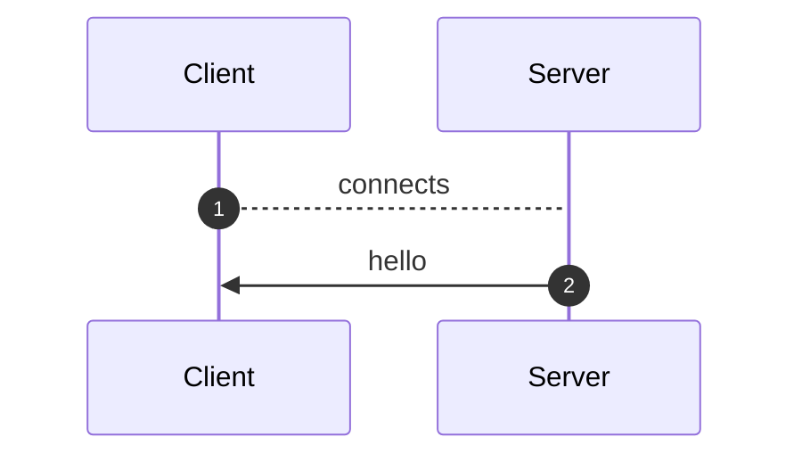
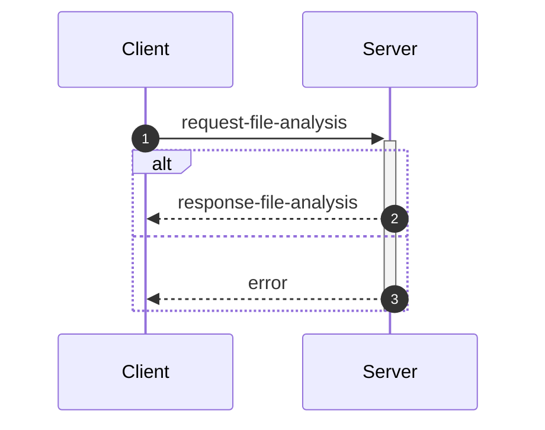
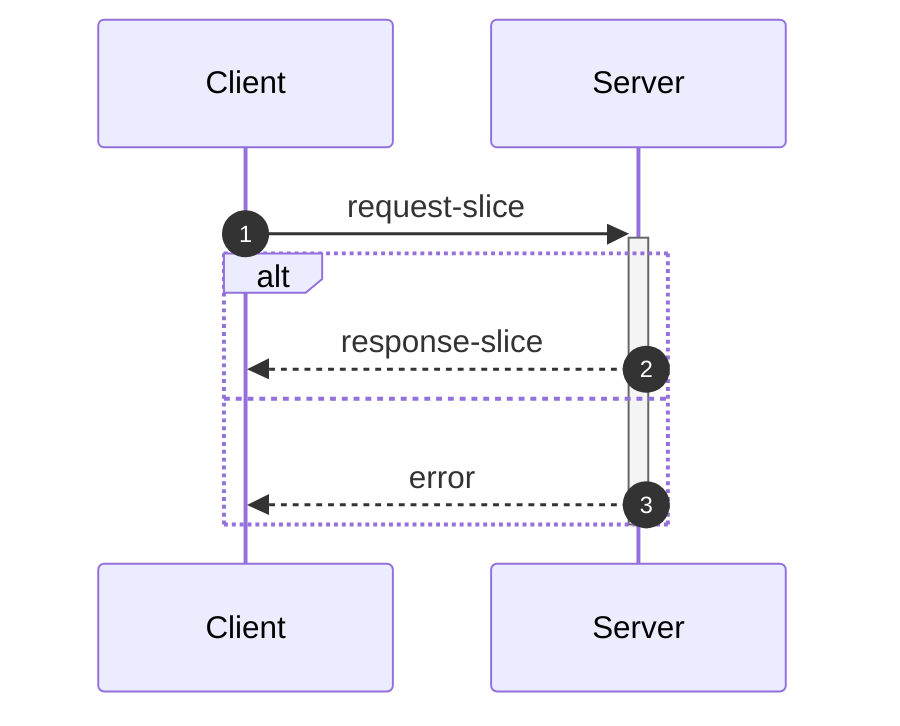
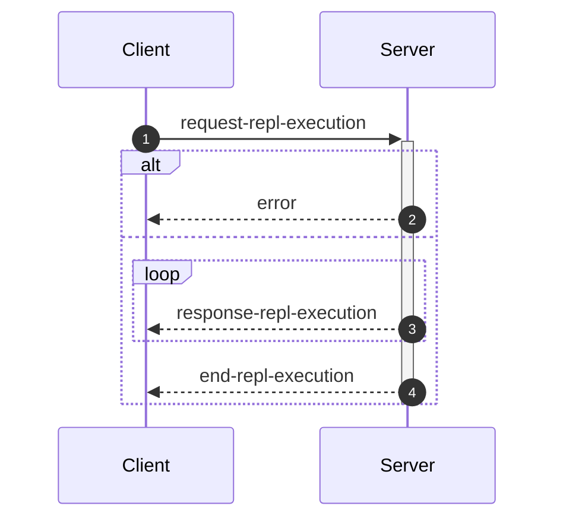

_This document was generated from '[src/documentation/wiki-interface.ts](https://github.com/flowr-analysis/flowr/tree/main//src/documentation/wiki-interface.ts)' on 2026-01-03, 16:58:44 UTC presenting an overview of flowR's interface (v2.7.6, using R v4.5.2). Please do not edit this file/wiki page directly._

Although far from being as detailed as the in-depth explanation of [_flowR_](https://github.com/flowr-analysis/flowr/wiki/core),
this wiki page explains how to interface with _flowR_ in more detail.
In general, command line arguments and other options provide short descriptions on hover over.

* [💻 Using the REPL](#using-the-repl)
* [💬 Communicating with the Server](#communicating-with-the-server)
* [⚙️ Configuring FlowR](#configuring-flowr)
* [⚒️ Writing Code](#writing-code)

<a id='using-the-repl'></a>
## 💻 Using the REPL


> [!NOTE]
> To execute arbitrary R commands with a repl request, _flowR_ has to be started explicitly with <span title="Description (Command Line Argument): Allow to access the underlying R session when using flowR (security warning: this allows the execution of arbitrary R code!)">`--r-session-access`</span>.
> Please be aware that this introduces a security risk and note that this relies on the [`r-shell` engine](https://github.com/flowr-analysis/flowr/wiki/engines) .

Although primarily meant for users to explore, 
there is nothing which forbids simply calling _flowR_ as a subprocess to use standard-in, -output, and -error 
for communication (although you can access the REPL using the server as well, 
with the [REPL Request](#message-request-repl-execution) message).

The read-eval-print loop&nbsp;(REPL) works relatively simple.
You can submit an expression (using <kbd>Enter</kbd>),
which is interpreted as an R&nbsp;expression by default but interpreted as a *command* if it starts with a colon (`:`).
The best command to get started with the REPL is <span title="Description (Repl Command): Show help information (aliases: :h, :?)">`:help`</span>.
Besides, you can leave the REPL either with the command <span title="Description (Repl Command): End the repl (aliases: :q, :exit)">`:quit`</span> or by pressing <kbd>Ctrl</kbd>+<kbd>C</kbd> twice.
When writing a *command*, you may press <kbd>Tab</kbd> to get a list of completions, if available.
Multiple commands can be entered in a single line by separating them with a semicolon (`;`), e.g. `:parse "x<-2"; :df*`.
If a command is given without R code, the REPL will re-use R code given in a previous command. 
The prior example will hence return first the parsed AST of the program and then the dataflow graph for `"x <- 2"`.

> [!NOTE]
> If you develop flowR, you may want to launch the repl using the `npm run main-dev` command, this way, you get a non-minified version of flowR with debug information and hot-reloading of source files.

<details>
<summary>Available Commands</summary>

We currently offer the following commands (this with a `[*]` suffix are available with and without the star):


| Command | Description |
| ------- | ----------- |
| **<span title="Description (Repl Command): End the repl (aliases: :q, :exit)">:quit</span>** | End the repl (aliases: **:<span title="Alias of ':quit'. End the repl">q</span>**, **:<span title="Alias of ':quit'. End the repl">exit</span>**) |
| **<span title="Description (Repl Command): Execute the given code as R code (essentially similar to using now command). This requires the `--r-session-access` flag to be set and requires the r-shell engine. (aliases: :e, :r)">:execute</span>** | Execute the given code as R code (essentially similar to using now command). This requires the `--r-session-access` flag to be set and requires the r-shell engine. (aliases: **:<span title="Alias of ':execute'. Execute the given code as R code (essentially similar to using now command). This requires the `--r-session-access` flag to be set and requires the r-shell engine.">e</span>**, **:<span title="Alias of ':execute'. Execute the given code as R code (essentially similar to using now command). This requires the `--r-session-access` flag to be set and requires the r-shell engine.">r</span>**) |
| **<span title="Description (Repl Command): Get mermaid code for the control-flow graph of R code, start with 'file://' to indicate a file (aliases: :cfg, :cf)">:controlflow[*]</span>** | Get mermaid code for the control-flow graph of R code, start with 'file://' to indicate a file (star: Returns the URL to mermaid.live) (aliases: **:<span title="Alias of ':controlflow'. Get mermaid code for the control-flow graph of R code, start with 'file://' to indicate a file">cfg</span>**, **:<span title="Alias of ':controlflow'. Get mermaid code for the control-flow graph of R code, start with 'file://' to indicate a file">cf</span>**) |
| **<span title="Description (Repl Command): Get mermaid code for the control-flow graph with basic blocks, start with 'file://' to indicate a file (aliases: :cfgb, :cfb)">:controlflowbb[*]</span>** | Get mermaid code for the control-flow graph with basic blocks, start with 'file://' to indicate a file (star: Returns the URL to mermaid.live) (aliases: **:<span title="Alias of ':controlflowbb'. Get mermaid code for the control-flow graph with basic blocks, start with 'file://' to indicate a file">cfgb</span>**, **:<span title="Alias of ':controlflowbb'. Get mermaid code for the control-flow graph with basic blocks, start with 'file://' to indicate a file">cfb</span>**) |
| **<span title="Description (Repl Command): Get mermaid code for the dataflow graph, start with 'file://' to indicate a file (aliases: :d, :df)">:dataflow[*]</span>** | Get mermaid code for the dataflow graph, start with 'file://' to indicate a file (star: Returns the URL to mermaid.live) (aliases: **:<span title="Alias of ':dataflow'. Get mermaid code for the dataflow graph, start with 'file://' to indicate a file">d</span>**, **:<span title="Alias of ':dataflow'. Get mermaid code for the dataflow graph, start with 'file://' to indicate a file">df</span>**) |
| **<span title="Description (Repl Command): Get mermaid code for the normalized AST of R code, start with 'file://' to indicate a file (aliases: :n)">:normalize[*]</span>** | Get mermaid code for the normalized AST of R code, start with 'file://' to indicate a file (star: Returns the URL to mermaid.live) (alias: **:<span title="Alias of ':normalize'. Get mermaid code for the normalized AST of R code, start with 'file://' to indicate a file">n</span>**) |
| **<span title="Description (Repl Command): Get mermaid code for the simplified dataflow graph, start with 'file://' to indicate a file (aliases: :ds, :dfs)">:dataflowsimple[*]</span>** | Get mermaid code for the simplified dataflow graph, start with 'file://' to indicate a file (star: Returns the URL to mermaid.live) (aliases: **:<span title="Alias of ':dataflowsimple'. Get mermaid code for the simplified dataflow graph, start with 'file://' to indicate a file">ds</span>**, **:<span title="Alias of ':dataflowsimple'. Get mermaid code for the simplified dataflow graph, start with 'file://' to indicate a file">dfs</span>**) |
| **<span title="Description (Repl Command): Just calculates the DFG, but only prints summary info (aliases: :d#, :df#)">:dataflowsilent</span>** | Just calculates the DFG, but only prints summary info (aliases: **:<span title="Alias of ':dataflowsilent'. Just calculates the DFG, but only prints summary info">d#</span>**, **:<span title="Alias of ':dataflowsilent'. Just calculates the DFG, but only prints summary info">df#</span>**) |
| **<span title="Description (Repl Command): Prints ASCII Art of the parsed, unmodified AST, start with 'file://' to indicate a file (aliases: :p)">:parse</span>** | Prints ASCII Art of the parsed, unmodified AST, start with 'file://' to indicate a file (alias: **:<span title="Alias of ':parse'. Prints ASCII Art of the parsed, unmodified AST, start with 'file://' to indicate a file">p</span>**) |
| **<span title="Description (Repl Command): Prints the version of flowR as well as the current version of R">:version</span>** | Prints the version of flowR as well as the current version of R
| **<span title="Description (Repl Command): Query the given R code, start with 'file://' to indicate a file. The query is to be a valid query in json format (use 'help' to get more information).">:query[*]</span>** | Query the given R code, start with 'file://' to indicate a file. The query is to be a valid query in json format (use 'help' to get more information). (star: Similar to query, but returns the output in json format.)
| **<span title="Description (Repl Command): Returns an ASCII representation of the dataflow graph (aliases: :df!)">:dataflowascii</span>** | Returns an ASCII representation of the dataflow graph (alias: **:<span title="Alias of ':dataflowascii'. Returns an ASCII representation of the dataflow graph">df!</span>**) |
| **<span title="Description (Repl Command): Show help information (aliases: :h, :?)">:help</span>** | Show help information (aliases: **:<span title="Alias of ':help'. Show help information">h</span>**, **:<span title="Alias of ':help'. Show help information">?</span>**) |


</details>


> [!TIP]
> 
> As indicated by the examples before, all REPL commands that operate on code keep track of the state.
> Hence, if you run a command like <span title="Description (Repl Command, starred version): Returns the URL to mermaid.live; Base Command: Get mermaid code for the dataflow graph, start with 'file://' to indicate a file (aliases: :d*, :df*)">`:dataflow*`</span> without providing R code,
> the REPL will re-use the R code provided in a previous command.
> Likewise, doing this will benefit from incrementality!
> If you request the dataflow graph with `:df* x <- 2 * y` and then want to see the parsed AST with `:parse`,
> the REPL will re-use previously obtained information and not re-parse the code again.
> 		


Generally, many commands offer shortcut versions in the REPL. Many queries, for example, offer a shortened format (see the example below).
Of special note, the [Config Query](https://github.com/flowr-analysis/flowr/wiki/query-api#Config-Query)
can be used to also modify the currently active configuration of _flowR_ within the REPL (see the [wiki page](https://github.com/flowr-analysis/flowr/wiki/query-api#Config-Query) for more information).

### Example: Retrieving the Dataflow Graph

To retrieve a URL to the [mermaid](https://mermaid.js.org/) diagram of the dataflow of a given expression, 
use <span title="Description (Repl Command, starred version): Returns the URL to mermaid.live; Base Command: Get mermaid code for the dataflow graph, start with 'file://' to indicate a file (aliases: :d*, :df*)">`:dataflow*`</span> (or <span title="Description (Repl Command): Get mermaid code for the dataflow graph, start with 'file://' to indicate a file (aliases: :d, :df)">`:dataflow`</span> to get the mermaid code in the cli):


```shell
$ docker run -it --rm eagleoutice/flowr # or npm run flowr 
flowR repl using flowR v2.7.6, R grammar v14 (tree-sitter engine)
R> :dataflow* y <- 1 + x
```

<details>
<summary style='color:gray'>Output</summary>


```text
https://mermaid.live/view#base64:eyJjb2RlIjoiZmxvd2NoYXJ0IEJUXG4gICAgMXt7XCJgIzkxO1JOdW1iZXIjOTM7IDFcbiAgICAgICgxKVxuICAgICAgKjEuNipgXCJ9fVxuICAgIDIoW1wiYCM5MTtSU3ltYm9sIzkzOyB4XG4gICAgICAoMilcbiAgICAgICoxLjEwKmBcIl0pXG4gICAgM1tbXCJgIzkxO1JCaW5hcnlPcCM5MzsgIzQzO1xuICAgICAgKDMpXG4gICAgICAqMS42LTEwKlxuICAgICgxLCAyKWBcIl1dXG4gICAgYnVpbHQtaW46X1tcImBCdWlsdC1JbjpcbiM0MztgXCJdXG4gICAgc3R5bGUgYnVpbHQtaW46XyBzdHJva2U6Z3JheSxmaWxsOmdyYXksc3Ryb2tlLXdpZHRoOjJweCxvcGFjaXR5Oi44O1xuICAgIDBbXCJgIzkxO1JTeW1ib2wjOTM7IHlcbiAgICAgICgwKVxuICAgICAgKjEuMSpgXCJdXG4gICAgNFtbXCJgIzkxO1JCaW5hcnlPcCM5MzsgIzYwOyM0NTtcbiAgICAgICg0KVxuICAgICAgKjEuMS0xMCpcbiAgICAoMCwgMylgXCJdXVxuICAgIGJ1aWx0LWluOl8tW1wiYEJ1aWx0LUluOlxuIzYwOyM0NTtgXCJdXG4gICAgc3R5bGUgYnVpbHQtaW46Xy0gc3Ryb2tlOmdyYXksZmlsbDpncmF5LHN0cm9rZS13aWR0aDoycHgsb3BhY2l0eTouODtcbiAgICAzIC0tPnxcInJlYWRzLCBhcmd1bWVudFwifCAxXG4gICAgMyAtLT58XCJyZWFkcywgYXJndW1lbnRcInwgMlxuICAgIDMgLS4tPnxcInJlYWRzLCBjYWxsc1wifCBidWlsdC1pbjpfXG4gICAgbGlua1N0eWxlIDIgc3Ryb2tlOmdyYXk7XG4gICAgMCAtLT58XCJkZWZpbmVkLWJ5XCJ8IDNcbiAgICAwIC0tPnxcImRlZmluZWQtYnlcInwgNFxuICAgIDQgLS0+fFwicmVhZHMsIGFyZ3VtZW50XCJ8IDNcbiAgICA0IC0tPnxcInJldHVybnMsIGFyZ3VtZW50XCJ8IDBcbiAgICA0IC0uLT58XCJyZWFkcywgY2FsbHNcInwgYnVpbHQtaW46Xy1cbiAgICBsaW5rU3R5bGUgNyBzdHJva2U6Z3JheTsiLCJtZXJtYWlkIjp7ImF1dG9TeW5jIjp0cnVlfX0=
Copied mermaid url to clipboard (dataflow: 0ms).
```


Retrieve the dataflow graph of the expression `y <- 1 + x`. It looks like this:


	
<details>

<summary style="color:gray">R Code of the Dataflow Graph</summary>

The analysis required _5.4 ms_ (including parse and normalize, using the [tree-sitter](https://github.com/flowr-analysis/flowr/wiki/Engines) engine) within the generation environment. 
We encountered no unknown side effects during the analysis.


```r
y <- 1 + x
```


</details>


</details>


For small graphs like this, <span title="Description (Repl Command): Returns an ASCII representation of the dataflow graph (aliases: :df!)">`:dataflowascii`</span> also provides an ASCII representation directly in the REPL:


```shell
$ docker run -it --rm eagleoutice/flowr # or npm run flowr 
flowR repl using flowR v2.7.6, R grammar v14 (tree-sitter engine)
R> :df! y <- 1 + x
```

<details open>
<summary style='color:gray'>Output</summary>


```text
                        0<1>0
                   ┌────| 1 |
    ┌────────┐     │    0---0
 c<4>c       └──c<3>c
 |<- |  v<0>v┌──| + |
 c---c──| y |┘  c---c   u<2>u
        v---v      └────| x |
                        u---u
Edges:
3 -> 1: reads, argument  3 -> 2: reads, argument
4 -> 3: reads, argument  4 -> 0: returns, argument
0 -> 3: defined-by       0 -> 4: defined-by
```


Retrieve the dataflow graph of the expression `y <- 1 + x` as ASCII art.

</details>


For the slicing with <span title="Description (Repl Command): Static backwards executable slicer for R">`:slicer`</span>, you have access to the same [magic comments](#slice-magic-comments) as with the [slice request](#message-request-slice).

### Example: Interfacing with the File System

Many commands that allow for an R-expression (like <span title="Description (Repl Command, starred version): Returns the URL to mermaid.live; Base Command: Get mermaid code for the dataflow graph, start with 'file://' to indicate a file (aliases: :d*, :df*)">`:dataflow*`</span>) allow for a file as well 
if the argument starts with `file://`. 
If you are working from the root directory of the _flowR_ repository, the following gives you the parsed AST of the example file using the <span title="Description (Repl Command): Prints ASCII Art of the parsed, unmodified AST, start with 'file://' to indicate a file (aliases: :p)">`:parse`</span> command:


```shell
$ docker run -it --rm eagleoutice/flowr # or npm run flowr 
flowR repl using flowR v2.7.6, R grammar v14 (tree-sitter engine)
R> :parse file://test/testfiles/example.R
```

<details>
<summary style='color:gray'>Output</summary>


```text
File: test/testfiles/example.R

program
├ binaryoperator
│ ├ identifier "sum" (1:1─4)
│ ├ <- "<-" (1:5─7)
│ ╰ float "0" (1:8─9)
├ binaryoperator
│ ├ identifier "product" (2:1─8)
│ ├ <- "<-" (2:9─11)
│ ╰ float "1" (2:12─13)
├ binaryoperator
│ ├ identifier "w" (3:1─2)
│ ├ <- "<-" (3:3─5)
│ ╰ float "7" (3:6─7)
├ binaryoperator
│ ├ identifier "N" (4:1─2)
│ ├ <- "<-" (4:3─5)
│ ╰ float "10" (4:6─8)
├ forstatement
│ ├ for "for" (6:1─4)
│ ├ ( "(" (6:5─6)
│ ├ identifier "i" (6:6─7)
│ ├ in "in" (6:8─10)
│ ├ binaryoperator
│ │ ├ float "1" (6:11─12)
│ │ ├ : ":" (6:12─13)
│ │ ╰ parenthesizedexpression
│ │   ├ ( "(" (6:13─14)
│ │   ├ binaryoperator
│ │   │ ├ identifier "N" (6:14─15)
│ │   │ ├ - "-" (6:15─16)
│ │   │ ╰ float "1" (6:16─17)
│ │   ╰ ) ")" (6:17─18)
│ ├ ) ")" (6:18─19)
│ ╰ bracedexpression
│   ├ { "{" (6:20─21)
│   ├ binaryoperator
│   │ ├ identifier "sum" (7:3─6)
│   │ ├ <- "<-" (7:7─9)
│   │ ╰ binaryoperator
│   │   ├ binaryoperator
│   │   │ ├ identifier "sum" (7:10─13)
│   │   │ ├ + "+" (7:14─15)
│   │   │ ╰ identifier "i" (7:16─17)
│   │   ├ + "+" (7:18─19)
│   │   ╰ identifier "w" (7:20─21)
│   ├ binaryoperator
│   │ ├ identifier "product" (8:3─10)
│   │ ├ <- "<-" (8:11─13)
│   │ ╰ binaryoperator
│   │   ├ identifier "product" (8:14─21)
│   │   ├  "" (8:22─23)
│   │   ╰ identifier "i" (8:24─25)
│   ╰ } "}" (9:1─2)
├ call
│ ├ identifier "cat" (11:1─4)
│ ╰ arguments
│   ├ ( "(" (11:4─5)
│   ├ argument
│   │ ╰ string
│   │   ├ " "\"" (11:5─6)
│   │   ├ stringcontent "Sum:" (11:6─10)
│   │   ╰ " "\"" (11:10─11)
│   ├ comma "," (11:11─12)
│   ├ argument
│   │ ╰ identifier "sum" (11:13─16)
│   ├ comma "," (11:16─17)
│   ├ argument
│   │ ╰ string
│   │   ├ " "\"" (11:18─19)
│   │   ├ stringcontent
│   │   │ ╰ escapesequence "\\n" (11:19─21)
│   │   ╰ " "\"" (11:21─22)
│   ╰ ) ")" (11:22─23)
╰ call
  ├ identifier "cat" (12:1─4)
  ╰ arguments
    ├ ( "(" (12:4─5)
    ├ argument
    │ ╰ string
    │   ├ " "\"" (12:5─6)
    │   ├ stringcontent "Product:" (12:6─14)
    │   ╰ " "\"" (12:14─15)
    ├ comma "," (12:15─16)
    ├ argument
    │ ╰ identifier "product" (12:17─24)
    ├ comma "," (12:24─25)
    ├ argument
    │ ╰ string
    │   ├ " "\"" (12:26─27)
    │   ├ stringcontent
    │   │ ╰ escapesequence "\\n" (12:27─29)
    │   ╰ " "\"" (12:29─30)
    ╰ ) ")" (12:30─31)
```


Retrieve the parsed AST of the example file.

<details>

<summary>File Content</summary>


```r
sum <- 0
product <- 1
w <- 7
N <- 10

for (i in 1:(N-1)) {
  sum <- sum + i + w
  product <- product * i
}

cat("Sum:", sum, "\n")
cat("Product:", product, "\n")
```


</details>

As _flowR_ directly transforms this AST the output focuses on being human-readable instead of being machine-readable. 
		

</details>


### Example: Run a Query

You can run any query supported by _flowR_ using the <span title="Description (Repl Command): Query the given R code, start with 'file://' to indicate a file. The query is to be a valid query in json format (use 'help' to get more information).">`:query`</span> command.
For example, to obtain the shapes of all data frames in a given piece of code, you can run:


```shell
$ docker run -it --rm eagleoutice/flowr # or npm run flowr 
flowR repl using flowR v2.7.6, R grammar v14 (tree-sitter engine)
R> :query @df-shape "x <- data.frame(a = 1:10, b = 1:10)\ny <- x$a"
```

<details open>
<summary style='color:gray'>Output</summary>


```text
Query: df-shape (2 ms)
   ╰ 12: (colnames: [{"a", "b"}, {}], cols: [2, 2], rows: [10, 10])
   ╰ 0: (colnames: [{"a", "b"}, {}], cols: [2, 2], rows: [10, 10])
All queries together required ≈4 ms (1ms accuracy, total 5 ms)
```


Retrieve the shapes of all data frames in the given code.

</details>


To run the linter on a file, you can use (in this example, we just issue the `dead-code` linter on a small piece of code):


```shell
$ docker run -it --rm eagleoutice/flowr # or npm run flowr 
flowR repl using flowR v2.7.6, R grammar v14 (tree-sitter engine)
R> :query @linter rules:dead-code "if(FALSE) x <- 2"
```

<details open>
<summary style='color:gray'>Output</summary>


```text
Query: linter (2 ms)
   ╰ Dead Code (dead-code):
       ╰ certain:
           ╰ Code at 1.11-16
       ╰ Metadata: consideredNodes: 7, searchTimeMs: 1, processTimeMs: 0
All queries together required ≈2 ms (1ms accuracy, total 2 ms)
```


Run the linter on the given code, with only the `dead-code` rule enabled.

</details>


For more information on the available queries, please check out the [Query API](https://github.com/flowr-analysis/flowr/wiki/query-api).


<a id='communicating-with-the-server'></a>
## 💬 Communicating with the Server


As explained in the [Overview](https://github.com/flowr-analysis/flowr/wiki/Overview), you can simply run the [TCP](https://de.wikipedia.org/wiki/Transmission_Control_Protocol)&nbsp;server by adding the <span title="Description (Command Line Argument): Do not drop into a repl, but instead start a server on the given port (default: 1042) and listen for messages.">`--server`</span> flag (and, due to the interactive mode, exit with the conventional <kbd>CTRL</kbd>+<kbd>C</kbd>).
Currently, every connection is handled by the same underlying `RShell` - so the server is not designed to handle many clients at a time.
Additionally, the server is not well guarded against attacks (e.g., you can theoretically spawn an arbitrary number of&nbsp;RShell sessions on the target machine).

Every message has to be given in a single line (i.e., without a newline in-between) and end with a newline character. Nevertheless, we will pretty-print example given in the following segments for the ease of reading.


> [!NOTE]
> 
> The default <span title="Description (Command Line Argument): Do not drop into a repl, but instead start a server on the given port (default: 1042) and listen for messages.">`--server`</span> uses a simple [TCP](https://de.wikipedia.org/wiki/Transmission_Control_Protocol)
> connection. If you want _flowR_ to expose a [WebSocket](https://de.wikipedia.org/wiki/WebSocket) server instead, add the <span title="Description (Command Line Argument): If the server flag is set, use websocket for messaging">`--ws`</span> flag (i.e., <span title="Description (Command Line Argument): Do not drop into a repl, but instead start a server on the given port (default: 1042) and listen for messages.">`--server`</span> <span title="Description (Command Line Argument): If the server flag is set, use websocket for messaging">`--ws`</span>) when starting _flowR_ from the command line.
> 			


<ul><li>
<a id="message-hello"></a>
<b>Hello</b> Message (<code>hello</code>) 
<details>

<summary style="color:gray"> View Details. <i>The server informs the client about the successful connection and provides Meta-Information.</i> </summary>




	
After launching _flowR_, for example, with <code>docker run -it --rm eagleoutice/flowr <span title="Description (Command Line Argument): Do not drop into a repl, but instead start a server on the given port (default: 1042) and listen for messages.">-<span/>-server</span></code>&nbsp;(🐳️), simply connecting should present you with a `hello` message, that amongst others should reveal the versions of&nbsp;_flowR_ and&nbsp;R, using the [semver 2.0](https://semver.org/spec/v2.0.0.html) versioning scheme.
The message looks like this:


```json
{
  "type": "hello",
  "clientName": "client-0",
  "versions": {
    "flowr": "2.7.6",
    "r": "4.5.2",
    "engine": "r-shell"
  }
}
```


There are currently a few messages that you can send after the hello message.
If you want to _slice_ a piece of R code you first have to send an [analysis request](#message-request-file-analysis), so that you can send one or multiple slice requests afterward.
Requests for the [REPL](#message-request-repl) are independent of that.
	

<hr>


<details>
<summary style="color:gray">Message schema (<code>hello</code>)</summary>

For the definition of the hello message, please see it's implementation at [`./src/cli/repl/server/messages/message-hello.ts`](https://github.com/flowr-analysis/flowr/tree/main/./src/cli/repl/server/messages/message-hello.ts).

- **.** object [required]
    - **type** string [required]
        _The type of the hello message._
        Allows only the values: 'hello'
    - **id** any [forbidden]
        _The id of the message is always undefined (as it is the initial message and not requested)._
    - **clientName** string [required]
        _A unique name that is assigned to each client. It has no semantic meaning and is only used/useful for debugging._
    - **versions** object [required]
        - **flowr** string [required]
            _The version of the flowr server running in semver format._
        - **r** string [required]
            _The version of the underlying R shell running in semver format._
        - **engine** string [required]
            _The parser backend that is used to parse the R code._

</details>


<hr>

</details>
	</li>

<li>
<a id="message-request-file-analysis"></a>
<b>Analysis</b> Message (<code>request-file-analysis</code>) 
<details>

<summary style="color:gray"> View Details. <i>The server builds the dataflow graph for a given input file (or a set of files).</i> </summary>




	
The request allows the server to analyze a file and prepare it for slicing.
The message can contain a `filetoken`, which is used to identify the file in later slice or query requests (if you do not add one, the request will not be stored and therefore, it is not available for subsequent requests).

> **Please note!**\
> If you want to send and process a lot of analysis requests, but do not want to slice them, please do not pass the `filetoken` field. This will save the server a lot of memory allocation.

Furthermore, the request must contain either a `content` field to directly pass the file's content or a `filepath` field which contains the path to the file (this path must be accessible for the server to be useful).
If you add the `id` field, the answer will use the same `id` so you can match requests and the corresponding answers.
See the implementation of the request-file-analysis message for more information.


<details>
<summary>Example of the <code>request-file-analysis</code> Message</summary>

_Note:_ even though we pretty-print these messages, they are sent as a single line, ending with a newline.

The following lists all messages that were sent and received in case you want to reproduce the scenario:

<ol>
<li> <code>hello</code> (response)
<details> 

<summary> Show Details </summary>

The first message is always a hello message.


```json
{
  "type": "hello",
  "clientName": "client-0",
  "versions": {
    "flowr": "2.7.6",
    "r": "4.5.2",
    "engine": "r-shell"
  }
}
```


</details>
</li>

<li> <b><code>request-file-analysis</code> (request)</b>
<details open> 

<summary> Show Details </summary>

Let's suppose you simply want to analyze the following script:
 
```r
x <- 1
x + 1
```

 For this, you can send the following request:


```json
{
  "type": "request-file-analysis",
  "id": "1",
  "filetoken": "x",
  "content": "x <- 1\nx + 1"
}
```


</details>
</li>

<li> <code>response-file-analysis</code> (response)
<details> 

<summary> Show Details </summary>


The `results` field of the response effectively contains three keys of importance:

- `parse`: which contains 1:1 the parse result in CSV format that we received from the `RShell` (i.e., the AST produced by the parser of the R interpreter).
- `normalize`: which contains the normalized AST, including ids (see the `info` field and the [Normalized AST](https://github.com/flowr-analysis/flowr/wiki/Normalized%20AST) wiki page).
- `dataflow`: especially important is the `graph` field which contains the dataflow graph as a set of root vertices (see the [Dataflow Graph](https://github.com/flowr-analysis/flowr/wiki/Dataflow%20Graph) wiki page).
			


_As the code is pretty long, we inhibit pretty printing and syntax highlighting (JSON, hiding built-in):_

```text
{"type":"response-file-analysis","format":"json","id":"1","results":{"parse":{"files":[{"parsed":"[1,1,1,6,7,0,\"expr\",false,\"x <- 1\"],[1,1,1,1,1,3,\"SYMBOL\",true,\"x\"],[1,1,1,1,3,7,\"expr\",false,\"x\"],[1,3,1,4,2,7,\"LEFT_ASSIGN\",true,\"<-\"],[1,6,1,6,4,5,\"NUM_CONST\",true,\"1\"],[1,6,1,6,5,7,\"expr\",false,\"1\"],[2,1,2,5,16,0,\"expr\",false,\"x + 1\"],[2,1,2,1,10,12,\"SYMBOL\",true,\"x\"],[2,1,2,1,12,16,\"expr\",false,\"x\"],[2,3,2,3,11,16,\"'+'\",true,\"+\"],[2,5,2,5,13,14,\"NUM_CONST\",true,\"1\"],[2,5,2,5,14,16,\"expr\",false,\"1\"]","filePath":"/tmp/tmp-513758-xs1Dwba2mmzc-.R"}],".meta":{"timing":3}},"normalize":{"ast":{"type":"RProject","files":[{"root":{"type":"RExpressionList","children":[{"type":"RBinaryOp","location":[1,3,1,4],"lhs":{"type":"RSymbol","location":[1,1,1,1],"content":"x","lexeme":"x","info":{"fullRange":[1,1,1,1],"additionalTokens":[],"id":0,"parent":2,"role":"binop-lhs","index":0,"nesting":0,"file":"/tmp/tmp-513758-xs1Dwba2mmzc-.R"}},"rhs":{"location":[1,6,1,6],"lexeme":"1","info":{"fullRange":[1,6,1,6],"additionalTokens":[],"id":1,"parent":2,"role":"binop-rhs","index":1,"nesting":0,"file":"/tmp/tmp-513758-xs1Dwba2mmzc-.R"},"type":"RNumber","content":{"num":1,"complexNumber":false,"markedAsInt":false}},"operator":"<-","lexeme":"<-","info":{"fullRange":[1,1,1,6],"additionalTokens":[],"id":2,"parent":6,"nesting":0,"file":"/tmp/tmp-513758-xs1Dwba2mmzc-.R","index":0,"role":"expr-list-child"}},{"type":"RBinaryOp","location":[2,3,2,3],"lhs":{"type":"RSymbol","location":[2,1,2,1],"content":"x","lexeme":"x","info":{"fullRange":[2,1,2,1],"additionalTokens":[],"id":3,"parent":5,"role":"binop-lhs","index":0,"nesting":0,"file":"/tmp/tmp-513758-xs1Dwba2mmzc-.R"}},"rhs":{"location":[2,5,2,5],"lexeme":"1","info":{"fullRange":[2,5,2,5],"additionalTokens":[],"id":4,"parent":5,"role":"binop-rhs","index":1,"nesting":0,"file":"/tmp/tmp-513758-xs1Dwba2mmzc-.R"},"type":"RNumber","content":{"num":1,"complexNumber":false,"markedAsInt":false}},"operator":"+","lexeme":"+","info":{"fullRange":[2,1,2,5],"additionalTokens":[],"id":5,"parent":6,"nesting":0,"file":"/tmp/tmp-513758-xs1Dwba2mmzc-.R","index":1,"role":"expr-list-child"}}],"info":{"additionalTokens":[],"id":6,"nesting":0,"file":"/tmp/tmp-513758-xs1Dwba2mmzc-.R","role":"root","index":0}},"filePath":"/tmp/tmp-513758-xs1Dwba2mmzc-.R"}],"info":{"id":7}},".meta":{"timing":2}},"dataflow":{"unknownReferences":[],"in":[{"nodeId":2,"name":"<-","type":2},{"nodeId":5,"name":"+","type":2}],"out":[{"nodeId":0,"name":"x","type":4,"definedAt":2,"value":[1]}],"environment":{"current":{"id":130,"parent":"<BuiltInEnvironment>","memory":[["x",[{"nodeId":0,"name":"x","type":4,"definedAt":2,"value":[1]}]]]},"level":0},"graph":{"rootVertices":[1,0,2,3,4,5],"vertexInformation":[[1,{"tag":"value","id":1}],[0,{"tag":"vdef","id":0}],[2,{"tag":"fcall","id":2,"name":"<-","onlyBuiltin":true,"args":[{"nodeId":0,"type":32},{"nodeId":1,"type":32}],"origin":["builtin:assignment"]}],[3,{"tag":"use","id":3}],[4,{"tag":"value","id":4}],[5,{"tag":"fcall","id":5,"name":"+","onlyBuiltin":true,"args":[{"nodeId":3,"type":32},{"nodeId":4,"type":32}],"origin":["builtin:default"]}]],"edgeInformation":[[2,[[1,{"types":65}],[0,{"types":72}],["built-in:<-",{"types":5}]]],[0,[[1,{"types":2}],[2,{"types":2}]]],[3,[[0,{"types":1}]]],[5,[[3,{"types":65}],[4,{"types":65}],["built-in:+",{"types":5}]]]],"_unknownSideEffects":[]},"entryPoint":2,"exitPoints":[{"type":0,"nodeId":5}],".meta":{"timing":0}}}}
```


</details>
</li>
</ol>

The complete round-trip took 7.5 ms (including time required to validate the messages, start, and stop the internal mock server).

</details>


You receive an error if, for whatever reason, the analysis fails (e.g., the message or code you sent contained syntax errors).
It contains a human-readable description *why* the analysis failed (see the error message implementation for more details).


<details>
<summary>Example Error Message</summary>

_Note:_ even though we pretty-print these messages, they are sent as a single line, ending with a newline.

The following lists all messages that were sent and received in case you want to reproduce the scenario:

<ol>
<li> <code>hello</code> (response)
<details> 

<summary> Show Details </summary>

The first message is always a hello message.


```json
{
  "type": "hello",
  "clientName": "client-0",
  "versions": {
    "flowr": "2.7.6",
    "r": "4.5.2",
    "engine": "r-shell"
  }
}
```


</details>
</li>

<li> <code>request-file-analysis</code> (request)
<details> 

<summary> Show Details </summary>


```json
{
  "type": "request-file-analysis",
  "id": "1",
  "filename": "sample.R",
  "content": "x <-"
}
```


</details>
</li>

<li> <b><code>error</code> (response)</b>
<details open> 

<summary> Show Details </summary>


```json
{
  "id": "1",
  "type": "error",
  "fatal": false,
  "reason": "Error while analyzing file sample.R: GuardError: unable to parse R code (see the log for more information) for request {\"request\":\"text\",\"content\":\"x <-\"}}\n Report a Bug: https://github.com/flowr-analysis/flowr/issues/new?body=%3C!%2D%2D%20Please%20describe%20your%20issue%20in%20more%20detail%20below!%20%2D%2D%3E%0A%0A%0A%3C!%2D%2D%20Automatically%20generated%20issue%20metadata%2C%20please%20do%20not%20edit%20or%20delete%20content%20below%20this%20line%20%2D%2D%3E%0A%2D%2D%2D%0A%0AflowR%20version%3A%202.7.6%0Anode%20version%3A%20v22.14.0%0Anode%20arch%3A%20x64%0Anode%20platform%3A%20linux%0Amessage%3A%20%60unable%20to%20parse%20R%20code%20%28see%20the%20log%20for%20more%20information%29%20for%20request%20%7B%22request%22%3A%22text%22%2C%22content%22%3A%22x%20%3C%2D%22%7D%7D%60%0Astack%20trace%3A%0A%60%60%60%0A%20%20%20%20at%20guard%20%28%3C%3E%2Fsrc%2Futil%2Fassert.ts%3A128%3A9%29%0A%20%20%20%20at%20guardRetrievedOutput%20%28%3C%3E%2Fsrc%2Fr%2Dbridge%2Fretriever.ts%3A221%3A7%29%0A%20%20%20%20at%20%2Fhome%2Fostwind%2Fgit%2Fphd%2Fflowr%2Dfield%2Fflowr%2Fsrc%2Fr%2Dbridge%2Fretriever.ts%3A182%3A4%0A%20%20%20%20at%20processTicksAndRejections%20%28node%3Ainternal%2Fprocess%2Ftask_queues%3A105%3A5%29%0A%20%20%20%20at%20async%20Object.parseRequests%20%5Bas%20processor%5D%20%28%3C%3E%2Fsrc%2Fr%2Dbridge%2Fparser.ts%3A104%3A19%29%0A%20%20%20%20at%20async%20PipelineExecutor.nextStep%20%28%3C%3E%2Fsrc%2Fcore%2Fpipeline%2Dexecutor.ts%3A192%3A25%29%0A%20%20%20%20at%20async%20FlowrAnalyzerCache.runTapeUntil%20%28%3C%3E%2Fsrc%2Fproject%2Fcache%2Fflowr%2Danalyzer%2Dcache.ts%3A93%3A4%29%0A%20%20%20%20at%20async%20FlowRServerConnection.sendFileAnalysisResponse%20%28%3C%3E%2Fsrc%2Fcli%2Frepl%2Fserver%2Fconnection.ts%3A163%3A52%29%0A%60%60%60%0A%0A%2D%2D%2D%0A%09"
}
```


</details>
</li>
</ol>

The complete round-trip took 3.9 ms (including time required to validate the messages, start, and stop the internal mock server).

</details>


&nbsp;

<a id="analysis-include-cfg"></a>
**Including the Control Flow Graph**

While _flowR_ does (for the time being) not use an explicit control flow graph but instead relies on control-dependency edges within the dataflow graph, 
the respective structure can still be exposed using the server (note that, as this feature is not needed within _flowR_, it is tested significantly less - 
so please create a [new issue](https://github.com/flowr-analysis/flowr/issues/new/choose) for any bug you may encounter).
For this, the analysis request may add `cfg: true` to its list of options.


<details>
<summary>Requesting a Control Flow Graph</summary>

_Note:_ even though we pretty-print these messages, they are sent as a single line, ending with a newline.

The following lists all messages that were sent and received in case you want to reproduce the scenario:

<ol>
<li> <code>hello</code> (response)
<details> 

<summary> Show Details </summary>

The first message is always a hello message.


```json
{
  "type": "hello",
  "clientName": "client-0",
  "versions": {
    "flowr": "2.7.6",
    "r": "4.5.2",
    "engine": "r-shell"
  }
}
```


</details>
</li>

<li> <b><code>request-file-analysis</code> (request)</b>
<details open> 

<summary> Show Details </summary>


```json
{
  "type": "request-file-analysis",
  "id": "1",
  "filetoken": "x",
  "content": "if(unknown > 0) { x <- 2 } else { x <- 5 }\nfor(i in 1:x) { print(x); print(i) }",
  "cfg": true
}
```


</details>
</li>

<li> <code>response-file-analysis</code> (response)
<details> 

<summary> Show Details </summary>


The response looks basically the same as a response sent without the `cfg` flag. However, additionally it contains a `cfg` field. 
If you are interested in a visual representation of the control flow graph, see the 
[visualization with mermaid](https://mermaid.live/view#base64:eyJjb2RlIjoiZmxvd2NoYXJ0IEJUXG4gICAgbjMyKFtcImBSRXhwcmVzc2lvbkxpc3QgKDMyKWBcIl0pXG4gICAgbjE1W1wiYFJJZlRoZW5FbHNlICgxNSlcbiMzNDtpZih1bmtub3duICM2MjsgMCkgIzEyMzsgeCAjNjA7IzQ1OyAyICMxMjU7IGVsc2UgIzEyMzsgeCAjNjA7IzQ1OyA1ICMxMjU7IzM0O2BcIl1cbiAgICBuMTUtZXhpdCgoMTUtZXhpdCkpXG4gICAgbjAoW1wiYFJTeW1ib2wgKDApXG4jMzQ7dW5rbm93biMzNDtgXCJdKVxuICAgIG4xKFtcImBSTnVtYmVyICgxKVxuIzM0OzAjMzQ7YFwiXSlcbiAgICBuMihbXCJgUkJpbmFyeU9wICgyKVxuIzM0O3Vua25vd24gIzYyOyAwIzM0O2BcIl0pXG4gICAgbjItZXhpdCgoMi1leGl0KSlcbiAgICBuOChbXCJgUkV4cHJlc3Npb25MaXN0ICg4KWBcIl0pXG4gICAgbjUoW1wiYFJTeW1ib2wgKDUpXG4jMzQ7eCMzNDtgXCJdKVxuICAgIG42KFtcImBSTnVtYmVyICg2KVxuIzM0OzIjMzQ7YFwiXSlcbiAgICBuNyhbXCJgUkJpbmFyeU9wICg3KVxuIzM0O3ggIzYwOyM0NTsgMiMzNDtgXCJdKVxuICAgIG43LWV4aXQoKDctZXhpdCkpXG4gICAgbjgtZXhpdCgoOC1leGl0KSlcbiAgICBuMTQoW1wiYFJFeHByZXNzaW9uTGlzdCAoMTQpYFwiXSlcbiAgICBuMTEoW1wiYFJTeW1ib2wgKDExKVxuIzM0O3gjMzQ7YFwiXSlcbiAgICBuMTIoW1wiYFJOdW1iZXIgKDEyKVxuIzM0OzUjMzQ7YFwiXSlcbiAgICBuMTMoW1wiYFJCaW5hcnlPcCAoMTMpXG4jMzQ7eCAjNjA7IzQ1OyA1IzM0O2BcIl0pXG4gICAgbjEzLWV4aXQoKDEzLWV4aXQpKVxuICAgIG4xNC1leGl0KCgxNC1leGl0KSlcbiAgICBuMTYoW1wiYFJTeW1ib2wgKDE2KVxuIzM0O2kjMzQ7YFwiXSlcbiAgICBuMzFbXCJgUkZvckxvb3AgKDMxKVxuIzM0O2ZvcihpIGluIDEjNTg7eCkgIzEyMzsgcHJpbnQoeCk7IHByaW50KGkpICMxMjU7IzM0O2BcIl1cbiAgICBuMTcoW1wiYFJOdW1iZXIgKDE3KVxuIzM0OzEjMzQ7YFwiXSlcbiAgICBuMTgoW1wiYFJTeW1ib2wgKDE4KVxuIzM0O3gjMzQ7YFwiXSlcbiAgICBuMTkoW1wiYFJCaW5hcnlPcCAoMTkpXG4jMzQ7MSM1ODt4IzM0O2BcIl0pXG4gICAgbjE5LWV4aXQoKDE5LWV4aXQpKVxuICAgIG4zMChbXCJgUkV4cHJlc3Npb25MaXN0ICgzMClgXCJdKVxuICAgIG4yMihbXCJgUlN5bWJvbCAoMjIpXG4jMzQ7cHJpbnQoeCkjMzQ7YFwiXSlcbiAgICBuMjVbXCJgUkZ1bmN0aW9uQ2FsbCAoMjUpXG4jMzQ7cHJpbnQoeCkjMzQ7YFwiXVxuICAgIG4yNS1leGl0KCgyNS1leGl0KSlcbiAgICBuMjQoW1wiYFJBcmd1bWVudCAoMjQpXG4jMzQ7eCMzNDtgXCJdKVxuICAgIG4yMyhbXCJgUlN5bWJvbCAoMjMpXG4jMzQ7eCMzNDtgXCJdKVxuICAgIG4yNC1leGl0KCgyNC1leGl0KSlcbiAgICBuMjYoW1wiYFJTeW1ib2wgKDI2KVxuIzM0O3ByaW50KGkpIzM0O2BcIl0pXG4gICAgbjI5W1wiYFJGdW5jdGlvbkNhbGwgKDI5KVxuIzM0O3ByaW50KGkpIzM0O2BcIl1cbiAgICBuMjktZXhpdCgoMjktZXhpdCkpXG4gICAgbjI4KFtcImBSQXJndW1lbnQgKDI4KVxuIzM0O2kjMzQ7YFwiXSlcbiAgICBuMjcoW1wiYFJTeW1ib2wgKDI3KVxuIzM0O2kjMzQ7YFwiXSlcbiAgICBuMjgtZXhpdCgoMjgtZXhpdCkpXG4gICAgbjMwLWV4aXQoKDMwLWV4aXQpKVxuICAgIG4zMS1leGl0KCgzMS1leGl0KSlcbiAgICBuMzItZXhpdCgoMzItZXhpdCkpXG4gICAgbjE1IC0uLT58XCJGRFwifCBuMzJcbiAgICBuMSAtLi0+fFwiRkRcInwgbjBcbiAgICBuMCAtLi0+fFwiRkRcInwgbjJcbiAgICBuMi1leGl0IC0uLT58XCJGRFwifCBuMVxuICAgIG43IC0uLT58XCJGRFwifCBuOFxuICAgIG42IC0uLT58XCJGRFwifCBuNVxuICAgIG41IC0uLT58XCJGRFwifCBuN1xuICAgIG43LWV4aXQgLS4tPnxcIkZEXCJ8IG42XG4gICAgbjgtZXhpdCAtLi0+fFwiRkRcInwgbjctZXhpdFxuICAgIG4xMyAtLi0+fFwiRkRcInwgbjE0XG4gICAgbjEyIC0uLT58XCJGRFwifCBuMTFcbiAgICBuMTEgLS4tPnxcIkZEXCJ8IG4xM1xuICAgIG4xMy1leGl0IC0uLT58XCJGRFwifCBuMTJcbiAgICBuMTQtZXhpdCAtLi0+fFwiRkRcInwgbjEzLWV4aXRcbiAgICBuOCAtLT58XCJDRCAoVFJVRSlcInwgbjItZXhpdFxuICAgIG4xNCAtLT58XCJDRCAoRkFMU0UpXCJ8IG4yLWV4aXRcbiAgICBuMiAtLi0+fFwiRkRcInwgbjE1XG4gICAgbjE1LWV4aXQgLS4tPnxcIkZEXCJ8IG44LWV4aXRcbiAgICBuMTUtZXhpdCAtLi0+fFwiRkRcInwgbjE0LWV4aXRcbiAgICBuMzEgLS4tPnxcIkZEXCJ8IG4xNS1leGl0XG4gICAgbjMxIC0uLT58XCJGRFwifCBuMzAtZXhpdFxuICAgIG4xOCAtLi0+fFwiRkRcInwgbjE3XG4gICAgbjE3IC0uLT58XCJGRFwifCBuMTlcbiAgICBuMTktZXhpdCAtLi0+fFwiRkRcInwgbjE4XG4gICAgbjI1IC0uLT58XCJGRFwifCBuMzBcbiAgICBuMjIgLS4tPnxcIkZEXCJ8IG4yNVxuICAgIG4yMyAtLi0+fFwiRkRcInwgbjI0XG4gICAgbjI0LWV4aXQgLS4tPnxcIkZEXCJ8IG4yM1xuICAgIG4yNCAtLi0+fFwiRkRcInwgbjIyXG4gICAgbjI1LWV4aXQgLS4tPnxcIkZEXCJ8IG4yNC1leGl0XG4gICAgbjI5IC0uLT58XCJGRFwifCBuMjUtZXhpdFxuICAgIG4yNiAtLi0+fFwiRkRcInwgbjI5XG4gICAgbjI3IC0uLT58XCJGRFwifCBuMjhcbiAgICBuMjgtZXhpdCAtLi0+fFwiRkRcInwgbjI3XG4gICAgbjI4IC0uLT58XCJGRFwifCBuMjZcbiAgICBuMjktZXhpdCAtLi0+fFwiRkRcInwgbjI4LWV4aXRcbiAgICBuMzAtZXhpdCAtLi0+fFwiRkRcInwgbjI5LWV4aXRcbiAgICBuMTkgLS4tPnxcIkZEXCJ8IG4zMVxuICAgIG4xNiAtLi0+fFwiRkRcInwgbjE5LWV4aXRcbiAgICBuMzAgLS0+fFwiQ0QgKFRSVUUpXCJ8IG4xNlxuICAgIG4zMS1leGl0IC0tPnxcIkNEIChGQUxTRSlcInwgbjE2XG4gICAgbjMyLWV4aXQgLS4tPnxcIkZEXCJ8IG4zMS1leGl0XG4gICAgc3R5bGUgbjMyIHN0cm9rZTpjeWFuLHN0cm9rZS13aWR0aDo2LjVweDsgICAgc3R5bGUgbjMyLWV4aXQgc3Ryb2tlOmdyZWVuLHN0cm9rZS13aWR0aDo2LjVweDsiLCJtZXJtYWlkIjp7ImF1dG9TeW5jIjp0cnVlfX0=).
			


_As the code is pretty long, we inhibit pretty printing and syntax highlighting (JSON, hiding built-in):_

```text
{"type":"response-file-analysis","format":"json","id":"1","cfg":{"returns":[],"entryPoints":[32],"exitPoints":["32-exit"],"breaks":[],"nexts":[],"graph":{"rootVertices":[32,15,"15-exit",0,1,2,"2-exit",8,5,6,7,"7-exit","8-exit",14,11,12,13,"13-exit","14-exit",16,31,17,18,19,"19-exit",30,22,25,"25-exit",24,23,"24-exit",26,29,"29-exit",28,27,"28-exit","30-exit","31-exit","32-exit"],"vertexInformation":[[32,{"id":32,"type":"expr","end":["32-exit"]}],[15,{"id":15,"type":"stm","mid":["2-exit"],"end":["15-exit"]}],["15-exit",{"id":"15-exit","type":"end","root":15}],[0,{"id":0,"type":"expr"}],[1,{"id":1,"type":"expr"}],[2,{"id":2,"type":"expr","end":["2-exit"]}],["2-exit",{"id":"2-exit","type":"end","root":2}],[8,{"id":8,"type":"expr","end":["8-exit"]}],[5,{"id":5,"type":"expr"}],[6,{"id":6,"type":"expr"}],[7,{"id":7,"type":"expr","end":["7-exit"]}],["7-exit",{"id":"7-exit","type":"end","root":7}],["8-exit",{"id":"8-exit","type":"end","root":8}],[14,{"id":14,"type":"expr","end":["14-exit"]}],[11,{"id":11,"type":"expr"}],[12,{"id":12,"type":"expr"}],[13,{"id":13,"type":"expr","end":["13-exit"]}],["13-exit",{"id":"13-exit","type":"end","root":13}],["14-exit",{"id":"14-exit","type":"end","root":14}],[16,{"id":16,"type":"expr"}],[31,{"id":31,"type":"stm","end":["31-exit"],"mid":[16]}],[17,{"id":17,"type":"expr"}],[18,{"id":18,"type":"expr"}],[19,{"id":19,"type":"expr","end":["19-exit"]}],["19-exit",{"id":"19-exit","type":"end","root":19}],[30,{"id":30,"type":"expr","end":["30-exit"]}],[22,{"id":22,"type":"expr"}],[25,{"id":25,"type":"stm","mid":[22],"end":["25-exit"]}],["25-exit",{"id":"25-exit","type":"end","root":25}],[24,{"id":24,"type":"expr","mid":[24],"end":["24-exit"]}],[23,{"id":23,"type":"expr"}],["24-exit",{"id":"24-exit","type":"end","root":24}],[26,{"id":26,"type":"expr"}],[29,{"id":29,"type":"stm","mid":[26],"end":["29-exit"]}],["29-exit",{"id":"29-exit","type":"end","root":29}],[28,{"id":28,"type":"expr","mid":[28],"end":["28-exit"]}],[27,{"id":27,"type":"expr"}],["28-exit",{"id":"28-exit","type":"end","root":28}],["30-exit",{"id":"30-exit","type":"end","root":30}],["31-exit",{"id":"31-exit","type":"end","root":31}],["32-exit",{"id":"32-exit","type":"end","root":32}]],"bbChildren":[],"edgeInformation":[[15,[[32,{"label":0}]]],[1,[[0,{"label":0}]]],[0,[[2,{"label":0}]]],["2-exit",[[1,{"label":0}]]],[7,[[8,{"label":0}]]],[6,[[5,{"label":0}]]],[5,[[7,{"label":0}]]],["7-exit",[[6,{"label":0}]]],["8-exit",[["7-exit",{"label":0}]]],[13,[[14,{"label":0}]]],[12,[[11,{"label":0}]]],[11,[[13,{"label":0}]]],["13-exit",[[12,{"label":0}]]],["14-exit",[["13-exit",{"label":0}]]],[8,[["2-exit",{"label":1,"when":"TRUE","caused":15}]]],[14,[["2-exit",{"label":1,"when":"FALSE","caused":15}]]],[2,[[15,{"label":0}]]],["15-exit",[["8-exit",{"label":0}],["14-exit",{"label":0}]]],[31,[["15-exit",{"label":0}],["30-exit",{"label":0}]]],[18,[[17,{"label":0}]]],[17,[[19,{"label":0}]]],["19-exit",[[18,{"label":0}]]],[25,[[30,{"label":0}]]],[22,[[25,{"label":0}]]],[23,[[24,{"label":0}]]],["24-exit",[[23,{"label":0}]]],[24,[[22,{"label":0}]]],["25-exit",[["24-exit",{"label":0}]]],[29,[["25-exit",{"label":0}]]],[26,[[29,{"label":0}]]],[27,[[28,{"label":0}]]],["28-exit",[[27,{"label":0}]]],[28,[[26,{"label":0}]]],["29-exit",[["28-exit",{"label":0}]]],["30-exit",[["29-exit",{"label":0}]]],[19,[[31,{"label":0}]]],[16,[["19-exit",{"label":0}]]],[30,[[16,{"label":1,"when":"TRUE","caused":31}]]],["31-exit",[[16,{"label":1,"when":"FALSE","caused":31}]]],["32-exit",[["31-exit",{"label":0}]]]],"_mayHaveBasicBlocks":false}},"results":{"parse":{"files":[{"parsed":"[1,1,1,42,38,0,\"expr\",false,\"if(unknown > 0) { x <- 2 } else { x <- 5 }\"],[1,1,1,2,1,38,\"IF\",true,\"if\"],[1,3,1,3,2,38,\"'('\",true,\"(\"],[1,4,1,14,9,38,\"expr\",false,\"unknown > 0\"],[1,4,1,10,3,5,\"SYMBOL\",true,\"unknown\"],[1,4,1,10,5,9,\"expr\",false,\"unknown\"],[1,12,1,12,4,9,\"GT\",true,\">\"],[1,14,1,14,6,7,\"NUM_CONST\",true,\"0\"],[1,14,1,14,7,9,\"expr\",false,\"0\"],[1,15,1,15,8,38,\"')'\",true,\")\"],[1,17,1,26,22,38,\"expr\",false,\"{ x <- 2 }\"],[1,17,1,17,12,22,\"'{'\",true,\"{\"],[1,19,1,24,19,22,\"expr\",false,\"x <- 2\"],[1,19,1,19,13,15,\"SYMBOL\",true,\"x\"],[1,19,1,19,15,19,\"expr\",false,\"x\"],[1,21,1,22,14,19,\"LEFT_ASSIGN\",true,\"<-\"],[1,24,1,24,16,17,\"NUM_CONST\",true,\"2\"],[1,24,1,24,17,19,\"expr\",false,\"2\"],[1,26,1,26,18,22,\"'}'\",true,\"}\"],[1,28,1,31,23,38,\"ELSE\",true,\"else\"],[1,33,1,42,35,38,\"expr\",false,\"{ x <- 5 }\"],[1,33,1,33,25,35,\"'{'\",true,\"{\"],[1,35,1,40,32,35,\"expr\",false,\"x <- 5\"],[1,35,1,35,26,28,\"SYMBOL\",true,\"x\"],[1,35,1,35,28,32,\"expr\",false,\"x\"],[1,37,1,38,27,32,\"LEFT_ASSIGN\",true,\"<-\"],[1,40,1,40,29,30,\"NUM_CONST\",true,\"5\"],[1,40,1,40,30,32,\"expr\",false,\"5\"],[1,42,1,42,31,35,\"'}'\",true,\"}\"],[2,1,2,36,84,0,\"expr\",false,\"for(i in 1:x) { print(x); print(i) }\"],[2,1,2,3,41,84,\"FOR\",true,\"for\"],[2,4,2,13,53,84,\"forcond\",false,\"(i in 1:x)\"],[2,4,2,4,42,53,\"'('\",true,\"(\"],[2,5,2,5,43,53,\"SYMBOL\",true,\"i\"],[2,7,2,8,44,53,\"IN\",true,\"in\"],[2,10,2,12,51,53,\"expr\",false,\"1:x\"],[2,10,2,10,45,46,\"NUM_CONST\",true,\"1\"],[2,10,2,10,46,51,\"expr\",false,\"1\"],[2,11,2,11,47,51,\"':'\",true,\":\"],[2,12,2,12,48,50,\"SYMBOL\",true,\"x\"],[2,12,2,12,50,51,\"expr\",false,\"x\"],[2,13,2,13,49,53,\"')'\",true,\")\"],[2,15,2,36,81,84,\"expr\",false,\"{ print(x); print(i) }\"],[2,15,2,15,54,81,\"'{'\",true,\"{\"],[2,17,2,24,64,81,\"expr\",false,\"print(x)\"],[2,17,2,21,55,57,\"SYMBOL_FUNCTION_CALL\",true,\"print\"],[2,17,2,21,57,64,\"expr\",false,\"print\"],[2,22,2,22,56,64,\"'('\",true,\"(\"],[2,23,2,23,58,60,\"SYMBOL\",true,\"x\"],[2,23,2,23,60,64,\"expr\",false,\"x\"],[2,24,2,24,59,64,\"')'\",true,\")\"],[2,25,2,25,65,81,\"';'\",true,\";\"],[2,27,2,34,77,81,\"expr\",false,\"print(i)\"],[2,27,2,31,68,70,\"SYMBOL_FUNCTION_CALL\",true,\"print\"],[2,27,2,31,70,77,\"expr\",false,\"print\"],[2,32,2,32,69,77,\"'('\",true,\"(\"],[2,33,2,33,71,73,\"SYMBOL\",true,\"i\"],[2,33,2,33,73,77,\"expr\",false,\"i\"],[2,34,2,34,72,77,\"')'\",true,\")\"],[2,36,2,36,78,81,\"'}'\",true,\"}\"]","filePath":"/tmp/tmp-513758-T4ZXLGAF4Nl2-.R"}],".meta":{"timing":1}},"normalize":{"ast":{"type":"RProject","files":[{"root":{"type":"RExpressionList","children":[{"type":"RIfThenElse","condition":{"type":"RBinaryOp","location":[1,12,1,12],"lhs":{"type":"RSymbol","location":[1,4,1,10],"content":"unknown","lexeme":"unknown","info":{"fullRange":[1,4,1,10],"additionalTokens":[],"id":0,"parent":2,"role":"binop-lhs","index":0,"nesting":1,"file":"/tmp/tmp-513758-T4ZXLGAF4Nl2-.R"}},"rhs":{"location":[1,14,1,14],"lexeme":"0","info":{"fullRange":[1,14,1,14],"additionalTokens":[],"id":1,"parent":2,"role":"binop-rhs","index":1,"nesting":1,"file":"/tmp/tmp-513758-T4ZXLGAF4Nl2-.R"},"type":"RNumber","content":{"num":0,"complexNumber":false,"markedAsInt":false}},"operator":">","lexeme":">","info":{"fullRange":[1,4,1,14],"additionalTokens":[],"id":2,"parent":15,"nesting":1,"file":"/tmp/tmp-513758-T4ZXLGAF4Nl2-.R","role":"if-cond"}},"then":{"type":"RExpressionList","children":[{"type":"RBinaryOp","location":[1,21,1,22],"lhs":{"type":"RSymbol","location":[1,19,1,19],"content":"x","lexeme":"x","info":{"fullRange":[1,19,1,19],"additionalTokens":[],"id":5,"parent":7,"role":"binop-lhs","index":0,"nesting":1,"file":"/tmp/tmp-513758-T4ZXLGAF4Nl2-.R"}},"rhs":{"location":[1,24,1,24],"lexeme":"2","info":{"fullRange":[1,24,1,24],"additionalTokens":[],"id":6,"parent":7,"role":"binop-rhs","index":1,"nesting":1,"file":"/tmp/tmp-513758-T4ZXLGAF4Nl2-.R"},"type":"RNumber","content":{"num":2,"complexNumber":false,"markedAsInt":false}},"operator":"<-","lexeme":"<-","info":{"fullRange":[1,19,1,24],"additionalTokens":[],"id":7,"parent":8,"nesting":1,"file":"/tmp/tmp-513758-T4ZXLGAF4Nl2-.R","index":0,"role":"expr-list-child"}}],"grouping":[{"type":"RSymbol","location":[1,17,1,17],"content":"{","lexeme":"{","info":{"fullRange":[1,17,1,26],"additionalTokens":[],"id":3,"role":"root","index":0,"nesting":1,"file":"/tmp/tmp-513758-T4ZXLGAF4Nl2-.R"}},{"type":"RSymbol","location":[1,26,1,26],"content":"}","lexeme":"}","info":{"fullRange":[1,17,1,26],"additionalTokens":[],"id":4,"role":"root","index":0,"nesting":1,"file":"/tmp/tmp-513758-T4ZXLGAF4Nl2-.R"}}],"info":{"additionalTokens":[],"id":8,"parent":15,"nesting":1,"file":"/tmp/tmp-513758-T4ZXLGAF4Nl2-.R","index":1,"role":"if-then"}},"location":[1,1,1,2],"lexeme":"if","info":{"fullRange":[1,1,1,42],"additionalTokens":[],"id":15,"parent":32,"nesting":1,"file":"/tmp/tmp-513758-T4ZXLGAF4Nl2-.R","index":0,"role":"expr-list-child"},"otherwise":{"type":"RExpressionList","children":[{"type":"RBinaryOp","location":[1,37,1,38],"lhs":{"type":"RSymbol","location":[1,35,1,35],"content":"x","lexeme":"x","info":{"fullRange":[1,35,1,35],"additionalTokens":[],"id":11,"parent":13,"role":"binop-lhs","index":0,"nesting":1,"file":"/tmp/tmp-513758-T4ZXLGAF4Nl2-.R"}},"rhs":{"location":[1,40,1,40],"lexeme":"5","info":{"fullRange":[1,40,1,40],"additionalTokens":[],"id":12,"parent":13,"role":"binop-rhs","index":1,"nesting":1,"file":"/tmp/tmp-513758-T4ZXLGAF4Nl2-.R"},"type":"RNumber","content":{"num":5,"complexNumber":false,"markedAsInt":false}},"operator":"<-","lexeme":"<-","info":{"fullRange":[1,35,1,40],"additionalTokens":[],"id":13,"parent":14,"nesting":1,"file":"/tmp/tmp-513758-T4ZXLGAF4Nl2-.R","index":0,"role":"expr-list-child"}}],"grouping":[{"type":"RSymbol","location":[1,33,1,33],"content":"{","lexeme":"{","info":{"fullRange":[1,33,1,42],"additionalTokens":[],"id":9,"role":"root","index":0,"nesting":1,"file":"/tmp/tmp-513758-T4ZXLGAF4Nl2-.R"}},{"type":"RSymbol","location":[1,42,1,42],"content":"}","lexeme":"}","info":{"fullRange":[1,33,1,42],"additionalTokens":[],"id":10,"role":"root","index":0,"nesting":1,"file":"/tmp/tmp-513758-T4ZXLGAF4Nl2-.R"}}],"info":{"additionalTokens":[],"id":14,"parent":15,"nesting":1,"file":"/tmp/tmp-513758-T4ZXLGAF4Nl2-.R","index":2,"role":"if-other"}}},{"type":"RForLoop","variable":{"type":"RSymbol","location":[2,5,2,5],"content":"i","lexeme":"i","info":{"additionalTokens":[],"id":16,"parent":31,"role":"for-var","index":0,"nesting":1,"file":"/tmp/tmp-513758-T4ZXLGAF4Nl2-.R"}},"vector":{"type":"RBinaryOp","location":[2,11,2,11],"lhs":{"location":[2,10,2,10],"lexeme":"1","info":{"fullRange":[2,10,2,10],"additionalTokens":[],"id":17,"parent":19,"role":"binop-lhs","index":0,"nesting":1,"file":"/tmp/tmp-513758-T4ZXLGAF4Nl2-.R"},"type":"RNumber","content":{"num":1,"complexNumber":false,"markedAsInt":false}},"rhs":{"type":"RSymbol","location":[2,12,2,12],"content":"x","lexeme":"x","info":{"fullRange":[2,12,2,12],"additionalTokens":[],"id":18,"parent":19,"role":"binop-rhs","index":1,"nesting":1,"file":"/tmp/tmp-513758-T4ZXLGAF4Nl2-.R"}},"operator":":","lexeme":":","info":{"fullRange":[2,10,2,12],"additionalTokens":[],"id":19,"parent":31,"nesting":1,"file":"/tmp/tmp-513758-T4ZXLGAF4Nl2-.R","index":1,"role":"for-vec"}},"body":{"type":"RExpressionList","children":[{"type":"RFunctionCall","named":true,"location":[2,17,2,21],"lexeme":"print","functionName":{"type":"RSymbol","location":[2,17,2,21],"content":"print","lexeme":"print","info":{"fullRange":[2,17,2,24],"additionalTokens":[],"id":22,"parent":25,"role":"call-name","index":0,"nesting":1,"file":"/tmp/tmp-513758-T4ZXLGAF4Nl2-.R"}},"arguments":[{"type":"RArgument","location":[2,23,2,23],"lexeme":"x","value":{"type":"RSymbol","location":[2,23,2,23],"content":"x","lexeme":"x","info":{"fullRange":[2,23,2,23],"additionalTokens":[],"id":23,"parent":24,"role":"arg-value","index":0,"nesting":1,"file":"/tmp/tmp-513758-T4ZXLGAF4Nl2-.R"}},"info":{"fullRange":[2,23,2,23],"additionalTokens":[],"id":24,"parent":25,"nesting":1,"file":"/tmp/tmp-513758-T4ZXLGAF4Nl2-.R","index":1,"role":"call-arg"}}],"info":{"fullRange":[2,17,2,24],"additionalTokens":[],"id":25,"parent":30,"nesting":1,"file":"/tmp/tmp-513758-T4ZXLGAF4Nl2-.R","index":0,"role":"expr-list-child"}},{"type":"RFunctionCall","named":true,"location":[2,27,2,31],"lexeme":"print","functionName":{"type":"RSymbol","location":[2,27,2,31],"content":"print","lexeme":"print","info":{"fullRange":[2,27,2,34],"additionalTokens":[],"id":26,"parent":29,"role":"call-name","index":0,"nesting":1,"file":"/tmp/tmp-513758-T4ZXLGAF4Nl2-.R"}},"arguments":[{"type":"RArgument","location":[2,33,2,33],"lexeme":"i","value":{"type":"RSymbol","location":[2,33,2,33],"content":"i","lexeme":"i","info":{"fullRange":[2,33,2,33],"additionalTokens":[],"id":27,"parent":28,"role":"arg-value","index":0,"nesting":1,"file":"/tmp/tmp-513758-T4ZXLGAF4Nl2-.R"}},"info":{"fullRange":[2,33,2,33],"additionalTokens":[],"id":28,"parent":29,"nesting":1,"file":"/tmp/tmp-513758-T4ZXLGAF4Nl2-.R","index":1,"role":"call-arg"}}],"info":{"fullRange":[2,27,2,34],"additionalTokens":[],"id":29,"parent":30,"nesting":1,"file":"/tmp/tmp-513758-T4ZXLGAF4Nl2-.R","index":1,"role":"expr-list-child"}}],"grouping":[{"type":"RSymbol","location":[2,15,2,15],"content":"{","lexeme":"{","info":{"fullRange":[2,15,2,36],"additionalTokens":[],"id":20,"role":"root","index":0,"nesting":1,"file":"/tmp/tmp-513758-T4ZXLGAF4Nl2-.R"}},{"type":"RSymbol","location":[2,36,2,36],"content":"}","lexeme":"}","info":{"fullRange":[2,15,2,36],"additionalTokens":[],"id":21,"role":"root","index":0,"nesting":1,"file":"/tmp/tmp-513758-T4ZXLGAF4Nl2-.R"}}],"info":{"additionalTokens":[],"id":30,"parent":31,"nesting":1,"file":"/tmp/tmp-513758-T4ZXLGAF4Nl2-.R","index":2,"role":"for-body"}},"lexeme":"for","info":{"fullRange":[2,1,2,36],"additionalTokens":[],"id":31,"parent":32,"nesting":1,"file":"/tmp/tmp-513758-T4ZXLGAF4Nl2-.R","index":1,"role":"expr-list-child"},"location":[2,1,2,3]}],"info":{"additionalTokens":[],"id":32,"nesting":0,"file":"/tmp/tmp-513758-T4ZXLGAF4Nl2-.R","role":"root","index":0}},"filePath":"/tmp/tmp-513758-T4ZXLGAF4Nl2-.R"}],"info":{"id":33}},".meta":{"timing":0}},"dataflow":{"unknownReferences":[],"in":[{"nodeId":15,"name":"if","type":2},{"nodeId":0,"name":"unknown","type":1},{"nodeId":2,"name":">","type":2},{"nodeId":7,"name":"<-","controlDependencies":[{"id":15,"when":true}],"type":2},{"nodeId":13,"name":"<-","controlDependencies":[{"id":15,"when":false}],"type":2},{"nodeId":8,"name":"{","controlDependencies":[{"id":15,"when":true}],"type":2},{"nodeId":14,"name":"{","controlDependencies":[{"id":15,"when":false}],"type":2},{"nodeId":31,"name":"for","type":2},{"name":":","nodeId":19,"type":2},{"name":"print","nodeId":25,"type":2},{"name":"print","nodeId":29,"type":2}],"out":[{"nodeId":5,"name":"x","controlDependencies":[{"id":15,"when":true}],"type":4,"definedAt":7,"value":[6]},{"nodeId":11,"name":"x","controlDependencies":[{"id":15,"when":true},{"id":15,"when":false}],"type":4,"definedAt":13,"value":[12]},{"nodeId":16,"name":"i","type":1}],"environment":{"current":{"id":259,"parent":"<BuiltInEnvironment>","memory":[["x",[{"nodeId":5,"name":"x","controlDependencies":[{"id":15,"when":true},{"id":15,"when":false}],"type":4,"definedAt":7,"value":[6]},{"nodeId":11,"name":"x","controlDependencies":[{"id":15,"when":true},{"id":15,"when":false}],"type":4,"definedAt":13,"value":[12]}]],["i",[{"nodeId":16,"name":"i","type":4,"definedAt":31}]]]},"level":0},"graph":{"rootVertices":[0,1,2,6,5,7,8,12,11,13,14,15,16,17,18,19,23,25,27,29,30,31],"vertexInformation":[[0,{"tag":"use","id":0}],[1,{"tag":"value","id":1}],[2,{"tag":"fcall","id":2,"name":">","onlyBuiltin":true,"args":[{"nodeId":0,"type":32},{"nodeId":1,"type":32}],"origin":["builtin:default"]}],[6,{"tag":"value","id":6}],[5,{"tag":"vdef","id":5,"controlDependencies":[{"id":15,"when":true}]}],[7,{"tag":"fcall","id":7,"name":"<-","onlyBuiltin":true,"controlDependencies":[{"id":15,"when":true}],"args":[{"nodeId":5,"type":32},{"nodeId":6,"type":32}],"origin":["builtin:assignment"]}],[8,{"tag":"fcall","id":8,"name":"{","onlyBuiltin":true,"controlDependencies":[{"id":15,"when":true}],"args":[{"nodeId":7,"type":32}],"origin":["builtin:expression-list"]}],[12,{"tag":"value","id":12}],[11,{"tag":"vdef","id":11,"controlDependencies":[{"id":15,"when":false}]}],[13,{"tag":"fcall","id":13,"name":"<-","onlyBuiltin":true,"controlDependencies":[{"id":15,"when":false}],"args":[{"nodeId":11,"type":32},{"nodeId":12,"type":32}],"origin":["builtin:assignment"]}],[14,{"tag":"fcall","id":14,"name":"{","onlyBuiltin":true,"controlDependencies":[{"id":15,"when":false}],"args":[{"nodeId":13,"type":32}],"origin":["builtin:expression-list"]}],[15,{"tag":"fcall","id":15,"name":"if","onlyBuiltin":true,"args":[{"nodeId":2,"type":32},{"nodeId":8,"type":32},{"nodeId":14,"type":32}],"origin":["builtin:if-then-else"]}],[16,{"tag":"vdef","id":16}],[17,{"tag":"value","id":17}],[18,{"tag":"use","id":18}],[19,{"tag":"fcall","id":19,"name":":","onlyBuiltin":true,"args":[{"nodeId":17,"type":32},{"nodeId":18,"type":32}],"origin":["builtin:default"]}],[23,{"tag":"use","id":23,"controlDependencies":[{"id":31,"when":true}]}],[25,{"tag":"fcall","id":25,"name":"print","onlyBuiltin":true,"controlDependencies":[{"id":31,"when":true}],"args":[{"nodeId":23,"type":32}],"origin":["builtin:default"]}],[27,{"tag":"use","id":27,"controlDependencies":[{"id":31,"when":true}]}],[29,{"tag":"fcall","id":29,"name":"print","onlyBuiltin":true,"controlDependencies":[{"id":31,"when":true}],"args":[{"nodeId":27,"type":32}],"origin":["builtin:default"]}],[30,{"tag":"fcall","id":30,"name":"{","onlyBuiltin":true,"controlDependencies":[{"id":31,"when":true}],"args":[{"nodeId":25,"type":32},{"nodeId":29,"type":32}],"origin":["builtin:expression-list"]}],[31,{"tag":"fcall","id":31,"name":"for","onlyBuiltin":true,"args":[{"nodeId":16,"type":32},{"nodeId":19,"type":32},{"nodeId":30,"type":32}],"origin":["builtin:for-loop"]}]],"edgeInformation":[[2,[[0,{"types":65}],[1,{"types":65}],["built-in:>",{"types":5}]]],[7,[[6,{"types":65}],[5,{"types":72}],["built-in:<-",{"types":5}]]],[5,[[6,{"types":2}],[7,{"types":2}]]],[8,[[7,{"types":72}],["built-in:{",{"types":5}]]],[15,[[8,{"types":72}],[14,{"types":72}],[2,{"types":65}],["built-in:if",{"types":5}]]],[13,[[12,{"types":65}],[11,{"types":72}],["built-in:<-",{"types":5}]]],[11,[[12,{"types":2}],[13,{"types":2}]]],[14,[[13,{"types":72}],["built-in:{",{"types":5}]]],[19,[[17,{"types":65}],[18,{"types":65}],["built-in::",{"types":5}]]],[18,[[5,{"types":1}],[11,{"types":1}]]],[25,[[23,{"types":73}],["built-in:print",{"types":5}]]],[23,[[5,{"types":1}],[11,{"types":1}]]],[29,[[27,{"types":73}],["built-in:print",{"types":5}]]],[27,[[16,{"types":1}]]],[30,[[25,{"types":64}],[29,{"types":72}],["built-in:{",{"types":5}]]],[16,[[19,{"types":2}]]],[31,[[16,{"types":64}],[19,{"types":65}],[30,{"types":320}],["built-in:for",{"types":5}]]]],"_unknownSideEffects":[{"id":25,"linkTo":{"type":"link-to-last-call","callName":{}}},{"id":29,"linkTo":{"type":"link-to-last-call","callName":{}}}]},"entryPoint":15,"exitPoints":[{"type":0,"nodeId":31}],"cfgQuick":{"graph":{"rootVertices":[32,15,"15-exit",0,1,2,"2-exit",8,5,6,7,"7-exit","8-exit",14,11,12,13,"13-exit","14-exit",16,31,17,18,19,"19-exit",30,22,25,"25-exit",24,23,"24-exit",26,29,"29-exit",28,27,"28-exit","30-exit","31-exit","32-exit"],"vertexInformation":[[32,{"id":32,"type":"expr","end":["32-exit"]}],[15,{"id":15,"type":"stm","mid":["2-exit"],"end":["15-exit"]}],["15-exit",{"id":"15-exit","type":"end","root":15}],[0,{"id":0,"type":"expr"}],[1,{"id":1,"type":"expr"}],[2,{"id":2,"type":"expr","end":["2-exit"]}],["2-exit",{"id":"2-exit","type":"end","root":2}],[8,{"id":8,"type":"expr","end":["8-exit"]}],[5,{"id":5,"type":"expr"}],[6,{"id":6,"type":"expr"}],[7,{"id":7,"type":"expr","end":["7-exit"]}],["7-exit",{"id":"7-exit","type":"end","root":7}],["8-exit",{"id":"8-exit","type":"end","root":8}],[14,{"id":14,"type":"expr","end":["14-exit"]}],[11,{"id":11,"type":"expr"}],[12,{"id":12,"type":"expr"}],[13,{"id":13,"type":"expr","end":["13-exit"]}],["13-exit",{"id":"13-exit","type":"end","root":13}],["14-exit",{"id":"14-exit","type":"end","root":14}],[16,{"id":16,"type":"expr"}],[31,{"id":31,"type":"stm","end":["31-exit"],"mid":[16]}],[17,{"id":17,"type":"expr"}],[18,{"id":18,"type":"expr"}],[19,{"id":19,"type":"expr","end":["19-exit"]}],["19-exit",{"id":"19-exit","type":"end","root":19}],[30,{"id":30,"type":"expr","end":["30-exit"]}],[22,{"id":22,"type":"expr"}],[25,{"id":25,"type":"stm","mid":[22],"end":["25-exit"]}],["25-exit",{"id":"25-exit","type":"end","root":25}],[24,{"id":24,"type":"expr","mid":[24],"end":["24-exit"]}],[23,{"id":23,"type":"expr"}],["24-exit",{"id":"24-exit","type":"end","root":24}],[26,{"id":26,"type":"expr"}],[29,{"id":29,"type":"stm","mid":[26],"end":["29-exit"]}],["29-exit",{"id":"29-exit","type":"end","root":29}],[28,{"id":28,"type":"expr","mid":[28],"end":["28-exit"]}],[27,{"id":27,"type":"expr"}],["28-exit",{"id":"28-exit","type":"end","root":28}],["30-exit",{"id":"30-exit","type":"end","root":30}],["31-exit",{"id":"31-exit","type":"end","root":31}],["32-exit",{"id":"32-exit","type":"end","root":32}]],"bbChildren":[],"edgeInformation":[[15,[[32,{"label":0}]]],[1,[[0,{"label":0}]]],[0,[[2,{"label":0}]]],["2-exit",[[1,{"label":0}]]],[7,[[8,{"label":0}]]],[6,[[5,{"label":0}]]],[5,[[7,{"label":0}]]],["7-exit",[[6,{"label":0}]]],["8-exit",[["7-exit",{"label":0}]]],[13,[[14,{"label":0}]]],[12,[[11,{"label":0}]]],[11,[[13,{"label":0}]]],["13-exit",[[12,{"label":0}]]],["14-exit",[["13-exit",{"label":0}]]],[8,[["2-exit",{"label":1,"when":"TRUE","caused":15}]]],[14,[["2-exit",{"label":1,"when":"FALSE","caused":15}]]],[2,[[15,{"label":0}]]],["15-exit",[["8-exit",{"label":0}],["14-exit",{"label":0}]]],[31,[["15-exit",{"label":0}],["30-exit",{"label":0}]]],[18,[[17,{"label":0}]]],[17,[[19,{"label":0}]]],["19-exit",[[18,{"label":0}]]],[25,[[30,{"label":0}]]],[22,[[25,{"label":0}]]],[23,[[24,{"label":0}]]],["24-exit",[[23,{"label":0}]]],[24,[[22,{"label":0}]]],["25-exit",[["24-exit",{"label":0}]]],[29,[["25-exit",{"label":0}]]],[26,[[29,{"label":0}]]],[27,[[28,{"label":0}]]],["28-exit",[[27,{"label":0}]]],[28,[[26,{"label":0}]]],["29-exit",[["28-exit",{"label":0}]]],["30-exit",[["29-exit",{"label":0}]]],[19,[[31,{"label":0}]]],[16,[["19-exit",{"label":0}]]],[30,[[16,{"label":1,"when":"TRUE","caused":31}]]],["31-exit",[[16,{"label":1,"when":"FALSE","caused":31}]]],["32-exit",[["31-exit",{"label":0}]]]],"_mayHaveBasicBlocks":false},"breaks":[],"nexts":[],"returns":[],"exitPoints":["32-exit"],"entryPoints":[32]},".meta":{"timing":0}}}}
```


</details>
</li>
</ol>

The complete round-trip took 4.2 ms (including time required to validate the messages, start, and stop the internal mock server).

</details>


&nbsp;

<a id="analysis-format-n-quads"></a>
**Retrieve the Output as RDF N-Quads**

The default response is formatted as JSON.
However, by specifying `format: "n-quads"`, you can retrieve the individual results (e.g., the [Normalized AST](https://github.com/flowr-analysis/flowr/wiki/Normalized%20AST)),
as [RDF N-Quads](https://www.w3.org/TR/n-quads/).
This works with and without the control flow graph as described [above](#analysis-include-cfg).


<details>
<summary>Requesting RDF N-Quads</summary>

_Note:_ even though we pretty-print these messages, they are sent as a single line, ending with a newline.

The following lists all messages that were sent and received in case you want to reproduce the scenario:

<ol>
<li> <code>hello</code> (response)
<details> 

<summary> Show Details </summary>

The first message is always a hello message.


```json
{
  "type": "hello",
  "clientName": "client-0",
  "versions": {
    "flowr": "2.7.6",
    "r": "4.5.2",
    "engine": "r-shell"
  }
}
```


</details>
</li>

<li> <b><code>request-file-analysis</code> (request)</b>
<details open> 

<summary> Show Details </summary>


```json
{
  "type": "request-file-analysis",
  "id": "1",
  "filetoken": "x",
  "content": "x <- 1\nx + 1",
  "format": "n-quads",
  "cfg": true
}
```


</details>
</li>

<li> <code>response-file-analysis</code> (response)
<details> 

<summary> Show Details </summary>


Please note, that the base message format is still JSON. Only the individual results get converted. 
While the context is derived from the `filename`, we currently offer no way to customize other parts of the quads 
(please open a [new issue](https://github.com/flowr-analysis/flowr/issues/new/choose) if you require this).

			


_As the code is pretty long, we inhibit pretty printing and syntax highlighting (JSON, hiding built-in):_

```text
{"type":"response-file-analysis","format":"n-quads","id":"1","cfg":"<https://uni-ulm.de/r-ast/unknown/0> <https://uni-ulm.de/r-ast/rootIds> \"6\"^^<http://www.w3.org/2001/XMLSchema#integer> <unknown> .\n<https://uni-ulm.de/r-ast/unknown/0> <https://uni-ulm.de/r-ast/rootIds> \"0\"^^<http://www.w3.org/2001/XMLSchema#integer> <unknown> .\n<https://uni-ulm.de/r-ast/unknown/0> <https://uni-ulm.de/r-ast/rootIds> \"1\"^^<http://www.w3.org/2001/XMLSchema#integer> <unknown> .\n<https://uni-ulm.de/r-ast/unknown/0> <https://uni-ulm.de/r-ast/rootIds> \"2\"^^<http://www.w3.org/2001/XMLSchema#integer> <unknown> .\n<https://uni-ulm.de/r-ast/unknown/0> <https://uni-ulm.de/r-ast/rootIds> \"2-exit\" <unknown> .\n<https://uni-ulm.de/r-ast/unknown/0> <https://uni-ulm.de/r-ast/rootIds> \"3\"^^<http://www.w3.org/2001/XMLSchema#integer> <unknown> .\n<https://uni-ulm.de/r-ast/unknown/0> <https://uni-ulm.de/r-ast/rootIds> \"4\"^^<http://www.w3.org/2001/XMLSchema#integer> <unknown> .\n<https://uni-ulm.de/r-ast/unknown/0> <https://uni-ulm.de/r-ast/rootIds> \"5\"^^<http://www.w3.org/2001/XMLSchema#integer> <unknown> .\n<https://uni-ulm.de/r-ast/unknown/0> <https://uni-ulm.de/r-ast/rootIds> \"5-exit\" <unknown> .\n<https://uni-ulm.de/r-ast/unknown/0> <https://uni-ulm.de/r-ast/rootIds> \"6-exit\" <unknown> .\n<https://uni-ulm.de/r-ast/unknown/0> <https://uni-ulm.de/r-ast/vertices> <https://uni-ulm.de/r-ast/unknown/1> <unknown> .\n<https://uni-ulm.de/r-ast/unknown/1> <https://uni-ulm.de/r-ast/next> <https://uni-ulm.de/r-ast/unknown/2> <unknown> .\n<https://uni-ulm.de/r-ast/unknown/1> <https://uni-ulm.de/r-ast/id> \"6\"^^<http://www.w3.org/2001/XMLSchema#integer> <unknown> .\n<https://uni-ulm.de/r-ast/unknown/0> <https://uni-ulm.de/r-ast/vertices> <https://uni-ulm.de/r-ast/unknown/2> <unknown> .\n<https://uni-ulm.de/r-ast/unknown/2> <https://uni-ulm.de/r-ast/next> <https://uni-ulm.de/r-ast/unknown/3> <unknown> .\n<https://uni-ulm.de/r-ast/unknown/2> <https://uni-ulm.de/r-ast/id> \"0\"^^<http://www.w3.org/2001/XMLSchema#integer> <unknown> .\n<https://uni-ulm.de/r-ast/unknown/0> <https://uni-ulm.de/r-ast/vertices> <https://uni-ulm.de/r-ast/unknown/3> <unknown> .\n<https://uni-ulm.de/r-ast/unknown/3> <https://uni-ulm.de/r-ast/next> <https://uni-ulm.de/r-ast/unknown/4> <unknown> .\n<https://uni-ulm.de/r-ast/unknown/3> <https://uni-ulm.de/r-ast/id> \"1\"^^<http://www.w3.org/2001/XMLSchema#integer> <unknown> .\n<https://uni-ulm.de/r-ast/unknown/0> <https://uni-ulm.de/r-ast/vertices> <https://uni-ulm.de/r-ast/unknown/4> <unknown> .\n<https://uni-ulm.de/r-ast/unknown/4> <https://uni-ulm.de/r-ast/next> <https://uni-ulm.de/r-ast/unknown/5> <unknown> .\n<https://uni-ulm.de/r-ast/unknown/4> <https://uni-ulm.de/r-ast/id> \"2\"^^<http://www.w3.org/2001/XMLSchema#integer> <unknown> .\n<https://uni-ulm.de/r-ast/unknown/0> <https://uni-ulm.de/r-ast/vertices> <https://uni-ulm.de/r-ast/unknown/5> <unknown> .\n<https://uni-ulm.de/r-ast/unknown/5> <https://uni-ulm.de/r-ast/next> <https://uni-ulm.de/r-ast/unknown/6> <unknown> .\n<https://uni-ulm.de/r-ast/unknown/5> <https://uni-ulm.de/r-ast/id> \"2-exit\" <unknown> .\n<https://uni-ulm.de/r-ast/unknown/0> <https://uni-ulm.de/r-ast/vertices> <https://uni-ulm.de/r-ast/unknown/6> <unknown> .\n<https://uni-ulm.de/r-ast/unknown/6> <https://uni-ulm.de/r-ast/next> <https://uni-ulm.de/r-ast/unknown/7> <unknown> .\n<https://uni-ulm.de/r-ast/unknown/6> <https://uni-ulm.de/r-ast/id> \"3\"^^<http://www.w3.org/2001/XMLSchema#integer> <unknown> .\n<https://uni-ulm.de/r-ast/unknown/0> <https://uni-ulm.de/r-ast/vertices> <https://uni-ulm.de/r-ast/unknown/7> <unknown> .\n<https://uni-ulm.de/r-ast/unknown/7> <https://uni-ulm.de/r-ast/next> <https://uni-ulm.de/r-ast/unknown/8> <unknown> .\n<https://uni-ulm.de/r-ast/unknown/7> <https://uni-ulm.de/r-ast/id> \"4\"^^<http://www.w3.org/2001/XMLSchema#integer> <unknown> .\n<https://uni-ulm.de/r-ast/unknown/0> <https://uni-ulm.de/r-ast/vertices> <https://uni-ulm.de/r-ast/unknown/8> <unknown> .\n<https://uni-ulm.de/r-ast/unknown/8> <https://uni-ulm.de/r-ast/next> <https://uni-ulm.de/r-ast/unknown/9> <unknown> .\n<https://uni-ulm.de/r-ast/unknown/8> <https://uni-ulm.de/r-ast/id> \"5\"^^<http://www.w3.org/2001/XMLSchema#integer> <unknown> .\n<https://uni-ulm.de/r-ast/unknown/0> <https://uni-ulm.de/r-ast/vertices> <https://uni-ulm.de/r-ast/unknown/9> <unknown> .\n<https://uni-ulm.de/r-ast/unknown/9> <https://uni-ulm.de/r-ast/next> <https://uni-ulm.de/r-ast/unknown/10> <unknown> .\n<https://uni-ulm.de/r-ast/unknown/9> <https://uni-ulm.de/r-ast/id> \"5-exit\" <unknown> .\n<https://uni-ulm.de/r-ast/unknown/0> <https://uni-ulm.de/r-ast/vertices> <https://uni-ulm.de/r-ast/unknown/10> <unknown> .\n<https://uni-ulm.de/r-ast/unknown/10> <https://uni-ulm.de/r-ast/id> \"6-exit\" <unknown> .\n<https://uni-ulm.de/r-ast/unknown/0> <https://uni-ulm.de/r-ast/edges> <https://uni-ulm.de/r-ast/unknown/11> <unknown> .\n<https://uni-ulm.de/r-ast/unknown/11> <https://uni-ulm.de/r-ast/next> <https://uni-ulm.de/r-ast/unknown/12> <unknown> .\n<https://uni-ulm.de/r-ast/unknown/11> <https://uni-ulm.de/r-ast/from> \"2\"^^<http://www.w3.org/2001/XMLSchema#integer> <unknown> .\n<https://uni-ulm.de/r-ast/unknown/11> <https://uni-ulm.de/r-ast/to> \"6\"^^<http://www.w3.org/2001/XMLSchema#integer> <unknown> .\n<https://uni-ulm.de/r-ast/unknown/11> <https://uni-ulm.de/r-ast/type> \"0\"^^<http://www.w3.org/2001/XMLSchema#integer> <unknown> .\n<https://uni-ulm.de/r-ast/unknown/0> <https://uni-ulm.de/r-ast/edges> <https://uni-ulm.de/r-ast/unknown/12> <unknown> .\n<https://uni-ulm.de/r-ast/unknown/12> <https://uni-ulm.de/r-ast/next> <https://uni-ulm.de/r-ast/unknown/13> <unknown> .\n<https://uni-ulm.de/r-ast/unknown/12> <https://uni-ulm.de/r-ast/from> \"1\"^^<http://www.w3.org/2001/XMLSchema#integer> <unknown> .\n<https://uni-ulm.de/r-ast/unknown/12> <https://uni-ulm.de/r-ast/to> \"0\"^^<http://www.w3.org/2001/XMLSchema#integer> <unknown> .\n<https://uni-ulm.de/r-ast/unknown/12> <https://uni-ulm.de/r-ast/type> \"0\"^^<http://www.w3.org/2001/XMLSchema#integer> <unknown> .\n<https://uni-ulm.de/r-ast/unknown/0> <https://uni-ulm.de/r-ast/edges> <https://uni-ulm.de/r-ast/unknown/13> <unknown> .\n<https://uni-ulm.de/r-ast/unknown/13> <https://uni-ulm.de/r-ast/next> <https://uni-ulm.de/r-ast/unknown/14> <unknown> .\n<https://uni-ulm.de/r-ast/unknown/13> <https://uni-ulm.de/r-ast/from> \"0\"^^<http://www.w3.org/2001/XMLSchema#integer> <unknown> .\n<https://uni-ulm.de/r-ast/unknown/13> <https://uni-ulm.de/r-ast/to> \"2\"^^<http://www.w3.org/2001/XMLSchema#integer> <unknown> .\n<https://uni-ulm.de/r-ast/unknown/13> <https://uni-ulm.de/r-ast/type> \"0\"^^<http://www.w3.org/2001/XMLSchema#integer> <unknown> .\n<https://uni-ulm.de/r-ast/unknown/0> <https://uni-ulm.de/r-ast/edges> <https://uni-ulm.de/r-ast/unknown/14> <unknown> .\n<https://uni-ulm.de/r-ast/unknown/14> <https://uni-ulm.de/r-ast/next> <https://uni-ulm.de/r-ast/unknown/15> <unknown> .\n<https://uni-ulm.de/r-ast/unknown/14> <https://uni-ulm.de/r-ast/from> \"2-exit\" <unknown> .\n<https://uni-ulm.de/r-ast/unknown/14> <https://uni-ulm.de/r-ast/to> \"1\"^^<http://www.w3.org/2001/XMLSchema#integer> <unknown> .\n<https://uni-ulm.de/r-ast/unknown/14> <https://uni-ulm.de/r-ast/type> \"0\"^^<http://www.w3.org/2001/XMLSchema#integer> <unknown> .\n<https://uni-ulm.de/r-ast/unknown/0> <https://uni-ulm.de/r-ast/edges> <https://uni-ulm.de/r-ast/unknown/15> <unknown> .\n<https://uni-ulm.de/r-ast/unknown/15> <https://uni-ulm.de/r-ast/next> <https://uni-ulm.de/r-ast/unknown/16> <unknown> .\n<https://uni-ulm.de/r-ast/unknown/15> <https://uni-ulm.de/r-ast/from> \"5\"^^<http://www.w3.org/2001/XMLSchema#integer> <unknown> .\n<https://uni-ulm.de/r-ast/unknown/15> <https://uni-ulm.de/r-ast/to> \"2-exit\" <unknown> .\n<https://uni-ulm.de/r-ast/unknown/15> <https://uni-ulm.de/r-ast/type> \"0\"^^<http://www.w3.org/2001/XMLSchema#integer> <unknown> .\n<https://uni-ulm.de/r-ast/unknown/0> <https://uni-ulm.de/r-ast/edges> <https://uni-ulm.de/r-ast/unknown/16> <unknown> .\n<https://uni-ulm.de/r-ast/unknown/16> <https://uni-ulm.de/r-ast/next> <https://uni-ulm.de/r-ast/unknown/17> <unknown> .\n<https://uni-ulm.de/r-ast/unknown/16> <https://uni-ulm.de/r-ast/from> \"4\"^^<http://www.w3.org/2001/XMLSchema#integer> <unknown> .\n<https://uni-ulm.de/r-ast/unknown/16> <https://uni-ulm.de/r-ast/to> \"3\"^^<http://www.w3.org/2001/XMLSchema#integer> <unknown> .\n<https://uni-ulm.de/r-ast/unknown/16> <https://uni-ulm.de/r-ast/type> \"0\"^^<http://www.w3.org/2001/XMLSchema#integer> <unknown> .\n<https://uni-ulm.de/r-ast/unknown/0> <https://uni-ulm.de/r-ast/edges> <https://uni-ulm.de/r-ast/unknown/17> <unknown> .\n<https://uni-ulm.de/r-ast/unknown/17> <https://uni-ulm.de/r-ast/next> <https://uni-ulm.de/r-ast/unknown/18> <unknown> .\n<https://uni-ulm.de/r-ast/unknown/17> <https://uni-ulm.de/r-ast/from> \"3\"^^<http://www.w3.org/2001/XMLSchema#integer> <unknown> .\n<https://uni-ulm.de/r-ast/unknown/17> <https://uni-ulm.de/r-ast/to> \"5\"^^<http://www.w3.org/2001/XMLSchema#integer> <unknown> .\n<https://uni-ulm.de/r-ast/unknown/17> <https://uni-ulm.de/r-ast/type> \"0\"^^<http://www.w3.org/2001/XMLSchema#integer> <unknown> .\n<https://uni-ulm.de/r-ast/unknown/0> <https://uni-ulm.de/r-ast/edges> <https://uni-ulm.de/r-ast/unknown/18> <unknown> .\n<https://uni-ulm.de/r-ast/unknown/18> <https://uni-ulm.de/r-ast/next> <https://uni-ulm.de/r-ast/unknown/19> <unknown> .\n<https://uni-ulm.de/r-ast/unknown/18> <https://uni-ulm.de/r-ast/from> \"5-exit\" <unknown> .\n<https://uni-ulm.de/r-ast/unknown/18> <https://uni-ulm.de/r-ast/to> \"4\"^^<http://www.w3.org/2001/XMLSchema#integer> <unknown> .\n<https://uni-ulm.de/r-ast/unknown/18> <https://uni-ulm.de/r-ast/type> \"0\"^^<http://www.w3.org/2001/XMLSchema#integer> <unknown> .\n<https://uni-ulm.de/r-ast/unknown/0> <https://uni-ulm.de/r-ast/edges> <https://uni-ulm.de/r-ast/unknown/19> <unknown> .\n<https://uni-ulm.de/r-ast/unknown/19> <https://uni-ulm.de/r-ast/from> \"6-exit\" <unknown> .\n<https://uni-ulm.de/r-ast/unknown/19> <https://uni-ulm.de/r-ast/to> \"5-exit\" <unknown> .\n<https://uni-ulm.de/r-ast/unknown/19> <https://uni-ulm.de/r-ast/type> \"0\"^^<http://www.w3.org/2001/XMLSchema#integer> <unknown> .\n<https://uni-ulm.de/r-ast/unknown/0> <https://uni-ulm.de/r-ast/entryPoints> \"6\"^^<http://www.w3.org/2001/XMLSchema#integer> <unknown> .\n<https://uni-ulm.de/r-ast/unknown/0> <https://uni-ulm.de/r-ast/exitPoints> \"6-exit\" <unknown> .\n","results":{"parse":"<https://uni-ulm.de/r-ast/unknown/0> <https://uni-ulm.de/r-ast/token> \"exprlist\" <unknown> .\n<https://uni-ulm.de/r-ast/unknown/0> <https://uni-ulm.de/r-ast/text> \"\" <unknown> .\n<https://uni-ulm.de/r-ast/unknown/0> <https://uni-ulm.de/r-ast/id> \"0\"^^<http://www.w3.org/2001/XMLSchema#integer> <unknown> .\n<https://uni-ulm.de/r-ast/unknown/0> <https://uni-ulm.de/r-ast/parent> \"0\"^^<http://www.w3.org/2001/XMLSchema#integer> <unknown> .\n<https://uni-ulm.de/r-ast/unknown/0> <https://uni-ulm.de/r-ast/line1> \"1\"^^<http://www.w3.org/2001/XMLSchema#integer> <unknown> .\n<https://uni-ulm.de/r-ast/unknown/0> <https://uni-ulm.de/r-ast/col1> \"1\"^^<http://www.w3.org/2001/XMLSchema#integer> <unknown> .\n<https://uni-ulm.de/r-ast/unknown/0> <https://uni-ulm.de/r-ast/line2> \"2\"^^<http://www.w3.org/2001/XMLSchema#integer> <unknown> .\n<https://uni-ulm.de/r-ast/unknown/0> <https://uni-ulm.de/r-ast/col2> \"5\"^^<http://www.w3.org/2001/XMLSchema#integer> <unknown> .\n<https://uni-ulm.de/r-ast/unknown/0> <https://uni-ulm.de/r-ast/children> <https://uni-ulm.de/r-ast/unknown/1> <unknown> .\n<https://uni-ulm.de/r-ast/unknown/1> <https://uni-ulm.de/r-ast/next> <https://uni-ulm.de/r-ast/unknown/2> <unknown> .\n<https://uni-ulm.de/r-ast/unknown/1> <https://uni-ulm.de/r-ast/line1> \"1\"^^<http://www.w3.org/2001/XMLSchema#integer> <unknown> .\n<https://uni-ulm.de/r-ast/unknown/1> <https://uni-ulm.de/r-ast/col1> \"1\"^^<http://www.w3.org/2001/XMLSchema#integer> <unknown> .\n<https://uni-ulm.de/r-ast/unknown/1> <https://uni-ulm.de/r-ast/line2> \"1\"^^<http://www.w3.org/2001/XMLSchema#integer> <unknown> .\n<https://uni-ulm.de/r-ast/unknown/1> <https://uni-ulm.de/r-ast/col2> \"6\"^^<http://www.w3.org/2001/XMLSchema#integer> <unknown> .\n<https://uni-ulm.de/r-ast/unknown/1> <https://uni-ulm.de/r-ast/id> \"7\"^^<http://www.w3.org/2001/XMLSchema#integer> <unknown> .\n<https://uni-ulm.de/r-ast/unknown/1> <https://uni-ulm.de/r-ast/parent> \"0\"^^<http://www.w3.org/2001/XMLSchema#integer> <unknown> .\n<https://uni-ulm.de/r-ast/unknown/1> <https://uni-ulm.de/r-ast/token> \"expr\" <unknown> .\n<https://uni-ulm.de/r-ast/unknown/1> <https://uni-ulm.de/r-ast/terminal> \"false\"^^<http://www.w3.org/2001/XMLSchema#boolean> <unknown> .\n<https://uni-ulm.de/r-ast/unknown/1> <https://uni-ulm.de/r-ast/text> \"x <- 1\" <unknown> .\n<https://uni-ulm.de/r-ast/unknown/1> <https://uni-ulm.de/r-ast/children> <https://uni-ulm.de/r-ast/unknown/3> <unknown> .\n<https://uni-ulm.de/r-ast/unknown/3> <https://uni-ulm.de/r-ast/next> <https://uni-ulm.de/r-ast/unknown/4> <unknown> .\n<https://uni-ulm.de/r-ast/unknown/3> <https://uni-ulm.de/r-ast/line1> \"1\"^^<http://www.w3.org/2001/XMLSchema#integer> <unknown> .\n<https://uni-ulm.de/r-ast/unknown/3> <https://uni-ulm.de/r-ast/col1> \"1\"^^<http://www.w3.org/2001/XMLSchema#integer> <unknown> .\n<https://uni-ulm.de/r-ast/unknown/3> <https://uni-ulm.de/r-ast/line2> \"1\"^^<http://www.w3.org/2001/XMLSchema#integer> <unknown> .\n<https://uni-ulm.de/r-ast/unknown/3> <https://uni-ulm.de/r-ast/col2> \"1\"^^<http://www.w3.org/2001/XMLSchema#integer> <unknown> .\n<https://uni-ulm.de/r-ast/unknown/3> <https://uni-ulm.de/r-ast/id> \"3\"^^<http://www.w3.org/2001/XMLSchema#integer> <unknown> .\n<https://uni-ulm.de/r-ast/unknown/3> <https://uni-ulm.de/r-ast/parent> \"7\"^^<http://www.w3.org/2001/XMLSchema#integer> <unknown> .\n<https://uni-ulm.de/r-ast/unknown/3> <https://uni-ulm.de/r-ast/token> \"expr\" <unknown> .\n<https://uni-ulm.de/r-ast/unknown/3> <https://uni-ulm.de/r-ast/terminal> \"false\"^^<http://www.w3.org/2001/XMLSchema#boolean> <unknown> .\n<https://uni-ulm.de/r-ast/unknown/3> <https://uni-ulm.de/r-ast/text> \"x\" <unknown> .\n<https://uni-ulm.de/r-ast/unknown/3> <https://uni-ulm.de/r-ast/children> <https://uni-ulm.de/r-ast/unknown/5> <unknown> .\n<https://uni-ulm.de/r-ast/unknown/5> <https://uni-ulm.de/r-ast/line1> \"1\"^^<http://www.w3.org/2001/XMLSchema#integer> <unknown> .\n<https://uni-ulm.de/r-ast/unknown/5> <https://uni-ulm.de/r-ast/col1> \"1\"^^<http://www.w3.org/2001/XMLSchema#integer> <unknown> .\n<https://uni-ulm.de/r-ast/unknown/5> <https://uni-ulm.de/r-ast/line2> \"1\"^^<http://www.w3.org/2001/XMLSchema#integer> <unknown> .\n<https://uni-ulm.de/r-ast/unknown/5> <https://uni-ulm.de/r-ast/col2> \"1\"^^<http://www.w3.org/2001/XMLSchema#integer> <unknown> .\n<https://uni-ulm.de/r-ast/unknown/5> <https://uni-ulm.de/r-ast/id> \"1\"^^<http://www.w3.org/2001/XMLSchema#integer> <unknown> .\n<https://uni-ulm.de/r-ast/unknown/5> <https://uni-ulm.de/r-ast/parent> \"3\"^^<http://www.w3.org/2001/XMLSchema#integer> <unknown> .\n<https://uni-ulm.de/r-ast/unknown/5> <https://uni-ulm.de/r-ast/token> \"SYMBOL\" <unknown> .\n<https://uni-ulm.de/r-ast/unknown/5> <https://uni-ulm.de/r-ast/terminal> \"true\"^^<http://www.w3.org/2001/XMLSchema#boolean> <unknown> .\n<https://uni-ulm.de/r-ast/unknown/5> <https://uni-ulm.de/r-ast/text> \"x\" <unknown> .\n<https://uni-ulm.de/r-ast/unknown/1> <https://uni-ulm.de/r-ast/children> <https://uni-ulm.de/r-ast/unknown/4> <unknown> .\n<https://uni-ulm.de/r-ast/unknown/4> <https://uni-ulm.de/r-ast/next> <https://uni-ulm.de/r-ast/unknown/6> <unknown> .\n<https://uni-ulm.de/r-ast/unknown/4> <https://uni-ulm.de/r-ast/line1> \"1\"^^<http://www.w3.org/2001/XMLSchema#integer> <unknown> .\n<https://uni-ulm.de/r-ast/unknown/4> <https://uni-ulm.de/r-ast/col1> \"3\"^^<http://www.w3.org/2001/XMLSchema#integer> <unknown> .\n<https://uni-ulm.de/r-ast/unknown/4> <https://uni-ulm.de/r-ast/line2> \"1\"^^<http://www.w3.org/2001/XMLSchema#integer> <unknown> .\n<https://uni-ulm.de/r-ast/unknown/4> <https://uni-ulm.de/r-ast/col2> \"4\"^^<http://www.w3.org/2001/XMLSchema#integer> <unknown> .\n<https://uni-ulm.de/r-ast/unknown/4> <https://uni-ulm.de/r-ast/id> \"2\"^^<http://www.w3.org/2001/XMLSchema#integer> <unknown> .\n<https://uni-ulm.de/r-ast/unknown/4> <https://uni-ulm.de/r-ast/parent> \"7\"^^<http://www.w3.org/2001/XMLSchema#integer> <unknown> .\n<https://uni-ulm.de/r-ast/unknown/4> <https://uni-ulm.de/r-ast/token> \"LEFT_ASSIGN\" <unknown> .\n<https://uni-ulm.de/r-ast/unknown/4> <https://uni-ulm.de/r-ast/terminal> \"true\"^^<http://www.w3.org/2001/XMLSchema#boolean> <unknown> .\n<https://uni-ulm.de/r-ast/unknown/4> <https://uni-ulm.de/r-ast/text> \"<-\" <unknown> .\n<https://uni-ulm.de/r-ast/unknown/1> <https://uni-ulm.de/r-ast/children> <https://uni-ulm.de/r-ast/unknown/6> <unknown> .\n<https://uni-ulm.de/r-ast/unknown/6> <https://uni-ulm.de/r-ast/line1> \"1\"^^<http://www.w3.org/2001/XMLSchema#integer> <unknown> .\n<https://uni-ulm.de/r-ast/unknown/6> <https://uni-ulm.de/r-ast/col1> \"6\"^^<http://www.w3.org/2001/XMLSchema#integer> <unknown> .\n<https://uni-ulm.de/r-ast/unknown/6> <https://uni-ulm.de/r-ast/line2> \"1\"^^<http://www.w3.org/2001/XMLSchema#integer> <unknown> .\n<https://uni-ulm.de/r-ast/unknown/6> <https://uni-ulm.de/r-ast/col2> \"6\"^^<http://www.w3.org/2001/XMLSchema#integer> <unknown> .\n<https://uni-ulm.de/r-ast/unknown/6> <https://uni-ulm.de/r-ast/id> \"5\"^^<http://www.w3.org/2001/XMLSchema#integer> <unknown> .\n<https://uni-ulm.de/r-ast/unknown/6> <https://uni-ulm.de/r-ast/parent> \"7\"^^<http://www.w3.org/2001/XMLSchema#integer> <unknown> .\n<https://uni-ulm.de/r-ast/unknown/6> <https://uni-ulm.de/r-ast/token> \"expr\" <unknown> .\n<https://uni-ulm.de/r-ast/unknown/6> <https://uni-ulm.de/r-ast/terminal> \"false\"^^<http://www.w3.org/2001/XMLSchema#boolean> <unknown> .\n<https://uni-ulm.de/r-ast/unknown/6> <https://uni-ulm.de/r-ast/text> \"1\" <unknown> .\n<https://uni-ulm.de/r-ast/unknown/6> <https://uni-ulm.de/r-ast/children> <https://uni-ulm.de/r-ast/unknown/7> <unknown> .\n<https://uni-ulm.de/r-ast/unknown/7> <https://uni-ulm.de/r-ast/line1> \"1\"^^<http://www.w3.org/2001/XMLSchema#integer> <unknown> .\n<https://uni-ulm.de/r-ast/unknown/7> <https://uni-ulm.de/r-ast/col1> \"6\"^^<http://www.w3.org/2001/XMLSchema#integer> <unknown> .\n<https://uni-ulm.de/r-ast/unknown/7> <https://uni-ulm.de/r-ast/line2> \"1\"^^<http://www.w3.org/2001/XMLSchema#integer> <unknown> .\n<https://uni-ulm.de/r-ast/unknown/7> <https://uni-ulm.de/r-ast/col2> \"6\"^^<http://www.w3.org/2001/XMLSchema#integer> <unknown> .\n<https://uni-ulm.de/r-ast/unknown/7> <https://uni-ulm.de/r-ast/id> \"4\"^^<http://www.w3.org/2001/XMLSchema#integer> <unknown> .\n<https://uni-ulm.de/r-ast/unknown/7> <https://uni-ulm.de/r-ast/parent> \"5\"^^<http://www.w3.org/2001/XMLSchema#integer> <unknown> .\n<https://uni-ulm.de/r-ast/unknown/7> <https://uni-ulm.de/r-ast/token> \"NUM_CONST\" <unknown> .\n<https://uni-ulm.de/r-ast/unknown/7> <https://uni-ulm.de/r-ast/terminal> \"true\"^^<http://www.w3.org/2001/XMLSchema#boolean> <unknown> .\n<https://uni-ulm.de/r-ast/unknown/7> <https://uni-ulm.de/r-ast/text> \"1\" <unknown> .\n<https://uni-ulm.de/r-ast/unknown/0> <https://uni-ulm.de/r-ast/children> <https://uni-ulm.de/r-ast/unknown/2> <unknown> .\n<https://uni-ulm.de/r-ast/unknown/2> <https://uni-ulm.de/r-ast/line1> \"2\"^^<http://www.w3.org/2001/XMLSchema#integer> <unknown> .\n<https://uni-ulm.de/r-ast/unknown/2> <https://uni-ulm.de/r-ast/col1> \"1\"^^<http://www.w3.org/2001/XMLSchema#integer> <unknown> .\n<https://uni-ulm.de/r-ast/unknown/2> <https://uni-ulm.de/r-ast/line2> \"2\"^^<http://www.w3.org/2001/XMLSchema#integer> <unknown> .\n<https://uni-ulm.de/r-ast/unknown/2> <https://uni-ulm.de/r-ast/col2> \"5\"^^<http://www.w3.org/2001/XMLSchema#integer> <unknown> .\n<https://uni-ulm.de/r-ast/unknown/2> <https://uni-ulm.de/r-ast/id> \"16\"^^<http://www.w3.org/2001/XMLSchema#integer> <unknown> .\n<https://uni-ulm.de/r-ast/unknown/2> <https://uni-ulm.de/r-ast/parent> \"0\"^^<http://www.w3.org/2001/XMLSchema#integer> <unknown> .\n<https://uni-ulm.de/r-ast/unknown/2> <https://uni-ulm.de/r-ast/token> \"expr\" <unknown> .\n<https://uni-ulm.de/r-ast/unknown/2> <https://uni-ulm.de/r-ast/terminal> \"false\"^^<http://www.w3.org/2001/XMLSchema#boolean> <unknown> .\n<https://uni-ulm.de/r-ast/unknown/2> <https://uni-ulm.de/r-ast/text> \"x + 1\" <unknown> .\n<https://uni-ulm.de/r-ast/unknown/2> <https://uni-ulm.de/r-ast/children> <https://uni-ulm.de/r-ast/unknown/8> <unknown> .\n<https://uni-ulm.de/r-ast/unknown/8> <https://uni-ulm.de/r-ast/next> <https://uni-ulm.de/r-ast/unknown/9> <unknown> .\n<https://uni-ulm.de/r-ast/unknown/8> <https://uni-ulm.de/r-ast/line1> \"2\"^^<http://www.w3.org/2001/XMLSchema#integer> <unknown> .\n<https://uni-ulm.de/r-ast/unknown/8> <https://uni-ulm.de/r-ast/col1> \"1\"^^<http://www.w3.org/2001/XMLSchema#integer> <unknown> .\n<https://uni-ulm.de/r-ast/unknown/8> <https://uni-ulm.de/r-ast/line2> \"2\"^^<http://www.w3.org/2001/XMLSchema#integer> <unknown> .\n<https://uni-ulm.de/r-ast/unknown/8> <https://uni-ulm.de/r-ast/col2> \"1\"^^<http://www.w3.org/2001/XMLSchema#integer> <unknown> .\n<https://uni-ulm.de/r-ast/unknown/8> <https://uni-ulm.de/r-ast/id> \"12\"^^<http://www.w3.org/2001/XMLSchema#integer> <unknown> .\n<https://uni-ulm.de/r-ast/unknown/8> <https://uni-ulm.de/r-ast/parent> \"16\"^^<http://www.w3.org/2001/XMLSchema#integer> <unknown> .\n<https://uni-ulm.de/r-ast/unknown/8> <https://uni-ulm.de/r-ast/token> \"expr\" <unknown> .\n<https://uni-ulm.de/r-ast/unknown/8> <https://uni-ulm.de/r-ast/terminal> \"false\"^^<http://www.w3.org/2001/XMLSchema#boolean> <unknown> .\n<https://uni-ulm.de/r-ast/unknown/8> <https://uni-ulm.de/r-ast/text> \"x\" <unknown> .\n<https://uni-ulm.de/r-ast/unknown/8> <https://uni-ulm.de/r-ast/children> <https://uni-ulm.de/r-ast/unknown/10> <unknown> .\n<https://uni-ulm.de/r-ast/unknown/10> <https://uni-ulm.de/r-ast/line1> \"2\"^^<http://www.w3.org/2001/XMLSchema#integer> <unknown> .\n<https://uni-ulm.de/r-ast/unknown/10> <https://uni-ulm.de/r-ast/col1> \"1\"^^<http://www.w3.org/2001/XMLSchema#integer> <unknown> .\n<https://uni-ulm.de/r-ast/unknown/10> <https://uni-ulm.de/r-ast/line2> \"2\"^^<http://www.w3.org/2001/XMLSchema#integer> <unknown> .\n<https://uni-ulm.de/r-ast/unknown/10> <https://uni-ulm.de/r-ast/col2> \"1\"^^<http://www.w3.org/2001/XMLSchema#integer> <unknown> .\n<https://uni-ulm.de/r-ast/unknown/10> <https://uni-ulm.de/r-ast/id> \"10\"^^<http://www.w3.org/2001/XMLSchema#integer> <unknown> .\n<https://uni-ulm.de/r-ast/unknown/10> <https://uni-ulm.de/r-ast/parent> \"12\"^^<http://www.w3.org/2001/XMLSchema#integer> <unknown> .\n<https://uni-ulm.de/r-ast/unknown/10> <https://uni-ulm.de/r-ast/token> \"SYMBOL\" <unknown> .\n<https://uni-ulm.de/r-ast/unknown/10> <https://uni-ulm.de/r-ast/terminal> \"true\"^^<http://www.w3.org/2001/XMLSchema#boolean> <unknown> .\n<https://uni-ulm.de/r-ast/unknown/10> <https://uni-ulm.de/r-ast/text> \"x\" <unknown> .\n<https://uni-ulm.de/r-ast/unknown/2> <https://uni-ulm.de/r-ast/children> <https://uni-ulm.de/r-ast/unknown/9> <unknown> .\n<https://uni-ulm.de/r-ast/unknown/9> <https://uni-ulm.de/r-ast/next> <https://uni-ulm.de/r-ast/unknown/11> <unknown> .\n<https://uni-ulm.de/r-ast/unknown/9> <https://uni-ulm.de/r-ast/line1> \"2\"^^<http://www.w3.org/2001/XMLSchema#integer> <unknown> .\n<https://uni-ulm.de/r-ast/unknown/9> <https://uni-ulm.de/r-ast/col1> \"3\"^^<http://www.w3.org/2001/XMLSchema#integer> <unknown> .\n<https://uni-ulm.de/r-ast/unknown/9> <https://uni-ulm.de/r-ast/line2> \"2\"^^<http://www.w3.org/2001/XMLSchema#integer> <unknown> .\n<https://uni-ulm.de/r-ast/unknown/9> <https://uni-ulm.de/r-ast/col2> \"3\"^^<http://www.w3.org/2001/XMLSchema#integer> <unknown> .\n<https://uni-ulm.de/r-ast/unknown/9> <https://uni-ulm.de/r-ast/id> \"11\"^^<http://www.w3.org/2001/XMLSchema#integer> <unknown> .\n<https://uni-ulm.de/r-ast/unknown/9> <https://uni-ulm.de/r-ast/parent> \"16\"^^<http://www.w3.org/2001/XMLSchema#integer> <unknown> .\n<https://uni-ulm.de/r-ast/unknown/9> <https://uni-ulm.de/r-ast/token> \"+\" <unknown> .\n<https://uni-ulm.de/r-ast/unknown/9> <https://uni-ulm.de/r-ast/terminal> \"true\"^^<http://www.w3.org/2001/XMLSchema#boolean> <unknown> .\n<https://uni-ulm.de/r-ast/unknown/9> <https://uni-ulm.de/r-ast/text> \"+\" <unknown> .\n<https://uni-ulm.de/r-ast/unknown/2> <https://uni-ulm.de/r-ast/children> <https://uni-ulm.de/r-ast/unknown/11> <unknown> .\n<https://uni-ulm.de/r-ast/unknown/11> <https://uni-ulm.de/r-ast/line1> \"2\"^^<http://www.w3.org/2001/XMLSchema#integer> <unknown> .\n<https://uni-ulm.de/r-ast/unknown/11> <https://uni-ulm.de/r-ast/col1> \"5\"^^<http://www.w3.org/2001/XMLSchema#integer> <unknown> .\n<https://uni-ulm.de/r-ast/unknown/11> <https://uni-ulm.de/r-ast/line2> \"2\"^^<http://www.w3.org/2001/XMLSchema#integer> <unknown> .\n<https://uni-ulm.de/r-ast/unknown/11> <https://uni-ulm.de/r-ast/col2> \"5\"^^<http://www.w3.org/2001/XMLSchema#integer> <unknown> .\n<https://uni-ulm.de/r-ast/unknown/11> <https://uni-ulm.de/r-ast/id> \"14\"^^<http://www.w3.org/2001/XMLSchema#integer> <unknown> .\n<https://uni-ulm.de/r-ast/unknown/11> <https://uni-ulm.de/r-ast/parent> \"16\"^^<http://www.w3.org/2001/XMLSchema#integer> <unknown> .\n<https://uni-ulm.de/r-ast/unknown/11> <https://uni-ulm.de/r-ast/token> \"expr\" <unknown> .\n<https://uni-ulm.de/r-ast/unknown/11> <https://uni-ulm.de/r-ast/terminal> \"false\"^^<http://www.w3.org/2001/XMLSchema#boolean> <unknown> .\n<https://uni-ulm.de/r-ast/unknown/11> <https://uni-ulm.de/r-ast/text> \"1\" <unknown> .\n<https://uni-ulm.de/r-ast/unknown/11> <https://uni-ulm.de/r-ast/children> <https://uni-ulm.de/r-ast/unknown/12> <unknown> .\n<https://uni-ulm.de/r-ast/unknown/12> <https://uni-ulm.de/r-ast/line1> \"2\"^^<http://www.w3.org/2001/XMLSchema#integer> <unknown> .\n<https://uni-ulm.de/r-ast/unknown/12> <https://uni-ulm.de/r-ast/col1> \"5\"^^<http://www.w3.org/2001/XMLSchema#integer> <unknown> .\n<https://uni-ulm.de/r-ast/unknown/12> <https://uni-ulm.de/r-ast/line2> \"2\"^^<http://www.w3.org/2001/XMLSchema#integer> <unknown> .\n<https://uni-ulm.de/r-ast/unknown/12> <https://uni-ulm.de/r-ast/col2> \"5\"^^<http://www.w3.org/2001/XMLSchema#integer> <unknown> .\n<https://uni-ulm.de/r-ast/unknown/12> <https://uni-ulm.de/r-ast/id> \"13\"^^<http://www.w3.org/2001/XMLSchema#integer> <unknown> .\n<https://uni-ulm.de/r-ast/unknown/12> <https://uni-ulm.de/r-ast/parent> \"14\"^^<http://www.w3.org/2001/XMLSchema#integer> <unknown> .\n<https://uni-ulm.de/r-ast/unknown/12> <https://uni-ulm.de/r-ast/token> \"NUM_CONST\" <unknown> .\n<https://uni-ulm.de/r-ast/unknown/12> <https://uni-ulm.de/r-ast/terminal> \"true\"^^<http://www.w3.org/2001/XMLSchema#boolean> <unknown> .\n<https://uni-ulm.de/r-ast/unknown/12> <https://uni-ulm.de/r-ast/text> \"1\" <unknown> .\n<https://uni-ulm.de/r-ast/unknown/0> <https://uni-ulm.de/r-ast/terminal> \"false\"^^<http://www.w3.org/2001/XMLSchema#boolean> <unknown> .\n","normalize":"<https://uni-ulm.de/r-ast/unknown/0> <https://uni-ulm.de/r-ast/type> \"RExpressionList\" <unknown> .\n<https://uni-ulm.de/r-ast/unknown/0> <https://uni-ulm.de/r-ast/children> <https://uni-ulm.de/r-ast/unknown/1> <unknown> .\n<https://uni-ulm.de/r-ast/unknown/1> <https://uni-ulm.de/r-ast/next> <https://uni-ulm.de/r-ast/unknown/2> <unknown> .\n<https://uni-ulm.de/r-ast/unknown/1> <https://uni-ulm.de/r-ast/type> \"RBinaryOp\" <unknown> .\n<https://uni-ulm.de/r-ast/unknown/1> <https://uni-ulm.de/r-ast/location> \"1\"^^<http://www.w3.org/2001/XMLSchema#integer> <unknown> .\n<https://uni-ulm.de/r-ast/unknown/1> <https://uni-ulm.de/r-ast/location> \"3\"^^<http://www.w3.org/2001/XMLSchema#integer> <unknown> .\n<https://uni-ulm.de/r-ast/unknown/1> <https://uni-ulm.de/r-ast/location> \"1\"^^<http://www.w3.org/2001/XMLSchema#integer> <unknown> .\n<https://uni-ulm.de/r-ast/unknown/1> <https://uni-ulm.de/r-ast/location> \"4\"^^<http://www.w3.org/2001/XMLSchema#integer> <unknown> .\n<https://uni-ulm.de/r-ast/unknown/1> <https://uni-ulm.de/r-ast/lhs> <https://uni-ulm.de/r-ast/unknown/3> <unknown> .\n<https://uni-ulm.de/r-ast/unknown/3> <https://uni-ulm.de/r-ast/type> \"RSymbol\" <unknown> .\n<https://uni-ulm.de/r-ast/unknown/3> <https://uni-ulm.de/r-ast/location> \"1\"^^<http://www.w3.org/2001/XMLSchema#integer> <unknown> .\n<https://uni-ulm.de/r-ast/unknown/3> <https://uni-ulm.de/r-ast/location> \"1\"^^<http://www.w3.org/2001/XMLSchema#integer> <unknown> .\n<https://uni-ulm.de/r-ast/unknown/3> <https://uni-ulm.de/r-ast/location> \"1\"^^<http://www.w3.org/2001/XMLSchema#integer> <unknown> .\n<https://uni-ulm.de/r-ast/unknown/3> <https://uni-ulm.de/r-ast/location> \"1\"^^<http://www.w3.org/2001/XMLSchema#integer> <unknown> .\n<https://uni-ulm.de/r-ast/unknown/3> <https://uni-ulm.de/r-ast/content> \"x\" <unknown> .\n<https://uni-ulm.de/r-ast/unknown/3> <https://uni-ulm.de/r-ast/lexeme> \"x\" <unknown> .\n<https://uni-ulm.de/r-ast/unknown/1> <https://uni-ulm.de/r-ast/rhs> <https://uni-ulm.de/r-ast/unknown/4> <unknown> .\n<https://uni-ulm.de/r-ast/unknown/4> <https://uni-ulm.de/r-ast/location> \"1\"^^<http://www.w3.org/2001/XMLSchema#integer> <unknown> .\n<https://uni-ulm.de/r-ast/unknown/4> <https://uni-ulm.de/r-ast/location> \"6\"^^<http://www.w3.org/2001/XMLSchema#integer> <unknown> .\n<https://uni-ulm.de/r-ast/unknown/4> <https://uni-ulm.de/r-ast/location> \"1\"^^<http://www.w3.org/2001/XMLSchema#integer> <unknown> .\n<https://uni-ulm.de/r-ast/unknown/4> <https://uni-ulm.de/r-ast/location> \"6\"^^<http://www.w3.org/2001/XMLSchema#integer> <unknown> .\n<https://uni-ulm.de/r-ast/unknown/4> <https://uni-ulm.de/r-ast/lexeme> \"1\" <unknown> .\n<https://uni-ulm.de/r-ast/unknown/4> <https://uni-ulm.de/r-ast/type> \"RNumber\" <unknown> .\n<https://uni-ulm.de/r-ast/unknown/4> <https://uni-ulm.de/r-ast/content> <https://uni-ulm.de/r-ast/unknown/5> <unknown> .\n<https://uni-ulm.de/r-ast/unknown/5> <https://uni-ulm.de/r-ast/num> \"1\"^^<http://www.w3.org/2001/XMLSchema#integer> <unknown> .\n<https://uni-ulm.de/r-ast/unknown/1> <https://uni-ulm.de/r-ast/operator> \"<-\" <unknown> .\n<https://uni-ulm.de/r-ast/unknown/1> <https://uni-ulm.de/r-ast/lexeme> \"<-\" <unknown> .\n<https://uni-ulm.de/r-ast/unknown/0> <https://uni-ulm.de/r-ast/children> <https://uni-ulm.de/r-ast/unknown/2> <unknown> .\n<https://uni-ulm.de/r-ast/unknown/2> <https://uni-ulm.de/r-ast/type> \"RBinaryOp\" <unknown> .\n<https://uni-ulm.de/r-ast/unknown/2> <https://uni-ulm.de/r-ast/location> \"2\"^^<http://www.w3.org/2001/XMLSchema#integer> <unknown> .\n<https://uni-ulm.de/r-ast/unknown/2> <https://uni-ulm.de/r-ast/location> \"3\"^^<http://www.w3.org/2001/XMLSchema#integer> <unknown> .\n<https://uni-ulm.de/r-ast/unknown/2> <https://uni-ulm.de/r-ast/location> \"2\"^^<http://www.w3.org/2001/XMLSchema#integer> <unknown> .\n<https://uni-ulm.de/r-ast/unknown/2> <https://uni-ulm.de/r-ast/location> \"3\"^^<http://www.w3.org/2001/XMLSchema#integer> <unknown> .\n<https://uni-ulm.de/r-ast/unknown/2> <https://uni-ulm.de/r-ast/lhs> <https://uni-ulm.de/r-ast/unknown/6> <unknown> .\n<https://uni-ulm.de/r-ast/unknown/6> <https://uni-ulm.de/r-ast/type> \"RSymbol\" <unknown> .\n<https://uni-ulm.de/r-ast/unknown/6> <https://uni-ulm.de/r-ast/location> \"2\"^^<http://www.w3.org/2001/XMLSchema#integer> <unknown> .\n<https://uni-ulm.de/r-ast/unknown/6> <https://uni-ulm.de/r-ast/location> \"1\"^^<http://www.w3.org/2001/XMLSchema#integer> <unknown> .\n<https://uni-ulm.de/r-ast/unknown/6> <https://uni-ulm.de/r-ast/location> \"2\"^^<http://www.w3.org/2001/XMLSchema#integer> <unknown> .\n<https://uni-ulm.de/r-ast/unknown/6> <https://uni-ulm.de/r-ast/location> \"1\"^^<http://www.w3.org/2001/XMLSchema#integer> <unknown> .\n<https://uni-ulm.de/r-ast/unknown/6> <https://uni-ulm.de/r-ast/content> \"x\" <unknown> .\n<https://uni-ulm.de/r-ast/unknown/6> <https://uni-ulm.de/r-ast/lexeme> \"x\" <unknown> .\n<https://uni-ulm.de/r-ast/unknown/2> <https://uni-ulm.de/r-ast/rhs> <https://uni-ulm.de/r-ast/unknown/7> <unknown> .\n<https://uni-ulm.de/r-ast/unknown/7> <https://uni-ulm.de/r-ast/location> \"2\"^^<http://www.w3.org/2001/XMLSchema#integer> <unknown> .\n<https://uni-ulm.de/r-ast/unknown/7> <https://uni-ulm.de/r-ast/location> \"5\"^^<http://www.w3.org/2001/XMLSchema#integer> <unknown> .\n<https://uni-ulm.de/r-ast/unknown/7> <https://uni-ulm.de/r-ast/location> \"2\"^^<http://www.w3.org/2001/XMLSchema#integer> <unknown> .\n<https://uni-ulm.de/r-ast/unknown/7> <https://uni-ulm.de/r-ast/location> \"5\"^^<http://www.w3.org/2001/XMLSchema#integer> <unknown> .\n<https://uni-ulm.de/r-ast/unknown/7> <https://uni-ulm.de/r-ast/lexeme> \"1\" <unknown> .\n<https://uni-ulm.de/r-ast/unknown/7> <https://uni-ulm.de/r-ast/type> \"RNumber\" <unknown> .\n<https://uni-ulm.de/r-ast/unknown/7> <https://uni-ulm.de/r-ast/content> <https://uni-ulm.de/r-ast/unknown/8> <unknown> .\n<https://uni-ulm.de/r-ast/unknown/8> <https://uni-ulm.de/r-ast/num> \"1\"^^<http://www.w3.org/2001/XMLSchema#integer> <unknown> .\n<https://uni-ulm.de/r-ast/unknown/2> <https://uni-ulm.de/r-ast/operator> \"+\" <unknown> .\n<https://uni-ulm.de/r-ast/unknown/2> <https://uni-ulm.de/r-ast/lexeme> \"+\" <unknown> .\n","dataflow":"<https://uni-ulm.de/r-ast/unknown/0> <https://uni-ulm.de/r-ast/rootIds> \"1\"^^<http://www.w3.org/2001/XMLSchema#integer> <unknown> .\n<https://uni-ulm.de/r-ast/unknown/0> <https://uni-ulm.de/r-ast/rootIds> \"0\"^^<http://www.w3.org/2001/XMLSchema#integer> <unknown> .\n<https://uni-ulm.de/r-ast/unknown/0> <https://uni-ulm.de/r-ast/rootIds> \"2\"^^<http://www.w3.org/2001/XMLSchema#integer> <unknown> .\n<https://uni-ulm.de/r-ast/unknown/0> <https://uni-ulm.de/r-ast/rootIds> \"3\"^^<http://www.w3.org/2001/XMLSchema#integer> <unknown> .\n<https://uni-ulm.de/r-ast/unknown/0> <https://uni-ulm.de/r-ast/rootIds> \"4\"^^<http://www.w3.org/2001/XMLSchema#integer> <unknown> .\n<https://uni-ulm.de/r-ast/unknown/0> <https://uni-ulm.de/r-ast/rootIds> \"5\"^^<http://www.w3.org/2001/XMLSchema#integer> <unknown> .\n<https://uni-ulm.de/r-ast/unknown/0> <https://uni-ulm.de/r-ast/vertices> <https://uni-ulm.de/r-ast/unknown/1> <unknown> .\n<https://uni-ulm.de/r-ast/unknown/1> <https://uni-ulm.de/r-ast/next> <https://uni-ulm.de/r-ast/unknown/2> <unknown> .\n<https://uni-ulm.de/r-ast/unknown/1> <https://uni-ulm.de/r-ast/tag> \"value\" <unknown> .\n<https://uni-ulm.de/r-ast/unknown/1> <https://uni-ulm.de/r-ast/id> \"1\"^^<http://www.w3.org/2001/XMLSchema#integer> <unknown> .\n<https://uni-ulm.de/r-ast/unknown/0> <https://uni-ulm.de/r-ast/vertices> <https://uni-ulm.de/r-ast/unknown/2> <unknown> .\n<https://uni-ulm.de/r-ast/unknown/2> <https://uni-ulm.de/r-ast/next> <https://uni-ulm.de/r-ast/unknown/3> <unknown> .\n<https://uni-ulm.de/r-ast/unknown/2> <https://uni-ulm.de/r-ast/tag> \"vdef\" <unknown> .\n<https://uni-ulm.de/r-ast/unknown/2> <https://uni-ulm.de/r-ast/id> \"0\"^^<http://www.w3.org/2001/XMLSchema#integer> <unknown> .\n<https://uni-ulm.de/r-ast/unknown/0> <https://uni-ulm.de/r-ast/vertices> <https://uni-ulm.de/r-ast/unknown/3> <unknown> .\n<https://uni-ulm.de/r-ast/unknown/3> <https://uni-ulm.de/r-ast/next> <https://uni-ulm.de/r-ast/unknown/4> <unknown> .\n<https://uni-ulm.de/r-ast/unknown/3> <https://uni-ulm.de/r-ast/tag> \"fcall\" <unknown> .\n<https://uni-ulm.de/r-ast/unknown/3> <https://uni-ulm.de/r-ast/id> \"2\"^^<http://www.w3.org/2001/XMLSchema#integer> <unknown> .\n<https://uni-ulm.de/r-ast/unknown/3> <https://uni-ulm.de/r-ast/name> \"<-\" <unknown> .\n<https://uni-ulm.de/r-ast/unknown/3> <https://uni-ulm.de/r-ast/onlyBuiltin> \"true\"^^<http://www.w3.org/2001/XMLSchema#boolean> <unknown> .\n<https://uni-ulm.de/r-ast/unknown/3> <https://uni-ulm.de/r-ast/args> <https://uni-ulm.de/r-ast/unknown/5> <unknown> .\n<https://uni-ulm.de/r-ast/unknown/5> <https://uni-ulm.de/r-ast/next> <https://uni-ulm.de/r-ast/unknown/6> <unknown> .\n<https://uni-ulm.de/r-ast/unknown/5> <https://uni-ulm.de/r-ast/nodeId> \"0\"^^<http://www.w3.org/2001/XMLSchema#integer> <unknown> .\n<https://uni-ulm.de/r-ast/unknown/5> <https://uni-ulm.de/r-ast/type> \"32\"^^<http://www.w3.org/2001/XMLSchema#integer> <unknown> .\n<https://uni-ulm.de/r-ast/unknown/3> <https://uni-ulm.de/r-ast/args> <https://uni-ulm.de/r-ast/unknown/6> <unknown> .\n<https://uni-ulm.de/r-ast/unknown/6> <https://uni-ulm.de/r-ast/nodeId> \"1\"^^<http://www.w3.org/2001/XMLSchema#integer> <unknown> .\n<https://uni-ulm.de/r-ast/unknown/6> <https://uni-ulm.de/r-ast/type> \"32\"^^<http://www.w3.org/2001/XMLSchema#integer> <unknown> .\n<https://uni-ulm.de/r-ast/unknown/3> <https://uni-ulm.de/r-ast/origin> \"builtin:assignment\" <unknown> .\n<https://uni-ulm.de/r-ast/unknown/0> <https://uni-ulm.de/r-ast/vertices> <https://uni-ulm.de/r-ast/unknown/4> <unknown> .\n<https://uni-ulm.de/r-ast/unknown/4> <https://uni-ulm.de/r-ast/next> <https://uni-ulm.de/r-ast/unknown/7> <unknown> .\n<https://uni-ulm.de/r-ast/unknown/4> <https://uni-ulm.de/r-ast/tag> \"use\" <unknown> .\n<https://uni-ulm.de/r-ast/unknown/4> <https://uni-ulm.de/r-ast/id> \"3\"^^<http://www.w3.org/2001/XMLSchema#integer> <unknown> .\n<https://uni-ulm.de/r-ast/unknown/0> <https://uni-ulm.de/r-ast/vertices> <https://uni-ulm.de/r-ast/unknown/7> <unknown> .\n<https://uni-ulm.de/r-ast/unknown/7> <https://uni-ulm.de/r-ast/next> <https://uni-ulm.de/r-ast/unknown/8> <unknown> .\n<https://uni-ulm.de/r-ast/unknown/7> <https://uni-ulm.de/r-ast/tag> \"value\" <unknown> .\n<https://uni-ulm.de/r-ast/unknown/7> <https://uni-ulm.de/r-ast/id> \"4\"^^<http://www.w3.org/2001/XMLSchema#integer> <unknown> .\n<https://uni-ulm.de/r-ast/unknown/0> <https://uni-ulm.de/r-ast/vertices> <https://uni-ulm.de/r-ast/unknown/8> <unknown> .\n<https://uni-ulm.de/r-ast/unknown/8> <https://uni-ulm.de/r-ast/tag> \"fcall\" <unknown> .\n<https://uni-ulm.de/r-ast/unknown/8> <https://uni-ulm.de/r-ast/id> \"5\"^^<http://www.w3.org/2001/XMLSchema#integer> <unknown> .\n<https://uni-ulm.de/r-ast/unknown/8> <https://uni-ulm.de/r-ast/name> \"+\" <unknown> .\n<https://uni-ulm.de/r-ast/unknown/8> <https://uni-ulm.de/r-ast/onlyBuiltin> \"true\"^^<http://www.w3.org/2001/XMLSchema#boolean> <unknown> .\n<https://uni-ulm.de/r-ast/unknown/8> <https://uni-ulm.de/r-ast/args> <https://uni-ulm.de/r-ast/unknown/9> <unknown> .\n<https://uni-ulm.de/r-ast/unknown/9> <https://uni-ulm.de/r-ast/next> <https://uni-ulm.de/r-ast/unknown/10> <unknown> .\n<https://uni-ulm.de/r-ast/unknown/9> <https://uni-ulm.de/r-ast/nodeId> \"3\"^^<http://www.w3.org/2001/XMLSchema#integer> <unknown> .\n<https://uni-ulm.de/r-ast/unknown/9> <https://uni-ulm.de/r-ast/type> \"32\"^^<http://www.w3.org/2001/XMLSchema#integer> <unknown> .\n<https://uni-ulm.de/r-ast/unknown/8> <https://uni-ulm.de/r-ast/args> <https://uni-ulm.de/r-ast/unknown/10> <unknown> .\n<https://uni-ulm.de/r-ast/unknown/10> <https://uni-ulm.de/r-ast/nodeId> \"4\"^^<http://www.w3.org/2001/XMLSchema#integer> <unknown> .\n<https://uni-ulm.de/r-ast/unknown/10> <https://uni-ulm.de/r-ast/type> \"32\"^^<http://www.w3.org/2001/XMLSchema#integer> <unknown> .\n<https://uni-ulm.de/r-ast/unknown/8> <https://uni-ulm.de/r-ast/origin> \"builtin:default\" <unknown> .\n<https://uni-ulm.de/r-ast/unknown/0> <https://uni-ulm.de/r-ast/edges> <https://uni-ulm.de/r-ast/unknown/11> <unknown> .\n<https://uni-ulm.de/r-ast/unknown/11> <https://uni-ulm.de/r-ast/next> <https://uni-ulm.de/r-ast/unknown/12> <unknown> .\n<https://uni-ulm.de/r-ast/unknown/11> <https://uni-ulm.de/r-ast/from> \"2\"^^<http://www.w3.org/2001/XMLSchema#integer> <unknown> .\n<https://uni-ulm.de/r-ast/unknown/11> <https://uni-ulm.de/r-ast/to> \"1\"^^<http://www.w3.org/2001/XMLSchema#integer> <unknown> .\n<https://uni-ulm.de/r-ast/unknown/11> <https://uni-ulm.de/r-ast/type> \"reads\" <unknown> .\n<https://uni-ulm.de/r-ast/unknown/11> <https://uni-ulm.de/r-ast/type> \"argument\" <unknown> .\n<https://uni-ulm.de/r-ast/unknown/0> <https://uni-ulm.de/r-ast/edges> <https://uni-ulm.de/r-ast/unknown/12> <unknown> .\n<https://uni-ulm.de/r-ast/unknown/12> <https://uni-ulm.de/r-ast/next> <https://uni-ulm.de/r-ast/unknown/13> <unknown> .\n<https://uni-ulm.de/r-ast/unknown/12> <https://uni-ulm.de/r-ast/from> \"2\"^^<http://www.w3.org/2001/XMLSchema#integer> <unknown> .\n<https://uni-ulm.de/r-ast/unknown/12> <https://uni-ulm.de/r-ast/to> \"0\"^^<http://www.w3.org/2001/XMLSchema#integer> <unknown> .\n<https://uni-ulm.de/r-ast/unknown/12> <https://uni-ulm.de/r-ast/type> \"returns\" <unknown> .\n<https://uni-ulm.de/r-ast/unknown/12> <https://uni-ulm.de/r-ast/type> \"argument\" <unknown> .\n<https://uni-ulm.de/r-ast/unknown/0> <https://uni-ulm.de/r-ast/edges> <https://uni-ulm.de/r-ast/unknown/13> <unknown> .\n<https://uni-ulm.de/r-ast/unknown/13> <https://uni-ulm.de/r-ast/next> <https://uni-ulm.de/r-ast/unknown/14> <unknown> .\n<https://uni-ulm.de/r-ast/unknown/13> <https://uni-ulm.de/r-ast/from> \"2\"^^<http://www.w3.org/2001/XMLSchema#integer> <unknown> .\n<https://uni-ulm.de/r-ast/unknown/13> <https://uni-ulm.de/r-ast/to> \"built-in:<-\" <unknown> .\n<https://uni-ulm.de/r-ast/unknown/13> <https://uni-ulm.de/r-ast/type> \"reads\" <unknown> .\n<https://uni-ulm.de/r-ast/unknown/13> <https://uni-ulm.de/r-ast/type> \"calls\" <unknown> .\n<https://uni-ulm.de/r-ast/unknown/0> <https://uni-ulm.de/r-ast/edges> <https://uni-ulm.de/r-ast/unknown/14> <unknown> .\n<https://uni-ulm.de/r-ast/unknown/14> <https://uni-ulm.de/r-ast/next> <https://uni-ulm.de/r-ast/unknown/15> <unknown> .\n<https://uni-ulm.de/r-ast/unknown/14> <https://uni-ulm.de/r-ast/from> \"0\"^^<http://www.w3.org/2001/XMLSchema#integer> <unknown> .\n<https://uni-ulm.de/r-ast/unknown/14> <https://uni-ulm.de/r-ast/to> \"1\"^^<http://www.w3.org/2001/XMLSchema#integer> <unknown> .\n<https://uni-ulm.de/r-ast/unknown/14> <https://uni-ulm.de/r-ast/type> \"defined-by\" <unknown> .\n<https://uni-ulm.de/r-ast/unknown/0> <https://uni-ulm.de/r-ast/edges> <https://uni-ulm.de/r-ast/unknown/15> <unknown> .\n<https://uni-ulm.de/r-ast/unknown/15> <https://uni-ulm.de/r-ast/next> <https://uni-ulm.de/r-ast/unknown/16> <unknown> .\n<https://uni-ulm.de/r-ast/unknown/15> <https://uni-ulm.de/r-ast/from> \"0\"^^<http://www.w3.org/2001/XMLSchema#integer> <unknown> .\n<https://uni-ulm.de/r-ast/unknown/15> <https://uni-ulm.de/r-ast/to> \"2\"^^<http://www.w3.org/2001/XMLSchema#integer> <unknown> .\n<https://uni-ulm.de/r-ast/unknown/15> <https://uni-ulm.de/r-ast/type> \"defined-by\" <unknown> .\n<https://uni-ulm.de/r-ast/unknown/0> <https://uni-ulm.de/r-ast/edges> <https://uni-ulm.de/r-ast/unknown/16> <unknown> .\n<https://uni-ulm.de/r-ast/unknown/16> <https://uni-ulm.de/r-ast/next> <https://uni-ulm.de/r-ast/unknown/17> <unknown> .\n<https://uni-ulm.de/r-ast/unknown/16> <https://uni-ulm.de/r-ast/from> \"3\"^^<http://www.w3.org/2001/XMLSchema#integer> <unknown> .\n<https://uni-ulm.de/r-ast/unknown/16> <https://uni-ulm.de/r-ast/to> \"0\"^^<http://www.w3.org/2001/XMLSchema#integer> <unknown> .\n<https://uni-ulm.de/r-ast/unknown/16> <https://uni-ulm.de/r-ast/type> \"reads\" <unknown> .\n<https://uni-ulm.de/r-ast/unknown/0> <https://uni-ulm.de/r-ast/edges> <https://uni-ulm.de/r-ast/unknown/17> <unknown> .\n<https://uni-ulm.de/r-ast/unknown/17> <https://uni-ulm.de/r-ast/next> <https://uni-ulm.de/r-ast/unknown/18> <unknown> .\n<https://uni-ulm.de/r-ast/unknown/17> <https://uni-ulm.de/r-ast/from> \"5\"^^<http://www.w3.org/2001/XMLSchema#integer> <unknown> .\n<https://uni-ulm.de/r-ast/unknown/17> <https://uni-ulm.de/r-ast/to> \"3\"^^<http://www.w3.org/2001/XMLSchema#integer> <unknown> .\n<https://uni-ulm.de/r-ast/unknown/17> <https://uni-ulm.de/r-ast/type> \"reads\" <unknown> .\n<https://uni-ulm.de/r-ast/unknown/17> <https://uni-ulm.de/r-ast/type> \"argument\" <unknown> .\n<https://uni-ulm.de/r-ast/unknown/0> <https://uni-ulm.de/r-ast/edges> <https://uni-ulm.de/r-ast/unknown/18> <unknown> .\n<https://uni-ulm.de/r-ast/unknown/18> <https://uni-ulm.de/r-ast/next> <https://uni-ulm.de/r-ast/unknown/19> <unknown> .\n<https://uni-ulm.de/r-ast/unknown/18> <https://uni-ulm.de/r-ast/from> \"5\"^^<http://www.w3.org/2001/XMLSchema#integer> <unknown> .\n<https://uni-ulm.de/r-ast/unknown/18> <https://uni-ulm.de/r-ast/to> \"4\"^^<http://www.w3.org/2001/XMLSchema#integer> <unknown> .\n<https://uni-ulm.de/r-ast/unknown/18> <https://uni-ulm.de/r-ast/type> \"reads\" <unknown> .\n<https://uni-ulm.de/r-ast/unknown/18> <https://uni-ulm.de/r-ast/type> \"argument\" <unknown> .\n<https://uni-ulm.de/r-ast/unknown/0> <https://uni-ulm.de/r-ast/edges> <https://uni-ulm.de/r-ast/unknown/19> <unknown> .\n<https://uni-ulm.de/r-ast/unknown/19> <https://uni-ulm.de/r-ast/from> \"5\"^^<http://www.w3.org/2001/XMLSchema#integer> <unknown> .\n<https://uni-ulm.de/r-ast/unknown/19> <https://uni-ulm.de/r-ast/to> \"built-in:+\" <unknown> .\n<https://uni-ulm.de/r-ast/unknown/19> <https://uni-ulm.de/r-ast/type> \"reads\" <unknown> .\n<https://uni-ulm.de/r-ast/unknown/19> <https://uni-ulm.de/r-ast/type> \"calls\" <unknown> .\n"}}
```


</details>
</li>
</ol>

The complete round-trip took 3.2 ms (including time required to validate the messages, start, and stop the internal mock server).

</details>


<a id="analysis-format-compact"></a>
**Retrieve the Output in a Compacted Form**

The default response is formatted as JSON. But this can get very big quickly.
By specifying `format: "compact"`, you can retrieve the results heavily compacted (using [lz-string](https://www.npmjs.com/package/lz-string)).
This works with and without the control flow graph as described [above](#analysis-include-cfg).


<details>
<summary>Requesting Compacted Results</summary>

_Note:_ even though we pretty-print these messages, they are sent as a single line, ending with a newline.

The following lists all messages that were sent and received in case you want to reproduce the scenario:

<ol>
<li> <code>hello</code> (response)
<details> 

<summary> Show Details </summary>

The first message is always a hello message.


```json
{
  "type": "hello",
  "clientName": "client-0",
  "versions": {
    "flowr": "2.7.6",
    "r": "4.5.2",
    "engine": "r-shell"
  }
}
```


</details>
</li>

<li> <b><code>request-file-analysis</code> (request)</b>
<details open> 

<summary> Show Details </summary>


```json
{
  "type": "request-file-analysis",
  "id": "1",
  "filetoken": "x",
  "content": "x <- 1\nx + 1",
  "format": "compact",
  "cfg": true
}
```


</details>
</li>

<li> <code>response-file-analysis</code> (response)
<details> 

<summary> Show Details </summary>


Please note, that the base message format is still JSON. Only the individual results are printed as binary objects.
			


_As the code is pretty long, we inhibit pretty printing and syntax highlighting (JSON, hiding built-in):_

```text
{"type":"response-file-analysis","format":"compact","id":"1","cfg":"ᯡ࠳䅬̀坐ᶡ乀஠洢琣℥犸ŜHߐএ妔Ǔ㗠ߙ⣬啕㑡偍Ɇ傧値㒠ࢀඁ潾࿛⩬ᰡ暁∠ᰠ⵲䆥ᕅ-ℬਖ਼ƒЮ᩸8堢ᣐŐ牝砂֠ᦫ+ଠ⬮῭泡猁Ы栠湦⡞D帠ڊ⌠˺䑭┐祔ᗈᲠʊ䋑Ţॴ჈䙵ᠸ⼸庮అҀƝ墈嬢掍䳂啲䇋咕ヰ๝吧㾅㫏䭲Ի⍚♱乓䈁綜ᇓ䬂沪ⲣ矼壋推墙㚈ヶ৳櫂Ჷ廋漭峣Ɖ㠊尐综弱又્Ġ⮃䇼䶀䄈ᄽン崈䚤㢋厇㤀༡ԯ焼㱘ⴂĵ唢㔁ڃ恽ܳₕ䉁,ᝳ䠠ශ⤡旰稤ࡴ⡀䒪⺴旨泎ⴃℒ≫ᩂࡀᚊඃ博ܤ己Dž妜劤⩐嵸殀䩶畬坈⪵ㆥ桨䩆掆嚍橡ㆾ榒䩭⵮埋ℜঋ殍ᯕ獺฀䭡㾛堹qij尓ࠍ侓⪐䭃ឈǏ穝㵨'梅Рɴ↨b兂چᙹ剉䥅₲儫ᢠ䃺㚰  ","results":"ᯡࠣ䄬Ԁ朥ᢠ⹰ڀ■㚑䤦檲ⲐŒ≎ĸó⻀ᬵǸ吠拀ຨ㠠禥Ꮚᐰᨀ㢦瀠‣怫₱⧠ᝪ劭᫺⨡䲂ƴŔƄ¤Ȅ„Ƞ峀˙憮牲凃㮓✾㸢䉧溔㤦⫋㗈L⨠ጳ౬怪ဣࠠ吡稠䄽ຠበเβ嫹籡㉮唦㴵᱀૦ᗨˈ඲â፼仂⃎晀吮㥳䰚呕睎⽟аⱊᔁ甥⏈兕ਦᬧ䲛敔Ⲱͳ敫玱畖Դ㎿Ⲏ㔊瀍吮❔ٕ垤柺㹃㻲䒦椾†犍倅㦩嬻䛈声←厯⩔ⵖ䏁᭸崹䰸㥍憅䱩玭፿ᯄ偬ₔଠH₶\"晠ȉᘠ᛬φᥒᕢ䓲ᡵ#䍀惙మ䂅䖒Z䘠j䊕ಠπ´†៹℠昔尲悡Ⴠ▭߅倠ᶠຄ䁱૥⪢:›ᐾ丱倠អಡ@ᡅ䷉ŌG䰢璠狲⨭㐠嚐8樌婩氾ਡߍ例小竨㦌♖悀㑕傋ᣰཱᄼ卐戴ܠᰃ潿倻䪬䎔Љᣠ≦ඈ䙉峵㢦Ӵ傪冤劐ᔍ㺹條穠ҍ㒀涮毗一⸺ձงᙪ神ᇖ㱘ᵶ⎐䓣┭㖚⠻̡䇪ႃ◺僘⪨᢬⇁㫜硨䭺‹▄㷠啔੢ၖร⁍撡∰ȹげ՚උ☢禁沘ංϡၰႋぽⲊジ榠Άⓨ᥄ᛨ㦎⯫祡ⱉ䕩ⵋ故↋₴ᬋ孮漘筒䛁桡柘ཤȠ⡴᪛佫涚潃⾘⪚Ԙ彗淺㼿栙灠ᰧ⡐ᅸ඄攤悠漤浄ᔠ僫⢋僃梠㔌ሊള∤ࣸᡇं᫫奮⏩礡⑊䔩╊攥⳦博殰沉朡₂懘⃷₊䋳⦋坦▣㠰嘴⋤ଓ氰ྉⁿ汢券঳㓄ষ䵫⢧䊪⮉䡹௛㢝怺櫳ႊ䓷↙⼻枛ផ࿱擷槥ᓿ悋罕ᤦⵢഴᡋ⎦洜ᱪࣺ⩤崒ἅ⣏᭦粦჋ᬓ᝕瓒Ϊ祢榀搲晹ᣊω䝡ὺᭈ೺孫⻦ᝎᘒ๭࡚壋嚸溩浚枙懧㭜“晕攷ૡᒙ἞ျ↰ʙ佖幆㫉ሮ湵榋ᾞ壄く摔䛳ᰧ㑭ᴴ檈᭛璤ᒥܼϔㄛᵔ泜ᣮ捥士ᛗᥦ㲺ᐇ椟ᆔ墱樣Ữắ䅁䟧檡ᑄ䓄㪠凩ᾘⅥ䟴ᒯ枯ᔁ嫅ৄา䧨㹯盡ႆႹಅ榤㚤᧋ፔ姰᛭᳅婦岪ሇ⤏ᝥ糦ᠷ⻠檵➐夷㔈娢挚⼴䁤嘣አ琼㋭䦈狜偵଄橷ᢪ唡⬔刣㙚僵䢜糶媥ㇵᘔヒ◌㽄ۭぬ疤㰧䦩夭✋ᮥ沧フᶮ㌌圎㈌㜞㣧榫ᇇ෱䟡ຯ⪖䬬੣䵠ዷ旗⭾爜㋆筱墣寛㗼᳂ᴌ夡缏回㸏㚪㤄⧄檦皰ᙷ曒Ⅻ⥾牤俎㚞秏㗕ᖅ穼䷩ĸਙ唦冊ઃ橹咞晌‴䄠⠽堠ᷫ梌ó㼭兀䇃䩘Š烉ⰱ䜹对嗋۳僆⌡ᐰᨨƶ⛃ⱟℰᚬ᷍Ყᯅ印䳖រঔ䘲哶䎁䦿Í֥急׭ܫ䍂∪㶉㔈⺡塿ᒔ勰;塡汒版㋄婪晱㐢ద仉ჴCۡ‶䭆⠢Ũဠ义喎଴Ƭ敘㘳Ō࣊戡午刦≌坴穫㑞䞡㠤Ȋೡ䰤愨璭澝㎱䍢⃉ෙ乕抄ჲ၈➤䪫⢷▪⯮慔္楈䣨㑧¨ń䘡ᵴ䱉敤ࡁ᪰ᅛ瑽ຠ抎פ披䄷ࣉᒰ㒉έ᥃Ǵㄠ牦Ȅ䳕摞丱嘱槩ᕳ畆剴ф⁎⁔眪₆䶱嚰儩ᵒ嵊劶⢲呠构碵ಢ俹瘲ᆂኍᵒ劚㝃皜朤磮④⓼⥅é˒兝㉠ᙅ㚂⓼睭璷䤮瞹稝ᡓ䍔狨ᨆ幼Ƣ公峲佉宼֐傫ཎ厲˓јᙤ痱糟侩sᦗ᪱壎Ƒ℅㉲Ţ嗇撸⽅ᱱ䄀奒╇㍱㨇ᦇ暂珮䞄句䚶奍ὃ䓃䪡⾷ⴲ⤐⭌᳨⥙究ᨄ忪㋑૆㬆䦐ᓊ眡狥׉㹹⓰Ġ冼ᔥ㖇≦暪筨櫽䭅撢ⱦ劊὚䪮㚴ᕤ䙒緌ᬌ犕噼⥷ᙳÖ㋝ㇶ㝓嚂扣䩚䖨⾰╂図孆歱㉗⍫嘬侮䋡ᅭᣱ㨊堻᫛ᰟ囆ቌ㔝⅌泑⩭⁲ⴰ匈᧑⨣ە奠㓂疊ᚥ侨咦ずλ磌尃䀇䖊⚖瞉暰εᝩ䪹删⏇嫵㶵⮐疖崌挘䕍⚰ᶵ徻㛑÷㛔䫂㡖夣漆湥⃳榋妪/滛⚢კዴ፩ᔎ丈╜杠㭀䲴徴垵Ⴠࣲ䊶炮ྮㄯⰲ基㵣史㟓஫俔崩恞濨國⻽呵戋䋴栳節尖剏砞怾榀᱈偐斢◣绌筕㽚ㅬ䋾斷廧氽䗳樔㜚墇ڑ⠔〿琡憬堲ᯐ㉓ᜌ㤧ⲑȈ猴5Ʈᄓඎ殍⓹ᤃ࿵瓼㾧㲐䘤桭怨䰦િ৔ᨥ奙䕔䝆䲙ۍㅗഊ➹檾戕ᯣɟ捠㸃⒚㰌棭ᓯ➹晈]ֺ⇂ⵣ὘䂡ㄆ岙曔痯छ伩甈䘏Ὕ烞淡အѡデↅᝒ牍ᴓ犉强ᇡᾫ㵝ᶙ㲷᫓ᝑ‣磒櫭ὴเ㵿旷⃳ᝒ⯚㿆搵囊林櫬䳉簻开奣᭖௲㢇ᢍ⟺穏૮䶵佼ॉ徽ᛲ䯋㦪7䗖඄ᙆ敌眐㫭堌ᗮ屻䐢ϳ咗㧁㮌柅༆ៅ滹⡁ⲃ㇝㏯媫侘眼溍们ⶕ勸喷怋濛宸倠粛㹖很ு淎仯్宼嶯ᩝ䅀䞀缮榘傁琏᫴䌝呸δ㮫㒐䬸瞯㞝㝕⢽⇫沭篾斣峵䢚ݓ㠖䤈埔甽⻵ΐ嫾冽氷䱵Ⴌ眗犑噸缎ၘ弳䅾⏾㽇纖ϥਮ咐乁潴ᙠʲ瘞ᵕ䒿殥䀛▛௅ㅯ斊乭暿؊ᒻ晍殺⁗埞㕲翖焕Ꮍ痽⏛疓渽ᐅ㳗喞⍀Ў䌙噃槿┋嵓䟝䏈綯厝标㟯植⾕祝淲㰻叜ᩘ粷䭙睱灾⨐῭栽⸒澧妙栃㭏䱸኎甲਀乄秝縇๋佘導庽伙圽箮ᖱ瘃磞Ꮴ亯禘痠㣛儓ᛳ罿㌚㽑㸠C僼旸ⲏ䴟一耏⪛快珞瀳㻷洟ሶŶஞ嵖穗妑彷祸簈Ἓ砽စ罿撘䧇缟ఞ径䌨ཐ⚫㼿叿宜⦄羀؁ᄼᘋ潊硏䁑倾汸ރ啄⠲ü㢏䙱⽅彥ᥠⴝ㠼⩘ۯ䲼∁佐礀⼢⠈ℕ笰㏱ᣄ㐸øઑ砳䭭⭐㖣〉⾙穰♸尶惺ڐ▢氹䕄શӑ氺朽桨ⴠ刺ℝ篟嫝叇Ⴅ߀⟄樽⑬⡦̡溧⚑碝䈜憋儝Ԑ™簹❕㪸☡ᛤό㣸✡ᣊ粚⁨䃢䘄ヨڊ䗢渾ピ磋徢ƣ焜䧸⤵䶌क⅘❽䅏吻稸▼弃楸䘘⺝樅バ筄㡢㯌䣬⯺ᨹ焽ᜢڊ佂⤾⃣秋䓂夺䔲䚂临䐥ಉلㄠ甿&䙈⸝࠸࣒Ô㉑冡儆䒧ểఽࢰʨ㸡冠⢲笟喣挺⢣碟䵼挱吿穟䚃䬻䢪⁈㊃ᐋល≸ᵣᴂ❾ׄ㫼ᔹ夊ⅴ⠴笵ვ篏䨠ጱ炤䝕䘠眷棣䔗忢ᐾ䢹ボ㼂⬳彷䜃䈠厮焗㡯川㌌ӫ㏜⳼ᘲ㢺祢䀂⦈䓬⢦ഥ␦¤ᮢ㣢⦆䓔ᇬ㥢䠶⁜⒂㿂Ⓕ䝤୺᫉ᢺᭇ䑩劳咵漳寠㐃收༦⑥ጃ⥁擼㨰匡㍣┆㨴⎢㯇撬*⦲Ȇℙ䓈⪼抱ᔛҸ⸡粷䉕箁䃰栢䁦䝜㵳᪰⓮䞜㤣㪵哎└䝐䚡响⚂夰ڡ಍⑩䛲皾椃䐤ヲ搨瓄⚊䏳ᣎ汰ތ∲憋甝♸㔂戄ೳ♀ࡒ㺽㑃⁰֡皻᝿◦㡓炽ᵄ柦≓榻䝿⑤œƳ೼杚⸳⺺ಹㄆ㏲㯎ⳕ秥ၲဴ⢽棐≘䖺撥䕰⛓紸泼㯊ᜐ禲䮎擿割䜼ⳏ䚶⁑綱ⴊ䙲䫑ᣆ䅔Ϗ嵥㖽䓏Ԏ嚓现䂆曄ⓒ㘊岥栔➒ࠩ䕨šᶓ纳䓭⤾㎐⦵崉桾㶓紻㳼㫾⍓➼峴⥞⬒⎳⾗摦㸓⢽紹⁦ؠ幈峯߶㔵岀ˀᒞⶳఏ糠ᜡⲲ灵˺䓠ٱ䍋泭⨶ഫ扭˶擫ଫ桱ಢᔁ㌵懮ઙҁ➔摵*ᒎⳂ硰ಊᛱ㿂䱷㓬⯚+廌㕐橱㔴ᱰ甿⤑⺪㊴ⓡᐑ⮪仁᳀⮩㑔䇮拴ែ䡘⁷ⓨ⑉㐴䩸Ჯ䚎㐓叁拥ᚒ㿂穾动叩♱㺿ᄁ̑㩫⡾㋮懮ᡫҵ棑ᓹ♒ᙿ㋣ᓙ⣰湴Ӵᛑ⫫⥁拟ᑙ⃳⎶⁠嘡䚪亱猌៊ቊ㹶吪⃱㽃༼ᒹؑ㔪笴䫼ᛪ⵼ᱹ䫔ϣᅳ䢱䫤吵⒜١䒷斡⠴倡⬌嚩㨨畱೺喹᜼ڢఴ୉㕊䴾欋⊕㍫ゲ沼喧埋絴⫭⪭ⷋ殯㋊咪㔵㚰ڀ咦⛜୾猑啱㪋㤍〿⅔ᴃ繳榍圍㾂ᜰ᫰Ůᶩ徠㩑䄲ჴ桥䁸ƚ᱈↫乇噒㹥䈡䁠䨩Ḋ垨े燋儊筱ೠ㜽㜼㢭䲀㆕⪃㌎ۻ٣㔊ⲽ劸ᐦᘺ㦤尨曃㠹ᣄ၈捲㚊楴Լ㙸ᆲズ佄㑑Ⲡ䓸攕囂䪺♲ᤝ⇣㘣磴棦㔆ണ⓸䜚ᜭ♸泰哐䑩侻⪲᢮ᗠ印㊢䂌瀾਺㬶ୱ㟠䉺勷㳮㝪㇪溼犹↫∡૰攨柫㱻ደ文ы・勲朐䒻⥻畴狿䩻㝻紵嚽㐾ᒫ嫵ᕗ損⢅⻿呗䠛䢒䍰權࣪෺紳⛀⨧㡚␇櫿ӫ⁓㢵ະ䝻㵺ᓥ䄤睕㹛ᄶ櫴瞻≭凰䛵㒥▋⧲护皂囱桩攌盫䳚ᩲ囅з㪕嗰㋰盄凛妹ⱃⅲϻ堁溳囷⏃䭶䴖皗㍒䏽傱㐺၄ㇶ㲽櫾ኚ秷⺡畳嚚剰઩眃䗢ự廅囆⪼寰盝↖㓋䥶Ӱᗭ⬂䟸仰嘩Ὃհ᛽䑿❢䵹⺳Օ㺛緳弋۟㧚㵁ౚ嚱ỻ㔏⩿▊Qೀའሓ䐢㔇瓅䰡偒ƻ摀栒࡙䕰搚࿲⥽ې寀縵ࡕ❼ຠ㿃ј紆㖀発灑替㖉㮺൶Tޟㄡ瑒㒑ֹ࿋₺潅杵㕄䡆懄ୢ㪧;⚾㐦ឦ桮憵皈⾦儻⥐ͺϰ〡఺ᖠȂ⟲勐姨慦䩖䀵က浽ᩘᎍ༈栓牘㈅༬㛅尦卉盞⠴噘玍睾⪽癔⇦೘眽灠搨Ư岧ㇹ啯࿺ለ濲璽ᕳ䁇幙ᇤΤ痑޿ჭ挿㎧⟰⛴䦠ๆᡨ燰倈浇㟷䴭྄瞲ဧ冋⍄Ḧせ爉盂叐䕒⨄༤碓䣶⁊䲦ۆ⚿棆伴瓇堼公෈篋伽槝൰₆ᆴʶಬ⪑ಡ皩䴤濚⅐榳㉬打单嫭▴矇塒䭽⃀ᗇ㍟⦪㘩இⵘ懣伃䀠ᨴزද㢇匇᳙嵯緆淗Ჩ叮ㅾ㧰Ӑ⏀㷍琗ങ䙯暄ÿᤙ摮Ɠ玈ᮜႶ悓⫁䜥䶖Ҍ䷔᧖瑎Ⱘ◤ᦥ絖橵⎩ά曮چⱁ毞塸ⲁ㋾Ἢᎆↆ㸞䏔⹌̤䭴寶敌⎵঄彉涮剮䯇⧏㭎ᢊ䯅楱瞀㢎繼᭞䮕福ᠢἏ⯂൦•ݡ☨ധ⁠⎠Ᵽ㚗凚ㆬⷂ࡯䙃䎔ᘁᔡ巂延҆Ⴓ䑒᡹掲㸄廈瞬⶜庆∀ঠ倾ႈኬげᦢ⊮底淆㢼䇧又㋨毼殿ⲩ傍组ㄦǕ炍⺘⭝Ⴍ堢涎Ȗ开⟌嶌ⴎ忩એ㶛壞尲㱣綏⭴玭䊏穈寡娔撎ⶅ䯷Წ䖍涚泩媕檍嶊搹岍嚍猧᭓埭䶙瑞᭱怈澎涍㻕庭牭䵄㬨橭暎嶉㢶╙㔌綘ẞ堭甈怢㮬᭽徍䎖勊ዽ䟖瞘宼檽完枇塍彴̏㎉㯙弍甈ྟ宬῝県ᙬ恃嫕偊徏㮩忍明果箐؝䇂㮏ᭋ嫇⠏஑䐀㭍䣤琭筵妭戢愋箳娝䨍原箠㸣渍⧩ܰ㡅䩺焚ߕဠ᪼࿶ㅣ䵵ሒຯ㪧⽽ἄ㡝㚧⯸寒瘫㛎⩛戎♲懧≞ዷ矿〵橛䋵姬䠧㇀㛆࿏㗻偝斒༸㭻歫ᇶ᜚ㄉ৹刈亸筛⨵㛽༷㋧᯹䧸㵕݇籚穢书ᢰ╜૲⚺ᦇ⅘䬅䖈瓻ⵟ伆亠畇ၛㇸ㴌秧㯓֯侘簲㸡偠亚ⰷሯ侅䅬ⱔ岢刮㘽䇋㠢櫸⮕㦈⥹䫦Ӄ僋瑆⫾Ӄౌ獱X台⍀抍牛偮䞅睊嘝搤䰠獢繭ੂ磣烚ዬ⏓Ġ㒅་ᩚ痷䣞䗬Ƃ票磟⫴ŕ䀚浸絭毽Ʒ㥾旲噵㾷⽢䒱⼭ธ勞婙⾇䕷拠綍⹽ཷ翈撏⼏ᣣ䢫⻺᧤ᴠ൫ᄙ༜㭁毘䪍㫂甠ᣛ䘕瘲癗ⓘ䷪⿼康奺昂垒立旛筑⿶癷㴮淴渲䟗牔ᷭ㲰⤗ؽ᧣潾答䏯㙆៌綫珪搙㵯ؗ擛ঊ⹠ဗ䳚惜澡瓗凡絊湪礯૝ᴬể䜯㫘㗭琑琙粜揲ヰ圠仍׳ۑ翯绌玁ῦ糡忞且嘡祯ₜ⸅峾潯࢜淴Ὂ狯᫟䏧ỉ挼㺞愸歱眙ᆘᰎ̠ᷘᤃ䒧寭福汀ᐂ⾩珋㿙䷼怅ハ㳚Ⰱ⿡燗ⷘ氉ổ绯⏙䬭循窗⎛壥彣碝Ἳ工⟯卓慘䰗滅牯睎塅ᕌt碠ᩎ殕㛴捰橒₭ͥ恆Ҿ䌣䖘℄梺⹽煯㞙昂帪狗澜㐔”盯ϙ毹抢㚗ࢹ梉䖴⊙硛༂l┠䈟寱ẞ窿⤱拆㺀඿崛乞㼨⦀⌙៾ª簩㠤埤⧋癯嬛丛幡筯á㟺庹珗墚幞濕׿ㄓ࿤繃᤟ϩ౾党瑟夝㋯◿矷熘㰔繮端憿᚜㨒䷥㽢綫狑័⸘Ⰿ㫀⃬⎳撟Μἒ㟬ཕ岝睷妾眘瀍垰㸡䌟昿᜽ᡷ娲瞑䷍؀ா↘朩⁽碐े椏ଢ଼樐刴Å緯O䶞⠦䰋n缐ࠏ撠恜⠩Ό⾓綝盠㫎༙瀏䁼࠴؋澫ㄢ㯁偎ℕ璳2嬾瀩ւῑÊޚ䐍ν䒠Eὀʋ疷仞⪚ᰊ޽Ểրᖟ⭝㠬ߦ庍ή垙剆✥吽䂺Ҵ䥀临㊣嶖㱳愄࢜ଇ䄺ئ2枠䈒礨፯ࢢᠭ㟯漩Ќഏ婡䅀塂橀ⅰ̘ᇹb絲ю籬⣇ڠ១樦਼࢟繳礸ᓠ崝ⰯU.Ϸ皠Ⳟ渚砀䁩䇓㨨თ⨣ᘫῶႫ系灨⌠尛ု㾬堥҄ᰰ挭⌮⡃ㅫª฿喺੢㈶⢄庳㪳泠紝఑员䡚䋘೿峞帥Ⰸ䂁缍ݳ樏㎜㴫ࡖ悠粲భ䆁熧䐊䤾扳Ҭ⩸ᆀ縨䦥烝ιᔨ⋁劘∿⾧⇢֛源䶣ᬔ䡈㄄䋩癚ቆྦྷぉ屓ᙿ筶沙ᎄℬᡅㄇ㵬๠‱梥İ柏∑܍械咢㘂≒ጲ⎼ᐜฐ䫸ᄰ䏚ࣣ≲ᥟ㋣匕㑕澓͚ൟ䲠欦《ҁሀ䙘ᅨ濁ⸯ牙简䢀ࠑॐ䩠琡戤ᚓݜ♈啁ከ別୅䎳獤♾㚦∵䒉戈܂ᆐ睂̫恘䣙≅઴⍪෹ര咒ᚒ⢬⦦ㅕ♀筦椞ࠬ噴ㆡ徥ั呩憈ոᰨ坂㠯橁愉栽௔㨞෢ᴸ糘⠶碛⥫҃琭≉䢣籑๘⋡癦ҩ摿ℤ䘚ᶐ丅憩矾烐巓୙你剡⠳ᑤ䳇ᨶᩰ抝ㆩ俹䣓ί盤ⴁᵤ䄻璀愨筮䙸冂琯瑽墾㱦ᜀ࿰拧⤲᾿ㆫٶṰ櫂㖬扃棎䉙༔ⵑ氘㌴⒔瓣䗼Ⴠ橉䮫摄ㄯ↴㖸ゑ⚩㜳冨爚ޜṘ粃檯籊㤄扵瓠⟱纤嬼ᢒ˶>ዘ徼倴㹏嬭掊⊼तᷧᔁ姟䛿䑶ᒘ喃䘭ṅ䣚拕ଔ㇑ᯧ匷㱤ᅿ䚄ᅐ䀲ᾨⲩ悮援૤䛮炩ጦ䉣ᅊ䗦᠐歃¨㙕⽽⎻ࡔ㪔呇Ἳ✮璴❁ᰲᎢ㾩揥❹㠸䰢Ⰱ恇䈶璙煩䓤ᔤ崂瘨⹗䢪ኳb㝑䐢墷⊄ᄾ䄁ᜐ泘Ἡ䥅࣑搐䬂ォ竧㔲≳㇗䞱ᕮ㲲呯宨੽ፄ䷄❐彠撴៑䦴䑉ᴈ塣⺨♝梾ኑࣲ㨩秦悷摽ᇆ☉ḱჂ㡭㳬撲掅板૩処᤽Ⲉ৕䕤ᄤ睢籯扅攍ድ搪㏩ॐኹኚ紋牑ᇀ昲䥫╍䒠禯๲⻩湅夻扳䨜╼ᣘ啙⥭ॕ㣀⥊䨌㛄哅粻岓Ⱝ┅ᎦṳⅨᅜӯ⋂䥊♉ņ岽ᴫ⦽䙐摔孼敀偑哿扈瑰⊉囇伡抍䦇䛉ᤴ䴃兯ࡆӘ勣懀Ⅹদ暹ቴ烜Ŭ梔䲂䩨畅Ⓨ叇६㚑㻅䪴ቸ⛧⠔ₔ䱬⋵塣墔剐䷧䚚埄⌨㲛ে⒡᧴䑳嵭ⵗ唕厂倔⦚濅⪲粆唚ঢ়᝴姍牔ᓧ璡拆俛嫂⒇摋窎⤫⟂ᓔ䗳ឭ♆瓐⍻ેῤ㗹ㆸ䪎抸擃᥄缂性㡖Ⓗ磿ಆㅩჄƾ㩰ᦷ╾ᜰ塓絬浇然㎔ൄ⡹ᜧ㇈璉瀫揝᭩㌲憅Ḵ扩㎨ۦⷉ岅唶ɷᦤ杽៬淳⓫⮾Ⳉĵ亦㪩媈▻ᰲ夨攥扏ᾃᆪ孎㶋ኞ௦㵹䵧Ƶ㩺榷ҳᾘ夠爩䨺洎㴙盖㞾䬠○㑝Ⴗ䆊Ӭ尬⌔Ᏼ᳝֐䦔ㇹ烇ᶽ晱᧺撛ᄨ矓凫ݒጬ牣䫮す䶊灡E焈⓫᠘伉廫䢨岪䤃䧒⅙䧤᲼⊕燅◇ᘙࣝᗮ᝛᳖猫䤎㽙瑃䵇ࣟ䤺ᦗῼ䶒໫⭑Ძ措䪎㢹Ṧ疶༥㧸ϊ⧼彜緪⽍㹭‾傮㍴ལ‮ᖿ樌暑ၴ狲⻩獏ࣴ率䴖╁ฆ䉍⩦˷朒Ⓒぅ勪੬峪䴿䪼᥹秇纸㺞᤺敯ᯬ篒៨䉝㡭 䫆ⓢ砅ḻᇅ္稤椸䰪ᒣ䃄璣猶䪖㊙䝇➾㺀䦓擫ؠȪ幑晖糐帐⮡⶜咻ガ繽㈨㡻朲⠒浥⭂㣤抪䣡‥㵤ڴ㽙֐Ļῄ䘥᱊䃁㉔Ꮣ䏜vೆ㺺䕀䕪戏Ꭼ砓⡈佁崕ፐⰡ㬥䰄䀡ᆐ䖱ᧈ啄⧍䅀嘸後悃኶䏺崴⬪窑㹔ኯኘ恒䧬歍泖ਥ䠬ᣥ紵䱼䒗ᜐ傸匠ƫ晏摊䦝䐧生䴹㤚剣᱊䆞ᑸ徴瀓噏罌糅௸⭷ᡅ強䠄ᥓ⒤墲垄厴僓₾嶏ρ㔠ص䊿⺓֭曐噤䑒ᔰ擜˞摊Ⲳ㝤䑂冴抋祠勴宲䆢㉋坉䋂ሴ⥉⭩㊵䏬榅►吔奄搠穁ࣃ瓹㌀㑉厙㚅炶㩱礤敤婤佫᦭毪㊻玲⮜䶅ࠅ撏⦈䔳ᚊ付໫ᶯ孒拮㍂⦁㩅㬶穳ᙁ旓䌭ᙄ淪ᛪ䥘䶇੝儘㏥摤乾ॺؒᙡᨬ䱫癋ွ狷䩃ᘥュ㈷嬯Ѡ◿穀िᓈ態䳂ጔபⳙ㓅ᖶᙇ垫䖂◢士ࣤ堠₫2牿人㔴籶ၬ壒דᒓὒ怒ᝊⳃ㔋䫯瓅Ჵ礤㙴Թᖤ喍⽨㉠〤᪭ᡍ犗₄޵㹷ᗌੵᕟ攜呲坫⣎Ⳝ咠㗙⸅Ⓐ䢹ո啺ァ敿䕨瑋嗓䡃⪤⯉⩥㠅Ệᑵ㦚ᘓ斃毊忒气׼L㶣۔Ԡˢ⻀ᖑ廸⒦Ċ娠仉䳞ᴑ猪ⴉ々捵具ᕹ嗎基夊猓ᘣ嫝櫫唣䡵䙙੠䠣䄮ヤøՐි䦥䛌᳭憨ѭ⠨ᓴ䐧啤喒ᕪ怊睪್᫗ˌ㱓⯰䭕᳷፺䶅啵埦嶺挒痏曐ᴞ擦ⵎ⒵ⁱ搱浡㗒᜚囄䦊㋋ᛈ᪪檳Ѝ㋵㻶䯈Ᾰ憔ԫ消ⴊⵏ㕟⫩⬝⩕㓕炇䭰ూ痙ے岌偉㯋仌㒳ઠ䓩㍉ᘐ孼嶞╶ᝂ嵊絊寋ແ拋樦⧽ᔕ玆⒲↗䙒䈶⑏᠊怡统嬖䰌乍⎕ᇶί㩺崟嘡娪氫忍晧楄傳؝゙ᓐ〤䎅䂥䦚孼俊ᵊ໌ڧ氙䲅⎱ౕヸ懚ඒс姘嫽柋ࣈખ㗟۝ⷅ屔䃾嵨ᤡ囪夦唤㒍㻕ਦᰘ⸩Ṇᦦ百ᦃ◉ᄩ哦䨫䂌ᕍ䛷㐞⥕⨕睨砬᎝敤ᙽ䳆䂻捭偓ۉ䶄૧䬭⾶ᅶ嶞ฌ㚎呦眊㈮槌䛑ኴ࿳㈒㝶ᵴ框₱䑙刊厺䂉㇆⚳ᬄ椃㒕⹖灺玗焎㔞⠶箻嚴ᨿ夙歰欔䉍䥗䕰ᵾോ┙嚆仒⩍愲᜝檘⡚噍➴掤╵Ճ稅分挫Ⲏ秔糢᭲潮㫙溙䚴㐱僔㠌叚ᵺ熎竄囏᪲潋㍩㽔灰౓ⷜ㔢䟶撳Ό堪ᭁ㶦瀍僭嗵୻ᎇⷮ➹壆悱掋佱䍅宑揋≖翲ᬣ᫔⵭㔺ǖ垵呆嗬⫶娪Ⱬ┙ᔄż⎂涛㝠–斴ᆷⷖ盍嫶橔ᶐ㌰᫶፯⒕㗝岚煻➍ᗃ嚫娴瀓㟍埖洫筣涀矝唒嵻瀧㨯ᠯ寛⵩ᘽ䩰㱰㐫ⵘ㗕岜犒嫬巂朋嬁歧㮥曐凿ޚᵐ町୨禀Ὀ筮囊㩣ĥ㬭㈅ㇰ好ᕽ㑡叶夠甌嘺仦㩶泇➽ڗ䅲ᣚ籨ᔫ橎䑭ᓉᷖ竣⭬漣㺍႕䠡ខ֌囄䳎湙奪䗉哄剑溇䀍盗任䞐ᶼ瘩ৎ晻䵬槞㦙Ը椳⯕璄檲焤ざ眼岖晛笎揆挙ᬣⱷ㓽䞗᷾㝲⦞皉呼煕ए寀ᔡऊ⦗⠩晔姻╪ᔵ㓗ᯅ⒛䔈䦤Ỉ箊楏䙰校ѵ殸浹甇兼ᓚ漉䯔ۙ㬳模⛜⸧㏶ㄱ㸝୷塾坱壵梱栲䵛٨Ḩㄖɳ椪M痗儠ޚ㩓䵞䋸篽涇⅝皔ᗲ㞑ႝ瑓ၞ枛綎牶㼖稷沲㟝❣篱盚緍痯堖榚㎊ϛ漉篗泿≒ᐖ矼潦經璢䥵໻㓶⿀㻶喫毷㾝㋖࿹掑累瓿夳㨛渍㕲纽篻浱˚㰖৅羐Λ疼垚焊ᘎ⣂ࣿ稧梠洝瀮₀ïᕪ᧠ע淛䓏߇廞笴ヌଣ椗瞿ஔ䴾癌奞敺㘁῀䇬ݳ涷ڣభࡖᩩ縔䃏呞囚嫈⇵䈖ޕ浙⚵玴⟷᭵ϳ儐㽞䜦Ȉわ廖ߤᳳⱣ⸗⑙汄̢འて攦䨊厾∄ٗ榰抲䔮῿䓓喀ഈ㠞憦䴏炀櫒箲澷④䴯瑝羖䏍瓨㸞娧为₈⽑޲ɠ糣澷⛶罱嵧瓈威瞧ౖҕƱ䑯淰䛠揨䁝坴䌻畤㌱犧ᘸ῀ᆯ窢ᰏㅃᑺ䉙䣠摩ව㕮䊦ᰌᒙ纫ެ氧ⵃ滔㉜⣯ᵟ瘗塱匤尷࿫庸⮁栿侣弮ݱ⤍䖡ౢᛱ獧ఊ緉刅॔殱嘄仴灝潳۶䎬㠖嫣唫柶僵縊ༀ⾁暧砵Č巶໠㬲紒㌻䖤捹䟸坚䫾⌬˂㣽廅෦ὑ䌜怬ⲋㄅ䚖ঠⶃ㸦า僶揓㝗᥾溴᜺Ⓚ笓䛃痨䡭ྋ椬ӵ揁⓼㇐緦㣴䁃㾇䚺඘湝䄯潾儗掄斢㿱⡇䪎普ሩ䘪檈呞⤴喺ᾄ᎗ཏ擑汆ഩ灝㇗䙲‐柃璬ℸ┄⛬佺ⶩ姦ݷ㊇憨⛊ෘ涡ࠦ㠷ԃ←мᒩ檧昍⊎ƺ硑ṙ嬳Ὣ慫⣧Ꮁ䡊㚁擻ᔩO䧭䊁ᰴ檳ឮ䕖ᾜ㵈伨㇁嫘堢䤬戒᩵᱾҂嵠䛿煣╨瞅垉峧㲺䊜䦧䝉ᵸ愳絮忽棷嶬佪㜘ⰱ䃲ڕ罺䡀܀აྈ⍕ഘፀ⚲㿩䕆㪺窄⧝綉Ὀ烽٭⩑Ѭ㐋᠜㏲⺇ྵ丧桃⇱刷䞅ዯ凍攜㏎䶲㻠揦䊾劑ণ➱ᦠ牳嶮灼ⴉ㌣䣕旹匁޶ᚒ痫᰼瘘ᝬ㕖甝㎾伌ḉ媆抸粝缌曟ᔼ碚篨坖Ọ䚈Ϻ㟒柺䱒溜㦶͕Ấ箁䛭畗ᳫ㐂侌㻹恋ɥ⓯燌嬗ᬬ憄ૡ婄ឫ玿ݨ商瀣޼亀⦵䚇ᵬ旁௬᝙⣧ᵊ៞㤳ж᠂ᨱ㙅⠀Ƣ淬㣯啓糽㎟䵜㱉绣枽窓᨟⚷ᵽ帴塌㭀⋻䴌⦸䅃዆㨏ᆚ娄៶ൢ楓翯慘˦搏൸㨑䴒劽楬䘞ൂ㓂箫㘒✣ᱞ㖐Ⱙ㭘ᅆ忪纒栤曕ᥜ睳姭Ý䋮ᵹ䶡ㄨ䰠≺ঃ奕។⠥嶜⤙ᕚ䪎䯴⻌᭹抆Ế⚀׬᠄峸疫䗯ᓓ⽞䯇န⾅川⽗⾦桚ⷥ涒摙Ϯ棒㌖匬ⲁ㍩紇噽Ɗ㺵୲䮒欵㕗䋕猊ስ㮥র⤣宽৑槤Ǔ䆨態ရ㳐夛厞⿁㓹俆噽⒉◰噁୪汔್笍於⭰u㔙悺䐊㑏ৌ䮺旴٘䛍㋔㳮⭒Ⳇㆅ猶璻窗曻ះ▊涃㳬ὒᬛ⯈䣸ϳᜦ␕堨䍕⚬墼溫协糟䫶஥⿲㮥僶唇䶒؉囶棿䥳ᶥე嫪௞⾕㺅恷䁾֘嗻۵慚绝ป㱰䦣变൤慠䝷㾿冏ᗓ杌如棋淌䫓⼭Ʊ᪣㏁㣄㈕䶉兽Ҕ㌚斋峎佗ዿ⬹义㐭緶န䎒፸㞾䷉ሁ綮䫤唞ᯓຽ㚿ㆷ剸㚖◆៳ᰐ悋ᓔ䵑䢢愤涭㳶ㅖ熆䱙䧂㙉Ԇ烫㊏ᛑ㬅᭝⽽ヅ柛;Κ㩝䒙帏䒍屭囷4唖吐䉡᣻狾狝㡔࡟Ṅ扫潣䧜㴀孷⽖㉍䔧䚻⊁痵㜵壶牆⥀ᗞ圑⡬஻や㉠ᄥ忎ᇐ姍弅ㇻ枏懐᜔玬⼕㍭坦㡻ஃඡн屔৻剨囶໡倱淫ネ䗝䩥叜涤瞟ܖ抻後˘㜆殔泸ロ梗燻䣵ᶧ害屎滋ဣ巜䡎僡䳋ネ喗⋉䟛ⷉ᜕壮綋翏竔༝ᯆ涧䅽嶖囿ᮗ帛㘵墢礋玏ߛ朗獞⿇㚅志䋾枃巼盛忮箵㈍⏔Ἇ⊑澒冘㮌ϭ㮅ᘪ盗心咻ਏ㋕ᴔ箹氵〭囷䇻林圓㘯嬶ᣛ֏濕䚨戵浈潃డ〉➆涰憌ጞ椛䥎痕欞孓涇㦝亖㬹府帓㟿尞爦䠍嗛缇簁໴䅽䖳㺢箄㶥㟰㨔ጧ爎Ÿ更箋⸝㊭浗珼䄊眈࿐㨴⼧嘏㥳䇷宣澒尩⺶㗾ㄗ燔瞻孞痛刾ϖ䜕箫滿ネ䬮๻儈Įຸ㹨ᘊ嫋悖懴䞄⳨甈毚笊㞘ζ癨㠮洍績㯑拵ᰵ潨耝綛書ᤅΥ䨔㡱璁ன撒㈑䢼᷈緣䚮䅼΀⏽໭塶曧Ꮙ䒑燦篩ł浈漗᰷ᮏ揸ⰻ嵀礛从俜−ᮺᰣ幣瘇ᑘ垘Ꮖ瓤䱩洶Ἶ墚ĒḆ氹㣕彗杺ᄗ瘈亼㫞杧໭ҝ敡䮂Ḣ㬝秖㡞羞䏁⌌㲩烇檏ઑȜ⠘異烳箳䮉┖另佄㮙孨ׁゝ数柝氠珍愮屚䔕去垼㵉樧ଏ䚒᧱䜪泌笤⃯ᰅങၴ劺㭢椻㦽ූ杩寎ᾗ㺍廮࡝洜縺俶㰠䍇½᫱㨝朮⼄縳矷⭹㔟淖伂㵙泇⺗ẕ㽈䞝᷼琫玷㝘⫘䘅㝒㬛㥛⡾㗞ዸ✤ 獓埯㏿ė珏䛮㩾枵硽篟໾ឲ᷌㽳嘘䴯洇痣俞㾹擇؏㆞⨉᜵簂煳奏቙愖ᶽ仹㯡渇摾⟚䘅᠈志㷃浏罜⷟厾俹㭹篇ፄ紫༄䟕᜵扫糏ڧጓ琞⻠㰵瑻䖼ኞ㛲坝䲢緪滎㹜ٖለ㙩榡摑⃧炕᧪᠖Ử畫燮䈺挄⯎伵廲ᑑ⮿ඓ爍䶼ෝ㕑䖗廘⌄㻦皠㺉海ఌ㖜㛳坫ᱛ㟆檻⬍䌁ⶠ溭㱺乧䷊⚚刈㝴濺睝僎ᑜ甍緥啅㱶源䤿介㰳喒ᶶ红૏ࣺ最⯴㝕㸵穗䓽瑍ⷵ杵彦儫牠惏ᣇ㎾潞⹱攑೼ທ⸚圭幦绥珎ᗿ眉䰎澮䇇㉧䩠ẚ㗤䳳崄硛痦⇙༈ⷑ滨㷭揇ה嶔帐ដ㗎疏⒯恧ݎ⏫溋㳚琧烿䞒㧴㟺弨玪ⴎ㟜䤆4ŋ径湧⿼羝恀㞙ᒲ㗛䕏⏘㼏㯦漓㱝招翼敟嗯ᗿ弢㨛凂ⓝੇ拾瑗㨄窇孽军巿ݰ㰾琎䯏梟੖㯲Ὓ咱氳㤼ㅝ昕埜弁瘻䛶ᣟ漏理濙⾣甗缍敕淣ߤ̈́ɨᘠ⻹⼖⹔ຈ䀃灯ሢ澒ș篬㱦甛攏沞␯䞡ὐȳ皗ᕞ┝㔊߃淀՘ഀ㯹਍淽—竌溯懽䄓巤༤㱮疢唎⚘ᨖ㮺ᕬ纼䯗⿽儓妶ཕ䴁离喾犜㼑毥ṿ㡵⤆џ崚旨䧸ဂ㚋瘯ᆞ႓秄〈神算Ώⴕ刁ྌ㼥糇屿ሾᨖ឵ᮊ毞拐㓇୒☄媇灶㵇窮䕞匝召怓㩋拏勝⺞⯩⿶囡秘ᑗ㻝㒙ᷮ廊碑曏ݽ൜緣】渕疓爅㣻ᤜ淑㪁㱠˛␵ⶑ㐊堀䀙礧涾礉䈆㟩㪫㵁⯗゙͂⸁偼嶙獥牿᚝☍㞻Ḵ篓楯Ϟ⏐䐝潞ḍ㏓䯾䮝ȅ㟟ỻ堫碏⃞䜜廡歷ḍ㥃奶䩳䤔࿅ར㥛㦏嫽㼛戚⼻㼻勂䖖ᄚ㨚喿໦Ỳ᝝Ⓧ混瘙宸罸ݾ禾ᾝ䐒砏忶秛玏扜⯐⠖ΐ廳煼⒮ԙጙ倔湩篝癯犟⼘఍潹㻓瑻獟௟⓮⎸ఁ䙇柯ᓟ澕㯢ᾴ絃矱秗⌝休⿩ྭ㵳狞慟㬝ⶡ㞎庸䛏窾洘䰂矉㻙禷枿⪟⟽堍儿ᆉ筛櫞㜝᜖⏙思㾡縏䎞㼖⠜ῑố牗囿৙㰌⏏眅㹽獿ј⯜党睰緛匯䝞㱙䔀漏㼞縗惷䪼ᄞမ睽座杯仯ᨚᐔ矓嘸縓揿㤟䡛᠏⍵瞄眲᚞䗙栉廎湿煅统Μ涘】徾翧熷俟唙䄔ኯ⽢⪇沓ᶽݙ䐄㽊ΐ獇沞㽘⠗借幪〿恿㇭ᨗ洁佁粯捯匟綛嬞宪㻭箷糟֌⭝洝​纞縛煎㭟缌翷㾻粷玿㜜䰓忹㿳勡窟奎᎙䀑䯶⺥ࢮ潿⥜㦕耓孟絩Ꭻ盟撏土㆞爕㾛⠒⠌叿群何ở粫㪒玠ỏ䟧㊊槠瀨䦓‿号䂦罜ẉ㳝碗瑯旿嬧⡰氣┑䒒怱䁒⎡ѝࣚ࢑穬㈋漃囲ⴡ惬堘఑态ῶ埆ᝂĶ綬㭐଻䫠⯧㼡㨣エ⤠宍ױ玿൭₋禍夡疉ⰻ䷿⥞圝怦൓㚏⯰箮礹Ū涒竞ጰᭀ㑠嬜㪼灻␩䀳槷s༳㸤̱穟牟ʀ⣠䞄㬢͚㜱ᠸ盱⿑䃑ǎϲ㇐ཛ漏奠攞䈢倧औ核ὦᶻ䂧ľϣ孋皐ᄰ♛⇾㧝䄦㷒7俯ᏛðƼʦ秈ഏ浞䅀碖娽壈尭搽叡㉐⃦摙₅㠹Ė䉰㑈ᥡႣ昦圔堾濺恠㍵汆ͪՖ׈ቓᗀ畡皢ᔧ垳࠸喸㎠冗Ƌ砦ۺ㏖Ⲱ㸇ɖᤝ๙㠪倎㟥⋐⃱䈔䕚ࠔහ♐⃠痮䪢☦⺖砱ৣ䁬悬䆊෴Ԥ໸ᷓ局嬜㶼紥堀ᤦ灈⼮₣₁Πۄฐᘠ㿠卡㱍㘤戫б嶠偣悬ၷɛ櫦矫⳵堜஡⁢甥我⠺注灶₥䆀䏔梫ᄐḨ‰琖㋭焤䰭∰Ჩ灯䃅ǏΆФྸዅ䌰玼㵼檋Ȭ戱塁栥前䆂ˉւࢸᏫ䜰瓡䇜㧘भ瀂桖䢘劊⅋˷燲ࣸត帠䛞ᷬ⥻Ȩਲ䁉忓惼∉͹ߜ৺棑Ӡ壁綝朦嶒專Cほℛ儌崎֔࿄Ͱ┏ञ⇼搛⬒ᴃᑔ忓⃯䆋硕Ӫ珨ᙨ❰廁⊢⊪丫̏⁚ៈბlj▽Ѣ੏朐⳰䟡祣溤应岌呃梕❺䣂䉍㢺煿柘䅰䒁⽢縧焭䨾ᛢ桪儗⻪䍝㠢ਔҀ㭰墡䳣൘┪㈾ῠ炉傧缆䐝׏旬 ➰牠ૣ勛售琹呖炚ბŶ䏛㦘໤័ⵀ冁ᙜ沤氫ᘳ敾塬垏䈙λЮඌᒘ0嗁㢣ሧ棳娴氿⡩Έ㹦䈦確༌ᢸ⑛Ђᇣ㪥木㸋㑓㡹⃦໱͍ޞ睼ٽᇐ✀⛌់ᦶ㘼㱊䤴w惴ᇯצ௤ᢐ≳㇡沣ⴤ漭Ḱ籎ᠵㄟ湇䌏־஬(⤠嫁憣☧▖考㟿ᡧシ䇲䍷ܚழᕡᇠ磎\"偧ᔩĿ㟰硯ᕴẀ≈笯灼ᔿ䦐朞籝✚‬ሼ⑵偮अ↘≖ؑ燄ᢀ㱯ᐁ㡃犘䬫稴䉌⁽࣊憔∡٦١䶸⶞⼱作ڦ㞔⠼摅㡫࣒ሌ䎳ة౤၄≐⨬ⱃ溚炪र≔㿈䣢慌䐀䛑ౢᡌ嬐沱䑜ᬤ㚑㨲ё繖悴櫣ᵸߖङ效⯐䒱䲢㰥愯㨾㉂㏐ㄇᄫ‡ࠎ⟂ᲰᏨ琱歂执㎒椹቗墛ࣕ籞⎵ڙยᬠ⯨刡♃㙤缗夸࡝硧ࣈ兼⋂䔑૜σḠឱ帥ᥧ毕⤸㑝⒑傠冖⊁љ੄ᙀ❈堠Ⳃ喦⪪攱᱀㡷䣋⇑⍔䒵ගᬨ㳈旁ۃ㾤᪬䔳槵Ҁ儈刂㵠䜌ఒᇄ㱨籱勃०Შㄷ橙r傿䇩⎆䗊ࠤᅰⰨ櫱ᇂ匥䚮ᔱᩍ呹⢪ᅑД䜔౲፹ᾨ羁ǽ䉧ㄑ;Ɏᒖ罀凅䉢䖽࿲᧹ʐ榖䛃⽦粬洴⩋㿗Ὓ册⎔䙺ྚᵤ㘈䫱揜䊧዗㶏㡞㡢⽥憥⎷ލේႴ㲨䝁殣⃦ອ⌾ⶤष㩤␿⊝姣༚ᩤㄸ咱卭壤ށ≣㓦˚偏ٓೡ䜃熥╨Ljᕑ⬰㣤ઐ堷㿢ᤀ冘塉䗠҆Ꮨ㹗◸溃㳥㛄ା㱘ࢅ热䱂抐䍕༺Ⴌ㊈剑⪑瓦⦭଼啲ⱱる⒢掂Ꮯ曻ⵘ㱭ۑ䍠嫧▯䌳穃䲝棎ㄬ捕䟺ͺ䙄典佑ஃᙳ喨㌵摒䠸壚᫚挽䞁䚖ᢌ㼸喡т䦤DŽ଴癇⁷删焾拦䣻ख丼㦸彎窢泦含䬴♈杗ᢵㆥ怽䙳લ̌㇍⩈ᮂ䘐⥰活䙘䒞æ䇞揷ߚ␶Ẽ㥘媑疩擤ᦫᣉ啪ᡫ⭒燹懦ѽ༓斔⛨䭱᷂垹弫◈湂O❕᫹掋䜫ࢆᜢᝈґ䆃⏦㵲夹穏౩ࢿㇺ⌝䙇ाᴠᏵ㇬ਂ⯧ެ匸炶䔰庌燻拂卯࿮ហ㩿㴑忂㩤̣漵ާᠴ⩕焬搗䚏ਆᨿ᳐Р䆘玛㎪㼽丬⼣Ⴤ幐⏻䓫๖Ἴ㎸䘑ᄂੂ㾨圸繍券Ӵ煜抌Ϡ枭⹜↸氩ㆈ祧↬ᄻـ屩磂焫扫䐼搶ᒢ㸤灔㰲灆⽆䂱┭嗁Ф঴捧戈⃁ᔼㆯ಑⡣ឹ壒䴱ѻᲕҢ紀የ⓰䭎桜⋐ᶑ慣潺硫䀬湟ᑨ䣖爞⏝䖀䭞ᣜ⳸媑㸳᱅瑶੍琰ⱷ煪ड़捴◰䦏洘㣐璩ᰳ䩄ᦨ梿梻ᲊ䓲ॱ㡰ɾ≴涼ⳤ䖩㴂ⳤᡩ稽䅆緉㢦ㇶᐏᡗ঑ᎀ᳤伩䆂ⰳ䠅䑦߭籯䒡紞ፁ窨䳚᥈≤崑⤲⛥纮°晗抒䐰䦼ሲ╄仦䝰傪ަ璲㡲㑯氱湖Ⲏ梶৴೒➰ଲ⠅崪ᩩ綌䪺䨑撹汏በҢ䨒挕䩽㍟⦕䋄憜␱姡㬐ࢵᣯ斧Ⓗ座挌♢࢑ᯂ⧤矴㪤組嗷暀丹ㆤ擓㴅种珬䧉ᶔ⻄䅑䀳⛥憤ⲿ梻䁜擬⣻ሯ兊㏹Ẕⱄ殑ࢲ学⑯怂ᥐ⏁炑⒱⸙䘼䷧Јᆄ僜䞳䂱㶪䒱㥆ኙ磒Oኤᐔ∙ᄒ✄䟔䞳筆汮䜴᥁ᢑ㣱䥀ơ⛼䪹ጪ㬢ᶴ࠲ܑ¢刬䠫碝浛䆨厽ܐ晀પ㴴出ᜂ枚羬䒸⹃牺擸䦄Ĵ㌨ɥ၏Դ敀㑲f໵ቅ䕔Ἦᓜ⦬名䚎ዥᡇ䞵❾௣⻥䵆状号䩷Ցᙡ崲筧獙ἒ㶸祉⾲⤩ժ帢ᕊ咓ᔊ⦚粵▉㋅ᖠᣗⷀ瘙価㝖椢䍧Ⲁ哵⧳⢕▸喜טí㠑䥲彧╫䜰楁ᱯ扌⧆剞⎺俵Ꮖ䒆㏉㮵⻇㎠媰㕁ઊ咼惮䆲Ϻ֪ƪ㹀噉⃳㛦漣曆祔䩬咧⥠ፉ♦䪔ഺⱔ嗑㉢⧇ͭڻ്㸷唖惚絿˰パᦪ⓴巪䋳֠け墰᥌ગ储⦮ዎ⟪䭍ၺ␄ᆉ⫲湆翧暸瑹⟅㒪恄ዙ❖䧵ᓐ⢀榉⵲⻄幣ⰼ塔ઝԐ⥏䋛䟕ไ◺␄ㄉ缃糦㕩猾ᵅ㩠㓍⥜匐⇺˼2⣴汊ղⳁ睨ঢ৸牱ᓱ凖吃⟺侽។㖖ਉŝⓐ཮┉䵕⪎璷榣ৗ┓ะޢ䂝ຉ烲䟇坪a䀿穨㒸樗㗇█亂᧼㦤捩⨨壅罬᪡͝ᩪ响⧨㈠晡䥍恚➔烉㝲ၡ惒㺰⍂ᜭ㒹榕匇⟡䲕Ს᢬濉睳梄禩犲⍌㒨ೈ槪㰨⚮䨆ᛦ㤤岉䰲擆፯Ⲽ䵐᪊㔖ᥖ቗ㆆ䨆Ꮶ⽔䠉慳㩀䰄ᘡ潲偳瓙ᥠ‴朜䭃ጦ✈絩篳ՆὩ䦸啅♱㓥ᦾ吔擒䑓ᛆ⠔牠ᵱ㪡䷀䚺啚晾倴ॺ汅┱๞ჰ㾬亹ђ仇泬垈獁䙵䳿᧮榐擲䨪દ㙔儹啳−䋬ư╒窞㼢慗匘摆䴓ᵦ⡬囉⣓㖡䋪䆾ፒᙼ⒈姸㍌暁䤨Ⴢ६櫉⋒٠䫪ⲷ繈沊撡ᤴ劻⒁䬣ኦ⋌䈡᳓ඇ䃩㖰瑔ㄲ甕糢፪斮伕᯶⑤権㕃扅╭庽ю噼唎妣劝☕䥓ၖ㷐᳹┲₆䵭氌损噦甒楞匕☱亣᮲䀘浹ᓒ䧄᫪液浗⩿哀焭䣛⟍䯃ᄤᩬ穹㢰泇楩熱୑皒ᓼ⥏㈨⠍䷉ᢖ㔘柩ᤲ㒆狨綺䕕癧㈶⥯㌉⚩䭎櫖れ擾ᠡۅഒ䁣歞๵哢⨑㎩➭䩫រ⪬䧹᧓஄畭⎿獜㩱Ყ妇㊕➹䦠ಆ㎬盉ྱᔇ೩綼奏皔⓹⦠狲枳䯇ែᕬ啙徲涄㧪碅杈晸䊀奜呤暕䳻ᩎ㡔磙⫒Ⓡ㇬䶼㭐⚉泩㨊ጭɵ伧᱆⩼櫙⥜攇㕭嶻孛⑒美䥐喁枽亃Ὠ㴼䩡ӓ㏤⛪コ㋭乲峕奛㍎暲୽᎖⧼築坜憤⇩ο╆ᙤ島⥰猝擫䫧ἆ㥌湙䖓礄楮㶵䭃᪋崀㧔卞擧䳓Ꮺ㺼叄᪒⨆ר⦰㹚檋䳶ㆬበ姽㊥ሦ⍜粹⪒㟧ㅶ⦹佌庒㴁⥡珳曷䡋᰾ㅌ梙Გ眅瑮ឰ潍٢泦ᦽ玓⒫伽᪾≼䄙⬓盂磩㞿᝜ẝ⳨秔爥暷䴿᷾⚜愙ᶒ㳅孫皼㉜Ⲗ祇構牕ř䱥挬Ⲍ玙夂ᐅ寪឵彗婮紟᥋珯栖䬗ᇎ㉬瘙瘒ˇཫ徳浘媎紑⨛獮☿俯ᮕ崻⨙᠓尅䓨垰Á繭㳥⧲琋枠⫷ᒰ⋼擡␂稇٨ξ潉窔崕㦘㋀ᐺŋ᳞㙬䤙᪂దᄴ垷὆żⳫ㦸珟晀ⶇᲡ㓬洙溓䪚⿩恴⃒暃崇樛叟◝佇ᯏ䴔氉㈒䠆淩օ⃀亇ˏ槹චᘨ⻗汁⫱⸙ʓᴆᡏへ彗ůʿ礫᲻㩰煗ᅮⅢ䌙戓ఴ痩檬䅆暃糬爔㓑✈⾭⿁ㅢ䔥⧓眇⟩᡹尬慢粻Ժ䄜攋䮃ᗚ⹢䮥䧲䌦᧮喾㥌ṩ糦槳珼ᖎʽ៮㥼䔉₪ʨ痨޸何慭᳈䗈卼ᖘ⶷Ṟ⾢憙缪₅扏劰䣄ᅦ⋐䖣ɶ晦䤵⃪㼐倹⒓ᰆͬᑿ䕜憝㓫䦔巹未充䑱㨍̙啴㳦⩌䑹ݑẀʣכ䷲ᒔⴧᨡ⧜痙㦒⤵翫⑽睁ẟ⋗稞㊒ᖔ⬠勪ዂ岥Ṳଶ቉޻惀庈拺䕪状ᒒ䶯ᕒ⏜拉㚪⌄斓塳❘煿䳡䔸Ꮂ៌⦑洋䐬姥榈栴禯屳݇噢抺㨃厶ᒉ䡛፶䀌攥耓制ᩊ㊹僐㚁拉ռ㉤旜⯓ᗊⶬ查ᴓ桅峫ⱻ罆煴ݶᤰ䪖᠙䦤庩❼猥⋲嗻怳䡳䓘瑜ð䥃㈪䐿䨸喑⤲囎亼樴⭩夬桸ঙ泼◤䭌擬ⵐ庑㙂彥⿓㘷义Ȿ⃚兲̟䕱狁昈⸄嶱⮲瑙㌪㬅૩䑵ӗ穳⳧稾஦杙䴟ᖎ㌂扅攫備Ȫ↰哗ᆚ悥祒䪵ᕐ⮧៪⢜䧅兲唶⣫硹壚㹩ᳳ▬䬩暺⺴寉㚂岥⋓⺵祈剱哆䮶匌䅚䯠撚⤨弉㐢瘥䕳⾆⁉㊦݋熏沿䕌獌ᐨ⨏ᘹ㰌䡥ᘓ灄瑈劫ᵺ呭Ჽ⠵䅓៟丣惀㲲竅┪㺵ओ穳獗ᦘㄮ榯熬ᒆ⫌坑⌌䟙঒䲅滨᮹㓇⊀勑䗴૭柰Ⱶᏹ㧢䢹八㚇è䦹ᓗ䦔㋆㧑䩜景亻᪩㡔儅櫪㰂䝈⹹㍆⮭兣⁖Ș␒䱐冡଴嬅෠᮵㝏㙸੓奭勛䕊䌯ᝤ㠓Ῑ㢇Ɒ⏫墷㛯⪶㓜皜ᴃ旍∵敯䷄划ᘒ䏅嶝⾴Ὂⶺ罏ঁ瓲䗷㎆攡⦄冑Ⅎ䦅㫜௅瓨ɼ擁䦃抹禨Ⰰࠡ⼍ᤩ⒒愉嶝ザ恌㈶⃋楬଎ǚ㊯懛䰤嶶㑢䜥ྱ₷ਫ湶᳘㦈૞᪔⩷ᕡ⡠偉。垅⵲㋘壎ⅽ拝䥰Ⳑ◮䍢曚ⴄ嶤ᡪ䃥佫䖴ⱈ繻᳜㆘䫉䔫牒栚֟Ỻ㣲秹窒䈳幌㹱勍祼ഋ◗૨唉⸜十㚢烙䅋溷磎瑲ᑟ楪ಾᔳ䯜ᗺ也ῡ⡲根ëᙷ糨女擀▍૒槗䭗ᝤ㏴峐⭪徵ⷫŶ㱏奴䣛榌ધ槄⮜圁ࠒ啮⭂攵௪瞴ˊ溺೅䨴瀪惾ՃԻ䡀嵡⭊䃜௳⒵䑪羸⋚╬狋؛୒垅ⵔⲵ➴慵᳋ᚄ婋տ慜౴捶ᦥਲᑥ⵸呥⺀橹▒⵵ዏ㺽Ӌ啱匔ᗍ刦ᖉⰢ刉⟊罅⭫乶㣏玸೙ᖘ瓹䘈⮕稯䡄巅⒜皙㱊㿧⽯ᕾ拞ᥫ䬆ջ⮰喽ⷺ嫩⽌晹奪塷廨樫㫈榋ଛ১⪄啵⮲唕㱂欉㶫ίᓏ╿潑禅ဥ擳⯛✣⿬彀◬籅㙊୶剋Ṷ⋜එ᳀㘊ᇺᔛ之ᰟ呪䓥穳⠵曊ᵻۃㅡ䬘秱獰ឪ⭦幎⊊瞎ႊ犴柬⍲竖㩧㊮ᘐ毠図⣚塖ㄺ玥䊫殶勎湳检兣⋎㔩⮔堄侚傹㻂犵Ɗ䞷ᩌ獰㳛䵺䬎樔猐ᛚৌ嶥⓪冹截╷䉫⩽˂喞䪴▦⩔ᛓ⽲僁ₒ炉ঊ垵屉শ㛌⩡㋈㕥䯕嗝Ⳋ婍ⶬ嗕౫ᛴ旌ୱ⛎底ᬑ楡獄埻⿦岩㕢佹徊ℴ緈ᖼ瓍敩㔊㖾⩁哎勝፜⩪䏕嶊䇵䫩㩼䳙ᕬ㫵敜唡ᇨ⦵民๠岕ಓݶᏈݽⓃ⁽ଜ痷䯓嘜℆僱∢畕ᛊ㣵態孳ہ䵩櫅喂橵暀ⶋᲵ㇚琥曋⧄◪䚴ᛛ⚃媷ᗣ殺ᘯ⣆嗡ⶢ桕焫ⰵᔶ㝶⫄嵻㪱㗇⬦擯⤰剕㾼朕䤪㹴ŏ䎸㝝喑岴㦜叭撰⮠塒⊬欕㈊᷵浍લ睗疘ૣ産殣⓾烖圝⸗ᵕ氊➶᧌፽ӄ⚛笄ᖌ㉟㤼⽦壍ⓨ包啳攧篎罿౔嵪䊺▔⩩坅⦡巽⯌稅ᅋ哷㣈䥻䛅㶏笖畬櫘哉⭿ᕽ㶊䣙⋒⻵嵍橵⇏涋㪢උ橛噰澖奍㤪猭჊垴㋉╸ᛑ㆐哺඘ᰝ哿⹮咣㪢洭ᓪ籔墌烲ᝉ╶沮൜毌埧䴫ΰ⦚囕稻澶濊ჲ୓ᙸ䜄啒ᯘ㟾Ⱖ匙⾴扙笃᷄嗏⪶䝂綞ଂ疢ᨸ㒈瀞啥⋦剕⌻⋅⣴ॳ䓝斖櫆▾ᬈ㛝⡡尉ↀ夵ṋ⇶Ὁ⹱嫙㚓猎榪ቧ唽俑埍㳦瑭捊䎆⳩檥䲮↊⚸擩䤀㞈䯑屃㳚侹㒻䡴㊍䙯ಽ᥶ܛ啜掔ᜀ楱健㼦窭㲻媴糩⵽廀ᚙܗඣ㋈㗯⿱庍㟦絕岻୶㒉侳凅厘璷㕚珄⇨⢹寳⠚絭ƺ๖⯓ภ彚∮岹⺵䪨k䵹圠དྷ䱭徫ї暌泽姁㹡朚昁ᬻᙺ䲩城㌌断ඊ❆咋磴ᇎ㎜⛑ևᰝ╄溃ᜃ㾚狵伺嵕泉哳㇍⍾䫧䵉樰唘椩单㷪䕕烫延۪䙷私ᶍ䛹䶐氆㗍⽮剓☶媅ᆒ㫂㪎卵䗒⎕嫨㗊䮊㑂氥咫⨆敭溺⳹䲊檻䗎⍼嫽㹾橊㜋䤙఍⁦䁍憊煗ƌ㣲໕㖃狟㥼᯾㝖⿣᫹⏴瓭砺བ䦌狶啀⭢粶昚犔氒澱ᯣ⿒拍兺㥖ᆈ፶◊⭪圑෪嬚暼榞嘃㯔䇍啻ょ妈㓾ⳙ玑囐ⵦ嫯嗲椙ཽㆶ猥✋筴浫捾ᗃ⮄囇ⷐᬭ垖但境❴䏍䙊䘷䃎㫵㇀疜ᛖⷃ毭㘤椭帋㫶緍缊ᓴ筌᫾睋㡙窻丑氀៼瀉克⑦䁅擺㻖压㙺㧊ஃ困䷿㍹㞆潵堽⽖掭ん囖୨拸ዊ纝ጜ┱䩀啁ⳍ埳㫖妕䚻栶⍊ቴ䋇⭠盶涛橥क䣻ኻ☆䆕粵⻕檉ዱ痖孬糩涥寇㝽⭦嶫ㆶ乥攺⻖珪困巆实⚧嗱玦㗧九售Ⲇ䣙ᚪ䏴䕱泷೑䎀朋浲檵⦐淆廻►垍ᦺߖ箈嫸䳅䨫ᬁ涴橾ᙈ汹妭⪆栍ㅺ㧖ដỵ凟䫒હඖ孺呼湽ᴕ⓶嚹墻凔哓ᅼᫌ箃䚠㖢⫚ᕇ䮰塧▶屍⳻巗㾌⃳τ䍮糂ᷨ⩨瞧⤷Ꮺ⼊傍巫吷㫋ᇵ㻒ݯ㛊ᶝ嬟㕁榵届㼮柭櫢堂㊎㹭䇌❩⛛淳䭐癎亡啇⭆漵䕛╗⒉嵼勐ᮉ䜅㔯⭢暦棭命≖缍㍺䃕ឋ棲䇅卹令海嫥杠⨠䘝⚼嬹仒皖⥡䧻烄枕໧ᷖ㪠㒤ⴓ庣㧮囀ᖻ億㚊׽䧔歴㜗ᶜ㭤矶浡吷㵒暽㳋告歋槲响ɫ㫃ḁ㮓㝱槵ງ㜮䁹㽻ɴ嫏ᓺ揘檈檦䗓⭘盶伃奧⁆嘽犪斔Ⓣ秸⣍卨仇ⷕ⮒圿⿪崓㇊煵ᓛ⎇៎ዼ㏓ង⻶嵥⫿✅椻哵Ⳇ䜹ᱺ↕儉ⲻ姁箜暧؞㎶甋䱃勧⭮吭⵳殖儈䇶嗚坹㊸添㨿搩濃劗㡮礍唋翄◬憺珕幤⻿淎⬭ₙ⡴價⢼勍ᙱ澕朎㎻Ꮑ睱漞ᵿ㬠皳倕律ⷎ摭傛⎕漊㥴ᯑ瞘甎嶃㪿吢⾧價▪箍徻㯗⇏◱䏏瞍⼞渔⬷ᝃ什嘳⬖慥ٻ䖗῭ᗼ勔䝦Ổ崴㬦睡沫勵㮶䭭⚛ಗ媏ᶹ巜佷犪⵰穦ᘾ渻夙㔖扝䜻ៗ䳍橹䋋佭䪡竘⫣㗮栻冷↾揽⋓䬵͏௵䓍❯崟㥼䮙睼⨝怗㬴嵉榫嬗卌坾䧚嵬皰Ẹ笉瑋瀇夗❴⧝⊻朕弍嫱篝⪚㛾嶄䰚癦滧匯㽾佉⭻畷թ㽳坎䚙媺㧁簑㘷ⵀ怓⬾䋽๺䯔␏禸俕ृ祭悩ƴ檼扑⪿⸠㪝䁝ᨖ䌏⇷࿎➔琰惲ʓ璇沢涿㝞斠䴚羳籤࿭䠤彞㻗望䆗⩗樢྿㰎唅㝛㼖䫕㟰濉径ஞ綐ǻ眰׏剑ː㶝ሚ☑琢ᣌ῔㾌红縓㰏㟧汝楟ⷞ䴝√吔᠉ྯῈ疫㼍絧ⳛ甘⿛寿㎶Ἕ⚃ࡲည墣傶碟ར㺦墥琞࿟呂剞洍㷻圔縌⯲兹羅㭷緸洏瘟淜ׅ堞励⠛-ᒮῸ狏佾开ਰݢ秉唠㖉᫱‣仡眲ឱ癤哷罺ȓ憈Őൠ᧗ᯏ㞮甚氧潐〼㽰糴䄚Ƽ恝䦏疷╳潴Ȧ䜙兩/値こ埊䦑ƿ緌ت儗Ⱡ㏠綡崣㯢ʙ㇒恚悔⃡ȁ䕤ڊ瓷䘟墢฻も稧爭✖ҫ翊溳嵹幧勴ป呻柗ⱎ堝宛尯栿⡝簱㟃ڍ϶甖竴䘟嚞᱌砣稧㘭⃫桘⿅㾑㻙⒠ܼ༌Ⳁ㈀渆ู欧.㐿ᏻ翗⃥⼒᥵㰉瘸ᮠ㽠泡䏪¦縐倿偓奱澶䇠ͩ٩ᒛ浊垓㐞冝Მ㈮刽丯矶ᄂ↢䐈堶⌤ᦕ䖃亏㥣‸ᰮ㕌᷵࢘℈㤺䎪ܺ౴ᢞ⽠溬䥥䷚⦂而瑛ୟ➔㻣᷹ݼ༄ᠬ⠠濁䀣຦竆㥯ډ䃛ᾔ㍙䎅箊ຶ⼎Ꮉ冁橍纃㞠洢ⱞ抽ㄇ࢛⣱ඩ兢圈㬬侁瞀Φả慲⿳篇得绕䏻پ䁼ᩘ㏥䴁庀➧烊瘸㱟墕ྥ୷䍑沞๨᳄坰疁䉄㾧壃刓武ҕ࿇懴縇ܢ಼ᦾ䘨摁䵝⾛㈔䘻Ώ助࣮澙ᱸ䙴ේ̤㰉ᝰᏚ礻潹㘽䉖碐䤕嵗綶箉疞梨㬠琱埣玧ᒯह㱔撂䣬㉂⏿䃔壮ϜḸ坭ὃ榵丯᠍緱䒌ፃ㩪ⷒ熙ྷ⋲杶図㖖➜ᷲ䍖ⱝૄ䕣歅⏮䵁毪᭎樀ᠡ摔↙㪭椳ᨊ࢓♨击䎱ڋ戺᭦䅠秌ᗃ᠍㕂ി爃㥍砩ᇉ䚮䚡㮛⛄㡹㔱烣兦眮ⴽ瀫㰩棴Ѣ㜝৽ཚᵋপᷱ笉ྉ冮ᅩ⩜⋋晪᩠授⇰᭲䲩䜸絑匤ᜰ緪槱晓籐ࣴ⫤挣⯫将Ჴ㜍䳑湘লḉ嫍匽ⶺ壴炅▛獲甚ᯄ㎏↱檤亲㖮⊀㙔兛ᱧ䖑⑬ڿ栖ᶼট㡱䷣君纯ۑ確᲏䱴撱掣䘿䞖獯ᠲ↸敀㷋㌔䀋㙐ゃ壢壡㈋䝘␾ᵁᏠႤୈ厙ᙆ֩ṓ徹ၙ燢掝⪛ѧ仮ᖘ洑䃜丳侬漽㹚⅏ɋ磃槹揟ె 垮】氃䈲೧缽Ⴗ⁓Ď磡ㆰ⟽睖ᰋ喰箑乣ㅧ绥澯拃㒁椬ਔ፫䠘㊦ͱᲰᜩ䀳ߦ吇㎬ᅚʒ䲁নᏢw༞ᦢ㵤梩嬁⡲篧梿ᅑ嵞䔉ӢĘ❘佼Ἇ奘拱甃ڃ屭౬ହ抔䊖ె爘⟤丗ࢂ㤪㿢皑⥆㽷䛔ର劉㣠爈É吘碸桫剟Ƒ窳条ᩬ撸㚳㓗⓭ઝ፮液⒴ᣲ㺄礑眠叧硯Ἴᥓ⣙殳燻፛磿໙ᰐヒ਑昸㞉⼫₸㌹యᡏ䦫㷾䜰侤ᾌ㗠疤昃὇ೱ⻪朽ઈᔌ⧵Ᏺˏ㫎᳆ᧀ㱙ḃᶋ⌭眿䒲䪙ኞ⧲ਐ䟔䵔⛮Შ玑嗝⑇梭✽教♆რ碭㈑ّ㈫འ࡟રẨ彡䪱ത笱㲌ӺV叅䈎ᄚ̊㏴歉劕᳇⡮⦭㕑吰㔇⧰熼Ꮖ俕ᨺ㉔汘䉳᭡ㅬࢽᘥ໖䓠⦸叧⅖䷞֮弟㋉硳ᷧᅯ╓ⵜ઀瓰ʦ叛✲倍᮰䎞⯩䪩睠噶ѩ㵝⩌㔟䜚䌷☬⛝ᴁၰ仈疑⧆䫹䗇橖䪑䚈ᦷ傮❯᝙ᦊ㔬戛コう࣯派㵓⹛⃀જᎴ瑛ƚᷖ嫸甉爳᫇፬禮捙䚕䓱㸬㍺ⷓ䙠ۖ໷⻑䈼檆䆬笏䅙矌ᔞ漚␇☤乳৆㹽Ꭴ体ㇻ穇劼奟功Ӻ䧳ጨϧ༑ầ呬榘僓㴩拭机⥟क़ⴖ岲㴭ୠⰂ凐Λ㵹䬮䩰嫬碹´᚟䔌⫪㵜払下ᣤ塱㳹冒۫糭榿恸䯚䅽妸㎟歕㔒亖㡇ㅴ珓嬋䩷缻㡸⣏泷樗ⷦ朶ሓ⸖㈤砦䂓俧绖瘗㹞㲔ඌ㦯ጿ䛟䓂ᮆ㿀点䢓䑓晕掸䝐淃爮㦴ࣇᨯฺ混汼桙吽䴇庇ẋ᝗亙㤍娂㓺捅畛ᢎ㌌澆寓慲⩒ஔǹ溓攅滜㸏ᭋ嬋᧖㬏ₙ痓綇旬礉䡟˟䞈私球朠盯὚䆌柹嬳ఠ㑭ᮽ᭟㔥䓤禣嵀䟇亗⫾㛜狹罕癆䲕Џ敚矃ᔋ㧥帍朵╿ᴖ㨗ド䲓ྰ揯ᄌཔ庘㳮禮㍳晭乘涞㒳㘙槭ᝲ᜹ܹ湲⯄⾗咰௷杷琫椇夢磎⋓枨摷x⃗ᛛ祥秎丗曟䱥᨞㨼稚䘓嗺埮二՞媊ࢩ㨜玛❾஀孚㮢歙班ሷ䅯᲎皰憉ᓷۛᔋ昱൑ⴱ巜特懓ᠧᳮ羻⪾憗奫ᒁପ嬅㟟ᳶ㡋㥶䒫耇呌㎽湗䆟崐囩ଶ昿佮浱㎌料緈ⰡВ宕Û曎垘嫽୛碣འ宐㓂殬杕ጷ穏྾ᣕ委挞ሪ㔾曚㒛ᾱ㵴狙偙j湏掍個⚑ݫ䘈⸇㋼⼐庠㵀栉缓昪㹌禎Ӕ暔僿㦽瘝⚆䲕Ḻ㽔檖拳姇⥏㪹՗䚍ᳫ䇟⎾ᜊឮ䣩㊲斉匫殜䥍ᚻ䵝䦍ˡস˜⛇㖱ᾑひ煥崫纒䵎籼兖嚙▝禧ᶥૐ⺤局㧠皥喓⬶വぼ㗾ᦉ紛Ỉ䶴替亳ᷦ㡫♞濃獧ⵎ䙺㋱⚇ೳؕ妓ᙉ啻⳱㿌毆绫㤷͍␾೑ঐ⌈曜ⴧ៪Ⱳ槙㗣⇩毝䞷䵎噸ࣙㆍ⪓无ᴮ⟇咡ᬉ堼甅偃ᖦ灶⹸潻了ዮ唐ጺ笾唔壡㵭⽦䃫፧張硿ӗ庐⌜ᖢ௄毁ⶑ亹㉇◊窜嵢湯綿⭙῝⡟↬䎺檩㞛桱㜒淅䈓籷Ⓧ汻᭒▍擥ᬟ獽ᩮ⹂妬岪紅橋瞷揅摽磘Ƅྍ᳈୳婰ⵟ写㟤涅垫纓拌ⵗˑ礮⫦ۇ楪埄⺨御ㅊ怵冃䁆ሇ⫉૚䆝⌊嘝ⷐ囫㔸澡ຂ抉测昪ፏ䅻繳䖁ዺ哒ᐍ媺ⶊ応㣤揚佉ືȖᕪ瓓ᦗ⿐䘒஧晗బ᳞奷㶹丫ஶ糎؎潛⺌⌓秵ḣ❪ⷄ塮ㅲ煕狳㒷ው඾䫔⦑祩☔歕ᚲ㘆廉㨌㘖䜫዆䡏⡋᝚疛ᓪ৺⭜劋侚思囥ᯅ䜉ᘣⵂ匃瓟曍嬀伫⯕埶ⳕ⢬෺浯⍋筰䏎疀㳔亞ᴕ᪾⤥枛Ⳬό㍚犕塋ᚻ௎伾❛⦌⳦䨐㵜呵俋⽅㮓㊵婃ᚶ㓏噹Ꮋ嶖猆疱㌴款ⶔ溙㵺粉律᥶㐆㹸⫕ᇣ攂ົ歡ី⿞塖㘲枵灋⣷构彻⋴Ν竷ۖ⯳垥⒒嵮㢚斅哋᏶俌票૘涞猜㖾玏柰漞娹㰨怭嗋䟫ᢌ綍氎䎈̍灵࢏杛ʘ䓪㾚簉潋㱖ᴖ䣼敛ඁ䜍◥獲ᛇ㛑孱㦺羥䣫⟷揄㣼罛熟䛶娝⸇圣⹾墶㧪犒睋᱖ㅶú᫺᎐䜗猓毇᪤濬帵儰܅嘻㎶㊍唻凕ঢ়✆䷥᯳婔洪庍埣㦭毝੖撍㓼˚咉᣽⊾⥶㜸況媓㭲猭殫ᜆ㚏㕾ᅛዜա෿௤㞥⻮媽尶殭䩋屗⟎ۭכ熖㬕痪ହ挬Ⱒ⦁㙢汍耋奖窌⡿嵕ↆ᜜ⶦ早㜜乡屵ᾶ杅勫↦啯ཹ燐玘⪑ⶱ୲ᶒ涐橍㖲柉箍䛖敍㳻㫛ነ㎎瓪䮹᛺潁⼋㚺磕䬹㉋䲆㓹⛑冚ۥ⧺⌤晜⾆増ᤙ㒍爻ၗ窎摻佘䏏洘渟䮲㘼垁娥㺶牍秹䄇㗮ⅹ䳘喅䓱斾௻㝂咕婒㲫⏆䲋埶燍䳼⪱宐圉璨珴㞣䷭庿ᨚヾଋ慲➌䔊ㆷᦄ㳨ᷴ孚㠌涌⿣ᘮ憙滫慷䗭㪊囕㮗啭㘙毜㛹垷乻㈒ऑ烋ַ寍燿㗚䞐匜淠ᔤ睷㘃对ㆆ挍攻㧷䔎浏巓➁楹涺㭩婴ⱡ嵕㚊ⶽ嫻䊖࿍凹曚➋仧稙珏圶淍嬁幆惥䊭㲚ጎ槾緗喆⼚䖹㮌៎⿓壾㿧㤅睛炖箎瓸⻑ᇎ⎁䷠ᴺ皥湁檕㘚睿ோ撗獵㻸⇟枛婷嘅将砊⸽ケ㌊㚽ફ垖㴌棸䗛歽漗哋㛞皶擝偩Ꮚ嬸⠹䜇᱌۶ಂ྅砸㷹㭖瘩比㝕⨾斾㽚愖䨌揺䷨๸ᛙ㍌㳡㓕淹奌㝀佝䭼崗事爲ْ棺嬡⅔ွ౉⽌彋㬒狍䧐ଗ̹⊁㟟婤僒൉䲽癥㚝壎㸖犁ᶺ▸㸌㺎Ҭ焿➶j笨㧧浏゚᷏绝䳻૗ᇍ㚵にᾕ廬緩笴疿䔞὇坮䰤尤煨厣㐃ᖪᮻ⶷帝寀痗浻㓇┢⼵ռኸ冚₋⇏㾅勁縃筶煯湅睟㏎洞ఛ圗欐ῼ䥎䭺ἄ巡ख़㒳Ġ↜๾ฝ侀竰刖㳲⿛⎏୘Ͼⅰ๣ᡯ℠礙˄␧倮匹狱悝ď⟛緘ݗ嗍浗姕⪡焥䒸簯壢燤၀⊆䕖樒㸔๚☽᱀璞瘣慠倗匉䡞⿟䊱ᖣϖݤ⠤Ố㪚㰲ả枀ᔹ♁庺䲁ᄛ挫渨㕐๯氲楏⯡椣䄢įሼᑜ䓧ᄊ⇥ゕ瑻ᨠ叨㺰秝უ嚧ጮࠍ࡜炕栥⇫絕߾盨ρٱҁ潣䅝漨昿౟梞⑹戝啕䴄窼ᴧ⛹仡碣圧嬮攻㾻炔ࢰ戏䏡≞ຢẂ䀠š皩ሂ䈷岏㦦炝懏ʱ翂ቧ棩価㯆娯䤎Ĩ嬲߇▐Ę䟿䪉僃唧䓩唿㍆咛ྉ⧛ょ悭ั傴㴨维峃慠䪮憰ᩙ⟖ቹ刟ཬ箻䑕ŀ䗠粎㒃弋⽡洼汜璑⤘䣄揲⊫๏愧ហƭ㹀䛀ᥠ欽♜䫪摔凨⥎䞖šᴜ⓸緑榃櫧䰬嶄朦ါⲁ注纋䝭䞖ᾖ࿸筒儃尠掯穠塤⥜次燥ሰ猕呜ᰜ㽲槭ڃ噰㦯崿⡒ʞⲅᙔ㥴橱䝜ℴ恑ࡦ⃱䉇細ʃ䯥ʝ愚㼻掯䜧ⅱḆݤ熭ἳ則㮌⌰攣い哼䨆庁Ჸ仢ḀÈ綃▋ᕇ㴙䅀攧ತᐷ偊偬悁傹ⓠᎄ窰γ䫀牯ᰓ祜ઙ㐦⡜⁻ 穥ῒ㦭ূۜ㍇⼧䶂ᕝ掣ᐻ䨘⡀╢磵ḡ烴甀暳廧ຮ喨煜㊒㋥⧿ᏹ➼俕ᴒ㳒争恳峇煮䴠敛媙㔒⨝扁੮伥ᱢዔ築楳䒸潯⾐昸Ⲭᔒ䨃吂䜦來ᴺ㢄縻㓳罆噮ᚽ՟⪐ങ㼼㐇❢伽Ỻ㬴竈ᗳ瓇೮犽㵝ڟ梸⨆ᐩ❲俽Ṳ㻬癹淃碇はᆿ㩙᪙塬槪㏬栞侙ᵖ㿔竈ᵓ宇ᝯ▼筅暐䁡⧥㐜άᡫᷚ㷀㉑ஆ坣狶ኀ❛ዕ琰栴⎔ლ㧛Вり䍙捑懨ʸঌ勐焬䣷㳣䏡ၛ便灲۠䯣ᐺᰶ叮ܱㄑ抜③稇䞌⫗侗痄㮿唙畃䃼⇘⎑⎡‧㈣⑔⍄屐č⨰䖚⮼Դᭌൡ冑㴅䅢紑Գ琕犨⃖ס㮠䰙惈7紵䁼湣彀䌓秽䢝ソຠଂ㫞⦥栀尷掬势⍕牗၉؟现悠⹜⧁㶑ƥ暆᠇ᤰ璼怲䷯䌍桙ாᚼ⿍ᏽ®ᯥ渢㧴໡ᝲҡ戭ᮮ畟ሐ⋣⸘崸丂珥枊㧤㌠ㆱ磟䦜㪱◢殁Ტ⺽楽␀م碠㷴˙剘ຠ⤄␧畐㚏呻㓫㍪㟚ҕӐ᪷敵噼ᓚ⦛̕ጪ䐐⹼巙㱧Ťㄨ⛄低ฤ糝㦟婧ਥ㝙庥⩀ůำ䥥攫倷๰䅋˞ᘤ挑C҉梁⽷䓹垪穥᠗᳾汁›䯠䘨䬓‪橎⚬ᢒ嶭ᔠӉ峋䝌槱ᕾᢅ&弱棍ӛ䄭⹁埮㠹ࣙ撰䬇䍮徒╚帧檠穏䂂⋭⽩भ㳥లॳ᣷҈欩થ㸨̀吮䁧扌慪䍮䂺磣ᡄ⣷㇎䌒瀠䶙暪㗺࢙ӸĆ屍㯒ӕ檼ᛷ䢸松ㅠ\"№䶕渢⻷᧎ݼ性䶔殮搣⩻堝ৎ庂䀠A皧痽毙糳〖峠њ猕羆ࠠ㿏細绝呧焂Ἂ⑝⑾⿇⏣䀈䟉ᨻ伜⳪玚㕃⎟䳆幆᯿Z༐∃㿖旙縋㦑Ҏ穚玪䞆ᩰ编㢞ᝢ秉嵖ůϻ཯ൗ澮ኃ槝䦑ῖ惾䐹ݐ喪磘䟰癭浼ὗ溎䐕ⷲ碒ᢩ吰幚ࢼ案洸Π΢Ფ䍰䢀൱桤ル⨻㘧娮㣢㦅快㫠恿ᴳ䢬㈠ᬁ䒶殫⤱$屃樆漹尯䙖盆䫻粴ሄᑹ懆爹ᬖ皦偲᱔⦕䶣㿰䓜佺㏗侓䔤㔦搩ⰼ䔹㖮巴ᒣ岧㮪䞕添斠ྎ砭ុΞᢸḖ࢈睤ⵌÇ㴮綡᷻䏀绁㜽ᗍᾧ༗ᷴ璽埑瀃嶛㱖犰䝛愃悫壋⯝⦱ࣄ㈅䀣S♸≴ࣴ˽檰ᮗᤏ翀珜箘伃缋ḣₒ渵徐䡖畚ᯰⲗ㧯䐠Ⲣ愮撠嬧䕳࠴፽ġÒ෇ٸῨ疁厰ᙞ㞚漆刁㯮瞴䃻徲Ᏸ䱔罈㿗匯⟿扠得¾㤲じZ¦帯㣾⺼㳛䄗ۉ桡⿟ᾘ省浉䗓眥⁧䦫䒶睗䩠㓗慘ⰲ⦀Ğ咠渝㐽㟃瀕彥Ŷ竍汩⠯⥐⌰搠⎤ឣЙ㰸h磠ɟ㩾璷ന▼式䦢悝帢Ἇ⸁иབ槐㱦⛡睦ሼ☯㧜ᡝ㇤獡Ȝᐴޫ⑔Ẍἀ缑䁣梾ㄯ⨏Ͻ悚儔圌䐍߆ྱ᥸㼃䀠٫ሃ浜䠈ܰĽƝ⟍͙湰㄀ᅠかⱚ形)⏤㉅ྸ倴㵊ㅑ炭ར⪯攮ᩝ㒙椖܌搃إྸ倠ęᲘ筢爙␅䟡矶ẀΈ禟¼‹甈眾ᆳ岞㤖爃揺䟰䟾ᾜ㴖Ś盎ᗧ灯岐也ᢚẴ䨚淵ᱴ信῁慛䒧ࡾऔ滘Ჾ楞㏠ᔑಿ᏾㰨䙄䋗桴簶绩ે罤੣ᣃ堠ࠤឱ吁⟐硍ṃე継䧙⦣汗Ằ矿⭮৯標ἷⰱ₏䅉ͭ㢆ˠ໫㝯㜮㯁ژ硂Ҷ榠䐾㞨䒆ᅌ砹翀䢇奤冾咠⚝侜⑭㏻炅俄䔮㵥挰癲ẇ勆⧡᝜ᇂ洐㼧㐘栚沸⁡壼碸⽓籹㷓̎ゼ䧃䋩ԁལ獢㳛簝̾㩴橞͞⭯塉䃝抹啥慼ఘ䊙灋Ḱ燨ⓒᰓ畢ɏủ棟᱆娤㄃嫼澍ɘ徇᳏㪓䷝予ᨨ↾䮾枀羝䘖惃ڜ⽛㥑⇴ޠ࢝篛僜䙾瀣ᦙ沘玣✥ើ惀⃩㳬稅糁擥ⴀ䈙湃क़ᮞ⻽堡Ⅎ滳價㲒粩䝋澛湘岡䪋斚⪂嘐޺垴᳼幊㹓ࠅ羝灷愗慾ᠢ䖘ᨡ焮♡ᐈ傲忍ͪ碢灲ᕷ勏ࣨ᫞矚瞕歆⡐〰捩ᙝ叚秂不௷砌ᵾⓝ疘ᨮ☗Ⱍ㒃⿆忭㹂㢵璈੷緑槰㻞㶚㿨ⴃ毿垩糥仳䄚㼕离楓嶌䃿璓Νܔผᰖ1⿂ჭ㾪竕笻曷粏⪐㊠玚ɸⴁ尀㐑ޣग␰䑥牟ໂ㮏孨ჷ疜渨㘞婃฾⾽夘uܵ溪ࡥ⥄┯ᗽⶣڣ渖䊒ᯖ瀘ᆛ㿏❖⾽樝瞤痿昃箛䀨Ḕሑ癣》渠燙攍䅍തᮀ⬮惼弥秥᥆簕喑␥㚯♞稣擭筍䃧⡤㨳洰䌐ళ༟ᤆ殁䉕ͧ⏘ᐧ棚೗ਿ㫾ᗟ྘㴥緿㮤瞮⁇忺؜Ļ߰ₐ支皠紧ਡ0㼡䁻⃓ᐺ厬◮䇛ᐯ䚔ᖯ箒崸䲙〼䟾⮨‐Ὲ㽥¾笧棛羗џ߁ᄟ㌗湍ࠀ箬ὸ㺐縁繇䁧捰㔿ᆸ䊜䯂㞛簣㰓Ǟᨺ䁄糱績礧沛䌿ᡞ旿咸垘䐜ᗧ࿴ᾕ兢ᴑ绣绫羯甜䅟ᘢ攙ਜ㐏⮘倁ৠ⡠綹稔¥ᰯ粿㩟扟竝ࠩἔ䏻篶‘䇒䂉祣痧绔⺿㹞ᖠԙ孮ᢢ⟢ંὖ㻜⃌㩭份眨⻰㠩≝ℚ⨙琉䠛俩梌㿜纑绳玁翯线䃟ڟ̜㡴稔栔⿈怕壌粌㶫珠໯盗婞扟℞☒吅䟺⿯‌㺜綅縑߼㞯湿籞֞⬞瀦ఎ巿⿨彭漵જ糽烹ᰤ㉌璦庠ጜ⨙ر䠃〘῭㹼绕糫级珏庿属禜吂ᨚᰜ燾瀞ᛈ⤓êȀ།ᡫᇿ͠➞⍓䠺Ԙ䢯倫彷㻮粉゛窗沉㜳独⼘䅞嚕粰僺䵱ፖ䷾緟ਲ㘗稃䷔ᦥ㾟禯Пঔㄺ湪䇐绣ả穮䃦咱ⱟ㿨拽性ሙ1嗼澁㜵䅑粐䡧燋䇊⹟ಞℱ㈝䴞ʫ䷾ῒ㼼ጒἰߧ綯稗畧ڞჶ漛♬栆倂砒ᨼ罂Ꮃ稤䲫ᣴ╀᚟冸ؙᘬ᠐俣㜦咪䔥羫籒䩏桿束㌍溣䘚௬堑⿦ᐏ忚⤦珋簖籏綪㳟ᆟ᪢⽟框栉㴡忝㐦纇ኀⷶ䑏ത߈ট႘᫃尟㚱䍓怏ᘔ◭ⵊ㋶䇏焿庯澞ᆳ㸞㡧儠Լ繮潭ॿŠį熿ᖿ曟帉䈜ぐ汗㸞 䀕璚ል⃇笗皿慟䛯晩✝嗠䠞倚​䅌罉网բ䉸ῤ㣧櫹昞㣂堓砈俭婺羵翛怔⚏票ở嗟炘ự偦砐砀䞳徣₝缗ᄯ絧焱储ೀ瘚倐㱐倕 ‏怊ۓ羧生剿畟⊲ጟ箞㐝〤候ⰾ洨ῦ罩榃ď翗睳掟凔爟尞๴䨔罈翵羦羲纍勿籢૭憣ԟ㰟声⠛砕怎9䪘㽵丷纨㊟稟窤ㄠݶ炟箏磺扊㎟箇另扊㐟砿稈礿穠ߪ姉兀۠՘壡揽磪ʦŴ礫拷礀Ҳ簗篅灕␀۴穐抰Ҳ箥偯≧ଏࡥ剧௠џ磸㣮硕⏅台ܼ懰Շર䫬⌕ᯅᬇఏ穐օ֣͐礘䡳㭻ࢨճ㭓㥖ʋℚ䆗≨߽ͨۨ԰а௶䄨Շ⏓㤚Ɉܖ瀮揨ڈӼ㫨۴⌭ʊžêƃ箞Ÿ恱筶戺ďႸָѸ߿穛窤㧈؈筸ܸҀʸܺ䎸ֈ儈㤸ҝₘ՛司ظӸާ奮㫫䋘ݲ㢻筶㥝ž竮箤Ҵ䧉凤ܗ᥻̤Է憬箐⅊㉄ۄղτѐ٘ՐӤѕ⊄֙⎄ܓ䦩ᄴֹׄ⡌䎴ҭ勜䢄ܘؖ⤦㋴܄Я祘дӻ⍴ڌ䩐悔ۜ䤤טد剸͘䅛偲儫抄ژ戬ܞý祤ۍ悐㦣㪬מάڨфߴڅ⯬ӸĬ֭ኄڸ䂤ާ㦖筌ޙॠȲ窠˲㭘ԃ㨌֌Ԙӄ޼ܔҝↄқ⍴јӔࠄӬۤ،ܴѼؔלݼ׿ᭈ䄿⯳ᬌӄԡ⇡ᥜ㡀ݤݜش،آߜӼ٢֜Ӓ䍝Ό؜Ք⊄ߢќܰ۔֢ߔ،ӂԱↂюńڄچ⮣᤾䠲ަᏣ␐؄بהՇ₲۠ϣ↔،زࠖガ␀䪎˯瀤ޘՊヒԓ৸Ғݔׂ՜Ҥ㥇→ג֘ж᫛笰䮒ژؤҬ⌽竝碛⋪ݽ碂㥲⎞Ʉț˙㣨Ǫփͯ抠ʩ㣏㣯㮨䆧䊩㭑˰㨊ޯ̉⇀㥹䅷Ꮗʌ̺֘䯅ɸ䐊Յ㬉⇺Բϗ፷፷䁢၊՝穐憚֭ጀ̠社䰚֩䋬戣㨡㭈㤛㮐禎Öɵ̳⌇ǰ䋍禉禣㤦޽㯋㢬␚Ц޳毆ܦܩ掑䊦԰䏶䁦Ҳ㩸ͦއ˦ӵϦ҅穆ۮ禆ӆۆ۴䆍㢆ܔ笖͆ݚ∆׊懚Л㠩䂶ԇõƩ䁆ܙ磻⁖֩䋍㭆ߍ㫀碛⁖֠簈ጆ؍㦦د㨶֖ٲ愖ةήՇɶЮՇ≮ܮ֩ᆎڇ≤≖ڤ֥䇘Ⅾݒ⃮ѝ㯖юզՎֶӎؖߎߕ稷␎ގ׉匾׀竴䌾оԌԕ₤⋎ܤ懖ަږվӦݵÎѶ݁种竮碞ݞࠓॡۇ竘℞ߑ䎹ሊ˞Ԑ␞߮ءމΖӾܴǾޡնҟ㭁сܷ篡՞סۡڇ碱ހ̞Ҧۮࠆڤ㩾ځݾҡܴơډ碎؛稱ࠎ݀秉偤ⅱ׶ܲ慭稉獌磠ʞقݕ䊭礩޾ࢾժ⎞䇁жҁܶՑצ܁בў܉∩ݘ䅩ݡլ䡩ډձמЩٞሉҩک׼㥔⌉ܩݱԆ۩۱Ѿщցݑܞࠖ׉ֻ礹ٹޑڌᢉߙйܤ䊭窹֜竣ᅭ筩Լ⇩߱߹ՉܖԲ͙ޛ㤥މў㈙ԙךĥ࠙ޭ稑⍅ކݮӹ޾Сࠗ቎ܡצۑו磥ݸ̞ߩ揅ܒⅿࣅթ礢䉘⌥ً䊥Ӹ㡑ىࠅ٥׎؁ߑۨ᩵ץݕ䋵م۵յ՟䰕҅ھօԣ㤅ݠ礡ڶٙصѡѕℭރ㉵ࠑַ恘墨-֠孊㈈墩ܭөݞUօŕљ݉ե߾֣㣸妍Ӓネ޽ߪ㊍ێ׳㩽չڅ܍۹ޭ٦ّӕڡӉԵۮ禽ڵЬ㯽Ս݇⃁ڢ篇␉ہݝ߁܅٭ݎԁܽߕәԫ㢣޽ׇ⃇⊱Ӈ棃ؑفԃ穃ѝҭ՝ޅѣѭםխеڝۭӻₕ⎱ֲ⎃Уݭ℣ޠᢀģ؞ޣߩ٣Գݣӭࠁӻ⋳ԱܦၓԱۿ樓֑ڃӄᨫ֣҃ࠃӓسݕܳ޶ڳړՇ⎓ԫР᪫ҹمќ㧍܎㏋ލҥݓ֥ۓݫߓ׫ҕӅ㦜㢙լ䦋Ҙ抻ҋӅ㏋׵ֻ䈍փΥߝӑԻߣ֍ᅻޕѩ䋻مԈ䍦禎ͻߝ㌛ׂ㰛ދߵ܋ٕ՛ӫ۾ۣۉ֣㤧ٺ箉ƻў㏧ԶУӇЩ䋽׭珇ࠛ׻Ճ䁛Җࠋؽ۫ӧ֝ێ㩶穇Շۺ᮷ٸήҜ穻ृآ㧺Ŭ̇ѷ䐇нѥݧוۧۮ竢㫍ڛѐㅢ㠣ܗۋ֏刯ӗ־֭г۝лށՙҽԗ֯ࠗ׫቏܃䉽㠧լ㇏ڧ߻ޣѯ㯗ݛғܻճ䊏٤挿ս㪇Ծ䧏ޯڭ׮܏٧ߓпכӫɿՏӅ䍟܃䆝㯏Ӣ傟֏؇ԏؾ䈏էӣ֗ڷӻ⎟٤憠䞝㮿޳梟տ؃ٯۿطҗӛҷֳՇ⃠䓟ڊ䏀䔶䐏战䀤䄤䄎Ǜ䄯䇯㬧慨䍽ʎ䍺䅡n䂈䃴䐏惸孜空Ƹ刀叉䄘匱接IJᤰ䋈ǐǝʹÊˮ古愵ˢ㧆憍㭰Ċʕ憰Ű䜋ɹƈ䌀ǐʨ䗹ή䇨䌾̡Ŭ秬ɽɯ㯨䓀˸፠ጾ竕ҠȆʝℸρ㬈禊Ӈ愨䄰䙩㍽ʈͅ㭐䏊䂉Ť䅸䖈䈈䓱‽劏悡㠶ぉрᄤΈǨ䖰̞㥈䕀ȵ㤤ΤĘ䘩h䙘䊤ͨ䓴¤䜲ƈ䗐䅳䆐䐈䔚ȸ䟱㬸䗚΂㣸䑎䂳ϸ䝸䞩䐋΄䙘䛺΁䍊烠ᇘ䞩᎗፷ኈ䄋䆐̰ũ(䠜㤨䜀Ť̨䗈䔥®ǰŴͨ䛨䞐䂮ɐ̐䁌䆥䅕ɔ䂮”䘊䄤ǐ͔䔬䙡ͨ䕤ɬ䕅㣰䓈Έƍ㦔䛔䚺Ϭ䜀ôƍ㮘䞔䗌䂬䓈̤䞌䜏̌䖯壅䌷ˬ䒬䚬䙺Ιࡖ瀡͑ƎϽʲ3㎩拝硜䛬㌖ǝ䆁+⌌䛊ϊʊ͍慠䏻U愠  "}
```


</details>
</li>
</ol>

The complete round-trip took 20.7 ms (including time required to validate the messages, start, and stop the internal mock server).

</details>

	

<hr>

<details>
<summary style="color:gray">Message schema (<code>request-file-analysis</code>)</summary>

For the definition of the hello message, please see it's implementation at [`./src/cli/repl/server/messages/message-analysis.ts`](https://github.com/flowr-analysis/flowr/tree/main/./src/cli/repl/server/messages/message-analysis.ts).

- **.** object 
    - **type** string [required]
        _The type of the message._
        Allows only the values: 'request-file-analysis'
    - **id** string [optional]
        _You may pass an id to link requests with responses (they get the same id)._
    - **filetoken** string [optional]
        _A unique token to identify the file for subsequent requests. Only use this if you plan to send more queries!_
    - **filename** string [optional]
        _A human-readable name of the file, only for debugging purposes._
    - **content** string [optional]
        _The content of the file or an R expression (either give this or the filepath)._
    - **filepath** alternatives [optional]
        _The path to the file(s) on the local machine (either give this or the content)._
        - **.** string 
        - **.** array 
        Valid item types:
            - **.** string 
    - **cfg** boolean [optional]
        _If you want to extract the control flow information of the file._
    - **format** string [optional]
        _The format of the results, if missing we assume json._
        Allows only the values: 'json', 'n-quads', 'compact'

</details>

<details>
<summary style="color:gray">Message schema (<code>response-file-analysis</code>)</summary>

For the definition of the hello message, please see it's implementation at [`./src/cli/repl/server/messages/message-analysis.ts`](https://github.com/flowr-analysis/flowr/tree/main/./src/cli/repl/server/messages/message-analysis.ts).

- **.** alternatives [required]
    _The response to a file analysis request (based on the `format` field)._
    - **.** object 
        _The response in JSON format._
        - **type** string [required]
            _The type of the message._
            Allows only the values: 'response-file-analysis'
        - **id** string [optional]
            _The id of the message, if you passed one in the request._
        - **format** string [required]
            _The format of the results in json format._
            Allows only the values: 'json'
        - **results** object [required]
            _The results of the analysis (one field per step)._
        - **cfg** object [optional]
            _The control flow information of the file, only present if requested._
    - **.** object 
        _The response as n-quads._
        - **type** string [required]
            _The type of the message._
            Allows only the values: 'response-file-analysis'
        - **id** string [optional]
            _The id of the message, if you passed one in the request._
        - **format** string [required]
            _The format of the results in n-quads format._
            Allows only the values: 'n-quads'
        - **results** object [required]
            _The results of the analysis (one field per step). Quads are presented as string._
        - **cfg** string [optional]
            _The control flow information of the file, only present if requested._
    - **.** object 
        - **type** string [required]
            _The type of the message._
            Allows only the values: 'response-file-analysis'
        - **id** string [optional]
            _The id of the message, if you passed one in the request._
        - **format** string [required]
            _The format of the results in bson format._
            Allows only the values: 'bson'
        - **results** string [required]
            _The results of the analysis (one field per step)._
        - **cfg** string [optional]
            _The control flow information of the file, only present if requested._

</details>


<hr>

</details>
	</li>

<li>
<a id="message-request-slice"></a>
<b>Slice</b> Message (<code>request-slice</code>) 
<details>

<summary style="color:gray"> View Details. <i>(<a href="https://github.com/flowr-analysis/flowr/wiki/Query%20API">deprecated</a>) The server slices a file based on the given criteria.</i> </summary>




**We deprecated the slice request in favor of the `static-slice` [Query](https://github.com/flowr-analysis/flowr/wiki/Query%20API).**

To slice, you have to send a file analysis request first. The `filetoken` you assign is of use here as you can re-use it to repeatedly slice the same file.
Besides that, you only need to add an array of slicing criteria, using one of the formats described on the [terminology wiki page](https://github.com/flowr-analysis/flowr/wiki/Terminology#slicing-criterion) 
(however, instead of using `;`, you can simply pass separate array elements).
See the implementation of the request-slice message for more information.

Additionally, you may pass `"noMagicComments": true` to disable the automatic selection of elements based on magic comments (see below).


<details>
<summary>Example of the <code>request-slice</code> Message</summary>

_Note:_ even though we pretty-print these messages, they are sent as a single line, ending with a newline.

The following lists all messages that were sent and received in case you want to reproduce the scenario:

<ol>
<li> <code>hello</code> (response)
<details> 

<summary> Show Details </summary>

The first message is always a hello message.


```json
{
  "type": "hello",
  "clientName": "client-0",
  "versions": {
    "flowr": "2.7.6",
    "r": "4.5.2",
    "engine": "r-shell"
  }
}
```


</details>
</li>

<li> <code>request-file-analysis</code> (request)
<details> 

<summary> Show Details </summary>

Let's assume you want to slice the following script:

```r
x <- 1
x + 1
```


For this we first request the analysis, using a `filetoken` of `x` to slice the file in the next request.


```json
{
  "type": "request-file-analysis",
  "id": "1",
  "filetoken": "x",
  "content": "x <- 1\nx + 1"
}
```


</details>
</li>

<li> <code>response-file-analysis</code> (response)
<details> 

<summary> Show Details </summary>


See [above](#message-request-file-analysis) for the general structure of the response.
			


_As the code is pretty long, we inhibit pretty printing and syntax highlighting (JSON, hiding built-in):_

```text
{"type":"response-file-analysis","format":"json","id":"1","results":{"parse":{"files":[{"parsed":"[1,1,1,6,7,0,\"expr\",false,\"x <- 1\"],[1,1,1,1,1,3,\"SYMBOL\",true,\"x\"],[1,1,1,1,3,7,\"expr\",false,\"x\"],[1,3,1,4,2,7,\"LEFT_ASSIGN\",true,\"<-\"],[1,6,1,6,4,5,\"NUM_CONST\",true,\"1\"],[1,6,1,6,5,7,\"expr\",false,\"1\"],[2,1,2,5,16,0,\"expr\",false,\"x + 1\"],[2,1,2,1,10,12,\"SYMBOL\",true,\"x\"],[2,1,2,1,12,16,\"expr\",false,\"x\"],[2,3,2,3,11,16,\"'+'\",true,\"+\"],[2,5,2,5,13,14,\"NUM_CONST\",true,\"1\"],[2,5,2,5,14,16,\"expr\",false,\"1\"]","filePath":"/tmp/tmp-513758-4a9r1Utoshmb-.R"}],".meta":{"timing":1}},"normalize":{"ast":{"type":"RProject","files":[{"root":{"type":"RExpressionList","children":[{"type":"RBinaryOp","location":[1,3,1,4],"lhs":{"type":"RSymbol","location":[1,1,1,1],"content":"x","lexeme":"x","info":{"fullRange":[1,1,1,1],"additionalTokens":[],"id":0,"parent":2,"role":"binop-lhs","index":0,"nesting":0,"file":"/tmp/tmp-513758-4a9r1Utoshmb-.R"}},"rhs":{"location":[1,6,1,6],"lexeme":"1","info":{"fullRange":[1,6,1,6],"additionalTokens":[],"id":1,"parent":2,"role":"binop-rhs","index":1,"nesting":0,"file":"/tmp/tmp-513758-4a9r1Utoshmb-.R"},"type":"RNumber","content":{"num":1,"complexNumber":false,"markedAsInt":false}},"operator":"<-","lexeme":"<-","info":{"fullRange":[1,1,1,6],"additionalTokens":[],"id":2,"parent":6,"nesting":0,"file":"/tmp/tmp-513758-4a9r1Utoshmb-.R","index":0,"role":"expr-list-child"}},{"type":"RBinaryOp","location":[2,3,2,3],"lhs":{"type":"RSymbol","location":[2,1,2,1],"content":"x","lexeme":"x","info":{"fullRange":[2,1,2,1],"additionalTokens":[],"id":3,"parent":5,"role":"binop-lhs","index":0,"nesting":0,"file":"/tmp/tmp-513758-4a9r1Utoshmb-.R"}},"rhs":{"location":[2,5,2,5],"lexeme":"1","info":{"fullRange":[2,5,2,5],"additionalTokens":[],"id":4,"parent":5,"role":"binop-rhs","index":1,"nesting":0,"file":"/tmp/tmp-513758-4a9r1Utoshmb-.R"},"type":"RNumber","content":{"num":1,"complexNumber":false,"markedAsInt":false}},"operator":"+","lexeme":"+","info":{"fullRange":[2,1,2,5],"additionalTokens":[],"id":5,"parent":6,"nesting":0,"file":"/tmp/tmp-513758-4a9r1Utoshmb-.R","index":1,"role":"expr-list-child"}}],"info":{"additionalTokens":[],"id":6,"nesting":0,"file":"/tmp/tmp-513758-4a9r1Utoshmb-.R","role":"root","index":0}},"filePath":"/tmp/tmp-513758-4a9r1Utoshmb-.R"}],"info":{"id":7}},".meta":{"timing":0}},"dataflow":{"unknownReferences":[],"in":[{"nodeId":2,"name":"<-","type":2},{"nodeId":5,"name":"+","type":2}],"out":[{"nodeId":0,"name":"x","type":4,"definedAt":2,"value":[1]}],"environment":{"current":{"id":315,"parent":"<BuiltInEnvironment>","memory":[["x",[{"nodeId":0,"name":"x","type":4,"definedAt":2,"value":[1]}]]]},"level":0},"graph":{"rootVertices":[1,0,2,3,4,5],"vertexInformation":[[1,{"tag":"value","id":1}],[0,{"tag":"vdef","id":0}],[2,{"tag":"fcall","id":2,"name":"<-","onlyBuiltin":true,"args":[{"nodeId":0,"type":32},{"nodeId":1,"type":32}],"origin":["builtin:assignment"]}],[3,{"tag":"use","id":3}],[4,{"tag":"value","id":4}],[5,{"tag":"fcall","id":5,"name":"+","onlyBuiltin":true,"args":[{"nodeId":3,"type":32},{"nodeId":4,"type":32}],"origin":["builtin:default"]}]],"edgeInformation":[[2,[[1,{"types":65}],[0,{"types":72}],["built-in:<-",{"types":5}]]],[0,[[1,{"types":2}],[2,{"types":2}]]],[3,[[0,{"types":1}]]],[5,[[3,{"types":65}],[4,{"types":65}],["built-in:+",{"types":5}]]]],"_unknownSideEffects":[]},"entryPoint":2,"exitPoints":[{"type":0,"nodeId":5}],".meta":{"timing":1}}}}
```


</details>
</li>

<li> <b><code>request-slice</code> (request)</b>
<details open> 

<summary> Show Details </summary>

Of course, the second slice criterion `2:1` is redundant for the input, as they refer to the same variable. It is only for demonstration purposes.


```json
{
  "type": "request-slice",
  "id": "2",
  "filetoken": "x",
  "criterion": [
    "2@x",
    "2:1"
  ]
}
```


</details>
</li>

<li> <code>response-slice</code> (response)
<details> 

<summary> Show Details </summary>


The `results` field of the response contains two keys of importance:

- `slice`: which contains the result of the slicing (e.g., the ids included in the slice in `result`).
- `reconstruct`: contains the reconstructed code, as well as additional meta information. 
                   The automatically selected lines correspond to additional filters (e.g., magic comments) which force the unconditiojnal inclusion of certain elements.


```json
{
  "type": "response-slice",
  "id": "2",
  "results": {}
}
```


</details>
</li>
</ol>

The complete round-trip took 4.4 ms (including time required to validate the messages, start, and stop the internal mock server).

</details>


The semantics of the error message are similar. If, for example, the slicing criterion is invalid or the `filetoken` is unknown, _flowR_ will respond with an error.

&nbsp;

<a id="slice-magic-comments"></a>
**Magic Comments**


Within a document that is to be sliced, you can use magic comments to influence the slicing process:

- `# flowr@include_next_line` will cause the next line to be included, independent of if it is important for the slice.
- `# flowr@include_this_line` will cause the current line to be included, independent of if it is important for the slice.
- `# flowr@include_start` and `# flowr@include_end` will cause the lines between them to be included, independent of if they are important for the slice. These magic comments can be nested but should appear on a separate line.

	

<hr>

<details>
<summary style="color:gray">Message schema (<code>request-slice</code>)</summary>

For the definition of the hello message, please see it's implementation at [`./src/cli/repl/server/messages/message-slice.ts`](https://github.com/flowr-analysis/flowr/tree/main/./src/cli/repl/server/messages/message-slice.ts).

- **.** object 
    - **type** string [required]
        _The type of the message._
        Allows only the values: 'request-slice'
    - **id** string [optional]
        _The id of the message, if you passed one in the request._
    - **filetoken** string [required]
        _The filetoken of the file to slice must be the same as with the analysis request._
    - **criterion** array [required]
        _The slicing criteria to use._
    Valid item types:
        - **.** string 
    - **direction** string 
        _The direction to slice in. Defaults to backward slicing if unset._
        Allows only the values: 'backward', 'forward'

</details>

<details>
<summary style="color:gray">Message schema (<code>response-slice</code>)</summary>

For the definition of the hello message, please see it's implementation at [`./src/cli/repl/server/messages/message-slice.ts`](https://github.com/flowr-analysis/flowr/tree/main/./src/cli/repl/server/messages/message-slice.ts).

- **.** object 
    _The response to a slice request._
    - **type** string [required]
        _The type of the message._
        Allows only the values: 'response-slice'
    - **id** string [optional]
        _The id of the message, if you passed one in the request._
    - **results** object [required]
        _The results of the slice (one field per step slicing step)._

</details>


<hr>

</details>
	</li>

<li>
<a id="message-request-repl-execution"></a>
<b>REPL</b> Message (<code>request-repl-execution</code>) 
<details>

<summary style="color:gray"> View Details. <i>Access the read evaluate print loop of flowR.</i> </summary>




> [!WARNING]
> To execute arbitrary R commands with a request, the server has to be started explicitly with <span title="Description (Command Line Argument): Allow to access the underlying R session when using flowR (security warning: this allows the execution of arbitrary R code!)">`--r-session-access`</span>.
> Please be aware that this introduces a security risk.


The REPL execution message allows to send a REPL command to receive its output. 
For more on the REPL, see the [introduction](https://github.com/flowr-analysis/flowr/wiki/Overview#the-read-eval-print-loop-repl), or the [description below](#using-the-repl).
You only have to pass the command you want to execute in the `expression` field. 
Furthermore, you can set the `ansi` field to `true` if you are interested in output formatted using [ANSI escape codes](https://en.wikipedia.org/wiki/ANSI_escape_code).
We strongly recommend you to make use of the `id` field to link answers with requests as you can theoretically request the execution of multiple scripts at the same time, which then happens in parallel.

> [!WARNING]
> There is currently no automatic sandboxing or safeguarding against such requests. They simply execute the respective&nbsp;R code on your machine. 
> Please be very careful (and do not use <span title="Description (Command Line Argument): Allow to access the underlying R session when using flowR (security warning: this allows the execution of arbitrary R code!)">`--r-session-access`</span> if you are unsure).


The answer on such a request is different from the other messages as the `response-repl-execution` message may be sent multiple times. 
This allows to better handle requests that require more time but already output intermediate results.
You can detect the end of the execution by receiving the `end-repl-execution` message.

The semantics of the error message are similar to that of the other messages.

<details>
<summary>Example of the <code>request-slice</code> Message</summary>

_Note:_ even though we pretty-print these messages, they are sent as a single line, ending with a newline.

The following lists all messages that were sent and received in case you want to reproduce the scenario:

<ol>
<li> <code>hello</code> (response)
<details> 

<summary> Show Details </summary>

The first message is always a hello message.


```json
{
  "type": "hello",
  "clientName": "client-0",
  "versions": {
    "flowr": "2.7.6",
    "r": "4.5.2",
    "engine": "r-shell"
  }
}
```


</details>
</li>

<li> <b><code>request-repl-execution</code> (request)</b>
<details open> 

<summary> Show Details </summary>


```json
{
  "type": "request-repl-execution",
  "id": "1",
  "expression": ":help"
}
```


</details>
</li>

<li> <code>response-repl-execution</code> (response)
<details> 

<summary> Show Details </summary>


The `stream` field (either `stdout` or `stderr`) informs you of the output's origin: either the standard output or the standard error channel. After this message follows the end marker.


<details>
<summary>Pretty-Printed Result</summary>


```text

If enabled ('--r-session-access' and if using the 'r-shell' engine), you can just enter R expressions which get evaluated right away:
R> 1 + 1
[1] 2

Besides that, you can use the following commands. The scripts can accept further arguments. In general, those ending with [*] may be called with and without the star. 
There are the following basic commands:
  :controlflow[*]     Get mermaid code for the control-flow graph of R code, start with 'file://' to indicate a file (star: Returns the URL to mermaid.live) (aliases: :cfg, :cf)
  :controlflowbb[*]   Get mermaid code for the control-flow graph with basic blocks, start with 'file://' to indicate a file (star: Returns the URL to mermaid.live) (aliases: :cfgb, :cfb)
  :dataflow[*]        Get mermaid code for the dataflow graph, start with 'file://' to indicate a file (star: Returns the URL to mermaid.live) (aliases: :d, :df)
  :dataflowascii      Returns an ASCII representation of the dataflow graph (alias: :df!)
  :dataflowsilent     Just calculates the DFG, but only prints summary info (aliases: :d#, :df#)
  :dataflowsimple[*]  Get mermaid code for the simplified dataflow graph, start with 'file://' to indicate a file (star: Returns the URL to mermaid.live) (aliases: :ds, :dfs)
  :execute            Execute the given code as R code (essentially similar to using now command). This requires the `--r-session-access` flag to be set and requires the r-shell engine. (aliases: :e, :r)
  :help               Show help information (aliases: :h, :?)
  :normalize[*]       Get mermaid code for the normalized AST of R code, start with 'file://' to indicate a file (star: Returns the URL to mermaid.live) (alias: :n)
  :parse              Prints ASCII Art of the parsed, unmodified AST, start with 'file://' to indicate a file (alias: :p)
  :query[*]           Query the given R code, start with 'file://' to indicate a file. The query is to be a valid query in json format (use 'help' to get more information). (star: Similar to query, but returns the output in json format.)
  :quit               End the repl (aliases: :q, :exit)
  :version            Prints the version of flowR as well as the current version of R

Furthermore, you can directly call the following scripts which accept arguments. If you are unsure, try to add --help after the command.
  :benchmark          Benchmark the static backwards slicer
  :export-quads       Export quads of the normalized AST of a given R code file
  :slicer             Static backwards executable slicer for R
  :stats              Generate usage Statistics for R scripts
  :summarizer         Summarize the results of the benchmark

You can combine commands by separating them with a semicolon ;.
```


</details>
				


```json
{
  "type": "response-repl-execution",
  "id": "1",
  "result": "\nIf enabled ('--r-session-access' and if using the 'r-shell' engine), you can just enter R expressions which get evaluated right away:\nR> 1 + 1\n[1] 2\n\nBesides that, you can use the following commands. The scripts can accept further arguments. In general, those ending with [*] may be called with and without the star. \nThere are the following basic commands:\n  :controlflow[*]     Get mermaid code for the control-flow graph of R code, start with 'file://' to indicate a file (star: Returns the URL to mermaid.live) (aliases: :cfg, :cf)\n  :controlflowbb[*]   Get mermaid code for the control-flow graph with basic blocks, start with 'file://' to indicate a file (star: Returns the URL to mermaid.live) (aliases: :cfgb, :cfb)\n  :dataflow[*]        Get mermaid code for the dataflow graph, start with 'file://' to indicate a file (star: Returns the URL to mermaid.live) (aliases: :d, :df)\n  :dataflowascii      Returns an ASCII representation of the dataflow graph (alias: :df!)\n  :dataflowsilent     Just calculates the DFG, but only prints summary info (aliases: :d#, :df#)\n  :dataflowsimple[*]  Get mermaid code for the simplified dataflow graph, start with 'file://' to indicate a file (star: Returns the URL to mermaid.live) (aliases: :ds, :dfs)\n  :execute            Execute the given code as R code (essentially similar to using now command). This requires the `--r-session-access` flag to be set and requires the r-shell engine. (aliases: :e, :r)\n  :help               Show help information (aliases: :h, :?)\n  :normalize[*]       Get mermaid code for the normalized AST of R code, start with 'file://' to indicate a file (star: Returns the URL to mermaid.live) (alias: :n)\n  :parse              Prints ASCII Art of the parsed, unmodified AST, start with 'file://' to indicate a file (alias: :p)\n  :query[*]           Query the given R code, start with 'file://' to indicate a file. The query is to be a valid query in json format (use 'help' to get more information). (star: Similar to query, but returns the output in json format.)\n  :quit               End the repl (aliases: :q, :exit)\n  :version            Prints the version of flowR as well as the current version of R\n\nFurthermore, you can directly call the following scripts which accept arguments. If you are unsure, try to add --help after the command.\n  :benchmark          Benchmark the static backwards slicer\n  :export-quads       Export quads of the normalized AST of a given R code file\n  :slicer             Static backwards executable slicer for R\n  :stats              Generate usage Statistics for R scripts\n  :summarizer         Summarize the results of the benchmark\n\nYou can combine commands by separating them with a semicolon ;.\n",
  "stream": "stdout"
}
```


</details>
</li>

<li> <code>end-repl-execution</code> (response)
<details> 

<summary> Show Details </summary>


```json
{
  "type": "end-repl-execution",
  "id": "1"
}
```


</details>
</li>
</ol>

The complete round-trip took 0.6 ms (including time required to validate the messages, start, and stop the internal mock server).

</details>

	

<hr>

<details>
<summary style="color:gray">Message schema (<code>request-repl-execution</code>)</summary>

For the definition of the hello message, please see it's implementation at [`./src/cli/repl/server/messages/message-repl.ts`](https://github.com/flowr-analysis/flowr/tree/main/./src/cli/repl/server/messages/message-repl.ts).

- **.** object 
    - **type** string [required]
        _The type of the message._
        Allows only the values: 'request-repl-execution'
    - **id** string [optional]
        _The id of the message, will be the same for the request._
    - **ansi** boolean [optional]
        _Should ansi formatting be enabled for the response? Is `false` by default._
    - **expression** string [required]
        _The expression to execute._

</details>

<details>
<summary style="color:gray">Message schema (<code>response-repl-execution</code>)</summary>

For the definition of the hello message, please see it's implementation at [`./src/cli/repl/server/messages/message-repl.ts`](https://github.com/flowr-analysis/flowr/tree/main/./src/cli/repl/server/messages/message-repl.ts).

- **.** object 
    - **type** string [required]
        _The type of the message._
        Allows only the values: 'response-repl-execution'
    - **id** string [optional]
        _The id of the message, will be the same for the request._
    - **stream** string [required]
        _The stream the message is from._
        Allows only the values: 'stdout', 'stderr'
    - **result** string [required]
        _The output of the execution._

</details>

<details>
<summary style="color:gray">Message schema (<code>end-repl-execution</code>)</summary>

For the definition of the hello message, please see it's implementation at [`./src/cli/repl/server/messages/message-repl.ts`](https://github.com/flowr-analysis/flowr/tree/main/./src/cli/repl/server/messages/message-repl.ts).

- **.** object 
    - **type** string [required]
        _The type of the message._
        Allows only the values: 'end-repl-execution'
    - **id** string [optional]
        _The id of the message, will be the same for the request._

</details>


<hr>

</details>
	</li>

<li>
<a id="message-request-query"></a>
<b>Query</b> Message (<code>request-query</code>) 
<details>

<summary style="color:gray"> View Details. <i>Query an analysis result for specific information.</i> </summary>


To send queries, you have to send an [analysis request](#message-request-file-analysis) first. The `filetoken` you assign is of use here as you can re-use it to repeatedly query the same file.
This message provides direct access to _flowR_'s Query API. Please consult the [Query API documentation](https://github.com/flowr-analysis/flowr/wiki/Query%20API) for more information.


<details>
<summary>Example of the <code>request-query</code> Message</summary>

_Note:_ even though we pretty-print these messages, they are sent as a single line, ending with a newline.

The following lists all messages that were sent and received in case you want to reproduce the scenario:

<ol>
<li> <code>hello</code> (response)
<details> 

<summary> Show Details </summary>

The first message is always a hello message.


```json
{
  "type": "hello",
  "clientName": "client-0",
  "versions": {
    "flowr": "2.7.6",
    "r": "4.5.2",
    "engine": "r-shell"
  }
}
```


</details>
</li>

<li> <code>request-file-analysis</code> (request)
<details> 

<summary> Show Details </summary>

Let's assume you want to query the following script:

```r
library(ggplot)
library(dplyr)
library(readr)

# read data with read_csv
data <- read_csv('data.csv')
data2 <- read_csv('data2.csv')

m <- mean(data$x) 
print(m)

data %>%
	ggplot(aes(x = x, y = y)) +
	geom_point()
	
plot(data2$x, data2$y)
points(data2$x, data2$y)
	
print(mean(data2$k))
```
.

For this we first request the analysis, using a dummy `filetoken` of `x` to slice the file in the next request.


```json
{
  "type": "request-file-analysis",
  "id": "1",
  "filetoken": "x",
  "content": "library(ggplot)\nlibrary(dplyr)\nlibrary(readr)\n\n# read data with read_csv\ndata <- read_csv('data.csv')\ndata2 <- read_csv('data2.csv')\n\nm <- mean(data$x) \nprint(m)\n\ndata %>%\n\tggplot(aes(x = x, y = y)) +\n\tgeom_point()\n\t\nplot(data2$x, data2$y)\npoints(data2$x, data2$y)\n\t\nprint(mean(data2$k))"
}
```


</details>
</li>

<li> <code>response-file-analysis</code> (response)
<details> 

<summary> Show Details </summary>


See [above](#message-request-file-analysis) for the general structure of the response.
			


_As the code is pretty long, we inhibit pretty printing and syntax highlighting (JSON, hiding built-in):_

```text
{"type":"response-file-analysis","format":"json","id":"1","results":{"parse":{"files":[{"parsed":"[1,1,1,15,10,0,\"expr\",false,\"library(ggplot)\"],[1,1,1,7,1,3,\"SYMBOL_FUNCTION_CALL\",true,\"library\"],[1,1,1,7,3,10,\"expr\",false,\"library\"],[1,8,1,8,2,10,\"'('\",true,\"(\"],[1,9,1,14,4,6,\"SYMBOL\",true,\"ggplot\"],[1,9,1,14,6,10,\"expr\",false,\"ggplot\"],[1,15,1,15,5,10,\"')'\",true,\")\"],[2,1,2,14,23,0,\"expr\",false,\"library(dplyr)\"],[2,1,2,7,14,16,\"SYMBOL_FUNCTION_CALL\",true,\"library\"],[2,1,2,7,16,23,\"expr\",false,\"library\"],[2,8,2,8,15,23,\"'('\",true,\"(\"],[2,9,2,13,17,19,\"SYMBOL\",true,\"dplyr\"],[2,9,2,13,19,23,\"expr\",false,\"dplyr\"],[2,14,2,14,18,23,\"')'\",true,\")\"],[3,1,3,14,36,0,\"expr\",false,\"library(readr)\"],[3,1,3,7,27,29,\"SYMBOL_FUNCTION_CALL\",true,\"library\"],[3,1,3,7,29,36,\"expr\",false,\"library\"],[3,8,3,8,28,36,\"'('\",true,\"(\"],[3,9,3,13,30,32,\"SYMBOL\",true,\"readr\"],[3,9,3,13,32,36,\"expr\",false,\"readr\"],[3,14,3,14,31,36,\"')'\",true,\")\"],[5,1,5,25,42,-59,\"COMMENT\",true,\"# read data with read_csv\"],[6,1,6,28,59,0,\"expr\",false,\"data <- read_csv('data.csv')\"],[6,1,6,4,45,47,\"SYMBOL\",true,\"data\"],[6,1,6,4,47,59,\"expr\",false,\"data\"],[6,6,6,7,46,59,\"LEFT_ASSIGN\",true,\"<-\"],[6,9,6,28,57,59,\"expr\",false,\"read_csv('data.csv')\"],[6,9,6,16,48,50,\"SYMBOL_FUNCTION_CALL\",true,\"read_csv\"],[6,9,6,16,50,57,\"expr\",false,\"read_csv\"],[6,17,6,17,49,57,\"'('\",true,\"(\"],[6,18,6,27,51,53,\"STR_CONST\",true,\"'data.csv'\"],[6,18,6,27,53,57,\"expr\",false,\"'data.csv'\"],[6,28,6,28,52,57,\"')'\",true,\")\"],[7,1,7,30,76,0,\"expr\",false,\"data2 <- read_csv('data2.csv')\"],[7,1,7,5,62,64,\"SYMBOL\",true,\"data2\"],[7,1,7,5,64,76,\"expr\",false,\"data2\"],[7,7,7,8,63,76,\"LEFT_ASSIGN\",true,\"<-\"],[7,10,7,30,74,76,\"expr\",false,\"read_csv('data2.csv')\"],[7,10,7,17,65,67,\"SYMBOL_FUNCTION_CALL\",true,\"read_csv\"],[7,10,7,17,67,74,\"expr\",false,\"read_csv\"],[7,18,7,18,66,74,\"'('\",true,\"(\"],[7,19,7,29,68,70,\"STR_CONST\",true,\"'data2.csv'\"],[7,19,7,29,70,74,\"expr\",false,\"'data2.csv'\"],[7,30,7,30,69,74,\"')'\",true,\")\"],[9,1,9,17,98,0,\"expr\",false,\"m <- mean(data$x)\"],[9,1,9,1,81,83,\"SYMBOL\",true,\"m\"],[9,1,9,1,83,98,\"expr\",false,\"m\"],[9,3,9,4,82,98,\"LEFT_ASSIGN\",true,\"<-\"],[9,6,9,17,96,98,\"expr\",false,\"mean(data$x)\"],[9,6,9,9,84,86,\"SYMBOL_FUNCTION_CALL\",true,\"mean\"],[9,6,9,9,86,96,\"expr\",false,\"mean\"],[9,10,9,10,85,96,\"'('\",true,\"(\"],[9,11,9,16,91,96,\"expr\",false,\"data$x\"],[9,11,9,14,87,89,\"SYMBOL\",true,\"data\"],[9,11,9,14,89,91,\"expr\",false,\"data\"],[9,15,9,15,88,91,\"'$'\",true,\"$\"],[9,16,9,16,90,91,\"SYMBOL\",true,\"x\"],[9,17,9,17,92,96,\"')'\",true,\")\"],[10,1,10,8,110,0,\"expr\",false,\"print(m)\"],[10,1,10,5,101,103,\"SYMBOL_FUNCTION_CALL\",true,\"print\"],[10,1,10,5,103,110,\"expr\",false,\"print\"],[10,6,10,6,102,110,\"'('\",true,\"(\"],[10,7,10,7,104,106,\"SYMBOL\",true,\"m\"],[10,7,10,7,106,110,\"expr\",false,\"m\"],[10,8,10,8,105,110,\"')'\",true,\")\"],[12,1,14,20,158,0,\"expr\",false,\"data %>%\\n\\tggplot(aes(x = x, y = y)) +\\n\\tgeom_point()\"],[12,1,13,33,149,158,\"expr\",false,\"data %>%\\n\\tggplot(aes(x = x, y = y))\"],[12,1,12,4,116,118,\"SYMBOL\",true,\"data\"],[12,1,12,4,118,149,\"expr\",false,\"data\"],[12,6,12,8,117,149,\"SPECIAL\",true,\"%>%\"],[13,9,13,33,147,149,\"expr\",false,\"ggplot(aes(x = x, y = y))\"],[13,9,13,14,120,122,\"SYMBOL_FUNCTION_CALL\",true,\"ggplot\"],[13,9,13,14,122,147,\"expr\",false,\"ggplot\"],[13,15,13,15,121,147,\"'('\",true,\"(\"],[13,16,13,32,142,147,\"expr\",false,\"aes(x = x, y = y)\"],[13,16,13,18,123,125,\"SYMBOL_FUNCTION_CALL\",true,\"aes\"],[13,16,13,18,125,142,\"expr\",false,\"aes\"],[13,19,13,19,124,142,\"'('\",true,\"(\"],[13,20,13,20,126,142,\"SYMBOL_SUB\",true,\"x\"],[13,22,13,22,127,142,\"EQ_SUB\",true,\"=\"],[13,24,13,24,128,130,\"SYMBOL\",true,\"x\"],[13,24,13,24,130,142,\"expr\",false,\"x\"],[13,25,13,25,129,142,\"','\",true,\",\"],[13,27,13,27,134,142,\"SYMBOL_SUB\",true,\"y\"],[13,29,13,29,135,142,\"EQ_SUB\",true,\"=\"],[13,31,13,31,136,138,\"SYMBOL\",true,\"y\"],[13,31,13,31,138,142,\"expr\",false,\"y\"],[13,32,13,32,137,142,\"')'\",true,\")\"],[13,33,13,33,143,147,\"')'\",true,\")\"],[13,35,13,35,148,158,\"'+'\",true,\"+\"],[14,9,14,20,156,158,\"expr\",false,\"geom_point()\"],[14,9,14,18,151,153,\"SYMBOL_FUNCTION_CALL\",true,\"geom_point\"],[14,9,14,18,153,156,\"expr\",false,\"geom_point\"],[14,19,14,19,152,156,\"'('\",true,\"(\"],[14,20,14,20,154,156,\"')'\",true,\")\"],[16,1,16,22,184,0,\"expr\",false,\"plot(data2$x, data2$y)\"],[16,1,16,4,163,165,\"SYMBOL_FUNCTION_CALL\",true,\"plot\"],[16,1,16,4,165,184,\"expr\",false,\"plot\"],[16,5,16,5,164,184,\"'('\",true,\"(\"],[16,6,16,12,170,184,\"expr\",false,\"data2$x\"],[16,6,16,10,166,168,\"SYMBOL\",true,\"data2\"],[16,6,16,10,168,170,\"expr\",false,\"data2\"],[16,11,16,11,167,170,\"'$'\",true,\"$\"],[16,12,16,12,169,170,\"SYMBOL\",true,\"x\"],[16,13,16,13,171,184,\"','\",true,\",\"],[16,15,16,21,179,184,\"expr\",false,\"data2$y\"],[16,15,16,19,175,177,\"SYMBOL\",true,\"data2\"],[16,15,16,19,177,179,\"expr\",false,\"data2\"],[16,20,16,20,176,179,\"'$'\",true,\"$\"],[16,21,16,21,178,179,\"SYMBOL\",true,\"y\"],[16,22,16,22,180,184,\"')'\",true,\")\"],[17,1,17,24,209,0,\"expr\",false,\"points(data2$x, data2$y)\"],[17,1,17,6,188,190,\"SYMBOL_FUNCTION_CALL\",true,\"points\"],[17,1,17,6,190,209,\"expr\",false,\"points\"],[17,7,17,7,189,209,\"'('\",true,\"(\"],[17,8,17,14,195,209,\"expr\",false,\"data2$x\"],[17,8,17,12,191,193,\"SYMBOL\",true,\"data2\"],[17,8,17,12,193,195,\"expr\",false,\"data2\"],[17,13,17,13,192,195,\"'$'\",true,\"$\"],[17,14,17,14,194,195,\"SYMBOL\",true,\"x\"],[17,15,17,15,196,209,\"','\",true,\",\"],[17,17,17,23,204,209,\"expr\",false,\"data2$y\"],[17,17,17,21,200,202,\"SYMBOL\",true,\"data2\"],[17,17,17,21,202,204,\"expr\",false,\"data2\"],[17,22,17,22,201,204,\"'$'\",true,\"$\"],[17,23,17,23,203,204,\"SYMBOL\",true,\"y\"],[17,24,17,24,205,209,\"')'\",true,\")\"],[19,1,19,20,235,0,\"expr\",false,\"print(mean(data2$k))\"],[19,1,19,5,215,217,\"SYMBOL_FUNCTION_CALL\",true,\"print\"],[19,1,19,5,217,235,\"expr\",false,\"print\"],[19,6,19,6,216,235,\"'('\",true,\"(\"],[19,7,19,19,230,235,\"expr\",false,\"mean(data2$k)\"],[19,7,19,10,218,220,\"SYMBOL_FUNCTION_CALL\",true,\"mean\"],[19,7,19,10,220,230,\"expr\",false,\"mean\"],[19,11,19,11,219,230,\"'('\",true,\"(\"],[19,12,19,18,225,230,\"expr\",false,\"data2$k\"],[19,12,19,16,221,223,\"SYMBOL\",true,\"data2\"],[19,12,19,16,223,225,\"expr\",false,\"data2\"],[19,17,19,17,222,225,\"'$'\",true,\"$\"],[19,18,19,18,224,225,\"SYMBOL\",true,\"k\"],[19,19,19,19,226,230,\"')'\",true,\")\"],[19,20,19,20,231,235,\"')'\",true,\")\"]","filePath":"/tmp/tmp-513758-FyVlEi08wicF-.R"}],".meta":{"timing":5}},"normalize":{"ast":{"type":"RProject","files":[{"root":{"type":"RExpressionList","children":[{"type":"RFunctionCall","named":true,"location":[1,1,1,7],"lexeme":"library","functionName":{"type":"RSymbol","location":[1,1,1,7],"content":"library","lexeme":"library","info":{"fullRange":[1,1,1,15],"additionalTokens":[],"id":0,"parent":3,"role":"call-name","index":0,"nesting":0,"file":"/tmp/tmp-513758-FyVlEi08wicF-.R"}},"arguments":[{"type":"RArgument","location":[1,9,1,14],"lexeme":"ggplot","value":{"type":"RSymbol","location":[1,9,1,14],"content":"ggplot","lexeme":"ggplot","info":{"fullRange":[1,9,1,14],"additionalTokens":[],"id":1,"parent":2,"role":"arg-value","index":0,"nesting":0,"file":"/tmp/tmp-513758-FyVlEi08wicF-.R"}},"info":{"fullRange":[1,9,1,14],"additionalTokens":[],"id":2,"parent":3,"nesting":0,"file":"/tmp/tmp-513758-FyVlEi08wicF-.R","index":1,"role":"call-arg"}}],"info":{"fullRange":[1,1,1,15],"additionalTokens":[],"id":3,"parent":90,"nesting":0,"file":"/tmp/tmp-513758-FyVlEi08wicF-.R","index":0,"role":"expr-list-child"}},{"type":"RFunctionCall","named":true,"location":[2,1,2,7],"lexeme":"library","functionName":{"type":"RSymbol","location":[2,1,2,7],"content":"library","lexeme":"library","info":{"fullRange":[2,1,2,14],"additionalTokens":[],"id":4,"parent":7,"role":"call-name","index":0,"nesting":0,"file":"/tmp/tmp-513758-FyVlEi08wicF-.R"}},"arguments":[{"type":"RArgument","location":[2,9,2,13],"lexeme":"dplyr","value":{"type":"RSymbol","location":[2,9,2,13],"content":"dplyr","lexeme":"dplyr","info":{"fullRange":[2,9,2,13],"additionalTokens":[],"id":5,"parent":6,"role":"arg-value","index":0,"nesting":0,"file":"/tmp/tmp-513758-FyVlEi08wicF-.R"}},"info":{"fullRange":[2,9,2,13],"additionalTokens":[],"id":6,"parent":7,"nesting":0,"file":"/tmp/tmp-513758-FyVlEi08wicF-.R","index":1,"role":"call-arg"}}],"info":{"fullRange":[2,1,2,14],"additionalTokens":[],"id":7,"parent":90,"nesting":0,"file":"/tmp/tmp-513758-FyVlEi08wicF-.R","index":1,"role":"expr-list-child"}},{"type":"RFunctionCall","named":true,"location":[3,1,3,7],"lexeme":"library","functionName":{"type":"RSymbol","location":[3,1,3,7],"content":"library","lexeme":"library","info":{"fullRange":[3,1,3,14],"additionalTokens":[],"id":8,"parent":11,"role":"call-name","index":0,"nesting":0,"file":"/tmp/tmp-513758-FyVlEi08wicF-.R"}},"arguments":[{"type":"RArgument","location":[3,9,3,13],"lexeme":"readr","value":{"type":"RSymbol","location":[3,9,3,13],"content":"readr","lexeme":"readr","info":{"fullRange":[3,9,3,13],"additionalTokens":[],"id":9,"parent":10,"role":"arg-value","index":0,"nesting":0,"file":"/tmp/tmp-513758-FyVlEi08wicF-.R"}},"info":{"fullRange":[3,9,3,13],"additionalTokens":[],"id":10,"parent":11,"nesting":0,"file":"/tmp/tmp-513758-FyVlEi08wicF-.R","index":1,"role":"call-arg"}}],"info":{"fullRange":[3,1,3,14],"additionalTokens":[],"id":11,"parent":90,"nesting":0,"file":"/tmp/tmp-513758-FyVlEi08wicF-.R","index":2,"role":"expr-list-child"}},{"type":"RBinaryOp","location":[6,6,6,7],"lhs":{"type":"RSymbol","location":[6,1,6,4],"content":"data","lexeme":"data","info":{"fullRange":[6,1,6,4],"additionalTokens":[],"id":12,"parent":17,"role":"binop-lhs","index":0,"nesting":0,"file":"/tmp/tmp-513758-FyVlEi08wicF-.R"}},"rhs":{"type":"RFunctionCall","named":true,"location":[6,9,6,16],"lexeme":"read_csv","functionName":{"type":"RSymbol","location":[6,9,6,16],"content":"read_csv","lexeme":"read_csv","info":{"fullRange":[6,9,6,28],"additionalTokens":[],"id":13,"parent":16,"role":"call-name","index":0,"nesting":0,"file":"/tmp/tmp-513758-FyVlEi08wicF-.R"}},"arguments":[{"type":"RArgument","location":[6,18,6,27],"lexeme":"'data.csv'","value":{"type":"RString","location":[6,18,6,27],"content":{"str":"data.csv","quotes":"'"},"lexeme":"'data.csv'","info":{"fullRange":[6,18,6,27],"additionalTokens":[],"id":14,"parent":15,"role":"arg-value","index":0,"nesting":0,"file":"/tmp/tmp-513758-FyVlEi08wicF-.R"}},"info":{"fullRange":[6,18,6,27],"additionalTokens":[],"id":15,"parent":16,"nesting":0,"file":"/tmp/tmp-513758-FyVlEi08wicF-.R","index":1,"role":"call-arg"}}],"info":{"fullRange":[6,9,6,28],"additionalTokens":[],"id":16,"parent":17,"nesting":0,"file":"/tmp/tmp-513758-FyVlEi08wicF-.R","index":1,"role":"binop-rhs"}},"operator":"<-","lexeme":"<-","info":{"fullRange":[6,1,6,28],"additionalTokens":[{"type":"RComment","location":[5,1,5,25],"lexeme":"# read data with read_csv","info":{"fullRange":[6,1,6,28],"additionalTokens":[]}}],"id":17,"parent":90,"nesting":0,"file":"/tmp/tmp-513758-FyVlEi08wicF-.R","index":3,"role":"expr-list-child"}},{"type":"RBinaryOp","location":[7,7,7,8],"lhs":{"type":"RSymbol","location":[7,1,7,5],"content":"data2","lexeme":"data2","info":{"fullRange":[7,1,7,5],"additionalTokens":[],"id":18,"parent":23,"role":"binop-lhs","index":0,"nesting":0,"file":"/tmp/tmp-513758-FyVlEi08wicF-.R"}},"rhs":{"type":"RFunctionCall","named":true,"location":[7,10,7,17],"lexeme":"read_csv","functionName":{"type":"RSymbol","location":[7,10,7,17],"content":"read_csv","lexeme":"read_csv","info":{"fullRange":[7,10,7,30],"additionalTokens":[],"id":19,"parent":22,"role":"call-name","index":0,"nesting":0,"file":"/tmp/tmp-513758-FyVlEi08wicF-.R"}},"arguments":[{"type":"RArgument","location":[7,19,7,29],"lexeme":"'data2.csv'","value":{"type":"RString","location":[7,19,7,29],"content":{"str":"data2.csv","quotes":"'"},"lexeme":"'data2.csv'","info":{"fullRange":[7,19,7,29],"additionalTokens":[],"id":20,"parent":21,"role":"arg-value","index":0,"nesting":0,"file":"/tmp/tmp-513758-FyVlEi08wicF-.R"}},"info":{"fullRange":[7,19,7,29],"additionalTokens":[],"id":21,"parent":22,"nesting":0,"file":"/tmp/tmp-513758-FyVlEi08wicF-.R","index":1,"role":"call-arg"}}],"info":{"fullRange":[7,10,7,30],"additionalTokens":[],"id":22,"parent":23,"nesting":0,"file":"/tmp/tmp-513758-FyVlEi08wicF-.R","index":1,"role":"binop-rhs"}},"operator":"<-","lexeme":"<-","info":{"fullRange":[7,1,7,30],"additionalTokens":[],"id":23,"parent":90,"nesting":0,"file":"/tmp/tmp-513758-FyVlEi08wicF-.R","index":4,"role":"expr-list-child"}},{"type":"RBinaryOp","location":[9,3,9,4],"lhs":{"type":"RSymbol","location":[9,1,9,1],"content":"m","lexeme":"m","info":{"fullRange":[9,1,9,1],"additionalTokens":[],"id":24,"parent":32,"role":"binop-lhs","index":0,"nesting":0,"file":"/tmp/tmp-513758-FyVlEi08wicF-.R"}},"rhs":{"type":"RFunctionCall","named":true,"location":[9,6,9,9],"lexeme":"mean","functionName":{"type":"RSymbol","location":[9,6,9,9],"content":"mean","lexeme":"mean","info":{"fullRange":[9,6,9,17],"additionalTokens":[],"id":25,"parent":31,"role":"call-name","index":0,"nesting":0,"file":"/tmp/tmp-513758-FyVlEi08wicF-.R"}},"arguments":[{"type":"RArgument","location":[9,11,9,16],"lexeme":"data$x","value":{"type":"RAccess","location":[9,15,9,15],"lexeme":"$","accessed":{"type":"RSymbol","location":[9,11,9,14],"content":"data","lexeme":"data","info":{"fullRange":[9,11,9,14],"additionalTokens":[],"id":26,"parent":29,"role":"accessed","index":0,"nesting":0,"file":"/tmp/tmp-513758-FyVlEi08wicF-.R"}},"operator":"$","access":[{"type":"RArgument","location":[9,16,9,16],"lexeme":"x","value":{"type":"RSymbol","location":[9,16,9,16],"content":"x","lexeme":"x","info":{"fullRange":[9,11,9,16],"additionalTokens":[],"id":27,"parent":28,"role":"arg-value","index":0,"nesting":0,"file":"/tmp/tmp-513758-FyVlEi08wicF-.R"}},"info":{"fullRange":[9,16,9,16],"additionalTokens":[],"id":28,"parent":29,"nesting":0,"file":"/tmp/tmp-513758-FyVlEi08wicF-.R","index":1,"role":"index-acc"}}],"info":{"fullRange":[9,11,9,16],"additionalTokens":[],"id":29,"parent":30,"nesting":0,"file":"/tmp/tmp-513758-FyVlEi08wicF-.R","index":0,"role":"arg-value"}},"info":{"fullRange":[9,11,9,16],"additionalTokens":[],"id":30,"parent":31,"nesting":0,"file":"/tmp/tmp-513758-FyVlEi08wicF-.R","index":1,"role":"call-arg"}}],"info":{"fullRange":[9,6,9,17],"additionalTokens":[],"id":31,"parent":32,"nesting":0,"file":"/tmp/tmp-513758-FyVlEi08wicF-.R","index":1,"role":"binop-rhs"}},"operator":"<-","lexeme":"<-","info":{"fullRange":[9,1,9,17],"additionalTokens":[],"id":32,"parent":90,"nesting":0,"file":"/tmp/tmp-513758-FyVlEi08wicF-.R","index":5,"role":"expr-list-child"}},{"type":"RFunctionCall","named":true,"location":[10,1,10,5],"lexeme":"print","functionName":{"type":"RSymbol","location":[10,1,10,5],"content":"print","lexeme":"print","info":{"fullRange":[10,1,10,8],"additionalTokens":[],"id":33,"parent":36,"role":"call-name","index":0,"nesting":0,"file":"/tmp/tmp-513758-FyVlEi08wicF-.R"}},"arguments":[{"type":"RArgument","location":[10,7,10,7],"lexeme":"m","value":{"type":"RSymbol","location":[10,7,10,7],"content":"m","lexeme":"m","info":{"fullRange":[10,7,10,7],"additionalTokens":[],"id":34,"parent":35,"role":"arg-value","index":0,"nesting":0,"file":"/tmp/tmp-513758-FyVlEi08wicF-.R"}},"info":{"fullRange":[10,7,10,7],"additionalTokens":[],"id":35,"parent":36,"nesting":0,"file":"/tmp/tmp-513758-FyVlEi08wicF-.R","index":1,"role":"call-arg"}}],"info":{"fullRange":[10,1,10,8],"additionalTokens":[],"id":36,"parent":90,"nesting":0,"file":"/tmp/tmp-513758-FyVlEi08wicF-.R","index":6,"role":"expr-list-child"}},{"type":"RBinaryOp","location":[13,35,13,35],"lhs":{"type":"RFunctionCall","named":true,"infixSpecial":true,"lexeme":"data %>%\n\tggplot(aes(x = x, y = y))","location":[12,6,12,8],"functionName":{"type":"RSymbol","location":[12,6,12,8],"lexeme":"%>%","content":"%>%","info":{"id":37,"parent":52,"role":"call-name","index":0,"nesting":0,"file":"/tmp/tmp-513758-FyVlEi08wicF-.R"}},"arguments":[{"type":"RArgument","location":[12,1,12,4],"value":{"type":"RSymbol","location":[12,1,12,4],"content":"data","lexeme":"data","info":{"fullRange":[12,1,12,4],"additionalTokens":[],"id":38,"parent":39,"role":"arg-value","index":0,"nesting":0,"file":"/tmp/tmp-513758-FyVlEi08wicF-.R"}},"lexeme":"data","info":{"id":39,"parent":52,"nesting":0,"file":"/tmp/tmp-513758-FyVlEi08wicF-.R","index":1,"role":"call-arg"}},{"type":"RArgument","location":[13,9,13,14],"value":{"type":"RFunctionCall","named":true,"location":[13,9,13,14],"lexeme":"ggplot","functionName":{"type":"RSymbol","location":[13,9,13,14],"content":"ggplot","lexeme":"ggplot","info":{"fullRange":[13,9,13,33],"additionalTokens":[],"id":40,"parent":50,"role":"call-name","index":0,"nesting":0,"file":"/tmp/tmp-513758-FyVlEi08wicF-.R"}},"arguments":[{"type":"RArgument","location":[13,16,13,32],"lexeme":"aes(x = x, y = y)","value":{"type":"RFunctionCall","named":true,"location":[13,16,13,18],"lexeme":"aes","functionName":{"type":"RSymbol","location":[13,16,13,18],"content":"aes","lexeme":"aes","info":{"fullRange":[13,16,13,32],"additionalTokens":[],"id":41,"parent":48,"role":"call-name","index":0,"nesting":0,"file":"/tmp/tmp-513758-FyVlEi08wicF-.R"}},"arguments":[{"type":"RArgument","location":[13,20,13,20],"lexeme":"x","name":{"type":"RSymbol","location":[13,20,13,20],"content":"x","lexeme":"x","info":{"fullRange":[13,20,13,20],"additionalTokens":[],"id":42,"parent":44,"role":"arg-name","index":0,"nesting":0,"file":"/tmp/tmp-513758-FyVlEi08wicF-.R"}},"value":{"type":"RSymbol","location":[13,24,13,24],"content":"x","lexeme":"x","info":{"fullRange":[13,24,13,24],"additionalTokens":[],"id":43,"parent":44,"role":"arg-value","index":1,"nesting":0,"file":"/tmp/tmp-513758-FyVlEi08wicF-.R"}},"info":{"fullRange":[13,20,13,20],"additionalTokens":[],"id":44,"parent":48,"nesting":0,"file":"/tmp/tmp-513758-FyVlEi08wicF-.R","index":1,"role":"call-arg"}},{"type":"RArgument","location":[13,27,13,27],"lexeme":"y","name":{"type":"RSymbol","location":[13,27,13,27],"content":"y","lexeme":"y","info":{"fullRange":[13,27,13,27],"additionalTokens":[],"id":45,"parent":47,"role":"arg-name","index":0,"nesting":0,"file":"/tmp/tmp-513758-FyVlEi08wicF-.R"}},"value":{"type":"RSymbol","location":[13,31,13,31],"content":"y","lexeme":"y","info":{"fullRange":[13,31,13,31],"additionalTokens":[],"id":46,"parent":47,"role":"arg-value","index":1,"nesting":0,"file":"/tmp/tmp-513758-FyVlEi08wicF-.R"}},"info":{"fullRange":[13,27,13,27],"additionalTokens":[],"id":47,"parent":48,"nesting":0,"file":"/tmp/tmp-513758-FyVlEi08wicF-.R","index":2,"role":"call-arg"}}],"info":{"fullRange":[13,16,13,32],"additionalTokens":[],"id":48,"parent":49,"nesting":0,"file":"/tmp/tmp-513758-FyVlEi08wicF-.R","index":0,"role":"arg-value"}},"info":{"fullRange":[13,16,13,32],"additionalTokens":[],"id":49,"parent":50,"nesting":0,"file":"/tmp/tmp-513758-FyVlEi08wicF-.R","index":1,"role":"call-arg"}}],"info":{"fullRange":[13,9,13,33],"additionalTokens":[],"id":50,"parent":51,"nesting":0,"file":"/tmp/tmp-513758-FyVlEi08wicF-.R","index":0,"role":"arg-value"}},"lexeme":"ggplot","info":{"id":51,"parent":52,"nesting":0,"file":"/tmp/tmp-513758-FyVlEi08wicF-.R","index":2,"role":"call-arg"}}],"info":{"additionalTokens":[],"id":52,"parent":55,"nesting":0,"file":"/tmp/tmp-513758-FyVlEi08wicF-.R","role":"binop-lhs"}},"rhs":{"type":"RFunctionCall","named":true,"location":[14,9,14,18],"lexeme":"geom_point","functionName":{"type":"RSymbol","location":[14,9,14,18],"content":"geom_point","lexeme":"geom_point","info":{"fullRange":[14,9,14,20],"additionalTokens":[],"id":53,"parent":54,"role":"call-name","index":0,"nesting":0,"file":"/tmp/tmp-513758-FyVlEi08wicF-.R"}},"arguments":[],"info":{"fullRange":[14,9,14,20],"additionalTokens":[],"id":54,"parent":55,"nesting":0,"file":"/tmp/tmp-513758-FyVlEi08wicF-.R","index":1,"role":"binop-rhs"}},"operator":"+","lexeme":"+","info":{"fullRange":[12,1,14,20],"additionalTokens":[],"id":55,"parent":90,"nesting":0,"file":"/tmp/tmp-513758-FyVlEi08wicF-.R","index":7,"role":"expr-list-child"}},{"type":"RFunctionCall","named":true,"location":[16,1,16,4],"lexeme":"plot","functionName":{"type":"RSymbol","location":[16,1,16,4],"content":"plot","lexeme":"plot","info":{"fullRange":[16,1,16,22],"additionalTokens":[],"id":56,"parent":67,"role":"call-name","index":0,"nesting":0,"file":"/tmp/tmp-513758-FyVlEi08wicF-.R"}},"arguments":[{"type":"RArgument","location":[16,6,16,12],"lexeme":"data2$x","value":{"type":"RAccess","location":[16,11,16,11],"lexeme":"$","accessed":{"type":"RSymbol","location":[16,6,16,10],"content":"data2","lexeme":"data2","info":{"fullRange":[16,6,16,10],"additionalTokens":[],"id":57,"parent":60,"role":"accessed","index":0,"nesting":0,"file":"/tmp/tmp-513758-FyVlEi08wicF-.R"}},"operator":"$","access":[{"type":"RArgument","location":[16,12,16,12],"lexeme":"x","value":{"type":"RSymbol","location":[16,12,16,12],"content":"x","lexeme":"x","info":{"fullRange":[16,6,16,12],"additionalTokens":[],"id":58,"parent":59,"role":"arg-value","index":0,"nesting":0,"file":"/tmp/tmp-513758-FyVlEi08wicF-.R"}},"info":{"fullRange":[16,12,16,12],"additionalTokens":[],"id":59,"parent":60,"nesting":0,"file":"/tmp/tmp-513758-FyVlEi08wicF-.R","index":1,"role":"index-acc"}}],"info":{"fullRange":[16,6,16,12],"additionalTokens":[],"id":60,"parent":61,"nesting":0,"file":"/tmp/tmp-513758-FyVlEi08wicF-.R","index":0,"role":"arg-value"}},"info":{"fullRange":[16,6,16,12],"additionalTokens":[],"id":61,"parent":67,"nesting":0,"file":"/tmp/tmp-513758-FyVlEi08wicF-.R","index":1,"role":"call-arg"}},{"type":"RArgument","location":[16,15,16,21],"lexeme":"data2$y","value":{"type":"RAccess","location":[16,20,16,20],"lexeme":"$","accessed":{"type":"RSymbol","location":[16,15,16,19],"content":"data2","lexeme":"data2","info":{"fullRange":[16,15,16,19],"additionalTokens":[],"id":62,"parent":65,"role":"accessed","index":0,"nesting":0,"file":"/tmp/tmp-513758-FyVlEi08wicF-.R"}},"operator":"$","access":[{"type":"RArgument","location":[16,21,16,21],"lexeme":"y","value":{"type":"RSymbol","location":[16,21,16,21],"content":"y","lexeme":"y","info":{"fullRange":[16,15,16,21],"additionalTokens":[],"id":63,"parent":64,"role":"arg-value","index":0,"nesting":0,"file":"/tmp/tmp-513758-FyVlEi08wicF-.R"}},"info":{"fullRange":[16,21,16,21],"additionalTokens":[],"id":64,"parent":65,"nesting":0,"file":"/tmp/tmp-513758-FyVlEi08wicF-.R","index":1,"role":"index-acc"}}],"info":{"fullRange":[16,15,16,21],"additionalTokens":[],"id":65,"parent":66,"nesting":0,"file":"/tmp/tmp-513758-FyVlEi08wicF-.R","index":0,"role":"arg-value"}},"info":{"fullRange":[16,15,16,21],"additionalTokens":[],"id":66,"parent":67,"nesting":0,"file":"/tmp/tmp-513758-FyVlEi08wicF-.R","index":2,"role":"call-arg"}}],"info":{"fullRange":[16,1,16,22],"additionalTokens":[],"id":67,"parent":90,"nesting":0,"file":"/tmp/tmp-513758-FyVlEi08wicF-.R","index":8,"role":"expr-list-child"}},{"type":"RFunctionCall","named":true,"location":[17,1,17,6],"lexeme":"points","functionName":{"type":"RSymbol","location":[17,1,17,6],"content":"points","lexeme":"points","info":{"fullRange":[17,1,17,24],"additionalTokens":[],"id":68,"parent":79,"role":"call-name","index":0,"nesting":0,"file":"/tmp/tmp-513758-FyVlEi08wicF-.R"}},"arguments":[{"type":"RArgument","location":[17,8,17,14],"lexeme":"data2$x","value":{"type":"RAccess","location":[17,13,17,13],"lexeme":"$","accessed":{"type":"RSymbol","location":[17,8,17,12],"content":"data2","lexeme":"data2","info":{"fullRange":[17,8,17,12],"additionalTokens":[],"id":69,"parent":72,"role":"accessed","index":0,"nesting":0,"file":"/tmp/tmp-513758-FyVlEi08wicF-.R"}},"operator":"$","access":[{"type":"RArgument","location":[17,14,17,14],"lexeme":"x","value":{"type":"RSymbol","location":[17,14,17,14],"content":"x","lexeme":"x","info":{"fullRange":[17,8,17,14],"additionalTokens":[],"id":70,"parent":71,"role":"arg-value","index":0,"nesting":0,"file":"/tmp/tmp-513758-FyVlEi08wicF-.R"}},"info":{"fullRange":[17,14,17,14],"additionalTokens":[],"id":71,"parent":72,"nesting":0,"file":"/tmp/tmp-513758-FyVlEi08wicF-.R","index":1,"role":"index-acc"}}],"info":{"fullRange":[17,8,17,14],"additionalTokens":[],"id":72,"parent":73,"nesting":0,"file":"/tmp/tmp-513758-FyVlEi08wicF-.R","index":0,"role":"arg-value"}},"info":{"fullRange":[17,8,17,14],"additionalTokens":[],"id":73,"parent":79,"nesting":0,"file":"/tmp/tmp-513758-FyVlEi08wicF-.R","index":1,"role":"call-arg"}},{"type":"RArgument","location":[17,17,17,23],"lexeme":"data2$y","value":{"type":"RAccess","location":[17,22,17,22],"lexeme":"$","accessed":{"type":"RSymbol","location":[17,17,17,21],"content":"data2","lexeme":"data2","info":{"fullRange":[17,17,17,21],"additionalTokens":[],"id":74,"parent":77,"role":"accessed","index":0,"nesting":0,"file":"/tmp/tmp-513758-FyVlEi08wicF-.R"}},"operator":"$","access":[{"type":"RArgument","location":[17,23,17,23],"lexeme":"y","value":{"type":"RSymbol","location":[17,23,17,23],"content":"y","lexeme":"y","info":{"fullRange":[17,17,17,23],"additionalTokens":[],"id":75,"parent":76,"role":"arg-value","index":0,"nesting":0,"file":"/tmp/tmp-513758-FyVlEi08wicF-.R"}},"info":{"fullRange":[17,23,17,23],"additionalTokens":[],"id":76,"parent":77,"nesting":0,"file":"/tmp/tmp-513758-FyVlEi08wicF-.R","index":1,"role":"index-acc"}}],"info":{"fullRange":[17,17,17,23],"additionalTokens":[],"id":77,"parent":78,"nesting":0,"file":"/tmp/tmp-513758-FyVlEi08wicF-.R","index":0,"role":"arg-value"}},"info":{"fullRange":[17,17,17,23],"additionalTokens":[],"id":78,"parent":79,"nesting":0,"file":"/tmp/tmp-513758-FyVlEi08wicF-.R","index":2,"role":"call-arg"}}],"info":{"fullRange":[17,1,17,24],"additionalTokens":[],"id":79,"parent":90,"nesting":0,"file":"/tmp/tmp-513758-FyVlEi08wicF-.R","index":9,"role":"expr-list-child"}},{"type":"RFunctionCall","named":true,"location":[19,1,19,5],"lexeme":"print","functionName":{"type":"RSymbol","location":[19,1,19,5],"content":"print","lexeme":"print","info":{"fullRange":[19,1,19,20],"additionalTokens":[],"id":80,"parent":89,"role":"call-name","index":0,"nesting":0,"file":"/tmp/tmp-513758-FyVlEi08wicF-.R"}},"arguments":[{"type":"RArgument","location":[19,7,19,19],"lexeme":"mean(data2$k)","value":{"type":"RFunctionCall","named":true,"location":[19,7,19,10],"lexeme":"mean","functionName":{"type":"RSymbol","location":[19,7,19,10],"content":"mean","lexeme":"mean","info":{"fullRange":[19,7,19,19],"additionalTokens":[],"id":81,"parent":87,"role":"call-name","index":0,"nesting":0,"file":"/tmp/tmp-513758-FyVlEi08wicF-.R"}},"arguments":[{"type":"RArgument","location":[19,12,19,18],"lexeme":"data2$k","value":{"type":"RAccess","location":[19,17,19,17],"lexeme":"$","accessed":{"type":"RSymbol","location":[19,12,19,16],"content":"data2","lexeme":"data2","info":{"fullRange":[19,12,19,16],"additionalTokens":[],"id":82,"parent":85,"role":"accessed","index":0,"nesting":0,"file":"/tmp/tmp-513758-FyVlEi08wicF-.R"}},"operator":"$","access":[{"type":"RArgument","location":[19,18,19,18],"lexeme":"k","value":{"type":"RSymbol","location":[19,18,19,18],"content":"k","lexeme":"k","info":{"fullRange":[19,12,19,18],"additionalTokens":[],"id":83,"parent":84,"role":"arg-value","index":0,"nesting":0,"file":"/tmp/tmp-513758-FyVlEi08wicF-.R"}},"info":{"fullRange":[19,18,19,18],"additionalTokens":[],"id":84,"parent":85,"nesting":0,"file":"/tmp/tmp-513758-FyVlEi08wicF-.R","index":1,"role":"index-acc"}}],"info":{"fullRange":[19,12,19,18],"additionalTokens":[],"id":85,"parent":86,"nesting":0,"file":"/tmp/tmp-513758-FyVlEi08wicF-.R","index":0,"role":"arg-value"}},"info":{"fullRange":[19,12,19,18],"additionalTokens":[],"id":86,"parent":87,"nesting":0,"file":"/tmp/tmp-513758-FyVlEi08wicF-.R","index":1,"role":"call-arg"}}],"info":{"fullRange":[19,7,19,19],"additionalTokens":[],"id":87,"parent":88,"nesting":0,"file":"/tmp/tmp-513758-FyVlEi08wicF-.R","index":0,"role":"arg-value"}},"info":{"fullRange":[19,7,19,19],"additionalTokens":[],"id":88,"parent":89,"nesting":0,"file":"/tmp/tmp-513758-FyVlEi08wicF-.R","index":1,"role":"call-arg"}}],"info":{"fullRange":[19,1,19,20],"additionalTokens":[],"id":89,"parent":90,"nesting":0,"file":"/tmp/tmp-513758-FyVlEi08wicF-.R","index":10,"role":"expr-list-child"}}],"info":{"additionalTokens":[],"id":90,"nesting":0,"file":"/tmp/tmp-513758-FyVlEi08wicF-.R","role":"root","index":0}},"filePath":"/tmp/tmp-513758-FyVlEi08wicF-.R"}],"info":{"id":91}},".meta":{"timing":0}},"dataflow":{"unknownReferences":[],"in":[{"nodeId":3,"name":"library","type":2},{"nodeId":7,"name":"library","type":2},{"nodeId":11,"name":"library","type":2},{"nodeId":17,"name":"<-","type":2},{"nodeId":23,"name":"<-","type":2},{"nodeId":32,"name":"<-","type":2},{"nodeId":16,"name":"read_csv","type":2},{"nodeId":22,"name":"read_csv","type":2},{"nodeId":29,"name":"$","type":2},{"nodeId":60,"name":"$","type":2},{"nodeId":65,"name":"$","type":2},{"nodeId":72,"name":"$","type":2},{"nodeId":77,"name":"$","type":2},{"nodeId":85,"name":"$","type":2},{"nodeId":31,"name":"mean","type":2},{"nodeId":87,"name":"mean","type":2},{"nodeId":36,"name":"print","type":2},{"nodeId":89,"name":"print","type":2},{"nodeId":43,"name":"x","type":1},{"nodeId":46,"name":"y","type":1},{"nodeId":48,"name":"aes","type":2},{"nodeId":50,"name":"ggplot","type":2},{"nodeId":52,"name":"%>%","type":2},{"nodeId":54,"name":"geom_point","type":2},{"nodeId":55,"name":"+","type":2},{"nodeId":67,"name":"plot","type":2},{"nodeId":79,"name":"points","type":2}],"out":[{"nodeId":12,"name":"data","type":1,"definedAt":17,"value":[]},{"nodeId":18,"name":"data2","type":1,"definedAt":23,"value":[]},{"nodeId":24,"name":"m","type":1,"definedAt":32,"value":[31]}],"environment":{"current":{"id":492,"parent":"<BuiltInEnvironment>","memory":[["data",[{"nodeId":12,"name":"data","type":1,"definedAt":17,"value":[]}]],["data2",[{"nodeId":18,"name":"data2","type":1,"definedAt":23,"value":[]}]],["m",[{"nodeId":24,"name":"m","type":1,"definedAt":32,"value":[31]}]]]},"level":0},"graph":{"rootVertices":[1,3,5,7,9,11,14,16,12,17,20,22,18,23,26,27,29,31,24,32,34,36,38,43,44,46,47,48,50,52,54,55,57,58,60,62,63,65,67,69,70,72,74,75,77,79,82,83,85,87,89],"vertexInformation":[[1,{"tag":"value","id":1}],[3,{"tag":"fcall","id":3,"name":"library","onlyBuiltin":true,"args":[{"nodeId":1,"type":32}],"origin":["builtin:library"]}],[5,{"tag":"value","id":5}],[7,{"tag":"fcall","id":7,"name":"library","onlyBuiltin":true,"args":[{"nodeId":5,"type":32}],"origin":["builtin:library"]}],[9,{"tag":"value","id":9}],[11,{"tag":"fcall","id":11,"name":"library","onlyBuiltin":true,"args":[{"nodeId":9,"type":32}],"origin":["builtin:library"]}],[14,{"tag":"value","id":14}],[16,{"tag":"fcall","id":16,"environment":{"current":{"id":342,"parent":"<BuiltInEnvironment>","memory":[]},"level":0},"name":"read_csv","onlyBuiltin":false,"args":[{"nodeId":14,"type":32}],"origin":["function"]}],[12,{"tag":"vdef","id":12}],[17,{"tag":"fcall","id":17,"name":"<-","onlyBuiltin":true,"args":[{"nodeId":12,"type":32},{"nodeId":16,"type":32}],"origin":["builtin:assignment"]}],[20,{"tag":"value","id":20}],[22,{"tag":"fcall","id":22,"environment":{"current":{"id":357,"parent":"<BuiltInEnvironment>","memory":[["data",[{"nodeId":12,"name":"data","type":1,"definedAt":17,"value":[]}]]]},"level":0},"name":"read_csv","onlyBuiltin":false,"args":[{"nodeId":20,"type":32}],"origin":["function"]}],[18,{"tag":"vdef","id":18}],[23,{"tag":"fcall","id":23,"name":"<-","onlyBuiltin":true,"args":[{"nodeId":18,"type":32},{"nodeId":22,"type":32}],"origin":["builtin:assignment"]}],[26,{"tag":"use","id":26}],[27,{"tag":"value","id":27}],[29,{"tag":"fcall","id":29,"name":"$","onlyBuiltin":true,"args":[{"nodeId":26,"type":32},{"nodeId":27,"type":32}],"origin":["builtin:access"]}],[31,{"tag":"fcall","id":31,"name":"mean","onlyBuiltin":true,"args":[{"nodeId":29,"type":32}],"origin":["builtin:default"]}],[24,{"tag":"vdef","id":24}],[32,{"tag":"fcall","id":32,"name":"<-","onlyBuiltin":true,"args":[{"nodeId":24,"type":32},{"nodeId":31,"type":32}],"origin":["builtin:assignment"]}],[34,{"tag":"use","id":34}],[36,{"tag":"fcall","id":36,"name":"print","onlyBuiltin":true,"args":[{"nodeId":34,"type":32}],"origin":["builtin:default"]}],[38,{"tag":"use","id":38}],[43,{"tag":"use","id":43}],[44,{"tag":"use","id":44}],[46,{"tag":"use","id":46}],[47,{"tag":"use","id":47}],[48,{"tag":"fcall","id":48,"environment":{"current":{"id":414,"parent":"<BuiltInEnvironment>","memory":[["data",[{"nodeId":12,"name":"data","type":1,"definedAt":17,"value":[]}]],["data2",[{"nodeId":18,"name":"data2","type":1,"definedAt":23,"value":[]}]],["m",[{"nodeId":24,"name":"m","type":1,"definedAt":32,"value":[31]}]]]},"level":0},"name":"aes","onlyBuiltin":false,"args":[{"nodeId":44,"name":"x","type":32},{"nodeId":47,"name":"y","type":32}],"origin":["function"]}],[50,{"tag":"fcall","id":50,"name":"ggplot","onlyBuiltin":true,"args":[{"nodeId":38,"type":2},{"nodeId":48,"type":32}],"origin":["builtin:default"]}],[52,{"tag":"fcall","id":52,"name":"%>%","onlyBuiltin":true,"args":[{"nodeId":38,"type":32},{"nodeId":50,"type":32}],"origin":["builtin:pipe"]}],[54,{"tag":"fcall","id":54,"name":"geom_point","onlyBuiltin":true,"args":[],"origin":["builtin:default"]}],[55,{"tag":"fcall","id":55,"name":"+","onlyBuiltin":true,"args":[{"nodeId":52,"type":32},{"nodeId":54,"type":32}],"origin":["builtin:default"]}],[57,{"tag":"use","id":57}],[58,{"tag":"value","id":58}],[60,{"tag":"fcall","id":60,"name":"$","onlyBuiltin":true,"args":[{"nodeId":57,"type":32},{"nodeId":58,"type":32}],"origin":["builtin:access"]}],[62,{"tag":"use","id":62}],[63,{"tag":"value","id":63}],[65,{"tag":"fcall","id":65,"name":"$","onlyBuiltin":true,"args":[{"nodeId":62,"type":32},{"nodeId":63,"type":32}],"origin":["builtin:access"]}],[67,{"tag":"fcall","id":67,"name":"plot","onlyBuiltin":true,"args":[{"nodeId":60,"type":32},{"nodeId":65,"type":32}],"origin":["builtin:default"]}],[69,{"tag":"use","id":69}],[70,{"tag":"value","id":70}],[72,{"tag":"fcall","id":72,"name":"$","onlyBuiltin":true,"args":[{"nodeId":69,"type":32},{"nodeId":70,"type":32}],"origin":["builtin:access"]}],[74,{"tag":"use","id":74}],[75,{"tag":"value","id":75}],[77,{"tag":"fcall","id":77,"name":"$","onlyBuiltin":true,"args":[{"nodeId":74,"type":32},{"nodeId":75,"type":32}],"origin":["builtin:access"]}],[79,{"tag":"fcall","id":79,"name":"points","onlyBuiltin":true,"args":[{"nodeId":72,"type":32},{"nodeId":77,"type":32}],"origin":["builtin:default"]}],[82,{"tag":"use","id":82}],[83,{"tag":"value","id":83}],[85,{"tag":"fcall","id":85,"name":"$","onlyBuiltin":true,"args":[{"nodeId":82,"type":32},{"nodeId":83,"type":32}],"origin":["builtin:access"]}],[87,{"tag":"fcall","id":87,"name":"mean","onlyBuiltin":true,"args":[{"nodeId":85,"type":32}],"origin":["builtin:default"]}],[89,{"tag":"fcall","id":89,"name":"print","onlyBuiltin":true,"args":[{"nodeId":87,"type":32}],"origin":["builtin:default"]}]],"edgeInformation":[[3,[[1,{"types":64}],["built-in:library",{"types":5}]]],[7,[[5,{"types":64}],["built-in:library",{"types":5}]]],[11,[[9,{"types":64}],["built-in:library",{"types":5}]]],[16,[[14,{"types":64}]]],[17,[[16,{"types":65}],[12,{"types":72}],["built-in:<-",{"types":5}]]],[12,[[16,{"types":2}],[17,{"types":2}]]],[22,[[20,{"types":64}]]],[23,[[22,{"types":65}],[18,{"types":72}],["built-in:<-",{"types":5}]]],[18,[[22,{"types":2}],[23,{"types":2}]]],[26,[[12,{"types":1}]]],[29,[[26,{"types":73}],[27,{"types":65}],["built-in:$",{"types":5}]]],[31,[[29,{"types":65}],["built-in:mean",{"types":5}]]],[32,[[31,{"types":65}],[24,{"types":72}],["built-in:<-",{"types":5}]]],[24,[[31,{"types":2}],[32,{"types":2}]]],[36,[[34,{"types":73}],["built-in:print",{"types":5}]]],[34,[[24,{"types":1}]]],[38,[[12,{"types":1}]]],[52,[[38,{"types":64}],[50,{"types":64}],["built-in:%>%",{"types":5}]]],[44,[[43,{"types":1}]]],[48,[[43,{"types":1}],[44,{"types":64}],[46,{"types":1}],[47,{"types":64}]]],[47,[[46,{"types":1}]]],[50,[[48,{"types":65}],["built-in:ggplot",{"types":5}],[38,{"types":65}]]],[55,[[52,{"types":65}],[54,{"types":65}],["built-in:+",{"types":5}]]],[54,[["built-in:geom_point",{"types":5}],[50,{"types":1}]]],[57,[[18,{"types":1}]]],[60,[[57,{"types":73}],[58,{"types":65}],["built-in:$",{"types":5}]]],[67,[[60,{"types":65}],[65,{"types":65}],["built-in:plot",{"types":5}]]],[62,[[18,{"types":1}]]],[65,[[62,{"types":73}],[63,{"types":65}],["built-in:$",{"types":5}]]],[69,[[18,{"types":1}]]],[72,[[69,{"types":73}],[70,{"types":65}],["built-in:$",{"types":5}]]],[79,[[72,{"types":65}],[77,{"types":65}],["built-in:points",{"types":5}],[67,{"types":1}]]],[74,[[18,{"types":1}]]],[77,[[74,{"types":73}],[75,{"types":65}],["built-in:$",{"types":5}]]],[82,[[18,{"types":1}]]],[85,[[82,{"types":73}],[83,{"types":65}],["built-in:$",{"types":5}]]],[87,[[85,{"types":65}],["built-in:mean",{"types":5}]]],[89,[[87,{"types":73}],["built-in:print",{"types":5}]]]],"_unknownSideEffects":[3,7,11,{"id":36,"linkTo":{"type":"link-to-last-call","callName":{}}},{"id":50,"linkTo":{"type":"link-to-last-call","callName":{}}},{"id":67,"linkTo":{"type":"link-to-last-call","callName":{}}},{"id":89,"linkTo":{"type":"link-to-last-call","callName":{}}}]},"entryPoint":3,"exitPoints":[{"type":0,"nodeId":89}],"cfgQuick":{"graph":{"rootVertices":[90,0,3,"3-exit",2,1,"2-exit",4,7,"7-exit",6,5,"6-exit",8,11,"11-exit",10,9,"10-exit",12,13,16,"16-exit",15,14,"15-exit",17,"17-exit",18,19,22,"22-exit",21,20,"21-exit",23,"23-exit",24,25,31,"31-exit",30,26,29,28,27,"28-exit","29-exit","30-exit",32,"32-exit",33,36,"36-exit",35,34,"35-exit",37,52,"52-exit",39,38,"39-exit",51,40,50,"50-exit",49,41,48,"48-exit",44,42,43,"44-exit",47,45,46,"47-exit","49-exit","51-exit",53,54,"54-exit",55,"55-exit",56,67,"67-exit",61,57,60,59,58,"59-exit","60-exit","61-exit",66,62,65,64,63,"64-exit","65-exit","66-exit",68,79,"79-exit",73,69,72,71,70,"71-exit","72-exit","73-exit",78,74,77,76,75,"76-exit","77-exit","78-exit",80,89,"89-exit",88,81,87,"87-exit",86,82,85,84,83,"84-exit","85-exit","86-exit","88-exit","90-exit"],"vertexInformation":[[90,{"id":90,"type":"expr","end":["90-exit"]}],[0,{"id":0,"type":"expr"}],[3,{"id":3,"type":"stm","mid":[0],"end":["3-exit"]}],["3-exit",{"id":"3-exit","type":"end","root":3}],[2,{"id":2,"type":"expr","mid":[2],"end":["2-exit"]}],[1,{"id":1,"type":"expr"}],["2-exit",{"id":"2-exit","type":"end","root":2}],[4,{"id":4,"type":"expr"}],[7,{"id":7,"type":"stm","mid":[4],"end":["7-exit"]}],["7-exit",{"id":"7-exit","type":"end","root":7}],[6,{"id":6,"type":"expr","mid":[6],"end":["6-exit"]}],[5,{"id":5,"type":"expr"}],["6-exit",{"id":"6-exit","type":"end","root":6}],[8,{"id":8,"type":"expr"}],[11,{"id":11,"type":"stm","mid":[8],"end":["11-exit"]}],["11-exit",{"id":"11-exit","type":"end","root":11}],[10,{"id":10,"type":"expr","mid":[10],"end":["10-exit"]}],[9,{"id":9,"type":"expr"}],["10-exit",{"id":"10-exit","type":"end","root":10}],[12,{"id":12,"type":"expr"}],[13,{"id":13,"type":"expr"}],[16,{"id":16,"type":"expr","mid":[13],"end":["16-exit"]}],["16-exit",{"id":"16-exit","type":"end","root":16}],[15,{"id":15,"type":"expr","mid":[15],"end":["15-exit"]}],[14,{"id":14,"type":"expr"}],["15-exit",{"id":"15-exit","type":"end","root":15}],[17,{"id":17,"type":"expr","end":["17-exit"]}],["17-exit",{"id":"17-exit","type":"end","root":17}],[18,{"id":18,"type":"expr"}],[19,{"id":19,"type":"expr"}],[22,{"id":22,"type":"expr","mid":[19],"end":["22-exit"]}],["22-exit",{"id":"22-exit","type":"end","root":22}],[21,{"id":21,"type":"expr","mid":[21],"end":["21-exit"]}],[20,{"id":20,"type":"expr"}],["21-exit",{"id":"21-exit","type":"end","root":21}],[23,{"id":23,"type":"expr","end":["23-exit"]}],["23-exit",{"id":"23-exit","type":"end","root":23}],[24,{"id":24,"type":"expr"}],[25,{"id":25,"type":"expr"}],[31,{"id":31,"type":"expr","mid":[25],"end":["31-exit"]}],["31-exit",{"id":"31-exit","type":"end","root":31}],[30,{"id":30,"type":"expr","mid":[30],"end":["30-exit"]}],[26,{"id":26,"type":"expr"}],[29,{"id":29,"type":"expr","mid":[26],"end":["29-exit"]}],[28,{"id":28,"type":"expr","mid":[28],"end":["28-exit"]}],[27,{"id":27,"type":"expr"}],["28-exit",{"id":"28-exit","type":"end","root":28}],["29-exit",{"id":"29-exit","type":"end","root":29}],["30-exit",{"id":"30-exit","type":"end","root":30}],[32,{"id":32,"type":"expr","end":["32-exit"]}],["32-exit",{"id":"32-exit","type":"end","root":32}],[33,{"id":33,"type":"expr"}],[36,{"id":36,"type":"stm","mid":[33],"end":["36-exit"]}],["36-exit",{"id":"36-exit","type":"end","root":36}],[35,{"id":35,"type":"expr","mid":[35],"end":["35-exit"]}],[34,{"id":34,"type":"expr"}],["35-exit",{"id":"35-exit","type":"end","root":35}],[37,{"id":37,"type":"expr"}],[52,{"id":52,"type":"expr","mid":[37],"end":["52-exit"]}],["52-exit",{"id":"52-exit","type":"end","root":52}],[39,{"id":39,"type":"expr","mid":[39],"end":["39-exit"]}],[38,{"id":38,"type":"expr"}],["39-exit",{"id":"39-exit","type":"end","root":39}],[51,{"id":51,"type":"expr","mid":[51],"end":["51-exit"]}],[40,{"id":40,"type":"expr"}],[50,{"id":50,"type":"expr","mid":[40],"end":["50-exit"]}],["50-exit",{"id":"50-exit","type":"end","root":50}],[49,{"id":49,"type":"expr","mid":[49],"end":["49-exit"]}],[41,{"id":41,"type":"expr"}],[48,{"id":48,"type":"expr","mid":[41],"end":["48-exit"]}],["48-exit",{"id":"48-exit","type":"end","root":48}],[44,{"id":44,"type":"expr","mid":[42],"end":["44-exit"]}],[42,{"id":42,"type":"expr"}],[43,{"id":43,"type":"expr"}],["44-exit",{"id":"44-exit","type":"end","root":44}],[47,{"id":47,"type":"expr","mid":[45],"end":["47-exit"]}],[45,{"id":45,"type":"expr"}],[46,{"id":46,"type":"expr"}],["47-exit",{"id":"47-exit","type":"end","root":47}],["49-exit",{"id":"49-exit","type":"end","root":49}],["51-exit",{"id":"51-exit","type":"end","root":51}],[53,{"id":53,"type":"expr"}],[54,{"id":54,"type":"expr","mid":[53],"end":["54-exit"]}],["54-exit",{"id":"54-exit","type":"end","root":54}],[55,{"id":55,"type":"expr","end":["55-exit"]}],["55-exit",{"id":"55-exit","type":"end","root":55}],[56,{"id":56,"type":"expr"}],[67,{"id":67,"type":"stm","mid":[56],"end":["67-exit"]}],["67-exit",{"id":"67-exit","type":"end","root":67}],[61,{"id":61,"type":"expr","mid":[61],"end":["61-exit"]}],[57,{"id":57,"type":"expr"}],[60,{"id":60,"type":"expr","mid":[57],"end":["60-exit"]}],[59,{"id":59,"type":"expr","mid":[59],"end":["59-exit"]}],[58,{"id":58,"type":"expr"}],["59-exit",{"id":"59-exit","type":"end","root":59}],["60-exit",{"id":"60-exit","type":"end","root":60}],["61-exit",{"id":"61-exit","type":"end","root":61}],[66,{"id":66,"type":"expr","mid":[66],"end":["66-exit"]}],[62,{"id":62,"type":"expr"}],[65,{"id":65,"type":"expr","mid":[62],"end":["65-exit"]}],[64,{"id":64,"type":"expr","mid":[64],"end":["64-exit"]}],[63,{"id":63,"type":"expr"}],["64-exit",{"id":"64-exit","type":"end","root":64}],["65-exit",{"id":"65-exit","type":"end","root":65}],["66-exit",{"id":"66-exit","type":"end","root":66}],[68,{"id":68,"type":"expr"}],[79,{"id":79,"type":"stm","mid":[68],"end":["79-exit"]}],["79-exit",{"id":"79-exit","type":"end","root":79}],[73,{"id":73,"type":"expr","mid":[73],"end":["73-exit"]}],[69,{"id":69,"type":"expr"}],[72,{"id":72,"type":"expr","mid":[69],"end":["72-exit"]}],[71,{"id":71,"type":"expr","mid":[71],"end":["71-exit"]}],[70,{"id":70,"type":"expr"}],["71-exit",{"id":"71-exit","type":"end","root":71}],["72-exit",{"id":"72-exit","type":"end","root":72}],["73-exit",{"id":"73-exit","type":"end","root":73}],[78,{"id":78,"type":"expr","mid":[78],"end":["78-exit"]}],[74,{"id":74,"type":"expr"}],[77,{"id":77,"type":"expr","mid":[74],"end":["77-exit"]}],[76,{"id":76,"type":"expr","mid":[76],"end":["76-exit"]}],[75,{"id":75,"type":"expr"}],["76-exit",{"id":"76-exit","type":"end","root":76}],["77-exit",{"id":"77-exit","type":"end","root":77}],["78-exit",{"id":"78-exit","type":"end","root":78}],[80,{"id":80,"type":"expr"}],[89,{"id":89,"type":"stm","mid":[80],"end":["89-exit"]}],["89-exit",{"id":"89-exit","type":"end","root":89}],[88,{"id":88,"type":"expr","mid":[88],"end":["88-exit"]}],[81,{"id":81,"type":"expr"}],[87,{"id":87,"type":"expr","mid":[81],"end":["87-exit"]}],["87-exit",{"id":"87-exit","type":"end","root":87}],[86,{"id":86,"type":"expr","mid":[86],"end":["86-exit"]}],[82,{"id":82,"type":"expr"}],[85,{"id":85,"type":"expr","mid":[82],"end":["85-exit"]}],[84,{"id":84,"type":"expr","mid":[84],"end":["84-exit"]}],[83,{"id":83,"type":"expr"}],["84-exit",{"id":"84-exit","type":"end","root":84}],["85-exit",{"id":"85-exit","type":"end","root":85}],["86-exit",{"id":"86-exit","type":"end","root":86}],["88-exit",{"id":"88-exit","type":"end","root":88}],["90-exit",{"id":"90-exit","type":"end","root":90}]],"bbChildren":[],"edgeInformation":[[3,[[90,{"label":0}]]],[0,[[3,{"label":0}]]],[1,[[2,{"label":0}]]],["2-exit",[[1,{"label":0}]]],[2,[[0,{"label":0}]]],["3-exit",[["2-exit",{"label":0}]]],[7,[["3-exit",{"label":0}]]],[4,[[7,{"label":0}]]],[5,[[6,{"label":0}]]],["6-exit",[[5,{"label":0}]]],[6,[[4,{"label":0}]]],["7-exit",[["6-exit",{"label":0}]]],[11,[["7-exit",{"label":0}]]],[8,[[11,{"label":0}]]],[9,[[10,{"label":0}]]],["10-exit",[[9,{"label":0}]]],[10,[[8,{"label":0}]]],["11-exit",[["10-exit",{"label":0}]]],[17,[["11-exit",{"label":0}]]],[13,[[16,{"label":0}]]],[14,[[15,{"label":0}]]],["15-exit",[[14,{"label":0}]]],[15,[[13,{"label":0}]]],["16-exit",[["15-exit",{"label":0}]]],[16,[[12,{"label":0}]]],[12,[[17,{"label":0}]]],["17-exit",[["16-exit",{"label":0}]]],[23,[["17-exit",{"label":0}]]],[19,[[22,{"label":0}]]],[20,[[21,{"label":0}]]],["21-exit",[[20,{"label":0}]]],[21,[[19,{"label":0}]]],["22-exit",[["21-exit",{"label":0}]]],[22,[[18,{"label":0}]]],[18,[[23,{"label":0}]]],["23-exit",[["22-exit",{"label":0}]]],[32,[["23-exit",{"label":0}]]],[25,[[31,{"label":0}]]],[26,[[29,{"label":0}]]],[27,[[28,{"label":0}]]],["28-exit",[[27,{"label":0}]]],[28,[[26,{"label":0}]]],["29-exit",[["28-exit",{"label":0}]]],[29,[[30,{"label":0}]]],["30-exit",[["29-exit",{"label":0}]]],[30,[[25,{"label":0}]]],["31-exit",[["30-exit",{"label":0}]]],[31,[[24,{"label":0}]]],[24,[[32,{"label":0}]]],["32-exit",[["31-exit",{"label":0}]]],[36,[["32-exit",{"label":0}]]],[33,[[36,{"label":0}]]],[34,[[35,{"label":0}]]],["35-exit",[[34,{"label":0}]]],[35,[[33,{"label":0}]]],["36-exit",[["35-exit",{"label":0}]]],[55,[["36-exit",{"label":0}]]],[37,[[52,{"label":0}]]],[38,[[39,{"label":0}]]],["39-exit",[[38,{"label":0}]]],[39,[[37,{"label":0}]]],[40,[[50,{"label":0}]]],[41,[[48,{"label":0}]]],[42,[[44,{"label":0}]]],[43,[[42,{"label":0}]]],["44-exit",[[43,{"label":0}]]],[44,[[41,{"label":0}]]],[45,[[47,{"label":0}]]],[46,[[45,{"label":0}]]],["47-exit",[[46,{"label":0}]]],[47,[["44-exit",{"label":0}]]],["48-exit",[["47-exit",{"label":0}]]],[48,[[49,{"label":0}]]],["49-exit",[["48-exit",{"label":0}]]],[49,[[40,{"label":0}]]],["50-exit",[["49-exit",{"label":0}]]],[50,[[51,{"label":0}]]],["51-exit",[["50-exit",{"label":0}]]],[51,[["39-exit",{"label":0}]]],["52-exit",[["51-exit",{"label":0}]]],[53,[[54,{"label":0}]]],["54-exit",[[53,{"label":0}]]],[54,[["52-exit",{"label":0}]]],[52,[[55,{"label":0}]]],["55-exit",[["54-exit",{"label":0}]]],[67,[["55-exit",{"label":0}]]],[56,[[67,{"label":0}]]],[57,[[60,{"label":0}]]],[58,[[59,{"label":0}]]],["59-exit",[[58,{"label":0}]]],[59,[[57,{"label":0}]]],["60-exit",[["59-exit",{"label":0}]]],[60,[[61,{"label":0}]]],["61-exit",[["60-exit",{"label":0}]]],[61,[[56,{"label":0}]]],[62,[[65,{"label":0}]]],[63,[[64,{"label":0}]]],["64-exit",[[63,{"label":0}]]],[64,[[62,{"label":0}]]],["65-exit",[["64-exit",{"label":0}]]],[65,[[66,{"label":0}]]],["66-exit",[["65-exit",{"label":0}]]],[66,[["61-exit",{"label":0}]]],["67-exit",[["66-exit",{"label":0}]]],[79,[["67-exit",{"label":0}]]],[68,[[79,{"label":0}]]],[69,[[72,{"label":0}]]],[70,[[71,{"label":0}]]],["71-exit",[[70,{"label":0}]]],[71,[[69,{"label":0}]]],["72-exit",[["71-exit",{"label":0}]]],[72,[[73,{"label":0}]]],["73-exit",[["72-exit",{"label":0}]]],[73,[[68,{"label":0}]]],[74,[[77,{"label":0}]]],[75,[[76,{"label":0}]]],["76-exit",[[75,{"label":0}]]],[76,[[74,{"label":0}]]],["77-exit",[["76-exit",{"label":0}]]],[77,[[78,{"label":0}]]],["78-exit",[["77-exit",{"label":0}]]],[78,[["73-exit",{"label":0}]]],["79-exit",[["78-exit",{"label":0}]]],[89,[["79-exit",{"label":0}]]],[80,[[89,{"label":0}]]],[81,[[87,{"label":0}]]],[82,[[85,{"label":0}]]],[83,[[84,{"label":0}]]],["84-exit",[[83,{"label":0}]]],[84,[[82,{"label":0}]]],["85-exit",[["84-exit",{"label":0}]]],[85,[[86,{"label":0}]]],["86-exit",[["85-exit",{"label":0}]]],[86,[[81,{"label":0}]]],["87-exit",[["86-exit",{"label":0}]]],[87,[[88,{"label":0}]]],["88-exit",[["87-exit",{"label":0}]]],[88,[[80,{"label":0}]]],["89-exit",[["88-exit",{"label":0}]]],["90-exit",[["89-exit",{"label":0}]]]],"_mayHaveBasicBlocks":false},"breaks":[],"nexts":[],"returns":[],"exitPoints":["90-exit"],"entryPoints":[90]},".meta":{"timing":3}}}}
```


</details>
</li>

<li> <b><code>request-query</code> (request)</b>
<details open> 

<summary> Show Details </summary>


```json
{
  "type": "request-query",
  "id": "2",
  "filetoken": "x",
  "query": [
    {
      "type": "compound",
      "query": "call-context",
      "commonArguments": {
        "kind": "visualize",
        "subkind": "text",
        "callTargets": "global"
      },
      "arguments": [
        {
          "callName": "^mean$"
        },
        {
          "callName": "^print$",
          "callTargets": "local"
        }
      ]
    }
  ]
}
```


</details>
</li>

<li> <code>response-query</code> (response)
<details> 

<summary> Show Details </summary>


```json
{
  "type": "response-query",
  "id": "2",
  "results": {
    "call-context": {
      ".meta": {
        "timing": 0
      },
      "kinds": {
        "visualize": {
          "subkinds": {
            "text": [
              {
                "id": 31,
                "name": "mean",
                "calls": [
                  "built-in"
                ]
              },
              {
                "id": 87,
                "name": "mean",
                "calls": [
                  "built-in"
                ]
              }
            ]
          }
        }
      }
    },
    ".meta": {
      "timing": 0
    }
  }
}
```


</details>
</li>
</ol>

The complete round-trip took 15.2 ms (including time required to validate the messages, start, and stop the internal mock server).

</details>


	

<hr>

<details>
<summary style="color:gray">Message schema (<code>request-query</code>)</summary>

For the definition of the hello message, please see it's implementation at [`./src/cli/repl/server/messages/message-query.ts`](https://github.com/flowr-analysis/flowr/tree/main/./src/cli/repl/server/messages/message-query.ts).

- **.** object 
    _Request a query to be run on the file analysis information._
    - **type** string [required]
        _The type of the message._
        Allows only the values: 'request-query'
    - **id** string [optional]
        _If you give the id, the response will be sent to the client with the same id._
    - **filetoken** string [required]
        _The filetoken of the file/data retrieved from the analysis request._
    - **query** array [required]
        _The query to run on the file analysis information._
    Valid item types:
        - **.** alternatives 
            _Any query_
            - **.** alternatives 
                _Supported queries_
                - **.** object 
                    _Call context query used to find calls in the dataflow graph_
                    - **type** string [required]
                        _The type of the query._
                        Allows only the values: 'call-context'
                    - **callName** string [required]
                        _Regex regarding the function name!_
                    - **callNameExact** boolean [optional]
                        _Should we automatically add the `^` and `$` anchors to the regex to make it an exact match?_
                    - **kind** string [optional]
                        _The kind of the call, this can be used to group calls together (e.g., linking `plot` to `visualize`). Defaults to `.`_
                    - **subkind** string [optional]
                        _The subkind of the call, this can be used to uniquely identify the respective call type when grouping the output (e.g., the normalized name, linking `ggplot` to `plot`). Defaults to `.`_
                    - **callTargets** string [optional]
                        _Call targets the function may have. This defaults to `any`. Request this specifically to gain all call targets we can resolve._
                        Allows only the values: 'global', 'must-include-global', 'local', 'must-include-local', 'any'
                    - **ignoreParameterValues** boolean [optional]
                        _Should we ignore default values for parameters in the results?_
                    - **includeAliases** boolean [optional]
                        _Consider a case like `f <- function_of_interest`, do you want uses of `f` to be included in the results?_
                    - **fileFilter** object [optional]
                        _Filter that, when set, a node's file attribute must match to be considered_
                        - **fileFilter** string [required]
                            _Regex that a node's file attribute must match to be considered_
                        - **includeUndefinedFiles** boolean [optional]
                            _If `fileFilter` is set, but a nodes `file` attribute is `undefined`, should we include it in the results? Defaults to `true`._
                    - **linkTo** alternatives [optional]
                        _Links the current call to the last call of the given kind. This way, you can link a call like `points` to the latest graphics plot etc._
                        - **.** object 
                            - **type** string [required]
                                _The type of the linkTo sub-query._
                                Allows only the values: 'link-to-last-call'
                            - **callName** alternatives [required]
                                _Test regarding the function name of the last call. Similar to `callName`, strings are interpreted as a regular expression, and string arrays are checked for containment._
                                - **.** string 
                                - **.** array 
                                Valid item types:
                                    - **.** string 
                            - **ignoreIf** function [optional]
                                _Should we ignore this (source) call? Currently, there is no well working serialization for this._
                            - **cascadeIf** function [optional]
                                _Should we continue searching after the link was created? Currently, there is no well working serialization for this._
                            - **attachLinkInfo** object [optional]
                                _Additional information to attach to the link._
                        - **.** array 
                        Valid item types:
                            - **.** object 
                                - **type** string [required]
                                    _The type of the linkTo sub-query._
                                    Allows only the values: 'link-to-last-call'
                                - **callName** alternatives [required]
                                    _Test regarding the function name of the last call. Similar to `callName`, strings are interpreted as a regular expression, and string arrays are checked for containment._
                                    - **.** string 
                                    - **.** array 
                                    Valid item types:
                                        - **.** string 
                                - **ignoreIf** function [optional]
                                    _Should we ignore this (source) call? Currently, there is no well working serialization for this._
                                - **cascadeIf** function [optional]
                                    _Should we continue searching after the link was created? Currently, there is no well working serialization for this._
                                - **attachLinkInfo** object [optional]
                                    _Additional information to attach to the link._
                - **.** object 
                    _The config query retrieves the current configuration of the flowR instance and optionally also updates it._
                    - **type** string [required]
                        _The type of the query._
                        Allows only the values: 'config'
                    - **update** object [optional]
                        _An optional partial configuration to update the current configuration with before returning it. Only the provided fields will be updated, all other fields will remain unchanged._
                - **.** object 
                    _The control flow query provides the control flow graph of the analysis, optionally simplified._
                    - **type** string [required]
                        _The type of the query._
                        Allows only the values: 'control-flow'
                    - **config** object [optional]
                        _Optional configuration for the control flow query._
                        - **simplificationPasses** array 
                            _The simplification passes to apply to the control flow graph. If unset, the default simplification order will be used._
                        Valid item types:
                            - **.** string 
                                Allows only the values: 'unique-cf-sets', 'analyze-dead-code', 'remove-dead-code', 'to-basic-blocks'
                - **.** object 
                    _A query to compute the Call Graph of the analyzed project._
                    - **type** string [required]
                        _The type of the query._
                        Allows only the values: 'call-graph'
                - **.** object 
                    _The dataflow query simply returns the dataflow graph, there is no need to pass it multiple times!_
                    - **type** string [required]
                        _The type of the query._
                        Allows only the values: 'dataflow'
                - **.** object 
                    _Either returns all function definitions alongside whether they are recursive, or just those matching the filters._
                    - **type** string [required]
                        _The type of the query._
                        Allows only the values: 'does-call'
                    - **queryId** string [optional]
                        _An optional unique identifier for this query, to identify it in the output._
                    - **call** string 
                        _The function from which calls are being made. This is a slicing criterion that resolves to a function definition node._
                    - **calls** object [required]
                        _The constraints on which functions are being called. This can be a combination of name-based or id-based constraints, combined with logical operators (and, or, one-of)._
                - **.** object 
                    _The dataflow-lens query returns a simplified view on the dataflow graph_
                    - **type** string [required]
                        _The type of the query._
                        Allows only the values: 'dataflow-lens'
                - **.** object 
                    _The df-shape query retrieves information on the shape of dataframes_
                    - **type** string [required]
                        _The type of the query._
                        Allows only the values: 'df-shape'
                    - **criterion** string [optional]
                        _The slicing criterion of the node to get the dataframe shape for._
                - **.** object 
                    _The file query finds files in the project based on their roles and path patterns._
                    - **type** string [required]
                        _The type of the query._
                        Allows only the values: 'files'
                    - **roles** array [optional]
                        _Optional roles of the files to query. If not provided, all roles are considered._
                    Valid item types:
                        - **.** string 
                            Allows only the values: 'description', 'namespace', 'news', 'vignette', 'test', 'data', 'source', 'other'
                    - **matchesPathRegex** string [optional]
                        _An optional regular expression to match the file paths against._
                - **.** object 
                    _The id map query retrieves the id map from the normalized AST._
                    - **type** string [required]
                        _The type of the query._
                        Allows only the values: 'id-map'
                - **.** object 
                    _The normalized AST query simply returns the normalized AST, there is no need to pass it multiple times!_
                    - **type** string [required]
                        _The type of the query._
                        Allows only the values: 'normalized-ast'
                - **.** object 
                    _The cluster query calculates and returns all clusters in the dataflow graph._
                    - **type** string [required]
                        _The type of the query._
                        Allows only the values: 'dataflow-cluster'
                - **.** object 
                    _Slice query used to slice the dataflow graph_
                    - **type** string [required]
                        _The type of the query._
                        Allows only the values: 'static-slice'
                    - **criteria** array [required]
                        _The slicing criteria to use._
                    Valid item types:
                        - **.** string 
                    - **noReconstruction** boolean [optional]
                        _Do not reconstruct the slice into readable code._
                    - **noMagicComments** boolean [optional]
                        _Should the magic comments (force-including lines within the slice) be ignored?_
                    - **direction** string [optional]
                        _The direction to slice in. Defaults to backward slicing if unset._
                        Allows only the values: 'backward', 'forward'
                - **.** object 
                    _The dependencies query retrieves and returns the set of all dependencies in the dataflow graph, which includes libraries, sourced files, read data, and written data._
                    - **type** string [required]
                        _The type of the query._
                        Allows only the values: 'dependencies'
                    - **ignoreDefaultFunctions** boolean [optional]
                        _Should the set of functions that are detected by default be ignored/skipped? Defaults to false._
                    - **libraryFunctions** array [optional]
                        _The set of library functions to search for._
                    Valid item types:
                        - **.** object 
                            - **name** string [required]
                                _The name of the library function._
                            - **package** string [optional]
                                _The package name of the library function_
                            - **argIdx** number [optional]
                                _The index of the argument that contains the library name._
                            - **argName** string [optional]
                                _The name of the argument that contains the library name._
                    - **sourceFunctions** array [optional]
                        _The set of source functions to search for._
                    Valid item types:
                        - **.** object 
                            - **name** string [required]
                                _The name of the library function._
                            - **package** string [optional]
                                _The package name of the library function_
                            - **argIdx** number [optional]
                                _The index of the argument that contains the library name._
                            - **argName** string [optional]
                                _The name of the argument that contains the library name._
                    - **readFunctions** array [optional]
                        _The set of read functions to search for._
                    Valid item types:
                        - **.** object 
                            - **name** string [required]
                                _The name of the library function._
                            - **package** string [optional]
                                _The package name of the library function_
                            - **argIdx** number [optional]
                                _The index of the argument that contains the library name._
                            - **argName** string [optional]
                                _The name of the argument that contains the library name._
                    - **writeFunctions** array [optional]
                        _The set of write functions to search for._
                    Valid item types:
                        - **.** object 
                            - **name** string [required]
                                _The name of the library function._
                            - **package** string [optional]
                                _The package name of the library function_
                            - **argIdx** number [optional]
                                _The index of the argument that contains the library name._
                            - **argName** string [optional]
                                _The name of the argument that contains the library name._
                    - **visualizeFunctions** array [optional]
                        _The set of visualize functions to search for._
                    Valid item types:
                        - **.** object 
                            - **name** string [required]
                                _The name of the library function._
                            - **package** string [optional]
                                _The package name of the library function_
                            - **argIdx** number [optional]
                                _The index of the argument that contains the library name._
                            - **argName** string [optional]
                                _The name of the argument that contains the library name._
                    - **enabledCategories** array [optional]
                        _A set of flags that determines what types of dependencies are searched for. If unset or empty, all dependency types are searched for._
                    Valid item types:
                        - **.** string 
                            Allows only the values: 'library', 'source', 'read', 'write', 'visualize'
                    - **additionalCategories** object [optional]
                        _A set of additional, user-supplied dependency categories, whose results will be included in the query return value._
                        Allows only the values: '[object Object]'
                - **.** object 
                    _The location map query retrieves the location of every id in the ast._
                    - **type** string [required]
                        _The type of the query._
                        Allows only the values: 'location-map'
                    - **ids** array [optional]
                        _Optional list of ids to filter the results by._
                    Valid item types:
                        - **.** string 
                - **.** object 
                    _The search query searches the normalized AST and dataflow graph for nodes that match the given search query._
                    - **type** string [required]
                        _The type of the query._
                        Allows only the values: 'search'
                    - **search** object [required]
                        _The search query to execute._
                - **.** object 
                    _Happens-Before tracks whether a always happens before b._
                    - **type** string [required]
                        _The type of the query._
                        Allows only the values: 'happens-before'
                    - **a** string [required]
                        _The first slicing criterion._
                    - **b** string [required]
                        _The second slicing criterion._
                - **.** object 
                    _Query to inspect which functions throw exceptions._
                    - **type** string [required]
                        _The type of the query._
                        Allows only the values: 'inspect-exception'
                    - **filter** array [optional]
                        _If given, only function definitions that match one of the given slicing criteria are considered. Each criterion can be either `line:column`, `line@variable-name`, or `$id`, where the latter directly specifies the node id of the function definition to be considered._
                    Valid item types:
                        - **.** string [required]
                - **.** object 
                    _Either returns all function definitions alongside whether they are higher-order functions, or just those matching the filters._
                    - **type** string [required]
                        _The type of the query._
                        Allows only the values: 'inspect-higher-order'
                    - **filter** array [optional]
                        _If given, only function definitions that match one of the given slicing criteria are considered. Each criterion can be either `line:column`, `line@variable-name`, or `$id`, where the latter directly specifies the node id of the function definition to be considered._
                    Valid item types:
                        - **.** string [required]
                - **.** object 
                    _Either returns all function definitions alongside whether they are recursive, or just those matching the filters._
                    - **type** string [required]
                        _The type of the query._
                        Allows only the values: 'inspect-recursion'
                    - **filter** array [optional]
                        _If given, only function definitions that match one of the given slicing criteria are considered. Each criterion can be either `line:column`, `line@variable-name`, or `$id`, where the latter directly specifies the node id of the function definition to be considered._
                    Valid item types:
                        - **.** string [required]
                - **.** object 
                    _The resolve value query used to get definitions of an identifier_
                    - **type** string [required]
                        _The type of the query._
                        Allows only the values: 'resolve-value'
                    - **criteria** array [required]
                        _The slicing criteria to use._
                    Valid item types:
                        - **.** string 
                - **.** object 
                    _The project query provides information on the analyzed project._
                    - **type** string [required]
                        _The type of the query._
                        Allows only the values: 'project'
                    - **withDf** boolean [optional]
                        _Whether to include Dataflow information in the result._
                - **.** object 
                    _The resolve value query used to get definitions of an identifier_
                    - **type** string [required]
                        _The type of the query._
                        Allows only the values: 'origin'
                    - **criterion** string [required]
                        _The slicing criteria to use_
                - **.** object 
                    _The linter query lints for the given set of rules and returns the result._
                    - **type** string [required]
                        _The type of the query._
                        Allows only the values: 'linter'
                    - **rules** array 
                        _The rules to lint for. If unset, all rules will be included._
                    Valid item types:
                        - **.** string 
                            Allows only the values: 'deprecated-functions', 'file-path-validity', 'seeded-randomness', 'absolute-file-paths', 'unused-definitions', 'naming-convention', 'network-functions', 'dataframe-access-validation', 'dead-code', 'useless-loop'
                        - **.** object 
                            - **name** string [required]
                                Allows only the values: 'deprecated-functions', 'file-path-validity', 'seeded-randomness', 'absolute-file-paths', 'unused-definitions', 'naming-convention', 'network-functions', 'dataframe-access-validation', 'dead-code', 'useless-loop'
                            - **config** object 
            - **.** alternatives 
                _Virtual queries (used for structure)_
                - **.** object 
                    _Compound query used to combine queries of the same type_
                    - **type** string [required]
                        _The type of the query._
                        Allows only the values: 'compound'
                    - **query** string [required]
                        _The query to run on the file analysis information._
                    - **commonArguments** object [required]
                        _Common arguments for all queries._
                    - **arguments** array [required]
                        _Arguments for each query._
                    Valid item types:
                        - **.** object 

</details>

<details>
<summary style="color:gray">Message schema (<code>response-query</code>)</summary>

For the definition of the hello message, please see it's implementation at [`./src/cli/repl/server/messages/message-query.ts`](https://github.com/flowr-analysis/flowr/tree/main/./src/cli/repl/server/messages/message-query.ts).

- **.** object 
    _The response to a query request._
    - **type** string [required]
        Allows only the values: 'response-query'
    - **id** string [optional]
        _The id of the message, will be the same for the request._
    - **results** object [required]
        _The results of the query._

</details>


<hr>

</details>
	</li>

</ul>

### 📡 Ways of Connecting

If you are interested in clients that communicate with _flowR_, please check out the [R adapter](https://github.com/flowr-analysis/flowr-r-adapter)
as well as the [Visual Studio Code extension](https://github.com/flowr-analysis/vscode-flowr). 

<ol>

<li>
<a id="using-netcat-without-websocket"></a>Using Netcat

<details>

<summary>Without Websocket</summary>

Suppose, you want to launch the server using a docker container. Then, start the server by (forwarding the internal default port):


```shell
docker run -p1042:1042 -it --rm eagleoutice/flowr --server
```


Now, using a tool like [_netcat_](https://linux.die.net/man/1/nc) to connect:


```shell
nc 127.0.0.1 1042
```


Within the started session, type the following message (as a single line) and press enter to see the response:


```json
{"type":"request-file-analysis","content":"x <- 1","id":"1"}
```


</details>
</li>

<li> Using Python
<details>
<summary>Without Websocket</summary>

In Python, a similar process would look like this. After starting the server as with using [netcat](#using-netcat-without-websocket), you can use the following script to connect:


```python

import socket

with socket.socket(socket.AF_INET, socket.SOCK_STREAM) as s:
    s.connect(('127.0.0.1', 1042))
    print(s.recv(4096))  # for the hello message

    s.send(b'{"type":"request-file-analysis","content":"x <- 1","id":"1"}\n')

    print(s.recv(65536))  # for the response (please use a more sophisticated mechanism)
```


</details>
</li>

</ol>


<a id='configuring-flowr'></a>
## ⚙️ Configuring FlowR


When running _flowR_, you may want to specify some behaviors with a dedicated configuration file. 
By default, flowR looks for a file named `flowr.json` in the current working directory (or any higher directory). 
You can also specify a different file with <span title="Description (Command Line Argument): The name of the configuration file to use">`--config-file`</span> or pass the configuration inline using <span title="Description (Command Line Argument): The flowR configuration to use, as a JSON string">`--config-json`</span>.
To inspect the current configuration, you can run flowr with the <span title="Description (Command Line Argument): Run with verbose logging (will be passed to the corresponding script)">`--verbose`</span> flag, or use the `config` [Query](https://github.com/flowr-analysis/flowr/wiki/Query%20API).
Within the REPL this works by running the following:


```shell
:query @config
```


The following summarizes the configuration options:

- `ignoreSourceCalls`: If set to `true`, _flowR_ will ignore source calls when analyzing the code, i.e., ignoring the inclusion of other files.
- `semantics`: allows to configure the way _flowR_ handles R, although we currently only support `semantics/environment/overwriteBuiltIns`. 
  You may use this to overwrite _flowR_'s handling of built-in function and even completely clear the preset definitions shipped with flowR. 
  See [Configure BuiltIn Semantics](#configure-builtin-semantics) for more information.
- `solver`: allows to configure how _flowR_ resolves variables and their values (currently we support: `disabled`, `alias`, `builtin`), as well as if pointer analysis should be active.
- `engines`: allows to configure the engines used by _flowR_ to interact with R code. See the [Engines wiki page](https://github.com/flowr-analysis/flowr/wiki/Engines) for more information.
- `defaultEngine`: allows to specify the default engine to use for interacting with R code. If not set, an arbitrary engine from the specified list will be used.
- `abstractInterpretation`: allows to configure how _flowR_ performs abstract interpretation, although we currently only support data frame shape inference through abstract interpretation.

So you can configure _flowR_ by adding a file like the following:

<details>

<summary>Example Configuration File</summary>


```json
{
  "ignoreSourceCalls": true,
  "semantics": {
    "environment": {
      "overwriteBuiltIns": {
        "definitions": [
          {
            "type": "function",
            "names": [
              "foo"
            ],
            "processor": "builtin:assignment",
            "config": {}
          }
        ]
      }
    }
  },
  "repl": {
    "quickStats": false
  },
  "project": {
    "resolveUnknownPathsOnDisk": true
  },
  "engines": [
    {
      "type": "r-shell"
    }
  ],
  "solver": {
    "variables": "alias",
    "evalStrings": true,
    "pointerTracking": true,
    "resolveSource": {
      "dropPaths": "no",
      "ignoreCapitalization": true,
      "inferWorkingDirectory": "active-script",
      "searchPath": []
    },
    "slicer": {
      "threshold": 50
    }
  },
  "abstractInterpretation": {
    "wideningThreshold": 4,
    "dataFrame": {
      "maxColNames": 20,
      "readLoadedData": {
        "readExternalFiles": true,
        "maxReadLines": 1000000
      }
    }
  }
}
```


</details>

<details> 
<a id='configure-builtin-semantics'></a>
<summary>Configure Built-In Semantics</summary> 


`semantics/environment/overwriteBuiltins` accepts two keys:

- `loadDefaults` (boolean, initially `true`): If set to `true`, the default built-in definitions are loaded before applying the custom definitions. Setting this flag to `false` explicitly disables the loading of the default definitions.
- `definitions` (array, initially empty): Allows to overwrite or define new built-in elements. Each object within must have a `type` which is one of the below. Furthermore, they may define a string array of `names` which specifies the identifiers to bind the definitions to. You may use `assumePrimitive` to specify whether _flowR_ should assume that this is a primitive non-library definition (so you probably just do not want to specify the key).

  | Type            | Description                                                                                                                                                                                                                                                                                              | Example                                                                                                    |
  | --------------- | -------------------------------------------------------------------------------------------------------------------------------------------------------------------------------------------------------------------------------------------------------------------------------------------------------- | ---------------------------------------------------------------------------------------------------------- |
  | `constant`    | Additionally allows for a `value` this should resolve to.                                                                                                                                                                                                                                                | `{ type: 'constant', names: ['NULL', 'NA'],  value: null }`                                                |
  | `function`    | Is a rather flexible way to define and bind built-in functions. For the time, we do not have extensive documentation to cover all the cases, so please either consult the sources with the `default-builtin-config.ts` or open a [new issue](https://github.com/flowr-analysis/flowr/issues/new/choose). | `{ type: 'function', names: ['next'], processor: 'builtin:default', config: { cfg: ExitPointType.Next } }` |
  | `replacement` | A comfortable way to specify replacement functions like `$<-` or `names<-`. `suffixes` describes the... suffixes to attach automatically. | `{ type: 'replacement', suffixes: ['<-', '<<-'], names: ['[', '[['] }` |


</details>

<details>

<summary style='color:gray'>Full Configuration-File Schema</summary>

- **.** object 
    _The configuration file format for flowR._
    - **ignoreSourceCalls** boolean [optional]
        _Whether source calls should be ignored, causing {@link processSourceCall}'s behavior to be skipped._
    - **semantics** object 
        _Configure language semantics and how flowR handles them._
        - **environment** object [optional]
            _Semantics regarding how to handle the R environment._
            - **overwriteBuiltIns** object [optional]
                _Do you want to overwrite (parts) of the builtin definition?_
                - **loadDefaults** boolean [optional]
                    _Should the default configuration still be loaded?_
                - **definitions** array [optional]
                    _The definitions to load/overwrite._
                Valid item types:
                    - **.** object 
    - **repl** object 
        _Configuration options for the REPL._
        - **quickStats** boolean [optional]
            _Whether to show quick stats in the REPL after each evaluation._
    - **project** object 
        _Project specific configuration options._
        - **resolveUnknownPathsOnDisk** boolean [optional]
            _Whether to resolve unknown paths loaded by the r project disk when trying to source/analyze files._
    - **engines** array 
        _The engine or set of engines to use for interacting with R code. An empty array means all available engines will be used._
    Valid item types:
        - **.** alternatives 
            - **.** object 
                _The configuration for the tree sitter engine._
                - **type** string [required]
                    _Use the tree sitter engine._
                    Allows only the values: 'tree-sitter'
                - **wasmPath** string [optional]
                    _The path to the tree-sitter-r WASM binary to use. If this is undefined, this uses the default path._
                - **treeSitterWasmPath** string [optional]
                    _The path to the tree-sitter WASM binary to use. If this is undefined, this uses the default path._
                - **lax** boolean [optional]
                    _Whether to use the lax parser for parsing R code (allowing for syntax errors). If this is undefined, the strict parser will be used._
            - **.** object 
                _The configuration for the R shell engine._
                - **type** string [required]
                    _Use the R shell engine._
                    Allows only the values: 'r-shell'
                - **rPath** string [optional]
                    _The path to the R executable to use. If this is undefined, this uses the default path._
    - **defaultEngine** string [optional]
        _The default engine to use for interacting with R code. If this is undefined, an arbitrary engine from the specified list will be used._
        Allows only the values: 'tree-sitter', 'r-shell'
    - **solver** object 
        _How to resolve constants, constraints, cells, ..._
        - **variables** string 
            _How to resolve variables and their values._
            Allows only the values: 'disabled', 'alias', 'builtin'
        - **evalStrings** boolean 
            _Should we include eval(parse(text="...")) calls in the dataflow graph?_
        - **pointerTracking** alternatives 
            _Whether to track pointers in the dataflow graph, if not, the graph will be over-approximated wrt. containers and accesses._
            - **.** boolean 
            - **.** object 
                - **maxIndexCount** number [required]
                    _The maximum number of indices tracked per object with the pointer analysis._
        - **resolveSource** object [optional]
            _If lax source calls are active, flowR searches for sourced files much more freely, based on the configurations you give it. This option is only in effect if `ignoreSourceCalls` is set to false._
            - **dropPaths** string 
                _Allow to drop the first or all parts of the sourced path, if it is relative._
                Allows only the values: 'no', 'once', 'all'
            - **ignoreCapitalization** boolean 
                _Search for filenames matching in the lowercase._
            - **inferWorkingDirectory** string 
                _Try to infer the working directory from the main or any script to analyze._
                Allows only the values: 'no', 'main-script', 'active-script', 'any-script'
            - **searchPath** array 
                _Additionally search in these paths._
            Valid item types:
                - **.** string 
            - **repeatedSourceLimit** number [optional]
                _How often the same file can be sourced within a single run? Please be aware: in case of cyclic sources this may not reach a fixpoint so give this a sensible limit._
            - **applyReplacements** array 
                _Provide name replacements for loaded files_
            Valid item types:
                - **.** object 
        - **slicer** object [optional]
            _The configuration for the slicer._
            - **threshold** number [optional]
                _The maximum number of iterations to perform on a single function call during slicing._
    - **abstractInterpretation** object 
        _The configuration options for abstract interpretation._
        - **dataFrame** object 
            _The configuration of the shape inference for data frames._
            - **maxColNames** number 
                _The maximum number of columns names to infer for data frames before over-approximating the column names to top._
            - **wideningThreshold** number 
                _The threshold for the number of visitations of a node at which widening should be performed to ensure the termination of the fixpoint iteration._
            - **readLoadedData** object 
                _Configuration options for reading data frame shapes from loaded external data files, such as CSV files._
                - **readExternalFiles** boolean 
                    _Whether data frame shapes should be extracted from loaded external files, such as CSV files._
                - **maxReadLines** number 
                    _The maximum number of lines to read when extracting data frame shapes from loaded files, such as CSV files._

</details>

	

<a id='writing-code'></a>
## ⚒️ Writing Code


_flowR_ can be used as a [module](https://www.npmjs.com/package/@eagleoutice/flowr) and offers several main classes and interfaces that are interesting for extension writers 
(see the [Visual Studio Code extension](https://github.com/flowr-analysis/vscode-flowr) or the [core](https://github.com/flowr-analysis/flowr/wiki/Core) wiki page for more information).

### Using the <a href="https://github.com/flowr-analysis/flowr/tree/main//src/r-bridge/shell.ts#L143"><code><span title="The RShell represents an interactive session with the R interpreter. You can configure it by RShellOptions . At the moment we are using a live R session (and not networking etc.) to communicate with R easily, which allows us to install packages etc. However, this might and probably will change in the future (leaving this as a legacy mode :D)">RShell</span></code></a> to Interact with R

The <a href="https://github.com/flowr-analysis/flowr/tree/main//src/r-bridge/shell.ts#L143"><code><span title="The RShell represents an interactive session with the R interpreter. You can configure it by RShellOptions . At the moment we are using a live R session (and not networking etc.) to communicate with R easily, which allows us to install packages etc. However, this might and probably will change in the future (leaving this as a legacy mode :D)">RShell</span></code></a> class allows interfacing with the `R`&nbsp;ecosystem installed on the host system.
Please have a look at [flowR's engines](https://github.com/flowr-analysis/flowr/wiki/Engines) for more information on alterantives (for example, the <a href="https://github.com/flowr-analysis/flowr/tree/main//src/r-bridge/lang-4.x/tree-sitter/tree-sitter-executor.ts#L18"><code><span title="Synchronous and (way) faster alternative to the RShell using tree-sitter.">TreeSitterExecutor</span></code></a>).


> [!IMPORTANT]
> 
> Each <a href="https://github.com/flowr-analysis/flowr/tree/main//src/r-bridge/shell.ts#L143"><code><span title="The RShell represents an interactive session with the R interpreter. You can configure it by RShellOptions . At the moment we are using a live R session (and not networking etc.) to communicate with R easily, which allows us to install packages etc. However, this might and probably will change in the future (leaving this as a legacy mode :D)">RShell</span></code></a> controls a new instance of the R&nbsp;interpreter, 
> make sure to call <code><a href="https://github.com/flowr-analysis/flowr/tree/main//src/r-bridge/shell.ts#L317"><span title="Close the current R session, makes the object effectively invalid (can no longer be reopened etc.)">RShell::<i>close</i></span></a>()</code> when you are done.


You can start a new "session" simply by constructing a new object with <code>new <a href="https://github.com/flowr-analysis/flowr/tree/main//src/r-bridge/shell.ts#L143"><span title="The RShell represents an interactive session with the R interpreter. You can configure it by RShellOptions . At the moment we are using a live R session (and not networking etc.) to communicate with R easily, which allows us to install packages etc. However, this might and probably will change in the future (leaving this as a legacy mode :D)">RShell</span></a>()</code>.

However, there are several options that may be of interest 
(e.g., to automatically revive the shell in case of errors or to control the name location of the R process on the system).

With a shell object (let's call it `shell`), you can execute R code by using <a href="https://github.com/flowr-analysis/flowr/tree/main//src/r-bridge/shell.ts#L195"><code><span title="sends the given command directly to the current R session will not do anything to alter input markers!">RShell::<i>sendCommand</i></span></code></a>, 
for example <code>shell.<a href="https://github.com/flowr-analysis/flowr/tree/main//src/r-bridge/shell.ts#L195"><span title="sends the given command directly to the current R session will not do anything to alter input markers!">sendCommand</span></a>("1 + 1")</code>. 
However, this does not return anything, so if you want to collect the output of your command, use
<a href="https://github.com/flowr-analysis/flowr/tree/main//src/r-bridge/shell.ts#L261"><code><span title="Send a command and collect the output">RShell::<i>sendCommandWithOutput</i></span></code></a> instead.

Besides that, the command <a href="https://github.com/flowr-analysis/flowr/tree/main//src/r-bridge/shell.ts#L233"><code>RShell::<b>tryToInjectHomeLibPath</b></code></a> may be of interest, as it enables all libraries available on the host system.

### Creating _flowR_ analyses

Nowadays, instances of <a href="https://github.com/flowr-analysis/flowr/tree/main//src/project/flowr-analyzer.ts#L144"><code><span title="Central class for conducting analyses with FlowR. Use the FlowrAnalyzerBuilder to create a new instance. If you want the original pattern of creating a pipeline and running all steps, you can still do this with FlowrAnalyzer#runFull . To inspect the context of the analyzer, use FlowrAnalyzer#inspectContext (if you are a plugin and need to modify it, use FlowrAnalyzer#context instead).">FlowrAnalyzer</span></code></a> should be used as central frontend to get analysis results from _flowR_.
For example, a program slice can be created like this:


```ts

const analyzer = await new FlowrAnalyzerBuilder(requestFromInput('x <- 1\ny <- x\nx')).build();
const result = await analyzer.query([
	{
		type:     'static-slice',
		criteria: ['3@x']
	}
]);
//console.log(result['static-slice']);
```

        
### The Pipeline Executor

Once, in the beginning, _flowR_ was meant to produce a dataflow graph merely to provide *program slices*. 
However, with continuous updates, the [dataflow graph](https://github.com/flowr-analysis/flowr/wiki/Dataflow-Graph) repeatedly proves to be the more interesting part.
With this, we restructured _flowR_'s originally *hardcoded* pipeline to be far more flexible. 
Now, it can be theoretically extended or replaced with arbitrary steps, optional steps, and what we call 'decorations' of these steps. 
In short, a slicing pipeline using the <a href="https://github.com/flowr-analysis/flowr/tree/main//src/core/pipeline-executor.ts#L97"><code><span title="**Please note:** The PipelineExecutor is now considered to be a rather low-level API for flowR. While it still works and is the basis for all other layers, we strongly recommend using the FlowrAnalyzer and its builder to create and use an analyzer instance that is pre-configured for your use-case. The pipeline executor allows to execute arbitrary pipelines in a step-by-step fashion. If you are not...">PipelineExecutor</span></code></a> looks like this:


```ts

const slicer = new PipelineExecutor(DEFAULT_SLICING_PIPELINE, {
  parser:    new RShell(),
  request:   requestFromInput('x <- 1\nx + 1'),
  criterion: ['2@x']
})
const slice = await slicer.allRemainingSteps()
// console.log(slice.reconstruct.code)
```


<details><summary>More Information</summary>


If you compare this, with what you would have done with the old (and removed) `SteppingSlicer`, 
this essentially just requires you to replace the `SteppingSlicer` with the <a href="https://github.com/flowr-analysis/flowr/tree/main//src/core/pipeline-executor.ts#L97"><code><span title="**Please note:** The PipelineExecutor is now considered to be a rather low-level API for flowR. While it still works and is the basis for all other layers, we strongly recommend using the FlowrAnalyzer and its builder to create and use an analyzer instance that is pre-configured for your use-case. The pipeline executor allows to execute arbitrary pipelines in a step-by-step fashion. If you are not...">PipelineExecutor</span></code></a>
and to pass the <a href="https://github.com/flowr-analysis/flowr/tree/main//src/core/steps/pipeline/default-pipelines.ts#L18"><code>DEFAULT_SLICING_PIPELINE</code></a> as the first argument.
The <a href="https://github.com/flowr-analysis/flowr/tree/main//src/core/pipeline-executor.ts#L97"><code><span title="**Please note:** The PipelineExecutor is now considered to be a rather low-level API for flowR. While it still works and is the basis for all other layers, we strongly recommend using the FlowrAnalyzer and its builder to create and use an analyzer instance that is pre-configured for your use-case. The pipeline executor allows to execute arbitrary pipelines in a step-by-step fashion. If you are not...">PipelineExecutor</span></code></a>...

1. Provides structures to investigate the results of all intermediate steps
2. Can be executed step-by-step
3. Can repeat steps (e.g., to calculate multiple slices on the same input)

See the in-code documentation for more information.

	

</details>
    


### Generate Statistics


<details>

<summary>Adding a New Feature to Extract</summary>

In this example, we construct a new feature to extract, with the name "*example*".
Whenever this name appears, you may substitute this with whatever name fits your feature best (as long as the name is unique).

1. **Create a new file in `src/statistics/features/supported`**\
   Create the file `example.ts`, and add its export to the `index.ts` file in the same directory (if not done automatically).

2. **Create the basic structure**\
   To get a better feel of what a feature must have, let's look
   at the basic structure (of course, due to TypeScript syntax,
   there are other ways to achieve the same goal):

   ```ts
   const initialExampleInfo = {
       /* whatever start value is good for you */
       someCounter: 0
   }

   export type ExampleInfo = Writable<typeof initialExampleInfo>

   export const example: Feature<ExampleInfo> = {
    name:        'Example Feature',
    description: 'A longer example description',

    process(existing: ExampleInfo, input: FeatureProcessorInput): ExampleInfo {
      /* perform analysis on the input */
      return existing
    },

    initialValue: initialExampleInfo
   }
   ```

   The `initialExampleInfo` type holds the initial values for each counter that you want to maintain during the feature extraction (they will usually be initialized with 0). The resulting `ExampleInfo` type holds the structure of the data that is to be counted. Due to the vast amount of data processed, information like the name and location of a function call is not stored here, but instead written to disk (see below).

   Every new feature must be of the `Feature<Info>` type, with `Info` referring to a `FeatureInfo` (like `ExampleInfo` in this example). Next to a `name` and a `description`, each Feature must provide:

   - a processor that extracts the information from the input, adding it to the existing information.
   - a function returning the initial value of the information (in this case, `initialExampleInfo`).

3. **Add it to the feature-mapping**\
   Now, in the `feature.ts` file in `src/statistics/features`, add your feature to the `ALL_FEATURES` object.

Now, we want to extract something. For the *example* feature created in the previous steps, we choose to count the amount of `COMMENT` tokens.
So we define a corresponding [XPath](https://developer.mozilla.org/en-US/docs/Web/XPath) query:

```ts
const commentQuery: Query = xpath.parse('//COMMENT')
```

Within our feature's `process` function, running the query is as simple as:

```ts
const comments = commentQuery.select({ node: input.parsedRAst })
```

Now we could do a lot of further processing, but for simplicity, we only record every comment found this way:

```ts
appendStatisticsFile(example.name, 'comments', comments, input.filepath)
```

We use `example.name` to avoid duplication with the name that we’ve assigned to the feature. It corresponds to the name of the folder in the statistics output.
`'comments'` refers to a freely chosen (but unique) name, that will be used as the name for the output file within the folder. The `comments` variable holds the result of the query, which is an array of nodes. Finally, we pass the `filepath` of the file that was analyzed (if known), so that it can be added to the statistics file (as additional information).

</details>
	
