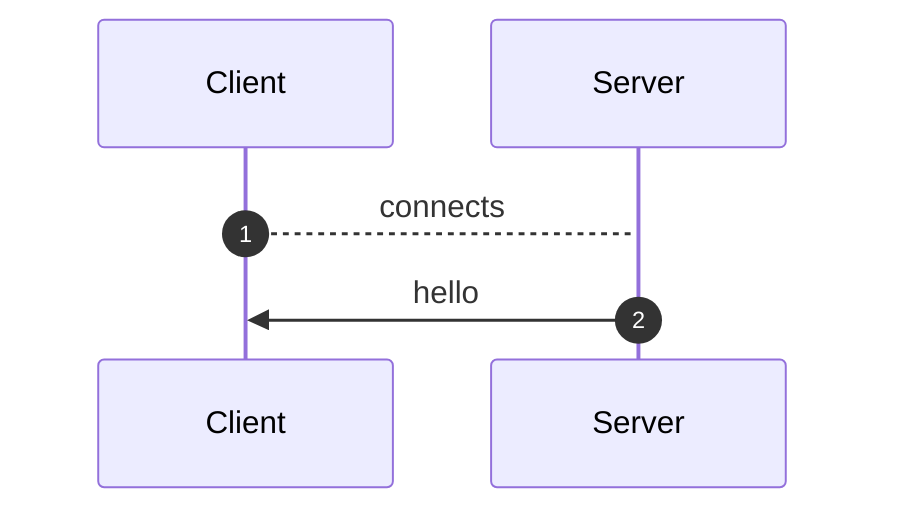
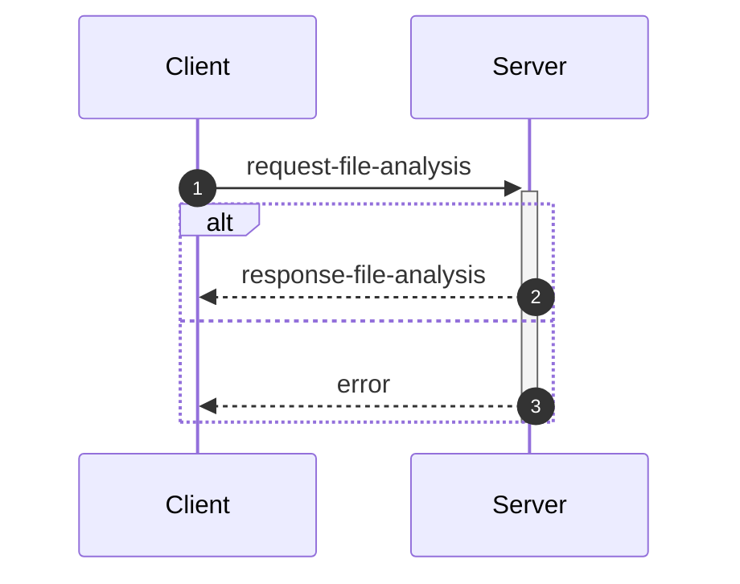
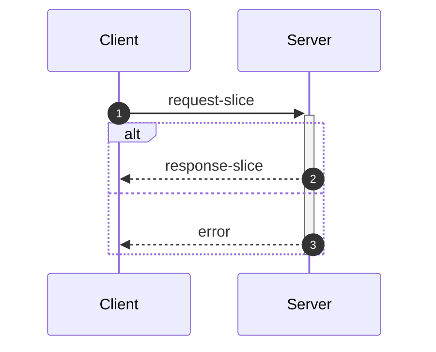
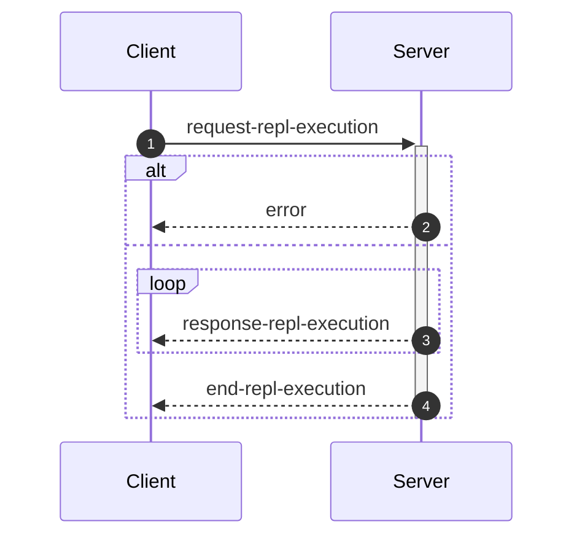

_This document was generated from '[src/documentation/wiki-interface.ts](https://github.com/flowr-analysis/flowr/tree/main//src/documentation/wiki-interface.ts)' on 2025-11-23, 19:52:53 UTC presenting an overview of flowR's interface (v2.6.2, using R v4.5.1). Please do not edit this file/wiki page directly._

Although far from being as detailed as the in-depth explanation of
[_flowR_](https://github.com/flowr-analysis/flowr/wiki/Core),
this wiki page explains how to interface with _flowR_ in more detail.
In general, command line arguments and other options provide short descriptions on hover over.

* [💬 Communicating with the Server](#communicating-with-the-server)
* [💻 Using the REPL](#using-the-repl)
* [⚙️ Configuring FlowR](#configuring-flowr)
* [⚒️ Writing Code](#writing-code)

<a id='communicating-with-the-server'></a>
## 💬 Communicating with the Server


As explained in the [Overview](https://github.com/flowr-analysis/flowr/wiki/Overview), you can simply run the [TCP](https://de.wikipedia.org/wiki/Transmission_Control_Protocol)&nbsp;server by adding the <span title="Description (Command Line Argument): Do not drop into a repl, but instead start a server on the given port (default: 1042) and listen for messages.">`--server`</span> flag (and, due to the interactive mode, exit with the conventional <kbd>CTRL</kbd>+<kbd>C</kbd>).
Currently, every connection is handled by the same underlying `RShell` - so the server is not designed to handle many clients at a time.
Additionally, the server is not well guarded against attacks (e.g., you can theoretically spawn an arbitrary number of&nbsp;RShell sessions on the target machine).

Every message has to be given in a single line (i.e., without a newline in-between) and end with a newline character. Nevertheless, we will pretty-print example given in the following segments for the ease of reading.


> [!NOTE]
> 
> The default <span title="Description (Command Line Argument): Do not drop into a repl, but instead start a server on the given port (default: 1042) and listen for messages.">`--server`</span> uses a simple [TCP](https://de.wikipedia.org/wiki/Transmission_Control_Protocol)
> connection. If you want _flowR_ to expose a [WebSocket](https://de.wikipedia.org/wiki/WebSocket) server instead, add the <span title="Description (Command Line Argument): If the server flag is set, use websocket for messaging">`--ws`</span> flag (i.e., <span title="Description (Command Line Argument): Do not drop into a repl, but instead start a server on the given port (default: 1042) and listen for messages.">`--server`</span> <span title="Description (Command Line Argument): If the server flag is set, use websocket for messaging">`--ws`</span>) when starting _flowR_ from the command line.
> 			


<ul><li>
<a id="message-hello"></a>
<b>Hello</b> Message (<code>hello</code>) 
<details>

<summary style="color:gray"> View Details. <i>The server informs the client about the successful connection and provides Meta-Information.</i> </summary>




	
After launching _flowR_, for example, with <code>docker run -it --rm eagleoutice/flowr <span title="Description (Command Line Argument): Do not drop into a repl, but instead start a server on the given port (default: 1042) and listen for messages.">-<span/>-server</span></code>&nbsp;(🐳️), simply connecting should present you with a `hello` message, that amongst others should reveal the versions of&nbsp;_flowR_ and&nbsp;R, using the [semver 2.0](https://semver.org/spec/v2.0.0.html) versioning scheme.
The message looks like this:


```json
{
  "type": "hello",
  "clientName": "client-0",
  "versions": {
    "flowr": "2.6.2",
    "r": "4.5.1",
    "engine": "r-shell"
  }
}
```


There are currently a few messages that you can send after the hello message.
If you want to _slice_ a piece of R code you first have to send an [analysis request](#message-request-file-analysis), so that you can send one or multiple slice requests afterward.
Requests for the [REPL](#message-request-repl) are independent of that.
	

<hr>


<details>
<summary style="color:gray">Message schema (<code>hello</code>)</summary>

For the definition of the hello message, please see it's implementation at [`./src/cli/repl/server/messages/message-hello.ts`](https://github.com/flowr-analysis/flowr/tree/main/./src/cli/repl/server/messages/message-hello.ts).

- **.** object [required]
    - **type** string [required]
        _The type of the hello message._
        Allows only the values: 'hello'
    - **id** any [forbidden]
        _The id of the message is always undefined (as it is the initial message and not requested)._
    - **clientName** string [required]
        _A unique name that is assigned to each client. It has no semantic meaning and is only used/useful for debugging._
    - **versions** object [required]
        - **flowr** string [required]
            _The version of the flowr server running in semver format._
        - **r** string [required]
            _The version of the underlying R shell running in semver format._
        - **engine** string [required]
            _The parser backend that is used to parse the R code._

</details>


<hr>

</details>
	</li>

<li>
<a id="message-request-file-analysis"></a>
<b>Analysis</b> Message (<code>request-file-analysis</code>) 
<details>

<summary style="color:gray"> View Details. <i>The server builds the dataflow graph for a given input file (or a set of files).</i> </summary>




	
The request allows the server to analyze a file and prepare it for slicing.
The message can contain a `filetoken`, which is used to identify the file in later slice or query requests (if you do not add one, the request will not be stored and therefore, it is not available for subsequent requests).

> **Please note!**\
> If you want to send and process a lot of analysis requests, but do not want to slice them, please do not pass the `filetoken` field. This will save the server a lot of memory allocation.

Furthermore, the request must contain either a `content` field to directly pass the file's content or a `filepath` field which contains the path to the file (this path must be accessible for the server to be useful).
If you add the `id` field, the answer will use the same `id` so you can match requests and the corresponding answers.
See the implementation of the request-file-analysis message for more information.


<details>
<summary>Example of the <code>request-file-analysis</code> Message</summary>

_Note:_ even though we pretty-print these messages, they are sent as a single line, ending with a newline.

The following lists all messages that were sent and received in case you want to reproduce the scenario:

<ol>
<li> <code>hello</code> (response)
<details> 

<summary> Show Details </summary>

The first message is always a hello message.


```json
{
  "type": "hello",
  "clientName": "client-0",
  "versions": {
    "flowr": "2.6.2",
    "r": "4.5.1",
    "engine": "r-shell"
  }
}
```


</details>
</li>

<li> <b><code>request-file-analysis</code> (request)</b>
<details open> 

<summary> Show Details </summary>

Let's suppose you simply want to analyze the following script:
 
```r
x <- 1
x + 1
```

 For this, you can send the following request:


```json
{
  "type": "request-file-analysis",
  "id": "1",
  "filetoken": "x",
  "content": "x <- 1\nx + 1"
}
```


</details>
</li>

<li> <code>response-file-analysis</code> (response)
<details> 

<summary> Show Details </summary>


The `results` field of the response effectively contains three keys of importance:

- `parse`: which contains 1:1 the parse result in CSV format that we received from the `RShell` (i.e., the AST produced by the parser of the R interpreter).
- `normalize`: which contains the normalized AST, including ids (see the `info` field and the [Normalized AST](https://github.com/flowr-analysis/flowr/wiki/Normalized%20AST) wiki page).
- `dataflow`: especially important is the `graph` field which contains the dataflow graph as a set of root vertices (see the [Dataflow Graph](https://github.com/flowr-analysis/flowr/wiki/Dataflow%20Graph) wiki page).
			


_As the code is pretty long, we inhibit pretty printing and syntax highlighting (JSON, hiding built-in):_

```text
{"type":"response-file-analysis","format":"json","id":"1","results":{"parse":{"files":[{"parsed":"[1,1,1,6,7,0,\"expr\",false,\"x <- 1\"],[1,1,1,1,1,3,\"SYMBOL\",true,\"x\"],[1,1,1,1,3,7,\"expr\",false,\"x\"],[1,3,1,4,2,7,\"LEFT_ASSIGN\",true,\"<-\"],[1,6,1,6,4,5,\"NUM_CONST\",true,\"1\"],[1,6,1,6,5,7,\"expr\",false,\"1\"],[2,1,2,5,16,0,\"expr\",false,\"x + 1\"],[2,1,2,1,10,12,\"SYMBOL\",true,\"x\"],[2,1,2,1,12,16,\"expr\",false,\"x\"],[2,3,2,3,11,16,\"'+'\",true,\"+\"],[2,5,2,5,13,14,\"NUM_CONST\",true,\"1\"],[2,5,2,5,14,16,\"expr\",false,\"1\"]","filePath":"/tmp/tmp-183152-r0HafapgHWvS-.R"}],".meta":{"timing":9}},"normalize":{"ast":{"type":"RProject","files":[{"root":{"type":"RExpressionList","children":[{"type":"RBinaryOp","location":[1,3,1,4],"lhs":{"type":"RSymbol","location":[1,1,1,1],"content":"x","lexeme":"x","info":{"fullRange":[1,1,1,1],"additionalTokens":[],"id":0,"parent":2,"role":"binop-lhs","index":0,"nesting":0,"file":"/tmp/tmp-183152-r0HafapgHWvS-.R"}},"rhs":{"location":[1,6,1,6],"lexeme":"1","info":{"fullRange":[1,6,1,6],"additionalTokens":[],"id":1,"parent":2,"role":"binop-rhs","index":1,"nesting":0,"file":"/tmp/tmp-183152-r0HafapgHWvS-.R"},"type":"RNumber","content":{"num":1,"complexNumber":false,"markedAsInt":false}},"operator":"<-","lexeme":"<-","info":{"fullRange":[1,1,1,6],"additionalTokens":[],"id":2,"parent":6,"nesting":0,"file":"/tmp/tmp-183152-r0HafapgHWvS-.R","index":0,"role":"expr-list-child"}},{"type":"RBinaryOp","location":[2,3,2,3],"lhs":{"type":"RSymbol","location":[2,1,2,1],"content":"x","lexeme":"x","info":{"fullRange":[2,1,2,1],"additionalTokens":[],"id":3,"parent":5,"role":"binop-lhs","index":0,"nesting":0,"file":"/tmp/tmp-183152-r0HafapgHWvS-.R"}},"rhs":{"location":[2,5,2,5],"lexeme":"1","info":{"fullRange":[2,5,2,5],"additionalTokens":[],"id":4,"parent":5,"role":"binop-rhs","index":1,"nesting":0,"file":"/tmp/tmp-183152-r0HafapgHWvS-.R"},"type":"RNumber","content":{"num":1,"complexNumber":false,"markedAsInt":false}},"operator":"+","lexeme":"+","info":{"fullRange":[2,1,2,5],"additionalTokens":[],"id":5,"parent":6,"nesting":0,"file":"/tmp/tmp-183152-r0HafapgHWvS-.R","index":1,"role":"expr-list-child"}}],"info":{"additionalTokens":[],"id":6,"nesting":0,"file":"/tmp/tmp-183152-r0HafapgHWvS-.R","role":"root","index":0}},"filePath":"/tmp/tmp-183152-r0HafapgHWvS-.R"}],"info":{"id":7}},".meta":{"timing":1}},"dataflow":{"unknownReferences":[],"in":[{"nodeId":2,"name":"<-","type":2},{"nodeId":5,"name":"+","type":2}],"out":[{"nodeId":0,"name":"x","type":4,"definedAt":2,"value":[1]}],"environment":{"current":{"id":180,"parent":"<BuiltInEnvironment>","memory":[["x",[{"nodeId":0,"name":"x","type":4,"definedAt":2,"value":[1]}]]]},"level":0},"graph":{"_unknownSideEffects":[],"rootVertices":[1,0,2,3,4,5],"vertexInformation":[[1,{"tag":"value","id":1}],[0,{"tag":"variable-definition","id":0}],[2,{"tag":"function-call","id":2,"name":"<-","onlyBuiltin":true,"args":[{"nodeId":0,"type":32},{"nodeId":1,"type":32}],"origin":["builtin:assignment"]}],[3,{"tag":"use","id":3}],[4,{"tag":"value","id":4}],[5,{"tag":"function-call","id":5,"name":"+","onlyBuiltin":true,"args":[{"nodeId":3,"type":32},{"nodeId":4,"type":32}],"origin":["builtin:default"]}]],"edgeInformation":[[2,[[1,{"types":64}],[0,{"types":72}],["built-in:<-",{"types":5}]]],[0,[[1,{"types":2}],[2,{"types":2}]]],[3,[[0,{"types":1}]]],[5,[[3,{"types":65}],[4,{"types":65}],["built-in:+",{"types":5}]]]]},"entryPoint":2,"exitPoints":[{"type":0,"nodeId":5}],".meta":{"timing":0}}}}
```


</details>
</li>
</ol>

The complete round-trip took 16.0 ms (including time required to validate the messages, start, and stop the internal mock server).

</details>


You receive an error if, for whatever reason, the analysis fails (e.g., the message or code you sent contained syntax errors).
It contains a human-readable description *why* the analysis failed (see the error message implementation for more details).


<details>
<summary>Example Error Message</summary>

_Note:_ even though we pretty-print these messages, they are sent as a single line, ending with a newline.

The following lists all messages that were sent and received in case you want to reproduce the scenario:

<ol>
<li> <code>hello</code> (response)
<details> 

<summary> Show Details </summary>

The first message is always a hello message.


```json
{
  "type": "hello",
  "clientName": "client-0",
  "versions": {
    "flowr": "2.6.2",
    "r": "4.5.1",
    "engine": "r-shell"
  }
}
```


</details>
</li>

<li> <code>request-file-analysis</code> (request)
<details> 

<summary> Show Details </summary>


```json
{
  "type": "request-file-analysis",
  "id": "1",
  "filename": "sample.R",
  "content": "x <-"
}
```


</details>
</li>

<li> <b><code>error</code> (response)</b>
<details open> 

<summary> Show Details </summary>


```json
{
  "id": "1",
  "type": "error",
  "fatal": false,
  "reason": "Error while analyzing file sample.R: GuardError: unable to parse R code (see the log for more information) for request {\"request\":\"text\",\"content\":\"x <-\"}}\n Report a Bug: https://github.com/flowr-analysis/flowr/issues/new?body=%3C!%2D%2D%20Please%20describe%20your%20issue%20in%20more%20detail%20below!%20%2D%2D%3E%0A%0A%0A%3C!%2D%2D%20Automatically%20generated%20issue%20metadata%2C%20please%20do%20not%20edit%20or%20delete%20content%20below%20this%20line%20%2D%2D%3E%0A%2D%2D%2D%0A%0AflowR%20version%3A%202.6.2%0Anode%20version%3A%20v22.14.0%0Anode%20arch%3A%20x64%0Anode%20platform%3A%20linux%0Amessage%3A%20%60unable%20to%20parse%20R%20code%20%28see%20the%20log%20for%20more%20information%29%20for%20request%20%7B%22request%22%3A%22text%22%2C%22content%22%3A%22x%20%3C%2D%22%7D%7D%60%0Astack%20trace%3A%0A%60%60%60%0A%20%20%20%20at%20guard%20%28%3C%3E%2Fsrc%2Futil%2Fassert.ts%3A128%3A9%29%0A%20%20%20%20at%20guardRetrievedOutput%20%28%3C%3E%2Fsrc%2Fr%2Dbridge%2Fretriever.ts%3A221%3A7%29%0A%20%20%20%20at%20%2Fhome%2Fostwind%2Fgit%2Fphd%2Fflowr%2Dfield%2Fflowr%2Fsrc%2Fr%2Dbridge%2Fretriever.ts%3A182%3A4%0A%20%20%20%20at%20processTicksAndRejections%20%28node%3Ainternal%2Fprocess%2Ftask_queues%3A105%3A5%29%0A%20%20%20%20at%20Object.parseRequests%20%5Bas%20processor%5D%20%28%3C%3E%2Fsrc%2Fr%2Dbridge%2Fparser.ts%3A104%3A19%29%0A%20%20%20%20at%20PipelineExecutor.nextStep%20%28%3C%3E%2Fsrc%2Fcore%2Fpipeline%2Dexecutor.ts%3A192%3A25%29%0A%20%20%20%20at%20FlowrAnalyzerCache.runTapeUntil%20%28%3C%3E%2Fsrc%2Fproject%2Fcache%2Fflowr%2Danalyzer%2Dcache.ts%3A89%3A4%29%0A%20%20%20%20at%20FlowRServerConnection.sendFileAnalysisResponse%20%28%3C%3E%2Fsrc%2Fcli%2Frepl%2Fserver%2Fconnection.ts%3A163%3A52%29%0A%60%60%60%0A%0A%2D%2D%2D%0A%09"
}
```


</details>
</li>
</ol>

The complete round-trip took 24.5 ms (including time required to validate the messages, start, and stop the internal mock server).

</details>


&nbsp;

<a id="analysis-include-cfg"></a>
**Including the Control Flow Graph**

While _flowR_ does (for the time being) not use an explicit control flow graph but instead relies on control-dependency edges within the dataflow graph, 
the respective structure can still be exposed using the server (note that, as this feature is not needed within _flowR_, it is tested significantly less - 
so please create a [new issue](https://github.com/flowr-analysis/flowr/issues/new/choose) for any bug you may encounter).
For this, the analysis request may add `cfg: true` to its list of options.


<details>
<summary>Requesting a Control Flow Graph</summary>

_Note:_ even though we pretty-print these messages, they are sent as a single line, ending with a newline.

The following lists all messages that were sent and received in case you want to reproduce the scenario:

<ol>
<li> <code>hello</code> (response)
<details> 

<summary> Show Details </summary>

The first message is always a hello message.


```json
{
  "type": "hello",
  "clientName": "client-0",
  "versions": {
    "flowr": "2.6.2",
    "r": "4.5.1",
    "engine": "r-shell"
  }
}
```


</details>
</li>

<li> <b><code>request-file-analysis</code> (request)</b>
<details open> 

<summary> Show Details </summary>


```json
{
  "type": "request-file-analysis",
  "id": "1",
  "filetoken": "x",
  "content": "if(unknown > 0) { x <- 2 } else { x <- 5 }\nfor(i in 1:x) { print(x); print(i) }",
  "cfg": true
}
```


</details>
</li>

<li> <code>response-file-analysis</code> (response)
<details> 

<summary> Show Details </summary>


The response looks basically the same as a response sent without the `cfg` flag. However, additionally it contains a `cfg` field. 
If you are interested in a visual representation of the control flow graph, see the 
[visualization with mermaid](https://mermaid.live/view#base64:eyJjb2RlIjoiZmxvd2NoYXJ0IEJUXG4gICAgbjMyKFtcImBSRXhwcmVzc2lvbkxpc3QgKDMyKWBcIl0pXG4gICAgbjE1W1wiYFJJZlRoZW5FbHNlICgxNSlcbiMzNDtpZih1bmtub3duICM2MjsgMCkgIzEyMzsgeCAjNjA7IzQ1OyAyICMxMjU7IGVsc2UgIzEyMzsgeCAjNjA7IzQ1OyA1ICMxMjU7IzM0O2BcIl1cbiAgICBuMTUtZXhpdCgoMTUtZXhpdCkpXG4gICAgbjAoW1wiYFJTeW1ib2wgKDApXG4jMzQ7dW5rbm93biMzNDtgXCJdKVxuICAgIG4xKFtcImBSTnVtYmVyICgxKVxuIzM0OzAjMzQ7YFwiXSlcbiAgICBuMihbXCJgUkJpbmFyeU9wICgyKVxuIzM0O3Vua25vd24gIzYyOyAwIzM0O2BcIl0pXG4gICAgbjItZXhpdCgoMi1leGl0KSlcbiAgICBuOChbXCJgUkV4cHJlc3Npb25MaXN0ICg4KWBcIl0pXG4gICAgbjUoW1wiYFJTeW1ib2wgKDUpXG4jMzQ7eCMzNDtgXCJdKVxuICAgIG42KFtcImBSTnVtYmVyICg2KVxuIzM0OzIjMzQ7YFwiXSlcbiAgICBuNyhbXCJgUkJpbmFyeU9wICg3KVxuIzM0O3ggIzYwOyM0NTsgMiMzNDtgXCJdKVxuICAgIG43LWV4aXQoKDctZXhpdCkpXG4gICAgbjgtZXhpdCgoOC1leGl0KSlcbiAgICBuMTQoW1wiYFJFeHByZXNzaW9uTGlzdCAoMTQpYFwiXSlcbiAgICBuMTEoW1wiYFJTeW1ib2wgKDExKVxuIzM0O3gjMzQ7YFwiXSlcbiAgICBuMTIoW1wiYFJOdW1iZXIgKDEyKVxuIzM0OzUjMzQ7YFwiXSlcbiAgICBuMTMoW1wiYFJCaW5hcnlPcCAoMTMpXG4jMzQ7eCAjNjA7IzQ1OyA1IzM0O2BcIl0pXG4gICAgbjEzLWV4aXQoKDEzLWV4aXQpKVxuICAgIG4xNC1leGl0KCgxNC1leGl0KSlcbiAgICBuMTYoW1wiYFJTeW1ib2wgKDE2KVxuIzM0O2kjMzQ7YFwiXSlcbiAgICBuMzFbXCJgUkZvckxvb3AgKDMxKVxuIzM0O2ZvcihpIGluIDEjNTg7eCkgIzEyMzsgcHJpbnQoeCk7IHByaW50KGkpICMxMjU7IzM0O2BcIl1cbiAgICBuMTcoW1wiYFJOdW1iZXIgKDE3KVxuIzM0OzEjMzQ7YFwiXSlcbiAgICBuMTgoW1wiYFJTeW1ib2wgKDE4KVxuIzM0O3gjMzQ7YFwiXSlcbiAgICBuMTkoW1wiYFJCaW5hcnlPcCAoMTkpXG4jMzQ7MSM1ODt4IzM0O2BcIl0pXG4gICAgbjE5LWV4aXQoKDE5LWV4aXQpKVxuICAgIG4zMChbXCJgUkV4cHJlc3Npb25MaXN0ICgzMClgXCJdKVxuICAgIG4yMihbXCJgUlN5bWJvbCAoMjIpXG4jMzQ7cHJpbnQoeCkjMzQ7YFwiXSlcbiAgICBuMjVbXCJgUkZ1bmN0aW9uQ2FsbCAoMjUpXG4jMzQ7cHJpbnQoeCkjMzQ7YFwiXVxuICAgIG4yNS1leGl0KCgyNS1leGl0KSlcbiAgICBuMjQoW1wiYFJBcmd1bWVudCAoMjQpXG4jMzQ7eCMzNDtgXCJdKVxuICAgIG4yMyhbXCJgUlN5bWJvbCAoMjMpXG4jMzQ7eCMzNDtgXCJdKVxuICAgIG4yNC1leGl0KCgyNC1leGl0KSlcbiAgICBuMjYoW1wiYFJTeW1ib2wgKDI2KVxuIzM0O3ByaW50KGkpIzM0O2BcIl0pXG4gICAgbjI5W1wiYFJGdW5jdGlvbkNhbGwgKDI5KVxuIzM0O3ByaW50KGkpIzM0O2BcIl1cbiAgICBuMjktZXhpdCgoMjktZXhpdCkpXG4gICAgbjI4KFtcImBSQXJndW1lbnQgKDI4KVxuIzM0O2kjMzQ7YFwiXSlcbiAgICBuMjcoW1wiYFJTeW1ib2wgKDI3KVxuIzM0O2kjMzQ7YFwiXSlcbiAgICBuMjgtZXhpdCgoMjgtZXhpdCkpXG4gICAgbjMwLWV4aXQoKDMwLWV4aXQpKVxuICAgIG4zMS1leGl0KCgzMS1leGl0KSlcbiAgICBuMzItZXhpdCgoMzItZXhpdCkpXG4gICAgbjE1IC0uLT58XCJGRFwifCBuMzJcbiAgICBuMSAtLi0+fFwiRkRcInwgbjBcbiAgICBuMCAtLi0+fFwiRkRcInwgbjJcbiAgICBuMi1leGl0IC0uLT58XCJGRFwifCBuMVxuICAgIG43IC0uLT58XCJGRFwifCBuOFxuICAgIG42IC0uLT58XCJGRFwifCBuNVxuICAgIG41IC0uLT58XCJGRFwifCBuN1xuICAgIG43LWV4aXQgLS4tPnxcIkZEXCJ8IG42XG4gICAgbjgtZXhpdCAtLi0+fFwiRkRcInwgbjctZXhpdFxuICAgIG4xMyAtLi0+fFwiRkRcInwgbjE0XG4gICAgbjEyIC0uLT58XCJGRFwifCBuMTFcbiAgICBuMTEgLS4tPnxcIkZEXCJ8IG4xM1xuICAgIG4xMy1leGl0IC0uLT58XCJGRFwifCBuMTJcbiAgICBuMTQtZXhpdCAtLi0+fFwiRkRcInwgbjEzLWV4aXRcbiAgICBuOCAtLT58XCJDRCAoVFJVRSlcInwgbjItZXhpdFxuICAgIG4xNCAtLT58XCJDRCAoRkFMU0UpXCJ8IG4yLWV4aXRcbiAgICBuMiAtLi0+fFwiRkRcInwgbjE1XG4gICAgbjE1LWV4aXQgLS4tPnxcIkZEXCJ8IG44LWV4aXRcbiAgICBuMTUtZXhpdCAtLi0+fFwiRkRcInwgbjE0LWV4aXRcbiAgICBuMzEgLS4tPnxcIkZEXCJ8IG4xNS1leGl0XG4gICAgbjMxIC0uLT58XCJGRFwifCBuMzAtZXhpdFxuICAgIG4xOCAtLi0+fFwiRkRcInwgbjE3XG4gICAgbjE3IC0uLT58XCJGRFwifCBuMTlcbiAgICBuMTktZXhpdCAtLi0+fFwiRkRcInwgbjE4XG4gICAgbjI1IC0uLT58XCJGRFwifCBuMzBcbiAgICBuMjIgLS4tPnxcIkZEXCJ8IG4yNVxuICAgIG4yMyAtLi0+fFwiRkRcInwgbjI0XG4gICAgbjI0LWV4aXQgLS4tPnxcIkZEXCJ8IG4yM1xuICAgIG4yNCAtLi0+fFwiRkRcInwgbjIyXG4gICAgbjI1LWV4aXQgLS4tPnxcIkZEXCJ8IG4yNC1leGl0XG4gICAgbjI5IC0uLT58XCJGRFwifCBuMjUtZXhpdFxuICAgIG4yNiAtLi0+fFwiRkRcInwgbjI5XG4gICAgbjI3IC0uLT58XCJGRFwifCBuMjhcbiAgICBuMjgtZXhpdCAtLi0+fFwiRkRcInwgbjI3XG4gICAgbjI4IC0uLT58XCJGRFwifCBuMjZcbiAgICBuMjktZXhpdCAtLi0+fFwiRkRcInwgbjI4LWV4aXRcbiAgICBuMzAtZXhpdCAtLi0+fFwiRkRcInwgbjI5LWV4aXRcbiAgICBuMTkgLS4tPnxcIkZEXCJ8IG4zMVxuICAgIG4xNiAtLi0+fFwiRkRcInwgbjE5LWV4aXRcbiAgICBuMzAgLS0+fFwiQ0QgKFRSVUUpXCJ8IG4xNlxuICAgIG4zMS1leGl0IC0tPnxcIkNEIChGQUxTRSlcInwgbjE2XG4gICAgbjMyLWV4aXQgLS4tPnxcIkZEXCJ8IG4zMS1leGl0XG4gICAgc3R5bGUgbjMyIHN0cm9rZTpjeWFuLHN0cm9rZS13aWR0aDo2LjVweDsgICAgc3R5bGUgbjMyLWV4aXQgc3Ryb2tlOmdyZWVuLHN0cm9rZS13aWR0aDo2LjVweDsiLCJtZXJtYWlkIjp7ImF1dG9TeW5jIjp0cnVlfX0=).
			


_As the code is pretty long, we inhibit pretty printing and syntax highlighting (JSON, hiding built-in):_

```text
{"type":"response-file-analysis","format":"json","id":"1","cfg":{"returns":[],"entryPoints":[32],"exitPoints":["32-exit"],"breaks":[],"nexts":[],"graph":{"rootVertices":[32,15,"15-exit",0,1,2,"2-exit",8,5,6,7,"7-exit","8-exit",14,11,12,13,"13-exit","14-exit",16,31,17,18,19,"19-exit",30,22,25,"25-exit",24,23,"24-exit",26,29,"29-exit",28,27,"28-exit","30-exit","31-exit","32-exit"],"vertexInformation":[[32,{"id":32,"type":"expr","end":["32-exit"]}],[15,{"id":15,"type":"stm","mid":["2-exit"],"end":["15-exit"]}],["15-exit",{"id":"15-exit","type":"end","root":15}],[0,{"id":0,"type":"expr"}],[1,{"id":1,"type":"expr"}],[2,{"id":2,"type":"expr","end":["2-exit"]}],["2-exit",{"id":"2-exit","type":"end","root":2}],[8,{"id":8,"type":"expr","end":["8-exit"]}],[5,{"id":5,"type":"expr"}],[6,{"id":6,"type":"expr"}],[7,{"id":7,"type":"expr","end":["7-exit"]}],["7-exit",{"id":"7-exit","type":"end","root":7}],["8-exit",{"id":"8-exit","type":"end","root":8}],[14,{"id":14,"type":"expr","end":["14-exit"]}],[11,{"id":11,"type":"expr"}],[12,{"id":12,"type":"expr"}],[13,{"id":13,"type":"expr","end":["13-exit"]}],["13-exit",{"id":"13-exit","type":"end","root":13}],["14-exit",{"id":"14-exit","type":"end","root":14}],[16,{"id":16,"type":"expr"}],[31,{"id":31,"type":"stm","end":["31-exit"],"mid":[16]}],[17,{"id":17,"type":"expr"}],[18,{"id":18,"type":"expr"}],[19,{"id":19,"type":"expr","end":["19-exit"]}],["19-exit",{"id":"19-exit","type":"end","root":19}],[30,{"id":30,"type":"expr","end":["30-exit"]}],[22,{"id":22,"type":"expr"}],[25,{"id":25,"type":"stm","mid":[22],"end":["25-exit"]}],["25-exit",{"id":"25-exit","type":"end","root":25}],[24,{"id":24,"type":"expr","mid":[24],"end":["24-exit"]}],[23,{"id":23,"type":"expr"}],["24-exit",{"id":"24-exit","type":"end","root":24}],[26,{"id":26,"type":"expr"}],[29,{"id":29,"type":"stm","mid":[26],"end":["29-exit"]}],["29-exit",{"id":"29-exit","type":"end","root":29}],[28,{"id":28,"type":"expr","mid":[28],"end":["28-exit"]}],[27,{"id":27,"type":"expr"}],["28-exit",{"id":"28-exit","type":"end","root":28}],["30-exit",{"id":"30-exit","type":"end","root":30}],["31-exit",{"id":"31-exit","type":"end","root":31}],["32-exit",{"id":"32-exit","type":"end","root":32}]],"bbChildren":[],"edgeInformation":[[15,[[32,{"label":0}]]],[1,[[0,{"label":0}]]],[0,[[2,{"label":0}]]],["2-exit",[[1,{"label":0}]]],[7,[[8,{"label":0}]]],[6,[[5,{"label":0}]]],[5,[[7,{"label":0}]]],["7-exit",[[6,{"label":0}]]],["8-exit",[["7-exit",{"label":0}]]],[13,[[14,{"label":0}]]],[12,[[11,{"label":0}]]],[11,[[13,{"label":0}]]],["13-exit",[[12,{"label":0}]]],["14-exit",[["13-exit",{"label":0}]]],[8,[["2-exit",{"label":1,"when":"TRUE","caused":15}]]],[14,[["2-exit",{"label":1,"when":"FALSE","caused":15}]]],[2,[[15,{"label":0}]]],["15-exit",[["8-exit",{"label":0}],["14-exit",{"label":0}]]],[31,[["15-exit",{"label":0}],["30-exit",{"label":0}]]],[18,[[17,{"label":0}]]],[17,[[19,{"label":0}]]],["19-exit",[[18,{"label":0}]]],[25,[[30,{"label":0}]]],[22,[[25,{"label":0}]]],[23,[[24,{"label":0}]]],["24-exit",[[23,{"label":0}]]],[24,[[22,{"label":0}]]],["25-exit",[["24-exit",{"label":0}]]],[29,[["25-exit",{"label":0}]]],[26,[[29,{"label":0}]]],[27,[[28,{"label":0}]]],["28-exit",[[27,{"label":0}]]],[28,[[26,{"label":0}]]],["29-exit",[["28-exit",{"label":0}]]],["30-exit",[["29-exit",{"label":0}]]],[19,[[31,{"label":0}]]],[16,[["19-exit",{"label":0}]]],[30,[[16,{"label":1,"when":"TRUE","caused":31}]]],["31-exit",[[16,{"label":1,"when":"FALSE","caused":31}]]],["32-exit",[["31-exit",{"label":0}]]]],"_mayHaveBasicBlocks":false}},"results":{"parse":{"files":[{"parsed":"[1,1,1,42,38,0,\"expr\",false,\"if(unknown > 0) { x <- 2 } else { x <- 5 }\"],[1,1,1,2,1,38,\"IF\",true,\"if\"],[1,3,1,3,2,38,\"'('\",true,\"(\"],[1,4,1,14,9,38,\"expr\",false,\"unknown > 0\"],[1,4,1,10,3,5,\"SYMBOL\",true,\"unknown\"],[1,4,1,10,5,9,\"expr\",false,\"unknown\"],[1,12,1,12,4,9,\"GT\",true,\">\"],[1,14,1,14,6,7,\"NUM_CONST\",true,\"0\"],[1,14,1,14,7,9,\"expr\",false,\"0\"],[1,15,1,15,8,38,\"')'\",true,\")\"],[1,17,1,26,22,38,\"expr\",false,\"{ x <- 2 }\"],[1,17,1,17,12,22,\"'{'\",true,\"{\"],[1,19,1,24,19,22,\"expr\",false,\"x <- 2\"],[1,19,1,19,13,15,\"SYMBOL\",true,\"x\"],[1,19,1,19,15,19,\"expr\",false,\"x\"],[1,21,1,22,14,19,\"LEFT_ASSIGN\",true,\"<-\"],[1,24,1,24,16,17,\"NUM_CONST\",true,\"2\"],[1,24,1,24,17,19,\"expr\",false,\"2\"],[1,26,1,26,18,22,\"'}'\",true,\"}\"],[1,28,1,31,23,38,\"ELSE\",true,\"else\"],[1,33,1,42,35,38,\"expr\",false,\"{ x <- 5 }\"],[1,33,1,33,25,35,\"'{'\",true,\"{\"],[1,35,1,40,32,35,\"expr\",false,\"x <- 5\"],[1,35,1,35,26,28,\"SYMBOL\",true,\"x\"],[1,35,1,35,28,32,\"expr\",false,\"x\"],[1,37,1,38,27,32,\"LEFT_ASSIGN\",true,\"<-\"],[1,40,1,40,29,30,\"NUM_CONST\",true,\"5\"],[1,40,1,40,30,32,\"expr\",false,\"5\"],[1,42,1,42,31,35,\"'}'\",true,\"}\"],[2,1,2,36,84,0,\"expr\",false,\"for(i in 1:x) { print(x); print(i) }\"],[2,1,2,3,41,84,\"FOR\",true,\"for\"],[2,4,2,13,53,84,\"forcond\",false,\"(i in 1:x)\"],[2,4,2,4,42,53,\"'('\",true,\"(\"],[2,5,2,5,43,53,\"SYMBOL\",true,\"i\"],[2,7,2,8,44,53,\"IN\",true,\"in\"],[2,10,2,12,51,53,\"expr\",false,\"1:x\"],[2,10,2,10,45,46,\"NUM_CONST\",true,\"1\"],[2,10,2,10,46,51,\"expr\",false,\"1\"],[2,11,2,11,47,51,\"':'\",true,\":\"],[2,12,2,12,48,50,\"SYMBOL\",true,\"x\"],[2,12,2,12,50,51,\"expr\",false,\"x\"],[2,13,2,13,49,53,\"')'\",true,\")\"],[2,15,2,36,81,84,\"expr\",false,\"{ print(x); print(i) }\"],[2,15,2,15,54,81,\"'{'\",true,\"{\"],[2,17,2,24,64,81,\"expr\",false,\"print(x)\"],[2,17,2,21,55,57,\"SYMBOL_FUNCTION_CALL\",true,\"print\"],[2,17,2,21,57,64,\"expr\",false,\"print\"],[2,22,2,22,56,64,\"'('\",true,\"(\"],[2,23,2,23,58,60,\"SYMBOL\",true,\"x\"],[2,23,2,23,60,64,\"expr\",false,\"x\"],[2,24,2,24,59,64,\"')'\",true,\")\"],[2,25,2,25,65,81,\"';'\",true,\";\"],[2,27,2,34,77,81,\"expr\",false,\"print(i)\"],[2,27,2,31,68,70,\"SYMBOL_FUNCTION_CALL\",true,\"print\"],[2,27,2,31,70,77,\"expr\",false,\"print\"],[2,32,2,32,69,77,\"'('\",true,\"(\"],[2,33,2,33,71,73,\"SYMBOL\",true,\"i\"],[2,33,2,33,73,77,\"expr\",false,\"i\"],[2,34,2,34,72,77,\"')'\",true,\")\"],[2,36,2,36,78,81,\"'}'\",true,\"}\"]","filePath":"/tmp/tmp-183152-NKA5ONjlySoO-.R"}],".meta":{"timing":3}},"normalize":{"ast":{"type":"RProject","files":[{"root":{"type":"RExpressionList","children":[{"type":"RIfThenElse","condition":{"type":"RBinaryOp","location":[1,12,1,12],"lhs":{"type":"RSymbol","location":[1,4,1,10],"content":"unknown","lexeme":"unknown","info":{"fullRange":[1,4,1,10],"additionalTokens":[],"id":0,"parent":2,"role":"binop-lhs","index":0,"nesting":1,"file":"/tmp/tmp-183152-NKA5ONjlySoO-.R"}},"rhs":{"location":[1,14,1,14],"lexeme":"0","info":{"fullRange":[1,14,1,14],"additionalTokens":[],"id":1,"parent":2,"role":"binop-rhs","index":1,"nesting":1,"file":"/tmp/tmp-183152-NKA5ONjlySoO-.R"},"type":"RNumber","content":{"num":0,"complexNumber":false,"markedAsInt":false}},"operator":">","lexeme":">","info":{"fullRange":[1,4,1,14],"additionalTokens":[],"id":2,"parent":15,"nesting":1,"file":"/tmp/tmp-183152-NKA5ONjlySoO-.R","role":"if-cond"}},"then":{"type":"RExpressionList","children":[{"type":"RBinaryOp","location":[1,21,1,22],"lhs":{"type":"RSymbol","location":[1,19,1,19],"content":"x","lexeme":"x","info":{"fullRange":[1,19,1,19],"additionalTokens":[],"id":5,"parent":7,"role":"binop-lhs","index":0,"nesting":1,"file":"/tmp/tmp-183152-NKA5ONjlySoO-.R"}},"rhs":{"location":[1,24,1,24],"lexeme":"2","info":{"fullRange":[1,24,1,24],"additionalTokens":[],"id":6,"parent":7,"role":"binop-rhs","index":1,"nesting":1,"file":"/tmp/tmp-183152-NKA5ONjlySoO-.R"},"type":"RNumber","content":{"num":2,"complexNumber":false,"markedAsInt":false}},"operator":"<-","lexeme":"<-","info":{"fullRange":[1,19,1,24],"additionalTokens":[],"id":7,"parent":8,"nesting":1,"file":"/tmp/tmp-183152-NKA5ONjlySoO-.R","index":0,"role":"expr-list-child"}}],"grouping":[{"type":"RSymbol","location":[1,17,1,17],"content":"{","lexeme":"{","info":{"fullRange":[1,17,1,26],"additionalTokens":[],"id":3,"role":"root","index":0,"nesting":1,"file":"/tmp/tmp-183152-NKA5ONjlySoO-.R"}},{"type":"RSymbol","location":[1,26,1,26],"content":"}","lexeme":"}","info":{"fullRange":[1,17,1,26],"additionalTokens":[],"id":4,"role":"root","index":0,"nesting":1,"file":"/tmp/tmp-183152-NKA5ONjlySoO-.R"}}],"info":{"additionalTokens":[],"id":8,"parent":15,"nesting":1,"file":"/tmp/tmp-183152-NKA5ONjlySoO-.R","index":1,"role":"if-then"}},"location":[1,1,1,2],"lexeme":"if","info":{"fullRange":[1,1,1,42],"additionalTokens":[],"id":15,"parent":32,"nesting":1,"file":"/tmp/tmp-183152-NKA5ONjlySoO-.R","index":0,"role":"expr-list-child"},"otherwise":{"type":"RExpressionList","children":[{"type":"RBinaryOp","location":[1,37,1,38],"lhs":{"type":"RSymbol","location":[1,35,1,35],"content":"x","lexeme":"x","info":{"fullRange":[1,35,1,35],"additionalTokens":[],"id":11,"parent":13,"role":"binop-lhs","index":0,"nesting":1,"file":"/tmp/tmp-183152-NKA5ONjlySoO-.R"}},"rhs":{"location":[1,40,1,40],"lexeme":"5","info":{"fullRange":[1,40,1,40],"additionalTokens":[],"id":12,"parent":13,"role":"binop-rhs","index":1,"nesting":1,"file":"/tmp/tmp-183152-NKA5ONjlySoO-.R"},"type":"RNumber","content":{"num":5,"complexNumber":false,"markedAsInt":false}},"operator":"<-","lexeme":"<-","info":{"fullRange":[1,35,1,40],"additionalTokens":[],"id":13,"parent":14,"nesting":1,"file":"/tmp/tmp-183152-NKA5ONjlySoO-.R","index":0,"role":"expr-list-child"}}],"grouping":[{"type":"RSymbol","location":[1,33,1,33],"content":"{","lexeme":"{","info":{"fullRange":[1,33,1,42],"additionalTokens":[],"id":9,"role":"root","index":0,"nesting":1,"file":"/tmp/tmp-183152-NKA5ONjlySoO-.R"}},{"type":"RSymbol","location":[1,42,1,42],"content":"}","lexeme":"}","info":{"fullRange":[1,33,1,42],"additionalTokens":[],"id":10,"role":"root","index":0,"nesting":1,"file":"/tmp/tmp-183152-NKA5ONjlySoO-.R"}}],"info":{"additionalTokens":[],"id":14,"parent":15,"nesting":1,"file":"/tmp/tmp-183152-NKA5ONjlySoO-.R","index":2,"role":"if-otherwise"}}},{"type":"RForLoop","variable":{"type":"RSymbol","location":[2,5,2,5],"content":"i","lexeme":"i","info":{"additionalTokens":[],"id":16,"parent":31,"role":"for-variable","index":0,"nesting":1,"file":"/tmp/tmp-183152-NKA5ONjlySoO-.R"}},"vector":{"type":"RBinaryOp","location":[2,11,2,11],"lhs":{"location":[2,10,2,10],"lexeme":"1","info":{"fullRange":[2,10,2,10],"additionalTokens":[],"id":17,"parent":19,"role":"binop-lhs","index":0,"nesting":1,"file":"/tmp/tmp-183152-NKA5ONjlySoO-.R"},"type":"RNumber","content":{"num":1,"complexNumber":false,"markedAsInt":false}},"rhs":{"type":"RSymbol","location":[2,12,2,12],"content":"x","lexeme":"x","info":{"fullRange":[2,12,2,12],"additionalTokens":[],"id":18,"parent":19,"role":"binop-rhs","index":1,"nesting":1,"file":"/tmp/tmp-183152-NKA5ONjlySoO-.R"}},"operator":":","lexeme":":","info":{"fullRange":[2,10,2,12],"additionalTokens":[],"id":19,"parent":31,"nesting":1,"file":"/tmp/tmp-183152-NKA5ONjlySoO-.R","index":1,"role":"for-vector"}},"body":{"type":"RExpressionList","children":[{"type":"RFunctionCall","named":true,"location":[2,17,2,21],"lexeme":"print","functionName":{"type":"RSymbol","location":[2,17,2,21],"content":"print","lexeme":"print","info":{"fullRange":[2,17,2,24],"additionalTokens":[],"id":22,"parent":25,"role":"call-name","index":0,"nesting":1,"file":"/tmp/tmp-183152-NKA5ONjlySoO-.R"}},"arguments":[{"type":"RArgument","location":[2,23,2,23],"lexeme":"x","value":{"type":"RSymbol","location":[2,23,2,23],"content":"x","lexeme":"x","info":{"fullRange":[2,23,2,23],"additionalTokens":[],"id":23,"parent":24,"role":"arg-value","index":0,"nesting":1,"file":"/tmp/tmp-183152-NKA5ONjlySoO-.R"}},"info":{"fullRange":[2,23,2,23],"additionalTokens":[],"id":24,"parent":25,"nesting":1,"file":"/tmp/tmp-183152-NKA5ONjlySoO-.R","index":1,"role":"call-argument"}}],"info":{"fullRange":[2,17,2,24],"additionalTokens":[],"id":25,"parent":30,"nesting":1,"file":"/tmp/tmp-183152-NKA5ONjlySoO-.R","index":0,"role":"expr-list-child"}},{"type":"RFunctionCall","named":true,"location":[2,27,2,31],"lexeme":"print","functionName":{"type":"RSymbol","location":[2,27,2,31],"content":"print","lexeme":"print","info":{"fullRange":[2,27,2,34],"additionalTokens":[],"id":26,"parent":29,"role":"call-name","index":0,"nesting":1,"file":"/tmp/tmp-183152-NKA5ONjlySoO-.R"}},"arguments":[{"type":"RArgument","location":[2,33,2,33],"lexeme":"i","value":{"type":"RSymbol","location":[2,33,2,33],"content":"i","lexeme":"i","info":{"fullRange":[2,33,2,33],"additionalTokens":[],"id":27,"parent":28,"role":"arg-value","index":0,"nesting":1,"file":"/tmp/tmp-183152-NKA5ONjlySoO-.R"}},"info":{"fullRange":[2,33,2,33],"additionalTokens":[],"id":28,"parent":29,"nesting":1,"file":"/tmp/tmp-183152-NKA5ONjlySoO-.R","index":1,"role":"call-argument"}}],"info":{"fullRange":[2,27,2,34],"additionalTokens":[],"id":29,"parent":30,"nesting":1,"file":"/tmp/tmp-183152-NKA5ONjlySoO-.R","index":1,"role":"expr-list-child"}}],"grouping":[{"type":"RSymbol","location":[2,15,2,15],"content":"{","lexeme":"{","info":{"fullRange":[2,15,2,36],"additionalTokens":[],"id":20,"role":"root","index":0,"nesting":1,"file":"/tmp/tmp-183152-NKA5ONjlySoO-.R"}},{"type":"RSymbol","location":[2,36,2,36],"content":"}","lexeme":"}","info":{"fullRange":[2,15,2,36],"additionalTokens":[],"id":21,"role":"root","index":0,"nesting":1,"file":"/tmp/tmp-183152-NKA5ONjlySoO-.R"}}],"info":{"additionalTokens":[],"id":30,"parent":31,"nesting":1,"file":"/tmp/tmp-183152-NKA5ONjlySoO-.R","index":2,"role":"for-body"}},"lexeme":"for","info":{"fullRange":[2,1,2,36],"additionalTokens":[],"id":31,"parent":32,"nesting":1,"file":"/tmp/tmp-183152-NKA5ONjlySoO-.R","index":1,"role":"expr-list-child"},"location":[2,1,2,3]}],"info":{"additionalTokens":[],"id":32,"nesting":0,"file":"/tmp/tmp-183152-NKA5ONjlySoO-.R","role":"root","index":0}},"filePath":"/tmp/tmp-183152-NKA5ONjlySoO-.R"}],"info":{"id":33}},".meta":{"timing":0}},"dataflow":{"unknownReferences":[],"in":[{"nodeId":15,"name":"if","type":2},{"nodeId":0,"name":"unknown","type":1},{"nodeId":2,"name":">","type":2},{"nodeId":7,"name":"<-","controlDependencies":[{"id":15,"when":true}],"type":2},{"nodeId":13,"name":"<-","controlDependencies":[{"id":15,"when":false}],"type":2},{"nodeId":8,"name":"{","controlDependencies":[{"id":15,"when":true}],"type":2},{"nodeId":14,"name":"{","controlDependencies":[{"id":15,"when":false}],"type":2},{"nodeId":31,"name":"for","type":2},{"name":":","nodeId":19,"type":2},{"name":"print","nodeId":25,"type":2},{"name":"print","nodeId":29,"type":2}],"out":[{"nodeId":5,"name":"x","controlDependencies":[{"id":15,"when":true},{"id":15,"when":false}],"type":4,"definedAt":7,"value":[6]},{"nodeId":11,"name":"x","controlDependencies":[{"id":15,"when":true},{"id":15,"when":false}],"type":4,"definedAt":13,"value":[12]},{"nodeId":16,"name":"i","type":1}],"environment":{"current":{"id":261,"parent":"<BuiltInEnvironment>","memory":[["x",[{"nodeId":5,"name":"x","controlDependencies":[{"id":15,"when":true},{"id":15,"when":false}],"type":4,"definedAt":7,"value":[6]},{"nodeId":11,"name":"x","controlDependencies":[{"id":15,"when":true},{"id":15,"when":false}],"type":4,"definedAt":13,"value":[12]}]],["i",[{"nodeId":16,"name":"i","type":4,"definedAt":31}]]]},"level":0},"graph":{"_unknownSideEffects":[{"id":25,"linkTo":{"type":"link-to-last-call","callName":{}}},{"id":29,"linkTo":{"type":"link-to-last-call","callName":{}}}],"rootVertices":[0,1,2,6,5,7,8,12,11,13,14,15,16,17,18,19,23,25,27,29,30,31],"vertexInformation":[[0,{"tag":"use","id":0}],[1,{"tag":"value","id":1}],[2,{"tag":"function-call","id":2,"name":">","onlyBuiltin":true,"args":[{"nodeId":0,"type":32},{"nodeId":1,"type":32}],"origin":["builtin:default"]}],[6,{"tag":"value","id":6}],[5,{"tag":"variable-definition","id":5,"cds":[{"id":15,"when":true}]}],[7,{"tag":"function-call","id":7,"name":"<-","onlyBuiltin":true,"cds":[{"id":15,"when":true}],"args":[{"nodeId":5,"type":32},{"nodeId":6,"type":32}],"origin":["builtin:assignment"]}],[8,{"tag":"function-call","id":8,"name":"{","onlyBuiltin":true,"cds":[{"id":15,"when":true}],"args":[{"nodeId":7,"type":32}],"origin":["builtin:expression-list"]}],[12,{"tag":"value","id":12}],[11,{"tag":"variable-definition","id":11,"cds":[{"id":15,"when":false}]}],[13,{"tag":"function-call","id":13,"name":"<-","onlyBuiltin":true,"cds":[{"id":15,"when":false}],"args":[{"nodeId":11,"type":32},{"nodeId":12,"type":32}],"origin":["builtin:assignment"]}],[14,{"tag":"function-call","id":14,"name":"{","onlyBuiltin":true,"cds":[{"id":15,"when":false}],"args":[{"nodeId":13,"type":32}],"origin":["builtin:expression-list"]}],[15,{"tag":"function-call","id":15,"name":"if","onlyBuiltin":true,"args":[{"nodeId":2,"type":32},{"nodeId":8,"type":32},{"nodeId":14,"type":32}],"origin":["builtin:if-then-else"]}],[16,{"tag":"variable-definition","id":16}],[17,{"tag":"value","id":17}],[18,{"tag":"use","id":18}],[19,{"tag":"function-call","id":19,"name":":","onlyBuiltin":true,"args":[{"nodeId":17,"type":32},{"nodeId":18,"type":32}],"origin":["builtin:default"]}],[23,{"tag":"use","id":23,"cds":[{"id":31,"when":true}]}],[25,{"tag":"function-call","id":25,"name":"print","onlyBuiltin":true,"cds":[{"id":31,"when":true}],"args":[{"nodeId":23,"type":32}],"origin":["builtin:default"]}],[27,{"tag":"use","id":27,"cds":[{"id":31,"when":true}]}],[29,{"tag":"function-call","id":29,"name":"print","onlyBuiltin":true,"cds":[{"id":31,"when":true}],"args":[{"nodeId":27,"type":32}],"origin":["builtin:default"]}],[30,{"tag":"function-call","id":30,"name":"{","onlyBuiltin":true,"cds":[{"id":31,"when":true}],"args":[{"nodeId":25,"type":32},{"nodeId":29,"type":32}],"origin":["builtin:expression-list"]}],[31,{"tag":"function-call","id":31,"name":"for","onlyBuiltin":true,"args":[{"nodeId":16,"type":32},{"nodeId":19,"type":32},{"nodeId":30,"type":32}],"origin":["builtin:for-loop"]}]],"edgeInformation":[[2,[[0,{"types":65}],[1,{"types":65}],["built-in:>",{"types":5}]]],[7,[[6,{"types":64}],[5,{"types":72}],["built-in:<-",{"types":5}]]],[5,[[6,{"types":2}],[7,{"types":2}]]],[8,[[7,{"types":72}],["built-in:{",{"types":5}]]],[15,[[8,{"types":72}],[14,{"types":72}],[2,{"types":65}],["built-in:if",{"types":5}]]],[13,[[12,{"types":64}],[11,{"types":72}],["built-in:<-",{"types":5}]]],[11,[[12,{"types":2}],[13,{"types":2}]]],[14,[[13,{"types":72}],["built-in:{",{"types":5}]]],[19,[[17,{"types":65}],[18,{"types":65}],["built-in::",{"types":5}]]],[18,[[5,{"types":1}],[11,{"types":1}]]],[25,[[23,{"types":73}],["built-in:print",{"types":5}]]],[23,[[5,{"types":1}],[11,{"types":1}]]],[29,[[27,{"types":73}],["built-in:print",{"types":5}]]],[27,[[16,{"types":1}]]],[30,[[25,{"types":64}],[29,{"types":72}],["built-in:{",{"types":5}]]],[16,[[19,{"types":2}]]],[31,[[16,{"types":64}],[19,{"types":65}],[30,{"types":320}],["built-in:for",{"types":5}]]]]},"entryPoint":15,"exitPoints":[{"type":0,"nodeId":31}],"cfgQuick":{"graph":{"rootVertices":[32,15,"15-exit",0,1,2,"2-exit",8,5,6,7,"7-exit","8-exit",14,11,12,13,"13-exit","14-exit",16,31,17,18,19,"19-exit",30,22,25,"25-exit",24,23,"24-exit",26,29,"29-exit",28,27,"28-exit","30-exit","31-exit","32-exit"],"vertexInformation":[[32,{"id":32,"type":"expr","end":["32-exit"]}],[15,{"id":15,"type":"stm","mid":["2-exit"],"end":["15-exit"]}],["15-exit",{"id":"15-exit","type":"end","root":15}],[0,{"id":0,"type":"expr"}],[1,{"id":1,"type":"expr"}],[2,{"id":2,"type":"expr","end":["2-exit"]}],["2-exit",{"id":"2-exit","type":"end","root":2}],[8,{"id":8,"type":"expr","end":["8-exit"]}],[5,{"id":5,"type":"expr"}],[6,{"id":6,"type":"expr"}],[7,{"id":7,"type":"expr","end":["7-exit"]}],["7-exit",{"id":"7-exit","type":"end","root":7}],["8-exit",{"id":"8-exit","type":"end","root":8}],[14,{"id":14,"type":"expr","end":["14-exit"]}],[11,{"id":11,"type":"expr"}],[12,{"id":12,"type":"expr"}],[13,{"id":13,"type":"expr","end":["13-exit"]}],["13-exit",{"id":"13-exit","type":"end","root":13}],["14-exit",{"id":"14-exit","type":"end","root":14}],[16,{"id":16,"type":"expr"}],[31,{"id":31,"type":"stm","end":["31-exit"],"mid":[16]}],[17,{"id":17,"type":"expr"}],[18,{"id":18,"type":"expr"}],[19,{"id":19,"type":"expr","end":["19-exit"]}],["19-exit",{"id":"19-exit","type":"end","root":19}],[30,{"id":30,"type":"expr","end":["30-exit"]}],[22,{"id":22,"type":"expr"}],[25,{"id":25,"type":"stm","mid":[22],"end":["25-exit"]}],["25-exit",{"id":"25-exit","type":"end","root":25}],[24,{"id":24,"type":"expr","mid":[24],"end":["24-exit"]}],[23,{"id":23,"type":"expr"}],["24-exit",{"id":"24-exit","type":"end","root":24}],[26,{"id":26,"type":"expr"}],[29,{"id":29,"type":"stm","mid":[26],"end":["29-exit"]}],["29-exit",{"id":"29-exit","type":"end","root":29}],[28,{"id":28,"type":"expr","mid":[28],"end":["28-exit"]}],[27,{"id":27,"type":"expr"}],["28-exit",{"id":"28-exit","type":"end","root":28}],["30-exit",{"id":"30-exit","type":"end","root":30}],["31-exit",{"id":"31-exit","type":"end","root":31}],["32-exit",{"id":"32-exit","type":"end","root":32}]],"bbChildren":[],"edgeInformation":[[15,[[32,{"label":0}]]],[1,[[0,{"label":0}]]],[0,[[2,{"label":0}]]],["2-exit",[[1,{"label":0}]]],[7,[[8,{"label":0}]]],[6,[[5,{"label":0}]]],[5,[[7,{"label":0}]]],["7-exit",[[6,{"label":0}]]],["8-exit",[["7-exit",{"label":0}]]],[13,[[14,{"label":0}]]],[12,[[11,{"label":0}]]],[11,[[13,{"label":0}]]],["13-exit",[[12,{"label":0}]]],["14-exit",[["13-exit",{"label":0}]]],[8,[["2-exit",{"label":1,"when":"TRUE","caused":15}]]],[14,[["2-exit",{"label":1,"when":"FALSE","caused":15}]]],[2,[[15,{"label":0}]]],["15-exit",[["8-exit",{"label":0}],["14-exit",{"label":0}]]],[31,[["15-exit",{"label":0}],["30-exit",{"label":0}]]],[18,[[17,{"label":0}]]],[17,[[19,{"label":0}]]],["19-exit",[[18,{"label":0}]]],[25,[[30,{"label":0}]]],[22,[[25,{"label":0}]]],[23,[[24,{"label":0}]]],["24-exit",[[23,{"label":0}]]],[24,[[22,{"label":0}]]],["25-exit",[["24-exit",{"label":0}]]],[29,[["25-exit",{"label":0}]]],[26,[[29,{"label":0}]]],[27,[[28,{"label":0}]]],["28-exit",[[27,{"label":0}]]],[28,[[26,{"label":0}]]],["29-exit",[["28-exit",{"label":0}]]],["30-exit",[["29-exit",{"label":0}]]],[19,[[31,{"label":0}]]],[16,[["19-exit",{"label":0}]]],[30,[[16,{"label":1,"when":"TRUE","caused":31}]]],["31-exit",[[16,{"label":1,"when":"FALSE","caused":31}]]],["32-exit",[["31-exit",{"label":0}]]]],"_mayHaveBasicBlocks":false},"breaks":[],"nexts":[],"returns":[],"exitPoints":["32-exit"],"entryPoints":[32]},".meta":{"timing":1}}}}
```


</details>
</li>
</ol>

The complete round-trip took 7.4 ms (including time required to validate the messages, start, and stop the internal mock server).

</details>


&nbsp;

<a id="analysis-format-n-quads"></a>
**Retrieve the Output as RDF N-Quads**

The default response is formatted as JSON.
However, by specifying `format: "n-quads"`, you can retrieve the individual results (e.g., the [Normalized AST](https://github.com/flowr-analysis/flowr/wiki/Normalized%20AST)),
as [RDF N-Quads](https://www.w3.org/TR/n-quads/).
This works with and without the control flow graph as described [above](#analysis-include-cfg).


<details>
<summary>Requesting RDF N-Quads</summary>

_Note:_ even though we pretty-print these messages, they are sent as a single line, ending with a newline.

The following lists all messages that were sent and received in case you want to reproduce the scenario:

<ol>
<li> <code>hello</code> (response)
<details> 

<summary> Show Details </summary>

The first message is always a hello message.


```json
{
  "type": "hello",
  "clientName": "client-0",
  "versions": {
    "flowr": "2.6.2",
    "r": "4.5.1",
    "engine": "r-shell"
  }
}
```


</details>
</li>

<li> <b><code>request-file-analysis</code> (request)</b>
<details open> 

<summary> Show Details </summary>


```json
{
  "type": "request-file-analysis",
  "id": "1",
  "filetoken": "x",
  "content": "x <- 1\nx + 1",
  "format": "n-quads",
  "cfg": true
}
```


</details>
</li>

<li> <code>response-file-analysis</code> (response)
<details> 

<summary> Show Details </summary>


Please note, that the base message format is still JSON. Only the individual results get converted. 
While the context is derived from the `filename`, we currently offer no way to customize other parts of the quads 
(please open a [new issue](https://github.com/flowr-analysis/flowr/issues/new/choose) if you require this).

			


_As the code is pretty long, we inhibit pretty printing and syntax highlighting (JSON, hiding built-in):_

```text
{"type":"response-file-analysis","format":"n-quads","id":"1","cfg":"<https://uni-ulm.de/r-ast/unknown/0> <https://uni-ulm.de/r-ast/rootIds> \"6\"^^<http://www.w3.org/2001/XMLSchema#integer> <unknown> .\n<https://uni-ulm.de/r-ast/unknown/0> <https://uni-ulm.de/r-ast/rootIds> \"0\"^^<http://www.w3.org/2001/XMLSchema#integer> <unknown> .\n<https://uni-ulm.de/r-ast/unknown/0> <https://uni-ulm.de/r-ast/rootIds> \"1\"^^<http://www.w3.org/2001/XMLSchema#integer> <unknown> .\n<https://uni-ulm.de/r-ast/unknown/0> <https://uni-ulm.de/r-ast/rootIds> \"2\"^^<http://www.w3.org/2001/XMLSchema#integer> <unknown> .\n<https://uni-ulm.de/r-ast/unknown/0> <https://uni-ulm.de/r-ast/rootIds> \"2-exit\" <unknown> .\n<https://uni-ulm.de/r-ast/unknown/0> <https://uni-ulm.de/r-ast/rootIds> \"3\"^^<http://www.w3.org/2001/XMLSchema#integer> <unknown> .\n<https://uni-ulm.de/r-ast/unknown/0> <https://uni-ulm.de/r-ast/rootIds> \"4\"^^<http://www.w3.org/2001/XMLSchema#integer> <unknown> .\n<https://uni-ulm.de/r-ast/unknown/0> <https://uni-ulm.de/r-ast/rootIds> \"5\"^^<http://www.w3.org/2001/XMLSchema#integer> <unknown> .\n<https://uni-ulm.de/r-ast/unknown/0> <https://uni-ulm.de/r-ast/rootIds> \"5-exit\" <unknown> .\n<https://uni-ulm.de/r-ast/unknown/0> <https://uni-ulm.de/r-ast/rootIds> \"6-exit\" <unknown> .\n<https://uni-ulm.de/r-ast/unknown/0> <https://uni-ulm.de/r-ast/vertices> <https://uni-ulm.de/r-ast/unknown/1> <unknown> .\n<https://uni-ulm.de/r-ast/unknown/1> <https://uni-ulm.de/r-ast/next> <https://uni-ulm.de/r-ast/unknown/2> <unknown> .\n<https://uni-ulm.de/r-ast/unknown/1> <https://uni-ulm.de/r-ast/id> \"6\"^^<http://www.w3.org/2001/XMLSchema#integer> <unknown> .\n<https://uni-ulm.de/r-ast/unknown/0> <https://uni-ulm.de/r-ast/vertices> <https://uni-ulm.de/r-ast/unknown/2> <unknown> .\n<https://uni-ulm.de/r-ast/unknown/2> <https://uni-ulm.de/r-ast/next> <https://uni-ulm.de/r-ast/unknown/3> <unknown> .\n<https://uni-ulm.de/r-ast/unknown/2> <https://uni-ulm.de/r-ast/id> \"0\"^^<http://www.w3.org/2001/XMLSchema#integer> <unknown> .\n<https://uni-ulm.de/r-ast/unknown/0> <https://uni-ulm.de/r-ast/vertices> <https://uni-ulm.de/r-ast/unknown/3> <unknown> .\n<https://uni-ulm.de/r-ast/unknown/3> <https://uni-ulm.de/r-ast/next> <https://uni-ulm.de/r-ast/unknown/4> <unknown> .\n<https://uni-ulm.de/r-ast/unknown/3> <https://uni-ulm.de/r-ast/id> \"1\"^^<http://www.w3.org/2001/XMLSchema#integer> <unknown> .\n<https://uni-ulm.de/r-ast/unknown/0> <https://uni-ulm.de/r-ast/vertices> <https://uni-ulm.de/r-ast/unknown/4> <unknown> .\n<https://uni-ulm.de/r-ast/unknown/4> <https://uni-ulm.de/r-ast/next> <https://uni-ulm.de/r-ast/unknown/5> <unknown> .\n<https://uni-ulm.de/r-ast/unknown/4> <https://uni-ulm.de/r-ast/id> \"2\"^^<http://www.w3.org/2001/XMLSchema#integer> <unknown> .\n<https://uni-ulm.de/r-ast/unknown/0> <https://uni-ulm.de/r-ast/vertices> <https://uni-ulm.de/r-ast/unknown/5> <unknown> .\n<https://uni-ulm.de/r-ast/unknown/5> <https://uni-ulm.de/r-ast/next> <https://uni-ulm.de/r-ast/unknown/6> <unknown> .\n<https://uni-ulm.de/r-ast/unknown/5> <https://uni-ulm.de/r-ast/id> \"2-exit\" <unknown> .\n<https://uni-ulm.de/r-ast/unknown/0> <https://uni-ulm.de/r-ast/vertices> <https://uni-ulm.de/r-ast/unknown/6> <unknown> .\n<https://uni-ulm.de/r-ast/unknown/6> <https://uni-ulm.de/r-ast/next> <https://uni-ulm.de/r-ast/unknown/7> <unknown> .\n<https://uni-ulm.de/r-ast/unknown/6> <https://uni-ulm.de/r-ast/id> \"3\"^^<http://www.w3.org/2001/XMLSchema#integer> <unknown> .\n<https://uni-ulm.de/r-ast/unknown/0> <https://uni-ulm.de/r-ast/vertices> <https://uni-ulm.de/r-ast/unknown/7> <unknown> .\n<https://uni-ulm.de/r-ast/unknown/7> <https://uni-ulm.de/r-ast/next> <https://uni-ulm.de/r-ast/unknown/8> <unknown> .\n<https://uni-ulm.de/r-ast/unknown/7> <https://uni-ulm.de/r-ast/id> \"4\"^^<http://www.w3.org/2001/XMLSchema#integer> <unknown> .\n<https://uni-ulm.de/r-ast/unknown/0> <https://uni-ulm.de/r-ast/vertices> <https://uni-ulm.de/r-ast/unknown/8> <unknown> .\n<https://uni-ulm.de/r-ast/unknown/8> <https://uni-ulm.de/r-ast/next> <https://uni-ulm.de/r-ast/unknown/9> <unknown> .\n<https://uni-ulm.de/r-ast/unknown/8> <https://uni-ulm.de/r-ast/id> \"5\"^^<http://www.w3.org/2001/XMLSchema#integer> <unknown> .\n<https://uni-ulm.de/r-ast/unknown/0> <https://uni-ulm.de/r-ast/vertices> <https://uni-ulm.de/r-ast/unknown/9> <unknown> .\n<https://uni-ulm.de/r-ast/unknown/9> <https://uni-ulm.de/r-ast/next> <https://uni-ulm.de/r-ast/unknown/10> <unknown> .\n<https://uni-ulm.de/r-ast/unknown/9> <https://uni-ulm.de/r-ast/id> \"5-exit\" <unknown> .\n<https://uni-ulm.de/r-ast/unknown/0> <https://uni-ulm.de/r-ast/vertices> <https://uni-ulm.de/r-ast/unknown/10> <unknown> .\n<https://uni-ulm.de/r-ast/unknown/10> <https://uni-ulm.de/r-ast/id> \"6-exit\" <unknown> .\n<https://uni-ulm.de/r-ast/unknown/0> <https://uni-ulm.de/r-ast/edges> <https://uni-ulm.de/r-ast/unknown/11> <unknown> .\n<https://uni-ulm.de/r-ast/unknown/11> <https://uni-ulm.de/r-ast/next> <https://uni-ulm.de/r-ast/unknown/12> <unknown> .\n<https://uni-ulm.de/r-ast/unknown/11> <https://uni-ulm.de/r-ast/from> \"2\"^^<http://www.w3.org/2001/XMLSchema#integer> <unknown> .\n<https://uni-ulm.de/r-ast/unknown/11> <https://uni-ulm.de/r-ast/to> \"6\"^^<http://www.w3.org/2001/XMLSchema#integer> <unknown> .\n<https://uni-ulm.de/r-ast/unknown/11> <https://uni-ulm.de/r-ast/type> \"0\"^^<http://www.w3.org/2001/XMLSchema#integer> <unknown> .\n<https://uni-ulm.de/r-ast/unknown/0> <https://uni-ulm.de/r-ast/edges> <https://uni-ulm.de/r-ast/unknown/12> <unknown> .\n<https://uni-ulm.de/r-ast/unknown/12> <https://uni-ulm.de/r-ast/next> <https://uni-ulm.de/r-ast/unknown/13> <unknown> .\n<https://uni-ulm.de/r-ast/unknown/12> <https://uni-ulm.de/r-ast/from> \"1\"^^<http://www.w3.org/2001/XMLSchema#integer> <unknown> .\n<https://uni-ulm.de/r-ast/unknown/12> <https://uni-ulm.de/r-ast/to> \"0\"^^<http://www.w3.org/2001/XMLSchema#integer> <unknown> .\n<https://uni-ulm.de/r-ast/unknown/12> <https://uni-ulm.de/r-ast/type> \"0\"^^<http://www.w3.org/2001/XMLSchema#integer> <unknown> .\n<https://uni-ulm.de/r-ast/unknown/0> <https://uni-ulm.de/r-ast/edges> <https://uni-ulm.de/r-ast/unknown/13> <unknown> .\n<https://uni-ulm.de/r-ast/unknown/13> <https://uni-ulm.de/r-ast/next> <https://uni-ulm.de/r-ast/unknown/14> <unknown> .\n<https://uni-ulm.de/r-ast/unknown/13> <https://uni-ulm.de/r-ast/from> \"0\"^^<http://www.w3.org/2001/XMLSchema#integer> <unknown> .\n<https://uni-ulm.de/r-ast/unknown/13> <https://uni-ulm.de/r-ast/to> \"2\"^^<http://www.w3.org/2001/XMLSchema#integer> <unknown> .\n<https://uni-ulm.de/r-ast/unknown/13> <https://uni-ulm.de/r-ast/type> \"0\"^^<http://www.w3.org/2001/XMLSchema#integer> <unknown> .\n<https://uni-ulm.de/r-ast/unknown/0> <https://uni-ulm.de/r-ast/edges> <https://uni-ulm.de/r-ast/unknown/14> <unknown> .\n<https://uni-ulm.de/r-ast/unknown/14> <https://uni-ulm.de/r-ast/next> <https://uni-ulm.de/r-ast/unknown/15> <unknown> .\n<https://uni-ulm.de/r-ast/unknown/14> <https://uni-ulm.de/r-ast/from> \"2-exit\" <unknown> .\n<https://uni-ulm.de/r-ast/unknown/14> <https://uni-ulm.de/r-ast/to> \"1\"^^<http://www.w3.org/2001/XMLSchema#integer> <unknown> .\n<https://uni-ulm.de/r-ast/unknown/14> <https://uni-ulm.de/r-ast/type> \"0\"^^<http://www.w3.org/2001/XMLSchema#integer> <unknown> .\n<https://uni-ulm.de/r-ast/unknown/0> <https://uni-ulm.de/r-ast/edges> <https://uni-ulm.de/r-ast/unknown/15> <unknown> .\n<https://uni-ulm.de/r-ast/unknown/15> <https://uni-ulm.de/r-ast/next> <https://uni-ulm.de/r-ast/unknown/16> <unknown> .\n<https://uni-ulm.de/r-ast/unknown/15> <https://uni-ulm.de/r-ast/from> \"5\"^^<http://www.w3.org/2001/XMLSchema#integer> <unknown> .\n<https://uni-ulm.de/r-ast/unknown/15> <https://uni-ulm.de/r-ast/to> \"2-exit\" <unknown> .\n<https://uni-ulm.de/r-ast/unknown/15> <https://uni-ulm.de/r-ast/type> \"0\"^^<http://www.w3.org/2001/XMLSchema#integer> <unknown> .\n<https://uni-ulm.de/r-ast/unknown/0> <https://uni-ulm.de/r-ast/edges> <https://uni-ulm.de/r-ast/unknown/16> <unknown> .\n<https://uni-ulm.de/r-ast/unknown/16> <https://uni-ulm.de/r-ast/next> <https://uni-ulm.de/r-ast/unknown/17> <unknown> .\n<https://uni-ulm.de/r-ast/unknown/16> <https://uni-ulm.de/r-ast/from> \"4\"^^<http://www.w3.org/2001/XMLSchema#integer> <unknown> .\n<https://uni-ulm.de/r-ast/unknown/16> <https://uni-ulm.de/r-ast/to> \"3\"^^<http://www.w3.org/2001/XMLSchema#integer> <unknown> .\n<https://uni-ulm.de/r-ast/unknown/16> <https://uni-ulm.de/r-ast/type> \"0\"^^<http://www.w3.org/2001/XMLSchema#integer> <unknown> .\n<https://uni-ulm.de/r-ast/unknown/0> <https://uni-ulm.de/r-ast/edges> <https://uni-ulm.de/r-ast/unknown/17> <unknown> .\n<https://uni-ulm.de/r-ast/unknown/17> <https://uni-ulm.de/r-ast/next> <https://uni-ulm.de/r-ast/unknown/18> <unknown> .\n<https://uni-ulm.de/r-ast/unknown/17> <https://uni-ulm.de/r-ast/from> \"3\"^^<http://www.w3.org/2001/XMLSchema#integer> <unknown> .\n<https://uni-ulm.de/r-ast/unknown/17> <https://uni-ulm.de/r-ast/to> \"5\"^^<http://www.w3.org/2001/XMLSchema#integer> <unknown> .\n<https://uni-ulm.de/r-ast/unknown/17> <https://uni-ulm.de/r-ast/type> \"0\"^^<http://www.w3.org/2001/XMLSchema#integer> <unknown> .\n<https://uni-ulm.de/r-ast/unknown/0> <https://uni-ulm.de/r-ast/edges> <https://uni-ulm.de/r-ast/unknown/18> <unknown> .\n<https://uni-ulm.de/r-ast/unknown/18> <https://uni-ulm.de/r-ast/next> <https://uni-ulm.de/r-ast/unknown/19> <unknown> .\n<https://uni-ulm.de/r-ast/unknown/18> <https://uni-ulm.de/r-ast/from> \"5-exit\" <unknown> .\n<https://uni-ulm.de/r-ast/unknown/18> <https://uni-ulm.de/r-ast/to> \"4\"^^<http://www.w3.org/2001/XMLSchema#integer> <unknown> .\n<https://uni-ulm.de/r-ast/unknown/18> <https://uni-ulm.de/r-ast/type> \"0\"^^<http://www.w3.org/2001/XMLSchema#integer> <unknown> .\n<https://uni-ulm.de/r-ast/unknown/0> <https://uni-ulm.de/r-ast/edges> <https://uni-ulm.de/r-ast/unknown/19> <unknown> .\n<https://uni-ulm.de/r-ast/unknown/19> <https://uni-ulm.de/r-ast/from> \"6-exit\" <unknown> .\n<https://uni-ulm.de/r-ast/unknown/19> <https://uni-ulm.de/r-ast/to> \"5-exit\" <unknown> .\n<https://uni-ulm.de/r-ast/unknown/19> <https://uni-ulm.de/r-ast/type> \"0\"^^<http://www.w3.org/2001/XMLSchema#integer> <unknown> .\n<https://uni-ulm.de/r-ast/unknown/0> <https://uni-ulm.de/r-ast/entryPoints> \"6\"^^<http://www.w3.org/2001/XMLSchema#integer> <unknown> .\n<https://uni-ulm.de/r-ast/unknown/0> <https://uni-ulm.de/r-ast/exitPoints> \"6-exit\" <unknown> .\n","results":{"parse":"<https://uni-ulm.de/r-ast/unknown/0> <https://uni-ulm.de/r-ast/token> \"exprlist\" <unknown> .\n<https://uni-ulm.de/r-ast/unknown/0> <https://uni-ulm.de/r-ast/text> \"\" <unknown> .\n<https://uni-ulm.de/r-ast/unknown/0> <https://uni-ulm.de/r-ast/id> \"0\"^^<http://www.w3.org/2001/XMLSchema#integer> <unknown> .\n<https://uni-ulm.de/r-ast/unknown/0> <https://uni-ulm.de/r-ast/parent> \"0\"^^<http://www.w3.org/2001/XMLSchema#integer> <unknown> .\n<https://uni-ulm.de/r-ast/unknown/0> <https://uni-ulm.de/r-ast/line1> \"1\"^^<http://www.w3.org/2001/XMLSchema#integer> <unknown> .\n<https://uni-ulm.de/r-ast/unknown/0> <https://uni-ulm.de/r-ast/col1> \"1\"^^<http://www.w3.org/2001/XMLSchema#integer> <unknown> .\n<https://uni-ulm.de/r-ast/unknown/0> <https://uni-ulm.de/r-ast/line2> \"2\"^^<http://www.w3.org/2001/XMLSchema#integer> <unknown> .\n<https://uni-ulm.de/r-ast/unknown/0> <https://uni-ulm.de/r-ast/col2> \"5\"^^<http://www.w3.org/2001/XMLSchema#integer> <unknown> .\n<https://uni-ulm.de/r-ast/unknown/0> <https://uni-ulm.de/r-ast/children> <https://uni-ulm.de/r-ast/unknown/1> <unknown> .\n<https://uni-ulm.de/r-ast/unknown/1> <https://uni-ulm.de/r-ast/next> <https://uni-ulm.de/r-ast/unknown/2> <unknown> .\n<https://uni-ulm.de/r-ast/unknown/1> <https://uni-ulm.de/r-ast/line1> \"1\"^^<http://www.w3.org/2001/XMLSchema#integer> <unknown> .\n<https://uni-ulm.de/r-ast/unknown/1> <https://uni-ulm.de/r-ast/col1> \"1\"^^<http://www.w3.org/2001/XMLSchema#integer> <unknown> .\n<https://uni-ulm.de/r-ast/unknown/1> <https://uni-ulm.de/r-ast/line2> \"1\"^^<http://www.w3.org/2001/XMLSchema#integer> <unknown> .\n<https://uni-ulm.de/r-ast/unknown/1> <https://uni-ulm.de/r-ast/col2> \"6\"^^<http://www.w3.org/2001/XMLSchema#integer> <unknown> .\n<https://uni-ulm.de/r-ast/unknown/1> <https://uni-ulm.de/r-ast/id> \"7\"^^<http://www.w3.org/2001/XMLSchema#integer> <unknown> .\n<https://uni-ulm.de/r-ast/unknown/1> <https://uni-ulm.de/r-ast/parent> \"0\"^^<http://www.w3.org/2001/XMLSchema#integer> <unknown> .\n<https://uni-ulm.de/r-ast/unknown/1> <https://uni-ulm.de/r-ast/token> \"expr\" <unknown> .\n<https://uni-ulm.de/r-ast/unknown/1> <https://uni-ulm.de/r-ast/terminal> \"false\"^^<http://www.w3.org/2001/XMLSchema#boolean> <unknown> .\n<https://uni-ulm.de/r-ast/unknown/1> <https://uni-ulm.de/r-ast/text> \"x <- 1\" <unknown> .\n<https://uni-ulm.de/r-ast/unknown/1> <https://uni-ulm.de/r-ast/children> <https://uni-ulm.de/r-ast/unknown/3> <unknown> .\n<https://uni-ulm.de/r-ast/unknown/3> <https://uni-ulm.de/r-ast/next> <https://uni-ulm.de/r-ast/unknown/4> <unknown> .\n<https://uni-ulm.de/r-ast/unknown/3> <https://uni-ulm.de/r-ast/line1> \"1\"^^<http://www.w3.org/2001/XMLSchema#integer> <unknown> .\n<https://uni-ulm.de/r-ast/unknown/3> <https://uni-ulm.de/r-ast/col1> \"1\"^^<http://www.w3.org/2001/XMLSchema#integer> <unknown> .\n<https://uni-ulm.de/r-ast/unknown/3> <https://uni-ulm.de/r-ast/line2> \"1\"^^<http://www.w3.org/2001/XMLSchema#integer> <unknown> .\n<https://uni-ulm.de/r-ast/unknown/3> <https://uni-ulm.de/r-ast/col2> \"1\"^^<http://www.w3.org/2001/XMLSchema#integer> <unknown> .\n<https://uni-ulm.de/r-ast/unknown/3> <https://uni-ulm.de/r-ast/id> \"3\"^^<http://www.w3.org/2001/XMLSchema#integer> <unknown> .\n<https://uni-ulm.de/r-ast/unknown/3> <https://uni-ulm.de/r-ast/parent> \"7\"^^<http://www.w3.org/2001/XMLSchema#integer> <unknown> .\n<https://uni-ulm.de/r-ast/unknown/3> <https://uni-ulm.de/r-ast/token> \"expr\" <unknown> .\n<https://uni-ulm.de/r-ast/unknown/3> <https://uni-ulm.de/r-ast/terminal> \"false\"^^<http://www.w3.org/2001/XMLSchema#boolean> <unknown> .\n<https://uni-ulm.de/r-ast/unknown/3> <https://uni-ulm.de/r-ast/text> \"x\" <unknown> .\n<https://uni-ulm.de/r-ast/unknown/3> <https://uni-ulm.de/r-ast/children> <https://uni-ulm.de/r-ast/unknown/5> <unknown> .\n<https://uni-ulm.de/r-ast/unknown/5> <https://uni-ulm.de/r-ast/line1> \"1\"^^<http://www.w3.org/2001/XMLSchema#integer> <unknown> .\n<https://uni-ulm.de/r-ast/unknown/5> <https://uni-ulm.de/r-ast/col1> \"1\"^^<http://www.w3.org/2001/XMLSchema#integer> <unknown> .\n<https://uni-ulm.de/r-ast/unknown/5> <https://uni-ulm.de/r-ast/line2> \"1\"^^<http://www.w3.org/2001/XMLSchema#integer> <unknown> .\n<https://uni-ulm.de/r-ast/unknown/5> <https://uni-ulm.de/r-ast/col2> \"1\"^^<http://www.w3.org/2001/XMLSchema#integer> <unknown> .\n<https://uni-ulm.de/r-ast/unknown/5> <https://uni-ulm.de/r-ast/id> \"1\"^^<http://www.w3.org/2001/XMLSchema#integer> <unknown> .\n<https://uni-ulm.de/r-ast/unknown/5> <https://uni-ulm.de/r-ast/parent> \"3\"^^<http://www.w3.org/2001/XMLSchema#integer> <unknown> .\n<https://uni-ulm.de/r-ast/unknown/5> <https://uni-ulm.de/r-ast/token> \"SYMBOL\" <unknown> .\n<https://uni-ulm.de/r-ast/unknown/5> <https://uni-ulm.de/r-ast/terminal> \"true\"^^<http://www.w3.org/2001/XMLSchema#boolean> <unknown> .\n<https://uni-ulm.de/r-ast/unknown/5> <https://uni-ulm.de/r-ast/text> \"x\" <unknown> .\n<https://uni-ulm.de/r-ast/unknown/1> <https://uni-ulm.de/r-ast/children> <https://uni-ulm.de/r-ast/unknown/4> <unknown> .\n<https://uni-ulm.de/r-ast/unknown/4> <https://uni-ulm.de/r-ast/next> <https://uni-ulm.de/r-ast/unknown/6> <unknown> .\n<https://uni-ulm.de/r-ast/unknown/4> <https://uni-ulm.de/r-ast/line1> \"1\"^^<http://www.w3.org/2001/XMLSchema#integer> <unknown> .\n<https://uni-ulm.de/r-ast/unknown/4> <https://uni-ulm.de/r-ast/col1> \"3\"^^<http://www.w3.org/2001/XMLSchema#integer> <unknown> .\n<https://uni-ulm.de/r-ast/unknown/4> <https://uni-ulm.de/r-ast/line2> \"1\"^^<http://www.w3.org/2001/XMLSchema#integer> <unknown> .\n<https://uni-ulm.de/r-ast/unknown/4> <https://uni-ulm.de/r-ast/col2> \"4\"^^<http://www.w3.org/2001/XMLSchema#integer> <unknown> .\n<https://uni-ulm.de/r-ast/unknown/4> <https://uni-ulm.de/r-ast/id> \"2\"^^<http://www.w3.org/2001/XMLSchema#integer> <unknown> .\n<https://uni-ulm.de/r-ast/unknown/4> <https://uni-ulm.de/r-ast/parent> \"7\"^^<http://www.w3.org/2001/XMLSchema#integer> <unknown> .\n<https://uni-ulm.de/r-ast/unknown/4> <https://uni-ulm.de/r-ast/token> \"LEFT_ASSIGN\" <unknown> .\n<https://uni-ulm.de/r-ast/unknown/4> <https://uni-ulm.de/r-ast/terminal> \"true\"^^<http://www.w3.org/2001/XMLSchema#boolean> <unknown> .\n<https://uni-ulm.de/r-ast/unknown/4> <https://uni-ulm.de/r-ast/text> \"<-\" <unknown> .\n<https://uni-ulm.de/r-ast/unknown/1> <https://uni-ulm.de/r-ast/children> <https://uni-ulm.de/r-ast/unknown/6> <unknown> .\n<https://uni-ulm.de/r-ast/unknown/6> <https://uni-ulm.de/r-ast/line1> \"1\"^^<http://www.w3.org/2001/XMLSchema#integer> <unknown> .\n<https://uni-ulm.de/r-ast/unknown/6> <https://uni-ulm.de/r-ast/col1> \"6\"^^<http://www.w3.org/2001/XMLSchema#integer> <unknown> .\n<https://uni-ulm.de/r-ast/unknown/6> <https://uni-ulm.de/r-ast/line2> \"1\"^^<http://www.w3.org/2001/XMLSchema#integer> <unknown> .\n<https://uni-ulm.de/r-ast/unknown/6> <https://uni-ulm.de/r-ast/col2> \"6\"^^<http://www.w3.org/2001/XMLSchema#integer> <unknown> .\n<https://uni-ulm.de/r-ast/unknown/6> <https://uni-ulm.de/r-ast/id> \"5\"^^<http://www.w3.org/2001/XMLSchema#integer> <unknown> .\n<https://uni-ulm.de/r-ast/unknown/6> <https://uni-ulm.de/r-ast/parent> \"7\"^^<http://www.w3.org/2001/XMLSchema#integer> <unknown> .\n<https://uni-ulm.de/r-ast/unknown/6> <https://uni-ulm.de/r-ast/token> \"expr\" <unknown> .\n<https://uni-ulm.de/r-ast/unknown/6> <https://uni-ulm.de/r-ast/terminal> \"false\"^^<http://www.w3.org/2001/XMLSchema#boolean> <unknown> .\n<https://uni-ulm.de/r-ast/unknown/6> <https://uni-ulm.de/r-ast/text> \"1\" <unknown> .\n<https://uni-ulm.de/r-ast/unknown/6> <https://uni-ulm.de/r-ast/children> <https://uni-ulm.de/r-ast/unknown/7> <unknown> .\n<https://uni-ulm.de/r-ast/unknown/7> <https://uni-ulm.de/r-ast/line1> \"1\"^^<http://www.w3.org/2001/XMLSchema#integer> <unknown> .\n<https://uni-ulm.de/r-ast/unknown/7> <https://uni-ulm.de/r-ast/col1> \"6\"^^<http://www.w3.org/2001/XMLSchema#integer> <unknown> .\n<https://uni-ulm.de/r-ast/unknown/7> <https://uni-ulm.de/r-ast/line2> \"1\"^^<http://www.w3.org/2001/XMLSchema#integer> <unknown> .\n<https://uni-ulm.de/r-ast/unknown/7> <https://uni-ulm.de/r-ast/col2> \"6\"^^<http://www.w3.org/2001/XMLSchema#integer> <unknown> .\n<https://uni-ulm.de/r-ast/unknown/7> <https://uni-ulm.de/r-ast/id> \"4\"^^<http://www.w3.org/2001/XMLSchema#integer> <unknown> .\n<https://uni-ulm.de/r-ast/unknown/7> <https://uni-ulm.de/r-ast/parent> \"5\"^^<http://www.w3.org/2001/XMLSchema#integer> <unknown> .\n<https://uni-ulm.de/r-ast/unknown/7> <https://uni-ulm.de/r-ast/token> \"NUM_CONST\" <unknown> .\n<https://uni-ulm.de/r-ast/unknown/7> <https://uni-ulm.de/r-ast/terminal> \"true\"^^<http://www.w3.org/2001/XMLSchema#boolean> <unknown> .\n<https://uni-ulm.de/r-ast/unknown/7> <https://uni-ulm.de/r-ast/text> \"1\" <unknown> .\n<https://uni-ulm.de/r-ast/unknown/0> <https://uni-ulm.de/r-ast/children> <https://uni-ulm.de/r-ast/unknown/2> <unknown> .\n<https://uni-ulm.de/r-ast/unknown/2> <https://uni-ulm.de/r-ast/line1> \"2\"^^<http://www.w3.org/2001/XMLSchema#integer> <unknown> .\n<https://uni-ulm.de/r-ast/unknown/2> <https://uni-ulm.de/r-ast/col1> \"1\"^^<http://www.w3.org/2001/XMLSchema#integer> <unknown> .\n<https://uni-ulm.de/r-ast/unknown/2> <https://uni-ulm.de/r-ast/line2> \"2\"^^<http://www.w3.org/2001/XMLSchema#integer> <unknown> .\n<https://uni-ulm.de/r-ast/unknown/2> <https://uni-ulm.de/r-ast/col2> \"5\"^^<http://www.w3.org/2001/XMLSchema#integer> <unknown> .\n<https://uni-ulm.de/r-ast/unknown/2> <https://uni-ulm.de/r-ast/id> \"16\"^^<http://www.w3.org/2001/XMLSchema#integer> <unknown> .\n<https://uni-ulm.de/r-ast/unknown/2> <https://uni-ulm.de/r-ast/parent> \"0\"^^<http://www.w3.org/2001/XMLSchema#integer> <unknown> .\n<https://uni-ulm.de/r-ast/unknown/2> <https://uni-ulm.de/r-ast/token> \"expr\" <unknown> .\n<https://uni-ulm.de/r-ast/unknown/2> <https://uni-ulm.de/r-ast/terminal> \"false\"^^<http://www.w3.org/2001/XMLSchema#boolean> <unknown> .\n<https://uni-ulm.de/r-ast/unknown/2> <https://uni-ulm.de/r-ast/text> \"x + 1\" <unknown> .\n<https://uni-ulm.de/r-ast/unknown/2> <https://uni-ulm.de/r-ast/children> <https://uni-ulm.de/r-ast/unknown/8> <unknown> .\n<https://uni-ulm.de/r-ast/unknown/8> <https://uni-ulm.de/r-ast/next> <https://uni-ulm.de/r-ast/unknown/9> <unknown> .\n<https://uni-ulm.de/r-ast/unknown/8> <https://uni-ulm.de/r-ast/line1> \"2\"^^<http://www.w3.org/2001/XMLSchema#integer> <unknown> .\n<https://uni-ulm.de/r-ast/unknown/8> <https://uni-ulm.de/r-ast/col1> \"1\"^^<http://www.w3.org/2001/XMLSchema#integer> <unknown> .\n<https://uni-ulm.de/r-ast/unknown/8> <https://uni-ulm.de/r-ast/line2> \"2\"^^<http://www.w3.org/2001/XMLSchema#integer> <unknown> .\n<https://uni-ulm.de/r-ast/unknown/8> <https://uni-ulm.de/r-ast/col2> \"1\"^^<http://www.w3.org/2001/XMLSchema#integer> <unknown> .\n<https://uni-ulm.de/r-ast/unknown/8> <https://uni-ulm.de/r-ast/id> \"12\"^^<http://www.w3.org/2001/XMLSchema#integer> <unknown> .\n<https://uni-ulm.de/r-ast/unknown/8> <https://uni-ulm.de/r-ast/parent> \"16\"^^<http://www.w3.org/2001/XMLSchema#integer> <unknown> .\n<https://uni-ulm.de/r-ast/unknown/8> <https://uni-ulm.de/r-ast/token> \"expr\" <unknown> .\n<https://uni-ulm.de/r-ast/unknown/8> <https://uni-ulm.de/r-ast/terminal> \"false\"^^<http://www.w3.org/2001/XMLSchema#boolean> <unknown> .\n<https://uni-ulm.de/r-ast/unknown/8> <https://uni-ulm.de/r-ast/text> \"x\" <unknown> .\n<https://uni-ulm.de/r-ast/unknown/8> <https://uni-ulm.de/r-ast/children> <https://uni-ulm.de/r-ast/unknown/10> <unknown> .\n<https://uni-ulm.de/r-ast/unknown/10> <https://uni-ulm.de/r-ast/line1> \"2\"^^<http://www.w3.org/2001/XMLSchema#integer> <unknown> .\n<https://uni-ulm.de/r-ast/unknown/10> <https://uni-ulm.de/r-ast/col1> \"1\"^^<http://www.w3.org/2001/XMLSchema#integer> <unknown> .\n<https://uni-ulm.de/r-ast/unknown/10> <https://uni-ulm.de/r-ast/line2> \"2\"^^<http://www.w3.org/2001/XMLSchema#integer> <unknown> .\n<https://uni-ulm.de/r-ast/unknown/10> <https://uni-ulm.de/r-ast/col2> \"1\"^^<http://www.w3.org/2001/XMLSchema#integer> <unknown> .\n<https://uni-ulm.de/r-ast/unknown/10> <https://uni-ulm.de/r-ast/id> \"10\"^^<http://www.w3.org/2001/XMLSchema#integer> <unknown> .\n<https://uni-ulm.de/r-ast/unknown/10> <https://uni-ulm.de/r-ast/parent> \"12\"^^<http://www.w3.org/2001/XMLSchema#integer> <unknown> .\n<https://uni-ulm.de/r-ast/unknown/10> <https://uni-ulm.de/r-ast/token> \"SYMBOL\" <unknown> .\n<https://uni-ulm.de/r-ast/unknown/10> <https://uni-ulm.de/r-ast/terminal> \"true\"^^<http://www.w3.org/2001/XMLSchema#boolean> <unknown> .\n<https://uni-ulm.de/r-ast/unknown/10> <https://uni-ulm.de/r-ast/text> \"x\" <unknown> .\n<https://uni-ulm.de/r-ast/unknown/2> <https://uni-ulm.de/r-ast/children> <https://uni-ulm.de/r-ast/unknown/9> <unknown> .\n<https://uni-ulm.de/r-ast/unknown/9> <https://uni-ulm.de/r-ast/next> <https://uni-ulm.de/r-ast/unknown/11> <unknown> .\n<https://uni-ulm.de/r-ast/unknown/9> <https://uni-ulm.de/r-ast/line1> \"2\"^^<http://www.w3.org/2001/XMLSchema#integer> <unknown> .\n<https://uni-ulm.de/r-ast/unknown/9> <https://uni-ulm.de/r-ast/col1> \"3\"^^<http://www.w3.org/2001/XMLSchema#integer> <unknown> .\n<https://uni-ulm.de/r-ast/unknown/9> <https://uni-ulm.de/r-ast/line2> \"2\"^^<http://www.w3.org/2001/XMLSchema#integer> <unknown> .\n<https://uni-ulm.de/r-ast/unknown/9> <https://uni-ulm.de/r-ast/col2> \"3\"^^<http://www.w3.org/2001/XMLSchema#integer> <unknown> .\n<https://uni-ulm.de/r-ast/unknown/9> <https://uni-ulm.de/r-ast/id> \"11\"^^<http://www.w3.org/2001/XMLSchema#integer> <unknown> .\n<https://uni-ulm.de/r-ast/unknown/9> <https://uni-ulm.de/r-ast/parent> \"16\"^^<http://www.w3.org/2001/XMLSchema#integer> <unknown> .\n<https://uni-ulm.de/r-ast/unknown/9> <https://uni-ulm.de/r-ast/token> \"+\" <unknown> .\n<https://uni-ulm.de/r-ast/unknown/9> <https://uni-ulm.de/r-ast/terminal> \"true\"^^<http://www.w3.org/2001/XMLSchema#boolean> <unknown> .\n<https://uni-ulm.de/r-ast/unknown/9> <https://uni-ulm.de/r-ast/text> \"+\" <unknown> .\n<https://uni-ulm.de/r-ast/unknown/2> <https://uni-ulm.de/r-ast/children> <https://uni-ulm.de/r-ast/unknown/11> <unknown> .\n<https://uni-ulm.de/r-ast/unknown/11> <https://uni-ulm.de/r-ast/line1> \"2\"^^<http://www.w3.org/2001/XMLSchema#integer> <unknown> .\n<https://uni-ulm.de/r-ast/unknown/11> <https://uni-ulm.de/r-ast/col1> \"5\"^^<http://www.w3.org/2001/XMLSchema#integer> <unknown> .\n<https://uni-ulm.de/r-ast/unknown/11> <https://uni-ulm.de/r-ast/line2> \"2\"^^<http://www.w3.org/2001/XMLSchema#integer> <unknown> .\n<https://uni-ulm.de/r-ast/unknown/11> <https://uni-ulm.de/r-ast/col2> \"5\"^^<http://www.w3.org/2001/XMLSchema#integer> <unknown> .\n<https://uni-ulm.de/r-ast/unknown/11> <https://uni-ulm.de/r-ast/id> \"14\"^^<http://www.w3.org/2001/XMLSchema#integer> <unknown> .\n<https://uni-ulm.de/r-ast/unknown/11> <https://uni-ulm.de/r-ast/parent> \"16\"^^<http://www.w3.org/2001/XMLSchema#integer> <unknown> .\n<https://uni-ulm.de/r-ast/unknown/11> <https://uni-ulm.de/r-ast/token> \"expr\" <unknown> .\n<https://uni-ulm.de/r-ast/unknown/11> <https://uni-ulm.de/r-ast/terminal> \"false\"^^<http://www.w3.org/2001/XMLSchema#boolean> <unknown> .\n<https://uni-ulm.de/r-ast/unknown/11> <https://uni-ulm.de/r-ast/text> \"1\" <unknown> .\n<https://uni-ulm.de/r-ast/unknown/11> <https://uni-ulm.de/r-ast/children> <https://uni-ulm.de/r-ast/unknown/12> <unknown> .\n<https://uni-ulm.de/r-ast/unknown/12> <https://uni-ulm.de/r-ast/line1> \"2\"^^<http://www.w3.org/2001/XMLSchema#integer> <unknown> .\n<https://uni-ulm.de/r-ast/unknown/12> <https://uni-ulm.de/r-ast/col1> \"5\"^^<http://www.w3.org/2001/XMLSchema#integer> <unknown> .\n<https://uni-ulm.de/r-ast/unknown/12> <https://uni-ulm.de/r-ast/line2> \"2\"^^<http://www.w3.org/2001/XMLSchema#integer> <unknown> .\n<https://uni-ulm.de/r-ast/unknown/12> <https://uni-ulm.de/r-ast/col2> \"5\"^^<http://www.w3.org/2001/XMLSchema#integer> <unknown> .\n<https://uni-ulm.de/r-ast/unknown/12> <https://uni-ulm.de/r-ast/id> \"13\"^^<http://www.w3.org/2001/XMLSchema#integer> <unknown> .\n<https://uni-ulm.de/r-ast/unknown/12> <https://uni-ulm.de/r-ast/parent> \"14\"^^<http://www.w3.org/2001/XMLSchema#integer> <unknown> .\n<https://uni-ulm.de/r-ast/unknown/12> <https://uni-ulm.de/r-ast/token> \"NUM_CONST\" <unknown> .\n<https://uni-ulm.de/r-ast/unknown/12> <https://uni-ulm.de/r-ast/terminal> \"true\"^^<http://www.w3.org/2001/XMLSchema#boolean> <unknown> .\n<https://uni-ulm.de/r-ast/unknown/12> <https://uni-ulm.de/r-ast/text> \"1\" <unknown> .\n<https://uni-ulm.de/r-ast/unknown/0> <https://uni-ulm.de/r-ast/terminal> \"false\"^^<http://www.w3.org/2001/XMLSchema#boolean> <unknown> .\n","normalize":"<https://uni-ulm.de/r-ast/unknown/0> <https://uni-ulm.de/r-ast/type> \"RExpressionList\" <unknown> .\n<https://uni-ulm.de/r-ast/unknown/0> <https://uni-ulm.de/r-ast/children> <https://uni-ulm.de/r-ast/unknown/1> <unknown> .\n<https://uni-ulm.de/r-ast/unknown/1> <https://uni-ulm.de/r-ast/next> <https://uni-ulm.de/r-ast/unknown/2> <unknown> .\n<https://uni-ulm.de/r-ast/unknown/1> <https://uni-ulm.de/r-ast/type> \"RBinaryOp\" <unknown> .\n<https://uni-ulm.de/r-ast/unknown/1> <https://uni-ulm.de/r-ast/location> \"1\"^^<http://www.w3.org/2001/XMLSchema#integer> <unknown> .\n<https://uni-ulm.de/r-ast/unknown/1> <https://uni-ulm.de/r-ast/location> \"3\"^^<http://www.w3.org/2001/XMLSchema#integer> <unknown> .\n<https://uni-ulm.de/r-ast/unknown/1> <https://uni-ulm.de/r-ast/location> \"1\"^^<http://www.w3.org/2001/XMLSchema#integer> <unknown> .\n<https://uni-ulm.de/r-ast/unknown/1> <https://uni-ulm.de/r-ast/location> \"4\"^^<http://www.w3.org/2001/XMLSchema#integer> <unknown> .\n<https://uni-ulm.de/r-ast/unknown/1> <https://uni-ulm.de/r-ast/lhs> <https://uni-ulm.de/r-ast/unknown/3> <unknown> .\n<https://uni-ulm.de/r-ast/unknown/3> <https://uni-ulm.de/r-ast/type> \"RSymbol\" <unknown> .\n<https://uni-ulm.de/r-ast/unknown/3> <https://uni-ulm.de/r-ast/location> \"1\"^^<http://www.w3.org/2001/XMLSchema#integer> <unknown> .\n<https://uni-ulm.de/r-ast/unknown/3> <https://uni-ulm.de/r-ast/location> \"1\"^^<http://www.w3.org/2001/XMLSchema#integer> <unknown> .\n<https://uni-ulm.de/r-ast/unknown/3> <https://uni-ulm.de/r-ast/location> \"1\"^^<http://www.w3.org/2001/XMLSchema#integer> <unknown> .\n<https://uni-ulm.de/r-ast/unknown/3> <https://uni-ulm.de/r-ast/location> \"1\"^^<http://www.w3.org/2001/XMLSchema#integer> <unknown> .\n<https://uni-ulm.de/r-ast/unknown/3> <https://uni-ulm.de/r-ast/content> \"x\" <unknown> .\n<https://uni-ulm.de/r-ast/unknown/3> <https://uni-ulm.de/r-ast/lexeme> \"x\" <unknown> .\n<https://uni-ulm.de/r-ast/unknown/1> <https://uni-ulm.de/r-ast/rhs> <https://uni-ulm.de/r-ast/unknown/4> <unknown> .\n<https://uni-ulm.de/r-ast/unknown/4> <https://uni-ulm.de/r-ast/location> \"1\"^^<http://www.w3.org/2001/XMLSchema#integer> <unknown> .\n<https://uni-ulm.de/r-ast/unknown/4> <https://uni-ulm.de/r-ast/location> \"6\"^^<http://www.w3.org/2001/XMLSchema#integer> <unknown> .\n<https://uni-ulm.de/r-ast/unknown/4> <https://uni-ulm.de/r-ast/location> \"1\"^^<http://www.w3.org/2001/XMLSchema#integer> <unknown> .\n<https://uni-ulm.de/r-ast/unknown/4> <https://uni-ulm.de/r-ast/location> \"6\"^^<http://www.w3.org/2001/XMLSchema#integer> <unknown> .\n<https://uni-ulm.de/r-ast/unknown/4> <https://uni-ulm.de/r-ast/lexeme> \"1\" <unknown> .\n<https://uni-ulm.de/r-ast/unknown/4> <https://uni-ulm.de/r-ast/type> \"RNumber\" <unknown> .\n<https://uni-ulm.de/r-ast/unknown/4> <https://uni-ulm.de/r-ast/content> <https://uni-ulm.de/r-ast/unknown/5> <unknown> .\n<https://uni-ulm.de/r-ast/unknown/5> <https://uni-ulm.de/r-ast/num> \"1\"^^<http://www.w3.org/2001/XMLSchema#integer> <unknown> .\n<https://uni-ulm.de/r-ast/unknown/1> <https://uni-ulm.de/r-ast/operator> \"<-\" <unknown> .\n<https://uni-ulm.de/r-ast/unknown/1> <https://uni-ulm.de/r-ast/lexeme> \"<-\" <unknown> .\n<https://uni-ulm.de/r-ast/unknown/0> <https://uni-ulm.de/r-ast/children> <https://uni-ulm.de/r-ast/unknown/2> <unknown> .\n<https://uni-ulm.de/r-ast/unknown/2> <https://uni-ulm.de/r-ast/type> \"RBinaryOp\" <unknown> .\n<https://uni-ulm.de/r-ast/unknown/2> <https://uni-ulm.de/r-ast/location> \"2\"^^<http://www.w3.org/2001/XMLSchema#integer> <unknown> .\n<https://uni-ulm.de/r-ast/unknown/2> <https://uni-ulm.de/r-ast/location> \"3\"^^<http://www.w3.org/2001/XMLSchema#integer> <unknown> .\n<https://uni-ulm.de/r-ast/unknown/2> <https://uni-ulm.de/r-ast/location> \"2\"^^<http://www.w3.org/2001/XMLSchema#integer> <unknown> .\n<https://uni-ulm.de/r-ast/unknown/2> <https://uni-ulm.de/r-ast/location> \"3\"^^<http://www.w3.org/2001/XMLSchema#integer> <unknown> .\n<https://uni-ulm.de/r-ast/unknown/2> <https://uni-ulm.de/r-ast/lhs> <https://uni-ulm.de/r-ast/unknown/6> <unknown> .\n<https://uni-ulm.de/r-ast/unknown/6> <https://uni-ulm.de/r-ast/type> \"RSymbol\" <unknown> .\n<https://uni-ulm.de/r-ast/unknown/6> <https://uni-ulm.de/r-ast/location> \"2\"^^<http://www.w3.org/2001/XMLSchema#integer> <unknown> .\n<https://uni-ulm.de/r-ast/unknown/6> <https://uni-ulm.de/r-ast/location> \"1\"^^<http://www.w3.org/2001/XMLSchema#integer> <unknown> .\n<https://uni-ulm.de/r-ast/unknown/6> <https://uni-ulm.de/r-ast/location> \"2\"^^<http://www.w3.org/2001/XMLSchema#integer> <unknown> .\n<https://uni-ulm.de/r-ast/unknown/6> <https://uni-ulm.de/r-ast/location> \"1\"^^<http://www.w3.org/2001/XMLSchema#integer> <unknown> .\n<https://uni-ulm.de/r-ast/unknown/6> <https://uni-ulm.de/r-ast/content> \"x\" <unknown> .\n<https://uni-ulm.de/r-ast/unknown/6> <https://uni-ulm.de/r-ast/lexeme> \"x\" <unknown> .\n<https://uni-ulm.de/r-ast/unknown/2> <https://uni-ulm.de/r-ast/rhs> <https://uni-ulm.de/r-ast/unknown/7> <unknown> .\n<https://uni-ulm.de/r-ast/unknown/7> <https://uni-ulm.de/r-ast/location> \"2\"^^<http://www.w3.org/2001/XMLSchema#integer> <unknown> .\n<https://uni-ulm.de/r-ast/unknown/7> <https://uni-ulm.de/r-ast/location> \"5\"^^<http://www.w3.org/2001/XMLSchema#integer> <unknown> .\n<https://uni-ulm.de/r-ast/unknown/7> <https://uni-ulm.de/r-ast/location> \"2\"^^<http://www.w3.org/2001/XMLSchema#integer> <unknown> .\n<https://uni-ulm.de/r-ast/unknown/7> <https://uni-ulm.de/r-ast/location> \"5\"^^<http://www.w3.org/2001/XMLSchema#integer> <unknown> .\n<https://uni-ulm.de/r-ast/unknown/7> <https://uni-ulm.de/r-ast/lexeme> \"1\" <unknown> .\n<https://uni-ulm.de/r-ast/unknown/7> <https://uni-ulm.de/r-ast/type> \"RNumber\" <unknown> .\n<https://uni-ulm.de/r-ast/unknown/7> <https://uni-ulm.de/r-ast/content> <https://uni-ulm.de/r-ast/unknown/8> <unknown> .\n<https://uni-ulm.de/r-ast/unknown/8> <https://uni-ulm.de/r-ast/num> \"1\"^^<http://www.w3.org/2001/XMLSchema#integer> <unknown> .\n<https://uni-ulm.de/r-ast/unknown/2> <https://uni-ulm.de/r-ast/operator> \"+\" <unknown> .\n<https://uni-ulm.de/r-ast/unknown/2> <https://uni-ulm.de/r-ast/lexeme> \"+\" <unknown> .\n","dataflow":"<https://uni-ulm.de/r-ast/unknown/0> <https://uni-ulm.de/r-ast/rootIds> \"1\"^^<http://www.w3.org/2001/XMLSchema#integer> <unknown> .\n<https://uni-ulm.de/r-ast/unknown/0> <https://uni-ulm.de/r-ast/rootIds> \"0\"^^<http://www.w3.org/2001/XMLSchema#integer> <unknown> .\n<https://uni-ulm.de/r-ast/unknown/0> <https://uni-ulm.de/r-ast/rootIds> \"2\"^^<http://www.w3.org/2001/XMLSchema#integer> <unknown> .\n<https://uni-ulm.de/r-ast/unknown/0> <https://uni-ulm.de/r-ast/rootIds> \"3\"^^<http://www.w3.org/2001/XMLSchema#integer> <unknown> .\n<https://uni-ulm.de/r-ast/unknown/0> <https://uni-ulm.de/r-ast/rootIds> \"4\"^^<http://www.w3.org/2001/XMLSchema#integer> <unknown> .\n<https://uni-ulm.de/r-ast/unknown/0> <https://uni-ulm.de/r-ast/rootIds> \"5\"^^<http://www.w3.org/2001/XMLSchema#integer> <unknown> .\n<https://uni-ulm.de/r-ast/unknown/0> <https://uni-ulm.de/r-ast/vertices> <https://uni-ulm.de/r-ast/unknown/1> <unknown> .\n<https://uni-ulm.de/r-ast/unknown/1> <https://uni-ulm.de/r-ast/next> <https://uni-ulm.de/r-ast/unknown/2> <unknown> .\n<https://uni-ulm.de/r-ast/unknown/1> <https://uni-ulm.de/r-ast/tag> \"value\" <unknown> .\n<https://uni-ulm.de/r-ast/unknown/1> <https://uni-ulm.de/r-ast/id> \"1\"^^<http://www.w3.org/2001/XMLSchema#integer> <unknown> .\n<https://uni-ulm.de/r-ast/unknown/0> <https://uni-ulm.de/r-ast/vertices> <https://uni-ulm.de/r-ast/unknown/2> <unknown> .\n<https://uni-ulm.de/r-ast/unknown/2> <https://uni-ulm.de/r-ast/next> <https://uni-ulm.de/r-ast/unknown/3> <unknown> .\n<https://uni-ulm.de/r-ast/unknown/2> <https://uni-ulm.de/r-ast/tag> \"variable-definition\" <unknown> .\n<https://uni-ulm.de/r-ast/unknown/2> <https://uni-ulm.de/r-ast/id> \"0\"^^<http://www.w3.org/2001/XMLSchema#integer> <unknown> .\n<https://uni-ulm.de/r-ast/unknown/0> <https://uni-ulm.de/r-ast/vertices> <https://uni-ulm.de/r-ast/unknown/3> <unknown> .\n<https://uni-ulm.de/r-ast/unknown/3> <https://uni-ulm.de/r-ast/next> <https://uni-ulm.de/r-ast/unknown/4> <unknown> .\n<https://uni-ulm.de/r-ast/unknown/3> <https://uni-ulm.de/r-ast/tag> \"function-call\" <unknown> .\n<https://uni-ulm.de/r-ast/unknown/3> <https://uni-ulm.de/r-ast/id> \"2\"^^<http://www.w3.org/2001/XMLSchema#integer> <unknown> .\n<https://uni-ulm.de/r-ast/unknown/3> <https://uni-ulm.de/r-ast/name> \"<-\" <unknown> .\n<https://uni-ulm.de/r-ast/unknown/3> <https://uni-ulm.de/r-ast/onlyBuiltin> \"true\"^^<http://www.w3.org/2001/XMLSchema#boolean> <unknown> .\n<https://uni-ulm.de/r-ast/unknown/3> <https://uni-ulm.de/r-ast/args> <https://uni-ulm.de/r-ast/unknown/5> <unknown> .\n<https://uni-ulm.de/r-ast/unknown/5> <https://uni-ulm.de/r-ast/next> <https://uni-ulm.de/r-ast/unknown/6> <unknown> .\n<https://uni-ulm.de/r-ast/unknown/5> <https://uni-ulm.de/r-ast/nodeId> \"0\"^^<http://www.w3.org/2001/XMLSchema#integer> <unknown> .\n<https://uni-ulm.de/r-ast/unknown/5> <https://uni-ulm.de/r-ast/type> \"32\"^^<http://www.w3.org/2001/XMLSchema#integer> <unknown> .\n<https://uni-ulm.de/r-ast/unknown/3> <https://uni-ulm.de/r-ast/args> <https://uni-ulm.de/r-ast/unknown/6> <unknown> .\n<https://uni-ulm.de/r-ast/unknown/6> <https://uni-ulm.de/r-ast/nodeId> \"1\"^^<http://www.w3.org/2001/XMLSchema#integer> <unknown> .\n<https://uni-ulm.de/r-ast/unknown/6> <https://uni-ulm.de/r-ast/type> \"32\"^^<http://www.w3.org/2001/XMLSchema#integer> <unknown> .\n<https://uni-ulm.de/r-ast/unknown/3> <https://uni-ulm.de/r-ast/origin> \"builtin:assignment\" <unknown> .\n<https://uni-ulm.de/r-ast/unknown/0> <https://uni-ulm.de/r-ast/vertices> <https://uni-ulm.de/r-ast/unknown/4> <unknown> .\n<https://uni-ulm.de/r-ast/unknown/4> <https://uni-ulm.de/r-ast/next> <https://uni-ulm.de/r-ast/unknown/7> <unknown> .\n<https://uni-ulm.de/r-ast/unknown/4> <https://uni-ulm.de/r-ast/tag> \"use\" <unknown> .\n<https://uni-ulm.de/r-ast/unknown/4> <https://uni-ulm.de/r-ast/id> \"3\"^^<http://www.w3.org/2001/XMLSchema#integer> <unknown> .\n<https://uni-ulm.de/r-ast/unknown/0> <https://uni-ulm.de/r-ast/vertices> <https://uni-ulm.de/r-ast/unknown/7> <unknown> .\n<https://uni-ulm.de/r-ast/unknown/7> <https://uni-ulm.de/r-ast/next> <https://uni-ulm.de/r-ast/unknown/8> <unknown> .\n<https://uni-ulm.de/r-ast/unknown/7> <https://uni-ulm.de/r-ast/tag> \"value\" <unknown> .\n<https://uni-ulm.de/r-ast/unknown/7> <https://uni-ulm.de/r-ast/id> \"4\"^^<http://www.w3.org/2001/XMLSchema#integer> <unknown> .\n<https://uni-ulm.de/r-ast/unknown/0> <https://uni-ulm.de/r-ast/vertices> <https://uni-ulm.de/r-ast/unknown/8> <unknown> .\n<https://uni-ulm.de/r-ast/unknown/8> <https://uni-ulm.de/r-ast/tag> \"function-call\" <unknown> .\n<https://uni-ulm.de/r-ast/unknown/8> <https://uni-ulm.de/r-ast/id> \"5\"^^<http://www.w3.org/2001/XMLSchema#integer> <unknown> .\n<https://uni-ulm.de/r-ast/unknown/8> <https://uni-ulm.de/r-ast/name> \"+\" <unknown> .\n<https://uni-ulm.de/r-ast/unknown/8> <https://uni-ulm.de/r-ast/onlyBuiltin> \"true\"^^<http://www.w3.org/2001/XMLSchema#boolean> <unknown> .\n<https://uni-ulm.de/r-ast/unknown/8> <https://uni-ulm.de/r-ast/args> <https://uni-ulm.de/r-ast/unknown/9> <unknown> .\n<https://uni-ulm.de/r-ast/unknown/9> <https://uni-ulm.de/r-ast/next> <https://uni-ulm.de/r-ast/unknown/10> <unknown> .\n<https://uni-ulm.de/r-ast/unknown/9> <https://uni-ulm.de/r-ast/nodeId> \"3\"^^<http://www.w3.org/2001/XMLSchema#integer> <unknown> .\n<https://uni-ulm.de/r-ast/unknown/9> <https://uni-ulm.de/r-ast/type> \"32\"^^<http://www.w3.org/2001/XMLSchema#integer> <unknown> .\n<https://uni-ulm.de/r-ast/unknown/8> <https://uni-ulm.de/r-ast/args> <https://uni-ulm.de/r-ast/unknown/10> <unknown> .\n<https://uni-ulm.de/r-ast/unknown/10> <https://uni-ulm.de/r-ast/nodeId> \"4\"^^<http://www.w3.org/2001/XMLSchema#integer> <unknown> .\n<https://uni-ulm.de/r-ast/unknown/10> <https://uni-ulm.de/r-ast/type> \"32\"^^<http://www.w3.org/2001/XMLSchema#integer> <unknown> .\n<https://uni-ulm.de/r-ast/unknown/8> <https://uni-ulm.de/r-ast/origin> \"builtin:default\" <unknown> .\n<https://uni-ulm.de/r-ast/unknown/0> <https://uni-ulm.de/r-ast/edges> <https://uni-ulm.de/r-ast/unknown/11> <unknown> .\n<https://uni-ulm.de/r-ast/unknown/11> <https://uni-ulm.de/r-ast/next> <https://uni-ulm.de/r-ast/unknown/12> <unknown> .\n<https://uni-ulm.de/r-ast/unknown/11> <https://uni-ulm.de/r-ast/from> \"2\"^^<http://www.w3.org/2001/XMLSchema#integer> <unknown> .\n<https://uni-ulm.de/r-ast/unknown/11> <https://uni-ulm.de/r-ast/to> \"1\"^^<http://www.w3.org/2001/XMLSchema#integer> <unknown> .\n<https://uni-ulm.de/r-ast/unknown/11> <https://uni-ulm.de/r-ast/type> \"argument\" <unknown> .\n<https://uni-ulm.de/r-ast/unknown/0> <https://uni-ulm.de/r-ast/edges> <https://uni-ulm.de/r-ast/unknown/12> <unknown> .\n<https://uni-ulm.de/r-ast/unknown/12> <https://uni-ulm.de/r-ast/next> <https://uni-ulm.de/r-ast/unknown/13> <unknown> .\n<https://uni-ulm.de/r-ast/unknown/12> <https://uni-ulm.de/r-ast/from> \"2\"^^<http://www.w3.org/2001/XMLSchema#integer> <unknown> .\n<https://uni-ulm.de/r-ast/unknown/12> <https://uni-ulm.de/r-ast/to> \"0\"^^<http://www.w3.org/2001/XMLSchema#integer> <unknown> .\n<https://uni-ulm.de/r-ast/unknown/12> <https://uni-ulm.de/r-ast/type> \"returns\" <unknown> .\n<https://uni-ulm.de/r-ast/unknown/12> <https://uni-ulm.de/r-ast/type> \"argument\" <unknown> .\n<https://uni-ulm.de/r-ast/unknown/0> <https://uni-ulm.de/r-ast/edges> <https://uni-ulm.de/r-ast/unknown/13> <unknown> .\n<https://uni-ulm.de/r-ast/unknown/13> <https://uni-ulm.de/r-ast/next> <https://uni-ulm.de/r-ast/unknown/14> <unknown> .\n<https://uni-ulm.de/r-ast/unknown/13> <https://uni-ulm.de/r-ast/from> \"2\"^^<http://www.w3.org/2001/XMLSchema#integer> <unknown> .\n<https://uni-ulm.de/r-ast/unknown/13> <https://uni-ulm.de/r-ast/to> \"built-in:<-\" <unknown> .\n<https://uni-ulm.de/r-ast/unknown/13> <https://uni-ulm.de/r-ast/type> \"reads\" <unknown> .\n<https://uni-ulm.de/r-ast/unknown/13> <https://uni-ulm.de/r-ast/type> \"calls\" <unknown> .\n<https://uni-ulm.de/r-ast/unknown/0> <https://uni-ulm.de/r-ast/edges> <https://uni-ulm.de/r-ast/unknown/14> <unknown> .\n<https://uni-ulm.de/r-ast/unknown/14> <https://uni-ulm.de/r-ast/next> <https://uni-ulm.de/r-ast/unknown/15> <unknown> .\n<https://uni-ulm.de/r-ast/unknown/14> <https://uni-ulm.de/r-ast/from> \"0\"^^<http://www.w3.org/2001/XMLSchema#integer> <unknown> .\n<https://uni-ulm.de/r-ast/unknown/14> <https://uni-ulm.de/r-ast/to> \"1\"^^<http://www.w3.org/2001/XMLSchema#integer> <unknown> .\n<https://uni-ulm.de/r-ast/unknown/14> <https://uni-ulm.de/r-ast/type> \"defined-by\" <unknown> .\n<https://uni-ulm.de/r-ast/unknown/0> <https://uni-ulm.de/r-ast/edges> <https://uni-ulm.de/r-ast/unknown/15> <unknown> .\n<https://uni-ulm.de/r-ast/unknown/15> <https://uni-ulm.de/r-ast/next> <https://uni-ulm.de/r-ast/unknown/16> <unknown> .\n<https://uni-ulm.de/r-ast/unknown/15> <https://uni-ulm.de/r-ast/from> \"0\"^^<http://www.w3.org/2001/XMLSchema#integer> <unknown> .\n<https://uni-ulm.de/r-ast/unknown/15> <https://uni-ulm.de/r-ast/to> \"2\"^^<http://www.w3.org/2001/XMLSchema#integer> <unknown> .\n<https://uni-ulm.de/r-ast/unknown/15> <https://uni-ulm.de/r-ast/type> \"defined-by\" <unknown> .\n<https://uni-ulm.de/r-ast/unknown/0> <https://uni-ulm.de/r-ast/edges> <https://uni-ulm.de/r-ast/unknown/16> <unknown> .\n<https://uni-ulm.de/r-ast/unknown/16> <https://uni-ulm.de/r-ast/next> <https://uni-ulm.de/r-ast/unknown/17> <unknown> .\n<https://uni-ulm.de/r-ast/unknown/16> <https://uni-ulm.de/r-ast/from> \"3\"^^<http://www.w3.org/2001/XMLSchema#integer> <unknown> .\n<https://uni-ulm.de/r-ast/unknown/16> <https://uni-ulm.de/r-ast/to> \"0\"^^<http://www.w3.org/2001/XMLSchema#integer> <unknown> .\n<https://uni-ulm.de/r-ast/unknown/16> <https://uni-ulm.de/r-ast/type> \"reads\" <unknown> .\n<https://uni-ulm.de/r-ast/unknown/0> <https://uni-ulm.de/r-ast/edges> <https://uni-ulm.de/r-ast/unknown/17> <unknown> .\n<https://uni-ulm.de/r-ast/unknown/17> <https://uni-ulm.de/r-ast/next> <https://uni-ulm.de/r-ast/unknown/18> <unknown> .\n<https://uni-ulm.de/r-ast/unknown/17> <https://uni-ulm.de/r-ast/from> \"5\"^^<http://www.w3.org/2001/XMLSchema#integer> <unknown> .\n<https://uni-ulm.de/r-ast/unknown/17> <https://uni-ulm.de/r-ast/to> \"3\"^^<http://www.w3.org/2001/XMLSchema#integer> <unknown> .\n<https://uni-ulm.de/r-ast/unknown/17> <https://uni-ulm.de/r-ast/type> \"reads\" <unknown> .\n<https://uni-ulm.de/r-ast/unknown/17> <https://uni-ulm.de/r-ast/type> \"argument\" <unknown> .\n<https://uni-ulm.de/r-ast/unknown/0> <https://uni-ulm.de/r-ast/edges> <https://uni-ulm.de/r-ast/unknown/18> <unknown> .\n<https://uni-ulm.de/r-ast/unknown/18> <https://uni-ulm.de/r-ast/next> <https://uni-ulm.de/r-ast/unknown/19> <unknown> .\n<https://uni-ulm.de/r-ast/unknown/18> <https://uni-ulm.de/r-ast/from> \"5\"^^<http://www.w3.org/2001/XMLSchema#integer> <unknown> .\n<https://uni-ulm.de/r-ast/unknown/18> <https://uni-ulm.de/r-ast/to> \"4\"^^<http://www.w3.org/2001/XMLSchema#integer> <unknown> .\n<https://uni-ulm.de/r-ast/unknown/18> <https://uni-ulm.de/r-ast/type> \"reads\" <unknown> .\n<https://uni-ulm.de/r-ast/unknown/18> <https://uni-ulm.de/r-ast/type> \"argument\" <unknown> .\n<https://uni-ulm.de/r-ast/unknown/0> <https://uni-ulm.de/r-ast/edges> <https://uni-ulm.de/r-ast/unknown/19> <unknown> .\n<https://uni-ulm.de/r-ast/unknown/19> <https://uni-ulm.de/r-ast/from> \"5\"^^<http://www.w3.org/2001/XMLSchema#integer> <unknown> .\n<https://uni-ulm.de/r-ast/unknown/19> <https://uni-ulm.de/r-ast/to> \"built-in:+\" <unknown> .\n<https://uni-ulm.de/r-ast/unknown/19> <https://uni-ulm.de/r-ast/type> \"reads\" <unknown> .\n<https://uni-ulm.de/r-ast/unknown/19> <https://uni-ulm.de/r-ast/type> \"calls\" <unknown> .\n"}}
```


</details>
</li>
</ol>

The complete round-trip took 5.7 ms (including time required to validate the messages, start, and stop the internal mock server).

</details>


<a id="analysis-format-compact"></a>
**Retrieve the Output in a Compacted Form**

The default response is formatted as JSON. But this can get very big quickly.
By specifying `format: "compact"`, you can retrieve the results heavily compacted (using [lz-string](https://www.npmjs.com/package/lz-string)).
This works with and without the control flow graph as described [above](#analysis-include-cfg).


<details>
<summary>Requesting Compacted Results</summary>

_Note:_ even though we pretty-print these messages, they are sent as a single line, ending with a newline.

The following lists all messages that were sent and received in case you want to reproduce the scenario:

<ol>
<li> <code>hello</code> (response)
<details> 

<summary> Show Details </summary>

The first message is always a hello message.


```json
{
  "type": "hello",
  "clientName": "client-0",
  "versions": {
    "flowr": "2.6.2",
    "r": "4.5.1",
    "engine": "r-shell"
  }
}
```


</details>
</li>

<li> <b><code>request-file-analysis</code> (request)</b>
<details open> 

<summary> Show Details </summary>


```json
{
  "type": "request-file-analysis",
  "id": "1",
  "filetoken": "x",
  "content": "x <- 1\nx + 1",
  "format": "compact",
  "cfg": true
}
```


</details>
</li>

<li> <code>response-file-analysis</code> (response)
<details> 

<summary> Show Details </summary>


Please note, that the base message format is still JSON. Only the individual results are printed as binary objects.
			


_As the code is pretty long, we inhibit pretty printing and syntax highlighting (JSON, hiding built-in):_

```text
{"type":"response-file-analysis","format":"compact","id":"1","cfg":"ᯡ࠳䅬̀坐ᶡ乀஠洢琣℥犸ŜHߐএ妔Ǔ㗠ߙ⣬啕㑡偍Ɇ傧値㒠ࢀඁ潾࿛⩬ᰡ暁∠ᰠ⵲䆥ᕅ-ℬਖ਼ƒЮ᩸8堢ᣐŐ牝砂֠ᦫ+ଠ⬮῭泡猁Ы栠湦⡞D帠ڊ⌠˺䑭┐祔ᗈᲠʊ䋑Ţॴ჈䙵ᠸ⼸庮అҀƝ墈嬢掍䳂啲䇋咕ヰ๝吧㾅㫏䭲Ի⍚♱乓䈁綜ᇓ䬂沪ⲣ矼壋推墙㚈ヶ৳櫂Ჷ廋漭峣Ɖ㠊尐综弱又્Ġ⮃䇼䶀䄈ᄽン崈䚤㢋厇㤀༡ԯ焼㱘ⴂĵ唢㔁ڃ恽ܳₕ䉁,ᝳ䠠ශ⤡旰稤ࡴ⡀䒪⺴旨泎ⴃℒ≫ᩂࡀᚊඃ博ܤ己Dž妜劤⩐嵸殀䩶畬坈⪵ㆥ桨䩆掆嚍橡ㆾ榒䩭⵮埋ℜঋ殍ᯕ獺฀䭡㾛堹qij尓ࠍ侓⪐䭃ឈǏ穝㵨'梅Рɴ↨b兂چᙹ剉䥅₲儫ᢠ䃺㚰  ","results":"ᯡࠣ䄬Ԁ朥ᢠ⹰ڀ■㚑䤦檲ⲐŒ≎ĸó⻀ᬵǸ吠拀ຨ㠠禥Ꮚᐰᨀ㢦瀠‣怫₱⧠ᝪ劭᫺⨡䲂ƴŔƄ¤Ȅ„Ƞ峀˙憮牲凃㮓✾㸢䉧溔㤦⫋㗈L⨠ጳ౬怪ဣࠠ吡稠䄽ຠበเβ嫹籡㉮唦㴵᱀૦ᗨˈ඲â፼仂⃎晀吮㥳䰚呕睎⽟аⱊᔁ甥⏈兕ਦᬧ䲛敔Ⲱͳ敫玱畖Դ㎿Ⲏ㔊瀍吮❔ٕ垤柺㹃㻲䒦椾†犍倅㦩嬻䛈声←厯⩔ⵖ䏁᭸崹䰸㥍憅䱩玭፿ᯄ偬ₔଠH₶\"晠ȉᘠ᛬φᥒԠĄ案⪤⍅䗒穠ׄ桠Cᵾ䠢㰠䕰䙠ǰjဠఌ傠猚⸩だ䡰ዦ䏲栠໠ݒ⁈斒啡­]䨯✨栠௡٠䀰ల旴䂶ӌΔ䀪楊הv㠠಍睺┌༪ʧ㜏㷷琦搥㙆ᮀごᛴ㖸桏⢹๳ᢂਧĺ৿㿸ొ䚃㨡ᒸ恂⌫㙦ᓜ竘䌤橰䵱䉲㡴滑䴈ጚ⑻㒁淮篟一⸺൹ဇᙊ敞Ꮦ㱘፶⎐䔃┫㔚⠻̡䁊ၳⷺ僘檨᢬⇁笜硨䫺‹ᖔ㷡啔੢ၖร⁍撡∰ਹげɋൻ☠撁掣ⶃⱠ硄ਥඌ࿊䵌ᬺだ泩ᤦ⒧奮ⷪ禞⑊䖑ⵊ敥⋉ⶈቘ紮旻彾晱呚љ眣梠䀪ಙ൳溚⾋殘䶛慳桇挙弾樘罟枢Āᵡ䃪撈午ጦΘញ჈ۥ僃↥ཤׄ烏ⲉ䴰ᡦ惁ቤ䣶⇩㤾⟪ց♊┹⽉ᔶᚻ歼䎃❘Ԡ䬭愧嵃⸷䶋⻚᥌෡䊨唶ၷ侀䁧┢羂ર恬䯅ႌ妋ⵤᤴ⦛♢摽淣睠潷䴑Ἀ⽋掙澅滃稥ᬙ㢵ᰙඟ懆ℋ⡢抦Ί焛ၧू᭩䣗ᅦ㴊ᐅ椟ᣥᖓᦇ暣ᙠ熄ᑺⰹ੻䮆ᕡ疑摄ᭆ攠孖消㣥淥㹣䧁ݖᙛ卻奛❹潚㢾枠ນ䛘拲呅྇偆̸㈠体滶Ⓨ卆䇻䫛ⶇ恗ᒬ؛۱嚧čෆ抺䴦杣ႥႴᩅ盧ፕ洜ᣭ捅壨嚯ᕧ㳺᠄ᣠ妖壱樠廎ᆯ䅁俦᫡᱆䓖媢刉ᾘⅥ俵ᒯ澮咱廇ৄั䧈ㅬແᒆႹઆ僤ㆆㄋᶊ泜ᄆ䃖㌇ᛒἆ⣏፦級ဵᤀ厕Δ削⌈密拰༷楤刣ዐવΰ疶㚋➴ૂ剴厒勥⫈Ͷ㊰ැ᫆噢௶岬ᗮ哌ㆥ䥏㇥ᡖ㗢㏎ሀᅮ⛈㵗淙嫮ᚷ㇭巵巭㷭忭᣽厍㔃㩑碃嘉仒憢䡫⠥䔒爋毜ね哞晖ၮ答姇㯼䁷ၝ㧯㇕秿㏖⨇᥯᎚㎌堪僕䤪⵩篲ዪޫ篬縍勈⯾ⱻ䤢ᠫ碊ᛁ橴恔漌繌Ⱡᒢpϐ[䟰氱厞᷁⃃⁴㠢䂱╹ᆾᢗ峨欽傁♦ňቔࠣᙍ⭹㽢Ⴭɚ浅ۗᷓ僠敎䘶瓬ᛉ㚦恳ἠ活נᔯ䵺শ҂ચ消᡽僉瓕倠ᯐ䇸㌄⡵⛔⫪冈ਸ䚳⣁吢⌭䅠ັ♰Ȣ䡆擳⻼噄̹即楝偪ḥ怰߈㌦〳Ƀ㉏㸕䅧ഩ˄㜁਻Ӡ双㒨ฃ㹍≔ⷳ抵犐䳓䓂⃁焼ɀIJ兆₂㵆唰↘橣礋嘚㨤ਘሳ䩎Ղ⌣≱勤楨⒬ӱ䐬䤸ળƷၺ㑧塽☄䅭ᓂ䥰⼱Ùٳ㱉Ŋ㹧⩲䖤惨㔜䪉岡ᥤ仂浉ፄ寅䠺晬巓ࢩॖ窸槑ồ⍓掚㥃െ烩ᐦ⑉䠩妲áდ慔牶㧄湸㯼揭㔖䴉嶴ዷᮒ瀯牒⤇㊎❌烩糛䲪䞹㥅Ჱᖸ∞㿤溫旜桨糁䵹咪䖐ສ᭑ኰ࠴洷،態⊬࠙纵䥫ᚓ坖䪱ㅣક曧⩰挒䮔汿᧘哪当䮍Ո硝ᚌ恉泪⭩䉵昂太̈́琑㰇斗ǒ䝋䫪⚠࠭ನ唒壊匴ぷᖌᐲ牥ᘽ⯵޺╻ṫ勊⊚⭵ⶆ烺懪⪼䴙㡹㗙涊ᫌ㌲ű橌›䕪᪺䱹卶㦡尻㛝厱݊ᵹæ䢏㫦⪭⾲䶠ᱳऴᬙ㱗幰哤溈˗恲E僫䝓橵㝗ᆜ⋄ᦡ桴泥ヷ᧦孲ᧆጻ㧖卨ɪ密攪渍ᛸ嘉孺曑ŧ⑔᭾㓬䆉᫩歙碧ൣ岼㋐᥷ⵔ歬ᓎ皋ಠЗ伋Ⴈ㙡洱垪变窲当倣䩆ㅌᕋ敨⠢㔁◙⎡᩸䥕ҭ睶瑊竆九摺⺍圈✼签⁵㮒疜伯⹑፠߽ɯ媰⿍穟㝩㾁℞啊ा೩巴Ψࡽ䣆㈬⾁㞖卨击橣ᑖ䗯冡⿝箬㋠烽䈁䳗冠ᩍ㩐㶾ဠ咴㚛咉㬗Ⰶ䓣࿾俆㈔ᶃ䱑捼㜠㲐ᢄ羮椂ʩ牉剑᪣ᱻͲ㌳窖➰繭僦࿑栊₏棍㍕厐㪆䊄 འ晄磬䣧侹区姅᧓汗㏘ㅻ㺉晬槄㴒ᐠⅇ佡枌䜇᪉㣗玶㴙ઍ䛐玬䌗౶橸䖲᮫摰Ĝ磔㍩㤷ࠬ囲緰ᔕ侅檿⧒Nj䋒喅㲫䊆⟠糳䓢⹾䂹槭ᱣ㥗⬡㖶⪗ᛴ拕㬘眱䫍丄⠠幅彋ᡙ⭄㋗⇴㜿⍌ᬄ湀㶼滒˻᷸͊嗗㆕㙴ា笁俍嘋Ჸ廛ᤇ㴶㙖箐᜺檏᫰䭝峿᷉瀛摰œ㗘䮯㘒愖垖斬✍丽桾᷁ᚧ㛕ᶀ粪刼ฦ筭㇬ề柿䐀屧㳜䟥/΋ཡ笌笉矽䑜ධ㦛ᇞ篐禷䪁ຮ研䀳ᱳ皽珬㧇寗❾㇖⫊↹渏紁Დ煚琜Ṉ។⎠皒ጕ映ᒽ⿑暯ጂʋ盽㎢㮧妓䭄絖攟⻮炏瘒់䵂殻庹ᆟ歚當省潾熯匑崥槟䮹㞗㺛垡箏䊁澉檬帄䲱竛ޣ㺷ᾝ箆簖‶ṝ祿ⷼ㻻燇ࠁ㲯૙ݑỎ㨞῝綾緳ⱶ熚᪔窥殒⿨呅ༀᐓ戎۳㺛仺ᰒ穯羘ఽ熿媈▱㋑Ấ㸕䆜෱絏࿘伧㟾携㻍筯⠒០$㮋璙⪭禿㚟宼璯崗㾷睾矺締㬞⑌ی朓㫍烯媃㿏櫑砗㰿峚ᾥ㺟ᰔཱུ㐟、㽋笨ὐ暧㽿偟䜼栉㾄䂠㼩礏⭏寯䰜㋬罘֠ⴼ杆䂮搁ࠢ犫㥍箙䞝᠏䃲偀㲌✉⽒㢏咢ㆩ䃏䣰₣䣂㐸øѱжᝉ棐ⶢ瀈䃂㨛䔣ƭ愖ڿ䫍䈺猴শᓐ᰸⽆䩨ⴡ刾₹㡷䠌ᗏქ߰♅樽⒄⩦̡Ẫ䊑篳䨢喇傣ܐ⊢⨼伪榸☡ᛨώ㫸✡䣊粚≚僢稁ὖ箉嗣渱ㄅܗ偢搫烎௸⻜㸰㑟݂僱㠄ヱ㫨ㄠㄿ烙稿咽崄䣱ұ䥃儱8㇤⩜䐵ᵧ⁃ּਃ澄ׄⅽ䔷罌䜄㗬惄₈惨れിF䕈╃ ⢹㋔⩐琰烊嬔⧂氆愘æὃᐄ罱䖊᥃攺䤓㬿媃紾࣓祌㗭ຩづѬ㯣㬁墭ڴⳜ ᄎ䘦ྃ咩䢵⦼㗬〮彈ά㏣䘺眲᣼⼃㌴㣊ܿ圃䬱疟禜㗭⊡烇㩠⨂⫀ӗ䕀㺂⨆ҫ䕮䰲␈ᄫፔ▜ࢺ‮䗬⯂ର坰悀唳ᨴ榌♂㤵䡋㑺厠∬常罽㬲㒳Ḉ㝞ٰ㕢攍Ⓢ僢ⴅ䲺玂઀ຈ撷㮘䘭厲ᠭ擺▴㸃ಽ朡┪₂⒁ᓼߒ䲅㦢㑃⇀Ԡ䢶㾄᥊╲梺ᔋݰ㵳䪳⢽稊╳䣌䑃≦ᕲ喊㔓▊∲ᢲ佋␺⪔ຼ䔮憠㮃ᒵ⭷➢㾢ἰ坏⛒Ⰴ庲瓻₺ʠⰡ㒲᫚ⱓ庰撽➓䩓憰ಸ䡆㗭⺱ࠨ擊䵒ㆵゥ礩୒䦴楌撬⩘㲼睩䛌ⓓ䊸㣻✼㌳⠰䨢晀ᖢ凭ं⫤∂粽卭⋾᭓IJ㣒Ζ㜜碸䣖曙䌤栮彭શ㠳尅ᶑ普℠㚳瓑⑋庒厼᳕摀ᤵဥ瑥柚ⓢ⒃峭挖⋂疸ృ晎㢒ឺ猫晆㾒₵ᵻ撾㈲ᗄ糦敞⒜俇ᑨ惠ᕤᦵᶆᮞ㠓侷㒪模⠒羸洐ᜡ㤴䖧ᑮ䰞ⴄ灰䋅曦㝓ࣣ˜ᙩᇲ䡹䊤ᝂ剙ᅠ僤ᖜ傪倬⋴ᔆ⡂䉦⊪ᜮ㚫暼䕯⎞㭵㻊甲ᓤ妪㻋喖ᙱ⿒架⁎ᛑ➪⇨況ᓚ䑘䱹䋐⯼䎪䵌抹ᚩ⫓㐎䓺敢㩫㽄勉⚢⍪ࣅ੉ᗪᗲ਼ၙᙀᦪ䙵汙我㔓橸㊰朹⫫䎾㌛ᙹ䀂硱綒᝺㼓㎶㦆ᑑ␪橱ⵟᒙ⺫婻ԗᚊᏪ湱吪⎱⽂ᶰ⣮ܙ㌪ᬷઠ圚♹䱺䫔Cో䥳ଋą㗬値㉴➙ヂ杂⬔Ꮕ▒㋥⫤╡㓋⺄㑰懀媒ᒰ㲵⣕㛰浼匝磶⍋ƭ櫾嘅㒫⵼欕慹㳊䥺⋩哵⹒ଆ㓠㉖⦊玢㒧匪ᎃ朽᪤䝸ɱ᭿壉㭶㦒୳ᙝ吽㴃䎾㪪⍨㤴㢣䰰㏕㈂㹵禛嗸㈊絾缡囵ぐ潻䱅扖《⃤Ⓘᚲ➋΄ႈ惲ℂ⩽唔ᙣ㋠㒺᪸䡃㛉儴ⱼ揠㰺嶱䛁ⓣ㿊❾䋣⏝㸣䎼⛬㖺êࡍ呙⃀᝘ޤ竮朋妫哱z㟳㌓磵竢㝱⏱᡺朖㕲䱫糸䅡㐾ף⋷⛁㞃㝼˵ᚦ㚝㺲呿況ᇫ⎺㡵祕㕲䂪泺ᕗ抹㚤犧囚֓⥻籲佣㜻⍺ㅉ㛣⎚Ḳ㡊ࣳᛕ⿣噲糒㣛⧺偳櫈䗪㏥⻳ᛊ嫛ㅻᘾ㚪欧㤺䵋眂䯺̨Ⲹາ᫧⥫⛺ົᑶ䥚ⲼᲬ盆⫐⚥⑳ᓿ佛ᝲ亠䗇ⲽ׿仦摷❢绱瑃⏘冻॰䣻恗⑛◾眎㣗㫻牿⻷᫘㓫緶盰ᖳ傛䎿溼䘵㹊䂱檧於孊┴㫸㞝㔋✻ૂ噖㺚Ჴ櫦瞶㓣寶滮䘥ⲽᆯ廨癀ԛ啰⊿⠻㬚䏴㼎㦺㖫己榋瞎㢡᪰亵⦠ḛ獾䌏皊⬒㿼䕐怦ෲॻ庲ᢠ簵㿻曈ಀⴚ灓㳌㞠枂喆r㒷ㄛͶₔ࿠斂桛ᔂ䣀崨㵸Ҷ磯☊娲↴੻ጧ⩽䇁ጰ择⑜细༰֧宻㑏⃠ቑ摶›䝯㨊ᕵ祐Ɛ玭㱖䂞ೠ敻怦ᆾฐ簂Ꮖ䇙౨橧䣍恙ᤏ㔦⒁冫᧿↧戩刁月犻㗿Ȧ⁠ಜ⡑璲᮸燰你㼚ഝ⸨澯㈇痸狦㞰僭慯㲦䉓᪸䦠ᯧᡯ切ഩࡆ立䬜฾㡆䞫储8囱䤯绳ᖖᅇ䥓绰䳏Ⲡ楚బ䰠洛㥔䦴䷏啤恘ᇆ㠟䳇剐዁ጞ⼦㼼礊佂䑱ಪ㋶䱘溦烻暮俘淆⚼咯睸珊亸ᦺ俺ⲇ඿吴̺㛚!僀ࢱ㒆捊偹勮Მ卒᭹琗㚙ળ亠▣ᴴ昛ᯘ凭㊝Շ᱙琖⺈珠ᮜ⼶㿊㪁䟙犖ៀ䶈ⶡ䯮㏁Ϳᶓ­粒卄ㅖ寯㧃獒ᱱ糹ᵟ無䂔⦶Ⲓᒵ䬉猗僞ௐ嬲䱌孖嶈岙敶ᆍ獉獥焆憙ન⌂᤯濢䏢ᦩ⥌笶䍀廵డ樳˸ቔມ®Ñƹ彦哶ᤖ䙁ᬺ䜣桷䅴㪗碖䯯槅纃᱖帖ᮮΔ熋狒壠⮕㧝ќŐਣ戣˱䄦⍒ᵣ⭺孔圳硌䄑ψⓨ叩⯍歞嗎峠悶᮵榷涌®忧᫏㠠毺嬶ọ㡳武娌্Ҭ欶壍㏎嶘㦁幵檄ᶊᯫ᤹姫瑅毑崚篍綇⭫䗖✉厘歆畕秌䖜嵑廕瑮㍈寷୍岎柁䄵奭痐㶓⭾巵䶲綁尞忬₌䀸ᬥ幟ඍ俆…幥㪩᎞⯣ᫍ䱩ޜᯊ寍皍ᮛ剓徍溍Οᭉ炽犍俕㰎ᙥᦠ⮁⭑᛽焍念ᯍ彭澃ᮓ⤓婔ލ㮅Ἓ弭娖澊ᯨ凰༎䞒䍭᚝䈍嶚㯧引娍怢筷幽䖈㾎筅媽࠾ᾖ崠ͱ㻥⚻塖ᡜ缍㝌䆛椇櫯瘣㣛仺ǹᴰ稧䚹⪾ཀ籲塘̜࿔捻⧹⇦๓㍢᛼᫩眠爻㊕相ྜ傛፭ᇥ᠜㯕䩙˱瘸縋㩟ửཏ㖧毸囖傰皝⥜㬒ᔲקࠬ勠⚺⃇⑚刚坤織⳽৳࿛ノ㕟懲䙨梇扛ಿ(᥻㟼‥仨ሽ䬧ᢨ榒ը䃺㬿ᜀK䅎କ倹㓫ⰱ筻ᙐ䧫ȶ䙐墽戠䅬悬䄱岤佥ᵅ䬼傷㖴ॐōʾ存䋪層㹥勅㙽䉀ຬ⭚勳╕ྷ䋟娃亀ഇ䩥㨏ᛀ࿫㟴ଐ䄼將晸؛អ緫ὠҤ⾭ธ棝婌⼇䂷ዦ㘒⻽ષ᠇⑮〪禙᭹业ᦱ⊢栢⪒܀焣ᕶⷴŶ熡ᔈ㨖滊猇䗻㨝⹜磷⽙㘇儜狫䃘狷ᝢ緷Ą䘟⺂翁懞㘈滏๗嵣◺䉶祉㙚粶準玙໧紗༡㘝゛㿉煮稇⅀緯从盷ᰵ帇⸾琔䃦㷠溦缷䒙䜸瀐楗瓞䐛珁緙ゟ䅼ú寛⚳䝒ド篵⺍䏣⹸ᆗ≥㘟佱燷篝ᯐ嶚男埛䗹樑璷⊝緹ḉ禀䚞㽴庅练ᠣ䜨╬巠䖜䘇ᩡ㋯㏛㏢῜爠亙巯Ṣ矯烞揰忾矏㆙◤忙櫏▙慓笍经疬磱⹴碱垜絶态瑋䝎塑ᕌѴ碢ᩐ冥㻴嵲橒๥恄磞䎣䖘ᄆ梲Ἱ㊯噺᯷⽑癠㎜෻漑福䊞寴滊ᨏ᭼礎䏬⫂㷭㼑⿯奿ක篛⧼琏粟篥Ⴃ爿࿟ࠑՌԿᤛ怤⽥ܠ䔚䕒䀕粯⺟⟰⾙瘷ộ栎ṥ灿⿟఑㺅䚂⠢堓篷租塌㩁⾉碠ͥ䷬Ά纗嶛篺ᔣ猠愝߼燛礿椙墿ㄧ炿Ⱕ࿫࠭绷樞ᰌ纾矷Მ柱㽤崫炻䛾֑ဎ⮹稰֎⚃ⷁ㰥Ꮰ缹戀࢞Ἴ澙個瞱ႍ祿掟ឝ⠠䟷彧綃熟增㠚ȡ群约箟榿㽝琔D㝄偠ਛ喞䍁怵៛䛌޳歽㬬孰᳠㶄悝☥凞吢倃垦ʼn筽星᷼䀔㷷琡㱾痯塾稤਌徱㹉玐၀琕樭ㅾ浺畸ጲᔤ䣁堶瞢⊚ܲ⊢↣┒篤⃆崕生宾⨤㈃₟缆簇氠䪣‮が䁳Ȭઠ࣡懫㰳檥䄯惔洠ᆣ࠭ђ愆㷌྇嫰Ⱔ㰋㿙焘ؗ攟Ნ䐑࿬䄑˳獧䚞ᤥ㈌灢䄶秘ᆠ㟽䠣Fⰱ⁂ॠ㢒દ簹悑␻ত፿㯜ബ䑓⾈䏯瓠㌞碦瀼␲↤Я漿ढ䨗ၕὩ緒ະ⭞㳫爰徲䅶碘ᦋՀ縫៲恖α⍌ᣐ挦ۮ墀䅽燀ᩀ繜瘪俪ℊͭ皸⺡冚ᠺ⢇䅢⎌ᴝⷢ氄渤夣綗Ꮵ䡡扣娶႘练ٰᲐ掣✬௠僷͞癈▞ᔐ帼绘ᅎਞܘऍ殖棥⨬ၦ䆤┞㢛倰㡥Ʋ߃抏ᴜ本⡂焗ʸ୰㨱㽢㐼⒆盚ۘ䲸╀㨤無獆䉬ೄ⪰ᩤ⤫抵䇈䠌ᮀ䙃瘭籛ࣟ簡স㼱ၦ吱⴬¬䝲᭨嚵đ䒴⢲Ⓓࢴ㽪嬊შ䛙䓉ᢎࡂ⚔儯㉆惫州೤❁䦥搰~ᅫ礪ὐ䶤檩⩑奅⏵ড়剈䖚䳃ם凈ҜẨ滃岪扗罹Έ๔⣁ኧਊ粽儮ᦿ⤈宁䣃䳯⁲‰࿄れ烦⌵⢆凌箊ᇯᝂ䜨穗ᄌ綑ై㠱㽥䨸ౌㆶֿ⾸灣㗶瀿案持ॹ䪔勥簰䲖幩䚄ᙐ䚜缩扟䤓䉭৬㬁無䬵⡹竵䗴Ὁⅴ䧑⁙烡抋ஈ⭱ᢥ㸱ႛ刚䕘᫸促妭Ʉ⣱戫઴⧄⽡碊塹䙈ቔᅸ粌彁ਧ㣶䋾௸㻑⧥㈴沏ᅾ䚆ᐨ䌢Ҫ居ṣ抶୼ㄠ笹煗Ƒ䞣擇༽΄繘磽䉽ഄⷱ哦朿碜䄢䟖ᓘ䤕䦢繓⃸᏿඙ᥐ工䤁宴瓼֮ኘ倲㪮乔ҩ䌇ࢢⷑ彧₽朦ো䐱溤爳࡮汎ӭ䏔懂
䎒伹ᲁ戃Ҽዸ愲஫幔棢≋₂⟑៧碳傑⒨䜆ࠈⴲࠕॆࣺዹ౬▩ᓥ墼汿ᆼ▆ᷤ䞂䒪≜┒Ꭼ灤ⲱ㡅皁ኔㇺ㏏䍄涂⸖ŗӥዏ௨㺑啇ᐳ扣焵傹᷄摌杆㥘夂䧷板ԩ࢛䤋圷䦸☡ᅘ䝢ඩ籍ᢣ⏝௒⺁幅䧠੫䥹㣤䜴䞲捂祐擝拧㊉ᕉ䙄僬扨⨇䙖ᄀ疲᦭奖礛Ᏼ䪒㷩䳚ۥ䪒⦾ᅀᚴ樳炪亾唌可ۢ㥑၅ⲹ瑭䥊⚵ᴴ掲攁㕀⒪ዮ∺㡩ㆰ䔫恛♳❚ᰴ柣ⱬ幛唂厚䨠㆑慦ڳ᪕ⅳ╩⌠➀㹩繒ྐ喖䲬၉♇媺੾刘➡ᒈ味ᜯ穅䝛Ԗ侪れ̩ẻ⪎⡼ᡄ抔禃൬噎㵯刴ᕚ❉珇状੸़⓽៴巳㦨๠ഏ厦䧲⣂㢅㜼⤦熲ᢈᝤ娙Ψ捖ⓚ搄䴊ㆉ瓥☲⪊榊⒱Ḟ㙓娨䉒䳾ʩ᝴㔐䘃皾Ⓩ燺㊾ຂ͓䐢͍哙卽೒スࣄ漺♹⨄擫۬吠ᳮ㹄㓏䣥䢶ㄩ㦚䬰璅Ḫ曭ᝄ干୬ᕉ㔂㉶䶸㨹仧於ⶴ妡᥋Ṩ煨猕䏾䡫悕Ӧ⴦䪛䶹㙪ᇊ柭Ⴤ罒Ѭ䍈ⴞ后伇೹筠⶿僌廖攛ᾌ䕜ഐ⢢k懟ຆㄉ㎱昊ຘ㤮昃ᛌ珒᫪ፐ梷Ͻ䷶Ⓘᄇ灦๣┞文ᑀᲓ䇮䯣Х◻ᝪ㫮ᤇ〮哜㨆━ᆘ犒˩ፇⴛ捝䡷ዙ包玼⹵㦪䭼ⷈⰡ♲稺ZⳐ䨆⋩笄礹嚊㦠䟇ዼ䱒畓睌ᅣ㏷ࡾ⎲擢䔤暏ኞ⚸⛜䣀峪㟴㳚爪䢾╙䣅↻ẇ㈋䎊௜珳媄彝㳙㍉/䷦殆཈繥ჯ會᭼䝲糨㝕泔玻䢒㗙ᦁ䀦繥䙡䓞ሢ吓昕案ጼၗ䭌䧉Ⱚ恷>秢пḜ礓慫罚㲠௪什夥䦆ᆴ䅨⑈斬䘘源瞧ዠ瓍牨杁⥸戅ʸ皏ᦸឣ᳄寓㡉୐ᡚୈ⺞宥᥃▌⥅ヱ礆ȹ㵕价ʲ塧參珁ۙ㑥䞴㹶׷⠟ᡈ師崂࣒⋽叄Ⳍ䴚甴䑵冋䱓䐐὿㭭㊮濡彦ਲ਼䪖₹怅ᑳ䅪䖼ᗡં熫පᣓㆃ୻ᗜḥ᧪氈᳊؏߀冔䴂坨䍙⋈᏶亻句ᰆ癆泉־ᐈ䢤࿳㹫⅌犘䬜ⷪ⫥ ྸ準娖ឤ僎⩪兊喠北區Qથ䤄桵红✝擋ᦂ猪੍ペ磆玒⭔㉾檶឴Ⅸ䜍ᛏᩃ≫呎Ⓥ犕憚⾬㲑☷摶ڐ▌ᚤ層幪气ℶ㠤㍼䰹㺅橄亪ᅬ䕏擊䷐竫⼨壋糠䬐侂⪅㬵䉺榗᳻᠈壹ת手⾾佇䊬䭟༅头㤸㹤敧ᕔ厲槪ㅮᾩ狦擵电ݚ␱〡ຆ礣ᝆⱪ㈨㌵哟㋰㍎侙⟉瘴婽祿到圢崝ᘠ䃉䱤榚↲Ơ᭴瓢㙴璮ᖘ埢洒娃櫪擛˨ኆ⭙ⅼ٢煿䕼湏䟲剪窀䗮徶ࣿ吗੖㥐๵䥿䚆▪ᒤ劒䵋䣎Ìཞ⫩瘅ⳮ伱☂్偈ȶธ⋓ねر⫔Ƶ⺥⹥垵慴剧斨喜偔埒愗䫝⫭⫏ᅕ⵵╶䈌䰻ᛞ摲ɠḩ㦦ဦ恉䁵Ⳑ໵䮆㜬″啠⋚剀㽋৮壒䫻௉⭺㚵煶浰㐷單啷ጊ寊勈竚ᬝם⸕㹕õஸ᳙◀噀剃ᡜ姌ۃ኶୆⿵㪅烵䕾㳞㖍䢔哒佊ದ囕晻⃋痈㢑޵⫤浰⅛ֽဲ汊䅏䋙㒣⭥⩕ⅼ໴孵⪖䳃囤媦㏊幎⧡ᅩઠ䍩␹ੵռ㥸㖄曬堸̋ᳬᓄ䚍櫇ⴡ㻦㥣午╹撧噸沚憋畋㳏⪤⫫⣽≕䃣佶E畷ᕠ匚窄⺱┹ᠳ樯烠ᰕ䬠佹纖唸ᑔ剺帊⋏ᛘ㪹㈟⪷䠭㐊惶߇痚ؕ歚䭒檴悩㪾橷ⲉ∭痷ֹ嵷䇈㜎墉☻ࡩ磥マ䩊⬥⧄੕ヶ᥮喝图做縊Ҍ㻌䁚ᩨ檔䞠䩗庴䁼െᝀᠦ嘋捍櫈响㌧⪣⠥ᘥӿͫ爜㕁厙ᗊ᫊㐳ဧ⎴漜ᕭᅖ᣸㦓ല㛑刌崓怠構✗摬歳₆笉僵๷撘⎖ᗺ灓墊❄ᬁⰐ汓㏑㭖ࡻⶍ෦䏹娯ࡊࡋ絏ᪧᯙ䢃㐭᯷䓵ṻ䴹曞⮼奝捬碤栳⇌泉⮢擖媿幸ⴧᖕኜ惒᱌ᇈ⑄嫜桪⧄⋖Ⴖ⮒パ堿慶斡䧓᥄܌婽䴭⢩⥕ೳ⭺癏䟕劌壨䦏嫭穆惆厍⒬廗•㐠淺㞥噆攓⟩佐˖婭Ћⲍ娲᳆㺨渝㝍嬆ቻ殠墥ᚺᬰ˻㻰ㇴ⛸歭䗎㓕儚䖊搠᷇㛎᫮⛛⤍昨塌╎楦䌍宺䱨䦏䀳梜戈毉㑭♖⋳ᮞ⸌㘵唖矻⾍巋牯宾樛㳍።ᄱⰮ旆⥅傮梁ᝎDž狩娡溻⽍⑷⃴ნᵵ䉃庮櫻Ԉ夭ົ䮋坿ᨙЛ⧹矝ⶸ璽匆嬋枋㇒盁ᄉ漡⦙䐢㧺獗䥴㔆吶扳㾉䋇ܐ᩸沣⌍粕䠯枂故㔓啚攄ਸ਼縭盁㭒䲩ቐᖔ㋶䅶ⷝ圉堮湛ێ䧆⺭㫕殷㫉厕❶ຂ᫊瞒彅Ⴈॉೄ㳽㫥瀍㽭䦕姽ᝢḮ眵匔俛斉䟮⢈H⿿䢍ᕲ࠴ཥ䑵憊壮廚㦎擒⛉㮭汋そ愗⏼Ფ㶉瞕ѩ㺩亦⓫墄䈀䗗⍉Ⳃ珿佤¥癨淎羪⼎㧕㫲橝澓╜ᐡ䯶!㵥癣劭⮛渊埝璶穽ݏ㓪缕珶潵夸瞲坾渺ጎ䗜紆篛欿ⴚ或߳你緃甜䙵ᢚ参⿍㼊咃梿㡕笕烺杳㴵厏偾漛䎳ῂ廫疋募㥀申揉彻ጓ矿崠ㇺ爊㗌盎፝湯㢰᠔ῼ纽素೏垾粬瀡⃀⻠嬍浏₝〬⁔睾攭㒟媖䭛怉Έ䥒笀ḗ㖹䰮碎ô畫矲Ͼ熛嚔႘䈊篲⻝⪍峗ᩴ㝱䶄౷凾秚㠸࿈䇦ޛ桫〝嘭㬤ό㶌࿟嬎庺冎ῆᚬߘ᡿☑خ峠愚緜ྨ㭁弚ˎᛍ漁۰ᴰ箼᤬⿸彿Ї瘲⮞亦ᘈ”笉㈬ᶟ⍱况绳厜㵴咨㭞樛☺ᢒ级ۿ椠拴㚲睈羙㧕祏埁චḸ࢒㼑㯽榿⺍令籞焋ᇺయ封羧⸸⏎⇜簂ᱰ桕䅵⟼ऍ䏁෯偞剦举撈仭寘ჿ䒣嬚㻹⾨嵨ศゎ洦䏍翔凂䝛测ッ唱❺ᇍ擹啠㉾歧䆆⒓烘䏏甏䱞㰤簌䡱ƣ߄ᙟ╦㤎咕囝㎍Έ百㦯ˤ抨僮笸㧥૧䬑璕彎䐚ᡨ㼞ȧ簌羸揄Ѭ㠱䪦䄋揗绱ⅶ᪒䎃ޛ≁⎉䬔䉜㗑廜紹恐ㇾ䎦 ⤃㒤乒ᢊ⍡່㮔嶦攆㲇䜇痡ἀᎣ疛婝熛廐俟弑䃦砒ಁ罣䝲ඟ墁⚖࿽ὦ⏊ᘚ∲උ猌⊄椨⛶᷃㲳爖✼䓾授䰼㊰焣挸ʙ⇁َᯀ揭⩬攁ӫ匀各ㅩ戠堡䤡喊✒䷄柁䢋兘攑揸佀㳮䎚ℸኆ۞♥ᡣ╳☂每呍ⷵ禘㼏ᛇづ㲂缠線ഘ牳ٮ䙗礌厳೰㨒䵦䚏檉䬎㨽‘宠⋡憊瓣׽國幉槆紨抉䨟䚑᭨砳㐆㉔ધ可欄✉札䫑ᨠണ続⢴๓⇨᧶㱯又䶜㕉䗆墿㿨ᧀ⟹ᯔ皃壬Dž㳌灩䵎̹翁濠㩌姨ŋ唴矃ᶬ㹑䳹千బᦉ溆犽抝ᇕݡᬖ㛓櫯彀ᴞ㫻䧀ω坋ᴻຉ৆晱ᱨ㰃罬教洕匩琹廁宒县㹪㧯旺ၟ勐皨᭝夑叛౪㠉瓆ᶸ摋娀昫ᦸ悶㺫ῇ崇АºॖÆ侹㺀秗䚇ᯄ獓獯孓䳥珫䳸㯹墇吷ʽ秞泠巓পର墀ᔐ㷐Ⲟ㒉箝䞽窞㧓栟ᵘ愝⯮෸⳴ቐ⳰椹縶ɏ䩪㠹怣⶜璫姢㵘玗卿䲾㚥皆䌪⺌燖⚐姜摱䩏䣟炇௤⺘䘄櫧㔏⾦燴暉ᯂ甫Ⳮ罔拠ୌ⵴㮉笷ㅪও㈁昘幷來瘑洭䖳絿ᆙᇅ滪庼墓僃枻ᮼ扫徬ヒ擸งෑ㒾冺㩹筚玕᠌夿๎䣂㈧忘獩៝復ஶ倣㦘罣✬幢磫維孖㋴䮸⸢㖅瓦㙼癗ᰯܜ岠☑㣎嵠䫬ǥᐊܼᩢ炻仐㘬囦Ể瑍͎戶ያ㏇乑㳩庆养䦆ᖩ䵒塯墳峍⯵䬑⩖δ慙疽㘥淢憸⯳ᥒ砓ヌ⫙㴞㏶ⴟ咆杷瞽㖓㜞簥 ⁋拍೛᳨⭟ຂ㸵䖶ᆊ䲚嗱坛ය捝缘媇€䷳䱍㸙殇䭸ڊ榹ᙖ屯⮋䟤໒煡毚ਪ▃⻆ळ桲⍃嚢屺纳僌囘ᬀ௭㜡㓉悀潺珓劸䡡妗䖁䖬狠ᓣ⇰氵㦶具㺡ᖏ喿埮庂欫懏⋓㫥㒐濬㇝⋣烼䎑৸㙉ņ焫䃏〵端玈湎㵅晖啾嶝Ȕ䓩婄爳嚎沩孼Â偺䂩{炸⑦␾㟷áэ䒌竒䛲欫侾ㄵ歇㉺㎍㦹ゥ姥⑻㭚国曪宜涓㏭冱䤠䐣㺷圦晶狝⍡痛䒨䮂乫㸕姶瓽䮒时៑庆慼掎痟圓穎漺ڍ盗䓍ࣷ碄㩕工㟻猷瓑ᜑ气⺹㰕悆䍼㎕㧞枽堮煾啃巐仰㯾潄࿈LJ喈ރḀ皈婦矋⦏僚嬅⬮溍㔍勗姼ⴱ妃㚓孮戓羌租⻼毨涧㹅罷ᇸ嶁䷲瘵宮招䜍潝⻠㰕潐‽䘀淓᝝喲䝧岍䓓எ᭚漉⬬⹩㠕时㚹瞄؎㦭嬾攖攌秝廸塃漫㨸ᶤ㔨㞅⸃皀՞秛̏ⷝ᜙䭅濫㬽䜗燺ᾋ䍫盿氾瘛ᐌ屛⻑孲☚܍䳶ǿ羂⡠้徺琋Ꮝ䫜廴㰟⶟利琖緹拄ϐ࿵娆攧൯੬㜕掻ඇ㏭丮༖徊涺㚍妶涋樬坘澂孢ࠧっ揆惽ᗖ䏛䛲娋⁛䣂䌢⪧箘ᴂ廣緀埿ą巨࿣徎紻窎⋝滳筠浽団䰷ᱞ糳嚹๘㵞焛Ḿ撓⢖橺ⲝ壃弯倦᝻嗄ڏ奁漛挏⏑ᇵߝ泰班漮牜嵭ϵິ㷱浛枺Ⱗ⒁寺㌻㴃歂珼Ẉ⏖瞉孁戛⯎⒐熁ⴡ溘祈睚ṝ糥␋禐㳱熧ẏӟ刌㶦ẽ㲃䬖巼㾜揤ཌ㧥✃㬾抟㤏篠ᶲ᚝牠⁘綊䷈ື堺瘧嘎⢘哨❀ȟ㩳栗䡝ᔆᐝ䶔䋎箧撡㪛⻱ܫ滃㩣縗♚攑厢宺㠮翇⬌㏽ᨋ嗽ỡ৳朘䁙王擪乭᱾扛儽淞嫺篡Ṭ粍竮浛甓㺅伪㤒翅⽏盽᧵籩Ὓ徽焮楚ឃᐑ࿦㿤槇⎽溔勡❾⑼皽将ၥⴘ䫨ᜌ眑琓↾௞⫽➹ᴤ綳咯⅙玐௕㘴㩥琷丯ූ᣹❸帬簃囮≝宜䐌㰖㾥琇Č熗ᨂ➉ׇ㈣埗䃟ᔌ䣚⸤㵩稧媾㯖秼ᜳᲣ啓稯ೝℕఖ佔䢴௻ᢿ批ஹ➂强Ǔ䨷磟礔㏘཰ᡡ愷Ṽ煹ᗰ爥᷊皽痃ᚭ甛Ⱃؾ㴮漷憿劓קᝄ嶒绮䫏㳽椦梳伕㭮慭囵岛圫嬼р㈽䆮佝㌃嶬㛭㢉搇䎼Ϙ瘘畎崦看䙎ǻ䵾䯈澹㬕曇ώ䒗ᜇᜡ徒粍䲎՛䵦Ꮅ䞏ӵ㟇泾ねᘐ⯗泜窋劏曙✒殷㠔၍攇糿ᕳਕ攻᜔磻庶秼ᬊ吁༅㥑慷լ⮕睵坍式㎪愎ෘঞᎻ亙峄ἇ䐬劗ถ枤帤繻恖擜伟Ꭱ⾲ʽ畫抿炖䔹⠀↯師制ᷛ礄㐎瀊㨢楷ᗼ煿巰矐଎猳䰠⠧➜䧾伿㺝稳䋿⧜稔᠌嶶耋猏ǚ⌉箷䝉㹅㠯ṯ㞜╸内ᳪᕨ栏啟伀Ꮡ侳㠣畗ԏℒ㨌གྷ乡缛罖㥿㤛᷊✯㳆率捼䮛縝小ề祻愾Ῑᴑ熸乐㹨ҰⰠෙἛ幍ᴪ翍猿ᠥ㈞߮潯㶙瀗௾䍜嘇ྂ⚠籠༿ਕ扠叆Ṹ祀໛㐠䔣ᰤ箾ⷋ兛之摱⨖㸄仳ᮽ悷⑜箔㾕ဝ弻㷇檿㟘娂妼Ἷ㦣怦扜ₜ㸌垢㺶祧䨿ៜȌ߻漌粃檩❿夘ᜐࠞ㶫㏎揯პᜇ篿⾤砦珯㑟傒఍瞄⟝ᗝ斁幫ᚌ叚㕏摬羯ᏼ䶑⏾栟工獧弖榙昄珌忲禵⫷巫Ộ௱嬩溎৳ế≸䘈搒ῂ羓榗拝䴘毪՞㵕皽䵛揞ᮃ糧ἤ㺓沯⣞᎕毱⿂㵾粰ࠒ՛㣫ᰃ℠㯭涏玌嬙㛻⿿峠灷䔮⊝䷌⟀潖緝棨㞌択ᬝ៷㻦篗矎㭚ጟ⺯ 笓甴䧌亞᫵潞ⶴ粵毬ۜ笞砘漾籽溏揜᜗簜䞱ᴯ㐗䱮崾堺Ỿ倁礯㝛䋏定⏴᠛㺕硷凿䄉ᘇ଄㿳桉炿洔焟߹⠄缂祗晞泞搐矸彾羫悿梎澞⟣㝁᭖爳᷾䛙吁᯽倉羡熿粜㞕柡➯旤控廏力爚᮫∾⁳殏ž枔ࠂဒ徾烯硞澚䰁⿻濕縃煯⳽㢒ᯰ㜿澓絯摾夙万ྭ㼑縋杻厜જ凮࿊ᆮ紋墤ǹ㰉☑幹㸧憗摟㬔៽忊巎累佗ἚᔋВ⹢Ⅷ笷椟叽矡佽崩筗湟᜻㗊ᾼႃ祙絾ᤜ抖ㅹ⠙絳熯䗟㔚尀⿥⼣緈牗朶䄑㕛䖄縮㒯愆朞᠝堉怙繅氿宝Ⱃ曽㏖῎矿媗া⚂俒晧穏晷⧞⸑瀓漡纋瓯牬搙ᚘ俅翋樗᱾徑怕ᜳ紶盿甞侞墆濔翖塮箟Ԙ紞䀐織帒畇仟瓝匛䠛繻粿瞿႟縕濩罉玩猨姗匜⨄珃罛缚結㫐睡渴կढ㊼⻋✥㿫䯥柞⽚㺽絳碒㜟氣䈠尡䀢ᠥ
䔄℠戾䉫仴㗎㬻㏠ίóఞ㸜箚䰑倄㿰⿜羁㻄Ȩ۾璀ᓓ坡㛀弙⫹焗⇏缽䂏᭱㜐ˇ筰౟樞䋟㴡绽Ϩ㠪殇祷䂇þ爴䀹㤪瀾⯠⋇⼞⿼ྙ縖ᨇ䓴柏紩ĪɄ筳ឰᅳ䈁㲡嶍挙ᐩᠹ盬悊䂤Ầ㳵竢玿淿䣭⺡匣⌘弶㠹こё䃾糎泸築皠漀㓻ᠮԜ⬚氫Ἇこ翊ą戶̢۩玐ᯠ⟠岡弙䶱犦଄㈼恲ℐ偉ɭ堨ட懀㵿ᴡ䜣ᶪ琮␼氻႔䄙ŅȾ䎄ଐ᎒ᄱᛆ乴縤䯵栾斻厩ᆋĢ㴰ַ癠Ჟ剀甤帢ⴧ樨ᠻ澠をᄺ䇧ᱧ௨๙慠ⵠ濞⍝礦䐬ᐶѷ䁴惞泫ˮ㧐ຨᖀ⊀瞡捠嘧☩場俭柕弢䅿糂Ԍ੔ߐ㖀曡伢ᬧ㰯܎䡐廝愖䆙㱚禔඿愰㜫᧡䞢䊉خ簵ᵷ₞筧哻θ磯ㅬ淗庛ཞጜ紛Щ₋添⁳䃾Ơ䎷秤ྰᒨ⶟ⷡ堩ʰ箵㺋恉桖ᄝ䄽;Ӱरᜨ⟏ມ屢墧喑∻澯࢚ჴ㉒̅簟瘐ᖓ䍯⺡㶜㊘爪䈾翳㍒ℨ䐄ߒষ瀀䆰䷎猰䲦ር拉䡔傚澑滥˅մਨḨ㧞縜䈦䈑‹硏健ℙ⇢帙㮓厴Ὠୀ旾ౢ罚帗嘄缭ゟ枇䄨ʩӢྴ抇侰兡䭢∘ᢒ㙬瑋㯝Ⴁ→簾ߺ盔ᡀ㨰竁ảᪧ࿡਼呪࿋僖⇾䊊ѪŰᰨ♐歮ɢ⼧尓娽泤ᦸ䄒−Ѓو཈᯿୐纡᪣ᔧ֒氻ᑗ䂁ケ㸫梵簉焨ᢐℏ㝡Ꭳ㴤䌮樸㑔傅愊↲䎻մ୐ၸ❰䳁㞝伲䬩瘸埦㮵ヨ⇊䈣ҟ烴ὅ凐䙡໣ኚ縬ᘼ㑓桲⃇漋䆃兖Ӽඵ宠羁ઢ⮤䥂䀪簶䈦烮Ↄ䏙߬ൄ᥿徰猁庌殦༯䘣䱗૎炻愮喘墠װᐠ㱰乁䌣㠘㼬☳㑙ᢀㄚ懡䉉䦞ਵ栟娟ᗡ弙澤瘐ᘱ䏸ࡶཝີ䍺窮ીṘ➰媁䖢弧悯丽Ϧ偦ܧ䆘⌝܄ஸḰ㊐䵶⾢ѧԩıᏱ㡠熙ű䅒㌢࿂ᄇ䥰䑎摃樧ࢫ笊≇බ僾籬⎞ؑࡌᑓ࿐优勣䱦Ⴉ渆扖ぽ䃮ᅡ䋇ܡ๼὘㚆ጁ㺼୘ږȳ᧼䂐⃩ᇊ糢өఢᝄ㔢㋡啃㍘₩⤻㰶嶭⃭搯ˌ䘱଄ឰ⒨沱㉂㱧ሡ夹≗張䣼ᇗ縐䖙ිኘ㻨庱֣✧Ც;硄ᑭ₲ʲᨀ\\ࢪᘠੈ澱ᑃ➤Ჯ椴牚㢒‸冑⋼䗅૜ऴ▧➨͢⤤Ḭᘼ㱁ᒟ䢸廩⏘䛅੊ᾘ⣈枱⹝䀤㤬縹Ɍ䢳缰ǥ⏸䝩୊ᠴ⇐粱㴢エ媨㔹䩞⟋⢺䆉̺䖴ผ ㅈ䁱珣榦⼯ഺ㉍႗ㄛ䫢⋇›ஊᕄ㝨東ᧂᡧᲮ㙯᱁ᐡヴ皃⌳娛㞪Ỵ㎈䪞䝂ᕤ窩ᴿ⇻暻傪䇉汦䖽猺ᆗ䢐䟎斝婦䈮⠌㡋呰ࣣᇱ̕Ѧྨᚗ䗲㑄㿵傰⚪ᄱ橒璙⤒癸祁䑁厤䧉则⛀簔猻ᤪေ只䠳⢔ㅖხ䒍ਚṿ守偱源㣥冭⢡䙙絙ᣘ˜捠ژ䇆ᴛ䎁Ȝ䚂ᮦ䌑城௫瑭ツȏ˘䟣ः⪬㚸孑檃˥᦬炈晆ᄱ繡婋⋮๔Ռ㶈亱⊂疥纨ᤸమⱲ剧⁋㖹⪫ಶᗌ〆⣑Ᵽᒡ㠩姃ऱ䱱外ㆴ൸䓊ॊᇤ⮈䏁௢Ẋථ↬㙄Ⲏ᢫ㄦ掫䀪㇆ᣌ㰈凡抂໦暪㬵癊畀壯ㆈ抄䂻൫⭌㑸撑徃峥席债噅ᑽᕸ煰啣䜃ம኉ᙘ源ڢⲧ⁔㌽ᅥ⬫ࣃ滍綍䓣บቬ㯈姴ᴂဠඵ㨸⹗Ი㣺ㄨሒ䊹⒆᫼㳵ᚱᮃ杧ᖭ猵㩟䱰䠮燰ǭ⣩收᧼㧘宦̨ᑰ妭଴炮䕗㣒燝搝䓋૎—㵸崑㟙㦣ⵀ朶䙞㲃਴㈎把⌇LJ乛峸爑ࠠ䴐䮩ሊ翮摽壸㇩揎䓷ਫ਼ᓂԘ寑㒃欐⬤弹Ṇ恗稧⬍捥䜟ໆ䪯屻⁞⺃⺚欯眷ٚ䎠壼ㅠᐟ䕬搡᠜㤒㚑岃␃瑆Ⴀōɤ̨紑所┓੮ᛜ⵸氩㒃框灬₽䅓ᗆӴऱ捋ȇ૦ၼ❘尠挃扤℩眸♅㱴ӧ熣掝Ő俎ᾔ㇘猩䨃ީに⌲ᅀ䱲壮তጣ䔍୆ᩌ㱤漑媂≄桪ଳ〥Q犏㇂戼珈䤡ᘷ崿⸑㽃矦⮩䢺♕᲎ᤍऺጴ⟇㍱ኢㄘ婑嘨ᰐ扅५ṗౣ䓵࡮ᐕ㬮੢Ợ㉤搩椲娦ᴯ婪ᙍ执䔗燔扢❧皰撰䔪Ȝ囬⡱↫弱⹀ᱠⓧ㇭痂➁⒌䜲㬪ࡔ☌ʹ眐䢷癏扩Ⴓ৵挣Є䳟ⴣ䝄撜ᐱ㧡欔㐺⃩Ⴍ┚㫷押祏ँᑲ㘰䥩瘂搢孒㒺۾璏⓺䧎㇘ϧ慷䩒⃄䊑扣ᵄ剪ܲ伤㊈偧㳃Ᏼ㈪♺Ẉ㝼ࣩ͠硆㨪䲿㑆㊌䒥㠻Ꮤ⣞ᑙᬆɰ㣩И杄ᙨ䲿䅑Ბⓝ䧆ኅ䉼䤰䱙਄槩ᖳ♱乬沽㥛㉪ㄌᚮ沀┩ԙᒒ㮽၉殩ᙲ榯⯬↸䀵ႄ䁯䏅䗌借ส⌇ᑉᡲ烅㙭娰ɛ䉠ᓷ慨十┡եῘ㲍Ὺ屲⅀公别Ր䩦浕硨剸笂劋様㓸笂ᩳ㲙楩⃀䛯≸ҿথረ◼丄᪲⑱㍉⯡Ⳇ抨䉈ᕎ䩍⼷慜ᦤ˳಺侈࿞㐀㇭㩢罵䨴䕖⩣撉૏䃗ġ呾ႂ㳘䗱挳睆䩪硊啁㋚哼為劵⚪亵ᯭ䏐ᧉղ嫅䅮媻䰵桂潻愞吧䥂井᭬ㇰ㱰ፉ彄ㅨ丰ṛੴ哌Ø命Κ䮕᠊㿡⟉烳⻆絫⵫偤橧け⇏䃠ᢈ亘Ⓔ㵱㥮⋠砺Ⱪ檹⁙㱧⓽䦜历␪仕ᭊ╔争䫡ᙅ箄暹ⵍ᪎⢼⨅卭⛴ૼನ嘓⚉ް⌥娨Ⓒㅉኊ磎䧤ጊ㊖䶍᫰㾤糚ჲ㋄孮皽歯ᑸ唆Ḩ壗͘䥵ᶊ㚴䄨ݠ䯆㱨紲᱋䪄擿䥸泫嬦侽Ớ⎬Ѯࣣ䟆ᝫܠ呵ಲᔁ@ᑋ椚侕ᇺ㫴帉浰燅Ὥ皷問岟䒲樛፰ዾ䣠ྚ㸔咉嫲⿆ë㺸組敕ᓵ楌剕♊䪮៖劔瓞祲ᛆⶩ̓矷扯ᔉ䧟刾☦ɣ᭪⸬偎棲ゅլᆻ䮱ᩳ哸槠ቝ♱䦕ᵦ㿴老䃳偄Ⲗ᪻⍅屢Ԃᧁ勝➴砞ᴦ㑔浉細㈑ତៃ⍟䙫ᓡᥠ↤杜俭ፐ㌬淩汓桦热ㆶፈ⩤䳴楂㎩⒱䯅ۆ⩬揉僳櫃甠㍡䵚橡䲣⃚቙䠈䡍Ỳ⬬熉䕒䛇ݩᦾ们晵唝᥮㏥偱䴭ỏш〹硳畆氂↵獎堯䴔⦬㋰䝾ㅮ‚㫴恹á䆆㓬禲ऻ暄ತ楗勠攡䩒ӂᑬ浑埳氹ഠ新捀翆ᓂऱ㌐搡䭫ᲈཌ朹ⳓ悄狨斷捊㪍哞籢Ꮏ⚦䭵᣶▤垩ृ㯄湩沺䱜ᙳ碲姭刺木圽ᡖब歹懒窇櫪暶⍁ڕ村夫ᓥӭ䤫ၶ⦬噉ᙒຄ嫨⶷㕕٫䳉妫㏭⟡䲻Ც㼴祉穓䚇择愦╇䙾㒶䤳㳺◩䨋᠒ㄔ竹⛲ជ⨁ᶽ㭎瑤璲⦷㉞東䯋ᎊ⹴䓉敲㋤ᡁຼݙ㙺僵奥㐚杉䪻ᄒȼ屹碓䋄怦⇂䭓㙣ⲽᥐT枽乧ᖮ⍬栉䋲㚆竩ඃ慞㚆Უࢲ㏑杜䴣ᆮ⹴繙瘨ć㣯▰W๸㒷⥌現䗖甅ᾖ㮴粹孒綅䧩䚱杜噠ê娌犴⚫俆ᬖ⾌盹硒檛玪㐷ⵎ⹶灐⇌Ꮅܓ䯽ᡶゔ煹㢓ć盯媻刪䢞儅㥈㐅攽䯥ᴪ㲴剹䳓䞅ⷭ䖸❚暟Ჲ㨟ቾ搥䵅ሖ⛼剙㮒ツ淨ΰፒ亚䳏ᑋ剴枉䰯᱆➘䲹Σ嶇睩䞊◲㏞഑ᨁ珑攏෇᭬⁜傹ᔒ䞆楪箶杇Ẅ㓤峗㉐易䲛ႚ㶛㋎䔒䋅㷯ி佞ᩱ泶娘玣暣亴≚㇜摙呂枤痭䎱孏ຒ㲫⣛㌡摜䎏‎▴檉峳Ц׷砿ᵌ㺕㔓᥶捫䜊䩇ᴎ⨌禙⚽ᘅ楡侵含皈洉祵勗攽伃᧞㵔䢙炲咅矩嶾坚沆岸秺猭➔䨏ᅎ㭔䎉ȓࠇ俬㚾彄涾Ⳝ祌卙柗䪺ᾌ⼜儉ᦓ䢆翮箻╗繨糵ᦝ獑䙯䩷ᗆ㼝㐥䀓╤ᾩ䎴᝞ƞ᳸䅆珰ᙀ⠧ᅺ㹿☉圼ࣇṅ᮲㵓㩲˃৩ነ柹丠垡↔䜉⯲І桍ၰ惗ū㒬ז爻晀⿫ᔮⱌ楙⏳·槪灾ᝓ䆆㴒乧㏵⌠䱓ᅞ⏃㖼⑒ሴᵲ䡾⃟婷Ӵ؜୼晨⺓Ḏ㹢最䔪䴆捩亻㝛䙡䌎Խ犲䗍䧩柎⣢嵡盳挅ⱋ㚲①຅岸⧦ૹ敘⽅ᲁㇼ䏹夒晘⶗࠳筝皝岯։犝柘⻐儁⏬硩䙴ᓄ༫窶杕䫍ᣔ⥆ట擀⬏ᚡ⮬呥䒫㘴㉌劵͂ᅨ⋇稃玍旘⡈孞⥢绉䨪皇濮|⣈纖糇礞૎更⻯ዪㅂ砙ⅳᤵ⏬ሺ୓庀˽㤯玉⚄⸨偑❂特票䣇֔⡼歖䱤拭־੫枘⫃栲Ⳕ梉ᦪ૳ɍⱾ罄㪋⊳禣珂ᔲ䮸嗎㨼橥㔫䤆ً㠵壄ㅡ糸槻஻敒䮃៑⎍ብ搪ۅ⡊呴䍛䙹拌ռ㏎ᙼⶀ岺∄⪉഍␩♏殰ӄ瑞彍槼獞䖕䨙ᮞ㘂倥犒姆ň䉸惋㙳糀▲⤒ᓴ⡰姁㗢䟙箒ᨴᗄ瑴䱅㚏˷㤶ਿ枂⧰孑㡂啅ⵡ亄Ǯ斺ᵐと዆┾னᘞൄ叱㸲彥怪沵䉉඿⣕ᙻ璣֟ડ柲䤀勺≴奥濳㳆⩈≾݂⦗島姲䬹᝵䥈忞㖲竅⚪伴⡈ົ棛广ግ▏爧敒⪈夡⎜䈩㚫ᚴ⿨疶慚續ዃ䔦䫲ះ䴿ᇦ⢂寅嬳椆榯⪩ⰹ媼⣖㧞䬀К⮿Ầㅟน❪㲶ോ䡴┤ᥠ糀斑䩍ᖻ䵷ᮎ€䇹ᓫ㪷ᑉ线ᓗ䥧粹姦珯⟠⿬喑⺬久⍒㬶࿫ᙺೇ嫑㳣䖄䮾摲⸠她㪲嫥玫眶ौ汽㕘⮲冃⁖Ĥ⁒亮ᘮ⯒痎㱀綵籑䩵ᅎ⦀岳䗩Ǜᒎ،忹ₜ崅溽煢ᝋ੶ᑚ⥨ዺֻ䨮ᑦ⿌嫞⅜槙ᷫ䄷㝈䩶ᓌॽ䢔䉻䩻❂⫝̸寙ㇲ缅ν峚ᅈ幱䓜ᢝ梷昈䩱៎⢙Α⢢优厒ᴵ௯ٰ糛䥮㌈斠⭎ᝊ⭤嚪‼烎໫㜇惊噱᳈婫岦攵珦᚝䲸幎⤪䮅仪澇㳩橷䓇сળ▹䯪᠊⪬匉⌇⤵栓弇⋩㜲㓇祢˱Ղࣹ曰⢇እ㢼䬙⟫ᛚᅋਹ拚֟抶ᕴ牤旊⨣Ⴅ⭲䒵摋摶效⦽᳍溉ⳗ榲⯥斺⹢嫡▒夅沒⸴癉発峏懓ኻԼ䭆䝜⣈僅㇒糹䵋綶೉皲㳞㦞䬍ᔢ䮺ᔪ䤴ॸ᳡➦翫⭧杭㥽➿瞽劭㦫犽暷䮯ᰁ❠瞵㝊柄㽏ջ狚穸拇⥱ઔ囼⪌䨊⅊厵奋Ꮇ擋灸勞ᖜᘻᖢ䫯情ⷪ婉⽂歹≋㩴潋ᅿ㳀᪃猘积䩧┊⸰兵㨜猵㜓垷Ӎ㕵⫛兹䋵׹⬉搩Ⰿ᪾ⷒ彵−ʹⷨ▴୑ᖇ䫌Ԟ௜柒⸢嵸⾒堵獊ᡵ⋯൳ୈᅰ檨⦋⮉䜵⼔娩⎗ᔄ癊梶⤧⹬㋚౥વקச囫䡚坱⃊䂥ㅢ❷烊浻筞溈̂ᔡઁ⚠ⴊ嗩㯊嗵୊ഴ㻮絻ⓟॷ櫉㨕牻╝Ⲵ僶⨺穵告㱶櫋煲ᵖඃ⪸㖺Ⴙ敤⯲嗅モ晕筋壵懎煶⽗䕿䊼啑㋑噎⼗ἱ⒒䌅燪⵵㡊ᵾ櫈ⅹ櫤䤷⯓ᝍ⭿᪎㶢債ⳳ氵瑉㪾⛜㥨ጎᤢ毹⑹䨇ᠵ⯢居灋呷׋捱⛖憌㒱㔰樺朇佊勍⃜圵昒䓶ᇉ፷❁牕㳛ᘊ欋枩⹲喉➂媵孫寇㱨㩽⫉㕶⪠㗢䩋毱䵲巉㞬幥慼⼲曭㈹䋓涆嬀啞ଛ㦥⸼對㯼䟕㾨᣶狏㵱Ⳋᆗ欆㖝卹啮⿖動㵂撕炋ᓴ描ͷ曚Ⅰ嬽禌㌝呌⦛橺㪢ベ㯋ࣅ珏ṷ⃔穧䫟ᨎ祟ᝐ⬑潕㰤栵㿋亴杍㖿⻒ᖗ没ؘఈ៑⃎兊ⅼ䌩㠪竴凫⮿狊繤嬙䕲毹嘾⼎婝㔲䍹Ȋ▵㋭漄ᛖᩭ眢㕺橢嘧⪐ች⼗ㅈ᠓毷澗㭹罕乮拴䆉檞唐⯖幩㥚瓥吋ᠶ୉Ɒ终皜૒ᖌ狿嗱⫞媁㪈翵㰋㎴㕉嚹嫀Ι勜䕬䪵啩⮝ᄣ㰚牥ឫ勴杏÷ᛐ⵫嫀ᥪ檳ᑠ滔嵭⇪纕樊䧴㧏䁽ǃ楰哔൸䯖喀濦刕㯬琭㤊忄㋈ஷ䇖㵡ી妤ᮠ㑑⽁囙Ⓤ婅䒒೵㍬⎳ǔ斅ଘ෷Ⱆ嘐汖寣㺴婙㣋䍵ネ扶囉६䬞ක䭎囗⸱孡╪墭ᓳ橶㢎ॱ᭍喔泚क़ᭃᔨ梖嵃㝦橕紺䉄ǯ⪢䲤ক䚰擱䥗堛ⱸ忪㣚掹ᬻ挅沍ٮಪ掀܌瘘㸎埈Ⳋ卣⦜厭䌊翄۬ӵ绘ᅤ䋆ᗺᬅ⒀殱儒᪦掕ᡫ㛴寊其滅婫ۏ䗨牨㘍ⶱȩ⃆抭Ⳬ৶濏惺ൈ厐⋹࢐⮃ᗺᐑ嗘‪焅㽪畖ಉ啺૗㵳✀敍᭣围橀್㽦懙慔穔෭↽啅፭嫎嗟橴㒸槚卖⹭๭緊獗窈ɳ዇䍪曜ᗍ᪏埁⽉岮㵦瀭勊婕盈᳼㽉ᖇ猇㗡᪢吷⢐ᓆ∜燭匋䐵柏綷䣝⨢⛳䵨剾㕀洶彞✘喹䦊䙔柋啸獛፳窿☌ᮉ嗤欴ᫍ⸆䏵綊᫶ᲊ峱硁⥬ᚧ㤺ᮁ㜻⯨嚹ゆ䡙⧊䎶䏮♹㕞எے䶬᭽ᚱ佬偫⛜氹牻䊉ፍ棹䇌捥曟䶍᪗唴྽ᚃ⢦嵈৓䱵៎೰䝞䩸立㖽㉆㜝⪹决㕦圭繺௷䒋㊷⑊⍭櫈痰寄㛧⼹奝⻒园ϫÕᖌ彺䗅絥㪥ⵘ婻旯⹵妞↜濭⨋罔ᢌ櫼䝘ඞ暶椰ଂ㓋䩗ᴭ⹴熅䉺ᛗঊ嫻壕殙䛧ⶶƅ㗮乥嚖⹦暭䮊傴睮૽㻝᎑䜟疊᯽᛺渲唓⾊浉寫䂶ら⛷狐⮝勵ⶫ⫃㐢橦弡㵖簅⼊磖எ⳿䗋浴糙畫㋽㝒澤᫫⫖畍⥻㻕䛍㵳Օ獡四䖏㋎杄楕吓㙬种嫺䬶岊盱筘୴⫵嗍審☄段僪咵ვ䙵᭖玌嫿䷅ᵡᕌ䗄咳ᛣⳡ劭ㆶ䄍畻䓵ϋ拲䛃䮍檶浺䇧¢⢂壛㑶璍ᶺ㑴⾏வ㷙䖄檺畆խ旭⸍嫲㭖玕᯺秖痉嵱嫁㎍˽啓宊ᛥ䮇ᘧ㫜漍㕺䯔㶉⻸拁婪ᜀධ㩕商⦝壎㙢紉࿻揶䶏盳ϗ箒真淨㌠璢湃唅⛆䶭ဋ堃沌♬⧁ᶆ⫘ᵤ㮥㯘潸嵧⯦娍潓竖徍杴懆ᚑ嚼ᶝ寃攞栠噋⚆縍㹛嫖墋ჿ㗏㖓᳉㨛櫍䧤ⶭ᧮Ⅾ瘍ᅛ㟔䦌㾲參㵢媱㧙㉨ˉ槉吻ㅶ縕玺⫕䶏懾叏箁盳ᶑ娶㜁⺚岰ᵴ᜽౛纇庉㽳⷟㭮媻ᵮ㩜璘淵垱⪺奵፛㏔拨㕽χ᭡໦ᵞ㪢癵⸨嬷㧊䑍ް㹷峎㫶ᑅᝦ㛐淶毟㗄檫巓㍮津೚䗔礏䫱૖ᕠ㜕ֆ橢瞈⻌孥䆊炽ᒫ南翉嗿೓癱泐Ḉ㪧嚁滕ᇷⵊ崽㥋瑗⌈瓺ൗ垝䌜喅橦痟䯪咖㭌淙姛ẖ意旹痞㝪܍⣮⯥⑨浬勪⾦䑽ۚ灗ⴎ෺◃㝻ᔙ䷄㮉④䯵噷㧶牽⯚க猈櫿ϗㅱ⻆涥瓎畆Ⲳ嚻Ⅶ滽峚嚖उ秼䷁⍩皤ᔱ檂敢植岵㒺䒉㬒瞖缊෿ⷕ㭴ắ樑㫂ᘛ䩫嘫ₒ戹厒㷔Ԋ绱㏒ឌễ嶯㮈ᖮ湍厕㪖䕽⫒䂅罎燴ᓔᩳዀᖿ嬎攅油偯∎儽窚偶圈埋˔䎄盂䗀樰䔃檇垯⾎妵㿛ޔ䉈ྶ烜↎ᕟ䓖ᮅ盜↧壷㑮獽֚⇘✍˻盉᥯᛬൜尚痰止囯䀎盽䥺怴三䫴㭀皀嫖㥶竞㖦⿋吗㥾䚽佻㜔߭㯿ҽ䁼d䁜㔆㍛⍾⧘᯾瑆徚䬗眏௻૿潷庿㸗䱃瘧泐ఏ㐒⮨⬙夠搆߻峿㠧㖄絠↣砋澦巍㷆汶甚䨔吏庈⿎F㼂đ竑㊷潏埀ᱥ⊝㌚㈒氉߶៎ྍ玚絕穫矗沏屵᫞瓶㔚帗熩柸⛛㵽㛖紹篆夲昏厂ᝢἁ⥜छ㖠ઊ屟㢚㬪ખ窋ᒡⲗ娿㗞秂夈Ⱆ漠㖋㹶㽾缍こ算痹瑿咟㴞儝⸊Ƕ䠉濼忊羁♫絪⋦⅏檳旸༂ᖒỨ᠖砈翱屍W缋緁ᯎ㝰⮟冊Ć᠝˫睥䀻翹•㳎缔­₀ᓨ⷏䘠無壙濚ⴕḈᷱ㹨羚ǧ痰ܐഅ⁗棈伡叶啤࠯䠾㟸ᇇê㱔ʹާᏰᾚ檟㦞勚䶕䎙ዋV悛砸澓ᶘ㰑瞀ᬯ坠椞眣◜⾩㠽ᯂ寴䄎绫硯刯熠ᶰ㔺㌡䣍嚚ߕ೰⡟妻ⲗᴭЎ剸൩焀㸯Ⱑ漣䚛㖴к濸⟟宱䇲紂گ畨ṉؠ矅ᇞ並䠖᰼䉶䟼⵨廭絍穌༟傐㭘ǿඣ帛ⸯ怾⿱㙱紥ǰ䏺夥皆株娀次禣⎛樮氺䑕徹ᄘ⇝ψ倵⛤⼽映愌劣㸦䊕㰹偔႞罴作䍺ݽ܄᫨㩑㏤⸀㭡ἕ憅斱࿍➀䈍経㢺౔ᬲ䇰淺䤼溦屡氒稠ծֿ↾怣ܱ勖瞐㴩≖倕唧底ೳ呟矔ヹ䑡䏠卽ьᾀᓐ濣㣣羨⌯猤摟烸ㄝ⇷儛ػ咸᣿弰篡扣以欯฼䐉೷ㄉ孛䍬⠾໚䯉ᬇ㷾෣级䘭؍ᡚ៘僻⇮瑏ۤྒྷ唘㩐满壨偦笮嵇権坣ྕ杨⏆淁ཋ卿坷⧚兣攺⬕᪐≖揆ग瀣緬桾ൂᶤも䍚᱃൜㎣眫婂梁ჺ䇮戴䜃吂᫋ཨ檱揺杬㍹珃㸩剀僷⊵ύڜ࿭厄ㆾ䎱盆坑ḣ砊Ⱦᷬ⣲ᅽẇؽ瑼‘㿨珑ᓃ翈倯时⩜ڶ崴凉ṋዿƲẠ旈癇ᷔᑧ᳦劏䩑䒙澅圣⍚䚁嬮⋔㌢݌ᷴ帡㞡└人㊠椋刊І䞈౶䞔㸪㨚⿃楳ᮊ≡ᝌ䝸᣽烀̨嬙䞂依໫ᆱ烺ユ⾥穬៏⅖ƕ乄捂䇺擤ᢾ地瞱䵃㦧ᶫ匿ෲ⌰处磽劢䦰ഇ⻳࣬ⳑ愝攧ᇗ漍剔ॕ抌灡綃掻ྶᲾᥨড়硝䚂嶯⤼屘沒❈壞挴ዱ䘖ᥱᚴ㮠ㄨ㩱ឆ䑭匳怺㤒⁹掾䛹咴ᭇ࣬↑焜◧唑䉬乘岖㣤熢ࣇ抲噓ੜ㿸慱嗣⛦棥伽๞佇㣤熢ǿ穼☏ࣥ⁋⭎働暛㦬ܿ晕㲆⪋燽掯䠝㜐䷦፣౐ᴃ撡伺穖岎≨স€➏ౡᾢ㥜㋪㞃᪛㬂᦭⅕ʕ㣠ᇓছ掤ȭ⪔杜₩攑䈡恭䢹⹚⧑⤏爄䰡ڨ伃ୂㅘ礬᎑䴳㣧ᢻ圽䊊䔅燁掌⚫䜎ᾂ㭚㠩綩缧摲崢䨍䗝ԅ劀䥂⟣➩ᴂョ㪩伳慇稲䒸᧺㯀⊔䦵Ꮢ✕婯೼㰆㸁滴冂穯撼෸劝㣱䧉揷細伹ᢼ㔸ὐỔ暂查಼↠犍ښ给⍿䙏ฮὒ㮬⻩巀抉欕Ɔ㥟㊀ᔉ㈖ƪ㪼付伪㊄烾瞳塇癇⊼⅑၇⠤熣β⚢伃༘㖸眮慣㍦㡭䲿䕑ൟ劜崩ㇰᗲ媫འտરƨ㽠瀠嶨囲⽴磺J厅䄎ၪϊ㊈ᗸ攳Շ屬精幜檋⡋⧺吕➗๵᰺㍴緉䣳孆⹬ʸ䅖Ⱔ獯㈀吞♮䇭ᮜ୷⓱瓣堻徯琉兗犕攊槀ด⛱䘍ᶺ㽁௲壨䚂ᔨ͌䕖ᅓ桚槫᨜ܞཡᷢ㴜㜉䙱㛦潮᭭Ṓ䒵瑘৖㈶↞侕ᵒ㯴烉猾ῆ拢Ⴟ絝⚣⤙⧬爌ᢟᎡᾧ⧸ᣱ䏳峇ṯẸᕗ䊖䱲ᦤ㎨⚑䳞ಆᤠ᫸㖕͇㥺䖪ፗ຦ᓢ᪽卪➉䑳ᴎ噬憩珃䱫ワᒾ䀫ኜӹ㈖㎂⛉万榅卤殹檳Ȧ╮㒾獒ₖ❴⋋爸和ăⷪ啌碴೓₇ㅬ缾ⱹ࣎ⴕ挥㍏獅䲋ᬮ⻗㚩煓ⷚ䋇榻㡚Ŋㄇ爚揓ډ伮橛忌犹姝⎇䳯䬊㙵ࣆ磼⊷㍛䚵佳 㫌瑎布ᇉ䁕⧋Ṝ拏┖爃搀簘呜䄮㳘扑免䲇ᆇ⒊䝑皜捸僤玈ᆸ咮ᨁ夕㉜睃ቪ᛭礹͝缴湨爄猯ᇧಂ榅ΰᦊ☭䬇؆攻≗䪋䓼⧢琐ઋ䰯䷅᫼皶畍ࢡ槸疼⭟○峯㦵䚺杝专ᯟ嶌礬峭䈇勭宺勵䗊㴆妰㵒剨修淪喤撙䤝⇻䠂ો፼庝㭮禬'抳㒻污ࢌ掎䨓瘇㠖㞾㝗䗙ᓬ私⧗枸埫᷶㯫㺙琓ᤇ滕掸䓳㫉紂妲珏暅佑⭵ទ䋑羭ඛ筵|䗥杒ㄘ㜓㍓ࠓ䵗ᾮ㙯㓴瀫⥺护⁹忄㧊⦂⧕䶔可俟᰽匃⮙崕將峵禉὜ຆ㓩桔嶱杈Ⲍ១㘇⫹儫ԇ㑎ʼ㓼憄ᓵؔ෫材㗏῁㣗⃙戫摓㱌侊慙源㎟秳琅婄Ɀẑ命⦥䷓᧓剎⦋ዾᆇ糡糬㕸Ë獶無ン⯪摝㜬嵗㑽獑庐䌕秕㎄歔⼯暔㗌疙斫⌶ᗷ඾巻㚓ប،嵙䜓丆ᲁ㚂瞂掫刷乍ᶸ䝟熚䋰▹஁᪎㓰⭤専瀙掫ଊ捯⪻㕑檋哮ט䭣❆井ᮒ㪨瓱穓糆ɍ㾽汲䦂㔂◶சᙧ吴塩㕔懶刳ц㡎₽Ӓ煨瓺䭞嫊⿈巪剢淹孫䓆籌ᬹ⭞Ẋ䵩ם琁Ꮒ佑⿦㰲璅嵫䑻㦶䷯೗纔㋥㪱㗲ᚐⱌ孱ㅒ橑磍ۓ䭎箹㷹妈㴎姄旦♡ᛲ䡙㷲狹矓爆䝎Ⲹ呞᷏୭䧪䯎朲㑎䫞᝼歅䞫淆杏摿擔二⎞˔珜篯㓥侉㏑ⶦ䃫㫦灎㱿㳝熘૷▰㕄⪢摟ᰫ奌狐⇁⭆ᵌ拯篬䖖峯戓䏹᜻伔夙㕭㴵曀⮷┖綹⿿尨䫹㚵䭘ᙶⲼ御㞪篥歹᩷彌⑿䳜䆒˳䘔ୂ䵡ⶍᬒ㽪灥歹乷䋬䬍汸ᖏⴈ嗣䭌句⻲弥㙜搅浉⥶≍奸惓ᷔ禙秬玄៕̸峞㪂羵䓍㰶㫗慺ὔᕖ匆ۆ䯼嘤㒃ᷩ㟎㚴卫ᏻၮ~烜෉ᎎ稓⭪᪒ⱀ審㱯㞙仍儶椕䩾൞䦘ጟ嗔䭽⟅ⷜ嶵リ洲炋⊷⡏昐ൟঀᬋ壭消❩仳槖㱼痵䥭Ệỏ⵹㊼⺄筹㦩㏋栐րƃ歌沺䦋檱ᜐ玼牺禗䫷䗡୴歃ɶ孍㺽㣕夡⫶㔯H峟岃洆۴獺垄⾤淭㑊ₕ緓㩰Ϗ築䥓暏⍢ᴉ欸ڋⲹ⮕㮪懕柋⥫珍ջ⛛壐⳧ᦪ甧ᚐ⼼峭㽧㠹事宺⷇๾㋛㦓̐䬝歮圗൹ᬭ㽺戵滋᯷ᝎ捿廕涃繵ᖽ䗔劉ⴾ堻峌疕䤋㩰䳏绕妙䖋㦷獰㜿⹺嵝ㄲ硪䰻ᵺᷭ刊瘤㐽≐◔ᬸ㝶⴦佹㖺⬭䒦⁚梴ࣻ᛹ẛ竨⼑夣期⹎彚倦毹䒋៶⻕⣺泗熌䛤ු㵛嚇⿊工⇚炕填樫Ŏ㣻ர㖗䛨昆ᯛ᜛䷾它ㅆ澭絫⑻♗䓾佝曄㎜എ玊ᛘ⿁墪㈷㹵渀汗わ嵻狗䦇✆䷛玔偨汘屦俄毎宽㨊わ罸᯿⎊紃ට䡨㠃㗪䥣㶚湴夋Ϸᝎ䎽䧙ᦂռ竑毭ᝇ⹴奚㕢皕婱ᘷ纍噻৺歜᛽׫毱㠖⽥墵㩚畍纻ᗷ俍೹㊰䮘匔欘֙㜕佦夺㚶溴ॻ䃶㢏ᣫ৶嵞ᬊ▸氃嚘磕᱉ㅲ班䪻୍ⷡ⓾勴冞朎㺳ஒᝃⴈ漋㨦梭僻唷沍嫹糔ඉᴏ⸁緺嘦湑嬴᎘瀙傓䪶毭ᙹ㫓⎅䵽෱獮㛷Ⲍ引㜆秵䈓拖緌罹㊼宖㛭绁氁ᙟ杍奝嫖棵杍碆窯߈⣒箆ᜎය寐㉞湕容㥲捙䏫೶宏揉淟殘㫹疸㖤❨盕䱍㋊旔磫ᰶ㍍⻾Pச䖘泿寭᠞溙底㊆牍䤻⫗昴掊擻厐䛬ᶲ㭆㙋噈彃㸼撔畛ᙗᦏ㍼᧗坒䜘涹ᯌ㞦汭妽店㞭奻Ṗ婬杼㏒㶙伟⌍巜瞴⾪䴳㹼碦柭仗媎╽䯝⎙猆榫⬦㚠溫妷㖅⃪䣻㏚଍㗾掾厍ཀྵ嗛殆噡滰氋㽖戽䈻ⳳ㛍峻ਿ㖗緗ⷕ⧨璽溺䴛㵶汯⯛孳滹㷻⍫绩冴幸я䅑չ嵬㉱䁝䓊ᲀ∏巺Ꮩ秢Ἇᕈ簘祩様䰯㢾硶ᆒ協হ䈅ᧄថܖⶼ೹直橆勳∰䋨ㅦ瞘ᔩ䯸傏㟞峮ᗆ㰊皒⍚Ỡ毎ዝ伊㹕ᔩڏцᵬ㎒巸ଡ଼圀沫岏㷾緦ޛ䤺畩塂ཞ⾁ᄤ␵ṸǪᦻᾑ㘪籕廻㪱㐏恗旐㱢㻼緘㩿拣俅Ἧ⼮丘玖ȶ஌৵濞盰缗磐ㅾ䆲㉠㓌㯎ཞ⸛睽澭୳勐澑缓㷯⒑㢿澫ณ⪾昐㮑䀗ሌ^ῐ憟Ự磀ܩ癠ᵽ⒠獨‣䕜㠮㩎ᥩ姠椨Ỵ׳㐛璚ⱗ宮ࢡ翹⸧帙㎐₿ᅠ媟㻴璈ɤ໶䰤㠁㼦粣䵩䨯඲桞႘浜䇷ゞആሊ㝀㦀禃ᾎ㷳બ怼᣼إ愍䈅ょ瑢ຘḗ☬帙ᮣ笧ȉሾ塟࢚Ě䈀綬჊ჄἨ㿙寄啣粧᤮傪员⫄ቜཪ䏃㑓ᣈᶀ㼠紦ལ䦧䛨䘿瑝㦠\"䪅ǣ礤緘云༅箥䈥ḳ䐁搮ྣ፞N䮈࿣繘旭旁䗉毫䀡ᨸ纘搡བྷⱟ庨窹ᩃ璛Ŭᶣἤ⒙窸ሁ⁚峊既ḴҨ砉Ń力៥䤽┐緡㼲怪фޣ䯅ঊ݈眞ᵃ坠傯羠≛ɍ⤆ሟ簶䟷ࣕǪޠڝ㔆杧溯栾䀣咓䨷ᓖ⏛Ù཰ሔ㼠櫱稂ⓧ熆፩塡♒䂂廢揺䠕ᱢᲬ㪈煺ڐㄠ⋦⫃㙜फ़㙡ᫌⒿ㈩哲᷌㣨烱漠⛧♨✽㣔⿋㤅硾䑤䱦Ⴁ㠿折碂ά⫧炣欿娵ಗ<㈏檔ᯯཞḣ∤爑戨㉈㥠नՒ䊚ើ䭙搚䜻ຒἃ滆欩汞➨㥡㵀డڦ吮⠶ぷ⠻㖿犂㵨ඩ矀㫀⚠Гढ़ኛ䔞ၝ備綴仑ᴂ㴌⚩碵惸ᙯ⺁煞䊉਱煡繮✤倒ොሸ禱慙ῧ㕡ٛ奚ኘ攌䧿ᐎ❆⥅Ჲ㧤綈ਲ਼䍇կ劾楛屡Ⅵ⨕ᐆ⠘侅Ồ㻳͉箎⹥抱䪼慘劔ँਐ揿䜱๱ᾞゴ熩橳湇嵮䚽瀀㪚唗৥ᐙ⟴亵Ὴ㿄瘉榳䪘卯䎳ᕜ䊛甓⧬Ꮠ枠ۙ優㳘矸۳烝呮笹嵞窞吹樁ᐄ枪俩ᶊ㳬睈ቓ眰畡຿ᥛ暜纷᧽Ꮽ➗⥖⇚᳌瘛៣ذ䅘㶡癗Ⅼೄ٫熆杽坘䋄惄ઁ甅䂧Ჸ嶽ⴲ皖弸䌶模狣伮厩ഴ瘨䲓羞絣厼簉㢞ᅡ㨓䏪峵㦊烧ŠĄ୨ᾦམ〣敶Ⴈ穿᰾琸䣵匼琉揊䗈ᔓ吴௯宒箴ℤ偎稞᲍来℗Შ呜窒ᩱේ㏮碆㽞䠷㴁烂ࢅ┕ࠏᴤ慠Х爓簠柯↣睝浆紊ሧ玠ៀ⾢୎ၢ瘥硰䨷㹔棂玗༃狂7㢰Ɐ侗ᵡ㶜瓪لื⼂ᮾ₤㹉䌝捕஢ᑏ巧㤁σ樕ቐԷ䐡ᨠⷂ犂籱䘇Ͱ\"䶘帕Ⅿ࿥洚⠠㘑檪ね㺆ጜ暑偺析ȋ Ҍ熑歾ⵇ⯠㵱䪤氦Ѳ◤ᅭ៨兜‪㗲稕ଡ॰埡箽ડ栨⪥䱙⠪椚⻯劘䇲篅愞⸠絎峲೘夠傻I䰓ᜮ⅌嶳䒒紝៫版 Ⓠ⢢怃䆒粅緫䰠㍎㦐ᲧⅢଘ㤰Ⰴ⠠%♳ዝ֙㾨旻䮸>⿂嶤愠વ碒㉷塈ؾ䡚Ⅶቇ㘪㲝␬๿皘䙴䱟ᬉ創嫏㸡矠喐℩嗵⯚垭匃䔠甫暠⎝嚮ᡭ䪚玠㴠⺰㘓ゆ圵儥ዙ⬺畽ᒋ烷俨䬈䑘આ䯲ቂ殡ក⦄స䃰瀥΋䢧䲑璀ကゥ暭۱䁘˜჈╕ʦລƤᨔ竁䮂䳄䮦硸瘉殼৤ᅞᾄ戲ӎؑ⫸䜐䌁ዌ†笜嗥㒟埯榡崍ᛎ✥帊㹁杏⎉㔡䇮⊣ⴎⰉ爘䋯元㨢ㆤὢ㭳䋁ჾߋߞ瞽෽㣰䣸滿扮♬ܠݠ⚷㎑ㄨ懜堧܀ð秼堘潑崵Ďⶁ櫥南⊏ᤀ媠ᶘ㬄ୋȸⳬ濵ᇝ㤨甕洋䘩௎⦡⻞嶒籪⁍毺瑒ǁ怿架眞ؠ㋼〡擿䱧狡㈡✻琹䒴温焺Ś積扞თ庈䫾ᭂ⮞⌤ย少漒潱憓␆礴{拄ᎏ甼嗜壮圎༶尊㝳〸࠻㺚纕旻浬အ㛿῁ޜ䔠9ᱛ榴䤎瀃瑆㨮焯ⷻ㎥⁃䀠ϊ᾵瘮䊦ḃ㈸眱濃廧㢠༽査圠䶱䧼怣➚缽痨H矹潼怠ȕ垚㊾帞㯢瞩湫廇㽮盅矠ઘ✏නᯞ⊠漀⦠篯咑渳岤㩮绽招瞷源䏽俀㞟漚淲⫺瞖瀑ぶ䉾紝ඛ淘႑㨁ዏ⮥弜㗥屝瞭䦗嶋䉄䨨⢝ᨗᢑ丈⿜忆㼙ਜ਼!'稏怏㼇ԝ燒ᐗ㶸綴䡝⛟牳縙䲲㞻䂝Ⴧ㮜२࣫吐ᔑ翽㛛㥋缚煈才♢ၘṴ㽼⬣渐㰯抏㿾žĚȊ摓砱⋨Ḽ爽᢬ឣ甧䭬࠿浒䢟採ȃϵ၌༾໖ᾰ终⩣溹॓歗漒戆㾐圭䐆ⓟ㮢ᑰ⠧朱‸ΐ嫷ྉ㱞ҙ棂ሓ䇜䉬眃嵄㼈䥯̓疦̐䛳汑⑞秩ቶ株䟬⮦瀤熿㲆Ƣȧ岷ഏ㳳ᒚ⡆㺸揩⏺璒䁣Ϻᠺ㪅ዧ礴㮈㙝㾆几㈞㐾䟿睎ἕ幨喼տӈⱠは禡廞㔁氢傺横梖ῌ㺏撌丳懧伜ା᧡畝够ਅ樁皏氾ὠ䇘絆爃摃垯ఠ㹝ണ礘ፀᐌ⡀俖䁢㶞㭀݈े揥惮啟൛ಠ梽㩱Фྛ㐺㸰䍔了⍇最Ⲿ᜿儀ᤑ涯䀵⡰ᅒ⡈⥏Í૳杨㢷懩捝᪛督嵱㈝緊塏䅇㐁㩔࿃杧䡧洿揻㔅甚у孍ᨬअή凬糰ⲓ旲ѻ㿴ᆍҟ䙩㨁ۇץ⋉᧸㷏拿䇱濶埔枤媣ςᶛ㰰淫民㞽潤̚ۆ筭愻劐籡㥢烛䀯㖢⡐㡂瞮䁅 °䀥⾠恝値猈⣦ၧ⎐ሓ槺⥧燙⾎摊樧䘍縨寿侏⾧∢秶獭綹䡏牿ຢ缢䌓؏ⷼ៤⿨影㿣来硫毺㾢乿▐庝縯ᨔˬ揫Ĝ復㾜耖癍沷䜈㼅ᇧƟ厚؀௽៨⾕挹㲤㺅璫爷孏㐘᳟֚㖽昇Ⰰ䧑䔜彀叜翵礥ᦫ壏⎏⽾抧ጝᘖต៙⿔幁㱒筍Ƒ海歏䫡泞秄ᬜ慌毤୳⽏´〯ោ坻ᑷ志䭾罟料攫㘊䰜ᮧ⼻儵㽚綥睼▷䛏ཾ嫝㶞ܗ娯狆㞻䇈撓㾐ٕ筈㽗姏⾾懞䦞嬕ᘈఝ堇Ⴎ怉㽊禕罱混檏㑾᧝炤夫瘋௻㞾Ÿ䥪᳒ᚁ箭擡␨᜼⛮䱠嬞⸊భ埊濑庋㿦窕罻楗䉏畾⣝厙毭嘏寤ᅁ濶Ļ⤺δϠὺÆ糡㯞嵗㌴ᤅṁ矝澝⺺⎾繝綑ɰ☴毿篟ḳ弔㚧㯥矏䞞己㽞碝禛槒᠏埾㟟㝂㡞߂䓹搏䟜桠缦ሞ溵䊩䭑ၟ冾ⵟ婡Й䫃঴ᩕ嶾ਕ枝砛崷䘿㾴ᢞ⳰䨣癛沏䵢῀㹟㼓⏓≧普ㄿ㄂Ꭽ䙄獞乞߸တⳡᏳ䒝Ἡᖪ䫞䋷㠠磞‧খ俋䟯ဒৄ㻐缓♺秕灯擯ㄾʞ䉅爘浈凤倆俷Ḅ糩稳磧沯䲬敟▒攟⋍ँ⠟户໚光ȉ箢悇瓐ㆿ慟㎘内ᨔ㐅⠄侷扌䔬縉窲䲇愞⟀獞檜䔙䣦琖栄ߏ䣾㻔缀䭙畕戈᳀ᶮ剀䛞ؑᐴ៤傐弶亸紧㲺瑕橏塿ඵ䎲ጞ㘭జ᠌਱僺䃏Ǫ؃縘ᚎ㹏嬙䚢޳昐Ⰸ堆࿫῜楪缅磠ྷ睴ⅿ縵∼猞㗠氓⻅「待㽣浌㡨䭷渳惇ў捞嬛毥d㟷㘞忄㎠㴐‴楗玶瓿楓炿挘喞ᰊἢ澶忽㻶絲Ȁ䗷滏囿玳揙期渕㥂栁⾔ᑧ㻦櫵兛癗玏旿△㗱༟ᣡळ⺴ᔣ粯㻿͝縜ʛ梏奘矟ᘢ㼝㈒籯矠΅٧㿬ℕ硹牦ి吠䴾⢂侞น尜࿦濝彨羖罕拻窅̏缏叞ᑛ伝⸙㰙ယᾢ㾈耏仈䇦篷旂⫿忨澬紧䐛簊俹ῢ㿄纠䴽禚į灷䫈嚞஢戝吓簛丷ῷᐬྲྀ緓翈䫗翲䓃ێ挝洰絡琚埬䙃怂羱ޓ偷絏曯ㅨ砳ᮢ梸瘜氀⦦忚㎭㽊緥罳琽潿囟⛟憭俅ᰑⰙ埳ઋᾐ复紻紓琽懯䚤ᒎ真ᅠ悤䴷『ⳁ㑘罛篁┗簏狿俟睒≩啿༊暪培濃ယ噿੧禐䂂ᰒ☜䕞᪚弢䀤倀Ὑ䳚㿄┳縀㏓嬈ⵟ䚟Ầ捁吘媬倀㴡䑒羹练缃穑祿潟䄯篃☜ᰜ㚹ᰳՉぷ࠵༖槗禂䧿曟翟庈㸜㰛ガ纨䀅ၞ缾纭͝敒䆢᪟揟㦞✝⠙我岩㿡㝂⑤℅ł复⑞䎟土䢾缟帯䍫怔往΃耕範ᬿ笗笲㌟濟妟刜撃䘩怊堰㿩ٗ罣綬䒟瑒䁷溫㙨ᰝ䀟砘䀋暩耈䈫夅彧耂1䀅䀨㊣䐍䀅7 䀏ཤ䀇<怈彡怍‎怅0疯擫7$ར疯擠䀿晤䀻䀵䀺哪耉䀿䀷僬⤣瀆డ㼀㾣‽㼇䀋〃ᆠ怵娈沪怳廣包朎ᷫ䀣朆硬挡䬏崄⼊䜁挪氭⨨䚯丠愠丏ḉ⼋怷挣㌋ᜌ⤫怽怴䫌倷挩䆨ဲ™ंဵ尦ျ両့⨥့ḍ؀渄༆倷猃ᜁ⌧㌂倾߈猇怵漠်猄့圃倻刧倷丧⨧挭ဲ〻䬇〿ဲ籧瀺猧〳〲⬅礬࠾倲֨瀾ଃ斧暪⹪ဳ֡瀴ሩ〴␭瀲嘋暮࠷猎〳嚪⮢࠽缄ສࢯ〷⒤紩倳࠺瀹〮瀰〴䠵瀼〶䠳ᆮ炥ᜍ杯⠵〻⺯⠻䠲戀䢪栱࠿怼⠴瀵倱㤆⠱⠻⨤䠴〷⸃瀹⼉格纡ᠰ倆炠⠿嬁ဉࢫᠼ䢢⠼ွ䜏࠾ဴᠼ⠭⠺ᠻ⠴༂ࢣ䠿瀽杧堽䀨倲　堳䠶栰ḇ籦㠼㠸⠰伬堲瀺堻倰䠹⠼⠢ᠴ嘆ᠾ䊤㠳,䠽ㄍ㠽砲㠻⢌Ḍ可ȍ砷ᠴ䫇渌б屋㠽眯㠽倸砶瀼砱堶砸三⼁бथа㠶墄о䐼㠼栲⎭䐲г砺琀␵нлἫп栿о⠸䐹ြ䐳ဵ㐈⪣䐿砹䐿㩆䐸␰б琬ḁ㠱⠁⎥搵栰瀳栽࠲堷࠴砾堹ဵ堾砳堵ҧ搹ೣᐻ㠍〤␾ᷧ渃砰㺡␿⤀ᠳ␸〱ᐲ䐰搵\"吶砀吱搴炭搹ࠂ唬㐿搴⠼簦吳䨡吶ᐹ瀲䠳⠺〷₅幀根⢂琷䐺翂琲㐱栅ᴬ㐶␻ܭ㐽䘥␸ᠻ␽吿␻暧琲搿ᝩళ亥冊а⺨㆏ఱ梨఻࠸ᜊᐿ倴䐶ఱ砻暧ㆄ䰶䰈䰱搻䰸吴䫄ⰿ琴㜢䰻㐱䰺ర琽場琱ᬀⰺ琿㩊ⰱ琹焩皯堷矈皮氼䰻栺⠼హ吵⠳ⰹᐷⰱ皣皨堽皩氻䐼⪪᰾㠶о߆氳㠱㐷㠳氼ᐶ䰰䐷㐼ᠵ䰵ᐶʭᰰ尽࿁᰼携幡䀤栺呤㰶᰺吼尰砲ᐶ尵ⰿ㐲丨琻䬉᪬㰵㑫ᰬ㰳Ὴ㰳ᰲ㰱ᠽ水ᐹ㰺尽␾尺砹尼᰾ᒢ簰⠸氽఺ȱ簿嫣复琳耀㱠夆ⰵ࠹䬂尼眎䰸䠹堸ᰳ吳榠䈵సᬯ夁搿䈻ȼ䄈∸尳б㰷е㰿簳㰱尹䈾ళᆢ∾恣ȱ搾礄⨋判∸䈈䀢戲礆戺∾␾∹␹∲఻㰾؋ⰻ䬅戱挮ȸᬮስ尬房爍戹〬ⰾߍሶ戸䈸ᐼ䈻簺䈽㰾䈲吺䠼Ȱ圬到刹ሽ匠㈼䠴戅噄䰼㤀琥ᠪ刵㐿戾吷氰ȷ␽䰰耀礄㈵⒪爲氿煮㈸刺࠲䚪爳㈼‡ⰰ爽∸Ȼ∼爴༈㤂ု吹ჯ爹爰଎户孯਻戰ఱ㰾☉ⰽ刴Ȼ䬄䨼纭䨸ଃ爷䠲⌯ਰਿ㠶䨼਽刴爵尶✤⨻䈽匭⨺猨䬀䨽㧠樼䨾ⰺ䨱崮䨲砱⨷刳ᘬ樼纫樴䬏䨾核ᬠ樼⨶樶؁樴䐵樻䬂ᨳ⨻圣ᨽ䴦吧崫爎䎈撢焦無焣尨眨Ἥ䈠㥉䁣㨨崥津Ȩᴥ儤⤦ᾧㆋ∌槫⥁縪\"片締ȭ㐤䰣✉ਣ҂K倦怮稭⠦听浣熢⨨㤍疨猍‧吠⮦‬㨻嘭㈣儫䀦怤ذ爠ᴭ⸇#ဦ礮嘤Ფ羬縧ᠥ㨨؃ض䑄ᙤ羬Ꭼ樧振䰬喤〮紈㈎吶㾢ᄭ娻ࡣ㨩倬愮䘸ἥ删भ☳儢/㐬䌥ᗬ群㴏እ␶⁤࠭倭ض‭崌㰢☡ؾࠧ昴ሪش焪ࠡس⠪ᘼ␪э䘱愦✣愠☱ᐤ☷̂☳㐶☺愤唪☠昳☵嘾䴯嘫嘴昲昴孠ᾡ昸䀫๫乭儧ᒥ怬‣ራ稲㤏稻䀥ࠠؾ䘲ਪᰩ⤡صػ愪ᰨ怯愡ᩢ⌢樫攪ᰥ⠪㨲倦怪瘼ู⌆䘵ุ䀯愧皭倨猍瘾瘾㐦฻䀣⠨猋昳瘳ᤪิࠢᘽ丷師丰า唪⸫฻举攦ᾥ尠稪␢柧฻儬㸃⸿ᣧ氬ᜭ䈮ࢤ⸾吩吩喍ģࢨ瘦䮤  "}
```


</details>
</li>
</ol>

The complete round-trip took 46.6 ms (including time required to validate the messages, start, and stop the internal mock server).

</details>

	

<hr>

<details>
<summary style="color:gray">Message schema (<code>request-file-analysis</code>)</summary>

For the definition of the hello message, please see it's implementation at [`./src/cli/repl/server/messages/message-analysis.ts`](https://github.com/flowr-analysis/flowr/tree/main/./src/cli/repl/server/messages/message-analysis.ts).

- **.** object 
    - **type** string [required]
        _The type of the message._
        Allows only the values: 'request-file-analysis'
    - **id** string [optional]
        _You may pass an id to link requests with responses (they get the same id)._
    - **filetoken** string [optional]
        _A unique token to identify the file for subsequent requests. Only use this if you plan to send more queries!_
    - **filename** string [optional]
        _A human-readable name of the file, only for debugging purposes._
    - **content** string [optional]
        _The content of the file or an R expression (either give this or the filepath)._
    - **filepath** alternatives [optional]
        _The path to the file(s) on the local machine (either give this or the content)._
        - **.** string 
        - **.** array 
        Valid item types:
            - **.** string 
    - **cfg** boolean [optional]
        _If you want to extract the control flow information of the file._
    - **format** string [optional]
        _The format of the results, if missing we assume json._
        Allows only the values: 'json', 'n-quads', 'compact'

</details>

<details>
<summary style="color:gray">Message schema (<code>response-file-analysis</code>)</summary>

For the definition of the hello message, please see it's implementation at [`./src/cli/repl/server/messages/message-analysis.ts`](https://github.com/flowr-analysis/flowr/tree/main/./src/cli/repl/server/messages/message-analysis.ts).

- **.** alternatives [required]
    _The response to a file analysis request (based on the `format` field)._
    - **.** object 
        _The response in JSON format._
        - **type** string [required]
            _The type of the message._
            Allows only the values: 'response-file-analysis'
        - **id** string [optional]
            _The id of the message, if you passed one in the request._
        - **format** string [required]
            _The format of the results in json format._
            Allows only the values: 'json'
        - **results** object [required]
            _The results of the analysis (one field per step)._
        - **cfg** object [optional]
            _The control flow information of the file, only present if requested._
    - **.** object 
        _The response as n-quads._
        - **type** string [required]
            _The type of the message._
            Allows only the values: 'response-file-analysis'
        - **id** string [optional]
            _The id of the message, if you passed one in the request._
        - **format** string [required]
            _The format of the results in n-quads format._
            Allows only the values: 'n-quads'
        - **results** object [required]
            _The results of the analysis (one field per step). Quads are presented as string._
        - **cfg** string [optional]
            _The control flow information of the file, only present if requested._
    - **.** object 
        - **type** string [required]
            _The type of the message._
            Allows only the values: 'response-file-analysis'
        - **id** string [optional]
            _The id of the message, if you passed one in the request._
        - **format** string [required]
            _The format of the results in bson format._
            Allows only the values: 'bson'
        - **results** string [required]
            _The results of the analysis (one field per step)._
        - **cfg** string [optional]
            _The control flow information of the file, only present if requested._

</details>


<hr>

</details>
	</li>

<li>
<a id="message-request-slice"></a>
<b>Slice</b> Message (<code>request-slice</code>) 
<details>

<summary style="color:gray"> View Details. <i>(<a href="https://github.com/flowr-analysis/flowr/wiki/Query%20API">deprecated</a>) The server slices a file based on the given criteria.</i> </summary>




**We deprecated the slice request in favor of the `static-slice` [Query](https://github.com/flowr-analysis/flowr/wiki/Query%20API).**

To slice, you have to send a file analysis request first. The `filetoken` you assign is of use here as you can re-use it to repeatedly slice the same file.
Besides that, you only need to add an array of slicing criteria, using one of the formats described on the [terminology wiki page](https://github.com/flowr-analysis/flowr/wiki/Terminology#slicing-criterion) 
(however, instead of using `;`, you can simply pass separate array elements).
See the implementation of the request-slice message for more information.

Additionally, you may pass `"noMagicComments": true` to disable the automatic selection of elements based on magic comments (see below).


<details>
<summary>Example of the <code>request-slice</code> Message</summary>

_Note:_ even though we pretty-print these messages, they are sent as a single line, ending with a newline.

The following lists all messages that were sent and received in case you want to reproduce the scenario:

<ol>
<li> <code>hello</code> (response)
<details> 

<summary> Show Details </summary>

The first message is always a hello message.


```json
{
  "type": "hello",
  "clientName": "client-0",
  "versions": {
    "flowr": "2.6.2",
    "r": "4.5.1",
    "engine": "r-shell"
  }
}
```


</details>
</li>

<li> <code>request-file-analysis</code> (request)
<details> 

<summary> Show Details </summary>

Let's assume you want to slice the following script:

```r
x <- 1
x + 1
```


For this we first request the analysis, using a `filetoken` of `x` to slice the file in the next request.


```json
{
  "type": "request-file-analysis",
  "id": "1",
  "filetoken": "x",
  "content": "x <- 1\nx + 1"
}
```


</details>
</li>

<li> <code>response-file-analysis</code> (response)
<details> 

<summary> Show Details </summary>


See [above](#message-request-file-analysis) for the general structure of the response.
			


_As the code is pretty long, we inhibit pretty printing and syntax highlighting (JSON, hiding built-in):_

```text
{"type":"response-file-analysis","format":"json","id":"1","results":{"parse":{"files":[{"parsed":"[1,1,1,6,7,0,\"expr\",false,\"x <- 1\"],[1,1,1,1,1,3,\"SYMBOL\",true,\"x\"],[1,1,1,1,3,7,\"expr\",false,\"x\"],[1,3,1,4,2,7,\"LEFT_ASSIGN\",true,\"<-\"],[1,6,1,6,4,5,\"NUM_CONST\",true,\"1\"],[1,6,1,6,5,7,\"expr\",false,\"1\"],[2,1,2,5,16,0,\"expr\",false,\"x + 1\"],[2,1,2,1,10,12,\"SYMBOL\",true,\"x\"],[2,1,2,1,12,16,\"expr\",false,\"x\"],[2,3,2,3,11,16,\"'+'\",true,\"+\"],[2,5,2,5,13,14,\"NUM_CONST\",true,\"1\"],[2,5,2,5,14,16,\"expr\",false,\"1\"]","filePath":"/tmp/tmp-183152-udw2cbegp1Kz-.R"}],".meta":{"timing":2}},"normalize":{"ast":{"type":"RProject","files":[{"root":{"type":"RExpressionList","children":[{"type":"RBinaryOp","location":[1,3,1,4],"lhs":{"type":"RSymbol","location":[1,1,1,1],"content":"x","lexeme":"x","info":{"fullRange":[1,1,1,1],"additionalTokens":[],"id":0,"parent":2,"role":"binop-lhs","index":0,"nesting":0,"file":"/tmp/tmp-183152-udw2cbegp1Kz-.R"}},"rhs":{"location":[1,6,1,6],"lexeme":"1","info":{"fullRange":[1,6,1,6],"additionalTokens":[],"id":1,"parent":2,"role":"binop-rhs","index":1,"nesting":0,"file":"/tmp/tmp-183152-udw2cbegp1Kz-.R"},"type":"RNumber","content":{"num":1,"complexNumber":false,"markedAsInt":false}},"operator":"<-","lexeme":"<-","info":{"fullRange":[1,1,1,6],"additionalTokens":[],"id":2,"parent":6,"nesting":0,"file":"/tmp/tmp-183152-udw2cbegp1Kz-.R","index":0,"role":"expr-list-child"}},{"type":"RBinaryOp","location":[2,3,2,3],"lhs":{"type":"RSymbol","location":[2,1,2,1],"content":"x","lexeme":"x","info":{"fullRange":[2,1,2,1],"additionalTokens":[],"id":3,"parent":5,"role":"binop-lhs","index":0,"nesting":0,"file":"/tmp/tmp-183152-udw2cbegp1Kz-.R"}},"rhs":{"location":[2,5,2,5],"lexeme":"1","info":{"fullRange":[2,5,2,5],"additionalTokens":[],"id":4,"parent":5,"role":"binop-rhs","index":1,"nesting":0,"file":"/tmp/tmp-183152-udw2cbegp1Kz-.R"},"type":"RNumber","content":{"num":1,"complexNumber":false,"markedAsInt":false}},"operator":"+","lexeme":"+","info":{"fullRange":[2,1,2,5],"additionalTokens":[],"id":5,"parent":6,"nesting":0,"file":"/tmp/tmp-183152-udw2cbegp1Kz-.R","index":1,"role":"expr-list-child"}}],"info":{"additionalTokens":[],"id":6,"nesting":0,"file":"/tmp/tmp-183152-udw2cbegp1Kz-.R","role":"root","index":0}},"filePath":"/tmp/tmp-183152-udw2cbegp1Kz-.R"}],"info":{"id":7}},".meta":{"timing":0}},"dataflow":{"unknownReferences":[],"in":[{"nodeId":2,"name":"<-","type":2},{"nodeId":5,"name":"+","type":2}],"out":[{"nodeId":0,"name":"x","type":4,"definedAt":2,"value":[1]}],"environment":{"current":{"id":299,"parent":"<BuiltInEnvironment>","memory":[["x",[{"nodeId":0,"name":"x","type":4,"definedAt":2,"value":[1]}]]]},"level":0},"graph":{"_unknownSideEffects":[],"rootVertices":[1,0,2,3,4,5],"vertexInformation":[[1,{"tag":"value","id":1}],[0,{"tag":"variable-definition","id":0}],[2,{"tag":"function-call","id":2,"name":"<-","onlyBuiltin":true,"args":[{"nodeId":0,"type":32},{"nodeId":1,"type":32}],"origin":["builtin:assignment"]}],[3,{"tag":"use","id":3}],[4,{"tag":"value","id":4}],[5,{"tag":"function-call","id":5,"name":"+","onlyBuiltin":true,"args":[{"nodeId":3,"type":32},{"nodeId":4,"type":32}],"origin":["builtin:default"]}]],"edgeInformation":[[2,[[1,{"types":64}],[0,{"types":72}],["built-in:<-",{"types":5}]]],[0,[[1,{"types":2}],[2,{"types":2}]]],[3,[[0,{"types":1}]]],[5,[[3,{"types":65}],[4,{"types":65}],["built-in:+",{"types":5}]]]]},"entryPoint":2,"exitPoints":[{"type":0,"nodeId":5}],".meta":{"timing":0}}}}
```


</details>
</li>

<li> <b><code>request-slice</code> (request)</b>
<details open> 

<summary> Show Details </summary>

Of course, the second slice criterion `2:1` is redundant for the input, as they refer to the same variable. It is only for demonstration purposes.


```json
{
  "type": "request-slice",
  "id": "2",
  "filetoken": "x",
  "criterion": [
    "2@x",
    "2:1"
  ]
}
```


</details>
</li>

<li> <code>response-slice</code> (response)
<details> 

<summary> Show Details </summary>


The `results` field of the response contains two keys of importance:

- `slice`: which contains the result of the slicing (e.g., the ids included in the slice in `result`).
- `reconstruct`: contains the reconstructed code, as well as additional meta information. 
                   The automatically selected lines correspond to additional filters (e.g., magic comments) which force the unconditiojnal inclusion of certain elements.


```json
{
  "type": "response-slice",
  "id": "2",
  "results": {}
}
```


</details>
</li>
</ol>

The complete round-trip took 9.0 ms (including time required to validate the messages, start, and stop the internal mock server).

</details>


The semantics of the error message are similar. If, for example, the slicing criterion is invalid or the `filetoken` is unknown, _flowR_ will respond with an error.

&nbsp;

<a id="slice-magic-comments"></a>
**Magic Comments**


Within a document that is to be sliced, you can use magic comments to influence the slicing process:

- `# flowr@include_next_line` will cause the next line to be included, independent of if it is important for the slice.
- `# flowr@include_this_line` will cause the current line to be included, independent of if it is important for the slice.
- `# flowr@include_start` and `# flowr@include_end` will cause the lines between them to be included, independent of if they are important for the slice. These magic comments can be nested but should appear on a separate line.

	

<hr>

<details>
<summary style="color:gray">Message schema (<code>request-slice</code>)</summary>

For the definition of the hello message, please see it's implementation at [`./src/cli/repl/server/messages/message-slice.ts`](https://github.com/flowr-analysis/flowr/tree/main/./src/cli/repl/server/messages/message-slice.ts).

- **.** object 
    - **type** string [required]
        _The type of the message._
        Allows only the values: 'request-slice'
    - **id** string [optional]
        _The id of the message, if you passed one in the request._
    - **filetoken** string [required]
        _The filetoken of the file to slice must be the same as with the analysis request._
    - **criterion** array [required]
        _The slicing criteria to use._
    Valid item types:
        - **.** string 
    - **direction** string 
        _The direction to slice in. Defaults to backward slicing if unset._
        Allows only the values: 'backward', 'forward'

</details>

<details>
<summary style="color:gray">Message schema (<code>response-slice</code>)</summary>

For the definition of the hello message, please see it's implementation at [`./src/cli/repl/server/messages/message-slice.ts`](https://github.com/flowr-analysis/flowr/tree/main/./src/cli/repl/server/messages/message-slice.ts).

- **.** object 
    _The response to a slice request._
    - **type** string [required]
        _The type of the message._
        Allows only the values: 'response-slice'
    - **id** string [optional]
        _The id of the message, if you passed one in the request._
    - **results** object [required]
        _The results of the slice (one field per step slicing step)._

</details>


<hr>

</details>
	</li>

<li>
<a id="message-request-repl-execution"></a>
<b>REPL</b> Message (<code>request-repl-execution</code>) 
<details>

<summary style="color:gray"> View Details. <i>Access the read evaluate print loop of flowR.</i> </summary>




> [!WARNING]
> To execute arbitrary R commands with a request, the server has to be started explicitly with <span title="Description (Command Line Argument): Allow to access the underlying R session when using flowR (security warning: this allows the execution of arbitrary R code!)">`--r-session-access`</span>.
> Please be aware that this introduces a security risk.


The REPL execution message allows to send a REPL command to receive its output. 
For more on the REPL, see the [introduction](https://github.com/flowr-analysis/flowr/wiki/Overview#the-read-eval-print-loop-repl), or the [description below](#using-the-repl).
You only have to pass the command you want to execute in the `expression` field. 
Furthermore, you can set the `ansi` field to `true` if you are interested in output formatted using [ANSI escape codes](https://en.wikipedia.org/wiki/ANSI_escape_code).
We strongly recommend you to make use of the `id` field to link answers with requests as you can theoretically request the execution of multiple scripts at the same time, which then happens in parallel.

> [!WARNING]
> There is currently no automatic sandboxing or safeguarding against such requests. They simply execute the respective&nbsp;R code on your machine. 
> Please be very careful (and do not use <span title="Description (Command Line Argument): Allow to access the underlying R session when using flowR (security warning: this allows the execution of arbitrary R code!)">`--r-session-access`</span> if you are unsure).


The answer on such a request is different from the other messages as the `response-repl-execution` message may be sent multiple times. 
This allows to better handle requests that require more time but already output intermediate results.
You can detect the end of the execution by receiving the `end-repl-execution` message.

The semantics of the error message are similar to that of the other messages.

<details>
<summary>Example of the <code>request-slice</code> Message</summary>

_Note:_ even though we pretty-print these messages, they are sent as a single line, ending with a newline.

The following lists all messages that were sent and received in case you want to reproduce the scenario:

<ol>
<li> <code>hello</code> (response)
<details> 

<summary> Show Details </summary>

The first message is always a hello message.


```json
{
  "type": "hello",
  "clientName": "client-0",
  "versions": {
    "flowr": "2.6.2",
    "r": "4.5.1",
    "engine": "r-shell"
  }
}
```


</details>
</li>

<li> <b><code>request-repl-execution</code> (request)</b>
<details open> 

<summary> Show Details </summary>


```json
{
  "type": "request-repl-execution",
  "id": "1",
  "expression": ":help"
}
```


</details>
</li>

<li> <code>response-repl-execution</code> (response)
<details> 

<summary> Show Details </summary>


The `stream` field (either `stdout` or `stderr`) informs you of the output's origin: either the standard output or the standard error channel. After this message follows the end marker.


<details>
<summary>Pretty-Printed Result</summary>


```text
If enabled ('--r-session-access' and if using the 'r-shell' engine), you can just enter R expressions which get evaluated right away:
R> 1 + 1
[1] 2

Besides that, you can use the following commands. The scripts can accept further arguments. In general, those ending with [*] may be called with and without the star. 
There are the following basic commands:
  :controlflow[*]     Get mermaid code for the control-flow graph of R code, start with 'file://' to indicate a file (star: Returns the URL to mermaid.live) (aliases: :cfg, :cf)
  :controlflowbb[*]   Get mermaid code for the control-flow graph with basic blocks, start with 'file://' to indicate a file (star: Returns the URL to mermaid.live) (aliases: :cfgb, :cfb)
  :dataflow[*]        Get mermaid code for the dataflow graph, start with 'file://' to indicate a file (star: Returns the URL to mermaid.live) (aliases: :d, :df)
  :dataflowsimple[*]  Get mermaid code for the simplified dataflow graph, start with 'file://' to indicate a file (star: Returns the URL to mermaid.live) (aliases: :ds, :dfs)
  :execute            Execute the given code as R code (essentially similar to using now command). This requires the `--r-session-access` flag to be set and requires the r-shell engine. (aliases: :e, :r)
  :help               Show help information (aliases: :h, :?)
  :normalize[*]       Get mermaid code for the normalized AST of R code, start with 'file://' to indicate a file (star: Returns the URL to mermaid.live) (alias: :n)
  :parse              Prints ASCII Art of the parsed, unmodified AST, start with 'file://' to indicate a file (alias: :p)
  :query[*]           Query the given R code, start with 'file://' to indicate a file. The query is to be a valid query in json format (use 'help' to get more information). (star: Similar to query, but returns the output in json format.)
  :quit               End the repl (aliases: :q, :exit)
  :version            Prints the version of flowR as well as the current version of R

Furthermore, you can directly call the following scripts which accept arguments. If you are unsure, try to add --help after the command.
  :benchmark          Benchmark the static backwards slicer
  :export-quads       Export quads of the normalized AST of a given R code file
  :slicer             Static backwards executable slicer for R
  :stats              Generate usage Statistics for R scripts
  :summarizer         Summarize the results of the benchmark

You can combine commands by separating them with a semicolon ;.
```


</details>
				


```json
{
  "type": "response-repl-execution",
  "id": "1",
  "result": "\nIf enabled ('--r-session-access' and if using the 'r-shell' engine), you can just enter R expressions which get evaluated right away:\nR> 1 + 1\n[1] 2\n\nBesides that, you can use the following commands. The scripts can accept further arguments. In general, those ending with [*] may be called with and without the star. \nThere are the following basic commands:\n  :controlflow[*]     Get mermaid code for the control-flow graph of R code, start with 'file://' to indicate a file (star: Returns the URL to mermaid.live) (aliases: :cfg, :cf)\n  :controlflowbb[*]   Get mermaid code for the control-flow graph with basic blocks, start with 'file://' to indicate a file (star: Returns the URL to mermaid.live) (aliases: :cfgb, :cfb)\n  :dataflow[*]        Get mermaid code for the dataflow graph, start with 'file://' to indicate a file (star: Returns the URL to mermaid.live) (aliases: :d, :df)\n  :dataflowsimple[*]  Get mermaid code for the simplified dataflow graph, start with 'file://' to indicate a file (star: Returns the URL to mermaid.live) (aliases: :ds, :dfs)\n  :execute            Execute the given code as R code (essentially similar to using now command). This requires the `--r-session-access` flag to be set and requires the r-shell engine. (aliases: :e, :r)\n  :help               Show help information (aliases: :h, :?)\n  :normalize[*]       Get mermaid code for the normalized AST of R code, start with 'file://' to indicate a file (star: Returns the URL to mermaid.live) (alias: :n)\n  :parse              Prints ASCII Art of the parsed, unmodified AST, start with 'file://' to indicate a file (alias: :p)\n  :query[*]           Query the given R code, start with 'file://' to indicate a file. The query is to be a valid query in json format (use 'help' to get more information). (star: Similar to query, but returns the output in json format.)\n  :quit               End the repl (aliases: :q, :exit)\n  :version            Prints the version of flowR as well as the current version of R\n\nFurthermore, you can directly call the following scripts which accept arguments. If you are unsure, try to add --help after the command.\n  :benchmark          Benchmark the static backwards slicer\n  :export-quads       Export quads of the normalized AST of a given R code file\n  :slicer             Static backwards executable slicer for R\n  :stats              Generate usage Statistics for R scripts\n  :summarizer         Summarize the results of the benchmark\n\nYou can combine commands by separating them with a semicolon ;.\n",
  "stream": "stdout"
}
```


</details>
</li>

<li> <code>end-repl-execution</code> (response)
<details> 

<summary> Show Details </summary>


```json
{
  "type": "end-repl-execution",
  "id": "1"
}
```


</details>
</li>
</ol>

The complete round-trip took 0.8 ms (including time required to validate the messages, start, and stop the internal mock server).

</details>

	

<hr>

<details>
<summary style="color:gray">Message schema (<code>request-repl-execution</code>)</summary>

For the definition of the hello message, please see it's implementation at [`./src/cli/repl/server/messages/message-repl.ts`](https://github.com/flowr-analysis/flowr/tree/main/./src/cli/repl/server/messages/message-repl.ts).

- **.** object 
    - **type** string [required]
        _The type of the message._
        Allows only the values: 'request-repl-execution'
    - **id** string [optional]
        _The id of the message, will be the same for the request._
    - **ansi** boolean [optional]
        _Should ansi formatting be enabled for the response? Is `false` by default._
    - **expression** string [required]
        _The expression to execute._

</details>

<details>
<summary style="color:gray">Message schema (<code>response-repl-execution</code>)</summary>

For the definition of the hello message, please see it's implementation at [`./src/cli/repl/server/messages/message-repl.ts`](https://github.com/flowr-analysis/flowr/tree/main/./src/cli/repl/server/messages/message-repl.ts).

- **.** object 
    - **type** string [required]
        _The type of the message._
        Allows only the values: 'response-repl-execution'
    - **id** string [optional]
        _The id of the message, will be the same for the request._
    - **stream** string [required]
        _The stream the message is from._
        Allows only the values: 'stdout', 'stderr'
    - **result** string [required]
        _The output of the execution._

</details>

<details>
<summary style="color:gray">Message schema (<code>end-repl-execution</code>)</summary>

For the definition of the hello message, please see it's implementation at [`./src/cli/repl/server/messages/message-repl.ts`](https://github.com/flowr-analysis/flowr/tree/main/./src/cli/repl/server/messages/message-repl.ts).

- **.** object 
    - **type** string [required]
        _The type of the message._
        Allows only the values: 'end-repl-execution'
    - **id** string [optional]
        _The id of the message, will be the same for the request._

</details>


<hr>

</details>
	</li>

<li>
<a id="message-request-query"></a>
<b>Query</b> Message (<code>request-query</code>) 
<details>

<summary style="color:gray"> View Details. <i>Query an analysis result for specific information.</i> </summary>


To send queries, you have to send an [analysis request](#message-request-file-analysis) first. The `filetoken` you assign is of use here as you can re-use it to repeatedly query the same file.
This message provides direct access to _flowR_'s Query API. Please consult the [Query API documentation](https://github.com/flowr-analysis/flowr/wiki/Query%20API) for more information.


<details>
<summary>Example of the <code>request-query</code> Message</summary>

_Note:_ even though we pretty-print these messages, they are sent as a single line, ending with a newline.

The following lists all messages that were sent and received in case you want to reproduce the scenario:

<ol>
<li> <code>hello</code> (response)
<details> 

<summary> Show Details </summary>

The first message is always a hello message.


```json
{
  "type": "hello",
  "clientName": "client-0",
  "versions": {
    "flowr": "2.6.2",
    "r": "4.5.1",
    "engine": "r-shell"
  }
}
```


</details>
</li>

<li> <code>request-file-analysis</code> (request)
<details> 

<summary> Show Details </summary>

Let's assume you want to query the following script:

```r
library(ggplot)
library(dplyr)
library(readr)

# read data with read_csv
data <- read_csv('data.csv')
data2 <- read_csv('data2.csv')

m <- mean(data$x) 
print(m)

data %>%
	ggplot(aes(x = x, y = y)) +
	geom_point()
	
plot(data2$x, data2$y)
points(data2$x, data2$y)
	
print(mean(data2$k))
```
.

For this we first request the analysis, using a dummy `filetoken` of `x` to slice the file in the next request.


```json
{
  "type": "request-file-analysis",
  "id": "1",
  "filetoken": "x",
  "content": "library(ggplot)\nlibrary(dplyr)\nlibrary(readr)\n\n# read data with read_csv\ndata <- read_csv('data.csv')\ndata2 <- read_csv('data2.csv')\n\nm <- mean(data$x) \nprint(m)\n\ndata %>%\n\tggplot(aes(x = x, y = y)) +\n\tgeom_point()\n\t\nplot(data2$x, data2$y)\npoints(data2$x, data2$y)\n\t\nprint(mean(data2$k))"
}
```


</details>
</li>

<li> <code>response-file-analysis</code> (response)
<details> 

<summary> Show Details </summary>


See [above](#message-request-file-analysis) for the general structure of the response.
			


_As the code is pretty long, we inhibit pretty printing and syntax highlighting (JSON, hiding built-in):_

```text
{"type":"response-file-analysis","format":"json","id":"1","results":{"parse":{"files":[{"parsed":"[1,1,1,15,10,0,\"expr\",false,\"library(ggplot)\"],[1,1,1,7,1,3,\"SYMBOL_FUNCTION_CALL\",true,\"library\"],[1,1,1,7,3,10,\"expr\",false,\"library\"],[1,8,1,8,2,10,\"'('\",true,\"(\"],[1,9,1,14,4,6,\"SYMBOL\",true,\"ggplot\"],[1,9,1,14,6,10,\"expr\",false,\"ggplot\"],[1,15,1,15,5,10,\"')'\",true,\")\"],[2,1,2,14,23,0,\"expr\",false,\"library(dplyr)\"],[2,1,2,7,14,16,\"SYMBOL_FUNCTION_CALL\",true,\"library\"],[2,1,2,7,16,23,\"expr\",false,\"library\"],[2,8,2,8,15,23,\"'('\",true,\"(\"],[2,9,2,13,17,19,\"SYMBOL\",true,\"dplyr\"],[2,9,2,13,19,23,\"expr\",false,\"dplyr\"],[2,14,2,14,18,23,\"')'\",true,\")\"],[3,1,3,14,36,0,\"expr\",false,\"library(readr)\"],[3,1,3,7,27,29,\"SYMBOL_FUNCTION_CALL\",true,\"library\"],[3,1,3,7,29,36,\"expr\",false,\"library\"],[3,8,3,8,28,36,\"'('\",true,\"(\"],[3,9,3,13,30,32,\"SYMBOL\",true,\"readr\"],[3,9,3,13,32,36,\"expr\",false,\"readr\"],[3,14,3,14,31,36,\"')'\",true,\")\"],[5,1,5,25,42,-59,\"COMMENT\",true,\"# read data with read_csv\"],[6,1,6,28,59,0,\"expr\",false,\"data <- read_csv('data.csv')\"],[6,1,6,4,45,47,\"SYMBOL\",true,\"data\"],[6,1,6,4,47,59,\"expr\",false,\"data\"],[6,6,6,7,46,59,\"LEFT_ASSIGN\",true,\"<-\"],[6,9,6,28,57,59,\"expr\",false,\"read_csv('data.csv')\"],[6,9,6,16,48,50,\"SYMBOL_FUNCTION_CALL\",true,\"read_csv\"],[6,9,6,16,50,57,\"expr\",false,\"read_csv\"],[6,17,6,17,49,57,\"'('\",true,\"(\"],[6,18,6,27,51,53,\"STR_CONST\",true,\"'data.csv'\"],[6,18,6,27,53,57,\"expr\",false,\"'data.csv'\"],[6,28,6,28,52,57,\"')'\",true,\")\"],[7,1,7,30,76,0,\"expr\",false,\"data2 <- read_csv('data2.csv')\"],[7,1,7,5,62,64,\"SYMBOL\",true,\"data2\"],[7,1,7,5,64,76,\"expr\",false,\"data2\"],[7,7,7,8,63,76,\"LEFT_ASSIGN\",true,\"<-\"],[7,10,7,30,74,76,\"expr\",false,\"read_csv('data2.csv')\"],[7,10,7,17,65,67,\"SYMBOL_FUNCTION_CALL\",true,\"read_csv\"],[7,10,7,17,67,74,\"expr\",false,\"read_csv\"],[7,18,7,18,66,74,\"'('\",true,\"(\"],[7,19,7,29,68,70,\"STR_CONST\",true,\"'data2.csv'\"],[7,19,7,29,70,74,\"expr\",false,\"'data2.csv'\"],[7,30,7,30,69,74,\"')'\",true,\")\"],[9,1,9,17,98,0,\"expr\",false,\"m <- mean(data$x)\"],[9,1,9,1,81,83,\"SYMBOL\",true,\"m\"],[9,1,9,1,83,98,\"expr\",false,\"m\"],[9,3,9,4,82,98,\"LEFT_ASSIGN\",true,\"<-\"],[9,6,9,17,96,98,\"expr\",false,\"mean(data$x)\"],[9,6,9,9,84,86,\"SYMBOL_FUNCTION_CALL\",true,\"mean\"],[9,6,9,9,86,96,\"expr\",false,\"mean\"],[9,10,9,10,85,96,\"'('\",true,\"(\"],[9,11,9,16,91,96,\"expr\",false,\"data$x\"],[9,11,9,14,87,89,\"SYMBOL\",true,\"data\"],[9,11,9,14,89,91,\"expr\",false,\"data\"],[9,15,9,15,88,91,\"'$'\",true,\"$\"],[9,16,9,16,90,91,\"SYMBOL\",true,\"x\"],[9,17,9,17,92,96,\"')'\",true,\")\"],[10,1,10,8,110,0,\"expr\",false,\"print(m)\"],[10,1,10,5,101,103,\"SYMBOL_FUNCTION_CALL\",true,\"print\"],[10,1,10,5,103,110,\"expr\",false,\"print\"],[10,6,10,6,102,110,\"'('\",true,\"(\"],[10,7,10,7,104,106,\"SYMBOL\",true,\"m\"],[10,7,10,7,106,110,\"expr\",false,\"m\"],[10,8,10,8,105,110,\"')'\",true,\")\"],[12,1,14,20,158,0,\"expr\",false,\"data %>%\\n\\tggplot(aes(x = x, y = y)) +\\n\\tgeom_point()\"],[12,1,13,33,149,158,\"expr\",false,\"data %>%\\n\\tggplot(aes(x = x, y = y))\"],[12,1,12,4,116,118,\"SYMBOL\",true,\"data\"],[12,1,12,4,118,149,\"expr\",false,\"data\"],[12,6,12,8,117,149,\"SPECIAL\",true,\"%>%\"],[13,9,13,33,147,149,\"expr\",false,\"ggplot(aes(x = x, y = y))\"],[13,9,13,14,120,122,\"SYMBOL_FUNCTION_CALL\",true,\"ggplot\"],[13,9,13,14,122,147,\"expr\",false,\"ggplot\"],[13,15,13,15,121,147,\"'('\",true,\"(\"],[13,16,13,32,142,147,\"expr\",false,\"aes(x = x, y = y)\"],[13,16,13,18,123,125,\"SYMBOL_FUNCTION_CALL\",true,\"aes\"],[13,16,13,18,125,142,\"expr\",false,\"aes\"],[13,19,13,19,124,142,\"'('\",true,\"(\"],[13,20,13,20,126,142,\"SYMBOL_SUB\",true,\"x\"],[13,22,13,22,127,142,\"EQ_SUB\",true,\"=\"],[13,24,13,24,128,130,\"SYMBOL\",true,\"x\"],[13,24,13,24,130,142,\"expr\",false,\"x\"],[13,25,13,25,129,142,\"','\",true,\",\"],[13,27,13,27,134,142,\"SYMBOL_SUB\",true,\"y\"],[13,29,13,29,135,142,\"EQ_SUB\",true,\"=\"],[13,31,13,31,136,138,\"SYMBOL\",true,\"y\"],[13,31,13,31,138,142,\"expr\",false,\"y\"],[13,32,13,32,137,142,\"')'\",true,\")\"],[13,33,13,33,143,147,\"')'\",true,\")\"],[13,35,13,35,148,158,\"'+'\",true,\"+\"],[14,9,14,20,156,158,\"expr\",false,\"geom_point()\"],[14,9,14,18,151,153,\"SYMBOL_FUNCTION_CALL\",true,\"geom_point\"],[14,9,14,18,153,156,\"expr\",false,\"geom_point\"],[14,19,14,19,152,156,\"'('\",true,\"(\"],[14,20,14,20,154,156,\"')'\",true,\")\"],[16,1,16,22,184,0,\"expr\",false,\"plot(data2$x, data2$y)\"],[16,1,16,4,163,165,\"SYMBOL_FUNCTION_CALL\",true,\"plot\"],[16,1,16,4,165,184,\"expr\",false,\"plot\"],[16,5,16,5,164,184,\"'('\",true,\"(\"],[16,6,16,12,170,184,\"expr\",false,\"data2$x\"],[16,6,16,10,166,168,\"SYMBOL\",true,\"data2\"],[16,6,16,10,168,170,\"expr\",false,\"data2\"],[16,11,16,11,167,170,\"'$'\",true,\"$\"],[16,12,16,12,169,170,\"SYMBOL\",true,\"x\"],[16,13,16,13,171,184,\"','\",true,\",\"],[16,15,16,21,179,184,\"expr\",false,\"data2$y\"],[16,15,16,19,175,177,\"SYMBOL\",true,\"data2\"],[16,15,16,19,177,179,\"expr\",false,\"data2\"],[16,20,16,20,176,179,\"'$'\",true,\"$\"],[16,21,16,21,178,179,\"SYMBOL\",true,\"y\"],[16,22,16,22,180,184,\"')'\",true,\")\"],[17,1,17,24,209,0,\"expr\",false,\"points(data2$x, data2$y)\"],[17,1,17,6,188,190,\"SYMBOL_FUNCTION_CALL\",true,\"points\"],[17,1,17,6,190,209,\"expr\",false,\"points\"],[17,7,17,7,189,209,\"'('\",true,\"(\"],[17,8,17,14,195,209,\"expr\",false,\"data2$x\"],[17,8,17,12,191,193,\"SYMBOL\",true,\"data2\"],[17,8,17,12,193,195,\"expr\",false,\"data2\"],[17,13,17,13,192,195,\"'$'\",true,\"$\"],[17,14,17,14,194,195,\"SYMBOL\",true,\"x\"],[17,15,17,15,196,209,\"','\",true,\",\"],[17,17,17,23,204,209,\"expr\",false,\"data2$y\"],[17,17,17,21,200,202,\"SYMBOL\",true,\"data2\"],[17,17,17,21,202,204,\"expr\",false,\"data2\"],[17,22,17,22,201,204,\"'$'\",true,\"$\"],[17,23,17,23,203,204,\"SYMBOL\",true,\"y\"],[17,24,17,24,205,209,\"')'\",true,\")\"],[19,1,19,20,235,0,\"expr\",false,\"print(mean(data2$k))\"],[19,1,19,5,215,217,\"SYMBOL_FUNCTION_CALL\",true,\"print\"],[19,1,19,5,217,235,\"expr\",false,\"print\"],[19,6,19,6,216,235,\"'('\",true,\"(\"],[19,7,19,19,230,235,\"expr\",false,\"mean(data2$k)\"],[19,7,19,10,218,220,\"SYMBOL_FUNCTION_CALL\",true,\"mean\"],[19,7,19,10,220,230,\"expr\",false,\"mean\"],[19,11,19,11,219,230,\"'('\",true,\"(\"],[19,12,19,18,225,230,\"expr\",false,\"data2$k\"],[19,12,19,16,221,223,\"SYMBOL\",true,\"data2\"],[19,12,19,16,223,225,\"expr\",false,\"data2\"],[19,17,19,17,222,225,\"'$'\",true,\"$\"],[19,18,19,18,224,225,\"SYMBOL\",true,\"k\"],[19,19,19,19,226,230,\"')'\",true,\")\"],[19,20,19,20,231,235,\"')'\",true,\")\"]","filePath":"/tmp/tmp-183152-7BI21ax3BwdJ-.R"}],".meta":{"timing":8}},"normalize":{"ast":{"type":"RProject","files":[{"root":{"type":"RExpressionList","children":[{"type":"RFunctionCall","named":true,"location":[1,1,1,7],"lexeme":"library","functionName":{"type":"RSymbol","location":[1,1,1,7],"content":"library","lexeme":"library","info":{"fullRange":[1,1,1,15],"additionalTokens":[],"id":0,"parent":3,"role":"call-name","index":0,"nesting":0,"file":"/tmp/tmp-183152-7BI21ax3BwdJ-.R"}},"arguments":[{"type":"RArgument","location":[1,9,1,14],"lexeme":"ggplot","value":{"type":"RSymbol","location":[1,9,1,14],"content":"ggplot","lexeme":"ggplot","info":{"fullRange":[1,9,1,14],"additionalTokens":[],"id":1,"parent":2,"role":"arg-value","index":0,"nesting":0,"file":"/tmp/tmp-183152-7BI21ax3BwdJ-.R"}},"info":{"fullRange":[1,9,1,14],"additionalTokens":[],"id":2,"parent":3,"nesting":0,"file":"/tmp/tmp-183152-7BI21ax3BwdJ-.R","index":1,"role":"call-argument"}}],"info":{"fullRange":[1,1,1,15],"additionalTokens":[],"id":3,"parent":90,"nesting":0,"file":"/tmp/tmp-183152-7BI21ax3BwdJ-.R","index":0,"role":"expr-list-child"}},{"type":"RFunctionCall","named":true,"location":[2,1,2,7],"lexeme":"library","functionName":{"type":"RSymbol","location":[2,1,2,7],"content":"library","lexeme":"library","info":{"fullRange":[2,1,2,14],"additionalTokens":[],"id":4,"parent":7,"role":"call-name","index":0,"nesting":0,"file":"/tmp/tmp-183152-7BI21ax3BwdJ-.R"}},"arguments":[{"type":"RArgument","location":[2,9,2,13],"lexeme":"dplyr","value":{"type":"RSymbol","location":[2,9,2,13],"content":"dplyr","lexeme":"dplyr","info":{"fullRange":[2,9,2,13],"additionalTokens":[],"id":5,"parent":6,"role":"arg-value","index":0,"nesting":0,"file":"/tmp/tmp-183152-7BI21ax3BwdJ-.R"}},"info":{"fullRange":[2,9,2,13],"additionalTokens":[],"id":6,"parent":7,"nesting":0,"file":"/tmp/tmp-183152-7BI21ax3BwdJ-.R","index":1,"role":"call-argument"}}],"info":{"fullRange":[2,1,2,14],"additionalTokens":[],"id":7,"parent":90,"nesting":0,"file":"/tmp/tmp-183152-7BI21ax3BwdJ-.R","index":1,"role":"expr-list-child"}},{"type":"RFunctionCall","named":true,"location":[3,1,3,7],"lexeme":"library","functionName":{"type":"RSymbol","location":[3,1,3,7],"content":"library","lexeme":"library","info":{"fullRange":[3,1,3,14],"additionalTokens":[],"id":8,"parent":11,"role":"call-name","index":0,"nesting":0,"file":"/tmp/tmp-183152-7BI21ax3BwdJ-.R"}},"arguments":[{"type":"RArgument","location":[3,9,3,13],"lexeme":"readr","value":{"type":"RSymbol","location":[3,9,3,13],"content":"readr","lexeme":"readr","info":{"fullRange":[3,9,3,13],"additionalTokens":[],"id":9,"parent":10,"role":"arg-value","index":0,"nesting":0,"file":"/tmp/tmp-183152-7BI21ax3BwdJ-.R"}},"info":{"fullRange":[3,9,3,13],"additionalTokens":[],"id":10,"parent":11,"nesting":0,"file":"/tmp/tmp-183152-7BI21ax3BwdJ-.R","index":1,"role":"call-argument"}}],"info":{"fullRange":[3,1,3,14],"additionalTokens":[],"id":11,"parent":90,"nesting":0,"file":"/tmp/tmp-183152-7BI21ax3BwdJ-.R","index":2,"role":"expr-list-child"}},{"type":"RBinaryOp","location":[6,6,6,7],"lhs":{"type":"RSymbol","location":[6,1,6,4],"content":"data","lexeme":"data","info":{"fullRange":[6,1,6,4],"additionalTokens":[],"id":12,"parent":17,"role":"binop-lhs","index":0,"nesting":0,"file":"/tmp/tmp-183152-7BI21ax3BwdJ-.R"}},"rhs":{"type":"RFunctionCall","named":true,"location":[6,9,6,16],"lexeme":"read_csv","functionName":{"type":"RSymbol","location":[6,9,6,16],"content":"read_csv","lexeme":"read_csv","info":{"fullRange":[6,9,6,28],"additionalTokens":[],"id":13,"parent":16,"role":"call-name","index":0,"nesting":0,"file":"/tmp/tmp-183152-7BI21ax3BwdJ-.R"}},"arguments":[{"type":"RArgument","location":[6,18,6,27],"lexeme":"'data.csv'","value":{"type":"RString","location":[6,18,6,27],"content":{"str":"data.csv","quotes":"'"},"lexeme":"'data.csv'","info":{"fullRange":[6,18,6,27],"additionalTokens":[],"id":14,"parent":15,"role":"arg-value","index":0,"nesting":0,"file":"/tmp/tmp-183152-7BI21ax3BwdJ-.R"}},"info":{"fullRange":[6,18,6,27],"additionalTokens":[],"id":15,"parent":16,"nesting":0,"file":"/tmp/tmp-183152-7BI21ax3BwdJ-.R","index":1,"role":"call-argument"}}],"info":{"fullRange":[6,9,6,28],"additionalTokens":[],"id":16,"parent":17,"nesting":0,"file":"/tmp/tmp-183152-7BI21ax3BwdJ-.R","index":1,"role":"binop-rhs"}},"operator":"<-","lexeme":"<-","info":{"fullRange":[6,1,6,28],"additionalTokens":[{"type":"RComment","location":[5,1,5,25],"content":" read data with read_csv","lexeme":"# read data with read_csv","info":{"fullRange":[6,1,6,28],"additionalTokens":[]}}],"id":17,"parent":90,"nesting":0,"file":"/tmp/tmp-183152-7BI21ax3BwdJ-.R","index":3,"role":"expr-list-child"}},{"type":"RBinaryOp","location":[7,7,7,8],"lhs":{"type":"RSymbol","location":[7,1,7,5],"content":"data2","lexeme":"data2","info":{"fullRange":[7,1,7,5],"additionalTokens":[],"id":18,"parent":23,"role":"binop-lhs","index":0,"nesting":0,"file":"/tmp/tmp-183152-7BI21ax3BwdJ-.R"}},"rhs":{"type":"RFunctionCall","named":true,"location":[7,10,7,17],"lexeme":"read_csv","functionName":{"type":"RSymbol","location":[7,10,7,17],"content":"read_csv","lexeme":"read_csv","info":{"fullRange":[7,10,7,30],"additionalTokens":[],"id":19,"parent":22,"role":"call-name","index":0,"nesting":0,"file":"/tmp/tmp-183152-7BI21ax3BwdJ-.R"}},"arguments":[{"type":"RArgument","location":[7,19,7,29],"lexeme":"'data2.csv'","value":{"type":"RString","location":[7,19,7,29],"content":{"str":"data2.csv","quotes":"'"},"lexeme":"'data2.csv'","info":{"fullRange":[7,19,7,29],"additionalTokens":[],"id":20,"parent":21,"role":"arg-value","index":0,"nesting":0,"file":"/tmp/tmp-183152-7BI21ax3BwdJ-.R"}},"info":{"fullRange":[7,19,7,29],"additionalTokens":[],"id":21,"parent":22,"nesting":0,"file":"/tmp/tmp-183152-7BI21ax3BwdJ-.R","index":1,"role":"call-argument"}}],"info":{"fullRange":[7,10,7,30],"additionalTokens":[],"id":22,"parent":23,"nesting":0,"file":"/tmp/tmp-183152-7BI21ax3BwdJ-.R","index":1,"role":"binop-rhs"}},"operator":"<-","lexeme":"<-","info":{"fullRange":[7,1,7,30],"additionalTokens":[],"id":23,"parent":90,"nesting":0,"file":"/tmp/tmp-183152-7BI21ax3BwdJ-.R","index":4,"role":"expr-list-child"}},{"type":"RBinaryOp","location":[9,3,9,4],"lhs":{"type":"RSymbol","location":[9,1,9,1],"content":"m","lexeme":"m","info":{"fullRange":[9,1,9,1],"additionalTokens":[],"id":24,"parent":32,"role":"binop-lhs","index":0,"nesting":0,"file":"/tmp/tmp-183152-7BI21ax3BwdJ-.R"}},"rhs":{"type":"RFunctionCall","named":true,"location":[9,6,9,9],"lexeme":"mean","functionName":{"type":"RSymbol","location":[9,6,9,9],"content":"mean","lexeme":"mean","info":{"fullRange":[9,6,9,17],"additionalTokens":[],"id":25,"parent":31,"role":"call-name","index":0,"nesting":0,"file":"/tmp/tmp-183152-7BI21ax3BwdJ-.R"}},"arguments":[{"type":"RArgument","location":[9,11,9,16],"lexeme":"data$x","value":{"type":"RAccess","location":[9,15,9,15],"lexeme":"$","accessed":{"type":"RSymbol","location":[9,11,9,14],"content":"data","lexeme":"data","info":{"fullRange":[9,11,9,14],"additionalTokens":[],"id":26,"parent":29,"role":"accessed","index":0,"nesting":0,"file":"/tmp/tmp-183152-7BI21ax3BwdJ-.R"}},"operator":"$","access":[{"type":"RArgument","location":[9,16,9,16],"lexeme":"x","value":{"type":"RSymbol","location":[9,16,9,16],"content":"x","lexeme":"x","info":{"fullRange":[9,11,9,16],"additionalTokens":[],"id":27,"parent":28,"role":"arg-value","index":0,"nesting":0,"file":"/tmp/tmp-183152-7BI21ax3BwdJ-.R"}},"info":{"fullRange":[9,16,9,16],"additionalTokens":[],"id":28,"parent":29,"nesting":0,"file":"/tmp/tmp-183152-7BI21ax3BwdJ-.R","index":1,"role":"index-access"}}],"info":{"fullRange":[9,11,9,16],"additionalTokens":[],"id":29,"parent":30,"nesting":0,"file":"/tmp/tmp-183152-7BI21ax3BwdJ-.R","index":0,"role":"arg-value"}},"info":{"fullRange":[9,11,9,16],"additionalTokens":[],"id":30,"parent":31,"nesting":0,"file":"/tmp/tmp-183152-7BI21ax3BwdJ-.R","index":1,"role":"call-argument"}}],"info":{"fullRange":[9,6,9,17],"additionalTokens":[],"id":31,"parent":32,"nesting":0,"file":"/tmp/tmp-183152-7BI21ax3BwdJ-.R","index":1,"role":"binop-rhs"}},"operator":"<-","lexeme":"<-","info":{"fullRange":[9,1,9,17],"additionalTokens":[],"id":32,"parent":90,"nesting":0,"file":"/tmp/tmp-183152-7BI21ax3BwdJ-.R","index":5,"role":"expr-list-child"}},{"type":"RFunctionCall","named":true,"location":[10,1,10,5],"lexeme":"print","functionName":{"type":"RSymbol","location":[10,1,10,5],"content":"print","lexeme":"print","info":{"fullRange":[10,1,10,8],"additionalTokens":[],"id":33,"parent":36,"role":"call-name","index":0,"nesting":0,"file":"/tmp/tmp-183152-7BI21ax3BwdJ-.R"}},"arguments":[{"type":"RArgument","location":[10,7,10,7],"lexeme":"m","value":{"type":"RSymbol","location":[10,7,10,7],"content":"m","lexeme":"m","info":{"fullRange":[10,7,10,7],"additionalTokens":[],"id":34,"parent":35,"role":"arg-value","index":0,"nesting":0,"file":"/tmp/tmp-183152-7BI21ax3BwdJ-.R"}},"info":{"fullRange":[10,7,10,7],"additionalTokens":[],"id":35,"parent":36,"nesting":0,"file":"/tmp/tmp-183152-7BI21ax3BwdJ-.R","index":1,"role":"call-argument"}}],"info":{"fullRange":[10,1,10,8],"additionalTokens":[],"id":36,"parent":90,"nesting":0,"file":"/tmp/tmp-183152-7BI21ax3BwdJ-.R","index":6,"role":"expr-list-child"}},{"type":"RBinaryOp","location":[13,35,13,35],"lhs":{"type":"RFunctionCall","named":true,"infixSpecial":true,"lexeme":"data %>%\n\tggplot(aes(x = x, y = y))","location":[12,6,12,8],"functionName":{"type":"RSymbol","location":[12,6,12,8],"lexeme":"%>%","content":"%>%","info":{"id":37,"parent":52,"role":"call-name","index":0,"nesting":0,"file":"/tmp/tmp-183152-7BI21ax3BwdJ-.R"}},"arguments":[{"type":"RArgument","location":[12,1,12,4],"value":{"type":"RSymbol","location":[12,1,12,4],"content":"data","lexeme":"data","info":{"fullRange":[12,1,12,4],"additionalTokens":[],"id":38,"parent":39,"role":"arg-value","index":0,"nesting":0,"file":"/tmp/tmp-183152-7BI21ax3BwdJ-.R"}},"lexeme":"data","info":{"id":39,"parent":52,"nesting":0,"file":"/tmp/tmp-183152-7BI21ax3BwdJ-.R","index":1,"role":"call-argument"}},{"type":"RArgument","location":[13,9,13,14],"value":{"type":"RFunctionCall","named":true,"location":[13,9,13,14],"lexeme":"ggplot","functionName":{"type":"RSymbol","location":[13,9,13,14],"content":"ggplot","lexeme":"ggplot","info":{"fullRange":[13,9,13,33],"additionalTokens":[],"id":40,"parent":50,"role":"call-name","index":0,"nesting":0,"file":"/tmp/tmp-183152-7BI21ax3BwdJ-.R"}},"arguments":[{"type":"RArgument","location":[13,16,13,32],"lexeme":"aes(x = x, y = y)","value":{"type":"RFunctionCall","named":true,"location":[13,16,13,18],"lexeme":"aes","functionName":{"type":"RSymbol","location":[13,16,13,18],"content":"aes","lexeme":"aes","info":{"fullRange":[13,16,13,32],"additionalTokens":[],"id":41,"parent":48,"role":"call-name","index":0,"nesting":0,"file":"/tmp/tmp-183152-7BI21ax3BwdJ-.R"}},"arguments":[{"type":"RArgument","location":[13,20,13,20],"lexeme":"x","name":{"type":"RSymbol","location":[13,20,13,20],"content":"x","lexeme":"x","info":{"fullRange":[13,20,13,20],"additionalTokens":[],"id":42,"parent":44,"role":"arg-name","index":0,"nesting":0,"file":"/tmp/tmp-183152-7BI21ax3BwdJ-.R"}},"value":{"type":"RSymbol","location":[13,24,13,24],"content":"x","lexeme":"x","info":{"fullRange":[13,24,13,24],"additionalTokens":[],"id":43,"parent":44,"role":"arg-value","index":1,"nesting":0,"file":"/tmp/tmp-183152-7BI21ax3BwdJ-.R"}},"info":{"fullRange":[13,20,13,20],"additionalTokens":[],"id":44,"parent":48,"nesting":0,"file":"/tmp/tmp-183152-7BI21ax3BwdJ-.R","index":1,"role":"call-argument"}},{"type":"RArgument","location":[13,27,13,27],"lexeme":"y","name":{"type":"RSymbol","location":[13,27,13,27],"content":"y","lexeme":"y","info":{"fullRange":[13,27,13,27],"additionalTokens":[],"id":45,"parent":47,"role":"arg-name","index":0,"nesting":0,"file":"/tmp/tmp-183152-7BI21ax3BwdJ-.R"}},"value":{"type":"RSymbol","location":[13,31,13,31],"content":"y","lexeme":"y","info":{"fullRange":[13,31,13,31],"additionalTokens":[],"id":46,"parent":47,"role":"arg-value","index":1,"nesting":0,"file":"/tmp/tmp-183152-7BI21ax3BwdJ-.R"}},"info":{"fullRange":[13,27,13,27],"additionalTokens":[],"id":47,"parent":48,"nesting":0,"file":"/tmp/tmp-183152-7BI21ax3BwdJ-.R","index":2,"role":"call-argument"}}],"info":{"fullRange":[13,16,13,32],"additionalTokens":[],"id":48,"parent":49,"nesting":0,"file":"/tmp/tmp-183152-7BI21ax3BwdJ-.R","index":0,"role":"arg-value"}},"info":{"fullRange":[13,16,13,32],"additionalTokens":[],"id":49,"parent":50,"nesting":0,"file":"/tmp/tmp-183152-7BI21ax3BwdJ-.R","index":1,"role":"call-argument"}}],"info":{"fullRange":[13,9,13,33],"additionalTokens":[],"id":50,"parent":51,"nesting":0,"file":"/tmp/tmp-183152-7BI21ax3BwdJ-.R","index":0,"role":"arg-value"}},"lexeme":"ggplot","info":{"id":51,"parent":52,"nesting":0,"file":"/tmp/tmp-183152-7BI21ax3BwdJ-.R","index":2,"role":"call-argument"}}],"info":{"additionalTokens":[],"id":52,"parent":55,"nesting":0,"file":"/tmp/tmp-183152-7BI21ax3BwdJ-.R","role":"binop-lhs"}},"rhs":{"type":"RFunctionCall","named":true,"location":[14,9,14,18],"lexeme":"geom_point","functionName":{"type":"RSymbol","location":[14,9,14,18],"content":"geom_point","lexeme":"geom_point","info":{"fullRange":[14,9,14,20],"additionalTokens":[],"id":53,"parent":54,"role":"call-name","index":0,"nesting":0,"file":"/tmp/tmp-183152-7BI21ax3BwdJ-.R"}},"arguments":[],"info":{"fullRange":[14,9,14,20],"additionalTokens":[],"id":54,"parent":55,"nesting":0,"file":"/tmp/tmp-183152-7BI21ax3BwdJ-.R","index":1,"role":"binop-rhs"}},"operator":"+","lexeme":"+","info":{"fullRange":[12,1,14,20],"additionalTokens":[],"id":55,"parent":90,"nesting":0,"file":"/tmp/tmp-183152-7BI21ax3BwdJ-.R","index":7,"role":"expr-list-child"}},{"type":"RFunctionCall","named":true,"location":[16,1,16,4],"lexeme":"plot","functionName":{"type":"RSymbol","location":[16,1,16,4],"content":"plot","lexeme":"plot","info":{"fullRange":[16,1,16,22],"additionalTokens":[],"id":56,"parent":67,"role":"call-name","index":0,"nesting":0,"file":"/tmp/tmp-183152-7BI21ax3BwdJ-.R"}},"arguments":[{"type":"RArgument","location":[16,6,16,12],"lexeme":"data2$x","value":{"type":"RAccess","location":[16,11,16,11],"lexeme":"$","accessed":{"type":"RSymbol","location":[16,6,16,10],"content":"data2","lexeme":"data2","info":{"fullRange":[16,6,16,10],"additionalTokens":[],"id":57,"parent":60,"role":"accessed","index":0,"nesting":0,"file":"/tmp/tmp-183152-7BI21ax3BwdJ-.R"}},"operator":"$","access":[{"type":"RArgument","location":[16,12,16,12],"lexeme":"x","value":{"type":"RSymbol","location":[16,12,16,12],"content":"x","lexeme":"x","info":{"fullRange":[16,6,16,12],"additionalTokens":[],"id":58,"parent":59,"role":"arg-value","index":0,"nesting":0,"file":"/tmp/tmp-183152-7BI21ax3BwdJ-.R"}},"info":{"fullRange":[16,12,16,12],"additionalTokens":[],"id":59,"parent":60,"nesting":0,"file":"/tmp/tmp-183152-7BI21ax3BwdJ-.R","index":1,"role":"index-access"}}],"info":{"fullRange":[16,6,16,12],"additionalTokens":[],"id":60,"parent":61,"nesting":0,"file":"/tmp/tmp-183152-7BI21ax3BwdJ-.R","index":0,"role":"arg-value"}},"info":{"fullRange":[16,6,16,12],"additionalTokens":[],"id":61,"parent":67,"nesting":0,"file":"/tmp/tmp-183152-7BI21ax3BwdJ-.R","index":1,"role":"call-argument"}},{"type":"RArgument","location":[16,15,16,21],"lexeme":"data2$y","value":{"type":"RAccess","location":[16,20,16,20],"lexeme":"$","accessed":{"type":"RSymbol","location":[16,15,16,19],"content":"data2","lexeme":"data2","info":{"fullRange":[16,15,16,19],"additionalTokens":[],"id":62,"parent":65,"role":"accessed","index":0,"nesting":0,"file":"/tmp/tmp-183152-7BI21ax3BwdJ-.R"}},"operator":"$","access":[{"type":"RArgument","location":[16,21,16,21],"lexeme":"y","value":{"type":"RSymbol","location":[16,21,16,21],"content":"y","lexeme":"y","info":{"fullRange":[16,15,16,21],"additionalTokens":[],"id":63,"parent":64,"role":"arg-value","index":0,"nesting":0,"file":"/tmp/tmp-183152-7BI21ax3BwdJ-.R"}},"info":{"fullRange":[16,21,16,21],"additionalTokens":[],"id":64,"parent":65,"nesting":0,"file":"/tmp/tmp-183152-7BI21ax3BwdJ-.R","index":1,"role":"index-access"}}],"info":{"fullRange":[16,15,16,21],"additionalTokens":[],"id":65,"parent":66,"nesting":0,"file":"/tmp/tmp-183152-7BI21ax3BwdJ-.R","index":0,"role":"arg-value"}},"info":{"fullRange":[16,15,16,21],"additionalTokens":[],"id":66,"parent":67,"nesting":0,"file":"/tmp/tmp-183152-7BI21ax3BwdJ-.R","index":2,"role":"call-argument"}}],"info":{"fullRange":[16,1,16,22],"additionalTokens":[],"id":67,"parent":90,"nesting":0,"file":"/tmp/tmp-183152-7BI21ax3BwdJ-.R","index":8,"role":"expr-list-child"}},{"type":"RFunctionCall","named":true,"location":[17,1,17,6],"lexeme":"points","functionName":{"type":"RSymbol","location":[17,1,17,6],"content":"points","lexeme":"points","info":{"fullRange":[17,1,17,24],"additionalTokens":[],"id":68,"parent":79,"role":"call-name","index":0,"nesting":0,"file":"/tmp/tmp-183152-7BI21ax3BwdJ-.R"}},"arguments":[{"type":"RArgument","location":[17,8,17,14],"lexeme":"data2$x","value":{"type":"RAccess","location":[17,13,17,13],"lexeme":"$","accessed":{"type":"RSymbol","location":[17,8,17,12],"content":"data2","lexeme":"data2","info":{"fullRange":[17,8,17,12],"additionalTokens":[],"id":69,"parent":72,"role":"accessed","index":0,"nesting":0,"file":"/tmp/tmp-183152-7BI21ax3BwdJ-.R"}},"operator":"$","access":[{"type":"RArgument","location":[17,14,17,14],"lexeme":"x","value":{"type":"RSymbol","location":[17,14,17,14],"content":"x","lexeme":"x","info":{"fullRange":[17,8,17,14],"additionalTokens":[],"id":70,"parent":71,"role":"arg-value","index":0,"nesting":0,"file":"/tmp/tmp-183152-7BI21ax3BwdJ-.R"}},"info":{"fullRange":[17,14,17,14],"additionalTokens":[],"id":71,"parent":72,"nesting":0,"file":"/tmp/tmp-183152-7BI21ax3BwdJ-.R","index":1,"role":"index-access"}}],"info":{"fullRange":[17,8,17,14],"additionalTokens":[],"id":72,"parent":73,"nesting":0,"file":"/tmp/tmp-183152-7BI21ax3BwdJ-.R","index":0,"role":"arg-value"}},"info":{"fullRange":[17,8,17,14],"additionalTokens":[],"id":73,"parent":79,"nesting":0,"file":"/tmp/tmp-183152-7BI21ax3BwdJ-.R","index":1,"role":"call-argument"}},{"type":"RArgument","location":[17,17,17,23],"lexeme":"data2$y","value":{"type":"RAccess","location":[17,22,17,22],"lexeme":"$","accessed":{"type":"RSymbol","location":[17,17,17,21],"content":"data2","lexeme":"data2","info":{"fullRange":[17,17,17,21],"additionalTokens":[],"id":74,"parent":77,"role":"accessed","index":0,"nesting":0,"file":"/tmp/tmp-183152-7BI21ax3BwdJ-.R"}},"operator":"$","access":[{"type":"RArgument","location":[17,23,17,23],"lexeme":"y","value":{"type":"RSymbol","location":[17,23,17,23],"content":"y","lexeme":"y","info":{"fullRange":[17,17,17,23],"additionalTokens":[],"id":75,"parent":76,"role":"arg-value","index":0,"nesting":0,"file":"/tmp/tmp-183152-7BI21ax3BwdJ-.R"}},"info":{"fullRange":[17,23,17,23],"additionalTokens":[],"id":76,"parent":77,"nesting":0,"file":"/tmp/tmp-183152-7BI21ax3BwdJ-.R","index":1,"role":"index-access"}}],"info":{"fullRange":[17,17,17,23],"additionalTokens":[],"id":77,"parent":78,"nesting":0,"file":"/tmp/tmp-183152-7BI21ax3BwdJ-.R","index":0,"role":"arg-value"}},"info":{"fullRange":[17,17,17,23],"additionalTokens":[],"id":78,"parent":79,"nesting":0,"file":"/tmp/tmp-183152-7BI21ax3BwdJ-.R","index":2,"role":"call-argument"}}],"info":{"fullRange":[17,1,17,24],"additionalTokens":[],"id":79,"parent":90,"nesting":0,"file":"/tmp/tmp-183152-7BI21ax3BwdJ-.R","index":9,"role":"expr-list-child"}},{"type":"RFunctionCall","named":true,"location":[19,1,19,5],"lexeme":"print","functionName":{"type":"RSymbol","location":[19,1,19,5],"content":"print","lexeme":"print","info":{"fullRange":[19,1,19,20],"additionalTokens":[],"id":80,"parent":89,"role":"call-name","index":0,"nesting":0,"file":"/tmp/tmp-183152-7BI21ax3BwdJ-.R"}},"arguments":[{"type":"RArgument","location":[19,7,19,19],"lexeme":"mean(data2$k)","value":{"type":"RFunctionCall","named":true,"location":[19,7,19,10],"lexeme":"mean","functionName":{"type":"RSymbol","location":[19,7,19,10],"content":"mean","lexeme":"mean","info":{"fullRange":[19,7,19,19],"additionalTokens":[],"id":81,"parent":87,"role":"call-name","index":0,"nesting":0,"file":"/tmp/tmp-183152-7BI21ax3BwdJ-.R"}},"arguments":[{"type":"RArgument","location":[19,12,19,18],"lexeme":"data2$k","value":{"type":"RAccess","location":[19,17,19,17],"lexeme":"$","accessed":{"type":"RSymbol","location":[19,12,19,16],"content":"data2","lexeme":"data2","info":{"fullRange":[19,12,19,16],"additionalTokens":[],"id":82,"parent":85,"role":"accessed","index":0,"nesting":0,"file":"/tmp/tmp-183152-7BI21ax3BwdJ-.R"}},"operator":"$","access":[{"type":"RArgument","location":[19,18,19,18],"lexeme":"k","value":{"type":"RSymbol","location":[19,18,19,18],"content":"k","lexeme":"k","info":{"fullRange":[19,12,19,18],"additionalTokens":[],"id":83,"parent":84,"role":"arg-value","index":0,"nesting":0,"file":"/tmp/tmp-183152-7BI21ax3BwdJ-.R"}},"info":{"fullRange":[19,18,19,18],"additionalTokens":[],"id":84,"parent":85,"nesting":0,"file":"/tmp/tmp-183152-7BI21ax3BwdJ-.R","index":1,"role":"index-access"}}],"info":{"fullRange":[19,12,19,18],"additionalTokens":[],"id":85,"parent":86,"nesting":0,"file":"/tmp/tmp-183152-7BI21ax3BwdJ-.R","index":0,"role":"arg-value"}},"info":{"fullRange":[19,12,19,18],"additionalTokens":[],"id":86,"parent":87,"nesting":0,"file":"/tmp/tmp-183152-7BI21ax3BwdJ-.R","index":1,"role":"call-argument"}}],"info":{"fullRange":[19,7,19,19],"additionalTokens":[],"id":87,"parent":88,"nesting":0,"file":"/tmp/tmp-183152-7BI21ax3BwdJ-.R","index":0,"role":"arg-value"}},"info":{"fullRange":[19,7,19,19],"additionalTokens":[],"id":88,"parent":89,"nesting":0,"file":"/tmp/tmp-183152-7BI21ax3BwdJ-.R","index":1,"role":"call-argument"}}],"info":{"fullRange":[19,1,19,20],"additionalTokens":[],"id":89,"parent":90,"nesting":0,"file":"/tmp/tmp-183152-7BI21ax3BwdJ-.R","index":10,"role":"expr-list-child"}}],"info":{"additionalTokens":[],"id":90,"nesting":0,"file":"/tmp/tmp-183152-7BI21ax3BwdJ-.R","role":"root","index":0}},"filePath":"/tmp/tmp-183152-7BI21ax3BwdJ-.R"}],"info":{"id":91}},".meta":{"timing":2}},"dataflow":{"unknownReferences":[],"in":[{"nodeId":3,"name":"library","type":2},{"nodeId":7,"name":"library","type":2},{"nodeId":11,"name":"library","type":2},{"nodeId":17,"name":"<-","type":2},{"nodeId":23,"name":"<-","type":2},{"nodeId":32,"name":"<-","type":2},{"nodeId":16,"name":"read_csv","type":2},{"nodeId":22,"name":"read_csv","type":2},{"nodeId":29,"name":"$","type":2},{"nodeId":60,"name":"$","type":2},{"nodeId":65,"name":"$","type":2},{"nodeId":72,"name":"$","type":2},{"nodeId":77,"name":"$","type":2},{"nodeId":85,"name":"$","type":2},{"nodeId":31,"name":"mean","type":2},{"nodeId":87,"name":"mean","type":2},{"nodeId":36,"name":"print","type":2},{"nodeId":89,"name":"print","type":2},{"nodeId":43,"name":"x","type":1},{"nodeId":46,"name":"y","type":1},{"nodeId":48,"name":"aes","type":2},{"nodeId":50,"name":"ggplot","type":2},{"nodeId":52,"name":"%>%","type":2},{"nodeId":54,"name":"geom_point","type":2},{"nodeId":55,"name":"+","type":2},{"nodeId":67,"name":"plot","type":2},{"nodeId":79,"name":"points","type":2}],"out":[{"nodeId":12,"name":"data","type":1,"definedAt":17,"value":[]},{"nodeId":18,"name":"data2","type":1,"definedAt":23,"value":[]},{"nodeId":24,"name":"m","type":1,"definedAt":32,"value":[31]}],"environment":{"current":{"id":408,"parent":"<BuiltInEnvironment>","memory":[["data",[{"nodeId":12,"name":"data","type":1,"definedAt":17,"value":[]}]],["data2",[{"nodeId":18,"name":"data2","type":1,"definedAt":23,"value":[]}]],["m",[{"nodeId":24,"name":"m","type":1,"definedAt":32,"value":[31]}]]]},"level":0},"graph":{"_unknownSideEffects":[3,7,11,{"id":36,"linkTo":{"type":"link-to-last-call","callName":{}}},{"id":50,"linkTo":{"type":"link-to-last-call","callName":{}}},{"id":67,"linkTo":{"type":"link-to-last-call","callName":{}}},{"id":89,"linkTo":{"type":"link-to-last-call","callName":{}}}],"rootVertices":[1,3,5,7,9,11,14,16,12,17,20,22,18,23,26,27,29,31,24,32,34,36,38,43,44,46,47,48,50,52,54,55,57,58,60,62,63,65,67,69,70,72,74,75,77,79,82,83,85,87,89],"vertexInformation":[[1,{"tag":"value","id":1}],[3,{"tag":"function-call","id":3,"name":"library","onlyBuiltin":true,"args":[{"nodeId":1,"type":32}],"origin":["builtin:library"]}],[5,{"tag":"value","id":5}],[7,{"tag":"function-call","id":7,"name":"library","onlyBuiltin":true,"args":[{"nodeId":5,"type":32}],"origin":["builtin:library"]}],[9,{"tag":"value","id":9}],[11,{"tag":"function-call","id":11,"name":"library","onlyBuiltin":true,"args":[{"nodeId":9,"type":32}],"origin":["builtin:library"]}],[14,{"tag":"value","id":14}],[16,{"tag":"function-call","id":16,"environment":{"current":{"id":315,"parent":"<BuiltInEnvironment>","memory":[]},"level":0},"name":"read_csv","onlyBuiltin":false,"args":[{"nodeId":14,"type":32}],"origin":["function"]}],[12,{"tag":"variable-definition","id":12}],[17,{"tag":"function-call","id":17,"name":"<-","onlyBuiltin":true,"args":[{"nodeId":12,"type":32},{"nodeId":16,"type":32}],"origin":["builtin:assignment"]}],[20,{"tag":"value","id":20}],[22,{"tag":"function-call","id":22,"environment":{"current":{"id":325,"parent":"<BuiltInEnvironment>","memory":[["data",[{"nodeId":12,"name":"data","type":1,"definedAt":17,"value":[]}]]]},"level":0},"name":"read_csv","onlyBuiltin":false,"args":[{"nodeId":20,"type":32}],"origin":["function"]}],[18,{"tag":"variable-definition","id":18}],[23,{"tag":"function-call","id":23,"name":"<-","onlyBuiltin":true,"args":[{"nodeId":18,"type":32},{"nodeId":22,"type":32}],"origin":["builtin:assignment"]}],[26,{"tag":"use","id":26}],[27,{"tag":"value","id":27}],[29,{"tag":"function-call","id":29,"name":"$","onlyBuiltin":true,"args":[{"nodeId":26,"type":32},{"nodeId":27,"type":32}],"origin":["builtin:access"]}],[31,{"tag":"function-call","id":31,"name":"mean","onlyBuiltin":true,"args":[{"nodeId":29,"type":32}],"origin":["builtin:default"]}],[24,{"tag":"variable-definition","id":24}],[32,{"tag":"function-call","id":32,"name":"<-","onlyBuiltin":true,"args":[{"nodeId":24,"type":32},{"nodeId":31,"type":32}],"origin":["builtin:assignment"]}],[34,{"tag":"use","id":34}],[36,{"tag":"function-call","id":36,"name":"print","onlyBuiltin":true,"args":[{"nodeId":34,"type":32}],"origin":["builtin:default"]}],[38,{"tag":"use","id":38}],[43,{"tag":"use","id":43}],[44,{"tag":"use","id":44}],[46,{"tag":"use","id":46}],[47,{"tag":"use","id":47}],[48,{"tag":"function-call","id":48,"environment":{"current":{"id":357,"parent":"<BuiltInEnvironment>","memory":[["data",[{"nodeId":12,"name":"data","type":1,"definedAt":17,"value":[]}]],["data2",[{"nodeId":18,"name":"data2","type":1,"definedAt":23,"value":[]}]],["m",[{"nodeId":24,"name":"m","type":1,"definedAt":32,"value":[31]}]]]},"level":0},"name":"aes","onlyBuiltin":false,"args":[{"nodeId":44,"name":"x","type":32},{"nodeId":47,"name":"y","type":32}],"origin":["function"]}],[50,{"tag":"function-call","id":50,"name":"ggplot","onlyBuiltin":true,"args":[{"nodeId":38,"type":2},{"nodeId":48,"type":32}],"origin":["builtin:default"]}],[52,{"tag":"function-call","id":52,"name":"%>%","onlyBuiltin":true,"args":[{"nodeId":38,"type":32},{"nodeId":50,"type":32}],"origin":["builtin:pipe"]}],[54,{"tag":"function-call","id":54,"name":"geom_point","onlyBuiltin":true,"args":[],"origin":["builtin:default"]}],[55,{"tag":"function-call","id":55,"name":"+","onlyBuiltin":true,"args":[{"nodeId":52,"type":32},{"nodeId":54,"type":32}],"origin":["builtin:default"]}],[57,{"tag":"use","id":57}],[58,{"tag":"value","id":58}],[60,{"tag":"function-call","id":60,"name":"$","onlyBuiltin":true,"args":[{"nodeId":57,"type":32},{"nodeId":58,"type":32}],"origin":["builtin:access"]}],[62,{"tag":"use","id":62}],[63,{"tag":"value","id":63}],[65,{"tag":"function-call","id":65,"name":"$","onlyBuiltin":true,"args":[{"nodeId":62,"type":32},{"nodeId":63,"type":32}],"origin":["builtin:access"]}],[67,{"tag":"function-call","id":67,"name":"plot","onlyBuiltin":true,"args":[{"nodeId":60,"type":32},{"nodeId":65,"type":32}],"origin":["builtin:default"]}],[69,{"tag":"use","id":69}],[70,{"tag":"value","id":70}],[72,{"tag":"function-call","id":72,"name":"$","onlyBuiltin":true,"args":[{"nodeId":69,"type":32},{"nodeId":70,"type":32}],"origin":["builtin:access"]}],[74,{"tag":"use","id":74}],[75,{"tag":"value","id":75}],[77,{"tag":"function-call","id":77,"name":"$","onlyBuiltin":true,"args":[{"nodeId":74,"type":32},{"nodeId":75,"type":32}],"origin":["builtin:access"]}],[79,{"tag":"function-call","id":79,"name":"points","onlyBuiltin":true,"args":[{"nodeId":72,"type":32},{"nodeId":77,"type":32}],"origin":["builtin:default"]}],[82,{"tag":"use","id":82}],[83,{"tag":"value","id":83}],[85,{"tag":"function-call","id":85,"name":"$","onlyBuiltin":true,"args":[{"nodeId":82,"type":32},{"nodeId":83,"type":32}],"origin":["builtin:access"]}],[87,{"tag":"function-call","id":87,"name":"mean","onlyBuiltin":true,"args":[{"nodeId":85,"type":32}],"origin":["builtin:default"]}],[89,{"tag":"function-call","id":89,"name":"print","onlyBuiltin":true,"args":[{"nodeId":87,"type":32}],"origin":["builtin:default"]}]],"edgeInformation":[[3,[[1,{"types":64}],["built-in:library",{"types":5}]]],[7,[[5,{"types":64}],["built-in:library",{"types":5}]]],[11,[[9,{"types":64}],["built-in:library",{"types":5}]]],[16,[[14,{"types":64}]]],[17,[[16,{"types":64}],[12,{"types":72}],["built-in:<-",{"types":5}]]],[12,[[16,{"types":2}],[17,{"types":2}]]],[22,[[20,{"types":64}]]],[23,[[22,{"types":64}],[18,{"types":72}],["built-in:<-",{"types":5}]]],[18,[[22,{"types":2}],[23,{"types":2}]]],[26,[[12,{"types":1}]]],[29,[[26,{"types":73}],[27,{"types":65}],["built-in:$",{"types":5}]]],[31,[[29,{"types":65}],["built-in:mean",{"types":5}]]],[32,[[31,{"types":64}],[24,{"types":72}],["built-in:<-",{"types":5}]]],[24,[[31,{"types":2}],[32,{"types":2}]]],[36,[[34,{"types":73}],["built-in:print",{"types":5}]]],[34,[[24,{"types":1}]]],[38,[[12,{"types":1}]]],[52,[[38,{"types":64}],[50,{"types":64}],["built-in:%>%",{"types":5}]]],[44,[[43,{"types":1}]]],[48,[[43,{"types":1}],[44,{"types":64}],[46,{"types":1}],[47,{"types":64}]]],[47,[[46,{"types":1}]]],[50,[[48,{"types":65}],["built-in:ggplot",{"types":5}],[38,{"types":65}]]],[55,[[52,{"types":65}],[54,{"types":65}],["built-in:+",{"types":5}]]],[54,[["built-in:geom_point",{"types":5}],[50,{"types":1}]]],[57,[[18,{"types":1}]]],[60,[[57,{"types":73}],[58,{"types":65}],["built-in:$",{"types":5}]]],[67,[[60,{"types":65}],[65,{"types":65}],["built-in:plot",{"types":5}]]],[62,[[18,{"types":1}]]],[65,[[62,{"types":73}],[63,{"types":65}],["built-in:$",{"types":5}]]],[69,[[18,{"types":1}]]],[72,[[69,{"types":73}],[70,{"types":65}],["built-in:$",{"types":5}]]],[79,[[72,{"types":65}],[77,{"types":65}],["built-in:points",{"types":5}],[67,{"types":1}]]],[74,[[18,{"types":1}]]],[77,[[74,{"types":73}],[75,{"types":65}],["built-in:$",{"types":5}]]],[82,[[18,{"types":1}]]],[85,[[82,{"types":73}],[83,{"types":65}],["built-in:$",{"types":5}]]],[87,[[85,{"types":65}],["built-in:mean",{"types":5}]]],[89,[[87,{"types":73}],["built-in:print",{"types":5}]]]]},"entryPoint":3,"exitPoints":[{"type":0,"nodeId":89}],"cfgQuick":{"graph":{"rootVertices":[90,0,3,"3-exit",2,1,"2-exit",4,7,"7-exit",6,5,"6-exit",8,11,"11-exit",10,9,"10-exit",12,13,16,"16-exit",15,14,"15-exit",17,"17-exit",18,19,22,"22-exit",21,20,"21-exit",23,"23-exit",24,25,31,"31-exit",30,26,29,28,27,"28-exit","29-exit","30-exit",32,"32-exit",33,36,"36-exit",35,34,"35-exit",37,52,"52-exit",39,38,"39-exit",51,40,50,"50-exit",49,41,48,"48-exit",44,42,43,"44-exit",47,45,46,"47-exit","49-exit","51-exit",53,54,"54-exit",55,"55-exit",56,67,"67-exit",61,57,60,59,58,"59-exit","60-exit","61-exit",66,62,65,64,63,"64-exit","65-exit","66-exit",68,79,"79-exit",73,69,72,71,70,"71-exit","72-exit","73-exit",78,74,77,76,75,"76-exit","77-exit","78-exit",80,89,"89-exit",88,81,87,"87-exit",86,82,85,84,83,"84-exit","85-exit","86-exit","88-exit","90-exit"],"vertexInformation":[[90,{"id":90,"type":"expr","end":["90-exit"]}],[0,{"id":0,"type":"expr"}],[3,{"id":3,"type":"stm","mid":[0],"end":["3-exit"]}],["3-exit",{"id":"3-exit","type":"end","root":3}],[2,{"id":2,"type":"expr","mid":[2],"end":["2-exit"]}],[1,{"id":1,"type":"expr"}],["2-exit",{"id":"2-exit","type":"end","root":2}],[4,{"id":4,"type":"expr"}],[7,{"id":7,"type":"stm","mid":[4],"end":["7-exit"]}],["7-exit",{"id":"7-exit","type":"end","root":7}],[6,{"id":6,"type":"expr","mid":[6],"end":["6-exit"]}],[5,{"id":5,"type":"expr"}],["6-exit",{"id":"6-exit","type":"end","root":6}],[8,{"id":8,"type":"expr"}],[11,{"id":11,"type":"stm","mid":[8],"end":["11-exit"]}],["11-exit",{"id":"11-exit","type":"end","root":11}],[10,{"id":10,"type":"expr","mid":[10],"end":["10-exit"]}],[9,{"id":9,"type":"expr"}],["10-exit",{"id":"10-exit","type":"end","root":10}],[12,{"id":12,"type":"expr"}],[13,{"id":13,"type":"expr"}],[16,{"id":16,"type":"expr","mid":[13],"end":["16-exit"]}],["16-exit",{"id":"16-exit","type":"end","root":16}],[15,{"id":15,"type":"expr","mid":[15],"end":["15-exit"]}],[14,{"id":14,"type":"expr"}],["15-exit",{"id":"15-exit","type":"end","root":15}],[17,{"id":17,"type":"expr","end":["17-exit"]}],["17-exit",{"id":"17-exit","type":"end","root":17}],[18,{"id":18,"type":"expr"}],[19,{"id":19,"type":"expr"}],[22,{"id":22,"type":"expr","mid":[19],"end":["22-exit"]}],["22-exit",{"id":"22-exit","type":"end","root":22}],[21,{"id":21,"type":"expr","mid":[21],"end":["21-exit"]}],[20,{"id":20,"type":"expr"}],["21-exit",{"id":"21-exit","type":"end","root":21}],[23,{"id":23,"type":"expr","end":["23-exit"]}],["23-exit",{"id":"23-exit","type":"end","root":23}],[24,{"id":24,"type":"expr"}],[25,{"id":25,"type":"expr"}],[31,{"id":31,"type":"expr","mid":[25],"end":["31-exit"]}],["31-exit",{"id":"31-exit","type":"end","root":31}],[30,{"id":30,"type":"expr","mid":[30],"end":["30-exit"]}],[26,{"id":26,"type":"expr"}],[29,{"id":29,"type":"expr","mid":[26],"end":["29-exit"]}],[28,{"id":28,"type":"expr","mid":[28],"end":["28-exit"]}],[27,{"id":27,"type":"expr"}],["28-exit",{"id":"28-exit","type":"end","root":28}],["29-exit",{"id":"29-exit","type":"end","root":29}],["30-exit",{"id":"30-exit","type":"end","root":30}],[32,{"id":32,"type":"expr","end":["32-exit"]}],["32-exit",{"id":"32-exit","type":"end","root":32}],[33,{"id":33,"type":"expr"}],[36,{"id":36,"type":"stm","mid":[33],"end":["36-exit"]}],["36-exit",{"id":"36-exit","type":"end","root":36}],[35,{"id":35,"type":"expr","mid":[35],"end":["35-exit"]}],[34,{"id":34,"type":"expr"}],["35-exit",{"id":"35-exit","type":"end","root":35}],[37,{"id":37,"type":"expr"}],[52,{"id":52,"type":"expr","mid":[37],"end":["52-exit"]}],["52-exit",{"id":"52-exit","type":"end","root":52}],[39,{"id":39,"type":"expr","mid":[39],"end":["39-exit"]}],[38,{"id":38,"type":"expr"}],["39-exit",{"id":"39-exit","type":"end","root":39}],[51,{"id":51,"type":"expr","mid":[51],"end":["51-exit"]}],[40,{"id":40,"type":"expr"}],[50,{"id":50,"type":"expr","mid":[40],"end":["50-exit"]}],["50-exit",{"id":"50-exit","type":"end","root":50}],[49,{"id":49,"type":"expr","mid":[49],"end":["49-exit"]}],[41,{"id":41,"type":"expr"}],[48,{"id":48,"type":"expr","mid":[41],"end":["48-exit"]}],["48-exit",{"id":"48-exit","type":"end","root":48}],[44,{"id":44,"type":"expr","mid":[42],"end":["44-exit"]}],[42,{"id":42,"type":"expr"}],[43,{"id":43,"type":"expr"}],["44-exit",{"id":"44-exit","type":"end","root":44}],[47,{"id":47,"type":"expr","mid":[45],"end":["47-exit"]}],[45,{"id":45,"type":"expr"}],[46,{"id":46,"type":"expr"}],["47-exit",{"id":"47-exit","type":"end","root":47}],["49-exit",{"id":"49-exit","type":"end","root":49}],["51-exit",{"id":"51-exit","type":"end","root":51}],[53,{"id":53,"type":"expr"}],[54,{"id":54,"type":"expr","mid":[53],"end":["54-exit"]}],["54-exit",{"id":"54-exit","type":"end","root":54}],[55,{"id":55,"type":"expr","end":["55-exit"]}],["55-exit",{"id":"55-exit","type":"end","root":55}],[56,{"id":56,"type":"expr"}],[67,{"id":67,"type":"stm","mid":[56],"end":["67-exit"]}],["67-exit",{"id":"67-exit","type":"end","root":67}],[61,{"id":61,"type":"expr","mid":[61],"end":["61-exit"]}],[57,{"id":57,"type":"expr"}],[60,{"id":60,"type":"expr","mid":[57],"end":["60-exit"]}],[59,{"id":59,"type":"expr","mid":[59],"end":["59-exit"]}],[58,{"id":58,"type":"expr"}],["59-exit",{"id":"59-exit","type":"end","root":59}],["60-exit",{"id":"60-exit","type":"end","root":60}],["61-exit",{"id":"61-exit","type":"end","root":61}],[66,{"id":66,"type":"expr","mid":[66],"end":["66-exit"]}],[62,{"id":62,"type":"expr"}],[65,{"id":65,"type":"expr","mid":[62],"end":["65-exit"]}],[64,{"id":64,"type":"expr","mid":[64],"end":["64-exit"]}],[63,{"id":63,"type":"expr"}],["64-exit",{"id":"64-exit","type":"end","root":64}],["65-exit",{"id":"65-exit","type":"end","root":65}],["66-exit",{"id":"66-exit","type":"end","root":66}],[68,{"id":68,"type":"expr"}],[79,{"id":79,"type":"stm","mid":[68],"end":["79-exit"]}],["79-exit",{"id":"79-exit","type":"end","root":79}],[73,{"id":73,"type":"expr","mid":[73],"end":["73-exit"]}],[69,{"id":69,"type":"expr"}],[72,{"id":72,"type":"expr","mid":[69],"end":["72-exit"]}],[71,{"id":71,"type":"expr","mid":[71],"end":["71-exit"]}],[70,{"id":70,"type":"expr"}],["71-exit",{"id":"71-exit","type":"end","root":71}],["72-exit",{"id":"72-exit","type":"end","root":72}],["73-exit",{"id":"73-exit","type":"end","root":73}],[78,{"id":78,"type":"expr","mid":[78],"end":["78-exit"]}],[74,{"id":74,"type":"expr"}],[77,{"id":77,"type":"expr","mid":[74],"end":["77-exit"]}],[76,{"id":76,"type":"expr","mid":[76],"end":["76-exit"]}],[75,{"id":75,"type":"expr"}],["76-exit",{"id":"76-exit","type":"end","root":76}],["77-exit",{"id":"77-exit","type":"end","root":77}],["78-exit",{"id":"78-exit","type":"end","root":78}],[80,{"id":80,"type":"expr"}],[89,{"id":89,"type":"stm","mid":[80],"end":["89-exit"]}],["89-exit",{"id":"89-exit","type":"end","root":89}],[88,{"id":88,"type":"expr","mid":[88],"end":["88-exit"]}],[81,{"id":81,"type":"expr"}],[87,{"id":87,"type":"expr","mid":[81],"end":["87-exit"]}],["87-exit",{"id":"87-exit","type":"end","root":87}],[86,{"id":86,"type":"expr","mid":[86],"end":["86-exit"]}],[82,{"id":82,"type":"expr"}],[85,{"id":85,"type":"expr","mid":[82],"end":["85-exit"]}],[84,{"id":84,"type":"expr","mid":[84],"end":["84-exit"]}],[83,{"id":83,"type":"expr"}],["84-exit",{"id":"84-exit","type":"end","root":84}],["85-exit",{"id":"85-exit","type":"end","root":85}],["86-exit",{"id":"86-exit","type":"end","root":86}],["88-exit",{"id":"88-exit","type":"end","root":88}],["90-exit",{"id":"90-exit","type":"end","root":90}]],"bbChildren":[],"edgeInformation":[[3,[[90,{"label":0}]]],[0,[[3,{"label":0}]]],[1,[[2,{"label":0}]]],["2-exit",[[1,{"label":0}]]],[2,[[0,{"label":0}]]],["3-exit",[["2-exit",{"label":0}]]],[7,[["3-exit",{"label":0}]]],[4,[[7,{"label":0}]]],[5,[[6,{"label":0}]]],["6-exit",[[5,{"label":0}]]],[6,[[4,{"label":0}]]],["7-exit",[["6-exit",{"label":0}]]],[11,[["7-exit",{"label":0}]]],[8,[[11,{"label":0}]]],[9,[[10,{"label":0}]]],["10-exit",[[9,{"label":0}]]],[10,[[8,{"label":0}]]],["11-exit",[["10-exit",{"label":0}]]],[17,[["11-exit",{"label":0}]]],[13,[[16,{"label":0}]]],[14,[[15,{"label":0}]]],["15-exit",[[14,{"label":0}]]],[15,[[13,{"label":0}]]],["16-exit",[["15-exit",{"label":0}]]],[16,[[12,{"label":0}]]],[12,[[17,{"label":0}]]],["17-exit",[["16-exit",{"label":0}]]],[23,[["17-exit",{"label":0}]]],[19,[[22,{"label":0}]]],[20,[[21,{"label":0}]]],["21-exit",[[20,{"label":0}]]],[21,[[19,{"label":0}]]],["22-exit",[["21-exit",{"label":0}]]],[22,[[18,{"label":0}]]],[18,[[23,{"label":0}]]],["23-exit",[["22-exit",{"label":0}]]],[32,[["23-exit",{"label":0}]]],[25,[[31,{"label":0}]]],[26,[[29,{"label":0}]]],[27,[[28,{"label":0}]]],["28-exit",[[27,{"label":0}]]],[28,[[26,{"label":0}]]],["29-exit",[["28-exit",{"label":0}]]],[29,[[30,{"label":0}]]],["30-exit",[["29-exit",{"label":0}]]],[30,[[25,{"label":0}]]],["31-exit",[["30-exit",{"label":0}]]],[31,[[24,{"label":0}]]],[24,[[32,{"label":0}]]],["32-exit",[["31-exit",{"label":0}]]],[36,[["32-exit",{"label":0}]]],[33,[[36,{"label":0}]]],[34,[[35,{"label":0}]]],["35-exit",[[34,{"label":0}]]],[35,[[33,{"label":0}]]],["36-exit",[["35-exit",{"label":0}]]],[55,[["36-exit",{"label":0}]]],[37,[[52,{"label":0}]]],[38,[[39,{"label":0}]]],["39-exit",[[38,{"label":0}]]],[39,[[37,{"label":0}]]],[40,[[50,{"label":0}]]],[41,[[48,{"label":0}]]],[42,[[44,{"label":0}]]],[43,[[42,{"label":0}]]],["44-exit",[[43,{"label":0}]]],[44,[[41,{"label":0}]]],[45,[[47,{"label":0}]]],[46,[[45,{"label":0}]]],["47-exit",[[46,{"label":0}]]],[47,[["44-exit",{"label":0}]]],["48-exit",[["47-exit",{"label":0}]]],[48,[[49,{"label":0}]]],["49-exit",[["48-exit",{"label":0}]]],[49,[[40,{"label":0}]]],["50-exit",[["49-exit",{"label":0}]]],[50,[[51,{"label":0}]]],["51-exit",[["50-exit",{"label":0}]]],[51,[["39-exit",{"label":0}]]],["52-exit",[["51-exit",{"label":0}]]],[53,[[54,{"label":0}]]],["54-exit",[[53,{"label":0}]]],[54,[["52-exit",{"label":0}]]],[52,[[55,{"label":0}]]],["55-exit",[["54-exit",{"label":0}]]],[67,[["55-exit",{"label":0}]]],[56,[[67,{"label":0}]]],[57,[[60,{"label":0}]]],[58,[[59,{"label":0}]]],["59-exit",[[58,{"label":0}]]],[59,[[57,{"label":0}]]],["60-exit",[["59-exit",{"label":0}]]],[60,[[61,{"label":0}]]],["61-exit",[["60-exit",{"label":0}]]],[61,[[56,{"label":0}]]],[62,[[65,{"label":0}]]],[63,[[64,{"label":0}]]],["64-exit",[[63,{"label":0}]]],[64,[[62,{"label":0}]]],["65-exit",[["64-exit",{"label":0}]]],[65,[[66,{"label":0}]]],["66-exit",[["65-exit",{"label":0}]]],[66,[["61-exit",{"label":0}]]],["67-exit",[["66-exit",{"label":0}]]],[79,[["67-exit",{"label":0}]]],[68,[[79,{"label":0}]]],[69,[[72,{"label":0}]]],[70,[[71,{"label":0}]]],["71-exit",[[70,{"label":0}]]],[71,[[69,{"label":0}]]],["72-exit",[["71-exit",{"label":0}]]],[72,[[73,{"label":0}]]],["73-exit",[["72-exit",{"label":0}]]],[73,[[68,{"label":0}]]],[74,[[77,{"label":0}]]],[75,[[76,{"label":0}]]],["76-exit",[[75,{"label":0}]]],[76,[[74,{"label":0}]]],["77-exit",[["76-exit",{"label":0}]]],[77,[[78,{"label":0}]]],["78-exit",[["77-exit",{"label":0}]]],[78,[["73-exit",{"label":0}]]],["79-exit",[["78-exit",{"label":0}]]],[89,[["79-exit",{"label":0}]]],[80,[[89,{"label":0}]]],[81,[[87,{"label":0}]]],[82,[[85,{"label":0}]]],[83,[[84,{"label":0}]]],["84-exit",[[83,{"label":0}]]],[84,[[82,{"label":0}]]],["85-exit",[["84-exit",{"label":0}]]],[85,[[86,{"label":0}]]],["86-exit",[["85-exit",{"label":0}]]],[86,[[81,{"label":0}]]],["87-exit",[["86-exit",{"label":0}]]],[87,[[88,{"label":0}]]],["88-exit",[["87-exit",{"label":0}]]],[88,[[80,{"label":0}]]],["89-exit",[["88-exit",{"label":0}]]],["90-exit",[["89-exit",{"label":0}]]]],"_mayHaveBasicBlocks":false},"breaks":[],"nexts":[],"returns":[],"exitPoints":["90-exit"],"entryPoints":[90]},".meta":{"timing":5}}}}
```


</details>
</li>

<li> <b><code>request-query</code> (request)</b>
<details open> 

<summary> Show Details </summary>


```json
{
  "type": "request-query",
  "id": "2",
  "filetoken": "x",
  "query": [
    {
      "type": "compound",
      "query": "call-context",
      "commonArguments": {
        "kind": "visualize",
        "subkind": "text",
        "callTargets": "global"
      },
      "arguments": [
        {
          "callName": "^mean$"
        },
        {
          "callName": "^print$",
          "callTargets": "local"
        }
      ]
    }
  ]
}
```


</details>
</li>

<li> <code>response-query</code> (response)
<details> 

<summary> Show Details </summary>


```json
{
  "type": "response-query",
  "id": "2",
  "results": {
    "call-context": {
      ".meta": {
        "timing": 0
      },
      "kinds": {
        "visualize": {
          "subkinds": {
            "text": [
              {
                "id": 31,
                "name": "mean",
                "calls": [
                  "built-in"
                ]
              },
              {
                "id": 87,
                "name": "mean",
                "calls": [
                  "built-in"
                ]
              }
            ]
          }
        }
      }
    },
    ".meta": {
      "timing": 0
    }
  }
}
```


</details>
</li>
</ol>

The complete round-trip took 26.9 ms (including time required to validate the messages, start, and stop the internal mock server).

</details>


	

<hr>

<details>
<summary style="color:gray">Message schema (<code>request-query</code>)</summary>

For the definition of the hello message, please see it's implementation at [`./src/cli/repl/server/messages/message-query.ts`](https://github.com/flowr-analysis/flowr/tree/main/./src/cli/repl/server/messages/message-query.ts).

- **.** object 
    _Request a query to be run on the file analysis information._
    - **type** string [required]
        _The type of the message._
        Allows only the values: 'request-query'
    - **id** string [optional]
        _If you give the id, the response will be sent to the client with the same id._
    - **filetoken** string [required]
        _The filetoken of the file/data retrieved from the analysis request._
    - **query** array [required]
        _The query to run on the file analysis information._
    Valid item types:
        - **.** alternatives 
            _Any query_
            - **.** alternatives 
                _Supported queries_
                - **.** object 
                    _Call context query used to find calls in the dataflow graph_
                    - **type** string [required]
                        _The type of the query._
                        Allows only the values: 'call-context'
                    - **callName** string [required]
                        _Regex regarding the function name!_
                    - **callNameExact** boolean [optional]
                        _Should we automatically add the `^` and `$` anchors to the regex to make it an exact match?_
                    - **kind** string [optional]
                        _The kind of the call, this can be used to group calls together (e.g., linking `plot` to `visualize`). Defaults to `.`_
                    - **subkind** string [optional]
                        _The subkind of the call, this can be used to uniquely identify the respective call type when grouping the output (e.g., the normalized name, linking `ggplot` to `plot`). Defaults to `.`_
                    - **callTargets** string [optional]
                        _Call targets the function may have. This defaults to `any`. Request this specifically to gain all call targets we can resolve._
                        Allows only the values: 'global', 'must-include-global', 'local', 'must-include-local', 'any'
                    - **ignoreParameterValues** boolean [optional]
                        _Should we ignore default values for parameters in the results?_
                    - **includeAliases** boolean [optional]
                        _Consider a case like `f <- function_of_interest`, do you want uses of `f` to be included in the results?_
                    - **fileFilter** object [optional]
                        _Filter that, when set, a node's file attribute must match to be considered_
                        - **fileFilter** string [required]
                            _Regex that a node's file attribute must match to be considered_
                        - **includeUndefinedFiles** boolean [optional]
                            _If `fileFilter` is set, but a nodes `file` attribute is `undefined`, should we include it in the results? Defaults to `true`._
                    - **linkTo** alternatives [optional]
                        _Links the current call to the last call of the given kind. This way, you can link a call like `points` to the latest graphics plot etc._
                        - **.** object 
                            - **type** string [required]
                                _The type of the linkTo sub-query._
                                Allows only the values: 'link-to-last-call'
                            - **callName** alternatives [required]
                                _Test regarding the function name of the last call. Similar to `callName`, strings are interpreted as a regular expression, and string arrays are checked for containment._
                                - **.** string 
                                - **.** array 
                                Valid item types:
                                    - **.** string 
                            - **ignoreIf** function [optional]
                                _Should we ignore this (source) call? Currently, there is no well working serialization for this._
                            - **cascadeIf** function [optional]
                                _Should we continue searching after the link was created? Currently, there is no well working serialization for this._
                            - **attachLinkInfo** object [optional]
                                _Additional information to attach to the link._
                        - **.** array 
                        Valid item types:
                            - **.** object 
                                - **type** string [required]
                                    _The type of the linkTo sub-query._
                                    Allows only the values: 'link-to-last-call'
                                - **callName** alternatives [required]
                                    _Test regarding the function name of the last call. Similar to `callName`, strings are interpreted as a regular expression, and string arrays are checked for containment._
                                    - **.** string 
                                    - **.** array 
                                    Valid item types:
                                        - **.** string 
                                - **ignoreIf** function [optional]
                                    _Should we ignore this (source) call? Currently, there is no well working serialization for this._
                                - **cascadeIf** function [optional]
                                    _Should we continue searching after the link was created? Currently, there is no well working serialization for this._
                                - **attachLinkInfo** object [optional]
                                    _Additional information to attach to the link._
                - **.** object 
                    _The config query retrieves the current configuration of the flowR instance and optionally also updates it._
                    - **type** string [required]
                        _The type of the query._
                        Allows only the values: 'config'
                    - **update** object [optional]
                        _An optional partial configuration to update the current configuration with before returning it. Only the provided fields will be updated, all other fields will remain unchanged._
                - **.** object 
                    _The control flow query provides the control flow graph of the analysis, optionally simplified._
                    - **type** string [required]
                        _The type of the query._
                        Allows only the values: 'control-flow'
                    - **config** object [optional]
                        _Optional configuration for the control flow query._
                        - **simplificationPasses** array 
                            _The simplification passes to apply to the control flow graph. If unset, the default simplification order will be used._
                        Valid item types:
                            - **.** string 
                                Allows only the values: 'unique-cf-sets', 'analyze-dead-code', 'remove-dead-code', 'to-basic-blocks'
                - **.** object 
                    _The dataflow query simply returns the dataflow graph, there is no need to pass it multiple times!_
                    - **type** string [required]
                        _The type of the query._
                        Allows only the values: 'dataflow'
                - **.** object 
                    _The dataflow-lens query returns a simplified view on the dataflow graph_
                    - **type** string [required]
                        _The type of the query._
                        Allows only the values: 'dataflow-lens'
                - **.** object 
                    _The df-shape query retrieves information on the shape of dataframes_
                    - **type** string [required]
                        _The type of the query._
                        Allows only the values: 'df-shape'
                    - **criterion** string [optional]
                        _The slicing criterion of the node to get the dataframe shape for._
                - **.** object 
                    _The id map query retrieves the id map from the normalized AST._
                    - **type** string [required]
                        _The type of the query._
                        Allows only the values: 'id-map'
                - **.** object 
                    _The normalized AST query simply returns the normalized AST, there is no need to pass it multiple times!_
                    - **type** string [required]
                        _The type of the query._
                        Allows only the values: 'normalized-ast'
                - **.** object 
                    _The cluster query calculates and returns all clusters in the dataflow graph._
                    - **type** string [required]
                        _The type of the query._
                        Allows only the values: 'dataflow-cluster'
                - **.** object 
                    _Slice query used to slice the dataflow graph_
                    - **type** string [required]
                        _The type of the query._
                        Allows only the values: 'static-slice'
                    - **criteria** array [required]
                        _The slicing criteria to use._
                    Valid item types:
                        - **.** string 
                    - **noReconstruction** boolean [optional]
                        _Do not reconstruct the slice into readable code._
                    - **noMagicComments** boolean [optional]
                        _Should the magic comments (force-including lines within the slice) be ignored?_
                    - **direction** string [optional]
                        _The direction to slice in. Defaults to backward slicing if unset._
                        Allows only the values: 'backward', 'forward'
                - **.** object 
                    _The dependencies query retrieves and returns the set of all dependencies in the dataflow graph, which includes libraries, sourced files, read data, and written data._
                    - **type** string [required]
                        _The type of the query._
                        Allows only the values: 'dependencies'
                    - **ignoreDefaultFunctions** boolean [optional]
                        _Should the set of functions that are detected by default be ignored/skipped? Defaults to false._
                    - **libraryFunctions** array [optional]
                        _The set of library functions to search for._
                    Valid item types:
                        - **.** object 
                            - **name** string [required]
                                _The name of the library function._
                            - **package** string [optional]
                                _The package name of the library function_
                            - **argIdx** number [optional]
                                _The index of the argument that contains the library name._
                            - **argName** string [optional]
                                _The name of the argument that contains the library name._
                    - **sourceFunctions** array [optional]
                        _The set of source functions to search for._
                    Valid item types:
                        - **.** object 
                            - **name** string [required]
                                _The name of the library function._
                            - **package** string [optional]
                                _The package name of the library function_
                            - **argIdx** number [optional]
                                _The index of the argument that contains the library name._
                            - **argName** string [optional]
                                _The name of the argument that contains the library name._
                    - **readFunctions** array [optional]
                        _The set of read functions to search for._
                    Valid item types:
                        - **.** object 
                            - **name** string [required]
                                _The name of the library function._
                            - **package** string [optional]
                                _The package name of the library function_
                            - **argIdx** number [optional]
                                _The index of the argument that contains the library name._
                            - **argName** string [optional]
                                _The name of the argument that contains the library name._
                    - **writeFunctions** array [optional]
                        _The set of write functions to search for._
                    Valid item types:
                        - **.** object 
                            - **name** string [required]
                                _The name of the library function._
                            - **package** string [optional]
                                _The package name of the library function_
                            - **argIdx** number [optional]
                                _The index of the argument that contains the library name._
                            - **argName** string [optional]
                                _The name of the argument that contains the library name._
                    - **visualizeFunctions** array [optional]
                        _The set of visualize functions to search for._
                    Valid item types:
                        - **.** object 
                            - **name** string [required]
                                _The name of the library function._
                            - **package** string [optional]
                                _The package name of the library function_
                            - **argIdx** number [optional]
                                _The index of the argument that contains the library name._
                            - **argName** string [optional]
                                _The name of the argument that contains the library name._
                    - **enabledCategories** array [optional]
                        _A set of flags that determines what types of dependencies are searched for. If unset or empty, all dependency types are searched for._
                    Valid item types:
                        - **.** string 
                            Allows only the values: 'library', 'source', 'read', 'write', 'visualize'
                    - **additionalCategories** object [optional]
                        _A set of additional, user-supplied dependency categories, whose results will be included in the query return value._
                        Allows only the values: '[object Object]'
                - **.** object 
                    _The location map query retrieves the location of every id in the ast._
                    - **type** string [required]
                        _The type of the query._
                        Allows only the values: 'location-map'
                    - **ids** array [optional]
                        _Optional list of ids to filter the results by._
                    Valid item types:
                        - **.** string 
                - **.** object 
                    _The search query searches the normalized AST and dataflow graph for nodes that match the given search query._
                    - **type** string [required]
                        _The type of the query._
                        Allows only the values: 'search'
                    - **search** object [required]
                        _The search query to execute._
                - **.** object 
                    _Happens-Before tracks whether a always happens before b._
                    - **type** string [required]
                        _The type of the query._
                        Allows only the values: 'happens-before'
                    - **a** string [required]
                        _The first slicing criterion._
                    - **b** string [required]
                        _The second slicing criterion._
                - **.** object 
                    _Either returns all function definitions alongside whether they are higher-order functions, or just those matching the filters._
                    - **type** string [required]
                        _The type of the query._
                        Allows only the values: 'inspect-higher-order'
                    - **filter** array [optional]
                        _If given, only function definitions that match one of the given slicing criteria are considered. Each criterion can be either `line:column`, `line@variable-name`, or `$id`, where the latter directly specifies the node id of the function definition to be considered._
                    Valid item types:
                        - **.** string [required]
                - **.** object 
                    _The resolve value query used to get definitions of an identifier_
                    - **type** string [required]
                        _The type of the query._
                        Allows only the values: 'resolve-value'
                    - **criteria** array [required]
                        _The slicing criteria to use._
                    Valid item types:
                        - **.** string 
                - **.** object 
                    _The project query provides information on the analyzed project._
                    - **type** string [required]
                        _The type of the query._
                        Allows only the values: 'project'
                - **.** object 
                    _The resolve value query used to get definitions of an identifier_
                    - **type** string [required]
                        _The type of the query._
                        Allows only the values: 'origin'
                    - **criterion** string [required]
                        _The slicing criteria to use_
                - **.** object 
                    _The linter query lints for the given set of rules and returns the result._
                    - **type** string [required]
                        _The type of the query._
                        Allows only the values: 'linter'
                    - **rules** array 
                        _The rules to lint for. If unset, all rules will be included._
                    Valid item types:
                        - **.** string 
                            Allows only the values: 'deprecated-functions', 'file-path-validity', 'seeded-randomness', 'absolute-file-paths', 'unused-definitions', 'naming-convention', 'network-functions', 'dataframe-access-validation', 'dead-code', 'useless-loop'
                        - **.** object 
                            - **name** string [required]
                                Allows only the values: 'deprecated-functions', 'file-path-validity', 'seeded-randomness', 'absolute-file-paths', 'unused-definitions', 'naming-convention', 'network-functions', 'dataframe-access-validation', 'dead-code', 'useless-loop'
                            - **config** object 
            - **.** alternatives 
                _Virtual queries (used for structure)_
                - **.** object 
                    _Compound query used to combine queries of the same type_
                    - **type** string [required]
                        _The type of the query._
                        Allows only the values: 'compound'
                    - **query** string [required]
                        _The query to run on the file analysis information._
                    - **commonArguments** object [required]
                        _Common arguments for all queries._
                    - **arguments** array [required]
                        _Arguments for each query._
                    Valid item types:
                        - **.** object 

</details>

<details>
<summary style="color:gray">Message schema (<code>response-query</code>)</summary>

For the definition of the hello message, please see it's implementation at [`./src/cli/repl/server/messages/message-query.ts`](https://github.com/flowr-analysis/flowr/tree/main/./src/cli/repl/server/messages/message-query.ts).

- **.** object 
    _The response to a query request._
    - **type** string [required]
        Allows only the values: 'response-query'
    - **id** string [optional]
        _The id of the message, will be the same for the request._
    - **results** object [required]
        _The results of the query._

</details>


<hr>

</details>
	</li>

</ul>

### 📡 Ways of Connecting

If you are interested in clients that communicate with _flowR_, please check out the [R adapter](https://github.com/flowr-analysis/flowr-r-adapter)
as well as the [Visual Studio Code extension](https://github.com/flowr-analysis/vscode-flowr). 

<ol>

<li>
<a id="using-netcat-without-websocket"></a>Using Netcat

<details>

<summary>Without Websocket</summary>

Suppose, you want to launch the server using a docker container. Then, start the server by (forwarding the internal default port):


```shell
docker run -p1042:1042 -it --rm eagleoutice/flowr --server
```


Now, using a tool like [_netcat_](https://linux.die.net/man/1/nc) to connect:


```shell
nc 127.0.0.1 1042
```


Within the started session, type the following message (as a single line) and press enter to see the response:


```json
{"type":"request-file-analysis","content":"x <- 1","id":"1"}
```


</details>
</li>

<li> Using Python
<details>
<summary>Without Websocket</summary>

In Python, a similar process would look like this. After starting the server as with using [netcat](#using-netcat-without-websocket), you can use the following script to connect:


```python
import socket

with socket.socket(socket.AF_INET, socket.SOCK_STREAM) as s:
    s.connect(('127.0.0.1', 1042))
    print(s.recv(4096))  # for the hello message

    s.send(b'{"type":"request-file-analysis","content":"x <- 1","id":"1"}\n')

    print(s.recv(65536))  # for the response (please use a more sophisticated mechanism)
```


</details>
</li>

</ol>


<a id='using-the-repl'></a>
## 💻 Using the REPL


> [!NOTE]
> To execute arbitrary R commands with a repl request, _flowR_ has to be started explicitly with <span title="Description (Command Line Argument): Allow to access the underlying R session when using flowR (security warning: this allows the execution of arbitrary R code!)">`--r-session-access`</span>.
> Please be aware that this introduces a security risk and note that this relies on the [`r-shell` engine](https://github.com/flowr-analysis/flowr/wiki/Engines).

Although primarily meant for users to explore, 
there is nothing which forbids simply calling _flowR_ as a subprocess to use standard-in, -output, and -error 
for communication (although you can access the REPL using the server as well, 
with the [REPL Request](#message-request-repl-execution) message).

The read-eval-print loop&nbsp;(REPL) works relatively simple.
You can submit an expression (using <kbd>Enter</kbd>),
which is interpreted as an R&nbsp;expression by default but interpreted as a *command* if it starts with a colon (`:`).
The best command to get started with the REPL is <span title="Description (Repl Command): Show help information (aliases: :h, :?)">`:help`</span>.
Besides, you can leave the REPL either with the command <span title="Description (Repl Command): End the repl (aliases: :q, :exit)">`:quit`</span> or by pressing <kbd>Ctrl</kbd>+<kbd>C</kbd> twice.
When writing a *command*, you may press <kbd>Tab</kbd> to get a list of completions, if available.
Multiple commands can be entered in a single line by separating them with a semicolon (`;`), e.g. `:parse "x<-2"; :df*`.
If a command is given without R code, the REPL will re-use R code given in a previous command. 
The prior example will hence return first the parsed AST of the program and then the dataflow graph for `"x <- 2"`.

> [!NOTE]
> If you develop flowR, you may want to launch the repl using the `npm run main-dev` command, this way, you get a non-minified version of flowR with debug information and hot-reloading of source files.

<details>
<summary>Available Commands</summary>

We currently offer the following commands (this with a `[*]` suffix are available with and without the star):


| Command | Description |
| ------- | ----------- |
| **<span title="Description (Repl Command): End the repl (aliases: :q, :exit)">:quit</span>** | End the repl (aliases: **:<span title="Alias of ':quit'. End the repl">q</span>**, **:<span title="Alias of ':quit'. End the repl">exit</span>**) |
| **<span title="Description (Repl Command): Execute the given code as R code (essentially similar to using now command). This requires the `--r-session-access` flag to be set and requires the r-shell engine. (aliases: :e, :r)">:execute</span>** | Execute the given code as R code (essentially similar to using now command). This requires the `--r-session-access` flag to be set and requires the r-shell engine. (aliases: **:<span title="Alias of ':execute'. Execute the given code as R code (essentially similar to using now command). This requires the `--r-session-access` flag to be set and requires the r-shell engine.">e</span>**, **:<span title="Alias of ':execute'. Execute the given code as R code (essentially similar to using now command). This requires the `--r-session-access` flag to be set and requires the r-shell engine.">r</span>**) |
| **<span title="Description (Repl Command): Get mermaid code for the control-flow graph of R code, start with 'file://' to indicate a file (aliases: :cfg, :cf)">:controlflow[*]</span>** | Get mermaid code for the control-flow graph of R code, start with 'file://' to indicate a file (star: Returns the URL to mermaid.live) (aliases: **:<span title="Alias of ':controlflow'. Get mermaid code for the control-flow graph of R code, start with 'file://' to indicate a file">cfg</span>**, **:<span title="Alias of ':controlflow'. Get mermaid code for the control-flow graph of R code, start with 'file://' to indicate a file">cf</span>**) |
| **<span title="Description (Repl Command): Get mermaid code for the control-flow graph with basic blocks, start with 'file://' to indicate a file (aliases: :cfgb, :cfb)">:controlflowbb[*]</span>** | Get mermaid code for the control-flow graph with basic blocks, start with 'file://' to indicate a file (star: Returns the URL to mermaid.live) (aliases: **:<span title="Alias of ':controlflowbb'. Get mermaid code for the control-flow graph with basic blocks, start with 'file://' to indicate a file">cfgb</span>**, **:<span title="Alias of ':controlflowbb'. Get mermaid code for the control-flow graph with basic blocks, start with 'file://' to indicate a file">cfb</span>**) |
| **<span title="Description (Repl Command): Get mermaid code for the dataflow graph, start with 'file://' to indicate a file (aliases: :d, :df)">:dataflow[*]</span>** | Get mermaid code for the dataflow graph, start with 'file://' to indicate a file (star: Returns the URL to mermaid.live) (aliases: **:<span title="Alias of ':dataflow'. Get mermaid code for the dataflow graph, start with 'file://' to indicate a file">d</span>**, **:<span title="Alias of ':dataflow'. Get mermaid code for the dataflow graph, start with 'file://' to indicate a file">df</span>**) |
| **<span title="Description (Repl Command): Get mermaid code for the normalized AST of R code, start with 'file://' to indicate a file (aliases: :n)">:normalize[*]</span>** | Get mermaid code for the normalized AST of R code, start with 'file://' to indicate a file (star: Returns the URL to mermaid.live) (alias: **:<span title="Alias of ':normalize'. Get mermaid code for the normalized AST of R code, start with 'file://' to indicate a file">n</span>**) |
| **<span title="Description (Repl Command): Get mermaid code for the simplified dataflow graph, start with 'file://' to indicate a file (aliases: :ds, :dfs)">:dataflowsimple[*]</span>** | Get mermaid code for the simplified dataflow graph, start with 'file://' to indicate a file (star: Returns the URL to mermaid.live) (aliases: **:<span title="Alias of ':dataflowsimple'. Get mermaid code for the simplified dataflow graph, start with 'file://' to indicate a file">ds</span>**, **:<span title="Alias of ':dataflowsimple'. Get mermaid code for the simplified dataflow graph, start with 'file://' to indicate a file">dfs</span>**) |
| **<span title="Description (Repl Command): Prints ASCII Art of the parsed, unmodified AST, start with 'file://' to indicate a file (aliases: :p)">:parse</span>** | Prints ASCII Art of the parsed, unmodified AST, start with 'file://' to indicate a file (alias: **:<span title="Alias of ':parse'. Prints ASCII Art of the parsed, unmodified AST, start with 'file://' to indicate a file">p</span>**) |
| **<span title="Description (Repl Command): Prints the version of flowR as well as the current version of R">:version</span>** | Prints the version of flowR as well as the current version of R
| **<span title="Description (Repl Command): Query the given R code, start with 'file://' to indicate a file. The query is to be a valid query in json format (use 'help' to get more information).">:query[*]</span>** | Query the given R code, start with 'file://' to indicate a file. The query is to be a valid query in json format (use 'help' to get more information). (star: Similar to query, but returns the output in json format.)
| **<span title="Description (Repl Command): Show help information (aliases: :h, :?)">:help</span>** | Show help information (aliases: **:<span title="Alias of ':help'. Show help information">h</span>**, **:<span title="Alias of ':help'. Show help information">?</span>**) |


</details>


> [!TIP]
> 
> As indicated by the examples before, all REPL commands that operate on code keep track of the state.
> Hence, if you run a command like <span title="Description (Repl Command, starred version): Returns the URL to mermaid.live; Base Command: Get mermaid code for the dataflow graph, start with 'file://' to indicate a file (aliases: :d*, :df*)">`:dataflow*`</span> without providing R code,
> the REPL will re-use the R code provided in a previous command.
> Likewise, doing this will benefit from incrementality!
> If you request the dataflow graph with `:df* x <- 2 * y` and then want to see the parsed AST with `:parse`,
> the REPL will re-use previously obtained information and not re-parse the code again.
> 		


### Example: Retrieving the Dataflow Graph

To retrieve a URL to the [mermaid](https://mermaid.js.org/) diagram of the dataflow of a given expression, 
use <span title="Description (Repl Command, starred version): Returns the URL to mermaid.live; Base Command: Get mermaid code for the dataflow graph, start with 'file://' to indicate a file (aliases: :d*, :df*)">`:dataflow*`</span> (or <span title="Description (Repl Command): Get mermaid code for the dataflow graph, start with 'file://' to indicate a file (aliases: :d, :df)">`:dataflow`</span> to get the mermaid code in the cli):


```shell
$ docker run -it --rm eagleoutice/flowr # or npm run flowr 
flowR repl using flowR v2.6.2, R grammar v14 (tree-sitter engine)
R> :dataflow* y <- 1 + x
```

<details>
<summary style='color:gray'>Output</summary>


```text
https://mermaid.live/view#base64:eyJjb2RlIjoiZmxvd2NoYXJ0IEJUXG4gICAgMXt7XCJgIzkxO1JOdW1iZXIjOTM7IDFcbiAgICAgICgxKVxuICAgICAgKjEuNipgXCJ9fVxuICAgIDIoW1wiYCM5MTtSU3ltYm9sIzkzOyB4XG4gICAgICAoMilcbiAgICAgICoxLjEwKmBcIl0pXG4gICAgM1tbXCJgIzkxO1JCaW5hcnlPcCM5MzsgIzQzO1xuICAgICAgKDMpXG4gICAgICAqMS42LTEwKlxuICAgICgxLCAyKWBcIl1dXG4gICAgYnVpbHQtaW46X1tcImBCdWlsdC1JbjpcbiM0MztgXCJdXG4gICAgc3R5bGUgYnVpbHQtaW46XyBzdHJva2U6Z3JheSxmaWxsOmxpZ2h0Z3JheSxzdHJva2Utd2lkdGg6MnB4LG9wYWNpdHk6Ljg7XG4gICAgMFtcImAjOTE7UlN5bWJvbCM5MzsgeVxuICAgICAgKDApXG4gICAgICAqMS4xKmBcIl1cbiAgICA0W1tcImAjOTE7UkJpbmFyeU9wIzkzOyAjNjA7IzQ1O1xuICAgICAgKDQpXG4gICAgICAqMS4xLTEwKlxuICAgICgwLCAzKWBcIl1dXG4gICAgYnVpbHQtaW46Xy1bXCJgQnVpbHQtSW46XG4jNjA7IzQ1O2BcIl1cbiAgICBzdHlsZSBidWlsdC1pbjpfLSBzdHJva2U6Z3JheSxmaWxsOmxpZ2h0Z3JheSxzdHJva2Utd2lkdGg6MnB4LG9wYWNpdHk6Ljg7XG4gICAgMyAtLT58XCJyZWFkcywgYXJndW1lbnRcInwgMVxuICAgIDMgLS0+fFwicmVhZHMsIGFyZ3VtZW50XCJ8IDJcbiAgICAzIC0uLT58XCJyZWFkcywgY2FsbHNcInwgYnVpbHQtaW46X1xuICAgIGxpbmtTdHlsZSAyIHN0cm9rZTpncmF5O1xuICAgIDAgLS0+fFwiZGVmaW5lZC1ieVwifCAzXG4gICAgMCAtLT58XCJkZWZpbmVkLWJ5XCJ8IDRcbiAgICA0IC0tPnxcImFyZ3VtZW50XCJ8IDNcbiAgICA0IC0tPnxcInJldHVybnMsIGFyZ3VtZW50XCJ8IDBcbiAgICA0IC0uLT58XCJyZWFkcywgY2FsbHNcInwgYnVpbHQtaW46Xy1cbiAgICBsaW5rU3R5bGUgNyBzdHJva2U6Z3JheTsiLCJtZXJtYWlkIjp7ImF1dG9TeW5jIjp0cnVlfX0=
Copied mermaid url to clipboard (dataflow: 1ms).
```


Retrieve the dataflow graph of the expression `y <- 1 + x`. It looks like this:


	
<details>

<summary style="color:gray">R Code of the Dataflow Graph</summary>

The analysis required _5.6 ms_ (including parse and normalize, using the [tree-sitter](https://github.com/flowr-analysis/flowr/wiki/Engines) engine) within the generation environment. 
We encountered no unknown side effects during the analysis.


```r
y <- 1 + x
```


</details>


</details>


For the slicing with <span title="Description (Repl Command): Static backwards executable slicer for R">`:slicer`</span>, you have access to the same [magic comments](#slice-magic-comments) as with the [slice request](#message-request-slice).

### Example: Interfacing with the File System

Many commands that allow for an R-expression (like <span title="Description (Repl Command, starred version): Returns the URL to mermaid.live; Base Command: Get mermaid code for the dataflow graph, start with 'file://' to indicate a file (aliases: :d*, :df*)">`:dataflow*`</span>) allow for a file as well 
if the argument starts with `file://`. 
If you are working from the root directory of the _flowR_ repository, the following gives you the parsed AST of the example file using the <span title="Description (Repl Command): Prints ASCII Art of the parsed, unmodified AST, start with 'file://' to indicate a file (aliases: :p)">`:parse`</span> command:


```shell
$ docker run -it --rm eagleoutice/flowr # or npm run flowr 
flowR repl using flowR v2.6.2, R grammar v14 (tree-sitter engine)
R> :parse file://test/testfiles/example.R
```

<details>
<summary style='color:gray'>Output</summary>


```text
File: test/testfiles/example.R

program
├ binary_operator
│ ├ identifier "sum" (1:1─4)
│ ├ <- "<-" (1:5─7)
│ ╰ float "0" (1:8─9)
├ binary_operator
│ ├ identifier "product" (2:1─8)
│ ├ <- "<-" (2:9─11)
│ ╰ float "1" (2:12─13)
├ binary_operator
│ ├ identifier "w" (3:1─2)
│ ├ <- "<-" (3:3─5)
│ ╰ float "7" (3:6─7)
├ binary_operator
│ ├ identifier "N" (4:1─2)
│ ├ <- "<-" (4:3─5)
│ ╰ float "10" (4:6─8)
├ for_statement
│ ├ for "for" (6:1─4)
│ ├ ( "(" (6:5─6)
│ ├ identifier "i" (6:6─7)
│ ├ in "in" (6:8─10)
│ ├ binary_operator
│ │ ├ float "1" (6:11─12)
│ │ ├ : ":" (6:12─13)
│ │ ╰ parenthesized_expression
│ │   ├ ( "(" (6:13─14)
│ │   ├ binary_operator
│ │   │ ├ identifier "N" (6:14─15)
│ │   │ ├ - "-" (6:15─16)
│ │   │ ╰ float "1" (6:16─17)
│ │   ╰ ) ")" (6:17─18)
│ ├ ) ")" (6:18─19)
│ ╰ braced_expression
│   ├ { "{" (6:20─21)
│   ├ binary_operator
│   │ ├ identifier "sum" (7:3─6)
│   │ ├ <- "<-" (7:7─9)
│   │ ╰ binary_operator
│   │   ├ binary_operator
│   │   │ ├ identifier "sum" (7:10─13)
│   │   │ ├ + "+" (7:14─15)
│   │   │ ╰ identifier "i" (7:16─17)
│   │   ├ + "+" (7:18─19)
│   │   ╰ identifier "w" (7:20─21)
│   ├ binary_operator
│   │ ├ identifier "product" (8:3─10)
│   │ ├ <- "<-" (8:11─13)
│   │ ╰ binary_operator
│   │   ├ identifier "product" (8:14─21)
│   │   ├ * "*" (8:22─23)
│   │   ╰ identifier "i" (8:24─25)
│   ╰ } "}" (9:1─2)
├ call
│ ├ identifier "cat" (11:1─4)
│ ╰ arguments
│   ├ ( "(" (11:4─5)
│   ├ argument
│   │ ╰ string
│   │   ├ " "\"" (11:5─6)
│   │   ├ string_content "Sum:" (11:6─10)
│   │   ╰ " "\"" (11:10─11)
│   ├ comma "," (11:11─12)
│   ├ argument
│   │ ╰ identifier "sum" (11:13─16)
│   ├ comma "," (11:16─17)
│   ├ argument
│   │ ╰ string
│   │   ├ " "\"" (11:18─19)
│   │   ├ string_content
│   │   │ ╰ escape_sequence "\\n" (11:19─21)
│   │   ╰ " "\"" (11:21─22)
│   ╰ ) ")" (11:22─23)
╰ call
  ├ identifier "cat" (12:1─4)
  ╰ arguments
    ├ ( "(" (12:4─5)
    ├ argument
    │ ╰ string
    │   ├ " "\"" (12:5─6)
    │   ├ string_content "Product:" (12:6─14)
    │   ╰ " "\"" (12:14─15)
    ├ comma "," (12:15─16)
    ├ argument
    │ ╰ identifier "product" (12:17─24)
    ├ comma "," (12:24─25)
    ├ argument
    │ ╰ string
    │   ├ " "\"" (12:26─27)
    │   ├ string_content
    │   │ ╰ escape_sequence "\\n" (12:27─29)
    │   ╰ " "\"" (12:29─30)
    ╰ ) ")" (12:30─31)
```


Retrieve the parsed AST of the example file.

<details>

<summary>File Content</summary>


```r
sum <- 0
product <- 1
w <- 7
N <- 10

for (i in 1:(N-1)) {
  sum <- sum + i + w
  product <- product * i
}

cat("Sum:", sum, "\n")
cat("Product:", product, "\n")
```


</details>

As _flowR_ directly transforms this AST the output focuses on being human-readable instead of being machine-readable. 
		

</details>


<a id='configuring-flowr'></a>
## ⚙️ Configuring FlowR


When running _flowR_, you may want to specify some behaviors with a dedicated configuration file. 
By default, flowR looks for a file named `flowr.json` in the current working directory (or any higher directory). 
You can also specify a different file with <span title="Description (Command Line Argument): The name of the configuration file to use">`--config-file`</span> or pass the configuration inline using <span title="Description (Command Line Argument): The flowR configuration to use, as a JSON string">`--config-json`</span>.
To inspect the current configuration, you can run flowr with the <span title="Description (Command Line Argument): Run with verbose logging (will be passed to the corresponding script)">`--verbose`</span> flag, or use the `config` [Query](https://github.com/flowr-analysis/flowr/wiki/Query%20API).
Within the REPL this works by running the following:


```shell
:query @config
```


The following summarizes the configuration options:

- `ignoreSourceCalls`: If set to `true`, _flowR_ will ignore source calls when analyzing the code, i.e., ignoring the inclusion of other files.
- `semantics`: allows to configure the way _flowR_ handles R, although we currently only support `semantics/environment/overwriteBuiltIns`. 
  You may use this to overwrite _flowR_'s handling of built-in function and even completely clear the preset definitions shipped with flowR. 
  See [Configure BuiltIn Semantics](#configure-builtin-semantics) for more information.
- `solver`: allows to configure how _flowR_ resolves variables and their values (currently we support: `disabled`, `alias`, `builtin`), as well as if pointer analysis should be active.
- `engines`: allows to configure the engines used by _flowR_ to interact with R code. See the [Engines wiki page](https://github.com/flowr-analysis/flowr/wiki/Engines) for more information.
- `defaultEngine`: allows to specify the default engine to use for interacting with R code. If not set, an arbitrary engine from the specified list will be used.
- `abstractInterpretation`: allows to configure how _flowR_ performs abstract interpretation, although we currently only support data frame shape inference through abstract interpretation.

So you can configure _flowR_ by adding a file like the following:

<details>

<summary>Example Configuration File</summary>


```json
{
  "ignoreSourceCalls": true,
  "semantics": {
    "environment": {
      "overwriteBuiltIns": {
        "definitions": [
          {
            "type": "function",
            "names": [
              "foo"
            ],
            "processor": "builtin:assignment",
            "config": {}
          }
        ]
      }
    }
  },
  "project": {
    "resolveUnknownPathsOnDisk": true
  },
  "engines": [
    {
      "type": "r-shell"
    }
  ],
  "solver": {
    "variables": "alias",
    "evalStrings": true,
    "pointerTracking": true,
    "resolveSource": {
      "dropPaths": "no",
      "ignoreCapitalization": true,
      "inferWorkingDirectory": "active-script",
      "searchPath": []
    },
    "slicer": {
      "threshold": 50
    }
  },
  "abstractInterpretation": {
    "dataFrame": {
      "maxColNames": 20,
      "wideningThreshold": 4,
      "readLoadedData": {
        "readExternalFiles": true,
        "maxReadLines": 1000000
      }
    }
  }
}
```


</details>

<details> 
<a id='configure-builtin-semantics'></a>
<summary>Configure Built-In Semantics</summary> 


`semantics/environment/overwriteBuiltins` accepts two keys:

- `loadDefaults` (boolean, initially `true`): If set to `true`, the default built-in definitions are loaded before applying the custom definitions. Setting this flag to `false` explicitly disables the loading of the default definitions.
- `definitions` (array, initially empty): Allows to overwrite or define new built-in elements. Each object within must have a `type` which is one of the below. Furthermore, they may define a string array of `names` which specifies the identifiers to bind the definitions to. You may use `assumePrimitive` to specify whether _flowR_ should assume that this is a primitive non-library definition (so you probably just do not want to specify the key).

  | Type            | Description                                                                                                                                                                                                                                                                                              | Example                                                                                                    |
  | --------------- | -------------------------------------------------------------------------------------------------------------------------------------------------------------------------------------------------------------------------------------------------------------------------------------------------------- | ---------------------------------------------------------------------------------------------------------- |
  | `constant`    | Additionally allows for a `value` this should resolve to.                                                                                                                                                                                                                                                | `{ type: 'constant', names: ['NULL', 'NA'],  value: null }`                                                |
  | `function`    | Is a rather flexible way to define and bind built-in functions. For the time, we do not have extensive documentation to cover all the cases, so please either consult the sources with the `default-builtin-config.ts` or open a [new issue](https://github.com/flowr-analysis/flowr/issues/new/choose). | `{ type: 'function', names: ['next'], processor: 'builtin:default', config: { cfg: ExitPointType.Next } }` |
  | `replacement` | A comfortable way to specify replacement functions like `$<-` or `names<-`. `suffixes` describes the... suffixes to attach automatically. | `{ type: 'replacement', suffixes: ['<-', '<<-'], names: ['[', '[['] }` |


</details>

<details>

<summary style='color:gray'>Full Configuration-File Schema</summary>

- **.** object 
    _The configuration file format for flowR._
    - **ignoreSourceCalls** boolean [optional]
        _Whether source calls should be ignored, causing {@link processSourceCall}'s behavior to be skipped._
    - **semantics** object 
        _Configure language semantics and how flowR handles them._
        - **environment** object [optional]
            _Semantics regarding how to handle the R environment._
            - **overwriteBuiltIns** object [optional]
                _Do you want to overwrite (parts) of the builtin definition?_
                - **loadDefaults** boolean [optional]
                    _Should the default configuration still be loaded?_
                - **definitions** array [optional]
                    _The definitions to load/overwrite._
                Valid item types:
                    - **.** object 
    - **project** object 
        _Project specific configuration options._
        - **resolveUnknownPathsOnDisk** boolean [optional]
            _Whether to resolve unknown paths loaded by the r project disk when trying to source/analyze files._
    - **engines** array 
        _The engine or set of engines to use for interacting with R code. An empty array means all available engines will be used._
    Valid item types:
        - **.** alternatives 
            - **.** object 
                _The configuration for the tree sitter engine._
                - **type** string [required]
                    _Use the tree sitter engine._
                    Allows only the values: 'tree-sitter'
                - **wasmPath** string [optional]
                    _The path to the tree-sitter-r WASM binary to use. If this is undefined, this uses the default path._
                - **treeSitterWasmPath** string [optional]
                    _The path to the tree-sitter WASM binary to use. If this is undefined, this uses the default path._
                - **lax** boolean [optional]
                    _Whether to use the lax parser for parsing R code (allowing for syntax errors). If this is undefined, the strict parser will be used._
            - **.** object 
                _The configuration for the R shell engine._
                - **type** string [required]
                    _Use the R shell engine._
                    Allows only the values: 'r-shell'
                - **rPath** string [optional]
                    _The path to the R executable to use. If this is undefined, this uses the default path._
    - **defaultEngine** string [optional]
        _The default engine to use for interacting with R code. If this is undefined, an arbitrary engine from the specified list will be used._
        Allows only the values: 'tree-sitter', 'r-shell'
    - **solver** object 
        _How to resolve constants, constraints, cells, ..._
        - **variables** string 
            _How to resolve variables and their values._
            Allows only the values: 'disabled', 'alias', 'builtin'
        - **evalStrings** boolean 
            _Should we include eval(parse(text="...")) calls in the dataflow graph?_
        - **pointerTracking** alternatives 
            _Whether to track pointers in the dataflow graph, if not, the graph will be over-approximated wrt. containers and accesses._
            - **.** boolean 
            - **.** object 
                - **maxIndexCount** number [required]
                    _The maximum number of indices tracked per object with the pointer analysis._
        - **resolveSource** object [optional]
            _If lax source calls are active, flowR searches for sourced files much more freely, based on the configurations you give it. This option is only in effect if `ignoreSourceCalls` is set to false._
            - **dropPaths** string 
                _Allow to drop the first or all parts of the sourced path, if it is relative._
                Allows only the values: 'no', 'once', 'all'
            - **ignoreCapitalization** boolean 
                _Search for filenames matching in the lowercase._
            - **inferWorkingDirectory** string 
                _Try to infer the working directory from the main or any script to analyze._
                Allows only the values: 'no', 'main-script', 'active-script', 'any-script'
            - **searchPath** array 
                _Additionally search in these paths._
            Valid item types:
                - **.** string 
            - **repeatedSourceLimit** number [optional]
                _How often the same file can be sourced within a single run? Please be aware: in case of cyclic sources this may not reach a fixpoint so give this a sensible limit._
            - **applyReplacements** array 
                _Provide name replacements for loaded files_
            Valid item types:
                - **.** object 
        - **slicer** object [optional]
            _The configuration for the slicer._
            - **threshold** number [optional]
                _The maximum number of iterations to perform on a single function call during slicing._
    - **abstractInterpretation** object 
        _The configuration options for abstract interpretation._
        - **dataFrame** object 
            _The configuration of the shape inference for data frames._
            - **maxColNames** number 
                _The maximum number of columns names to infer for data frames before over-approximating the column names to top._
            - **wideningThreshold** number 
                _The threshold for the number of visitations of a node at which widening should be performed to ensure the termination of the fixpoint iteration._
            - **readLoadedData** object 
                _Configuration options for reading data frame shapes from loaded external data files, such as CSV files._
                - **readExternalFiles** boolean 
                    _Whether data frame shapes should be extracted from loaded external files, such as CSV files._
                - **maxReadLines** number 
                    _The maximum number of lines to read when extracting data frame shapes from loaded files, such as CSV files._

</details>

	

<a id='writing-code'></a>
## ⚒️ Writing Code


_flowR_ can be used as a [module](https://www.npmjs.com/package/@eagleoutice/flowr) and offers several main classes and interfaces that are interesting for extension writers 
(see the [Visual Studio Code extension](https://github.com/flowr-analysis/vscode-flowr) or the [core](https://github.com/flowr-analysis/flowr/wiki/Core) wiki page for more information).

### Using the <a href="https://github.com/flowr-analysis/flowr/tree/main//src/r-bridge/shell.ts#L143"><code><span title="The RShell represents an interactive session with the R interpreter. You can configure it by RShellOptions .  At the moment we are using a live R session (and not networking etc.) to communicate with R easily, which allows us to install packages etc. However, this might and probably will change in the future (leaving this as a legacy mode :D)">RShell</span></code></a> to Interact with R

The <a href="https://github.com/flowr-analysis/flowr/tree/main//src/r-bridge/shell.ts#L143"><code><span title="The RShell represents an interactive session with the R interpreter. You can configure it by RShellOptions .  At the moment we are using a live R session (and not networking etc.) to communicate with R easily, which allows us to install packages etc. However, this might and probably will change in the future (leaving this as a legacy mode :D)">RShell</span></code></a> class allows interfacing with the `R`&nbsp;ecosystem installed on the host system.
Please have a look at [flowR's engines](https://github.com/flowr-analysis/flowr/wiki/Engines) for more information on alterantives (for example, the <a href="https://github.com/flowr-analysis/flowr/tree/main//src/r-bridge/lang-4.x/tree-sitter/tree-sitter-executor.ts#L18"><code><span title="Synchronous and (way) faster alternative to the RShell using tree-sitter.">TreeSitterExecutor</span></code></a>).


> [!IMPORTANT]
> 
> Each <a href="https://github.com/flowr-analysis/flowr/tree/main//src/r-bridge/shell.ts#L143"><code><span title="The RShell represents an interactive session with the R interpreter. You can configure it by RShellOptions .  At the moment we are using a live R session (and not networking etc.) to communicate with R easily, which allows us to install packages etc. However, this might and probably will change in the future (leaving this as a legacy mode :D)">RShell</span></code></a> controls a new instance of the R&nbsp;interpreter, 
> make sure to call <code><a href="https://github.com/flowr-analysis/flowr/tree/main//src/r-bridge/shell.ts#L317"><span title="Close the current R session, makes the object effectively invalid (can no longer be reopened etc.)">RShell::<i>close</i></span></a>()</code> when you are done.


You can start a new "session" simply by constructing a new object with <code>new <a href="https://github.com/flowr-analysis/flowr/tree/main//src/r-bridge/shell.ts#L143"><span title="The RShell represents an interactive session with the R interpreter. You can configure it by RShellOptions .  At the moment we are using a live R session (and not networking etc.) to communicate with R easily, which allows us to install packages etc. However, this might and probably will change in the future (leaving this as a legacy mode :D)">RShell</span></a>()</code>.

However, there are several options that may be of interest 
(e.g., to automatically revive the shell in case of errors or to control the name location of the R process on the system).

With a shell object (let's call it `shell`), you can execute R code by using <a href="https://github.com/flowr-analysis/flowr/tree/main//src/r-bridge/shell.ts#L195"><code><span title="sends the given command directly to the current R session will not do anything to alter input markers!">RShell::<i>sendCommand</i></span></code></a>, 
for example <code>shell.<a href="https://github.com/flowr-analysis/flowr/tree/main//src/r-bridge/shell.ts#L195"><span title="sends the given command directly to the current R session will not do anything to alter input markers!">sendCommand</span></a>("1 + 1")</code>. 
However, this does not return anything, so if you want to collect the output of your command, use
<a href="https://github.com/flowr-analysis/flowr/tree/main//src/r-bridge/shell.ts#L261"><code><span title="Send a command and collect the output">RShell::<i>sendCommandWithOutput</i></span></code></a> instead.

Besides that, the command <a href="https://github.com/flowr-analysis/flowr/tree/main//src/r-bridge/shell.ts#L233"><code>RShell::<b>tryToInjectHomeLibPath</b></code></a> may be of interest, as it enables all libraries available on the host system.

### Creating _flowR_ analyses

Nowadays, instances of <a href="https://github.com/flowr-analysis/flowr/tree/main//src/project/flowr-analyzer.ts#L135"><code><span title="Central class for conducting analyses with FlowR. Use the FlowrAnalyzerBuilder to create a new instance.  If you want the original pattern of creating a pipeline and running all steps, you can still do this with FlowrAnalyzer#runFull .  To inspect the context of the analyzer, use FlowrAnalyzer#inspectContext (if you are a plugin and need to modify it, use FlowrAnalyzer#context instead).">FlowrAnalyzer</span></code></a> should be used as central frontend to get analysis results from _flowR_.
For example, a program slice can be created like this:


```ts
const analyzer = await new FlowrAnalyzerBuilder(requestFromInput('x <- 1\ny <- x\nx')).build();
const result = await analyzer.query([
	{
		type:     'static-slice',
		criteria: ['3@x']
	}
]);
//console.log(result['static-slice']);
```

        
### The Pipeline Executor

Once, in the beginning, _flowR_ was meant to produce a dataflow graph merely to provide *program slices*. 
However, with continuous updates, the [dataflow graph](https://github.com/flowr-analysis/flowr/wiki/Dataflow-Graph) repeatedly proves to be the more interesting part.
With this, we restructured _flowR_'s originally *hardcoded* pipeline to be far more flexible. 
Now, it can be theoretically extended or replaced with arbitrary steps, optional steps, and what we call 'decorations' of these steps. 
In short, a slicing pipeline using the <a href="https://github.com/flowr-analysis/flowr/tree/main//src/core/pipeline-executor.ts#L97"><code><span title="*Please note:** The PipelineExecutor is now considered to be a rather low-level API for flowR. While it still works and is the basis for all other layers, we strongly recommend using the FlowrAnalyzer and its builder to create and use an analyzer instance that is pre-configured for your use-case.  The pipeline executor allows to execute arbitrary pipelines in a step-by-step fashion. If you are not...">PipelineExecutor</span></code></a> looks like this:


```ts
const slicer = new PipelineExecutor(DEFAULT_SLICING_PIPELINE, {
  parser:    new RShell(),
  request:   requestFromInput('x <- 1\nx + 1'),
  criterion: ['2@x']
})
const slice = await slicer.allRemainingSteps()
// console.log(slice.reconstruct.code)
```


<details><summary>More Information</summary>


If you compare this, with what you would have done with the old (and removed) `SteppingSlicer`, 
this essentially just requires you to replace the `SteppingSlicer` with the <a href="https://github.com/flowr-analysis/flowr/tree/main//src/core/pipeline-executor.ts#L97"><code><span title="*Please note:** The PipelineExecutor is now considered to be a rather low-level API for flowR. While it still works and is the basis for all other layers, we strongly recommend using the FlowrAnalyzer and its builder to create and use an analyzer instance that is pre-configured for your use-case.  The pipeline executor allows to execute arbitrary pipelines in a step-by-step fashion. If you are not...">PipelineExecutor</span></code></a>
and to pass the <a href="https://github.com/flowr-analysis/flowr/tree/main//src/core/steps/pipeline/default-pipelines.ts#L18"><code>DEFAULT_SLICING_PIPELINE</code></a> as the first argument.
The <a href="https://github.com/flowr-analysis/flowr/tree/main//src/core/pipeline-executor.ts#L97"><code><span title="*Please note:** The PipelineExecutor is now considered to be a rather low-level API for flowR. While it still works and is the basis for all other layers, we strongly recommend using the FlowrAnalyzer and its builder to create and use an analyzer instance that is pre-configured for your use-case.  The pipeline executor allows to execute arbitrary pipelines in a step-by-step fashion. If you are not...">PipelineExecutor</span></code></a>...

1. Provides structures to investigate the results of all intermediate steps
2. Can be executed step-by-step
3. Can repeat steps (e.g., to calculate multiple slices on the same input)

See the in-code documentation for more information.

	

</details>
    


### Generate Statistics


<details>

<summary>Adding a New Feature to Extract</summary>

In this example, we construct a new feature to extract, with the name "*example*".
Whenever this name appears, you may substitute this with whatever name fits your feature best (as long as the name is unique).

1. **Create a new file in `src/statistics/features/supported`**\
   Create the file `example.ts`, and add its export to the `index.ts` file in the same directory (if not done automatically).

2. **Create the basic structure**\
   To get a better feel of what a feature must have, let's look
   at the basic structure (of course, due to TypeScript syntax,
   there are other ways to achieve the same goal):

   ```ts
   const initialExampleInfo = {
       /* whatever start value is good for you */
       someCounter: 0
   }

   export type ExampleInfo = Writable<typeof initialExampleInfo>

   export const example: Feature<ExampleInfo> = {
    name:        'Example Feature',
    description: 'A longer example description',

    process(existing: ExampleInfo, input: FeatureProcessorInput): ExampleInfo {
      /* perform analysis on the input */
      return existing
    },

    initialValue: initialExampleInfo
   }
   ```

   The `initialExampleInfo` type holds the initial values for each counter that you want to maintain during the feature extraction (they will usually be initialized with 0). The resulting `ExampleInfo` type holds the structure of the data that is to be counted. Due to the vast amount of data processed, information like the name and location of a function call is not stored here, but instead written to disk (see below).

   Every new feature must be of the `Feature<Info>` type, with `Info` referring to a `FeatureInfo` (like `ExampleInfo` in this example). Next to a `name` and a `description`, each Feature must provide:

   - a processor that extracts the information from the input, adding it to the existing information.
   - a function returning the initial value of the information (in this case, `initialExampleInfo`).

3. **Add it to the feature-mapping**\
   Now, in the `feature.ts` file in `src/statistics/features`, add your feature to the `ALL_FEATURES` object.

Now, we want to extract something. For the *example* feature created in the previous steps, we choose to count the amount of `COMMENT` tokens.
So we define a corresponding [XPath](https://developer.mozilla.org/en-US/docs/Web/XPath) query:

```ts
const commentQuery: Query = xpath.parse('//COMMENT')
```

Within our feature's `process` function, running the query is as simple as:

```ts
const comments = commentQuery.select({ node: input.parsedRAst })
```

Now we could do a lot of further processing, but for simplicity, we only record every comment found this way:

```ts
appendStatisticsFile(example.name, 'comments', comments, input.filepath)
```

We use `example.name` to avoid duplication with the name that we’ve assigned to the feature. It corresponds to the name of the folder in the statistics output.
`'comments'` refers to a freely chosen (but unique) name, that will be used as the name for the output file within the folder. The `comments` variable holds the result of the query, which is an array of nodes. Finally, we pass the `filepath` of the file that was analyzed (if known), so that it can be added to the statistics file (as additional information).

</details>
	
