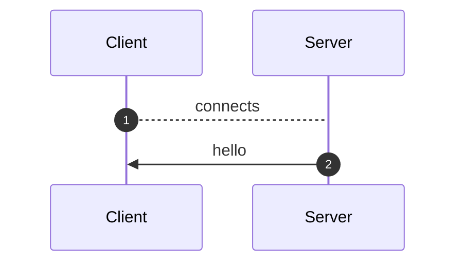
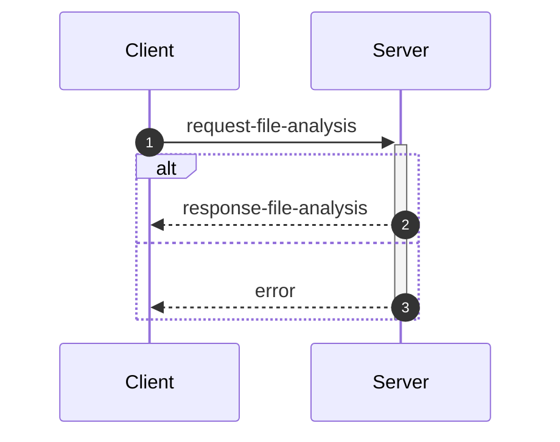
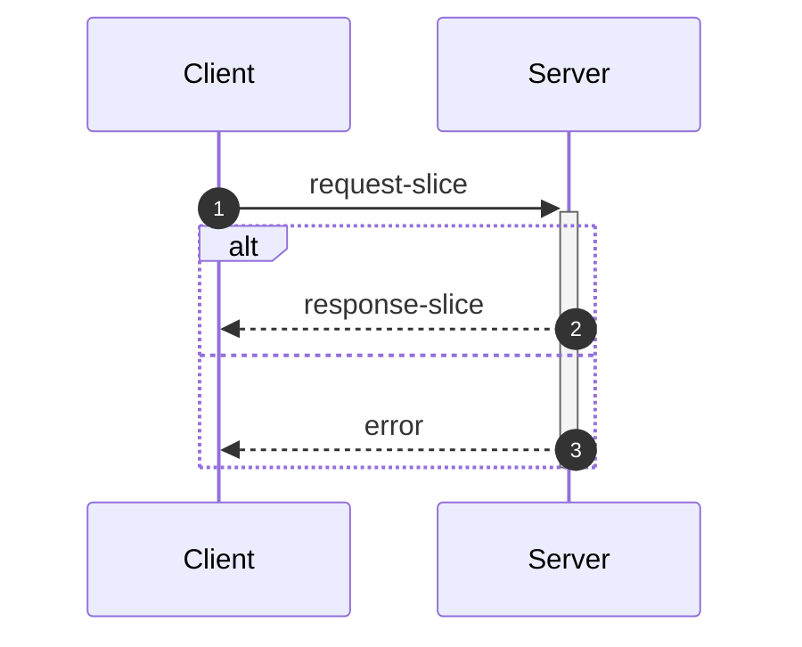
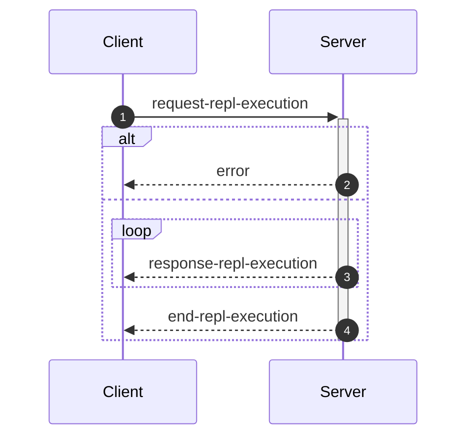
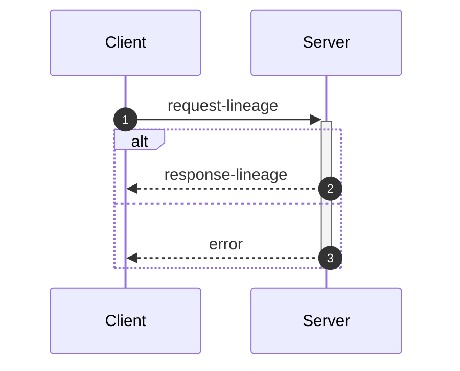

_This document was generated from '[src/documentation/print-interface-wiki.ts](https://github.com/flowr-analysis/flowr/tree/main//src/documentation/print-interface-wiki.ts)' on 2025-06-19, 17:57:32 UTC presenting an overview of flowR's interfaces (v2.2.15, using R v4.5.0). Please do not edit this file/wiki page directly._

Although far from being as detailed as the in-depth explanation of
[_flowR_](https://github.com/flowr-analysis/flowr/wiki/Core),
this wiki page explains how to interface with _flowR_ in more detail.
In general, command line arguments and other options provide short descriptions on hover over.

* [💬 Communicating with the Server](#communicating-with-the-server)
* [💻 Using the REPL](#using-the-repl)
* [⚙️ Configuring FlowR](#configuring-flowr)
* [⚒️ Writing Code](#writing-code)

<a id='communicating-with-the-server'></a>
## 💬 Communicating with the Server


As explained in the [Overview](https://github.com/flowr-analysis/flowr/wiki/Overview), you can simply run the [TCP](https://de.wikipedia.org/wiki/Transmission_Control_Protocol)&nbsp;server by adding the <span title="Description (Command Line Argument): Do not drop into a repl, but instead start a server on the given port (default: 1042) and listen for messages.">`--server`</span> flag (and, due to the interactive mode, exit with the conventional <kbd>CTRL</kbd>+<kbd>C</kbd>).
Currently, every connection is handled by the same underlying `RShell` - so the server is not designed to handle many clients at a time.
Additionally, the server is not well guarded against attacks (e.g., you can theoretically spawn an arbitrary number of&nbsp;RShell sessions on the target machine).

Every message has to be given in a single line (i.e., without a newline in-between) and end with a newline character. Nevertheless, we will pretty-print example given in the following segments for the ease of reading.


> [!NOTE]
> 
> The default <span title="Description (Command Line Argument): Do not drop into a repl, but instead start a server on the given port (default: 1042) and listen for messages.">`--server`</span> uses a simple [TCP](https://de.wikipedia.org/wiki/Transmission_Control_Protocol)
> connection. If you want _flowR_ to expose a [WebSocket](https://de.wikipedia.org/wiki/WebSocket) server instead, add the <span title="Description (Command Line Argument): If the server flag is set, use websocket for messaging">`--ws`</span> flag (i.e., <span title="Description (Command Line Argument): Do not drop into a repl, but instead start a server on the given port (default: 1042) and listen for messages.">`--server`</span> <span title="Description (Command Line Argument): If the server flag is set, use websocket for messaging">`--ws`</span>) when starting _flowR_ from the command line.
> 			


<ul><li>
<a id="message-hello"></a>
<b>Hello</b> Message (<code>hello</code>) 
<details>

<summary style="color:gray"> View Details. <i>The server informs the client about the successful connection and provides Meta-Information.</i> </summary>




	
After launching _flowR_, for example, with <code>docker run -it --rm eagleoutice/flowr <span title="Description (Command Line Argument): Do not drop into a repl, but instead start a server on the given port (default: 1042) and listen for messages.">-<span/>-server</span></code>&nbsp;(🐳️), simply connecting should present you with a `hello` message, that amongst others should reveal the versions of&nbsp;_flowR_ and&nbsp;R, using the [semver 2.0](https://semver.org/spec/v2.0.0.html) versioning scheme.
The message looks like this:


```json
{
  "type": "hello",
  "clientName": "client-0",
  "versions": {
    "flowr": "2.2.15",
    "r": "4.5.0",
    "engine": "r-shell"
  }
}
```


There are currently a few messages that you can send after the hello message.
If you want to _slice_ a piece of R code you first have to send an [analysis request](#message-request-file-analysis), so that you can send one or multiple slice requests afterward.
Requests for the [REPL](#message-request-repl) are independent of that.
	

<hr>


<details>
<summary style="color:gray">Message schema (<code>hello</code>)</summary>

For the definition of the hello message, please see it's implementation at [`./src/cli/repl/server/messages/message-hello.ts`](https://github.com/flowr-analysis/flowr/tree/main/./src/cli/repl/server/messages/message-hello.ts).

- **.** object [required]
    - **type** string [required]
        _The type of the hello message._
        Allows only the values: 'hello'
    - **id** any [forbidden]
        _The id of the message is always undefined (as it is the initial message and not requested)._
    - **clientName** string [required]
        _A unique name that is assigned to each client. It has no semantic meaning and is only used/useful for debugging._
    - **versions** object [required]
        - **flowr** string [required]
            _The version of the flowr server running in semver format._
        - **r** string [required]
            _The version of the underlying R shell running in semver format._
        - **engine** string [required]
            _The parser backend that is used to parse the R code._

</details>


<hr>

</details>	
	</li>

<li>
<a id="message-request-file-analysis"></a>
<b>Analysis</b> Message (<code>request-file-analysis</code>) 
<details>

<summary style="color:gray"> View Details. <i>The server builds the dataflow graph for a given input file (or a set of files).</i> </summary>




	
The request allows the server to analyze a file and prepare it for slicing.
The message can contain a `filetoken`, which is used to identify the file in later slice or lineage requests (if you do not add one, the request will not be stored and therefore, it is not available for subsequent requests).

> **Please note!**\
> If you want to send and process a lot of analysis requests, but do not want to slice them, please do not pass the `filetoken` field. This will save the server a lot of memory allocation.

Furthermore, the request must contain either a `content` field to directly pass the file's content or a `filepath` field which contains the path to the file (this path must be accessible for the server to be useful).
If you add the `id` field, the answer will use the same `id` so you can match requests and the corresponding answers.
See the implementation of the request-file-analysis message for more information.


<details>
<summary>Example of the <code>request-file-analysis</code> Message</summary>

_Note:_ even though we pretty-print these messages, they are sent as a single line, ending with a newline.

The following lists all messages that were sent and received in case you want to reproduce the scenario:

<ol>
<li> <code>hello</code> (response)
<details> 

<summary> Show Details </summary>

The first message is always a hello message.


```json
{
  "type": "hello",
  "clientName": "client-0",
  "versions": {
    "flowr": "2.2.15",
    "r": "4.5.0",
    "engine": "r-shell"
  }
}
```


</details>
</li>

<li> <b><code>request-file-analysis</code> (request)</b>
<details open> 

<summary> Show Details </summary>

Let' suppose you simply want to analyze the following script:
 
```r
x <- 1
x + 1
```

 For this, you can send the following request:


```json
{
  "type": "request-file-analysis",
  "id": "1",
  "filetoken": "x",
  "content": "x <- 1\nx + 1"
}
```


</details>
</li>

<li> <code>response-file-analysis</code> (response)
<details> 

<summary> Show Details </summary>


The `results` field of the response effectively contains three keys of importance:

- `parse`: which contains 1:1 the parse result in CSV format that we received from the `RShell` (i.e., the AST produced by the parser of the R interpreter).
- `normalize`: which contains the normalized AST, including ids (see the `info` field and the [Normalized AST](https://github.com/flowr-analysis/flowr/wiki/Normalized%20AST) wiki page).
- `dataflow`: especially important is the `graph` field which contains the dataflow graph as a set of root vertices (see the [Dataflow Graph](https://github.com/flowr-analysis/flowr/wiki/Dataflow%20Graph) wiki page).
			


_As the code is pretty long, we inhibit pretty printing and syntax highlighting (JSON, hiding built-in):_

```text
{"type":"response-file-analysis","format":"json","id":"1","results":{"parse":{"parsed":"[1,1,1,6,7,0,\"expr\",false,\"x <- 1\"],[1,1,1,1,1,3,\"SYMBOL\",true,\"x\"],[1,1,1,1,3,7,\"expr\",false,\"x\"],[1,3,1,4,2,7,\"LEFT_ASSIGN\",true,\"<-\"],[1,6,1,6,4,5,\"NUM_CONST\",true,\"1\"],[1,6,1,6,5,7,\"expr\",false,\"1\"],[2,1,2,5,16,0,\"expr\",false,\"x + 1\"],[2,1,2,1,10,12,\"SYMBOL\",true,\"x\"],[2,1,2,1,12,16,\"expr\",false,\"x\"],[2,3,2,3,11,16,\"'+'\",true,\"+\"],[2,5,2,5,13,14,\"NUM_CONST\",true,\"1\"],[2,5,2,5,14,16,\"expr\",false,\"1\"]",".meta":{"timing":5}},"normalize":{"ast":{"type":"RExpressionList","children":[{"type":"RBinaryOp","location":[1,3,1,4],"lhs":{"type":"RSymbol","location":[1,1,1,1],"content":"x","lexeme":"x","info":{"fullRange":[1,1,1,1],"additionalTokens":[],"id":0,"parent":2,"role":"binop-lhs","index":0,"nesting":0,"file":"/tmp/tmp-8081-C157zuI4MhS5-.R"}},"rhs":{"location":[1,6,1,6],"lexeme":"1","info":{"fullRange":[1,6,1,6],"additionalTokens":[],"id":1,"parent":2,"role":"binop-rhs","index":1,"nesting":0,"file":"/tmp/tmp-8081-C157zuI4MhS5-.R"},"type":"RNumber","content":{"num":1,"complexNumber":false,"markedAsInt":false}},"operator":"<-","lexeme":"<-","info":{"fullRange":[1,1,1,6],"additionalTokens":[],"id":2,"parent":6,"nesting":0,"file":"/tmp/tmp-8081-C157zuI4MhS5-.R","index":0,"role":"expr-list-child"}},{"type":"RBinaryOp","location":[2,3,2,3],"lhs":{"type":"RSymbol","location":[2,1,2,1],"content":"x","lexeme":"x","info":{"fullRange":[2,1,2,1],"additionalTokens":[],"id":3,"parent":5,"role":"binop-lhs","index":0,"nesting":0,"file":"/tmp/tmp-8081-C157zuI4MhS5-.R"}},"rhs":{"location":[2,5,2,5],"lexeme":"1","info":{"fullRange":[2,5,2,5],"additionalTokens":[],"id":4,"parent":5,"role":"binop-rhs","index":1,"nesting":0,"file":"/tmp/tmp-8081-C157zuI4MhS5-.R"},"type":"RNumber","content":{"num":1,"complexNumber":false,"markedAsInt":false}},"operator":"+","lexeme":"+","info":{"fullRange":[2,1,2,5],"additionalTokens":[],"id":5,"parent":6,"nesting":0,"file":"/tmp/tmp-8081-C157zuI4MhS5-.R","index":1,"role":"expr-list-child"}}],"info":{"additionalTokens":[],"id":6,"nesting":0,"file":"/tmp/tmp-8081-C157zuI4MhS5-.R","role":"root","index":0}},".meta":{"timing":3}},"dataflow":{"unknownReferences":[],"in":[{"nodeId":2,"name":"<-","type":2},{"nodeId":5,"name":"+","type":2}],"out":[{"nodeId":0,"name":"x","type":4,"definedAt":2,"value":[1]}],"environment":{"current":{"id":12,"parent":"<BuiltInEnvironment>","memory":[["x",[{"nodeId":0,"name":"x","type":4,"definedAt":2,"value":[1]}]]]},"level":0},"graph":{"_sourced":["/tmp/tmp-8081-C157zuI4MhS5-.R"],"_unknownSideEffects":[],"rootVertices":[1,0,2,3,4,5],"vertexInformation":[[1,{"tag":"value","id":1}],[0,{"tag":"variable-definition","id":0}],[2,{"tag":"function-call","id":2,"name":"<-","onlyBuiltin":true,"args":[{"nodeId":0,"type":32},{"nodeId":1,"type":32}],"origin":["builtin:assignment"]}],[3,{"tag":"use","id":3}],[4,{"tag":"value","id":4}],[5,{"tag":"function-call","id":5,"name":"+","onlyBuiltin":true,"args":[{"nodeId":3,"type":32},{"nodeId":4,"type":32}],"origin":["builtin:default"]}]],"edgeInformation":[[2,[[1,{"types":64}],[0,{"types":72}],["built-in:<-",{"types":5}]]],[0,[[1,{"types":2}],[2,{"types":2}]]],[3,[[0,{"types":1}]]],[5,[[3,{"types":65}],[4,{"types":65}],["built-in:+",{"types":5}]]]]},"entryPoint":2,"exitPoints":[{"type":0,"nodeId":5}],".meta":{"timing":4}}}}
```


</details>
</li>
</ol>

The complete round-trip took 18.7 ms (including time required to validate the messages, start, and stop the internal mock server).

</details>


You receive an error if, for whatever reason, the analysis fails (e.g., the message or code you sent contained syntax errors).
It contains a human-readable description *why* the analysis failed (see the error message implementation for more details).


<details>
<summary>Example Error Message</summary>

_Note:_ even though we pretty-print these messages, they are sent as a single line, ending with a newline.

The following lists all messages that were sent and received in case you want to reproduce the scenario:

<ol>
<li> <code>hello</code> (response)
<details> 

<summary> Show Details </summary>

The first message is always a hello message.


```json
{
  "type": "hello",
  "clientName": "client-0",
  "versions": {
    "flowr": "2.2.15",
    "r": "4.5.0",
    "engine": "r-shell"
  }
}
```


</details>
</li>

<li> <code>request-file-analysis</code> (request)
<details> 

<summary> Show Details </summary>


```json
{
  "type": "request-file-analysis",
  "id": "1",
  "filename": "sample.R",
  "content": "x <-"
}
```


</details>
</li>

<li> <b><code>error</code> (response)</b>
<details open> 

<summary> Show Details </summary>


```json
{
  "id": "1",
  "type": "error",
  "fatal": false,
  "reason": "Error while analyzing file sample.R: GuardError: unable to parse R code (see the log for more information) for request {\"request\":\"file\",\"content\":\"/tmp/tmp-8081-oB4YXAEi7qLv-.R\"}}\n Report a Bug: https://github.com/flowr-analysis/flowr/issues/new?body=%3C!%2D%2D%20Please%20describe%20your%20issue%20in%20more%20detail%20below!%20%2D%2D%3E%0A%0A%0A%3C!%2D%2D%20Automatically%20generated%20issue%20metadata%2C%20please%20do%20not%20edit%20or%20delete%20content%20below%20this%20line%20%2D%2D%3E%0A%2D%2D%2D%0A%0AflowR%20version%3A%202.2.15%0Anode%20version%3A%20v22.14.0%0Anode%20arch%3A%20x64%0Anode%20platform%3A%20linux%0Amessage%3A%20%60unable%20to%20parse%20R%20code%20%28see%20the%20log%20for%20more%20information%29%20for%20request%20%7B%22request%22%3A%22file%22%2C%22content%22%3A%22%2Ftmp%2Ftmp%2D8081%2DoB4YXAEi7qLv%2D.R%22%7D%7D%60%0Astack%20trace%3A%0A%60%60%60%0A%20%20%20%20at%20guard%20%28%3C%3E%2Fsrc%2Futil%2Fassert.ts%3A75%3A9%29%0A%20%20%20%20at%20guardRetrievedOutput%20%28%3C%3E%2Fsrc%2Fr%2Dbridge%2Fretriever.ts%3A184%3A7%29%0A%20%20%20%20at%20%2Fhome%2Frunner%2Fwork%2Fflowr%2Fflowr%2Fsrc%2Fr%2Dbridge%2Fretriever.ts%3A148%3A4%0A%20%20%20%20at%20processTicksAndRejections%20%28node%3Ainternal%2Fprocess%2Ftask_queues%3A105%3A5%29%0A%20%20%20%20at%20async%20Object.parseRequests%20%5Bas%20processor%5D%20%28%3C%3E%2Fsrc%2Fr%2Dbridge%2Fparser.ts%3A58%3A18%29%0A%20%20%20%20at%20async%20PipelineExecutor.nextStep%20%28%3C%3E%2Fsrc%2Fcore%2Fpipeline%2Dexecutor.ts%3A204%3A25%29%0A%20%20%20%20at%20async%20PipelineExecutor.allRemainingSteps%20%28%3C%3E%2Fsrc%2Fcore%2Fpipeline%2Dexecutor.ts%3A263%3A4%29%0A%20%20%20%20at%20async%20FlowRServerConnection.handleFileAnalysisRequest%20%28%3C%3E%2Fsrc%2Fcli%2Frepl%2Fserver%2Fconnection.ts%3A144%3A3%29%0A%60%60%60%0A%0A%2D%2D%2D%0A%09"
}
```


</details>
</li>
</ol>

The complete round-trip took 8.6 ms (including time required to validate the messages, start, and stop the internal mock server).

</details>


&nbsp;

<a id="analysis-include-cfg"></a>
**Including the Control Flow Graph**

While _flowR_ does (for the time being) not use an explicit control flow graph but instead relies on control-dependency edges within the dataflow graph, 
the respective structure can still be exposed using the server (note that, as this feature is not needed within _flowR_, it is tested significantly less - 
so please create a [new issue](https://github.com/flowr-analysis/flowr/issues/new/choose) for any bug you may encounter).
For this, the analysis request may add `cfg: true` to its list of options.


<details>
<summary>Requesting a Control Flow Graph</summary>

_Note:_ even though we pretty-print these messages, they are sent as a single line, ending with a newline.

The following lists all messages that were sent and received in case you want to reproduce the scenario:

<ol>
<li> <code>hello</code> (response)
<details> 

<summary> Show Details </summary>

The first message is always a hello message.


```json
{
  "type": "hello",
  "clientName": "client-0",
  "versions": {
    "flowr": "2.2.15",
    "r": "4.5.0",
    "engine": "r-shell"
  }
}
```


</details>
</li>

<li> <b><code>request-file-analysis</code> (request)</b>
<details open> 

<summary> Show Details </summary>


```json
{
  "type": "request-file-analysis",
  "id": "1",
  "filetoken": "x",
  "content": "if(unknown > 0) { x <- 2 } else { x <- 5 }\nfor(i in 1:x) { print(x); print(i) }",
  "cfg": true
}
```


</details>
</li>

<li> <code>response-file-analysis</code> (response)
<details> 

<summary> Show Details </summary>


The response looks basically the same as a response sent without the `cfg` flag. However, additionally it contains a `cfg` field. 
If you are interested in a visual representation of the control flow graph, see the 
[visualization with mermaid](https://mermaid.live/view#base64:eyJjb2RlIjoiZmxvd2NoYXJ0IEJUXG4gICAgbjMyKFtcImBSRXhwcmVzc2lvbkxpc3QgKDMyKWBcIl0pXG4gICAgbjE1W1wiYFJJZlRoZW5FbHNlICgxNSlcbiMzNDtpZih1bmtub3duICM2MjsgMCkgIzEyMzsgeCAjNjA7IzQ1OyAyICMxMjU7IGVsc2UgIzEyMzsgeCAjNjA7IzQ1OyA1ICMxMjU7IzM0O2BcIl1cbiAgICBuMTUtY29uZGl0aW9uW1sxNS1jb25kaXRpb25dXVxuICAgIG4xNS1leGl0KCgxNS1leGl0KSlcbiAgICBuMChbXCJgUlN5bWJvbCAoMClcbiMzNDt1bmtub3duIzM0O2BcIl0pXG4gICAgbjEoW1wiYFJOdW1iZXIgKDEpXG4jMzQ7MCMzNDtgXCJdKVxuICAgIG4yKFtcImBSQmluYXJ5T3AgKDIpXG4jMzQ7dW5rbm93biAjNjI7IDAjMzQ7YFwiXSlcbiAgICBuMi1leGl0KCgyLWV4aXQpKVxuICAgIG44KFtcImBSRXhwcmVzc2lvbkxpc3QgKDgpYFwiXSlcbiAgICBuNShbXCJgUlN5bWJvbCAoNSlcbiMzNDt4IzM0O2BcIl0pXG4gICAgbjYoW1wiYFJOdW1iZXIgKDYpXG4jMzQ7MiMzNDtgXCJdKVxuICAgIG43KFtcImBSQmluYXJ5T3AgKDcpXG4jMzQ7eCAjNjA7IzQ1OyAyIzM0O2BcIl0pXG4gICAgbjctZXhpdCgoNy1leGl0KSlcbiAgICBuOC1leGl0KCg4LWV4aXQpKVxuICAgIG4xNChbXCJgUkV4cHJlc3Npb25MaXN0ICgxNClgXCJdKVxuICAgIG4xMShbXCJgUlN5bWJvbCAoMTEpXG4jMzQ7eCMzNDtgXCJdKVxuICAgIG4xMihbXCJgUk51bWJlciAoMTIpXG4jMzQ7NSMzNDtgXCJdKVxuICAgIG4xMyhbXCJgUkJpbmFyeU9wICgxMylcbiMzNDt4ICM2MDsjNDU7IDUjMzQ7YFwiXSlcbiAgICBuMTMtZXhpdCgoMTMtZXhpdCkpXG4gICAgbjE0LWV4aXQoKDE0LWV4aXQpKVxuICAgIG4xNihbXCJgUlN5bWJvbCAoMTYpXG4jMzQ7aSMzNDtgXCJdKVxuICAgIG4zMVtcImBSRm9yTG9vcCAoMzEpXG4jMzQ7Zm9yKGkgaW4gMSM1ODt4KSAjMTIzOyBwcmludCh4KTsgcHJpbnQoaSkgIzEyNTsjMzQ7YFwiXVxuICAgIG4xNyhbXCJgUk51bWJlciAoMTcpXG4jMzQ7MSMzNDtgXCJdKVxuICAgIG4xOChbXCJgUlN5bWJvbCAoMTgpXG4jMzQ7eCMzNDtgXCJdKVxuICAgIG4xOShbXCJgUkJpbmFyeU9wICgxOSlcbiMzNDsxIzU4O3gjMzQ7YFwiXSlcbiAgICBuMTktZXhpdCgoMTktZXhpdCkpXG4gICAgbjMwKFtcImBSRXhwcmVzc2lvbkxpc3QgKDMwKWBcIl0pXG4gICAgbjIyKFtcImBSU3ltYm9sICgyMilcbiMzNDtwcmludCh4KSMzNDtgXCJdKVxuICAgIG4yNVtcImBSRnVuY3Rpb25DYWxsICgyNSlcbiMzNDtwcmludCh4KSMzNDtgXCJdXG4gICAgbjI1LW5hbWVbWzI1LW5hbWVdXVxuICAgIG4yNS1leGl0KCgyNS1leGl0KSlcbiAgICBuMjQoW1wiYFJBcmd1bWVudCAoMjQpXG4jMzQ7eCMzNDtgXCJdKVxuICAgIG4yNC1iZWZvcmUtdmFsdWVbWzI0LWJlZm9yZS12YWx1ZV1dXG4gICAgbjIzKFtcImBSU3ltYm9sICgyMylcbiMzNDt4IzM0O2BcIl0pXG4gICAgbjI0LWV4aXQoKDI0LWV4aXQpKVxuICAgIG4yNihbXCJgUlN5bWJvbCAoMjYpXG4jMzQ7cHJpbnQoaSkjMzQ7YFwiXSlcbiAgICBuMjlbXCJgUkZ1bmN0aW9uQ2FsbCAoMjkpXG4jMzQ7cHJpbnQoaSkjMzQ7YFwiXVxuICAgIG4yOS1uYW1lW1syOS1uYW1lXV1cbiAgICBuMjktZXhpdCgoMjktZXhpdCkpXG4gICAgbjI4KFtcImBSQXJndW1lbnQgKDI4KVxuIzM0O2kjMzQ7YFwiXSlcbiAgICBuMjgtYmVmb3JlLXZhbHVlW1syOC1iZWZvcmUtdmFsdWVdXVxuICAgIG4yNyhbXCJgUlN5bWJvbCAoMjcpXG4jMzQ7aSMzNDtgXCJdKVxuICAgIG4yOC1leGl0KCgyOC1leGl0KSlcbiAgICBuMzAtZXhpdCgoMzAtZXhpdCkpXG4gICAgbjMxLWhlYWRbWzMxLWhlYWRdXVxuICAgIG4zMS1leGl0KCgzMS1leGl0KSlcbiAgICBuMzItZXhpdCgoMzItZXhpdCkpXG4gICAgbjE1IC0uLT58XCJGRFwifCBuMzJcbiAgICBuMSAtLi0+fFwiRkRcInwgbjBcbiAgICBuMCAtLi0+fFwiRkRcInwgbjJcbiAgICBuMi1leGl0IC0uLT58XCJGRFwifCBuMVxuICAgIG43IC0uLT58XCJGRFwifCBuOFxuICAgIG42IC0uLT58XCJGRFwifCBuNVxuICAgIG41IC0uLT58XCJGRFwifCBuN1xuICAgIG43LWV4aXQgLS4tPnxcIkZEXCJ8IG42XG4gICAgbjgtZXhpdCAtLi0+fFwiRkRcInwgbjctZXhpdFxuICAgIG4xMyAtLi0+fFwiRkRcInwgbjE0XG4gICAgbjEyIC0uLT58XCJGRFwifCBuMTFcbiAgICBuMTEgLS4tPnxcIkZEXCJ8IG4xM1xuICAgIG4xMy1leGl0IC0uLT58XCJGRFwifCBuMTJcbiAgICBuMTQtZXhpdCAtLi0+fFwiRkRcInwgbjEzLWV4aXRcbiAgICBuMTUtY29uZGl0aW9uIC0uLT58XCJGRFwifCBuMi1leGl0XG4gICAgbjggLS0+fFwiQ0QgKFRSVUUpXCJ8IG4xNS1jb25kaXRpb25cbiAgICBuMTQgLS0+fFwiQ0QgKEZBTFNFKVwifCBuMTUtY29uZGl0aW9uXG4gICAgbjIgLS4tPnxcIkZEXCJ8IG4xNVxuICAgIG4xNS1leGl0IC0uLT58XCJGRFwifCBuOC1leGl0XG4gICAgbjE1LWV4aXQgLS4tPnxcIkZEXCJ8IG4xNC1leGl0XG4gICAgbjMxIC0uLT58XCJGRFwifCBuMTUtZXhpdFxuICAgIG4zMSAtLi0+fFwiRkRcInwgbjMwLWV4aXRcbiAgICBuMTggLS4tPnxcIkZEXCJ8IG4xN1xuICAgIG4xNyAtLi0+fFwiRkRcInwgbjE5XG4gICAgbjE5LWV4aXQgLS4tPnxcIkZEXCJ8IG4xOFxuICAgIG4yNSAtLi0+fFwiRkRcInwgbjMwXG4gICAgbjIyIC0uLT58XCJGRFwifCBuMjVcbiAgICBuMjUtbmFtZSAtLi0+fFwiRkRcInwgbjIyXG4gICAgbjI0LWJlZm9yZS12YWx1ZSAtLi0+fFwiRkRcInwgbjI0XG4gICAgbjIzIC0uLT58XCJGRFwifCBuMjQtYmVmb3JlLXZhbHVlXG4gICAgbjI0LWV4aXQgLS4tPnxcIkZEXCJ8IG4yM1xuICAgIG4yNCAtLi0+fFwiRkRcInwgbjI1LW5hbWVcbiAgICBuMjUtZXhpdCAtLi0+fFwiRkRcInwgbjI0LWV4aXRcbiAgICBuMjkgLS4tPnxcIkZEXCJ8IG4yNS1leGl0XG4gICAgbjI2IC0uLT58XCJGRFwifCBuMjlcbiAgICBuMjktbmFtZSAtLi0+fFwiRkRcInwgbjI2XG4gICAgbjI4LWJlZm9yZS12YWx1ZSAtLi0+fFwiRkRcInwgbjI4XG4gICAgbjI3IC0uLT58XCJGRFwifCBuMjgtYmVmb3JlLXZhbHVlXG4gICAgbjI4LWV4aXQgLS4tPnxcIkZEXCJ8IG4yN1xuICAgIG4yOCAtLi0+fFwiRkRcInwgbjI5LW5hbWVcbiAgICBuMjktZXhpdCAtLi0+fFwiRkRcInwgbjI4LWV4aXRcbiAgICBuMzAtZXhpdCAtLi0+fFwiRkRcInwgbjI5LWV4aXRcbiAgICBuMTkgLS4tPnxcIkZEXCJ8IG4zMVxuICAgIG4xNiAtLi0+fFwiRkRcInwgbjE5LWV4aXRcbiAgICBuMzEtaGVhZCAtLi0+fFwiRkRcInwgbjE2XG4gICAgbjMwIC0tPnxcIkNEIChUUlVFKVwifCBuMzEtaGVhZFxuICAgIG4zMS1leGl0IC0tPnxcIkNEIChGQUxTRSlcInwgbjMxLWhlYWRcbiAgICBuMzItZXhpdCAtLi0+fFwiRkRcInwgbjMxLWV4aXRcbiAgICBzdHlsZSBuMzIgc3Ryb2tlOmN5YW4sc3Ryb2tlLXdpZHRoOjYuNXB4OyAgICBzdHlsZSBuMzItZXhpdCBzdHJva2U6Z3JlZW4sc3Ryb2tlLXdpZHRoOjYuNXB4OyIsIm1lcm1haWQiOnsiYXV0b1N5bmMiOnRydWV9fQ==).
			


_As the code is pretty long, we inhibit pretty printing and syntax highlighting (JSON, hiding built-in):_

```text
{"type":"response-file-analysis","format":"json","id":"1","cfg":{"returns":[],"entryPoints":[32],"exitPoints":["32-exit"],"breaks":[],"nexts":[],"graph":{"rootVertices":[32,15,"15-condition","15-exit",0,1,2,"2-exit",8,5,6,7,"7-exit","8-exit",14,11,12,13,"13-exit","14-exit",16,31,17,18,19,"19-exit",30,22,25,"25-name","25-exit",24,"24-before-value",23,"24-exit",26,29,"29-name","29-exit",28,"28-before-value",27,"28-exit","30-exit","31-head","31-exit","32-exit"],"vertexInformation":[[32,{"id":32,"type":"expr","end":["32-exit"]}],[15,{"id":15,"type":"stm","mid":["15-condition"],"end":["15-exit"]}],["15-condition",{"id":"15-condition","kind":"condition","type":"mid","root":15}],["15-exit",{"id":"15-exit","type":"end","root":15}],[0,{"id":0,"type":"expr"}],[1,{"id":1,"type":"expr"}],[2,{"id":2,"type":"expr","end":["2-exit"]}],["2-exit",{"id":"2-exit","type":"end","root":2}],[8,{"id":8,"type":"expr","end":["8-exit"]}],[5,{"id":5,"type":"expr"}],[6,{"id":6,"type":"expr"}],[7,{"id":7,"type":"expr","end":["7-exit"]}],["7-exit",{"id":"7-exit","type":"end","root":7}],["8-exit",{"id":"8-exit","type":"end","root":8}],[14,{"id":14,"type":"expr","end":["14-exit"]}],[11,{"id":11,"type":"expr"}],[12,{"id":12,"type":"expr"}],[13,{"id":13,"type":"expr","end":["13-exit"]}],["13-exit",{"id":"13-exit","type":"end","root":13}],["14-exit",{"id":"14-exit","type":"end","root":14}],[16,{"id":16,"type":"expr"}],[31,{"id":31,"type":"stm","end":["31-exit"],"mid":["31-head"]}],[17,{"id":17,"type":"expr"}],[18,{"id":18,"type":"expr"}],[19,{"id":19,"type":"expr","end":["19-exit"]}],["19-exit",{"id":"19-exit","type":"end","root":19}],[30,{"id":30,"type":"expr","end":["30-exit"]}],[22,{"id":22,"type":"expr"}],[25,{"id":25,"type":"stm","mid":["25-name"],"end":["25-exit"]}],["25-name",{"id":"25-name","kind":"name","type":"mid","root":25}],["25-exit",{"id":"25-exit","type":"end","root":25}],[24,{"id":24,"type":"expr","mid":["24-before-value"],"end":["24-exit"]}],["24-before-value",{"id":"24-before-value","kind":"before-value","type":"mid","root":24}],[23,{"id":23,"type":"expr"}],["24-exit",{"id":"24-exit","type":"end","root":24}],[26,{"id":26,"type":"expr"}],[29,{"id":29,"type":"stm","mid":["29-name"],"end":["29-exit"]}],["29-name",{"id":"29-name","kind":"name","type":"mid","root":29}],["29-exit",{"id":"29-exit","type":"end","root":29}],[28,{"id":28,"type":"expr","mid":["28-before-value"],"end":["28-exit"]}],["28-before-value",{"id":"28-before-value","kind":"before-value","type":"mid","root":28}],[27,{"id":27,"type":"expr"}],["28-exit",{"id":"28-exit","type":"end","root":28}],["30-exit",{"id":"30-exit","type":"end","root":30}],["31-head",{"id":"31-head","type":"mid","root":31,"kind":"head"}],["31-exit",{"id":"31-exit","type":"end","root":31}],["32-exit",{"id":"32-exit","type":"end","root":32}]],"bbChildren":[],"edgeInformation":[[15,[[32,{"label":0}]]],[1,[[0,{"label":0}]]],[0,[[2,{"label":0}]]],["2-exit",[[1,{"label":0}]]],[7,[[8,{"label":0}]]],[6,[[5,{"label":0}]]],[5,[[7,{"label":0}]]],["7-exit",[[6,{"label":0}]]],["8-exit",[["7-exit",{"label":0}]]],[13,[[14,{"label":0}]]],[12,[[11,{"label":0}]]],[11,[[13,{"label":0}]]],["13-exit",[[12,{"label":0}]]],["14-exit",[["13-exit",{"label":0}]]],["15-condition",[["2-exit",{"label":0}]]],[8,[["15-condition",{"label":1,"when":"TRUE","caused":15}]]],[14,[["15-condition",{"label":1,"when":"FALSE","caused":15}]]],[2,[[15,{"label":0}]]],["15-exit",[["8-exit",{"label":0}],["14-exit",{"label":0}]]],[31,[["15-exit",{"label":0}],["30-exit",{"label":0}]]],[18,[[17,{"label":0}]]],[17,[[19,{"label":0}]]],["19-exit",[[18,{"label":0}]]],[25,[[30,{"label":0}]]],[22,[[25,{"label":0}]]],["25-name",[[22,{"label":0}]]],["24-before-value",[[24,{"label":0}]]],[23,[["24-before-value",{"label":0}]]],["24-exit",[[23,{"label":0}]]],[24,[["25-name",{"label":0}]]],["25-exit",[["24-exit",{"label":0}]]],[29,[["25-exit",{"label":0}]]],[26,[[29,{"label":0}]]],["29-name",[[26,{"label":0}]]],["28-before-value",[[28,{"label":0}]]],[27,[["28-before-value",{"label":0}]]],["28-exit",[[27,{"label":0}]]],[28,[["29-name",{"label":0}]]],["29-exit",[["28-exit",{"label":0}]]],["30-exit",[["29-exit",{"label":0}]]],[19,[[31,{"label":0}]]],[16,[["19-exit",{"label":0}]]],["31-head",[[16,{"label":0}]]],[30,[["31-head",{"label":1,"when":"TRUE","caused":31}]]],["31-exit",[["31-head",{"label":1,"when":"FALSE","caused":31}]]],["32-exit",[["31-exit",{"label":0}]]]],"_mayHaveBasicBlocks":false}},"results":{"parse":{"parsed":"[1,1,1,42,38,0,\"expr\",false,\"if(unknown > 0) { x <- 2 } else { x <- 5 }\"],[1,1,1,2,1,38,\"IF\",true,\"if\"],[1,3,1,3,2,38,\"'('\",true,\"(\"],[1,4,1,14,9,38,\"expr\",false,\"unknown > 0\"],[1,4,1,10,3,5,\"SYMBOL\",true,\"unknown\"],[1,4,1,10,5,9,\"expr\",false,\"unknown\"],[1,12,1,12,4,9,\"GT\",true,\">\"],[1,14,1,14,6,7,\"NUM_CONST\",true,\"0\"],[1,14,1,14,7,9,\"expr\",false,\"0\"],[1,15,1,15,8,38,\"')'\",true,\")\"],[1,17,1,26,22,38,\"expr\",false,\"{ x <- 2 }\"],[1,17,1,17,12,22,\"'{'\",true,\"{\"],[1,19,1,24,19,22,\"expr\",false,\"x <- 2\"],[1,19,1,19,13,15,\"SYMBOL\",true,\"x\"],[1,19,1,19,15,19,\"expr\",false,\"x\"],[1,21,1,22,14,19,\"LEFT_ASSIGN\",true,\"<-\"],[1,24,1,24,16,17,\"NUM_CONST\",true,\"2\"],[1,24,1,24,17,19,\"expr\",false,\"2\"],[1,26,1,26,18,22,\"'}'\",true,\"}\"],[1,28,1,31,23,38,\"ELSE\",true,\"else\"],[1,33,1,42,35,38,\"expr\",false,\"{ x <- 5 }\"],[1,33,1,33,25,35,\"'{'\",true,\"{\"],[1,35,1,40,32,35,\"expr\",false,\"x <- 5\"],[1,35,1,35,26,28,\"SYMBOL\",true,\"x\"],[1,35,1,35,28,32,\"expr\",false,\"x\"],[1,37,1,38,27,32,\"LEFT_ASSIGN\",true,\"<-\"],[1,40,1,40,29,30,\"NUM_CONST\",true,\"5\"],[1,40,1,40,30,32,\"expr\",false,\"5\"],[1,42,1,42,31,35,\"'}'\",true,\"}\"],[2,1,2,36,84,0,\"expr\",false,\"for(i in 1:x) { print(x); print(i) }\"],[2,1,2,3,41,84,\"FOR\",true,\"for\"],[2,4,2,13,53,84,\"forcond\",false,\"(i in 1:x)\"],[2,4,2,4,42,53,\"'('\",true,\"(\"],[2,5,2,5,43,53,\"SYMBOL\",true,\"i\"],[2,7,2,8,44,53,\"IN\",true,\"in\"],[2,10,2,12,51,53,\"expr\",false,\"1:x\"],[2,10,2,10,45,46,\"NUM_CONST\",true,\"1\"],[2,10,2,10,46,51,\"expr\",false,\"1\"],[2,11,2,11,47,51,\"':'\",true,\":\"],[2,12,2,12,48,50,\"SYMBOL\",true,\"x\"],[2,12,2,12,50,51,\"expr\",false,\"x\"],[2,13,2,13,49,53,\"')'\",true,\")\"],[2,15,2,36,81,84,\"expr\",false,\"{ print(x); print(i) }\"],[2,15,2,15,54,81,\"'{'\",true,\"{\"],[2,17,2,24,64,81,\"expr\",false,\"print(x)\"],[2,17,2,21,55,57,\"SYMBOL_FUNCTION_CALL\",true,\"print\"],[2,17,2,21,57,64,\"expr\",false,\"print\"],[2,22,2,22,56,64,\"'('\",true,\"(\"],[2,23,2,23,58,60,\"SYMBOL\",true,\"x\"],[2,23,2,23,60,64,\"expr\",false,\"x\"],[2,24,2,24,59,64,\"')'\",true,\")\"],[2,25,2,25,65,81,\"';'\",true,\";\"],[2,27,2,34,77,81,\"expr\",false,\"print(i)\"],[2,27,2,31,68,70,\"SYMBOL_FUNCTION_CALL\",true,\"print\"],[2,27,2,31,70,77,\"expr\",false,\"print\"],[2,32,2,32,69,77,\"'('\",true,\"(\"],[2,33,2,33,71,73,\"SYMBOL\",true,\"i\"],[2,33,2,33,73,77,\"expr\",false,\"i\"],[2,34,2,34,72,77,\"')'\",true,\")\"],[2,36,2,36,78,81,\"'}'\",true,\"}\"]",".meta":{"timing":3}},"normalize":{"ast":{"type":"RExpressionList","children":[{"type":"RIfThenElse","condition":{"type":"RBinaryOp","location":[1,12,1,12],"lhs":{"type":"RSymbol","location":[1,4,1,10],"content":"unknown","lexeme":"unknown","info":{"fullRange":[1,4,1,10],"additionalTokens":[],"id":0,"parent":2,"role":"binop-lhs","index":0,"nesting":1,"file":"/tmp/tmp-8081-B3ZYkmYEnu2X-.R"}},"rhs":{"location":[1,14,1,14],"lexeme":"0","info":{"fullRange":[1,14,1,14],"additionalTokens":[],"id":1,"parent":2,"role":"binop-rhs","index":1,"nesting":1,"file":"/tmp/tmp-8081-B3ZYkmYEnu2X-.R"},"type":"RNumber","content":{"num":0,"complexNumber":false,"markedAsInt":false}},"operator":">","lexeme":">","info":{"fullRange":[1,4,1,14],"additionalTokens":[],"id":2,"parent":15,"nesting":1,"file":"/tmp/tmp-8081-B3ZYkmYEnu2X-.R","role":"if-cond"}},"then":{"type":"RExpressionList","children":[{"type":"RBinaryOp","location":[1,21,1,22],"lhs":{"type":"RSymbol","location":[1,19,1,19],"content":"x","lexeme":"x","info":{"fullRange":[1,19,1,19],"additionalTokens":[],"id":5,"parent":7,"role":"binop-lhs","index":0,"nesting":1,"file":"/tmp/tmp-8081-B3ZYkmYEnu2X-.R"}},"rhs":{"location":[1,24,1,24],"lexeme":"2","info":{"fullRange":[1,24,1,24],"additionalTokens":[],"id":6,"parent":7,"role":"binop-rhs","index":1,"nesting":1,"file":"/tmp/tmp-8081-B3ZYkmYEnu2X-.R"},"type":"RNumber","content":{"num":2,"complexNumber":false,"markedAsInt":false}},"operator":"<-","lexeme":"<-","info":{"fullRange":[1,19,1,24],"additionalTokens":[],"id":7,"parent":8,"nesting":1,"file":"/tmp/tmp-8081-B3ZYkmYEnu2X-.R","index":0,"role":"expr-list-child"}}],"grouping":[{"type":"RSymbol","location":[1,17,1,17],"content":"{","lexeme":"{","info":{"fullRange":[1,17,1,26],"additionalTokens":[],"id":3,"role":"root","index":0,"nesting":1,"file":"/tmp/tmp-8081-B3ZYkmYEnu2X-.R"}},{"type":"RSymbol","location":[1,26,1,26],"content":"}","lexeme":"}","info":{"fullRange":[1,17,1,26],"additionalTokens":[],"id":4,"role":"root","index":0,"nesting":1,"file":"/tmp/tmp-8081-B3ZYkmYEnu2X-.R"}}],"info":{"additionalTokens":[],"id":8,"parent":15,"nesting":1,"file":"/tmp/tmp-8081-B3ZYkmYEnu2X-.R","index":1,"role":"if-then"}},"location":[1,1,1,2],"lexeme":"if","info":{"fullRange":[1,1,1,42],"additionalTokens":[],"id":15,"parent":32,"nesting":1,"file":"/tmp/tmp-8081-B3ZYkmYEnu2X-.R","index":0,"role":"expr-list-child"},"otherwise":{"type":"RExpressionList","children":[{"type":"RBinaryOp","location":[1,37,1,38],"lhs":{"type":"RSymbol","location":[1,35,1,35],"content":"x","lexeme":"x","info":{"fullRange":[1,35,1,35],"additionalTokens":[],"id":11,"parent":13,"role":"binop-lhs","index":0,"nesting":1,"file":"/tmp/tmp-8081-B3ZYkmYEnu2X-.R"}},"rhs":{"location":[1,40,1,40],"lexeme":"5","info":{"fullRange":[1,40,1,40],"additionalTokens":[],"id":12,"parent":13,"role":"binop-rhs","index":1,"nesting":1,"file":"/tmp/tmp-8081-B3ZYkmYEnu2X-.R"},"type":"RNumber","content":{"num":5,"complexNumber":false,"markedAsInt":false}},"operator":"<-","lexeme":"<-","info":{"fullRange":[1,35,1,40],"additionalTokens":[],"id":13,"parent":14,"nesting":1,"file":"/tmp/tmp-8081-B3ZYkmYEnu2X-.R","index":0,"role":"expr-list-child"}}],"grouping":[{"type":"RSymbol","location":[1,33,1,33],"content":"{","lexeme":"{","info":{"fullRange":[1,33,1,42],"additionalTokens":[],"id":9,"role":"root","index":0,"nesting":1,"file":"/tmp/tmp-8081-B3ZYkmYEnu2X-.R"}},{"type":"RSymbol","location":[1,42,1,42],"content":"}","lexeme":"}","info":{"fullRange":[1,33,1,42],"additionalTokens":[],"id":10,"role":"root","index":0,"nesting":1,"file":"/tmp/tmp-8081-B3ZYkmYEnu2X-.R"}}],"info":{"additionalTokens":[],"id":14,"parent":15,"nesting":1,"file":"/tmp/tmp-8081-B3ZYkmYEnu2X-.R","index":2,"role":"if-otherwise"}}},{"type":"RForLoop","variable":{"type":"RSymbol","location":[2,5,2,5],"content":"i","lexeme":"i","info":{"additionalTokens":[],"id":16,"parent":31,"role":"for-variable","index":0,"nesting":1,"file":"/tmp/tmp-8081-B3ZYkmYEnu2X-.R"}},"vector":{"type":"RBinaryOp","location":[2,11,2,11],"lhs":{"location":[2,10,2,10],"lexeme":"1","info":{"fullRange":[2,10,2,10],"additionalTokens":[],"id":17,"parent":19,"role":"binop-lhs","index":0,"nesting":1,"file":"/tmp/tmp-8081-B3ZYkmYEnu2X-.R"},"type":"RNumber","content":{"num":1,"complexNumber":false,"markedAsInt":false}},"rhs":{"type":"RSymbol","location":[2,12,2,12],"content":"x","lexeme":"x","info":{"fullRange":[2,12,2,12],"additionalTokens":[],"id":18,"parent":19,"role":"binop-rhs","index":1,"nesting":1,"file":"/tmp/tmp-8081-B3ZYkmYEnu2X-.R"}},"operator":":","lexeme":":","info":{"fullRange":[2,10,2,12],"additionalTokens":[],"id":19,"parent":31,"nesting":1,"file":"/tmp/tmp-8081-B3ZYkmYEnu2X-.R","index":1,"role":"for-vector"}},"body":{"type":"RExpressionList","children":[{"type":"RFunctionCall","named":true,"location":[2,17,2,21],"lexeme":"print","functionName":{"type":"RSymbol","location":[2,17,2,21],"content":"print","lexeme":"print","info":{"fullRange":[2,17,2,24],"additionalTokens":[],"id":22,"parent":25,"role":"call-name","index":0,"nesting":1,"file":"/tmp/tmp-8081-B3ZYkmYEnu2X-.R"}},"arguments":[{"type":"RArgument","location":[2,23,2,23],"lexeme":"x","value":{"type":"RSymbol","location":[2,23,2,23],"content":"x","lexeme":"x","info":{"fullRange":[2,23,2,23],"additionalTokens":[],"id":23,"parent":24,"role":"arg-value","index":0,"nesting":1,"file":"/tmp/tmp-8081-B3ZYkmYEnu2X-.R"}},"info":{"fullRange":[2,23,2,23],"additionalTokens":[],"id":24,"parent":25,"nesting":1,"file":"/tmp/tmp-8081-B3ZYkmYEnu2X-.R","index":1,"role":"call-argument"}}],"info":{"fullRange":[2,17,2,24],"additionalTokens":[],"id":25,"parent":30,"nesting":1,"file":"/tmp/tmp-8081-B3ZYkmYEnu2X-.R","index":0,"role":"expr-list-child"}},{"type":"RFunctionCall","named":true,"location":[2,27,2,31],"lexeme":"print","functionName":{"type":"RSymbol","location":[2,27,2,31],"content":"print","lexeme":"print","info":{"fullRange":[2,27,2,34],"additionalTokens":[],"id":26,"parent":29,"role":"call-name","index":0,"nesting":1,"file":"/tmp/tmp-8081-B3ZYkmYEnu2X-.R"}},"arguments":[{"type":"RArgument","location":[2,33,2,33],"lexeme":"i","value":{"type":"RSymbol","location":[2,33,2,33],"content":"i","lexeme":"i","info":{"fullRange":[2,33,2,33],"additionalTokens":[],"id":27,"parent":28,"role":"arg-value","index":0,"nesting":1,"file":"/tmp/tmp-8081-B3ZYkmYEnu2X-.R"}},"info":{"fullRange":[2,33,2,33],"additionalTokens":[],"id":28,"parent":29,"nesting":1,"file":"/tmp/tmp-8081-B3ZYkmYEnu2X-.R","index":1,"role":"call-argument"}}],"info":{"fullRange":[2,27,2,34],"additionalTokens":[],"id":29,"parent":30,"nesting":1,"file":"/tmp/tmp-8081-B3ZYkmYEnu2X-.R","index":1,"role":"expr-list-child"}}],"grouping":[{"type":"RSymbol","location":[2,15,2,15],"content":"{","lexeme":"{","info":{"fullRange":[2,15,2,36],"additionalTokens":[],"id":20,"role":"root","index":0,"nesting":1,"file":"/tmp/tmp-8081-B3ZYkmYEnu2X-.R"}},{"type":"RSymbol","location":[2,36,2,36],"content":"}","lexeme":"}","info":{"fullRange":[2,15,2,36],"additionalTokens":[],"id":21,"role":"root","index":0,"nesting":1,"file":"/tmp/tmp-8081-B3ZYkmYEnu2X-.R"}}],"info":{"additionalTokens":[],"id":30,"parent":31,"nesting":1,"file":"/tmp/tmp-8081-B3ZYkmYEnu2X-.R","index":2,"role":"for-body"}},"lexeme":"for","info":{"fullRange":[2,1,2,36],"additionalTokens":[],"id":31,"parent":32,"nesting":1,"file":"/tmp/tmp-8081-B3ZYkmYEnu2X-.R","index":1,"role":"expr-list-child"},"location":[2,1,2,3]}],"info":{"additionalTokens":[],"id":32,"nesting":0,"file":"/tmp/tmp-8081-B3ZYkmYEnu2X-.R","role":"root","index":0}},".meta":{"timing":1}},"dataflow":{"unknownReferences":[],"in":[{"nodeId":15,"name":"if","type":2},{"nodeId":0,"name":"unknown","type":1},{"nodeId":2,"name":">","type":2},{"nodeId":7,"name":"<-","controlDependencies":[{"id":15,"when":true}],"type":2},{"nodeId":13,"name":"<-","controlDependencies":[{"id":15,"when":false}],"type":2},{"nodeId":8,"name":"{","controlDependencies":[{"id":15,"when":true}],"type":2},{"nodeId":14,"name":"{","controlDependencies":[{"id":15,"when":false}],"type":2},{"nodeId":31,"name":"for","type":2},{"name":":","nodeId":19,"type":2},{"name":"print","nodeId":25,"type":2},{"name":"print","nodeId":29,"type":2}],"out":[{"nodeId":5,"name":"x","controlDependencies":[{"id":15,"when":true},{"id":15,"when":true}],"type":4,"definedAt":7,"value":[6]},{"nodeId":11,"name":"x","controlDependencies":[{"id":15,"when":false},{"id":15,"when":false}],"type":4,"definedAt":13,"value":[12]},{"nodeId":16,"name":"i","type":1}],"environment":{"current":{"id":93,"parent":"<BuiltInEnvironment>","memory":[["x",[{"nodeId":5,"name":"x","controlDependencies":[{"id":15,"when":false}],"type":4,"definedAt":7,"value":[6]},{"nodeId":11,"name":"x","controlDependencies":[{"id":15,"when":false}],"type":4,"definedAt":13,"value":[12]}]],["i",[{"nodeId":16,"name":"i","type":4,"definedAt":31}]]]},"level":0},"graph":{"_sourced":["/tmp/tmp-8081-B3ZYkmYEnu2X-.R"],"_unknownSideEffects":[{"id":25,"linkTo":{"type":"link-to-last-call","callName":{}}},{"id":29,"linkTo":{"type":"link-to-last-call","callName":{}}}],"rootVertices":[0,1,2,6,5,7,8,12,11,13,14,15,16,17,18,19,23,25,27,29,30,31],"vertexInformation":[[0,{"tag":"use","id":0}],[1,{"tag":"value","id":1}],[2,{"tag":"function-call","id":2,"name":">","onlyBuiltin":true,"args":[{"nodeId":0,"type":32},{"nodeId":1,"type":32}],"origin":["builtin:default"]}],[6,{"tag":"value","id":6}],[5,{"tag":"variable-definition","id":5,"cds":[{"id":15,"when":true}]}],[7,{"tag":"function-call","id":7,"name":"<-","onlyBuiltin":true,"cds":[{"id":15,"when":true}],"args":[{"nodeId":5,"type":32},{"nodeId":6,"type":32}],"origin":["builtin:assignment"]}],[8,{"tag":"function-call","id":8,"name":"{","onlyBuiltin":true,"cds":[{"id":15,"when":true}],"args":[{"nodeId":7,"type":32}],"origin":["builtin:expression-list"]}],[12,{"tag":"value","id":12}],[11,{"tag":"variable-definition","id":11,"cds":[{"id":15,"when":false}]}],[13,{"tag":"function-call","id":13,"name":"<-","onlyBuiltin":true,"cds":[{"id":15,"when":false}],"args":[{"nodeId":11,"type":32},{"nodeId":12,"type":32}],"origin":["builtin:assignment"]}],[14,{"tag":"function-call","id":14,"name":"{","onlyBuiltin":true,"cds":[{"id":15,"when":false}],"args":[{"nodeId":13,"type":32}],"origin":["builtin:expression-list"]}],[15,{"tag":"function-call","id":15,"name":"if","onlyBuiltin":true,"args":[{"nodeId":2,"type":32},{"nodeId":8,"type":32},{"nodeId":14,"type":32}],"origin":["builtin:if-then-else"]}],[16,{"tag":"variable-definition","id":16}],[17,{"tag":"value","id":17}],[18,{"tag":"use","id":18}],[19,{"tag":"function-call","id":19,"name":":","onlyBuiltin":true,"args":[{"nodeId":17,"type":32},{"nodeId":18,"type":32}],"origin":["builtin:default"]}],[23,{"tag":"use","id":23,"cds":[{"id":31,"when":true}]}],[25,{"tag":"function-call","id":25,"name":"print","onlyBuiltin":true,"cds":[{"id":31,"when":true}],"args":[{"nodeId":23,"type":32}],"origin":["builtin:default"]}],[27,{"tag":"use","id":27,"cds":[{"id":31,"when":true}]}],[29,{"tag":"function-call","id":29,"name":"print","onlyBuiltin":true,"cds":[{"id":31,"when":true}],"args":[{"nodeId":27,"type":32}],"origin":["builtin:default"]}],[30,{"tag":"function-call","id":30,"name":"{","onlyBuiltin":true,"cds":[{"id":31,"when":true}],"args":[{"nodeId":25,"type":32},{"nodeId":29,"type":32}],"origin":["builtin:expression-list"]}],[31,{"tag":"function-call","id":31,"name":"for","onlyBuiltin":true,"args":[{"nodeId":16,"type":32},{"nodeId":19,"type":32},{"nodeId":30,"type":32}],"origin":["builtin:for-loop"]}]],"edgeInformation":[[2,[[0,{"types":65}],[1,{"types":65}],["built-in:>",{"types":5}]]],[7,[[6,{"types":64}],[5,{"types":72}],["built-in:<-",{"types":5}]]],[5,[[6,{"types":2}],[7,{"types":2}]]],[8,[[7,{"types":72}],["built-in:{",{"types":5}]]],[15,[[8,{"types":72}],[14,{"types":72}],[2,{"types":65}],["built-in:if",{"types":5}]]],[13,[[12,{"types":64}],[11,{"types":72}],["built-in:<-",{"types":5}]]],[11,[[12,{"types":2}],[13,{"types":2}]]],[14,[[13,{"types":72}],["built-in:{",{"types":5}]]],[19,[[17,{"types":65}],[18,{"types":65}],["built-in::",{"types":5}]]],[18,[[5,{"types":1}],[11,{"types":1}]]],[25,[[23,{"types":73}],["built-in:print",{"types":5}]]],[23,[[5,{"types":1}],[11,{"types":1}]]],[29,[[27,{"types":73}],["built-in:print",{"types":5}]]],[27,[[16,{"types":1}]]],[30,[[25,{"types":64}],[29,{"types":72}],["built-in:{",{"types":5}]]],[16,[[19,{"types":2}]]],[31,[[16,{"types":64}],[19,{"types":65}],[30,{"types":320}],["built-in:for",{"types":5}]]]]},"entryPoint":15,"exitPoints":[{"type":0,"nodeId":31}],".meta":{"timing":1}}}}
```


</details>
</li>
</ol>

The complete round-trip took 9.8 ms (including time required to validate the messages, start, and stop the internal mock server).

</details>


&nbsp;

<a id="analysis-format-n-quads"></a>
**Retrieve the Output as RDF N-Quads**

The default response is formatted as JSON.
However, by specifying `format: "n-quads"`, you can retrieve the individual results (e.g., the [Normalized AST](https://github.com/flowr-analysis/flowr/wiki/Normalized%20AST)),
as [RDF N-Quads](https://www.w3.org/TR/n-quads/).
This works with and without the control flow graph as described [above](#analysis-include-cfg).


<details>
<summary>Requesting RDF N-Quads</summary>

_Note:_ even though we pretty-print these messages, they are sent as a single line, ending with a newline.

The following lists all messages that were sent and received in case you want to reproduce the scenario:

<ol>
<li> <code>hello</code> (response)
<details> 

<summary> Show Details </summary>

The first message is always a hello message.


```json
{
  "type": "hello",
  "clientName": "client-0",
  "versions": {
    "flowr": "2.2.15",
    "r": "4.5.0",
    "engine": "r-shell"
  }
}
```


</details>
</li>

<li> <b><code>request-file-analysis</code> (request)</b>
<details open> 

<summary> Show Details </summary>


```json
{
  "type": "request-file-analysis",
  "id": "1",
  "filetoken": "x",
  "content": "x <- 1\nx + 1",
  "format": "n-quads",
  "cfg": true
}
```


</details>
</li>

<li> <code>response-file-analysis</code> (response)
<details> 

<summary> Show Details </summary>


Please note, that the base message format is still JSON. Only the individual results get converted. 
While the context is derived from the `filename`, we currently offer no way to customize other parts of the quads 
(please open a [new issue](https://github.com/flowr-analysis/flowr/issues/new/choose) if you require this).

			


_As the code is pretty long, we inhibit pretty printing and syntax highlighting (JSON, hiding built-in):_

```text
{"type":"response-file-analysis","format":"n-quads","id":"1","cfg":"<https://uni-ulm.de/r-ast/unknown/0> <https://uni-ulm.de/r-ast/rootIds> \"6\"^^<http://www.w3.org/2001/XMLSchema#integer> <unknown> .\n<https://uni-ulm.de/r-ast/unknown/0> <https://uni-ulm.de/r-ast/rootIds> \"0\"^^<http://www.w3.org/2001/XMLSchema#integer> <unknown> .\n<https://uni-ulm.de/r-ast/unknown/0> <https://uni-ulm.de/r-ast/rootIds> \"1\"^^<http://www.w3.org/2001/XMLSchema#integer> <unknown> .\n<https://uni-ulm.de/r-ast/unknown/0> <https://uni-ulm.de/r-ast/rootIds> \"2\"^^<http://www.w3.org/2001/XMLSchema#integer> <unknown> .\n<https://uni-ulm.de/r-ast/unknown/0> <https://uni-ulm.de/r-ast/rootIds> \"2-exit\" <unknown> .\n<https://uni-ulm.de/r-ast/unknown/0> <https://uni-ulm.de/r-ast/rootIds> \"3\"^^<http://www.w3.org/2001/XMLSchema#integer> <unknown> .\n<https://uni-ulm.de/r-ast/unknown/0> <https://uni-ulm.de/r-ast/rootIds> \"4\"^^<http://www.w3.org/2001/XMLSchema#integer> <unknown> .\n<https://uni-ulm.de/r-ast/unknown/0> <https://uni-ulm.de/r-ast/rootIds> \"5\"^^<http://www.w3.org/2001/XMLSchema#integer> <unknown> .\n<https://uni-ulm.de/r-ast/unknown/0> <https://uni-ulm.de/r-ast/rootIds> \"5-exit\" <unknown> .\n<https://uni-ulm.de/r-ast/unknown/0> <https://uni-ulm.de/r-ast/rootIds> \"6-exit\" <unknown> .\n<https://uni-ulm.de/r-ast/unknown/0> <https://uni-ulm.de/r-ast/vertices> <https://uni-ulm.de/r-ast/unknown/1> <unknown> .\n<https://uni-ulm.de/r-ast/unknown/1> <https://uni-ulm.de/r-ast/next> <https://uni-ulm.de/r-ast/unknown/2> <unknown> .\n<https://uni-ulm.de/r-ast/unknown/1> <https://uni-ulm.de/r-ast/id> \"6\"^^<http://www.w3.org/2001/XMLSchema#integer> <unknown> .\n<https://uni-ulm.de/r-ast/unknown/0> <https://uni-ulm.de/r-ast/vertices> <https://uni-ulm.de/r-ast/unknown/2> <unknown> .\n<https://uni-ulm.de/r-ast/unknown/2> <https://uni-ulm.de/r-ast/next> <https://uni-ulm.de/r-ast/unknown/3> <unknown> .\n<https://uni-ulm.de/r-ast/unknown/2> <https://uni-ulm.de/r-ast/id> \"0\"^^<http://www.w3.org/2001/XMLSchema#integer> <unknown> .\n<https://uni-ulm.de/r-ast/unknown/0> <https://uni-ulm.de/r-ast/vertices> <https://uni-ulm.de/r-ast/unknown/3> <unknown> .\n<https://uni-ulm.de/r-ast/unknown/3> <https://uni-ulm.de/r-ast/next> <https://uni-ulm.de/r-ast/unknown/4> <unknown> .\n<https://uni-ulm.de/r-ast/unknown/3> <https://uni-ulm.de/r-ast/id> \"1\"^^<http://www.w3.org/2001/XMLSchema#integer> <unknown> .\n<https://uni-ulm.de/r-ast/unknown/0> <https://uni-ulm.de/r-ast/vertices> <https://uni-ulm.de/r-ast/unknown/4> <unknown> .\n<https://uni-ulm.de/r-ast/unknown/4> <https://uni-ulm.de/r-ast/next> <https://uni-ulm.de/r-ast/unknown/5> <unknown> .\n<https://uni-ulm.de/r-ast/unknown/4> <https://uni-ulm.de/r-ast/id> \"2\"^^<http://www.w3.org/2001/XMLSchema#integer> <unknown> .\n<https://uni-ulm.de/r-ast/unknown/0> <https://uni-ulm.de/r-ast/vertices> <https://uni-ulm.de/r-ast/unknown/5> <unknown> .\n<https://uni-ulm.de/r-ast/unknown/5> <https://uni-ulm.de/r-ast/next> <https://uni-ulm.de/r-ast/unknown/6> <unknown> .\n<https://uni-ulm.de/r-ast/unknown/5> <https://uni-ulm.de/r-ast/id> \"2-exit\" <unknown> .\n<https://uni-ulm.de/r-ast/unknown/0> <https://uni-ulm.de/r-ast/vertices> <https://uni-ulm.de/r-ast/unknown/6> <unknown> .\n<https://uni-ulm.de/r-ast/unknown/6> <https://uni-ulm.de/r-ast/next> <https://uni-ulm.de/r-ast/unknown/7> <unknown> .\n<https://uni-ulm.de/r-ast/unknown/6> <https://uni-ulm.de/r-ast/id> \"3\"^^<http://www.w3.org/2001/XMLSchema#integer> <unknown> .\n<https://uni-ulm.de/r-ast/unknown/0> <https://uni-ulm.de/r-ast/vertices> <https://uni-ulm.de/r-ast/unknown/7> <unknown> .\n<https://uni-ulm.de/r-ast/unknown/7> <https://uni-ulm.de/r-ast/next> <https://uni-ulm.de/r-ast/unknown/8> <unknown> .\n<https://uni-ulm.de/r-ast/unknown/7> <https://uni-ulm.de/r-ast/id> \"4\"^^<http://www.w3.org/2001/XMLSchema#integer> <unknown> .\n<https://uni-ulm.de/r-ast/unknown/0> <https://uni-ulm.de/r-ast/vertices> <https://uni-ulm.de/r-ast/unknown/8> <unknown> .\n<https://uni-ulm.de/r-ast/unknown/8> <https://uni-ulm.de/r-ast/next> <https://uni-ulm.de/r-ast/unknown/9> <unknown> .\n<https://uni-ulm.de/r-ast/unknown/8> <https://uni-ulm.de/r-ast/id> \"5\"^^<http://www.w3.org/2001/XMLSchema#integer> <unknown> .\n<https://uni-ulm.de/r-ast/unknown/0> <https://uni-ulm.de/r-ast/vertices> <https://uni-ulm.de/r-ast/unknown/9> <unknown> .\n<https://uni-ulm.de/r-ast/unknown/9> <https://uni-ulm.de/r-ast/next> <https://uni-ulm.de/r-ast/unknown/10> <unknown> .\n<https://uni-ulm.de/r-ast/unknown/9> <https://uni-ulm.de/r-ast/id> \"5-exit\" <unknown> .\n<https://uni-ulm.de/r-ast/unknown/0> <https://uni-ulm.de/r-ast/vertices> <https://uni-ulm.de/r-ast/unknown/10> <unknown> .\n<https://uni-ulm.de/r-ast/unknown/10> <https://uni-ulm.de/r-ast/id> \"6-exit\" <unknown> .\n<https://uni-ulm.de/r-ast/unknown/0> <https://uni-ulm.de/r-ast/edges> <https://uni-ulm.de/r-ast/unknown/11> <unknown> .\n<https://uni-ulm.de/r-ast/unknown/11> <https://uni-ulm.de/r-ast/next> <https://uni-ulm.de/r-ast/unknown/12> <unknown> .\n<https://uni-ulm.de/r-ast/unknown/11> <https://uni-ulm.de/r-ast/from> \"2\"^^<http://www.w3.org/2001/XMLSchema#integer> <unknown> .\n<https://uni-ulm.de/r-ast/unknown/11> <https://uni-ulm.de/r-ast/to> \"6\"^^<http://www.w3.org/2001/XMLSchema#integer> <unknown> .\n<https://uni-ulm.de/r-ast/unknown/11> <https://uni-ulm.de/r-ast/type> \"0\"^^<http://www.w3.org/2001/XMLSchema#integer> <unknown> .\n<https://uni-ulm.de/r-ast/unknown/0> <https://uni-ulm.de/r-ast/edges> <https://uni-ulm.de/r-ast/unknown/12> <unknown> .\n<https://uni-ulm.de/r-ast/unknown/12> <https://uni-ulm.de/r-ast/next> <https://uni-ulm.de/r-ast/unknown/13> <unknown> .\n<https://uni-ulm.de/r-ast/unknown/12> <https://uni-ulm.de/r-ast/from> \"1\"^^<http://www.w3.org/2001/XMLSchema#integer> <unknown> .\n<https://uni-ulm.de/r-ast/unknown/12> <https://uni-ulm.de/r-ast/to> \"0\"^^<http://www.w3.org/2001/XMLSchema#integer> <unknown> .\n<https://uni-ulm.de/r-ast/unknown/12> <https://uni-ulm.de/r-ast/type> \"0\"^^<http://www.w3.org/2001/XMLSchema#integer> <unknown> .\n<https://uni-ulm.de/r-ast/unknown/0> <https://uni-ulm.de/r-ast/edges> <https://uni-ulm.de/r-ast/unknown/13> <unknown> .\n<https://uni-ulm.de/r-ast/unknown/13> <https://uni-ulm.de/r-ast/next> <https://uni-ulm.de/r-ast/unknown/14> <unknown> .\n<https://uni-ulm.de/r-ast/unknown/13> <https://uni-ulm.de/r-ast/from> \"0\"^^<http://www.w3.org/2001/XMLSchema#integer> <unknown> .\n<https://uni-ulm.de/r-ast/unknown/13> <https://uni-ulm.de/r-ast/to> \"2\"^^<http://www.w3.org/2001/XMLSchema#integer> <unknown> .\n<https://uni-ulm.de/r-ast/unknown/13> <https://uni-ulm.de/r-ast/type> \"0\"^^<http://www.w3.org/2001/XMLSchema#integer> <unknown> .\n<https://uni-ulm.de/r-ast/unknown/0> <https://uni-ulm.de/r-ast/edges> <https://uni-ulm.de/r-ast/unknown/14> <unknown> .\n<https://uni-ulm.de/r-ast/unknown/14> <https://uni-ulm.de/r-ast/next> <https://uni-ulm.de/r-ast/unknown/15> <unknown> .\n<https://uni-ulm.de/r-ast/unknown/14> <https://uni-ulm.de/r-ast/from> \"2-exit\" <unknown> .\n<https://uni-ulm.de/r-ast/unknown/14> <https://uni-ulm.de/r-ast/to> \"1\"^^<http://www.w3.org/2001/XMLSchema#integer> <unknown> .\n<https://uni-ulm.de/r-ast/unknown/14> <https://uni-ulm.de/r-ast/type> \"0\"^^<http://www.w3.org/2001/XMLSchema#integer> <unknown> .\n<https://uni-ulm.de/r-ast/unknown/0> <https://uni-ulm.de/r-ast/edges> <https://uni-ulm.de/r-ast/unknown/15> <unknown> .\n<https://uni-ulm.de/r-ast/unknown/15> <https://uni-ulm.de/r-ast/next> <https://uni-ulm.de/r-ast/unknown/16> <unknown> .\n<https://uni-ulm.de/r-ast/unknown/15> <https://uni-ulm.de/r-ast/from> \"5\"^^<http://www.w3.org/2001/XMLSchema#integer> <unknown> .\n<https://uni-ulm.de/r-ast/unknown/15> <https://uni-ulm.de/r-ast/to> \"2-exit\" <unknown> .\n<https://uni-ulm.de/r-ast/unknown/15> <https://uni-ulm.de/r-ast/type> \"0\"^^<http://www.w3.org/2001/XMLSchema#integer> <unknown> .\n<https://uni-ulm.de/r-ast/unknown/0> <https://uni-ulm.de/r-ast/edges> <https://uni-ulm.de/r-ast/unknown/16> <unknown> .\n<https://uni-ulm.de/r-ast/unknown/16> <https://uni-ulm.de/r-ast/next> <https://uni-ulm.de/r-ast/unknown/17> <unknown> .\n<https://uni-ulm.de/r-ast/unknown/16> <https://uni-ulm.de/r-ast/from> \"4\"^^<http://www.w3.org/2001/XMLSchema#integer> <unknown> .\n<https://uni-ulm.de/r-ast/unknown/16> <https://uni-ulm.de/r-ast/to> \"3\"^^<http://www.w3.org/2001/XMLSchema#integer> <unknown> .\n<https://uni-ulm.de/r-ast/unknown/16> <https://uni-ulm.de/r-ast/type> \"0\"^^<http://www.w3.org/2001/XMLSchema#integer> <unknown> .\n<https://uni-ulm.de/r-ast/unknown/0> <https://uni-ulm.de/r-ast/edges> <https://uni-ulm.de/r-ast/unknown/17> <unknown> .\n<https://uni-ulm.de/r-ast/unknown/17> <https://uni-ulm.de/r-ast/next> <https://uni-ulm.de/r-ast/unknown/18> <unknown> .\n<https://uni-ulm.de/r-ast/unknown/17> <https://uni-ulm.de/r-ast/from> \"3\"^^<http://www.w3.org/2001/XMLSchema#integer> <unknown> .\n<https://uni-ulm.de/r-ast/unknown/17> <https://uni-ulm.de/r-ast/to> \"5\"^^<http://www.w3.org/2001/XMLSchema#integer> <unknown> .\n<https://uni-ulm.de/r-ast/unknown/17> <https://uni-ulm.de/r-ast/type> \"0\"^^<http://www.w3.org/2001/XMLSchema#integer> <unknown> .\n<https://uni-ulm.de/r-ast/unknown/0> <https://uni-ulm.de/r-ast/edges> <https://uni-ulm.de/r-ast/unknown/18> <unknown> .\n<https://uni-ulm.de/r-ast/unknown/18> <https://uni-ulm.de/r-ast/next> <https://uni-ulm.de/r-ast/unknown/19> <unknown> .\n<https://uni-ulm.de/r-ast/unknown/18> <https://uni-ulm.de/r-ast/from> \"5-exit\" <unknown> .\n<https://uni-ulm.de/r-ast/unknown/18> <https://uni-ulm.de/r-ast/to> \"4\"^^<http://www.w3.org/2001/XMLSchema#integer> <unknown> .\n<https://uni-ulm.de/r-ast/unknown/18> <https://uni-ulm.de/r-ast/type> \"0\"^^<http://www.w3.org/2001/XMLSchema#integer> <unknown> .\n<https://uni-ulm.de/r-ast/unknown/0> <https://uni-ulm.de/r-ast/edges> <https://uni-ulm.de/r-ast/unknown/19> <unknown> .\n<https://uni-ulm.de/r-ast/unknown/19> <https://uni-ulm.de/r-ast/from> \"6-exit\" <unknown> .\n<https://uni-ulm.de/r-ast/unknown/19> <https://uni-ulm.de/r-ast/to> \"5-exit\" <unknown> .\n<https://uni-ulm.de/r-ast/unknown/19> <https://uni-ulm.de/r-ast/type> \"0\"^^<http://www.w3.org/2001/XMLSchema#integer> <unknown> .\n<https://uni-ulm.de/r-ast/unknown/0> <https://uni-ulm.de/r-ast/entryPoints> \"6\"^^<http://www.w3.org/2001/XMLSchema#integer> <unknown> .\n<https://uni-ulm.de/r-ast/unknown/0> <https://uni-ulm.de/r-ast/exitPoints> \"6-exit\" <unknown> .\n","results":{"parse":"<https://uni-ulm.de/r-ast/unknown/0> <https://uni-ulm.de/r-ast/token> \"exprlist\" <unknown> .\n<https://uni-ulm.de/r-ast/unknown/0> <https://uni-ulm.de/r-ast/text> \"\" <unknown> .\n<https://uni-ulm.de/r-ast/unknown/0> <https://uni-ulm.de/r-ast/id> \"0\"^^<http://www.w3.org/2001/XMLSchema#integer> <unknown> .\n<https://uni-ulm.de/r-ast/unknown/0> <https://uni-ulm.de/r-ast/parent> \"0\"^^<http://www.w3.org/2001/XMLSchema#integer> <unknown> .\n<https://uni-ulm.de/r-ast/unknown/0> <https://uni-ulm.de/r-ast/line1> \"1\"^^<http://www.w3.org/2001/XMLSchema#integer> <unknown> .\n<https://uni-ulm.de/r-ast/unknown/0> <https://uni-ulm.de/r-ast/col1> \"1\"^^<http://www.w3.org/2001/XMLSchema#integer> <unknown> .\n<https://uni-ulm.de/r-ast/unknown/0> <https://uni-ulm.de/r-ast/line2> \"2\"^^<http://www.w3.org/2001/XMLSchema#integer> <unknown> .\n<https://uni-ulm.de/r-ast/unknown/0> <https://uni-ulm.de/r-ast/col2> \"5\"^^<http://www.w3.org/2001/XMLSchema#integer> <unknown> .\n<https://uni-ulm.de/r-ast/unknown/0> <https://uni-ulm.de/r-ast/children> <https://uni-ulm.de/r-ast/unknown/1> <unknown> .\n<https://uni-ulm.de/r-ast/unknown/1> <https://uni-ulm.de/r-ast/next> <https://uni-ulm.de/r-ast/unknown/2> <unknown> .\n<https://uni-ulm.de/r-ast/unknown/1> <https://uni-ulm.de/r-ast/line1> \"1\"^^<http://www.w3.org/2001/XMLSchema#integer> <unknown> .\n<https://uni-ulm.de/r-ast/unknown/1> <https://uni-ulm.de/r-ast/col1> \"1\"^^<http://www.w3.org/2001/XMLSchema#integer> <unknown> .\n<https://uni-ulm.de/r-ast/unknown/1> <https://uni-ulm.de/r-ast/line2> \"1\"^^<http://www.w3.org/2001/XMLSchema#integer> <unknown> .\n<https://uni-ulm.de/r-ast/unknown/1> <https://uni-ulm.de/r-ast/col2> \"6\"^^<http://www.w3.org/2001/XMLSchema#integer> <unknown> .\n<https://uni-ulm.de/r-ast/unknown/1> <https://uni-ulm.de/r-ast/id> \"7\"^^<http://www.w3.org/2001/XMLSchema#integer> <unknown> .\n<https://uni-ulm.de/r-ast/unknown/1> <https://uni-ulm.de/r-ast/parent> \"0\"^^<http://www.w3.org/2001/XMLSchema#integer> <unknown> .\n<https://uni-ulm.de/r-ast/unknown/1> <https://uni-ulm.de/r-ast/token> \"expr\" <unknown> .\n<https://uni-ulm.de/r-ast/unknown/1> <https://uni-ulm.de/r-ast/terminal> \"false\"^^<http://www.w3.org/2001/XMLSchema#boolean> <unknown> .\n<https://uni-ulm.de/r-ast/unknown/1> <https://uni-ulm.de/r-ast/text> \"x <- 1\" <unknown> .\n<https://uni-ulm.de/r-ast/unknown/1> <https://uni-ulm.de/r-ast/children> <https://uni-ulm.de/r-ast/unknown/3> <unknown> .\n<https://uni-ulm.de/r-ast/unknown/3> <https://uni-ulm.de/r-ast/next> <https://uni-ulm.de/r-ast/unknown/4> <unknown> .\n<https://uni-ulm.de/r-ast/unknown/3> <https://uni-ulm.de/r-ast/line1> \"1\"^^<http://www.w3.org/2001/XMLSchema#integer> <unknown> .\n<https://uni-ulm.de/r-ast/unknown/3> <https://uni-ulm.de/r-ast/col1> \"1\"^^<http://www.w3.org/2001/XMLSchema#integer> <unknown> .\n<https://uni-ulm.de/r-ast/unknown/3> <https://uni-ulm.de/r-ast/line2> \"1\"^^<http://www.w3.org/2001/XMLSchema#integer> <unknown> .\n<https://uni-ulm.de/r-ast/unknown/3> <https://uni-ulm.de/r-ast/col2> \"1\"^^<http://www.w3.org/2001/XMLSchema#integer> <unknown> .\n<https://uni-ulm.de/r-ast/unknown/3> <https://uni-ulm.de/r-ast/id> \"3\"^^<http://www.w3.org/2001/XMLSchema#integer> <unknown> .\n<https://uni-ulm.de/r-ast/unknown/3> <https://uni-ulm.de/r-ast/parent> \"7\"^^<http://www.w3.org/2001/XMLSchema#integer> <unknown> .\n<https://uni-ulm.de/r-ast/unknown/3> <https://uni-ulm.de/r-ast/token> \"expr\" <unknown> .\n<https://uni-ulm.de/r-ast/unknown/3> <https://uni-ulm.de/r-ast/terminal> \"false\"^^<http://www.w3.org/2001/XMLSchema#boolean> <unknown> .\n<https://uni-ulm.de/r-ast/unknown/3> <https://uni-ulm.de/r-ast/text> \"x\" <unknown> .\n<https://uni-ulm.de/r-ast/unknown/3> <https://uni-ulm.de/r-ast/children> <https://uni-ulm.de/r-ast/unknown/5> <unknown> .\n<https://uni-ulm.de/r-ast/unknown/5> <https://uni-ulm.de/r-ast/line1> \"1\"^^<http://www.w3.org/2001/XMLSchema#integer> <unknown> .\n<https://uni-ulm.de/r-ast/unknown/5> <https://uni-ulm.de/r-ast/col1> \"1\"^^<http://www.w3.org/2001/XMLSchema#integer> <unknown> .\n<https://uni-ulm.de/r-ast/unknown/5> <https://uni-ulm.de/r-ast/line2> \"1\"^^<http://www.w3.org/2001/XMLSchema#integer> <unknown> .\n<https://uni-ulm.de/r-ast/unknown/5> <https://uni-ulm.de/r-ast/col2> \"1\"^^<http://www.w3.org/2001/XMLSchema#integer> <unknown> .\n<https://uni-ulm.de/r-ast/unknown/5> <https://uni-ulm.de/r-ast/id> \"1\"^^<http://www.w3.org/2001/XMLSchema#integer> <unknown> .\n<https://uni-ulm.de/r-ast/unknown/5> <https://uni-ulm.de/r-ast/parent> \"3\"^^<http://www.w3.org/2001/XMLSchema#integer> <unknown> .\n<https://uni-ulm.de/r-ast/unknown/5> <https://uni-ulm.de/r-ast/token> \"SYMBOL\" <unknown> .\n<https://uni-ulm.de/r-ast/unknown/5> <https://uni-ulm.de/r-ast/terminal> \"true\"^^<http://www.w3.org/2001/XMLSchema#boolean> <unknown> .\n<https://uni-ulm.de/r-ast/unknown/5> <https://uni-ulm.de/r-ast/text> \"x\" <unknown> .\n<https://uni-ulm.de/r-ast/unknown/1> <https://uni-ulm.de/r-ast/children> <https://uni-ulm.de/r-ast/unknown/4> <unknown> .\n<https://uni-ulm.de/r-ast/unknown/4> <https://uni-ulm.de/r-ast/next> <https://uni-ulm.de/r-ast/unknown/6> <unknown> .\n<https://uni-ulm.de/r-ast/unknown/4> <https://uni-ulm.de/r-ast/line1> \"1\"^^<http://www.w3.org/2001/XMLSchema#integer> <unknown> .\n<https://uni-ulm.de/r-ast/unknown/4> <https://uni-ulm.de/r-ast/col1> \"3\"^^<http://www.w3.org/2001/XMLSchema#integer> <unknown> .\n<https://uni-ulm.de/r-ast/unknown/4> <https://uni-ulm.de/r-ast/line2> \"1\"^^<http://www.w3.org/2001/XMLSchema#integer> <unknown> .\n<https://uni-ulm.de/r-ast/unknown/4> <https://uni-ulm.de/r-ast/col2> \"4\"^^<http://www.w3.org/2001/XMLSchema#integer> <unknown> .\n<https://uni-ulm.de/r-ast/unknown/4> <https://uni-ulm.de/r-ast/id> \"2\"^^<http://www.w3.org/2001/XMLSchema#integer> <unknown> .\n<https://uni-ulm.de/r-ast/unknown/4> <https://uni-ulm.de/r-ast/parent> \"7\"^^<http://www.w3.org/2001/XMLSchema#integer> <unknown> .\n<https://uni-ulm.de/r-ast/unknown/4> <https://uni-ulm.de/r-ast/token> \"LEFT_ASSIGN\" <unknown> .\n<https://uni-ulm.de/r-ast/unknown/4> <https://uni-ulm.de/r-ast/terminal> \"true\"^^<http://www.w3.org/2001/XMLSchema#boolean> <unknown> .\n<https://uni-ulm.de/r-ast/unknown/4> <https://uni-ulm.de/r-ast/text> \"<-\" <unknown> .\n<https://uni-ulm.de/r-ast/unknown/1> <https://uni-ulm.de/r-ast/children> <https://uni-ulm.de/r-ast/unknown/6> <unknown> .\n<https://uni-ulm.de/r-ast/unknown/6> <https://uni-ulm.de/r-ast/line1> \"1\"^^<http://www.w3.org/2001/XMLSchema#integer> <unknown> .\n<https://uni-ulm.de/r-ast/unknown/6> <https://uni-ulm.de/r-ast/col1> \"6\"^^<http://www.w3.org/2001/XMLSchema#integer> <unknown> .\n<https://uni-ulm.de/r-ast/unknown/6> <https://uni-ulm.de/r-ast/line2> \"1\"^^<http://www.w3.org/2001/XMLSchema#integer> <unknown> .\n<https://uni-ulm.de/r-ast/unknown/6> <https://uni-ulm.de/r-ast/col2> \"6\"^^<http://www.w3.org/2001/XMLSchema#integer> <unknown> .\n<https://uni-ulm.de/r-ast/unknown/6> <https://uni-ulm.de/r-ast/id> \"5\"^^<http://www.w3.org/2001/XMLSchema#integer> <unknown> .\n<https://uni-ulm.de/r-ast/unknown/6> <https://uni-ulm.de/r-ast/parent> \"7\"^^<http://www.w3.org/2001/XMLSchema#integer> <unknown> .\n<https://uni-ulm.de/r-ast/unknown/6> <https://uni-ulm.de/r-ast/token> \"expr\" <unknown> .\n<https://uni-ulm.de/r-ast/unknown/6> <https://uni-ulm.de/r-ast/terminal> \"false\"^^<http://www.w3.org/2001/XMLSchema#boolean> <unknown> .\n<https://uni-ulm.de/r-ast/unknown/6> <https://uni-ulm.de/r-ast/text> \"1\" <unknown> .\n<https://uni-ulm.de/r-ast/unknown/6> <https://uni-ulm.de/r-ast/children> <https://uni-ulm.de/r-ast/unknown/7> <unknown> .\n<https://uni-ulm.de/r-ast/unknown/7> <https://uni-ulm.de/r-ast/line1> \"1\"^^<http://www.w3.org/2001/XMLSchema#integer> <unknown> .\n<https://uni-ulm.de/r-ast/unknown/7> <https://uni-ulm.de/r-ast/col1> \"6\"^^<http://www.w3.org/2001/XMLSchema#integer> <unknown> .\n<https://uni-ulm.de/r-ast/unknown/7> <https://uni-ulm.de/r-ast/line2> \"1\"^^<http://www.w3.org/2001/XMLSchema#integer> <unknown> .\n<https://uni-ulm.de/r-ast/unknown/7> <https://uni-ulm.de/r-ast/col2> \"6\"^^<http://www.w3.org/2001/XMLSchema#integer> <unknown> .\n<https://uni-ulm.de/r-ast/unknown/7> <https://uni-ulm.de/r-ast/id> \"4\"^^<http://www.w3.org/2001/XMLSchema#integer> <unknown> .\n<https://uni-ulm.de/r-ast/unknown/7> <https://uni-ulm.de/r-ast/parent> \"5\"^^<http://www.w3.org/2001/XMLSchema#integer> <unknown> .\n<https://uni-ulm.de/r-ast/unknown/7> <https://uni-ulm.de/r-ast/token> \"NUM_CONST\" <unknown> .\n<https://uni-ulm.de/r-ast/unknown/7> <https://uni-ulm.de/r-ast/terminal> \"true\"^^<http://www.w3.org/2001/XMLSchema#boolean> <unknown> .\n<https://uni-ulm.de/r-ast/unknown/7> <https://uni-ulm.de/r-ast/text> \"1\" <unknown> .\n<https://uni-ulm.de/r-ast/unknown/0> <https://uni-ulm.de/r-ast/children> <https://uni-ulm.de/r-ast/unknown/2> <unknown> .\n<https://uni-ulm.de/r-ast/unknown/2> <https://uni-ulm.de/r-ast/line1> \"2\"^^<http://www.w3.org/2001/XMLSchema#integer> <unknown> .\n<https://uni-ulm.de/r-ast/unknown/2> <https://uni-ulm.de/r-ast/col1> \"1\"^^<http://www.w3.org/2001/XMLSchema#integer> <unknown> .\n<https://uni-ulm.de/r-ast/unknown/2> <https://uni-ulm.de/r-ast/line2> \"2\"^^<http://www.w3.org/2001/XMLSchema#integer> <unknown> .\n<https://uni-ulm.de/r-ast/unknown/2> <https://uni-ulm.de/r-ast/col2> \"5\"^^<http://www.w3.org/2001/XMLSchema#integer> <unknown> .\n<https://uni-ulm.de/r-ast/unknown/2> <https://uni-ulm.de/r-ast/id> \"16\"^^<http://www.w3.org/2001/XMLSchema#integer> <unknown> .\n<https://uni-ulm.de/r-ast/unknown/2> <https://uni-ulm.de/r-ast/parent> \"0\"^^<http://www.w3.org/2001/XMLSchema#integer> <unknown> .\n<https://uni-ulm.de/r-ast/unknown/2> <https://uni-ulm.de/r-ast/token> \"expr\" <unknown> .\n<https://uni-ulm.de/r-ast/unknown/2> <https://uni-ulm.de/r-ast/terminal> \"false\"^^<http://www.w3.org/2001/XMLSchema#boolean> <unknown> .\n<https://uni-ulm.de/r-ast/unknown/2> <https://uni-ulm.de/r-ast/text> \"x + 1\" <unknown> .\n<https://uni-ulm.de/r-ast/unknown/2> <https://uni-ulm.de/r-ast/children> <https://uni-ulm.de/r-ast/unknown/8> <unknown> .\n<https://uni-ulm.de/r-ast/unknown/8> <https://uni-ulm.de/r-ast/next> <https://uni-ulm.de/r-ast/unknown/9> <unknown> .\n<https://uni-ulm.de/r-ast/unknown/8> <https://uni-ulm.de/r-ast/line1> \"2\"^^<http://www.w3.org/2001/XMLSchema#integer> <unknown> .\n<https://uni-ulm.de/r-ast/unknown/8> <https://uni-ulm.de/r-ast/col1> \"1\"^^<http://www.w3.org/2001/XMLSchema#integer> <unknown> .\n<https://uni-ulm.de/r-ast/unknown/8> <https://uni-ulm.de/r-ast/line2> \"2\"^^<http://www.w3.org/2001/XMLSchema#integer> <unknown> .\n<https://uni-ulm.de/r-ast/unknown/8> <https://uni-ulm.de/r-ast/col2> \"1\"^^<http://www.w3.org/2001/XMLSchema#integer> <unknown> .\n<https://uni-ulm.de/r-ast/unknown/8> <https://uni-ulm.de/r-ast/id> \"12\"^^<http://www.w3.org/2001/XMLSchema#integer> <unknown> .\n<https://uni-ulm.de/r-ast/unknown/8> <https://uni-ulm.de/r-ast/parent> \"16\"^^<http://www.w3.org/2001/XMLSchema#integer> <unknown> .\n<https://uni-ulm.de/r-ast/unknown/8> <https://uni-ulm.de/r-ast/token> \"expr\" <unknown> .\n<https://uni-ulm.de/r-ast/unknown/8> <https://uni-ulm.de/r-ast/terminal> \"false\"^^<http://www.w3.org/2001/XMLSchema#boolean> <unknown> .\n<https://uni-ulm.de/r-ast/unknown/8> <https://uni-ulm.de/r-ast/text> \"x\" <unknown> .\n<https://uni-ulm.de/r-ast/unknown/8> <https://uni-ulm.de/r-ast/children> <https://uni-ulm.de/r-ast/unknown/10> <unknown> .\n<https://uni-ulm.de/r-ast/unknown/10> <https://uni-ulm.de/r-ast/line1> \"2\"^^<http://www.w3.org/2001/XMLSchema#integer> <unknown> .\n<https://uni-ulm.de/r-ast/unknown/10> <https://uni-ulm.de/r-ast/col1> \"1\"^^<http://www.w3.org/2001/XMLSchema#integer> <unknown> .\n<https://uni-ulm.de/r-ast/unknown/10> <https://uni-ulm.de/r-ast/line2> \"2\"^^<http://www.w3.org/2001/XMLSchema#integer> <unknown> .\n<https://uni-ulm.de/r-ast/unknown/10> <https://uni-ulm.de/r-ast/col2> \"1\"^^<http://www.w3.org/2001/XMLSchema#integer> <unknown> .\n<https://uni-ulm.de/r-ast/unknown/10> <https://uni-ulm.de/r-ast/id> \"10\"^^<http://www.w3.org/2001/XMLSchema#integer> <unknown> .\n<https://uni-ulm.de/r-ast/unknown/10> <https://uni-ulm.de/r-ast/parent> \"12\"^^<http://www.w3.org/2001/XMLSchema#integer> <unknown> .\n<https://uni-ulm.de/r-ast/unknown/10> <https://uni-ulm.de/r-ast/token> \"SYMBOL\" <unknown> .\n<https://uni-ulm.de/r-ast/unknown/10> <https://uni-ulm.de/r-ast/terminal> \"true\"^^<http://www.w3.org/2001/XMLSchema#boolean> <unknown> .\n<https://uni-ulm.de/r-ast/unknown/10> <https://uni-ulm.de/r-ast/text> \"x\" <unknown> .\n<https://uni-ulm.de/r-ast/unknown/2> <https://uni-ulm.de/r-ast/children> <https://uni-ulm.de/r-ast/unknown/9> <unknown> .\n<https://uni-ulm.de/r-ast/unknown/9> <https://uni-ulm.de/r-ast/next> <https://uni-ulm.de/r-ast/unknown/11> <unknown> .\n<https://uni-ulm.de/r-ast/unknown/9> <https://uni-ulm.de/r-ast/line1> \"2\"^^<http://www.w3.org/2001/XMLSchema#integer> <unknown> .\n<https://uni-ulm.de/r-ast/unknown/9> <https://uni-ulm.de/r-ast/col1> \"3\"^^<http://www.w3.org/2001/XMLSchema#integer> <unknown> .\n<https://uni-ulm.de/r-ast/unknown/9> <https://uni-ulm.de/r-ast/line2> \"2\"^^<http://www.w3.org/2001/XMLSchema#integer> <unknown> .\n<https://uni-ulm.de/r-ast/unknown/9> <https://uni-ulm.de/r-ast/col2> \"3\"^^<http://www.w3.org/2001/XMLSchema#integer> <unknown> .\n<https://uni-ulm.de/r-ast/unknown/9> <https://uni-ulm.de/r-ast/id> \"11\"^^<http://www.w3.org/2001/XMLSchema#integer> <unknown> .\n<https://uni-ulm.de/r-ast/unknown/9> <https://uni-ulm.de/r-ast/parent> \"16\"^^<http://www.w3.org/2001/XMLSchema#integer> <unknown> .\n<https://uni-ulm.de/r-ast/unknown/9> <https://uni-ulm.de/r-ast/token> \"+\" <unknown> .\n<https://uni-ulm.de/r-ast/unknown/9> <https://uni-ulm.de/r-ast/terminal> \"true\"^^<http://www.w3.org/2001/XMLSchema#boolean> <unknown> .\n<https://uni-ulm.de/r-ast/unknown/9> <https://uni-ulm.de/r-ast/text> \"+\" <unknown> .\n<https://uni-ulm.de/r-ast/unknown/2> <https://uni-ulm.de/r-ast/children> <https://uni-ulm.de/r-ast/unknown/11> <unknown> .\n<https://uni-ulm.de/r-ast/unknown/11> <https://uni-ulm.de/r-ast/line1> \"2\"^^<http://www.w3.org/2001/XMLSchema#integer> <unknown> .\n<https://uni-ulm.de/r-ast/unknown/11> <https://uni-ulm.de/r-ast/col1> \"5\"^^<http://www.w3.org/2001/XMLSchema#integer> <unknown> .\n<https://uni-ulm.de/r-ast/unknown/11> <https://uni-ulm.de/r-ast/line2> \"2\"^^<http://www.w3.org/2001/XMLSchema#integer> <unknown> .\n<https://uni-ulm.de/r-ast/unknown/11> <https://uni-ulm.de/r-ast/col2> \"5\"^^<http://www.w3.org/2001/XMLSchema#integer> <unknown> .\n<https://uni-ulm.de/r-ast/unknown/11> <https://uni-ulm.de/r-ast/id> \"14\"^^<http://www.w3.org/2001/XMLSchema#integer> <unknown> .\n<https://uni-ulm.de/r-ast/unknown/11> <https://uni-ulm.de/r-ast/parent> \"16\"^^<http://www.w3.org/2001/XMLSchema#integer> <unknown> .\n<https://uni-ulm.de/r-ast/unknown/11> <https://uni-ulm.de/r-ast/token> \"expr\" <unknown> .\n<https://uni-ulm.de/r-ast/unknown/11> <https://uni-ulm.de/r-ast/terminal> \"false\"^^<http://www.w3.org/2001/XMLSchema#boolean> <unknown> .\n<https://uni-ulm.de/r-ast/unknown/11> <https://uni-ulm.de/r-ast/text> \"1\" <unknown> .\n<https://uni-ulm.de/r-ast/unknown/11> <https://uni-ulm.de/r-ast/children> <https://uni-ulm.de/r-ast/unknown/12> <unknown> .\n<https://uni-ulm.de/r-ast/unknown/12> <https://uni-ulm.de/r-ast/line1> \"2\"^^<http://www.w3.org/2001/XMLSchema#integer> <unknown> .\n<https://uni-ulm.de/r-ast/unknown/12> <https://uni-ulm.de/r-ast/col1> \"5\"^^<http://www.w3.org/2001/XMLSchema#integer> <unknown> .\n<https://uni-ulm.de/r-ast/unknown/12> <https://uni-ulm.de/r-ast/line2> \"2\"^^<http://www.w3.org/2001/XMLSchema#integer> <unknown> .\n<https://uni-ulm.de/r-ast/unknown/12> <https://uni-ulm.de/r-ast/col2> \"5\"^^<http://www.w3.org/2001/XMLSchema#integer> <unknown> .\n<https://uni-ulm.de/r-ast/unknown/12> <https://uni-ulm.de/r-ast/id> \"13\"^^<http://www.w3.org/2001/XMLSchema#integer> <unknown> .\n<https://uni-ulm.de/r-ast/unknown/12> <https://uni-ulm.de/r-ast/parent> \"14\"^^<http://www.w3.org/2001/XMLSchema#integer> <unknown> .\n<https://uni-ulm.de/r-ast/unknown/12> <https://uni-ulm.de/r-ast/token> \"NUM_CONST\" <unknown> .\n<https://uni-ulm.de/r-ast/unknown/12> <https://uni-ulm.de/r-ast/terminal> \"true\"^^<http://www.w3.org/2001/XMLSchema#boolean> <unknown> .\n<https://uni-ulm.de/r-ast/unknown/12> <https://uni-ulm.de/r-ast/text> \"1\" <unknown> .\n<https://uni-ulm.de/r-ast/unknown/0> <https://uni-ulm.de/r-ast/terminal> \"false\"^^<http://www.w3.org/2001/XMLSchema#boolean> <unknown> .\n","normalize":"<https://uni-ulm.de/r-ast/unknown/0> <https://uni-ulm.de/r-ast/type> \"RExpressionList\" <unknown> .\n<https://uni-ulm.de/r-ast/unknown/0> <https://uni-ulm.de/r-ast/children> <https://uni-ulm.de/r-ast/unknown/1> <unknown> .\n<https://uni-ulm.de/r-ast/unknown/1> <https://uni-ulm.de/r-ast/next> <https://uni-ulm.de/r-ast/unknown/2> <unknown> .\n<https://uni-ulm.de/r-ast/unknown/1> <https://uni-ulm.de/r-ast/type> \"RBinaryOp\" <unknown> .\n<https://uni-ulm.de/r-ast/unknown/1> <https://uni-ulm.de/r-ast/location> \"1\"^^<http://www.w3.org/2001/XMLSchema#integer> <unknown> .\n<https://uni-ulm.de/r-ast/unknown/1> <https://uni-ulm.de/r-ast/location> \"3\"^^<http://www.w3.org/2001/XMLSchema#integer> <unknown> .\n<https://uni-ulm.de/r-ast/unknown/1> <https://uni-ulm.de/r-ast/location> \"1\"^^<http://www.w3.org/2001/XMLSchema#integer> <unknown> .\n<https://uni-ulm.de/r-ast/unknown/1> <https://uni-ulm.de/r-ast/location> \"4\"^^<http://www.w3.org/2001/XMLSchema#integer> <unknown> .\n<https://uni-ulm.de/r-ast/unknown/1> <https://uni-ulm.de/r-ast/lhs> <https://uni-ulm.de/r-ast/unknown/3> <unknown> .\n<https://uni-ulm.de/r-ast/unknown/3> <https://uni-ulm.de/r-ast/type> \"RSymbol\" <unknown> .\n<https://uni-ulm.de/r-ast/unknown/3> <https://uni-ulm.de/r-ast/location> \"1\"^^<http://www.w3.org/2001/XMLSchema#integer> <unknown> .\n<https://uni-ulm.de/r-ast/unknown/3> <https://uni-ulm.de/r-ast/location> \"1\"^^<http://www.w3.org/2001/XMLSchema#integer> <unknown> .\n<https://uni-ulm.de/r-ast/unknown/3> <https://uni-ulm.de/r-ast/location> \"1\"^^<http://www.w3.org/2001/XMLSchema#integer> <unknown> .\n<https://uni-ulm.de/r-ast/unknown/3> <https://uni-ulm.de/r-ast/location> \"1\"^^<http://www.w3.org/2001/XMLSchema#integer> <unknown> .\n<https://uni-ulm.de/r-ast/unknown/3> <https://uni-ulm.de/r-ast/content> \"x\" <unknown> .\n<https://uni-ulm.de/r-ast/unknown/3> <https://uni-ulm.de/r-ast/lexeme> \"x\" <unknown> .\n<https://uni-ulm.de/r-ast/unknown/1> <https://uni-ulm.de/r-ast/rhs> <https://uni-ulm.de/r-ast/unknown/4> <unknown> .\n<https://uni-ulm.de/r-ast/unknown/4> <https://uni-ulm.de/r-ast/location> \"1\"^^<http://www.w3.org/2001/XMLSchema#integer> <unknown> .\n<https://uni-ulm.de/r-ast/unknown/4> <https://uni-ulm.de/r-ast/location> \"6\"^^<http://www.w3.org/2001/XMLSchema#integer> <unknown> .\n<https://uni-ulm.de/r-ast/unknown/4> <https://uni-ulm.de/r-ast/location> \"1\"^^<http://www.w3.org/2001/XMLSchema#integer> <unknown> .\n<https://uni-ulm.de/r-ast/unknown/4> <https://uni-ulm.de/r-ast/location> \"6\"^^<http://www.w3.org/2001/XMLSchema#integer> <unknown> .\n<https://uni-ulm.de/r-ast/unknown/4> <https://uni-ulm.de/r-ast/lexeme> \"1\" <unknown> .\n<https://uni-ulm.de/r-ast/unknown/4> <https://uni-ulm.de/r-ast/type> \"RNumber\" <unknown> .\n<https://uni-ulm.de/r-ast/unknown/4> <https://uni-ulm.de/r-ast/content> <https://uni-ulm.de/r-ast/unknown/5> <unknown> .\n<https://uni-ulm.de/r-ast/unknown/5> <https://uni-ulm.de/r-ast/num> \"1\"^^<http://www.w3.org/2001/XMLSchema#integer> <unknown> .\n<https://uni-ulm.de/r-ast/unknown/1> <https://uni-ulm.de/r-ast/operator> \"<-\" <unknown> .\n<https://uni-ulm.de/r-ast/unknown/1> <https://uni-ulm.de/r-ast/lexeme> \"<-\" <unknown> .\n<https://uni-ulm.de/r-ast/unknown/0> <https://uni-ulm.de/r-ast/children> <https://uni-ulm.de/r-ast/unknown/2> <unknown> .\n<https://uni-ulm.de/r-ast/unknown/2> <https://uni-ulm.de/r-ast/type> \"RBinaryOp\" <unknown> .\n<https://uni-ulm.de/r-ast/unknown/2> <https://uni-ulm.de/r-ast/location> \"2\"^^<http://www.w3.org/2001/XMLSchema#integer> <unknown> .\n<https://uni-ulm.de/r-ast/unknown/2> <https://uni-ulm.de/r-ast/location> \"3\"^^<http://www.w3.org/2001/XMLSchema#integer> <unknown> .\n<https://uni-ulm.de/r-ast/unknown/2> <https://uni-ulm.de/r-ast/location> \"2\"^^<http://www.w3.org/2001/XMLSchema#integer> <unknown> .\n<https://uni-ulm.de/r-ast/unknown/2> <https://uni-ulm.de/r-ast/location> \"3\"^^<http://www.w3.org/2001/XMLSchema#integer> <unknown> .\n<https://uni-ulm.de/r-ast/unknown/2> <https://uni-ulm.de/r-ast/lhs> <https://uni-ulm.de/r-ast/unknown/6> <unknown> .\n<https://uni-ulm.de/r-ast/unknown/6> <https://uni-ulm.de/r-ast/type> \"RSymbol\" <unknown> .\n<https://uni-ulm.de/r-ast/unknown/6> <https://uni-ulm.de/r-ast/location> \"2\"^^<http://www.w3.org/2001/XMLSchema#integer> <unknown> .\n<https://uni-ulm.de/r-ast/unknown/6> <https://uni-ulm.de/r-ast/location> \"1\"^^<http://www.w3.org/2001/XMLSchema#integer> <unknown> .\n<https://uni-ulm.de/r-ast/unknown/6> <https://uni-ulm.de/r-ast/location> \"2\"^^<http://www.w3.org/2001/XMLSchema#integer> <unknown> .\n<https://uni-ulm.de/r-ast/unknown/6> <https://uni-ulm.de/r-ast/location> \"1\"^^<http://www.w3.org/2001/XMLSchema#integer> <unknown> .\n<https://uni-ulm.de/r-ast/unknown/6> <https://uni-ulm.de/r-ast/content> \"x\" <unknown> .\n<https://uni-ulm.de/r-ast/unknown/6> <https://uni-ulm.de/r-ast/lexeme> \"x\" <unknown> .\n<https://uni-ulm.de/r-ast/unknown/2> <https://uni-ulm.de/r-ast/rhs> <https://uni-ulm.de/r-ast/unknown/7> <unknown> .\n<https://uni-ulm.de/r-ast/unknown/7> <https://uni-ulm.de/r-ast/location> \"2\"^^<http://www.w3.org/2001/XMLSchema#integer> <unknown> .\n<https://uni-ulm.de/r-ast/unknown/7> <https://uni-ulm.de/r-ast/location> \"5\"^^<http://www.w3.org/2001/XMLSchema#integer> <unknown> .\n<https://uni-ulm.de/r-ast/unknown/7> <https://uni-ulm.de/r-ast/location> \"2\"^^<http://www.w3.org/2001/XMLSchema#integer> <unknown> .\n<https://uni-ulm.de/r-ast/unknown/7> <https://uni-ulm.de/r-ast/location> \"5\"^^<http://www.w3.org/2001/XMLSchema#integer> <unknown> .\n<https://uni-ulm.de/r-ast/unknown/7> <https://uni-ulm.de/r-ast/lexeme> \"1\" <unknown> .\n<https://uni-ulm.de/r-ast/unknown/7> <https://uni-ulm.de/r-ast/type> \"RNumber\" <unknown> .\n<https://uni-ulm.de/r-ast/unknown/7> <https://uni-ulm.de/r-ast/content> <https://uni-ulm.de/r-ast/unknown/8> <unknown> .\n<https://uni-ulm.de/r-ast/unknown/8> <https://uni-ulm.de/r-ast/num> \"1\"^^<http://www.w3.org/2001/XMLSchema#integer> <unknown> .\n<https://uni-ulm.de/r-ast/unknown/2> <https://uni-ulm.de/r-ast/operator> \"+\" <unknown> .\n<https://uni-ulm.de/r-ast/unknown/2> <https://uni-ulm.de/r-ast/lexeme> \"+\" <unknown> .\n","dataflow":"<https://uni-ulm.de/r-ast/unknown/0> <https://uni-ulm.de/r-ast/rootIds> \"1\"^^<http://www.w3.org/2001/XMLSchema#integer> <unknown> .\n<https://uni-ulm.de/r-ast/unknown/0> <https://uni-ulm.de/r-ast/rootIds> \"0\"^^<http://www.w3.org/2001/XMLSchema#integer> <unknown> .\n<https://uni-ulm.de/r-ast/unknown/0> <https://uni-ulm.de/r-ast/rootIds> \"2\"^^<http://www.w3.org/2001/XMLSchema#integer> <unknown> .\n<https://uni-ulm.de/r-ast/unknown/0> <https://uni-ulm.de/r-ast/rootIds> \"3\"^^<http://www.w3.org/2001/XMLSchema#integer> <unknown> .\n<https://uni-ulm.de/r-ast/unknown/0> <https://uni-ulm.de/r-ast/rootIds> \"4\"^^<http://www.w3.org/2001/XMLSchema#integer> <unknown> .\n<https://uni-ulm.de/r-ast/unknown/0> <https://uni-ulm.de/r-ast/rootIds> \"5\"^^<http://www.w3.org/2001/XMLSchema#integer> <unknown> .\n<https://uni-ulm.de/r-ast/unknown/0> <https://uni-ulm.de/r-ast/vertices> <https://uni-ulm.de/r-ast/unknown/1> <unknown> .\n<https://uni-ulm.de/r-ast/unknown/1> <https://uni-ulm.de/r-ast/next> <https://uni-ulm.de/r-ast/unknown/2> <unknown> .\n<https://uni-ulm.de/r-ast/unknown/1> <https://uni-ulm.de/r-ast/tag> \"value\" <unknown> .\n<https://uni-ulm.de/r-ast/unknown/1> <https://uni-ulm.de/r-ast/id> \"1\"^^<http://www.w3.org/2001/XMLSchema#integer> <unknown> .\n<https://uni-ulm.de/r-ast/unknown/0> <https://uni-ulm.de/r-ast/vertices> <https://uni-ulm.de/r-ast/unknown/2> <unknown> .\n<https://uni-ulm.de/r-ast/unknown/2> <https://uni-ulm.de/r-ast/next> <https://uni-ulm.de/r-ast/unknown/3> <unknown> .\n<https://uni-ulm.de/r-ast/unknown/2> <https://uni-ulm.de/r-ast/tag> \"variable-definition\" <unknown> .\n<https://uni-ulm.de/r-ast/unknown/2> <https://uni-ulm.de/r-ast/id> \"0\"^^<http://www.w3.org/2001/XMLSchema#integer> <unknown> .\n<https://uni-ulm.de/r-ast/unknown/0> <https://uni-ulm.de/r-ast/vertices> <https://uni-ulm.de/r-ast/unknown/3> <unknown> .\n<https://uni-ulm.de/r-ast/unknown/3> <https://uni-ulm.de/r-ast/next> <https://uni-ulm.de/r-ast/unknown/4> <unknown> .\n<https://uni-ulm.de/r-ast/unknown/3> <https://uni-ulm.de/r-ast/tag> \"function-call\" <unknown> .\n<https://uni-ulm.de/r-ast/unknown/3> <https://uni-ulm.de/r-ast/id> \"2\"^^<http://www.w3.org/2001/XMLSchema#integer> <unknown> .\n<https://uni-ulm.de/r-ast/unknown/3> <https://uni-ulm.de/r-ast/name> \"<-\" <unknown> .\n<https://uni-ulm.de/r-ast/unknown/3> <https://uni-ulm.de/r-ast/onlyBuiltin> \"true\"^^<http://www.w3.org/2001/XMLSchema#boolean> <unknown> .\n<https://uni-ulm.de/r-ast/unknown/3> <https://uni-ulm.de/r-ast/args> <https://uni-ulm.de/r-ast/unknown/5> <unknown> .\n<https://uni-ulm.de/r-ast/unknown/5> <https://uni-ulm.de/r-ast/next> <https://uni-ulm.de/r-ast/unknown/6> <unknown> .\n<https://uni-ulm.de/r-ast/unknown/5> <https://uni-ulm.de/r-ast/nodeId> \"0\"^^<http://www.w3.org/2001/XMLSchema#integer> <unknown> .\n<https://uni-ulm.de/r-ast/unknown/5> <https://uni-ulm.de/r-ast/type> \"32\"^^<http://www.w3.org/2001/XMLSchema#integer> <unknown> .\n<https://uni-ulm.de/r-ast/unknown/3> <https://uni-ulm.de/r-ast/args> <https://uni-ulm.de/r-ast/unknown/6> <unknown> .\n<https://uni-ulm.de/r-ast/unknown/6> <https://uni-ulm.de/r-ast/nodeId> \"1\"^^<http://www.w3.org/2001/XMLSchema#integer> <unknown> .\n<https://uni-ulm.de/r-ast/unknown/6> <https://uni-ulm.de/r-ast/type> \"32\"^^<http://www.w3.org/2001/XMLSchema#integer> <unknown> .\n<https://uni-ulm.de/r-ast/unknown/3> <https://uni-ulm.de/r-ast/origin> \"builtin:assignment\" <unknown> .\n<https://uni-ulm.de/r-ast/unknown/0> <https://uni-ulm.de/r-ast/vertices> <https://uni-ulm.de/r-ast/unknown/4> <unknown> .\n<https://uni-ulm.de/r-ast/unknown/4> <https://uni-ulm.de/r-ast/next> <https://uni-ulm.de/r-ast/unknown/7> <unknown> .\n<https://uni-ulm.de/r-ast/unknown/4> <https://uni-ulm.de/r-ast/tag> \"use\" <unknown> .\n<https://uni-ulm.de/r-ast/unknown/4> <https://uni-ulm.de/r-ast/id> \"3\"^^<http://www.w3.org/2001/XMLSchema#integer> <unknown> .\n<https://uni-ulm.de/r-ast/unknown/0> <https://uni-ulm.de/r-ast/vertices> <https://uni-ulm.de/r-ast/unknown/7> <unknown> .\n<https://uni-ulm.de/r-ast/unknown/7> <https://uni-ulm.de/r-ast/next> <https://uni-ulm.de/r-ast/unknown/8> <unknown> .\n<https://uni-ulm.de/r-ast/unknown/7> <https://uni-ulm.de/r-ast/tag> \"value\" <unknown> .\n<https://uni-ulm.de/r-ast/unknown/7> <https://uni-ulm.de/r-ast/id> \"4\"^^<http://www.w3.org/2001/XMLSchema#integer> <unknown> .\n<https://uni-ulm.de/r-ast/unknown/0> <https://uni-ulm.de/r-ast/vertices> <https://uni-ulm.de/r-ast/unknown/8> <unknown> .\n<https://uni-ulm.de/r-ast/unknown/8> <https://uni-ulm.de/r-ast/tag> \"function-call\" <unknown> .\n<https://uni-ulm.de/r-ast/unknown/8> <https://uni-ulm.de/r-ast/id> \"5\"^^<http://www.w3.org/2001/XMLSchema#integer> <unknown> .\n<https://uni-ulm.de/r-ast/unknown/8> <https://uni-ulm.de/r-ast/name> \"+\" <unknown> .\n<https://uni-ulm.de/r-ast/unknown/8> <https://uni-ulm.de/r-ast/onlyBuiltin> \"true\"^^<http://www.w3.org/2001/XMLSchema#boolean> <unknown> .\n<https://uni-ulm.de/r-ast/unknown/8> <https://uni-ulm.de/r-ast/args> <https://uni-ulm.de/r-ast/unknown/9> <unknown> .\n<https://uni-ulm.de/r-ast/unknown/9> <https://uni-ulm.de/r-ast/next> <https://uni-ulm.de/r-ast/unknown/10> <unknown> .\n<https://uni-ulm.de/r-ast/unknown/9> <https://uni-ulm.de/r-ast/nodeId> \"3\"^^<http://www.w3.org/2001/XMLSchema#integer> <unknown> .\n<https://uni-ulm.de/r-ast/unknown/9> <https://uni-ulm.de/r-ast/type> \"32\"^^<http://www.w3.org/2001/XMLSchema#integer> <unknown> .\n<https://uni-ulm.de/r-ast/unknown/8> <https://uni-ulm.de/r-ast/args> <https://uni-ulm.de/r-ast/unknown/10> <unknown> .\n<https://uni-ulm.de/r-ast/unknown/10> <https://uni-ulm.de/r-ast/nodeId> \"4\"^^<http://www.w3.org/2001/XMLSchema#integer> <unknown> .\n<https://uni-ulm.de/r-ast/unknown/10> <https://uni-ulm.de/r-ast/type> \"32\"^^<http://www.w3.org/2001/XMLSchema#integer> <unknown> .\n<https://uni-ulm.de/r-ast/unknown/8> <https://uni-ulm.de/r-ast/origin> \"builtin:default\" <unknown> .\n<https://uni-ulm.de/r-ast/unknown/0> <https://uni-ulm.de/r-ast/edges> <https://uni-ulm.de/r-ast/unknown/11> <unknown> .\n<https://uni-ulm.de/r-ast/unknown/11> <https://uni-ulm.de/r-ast/next> <https://uni-ulm.de/r-ast/unknown/12> <unknown> .\n<https://uni-ulm.de/r-ast/unknown/11> <https://uni-ulm.de/r-ast/from> \"2\"^^<http://www.w3.org/2001/XMLSchema#integer> <unknown> .\n<https://uni-ulm.de/r-ast/unknown/11> <https://uni-ulm.de/r-ast/to> \"1\"^^<http://www.w3.org/2001/XMLSchema#integer> <unknown> .\n<https://uni-ulm.de/r-ast/unknown/11> <https://uni-ulm.de/r-ast/type> \"argument\" <unknown> .\n<https://uni-ulm.de/r-ast/unknown/0> <https://uni-ulm.de/r-ast/edges> <https://uni-ulm.de/r-ast/unknown/12> <unknown> .\n<https://uni-ulm.de/r-ast/unknown/12> <https://uni-ulm.de/r-ast/next> <https://uni-ulm.de/r-ast/unknown/13> <unknown> .\n<https://uni-ulm.de/r-ast/unknown/12> <https://uni-ulm.de/r-ast/from> \"2\"^^<http://www.w3.org/2001/XMLSchema#integer> <unknown> .\n<https://uni-ulm.de/r-ast/unknown/12> <https://uni-ulm.de/r-ast/to> \"0\"^^<http://www.w3.org/2001/XMLSchema#integer> <unknown> .\n<https://uni-ulm.de/r-ast/unknown/12> <https://uni-ulm.de/r-ast/type> \"returns\" <unknown> .\n<https://uni-ulm.de/r-ast/unknown/12> <https://uni-ulm.de/r-ast/type> \"argument\" <unknown> .\n<https://uni-ulm.de/r-ast/unknown/0> <https://uni-ulm.de/r-ast/edges> <https://uni-ulm.de/r-ast/unknown/13> <unknown> .\n<https://uni-ulm.de/r-ast/unknown/13> <https://uni-ulm.de/r-ast/next> <https://uni-ulm.de/r-ast/unknown/14> <unknown> .\n<https://uni-ulm.de/r-ast/unknown/13> <https://uni-ulm.de/r-ast/from> \"2\"^^<http://www.w3.org/2001/XMLSchema#integer> <unknown> .\n<https://uni-ulm.de/r-ast/unknown/13> <https://uni-ulm.de/r-ast/to> \"built-in:<-\" <unknown> .\n<https://uni-ulm.de/r-ast/unknown/13> <https://uni-ulm.de/r-ast/type> \"reads\" <unknown> .\n<https://uni-ulm.de/r-ast/unknown/13> <https://uni-ulm.de/r-ast/type> \"calls\" <unknown> .\n<https://uni-ulm.de/r-ast/unknown/0> <https://uni-ulm.de/r-ast/edges> <https://uni-ulm.de/r-ast/unknown/14> <unknown> .\n<https://uni-ulm.de/r-ast/unknown/14> <https://uni-ulm.de/r-ast/next> <https://uni-ulm.de/r-ast/unknown/15> <unknown> .\n<https://uni-ulm.de/r-ast/unknown/14> <https://uni-ulm.de/r-ast/from> \"0\"^^<http://www.w3.org/2001/XMLSchema#integer> <unknown> .\n<https://uni-ulm.de/r-ast/unknown/14> <https://uni-ulm.de/r-ast/to> \"1\"^^<http://www.w3.org/2001/XMLSchema#integer> <unknown> .\n<https://uni-ulm.de/r-ast/unknown/14> <https://uni-ulm.de/r-ast/type> \"defined-by\" <unknown> .\n<https://uni-ulm.de/r-ast/unknown/0> <https://uni-ulm.de/r-ast/edges> <https://uni-ulm.de/r-ast/unknown/15> <unknown> .\n<https://uni-ulm.de/r-ast/unknown/15> <https://uni-ulm.de/r-ast/next> <https://uni-ulm.de/r-ast/unknown/16> <unknown> .\n<https://uni-ulm.de/r-ast/unknown/15> <https://uni-ulm.de/r-ast/from> \"0\"^^<http://www.w3.org/2001/XMLSchema#integer> <unknown> .\n<https://uni-ulm.de/r-ast/unknown/15> <https://uni-ulm.de/r-ast/to> \"2\"^^<http://www.w3.org/2001/XMLSchema#integer> <unknown> .\n<https://uni-ulm.de/r-ast/unknown/15> <https://uni-ulm.de/r-ast/type> \"defined-by\" <unknown> .\n<https://uni-ulm.de/r-ast/unknown/0> <https://uni-ulm.de/r-ast/edges> <https://uni-ulm.de/r-ast/unknown/16> <unknown> .\n<https://uni-ulm.de/r-ast/unknown/16> <https://uni-ulm.de/r-ast/next> <https://uni-ulm.de/r-ast/unknown/17> <unknown> .\n<https://uni-ulm.de/r-ast/unknown/16> <https://uni-ulm.de/r-ast/from> \"3\"^^<http://www.w3.org/2001/XMLSchema#integer> <unknown> .\n<https://uni-ulm.de/r-ast/unknown/16> <https://uni-ulm.de/r-ast/to> \"0\"^^<http://www.w3.org/2001/XMLSchema#integer> <unknown> .\n<https://uni-ulm.de/r-ast/unknown/16> <https://uni-ulm.de/r-ast/type> \"reads\" <unknown> .\n<https://uni-ulm.de/r-ast/unknown/0> <https://uni-ulm.de/r-ast/edges> <https://uni-ulm.de/r-ast/unknown/17> <unknown> .\n<https://uni-ulm.de/r-ast/unknown/17> <https://uni-ulm.de/r-ast/next> <https://uni-ulm.de/r-ast/unknown/18> <unknown> .\n<https://uni-ulm.de/r-ast/unknown/17> <https://uni-ulm.de/r-ast/from> \"5\"^^<http://www.w3.org/2001/XMLSchema#integer> <unknown> .\n<https://uni-ulm.de/r-ast/unknown/17> <https://uni-ulm.de/r-ast/to> \"3\"^^<http://www.w3.org/2001/XMLSchema#integer> <unknown> .\n<https://uni-ulm.de/r-ast/unknown/17> <https://uni-ulm.de/r-ast/type> \"reads\" <unknown> .\n<https://uni-ulm.de/r-ast/unknown/17> <https://uni-ulm.de/r-ast/type> \"argument\" <unknown> .\n<https://uni-ulm.de/r-ast/unknown/0> <https://uni-ulm.de/r-ast/edges> <https://uni-ulm.de/r-ast/unknown/18> <unknown> .\n<https://uni-ulm.de/r-ast/unknown/18> <https://uni-ulm.de/r-ast/next> <https://uni-ulm.de/r-ast/unknown/19> <unknown> .\n<https://uni-ulm.de/r-ast/unknown/18> <https://uni-ulm.de/r-ast/from> \"5\"^^<http://www.w3.org/2001/XMLSchema#integer> <unknown> .\n<https://uni-ulm.de/r-ast/unknown/18> <https://uni-ulm.de/r-ast/to> \"4\"^^<http://www.w3.org/2001/XMLSchema#integer> <unknown> .\n<https://uni-ulm.de/r-ast/unknown/18> <https://uni-ulm.de/r-ast/type> \"reads\" <unknown> .\n<https://uni-ulm.de/r-ast/unknown/18> <https://uni-ulm.de/r-ast/type> \"argument\" <unknown> .\n<https://uni-ulm.de/r-ast/unknown/0> <https://uni-ulm.de/r-ast/edges> <https://uni-ulm.de/r-ast/unknown/19> <unknown> .\n<https://uni-ulm.de/r-ast/unknown/19> <https://uni-ulm.de/r-ast/from> \"5\"^^<http://www.w3.org/2001/XMLSchema#integer> <unknown> .\n<https://uni-ulm.de/r-ast/unknown/19> <https://uni-ulm.de/r-ast/to> \"built-in:+\" <unknown> .\n<https://uni-ulm.de/r-ast/unknown/19> <https://uni-ulm.de/r-ast/type> \"reads\" <unknown> .\n<https://uni-ulm.de/r-ast/unknown/19> <https://uni-ulm.de/r-ast/type> \"calls\" <unknown> .\n"}}
```


</details>
</li>
</ol>

The complete round-trip took 6.5 ms (including time required to validate the messages, start, and stop the internal mock server).

</details>


<a id="analysis-format-compact"></a>
**Retrieve the Output in a Compacted Form**

The default response is formatted as JSON. But this can get very big quickly.
By specifying `format: "compact"`, you can retrieve the results heavily compacted (using [lz-string](https://www.npmjs.com/package/lz-string)).
This works with and without the control flow graph as described [above](#analysis-include-cfg).


<details>
<summary>Requesting Compacted Results</summary>

_Note:_ even though we pretty-print these messages, they are sent as a single line, ending with a newline.

The following lists all messages that were sent and received in case you want to reproduce the scenario:

<ol>
<li> <code>hello</code> (response)
<details> 

<summary> Show Details </summary>

The first message is always a hello message.


```json
{
  "type": "hello",
  "clientName": "client-0",
  "versions": {
    "flowr": "2.2.15",
    "r": "4.5.0",
    "engine": "r-shell"
  }
}
```


</details>
</li>

<li> <b><code>request-file-analysis</code> (request)</b>
<details open> 

<summary> Show Details </summary>


```json
{
  "type": "request-file-analysis",
  "id": "1",
  "filetoken": "x",
  "content": "x <- 1\nx + 1",
  "format": "compact",
  "cfg": true
}
```


</details>
</li>

<li> <code>response-file-analysis</code> (response)
<details> 

<summary> Show Details </summary>


Please note, that the base message format is still JSON. Only the individual results are printed as binary objects.
			


_As the code is pretty long, we inhibit pretty printing and syntax highlighting (JSON, hiding built-in):_

```text
{"type":"response-file-analysis","format":"compact","id":"1","cfg":"ᯡ࠳䅬̀坐ᶡ乀஠洢琣℥犸ŜHߐএ妔Ǔ㗠ߙ⣬啕㑡偍Ɇ傧値㒠ࢀඁ潾࿛⩬ᰡ暁∠ᰠ⵲䆥ᕅ-ℬਖ਼ƒЮ᩸8堢ᣐŐ牝砂֠ᦫ+ଠ⬮῭泡猁Ы栠湦⡞D帠ڊ⌠˺䑭┐祔ᗈᲠʊ䋑Ţॴ჈䙵ᠸ⼸庮అҀƝ墈嬢掍䳂啲䇋咕ヰ๝吧㾅㫏䭲Ի⍚♱乓䈁綜ᇓ䬂沪ⲣ矼壋推墙㚈ヶ৳櫂Ჷ廋漭峣Ɖ㠊尐综弱又્Ġ⮃䇼䶀䄈ᄽン崈䚤㢋厇㤀༡ԯ焼㱘ⴂĵ唢㔁ڃ恽ܳₕ䉁,ᝳ䠠ශ⤡旰稤ࡴ⡀䒪⺴旨泎ⴃℒ≫ᩂࡀᚊඃ博ܤ己Dž妜劤⩐嵸殀䩶畬坈⪵ㆥ桨䩆掆嚍橡ㆾ榒䩭⵮埋ℜঋ殍ᯕ獺฀䭡㾛堹qij尓ࠍ侓⪐䭃ឈǏ穝㵨'梅Рɴ↨b兂چᙹ剉䥅₲儫ᢠ䃺㚰  ","results":"ᯡࠣ䄬Ԁ朥ᢠ⹲⭘ʄ䠭偃TȨۯ䂖㸠ᨐςภẁ⏟†ࠡ寫␦0Đ˳笃倫埧䡶⣞†⼠攠䴠夠℠礠᥶N⠡⺑㰺❯侴兮凓⬮溆瑌䅩䩰‥侠়䯫倥ࠡ䐠⨠素⃒奠ीܰǪ౭⹀ᅫ೉ҿࠀօ烄ŵ橱㚪㥢Ẻ㘇࢙⸐禍粂川থ䈮持燳᭝Ĥ䄂湉᪾毴琼搨Lj扙ㆠ峕ᜰᝦ勳桖ᛷ㌋淢⥌燿崄ᰆᵊϜ䐷ဠ㤲瘐篤幞ᑮড়㼽ٰ嗊嫝⿲᤺懏懔䴜⧏ă琦ᜳ⥇瑠=+㎠రሴP¶ᱩဣ堡晨㾠ؓ吐ဥဧ奠㣎ҰƘშࠢƠ౤䠠怢㳠幨\"⢥㵘أ²Ⲫ㝢☫ᢠᣠÑፘ琴ܠ劰汑Ṍ䫅䵅ᴥ௔う᧡㉕ࡉ᳎ᨨ漡╁Ř⵬ో੅ⰴ峅ઑ1䖹揻༇⥴㙀㊋௱坊٣⡸䈑盦ว䖀౬㊶惓䋖ᣩ抐动᪻晆牏∮䏀Ⓑ⊵恤Ⲡ᫰气፾䥓ѣ⤀㐽᷅ᥰ⒒⬮⥌堸∕絬敝ҁუ䕞ⵇ⨋卍䗶┠㴡䎫Ư吐䀠牱៼ᡠ吠੺羲䙀籲敲砡喤ⱴ删㈳埶ਮ䧵㚎䏁ၾ厡暙单悥䊶ᛅ峔囵䪵圙ਪ㊭姕㜍䯑盦忔ฤҐᨴ䍔рኑ䅸ڕ㌓䨦ǫ䊵⸥儣ᆻ側剔䢓渧䬧ẇ䔗价圗幐਑㺏䐖统怔㉂䳲ىᣧڐਤ櫉䲓爴嵪₄╕Ṑ↣⤺⭬⁗ೡ<䨦眈ف䀩ኪ⃶〩“卮㪌䬡ࣹ䆥暲忭㇨⾳ᘵ䫑嘰㹦ိ䧑㚑䂮瘴埖恄㲗ᇚ㒦㉻垭湀ᾓ冹塮ॷ䜓庯娕㼏向纟儯ㄥ㚬䫨䆓⨦ᡦ櫚匤dž偔昶䫲䁖仲㋀㙕㨩刀氪ᨮƜ䁗ᩁ屔䛱䰫䛦嶃೩䝭㦹䃗ැ㉴ᵀ࣑ᜁ㔪䔸⮉Ფṋ慩㎠癉ⵈ斨ॢ昛㣁关庭伓冔㖋徭敜➕ͥ⤕অ㱬啲㫍䦕ⅨŪ㦭盀ʏdz㏃䋰㤊怨㑈巀ɋ⇱✻粽Ȍ◪奊ᆝ妔ພఈ晟●綬㡧⏠措熙∾๰桩䏂㳈䥵♭嘒⇊⥫㕯⦁卮榴㝭Ě✴ᥬ士Æ㳪⮶㫪㊖⇪㥎⍗㥪⯪䁞㋩kJոǾፈ㉏⇕宎単⅏懯キ◤⦺ 㔦敬宮溜⡼ॅ㑸庐牮䥕⹯嘟喪㖼⊓綹䷌瀽⯉檚唿癨Ⓙ狞樉㴬絎ި݌䠙㈽䝀ᓋன特⟨懎查㠉㉢䍙δϭ挘傴ⶄ䧙ཪ㴦㨰ච㨠᷸⬸ੳ嫒☂䥪㠭䊉䍣⯪ℌ矦፹䣒嗡ሮ橍姡Ⲹ⊂禑ϲ簽Ɀ㠪粧ंǿយ␭穥瑌䲀᦬絹ጚܦ焟৴㼵ᑠᚊ崛䧙๪䒹!峘ᓡ崤䇲ោᩔॄ䧡⒘俕‣⦬ਠ⢦㊠Ą᥼Ӝ♦ໄᚕၘ涓඲䕑厀ࠣᑽװ约㹯朘䲱͉̠戦゠ᢆ᡽┊䩨䃜ΰ桓ΙὨ⭗秿⊬抐ञ䇥ᅒ᧠牂䠴㓁硠ࡨ➡炸䀱绋擢ሡ≙Ʉ㺨౱䑈疮⣮ˡ䐦冼ǃእၜ㴘䛨炧䣠佑䬱ࡲ䩰Ω搟令ႎ禨䨭ӣ༩挳঑ᦨᡋ掙ਰ泍穪㙯䒨瞞倉䳲ᘳ牔勂㩠䀤⁄傮Ⓞ༱䤽⤹᭳㥅⊰Ⴧ籶Ŕ祩ӊ䶑䲸䁭ᮣᙌႂᝣᐹ☨尯壧ྉ璶煓ᝒ敄Ē㯥ී፠嘠洙仱ષ冽ồ㍘狆⇅䉓╌歭┇ഹ᪼㇗ᨃ㭁〦㍑庐✈嫯೻仙渰ž㮰᫻âๅኼ⏅䚜䚢盖⪝搂倠㒭䌰ᖦჀળ哚㌖Ⅺ⦂䫠ѻ禵ῂ⽑š⠷涸ᜒщई⵹枵槦᠜⦩ѩԴ梼ς晎拼Ⳃ籱䢤傓᦯粔ⲷ亘摛㕈㾉ב䍏炰勒楙䫼⹴䁛ᝂ烃⋧ᐅᱲΩы☤⬏䍴╹既熨㾊⠠⩺Ⱶ數旊幪ⳑȍㄴ㥷ᜊ䙌灌⡕㱷槢嘒‣歩㋴⦝坲戀㫮ትٶ楎啋牆᭝㭵礯堊䃊ᫀ楕ჺ丁怒⧞变‡疃㺵ↂ㕜毋㤒歭乳啜埊统䬭㣵恉噪㶌ᛕ⼹狽┠ࡡ⸑啻བ੉㢔ᮗ坖濏笌植⻵䁳寻㗜㎧㪴_ҕᶕ㑮寎漉檍幺洡塋㧓婣ㄖ垒㜸看媯ⱹ灺ᵊ卻㟝櫣⭶᭦㛮嚏㚫橽䳫㖁冊䗘掠擔䀠⃮̑瑆礋Ǥƣᖎ䷈尛⟁㨠摗ᄐ昜徏䤄ᨽ塟ᖩᤋ炆ର炗आ啂砋↳澽翸䀤刺咄牦⶗摻ི䀣燡夈刜ṑ㹔㵟僦淐᮸硗白碩上嫤Ѓ橸ᄜ㬛篍扴瑯棫㙑撹ㆹḪ癗䎼㲂⪗䞨樕楫睚專⦾ể⿳Ḃ㚚㧊✓⃭そ䴹擋姸ṳ୐喑寚࢈✰ၠᴍ൙亸䨓殓䯱玹丷庂᫽⥏⥠ʳ匊䳹窿೬奣㩝旮㦦熐٠὎烯䱲繸旣拫ቔ纵囇࢝ᜊ惍⋼瓥殿槂ⳬ囟Ⱂ㵶涃ឍ㻎⳹఩卉᧤ݫ凞毧崶⺑㩣㚌܈ລ櫼䈔峄㇘୭㎶ⶇ㠆汮ᛩⴕ棏ᗃ峋ᓖ燻ㅨ妚䭓Ǎ悞渎戺㶺ᬕי歫㖦ঋǎ縎⃡冭㣺ؒ᪻矲ߧ㷆㾌矄矏㥸樭寎䐊⾠(盫㟚ஸ献䖔皸納澾ḣ湛䁌㽧કࡐ⒉侙箢灯✆ᳳ懇揬棣⊐䜷㋯㔙ᜰ瞽姵ᲃ呢炅⇄窕㎬礮અ以枑㓡ᷣ坟㧤㮷ݠ坈眃欜⽀猽ㅅሯᡝ㶰庇ઐ㟎⣎ᴗ➂碾╞帻罟Ꭼ㣗Ⅽ╴䌡䘬᧑瓿彧嶛筟↻㼋溗㼞縎攚㟣爭ឮ厊࿚㐗涯ቯྲྀ琾嶙㠞神叶徬皚橨ᣴ丠ᑫ䲏嚇࿆棜䰀㼵䫟䗤㫏դ瞵籾业䮻ܳઉ㸍禝箥ᤏ⼓⾤矇−⠧稥ᝎ㿨礛扟⛅牧➅絎䧁☷梟ᗨ绋䗻⿨羝㘟ἰ࢔䰂๷抴㥉橙矻续翏渘㿭矟砚䬭獫怦儻侞⿻ᣅ᠖䄏统堋㝱禀᠜瀈ṉ笸吢瀯羔㦛帠 ⎐㩭唜滉睐揠‣ᴃ㽒姀⌣㰋᝘ࠂሬᲠぴ笿夣怆甲ԇ匜➁彀֏伙吰⾜ֿ姱爎䜬㥠ģඋ潤竫䮣总⃸㨠⑝ి㝡џ䁣尹̨π⅜㌁╙ٯ塢䬊წ穃奢刴儙ݲ劐毩䁩㡭姍↏僖ኀ㡜ᨱ㭓ظ∣ࠣヨᩏֱ㹤ツҸ㪌串烯嫁䵢堰惻秿Ꮲ婪惗⤤ボ瀫咜勘⓽簱╣牤㍽⨽㜬稝䇜ᄿ乭㯍勝椿䪔㪒䊰⒦急Ӏ㭽礸⢫ӄ㓌⇈告‴⣂℺⣺䞴㪴傡␭⌴㊢湊椖䗇囝堲ඎ䞈ⷵ̽┧岣渾絑䑴㠌唿箉䑔㲅区ᢶⅲᜡᐡ棼寨䲃欳ᤘ㮨⬠㬱壥䞌㖃㬲壊␘ᎃࢆᣋ䜔㢝縶⭻䔬ⷥ伻í㍤⾣਺䂣ᏼ㺢戰छ㬜⻣Ἁ嚙礒冝 㽮䞬伱喧壚禵串甇㄄♡䶘⒡䝌જⰜ嬼ㄬ▂℠缾僴䑽䂳墷ㄒ⑀᪵ဨᑂ⑬ℍ↋ⓔ恂㿃羌擂◸⎳ႁ攃䑒⋝濋擶♜⑔䊲㤃प⽣䷅䐭⃠ഥ场ㄉ⛪㹳䒷炠▵坴㊷ᒷ䞬即䪹͕ↂ៤ઽ᭣✺㕳ᘺⓛ熺㔨㪿ᄻ⑶ሬ᫩刴確㸕亵w⑺㋂眅䀯▚⻣纾椊⠪ٲ媭(ϟ奸㢽Ӝ♀ᑓ媡ೈ朤㯣֌䣹䜚㍐া಻㍆⻳䙍䳄旆୨↳w㧠̩䄿擞祈Ⳓ〉ⴁ⟊⑕↿ⴈ旸◓⫠泲斂ಂ⨅恗⑉呓㶴瑈掚⍓䀵䳒朮㿓抿೉曌⿒冭泀搮㛒䚻䕯└㕒ᶂⓙ䚈Ⳓ⮻ᳰ擎㯒␹瓃祢⊢熺೓撲̝ᆅ㽕╸⼘㞼璓栆⺓㢦糛朣䆩ؽ⳸䛃倓඼糩Ⅰᠫ㎾ʵ慚㊐⯣ೋ晁䊱ひˋ♪पⲧˠ杁㪴洶媘ᙬⅭ㡺ᴍ晞㋲箱㭂ᒞ㊪ⴲᩪ䏐▢}磎䛱㺪⡾⋛焸ᑰ瑺₶׸㎫山悫ࡔ失犨呷␁ㆳ厂እ⊍ಓ笸ӌͩⱪ⢵䤗楉㎉品悗磘ㆪ┾᥍ᐸ௢䤾侑搼㍐ٵ烵ᑉ䋪▴ጎல٪ଋ劸⟨䇫ન䢧旰㞓ᦻ㉕⏙≽⢷狼䗹㾰斷Ḣↂච㛧䰩ᐪを慿Ṩ坥㎳䙷梱⠝呓慱D吼䤒ॱૈ吼川ॸ⪸坙⹒女䪸咱⯪侺䋌ɵ㓋Ჵ㊪⩕㥊亽䪶⎲ޢ⾅磝៨䷐墥檶懑⟫ͼᬐӕⷵ捽欀㢁ゝㅳ⳴㯭⊝⍱᳿冏ᖋၲ嫹碕㞋୸˗ࡍ⛊∷⬖ᗁ⮋ƺ嬊⧒ᖐ喹㲢ᑲ圊涺䪧䕖䀍佲䳉嗘吋ႋ❊‸ƪཹዉ䘺;㱺笟䚡㄂惸گ栝⸺↱⑮࠽⦫捍ⰴ㒽㟢摳犬㒞⼻渆⑵旚䏜歶㊧ळ㚓⓰㽃Ğ㔻絼ㅻ柾Ⰽ㕳䜕啓␒᳽┭⁡㳋ࢃ月ᗩㄲ⇀ᜓۮ㑻㵢૖䔆㢺䝸䲴晣㯫歽ᜈű㹺㲾䂚䘓⦳᫶⚥ᚆడ㫻᳣㔴㪴%ゴ㣧ǎᔴ僖䖅痌嚖株矷䙩浜䪒痕ᛍ技Ē䭖仍丄樖珖乱١榯଀ホ庨ন婗摩㰱橾દ㳟浞佺粕墲ᴿ佮稢㏆䥌䐴ఠ㔳榀Ȋ䍚捔ḙ橕ᆔ䤤崮洴斖௘嶳⤮卄ᯚ巕滅̣㕾䵎⹑ព᭨ⶌ䱧㾗σ䜏儾搸朤砰ԧ⟖ໜ㉳椄㉚ᗌ畞Ȿ䴔㽝㶖䇄䪙匢秱氊澖ာÛ歼℗勑็檬槰州≷毾憘‰䉌䊨৖旜㉮䚞氕෋ฉ侲奺㿒㣿濈嶦…綏潧ᨩⷀ緘䠷ᐭ毟皒䴾熻彩γ浜㰗摬ᠸ὞篶ᇻϨ痞熨࢒ۄ䎀ᛕ柖ᷦፁ䠬埀Ḛ椴Ⅴ䂈䏬㊁搸#⮠⊆殔浘㑬怉ᦟ穣⟣࿩कᓑᴠ̢牆ެ⅃渮䤎߁妸㤺䣧牴㵃玉㙑㊄㢠㎊棫殳嶭唏፾䘬ස姭ᤖ䙺Ꮓℬ᣿箥怖朋ར䳽戵ᨌ椧折㼚眿㈢ݔᅈ强Ṡ⛡ስ䂺磢䴢㊕൨籽䎜㎕ጋ䘴㮘ᬣ僓之コ堍ဧ٬Ūໜ一剒䀧ܠႧᄔȡ៘㙤Ὗ喛࿨䝫ᖺ✲㈙ھ⨼籢哝嶁⎘⛸ᘠ຿措焸ව㘣к秿槔傆ᓀ枦㛱囦߁敪ʰAۛ❘ভᘾⴇ׉⻀ᨍ瓯㬃ᗓẹ⳿⛸䁓↹ഖᣀ➨䦻᳼ㆆ㸒禼ⴟ渖㏓㬪㴁杦ᷓ䎽泭扞㦭唯瓣Î㵓ㆺ煔ԡ㩓敥峨âྒྷ➩紜ᬁ㺮㡺紎Ჱ㖭羻̖ᡡ㦓厺ˤᛚ杓ֹ悊ᙸ㌠ѹզЮ㧳䨸㎂I㴓㾾᳠ᚑ㸫磢拼Q㎓类崁ᙣ❫侻塿ᙖ㈵崢⋷⛽≋䩺ᴛ࡙㕔㙹䫥ᅁ㴫ṿ綤垾㋣啻㳨⮴ੋ橺ᾖ坅㣎瑾㌆᠜⽋䕹䋨㘕㛋ᜎ䶵坕㦂⿡櫬߫娶䝸᫺᜹㽋ⶀᦹ囙㔫୿綻埍㴃ੲܝ嘺┋撹㬔浱ル楾᫸暏䨫ӻ拫䰩ㄓ缾۪ܧ᥋ᚬ䜏⩲㵖ɧ㫼㙮㕓ᙼ攤晳ニ㽺⫦㙎汻⳺嗐择㴲系ᝢୢ愰壼ᣱ埫㶬⓾挟㝙㚻湿国秛㼋ᘼ伏⚉ᨉ䮓ଗ將㮃䲸ᨡ䁈⪴ᒤ΍暥䥳㠦哶Ø౥沽擦稆塳嗡ᓾ秿憬䐮穅ᅛీ䍈⸠党䉙扏㻪ⅥⰠ٣ᗓĽ沍旾ႈ䩀Δ摾䷌絩㘧Ŀ⻴ŗ㷛⹽滴Ê㶪᪺ἆၯ㞳珺ᓵ盪㮛⠇弚碿㋨៼਷⧰緌⏺综࢟㈄䒔䈈ྺ压㸑ǭ槉ⓜ栠ᑧ宽㧻槐燼ໂጧ෹䀶盕ϛા∞睰碛䝪㉆໯㗜௾ᔉ⚏䀈㠴ሃ瞿㫾㟸分哈縛忹۟໘粣曻㣑侢如嶀༮䟌狛Ἦᙄ丯㖹奚擠兯㾳╝戊伶仇ಬ槩࿔繧坜绡伈熖㭘纄⺉ᄈ̢᩼Ā壛熳娜⽐嫁䝙⇧岄粛睚戂亐狇坔֦侨穧ᵙ؞予碇癭䘊⻂筷䷡⽇㪀ௌㄱ棣z熱ᓌᣦ⻄疷᝙旮✒灳˞廱⼏䀇勚؛睕ॷ幥凹ⱚ竷䷠繲滚籡ฏȃ綷号㷾㨍➨咀Ṱᠳ䣢Ũ㩌㪘⥃ᾨ⢢則匧෢挒⬥ㆵ䎢㥝既书禛䋟懿丿㕗埾ק眆瑨櫟分潱ᇝ溈傺؉ᯋ㣯ႴƁ羮廟渎亮紈叟Ḛ໎碜̥帝澭จ㤫䀫滔䜗㝚ง滜琗㕘ഩ⻔砯᧜凥㇈罗゘巂ᾱ繍ᢞ剨⫩ࣧᴸఔ࿲矗楘ฃ磱⊗ᠣᷥ滃யᯛ帍г౯柙䅙Ẵ佇佝෾༉祈䧜㏹ྐྵ矇嚛׹ⶥ瓧჻㪥彇勨☥䗮䙃ྏ᭜⯊ῥ炗䦞᷶ἅ穸毟揲帾竏功⯧䅕爗涞緸澞罯Μ׳ᾔ稷⫟׽碽礷姭⟣忻恜禍᝴巃㼚ᴉ熄䙱癏绘簛滉焿敚䟾弮‗䎟ᘐὭ璿㋔៮㹟᛿᳭㤅䕝撤昄椺㺲罂弚㡲砧焏垝៺ོ痏汜䠎徜猿笛䟱帳爯搠珩᳷䩟爙㯨Ꮧ翿⠦䗨⫣ഠ䈟䐂൯璟ਚ捻廫纯⦞篮Ὡ䠏ʞⰃ湩癯儘埧伇絿؞ᗶὒ岡疻姞皛ᐍ᰹繗磐斟㈝ᙁၼ缾ᴾ勀姰㔚瀅ῖ⺾窃捏㙝ទ㿯བྷ紣犛塞埙䐉⾿绾㮭恧ဣ厓⿬ð㱀ૠġ栧ᤊ彊ƹ碥⏈㫀宐⦫䄛ᴪ揟媞䇚耏䯜繞㨠᳟〣䜔⟼Ò夘ज幡璑匩熥绘獈ቿᎽ漕槶㽱П眰⊎䤦栱⯝Ļ穐ᦸᵄㅑዽ№碛ƌશ␤䇏潍䆂䂈ᦷႢᢗߢ䃺㴷矷僡礛హ总Ḭۗ洀櫭Ⱝ㕴ო㢑ڐ债攡䂮ㆰ绦რര䄐媣䑙梓෰೰㼞ᨚ㰻傅DZ笘ᑧΜ
㏰დ㷊ᅨ㙁碥孂▵↉Ӵᮅ▩泄ᥢ䈽౺มź巛㈾灯绣㣳捿ྡྷ瘖ᑅ㽦絠཈◞ᆊ匩桧爽ה፩Ⱉ㏰㡆浗⠢ㆋ嗡㻚稹➨䅿㨈ᕠ忼〉䡎䂩䎄ഴ冁⣛丽╛ۊ^ş≣ࠦ屖烝絥爈㌡㺧⨃埞䇴ؘ᫟b䄭ᡌ噧䉸૗䷤⁤洉滘傗ۈᵖ̡Ⴎ㱛僗˾໸㿁侧瘴忁慦՗抐灢⇅䉍¶഑ऀ⟞媈ຂ矝憢䌷⚠䯣ࢨ䯽烊簪ා卐ᨧ簵䒟愫㭴≨繃愭⁳䣂∺⌬ঘ䐥⎋換琢䕲Ⴈ曢䢩桗ウ⊦઄⠁ㆥ䨶撆绳䈪ᰨ皌ᓃ੏䤎फ犘㝞挪᰺檠碚䒌ᚯ⹣搯摛悩ɑ঄㲁敥䰰煑刊䖹湒⻃媬㩀恁∫㟯応ȃ䔹䧀䅲䘄ፈ嗂ة婗烶≊ရპ⹤䄺瑿刎䘐ኈ伢ᓂ♆羊⍅හ㤱ྥ䐶䑱℡㤼᠐咃ः♏㼶൫༏䇄嗢劧を㈗ݶᣈᣁ䦪摆䤒緓࿄㑑澧䌸呩廸䐢ሺ΃㖮㩆癷⍢॔㱦㫧ℾ紦᳭䒆ᚈ炢⢭晐儁䈫೤⻱拤⻣Ა熨ㆎḨ䡴ᤀ掫梮涰஑đ罤ᴁ䁶ㇲ䐬ဠ境⮭婉⢭挏䍜㮑僐強岅䐧䙮᳐埕捂繝ᢩ␇ऐ⋱ღؽ㒝焱䟎ᥐ翹羫ᙛ䣳掗ೌ㮤➛㼼ᑩ焫槻歘怲娯ᩇセ拞ࡘ∩Ụ搳䒟汈⛞ᵖ㤲ᾯ牉䁧㶈䲿嘁⯧̿䉾ㅋ䐣椤搃偯惾䓛ӣׂ㓒ᠢᴤ㱾㹂䟥⡄䛁枨ࡒ磖描൤㦑祧㬺⢏㈖䖵䉾Ⴒᑮ磡⢕Ꮘ俒彚⠈⒵ѯ爓櫙⟄䪙ቪ犰ᣆበ䦂㹩ښ䘴剩ਝ䠝䴰楌晨楕㹳ሬ䧲␠੤毎澪ㅜ䜷〄䮃ᦩ䥙䓙ጹ௒パ䣥㢳朩ᇡ╸ᐴ垝ิ瑘塝↤䡔▁㜳ଡ℺⨈ι᩸㒳娯Չ㣨厹ं㥩┣䩴™⛦ᇈ桥⥬䘿ᔗ≲疤㛮嫛媰抋㇥❹ᄴ峂八⹓䓳䊊瀾ର⻅㥉橰噶㫵椇แ斤ሠᔏ㖆䮄ẉ挒䴳䉢煙䘌ᮄ祳䑯⿽䣱匂玺↉站䚲㪚楑㦭ᢢС斧橍慣⍶෋䜉㯄㚳䡶椽䖡ម笳筩ᡐ瓫疾䷾ᜉ䌱亷஫楀敽ᘬ糁礰畚甈㎊᎚⮁奆䪰᩾椮␽ወ嘠⦕⸦儵ᘀ乫倹岅痠⑌Zᨪഠ٬ឬㅌᓞ剱伢⠉璅纹䚙䅄景䖀䕓؀༮ℬ刾䫪␚⺅䌠⪘⡥✁ᣘ仲敨⩑䳞搞䴇䁹竄崿ᄪ〤䈫᫴囁䞒⽶杕㎽ö㯉僆窷䊟⨔撴ᵀ䙒ຫ+ⴉ用㟦⼚஄㖾䜩窻䄓ጽൌⶓࢨⳲづ䤚⯡⿅㬴≴奊❴ℌ尡狩๘㽀猀ࢉཱᮀ欤䧗凂⑲䔼䟑ᓪ䥚䴝㋥䶴⣹筄䶴晣冩擧ሙẒᡥ㓲戣ℎ甲喂棈璊⹡偺◽搜≒䆭卜⳴㍅仮㩹暇㥦⺍㦵晡ⅹඓɫ坄፫ࡃۯ垾䞘戵柗⸡䚛ᰤ䇒瓮絘洃䈣䭂⊙㈇吊干ẜ篠ᄩᏓ߳䙹গ㌪䆾⺱澆漻癣ᦍ杏ὧ༓湫ᾦ紏ረ⎼ჩ㑆Ặ煃禧晹፬崓䷬杚ᓈቦ䱧ḙ尅嵤Ɨ䦰Ȱ䬼爃⿮◩絲㎕䨢┙䭤綸≥祫敵ᖬ氪泮孂⥬୙䬠ቐ㉥✰匪ㄘᐡᵜ檓⋮浃Ქ狓䭡㙉㰀䡰ⅳ䘭◘䣢抂ᵠ坞峅另␀㎥ᢹ朹媌稉暖ኢ挒䖯僒⡾ଧ䡰⎥椷涰琪䅦╰梠❼嵰㝊攏珈⽞ⱥᣄs杕亶ހ勂䆪罱犱㱂ט⻸䳥ᡃ砱㊑稍䚿ၤ穂绬彝ˆ⏌⣑⻢ᡀឣㆉ٘䅤̠㢅Ƥ壚䎟ଢ⾑嵥〇Ѽ䆓䗈ឨ埂䜴慊Ӓ漶௦⅜E撴祋஭ᴖӟ៬帕奏狠⌗劤⫁⑥墴瑿纉ठ搯β桒界䍁硩惸մᏐ墄త楫၍ᒲ۲簫Ɍ⃔ӓ獤ⷁ㹅檴⌋ே◽᜔奔燃䵍㓋ኡ焪㍺㧰ఠ瞨呚æȬ໲勪୫☽U䨧ӹ㮠䢵厶⥬☙䗤寂壪矣姧㌂礖⡙⎅⶷෋஽敋᠌崬叫䝌䍙२੤佢⃅Ȃ繲㦅ֿ┬兲䣪坊㥆劳恁ዡ⹑䁶慽ⱑ㤭გଯ㘝ъ⣆䭔⮗痑ドਵ㶴䆘ᔷᙴ屔痫ኡ拃ଆਵ乑ኵइ㡣⹠烛昶攮⟪`壙ಿ犈Ⱎⲵ桷ⱆ斐֎ቒ勴瞳㛩佫࡛䘎ଵⰠॴ䅸▀敮ᒲ太啪糋强⫹⮇᝵⬂冨䲠Ṅ啤ᑲ䧠⻊أ層ᒤ਼⩅ㅵ㙆䥹⩤䖧଺媊䬬䛋姻⪰嗼唌ᦵὤ⥮疛ᔤ嚴嘪嗊੩㣎䊤䰍悝䑙Ɠ䍾瑾窾䝟᜼䁋呔〶ᬘ⏨⨊㐵䜶墴අ敊哫ᇥኊᇍ֦ᬚ⫄⏗䗵爇Ḃ㕼嘞咆寔殒⇏ዞ䑲殂璕⣥ങ畳撼敝ᙴ°ⶽ᷌瘻嫊樦⧒≹䕆屷㕡媝吮堧ᝫⵈ໅兪℁࿚㧹␋㜨嶀甶告妺惲ྭ嫔ᫌŷ⡍⣖׷୻嘲疛暧∬彪╊໐洎⪦䷽⇕Ί⽹ᩲीŲը⟋燫㪽竿⫳⾵㢕ᜆ䝿ⶊ喲䄞塊磨悎祒ڣŞ㟘㨭⊷ソ㵦甠㜟ᾚ掳㧍ǃ竸帙ㆁ席槄ᩮ絶書兺ਖ਼᰺咢ᇊ䠲᯷ⴅ⭥憴祰絨൸ȱ崠┺润ᅷܒ᩸櫃㷼⩠匩ⅇ甩噀༚强哎凄哎⯔⹵㞵ౕ᣻捻Ⴢ㛮ⱆ粻䗏㻞!↵3㨥礲哳敀䤴䌞埌窋ᛊ滍೑欗ⳬݭ畗瓾Ζ䴾猉准篃濎噟⡞ઔ㊓ヰ᝗⑵㵲ᨂ㛱優紻梈睝曖ᅇ̓⻢惖㳹⺘䙚柼ᆮ໒曏瓙ۻ歄栫㓹㋑拱ޫع㞏⿘暻祍䣠朓⪈潉⥵哔玾䮁痳䜶喩ઘị䛊̜嬰Nj⍰㫔卵♿痵圹孺倻⍌㇙⌹ࡺ泋Ⅼ曖嫺綍榦⨅尘粩掊㽍嚴牚槝㺙ᓕ僶䮓㉀ይ嵪梒ַⷅ✛峑ڠᩙす惷孡派憩哼徻▉ⷜ嚰栣矻㊤㏖ᓲ㭣深⊉⁢ᝁ⿲㨪္慆湒㣤㘣廹筤ÿ㓷♢筻ڏ给ᛚᯎ澎⇱—㤤ݨᵣ㑲伮䟺怢緇眗⍱樧❦沗凸婢⵨㜵庒痊劈㇆✓ᔡ濧␒㲕ᴨ炵ᵿ㘫⾐浛䄌୰亿ᩎ楋㒽㋖懶⬫ᵱǓ勣㽛偳㷁༜㫂áἊⱵ࿏构帇㚈嗮嚊㛌׎຦㮡殷㚒妖嗊ᝧ涭槠఼絻罊槟盠㬕桗⺍㬵絸孤䷰甎勎彛✊᝿⼄㭢ᒗ⃰玖彽䝮း皣妪幪厉ᯁ༏㮡泧⋽籴ᛴ䭲淖瑵ᾎ䢈弉篅漌匡港⤽ⲗ᏷❨╶⏇偮煪ᴈ⯄仅㫩涯䀌礔৴ព㸔甧壮壕䴎柀⻑㗹沎㽝扷㧳ݵ礷㊷彾涥昊埕伓ҕ檨՝ඖ毻潤巊殙哾瑪⸌ះ伖笢Ꮟ⍽㬪㯷ᝠ絥猸ݩᓛ缋緋Ấ㫷棿㹽⨖ͽ嵬㷋㒷堮弛ᤩ矃皫箵䀿㧭岖ǿ㽤紺ᘿ劆嶋㶈叐呧穜槇㰝缔䋊卬ở㝈堡剝֌◘伉箯渚㞽寗緦í䷦አ㚢ਊⲤᮯ独刣湞䴣珳ῶ汦Ỳ竫洟ⅱ【ߨ侂˟烇刣␖䳼·縘ៀ㔷ฦ㧁٬ᢕ嵓殰嶣䜕㌰⃳纘Ұだ夦⬐傄Ὂޜ汷㨣羅屿搻΍㤾⭁䫽琁䛇⌼↴ᯠ戞⾘瀳瞢弞稳汁栝∻ၙ庺߿檥㐝唭፹曒䏃ন䆡潒堺痹ᳫ㩃渀正戭㓈垾䌿秋橠痛ឍ㟎滳笱撐縺嬮䢉ㄆ㶊ྐ㾡搜渿炃懽߿爯劣⌮忽殐㔿璗ᔱ䬭嘹զЬႋ桕ⷴ粬翾儋从ര㼱椦帾⒐懟ل᷀獃ݤ䩐潳唵䤟彚䰺焖䯎ᥲ⃚ώ⋃尧昏䂇䍩ನ㰁撚㜏种弉ܚᯂᚒ㦭㞱ඣŠ䄈梞⫦攼᷶ᇪ䞦ᠰ璃∤౑ᤕΏ甕嚁䞓欿䋕ጉ婶ᥥ㮤制䔥⑘䬗߼㤑䩅㨊≐㈍٦ᱨ愃Ἤ㘏⣡㶲ඹ多砡ᆠ㲜╎ⓡᶘ枲の‧ۆ㸗෢ㄭ∺嬬粝戊䛦᱘考䦯籓Ὤ搃嚢㋓ቆ䰺ኙ栢碗圈殝攴俅ẘḆ嗂㕱悦㔿ಛਃ䟲ử㩭༄楕னၫ౒噳ᖒʼ沋âڦḗ䦳䱭繝羮ጭຸ㎺䞒ڧ羷岸ӽ⣌怔䴗急⑚叱ಈ㶠仧抿沜䇌⟅ᮄ撕ಭ乐璆叺䲲曉悈↴傳ᴮؽᱮ䂃涭䕓儁Ŧ䵪㙁杛¼㒂槵Ꮍ᳘暵磩͗坈〱䌼凉䒇ᆢ㢜Ẩ㩥ᰀ瞃Ү㵟儗叉඼唡翇犼媆ᧈ晡Ꮼ眃ဠ༾愌ⴸ熐㼑伦溺粏ㆿ䛝᥀㖳焭絗ᔇጮ䒶㝁嶥涼⢟㢬㥹̩䣃х筟慪ጿྲྀ㺩䓇㼸㚄槆曓ᦌ粽༄༴ᳺ䛝仍ᰮⰍ᩠␣䡃娧ᷴ嶓⠢㝘័卬䁒㲹䙇Ꮉ⒀৹杮᧬捲㷬ཝΫٖ悏徙彇ౕ欳罛޷⸈琽࿮嵙儞匾䴨㸁唆㺾ᢄ爓⚏ᠸ䠓柛͕宋܏䳡㰮ㆡ偒劆䬳\"哌晃翯嵝礊㏠Ȿ㍉率垽㚃⦄ᙟᝢ爬㈮㏵⋮吅ථ㣩懆榹ƃᦠ毠处纓ݤ棛䎁Ỵ兛湺怆窹憖姜ដᩘ暓ጯ࣑拹Ⲝ⿏ၸ㝕秢ⱕ׃璫懎䁫公歒䳰ூ⹖㰉嘆ၹᆄⴥឆ੒暺خ灟㡢Ǭ෦㱌嗚⊧冔禩栋ᡂ瓳䁗瓕ዲ曈չ㧭➷హ卤ᇬ穨᠒皫⶯パ勹獮ⷴ㡥康汾ៜ༸᫢ᶼ偋ク巧7⩱ÆۜᨊⳈ⦣є噒峗ᡋ䓭扐猃ఘ⹥㌅樻Ĺ巟發堜⿪玍䑒櫞䬐ӎ⃅㚵䌰儧砿礽柔浪翥ໍ㫖勲㌦䷶㓥玷扻㆙⻀䙎把悋漕౻ᬅႽ⹫⦂፶ⶔᄭ曞嘢⿡㯐⇏૒᫨䭌佮㯅䒶湽䖆㗍埶巺煭䯌盚糳⯄䏬㜦囷ཽ办㚤枯ῒ愋ⵍ໚˺⎆䳥㵕墘⽼द痔坾峂残䕭㋕疗異洪㡵柷ⅿດ嘍ឮ嬢綳⧏⫘䜳⯰沞⮭䃆浿磌塼ⵁለ燋ⷌ䧑ⶱ玖⽃ュ棶敻঄痩嚫樦琭䪏⺁Ԏ഼溳㤭幷Ꭰ⨪罭堙忮䘠↌槒㴗毬伺㠕暇❼Λණ噥尶粝烕㛔⻈孢洳㔰ℂ护ක䗍垕崴ύ䒎様ዸ⮮ⶭ㹵䓷᣽㎑⸀㛲婖擻溎ᷚࢀ毺源㝁珶楼箅㜩㛞尢穻瓮⽟ᛶᯐ೵㗕濖⥉ډ嗈眙怑㍨䧣䃎ᾗ嬩汚㲽坣⧈綌渕ᙱ墆活妎壛㜌緲ൕ㢽孁拻⮍ᘒ癓微橀ᬍ〄ۙᯁㆷ㺽掖筸Ɨֿ嚅如曕䏗ᾛ᯵淗㴠⼴⻻➉Ḗ矕峑婒唍∣ἆ㮔久奍悗ኾㆄᶶ㙫塄構؏燕嬎篺溶㏵刦學嚄㧊有奊罛忎篕殟㮖澧㎭樖ᶿ྆乖巕婖硻缶㿟眅筲淏㹕獗䗿抜曗欭岨ⰻ瀎∽囤䚴⊣㝝氮ჽ羜淜眮娎掛怽⫘绲尞ᙀ稭喗㡜泎Ϛႀ㫧û㓌༱滰䮺ⴧ㻝呷⇸㾐㷆᫖峁爧⢢⢚⇻箞汀牎ᨖ姿劀᷎瞈㰡挻簍㟚dz⬧䖐紽尷ቝ焝綠ݎ巔憖損Ӵ凶厃䍀箽絖桞ޞ䏭癠㤤涋攼᫒漚䞦凷ㅡ堖㔄翪䎫㝱姞挧ㄾಗ歸މ⵸監單´љ㘋ອ帑歧懎埞㴕孠὘疣匮ᚏĆ壑•㡁杻Ἷ巘出⮯撄ⶃ橯ᒣ夕Ў眔㣊漕ࢾ䯕嫦➘摂劝䩮䪣┛ⷙ䍗澭㣽㔽狝᡻↡‍㰳䑶䳽क斥㟐㢖滋䚽㻀嬚宝᷷㛺䱖忋㢶㗆櫣槒旣䄿ӓ䧽ޙὍ偳眖孹ഏ㸖坆㶝⧋ᓢ䣺刖枘⪻㋝傮]ԃ只噯濖梛庿声᧣❫䭄翵熙毦复䈊懆Ⳣ睳洽⿛凢杖澤熓睮坞緉琉䭿嶙稇涍⑳湼筰嶐墓泮㑙ᴝ吟坚㠾烇㓎憘ㆉ⠕‘妫嶖媢ᾙ巈磖塅揓྽棗缋❶潂睍䆯䭘䤄䯎ݿ嵅篓嗎⏖䕕䟃䄇庝嘶⡙椞㎱๱㽙昣䢽岟煷᠋ᾪ燫盖〣〪ၕ܇嶵繷ࢯ憙☑杁ᳲ瑽翮⋟⌌ዙ⿒ᷙ潷敼ᠥ娅氕ݸ粰䱣䢿焙㶤⿢廅杫㎿犐؈型⾺監族⤫垁⯝乾奵粷Ⴭ禝秠埇ᴪ紋从⭟΅⯷瞒ᮅ痻ᢿෞ䀴⁥⃡෵兎缆䔑壤澳㷴ᕗⲿ禜ለ㟔庀猋滎क़✋喼湾瞺笷⛍ᷔ䷪㜸Ƿ㨉ᢀᆣᎉ◘斑奄ᗗ࡬Δ⬇㮓Ḷ秋得⣜ㄌ家滻㲵橀৾崣ᗥ܉崅㦕洬㳜紈ᐕ⻺㲕汗▾䮙෾坳廪睽䲃܌悛㻚渳હ揹孍ຘᷲុ弶緋咧㯙殜篳ྩ㲖昗㬍⋁❝揶ᶞ碘塇秞܈㯛滕㴽籧⌾⧐㑟睘㘺粻吾㿙䬍ᡥដ㲋ⶋ⑞ğ绦址㲮籋搎೛▎䥋㎋㳚累涌拻痺Ⱁ㘖璭傏ᢘ漝෍濃梭缯缷拺绽夯Უ全㻖珸ㄤ渊ẓ孽朗ⱜ᤟㷸ཎẟ壕眾㗚岌吞坉ɩ湗缴⣞−侄⽔灛扎⊜ជࠐ漐碣测ᕟ抑⌖孯䱄ᅧ犾箸戊䯦㟐篞籯穼ങ㐞綌ᶹ箞朾智ᠱ盙睜籛⸋术㏝㷶倔㴉羇渿䂽㤉嗿Ἶ澩穏埔㴜愕䞾㽹绛䏏⊝Ȝ៚ڢ櫺祏㘿ጙ׹穐嶿⫋派㚘ព緭橫㺃槯⢡喳㻌ྕ㷷㵳喎秝⨙嗪ᅚঋ槗ൟ⢟㘍倉㼉緛畿ᆜഃ垪ࣚ禳晛凞娵$濣᳇ㆇ矻⫸ਈ៞忪窑懯᷼夔尟⟤㿕㷎朾桄ጃ宪㙲㰁榛⑖圙㜟⿁㹵焛䑿ኚᔉ䯸Ắ硱楯椽紝ㇷ⺿㴕羃瘗桟椊堝Ṧ羑汤῟抝篹浵᷏᝝攒⦞਄ឪ幰毳戏泝狖府➐羋㱩孾㤙ᘋ珚Ỳ緛礿⇟Ș篺⮘统㱩癞傺㲑㞷䞛㥽抷勞匓㯲ὰ睬㤇䡟繈㐄叹ẑ㶞嚿⍡枓㈓渶巪爃繞䊞؈倖㻃洇殏᫝ᖙ᠋篪绸縃䊏䭻不堟ཋ㲍盢ᗝ涝㰚澠翽疷朷᧛塋〝㻇㷷懗峽ᮑ缂墊稘紏炝焙䰍侭归窈泌㫽帚珋笻ឦ̏盖ߤႨ幪♰章泛㚨␟ᣴ彍ồ犏拮䲛ᐍྤ眃繣䅟堏䐝個琄栃潵奒Ң᠅嗜⯆㰫棿ܼȚ俢忣㺟塿獷᥸繩怂纴ດ᳗⳼䰙濯箩纉盗掯✜渁微犻簏綹粚㿑瀞ḽ⹕燉榞岝嘘埣㻵㡧癿澜刞㟮ʫ緯籷攞䰜㘆㿅纘統槟㧌㸘‍㾟Ჯ线旇㰚⶙淃௯粟斋ڱᰚҽ䣂䆑珿繝„娧翏澌仠㰦禥狿氏䎱➞耜⍢)ɨ忺—缦ფ敛礴採挀䆟ਡ櫤紺纂㐈෠侹⽁纕糎榓璏棟唠瘡圜搥〫塌䁟ཋޒ⊫絸㰗瘋沏傠丞ᾜƺ‫倶⇮‡㼮ຎ吿硲޿惠㏟̰稝䰥缑紈ᗬ➧èᚨᤤި࡟晀ⶐ㈞㖼ᠦ栔洉㿵䂕罐仗統篿田ᧀ㚒㨞䴣䠙⧗Į偙ᯇ᭗䛘Л㣐৏殳嶠砡丣爦㰗ᠻ኷䂞ẗǓ尤ڗ甄¬勠羡ᬢ㛚⼖堏篱悎䃹Ħ⵼ࠃ戨ᥠ⿠纐҅䠛ᬑ尉ぅၣ弣㻖ʈ簀๯曠㉀玡㤢欂᠗␽ⷾၹ㽑廓㲍笿灠ဳ䑠怞畀怙投。柽㾷征繱ϼ壤ࠩ⃰†吞汼‘稩䀸叽翃ę໼ᳯ窬ັ旀⇠濮粣┛琩瀇恌ぬ䜡㢳϶獄ਹ暰㎀䒡怣㟚䀫帇偛㾷Ė幓㳪Ҽসⲟ呰ဖ㪢儡⸨䄃塀宾愂㸼綨ً疑擿伀䊎㎣ἧ㰖吸ᡛ翐䂩䅰Оݏ皆䆗唳ᡡ⤢䗘㌐ᐽࡈ傐Ⴜ₭̴ݟ瞠ረ⤟⾡窣ࢧⴥ 巻櫊჌⅃∘禄ళ撿嗀䪞✣猥ส琰䁏傟ἡ䄤䌳㫰ࠩ❋䕐ⷴ⭠榢㽗Ệ偪kᄇѰƻǖĄᵐ㱀泡❽ᒤ‮刻摍䢀僃烦ЀժငỨ⤘㈞㮝嬘渭⨺䡁灰ཇ䆒糆᫜ി悀⪟≮箝┥攭砌㑎㟕℗⹗͝㯢㋴ᡯ䷀儡¬漦䠪䀾痳恠▓⹊䋽姆煛淨⣰䖎䲢ℤÅ〉矼䡼惔縫ή߶獘ጸ㤟㐤⎈㜤ጮ⼌౔㧈ニ縱˥٦ૄἨ㼾㊁㎣禧⨯伇瑙乜儁ⅰ䎧㦠༴ጀ㝐獁㎢ߛဓ愄竨ࡽÂ๨ḍаৰᖸ㻟Ḟ䖣⶧⬧㘰㿩塡㽥繴䦟祤̼ᐠ㈀皾嵣㢹ő昷ੳ忄炯Ↄ䏝ڋ燤ቸ㔦⌞㮝斤䎔嘰㡃備欲㣻䎭ۦ൜Ἰ⋐ඔ砡控Ђ帿現ᦠ䞔懺ّ͓爌ᔸ⯀渁〡垥䴫昹㱋硨炤ⅿ緧р෼ሠ㨀糞絣㶧ษij籛偣჆∕峵Ӗଏ枀使١偂㪦㠖嘸⡑㡠ヌ溈⍭Қౢᕰ⌰怡ᮢ䠥✮樳᱋Җォ⇕䉈䒚੠᠐ㅥ✁妑碤ギ儾桖ࢇ⃺懀䨋йۈផ堨傱䩂ວ䌮瘹ɝ碏ࢱᄾ䋎堡඿惇埰璞渔〛┐焸䟦䑻炥懧䍤ى୘៧丟㞦乣奺൲桪ቓ填点Ǽ⊯ࠋ捒ᘂ䭢୤㖄碠◳₄剁嚶͠㑡⁼䛰䝒᮰⯐氁䥃婦┤礼牍ɋ䢯摁⌀Ι౒ቈ২呱๣⍚Ӵ䔼嗻䂧ミᆶ⊁ށத჻่䩱埽濃ከ┺↷ᑢ簡㳛ᶑܬ⅊ᥨೈ窱ผ履㊩焳䩋撉⢮⁗᷑㭅ঊΌᇨ垱䒢媢ካ唌䩗呥㽫湓ᲿӬະᦴ㚨䶁⛃乥ڨ䔻䩎㒗⣒哊ᵂ䛵ಔᅨ⪈丱่照暪㬤婊ᑦ࢞冭㖲䘽୺Ṅ⁈珁͢斀京磃䣷ᒉ椝儤础̄噲᳂䔈䷐ᰣ⦤⿑㐶౏ၤ䣫兰⌼㏽चᯔ㧨嶒籕屃ካ伯㈦捎⤈㈏ᶩս眺ᴨわ⛱泃孥㲯䌺يᑶᣧ冭焵Ĕ⟘Ⲵ㼸䂄暢㤥䤫紱㩏঩Ì䛙≩䖎⏚ᘄ㺸煱ể⥀涤◢婁㑻ᢨ‰㤱䙢௼ជ䄐疱㚍築㦮₮晛ಔ䞝⁜批䝙๐ࢍօⱑ⽃狧䋇帹⿱硯梬懂䋉䟮ூፔ⩈䫑䖂଺犬ᬲ撱瑨ᲂ碧悵䝙ࣖᶗഈ救⭂൤沭ଵ牖汵夃㇎戭槻ಚᙼ䘈箱渕潥怤紾эᢆ备懺挽䗃ಊᆬⰸ䇀ゥ浧ƪܻᙊᑠ冋ㅉ掙䖝ฅ湬㠈羱䤂婥疩䜾乒Ⲋ㣧刋壸Ò⒨殴Ⳙ䖑㓂ᓦ玬䴿乚㒁㤙⻦ǫ䓌్╼㗘姑჉䥦㷢⏠弶㷇ᣏᆝ拰 ౾漕䍸皑ⶂ፦冬㜵婘ᒎ⢱熃捅䕏ଧ椁ᘞ㧄暔᯦浅礷⹃ᒌ磠儥揊䮏య撂䕓㇄䵉慺㏶؋幇Პ磊慱掽䞹⋞ᓞ屋☑Ȥ䯠润∏癙⊪㍯焰磩䝫皾ኬ∘崑璃䟤㾪缳❵罟碼媶းŝ枋䢢㜘瀩緢┚ᾩର㨹ɽ䈤঒ी恀䳆侐䂤焆䴃⯚䤫弱แ岁磆煇∓䆂砇汢㈬⣀搳眫ᡫ悲䅜ᱬ磰৴ᐇ䖀΁ᄾ໢㼩☲瑄璆ス⚶履ӎॢ抽䚀䤠ق㺤䢆礲笀䝂䔵殾ᵚ`㑱DžӮ❄⋂㩧㪩䴳婄㾃猶ᩄ⡴䔔ঀᏃ䟻䏱ᛂₐ↩䕢沊少墶ᄠ扶偍मዚ䗚叱ኻ䁅ሾ捃・㗦碻䷷抐㦋ᙃ⋋窸䣌ᡌ⋤伩瀲堢ூ瀥ੇ抁ླྀᘢ炢⑶ĩᘘ㥤扩曌ຢ朓坌氽ᡞ唪冡ኒ┌玄Ԕツ攰卵G䡭₽ॅ灠ᣉᅜ焔➴俩ᎌૄ斊挣ⵄࡷ㒸氷䧕┌䥐•⮒ʪᇨὨຩ㐜穆ᔡ爨ὺ報斛㈕戯䕔䨪ἲ㪄棩㦲ፅ媫刾奖㊘撥䨈炚⑚ܻ泸ཽ֑崲敄ࡱᲶ吩溭㣺䤣絘⒠亱ᆢ㌇᫩䮳䝆朕᲻㥝岓᱃䦽㳞◎恏栒㚏㤡ᨢ᪻Ũ்⁝d䔚䨛ʂⓌ䩞ᜒ㢄孩䡳榡䅩ɡՔ੫䅣䥙ኜ☏ބຸ႘䥩熰े٫抱熰䪘碠庳抠♜䭡ᣲ㪸䯁㈝楆㠦✁╕ⱎ漽䧘厢⠂䱕༇䟞ẩ⸡曫Ƿ油ᥘ䪐繡⦼ƥ⚌䡹ᇢ㤸絉ࡂࣄ桪⊵ੈ⪘㈹⥓䡑┄䭵ቊ㺄枩ų峄㉨ᒰ᥈瑶Ͳ⥩Ꭲ✺䳱挪⺴䍩䕳೅⺮呢敒剩哇দ卹╺䶊昂❄䳩ᲂ䛤⹮಻畇ⶱ墻⨒匍☊ੵᯢ㳡⻩㽲㗤䦁䚼൛屡哒⧡ረ⏽捴ถ䲹㏉㓲Π㍨ࢿ㥞恹䓇䨐刽☣୷යイ⺉ᠡᧇ㩯㪱ᝲ媉擬楘厦⑐޵晨੟ထង穆孭ር⪠媄䂡㆐刹✋๵ᴺ❄侉盲滄孫㚷䰹媊䓑࡫⁕➵ංḊ姤最䗳⋇౭Ⴜ柪㲍品樖剧╦䨒⛚㼰ᧀ◲叇杯⺶㵓㩰擵⥲叵⑑١ֺ㭴縉ᄕᒡὫ䪴ⵁ⩤㓲槭ቩ扪亵ᤚ㯏ᛉ憲㫅㤒㺷ᵗብ⓿㇯厱✔䡇䒼㐔呩緲㿆ཫ䒶ᵎپ⒤ᨑ拙⚁亣᜼㜔吹燝Ệ䵩⤷祘䙧⓷⥨㌧➡ൣᶹ崬爉瞳ᶘ䣨庴⍏劇ⓢ᧖ቔ◘䵶ᬦ㌔䉼㬲㲄䍯皻塓䑳僿構ቐ树䶑ᢺ⠄樬Ᏺ㊆磬䆲䕅ኑ⒵槈ࡁ⛉䱹ᾜ㨄斩⠃ಅ热丅卖媁䳬䥐Ž⭆䪪ኪ❔掉ऐDž⳯䆳㍏᪖䳪৫ቄ時䪳ᔦ㚏Ꮉ櫲ɇ捪ㆽ獁媓䳨ᥡ加旙੗⣶峴䣩妲憄峯ᢼᵞ䙵䒵⧱㉳䟞丣 ご䛩壓䪅⹯ㆲ㕝寋棎楬㉈栔佬ర⑘矱已懄僫丸䭟♴ⴒ䥅㍚☓焬惶㝌䯉㋓ᲄ屬া㵜੮Ⓨᦺ኏❱䬢᭘㙳Ⓐ竒઄竪඲͚♴泝⨗ᵌ擕矍Ẻ㫔慑⦲痄糯▇୘婢ⳙ昳㉖攥䵻᫦⟤曹惩廄卨撴᭞晲洉奂㏇҉࿊ጒ〷㉹ἳ厄㋨媹㭞㚁ഋᦧ㋖昕䵓᪖㮌砉嫒箆摫㖵䍐๩䲧ᤰ玞施䱻ᐂ‴繀໲ᆅ䵮㪸䝎物䓐燵㎈撣伻ᘮⴼ䷩䁳䞇ɯ⎴Շ橦擲㦜㉲攋㑇ᒮ⠼碉岒杻燯Ꮋᥒ乴ᴊ㦴獀攘䶫‖␌歉ẓ⇅㽨㎶ᭉ事擯᧼狲晭玢收≼䕀ࡓ枅秮ⶵⵇⶵᲳ姟㊣ѵ䫮᭪㬼棹≍⌇ữ஺䵝⺑Წ䦻㊂䞣䴋毪㊴啙䛓ᔧ奬摇㭊䑣洑ᦈ㊲暙䷗ᛪ₴䝉噒ἅⷮ箳䭆๪沵㧜狜敋䲍ᇎ⊘淎䢲㒆痮䖆䗠䦥峠奡狅旄䠫ᘾ⍔秙滳㊆筮⎲㷹⊴⳶槊抓柳䧋቎⯇⣎̓娆❯㎸⽅㋑㲰夻ዑ☛१ᙦ▼呱✒☄燫ឿཔδⳀ椽珹栗䪥ᄬ⃬泹湓⣅倮㞷佈嚐撡妎ሧ昫乣ᗾ⽼禙椬内柨侱⁝书粮祁㎲⯘䠴ᙊ㵬楩䃳簅౬瞻ཁ䏘ྗ䇳ዯ撘仹᫶㜜箬Г岈ᗯ梳歍井沭禌猷擧䳲ᬲⷼ椙砓搄翯㶼Ó⊇᳗神Ꮿ撧亠從⌜耙䣲಄旮ҳÆ㙲洓禰㏟笷䤯ᶡ㫜瀙ᇓ࠷峭ິÏƕ⩐ք૩暹䦠嶖┴娥䞒扤ᶪ傴䃐Ƃ㲷禮ᏹ旰⾠僾㚄䴥痓ᦆ硏䁼᭓҃泝᧬爤ᕥୠ嘡⡔春㠒ἆ乬㶂ྤẜ䊮倮糉⑞યᖮ⡼榙ᘒ㸄䅐宽㥇䐷繮؍㈴ᗈ⬋᣷М嶙欒怇㫩}ハ媆᳊姺ஷ旧䬽悾㊌綥㓠㠷偎羰烊䅽甉⤣珎斡䡿ს⋨殹渲ⰷ盭ƺ絓㺚ᓐׁ஧枝侣ኲ⛼橥㼲࠶䑈sࣚ๥ⓔ䕆ૐ旄ⲣᘦ㐜缥䂫櫄翯Ѿ䩒ᆎ䲼䘂੊ᜣ唠崟䀬敥媒䧇怓⎿畜兲泾᧢૤撍ର噎⠢䉙ჲ怶䙈瑽愲幡傔⫿䏎曖䦸嬞൸硩ᩲ畅睭㡵㽂⟓ᔑ槳崀ˬ⮳᭎ଡ଼拥㐡҄籩ᆰ⭓婱稴զ午暕倈崎も絥憫圴㵭屹∥嚔崇⨇ନ攦䩏ᎁ⟂濥缪头巫喰棃买ዡ礴犡ᖀ⥘ᥨᣠ〨缲捘䥫梽翥傼ኤ◠䬾ᝤ⬤媩㕐㩅瘕Ⲇ煋䄏刣ॠ㳮帥ஈ៕䡈偡③䡅傓伷䣪ᦹ䣐写ዬ䖄䭞⛈⹐奩⬬妥挪㒴و䘴ᣀ湰ʴ⧜䪴ៀⴴ姩⑞᥅燜簷䕪⑈擝䆆唊䖛掊ᒶ䶗᮱ⶬ勅ࠓἷ૭下ბ㚗罟䗫␅ᓈ兤啾㇢眉㰣嬄屌德◩䪅厓◦䨮ᛎ䧩ᒉ㨲尙⻙௅䩍᩾彁㩹瓊䕮ઍᕏ䯔启倔疩结纴┡厶㥅楦䳨敷參ᙠⱻሎ㎌嶹ẫ⦶绯暴್ㅮ峂Ժ䫡ᚆ⨯᠆◂廅甓㺆࣭ᑱӄᅼ⌇▸䬥ᕜ⸴唶⫒瞥簫श歈穲䳏३ጕ笑௰ٲ⹄弩㟒塥ᳪཅ獎摽䓁䦅擡攨䬛ᔁ䲟ᵙ㮐ᄅ櫳㰅⁎Ҷఠ核縺亷ଃნ⼛⧙⃦ᗅ㬢φࡈ乼⃈穾犭攩㦊શ⣛΅ℒ卢亪㻇矮ѰӅ禒⌛䖕⌉ᘃ䪼媞㨜䌙椫澵兮抷პٯ匃秨䫳昦⩜嶰㡒怙㏪ֶ罋摱擖᥯峐ᘍਢᖊⲧᷩ㏏⑙繪༴ᭌ乴泑⥾ૐե䮵旣䪜孞⩒箙࿫㘶ፍ兼˘ᲄ㳰䇱獯ឞ⿷ᅾ└按K㞷磩煼䣆⦌潍⃸䢐垭焲峑⤙ᘎ纃汵ㅏṼ䃑⥤䫔ᔿᎊ禀䒣ᇞ➼紵œ搄ש⩹ᅇ㙡瓰╨⯠ᗘ䠷ᘡ⍪擙ᒪ墅ᓎ⡿͆斞૏斒⬰圱⭯ᾅⲪ嶵㕊瀇䉶䙶䓇如ዡ᪝琗朙⹼役䀈粵嘪倄糎癲ૐ㹰⬈嗄䭠哉⭗ằ⥊燙俫武࣏չ哜䖘㴅ᗘ⮭攐⢓ፙ₲䢙⃳䅴ㅏ╾㩏ᲃ㋎ᖍ玁ᘙⶃᙵ㹊䅅癫㶄烍下㭔㦁㒰昙䪬哙ⵓ᜖⾪梙᯲┴㭏Ჳ棅妄䫯犄ዧ᛺⸊彩㿊捥奓Ⲇ⛌ᆽ翦D䉼ԡᕖ呙⣪嘵㧪浵憳歴盈偽嫆ℾ紇禺⫿ᙽⳒ奵⦢容ϊ氆⋍▷᝝ᙰ欏ᕏⰅ晍丕ᕮ⠊巵▲儵㋋ɷ竝ů櫶喞珬笚⢥ᄭㄒ曙᧋嵷惈煺彃慺㲸㖼刷ᚹ䭦喅㽂復ப⸇珬榻䛔ᕮ壞喧⮰喹䤘媾㓬䩩憜年㙨䬊⫞䵧ស啚㏵ᚳ⪚坵↺桕⚊㳁囏ƽ毺皂û嗛⫊坐⨦岅⡺毵ᔓ㤃䵎斶罈楦૊㤪歰哓⭴寖⠒拵客ㆷ㹬ች囈予欉⨅⩪哶ⱖ峵ⱄ咵凂娴竈ⅾ曅ඌ⋳㗥⭲⓫⦝ᄍ⦒䉵碓䅅ා祷⧯㥷嬂㗵⪨喳⩻᠍㶼侩㾋橴棏啳ો▂環畂氎嘣Ⲛ垍㾪娉㤋晶⏏ݸ䫕䦈ⓕᦥ㋎ᙊ⹓Ἵ›嵥䄊ᳵ烯จ⻝敪䫍ᥢ⩍ᜇ俐櫾㳚柩ࡪ䗶姏⭹拌嵾⊳䥍櫋堜䴌啥⯚筩䑒扵ߎㅽ╓↓䌋㕨欔ᓿ䭌匦▲䔹┃ႆ孪ᱥ❅㵹抃䓍櫵嘹⡺吽㶚嫤上怷矏ᱦ罐庂媰禇橵喏⾫Ꮭ⍺引㶊甄毨㽹ᣄ⦜ರ瘍⫃呵⻞傅⺬漕伋∅及൲䕓ᶂ洙ぁ狠㞟⸧᷾㷢澙㴲ၕ䁏䬣Ә煼抾䗿綰㕭⿑⒬⺊䷕䀋䧵㗏⃻囀䎍㪲᧙檗ᕳⰾ凶や櫕ᰋ㿵濏罱睄䍾⫆奆剌搯⴯᝹㛪佅ᜊ究慨汿㓑檂ب⤼ᩅᖡ『啑⡦睥⢊偷Ӫ畲㳖䥳䫻㗐ᯄ㗦䨡婃☚料砊㴶孫䝳懝ㆈ㋓㸾㊠ឈ歖嫦㣦揕沋掙⻨晾歓啬લ⇓⫇呈淡哃⧚潹ᄺ⩴䛋⹳㣔噵܋妇૾ᖔ䲡屎㝢䰭紪弴ʉ㛏桜፯䛪橼獍␱䶠弳ㄬ偭ᴪ渷⿬㠎৙᎘拄䵃爬ᕒ⴩ឭ㪜纕㋪㓷緋୴仅捥۲䴫氒㖞ෆ嗹╪嗵⤻⹖瓍䣺ፀ䖞櫥ඁ᫫ᖹ⵱壳㋪歵⚺ၴ╫➺槎捶ۧඹ⩊㞔浓᯳⩆棭ƺ姵狫山绛熕ڿ疬玱噴洯ᛓ㷦縹ᢻ畕墏䡹ᇘ㍢勒斝ੲ㘐欬奆㘚䪵஻㷷㯏⣰❈慲䋟ൄ狅ᛣ⦂券⫺払✺瑕炈⎱秝ඎ勛救䬴᠒䩙弦▬札綺ᲇ嚊䃲ঢ়᎖拳᧰嬖㝌欕ᣖ⎜暭暺搆㑩棶槞皃䫉䵽ᮇ坱Ⳑ幞〦糭㉻婵熉ᣱ㫘ዕ沯喅ᨾ咲棩崙≅Ⱶࢴ煔㉩奶秇䭥ችฃ䯇嚤浅壎ⷪ僵ἲ䩴⏈ㅵ❋楪䢘ⷡ᫲㖌Ⲕ傹㔔灪弪㑴ⲉʷ⋚捪䪱昃᪄埨湅崃⚆䔭幊哕䶌ॶ罔乻⪾䕖完㗣⧽ᜥ㙪燍羻字涊綾权歶擳䗡፿ᔂ橻Ήㇶ病峫塗֊⋲嗔ங囼ᦪ獷ᘺ⧇ǝ⥺䊍Ћ䳖Ꮝ㋼䗊ᒗ罵瘌狓㙆溵囋㐊䃕Ẫ狗⍋೼ෘ禛⛂ⶽᩭ㚪溱棚⺆䲍㫺柅旎絵䭒⺈岆㖬嫻㕫⤍寭ⅶ橭䶪㓦⎊䔺ଢ଼孷ᬉ׽宰⌖汄̩⿂惕旋緕⺈ᣲ⃊᚛劵ശ嫕啉䵞忭㱌六巪娅䮊糺๒㶏曷ⴽ欐㛖䢍冭⩈昍䖻彷矯ŷ仟㮛ᛄ昇歎㠈汘ᢃお琙暪ᯔ㻎㽹䋃湵狍敉⭚笡洙幝㖪俭᝻嗕嶍᫵哜ސᜒന㨿ᘱ䷏ṕ⁖稽఻創壊᫻Ϝ箖曌᷆᮶噡䧕怋㔆姅Ჲ撔㽏㻿ᫎލ㜊ᵬ⭸晑沿᥹㘔啙ᵳ⧔䯏୹囓䞛ᳮ᷼孹✹䰅呇⿤䵩ɺ伅⮉፳ⷍ䮈ᛪ甲客⓷⩹忙㬒眅粊㐇䧌⇵揍䵬京淁狔瓒ⶻ旇の嶕喒┇㢈䧸惘嵮会᷒㬵木滩冲⻒絍ㆳỖᦏ澰痈箅ⴇ⶘㯄盹毳怛り怍ཚ徆毎拱⏏ᎇ窲嗔㪐㠙渽嗉㊶掍ྒ⁕墋Ʒᓂឋ⌀㬔ୌ瑤⧁姓⚚嶽冐焵⑊൶䯛䆇勛ؐ䳔囘仳廽⮆簽㨓Ⲇᬎ⽶㫔䙡᪽䔻⪄቎椝墘ⰲ殉仛祦่痹Ⴄ枕⚱ᴴ殊盿⡃弧㥄兕儋કৌ䆹⍘浯⌅帆毆啚洭奓㼮絽嫺殖壯混傫䲺〨䁩嗸ㅷᙛ圠ᔎ䧎珛嶕椎䷺燲㡉㽋嶇㯨婽滛傀ᴎ哄梥ㄑሧ巫㯞炡倿嶐Ğ琮כ匷㱖狍൩求缏緾⋦ཨỘ㷿㪑⪣潠ીၳそ咛椕漍䗰篓纰Ẵ㸗㧑盤恧喯㠼⥝䊙ᨈ਍䏳牂ཿ曜㴪䱉盳沜擯♈歁繣狛⎶筸歽佲㝏ạ悑癣樽倣ྰ彝⺛㌪䘌珼䕳䳍橚憹疙痫毇嚛㞎栚֚ߛ䗄䯰汄ᔢ廇⃼ু䯢➷奏㝾䝁በܕᘉ淰⯃岮廩ച等嚥䛗埏ㅰ㱄溉጗眤ԫ巁嶒䔥㶎箠昪欭彯╾嗝垚瞱廎挍矄ύỷ㵦ⴭ盫汾ૅ偾䂝䮚ຫ㸎䟺ƪᾊ䬷㷒穦殱畔像㭞䀩᳚㔵猎䃱හ⽶㺡媽䃸礸可兿⎯㍢䦚ᔂ敯局埑徒勢緊䮫療檧啐噾殝ᵫ糰ᰈ䣠孁刢庼紴㭧琷桕宧⁲䗝ᅻ⬖☊埶࿁㽴ẍ㶲筨⡍痯囟㉐㋾眛穴ᆊ⫼ះ彧ἕ絨㰍疏湏ङ㮤⤝ᆸ䷻䠈⿳㿒㞍ڦ㷩簏睫₷孏㺉ᰝ䴚ᴖ⣪ᾴ緀㾌廿絻叫㛡⫻媛㚞榝␚䧙?㿳翟办咨沒獎痌㉠㴗㈞繽㨛机倻౴ㅺ塋ၔͨ樐๭Äີ嶝↴ᙃ耖䋣恜㯎ᡉǡ₊ᐳ睋橯嫄嬡殀㨧搯燅せₜ䉝ǁ犨ڨැᮓ曇⾖戸樧☚栺࡞䂄得㺬呼޵ͮ狓撙๡䤣䤧Ь栿䡖ῒ䃬㚅Γኖ煯溣將⁚伽兼戯࠽桙悀ℍǚ縜ߴರᬸ䩨׍㝝Ⱝ☭堿塛⭽㞆ۣⵓ笜睟榀㦀繡宣䜦ᘮ氾⛰炓報㌨愜䍿掯ከ㜢峾侣䄚ສ∻嵤盒䓇橂朏唶᧙倦䋸ş῝淚यᠻ䂅䢑⚮∞䛴值͂喲侐勁䶂䚝稬侉䇸⢓ã兺䏪⡟ᇔᣲ䈵ᛁ劎㨲ⶡ᰾濃梍緗⨯͘㨬྘ᩐ㵓㗧უ㺦㧂杁䱕ḥ䇗⇆õ䂳㮺䧱䑐綁挣ࠦ㈮ᇤ汒元僪懖အᐮ࿛䆱ά䷭㧣奣焮☿⛹拪焊⇟㠯ڃ憟༛╞㏾䵌堲漭␺矸㿋ṋ懐愓䬀妜ᰤ㲼⁅⒀ὂ䓦ឨ䉑དྷޗ曦䎦ߪ㗼Ớᴨ罘㓕⋹⢮桤㴵吭㚉匄兘䚞ి梔动毨䅃ྃ乤़㴸怰籋ᓦ岉搋塐DŽ㔰ັ監暧ိƪ礽⒔体ᆤ岲拙໲Ḅ㤔⾘ݑ㱧㥧Լቘᷘ䣠扑⏜䟩ൄ䰴㏼⺸瞪䊺Ἤ坲⩑Ң⤟ے樚揲孊Ჶ᤿姾拃⽃ৱ䷇剒㒓⤕曣෩⏭෪᪨ຈ漸圠屦ᒗব㩑㒙㭱璷⎼9䔸唔㥥㈸湱吡璮̽㉛㢗❣冄凡䜘倦ᡛ概᥈杈ႃᗥ㲯䙜積椇皲֑䟡䙫๬㉞㟘眝佨㲡᎕ჾ反⤐磜揃ጫໆḋ屑㝑䘝狧ᵸ垫ᙐⲞ壵ᇦ⏄稉ဒ᳌㱌㫑湱໧㚬㬺剞攸㕗ň⎼䜧ౙ☺ᆍ≄磣຺沮瘹橝¹⠰燡崴冲䑎ᶄ๘氱憞䗄⎯Ც湙沆⊗㈁燅糫椚᱾Ი氱暣㈺ᷧ᪬俲ž换᫆䏁䜂璲Ẓᣟ㾿ݱᘛㆭ䔹ራްുё‱ࣉȕ࿄㿘᠑什温⊢¾Œಉࣸㆷ挶勠倞Ტ㧪ᨩ咃⽃焧Őʅԋ畵掃䙚䇺᧴Ƨ㧱侃籇ʢࢹ㘭䏒浢ᆩ䏐➿ཪᴼ㣘粑䔳痻澮䢺ㅐ⊙ḫ笄凇硰㚪ᬒᯤ檩唃ᩆ㎭Ἵ硐抙撀䨂焢䅿ᭅ৪⛤ᢡ䠳ᛍ慰㰯摞–㣿懤㢒➴义ᷔ㽄敩価⿦幥⤡杫ᒾ䣩䧧⃃߈䴙淂㋫⸩䒳σ♮ḹ㣯㩉擸ᇨçᦤ໊Ḉ洸珩缃⟓⋘⌽ⱓ㳁ᱷ䢯᎗⥗๖ᩍ忤瞑味塦ᨵ℉ॕᏌ│∘᐀䞋శᢌㆴ燿឵縓䫫㱶ᠫ竏ᔇ̾⢥⚀䷹ῂ㡃☖籱዇㝪ᫎᕖ惴唏嚬䨁⚩⒅母᫴絢竑ਊ㙮䒻兞ኊ唈ᛮ卆獹✭ᦓ囪⑱筳㿫冷䔿ᕖ䷞攀榱減玆亣⹺ト懆松繦㲮⚺桟ፌ奶榶⍗ࠚ仅᪕῔痑䃃䱈བ朐ᵞ媒୪䫒⍃殊禎⍲㤘礉兣䗆媵䤻泾ዏ棨挀䥅椐厭栦㰠毮囙〧⽬⪸൞ⵃ唁䪞緮檦代Ẋ㬑♆羠祽㕭䪿ෲ⇍ഃ⧚厓⟘畬᱋怃┹癓ˆ⍮⢉᫂⚉唘榱摮䞖䴭溺㖆㗱幓᭚僬婮啞䫩䴊樇祔暱优侾ڇ⍄弃暆疗庾䍗Ꮬ礜满㐇䞋堅᪊㌫㲏ⳓ岆䝮↹ᵑ窃溂姒叿➆碋᫵嘆Ⅳߝ⿭䢗ግ璿嚟擰勀痦朒⚻ᧉ埌捂⚙㔒䋬㿊ଡ଼嚞㔅⧑㐄殽众⪄忬盚嬃◧ₗ䜓筑岘⳴滵㐎曕ᔧᤊӣ㬉夳埵㻵ᦿෳ暄ᳳ绐玌条㕇ὠ嘽㗱䦽ቓᓮ熼捐৏ᴆ妷厨䙵享᭮㣎㝙仓䦇䣮㩪ᝓ磈ᕬࡸ㱯ᰭ䶒นỬ牟㎓喦曬櫏罿緓崉Ẏ玼媜啗᰾䀞䎉泾懆ブ➾Օ檅ㅯ⨐㏅杽仓”ᚾ⪙婍堉㏮疺佘窝㳩㧻Ꮻ杳仏ᶑ廜欉朓㽇惴缼慔䊊ӻ⺭᷁牐丞ᢢ㮜柙榕㰺⣆Ὰ慜䊈Ԓ爘斸櫏䵟Ợ㐜笺泾᭦ῴ洹㭟䚙उ槳ᤰᛝ䷺ᦠઈ粉揓毋冷ᶿ潗檌峫↼ӯ⬙䰲ߊ㴞⾑焭㝇狯物კƅ䳱禨旎ᩌ䶹᧖㭢棓ᬥ⾋痯➺䗽ⵚ峥ֱ㏸ ⾳⺁㇢縥弫璇㳮笿෻沓䌈㨒珧朵斨岓嫪㿑犽姆ῴ嚸惜䪍甗ו㐐㉶俠弴㾻㆔䨫ú◔䞈䭞ᆅᴄ䘊୉櫰⼸彮僥⼥䴍峇倅༄∶沔啾⧀㶘䁡䷢ṝ寴略嘫癧懯羌㣞熀䌔㋠䮍䝺坷ᤞ凢敥廵െ劬㑺憿憏卥Ⓗ㏍⫺❻ᤞ嚲滹氓挧瑕忉᭕䦐枍妱㩾᭹⚄媇⏱ⱚ繫㚕兎䗍磗ᲊ⌐㫊䯍ఴ璄䭉㹜漉歅纇⑎汾擐⚏❧峯㍩ᙋ坫᥉ア瓱扭ಲ၌橸❵Ɓ㔘㦿ঐᙺ⻒俔㖽㲏ና䟆᧯♾姵憏拥㦤嶼曯䴓᷎娜朙丳ćᔤz罒纙᳦ǽ䬭ឝ晼嵙㰢曹䧫栆杌䴈㵑⦘ቷ槍䮍橄⿈徹㸒篱䜍䥻㽯㾉祿࿥ቌ亗᷼杁Ⳇ瘉㴢搉羓㡷㧛ɺ妲䖎午斻卛⛏࿗ᴥ嶪愵峫㶶㹄ॹ坐撉䣽ᇶ喢◒仗ᥒ᠜揹屳䉶滭癹⦸斐匕ᘈą䙠⾲庑㈝ⱥ濫渋♌Ź㋟͆⋲☋吇➕䲨巵委牵䷫椧ᩬ䕹⥶ᖃ㭧崙ା橒⑤嬙㧊桥糋徦煎Ź櫓䚓ⴌ䘚珕殡侼嶞䢬潵元Ļ懬㷨嫓㚂櫸⼊怸ᅍⵚÄ܊曵擃㭶䫎㬐竕疋⳧᧯⮖ᙇ侳ᵦ㗊恖䩉Ⲇ兎砍烳毋夆嬈欱᩸ⲏ᦭㑂盚䝋糧六⚺哶斄挍昚䰆ᛕᖆ嬅㎌瓕晳戺⧎⍽曕哝ᬑ嗆⭋枫ⱐ滍㯊桕綋劆⚔;湝喔匋嘎⸭ߜⳤ奪㚂昌柕绶擯㭾狘疃綃喢欪嘭⸚岾㶊掙珋敛Ⓧ祿ᵝ媑嫵؄奈卩ⲏᡅ㫵㉙焃᥶㇬㢽┰ᖓ徍嘍␗ᝥ⻧ᯪ庚綑咓ፚ⟍澾ᓿ䖁笗嗍␁䫧Ⲅ䮝㙬怭䦽垶䁏₿ෲΛ紊ো欻ᨷ⼚墉㞪㈅寫枷᧬祬⇚Ύᴂ勊珚圾䶁墍㸚狱䬍䱗׮ች⫞歗܇㗵䮖犑⼶ẝ嬃㥥岋㴻瞖睿㮾歋⋰旊᯼埶ⶾ夆㘈枕椋ᙖ墄㎸ࣝ五㌂䗾欳✘漪徣㏪㙱䨻ಲ㩎䙸バᚃ檙؈ᰛ窝⻾幍㚑㲥構╗⵶㹺䛗㋙瓣ශⶩ竄潖婓㤚樉睋╗ⱎ泿仟喎ۥ䷌ᨖ㠀⸉平啚疥枻ݖ㟎罸৑⥛朐䶰歖㞨澁弃㹦湹侻ൖ纎溍䋲㕕᫻䷰嬭坦痒弻兺矾䦻羚䰯䳻绔Ꮯᬉ嘔尖柳䶻⦁㢼操沋䇷௬྽䳜斚✋☒宍坭⸨幫㥦沅旋⦷ᦌਹ໓䮟朘潥䯄㙴哌嵺桼淄宺ᇗ㵆⓻峚ͼ㛾├㙓㞜䄑儾ជᑼᎀ⋛䯅榸劬䃹㜎ࡕ害㚫⻩剻㶲䞍溼๕ގ橶ᷙ䖆㒠硉櫯ං煮劫㐚朆嶼篖ⱓỹ盋拵ㄐ̺ⳇ磸䎠㑪㑚盅戓繖剂㻼₈䀧盨啷櫐ֻ⩛抠⻺弭篃ٓ儏懽煇ޖ፩繏㢭⛞洿⚱ૻ䘨Ώ硦Č晼僜ޗ໶᷐㮄砑湙兒ㅌ㪫൛ᦂ㓹،⻖༾伅榥囌眞勞斞䲛審矬牆Ԏ⟶痕ᮐ焷ᷤ穫॥潦噝⒖槐ඬ⦗枌旼㏖㎘⼆〣櫲矱వஷ㬰♽䱼⶗㓌ɨፋ垀纰帝孯唭泜呗㴞ஓᑱ倃ᑭ؂寗㒓椦᳛൬皼沠⟗㎎疩䢆஘༎淼寘掣䳩㨪क欭亥䜗㔈ၝ䇀⎖橏ᗻᴯ㞜Ἄ๘斎უ泯㤦ᖐᨨᥨ⨍Ϲ森侓Ụ㷁፥㒵治媥ƾ繝皛⪈笵珽⟓っỷ▂愻㙩剷寏㔾滅拋㰁㨏᯸埛⾜䍄ఠ4ᴹ縍句䇯ά❂๒墣県ᐗ奸䣸ݦπᨗ଀峗璩Კ杖b䠴禢ᣒ޿㘂厝䱱㨖䧘⤇屇得㛢綻繫睌䫏壨ໞ挌ማᏖ䙈濼州翿࠲硝㭨䮧煟循㟨ᆝ䙠क़㒨⿽ᠥ㾄乛緶繠້懥枠κ懝盘籠墣䁘翚+缃₅簂礟淠 美ᨣ氧怮怿痱䔱ఽ[憰箉ࠐ 䁠玄ᴝ嬛楌១ļ忥℅ᓛႇ䫬當䭜勦䩡栝暂ᐮ栽〣䵌愈⺳Џ䫽ݝ⽟♁ৃ䛁悧∰ᙘ俽栶㾒碧ϒ夘Ⴄᱨ㯐佁籣夀દ祀㘿⢘㖭儷䑵惣妵Έ㈒䟑㍴䬬⌯䐕『㨮桢戂希孑盠䋬ა纮Ṛ༴㊄丼桇ᾋᄚ克䏑盯糜ᾳ渿㡉忣儛慙⊓䔄檦怯䐹࢕笛壄䉮ўׄ仸㧨礰毐㞇໦ʿࠪ⏾猞ິ৮ŏ掱煼ᑧ❁ᵉ扜ी䤕扐縩嫉ဂ⑴㮴Ꮁ筃䨔㘡砮牟咘椟ሜb䟑࿫䪴㶱๱源Ⅴ䚮㰚穘㒗ɿ偤浞䟾Ⓩᑠ؉⾐䊃䉑䲸᪣䉝刭ይੈ᝶櫫ຽၤ㟘⧘ӷ㹘禮籠ᐣᖥ夗糱橫۴兠ʇ単申єקᘹ‣凤瑎癜䣝揩ᖴ䃷欈㻐ႁ簝攃ァᆣឣ㤠堧ij揶纠俉⎐䓯⨩欺Ħᝁ䶡扚㤬倶䴤ᢗ၁凡᳐朁ȩ琳緢氡悾呄䊖戥Ṝ偸⠐优䉂䀛঩搒⥇橰 䢔ㅲ㱷Ω稳繇ᠠ炿枃焣犦䧽䉊⟴倠(璆犛┊⼴Ꮬ❐)ὒ㿊䦸ឳ嶤湯倃毽拞紼儶䲓㳬᢬⭔⠇䟜נნ啯徦⹟綨⢴但厶ౚ仵᳅㞝㧻句イ㾝㝤ڕ㻏丣㦕偹篽岍䂭Ƨԑỳ淇姩嚼ᵙྵϦ≄㷊㶭笨⍌⺧卶䟳䥝⃯⾸䊧层ਫധ嗭—䏞㑞ƃ崊ᾰ獰䙋粦加଴楤ⱙ䟵䂃ᷦ㳖ᐴᾈྴ橐ⱑ糡դ䌧⍙㐙❁克᷸❌灄䘹ܦ᥈Ĥ⅙㇏䐱歇刲参佢儳Ꮺ䑬䛡㆘䡇๡᭙⩘℀彀秡杮ₛᶃ⋤䁜ภ㊠䁮熃ཕ㚐〽娉廦卽佷.㼱ౙ揞㤇淮綼䋄࠮ക⎱玭⣊ढ़怤撼羱ᅓ匛棯ㆽ㶨⚛刧敉环摏侅₩䟘ⱀ๬㨇๘怣杘傥⦭䑗㚌⡤षḉ惄ஹ戓䆇ೠ㹱㽘繧̝秧珵๿俟Ḹ惜秄ଓ浤ᯯἼ急纟紉朰అ朷先灡㿜缹稫垇ᑏ灼磢⦢ઠ9ຫ京ُ礃௢爩愬؉䏉⃞䀠ω喷䘣犹䘌犆៴儸庇唲疭ᖫ笷☗ᱼ磛熕洜◫٦៴倠ěᓙ棪包䗤V៤〈Ȅ䌂猠ឫ存⭁缼䍠榛Უ◪䰕ឺ⿔岑㯲筅棫煇䒐橿䳜䆬匉؉勗ᝮ佬巩䆁䨅捌༸巑⚷勠֕猟癐⯕塦ᗢ幘⛐ᮮ䙋喇ጔ煽៱䖝┦䁋›䋉⽢幃䃪筙͋碬硫䑮⁛繏䬒╬珔悶৘峖˴ԩ碘㩺拎橑櫝䁮䂯冨Ҁ箍杰㇠⚊甎柢⥷㻘ீ⫝̸ͭ⬃䐨碊䐽⹻Õ㶏橕綖కム㵾ḅ䶘圧嘙⯪垣⿷ͩ㞺篤嚋暴ᵉ⩚ᴄ斑潲改碥寁ᦣ䬽搴慈ૣ囇䒐ℂ仝睎㬕竒㲆懆䨾尦㩓䑼ᅝ庘㟎樌夤柝֕⎮㨿圾ឥȖ憪稬඘ཷ㴯籿囇綜㞥䍔ᰔ᳴僑Ŕ呸㖜杦≗佩嵰凚梟ජ෡⡐㟥⺑嶡㧎⤸ᘾரႠ房ᔤ⚖絡桉繅摁僱彃㼇䞁ẻ䙗撘ࣿ䶤椡惞炶႖㞐㣻的昦篭吻䕀炎⃽៺᎙怤䷥ၒ㞉剉弉ˆ狨ڻ敧䳡峼㥨灴朇七䔇砼向␿֊睪楝盗縀洲Ⓥ掛ᴀ䷲緊氰潁㍐̒৏廒㒒廀⇂翡殜㜃祓寃㝶揻惕၀盵翜㟗粑⛽匧ᮙ礀ⷥ㚇烆始㉢撪䛜ॻ䎨美哳緙墊㶔榞㡫毩榽ễક⌚签筢㷎ొ昳殯䐡㕙ᅂ瞷⥴ᇾ㯬綗ᅓ廨ኅݦ坜皜㌍ࡍ䡩䞐Ö㊪ɶυ掰⣀ ሰƁ珈΄স䟪㰤揈㚸తྪč传戜稘䃇崌㧬癥罓疗侰⊣᝟垞崑巯†矽䃻岗㬢痽矛羗䈏亓ߝ侙㪬㷼篰߽䂝怋㥅ᾨᬛ紗剏ᗾὟ洣⼍㸇ᖦ瞛ၙď㺚៝榝䈗㼏ⷿ࿟௪㼀怣簃ȗ溷囊㌡琼╲গᠿ⊠啂䚐弙緥௭睖↋巖㤞燝氛䮗帎Ղ㹘Ĕ㼀栩簕唐৏嵀笾煣烛眀⛀᪻焧糨缒ؙఅ睭潐㳎㻡籴ᜧ倗眎ўၚᄔȄ䏨ߒ༬Ἱㆀ㲁稡耆ᰯ㐝≟墢℞⼅ϴ௶ཻ濸㿏㬁狝簛殗怎籜沠ऐἈ␟⹰ིῤ㹒枴䨡捁ឳ凯㌃䞣ᣧẜؓ߅矚⃿岡㤁燹朧䚯㰿婞㯞㴸㼐⏰箱࿅粬ƀ㣑礦ᥰᙀ䘠⍲㏳ԑਂ㤉К䰴䇢㳌㉘繒ᩇ副烬斲劜䔞⑴⠦➤佑Ṩế孁玳梊ṯ㒿䘧જ攚絸ᤓ挽綹ᤂ㺪╶欖晑䍨佤ᰗᴼ䙚傾吃䙨捙ണค⚙應䈖ů⤮摝ڞᠴ᨞㫒᩵冱ష⭬禀硳粺⬊㦾㤺暙洸穏Į熱淆伬㆔竲㣜⋳桳左䐱╅ڕἒ#揵๾倝ᶼ篖᥁揇ྴ⮾ڠ溟㬲ഛ槼‡俏䴗沜綿㏞簇巯ᑼ㹱㺘侮㨝瘉扦惿ṣᆸ撬䗈ဇ緢ಥ僝纟䴒᨜䵜᠍₨幸㋂禥簫篸宬ᅙ壜⺝ᩰᐱఇ➥伬ᢩ䀂紥灹༷洘ၾ罰嵙ഥ䐿ȍ硛❖丹㵒箥扫礷䌬睯嚢ᦝਬ昍樝៱ₜ徹㶋㽆ⅸର㧯仡ಓ⟙勩␼Ⰷi⾱䧅㴷ᘹ羓綊㳏ɠዝ▙䬖眕ᐶ埥⽚彵㶪硕瑏ί䊜ᶿⓟ万ᬚ㹛ெ堘㠜碍㲚䳊瀾፝㷏⍲⻟㍋唕㘉淳埻岾引㱊耕砭\\৏⏹䇜塭⤎瘙毬ඖ२念㾳⚭焻湗织㽿ᒊ掞箦ฃቴ窉ࡍ㑌⯼ቭ玻磠ẏ墾㻟㕛笔⸄尀㞣⽀琬̆缌ଚ䥗䔨痖㊼ᓢ㜕0ง緒澨燻㷣ᵔ䠋秗䇄㓾奝⎞༚⸋䰕埀瀉忋㾦纽疻桮娨ᇯ㻼翣笗ᒼ嚁ⱽ伷コ㷎禽硌熗儏⃾፠宙凘䌩ᯱ矕⼠幕㸚罝筙ഗ䲀㌮⟡Ν䱽⢔㯳矷磊❍㱮縕眛瘠ޡ哾㿟娾努㙊ᑱ培∗֠纏ᦋ⯋耇墾Ὀ႞䄞㥑┾ࠒ埽⾰帩ư╱榫挗氿痈墝ག䌘ኲ戺硂⢹疨缅➭禛粺᤿爪䙋⤝㺅䪧ỷ▪὘㿩偑竆䐌摊㎀⠠㊱☃殟垚㹁оῧ㥄嚎羏㡇槽ร汼岝Ԝ⬸⚶㞤侢埍彺到䝪毧笯栾Ὀ岞唞਑澥⟢俷晁䃫ᎊڨ⌞灭↿ヨ⚟唙༃犼树侫瀿䦌綊ӓ琧抰㾼ᴸ毡崙䈑吝㔧俑侴䥼籬礪䔬ର㕝㹟』绰Ḣఁཱུ倛Ṟ⦢纥秇⤷慏暴ⓟڢ狆㏊䰄䠓ဏ 樂緅秃綫住先ᓞだ敃丣㼟䟤⿲彄ᓧ圪Գ絴剏䵿䓟喟䬜㡩ఓ柦⿲徾㿒罹罺䰷篏僚盟ƞⱦ؝妴凇⿘ě㒚㊴㈋笷濏摿㇟䵎ଘ⸝ᰝ北ғᾆ椂忼჻碵玷䊏ظ㮞秕乨㰂嬨ᐃ柆䯐ɦ㶚䁉湃亷጑垿匥娭爰攽塨枺‐㶖㳛犹笷៿䡑ស优凿簌秽䚆桗㺯䆡㿛疥爏䁬宀繡弜礛戓矫珹摠缞缝笤纯恦⎀ゞ᷀炦ຘ㔩短堷忩佑ϝ笑璹獐♇䣮⢾缛⊜䠃ਊ‛䑘缎考级紗矨≸碞㱝翟ⵥ⠚俱䕞㽖僅偯䀧硵悊ࣟ悟⯒䈝抛㰂ဋῪႤ羁繅䃵ٯ焿䕟͐〣稞挅漭ᨐ忹礔罴㤋竛爯笿䳟炞䰎∞࢐堆ထ΅㽊縱紓罆䒏簏罞枞樍䤡気ᔾ墧復㽣熹緫緦替䝟簁├ḙ椚澧瀞德㽁䲇揪׷禂๟曟冞䪜䧂䠟ဘ濴忳䀔侑羖㢛綏綿毿⺞婝嘜樞候Ῥ㿘ᙩ绿ᷘ旑緻䗋曟⾟ᢝ氞䢡摓`䉽⤞繍翫硐࣏盿梟掁戝㭘够」怅㿱͍縻籇碭䥟淟䪟᏾吮栘栙᠃怔徼罌缣緓穇爿礿眗ጟ༝䦚】〟റ羺羶၌㿯礰㣟棠㮟㓨氞՘瀟倗怐㿷怖翙籧續䮃歿罞ఞ䌟倚耙䀋枍䀅+怍㰆㠋倉㠄ဈ〇ࠆ耏态老䪠>‌6䀂Ὴ漨瀎桦䀻䀅ଥ瀉礉5怄堀 态簎堏䙍耂೪‷耊䀲⼠㠋俉䀵䀰嬣䀸䄇䀰」怄》<″犪‶‷˥怹‸箧壋唈5㈈㕠ွ怯′㬨怳㈬怼耍<堆ဎ者洊Ẇဴ䀽ᬤ倾䀺ᢪြ䀉佦债2㠎䀩့䠉怂怰※怊堀䀄碩倻怆棬溌䀄㯉媭ခ㯏〿ဂ怇䀍倀耀င耇瀃怎怾⠀稃媬瀶範瀾债য瀵倸ߊ࠻倵倏倾8者ࠌ〿瀊〴‎堋ʦ砍媤࠲䀵㿉఩砎桥䠻砄栃࠱瀷࠳်怲⠈ 倲※䠰瀱埉怭䠲矃⠲᠄ြ帆産姪䠵䠍࠾怈⠵㠌⠲〼、怾媢栰栲倾素ᠿ堍‌䉥℈栻㼅䆡ᠲ瀽䀰⠽瀄〽栰䠳瀺『媧䄊ᐭ怳ℏ䄆ᠲ⵭堹ᠹⰎށᠾွ匠〷倄⠵瀶怿့5洎堵〺浤㠷怿‮✅栿堾ఈ䀬儋ᜉ∬㠰✪㠽ေ㠺⠴※瀾媡砲破ᠰ匢и㔣報о䰣‱⏍е砽砹瀏ᠻ䀳瀏砷㠅㠷栾⚯а〧㠽䗭䐱䠵ዊ橎䀽㹇愌␶栻砺䐲耀ж〿8䜭愌倳❪␳堿␶࠳嬄搸䐿䀋᠀堹瀵␾䐶⠽㠾堂搻䐿柤ᐳ報┊砸፮ᐻᠰ怰⠷大砻搸″␵洅ᐱ粢吹┋ж᠌ㄮᐱ搶瀻᠇ᐹ␻ဵ䠫栴о⚭吶б┦㐹̩攁ᐷ⧭㐽ᐱျᐲ式ᐸ㐼㐺堾⚧㐱粡琵攁吺倆焭㐳吾栾瀿吸堶䐴㐲堾〲യ琾㐶甥వड➧䐭ࡨ甀䰭愯庮嬡㦣Ĭ㳧Ġ礨ጭ∣天䈣䄡ㄡ➤债嬄搧⹮㙬ᐮҀ̄淢垦渠両⨤丨䘭ᘦ丢栢!᱂䗫ⸯ渢崉删炎ࠃိ‣ᨤ⠥琮䕧庢爭愍䘩䔀‬␪Υ䀧䰸Ⱚ∫䄭ိ‥᰷戭天戇,ဨ焫☢䒬垢Ḫᠪ縪异尽灁␤剬垨ᶬਡ唬吢妩倦⤉܄怼䄆縢᤬ᰤ縠倢縠簷䌦∬簸Ĥ搦搩攩䧢垨䤅☈堺ྩ瀤倬尵䀥इᰴ䀯変瀧瀦ȹ䰫᰷⸣瀠尽䀬⠧ȸ⨭あ㰸ᰣ稨䜧縩㰺ᐭ㰽椋㰵ဿ㰻洩稩簸搦簹⤢昮∴ĩ璪捤➠ȸ䀮٤ᐠⰷ䄮䀡䈪ᰴ愎᰽䀨ࠡ᰿尴娫氦簬䈴尸䤫氦‥簼䉠匢ਫㄫ氨⠥ᤩ瀭‧戳ሸ备尼刼縯ሽဤ倩䔂ሰሸ㈡刲䈽ိ䀪Ⱥሴ䀬‧ሳȿ戶㐨ሾ㈿摠匢瘦刾㈸ⰴ刮䰢ᨠ簨䯮༃栢氦爸惠䰨ଡ尢溣㈽䐧䐯䆉Ḡ弭ห綤  "}
```


</details>
</li>
</ol>

The complete round-trip took 46.5 ms (including time required to validate the messages, start, and stop the internal mock server).

</details>

	

<hr>

<details>
<summary style="color:gray">Message schema (<code>request-file-analysis</code>)</summary>

For the definition of the hello message, please see it's implementation at [`./src/cli/repl/server/messages/message-analysis.ts`](https://github.com/flowr-analysis/flowr/tree/main/./src/cli/repl/server/messages/message-analysis.ts).

- **.** object 
    - **type** string [required]
        _The type of the message._
        Allows only the values: 'request-file-analysis'
    - **id** string [optional]
        _You may pass an id to link requests with responses (they get the same id)._
    - **filetoken** string [optional]
        _A unique token to identify the file for subsequent requests. Only use this if you plan to send more queries!_
    - **filename** string [optional]
        _A human-readable name of the file, only for debugging purposes._
    - **content** string [optional]
        _The content of the file or an R expression (either give this or the filepath)._
    - **filepath** alternatives [optional]
        _The path to the file(s) on the local machine (either give this or the content)._
        - **.** string 
        - **.** array 
        Valid item types:
            - **.** string 
    - **cfg** boolean [optional]
        _If you want to extract the control flow information of the file._
    - **format** string [optional]
        _The format of the results, if missing we assume json._
        Allows only the values: 'json', 'n-quads', 'compact'

</details>

<details>
<summary style="color:gray">Message schema (<code>response-file-analysis</code>)</summary>

For the definition of the hello message, please see it's implementation at [`./src/cli/repl/server/messages/message-analysis.ts`](https://github.com/flowr-analysis/flowr/tree/main/./src/cli/repl/server/messages/message-analysis.ts).

- **.** alternatives [required]
    _The response to a file analysis request (based on the `format` field)._
    - **.** object 
        _The response in JSON format._
        - **type** string [required]
            _The type of the message._
            Allows only the values: 'response-file-analysis'
        - **id** string [optional]
            _The id of the message, if you passed one in the request._
        - **format** string [required]
            _The format of the results in json format._
            Allows only the values: 'json'
        - **results** object [required]
            _The results of the analysis (one field per step)._
        - **cfg** object [optional]
            _The control flow information of the file, only present if requested._
    - **.** object 
        _The response as n-quads._
        - **type** string [required]
            _The type of the message._
            Allows only the values: 'response-file-analysis'
        - **id** string [optional]
            _The id of the message, if you passed one in the request._
        - **format** string [required]
            _The format of the results in n-quads format._
            Allows only the values: 'n-quads'
        - **results** object [required]
            _The results of the analysis (one field per step). Quads are presented as string._
        - **cfg** string [optional]
            _The control flow information of the file, only present if requested._
    - **.** object 
        - **type** string [required]
            _The type of the message._
            Allows only the values: 'response-file-analysis'
        - **id** string [optional]
            _The id of the message, if you passed one in the request._
        - **format** string [required]
            _The format of the results in bson format._
            Allows only the values: 'bson'
        - **results** string [required]
            _The results of the analysis (one field per step)._
        - **cfg** string [optional]
            _The control flow information of the file, only present if requested._

</details>


<hr>

</details>	
	</li>

<li>
<a id="message-request-slice"></a>
<b>Slice</b> Message (<code>request-slice</code>) 
<details>

<summary style="color:gray"> View Details. <i>(<a href="https://github.com/flowr-analysis/flowr/wiki/Query%20API">deprecated</a>) The server slices a file based on the given criteria.</i> </summary>




**We deprecated the slice request in favor of the `static-slice` [Query](https://github.com/flowr-analysis/flowr/wiki/Query%20API).**

To slice, you have to send a file analysis request first. The `filetoken` you assign is of use here as you can re-use it to repeatedly slice the same file.
Besides that, you only need to add an array of slicing criteria, using one of the formats described on the [terminology wiki page](https://github.com/flowr-analysis/flowr/wiki/Terminology#slicing-criterion) 
(however, instead of using `;`, you can simply pass separate array elements).
See the implementation of the request-slice message for more information.

Additionally, you may pass `"noMagicComments": true` to disable the automatic selection of elements based on magic comments (see below).


<details>
<summary>Example of the <code>request-slice</code> Message</summary>

_Note:_ even though we pretty-print these messages, they are sent as a single line, ending with a newline.

The following lists all messages that were sent and received in case you want to reproduce the scenario:

<ol>
<li> <code>hello</code> (response)
<details> 

<summary> Show Details </summary>

The first message is always a hello message.


```json
{
  "type": "hello",
  "clientName": "client-0",
  "versions": {
    "flowr": "2.2.15",
    "r": "4.5.0",
    "engine": "r-shell"
  }
}
```


</details>
</li>

<li> <code>request-file-analysis</code> (request)
<details> 

<summary> Show Details </summary>

Let's assume you want to slice the following script:

```r
x <- 1
x + 1
```


For this we first request the analysis, using a `filetoken` of `x` to slice the file in the next request.


```json
{
  "type": "request-file-analysis",
  "id": "1",
  "filetoken": "x",
  "content": "x <- 1\nx + 1"
}
```


</details>
</li>

<li> <code>response-file-analysis</code> (response)
<details> 

<summary> Show Details </summary>


See [above](#message-request-file-analysis) for the general structure of the response.
			


_As the code is pretty long, we inhibit pretty printing and syntax highlighting (JSON, hiding built-in):_

```text
{"type":"response-file-analysis","format":"json","id":"1","results":{"parse":{"parsed":"[1,1,1,6,7,0,\"expr\",false,\"x <- 1\"],[1,1,1,1,1,3,\"SYMBOL\",true,\"x\"],[1,1,1,1,3,7,\"expr\",false,\"x\"],[1,3,1,4,2,7,\"LEFT_ASSIGN\",true,\"<-\"],[1,6,1,6,4,5,\"NUM_CONST\",true,\"1\"],[1,6,1,6,5,7,\"expr\",false,\"1\"],[2,1,2,5,16,0,\"expr\",false,\"x + 1\"],[2,1,2,1,10,12,\"SYMBOL\",true,\"x\"],[2,1,2,1,12,16,\"expr\",false,\"x\"],[2,3,2,3,11,16,\"'+'\",true,\"+\"],[2,5,2,5,13,14,\"NUM_CONST\",true,\"1\"],[2,5,2,5,14,16,\"expr\",false,\"1\"]",".meta":{"timing":7}},"normalize":{"ast":{"type":"RExpressionList","children":[{"type":"RBinaryOp","location":[1,3,1,4],"lhs":{"type":"RSymbol","location":[1,1,1,1],"content":"x","lexeme":"x","info":{"fullRange":[1,1,1,1],"additionalTokens":[],"id":0,"parent":2,"role":"binop-lhs","index":0,"nesting":0,"file":"/tmp/tmp-8081-E62wWpKdZroT-.R"}},"rhs":{"location":[1,6,1,6],"lexeme":"1","info":{"fullRange":[1,6,1,6],"additionalTokens":[],"id":1,"parent":2,"role":"binop-rhs","index":1,"nesting":0,"file":"/tmp/tmp-8081-E62wWpKdZroT-.R"},"type":"RNumber","content":{"num":1,"complexNumber":false,"markedAsInt":false}},"operator":"<-","lexeme":"<-","info":{"fullRange":[1,1,1,6],"additionalTokens":[],"id":2,"parent":6,"nesting":0,"file":"/tmp/tmp-8081-E62wWpKdZroT-.R","index":0,"role":"expr-list-child"}},{"type":"RBinaryOp","location":[2,3,2,3],"lhs":{"type":"RSymbol","location":[2,1,2,1],"content":"x","lexeme":"x","info":{"fullRange":[2,1,2,1],"additionalTokens":[],"id":3,"parent":5,"role":"binop-lhs","index":0,"nesting":0,"file":"/tmp/tmp-8081-E62wWpKdZroT-.R"}},"rhs":{"location":[2,5,2,5],"lexeme":"1","info":{"fullRange":[2,5,2,5],"additionalTokens":[],"id":4,"parent":5,"role":"binop-rhs","index":1,"nesting":0,"file":"/tmp/tmp-8081-E62wWpKdZroT-.R"},"type":"RNumber","content":{"num":1,"complexNumber":false,"markedAsInt":false}},"operator":"+","lexeme":"+","info":{"fullRange":[2,1,2,5],"additionalTokens":[],"id":5,"parent":6,"nesting":0,"file":"/tmp/tmp-8081-E62wWpKdZroT-.R","index":1,"role":"expr-list-child"}}],"info":{"additionalTokens":[],"id":6,"nesting":0,"file":"/tmp/tmp-8081-E62wWpKdZroT-.R","role":"root","index":0}},".meta":{"timing":0}},"dataflow":{"unknownReferences":[],"in":[{"nodeId":2,"name":"<-","type":2},{"nodeId":5,"name":"+","type":2}],"out":[{"nodeId":0,"name":"x","type":4,"definedAt":2,"value":[1]}],"environment":{"current":{"id":131,"parent":"<BuiltInEnvironment>","memory":[["x",[{"nodeId":0,"name":"x","type":4,"definedAt":2,"value":[1]}]]]},"level":0},"graph":{"_sourced":["/tmp/tmp-8081-E62wWpKdZroT-.R"],"_unknownSideEffects":[],"rootVertices":[1,0,2,3,4,5],"vertexInformation":[[1,{"tag":"value","id":1}],[0,{"tag":"variable-definition","id":0}],[2,{"tag":"function-call","id":2,"name":"<-","onlyBuiltin":true,"args":[{"nodeId":0,"type":32},{"nodeId":1,"type":32}],"origin":["builtin:assignment"]}],[3,{"tag":"use","id":3}],[4,{"tag":"value","id":4}],[5,{"tag":"function-call","id":5,"name":"+","onlyBuiltin":true,"args":[{"nodeId":3,"type":32},{"nodeId":4,"type":32}],"origin":["builtin:default"]}]],"edgeInformation":[[2,[[1,{"types":64}],[0,{"types":72}],["built-in:<-",{"types":5}]]],[0,[[1,{"types":2}],[2,{"types":2}]]],[3,[[0,{"types":1}]]],[5,[[3,{"types":65}],[4,{"types":65}],["built-in:+",{"types":5}]]]]},"entryPoint":2,"exitPoints":[{"type":0,"nodeId":5}],".meta":{"timing":0}}}}
```


</details>
</li>

<li> <b><code>request-slice</code> (request)</b>
<details open> 

<summary> Show Details </summary>

Of course, the second slice criterion `2:1` is redundant for the input, as they refer to the same variable. It is only for demonstration purposes.


```json
{
  "type": "request-slice",
  "id": "2",
  "filetoken": "x",
  "criterion": [
    "2@x",
    "2:1"
  ]
}
```


</details>
</li>

<li> <code>response-slice</code> (response)
<details> 

<summary> Show Details </summary>


The `results` field of the response contains two keys of importance:

- `slice`: which contains the result of the slicing (e.g., the ids included in the slice in `result`).
- `reconstruct`: contains the reconstructed code, as well as additional meta information. 
                   The automatically selected lines correspond to additional filters (e.g., magic comments) which force the unconditiojnal inclusion of certain elements.


```json
{
  "type": "response-slice",
  "id": "2",
  "results": {
    "slice": {
      "timesHitThreshold": 0,
      "result": [
        3,
        0,
        1,
        2,
        "built-in:<-"
      ],
      "decodedCriteria": [
        {
          "criterion": "2@x",
          "id": 3
        },
        {
          "criterion": "2:1",
          "id": 3
        }
      ],
      ".meta": {
        "timing": 2
      }
    },
    "reconstruct": {
      "code": "x <- 1\nx",
      "linesWithAutoSelected": 0,
      ".meta": {
        "timing": 1
      }
    }
  }
}
```


</details>
</li>
</ol>

The complete round-trip took 13.2 ms (including time required to validate the messages, start, and stop the internal mock server).

</details>


The semantics of the error message are similar. If, for example, the slicing criterion is invalid or the `filetoken` is unknown, _flowR_ will respond with an error.

&nbsp;

<a id="slice-magic-comments"></a>
**Magic Comments**


Within a document that is to be sliced, you can use magic comments to influence the slicing process:

- `# flowr@include_next_line` will cause the next line to be included, independent of if it is important for the slice.
- `# flowr@include_this_line` will cause the current line to be included, independent of if it is important for the slice.
- `# flowr@include_start` and `# flowr@include_end` will cause the lines between them to be included, independent of if they are important for the slice. These magic comments can be nested but should appear on a separate line.

	

<hr>

<details>
<summary style="color:gray">Message schema (<code>request-slice</code>)</summary>

For the definition of the hello message, please see it's implementation at [`./src/cli/repl/server/messages/message-slice.ts`](https://github.com/flowr-analysis/flowr/tree/main/./src/cli/repl/server/messages/message-slice.ts).

- **.** object 
    - **type** string [required]
        _The type of the message._
        Allows only the values: 'request-slice'
    - **id** string [optional]
        _The id of the message, if you passed one in the request._
    - **filetoken** string [required]
        _The filetoken of the file to slice must be the same as with the analysis request._
    - **criterion** array [required]
        _The slicing criteria to use._
    Valid item types:
        - **.** string 

</details>

<details>
<summary style="color:gray">Message schema (<code>response-slice</code>)</summary>

For the definition of the hello message, please see it's implementation at [`./src/cli/repl/server/messages/message-slice.ts`](https://github.com/flowr-analysis/flowr/tree/main/./src/cli/repl/server/messages/message-slice.ts).

- **.** object 
    _The response to a slice request._
    - **type** string [required]
        _The type of the message._
        Allows only the values: 'response-slice'
    - **id** string [optional]
        _The id of the message, if you passed one in the request._
    - **results** object [required]
        _The results of the slice (one field per step slicing step)._

</details>


<hr>

</details>	
	</li>

<li>
<a id="message-request-repl-execution"></a>
<b>REPL</b> Message (<code>request-repl-execution</code>) 
<details>

<summary style="color:gray"> View Details. <i>Access the read evaluate print loop of flowR.</i> </summary>




> [!WARNING]
> To execute arbitrary R commands with a request, the server has to be started explicitly with <span title="Description (Command Line Argument): Allow to access the underlying R session when using flowR (security warning: this allows the execution of arbitrary R code!)">`--r-session-access`</span>.
> Please be aware that this introduces a security risk.


The REPL execution message allows to send a REPL command to receive its output. 
For more on the REPL, see the [introduction](https://github.com/flowr-analysis/flowr/wiki/Overview#the-read-eval-print-loop-repl), or the [description below](#using-the-repl).
You only have to pass the command you want to execute in the `expression` field. 
Furthermore, you can set the `ansi` field to `true` if you are interested in output formatted using [ANSI escape codes](https://en.wikipedia.org/wiki/ANSI_escape_code).
We strongly recommend you to make use of the `id` field to link answers with requests as you can theoretically request the execution of multiple scripts at the same time, which then happens in parallel.

> [!WARNING]
> There is currently no automatic sandboxing or safeguarding against such requests. They simply execute the respective&nbsp;R code on your machine. 
> Please be very careful (and do not use <span title="Description (Command Line Argument): Allow to access the underlying R session when using flowR (security warning: this allows the execution of arbitrary R code!)">`--r-session-access`</span> if you are unsure).


The answer on such a request is different from the other messages as the `response-repl-execution` message may be sent multiple times. 
This allows to better handle requests that require more time but already output intermediate results.
You can detect the end of the execution by receiving the `end-repl-execution` message.

The semantics of the error message are similar to that of the other messages.

<details>
<summary>Example of the <code>request-slice</code> Message</summary>

_Note:_ even though we pretty-print these messages, they are sent as a single line, ending with a newline.

The following lists all messages that were sent and received in case you want to reproduce the scenario:

<ol>
<li> <code>hello</code> (response)
<details> 

<summary> Show Details </summary>

The first message is always a hello message.


```json
{
  "type": "hello",
  "clientName": "client-0",
  "versions": {
    "flowr": "2.2.15",
    "r": "4.5.0",
    "engine": "r-shell"
  }
}
```


</details>
</li>

<li> <b><code>request-repl-execution</code> (request)</b>
<details open> 

<summary> Show Details </summary>


```json
{
  "type": "request-repl-execution",
  "id": "1",
  "expression": ":help"
}
```


</details>
</li>

<li> <code>response-repl-execution</code> (response)
<details> 

<summary> Show Details </summary>


The `stream` field (either `stdout` or `stderr`) informs you of the output's origin: either the standard output or the standard error channel. After this message follows the end marker.


<details>
<summary>Pretty-Printed Result</summary>


```text
If enabled ('--r-session-access' and if using the 'r-shell' engine), you can just enter R expressions which get evaluated right away:
R> 1 + 1
[1] 2

Besides that, you can use the following commands. The scripts can accept further arguments. In general, those ending with [*] may be called with and without the star. 
There are the following basic commands:
  :controlflow[*]     Get mermaid code for the control-flow graph of R code, start with 'file://' to indicate a file (star: Returns the URL to mermaid.live) (aliases: :cfg, :cf)
  :controlflowbb[*]   Get mermaid code for the control-flow graph with basic blocks, start with 'file://' to indicate a file (star: Returns the URL to mermaid.live) (aliases: :cfgb, :cfb)
  :dataflow[*]        Get mermaid code for the dataflow graph, start with 'file://' to indicate a file (star: Returns the URL to mermaid.live) (aliases: :d, :df)
  :dataflowsimple[*]  Get mermaid code for the simplified dataflow graph, start with 'file://' to indicate a file (star: Returns the URL to mermaid.live) (aliases: :ds, :dfs)
  :execute            Execute the given code as R code (essentially similar to using now command). This requires the `--r-session-access` flag to be set and requires the r-shell engine. (aliases: :e, :r)
  :help               Show help information (aliases: :h, :?)
  :lineage            Get the lineage of an R object (alias: :lin)
  :normalize[*]       Get mermaid code for the normalized AST of R code, start with 'file://' to indicate a file (star: Returns the URL to mermaid.live) (alias: :n)
  :parse              Prints ASCII Art of the parsed, unmodified AST, start with 'file://' to indicate a file (alias: :p)
  :query[*]           Query the given R code, start with 'file://' to indicate a file. The query is to be a valid query in json format (use 'help' to get more information). (star: Similar to query, but returns the output in json format.)
  :quit               End the repl (aliases: :q, :exit)
  :version            Prints the version of flowR as well as the current version of R

Furthermore, you can directly call the following scripts which accept arguments. If you are unsure, try to add --help after the command.
  :benchmark          Benchmark the static backwards slicer
  :export-quads       Export quads of the normalized AST of a given R code file
  :slicer             Static backwards executable slicer for R
  :stats              Generate usage Statistics for R scripts
  :summarizer         Summarize the results of the benchmark

You can combine commands by separating them with a semicolon ;.
```


</details>
				


```json
{
  "type": "response-repl-execution",
  "id": "1",
  "result": "\nIf enabled ('--r-session-access' and if using the 'r-shell' engine), you can just enter R expressions which get evaluated right away:\nR> 1 + 1\n[1] 2\n\nBesides that, you can use the following commands. The scripts can accept further arguments. In general, those ending with [*] may be called with and without the star. \nThere are the following basic commands:\n  :controlflow[*]     Get mermaid code for the control-flow graph of R code, start with 'file://' to indicate a file (star: Returns the URL to mermaid.live) (aliases: :cfg, :cf)\n  :controlflowbb[*]   Get mermaid code for the control-flow graph with basic blocks, start with 'file://' to indicate a file (star: Returns the URL to mermaid.live) (aliases: :cfgb, :cfb)\n  :dataflow[*]        Get mermaid code for the dataflow graph, start with 'file://' to indicate a file (star: Returns the URL to mermaid.live) (aliases: :d, :df)\n  :dataflowsimple[*]  Get mermaid code for the simplified dataflow graph, start with 'file://' to indicate a file (star: Returns the URL to mermaid.live) (aliases: :ds, :dfs)\n  :execute            Execute the given code as R code (essentially similar to using now command). This requires the `--r-session-access` flag to be set and requires the r-shell engine. (aliases: :e, :r)\n  :help               Show help information (aliases: :h, :?)\n  :lineage            Get the lineage of an R object (alias: :lin)\n  :normalize[*]       Get mermaid code for the normalized AST of R code, start with 'file://' to indicate a file (star: Returns the URL to mermaid.live) (alias: :n)\n  :parse              Prints ASCII Art of the parsed, unmodified AST, start with 'file://' to indicate a file (alias: :p)\n  :query[*]           Query the given R code, start with 'file://' to indicate a file. The query is to be a valid query in json format (use 'help' to get more information). (star: Similar to query, but returns the output in json format.)\n  :quit               End the repl (aliases: :q, :exit)\n  :version            Prints the version of flowR as well as the current version of R\n\nFurthermore, you can directly call the following scripts which accept arguments. If you are unsure, try to add --help after the command.\n  :benchmark          Benchmark the static backwards slicer\n  :export-quads       Export quads of the normalized AST of a given R code file\n  :slicer             Static backwards executable slicer for R\n  :stats              Generate usage Statistics for R scripts\n  :summarizer         Summarize the results of the benchmark\n\nYou can combine commands by separating them with a semicolon ;.\n",
  "stream": "stdout"
}
```


</details>
</li>

<li> <code>end-repl-execution</code> (response)
<details> 

<summary> Show Details </summary>


```json
{
  "type": "end-repl-execution",
  "id": "1"
}
```


</details>
</li>
</ol>

The complete round-trip took 1.7 ms (including time required to validate the messages, start, and stop the internal mock server).

</details>

	

<hr>

<details>
<summary style="color:gray">Message schema (<code>request-repl-execution</code>)</summary>

For the definition of the hello message, please see it's implementation at [`./src/cli/repl/server/messages/message-repl.ts`](https://github.com/flowr-analysis/flowr/tree/main/./src/cli/repl/server/messages/message-repl.ts).

- **.** object 
    - **type** string [required]
        _The type of the message._
        Allows only the values: 'request-repl-execution'
    - **id** string [optional]
        _The id of the message, will be the same for the request._
    - **ansi** boolean [optional]
        _Should ansi formatting be enabled for the response? Is `false` by default._
    - **expression** string [required]
        _The expression to execute._

</details>

<details>
<summary style="color:gray">Message schema (<code>response-repl-execution</code>)</summary>

For the definition of the hello message, please see it's implementation at [`./src/cli/repl/server/messages/message-repl.ts`](https://github.com/flowr-analysis/flowr/tree/main/./src/cli/repl/server/messages/message-repl.ts).

- **.** object 
    - **type** string [required]
        _The type of the message._
        Allows only the values: 'response-repl-execution'
    - **id** string [optional]
        _The id of the message, will be the same for the request._
    - **stream** string [required]
        _The stream the message is from._
        Allows only the values: 'stdout', 'stderr'
    - **result** string [required]
        _The output of the execution._

</details>

<details>
<summary style="color:gray">Message schema (<code>end-repl-execution</code>)</summary>

For the definition of the hello message, please see it's implementation at [`./src/cli/repl/server/messages/message-repl.ts`](https://github.com/flowr-analysis/flowr/tree/main/./src/cli/repl/server/messages/message-repl.ts).

- **.** object 
    - **type** string [required]
        _The type of the message._
        Allows only the values: 'end-repl-execution'
    - **id** string [optional]
        _The id of the message, will be the same for the request._

</details>


<hr>

</details>	
	</li>

<li>
<a id="message-request-query"></a>
<b>Query</b> Message (<code>request-query</code>) 
<details>

<summary style="color:gray"> View Details. <i>Query an analysis result for specific information.</i> </summary>


To send queries, you have to send an [analysis request](#message-request-file-analysis) first. The `filetoken` you assign is of use here as you can re-use it to repeatedly query the same file.
This message provides direct access to _flowR_'s Query API. Please consult the [Query API documentation](https://github.com/flowr-analysis/flowr/wiki/Query%20API) for more information.


<details>
<summary>Example of the <code>request-query</code> Message</summary>

_Note:_ even though we pretty-print these messages, they are sent as a single line, ending with a newline.

The following lists all messages that were sent and received in case you want to reproduce the scenario:

<ol>
<li> <code>hello</code> (response)
<details> 

<summary> Show Details </summary>

The first message is always a hello message.


```json
{
  "type": "hello",
  "clientName": "client-0",
  "versions": {
    "flowr": "2.2.15",
    "r": "4.5.0",
    "engine": "r-shell"
  }
}
```


</details>
</li>

<li> <code>request-file-analysis</code> (request)
<details> 

<summary> Show Details </summary>

Let's assume you want to query the following script:

```r
library(ggplot)
library(dplyr)
library(readr)

# read data with read_csv
data <- read_csv('data.csv')
data2 <- read_csv('data2.csv')

m <- mean(data$x) 
print(m)

data %>%
	ggplot(aes(x = x, y = y)) +
	geom_point()
	
plot(data2$x, data2$y)
points(data2$x, data2$y)
	
print(mean(data2$k))
```
.

For this we first request the analysis, using a dummy `filetoken` of `x` to slice the file in the next request.


```json
{
  "type": "request-file-analysis",
  "id": "1",
  "filetoken": "x",
  "content": "library(ggplot)\nlibrary(dplyr)\nlibrary(readr)\n\n# read data with read_csv\ndata <- read_csv('data.csv')\ndata2 <- read_csv('data2.csv')\n\nm <- mean(data$x) \nprint(m)\n\ndata %>%\n\tggplot(aes(x = x, y = y)) +\n\tgeom_point()\n\t\nplot(data2$x, data2$y)\npoints(data2$x, data2$y)\n\t\nprint(mean(data2$k))"
}
```


</details>
</li>

<li> <code>response-file-analysis</code> (response)
<details> 

<summary> Show Details </summary>


See [above](#message-request-file-analysis) for the general structure of the response.
			


_As the code is pretty long, we inhibit pretty printing and syntax highlighting (JSON, hiding built-in):_

```text
{"type":"response-file-analysis","format":"json","id":"1","results":{"parse":{"parsed":"[1,1,1,15,10,0,\"expr\",false,\"library(ggplot)\"],[1,1,1,7,1,3,\"SYMBOL_FUNCTION_CALL\",true,\"library\"],[1,1,1,7,3,10,\"expr\",false,\"library\"],[1,8,1,8,2,10,\"'('\",true,\"(\"],[1,9,1,14,4,6,\"SYMBOL\",true,\"ggplot\"],[1,9,1,14,6,10,\"expr\",false,\"ggplot\"],[1,15,1,15,5,10,\"')'\",true,\")\"],[2,1,2,14,23,0,\"expr\",false,\"library(dplyr)\"],[2,1,2,7,14,16,\"SYMBOL_FUNCTION_CALL\",true,\"library\"],[2,1,2,7,16,23,\"expr\",false,\"library\"],[2,8,2,8,15,23,\"'('\",true,\"(\"],[2,9,2,13,17,19,\"SYMBOL\",true,\"dplyr\"],[2,9,2,13,19,23,\"expr\",false,\"dplyr\"],[2,14,2,14,18,23,\"')'\",true,\")\"],[3,1,3,14,36,0,\"expr\",false,\"library(readr)\"],[3,1,3,7,27,29,\"SYMBOL_FUNCTION_CALL\",true,\"library\"],[3,1,3,7,29,36,\"expr\",false,\"library\"],[3,8,3,8,28,36,\"'('\",true,\"(\"],[3,9,3,13,30,32,\"SYMBOL\",true,\"readr\"],[3,9,3,13,32,36,\"expr\",false,\"readr\"],[3,14,3,14,31,36,\"')'\",true,\")\"],[5,1,5,25,42,-59,\"COMMENT\",true,\"# read data with read_csv\"],[6,1,6,28,59,0,\"expr\",false,\"data <- read_csv('data.csv')\"],[6,1,6,4,45,47,\"SYMBOL\",true,\"data\"],[6,1,6,4,47,59,\"expr\",false,\"data\"],[6,6,6,7,46,59,\"LEFT_ASSIGN\",true,\"<-\"],[6,9,6,28,57,59,\"expr\",false,\"read_csv('data.csv')\"],[6,9,6,16,48,50,\"SYMBOL_FUNCTION_CALL\",true,\"read_csv\"],[6,9,6,16,50,57,\"expr\",false,\"read_csv\"],[6,17,6,17,49,57,\"'('\",true,\"(\"],[6,18,6,27,51,53,\"STR_CONST\",true,\"'data.csv'\"],[6,18,6,27,53,57,\"expr\",false,\"'data.csv'\"],[6,28,6,28,52,57,\"')'\",true,\")\"],[7,1,7,30,76,0,\"expr\",false,\"data2 <- read_csv('data2.csv')\"],[7,1,7,5,62,64,\"SYMBOL\",true,\"data2\"],[7,1,7,5,64,76,\"expr\",false,\"data2\"],[7,7,7,8,63,76,\"LEFT_ASSIGN\",true,\"<-\"],[7,10,7,30,74,76,\"expr\",false,\"read_csv('data2.csv')\"],[7,10,7,17,65,67,\"SYMBOL_FUNCTION_CALL\",true,\"read_csv\"],[7,10,7,17,67,74,\"expr\",false,\"read_csv\"],[7,18,7,18,66,74,\"'('\",true,\"(\"],[7,19,7,29,68,70,\"STR_CONST\",true,\"'data2.csv'\"],[7,19,7,29,70,74,\"expr\",false,\"'data2.csv'\"],[7,30,7,30,69,74,\"')'\",true,\")\"],[9,1,9,17,98,0,\"expr\",false,\"m <- mean(data$x)\"],[9,1,9,1,81,83,\"SYMBOL\",true,\"m\"],[9,1,9,1,83,98,\"expr\",false,\"m\"],[9,3,9,4,82,98,\"LEFT_ASSIGN\",true,\"<-\"],[9,6,9,17,96,98,\"expr\",false,\"mean(data$x)\"],[9,6,9,9,84,86,\"SYMBOL_FUNCTION_CALL\",true,\"mean\"],[9,6,9,9,86,96,\"expr\",false,\"mean\"],[9,10,9,10,85,96,\"'('\",true,\"(\"],[9,11,9,16,91,96,\"expr\",false,\"data$x\"],[9,11,9,14,87,89,\"SYMBOL\",true,\"data\"],[9,11,9,14,89,91,\"expr\",false,\"data\"],[9,15,9,15,88,91,\"'$'\",true,\"$\"],[9,16,9,16,90,91,\"SYMBOL\",true,\"x\"],[9,17,9,17,92,96,\"')'\",true,\")\"],[10,1,10,8,110,0,\"expr\",false,\"print(m)\"],[10,1,10,5,101,103,\"SYMBOL_FUNCTION_CALL\",true,\"print\"],[10,1,10,5,103,110,\"expr\",false,\"print\"],[10,6,10,6,102,110,\"'('\",true,\"(\"],[10,7,10,7,104,106,\"SYMBOL\",true,\"m\"],[10,7,10,7,106,110,\"expr\",false,\"m\"],[10,8,10,8,105,110,\"')'\",true,\")\"],[12,1,14,20,158,0,\"expr\",false,\"data %>%\\n\\tggplot(aes(x = x, y = y)) +\\n\\tgeom_point()\"],[12,1,13,33,149,158,\"expr\",false,\"data %>%\\n\\tggplot(aes(x = x, y = y))\"],[12,1,12,4,116,118,\"SYMBOL\",true,\"data\"],[12,1,12,4,118,149,\"expr\",false,\"data\"],[12,6,12,8,117,149,\"SPECIAL\",true,\"%>%\"],[13,9,13,33,147,149,\"expr\",false,\"ggplot(aes(x = x, y = y))\"],[13,9,13,14,120,122,\"SYMBOL_FUNCTION_CALL\",true,\"ggplot\"],[13,9,13,14,122,147,\"expr\",false,\"ggplot\"],[13,15,13,15,121,147,\"'('\",true,\"(\"],[13,16,13,32,142,147,\"expr\",false,\"aes(x = x, y = y)\"],[13,16,13,18,123,125,\"SYMBOL_FUNCTION_CALL\",true,\"aes\"],[13,16,13,18,125,142,\"expr\",false,\"aes\"],[13,19,13,19,124,142,\"'('\",true,\"(\"],[13,20,13,20,126,142,\"SYMBOL_SUB\",true,\"x\"],[13,22,13,22,127,142,\"EQ_SUB\",true,\"=\"],[13,24,13,24,128,130,\"SYMBOL\",true,\"x\"],[13,24,13,24,130,142,\"expr\",false,\"x\"],[13,25,13,25,129,142,\"','\",true,\",\"],[13,27,13,27,134,142,\"SYMBOL_SUB\",true,\"y\"],[13,29,13,29,135,142,\"EQ_SUB\",true,\"=\"],[13,31,13,31,136,138,\"SYMBOL\",true,\"y\"],[13,31,13,31,138,142,\"expr\",false,\"y\"],[13,32,13,32,137,142,\"')'\",true,\")\"],[13,33,13,33,143,147,\"')'\",true,\")\"],[13,35,13,35,148,158,\"'+'\",true,\"+\"],[14,9,14,20,156,158,\"expr\",false,\"geom_point()\"],[14,9,14,18,151,153,\"SYMBOL_FUNCTION_CALL\",true,\"geom_point\"],[14,9,14,18,153,156,\"expr\",false,\"geom_point\"],[14,19,14,19,152,156,\"'('\",true,\"(\"],[14,20,14,20,154,156,\"')'\",true,\")\"],[16,1,16,22,184,0,\"expr\",false,\"plot(data2$x, data2$y)\"],[16,1,16,4,163,165,\"SYMBOL_FUNCTION_CALL\",true,\"plot\"],[16,1,16,4,165,184,\"expr\",false,\"plot\"],[16,5,16,5,164,184,\"'('\",true,\"(\"],[16,6,16,12,170,184,\"expr\",false,\"data2$x\"],[16,6,16,10,166,168,\"SYMBOL\",true,\"data2\"],[16,6,16,10,168,170,\"expr\",false,\"data2\"],[16,11,16,11,167,170,\"'$'\",true,\"$\"],[16,12,16,12,169,170,\"SYMBOL\",true,\"x\"],[16,13,16,13,171,184,\"','\",true,\",\"],[16,15,16,21,179,184,\"expr\",false,\"data2$y\"],[16,15,16,19,175,177,\"SYMBOL\",true,\"data2\"],[16,15,16,19,177,179,\"expr\",false,\"data2\"],[16,20,16,20,176,179,\"'$'\",true,\"$\"],[16,21,16,21,178,179,\"SYMBOL\",true,\"y\"],[16,22,16,22,180,184,\"')'\",true,\")\"],[17,1,17,24,209,0,\"expr\",false,\"points(data2$x, data2$y)\"],[17,1,17,6,188,190,\"SYMBOL_FUNCTION_CALL\",true,\"points\"],[17,1,17,6,190,209,\"expr\",false,\"points\"],[17,7,17,7,189,209,\"'('\",true,\"(\"],[17,8,17,14,195,209,\"expr\",false,\"data2$x\"],[17,8,17,12,191,193,\"SYMBOL\",true,\"data2\"],[17,8,17,12,193,195,\"expr\",false,\"data2\"],[17,13,17,13,192,195,\"'$'\",true,\"$\"],[17,14,17,14,194,195,\"SYMBOL\",true,\"x\"],[17,15,17,15,196,209,\"','\",true,\",\"],[17,17,17,23,204,209,\"expr\",false,\"data2$y\"],[17,17,17,21,200,202,\"SYMBOL\",true,\"data2\"],[17,17,17,21,202,204,\"expr\",false,\"data2\"],[17,22,17,22,201,204,\"'$'\",true,\"$\"],[17,23,17,23,203,204,\"SYMBOL\",true,\"y\"],[17,24,17,24,205,209,\"')'\",true,\")\"],[19,1,19,20,235,0,\"expr\",false,\"print(mean(data2$k))\"],[19,1,19,5,215,217,\"SYMBOL_FUNCTION_CALL\",true,\"print\"],[19,1,19,5,217,235,\"expr\",false,\"print\"],[19,6,19,6,216,235,\"'('\",true,\"(\"],[19,7,19,19,230,235,\"expr\",false,\"mean(data2$k)\"],[19,7,19,10,218,220,\"SYMBOL_FUNCTION_CALL\",true,\"mean\"],[19,7,19,10,220,230,\"expr\",false,\"mean\"],[19,11,19,11,219,230,\"'('\",true,\"(\"],[19,12,19,18,225,230,\"expr\",false,\"data2$k\"],[19,12,19,16,221,223,\"SYMBOL\",true,\"data2\"],[19,12,19,16,223,225,\"expr\",false,\"data2\"],[19,17,19,17,222,225,\"'$'\",true,\"$\"],[19,18,19,18,224,225,\"SYMBOL\",true,\"k\"],[19,19,19,19,226,230,\"')'\",true,\")\"],[19,20,19,20,231,235,\"')'\",true,\")\"]",".meta":{"timing":3}},"normalize":{"ast":{"type":"RExpressionList","children":[{"type":"RFunctionCall","named":true,"location":[1,1,1,7],"lexeme":"library","functionName":{"type":"RSymbol","location":[1,1,1,7],"content":"library","lexeme":"library","info":{"fullRange":[1,1,1,15],"additionalTokens":[],"id":0,"parent":3,"role":"call-name","index":0,"nesting":0,"file":"/tmp/tmp-8081-JS62XPEtvV6r-.R"}},"arguments":[{"type":"RArgument","location":[1,9,1,14],"lexeme":"ggplot","value":{"type":"RSymbol","location":[1,9,1,14],"content":"ggplot","lexeme":"ggplot","info":{"fullRange":[1,9,1,14],"additionalTokens":[],"id":1,"parent":2,"role":"arg-value","index":0,"nesting":0,"file":"/tmp/tmp-8081-JS62XPEtvV6r-.R"}},"info":{"fullRange":[1,9,1,14],"additionalTokens":[],"id":2,"parent":3,"nesting":0,"file":"/tmp/tmp-8081-JS62XPEtvV6r-.R","index":1,"role":"call-argument"}}],"info":{"fullRange":[1,1,1,15],"additionalTokens":[],"id":3,"parent":90,"nesting":0,"file":"/tmp/tmp-8081-JS62XPEtvV6r-.R","index":0,"role":"expr-list-child"}},{"type":"RFunctionCall","named":true,"location":[2,1,2,7],"lexeme":"library","functionName":{"type":"RSymbol","location":[2,1,2,7],"content":"library","lexeme":"library","info":{"fullRange":[2,1,2,14],"additionalTokens":[],"id":4,"parent":7,"role":"call-name","index":0,"nesting":0,"file":"/tmp/tmp-8081-JS62XPEtvV6r-.R"}},"arguments":[{"type":"RArgument","location":[2,9,2,13],"lexeme":"dplyr","value":{"type":"RSymbol","location":[2,9,2,13],"content":"dplyr","lexeme":"dplyr","info":{"fullRange":[2,9,2,13],"additionalTokens":[],"id":5,"parent":6,"role":"arg-value","index":0,"nesting":0,"file":"/tmp/tmp-8081-JS62XPEtvV6r-.R"}},"info":{"fullRange":[2,9,2,13],"additionalTokens":[],"id":6,"parent":7,"nesting":0,"file":"/tmp/tmp-8081-JS62XPEtvV6r-.R","index":1,"role":"call-argument"}}],"info":{"fullRange":[2,1,2,14],"additionalTokens":[],"id":7,"parent":90,"nesting":0,"file":"/tmp/tmp-8081-JS62XPEtvV6r-.R","index":1,"role":"expr-list-child"}},{"type":"RFunctionCall","named":true,"location":[3,1,3,7],"lexeme":"library","functionName":{"type":"RSymbol","location":[3,1,3,7],"content":"library","lexeme":"library","info":{"fullRange":[3,1,3,14],"additionalTokens":[],"id":8,"parent":11,"role":"call-name","index":0,"nesting":0,"file":"/tmp/tmp-8081-JS62XPEtvV6r-.R"}},"arguments":[{"type":"RArgument","location":[3,9,3,13],"lexeme":"readr","value":{"type":"RSymbol","location":[3,9,3,13],"content":"readr","lexeme":"readr","info":{"fullRange":[3,9,3,13],"additionalTokens":[],"id":9,"parent":10,"role":"arg-value","index":0,"nesting":0,"file":"/tmp/tmp-8081-JS62XPEtvV6r-.R"}},"info":{"fullRange":[3,9,3,13],"additionalTokens":[],"id":10,"parent":11,"nesting":0,"file":"/tmp/tmp-8081-JS62XPEtvV6r-.R","index":1,"role":"call-argument"}}],"info":{"fullRange":[3,1,3,14],"additionalTokens":[],"id":11,"parent":90,"nesting":0,"file":"/tmp/tmp-8081-JS62XPEtvV6r-.R","index":2,"role":"expr-list-child"}},{"type":"RBinaryOp","location":[6,6,6,7],"lhs":{"type":"RSymbol","location":[6,1,6,4],"content":"data","lexeme":"data","info":{"fullRange":[6,1,6,4],"additionalTokens":[],"id":12,"parent":17,"role":"binop-lhs","index":0,"nesting":0,"file":"/tmp/tmp-8081-JS62XPEtvV6r-.R"}},"rhs":{"type":"RFunctionCall","named":true,"location":[6,9,6,16],"lexeme":"read_csv","functionName":{"type":"RSymbol","location":[6,9,6,16],"content":"read_csv","lexeme":"read_csv","info":{"fullRange":[6,9,6,28],"additionalTokens":[],"id":13,"parent":16,"role":"call-name","index":0,"nesting":0,"file":"/tmp/tmp-8081-JS62XPEtvV6r-.R"}},"arguments":[{"type":"RArgument","location":[6,18,6,27],"lexeme":"'data.csv'","value":{"type":"RString","location":[6,18,6,27],"content":{"str":"data.csv","quotes":"'"},"lexeme":"'data.csv'","info":{"fullRange":[6,18,6,27],"additionalTokens":[],"id":14,"parent":15,"role":"arg-value","index":0,"nesting":0,"file":"/tmp/tmp-8081-JS62XPEtvV6r-.R"}},"info":{"fullRange":[6,18,6,27],"additionalTokens":[],"id":15,"parent":16,"nesting":0,"file":"/tmp/tmp-8081-JS62XPEtvV6r-.R","index":1,"role":"call-argument"}}],"info":{"fullRange":[6,9,6,28],"additionalTokens":[],"id":16,"parent":17,"nesting":0,"file":"/tmp/tmp-8081-JS62XPEtvV6r-.R","index":1,"role":"binop-rhs"}},"operator":"<-","lexeme":"<-","info":{"fullRange":[6,1,6,28],"additionalTokens":[{"type":"RComment","location":[5,1,5,25],"content":" read data with read_csv","lexeme":"# read data with read_csv","info":{"fullRange":[6,1,6,28],"additionalTokens":[]}}],"id":17,"parent":90,"nesting":0,"file":"/tmp/tmp-8081-JS62XPEtvV6r-.R","index":3,"role":"expr-list-child"}},{"type":"RBinaryOp","location":[7,7,7,8],"lhs":{"type":"RSymbol","location":[7,1,7,5],"content":"data2","lexeme":"data2","info":{"fullRange":[7,1,7,5],"additionalTokens":[],"id":18,"parent":23,"role":"binop-lhs","index":0,"nesting":0,"file":"/tmp/tmp-8081-JS62XPEtvV6r-.R"}},"rhs":{"type":"RFunctionCall","named":true,"location":[7,10,7,17],"lexeme":"read_csv","functionName":{"type":"RSymbol","location":[7,10,7,17],"content":"read_csv","lexeme":"read_csv","info":{"fullRange":[7,10,7,30],"additionalTokens":[],"id":19,"parent":22,"role":"call-name","index":0,"nesting":0,"file":"/tmp/tmp-8081-JS62XPEtvV6r-.R"}},"arguments":[{"type":"RArgument","location":[7,19,7,29],"lexeme":"'data2.csv'","value":{"type":"RString","location":[7,19,7,29],"content":{"str":"data2.csv","quotes":"'"},"lexeme":"'data2.csv'","info":{"fullRange":[7,19,7,29],"additionalTokens":[],"id":20,"parent":21,"role":"arg-value","index":0,"nesting":0,"file":"/tmp/tmp-8081-JS62XPEtvV6r-.R"}},"info":{"fullRange":[7,19,7,29],"additionalTokens":[],"id":21,"parent":22,"nesting":0,"file":"/tmp/tmp-8081-JS62XPEtvV6r-.R","index":1,"role":"call-argument"}}],"info":{"fullRange":[7,10,7,30],"additionalTokens":[],"id":22,"parent":23,"nesting":0,"file":"/tmp/tmp-8081-JS62XPEtvV6r-.R","index":1,"role":"binop-rhs"}},"operator":"<-","lexeme":"<-","info":{"fullRange":[7,1,7,30],"additionalTokens":[],"id":23,"parent":90,"nesting":0,"file":"/tmp/tmp-8081-JS62XPEtvV6r-.R","index":4,"role":"expr-list-child"}},{"type":"RBinaryOp","location":[9,3,9,4],"lhs":{"type":"RSymbol","location":[9,1,9,1],"content":"m","lexeme":"m","info":{"fullRange":[9,1,9,1],"additionalTokens":[],"id":24,"parent":32,"role":"binop-lhs","index":0,"nesting":0,"file":"/tmp/tmp-8081-JS62XPEtvV6r-.R"}},"rhs":{"type":"RFunctionCall","named":true,"location":[9,6,9,9],"lexeme":"mean","functionName":{"type":"RSymbol","location":[9,6,9,9],"content":"mean","lexeme":"mean","info":{"fullRange":[9,6,9,17],"additionalTokens":[],"id":25,"parent":31,"role":"call-name","index":0,"nesting":0,"file":"/tmp/tmp-8081-JS62XPEtvV6r-.R"}},"arguments":[{"type":"RArgument","location":[9,11,9,16],"lexeme":"data$x","value":{"type":"RAccess","location":[9,15,9,15],"lexeme":"$","accessed":{"type":"RSymbol","location":[9,11,9,14],"content":"data","lexeme":"data","info":{"fullRange":[9,11,9,14],"additionalTokens":[],"id":26,"parent":29,"role":"accessed","index":0,"nesting":0,"file":"/tmp/tmp-8081-JS62XPEtvV6r-.R"}},"operator":"$","access":[{"type":"RArgument","location":[9,16,9,16],"lexeme":"x","value":{"type":"RSymbol","location":[9,16,9,16],"content":"x","lexeme":"x","info":{"fullRange":[9,11,9,16],"additionalTokens":[],"id":27,"parent":28,"role":"arg-value","index":0,"nesting":0,"file":"/tmp/tmp-8081-JS62XPEtvV6r-.R"}},"info":{"fullRange":[9,16,9,16],"additionalTokens":[],"id":28,"parent":29,"nesting":0,"file":"/tmp/tmp-8081-JS62XPEtvV6r-.R","index":1,"role":"index-access"}}],"info":{"fullRange":[9,11,9,16],"additionalTokens":[],"id":29,"parent":30,"nesting":0,"file":"/tmp/tmp-8081-JS62XPEtvV6r-.R","index":0,"role":"arg-value"}},"info":{"fullRange":[9,11,9,16],"additionalTokens":[],"id":30,"parent":31,"nesting":0,"file":"/tmp/tmp-8081-JS62XPEtvV6r-.R","index":1,"role":"call-argument"}}],"info":{"fullRange":[9,6,9,17],"additionalTokens":[],"id":31,"parent":32,"nesting":0,"file":"/tmp/tmp-8081-JS62XPEtvV6r-.R","index":1,"role":"binop-rhs"}},"operator":"<-","lexeme":"<-","info":{"fullRange":[9,1,9,17],"additionalTokens":[],"id":32,"parent":90,"nesting":0,"file":"/tmp/tmp-8081-JS62XPEtvV6r-.R","index":5,"role":"expr-list-child"}},{"type":"RFunctionCall","named":true,"location":[10,1,10,5],"lexeme":"print","functionName":{"type":"RSymbol","location":[10,1,10,5],"content":"print","lexeme":"print","info":{"fullRange":[10,1,10,8],"additionalTokens":[],"id":33,"parent":36,"role":"call-name","index":0,"nesting":0,"file":"/tmp/tmp-8081-JS62XPEtvV6r-.R"}},"arguments":[{"type":"RArgument","location":[10,7,10,7],"lexeme":"m","value":{"type":"RSymbol","location":[10,7,10,7],"content":"m","lexeme":"m","info":{"fullRange":[10,7,10,7],"additionalTokens":[],"id":34,"parent":35,"role":"arg-value","index":0,"nesting":0,"file":"/tmp/tmp-8081-JS62XPEtvV6r-.R"}},"info":{"fullRange":[10,7,10,7],"additionalTokens":[],"id":35,"parent":36,"nesting":0,"file":"/tmp/tmp-8081-JS62XPEtvV6r-.R","index":1,"role":"call-argument"}}],"info":{"fullRange":[10,1,10,8],"additionalTokens":[],"id":36,"parent":90,"nesting":0,"file":"/tmp/tmp-8081-JS62XPEtvV6r-.R","index":6,"role":"expr-list-child"}},{"type":"RBinaryOp","location":[13,35,13,35],"lhs":{"type":"RFunctionCall","named":true,"infixSpecial":true,"lexeme":"data %>%\n\tggplot(aes(x = x, y = y))","location":[12,6,12,8],"functionName":{"type":"RSymbol","location":[12,6,12,8],"lexeme":"%>%","content":"%>%","info":{"id":37,"parent":52,"role":"call-name","index":0,"nesting":0,"file":"/tmp/tmp-8081-JS62XPEtvV6r-.R"}},"arguments":[{"type":"RArgument","location":[12,1,12,4],"value":{"type":"RSymbol","location":[12,1,12,4],"content":"data","lexeme":"data","info":{"fullRange":[12,1,12,4],"additionalTokens":[],"id":38,"parent":39,"role":"arg-value","index":0,"nesting":0,"file":"/tmp/tmp-8081-JS62XPEtvV6r-.R"}},"lexeme":"data","info":{"id":39,"parent":52,"nesting":0,"file":"/tmp/tmp-8081-JS62XPEtvV6r-.R","index":1,"role":"call-argument"}},{"type":"RArgument","location":[13,9,13,14],"value":{"type":"RFunctionCall","named":true,"location":[13,9,13,14],"lexeme":"ggplot","functionName":{"type":"RSymbol","location":[13,9,13,14],"content":"ggplot","lexeme":"ggplot","info":{"fullRange":[13,9,13,33],"additionalTokens":[],"id":40,"parent":50,"role":"call-name","index":0,"nesting":0,"file":"/tmp/tmp-8081-JS62XPEtvV6r-.R"}},"arguments":[{"type":"RArgument","location":[13,16,13,32],"lexeme":"aes(x = x, y = y)","value":{"type":"RFunctionCall","named":true,"location":[13,16,13,18],"lexeme":"aes","functionName":{"type":"RSymbol","location":[13,16,13,18],"content":"aes","lexeme":"aes","info":{"fullRange":[13,16,13,32],"additionalTokens":[],"id":41,"parent":48,"role":"call-name","index":0,"nesting":0,"file":"/tmp/tmp-8081-JS62XPEtvV6r-.R"}},"arguments":[{"type":"RArgument","location":[13,20,13,20],"lexeme":"x","name":{"type":"RSymbol","location":[13,20,13,20],"content":"x","lexeme":"x","info":{"fullRange":[13,20,13,20],"additionalTokens":[],"id":42,"parent":44,"role":"arg-name","index":0,"nesting":0,"file":"/tmp/tmp-8081-JS62XPEtvV6r-.R"}},"value":{"type":"RSymbol","location":[13,24,13,24],"content":"x","lexeme":"x","info":{"fullRange":[13,24,13,24],"additionalTokens":[],"id":43,"parent":44,"role":"arg-value","index":1,"nesting":0,"file":"/tmp/tmp-8081-JS62XPEtvV6r-.R"}},"info":{"fullRange":[13,20,13,20],"additionalTokens":[],"id":44,"parent":48,"nesting":0,"file":"/tmp/tmp-8081-JS62XPEtvV6r-.R","index":1,"role":"call-argument"}},{"type":"RArgument","location":[13,27,13,27],"lexeme":"y","name":{"type":"RSymbol","location":[13,27,13,27],"content":"y","lexeme":"y","info":{"fullRange":[13,27,13,27],"additionalTokens":[],"id":45,"parent":47,"role":"arg-name","index":0,"nesting":0,"file":"/tmp/tmp-8081-JS62XPEtvV6r-.R"}},"value":{"type":"RSymbol","location":[13,31,13,31],"content":"y","lexeme":"y","info":{"fullRange":[13,31,13,31],"additionalTokens":[],"id":46,"parent":47,"role":"arg-value","index":1,"nesting":0,"file":"/tmp/tmp-8081-JS62XPEtvV6r-.R"}},"info":{"fullRange":[13,27,13,27],"additionalTokens":[],"id":47,"parent":48,"nesting":0,"file":"/tmp/tmp-8081-JS62XPEtvV6r-.R","index":2,"role":"call-argument"}}],"info":{"fullRange":[13,16,13,32],"additionalTokens":[],"id":48,"parent":49,"nesting":0,"file":"/tmp/tmp-8081-JS62XPEtvV6r-.R","index":0,"role":"arg-value"}},"info":{"fullRange":[13,16,13,32],"additionalTokens":[],"id":49,"parent":50,"nesting":0,"file":"/tmp/tmp-8081-JS62XPEtvV6r-.R","index":1,"role":"call-argument"}}],"info":{"fullRange":[13,9,13,33],"additionalTokens":[],"id":50,"parent":51,"nesting":0,"file":"/tmp/tmp-8081-JS62XPEtvV6r-.R","index":0,"role":"arg-value"}},"lexeme":"ggplot","info":{"id":51,"parent":52,"nesting":0,"file":"/tmp/tmp-8081-JS62XPEtvV6r-.R","index":2,"role":"call-argument"}}],"info":{"additionalTokens":[],"id":52,"parent":55,"nesting":0,"file":"/tmp/tmp-8081-JS62XPEtvV6r-.R","role":"binop-lhs"}},"rhs":{"type":"RFunctionCall","named":true,"location":[14,9,14,18],"lexeme":"geom_point","functionName":{"type":"RSymbol","location":[14,9,14,18],"content":"geom_point","lexeme":"geom_point","info":{"fullRange":[14,9,14,20],"additionalTokens":[],"id":53,"parent":54,"role":"call-name","index":0,"nesting":0,"file":"/tmp/tmp-8081-JS62XPEtvV6r-.R"}},"arguments":[],"info":{"fullRange":[14,9,14,20],"additionalTokens":[],"id":54,"parent":55,"nesting":0,"file":"/tmp/tmp-8081-JS62XPEtvV6r-.R","index":1,"role":"binop-rhs"}},"operator":"+","lexeme":"+","info":{"fullRange":[12,1,14,20],"additionalTokens":[],"id":55,"parent":90,"nesting":0,"file":"/tmp/tmp-8081-JS62XPEtvV6r-.R","index":7,"role":"expr-list-child"}},{"type":"RFunctionCall","named":true,"location":[16,1,16,4],"lexeme":"plot","functionName":{"type":"RSymbol","location":[16,1,16,4],"content":"plot","lexeme":"plot","info":{"fullRange":[16,1,16,22],"additionalTokens":[],"id":56,"parent":67,"role":"call-name","index":0,"nesting":0,"file":"/tmp/tmp-8081-JS62XPEtvV6r-.R"}},"arguments":[{"type":"RArgument","location":[16,6,16,12],"lexeme":"data2$x","value":{"type":"RAccess","location":[16,11,16,11],"lexeme":"$","accessed":{"type":"RSymbol","location":[16,6,16,10],"content":"data2","lexeme":"data2","info":{"fullRange":[16,6,16,10],"additionalTokens":[],"id":57,"parent":60,"role":"accessed","index":0,"nesting":0,"file":"/tmp/tmp-8081-JS62XPEtvV6r-.R"}},"operator":"$","access":[{"type":"RArgument","location":[16,12,16,12],"lexeme":"x","value":{"type":"RSymbol","location":[16,12,16,12],"content":"x","lexeme":"x","info":{"fullRange":[16,6,16,12],"additionalTokens":[],"id":58,"parent":59,"role":"arg-value","index":0,"nesting":0,"file":"/tmp/tmp-8081-JS62XPEtvV6r-.R"}},"info":{"fullRange":[16,12,16,12],"additionalTokens":[],"id":59,"parent":60,"nesting":0,"file":"/tmp/tmp-8081-JS62XPEtvV6r-.R","index":1,"role":"index-access"}}],"info":{"fullRange":[16,6,16,12],"additionalTokens":[],"id":60,"parent":61,"nesting":0,"file":"/tmp/tmp-8081-JS62XPEtvV6r-.R","index":0,"role":"arg-value"}},"info":{"fullRange":[16,6,16,12],"additionalTokens":[],"id":61,"parent":67,"nesting":0,"file":"/tmp/tmp-8081-JS62XPEtvV6r-.R","index":1,"role":"call-argument"}},{"type":"RArgument","location":[16,15,16,21],"lexeme":"data2$y","value":{"type":"RAccess","location":[16,20,16,20],"lexeme":"$","accessed":{"type":"RSymbol","location":[16,15,16,19],"content":"data2","lexeme":"data2","info":{"fullRange":[16,15,16,19],"additionalTokens":[],"id":62,"parent":65,"role":"accessed","index":0,"nesting":0,"file":"/tmp/tmp-8081-JS62XPEtvV6r-.R"}},"operator":"$","access":[{"type":"RArgument","location":[16,21,16,21],"lexeme":"y","value":{"type":"RSymbol","location":[16,21,16,21],"content":"y","lexeme":"y","info":{"fullRange":[16,15,16,21],"additionalTokens":[],"id":63,"parent":64,"role":"arg-value","index":0,"nesting":0,"file":"/tmp/tmp-8081-JS62XPEtvV6r-.R"}},"info":{"fullRange":[16,21,16,21],"additionalTokens":[],"id":64,"parent":65,"nesting":0,"file":"/tmp/tmp-8081-JS62XPEtvV6r-.R","index":1,"role":"index-access"}}],"info":{"fullRange":[16,15,16,21],"additionalTokens":[],"id":65,"parent":66,"nesting":0,"file":"/tmp/tmp-8081-JS62XPEtvV6r-.R","index":0,"role":"arg-value"}},"info":{"fullRange":[16,15,16,21],"additionalTokens":[],"id":66,"parent":67,"nesting":0,"file":"/tmp/tmp-8081-JS62XPEtvV6r-.R","index":2,"role":"call-argument"}}],"info":{"fullRange":[16,1,16,22],"additionalTokens":[],"id":67,"parent":90,"nesting":0,"file":"/tmp/tmp-8081-JS62XPEtvV6r-.R","index":8,"role":"expr-list-child"}},{"type":"RFunctionCall","named":true,"location":[17,1,17,6],"lexeme":"points","functionName":{"type":"RSymbol","location":[17,1,17,6],"content":"points","lexeme":"points","info":{"fullRange":[17,1,17,24],"additionalTokens":[],"id":68,"parent":79,"role":"call-name","index":0,"nesting":0,"file":"/tmp/tmp-8081-JS62XPEtvV6r-.R"}},"arguments":[{"type":"RArgument","location":[17,8,17,14],"lexeme":"data2$x","value":{"type":"RAccess","location":[17,13,17,13],"lexeme":"$","accessed":{"type":"RSymbol","location":[17,8,17,12],"content":"data2","lexeme":"data2","info":{"fullRange":[17,8,17,12],"additionalTokens":[],"id":69,"parent":72,"role":"accessed","index":0,"nesting":0,"file":"/tmp/tmp-8081-JS62XPEtvV6r-.R"}},"operator":"$","access":[{"type":"RArgument","location":[17,14,17,14],"lexeme":"x","value":{"type":"RSymbol","location":[17,14,17,14],"content":"x","lexeme":"x","info":{"fullRange":[17,8,17,14],"additionalTokens":[],"id":70,"parent":71,"role":"arg-value","index":0,"nesting":0,"file":"/tmp/tmp-8081-JS62XPEtvV6r-.R"}},"info":{"fullRange":[17,14,17,14],"additionalTokens":[],"id":71,"parent":72,"nesting":0,"file":"/tmp/tmp-8081-JS62XPEtvV6r-.R","index":1,"role":"index-access"}}],"info":{"fullRange":[17,8,17,14],"additionalTokens":[],"id":72,"parent":73,"nesting":0,"file":"/tmp/tmp-8081-JS62XPEtvV6r-.R","index":0,"role":"arg-value"}},"info":{"fullRange":[17,8,17,14],"additionalTokens":[],"id":73,"parent":79,"nesting":0,"file":"/tmp/tmp-8081-JS62XPEtvV6r-.R","index":1,"role":"call-argument"}},{"type":"RArgument","location":[17,17,17,23],"lexeme":"data2$y","value":{"type":"RAccess","location":[17,22,17,22],"lexeme":"$","accessed":{"type":"RSymbol","location":[17,17,17,21],"content":"data2","lexeme":"data2","info":{"fullRange":[17,17,17,21],"additionalTokens":[],"id":74,"parent":77,"role":"accessed","index":0,"nesting":0,"file":"/tmp/tmp-8081-JS62XPEtvV6r-.R"}},"operator":"$","access":[{"type":"RArgument","location":[17,23,17,23],"lexeme":"y","value":{"type":"RSymbol","location":[17,23,17,23],"content":"y","lexeme":"y","info":{"fullRange":[17,17,17,23],"additionalTokens":[],"id":75,"parent":76,"role":"arg-value","index":0,"nesting":0,"file":"/tmp/tmp-8081-JS62XPEtvV6r-.R"}},"info":{"fullRange":[17,23,17,23],"additionalTokens":[],"id":76,"parent":77,"nesting":0,"file":"/tmp/tmp-8081-JS62XPEtvV6r-.R","index":1,"role":"index-access"}}],"info":{"fullRange":[17,17,17,23],"additionalTokens":[],"id":77,"parent":78,"nesting":0,"file":"/tmp/tmp-8081-JS62XPEtvV6r-.R","index":0,"role":"arg-value"}},"info":{"fullRange":[17,17,17,23],"additionalTokens":[],"id":78,"parent":79,"nesting":0,"file":"/tmp/tmp-8081-JS62XPEtvV6r-.R","index":2,"role":"call-argument"}}],"info":{"fullRange":[17,1,17,24],"additionalTokens":[],"id":79,"parent":90,"nesting":0,"file":"/tmp/tmp-8081-JS62XPEtvV6r-.R","index":9,"role":"expr-list-child"}},{"type":"RFunctionCall","named":true,"location":[19,1,19,5],"lexeme":"print","functionName":{"type":"RSymbol","location":[19,1,19,5],"content":"print","lexeme":"print","info":{"fullRange":[19,1,19,20],"additionalTokens":[],"id":80,"parent":89,"role":"call-name","index":0,"nesting":0,"file":"/tmp/tmp-8081-JS62XPEtvV6r-.R"}},"arguments":[{"type":"RArgument","location":[19,7,19,19],"lexeme":"mean(data2$k)","value":{"type":"RFunctionCall","named":true,"location":[19,7,19,10],"lexeme":"mean","functionName":{"type":"RSymbol","location":[19,7,19,10],"content":"mean","lexeme":"mean","info":{"fullRange":[19,7,19,19],"additionalTokens":[],"id":81,"parent":87,"role":"call-name","index":0,"nesting":0,"file":"/tmp/tmp-8081-JS62XPEtvV6r-.R"}},"arguments":[{"type":"RArgument","location":[19,12,19,18],"lexeme":"data2$k","value":{"type":"RAccess","location":[19,17,19,17],"lexeme":"$","accessed":{"type":"RSymbol","location":[19,12,19,16],"content":"data2","lexeme":"data2","info":{"fullRange":[19,12,19,16],"additionalTokens":[],"id":82,"parent":85,"role":"accessed","index":0,"nesting":0,"file":"/tmp/tmp-8081-JS62XPEtvV6r-.R"}},"operator":"$","access":[{"type":"RArgument","location":[19,18,19,18],"lexeme":"k","value":{"type":"RSymbol","location":[19,18,19,18],"content":"k","lexeme":"k","info":{"fullRange":[19,12,19,18],"additionalTokens":[],"id":83,"parent":84,"role":"arg-value","index":0,"nesting":0,"file":"/tmp/tmp-8081-JS62XPEtvV6r-.R"}},"info":{"fullRange":[19,18,19,18],"additionalTokens":[],"id":84,"parent":85,"nesting":0,"file":"/tmp/tmp-8081-JS62XPEtvV6r-.R","index":1,"role":"index-access"}}],"info":{"fullRange":[19,12,19,18],"additionalTokens":[],"id":85,"parent":86,"nesting":0,"file":"/tmp/tmp-8081-JS62XPEtvV6r-.R","index":0,"role":"arg-value"}},"info":{"fullRange":[19,12,19,18],"additionalTokens":[],"id":86,"parent":87,"nesting":0,"file":"/tmp/tmp-8081-JS62XPEtvV6r-.R","index":1,"role":"call-argument"}}],"info":{"fullRange":[19,7,19,19],"additionalTokens":[],"id":87,"parent":88,"nesting":0,"file":"/tmp/tmp-8081-JS62XPEtvV6r-.R","index":0,"role":"arg-value"}},"info":{"fullRange":[19,7,19,19],"additionalTokens":[],"id":88,"parent":89,"nesting":0,"file":"/tmp/tmp-8081-JS62XPEtvV6r-.R","index":1,"role":"call-argument"}}],"info":{"fullRange":[19,1,19,20],"additionalTokens":[],"id":89,"parent":90,"nesting":0,"file":"/tmp/tmp-8081-JS62XPEtvV6r-.R","index":10,"role":"expr-list-child"}}],"info":{"additionalTokens":[],"id":90,"nesting":0,"file":"/tmp/tmp-8081-JS62XPEtvV6r-.R","role":"root","index":0}},".meta":{"timing":2}},"dataflow":{"unknownReferences":[],"in":[{"nodeId":3,"name":"library","type":2},{"nodeId":7,"name":"library","type":2},{"nodeId":11,"name":"library","type":2},{"nodeId":17,"name":"<-","type":2},{"nodeId":23,"name":"<-","type":2},{"nodeId":32,"name":"<-","type":2},{"nodeId":16,"name":"read_csv","type":2},{"nodeId":22,"name":"read_csv","type":2},{"nodeId":29,"name":"$","type":2},{"nodeId":60,"name":"$","type":2},{"nodeId":65,"name":"$","type":2},{"nodeId":72,"name":"$","type":2},{"nodeId":77,"name":"$","type":2},{"nodeId":85,"name":"$","type":2},{"nodeId":31,"name":"mean","type":2},{"nodeId":87,"name":"mean","type":2},{"nodeId":36,"name":"print","type":2},{"nodeId":89,"name":"print","type":2},{"nodeId":43,"name":"x","type":1},{"nodeId":46,"name":"y","type":1},{"nodeId":48,"name":"aes","type":2},{"nodeId":50,"name":"ggplot","type":2},{"nodeId":52,"name":"%>%","type":2},{"nodeId":54,"name":"geom_point","type":2},{"nodeId":55,"name":"+","type":2},{"nodeId":67,"name":"plot","type":2},{"nodeId":79,"name":"points","type":2}],"out":[{"nodeId":12,"name":"data","type":1,"definedAt":17,"value":[]},{"nodeId":18,"name":"data2","type":1,"definedAt":23,"value":[]},{"nodeId":24,"name":"m","type":1,"definedAt":32,"value":[31]}],"environment":{"current":{"id":240,"parent":"<BuiltInEnvironment>","memory":[["data",[{"nodeId":12,"name":"data","type":1,"definedAt":17,"value":[]}]],["data2",[{"nodeId":18,"name":"data2","type":1,"definedAt":23,"value":[]}]],["m",[{"nodeId":24,"name":"m","type":1,"definedAt":32,"value":[31]}]]]},"level":0},"graph":{"_sourced":["/tmp/tmp-8081-JS62XPEtvV6r-.R"],"_unknownSideEffects":[3,7,11,{"id":36,"linkTo":{"type":"link-to-last-call","callName":{}}},{"id":50,"linkTo":{"type":"link-to-last-call","callName":{}}},{"id":67,"linkTo":{"type":"link-to-last-call","callName":{}}},{"id":89,"linkTo":{"type":"link-to-last-call","callName":{}}}],"rootVertices":[1,3,5,7,9,11,14,16,12,17,20,22,18,23,26,27,29,31,24,32,34,36,38,43,44,46,47,48,50,52,54,55,57,58,60,62,63,65,67,69,70,72,74,75,77,79,82,83,85,87,89],"vertexInformation":[[1,{"tag":"value","id":1}],[3,{"tag":"function-call","id":3,"name":"library","onlyBuiltin":true,"args":[{"nodeId":1,"type":32}],"origin":["builtin:library"]}],[5,{"tag":"value","id":5}],[7,{"tag":"function-call","id":7,"name":"library","onlyBuiltin":true,"args":[{"nodeId":5,"type":32}],"origin":["builtin:library"]}],[9,{"tag":"value","id":9}],[11,{"tag":"function-call","id":11,"name":"library","onlyBuiltin":true,"args":[{"nodeId":9,"type":32}],"origin":["builtin:library"]}],[14,{"tag":"value","id":14}],[16,{"tag":"function-call","id":16,"environment":{"current":{"id":147,"parent":"<BuiltInEnvironment>","memory":[]},"level":0},"name":"read_csv","onlyBuiltin":false,"args":[{"nodeId":14,"type":32}],"origin":["function"]}],[12,{"tag":"variable-definition","id":12}],[17,{"tag":"function-call","id":17,"name":"<-","onlyBuiltin":true,"args":[{"nodeId":12,"type":32},{"nodeId":16,"type":32}],"origin":["builtin:assignment"]}],[20,{"tag":"value","id":20}],[22,{"tag":"function-call","id":22,"environment":{"current":{"id":157,"parent":"<BuiltInEnvironment>","memory":[["data",[{"nodeId":12,"name":"data","type":1,"definedAt":17,"value":[]}]]]},"level":0},"name":"read_csv","onlyBuiltin":false,"args":[{"nodeId":20,"type":32}],"origin":["function"]}],[18,{"tag":"variable-definition","id":18}],[23,{"tag":"function-call","id":23,"name":"<-","onlyBuiltin":true,"args":[{"nodeId":18,"type":32},{"nodeId":22,"type":32}],"origin":["builtin:assignment"]}],[26,{"tag":"use","id":26}],[27,{"tag":"value","id":27}],[29,{"tag":"function-call","id":29,"name":"$","onlyBuiltin":true,"args":[{"nodeId":26,"type":32},{"nodeId":27,"type":32}],"origin":["builtin:access"]}],[31,{"tag":"function-call","id":31,"name":"mean","onlyBuiltin":true,"args":[{"nodeId":29,"type":32}],"origin":["builtin:default"]}],[24,{"tag":"variable-definition","id":24}],[32,{"tag":"function-call","id":32,"name":"<-","onlyBuiltin":true,"args":[{"nodeId":24,"type":32},{"nodeId":31,"type":32}],"origin":["builtin:assignment"]}],[34,{"tag":"use","id":34}],[36,{"tag":"function-call","id":36,"name":"print","onlyBuiltin":true,"args":[{"nodeId":34,"type":32}],"origin":["builtin:default"]}],[38,{"tag":"use","id":38}],[43,{"tag":"use","id":43}],[44,{"tag":"use","id":44}],[46,{"tag":"use","id":46}],[47,{"tag":"use","id":47}],[48,{"tag":"function-call","id":48,"environment":{"current":{"id":189,"parent":"<BuiltInEnvironment>","memory":[["data",[{"nodeId":12,"name":"data","type":1,"definedAt":17,"value":[]}]],["data2",[{"nodeId":18,"name":"data2","type":1,"definedAt":23,"value":[]}]],["m",[{"nodeId":24,"name":"m","type":1,"definedAt":32,"value":[31]}]]]},"level":0},"name":"aes","onlyBuiltin":false,"args":[{"nodeId":44,"name":"x","type":32},{"nodeId":47,"name":"y","type":32}],"origin":["function"]}],[50,{"tag":"function-call","id":50,"name":"ggplot","onlyBuiltin":true,"args":[{"nodeId":38,"type":2},{"nodeId":48,"type":32}],"origin":["builtin:default"]}],[52,{"tag":"function-call","id":52,"name":"%>%","onlyBuiltin":true,"args":[{"nodeId":38,"type":32},{"nodeId":50,"type":32}],"origin":["builtin:pipe"]}],[54,{"tag":"function-call","id":54,"name":"geom_point","onlyBuiltin":true,"args":[],"origin":["builtin:default"]}],[55,{"tag":"function-call","id":55,"name":"+","onlyBuiltin":true,"args":[{"nodeId":52,"type":32},{"nodeId":54,"type":32}],"origin":["builtin:default"]}],[57,{"tag":"use","id":57}],[58,{"tag":"value","id":58}],[60,{"tag":"function-call","id":60,"name":"$","onlyBuiltin":true,"args":[{"nodeId":57,"type":32},{"nodeId":58,"type":32}],"origin":["builtin:access"]}],[62,{"tag":"use","id":62}],[63,{"tag":"value","id":63}],[65,{"tag":"function-call","id":65,"name":"$","onlyBuiltin":true,"args":[{"nodeId":62,"type":32},{"nodeId":63,"type":32}],"origin":["builtin:access"]}],[67,{"tag":"function-call","id":67,"name":"plot","onlyBuiltin":true,"args":[{"nodeId":60,"type":32},{"nodeId":65,"type":32}],"origin":["builtin:default"]}],[69,{"tag":"use","id":69}],[70,{"tag":"value","id":70}],[72,{"tag":"function-call","id":72,"name":"$","onlyBuiltin":true,"args":[{"nodeId":69,"type":32},{"nodeId":70,"type":32}],"origin":["builtin:access"]}],[74,{"tag":"use","id":74}],[75,{"tag":"value","id":75}],[77,{"tag":"function-call","id":77,"name":"$","onlyBuiltin":true,"args":[{"nodeId":74,"type":32},{"nodeId":75,"type":32}],"origin":["builtin:access"]}],[79,{"tag":"function-call","id":79,"name":"points","onlyBuiltin":true,"args":[{"nodeId":72,"type":32},{"nodeId":77,"type":32}],"origin":["builtin:default"]}],[82,{"tag":"use","id":82}],[83,{"tag":"value","id":83}],[85,{"tag":"function-call","id":85,"name":"$","onlyBuiltin":true,"args":[{"nodeId":82,"type":32},{"nodeId":83,"type":32}],"origin":["builtin:access"]}],[87,{"tag":"function-call","id":87,"name":"mean","onlyBuiltin":true,"args":[{"nodeId":85,"type":32}],"origin":["builtin:default"]}],[89,{"tag":"function-call","id":89,"name":"print","onlyBuiltin":true,"args":[{"nodeId":87,"type":32}],"origin":["builtin:default"]}]],"edgeInformation":[[3,[[1,{"types":64}],["built-in:library",{"types":5}]]],[7,[[5,{"types":64}],["built-in:library",{"types":5}]]],[11,[[9,{"types":64}],["built-in:library",{"types":5}]]],[16,[[14,{"types":64}]]],[17,[[16,{"types":64}],[12,{"types":72}],["built-in:<-",{"types":5}]]],[12,[[16,{"types":2}],[17,{"types":2}]]],[22,[[20,{"types":64}]]],[23,[[22,{"types":64}],[18,{"types":72}],["built-in:<-",{"types":5}]]],[18,[[22,{"types":2}],[23,{"types":2}]]],[26,[[12,{"types":1}]]],[29,[[26,{"types":73}],[27,{"types":65}],["built-in:$",{"types":5}]]],[31,[[29,{"types":65}],["built-in:mean",{"types":5}]]],[32,[[31,{"types":64}],[24,{"types":72}],["built-in:<-",{"types":5}]]],[24,[[31,{"types":2}],[32,{"types":2}]]],[36,[[34,{"types":73}],["built-in:print",{"types":5}]]],[34,[[24,{"types":1}]]],[38,[[12,{"types":1}]]],[52,[[38,{"types":64}],[50,{"types":64}],["built-in:%>%",{"types":5}]]],[44,[[43,{"types":1}]]],[48,[[43,{"types":1}],[44,{"types":64}],[46,{"types":1}],[47,{"types":64}]]],[47,[[46,{"types":1}]]],[50,[[48,{"types":65}],["built-in:ggplot",{"types":5}],[38,{"types":65}]]],[55,[[52,{"types":65}],[54,{"types":65}],["built-in:+",{"types":5}]]],[54,[["built-in:geom_point",{"types":5}],[50,{"types":1}]]],[57,[[18,{"types":1}]]],[60,[[57,{"types":73}],[58,{"types":65}],["built-in:$",{"types":5}]]],[67,[[60,{"types":65}],[65,{"types":65}],["built-in:plot",{"types":5}]]],[62,[[18,{"types":1}]]],[65,[[62,{"types":73}],[63,{"types":65}],["built-in:$",{"types":5}]]],[69,[[18,{"types":1}]]],[72,[[69,{"types":73}],[70,{"types":65}],["built-in:$",{"types":5}]]],[79,[[72,{"types":65}],[77,{"types":65}],["built-in:points",{"types":5}],[67,{"types":1}]]],[74,[[18,{"types":1}]]],[77,[[74,{"types":73}],[75,{"types":65}],["built-in:$",{"types":5}]]],[82,[[18,{"types":1}]]],[85,[[82,{"types":73}],[83,{"types":65}],["built-in:$",{"types":5}]]],[87,[[85,{"types":65}],["built-in:mean",{"types":5}]]],[89,[[87,{"types":73}],["built-in:print",{"types":5}]]]]},"entryPoint":3,"exitPoints":[{"type":0,"nodeId":89}],".meta":{"timing":7}}}}
```


</details>
</li>

<li> <b><code>request-query</code> (request)</b>
<details open> 

<summary> Show Details </summary>


```json
{
  "type": "request-query",
  "id": "2",
  "filetoken": "x",
  "query": [
    {
      "type": "compound",
      "query": "call-context",
      "commonArguments": {
        "kind": "visualize",
        "subkind": "text",
        "callTargets": "global"
      },
      "arguments": [
        {
          "callName": "^mean$"
        },
        {
          "callName": "^print$",
          "callTargets": "local"
        }
      ]
    }
  ]
}
```


</details>
</li>

<li> <code>response-query</code> (response)
<details> 

<summary> Show Details </summary>


```json
{
  "type": "response-query",
  "id": "2",
  "results": {
    "call-context": {
      ".meta": {
        "timing": 0
      },
      "kinds": {
        "visualize": {
          "subkinds": {
            "text": [
              {
                "id": 31,
                "name": "mean",
                "calls": [
                  "built-in"
                ]
              },
              {
                "id": 87,
                "name": "mean",
                "calls": [
                  "built-in"
                ]
              }
            ]
          }
        }
      }
    },
    ".meta": {
      "timing": 2
    }
  }
}
```


</details>
</li>
</ol>

The complete round-trip took 26.6 ms (including time required to validate the messages, start, and stop the internal mock server).

</details>


	

<hr>

<details>
<summary style="color:gray">Message schema (<code>request-query</code>)</summary>

For the definition of the hello message, please see it's implementation at [`./src/cli/repl/server/messages/message-query.ts`](https://github.com/flowr-analysis/flowr/tree/main/./src/cli/repl/server/messages/message-query.ts).

- **.** object 
    _Request a query to be run on the file analysis information._
    - **type** string [required]
        _The type of the message._
        Allows only the values: 'request-query'
    - **id** string [optional]
        _If you give the id, the response will be sent to the client with the same id._
    - **filetoken** string [required]
        _The filetoken of the file/data retrieved from the analysis request._
    - **query** array [required]
        _The query to run on the file analysis information._
    Valid item types:
        - **.** alternatives 
            _Any query_
            - **.** alternatives 
                _Supported queries_
                - **.** object 
                    _Call context query used to find calls in the dataflow graph_
                    - **type** string [required]
                        _The type of the query._
                        Allows only the values: 'call-context'
                    - **callName** string [required]
                        _Regex regarding the function name!_
                    - **callNameExact** boolean [optional]
                        _Should we automatically add the `^` and `$` anchors to the regex to make it an exact match?_
                    - **kind** string [optional]
                        _The kind of the call, this can be used to group calls together (e.g., linking `plot` to `visualize`). Defaults to `.`_
                    - **subkind** string [optional]
                        _The subkind of the call, this can be used to uniquely identify the respective call type when grouping the output (e.g., the normalized name, linking `ggplot` to `plot`). Defaults to `.`_
                    - **callTargets** string [optional]
                        _Call targets the function may have. This defaults to `any`. Request this specifically to gain all call targets we can resolve._
                        Allows only the values: 'global', 'must-include-global', 'local', 'must-include-local', 'any'
                    - **ignoreParameterValues** boolean [optional]
                        _Should we ignore default values for parameters in the results?_
                    - **includeAliases** boolean [optional]
                        _Consider a case like `f <- function_of_interest`, do you want uses of `f` to be included in the results?_
                    - **fileFilter** object [optional]
                        _Filter that, when set, a node's file attribute must match to be considered_
                        - **fileFilter** string [required]
                            _Regex that a node's file attribute must match to be considered_
                        - **includeUndefinedFiles** boolean [optional]
                            _If `fileFilter` is set, but a nodes `file` attribute is `undefined`, should we include it in the results? Defaults to `true`._
                    - **linkTo** alternatives [optional]
                        _Links the current call to the last call of the given kind. This way, you can link a call like `points` to the latest graphics plot etc._
                        - **.** object 
                            - **type** string [required]
                                _The type of the linkTo sub-query._
                                Allows only the values: 'link-to-last-call'
                            - **callName** string [required]
                                _Regex regarding the function name of the last call. Similar to `callName`, strings are interpreted as a regular expression._
                            - **ignoreIf** function [optional]
                                _Should we ignore this (source) call? Currently, there is no well working serialization for this._
                            - **cascadeIf** function [optional]
                                _Should we continue searching after the link was created? Currently, there is no well working serialization for this._
                            - **attachLinkInfo** object [optional]
                                _Additional information to attach to the link._
                        - **.** array 
                        Valid item types:
                            - **.** object 
                                - **type** string [required]
                                    _The type of the linkTo sub-query._
                                    Allows only the values: 'link-to-last-call'
                                - **callName** string [required]
                                    _Regex regarding the function name of the last call. Similar to `callName`, strings are interpreted as a regular expression._
                                - **ignoreIf** function [optional]
                                    _Should we ignore this (source) call? Currently, there is no well working serialization for this._
                                - **cascadeIf** function [optional]
                                    _Should we continue searching after the link was created? Currently, there is no well working serialization for this._
                                - **attachLinkInfo** object [optional]
                                    _Additional information to attach to the link._
                - **.** object 
                    _The config query retrieves the current configuration of the flowR instance._
                    - **type** string [required]
                        _The type of the query._
                        Allows only the values: 'config'
                - **.** object 
                    _The control flow query provides the control flow graph of the analysis, optionally simplified._
                    - **type** string [required]
                        _The type of the query._
                        Allows only the values: 'control-flow'
                    - **config** object [optional]
                        _Optional configuration for the control flow query._
                        - **simplificationPasses** array 
                            _The simplification passes to apply to the control flow graph. If unset, the default simplification order will be used._
                        Valid item types:
                            - **.** string 
                                Allows only the values: 'unique-cf-sets', 'analyze-dead-code', 'remove-dead-code', 'to-basic-blocks'
                - **.** object 
                    _The dataflow query simply returns the dataflow graph, there is no need to pass it multiple times!_
                    - **type** string [required]
                        _The type of the query._
                        Allows only the values: 'dataflow'
                - **.** object 
                    _The dataflow-lens query returns a simplified view on the dataflow graph_
                    - **type** string [required]
                        _The type of the query._
                        Allows only the values: 'dataflow-lens'
                - **.** object 
                    _The id map query retrieves the id map from the normalized AST._
                    - **type** string [required]
                        _The type of the query._
                        Allows only the values: 'id-map'
                - **.** object 
                    _The normalized AST query simply returns the normalized AST, there is no need to pass it multiple times!_
                    - **type** string [required]
                        _The type of the query._
                        Allows only the values: 'normalized-ast'
                - **.** object 
                    _The cluster query calculates and returns all clusters in the dataflow graph._
                    - **type** string [required]
                        _The type of the query._
                        Allows only the values: 'dataflow-cluster'
                - **.** object 
                    _Slice query used to slice the dataflow graph_
                    - **type** string [required]
                        _The type of the query._
                        Allows only the values: 'static-slice'
                    - **criteria** array [required]
                        _The slicing criteria to use._
                    Valid item types:
                        - **.** string 
                    - **noReconstruction** boolean [optional]
                        _Do not reconstruct the slice into readable code._
                    - **noMagicComments** boolean [optional]
                        _Should the magic comments (force-including lines within the slice) be ignored?_
                - **.** object 
                    _Lineage query used to find the lineage of a node in the dataflow graph_
                    - **type** string [required]
                        _The type of the query._
                        Allows only the values: 'lineage'
                    - **criterion** string [required]
                        _The slicing criterion of the node to get the lineage of._
                - **.** object 
                    _The dependencies query retrieves and returns the set of all dependencies in the dataflow graph, which includes libraries, sourced files, read data, and written data._
                    - **type** string [required]
                        _The type of the query._
                        Allows only the values: 'dependencies'
                    - **ignoreDefaultFunctions** boolean [optional]
                        _Should the set of functions that are detected by default be ignored/skipped?_
                    - **libraryFunctions** array [optional]
                        _The set of library functions to search for._
                    Valid item types:
                        - **.** object 
                            - **name** string [required]
                                _The name of the library function._
                            - **package** string [optional]
                                _The package name of the library function_
                            - **argIdx** number [optional]
                                _The index of the argument that contains the library name._
                            - **argName** string [optional]
                                _The name of the argument that contains the library name._
                    - **sourceFunctions** array [optional]
                        _The set of source functions to search for._
                    Valid item types:
                        - **.** object 
                            - **name** string [required]
                                _The name of the library function._
                            - **package** string [optional]
                                _The package name of the library function_
                            - **argIdx** number [optional]
                                _The index of the argument that contains the library name._
                            - **argName** string [optional]
                                _The name of the argument that contains the library name._
                    - **readFunctions** array [optional]
                        _The set of data reading functions to search for._
                    Valid item types:
                        - **.** object 
                            - **name** string [required]
                                _The name of the library function._
                            - **package** string [optional]
                                _The package name of the library function_
                            - **argIdx** number [optional]
                                _The index of the argument that contains the library name._
                            - **argName** string [optional]
                                _The name of the argument that contains the library name._
                    - **writeFunctions** array [optional]
                        _The set of data writing functions to search for._
                    Valid item types:
                        - **.** object 
                            - **name** string [required]
                                _The name of the library function._
                            - **package** string [optional]
                                _The package name of the library function_
                            - **argIdx** number [optional]
                                _The index of the argument that contains the library name._
                            - **argName** string [optional]
                                _The name of the argument that contains the library name._
                - **.** object 
                    _The location map query retrieves the location of every id in the ast._
                    - **type** string [required]
                        _The type of the query._
                        Allows only the values: 'location-map'
                - **.** object 
                    _The search query searches the normalized AST and dataflow graph for nodes that match the given search query._
                    - **type** string [required]
                        _The type of the query._
                        Allows only the values: 'search'
                    - **search** object [required]
                        _The search query to execute._
                - **.** object 
                    _Happens-Before tracks whether a always happens before b._
                    - **type** string [required]
                        _The type of the query._
                        Allows only the values: 'happens-before'
                    - **a** string [required]
                        _The first slicing criterion._
                    - **b** string [required]
                        _The second slicing criterion._
                - **.** object 
                    _The resolve value query used to get definitions of an identifier_
                    - **type** string [required]
                        _The type of the query._
                        Allows only the values: 'resolve-value'
                    - **criteria** array [required]
                        _The slicing criteria to use._
                    Valid item types:
                        - **.** string 
                - **.** object 
                    _The project query provides information on the analyzed project._
                    - **type** string [required]
                        _The type of the query._
                        Allows only the values: 'project'
                - **.** object 
                    _The resolve value query used to get definitions of an identifier_
                    - **type** string [required]
                        _The type of the query._
                        Allows only the values: 'origin'
                    - **criterion** string [required]
                        _The slicing criteria to use_
                - **.** object 
                    _The linter query lints for the given set of rules and returns the result._
                    - **type** string [required]
                        _The type of the query._
                        Allows only the values: 'linter'
                    - **rules** array 
                        _The rules to lint for. If unset, all rules will be included._
                    Valid item types:
                        - **.** string 
                            Allows only the values: 'deprecated-functions', 'file-path-validity', 'absolute-file-paths', 'unused-definitions'
                        - **.** object 
                            - **name** string [required]
                                Allows only the values: 'deprecated-functions', 'file-path-validity', 'absolute-file-paths', 'unused-definitions'
                            - **config** object 
            - **.** alternatives 
                _Virtual queries (used for structure)_
                - **.** object 
                    _Compound query used to combine queries of the same type_
                    - **type** string [required]
                        _The type of the query._
                        Allows only the values: 'compound'
                    - **query** string [required]
                        _The query to run on the file analysis information._
                    - **commonArguments** object [required]
                        _Common arguments for all queries._
                    - **arguments** array [required]
                        _Arguments for each query._
                    Valid item types:
                        - **.** object 

</details>

<details>
<summary style="color:gray">Message schema (<code>response-query</code>)</summary>

For the definition of the hello message, please see it's implementation at [`./src/cli/repl/server/messages/message-query.ts`](https://github.com/flowr-analysis/flowr/tree/main/./src/cli/repl/server/messages/message-query.ts).

- **.** object 
    _The response to a query request._
    - **type** string [required]
        Allows only the values: 'response-query'
    - **id** string [optional]
        _The id of the message, will be the same for the request._
    - **results** object [required]
        _The results of the query._

</details>


<hr>

</details>	
	</li>

<li>
<a id="message-request-lineage"></a>
<b>Lineage</b> Message (<code>request-lineage</code>) 
<details>

<summary style="color:gray"> View Details. <i>(<a href="https://github.com/flowr-analysis/flowr/wiki/Query%20API">deprecated</a>) Obtain the lineage of a given slicing criterion.</i> </summary>




**We deprecated the lineage request in favor of the `lineage` [Query](https://github.com/flowr-analysis/flowr/wiki/Query%20API).**

In order to retrieve the lineage of an object, you have to send a file analysis request first. The `filetoken` you assign is of use here as you can re-use it to repeatedly retrieve the lineage of the same file.
Besides that, you will need to add a [criterion](https://github.com/flowr-analysis/flowr/wiki/Terminology#slicing-criterion) that specifies the object whose lineage you're interested in.


<details>
<summary>Example of the <code>request-query</code> Message</summary>

_Note:_ even though we pretty-print these messages, they are sent as a single line, ending with a newline.

The following lists all messages that were sent and received in case you want to reproduce the scenario:

<ol>
<li> <code>hello</code> (response)
<details> 

<summary> Show Details </summary>

The first message is always a hello message.


```json
{
  "type": "hello",
  "clientName": "client-0",
  "versions": {
    "flowr": "2.2.15",
    "r": "4.5.0",
    "engine": "r-shell"
  }
}
```


</details>
</li>

<li> <code>request-file-analysis</code> (request)
<details> 

<summary> Show Details </summary>


```json
{
  "type": "request-file-analysis",
  "id": "1",
  "filetoken": "x",
  "content": "x <- 1\nx + 1"
}
```


</details>
</li>

<li> <code>response-file-analysis</code> (response)
<details> 

<summary> Show Details </summary>


See [above](#message-request-file-analysis) for the general structure of the response.
			


_As the code is pretty long, we inhibit pretty printing and syntax highlighting (JSON, hiding built-in):_

```text
{"type":"response-file-analysis","format":"json","id":"1","results":{"parse":{"parsed":"[1,1,1,6,7,0,\"expr\",false,\"x <- 1\"],[1,1,1,1,1,3,\"SYMBOL\",true,\"x\"],[1,1,1,1,3,7,\"expr\",false,\"x\"],[1,3,1,4,2,7,\"LEFT_ASSIGN\",true,\"<-\"],[1,6,1,6,4,5,\"NUM_CONST\",true,\"1\"],[1,6,1,6,5,7,\"expr\",false,\"1\"],[2,1,2,5,16,0,\"expr\",false,\"x + 1\"],[2,1,2,1,10,12,\"SYMBOL\",true,\"x\"],[2,1,2,1,12,16,\"expr\",false,\"x\"],[2,3,2,3,11,16,\"'+'\",true,\"+\"],[2,5,2,5,13,14,\"NUM_CONST\",true,\"1\"],[2,5,2,5,14,16,\"expr\",false,\"1\"]",".meta":{"timing":2}},"normalize":{"ast":{"type":"RExpressionList","children":[{"type":"RBinaryOp","location":[1,3,1,4],"lhs":{"type":"RSymbol","location":[1,1,1,1],"content":"x","lexeme":"x","info":{"fullRange":[1,1,1,1],"additionalTokens":[],"id":0,"parent":2,"role":"binop-lhs","index":0,"nesting":0,"file":"/tmp/tmp-8081-YfsvTiMOhtP8-.R"}},"rhs":{"location":[1,6,1,6],"lexeme":"1","info":{"fullRange":[1,6,1,6],"additionalTokens":[],"id":1,"parent":2,"role":"binop-rhs","index":1,"nesting":0,"file":"/tmp/tmp-8081-YfsvTiMOhtP8-.R"},"type":"RNumber","content":{"num":1,"complexNumber":false,"markedAsInt":false}},"operator":"<-","lexeme":"<-","info":{"fullRange":[1,1,1,6],"additionalTokens":[],"id":2,"parent":6,"nesting":0,"file":"/tmp/tmp-8081-YfsvTiMOhtP8-.R","index":0,"role":"expr-list-child"}},{"type":"RBinaryOp","location":[2,3,2,3],"lhs":{"type":"RSymbol","location":[2,1,2,1],"content":"x","lexeme":"x","info":{"fullRange":[2,1,2,1],"additionalTokens":[],"id":3,"parent":5,"role":"binop-lhs","index":0,"nesting":0,"file":"/tmp/tmp-8081-YfsvTiMOhtP8-.R"}},"rhs":{"location":[2,5,2,5],"lexeme":"1","info":{"fullRange":[2,5,2,5],"additionalTokens":[],"id":4,"parent":5,"role":"binop-rhs","index":1,"nesting":0,"file":"/tmp/tmp-8081-YfsvTiMOhtP8-.R"},"type":"RNumber","content":{"num":1,"complexNumber":false,"markedAsInt":false}},"operator":"+","lexeme":"+","info":{"fullRange":[2,1,2,5],"additionalTokens":[],"id":5,"parent":6,"nesting":0,"file":"/tmp/tmp-8081-YfsvTiMOhtP8-.R","index":1,"role":"expr-list-child"}}],"info":{"additionalTokens":[],"id":6,"nesting":0,"file":"/tmp/tmp-8081-YfsvTiMOhtP8-.R","role":"root","index":0}},".meta":{"timing":0}},"dataflow":{"unknownReferences":[],"in":[{"nodeId":2,"name":"<-","type":2},{"nodeId":5,"name":"+","type":2}],"out":[{"nodeId":0,"name":"x","type":4,"definedAt":2,"value":[1]}],"environment":{"current":{"id":256,"parent":"<BuiltInEnvironment>","memory":[["x",[{"nodeId":0,"name":"x","type":4,"definedAt":2,"value":[1]}]]]},"level":0},"graph":{"_sourced":["/tmp/tmp-8081-YfsvTiMOhtP8-.R"],"_unknownSideEffects":[],"rootVertices":[1,0,2,3,4,5],"vertexInformation":[[1,{"tag":"value","id":1}],[0,{"tag":"variable-definition","id":0}],[2,{"tag":"function-call","id":2,"name":"<-","onlyBuiltin":true,"args":[{"nodeId":0,"type":32},{"nodeId":1,"type":32}],"origin":["builtin:assignment"]}],[3,{"tag":"use","id":3}],[4,{"tag":"value","id":4}],[5,{"tag":"function-call","id":5,"name":"+","onlyBuiltin":true,"args":[{"nodeId":3,"type":32},{"nodeId":4,"type":32}],"origin":["builtin:default"]}]],"edgeInformation":[[2,[[1,{"types":64}],[0,{"types":72}],["built-in:<-",{"types":5}]]],[0,[[1,{"types":2}],[2,{"types":2}]]],[3,[[0,{"types":1}]]],[5,[[3,{"types":65}],[4,{"types":65}],["built-in:+",{"types":5}]]]]},"entryPoint":2,"exitPoints":[{"type":0,"nodeId":5}],".meta":{"timing":0}}}}
```


</details>
</li>

<li> <b><code>request-lineage</code> (request)</b>
<details open> 

<summary> Show Details </summary>


```json
{
  "type": "request-lineage",
  "id": "2",
  "filetoken": "x",
  "criterion": "2@x"
}
```


</details>
</li>

<li> <code>response-lineage</code> (response)
<details> 

<summary> Show Details </summary>

The response contains the lineage of the desired object in form of an array of IDs (as the representation of a set).


```json
{
  "type": "response-lineage",
  "id": "2",
  "lineage": [
    3,
    0,
    1,
    2,
    "built-in:<-"
  ]
}
```


</details>
</li>
</ol>

The complete round-trip took 6.2 ms (including time required to validate the messages, start, and stop the internal mock server).

</details>


	

<hr>

<details>
<summary style="color:gray">Message schema (<code>request-lineage</code>)</summary>

For the definition of the hello message, please see it's implementation at [`./src/cli/repl/server/messages/message-lineage.ts`](https://github.com/flowr-analysis/flowr/tree/main/./src/cli/repl/server/messages/message-lineage.ts).

- **.** object 
    - **type** string [required]
        _The type of the message._
        Allows only the values: 'request-lineage'
    - **id** string [optional]
        _If you give the id, the response will be sent to the client with the same id._
    - **filetoken** string [required]
        _The filetoken of the file/data retrieved from the analysis request._
    - **criterion** string [required]
        _The criterion to start the lineage from._

</details>

<details>
<summary style="color:gray">Message schema (<code>response-lineage</code>)</summary>

For the definition of the hello message, please see it's implementation at [`./src/cli/repl/server/messages/message-lineage.ts`](https://github.com/flowr-analysis/flowr/tree/main/./src/cli/repl/server/messages/message-lineage.ts).

- **.** object 
    - **type** string [required]
        Allows only the values: 'response-lineage'
    - **id** string [optional]
        _The id of the message, will be the same for the request._
    - **lineage** array [required]
        _The lineage of the given criterion._
    Valid item types:
        - **.** string 

</details>


<hr>

</details>	
	</li>

</ul>

### 📡 Ways of Connecting

If you are interested in clients that communicate with _flowR_, please check out the [R adapter](https://github.com/flowr-analysis/flowr-r-adapter)
as well as the [Visual Studio Code extension](https://github.com/flowr-analysis/vscode-flowr). 

<ol>

<li>
<a id="using-netcat-without-websocket"></a>Using Netcat

<details>

<summary>Without Websocket</summary>

Suppose, you want to launch the server using a docker container. Then, start the server by (forwarding the internal default port):


```shell
docker run -p1042:1042 -it --rm eagleoutice/flowr --server
```


Now, using a tool like [_netcat_](https://linux.die.net/man/1/nc) to connect:


```shell
nc 127.0.0.1 1042
```


Within the started session, type the following message (as a single line) and press enter to see the response:


```json
{"type":"request-file-analysis","content":"x <- 1","id":"1"}
```


</details>
</li>

<li> Using Python
<details>
<summary>Without Websocket</summary>

In Python, a similar process would look like this. After starting the server as with using [netcat](#using-netcat-without-websocket), you can use the following script to connect:


```python
import socket

with socket.socket(socket.AF_INET, socket.SOCK_STREAM) as s:
    s.connect(('127.0.0.1', 1042))
    print(s.recv(4096))  # for the hello message

    s.send(b'{"type":"request-file-analysis","content":"x <- 1","id":"1"}\n')

    print(s.recv(65536))  # for the response (please use a more sophisticated mechanism)
```


</details>
</li>

</ol>


<a id='using-the-repl'></a>
## 💻 Using the REPL


> [!NOTE]
> To execute arbitrary R commands with a repl request, _flowR_ has to be started explicitly with <span title="Description (Command Line Argument): Allow to access the underlying R session when using flowR (security warning: this allows the execution of arbitrary R code!)">`--r-session-access`</span>.
> Please be aware that this introduces a security risk and note that this relies on the [`r-shell` engine](https://github.com/flowr-analysis/flowr/wiki/Engines).


Although primarily meant for users to explore, 
there is nothing which forbids simply calling _flowR_ as a subprocess to use standard-in, -output, and -error 
for communication (although you can access the REPL using the server as well, 
with the [REPL Request](#message-request-repl-execution) message).

The read-eval-print loop&nbsp;(REPL) works relatively simple.
You can submit an expression (using enter),
which is interpreted as an R&nbsp;expression by default but interpreted as a *command* if it starts with a colon (`:`).
The best command to get started with the REPL is <span title="Description (Repl Command): Show help information (aliases: :h, :?)">`:help`</span>.
Besides, you can leave the REPL either with the command <span title="Description (Repl Command): End the repl (aliases: :q, :exit)">`:quit`</span> or by pressing <kbd>CTRL</kbd>+<kbd>C</kbd> twice.


<details>
<summary>Available Commands</summary>

We currently offer the following commands (this with a `[*]` suffix are available with and without the star):


| Command | Description |
| ------- | ----------- |
| **<span title="Description (Repl Command): End the repl (aliases: :q, :exit)">:quit</span>** | End the repl (aliases: **:<span title="Alias of ':quit'. End the repl">q</span>**, **:<span title="Alias of ':quit'. End the repl">exit</span>**) |
| **<span title="Description (Repl Command): Execute the given code as R code (essentially similar to using now command). This requires the `--r-session-access` flag to be set and requires the r-shell engine. (aliases: :e, :r)">:execute</span>** | Execute the given code as R code (essentially similar to using now command). This requires the `--r-session-access` flag to be set and requires the r-shell engine. (aliases: **:<span title="Alias of ':execute'. Execute the given code as R code (essentially similar to using now command). This requires the `--r-session-access` flag to be set and requires the r-shell engine.">e</span>**, **:<span title="Alias of ':execute'. Execute the given code as R code (essentially similar to using now command). This requires the `--r-session-access` flag to be set and requires the r-shell engine.">r</span>**) |
| **<span title="Description (Repl Command): Get mermaid code for the control-flow graph of R code, start with 'file://' to indicate a file (aliases: :cfg, :cf)">:controlflow[*]</span>** | Get mermaid code for the control-flow graph of R code, start with 'file://' to indicate a file (star: Returns the URL to mermaid.live) (aliases: **:<span title="Alias of ':controlflow'. Get mermaid code for the control-flow graph of R code, start with 'file://' to indicate a file">cfg</span>**, **:<span title="Alias of ':controlflow'. Get mermaid code for the control-flow graph of R code, start with 'file://' to indicate a file">cf</span>**) |
| **<span title="Description (Repl Command): Get mermaid code for the control-flow graph with basic blocks, start with 'file://' to indicate a file (aliases: :cfgb, :cfb)">:controlflowbb[*]</span>** | Get mermaid code for the control-flow graph with basic blocks, start with 'file://' to indicate a file (star: Returns the URL to mermaid.live) (aliases: **:<span title="Alias of ':controlflowbb'. Get mermaid code for the control-flow graph with basic blocks, start with 'file://' to indicate a file">cfgb</span>**, **:<span title="Alias of ':controlflowbb'. Get mermaid code for the control-flow graph with basic blocks, start with 'file://' to indicate a file">cfb</span>**) |
| **<span title="Description (Repl Command): Get mermaid code for the dataflow graph, start with 'file://' to indicate a file (aliases: :d, :df)">:dataflow[*]</span>** | Get mermaid code for the dataflow graph, start with 'file://' to indicate a file (star: Returns the URL to mermaid.live) (aliases: **:<span title="Alias of ':dataflow'. Get mermaid code for the dataflow graph, start with 'file://' to indicate a file">d</span>**, **:<span title="Alias of ':dataflow'. Get mermaid code for the dataflow graph, start with 'file://' to indicate a file">df</span>**) |
| **<span title="Description (Repl Command): Get mermaid code for the normalized AST of R code, start with 'file://' to indicate a file (aliases: :n)">:normalize[*]</span>** | Get mermaid code for the normalized AST of R code, start with 'file://' to indicate a file (star: Returns the URL to mermaid.live) (alias: **:<span title="Alias of ':normalize'. Get mermaid code for the normalized AST of R code, start with 'file://' to indicate a file">n</span>**) |
| **<span title="Description (Repl Command): Get mermaid code for the simplified dataflow graph, start with 'file://' to indicate a file (aliases: :ds, :dfs)">:dataflowsimple[*]</span>** | Get mermaid code for the simplified dataflow graph, start with 'file://' to indicate a file (star: Returns the URL to mermaid.live) (aliases: **:<span title="Alias of ':dataflowsimple'. Get mermaid code for the simplified dataflow graph, start with 'file://' to indicate a file">ds</span>**, **:<span title="Alias of ':dataflowsimple'. Get mermaid code for the simplified dataflow graph, start with 'file://' to indicate a file">dfs</span>**) |
| **<span title="Description (Repl Command): Get the lineage of an R object (aliases: :lin)">:lineage</span>** | Get the lineage of an R object (alias: **:<span title="Alias of ':lineage'. Get the lineage of an R object">lin</span>**) |
| **<span title="Description (Repl Command): Prints ASCII Art of the parsed, unmodified AST, start with 'file://' to indicate a file (aliases: :p)">:parse</span>** | Prints ASCII Art of the parsed, unmodified AST, start with 'file://' to indicate a file (alias: **:<span title="Alias of ':parse'. Prints ASCII Art of the parsed, unmodified AST, start with 'file://' to indicate a file">p</span>**) |
| **<span title="Description (Repl Command): Prints the version of flowR as well as the current version of R">:version</span>** | Prints the version of flowR as well as the current version of R
| **<span title="Description (Repl Command): Query the given R code, start with 'file://' to indicate a file. The query is to be a valid query in json format (use 'help' to get more information).">:query[*]</span>** | Query the given R code, start with 'file://' to indicate a file. The query is to be a valid query in json format (use 'help' to get more information). (star: Similar to query, but returns the output in json format.)
| **<span title="Description (Repl Command): Show help information (aliases: :h, :?)">:help</span>** | Show help information (aliases: **:<span title="Alias of ':help'. Show help information">h</span>**, **:<span title="Alias of ':help'. Show help information">?</span>**) |


</details>


### Example: Retrieving the Dataflow Graph

To retrieve a URL to the [mermaid](https://mermaid.js.org/) diagram of the dataflow of a given expression, 
use <span title="Description (Repl Command, starred version): Returns the URL to mermaid.live; Base Command: Get mermaid code for the dataflow graph, start with 'file://' to indicate a file (aliases: :d*, :df*)">`:dataflow*`</span> (or <span title="Description (Repl Command): Get mermaid code for the dataflow graph, start with 'file://' to indicate a file (aliases: :d, :df)">`:dataflow`</span> to get the mermaid code in the cli):


```shell
$ docker run -it --rm eagleoutice/flowr # or npm run flowr 
flowR repl using flowR v2.2.15, R v4.5.0 (r-shell engine)
R> :dataflow* y <- 1 + x
```

<details>
<summary style='color:gray'>Output</summary>


```text
https://mermaid.live/view#base64:eyJjb2RlIjoiZmxvd2NoYXJ0IEJUXG4gICAgMXt7XCJgIzkxO1JOdW1iZXIjOTM7IDFcbiAgICAgICgxKVxuICAgICAgKjEuNipgXCJ9fVxuICAgIDIoW1wiYCM5MTtSU3ltYm9sIzkzOyB4XG4gICAgICAoMilcbiAgICAgICoxLjEwKmBcIl0pXG4gICAgM1tbXCJgIzkxO1JCaW5hcnlPcCM5MzsgIzQzO1xuICAgICAgKDMpXG4gICAgICAqMS42LTEwKlxuICAgICgxLCAyKWBcIl1dXG4gICAgYnVpbHQtaW46X1tcImBCdWlsdC1JbjpcbiM0MztgXCJdXG4gICAgc3R5bGUgYnVpbHQtaW46XyBzdHJva2U6Z3JheSxmaWxsOmxpZ2h0Z3JheSxzdHJva2Utd2lkdGg6MnB4LG9wYWNpdHk6Ljg7XG4gICAgMFtcImAjOTE7UlN5bWJvbCM5MzsgeVxuICAgICAgKDApXG4gICAgICAqMS4xKmBcIl1cbiAgICA0W1tcImAjOTE7UkJpbmFyeU9wIzkzOyAjNjA7IzQ1O1xuICAgICAgKDQpXG4gICAgICAqMS4xLTEwKlxuICAgICgwLCAzKWBcIl1dXG4gICAgYnVpbHQtaW46Xy1bXCJgQnVpbHQtSW46XG4jNjA7IzQ1O2BcIl1cbiAgICBzdHlsZSBidWlsdC1pbjpfLSBzdHJva2U6Z3JheSxmaWxsOmxpZ2h0Z3JheSxzdHJva2Utd2lkdGg6MnB4LG9wYWNpdHk6Ljg7XG4gICAgMyAtLT58XCJyZWFkcywgYXJndW1lbnRcInwgMVxuICAgIDMgLS0+fFwicmVhZHMsIGFyZ3VtZW50XCJ8IDJcbiAgICAzIC0uLT58XCJyZWFkcywgY2FsbHNcInwgYnVpbHQtaW46X1xuICAgIGxpbmtTdHlsZSAyIHN0cm9rZTpncmF5O1xuICAgIDAgLS0+fFwiZGVmaW5lZC1ieVwifCAzXG4gICAgMCAtLT58XCJkZWZpbmVkLWJ5XCJ8IDRcbiAgICA0IC0tPnxcImFyZ3VtZW50XCJ8IDNcbiAgICA0IC0tPnxcInJldHVybnMsIGFyZ3VtZW50XCJ8IDBcbiAgICA0IC0uLT58XCJyZWFkcywgY2FsbHNcInwgYnVpbHQtaW46Xy1cbiAgICBsaW5rU3R5bGUgNyBzdHJva2U6Z3JheTsiLCJtZXJtYWlkIjp7ImF1dG9TeW5jIjp0cnVlfX0=
```


Retrieve the dataflow graph of the expression `y <- 1 + x`. It looks like this:


	
<details>

<summary style="color:gray">R Code of the Dataflow Graph</summary>

The analysis required _1.8 ms_ (including parse and normalize, using the [r-shell](https://github.com/flowr-analysis/flowr/wiki/Engines) engine) within the generation environment. 
We encountered no unknown side effects during the analysis.


```r
y <- 1 + x
```


</details>


</details>


For the slicing with <span title="Description (Repl Command): Static backwards executable slicer for R">`:slicer`</span>, you have access to the same [magic comments](#slice-magic-comments) as with the [slice request](#message-request-slice).

### Example: Interfacing with the File System

Many commands that allow for an R-expression (like <span title="Description (Repl Command, starred version): Returns the URL to mermaid.live; Base Command: Get mermaid code for the dataflow graph, start with 'file://' to indicate a file (aliases: :d*, :df*)">`:dataflow*`</span>) allow for a file as well 
if the argument starts with `file://`. 
If you are working from the root directory of the _flowR_ repository, the following gives you the parsed AST of the example file using the <span title="Description (Repl Command): Prints ASCII Art of the parsed, unmodified AST, start with 'file://' to indicate a file (aliases: :p)">`:parse`</span> command:


```shell
$ docker run -it --rm eagleoutice/flowr # or npm run flowr 
flowR repl using flowR v2.2.15, R v4.5.0 (r-shell engine)
R> :parse file://test/testfiles/example.R
```

<details>
<summary style='color:gray'>Output</summary>


```text
exprlist
├ expr
│ ├ expr
│ │ ╰ SYMBOL "sum" (1:1─3)
│ ├ LEFT_ASSIGN "<-" (1:5─6)
│ ╰ expr
│   ╰ NUM_CONST "0" (1:8)
├ expr
│ ├ expr
│ │ ╰ SYMBOL "product" (2:1─7)
│ ├ LEFT_ASSIGN "<-" (2:9─10)
│ ╰ expr
│   ╰ NUM_CONST "1" (2:12)
├ expr
│ ├ expr
│ │ ╰ SYMBOL "w" (3:1)
│ ├ LEFT_ASSIGN "<-" (3:3─4)
│ ╰ expr
│   ╰ NUM_CONST "7" (3:6)
├ expr
│ ├ expr
│ │ ╰ SYMBOL "N" (4:1)
│ ├ LEFT_ASSIGN "<-" (4:3─4)
│ ╰ expr
│   ╰ NUM_CONST "10" (4:6─7)
├ expr
│ ├ FOR "for" (6:1─3)
│ ├ forcond
│ │ ├ ( "(" (6:5)
│ │ ├ SYMBOL "i" (6:6)
│ │ ├ IN "in" (6:8─9)
│ │ ├ expr
│ │ │ ├ expr
│ │ │ │ ╰ NUM_CONST "1" (6:11)
│ │ │ ├ : ":" (6:12)
│ │ │ ╰ expr
│ │ │   ├ ( "(" (6:13)
│ │ │   ├ expr
│ │ │   │ ├ expr
│ │ │   │ │ ╰ SYMBOL "N" (6:14)
│ │ │   │ ├ - "-" (6:15)
│ │ │   │ ╰ expr
│ │ │   │   ╰ NUM_CONST "1" (6:16)
│ │ │   ╰ ) ")" (6:17)
│ │ ╰ ) ")" (6:18)
│ ╰ expr
│   ├ { "{" (6:20)
│   ├ expr
│   │ ├ expr
│   │ │ ╰ SYMBOL "sum" (7:3─5)
│   │ ├ LEFT_ASSIGN "<-" (7:7─8)
│   │ ╰ expr
│   │   ├ expr
│   │   │ ├ expr
│   │   │ │ ╰ SYMBOL "sum" (7:10─12)
│   │   │ ├ + "+" (7:14)
│   │   │ ╰ expr
│   │   │   ╰ SYMBOL "i" (7:16)
│   │   ├ + "+" (7:18)
│   │   ╰ expr
│   │     ╰ SYMBOL "w" (7:20)
│   ├ expr
│   │ ├ expr
│   │ │ ╰ SYMBOL "product" (8:3─9)
│   │ ├ LEFT_ASSIGN "<-" (8:11─12)
│   │ ╰ expr
│   │   ├ expr
│   │   │ ╰ SYMBOL "product" (8:14─20)
│   │   ├ * "*" (8:22)
│   │   ╰ expr
│   │     ╰ SYMBOL "i" (8:24)
│   ╰ } "}" (9:1)
├ expr
│ ├ expr
│ │ ╰ SYMBOL_FUNCTION_CALL "cat" (11:1─3)
│ ├ ( "(" (11:4)
│ ├ expr
│ │ ╰ STR_CONST "\"Sum:\"" (11:5─10)
│ ├ , "," (11:11)
│ ├ expr
│ │ ╰ SYMBOL "sum" (11:13─15)
│ ├ , "," (11:16)
│ ├ expr
│ │ ╰ STR_CONST "\"\\n\"" (11:18─21)
│ ╰ ) ")" (11:22)
╰ expr
  ├ expr
  │ ╰ SYMBOL_FUNCTION_CALL "cat" (12:1─3)
  ├ ( "(" (12:4)
  ├ expr
  │ ╰ STR_CONST "\"Product:\"" (12:5─14)
  ├ , "," (12:15)
  ├ expr
  │ ╰ SYMBOL "product" (12:17─23)
  ├ , "," (12:24)
  ├ expr
  │ ╰ STR_CONST "\"\\n\"" (12:26─29)
  ╰ ) ")" (12:30)
```


Retrieve the parsed AST of the example file.

<details>

<summary>File Content</summary>	


```r
sum <- 0
product <- 1
w <- 7
N <- 10

for (i in 1:(N-1)) {
  sum <- sum + i + w
  product <- product * i
}

cat("Sum:", sum, "\n")
cat("Product:", product, "\n")
```


</details>

As _flowR_ directly transforms this AST the output focuses on being human-readable instead of being machine-readable. 
		

</details>


<a id='configuring-flowr'></a>
## ⚙️ Configuring FlowR


When running _flowR_, you may want to specify some behaviors with a dedicated configuration file. 
By default, flowR looks for a file named `flowr.json` in the current working directory (or any higher directory). 
You can also specify a different file with <span title="Description (Command Line Argument): The name of the configuration file to use">`--config-file`</span> or pass the configuration inline using <span title="Description (Command Line Argument): The flowR configuration to use, as a JSON string">`--config-json`</span>.
To inspect the current configuration, you can run flowr with the <span title="Description (Command Line Argument): Run with verbose logging (will be passed to the corresponding script)">`--verbose`</span> flag, or use the `config` [Query](https://github.com/flowr-analysis/flowr/wiki/Query%20API).
Within the REPL this works by running the following:


```shell
:query @config
```


The following summarizes the configuration options:

- `ignoreSourceCalls`: If set to `true`, _flowR_ will ignore source calls when analyzing the code, i.e., ignoring the inclusion of other files.
- `semantics`: allows to configure the way _flowR_ handles R, although we currently only support `semantics/environment/overwriteBuiltIns`. 
  You may use this to overwrite _flowR_'s handling of built-in function and even completely clear the preset definitions shipped with flowR. 
  See [Configure BuiltIn Semantics](#configure-builtin-semantics) for more information.
- `solver`: allows to configure how _flowR_ resolves variables and their values (currently we support: `disabled`, `alias`, `builtin`), as well as if pointer analysis should be active.
- `engines`: allows to configure the engines used by _flowR_ to interact with R code. See the [Engines wiki page](https://github.com/flowr-analysis/flowr/wiki/Engines) for more information.
- `defaultEngine`: allows to specify the default engine to use for interacting with R code. If not set, an arbitrary engine from the specified list will be used.

So you can configure _flowR_ by adding a file like the following:

<details>

<summary>Example Configuration File</summary>


```json
{
  "ignoreSourceCalls": true,
  "semantics": {
    "environment": {
      "overwriteBuiltIns": {
        "definitions": [
          {
            "type": "function",
            "names": [
              "foo"
            ],
            "processor": "builtin:assignment",
            "config": {}
          }
        ]
      }
    }
  },
  "engines": [
    {
      "type": "r-shell"
    }
  ],
  "solver": {
    "variables": "alias",
    "evalStrings": true,
    "pointerTracking": true,
    "resolveSource": {
      "dropPaths": "no",
      "ignoreCapitalization": true,
      "inferWorkingDirectory": "active-script",
      "searchPath": []
    },
    "slicer": {
      "threshold": 50
    }
  }
}
```


</details>

<details> 
<a id='configure-builtin-semantics'></a>
<summary>Configure Built-In Semantics</summary> 


`semantics/environment/overwriteBuiltins` accepts two keys:

- `loadDefaults` (boolean, initially `true`): If set to `true`, the default built-in definitions are loaded before applying the custom definitions. Setting this flag to `false` explicitly disables the loading of the default definitions.
- `definitions` (array, initially empty): Allows to overwrite or define new built-in elements. Each object within must have a `type` which is one of the below. Furthermore, they may define a string array of `names` which specifies the identifiers to bind the definitions to. You may use `assumePrimitive` to specify whether _flowR_ should assume that this is a primitive non-library definition (so you probably just do not want to specify the key).

  | Type            | Description                                                                                                                                                                                                                                                                                              | Example                                                                                                    |
  | --------------- | -------------------------------------------------------------------------------------------------------------------------------------------------------------------------------------------------------------------------------------------------------------------------------------------------------- | ---------------------------------------------------------------------------------------------------------- |
  | `constant`    | Additionally allows for a `value` this should resolve to.                                                                                                                                                                                                                                                | `{ type: 'constant', names: ['NULL', 'NA'],  value: null }`                                                |
  | `function`    | Is a rather flexible way to define and bind built-in functions. For the time, we do not have extensive documentation to cover all the cases, so please either consult the sources with the `default-builtin-config.ts` or open a [new issue](https://github.com/flowr-analysis/flowr/issues/new/choose). | `{ type: 'function', names: ['next'], processor: 'builtin:default', config: { cfg: ExitPointType.Next } }` |
  | `replacement` | A comfortable way to specify replacement functions like `$<-` or `names<-`. `suffixes` describes the... suffixes to attach automatically. | `{ type: 'replacement', suffixes: ['<-', '<<-'], names: ['[', '[['] }` |


</details>

<details>

<summary style='color:gray'>Full Configuration-File Schema</summary>

- **.** object 
    _The configuration file format for flowR._
    - **ignoreSourceCalls** boolean [optional]
        _Whether source calls should be ignored, causing {@link processSourceCall}'s behavior to be skipped._
    - **semantics** object 
        _Configure language semantics and how flowR handles them._
        - **environment** object [optional]
            _Semantics regarding how to handle the R environment._
            - **overwriteBuiltIns** object [optional]
                _Do you want to overwrite (parts) of the builtin definition?_
                - **loadDefaults** boolean [optional]
                    _Should the default configuration still be loaded?_
                - **definitions** array [optional]
                    _The definitions to load/overwrite._
                Valid item types:
                    - **.** object 
    - **engines** array 
        _The engine or set of engines to use for interacting with R code. An empty array means all available engines will be used._
    Valid item types:
        - **.** alternatives 
            - **.** object 
                _The configuration for the tree sitter engine._
                - **type** string [required]
                    _Use the tree sitter engine._
                    Allows only the values: 'tree-sitter'
                - **wasmPath** string [optional]
                    _The path to the tree-sitter-r WASM binary to use. If this is undefined, this uses the default path._
                - **treeSitterWasmPath** string [optional]
                    _The path to the tree-sitter WASM binary to use. If this is undefined, this uses the default path._
                - **lax** boolean [optional]
                    _Whether to use the lax parser for parsing R code (allowing for syntax errors). If this is undefined, the strict parser will be used._
            - **.** object 
                _The configuration for the R shell engine._
                - **type** string [required]
                    _Use the R shell engine._
                    Allows only the values: 'r-shell'
                - **rPath** string [optional]
                    _The path to the R executable to use. If this is undefined, this uses the default path._
    - **defaultEngine** string [optional]
        _The default engine to use for interacting with R code. If this is undefined, an arbitrary engine from the specified list will be used._
        Allows only the values: 'tree-sitter', 'r-shell'
    - **solver** object 
        _How to resolve constants, constraints, cells, ..._
        - **variables** string 
            _How to resolve variables and their values._
            Allows only the values: 'disabled', 'alias', 'builtin'
        - **evalStrings** boolean 
            _Should we include eval(parse(text="...")) calls in the dataflow graph?_
        - **pointerTracking** alternatives 
            _Whether to track pointers in the dataflow graph, if not, the graph will be over-approximated wrt. containers and accesses._
            - **.** boolean 
            - **.** object 
                - **maxIndexCount** number [required]
                    _The maximum number of indices tracked per object with the pointer analysis._
        - **resolveSource** object [optional]
            _If lax source calls are active, flowR searches for sourced files much more freely, based on the configurations you give it. This option is only in effect if `ignoreSourceCalls` is set to false._
            - **dropPaths** string 
                _Allow to drop the first or all parts of the sourced path, if it is relative._
                Allows only the values: 'no', 'once', 'all'
            - **ignoreCapitalization** boolean 
                _Search for filenames matching in the lowercase._
            - **inferWorkingDirectory** string 
                _Try to infer the working directory from the main or any script to analyze._
                Allows only the values: 'no', 'main-script', 'active-script', 'any-script'
            - **searchPath** array 
                _Additionally search in these paths._
            Valid item types:
                - **.** string 
            - **repeatedSourceLimit** number [optional]
                _How often the same file can be sourced within a single run? Please be aware: in case of cyclic sources this may not reach a fixpoint so give this a sensible limit._
            - **applyReplacements** array 
                _Provide name replacements for loaded files_
            Valid item types:
                - **.** object 
        - **slicer** object [optional]
            _The configuration for the slicer._
            - **threshold** number [optional]
                _The maximum number of iterations to perform on a single function call during slicing._

</details>

	

<a id='writing-code'></a>
## ⚒️ Writing Code


_flowR_ can be used as a [module](https://www.npmjs.com/package/@eagleoutice/flowr) and offers several main classes and interfaces that are interesting for extension writers 
(see the [Visual Studio Code extension](https://github.com/flowr-analysis/vscode-flowr) or the [core](https://github.com/flowr-analysis/flowr/wiki/Core) wiki page for more information).

### Using the [<code><span title="The RShell represents an interactive session with the R interpreter. You can configure it by RShellOptions .  At the moment we are using a live R session (and not networking etc.) to communicate with R easily, which allows us to install packages etc. However, this might and probably will change in the future (leaving this as a legacy mode :D)">RShell</span></code>](https://github.com/flowr-analysis/flowr/tree/main//src/r-bridge/shell.ts#L140) to Interact with R

The [<code><span title="The RShell represents an interactive session with the R interpreter. You can configure it by RShellOptions .  At the moment we are using a live R session (and not networking etc.) to communicate with R easily, which allows us to install packages etc. However, this might and probably will change in the future (leaving this as a legacy mode :D)">RShell</span></code>](https://github.com/flowr-analysis/flowr/tree/main//src/r-bridge/shell.ts#L140) class allows interfacing with the `R`&nbsp;ecosystem installed on the host system.
Please have a look at [flowR's engines](https://github.com/flowr-analysis/flowr/wiki/Engines) for more information on alterantives (for example, the [<code><span title="Synchronous and (way) faster alternative to the RShell using tree-sitter.">TreeSitterExecutor</span></code>](https://github.com/flowr-analysis/flowr/tree/main//src/r-bridge/lang-4.x/tree-sitter/tree-sitter-executor.ts#L17)).


> [!IMPORTANT]
> 
> Each [<code><span title="The RShell represents an interactive session with the R interpreter. You can configure it by RShellOptions .  At the moment we are using a live R session (and not networking etc.) to communicate with R easily, which allows us to install packages etc. However, this might and probably will change in the future (leaving this as a legacy mode :D)">RShell</span></code>](https://github.com/flowr-analysis/flowr/tree/main//src/r-bridge/shell.ts#L140) controls a new instance of the R&nbsp;interpreter, 
> make sure to call <code>[<span title="Close the current R session, makes the object effectively invalid (can no longer be reopened etc.)">RShell::<i>close</i></span>](https://github.com/flowr-analysis/flowr/tree/main//src/r-bridge/shell.ts#L307)()</code> when you are done.


You can start a new "session" simply by constructing a new object with <code>new [<span title="The RShell represents an interactive session with the R interpreter. You can configure it by RShellOptions .  At the moment we are using a live R session (and not networking etc.) to communicate with R easily, which allows us to install packages etc. However, this might and probably will change in the future (leaving this as a legacy mode :D)">RShell</span>](https://github.com/flowr-analysis/flowr/tree/main//src/r-bridge/shell.ts#L140)()</code>.

However, there are several options that may be of interest 
(e.g., to automatically revive the shell in case of errors or to control the name location of the R process on the system).

With a shell object (let's call it `shell`), you can execute R code by using [<code><span title="sends the given command directly to the current R session will not do anything to alter input markers!">RShell::<i>sendCommand</i></span></code>](https://github.com/flowr-analysis/flowr/tree/main//src/r-bridge/shell.ts#L182), 
for example <code>shell.[<span title="sends the given command directly to the current R session will not do anything to alter input markers!">sendCommand</span>](https://github.com/flowr-analysis/flowr/tree/main//src/r-bridge/shell.ts#L182)("1 + 1")</code>. 
However, this does not return anything, so if you want to collect the output of your command, use
[<code><span title="Send a command and collect the output">RShell::<i>sendCommandWithOutput</i></span></code>](https://github.com/flowr-analysis/flowr/tree/main//src/r-bridge/shell.ts#L249) instead.

Besides that, the command [<code>tryToInjectHomeLibPath</code>](https://github.com/flowr-analysis/flowr/tree/main//src/r-bridge/shell.ts#L220) may be of interest, as it enables all libraries available on the host system.

### The Pipeline Executor

Once, in the beginning, _flowR_ was meant to produce a dataflow graph merely to provide *program slices*. 
However, with continuous updates, the [dataflow graph](https://github.com/flowr-analysis/flowr/wiki/Dataflow%20Graph) repeatedly proves to be the more interesting part.
With this, we restructured _flowR_'s originally *hardcoded* pipeline to be far more flexible. 
Now, it can be theoretically extended or replaced with arbitrary steps, optional steps, and what we call 'decorations' of these steps. 
In short, if you still "just want to slice" you can do it like this with the [<code><span title="The pipeline executor allows to execute arbitrary pipelines in a step-by-step fashion. If you are not yet in the possession of a pipeline , you can use the createPipeline function to create one for yourself, based on the steps that you want to execute.  Those steps are split into two phases or 'stages' (which is the name that we will use in the following), represented by the PipelineStepStage type...">PipelineExecutor</span></code>](https://github.com/flowr-analysis/flowr/tree/main//src/core/pipeline-executor.ts#L98):


```ts
const slicer = new PipelineExecutor(DEFAULT_SLICING_PIPELINE, {
  parser:    new RShell(),
  request:   requestFromInput('x <- 1\nx + 1'),
  criterion: ['2@x']
})
const slice = await slicer.allRemainingSteps()
// console.log(slice.reconstruct.code)
```


<details><summary style="">More Information</summary>


If you compare this, with what you would have done with the old (and removed) `SteppingSlicer`, 
this essentially just requires you to replace the `SteppingSlicer` with the [<code><span title="The pipeline executor allows to execute arbitrary pipelines in a step-by-step fashion. If you are not yet in the possession of a pipeline , you can use the createPipeline function to create one for yourself, based on the steps that you want to execute.  Those steps are split into two phases or 'stages' (which is the name that we will use in the following), represented by the PipelineStepStage type...">PipelineExecutor</span></code>](https://github.com/flowr-analysis/flowr/tree/main//src/core/pipeline-executor.ts#L98)
and to pass the [<code>DEFAULT_SLICING_PIPELINE</code>](https://github.com/flowr-analysis/flowr/tree/main//src/core/steps/pipeline/default-pipelines.ts#L18) as the first argument.
The [<code><span title="The pipeline executor allows to execute arbitrary pipelines in a step-by-step fashion. If you are not yet in the possession of a pipeline , you can use the createPipeline function to create one for yourself, based on the steps that you want to execute.  Those steps are split into two phases or 'stages' (which is the name that we will use in the following), represented by the PipelineStepStage type...">PipelineExecutor</span></code>](https://github.com/flowr-analysis/flowr/tree/main//src/core/pipeline-executor.ts#L98)...

1. Provides structures to investigate the results of all intermediate steps
2. Can be executed step-by-step
3. Can repeat steps (e.g., to calculate multiple slices on the same input)

See the in-code documentation for more information.

	

</details>
    


### Generate Statistics


<details>

<summary>Adding a New Feature to Extract</summary>

In this example, we construct a new feature to extract, with the name "*example*".
Whenever this name appears, you may substitute this with whatever name fits your feature best (as long as the name is unique).

1. **Create a new file in `src/statistics/features/supported`**\
   Create the file `example.ts`, and add its export to the `index.ts` file in the same directory (if not done automatically).

2. **Create the basic structure**\
   To get a better feel of what a feature must have, let's look
   at the basic structure (of course, due to TypeScript syntax,
   there are other ways to achieve the same goal):

   ```ts
   const initialExampleInfo = {
       /* whatever start value is good for you */
       someCounter: 0
   }

   export type ExampleInfo = Writable<typeof initialExampleInfo>

   export const example: Feature<ExampleInfo> = {
    name:        'Example Feature',
    description: 'A longer example description',

    process(existing: ExampleInfo, input: FeatureProcessorInput): ExampleInfo {
      /* perform analysis on the input */
      return existing
    },

    initialValue: initialExampleInfo
   }
   ```

   The `initialExampleInfo` type holds the initial values for each counter that you want to maintain during the feature extraction (they will usually be initialized with 0). The resulting `ExampleInfo` type holds the structure of the data that is to be counted. Due to the vast amount of data processed, information like the name and location of a function call is not stored here, but instead written to disk (see below).

   Every new feature must be of the `Feature<Info>` type, with `Info` referring to a `FeatureInfo` (like `ExampleInfo` in this example). Next to a `name` and a `description`, each Feature must provide:

   - a processor that extracts the information from the input, adding it to the existing information.
   - a function returning the initial value of the information (in this case, `initialExampleInfo`).

3. **Add it to the feature-mapping**\
   Now, in the `feature.ts` file in `src/statistics/features`, add your feature to the `ALL_FEATURES` object.

Now, we want to extract something. For the *example* feature created in the previous steps, we choose to count the amount of `COMMENT` tokens.
So we define a corresponding [XPath](https://developer.mozilla.org/en-US/docs/Web/XPath) query:

```ts
const commentQuery: Query = xpath.parse('//COMMENT')
```

Within our feature's `process` function, running the query is as simple as:

```ts
const comments = commentQuery.select({ node: input.parsedRAst })
```

Now we could do a lot of further processing, but for simplicity, we only record every comment found this way:

```ts
appendStatisticsFile(example.name, 'comments', comments, input.filepath)
```

We use `example.name` to avoid duplication with the name that we’ve assigned to the feature. It corresponds to the name of the folder in the statistics output.
`'comments'` refers to a freely chosen (but unique) name, that will be used as the name for the output file within the folder. The `comments` variable holds the result of the query, which is an array of nodes. Finally, we pass the `filepath` of the file that was analyzed (if known), so that it can be added to the statistics file (as additional information).

</details>
	


