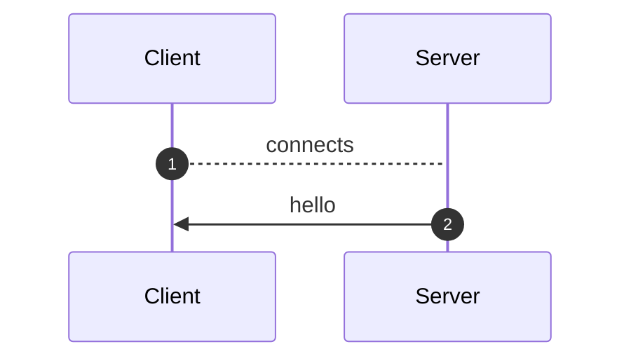
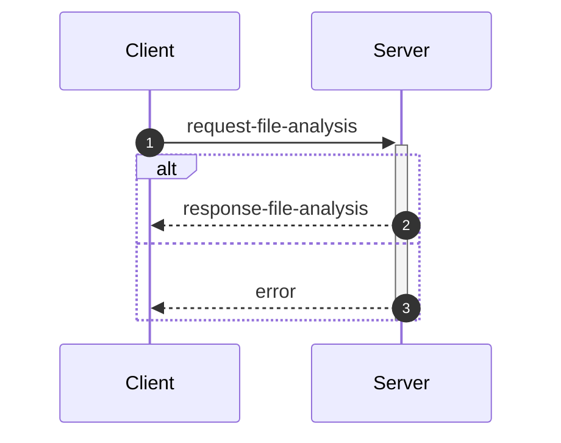
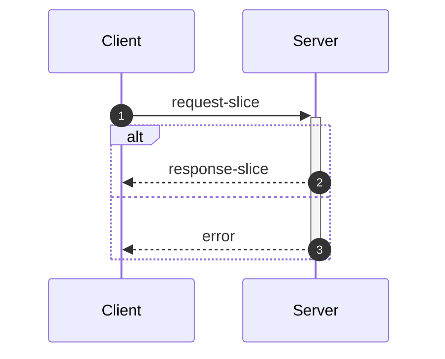
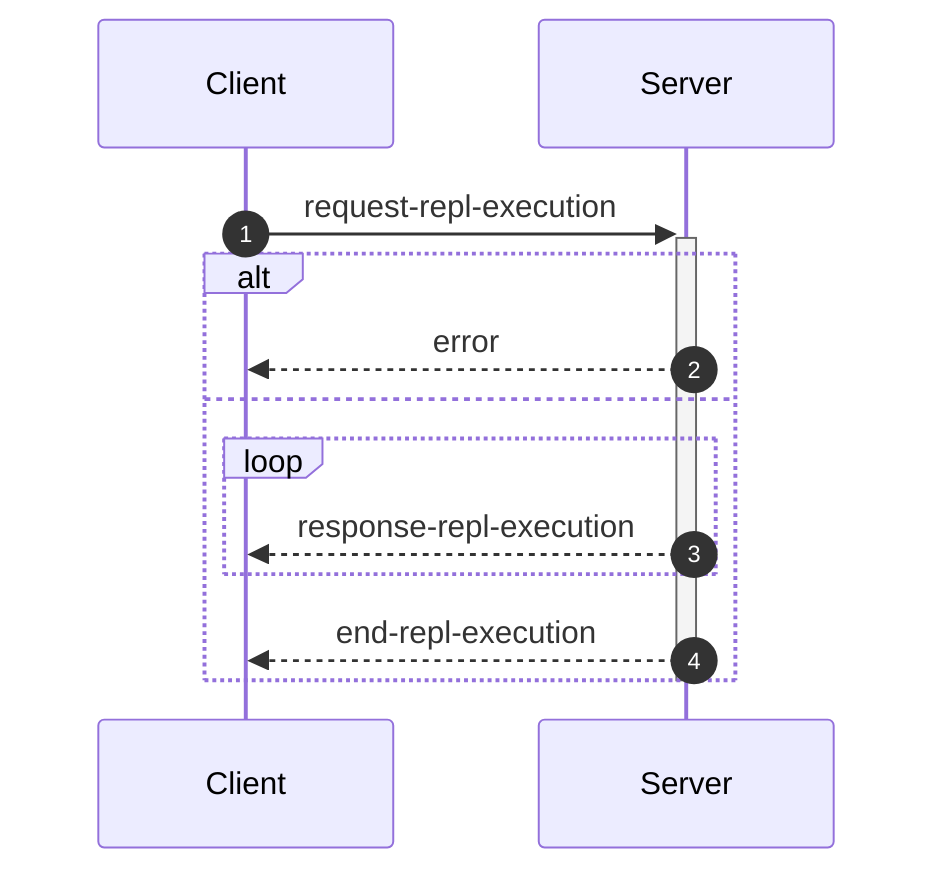
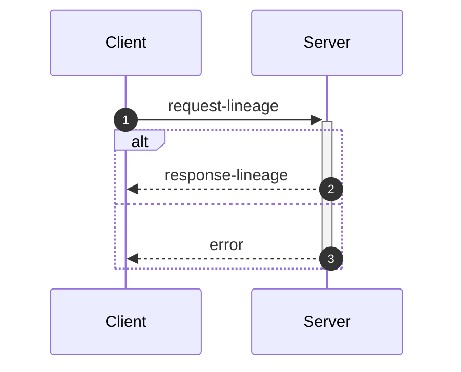

_This document was generated from '[src/documentation/print-interface-wiki.ts](https://github.com/flowr-analysis/flowr/tree/main//src/documentation/print-interface-wiki.ts)' on 2025-04-07, 17:41:31 UTC presenting an overview of flowR's interfaces (v2.2.12, using R v4.4.3). Please do not edit this file/wiki page directly._

Although far from being as detailed as the in-depth explanation of
[_flowR_](https://github.com/flowr-analysis/flowr/wiki/Core),
this wiki page explains how to interface with _flowR_ in more detail.
In general, command line arguments and other options provide short descriptions on hover over.

* [💬 Communicating with the Server](#communicating-with-the-server)
* [💻 Using the REPL](#using-the-repl)
* [⚙️ Configuring FlowR](#configuring-flowr)
* [⚒️ Writing Code](#writing-code)

<a id='communicating-with-the-server'></a>
## 💬 Communicating with the Server


As explained in the [Overview](https://github.com/flowr-analysis/flowr/wiki/Overview), you can simply run the [TCP](https://de.wikipedia.org/wiki/Transmission_Control_Protocol)&nbsp;server by adding the <span title="Description (Command Line Argument): Do not drop into a repl, but instead start a server on the given port (default: 1042) and listen for messages.">`--server`</span> flag (and, due to the interactive mode, exit with the conventional <kbd>CTRL</kbd>+<kbd>C</kbd>).
Currently, every connection is handled by the same underlying `RShell` - so the server is not designed to handle many clients at a time.
Additionally, the server is not well guarded against attacks (e.g., you can theoretically spawn an arbitrary number of&nbsp;RShell sessions on the target machine).

Every message has to be given in a single line (i.e., without a newline in-between) and end with a newline character. Nevertheless, we will pretty-print example given in the following segments for the ease of reading.


> [!NOTE]
> 
> The default <span title="Description (Command Line Argument): Do not drop into a repl, but instead start a server on the given port (default: 1042) and listen for messages.">`--server`</span> uses a simple [TCP](https://de.wikipedia.org/wiki/Transmission_Control_Protocol)
> connection. If you want _flowR_ to expose a [WebSocket](https://de.wikipedia.org/wiki/WebSocket) server instead, add the <span title="Description (Command Line Argument): If the server flag is set, use websocket for messaging">`--ws`</span> flag (i.e., <span title="Description (Command Line Argument): Do not drop into a repl, but instead start a server on the given port (default: 1042) and listen for messages.">`--server`</span> <span title="Description (Command Line Argument): If the server flag is set, use websocket for messaging">`--ws`</span>) when starting _flowR_ from the command line.
> 			


<ul><li>
<a id="message-hello"></a>
<b>Hello</b> Message (<code>hello</code>) 
<details>

<summary style="color:gray"> View Details. <i>The server informs the client about the successful connection and provides Meta-Information.</i> </summary>




	
After launching _flowR_, for example, with <code>docker run -it --rm eagleoutice/flowr <span title="Description (Command Line Argument): Do not drop into a repl, but instead start a server on the given port (default: 1042) and listen for messages.">-<span/>-server</span></code>&nbsp;(🐳️), simply connecting should present you with a `hello` message, that amongst others should reveal the versions of&nbsp;_flowR_ and&nbsp;R, using the [semver 2.0](https://semver.org/spec/v2.0.0.html) versioning scheme.
The message looks like this:


```json
{
  "type": "hello",
  "clientName": "client-0",
  "versions": {
    "flowr": "2.2.12",
    "r": "4.4.3",
    "engine": "r-shell"
  }
}
```


There are currently a few messages that you can send after the hello message.
If you want to _slice_ a piece of R code you first have to send an [analysis request](#message-request-file-analysis), so that you can send one or multiple slice requests afterward.
Requests for the [REPL](#message-request-repl) are independent of that.
	

<hr>


<details>
<summary style="color:gray">Message schema (<code>hello</code>)</summary>

For the definition of the hello message, please see it's implementation at [`./src/cli/repl/server/messages/message-hello.ts`](https://github.com/flowr-analysis/flowr/tree/main/./src/cli/repl/server/messages/message-hello.ts).

- **.** object [required]
    - **type** string [required]
        _The type of the hello message._
        Allows only the values: 'hello'
    - **id** any [forbidden]
        _The id of the message is always undefined (as it is the initial message and not requested)._
    - **clientName** string [required]
        _A unique name that is assigned to each client. It has no semantic meaning and is only used/useful for debugging._
    - **versions** object [required]
        - **flowr** string [required]
            _The version of the flowr server running in semver format._
        - **r** string [required]
            _The version of the underlying R shell running in semver format._
        - **engine** string [required]
            _The parser backend that is used to parse the R code._

</details>


<hr>

</details>	
	</li>

<li>
<a id="message-request-file-analysis"></a>
<b>Analysis</b> Message (<code>request-file-analysis</code>) 
<details>

<summary style="color:gray"> View Details. <i>The server builds the dataflow graph for a given input file (or a set of files).</i> </summary>




	
The request allows the server to analyze a file and prepare it for slicing.
The message can contain a `filetoken`, which is used to identify the file in later slice or lineage requests (if you do not add one, the request will not be stored and therefore, it is not available for subsequent requests).

> **Please note!**\
> If you want to send and process a lot of analysis requests, but do not want to slice them, please do not pass the `filetoken` field. This will save the server a lot of memory allocation.

Furthermore, the request must contain either a `content` field to directly pass the file's content or a `filepath` field which contains the path to the file (this path must be accessible for the server to be useful).
If you add the `id` field, the answer will use the same `id` so you can match requests and the corresponding answers.
See the implementation of the request-file-analysis message for more information.


<details>
<summary>Example of the <code>request-file-analysis</code> Message</summary>

_Note:_ even though we pretty-print these messages, they are sent as a single line, ending with a newline.

The following lists all messages that were sent and received in case you want to reproduce the scenario:

<ol>
<li> <code>hello</code> (response)
<details> 

<summary> Show Details </summary>

The first message is always a hello message.


```json
{
  "type": "hello",
  "clientName": "client-0",
  "versions": {
    "flowr": "2.2.12",
    "r": "4.4.3",
    "engine": "r-shell"
  }
}
```


</details>
</li>

<li> <b><code>request-file-analysis</code> (request)</b>
<details open> 

<summary> Show Details </summary>

Let' suppose you simply want to analyze the following script:
 
```r
x <- 1
x + 1
```

 For this, you can send the following request:


```json
{
  "type": "request-file-analysis",
  "id": "1",
  "filetoken": "x",
  "content": "x <- 1\nx + 1"
}
```


</details>
</li>

<li> <code>response-file-analysis</code> (response)
<details> 

<summary> Show Details </summary>


The `results` field of the response effectively contains three keys of importance:

- `parse`: which contains 1:1 the parse result in CSV format that we received from the `RShell` (i.e., the AST produced by the parser of the R interpreter).
- `normalize`: which contains the normalized AST, including ids (see the `info` field and the [Normalized AST](https://github.com/flowr-analysis/flowr/wiki/Normalized%20AST) wiki page).
- `dataflow`: especially important is the `graph` field which contains the dataflow graph as a set of root vertices (see the [Dataflow Graph](https://github.com/flowr-analysis/flowr/wiki/Dataflow%20Graph) wiki page).
			


_As the code is pretty long, we inhibit pretty printing and syntax highlighting (JSON, hiding built-in):_

```text
{"type":"response-file-analysis","format":"json","id":"1","results":{"parse":{"parsed":"[1,1,1,6,7,0,\"expr\",false,\"x <- 1\"],[1,1,1,1,1,3,\"SYMBOL\",true,\"x\"],[1,1,1,1,3,7,\"expr\",false,\"x\"],[1,3,1,4,2,7,\"LEFT_ASSIGN\",true,\"<-\"],[1,6,1,6,4,5,\"NUM_CONST\",true,\"1\"],[1,6,1,6,5,7,\"expr\",false,\"1\"],[2,1,2,5,16,0,\"expr\",false,\"x + 1\"],[2,1,2,1,10,12,\"SYMBOL\",true,\"x\"],[2,1,2,1,12,16,\"expr\",false,\"x\"],[2,3,2,3,11,16,\"'+'\",true,\"+\"],[2,5,2,5,13,14,\"NUM_CONST\",true,\"1\"],[2,5,2,5,14,16,\"expr\",false,\"1\"]",".meta":{"timing":4}},"normalize":{"ast":{"type":"RExpressionList","children":[{"type":"RBinaryOp","location":[1,3,1,4],"lhs":{"type":"RSymbol","location":[1,1,1,1],"content":"x","lexeme":"x","info":{"fullRange":[1,1,1,1],"additionalTokens":[],"id":0,"parent":2,"role":"binop-lhs","index":0,"nesting":0,"file":"/tmp/tmp-8682-q4pdoIQYDwlM-.R"}},"rhs":{"location":[1,6,1,6],"lexeme":"1","info":{"fullRange":[1,6,1,6],"additionalTokens":[],"id":1,"parent":2,"role":"binop-rhs","index":1,"nesting":0,"file":"/tmp/tmp-8682-q4pdoIQYDwlM-.R"},"type":"RNumber","content":{"num":1,"complexNumber":false,"markedAsInt":false}},"operator":"<-","lexeme":"<-","info":{"fullRange":[1,1,1,6],"additionalTokens":[],"id":2,"parent":6,"nesting":0,"file":"/tmp/tmp-8682-q4pdoIQYDwlM-.R","index":0,"role":"expr-list-child"}},{"type":"RBinaryOp","location":[2,3,2,3],"lhs":{"type":"RSymbol","location":[2,1,2,1],"content":"x","lexeme":"x","info":{"fullRange":[2,1,2,1],"additionalTokens":[],"id":3,"parent":5,"role":"binop-lhs","index":0,"nesting":0,"file":"/tmp/tmp-8682-q4pdoIQYDwlM-.R"}},"rhs":{"location":[2,5,2,5],"lexeme":"1","info":{"fullRange":[2,5,2,5],"additionalTokens":[],"id":4,"parent":5,"role":"binop-rhs","index":1,"nesting":0,"file":"/tmp/tmp-8682-q4pdoIQYDwlM-.R"},"type":"RNumber","content":{"num":1,"complexNumber":false,"markedAsInt":false}},"operator":"+","lexeme":"+","info":{"fullRange":[2,1,2,5],"additionalTokens":[],"id":5,"parent":6,"nesting":0,"file":"/tmp/tmp-8682-q4pdoIQYDwlM-.R","index":1,"role":"expr-list-child"}}],"info":{"additionalTokens":[],"id":6,"nesting":0,"file":"/tmp/tmp-8682-q4pdoIQYDwlM-.R","role":"root","index":0}},".meta":{"timing":4}},"dataflow":{"unknownReferences":[],"in":[{"nodeId":2,"name":"<-","type":2},{"nodeId":5,"name":"+","type":2}],"out":[{"nodeId":0,"name":"x","type":4,"definedAt":2,"value":[1]}],"environment":{"current":{"id":12,"parent":"<BuiltInEnvironment>","memory":[["x",[{"nodeId":0,"name":"x","type":4,"definedAt":2,"value":[1]}]]]},"level":0},"graph":{"_sourced":["/tmp/tmp-8682-q4pdoIQYDwlM-.R"],"_unknownSideEffects":[],"rootVertices":[1,0,2,3,4,5],"vertexInformation":[[1,{"tag":"value","id":1}],[0,{"tag":"variable-definition","id":0}],[2,{"tag":"function-call","id":2,"name":"<-","onlyBuiltin":true,"args":[{"nodeId":0,"type":32},{"nodeId":1,"type":32}],"origin":["builtin:assignment"]}],[3,{"tag":"use","id":3}],[4,{"tag":"value","id":4}],[5,{"tag":"function-call","id":5,"name":"+","onlyBuiltin":true,"args":[{"nodeId":3,"type":32},{"nodeId":4,"type":32}],"origin":["builtin:default"]}]],"edgeInformation":[[2,[[1,{"types":64}],[0,{"types":72}]]],[0,[[1,{"types":2}],[2,{"types":2}]]],[3,[[0,{"types":1}]]],[5,[[3,{"types":65}],[4,{"types":65}]]]]},"entryPoint":2,"exitPoints":[{"type":0,"nodeId":5}],".meta":{"timing":3}}}}
```


</details>
</li>
</ol>

The complete round-trip took 17.45 ms (including time required to validate the messages, start, and stop the internal mock server).

</details>


You receive an error if, for whatever reason, the analysis fails (e.g., the message or code you sent contained syntax errors).
It contains a human-readable description *why* the analysis failed (see the error message implementation for more details).


<details>
<summary>Example Error Message</summary>

_Note:_ even though we pretty-print these messages, they are sent as a single line, ending with a newline.

The following lists all messages that were sent and received in case you want to reproduce the scenario:

<ol>
<li> <code>hello</code> (response)
<details> 

<summary> Show Details </summary>

The first message is always a hello message.


```json
{
  "type": "hello",
  "clientName": "client-0",
  "versions": {
    "flowr": "2.2.12",
    "r": "4.4.3",
    "engine": "r-shell"
  }
}
```


</details>
</li>

<li> <code>request-file-analysis</code> (request)
<details> 

<summary> Show Details </summary>


```json
{
  "type": "request-file-analysis",
  "id": "1",
  "filename": "sample.R",
  "content": "x <-"
}
```


</details>
</li>

<li> <b><code>error</code> (response)</b>
<details open> 

<summary> Show Details </summary>


```json
{
  "id": "1",
  "type": "error",
  "fatal": false,
  "reason": "Error while analyzing file sample.R: GuardError: unable to parse R code (see the log for more information) for request {\"request\":\"file\",\"content\":\"/tmp/tmp-8682-Z0z9bgzhJCBg-.R\"}}"
}
```


</details>
</li>
</ol>

The complete round-trip took 1.60 ms (including time required to validate the messages, start, and stop the internal mock server).

</details>


&nbsp;

<a id="analysis-include-cfg"></a>
**Including the Control Flow Graph**

While _flowR_ does (for the time being) not use an explicit control flow graph but instead relies on control-dependency edges within the dataflow graph, 
the respective structure can still be exposed using the server (note that, as this feature is not needed within _flowR_, it is tested significantly less - 
so please create a [new issue](https://github.com/flowr-analysis/flowr/issues/new/choose) for any bug you may encounter).
For this, the analysis request may add `cfg: true` to its list of options.


<details>
<summary>Requesting a Control Flow Graph</summary>

_Note:_ even though we pretty-print these messages, they are sent as a single line, ending with a newline.

The following lists all messages that were sent and received in case you want to reproduce the scenario:

<ol>
<li> <code>hello</code> (response)
<details> 

<summary> Show Details </summary>

The first message is always a hello message.


```json
{
  "type": "hello",
  "clientName": "client-0",
  "versions": {
    "flowr": "2.2.12",
    "r": "4.4.3",
    "engine": "r-shell"
  }
}
```


</details>
</li>

<li> <b><code>request-file-analysis</code> (request)</b>
<details open> 

<summary> Show Details </summary>


```json
{
  "type": "request-file-analysis",
  "id": "1",
  "filetoken": "x",
  "content": "if(unknown > 0) { x <- 2 } else { x <- 5 }\nfor(i in 1:x) { print(x); print(i) }",
  "cfg": true
}
```


</details>
</li>

<li> <code>response-file-analysis</code> (response)
<details> 

<summary> Show Details </summary>


The response looks basically the same as a response sent without the `cfg` flag. However, additionally it contains a `cfg` field. 
If you are interested in a visual representation of the control flow graph, see the 
[visualization with mermaid](https://mermaid.live/view#base64:eyJjb2RlIjoiZmxvd2NoYXJ0IEJUXG4gICAgbjE1W1wiYFJJZlRoZW5FbHNlICgxNSlcbiMzNDtpZih1bmtub3duICM2MjsgMCkgIzEyMzsgeCAjNjA7IzQ1OyAyICMxMjU7IGVsc2UgIzEyMzsgeCAjNjA7IzQ1OyA1ICMxMjU7IzM0O2BcIl1cbiAgICBuMTUtZXhpdCgoMTUtZXhpdCkpXG4gICAgbjBbXCJgUlN5bWJvbCAoMClcbiMzNDt1bmtub3duIzM0O2BcIl1cbiAgICBuMVtcImBSTnVtYmVyICgxKVxuIzM0OzAjMzQ7YFwiXVxuICAgIG4yW1wiYFJCaW5hcnlPcCAoMilcbiMzNDt1bmtub3duICM2MjsgMCMzNDtgXCJdXG4gICAgbjItZXhpdCgoMi1leGl0KSlcbiAgICBuNVtcImBSU3ltYm9sICg1KVxuIzM0O3gjMzQ7YFwiXVxuICAgIG42W1wiYFJOdW1iZXIgKDYpXG4jMzQ7MiMzNDtgXCJdXG4gICAgbjdbXCJgUkJpbmFyeU9wICg3KVxuIzM0O3ggIzYwOyM0NTsgMiMzNDtgXCJdXG4gICAgbjctZXhpdCgoNy1leGl0KSlcbiAgICBuMTFbXCJgUlN5bWJvbCAoMTEpXG4jMzQ7eCMzNDtgXCJdXG4gICAgbjEyW1wiYFJOdW1iZXIgKDEyKVxuIzM0OzUjMzQ7YFwiXVxuICAgIG4xM1tcImBSQmluYXJ5T3AgKDEzKVxuIzM0O3ggIzYwOyM0NTsgNSMzNDtgXCJdXG4gICAgbjEzLWV4aXQoKDEzLWV4aXQpKVxuICAgIG4xNltcImBSU3ltYm9sICgxNilcbiMzNDtpIzM0O2BcIl1cbiAgICBuMzFbXCJgUkZvckxvb3AgKDMxKVxuIzM0O2ZvcihpIGluIDEjNTg7eCkgIzEyMzsgcHJpbnQoeCk7IHByaW50KGkpICMxMjU7IzM0O2BcIl1cbiAgICBuMzEtZXhpdCgoMzEtZXhpdCkpXG4gICAgbjE3W1wiYFJOdW1iZXIgKDE3KVxuIzM0OzEjMzQ7YFwiXVxuICAgIG4xOFtcImBSU3ltYm9sICgxOClcbiMzNDt4IzM0O2BcIl1cbiAgICBuMTlbXCJgUkJpbmFyeU9wICgxOSlcbiMzNDsxIzU4O3gjMzQ7YFwiXVxuICAgIG4xOS1leGl0KCgxOS1leGl0KSlcbiAgICBuMjJbXCJgUlN5bWJvbCAoMjIpXG4jMzQ7cHJpbnQoeCkjMzQ7YFwiXVxuICAgIG4yNVtcImBSRnVuY3Rpb25DYWxsICgyNSlcbiMzNDtwcmludCh4KSMzNDtgXCJdXG4gICAgbjI1LW5hbWVbWzI1LW5hbWVdXVxuICAgIG4yNS1leGl0KCgyNS1leGl0KSlcbiAgICBuMjRbXCJgUkFyZ3VtZW50ICgyNClcbiMzNDt4IzM0O2BcIl1cbiAgICBuMjQtYmVmb3JlLXZhbHVlW1syNC1iZWZvcmUtdmFsdWVdXVxuICAgIG4yM1tcImBSU3ltYm9sICgyMylcbiMzNDt4IzM0O2BcIl1cbiAgICBuMjQtZXhpdCgoMjQtZXhpdCkpXG4gICAgbjI2W1wiYFJTeW1ib2wgKDI2KVxuIzM0O3ByaW50KGkpIzM0O2BcIl1cbiAgICBuMjlbXCJgUkZ1bmN0aW9uQ2FsbCAoMjkpXG4jMzQ7cHJpbnQoaSkjMzQ7YFwiXVxuICAgIG4yOS1uYW1lW1syOS1uYW1lXV1cbiAgICBuMjktZXhpdCgoMjktZXhpdCkpXG4gICAgbjI4W1wiYFJBcmd1bWVudCAoMjgpXG4jMzQ7aSMzNDtgXCJdXG4gICAgbjI4LWJlZm9yZS12YWx1ZVtbMjgtYmVmb3JlLXZhbHVlXV1cbiAgICBuMjdbXCJgUlN5bWJvbCAoMjcpXG4jMzQ7aSMzNDtgXCJdXG4gICAgbjI4LWV4aXQoKDI4LWV4aXQpKVxuICAgIG4xIC0uLT58XCJGRFwifCBuMFxuICAgIG4wIC0uLT58XCJGRFwifCBuMlxuICAgIG4yLWV4aXQgLS4tPnxcIkZEXCJ8IG4xXG4gICAgbjYgLS4tPnxcIkZEXCJ8IG41XG4gICAgbjUgLS4tPnxcIkZEXCJ8IG43XG4gICAgbjctZXhpdCAtLi0+fFwiRkRcInwgbjZcbiAgICBuMTIgLS4tPnxcIkZEXCJ8IG4xMVxuICAgIG4xMSAtLi0+fFwiRkRcInwgbjEzXG4gICAgbjEzLWV4aXQgLS4tPnxcIkZEXCJ8IG4xMlxuICAgIG43IC0tPnxcIkNEIChUUlVFKVwifCBuMi1leGl0XG4gICAgbjEzIC0tPnxcIkNEIChGQUxTRSlcInwgbjItZXhpdFxuICAgIG4yIC0uLT58XCJGRFwifCBuMTVcbiAgICBuMTUtZXhpdCAtLi0+fFwiRkRcInwgbjctZXhpdFxuICAgIG4xNS1leGl0IC0uLT58XCJGRFwifCBuMTMtZXhpdFxuICAgIG4zMSAtLi0+fFwiRkRcInwgbjE1LWV4aXRcbiAgICBuMzEgLS4tPnxcIkZEXCJ8IG4yOS1leGl0XG4gICAgbjE4IC0uLT58XCJGRFwifCBuMTdcbiAgICBuMTcgLS4tPnxcIkZEXCJ8IG4xOVxuICAgIG4xOS1leGl0IC0uLT58XCJGRFwifCBuMThcbiAgICBuMjIgLS4tPnxcIkZEXCJ8IG4yNVxuICAgIG4yNS1uYW1lIC0uLT58XCJGRFwifCBuMjJcbiAgICBuMjQtYmVmb3JlLXZhbHVlIC0uLT58XCJGRFwifCBuMjRcbiAgICBuMjMgLS4tPnxcIkZEXCJ8IG4yNC1iZWZvcmUtdmFsdWVcbiAgICBuMjQtZXhpdCAtLi0+fFwiRkRcInwgbjIzXG4gICAgbjI0IC0uLT58XCJGRFwifCBuMjUtbmFtZVxuICAgIG4yNS1leGl0IC0uLT58XCJGRFwifCBuMjQtZXhpdFxuICAgIG4yOSAtLi0+fFwiRkRcInwgbjI1LWV4aXRcbiAgICBuMjYgLS4tPnxcIkZEXCJ8IG4yOVxuICAgIG4yOS1uYW1lIC0uLT58XCJGRFwifCBuMjZcbiAgICBuMjgtYmVmb3JlLXZhbHVlIC0uLT58XCJGRFwifCBuMjhcbiAgICBuMjcgLS4tPnxcIkZEXCJ8IG4yOC1iZWZvcmUtdmFsdWVcbiAgICBuMjgtZXhpdCAtLi0+fFwiRkRcInwgbjI3XG4gICAgbjI4IC0uLT58XCJGRFwifCBuMjktbmFtZVxuICAgIG4yOS1leGl0IC0uLT58XCJGRFwifCBuMjgtZXhpdFxuICAgIG4xOSAtLi0+fFwiRkRcInwgbjMxXG4gICAgbjE2IC0uLT58XCJGRFwifCBuMTktZXhpdFxuICAgIG4yNSAtLT58XCJDRCAoVFJVRSlcInwgbjE2XG4gICAgbjMxLWV4aXQgLS0+fFwiQ0QgKEZBTFNFKVwifCBuMTZcbiAgICBzdHlsZSBuMTUgc3Ryb2tlOmN5YW4sc3Ryb2tlLXdpZHRoOjYuNXB4OyAgICBzdHlsZSBuMzEtZXhpdCBzdHJva2U6Z3JlZW4sc3Ryb2tlLXdpZHRoOjYuNXB4OyIsIm1lcm1haWQiOnsiYXV0b1N5bmMiOnRydWV9fQ==).
			


_As the code is pretty long, we inhibit pretty printing and syntax highlighting (JSON, hiding built-in):_

```text
{"type":"response-file-analysis","format":"json","id":"1","cfg":{"graph":{"rootVertices":[15,"15-exit",0,1,2,"2-exit",5,6,7,"7-exit",11,12,13,"13-exit",16,31,"31-exit",17,18,19,"19-exit",22,25,"25-name","25-exit",24,"24-before-value",23,"24-exit",26,29,"29-name","29-exit",28,"28-before-value",27,"28-exit"],"vertexInformation":[[15,{"id":15,"name":"RIfThenElse","type":"statement"}],["15-exit",{"id":"15-exit","name":"if-exit","type":"end-marker"}],[0,{"id":0,"name":"RSymbol","type":"expression"}],[1,{"id":1,"name":"RNumber","type":"expression"}],[2,{"id":2,"name":"RBinaryOp","type":"expression"}],["2-exit",{"id":"2-exit","name":"binOp-exit","type":"end-marker"}],[5,{"id":5,"name":"RSymbol","type":"expression"}],[6,{"id":6,"name":"RNumber","type":"expression"}],[7,{"id":7,"name":"RBinaryOp","type":"expression"}],["7-exit",{"id":"7-exit","name":"binOp-exit","type":"end-marker"}],[11,{"id":11,"name":"RSymbol","type":"expression"}],[12,{"id":12,"name":"RNumber","type":"expression"}],[13,{"id":13,"name":"RBinaryOp","type":"expression"}],["13-exit",{"id":"13-exit","name":"binOp-exit","type":"end-marker"}],[16,{"id":16,"name":"RSymbol","type":"expression"}],[31,{"id":31,"name":"RForLoop","type":"statement"}],["31-exit",{"id":"31-exit","name":"for-exit","type":"end-marker"}],[17,{"id":17,"name":"RNumber","type":"expression"}],[18,{"id":18,"name":"RSymbol","type":"expression"}],[19,{"id":19,"name":"RBinaryOp","type":"expression"}],["19-exit",{"id":"19-exit","name":"binOp-exit","type":"end-marker"}],[22,{"id":22,"name":"RSymbol","type":"expression"}],[25,{"id":25,"name":"RFunctionCall","type":"statement"}],["25-name",{"id":"25-name","name":"call-name","type":"mid-marker"}],["25-exit",{"id":"25-exit","name":"call-exit","type":"end-marker"}],[24,{"id":24,"name":"RArgument","type":"expression"}],["24-before-value",{"id":"24-before-value","name":"before-value","type":"mid-marker"}],[23,{"id":23,"name":"RSymbol","type":"expression"}],["24-exit",{"id":"24-exit","name":"exit","type":"end-marker"}],[26,{"id":26,"name":"RSymbol","type":"expression"}],[29,{"id":29,"name":"RFunctionCall","type":"statement"}],["29-name",{"id":"29-name","name":"call-name","type":"mid-marker"}],["29-exit",{"id":"29-exit","name":"call-exit","type":"end-marker"}],[28,{"id":28,"name":"RArgument","type":"expression"}],["28-before-value",{"id":"28-before-value","name":"before-value","type":"mid-marker"}],[27,{"id":27,"name":"RSymbol","type":"expression"}],["28-exit",{"id":"28-exit","name":"exit","type":"end-marker"}]],"edgeInformation":[[1,[[0,{"label":"FD"}]]],[0,[[2,{"label":"FD"}]]],["2-exit",[[1,{"label":"FD"}]]],[6,[[5,{"label":"FD"}]]],[5,[[7,{"label":"FD"}]]],["7-exit",[[6,{"label":"FD"}]]],[12,[[11,{"label":"FD"}]]],[11,[[13,{"label":"FD"}]]],["13-exit",[[12,{"label":"FD"}]]],[7,[["2-exit",{"label":"CD","when":"TRUE","caused":15}]]],[13,[["2-exit",{"label":"CD","when":"FALSE","caused":15}]]],[2,[[15,{"label":"FD"}]]],["15-exit",[["7-exit",{"label":"FD"}],["13-exit",{"label":"FD"}]]],[31,[["15-exit",{"label":"FD"}],["29-exit",{"label":"FD"}]]],[18,[[17,{"label":"FD"}]]],[17,[[19,{"label":"FD"}]]],["19-exit",[[18,{"label":"FD"}]]],[22,[[25,{"label":"FD"}]]],["25-name",[[22,{"label":"FD"}]]],["24-before-value",[[24,{"label":"FD"}]]],[23,[["24-before-value",{"label":"FD"}]]],["24-exit",[[23,{"label":"FD"}]]],[24,[["25-name",{"label":"FD"}]]],["25-exit",[["24-exit",{"label":"FD"}]]],[29,[["25-exit",{"label":"FD"}]]],[26,[[29,{"label":"FD"}]]],["29-name",[[26,{"label":"FD"}]]],["28-before-value",[[28,{"label":"FD"}]]],[27,[["28-before-value",{"label":"FD"}]]],["28-exit",[[27,{"label":"FD"}]]],[28,[["29-name",{"label":"FD"}]]],["29-exit",[["28-exit",{"label":"FD"}]]],[19,[[31,{"label":"FD"}]]],[16,[["19-exit",{"label":"FD"}]]],[25,[[16,{"label":"CD","when":"TRUE","caused":31}]]],["31-exit",[[16,{"label":"CD","when":"FALSE","caused":31}]]]]},"breaks":[],"nexts":[],"returns":[],"exitPoints":["31-exit"],"entryPoints":[15]},"results":{"parse":{"parsed":"[1,1,1,42,38,0,\"expr\",false,\"if(unknown > 0) { x <- 2 } else { x <- 5 }\"],[1,1,1,2,1,38,\"IF\",true,\"if\"],[1,3,1,3,2,38,\"'('\",true,\"(\"],[1,4,1,14,9,38,\"expr\",false,\"unknown > 0\"],[1,4,1,10,3,5,\"SYMBOL\",true,\"unknown\"],[1,4,1,10,5,9,\"expr\",false,\"unknown\"],[1,12,1,12,4,9,\"GT\",true,\">\"],[1,14,1,14,6,7,\"NUM_CONST\",true,\"0\"],[1,14,1,14,7,9,\"expr\",false,\"0\"],[1,15,1,15,8,38,\"')'\",true,\")\"],[1,17,1,26,22,38,\"expr\",false,\"{ x <- 2 }\"],[1,17,1,17,12,22,\"'{'\",true,\"{\"],[1,19,1,24,19,22,\"expr\",false,\"x <- 2\"],[1,19,1,19,13,15,\"SYMBOL\",true,\"x\"],[1,19,1,19,15,19,\"expr\",false,\"x\"],[1,21,1,22,14,19,\"LEFT_ASSIGN\",true,\"<-\"],[1,24,1,24,16,17,\"NUM_CONST\",true,\"2\"],[1,24,1,24,17,19,\"expr\",false,\"2\"],[1,26,1,26,18,22,\"'}'\",true,\"}\"],[1,28,1,31,23,38,\"ELSE\",true,\"else\"],[1,33,1,42,35,38,\"expr\",false,\"{ x <- 5 }\"],[1,33,1,33,25,35,\"'{'\",true,\"{\"],[1,35,1,40,32,35,\"expr\",false,\"x <- 5\"],[1,35,1,35,26,28,\"SYMBOL\",true,\"x\"],[1,35,1,35,28,32,\"expr\",false,\"x\"],[1,37,1,38,27,32,\"LEFT_ASSIGN\",true,\"<-\"],[1,40,1,40,29,30,\"NUM_CONST\",true,\"5\"],[1,40,1,40,30,32,\"expr\",false,\"5\"],[1,42,1,42,31,35,\"'}'\",true,\"}\"],[2,1,2,36,84,0,\"expr\",false,\"for(i in 1:x) { print(x); print(i) }\"],[2,1,2,3,41,84,\"FOR\",true,\"for\"],[2,4,2,13,53,84,\"forcond\",false,\"(i in 1:x)\"],[2,4,2,4,42,53,\"'('\",true,\"(\"],[2,5,2,5,43,53,\"SYMBOL\",true,\"i\"],[2,7,2,8,44,53,\"IN\",true,\"in\"],[2,10,2,12,51,53,\"expr\",false,\"1:x\"],[2,10,2,10,45,46,\"NUM_CONST\",true,\"1\"],[2,10,2,10,46,51,\"expr\",false,\"1\"],[2,11,2,11,47,51,\"':'\",true,\":\"],[2,12,2,12,48,50,\"SYMBOL\",true,\"x\"],[2,12,2,12,50,51,\"expr\",false,\"x\"],[2,13,2,13,49,53,\"')'\",true,\")\"],[2,15,2,36,81,84,\"expr\",false,\"{ print(x); print(i) }\"],[2,15,2,15,54,81,\"'{'\",true,\"{\"],[2,17,2,24,64,81,\"expr\",false,\"print(x)\"],[2,17,2,21,55,57,\"SYMBOL_FUNCTION_CALL\",true,\"print\"],[2,17,2,21,57,64,\"expr\",false,\"print\"],[2,22,2,22,56,64,\"'('\",true,\"(\"],[2,23,2,23,58,60,\"SYMBOL\",true,\"x\"],[2,23,2,23,60,64,\"expr\",false,\"x\"],[2,24,2,24,59,64,\"')'\",true,\")\"],[2,25,2,25,65,81,\"';'\",true,\";\"],[2,27,2,34,77,81,\"expr\",false,\"print(i)\"],[2,27,2,31,68,70,\"SYMBOL_FUNCTION_CALL\",true,\"print\"],[2,27,2,31,70,77,\"expr\",false,\"print\"],[2,32,2,32,69,77,\"'('\",true,\"(\"],[2,33,2,33,71,73,\"SYMBOL\",true,\"i\"],[2,33,2,33,73,77,\"expr\",false,\"i\"],[2,34,2,34,72,77,\"')'\",true,\")\"],[2,36,2,36,78,81,\"'}'\",true,\"}\"]",".meta":{"timing":3}},"normalize":{"ast":{"type":"RExpressionList","children":[{"type":"RIfThenElse","condition":{"type":"RBinaryOp","location":[1,12,1,12],"lhs":{"type":"RSymbol","location":[1,4,1,10],"content":"unknown","lexeme":"unknown","info":{"fullRange":[1,4,1,10],"additionalTokens":[],"id":0,"parent":2,"role":"binop-lhs","index":0,"nesting":1,"file":"/tmp/tmp-8682-oK6Dz5bkLpIW-.R"}},"rhs":{"location":[1,14,1,14],"lexeme":"0","info":{"fullRange":[1,14,1,14],"additionalTokens":[],"id":1,"parent":2,"role":"binop-rhs","index":1,"nesting":1,"file":"/tmp/tmp-8682-oK6Dz5bkLpIW-.R"},"type":"RNumber","content":{"num":0,"complexNumber":false,"markedAsInt":false}},"operator":">","lexeme":">","info":{"fullRange":[1,4,1,14],"additionalTokens":[],"id":2,"parent":15,"nesting":1,"file":"/tmp/tmp-8682-oK6Dz5bkLpIW-.R","role":"if-cond"}},"then":{"type":"RExpressionList","children":[{"type":"RBinaryOp","location":[1,21,1,22],"lhs":{"type":"RSymbol","location":[1,19,1,19],"content":"x","lexeme":"x","info":{"fullRange":[1,19,1,19],"additionalTokens":[],"id":5,"parent":7,"role":"binop-lhs","index":0,"nesting":1,"file":"/tmp/tmp-8682-oK6Dz5bkLpIW-.R"}},"rhs":{"location":[1,24,1,24],"lexeme":"2","info":{"fullRange":[1,24,1,24],"additionalTokens":[],"id":6,"parent":7,"role":"binop-rhs","index":1,"nesting":1,"file":"/tmp/tmp-8682-oK6Dz5bkLpIW-.R"},"type":"RNumber","content":{"num":2,"complexNumber":false,"markedAsInt":false}},"operator":"<-","lexeme":"<-","info":{"fullRange":[1,19,1,24],"additionalTokens":[],"id":7,"parent":8,"nesting":1,"file":"/tmp/tmp-8682-oK6Dz5bkLpIW-.R","index":0,"role":"expr-list-child"}}],"grouping":[{"type":"RSymbol","location":[1,17,1,17],"content":"{","lexeme":"{","info":{"fullRange":[1,17,1,26],"additionalTokens":[],"id":3,"role":"root","index":0,"nesting":1,"file":"/tmp/tmp-8682-oK6Dz5bkLpIW-.R"}},{"type":"RSymbol","location":[1,26,1,26],"content":"}","lexeme":"}","info":{"fullRange":[1,17,1,26],"additionalTokens":[],"id":4,"role":"root","index":0,"nesting":1,"file":"/tmp/tmp-8682-oK6Dz5bkLpIW-.R"}}],"info":{"additionalTokens":[],"id":8,"parent":15,"nesting":1,"file":"/tmp/tmp-8682-oK6Dz5bkLpIW-.R","index":1,"role":"if-then"}},"location":[1,1,1,2],"lexeme":"if","info":{"fullRange":[1,1,1,42],"additionalTokens":[],"id":15,"parent":32,"nesting":1,"file":"/tmp/tmp-8682-oK6Dz5bkLpIW-.R","index":0,"role":"expr-list-child"},"otherwise":{"type":"RExpressionList","children":[{"type":"RBinaryOp","location":[1,37,1,38],"lhs":{"type":"RSymbol","location":[1,35,1,35],"content":"x","lexeme":"x","info":{"fullRange":[1,35,1,35],"additionalTokens":[],"id":11,"parent":13,"role":"binop-lhs","index":0,"nesting":1,"file":"/tmp/tmp-8682-oK6Dz5bkLpIW-.R"}},"rhs":{"location":[1,40,1,40],"lexeme":"5","info":{"fullRange":[1,40,1,40],"additionalTokens":[],"id":12,"parent":13,"role":"binop-rhs","index":1,"nesting":1,"file":"/tmp/tmp-8682-oK6Dz5bkLpIW-.R"},"type":"RNumber","content":{"num":5,"complexNumber":false,"markedAsInt":false}},"operator":"<-","lexeme":"<-","info":{"fullRange":[1,35,1,40],"additionalTokens":[],"id":13,"parent":14,"nesting":1,"file":"/tmp/tmp-8682-oK6Dz5bkLpIW-.R","index":0,"role":"expr-list-child"}}],"grouping":[{"type":"RSymbol","location":[1,33,1,33],"content":"{","lexeme":"{","info":{"fullRange":[1,33,1,42],"additionalTokens":[],"id":9,"role":"root","index":0,"nesting":1,"file":"/tmp/tmp-8682-oK6Dz5bkLpIW-.R"}},{"type":"RSymbol","location":[1,42,1,42],"content":"}","lexeme":"}","info":{"fullRange":[1,33,1,42],"additionalTokens":[],"id":10,"role":"root","index":0,"nesting":1,"file":"/tmp/tmp-8682-oK6Dz5bkLpIW-.R"}}],"info":{"additionalTokens":[],"id":14,"parent":15,"nesting":1,"file":"/tmp/tmp-8682-oK6Dz5bkLpIW-.R","index":2,"role":"if-otherwise"}}},{"type":"RForLoop","variable":{"type":"RSymbol","location":[2,5,2,5],"content":"i","lexeme":"i","info":{"additionalTokens":[],"id":16,"parent":31,"role":"for-variable","index":0,"nesting":1,"file":"/tmp/tmp-8682-oK6Dz5bkLpIW-.R"}},"vector":{"type":"RBinaryOp","location":[2,11,2,11],"lhs":{"location":[2,10,2,10],"lexeme":"1","info":{"fullRange":[2,10,2,10],"additionalTokens":[],"id":17,"parent":19,"role":"binop-lhs","index":0,"nesting":1,"file":"/tmp/tmp-8682-oK6Dz5bkLpIW-.R"},"type":"RNumber","content":{"num":1,"complexNumber":false,"markedAsInt":false}},"rhs":{"type":"RSymbol","location":[2,12,2,12],"content":"x","lexeme":"x","info":{"fullRange":[2,12,2,12],"additionalTokens":[],"id":18,"parent":19,"role":"binop-rhs","index":1,"nesting":1,"file":"/tmp/tmp-8682-oK6Dz5bkLpIW-.R"}},"operator":":","lexeme":":","info":{"fullRange":[2,10,2,12],"additionalTokens":[],"id":19,"parent":31,"nesting":1,"file":"/tmp/tmp-8682-oK6Dz5bkLpIW-.R","index":1,"role":"for-vector"}},"body":{"type":"RExpressionList","children":[{"type":"RFunctionCall","named":true,"location":[2,17,2,21],"lexeme":"print","functionName":{"type":"RSymbol","location":[2,17,2,21],"content":"print","lexeme":"print","info":{"fullRange":[2,17,2,24],"additionalTokens":[],"id":22,"parent":25,"role":"call-name","index":0,"nesting":1,"file":"/tmp/tmp-8682-oK6Dz5bkLpIW-.R"}},"arguments":[{"type":"RArgument","location":[2,23,2,23],"lexeme":"x","value":{"type":"RSymbol","location":[2,23,2,23],"content":"x","lexeme":"x","info":{"fullRange":[2,23,2,23],"additionalTokens":[],"id":23,"parent":24,"role":"arg-value","index":0,"nesting":1,"file":"/tmp/tmp-8682-oK6Dz5bkLpIW-.R"}},"info":{"fullRange":[2,23,2,23],"additionalTokens":[],"id":24,"parent":25,"nesting":1,"file":"/tmp/tmp-8682-oK6Dz5bkLpIW-.R","index":1,"role":"call-argument"}}],"info":{"fullRange":[2,17,2,24],"additionalTokens":[],"id":25,"parent":30,"nesting":1,"file":"/tmp/tmp-8682-oK6Dz5bkLpIW-.R","index":0,"role":"expr-list-child"}},{"type":"RFunctionCall","named":true,"location":[2,27,2,31],"lexeme":"print","functionName":{"type":"RSymbol","location":[2,27,2,31],"content":"print","lexeme":"print","info":{"fullRange":[2,27,2,34],"additionalTokens":[],"id":26,"parent":29,"role":"call-name","index":0,"nesting":1,"file":"/tmp/tmp-8682-oK6Dz5bkLpIW-.R"}},"arguments":[{"type":"RArgument","location":[2,33,2,33],"lexeme":"i","value":{"type":"RSymbol","location":[2,33,2,33],"content":"i","lexeme":"i","info":{"fullRange":[2,33,2,33],"additionalTokens":[],"id":27,"parent":28,"role":"arg-value","index":0,"nesting":1,"file":"/tmp/tmp-8682-oK6Dz5bkLpIW-.R"}},"info":{"fullRange":[2,33,2,33],"additionalTokens":[],"id":28,"parent":29,"nesting":1,"file":"/tmp/tmp-8682-oK6Dz5bkLpIW-.R","index":1,"role":"call-argument"}}],"info":{"fullRange":[2,27,2,34],"additionalTokens":[],"id":29,"parent":30,"nesting":1,"file":"/tmp/tmp-8682-oK6Dz5bkLpIW-.R","index":1,"role":"expr-list-child"}}],"grouping":[{"type":"RSymbol","location":[2,15,2,15],"content":"{","lexeme":"{","info":{"fullRange":[2,15,2,36],"additionalTokens":[],"id":20,"role":"root","index":0,"nesting":1,"file":"/tmp/tmp-8682-oK6Dz5bkLpIW-.R"}},{"type":"RSymbol","location":[2,36,2,36],"content":"}","lexeme":"}","info":{"fullRange":[2,15,2,36],"additionalTokens":[],"id":21,"role":"root","index":0,"nesting":1,"file":"/tmp/tmp-8682-oK6Dz5bkLpIW-.R"}}],"info":{"additionalTokens":[],"id":30,"parent":31,"nesting":1,"file":"/tmp/tmp-8682-oK6Dz5bkLpIW-.R","index":2,"role":"for-body"}},"lexeme":"for","info":{"fullRange":[2,1,2,36],"additionalTokens":[],"id":31,"parent":32,"nesting":1,"file":"/tmp/tmp-8682-oK6Dz5bkLpIW-.R","index":1,"role":"expr-list-child"},"location":[2,1,2,3]}],"info":{"additionalTokens":[],"id":32,"nesting":0,"file":"/tmp/tmp-8682-oK6Dz5bkLpIW-.R","role":"root","index":0}},".meta":{"timing":1}},"dataflow":{"unknownReferences":[],"in":[{"nodeId":15,"name":"if","type":2},{"nodeId":0,"name":"unknown","type":1},{"nodeId":2,"name":">","type":2},{"nodeId":7,"name":"<-","controlDependencies":[{"id":15,"when":true}],"type":2},{"nodeId":13,"name":"<-","controlDependencies":[{"id":15,"when":false}],"type":2},{"nodeId":8,"name":"{","controlDependencies":[{"id":15,"when":true}],"type":2},{"nodeId":14,"name":"{","controlDependencies":[{"id":15,"when":false}],"type":2},{"nodeId":31,"name":"for","type":2},{"name":":","nodeId":19,"type":2}],"out":[{"nodeId":5,"name":"x","controlDependencies":[{"id":15,"when":true},{"id":15,"when":true}],"type":4,"definedAt":7,"value":[6]},{"nodeId":11,"name":"x","controlDependencies":[{"id":15,"when":false},{"id":15,"when":false}],"type":4,"definedAt":13,"value":[12]},{"nodeId":16,"name":"i","type":1}],"environment":{"current":{"id":93,"parent":"<BuiltInEnvironment>","memory":[["x",[{"nodeId":5,"name":"x","controlDependencies":[{"id":15,"when":false}],"type":4,"definedAt":7,"value":[6]},{"nodeId":11,"name":"x","controlDependencies":[{"id":15,"when":false}],"type":4,"definedAt":13,"value":[12]}]],["i",[{"nodeId":16,"name":"i","type":4,"definedAt":31}]]]},"level":0},"graph":{"_sourced":["/tmp/tmp-8682-oK6Dz5bkLpIW-.R"],"_unknownSideEffects":[{"id":25,"linkTo":{"type":"link-to-last-call","callName":{}}},{"id":29,"linkTo":{"type":"link-to-last-call","callName":{}}}],"rootVertices":[0,1,2,6,5,7,8,12,11,13,14,15,16,17,18,19,23,25,27,29,30,31],"vertexInformation":[[0,{"tag":"use","id":0}],[1,{"tag":"value","id":1}],[2,{"tag":"function-call","id":2,"name":">","onlyBuiltin":true,"args":[{"nodeId":0,"type":32},{"nodeId":1,"type":32}],"origin":["builtin:default"]}],[6,{"tag":"value","id":6}],[5,{"tag":"variable-definition","id":5,"cds":[{"id":15,"when":true}]}],[7,{"tag":"function-call","id":7,"name":"<-","onlyBuiltin":true,"cds":[{"id":15,"when":true}],"args":[{"nodeId":5,"type":32},{"nodeId":6,"type":32}],"origin":["builtin:assignment"]}],[8,{"tag":"function-call","id":8,"name":"{","onlyBuiltin":true,"cds":[{"id":15,"when":true}],"args":[{"nodeId":7,"type":32}],"origin":["builtin:expression-list"]}],[12,{"tag":"value","id":12}],[11,{"tag":"variable-definition","id":11,"cds":[{"id":15,"when":false}]}],[13,{"tag":"function-call","id":13,"name":"<-","onlyBuiltin":true,"cds":[{"id":15,"when":false}],"args":[{"nodeId":11,"type":32},{"nodeId":12,"type":32}],"origin":["builtin:assignment"]}],[14,{"tag":"function-call","id":14,"name":"{","onlyBuiltin":true,"cds":[{"id":15,"when":false}],"args":[{"nodeId":13,"type":32}],"origin":["builtin:expression-list"]}],[15,{"tag":"function-call","id":15,"name":"if","onlyBuiltin":true,"args":[{"nodeId":2,"type":32},{"nodeId":8,"type":32},{"nodeId":14,"type":32}],"origin":["builtin:if-then-else"]}],[16,{"tag":"variable-definition","id":16}],[17,{"tag":"value","id":17}],[18,{"tag":"use","id":18}],[19,{"tag":"function-call","id":19,"name":":","onlyBuiltin":true,"args":[{"nodeId":17,"type":32},{"nodeId":18,"type":32}],"origin":["builtin:default"]}],[23,{"tag":"use","id":23,"cds":[{"id":31,"when":true}]}],[25,{"tag":"function-call","id":25,"name":"print","onlyBuiltin":true,"cds":[{"id":31,"when":true}],"args":[{"nodeId":23,"type":32}],"origin":["builtin:default"]}],[27,{"tag":"use","id":27,"cds":[{"id":31,"when":true}]}],[29,{"tag":"function-call","id":29,"name":"print","onlyBuiltin":true,"cds":[{"id":31,"when":true}],"args":[{"nodeId":27,"type":32}],"origin":["builtin:default"]}],[30,{"tag":"function-call","id":30,"name":"{","onlyBuiltin":true,"cds":[{"id":31,"when":true}],"args":[{"nodeId":25,"type":32},{"nodeId":29,"type":32}],"origin":["builtin:expression-list"]}],[31,{"tag":"function-call","id":31,"name":"for","onlyBuiltin":true,"args":[{"nodeId":16,"type":32},{"nodeId":19,"type":32},{"nodeId":30,"type":32}],"origin":["builtin:for-loop"]}]],"edgeInformation":[[2,[[0,{"types":65}],[1,{"types":65}]]],[7,[[6,{"types":64}],[5,{"types":72}]]],[5,[[6,{"types":2}],[7,{"types":2}]]],[8,[[7,{"types":72}]]],[15,[[8,{"types":72}],[14,{"types":72}],[2,{"types":65}]]],[13,[[12,{"types":64}],[11,{"types":72}]]],[11,[[12,{"types":2}],[13,{"types":2}]]],[14,[[13,{"types":72}]]],[19,[[17,{"types":65}],[18,{"types":65}]]],[18,[[5,{"types":1}],[11,{"types":1}]]],[25,[[23,{"types":73}]]],[23,[[5,{"types":1}],[11,{"types":1}]]],[29,[[27,{"types":73}]]],[27,[[16,{"types":1}]]],[30,[[25,{"types":64}],[29,{"types":72}]]],[16,[[19,{"types":2}]]],[31,[[16,{"types":65}],[19,{"types":65}],[30,{"types":320}]]]]},"entryPoint":15,"exitPoints":[{"type":0,"nodeId":31}],".meta":{"timing":2}}}}
```


</details>
</li>
</ol>

The complete round-trip took 9.06 ms (including time required to validate the messages, start, and stop the internal mock server).

</details>


&nbsp;

<a id="analysis-format-n-quads"></a>
**Retrieve the Output as RDF N-Quads**

The default response is formatted as JSON.
However, by specifying `format: "n-quads"`, you can retrieve the individual results (e.g., the [Normalized AST](https://github.com/flowr-analysis/flowr/wiki/Normalized%20AST)),
as [RDF N-Quads](https://www.w3.org/TR/n-quads/).
This works with and without the control flow graph as described [above](#analysis-include-cfg).


<details>
<summary>Requesting RDF N-Quads</summary>

_Note:_ even though we pretty-print these messages, they are sent as a single line, ending with a newline.

The following lists all messages that were sent and received in case you want to reproduce the scenario:

<ol>
<li> <code>hello</code> (response)
<details> 

<summary> Show Details </summary>

The first message is always a hello message.


```json
{
  "type": "hello",
  "clientName": "client-0",
  "versions": {
    "flowr": "2.2.12",
    "r": "4.4.3",
    "engine": "r-shell"
  }
}
```


</details>
</li>

<li> <b><code>request-file-analysis</code> (request)</b>
<details open> 

<summary> Show Details </summary>


```json
{
  "type": "request-file-analysis",
  "id": "1",
  "filetoken": "x",
  "content": "x <- 1\nx + 1",
  "format": "n-quads",
  "cfg": true
}
```


</details>
</li>

<li> <code>response-file-analysis</code> (response)
<details> 

<summary> Show Details </summary>


Please note, that the base message format is still JSON. Only the individual results get converted. 
While the context is derived from the `filename`, we currently offer no way to customize other parts of the quads 
(please open a [new issue](https://github.com/flowr-analysis/flowr/issues/new/choose) if you require this).

			


_As the code is pretty long, we inhibit pretty printing and syntax highlighting (JSON, hiding built-in):_

```text
{"type":"response-file-analysis","format":"n-quads","id":"1","cfg":"<https://uni-ulm.de/r-ast/unknown/0> <https://uni-ulm.de/r-ast/rootIds> \"0\"^^<http://www.w3.org/2001/XMLSchema#integer> <unknown> .\n<https://uni-ulm.de/r-ast/unknown/0> <https://uni-ulm.de/r-ast/rootIds> \"1\"^^<http://www.w3.org/2001/XMLSchema#integer> <unknown> .\n<https://uni-ulm.de/r-ast/unknown/0> <https://uni-ulm.de/r-ast/rootIds> \"2\"^^<http://www.w3.org/2001/XMLSchema#integer> <unknown> .\n<https://uni-ulm.de/r-ast/unknown/0> <https://uni-ulm.de/r-ast/rootIds> \"2-exit\" <unknown> .\n<https://uni-ulm.de/r-ast/unknown/0> <https://uni-ulm.de/r-ast/rootIds> \"3\"^^<http://www.w3.org/2001/XMLSchema#integer> <unknown> .\n<https://uni-ulm.de/r-ast/unknown/0> <https://uni-ulm.de/r-ast/rootIds> \"4\"^^<http://www.w3.org/2001/XMLSchema#integer> <unknown> .\n<https://uni-ulm.de/r-ast/unknown/0> <https://uni-ulm.de/r-ast/rootIds> \"5\"^^<http://www.w3.org/2001/XMLSchema#integer> <unknown> .\n<https://uni-ulm.de/r-ast/unknown/0> <https://uni-ulm.de/r-ast/rootIds> \"5-exit\" <unknown> .\n<https://uni-ulm.de/r-ast/unknown/0> <https://uni-ulm.de/r-ast/vertices> <https://uni-ulm.de/r-ast/unknown/1> <unknown> .\n<https://uni-ulm.de/r-ast/unknown/1> <https://uni-ulm.de/r-ast/next> <https://uni-ulm.de/r-ast/unknown/2> <unknown> .\n<https://uni-ulm.de/r-ast/unknown/1> <https://uni-ulm.de/r-ast/id> \"0\"^^<http://www.w3.org/2001/XMLSchema#integer> <unknown> .\n<https://uni-ulm.de/r-ast/unknown/1> <https://uni-ulm.de/r-ast/name> \"RSymbol\" <unknown> .\n<https://uni-ulm.de/r-ast/unknown/0> <https://uni-ulm.de/r-ast/vertices> <https://uni-ulm.de/r-ast/unknown/2> <unknown> .\n<https://uni-ulm.de/r-ast/unknown/2> <https://uni-ulm.de/r-ast/next> <https://uni-ulm.de/r-ast/unknown/3> <unknown> .\n<https://uni-ulm.de/r-ast/unknown/2> <https://uni-ulm.de/r-ast/id> \"1\"^^<http://www.w3.org/2001/XMLSchema#integer> <unknown> .\n<https://uni-ulm.de/r-ast/unknown/2> <https://uni-ulm.de/r-ast/name> \"RNumber\" <unknown> .\n<https://uni-ulm.de/r-ast/unknown/0> <https://uni-ulm.de/r-ast/vertices> <https://uni-ulm.de/r-ast/unknown/3> <unknown> .\n<https://uni-ulm.de/r-ast/unknown/3> <https://uni-ulm.de/r-ast/next> <https://uni-ulm.de/r-ast/unknown/4> <unknown> .\n<https://uni-ulm.de/r-ast/unknown/3> <https://uni-ulm.de/r-ast/id> \"2\"^^<http://www.w3.org/2001/XMLSchema#integer> <unknown> .\n<https://uni-ulm.de/r-ast/unknown/3> <https://uni-ulm.de/r-ast/name> \"RBinaryOp\" <unknown> .\n<https://uni-ulm.de/r-ast/unknown/0> <https://uni-ulm.de/r-ast/vertices> <https://uni-ulm.de/r-ast/unknown/4> <unknown> .\n<https://uni-ulm.de/r-ast/unknown/4> <https://uni-ulm.de/r-ast/next> <https://uni-ulm.de/r-ast/unknown/5> <unknown> .\n<https://uni-ulm.de/r-ast/unknown/4> <https://uni-ulm.de/r-ast/id> \"2-exit\" <unknown> .\n<https://uni-ulm.de/r-ast/unknown/4> <https://uni-ulm.de/r-ast/name> \"binOp-exit\" <unknown> .\n<https://uni-ulm.de/r-ast/unknown/0> <https://uni-ulm.de/r-ast/vertices> <https://uni-ulm.de/r-ast/unknown/5> <unknown> .\n<https://uni-ulm.de/r-ast/unknown/5> <https://uni-ulm.de/r-ast/next> <https://uni-ulm.de/r-ast/unknown/6> <unknown> .\n<https://uni-ulm.de/r-ast/unknown/5> <https://uni-ulm.de/r-ast/id> \"3\"^^<http://www.w3.org/2001/XMLSchema#integer> <unknown> .\n<https://uni-ulm.de/r-ast/unknown/5> <https://uni-ulm.de/r-ast/name> \"RSymbol\" <unknown> .\n<https://uni-ulm.de/r-ast/unknown/0> <https://uni-ulm.de/r-ast/vertices> <https://uni-ulm.de/r-ast/unknown/6> <unknown> .\n<https://uni-ulm.de/r-ast/unknown/6> <https://uni-ulm.de/r-ast/next> <https://uni-ulm.de/r-ast/unknown/7> <unknown> .\n<https://uni-ulm.de/r-ast/unknown/6> <https://uni-ulm.de/r-ast/id> \"4\"^^<http://www.w3.org/2001/XMLSchema#integer> <unknown> .\n<https://uni-ulm.de/r-ast/unknown/6> <https://uni-ulm.de/r-ast/name> \"RNumber\" <unknown> .\n<https://uni-ulm.de/r-ast/unknown/0> <https://uni-ulm.de/r-ast/vertices> <https://uni-ulm.de/r-ast/unknown/7> <unknown> .\n<https://uni-ulm.de/r-ast/unknown/7> <https://uni-ulm.de/r-ast/next> <https://uni-ulm.de/r-ast/unknown/8> <unknown> .\n<https://uni-ulm.de/r-ast/unknown/7> <https://uni-ulm.de/r-ast/id> \"5\"^^<http://www.w3.org/2001/XMLSchema#integer> <unknown> .\n<https://uni-ulm.de/r-ast/unknown/7> <https://uni-ulm.de/r-ast/name> \"RBinaryOp\" <unknown> .\n<https://uni-ulm.de/r-ast/unknown/0> <https://uni-ulm.de/r-ast/vertices> <https://uni-ulm.de/r-ast/unknown/8> <unknown> .\n<https://uni-ulm.de/r-ast/unknown/8> <https://uni-ulm.de/r-ast/id> \"5-exit\" <unknown> .\n<https://uni-ulm.de/r-ast/unknown/8> <https://uni-ulm.de/r-ast/name> \"binOp-exit\" <unknown> .\n<https://uni-ulm.de/r-ast/unknown/0> <https://uni-ulm.de/r-ast/edges> <https://uni-ulm.de/r-ast/unknown/9> <unknown> .\n<https://uni-ulm.de/r-ast/unknown/9> <https://uni-ulm.de/r-ast/next> <https://uni-ulm.de/r-ast/unknown/10> <unknown> .\n<https://uni-ulm.de/r-ast/unknown/9> <https://uni-ulm.de/r-ast/from> \"1\"^^<http://www.w3.org/2001/XMLSchema#integer> <unknown> .\n<https://uni-ulm.de/r-ast/unknown/9> <https://uni-ulm.de/r-ast/to> \"0\"^^<http://www.w3.org/2001/XMLSchema#integer> <unknown> .\n<https://uni-ulm.de/r-ast/unknown/9> <https://uni-ulm.de/r-ast/type> \"FD\" <unknown> .\n<https://uni-ulm.de/r-ast/unknown/0> <https://uni-ulm.de/r-ast/edges> <https://uni-ulm.de/r-ast/unknown/10> <unknown> .\n<https://uni-ulm.de/r-ast/unknown/10> <https://uni-ulm.de/r-ast/next> <https://uni-ulm.de/r-ast/unknown/11> <unknown> .\n<https://uni-ulm.de/r-ast/unknown/10> <https://uni-ulm.de/r-ast/from> \"0\"^^<http://www.w3.org/2001/XMLSchema#integer> <unknown> .\n<https://uni-ulm.de/r-ast/unknown/10> <https://uni-ulm.de/r-ast/to> \"2\"^^<http://www.w3.org/2001/XMLSchema#integer> <unknown> .\n<https://uni-ulm.de/r-ast/unknown/10> <https://uni-ulm.de/r-ast/type> \"FD\" <unknown> .\n<https://uni-ulm.de/r-ast/unknown/0> <https://uni-ulm.de/r-ast/edges> <https://uni-ulm.de/r-ast/unknown/11> <unknown> .\n<https://uni-ulm.de/r-ast/unknown/11> <https://uni-ulm.de/r-ast/next> <https://uni-ulm.de/r-ast/unknown/12> <unknown> .\n<https://uni-ulm.de/r-ast/unknown/11> <https://uni-ulm.de/r-ast/from> \"2-exit\" <unknown> .\n<https://uni-ulm.de/r-ast/unknown/11> <https://uni-ulm.de/r-ast/to> \"1\"^^<http://www.w3.org/2001/XMLSchema#integer> <unknown> .\n<https://uni-ulm.de/r-ast/unknown/11> <https://uni-ulm.de/r-ast/type> \"FD\" <unknown> .\n<https://uni-ulm.de/r-ast/unknown/0> <https://uni-ulm.de/r-ast/edges> <https://uni-ulm.de/r-ast/unknown/12> <unknown> .\n<https://uni-ulm.de/r-ast/unknown/12> <https://uni-ulm.de/r-ast/next> <https://uni-ulm.de/r-ast/unknown/13> <unknown> .\n<https://uni-ulm.de/r-ast/unknown/12> <https://uni-ulm.de/r-ast/from> \"5\"^^<http://www.w3.org/2001/XMLSchema#integer> <unknown> .\n<https://uni-ulm.de/r-ast/unknown/12> <https://uni-ulm.de/r-ast/to> \"2-exit\" <unknown> .\n<https://uni-ulm.de/r-ast/unknown/12> <https://uni-ulm.de/r-ast/type> \"FD\" <unknown> .\n<https://uni-ulm.de/r-ast/unknown/0> <https://uni-ulm.de/r-ast/edges> <https://uni-ulm.de/r-ast/unknown/13> <unknown> .\n<https://uni-ulm.de/r-ast/unknown/13> <https://uni-ulm.de/r-ast/next> <https://uni-ulm.de/r-ast/unknown/14> <unknown> .\n<https://uni-ulm.de/r-ast/unknown/13> <https://uni-ulm.de/r-ast/from> \"4\"^^<http://www.w3.org/2001/XMLSchema#integer> <unknown> .\n<https://uni-ulm.de/r-ast/unknown/13> <https://uni-ulm.de/r-ast/to> \"3\"^^<http://www.w3.org/2001/XMLSchema#integer> <unknown> .\n<https://uni-ulm.de/r-ast/unknown/13> <https://uni-ulm.de/r-ast/type> \"FD\" <unknown> .\n<https://uni-ulm.de/r-ast/unknown/0> <https://uni-ulm.de/r-ast/edges> <https://uni-ulm.de/r-ast/unknown/14> <unknown> .\n<https://uni-ulm.de/r-ast/unknown/14> <https://uni-ulm.de/r-ast/next> <https://uni-ulm.de/r-ast/unknown/15> <unknown> .\n<https://uni-ulm.de/r-ast/unknown/14> <https://uni-ulm.de/r-ast/from> \"3\"^^<http://www.w3.org/2001/XMLSchema#integer> <unknown> .\n<https://uni-ulm.de/r-ast/unknown/14> <https://uni-ulm.de/r-ast/to> \"5\"^^<http://www.w3.org/2001/XMLSchema#integer> <unknown> .\n<https://uni-ulm.de/r-ast/unknown/14> <https://uni-ulm.de/r-ast/type> \"FD\" <unknown> .\n<https://uni-ulm.de/r-ast/unknown/0> <https://uni-ulm.de/r-ast/edges> <https://uni-ulm.de/r-ast/unknown/15> <unknown> .\n<https://uni-ulm.de/r-ast/unknown/15> <https://uni-ulm.de/r-ast/from> \"5-exit\" <unknown> .\n<https://uni-ulm.de/r-ast/unknown/15> <https://uni-ulm.de/r-ast/to> \"4\"^^<http://www.w3.org/2001/XMLSchema#integer> <unknown> .\n<https://uni-ulm.de/r-ast/unknown/15> <https://uni-ulm.de/r-ast/type> \"FD\" <unknown> .\n<https://uni-ulm.de/r-ast/unknown/0> <https://uni-ulm.de/r-ast/entryPoints> \"2\"^^<http://www.w3.org/2001/XMLSchema#integer> <unknown> .\n<https://uni-ulm.de/r-ast/unknown/0> <https://uni-ulm.de/r-ast/exitPoints> \"5-exit\" <unknown> .\n","results":{"parse":"<https://uni-ulm.de/r-ast/unknown/0> <https://uni-ulm.de/r-ast/token> \"exprlist\" <unknown> .\n<https://uni-ulm.de/r-ast/unknown/0> <https://uni-ulm.de/r-ast/text> \"\" <unknown> .\n<https://uni-ulm.de/r-ast/unknown/0> <https://uni-ulm.de/r-ast/id> \"0\"^^<http://www.w3.org/2001/XMLSchema#integer> <unknown> .\n<https://uni-ulm.de/r-ast/unknown/0> <https://uni-ulm.de/r-ast/parent> \"0\"^^<http://www.w3.org/2001/XMLSchema#integer> <unknown> .\n<https://uni-ulm.de/r-ast/unknown/0> <https://uni-ulm.de/r-ast/line1> \"1\"^^<http://www.w3.org/2001/XMLSchema#integer> <unknown> .\n<https://uni-ulm.de/r-ast/unknown/0> <https://uni-ulm.de/r-ast/col1> \"1\"^^<http://www.w3.org/2001/XMLSchema#integer> <unknown> .\n<https://uni-ulm.de/r-ast/unknown/0> <https://uni-ulm.de/r-ast/line2> \"2\"^^<http://www.w3.org/2001/XMLSchema#integer> <unknown> .\n<https://uni-ulm.de/r-ast/unknown/0> <https://uni-ulm.de/r-ast/col2> \"5\"^^<http://www.w3.org/2001/XMLSchema#integer> <unknown> .\n<https://uni-ulm.de/r-ast/unknown/0> <https://uni-ulm.de/r-ast/children> <https://uni-ulm.de/r-ast/unknown/1> <unknown> .\n<https://uni-ulm.de/r-ast/unknown/1> <https://uni-ulm.de/r-ast/next> <https://uni-ulm.de/r-ast/unknown/2> <unknown> .\n<https://uni-ulm.de/r-ast/unknown/1> <https://uni-ulm.de/r-ast/line1> \"1\"^^<http://www.w3.org/2001/XMLSchema#integer> <unknown> .\n<https://uni-ulm.de/r-ast/unknown/1> <https://uni-ulm.de/r-ast/col1> \"1\"^^<http://www.w3.org/2001/XMLSchema#integer> <unknown> .\n<https://uni-ulm.de/r-ast/unknown/1> <https://uni-ulm.de/r-ast/line2> \"1\"^^<http://www.w3.org/2001/XMLSchema#integer> <unknown> .\n<https://uni-ulm.de/r-ast/unknown/1> <https://uni-ulm.de/r-ast/col2> \"6\"^^<http://www.w3.org/2001/XMLSchema#integer> <unknown> .\n<https://uni-ulm.de/r-ast/unknown/1> <https://uni-ulm.de/r-ast/id> \"7\"^^<http://www.w3.org/2001/XMLSchema#integer> <unknown> .\n<https://uni-ulm.de/r-ast/unknown/1> <https://uni-ulm.de/r-ast/parent> \"0\"^^<http://www.w3.org/2001/XMLSchema#integer> <unknown> .\n<https://uni-ulm.de/r-ast/unknown/1> <https://uni-ulm.de/r-ast/token> \"expr\" <unknown> .\n<https://uni-ulm.de/r-ast/unknown/1> <https://uni-ulm.de/r-ast/terminal> \"false\"^^<http://www.w3.org/2001/XMLSchema#boolean> <unknown> .\n<https://uni-ulm.de/r-ast/unknown/1> <https://uni-ulm.de/r-ast/text> \"x <- 1\" <unknown> .\n<https://uni-ulm.de/r-ast/unknown/1> <https://uni-ulm.de/r-ast/children> <https://uni-ulm.de/r-ast/unknown/3> <unknown> .\n<https://uni-ulm.de/r-ast/unknown/3> <https://uni-ulm.de/r-ast/next> <https://uni-ulm.de/r-ast/unknown/4> <unknown> .\n<https://uni-ulm.de/r-ast/unknown/3> <https://uni-ulm.de/r-ast/line1> \"1\"^^<http://www.w3.org/2001/XMLSchema#integer> <unknown> .\n<https://uni-ulm.de/r-ast/unknown/3> <https://uni-ulm.de/r-ast/col1> \"1\"^^<http://www.w3.org/2001/XMLSchema#integer> <unknown> .\n<https://uni-ulm.de/r-ast/unknown/3> <https://uni-ulm.de/r-ast/line2> \"1\"^^<http://www.w3.org/2001/XMLSchema#integer> <unknown> .\n<https://uni-ulm.de/r-ast/unknown/3> <https://uni-ulm.de/r-ast/col2> \"1\"^^<http://www.w3.org/2001/XMLSchema#integer> <unknown> .\n<https://uni-ulm.de/r-ast/unknown/3> <https://uni-ulm.de/r-ast/id> \"3\"^^<http://www.w3.org/2001/XMLSchema#integer> <unknown> .\n<https://uni-ulm.de/r-ast/unknown/3> <https://uni-ulm.de/r-ast/parent> \"7\"^^<http://www.w3.org/2001/XMLSchema#integer> <unknown> .\n<https://uni-ulm.de/r-ast/unknown/3> <https://uni-ulm.de/r-ast/token> \"expr\" <unknown> .\n<https://uni-ulm.de/r-ast/unknown/3> <https://uni-ulm.de/r-ast/terminal> \"false\"^^<http://www.w3.org/2001/XMLSchema#boolean> <unknown> .\n<https://uni-ulm.de/r-ast/unknown/3> <https://uni-ulm.de/r-ast/text> \"x\" <unknown> .\n<https://uni-ulm.de/r-ast/unknown/3> <https://uni-ulm.de/r-ast/children> <https://uni-ulm.de/r-ast/unknown/5> <unknown> .\n<https://uni-ulm.de/r-ast/unknown/5> <https://uni-ulm.de/r-ast/line1> \"1\"^^<http://www.w3.org/2001/XMLSchema#integer> <unknown> .\n<https://uni-ulm.de/r-ast/unknown/5> <https://uni-ulm.de/r-ast/col1> \"1\"^^<http://www.w3.org/2001/XMLSchema#integer> <unknown> .\n<https://uni-ulm.de/r-ast/unknown/5> <https://uni-ulm.de/r-ast/line2> \"1\"^^<http://www.w3.org/2001/XMLSchema#integer> <unknown> .\n<https://uni-ulm.de/r-ast/unknown/5> <https://uni-ulm.de/r-ast/col2> \"1\"^^<http://www.w3.org/2001/XMLSchema#integer> <unknown> .\n<https://uni-ulm.de/r-ast/unknown/5> <https://uni-ulm.de/r-ast/id> \"1\"^^<http://www.w3.org/2001/XMLSchema#integer> <unknown> .\n<https://uni-ulm.de/r-ast/unknown/5> <https://uni-ulm.de/r-ast/parent> \"3\"^^<http://www.w3.org/2001/XMLSchema#integer> <unknown> .\n<https://uni-ulm.de/r-ast/unknown/5> <https://uni-ulm.de/r-ast/token> \"SYMBOL\" <unknown> .\n<https://uni-ulm.de/r-ast/unknown/5> <https://uni-ulm.de/r-ast/terminal> \"true\"^^<http://www.w3.org/2001/XMLSchema#boolean> <unknown> .\n<https://uni-ulm.de/r-ast/unknown/5> <https://uni-ulm.de/r-ast/text> \"x\" <unknown> .\n<https://uni-ulm.de/r-ast/unknown/1> <https://uni-ulm.de/r-ast/children> <https://uni-ulm.de/r-ast/unknown/4> <unknown> .\n<https://uni-ulm.de/r-ast/unknown/4> <https://uni-ulm.de/r-ast/next> <https://uni-ulm.de/r-ast/unknown/6> <unknown> .\n<https://uni-ulm.de/r-ast/unknown/4> <https://uni-ulm.de/r-ast/line1> \"1\"^^<http://www.w3.org/2001/XMLSchema#integer> <unknown> .\n<https://uni-ulm.de/r-ast/unknown/4> <https://uni-ulm.de/r-ast/col1> \"3\"^^<http://www.w3.org/2001/XMLSchema#integer> <unknown> .\n<https://uni-ulm.de/r-ast/unknown/4> <https://uni-ulm.de/r-ast/line2> \"1\"^^<http://www.w3.org/2001/XMLSchema#integer> <unknown> .\n<https://uni-ulm.de/r-ast/unknown/4> <https://uni-ulm.de/r-ast/col2> \"4\"^^<http://www.w3.org/2001/XMLSchema#integer> <unknown> .\n<https://uni-ulm.de/r-ast/unknown/4> <https://uni-ulm.de/r-ast/id> \"2\"^^<http://www.w3.org/2001/XMLSchema#integer> <unknown> .\n<https://uni-ulm.de/r-ast/unknown/4> <https://uni-ulm.de/r-ast/parent> \"7\"^^<http://www.w3.org/2001/XMLSchema#integer> <unknown> .\n<https://uni-ulm.de/r-ast/unknown/4> <https://uni-ulm.de/r-ast/token> \"LEFT_ASSIGN\" <unknown> .\n<https://uni-ulm.de/r-ast/unknown/4> <https://uni-ulm.de/r-ast/terminal> \"true\"^^<http://www.w3.org/2001/XMLSchema#boolean> <unknown> .\n<https://uni-ulm.de/r-ast/unknown/4> <https://uni-ulm.de/r-ast/text> \"<-\" <unknown> .\n<https://uni-ulm.de/r-ast/unknown/1> <https://uni-ulm.de/r-ast/children> <https://uni-ulm.de/r-ast/unknown/6> <unknown> .\n<https://uni-ulm.de/r-ast/unknown/6> <https://uni-ulm.de/r-ast/line1> \"1\"^^<http://www.w3.org/2001/XMLSchema#integer> <unknown> .\n<https://uni-ulm.de/r-ast/unknown/6> <https://uni-ulm.de/r-ast/col1> \"6\"^^<http://www.w3.org/2001/XMLSchema#integer> <unknown> .\n<https://uni-ulm.de/r-ast/unknown/6> <https://uni-ulm.de/r-ast/line2> \"1\"^^<http://www.w3.org/2001/XMLSchema#integer> <unknown> .\n<https://uni-ulm.de/r-ast/unknown/6> <https://uni-ulm.de/r-ast/col2> \"6\"^^<http://www.w3.org/2001/XMLSchema#integer> <unknown> .\n<https://uni-ulm.de/r-ast/unknown/6> <https://uni-ulm.de/r-ast/id> \"5\"^^<http://www.w3.org/2001/XMLSchema#integer> <unknown> .\n<https://uni-ulm.de/r-ast/unknown/6> <https://uni-ulm.de/r-ast/parent> \"7\"^^<http://www.w3.org/2001/XMLSchema#integer> <unknown> .\n<https://uni-ulm.de/r-ast/unknown/6> <https://uni-ulm.de/r-ast/token> \"expr\" <unknown> .\n<https://uni-ulm.de/r-ast/unknown/6> <https://uni-ulm.de/r-ast/terminal> \"false\"^^<http://www.w3.org/2001/XMLSchema#boolean> <unknown> .\n<https://uni-ulm.de/r-ast/unknown/6> <https://uni-ulm.de/r-ast/text> \"1\" <unknown> .\n<https://uni-ulm.de/r-ast/unknown/6> <https://uni-ulm.de/r-ast/children> <https://uni-ulm.de/r-ast/unknown/7> <unknown> .\n<https://uni-ulm.de/r-ast/unknown/7> <https://uni-ulm.de/r-ast/line1> \"1\"^^<http://www.w3.org/2001/XMLSchema#integer> <unknown> .\n<https://uni-ulm.de/r-ast/unknown/7> <https://uni-ulm.de/r-ast/col1> \"6\"^^<http://www.w3.org/2001/XMLSchema#integer> <unknown> .\n<https://uni-ulm.de/r-ast/unknown/7> <https://uni-ulm.de/r-ast/line2> \"1\"^^<http://www.w3.org/2001/XMLSchema#integer> <unknown> .\n<https://uni-ulm.de/r-ast/unknown/7> <https://uni-ulm.de/r-ast/col2> \"6\"^^<http://www.w3.org/2001/XMLSchema#integer> <unknown> .\n<https://uni-ulm.de/r-ast/unknown/7> <https://uni-ulm.de/r-ast/id> \"4\"^^<http://www.w3.org/2001/XMLSchema#integer> <unknown> .\n<https://uni-ulm.de/r-ast/unknown/7> <https://uni-ulm.de/r-ast/parent> \"5\"^^<http://www.w3.org/2001/XMLSchema#integer> <unknown> .\n<https://uni-ulm.de/r-ast/unknown/7> <https://uni-ulm.de/r-ast/token> \"NUM_CONST\" <unknown> .\n<https://uni-ulm.de/r-ast/unknown/7> <https://uni-ulm.de/r-ast/terminal> \"true\"^^<http://www.w3.org/2001/XMLSchema#boolean> <unknown> .\n<https://uni-ulm.de/r-ast/unknown/7> <https://uni-ulm.de/r-ast/text> \"1\" <unknown> .\n<https://uni-ulm.de/r-ast/unknown/0> <https://uni-ulm.de/r-ast/children> <https://uni-ulm.de/r-ast/unknown/2> <unknown> .\n<https://uni-ulm.de/r-ast/unknown/2> <https://uni-ulm.de/r-ast/line1> \"2\"^^<http://www.w3.org/2001/XMLSchema#integer> <unknown> .\n<https://uni-ulm.de/r-ast/unknown/2> <https://uni-ulm.de/r-ast/col1> \"1\"^^<http://www.w3.org/2001/XMLSchema#integer> <unknown> .\n<https://uni-ulm.de/r-ast/unknown/2> <https://uni-ulm.de/r-ast/line2> \"2\"^^<http://www.w3.org/2001/XMLSchema#integer> <unknown> .\n<https://uni-ulm.de/r-ast/unknown/2> <https://uni-ulm.de/r-ast/col2> \"5\"^^<http://www.w3.org/2001/XMLSchema#integer> <unknown> .\n<https://uni-ulm.de/r-ast/unknown/2> <https://uni-ulm.de/r-ast/id> \"16\"^^<http://www.w3.org/2001/XMLSchema#integer> <unknown> .\n<https://uni-ulm.de/r-ast/unknown/2> <https://uni-ulm.de/r-ast/parent> \"0\"^^<http://www.w3.org/2001/XMLSchema#integer> <unknown> .\n<https://uni-ulm.de/r-ast/unknown/2> <https://uni-ulm.de/r-ast/token> \"expr\" <unknown> .\n<https://uni-ulm.de/r-ast/unknown/2> <https://uni-ulm.de/r-ast/terminal> \"false\"^^<http://www.w3.org/2001/XMLSchema#boolean> <unknown> .\n<https://uni-ulm.de/r-ast/unknown/2> <https://uni-ulm.de/r-ast/text> \"x + 1\" <unknown> .\n<https://uni-ulm.de/r-ast/unknown/2> <https://uni-ulm.de/r-ast/children> <https://uni-ulm.de/r-ast/unknown/8> <unknown> .\n<https://uni-ulm.de/r-ast/unknown/8> <https://uni-ulm.de/r-ast/next> <https://uni-ulm.de/r-ast/unknown/9> <unknown> .\n<https://uni-ulm.de/r-ast/unknown/8> <https://uni-ulm.de/r-ast/line1> \"2\"^^<http://www.w3.org/2001/XMLSchema#integer> <unknown> .\n<https://uni-ulm.de/r-ast/unknown/8> <https://uni-ulm.de/r-ast/col1> \"1\"^^<http://www.w3.org/2001/XMLSchema#integer> <unknown> .\n<https://uni-ulm.de/r-ast/unknown/8> <https://uni-ulm.de/r-ast/line2> \"2\"^^<http://www.w3.org/2001/XMLSchema#integer> <unknown> .\n<https://uni-ulm.de/r-ast/unknown/8> <https://uni-ulm.de/r-ast/col2> \"1\"^^<http://www.w3.org/2001/XMLSchema#integer> <unknown> .\n<https://uni-ulm.de/r-ast/unknown/8> <https://uni-ulm.de/r-ast/id> \"12\"^^<http://www.w3.org/2001/XMLSchema#integer> <unknown> .\n<https://uni-ulm.de/r-ast/unknown/8> <https://uni-ulm.de/r-ast/parent> \"16\"^^<http://www.w3.org/2001/XMLSchema#integer> <unknown> .\n<https://uni-ulm.de/r-ast/unknown/8> <https://uni-ulm.de/r-ast/token> \"expr\" <unknown> .\n<https://uni-ulm.de/r-ast/unknown/8> <https://uni-ulm.de/r-ast/terminal> \"false\"^^<http://www.w3.org/2001/XMLSchema#boolean> <unknown> .\n<https://uni-ulm.de/r-ast/unknown/8> <https://uni-ulm.de/r-ast/text> \"x\" <unknown> .\n<https://uni-ulm.de/r-ast/unknown/8> <https://uni-ulm.de/r-ast/children> <https://uni-ulm.de/r-ast/unknown/10> <unknown> .\n<https://uni-ulm.de/r-ast/unknown/10> <https://uni-ulm.de/r-ast/line1> \"2\"^^<http://www.w3.org/2001/XMLSchema#integer> <unknown> .\n<https://uni-ulm.de/r-ast/unknown/10> <https://uni-ulm.de/r-ast/col1> \"1\"^^<http://www.w3.org/2001/XMLSchema#integer> <unknown> .\n<https://uni-ulm.de/r-ast/unknown/10> <https://uni-ulm.de/r-ast/line2> \"2\"^^<http://www.w3.org/2001/XMLSchema#integer> <unknown> .\n<https://uni-ulm.de/r-ast/unknown/10> <https://uni-ulm.de/r-ast/col2> \"1\"^^<http://www.w3.org/2001/XMLSchema#integer> <unknown> .\n<https://uni-ulm.de/r-ast/unknown/10> <https://uni-ulm.de/r-ast/id> \"10\"^^<http://www.w3.org/2001/XMLSchema#integer> <unknown> .\n<https://uni-ulm.de/r-ast/unknown/10> <https://uni-ulm.de/r-ast/parent> \"12\"^^<http://www.w3.org/2001/XMLSchema#integer> <unknown> .\n<https://uni-ulm.de/r-ast/unknown/10> <https://uni-ulm.de/r-ast/token> \"SYMBOL\" <unknown> .\n<https://uni-ulm.de/r-ast/unknown/10> <https://uni-ulm.de/r-ast/terminal> \"true\"^^<http://www.w3.org/2001/XMLSchema#boolean> <unknown> .\n<https://uni-ulm.de/r-ast/unknown/10> <https://uni-ulm.de/r-ast/text> \"x\" <unknown> .\n<https://uni-ulm.de/r-ast/unknown/2> <https://uni-ulm.de/r-ast/children> <https://uni-ulm.de/r-ast/unknown/9> <unknown> .\n<https://uni-ulm.de/r-ast/unknown/9> <https://uni-ulm.de/r-ast/next> <https://uni-ulm.de/r-ast/unknown/11> <unknown> .\n<https://uni-ulm.de/r-ast/unknown/9> <https://uni-ulm.de/r-ast/line1> \"2\"^^<http://www.w3.org/2001/XMLSchema#integer> <unknown> .\n<https://uni-ulm.de/r-ast/unknown/9> <https://uni-ulm.de/r-ast/col1> \"3\"^^<http://www.w3.org/2001/XMLSchema#integer> <unknown> .\n<https://uni-ulm.de/r-ast/unknown/9> <https://uni-ulm.de/r-ast/line2> \"2\"^^<http://www.w3.org/2001/XMLSchema#integer> <unknown> .\n<https://uni-ulm.de/r-ast/unknown/9> <https://uni-ulm.de/r-ast/col2> \"3\"^^<http://www.w3.org/2001/XMLSchema#integer> <unknown> .\n<https://uni-ulm.de/r-ast/unknown/9> <https://uni-ulm.de/r-ast/id> \"11\"^^<http://www.w3.org/2001/XMLSchema#integer> <unknown> .\n<https://uni-ulm.de/r-ast/unknown/9> <https://uni-ulm.de/r-ast/parent> \"16\"^^<http://www.w3.org/2001/XMLSchema#integer> <unknown> .\n<https://uni-ulm.de/r-ast/unknown/9> <https://uni-ulm.de/r-ast/token> \"+\" <unknown> .\n<https://uni-ulm.de/r-ast/unknown/9> <https://uni-ulm.de/r-ast/terminal> \"true\"^^<http://www.w3.org/2001/XMLSchema#boolean> <unknown> .\n<https://uni-ulm.de/r-ast/unknown/9> <https://uni-ulm.de/r-ast/text> \"+\" <unknown> .\n<https://uni-ulm.de/r-ast/unknown/2> <https://uni-ulm.de/r-ast/children> <https://uni-ulm.de/r-ast/unknown/11> <unknown> .\n<https://uni-ulm.de/r-ast/unknown/11> <https://uni-ulm.de/r-ast/line1> \"2\"^^<http://www.w3.org/2001/XMLSchema#integer> <unknown> .\n<https://uni-ulm.de/r-ast/unknown/11> <https://uni-ulm.de/r-ast/col1> \"5\"^^<http://www.w3.org/2001/XMLSchema#integer> <unknown> .\n<https://uni-ulm.de/r-ast/unknown/11> <https://uni-ulm.de/r-ast/line2> \"2\"^^<http://www.w3.org/2001/XMLSchema#integer> <unknown> .\n<https://uni-ulm.de/r-ast/unknown/11> <https://uni-ulm.de/r-ast/col2> \"5\"^^<http://www.w3.org/2001/XMLSchema#integer> <unknown> .\n<https://uni-ulm.de/r-ast/unknown/11> <https://uni-ulm.de/r-ast/id> \"14\"^^<http://www.w3.org/2001/XMLSchema#integer> <unknown> .\n<https://uni-ulm.de/r-ast/unknown/11> <https://uni-ulm.de/r-ast/parent> \"16\"^^<http://www.w3.org/2001/XMLSchema#integer> <unknown> .\n<https://uni-ulm.de/r-ast/unknown/11> <https://uni-ulm.de/r-ast/token> \"expr\" <unknown> .\n<https://uni-ulm.de/r-ast/unknown/11> <https://uni-ulm.de/r-ast/terminal> \"false\"^^<http://www.w3.org/2001/XMLSchema#boolean> <unknown> .\n<https://uni-ulm.de/r-ast/unknown/11> <https://uni-ulm.de/r-ast/text> \"1\" <unknown> .\n<https://uni-ulm.de/r-ast/unknown/11> <https://uni-ulm.de/r-ast/children> <https://uni-ulm.de/r-ast/unknown/12> <unknown> .\n<https://uni-ulm.de/r-ast/unknown/12> <https://uni-ulm.de/r-ast/line1> \"2\"^^<http://www.w3.org/2001/XMLSchema#integer> <unknown> .\n<https://uni-ulm.de/r-ast/unknown/12> <https://uni-ulm.de/r-ast/col1> \"5\"^^<http://www.w3.org/2001/XMLSchema#integer> <unknown> .\n<https://uni-ulm.de/r-ast/unknown/12> <https://uni-ulm.de/r-ast/line2> \"2\"^^<http://www.w3.org/2001/XMLSchema#integer> <unknown> .\n<https://uni-ulm.de/r-ast/unknown/12> <https://uni-ulm.de/r-ast/col2> \"5\"^^<http://www.w3.org/2001/XMLSchema#integer> <unknown> .\n<https://uni-ulm.de/r-ast/unknown/12> <https://uni-ulm.de/r-ast/id> \"13\"^^<http://www.w3.org/2001/XMLSchema#integer> <unknown> .\n<https://uni-ulm.de/r-ast/unknown/12> <https://uni-ulm.de/r-ast/parent> \"14\"^^<http://www.w3.org/2001/XMLSchema#integer> <unknown> .\n<https://uni-ulm.de/r-ast/unknown/12> <https://uni-ulm.de/r-ast/token> \"NUM_CONST\" <unknown> .\n<https://uni-ulm.de/r-ast/unknown/12> <https://uni-ulm.de/r-ast/terminal> \"true\"^^<http://www.w3.org/2001/XMLSchema#boolean> <unknown> .\n<https://uni-ulm.de/r-ast/unknown/12> <https://uni-ulm.de/r-ast/text> \"1\" <unknown> .\n<https://uni-ulm.de/r-ast/unknown/0> <https://uni-ulm.de/r-ast/terminal> \"false\"^^<http://www.w3.org/2001/XMLSchema#boolean> <unknown> .\n","normalize":"<https://uni-ulm.de/r-ast/unknown/0> <https://uni-ulm.de/r-ast/type> \"RExpressionList\" <unknown> .\n<https://uni-ulm.de/r-ast/unknown/0> <https://uni-ulm.de/r-ast/children> <https://uni-ulm.de/r-ast/unknown/1> <unknown> .\n<https://uni-ulm.de/r-ast/unknown/1> <https://uni-ulm.de/r-ast/next> <https://uni-ulm.de/r-ast/unknown/2> <unknown> .\n<https://uni-ulm.de/r-ast/unknown/1> <https://uni-ulm.de/r-ast/type> \"RBinaryOp\" <unknown> .\n<https://uni-ulm.de/r-ast/unknown/1> <https://uni-ulm.de/r-ast/location> \"1\"^^<http://www.w3.org/2001/XMLSchema#integer> <unknown> .\n<https://uni-ulm.de/r-ast/unknown/1> <https://uni-ulm.de/r-ast/location> \"3\"^^<http://www.w3.org/2001/XMLSchema#integer> <unknown> .\n<https://uni-ulm.de/r-ast/unknown/1> <https://uni-ulm.de/r-ast/location> \"1\"^^<http://www.w3.org/2001/XMLSchema#integer> <unknown> .\n<https://uni-ulm.de/r-ast/unknown/1> <https://uni-ulm.de/r-ast/location> \"4\"^^<http://www.w3.org/2001/XMLSchema#integer> <unknown> .\n<https://uni-ulm.de/r-ast/unknown/1> <https://uni-ulm.de/r-ast/lhs> <https://uni-ulm.de/r-ast/unknown/3> <unknown> .\n<https://uni-ulm.de/r-ast/unknown/3> <https://uni-ulm.de/r-ast/type> \"RSymbol\" <unknown> .\n<https://uni-ulm.de/r-ast/unknown/3> <https://uni-ulm.de/r-ast/location> \"1\"^^<http://www.w3.org/2001/XMLSchema#integer> <unknown> .\n<https://uni-ulm.de/r-ast/unknown/3> <https://uni-ulm.de/r-ast/location> \"1\"^^<http://www.w3.org/2001/XMLSchema#integer> <unknown> .\n<https://uni-ulm.de/r-ast/unknown/3> <https://uni-ulm.de/r-ast/location> \"1\"^^<http://www.w3.org/2001/XMLSchema#integer> <unknown> .\n<https://uni-ulm.de/r-ast/unknown/3> <https://uni-ulm.de/r-ast/location> \"1\"^^<http://www.w3.org/2001/XMLSchema#integer> <unknown> .\n<https://uni-ulm.de/r-ast/unknown/3> <https://uni-ulm.de/r-ast/content> \"x\" <unknown> .\n<https://uni-ulm.de/r-ast/unknown/3> <https://uni-ulm.de/r-ast/lexeme> \"x\" <unknown> .\n<https://uni-ulm.de/r-ast/unknown/1> <https://uni-ulm.de/r-ast/rhs> <https://uni-ulm.de/r-ast/unknown/4> <unknown> .\n<https://uni-ulm.de/r-ast/unknown/4> <https://uni-ulm.de/r-ast/location> \"1\"^^<http://www.w3.org/2001/XMLSchema#integer> <unknown> .\n<https://uni-ulm.de/r-ast/unknown/4> <https://uni-ulm.de/r-ast/location> \"6\"^^<http://www.w3.org/2001/XMLSchema#integer> <unknown> .\n<https://uni-ulm.de/r-ast/unknown/4> <https://uni-ulm.de/r-ast/location> \"1\"^^<http://www.w3.org/2001/XMLSchema#integer> <unknown> .\n<https://uni-ulm.de/r-ast/unknown/4> <https://uni-ulm.de/r-ast/location> \"6\"^^<http://www.w3.org/2001/XMLSchema#integer> <unknown> .\n<https://uni-ulm.de/r-ast/unknown/4> <https://uni-ulm.de/r-ast/lexeme> \"1\" <unknown> .\n<https://uni-ulm.de/r-ast/unknown/4> <https://uni-ulm.de/r-ast/type> \"RNumber\" <unknown> .\n<https://uni-ulm.de/r-ast/unknown/4> <https://uni-ulm.de/r-ast/content> <https://uni-ulm.de/r-ast/unknown/5> <unknown> .\n<https://uni-ulm.de/r-ast/unknown/5> <https://uni-ulm.de/r-ast/num> \"1\"^^<http://www.w3.org/2001/XMLSchema#integer> <unknown> .\n<https://uni-ulm.de/r-ast/unknown/1> <https://uni-ulm.de/r-ast/operator> \"<-\" <unknown> .\n<https://uni-ulm.de/r-ast/unknown/1> <https://uni-ulm.de/r-ast/lexeme> \"<-\" <unknown> .\n<https://uni-ulm.de/r-ast/unknown/0> <https://uni-ulm.de/r-ast/children> <https://uni-ulm.de/r-ast/unknown/2> <unknown> .\n<https://uni-ulm.de/r-ast/unknown/2> <https://uni-ulm.de/r-ast/type> \"RBinaryOp\" <unknown> .\n<https://uni-ulm.de/r-ast/unknown/2> <https://uni-ulm.de/r-ast/location> \"2\"^^<http://www.w3.org/2001/XMLSchema#integer> <unknown> .\n<https://uni-ulm.de/r-ast/unknown/2> <https://uni-ulm.de/r-ast/location> \"3\"^^<http://www.w3.org/2001/XMLSchema#integer> <unknown> .\n<https://uni-ulm.de/r-ast/unknown/2> <https://uni-ulm.de/r-ast/location> \"2\"^^<http://www.w3.org/2001/XMLSchema#integer> <unknown> .\n<https://uni-ulm.de/r-ast/unknown/2> <https://uni-ulm.de/r-ast/location> \"3\"^^<http://www.w3.org/2001/XMLSchema#integer> <unknown> .\n<https://uni-ulm.de/r-ast/unknown/2> <https://uni-ulm.de/r-ast/lhs> <https://uni-ulm.de/r-ast/unknown/6> <unknown> .\n<https://uni-ulm.de/r-ast/unknown/6> <https://uni-ulm.de/r-ast/type> \"RSymbol\" <unknown> .\n<https://uni-ulm.de/r-ast/unknown/6> <https://uni-ulm.de/r-ast/location> \"2\"^^<http://www.w3.org/2001/XMLSchema#integer> <unknown> .\n<https://uni-ulm.de/r-ast/unknown/6> <https://uni-ulm.de/r-ast/location> \"1\"^^<http://www.w3.org/2001/XMLSchema#integer> <unknown> .\n<https://uni-ulm.de/r-ast/unknown/6> <https://uni-ulm.de/r-ast/location> \"2\"^^<http://www.w3.org/2001/XMLSchema#integer> <unknown> .\n<https://uni-ulm.de/r-ast/unknown/6> <https://uni-ulm.de/r-ast/location> \"1\"^^<http://www.w3.org/2001/XMLSchema#integer> <unknown> .\n<https://uni-ulm.de/r-ast/unknown/6> <https://uni-ulm.de/r-ast/content> \"x\" <unknown> .\n<https://uni-ulm.de/r-ast/unknown/6> <https://uni-ulm.de/r-ast/lexeme> \"x\" <unknown> .\n<https://uni-ulm.de/r-ast/unknown/2> <https://uni-ulm.de/r-ast/rhs> <https://uni-ulm.de/r-ast/unknown/7> <unknown> .\n<https://uni-ulm.de/r-ast/unknown/7> <https://uni-ulm.de/r-ast/location> \"2\"^^<http://www.w3.org/2001/XMLSchema#integer> <unknown> .\n<https://uni-ulm.de/r-ast/unknown/7> <https://uni-ulm.de/r-ast/location> \"5\"^^<http://www.w3.org/2001/XMLSchema#integer> <unknown> .\n<https://uni-ulm.de/r-ast/unknown/7> <https://uni-ulm.de/r-ast/location> \"2\"^^<http://www.w3.org/2001/XMLSchema#integer> <unknown> .\n<https://uni-ulm.de/r-ast/unknown/7> <https://uni-ulm.de/r-ast/location> \"5\"^^<http://www.w3.org/2001/XMLSchema#integer> <unknown> .\n<https://uni-ulm.de/r-ast/unknown/7> <https://uni-ulm.de/r-ast/lexeme> \"1\" <unknown> .\n<https://uni-ulm.de/r-ast/unknown/7> <https://uni-ulm.de/r-ast/type> \"RNumber\" <unknown> .\n<https://uni-ulm.de/r-ast/unknown/7> <https://uni-ulm.de/r-ast/content> <https://uni-ulm.de/r-ast/unknown/8> <unknown> .\n<https://uni-ulm.de/r-ast/unknown/8> <https://uni-ulm.de/r-ast/num> \"1\"^^<http://www.w3.org/2001/XMLSchema#integer> <unknown> .\n<https://uni-ulm.de/r-ast/unknown/2> <https://uni-ulm.de/r-ast/operator> \"+\" <unknown> .\n<https://uni-ulm.de/r-ast/unknown/2> <https://uni-ulm.de/r-ast/lexeme> \"+\" <unknown> .\n","dataflow":"<https://uni-ulm.de/r-ast/unknown/0> <https://uni-ulm.de/r-ast/rootIds> \"1\"^^<http://www.w3.org/2001/XMLSchema#integer> <unknown> .\n<https://uni-ulm.de/r-ast/unknown/0> <https://uni-ulm.de/r-ast/rootIds> \"0\"^^<http://www.w3.org/2001/XMLSchema#integer> <unknown> .\n<https://uni-ulm.de/r-ast/unknown/0> <https://uni-ulm.de/r-ast/rootIds> \"2\"^^<http://www.w3.org/2001/XMLSchema#integer> <unknown> .\n<https://uni-ulm.de/r-ast/unknown/0> <https://uni-ulm.de/r-ast/rootIds> \"3\"^^<http://www.w3.org/2001/XMLSchema#integer> <unknown> .\n<https://uni-ulm.de/r-ast/unknown/0> <https://uni-ulm.de/r-ast/rootIds> \"4\"^^<http://www.w3.org/2001/XMLSchema#integer> <unknown> .\n<https://uni-ulm.de/r-ast/unknown/0> <https://uni-ulm.de/r-ast/rootIds> \"5\"^^<http://www.w3.org/2001/XMLSchema#integer> <unknown> .\n<https://uni-ulm.de/r-ast/unknown/0> <https://uni-ulm.de/r-ast/vertices> <https://uni-ulm.de/r-ast/unknown/1> <unknown> .\n<https://uni-ulm.de/r-ast/unknown/1> <https://uni-ulm.de/r-ast/next> <https://uni-ulm.de/r-ast/unknown/2> <unknown> .\n<https://uni-ulm.de/r-ast/unknown/1> <https://uni-ulm.de/r-ast/tag> \"value\" <unknown> .\n<https://uni-ulm.de/r-ast/unknown/1> <https://uni-ulm.de/r-ast/id> \"1\"^^<http://www.w3.org/2001/XMLSchema#integer> <unknown> .\n<https://uni-ulm.de/r-ast/unknown/0> <https://uni-ulm.de/r-ast/vertices> <https://uni-ulm.de/r-ast/unknown/2> <unknown> .\n<https://uni-ulm.de/r-ast/unknown/2> <https://uni-ulm.de/r-ast/next> <https://uni-ulm.de/r-ast/unknown/3> <unknown> .\n<https://uni-ulm.de/r-ast/unknown/2> <https://uni-ulm.de/r-ast/tag> \"variable-definition\" <unknown> .\n<https://uni-ulm.de/r-ast/unknown/2> <https://uni-ulm.de/r-ast/id> \"0\"^^<http://www.w3.org/2001/XMLSchema#integer> <unknown> .\n<https://uni-ulm.de/r-ast/unknown/0> <https://uni-ulm.de/r-ast/vertices> <https://uni-ulm.de/r-ast/unknown/3> <unknown> .\n<https://uni-ulm.de/r-ast/unknown/3> <https://uni-ulm.de/r-ast/next> <https://uni-ulm.de/r-ast/unknown/4> <unknown> .\n<https://uni-ulm.de/r-ast/unknown/3> <https://uni-ulm.de/r-ast/tag> \"function-call\" <unknown> .\n<https://uni-ulm.de/r-ast/unknown/3> <https://uni-ulm.de/r-ast/id> \"2\"^^<http://www.w3.org/2001/XMLSchema#integer> <unknown> .\n<https://uni-ulm.de/r-ast/unknown/3> <https://uni-ulm.de/r-ast/name> \"<-\" <unknown> .\n<https://uni-ulm.de/r-ast/unknown/3> <https://uni-ulm.de/r-ast/onlyBuiltin> \"true\"^^<http://www.w3.org/2001/XMLSchema#boolean> <unknown> .\n<https://uni-ulm.de/r-ast/unknown/3> <https://uni-ulm.de/r-ast/args> <https://uni-ulm.de/r-ast/unknown/5> <unknown> .\n<https://uni-ulm.de/r-ast/unknown/5> <https://uni-ulm.de/r-ast/next> <https://uni-ulm.de/r-ast/unknown/6> <unknown> .\n<https://uni-ulm.de/r-ast/unknown/5> <https://uni-ulm.de/r-ast/nodeId> \"0\"^^<http://www.w3.org/2001/XMLSchema#integer> <unknown> .\n<https://uni-ulm.de/r-ast/unknown/5> <https://uni-ulm.de/r-ast/type> \"32\"^^<http://www.w3.org/2001/XMLSchema#integer> <unknown> .\n<https://uni-ulm.de/r-ast/unknown/3> <https://uni-ulm.de/r-ast/args> <https://uni-ulm.de/r-ast/unknown/6> <unknown> .\n<https://uni-ulm.de/r-ast/unknown/6> <https://uni-ulm.de/r-ast/nodeId> \"1\"^^<http://www.w3.org/2001/XMLSchema#integer> <unknown> .\n<https://uni-ulm.de/r-ast/unknown/6> <https://uni-ulm.de/r-ast/type> \"32\"^^<http://www.w3.org/2001/XMLSchema#integer> <unknown> .\n<https://uni-ulm.de/r-ast/unknown/3> <https://uni-ulm.de/r-ast/origin> \"builtin:assignment\" <unknown> .\n<https://uni-ulm.de/r-ast/unknown/0> <https://uni-ulm.de/r-ast/vertices> <https://uni-ulm.de/r-ast/unknown/4> <unknown> .\n<https://uni-ulm.de/r-ast/unknown/4> <https://uni-ulm.de/r-ast/next> <https://uni-ulm.de/r-ast/unknown/7> <unknown> .\n<https://uni-ulm.de/r-ast/unknown/4> <https://uni-ulm.de/r-ast/tag> \"use\" <unknown> .\n<https://uni-ulm.de/r-ast/unknown/4> <https://uni-ulm.de/r-ast/id> \"3\"^^<http://www.w3.org/2001/XMLSchema#integer> <unknown> .\n<https://uni-ulm.de/r-ast/unknown/0> <https://uni-ulm.de/r-ast/vertices> <https://uni-ulm.de/r-ast/unknown/7> <unknown> .\n<https://uni-ulm.de/r-ast/unknown/7> <https://uni-ulm.de/r-ast/next> <https://uni-ulm.de/r-ast/unknown/8> <unknown> .\n<https://uni-ulm.de/r-ast/unknown/7> <https://uni-ulm.de/r-ast/tag> \"value\" <unknown> .\n<https://uni-ulm.de/r-ast/unknown/7> <https://uni-ulm.de/r-ast/id> \"4\"^^<http://www.w3.org/2001/XMLSchema#integer> <unknown> .\n<https://uni-ulm.de/r-ast/unknown/0> <https://uni-ulm.de/r-ast/vertices> <https://uni-ulm.de/r-ast/unknown/8> <unknown> .\n<https://uni-ulm.de/r-ast/unknown/8> <https://uni-ulm.de/r-ast/tag> \"function-call\" <unknown> .\n<https://uni-ulm.de/r-ast/unknown/8> <https://uni-ulm.de/r-ast/id> \"5\"^^<http://www.w3.org/2001/XMLSchema#integer> <unknown> .\n<https://uni-ulm.de/r-ast/unknown/8> <https://uni-ulm.de/r-ast/name> \"+\" <unknown> .\n<https://uni-ulm.de/r-ast/unknown/8> <https://uni-ulm.de/r-ast/onlyBuiltin> \"true\"^^<http://www.w3.org/2001/XMLSchema#boolean> <unknown> .\n<https://uni-ulm.de/r-ast/unknown/8> <https://uni-ulm.de/r-ast/args> <https://uni-ulm.de/r-ast/unknown/9> <unknown> .\n<https://uni-ulm.de/r-ast/unknown/9> <https://uni-ulm.de/r-ast/next> <https://uni-ulm.de/r-ast/unknown/10> <unknown> .\n<https://uni-ulm.de/r-ast/unknown/9> <https://uni-ulm.de/r-ast/nodeId> \"3\"^^<http://www.w3.org/2001/XMLSchema#integer> <unknown> .\n<https://uni-ulm.de/r-ast/unknown/9> <https://uni-ulm.de/r-ast/type> \"32\"^^<http://www.w3.org/2001/XMLSchema#integer> <unknown> .\n<https://uni-ulm.de/r-ast/unknown/8> <https://uni-ulm.de/r-ast/args> <https://uni-ulm.de/r-ast/unknown/10> <unknown> .\n<https://uni-ulm.de/r-ast/unknown/10> <https://uni-ulm.de/r-ast/nodeId> \"4\"^^<http://www.w3.org/2001/XMLSchema#integer> <unknown> .\n<https://uni-ulm.de/r-ast/unknown/10> <https://uni-ulm.de/r-ast/type> \"32\"^^<http://www.w3.org/2001/XMLSchema#integer> <unknown> .\n<https://uni-ulm.de/r-ast/unknown/8> <https://uni-ulm.de/r-ast/origin> \"builtin:default\" <unknown> .\n<https://uni-ulm.de/r-ast/unknown/0> <https://uni-ulm.de/r-ast/edges> <https://uni-ulm.de/r-ast/unknown/11> <unknown> .\n<https://uni-ulm.de/r-ast/unknown/11> <https://uni-ulm.de/r-ast/next> <https://uni-ulm.de/r-ast/unknown/12> <unknown> .\n<https://uni-ulm.de/r-ast/unknown/11> <https://uni-ulm.de/r-ast/from> \"2\"^^<http://www.w3.org/2001/XMLSchema#integer> <unknown> .\n<https://uni-ulm.de/r-ast/unknown/11> <https://uni-ulm.de/r-ast/to> \"1\"^^<http://www.w3.org/2001/XMLSchema#integer> <unknown> .\n<https://uni-ulm.de/r-ast/unknown/11> <https://uni-ulm.de/r-ast/type> \"argument\" <unknown> .\n<https://uni-ulm.de/r-ast/unknown/0> <https://uni-ulm.de/r-ast/edges> <https://uni-ulm.de/r-ast/unknown/12> <unknown> .\n<https://uni-ulm.de/r-ast/unknown/12> <https://uni-ulm.de/r-ast/next> <https://uni-ulm.de/r-ast/unknown/13> <unknown> .\n<https://uni-ulm.de/r-ast/unknown/12> <https://uni-ulm.de/r-ast/from> \"2\"^^<http://www.w3.org/2001/XMLSchema#integer> <unknown> .\n<https://uni-ulm.de/r-ast/unknown/12> <https://uni-ulm.de/r-ast/to> \"0\"^^<http://www.w3.org/2001/XMLSchema#integer> <unknown> .\n<https://uni-ulm.de/r-ast/unknown/12> <https://uni-ulm.de/r-ast/type> \"returns\" <unknown> .\n<https://uni-ulm.de/r-ast/unknown/12> <https://uni-ulm.de/r-ast/type> \"argument\" <unknown> .\n<https://uni-ulm.de/r-ast/unknown/0> <https://uni-ulm.de/r-ast/edges> <https://uni-ulm.de/r-ast/unknown/13> <unknown> .\n<https://uni-ulm.de/r-ast/unknown/13> <https://uni-ulm.de/r-ast/next> <https://uni-ulm.de/r-ast/unknown/14> <unknown> .\n<https://uni-ulm.de/r-ast/unknown/13> <https://uni-ulm.de/r-ast/from> \"0\"^^<http://www.w3.org/2001/XMLSchema#integer> <unknown> .\n<https://uni-ulm.de/r-ast/unknown/13> <https://uni-ulm.de/r-ast/to> \"1\"^^<http://www.w3.org/2001/XMLSchema#integer> <unknown> .\n<https://uni-ulm.de/r-ast/unknown/13> <https://uni-ulm.de/r-ast/type> \"defined-by\" <unknown> .\n<https://uni-ulm.de/r-ast/unknown/0> <https://uni-ulm.de/r-ast/edges> <https://uni-ulm.de/r-ast/unknown/14> <unknown> .\n<https://uni-ulm.de/r-ast/unknown/14> <https://uni-ulm.de/r-ast/next> <https://uni-ulm.de/r-ast/unknown/15> <unknown> .\n<https://uni-ulm.de/r-ast/unknown/14> <https://uni-ulm.de/r-ast/from> \"0\"^^<http://www.w3.org/2001/XMLSchema#integer> <unknown> .\n<https://uni-ulm.de/r-ast/unknown/14> <https://uni-ulm.de/r-ast/to> \"2\"^^<http://www.w3.org/2001/XMLSchema#integer> <unknown> .\n<https://uni-ulm.de/r-ast/unknown/14> <https://uni-ulm.de/r-ast/type> \"defined-by\" <unknown> .\n<https://uni-ulm.de/r-ast/unknown/0> <https://uni-ulm.de/r-ast/edges> <https://uni-ulm.de/r-ast/unknown/15> <unknown> .\n<https://uni-ulm.de/r-ast/unknown/15> <https://uni-ulm.de/r-ast/next> <https://uni-ulm.de/r-ast/unknown/16> <unknown> .\n<https://uni-ulm.de/r-ast/unknown/15> <https://uni-ulm.de/r-ast/from> \"3\"^^<http://www.w3.org/2001/XMLSchema#integer> <unknown> .\n<https://uni-ulm.de/r-ast/unknown/15> <https://uni-ulm.de/r-ast/to> \"0\"^^<http://www.w3.org/2001/XMLSchema#integer> <unknown> .\n<https://uni-ulm.de/r-ast/unknown/15> <https://uni-ulm.de/r-ast/type> \"reads\" <unknown> .\n<https://uni-ulm.de/r-ast/unknown/0> <https://uni-ulm.de/r-ast/edges> <https://uni-ulm.de/r-ast/unknown/16> <unknown> .\n<https://uni-ulm.de/r-ast/unknown/16> <https://uni-ulm.de/r-ast/next> <https://uni-ulm.de/r-ast/unknown/17> <unknown> .\n<https://uni-ulm.de/r-ast/unknown/16> <https://uni-ulm.de/r-ast/from> \"5\"^^<http://www.w3.org/2001/XMLSchema#integer> <unknown> .\n<https://uni-ulm.de/r-ast/unknown/16> <https://uni-ulm.de/r-ast/to> \"3\"^^<http://www.w3.org/2001/XMLSchema#integer> <unknown> .\n<https://uni-ulm.de/r-ast/unknown/16> <https://uni-ulm.de/r-ast/type> \"reads\" <unknown> .\n<https://uni-ulm.de/r-ast/unknown/16> <https://uni-ulm.de/r-ast/type> \"argument\" <unknown> .\n<https://uni-ulm.de/r-ast/unknown/0> <https://uni-ulm.de/r-ast/edges> <https://uni-ulm.de/r-ast/unknown/17> <unknown> .\n<https://uni-ulm.de/r-ast/unknown/17> <https://uni-ulm.de/r-ast/from> \"5\"^^<http://www.w3.org/2001/XMLSchema#integer> <unknown> .\n<https://uni-ulm.de/r-ast/unknown/17> <https://uni-ulm.de/r-ast/to> \"4\"^^<http://www.w3.org/2001/XMLSchema#integer> <unknown> .\n<https://uni-ulm.de/r-ast/unknown/17> <https://uni-ulm.de/r-ast/type> \"reads\" <unknown> .\n<https://uni-ulm.de/r-ast/unknown/17> <https://uni-ulm.de/r-ast/type> \"argument\" <unknown> .\n"}}
```


</details>
</li>
</ol>

The complete round-trip took 6.18 ms (including time required to validate the messages, start, and stop the internal mock server).

</details>


<a id="analysis-format-compact"></a>
**Retrieve the Output in a Compacted Form**

The default response is formatted as JSON. But this can get very big quickly.
By specifying `format: "compact"`, you can retrieve the results heavily compacted (using [lz-string](https://www.npmjs.com/package/lz-string)).
This works with and without the control flow graph as described [above](#analysis-include-cfg).


<details>
<summary>Requesting Compacted Results</summary>

_Note:_ even though we pretty-print these messages, they are sent as a single line, ending with a newline.

The following lists all messages that were sent and received in case you want to reproduce the scenario:

<ol>
<li> <code>hello</code> (response)
<details> 

<summary> Show Details </summary>

The first message is always a hello message.


```json
{
  "type": "hello",
  "clientName": "client-0",
  "versions": {
    "flowr": "2.2.12",
    "r": "4.4.3",
    "engine": "r-shell"
  }
}
```


</details>
</li>

<li> <b><code>request-file-analysis</code> (request)</b>
<details open> 

<summary> Show Details </summary>


```json
{
  "type": "request-file-analysis",
  "id": "1",
  "filetoken": "x",
  "content": "x <- 1\nx + 1",
  "format": "compact",
  "cfg": true
}
```


</details>
</li>

<li> <code>response-file-analysis</code> (response)
<details> 

<summary> Show Details </summary>


Please note, that the base message format is still JSON. Only the individual results are printed as binary objects.
			


_As the code is pretty long, we inhibit pretty printing and syntax highlighting (JSON, hiding built-in):_

```text
{"type":"response-file-analysis","format":"compact","id":"1","cfg":"ᯡ࡙䂼ࢀܠ墠⹰ₛ⨢瀺䃆ࢀ■挼͙ျ‣:¬ᨢヲᆡ㑘ĐᆨᨦヰƁ倪憊ᇻ垠⺫WḬ⸡ሠ瘠曈ဢ泂ૃⳍ⍴ লⴰ㕰㪑Ⴀɰٰԑ栤㕠·戣܃”₡㢀ႄ刢↨7杁₃᩺း㚖ᄇ<䀵昇䠔ܦᷣᇄ棸䉭ʹ䊴䚀柺᲼bɻл䀾⌤⨪斵⊂䛵੶ᒯ྾娾挂䳒涻↾໾攏ָ塖坓㈈‡嚥㇡ഀ䧋ᬁ眓禌ݫᰱ懊扨䚄⦒毨ᑣ穫⅁䋂ᯥ঑ڎᆝ⅖䏅ƕ㶟傄箵ᕱ兂ɩ獭䚁䒍繅䭊姉歌ㄺ⬍筘㤇硄牐峦ā橍ᝯ傣ࠪृ⢹‿਩焀繰䀦ဠ䕡᥂⭤猊ဿ၊੠ㅤ庫䷄㹇Ჳ䰙䆃䳍勡湤橭᧕վ幈᪊ᅇᚓᮕᆅ奌┤亘ᾌⰕ杭⮩᭙瞧冉⪄㢫਄䓀䏙ǫ勴⸦സ儉䢦ர䃴䓽ᖨ5⠮䅙⌛櫌浡䆕㨜煘悦䀠 ","results":"ᯡࠣ䄬Ԁ朥ᢠ⹲⭘ʄ䠭偃TȨۯ䂖㸠ᨐςภẁ⏟†ࠡ寫␦0Đ˳笃倫埧䡶⣞†⼠攠䴠夠℠礠᥶N⠡⺑㰺❯侴兮凓⬮溆瑌䅩䩰‥侠়䯫倥ࠡ䐠⨠素⃒奠ीܰǪ౭⹀ᅫ೉ҿࠀօ烄ŵ橱㚪㥢Ẻ㘇࢙⸐禍粂川থ䈮持燳᭝Ĥ䄂湉᪾毴琼搨Lj扙ㆠ峕ᜰᝦ勳桖ᛷ㌋淢⥌燿崄ᰆᵊϜ䐷ဠ㤲瘐篤幞ᑮড়㼽ٰ嗊嫝⿲᤺懏懔䴜⧏ă琦ᜳ⥇瑠=+㎠రሴP¶ᱩဣ堡晨㾠ؓ吐ဥဧ奠㣎ҰƘშࠢƠ౤䠠怢㳠幨\"⢥㵘أ²Ⲫ㝢☫ᢠᣠÑፘ琴ܠ劰汑Ṍ䫅䵅ᴥ௔う᧡㉕ࡉ᳎ᨨ漡╁Ř⵬ో੅ⰴ峅ઑ1䖹揻༇⥴㙀㊋௱坊٣⡸䈑盦ว䖀౬㊶惓䋖ᣩ抐动᪻晆牏∮䏀Ⓑ⊵恤Ⲡ᫰气፾䥓ѣ⤀㐽᷅ᥰ⒒⬮⥌堸∕絬敝ҁუ䕞ⵇ⨋卍䗶┠㴡䎫Ư吐䀠猱᠟ᡠɘ夠ʥệ廕᢬≫჉愶ᕉ,䊕竢䇲㫍䷰瑄௴灙佔曘ა勥哗ᚵ嫒動彆䅬凖㛍巒癝壷皣䂡ฦ䊰暡Ф仐⬡仌庒䁀㦐勋䃔℄㎔઴䚲ປ䄒愇䴑ἓ嬕帯娕㼏吖统怔Ŭ䁗ᩉᣧڐਤ櫉䲓爴嵪℄╕Ố↣⤺⭬⁗ೡ<䨦眈ف䀩પ⃶⠩“卮㪌䬡ࣹ䆥暲快ㅈ⾳ᘵ䫑嚰㹦ိ䧑㚑傮瘴埖惄㲐凚㒦㉻侭湀ᾗ冹䑩ॷ䜓庯䘓㸿䰑纟䀫ㄼ⃋冲夰⺊䃦ࣺ坴恠㓴ڹ䋲婰۳婬䰭䛎䅔㰻š䅀⾱⥡䑗ڱ婗Ƒ壷ⲃᥑ槎㍐ᘳ⸬䩧␢ᙅ屋ⅱ㌮浇Ⴇ䘘⥌瀽䕋┹ㄢ⡹ℎᓔ⪐㇓应⹨㧈৙㞩満棊ẂⳈ䦵㩩喒㻌⤾▭盀ኈ䅓㏃䉐┊您㑌巀ɏ⇱✻粽ሌ◪奎ᆝ妔ພᰈ曟㗈ͬ㡧⍀涒煬䞮漜㢖䏢㘻ਅ㉪啒㛏䤭⥩આ䡗ᦁ卮楴㝭Ě✴ᥬ士Æ╻⭶ↂ㊖⇪㥎⍗㦬叨䩰߬奀ঀա⬡㯤甬䔸㛑淴眨┤☊ᇉ⒪㍨᠍⃹⁻新摺ॅ㱸弐橮嗒⻈⦭㴏㆜粨玹巌炽㯉檚倫匝天ᐜ偞㷏↿☁無斢罊䌩搥ᔲ敞䭨损䬳怌暳䖲੭⾼倾㜷护䦋ኍ犝專᧰䂌ǰĎ慸恲仵䯏੪⧠㘳☺ൾ⦧洘榋ᙵ㡄䇦䗖硋ጨ䱹㙀穿Ϳ尐㬝䠒⢛䖈ᬔ䘈Ⲹ恓ӳ᤭秠Ḑᕟ矬堄嚨˭⮿㥗ᇫ⢳ဠ᮷ʸᯀ䠪犄䍩䅄䥘ᒯ࠮吠㕑䅠┰晰<䍋䂷䓨凢䏮傓ܾᄂᭅઃ⛠ဦ⣚ு索˿墣ၱ穲ء䐬愠レペ䗵ᒳ৐㎢炂Љրନʞ䄼ᄢ攢こᨄㅧђ䑷➠ࢸ䄱Nj攂ᓨ⡊⏰↨ᒇň凂悼ค䴹惺ᯃ噀揟䗦䲙䑨▨䑉╈Ⴃㆠគቕτ㙤䱻䖸䞩uཱ⡣㊐ᦸᅊፑᖱʑ䛘箬Ő亰အࡑᙃ煉抄㡄劒䚘媭牌䰑䥥⦡ᴣή≪㕅䪅䖤౥梅ک椫ㅨྂ‱拰㻇੨◄䙭犋ញⰤ᥃ᙓ၈厚ↄ٥▤㕬⃉䦹䒰槅ᳳ橅㎹ݦ┡斔冩泦䩔଱⤠ࠈ㦣ⷑ䱚㍄㚅ቿ╔䠡⚄ᅄ繊&䣸ㄢ墂ਡ⥚䯆⾂擻㇩ီ稗Ᏻ䥔剾㾤㷈䙀埨㣿䵙禴稊濘惖䔀ሷ↌២唴⊬䙥ᮾ瘥ᢂᣀா㳇硫箬汬ᦟܙᎼ煄庒䃙⧩㡰Ↄ䣲屏Ⴃ…匤敯揪孛勮㿇ㅨ ᔧ朒ʼn粤丵䞺ᗠ兊粪⫁㎠憌呂刢⋵䳬ᵾ䘊娳ᙐ禕㾶ձᔺ晏瓝㜵偹ᕴ嵊囖䬅ⅵ怲唾⭎泿ⶕરšཱུ戢填ێ㎭⿵䕨ᑲ䗉䫚⾵㭸攮删䧙橥⍵㥨 ⅒㠊僈曘歩卸ฆ尻ᛚ樫≕⍶˶禌朘瀁/揍哰㖕–㭟檓⡗⦈㓺絊ᛥ⥍ᇿ浭埓籋⪽⼶㹸瑖攍ጉ歕灾渙帺䯒ᩫ⮔捺呶愉 ؀㻱欕瓰㵆倻㧔簇⯔⽯㚆ᐉ座佽䵽ⷯ寪濾寝㇔㥹ᛖ䨋仮潝䐯㗷ᔜ悈߹㞆㕠Ȑ彺㑮䯎㛯涽ჴ䏖劧䗍݅༭垌ຊ悧我氙≗Ϳ墦懂䝰收᣽ཱྀ喉成᧽㵷巰㼚姅寸沮㤂癱猎凌г䱚挬㑆ፅ᭿キ澑೮守熥汍㥙㴪㦹ȼݵ㠯棵㐠⥕䵑缍㇃澣䩿叟咇翄ƌ祯㓦皙戃妨ῥ兖綮㶻䟅柄惯㭩㝹羾禡洅䬽㍺倷䊓樨斬糳䵩䞉䧣ἃ晹䳩〶ᚋݩ㍷ⴅዅ窺䆰嫫ボ玙君䢀嚿勌⤩⸴済◿ᳬ䃛嶺㦶㶛ᝨ睍⋿璶彽ᖵᫍͮ᪉㇆ᦘ䮦懌狹疑唹⋙徫ၕ⸐ྙ皌❢牮䜚滩歼䪝姻⭙㈛㔱っ戶盍㓪沽庼䗗ᣛⰧ㬯㶗粖眀ἑ∷͊േ疱᰻旞嵃㼖掓睖烌䀽沣伃爒寻䂕䒴䙜侘ᙾ稾圉潕䛿䦴⿻Ⲛ犈疪嗊䢀ᣡ䍁淵毹ᇸ㭛糐䝯歯甏矱狧垮厊⍟揸ᦧё筍㇯኿乩ၽ⨅㙸䛄瀡≼岙ݞ剏ԕ侩紎◶ɋ狙琊㳑曣䒟拎㖏຦悽廸巣䓝Ꮴ㥗㎘㠒煳撱癍浼惴皋淛㐈奓孈ս㦇羍湀ऊ嗲濋俙宨寗ኜ㍈凨杤Ừ棼⪖ẉ㰠樼㴗椝瞧小爟湆灝㏺̇䯟廚㬬砧侜壗䲊๕湝ᬙഋ䏚㽺翏欘䰁炁㌊Ά晝௻㾞䞟㏎粴๨ὺ䟿㺆ȏਠᰄ๻䮝䞶㰗涕Ὡ碮䰅㸷獴‽㴫嗝㟍祏Ḑ཈办䮺㚜獶❖窀㡟▱籏࿻叻神㠑྿綨䠅ⵕ烒៨瀄漧᯵岝⺏㝝祟Т怰缾媊䴙㪯䪐ݝ崝ᰍ罋笟䳜⣊䃂狃䤣㮋㭰⡲Ұ氦㼭禯匝渇䭟算岣ᐴëॢʰ᪭⃱禟屍琾ᮗᢶ嶣᰷ល桚ఽ䐉Ć㤀⾣焍Ὄƨ㖢ᕆჼɰண ፚѯ䆣砸䞅ۈ④縏慑࠘ൣ抈ֈޫ兜Ẍュࠐ亼㫡䄕箐⍣刵儞֝卑瘻・ᅲ䏽ฉ䂺Ԑ㇌渻იӯ埣帽帲⏾ᜥี睓ԉ垢℻¯ᥤ♂ࠠヿ᩠ၰᤱჃ奠㍢〵ゲ殄ⵑ帺⣘Ј⽂䴍㝢䙸㏜愵䀪䠈⒢㞁⥉⦂Ͱ〩䅳ܽ仂਀梯ᢔ⯂㴹䣭⨪ຑ㴰⣷Դも◁ᤑ勔ⱝ籆呌℘䪂刴䣹䜏䏭⬾壑䕶孹ᩣᜭ䛴⚃申墲椼⨠✰㣫ࠪᏂ媭(̇䵸焰⼤䗑䢼砰რ硜㭱伺磍ᇼ⋄༵佬ጢ㫃䌍䃍䑼ㆣኦҭぢ㯢༶Ⴙ㦐ᔂ᠎㢡䙼。〥䑔╚੐₿愧䝼㜂債䃺ނ㓝㼻㾜➲㡢䬻杰⠂㚜㜹ྜ碟吃⌋䄍ײㄼ༾撲⋇䶴㎉ㅈɑᘝᒸࢷۢ✳炵䁩Ⓨᯢᒩᱭ珜㮲紳┋礈⨘檲搭❒⍝籁愕劊㉢朿ᓺ⒘㦰⦬┃⛛徤䘪ᑪ䍚࢜岹㓌❺㝲ʴ縷◚⺝帼䒙≊ᗰᚿ䣭䜤㮃ર⹙⁊ஈⒸ⨷䐸ఢ㊼焓ࠔ⛳㬉䰮̇儢樎ᓗ㧊ᅱ⤎䴕چ❲㼻㔒⁆㢣ָ罊桜㦘ҥ䑖[ཐᆳ⤏❦⸲窰䔜ⓖ∠涱沬䙚㼔䎲ᴆ⦖㨳咳甊攆㪄⯥ᳮ枮ャ坅䐶⎲ᖜ䆏ऍ⟮㾳㚶汭枎㯣檼眹敲⡂残瓻➾✅砀洄ؼ∓ᢳӾ摊㿒堡㳕朙䶱⮩ӯ♦⫲᾽䳙چ‒漻糭⡝䪰دὫ曪㋒޾烥曡㸪⢱⑾ੁ⍓ऺ˻晎㫑塽ˊ梻丒玿䊥枡㪄播焁⚒㿢丱Ⳝᓾ⪫ഹ䲚ម⍰劾⌋果ㄓ஽抵╆⎢伸˦ᘎ㪂⡺ࢯ᪩㨡放䁊ԁ㦪張坖ᒙ䰡੽炠Ÿ┼Ⅰ⼌簆壀◴ⷲ尡䇤䖶ጠᦄೖ㦜⭲䦷壜ĕ䬴掅秥㢦佗Ҵ㹟㦴Ⲓ䞻垣昋撜殷Ὂ敌䐴ఠ㔦熀Ǽ䃸糊▞ⵢ电䀢ᘒ嚪䥂招愬µ㊴祘幒२䦈狐ᩩ䦼਀‾㛖⫝̸峅዆╅坊䝂ᙉ秄ࣉᠠ旭ᠬ⭿⒵⍘早⪒筶幔⧑厈缩ᴤ䉌䊨⚵ᓜ娙⣐栅絒⤃Ⲽᓵ㓉᧽࿲瞵㕑ᖝ⿊悘㛛憁䕜⼶櫗㕥Ⱟᇷ᫔ᗍ⺔攤曚啨⦂缷竃曄䎀኶Ⳃ删õ怱ᦆ尅㏎ᒀ㲞呬俏炬⏀€⹡ᶒଊ底ᑰ䍪緁咹浉㘺㇤巵Ӎ疓欖努咈ᡚᯜ᜵࢒捨ଡ坑䄓༸ᰙྌܯ絮檑弭䅭卹猉儕屍⦐¦ᄁ檋之ボ妭淎捿Ⴞጠ务漾硉ೀǣ䀨⇾圠崐䚾烹ڜ歵癟။Ìᑳ獼ぢ剕断奅⨭䶥窎஝ғ䃠洣〸⇗䮾ⷃ̿磍厍อ㙄糶⩰ᒢ殂Ჺ岍漯⠱存ʍ皉⦏ቷ࣠➍宖ᡗΒउ㭼ヽ妸゠筷媿倍〥筲㊵溽䄉䍳欙ؽ䮎宄㰍巤ᤊ᝼㮵½ဢ➇富ွ扉㖈檱潽崌玖㡘䬽㮎䵉㬑৽型旛宋彑ᜊ⚖ד吽ⷊ穱䮥}㼉ល┇好Ȍ➒㩜晝എ厎䁧媍㊉佥嬷弸Ἃ䀡立卽ᔌ䨶篧币攦澐㬆妞娏᝷㬯僝⠏睡䴧庝Ⱑ彵窳ဠ㕻癯㠪㶱╧睛㨛㫭⌳睏㫛⯲ⴠ༟㪻Xᛉ瑱㐧篶缛㑟೛恞红檟⏬⏽⚢⌟➚⁗庮皀窉塛滊౲ᔚ灙⛂๗⃺ᄬ䇽暳㲧秱䇼඀瘛㱔庯瓏⢛Ȇ懤೐斳籌悌㫗㞲ڠりૅՁ灰亱ニ⸠櫵䁎Z㑻拻幣╫♺狼㹥㠚ᄥ庩⑮挨ᕒ஠ᑎ儲⇲๒䡢妓⏨⣍ᇪ㭳⼰ડ{刅›䇀凈ň敧䯶凈ˋ㘵櫽凬⌈扺ٝᛵ挸慻ڎ匫ഏ᫦ⲫ㇡⎕ن竭切࿡ᗦẍ熸̘沒ቒ㒰Ϗᨠᐳ㋀ูⴧŘ冸͈搐慜嚨䲈橆婙囆⇤罧篨䧹㟫㓦䭮㇂ո曦䬃䦧ຊÆ⹐搠围紣哰㙱狨磝䖥槭ຆཆ†᧩㜬祆捖䧩亄筇癟姇์淧ऎ姊㙴槳怠琣nj⸠᪶∉瞥ᵧ㭑嚽పས䝔ㇱ仄燝楕᧌䳬欆絔ԥ䴴榆┺稗䴺⨇矀怸;੥᭗ྍ乤皽㵐ב㟤梆⃒㇐⷟ȶ᝝׼仢朆ࣗ㧇炂欷ᮧ⋪唂猜磝榢⸌瘶䘥┣řీᒦ瓭㞥؃碥ࡊ⃼ゐ䘲㽘v൹硏槠Ⲳ烦䥚֬㎢紇南ㇺ⹘縷㲬⦲楕⮫呉䅼䗿⁆㽓妾伒懳糜瑁Ⲫ晇拖㸣Ū晷䚭璙⹊歩䫐㧵⸬絶⍞◍⹲杶僗嗙倄拑Ք㗤⸧䪤倡㘏ֲ᳆᳓䃎⸜羇໘ᖸ̪瑶冦痩⽪憤ণ痵㈚握㛨㦤䶲敇懑᧫ི穗坘㗂≆攵槗爊㑦ড⽙丐宆滷罚縨Ⰶ烗⻚☩Ⲛ泗㋙ⶥ⻡ῷ㗔฀Ⲋ汖晘ᩊ⼊皇淗෻䲙忖ཝ焔ʯ3ࠏ熦㓺缷兛ך溲掗෕巩≦猇竟ᦣ汒揬柗Ὠ㞘⺽䡡幭Ⴞ欖書⩿亮羆࿒ඳ䱲秖ᥛ嶸ⰺ氖৘旫宏У毢ϡ涵㨡ₕ秆䳾箶矐疩潚棗▫ᷯ⾶湶嗜嶺泊碷䇜㧭Ⳟ繢ⷔ䎯滦玡燙渔᱑Ἧ㢕爇‱櫷埚♨ᴒ沗䩮⎢泚汶㏞疺ᱎ楽璔嗵潑綗⇜縑侎渖㓓ෘ⻁羮╚ᐁ᷂綒㪮呐Ἇ㢮㧟㷕濶樗❝嗮ᵦ澖瓑渄Ɩ焽嚘程啗❂泰槛ᚽ㓐劚⏸䵙爖㪚玨濙縖䚟◔Კ塏⟓氶息┧䁝秩Ỻ穯傓௸᷑潯⿘䯣‎瞯ߒ⵵担୎慱熊ᥡ恨⛻ᶐ罏㟘☈嶉秮熟Нᱵ淖庒㎿ᰩ珢䶟˶彚᷏哼մ杰䢗亂ᷢ幙濏㆗φ洭焮ẜ䏯潵簖◀寰ଢⶇ娅⫰峵㘺ᓊ寈嵑样綕尖Ẇî⎒䏣廅擂ឝ烏囈਑㢘␛ᖕ撮㶐篕⻑玖斑揽嵅櫎粞ᮯ᨝怾᭔䲦Ϊဿ択ϛ嶣灖ᮒ⯈㶼碏ẑ箤㼺灝椚Њ㘪ي投㯧嗗✿盛毧庍瓎䔛ߪ庭琏⚟ᣃʅ⪿᚛獐描຾㦘樀㱡惏瞗䟶㰳睮ᴙט㾓沿㺔縱㸫灎ۻ綴㼳㸝⡙ំ㳩百ᄐ渘屁楾崚➺帧䝾ᚕ埩ཬ咘挑懁㗹搾ດ◙㹣慾溙栗尽畾᎔瞣ʋ罻༟珽㽍眏ᆛ䞸ᴛ糾㮙㞠紑桞ẉရ㾧櫆疘呑Ⅷ揎禕᠎当簾Ⲗ㟡徵翾┘ྻ㳂䝞妟倊㟾὞䄞ఛᵡ綏弞」幷祟嘚俺繃姟᨝欻咠ἑ瞢砘嗛珎䘚޲粻泞⺑⾸㸗美Д㯠硯江␔溩糗欿漗`㳓瓿䰓濵绖翟䚓柤㲶從␚ཧ䀖感甑曾┻棏礐侵绝碿氓㾺㸭⣒à⎜䌔檬ᡆǃ炫婾㤛ଃ羥纟祷怠䩽㴐嵪Ä斵撔ઞኈ栈⿇纽禿恗∢㯓添䝠̧犞ଡൠ砄羵⛼ᆴ捎ร笕旨䜯㱛猗䢡柛∄䁺缄ۀសₘన䀩䃧緳暙䚾䳈⾇垤ˌػ欿̝爖知睲ε盗厞㊓稆T䇾ଶൢㆀ窦ざ₩㳻瞀ⶎ严᠌䆏㭿恀祜⣃桊#ϰ׀㱡篰ẅ䑚Ựߗ満樝ᘮ灑⽋籰༓廡箻ᆅ灲㈾ތ推㦁Ҡ៭䄃籘ఐ㭮¥縇悒⹁׋楈ᑢ没䑉⺒䖱ㅡȠ狠搰ࣛ繻ᡈ᲏ኣ栖塟羞͒ฯ䏡⊤䨰⢈硸䋎ࣈᕀ縷௬᜻岀๏䫁砧ᐳ悊䅶磷懀塢洨瑜䄠ᰩ֠ᯡ㌤昍⡵䅃Ӹᰰ壽℮瞮ポ㖗灖䕐ɡ䌤べ⅁桴ᬠ抢䌩呕ペ䉒ࣸ⭁㶒䞢㽋䅥䥨旈Í⛗䑞⃓䌦༟墁䂥㤃㢍纻ބᬐ珁漮叽啭悮ં弚⳺⨵羷㺷؜ᙠ䁂䀯浢ࣘ¾ஒ䋄嶘ᶣⰠ嫎砻檀扣㸭៥ᄖ㳲ਨ㻁宧Ѓ䑯塛װᴓǁ動٥䢉Ⲕ⁸㢱▤⸲塲ᆊެᘗₘ䲨ᨡ⡶≛ᑚ吢䈓䶉㖻繇܂木愣縯ቁងˉత⼁挰┼䷊㙩䨂൸ᑂ㵲ῠ䂫˩ే䊱羧戉ₘ⊚䖨ᴐ穨䪧橓䎜Ѕ๔⨎╤⸉⑪ᆶ䖀ౢᴀ㚪扊⌱Іघ⢱⍧ሺ璉凪䟄ᆈ䓢俤䀤䊚⋼ོ䕐哊㈃ᑬᇣ孚ᘸ孜ᆯ㩜梵㳝೬ᥑ䣢刍⛟仂䟒᰸形㸪片烤⋭๤㩑Ť兦ⱻᅜ殠៖㫬↑瑚睜甶஠㛑ṧ欷摦繭䠏䧸瞥づ⼶Ѳ䏁໕俑玤ܺ䢄ㄾ䙖ᚠ䩉Ꭻ⼿ࡂ㒑ʨؠ➪̩ⲏㆼ䠖Ⴈ愃䮫晝⃱搝ᇼ⾑䫈⪀瞵☯᯽䶷ł爩ٓᣲ⏣ท崑ۧ猳ಖ⇏᭞᫰䆠侤中䁵⅛Ą㑑俧㌽粎㇟䙾ᛘ擢łԀᏅ叨㧰ఢྨ呚æȬԤ䠃఑ᩎӄ籷జ⬑F䞡䊌↉䏀Τ䄁确瀸ӽ⍣䑜ㆾ≇ᘴ岜ৣ䑰‘卥⽕ㅁ᣻≹Õ䨠ݥ瀰䢔৤▞ᢿ⾝摬⅐ℍ㓤䳤ⱊ皫攠ᰤ䦤䕶὘矣➮煌䒫搙੢⨘慦㒷瑺䨜Ⴂᅵᠠ墡᡽䒯絘伄⃩祅ಲᱩ䦲䍹ᓵᶲᎩᤴ㲛፻燲㤑ק璶璁䤨✹ᓄ溤繨ᠾ攊㵌㋲⸑⃇⒵扸⧎⑥ἄ呲䰱漵ⓑ絚唯啑滤ᨈ牷成䖐ᚴ昜湫煒䓌Ȓ䷪⧚揺庀ઁ结磅ᴄ䕳㰨⥒ᓀ∸䄠∆㣇嬵㋊ॄ䊖॰ɡѭᕁ⢲ጄ䳊⍉櫄㲴棐槃➭ᒹ㜀ᤕ⏰ᓃ拺䱼⏉冤吏᩶⦲䇍ὴ䇔ۡ乀棶劼䧺❑烆碷゚兏ᠥ斿㏬咢刱ᒳβ䫚㑉ᯇ劷㩣ℾ㋝ኔ揝í㳧ᴧ፮࠸ⳉ䕤纻᩿槴䐣᜔桒෰㹅瓊∝喥૰扪㚱抄楎䛡ፔ杲啯嵘ί叱䫄ጹ漪庲䰭ԏ✔ᗔ埳敩䍐䳙厩䡦㪹煄ⲶΉ樐*ೈⵒ㶩捒೉厄丟侉嬧纲ⵗᥴ僠߬杒䷵㵎垝⇫ଌ㘑࿇榻䙶㈒砳ᙌ竢檩ፊ䡥㍇֌㯢篣帽䙩⥢昃ᗌ棒欭⩕ࢤ㓡఺⋄䨚઺噽ᦢ柯柄捓⑭経レ劚䳬׹ዥᶾڢ䐺䊖࿬煲წ筊ഉ劍付㖑䏅〣ࢬ就旫ႍㅣ⦴䝜僙≕䦢㫹ሦ涹璟ছᦠ䰈炒⣯庾㭌⇀פ⿦率⎲㿞㤨۴ወ熒㕬昺峺犝䗰㢤⹡⛄琴⁓䎇ᭈ杌೮䍇泸㌝䡚⁙䋁箰Ṥc暅⺼揜氧佛⃘䈻䷮㋹䶄宵㡻㦩曯ᛜ着௭睄粭狂ز䮙㈅玳ኞᨑ搿ᅤ䋳㦷⽐㴁ᗉ噞㿙ఇち䚻夢摻ጼ烓矬ᝁ᳇犳䦞㴙䈄羶㺟㥱⠺ƨ毓吖楝ⲽ玻丘⢑樆妲ⵇ秛䝥✠Ȫᗮ㵞稼ઑо㢙䐶瀼䅧奭旿ၼ殒冫È紙獨Ȿ㲥䈶瘺库ծ䁭᪢洪篭牓ʩ㌣慁㮥ⓨ䑸幵祍╚ᮜ橲䳩歎沢指䥞▥䰆Fᅷ֫杠帬眓J孟䊬ఖ䫡㡥വ∥內稓晋䲀๥㿪⃉ᒴஔⷾ㴥ῥ憷噧䱘ᙸ嶂䰪儤⭇䊧૰⯌㧥䄷憽䆜神ᕆⷬ秌⏯♅㞑猃䤡㈙䕆枱४㙠晞የ㙙碭壍ⴊલඳ䁶ਜ਼➌䳒伓定曇ጌ᪗磌碾ኢⶑⓂ璶ᝩ䁸つ୪ᑴ互㟭烏ᬢ䬴牉㓖⽸⮆⦕㘡嫨奜獒⹏子⥆䯑ㇴ㽉弴桹榜亴㢶杛Ὢ璗ᓅ㭪䩼䪾ュℷᏣᦆ㩲ኄ奢嶪㥉ቄ⡙᳇㜉⽒庶椈巀斺㮝ቒ粫淮㽝᎓煶䲀ᴉ䝥⒴⊜攷᜶擇㗫⪕竡䝁䯺䮱⣙䐄ặ妕᫐⊁ۂ瘓キ彗犥Ḟ⨉㦅᮴ٲ֝旾枋ᄪ挪཭䋐桷禨ㆌẨ洷婷煹昙ᑌ塲嗫棊˝➕䬘⪑㫅涷ɹ⛉ᘗ䔰廙Ҙ檥䳗ዊ⪽㇅㌅橘䩿榐ᔵᝒ倲歋拯㋖縦ęⲨ㉐兡⤮ಢᔹ䕂庒䩊咖ᓅ㋻䫑⣹㞉㱶ተ穪ㅊ垦⛓㋋ဠ慼䫤⩚⫵ㆅw楺⥤啬圬宪株⛌㑊欇‰卹䒰ᚵ羵๮䖓ᑚ孪棊竌拒⬗⨿䢁⯵ൈͶ㲪✜嚼岪揊棉⧥櫦⬸犵⫅寄橾ᦉ䧩埍⺅㨉㛈櫞權⬞⧵〵⳵噳䵬㘑ᗦ巴䏳瀢刬嫄ಈ┒䕕ᦙ卾ඎ唸囚僺塋ཎ᫅嬀綋伍㶊僠⌬抙㕑ᚊ啺益䭌曜⬌歡⻚㒕佷䝶䮬疱䌩 礝瞦㓇嫼㴛⤵ₕٷ歱嵣放呄叚縝䟊䳉徛慹ބᔕ؛佺䕽ᗋ囌垒懋惎滟沧則玝ⷑ䬇址癕䔩’ོ咫彌⻈⬊橷⬵〕Ͷ獹妈攥噈唦穔よ曵㔅玝㑙□沴z൲瘉唞媦绋凉໎笆殠港咰΃ࣶ㳑䂻⫔婜巋ᓊ细嬇⫷⻝㬵਄ᣵ橳ൣ࢑奬埍珉䟱۩涷⪕㠕婕嵿⎌㖂㓯ᄔ䥪敱C笃㴘楣㉕⇴潳䕺䵤攌墮㾌屲ᜲ睎ᯂⶳ㋕⑔ᓱ䵭൱哉姚梺暋䫑๥㥒厅呞窶ୣ᎟⇜㖦冚涋ʏ练ۃ⪠棳㡞娒勁䥿䷭ᒱ岀篓撈૟⛥᩼橓㡭㢷桾危䗩獚ಶ敒瀢湪ဴ懗䔙㉩侤᳿፵റ嘮廚湺⋪㛀圓᭙捋➑䫖㲂๨¸⎵壤ᑡ縦䩾ۺ婢泃㿕烕僷⎛䷆㓓ᇶ擀Ή湈㚱孪潋㌶≂瓻䷈ⷿ噕喚摻ා旓曺䬣晻㞑哋㬮孮燄䆲廊䌊疊瓏㛫欋ⱛ㕭㛔仸⵲浽㕤஖坊᱊哼皣⃋戫㫑㏶盿捲䷎㜮坖䟺ஊ秓園审檚‽ោ绶Ⱕ㫽Ԧ囲伺ᒌ㧁嚷婂潣⤍縆᣻ୠᨈ眷↊彻枎䕢ᔸã޲吽嵄盹᭸ⴢ㓭圆渋王೑⋺㭇tᆽ㏘槳箝㺂䇍峮灲窈䏀曆媤栣⮕篷䓹ᚈ嶹㮫屪䣛斉ᾤ竩㯄䳫㧭䍗᫰坧丐皽努㧻嬎㻓⺽捔䒼ቲ⚗滿㍤渘畭凮犺ㄎ珎໾㩫個⠍宕夤ផ浱Л徎䬱宋狦⻌嬭澷⩍䁕ᗾ❪帅㒧呎忋圊䐿ඖ崽渫⼽竖巵ݮⷦ甓嶦俛枈柊Ք窕櫯ⰽ俶⏰㝼嶏㛣岖槚徊怼皽㯉坛ⱽ៥㉶䮃㤹㛷嵦璚ฌ築式㩛丗㳍⼕ϱڵࡢ⌋吒䄛箍㷘众孧湏㲝珔柷箔紧㏯坆叻ᄎ旈滸笵歇ネ䒒㟻彧㵟㑯澖ᓪ嘉㏂Ỗ㮾溻㷽捔䓴⽻ᖆ瑿厞偙渋⟍嫙⧣歃娝䐕߲徃㷄矕傮矺ᮍᛌ㢐䪞根㠣燺䁛ᝡ洰ಯ唡柺紊ₗ歀竛渻㒍㓥朵ឋᵎ矓徾爚┈࣋纶筛䵷㻎ㅡࡔ཯兤ࣀ㞲䔦》㯚༗笒滠秝尯䫶愐㰰㜙䭮檁➐炐⫼筈᩟♝ᨬ౻ᖗ綨瞕奁勽࠼ා咪୨渏⑕缕偕ྜྷ㶸ಹ嘎笚⽏᷑唖ਹ૎⠍筫⑟垀緦໭喡洧䨿傂㻕ؽ፯⧅櫢₷徃淢垐㕡䊧Ⰸࢌ㺫ڞ渐枘℔嬶ᑠ⏮盨㰱粧䐍ᢍ㻚ڤ᧼⹃૧⿾⭶債疭弘缚䄻™懎㫲Ἠ糣瀶㱕࡞⍶疨㧊ךჀ㢑㻢㭙椗⋃㜮疱烳⍴儧匠ᬡ㾈糅凣܋棠旣亭ᑝ椆⏛䘬㴪䀦厐Ⅱ绒ڿ欀瓃熯䩑罹䌹ಷ吖䰡଺ߏ㌅䜕消瘝帬嫼ƚ␎೬㽑䍦㔄゗ά⁦檨ࣈ塃࡛㎉͇ຬ㔁䛦ᴺ沊爉䞖Ჿ⵽➯倢礎傏ധ厑ᢀᆢ揇弟猛浭㔃Ḭ௲㽩崱ུ㐮䥀ゾ収燫৮核撃㖯停彤搟๴㏑䜚笸絭ỿ泂ⴘ憝澭៴❹ᐜඔヂ偆㮫劅㳠㯱桔ኞ敵॔䤚揄二㛩哦Ჺ劜圖攡捕㿃㓠泽䞗വ噄ゞ䥆ⲻક嚠❅Შ掍խ϶㚁⎿✴㲦冧㼻炋⦪⟎ᴄ橀䞅煑⥅䎴䁫岑捇䒻᪔⧟䟥ᰩ㊳嵬围瓦帖倐䐮撺ह柍⨗♕ᴔ狳癯ṹ䓯浆y⚾渺漱㪄槇᪞ᤔ拳䮭ⵘӴ卛䝆㱎悆㔸◊䑚猣⾤硕ੵ䍒⤚名ආ㝢了㪻䚜嚲暬Ȏ㍣ᷦ孔ᔘ㎃ຆ㆑䎆ㆼ䋄䲿嫛ᤌ盃㗢䍐・叝书㽹纫庾媏ᨑ枦啧㛣狔伍⅘Ꭺ寜㓉嶻娊亘⧺替瀌纓᥶獛瓥⸊ൠי摆掼ߒ㧄⚹ᮈ礓䌗㙘峥琗伄㏘昨Թႂ✵䙠Ẽ捓姬佒斞㕞佖㸙耚䖻㟊≒柛᧌打㫮䃝ᖘఏ乡㞞朁灻຋⤒暮⭃ㄳ廷ᅒऊ␄丮㾪焇殺䩈Ἃ⪶ᩔ绥櫮䵓ᴒ௏侊㬹剪⎽竆䘅⭵⮤缫㴭⭐㳯㏠ⳑ㚩栛桸熅妾ទἅ㱣橯滯䃣獤ⵞ㚑橇ਸ⺜禬ᘦᡲ櫖Ȭ䅔⃭猸A㓥䢶⾻঍秭ᝄ嬄罫枮幔㋸玘➦ཧㆷ榾㊔☕ᛯ᪌櫫漷咣Ӳ癡皿ɢ⋘硽梁ਝܿᨢ淫㍌㳖䌅䮺㘛凡ၶ擎叠䠯Ⲛ滋⪥瓔⋘㳲௱ⶤ㹥粊紖㨲秊宆๊檝╏䇲勪Ᏼစㅉ笷ⷍ▛抰⛪夕䢍垥㫋峣ᎉ䰳嫅海းᖁ笝咺徊抓ᓏ૚孮猵䴃勉挷⹾㺜燶᜻ᢊ硞䅠⛙␫Ћ⥕㾁ᶱ⊢⽏䗰坋ᷧ⡫䑏ᣗ䫠氕⴮㚷㛷橥涟㗶坏䯋咰ㅠ峛櫭⯁౽㇅垷ൾᖆ⵹穾嫺磋ਚ廗佪⍆න㦕䔷坺Ί绞嫶宊犰໌䇗ᄘό佦㤭慷䍿ⶂ䡄㜡宊筣෇棒㦒䮱ⱍ㛅嵶役⶚ผ㘧㛐煑䘑᫑䝤ڵ⳷嵵䤷惺窓旊㚪夕䦻ࡁ燜ܱ㡽݃㲱橗᪾暐㘅㫑夕厰憌ב崕玖⵭㿥塷ɾ斘◈圶归涫⯌秙㳵ࣇ㨹〹沷挱嶇࡛垽ᩆ歋ኌ狖㫶孑⼛ᄥ洓烽湖瘋⅖强揶尖网礟獿ຳ㟵䟷⸸授㗭ʁ峢耍ᬯ坂盢孂沪㈥勷ዸ⟚⸝㜶瑌擻㷑᫚ᐥ⯉两㊅曗擼綋䷽㙳廮旋ƌ盞眎ᯙ滊㪕榷相厘巈㜕峎璈旬Ớ漈᎑派ヽ冗ㅾ綕㗓㞖墷㏻妮⽟粵傉䃅岐弇嘎䯍䷐㛱墶摛⦍䏑痖䭉䁯㛸ᔖོ႖斨⠌姎溋㟏委廠獋潇㛝獶䰻涟㸍晛塘斻稌Ϟ笉஼瀗㷭䪗笸䩕Ể晽嬏㋻㿯㈊甍尕渷㰽敖◺往Ѓ㝷Ắ構։囄㻩氙涳㿵䐮䷼掊緤ຉᰞ箋築˜㑨ܺ淀琽擧ၞ㞋緼๓巛ো⸕柼䈚宕氷㺣礯ᡝޟ㹚တ䶿㥋㢍᫖䣌⊬᳻㉣悖濿⎂䏌མ㹊恧䤏槚㜙⭖⽋㢕䳶ྍ垕ϱ๙弱綧嘍⒑疾篐ᵧロ煶䯔敾Ž瞒帎挧ဍₛ刐㴵䊸筃淂⻼瞜換㟠㮁竧䨽⿒燠子ᴻ㬃堯ⱘ䎂⎮໖ࡱ望㰎潚ἃࠡ᳐癣灯婜徖掸之塒ਛ爮䂗৸䟫沤珃塯毻└㷭嫎潩疃䲾䢝䨙篙ᵄ羳䗺守஑䑠ྜྷ帡柋傍䗕೮➩᾿孳据ٛ䤊婕᷇嶼⿻房ᢑ⨆䞽ẘ祃向͚፵烜Ⅼ⽩⥧哖嗜㫳ࠊởㅓ啮嵜ⷖ唙伀ѹ憤嗇皔ᣭ乢ᵵ㌝樗拾洊㏰亮䥙檛ᒖಙ啜੡⋺㥨㪌壪宐䖫俪㣱洛叮溗䨝枏Ί䨓峮潚஋⠬垮⻖砇ᄾ㚐׸ம汩㔪䧮僚㴟取ؖ㶩粇⑾僒䗼⯬㔂粓寯ᡡ䌀䘐垤㬹耇殾Ƙ◠篏⢼繫䑎୛㉛庵㚮嶺攧秎榑槭本废㊪⯮泘㬹಺๊ℵ愇昃沫䗿ន佂痒橏䓛㴆Ⱏިㅙ罼ӫю㨋᮷ṏ㝫拎墊㮍ௗ仕㱴ল㻕░༞倰ʜ渓問烙匑௣⸩㩵梷♾↔焣壈夶㶋熡ᩲ慎⮷〙㿅緷䙾т㧠㝍䩘碚痎玂⮬粀滎㴭棷➴沟璩朩屪櫫䇯䲨猙␅❴㹞淇㊮厖瘑埪庚穋尡招䄗暋⹥癭惷狽獸ᗦ㝀屌瓻楎୘⣭䁒䕪㰢瀇ჼᖑ⸚㝾ṃ䶋徎Ϙ欍珚㡳㞗Փݽ嗝◦杉庮盻碎䋜伄琙潐⑽絛竾㕣綞拚彟㱛笎⡼漒宯⿐⻃徂စ៸ḊК忔燛昻揞䴒⠬曤⻃嶘ނᕝ᫱㝮璶犭妏濞䗞Ἆ俟㰝怯泉唌添睷岞癚灏禠∍ག灵䨣皛䠕ސ䘅瞩汿㴧稿㑲♴⠬ữ㣩悯᛼℗ཹ緛Ẇŧ䨙帰刌䟊Ừ㧃椯≟⪒⏳ླྀ㰡摩ǯ䵌ս˜ᓂ˾挲柾㡑㸍࿨㹡烧䰧徂ਂᷱῤ粳篣䀌唚礎焪䴬熔璪秽猄㰙 纠散䯓㔑Ԏ伸䐾妄剘⪟婭䡯ⴻ-⪨曆࢙㪋➀㾺㪇樛暘碊ᕎ.㪓笓㙧ᬮ䰠楺㼥篘着ݘ爿⑉Ṙ翣秷䉟㗜嫧㟪㳥磈ཁ㚾嘩䓡Ẃ窓玓曡恿䐨⭋ᶒ类低⟻䨇䞽亴紐凯拤䬖吾Փ巣㳷䏁垻継疢潊祱搯᫞䮛琝⽠峴禇兿䖩瘉疦巶勓拐ឮ㒧ᔲ瞾㸹盃熾榘㮋㯬庺禫杯搃央䱙㷱㻡ࡍ堠伳昑៏件硣⣯嫟㤞䯲㮜㱙猷圠វ⽁អ怆翻端烝崑◠䮋Ỏ秗嵾侞ሑ䟷廮秳耏Я⨂叮⿲崦絇䲦岟ȏ栔⛊ẖ愿㣟㱼䠜῟㹍籢ೌ檢དࠔ㻦羍抗漐᜙恉䕄ီ੯䍘㾛ḁ䁿嫩Ë暛滏漒᯿㎴納絯擿ⴟ㐕㥮庂纉╨⯟㼜䯫矒㹝緗与ᇟ浥➩㻭ʷ橯ʝ伞簅澬⇀乯棿愝爒࿀廕紀Џ緍瘒柨⿳㺚死绞紜ᰁ垫Ồ筛瑏宝殜秾汽㸻㬯敘㌙䨍ྣ㸵紝漇ស⸐瑆珞纂甃䫞剃⨋⡜㸧䀗甿哝䈜ည༳㶧竇䄁抙䜐執㺍秨䰠ᠠ㴜槱߾㺫ㅯ揟掙㸄瀐羼穏擟紟氝㴑ᾬ糠ٯ䩟ฺ攋㏐漵绽暿⧟㬟⟩Ἵ罓秏䇯घ尐縅澡窕涗㔞ᯓ】彘缅篏綶ᐜ庂ῐ帽䂫檨όܜО琋ả罏匞唚缋 店經結㒱䘖㯨余籇瘗剿㐞猄羧廋罯晍嬞搙屜㾕㺺㱅㧸◇扟巟պ箜৻Ⱀ怊࿯㟔ᾋẍ絪穠૗掙䠠吡睍栘ؔ怏@玮佷绠ʯ㦛爿洇䤠楞ᵽ瀛⬔耋柺o罈ṋ籨ۗ炇沠㋷⧾㰣嚚䬗㘉柸㎫✾㹞㰽称౳洏圠娡丣牒掗娇⿶៎⽑ȅ㱐޽㋑欠⴯ࢡ⨝㈤㬓〶䁝㿒李㹃᱋篧㓠៽䥠暞ᄢ㪙㐮㠆䁌䁧㾍Ŝϫ稐೏搿䬠羞巜儛堪ᐌ恔便✸繄͗ᨽ煻掂厷⃾搜ℙ䀐㠸せ|·Ż紭嬘๛梛叿ⷸ澜䰦䠖磏ၒ控䝃Ɵ紸ޠ๠ᨀㄕᒡ㚜㇚䤤癬俻徾᝷⻷屣筈ನၰ⬩ᅡढ搑␪個毮㞩ℂᚫ糢՘ష斿䧀泾ᰙ–਀俹偠᭶䄫泯碔ೈᲀ㉀䃡煝䌤㸒持⤱傞焣为㵲ߘ灩泟减②寤አ┒䀬氭塁Ę䆫П碜暟渂䷏㢡㖢䅛忐搰恑羼㾓䆊Њԥ挠᫐⯟᭡熣ਧ䈪吵၇⟛惭纛ⴊݼྩ殐⠀員⤢䂤㨗ᠶ矽炈惷滿紼٬೨ၿ墟Aࠝᐚ爓䈹⁈㟕Ğǔʱ҇煤ᦨ㝏㩁ണ堘⸭焭ⶣ灸惤ℳʩ߼࿏櫷䪰䌼吢㌤ᐔᐽц䡢ჰ䇿͚Ԁຸᤐむ択籠岦㠖氁ᅷ傟⼽ǜɖ碤࠰ᡨ㠟⍁珝យ昩䈸⿯➨ც亝綱݊஗棿峠䓁䩢尥㔭砆䷡䡶惉Ŧ䎾޸৳枿宰峞㩢粦甬娶^梆罖㸦䃤䦸炔ᠿ䅰絁╣⺤挔稷;桫患㒟̞笏瀧悟䙰涡㥢㐤మ㨱㑘₄₸㻱䌏箸൰᭰⮰籁䝣㲧刯ȼ⑚⁲ὔ惠䍰؍ほ䥨ᣠ⠨絜彋䛵ȏた梒ム應䍁ۇ㛌᭸㵰眞᭝䘚䴯持⡅ᢀ⾏㺻䰭ۀ஗橷圍⭁㳢纤नؿ⁈ᢊᄇẳ䈯姤ࡸᨠ㯠瘆汣㞘ᬮฏ䑉ᢁㄞℱ˄Ѳୄሠ㉀延乣䔤焪пῴ羳僣慎䋻Ӊ瓜Ꮈ㑿ڡ喝㬤洭稺俫炃烁憪ᓄڞີ榐⹠礁ᛜ䤤‮㐃᱗硣炭䆗̷ՒಢᲠ㲟فᕣ௩⼮瀰㏮瞢ㄝ愪Пۖ฼᜗䳿◾䱃檦柷椫ⱑ痚〶䅗䌇孱疢ၸ㸨冁㵣⦢㬪壍≟痜惏Ĩ̶禦Tටῠ憎屜z昕丰㱙䑱烿䆀И䒜慛溘⦀市乂綛笯ᐲ䏰䒀ࢤ㻫δ䗭瓿慘㐨办㩂碙䒬ㄼ汀䑢焇慹ϟ؉ࢢᶰ㲠檱国橤Ⲫᄴ屓㧅䂴ȝ˄≫獴ᐘ↟ 䥂侤岮ਅ牍⾯䢻ᅝ䋕Ȩ牒ᩄ ⦱㧢⶧Წ椹屖凌≯ᄠϮָฒᾘ⦨塁⥂Ⴆ丬9䩜ᒓ佨典␋Դ㏐῀㼨䁱B㼈伩尊⩋ᢖ䣊憴⋌⡙௃瀇䜣ᵱⵂ䩤媩嘶橜ѯㄗᇶϐ䜎௤ᓸ㹈禱™䅥∫㤾灊恶ー㺝⋛օྴᥔ⛈䚱滃妙ᚫㄺ橎枣⃤䈈Ͷ䙆໊᮴え剱◣垸ࠬᨲ≃ҒἸᆞ⌀䖽්Ṟ䫰深ᅣ春盐ᾨߵ㎧羀䅇⋲ҍ౪ᗔⴏ៱昑则爩画塓ᑣ椌円⊡䝭ࣚᥟ孨共㑃छ媨搎ዶ篒徍兜䇛ݙ熨ᇌࡨ戞ᅃ绻猯䌼穓㒋棣冤挆燁࿴ះ噐䶡⽝ᕤ篗ⰹ♘ಕᣌ䆭縏碈િ橘᎙㑱㊃扦亪椉塒摹澞㇭ోݯ焺Ṵ㣳⭑ଽ泥䖨ℱᙀ玾歴ㄺ͏й୊፶䋈渱ূቤ㦬⌲ٝⲑ僋䇈ʭݍ࠺ᬬⶈ凑ᖂⱦႯℱ汏㒍儋Ỷ挋؋ࡶႌ⫈恑掂ƙᆫ‱癜悐ࢷ㈝⍝䚅㈙柋岸竱羂嵥㦨㰹尲⿐㣡冦活窷猊毀ㅸ宮ᮢ໥犮ᘱ⑝Პᢲ序䎕䙧ಕ洼⑸忑㴃杦䶭䴽㳬䒊㣨縦䇅ݓཻ棸㟸狑䦽⫤暨刿䷼恻Ὕи搙簇๴ᡜ㖱તȃ曥䂭嬰ً屠坧ㆊ拂4৶ᾬ㬓ઑ娂硧⮮眸幗屭弴熻綶䌽૾὜❰䯱឴別ྫྷȵࠫ梖㱒燐峃䞾狎᪜㳰啑ం⾤澭ط㹘屭罝绑▧䓠෾ᠼ⿘䚁睜毤䔯ᘹ幐沈墽燃抽䑮ൎḢ㻰吩伃㧦恭地久徧棴ƌ籗䔫ഹ椔❈䶑球唻爫ܲ婘咆王凧揀➏ࡾᜢ⦘䕁樳ᰛ匭怆ņ䊊Ӱ⇤ዿ䚰䬠ᔿ䩏ʱ㸲ⷤl࠰๎岚ホ㹭描ᤓऱᣈ㎸簑擂㉅⑭䬻ᅞ㡩壬ਕ扴⛇ໜ挬㼤庡㚂桇桨悰兒瑶䔂凟抃ۈ䡪Ểⓤ嘩⤝㳦Ѯ┼䅏⊖㣠乼Ᏸ⒰仧攂㼿ᨱ㭣ᵢ圪墵ᩌ≦䓟ौ䐄䔰ࡨᖰ⩟⁩҃䅆汪䐱ㅎྺख∄ኍ䓘䨖ႂ㷤冩伳ⷈયᰰ㹍ಒ悸䦑挤᧷৸Ḹㇾ⒁䗝൤㡬撽呕粜䓾ত紉磴䭪ᾨॸ⵩▃م侩炵煑Მ⒣抴ኆ磱सẲ⏘嵩㍢揘牭ⶂ᱘㉷ओǯʮ䓀䢹ၘ⧨䶩⚲枚᙮セ煚枯䤅䥽ዒ└䲉៲㗠嵞ヂ桥盒༹楇ᲁ撦䨋ቮ╤әᅜ◂㉩Ⴣ僦⤤小奆犝Ⓣ䧝᎒➫玙႓卸掩䦃㤙㐮έᙋ牻䒿䦣䌞⓬䷦ᐪ␄䘠ࡲ紸斮㢳屟Ⲙ撣䥐勶◤䣹ᚌ㷰娱㚝㩄ㅮ笵䕛犄擸⧧ᐞ✫瘥ᄲ─百浃徥Ⅹ砊奁➾ᒧ䨅Ꮗ䟈थᒤ⢙±嗜昘妨撽䕒䪎ᔘ爑቉۩లᕜ㴴僉眂箦桩㼻祚䪜ᔁ㺤剔ٌ䯹ᙒㅴ朩ᱳ泄╯抽敀珙播IJ䎪➐䵵ᚷկ㧉吢㪙ம岽Ռ⩡哲䥁Ꮜ硚佑Ὺ⹨煑㣣䋇䥪㪶敌柁咧䦎緅➤乘ᇘ㞨嵞䜂ⳅ䨬㤲畃ণ擛↨፰֒仁ᬺ㹷♑ୌ䬙䧢䌿௿ឦ徚㇖⌐⚲䢂毊▄媱Ӳ夘楫犰⥌檛植戒劐䠚䶅᥺⡔毉碲䚥伯効൘ᒚ⣡䄶剜◢仕ဪ㿔䷊ལ㮫䆬ຽ䥘㪜戵Ẍ緞䗛౻擂⍔䦾ሃ䙅൯媸晜悔ピ䧅厩姾௖ጢ⚔嗉㧲㆚睯洴溲㡊⭘1^⦝⚽ᒒ㼄䏲毲塩潨〠〡穲㈣⃼၍ㅄƵ䘚㖔图㤳俇Ё纺ቮ_璡恿叉厡䰝ፋᕠ␉㮲᳄彭昡͊ښd᧿勰柡䩙搦㷀疩ᑒ悄烬䆽፾㝈ʝ䇟㖑ࡧ࢞ᅼ⨘山箂䏆佪⛡⍌঻㍖ጄ㐟ዬ㉣ዊ㐬䞸不ᒆ॒♠ፌ঳倵砺○đ䫅៦㤎⬹૕ჰⓨ㢳浌⨷ഝ悡℅䖛୍Ṕ⽴珉盳ৄằাӽ♷ਖ਼ᦋ憜橚䶍Ἲ⽬疉愙څ䳪嵮㱐晪㦐犦丗◢瓎ღ㤔吉≓粅擮㦹氮槃䳙ᦠ燅礊仳ᅺ⫬東໳唺೩ָⵈ姁䳷ᥭ勦䠝फ़ᷲ㤬炉͒犆ˮ⦸㍅ᢣ嵐姉㊵⟅七ᐆ㙬圹糒殦洴▻㚮䖻䳧焬⌨⑳ೕፆ▬圹ᢥ≰䳪熽్翝Ⳛ᦭㌁䛧ঋᙶⷌ改Ồ䜧圯爡␵䠭瓉ᨂ参曯ᛌ͖⟤円◒༪嬠嗅ㅵᥖ༠䅧縈䚑甓ᝢ㯬晹৵厇囫䘩孂ㅘඓ憋㍲塽䡌杖⫔䧎叓䮄㛨㶹䁬白洅ₙ㴠笍䵆ၢれ挹Ᏻⶆ濤綵ᨢ䠯泬ᓏ㉎斨╄฼䚬敎ᗽ߅枩ᖽፄ㚈ᴈ㧿㎁曇ᓝႍɐ㻡洑྇ⳮ㶴㶲԰ㄮ窐⥙⤳䪫ῆ㽹㏶帼䖸ᰦ嘦಩䲈棬⨅卥☦䧇ᎆ⏬ፙ竘㉻ᓫ玶ӫޫ〤㥠紞䝃䭫ᮒ㓌䧹庒䰣⬦ிḰᛕᩁ㧘ᖢ筳䳧扮ⓔ⫙㬝ᓨᑠ瑁坋౮㒫笚狾⭳⠝極࢙⮑㚒擄㧨劵杓⹵㜲栶狠Ż䷭毘剐ḹ䋓ጇ૮䮶䝖⺄㝙溾玒߹盕旈ʠ役⒒ẅ᫪ප捄๮睗企珽晐͞ݯ䀠懙泲К㮐ᴂ佁⬴ₔ祝崐Ҝ惯Ꮝ䯀暀歽䟢綗ḽ㗸ᗄ䲫ᦑ剚䙛仦᱋卷│╒ᇄ䔡ᴌ઻┩㲬庅獛旜眏Ἆ⢲ҙ擓洇䋬玶浛乶峪㒺峘ː໏ና唠⾙柝ᄛⶖ⾸⽒糛᜵礰糖ݺ甥ً巼䳒▐㜰礣ʁ乇ߗἱ⨖狇敗乗ᦻ䡜䨙㣝标Ꮸ〪佇㹱彝祇ᶓ摭䷔ⶋ䅺㋀ⷩᵠ㿪㰁烿纐ᑀՖ㦇㡌瞦桌㉜崞椓ą㳨新孔殬˴嚑׀᠆丛᱄⬜䮉ܒ姆䯨਽㗧ᙧ㲪祄䁍㏡⅁وภ⡈桼‷䖫r㧿㡅ʽ⁋煥˰⫄ཡ㎜䀥噡㖰㶆䮨㉞Ť峤է劮擀⷇ᵻ䝜䐥縪儢ш咵⦱宠傛熨爰៱䦯ᐮ㤌樥ᕼ巛ᑏ㮷偽䑘Ღ՝挴⡷䴡ࢁ㾻ᘥ⥸柑㩆ᡴŇ滕圣㊮䆑晛板჎ぴ暑奣砶㍯⺽᥊ⅴ檗յ㌃㬎璬ഠ᨜嶥ز䰶ΎѶ㽉呲䢣䊳䖬d⣽᧪㭨䉥⩰䤵浮娉'ᰯ哖燭匍搦䷟ᒎ⭜嚞ᵜ㤴Ã䑻塒庒⋟և卅䞉ৈ峂⠜纙挓瘄籌¹ࣘʍ䢶䔥犦⛴㔿ᨁ㹐瞥㗳ᴴ剉嚹光Ṷ⋥廑⧭ᐁ倒ቲ㉢絥厲卲卅羹ٙ剫佟爞ƞ残僨孱㚔乑⣲嬴ȑ汾䣘債⊰弓爮ᝑ䷭ᣪ㟈痥榪甚恉屿ཐ㿑抷䗪Ꮾᚄ⾸唔㢌䂙⎪糇㹉缰䥒㋜ᖏ㧂ੱ昛侻ᓑ〲暩僜悴䏨ᴽ晃Ƌ挔㨛焮䚜〈寡㈢俱⫝㢥૩榰睄冓䄚兝䊑᠐⩽ᝯ䒜婅j眷้剴磄熚ぽ䕭ᘖ។ⴸ婂⺲䙅䶪刚奌⑹㣂囌ࠫⱪ燡ᜨ⫀ᡩ≌掙ቫ縆ᒭ氼૤⥢崐वੜᙿ䫮ᶞ⣂摹㰓┴䐫㰂哈ᆄ䃹䤡ஒᛲ⻰剚㗨瘆絫恄塏戦惆䅽˜□Ж擅烰岡♼姅斪े䅕ぽ⃃䅣匐ॣ牙ᜡ䭱ẩ㸂嘩䃫ᰙ㥬类磈䉼㳰敢綱䕉૤呺⟐厥嬪䆴࣪ҽ擌ᦆ䓔敎૊ㆲ⺓戌㾲筅ᣫ䶅捎晰䳋榑㌀╬䪟暺ⶤ彩▂綅洲䮛涗ੰⓇ湱ጂ䖹獩ᓳஈ囲㉿㒅࡫樵၏ࡾ瓑奯ጞ䥣䭱ᛆ䭨吚⼰෾㈓㜄⟩徵哆⥠僙┧ḙ㎻ふ丢㛒妅夓䄇捊怃㟶妇咤╤ࡔ枷યᩙⱢ狉羒ẵ態㰉㳝粮擥廏䫥ᝎ⫳᥉㊜笅廫㊵䀬繴䓕炂䓹斧䭔ᑨ⨇ᨉヘ洅ᘳ嚚͈䅶瓑禄犼敚㱃ᓆⱖ棩⤪礅ᑋ偷὎ᚸ磟六勊،୘ថ⧢儙☲縵⛫ᩄ䣋婷瓋䅤ᣣ▻૆ᙱⵧᵥ⚜洵ᵜ匶⍎㔴䫲∿⚖ᗰ䪾敛䮤嗪⍰µ垬咷ϳ㾷佀庐䬝⧤狤垑⻓毱ₒ昵椳ℶ俩倁泖碄ዉ㥪⯇擉⪼喢㤜䱥ฝ᩶擏㾱䳁㆟拇旔⫽磖⻤坅⦒僥㽳Զⳮ䩰˓㥱匇ᘏ䬉砾⤼偖㼒䜵克丆䳋‾㳓ֆ獹䖎⫵ᖘⴒ偡㟢懥䝋㙥拉ɴ琢䡖Ц敔⭂呲૪厵㗒缩ዪ᜶泋籱ⳁ斞⪻㹅⯂垲ිẅ❪瘅婓㞴䋊䉴㋛⥿㋥৺⯢ᝈ䷊埑Ⳋ抵嵓䙴⋉晲ō䊌⥲喹ఀ咞⻌ѵ⢊煅Ὃ䞥Ë䵹䃊敦⬒嗑䮯ᙶⵜ屟䎊柉畋涷㽈Ằ㋗湧⪭旫⫒ؽ⼡ᅩ㠢曵狫孵⫋൳㟶畴ʠ嗡璄ᗽ⡺叹⢢旵掫⽷ᣎ≼㣞䖏匒ᖮ䬖朹ඪᬉ㜪朵ፊ桷ⴑͶ⋟楿⫰ा墢嘉⺔劄㨺唵烋砅⭏൷繊㕨዆䗿Ⱏ᜝⺲Ჴ⧂䘅䞫⓷㳏፿䩋ႃኹ喔籩圥⡛ᶭⱊ犵凊喴༐楱偆ྭ䋑㧟≅ᖖ⪴塡⿜澵幫˷䁫ㅶ曅楸犼㕼欑圍⥊პ㥬憅ポ勷滊ṵ僕᪺֞啺毉垅⮠岕㷬帅盋䍶㫌Ÿ曕㖘Ӟ☈歭呕來働㎺䣵斋㪴櫍⍴⛉䦃⫾嗔毥囏䪖ᾊ⟊汥♪㖴ۉ籷ᛋ൫媱ᕪ檕ᗆྖᯔ㱘矕纫ࡵ⏊䍳ໜ畲檪㔶䬄ᓠȏḲ䯺桾峊屴⿲᝽᯲䲷ᰴ䪠┐䈫㞪堖⼢創ສ岵Ịⷅ⻓ȳ煺瘛ᤚ桜挺≽⸺唲̠緵焇ㄯ⓽⥨挀斤㊖圸䁷᪲娆ლ绅緷㧌ৡ晿擁檚㢌䫧噅⵼姉⺺䓕ࢣ牀慕䄧Ị岡夿⻲౻嘋ⶏ⚝⻷Ԃ㬸印瑑ጸ滔狅竜啓ḏ咿⽼䲔䛚厀ఊ₄住ឹ␽㒬孿疱Ӽ⌣䔡岿嘚榕壥恕炣⛫͠珟眶恊௥撫⤪▹㗚嘠Ỹ䡔湁犼升Μ䳸哴ᅰ㜫ⴌ冣㙄甕珁ࡕࢊӠ僙獊灬ࢽॊ凰氞刹⪦挭昻䑔ഠ旤懅䡛橖൳櫐㚆ԁ忣㪧㊹ ᐼ䘄ピ掉䫃Ϭᒭ䴈Ⲣᬠ牂❭剐⦌yဣ㏎ᙱ別⃺π䛠痶咋Ҏ凉但䚬䃺ᮔገ橑剺䃠㬐曋⨷䋣⣱䠳卑㺓ෆŌ㞗䟤ྃ‮㹀ⱡ瀢瓌㭷༹掃‭ൺ᫲爘栩埃㨞ฐ殓狥༱ӳ㈬掘✀̈ǘ䘾嚨⁤剽≭圻琓岋䀩燛篎⅌䵊珒呭⍁¡妃๭ズᙖ秫ᓺℨƲ㉰懝㊢㑟℀䛂ᖐ¬旵㚳᪏Ɀ㏼р䛬൷欫୚#䠵ࡒୖ粻՗㻧೻᜶ڞၥೲᨶ㜤斉䨳ࡦ㄀ൠ氣碥怤ᢹ㎛㳩姒≀И㙸槓㾨ࠐைჃ喓痉尣穧ᅳ䵨4˩☸撹ᐠ㍚ད⽗⨅ᷤ䷲⻅ၫઽ᫉殔榑坟ీ⒀฀湠ᘣ◥秞䎝璞ࢲ甓ベڌڜؠᎰ攡紒↧㤢ⴶக᪌Ð家ᯢ澂͎Ṱ੍㑻籠ㆌޣ䗛愠2݂类ࣕউ䀪䗆煄᡻⓴媳ဠ1勱ᶡ஁ᜄ⴬婩㖞⓬ǫ⥒ତ㞺◀䖎卩₡⬯傧竛য䃘Ջ⸭㜯՚䂊䷱஧焽㐡フ䊌☮慦䅆兮⏣㑶惂გ⑃↏⹢ਤ玕ねį䋑卞С冊ᾰᕰ綉哠捹Ⅎ殕嚤ਲ娍㛺❓߶儠்嚻怀㳧竲䒡᤼孜ⷰǩ㠠懘䟑⁶罀・策洵⸤圣䆃䠤洼䒂ኯΠೀਸ਼䘈敁ᇗ焦䛲␶᭣嚱പ塀ˆ檒ৰ兖戊䄡曗⊫厯㘪宙ʏⵠ嫒啺槕墻䡈ǰ孨痕ᶊᚌံ䙒挸UᣠĆ滁્ᶨᬬ塰宩೧擡␣宇四ⷚ↍ሮ漐䡛⢖䎍ýᩣᮊ瑊淔፨盪唃媖ㅮ桍冸ᵦ箍ཻ㛗㮏Ỹ岣㮗䈠„ߺᲩᗢ爫愮㮝uࡲ䆝 ݵ㱏శ椳盧浏婀Ǟ毭娛⮠㠍ᠠ翖ണ䛼緉ᤠ?Ƚၚ悔㾍瓵φޜげⵈ傰瞘♣奎嘖簍画梖羏绾ׅ性䲜ᷴ栰皎涕奧㚬㕔歐㢃⫣凳ହ䞎䄠ⶺ寐⪑橬䍠ᖠ್ደ粔䶱嘴აᮘⱬ涉䆟愞榌׈Ķ䔐ཐኖ䶌⾯✷䐢䙱Ḏ⬫牉檳升⹮朰䨁猰唎㶆ĩ❤ťᴹ婤瞒挍േ㸪⺽痠䟑䴋ࣆ䲨摻䔢摥䴆怪挃咋≰⣭ⓩ匁滶㧼睔尩仲ᑌ䆸㔩⺪ᘣᎮ塐渁ક㪋䛶㶬᝿⛑籸䅠䥋䣀婣㼲䔬焈瑐ડ䗱㏎ᝧ省⊱䁍ベĨཱི㥰㷍绔ຢ᧲䘡猥᝭抍攉㯜ᆂ˖ৄᄀ䝂䣛ᤊ猈别ொរ䛂嶼j瑲͋屯䋎溰⫚Ⲡ權罩䰥坱ᤖ巢媩䘽畞Ʒ⧲栠㳚委ଏ⣸皮䌵㪆~₏嫈卬ۨ倢⻤䗚⟠㡆׼㜥悸ᦅ䜋㫳ʍ樥姷∦㰐縸Õ⯃㙭帺㞔撋帉ᰌ礷͙怷ぜ㿽ᕺ笪㴈ၫ燀急爫⴫嫏㖖濕喒ກᒍオ◕⹠爭氿浈偵㄀㩙ʪ Ł\"歚䁖ℓ禍᏷䈜䜭弰㲌↋ᦕ礤廹淋殎䠤㶇媫㓃浖ࢍᴾ䖍Ⲛ῔爏揸⟘侎晲㶴筿ዸ漌ܳ㍬宔㪚䯔澏ᇳ怤⡓ἄ㶌䪅瓹ͧ圠̾坝町㴔਍⯿柎歀庣Â穁皫洸䴯㆖瘍碚洖ሌᛰ埘告ể䷊筙盔䈥姏⾾䇀ƛள毢ᯱ߀崽朗⸔箷㐽ʇ卛⃠ଢ଼䖚⛡儧㏿㟓ྃ廰䷮篕盛混式㑰䗔⾚ᛳฎ䔹៌澃ẫ㸒窃㚧淗凯⩞癝ૻ㴕搉ᏸ俛㠧ࡱ䓴碇䀳⏨厎⤑ڝ㢚娗䐌导࿚澒摖㵊竵睧湷屿⭾兝礚㳑瘍䷠㓌㽒偌€{̸沠殉Პ攝ႛᕆ䔧执῁⫂囲کᮗ⭏棄ş㖞祤˓⻗匕婡彘䌦糊䵆ᬷኧ抇⼴䙃㙭琛呲䭂峷痨ʹ垉絸ඍᇍᆟ姞㟜⸝ᨚ᠖瞒湍䍟⭼J㶰Ǟ㖿渟嵥ᾳʨ͠‬玒⣸氶øȈ儻穫‸潠ࢠ猎桄ʈ⼱㔠恚翂凍剹屘ܐ຀ᖉ䄙ᐡ䫽ࢋࠖࣃၝ熢䃤熍ⷶ䇺પҞྠ粳ⷄ㕺㫖䔦ず悁㝺欪恸䅠ຖ݉䵯㖎産橉ᒣ砼瀨ႅ煐䇬ᄙ䮾㉨ᡄื℞䨣猑⥣ᐺ◴溩№䙉ⱒ㯙感殟壙ݡ拾犅灰స䫱傗⃹䇪Ứ܏留⅐㝯䛡䬾㸧ᨭឰᠯᄼᲠȐͦل൸ᰂዸᏡ瞀ؚ啒᰺䐭ℾ嶎̟暊ߛ㐘ᯇ愰浖ᱣ㴦気∿塚㯊ℒ⇤䌹ߚዓ侩国ف托ウ㤭㈻㡙ᨲჳ竴䌰ؼൄᭈ㉰睡矁䓨㸬࠾ᡔ䢁僠岮秱峐䠤⼮≀涡缦孩ᴭ匦瑗ႌ湿ⵂ̾䥴හ᥍๐砛㨁渀灂ా㑝⊾ㄔ犊㑣䤚๺㗔仐楒㎀⠡ᴰ➄偒ቀ僳硽䐛إ㊀ ௐ拍ǣට妹㘹Ⴍ㢜焕穅綯৘⁘歡兪ᤁ擀ს碳㔣㱙ࢢ䡄晻䌭䰦ย᳑䯀䄐ᙀ㡓ܯ堊䱜ᅲऔᆨ⏐⃁ฺڼ䓰綡挄梀⢬ᘸ罉ҙᢸ庻敘ࣞ඀ˤ㾨椱尠ɩ悮ᘸ扝⊫ࣰᇑર䚭儲嘤㟜囲ᙃ♦橋⧁籕䐻┯༔␝ܷ᎒Ḅ㗷⥒㘠竺ࠕ╦狴䗜ޒ尶渉䆍Ιլ䔌шҝ漚燕䔿盾㱌⤘凑ᷝ䣅྿ĝ孈澖糃箁໡粡⩕濁澚凞淾࢑㔊ᣳ傰剱䅍楧ڬᎋ䪠咁氲凧ⶸ䅍ื浍厠ͱ淃浦㳃ᙒ㩗◉ⵜ㜊渎䝭කᵓƈ滾嫃罦皬唾峰精棢⫃粁䚙㓪ᮔ㊈煱澰卐⫂紿⯸岬渪㇂暅䟳౗〜斸旱窭⍦ᕕ⢠穖㒎ᣱㆤ捶䠝๶᳴㳆⧼᪃ყ兦欸᩟ⲗᣳㆸ挥䞿䄚ᾌ㠈缁様㻧⟑䤢癔姑塞冨挭䟃ဆṴ㼸惞䦃橉㶯㲁婙䁶徖ᎃᵐË൤ἣ䡘疑䤃̡䶮挸乖㘪㣮燇ᑃ箯൯㝌㎖⤑粨㟦枬⨸幜ഥ㣮㇈掙䝝ྮᡜ㫈揑愣俦➭䂻౛⿇礏哢粷䜠䷪ᴼ㇘篱䐃淦㸖ࢃ䅝沃幨纣揁䠟ཚᨼ㐫ⶑ瀳ᛦ夡㜼䟴粛ӱ䀸ጩ㊆㊾‌ㅈ梩碃摇䚮傹Ŝ咍夆৘渆巿༅䲂つ悑欳泧⺭¼煑⊌ԑ㇌Ꮷ㢤䰩ᤏ᱉⩶簳粫጑Ⴟ॒䊆磸爎Ꮃ䞘倚ᩲ㷠ũ擹͇➬咿埶溽┐熩፺⛰他ᷲ㵤癩偝〃٭ಽ婏㲿㤓৽⍲〠䲉ᤂ㎄殩稳灇厮ᝇ㥟ᐵ攁異叆❜䱚᭲㩄滑椳毧㞮䂺兘䲎礡䙔搁⠚㙦͌㴴捑洜䭆९Ⲻ╓劃ӣ䧞ᏹ✇༩䣊㿘泩幣㤸煬䢽Ӷ⊒⓽爉Ꭿ䜼䰰⛊㘴獉夜࣠楖檿௿⪙㤑ো捥⟔严ᦲ㜻⿉检Ệ൪抎॒折㓻৿Ꭽ䠜䵩ᥪㄤ熒㓳穇枥ࡧᓷᔠ㔁ᇸ⑞⛌争Ṋㅔ緉岍㷆ൗ匥䵐㚺瓸滊ါ⛜亱䅚㡴洉磳㭇╮劼⹠窕㓮樅ᦹᬬ伅Ọ㠘榉墳叆繯亼ᙟ㊇甍ሂ䷠枔ࡃ᪪㓘素᯳⛇८㺼兓抌唟净㍈暳ቲ汚㋵㴂ླ⮱䵭嚽㕓䚎ೳ䩂㏘❆攳Ṇ㤃⽱䣳▛㡢ㆽ奝䚖ആ樊ᒬ栉仺ᎅ哬搁毳嚆或昈卝ڞ磰⦺ፅ儥倓ᱝ⡌桹夭ᆇ䭯䦸獐ઋ甔妮厨焵俫ᬪ䀻த༨㸰妢祠㙭ຩ䬢ѡ僕ᅒ惱ɹޢˤŒ͆皕ᤣ㉁㯸⠧岩浦ⱋ㆗ٮŴᕘ೐撁᧠娡.ࢂ凃㡟僃感劉Χႈ晠㔠姀䔡㴣ॉ檥摆✌じ娨̲ؑ丈䯤ↀ㉀у〦倥亟䑚⒖緢†⋳ͩ๻ኘ⣠倀猔䮻率఼䃙㘺ೡ⁵⍊Ю䧀ӄ㊨䍦盐⁣᭜刱Ȣ䀯灿憏⎱Ξ౜悤➰ᮩ擫挧炩䔲䡂*㍕奜ňَ㖠૥ᤄ狹བ㰣砮库ᠽ姆灞+伴߾㡴6玓 ◀`睚ᐫ崂䐾琕䜛亯ᩑؔʙ䤓ࠐⳣ徺佖搴ਯ㨙珽晉ɀڈ✂֙埀డᡢ厾ᓾ些@‬玕晴䌖ܱ|棙汨廠搣b犭‾̍䑾惠ᇄȤס㭨ǹ璠┠㣖偼⃘㈤䌖‚䁘嫷䷀岹ࡰÙ弓ط䷡᡻Ҧश汚ぱ偯䀢檅޿寢煍ʀ畐ᮢ峇ピ携㰡႟ℓ愃䅌戠  "}
```


</details>
</li>
</ol>

The complete round-trip took 41.53 ms (including time required to validate the messages, start, and stop the internal mock server).

</details>

	

<hr>

<details>
<summary style="color:gray">Message schema (<code>request-file-analysis</code>)</summary>

For the definition of the hello message, please see it's implementation at [`./src/cli/repl/server/messages/message-analysis.ts`](https://github.com/flowr-analysis/flowr/tree/main/./src/cli/repl/server/messages/message-analysis.ts).

- **.** object 
    - **type** string [required]
        _The type of the message._
        Allows only the values: 'request-file-analysis'
    - **id** string [optional]
        _You may pass an id to link requests with responses (they get the same id)._
    - **filetoken** string [optional]
        _A unique token to identify the file for subsequent requests. Only use this if you plan to send more queries!_
    - **filename** string [optional]
        _A human-readable name of the file, only for debugging purposes._
    - **content** string [optional]
        _The content of the file or an R expression (either give this or the filepath)._
    - **filepath** alternatives [optional]
        _The path to the file(s) on the local machine (either give this or the content)._
        - **.** string 
        - **.** array 
        Valid item types:
            - **.** string 
    - **cfg** boolean [optional]
        _If you want to extract the control flow information of the file._
    - **format** string [optional]
        _The format of the results, if missing we assume json._
        Allows only the values: 'json', 'n-quads', 'compact'

</details>

<details>
<summary style="color:gray">Message schema (<code>response-file-analysis</code>)</summary>

For the definition of the hello message, please see it's implementation at [`./src/cli/repl/server/messages/message-analysis.ts`](https://github.com/flowr-analysis/flowr/tree/main/./src/cli/repl/server/messages/message-analysis.ts).

- **.** alternatives [required]
    _The response to a file analysis request (based on the `format` field)._
    - **.** object 
        _The response in JSON format._
        - **type** string [required]
            _The type of the message._
            Allows only the values: 'response-file-analysis'
        - **id** string [optional]
            _The id of the message, if you passed one in the request._
        - **format** string [required]
            _The format of the results in json format._
            Allows only the values: 'json'
        - **results** object [required]
            _The results of the analysis (one field per step)._
        - **cfg** object [optional]
            _The control flow information of the file, only present if requested._
    - **.** object 
        _The response as n-quads._
        - **type** string [required]
            _The type of the message._
            Allows only the values: 'response-file-analysis'
        - **id** string [optional]
            _The id of the message, if you passed one in the request._
        - **format** string [required]
            _The format of the results in n-quads format._
            Allows only the values: 'n-quads'
        - **results** object [required]
            _The results of the analysis (one field per step). Quads are presented as string._
        - **cfg** string [optional]
            _The control flow information of the file, only present if requested._
    - **.** object 
        - **type** string [required]
            _The type of the message._
            Allows only the values: 'response-file-analysis'
        - **id** string [optional]
            _The id of the message, if you passed one in the request._
        - **format** string [required]
            _The format of the results in bson format._
            Allows only the values: 'bson'
        - **results** string [required]
            _The results of the analysis (one field per step)._
        - **cfg** string [optional]
            _The control flow information of the file, only present if requested._

</details>


<hr>

</details>	
	</li>

<li>
<a id="message-request-slice"></a>
<b>Slice</b> Message (<code>request-slice</code>) 
<details>

<summary style="color:gray"> View Details. <i>(<a href="https://github.com/flowr-analysis/flowr/wiki/Query%20API">deprecated</a>) The server slices a file based on the given criteria.</i> </summary>




**We deprecated the slice request in favor of the `static-slice` [Query](https://github.com/flowr-analysis/flowr/wiki/Query%20API).**

To slice, you have to send a file analysis request first. The `filetoken` you assign is of use here as you can re-use it to repeatedly slice the same file.
Besides that, you only need to add an array of slicing criteria, using one of the formats described on the [terminology wiki page](https://github.com/flowr-analysis/flowr/wiki/Terminology#slicing-criterion) 
(however, instead of using `;`, you can simply pass separate array elements).
See the implementation of the request-slice message for more information.

Additionally, you may pass `"noMagicComments": true` to disable the automatic selection of elements based on magic comments (see below).


<details>
<summary>Example of the <code>request-slice</code> Message</summary>

_Note:_ even though we pretty-print these messages, they are sent as a single line, ending with a newline.

The following lists all messages that were sent and received in case you want to reproduce the scenario:

<ol>
<li> <code>hello</code> (response)
<details> 

<summary> Show Details </summary>

The first message is always a hello message.


```json
{
  "type": "hello",
  "clientName": "client-0",
  "versions": {
    "flowr": "2.2.12",
    "r": "4.4.3",
    "engine": "r-shell"
  }
}
```


</details>
</li>

<li> <code>request-file-analysis</code> (request)
<details> 

<summary> Show Details </summary>

Let's assume you want to slice the following script:

```r
x <- 1
x + 1
```


For this we first request the analysis, using a `filetoken` of `x` to slice the file in the next request.


```json
{
  "type": "request-file-analysis",
  "id": "1",
  "filetoken": "x",
  "content": "x <- 1\nx + 1"
}
```


</details>
</li>

<li> <code>response-file-analysis</code> (response)
<details> 

<summary> Show Details </summary>


See [above](#message-request-file-analysis) for the general structure of the response.
			


_As the code is pretty long, we inhibit pretty printing and syntax highlighting (JSON, hiding built-in):_

```text
{"type":"response-file-analysis","format":"json","id":"1","results":{"parse":{"parsed":"[1,1,1,6,7,0,\"expr\",false,\"x <- 1\"],[1,1,1,1,1,3,\"SYMBOL\",true,\"x\"],[1,1,1,1,3,7,\"expr\",false,\"x\"],[1,3,1,4,2,7,\"LEFT_ASSIGN\",true,\"<-\"],[1,6,1,6,4,5,\"NUM_CONST\",true,\"1\"],[1,6,1,6,5,7,\"expr\",false,\"1\"],[2,1,2,5,16,0,\"expr\",false,\"x + 1\"],[2,1,2,1,10,12,\"SYMBOL\",true,\"x\"],[2,1,2,1,12,16,\"expr\",false,\"x\"],[2,3,2,3,11,16,\"'+'\",true,\"+\"],[2,5,2,5,13,14,\"NUM_CONST\",true,\"1\"],[2,5,2,5,14,16,\"expr\",false,\"1\"]",".meta":{"timing":6}},"normalize":{"ast":{"type":"RExpressionList","children":[{"type":"RBinaryOp","location":[1,3,1,4],"lhs":{"type":"RSymbol","location":[1,1,1,1],"content":"x","lexeme":"x","info":{"fullRange":[1,1,1,1],"additionalTokens":[],"id":0,"parent":2,"role":"binop-lhs","index":0,"nesting":0,"file":"/tmp/tmp-8682-jeLt12sxKSFr-.R"}},"rhs":{"location":[1,6,1,6],"lexeme":"1","info":{"fullRange":[1,6,1,6],"additionalTokens":[],"id":1,"parent":2,"role":"binop-rhs","index":1,"nesting":0,"file":"/tmp/tmp-8682-jeLt12sxKSFr-.R"},"type":"RNumber","content":{"num":1,"complexNumber":false,"markedAsInt":false}},"operator":"<-","lexeme":"<-","info":{"fullRange":[1,1,1,6],"additionalTokens":[],"id":2,"parent":6,"nesting":0,"file":"/tmp/tmp-8682-jeLt12sxKSFr-.R","index":0,"role":"expr-list-child"}},{"type":"RBinaryOp","location":[2,3,2,3],"lhs":{"type":"RSymbol","location":[2,1,2,1],"content":"x","lexeme":"x","info":{"fullRange":[2,1,2,1],"additionalTokens":[],"id":3,"parent":5,"role":"binop-lhs","index":0,"nesting":0,"file":"/tmp/tmp-8682-jeLt12sxKSFr-.R"}},"rhs":{"location":[2,5,2,5],"lexeme":"1","info":{"fullRange":[2,5,2,5],"additionalTokens":[],"id":4,"parent":5,"role":"binop-rhs","index":1,"nesting":0,"file":"/tmp/tmp-8682-jeLt12sxKSFr-.R"},"type":"RNumber","content":{"num":1,"complexNumber":false,"markedAsInt":false}},"operator":"+","lexeme":"+","info":{"fullRange":[2,1,2,5],"additionalTokens":[],"id":5,"parent":6,"nesting":0,"file":"/tmp/tmp-8682-jeLt12sxKSFr-.R","index":1,"role":"expr-list-child"}}],"info":{"additionalTokens":[],"id":6,"nesting":0,"file":"/tmp/tmp-8682-jeLt12sxKSFr-.R","role":"root","index":0}},".meta":{"timing":0}},"dataflow":{"unknownReferences":[],"in":[{"nodeId":2,"name":"<-","type":2},{"nodeId":5,"name":"+","type":2}],"out":[{"nodeId":0,"name":"x","type":4,"definedAt":2,"value":[1]}],"environment":{"current":{"id":131,"parent":"<BuiltInEnvironment>","memory":[["x",[{"nodeId":0,"name":"x","type":4,"definedAt":2,"value":[1]}]]]},"level":0},"graph":{"_sourced":["/tmp/tmp-8682-jeLt12sxKSFr-.R"],"_unknownSideEffects":[],"rootVertices":[1,0,2,3,4,5],"vertexInformation":[[1,{"tag":"value","id":1}],[0,{"tag":"variable-definition","id":0}],[2,{"tag":"function-call","id":2,"name":"<-","onlyBuiltin":true,"args":[{"nodeId":0,"type":32},{"nodeId":1,"type":32}],"origin":["builtin:assignment"]}],[3,{"tag":"use","id":3}],[4,{"tag":"value","id":4}],[5,{"tag":"function-call","id":5,"name":"+","onlyBuiltin":true,"args":[{"nodeId":3,"type":32},{"nodeId":4,"type":32}],"origin":["builtin:default"]}]],"edgeInformation":[[2,[[1,{"types":64}],[0,{"types":72}]]],[0,[[1,{"types":2}],[2,{"types":2}]]],[3,[[0,{"types":1}]]],[5,[[3,{"types":65}],[4,{"types":65}]]]]},"entryPoint":2,"exitPoints":[{"type":0,"nodeId":5}],".meta":{"timing":1}}}}
```


</details>
</li>

<li> <b><code>request-slice</code> (request)</b>
<details open> 

<summary> Show Details </summary>

Of course, the second slice criterion `2:1` is redundant for the input, as they refer to the same variable. It is only for demonstration purposes.


```json
{
  "type": "request-slice",
  "id": "2",
  "filetoken": "x",
  "criterion": [
    "2@x",
    "2:1"
  ]
}
```


</details>
</li>

<li> <code>response-slice</code> (response)
<details> 

<summary> Show Details </summary>


The `results` field of the response contains two keys of importance:

- `slice`: which contains the result of the slicing (e.g., the ids included in the slice in `result`).
- `reconstruct`: contains the reconstructed code, as well as additional meta information. 
                   The automatically selected lines correspond to additional filters (e.g., magic comments) which force the unconditiojnal inclusion of certain elements.


```json
{
  "type": "response-slice",
  "id": "2",
  "results": {
    "slice": {
      "timesHitThreshold": 0,
      "result": [
        3,
        0,
        1,
        2
      ],
      "decodedCriteria": [
        {
          "criterion": "2@x",
          "id": 3
        },
        {
          "criterion": "2:1",
          "id": 3
        }
      ],
      ".meta": {
        "timing": 2
      }
    },
    "reconstruct": {
      "code": "x <- 1\nx",
      "linesWithAutoSelected": 0,
      ".meta": {
        "timing": 0
      }
    }
  }
}
```


</details>
</li>
</ol>

The complete round-trip took 13.05 ms (including time required to validate the messages, start, and stop the internal mock server).

</details>


The semantics of the error message are similar. If, for example, the slicing criterion is invalid or the `filetoken` is unknown, _flowR_ will respond with an error.

&nbsp;

<a id="slice-magic-comments"></a>
**Magic Comments**


Within a document that is to be sliced, you can use magic comments to influence the slicing process:

- `# flowr@include_next_line` will cause the next line to be included, independent of if it is important for the slice.
- `# flowr@include_this_line` will cause the current line to be included, independent of if it is important for the slice.
- `# flowr@include_start` and `# flowr@include_end` will cause the lines between them to be included, independent of if they are important for the slice. These magic comments can be nested but should appear on a separate line.

	

<hr>

<details>
<summary style="color:gray">Message schema (<code>request-slice</code>)</summary>

For the definition of the hello message, please see it's implementation at [`./src/cli/repl/server/messages/message-slice.ts`](https://github.com/flowr-analysis/flowr/tree/main/./src/cli/repl/server/messages/message-slice.ts).

- **.** object 
    - **type** string [required]
        _The type of the message._
        Allows only the values: 'request-slice'
    - **id** string [optional]
        _The id of the message, if you passed one in the request._
    - **filetoken** string [required]
        _The filetoken of the file to slice must be the same as with the analysis request._
    - **criterion** array [required]
        _The slicing criteria to use._
    Valid item types:
        - **.** string 

</details>

<details>
<summary style="color:gray">Message schema (<code>response-slice</code>)</summary>

For the definition of the hello message, please see it's implementation at [`./src/cli/repl/server/messages/message-slice.ts`](https://github.com/flowr-analysis/flowr/tree/main/./src/cli/repl/server/messages/message-slice.ts).

- **.** object 
    _The response to a slice request._
    - **type** string [required]
        _The type of the message._
        Allows only the values: 'response-slice'
    - **id** string [optional]
        _The id of the message, if you passed one in the request._
    - **results** object [required]
        _The results of the slice (one field per step slicing step)._

</details>


<hr>

</details>	
	</li>

<li>
<a id="message-request-repl-execution"></a>
<b>REPL</b> Message (<code>request-repl-execution</code>) 
<details>

<summary style="color:gray"> View Details. <i>Access the read evaluate print loop of flowR.</i> </summary>




> [!WARNING]
> To execute arbitrary R commands with a request, the server has to be started explicitly with <span title="Description (Command Line Argument): Allow to access the underlying R session when using flowR (security warning: this allows the execution of arbitrary R code!)">`--r-session-access`</span>.
> Please be aware that this introduces a security risk.


The REPL execution message allows to send a REPL command to receive its output. 
For more on the REPL, see the [introduction](https://github.com/flowr-analysis/flowr/wiki/Overview#the-read-eval-print-loop-repl), or the [description below](#using-the-repl).
You only have to pass the command you want to execute in the `expression` field. 
Furthermore, you can set the `ansi` field to `true` if you are interested in output formatted using [ANSI escape codes](https://en.wikipedia.org/wiki/ANSI_escape_code).
We strongly recommend you to make use of the `id` field to link answers with requests as you can theoretically request the execution of multiple scripts at the same time, which then happens in parallel.

> [!WARNING]
> There is currently no automatic sandboxing or safeguarding against such requests. They simply execute the respective&nbsp;R code on your machine. 
> Please be very careful (and do not use <span title="Description (Command Line Argument): Allow to access the underlying R session when using flowR (security warning: this allows the execution of arbitrary R code!)">`--r-session-access`</span> if you are unsure).


The answer on such a request is different from the other messages as the `response-repl-execution` message may be sent multiple times. 
This allows to better handle requests that require more time but already output intermediate results.
You can detect the end of the execution by receiving the `end-repl-execution` message.

The semantics of the error message are similar to that of the other messages.

<details>
<summary>Example of the <code>request-slice</code> Message</summary>

_Note:_ even though we pretty-print these messages, they are sent as a single line, ending with a newline.

The following lists all messages that were sent and received in case you want to reproduce the scenario:

<ol>
<li> <code>hello</code> (response)
<details> 

<summary> Show Details </summary>

The first message is always a hello message.


```json
{
  "type": "hello",
  "clientName": "client-0",
  "versions": {
    "flowr": "2.2.12",
    "r": "4.4.3",
    "engine": "r-shell"
  }
}
```


</details>
</li>

<li> <b><code>request-repl-execution</code> (request)</b>
<details open> 

<summary> Show Details </summary>


```json
{
  "type": "request-repl-execution",
  "id": "1",
  "expression": ":help"
}
```


</details>
</li>

<li> <code>response-repl-execution</code> (response)
<details> 

<summary> Show Details </summary>


The `stream` field (either `stdout` or `stderr`) informs you of the output's origin: either the standard output or the standard error channel. After this message follows the end marker.


<details>
<summary>Pretty-Printed Result</summary>


```text
If enabled ('--r-session-access'), you can just enter R expressions which get evaluated right away:
R> 1 + 1
[1] 2

Besides that, you can use the following commands. The scripts can accept further arguments. In general, those ending with [*] may be called with and without the star. 
There are the following basic commands:
  :controlflow[*]     Get mermaid code for the control-flow graph of R code, start with 'file://' to indicate a file (star: Returns the URL to mermaid.live) (aliases: :cfg, :cf)
  :dataflow[*]        Get mermaid code for the dataflow graph of R code, start with 'file://' to indicate a file (star: Returns the URL to mermaid.live) (aliases: :d, :df)
  :dataflowsimple[*]  Get simplified mermaid code for the dataflow graph of R code, start with 'file://' to indicate a file (star: Returns the URL to mermaid.live) (aliases: :ds, :dfs)
  :execute            Execute the given code as R code (essentially similar to using now command). This requires the `--r-session-access` flag to be set and requires the r-shell engine. (aliases: :e, :r)
  :help               Show help information (aliases: :h, :?)
  :lineage            Get the lineage of an R object (alias: :lin)
  :normalize[*]       Get mermaid code for the normalized AST of R code, start with 'file://' to indicate a file (star: Returns the URL to mermaid.live) (alias: :n)
  :parse              Prints ASCII Art of the parsed, unmodified AST, start with 'file://' to indicate a file (alias: :p)
  :query[*]           Query the given R code, start with 'file://' to indicate a file. The query is to be a valid query in json format (use 'help' to get more information). (star: Similar to query, but returns the output in json format.)
  :quit               End the repl (aliases: :q, :exit)
  :version            Prints the version of flowR as well as the current version of R

Furthermore, you can directly call the following scripts which accept arguments. If you are unsure, try to add --help after the command.
  :benchmark          Benchmark the static backwards slicer
  :export-quads       Export quads of the normalized AST of a given R code file
  :slicer             Static backwards executable slicer for R
  :stats              Generate usage Statistics for R scripts
  :summarizer         Summarize the results of the benchmark

You can combine commands by separating them with a semicolon ;.
```


</details>
				


```json
{
  "type": "response-repl-execution",
  "id": "1",
  "result": "\nIf enabled ('--r-session-access'), you can just enter R expressions which get evaluated right away:\nR> 1 + 1\n[1] 2\n\nBesides that, you can use the following commands. The scripts can accept further arguments. In general, those ending with [*] may be called with and without the star. \nThere are the following basic commands:\n  :controlflow[*]     Get mermaid code for the control-flow graph of R code, start with 'file://' to indicate a file (star: Returns the URL to mermaid.live) (aliases: :cfg, :cf)\n  :dataflow[*]        Get mermaid code for the dataflow graph of R code, start with 'file://' to indicate a file (star: Returns the URL to mermaid.live) (aliases: :d, :df)\n  :dataflowsimple[*]  Get simplified mermaid code for the dataflow graph of R code, start with 'file://' to indicate a file (star: Returns the URL to mermaid.live) (aliases: :ds, :dfs)\n  :execute            Execute the given code as R code (essentially similar to using now command). This requires the `--r-session-access` flag to be set and requires the r-shell engine. (aliases: :e, :r)\n  :help               Show help information (aliases: :h, :?)\n  :lineage            Get the lineage of an R object (alias: :lin)\n  :normalize[*]       Get mermaid code for the normalized AST of R code, start with 'file://' to indicate a file (star: Returns the URL to mermaid.live) (alias: :n)\n  :parse              Prints ASCII Art of the parsed, unmodified AST, start with 'file://' to indicate a file (alias: :p)\n  :query[*]           Query the given R code, start with 'file://' to indicate a file. The query is to be a valid query in json format (use 'help' to get more information). (star: Similar to query, but returns the output in json format.)\n  :quit               End the repl (aliases: :q, :exit)\n  :version            Prints the version of flowR as well as the current version of R\n\nFurthermore, you can directly call the following scripts which accept arguments. If you are unsure, try to add --help after the command.\n  :benchmark          Benchmark the static backwards slicer\n  :export-quads       Export quads of the normalized AST of a given R code file\n  :slicer             Static backwards executable slicer for R\n  :stats              Generate usage Statistics for R scripts\n  :summarizer         Summarize the results of the benchmark\n\nYou can combine commands by separating them with a semicolon ;.\n",
  "stream": "stdout"
}
```


</details>
</li>

<li> <code>end-repl-execution</code> (response)
<details> 

<summary> Show Details </summary>


```json
{
  "type": "end-repl-execution",
  "id": "1"
}
```


</details>
</li>
</ol>

The complete round-trip took 1.26 ms (including time required to validate the messages, start, and stop the internal mock server).

</details>

	

<hr>

<details>
<summary style="color:gray">Message schema (<code>request-repl-execution</code>)</summary>

For the definition of the hello message, please see it's implementation at [`./src/cli/repl/server/messages/message-repl.ts`](https://github.com/flowr-analysis/flowr/tree/main/./src/cli/repl/server/messages/message-repl.ts).

- **.** object 
    - **type** string [required]
        _The type of the message._
        Allows only the values: 'request-repl-execution'
    - **id** string [optional]
        _The id of the message, will be the same for the request._
    - **ansi** boolean [optional]
        _Should ansi formatting be enabled for the response? Is `false` by default._
    - **expression** string [required]
        _The expression to execute._

</details>

<details>
<summary style="color:gray">Message schema (<code>response-repl-execution</code>)</summary>

For the definition of the hello message, please see it's implementation at [`./src/cli/repl/server/messages/message-repl.ts`](https://github.com/flowr-analysis/flowr/tree/main/./src/cli/repl/server/messages/message-repl.ts).

- **.** object 
    - **type** string [required]
        _The type of the message._
        Allows only the values: 'response-repl-execution'
    - **id** string [optional]
        _The id of the message, will be the same for the request._
    - **stream** string [required]
        _The stream the message is from._
        Allows only the values: 'stdout', 'stderr'
    - **result** string [required]
        _The output of the execution._

</details>

<details>
<summary style="color:gray">Message schema (<code>end-repl-execution</code>)</summary>

For the definition of the hello message, please see it's implementation at [`./src/cli/repl/server/messages/message-repl.ts`](https://github.com/flowr-analysis/flowr/tree/main/./src/cli/repl/server/messages/message-repl.ts).

- **.** object 
    - **type** string [required]
        _The type of the message._
        Allows only the values: 'end-repl-execution'
    - **id** string [optional]
        _The id of the message, will be the same for the request._

</details>


<hr>

</details>	
	</li>

<li>
<a id="message-request-query"></a>
<b>Query</b> Message (<code>request-query</code>) 
<details>

<summary style="color:gray"> View Details. <i>Query an analysis result for specific information.</i> </summary>


To send queries, you have to send an [analysis request](#message-request-file-analysis) first. The `filetoken` you assign is of use here as you can re-use it to repeatedly query the same file.
This message provides direct access to _flowR_'s Query API. Please consult the [Query API documentation](https://github.com/flowr-analysis/flowr/wiki/Query%20API) for more information.


<details>
<summary>Example of the <code>request-query</code> Message</summary>

_Note:_ even though we pretty-print these messages, they are sent as a single line, ending with a newline.

The following lists all messages that were sent and received in case you want to reproduce the scenario:

<ol>
<li> <code>hello</code> (response)
<details> 

<summary> Show Details </summary>

The first message is always a hello message.


```json
{
  "type": "hello",
  "clientName": "client-0",
  "versions": {
    "flowr": "2.2.12",
    "r": "4.4.3",
    "engine": "r-shell"
  }
}
```


</details>
</li>

<li> <code>request-file-analysis</code> (request)
<details> 

<summary> Show Details </summary>

Let's assume you want to query the following script:

```r
library(ggplot)
library(dplyr)
library(readr)

# read data with read_csv
data <- read_csv('data.csv')
data2 <- read_csv('data2.csv')

m <- mean(data$x) 
print(m)

data %>%
	ggplot(aes(x = x, y = y)) +
	geom_point()
	
plot(data2$x, data2$y)
points(data2$x, data2$y)
	
print(mean(data2$k))
```
.

For this we first request the analysis, using a dummy `filetoken` of `x` to slice the file in the next request.


```json
{
  "type": "request-file-analysis",
  "id": "1",
  "filetoken": "x",
  "content": "library(ggplot)\nlibrary(dplyr)\nlibrary(readr)\n\n# read data with read_csv\ndata <- read_csv('data.csv')\ndata2 <- read_csv('data2.csv')\n\nm <- mean(data$x) \nprint(m)\n\ndata %>%\n\tggplot(aes(x = x, y = y)) +\n\tgeom_point()\n\t\nplot(data2$x, data2$y)\npoints(data2$x, data2$y)\n\t\nprint(mean(data2$k))"
}
```


</details>
</li>

<li> <code>response-file-analysis</code> (response)
<details> 

<summary> Show Details </summary>


See [above](#message-request-file-analysis) for the general structure of the response.
			


_As the code is pretty long, we inhibit pretty printing and syntax highlighting (JSON, hiding built-in):_

```text
{"type":"response-file-analysis","format":"json","id":"1","results":{"parse":{"parsed":"[1,1,1,15,10,0,\"expr\",false,\"library(ggplot)\"],[1,1,1,7,1,3,\"SYMBOL_FUNCTION_CALL\",true,\"library\"],[1,1,1,7,3,10,\"expr\",false,\"library\"],[1,8,1,8,2,10,\"'('\",true,\"(\"],[1,9,1,14,4,6,\"SYMBOL\",true,\"ggplot\"],[1,9,1,14,6,10,\"expr\",false,\"ggplot\"],[1,15,1,15,5,10,\"')'\",true,\")\"],[2,1,2,14,23,0,\"expr\",false,\"library(dplyr)\"],[2,1,2,7,14,16,\"SYMBOL_FUNCTION_CALL\",true,\"library\"],[2,1,2,7,16,23,\"expr\",false,\"library\"],[2,8,2,8,15,23,\"'('\",true,\"(\"],[2,9,2,13,17,19,\"SYMBOL\",true,\"dplyr\"],[2,9,2,13,19,23,\"expr\",false,\"dplyr\"],[2,14,2,14,18,23,\"')'\",true,\")\"],[3,1,3,14,36,0,\"expr\",false,\"library(readr)\"],[3,1,3,7,27,29,\"SYMBOL_FUNCTION_CALL\",true,\"library\"],[3,1,3,7,29,36,\"expr\",false,\"library\"],[3,8,3,8,28,36,\"'('\",true,\"(\"],[3,9,3,13,30,32,\"SYMBOL\",true,\"readr\"],[3,9,3,13,32,36,\"expr\",false,\"readr\"],[3,14,3,14,31,36,\"')'\",true,\")\"],[5,1,5,25,42,-59,\"COMMENT\",true,\"# read data with read_csv\"],[6,1,6,28,59,0,\"expr\",false,\"data <- read_csv('data.csv')\"],[6,1,6,4,45,47,\"SYMBOL\",true,\"data\"],[6,1,6,4,47,59,\"expr\",false,\"data\"],[6,6,6,7,46,59,\"LEFT_ASSIGN\",true,\"<-\"],[6,9,6,28,57,59,\"expr\",false,\"read_csv('data.csv')\"],[6,9,6,16,48,50,\"SYMBOL_FUNCTION_CALL\",true,\"read_csv\"],[6,9,6,16,50,57,\"expr\",false,\"read_csv\"],[6,17,6,17,49,57,\"'('\",true,\"(\"],[6,18,6,27,51,53,\"STR_CONST\",true,\"'data.csv'\"],[6,18,6,27,53,57,\"expr\",false,\"'data.csv'\"],[6,28,6,28,52,57,\"')'\",true,\")\"],[7,1,7,30,76,0,\"expr\",false,\"data2 <- read_csv('data2.csv')\"],[7,1,7,5,62,64,\"SYMBOL\",true,\"data2\"],[7,1,7,5,64,76,\"expr\",false,\"data2\"],[7,7,7,8,63,76,\"LEFT_ASSIGN\",true,\"<-\"],[7,10,7,30,74,76,\"expr\",false,\"read_csv('data2.csv')\"],[7,10,7,17,65,67,\"SYMBOL_FUNCTION_CALL\",true,\"read_csv\"],[7,10,7,17,67,74,\"expr\",false,\"read_csv\"],[7,18,7,18,66,74,\"'('\",true,\"(\"],[7,19,7,29,68,70,\"STR_CONST\",true,\"'data2.csv'\"],[7,19,7,29,70,74,\"expr\",false,\"'data2.csv'\"],[7,30,7,30,69,74,\"')'\",true,\")\"],[9,1,9,17,98,0,\"expr\",false,\"m <- mean(data$x)\"],[9,1,9,1,81,83,\"SYMBOL\",true,\"m\"],[9,1,9,1,83,98,\"expr\",false,\"m\"],[9,3,9,4,82,98,\"LEFT_ASSIGN\",true,\"<-\"],[9,6,9,17,96,98,\"expr\",false,\"mean(data$x)\"],[9,6,9,9,84,86,\"SYMBOL_FUNCTION_CALL\",true,\"mean\"],[9,6,9,9,86,96,\"expr\",false,\"mean\"],[9,10,9,10,85,96,\"'('\",true,\"(\"],[9,11,9,16,91,96,\"expr\",false,\"data$x\"],[9,11,9,14,87,89,\"SYMBOL\",true,\"data\"],[9,11,9,14,89,91,\"expr\",false,\"data\"],[9,15,9,15,88,91,\"'$'\",true,\"$\"],[9,16,9,16,90,91,\"SYMBOL\",true,\"x\"],[9,17,9,17,92,96,\"')'\",true,\")\"],[10,1,10,8,110,0,\"expr\",false,\"print(m)\"],[10,1,10,5,101,103,\"SYMBOL_FUNCTION_CALL\",true,\"print\"],[10,1,10,5,103,110,\"expr\",false,\"print\"],[10,6,10,6,102,110,\"'('\",true,\"(\"],[10,7,10,7,104,106,\"SYMBOL\",true,\"m\"],[10,7,10,7,106,110,\"expr\",false,\"m\"],[10,8,10,8,105,110,\"')'\",true,\")\"],[12,1,14,20,158,0,\"expr\",false,\"data %>%\\n\\tggplot(aes(x = x, y = y)) +\\n\\tgeom_point()\"],[12,1,13,33,149,158,\"expr\",false,\"data %>%\\n\\tggplot(aes(x = x, y = y))\"],[12,1,12,4,116,118,\"SYMBOL\",true,\"data\"],[12,1,12,4,118,149,\"expr\",false,\"data\"],[12,6,12,8,117,149,\"SPECIAL\",true,\"%>%\"],[13,9,13,33,147,149,\"expr\",false,\"ggplot(aes(x = x, y = y))\"],[13,9,13,14,120,122,\"SYMBOL_FUNCTION_CALL\",true,\"ggplot\"],[13,9,13,14,122,147,\"expr\",false,\"ggplot\"],[13,15,13,15,121,147,\"'('\",true,\"(\"],[13,16,13,32,142,147,\"expr\",false,\"aes(x = x, y = y)\"],[13,16,13,18,123,125,\"SYMBOL_FUNCTION_CALL\",true,\"aes\"],[13,16,13,18,125,142,\"expr\",false,\"aes\"],[13,19,13,19,124,142,\"'('\",true,\"(\"],[13,20,13,20,126,142,\"SYMBOL_SUB\",true,\"x\"],[13,22,13,22,127,142,\"EQ_SUB\",true,\"=\"],[13,24,13,24,128,130,\"SYMBOL\",true,\"x\"],[13,24,13,24,130,142,\"expr\",false,\"x\"],[13,25,13,25,129,142,\"','\",true,\",\"],[13,27,13,27,134,142,\"SYMBOL_SUB\",true,\"y\"],[13,29,13,29,135,142,\"EQ_SUB\",true,\"=\"],[13,31,13,31,136,138,\"SYMBOL\",true,\"y\"],[13,31,13,31,138,142,\"expr\",false,\"y\"],[13,32,13,32,137,142,\"')'\",true,\")\"],[13,33,13,33,143,147,\"')'\",true,\")\"],[13,35,13,35,148,158,\"'+'\",true,\"+\"],[14,9,14,20,156,158,\"expr\",false,\"geom_point()\"],[14,9,14,18,151,153,\"SYMBOL_FUNCTION_CALL\",true,\"geom_point\"],[14,9,14,18,153,156,\"expr\",false,\"geom_point\"],[14,19,14,19,152,156,\"'('\",true,\"(\"],[14,20,14,20,154,156,\"')'\",true,\")\"],[16,1,16,22,184,0,\"expr\",false,\"plot(data2$x, data2$y)\"],[16,1,16,4,163,165,\"SYMBOL_FUNCTION_CALL\",true,\"plot\"],[16,1,16,4,165,184,\"expr\",false,\"plot\"],[16,5,16,5,164,184,\"'('\",true,\"(\"],[16,6,16,12,170,184,\"expr\",false,\"data2$x\"],[16,6,16,10,166,168,\"SYMBOL\",true,\"data2\"],[16,6,16,10,168,170,\"expr\",false,\"data2\"],[16,11,16,11,167,170,\"'$'\",true,\"$\"],[16,12,16,12,169,170,\"SYMBOL\",true,\"x\"],[16,13,16,13,171,184,\"','\",true,\",\"],[16,15,16,21,179,184,\"expr\",false,\"data2$y\"],[16,15,16,19,175,177,\"SYMBOL\",true,\"data2\"],[16,15,16,19,177,179,\"expr\",false,\"data2\"],[16,20,16,20,176,179,\"'$'\",true,\"$\"],[16,21,16,21,178,179,\"SYMBOL\",true,\"y\"],[16,22,16,22,180,184,\"')'\",true,\")\"],[17,1,17,24,209,0,\"expr\",false,\"points(data2$x, data2$y)\"],[17,1,17,6,188,190,\"SYMBOL_FUNCTION_CALL\",true,\"points\"],[17,1,17,6,190,209,\"expr\",false,\"points\"],[17,7,17,7,189,209,\"'('\",true,\"(\"],[17,8,17,14,195,209,\"expr\",false,\"data2$x\"],[17,8,17,12,191,193,\"SYMBOL\",true,\"data2\"],[17,8,17,12,193,195,\"expr\",false,\"data2\"],[17,13,17,13,192,195,\"'$'\",true,\"$\"],[17,14,17,14,194,195,\"SYMBOL\",true,\"x\"],[17,15,17,15,196,209,\"','\",true,\",\"],[17,17,17,23,204,209,\"expr\",false,\"data2$y\"],[17,17,17,21,200,202,\"SYMBOL\",true,\"data2\"],[17,17,17,21,202,204,\"expr\",false,\"data2\"],[17,22,17,22,201,204,\"'$'\",true,\"$\"],[17,23,17,23,203,204,\"SYMBOL\",true,\"y\"],[17,24,17,24,205,209,\"')'\",true,\")\"],[19,1,19,20,235,0,\"expr\",false,\"print(mean(data2$k))\"],[19,1,19,5,215,217,\"SYMBOL_FUNCTION_CALL\",true,\"print\"],[19,1,19,5,217,235,\"expr\",false,\"print\"],[19,6,19,6,216,235,\"'('\",true,\"(\"],[19,7,19,19,230,235,\"expr\",false,\"mean(data2$k)\"],[19,7,19,10,218,220,\"SYMBOL_FUNCTION_CALL\",true,\"mean\"],[19,7,19,10,220,230,\"expr\",false,\"mean\"],[19,11,19,11,219,230,\"'('\",true,\"(\"],[19,12,19,18,225,230,\"expr\",false,\"data2$k\"],[19,12,19,16,221,223,\"SYMBOL\",true,\"data2\"],[19,12,19,16,223,225,\"expr\",false,\"data2\"],[19,17,19,17,222,225,\"'$'\",true,\"$\"],[19,18,19,18,224,225,\"SYMBOL\",true,\"k\"],[19,19,19,19,226,230,\"')'\",true,\")\"],[19,20,19,20,231,235,\"')'\",true,\")\"]",".meta":{"timing":4}},"normalize":{"ast":{"type":"RExpressionList","children":[{"type":"RFunctionCall","named":true,"location":[1,1,1,7],"lexeme":"library","functionName":{"type":"RSymbol","location":[1,1,1,7],"content":"library","lexeme":"library","info":{"fullRange":[1,1,1,15],"additionalTokens":[],"id":0,"parent":3,"role":"call-name","index":0,"nesting":0,"file":"/tmp/tmp-8682-DnB1ud3HuTn8-.R"}},"arguments":[{"type":"RArgument","location":[1,9,1,14],"lexeme":"ggplot","value":{"type":"RSymbol","location":[1,9,1,14],"content":"ggplot","lexeme":"ggplot","info":{"fullRange":[1,9,1,14],"additionalTokens":[],"id":1,"parent":2,"role":"arg-value","index":0,"nesting":0,"file":"/tmp/tmp-8682-DnB1ud3HuTn8-.R"}},"info":{"fullRange":[1,9,1,14],"additionalTokens":[],"id":2,"parent":3,"nesting":0,"file":"/tmp/tmp-8682-DnB1ud3HuTn8-.R","index":1,"role":"call-argument"}}],"info":{"fullRange":[1,1,1,15],"additionalTokens":[],"id":3,"parent":90,"nesting":0,"file":"/tmp/tmp-8682-DnB1ud3HuTn8-.R","index":0,"role":"expr-list-child"}},{"type":"RFunctionCall","named":true,"location":[2,1,2,7],"lexeme":"library","functionName":{"type":"RSymbol","location":[2,1,2,7],"content":"library","lexeme":"library","info":{"fullRange":[2,1,2,14],"additionalTokens":[],"id":4,"parent":7,"role":"call-name","index":0,"nesting":0,"file":"/tmp/tmp-8682-DnB1ud3HuTn8-.R"}},"arguments":[{"type":"RArgument","location":[2,9,2,13],"lexeme":"dplyr","value":{"type":"RSymbol","location":[2,9,2,13],"content":"dplyr","lexeme":"dplyr","info":{"fullRange":[2,9,2,13],"additionalTokens":[],"id":5,"parent":6,"role":"arg-value","index":0,"nesting":0,"file":"/tmp/tmp-8682-DnB1ud3HuTn8-.R"}},"info":{"fullRange":[2,9,2,13],"additionalTokens":[],"id":6,"parent":7,"nesting":0,"file":"/tmp/tmp-8682-DnB1ud3HuTn8-.R","index":1,"role":"call-argument"}}],"info":{"fullRange":[2,1,2,14],"additionalTokens":[],"id":7,"parent":90,"nesting":0,"file":"/tmp/tmp-8682-DnB1ud3HuTn8-.R","index":1,"role":"expr-list-child"}},{"type":"RFunctionCall","named":true,"location":[3,1,3,7],"lexeme":"library","functionName":{"type":"RSymbol","location":[3,1,3,7],"content":"library","lexeme":"library","info":{"fullRange":[3,1,3,14],"additionalTokens":[],"id":8,"parent":11,"role":"call-name","index":0,"nesting":0,"file":"/tmp/tmp-8682-DnB1ud3HuTn8-.R"}},"arguments":[{"type":"RArgument","location":[3,9,3,13],"lexeme":"readr","value":{"type":"RSymbol","location":[3,9,3,13],"content":"readr","lexeme":"readr","info":{"fullRange":[3,9,3,13],"additionalTokens":[],"id":9,"parent":10,"role":"arg-value","index":0,"nesting":0,"file":"/tmp/tmp-8682-DnB1ud3HuTn8-.R"}},"info":{"fullRange":[3,9,3,13],"additionalTokens":[],"id":10,"parent":11,"nesting":0,"file":"/tmp/tmp-8682-DnB1ud3HuTn8-.R","index":1,"role":"call-argument"}}],"info":{"fullRange":[3,1,3,14],"additionalTokens":[],"id":11,"parent":90,"nesting":0,"file":"/tmp/tmp-8682-DnB1ud3HuTn8-.R","index":2,"role":"expr-list-child"}},{"type":"RBinaryOp","location":[6,6,6,7],"lhs":{"type":"RSymbol","location":[6,1,6,4],"content":"data","lexeme":"data","info":{"fullRange":[6,1,6,4],"additionalTokens":[],"id":12,"parent":17,"role":"binop-lhs","index":0,"nesting":0,"file":"/tmp/tmp-8682-DnB1ud3HuTn8-.R"}},"rhs":{"type":"RFunctionCall","named":true,"location":[6,9,6,16],"lexeme":"read_csv","functionName":{"type":"RSymbol","location":[6,9,6,16],"content":"read_csv","lexeme":"read_csv","info":{"fullRange":[6,9,6,28],"additionalTokens":[],"id":13,"parent":16,"role":"call-name","index":0,"nesting":0,"file":"/tmp/tmp-8682-DnB1ud3HuTn8-.R"}},"arguments":[{"type":"RArgument","location":[6,18,6,27],"lexeme":"'data.csv'","value":{"type":"RString","location":[6,18,6,27],"content":{"str":"data.csv","quotes":"'"},"lexeme":"'data.csv'","info":{"fullRange":[6,18,6,27],"additionalTokens":[],"id":14,"parent":15,"role":"arg-value","index":0,"nesting":0,"file":"/tmp/tmp-8682-DnB1ud3HuTn8-.R"}},"info":{"fullRange":[6,18,6,27],"additionalTokens":[],"id":15,"parent":16,"nesting":0,"file":"/tmp/tmp-8682-DnB1ud3HuTn8-.R","index":1,"role":"call-argument"}}],"info":{"fullRange":[6,9,6,28],"additionalTokens":[],"id":16,"parent":17,"nesting":0,"file":"/tmp/tmp-8682-DnB1ud3HuTn8-.R","index":1,"role":"binop-rhs"}},"operator":"<-","lexeme":"<-","info":{"fullRange":[6,1,6,28],"additionalTokens":[{"type":"RComment","location":[5,1,5,25],"content":" read data with read_csv","lexeme":"# read data with read_csv","info":{"fullRange":[6,1,6,28],"additionalTokens":[]}}],"id":17,"parent":90,"nesting":0,"file":"/tmp/tmp-8682-DnB1ud3HuTn8-.R","index":3,"role":"expr-list-child"}},{"type":"RBinaryOp","location":[7,7,7,8],"lhs":{"type":"RSymbol","location":[7,1,7,5],"content":"data2","lexeme":"data2","info":{"fullRange":[7,1,7,5],"additionalTokens":[],"id":18,"parent":23,"role":"binop-lhs","index":0,"nesting":0,"file":"/tmp/tmp-8682-DnB1ud3HuTn8-.R"}},"rhs":{"type":"RFunctionCall","named":true,"location":[7,10,7,17],"lexeme":"read_csv","functionName":{"type":"RSymbol","location":[7,10,7,17],"content":"read_csv","lexeme":"read_csv","info":{"fullRange":[7,10,7,30],"additionalTokens":[],"id":19,"parent":22,"role":"call-name","index":0,"nesting":0,"file":"/tmp/tmp-8682-DnB1ud3HuTn8-.R"}},"arguments":[{"type":"RArgument","location":[7,19,7,29],"lexeme":"'data2.csv'","value":{"type":"RString","location":[7,19,7,29],"content":{"str":"data2.csv","quotes":"'"},"lexeme":"'data2.csv'","info":{"fullRange":[7,19,7,29],"additionalTokens":[],"id":20,"parent":21,"role":"arg-value","index":0,"nesting":0,"file":"/tmp/tmp-8682-DnB1ud3HuTn8-.R"}},"info":{"fullRange":[7,19,7,29],"additionalTokens":[],"id":21,"parent":22,"nesting":0,"file":"/tmp/tmp-8682-DnB1ud3HuTn8-.R","index":1,"role":"call-argument"}}],"info":{"fullRange":[7,10,7,30],"additionalTokens":[],"id":22,"parent":23,"nesting":0,"file":"/tmp/tmp-8682-DnB1ud3HuTn8-.R","index":1,"role":"binop-rhs"}},"operator":"<-","lexeme":"<-","info":{"fullRange":[7,1,7,30],"additionalTokens":[],"id":23,"parent":90,"nesting":0,"file":"/tmp/tmp-8682-DnB1ud3HuTn8-.R","index":4,"role":"expr-list-child"}},{"type":"RBinaryOp","location":[9,3,9,4],"lhs":{"type":"RSymbol","location":[9,1,9,1],"content":"m","lexeme":"m","info":{"fullRange":[9,1,9,1],"additionalTokens":[],"id":24,"parent":32,"role":"binop-lhs","index":0,"nesting":0,"file":"/tmp/tmp-8682-DnB1ud3HuTn8-.R"}},"rhs":{"type":"RFunctionCall","named":true,"location":[9,6,9,9],"lexeme":"mean","functionName":{"type":"RSymbol","location":[9,6,9,9],"content":"mean","lexeme":"mean","info":{"fullRange":[9,6,9,17],"additionalTokens":[],"id":25,"parent":31,"role":"call-name","index":0,"nesting":0,"file":"/tmp/tmp-8682-DnB1ud3HuTn8-.R"}},"arguments":[{"type":"RArgument","location":[9,11,9,16],"lexeme":"data$x","value":{"type":"RAccess","location":[9,15,9,15],"lexeme":"$","accessed":{"type":"RSymbol","location":[9,11,9,14],"content":"data","lexeme":"data","info":{"fullRange":[9,11,9,14],"additionalTokens":[],"id":26,"parent":29,"role":"accessed","index":0,"nesting":0,"file":"/tmp/tmp-8682-DnB1ud3HuTn8-.R"}},"operator":"$","access":[{"type":"RArgument","location":[9,16,9,16],"lexeme":"x","value":{"type":"RSymbol","location":[9,16,9,16],"content":"x","lexeme":"x","info":{"fullRange":[9,11,9,16],"additionalTokens":[],"id":27,"parent":28,"role":"arg-value","index":0,"nesting":0,"file":"/tmp/tmp-8682-DnB1ud3HuTn8-.R"}},"info":{"fullRange":[9,16,9,16],"additionalTokens":[],"id":28,"parent":29,"nesting":0,"file":"/tmp/tmp-8682-DnB1ud3HuTn8-.R","index":1,"role":"index-access"}}],"info":{"fullRange":[9,11,9,16],"additionalTokens":[],"id":29,"parent":30,"nesting":0,"file":"/tmp/tmp-8682-DnB1ud3HuTn8-.R","index":0,"role":"arg-value"}},"info":{"fullRange":[9,11,9,16],"additionalTokens":[],"id":30,"parent":31,"nesting":0,"file":"/tmp/tmp-8682-DnB1ud3HuTn8-.R","index":1,"role":"call-argument"}}],"info":{"fullRange":[9,6,9,17],"additionalTokens":[],"id":31,"parent":32,"nesting":0,"file":"/tmp/tmp-8682-DnB1ud3HuTn8-.R","index":1,"role":"binop-rhs"}},"operator":"<-","lexeme":"<-","info":{"fullRange":[9,1,9,17],"additionalTokens":[],"id":32,"parent":90,"nesting":0,"file":"/tmp/tmp-8682-DnB1ud3HuTn8-.R","index":5,"role":"expr-list-child"}},{"type":"RFunctionCall","named":true,"location":[10,1,10,5],"lexeme":"print","functionName":{"type":"RSymbol","location":[10,1,10,5],"content":"print","lexeme":"print","info":{"fullRange":[10,1,10,8],"additionalTokens":[],"id":33,"parent":36,"role":"call-name","index":0,"nesting":0,"file":"/tmp/tmp-8682-DnB1ud3HuTn8-.R"}},"arguments":[{"type":"RArgument","location":[10,7,10,7],"lexeme":"m","value":{"type":"RSymbol","location":[10,7,10,7],"content":"m","lexeme":"m","info":{"fullRange":[10,7,10,7],"additionalTokens":[],"id":34,"parent":35,"role":"arg-value","index":0,"nesting":0,"file":"/tmp/tmp-8682-DnB1ud3HuTn8-.R"}},"info":{"fullRange":[10,7,10,7],"additionalTokens":[],"id":35,"parent":36,"nesting":0,"file":"/tmp/tmp-8682-DnB1ud3HuTn8-.R","index":1,"role":"call-argument"}}],"info":{"fullRange":[10,1,10,8],"additionalTokens":[],"id":36,"parent":90,"nesting":0,"file":"/tmp/tmp-8682-DnB1ud3HuTn8-.R","index":6,"role":"expr-list-child"}},{"type":"RBinaryOp","location":[13,35,13,35],"lhs":{"type":"RFunctionCall","named":true,"infixSpecial":true,"lexeme":"data %>%\n\tggplot(aes(x = x, y = y))","location":[12,6,12,8],"functionName":{"type":"RSymbol","location":[12,6,12,8],"lexeme":"%>%","content":"%>%","info":{"id":37,"parent":52,"role":"call-name","index":0,"nesting":0,"file":"/tmp/tmp-8682-DnB1ud3HuTn8-.R"}},"arguments":[{"type":"RArgument","location":[12,1,12,4],"value":{"type":"RSymbol","location":[12,1,12,4],"content":"data","lexeme":"data","info":{"fullRange":[12,1,12,4],"additionalTokens":[],"id":38,"parent":39,"role":"arg-value","index":0,"nesting":0,"file":"/tmp/tmp-8682-DnB1ud3HuTn8-.R"}},"lexeme":"data","info":{"id":39,"parent":52,"nesting":0,"file":"/tmp/tmp-8682-DnB1ud3HuTn8-.R","index":1,"role":"call-argument"}},{"type":"RArgument","location":[13,9,13,14],"value":{"type":"RFunctionCall","named":true,"location":[13,9,13,14],"lexeme":"ggplot","functionName":{"type":"RSymbol","location":[13,9,13,14],"content":"ggplot","lexeme":"ggplot","info":{"fullRange":[13,9,13,33],"additionalTokens":[],"id":40,"parent":50,"role":"call-name","index":0,"nesting":0,"file":"/tmp/tmp-8682-DnB1ud3HuTn8-.R"}},"arguments":[{"type":"RArgument","location":[13,16,13,32],"lexeme":"aes(x = x, y = y)","value":{"type":"RFunctionCall","named":true,"location":[13,16,13,18],"lexeme":"aes","functionName":{"type":"RSymbol","location":[13,16,13,18],"content":"aes","lexeme":"aes","info":{"fullRange":[13,16,13,32],"additionalTokens":[],"id":41,"parent":48,"role":"call-name","index":0,"nesting":0,"file":"/tmp/tmp-8682-DnB1ud3HuTn8-.R"}},"arguments":[{"type":"RArgument","location":[13,20,13,20],"lexeme":"x","name":{"type":"RSymbol","location":[13,20,13,20],"content":"x","lexeme":"x","info":{"fullRange":[13,20,13,20],"additionalTokens":[],"id":42,"parent":44,"role":"arg-name","index":0,"nesting":0,"file":"/tmp/tmp-8682-DnB1ud3HuTn8-.R"}},"value":{"type":"RSymbol","location":[13,24,13,24],"content":"x","lexeme":"x","info":{"fullRange":[13,24,13,24],"additionalTokens":[],"id":43,"parent":44,"role":"arg-value","index":1,"nesting":0,"file":"/tmp/tmp-8682-DnB1ud3HuTn8-.R"}},"info":{"fullRange":[13,20,13,20],"additionalTokens":[],"id":44,"parent":48,"nesting":0,"file":"/tmp/tmp-8682-DnB1ud3HuTn8-.R","index":1,"role":"call-argument"}},{"type":"RArgument","location":[13,27,13,27],"lexeme":"y","name":{"type":"RSymbol","location":[13,27,13,27],"content":"y","lexeme":"y","info":{"fullRange":[13,27,13,27],"additionalTokens":[],"id":45,"parent":47,"role":"arg-name","index":0,"nesting":0,"file":"/tmp/tmp-8682-DnB1ud3HuTn8-.R"}},"value":{"type":"RSymbol","location":[13,31,13,31],"content":"y","lexeme":"y","info":{"fullRange":[13,31,13,31],"additionalTokens":[],"id":46,"parent":47,"role":"arg-value","index":1,"nesting":0,"file":"/tmp/tmp-8682-DnB1ud3HuTn8-.R"}},"info":{"fullRange":[13,27,13,27],"additionalTokens":[],"id":47,"parent":48,"nesting":0,"file":"/tmp/tmp-8682-DnB1ud3HuTn8-.R","index":2,"role":"call-argument"}}],"info":{"fullRange":[13,16,13,32],"additionalTokens":[],"id":48,"parent":49,"nesting":0,"file":"/tmp/tmp-8682-DnB1ud3HuTn8-.R","index":0,"role":"arg-value"}},"info":{"fullRange":[13,16,13,32],"additionalTokens":[],"id":49,"parent":50,"nesting":0,"file":"/tmp/tmp-8682-DnB1ud3HuTn8-.R","index":1,"role":"call-argument"}}],"info":{"fullRange":[13,9,13,33],"additionalTokens":[],"id":50,"parent":51,"nesting":0,"file":"/tmp/tmp-8682-DnB1ud3HuTn8-.R","index":0,"role":"arg-value"}},"lexeme":"ggplot","info":{"id":51,"parent":52,"nesting":0,"file":"/tmp/tmp-8682-DnB1ud3HuTn8-.R","index":2,"role":"call-argument"}}],"info":{"additionalTokens":[],"id":52,"parent":55,"nesting":0,"file":"/tmp/tmp-8682-DnB1ud3HuTn8-.R","role":"binop-lhs"}},"rhs":{"type":"RFunctionCall","named":true,"location":[14,9,14,18],"lexeme":"geom_point","functionName":{"type":"RSymbol","location":[14,9,14,18],"content":"geom_point","lexeme":"geom_point","info":{"fullRange":[14,9,14,20],"additionalTokens":[],"id":53,"parent":54,"role":"call-name","index":0,"nesting":0,"file":"/tmp/tmp-8682-DnB1ud3HuTn8-.R"}},"arguments":[],"info":{"fullRange":[14,9,14,20],"additionalTokens":[],"id":54,"parent":55,"nesting":0,"file":"/tmp/tmp-8682-DnB1ud3HuTn8-.R","index":1,"role":"binop-rhs"}},"operator":"+","lexeme":"+","info":{"fullRange":[12,1,14,20],"additionalTokens":[],"id":55,"parent":90,"nesting":0,"file":"/tmp/tmp-8682-DnB1ud3HuTn8-.R","index":7,"role":"expr-list-child"}},{"type":"RFunctionCall","named":true,"location":[16,1,16,4],"lexeme":"plot","functionName":{"type":"RSymbol","location":[16,1,16,4],"content":"plot","lexeme":"plot","info":{"fullRange":[16,1,16,22],"additionalTokens":[],"id":56,"parent":67,"role":"call-name","index":0,"nesting":0,"file":"/tmp/tmp-8682-DnB1ud3HuTn8-.R"}},"arguments":[{"type":"RArgument","location":[16,6,16,12],"lexeme":"data2$x","value":{"type":"RAccess","location":[16,11,16,11],"lexeme":"$","accessed":{"type":"RSymbol","location":[16,6,16,10],"content":"data2","lexeme":"data2","info":{"fullRange":[16,6,16,10],"additionalTokens":[],"id":57,"parent":60,"role":"accessed","index":0,"nesting":0,"file":"/tmp/tmp-8682-DnB1ud3HuTn8-.R"}},"operator":"$","access":[{"type":"RArgument","location":[16,12,16,12],"lexeme":"x","value":{"type":"RSymbol","location":[16,12,16,12],"content":"x","lexeme":"x","info":{"fullRange":[16,6,16,12],"additionalTokens":[],"id":58,"parent":59,"role":"arg-value","index":0,"nesting":0,"file":"/tmp/tmp-8682-DnB1ud3HuTn8-.R"}},"info":{"fullRange":[16,12,16,12],"additionalTokens":[],"id":59,"parent":60,"nesting":0,"file":"/tmp/tmp-8682-DnB1ud3HuTn8-.R","index":1,"role":"index-access"}}],"info":{"fullRange":[16,6,16,12],"additionalTokens":[],"id":60,"parent":61,"nesting":0,"file":"/tmp/tmp-8682-DnB1ud3HuTn8-.R","index":0,"role":"arg-value"}},"info":{"fullRange":[16,6,16,12],"additionalTokens":[],"id":61,"parent":67,"nesting":0,"file":"/tmp/tmp-8682-DnB1ud3HuTn8-.R","index":1,"role":"call-argument"}},{"type":"RArgument","location":[16,15,16,21],"lexeme":"data2$y","value":{"type":"RAccess","location":[16,20,16,20],"lexeme":"$","accessed":{"type":"RSymbol","location":[16,15,16,19],"content":"data2","lexeme":"data2","info":{"fullRange":[16,15,16,19],"additionalTokens":[],"id":62,"parent":65,"role":"accessed","index":0,"nesting":0,"file":"/tmp/tmp-8682-DnB1ud3HuTn8-.R"}},"operator":"$","access":[{"type":"RArgument","location":[16,21,16,21],"lexeme":"y","value":{"type":"RSymbol","location":[16,21,16,21],"content":"y","lexeme":"y","info":{"fullRange":[16,15,16,21],"additionalTokens":[],"id":63,"parent":64,"role":"arg-value","index":0,"nesting":0,"file":"/tmp/tmp-8682-DnB1ud3HuTn8-.R"}},"info":{"fullRange":[16,21,16,21],"additionalTokens":[],"id":64,"parent":65,"nesting":0,"file":"/tmp/tmp-8682-DnB1ud3HuTn8-.R","index":1,"role":"index-access"}}],"info":{"fullRange":[16,15,16,21],"additionalTokens":[],"id":65,"parent":66,"nesting":0,"file":"/tmp/tmp-8682-DnB1ud3HuTn8-.R","index":0,"role":"arg-value"}},"info":{"fullRange":[16,15,16,21],"additionalTokens":[],"id":66,"parent":67,"nesting":0,"file":"/tmp/tmp-8682-DnB1ud3HuTn8-.R","index":2,"role":"call-argument"}}],"info":{"fullRange":[16,1,16,22],"additionalTokens":[],"id":67,"parent":90,"nesting":0,"file":"/tmp/tmp-8682-DnB1ud3HuTn8-.R","index":8,"role":"expr-list-child"}},{"type":"RFunctionCall","named":true,"location":[17,1,17,6],"lexeme":"points","functionName":{"type":"RSymbol","location":[17,1,17,6],"content":"points","lexeme":"points","info":{"fullRange":[17,1,17,24],"additionalTokens":[],"id":68,"parent":79,"role":"call-name","index":0,"nesting":0,"file":"/tmp/tmp-8682-DnB1ud3HuTn8-.R"}},"arguments":[{"type":"RArgument","location":[17,8,17,14],"lexeme":"data2$x","value":{"type":"RAccess","location":[17,13,17,13],"lexeme":"$","accessed":{"type":"RSymbol","location":[17,8,17,12],"content":"data2","lexeme":"data2","info":{"fullRange":[17,8,17,12],"additionalTokens":[],"id":69,"parent":72,"role":"accessed","index":0,"nesting":0,"file":"/tmp/tmp-8682-DnB1ud3HuTn8-.R"}},"operator":"$","access":[{"type":"RArgument","location":[17,14,17,14],"lexeme":"x","value":{"type":"RSymbol","location":[17,14,17,14],"content":"x","lexeme":"x","info":{"fullRange":[17,8,17,14],"additionalTokens":[],"id":70,"parent":71,"role":"arg-value","index":0,"nesting":0,"file":"/tmp/tmp-8682-DnB1ud3HuTn8-.R"}},"info":{"fullRange":[17,14,17,14],"additionalTokens":[],"id":71,"parent":72,"nesting":0,"file":"/tmp/tmp-8682-DnB1ud3HuTn8-.R","index":1,"role":"index-access"}}],"info":{"fullRange":[17,8,17,14],"additionalTokens":[],"id":72,"parent":73,"nesting":0,"file":"/tmp/tmp-8682-DnB1ud3HuTn8-.R","index":0,"role":"arg-value"}},"info":{"fullRange":[17,8,17,14],"additionalTokens":[],"id":73,"parent":79,"nesting":0,"file":"/tmp/tmp-8682-DnB1ud3HuTn8-.R","index":1,"role":"call-argument"}},{"type":"RArgument","location":[17,17,17,23],"lexeme":"data2$y","value":{"type":"RAccess","location":[17,22,17,22],"lexeme":"$","accessed":{"type":"RSymbol","location":[17,17,17,21],"content":"data2","lexeme":"data2","info":{"fullRange":[17,17,17,21],"additionalTokens":[],"id":74,"parent":77,"role":"accessed","index":0,"nesting":0,"file":"/tmp/tmp-8682-DnB1ud3HuTn8-.R"}},"operator":"$","access":[{"type":"RArgument","location":[17,23,17,23],"lexeme":"y","value":{"type":"RSymbol","location":[17,23,17,23],"content":"y","lexeme":"y","info":{"fullRange":[17,17,17,23],"additionalTokens":[],"id":75,"parent":76,"role":"arg-value","index":0,"nesting":0,"file":"/tmp/tmp-8682-DnB1ud3HuTn8-.R"}},"info":{"fullRange":[17,23,17,23],"additionalTokens":[],"id":76,"parent":77,"nesting":0,"file":"/tmp/tmp-8682-DnB1ud3HuTn8-.R","index":1,"role":"index-access"}}],"info":{"fullRange":[17,17,17,23],"additionalTokens":[],"id":77,"parent":78,"nesting":0,"file":"/tmp/tmp-8682-DnB1ud3HuTn8-.R","index":0,"role":"arg-value"}},"info":{"fullRange":[17,17,17,23],"additionalTokens":[],"id":78,"parent":79,"nesting":0,"file":"/tmp/tmp-8682-DnB1ud3HuTn8-.R","index":2,"role":"call-argument"}}],"info":{"fullRange":[17,1,17,24],"additionalTokens":[],"id":79,"parent":90,"nesting":0,"file":"/tmp/tmp-8682-DnB1ud3HuTn8-.R","index":9,"role":"expr-list-child"}},{"type":"RFunctionCall","named":true,"location":[19,1,19,5],"lexeme":"print","functionName":{"type":"RSymbol","location":[19,1,19,5],"content":"print","lexeme":"print","info":{"fullRange":[19,1,19,20],"additionalTokens":[],"id":80,"parent":89,"role":"call-name","index":0,"nesting":0,"file":"/tmp/tmp-8682-DnB1ud3HuTn8-.R"}},"arguments":[{"type":"RArgument","location":[19,7,19,19],"lexeme":"mean(data2$k)","value":{"type":"RFunctionCall","named":true,"location":[19,7,19,10],"lexeme":"mean","functionName":{"type":"RSymbol","location":[19,7,19,10],"content":"mean","lexeme":"mean","info":{"fullRange":[19,7,19,19],"additionalTokens":[],"id":81,"parent":87,"role":"call-name","index":0,"nesting":0,"file":"/tmp/tmp-8682-DnB1ud3HuTn8-.R"}},"arguments":[{"type":"RArgument","location":[19,12,19,18],"lexeme":"data2$k","value":{"type":"RAccess","location":[19,17,19,17],"lexeme":"$","accessed":{"type":"RSymbol","location":[19,12,19,16],"content":"data2","lexeme":"data2","info":{"fullRange":[19,12,19,16],"additionalTokens":[],"id":82,"parent":85,"role":"accessed","index":0,"nesting":0,"file":"/tmp/tmp-8682-DnB1ud3HuTn8-.R"}},"operator":"$","access":[{"type":"RArgument","location":[19,18,19,18],"lexeme":"k","value":{"type":"RSymbol","location":[19,18,19,18],"content":"k","lexeme":"k","info":{"fullRange":[19,12,19,18],"additionalTokens":[],"id":83,"parent":84,"role":"arg-value","index":0,"nesting":0,"file":"/tmp/tmp-8682-DnB1ud3HuTn8-.R"}},"info":{"fullRange":[19,18,19,18],"additionalTokens":[],"id":84,"parent":85,"nesting":0,"file":"/tmp/tmp-8682-DnB1ud3HuTn8-.R","index":1,"role":"index-access"}}],"info":{"fullRange":[19,12,19,18],"additionalTokens":[],"id":85,"parent":86,"nesting":0,"file":"/tmp/tmp-8682-DnB1ud3HuTn8-.R","index":0,"role":"arg-value"}},"info":{"fullRange":[19,12,19,18],"additionalTokens":[],"id":86,"parent":87,"nesting":0,"file":"/tmp/tmp-8682-DnB1ud3HuTn8-.R","index":1,"role":"call-argument"}}],"info":{"fullRange":[19,7,19,19],"additionalTokens":[],"id":87,"parent":88,"nesting":0,"file":"/tmp/tmp-8682-DnB1ud3HuTn8-.R","index":0,"role":"arg-value"}},"info":{"fullRange":[19,7,19,19],"additionalTokens":[],"id":88,"parent":89,"nesting":0,"file":"/tmp/tmp-8682-DnB1ud3HuTn8-.R","index":1,"role":"call-argument"}}],"info":{"fullRange":[19,1,19,20],"additionalTokens":[],"id":89,"parent":90,"nesting":0,"file":"/tmp/tmp-8682-DnB1ud3HuTn8-.R","index":10,"role":"expr-list-child"}}],"info":{"additionalTokens":[],"id":90,"nesting":0,"file":"/tmp/tmp-8682-DnB1ud3HuTn8-.R","role":"root","index":0}},".meta":{"timing":1}},"dataflow":{"unknownReferences":[],"in":[{"nodeId":3,"name":"library","type":2},{"nodeId":7,"name":"library","type":2},{"nodeId":11,"name":"library","type":2},{"nodeId":17,"name":"<-","type":2},{"nodeId":23,"name":"<-","type":2},{"nodeId":32,"name":"<-","type":2},{"nodeId":16,"name":"read_csv","type":2},{"nodeId":22,"name":"read_csv","type":2},{"nodeId":29,"name":"$","type":2},{"nodeId":60,"name":"$","type":2},{"nodeId":65,"name":"$","type":2},{"nodeId":72,"name":"$","type":2},{"nodeId":77,"name":"$","type":2},{"nodeId":85,"name":"$","type":2},{"nodeId":31,"name":"mean","type":2},{"nodeId":87,"name":"mean","type":2},{"nodeId":36,"name":"print","type":2},{"nodeId":89,"name":"print","type":2},{"nodeId":43,"name":"x","type":1},{"nodeId":46,"name":"y","type":1},{"nodeId":48,"name":"aes","type":2},{"nodeId":50,"name":"ggplot","type":2},{"nodeId":52,"name":"%>%","type":2},{"nodeId":54,"name":"geom_point","type":2},{"nodeId":55,"name":"+","type":2},{"nodeId":67,"name":"plot","type":2},{"nodeId":79,"name":"points","type":2}],"out":[{"nodeId":12,"name":"data","type":1,"definedAt":17,"value":[]},{"nodeId":18,"name":"data2","type":1,"definedAt":23,"value":[]},{"nodeId":24,"name":"m","type":1,"definedAt":32,"value":[]}],"environment":{"current":{"id":240,"parent":"<BuiltInEnvironment>","memory":[["data",[{"nodeId":12,"name":"data","type":1,"definedAt":17,"value":[]}]],["data2",[{"nodeId":18,"name":"data2","type":1,"definedAt":23,"value":[]}]],["m",[{"nodeId":24,"name":"m","type":1,"definedAt":32,"value":[]}]]]},"level":0},"graph":{"_sourced":["/tmp/tmp-8682-DnB1ud3HuTn8-.R"],"_unknownSideEffects":[3,7,11,{"id":36,"linkTo":{"type":"link-to-last-call","callName":{}}},{"id":50,"linkTo":{"type":"link-to-last-call","callName":{}}},{"id":67,"linkTo":{"type":"link-to-last-call","callName":{}}},{"id":89,"linkTo":{"type":"link-to-last-call","callName":{}}}],"rootVertices":[1,3,5,7,9,11,14,16,12,17,20,22,18,23,26,27,29,31,24,32,34,36,38,43,44,46,47,48,50,52,54,55,57,58,60,62,63,65,67,69,70,72,74,75,77,79,82,83,85,87,89],"vertexInformation":[[1,{"tag":"value","id":1}],[3,{"tag":"function-call","id":3,"name":"library","onlyBuiltin":true,"args":[{"nodeId":1,"type":32}],"origin":["builtin:library"]}],[5,{"tag":"value","id":5}],[7,{"tag":"function-call","id":7,"name":"library","onlyBuiltin":true,"args":[{"nodeId":5,"type":32}],"origin":["builtin:library"]}],[9,{"tag":"value","id":9}],[11,{"tag":"function-call","id":11,"name":"library","onlyBuiltin":true,"args":[{"nodeId":9,"type":32}],"origin":["builtin:library"]}],[14,{"tag":"value","id":14}],[16,{"tag":"function-call","id":16,"environment":{"current":{"id":147,"parent":"<BuiltInEnvironment>","memory":[]},"level":0},"name":"read_csv","onlyBuiltin":false,"args":[{"nodeId":14,"type":32}],"origin":["function"]}],[12,{"tag":"variable-definition","id":12}],[17,{"tag":"function-call","id":17,"name":"<-","onlyBuiltin":true,"args":[{"nodeId":12,"type":32},{"nodeId":16,"type":32}],"origin":["builtin:assignment"]}],[20,{"tag":"value","id":20}],[22,{"tag":"function-call","id":22,"environment":{"current":{"id":157,"parent":"<BuiltInEnvironment>","memory":[["data",[{"nodeId":12,"name":"data","type":1,"definedAt":17,"value":[]}]]]},"level":0},"name":"read_csv","onlyBuiltin":false,"args":[{"nodeId":20,"type":32}],"origin":["function"]}],[18,{"tag":"variable-definition","id":18}],[23,{"tag":"function-call","id":23,"name":"<-","onlyBuiltin":true,"args":[{"nodeId":18,"type":32},{"nodeId":22,"type":32}],"origin":["builtin:assignment"]}],[26,{"tag":"use","id":26}],[27,{"tag":"value","id":27}],[29,{"tag":"function-call","id":29,"name":"$","onlyBuiltin":true,"args":[{"nodeId":26,"type":32},{"nodeId":27,"type":32}],"indicesCollection":[],"origin":["builtin:access"]}],[31,{"tag":"function-call","id":31,"name":"mean","onlyBuiltin":true,"args":[{"nodeId":29,"type":32}],"origin":["builtin:default"]}],[24,{"tag":"variable-definition","id":24}],[32,{"tag":"function-call","id":32,"name":"<-","onlyBuiltin":true,"args":[{"nodeId":24,"type":32},{"nodeId":31,"type":32}],"origin":["builtin:assignment"]}],[34,{"tag":"use","id":34}],[36,{"tag":"function-call","id":36,"name":"print","onlyBuiltin":true,"args":[{"nodeId":34,"type":32}],"origin":["builtin:default"]}],[38,{"tag":"use","id":38}],[43,{"tag":"use","id":43}],[44,{"tag":"use","id":44}],[46,{"tag":"use","id":46}],[47,{"tag":"use","id":47}],[48,{"tag":"function-call","id":48,"environment":{"current":{"id":189,"parent":"<BuiltInEnvironment>","memory":[["data",[{"nodeId":12,"name":"data","type":1,"definedAt":17,"value":[]}]],["data2",[{"nodeId":18,"name":"data2","type":1,"definedAt":23,"value":[]}]],["m",[{"nodeId":24,"name":"m","type":1,"definedAt":32,"value":[]}]]]},"level":0},"name":"aes","onlyBuiltin":false,"args":[{"nodeId":44,"name":"x","type":32},{"nodeId":47,"name":"y","type":32}],"origin":["function"]}],[50,{"tag":"function-call","id":50,"name":"ggplot","onlyBuiltin":true,"args":[{"nodeId":38,"type":2},{"nodeId":48,"type":32}],"origin":["builtin:default"]}],[52,{"tag":"function-call","id":52,"name":"%>%","onlyBuiltin":true,"args":[{"nodeId":38,"type":32},{"nodeId":50,"type":32}],"origin":["builtin:pipe"]}],[54,{"tag":"function-call","id":54,"name":"geom_point","onlyBuiltin":true,"args":[],"origin":["builtin:default"]}],[55,{"tag":"function-call","id":55,"name":"+","onlyBuiltin":true,"args":[{"nodeId":52,"type":32},{"nodeId":54,"type":32}],"origin":["builtin:default"]}],[57,{"tag":"use","id":57}],[58,{"tag":"value","id":58}],[60,{"tag":"function-call","id":60,"name":"$","onlyBuiltin":true,"args":[{"nodeId":57,"type":32},{"nodeId":58,"type":32}],"indicesCollection":[],"origin":["builtin:access"]}],[62,{"tag":"use","id":62}],[63,{"tag":"value","id":63}],[65,{"tag":"function-call","id":65,"name":"$","onlyBuiltin":true,"args":[{"nodeId":62,"type":32},{"nodeId":63,"type":32}],"indicesCollection":[],"origin":["builtin:access"]}],[67,{"tag":"function-call","id":67,"name":"plot","onlyBuiltin":true,"args":[{"nodeId":60,"type":32},{"nodeId":65,"type":32}],"origin":["builtin:default"]}],[69,{"tag":"use","id":69}],[70,{"tag":"value","id":70}],[72,{"tag":"function-call","id":72,"name":"$","onlyBuiltin":true,"args":[{"nodeId":69,"type":32},{"nodeId":70,"type":32}],"indicesCollection":[],"origin":["builtin:access"]}],[74,{"tag":"use","id":74}],[75,{"tag":"value","id":75}],[77,{"tag":"function-call","id":77,"name":"$","onlyBuiltin":true,"args":[{"nodeId":74,"type":32},{"nodeId":75,"type":32}],"indicesCollection":[],"origin":["builtin:access"]}],[79,{"tag":"function-call","id":79,"name":"points","onlyBuiltin":true,"args":[{"nodeId":72,"type":32},{"nodeId":77,"type":32}],"origin":["builtin:default"]}],[82,{"tag":"use","id":82}],[83,{"tag":"value","id":83}],[85,{"tag":"function-call","id":85,"name":"$","onlyBuiltin":true,"args":[{"nodeId":82,"type":32},{"nodeId":83,"type":32}],"indicesCollection":[],"origin":["builtin:access"]}],[87,{"tag":"function-call","id":87,"name":"mean","onlyBuiltin":true,"args":[{"nodeId":85,"type":32}],"origin":["builtin:default"]}],[89,{"tag":"function-call","id":89,"name":"print","onlyBuiltin":true,"args":[{"nodeId":87,"type":32}],"origin":["builtin:default"]}]],"edgeInformation":[[3,[[1,{"types":64}]]],[7,[[5,{"types":64}]]],[11,[[9,{"types":64}]]],[16,[[14,{"types":64}]]],[17,[[16,{"types":64}],[12,{"types":72}]]],[12,[[16,{"types":2}],[17,{"types":2}]]],[22,[[20,{"types":64}]]],[23,[[22,{"types":64}],[18,{"types":72}]]],[18,[[22,{"types":2}],[23,{"types":2}]]],[26,[[12,{"types":1}]]],[29,[[26,{"types":73}],[27,{"types":65}]]],[31,[[29,{"types":65}]]],[32,[[31,{"types":64}],[24,{"types":72}]]],[24,[[31,{"types":2}],[32,{"types":2}]]],[36,[[34,{"types":73}]]],[34,[[24,{"types":1}]]],[38,[[12,{"types":1}]]],[52,[[38,{"types":64}],[50,{"types":64}]]],[44,[[43,{"types":1}]]],[48,[[43,{"types":1}],[44,{"types":64}],[46,{"types":1}],[47,{"types":64}]]],[47,[[46,{"types":1}]]],[50,[[48,{"types":65}],[38,{"types":65}]]],[55,[[52,{"types":65}],[54,{"types":65}]]],[57,[[18,{"types":1}]]],[60,[[57,{"types":73}],[58,{"types":65}]]],[67,[[60,{"types":65}],[65,{"types":65}]]],[62,[[18,{"types":1}]]],[65,[[62,{"types":73}],[63,{"types":65}]]],[69,[[18,{"types":1}]]],[72,[[69,{"types":73}],[70,{"types":65}]]],[79,[[72,{"types":65}],[77,{"types":65}],[67,{"types":1}]]],[74,[[18,{"types":1}]]],[77,[[74,{"types":73}],[75,{"types":65}]]],[82,[[18,{"types":1}]]],[85,[[82,{"types":73}],[83,{"types":65}]]],[87,[[85,{"types":65}]]],[89,[[87,{"types":73}]]],[54,[[50,{"types":1}]]]]},"entryPoint":3,"exitPoints":[{"type":0,"nodeId":89}],".meta":{"timing":7}}}}
```


</details>
</li>

<li> <b><code>request-query</code> (request)</b>
<details open> 

<summary> Show Details </summary>


```json
{
  "type": "request-query",
  "id": "2",
  "filetoken": "x",
  "query": [
    {
      "type": "compound",
      "query": "call-context",
      "commonArguments": {
        "kind": "visualize",
        "subkind": "text",
        "callTargets": "global"
      },
      "arguments": [
        {
          "callName": "^mean$"
        },
        {
          "callName": "^print$",
          "callTargets": "local"
        }
      ]
    }
  ]
}
```


</details>
</li>

<li> <code>response-query</code> (response)
<details> 

<summary> Show Details </summary>


```json
{
  "type": "response-query",
  "id": "2",
  "results": {
    "call-context": {
      ".meta": {
        "timing": 0
      },
      "kinds": {
        "visualize": {
          "subkinds": {
            "text": [
              {
                "id": 31,
                "name": "mean",
                "calls": [
                  "built-in"
                ]
              },
              {
                "id": 87,
                "name": "mean",
                "calls": [
                  "built-in"
                ]
              }
            ]
          }
        }
      }
    },
    ".meta": {
      "timing": 1
    }
  }
}
```


</details>
</li>
</ol>

The complete round-trip took 26.08 ms (including time required to validate the messages, start, and stop the internal mock server).

</details>


	

<hr>

<details>
<summary style="color:gray">Message schema (<code>request-query</code>)</summary>

For the definition of the hello message, please see it's implementation at [`./src/cli/repl/server/messages/message-query.ts`](https://github.com/flowr-analysis/flowr/tree/main/./src/cli/repl/server/messages/message-query.ts).

- **.** object 
    _Request a query to be run on the file analysis information._
    - **type** string [required]
        _The type of the message._
        Allows only the values: 'request-query'
    - **id** string [optional]
        _If you give the id, the response will be sent to the client with the same id._
    - **filetoken** string [required]
        _The filetoken of the file/data retrieved from the analysis request._
    - **query** array [required]
        _The query to run on the file analysis information._
    Valid item types:
        - **.** alternatives 
            _Any query_
            - **.** alternatives 
                _Supported queries_
                - **.** object 
                    _Call context query used to find calls in the dataflow graph_
                    - **type** string [required]
                        _The type of the query._
                        Allows only the values: 'call-context'
                    - **callName** string [required]
                        _Regex regarding the function name!_
                    - **callNameExact** boolean [optional]
                        _Should we automatically add the `^` and `$` anchors to the regex to make it an exact match?_
                    - **kind** string [optional]
                        _The kind of the call, this can be used to group calls together (e.g., linking `plot` to `visualize`). Defaults to `.`_
                    - **subkind** string [optional]
                        _The subkind of the call, this can be used to uniquely identify the respective call type when grouping the output (e.g., the normalized name, linking `ggplot` to `plot`). Defaults to `.`_
                    - **callTargets** string [optional]
                        _Call targets the function may have. This defaults to `any`. Request this specifically to gain all call targets we can resolve._
                        Allows only the values: 'global', 'must-include-global', 'local', 'must-include-local', 'any'
                    - **ignoreParameterValues** boolean [optional]
                        _Should we ignore default values for parameters in the results?_
                    - **includeAliases** boolean [optional]
                        _Consider a case like `f <- function_of_interest`, do you want uses of `f` to be included in the results?_
                    - **fileFilter** object [optional]
                        _Filter that, when set, a node's file attribute must match to be considered_
                        - **fileFilter** string [required]
                            _Regex that a node's file attribute must match to be considered_
                        - **includeUndefinedFiles** boolean [optional]
                            _If `fileFilter` is set, but a nodes `file` attribute is `undefined`, should we include it in the results? Defaults to `true`._
                    - **linkTo** alternatives [optional]
                        _Links the current call to the last call of the given kind. This way, you can link a call like `points` to the latest graphics plot etc._
                        - **.** object 
                            - **type** string [required]
                                _The type of the linkTo sub-query._
                                Allows only the values: 'link-to-last-call'
                            - **callName** string [required]
                                _Regex regarding the function name of the last call. Similar to `callName`, strings are interpreted as a regular expression._
                            - **ignoreIf** function [optional]
                                _Should we ignore this (source) call? Currently, there is no well working serialization for this._
                            - **cascadeIf** function [optional]
                                _Should we continue searching after the link was created? Currently, there is no well working serialization for this._
                            - **attachLinkInfo** object [optional]
                                _Additional information to attach to the link._
                        - **.** array 
                        Valid item types:
                            - **.** object 
                                - **type** string [required]
                                    _The type of the linkTo sub-query._
                                    Allows only the values: 'link-to-last-call'
                                - **callName** string [required]
                                    _Regex regarding the function name of the last call. Similar to `callName`, strings are interpreted as a regular expression._
                                - **ignoreIf** function [optional]
                                    _Should we ignore this (source) call? Currently, there is no well working serialization for this._
                                - **cascadeIf** function [optional]
                                    _Should we continue searching after the link was created? Currently, there is no well working serialization for this._
                                - **attachLinkInfo** object [optional]
                                    _Additional information to attach to the link._
                - **.** object 
                    _The config query retrieves the current configuration of the flowR instance._
                    - **type** string [required]
                        _The type of the query._
                        Allows only the values: 'config'
                - **.** object 
                    _The dataflow query simply returns the dataflow graph, there is no need to pass it multiple times!_
                    - **type** string [required]
                        _The type of the query._
                        Allows only the values: 'dataflow'
                - **.** object 
                    _The dataflow-lens query returns a simplified view on the dataflow graph_
                    - **type** string [required]
                        _The type of the query._
                        Allows only the values: 'dataflow-lens'
                - **.** object 
                    _The id map query retrieves the id map from the normalized AST._
                    - **type** string [required]
                        _The type of the query._
                        Allows only the values: 'id-map'
                - **.** object 
                    _The normalized AST query simply returns the normalized AST, there is no need to pass it multiple times!_
                    - **type** string [required]
                        _The type of the query._
                        Allows only the values: 'normalized-ast'
                - **.** object 
                    _The cluster query calculates and returns all clusters in the dataflow graph._
                    - **type** string [required]
                        _The type of the query._
                        Allows only the values: 'dataflow-cluster'
                - **.** object 
                    _Slice query used to slice the dataflow graph_
                    - **type** string [required]
                        _The type of the query._
                        Allows only the values: 'static-slice'
                    - **criteria** array [required]
                        _The slicing criteria to use._
                    Valid item types:
                        - **.** string 
                    - **noReconstruction** boolean [optional]
                        _Do not reconstruct the slice into readable code._
                    - **noMagicComments** boolean [optional]
                        _Should the magic comments (force-including lines within the slice) be ignored?_
                - **.** object 
                    _Lineage query used to find the lineage of a node in the dataflow graph_
                    - **type** string [required]
                        _The type of the query._
                        Allows only the values: 'lineage'
                    - **criterion** string [required]
                        _The slicing criterion of the node to get the lineage of._
                - **.** object 
                    _The dependencies query retrieves and returns the set of all dependencies in the dataflow graph, which includes libraries, sourced files, read data, and written data._
                    - **type** string [required]
                        _The type of the query._
                        Allows only the values: 'dependencies'
                    - **ignoreDefaultFunctions** boolean [optional]
                        _Should the set of functions that are detected by default be ignored/skipped?_
                    - **libraryFunctions** array [optional]
                        _The set of library functions to search for._
                    Valid item types:
                        - **.** object 
                            - **name** string [required]
                                _The name of the library function._
                            - **package** string [optional]
                                _The package name of the library function_
                            - **argIdx** number [optional]
                                _The index of the argument that contains the library name._
                            - **argName** string [optional]
                                _The name of the argument that contains the library name._
                    - **sourceFunctions** array [optional]
                        _The set of source functions to search for._
                    Valid item types:
                        - **.** object 
                            - **name** string [required]
                                _The name of the library function._
                            - **package** string [optional]
                                _The package name of the library function_
                            - **argIdx** number [optional]
                                _The index of the argument that contains the library name._
                            - **argName** string [optional]
                                _The name of the argument that contains the library name._
                    - **readFunctions** array [optional]
                        _The set of data reading functions to search for._
                    Valid item types:
                        - **.** object 
                            - **name** string [required]
                                _The name of the library function._
                            - **package** string [optional]
                                _The package name of the library function_
                            - **argIdx** number [optional]
                                _The index of the argument that contains the library name._
                            - **argName** string [optional]
                                _The name of the argument that contains the library name._
                    - **writeFunctions** array [optional]
                        _The set of data writing functions to search for._
                    Valid item types:
                        - **.** object 
                            - **name** string [required]
                                _The name of the library function._
                            - **package** string [optional]
                                _The package name of the library function_
                            - **argIdx** number [optional]
                                _The index of the argument that contains the library name._
                            - **argName** string [optional]
                                _The name of the argument that contains the library name._
                - **.** object 
                    _The location map query retrieves the location of every id in the ast._
                    - **type** string [required]
                        _The type of the query._
                        Allows only the values: 'location-map'
                - **.** object 
                    _The search query searches the normalized AST and dataflow graph for nodes that match the given search query._
                    - **type** string [required]
                        _The type of the query._
                        Allows only the values: 'search'
                    - **search** object [required]
                        _The search query to execute._
                - **.** object 
                    _Happens-Before tracks whether a always happens before b._
                    - **type** string [required]
                        _The type of the query._
                        Allows only the values: 'happens-before'
                    - **a** string [required]
                        _The first slicing criterion._
                    - **b** string [required]
                        _The second slicing criterion._
                - **.** object 
                    _The resolve value query used to get definitions of an identifier_
                    - **type** string [required]
                        _The type of the query._
                        Allows only the values: 'resolve-value'
                    - **criteria** array [required]
                        _The slicing criteria to use._
                    Valid item types:
                        - **.** string 
                - **.** object 
                    _The project query provides information on the analyzed project._
                    - **type** string [required]
                        _The type of the query._
                        Allows only the values: 'project'
            - **.** alternatives 
                _Virtual queries (used for structure)_
                - **.** object 
                    _Compound query used to combine queries of the same type_
                    - **type** string [required]
                        _The type of the query._
                        Allows only the values: 'compound'
                    - **query** string [required]
                        _The query to run on the file analysis information._
                    - **commonArguments** object [required]
                        _Common arguments for all queries._
                    - **arguments** array [required]
                        _Arguments for each query._
                    Valid item types:
                        - **.** object 

</details>

<details>
<summary style="color:gray">Message schema (<code>response-query</code>)</summary>

For the definition of the hello message, please see it's implementation at [`./src/cli/repl/server/messages/message-query.ts`](https://github.com/flowr-analysis/flowr/tree/main/./src/cli/repl/server/messages/message-query.ts).

- **.** object 
    _The response to a query request._
    - **type** string [required]
        Allows only the values: 'response-query'
    - **id** string [optional]
        _The id of the message, will be the same for the request._
    - **results** object [required]
        _The results of the query._

</details>


<hr>

</details>	
	</li>

<li>
<a id="message-request-lineage"></a>
<b>Lineage</b> Message (<code>request-lineage</code>) 
<details>

<summary style="color:gray"> View Details. <i>(<a href="https://github.com/flowr-analysis/flowr/wiki/Query%20API">deprecated</a>) Obtain the lineage of a given slicing criterion.</i> </summary>




**We deprecated the lineage request in favor of the `lineage` [Query](https://github.com/flowr-analysis/flowr/wiki/Query%20API).**

In order to retrieve the lineage of an object, you have to send a file analysis request first. The `filetoken` you assign is of use here as you can re-use it to repeatedly retrieve the lineage of the same file.
Besides that, you will need to add a [criterion](https://github.com/flowr-analysis/flowr/wiki/Terminology#slicing-criterion) that specifies the object whose lineage you're interested in.


<details>
<summary>Example of the <code>request-query</code> Message</summary>

_Note:_ even though we pretty-print these messages, they are sent as a single line, ending with a newline.

The following lists all messages that were sent and received in case you want to reproduce the scenario:

<ol>
<li> <code>hello</code> (response)
<details> 

<summary> Show Details </summary>

The first message is always a hello message.


```json
{
  "type": "hello",
  "clientName": "client-0",
  "versions": {
    "flowr": "2.2.12",
    "r": "4.4.3",
    "engine": "r-shell"
  }
}
```


</details>
</li>

<li> <code>request-file-analysis</code> (request)
<details> 

<summary> Show Details </summary>


```json
{
  "type": "request-file-analysis",
  "id": "1",
  "filetoken": "x",
  "content": "x <- 1\nx + 1"
}
```


</details>
</li>

<li> <code>response-file-analysis</code> (response)
<details> 

<summary> Show Details </summary>


See [above](#message-request-file-analysis) for the general structure of the response.
			


_As the code is pretty long, we inhibit pretty printing and syntax highlighting (JSON, hiding built-in):_

```text
{"type":"response-file-analysis","format":"json","id":"1","results":{"parse":{"parsed":"[1,1,1,6,7,0,\"expr\",false,\"x <- 1\"],[1,1,1,1,1,3,\"SYMBOL\",true,\"x\"],[1,1,1,1,3,7,\"expr\",false,\"x\"],[1,3,1,4,2,7,\"LEFT_ASSIGN\",true,\"<-\"],[1,6,1,6,4,5,\"NUM_CONST\",true,\"1\"],[1,6,1,6,5,7,\"expr\",false,\"1\"],[2,1,2,5,16,0,\"expr\",false,\"x + 1\"],[2,1,2,1,10,12,\"SYMBOL\",true,\"x\"],[2,1,2,1,12,16,\"expr\",false,\"x\"],[2,3,2,3,11,16,\"'+'\",true,\"+\"],[2,5,2,5,13,14,\"NUM_CONST\",true,\"1\"],[2,5,2,5,14,16,\"expr\",false,\"1\"]",".meta":{"timing":2}},"normalize":{"ast":{"type":"RExpressionList","children":[{"type":"RBinaryOp","location":[1,3,1,4],"lhs":{"type":"RSymbol","location":[1,1,1,1],"content":"x","lexeme":"x","info":{"fullRange":[1,1,1,1],"additionalTokens":[],"id":0,"parent":2,"role":"binop-lhs","index":0,"nesting":0,"file":"/tmp/tmp-8682-Iww1KyIn9sHG-.R"}},"rhs":{"location":[1,6,1,6],"lexeme":"1","info":{"fullRange":[1,6,1,6],"additionalTokens":[],"id":1,"parent":2,"role":"binop-rhs","index":1,"nesting":0,"file":"/tmp/tmp-8682-Iww1KyIn9sHG-.R"},"type":"RNumber","content":{"num":1,"complexNumber":false,"markedAsInt":false}},"operator":"<-","lexeme":"<-","info":{"fullRange":[1,1,1,6],"additionalTokens":[],"id":2,"parent":6,"nesting":0,"file":"/tmp/tmp-8682-Iww1KyIn9sHG-.R","index":0,"role":"expr-list-child"}},{"type":"RBinaryOp","location":[2,3,2,3],"lhs":{"type":"RSymbol","location":[2,1,2,1],"content":"x","lexeme":"x","info":{"fullRange":[2,1,2,1],"additionalTokens":[],"id":3,"parent":5,"role":"binop-lhs","index":0,"nesting":0,"file":"/tmp/tmp-8682-Iww1KyIn9sHG-.R"}},"rhs":{"location":[2,5,2,5],"lexeme":"1","info":{"fullRange":[2,5,2,5],"additionalTokens":[],"id":4,"parent":5,"role":"binop-rhs","index":1,"nesting":0,"file":"/tmp/tmp-8682-Iww1KyIn9sHG-.R"},"type":"RNumber","content":{"num":1,"complexNumber":false,"markedAsInt":false}},"operator":"+","lexeme":"+","info":{"fullRange":[2,1,2,5],"additionalTokens":[],"id":5,"parent":6,"nesting":0,"file":"/tmp/tmp-8682-Iww1KyIn9sHG-.R","index":1,"role":"expr-list-child"}}],"info":{"additionalTokens":[],"id":6,"nesting":0,"file":"/tmp/tmp-8682-Iww1KyIn9sHG-.R","role":"root","index":0}},".meta":{"timing":0}},"dataflow":{"unknownReferences":[],"in":[{"nodeId":2,"name":"<-","type":2},{"nodeId":5,"name":"+","type":2}],"out":[{"nodeId":0,"name":"x","type":4,"definedAt":2,"value":[1]}],"environment":{"current":{"id":256,"parent":"<BuiltInEnvironment>","memory":[["x",[{"nodeId":0,"name":"x","type":4,"definedAt":2,"value":[1]}]]]},"level":0},"graph":{"_sourced":["/tmp/tmp-8682-Iww1KyIn9sHG-.R"],"_unknownSideEffects":[],"rootVertices":[1,0,2,3,4,5],"vertexInformation":[[1,{"tag":"value","id":1}],[0,{"tag":"variable-definition","id":0}],[2,{"tag":"function-call","id":2,"name":"<-","onlyBuiltin":true,"args":[{"nodeId":0,"type":32},{"nodeId":1,"type":32}],"origin":["builtin:assignment"]}],[3,{"tag":"use","id":3}],[4,{"tag":"value","id":4}],[5,{"tag":"function-call","id":5,"name":"+","onlyBuiltin":true,"args":[{"nodeId":3,"type":32},{"nodeId":4,"type":32}],"origin":["builtin:default"]}]],"edgeInformation":[[2,[[1,{"types":64}],[0,{"types":72}]]],[0,[[1,{"types":2}],[2,{"types":2}]]],[3,[[0,{"types":1}]]],[5,[[3,{"types":65}],[4,{"types":65}]]]]},"entryPoint":2,"exitPoints":[{"type":0,"nodeId":5}],".meta":{"timing":0}}}}
```


</details>
</li>

<li> <b><code>request-lineage</code> (request)</b>
<details open> 

<summary> Show Details </summary>


```json
{
  "type": "request-lineage",
  "id": "2",
  "filetoken": "x",
  "criterion": "2@x"
}
```


</details>
</li>

<li> <code>response-lineage</code> (response)
<details> 

<summary> Show Details </summary>

The response contains the lineage of the desired object in form of an array of IDs (as the representation of a set).


```json
{
  "type": "response-lineage",
  "id": "2",
  "lineage": [
    3,
    0,
    1,
    2
  ]
}
```


</details>
</li>
</ol>

The complete round-trip took 6.41 ms (including time required to validate the messages, start, and stop the internal mock server).

</details>


	

<hr>

<details>
<summary style="color:gray">Message schema (<code>request-lineage</code>)</summary>

For the definition of the hello message, please see it's implementation at [`./src/cli/repl/server/messages/message-lineage.ts`](https://github.com/flowr-analysis/flowr/tree/main/./src/cli/repl/server/messages/message-lineage.ts).

- **.** object 
    - **type** string [required]
        _The type of the message._
        Allows only the values: 'request-lineage'
    - **id** string [optional]
        _If you give the id, the response will be sent to the client with the same id._
    - **filetoken** string [required]
        _The filetoken of the file/data retrieved from the analysis request._
    - **criterion** string [required]
        _The criterion to start the lineage from._

</details>

<details>
<summary style="color:gray">Message schema (<code>response-lineage</code>)</summary>

For the definition of the hello message, please see it's implementation at [`./src/cli/repl/server/messages/message-lineage.ts`](https://github.com/flowr-analysis/flowr/tree/main/./src/cli/repl/server/messages/message-lineage.ts).

- **.** object 
    - **type** string [required]
        Allows only the values: 'response-lineage'
    - **id** string [optional]
        _The id of the message, will be the same for the request._
    - **lineage** array [required]
        _The lineage of the given criterion._
    Valid item types:
        - **.** string 

</details>


<hr>

</details>	
	</li>

</ul>

### 📡 Ways of Connecting

If you are interested in clients that communicate with _flowR_, please check out the [R adapter](https://github.com/flowr-analysis/flowr-r-adapter)
as well as the [Visual Studio Code extension](https://github.com/flowr-analysis/vscode-flowr). 

<ol>

<li>
<a id="using-netcat-without-websocket"></a>Using Netcat

<details>

<summary>Without Websocket</summary>

Suppose, you want to launch the server using a docker container. Then, start the server by (forwarding the internal default port):


```shell
docker run -p1042:1042 -it --rm eagleoutice/flowr --server
```


Now, using a tool like [_netcat_](https://linux.die.net/man/1/nc) to connect:


```shell
nc 127.0.0.1 1042
```


Within the started session, type the following message (as a single line) and press enter to see the response:


```json
{"type":"request-file-analysis","content":"x <- 1","id":"1"}
```


</details>
</li>

<li> Using Python
<details>
<summary>Without Websocket</summary>

In Python, a similar process would look like this. After starting the server as with using [netcat](#using-netcat-without-websocket), you can use the following script to connect:


```python
import socket

with socket.socket(socket.AF_INET, socket.SOCK_STREAM) as s:
    s.connect(('127.0.0.1', 1042))
    print(s.recv(4096))  # for the hello message

    s.send(b'{"type":"request-file-analysis","content":"x <- 1","id":"1"}\n')

    print(s.recv(65536))  # for the response (please use a more sophisticated mechanism)
```


</details>
</li>

</ol>


<a id='using-the-repl'></a>
## 💻 Using the REPL


> [!NOTE]
> To execute arbitrary R commands with a repl request, _flowR_ has to be started explicitly with <span title="Description (Command Line Argument): Allow to access the underlying R session when using flowR (security warning: this allows the execution of arbitrary R code!)">`--r-session-access`</span>.
> Please be aware that this introduces a security risk and note that this relies on the [`r-shell` engine](https://github.com/flowr-analysis/flowr/wiki/Engines).


Although primarily meant for users to explore, 
there is nothing which forbids simply calling _flowR_ as a subprocess to use standard-in, -output, and -error 
for communication (although you can access the REPL using the server as well, 
with the [REPL Request](#message-request-repl-execution) message).

The read-eval-print loop&nbsp;(REPL) works relatively simple.
You can submit an expression (using enter),
which is interpreted as an R&nbsp;expression by default but interpreted as a *command* if it starts with a colon (`:`).
The best command to get started with the REPL is <span title="Description (Repl Command): Show help information (aliases: :h, :?)">`:help`</span>.
Besides, you can leave the REPL either with the command <span title="Description (Repl Command): End the repl (aliases: :q, :exit)">`:quit`</span> or by pressing <kbd>CTRL</kbd>+<kbd>C</kbd> twice.


<details>
<summary>Available Commands</summary>

We currently offer the following commands (this with a `[*]` suffix are available with and without the star):


| Command | Description |
| ------- | ----------- |
| **<span title="Description (Repl Command): End the repl (aliases: :q, :exit)">:quit</span>** | End the repl (aliases: **:<span title="Alias of ':quit'. End the repl">q</span>**, **:<span title="Alias of ':quit'. End the repl">exit</span>**) |
| **<span title="Description (Repl Command): Execute the given code as R code (essentially similar to using now command). This requires the `--r-session-access` flag to be set and requires the r-shell engine. (aliases: :e, :r)">:execute</span>** | Execute the given code as R code (essentially similar to using now command). This requires the `--r-session-access` flag to be set and requires the r-shell engine. (aliases: **:<span title="Alias of ':execute'. Execute the given code as R code (essentially similar to using now command). This requires the `--r-session-access` flag to be set and requires the r-shell engine.">e</span>**, **:<span title="Alias of ':execute'. Execute the given code as R code (essentially similar to using now command). This requires the `--r-session-access` flag to be set and requires the r-shell engine.">r</span>**) |
| **<span title="Description (Repl Command): Get mermaid code for the control-flow graph of R code, start with 'file://' to indicate a file (aliases: :cfg, :cf)">:controlflow[*]</span>** | Get mermaid code for the control-flow graph of R code, start with 'file://' to indicate a file (star: Returns the URL to mermaid.live) (aliases: **:<span title="Alias of ':controlflow'. Get mermaid code for the control-flow graph of R code, start with 'file://' to indicate a file">cfg</span>**, **:<span title="Alias of ':controlflow'. Get mermaid code for the control-flow graph of R code, start with 'file://' to indicate a file">cf</span>**) |
| **<span title="Description (Repl Command): Get mermaid code for the dataflow graph of R code, start with 'file://' to indicate a file (aliases: :d, :df)">:dataflow[*]</span>** | Get mermaid code for the dataflow graph of R code, start with 'file://' to indicate a file (star: Returns the URL to mermaid.live) (aliases: **:<span title="Alias of ':dataflow'. Get mermaid code for the dataflow graph of R code, start with 'file://' to indicate a file">d</span>**, **:<span title="Alias of ':dataflow'. Get mermaid code for the dataflow graph of R code, start with 'file://' to indicate a file">df</span>**) |
| **<span title="Description (Repl Command): Get mermaid code for the normalized AST of R code, start with 'file://' to indicate a file (aliases: :n)">:normalize[*]</span>** | Get mermaid code for the normalized AST of R code, start with 'file://' to indicate a file (star: Returns the URL to mermaid.live) (alias: **:<span title="Alias of ':normalize'. Get mermaid code for the normalized AST of R code, start with 'file://' to indicate a file">n</span>**) |
| **<span title="Description (Repl Command): Get simplified mermaid code for the dataflow graph of R code, start with 'file://' to indicate a file (aliases: :ds, :dfs)">:dataflowsimple[*]</span>** | Get simplified mermaid code for the dataflow graph of R code, start with 'file://' to indicate a file (star: Returns the URL to mermaid.live) (aliases: **:<span title="Alias of ':dataflowsimple'. Get simplified mermaid code for the dataflow graph of R code, start with 'file://' to indicate a file">ds</span>**, **:<span title="Alias of ':dataflowsimple'. Get simplified mermaid code for the dataflow graph of R code, start with 'file://' to indicate a file">dfs</span>**) |
| **<span title="Description (Repl Command): Get the lineage of an R object (aliases: :lin)">:lineage</span>** | Get the lineage of an R object (alias: **:<span title="Alias of ':lineage'. Get the lineage of an R object">lin</span>**) |
| **<span title="Description (Repl Command): Prints ASCII Art of the parsed, unmodified AST, start with 'file://' to indicate a file (aliases: :p)">:parse</span>** | Prints ASCII Art of the parsed, unmodified AST, start with 'file://' to indicate a file (alias: **:<span title="Alias of ':parse'. Prints ASCII Art of the parsed, unmodified AST, start with 'file://' to indicate a file">p</span>**) |
| **<span title="Description (Repl Command): Prints the version of flowR as well as the current version of R">:version</span>** | Prints the version of flowR as well as the current version of R
| **<span title="Description (Repl Command): Query the given R code, start with 'file://' to indicate a file. The query is to be a valid query in json format (use 'help' to get more information).">:query[*]</span>** | Query the given R code, start with 'file://' to indicate a file. The query is to be a valid query in json format (use 'help' to get more information). (star: Similar to query, but returns the output in json format.)
| **<span title="Description (Repl Command): Show help information (aliases: :h, :?)">:help</span>** | Show help information (aliases: **:<span title="Alias of ':help'. Show help information">h</span>**, **:<span title="Alias of ':help'. Show help information">?</span>**) |


</details>


### Example: Retrieving the Dataflow Graph

To retrieve a URL to the [mermaid](https://mermaid.js.org/) diagram of the dataflow of a given expression, 
use <span title="Description (Repl Command, starred version): Returns the URL to mermaid.live; Base Command: Get mermaid code for the dataflow graph of R code, start with 'file://' to indicate a file (aliases: :d*, :df*)">`:dataflow*`</span> (or <span title="Description (Repl Command): Get mermaid code for the dataflow graph of R code, start with 'file://' to indicate a file (aliases: :d, :df)">`:dataflow`</span> to get the mermaid code in the cli):


```shell
$ docker run -it --rm eagleoutice/flowr # or npm run flowr 
flowR repl using flowR v2.2.12, R v4.4.3 (r-shell engine)
R> :dataflow* y <- 1 + x
```

<details>
<summary style='color:gray'>Output</summary>


```text
https://mermaid.live/view#base64:eyJjb2RlIjoiZmxvd2NoYXJ0IEJUXG4gICAgMXt7XCJgIzkxO1JOdW1iZXIjOTM7IDFcbiAgICAgICgxKVxuICAgICAgKjEuNipgXCJ9fVxuICAgIDIoW1wiYCM5MTtSU3ltYm9sIzkzOyB4XG4gICAgICAoMilcbiAgICAgICoxLjEwKmBcIl0pXG4gICAgM1tbXCJgIzkxO1JCaW5hcnlPcCM5MzsgIzQzO1xuICAgICAgKDMpXG4gICAgICAqMS42LTEwKlxuICAgICgxLCAyKWBcIl1dXG4gICAgMFtcImAjOTE7UlN5bWJvbCM5MzsgeVxuICAgICAgKDApXG4gICAgICAqMS4xKmBcIl1cbiAgICA0W1tcImAjOTE7UkJpbmFyeU9wIzkzOyAjNjA7IzQ1O1xuICAgICAgKDQpXG4gICAgICAqMS4xLTEwKlxuICAgICgwLCAzKWBcIl1dXG4gICAgMyAtLT58XCJyZWFkcywgYXJndW1lbnRcInwgMVxuICAgIDMgLS0+fFwicmVhZHMsIGFyZ3VtZW50XCJ8IDJcbiAgICAwIC0tPnxcImRlZmluZWQtYnlcInwgM1xuICAgIDAgLS0+fFwiZGVmaW5lZC1ieVwifCA0XG4gICAgNCAtLT58XCJhcmd1bWVudFwifCAzXG4gICAgNCAtLT58XCJyZXR1cm5zLCBhcmd1bWVudFwifCAwIiwibWVybWFpZCI6eyJhdXRvU3luYyI6dHJ1ZX19
```


Retrieve the dataflow graph of the expression `y <- 1 + x`. It looks like this:


	
<details>

<summary style="color:gray">R Code of the Dataflow Graph</summary>

The analysis required _1.65 ms_ (including parse and normalize, using the [r-shell](https://github.com/flowr-analysis/flowr/wiki/Engines) engine) within the generation environment. 
We encountered no unknown side effects during the analysis.


```r
y <- 1 + x
```


</details>


</details>


For the slicing with <span title="Description (Repl Command): Static backwards executable slicer for R">`:slicer`</span>, you have access to the same [magic comments](#slice-magic-comments) as with the [slice request](#message-request-slice).

### Example: Interfacing with the File System

Many commands that allow for an R-expression (like <span title="Description (Repl Command, starred version): Returns the URL to mermaid.live; Base Command: Get mermaid code for the dataflow graph of R code, start with 'file://' to indicate a file (aliases: :d*, :df*)">`:dataflow*`</span>) allow for a file as well 
if the argument starts with `file://`. 
If you are working from the root directory of the _flowR_ repository, the following gives you the parsed AST of the example file using the <span title="Description (Repl Command): Prints ASCII Art of the parsed, unmodified AST, start with 'file://' to indicate a file (aliases: :p)">`:parse`</span> command:


```shell
$ docker run -it --rm eagleoutice/flowr # or npm run flowr 
flowR repl using flowR v2.2.12, R v4.4.3 (r-shell engine)
R> :parse file://test/testfiles/example.R
```

<details>
<summary style='color:gray'>Output</summary>


```text
exprlist
├ expr
│ ├ expr
│ │ ╰ SYMBOL "sum" (1:1─3)
│ ├ LEFT_ASSIGN "<-" (1:5─6)
│ ╰ expr
│   ╰ NUM_CONST "0" (1:8)
├ expr
│ ├ expr
│ │ ╰ SYMBOL "product" (2:1─7)
│ ├ LEFT_ASSIGN "<-" (2:9─10)
│ ╰ expr
│   ╰ NUM_CONST "1" (2:12)
├ expr
│ ├ expr
│ │ ╰ SYMBOL "w" (3:1)
│ ├ LEFT_ASSIGN "<-" (3:3─4)
│ ╰ expr
│   ╰ NUM_CONST "7" (3:6)
├ expr
│ ├ expr
│ │ ╰ SYMBOL "N" (4:1)
│ ├ LEFT_ASSIGN "<-" (4:3─4)
│ ╰ expr
│   ╰ NUM_CONST "10" (4:6─7)
├ expr
│ ├ FOR "for" (6:1─3)
│ ├ forcond
│ │ ├ ( "(" (6:5)
│ │ ├ SYMBOL "i" (6:6)
│ │ ├ IN "in" (6:8─9)
│ │ ├ expr
│ │ │ ├ expr
│ │ │ │ ╰ NUM_CONST "1" (6:11)
│ │ │ ├ : ":" (6:12)
│ │ │ ╰ expr
│ │ │   ├ ( "(" (6:13)
│ │ │   ├ expr
│ │ │   │ ├ expr
│ │ │   │ │ ╰ SYMBOL "N" (6:14)
│ │ │   │ ├ - "-" (6:15)
│ │ │   │ ╰ expr
│ │ │   │   ╰ NUM_CONST "1" (6:16)
│ │ │   ╰ ) ")" (6:17)
│ │ ╰ ) ")" (6:18)
│ ╰ expr
│   ├ { "{" (6:20)
│   ├ expr
│   │ ├ expr
│   │ │ ╰ SYMBOL "sum" (7:3─5)
│   │ ├ LEFT_ASSIGN "<-" (7:7─8)
│   │ ╰ expr
│   │   ├ expr
│   │   │ ├ expr
│   │   │ │ ╰ SYMBOL "sum" (7:10─12)
│   │   │ ├ + "+" (7:14)
│   │   │ ╰ expr
│   │   │   ╰ SYMBOL "i" (7:16)
│   │   ├ + "+" (7:18)
│   │   ╰ expr
│   │     ╰ SYMBOL "w" (7:20)
│   ├ expr
│   │ ├ expr
│   │ │ ╰ SYMBOL "product" (8:3─9)
│   │ ├ LEFT_ASSIGN "<-" (8:11─12)
│   │ ╰ expr
│   │   ├ expr
│   │   │ ╰ SYMBOL "product" (8:14─20)
│   │   ├ * "*" (8:22)
│   │   ╰ expr
│   │     ╰ SYMBOL "i" (8:24)
│   ╰ } "}" (9:1)
├ expr
│ ├ expr
│ │ ╰ SYMBOL_FUNCTION_CALL "cat" (11:1─3)
│ ├ ( "(" (11:4)
│ ├ expr
│ │ ╰ STR_CONST "\"Sum:\"" (11:5─10)
│ ├ , "," (11:11)
│ ├ expr
│ │ ╰ SYMBOL "sum" (11:13─15)
│ ├ , "," (11:16)
│ ├ expr
│ │ ╰ STR_CONST "\"\\n\"" (11:18─21)
│ ╰ ) ")" (11:22)
╰ expr
  ├ expr
  │ ╰ SYMBOL_FUNCTION_CALL "cat" (12:1─3)
  ├ ( "(" (12:4)
  ├ expr
  │ ╰ STR_CONST "\"Product:\"" (12:5─14)
  ├ , "," (12:15)
  ├ expr
  │ ╰ SYMBOL "product" (12:17─23)
  ├ , "," (12:24)
  ├ expr
  │ ╰ STR_CONST "\"\\n\"" (12:26─29)
  ╰ ) ")" (12:30)
```


Retrieve the parsed AST of the example file.

<details>

<summary>File Content</summary>	


```r
sum <- 0
product <- 1
w <- 7
N <- 10

for (i in 1:(N-1)) {
  sum <- sum + i + w
  product <- product * i
}

cat("Sum:", sum, "\n")
cat("Product:", product, "\n")
```


</details>

As _flowR_ directly transforms this AST the output focuses on being human-readable instead of being machine-readable. 
		

</details>


<a id='configuring-flowr'></a>
## ⚙️ Configuring FlowR


When running _flowR_, you may want to specify some behaviors with a dedicated configuration file. 
By default, flowR looks for a file named `flowr.json` in the current working directory (or any higher directory). 
You can also specify a different file with <span title="Description (Command Line Argument): The name of the configuration file to use">`--config-file`</span> or pass the configuration inline using <span title="Description (Command Line Argument): The flowR configuration to use, as a JSON string">`--config-json`</span>.
To inspect the current configuration, you can run flowr with the <span title="Description (Command Line Argument): Run with verbose logging (will be passed to the corresponding script)">`--verbose`</span> flag, or use the `config` [Query](https://github.com/flowr-analysis/flowr/wiki/Query%20API).
Within the REPL this works by running the following:


```shell
:query @config
```


The following summarizes the configuration options:

- `ignoreSourceCalls`: If set to `true`, _flowR_ will ignore source calls when analyzing the code, i.e., ignoring the inclusion of other files.
- `semantics`: allows to configure the way _flowR_ handles R, although we currently only support `semantics/environment/overwriteBuiltIns`. 
  You may use this to overwrite _flowR_'s handling of built-in function and even completely clear the preset definitions shipped with flowR. 
  See [Configure BuiltIn Semantics](#configure-builtin-semantics) for more information.
- `solver`: allows to configure how _flowR_ resolves variables and their values (currently we support: `disabled`, `alias`, `builtin`), as well as if pointer analysis should be active.
- `engines`: allows to configure the engines used by _flowR_ to interact with R code. See the [Engines wiki page](https://github.com/flowr-analysis/flowr/wiki/Engines) for more information.
- `defaultEngine`: allows to specify the default engine to use for interacting with R code. If not set, an arbitrary engine from the specified list will be used.

So you can configure _flowR_ by adding a file like the following:

<details>

<summary>Example Configuration File</summary>


```json
{
  "ignoreSourceCalls": true,
  "semantics": {
    "environment": {
      "overwriteBuiltIns": {
        "definitions": [
          {
            "type": "function",
            "names": [
              "foo"
            ],
            "processor": "builtin:assignment",
            "config": {}
          }
        ]
      }
    }
  },
  "engines": [
    {
      "type": "r-shell"
    }
  ],
  "solver": {
    "variables": "alias",
    "evalStrings": true,
    "pointerTracking": true,
    "resolveSource": {
      "dropPaths": "no",
      "ignoreCapitalization": true,
      "inferWorkingDirectory": "active-script",
      "searchPath": []
    },
    "slicer": {
      "threshold": 50
    }
  }
}
```


</details>

<details> 
<a id='configure-builtin-semantics'></a>
<summary>Configure Built-In Semantics</summary> 


`semantics/environment/overwriteBuiltins` accepts two keys:

- `loadDefaults` (boolean, initially `true`): If set to `true`, the default built-in definitions are loaded before applying the custom definitions. Setting this flag to `false` explicitly disables the loading of the default definitions.
- `definitions` (array, initially empty): Allows to overwrite or define new built-in elements. Each object within must have a `type` which is one of the below. Furthermore, they may define a string array of `names` which specifies the identifiers to bind the definitions to. You may use `assumePrimitive` to specify whether _flowR_ should assume that this is a primitive non-library definition (so you probably just do not want to specify the key).

  | Type            | Description                                                                                                                                                                                                                                                                                              | Example                                                                                                    |
  | --------------- | -------------------------------------------------------------------------------------------------------------------------------------------------------------------------------------------------------------------------------------------------------------------------------------------------------- | ---------------------------------------------------------------------------------------------------------- |
  | `constant`    | Additionally allows for a `value` this should resolve to.                                                                                                                                                                                                                                                | `{ type: 'constant', names: ['NULL', 'NA'],  value: null }`                                                |
  | `function`    | Is a rather flexible way to define and bind built-in functions. For the time, we do not have extensive documentation to cover all the cases, so please either consult the sources with the `default-builtin-config.ts` or open a [new issue](https://github.com/flowr-analysis/flowr/issues/new/choose). | `{ type: 'function', names: ['next'], processor: 'builtin:default', config: { cfg: ExitPointType.Next } }` |
  | `replacement` | A comfortable way to specify replacement functions like `$<-` or `names<-`. `suffixes` describes the... suffixes to attach automatically. | `{ type: 'replacement', suffixes: ['<-', '<<-'], names: ['[', '[['] }` |


</details>

<details>

<summary style='color:gray'>Full Configuration-File Schema</summary>

- **.** object 
    _The configuration file format for flowR._
    - **ignoreSourceCalls** boolean [optional]
        _Whether source calls should be ignored, causing {@link processSourceCall}'s behavior to be skipped._
    - **semantics** object 
        _Configure language semantics and how flowR handles them._
        - **environment** object [optional]
            _Semantics regarding how to handle the R environment._
            - **overwriteBuiltIns** object [optional]
                _Do you want to overwrite (parts) of the builtin definition?_
                - **loadDefaults** boolean [optional]
                    _Should the default configuration still be loaded?_
                - **definitions** array [optional]
                    _The definitions to load/overwrite._
                Valid item types:
                    - **.** object 
    - **engines** array 
        _The engine or set of engines to use for interacting with R code. An empty array means all available engines will be used._
    Valid item types:
        - **.** alternatives 
            - **.** object 
                _The configuration for the tree sitter engine._
                - **type** string [required]
                    _Use the tree sitter engine._
                    Allows only the values: 'tree-sitter'
                - **wasmPath** string [optional]
                    _The path to the tree-sitter-r WASM binary to use. If this is undefined, this uses the default path._
                - **treeSitterWasmPath** string [optional]
                    _The path to the tree-sitter WASM binary to use. If this is undefined, this uses the default path._
                - **lax** boolean [optional]
                    _Whether to use the lax parser for parsing R code (allowing for syntax errors). If this is undefined, the strict parser will be used._
            - **.** object 
                _The configuration for the R shell engine._
                - **type** string [required]
                    _Use the R shell engine._
                    Allows only the values: 'r-shell'
                - **rPath** string [optional]
                    _The path to the R executable to use. If this is undefined, this uses the default path._
    - **defaultEngine** string [optional]
        _The default engine to use for interacting with R code. If this is undefined, an arbitrary engine from the specified list will be used._
        Allows only the values: 'tree-sitter', 'r-shell'
    - **solver** object 
        _How to resolve constants, constraints, cells, ..._
        - **variables** string 
            _How to resolve variables and their values._
            Allows only the values: 'disabled', 'alias', 'builtin'
        - **evalStrings** boolean 
            _Should we include eval(parse(text="...")) calls in the dataflow graph?_
        - **pointerTracking** alternatives 
            _Whether to track pointers in the dataflow graph, if not, the graph will be over-approximated wrt. containers and accesses._
            - **.** boolean 
            - **.** object 
                - **maxIndexCount** number [required]
                    _The maximum number of indices tracked per object with the pointer analysis._
        - **resolveSource** object [optional]
            _If lax source calls are active, flowR searches for sourced files much more freely, based on the configurations you give it. This option is only in effect if `ignoreSourceCalls` is set to false._
            - **dropPaths** string 
                _Allow to drop the first or all parts of the sourced path, if it is relative._
                Allows only the values: 'no', 'once', 'all'
            - **ignoreCapitalization** boolean 
                _Search for filenames matching in the lowercase._
            - **inferWorkingDirectory** string 
                _Try to infer the working directory from the main or any script to analyze._
                Allows only the values: 'no', 'main-script', 'active-script', 'any-script'
            - **searchPath** array 
                _Additionally search in these paths._
            Valid item types:
                - **.** string 
            - **repeatedSourceLimit** number [optional]
                _How often the same file can be sourced within a single run? Please be aware: in case of cyclic sources this may not reach a fixpoint so give this a sensible limit._
        - **slicer** object [optional]
            _The configuration for the slicer._
            - **threshold** number [optional]
                _The maximum number of iterations to perform on a single function call during slicing._

</details>

	

<a id='writing-code'></a>
## ⚒️ Writing Code


_flowR_ can be used as a [module](https://www.npmjs.com/package/@eagleoutice/flowr) and offers several main classes and interfaces that are interesting for extension writers 
(see the [Visual Studio Code extension](https://github.com/flowr-analysis/vscode-flowr) or the [core](https://github.com/flowr-analysis/flowr/wiki/Core) wiki page for more information).

### Using the [<code><span title="The RShell represents an interactive session with the R interpreter. You can configure it by RShellOptions .  At the moment we are using a live R session (and not networking etc.) to communicate with R easily, which allows us to install packages etc. However, this might and probably will change in the future (leaving this as a legacy mode :D)">RShell</span></code>](https://github.com/flowr-analysis/flowr/tree/main//src/r-bridge/shell.ts#L140) to Interact with R

The [<code><span title="The RShell represents an interactive session with the R interpreter. You can configure it by RShellOptions .  At the moment we are using a live R session (and not networking etc.) to communicate with R easily, which allows us to install packages etc. However, this might and probably will change in the future (leaving this as a legacy mode :D)">RShell</span></code>](https://github.com/flowr-analysis/flowr/tree/main//src/r-bridge/shell.ts#L140) class allows interfacing with the `R`&nbsp;ecosystem installed on the host system.
Please have a look at [flowR's engines](https://github.com/flowr-analysis/flowr/wiki/Engines) for more information on alterantives (for example, the [<code><span title="Synchronous and (way) faster alternative to the RShell using tree-sitter.">TreeSitterExecutor</span></code>](https://github.com/flowr-analysis/flowr/tree/main//src/r-bridge/lang-4.x/tree-sitter/tree-sitter-executor.ts#L16)).


> [!IMPORTANT]
> 
> Each [<code><span title="The RShell represents an interactive session with the R interpreter. You can configure it by RShellOptions .  At the moment we are using a live R session (and not networking etc.) to communicate with R easily, which allows us to install packages etc. However, this might and probably will change in the future (leaving this as a legacy mode :D)">RShell</span></code>](https://github.com/flowr-analysis/flowr/tree/main//src/r-bridge/shell.ts#L140) controls a new instance of the R&nbsp;interpreter, 
> make sure to call <code>[<span title="Close the current R session, makes the object effectively invalid (can no longer be reopened etc.)">RShell::<i>close</i></span>](https://github.com/flowr-analysis/flowr/tree/main//src/r-bridge/shell.ts#L307)()</code> when you are done.


You can start a new "session" simply by constructing a new object with <code>new [<span title="The RShell represents an interactive session with the R interpreter. You can configure it by RShellOptions .  At the moment we are using a live R session (and not networking etc.) to communicate with R easily, which allows us to install packages etc. However, this might and probably will change in the future (leaving this as a legacy mode :D)">RShell</span>](https://github.com/flowr-analysis/flowr/tree/main//src/r-bridge/shell.ts#L140)()</code>.

However, there are several options that may be of interest 
(e.g., to automatically revive the shell in case of errors or to control the name location of the R process on the system).

With a shell object (let's call it `shell`), you can execute R code by using [<code><span title="sends the given command directly to the current R session will not do anything to alter input markers!">RShell::<i>sendCommand</i></span></code>](https://github.com/flowr-analysis/flowr/tree/main//src/r-bridge/shell.ts#L182), 
for example <code>shell.[<span title="sends the given command directly to the current R session will not do anything to alter input markers!">sendCommand</span>](https://github.com/flowr-analysis/flowr/tree/main//src/r-bridge/shell.ts#L182)("1 + 1")</code>. 
However, this does not return anything, so if you want to collect the output of your command, use
[<code><span title="Send a command and collect the output">RShell::<i>sendCommandWithOutput</i></span></code>](https://github.com/flowr-analysis/flowr/tree/main//src/r-bridge/shell.ts#L249) instead.

Besides that, the command [<code>tryToInjectHomeLibPath</code>](https://github.com/flowr-analysis/flowr/tree/main//src/r-bridge/shell.ts#L220) may be of interest, as it enables all libraries available on the host system.

### The Pipeline Executor

Once, in the beginning, _flowR_ was meant to produce a dataflow graph merely to provide *program slices*. 
However, with continuous updates, the [dataflow graph](https://github.com/flowr-analysis/flowr/wiki/Dataflow%20Graph) repeatedly proves to be the more interesting part.
With this, we restructured _flowR_'s originally *hardcoded* pipeline to be far more flexible. 
Now, it can be theoretically extended or replaced with arbitrary steps, optional steps, and what we call 'decorations' of these steps. 
In short, if you still "just want to slice" you can do it like this with the [<code><span title="The pipeline executor allows to execute arbitrary pipelines in a step-by-step fashion. If you are not yet in the possession of a pipeline , you can use the createPipeline function to create one for yourself, based on the steps that you want to execute.  Those steps are split into two phases or 'stages' (which is the name that we will use in the following), represented by the PipelineStepStage type...">PipelineExecutor</span></code>](https://github.com/flowr-analysis/flowr/tree/main//src/core/pipeline-executor.ts#L98):


```ts
const slicer = new PipelineExecutor(DEFAULT_SLICING_PIPELINE, {
  parser:    new RShell(),
  request:   requestFromInput('x <- 1\nx + 1'),
  criterion: ['2@x']
})
const slice = await slicer.allRemainingSteps()
// console.log(slice.reconstruct.code)
```


<details><summary style="">More Information</summary>


If you compare this, with what you would have done with the old (and removed) `SteppingSlicer`, 
this essentially just requires you to replace the `SteppingSlicer` with the [<code><span title="The pipeline executor allows to execute arbitrary pipelines in a step-by-step fashion. If you are not yet in the possession of a pipeline , you can use the createPipeline function to create one for yourself, based on the steps that you want to execute.  Those steps are split into two phases or 'stages' (which is the name that we will use in the following), represented by the PipelineStepStage type...">PipelineExecutor</span></code>](https://github.com/flowr-analysis/flowr/tree/main//src/core/pipeline-executor.ts#L98)
and to pass the [<code>DEFAULT_SLICING_PIPELINE</code>](https://github.com/flowr-analysis/flowr/tree/main//src/core/steps/pipeline/default-pipelines.ts#L18) as the first argument.
The [<code><span title="The pipeline executor allows to execute arbitrary pipelines in a step-by-step fashion. If you are not yet in the possession of a pipeline , you can use the createPipeline function to create one for yourself, based on the steps that you want to execute.  Those steps are split into two phases or 'stages' (which is the name that we will use in the following), represented by the PipelineStepStage type...">PipelineExecutor</span></code>](https://github.com/flowr-analysis/flowr/tree/main//src/core/pipeline-executor.ts#L98)...

1. Provides structures to investigate the results of all intermediate steps
2. Can be executed step-by-step
3. Can repeat steps (e.g., to calculate multiple slices on the same input)

See the in-code documentation for more information.

	

</details>
    


### Generate Statistics


<details>

<summary>Adding a New Feature to Extract</summary>

In this example, we construct a new feature to extract, with the name "*example*".
Whenever this name appears, you may substitute this with whatever name fits your feature best (as long as the name is unique).

1. **Create a new file in `src/statistics/features/supported`**\
   Create the file `example.ts`, and add its export to the `index.ts` file in the same directory (if not done automatically).

2. **Create the basic structure**\
   To get a better feel of what a feature must have, let's look
   at the basic structure (of course, due to TypeScript syntax,
   there are other ways to achieve the same goal):

   ```ts
   const initialExampleInfo = {
       /* whatever start value is good for you */
       someCounter: 0
   }

   export type ExampleInfo = Writable<typeof initialExampleInfo>

   export const example: Feature<ExampleInfo> = {
    name:        'Example Feature',
    description: 'A longer example description',

    process(existing: ExampleInfo, input: FeatureProcessorInput): ExampleInfo {
      /* perform analysis on the input */
      return existing
    },

    initialValue: initialExampleInfo
   }
   ```

   The `initialExampleInfo` type holds the initial values for each counter that you want to maintain during the feature extraction (they will usually be initialized with 0). The resulting `ExampleInfo` type holds the structure of the data that is to be counted. Due to the vast amount of data processed, information like the name and location of a function call is not stored here, but instead written to disk (see below).

   Every new feature must be of the `Feature<Info>` type, with `Info` referring to a `FeatureInfo` (like `ExampleInfo` in this example). Next to a `name` and a `description`, each Feature must provide:

   - a processor that extracts the information from the input, adding it to the existing information.
   - a function returning the initial value of the information (in this case, `initialExampleInfo`).

3. **Add it to the feature-mapping**\
   Now, in the `feature.ts` file in `src/statistics/features`, add your feature to the `ALL_FEATURES` object.

Now, we want to extract something. For the *example* feature created in the previous steps, we choose to count the amount of `COMMENT` tokens.
So we define a corresponding [XPath](https://developer.mozilla.org/en-US/docs/Web/XPath) query:

```ts
const commentQuery: Query = xpath.parse('//COMMENT')
```

Within our feature's `process` function, running the query is as simple as:

```ts
const comments = commentQuery.select({ node: input.parsedRAst })
```

Now we could do a lot of further processing, but for simplicity, we only record every comment found this way:

```ts
appendStatisticsFile(example.name, 'comments', comments, input.filepath)
```

We use `example.name` to avoid duplication with the name that we’ve assigned to the feature. It corresponds to the name of the folder in the statistics output.
`'comments'` refers to a freely chosen (but unique) name, that will be used as the name for the output file within the folder. The `comments` variable holds the result of the query, which is an array of nodes. Finally, we pass the `filepath` of the file that was analyzed (if known), so that it can be added to the statistics file (as additional information).

</details>
	


