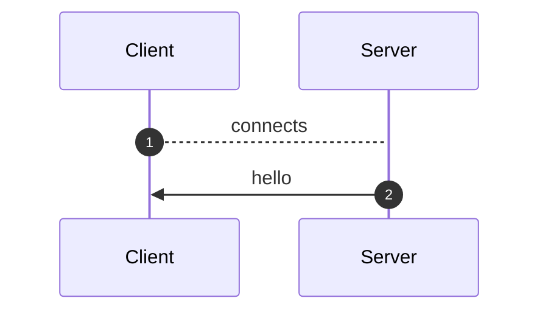
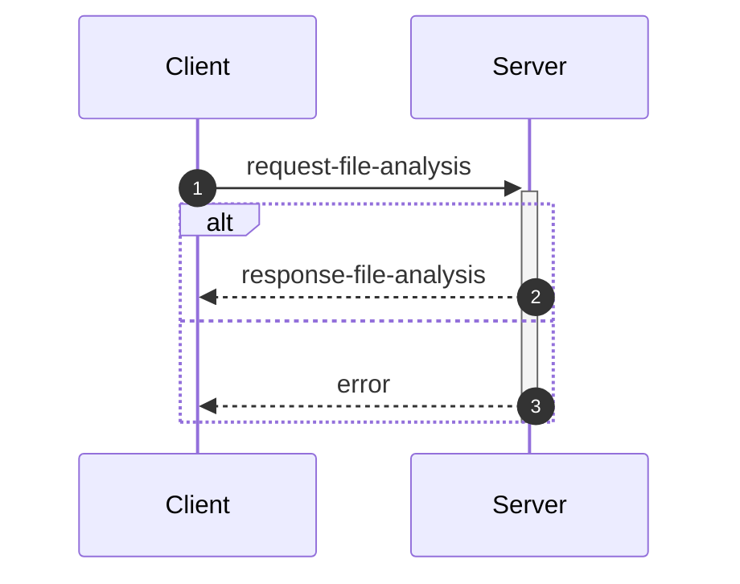
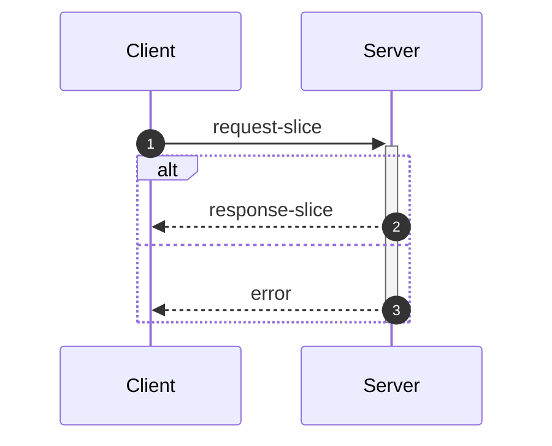
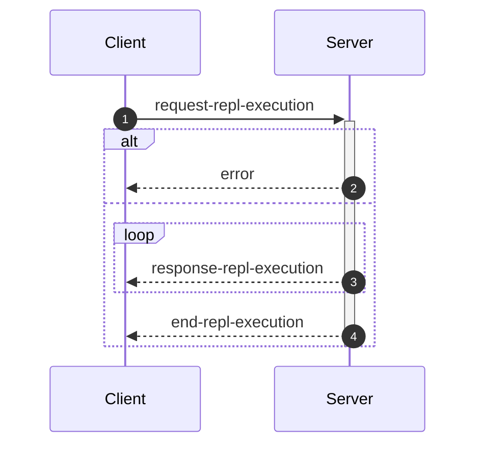
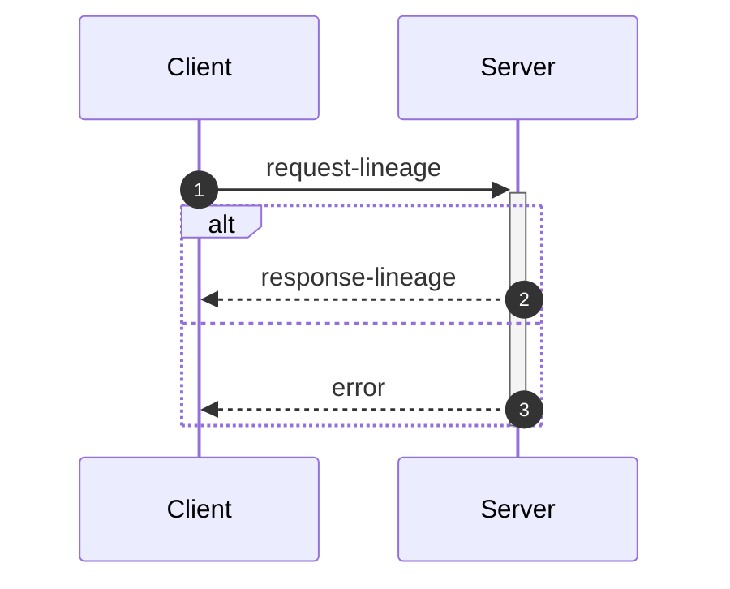

_This document was generated from '[src/documentation/print-interface-wiki.ts](https://github.com/flowr-analysis/flowr/tree/main//src/documentation/print-interface-wiki.ts)' on 2025-09-04, 22:57:15 UTC presenting an overview of flowR's interfaces (v2.4.8, using R v4.5.0). Please do not edit this file/wiki page directly._

Although far from being as detailed as the in-depth explanation of
[_flowR_](https://github.com/flowr-analysis/flowr/wiki/Core),
this wiki page explains how to interface with _flowR_ in more detail.
In general, command line arguments and other options provide short descriptions on hover over.

* [💬 Communicating with the Server](#communicating-with-the-server)
* [💻 Using the REPL](#using-the-repl)
* [⚙️ Configuring FlowR](#configuring-flowr)
* [⚒️ Writing Code](#writing-code)

<a id='communicating-with-the-server'></a>
## 💬 Communicating with the Server


As explained in the [Overview](https://github.com/flowr-analysis/flowr/wiki/Overview), you can simply run the [TCP](https://de.wikipedia.org/wiki/Transmission_Control_Protocol)&nbsp;server by adding the <span title="Description (Command Line Argument): Do not drop into a repl, but instead start a server on the given port (default: 1042) and listen for messages.">`--server`</span> flag (and, due to the interactive mode, exit with the conventional <kbd>CTRL</kbd>+<kbd>C</kbd>).
Currently, every connection is handled by the same underlying `RShell` - so the server is not designed to handle many clients at a time.
Additionally, the server is not well guarded against attacks (e.g., you can theoretically spawn an arbitrary number of&nbsp;RShell sessions on the target machine).

Every message has to be given in a single line (i.e., without a newline in-between) and end with a newline character. Nevertheless, we will pretty-print example given in the following segments for the ease of reading.


> [!NOTE]
> 
> The default <span title="Description (Command Line Argument): Do not drop into a repl, but instead start a server on the given port (default: 1042) and listen for messages.">`--server`</span> uses a simple [TCP](https://de.wikipedia.org/wiki/Transmission_Control_Protocol)
> connection. If you want _flowR_ to expose a [WebSocket](https://de.wikipedia.org/wiki/WebSocket) server instead, add the <span title="Description (Command Line Argument): If the server flag is set, use websocket for messaging">`--ws`</span> flag (i.e., <span title="Description (Command Line Argument): Do not drop into a repl, but instead start a server on the given port (default: 1042) and listen for messages.">`--server`</span> <span title="Description (Command Line Argument): If the server flag is set, use websocket for messaging">`--ws`</span>) when starting _flowR_ from the command line.
> 			


<ul><li>
<a id="message-hello"></a>
<b>Hello</b> Message (<code>hello</code>) 
<details>

<summary style="color:gray"> View Details. <i>The server informs the client about the successful connection and provides Meta-Information.</i> </summary>




	
After launching _flowR_, for example, with <code>docker run -it --rm eagleoutice/flowr <span title="Description (Command Line Argument): Do not drop into a repl, but instead start a server on the given port (default: 1042) and listen for messages.">-<span/>-server</span></code>&nbsp;(🐳️), simply connecting should present you with a `hello` message, that amongst others should reveal the versions of&nbsp;_flowR_ and&nbsp;R, using the [semver 2.0](https://semver.org/spec/v2.0.0.html) versioning scheme.
The message looks like this:


```json
{
  "type": "hello",
  "clientName": "client-0",
  "versions": {
    "flowr": "2.4.8",
    "r": "4.5.0",
    "engine": "r-shell"
  }
}
```


There are currently a few messages that you can send after the hello message.
If you want to _slice_ a piece of R code you first have to send an [analysis request](#message-request-file-analysis), so that you can send one or multiple slice requests afterward.
Requests for the [REPL](#message-request-repl) are independent of that.
	

<hr>


<details>
<summary style="color:gray">Message schema (<code>hello</code>)</summary>

For the definition of the hello message, please see it's implementation at [`./src/cli/repl/server/messages/message-hello.ts`](https://github.com/flowr-analysis/flowr/tree/main/./src/cli/repl/server/messages/message-hello.ts).

- **.** object [required]
    - **type** string [required]
        _The type of the hello message._
        Allows only the values: 'hello'
    - **id** any [forbidden]
        _The id of the message is always undefined (as it is the initial message and not requested)._
    - **clientName** string [required]
        _A unique name that is assigned to each client. It has no semantic meaning and is only used/useful for debugging._
    - **versions** object [required]
        - **flowr** string [required]
            _The version of the flowr server running in semver format._
        - **r** string [required]
            _The version of the underlying R shell running in semver format._
        - **engine** string [required]
            _The parser backend that is used to parse the R code._

</details>


<hr>

</details>	
	</li>

<li>
<a id="message-request-file-analysis"></a>
<b>Analysis</b> Message (<code>request-file-analysis</code>) 
<details>

<summary style="color:gray"> View Details. <i>The server builds the dataflow graph for a given input file (or a set of files).</i> </summary>




	
The request allows the server to analyze a file and prepare it for slicing.
The message can contain a `filetoken`, which is used to identify the file in later slice or lineage requests (if you do not add one, the request will not be stored and therefore, it is not available for subsequent requests).

> **Please note!**\
> If you want to send and process a lot of analysis requests, but do not want to slice them, please do not pass the `filetoken` field. This will save the server a lot of memory allocation.

Furthermore, the request must contain either a `content` field to directly pass the file's content or a `filepath` field which contains the path to the file (this path must be accessible for the server to be useful).
If you add the `id` field, the answer will use the same `id` so you can match requests and the corresponding answers.
See the implementation of the request-file-analysis message for more information.


<details>
<summary>Example of the <code>request-file-analysis</code> Message</summary>

_Note:_ even though we pretty-print these messages, they are sent as a single line, ending with a newline.

The following lists all messages that were sent and received in case you want to reproduce the scenario:

<ol>
<li> <code>hello</code> (response)
<details> 

<summary> Show Details </summary>

The first message is always a hello message.


```json
{
  "type": "hello",
  "clientName": "client-0",
  "versions": {
    "flowr": "2.4.8",
    "r": "4.5.0",
    "engine": "r-shell"
  }
}
```


</details>
</li>

<li> <b><code>request-file-analysis</code> (request)</b>
<details open> 

<summary> Show Details </summary>

Let' suppose you simply want to analyze the following script:
 
```r
x <- 1
x + 1
```

 For this, you can send the following request:


```json
{
  "type": "request-file-analysis",
  "id": "1",
  "filetoken": "x",
  "content": "x <- 1\nx + 1"
}
```


</details>
</li>

<li> <code>response-file-analysis</code> (response)
<details> 

<summary> Show Details </summary>


The `results` field of the response effectively contains three keys of importance:

- `parse`: which contains 1:1 the parse result in CSV format that we received from the `RShell` (i.e., the AST produced by the parser of the R interpreter).
- `normalize`: which contains the normalized AST, including ids (see the `info` field and the [Normalized AST](https://github.com/flowr-analysis/flowr/wiki/Normalized%20AST) wiki page).
- `dataflow`: especially important is the `graph` field which contains the dataflow graph as a set of root vertices (see the [Dataflow Graph](https://github.com/flowr-analysis/flowr/wiki/Dataflow%20Graph) wiki page).
			


_As the code is pretty long, we inhibit pretty printing and syntax highlighting (JSON, hiding built-in):_

```text
{"type":"response-file-analysis","format":"json","id":"1","results":{"parse":{"parsed":"[1,1,1,6,7,0,\"expr\",false,\"x <- 1\"],[1,1,1,1,1,3,\"SYMBOL\",true,\"x\"],[1,1,1,1,3,7,\"expr\",false,\"x\"],[1,3,1,4,2,7,\"LEFT_ASSIGN\",true,\"<-\"],[1,6,1,6,4,5,\"NUM_CONST\",true,\"1\"],[1,6,1,6,5,7,\"expr\",false,\"1\"],[2,1,2,5,16,0,\"expr\",false,\"x + 1\"],[2,1,2,1,10,12,\"SYMBOL\",true,\"x\"],[2,1,2,1,12,16,\"expr\",false,\"x\"],[2,3,2,3,11,16,\"'+'\",true,\"+\"],[2,5,2,5,13,14,\"NUM_CONST\",true,\"1\"],[2,5,2,5,14,16,\"expr\",false,\"1\"]",".meta":{"timing":5}},"normalize":{"ast":{"type":"RExpressionList","children":[{"type":"RBinaryOp","location":[1,3,1,4],"lhs":{"type":"RSymbol","location":[1,1,1,1],"content":"x","lexeme":"x","info":{"fullRange":[1,1,1,1],"additionalTokens":[],"id":0,"parent":2,"role":"binop-lhs","index":0,"nesting":0,"file":"/tmp/tmp-9566-BwKLASHo9JQo-.R"}},"rhs":{"location":[1,6,1,6],"lexeme":"1","info":{"fullRange":[1,6,1,6],"additionalTokens":[],"id":1,"parent":2,"role":"binop-rhs","index":1,"nesting":0,"file":"/tmp/tmp-9566-BwKLASHo9JQo-.R"},"type":"RNumber","content":{"num":1,"complexNumber":false,"markedAsInt":false}},"operator":"<-","lexeme":"<-","info":{"fullRange":[1,1,1,6],"additionalTokens":[],"id":2,"parent":6,"nesting":0,"file":"/tmp/tmp-9566-BwKLASHo9JQo-.R","index":0,"role":"expr-list-child"}},{"type":"RBinaryOp","location":[2,3,2,3],"lhs":{"type":"RSymbol","location":[2,1,2,1],"content":"x","lexeme":"x","info":{"fullRange":[2,1,2,1],"additionalTokens":[],"id":3,"parent":5,"role":"binop-lhs","index":0,"nesting":0,"file":"/tmp/tmp-9566-BwKLASHo9JQo-.R"}},"rhs":{"location":[2,5,2,5],"lexeme":"1","info":{"fullRange":[2,5,2,5],"additionalTokens":[],"id":4,"parent":5,"role":"binop-rhs","index":1,"nesting":0,"file":"/tmp/tmp-9566-BwKLASHo9JQo-.R"},"type":"RNumber","content":{"num":1,"complexNumber":false,"markedAsInt":false}},"operator":"+","lexeme":"+","info":{"fullRange":[2,1,2,5],"additionalTokens":[],"id":5,"parent":6,"nesting":0,"file":"/tmp/tmp-9566-BwKLASHo9JQo-.R","index":1,"role":"expr-list-child"}}],"info":{"additionalTokens":[],"id":6,"nesting":0,"file":"/tmp/tmp-9566-BwKLASHo9JQo-.R","role":"root","index":0}},".meta":{"timing":3}},"dataflow":{"unknownReferences":[],"in":[{"nodeId":2,"name":"<-","type":2},{"nodeId":5,"name":"+","type":2}],"out":[{"nodeId":0,"name":"x","type":4,"definedAt":2,"value":[1]}],"environment":{"current":{"id":12,"parent":"<BuiltInEnvironment>","memory":[["x",[{"nodeId":0,"name":"x","type":4,"definedAt":2,"value":[1]}]]]},"level":0},"graph":{"_sourced":["/tmp/tmp-9566-BwKLASHo9JQo-.R"],"_unknownSideEffects":[],"rootVertices":[1,0,2,3,4,5],"vertexInformation":[[1,{"tag":"value","id":1}],[0,{"tag":"variable-definition","id":0}],[2,{"tag":"function-call","id":2,"name":"<-","onlyBuiltin":true,"args":[{"nodeId":0,"type":32},{"nodeId":1,"type":32}],"origin":["builtin:assignment"]}],[3,{"tag":"use","id":3}],[4,{"tag":"value","id":4}],[5,{"tag":"function-call","id":5,"name":"+","onlyBuiltin":true,"args":[{"nodeId":3,"type":32},{"nodeId":4,"type":32}],"origin":["builtin:default"]}]],"edgeInformation":[[2,[[1,{"types":64}],[0,{"types":72}],["built-in:<-",{"types":5}]]],[0,[[1,{"types":2}],[2,{"types":2}]]],[3,[[0,{"types":1}]]],[5,[[3,{"types":65}],[4,{"types":65}],["built-in:+",{"types":5}]]]]},"entryPoint":2,"exitPoints":[{"type":0,"nodeId":5}],".meta":{"timing":5}}}}
```


</details>
</li>
</ol>

The complete round-trip took 19.0 ms (including time required to validate the messages, start, and stop the internal mock server).

</details>


You receive an error if, for whatever reason, the analysis fails (e.g., the message or code you sent contained syntax errors).
It contains a human-readable description *why* the analysis failed (see the error message implementation for more details).


<details>
<summary>Example Error Message</summary>

_Note:_ even though we pretty-print these messages, they are sent as a single line, ending with a newline.

The following lists all messages that were sent and received in case you want to reproduce the scenario:

<ol>
<li> <code>hello</code> (response)
<details> 

<summary> Show Details </summary>

The first message is always a hello message.


```json
{
  "type": "hello",
  "clientName": "client-0",
  "versions": {
    "flowr": "2.4.8",
    "r": "4.5.0",
    "engine": "r-shell"
  }
}
```


</details>
</li>

<li> <code>request-file-analysis</code> (request)
<details> 

<summary> Show Details </summary>


```json
{
  "type": "request-file-analysis",
  "id": "1",
  "filename": "sample.R",
  "content": "x <-"
}
```


</details>
</li>

<li> <b><code>error</code> (response)</b>
<details open> 

<summary> Show Details </summary>


```json
{
  "id": "1",
  "type": "error",
  "fatal": false,
  "reason": "Error while analyzing file sample.R: GuardError: unable to parse R code (see the log for more information) for request {\"request\":\"file\",\"content\":\"/tmp/tmp-9566-jT4aMQ5j2W8v-.R\"}}\n Report a Bug: https://github.com/flowr-analysis/flowr/issues/new?body=%3C!%2D%2D%20Please%20describe%20your%20issue%20in%20more%20detail%20below!%20%2D%2D%3E%0A%0A%0A%3C!%2D%2D%20Automatically%20generated%20issue%20metadata%2C%20please%20do%20not%20edit%20or%20delete%20content%20below%20this%20line%20%2D%2D%3E%0A%2D%2D%2D%0A%0AflowR%20version%3A%202.4.8%0Anode%20version%3A%20v22.14.0%0Anode%20arch%3A%20x64%0Anode%20platform%3A%20linux%0Amessage%3A%20%60unable%20to%20parse%20R%20code%20%28see%20the%20log%20for%20more%20information%29%20for%20request%20%7B%22request%22%3A%22file%22%2C%22content%22%3A%22%2Ftmp%2Ftmp%2D9566%2DjT4aMQ5j2W8v%2D.R%22%7D%7D%60%0Astack%20trace%3A%0A%60%60%60%0A%20%20%20%20at%20guard%20%28%3C%3E%2Fsrc%2Futil%2Fassert.ts%3A75%3A9%29%0A%20%20%20%20at%20guardRetrievedOutput%20%28%3C%3E%2Fsrc%2Fr%2Dbridge%2Fretriever.ts%3A184%3A7%29%0A%20%20%20%20at%20%2Fhome%2Frunner%2Fwork%2Fflowr%2Fflowr%2Fsrc%2Fr%2Dbridge%2Fretriever.ts%3A148%3A4%0A%20%20%20%20at%20processTicksAndRejections%20%28node%3Ainternal%2Fprocess%2Ftask_queues%3A105%3A5%29%0A%20%20%20%20at%20async%20Object.parseRequests%20%5Bas%20processor%5D%20%28%3C%3E%2Fsrc%2Fr%2Dbridge%2Fparser.ts%3A58%3A18%29%0A%20%20%20%20at%20async%20PipelineExecutor.nextStep%20%28%3C%3E%2Fsrc%2Fcore%2Fpipeline%2Dexecutor.ts%3A200%3A25%29%0A%20%20%20%20at%20async%20PipelineExecutor.allRemainingSteps%20%28%3C%3E%2Fsrc%2Fcore%2Fpipeline%2Dexecutor.ts%3A259%3A4%29%0A%20%20%20%20at%20async%20FlowRServerConnection.handleFileAnalysisRequest%20%28%3C%3E%2Fsrc%2Fcli%2Frepl%2Fserver%2Fconnection.ts%3A153%3A3%29%0A%60%60%60%0A%0A%2D%2D%2D%0A%09"
}
```


</details>
</li>
</ol>

The complete round-trip took 8.2 ms (including time required to validate the messages, start, and stop the internal mock server).

</details>


&nbsp;

<a id="analysis-include-cfg"></a>
**Including the Control Flow Graph**

While _flowR_ does (for the time being) not use an explicit control flow graph but instead relies on control-dependency edges within the dataflow graph, 
the respective structure can still be exposed using the server (note that, as this feature is not needed within _flowR_, it is tested significantly less - 
so please create a [new issue](https://github.com/flowr-analysis/flowr/issues/new/choose) for any bug you may encounter).
For this, the analysis request may add `cfg: true` to its list of options.


<details>
<summary>Requesting a Control Flow Graph</summary>

_Note:_ even though we pretty-print these messages, they are sent as a single line, ending with a newline.

The following lists all messages that were sent and received in case you want to reproduce the scenario:

<ol>
<li> <code>hello</code> (response)
<details> 

<summary> Show Details </summary>

The first message is always a hello message.


```json
{
  "type": "hello",
  "clientName": "client-0",
  "versions": {
    "flowr": "2.4.8",
    "r": "4.5.0",
    "engine": "r-shell"
  }
}
```


</details>
</li>

<li> <b><code>request-file-analysis</code> (request)</b>
<details open> 

<summary> Show Details </summary>


```json
{
  "type": "request-file-analysis",
  "id": "1",
  "filetoken": "x",
  "content": "if(unknown > 0) { x <- 2 } else { x <- 5 }\nfor(i in 1:x) { print(x); print(i) }",
  "cfg": true
}
```


</details>
</li>

<li> <code>response-file-analysis</code> (response)
<details> 

<summary> Show Details </summary>


The response looks basically the same as a response sent without the `cfg` flag. However, additionally it contains a `cfg` field. 
If you are interested in a visual representation of the control flow graph, see the 
[visualization with mermaid](https://mermaid.live/view#base64:eyJjb2RlIjoiZmxvd2NoYXJ0IEJUXG4gICAgbjMyKFtcImBSRXhwcmVzc2lvbkxpc3QgKDMyKWBcIl0pXG4gICAgbjE1W1wiYFJJZlRoZW5FbHNlICgxNSlcbiMzNDtpZih1bmtub3duICM2MjsgMCkgIzEyMzsgeCAjNjA7IzQ1OyAyICMxMjU7IGVsc2UgIzEyMzsgeCAjNjA7IzQ1OyA1ICMxMjU7IzM0O2BcIl1cbiAgICBuMTUtZXhpdCgoMTUtZXhpdCkpXG4gICAgbjAoW1wiYFJTeW1ib2wgKDApXG4jMzQ7dW5rbm93biMzNDtgXCJdKVxuICAgIG4xKFtcImBSTnVtYmVyICgxKVxuIzM0OzAjMzQ7YFwiXSlcbiAgICBuMihbXCJgUkJpbmFyeU9wICgyKVxuIzM0O3Vua25vd24gIzYyOyAwIzM0O2BcIl0pXG4gICAgbjItZXhpdCgoMi1leGl0KSlcbiAgICBuOChbXCJgUkV4cHJlc3Npb25MaXN0ICg4KWBcIl0pXG4gICAgbjUoW1wiYFJTeW1ib2wgKDUpXG4jMzQ7eCMzNDtgXCJdKVxuICAgIG42KFtcImBSTnVtYmVyICg2KVxuIzM0OzIjMzQ7YFwiXSlcbiAgICBuNyhbXCJgUkJpbmFyeU9wICg3KVxuIzM0O3ggIzYwOyM0NTsgMiMzNDtgXCJdKVxuICAgIG43LWV4aXQoKDctZXhpdCkpXG4gICAgbjgtZXhpdCgoOC1leGl0KSlcbiAgICBuMTQoW1wiYFJFeHByZXNzaW9uTGlzdCAoMTQpYFwiXSlcbiAgICBuMTEoW1wiYFJTeW1ib2wgKDExKVxuIzM0O3gjMzQ7YFwiXSlcbiAgICBuMTIoW1wiYFJOdW1iZXIgKDEyKVxuIzM0OzUjMzQ7YFwiXSlcbiAgICBuMTMoW1wiYFJCaW5hcnlPcCAoMTMpXG4jMzQ7eCAjNjA7IzQ1OyA1IzM0O2BcIl0pXG4gICAgbjEzLWV4aXQoKDEzLWV4aXQpKVxuICAgIG4xNC1leGl0KCgxNC1leGl0KSlcbiAgICBuMTYoW1wiYFJTeW1ib2wgKDE2KVxuIzM0O2kjMzQ7YFwiXSlcbiAgICBuMzFbXCJgUkZvckxvb3AgKDMxKVxuIzM0O2ZvcihpIGluIDEjNTg7eCkgIzEyMzsgcHJpbnQoeCk7IHByaW50KGkpICMxMjU7IzM0O2BcIl1cbiAgICBuMTcoW1wiYFJOdW1iZXIgKDE3KVxuIzM0OzEjMzQ7YFwiXSlcbiAgICBuMTgoW1wiYFJTeW1ib2wgKDE4KVxuIzM0O3gjMzQ7YFwiXSlcbiAgICBuMTkoW1wiYFJCaW5hcnlPcCAoMTkpXG4jMzQ7MSM1ODt4IzM0O2BcIl0pXG4gICAgbjE5LWV4aXQoKDE5LWV4aXQpKVxuICAgIG4zMChbXCJgUkV4cHJlc3Npb25MaXN0ICgzMClgXCJdKVxuICAgIG4yMihbXCJgUlN5bWJvbCAoMjIpXG4jMzQ7cHJpbnQoeCkjMzQ7YFwiXSlcbiAgICBuMjVbXCJgUkZ1bmN0aW9uQ2FsbCAoMjUpXG4jMzQ7cHJpbnQoeCkjMzQ7YFwiXVxuICAgIG4yNS1leGl0KCgyNS1leGl0KSlcbiAgICBuMjQoW1wiYFJBcmd1bWVudCAoMjQpXG4jMzQ7eCMzNDtgXCJdKVxuICAgIG4yMyhbXCJgUlN5bWJvbCAoMjMpXG4jMzQ7eCMzNDtgXCJdKVxuICAgIG4yNC1leGl0KCgyNC1leGl0KSlcbiAgICBuMjYoW1wiYFJTeW1ib2wgKDI2KVxuIzM0O3ByaW50KGkpIzM0O2BcIl0pXG4gICAgbjI5W1wiYFJGdW5jdGlvbkNhbGwgKDI5KVxuIzM0O3ByaW50KGkpIzM0O2BcIl1cbiAgICBuMjktZXhpdCgoMjktZXhpdCkpXG4gICAgbjI4KFtcImBSQXJndW1lbnQgKDI4KVxuIzM0O2kjMzQ7YFwiXSlcbiAgICBuMjcoW1wiYFJTeW1ib2wgKDI3KVxuIzM0O2kjMzQ7YFwiXSlcbiAgICBuMjgtZXhpdCgoMjgtZXhpdCkpXG4gICAgbjMwLWV4aXQoKDMwLWV4aXQpKVxuICAgIG4zMS1leGl0KCgzMS1leGl0KSlcbiAgICBuMzItZXhpdCgoMzItZXhpdCkpXG4gICAgbjE1IC0uLT58XCJGRFwifCBuMzJcbiAgICBuMSAtLi0+fFwiRkRcInwgbjBcbiAgICBuMCAtLi0+fFwiRkRcInwgbjJcbiAgICBuMi1leGl0IC0uLT58XCJGRFwifCBuMVxuICAgIG43IC0uLT58XCJGRFwifCBuOFxuICAgIG42IC0uLT58XCJGRFwifCBuNVxuICAgIG41IC0uLT58XCJGRFwifCBuN1xuICAgIG43LWV4aXQgLS4tPnxcIkZEXCJ8IG42XG4gICAgbjgtZXhpdCAtLi0+fFwiRkRcInwgbjctZXhpdFxuICAgIG4xMyAtLi0+fFwiRkRcInwgbjE0XG4gICAgbjEyIC0uLT58XCJGRFwifCBuMTFcbiAgICBuMTEgLS4tPnxcIkZEXCJ8IG4xM1xuICAgIG4xMy1leGl0IC0uLT58XCJGRFwifCBuMTJcbiAgICBuMTQtZXhpdCAtLi0+fFwiRkRcInwgbjEzLWV4aXRcbiAgICBuOCAtLT58XCJDRCAoVFJVRSlcInwgbjItZXhpdFxuICAgIG4xNCAtLT58XCJDRCAoRkFMU0UpXCJ8IG4yLWV4aXRcbiAgICBuMiAtLi0+fFwiRkRcInwgbjE1XG4gICAgbjE1LWV4aXQgLS4tPnxcIkZEXCJ8IG44LWV4aXRcbiAgICBuMTUtZXhpdCAtLi0+fFwiRkRcInwgbjE0LWV4aXRcbiAgICBuMzEgLS4tPnxcIkZEXCJ8IG4xNS1leGl0XG4gICAgbjMxIC0uLT58XCJGRFwifCBuMzAtZXhpdFxuICAgIG4xOCAtLi0+fFwiRkRcInwgbjE3XG4gICAgbjE3IC0uLT58XCJGRFwifCBuMTlcbiAgICBuMTktZXhpdCAtLi0+fFwiRkRcInwgbjE4XG4gICAgbjI1IC0uLT58XCJGRFwifCBuMzBcbiAgICBuMjIgLS4tPnxcIkZEXCJ8IG4yNVxuICAgIG4yMyAtLi0+fFwiRkRcInwgbjI0XG4gICAgbjI0LWV4aXQgLS4tPnxcIkZEXCJ8IG4yM1xuICAgIG4yNCAtLi0+fFwiRkRcInwgbjIyXG4gICAgbjI1LWV4aXQgLS4tPnxcIkZEXCJ8IG4yNC1leGl0XG4gICAgbjI5IC0uLT58XCJGRFwifCBuMjUtZXhpdFxuICAgIG4yNiAtLi0+fFwiRkRcInwgbjI5XG4gICAgbjI3IC0uLT58XCJGRFwifCBuMjhcbiAgICBuMjgtZXhpdCAtLi0+fFwiRkRcInwgbjI3XG4gICAgbjI4IC0uLT58XCJGRFwifCBuMjZcbiAgICBuMjktZXhpdCAtLi0+fFwiRkRcInwgbjI4LWV4aXRcbiAgICBuMzAtZXhpdCAtLi0+fFwiRkRcInwgbjI5LWV4aXRcbiAgICBuMTkgLS4tPnxcIkZEXCJ8IG4zMVxuICAgIG4xNiAtLi0+fFwiRkRcInwgbjE5LWV4aXRcbiAgICBuMzAgLS0+fFwiQ0QgKFRSVUUpXCJ8IG4xNlxuICAgIG4zMS1leGl0IC0tPnxcIkNEIChGQUxTRSlcInwgbjE2XG4gICAgbjMyLWV4aXQgLS4tPnxcIkZEXCJ8IG4zMS1leGl0XG4gICAgc3R5bGUgbjMyIHN0cm9rZTpjeWFuLHN0cm9rZS13aWR0aDo2LjVweDsgICAgc3R5bGUgbjMyLWV4aXQgc3Ryb2tlOmdyZWVuLHN0cm9rZS13aWR0aDo2LjVweDsiLCJtZXJtYWlkIjp7ImF1dG9TeW5jIjp0cnVlfX0=).
			


_As the code is pretty long, we inhibit pretty printing and syntax highlighting (JSON, hiding built-in):_

```text
{"type":"response-file-analysis","format":"json","id":"1","cfg":{"returns":[],"entryPoints":[32],"exitPoints":["32-exit"],"breaks":[],"nexts":[],"graph":{"rootVertices":[32,15,"15-exit",0,1,2,"2-exit",8,5,6,7,"7-exit","8-exit",14,11,12,13,"13-exit","14-exit",16,31,17,18,19,"19-exit",30,22,25,"25-exit",24,23,"24-exit",26,29,"29-exit",28,27,"28-exit","30-exit","31-exit","32-exit"],"vertexInformation":[[32,{"id":32,"type":"expr","end":["32-exit"]}],[15,{"id":15,"type":"stm","mid":["2-exit"],"end":["15-exit"]}],["15-exit",{"id":"15-exit","type":"end","root":15}],[0,{"id":0,"type":"expr"}],[1,{"id":1,"type":"expr"}],[2,{"id":2,"type":"expr","end":["2-exit"]}],["2-exit",{"id":"2-exit","type":"end","root":2}],[8,{"id":8,"type":"expr","end":["8-exit"]}],[5,{"id":5,"type":"expr"}],[6,{"id":6,"type":"expr"}],[7,{"id":7,"type":"expr","end":["7-exit"]}],["7-exit",{"id":"7-exit","type":"end","root":7}],["8-exit",{"id":"8-exit","type":"end","root":8}],[14,{"id":14,"type":"expr","end":["14-exit"]}],[11,{"id":11,"type":"expr"}],[12,{"id":12,"type":"expr"}],[13,{"id":13,"type":"expr","end":["13-exit"]}],["13-exit",{"id":"13-exit","type":"end","root":13}],["14-exit",{"id":"14-exit","type":"end","root":14}],[16,{"id":16,"type":"expr"}],[31,{"id":31,"type":"stm","end":["31-exit"],"mid":[16]}],[17,{"id":17,"type":"expr"}],[18,{"id":18,"type":"expr"}],[19,{"id":19,"type":"expr","end":["19-exit"]}],["19-exit",{"id":"19-exit","type":"end","root":19}],[30,{"id":30,"type":"expr","end":["30-exit"]}],[22,{"id":22,"type":"expr"}],[25,{"id":25,"type":"stm","mid":[22],"end":["25-exit"]}],["25-exit",{"id":"25-exit","type":"end","root":25}],[24,{"id":24,"type":"expr","mid":[24],"end":["24-exit"]}],[23,{"id":23,"type":"expr"}],["24-exit",{"id":"24-exit","type":"end","root":24}],[26,{"id":26,"type":"expr"}],[29,{"id":29,"type":"stm","mid":[26],"end":["29-exit"]}],["29-exit",{"id":"29-exit","type":"end","root":29}],[28,{"id":28,"type":"expr","mid":[28],"end":["28-exit"]}],[27,{"id":27,"type":"expr"}],["28-exit",{"id":"28-exit","type":"end","root":28}],["30-exit",{"id":"30-exit","type":"end","root":30}],["31-exit",{"id":"31-exit","type":"end","root":31}],["32-exit",{"id":"32-exit","type":"end","root":32}]],"bbChildren":[],"edgeInformation":[[15,[[32,{"label":0}]]],[1,[[0,{"label":0}]]],[0,[[2,{"label":0}]]],["2-exit",[[1,{"label":0}]]],[7,[[8,{"label":0}]]],[6,[[5,{"label":0}]]],[5,[[7,{"label":0}]]],["7-exit",[[6,{"label":0}]]],["8-exit",[["7-exit",{"label":0}]]],[13,[[14,{"label":0}]]],[12,[[11,{"label":0}]]],[11,[[13,{"label":0}]]],["13-exit",[[12,{"label":0}]]],["14-exit",[["13-exit",{"label":0}]]],[8,[["2-exit",{"label":1,"when":"TRUE","caused":15}]]],[14,[["2-exit",{"label":1,"when":"FALSE","caused":15}]]],[2,[[15,{"label":0}]]],["15-exit",[["8-exit",{"label":0}],["14-exit",{"label":0}]]],[31,[["15-exit",{"label":0}],["30-exit",{"label":0}]]],[18,[[17,{"label":0}]]],[17,[[19,{"label":0}]]],["19-exit",[[18,{"label":0}]]],[25,[[30,{"label":0}]]],[22,[[25,{"label":0}]]],[23,[[24,{"label":0}]]],["24-exit",[[23,{"label":0}]]],[24,[[22,{"label":0}]]],["25-exit",[["24-exit",{"label":0}]]],[29,[["25-exit",{"label":0}]]],[26,[[29,{"label":0}]]],[27,[[28,{"label":0}]]],["28-exit",[[27,{"label":0}]]],[28,[[26,{"label":0}]]],["29-exit",[["28-exit",{"label":0}]]],["30-exit",[["29-exit",{"label":0}]]],[19,[[31,{"label":0}]]],[16,[["19-exit",{"label":0}]]],[30,[[16,{"label":1,"when":"TRUE","caused":31}]]],["31-exit",[[16,{"label":1,"when":"FALSE","caused":31}]]],["32-exit",[["31-exit",{"label":0}]]]],"_mayHaveBasicBlocks":false}},"results":{"parse":{"parsed":"[1,1,1,42,38,0,\"expr\",false,\"if(unknown > 0) { x <- 2 } else { x <- 5 }\"],[1,1,1,2,1,38,\"IF\",true,\"if\"],[1,3,1,3,2,38,\"'('\",true,\"(\"],[1,4,1,14,9,38,\"expr\",false,\"unknown > 0\"],[1,4,1,10,3,5,\"SYMBOL\",true,\"unknown\"],[1,4,1,10,5,9,\"expr\",false,\"unknown\"],[1,12,1,12,4,9,\"GT\",true,\">\"],[1,14,1,14,6,7,\"NUM_CONST\",true,\"0\"],[1,14,1,14,7,9,\"expr\",false,\"0\"],[1,15,1,15,8,38,\"')'\",true,\")\"],[1,17,1,26,22,38,\"expr\",false,\"{ x <- 2 }\"],[1,17,1,17,12,22,\"'{'\",true,\"{\"],[1,19,1,24,19,22,\"expr\",false,\"x <- 2\"],[1,19,1,19,13,15,\"SYMBOL\",true,\"x\"],[1,19,1,19,15,19,\"expr\",false,\"x\"],[1,21,1,22,14,19,\"LEFT_ASSIGN\",true,\"<-\"],[1,24,1,24,16,17,\"NUM_CONST\",true,\"2\"],[1,24,1,24,17,19,\"expr\",false,\"2\"],[1,26,1,26,18,22,\"'}'\",true,\"}\"],[1,28,1,31,23,38,\"ELSE\",true,\"else\"],[1,33,1,42,35,38,\"expr\",false,\"{ x <- 5 }\"],[1,33,1,33,25,35,\"'{'\",true,\"{\"],[1,35,1,40,32,35,\"expr\",false,\"x <- 5\"],[1,35,1,35,26,28,\"SYMBOL\",true,\"x\"],[1,35,1,35,28,32,\"expr\",false,\"x\"],[1,37,1,38,27,32,\"LEFT_ASSIGN\",true,\"<-\"],[1,40,1,40,29,30,\"NUM_CONST\",true,\"5\"],[1,40,1,40,30,32,\"expr\",false,\"5\"],[1,42,1,42,31,35,\"'}'\",true,\"}\"],[2,1,2,36,84,0,\"expr\",false,\"for(i in 1:x) { print(x); print(i) }\"],[2,1,2,3,41,84,\"FOR\",true,\"for\"],[2,4,2,13,53,84,\"forcond\",false,\"(i in 1:x)\"],[2,4,2,4,42,53,\"'('\",true,\"(\"],[2,5,2,5,43,53,\"SYMBOL\",true,\"i\"],[2,7,2,8,44,53,\"IN\",true,\"in\"],[2,10,2,12,51,53,\"expr\",false,\"1:x\"],[2,10,2,10,45,46,\"NUM_CONST\",true,\"1\"],[2,10,2,10,46,51,\"expr\",false,\"1\"],[2,11,2,11,47,51,\"':'\",true,\":\"],[2,12,2,12,48,50,\"SYMBOL\",true,\"x\"],[2,12,2,12,50,51,\"expr\",false,\"x\"],[2,13,2,13,49,53,\"')'\",true,\")\"],[2,15,2,36,81,84,\"expr\",false,\"{ print(x); print(i) }\"],[2,15,2,15,54,81,\"'{'\",true,\"{\"],[2,17,2,24,64,81,\"expr\",false,\"print(x)\"],[2,17,2,21,55,57,\"SYMBOL_FUNCTION_CALL\",true,\"print\"],[2,17,2,21,57,64,\"expr\",false,\"print\"],[2,22,2,22,56,64,\"'('\",true,\"(\"],[2,23,2,23,58,60,\"SYMBOL\",true,\"x\"],[2,23,2,23,60,64,\"expr\",false,\"x\"],[2,24,2,24,59,64,\"')'\",true,\")\"],[2,25,2,25,65,81,\"';'\",true,\";\"],[2,27,2,34,77,81,\"expr\",false,\"print(i)\"],[2,27,2,31,68,70,\"SYMBOL_FUNCTION_CALL\",true,\"print\"],[2,27,2,31,70,77,\"expr\",false,\"print\"],[2,32,2,32,69,77,\"'('\",true,\"(\"],[2,33,2,33,71,73,\"SYMBOL\",true,\"i\"],[2,33,2,33,73,77,\"expr\",false,\"i\"],[2,34,2,34,72,77,\"')'\",true,\")\"],[2,36,2,36,78,81,\"'}'\",true,\"}\"]",".meta":{"timing":3}},"normalize":{"ast":{"type":"RExpressionList","children":[{"type":"RIfThenElse","condition":{"type":"RBinaryOp","location":[1,12,1,12],"lhs":{"type":"RSymbol","location":[1,4,1,10],"content":"unknown","lexeme":"unknown","info":{"fullRange":[1,4,1,10],"additionalTokens":[],"id":0,"parent":2,"role":"binop-lhs","index":0,"nesting":1,"file":"/tmp/tmp-9566-799ebHWGoEAg-.R"}},"rhs":{"location":[1,14,1,14],"lexeme":"0","info":{"fullRange":[1,14,1,14],"additionalTokens":[],"id":1,"parent":2,"role":"binop-rhs","index":1,"nesting":1,"file":"/tmp/tmp-9566-799ebHWGoEAg-.R"},"type":"RNumber","content":{"num":0,"complexNumber":false,"markedAsInt":false}},"operator":">","lexeme":">","info":{"fullRange":[1,4,1,14],"additionalTokens":[],"id":2,"parent":15,"nesting":1,"file":"/tmp/tmp-9566-799ebHWGoEAg-.R","role":"if-cond"}},"then":{"type":"RExpressionList","children":[{"type":"RBinaryOp","location":[1,21,1,22],"lhs":{"type":"RSymbol","location":[1,19,1,19],"content":"x","lexeme":"x","info":{"fullRange":[1,19,1,19],"additionalTokens":[],"id":5,"parent":7,"role":"binop-lhs","index":0,"nesting":1,"file":"/tmp/tmp-9566-799ebHWGoEAg-.R"}},"rhs":{"location":[1,24,1,24],"lexeme":"2","info":{"fullRange":[1,24,1,24],"additionalTokens":[],"id":6,"parent":7,"role":"binop-rhs","index":1,"nesting":1,"file":"/tmp/tmp-9566-799ebHWGoEAg-.R"},"type":"RNumber","content":{"num":2,"complexNumber":false,"markedAsInt":false}},"operator":"<-","lexeme":"<-","info":{"fullRange":[1,19,1,24],"additionalTokens":[],"id":7,"parent":8,"nesting":1,"file":"/tmp/tmp-9566-799ebHWGoEAg-.R","index":0,"role":"expr-list-child"}}],"grouping":[{"type":"RSymbol","location":[1,17,1,17],"content":"{","lexeme":"{","info":{"fullRange":[1,17,1,26],"additionalTokens":[],"id":3,"role":"root","index":0,"nesting":1,"file":"/tmp/tmp-9566-799ebHWGoEAg-.R"}},{"type":"RSymbol","location":[1,26,1,26],"content":"}","lexeme":"}","info":{"fullRange":[1,17,1,26],"additionalTokens":[],"id":4,"role":"root","index":0,"nesting":1,"file":"/tmp/tmp-9566-799ebHWGoEAg-.R"}}],"info":{"additionalTokens":[],"id":8,"parent":15,"nesting":1,"file":"/tmp/tmp-9566-799ebHWGoEAg-.R","index":1,"role":"if-then"}},"location":[1,1,1,2],"lexeme":"if","info":{"fullRange":[1,1,1,42],"additionalTokens":[],"id":15,"parent":32,"nesting":1,"file":"/tmp/tmp-9566-799ebHWGoEAg-.R","index":0,"role":"expr-list-child"},"otherwise":{"type":"RExpressionList","children":[{"type":"RBinaryOp","location":[1,37,1,38],"lhs":{"type":"RSymbol","location":[1,35,1,35],"content":"x","lexeme":"x","info":{"fullRange":[1,35,1,35],"additionalTokens":[],"id":11,"parent":13,"role":"binop-lhs","index":0,"nesting":1,"file":"/tmp/tmp-9566-799ebHWGoEAg-.R"}},"rhs":{"location":[1,40,1,40],"lexeme":"5","info":{"fullRange":[1,40,1,40],"additionalTokens":[],"id":12,"parent":13,"role":"binop-rhs","index":1,"nesting":1,"file":"/tmp/tmp-9566-799ebHWGoEAg-.R"},"type":"RNumber","content":{"num":5,"complexNumber":false,"markedAsInt":false}},"operator":"<-","lexeme":"<-","info":{"fullRange":[1,35,1,40],"additionalTokens":[],"id":13,"parent":14,"nesting":1,"file":"/tmp/tmp-9566-799ebHWGoEAg-.R","index":0,"role":"expr-list-child"}}],"grouping":[{"type":"RSymbol","location":[1,33,1,33],"content":"{","lexeme":"{","info":{"fullRange":[1,33,1,42],"additionalTokens":[],"id":9,"role":"root","index":0,"nesting":1,"file":"/tmp/tmp-9566-799ebHWGoEAg-.R"}},{"type":"RSymbol","location":[1,42,1,42],"content":"}","lexeme":"}","info":{"fullRange":[1,33,1,42],"additionalTokens":[],"id":10,"role":"root","index":0,"nesting":1,"file":"/tmp/tmp-9566-799ebHWGoEAg-.R"}}],"info":{"additionalTokens":[],"id":14,"parent":15,"nesting":1,"file":"/tmp/tmp-9566-799ebHWGoEAg-.R","index":2,"role":"if-otherwise"}}},{"type":"RForLoop","variable":{"type":"RSymbol","location":[2,5,2,5],"content":"i","lexeme":"i","info":{"additionalTokens":[],"id":16,"parent":31,"role":"for-variable","index":0,"nesting":1,"file":"/tmp/tmp-9566-799ebHWGoEAg-.R"}},"vector":{"type":"RBinaryOp","location":[2,11,2,11],"lhs":{"location":[2,10,2,10],"lexeme":"1","info":{"fullRange":[2,10,2,10],"additionalTokens":[],"id":17,"parent":19,"role":"binop-lhs","index":0,"nesting":1,"file":"/tmp/tmp-9566-799ebHWGoEAg-.R"},"type":"RNumber","content":{"num":1,"complexNumber":false,"markedAsInt":false}},"rhs":{"type":"RSymbol","location":[2,12,2,12],"content":"x","lexeme":"x","info":{"fullRange":[2,12,2,12],"additionalTokens":[],"id":18,"parent":19,"role":"binop-rhs","index":1,"nesting":1,"file":"/tmp/tmp-9566-799ebHWGoEAg-.R"}},"operator":":","lexeme":":","info":{"fullRange":[2,10,2,12],"additionalTokens":[],"id":19,"parent":31,"nesting":1,"file":"/tmp/tmp-9566-799ebHWGoEAg-.R","index":1,"role":"for-vector"}},"body":{"type":"RExpressionList","children":[{"type":"RFunctionCall","named":true,"location":[2,17,2,21],"lexeme":"print","functionName":{"type":"RSymbol","location":[2,17,2,21],"content":"print","lexeme":"print","info":{"fullRange":[2,17,2,24],"additionalTokens":[],"id":22,"parent":25,"role":"call-name","index":0,"nesting":1,"file":"/tmp/tmp-9566-799ebHWGoEAg-.R"}},"arguments":[{"type":"RArgument","location":[2,23,2,23],"lexeme":"x","value":{"type":"RSymbol","location":[2,23,2,23],"content":"x","lexeme":"x","info":{"fullRange":[2,23,2,23],"additionalTokens":[],"id":23,"parent":24,"role":"arg-value","index":0,"nesting":1,"file":"/tmp/tmp-9566-799ebHWGoEAg-.R"}},"info":{"fullRange":[2,23,2,23],"additionalTokens":[],"id":24,"parent":25,"nesting":1,"file":"/tmp/tmp-9566-799ebHWGoEAg-.R","index":1,"role":"call-argument"}}],"info":{"fullRange":[2,17,2,24],"additionalTokens":[],"id":25,"parent":30,"nesting":1,"file":"/tmp/tmp-9566-799ebHWGoEAg-.R","index":0,"role":"expr-list-child"}},{"type":"RFunctionCall","named":true,"location":[2,27,2,31],"lexeme":"print","functionName":{"type":"RSymbol","location":[2,27,2,31],"content":"print","lexeme":"print","info":{"fullRange":[2,27,2,34],"additionalTokens":[],"id":26,"parent":29,"role":"call-name","index":0,"nesting":1,"file":"/tmp/tmp-9566-799ebHWGoEAg-.R"}},"arguments":[{"type":"RArgument","location":[2,33,2,33],"lexeme":"i","value":{"type":"RSymbol","location":[2,33,2,33],"content":"i","lexeme":"i","info":{"fullRange":[2,33,2,33],"additionalTokens":[],"id":27,"parent":28,"role":"arg-value","index":0,"nesting":1,"file":"/tmp/tmp-9566-799ebHWGoEAg-.R"}},"info":{"fullRange":[2,33,2,33],"additionalTokens":[],"id":28,"parent":29,"nesting":1,"file":"/tmp/tmp-9566-799ebHWGoEAg-.R","index":1,"role":"call-argument"}}],"info":{"fullRange":[2,27,2,34],"additionalTokens":[],"id":29,"parent":30,"nesting":1,"file":"/tmp/tmp-9566-799ebHWGoEAg-.R","index":1,"role":"expr-list-child"}}],"grouping":[{"type":"RSymbol","location":[2,15,2,15],"content":"{","lexeme":"{","info":{"fullRange":[2,15,2,36],"additionalTokens":[],"id":20,"role":"root","index":0,"nesting":1,"file":"/tmp/tmp-9566-799ebHWGoEAg-.R"}},{"type":"RSymbol","location":[2,36,2,36],"content":"}","lexeme":"}","info":{"fullRange":[2,15,2,36],"additionalTokens":[],"id":21,"role":"root","index":0,"nesting":1,"file":"/tmp/tmp-9566-799ebHWGoEAg-.R"}}],"info":{"additionalTokens":[],"id":30,"parent":31,"nesting":1,"file":"/tmp/tmp-9566-799ebHWGoEAg-.R","index":2,"role":"for-body"}},"lexeme":"for","info":{"fullRange":[2,1,2,36],"additionalTokens":[],"id":31,"parent":32,"nesting":1,"file":"/tmp/tmp-9566-799ebHWGoEAg-.R","index":1,"role":"expr-list-child"},"location":[2,1,2,3]}],"info":{"additionalTokens":[],"id":32,"nesting":0,"file":"/tmp/tmp-9566-799ebHWGoEAg-.R","role":"root","index":0}},".meta":{"timing":1}},"dataflow":{"unknownReferences":[],"in":[{"nodeId":15,"name":"if","type":2},{"nodeId":0,"name":"unknown","type":1},{"nodeId":2,"name":">","type":2},{"nodeId":7,"name":"<-","controlDependencies":[{"id":15,"when":true}],"type":2},{"nodeId":13,"name":"<-","controlDependencies":[{"id":15,"when":false}],"type":2},{"nodeId":8,"name":"{","controlDependencies":[{"id":15,"when":true}],"type":2},{"nodeId":14,"name":"{","controlDependencies":[{"id":15,"when":false}],"type":2},{"nodeId":31,"name":"for","type":2},{"name":":","nodeId":19,"type":2},{"name":"print","nodeId":25,"type":2},{"name":"print","nodeId":29,"type":2}],"out":[{"nodeId":5,"name":"x","controlDependencies":[{"id":15,"when":true},{"id":15,"when":false}],"type":4,"definedAt":7,"value":[6]},{"nodeId":11,"name":"x","controlDependencies":[{"id":15,"when":true},{"id":15,"when":false}],"type":4,"definedAt":13,"value":[12]},{"nodeId":16,"name":"i","type":1}],"environment":{"current":{"id":93,"parent":"<BuiltInEnvironment>","memory":[["x",[{"nodeId":5,"name":"x","controlDependencies":[{"id":15,"when":true},{"id":15,"when":false}],"type":4,"definedAt":7,"value":[6]},{"nodeId":11,"name":"x","controlDependencies":[{"id":15,"when":true},{"id":15,"when":false}],"type":4,"definedAt":13,"value":[12]}]],["i",[{"nodeId":16,"name":"i","type":4,"definedAt":31}]]]},"level":0},"graph":{"_sourced":["/tmp/tmp-9566-799ebHWGoEAg-.R"],"_unknownSideEffects":[{"id":25,"linkTo":{"type":"link-to-last-call","callName":{}}},{"id":29,"linkTo":{"type":"link-to-last-call","callName":{}}}],"rootVertices":[0,1,2,6,5,7,8,12,11,13,14,15,16,17,18,19,23,25,27,29,30,31],"vertexInformation":[[0,{"tag":"use","id":0}],[1,{"tag":"value","id":1}],[2,{"tag":"function-call","id":2,"name":">","onlyBuiltin":true,"args":[{"nodeId":0,"type":32},{"nodeId":1,"type":32}],"origin":["builtin:default"]}],[6,{"tag":"value","id":6}],[5,{"tag":"variable-definition","id":5,"cds":[{"id":15,"when":true}]}],[7,{"tag":"function-call","id":7,"name":"<-","onlyBuiltin":true,"cds":[{"id":15,"when":true}],"args":[{"nodeId":5,"type":32},{"nodeId":6,"type":32}],"origin":["builtin:assignment"]}],[8,{"tag":"function-call","id":8,"name":"{","onlyBuiltin":true,"cds":[{"id":15,"when":true}],"args":[{"nodeId":7,"type":32}],"origin":["builtin:expression-list"]}],[12,{"tag":"value","id":12}],[11,{"tag":"variable-definition","id":11,"cds":[{"id":15,"when":false}]}],[13,{"tag":"function-call","id":13,"name":"<-","onlyBuiltin":true,"cds":[{"id":15,"when":false}],"args":[{"nodeId":11,"type":32},{"nodeId":12,"type":32}],"origin":["builtin:assignment"]}],[14,{"tag":"function-call","id":14,"name":"{","onlyBuiltin":true,"cds":[{"id":15,"when":false}],"args":[{"nodeId":13,"type":32}],"origin":["builtin:expression-list"]}],[15,{"tag":"function-call","id":15,"name":"if","onlyBuiltin":true,"args":[{"nodeId":2,"type":32},{"nodeId":8,"type":32},{"nodeId":14,"type":32}],"origin":["builtin:if-then-else"]}],[16,{"tag":"variable-definition","id":16}],[17,{"tag":"value","id":17}],[18,{"tag":"use","id":18}],[19,{"tag":"function-call","id":19,"name":":","onlyBuiltin":true,"args":[{"nodeId":17,"type":32},{"nodeId":18,"type":32}],"origin":["builtin:default"]}],[23,{"tag":"use","id":23,"cds":[{"id":31,"when":true}]}],[25,{"tag":"function-call","id":25,"name":"print","onlyBuiltin":true,"cds":[{"id":31,"when":true}],"args":[{"nodeId":23,"type":32}],"origin":["builtin:default"]}],[27,{"tag":"use","id":27,"cds":[{"id":31,"when":true}]}],[29,{"tag":"function-call","id":29,"name":"print","onlyBuiltin":true,"cds":[{"id":31,"when":true}],"args":[{"nodeId":27,"type":32}],"origin":["builtin:default"]}],[30,{"tag":"function-call","id":30,"name":"{","onlyBuiltin":true,"cds":[{"id":31,"when":true}],"args":[{"nodeId":25,"type":32},{"nodeId":29,"type":32}],"origin":["builtin:expression-list"]}],[31,{"tag":"function-call","id":31,"name":"for","onlyBuiltin":true,"args":[{"nodeId":16,"type":32},{"nodeId":19,"type":32},{"nodeId":30,"type":32}],"origin":["builtin:for-loop"]}]],"edgeInformation":[[2,[[0,{"types":65}],[1,{"types":65}],["built-in:>",{"types":5}]]],[7,[[6,{"types":64}],[5,{"types":72}],["built-in:<-",{"types":5}]]],[5,[[6,{"types":2}],[7,{"types":2}]]],[8,[[7,{"types":72}],["built-in:{",{"types":5}]]],[15,[[8,{"types":72}],[14,{"types":72}],[2,{"types":65}],["built-in:if",{"types":5}]]],[13,[[12,{"types":64}],[11,{"types":72}],["built-in:<-",{"types":5}]]],[11,[[12,{"types":2}],[13,{"types":2}]]],[14,[[13,{"types":72}],["built-in:{",{"types":5}]]],[19,[[17,{"types":65}],[18,{"types":65}],["built-in::",{"types":5}]]],[18,[[5,{"types":1}],[11,{"types":1}]]],[25,[[23,{"types":73}],["built-in:print",{"types":5}]]],[23,[[5,{"types":1}],[11,{"types":1}]]],[29,[[27,{"types":73}],["built-in:print",{"types":5}]]],[27,[[16,{"types":1}]]],[30,[[25,{"types":64}],[29,{"types":72}],["built-in:{",{"types":5}]]],[16,[[19,{"types":2}]]],[31,[[16,{"types":64}],[19,{"types":65}],[30,{"types":320}],["built-in:for",{"types":5}]]]]},"entryPoint":15,"exitPoints":[{"type":0,"nodeId":31}],".meta":{"timing":2}}}}
```


</details>
</li>
</ol>

The complete round-trip took 10.0 ms (including time required to validate the messages, start, and stop the internal mock server).

</details>


&nbsp;

<a id="analysis-format-n-quads"></a>
**Retrieve the Output as RDF N-Quads**

The default response is formatted as JSON.
However, by specifying `format: "n-quads"`, you can retrieve the individual results (e.g., the [Normalized AST](https://github.com/flowr-analysis/flowr/wiki/Normalized%20AST)),
as [RDF N-Quads](https://www.w3.org/TR/n-quads/).
This works with and without the control flow graph as described [above](#analysis-include-cfg).


<details>
<summary>Requesting RDF N-Quads</summary>

_Note:_ even though we pretty-print these messages, they are sent as a single line, ending with a newline.

The following lists all messages that were sent and received in case you want to reproduce the scenario:

<ol>
<li> <code>hello</code> (response)
<details> 

<summary> Show Details </summary>

The first message is always a hello message.


```json
{
  "type": "hello",
  "clientName": "client-0",
  "versions": {
    "flowr": "2.4.8",
    "r": "4.5.0",
    "engine": "r-shell"
  }
}
```


</details>
</li>

<li> <b><code>request-file-analysis</code> (request)</b>
<details open> 

<summary> Show Details </summary>


```json
{
  "type": "request-file-analysis",
  "id": "1",
  "filetoken": "x",
  "content": "x <- 1\nx + 1",
  "format": "n-quads",
  "cfg": true
}
```


</details>
</li>

<li> <code>response-file-analysis</code> (response)
<details> 

<summary> Show Details </summary>


Please note, that the base message format is still JSON. Only the individual results get converted. 
While the context is derived from the `filename`, we currently offer no way to customize other parts of the quads 
(please open a [new issue](https://github.com/flowr-analysis/flowr/issues/new/choose) if you require this).

			


_As the code is pretty long, we inhibit pretty printing and syntax highlighting (JSON, hiding built-in):_

```text
{"type":"response-file-analysis","format":"n-quads","id":"1","cfg":"<https://uni-ulm.de/r-ast/unknown/0> <https://uni-ulm.de/r-ast/rootIds> \"6\"^^<http://www.w3.org/2001/XMLSchema#integer> <unknown> .\n<https://uni-ulm.de/r-ast/unknown/0> <https://uni-ulm.de/r-ast/rootIds> \"0\"^^<http://www.w3.org/2001/XMLSchema#integer> <unknown> .\n<https://uni-ulm.de/r-ast/unknown/0> <https://uni-ulm.de/r-ast/rootIds> \"1\"^^<http://www.w3.org/2001/XMLSchema#integer> <unknown> .\n<https://uni-ulm.de/r-ast/unknown/0> <https://uni-ulm.de/r-ast/rootIds> \"2\"^^<http://www.w3.org/2001/XMLSchema#integer> <unknown> .\n<https://uni-ulm.de/r-ast/unknown/0> <https://uni-ulm.de/r-ast/rootIds> \"2-exit\" <unknown> .\n<https://uni-ulm.de/r-ast/unknown/0> <https://uni-ulm.de/r-ast/rootIds> \"3\"^^<http://www.w3.org/2001/XMLSchema#integer> <unknown> .\n<https://uni-ulm.de/r-ast/unknown/0> <https://uni-ulm.de/r-ast/rootIds> \"4\"^^<http://www.w3.org/2001/XMLSchema#integer> <unknown> .\n<https://uni-ulm.de/r-ast/unknown/0> <https://uni-ulm.de/r-ast/rootIds> \"5\"^^<http://www.w3.org/2001/XMLSchema#integer> <unknown> .\n<https://uni-ulm.de/r-ast/unknown/0> <https://uni-ulm.de/r-ast/rootIds> \"5-exit\" <unknown> .\n<https://uni-ulm.de/r-ast/unknown/0> <https://uni-ulm.de/r-ast/rootIds> \"6-exit\" <unknown> .\n<https://uni-ulm.de/r-ast/unknown/0> <https://uni-ulm.de/r-ast/vertices> <https://uni-ulm.de/r-ast/unknown/1> <unknown> .\n<https://uni-ulm.de/r-ast/unknown/1> <https://uni-ulm.de/r-ast/next> <https://uni-ulm.de/r-ast/unknown/2> <unknown> .\n<https://uni-ulm.de/r-ast/unknown/1> <https://uni-ulm.de/r-ast/id> \"6\"^^<http://www.w3.org/2001/XMLSchema#integer> <unknown> .\n<https://uni-ulm.de/r-ast/unknown/0> <https://uni-ulm.de/r-ast/vertices> <https://uni-ulm.de/r-ast/unknown/2> <unknown> .\n<https://uni-ulm.de/r-ast/unknown/2> <https://uni-ulm.de/r-ast/next> <https://uni-ulm.de/r-ast/unknown/3> <unknown> .\n<https://uni-ulm.de/r-ast/unknown/2> <https://uni-ulm.de/r-ast/id> \"0\"^^<http://www.w3.org/2001/XMLSchema#integer> <unknown> .\n<https://uni-ulm.de/r-ast/unknown/0> <https://uni-ulm.de/r-ast/vertices> <https://uni-ulm.de/r-ast/unknown/3> <unknown> .\n<https://uni-ulm.de/r-ast/unknown/3> <https://uni-ulm.de/r-ast/next> <https://uni-ulm.de/r-ast/unknown/4> <unknown> .\n<https://uni-ulm.de/r-ast/unknown/3> <https://uni-ulm.de/r-ast/id> \"1\"^^<http://www.w3.org/2001/XMLSchema#integer> <unknown> .\n<https://uni-ulm.de/r-ast/unknown/0> <https://uni-ulm.de/r-ast/vertices> <https://uni-ulm.de/r-ast/unknown/4> <unknown> .\n<https://uni-ulm.de/r-ast/unknown/4> <https://uni-ulm.de/r-ast/next> <https://uni-ulm.de/r-ast/unknown/5> <unknown> .\n<https://uni-ulm.de/r-ast/unknown/4> <https://uni-ulm.de/r-ast/id> \"2\"^^<http://www.w3.org/2001/XMLSchema#integer> <unknown> .\n<https://uni-ulm.de/r-ast/unknown/0> <https://uni-ulm.de/r-ast/vertices> <https://uni-ulm.de/r-ast/unknown/5> <unknown> .\n<https://uni-ulm.de/r-ast/unknown/5> <https://uni-ulm.de/r-ast/next> <https://uni-ulm.de/r-ast/unknown/6> <unknown> .\n<https://uni-ulm.de/r-ast/unknown/5> <https://uni-ulm.de/r-ast/id> \"2-exit\" <unknown> .\n<https://uni-ulm.de/r-ast/unknown/0> <https://uni-ulm.de/r-ast/vertices> <https://uni-ulm.de/r-ast/unknown/6> <unknown> .\n<https://uni-ulm.de/r-ast/unknown/6> <https://uni-ulm.de/r-ast/next> <https://uni-ulm.de/r-ast/unknown/7> <unknown> .\n<https://uni-ulm.de/r-ast/unknown/6> <https://uni-ulm.de/r-ast/id> \"3\"^^<http://www.w3.org/2001/XMLSchema#integer> <unknown> .\n<https://uni-ulm.de/r-ast/unknown/0> <https://uni-ulm.de/r-ast/vertices> <https://uni-ulm.de/r-ast/unknown/7> <unknown> .\n<https://uni-ulm.de/r-ast/unknown/7> <https://uni-ulm.de/r-ast/next> <https://uni-ulm.de/r-ast/unknown/8> <unknown> .\n<https://uni-ulm.de/r-ast/unknown/7> <https://uni-ulm.de/r-ast/id> \"4\"^^<http://www.w3.org/2001/XMLSchema#integer> <unknown> .\n<https://uni-ulm.de/r-ast/unknown/0> <https://uni-ulm.de/r-ast/vertices> <https://uni-ulm.de/r-ast/unknown/8> <unknown> .\n<https://uni-ulm.de/r-ast/unknown/8> <https://uni-ulm.de/r-ast/next> <https://uni-ulm.de/r-ast/unknown/9> <unknown> .\n<https://uni-ulm.de/r-ast/unknown/8> <https://uni-ulm.de/r-ast/id> \"5\"^^<http://www.w3.org/2001/XMLSchema#integer> <unknown> .\n<https://uni-ulm.de/r-ast/unknown/0> <https://uni-ulm.de/r-ast/vertices> <https://uni-ulm.de/r-ast/unknown/9> <unknown> .\n<https://uni-ulm.de/r-ast/unknown/9> <https://uni-ulm.de/r-ast/next> <https://uni-ulm.de/r-ast/unknown/10> <unknown> .\n<https://uni-ulm.de/r-ast/unknown/9> <https://uni-ulm.de/r-ast/id> \"5-exit\" <unknown> .\n<https://uni-ulm.de/r-ast/unknown/0> <https://uni-ulm.de/r-ast/vertices> <https://uni-ulm.de/r-ast/unknown/10> <unknown> .\n<https://uni-ulm.de/r-ast/unknown/10> <https://uni-ulm.de/r-ast/id> \"6-exit\" <unknown> .\n<https://uni-ulm.de/r-ast/unknown/0> <https://uni-ulm.de/r-ast/edges> <https://uni-ulm.de/r-ast/unknown/11> <unknown> .\n<https://uni-ulm.de/r-ast/unknown/11> <https://uni-ulm.de/r-ast/next> <https://uni-ulm.de/r-ast/unknown/12> <unknown> .\n<https://uni-ulm.de/r-ast/unknown/11> <https://uni-ulm.de/r-ast/from> \"2\"^^<http://www.w3.org/2001/XMLSchema#integer> <unknown> .\n<https://uni-ulm.de/r-ast/unknown/11> <https://uni-ulm.de/r-ast/to> \"6\"^^<http://www.w3.org/2001/XMLSchema#integer> <unknown> .\n<https://uni-ulm.de/r-ast/unknown/11> <https://uni-ulm.de/r-ast/type> \"0\"^^<http://www.w3.org/2001/XMLSchema#integer> <unknown> .\n<https://uni-ulm.de/r-ast/unknown/0> <https://uni-ulm.de/r-ast/edges> <https://uni-ulm.de/r-ast/unknown/12> <unknown> .\n<https://uni-ulm.de/r-ast/unknown/12> <https://uni-ulm.de/r-ast/next> <https://uni-ulm.de/r-ast/unknown/13> <unknown> .\n<https://uni-ulm.de/r-ast/unknown/12> <https://uni-ulm.de/r-ast/from> \"1\"^^<http://www.w3.org/2001/XMLSchema#integer> <unknown> .\n<https://uni-ulm.de/r-ast/unknown/12> <https://uni-ulm.de/r-ast/to> \"0\"^^<http://www.w3.org/2001/XMLSchema#integer> <unknown> .\n<https://uni-ulm.de/r-ast/unknown/12> <https://uni-ulm.de/r-ast/type> \"0\"^^<http://www.w3.org/2001/XMLSchema#integer> <unknown> .\n<https://uni-ulm.de/r-ast/unknown/0> <https://uni-ulm.de/r-ast/edges> <https://uni-ulm.de/r-ast/unknown/13> <unknown> .\n<https://uni-ulm.de/r-ast/unknown/13> <https://uni-ulm.de/r-ast/next> <https://uni-ulm.de/r-ast/unknown/14> <unknown> .\n<https://uni-ulm.de/r-ast/unknown/13> <https://uni-ulm.de/r-ast/from> \"0\"^^<http://www.w3.org/2001/XMLSchema#integer> <unknown> .\n<https://uni-ulm.de/r-ast/unknown/13> <https://uni-ulm.de/r-ast/to> \"2\"^^<http://www.w3.org/2001/XMLSchema#integer> <unknown> .\n<https://uni-ulm.de/r-ast/unknown/13> <https://uni-ulm.de/r-ast/type> \"0\"^^<http://www.w3.org/2001/XMLSchema#integer> <unknown> .\n<https://uni-ulm.de/r-ast/unknown/0> <https://uni-ulm.de/r-ast/edges> <https://uni-ulm.de/r-ast/unknown/14> <unknown> .\n<https://uni-ulm.de/r-ast/unknown/14> <https://uni-ulm.de/r-ast/next> <https://uni-ulm.de/r-ast/unknown/15> <unknown> .\n<https://uni-ulm.de/r-ast/unknown/14> <https://uni-ulm.de/r-ast/from> \"2-exit\" <unknown> .\n<https://uni-ulm.de/r-ast/unknown/14> <https://uni-ulm.de/r-ast/to> \"1\"^^<http://www.w3.org/2001/XMLSchema#integer> <unknown> .\n<https://uni-ulm.de/r-ast/unknown/14> <https://uni-ulm.de/r-ast/type> \"0\"^^<http://www.w3.org/2001/XMLSchema#integer> <unknown> .\n<https://uni-ulm.de/r-ast/unknown/0> <https://uni-ulm.de/r-ast/edges> <https://uni-ulm.de/r-ast/unknown/15> <unknown> .\n<https://uni-ulm.de/r-ast/unknown/15> <https://uni-ulm.de/r-ast/next> <https://uni-ulm.de/r-ast/unknown/16> <unknown> .\n<https://uni-ulm.de/r-ast/unknown/15> <https://uni-ulm.de/r-ast/from> \"5\"^^<http://www.w3.org/2001/XMLSchema#integer> <unknown> .\n<https://uni-ulm.de/r-ast/unknown/15> <https://uni-ulm.de/r-ast/to> \"2-exit\" <unknown> .\n<https://uni-ulm.de/r-ast/unknown/15> <https://uni-ulm.de/r-ast/type> \"0\"^^<http://www.w3.org/2001/XMLSchema#integer> <unknown> .\n<https://uni-ulm.de/r-ast/unknown/0> <https://uni-ulm.de/r-ast/edges> <https://uni-ulm.de/r-ast/unknown/16> <unknown> .\n<https://uni-ulm.de/r-ast/unknown/16> <https://uni-ulm.de/r-ast/next> <https://uni-ulm.de/r-ast/unknown/17> <unknown> .\n<https://uni-ulm.de/r-ast/unknown/16> <https://uni-ulm.de/r-ast/from> \"4\"^^<http://www.w3.org/2001/XMLSchema#integer> <unknown> .\n<https://uni-ulm.de/r-ast/unknown/16> <https://uni-ulm.de/r-ast/to> \"3\"^^<http://www.w3.org/2001/XMLSchema#integer> <unknown> .\n<https://uni-ulm.de/r-ast/unknown/16> <https://uni-ulm.de/r-ast/type> \"0\"^^<http://www.w3.org/2001/XMLSchema#integer> <unknown> .\n<https://uni-ulm.de/r-ast/unknown/0> <https://uni-ulm.de/r-ast/edges> <https://uni-ulm.de/r-ast/unknown/17> <unknown> .\n<https://uni-ulm.de/r-ast/unknown/17> <https://uni-ulm.de/r-ast/next> <https://uni-ulm.de/r-ast/unknown/18> <unknown> .\n<https://uni-ulm.de/r-ast/unknown/17> <https://uni-ulm.de/r-ast/from> \"3\"^^<http://www.w3.org/2001/XMLSchema#integer> <unknown> .\n<https://uni-ulm.de/r-ast/unknown/17> <https://uni-ulm.de/r-ast/to> \"5\"^^<http://www.w3.org/2001/XMLSchema#integer> <unknown> .\n<https://uni-ulm.de/r-ast/unknown/17> <https://uni-ulm.de/r-ast/type> \"0\"^^<http://www.w3.org/2001/XMLSchema#integer> <unknown> .\n<https://uni-ulm.de/r-ast/unknown/0> <https://uni-ulm.de/r-ast/edges> <https://uni-ulm.de/r-ast/unknown/18> <unknown> .\n<https://uni-ulm.de/r-ast/unknown/18> <https://uni-ulm.de/r-ast/next> <https://uni-ulm.de/r-ast/unknown/19> <unknown> .\n<https://uni-ulm.de/r-ast/unknown/18> <https://uni-ulm.de/r-ast/from> \"5-exit\" <unknown> .\n<https://uni-ulm.de/r-ast/unknown/18> <https://uni-ulm.de/r-ast/to> \"4\"^^<http://www.w3.org/2001/XMLSchema#integer> <unknown> .\n<https://uni-ulm.de/r-ast/unknown/18> <https://uni-ulm.de/r-ast/type> \"0\"^^<http://www.w3.org/2001/XMLSchema#integer> <unknown> .\n<https://uni-ulm.de/r-ast/unknown/0> <https://uni-ulm.de/r-ast/edges> <https://uni-ulm.de/r-ast/unknown/19> <unknown> .\n<https://uni-ulm.de/r-ast/unknown/19> <https://uni-ulm.de/r-ast/from> \"6-exit\" <unknown> .\n<https://uni-ulm.de/r-ast/unknown/19> <https://uni-ulm.de/r-ast/to> \"5-exit\" <unknown> .\n<https://uni-ulm.de/r-ast/unknown/19> <https://uni-ulm.de/r-ast/type> \"0\"^^<http://www.w3.org/2001/XMLSchema#integer> <unknown> .\n<https://uni-ulm.de/r-ast/unknown/0> <https://uni-ulm.de/r-ast/entryPoints> \"6\"^^<http://www.w3.org/2001/XMLSchema#integer> <unknown> .\n<https://uni-ulm.de/r-ast/unknown/0> <https://uni-ulm.de/r-ast/exitPoints> \"6-exit\" <unknown> .\n","results":{"parse":"<https://uni-ulm.de/r-ast/unknown/0> <https://uni-ulm.de/r-ast/token> \"exprlist\" <unknown> .\n<https://uni-ulm.de/r-ast/unknown/0> <https://uni-ulm.de/r-ast/text> \"\" <unknown> .\n<https://uni-ulm.de/r-ast/unknown/0> <https://uni-ulm.de/r-ast/id> \"0\"^^<http://www.w3.org/2001/XMLSchema#integer> <unknown> .\n<https://uni-ulm.de/r-ast/unknown/0> <https://uni-ulm.de/r-ast/parent> \"0\"^^<http://www.w3.org/2001/XMLSchema#integer> <unknown> .\n<https://uni-ulm.de/r-ast/unknown/0> <https://uni-ulm.de/r-ast/line1> \"1\"^^<http://www.w3.org/2001/XMLSchema#integer> <unknown> .\n<https://uni-ulm.de/r-ast/unknown/0> <https://uni-ulm.de/r-ast/col1> \"1\"^^<http://www.w3.org/2001/XMLSchema#integer> <unknown> .\n<https://uni-ulm.de/r-ast/unknown/0> <https://uni-ulm.de/r-ast/line2> \"2\"^^<http://www.w3.org/2001/XMLSchema#integer> <unknown> .\n<https://uni-ulm.de/r-ast/unknown/0> <https://uni-ulm.de/r-ast/col2> \"5\"^^<http://www.w3.org/2001/XMLSchema#integer> <unknown> .\n<https://uni-ulm.de/r-ast/unknown/0> <https://uni-ulm.de/r-ast/children> <https://uni-ulm.de/r-ast/unknown/1> <unknown> .\n<https://uni-ulm.de/r-ast/unknown/1> <https://uni-ulm.de/r-ast/next> <https://uni-ulm.de/r-ast/unknown/2> <unknown> .\n<https://uni-ulm.de/r-ast/unknown/1> <https://uni-ulm.de/r-ast/line1> \"1\"^^<http://www.w3.org/2001/XMLSchema#integer> <unknown> .\n<https://uni-ulm.de/r-ast/unknown/1> <https://uni-ulm.de/r-ast/col1> \"1\"^^<http://www.w3.org/2001/XMLSchema#integer> <unknown> .\n<https://uni-ulm.de/r-ast/unknown/1> <https://uni-ulm.de/r-ast/line2> \"1\"^^<http://www.w3.org/2001/XMLSchema#integer> <unknown> .\n<https://uni-ulm.de/r-ast/unknown/1> <https://uni-ulm.de/r-ast/col2> \"6\"^^<http://www.w3.org/2001/XMLSchema#integer> <unknown> .\n<https://uni-ulm.de/r-ast/unknown/1> <https://uni-ulm.de/r-ast/id> \"7\"^^<http://www.w3.org/2001/XMLSchema#integer> <unknown> .\n<https://uni-ulm.de/r-ast/unknown/1> <https://uni-ulm.de/r-ast/parent> \"0\"^^<http://www.w3.org/2001/XMLSchema#integer> <unknown> .\n<https://uni-ulm.de/r-ast/unknown/1> <https://uni-ulm.de/r-ast/token> \"expr\" <unknown> .\n<https://uni-ulm.de/r-ast/unknown/1> <https://uni-ulm.de/r-ast/terminal> \"false\"^^<http://www.w3.org/2001/XMLSchema#boolean> <unknown> .\n<https://uni-ulm.de/r-ast/unknown/1> <https://uni-ulm.de/r-ast/text> \"x <- 1\" <unknown> .\n<https://uni-ulm.de/r-ast/unknown/1> <https://uni-ulm.de/r-ast/children> <https://uni-ulm.de/r-ast/unknown/3> <unknown> .\n<https://uni-ulm.de/r-ast/unknown/3> <https://uni-ulm.de/r-ast/next> <https://uni-ulm.de/r-ast/unknown/4> <unknown> .\n<https://uni-ulm.de/r-ast/unknown/3> <https://uni-ulm.de/r-ast/line1> \"1\"^^<http://www.w3.org/2001/XMLSchema#integer> <unknown> .\n<https://uni-ulm.de/r-ast/unknown/3> <https://uni-ulm.de/r-ast/col1> \"1\"^^<http://www.w3.org/2001/XMLSchema#integer> <unknown> .\n<https://uni-ulm.de/r-ast/unknown/3> <https://uni-ulm.de/r-ast/line2> \"1\"^^<http://www.w3.org/2001/XMLSchema#integer> <unknown> .\n<https://uni-ulm.de/r-ast/unknown/3> <https://uni-ulm.de/r-ast/col2> \"1\"^^<http://www.w3.org/2001/XMLSchema#integer> <unknown> .\n<https://uni-ulm.de/r-ast/unknown/3> <https://uni-ulm.de/r-ast/id> \"3\"^^<http://www.w3.org/2001/XMLSchema#integer> <unknown> .\n<https://uni-ulm.de/r-ast/unknown/3> <https://uni-ulm.de/r-ast/parent> \"7\"^^<http://www.w3.org/2001/XMLSchema#integer> <unknown> .\n<https://uni-ulm.de/r-ast/unknown/3> <https://uni-ulm.de/r-ast/token> \"expr\" <unknown> .\n<https://uni-ulm.de/r-ast/unknown/3> <https://uni-ulm.de/r-ast/terminal> \"false\"^^<http://www.w3.org/2001/XMLSchema#boolean> <unknown> .\n<https://uni-ulm.de/r-ast/unknown/3> <https://uni-ulm.de/r-ast/text> \"x\" <unknown> .\n<https://uni-ulm.de/r-ast/unknown/3> <https://uni-ulm.de/r-ast/children> <https://uni-ulm.de/r-ast/unknown/5> <unknown> .\n<https://uni-ulm.de/r-ast/unknown/5> <https://uni-ulm.de/r-ast/line1> \"1\"^^<http://www.w3.org/2001/XMLSchema#integer> <unknown> .\n<https://uni-ulm.de/r-ast/unknown/5> <https://uni-ulm.de/r-ast/col1> \"1\"^^<http://www.w3.org/2001/XMLSchema#integer> <unknown> .\n<https://uni-ulm.de/r-ast/unknown/5> <https://uni-ulm.de/r-ast/line2> \"1\"^^<http://www.w3.org/2001/XMLSchema#integer> <unknown> .\n<https://uni-ulm.de/r-ast/unknown/5> <https://uni-ulm.de/r-ast/col2> \"1\"^^<http://www.w3.org/2001/XMLSchema#integer> <unknown> .\n<https://uni-ulm.de/r-ast/unknown/5> <https://uni-ulm.de/r-ast/id> \"1\"^^<http://www.w3.org/2001/XMLSchema#integer> <unknown> .\n<https://uni-ulm.de/r-ast/unknown/5> <https://uni-ulm.de/r-ast/parent> \"3\"^^<http://www.w3.org/2001/XMLSchema#integer> <unknown> .\n<https://uni-ulm.de/r-ast/unknown/5> <https://uni-ulm.de/r-ast/token> \"SYMBOL\" <unknown> .\n<https://uni-ulm.de/r-ast/unknown/5> <https://uni-ulm.de/r-ast/terminal> \"true\"^^<http://www.w3.org/2001/XMLSchema#boolean> <unknown> .\n<https://uni-ulm.de/r-ast/unknown/5> <https://uni-ulm.de/r-ast/text> \"x\" <unknown> .\n<https://uni-ulm.de/r-ast/unknown/1> <https://uni-ulm.de/r-ast/children> <https://uni-ulm.de/r-ast/unknown/4> <unknown> .\n<https://uni-ulm.de/r-ast/unknown/4> <https://uni-ulm.de/r-ast/next> <https://uni-ulm.de/r-ast/unknown/6> <unknown> .\n<https://uni-ulm.de/r-ast/unknown/4> <https://uni-ulm.de/r-ast/line1> \"1\"^^<http://www.w3.org/2001/XMLSchema#integer> <unknown> .\n<https://uni-ulm.de/r-ast/unknown/4> <https://uni-ulm.de/r-ast/col1> \"3\"^^<http://www.w3.org/2001/XMLSchema#integer> <unknown> .\n<https://uni-ulm.de/r-ast/unknown/4> <https://uni-ulm.de/r-ast/line2> \"1\"^^<http://www.w3.org/2001/XMLSchema#integer> <unknown> .\n<https://uni-ulm.de/r-ast/unknown/4> <https://uni-ulm.de/r-ast/col2> \"4\"^^<http://www.w3.org/2001/XMLSchema#integer> <unknown> .\n<https://uni-ulm.de/r-ast/unknown/4> <https://uni-ulm.de/r-ast/id> \"2\"^^<http://www.w3.org/2001/XMLSchema#integer> <unknown> .\n<https://uni-ulm.de/r-ast/unknown/4> <https://uni-ulm.de/r-ast/parent> \"7\"^^<http://www.w3.org/2001/XMLSchema#integer> <unknown> .\n<https://uni-ulm.de/r-ast/unknown/4> <https://uni-ulm.de/r-ast/token> \"LEFT_ASSIGN\" <unknown> .\n<https://uni-ulm.de/r-ast/unknown/4> <https://uni-ulm.de/r-ast/terminal> \"true\"^^<http://www.w3.org/2001/XMLSchema#boolean> <unknown> .\n<https://uni-ulm.de/r-ast/unknown/4> <https://uni-ulm.de/r-ast/text> \"<-\" <unknown> .\n<https://uni-ulm.de/r-ast/unknown/1> <https://uni-ulm.de/r-ast/children> <https://uni-ulm.de/r-ast/unknown/6> <unknown> .\n<https://uni-ulm.de/r-ast/unknown/6> <https://uni-ulm.de/r-ast/line1> \"1\"^^<http://www.w3.org/2001/XMLSchema#integer> <unknown> .\n<https://uni-ulm.de/r-ast/unknown/6> <https://uni-ulm.de/r-ast/col1> \"6\"^^<http://www.w3.org/2001/XMLSchema#integer> <unknown> .\n<https://uni-ulm.de/r-ast/unknown/6> <https://uni-ulm.de/r-ast/line2> \"1\"^^<http://www.w3.org/2001/XMLSchema#integer> <unknown> .\n<https://uni-ulm.de/r-ast/unknown/6> <https://uni-ulm.de/r-ast/col2> \"6\"^^<http://www.w3.org/2001/XMLSchema#integer> <unknown> .\n<https://uni-ulm.de/r-ast/unknown/6> <https://uni-ulm.de/r-ast/id> \"5\"^^<http://www.w3.org/2001/XMLSchema#integer> <unknown> .\n<https://uni-ulm.de/r-ast/unknown/6> <https://uni-ulm.de/r-ast/parent> \"7\"^^<http://www.w3.org/2001/XMLSchema#integer> <unknown> .\n<https://uni-ulm.de/r-ast/unknown/6> <https://uni-ulm.de/r-ast/token> \"expr\" <unknown> .\n<https://uni-ulm.de/r-ast/unknown/6> <https://uni-ulm.de/r-ast/terminal> \"false\"^^<http://www.w3.org/2001/XMLSchema#boolean> <unknown> .\n<https://uni-ulm.de/r-ast/unknown/6> <https://uni-ulm.de/r-ast/text> \"1\" <unknown> .\n<https://uni-ulm.de/r-ast/unknown/6> <https://uni-ulm.de/r-ast/children> <https://uni-ulm.de/r-ast/unknown/7> <unknown> .\n<https://uni-ulm.de/r-ast/unknown/7> <https://uni-ulm.de/r-ast/line1> \"1\"^^<http://www.w3.org/2001/XMLSchema#integer> <unknown> .\n<https://uni-ulm.de/r-ast/unknown/7> <https://uni-ulm.de/r-ast/col1> \"6\"^^<http://www.w3.org/2001/XMLSchema#integer> <unknown> .\n<https://uni-ulm.de/r-ast/unknown/7> <https://uni-ulm.de/r-ast/line2> \"1\"^^<http://www.w3.org/2001/XMLSchema#integer> <unknown> .\n<https://uni-ulm.de/r-ast/unknown/7> <https://uni-ulm.de/r-ast/col2> \"6\"^^<http://www.w3.org/2001/XMLSchema#integer> <unknown> .\n<https://uni-ulm.de/r-ast/unknown/7> <https://uni-ulm.de/r-ast/id> \"4\"^^<http://www.w3.org/2001/XMLSchema#integer> <unknown> .\n<https://uni-ulm.de/r-ast/unknown/7> <https://uni-ulm.de/r-ast/parent> \"5\"^^<http://www.w3.org/2001/XMLSchema#integer> <unknown> .\n<https://uni-ulm.de/r-ast/unknown/7> <https://uni-ulm.de/r-ast/token> \"NUM_CONST\" <unknown> .\n<https://uni-ulm.de/r-ast/unknown/7> <https://uni-ulm.de/r-ast/terminal> \"true\"^^<http://www.w3.org/2001/XMLSchema#boolean> <unknown> .\n<https://uni-ulm.de/r-ast/unknown/7> <https://uni-ulm.de/r-ast/text> \"1\" <unknown> .\n<https://uni-ulm.de/r-ast/unknown/0> <https://uni-ulm.de/r-ast/children> <https://uni-ulm.de/r-ast/unknown/2> <unknown> .\n<https://uni-ulm.de/r-ast/unknown/2> <https://uni-ulm.de/r-ast/line1> \"2\"^^<http://www.w3.org/2001/XMLSchema#integer> <unknown> .\n<https://uni-ulm.de/r-ast/unknown/2> <https://uni-ulm.de/r-ast/col1> \"1\"^^<http://www.w3.org/2001/XMLSchema#integer> <unknown> .\n<https://uni-ulm.de/r-ast/unknown/2> <https://uni-ulm.de/r-ast/line2> \"2\"^^<http://www.w3.org/2001/XMLSchema#integer> <unknown> .\n<https://uni-ulm.de/r-ast/unknown/2> <https://uni-ulm.de/r-ast/col2> \"5\"^^<http://www.w3.org/2001/XMLSchema#integer> <unknown> .\n<https://uni-ulm.de/r-ast/unknown/2> <https://uni-ulm.de/r-ast/id> \"16\"^^<http://www.w3.org/2001/XMLSchema#integer> <unknown> .\n<https://uni-ulm.de/r-ast/unknown/2> <https://uni-ulm.de/r-ast/parent> \"0\"^^<http://www.w3.org/2001/XMLSchema#integer> <unknown> .\n<https://uni-ulm.de/r-ast/unknown/2> <https://uni-ulm.de/r-ast/token> \"expr\" <unknown> .\n<https://uni-ulm.de/r-ast/unknown/2> <https://uni-ulm.de/r-ast/terminal> \"false\"^^<http://www.w3.org/2001/XMLSchema#boolean> <unknown> .\n<https://uni-ulm.de/r-ast/unknown/2> <https://uni-ulm.de/r-ast/text> \"x + 1\" <unknown> .\n<https://uni-ulm.de/r-ast/unknown/2> <https://uni-ulm.de/r-ast/children> <https://uni-ulm.de/r-ast/unknown/8> <unknown> .\n<https://uni-ulm.de/r-ast/unknown/8> <https://uni-ulm.de/r-ast/next> <https://uni-ulm.de/r-ast/unknown/9> <unknown> .\n<https://uni-ulm.de/r-ast/unknown/8> <https://uni-ulm.de/r-ast/line1> \"2\"^^<http://www.w3.org/2001/XMLSchema#integer> <unknown> .\n<https://uni-ulm.de/r-ast/unknown/8> <https://uni-ulm.de/r-ast/col1> \"1\"^^<http://www.w3.org/2001/XMLSchema#integer> <unknown> .\n<https://uni-ulm.de/r-ast/unknown/8> <https://uni-ulm.de/r-ast/line2> \"2\"^^<http://www.w3.org/2001/XMLSchema#integer> <unknown> .\n<https://uni-ulm.de/r-ast/unknown/8> <https://uni-ulm.de/r-ast/col2> \"1\"^^<http://www.w3.org/2001/XMLSchema#integer> <unknown> .\n<https://uni-ulm.de/r-ast/unknown/8> <https://uni-ulm.de/r-ast/id> \"12\"^^<http://www.w3.org/2001/XMLSchema#integer> <unknown> .\n<https://uni-ulm.de/r-ast/unknown/8> <https://uni-ulm.de/r-ast/parent> \"16\"^^<http://www.w3.org/2001/XMLSchema#integer> <unknown> .\n<https://uni-ulm.de/r-ast/unknown/8> <https://uni-ulm.de/r-ast/token> \"expr\" <unknown> .\n<https://uni-ulm.de/r-ast/unknown/8> <https://uni-ulm.de/r-ast/terminal> \"false\"^^<http://www.w3.org/2001/XMLSchema#boolean> <unknown> .\n<https://uni-ulm.de/r-ast/unknown/8> <https://uni-ulm.de/r-ast/text> \"x\" <unknown> .\n<https://uni-ulm.de/r-ast/unknown/8> <https://uni-ulm.de/r-ast/children> <https://uni-ulm.de/r-ast/unknown/10> <unknown> .\n<https://uni-ulm.de/r-ast/unknown/10> <https://uni-ulm.de/r-ast/line1> \"2\"^^<http://www.w3.org/2001/XMLSchema#integer> <unknown> .\n<https://uni-ulm.de/r-ast/unknown/10> <https://uni-ulm.de/r-ast/col1> \"1\"^^<http://www.w3.org/2001/XMLSchema#integer> <unknown> .\n<https://uni-ulm.de/r-ast/unknown/10> <https://uni-ulm.de/r-ast/line2> \"2\"^^<http://www.w3.org/2001/XMLSchema#integer> <unknown> .\n<https://uni-ulm.de/r-ast/unknown/10> <https://uni-ulm.de/r-ast/col2> \"1\"^^<http://www.w3.org/2001/XMLSchema#integer> <unknown> .\n<https://uni-ulm.de/r-ast/unknown/10> <https://uni-ulm.de/r-ast/id> \"10\"^^<http://www.w3.org/2001/XMLSchema#integer> <unknown> .\n<https://uni-ulm.de/r-ast/unknown/10> <https://uni-ulm.de/r-ast/parent> \"12\"^^<http://www.w3.org/2001/XMLSchema#integer> <unknown> .\n<https://uni-ulm.de/r-ast/unknown/10> <https://uni-ulm.de/r-ast/token> \"SYMBOL\" <unknown> .\n<https://uni-ulm.de/r-ast/unknown/10> <https://uni-ulm.de/r-ast/terminal> \"true\"^^<http://www.w3.org/2001/XMLSchema#boolean> <unknown> .\n<https://uni-ulm.de/r-ast/unknown/10> <https://uni-ulm.de/r-ast/text> \"x\" <unknown> .\n<https://uni-ulm.de/r-ast/unknown/2> <https://uni-ulm.de/r-ast/children> <https://uni-ulm.de/r-ast/unknown/9> <unknown> .\n<https://uni-ulm.de/r-ast/unknown/9> <https://uni-ulm.de/r-ast/next> <https://uni-ulm.de/r-ast/unknown/11> <unknown> .\n<https://uni-ulm.de/r-ast/unknown/9> <https://uni-ulm.de/r-ast/line1> \"2\"^^<http://www.w3.org/2001/XMLSchema#integer> <unknown> .\n<https://uni-ulm.de/r-ast/unknown/9> <https://uni-ulm.de/r-ast/col1> \"3\"^^<http://www.w3.org/2001/XMLSchema#integer> <unknown> .\n<https://uni-ulm.de/r-ast/unknown/9> <https://uni-ulm.de/r-ast/line2> \"2\"^^<http://www.w3.org/2001/XMLSchema#integer> <unknown> .\n<https://uni-ulm.de/r-ast/unknown/9> <https://uni-ulm.de/r-ast/col2> \"3\"^^<http://www.w3.org/2001/XMLSchema#integer> <unknown> .\n<https://uni-ulm.de/r-ast/unknown/9> <https://uni-ulm.de/r-ast/id> \"11\"^^<http://www.w3.org/2001/XMLSchema#integer> <unknown> .\n<https://uni-ulm.de/r-ast/unknown/9> <https://uni-ulm.de/r-ast/parent> \"16\"^^<http://www.w3.org/2001/XMLSchema#integer> <unknown> .\n<https://uni-ulm.de/r-ast/unknown/9> <https://uni-ulm.de/r-ast/token> \"+\" <unknown> .\n<https://uni-ulm.de/r-ast/unknown/9> <https://uni-ulm.de/r-ast/terminal> \"true\"^^<http://www.w3.org/2001/XMLSchema#boolean> <unknown> .\n<https://uni-ulm.de/r-ast/unknown/9> <https://uni-ulm.de/r-ast/text> \"+\" <unknown> .\n<https://uni-ulm.de/r-ast/unknown/2> <https://uni-ulm.de/r-ast/children> <https://uni-ulm.de/r-ast/unknown/11> <unknown> .\n<https://uni-ulm.de/r-ast/unknown/11> <https://uni-ulm.de/r-ast/line1> \"2\"^^<http://www.w3.org/2001/XMLSchema#integer> <unknown> .\n<https://uni-ulm.de/r-ast/unknown/11> <https://uni-ulm.de/r-ast/col1> \"5\"^^<http://www.w3.org/2001/XMLSchema#integer> <unknown> .\n<https://uni-ulm.de/r-ast/unknown/11> <https://uni-ulm.de/r-ast/line2> \"2\"^^<http://www.w3.org/2001/XMLSchema#integer> <unknown> .\n<https://uni-ulm.de/r-ast/unknown/11> <https://uni-ulm.de/r-ast/col2> \"5\"^^<http://www.w3.org/2001/XMLSchema#integer> <unknown> .\n<https://uni-ulm.de/r-ast/unknown/11> <https://uni-ulm.de/r-ast/id> \"14\"^^<http://www.w3.org/2001/XMLSchema#integer> <unknown> .\n<https://uni-ulm.de/r-ast/unknown/11> <https://uni-ulm.de/r-ast/parent> \"16\"^^<http://www.w3.org/2001/XMLSchema#integer> <unknown> .\n<https://uni-ulm.de/r-ast/unknown/11> <https://uni-ulm.de/r-ast/token> \"expr\" <unknown> .\n<https://uni-ulm.de/r-ast/unknown/11> <https://uni-ulm.de/r-ast/terminal> \"false\"^^<http://www.w3.org/2001/XMLSchema#boolean> <unknown> .\n<https://uni-ulm.de/r-ast/unknown/11> <https://uni-ulm.de/r-ast/text> \"1\" <unknown> .\n<https://uni-ulm.de/r-ast/unknown/11> <https://uni-ulm.de/r-ast/children> <https://uni-ulm.de/r-ast/unknown/12> <unknown> .\n<https://uni-ulm.de/r-ast/unknown/12> <https://uni-ulm.de/r-ast/line1> \"2\"^^<http://www.w3.org/2001/XMLSchema#integer> <unknown> .\n<https://uni-ulm.de/r-ast/unknown/12> <https://uni-ulm.de/r-ast/col1> \"5\"^^<http://www.w3.org/2001/XMLSchema#integer> <unknown> .\n<https://uni-ulm.de/r-ast/unknown/12> <https://uni-ulm.de/r-ast/line2> \"2\"^^<http://www.w3.org/2001/XMLSchema#integer> <unknown> .\n<https://uni-ulm.de/r-ast/unknown/12> <https://uni-ulm.de/r-ast/col2> \"5\"^^<http://www.w3.org/2001/XMLSchema#integer> <unknown> .\n<https://uni-ulm.de/r-ast/unknown/12> <https://uni-ulm.de/r-ast/id> \"13\"^^<http://www.w3.org/2001/XMLSchema#integer> <unknown> .\n<https://uni-ulm.de/r-ast/unknown/12> <https://uni-ulm.de/r-ast/parent> \"14\"^^<http://www.w3.org/2001/XMLSchema#integer> <unknown> .\n<https://uni-ulm.de/r-ast/unknown/12> <https://uni-ulm.de/r-ast/token> \"NUM_CONST\" <unknown> .\n<https://uni-ulm.de/r-ast/unknown/12> <https://uni-ulm.de/r-ast/terminal> \"true\"^^<http://www.w3.org/2001/XMLSchema#boolean> <unknown> .\n<https://uni-ulm.de/r-ast/unknown/12> <https://uni-ulm.de/r-ast/text> \"1\" <unknown> .\n<https://uni-ulm.de/r-ast/unknown/0> <https://uni-ulm.de/r-ast/terminal> \"false\"^^<http://www.w3.org/2001/XMLSchema#boolean> <unknown> .\n","normalize":"<https://uni-ulm.de/r-ast/unknown/0> <https://uni-ulm.de/r-ast/type> \"RExpressionList\" <unknown> .\n<https://uni-ulm.de/r-ast/unknown/0> <https://uni-ulm.de/r-ast/children> <https://uni-ulm.de/r-ast/unknown/1> <unknown> .\n<https://uni-ulm.de/r-ast/unknown/1> <https://uni-ulm.de/r-ast/next> <https://uni-ulm.de/r-ast/unknown/2> <unknown> .\n<https://uni-ulm.de/r-ast/unknown/1> <https://uni-ulm.de/r-ast/type> \"RBinaryOp\" <unknown> .\n<https://uni-ulm.de/r-ast/unknown/1> <https://uni-ulm.de/r-ast/location> \"1\"^^<http://www.w3.org/2001/XMLSchema#integer> <unknown> .\n<https://uni-ulm.de/r-ast/unknown/1> <https://uni-ulm.de/r-ast/location> \"3\"^^<http://www.w3.org/2001/XMLSchema#integer> <unknown> .\n<https://uni-ulm.de/r-ast/unknown/1> <https://uni-ulm.de/r-ast/location> \"1\"^^<http://www.w3.org/2001/XMLSchema#integer> <unknown> .\n<https://uni-ulm.de/r-ast/unknown/1> <https://uni-ulm.de/r-ast/location> \"4\"^^<http://www.w3.org/2001/XMLSchema#integer> <unknown> .\n<https://uni-ulm.de/r-ast/unknown/1> <https://uni-ulm.de/r-ast/lhs> <https://uni-ulm.de/r-ast/unknown/3> <unknown> .\n<https://uni-ulm.de/r-ast/unknown/3> <https://uni-ulm.de/r-ast/type> \"RSymbol\" <unknown> .\n<https://uni-ulm.de/r-ast/unknown/3> <https://uni-ulm.de/r-ast/location> \"1\"^^<http://www.w3.org/2001/XMLSchema#integer> <unknown> .\n<https://uni-ulm.de/r-ast/unknown/3> <https://uni-ulm.de/r-ast/location> \"1\"^^<http://www.w3.org/2001/XMLSchema#integer> <unknown> .\n<https://uni-ulm.de/r-ast/unknown/3> <https://uni-ulm.de/r-ast/location> \"1\"^^<http://www.w3.org/2001/XMLSchema#integer> <unknown> .\n<https://uni-ulm.de/r-ast/unknown/3> <https://uni-ulm.de/r-ast/location> \"1\"^^<http://www.w3.org/2001/XMLSchema#integer> <unknown> .\n<https://uni-ulm.de/r-ast/unknown/3> <https://uni-ulm.de/r-ast/content> \"x\" <unknown> .\n<https://uni-ulm.de/r-ast/unknown/3> <https://uni-ulm.de/r-ast/lexeme> \"x\" <unknown> .\n<https://uni-ulm.de/r-ast/unknown/1> <https://uni-ulm.de/r-ast/rhs> <https://uni-ulm.de/r-ast/unknown/4> <unknown> .\n<https://uni-ulm.de/r-ast/unknown/4> <https://uni-ulm.de/r-ast/location> \"1\"^^<http://www.w3.org/2001/XMLSchema#integer> <unknown> .\n<https://uni-ulm.de/r-ast/unknown/4> <https://uni-ulm.de/r-ast/location> \"6\"^^<http://www.w3.org/2001/XMLSchema#integer> <unknown> .\n<https://uni-ulm.de/r-ast/unknown/4> <https://uni-ulm.de/r-ast/location> \"1\"^^<http://www.w3.org/2001/XMLSchema#integer> <unknown> .\n<https://uni-ulm.de/r-ast/unknown/4> <https://uni-ulm.de/r-ast/location> \"6\"^^<http://www.w3.org/2001/XMLSchema#integer> <unknown> .\n<https://uni-ulm.de/r-ast/unknown/4> <https://uni-ulm.de/r-ast/lexeme> \"1\" <unknown> .\n<https://uni-ulm.de/r-ast/unknown/4> <https://uni-ulm.de/r-ast/type> \"RNumber\" <unknown> .\n<https://uni-ulm.de/r-ast/unknown/4> <https://uni-ulm.de/r-ast/content> <https://uni-ulm.de/r-ast/unknown/5> <unknown> .\n<https://uni-ulm.de/r-ast/unknown/5> <https://uni-ulm.de/r-ast/num> \"1\"^^<http://www.w3.org/2001/XMLSchema#integer> <unknown> .\n<https://uni-ulm.de/r-ast/unknown/1> <https://uni-ulm.de/r-ast/operator> \"<-\" <unknown> .\n<https://uni-ulm.de/r-ast/unknown/1> <https://uni-ulm.de/r-ast/lexeme> \"<-\" <unknown> .\n<https://uni-ulm.de/r-ast/unknown/0> <https://uni-ulm.de/r-ast/children> <https://uni-ulm.de/r-ast/unknown/2> <unknown> .\n<https://uni-ulm.de/r-ast/unknown/2> <https://uni-ulm.de/r-ast/type> \"RBinaryOp\" <unknown> .\n<https://uni-ulm.de/r-ast/unknown/2> <https://uni-ulm.de/r-ast/location> \"2\"^^<http://www.w3.org/2001/XMLSchema#integer> <unknown> .\n<https://uni-ulm.de/r-ast/unknown/2> <https://uni-ulm.de/r-ast/location> \"3\"^^<http://www.w3.org/2001/XMLSchema#integer> <unknown> .\n<https://uni-ulm.de/r-ast/unknown/2> <https://uni-ulm.de/r-ast/location> \"2\"^^<http://www.w3.org/2001/XMLSchema#integer> <unknown> .\n<https://uni-ulm.de/r-ast/unknown/2> <https://uni-ulm.de/r-ast/location> \"3\"^^<http://www.w3.org/2001/XMLSchema#integer> <unknown> .\n<https://uni-ulm.de/r-ast/unknown/2> <https://uni-ulm.de/r-ast/lhs> <https://uni-ulm.de/r-ast/unknown/6> <unknown> .\n<https://uni-ulm.de/r-ast/unknown/6> <https://uni-ulm.de/r-ast/type> \"RSymbol\" <unknown> .\n<https://uni-ulm.de/r-ast/unknown/6> <https://uni-ulm.de/r-ast/location> \"2\"^^<http://www.w3.org/2001/XMLSchema#integer> <unknown> .\n<https://uni-ulm.de/r-ast/unknown/6> <https://uni-ulm.de/r-ast/location> \"1\"^^<http://www.w3.org/2001/XMLSchema#integer> <unknown> .\n<https://uni-ulm.de/r-ast/unknown/6> <https://uni-ulm.de/r-ast/location> \"2\"^^<http://www.w3.org/2001/XMLSchema#integer> <unknown> .\n<https://uni-ulm.de/r-ast/unknown/6> <https://uni-ulm.de/r-ast/location> \"1\"^^<http://www.w3.org/2001/XMLSchema#integer> <unknown> .\n<https://uni-ulm.de/r-ast/unknown/6> <https://uni-ulm.de/r-ast/content> \"x\" <unknown> .\n<https://uni-ulm.de/r-ast/unknown/6> <https://uni-ulm.de/r-ast/lexeme> \"x\" <unknown> .\n<https://uni-ulm.de/r-ast/unknown/2> <https://uni-ulm.de/r-ast/rhs> <https://uni-ulm.de/r-ast/unknown/7> <unknown> .\n<https://uni-ulm.de/r-ast/unknown/7> <https://uni-ulm.de/r-ast/location> \"2\"^^<http://www.w3.org/2001/XMLSchema#integer> <unknown> .\n<https://uni-ulm.de/r-ast/unknown/7> <https://uni-ulm.de/r-ast/location> \"5\"^^<http://www.w3.org/2001/XMLSchema#integer> <unknown> .\n<https://uni-ulm.de/r-ast/unknown/7> <https://uni-ulm.de/r-ast/location> \"2\"^^<http://www.w3.org/2001/XMLSchema#integer> <unknown> .\n<https://uni-ulm.de/r-ast/unknown/7> <https://uni-ulm.de/r-ast/location> \"5\"^^<http://www.w3.org/2001/XMLSchema#integer> <unknown> .\n<https://uni-ulm.de/r-ast/unknown/7> <https://uni-ulm.de/r-ast/lexeme> \"1\" <unknown> .\n<https://uni-ulm.de/r-ast/unknown/7> <https://uni-ulm.de/r-ast/type> \"RNumber\" <unknown> .\n<https://uni-ulm.de/r-ast/unknown/7> <https://uni-ulm.de/r-ast/content> <https://uni-ulm.de/r-ast/unknown/8> <unknown> .\n<https://uni-ulm.de/r-ast/unknown/8> <https://uni-ulm.de/r-ast/num> \"1\"^^<http://www.w3.org/2001/XMLSchema#integer> <unknown> .\n<https://uni-ulm.de/r-ast/unknown/2> <https://uni-ulm.de/r-ast/operator> \"+\" <unknown> .\n<https://uni-ulm.de/r-ast/unknown/2> <https://uni-ulm.de/r-ast/lexeme> \"+\" <unknown> .\n","dataflow":"<https://uni-ulm.de/r-ast/unknown/0> <https://uni-ulm.de/r-ast/rootIds> \"1\"^^<http://www.w3.org/2001/XMLSchema#integer> <unknown> .\n<https://uni-ulm.de/r-ast/unknown/0> <https://uni-ulm.de/r-ast/rootIds> \"0\"^^<http://www.w3.org/2001/XMLSchema#integer> <unknown> .\n<https://uni-ulm.de/r-ast/unknown/0> <https://uni-ulm.de/r-ast/rootIds> \"2\"^^<http://www.w3.org/2001/XMLSchema#integer> <unknown> .\n<https://uni-ulm.de/r-ast/unknown/0> <https://uni-ulm.de/r-ast/rootIds> \"3\"^^<http://www.w3.org/2001/XMLSchema#integer> <unknown> .\n<https://uni-ulm.de/r-ast/unknown/0> <https://uni-ulm.de/r-ast/rootIds> \"4\"^^<http://www.w3.org/2001/XMLSchema#integer> <unknown> .\n<https://uni-ulm.de/r-ast/unknown/0> <https://uni-ulm.de/r-ast/rootIds> \"5\"^^<http://www.w3.org/2001/XMLSchema#integer> <unknown> .\n<https://uni-ulm.de/r-ast/unknown/0> <https://uni-ulm.de/r-ast/vertices> <https://uni-ulm.de/r-ast/unknown/1> <unknown> .\n<https://uni-ulm.de/r-ast/unknown/1> <https://uni-ulm.de/r-ast/next> <https://uni-ulm.de/r-ast/unknown/2> <unknown> .\n<https://uni-ulm.de/r-ast/unknown/1> <https://uni-ulm.de/r-ast/tag> \"value\" <unknown> .\n<https://uni-ulm.de/r-ast/unknown/1> <https://uni-ulm.de/r-ast/id> \"1\"^^<http://www.w3.org/2001/XMLSchema#integer> <unknown> .\n<https://uni-ulm.de/r-ast/unknown/0> <https://uni-ulm.de/r-ast/vertices> <https://uni-ulm.de/r-ast/unknown/2> <unknown> .\n<https://uni-ulm.de/r-ast/unknown/2> <https://uni-ulm.de/r-ast/next> <https://uni-ulm.de/r-ast/unknown/3> <unknown> .\n<https://uni-ulm.de/r-ast/unknown/2> <https://uni-ulm.de/r-ast/tag> \"variable-definition\" <unknown> .\n<https://uni-ulm.de/r-ast/unknown/2> <https://uni-ulm.de/r-ast/id> \"0\"^^<http://www.w3.org/2001/XMLSchema#integer> <unknown> .\n<https://uni-ulm.de/r-ast/unknown/0> <https://uni-ulm.de/r-ast/vertices> <https://uni-ulm.de/r-ast/unknown/3> <unknown> .\n<https://uni-ulm.de/r-ast/unknown/3> <https://uni-ulm.de/r-ast/next> <https://uni-ulm.de/r-ast/unknown/4> <unknown> .\n<https://uni-ulm.de/r-ast/unknown/3> <https://uni-ulm.de/r-ast/tag> \"function-call\" <unknown> .\n<https://uni-ulm.de/r-ast/unknown/3> <https://uni-ulm.de/r-ast/id> \"2\"^^<http://www.w3.org/2001/XMLSchema#integer> <unknown> .\n<https://uni-ulm.de/r-ast/unknown/3> <https://uni-ulm.de/r-ast/name> \"<-\" <unknown> .\n<https://uni-ulm.de/r-ast/unknown/3> <https://uni-ulm.de/r-ast/onlyBuiltin> \"true\"^^<http://www.w3.org/2001/XMLSchema#boolean> <unknown> .\n<https://uni-ulm.de/r-ast/unknown/3> <https://uni-ulm.de/r-ast/args> <https://uni-ulm.de/r-ast/unknown/5> <unknown> .\n<https://uni-ulm.de/r-ast/unknown/5> <https://uni-ulm.de/r-ast/next> <https://uni-ulm.de/r-ast/unknown/6> <unknown> .\n<https://uni-ulm.de/r-ast/unknown/5> <https://uni-ulm.de/r-ast/nodeId> \"0\"^^<http://www.w3.org/2001/XMLSchema#integer> <unknown> .\n<https://uni-ulm.de/r-ast/unknown/5> <https://uni-ulm.de/r-ast/type> \"32\"^^<http://www.w3.org/2001/XMLSchema#integer> <unknown> .\n<https://uni-ulm.de/r-ast/unknown/3> <https://uni-ulm.de/r-ast/args> <https://uni-ulm.de/r-ast/unknown/6> <unknown> .\n<https://uni-ulm.de/r-ast/unknown/6> <https://uni-ulm.de/r-ast/nodeId> \"1\"^^<http://www.w3.org/2001/XMLSchema#integer> <unknown> .\n<https://uni-ulm.de/r-ast/unknown/6> <https://uni-ulm.de/r-ast/type> \"32\"^^<http://www.w3.org/2001/XMLSchema#integer> <unknown> .\n<https://uni-ulm.de/r-ast/unknown/3> <https://uni-ulm.de/r-ast/origin> \"builtin:assignment\" <unknown> .\n<https://uni-ulm.de/r-ast/unknown/0> <https://uni-ulm.de/r-ast/vertices> <https://uni-ulm.de/r-ast/unknown/4> <unknown> .\n<https://uni-ulm.de/r-ast/unknown/4> <https://uni-ulm.de/r-ast/next> <https://uni-ulm.de/r-ast/unknown/7> <unknown> .\n<https://uni-ulm.de/r-ast/unknown/4> <https://uni-ulm.de/r-ast/tag> \"use\" <unknown> .\n<https://uni-ulm.de/r-ast/unknown/4> <https://uni-ulm.de/r-ast/id> \"3\"^^<http://www.w3.org/2001/XMLSchema#integer> <unknown> .\n<https://uni-ulm.de/r-ast/unknown/0> <https://uni-ulm.de/r-ast/vertices> <https://uni-ulm.de/r-ast/unknown/7> <unknown> .\n<https://uni-ulm.de/r-ast/unknown/7> <https://uni-ulm.de/r-ast/next> <https://uni-ulm.de/r-ast/unknown/8> <unknown> .\n<https://uni-ulm.de/r-ast/unknown/7> <https://uni-ulm.de/r-ast/tag> \"value\" <unknown> .\n<https://uni-ulm.de/r-ast/unknown/7> <https://uni-ulm.de/r-ast/id> \"4\"^^<http://www.w3.org/2001/XMLSchema#integer> <unknown> .\n<https://uni-ulm.de/r-ast/unknown/0> <https://uni-ulm.de/r-ast/vertices> <https://uni-ulm.de/r-ast/unknown/8> <unknown> .\n<https://uni-ulm.de/r-ast/unknown/8> <https://uni-ulm.de/r-ast/tag> \"function-call\" <unknown> .\n<https://uni-ulm.de/r-ast/unknown/8> <https://uni-ulm.de/r-ast/id> \"5\"^^<http://www.w3.org/2001/XMLSchema#integer> <unknown> .\n<https://uni-ulm.de/r-ast/unknown/8> <https://uni-ulm.de/r-ast/name> \"+\" <unknown> .\n<https://uni-ulm.de/r-ast/unknown/8> <https://uni-ulm.de/r-ast/onlyBuiltin> \"true\"^^<http://www.w3.org/2001/XMLSchema#boolean> <unknown> .\n<https://uni-ulm.de/r-ast/unknown/8> <https://uni-ulm.de/r-ast/args> <https://uni-ulm.de/r-ast/unknown/9> <unknown> .\n<https://uni-ulm.de/r-ast/unknown/9> <https://uni-ulm.de/r-ast/next> <https://uni-ulm.de/r-ast/unknown/10> <unknown> .\n<https://uni-ulm.de/r-ast/unknown/9> <https://uni-ulm.de/r-ast/nodeId> \"3\"^^<http://www.w3.org/2001/XMLSchema#integer> <unknown> .\n<https://uni-ulm.de/r-ast/unknown/9> <https://uni-ulm.de/r-ast/type> \"32\"^^<http://www.w3.org/2001/XMLSchema#integer> <unknown> .\n<https://uni-ulm.de/r-ast/unknown/8> <https://uni-ulm.de/r-ast/args> <https://uni-ulm.de/r-ast/unknown/10> <unknown> .\n<https://uni-ulm.de/r-ast/unknown/10> <https://uni-ulm.de/r-ast/nodeId> \"4\"^^<http://www.w3.org/2001/XMLSchema#integer> <unknown> .\n<https://uni-ulm.de/r-ast/unknown/10> <https://uni-ulm.de/r-ast/type> \"32\"^^<http://www.w3.org/2001/XMLSchema#integer> <unknown> .\n<https://uni-ulm.de/r-ast/unknown/8> <https://uni-ulm.de/r-ast/origin> \"builtin:default\" <unknown> .\n<https://uni-ulm.de/r-ast/unknown/0> <https://uni-ulm.de/r-ast/edges> <https://uni-ulm.de/r-ast/unknown/11> <unknown> .\n<https://uni-ulm.de/r-ast/unknown/11> <https://uni-ulm.de/r-ast/next> <https://uni-ulm.de/r-ast/unknown/12> <unknown> .\n<https://uni-ulm.de/r-ast/unknown/11> <https://uni-ulm.de/r-ast/from> \"2\"^^<http://www.w3.org/2001/XMLSchema#integer> <unknown> .\n<https://uni-ulm.de/r-ast/unknown/11> <https://uni-ulm.de/r-ast/to> \"1\"^^<http://www.w3.org/2001/XMLSchema#integer> <unknown> .\n<https://uni-ulm.de/r-ast/unknown/11> <https://uni-ulm.de/r-ast/type> \"argument\" <unknown> .\n<https://uni-ulm.de/r-ast/unknown/0> <https://uni-ulm.de/r-ast/edges> <https://uni-ulm.de/r-ast/unknown/12> <unknown> .\n<https://uni-ulm.de/r-ast/unknown/12> <https://uni-ulm.de/r-ast/next> <https://uni-ulm.de/r-ast/unknown/13> <unknown> .\n<https://uni-ulm.de/r-ast/unknown/12> <https://uni-ulm.de/r-ast/from> \"2\"^^<http://www.w3.org/2001/XMLSchema#integer> <unknown> .\n<https://uni-ulm.de/r-ast/unknown/12> <https://uni-ulm.de/r-ast/to> \"0\"^^<http://www.w3.org/2001/XMLSchema#integer> <unknown> .\n<https://uni-ulm.de/r-ast/unknown/12> <https://uni-ulm.de/r-ast/type> \"returns\" <unknown> .\n<https://uni-ulm.de/r-ast/unknown/12> <https://uni-ulm.de/r-ast/type> \"argument\" <unknown> .\n<https://uni-ulm.de/r-ast/unknown/0> <https://uni-ulm.de/r-ast/edges> <https://uni-ulm.de/r-ast/unknown/13> <unknown> .\n<https://uni-ulm.de/r-ast/unknown/13> <https://uni-ulm.de/r-ast/next> <https://uni-ulm.de/r-ast/unknown/14> <unknown> .\n<https://uni-ulm.de/r-ast/unknown/13> <https://uni-ulm.de/r-ast/from> \"2\"^^<http://www.w3.org/2001/XMLSchema#integer> <unknown> .\n<https://uni-ulm.de/r-ast/unknown/13> <https://uni-ulm.de/r-ast/to> \"built-in:<-\" <unknown> .\n<https://uni-ulm.de/r-ast/unknown/13> <https://uni-ulm.de/r-ast/type> \"reads\" <unknown> .\n<https://uni-ulm.de/r-ast/unknown/13> <https://uni-ulm.de/r-ast/type> \"calls\" <unknown> .\n<https://uni-ulm.de/r-ast/unknown/0> <https://uni-ulm.de/r-ast/edges> <https://uni-ulm.de/r-ast/unknown/14> <unknown> .\n<https://uni-ulm.de/r-ast/unknown/14> <https://uni-ulm.de/r-ast/next> <https://uni-ulm.de/r-ast/unknown/15> <unknown> .\n<https://uni-ulm.de/r-ast/unknown/14> <https://uni-ulm.de/r-ast/from> \"0\"^^<http://www.w3.org/2001/XMLSchema#integer> <unknown> .\n<https://uni-ulm.de/r-ast/unknown/14> <https://uni-ulm.de/r-ast/to> \"1\"^^<http://www.w3.org/2001/XMLSchema#integer> <unknown> .\n<https://uni-ulm.de/r-ast/unknown/14> <https://uni-ulm.de/r-ast/type> \"defined-by\" <unknown> .\n<https://uni-ulm.de/r-ast/unknown/0> <https://uni-ulm.de/r-ast/edges> <https://uni-ulm.de/r-ast/unknown/15> <unknown> .\n<https://uni-ulm.de/r-ast/unknown/15> <https://uni-ulm.de/r-ast/next> <https://uni-ulm.de/r-ast/unknown/16> <unknown> .\n<https://uni-ulm.de/r-ast/unknown/15> <https://uni-ulm.de/r-ast/from> \"0\"^^<http://www.w3.org/2001/XMLSchema#integer> <unknown> .\n<https://uni-ulm.de/r-ast/unknown/15> <https://uni-ulm.de/r-ast/to> \"2\"^^<http://www.w3.org/2001/XMLSchema#integer> <unknown> .\n<https://uni-ulm.de/r-ast/unknown/15> <https://uni-ulm.de/r-ast/type> \"defined-by\" <unknown> .\n<https://uni-ulm.de/r-ast/unknown/0> <https://uni-ulm.de/r-ast/edges> <https://uni-ulm.de/r-ast/unknown/16> <unknown> .\n<https://uni-ulm.de/r-ast/unknown/16> <https://uni-ulm.de/r-ast/next> <https://uni-ulm.de/r-ast/unknown/17> <unknown> .\n<https://uni-ulm.de/r-ast/unknown/16> <https://uni-ulm.de/r-ast/from> \"3\"^^<http://www.w3.org/2001/XMLSchema#integer> <unknown> .\n<https://uni-ulm.de/r-ast/unknown/16> <https://uni-ulm.de/r-ast/to> \"0\"^^<http://www.w3.org/2001/XMLSchema#integer> <unknown> .\n<https://uni-ulm.de/r-ast/unknown/16> <https://uni-ulm.de/r-ast/type> \"reads\" <unknown> .\n<https://uni-ulm.de/r-ast/unknown/0> <https://uni-ulm.de/r-ast/edges> <https://uni-ulm.de/r-ast/unknown/17> <unknown> .\n<https://uni-ulm.de/r-ast/unknown/17> <https://uni-ulm.de/r-ast/next> <https://uni-ulm.de/r-ast/unknown/18> <unknown> .\n<https://uni-ulm.de/r-ast/unknown/17> <https://uni-ulm.de/r-ast/from> \"5\"^^<http://www.w3.org/2001/XMLSchema#integer> <unknown> .\n<https://uni-ulm.de/r-ast/unknown/17> <https://uni-ulm.de/r-ast/to> \"3\"^^<http://www.w3.org/2001/XMLSchema#integer> <unknown> .\n<https://uni-ulm.de/r-ast/unknown/17> <https://uni-ulm.de/r-ast/type> \"reads\" <unknown> .\n<https://uni-ulm.de/r-ast/unknown/17> <https://uni-ulm.de/r-ast/type> \"argument\" <unknown> .\n<https://uni-ulm.de/r-ast/unknown/0> <https://uni-ulm.de/r-ast/edges> <https://uni-ulm.de/r-ast/unknown/18> <unknown> .\n<https://uni-ulm.de/r-ast/unknown/18> <https://uni-ulm.de/r-ast/next> <https://uni-ulm.de/r-ast/unknown/19> <unknown> .\n<https://uni-ulm.de/r-ast/unknown/18> <https://uni-ulm.de/r-ast/from> \"5\"^^<http://www.w3.org/2001/XMLSchema#integer> <unknown> .\n<https://uni-ulm.de/r-ast/unknown/18> <https://uni-ulm.de/r-ast/to> \"4\"^^<http://www.w3.org/2001/XMLSchema#integer> <unknown> .\n<https://uni-ulm.de/r-ast/unknown/18> <https://uni-ulm.de/r-ast/type> \"reads\" <unknown> .\n<https://uni-ulm.de/r-ast/unknown/18> <https://uni-ulm.de/r-ast/type> \"argument\" <unknown> .\n<https://uni-ulm.de/r-ast/unknown/0> <https://uni-ulm.de/r-ast/edges> <https://uni-ulm.de/r-ast/unknown/19> <unknown> .\n<https://uni-ulm.de/r-ast/unknown/19> <https://uni-ulm.de/r-ast/from> \"5\"^^<http://www.w3.org/2001/XMLSchema#integer> <unknown> .\n<https://uni-ulm.de/r-ast/unknown/19> <https://uni-ulm.de/r-ast/to> \"built-in:+\" <unknown> .\n<https://uni-ulm.de/r-ast/unknown/19> <https://uni-ulm.de/r-ast/type> \"reads\" <unknown> .\n<https://uni-ulm.de/r-ast/unknown/19> <https://uni-ulm.de/r-ast/type> \"calls\" <unknown> .\n"}}
```


</details>
</li>
</ol>

The complete round-trip took 6.8 ms (including time required to validate the messages, start, and stop the internal mock server).

</details>


<a id="analysis-format-compact"></a>
**Retrieve the Output in a Compacted Form**

The default response is formatted as JSON. But this can get very big quickly.
By specifying `format: "compact"`, you can retrieve the results heavily compacted (using [lz-string](https://www.npmjs.com/package/lz-string)).
This works with and without the control flow graph as described [above](#analysis-include-cfg).


<details>
<summary>Requesting Compacted Results</summary>

_Note:_ even though we pretty-print these messages, they are sent as a single line, ending with a newline.

The following lists all messages that were sent and received in case you want to reproduce the scenario:

<ol>
<li> <code>hello</code> (response)
<details> 

<summary> Show Details </summary>

The first message is always a hello message.


```json
{
  "type": "hello",
  "clientName": "client-0",
  "versions": {
    "flowr": "2.4.8",
    "r": "4.5.0",
    "engine": "r-shell"
  }
}
```


</details>
</li>

<li> <b><code>request-file-analysis</code> (request)</b>
<details open> 

<summary> Show Details </summary>


```json
{
  "type": "request-file-analysis",
  "id": "1",
  "filetoken": "x",
  "content": "x <- 1\nx + 1",
  "format": "compact",
  "cfg": true
}
```


</details>
</li>

<li> <code>response-file-analysis</code> (response)
<details> 

<summary> Show Details </summary>


Please note, that the base message format is still JSON. Only the individual results are printed as binary objects.
			


_As the code is pretty long, we inhibit pretty printing and syntax highlighting (JSON, hiding built-in):_

```text
{"type":"response-file-analysis","format":"compact","id":"1","cfg":"ᯡ࠳䅬̀坐ᶡ乀஠洢琣℥犸ŜHߐএ妔Ǔ㗠ߙ⣬啕㑡偍Ɇ傧値㒠ࢀඁ潾࿛⩬ᰡ暁∠ᰠ⵲䆥ᕅ-ℬਖ਼ƒЮ᩸8堢ᣐŐ牝砂֠ᦫ+ଠ⬮῭泡猁Ы栠湦⡞D帠ڊ⌠˺䑭┐祔ᗈᲠʊ䋑Ţॴ჈䙵ᠸ⼸庮అҀƝ墈嬢掍䳂啲䇋咕ヰ๝吧㾅㫏䭲Ի⍚♱乓䈁綜ᇓ䬂沪ⲣ矼壋推墙㚈ヶ৳櫂Ჷ廋漭峣Ɖ㠊尐综弱又્Ġ⮃䇼䶀䄈ᄽン崈䚤㢋厇㤀༡ԯ焼㱘ⴂĵ唢㔁ڃ恽ܳₕ䉁,ᝳ䠠ශ⤡旰稤ࡴ⡀䒪⺴旨泎ⴃℒ≫ᩂࡀᚊඃ博ܤ己Dž妜劤⩐嵸殀䩶畬坈⪵ㆥ桨䩆掆嚍橡ㆾ榒䩭⵮埋ℜঋ殍ᯕ獺฀䭡㾛堹qij尓ࠍ侓⪐䭃ឈǏ穝㵨'梅Рɴ↨b兂چᙹ剉䥅₲儫ᢠ䃺㚰  ","results":"ᯡࠣ䄬Ԁ朥ᢠ⹲⭘ʄ䠭偃TȨۯ䂖㸠ᨐςภẁ⏟†ࠡ寫␦0Đ˳笃倫埧䡶⣞†⼠攠䴠夠℠礠᥶N⠡⺑㰺❯侴兮凓⬮溆瑌䅩䩰‥侠়䯫倥ࠡ䐠⨠素⃒奠ीܰǪ౭⹀ᅫ೉ҿࠀօ烄ŵ橱㚪㥢Ẻ㘇࢙⸐禍粂川থ䈮持燳᭝Ĥ䄂湉᪾毴琼搨Lj扙ㆠ峕ᜰᝦ勳桖ᛷ㌋淢⥌燿崄ᰆᵊϜ䐷ဠ㤲瘐篤幞ᑮড়㼽ٰ嗊嫝⿲᤺懏懔䴜⧏ă琦ᜳ⥇瑠=+㎠రሴP¶ᱩဣ堡晨ྠؓ吐ဥဧ奠㣎ҰƘშࠢƠ౤䠠怢㳠幨\"⢥㵘أ²Ⲫ㝢☫ᢠᣠÑፘ琴ܠ劰汑Ṍ䫅䵅ᴥ௔う᧡㉕ࡉ᳎ᨨ漡╁Ř⵬ో੅ⰴ峅ઑ1䖹揻༇⥴㙀㊋௱坊٣⡸䈑盦ว䖀౬㊶惓䋖ᣩ抐动᪻晆牏∮䏀Ⓑ⊵恤Ⲡ᫰气፾䥓ѣ⤀㐽ᩢɀᐲᲵ䎴䭌ذ綞卒佢ᡨ㄂侶䧴䜉䮂疲䀾䂁拠ᏹ籀řւ᢬ᅠ•⺸䃴ᐠᒹ&䪖-㰘ↂ⥤R♪̚慡楚园梔ራ檐ᳯ᪆尰塲拴家䫺奲嫿Ꮱ♱孖国妖Ỹ氖䇠䂮͢䢆৪㩁ⰶ㫒׼ݎဵ㯎䐺䖎䅲䣲⇿㨾Ⱒ箾叡㣾㯡筞埣箞㿠ԡ၉䠦獥ጸ烮Š䵵᦮㹢䪉␺䓆㏱ѐോ┉䐦熸ဣ䥠滽äᠡᇱ␶暡ှ㮉杭䦀ᄻᡐ峲⨥ᗽҶ㹬塶⫦嫡礸䁖⛥姦剛塲廻ɱ燩䫀絔䍒淠☎ဠ祑䳬▩毶篾⟥秞俧簞䁘ޥ㗠天䧺㦀摱㧊̸⎊嵳ʡ印᪆୪楠᭮楒⡖᫚ӱ炌ԡѡ㹭┦ჼᩦ棺צ捽ㆬ擯⟙䳠姭⑒⡽乂ᚁᣇ۶⏐䅅払ᚐ໽ᚅ泑ň᩟✴⻜咠ᙞ㩎ࡍ垑䷨圎仌圾ॊ啩嫖⑕ՙ坉⽝䙡ᣦՍ亮ࡁ⯋ˁ烃եⱖᜁ䏀䱬埅ᝊ㓜䘖ᗰ㨘翌瘣䙆㧮㙂໽盘敒㹇㨩懾ຩ䒂❵楎嗩䛑ⓕᕄ⦺⃲斦浗◱絔ȹᱨⲠ卌ι疓⳹֩䡙❅旙ೳ晒潂⥠㽚撠▨ᒥⰽ涳䣔ͥ汎᠃熳右ቃ疱ೂ䛓␰ฅ㏀咫拎಩૊⹾撆⟵祉啉囀⾑橛䴕庯嘪䇇⨊၎䰖㯏䤱ڍ宧⿊ẑ䇡᳣㆘✣䫚ⲇ㦍ഇ▌ޕ䳪㣒ⅲಕ䨫朂籰䢍㉩Ὧޝ͚࠭䁚=汋ప⧺奭煩╘ۣ㓣⇋收祫ൽ㋩圤䡘❖沥㊁প㛤ဂ᥻羞ݠ㴞╗壋㣲罏ↄ挡䱆䳨矮?䓈ž㏟⫔ₖ㍼ϥ峮⽤䲠ü尴惽ɣ⮳ሺ㘩቉惄㱦㫀lj䘪ƈ䍒䀠猹⸠.⹵๊ඎ዇䑘䛩⊸槐С䩎䌈㽢䂯癀吲㺴䆠ㄣᡡ壢甠橲∦ࣱৡ㰻撦ⅹ䋢䵦ㅋጟ㌴⣮ٱ੪凅ɂ⁢⅜ࡤ戸䖭⽄䣆⍡᤹䅆ᓃ䈥≲Ǥ㒇Ѐ戦森ױ紷燰ᲃ᦬ᥬ㳦呣䝷ᶨ䑉╈Ⴈ燠ᴂ剝΄㹧≷䓈剩⓬◡»摰䞄ࡓᠪ㕇֬נ呩䔏࣑⪳ㆩᚲቓᏼ⹦㱹䙔戠䑂䳱␦⧁᥉絆卂Ⅵ牳ⓔ璡P䆨崬僵ṃ䡅扠෤ぷ⟴哬ₙ䱹檲åᠳ㙤㋐྅ᚁ䛴愄䲾䥱玺䤩᭒愭卶⏆㙮⑔巨ಲ䤒஌撚᥉作㎀㬆犍摸珬㳡ࠠ㼷伺润戋ᵃ潛厂㘵ᤪ㏁ॄ॰T䛣࠵䌰倪䥔嵒笹⑛թ”⢩ၺ䗝ᬪ働洁㞰ᆋ䝂癯劵ਡ䱰㱘奘瀿଩㢶䥽ல䙤加⬖䮱ᦀ嬳滩䫿婡Ბ䰘≈泮⻹灸䁪墍䪯䮥༷᳐咲攨ᢑⵐ䥲绚咂瓋⮂⸙ᥠŰ妊埊䝈礛⸉᝱䘚嶫ې⮭㎡উ喲僨䫳䳬ύ▕᎓ㅅ檹⤒嵯৊筊擯⮭庴䷞喫糈権㡔䕹呺尢嬃憵㭹䵊ᒺ䳀ĕ䧍䪱㵕㙵㑸綉暣Ⰴ糲㗂庋懒歃␣孬㚢柫㚹䰱(₍哴涽ሒ㭚㩛㿵㮀㐶䢍皲歍Ⱔ嵃嗪ᙚ㪹‣碇㷷᭢瞊䨎⻜歽Ỽ⸝婻ϊ笗⯴呩睚俉ⴘⶽ൱䶒帋凗䩷㜶澁㚦壈㼍檭棻㗑怚⩉樳㛦晠̐儉痆紏滤ͣⶉ浀㑊悓㭀炖焐ᗡ変戔᪅䧾䏪庲滓ٱ㘔ཽช溈ۢ᣽篸䀴塛㒂婈熗⤒ศ䀣炁崎ㇶ池ढ़㶼㐻岌ᮘ扗繫秩䰉䦩᪅䄩Ꮯ勻炂掔繮坷ശ犻燕ᴪ䅚ᵛᯆ䳌✈氖奯璚䆼凧ᯣ恐ᖆ㸦緅☧⫭ぇ侱涾櫯᧳❒啉嚚墅䜰ၡ声೾澾ᆠ岝⃙䲩㎇墛ᚹ•䨒潭峥盤慺禴屳獑Љ㔦‼坢笯䫡ⴾᅿ冯璍絚⯝ᾷⶂ嘴綗⬟乹啍痖峳䍘䂃ㅛ疉櫺秮ᣴ亊䲿旙怋单⮞㗛ϕ㟦瘭䋹ⷍ䅼劙庫仒⭭㊗殀䝖浌䛴嚆㹺左徫⟑⑥㓫ᦽ垰㴏侖ඝ笿憿ᷛṟ㭏怯箟皆惲暢泥匾ⷩ妧毜ޣ㗖⒓ᘥ㚈✅གྷ协䀠Җᗟ徫䊒䟽呧ℕ⛉Ⲽ廬䶳繛䀢㪨䑄㓿㸛㆚❆炼威厳栺⦺嬧䥣柌玷┉侙棲ᨓᶐ㋁劖㦓亘䞴㏮猗㡬服函潳䏹U㢔ඓ䝛ႏ猆㜩欲⤤秣濻䘚㪇䮞犺窮矂枕昘ⷵ徫緘Ꮷ㨴♵⑐ಀ憸伍犎А䀓橺叠嫅ऒྔ績䈄ẹ㎘畖劧坜凔祄ജ眴硏䎝潅ݝ琑徊榚樹壴丠ᓫ䎏⺄亄曝毴㲣寝䟝㦏խ瞳㷾纩䮻ܰ㶽掛ߪᨿሖ濺猾ᦊ䫇怴㣄ῥ挛戡紳筍㺪磖嶛ߩ඾ȗ䰷僾淬㡟弙⌷瓪Ტ琻祽罵籠෶□嶗↜⽸ட᠇㏟榵⸖䨀Lj殓ྣ緼插+⁐ʇ漞⌔瞫祀ᐡਇ៌┰ᜠ栯提㸀ȡٗ䎲洿抎Ⱟ戬͉懾稓毒㷐ᐞ浴傑ʏ洈㴗徢ᰨ᷊๠ᠹ㵿懖娓ၽ⳸ᙾᘑ䦿ˋ澮ʒ䀮ɚ湞ⴑᯈ䎰᧡ⶕ䁹粉捁樭䒬ƴᓪࠣو綐ᮎ⤮櫆䉘䝁ផၧ縀᥈̩⢏⑌ᓪ⧥潆—枡㸗䗍䉉ཱྀ␔嗗ͬṡ᠁㡻䈤ᒮ瀵㡬汗䋨罀㢎䉵插Ⴋқ䋿抁㠮碄凂Ꮔ䔔凒⏋朠嵦ᕘ⍄ᤱ浰弶⊭撁ᐗ⏍ⴧⁱ並摪Κⅱ拇揖ᑉɨ㘤枾⍴ჱ⚩ႁ㴴ᅡ皮㒊≭毱᧒䈥ၕ˱ᘭ䓐捦ιƕᾦ᳉⥑䬩⢢抹℈֒ゞϠ᷊喬璌拪᦮涯瑶批ͨᖮ᲎ňّ䶭䓊揮Ꮡ劮ஶŽᆑ䎮屹扎᪑⩧硅揚拂喪粔揃握䇳粂扌∩䰯欮⋠ᐑଲ߄ᎂᗡԫ䱥ʬ䌑庳䉬洑൸澯激唯汱᦯岇絓֩䐗硵紑ፖ币ሡḐ┩昪岏◉᭩Рʛ㳜᝶晫劕≴◩Т㋄ĥ૩疪㡬䴥ᚸ㮩殹䋐้噩牥䖅ፖ奮㱨剎漶敬䩼紊應㑩⢦劌ᠺⱠ樬ǐ⎩本᪑卭ᛩ伨⑽ⲭ⒉፭ʂȍᦉ᧓⨶ᆢ⚉ᥗ㪇反ᒩ㶪劯勐䔉⃨嘬洕䷄崒窄汃ᔠ⣫窜⏚ጜ壯䚜劢⩪㣭౦䊀҉ⵦ䀤Ơ᧌穨汬ጰH峯暁㉲Ⴉ礬⚒ቿ乹浤噺㇋ṩᶴ㙾㎽䕹᧗ᙠΐ䊱啪㟄涛᷌绬橰ፑ扙㓣ຎ剌╙㠣ຖ㋑૑崒灔㍈湹ᗪ㨴〳ᗱ端ᡮ㋗ᛙ姫ᚁ玮᫙⣢⹪㋆ᡙਗ㙮㏏ṙ๬໙㌿ኙ埨晴㊷ᛡ㣫忈ȹ᩹狩繩ၿ栊༯穣捓Х来繳叀咀၎䎫਌ᮙ㴭䒴ư唙孬຦୷ԉ届ѳᑉ՘渆ᚈ劃ብⱊ⚄冨勨剋⚍ௗ䑥ᓡ溊୺᯲ᆭ济玖ᤥ晡ㅳ単妙丒ᡈ兊á⬓ᅺ劄扅ㅏつ䪋ᲁ㷨پ岄幅❭⥼䪆沨祤⩋兄呙䩖楢倮䷥≮䪆ガ寅㉪峖ൌ傔♰灐ˢᛥ熭瓃䨬̱ɬʓ獑漅᢫㚖唜叄ᰓ⩂偕挅䙩⣙ᆬ呱か䑲䮘崵ト⮺㊲坱丗ᚊ砩֨㘦㬾㈔垙紩晶⩀ε㳋䩷䯹ᶥ䧮ᕺ磪啊短喖⮒啊䈓啫Ⱂ儵勩ᖝⰒ僅ኪ䪂⋐ϵ໋䩠⮂≕狏ډ⩹๨焩緎⍼勂㛢扌橻ե緪怪櫶岡燈煬欆崮㩎価⫰寲቉ᶟ⬩ᡕ㭮ᵲ縐垕瘖䵳歮廥族嶉䪎塚䯋涛檾哪㙣⸠琟ቹ汔ͱ㋎帅櫊勘᭻ᎅ磕䍬浹敨̠䥷⯐沭咈涒䩿䦭祍絸ጭʭ愨敥መ⬕○乹ᯑ寥櫧፺㌉卖∗⹮方娕⵬ົ᫳᳭稨ⅿ犔ᣕ䣈壐ୠ処䑫噮ᭅɍ❮䭳ᑕথઊஂȅ垥皈乵ᑵ吱Ꮼ歨楗扑仩㎖嘕崠᪎ቿਭ劙掎ֆ糠ຠ㺯⎚匍媍獏3婯ᮍ暪㊠Ìኦ墰㞱㊬㻰崇㔭㍐䇲䪢㙀ᱚ䪾ଟ㕩㊌怫૑㛶⅊書亨矣ⱳ㮪併懱㭢ሽԌ᪏᝛ᯨヘ垫㕚⻼⻷؇⧳嗾䁺琪▱ʣ-⇦Ⱑ獱朠ខ䰡䷾㕖璲Ϛ⇽哞盗㷛㭹交皯ₚ䏴攦:养▿἟⧋⟪哌庬盪劬᯳᭹抾ȡㄇຣᔌ侚Ჭ䝪哺㪫䱢汓畚㔚ߴ哼秆Ὰ׽漕╟㶑⯽۝㦠К㝩໿瘶⃐狱R࣒ੀỸ㛸䥚దၖ盨㕵⬛ᦣlj懠濂榲䈐๠缽塇皡㘷㒽㡜ỡ梺㎛ᗍ杂൒䱐枥Ǿ䭰紛旲亾ᖻ㺦石⇆⪲ඡ直㻢呬⧃桑㺨ᖻ㎧桙ັ೭堑㠪☧㓩剧ⓠ䇫皍㍐牔璵൒嚳倠ぎ⋰敤ᩖᄍඟ⤦‧凍൚ⓧ婝皶惖❦ᙅ盋ౣてዻ招స᫦➲爋ಐ曧㲌⇬㡯⮚㭏眬啛ሲ㉜Ჰ优檴߽劘♧㩇沭ݰ䴐洊⩀䧭㧺㙇ᏻ䞝〣⏚熯亥吰晭玪汒睇␠禳r䈏Ęᒬ倡懠р属䂤䠎ධ២ൾ搒౒疂⨜䵚⿇䪡彛ি㣹擶ে禠ಆ⤅戦Έච愫庀нᏈO᧥䲬㗑؆㥲䃄᥸哊᧮ϳ㉛ݟ慆⯈ě単弌᡼檆䝓᧷ِᶆ䭗䙭怢娇᭗಍了ు㭟姝㫼欆榸؛䳌㌇睝㨘嫷伇瓴ヹ䲜禇୫抗䱌昆彔ᬽ丌滍僔ר甂琷ᰃ⾬祆潻Ԃⱜ緈ࣗ䚄⸂᪷棗獬〜揼ᓒ㳂Ⳣ暍㡁旨⳩䮶䃗ק䷬男ὔ䖱䯲祱彗ᥟ䷵侶ზ䳹ⶼ玝㨪斩䴌奷峐匘⼪焷熫◘Ϊ抱ዛ秌⸮嵷㣕䧕Ⱳ榵䨢嗲⹳ㄠ㛑喡⵲筶㓖ᗷⱒ矔䳗⭧⾺恇嫋疢ⷸ䀠櫖忡尔擴᭮岁纑փ㍚塖᫬㶂⬸娙瓎ݪᮞ彁攺㎈ᯓጭ氖䇞ᛌ峵惌ඇᑶさ减厒㤺宩䝌㢀宥᢭擸ऺᰅ᫵粍熩籈嬍柍䵻殣厍嚍ӻ⫣寭您∩孽橍䲹➝孠甍婎ᚧ宔幭懎厊⭆峧㴌䞀盝ᗽ䔏䀮᥮畵盋ᠫ滳ࡐ⴨㊥჈漙磓媎½᫠ᜠ睂匢䛉缓ໞ压䊉樓W壱㜔╂㬸‾ⱼÀڻ㨏妣䩠Ỹ,䛴䨏粛᭛ო箰濧┰ۆཎ⛽㹤巣嗷⾊×忝檎ᾊ=ṅ᝭従ࢵᬝ浮羑叭ᰣ翃ၤޛ朣䭂ℌ屐㳴ᰏ愙Ҩ㬒ǯㄈ䝇ἳ罆㟳㳰҈沗䎖㮳㖳椽⩀䥄㭃囀ᾍ却㺝䴾後ᥬ䂃䵬羁吟妉倾灓䞀㢣涙礎䜸吳䈽ᄐ㩊㾳央䞖኎㽪嶫඼㳾ᰓ沤掘壚㦝吶ഃ筵ᥓ戓ᤜ枌㣺ܾ⩋䟖㪣惰ᴐ汮㸳䮾ㇰᝮ䷫䃄ᴠ怾䮠⤵侖ኡ㹋紵ౄ៴㰯ƿ徘柿妫妾够曠㩫䶼礎柰㽫尿ᴔ❟汋敽猈㝻䊂朘ᠦæ憱㞮✚㝻䅧ൽ甎堁㢋栏⌎卍㠣孽ⴃ埼㸃佼⌏坹㠻䰑有ឃ⣕盋伆㠔౞押ϗ縯溗ዽ䌛吏婐⃈థ撁Äᢵ䍊ᐥ俤ᑡ⤮ᦣ䐱⶘㖢墺摁ᆿ圉垻㰝歾ⴃ糶㿻睽匈瞹㸄ࢾ硙矉⢞峖桻ˢ䯕勔桪D类名弝ឿ㺔࿽缎䞠磞Ơ䈌࿦䜔⚥怺ཚ▧摾ᤔ杨绻䩞ጔࠈ絫缾ᴂ塢㧧發㗘侷䀕琮ᘍ椼䗣奾穬䡘㣊灼樟⟋㾞ṋ㼆ß䀛咀娘࿀突ʁ㨊ྨ␇䏒ᬉ䝻㣓笿䚭ཉ㿓噜星垕㛷䒽⼕Ȋ纳嶨〈䂥㼑碞猅砚祻篽ซ瞬罗榁ȍ俶缧巜稁漾ʗ籜帘⾎硫䟝看澧㶣癝ा⾚皯撜佖怞㰿㤑ᭌ⇾ᢎ岶㒚俁㡗䊝戊ᜨ綫牟帒⣅笋擞笒忨ۏ䰓尅忈㴓潪栓奡ᯑႛ傫㳺↯曜呭㽁೾✝氁●㨏穿Ḉ⽌㤷焞Ṝ⾅糧䖞縄瞕㗿䜝…ᾉ亟崴ထ徻猬㐡㠌俅䬟欟∝喓䟶䜨帉煗䳾暙綦俛Ṗ硣淯⽝㨓矰⾆崫瞫巎ᰙ䠍矝纼˫敿⧼㎣翰罨璠࿫厜㘫耀篜㩯瀸ܟ⠣帗䟮侃㶳熠㓈㠤㐉柄ỹ磣枿㾜ؐ忨彌β燠㳞Ř ឱſ獚ܟ৭㈬䟩䨽⇵ϣ劬攥̎⧑绬ѥ暟㨢䈬恗㞌Ȯ珟䉡簥縈ᵚ䅮䩸ᾮ᪀䥑偘紺֌ଏ囎瀥圀႙纑㤍檯⤝䘪䯣ᝩ̨ટ䧡㙹᰸Ἧき䂲澀漭గь⢇ζ疐㺮紘㰴ῑ㹃礸ᆯᾣ䞒䡎噕恒䂨⧲㲦ᔧ᳜࢞Ꭿ׈㊡偣㣻㽸⓪൦勁条岄㾸ȕ㥄ἀ庣ḭ௤弬䏧爗䳡䠘䢇⡥ⅵѣ⤽ఠ䌨㑕捭ㄅ啬ᰤ悉∲䦥䒸備⭢㱣㔑桙Ⴎ䍲र㏎弤⠀ࡴ绲݀歐櫣嫱ᱚ浿ᴠ៛僖䟛侅㡺慇碌Ự扝稪硌⽱̖ఈ₡䎧㕏㢛嬗Ւ䰘⪠ ⧷捰戠䂭ɟ杸粸౨㔡ේࠉ㾺⇷碜ᦰ绣紩摐㩨⍨ਯ埄汧䀇ㄣĂ䆢ဠ瘸䒨く⽸⍺ྤ₞垘ఽ灯⇘ڸḐ湝χቇअ㶚➄₱妲Ԯ滕ŗ۰኎ȴ睖䉙僊⌭燄ち亥〉䰯䆈䖜Ẁ晘粬཮⃼⊗焴⊡ㄚ㞠ᒓ㙪㩱䘸ໂ‬剅愊∥灤⺱㞧㨺䒏↘Ӓᵟഀ䚫ੌ䃇≷疹ᷞ⡦㯄圫㚳环ਈ䏣娫㡍·䊅๤⹱䙧䐽ឦᆡړ⠈䝂梖檣棥͗枏坱᧺渱᫘破䚈ደ擃暭剃Ë⏲৔⦱⣧洴㢚摹䟦ჟ઩⦮♎投Н൰➄䛧ള䱤凝簆ᵈ監ةᙒ᤟σਘ⋡绁ᬶ䳋ㅜ䘨䑰䑢䶯Ɋ㣑Ⅷಀ㓱㳦琲౯ㄬ䘖ኀ如䪨⾶ჱⅧಮ云㷧欻ᤡ᱓䚲ἶ⨂涪Ϋ⃘⋛२⤱ᶤ☊Ⱡ爅䗵䦘珃檨墽磗⌤⁇¼㓧㴿呮撟䞆ᶘ溃ᶩ⹑ँΛ෸ⅱ㭧㜷在৵䠎毃䀃䞭繛礏ടࡼ⓱ҥ䴹ʅ兽ܶᬤ淃䲨ⅅ粌Ꮀ代ኩ৤䆢搣‡䑌ᙫ∡我慝壅所䳸㖑ߤ悴粟ㇹӦ᦮⬲呯䖸⓺ዣʀਫ਼䥄愱抉繼╡Ὠ篢⑮㹀Ⓛ护亲ⵒॅ洭䲬®䀡ᯞჂ䕵楃⡰Ꮬ懜㼩祆ࢻᒇ庂ڎጘ礲޶᥍⣮≴⏏ཀྵ瑇沬滈ن⒲ᓤ緍㱂ዷṳᐙ❒㦑䭆଴≪ᇪ⠑ᥟ⭃栂祈ᒱጤၪ⟩婄唶<绾ᯅᦴ䲲硫ՙ炥ካપ⾩㭆咷੭᱂䔅἟╳䰖Ѯ㄂愕߲㇢䍆扬ⱍЭ⟀ఴ榁恫䥀哋ዣ৒㐁硄ػ狝⦱䊕ᒴ擸浪䀣响⎆⃋䢱Ù܈媎⨋Ԧᆈ䑳噯䩔䓍扦䫅Ɖ掺㼸䀡楪䤭户แ斤ሹ夓泮䮄̉嬐̻㱡঻␭ᷔ䪳ㅨ㩆⥻叹Ӛ⒎爀狇㪏椥㰝ᚢС斢穀撧Ϫ爻吹炆ằ㉿⥏♞ᮟᙢὨ噂坸㋬␚⣎䲄缾,ᨒ䁔ⓔ䡓Ӫ刿ॼዶ䮈㡑䋆⊾౦燈搼Ṵ惼⓬⨬䴌㋑ͼᖹ榒ঀ⑌y✓ᙳᠲᶭ畚䴞厱䷒↹䇥ᦱ眠奮䨪ഠロ㍁☠䡐悺䢨延斆㑅橴⡝╜ᩌ剓㱩⍝ࣷ揪᜾୹䧆⣩嚊夾■׈៽㟶嵜坛㎽–㱱奅疱媋懔昭ᜤ夲筩罹洝痑怡偙尋燫纶炊昫⩹ᓼ㉆歏汽㏶䡌⯹ⷄ⌺⩺᥯硧ᜠ㎲ভ⡫᳙匤└㧸᫠઎䱫⧝ᄷᤔ⃒晬❊䳯㍣༶⢉㾆ㄹ䝅㥅敚⛼渱૬ࢠ桰㲔噘佊漺箰㐢倣昈伬繳竩❕瓔獅䥖㌼戇箺ߘ祇䩏ᩜ猒㥑翴ᆖյ璖⺦渄⨅⟊榯Շ᷸伳殮䕝᳦㍞䪩ę帆㒷㺅ề竬䩩ᒒ䕗懯ঘ獪䗎⩱篧₱㹩⦓摙ᘞ⠒᛭羴˺፨➼៩䅥↻椴տ暥᧤打召㝗泽剻䫅ĥ〷㕭䆍রư䩼怲᦭璠䋞㎯䰬⻙攄᮸㙤姦朠妸ᤫ䰂ᵉ䌊稇Ҭᨱ灤匫溵煕末ሌ甪殪⥐̚ఝ䦞ᮥื栂䉲戌ᒙỀ夒瘭䃚Ⴕ਄⣾⊙搵➳Ⅰզ晊ᙂ擁⩌ང礣௧伮⇰䔵甲Ⅾ纞㯢⣘干ᩏ坈⌋⍏䨡⽥Ⱑ✆ㅼ姶ᕃ⡊ܑ䐳潗焿ର䃰⡹瞆侷纂䥮ᒨ寂昪笄ℽ㱀䪽Ꭹ㟥㲆伥ࠬ™䨦ဂ䖩⥏ⓚ᎕੥䢑㴙愴瑼ᩬ╏愄冲勝㧭璢勜䮡䮇䈶灦̂杌ᘴ撿ᕢ娓翮ᓎ䌈䬤俺ノᚷㆸᦝ◠䕮۠⫁ᶦፀ恱䩹ܹ⒰䦴⡴窘⧈ᛰ哼䘪絎㍚㋑䩆⻦⚅㦶♿⦝✗❚Ơ㈑ધ‸恡䃆⩙㌉㓣倦㥠炷ថྲ䂫ᵈ䓘䓈䭪⣹☘䃘湻⼽支ᑼ喒篕֓糄猛䬩䨥㨅窶䥄ↄ᧪ᑊ⡷ⱊ⽋Ӌヂ䭂⥉㧙澶┨௒ᕀ垯ಪ䁔┖S䌓措㙅ㄥ 漶䕷┸唔嘒媲ヰ勇˸䡹څ㚩ሄܦ繯兛ኒ兔壃㙌南粺⯾⹊㌵疶᥷圿ᕙ擶ᆂ㓊牏孀経∞ᜤ㑙╷繆白䔥ᘨ庪䟫拏奕括惵⬠᥵⬦ᕲ㕷手হ๜૊擌䶳䂋⨬õふ皷ս抍ᖚ埲喪擋㣴㫃⫝̸ⴝ⽗ᐮ湵³⃐㗜ᒥᕪ珲⭎棋檩⯅䤷᱕࿤岻Ҳ㕉ᙐའ䰪ᙏᝉㄬ歉、㔵睶䕷⚓䗂ᖴ奈㐕᧎⛚勼樸ˍ⼹ܙᵵ࿝ড㭚囲攪滉单ᴚ㋫⻥㦨ᛶଏ畱榭噺厍㛫獌吡ဠ巧ⴌንᑴ㩾ॱ⥅嚜帊䊊㊱从㬗㑗⪽⎦䩣ऺ╿䥪椎࿚灪籍Ӂ㪱⪷⨖➉ͷ䭵䁑畒坨實Ἂׯ捂ആ匀⯴䬹䖴ᆹ冃䖾嗌定律౎绍ᦃㄑ䫄રჶⱱㅄน垾姺壓⭏⃈ڿ⭅Σ▵庰・⊖ദɔ垊改㢋䫥檮毉⩍⬕㟄抽㹥ㅤ㘽ኺ戡㒉䶲ګ䶩⋔ᖪɔ癬掔t䇑彚戺ۭ䛐ے劏䤠஭噖ᮤ璸䵜㑩倾ᕀ⦣傺ڼ殀殳ⶰቶ佹ൡ㔷垱希攺埪䭄⛨ᰄ歳㉭ᕔᓱ犄ฐ*ೈ⊻῎⧒曽቉ޣ⭵垶ᝳ厌秝嗁喠ֻˀ㧑笌᧜櫓㇭獕⤧䢞倪ម椦桺厣⣇竩猪⤕Ⱶ㣶僶嶆ケ㘺ض䱺榳◕憈嬧佱䇹灤৪癩൫ᓀ嗂睪䊈材㩂少璮䛍浆㟦䉡番ᙌᢠ፻檎畓✞᪃⣋┭慔⬾歹䛏囲⮾➀㚈⋍囥ࡕ̻≕仔ჶ⍷㕓攖寲枻ᦡේ㛟ᩏ઻⚍婅䆱狘淍㘍崢䃋淍ᗏ竽⬲泋㪭㫑໹孬䳗㞹嘯ᙁ倦ᝃ⼮ᯕ⃯娍㨲ầ换浨㘩埶啻ᤄ緅皿婯ᄧ㰍㣀᳊ℷူᥚ԰ⴀގㅍ䀸㬁梠Ľ䈊曳噷⶟㐩寶下綋喥༎⃱棧⼍⧆凱䪚ᶨ璙ᱮ汚唎磮仔㮞溭㳍㩵⻿卥ㅬ瑓劙㝚亦Ѳ优㭵圤⾽璖嗉啰嗘甕廮恛垌ິ⻈䇥沮䅽㱋⇲❵ᵱ̀佐䭻䤌௝ໍ㩹湹ⶽV旹東ᶚ皋劍⽚ᜈᯍ⻸㫧厠᭙⳵䮻㍭䣈瑛唎䧻汮㧐嫥嫰⡇⠽⩱᧱瞙ᶉ௛国⏛⿊㏇࢘㪉溋㭕垗⏻྆ᵾ璤后嚺缎⇀ộ㮜啧♝檔叵ᆖ౩琷唾庛紊操溲㰓汗ⳍ翶⻺㞜祡瞷喔媄☈௚廁㫕儷◝䖕㗁ឋ啲眻僾皚朏䯗廅㪮䥏⿝嶉汭ὡ嶵矯喎䄛⒍㏞弅氕ⱇ㲝众痼徒川盻姞ፚ㘆ᠨ⦍㨳梻㤝±俻⾙洩㒏咶圛㨉Ꮔ纻篍榟㬝伹࿺䞈ⶬ生庶減熎ᛚ笗劓溏Ⓗ怗忻ޏ緒㔧䥯ቛ盐姘佇ᭅ歿⌍ࠔ㧴潾屨࿠㦦䪨㠾悵竾瓍接␕ৗࡑ͌ⶽ䙠ᛠ䁝〭㏾ì粘๠㾾㐯濲õඃ甅拨द禑炂حӣÛ實䴫ѕ⃫ũ窻擯ᴦᰨる䃻㶸᧯喣⎗埱惾䵸ౖ⑁䳽澲梁㜻祋⼑䜰̯䑑‹Ųೇ榏㪜ᴐ⢉Å࠘௟㠣嵔屷㵩ዦ໅₁䫤㉅ႝⳅ㑎盎⍭秔桞ㄛƮ⥻涁戣眓灛圁穐᲏↥乚⾢㲿䍣ࢆ布ᮦ▋ᩈለʄᴨ櫣Х㐂愝䍠౱弆䫺⦉ਵᆳ摜᳿ᄨ屃㯾箕戫䠠㊁䟼显撂澚ۢῨ煣⢭ߺ僳䌾㞴㭱獦榶ಐ䖁ᑻʂዝ剡烻埗嶲疄㵁䝧㈺璉䇻ޚᮀ燣劬᥾⣬捳ෆ⟑琓Ɇ㾭⠱ظ՘旃䔘ᨌ࣮⎼ޤぱ嶧儿璛ㇵ橤楘禥穗幔哄ヂ䅲߅፪㼻粜䴙䜧汸拣亭牖处⎮祜㺡媧举ǜ`✔匣㤳溆紃礄x橷叢磁产䥣ᇜ拡ᤨ漃溯噓ӿ⎐䰬㙱䢻㢺抟ശ୑ῤ爚劚ེⳏ窓෇僑学䬽⟮∛䚚ᣄ玃ኯᛳ复ፄ䅴孊燲ኾ䎥十猅᳘畨ṯ䅒处ᏼ޲㊠敇氾劌⦪戭ڠ喙㥮᧥⑝璵矠ʉ墉હਹ⦲⠙᭄稳䵯Ֆ玈叏౶ẉ槇瀐⹾稭Ԉ◎勝៕絒徍燤仼㞉呇㰪અ⇊♾ᾭ⸃彮䯇˜㏽栋䨸ҁ佋᪕᧨戜ᮻ㵝╮⑞棿Ꮛ࿊ㄉ犦瘎䚅槸曽ᳬ絓砛⭜䳿熂ี偮ᢦ䆼撆槰暫᧐擓⊬畽哬㏩㒩價皦榲ຏ⇦娩斄െ⛮❓ㆉ涍倆㯩斧ాᚂ᧧⛃ᰌ拓Ǭ۱᳽榆ᤎコඤ傖椡ူ粧䩜樠Ꮼ瘋筨㏫༄㳙垇⮽ᚁ憱❫⧄潳珮⽘࿝෮憿娙処⊤揉ď߃代ᒰ掁Ý㴛㏗亲㸹慧ジ溕秽✊挢禣ྫྷ歽䦀୰筆㊀Ḭ㬏嫧רᘷᥴ漓礬≘糯㎏ᓞ㋚斆皶ᠣ杇樨堯ξ䬕㠵㓭玥䷊ㄙ尶媺沓㧇笃暂歍ນ⢏⊓㗂榒㨩吶᱿庌䘎ᚽἍㄫ坭櫮྽竂ⷫ⥱㗢᠍㗆幡用廘惓◮䣐磦搋休㣅䴷攰榉椽ᘺ椹噡縭筩⽵Į⾆㶮恦剼ᦀ⦭⚿Ṉ秳獍㝗䟝ŎⳫ⾅漧㳶⒉昇⁂嶌梳ཌ⅓጑䮱䶶ゥ甶żອ䆈堄௣⯣♕怫᪴⁉䌏༚侧▵愿ᗢ嚽憪窣㣎啐䬀压佅㚅橷籾悏ᖼ‪尨䣝磑䫞櫥⬰㗕ㆮ䕀儧砥Ԧ䛐栺斨懍屈┕⭤⻺㧹沷༹熊䗭笣涊罋䧌䛙፤殴䅭㮵繶厓ᄢᚡ圮弌ཫ⠦᝟૱䰕ⴙ㯹卷⭻㘖坮岴樕ọ剻溹次瀭㩨ᓧ悯㶗痮⛯ⷬ竳㧌㭙挂歆⹕㋕搚歹㼠නᇡ樚摨濏狟唑⭀⾕さ穗杽傚א晷᮲瓫ᢎたछ歘浃㚭凇ᰇ㶌報⳹栚悋㪌ᎆ拭⭄⶙㷹簷睽䎑瘘㚹幽嫪穖槐᜞毝⵮Èဣ䝿ᖜⶸŅ嶆氻粌ᛘ䫣⯯丙㳵屗梈ඍ嶆疅寿⤉矏㗑ᛩ嫈濕㢘囶ⱸඌ渉圇ᶪ慻楏⻝狥௎㑉㻍潗᫿斊渍噝巼⮋ᎍ∪ᄖ䎬瀅〽䋽狿榒痺嘽崆禋㖌ổ惼㰣ⲧ㬕羻৽梟稗埔䊼̪⮕Ϟ欆㮌䇫㕵䒧懾ᆆע㚶徲榍罌嫗朞Ⱉ澇㜭ზͿ垒⷟㙻庠ഺ㇏灜漏匭氲㎍泶◿䶂ฅ㞎峂癛ẏ揔竴ℍ澡؍店㷺D䵛৾夑䣒崍∦引㉓⼷㆕榖Ӻ熂市㙇嵆烵兔ە弜箻濸憐泩潼㚋巸ᨦ妌枛匭淙猝各ⶓ㉭屦柿徘㧨瘟嬼斛䮎眵ᜉ宀ᶧ㟝焖畼㮛綳瞟妐紛澏爷ࢅᬰỀ磋࠯祸森䑤㙗巡瀻岌湘囨筗ⵛ㦚䈯␈條渖在㱦歍Ǐ梔房実䞠田ᬮ偛掞涮㛟妮旻㤌梕獳ݤ珀燣兙ⱞ㎡緖♳姡橧懮忚椛筷⼐瑭瑖呝Š㷺眈㾱瑛䘽撒杍湔沽㘉夀ᛸᶔ揪圴㫘稧炎悝༅㰞皈瑃橺♘媒嗠໼㠽俻是墛燷݄ᴐ稝媯⫸ऒ㶷ྰ㾊翧紽⊔䂈孱Ⱦ៕禮ᡞᑔ⡄享实梛㬽⏗戃䝹睘癭栯ᡟ┓掴ི㯺濻⠵ጎ懵⟻炄瓃噯⑟夗ᐃ盢㵞椧矎檘᜚ବ㐭㗳籯䬫䱝䏡佮࿉曧渼㿛˱簊ᷔ碣扆ۿ᱊綱侏就ḋ䛷增姠✦Ⳉ簳瓯⅚垕淍ྈ㡧ₕ櫵╖娉栝⾵㗥ܗ籲洂Ḗ㞖㪦羇✾㡑ৢ栏媴篵滰绺࢚堥䩗尙澘房㚙༊䞛Ἑ㭓甯՘涖庀⻤㨥愅挿狜㆙䕎瑭引橎⃘㴌巣瞾㲥愇䄼憞櫶គᶂ砍囁剛憉⵬⹿堾瞛়皕᨞ភⴟ㴫怖ͼ匀Н㝙㸰濻凡⺱廠埸怏㓍礯灚䌀厮⾣寥ଛ慽緓;q̸㇝拏䫜和㏜机㨩禷Ⓦ废䧻柤巄哋宦彞ᬝ⯚氂㼸㮙伌撕䛡正Ҫ猣乮⅘ጕ琕ڭ㻕糁Ⰽ㶕䚿孊幟㯳繷椿匓ᏻ຺㦕户噼㒘㘔堍⺺珫炏⤻箊淈䃪䑢ᒋ㭼擮笊㠉岀ԋ癯惙㌜㷩⾃㤉棇咼䛖与倹嵿㮻䶏秛箎ᥐ恃†灗犌䤢淪᏶ᶊ縻仏旾᜙淢⿢㩕秗国⿖ḋ倪徐斻碘❸ࣴᮦ伛㲹悗㵽嶐㗧垑强琋柕䣝ᮊ夘篱㶋❗ϼ㫶狨ᰌⳎ瞫嬏凝ᜓ㰒湝嵝滗⟽緛䪳᳘俐眛耂㼸ᜂᯂ溏㥍碗皿暔曡僿巪暋堎Ῐ⬍ᡭᚯ㺂㸋Ⅸᢂԉභ嵒竛䫗毘ϝ䮧澾嶣柷籝緐⮛㜣⼵壛磯Ś弒චầ㾕愳嗖⊕ࡋ妆嶧៛惷曼̒䢓㝕㴦筷⩞䟑∖䶗忱繱嫮岛硱ᰖ噸䘖涯ɏን࠼作㷁瘫叮㒜儘⟡䘬滦溫ৼ甔渙琌ᴞ㓰侏㲞⼝ࠋ潐緝栯㦼ᤞ⛡侂ᴹ結嬾ᐺᠬອ發綛⠻¬⾖朎៴㹹砧崿᪙净㖯ỡ榩戦ݎ㴟৫倌ụ羓棎摛䄟䐋Ẑ礣罋磜⌛௥ឿ梏㞌碷䃾犙⎵ᾕ㠫皯෼䔕只ឿ桥羷䃯朮圚ཬ濉㵊死۝玝㛪࿡伙炝羾揿ᘛ߉⾐礊溨㦦ᬛⷸ䟫ᾭ磻嬾狼̙㺳ᾴ粙瓏统唚䯰瀉㵩矍厖᭾ᮍ䠌ࣉ㫲愯㺽榕氜玜㾹矷悿ᨌฌ寭录榌泷ϝಝ䇴❒፥罇䗼ᾚ⨇埑⾲篩眏篿漕簘⾆岣甮嬿߭㊅培ྚ忞㆏忝ጐ爋⠋㷽箇囗矫ᬊྸ徹ᾳ纳忿箑㐊潢㻃琯穞ᦝ搋᠆✝巤栳㣝児⠟ဂ峅琷将疇㶖侴⛭㴇紳㰏枒朼⠒㷊紳䉟䖞⸃ࠂ㺎翧⎏犟Ổ嘔➆弫眳䪏㮪䶚㠆庮籠拗ࢥ嘑氃ᾷ㰩煋楟ᖙ،厽㻋㯷汧䒼⸐渌綜粛㧄ஏ娗㄂猐戍矷擏ট⼟箔很纩禍揟漚尐 㻻夸䲤ᬓ∙埭៭澧畧㻧⌘帓濂㿝篧♽㓞易Ỽ㾱絿㺜Ҟⱙ獙栮嚪怆⣟㻌㸞៪㽦结璥䤬ң㏼徰䋫紊糼笜ኙȘሒ旓梘䖞纜ᰅ侪徢稨⣟Ἕᰝ濸ݖԷ祕嵾暻㠚㾺弳筓祟⯟ⰘΏᾕ絯篕䴟啬瀈㗚彇箇压ඟ感㖷㾣⿄磟捏䰟砀࿿㻩罈洟␝斷‎歒㻏替屄๣┅䑲绹生竰䇍㸚笑怂䟦徲䬭纟絔䆟琠ᙟ䵅ᐡ\"䀘န⯇䡦㇄ℸ㻄烻硔握暣䠏ᣞ㼝䴚瀗⠃១翆´ĥրրൠ᫿䣟✮伜渚㢕怴俲循缡纠籭笯率䃠ⲁ㴡ऽؚန刣΅䂎羍纷絈砻灀ᨠ⶟⶞敤〘⤦瀍恘ₚ灄ƻᲤؿ瓙搠』㉞ᦽ䜙ࠐ䀲㧢Ἱ杇檯練Հຆ挤᚟ᆞ㌢♲ᠪ「恄–䃐ĶⲄٸश欠⫠唎㸣绺⩃㍁き佇ဿŖˏ秸ࢰᄀ⩠砡朢縧㰮甅ᓬ翟䃾㺢ჯ祭瓗櫀⒏ૢ⠡欘㐪␂槴ၻýıͲ֭瓗揟䇟㭾宝否
戭C䟀㝓缟緆䁿睃毻䡀縡翝ሦ爯』䡎偺➎ḪɊմௗ悰➠憮儌⤥缶వ珧ᦱ⽆ō˔ࠊ瞈ᵀ⋉ഡ崽䧸〪ⰾᡜ偡⃳䉉ζ㪄ຉ欋䫯⎡㓍礤瘭䀳塉ˆ偱繉Ɏ٠琨ᙀ㬟ࡡ㦢砛堫栽㡓ϓ罂经Ͳ㢌ଈᔰၠ䵡ဝ瀧権࠸桔染℀įː祜௨ᣐ⿀䀡礢䝪樬ȶ䧿㿇䃎䇵·㫋䀤ᥰ㫰㜾儣⃛ȭ㐳䡊ࡧ₸←ϑݭȈႨ⬰堞㠝㲨䀒⬂䰰വ偔惠ⷿ䪂੏曋冰吠曠涠夭氹෰㮺潣䅕汥揲ऊ擨㞰扦抣曙㤩爲㥹ᦹ羋㼈Rܘྏ汳䛿፾繣翙䬒ਸ਼ࡉ悉Ⴥ⅊䏅غ௷撠㟷ⷎ琣甀䀔㬀䯹毖僩㹞粨؛焳⭰⛰瓁獢ᬦ㷕⨵瑖炞Ⴙ䇹̾՚࿟挈⷟࿁庢檦⮐ి圭忚ɗ㑉΃ю獛殍媀硁䉣Ƥ䷰栂⁈徢ㄗ䆌碓ֺঽ榈㮼㵁ⵣ⪘甩ᐌᑃⶻ䔲懐̵㢌ກ政䔟ዔ㐜ඦ䬩⸊俺⺦㄂Ł䊈ټ叡濑屐殁␢粲耒䐢᱖梁㝒愮䋳禖ດᜉ䷟㤁楢⎥ဪ⨺᱕㡤烟湳䉛Ӥ㞤洨⊢⢁喝ᒧ棴⨸㱊᡹羌粣樀ʮࣜᘠଐ䜁䊜Ⱖ࠭丼౞㢖オ悷䉶պஜᇅ䬐姁④⎥㨫㘵矵㿜愐䇄䌠䛶လዘ⟻㋁撣缤䠑䄴㑏࡮᝴懓́Ԧຘᾰ㻗⛁堣塦殖⠽弥ၯ羛慬糳߁ຜᦤ㒰焱楣ࠦ儭≢䡃ऩऑƄ∮؊੘Ḥ㔲㯁⍀暦㻔㘼Ⅹ⛂z䇜⊠䕷疀ᱨↀ缁๣䉦欮र≂䡚Ⴢ戌䐘ߩഋ慅唯≞㶢凚̓ㄲᑚ墎罃慝ᴿ箩牦䆁ዝ⑜坌২燲⸏瑟ゖ䣰ሚ䎂⪹സ涁ᡪ᷒㱡ᬈ硖‏払滊ᨰ倾⊸⅑࿘ዤ⻨碱あ⩱岫䀯牂⟝ൿሎ⏐⊙ਸ䄴㵷ઢ灥ㅦ⊩㈶㷲撛䭜Lj∣ޱिⷸ⋑ᩱ擂嵻Ⓜ┱䩑ᑿ䢣磺秸梂఩䒴㫈䝀塘₧ⲭ攻㉀㟈⢧ህᐺ䙲NJễ߈捤⛃ᕧ岮砵吣රᄚ冞⍦䚅༞▄⍨䃁㕜ᖤ璪嘹䰸咔椞关⏑↭ฺ៤㸵⭺㓂≦Ἣ㐹橝䒘⣯ふూ䔍ध䠂啈剱局㍥ၰ㌇㡀䡺ࣶሖ⍮䞕ఒᾔ⎈箱濂᱑溮㬦䁚Έ㊂凫敺⥆ా殀⛨嚱ໂᡥ眬紻穐౯棨冀拎䛏Ғڱ䥈穑ֵ㺤催样䩍瑩棽ᇋ⋑䝠Ǧᙃᒸ䙑翂繧篧䙫㩆䱽乥⁳঑䙅瓲ᡈ⦈篱抂⊡ክ匼時䱣ᣚ硿䥼䚍࣡ഌᓎ₎㗃湁䖬ᴿそᡡ⣙懨Ⲳ䑽柴ĠẪ㽑ᇂ勦喪崼〶洩敬㆞⊕䖅₸ẛ䪀呑㛂ユ甬猲婛䱡壽ㄲ䡎䛻੖ᖔ☼⶘ఁ竧岩㬴ަⱤტ㆐扩ֽखᔎ䯸䏑䄃恹嶮匸䙎0ᣆ慀戡䕧༖ᰴ㘸䔱碂ᗉ掫凃槴ౡ偌໓ᆪ䘺ពᤴ⽘恱ែӤ䊫笱ቁౡ㣕ㅧ▓䞭揑౴㬖ᬠ箃瓧岨㜿㙅䱽働慀⊩䝻࿎ᲀᇘ栁囹敥箨䩡๒ᑼΌࠧ燷填੪Ṝ㊘眖ᛃ獧洮渼磯䖯㢹燤礇䝃஠᥯᎘䎴㠥㺰䗷漼ನ岔ᤖㅲ糫䖥ঞޙ埲ᮚ␂㵑࿳ឈ影粛㣩戍䋛䑿ଊᒱᨘ狚㌌篤ᡔ漬瘮ߗ䣫窐Р⠃晢᫬ↈ禁球䧧綪强Őɳ剛暀ᎌ嫬䂀यᚎةᐃ曥侬㨻Ŝ岕桌উ䧰⚈↻ຢⲰ☩ਲ਼塇熯㔹㙛屻宜悵॒㏱坁᧜令⣀ⰳ您㡭Ⴝ⅋ႍҮ㈔ኮ㦀܁Ⴞ൒ࢩ᧐᱅⡪炴慁᲋棲爘ፏ䙪ұ᳢⟇㊩玑宲⊨巬⺽Jᩈ䀲䎯ኗ烱Ṑ㭤溩紳䵤↪㴷瑇ʂ梸਒承՟扑ᗂₐ⦩湣㲉妄㢳ᄤ扶偝ৎኄ樲扑ẻ䵅ⰾ噢㳈桀ҳⷨኖ㤫ᇓ⏒䓆ুᆌ⁤䠑࿂⌃䉨嘩ॖ硼奴䦼Dz⑊ੑዥධ㭜䛠ኹ梥嫇⩌ቷh则Ᏺݏᚌຸ෕֩ー悧扭悳ᱎ抅ࢪҙቘ⭴亖୲Ⓞ晩લᵸᴦ璴⥎劚䒡䦪䂙ő盌Ԓ䭉ᆩ঳ᅤ㤤᤬㲥粆烗熂⊲▓ඎ乒㮰˩榳䭅䘳䲳奊㉲擁ᓋ祚⑚ׁ³䵰Қ✂㔧乫ฌ氡溻㢨ऽ拶╞உኼⷥ㷩䮳ང湨༺圻犚⃿䤦䁧䠘䠹ᕲ㤠窀爣ه䅪璹՛˜ᣕᇽ㲒䝔䧑អ␄尩ᒳヅٯ䊵⁝抖ᒢ䦴Ȫః䋩ᚻ䙆㪀⨂敆呅ኺ㸽䠥ᔙ焭኷㥔䰁Ⴒ㛤汦䳢⺤楯ኽ嘱巁䣎⦔劙▬䱢؀㛹㩚䖲㍅䵒ᢵ怴⪑撩⥋ሿ۫࿪Ừト䎩Ƴ勅獅䪿奁ࡴ哮R句◎ⅅၒい䵩抳捦䉮労㕂ቩ哓༒卨䗨䩮ᆪ₤埩䭲楇⵨礍啅檖ⓗ⦘擖✪侹Ⴓ佸擉涳ፅᶭ炶晍ઋ┅⤪扨㈼䤭ᠺ㸞ⲉ䣂仦൮સ॔䈸ṕ
疆⚚䳷♢⚉儲⽆微ľ奁⊇礇⧉剂⟆俭ጠ୔繉䫲楇⭬㲵䵅᪄⢦ê峩̍ୀ櫶埴安໲統୭Ⲳⵝ牴㔛॑刦⟖䵄ߵĄ䔉绳羺筯శ刳⪍⣥ᅆ灜▎ɽῊ㳤剉珜曦兮䂾䕔㪛⒯㤋向ƺٽῲ㡴䗼䷲筆乭牃商⩫ࣹࠬ厥⟊䡏Ⅸᨔ墉⠳厦㬬㪸兂媄⣗榣ⵟ⑆䭵ᯊ⍴吉᧜杄८璿่᪐咨⦝攱☵璲抪▴䭩忲䟆㹬映嵑ٶ㣫榵ጁ╁䨵ᡦ⌄烩庲曆䍰媰䍃䋅攏⧒ቫ䑚䫣ᦪ‬惩㇝璇歭ᆾ捇劉咲᧦Ꮌ➘䴭ጪ⬔枩ŒLJṨ⼶䍜ᩡ瓨槛䉸攁䵝ᘂ㱬翩㗲ͅᱩ梸ፏⲋ㓖ᨉʰ磠Չ᫚㳄䴹ᱲ窇橩溼䱏㪚ನ榸㌄敚䡳ጦ❄儊揣睆瓮Һᵺڑ䲢䥭别ⓞ䬃Ằ㯬涉䋳ኅ扪妳ፆ普原樖㍜栙䯭ᳺ㑤䴉棓㧄㍬ַ损檄೏ᆛ⎸䡎䭫ᥨЬ愉ղ㻧摫纾ⵊᙸ磃䨉㈨旄坋᮶⨬縉ɲ璄磯☦淪䪚በ⦥ቈ朢㝓᤬㦴璹ῲ㮤⋩ᖿ圭嚗唈䅦Φ晕䯂༰⢌媹兒᪄⽯䆹兖㚎䓍椬㐘◒䷓ᤶ㪌䢹㇘抄囬熿捎㙪洍ᦉ厂暆䧜䞒❔䁹ˍ⮆奬ằ子㙢璳姩㏎栍䪛፺㬌燹ࢲ箇Ӭ䔸ॏ㚍唆ሖ匈⒌他ᤖⰌ渉䫒羄⇮榱Պ皙沶奛硼故供ᳬ㽌巉䙓䄅䭮Ⓔ捖ຉ泺榜扝♅䮧៦い灉籠巄䫖憦ݍቹᲩ᦬剈祸俽៶▘疖傓Ⓠ槩⦴㍗癤⒮㧉㊮✓䡻ᕶ⑔痩ၳ䛥㊩稅፛窒礒曌爸⚵䨷ᒺ⑼祙䫓细秬綶䥂嚀峠䦺爡攥ਧᢲ⬼曩割㬄ዮ玱坆噹烲⥷㉒枖䫫ᖎ⼼䉮ᯒᢇ端的㝒癣崈农叽杝䳗ὶ㵀浉㍱ᓆ೮况捒牠㴚⥮珌擛䵾ᝎ⮌梙羓峅ᨵ᮶捌Ẃ㳇Ḿ㌜权亍ᎎ㊼楘⒓圆⏫ֽབ⹰䔙㧘犝晵住἖㟼烉盲䛥❨厹䛾丱䓚祇ᐻ昷亇ፎㄇѮ׳⸅匧㞿孏庞ၮ榜獆┲䭡搖ⅼ湉爣㬇஫⶷㭀㚖ᴙ㨞叧柇নᢺ㪜䥢び宄䬃঺彗晡泽ਛ狟╏ྞᢎⶼ䳹᷒率࿭Ƴ彉⚞納᧙ᑅĘ䮴ዚ㠸啙㦳ᕈ快㢻ὔ籴㲶㧽琂ᮅ䬟ᚂ╼䠥弲ۇ㟬ⶵ㽗≠峩稊㎀ᕋ䯇ᗶ㋤幑僓Ḅ勒ጆ㻡㩢ˡᥨ୙撧䱟ឡ⨄紉剳‵㗨䒾⃗纕䓂礠ૐᕀ盇ᶲ⪢犙䂳‷㓫─ὒ㹧ʱ祇獛䚶之ᓞ⹜呠渫叆৬䔲ე䅣䴒ֳ牁╰⭧ᠮ⌼䇙Ī漆ዮぶჇ⚗糟ह狇杨⣛᠊⤄岥惓ᚆ竮䮹䃄㯖ʭ禊஼朦䲪ᛡ⨢䪙⁳絠ᮗῃใ繿峋䨜↰ଐ⮙Ე␼沙屓㒆᱌硳便㚞Ⓙ䥮ரஉ䷠峆㎢庥栫㰅曯垳惚䅳ᳳ׼涠硑燠哖㍬羙撫䨇≊⑷䰻♰ഃ禳牪ᖰৠὁ⽼报痓ఄ呌ƾ͌⺥⋕禃㋠擪䢟ᾁ∴庹В崷ɨ瞶䣍䮪唑榩㏚ᚤ⮥ᷱ㣂捥༪罄࿪ưᝅᆚʡ䕑峧❊ႝᇊ㺂犙㦫破䧩玸൒㺉ᴘ極ଇ曽䶳᝱⌜䎉河⇆濫᮹㣋⚝䌖椦䆩⧾ಿᄑ⸠Ꮵ㆒ㅄ◩ֲヌ纒䌓䖝匾ᘠ⁀嫶㚔恅㐠㬶嵨䶰〹嚐㲰┷௺暺䴋ኦ㵨擙吓簷ᣫ妴ი橴ዱ妎ఁᒭ䴿ᒺⷜ伥䨓⬇ैິデ噴峿䔸䭖枅倇ṩ㠲扙ᬪㄴ䟯ぺ䡒䡑䂐ࡁወ既⼰凩ヨ㝅纪㒷滬ࡰ嵍Ꮢ慮╢䰖摪⵬Չ㔝Ἱカ⺅≩瑸ࣇነ匔◂䰊ᑘ⽴噑Ⲭ竅ᢒ烆ṭ綂ࣆⅱ动䕁ਸ਼ᔜ⳴嚑㿢剙捫丶⯯᩼ࣝṽ⳯ᦷ᎔ᑃ䶤䛶モ絙⚣佥翭偵潞䆂ጠ䘚䫌ᖛ侔庰⻢皥㒽Զᯨ䴵杘↋ኪ▞䭡Ц⧀冡㵂䶾ࠜ䙅捌㉹⭟ᦎ⋂䘖௏➾䮠圱㆔禅涫帷ݭ硾㽎榅糓槯牖ៈ⭌勹㮂懅絪垄Ꮳ᩽況湰Ⳕ旍⍲ᒪⷔ婾⡢勅ⴒ㺅畋ฃ泏䙼抢斢爷᜶⤘夔㇄䚅ᇪ㚶巯籲ᕝㆂ猋䗛䯱毦ⱴ坉ひ樚专凧i皹楏ι狺楗犮ᘦ⫬塑㩔櫥塳㞵㥏ṳ㽙Ẅ勛攷䩁ង䬬ˆᾞ஥⯪眄獪Ų⮡捅ክ斫୧ណⲌ弩㈪䠵䢒ᅇჍ㩰䡓纔⚟斢犿晥࢜匥ㆼ尵ⷪ㈇䝎}䋛禚䋜ᘟ䫛ᐴ䣌嘉と緅᫪嚷⥉ᅲ⽇平લծ䪑○䴈囉㢼惙䧪ɴ壋≲ᵋ⥮狁ᔮ爩杸⪬啙㼼弹盫硷ᩈᾸ勇ը䫞ւ⫧ᒑ⪌哚㊪䲵碫㩷ᓍ兹㥋⠽቞斃㵬囎⫅ⱙ㢪暵ъ摵嫬好拂斞ш䗹஠栆琷ᴱ❼搅䳪䬴㔗䦴მ敥峪姡⩟⛵䳢儆⧪悵㡳具哉硴⑏慣䫈嗼䢟ᛥⶒ征㪪瀅俪㲴惴ㅾ᥋纖⬉☑⬋ᙅ⢌岵⿴慵只㥵䁎慴⫁⦑䪸夵犂堖⺊創㑨嶵剋婶擈ឳ᳒牡㳧祧ᐊ圅⠲Ὡ㊄烵൫ᵷ壊q彂㖞洟⤳⮈埄༛᥹∴翹彋᮵⛌qチ暟泔啘劮柸⹼傹㳴彅䏫䪆⛏噷磑գ⊹⥷ୖᕬ⹭ᾁⵇ᪤圙̄廎⡫ⳃ啵櫺┯㌓ᗄ唚備␊殜䠒怆㗭ቶۄᕷ櫃内⯎呵⬾᤭㱊柙瘒շト喸᫇䠡紙䦷⮁圝⬴墺╼仩Ꮺ㣇䏬લ櫀劉ᬃẤ⫰᝺⫺刹㍂剙䪋⌫呈䊴曅㎤猑䗡ኁ៟䯯ᄆ⽬剅潝⛥⥍ॳ竜╭檭؜殼坊ⷜᕖⲊ怹好㡵๮଍ۑ⪏夒嗽⫪晬乶備㿴糎柊Ṵ珪㞽朿畯䬊㖰ብ圃⬶弭㥒䧙甫怘䋏㉿⋖ওጁ⦑䮸咍ⷒ婍⭪䳵Ʋ滵㣉䩽ᣔ⺜狉䖓⫪ᒧ⻊屵⏺浕⾋癴㗏ᵷᫀ祰೥嘖ଢ⚧Ⳍ媽≚䋅ᖋօᣪ孷ໃᵧ猂啌ੂ❇⻰嫅ⵚ䌵Ⲫᯇ佨❵໕䕽ᬓԬ୯╎䡮徱♤க䴋㥇屍ᦺ哟⥯㬌疩捑旣⮮奙㿚䈅刊溇ৈ㲸峜敯攝斕橍嗫௦巉㊒爅㻊䃄ୌ㕾枮ڌ竸᧨㌥囁优彽♚坵ᾋ㉷࣯⽽廛ᲄ⫺祌烾ဿ侍ᔑܺ匕㴊柵筪㽸὎絵ၻ䓺㌋擶⦘堽㥼䄕經㔶揋㽵࠯綟媣新᪆ᕍ⠴卵㲺穡嬊曶幭ᕲ绛浮櫤姍橹嗢䵎圉㵈櫐䆓᭣‰呰彌Άڢඹᐯᚍބ嘩㨂斅㒼瑕ⳋ䴺䓃╩笉唴᮳ᕐ汌僇丂偅⨊඄䙫璾⛐⍥೓᧨䮱┿Ȿ哊㘚札䧫廅ᳬ䙿ཁঈ擘උ毬咏⥼崝♦䘭✊຅埏ུ㓓㵿ાᖛ୶唸湠元㞔烕㘻ᛶ璍ٿ㓞᪞櫚ᖗ௔៖䣎崍㯲洉携䎶ឭ壾䇜䍾䛻痸ᰔ呠澡呉⮚䫵䬊涇囉⃼ⵛ畽䛠䴮᯼ᘍ⧡忉ㄊ皥汪䉕᭰偹ӛ᎘䚣畈䫄㠘槱咳↺争Ի⡵犋ࣰˊ絡紌▐㏺哣⠩媝㎦䍭ᚪ碴湋哵廒⵨䜉㕐%噬౞岁㤚扭嚺䅗ᒍ瓸㇏嵷᪡ฉϡ垸濴媍㟦欭ӊⵔ㢈䳳哖消⛩昈橬㐴䡹崳⇬狭ᐫ段࣎䝶ᧃ㎒⛤姻᪴㒈⯹巁⼬癭溋⸶秌▰Ⓞ䎜糳䖅ᮓᑙ䤙嵓⃄䅅⸊䊆ᚎ佹㇐厄䚱䷲᫵圯⼡嫝⧦婭ほሷ慈㩵烟ㅯᲫ◰⩶㜴歹婳㲆痭⺻⣖ⵎᝳ❓஛᫐斠嫁᜗ⳅ嶳㭦䱍昊ት࣪勳᳜䚏೗ᕐ௜⒘樆峾⧒効Ἳ❕ᥭ䅱㧝㎖櫭䷱੢㗼漵姽㕌敪ⲋ㋖㺉᱾େ率ᓴ㕴᮳昁ⷉ崵㴶婩㣊௴䪏勻ᇓ㎀ⓘ啄寒╙⾅峹┊潅ដٶࢊ㓺囈噣ᜑ㖪⭢埗⵶ם㓂桍䮲ѷㆊ䋿嗑殁嚢ⵚ䬔嗼沼凱㭢䝙秓ᐆ⎍䓻痆掎ᚣ⸖ᯪ㜪䦭儮㾌檍Ꮃ㕖㶊᳿Ӈ歠嚦㥔武㒪濆尓㝖犵埒ᅇ䎏惼䳃絷ˏ痗࠵㝛䯀壽⡖婮ည䃷殏㱪ⳍ殓糣䶾ᰒ唏䩽ና⫦䖹磺桕熊峼䷖殏㛈㔧䭴呜滍厶⤺翖֋Ⓑ⫮⻽囏⭢㚠浩孫㚋⡎ᆎ▖惈䊋ፇ勪Ỹ␱浹䚼渜䫎ᖎ漽墻㥶密翋睵淈嵻绀浣窯涭尟朦⦍啛ⱆ淭ᒋ㟴ញ彰䛛ճ嬎ⷦ歵㙋䪡垛ⅆ熍㿺篕割羺泔᎕૾ᖯ᫵េⴢ妶㔟᭹汚瓔瞌㻺啖╡໫甤㯿㒢滝嘳㜖屭⇳炔➍૴෈㺅Ⲷ᷺㍃㞆瀍僚⎮禍筺㧵ߊ㫽㛇䝴ᒼǩ玤瑂丮婊㚂捥䉛㧶瞉⫺絆➞泗槕ᰛ垊滩ᙝ⸮獭䙚◔ᔊ瓶Ổ殃䳉瘓ᮠ唧䲣倪㤆榽ٳ秗絏᳴⷇➂ໝḗᫌ畫⡧⌇㵼淥ⴻ㥖㴎ྺ䳆枚㋛ᷰ媨砂瀝傑⯮䈅ホ㺗ᆋǼ罊፷໌ᗑ㫳㘑氾品の岕橋⥕儊羱䧚宄狎⷏᪙㛩々剛㯌働筚࿔䌊⇷䯚⮅竜ව㯮嚚⾫囱⍴濅罚㙷ֈ㧱䣉ݰನ敠㮎哕梠垚㻎渥ᕋ夶攈৸ෟ筨漝奃㯿㛝ⳃ឵㟜䁕㟋䦔䂋ჹ⯉枛㔙巌㮶甚䵅᯳㵮乩䆺⛧ڋ໰揂垄盄ᶡ዆㘹沶巆➬嚕䨒ྗ≫⹸ᗐស囙ᷤ㮦ᙥປ奶㠎䶤㎄榠∠曋簨㳀Ộà笋⪣漝吹Ⳣ坽ᅔ厣氐䏲߁甲Ứ㴦š琺☁ɯीᡜ梛您ദ揷7འ炈㷋㭨㞜棻埉坐ᭊ抚礗烁右䟞佶Ỻ㵄篰ˈ޴摯ⶾ䝝ᢛ侷ᙎẹᐰ例Ố㱜竳ᄫ檇偘ξ䭝ছ۶ፏⅨ柎你⤒㵿᪵㕳比䃏ⶾ䍝⺛䉺㟥䨼嗸岨櫷㪚筼穧؇怅❠恵掚ܗⳕѭ摟⾕や暚笋ٷ劗墸ⷎ徭添ᾕ嘍ᭈڻ㮹慿㶕䊆ଛ檔فႹ㙄ល㜗ᔩ߲摄䡘㼅㶪宫救梃柏㩞墝屫熀同棦俍䋏庣惡ↅ皽⥱ߏ⽞枵礚䷖羏䏱ⱸ彨ੲ綱構砇槯垏⎘⺶छ㨕ⳓ᯿˛澆ᲂ縍穐㉧歭斅䡞川痕ᶣऐㅷ埄㽹མ涅㪢疛泛剆䊞盺晜䝪᠍්揮戾廆㠲勘Ⱇ櫿峒⭮䏍㨚䨗䩔濱决玪绽綇笻睊ି忻⽾唝瞛⭗澎׿Ὴ徟㼅縔㘏瘳旷忿➥ຖ䃼笕耎姲⯕ƙ媯崳㰄痟渗吠曾琣䣠箘㠏㿴妢梙亽䤗箰ྭ浫套┞刣綉〭済嵇䂈㾒傾ᤦሠဗ浀㷚␡姭䋻㐔›緽濂䃱Ⓧ⦿窸བҠ垂᫐⭀⒚∸㽯Ϲ䂔ͷ㻈䲜ژ࿞ℰ㬃㽖㢣因պ俰祦䗬֝噎Π笃èᰴ୕a竽堚㞉␹⡓ℭ⃪䓉♪ࠋ笈ᶰ㻀换ຣ敠છ洗Ʉめ㐰歧Ỡف㝸榿帠次搣洧尭氺塖罡䴥䈛̦㷬ຘẰ㮟㔡纤㼦升ᄔ㿳䗙罱绽ᴵ䖌༤᷋⒔䅁䪣瘛ርȹ⡚墴䡔浣㴳㑲๸᫨㩖䘎疵ྚㄯ栺ࡗ圿ჰ止䍙܀厤ᧈ㧸ᥓҀ湣3᭱㑞Ⅼ彯盘㵙䩤歔ᨦ䚥䩳ὣ嚧㊊๐䗂䚲㇓۸䦞孝瞴᫰㡚ር⣣炕挮晒楤怡潩䪐∮Ƕྖ珃偶╎患㦧ᤁ㘿摅柨瓑懋ᓋ݀˘⑑杕ᝁ歺控䪥ᡩ㘬⢅䎔∓嵏箯璩傘㎐稁叄澦伭筢㊭碗媗䚀⌺ቔ๳汘㕪ఱ䕩㾦欯⸹ɐ༱≇ᤨ嫨䛅п瀃圀憡岘㑦̭廕打ᬥɢᵫ旘㪵儲ᬬ࿝⢆六榦攭ㄸ呒縼䣧✘墬䛎䜉ᓈ䁿㫶癪ᨃᆡᘈ扟墓ℇ懂凼䟹ඏ஄㓢ᒘ濡碓緗પ横䝗ㄚᲵ㶩笂๋ఒᭈ殘嫃१ఠ⾦撶ᮿᱬ符ú䛂̊ᤏ囥ぱ䫃睂媬稂ᩒ⮫㲅冽⍖䙅຿ܶქ㣈參ࡧ⬕ℸܻ筆棨㤏⏕抓䔓ன⌓Ⅱ刊䃧ᒰ䴸㝹⿜椅Ⓚ捻捃箂₴㩽௺ểⓧ溭ᔼ㧴ᒏ撊ㇿ⍱ų౪Ỽ䕈瑁䓤Ẃ尡放俾篆ヽᇯ⌵截媶ᮬ㝸扱樠㵦䶬⌿ヶ㒈㬲⢶挧൛ీᠬ㠄㬴ቑ榬䥤ܸ䀩⒄瞕ᇓ巺㩎矖ᰑ䱘甸亃ᇧ埴涯㤶撚.攅Ω㊫೴嘴㛘枰܃㓧䷕⌸癗牕㣼㉝揣ⵥ࿠᭜ㆠ̑曃ͦ㴑画婐㲂彯⇬挶䠏྿榪ᒴ⨑曃䱰歰劮伷牝Œ傟振≪ൟ澘㬰捑璃ᨌ羯⋅ᔸṈӼਞ僌䠋稪琢㋘洩球溦᳅弻༵䊇᣷㼫淢揼䒤ᡋ墤璩砩祦ਸ਼ᔼṚ粆ӧ纬焭⏟痷੪႘Ҿ⩔㈰抢㉂刭婈㣿䤖ᐘ䂕ƨ┴Ϥ澩杣墛妶点䅘ና䓨䧑ጨ❈拚᥄Ǥ硩眳ⷂ⥋㼾⅘ᐷᣮ偻䥎䛔䲡ᾢ㯄旐ⓣ⾪㒮₽䱓Პㅁ䧶⃦⚓懗ྲྀᤴ㠩嶳绀♮䅭ㅗ牗罝ڣ፾☥ƹᨶ匀狑䇣歆庬ᇷ祕幛攟獷⎡࣒傌ᣢ㰖㙉嶣汆剭ٍ乐኉ᔙ䄎挹✌ፅᢴ㈶凰ᷣ晅⃤ᯆᩢ䪅祪抻፿⍪丂ᴢ枔⛉嗱⮦䃳ᬾ嘬檕夅曰单䚺体⬜㠄㯉筕拃➯圻橔᪏㤙⨞㷸㎷ද૜㱔炩䳳㇇⃷ド⭇ॸ怼囅参ഥ⋍ᾊェ⤑尅䫋歭є浛⫙纒槃匾㩀㋕᭓幤拮籅织捬ˌ扸惂甃晾⦝㯦筝Ẋ㣔稜寃届怄纸䥗柁瓽ኤ嶞䞮亣᫾垈竱珃⛛㉶↾ᩐڜ澅ㄑ㖳䬁䴚ᠥ妒㔹翃竛Ꮅ唻瓹ᒞ瓥廧厮⯄嚦歴凈敚䑩༈㝛双卑犪䃳䇱浡➉ಥṴ㸗㸉啓俦睖ɨ獛⧁⎒圭厀昊㕺䪤怀Ᾱ懳䆇孮㬏兖暋፸䛑㍋⛊㖚䤶㽌洉晵䋊疮纻啱嚁ഇ㼊捸吖佟䡌㘬监朠⳨ᓭ剪ᅔᚂ泡ঽ㏆䝹不ῳ厌眎嘳⸋❬▽潲嚂ⴍ姨揲昽䴊⮖㗔紹穡Ć獔瓭梁撑㝻Ⳋ䨁昩䵃Ỗ嵷⢄䲓嫚嵄掻䃹㚑Ͱⓕ烑架䝃ᴆ喼斶暓ɡ⇬岽ŝ◃ഖ䧐Ꮟٌ䵮ᤘ㾌暼᭹ጇ灯᳏᝔㊅ԙ槃㏾㩭䶶᪨㵼焞喳㬆ᵄ獨睑௄嵣㈓㍪柒㚛᫺㢗㯴唓洆囧䗍䭚㕎㳥㜊䷫晣䶝᦬㟣⸷ғ凊⃬૔™➧㴜秡ਉ㬪嘿ᨇ䫴磹撞␆埭悋嵑亁紗姖挣景⑙䪞㴃㵀巳⸊࿬㶺㽗撍㞄ᇮ吚枴㒟ᱥ妒㰙续羒⩭Һ煚ኃ┕ᜈொ✀ⱉᥞ㒵⒚屉奆橯恽煘劕⚂Ⳍୈᘰⷠ滬㇃㝑䰠擧ዯ✽㽒ƃ↖ㆠ⸉̓෋Ợ庼戺䬫ᮆL⨈穜ƕ䚕ଔ獚櫟晻᫾側泉幓ᄶ⼭☼乗溊壯ג禊䯤⽗ỉჴ渦烵ᘆ摎呹ݕ↖崔৖㌰剔Ⱛᰮ㨜籆稅ง揯甾橕㚛ታ燍୰➖俷᧭ᶂ撙婩ῦ偍䥮䍕岆武䌟厼ឈ䳞Ẳ㯂猥婓⌶溬ⶊ⺺憒妊䬞୞ᘳ痱‑㠌牅叓㛪㷗為杙废⾎ぜ₏珎倀妫庴ゾ晫㐷櫷䂎兹箲偣爙啿獪ⰴ审姂沥暫栆ᵬ桹掷՞勱䗳ஸ㪑❧ᩫ䯜痽Ս␺⧯㩼ᓛ׎⎎ڡ䮳璖㚬屮㡒緙士窭咔㏊䳞᝺ጙ㺼ᎉ⠌⿢⬉㹒殹䦕妶㘆⚈ᅑ皊ጕਊ䗞᝶⻞⽹㿒罙傓䌇䑮㊈䒺ↆ䳺┚௫ᛚ໅Ὑ㡜縲紫䍚䱌㩻ก溃洐禷䮲♊䰫溉㿉㢙玭䮲䛭㟌ჟኁ˾᧸Ⰺ➐⴬孫圫⵲手᰷扮ⅺ⃛Ǝ଒ᘓ变朮眃ᢉ㏔矹䗫矇䓎ഏ፝僋ᖞ㾉ࢦ㣸⸻ᯅ㺻䔵瘣❛㓏搗務暍瓧ᗨ繌埮亃᳑㺂櫱籓⁷îা͐熃磴᧥㏢堍ඃᤆ劆㺉枵㈷⍮䰋૘䚇ᴜ㨑䗪垱囔⤸寊磮峋䐷䛌汿睓冏泤ᓧ୦ᙼ⼜壦㈘泙穡䜶ᫎ疽䣘喌㟕嘐୮嘽⾽᷉㤒筄絫᝶盬⵿ዘॕ匚䋐欦ᝣ䴓᯦㌺撵哓㢷擎❋䛝䖂̽᧰獮䁉̀䒕㭸歕殚⃶㻮፸糜凓ᬖ㗺巵䇓ⷠ氆㠊窮叭㦇Ǐ๾ᱲ妍猅⨂欺ோⵦ塎ㇺ籹櫳ẻۍ熻⫚剚䃻滺ώٹ䲦宍㩝㿕痫䇷⇯㭸⭖ᆙⳣ㘒揃垢䰪᪉㝂署紋⏇៷㝼୞溂嬚ਙ䯃朓⻒徐㍌攕妋✷奆䭽峛䯎੬㗒஑嘫ⳟᢽ㜜煌䪋䑺忯卻䃸ᖃ᳿瘘毴᛿⻰嫕㵊縹䷋ざຮ屼㝒䊟童㧓毸䝇ⷢ䦣㋀䆥氳圇檠տ䇙溅܅㧩୬杌䳨壽㖩≄渻奶撏亸拚䆓峵ธ⮠㟔ⷸ宍㠲㚭牋嘇奄壾洼ᆊॺ䗏ⷌ寳Ïῃ㮂沵刻ⷷ岏䍸䳚᎒㴛☛氚䪞䲛ἑ㣺樒曋؇嫎擺ӕ疍拱嘟䯀媰㞋ᦝ㣲砭塋ʲჍ㽺睛⧎✟嗭ᮆ嚨渹德᳦絭桭策્Ẹ⣙溕最专⮬㟿ⶔ澓㢇Ⅵ尭䉶㪏熾姞ᶋ曨෸啄曾䱢仅㍆瀶䍳ഇ溏瓽ዔ⶛望㘘守㠜滘川㊊筍䡻痷㚏嵽槚㶀崖ⷊ殂㝛ⶰ嶾㳚柙咫䱧↏ӽ◗⶝㴇㖬尅㚛⻉瀍㢗㚕幻‷䒍Ế痝㶍዁喹䮥橬Ⱶ峓㿂緍佻渶綎䥬䷐嶐㜜淵㎖圸Ɒ姭㴒煭徵坷㎏届糑厇狽箎᭵ቂ椽嬉Ⴆ纱稺取䍆⓲巟父ǒ̡䩤⃜ք夬㩵䉜⸦爁绹ᬦ㷞㮏⳷䶗室ാ澝彫䠣䀽獪⟖璓橴滄楰坆甯᭖㛢涝᜾ܮ怦ⱛᷴ䀒媸₄嚷罋䈴ۇ㨨泷ᨳ㊶碡⹛㰬ᙀ燿狀浤䂭啈糴皒㟣忋㱮禨ᵛ䔻̬姽潬༰瓶ᷠʼ眰䈃墼の穥捛㖶㘒秼篇䆛⩔␶溜瞢棋ྑ㶲損ࡺ概嚺୹௟۩⻶壅䎒癬䔉ἇㆭਮЬⲕ挆偕㻘䞎⢡巰穛ᇚ爻巂ℚ䠽佫৔眎㻺ᄨè۹嶠ᚄ槡浖ݲ䌚廽槲㼣弌煓ᢥ箈㫣ᨛ઎瘺洂嘯㌎搵›⣢Ȓ⊨º㊛挢㷼掑䧡㕲᭛₺浽擀唖䨎Ჺᵇ依἟獴筮䁛勰䋕垵㓝䈔ቘŮߵ⯞禁Ĩ㹺搅瘭¦⚏㙾盝協㞪䚰毸埖澧弇㸞筊睭湧帺䡞濝宛Ꮸ殣づ矚澟禬緵呼ᠧ滯嶹✏㢕䚚糗漎៻⿘⡧弎緆⠠I幓࿺廣㶦=癍ᰴ㤊抿孬䲞甂⎀漸ຢ῾㮩⻸㉇拐峸ê␓担ഞ潵䙔ᙡဌ῾⨰玼ࢿ綿寏癱篟崪☞捀ရ墵<䁘䗧䖱ǯ淦㠦ŗ䁛娍ᾨጣ䩘㠖ᤠ甂⹋Ĕ恜ί㡘ဟ汫䃠皘㼰ᙀ砠⫌権傗℔ἐ傜ޭ_氻晀眠ᒣ䣘䘯༈⡟室⮩䈎穛灄䞍柺悬ຠ಑栠嘮癠恞翜勤∊䭩ޕ◹̢儷➔堵ʴ᤯н犴炝愋Y業ߪ瑔ὢ哿ɢదԨ㌽ᬭ㍸墐ᶲȖ䄈ߙ䔔᷵䝐繢໣媄圯䪣㲓ᢜ⤴ए䐇㢴䁯槎Ѝ䳈ˣ⼴㞪Ⱜ窐䒔ᯃᜢ溡ᇰⅽ汑嬿㲣᧰㖶咯礃௄楦㓳ᇧȻ㛮๨㄄㢄沘ッ泆൙犹䩛Ὶ⎢缙๦ⲽ⁕ǐв൤ᔝ㐌ᠠ㍈⾥ཊ瘮⩊⚜⁗妹㈫樈穧ƾ奧ᬥ玣禵ಜ眹凫䡖䠝敚᳤䃴⩑桁㣧櫄଼禷两梻䃸揿璌Vᱬ㾠Ց檐㭧嵅㌽ᑧ䲕夃㈂揓䞦ˉ栍坸繄伴N䃽ၴ‡挴ゲ㈋⎣䝓ཱ⃈䊘猑懃礀敍眽濄ʔ⊲凘ᅍ悶嶽援㰲À໌㡇গㅁ慙䶪2廒Ꮊ撕ㅱṧ┠ྮກᯑ㍬㢼㹌Ґसᇠ子䜤ཞᖤҬל᠄஠⠙碽斳劔攰≅㵆✪⥀৙ڌ໱旨㊠щモ㲤ຢ攒ᵀ䑦❬信஀Ƅ璁ඳ殤崑犡㥙犘ሯ䨆᱑❮䢵ᵒ䀠ɭ熽⨓屩✼亅᳠܄犛ၨ⼴䵮榳啚㊠ ⸃˳囇掙沿╙䀫ᔀ槲䘰v仳ၺ䀟ࡸ⏥䖨ຩ楒ݦ窖䲣兛厾㱞⠛㕔∬癎㿾⨐ᜠ↲⍝縼㇮ላ嶏兞価樘咁枬勂ဵ歠倎㮖㬭ᨺ癖ᚌ枹亲ᠶ㷬炉ҍᔛʚ尕䡧ړ䊲姴緑㷕借ᦥܤ☴Ū⚋䴠瀣ྣܲਬ瑏ਸ਼枱椢䅒䊫å⥌ಌ㛮ᶽΨ张ᶲⴶVᢱ桤懸䇣ฃᆓ劇⩱䮽卄⺓剨䳟厃ᐡɅᾑ埤਻๒۳❯ˤȫ䓣崊㙺灺磂➼䁾㠿㶙癤ḇ枑㒳䞣䀬倮䨚Ⱶᄛ丬Ⱦ㶯墔槳嘇凧྽㦳濐紖秨஽ᡭ伣㨨ƌ璁࡜Ꮠᝀ峩❟㿖ᴓ娋夎朹䆛Ḗ㩚⌥燴✘愠犃䄰ᆒ䜦L乐ď侈ₔ斐䕛ᢴㄤ修ᦐ⤧㚖䌈དྷ௓㓤⹯ጱ㱵نႫ悎Ɏ᪁惙欽刱ף≶ឌཨ尿⃂稷᪫砇߱ຒᣟຕ洔☈㨰œ⺽ዉ㪅 ಣ☗䙍ᝈ熋憒ࠁཥ穃哀彡ྡ涷䘫抷◩牽ឺ⺔帉㢠…癫素抰♼怣ᦗ机㨆ろ៶⺆怠ȕ禝熿昝䯧ᝦ⹼庹㽒絩縠ᵸ⃎➱˚㊠଒庢⮥ᔚ⼬忟幒縵揫䋇⩰䥾⏀֟ଇ䗣૿᠜⼸㍥㣳வ筬✘糐抂仠ㅵ⬜㘼䉚墕⺽ᅕ㢒䬀⑽⮡㑯猈㫞⯂ᛩ䨭vĀ䘚帆㰽ѕ攒ჷ甸岷璿盲紃ỿ္埫㥗≞ƌ׈ᶳ呐㟥፽᥊繁嬜渶ȹ䘰ᅋ溭ⷺ狸ᾋ䩘秎崱ᛝ⍪嬊㰳繃執堫漾ේ犕檦㳷⤘⽿὘涞㬙㗵殭惪⳾庉ᆚ焅᧪₎კ䍾䚵㵔絤෡利⃉ཋ棣䌛䨭檴᱗ᢏ疿⇛捃伯痀㞔㟵佑憃㯎䅼Ɲ䭀弖೎ΐ㝤✞䴐偅洔汪䌏޺爱拫委劎縨༴᎟掩䨶ၱ䪫慩Ŀᜤ⻭湒᳴ᠷᓑẇ⻭✂䡍᮱㜔⹧䩦Ň䜄рට㜯穢䓰㨫羲祀瑾㞼渥岾⍶翭檾᭗宁婠⓴埅䐯⸉ຝ絑奉屆攊ͭ掋嵗❏ዾ㠦䮑␶⸚㓏ܪ滉ŋ㡕ᫍ磻䇗㓨䛼祪桻ᤲōᔓ瀧⽽樧㭞ɑЂ嗗埮㛿棚⛧✒⭓?ქᴛጷᄺఉ枴傗ऎ↰㏟ޞๅᢤ楱ߙ犄慖ࠅ䌻ਜ਼媀ᤏ瀏䷞目疾Ḇ瘼哛愚Ἥ⁎硰䗛枦F౶⩅⇐欘ौ෱䚍枕瞘朎㰦໌⑻⟴曮堇戢㪳徴箯响俋ő㢼熥牋嶰庅睦罞ẞ㘭࡝䢇䞐N㊪öԅ掰⣀ ሰi珈΄޴垪㘤Ὲࢦ柟絨▿ࡌ幂叇綿巯㩐䪥榛唇Ꮀ⊣㽘澟紋㷯=矽䈗帿㿂粝洛䘗Ⰾ憐濟㾒窳榡䀷砆爑Ζю璍㕼⨯䚻ῼ៘⦞䌇緿摕眧价ຏ㸞燨ᐧ椃瀿瀎₟ᾗ弆ϡ幘༦ð㷫ዡ瓘笢ᨯ⭨㏽ᢚ䜵㒾㸜䰆ឳ倔䌟㩁琙撧怯㈿㯽䂝ᒦ┆䐔ޣ⃐ử叐稁狣箧检卩栾暂敌ὐ⬪ᱏ瞪⺤㸰耞癃糈үਾ߿⒛゛ሎ䐜䞦ྪ῔㸫΅侃楠吗ᷡ浢㢘゚爑䁏޼လ῟尸绾牃性䦯㾱摝矜儑㈎搵䟫睖Ṷ牐綹䯣沁Ꭿء橜岜㑃䏌∓ベ烎᤼༪ϱ羣翧瀯䂿䙞礥ᤖਜ揱篱捰ῌ㽿㯑罿䣠ય㒾㎃ᔢ戨怽㕅㶆俍Ẇ䓨㸉䅨ׇ秦硯㵀㪟甞㜴⠮㉁侍Ὓ窬絺䯳珇帧⠯੝⚟ഐᨇ㽂枹俣ḥᐟ梂嗸棢㝯䇰嶬…癘ᄾ䃆栉⏻ẃ㌌簑俓竘厃窩烚㰕ǧᨁ戂䞧侌堾㼎卆䂔㪃Ἂ侾娿暙㭬㵧珸䚏侷≅൰⠂㋘敓仯㾿䩾ڹ⚔犍ኽɭ碀㴴›ƞ礠ᜳ䖇㋮瀡冞ܻ稉珫媄⽵云㼂㿌疫碷耆䀗擝ῼₕ☞戞松ᒴ康揂糺碠ᆷ笘晾㶲岀ᙥ吶䯭䇎⿺䆉㸂翅皍ᇁ㝏䅾煓禙猔昋沖㉾⾡尥Ȫ窥羫祫䋏楾ⓟ佚匙烣ᨔ栮㋂䆿䆆㻵穈᝷经㩾Әᦞᚔ㘒⇩堞瞦徭㲸哿२ṹրⱡ棞㬡毪缉ⵃ垢⃮彽㿚粙籋旺៏㟸⻜ୃ㬕湻ᷳ埮A忆樚耟ƴ᯷䯻剧▱Κᷮ㨚ట庘潀眫溆翞គ՗埉族ሂ⯷朒ް尀狀㠷ἣᄆ硍窭ࣗ翇櫿◞殙➠瘁寯൜ᩜᏡࢶ箍瑢⥷䂏敎州♑炿⸒ᰃ㞬঑幧㸏⚩ൖ䜈悎ዿᏟద伕樝ᰚ㮩潍䃇㾖ٹ瘉懗紏䗾溰ᮝ储七ᐒ㠝潰ǩ帒Ӎ矎ӗ䈏ࣾঢ়䜭἗帄㯻㞴篍建㴪筕皍—朏䐡῜ᾝ弒㒸ᣲ㠌ᡅ怟䀚羝砻懗䠿Ꮹ䂟ぢ䶲⸞㑁矂瞳㄀糦͝絁禗晘摟宰澛㻧㻋࠘矻潯ం䱑⥍硧极祬௾࠰ᮝሞ俛椵࿠Ԗ⥗戻ख़↔晗碏䬔䲝匡㈖ฝࣺ㠅⾼䤍䙥ต盧浒ܿ䅟⇞掘敩ᘄ↴俳⽶㶉僩碆䕇榴⼐б沜㽨㕦縎⟹娵Ἲ㽃儉祌垂ӊᮜ⮷㷝䄞⦔㐚㼊▴抄Ⴍጻ愮煖姐ᐠ孞徐㹈则ᐱ栓侤⸔㑜籧傰㥘䲤Ŷ㭞渐̝稛ᬍ߿࿮㑁㺢罯媫猇暌ࢀᳩ媢硢悜扡᠎㊄忀㻔糛⍫璷漘Ꮔ᳞媠㌞⨑␣块䙽烅㾄縡瘂乷昇䢿ዞ潝࿴ḥ䐼⾝俶嬐憺籋泫畷泺㭿ᛞ䡅ᬛ瘐犠㠁倦呂疦绉糳緷旺⽿ᇟ∷棱丐䄨㠂ࡃ┓䇰㷫殒䓷箥ᒧᓝ㱳嬚渟氙㠞濅徐Ʒნ笻糗拏擿⇽㮝ᬜ帜坶矣⿙穭㽎㍔㝛犗昏羚卞妟ᓟ㘑簟䇴榇彳ᠠ᭺抹瘍෋悎㓞愝⧜嘝㰌浄‎坧☁絳㲄甥憪瘠塎㇑൥媞椉昉珫ޔ↍̙Ē䬌ד桯⤾亿则媤㩲俬沔㿈耛㗳緵ॵᬿ昐穎礝䵤ᐜ瘸俠⡲㾲ῢ㱳緢糉灿烇窟Ẽጡ吖撥俩㑢့乙絛Ɩ4᝴ᥟ纟Ṽ瀠䰖䲬⧠班確罥籋嶩Ϗ榿晟䃰匞爝䰞䰳俢忌壜绬㵰策䂏祳损柉犢瘝㷝䌤㸦‒䱸绅ᴃ箇皏悿糟溞妁ᘛ琞⨕〛忊䀔㗣絛禠ࡏ狝㯟ྞ䄁㸙檝᠟䠿徣6缣綄ۗ癳盿䯔礞ሜ窗栔暬䠴㿪窋熽縻紗粏篿歟砗洟丘ࠟ爨 ႅ㿁羘厷禯灿橳ޟ⶟ڜ䰚⾫ဖ㣟䀕磑縰セ縗璥懟兟✞娟Й少ਗა耇㿸⿜絏禯篿罖㙯份签㰞䨐䊺ራႤ翧燋罇絗祟翿生ኞ琜琘〒粫㿡羪羐⨏紏磿粑娟戟សŸஇ䀜怒怂㾳羖亇繂⹳繼繓练绍给繊幟缋繽繯咉ỻ縿纘⺼۹ế繧廸らṧ纵㄃纕纉縹纀Ƿ缄绊縸ǐȈňŨƻ繦£缒幈ƸĪヸƄ伕縷绀ń绹纤Ȓ㺴ŋ繝᰸Ǐ约悬拈ƨ㺶撜Ɵ继纭䄔ƌຬȉ纭繷繍繁纰ǃ湢ǶⰪȊⲕ灴ȃ窜ǔĻもƖ′ƘŌĤŊ络⤝烃纕笊Ȅİ磻曛纆∶ĺŗぺŒ缇纲Ʒ纪繒ȓ繮丷曼¼Ų䴎Ǜ繋ࣶȜĸṶ皞ǢŸŕ繉繚ŲŜ缚ƍ纆棾ǦŧⓑŜķ⠣繪値窯⢯纲绁ŠƄ撒繮ǭ纶惒Ǘ縫撉ƶƂ童ƩƅȞȋ㻉ᠵǡƔƹij绠Ŭƶ结繎ŗ繮乩Ń纾ĬⱕƌᒼÅ繛窝ǩƍ炖lj縮ǚǮșǎNJ繌⣅纝窣Ń纆ƚ儓ǟ繣溱䁥縹LJ縭ǹŀǭȀĥŮ乓ģ繽ǸェƽƫIJໂ䂵ƥ笄療๖Ǡ灃ȁǙǏ惍ƌŌᣗńǂ┏Ǣາ໊ȝ娷ǃ绬缕ŘƃıŶ繱ƒƣ償ǧƿşŜƾ༘縦wƼ䚨Đ䆆傗ũ纠ŻĨ䈃ƙŀẍNJ终䈉䃰䅒イ䆔ₐ䆒湎溄䅨䆙⫄䆨䈈䄠Ş绠䆭ƮǬƱŏĦƆ棔䆑Ȕ㑼䅜Ʀ฾ʼnǠ湆ๅƠ䆻Ŭ䇻ŭƹ绌ļ䇳㻢䇤䅳⒒䆫Ȝ䅐Ƭ璒䈔䇂Š䄬ǘǀ䅍ƳȘ䇛㺊䄿Œリ䇢纻烊仴䄢⌆䇕ƺȕǟ溯nj䇘䄰ƥŴ偶䅮䣎䆊仟Ƃ缆䈊䈈ă纖䇺䅯ƛųŦ仼䅝᳾䆫Ɔ丶䇎璱䇶䇖ǖ䆟ᄖ䇛Ȁ䇮䆚灑䅮䢉䈆亾䆚绝Ⴑ䅞䆞䄩䄡䄮䇚䆘䇏Ŏ棙䅦䆳ㄅ䅍ၾ䂒偒湹嘸灜ႜဢၹ䄔か炏ᢇ㡨ᄃ₏Ⴚ倳䁧႘₤ზᄜ礎ş⹬䃫擖擢䁣㚴⼙峖硝愉恕₹愒愈惙恍@ƒ䈤屹⃣愃惡壺⃹ی繒ôë⁥~䃤哯梎₦ຘ悂两ä䁘㡸䆥䁴⁤ჸô÷䆢₧ქỢ;ိ愗䅟⻃ĘO䄦ย沖⑖磋壁⃚僪䁧ᢺ“༔漂ļ๟悖僣䀿怪悟䅏僴₨⇀ၬ䂌䃸僷惖硽ຓ䢉给碾jğ䆹䃭໿䇟₯䆞D↏䅟ჱ恈Ⴏ䇥ô∎ȴ䁠↟患偠ᄀ⇂䂰ⅇ໰⇺ǐ⅏傟℈⇿恏儌恢ↀ႑䣲㒼碘↨Ø撤ⅾ䀸Ø₇䄺ื䇸¡·䅈↊⃝䂲Ⴏ䇯䈉ო䂄8↢Ⴓめო䂥)ႾôĊ⇆∟ໟ䅖↿怶⇲j‚仚↺⇦₮⇸å‚令↚ⅨäĆ↾t⇞↨Ğ↯䅒ヾ愖℡↣䄮愉䃳⃠䐮ⰵ墽ἑ⇜఩䃱セ䄐校Ⅼ䃓恥昫性炭๨㡠  "}
```


</details>
</li>
</ol>

The complete round-trip took 43.6 ms (including time required to validate the messages, start, and stop the internal mock server).

</details>

	

<hr>

<details>
<summary style="color:gray">Message schema (<code>request-file-analysis</code>)</summary>

For the definition of the hello message, please see it's implementation at [`./src/cli/repl/server/messages/message-analysis.ts`](https://github.com/flowr-analysis/flowr/tree/main/./src/cli/repl/server/messages/message-analysis.ts).

- **.** object 
    - **type** string [required]
        _The type of the message._
        Allows only the values: 'request-file-analysis'
    - **id** string [optional]
        _You may pass an id to link requests with responses (they get the same id)._
    - **filetoken** string [optional]
        _A unique token to identify the file for subsequent requests. Only use this if you plan to send more queries!_
    - **filename** string [optional]
        _A human-readable name of the file, only for debugging purposes._
    - **content** string [optional]
        _The content of the file or an R expression (either give this or the filepath)._
    - **filepath** alternatives [optional]
        _The path to the file(s) on the local machine (either give this or the content)._
        - **.** string 
        - **.** array 
        Valid item types:
            - **.** string 
    - **cfg** boolean [optional]
        _If you want to extract the control flow information of the file._
    - **format** string [optional]
        _The format of the results, if missing we assume json._
        Allows only the values: 'json', 'n-quads', 'compact'

</details>

<details>
<summary style="color:gray">Message schema (<code>response-file-analysis</code>)</summary>

For the definition of the hello message, please see it's implementation at [`./src/cli/repl/server/messages/message-analysis.ts`](https://github.com/flowr-analysis/flowr/tree/main/./src/cli/repl/server/messages/message-analysis.ts).

- **.** alternatives [required]
    _The response to a file analysis request (based on the `format` field)._
    - **.** object 
        _The response in JSON format._
        - **type** string [required]
            _The type of the message._
            Allows only the values: 'response-file-analysis'
        - **id** string [optional]
            _The id of the message, if you passed one in the request._
        - **format** string [required]
            _The format of the results in json format._
            Allows only the values: 'json'
        - **results** object [required]
            _The results of the analysis (one field per step)._
        - **cfg** object [optional]
            _The control flow information of the file, only present if requested._
    - **.** object 
        _The response as n-quads._
        - **type** string [required]
            _The type of the message._
            Allows only the values: 'response-file-analysis'
        - **id** string [optional]
            _The id of the message, if you passed one in the request._
        - **format** string [required]
            _The format of the results in n-quads format._
            Allows only the values: 'n-quads'
        - **results** object [required]
            _The results of the analysis (one field per step). Quads are presented as string._
        - **cfg** string [optional]
            _The control flow information of the file, only present if requested._
    - **.** object 
        - **type** string [required]
            _The type of the message._
            Allows only the values: 'response-file-analysis'
        - **id** string [optional]
            _The id of the message, if you passed one in the request._
        - **format** string [required]
            _The format of the results in bson format._
            Allows only the values: 'bson'
        - **results** string [required]
            _The results of the analysis (one field per step)._
        - **cfg** string [optional]
            _The control flow information of the file, only present if requested._

</details>


<hr>

</details>	
	</li>

<li>
<a id="message-request-slice"></a>
<b>Slice</b> Message (<code>request-slice</code>) 
<details>

<summary style="color:gray"> View Details. <i>(<a href="https://github.com/flowr-analysis/flowr/wiki/Query%20API">deprecated</a>) The server slices a file based on the given criteria.</i> </summary>




**We deprecated the slice request in favor of the `static-slice` [Query](https://github.com/flowr-analysis/flowr/wiki/Query%20API).**

To slice, you have to send a file analysis request first. The `filetoken` you assign is of use here as you can re-use it to repeatedly slice the same file.
Besides that, you only need to add an array of slicing criteria, using one of the formats described on the [terminology wiki page](https://github.com/flowr-analysis/flowr/wiki/Terminology#slicing-criterion) 
(however, instead of using `;`, you can simply pass separate array elements).
See the implementation of the request-slice message for more information.

Additionally, you may pass `"noMagicComments": true` to disable the automatic selection of elements based on magic comments (see below).


<details>
<summary>Example of the <code>request-slice</code> Message</summary>

_Note:_ even though we pretty-print these messages, they are sent as a single line, ending with a newline.

The following lists all messages that were sent and received in case you want to reproduce the scenario:

<ol>
<li> <code>hello</code> (response)
<details> 

<summary> Show Details </summary>

The first message is always a hello message.


```json
{
  "type": "hello",
  "clientName": "client-0",
  "versions": {
    "flowr": "2.4.8",
    "r": "4.5.0",
    "engine": "r-shell"
  }
}
```


</details>
</li>

<li> <code>request-file-analysis</code> (request)
<details> 

<summary> Show Details </summary>

Let's assume you want to slice the following script:

```r
x <- 1
x + 1
```


For this we first request the analysis, using a `filetoken` of `x` to slice the file in the next request.


```json
{
  "type": "request-file-analysis",
  "id": "1",
  "filetoken": "x",
  "content": "x <- 1\nx + 1"
}
```


</details>
</li>

<li> <code>response-file-analysis</code> (response)
<details> 

<summary> Show Details </summary>


See [above](#message-request-file-analysis) for the general structure of the response.
			


_As the code is pretty long, we inhibit pretty printing and syntax highlighting (JSON, hiding built-in):_

```text
{"type":"response-file-analysis","format":"json","id":"1","results":{"parse":{"parsed":"[1,1,1,6,7,0,\"expr\",false,\"x <- 1\"],[1,1,1,1,1,3,\"SYMBOL\",true,\"x\"],[1,1,1,1,3,7,\"expr\",false,\"x\"],[1,3,1,4,2,7,\"LEFT_ASSIGN\",true,\"<-\"],[1,6,1,6,4,5,\"NUM_CONST\",true,\"1\"],[1,6,1,6,5,7,\"expr\",false,\"1\"],[2,1,2,5,16,0,\"expr\",false,\"x + 1\"],[2,1,2,1,10,12,\"SYMBOL\",true,\"x\"],[2,1,2,1,12,16,\"expr\",false,\"x\"],[2,3,2,3,11,16,\"'+'\",true,\"+\"],[2,5,2,5,13,14,\"NUM_CONST\",true,\"1\"],[2,5,2,5,14,16,\"expr\",false,\"1\"]",".meta":{"timing":6}},"normalize":{"ast":{"type":"RExpressionList","children":[{"type":"RBinaryOp","location":[1,3,1,4],"lhs":{"type":"RSymbol","location":[1,1,1,1],"content":"x","lexeme":"x","info":{"fullRange":[1,1,1,1],"additionalTokens":[],"id":0,"parent":2,"role":"binop-lhs","index":0,"nesting":0,"file":"/tmp/tmp-9566-8zEkrjIoLqAW-.R"}},"rhs":{"location":[1,6,1,6],"lexeme":"1","info":{"fullRange":[1,6,1,6],"additionalTokens":[],"id":1,"parent":2,"role":"binop-rhs","index":1,"nesting":0,"file":"/tmp/tmp-9566-8zEkrjIoLqAW-.R"},"type":"RNumber","content":{"num":1,"complexNumber":false,"markedAsInt":false}},"operator":"<-","lexeme":"<-","info":{"fullRange":[1,1,1,6],"additionalTokens":[],"id":2,"parent":6,"nesting":0,"file":"/tmp/tmp-9566-8zEkrjIoLqAW-.R","index":0,"role":"expr-list-child"}},{"type":"RBinaryOp","location":[2,3,2,3],"lhs":{"type":"RSymbol","location":[2,1,2,1],"content":"x","lexeme":"x","info":{"fullRange":[2,1,2,1],"additionalTokens":[],"id":3,"parent":5,"role":"binop-lhs","index":0,"nesting":0,"file":"/tmp/tmp-9566-8zEkrjIoLqAW-.R"}},"rhs":{"location":[2,5,2,5],"lexeme":"1","info":{"fullRange":[2,5,2,5],"additionalTokens":[],"id":4,"parent":5,"role":"binop-rhs","index":1,"nesting":0,"file":"/tmp/tmp-9566-8zEkrjIoLqAW-.R"},"type":"RNumber","content":{"num":1,"complexNumber":false,"markedAsInt":false}},"operator":"+","lexeme":"+","info":{"fullRange":[2,1,2,5],"additionalTokens":[],"id":5,"parent":6,"nesting":0,"file":"/tmp/tmp-9566-8zEkrjIoLqAW-.R","index":1,"role":"expr-list-child"}}],"info":{"additionalTokens":[],"id":6,"nesting":0,"file":"/tmp/tmp-9566-8zEkrjIoLqAW-.R","role":"root","index":0}},".meta":{"timing":0}},"dataflow":{"unknownReferences":[],"in":[{"nodeId":2,"name":"<-","type":2},{"nodeId":5,"name":"+","type":2}],"out":[{"nodeId":0,"name":"x","type":4,"definedAt":2,"value":[1]}],"environment":{"current":{"id":131,"parent":"<BuiltInEnvironment>","memory":[["x",[{"nodeId":0,"name":"x","type":4,"definedAt":2,"value":[1]}]]]},"level":0},"graph":{"_sourced":["/tmp/tmp-9566-8zEkrjIoLqAW-.R"],"_unknownSideEffects":[],"rootVertices":[1,0,2,3,4,5],"vertexInformation":[[1,{"tag":"value","id":1}],[0,{"tag":"variable-definition","id":0}],[2,{"tag":"function-call","id":2,"name":"<-","onlyBuiltin":true,"args":[{"nodeId":0,"type":32},{"nodeId":1,"type":32}],"origin":["builtin:assignment"]}],[3,{"tag":"use","id":3}],[4,{"tag":"value","id":4}],[5,{"tag":"function-call","id":5,"name":"+","onlyBuiltin":true,"args":[{"nodeId":3,"type":32},{"nodeId":4,"type":32}],"origin":["builtin:default"]}]],"edgeInformation":[[2,[[1,{"types":64}],[0,{"types":72}],["built-in:<-",{"types":5}]]],[0,[[1,{"types":2}],[2,{"types":2}]]],[3,[[0,{"types":1}]]],[5,[[3,{"types":65}],[4,{"types":65}],["built-in:+",{"types":5}]]]]},"entryPoint":2,"exitPoints":[{"type":0,"nodeId":5}],".meta":{"timing":1}}}}
```


</details>
</li>

<li> <b><code>request-slice</code> (request)</b>
<details open> 

<summary> Show Details </summary>

Of course, the second slice criterion `2:1` is redundant for the input, as they refer to the same variable. It is only for demonstration purposes.


```json
{
  "type": "request-slice",
  "id": "2",
  "filetoken": "x",
  "criterion": [
    "2@x",
    "2:1"
  ]
}
```


</details>
</li>

<li> <code>response-slice</code> (response)
<details> 

<summary> Show Details </summary>


The `results` field of the response contains two keys of importance:

- `slice`: which contains the result of the slicing (e.g., the ids included in the slice in `result`).
- `reconstruct`: contains the reconstructed code, as well as additional meta information. 
                   The automatically selected lines correspond to additional filters (e.g., magic comments) which force the unconditiojnal inclusion of certain elements.


```json
{
  "type": "response-slice",
  "id": "2",
  "results": {
    "slice": {
      "timesHitThreshold": 0,
      "result": [
        3,
        0,
        1,
        2,
        "built-in:<-"
      ],
      "decodedCriteria": [
        {
          "criterion": "2@x",
          "id": 3
        },
        {
          "criterion": "2:1",
          "id": 3
        }
      ],
      ".meta": {
        "timing": 2
      }
    },
    "reconstruct": {
      "code": "x <- 1\nx",
      "linesWithAutoSelected": 0,
      ".meta": {
        "timing": 1
      }
    }
  }
}
```


</details>
</li>
</ol>

The complete round-trip took 13.9 ms (including time required to validate the messages, start, and stop the internal mock server).

</details>


The semantics of the error message are similar. If, for example, the slicing criterion is invalid or the `filetoken` is unknown, _flowR_ will respond with an error.

&nbsp;

<a id="slice-magic-comments"></a>
**Magic Comments**


Within a document that is to be sliced, you can use magic comments to influence the slicing process:

- `# flowr@include_next_line` will cause the next line to be included, independent of if it is important for the slice.
- `# flowr@include_this_line` will cause the current line to be included, independent of if it is important for the slice.
- `# flowr@include_start` and `# flowr@include_end` will cause the lines between them to be included, independent of if they are important for the slice. These magic comments can be nested but should appear on a separate line.

	

<hr>

<details>
<summary style="color:gray">Message schema (<code>request-slice</code>)</summary>

For the definition of the hello message, please see it's implementation at [`./src/cli/repl/server/messages/message-slice.ts`](https://github.com/flowr-analysis/flowr/tree/main/./src/cli/repl/server/messages/message-slice.ts).

- **.** object 
    - **type** string [required]
        _The type of the message._
        Allows only the values: 'request-slice'
    - **id** string [optional]
        _The id of the message, if you passed one in the request._
    - **filetoken** string [required]
        _The filetoken of the file to slice must be the same as with the analysis request._
    - **criterion** array [required]
        _The slicing criteria to use._
    Valid item types:
        - **.** string 
    - **direction** string 
        _The direction to slice in. Defaults to backward slicing if unset._
        Allows only the values: 'backward', 'forward'

</details>

<details>
<summary style="color:gray">Message schema (<code>response-slice</code>)</summary>

For the definition of the hello message, please see it's implementation at [`./src/cli/repl/server/messages/message-slice.ts`](https://github.com/flowr-analysis/flowr/tree/main/./src/cli/repl/server/messages/message-slice.ts).

- **.** object 
    _The response to a slice request._
    - **type** string [required]
        _The type of the message._
        Allows only the values: 'response-slice'
    - **id** string [optional]
        _The id of the message, if you passed one in the request._
    - **results** object [required]
        _The results of the slice (one field per step slicing step)._

</details>


<hr>

</details>	
	</li>

<li>
<a id="message-request-repl-execution"></a>
<b>REPL</b> Message (<code>request-repl-execution</code>) 
<details>

<summary style="color:gray"> View Details. <i>Access the read evaluate print loop of flowR.</i> </summary>




> [!WARNING]
> To execute arbitrary R commands with a request, the server has to be started explicitly with <span title="Description (Command Line Argument): Allow to access the underlying R session when using flowR (security warning: this allows the execution of arbitrary R code!)">`--r-session-access`</span>.
> Please be aware that this introduces a security risk.


The REPL execution message allows to send a REPL command to receive its output. 
For more on the REPL, see the [introduction](https://github.com/flowr-analysis/flowr/wiki/Overview#the-read-eval-print-loop-repl), or the [description below](#using-the-repl).
You only have to pass the command you want to execute in the `expression` field. 
Furthermore, you can set the `ansi` field to `true` if you are interested in output formatted using [ANSI escape codes](https://en.wikipedia.org/wiki/ANSI_escape_code).
We strongly recommend you to make use of the `id` field to link answers with requests as you can theoretically request the execution of multiple scripts at the same time, which then happens in parallel.

> [!WARNING]
> There is currently no automatic sandboxing or safeguarding against such requests. They simply execute the respective&nbsp;R code on your machine. 
> Please be very careful (and do not use <span title="Description (Command Line Argument): Allow to access the underlying R session when using flowR (security warning: this allows the execution of arbitrary R code!)">`--r-session-access`</span> if you are unsure).


The answer on such a request is different from the other messages as the `response-repl-execution` message may be sent multiple times. 
This allows to better handle requests that require more time but already output intermediate results.
You can detect the end of the execution by receiving the `end-repl-execution` message.

The semantics of the error message are similar to that of the other messages.

<details>
<summary>Example of the <code>request-slice</code> Message</summary>

_Note:_ even though we pretty-print these messages, they are sent as a single line, ending with a newline.

The following lists all messages that were sent and received in case you want to reproduce the scenario:

<ol>
<li> <code>hello</code> (response)
<details> 

<summary> Show Details </summary>

The first message is always a hello message.


```json
{
  "type": "hello",
  "clientName": "client-0",
  "versions": {
    "flowr": "2.4.8",
    "r": "4.5.0",
    "engine": "r-shell"
  }
}
```


</details>
</li>

<li> <b><code>request-repl-execution</code> (request)</b>
<details open> 

<summary> Show Details </summary>


```json
{
  "type": "request-repl-execution",
  "id": "1",
  "expression": ":help"
}
```


</details>
</li>

<li> <code>response-repl-execution</code> (response)
<details> 

<summary> Show Details </summary>


The `stream` field (either `stdout` or `stderr`) informs you of the output's origin: either the standard output or the standard error channel. After this message follows the end marker.


<details>
<summary>Pretty-Printed Result</summary>


```text
If enabled ('--r-session-access' and if using the 'r-shell' engine), you can just enter R expressions which get evaluated right away:
R> 1 + 1
[1] 2

Besides that, you can use the following commands. The scripts can accept further arguments. In general, those ending with [*] may be called with and without the star. 
There are the following basic commands:
  :controlflow[*]     Get mermaid code for the control-flow graph of R code, start with 'file://' to indicate a file (star: Returns the URL to mermaid.live) (aliases: :cfg, :cf)
  :controlflowbb[*]   Get mermaid code for the control-flow graph with basic blocks, start with 'file://' to indicate a file (star: Returns the URL to mermaid.live) (aliases: :cfgb, :cfb)
  :dataflow[*]        Get mermaid code for the dataflow graph, start with 'file://' to indicate a file (star: Returns the URL to mermaid.live) (aliases: :d, :df)
  :dataflowsimple[*]  Get mermaid code for the simplified dataflow graph, start with 'file://' to indicate a file (star: Returns the URL to mermaid.live) (aliases: :ds, :dfs)
  :execute            Execute the given code as R code (essentially similar to using now command). This requires the `--r-session-access` flag to be set and requires the r-shell engine. (aliases: :e, :r)
  :help               Show help information (aliases: :h, :?)
  :lineage            Get the lineage of an R object (alias: :lin)
  :normalize[*]       Get mermaid code for the normalized AST of R code, start with 'file://' to indicate a file (star: Returns the URL to mermaid.live) (alias: :n)
  :parse              Prints ASCII Art of the parsed, unmodified AST, start with 'file://' to indicate a file (alias: :p)
  :query[*]           Query the given R code, start with 'file://' to indicate a file. The query is to be a valid query in json format (use 'help' to get more information). (star: Similar to query, but returns the output in json format.)
  :quit               End the repl (aliases: :q, :exit)
  :version            Prints the version of flowR as well as the current version of R

Furthermore, you can directly call the following scripts which accept arguments. If you are unsure, try to add --help after the command.
  :benchmark          Benchmark the static backwards slicer
  :export-quads       Export quads of the normalized AST of a given R code file
  :slicer             Static backwards executable slicer for R
  :stats              Generate usage Statistics for R scripts
  :summarizer         Summarize the results of the benchmark

You can combine commands by separating them with a semicolon ;.
```


</details>
				


```json
{
  "type": "response-repl-execution",
  "id": "1",
  "result": "\nIf enabled ('--r-session-access' and if using the 'r-shell' engine), you can just enter R expressions which get evaluated right away:\nR> 1 + 1\n[1] 2\n\nBesides that, you can use the following commands. The scripts can accept further arguments. In general, those ending with [*] may be called with and without the star. \nThere are the following basic commands:\n  :controlflow[*]     Get mermaid code for the control-flow graph of R code, start with 'file://' to indicate a file (star: Returns the URL to mermaid.live) (aliases: :cfg, :cf)\n  :controlflowbb[*]   Get mermaid code for the control-flow graph with basic blocks, start with 'file://' to indicate a file (star: Returns the URL to mermaid.live) (aliases: :cfgb, :cfb)\n  :dataflow[*]        Get mermaid code for the dataflow graph, start with 'file://' to indicate a file (star: Returns the URL to mermaid.live) (aliases: :d, :df)\n  :dataflowsimple[*]  Get mermaid code for the simplified dataflow graph, start with 'file://' to indicate a file (star: Returns the URL to mermaid.live) (aliases: :ds, :dfs)\n  :execute            Execute the given code as R code (essentially similar to using now command). This requires the `--r-session-access` flag to be set and requires the r-shell engine. (aliases: :e, :r)\n  :help               Show help information (aliases: :h, :?)\n  :lineage            Get the lineage of an R object (alias: :lin)\n  :normalize[*]       Get mermaid code for the normalized AST of R code, start with 'file://' to indicate a file (star: Returns the URL to mermaid.live) (alias: :n)\n  :parse              Prints ASCII Art of the parsed, unmodified AST, start with 'file://' to indicate a file (alias: :p)\n  :query[*]           Query the given R code, start with 'file://' to indicate a file. The query is to be a valid query in json format (use 'help' to get more information). (star: Similar to query, but returns the output in json format.)\n  :quit               End the repl (aliases: :q, :exit)\n  :version            Prints the version of flowR as well as the current version of R\n\nFurthermore, you can directly call the following scripts which accept arguments. If you are unsure, try to add --help after the command.\n  :benchmark          Benchmark the static backwards slicer\n  :export-quads       Export quads of the normalized AST of a given R code file\n  :slicer             Static backwards executable slicer for R\n  :stats              Generate usage Statistics for R scripts\n  :summarizer         Summarize the results of the benchmark\n\nYou can combine commands by separating them with a semicolon ;.\n",
  "stream": "stdout"
}
```


</details>
</li>

<li> <code>end-repl-execution</code> (response)
<details> 

<summary> Show Details </summary>


```json
{
  "type": "end-repl-execution",
  "id": "1"
}
```


</details>
</li>
</ol>

The complete round-trip took 1.3 ms (including time required to validate the messages, start, and stop the internal mock server).

</details>

	

<hr>

<details>
<summary style="color:gray">Message schema (<code>request-repl-execution</code>)</summary>

For the definition of the hello message, please see it's implementation at [`./src/cli/repl/server/messages/message-repl.ts`](https://github.com/flowr-analysis/flowr/tree/main/./src/cli/repl/server/messages/message-repl.ts).

- **.** object 
    - **type** string [required]
        _The type of the message._
        Allows only the values: 'request-repl-execution'
    - **id** string [optional]
        _The id of the message, will be the same for the request._
    - **ansi** boolean [optional]
        _Should ansi formatting be enabled for the response? Is `false` by default._
    - **expression** string [required]
        _The expression to execute._

</details>

<details>
<summary style="color:gray">Message schema (<code>response-repl-execution</code>)</summary>

For the definition of the hello message, please see it's implementation at [`./src/cli/repl/server/messages/message-repl.ts`](https://github.com/flowr-analysis/flowr/tree/main/./src/cli/repl/server/messages/message-repl.ts).

- **.** object 
    - **type** string [required]
        _The type of the message._
        Allows only the values: 'response-repl-execution'
    - **id** string [optional]
        _The id of the message, will be the same for the request._
    - **stream** string [required]
        _The stream the message is from._
        Allows only the values: 'stdout', 'stderr'
    - **result** string [required]
        _The output of the execution._

</details>

<details>
<summary style="color:gray">Message schema (<code>end-repl-execution</code>)</summary>

For the definition of the hello message, please see it's implementation at [`./src/cli/repl/server/messages/message-repl.ts`](https://github.com/flowr-analysis/flowr/tree/main/./src/cli/repl/server/messages/message-repl.ts).

- **.** object 
    - **type** string [required]
        _The type of the message._
        Allows only the values: 'end-repl-execution'
    - **id** string [optional]
        _The id of the message, will be the same for the request._

</details>


<hr>

</details>	
	</li>

<li>
<a id="message-request-query"></a>
<b>Query</b> Message (<code>request-query</code>) 
<details>

<summary style="color:gray"> View Details. <i>Query an analysis result for specific information.</i> </summary>


To send queries, you have to send an [analysis request](#message-request-file-analysis) first. The `filetoken` you assign is of use here as you can re-use it to repeatedly query the same file.
This message provides direct access to _flowR_'s Query API. Please consult the [Query API documentation](https://github.com/flowr-analysis/flowr/wiki/Query%20API) for more information.


<details>
<summary>Example of the <code>request-query</code> Message</summary>

_Note:_ even though we pretty-print these messages, they are sent as a single line, ending with a newline.

The following lists all messages that were sent and received in case you want to reproduce the scenario:

<ol>
<li> <code>hello</code> (response)
<details> 

<summary> Show Details </summary>

The first message is always a hello message.


```json
{
  "type": "hello",
  "clientName": "client-0",
  "versions": {
    "flowr": "2.4.8",
    "r": "4.5.0",
    "engine": "r-shell"
  }
}
```


</details>
</li>

<li> <code>request-file-analysis</code> (request)
<details> 

<summary> Show Details </summary>

Let's assume you want to query the following script:

```r
library(ggplot)
library(dplyr)
library(readr)

# read data with read_csv
data <- read_csv('data.csv')
data2 <- read_csv('data2.csv')

m <- mean(data$x) 
print(m)

data %>%
	ggplot(aes(x = x, y = y)) +
	geom_point()
	
plot(data2$x, data2$y)
points(data2$x, data2$y)
	
print(mean(data2$k))
```
.

For this we first request the analysis, using a dummy `filetoken` of `x` to slice the file in the next request.


```json
{
  "type": "request-file-analysis",
  "id": "1",
  "filetoken": "x",
  "content": "library(ggplot)\nlibrary(dplyr)\nlibrary(readr)\n\n# read data with read_csv\ndata <- read_csv('data.csv')\ndata2 <- read_csv('data2.csv')\n\nm <- mean(data$x) \nprint(m)\n\ndata %>%\n\tggplot(aes(x = x, y = y)) +\n\tgeom_point()\n\t\nplot(data2$x, data2$y)\npoints(data2$x, data2$y)\n\t\nprint(mean(data2$k))"
}
```


</details>
</li>

<li> <code>response-file-analysis</code> (response)
<details> 

<summary> Show Details </summary>


See [above](#message-request-file-analysis) for the general structure of the response.
			


_As the code is pretty long, we inhibit pretty printing and syntax highlighting (JSON, hiding built-in):_

```text
{"type":"response-file-analysis","format":"json","id":"1","results":{"parse":{"parsed":"[1,1,1,15,10,0,\"expr\",false,\"library(ggplot)\"],[1,1,1,7,1,3,\"SYMBOL_FUNCTION_CALL\",true,\"library\"],[1,1,1,7,3,10,\"expr\",false,\"library\"],[1,8,1,8,2,10,\"'('\",true,\"(\"],[1,9,1,14,4,6,\"SYMBOL\",true,\"ggplot\"],[1,9,1,14,6,10,\"expr\",false,\"ggplot\"],[1,15,1,15,5,10,\"')'\",true,\")\"],[2,1,2,14,23,0,\"expr\",false,\"library(dplyr)\"],[2,1,2,7,14,16,\"SYMBOL_FUNCTION_CALL\",true,\"library\"],[2,1,2,7,16,23,\"expr\",false,\"library\"],[2,8,2,8,15,23,\"'('\",true,\"(\"],[2,9,2,13,17,19,\"SYMBOL\",true,\"dplyr\"],[2,9,2,13,19,23,\"expr\",false,\"dplyr\"],[2,14,2,14,18,23,\"')'\",true,\")\"],[3,1,3,14,36,0,\"expr\",false,\"library(readr)\"],[3,1,3,7,27,29,\"SYMBOL_FUNCTION_CALL\",true,\"library\"],[3,1,3,7,29,36,\"expr\",false,\"library\"],[3,8,3,8,28,36,\"'('\",true,\"(\"],[3,9,3,13,30,32,\"SYMBOL\",true,\"readr\"],[3,9,3,13,32,36,\"expr\",false,\"readr\"],[3,14,3,14,31,36,\"')'\",true,\")\"],[5,1,5,25,42,-59,\"COMMENT\",true,\"# read data with read_csv\"],[6,1,6,28,59,0,\"expr\",false,\"data <- read_csv('data.csv')\"],[6,1,6,4,45,47,\"SYMBOL\",true,\"data\"],[6,1,6,4,47,59,\"expr\",false,\"data\"],[6,6,6,7,46,59,\"LEFT_ASSIGN\",true,\"<-\"],[6,9,6,28,57,59,\"expr\",false,\"read_csv('data.csv')\"],[6,9,6,16,48,50,\"SYMBOL_FUNCTION_CALL\",true,\"read_csv\"],[6,9,6,16,50,57,\"expr\",false,\"read_csv\"],[6,17,6,17,49,57,\"'('\",true,\"(\"],[6,18,6,27,51,53,\"STR_CONST\",true,\"'data.csv'\"],[6,18,6,27,53,57,\"expr\",false,\"'data.csv'\"],[6,28,6,28,52,57,\"')'\",true,\")\"],[7,1,7,30,76,0,\"expr\",false,\"data2 <- read_csv('data2.csv')\"],[7,1,7,5,62,64,\"SYMBOL\",true,\"data2\"],[7,1,7,5,64,76,\"expr\",false,\"data2\"],[7,7,7,8,63,76,\"LEFT_ASSIGN\",true,\"<-\"],[7,10,7,30,74,76,\"expr\",false,\"read_csv('data2.csv')\"],[7,10,7,17,65,67,\"SYMBOL_FUNCTION_CALL\",true,\"read_csv\"],[7,10,7,17,67,74,\"expr\",false,\"read_csv\"],[7,18,7,18,66,74,\"'('\",true,\"(\"],[7,19,7,29,68,70,\"STR_CONST\",true,\"'data2.csv'\"],[7,19,7,29,70,74,\"expr\",false,\"'data2.csv'\"],[7,30,7,30,69,74,\"')'\",true,\")\"],[9,1,9,17,98,0,\"expr\",false,\"m <- mean(data$x)\"],[9,1,9,1,81,83,\"SYMBOL\",true,\"m\"],[9,1,9,1,83,98,\"expr\",false,\"m\"],[9,3,9,4,82,98,\"LEFT_ASSIGN\",true,\"<-\"],[9,6,9,17,96,98,\"expr\",false,\"mean(data$x)\"],[9,6,9,9,84,86,\"SYMBOL_FUNCTION_CALL\",true,\"mean\"],[9,6,9,9,86,96,\"expr\",false,\"mean\"],[9,10,9,10,85,96,\"'('\",true,\"(\"],[9,11,9,16,91,96,\"expr\",false,\"data$x\"],[9,11,9,14,87,89,\"SYMBOL\",true,\"data\"],[9,11,9,14,89,91,\"expr\",false,\"data\"],[9,15,9,15,88,91,\"'$'\",true,\"$\"],[9,16,9,16,90,91,\"SYMBOL\",true,\"x\"],[9,17,9,17,92,96,\"')'\",true,\")\"],[10,1,10,8,110,0,\"expr\",false,\"print(m)\"],[10,1,10,5,101,103,\"SYMBOL_FUNCTION_CALL\",true,\"print\"],[10,1,10,5,103,110,\"expr\",false,\"print\"],[10,6,10,6,102,110,\"'('\",true,\"(\"],[10,7,10,7,104,106,\"SYMBOL\",true,\"m\"],[10,7,10,7,106,110,\"expr\",false,\"m\"],[10,8,10,8,105,110,\"')'\",true,\")\"],[12,1,14,20,158,0,\"expr\",false,\"data %>%\\n\\tggplot(aes(x = x, y = y)) +\\n\\tgeom_point()\"],[12,1,13,33,149,158,\"expr\",false,\"data %>%\\n\\tggplot(aes(x = x, y = y))\"],[12,1,12,4,116,118,\"SYMBOL\",true,\"data\"],[12,1,12,4,118,149,\"expr\",false,\"data\"],[12,6,12,8,117,149,\"SPECIAL\",true,\"%>%\"],[13,9,13,33,147,149,\"expr\",false,\"ggplot(aes(x = x, y = y))\"],[13,9,13,14,120,122,\"SYMBOL_FUNCTION_CALL\",true,\"ggplot\"],[13,9,13,14,122,147,\"expr\",false,\"ggplot\"],[13,15,13,15,121,147,\"'('\",true,\"(\"],[13,16,13,32,142,147,\"expr\",false,\"aes(x = x, y = y)\"],[13,16,13,18,123,125,\"SYMBOL_FUNCTION_CALL\",true,\"aes\"],[13,16,13,18,125,142,\"expr\",false,\"aes\"],[13,19,13,19,124,142,\"'('\",true,\"(\"],[13,20,13,20,126,142,\"SYMBOL_SUB\",true,\"x\"],[13,22,13,22,127,142,\"EQ_SUB\",true,\"=\"],[13,24,13,24,128,130,\"SYMBOL\",true,\"x\"],[13,24,13,24,130,142,\"expr\",false,\"x\"],[13,25,13,25,129,142,\"','\",true,\",\"],[13,27,13,27,134,142,\"SYMBOL_SUB\",true,\"y\"],[13,29,13,29,135,142,\"EQ_SUB\",true,\"=\"],[13,31,13,31,136,138,\"SYMBOL\",true,\"y\"],[13,31,13,31,138,142,\"expr\",false,\"y\"],[13,32,13,32,137,142,\"')'\",true,\")\"],[13,33,13,33,143,147,\"')'\",true,\")\"],[13,35,13,35,148,158,\"'+'\",true,\"+\"],[14,9,14,20,156,158,\"expr\",false,\"geom_point()\"],[14,9,14,18,151,153,\"SYMBOL_FUNCTION_CALL\",true,\"geom_point\"],[14,9,14,18,153,156,\"expr\",false,\"geom_point\"],[14,19,14,19,152,156,\"'('\",true,\"(\"],[14,20,14,20,154,156,\"')'\",true,\")\"],[16,1,16,22,184,0,\"expr\",false,\"plot(data2$x, data2$y)\"],[16,1,16,4,163,165,\"SYMBOL_FUNCTION_CALL\",true,\"plot\"],[16,1,16,4,165,184,\"expr\",false,\"plot\"],[16,5,16,5,164,184,\"'('\",true,\"(\"],[16,6,16,12,170,184,\"expr\",false,\"data2$x\"],[16,6,16,10,166,168,\"SYMBOL\",true,\"data2\"],[16,6,16,10,168,170,\"expr\",false,\"data2\"],[16,11,16,11,167,170,\"'$'\",true,\"$\"],[16,12,16,12,169,170,\"SYMBOL\",true,\"x\"],[16,13,16,13,171,184,\"','\",true,\",\"],[16,15,16,21,179,184,\"expr\",false,\"data2$y\"],[16,15,16,19,175,177,\"SYMBOL\",true,\"data2\"],[16,15,16,19,177,179,\"expr\",false,\"data2\"],[16,20,16,20,176,179,\"'$'\",true,\"$\"],[16,21,16,21,178,179,\"SYMBOL\",true,\"y\"],[16,22,16,22,180,184,\"')'\",true,\")\"],[17,1,17,24,209,0,\"expr\",false,\"points(data2$x, data2$y)\"],[17,1,17,6,188,190,\"SYMBOL_FUNCTION_CALL\",true,\"points\"],[17,1,17,6,190,209,\"expr\",false,\"points\"],[17,7,17,7,189,209,\"'('\",true,\"(\"],[17,8,17,14,195,209,\"expr\",false,\"data2$x\"],[17,8,17,12,191,193,\"SYMBOL\",true,\"data2\"],[17,8,17,12,193,195,\"expr\",false,\"data2\"],[17,13,17,13,192,195,\"'$'\",true,\"$\"],[17,14,17,14,194,195,\"SYMBOL\",true,\"x\"],[17,15,17,15,196,209,\"','\",true,\",\"],[17,17,17,23,204,209,\"expr\",false,\"data2$y\"],[17,17,17,21,200,202,\"SYMBOL\",true,\"data2\"],[17,17,17,21,202,204,\"expr\",false,\"data2\"],[17,22,17,22,201,204,\"'$'\",true,\"$\"],[17,23,17,23,203,204,\"SYMBOL\",true,\"y\"],[17,24,17,24,205,209,\"')'\",true,\")\"],[19,1,19,20,235,0,\"expr\",false,\"print(mean(data2$k))\"],[19,1,19,5,215,217,\"SYMBOL_FUNCTION_CALL\",true,\"print\"],[19,1,19,5,217,235,\"expr\",false,\"print\"],[19,6,19,6,216,235,\"'('\",true,\"(\"],[19,7,19,19,230,235,\"expr\",false,\"mean(data2$k)\"],[19,7,19,10,218,220,\"SYMBOL_FUNCTION_CALL\",true,\"mean\"],[19,7,19,10,220,230,\"expr\",false,\"mean\"],[19,11,19,11,219,230,\"'('\",true,\"(\"],[19,12,19,18,225,230,\"expr\",false,\"data2$k\"],[19,12,19,16,221,223,\"SYMBOL\",true,\"data2\"],[19,12,19,16,223,225,\"expr\",false,\"data2\"],[19,17,19,17,222,225,\"'$'\",true,\"$\"],[19,18,19,18,224,225,\"SYMBOL\",true,\"k\"],[19,19,19,19,226,230,\"')'\",true,\")\"],[19,20,19,20,231,235,\"')'\",true,\")\"]",".meta":{"timing":5}},"normalize":{"ast":{"type":"RExpressionList","children":[{"type":"RFunctionCall","named":true,"location":[1,1,1,7],"lexeme":"library","functionName":{"type":"RSymbol","location":[1,1,1,7],"content":"library","lexeme":"library","info":{"fullRange":[1,1,1,15],"additionalTokens":[],"id":0,"parent":3,"role":"call-name","index":0,"nesting":0,"file":"/tmp/tmp-9566-eAPwEoXHIywQ-.R"}},"arguments":[{"type":"RArgument","location":[1,9,1,14],"lexeme":"ggplot","value":{"type":"RSymbol","location":[1,9,1,14],"content":"ggplot","lexeme":"ggplot","info":{"fullRange":[1,9,1,14],"additionalTokens":[],"id":1,"parent":2,"role":"arg-value","index":0,"nesting":0,"file":"/tmp/tmp-9566-eAPwEoXHIywQ-.R"}},"info":{"fullRange":[1,9,1,14],"additionalTokens":[],"id":2,"parent":3,"nesting":0,"file":"/tmp/tmp-9566-eAPwEoXHIywQ-.R","index":1,"role":"call-argument"}}],"info":{"fullRange":[1,1,1,15],"additionalTokens":[],"id":3,"parent":90,"nesting":0,"file":"/tmp/tmp-9566-eAPwEoXHIywQ-.R","index":0,"role":"expr-list-child"}},{"type":"RFunctionCall","named":true,"location":[2,1,2,7],"lexeme":"library","functionName":{"type":"RSymbol","location":[2,1,2,7],"content":"library","lexeme":"library","info":{"fullRange":[2,1,2,14],"additionalTokens":[],"id":4,"parent":7,"role":"call-name","index":0,"nesting":0,"file":"/tmp/tmp-9566-eAPwEoXHIywQ-.R"}},"arguments":[{"type":"RArgument","location":[2,9,2,13],"lexeme":"dplyr","value":{"type":"RSymbol","location":[2,9,2,13],"content":"dplyr","lexeme":"dplyr","info":{"fullRange":[2,9,2,13],"additionalTokens":[],"id":5,"parent":6,"role":"arg-value","index":0,"nesting":0,"file":"/tmp/tmp-9566-eAPwEoXHIywQ-.R"}},"info":{"fullRange":[2,9,2,13],"additionalTokens":[],"id":6,"parent":7,"nesting":0,"file":"/tmp/tmp-9566-eAPwEoXHIywQ-.R","index":1,"role":"call-argument"}}],"info":{"fullRange":[2,1,2,14],"additionalTokens":[],"id":7,"parent":90,"nesting":0,"file":"/tmp/tmp-9566-eAPwEoXHIywQ-.R","index":1,"role":"expr-list-child"}},{"type":"RFunctionCall","named":true,"location":[3,1,3,7],"lexeme":"library","functionName":{"type":"RSymbol","location":[3,1,3,7],"content":"library","lexeme":"library","info":{"fullRange":[3,1,3,14],"additionalTokens":[],"id":8,"parent":11,"role":"call-name","index":0,"nesting":0,"file":"/tmp/tmp-9566-eAPwEoXHIywQ-.R"}},"arguments":[{"type":"RArgument","location":[3,9,3,13],"lexeme":"readr","value":{"type":"RSymbol","location":[3,9,3,13],"content":"readr","lexeme":"readr","info":{"fullRange":[3,9,3,13],"additionalTokens":[],"id":9,"parent":10,"role":"arg-value","index":0,"nesting":0,"file":"/tmp/tmp-9566-eAPwEoXHIywQ-.R"}},"info":{"fullRange":[3,9,3,13],"additionalTokens":[],"id":10,"parent":11,"nesting":0,"file":"/tmp/tmp-9566-eAPwEoXHIywQ-.R","index":1,"role":"call-argument"}}],"info":{"fullRange":[3,1,3,14],"additionalTokens":[],"id":11,"parent":90,"nesting":0,"file":"/tmp/tmp-9566-eAPwEoXHIywQ-.R","index":2,"role":"expr-list-child"}},{"type":"RBinaryOp","location":[6,6,6,7],"lhs":{"type":"RSymbol","location":[6,1,6,4],"content":"data","lexeme":"data","info":{"fullRange":[6,1,6,4],"additionalTokens":[],"id":12,"parent":17,"role":"binop-lhs","index":0,"nesting":0,"file":"/tmp/tmp-9566-eAPwEoXHIywQ-.R"}},"rhs":{"type":"RFunctionCall","named":true,"location":[6,9,6,16],"lexeme":"read_csv","functionName":{"type":"RSymbol","location":[6,9,6,16],"content":"read_csv","lexeme":"read_csv","info":{"fullRange":[6,9,6,28],"additionalTokens":[],"id":13,"parent":16,"role":"call-name","index":0,"nesting":0,"file":"/tmp/tmp-9566-eAPwEoXHIywQ-.R"}},"arguments":[{"type":"RArgument","location":[6,18,6,27],"lexeme":"'data.csv'","value":{"type":"RString","location":[6,18,6,27],"content":{"str":"data.csv","quotes":"'"},"lexeme":"'data.csv'","info":{"fullRange":[6,18,6,27],"additionalTokens":[],"id":14,"parent":15,"role":"arg-value","index":0,"nesting":0,"file":"/tmp/tmp-9566-eAPwEoXHIywQ-.R"}},"info":{"fullRange":[6,18,6,27],"additionalTokens":[],"id":15,"parent":16,"nesting":0,"file":"/tmp/tmp-9566-eAPwEoXHIywQ-.R","index":1,"role":"call-argument"}}],"info":{"fullRange":[6,9,6,28],"additionalTokens":[],"id":16,"parent":17,"nesting":0,"file":"/tmp/tmp-9566-eAPwEoXHIywQ-.R","index":1,"role":"binop-rhs"}},"operator":"<-","lexeme":"<-","info":{"fullRange":[6,1,6,28],"additionalTokens":[{"type":"RComment","location":[5,1,5,25],"content":" read data with read_csv","lexeme":"# read data with read_csv","info":{"fullRange":[6,1,6,28],"additionalTokens":[]}}],"id":17,"parent":90,"nesting":0,"file":"/tmp/tmp-9566-eAPwEoXHIywQ-.R","index":3,"role":"expr-list-child"}},{"type":"RBinaryOp","location":[7,7,7,8],"lhs":{"type":"RSymbol","location":[7,1,7,5],"content":"data2","lexeme":"data2","info":{"fullRange":[7,1,7,5],"additionalTokens":[],"id":18,"parent":23,"role":"binop-lhs","index":0,"nesting":0,"file":"/tmp/tmp-9566-eAPwEoXHIywQ-.R"}},"rhs":{"type":"RFunctionCall","named":true,"location":[7,10,7,17],"lexeme":"read_csv","functionName":{"type":"RSymbol","location":[7,10,7,17],"content":"read_csv","lexeme":"read_csv","info":{"fullRange":[7,10,7,30],"additionalTokens":[],"id":19,"parent":22,"role":"call-name","index":0,"nesting":0,"file":"/tmp/tmp-9566-eAPwEoXHIywQ-.R"}},"arguments":[{"type":"RArgument","location":[7,19,7,29],"lexeme":"'data2.csv'","value":{"type":"RString","location":[7,19,7,29],"content":{"str":"data2.csv","quotes":"'"},"lexeme":"'data2.csv'","info":{"fullRange":[7,19,7,29],"additionalTokens":[],"id":20,"parent":21,"role":"arg-value","index":0,"nesting":0,"file":"/tmp/tmp-9566-eAPwEoXHIywQ-.R"}},"info":{"fullRange":[7,19,7,29],"additionalTokens":[],"id":21,"parent":22,"nesting":0,"file":"/tmp/tmp-9566-eAPwEoXHIywQ-.R","index":1,"role":"call-argument"}}],"info":{"fullRange":[7,10,7,30],"additionalTokens":[],"id":22,"parent":23,"nesting":0,"file":"/tmp/tmp-9566-eAPwEoXHIywQ-.R","index":1,"role":"binop-rhs"}},"operator":"<-","lexeme":"<-","info":{"fullRange":[7,1,7,30],"additionalTokens":[],"id":23,"parent":90,"nesting":0,"file":"/tmp/tmp-9566-eAPwEoXHIywQ-.R","index":4,"role":"expr-list-child"}},{"type":"RBinaryOp","location":[9,3,9,4],"lhs":{"type":"RSymbol","location":[9,1,9,1],"content":"m","lexeme":"m","info":{"fullRange":[9,1,9,1],"additionalTokens":[],"id":24,"parent":32,"role":"binop-lhs","index":0,"nesting":0,"file":"/tmp/tmp-9566-eAPwEoXHIywQ-.R"}},"rhs":{"type":"RFunctionCall","named":true,"location":[9,6,9,9],"lexeme":"mean","functionName":{"type":"RSymbol","location":[9,6,9,9],"content":"mean","lexeme":"mean","info":{"fullRange":[9,6,9,17],"additionalTokens":[],"id":25,"parent":31,"role":"call-name","index":0,"nesting":0,"file":"/tmp/tmp-9566-eAPwEoXHIywQ-.R"}},"arguments":[{"type":"RArgument","location":[9,11,9,16],"lexeme":"data$x","value":{"type":"RAccess","location":[9,15,9,15],"lexeme":"$","accessed":{"type":"RSymbol","location":[9,11,9,14],"content":"data","lexeme":"data","info":{"fullRange":[9,11,9,14],"additionalTokens":[],"id":26,"parent":29,"role":"accessed","index":0,"nesting":0,"file":"/tmp/tmp-9566-eAPwEoXHIywQ-.R"}},"operator":"$","access":[{"type":"RArgument","location":[9,16,9,16],"lexeme":"x","value":{"type":"RSymbol","location":[9,16,9,16],"content":"x","lexeme":"x","info":{"fullRange":[9,11,9,16],"additionalTokens":[],"id":27,"parent":28,"role":"arg-value","index":0,"nesting":0,"file":"/tmp/tmp-9566-eAPwEoXHIywQ-.R"}},"info":{"fullRange":[9,16,9,16],"additionalTokens":[],"id":28,"parent":29,"nesting":0,"file":"/tmp/tmp-9566-eAPwEoXHIywQ-.R","index":1,"role":"index-access"}}],"info":{"fullRange":[9,11,9,16],"additionalTokens":[],"id":29,"parent":30,"nesting":0,"file":"/tmp/tmp-9566-eAPwEoXHIywQ-.R","index":0,"role":"arg-value"}},"info":{"fullRange":[9,11,9,16],"additionalTokens":[],"id":30,"parent":31,"nesting":0,"file":"/tmp/tmp-9566-eAPwEoXHIywQ-.R","index":1,"role":"call-argument"}}],"info":{"fullRange":[9,6,9,17],"additionalTokens":[],"id":31,"parent":32,"nesting":0,"file":"/tmp/tmp-9566-eAPwEoXHIywQ-.R","index":1,"role":"binop-rhs"}},"operator":"<-","lexeme":"<-","info":{"fullRange":[9,1,9,17],"additionalTokens":[],"id":32,"parent":90,"nesting":0,"file":"/tmp/tmp-9566-eAPwEoXHIywQ-.R","index":5,"role":"expr-list-child"}},{"type":"RFunctionCall","named":true,"location":[10,1,10,5],"lexeme":"print","functionName":{"type":"RSymbol","location":[10,1,10,5],"content":"print","lexeme":"print","info":{"fullRange":[10,1,10,8],"additionalTokens":[],"id":33,"parent":36,"role":"call-name","index":0,"nesting":0,"file":"/tmp/tmp-9566-eAPwEoXHIywQ-.R"}},"arguments":[{"type":"RArgument","location":[10,7,10,7],"lexeme":"m","value":{"type":"RSymbol","location":[10,7,10,7],"content":"m","lexeme":"m","info":{"fullRange":[10,7,10,7],"additionalTokens":[],"id":34,"parent":35,"role":"arg-value","index":0,"nesting":0,"file":"/tmp/tmp-9566-eAPwEoXHIywQ-.R"}},"info":{"fullRange":[10,7,10,7],"additionalTokens":[],"id":35,"parent":36,"nesting":0,"file":"/tmp/tmp-9566-eAPwEoXHIywQ-.R","index":1,"role":"call-argument"}}],"info":{"fullRange":[10,1,10,8],"additionalTokens":[],"id":36,"parent":90,"nesting":0,"file":"/tmp/tmp-9566-eAPwEoXHIywQ-.R","index":6,"role":"expr-list-child"}},{"type":"RBinaryOp","location":[13,35,13,35],"lhs":{"type":"RFunctionCall","named":true,"infixSpecial":true,"lexeme":"data %>%\n\tggplot(aes(x = x, y = y))","location":[12,6,12,8],"functionName":{"type":"RSymbol","location":[12,6,12,8],"lexeme":"%>%","content":"%>%","info":{"id":37,"parent":52,"role":"call-name","index":0,"nesting":0,"file":"/tmp/tmp-9566-eAPwEoXHIywQ-.R"}},"arguments":[{"type":"RArgument","location":[12,1,12,4],"value":{"type":"RSymbol","location":[12,1,12,4],"content":"data","lexeme":"data","info":{"fullRange":[12,1,12,4],"additionalTokens":[],"id":38,"parent":39,"role":"arg-value","index":0,"nesting":0,"file":"/tmp/tmp-9566-eAPwEoXHIywQ-.R"}},"lexeme":"data","info":{"id":39,"parent":52,"nesting":0,"file":"/tmp/tmp-9566-eAPwEoXHIywQ-.R","index":1,"role":"call-argument"}},{"type":"RArgument","location":[13,9,13,14],"value":{"type":"RFunctionCall","named":true,"location":[13,9,13,14],"lexeme":"ggplot","functionName":{"type":"RSymbol","location":[13,9,13,14],"content":"ggplot","lexeme":"ggplot","info":{"fullRange":[13,9,13,33],"additionalTokens":[],"id":40,"parent":50,"role":"call-name","index":0,"nesting":0,"file":"/tmp/tmp-9566-eAPwEoXHIywQ-.R"}},"arguments":[{"type":"RArgument","location":[13,16,13,32],"lexeme":"aes(x = x, y = y)","value":{"type":"RFunctionCall","named":true,"location":[13,16,13,18],"lexeme":"aes","functionName":{"type":"RSymbol","location":[13,16,13,18],"content":"aes","lexeme":"aes","info":{"fullRange":[13,16,13,32],"additionalTokens":[],"id":41,"parent":48,"role":"call-name","index":0,"nesting":0,"file":"/tmp/tmp-9566-eAPwEoXHIywQ-.R"}},"arguments":[{"type":"RArgument","location":[13,20,13,20],"lexeme":"x","name":{"type":"RSymbol","location":[13,20,13,20],"content":"x","lexeme":"x","info":{"fullRange":[13,20,13,20],"additionalTokens":[],"id":42,"parent":44,"role":"arg-name","index":0,"nesting":0,"file":"/tmp/tmp-9566-eAPwEoXHIywQ-.R"}},"value":{"type":"RSymbol","location":[13,24,13,24],"content":"x","lexeme":"x","info":{"fullRange":[13,24,13,24],"additionalTokens":[],"id":43,"parent":44,"role":"arg-value","index":1,"nesting":0,"file":"/tmp/tmp-9566-eAPwEoXHIywQ-.R"}},"info":{"fullRange":[13,20,13,20],"additionalTokens":[],"id":44,"parent":48,"nesting":0,"file":"/tmp/tmp-9566-eAPwEoXHIywQ-.R","index":1,"role":"call-argument"}},{"type":"RArgument","location":[13,27,13,27],"lexeme":"y","name":{"type":"RSymbol","location":[13,27,13,27],"content":"y","lexeme":"y","info":{"fullRange":[13,27,13,27],"additionalTokens":[],"id":45,"parent":47,"role":"arg-name","index":0,"nesting":0,"file":"/tmp/tmp-9566-eAPwEoXHIywQ-.R"}},"value":{"type":"RSymbol","location":[13,31,13,31],"content":"y","lexeme":"y","info":{"fullRange":[13,31,13,31],"additionalTokens":[],"id":46,"parent":47,"role":"arg-value","index":1,"nesting":0,"file":"/tmp/tmp-9566-eAPwEoXHIywQ-.R"}},"info":{"fullRange":[13,27,13,27],"additionalTokens":[],"id":47,"parent":48,"nesting":0,"file":"/tmp/tmp-9566-eAPwEoXHIywQ-.R","index":2,"role":"call-argument"}}],"info":{"fullRange":[13,16,13,32],"additionalTokens":[],"id":48,"parent":49,"nesting":0,"file":"/tmp/tmp-9566-eAPwEoXHIywQ-.R","index":0,"role":"arg-value"}},"info":{"fullRange":[13,16,13,32],"additionalTokens":[],"id":49,"parent":50,"nesting":0,"file":"/tmp/tmp-9566-eAPwEoXHIywQ-.R","index":1,"role":"call-argument"}}],"info":{"fullRange":[13,9,13,33],"additionalTokens":[],"id":50,"parent":51,"nesting":0,"file":"/tmp/tmp-9566-eAPwEoXHIywQ-.R","index":0,"role":"arg-value"}},"lexeme":"ggplot","info":{"id":51,"parent":52,"nesting":0,"file":"/tmp/tmp-9566-eAPwEoXHIywQ-.R","index":2,"role":"call-argument"}}],"info":{"additionalTokens":[],"id":52,"parent":55,"nesting":0,"file":"/tmp/tmp-9566-eAPwEoXHIywQ-.R","role":"binop-lhs"}},"rhs":{"type":"RFunctionCall","named":true,"location":[14,9,14,18],"lexeme":"geom_point","functionName":{"type":"RSymbol","location":[14,9,14,18],"content":"geom_point","lexeme":"geom_point","info":{"fullRange":[14,9,14,20],"additionalTokens":[],"id":53,"parent":54,"role":"call-name","index":0,"nesting":0,"file":"/tmp/tmp-9566-eAPwEoXHIywQ-.R"}},"arguments":[],"info":{"fullRange":[14,9,14,20],"additionalTokens":[],"id":54,"parent":55,"nesting":0,"file":"/tmp/tmp-9566-eAPwEoXHIywQ-.R","index":1,"role":"binop-rhs"}},"operator":"+","lexeme":"+","info":{"fullRange":[12,1,14,20],"additionalTokens":[],"id":55,"parent":90,"nesting":0,"file":"/tmp/tmp-9566-eAPwEoXHIywQ-.R","index":7,"role":"expr-list-child"}},{"type":"RFunctionCall","named":true,"location":[16,1,16,4],"lexeme":"plot","functionName":{"type":"RSymbol","location":[16,1,16,4],"content":"plot","lexeme":"plot","info":{"fullRange":[16,1,16,22],"additionalTokens":[],"id":56,"parent":67,"role":"call-name","index":0,"nesting":0,"file":"/tmp/tmp-9566-eAPwEoXHIywQ-.R"}},"arguments":[{"type":"RArgument","location":[16,6,16,12],"lexeme":"data2$x","value":{"type":"RAccess","location":[16,11,16,11],"lexeme":"$","accessed":{"type":"RSymbol","location":[16,6,16,10],"content":"data2","lexeme":"data2","info":{"fullRange":[16,6,16,10],"additionalTokens":[],"id":57,"parent":60,"role":"accessed","index":0,"nesting":0,"file":"/tmp/tmp-9566-eAPwEoXHIywQ-.R"}},"operator":"$","access":[{"type":"RArgument","location":[16,12,16,12],"lexeme":"x","value":{"type":"RSymbol","location":[16,12,16,12],"content":"x","lexeme":"x","info":{"fullRange":[16,6,16,12],"additionalTokens":[],"id":58,"parent":59,"role":"arg-value","index":0,"nesting":0,"file":"/tmp/tmp-9566-eAPwEoXHIywQ-.R"}},"info":{"fullRange":[16,12,16,12],"additionalTokens":[],"id":59,"parent":60,"nesting":0,"file":"/tmp/tmp-9566-eAPwEoXHIywQ-.R","index":1,"role":"index-access"}}],"info":{"fullRange":[16,6,16,12],"additionalTokens":[],"id":60,"parent":61,"nesting":0,"file":"/tmp/tmp-9566-eAPwEoXHIywQ-.R","index":0,"role":"arg-value"}},"info":{"fullRange":[16,6,16,12],"additionalTokens":[],"id":61,"parent":67,"nesting":0,"file":"/tmp/tmp-9566-eAPwEoXHIywQ-.R","index":1,"role":"call-argument"}},{"type":"RArgument","location":[16,15,16,21],"lexeme":"data2$y","value":{"type":"RAccess","location":[16,20,16,20],"lexeme":"$","accessed":{"type":"RSymbol","location":[16,15,16,19],"content":"data2","lexeme":"data2","info":{"fullRange":[16,15,16,19],"additionalTokens":[],"id":62,"parent":65,"role":"accessed","index":0,"nesting":0,"file":"/tmp/tmp-9566-eAPwEoXHIywQ-.R"}},"operator":"$","access":[{"type":"RArgument","location":[16,21,16,21],"lexeme":"y","value":{"type":"RSymbol","location":[16,21,16,21],"content":"y","lexeme":"y","info":{"fullRange":[16,15,16,21],"additionalTokens":[],"id":63,"parent":64,"role":"arg-value","index":0,"nesting":0,"file":"/tmp/tmp-9566-eAPwEoXHIywQ-.R"}},"info":{"fullRange":[16,21,16,21],"additionalTokens":[],"id":64,"parent":65,"nesting":0,"file":"/tmp/tmp-9566-eAPwEoXHIywQ-.R","index":1,"role":"index-access"}}],"info":{"fullRange":[16,15,16,21],"additionalTokens":[],"id":65,"parent":66,"nesting":0,"file":"/tmp/tmp-9566-eAPwEoXHIywQ-.R","index":0,"role":"arg-value"}},"info":{"fullRange":[16,15,16,21],"additionalTokens":[],"id":66,"parent":67,"nesting":0,"file":"/tmp/tmp-9566-eAPwEoXHIywQ-.R","index":2,"role":"call-argument"}}],"info":{"fullRange":[16,1,16,22],"additionalTokens":[],"id":67,"parent":90,"nesting":0,"file":"/tmp/tmp-9566-eAPwEoXHIywQ-.R","index":8,"role":"expr-list-child"}},{"type":"RFunctionCall","named":true,"location":[17,1,17,6],"lexeme":"points","functionName":{"type":"RSymbol","location":[17,1,17,6],"content":"points","lexeme":"points","info":{"fullRange":[17,1,17,24],"additionalTokens":[],"id":68,"parent":79,"role":"call-name","index":0,"nesting":0,"file":"/tmp/tmp-9566-eAPwEoXHIywQ-.R"}},"arguments":[{"type":"RArgument","location":[17,8,17,14],"lexeme":"data2$x","value":{"type":"RAccess","location":[17,13,17,13],"lexeme":"$","accessed":{"type":"RSymbol","location":[17,8,17,12],"content":"data2","lexeme":"data2","info":{"fullRange":[17,8,17,12],"additionalTokens":[],"id":69,"parent":72,"role":"accessed","index":0,"nesting":0,"file":"/tmp/tmp-9566-eAPwEoXHIywQ-.R"}},"operator":"$","access":[{"type":"RArgument","location":[17,14,17,14],"lexeme":"x","value":{"type":"RSymbol","location":[17,14,17,14],"content":"x","lexeme":"x","info":{"fullRange":[17,8,17,14],"additionalTokens":[],"id":70,"parent":71,"role":"arg-value","index":0,"nesting":0,"file":"/tmp/tmp-9566-eAPwEoXHIywQ-.R"}},"info":{"fullRange":[17,14,17,14],"additionalTokens":[],"id":71,"parent":72,"nesting":0,"file":"/tmp/tmp-9566-eAPwEoXHIywQ-.R","index":1,"role":"index-access"}}],"info":{"fullRange":[17,8,17,14],"additionalTokens":[],"id":72,"parent":73,"nesting":0,"file":"/tmp/tmp-9566-eAPwEoXHIywQ-.R","index":0,"role":"arg-value"}},"info":{"fullRange":[17,8,17,14],"additionalTokens":[],"id":73,"parent":79,"nesting":0,"file":"/tmp/tmp-9566-eAPwEoXHIywQ-.R","index":1,"role":"call-argument"}},{"type":"RArgument","location":[17,17,17,23],"lexeme":"data2$y","value":{"type":"RAccess","location":[17,22,17,22],"lexeme":"$","accessed":{"type":"RSymbol","location":[17,17,17,21],"content":"data2","lexeme":"data2","info":{"fullRange":[17,17,17,21],"additionalTokens":[],"id":74,"parent":77,"role":"accessed","index":0,"nesting":0,"file":"/tmp/tmp-9566-eAPwEoXHIywQ-.R"}},"operator":"$","access":[{"type":"RArgument","location":[17,23,17,23],"lexeme":"y","value":{"type":"RSymbol","location":[17,23,17,23],"content":"y","lexeme":"y","info":{"fullRange":[17,17,17,23],"additionalTokens":[],"id":75,"parent":76,"role":"arg-value","index":0,"nesting":0,"file":"/tmp/tmp-9566-eAPwEoXHIywQ-.R"}},"info":{"fullRange":[17,23,17,23],"additionalTokens":[],"id":76,"parent":77,"nesting":0,"file":"/tmp/tmp-9566-eAPwEoXHIywQ-.R","index":1,"role":"index-access"}}],"info":{"fullRange":[17,17,17,23],"additionalTokens":[],"id":77,"parent":78,"nesting":0,"file":"/tmp/tmp-9566-eAPwEoXHIywQ-.R","index":0,"role":"arg-value"}},"info":{"fullRange":[17,17,17,23],"additionalTokens":[],"id":78,"parent":79,"nesting":0,"file":"/tmp/tmp-9566-eAPwEoXHIywQ-.R","index":2,"role":"call-argument"}}],"info":{"fullRange":[17,1,17,24],"additionalTokens":[],"id":79,"parent":90,"nesting":0,"file":"/tmp/tmp-9566-eAPwEoXHIywQ-.R","index":9,"role":"expr-list-child"}},{"type":"RFunctionCall","named":true,"location":[19,1,19,5],"lexeme":"print","functionName":{"type":"RSymbol","location":[19,1,19,5],"content":"print","lexeme":"print","info":{"fullRange":[19,1,19,20],"additionalTokens":[],"id":80,"parent":89,"role":"call-name","index":0,"nesting":0,"file":"/tmp/tmp-9566-eAPwEoXHIywQ-.R"}},"arguments":[{"type":"RArgument","location":[19,7,19,19],"lexeme":"mean(data2$k)","value":{"type":"RFunctionCall","named":true,"location":[19,7,19,10],"lexeme":"mean","functionName":{"type":"RSymbol","location":[19,7,19,10],"content":"mean","lexeme":"mean","info":{"fullRange":[19,7,19,19],"additionalTokens":[],"id":81,"parent":87,"role":"call-name","index":0,"nesting":0,"file":"/tmp/tmp-9566-eAPwEoXHIywQ-.R"}},"arguments":[{"type":"RArgument","location":[19,12,19,18],"lexeme":"data2$k","value":{"type":"RAccess","location":[19,17,19,17],"lexeme":"$","accessed":{"type":"RSymbol","location":[19,12,19,16],"content":"data2","lexeme":"data2","info":{"fullRange":[19,12,19,16],"additionalTokens":[],"id":82,"parent":85,"role":"accessed","index":0,"nesting":0,"file":"/tmp/tmp-9566-eAPwEoXHIywQ-.R"}},"operator":"$","access":[{"type":"RArgument","location":[19,18,19,18],"lexeme":"k","value":{"type":"RSymbol","location":[19,18,19,18],"content":"k","lexeme":"k","info":{"fullRange":[19,12,19,18],"additionalTokens":[],"id":83,"parent":84,"role":"arg-value","index":0,"nesting":0,"file":"/tmp/tmp-9566-eAPwEoXHIywQ-.R"}},"info":{"fullRange":[19,18,19,18],"additionalTokens":[],"id":84,"parent":85,"nesting":0,"file":"/tmp/tmp-9566-eAPwEoXHIywQ-.R","index":1,"role":"index-access"}}],"info":{"fullRange":[19,12,19,18],"additionalTokens":[],"id":85,"parent":86,"nesting":0,"file":"/tmp/tmp-9566-eAPwEoXHIywQ-.R","index":0,"role":"arg-value"}},"info":{"fullRange":[19,12,19,18],"additionalTokens":[],"id":86,"parent":87,"nesting":0,"file":"/tmp/tmp-9566-eAPwEoXHIywQ-.R","index":1,"role":"call-argument"}}],"info":{"fullRange":[19,7,19,19],"additionalTokens":[],"id":87,"parent":88,"nesting":0,"file":"/tmp/tmp-9566-eAPwEoXHIywQ-.R","index":0,"role":"arg-value"}},"info":{"fullRange":[19,7,19,19],"additionalTokens":[],"id":88,"parent":89,"nesting":0,"file":"/tmp/tmp-9566-eAPwEoXHIywQ-.R","index":1,"role":"call-argument"}}],"info":{"fullRange":[19,1,19,20],"additionalTokens":[],"id":89,"parent":90,"nesting":0,"file":"/tmp/tmp-9566-eAPwEoXHIywQ-.R","index":10,"role":"expr-list-child"}}],"info":{"additionalTokens":[],"id":90,"nesting":0,"file":"/tmp/tmp-9566-eAPwEoXHIywQ-.R","role":"root","index":0}},".meta":{"timing":2}},"dataflow":{"unknownReferences":[],"in":[{"nodeId":3,"name":"library","type":2},{"nodeId":7,"name":"library","type":2},{"nodeId":11,"name":"library","type":2},{"nodeId":17,"name":"<-","type":2},{"nodeId":23,"name":"<-","type":2},{"nodeId":32,"name":"<-","type":2},{"nodeId":16,"name":"read_csv","type":2},{"nodeId":22,"name":"read_csv","type":2},{"nodeId":29,"name":"$","type":2},{"nodeId":60,"name":"$","type":2},{"nodeId":65,"name":"$","type":2},{"nodeId":72,"name":"$","type":2},{"nodeId":77,"name":"$","type":2},{"nodeId":85,"name":"$","type":2},{"nodeId":31,"name":"mean","type":2},{"nodeId":87,"name":"mean","type":2},{"nodeId":36,"name":"print","type":2},{"nodeId":89,"name":"print","type":2},{"nodeId":43,"name":"x","type":1},{"nodeId":46,"name":"y","type":1},{"nodeId":48,"name":"aes","type":2},{"nodeId":50,"name":"ggplot","type":2},{"nodeId":52,"name":"%>%","type":2},{"nodeId":54,"name":"geom_point","type":2},{"nodeId":55,"name":"+","type":2},{"nodeId":67,"name":"plot","type":2},{"nodeId":79,"name":"points","type":2}],"out":[{"nodeId":12,"name":"data","type":1,"definedAt":17,"value":[]},{"nodeId":18,"name":"data2","type":1,"definedAt":23,"value":[]},{"nodeId":24,"name":"m","type":1,"definedAt":32,"value":[31]}],"environment":{"current":{"id":240,"parent":"<BuiltInEnvironment>","memory":[["data",[{"nodeId":12,"name":"data","type":1,"definedAt":17,"value":[]}]],["data2",[{"nodeId":18,"name":"data2","type":1,"definedAt":23,"value":[]}]],["m",[{"nodeId":24,"name":"m","type":1,"definedAt":32,"value":[31]}]]]},"level":0},"graph":{"_sourced":["/tmp/tmp-9566-eAPwEoXHIywQ-.R"],"_unknownSideEffects":[3,7,11,{"id":36,"linkTo":{"type":"link-to-last-call","callName":{}}},{"id":50,"linkTo":{"type":"link-to-last-call","callName":{}}},{"id":67,"linkTo":{"type":"link-to-last-call","callName":{}}},{"id":89,"linkTo":{"type":"link-to-last-call","callName":{}}}],"rootVertices":[1,3,5,7,9,11,14,16,12,17,20,22,18,23,26,27,29,31,24,32,34,36,38,43,44,46,47,48,50,52,54,55,57,58,60,62,63,65,67,69,70,72,74,75,77,79,82,83,85,87,89],"vertexInformation":[[1,{"tag":"value","id":1}],[3,{"tag":"function-call","id":3,"name":"library","onlyBuiltin":true,"args":[{"nodeId":1,"type":32}],"origin":["builtin:library"]}],[5,{"tag":"value","id":5}],[7,{"tag":"function-call","id":7,"name":"library","onlyBuiltin":true,"args":[{"nodeId":5,"type":32}],"origin":["builtin:library"]}],[9,{"tag":"value","id":9}],[11,{"tag":"function-call","id":11,"name":"library","onlyBuiltin":true,"args":[{"nodeId":9,"type":32}],"origin":["builtin:library"]}],[14,{"tag":"value","id":14}],[16,{"tag":"function-call","id":16,"environment":{"current":{"id":147,"parent":"<BuiltInEnvironment>","memory":[]},"level":0},"name":"read_csv","onlyBuiltin":false,"args":[{"nodeId":14,"type":32}],"origin":["function"]}],[12,{"tag":"variable-definition","id":12}],[17,{"tag":"function-call","id":17,"name":"<-","onlyBuiltin":true,"args":[{"nodeId":12,"type":32},{"nodeId":16,"type":32}],"origin":["builtin:assignment"]}],[20,{"tag":"value","id":20}],[22,{"tag":"function-call","id":22,"environment":{"current":{"id":157,"parent":"<BuiltInEnvironment>","memory":[["data",[{"nodeId":12,"name":"data","type":1,"definedAt":17,"value":[]}]]]},"level":0},"name":"read_csv","onlyBuiltin":false,"args":[{"nodeId":20,"type":32}],"origin":["function"]}],[18,{"tag":"variable-definition","id":18}],[23,{"tag":"function-call","id":23,"name":"<-","onlyBuiltin":true,"args":[{"nodeId":18,"type":32},{"nodeId":22,"type":32}],"origin":["builtin:assignment"]}],[26,{"tag":"use","id":26}],[27,{"tag":"value","id":27}],[29,{"tag":"function-call","id":29,"name":"$","onlyBuiltin":true,"args":[{"nodeId":26,"type":32},{"nodeId":27,"type":32}],"origin":["builtin:access"]}],[31,{"tag":"function-call","id":31,"name":"mean","onlyBuiltin":true,"args":[{"nodeId":29,"type":32}],"origin":["builtin:default"]}],[24,{"tag":"variable-definition","id":24}],[32,{"tag":"function-call","id":32,"name":"<-","onlyBuiltin":true,"args":[{"nodeId":24,"type":32},{"nodeId":31,"type":32}],"origin":["builtin:assignment"]}],[34,{"tag":"use","id":34}],[36,{"tag":"function-call","id":36,"name":"print","onlyBuiltin":true,"args":[{"nodeId":34,"type":32}],"origin":["builtin:default"]}],[38,{"tag":"use","id":38}],[43,{"tag":"use","id":43}],[44,{"tag":"use","id":44}],[46,{"tag":"use","id":46}],[47,{"tag":"use","id":47}],[48,{"tag":"function-call","id":48,"environment":{"current":{"id":189,"parent":"<BuiltInEnvironment>","memory":[["data",[{"nodeId":12,"name":"data","type":1,"definedAt":17,"value":[]}]],["data2",[{"nodeId":18,"name":"data2","type":1,"definedAt":23,"value":[]}]],["m",[{"nodeId":24,"name":"m","type":1,"definedAt":32,"value":[31]}]]]},"level":0},"name":"aes","onlyBuiltin":false,"args":[{"nodeId":44,"name":"x","type":32},{"nodeId":47,"name":"y","type":32}],"origin":["function"]}],[50,{"tag":"function-call","id":50,"name":"ggplot","onlyBuiltin":true,"args":[{"nodeId":38,"type":2},{"nodeId":48,"type":32}],"origin":["builtin:default"]}],[52,{"tag":"function-call","id":52,"name":"%>%","onlyBuiltin":true,"args":[{"nodeId":38,"type":32},{"nodeId":50,"type":32}],"origin":["builtin:pipe"]}],[54,{"tag":"function-call","id":54,"name":"geom_point","onlyBuiltin":true,"args":[],"origin":["builtin:default"]}],[55,{"tag":"function-call","id":55,"name":"+","onlyBuiltin":true,"args":[{"nodeId":52,"type":32},{"nodeId":54,"type":32}],"origin":["builtin:default"]}],[57,{"tag":"use","id":57}],[58,{"tag":"value","id":58}],[60,{"tag":"function-call","id":60,"name":"$","onlyBuiltin":true,"args":[{"nodeId":57,"type":32},{"nodeId":58,"type":32}],"origin":["builtin:access"]}],[62,{"tag":"use","id":62}],[63,{"tag":"value","id":63}],[65,{"tag":"function-call","id":65,"name":"$","onlyBuiltin":true,"args":[{"nodeId":62,"type":32},{"nodeId":63,"type":32}],"origin":["builtin:access"]}],[67,{"tag":"function-call","id":67,"name":"plot","onlyBuiltin":true,"args":[{"nodeId":60,"type":32},{"nodeId":65,"type":32}],"origin":["builtin:default"]}],[69,{"tag":"use","id":69}],[70,{"tag":"value","id":70}],[72,{"tag":"function-call","id":72,"name":"$","onlyBuiltin":true,"args":[{"nodeId":69,"type":32},{"nodeId":70,"type":32}],"origin":["builtin:access"]}],[74,{"tag":"use","id":74}],[75,{"tag":"value","id":75}],[77,{"tag":"function-call","id":77,"name":"$","onlyBuiltin":true,"args":[{"nodeId":74,"type":32},{"nodeId":75,"type":32}],"origin":["builtin:access"]}],[79,{"tag":"function-call","id":79,"name":"points","onlyBuiltin":true,"args":[{"nodeId":72,"type":32},{"nodeId":77,"type":32}],"origin":["builtin:default"]}],[82,{"tag":"use","id":82}],[83,{"tag":"value","id":83}],[85,{"tag":"function-call","id":85,"name":"$","onlyBuiltin":true,"args":[{"nodeId":82,"type":32},{"nodeId":83,"type":32}],"origin":["builtin:access"]}],[87,{"tag":"function-call","id":87,"name":"mean","onlyBuiltin":true,"args":[{"nodeId":85,"type":32}],"origin":["builtin:default"]}],[89,{"tag":"function-call","id":89,"name":"print","onlyBuiltin":true,"args":[{"nodeId":87,"type":32}],"origin":["builtin:default"]}]],"edgeInformation":[[3,[[1,{"types":64}],["built-in:library",{"types":5}]]],[7,[[5,{"types":64}],["built-in:library",{"types":5}]]],[11,[[9,{"types":64}],["built-in:library",{"types":5}]]],[16,[[14,{"types":64}]]],[17,[[16,{"types":64}],[12,{"types":72}],["built-in:<-",{"types":5}]]],[12,[[16,{"types":2}],[17,{"types":2}]]],[22,[[20,{"types":64}]]],[23,[[22,{"types":64}],[18,{"types":72}],["built-in:<-",{"types":5}]]],[18,[[22,{"types":2}],[23,{"types":2}]]],[26,[[12,{"types":1}]]],[29,[[26,{"types":73}],[27,{"types":65}],["built-in:$",{"types":5}]]],[31,[[29,{"types":65}],["built-in:mean",{"types":5}]]],[32,[[31,{"types":64}],[24,{"types":72}],["built-in:<-",{"types":5}]]],[24,[[31,{"types":2}],[32,{"types":2}]]],[36,[[34,{"types":73}],["built-in:print",{"types":5}]]],[34,[[24,{"types":1}]]],[38,[[12,{"types":1}]]],[52,[[38,{"types":64}],[50,{"types":64}],["built-in:%>%",{"types":5}]]],[44,[[43,{"types":1}]]],[48,[[43,{"types":1}],[44,{"types":64}],[46,{"types":1}],[47,{"types":64}]]],[47,[[46,{"types":1}]]],[50,[[48,{"types":65}],["built-in:ggplot",{"types":5}],[38,{"types":65}]]],[55,[[52,{"types":65}],[54,{"types":65}],["built-in:+",{"types":5}]]],[54,[["built-in:geom_point",{"types":5}],[50,{"types":1}]]],[57,[[18,{"types":1}]]],[60,[[57,{"types":73}],[58,{"types":65}],["built-in:$",{"types":5}]]],[67,[[60,{"types":65}],[65,{"types":65}],["built-in:plot",{"types":5}]]],[62,[[18,{"types":1}]]],[65,[[62,{"types":73}],[63,{"types":65}],["built-in:$",{"types":5}]]],[69,[[18,{"types":1}]]],[72,[[69,{"types":73}],[70,{"types":65}],["built-in:$",{"types":5}]]],[79,[[72,{"types":65}],[77,{"types":65}],["built-in:points",{"types":5}],[67,{"types":1}]]],[74,[[18,{"types":1}]]],[77,[[74,{"types":73}],[75,{"types":65}],["built-in:$",{"types":5}]]],[82,[[18,{"types":1}]]],[85,[[82,{"types":73}],[83,{"types":65}],["built-in:$",{"types":5}]]],[87,[[85,{"types":65}],["built-in:mean",{"types":5}]]],[89,[[87,{"types":73}],["built-in:print",{"types":5}]]]]},"entryPoint":3,"exitPoints":[{"type":0,"nodeId":89}],".meta":{"timing":11}}}}
```


</details>
</li>

<li> <b><code>request-query</code> (request)</b>
<details open> 

<summary> Show Details </summary>


```json
{
  "type": "request-query",
  "id": "2",
  "filetoken": "x",
  "query": [
    {
      "type": "compound",
      "query": "call-context",
      "commonArguments": {
        "kind": "visualize",
        "subkind": "text",
        "callTargets": "global"
      },
      "arguments": [
        {
          "callName": "^mean$"
        },
        {
          "callName": "^print$",
          "callTargets": "local"
        }
      ]
    }
  ]
}
```


</details>
</li>

<li> <code>response-query</code> (response)
<details> 

<summary> Show Details </summary>


```json
{
  "type": "response-query",
  "id": "2",
  "results": {
    "call-context": {
      ".meta": {
        "timing": 1
      },
      "kinds": {
        "visualize": {
          "subkinds": {
            "text": [
              {
                "id": 31,
                "name": "mean",
                "calls": [
                  "built-in"
                ]
              },
              {
                "id": 87,
                "name": "mean",
                "calls": [
                  "built-in"
                ]
              }
            ]
          }
        }
      }
    },
    ".meta": {
      "timing": 2
    }
  }
}
```


</details>
</li>
</ol>

The complete round-trip took 42.8 ms (including time required to validate the messages, start, and stop the internal mock server).

</details>


	

<hr>

<details>
<summary style="color:gray">Message schema (<code>request-query</code>)</summary>

For the definition of the hello message, please see it's implementation at [`./src/cli/repl/server/messages/message-query.ts`](https://github.com/flowr-analysis/flowr/tree/main/./src/cli/repl/server/messages/message-query.ts).

- **.** object 
    _Request a query to be run on the file analysis information._
    - **type** string [required]
        _The type of the message._
        Allows only the values: 'request-query'
    - **id** string [optional]
        _If you give the id, the response will be sent to the client with the same id._
    - **filetoken** string [required]
        _The filetoken of the file/data retrieved from the analysis request._
    - **query** array [required]
        _The query to run on the file analysis information._
    Valid item types:
        - **.** alternatives 
            _Any query_
            - **.** alternatives 
                _Supported queries_
                - **.** object 
                    _Call context query used to find calls in the dataflow graph_
                    - **type** string [required]
                        _The type of the query._
                        Allows only the values: 'call-context'
                    - **callName** string [required]
                        _Regex regarding the function name!_
                    - **callNameExact** boolean [optional]
                        _Should we automatically add the `^` and `$` anchors to the regex to make it an exact match?_
                    - **kind** string [optional]
                        _The kind of the call, this can be used to group calls together (e.g., linking `plot` to `visualize`). Defaults to `.`_
                    - **subkind** string [optional]
                        _The subkind of the call, this can be used to uniquely identify the respective call type when grouping the output (e.g., the normalized name, linking `ggplot` to `plot`). Defaults to `.`_
                    - **callTargets** string [optional]
                        _Call targets the function may have. This defaults to `any`. Request this specifically to gain all call targets we can resolve._
                        Allows only the values: 'global', 'must-include-global', 'local', 'must-include-local', 'any'
                    - **ignoreParameterValues** boolean [optional]
                        _Should we ignore default values for parameters in the results?_
                    - **includeAliases** boolean [optional]
                        _Consider a case like `f <- function_of_interest`, do you want uses of `f` to be included in the results?_
                    - **fileFilter** object [optional]
                        _Filter that, when set, a node's file attribute must match to be considered_
                        - **fileFilter** string [required]
                            _Regex that a node's file attribute must match to be considered_
                        - **includeUndefinedFiles** boolean [optional]
                            _If `fileFilter` is set, but a nodes `file` attribute is `undefined`, should we include it in the results? Defaults to `true`._
                    - **linkTo** alternatives [optional]
                        _Links the current call to the last call of the given kind. This way, you can link a call like `points` to the latest graphics plot etc._
                        - **.** object 
                            - **type** string [required]
                                _The type of the linkTo sub-query._
                                Allows only the values: 'link-to-last-call'
                            - **callName** alternatives [required]
                                _Test regarding the function name of the last call. Similar to `callName`, strings are interpreted as a regular expression, and string arrays are checked for containment._
                                - **.** string 
                                - **.** array 
                                Valid item types:
                                    - **.** string 
                            - **ignoreIf** function [optional]
                                _Should we ignore this (source) call? Currently, there is no well working serialization for this._
                            - **cascadeIf** function [optional]
                                _Should we continue searching after the link was created? Currently, there is no well working serialization for this._
                            - **attachLinkInfo** object [optional]
                                _Additional information to attach to the link._
                        - **.** array 
                        Valid item types:
                            - **.** object 
                                - **type** string [required]
                                    _The type of the linkTo sub-query._
                                    Allows only the values: 'link-to-last-call'
                                - **callName** alternatives [required]
                                    _Test regarding the function name of the last call. Similar to `callName`, strings are interpreted as a regular expression, and string arrays are checked for containment._
                                    - **.** string 
                                    - **.** array 
                                    Valid item types:
                                        - **.** string 
                                - **ignoreIf** function [optional]
                                    _Should we ignore this (source) call? Currently, there is no well working serialization for this._
                                - **cascadeIf** function [optional]
                                    _Should we continue searching after the link was created? Currently, there is no well working serialization for this._
                                - **attachLinkInfo** object [optional]
                                    _Additional information to attach to the link._
                - **.** object 
                    _The config query retrieves the current configuration of the flowR instance and optionally also updates it._
                    - **type** string [required]
                        _The type of the query._
                        Allows only the values: 'config'
                    - **update** object [optional]
                        _An optional partial configuration to update the current configuration with before returning it. Only the provided fields will be updated, all other fields will remain unchanged._
                - **.** object 
                    _The control flow query provides the control flow graph of the analysis, optionally simplified._
                    - **type** string [required]
                        _The type of the query._
                        Allows only the values: 'control-flow'
                    - **config** object [optional]
                        _Optional configuration for the control flow query._
                        - **simplificationPasses** array 
                            _The simplification passes to apply to the control flow graph. If unset, the default simplification order will be used._
                        Valid item types:
                            - **.** string 
                                Allows only the values: 'unique-cf-sets', 'analyze-dead-code', 'remove-dead-code', 'to-basic-blocks'
                - **.** object 
                    _The dataflow query simply returns the dataflow graph, there is no need to pass it multiple times!_
                    - **type** string [required]
                        _The type of the query._
                        Allows only the values: 'dataflow'
                - **.** object 
                    _The dataflow-lens query returns a simplified view on the dataflow graph_
                    - **type** string [required]
                        _The type of the query._
                        Allows only the values: 'dataflow-lens'
                - **.** object 
                    _The df-shape query retrieves information on the shape of dataframes_
                    - **type** string [required]
                        _The type of the query._
                        Allows only the values: 'df-shape'
                    - **criterion** string [optional]
                        _The slicing criterion of the node to get the dataframe shape for._
                - **.** object 
                    _The id map query retrieves the id map from the normalized AST._
                    - **type** string [required]
                        _The type of the query._
                        Allows only the values: 'id-map'
                - **.** object 
                    _The normalized AST query simply returns the normalized AST, there is no need to pass it multiple times!_
                    - **type** string [required]
                        _The type of the query._
                        Allows only the values: 'normalized-ast'
                - **.** object 
                    _The cluster query calculates and returns all clusters in the dataflow graph._
                    - **type** string [required]
                        _The type of the query._
                        Allows only the values: 'dataflow-cluster'
                - **.** object 
                    _Slice query used to slice the dataflow graph_
                    - **type** string [required]
                        _The type of the query._
                        Allows only the values: 'static-slice'
                    - **criteria** array [required]
                        _The slicing criteria to use._
                    Valid item types:
                        - **.** string 
                    - **noReconstruction** boolean [optional]
                        _Do not reconstruct the slice into readable code._
                    - **noMagicComments** boolean [optional]
                        _Should the magic comments (force-including lines within the slice) be ignored?_
                    - **direction** string [optional]
                        _The direction to slice in. Defaults to backward slicing if unset._
                        Allows only the values: 'backward', 'forward'
                - **.** object 
                    _Lineage query used to find the lineage of a node in the dataflow graph_
                    - **type** string [required]
                        _The type of the query._
                        Allows only the values: 'lineage'
                    - **criterion** string [required]
                        _The slicing criterion of the node to get the lineage of._
                - **.** object 
                    _The dependencies query retrieves and returns the set of all dependencies in the dataflow graph, which includes libraries, sourced files, read data, and written data._
                    - **type** string [required]
                        _The type of the query._
                        Allows only the values: 'dependencies'
                    - **ignoreDefaultFunctions** boolean [optional]
                        _Should the set of functions that are detected by default be ignored/skipped? Defaults to false._
                    - **libraryFunctions** array [optional]
                        _The set of library functions to search for._
                    Valid item types:
                        - **.** object 
                            - **name** string [required]
                                _The name of the library function._
                            - **package** string [optional]
                                _The package name of the library function_
                            - **argIdx** number [optional]
                                _The index of the argument that contains the library name._
                            - **argName** string [optional]
                                _The name of the argument that contains the library name._
                    - **sourceFunctions** array [optional]
                        _The set of source functions to search for._
                    Valid item types:
                        - **.** object 
                            - **name** string [required]
                                _The name of the library function._
                            - **package** string [optional]
                                _The package name of the library function_
                            - **argIdx** number [optional]
                                _The index of the argument that contains the library name._
                            - **argName** string [optional]
                                _The name of the argument that contains the library name._
                    - **readFunctions** array [optional]
                        _The set of read functions to search for._
                    Valid item types:
                        - **.** object 
                            - **name** string [required]
                                _The name of the library function._
                            - **package** string [optional]
                                _The package name of the library function_
                            - **argIdx** number [optional]
                                _The index of the argument that contains the library name._
                            - **argName** string [optional]
                                _The name of the argument that contains the library name._
                    - **writeFunctions** array [optional]
                        _The set of write functions to search for._
                    Valid item types:
                        - **.** object 
                            - **name** string [required]
                                _The name of the library function._
                            - **package** string [optional]
                                _The package name of the library function_
                            - **argIdx** number [optional]
                                _The index of the argument that contains the library name._
                            - **argName** string [optional]
                                _The name of the argument that contains the library name._
                    - **visualizeFunctions** array [optional]
                        _The set of visualize functions to search for._
                    Valid item types:
                        - **.** object 
                            - **name** string [required]
                                _The name of the library function._
                            - **package** string [optional]
                                _The package name of the library function_
                            - **argIdx** number [optional]
                                _The index of the argument that contains the library name._
                            - **argName** string [optional]
                                _The name of the argument that contains the library name._
                    - **enabledCategories** array [optional]
                        _A set of flags that determines what types of dependencies are searched for. If unset or empty, all dependency types are searched for._
                    Valid item types:
                        - **.** string 
                            Allows only the values: 'library', 'source', 'read', 'write', 'visualize'
                    - **additionalCategories** object [optional]
                        _A set of additional, user-supplied dependency categories, whose results will be included in the query return value._
                        Allows only the values: '[object Object]'
                - **.** object 
                    _The location map query retrieves the location of every id in the ast._
                    - **type** string [required]
                        _The type of the query._
                        Allows only the values: 'location-map'
                    - **ids** array [optional]
                        _Optional list of ids to filter the results by._
                    Valid item types:
                        - **.** string 
                - **.** object 
                    _The search query searches the normalized AST and dataflow graph for nodes that match the given search query._
                    - **type** string [required]
                        _The type of the query._
                        Allows only the values: 'search'
                    - **search** object [required]
                        _The search query to execute._
                - **.** object 
                    _Happens-Before tracks whether a always happens before b._
                    - **type** string [required]
                        _The type of the query._
                        Allows only the values: 'happens-before'
                    - **a** string [required]
                        _The first slicing criterion._
                    - **b** string [required]
                        _The second slicing criterion._
                - **.** object 
                    _The resolve value query used to get definitions of an identifier_
                    - **type** string [required]
                        _The type of the query._
                        Allows only the values: 'resolve-value'
                    - **criteria** array [required]
                        _The slicing criteria to use._
                    Valid item types:
                        - **.** string 
                - **.** object 
                    _The project query provides information on the analyzed project._
                    - **type** string [required]
                        _The type of the query._
                        Allows only the values: 'project'
                - **.** object 
                    _The resolve value query used to get definitions of an identifier_
                    - **type** string [required]
                        _The type of the query._
                        Allows only the values: 'origin'
                    - **criterion** string [required]
                        _The slicing criteria to use_
                - **.** object 
                    _The linter query lints for the given set of rules and returns the result._
                    - **type** string [required]
                        _The type of the query._
                        Allows only the values: 'linter'
                    - **rules** array 
                        _The rules to lint for. If unset, all rules will be included._
                    Valid item types:
                        - **.** string 
                            Allows only the values: 'deprecated-functions', 'file-path-validity', 'seeded-randomness', 'absolute-file-paths', 'unused-definitions', 'naming-convention', 'dataframe-access-validation', 'dead-code', 'useless-loop'
                        - **.** object 
                            - **name** string [required]
                                Allows only the values: 'deprecated-functions', 'file-path-validity', 'seeded-randomness', 'absolute-file-paths', 'unused-definitions', 'naming-convention', 'dataframe-access-validation', 'dead-code', 'useless-loop'
                            - **config** object 
            - **.** alternatives 
                _Virtual queries (used for structure)_
                - **.** object 
                    _Compound query used to combine queries of the same type_
                    - **type** string [required]
                        _The type of the query._
                        Allows only the values: 'compound'
                    - **query** string [required]
                        _The query to run on the file analysis information._
                    - **commonArguments** object [required]
                        _Common arguments for all queries._
                    - **arguments** array [required]
                        _Arguments for each query._
                    Valid item types:
                        - **.** object 

</details>

<details>
<summary style="color:gray">Message schema (<code>response-query</code>)</summary>

For the definition of the hello message, please see it's implementation at [`./src/cli/repl/server/messages/message-query.ts`](https://github.com/flowr-analysis/flowr/tree/main/./src/cli/repl/server/messages/message-query.ts).

- **.** object 
    _The response to a query request._
    - **type** string [required]
        Allows only the values: 'response-query'
    - **id** string [optional]
        _The id of the message, will be the same for the request._
    - **results** object [required]
        _The results of the query._

</details>


<hr>

</details>	
	</li>

<li>
<a id="message-request-lineage"></a>
<b>Lineage</b> Message (<code>request-lineage</code>) 
<details>

<summary style="color:gray"> View Details. <i>(<a href="https://github.com/flowr-analysis/flowr/wiki/Query%20API">deprecated</a>) Obtain the lineage of a given slicing criterion.</i> </summary>




**We deprecated the lineage request in favor of the `lineage` [Query](https://github.com/flowr-analysis/flowr/wiki/Query%20API).**

In order to retrieve the lineage of an object, you have to send a file analysis request first. The `filetoken` you assign is of use here as you can re-use it to repeatedly retrieve the lineage of the same file.
Besides that, you will need to add a [criterion](https://github.com/flowr-analysis/flowr/wiki/Terminology#slicing-criterion) that specifies the object whose lineage you're interested in.


<details>
<summary>Example of the <code>request-query</code> Message</summary>

_Note:_ even though we pretty-print these messages, they are sent as a single line, ending with a newline.

The following lists all messages that were sent and received in case you want to reproduce the scenario:

<ol>
<li> <code>hello</code> (response)
<details> 

<summary> Show Details </summary>

The first message is always a hello message.


```json
{
  "type": "hello",
  "clientName": "client-0",
  "versions": {
    "flowr": "2.4.8",
    "r": "4.5.0",
    "engine": "r-shell"
  }
}
```


</details>
</li>

<li> <code>request-file-analysis</code> (request)
<details> 

<summary> Show Details </summary>


```json
{
  "type": "request-file-analysis",
  "id": "1",
  "filetoken": "x",
  "content": "x <- 1\nx + 1"
}
```


</details>
</li>

<li> <code>response-file-analysis</code> (response)
<details> 

<summary> Show Details </summary>


See [above](#message-request-file-analysis) for the general structure of the response.
			


_As the code is pretty long, we inhibit pretty printing and syntax highlighting (JSON, hiding built-in):_

```text
{"type":"response-file-analysis","format":"json","id":"1","results":{"parse":{"parsed":"[1,1,1,6,7,0,\"expr\",false,\"x <- 1\"],[1,1,1,1,1,3,\"SYMBOL\",true,\"x\"],[1,1,1,1,3,7,\"expr\",false,\"x\"],[1,3,1,4,2,7,\"LEFT_ASSIGN\",true,\"<-\"],[1,6,1,6,4,5,\"NUM_CONST\",true,\"1\"],[1,6,1,6,5,7,\"expr\",false,\"1\"],[2,1,2,5,16,0,\"expr\",false,\"x + 1\"],[2,1,2,1,10,12,\"SYMBOL\",true,\"x\"],[2,1,2,1,12,16,\"expr\",false,\"x\"],[2,3,2,3,11,16,\"'+'\",true,\"+\"],[2,5,2,5,13,14,\"NUM_CONST\",true,\"1\"],[2,5,2,5,14,16,\"expr\",false,\"1\"]",".meta":{"timing":6}},"normalize":{"ast":{"type":"RExpressionList","children":[{"type":"RBinaryOp","location":[1,3,1,4],"lhs":{"type":"RSymbol","location":[1,1,1,1],"content":"x","lexeme":"x","info":{"fullRange":[1,1,1,1],"additionalTokens":[],"id":0,"parent":2,"role":"binop-lhs","index":0,"nesting":0,"file":"/tmp/tmp-9566-dT7Ma5JozKZf-.R"}},"rhs":{"location":[1,6,1,6],"lexeme":"1","info":{"fullRange":[1,6,1,6],"additionalTokens":[],"id":1,"parent":2,"role":"binop-rhs","index":1,"nesting":0,"file":"/tmp/tmp-9566-dT7Ma5JozKZf-.R"},"type":"RNumber","content":{"num":1,"complexNumber":false,"markedAsInt":false}},"operator":"<-","lexeme":"<-","info":{"fullRange":[1,1,1,6],"additionalTokens":[],"id":2,"parent":6,"nesting":0,"file":"/tmp/tmp-9566-dT7Ma5JozKZf-.R","index":0,"role":"expr-list-child"}},{"type":"RBinaryOp","location":[2,3,2,3],"lhs":{"type":"RSymbol","location":[2,1,2,1],"content":"x","lexeme":"x","info":{"fullRange":[2,1,2,1],"additionalTokens":[],"id":3,"parent":5,"role":"binop-lhs","index":0,"nesting":0,"file":"/tmp/tmp-9566-dT7Ma5JozKZf-.R"}},"rhs":{"location":[2,5,2,5],"lexeme":"1","info":{"fullRange":[2,5,2,5],"additionalTokens":[],"id":4,"parent":5,"role":"binop-rhs","index":1,"nesting":0,"file":"/tmp/tmp-9566-dT7Ma5JozKZf-.R"},"type":"RNumber","content":{"num":1,"complexNumber":false,"markedAsInt":false}},"operator":"+","lexeme":"+","info":{"fullRange":[2,1,2,5],"additionalTokens":[],"id":5,"parent":6,"nesting":0,"file":"/tmp/tmp-9566-dT7Ma5JozKZf-.R","index":1,"role":"expr-list-child"}}],"info":{"additionalTokens":[],"id":6,"nesting":0,"file":"/tmp/tmp-9566-dT7Ma5JozKZf-.R","role":"root","index":0}},".meta":{"timing":1}},"dataflow":{"unknownReferences":[],"in":[{"nodeId":2,"name":"<-","type":2},{"nodeId":5,"name":"+","type":2}],"out":[{"nodeId":0,"name":"x","type":4,"definedAt":2,"value":[1]}],"environment":{"current":{"id":256,"parent":"<BuiltInEnvironment>","memory":[["x",[{"nodeId":0,"name":"x","type":4,"definedAt":2,"value":[1]}]]]},"level":0},"graph":{"_sourced":["/tmp/tmp-9566-dT7Ma5JozKZf-.R"],"_unknownSideEffects":[],"rootVertices":[1,0,2,3,4,5],"vertexInformation":[[1,{"tag":"value","id":1}],[0,{"tag":"variable-definition","id":0}],[2,{"tag":"function-call","id":2,"name":"<-","onlyBuiltin":true,"args":[{"nodeId":0,"type":32},{"nodeId":1,"type":32}],"origin":["builtin:assignment"]}],[3,{"tag":"use","id":3}],[4,{"tag":"value","id":4}],[5,{"tag":"function-call","id":5,"name":"+","onlyBuiltin":true,"args":[{"nodeId":3,"type":32},{"nodeId":4,"type":32}],"origin":["builtin:default"]}]],"edgeInformation":[[2,[[1,{"types":64}],[0,{"types":72}],["built-in:<-",{"types":5}]]],[0,[[1,{"types":2}],[2,{"types":2}]]],[3,[[0,{"types":1}]]],[5,[[3,{"types":65}],[4,{"types":65}],["built-in:+",{"types":5}]]]]},"entryPoint":2,"exitPoints":[{"type":0,"nodeId":5}],".meta":{"timing":1}}}}
```


</details>
</li>

<li> <b><code>request-lineage</code> (request)</b>
<details open> 

<summary> Show Details </summary>


```json
{
  "type": "request-lineage",
  "id": "2",
  "filetoken": "x",
  "criterion": "2@x"
}
```


</details>
</li>

<li> <code>response-lineage</code> (response)
<details> 

<summary> Show Details </summary>

The response contains the lineage of the desired object in form of an array of IDs (as the representation of a set).


```json
{
  "type": "response-lineage",
  "id": "2",
  "lineage": [
    3,
    0,
    1,
    2,
    "built-in:<-"
  ]
}
```


</details>
</li>
</ol>

The complete round-trip took 14.0 ms (including time required to validate the messages, start, and stop the internal mock server).

</details>


	

<hr>

<details>
<summary style="color:gray">Message schema (<code>request-lineage</code>)</summary>

For the definition of the hello message, please see it's implementation at [`./src/cli/repl/server/messages/message-lineage.ts`](https://github.com/flowr-analysis/flowr/tree/main/./src/cli/repl/server/messages/message-lineage.ts).

- **.** object 
    - **type** string [required]
        _The type of the message._
        Allows only the values: 'request-lineage'
    - **id** string [optional]
        _If you give the id, the response will be sent to the client with the same id._
    - **filetoken** string [required]
        _The filetoken of the file/data retrieved from the analysis request._
    - **criterion** string [required]
        _The criterion to start the lineage from._

</details>

<details>
<summary style="color:gray">Message schema (<code>response-lineage</code>)</summary>

For the definition of the hello message, please see it's implementation at [`./src/cli/repl/server/messages/message-lineage.ts`](https://github.com/flowr-analysis/flowr/tree/main/./src/cli/repl/server/messages/message-lineage.ts).

- **.** object 
    - **type** string [required]
        Allows only the values: 'response-lineage'
    - **id** string [optional]
        _The id of the message, will be the same for the request._
    - **lineage** array [required]
        _The lineage of the given criterion._
    Valid item types:
        - **.** string 

</details>


<hr>

</details>	
	</li>

</ul>

### 📡 Ways of Connecting

If you are interested in clients that communicate with _flowR_, please check out the [R adapter](https://github.com/flowr-analysis/flowr-r-adapter)
as well as the [Visual Studio Code extension](https://github.com/flowr-analysis/vscode-flowr). 

<ol>

<li>
<a id="using-netcat-without-websocket"></a>Using Netcat

<details>

<summary>Without Websocket</summary>

Suppose, you want to launch the server using a docker container. Then, start the server by (forwarding the internal default port):


```shell
docker run -p1042:1042 -it --rm eagleoutice/flowr --server
```


Now, using a tool like [_netcat_](https://linux.die.net/man/1/nc) to connect:


```shell
nc 127.0.0.1 1042
```


Within the started session, type the following message (as a single line) and press enter to see the response:


```json
{"type":"request-file-analysis","content":"x <- 1","id":"1"}
```


</details>
</li>

<li> Using Python
<details>
<summary>Without Websocket</summary>

In Python, a similar process would look like this. After starting the server as with using [netcat](#using-netcat-without-websocket), you can use the following script to connect:


```python
import socket

with socket.socket(socket.AF_INET, socket.SOCK_STREAM) as s:
    s.connect(('127.0.0.1', 1042))
    print(s.recv(4096))  # for the hello message

    s.send(b'{"type":"request-file-analysis","content":"x <- 1","id":"1"}\n')

    print(s.recv(65536))  # for the response (please use a more sophisticated mechanism)
```


</details>
</li>

</ol>


<a id='using-the-repl'></a>
## 💻 Using the REPL


> [!NOTE]
> To execute arbitrary R commands with a repl request, _flowR_ has to be started explicitly with <span title="Description (Command Line Argument): Allow to access the underlying R session when using flowR (security warning: this allows the execution of arbitrary R code!)">`--r-session-access`</span>.
> Please be aware that this introduces a security risk and note that this relies on the [`r-shell` engine](https://github.com/flowr-analysis/flowr/wiki/Engines).


Although primarily meant for users to explore, 
there is nothing which forbids simply calling _flowR_ as a subprocess to use standard-in, -output, and -error 
for communication (although you can access the REPL using the server as well, 
with the [REPL Request](#message-request-repl-execution) message).

The read-eval-print loop&nbsp;(REPL) works relatively simple.
You can submit an expression (using enter),
which is interpreted as an R&nbsp;expression by default but interpreted as a *command* if it starts with a colon (`:`).
The best command to get started with the REPL is <span title="Description (Repl Command): Show help information (aliases: :h, :?)">`:help`</span>.
Besides, you can leave the REPL either with the command <span title="Description (Repl Command): End the repl (aliases: :q, :exit)">`:quit`</span> or by pressing <kbd>CTRL</kbd>+<kbd>C</kbd> twice.

> [!NOTE]
> If you develop flowR, you may want to launch the repl using the `npm run main-dev` command, this way, you get a non-minified version of flowR with debug information and hot-reloading of source files.

<details>
<summary>Available Commands</summary>

We currently offer the following commands (this with a `[*]` suffix are available with and without the star):


| Command | Description |
| ------- | ----------- |
| **<span title="Description (Repl Command): End the repl (aliases: :q, :exit)">:quit</span>** | End the repl (aliases: **:<span title="Alias of ':quit'. End the repl">q</span>**, **:<span title="Alias of ':quit'. End the repl">exit</span>**) |
| **<span title="Description (Repl Command): Execute the given code as R code (essentially similar to using now command). This requires the `--r-session-access` flag to be set and requires the r-shell engine. (aliases: :e, :r)">:execute</span>** | Execute the given code as R code (essentially similar to using now command). This requires the `--r-session-access` flag to be set and requires the r-shell engine. (aliases: **:<span title="Alias of ':execute'. Execute the given code as R code (essentially similar to using now command). This requires the `--r-session-access` flag to be set and requires the r-shell engine.">e</span>**, **:<span title="Alias of ':execute'. Execute the given code as R code (essentially similar to using now command). This requires the `--r-session-access` flag to be set and requires the r-shell engine.">r</span>**) |
| **<span title="Description (Repl Command): Get mermaid code for the control-flow graph of R code, start with 'file://' to indicate a file (aliases: :cfg, :cf)">:controlflow[*]</span>** | Get mermaid code for the control-flow graph of R code, start with 'file://' to indicate a file (star: Returns the URL to mermaid.live) (aliases: **:<span title="Alias of ':controlflow'. Get mermaid code for the control-flow graph of R code, start with 'file://' to indicate a file">cfg</span>**, **:<span title="Alias of ':controlflow'. Get mermaid code for the control-flow graph of R code, start with 'file://' to indicate a file">cf</span>**) |
| **<span title="Description (Repl Command): Get mermaid code for the control-flow graph with basic blocks, start with 'file://' to indicate a file (aliases: :cfgb, :cfb)">:controlflowbb[*]</span>** | Get mermaid code for the control-flow graph with basic blocks, start with 'file://' to indicate a file (star: Returns the URL to mermaid.live) (aliases: **:<span title="Alias of ':controlflowbb'. Get mermaid code for the control-flow graph with basic blocks, start with 'file://' to indicate a file">cfgb</span>**, **:<span title="Alias of ':controlflowbb'. Get mermaid code for the control-flow graph with basic blocks, start with 'file://' to indicate a file">cfb</span>**) |
| **<span title="Description (Repl Command): Get mermaid code for the dataflow graph, start with 'file://' to indicate a file (aliases: :d, :df)">:dataflow[*]</span>** | Get mermaid code for the dataflow graph, start with 'file://' to indicate a file (star: Returns the URL to mermaid.live) (aliases: **:<span title="Alias of ':dataflow'. Get mermaid code for the dataflow graph, start with 'file://' to indicate a file">d</span>**, **:<span title="Alias of ':dataflow'. Get mermaid code for the dataflow graph, start with 'file://' to indicate a file">df</span>**) |
| **<span title="Description (Repl Command): Get mermaid code for the normalized AST of R code, start with 'file://' to indicate a file (aliases: :n)">:normalize[*]</span>** | Get mermaid code for the normalized AST of R code, start with 'file://' to indicate a file (star: Returns the URL to mermaid.live) (alias: **:<span title="Alias of ':normalize'. Get mermaid code for the normalized AST of R code, start with 'file://' to indicate a file">n</span>**) |
| **<span title="Description (Repl Command): Get mermaid code for the simplified dataflow graph, start with 'file://' to indicate a file (aliases: :ds, :dfs)">:dataflowsimple[*]</span>** | Get mermaid code for the simplified dataflow graph, start with 'file://' to indicate a file (star: Returns the URL to mermaid.live) (aliases: **:<span title="Alias of ':dataflowsimple'. Get mermaid code for the simplified dataflow graph, start with 'file://' to indicate a file">ds</span>**, **:<span title="Alias of ':dataflowsimple'. Get mermaid code for the simplified dataflow graph, start with 'file://' to indicate a file">dfs</span>**) |
| **<span title="Description (Repl Command): Get the lineage of an R object (aliases: :lin)">:lineage</span>** | Get the lineage of an R object (alias: **:<span title="Alias of ':lineage'. Get the lineage of an R object">lin</span>**) |
| **<span title="Description (Repl Command): Prints ASCII Art of the parsed, unmodified AST, start with 'file://' to indicate a file (aliases: :p)">:parse</span>** | Prints ASCII Art of the parsed, unmodified AST, start with 'file://' to indicate a file (alias: **:<span title="Alias of ':parse'. Prints ASCII Art of the parsed, unmodified AST, start with 'file://' to indicate a file">p</span>**) |
| **<span title="Description (Repl Command): Prints the version of flowR as well as the current version of R">:version</span>** | Prints the version of flowR as well as the current version of R
| **<span title="Description (Repl Command): Query the given R code, start with 'file://' to indicate a file. The query is to be a valid query in json format (use 'help' to get more information).">:query[*]</span>** | Query the given R code, start with 'file://' to indicate a file. The query is to be a valid query in json format (use 'help' to get more information). (star: Similar to query, but returns the output in json format.)
| **<span title="Description (Repl Command): Show help information (aliases: :h, :?)">:help</span>** | Show help information (aliases: **:<span title="Alias of ':help'. Show help information">h</span>**, **:<span title="Alias of ':help'. Show help information">?</span>**) |


</details>


### Example: Retrieving the Dataflow Graph

To retrieve a URL to the [mermaid](https://mermaid.js.org/) diagram of the dataflow of a given expression, 
use <span title="Description (Repl Command, starred version): Returns the URL to mermaid.live; Base Command: Get mermaid code for the dataflow graph, start with 'file://' to indicate a file (aliases: :d*, :df*)">`:dataflow*`</span> (or <span title="Description (Repl Command): Get mermaid code for the dataflow graph, start with 'file://' to indicate a file (aliases: :d, :df)">`:dataflow`</span> to get the mermaid code in the cli):


```shell
$ docker run -it --rm eagleoutice/flowr # or npm run flowr 
flowR repl using flowR v2.4.8, R v4.5.0 (r-shell engine)
R> :dataflow* y <- 1 + x
```

<details>
<summary style='color:gray'>Output</summary>


```text
https://mermaid.live/view#base64:eyJjb2RlIjoiZmxvd2NoYXJ0IEJUXG4gICAgMXt7XCJgIzkxO1JOdW1iZXIjOTM7IDFcbiAgICAgICgxKVxuICAgICAgKjEuNipgXCJ9fVxuICAgIDIoW1wiYCM5MTtSU3ltYm9sIzkzOyB4XG4gICAgICAoMilcbiAgICAgICoxLjEwKmBcIl0pXG4gICAgM1tbXCJgIzkxO1JCaW5hcnlPcCM5MzsgIzQzO1xuICAgICAgKDMpXG4gICAgICAqMS42LTEwKlxuICAgICgxLCAyKWBcIl1dXG4gICAgYnVpbHQtaW46X1tcImBCdWlsdC1JbjpcbiM0MztgXCJdXG4gICAgc3R5bGUgYnVpbHQtaW46XyBzdHJva2U6Z3JheSxmaWxsOmxpZ2h0Z3JheSxzdHJva2Utd2lkdGg6MnB4LG9wYWNpdHk6Ljg7XG4gICAgMFtcImAjOTE7UlN5bWJvbCM5MzsgeVxuICAgICAgKDApXG4gICAgICAqMS4xKmBcIl1cbiAgICA0W1tcImAjOTE7UkJpbmFyeU9wIzkzOyAjNjA7IzQ1O1xuICAgICAgKDQpXG4gICAgICAqMS4xLTEwKlxuICAgICgwLCAzKWBcIl1dXG4gICAgYnVpbHQtaW46Xy1bXCJgQnVpbHQtSW46XG4jNjA7IzQ1O2BcIl1cbiAgICBzdHlsZSBidWlsdC1pbjpfLSBzdHJva2U6Z3JheSxmaWxsOmxpZ2h0Z3JheSxzdHJva2Utd2lkdGg6MnB4LG9wYWNpdHk6Ljg7XG4gICAgMyAtLT58XCJyZWFkcywgYXJndW1lbnRcInwgMVxuICAgIDMgLS0+fFwicmVhZHMsIGFyZ3VtZW50XCJ8IDJcbiAgICAzIC0uLT58XCJyZWFkcywgY2FsbHNcInwgYnVpbHQtaW46X1xuICAgIGxpbmtTdHlsZSAyIHN0cm9rZTpncmF5O1xuICAgIDAgLS0+fFwiZGVmaW5lZC1ieVwifCAzXG4gICAgMCAtLT58XCJkZWZpbmVkLWJ5XCJ8IDRcbiAgICA0IC0tPnxcImFyZ3VtZW50XCJ8IDNcbiAgICA0IC0tPnxcInJldHVybnMsIGFyZ3VtZW50XCJ8IDBcbiAgICA0IC0uLT58XCJyZWFkcywgY2FsbHNcInwgYnVpbHQtaW46Xy1cbiAgICBsaW5rU3R5bGUgNyBzdHJva2U6Z3JheTsiLCJtZXJtYWlkIjp7ImF1dG9TeW5jIjp0cnVlfX0=
```


Retrieve the dataflow graph of the expression `y <- 1 + x`. It looks like this:


	
<details>

<summary style="color:gray">R Code of the Dataflow Graph</summary>

The analysis required _4.9 ms_ (including parse and normalize, using the [r-shell](https://github.com/flowr-analysis/flowr/wiki/Engines) engine) within the generation environment. 
We encountered no unknown side effects during the analysis.


```r
y <- 1 + x
```


</details>


</details>


For the slicing with <span title="Description (Repl Command): Static backwards executable slicer for R">`:slicer`</span>, you have access to the same [magic comments](#slice-magic-comments) as with the [slice request](#message-request-slice).

### Example: Interfacing with the File System

Many commands that allow for an R-expression (like <span title="Description (Repl Command, starred version): Returns the URL to mermaid.live; Base Command: Get mermaid code for the dataflow graph, start with 'file://' to indicate a file (aliases: :d*, :df*)">`:dataflow*`</span>) allow for a file as well 
if the argument starts with `file://`. 
If you are working from the root directory of the _flowR_ repository, the following gives you the parsed AST of the example file using the <span title="Description (Repl Command): Prints ASCII Art of the parsed, unmodified AST, start with 'file://' to indicate a file (aliases: :p)">`:parse`</span> command:


```shell
$ docker run -it --rm eagleoutice/flowr # or npm run flowr 
flowR repl using flowR v2.4.8, R v4.5.0 (r-shell engine)
R> :parse file://test/testfiles/example.R
```

<details>
<summary style='color:gray'>Output</summary>


```text
exprlist
├ expr
│ ├ expr
│ │ ╰ SYMBOL "sum" (1:1─3)
│ ├ LEFT_ASSIGN "<-" (1:5─6)
│ ╰ expr
│   ╰ NUM_CONST "0" (1:8)
├ expr
│ ├ expr
│ │ ╰ SYMBOL "product" (2:1─7)
│ ├ LEFT_ASSIGN "<-" (2:9─10)
│ ╰ expr
│   ╰ NUM_CONST "1" (2:12)
├ expr
│ ├ expr
│ │ ╰ SYMBOL "w" (3:1)
│ ├ LEFT_ASSIGN "<-" (3:3─4)
│ ╰ expr
│   ╰ NUM_CONST "7" (3:6)
├ expr
│ ├ expr
│ │ ╰ SYMBOL "N" (4:1)
│ ├ LEFT_ASSIGN "<-" (4:3─4)
│ ╰ expr
│   ╰ NUM_CONST "10" (4:6─7)
├ expr
│ ├ FOR "for" (6:1─3)
│ ├ forcond
│ │ ├ ( "(" (6:5)
│ │ ├ SYMBOL "i" (6:6)
│ │ ├ IN "in" (6:8─9)
│ │ ├ expr
│ │ │ ├ expr
│ │ │ │ ╰ NUM_CONST "1" (6:11)
│ │ │ ├ : ":" (6:12)
│ │ │ ╰ expr
│ │ │   ├ ( "(" (6:13)
│ │ │   ├ expr
│ │ │   │ ├ expr
│ │ │   │ │ ╰ SYMBOL "N" (6:14)
│ │ │   │ ├ - "-" (6:15)
│ │ │   │ ╰ expr
│ │ │   │   ╰ NUM_CONST "1" (6:16)
│ │ │   ╰ ) ")" (6:17)
│ │ ╰ ) ")" (6:18)
│ ╰ expr
│   ├ { "{" (6:20)
│   ├ expr
│   │ ├ expr
│   │ │ ╰ SYMBOL "sum" (7:3─5)
│   │ ├ LEFT_ASSIGN "<-" (7:7─8)
│   │ ╰ expr
│   │   ├ expr
│   │   │ ├ expr
│   │   │ │ ╰ SYMBOL "sum" (7:10─12)
│   │   │ ├ + "+" (7:14)
│   │   │ ╰ expr
│   │   │   ╰ SYMBOL "i" (7:16)
│   │   ├ + "+" (7:18)
│   │   ╰ expr
│   │     ╰ SYMBOL "w" (7:20)
│   ├ expr
│   │ ├ expr
│   │ │ ╰ SYMBOL "product" (8:3─9)
│   │ ├ LEFT_ASSIGN "<-" (8:11─12)
│   │ ╰ expr
│   │   ├ expr
│   │   │ ╰ SYMBOL "product" (8:14─20)
│   │   ├ * "*" (8:22)
│   │   ╰ expr
│   │     ╰ SYMBOL "i" (8:24)
│   ╰ } "}" (9:1)
├ expr
│ ├ expr
│ │ ╰ SYMBOL_FUNCTION_CALL "cat" (11:1─3)
│ ├ ( "(" (11:4)
│ ├ expr
│ │ ╰ STR_CONST "\"Sum:\"" (11:5─10)
│ ├ , "," (11:11)
│ ├ expr
│ │ ╰ SYMBOL "sum" (11:13─15)
│ ├ , "," (11:16)
│ ├ expr
│ │ ╰ STR_CONST "\"\\n\"" (11:18─21)
│ ╰ ) ")" (11:22)
╰ expr
  ├ expr
  │ ╰ SYMBOL_FUNCTION_CALL "cat" (12:1─3)
  ├ ( "(" (12:4)
  ├ expr
  │ ╰ STR_CONST "\"Product:\"" (12:5─14)
  ├ , "," (12:15)
  ├ expr
  │ ╰ SYMBOL "product" (12:17─23)
  ├ , "," (12:24)
  ├ expr
  │ ╰ STR_CONST "\"\\n\"" (12:26─29)
  ╰ ) ")" (12:30)
```


Retrieve the parsed AST of the example file.

<details>

<summary>File Content</summary>	


```r
sum <- 0
product <- 1
w <- 7
N <- 10

for (i in 1:(N-1)) {
  sum <- sum + i + w
  product <- product * i
}

cat("Sum:", sum, "\n")
cat("Product:", product, "\n")
```


</details>

As _flowR_ directly transforms this AST the output focuses on being human-readable instead of being machine-readable. 
		

</details>


<a id='configuring-flowr'></a>
## ⚙️ Configuring FlowR


When running _flowR_, you may want to specify some behaviors with a dedicated configuration file. 
By default, flowR looks for a file named `flowr.json` in the current working directory (or any higher directory). 
You can also specify a different file with <span title="Description (Command Line Argument): The name of the configuration file to use">`--config-file`</span> or pass the configuration inline using <span title="Description (Command Line Argument): The flowR configuration to use, as a JSON string">`--config-json`</span>.
To inspect the current configuration, you can run flowr with the <span title="Description (Command Line Argument): Run with verbose logging (will be passed to the corresponding script)">`--verbose`</span> flag, or use the `config` [Query](https://github.com/flowr-analysis/flowr/wiki/Query%20API).
Within the REPL this works by running the following:


```shell
:query @config
```


The following summarizes the configuration options:

- `ignoreSourceCalls`: If set to `true`, _flowR_ will ignore source calls when analyzing the code, i.e., ignoring the inclusion of other files.
- `semantics`: allows to configure the way _flowR_ handles R, although we currently only support `semantics/environment/overwriteBuiltIns`. 
  You may use this to overwrite _flowR_'s handling of built-in function and even completely clear the preset definitions shipped with flowR. 
  See [Configure BuiltIn Semantics](#configure-builtin-semantics) for more information.
- `solver`: allows to configure how _flowR_ resolves variables and their values (currently we support: `disabled`, `alias`, `builtin`), as well as if pointer analysis should be active.
- `engines`: allows to configure the engines used by _flowR_ to interact with R code. See the [Engines wiki page](https://github.com/flowr-analysis/flowr/wiki/Engines) for more information.
- `defaultEngine`: allows to specify the default engine to use for interacting with R code. If not set, an arbitrary engine from the specified list will be used.
- `abstractInterpretation`: allows to configure how _flowR_ performs abstract interpretation, although we currently only support data frame shape inference through abstract interpretation.

So you can configure _flowR_ by adding a file like the following:

<details>

<summary>Example Configuration File</summary>


```json
{
  "ignoreSourceCalls": true,
  "semantics": {
    "environment": {
      "overwriteBuiltIns": {
        "definitions": [
          {
            "type": "function",
            "names": [
              "foo"
            ],
            "processor": "builtin:assignment",
            "config": {}
          }
        ]
      }
    }
  },
  "engines": [
    {
      "type": "r-shell"
    }
  ],
  "solver": {
    "variables": "alias",
    "evalStrings": true,
    "pointerTracking": true,
    "resolveSource": {
      "dropPaths": "no",
      "ignoreCapitalization": true,
      "inferWorkingDirectory": "active-script",
      "searchPath": []
    },
    "slicer": {
      "threshold": 50
    }
  },
  "abstractInterpretation": {
    "dataFrame": {
      "maxColNames": 20,
      "wideningThreshold": 4,
      "readLoadedData": {
        "readExternalFiles": true,
        "maxReadLines": 1000000
      }
    }
  }
}
```


</details>

<details> 
<a id='configure-builtin-semantics'></a>
<summary>Configure Built-In Semantics</summary> 


`semantics/environment/overwriteBuiltins` accepts two keys:

- `loadDefaults` (boolean, initially `true`): If set to `true`, the default built-in definitions are loaded before applying the custom definitions. Setting this flag to `false` explicitly disables the loading of the default definitions.
- `definitions` (array, initially empty): Allows to overwrite or define new built-in elements. Each object within must have a `type` which is one of the below. Furthermore, they may define a string array of `names` which specifies the identifiers to bind the definitions to. You may use `assumePrimitive` to specify whether _flowR_ should assume that this is a primitive non-library definition (so you probably just do not want to specify the key).

  | Type            | Description                                                                                                                                                                                                                                                                                              | Example                                                                                                    |
  | --------------- | -------------------------------------------------------------------------------------------------------------------------------------------------------------------------------------------------------------------------------------------------------------------------------------------------------- | ---------------------------------------------------------------------------------------------------------- |
  | `constant`    | Additionally allows for a `value` this should resolve to.                                                                                                                                                                                                                                                | `{ type: 'constant', names: ['NULL', 'NA'],  value: null }`                                                |
  | `function`    | Is a rather flexible way to define and bind built-in functions. For the time, we do not have extensive documentation to cover all the cases, so please either consult the sources with the `default-builtin-config.ts` or open a [new issue](https://github.com/flowr-analysis/flowr/issues/new/choose). | `{ type: 'function', names: ['next'], processor: 'builtin:default', config: { cfg: ExitPointType.Next } }` |
  | `replacement` | A comfortable way to specify replacement functions like `$<-` or `names<-`. `suffixes` describes the... suffixes to attach automatically. | `{ type: 'replacement', suffixes: ['<-', '<<-'], names: ['[', '[['] }` |


</details>

<details>

<summary style='color:gray'>Full Configuration-File Schema</summary>

- **.** object 
    _The configuration file format for flowR._
    - **ignoreSourceCalls** boolean [optional]
        _Whether source calls should be ignored, causing {@link processSourceCall}'s behavior to be skipped._
    - **semantics** object 
        _Configure language semantics and how flowR handles them._
        - **environment** object [optional]
            _Semantics regarding how to handle the R environment._
            - **overwriteBuiltIns** object [optional]
                _Do you want to overwrite (parts) of the builtin definition?_
                - **loadDefaults** boolean [optional]
                    _Should the default configuration still be loaded?_
                - **definitions** array [optional]
                    _The definitions to load/overwrite._
                Valid item types:
                    - **.** object 
    - **engines** array 
        _The engine or set of engines to use for interacting with R code. An empty array means all available engines will be used._
    Valid item types:
        - **.** alternatives 
            - **.** object 
                _The configuration for the tree sitter engine._
                - **type** string [required]
                    _Use the tree sitter engine._
                    Allows only the values: 'tree-sitter'
                - **wasmPath** string [optional]
                    _The path to the tree-sitter-r WASM binary to use. If this is undefined, this uses the default path._
                - **treeSitterWasmPath** string [optional]
                    _The path to the tree-sitter WASM binary to use. If this is undefined, this uses the default path._
                - **lax** boolean [optional]
                    _Whether to use the lax parser for parsing R code (allowing for syntax errors). If this is undefined, the strict parser will be used._
            - **.** object 
                _The configuration for the R shell engine._
                - **type** string [required]
                    _Use the R shell engine._
                    Allows only the values: 'r-shell'
                - **rPath** string [optional]
                    _The path to the R executable to use. If this is undefined, this uses the default path._
    - **defaultEngine** string [optional]
        _The default engine to use for interacting with R code. If this is undefined, an arbitrary engine from the specified list will be used._
        Allows only the values: 'tree-sitter', 'r-shell'
    - **solver** object 
        _How to resolve constants, constraints, cells, ..._
        - **variables** string 
            _How to resolve variables and their values._
            Allows only the values: 'disabled', 'alias', 'builtin'
        - **evalStrings** boolean 
            _Should we include eval(parse(text="...")) calls in the dataflow graph?_
        - **pointerTracking** alternatives 
            _Whether to track pointers in the dataflow graph, if not, the graph will be over-approximated wrt. containers and accesses._
            - **.** boolean 
            - **.** object 
                - **maxIndexCount** number [required]
                    _The maximum number of indices tracked per object with the pointer analysis._
        - **resolveSource** object [optional]
            _If lax source calls are active, flowR searches for sourced files much more freely, based on the configurations you give it. This option is only in effect if `ignoreSourceCalls` is set to false._
            - **dropPaths** string 
                _Allow to drop the first or all parts of the sourced path, if it is relative._
                Allows only the values: 'no', 'once', 'all'
            - **ignoreCapitalization** boolean 
                _Search for filenames matching in the lowercase._
            - **inferWorkingDirectory** string 
                _Try to infer the working directory from the main or any script to analyze._
                Allows only the values: 'no', 'main-script', 'active-script', 'any-script'
            - **searchPath** array 
                _Additionally search in these paths._
            Valid item types:
                - **.** string 
            - **repeatedSourceLimit** number [optional]
                _How often the same file can be sourced within a single run? Please be aware: in case of cyclic sources this may not reach a fixpoint so give this a sensible limit._
            - **applyReplacements** array 
                _Provide name replacements for loaded files_
            Valid item types:
                - **.** object 
        - **slicer** object [optional]
            _The configuration for the slicer._
            - **threshold** number [optional]
                _The maximum number of iterations to perform on a single function call during slicing._
    - **abstractInterpretation** object 
        _The configuration options for abstract interpretation._
        - **dataFrame** object 
            _The configuration of the shape inference for data frames._
            - **maxColNames** number 
                _The maximum number of columns names to infer for data frames before over-approximating the column names to top._
            - **wideningThreshold** number 
                _The threshold for the number of visitations of a node at which widening should be performed to ensure the termination of the fixpoint iteration._
            - **readLoadedData** object 
                _Configuration options for reading data frame shapes from loaded external data files, such as CSV files._
                - **readExternalFiles** boolean 
                    _Whether data frame shapes should be extracted from loaded external files, such as CSV files._
                - **maxReadLines** number 
                    _The maximum number of lines to read when extracting data frame shapes from loaded files, such as CSV files._

</details>

	

<a id='writing-code'></a>
## ⚒️ Writing Code


_flowR_ can be used as a [module](https://www.npmjs.com/package/@eagleoutice/flowr) and offers several main classes and interfaces that are interesting for extension writers 
(see the [Visual Studio Code extension](https://github.com/flowr-analysis/vscode-flowr) or the [core](https://github.com/flowr-analysis/flowr/wiki/Core) wiki page for more information).

### Using the <a href="https://github.com/flowr-analysis/flowr/tree/main//src/r-bridge/shell.ts#L140"><code><span title="The RShell represents an interactive session with the R interpreter. You can configure it by RShellOptions .  At the moment we are using a live R session (and not networking etc.) to communicate with R easily, which allows us to install packages etc. However, this might and probably will change in the future (leaving this as a legacy mode :D)">RShell</span></code></a> to Interact with R

The <a href="https://github.com/flowr-analysis/flowr/tree/main//src/r-bridge/shell.ts#L140"><code><span title="The RShell represents an interactive session with the R interpreter. You can configure it by RShellOptions .  At the moment we are using a live R session (and not networking etc.) to communicate with R easily, which allows us to install packages etc. However, this might and probably will change in the future (leaving this as a legacy mode :D)">RShell</span></code></a> class allows interfacing with the `R`&nbsp;ecosystem installed on the host system.
Please have a look at [flowR's engines](https://github.com/flowr-analysis/flowr/wiki/Engines) for more information on alterantives (for example, the <a href="https://github.com/flowr-analysis/flowr/tree/main//src/r-bridge/lang-4.x/tree-sitter/tree-sitter-executor.ts#L17"><code><span title="Synchronous and (way) faster alternative to the RShell using tree-sitter.">TreeSitterExecutor</span></code></a>).


> [!IMPORTANT]
> 
> Each <a href="https://github.com/flowr-analysis/flowr/tree/main//src/r-bridge/shell.ts#L140"><code><span title="The RShell represents an interactive session with the R interpreter. You can configure it by RShellOptions .  At the moment we are using a live R session (and not networking etc.) to communicate with R easily, which allows us to install packages etc. However, this might and probably will change in the future (leaving this as a legacy mode :D)">RShell</span></code></a> controls a new instance of the R&nbsp;interpreter, 
> make sure to call <code><a href="https://github.com/flowr-analysis/flowr/tree/main//src/r-bridge/shell.ts#L307"><span title="Close the current R session, makes the object effectively invalid (can no longer be reopened etc.)">RShell::<i>close</i></span></a>()</code> when you are done.


You can start a new "session" simply by constructing a new object with <code>new <a href="https://github.com/flowr-analysis/flowr/tree/main//src/r-bridge/shell.ts#L140"><span title="The RShell represents an interactive session with the R interpreter. You can configure it by RShellOptions .  At the moment we are using a live R session (and not networking etc.) to communicate with R easily, which allows us to install packages etc. However, this might and probably will change in the future (leaving this as a legacy mode :D)">RShell</span></a>()</code>.

However, there are several options that may be of interest 
(e.g., to automatically revive the shell in case of errors or to control the name location of the R process on the system).

With a shell object (let's call it `shell`), you can execute R code by using <a href="https://github.com/flowr-analysis/flowr/tree/main//src/r-bridge/shell.ts#L182"><code><span title="sends the given command directly to the current R session will not do anything to alter input markers!">RShell::<i>sendCommand</i></span></code></a>, 
for example <code>shell.<a href="https://github.com/flowr-analysis/flowr/tree/main//src/r-bridge/shell.ts#L182"><span title="sends the given command directly to the current R session will not do anything to alter input markers!">sendCommand</span></a>("1 + 1")</code>. 
However, this does not return anything, so if you want to collect the output of your command, use
<a href="https://github.com/flowr-analysis/flowr/tree/main//src/r-bridge/shell.ts#L249"><code><span title="Send a command and collect the output">RShell::<i>sendCommandWithOutput</i></span></code></a> instead.

Besides that, the command <a href="https://github.com/flowr-analysis/flowr/tree/main//src/r-bridge/shell.ts#L220"><code>tryToInjectHomeLibPath</code></a> may be of interest, as it enables all libraries available on the host system.

### The Pipeline Executor

Once, in the beginning, _flowR_ was meant to produce a dataflow graph merely to provide *program slices*. 
However, with continuous updates, the [dataflow graph](https://github.com/flowr-analysis/flowr/wiki/Dataflow%20Graph) repeatedly proves to be the more interesting part.
With this, we restructured _flowR_'s originally *hardcoded* pipeline to be far more flexible. 
Now, it can be theoretically extended or replaced with arbitrary steps, optional steps, and what we call 'decorations' of these steps. 
In short, if you still "just want to slice" you can do it like this with the <a href="https://github.com/flowr-analysis/flowr/tree/main//src/core/pipeline-executor.ts#L97"><code><span title="The pipeline executor allows to execute arbitrary pipelines in a step-by-step fashion. If you are not yet in the possession of a pipeline , you can use the createPipeline function to create one for yourself, based on the steps that you want to execute.  Those steps are split into two phases or 'stages' (which is the name that we will use in the following), represented by the PipelineStepStage type...">PipelineExecutor</span></code></a>:


```ts
const slicer = new PipelineExecutor(DEFAULT_SLICING_PIPELINE, {
  parser:    new RShell(),
  request:   requestFromInput('x <- 1\nx + 1'),
  criterion: ['2@x']
})
const slice = await slicer.allRemainingSteps()
// console.log(slice.reconstruct.code)
```


<details><summary style="">More Information</summary>


If you compare this, with what you would have done with the old (and removed) `SteppingSlicer`, 
this essentially just requires you to replace the `SteppingSlicer` with the <a href="https://github.com/flowr-analysis/flowr/tree/main//src/core/pipeline-executor.ts#L97"><code><span title="The pipeline executor allows to execute arbitrary pipelines in a step-by-step fashion. If you are not yet in the possession of a pipeline , you can use the createPipeline function to create one for yourself, based on the steps that you want to execute.  Those steps are split into two phases or 'stages' (which is the name that we will use in the following), represented by the PipelineStepStage type...">PipelineExecutor</span></code></a>
and to pass the <a href="https://github.com/flowr-analysis/flowr/tree/main//src/core/steps/pipeline/default-pipelines.ts#L19"><code>DEFAULT_SLICING_PIPELINE</code></a> as the first argument.
The <a href="https://github.com/flowr-analysis/flowr/tree/main//src/core/pipeline-executor.ts#L97"><code><span title="The pipeline executor allows to execute arbitrary pipelines in a step-by-step fashion. If you are not yet in the possession of a pipeline , you can use the createPipeline function to create one for yourself, based on the steps that you want to execute.  Those steps are split into two phases or 'stages' (which is the name that we will use in the following), represented by the PipelineStepStage type...">PipelineExecutor</span></code></a>...

1. Provides structures to investigate the results of all intermediate steps
2. Can be executed step-by-step
3. Can repeat steps (e.g., to calculate multiple slices on the same input)

See the in-code documentation for more information.

	

</details>
    


### Generate Statistics


<details>

<summary>Adding a New Feature to Extract</summary>

In this example, we construct a new feature to extract, with the name "*example*".
Whenever this name appears, you may substitute this with whatever name fits your feature best (as long as the name is unique).

1. **Create a new file in `src/statistics/features/supported`**\
   Create the file `example.ts`, and add its export to the `index.ts` file in the same directory (if not done automatically).

2. **Create the basic structure**\
   To get a better feel of what a feature must have, let's look
   at the basic structure (of course, due to TypeScript syntax,
   there are other ways to achieve the same goal):

   ```ts
   const initialExampleInfo = {
       /* whatever start value is good for you */
       someCounter: 0
   }

   export type ExampleInfo = Writable<typeof initialExampleInfo>

   export const example: Feature<ExampleInfo> = {
    name:        'Example Feature',
    description: 'A longer example description',

    process(existing: ExampleInfo, input: FeatureProcessorInput): ExampleInfo {
      /* perform analysis on the input */
      return existing
    },

    initialValue: initialExampleInfo
   }
   ```

   The `initialExampleInfo` type holds the initial values for each counter that you want to maintain during the feature extraction (they will usually be initialized with 0). The resulting `ExampleInfo` type holds the structure of the data that is to be counted. Due to the vast amount of data processed, information like the name and location of a function call is not stored here, but instead written to disk (see below).

   Every new feature must be of the `Feature<Info>` type, with `Info` referring to a `FeatureInfo` (like `ExampleInfo` in this example). Next to a `name` and a `description`, each Feature must provide:

   - a processor that extracts the information from the input, adding it to the existing information.
   - a function returning the initial value of the information (in this case, `initialExampleInfo`).

3. **Add it to the feature-mapping**\
   Now, in the `feature.ts` file in `src/statistics/features`, add your feature to the `ALL_FEATURES` object.

Now, we want to extract something. For the *example* feature created in the previous steps, we choose to count the amount of `COMMENT` tokens.
So we define a corresponding [XPath](https://developer.mozilla.org/en-US/docs/Web/XPath) query:

```ts
const commentQuery: Query = xpath.parse('//COMMENT')
```

Within our feature's `process` function, running the query is as simple as:

```ts
const comments = commentQuery.select({ node: input.parsedRAst })
```

Now we could do a lot of further processing, but for simplicity, we only record every comment found this way:

```ts
appendStatisticsFile(example.name, 'comments', comments, input.filepath)
```

We use `example.name` to avoid duplication with the name that we’ve assigned to the feature. It corresponds to the name of the folder in the statistics output.
`'comments'` refers to a freely chosen (but unique) name, that will be used as the name for the output file within the folder. The `comments` variable holds the result of the query, which is an array of nodes. Finally, we pass the `filepath` of the file that was analyzed (if known), so that it can be added to the statistics file (as additional information).

</details>
	


