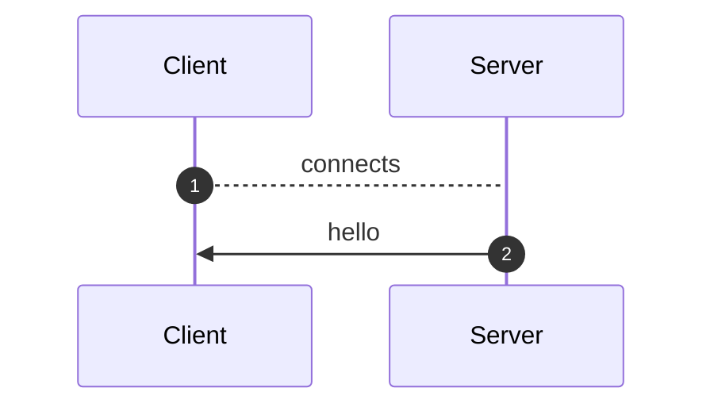
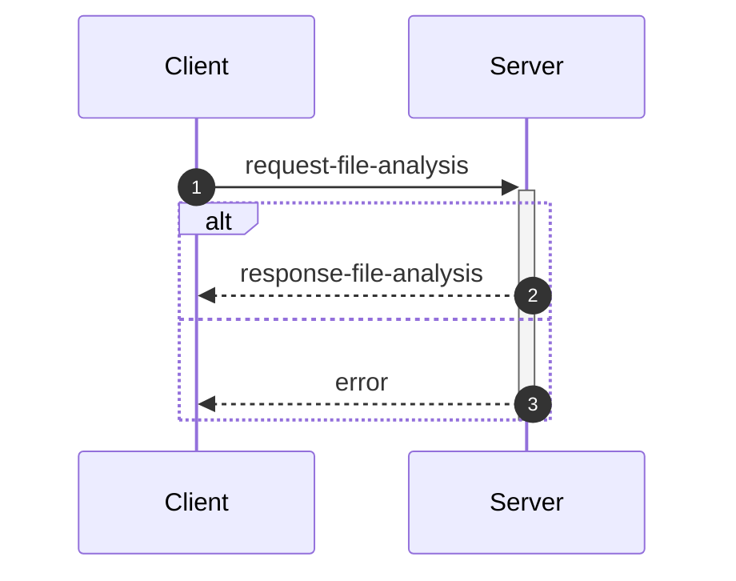
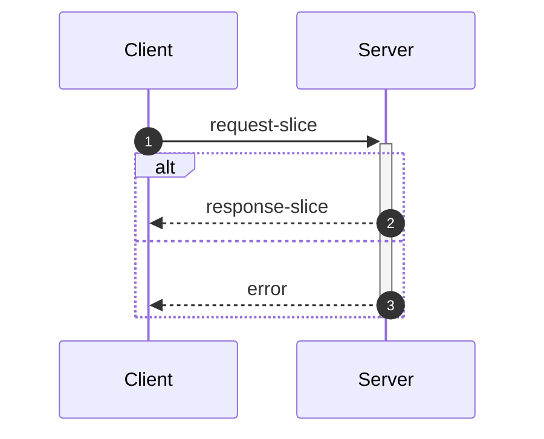
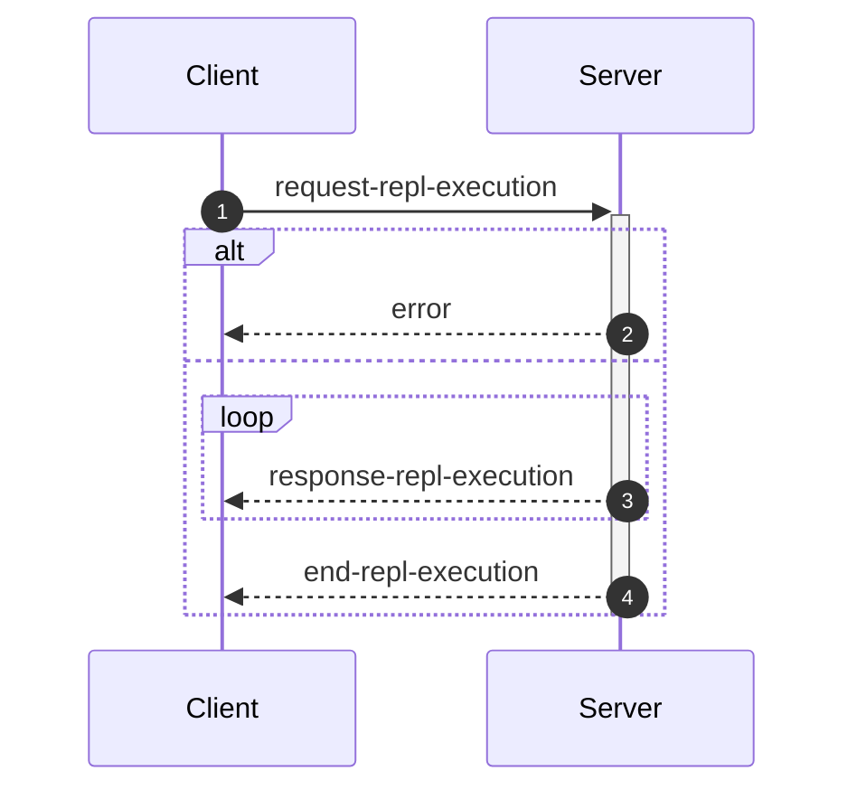
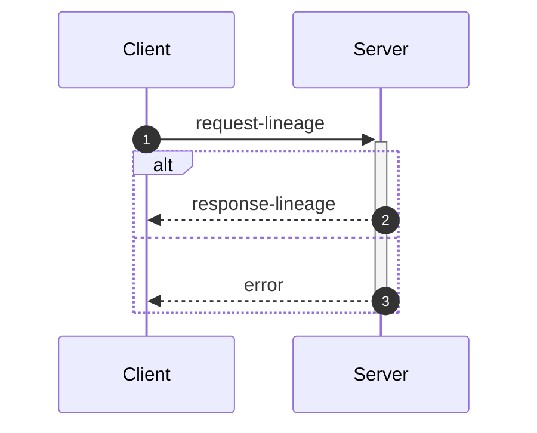

_This document was generated from '[src/documentation/print-interface-wiki.ts](https://github.com/flowr-analysis/flowr/tree/main//src/documentation/print-interface-wiki.ts)' on 2025-06-23, 12:01:01 UTC presenting an overview of flowR's interfaces (v2.2.15, using R v4.5.0). Please do not edit this file/wiki page directly._

Although far from being as detailed as the in-depth explanation of
[_flowR_](https://github.com/flowr-analysis/flowr/wiki/Core),
this wiki page explains how to interface with _flowR_ in more detail.
In general, command line arguments and other options provide short descriptions on hover over.

* [💬 Communicating with the Server](#communicating-with-the-server)
* [💻 Using the REPL](#using-the-repl)
* [⚙️ Configuring FlowR](#configuring-flowr)
* [⚒️ Writing Code](#writing-code)

<a id='communicating-with-the-server'></a>
## 💬 Communicating with the Server


As explained in the [Overview](https://github.com/flowr-analysis/flowr/wiki/Overview), you can simply run the [TCP](https://de.wikipedia.org/wiki/Transmission_Control_Protocol)&nbsp;server by adding the <span title="Description (Command Line Argument): Do not drop into a repl, but instead start a server on the given port (default: 1042) and listen for messages.">`--server`</span> flag (and, due to the interactive mode, exit with the conventional <kbd>CTRL</kbd>+<kbd>C</kbd>).
Currently, every connection is handled by the same underlying `RShell` - so the server is not designed to handle many clients at a time.
Additionally, the server is not well guarded against attacks (e.g., you can theoretically spawn an arbitrary number of&nbsp;RShell sessions on the target machine).

Every message has to be given in a single line (i.e., without a newline in-between) and end with a newline character. Nevertheless, we will pretty-print example given in the following segments for the ease of reading.


> [!NOTE]
> 
> The default <span title="Description (Command Line Argument): Do not drop into a repl, but instead start a server on the given port (default: 1042) and listen for messages.">`--server`</span> uses a simple [TCP](https://de.wikipedia.org/wiki/Transmission_Control_Protocol)
> connection. If you want _flowR_ to expose a [WebSocket](https://de.wikipedia.org/wiki/WebSocket) server instead, add the <span title="Description (Command Line Argument): If the server flag is set, use websocket for messaging">`--ws`</span> flag (i.e., <span title="Description (Command Line Argument): Do not drop into a repl, but instead start a server on the given port (default: 1042) and listen for messages.">`--server`</span> <span title="Description (Command Line Argument): If the server flag is set, use websocket for messaging">`--ws`</span>) when starting _flowR_ from the command line.
> 			


<ul><li>
<a id="message-hello"></a>
<b>Hello</b> Message (<code>hello</code>) 
<details>

<summary style="color:gray"> View Details. <i>The server informs the client about the successful connection and provides Meta-Information.</i> </summary>




	
After launching _flowR_, for example, with <code>docker run -it --rm eagleoutice/flowr <span title="Description (Command Line Argument): Do not drop into a repl, but instead start a server on the given port (default: 1042) and listen for messages.">-<span/>-server</span></code>&nbsp;(🐳️), simply connecting should present you with a `hello` message, that amongst others should reveal the versions of&nbsp;_flowR_ and&nbsp;R, using the [semver 2.0](https://semver.org/spec/v2.0.0.html) versioning scheme.
The message looks like this:


```json
{
  "type": "hello",
  "clientName": "client-0",
  "versions": {
    "flowr": "2.2.15",
    "r": "4.5.0",
    "engine": "r-shell"
  }
}
```


There are currently a few messages that you can send after the hello message.
If you want to _slice_ a piece of R code you first have to send an [analysis request](#message-request-file-analysis), so that you can send one or multiple slice requests afterward.
Requests for the [REPL](#message-request-repl) are independent of that.
	

<hr>


<details>
<summary style="color:gray">Message schema (<code>hello</code>)</summary>

For the definition of the hello message, please see it's implementation at [`./src/cli/repl/server/messages/message-hello.ts`](https://github.com/flowr-analysis/flowr/tree/main/./src/cli/repl/server/messages/message-hello.ts).

- **.** object [required]
    - **type** string [required]
        _The type of the hello message._
        Allows only the values: 'hello'
    - **id** any [forbidden]
        _The id of the message is always undefined (as it is the initial message and not requested)._
    - **clientName** string [required]
        _A unique name that is assigned to each client. It has no semantic meaning and is only used/useful for debugging._
    - **versions** object [required]
        - **flowr** string [required]
            _The version of the flowr server running in semver format._
        - **r** string [required]
            _The version of the underlying R shell running in semver format._
        - **engine** string [required]
            _The parser backend that is used to parse the R code._

</details>


<hr>

</details>	
	</li>

<li>
<a id="message-request-file-analysis"></a>
<b>Analysis</b> Message (<code>request-file-analysis</code>) 
<details>

<summary style="color:gray"> View Details. <i>The server builds the dataflow graph for a given input file (or a set of files).</i> </summary>




	
The request allows the server to analyze a file and prepare it for slicing.
The message can contain a `filetoken`, which is used to identify the file in later slice or lineage requests (if you do not add one, the request will not be stored and therefore, it is not available for subsequent requests).

> **Please note!**\
> If you want to send and process a lot of analysis requests, but do not want to slice them, please do not pass the `filetoken` field. This will save the server a lot of memory allocation.

Furthermore, the request must contain either a `content` field to directly pass the file's content or a `filepath` field which contains the path to the file (this path must be accessible for the server to be useful).
If you add the `id` field, the answer will use the same `id` so you can match requests and the corresponding answers.
See the implementation of the request-file-analysis message for more information.


<details>
<summary>Example of the <code>request-file-analysis</code> Message</summary>

_Note:_ even though we pretty-print these messages, they are sent as a single line, ending with a newline.

The following lists all messages that were sent and received in case you want to reproduce the scenario:

<ol>
<li> <code>hello</code> (response)
<details> 

<summary> Show Details </summary>

The first message is always a hello message.


```json
{
  "type": "hello",
  "clientName": "client-0",
  "versions": {
    "flowr": "2.2.15",
    "r": "4.5.0",
    "engine": "r-shell"
  }
}
```


</details>
</li>

<li> <b><code>request-file-analysis</code> (request)</b>
<details open> 

<summary> Show Details </summary>

Let' suppose you simply want to analyze the following script:
 
```r
x <- 1
x + 1
```

 For this, you can send the following request:


```json
{
  "type": "request-file-analysis",
  "id": "1",
  "filetoken": "x",
  "content": "x <- 1\nx + 1"
}
```


</details>
</li>

<li> <code>response-file-analysis</code> (response)
<details> 

<summary> Show Details </summary>


The `results` field of the response effectively contains three keys of importance:

- `parse`: which contains 1:1 the parse result in CSV format that we received from the `RShell` (i.e., the AST produced by the parser of the R interpreter).
- `normalize`: which contains the normalized AST, including ids (see the `info` field and the [Normalized AST](https://github.com/flowr-analysis/flowr/wiki/Normalized%20AST) wiki page).
- `dataflow`: especially important is the `graph` field which contains the dataflow graph as a set of root vertices (see the [Dataflow Graph](https://github.com/flowr-analysis/flowr/wiki/Dataflow%20Graph) wiki page).
			


_As the code is pretty long, we inhibit pretty printing and syntax highlighting (JSON, hiding built-in):_

```text
{"type":"response-file-analysis","format":"json","id":"1","results":{"parse":{"parsed":"[1,1,1,6,7,0,\"expr\",false,\"x <- 1\"],[1,1,1,1,1,3,\"SYMBOL\",true,\"x\"],[1,1,1,1,3,7,\"expr\",false,\"x\"],[1,3,1,4,2,7,\"LEFT_ASSIGN\",true,\"<-\"],[1,6,1,6,4,5,\"NUM_CONST\",true,\"1\"],[1,6,1,6,5,7,\"expr\",false,\"1\"],[2,1,2,5,16,0,\"expr\",false,\"x + 1\"],[2,1,2,1,10,12,\"SYMBOL\",true,\"x\"],[2,1,2,1,12,16,\"expr\",false,\"x\"],[2,3,2,3,11,16,\"'+'\",true,\"+\"],[2,5,2,5,13,14,\"NUM_CONST\",true,\"1\"],[2,5,2,5,14,16,\"expr\",false,\"1\"]",".meta":{"timing":4}},"normalize":{"ast":{"type":"RExpressionList","children":[{"type":"RBinaryOp","location":[1,3,1,4],"lhs":{"type":"RSymbol","location":[1,1,1,1],"content":"x","lexeme":"x","info":{"fullRange":[1,1,1,1],"additionalTokens":[],"id":0,"parent":2,"role":"binop-lhs","index":0,"nesting":0,"file":"/tmp/tmp-8040-P068u7aZUN56-.R"}},"rhs":{"location":[1,6,1,6],"lexeme":"1","info":{"fullRange":[1,6,1,6],"additionalTokens":[],"id":1,"parent":2,"role":"binop-rhs","index":1,"nesting":0,"file":"/tmp/tmp-8040-P068u7aZUN56-.R"},"type":"RNumber","content":{"num":1,"complexNumber":false,"markedAsInt":false}},"operator":"<-","lexeme":"<-","info":{"fullRange":[1,1,1,6],"additionalTokens":[],"id":2,"parent":6,"nesting":0,"file":"/tmp/tmp-8040-P068u7aZUN56-.R","index":0,"role":"expr-list-child"}},{"type":"RBinaryOp","location":[2,3,2,3],"lhs":{"type":"RSymbol","location":[2,1,2,1],"content":"x","lexeme":"x","info":{"fullRange":[2,1,2,1],"additionalTokens":[],"id":3,"parent":5,"role":"binop-lhs","index":0,"nesting":0,"file":"/tmp/tmp-8040-P068u7aZUN56-.R"}},"rhs":{"location":[2,5,2,5],"lexeme":"1","info":{"fullRange":[2,5,2,5],"additionalTokens":[],"id":4,"parent":5,"role":"binop-rhs","index":1,"nesting":0,"file":"/tmp/tmp-8040-P068u7aZUN56-.R"},"type":"RNumber","content":{"num":1,"complexNumber":false,"markedAsInt":false}},"operator":"+","lexeme":"+","info":{"fullRange":[2,1,2,5],"additionalTokens":[],"id":5,"parent":6,"nesting":0,"file":"/tmp/tmp-8040-P068u7aZUN56-.R","index":1,"role":"expr-list-child"}}],"info":{"additionalTokens":[],"id":6,"nesting":0,"file":"/tmp/tmp-8040-P068u7aZUN56-.R","role":"root","index":0}},".meta":{"timing":3}},"dataflow":{"unknownReferences":[],"in":[{"nodeId":2,"name":"<-","type":2},{"nodeId":5,"name":"+","type":2}],"out":[{"nodeId":0,"name":"x","type":4,"definedAt":2,"value":[1]}],"environment":{"current":{"id":12,"parent":"<BuiltInEnvironment>","memory":[["x",[{"nodeId":0,"name":"x","type":4,"definedAt":2,"value":[1]}]]]},"level":0},"graph":{"_sourced":["/tmp/tmp-8040-P068u7aZUN56-.R"],"_unknownSideEffects":[],"rootVertices":[1,0,2,3,4,5],"vertexInformation":[[1,{"tag":"value","id":1}],[0,{"tag":"variable-definition","id":0}],[2,{"tag":"function-call","id":2,"name":"<-","onlyBuiltin":true,"args":[{"nodeId":0,"type":32},{"nodeId":1,"type":32}],"origin":["builtin:assignment"]}],[3,{"tag":"use","id":3}],[4,{"tag":"value","id":4}],[5,{"tag":"function-call","id":5,"name":"+","onlyBuiltin":true,"args":[{"nodeId":3,"type":32},{"nodeId":4,"type":32}],"origin":["builtin:default"]}]],"edgeInformation":[[2,[[1,{"types":64}],[0,{"types":72}],["built-in:<-",{"types":5}]]],[0,[[1,{"types":2}],[2,{"types":2}]]],[3,[[0,{"types":1}]]],[5,[[3,{"types":65}],[4,{"types":65}],["built-in:+",{"types":5}]]]]},"entryPoint":2,"exitPoints":[{"type":0,"nodeId":5}],".meta":{"timing":4}}}}
```


</details>
</li>
</ol>

The complete round-trip took 17.3 ms (including time required to validate the messages, start, and stop the internal mock server).

</details>


You receive an error if, for whatever reason, the analysis fails (e.g., the message or code you sent contained syntax errors).
It contains a human-readable description *why* the analysis failed (see the error message implementation for more details).


<details>
<summary>Example Error Message</summary>

_Note:_ even though we pretty-print these messages, they are sent as a single line, ending with a newline.

The following lists all messages that were sent and received in case you want to reproduce the scenario:

<ol>
<li> <code>hello</code> (response)
<details> 

<summary> Show Details </summary>

The first message is always a hello message.


```json
{
  "type": "hello",
  "clientName": "client-0",
  "versions": {
    "flowr": "2.2.15",
    "r": "4.5.0",
    "engine": "r-shell"
  }
}
```


</details>
</li>

<li> <code>request-file-analysis</code> (request)
<details> 

<summary> Show Details </summary>


```json
{
  "type": "request-file-analysis",
  "id": "1",
  "filename": "sample.R",
  "content": "x <-"
}
```


</details>
</li>

<li> <b><code>error</code> (response)</b>
<details open> 

<summary> Show Details </summary>


```json
{
  "id": "1",
  "type": "error",
  "fatal": false,
  "reason": "Error while analyzing file sample.R: GuardError: unable to parse R code (see the log for more information) for request {\"request\":\"file\",\"content\":\"/tmp/tmp-8040-cgMKcekXBxKG-.R\"}}\n Report a Bug: https://github.com/flowr-analysis/flowr/issues/new?body=%3C!%2D%2D%20Please%20describe%20your%20issue%20in%20more%20detail%20below!%20%2D%2D%3E%0A%0A%0A%3C!%2D%2D%20Automatically%20generated%20issue%20metadata%2C%20please%20do%20not%20edit%20or%20delete%20content%20below%20this%20line%20%2D%2D%3E%0A%2D%2D%2D%0A%0AflowR%20version%3A%202.2.15%0Anode%20version%3A%20v22.14.0%0Anode%20arch%3A%20x64%0Anode%20platform%3A%20linux%0Amessage%3A%20%60unable%20to%20parse%20R%20code%20%28see%20the%20log%20for%20more%20information%29%20for%20request%20%7B%22request%22%3A%22file%22%2C%22content%22%3A%22%2Ftmp%2Ftmp%2D8040%2DcgMKcekXBxKG%2D.R%22%7D%7D%60%0Astack%20trace%3A%0A%60%60%60%0A%20%20%20%20at%20guard%20%28%3C%3E%2Fsrc%2Futil%2Fassert.ts%3A75%3A9%29%0A%20%20%20%20at%20guardRetrievedOutput%20%28%3C%3E%2Fsrc%2Fr%2Dbridge%2Fretriever.ts%3A184%3A7%29%0A%20%20%20%20at%20%2Fhome%2Frunner%2Fwork%2Fflowr%2Fflowr%2Fsrc%2Fr%2Dbridge%2Fretriever.ts%3A148%3A4%0A%20%20%20%20at%20processTicksAndRejections%20%28node%3Ainternal%2Fprocess%2Ftask_queues%3A105%3A5%29%0A%20%20%20%20at%20async%20Object.parseRequests%20%5Bas%20processor%5D%20%28%3C%3E%2Fsrc%2Fr%2Dbridge%2Fparser.ts%3A58%3A18%29%0A%20%20%20%20at%20async%20PipelineExecutor.nextStep%20%28%3C%3E%2Fsrc%2Fcore%2Fpipeline%2Dexecutor.ts%3A204%3A25%29%0A%20%20%20%20at%20async%20PipelineExecutor.allRemainingSteps%20%28%3C%3E%2Fsrc%2Fcore%2Fpipeline%2Dexecutor.ts%3A263%3A4%29%0A%20%20%20%20at%20async%20FlowRServerConnection.handleFileAnalysisRequest%20%28%3C%3E%2Fsrc%2Fcli%2Frepl%2Fserver%2Fconnection.ts%3A144%3A3%29%0A%60%60%60%0A%0A%2D%2D%2D%0A%09"
}
```


</details>
</li>
</ol>

The complete round-trip took 7.9 ms (including time required to validate the messages, start, and stop the internal mock server).

</details>


&nbsp;

<a id="analysis-include-cfg"></a>
**Including the Control Flow Graph**

While _flowR_ does (for the time being) not use an explicit control flow graph but instead relies on control-dependency edges within the dataflow graph, 
the respective structure can still be exposed using the server (note that, as this feature is not needed within _flowR_, it is tested significantly less - 
so please create a [new issue](https://github.com/flowr-analysis/flowr/issues/new/choose) for any bug you may encounter).
For this, the analysis request may add `cfg: true` to its list of options.


<details>
<summary>Requesting a Control Flow Graph</summary>

_Note:_ even though we pretty-print these messages, they are sent as a single line, ending with a newline.

The following lists all messages that were sent and received in case you want to reproduce the scenario:

<ol>
<li> <code>hello</code> (response)
<details> 

<summary> Show Details </summary>

The first message is always a hello message.


```json
{
  "type": "hello",
  "clientName": "client-0",
  "versions": {
    "flowr": "2.2.15",
    "r": "4.5.0",
    "engine": "r-shell"
  }
}
```


</details>
</li>

<li> <b><code>request-file-analysis</code> (request)</b>
<details open> 

<summary> Show Details </summary>


```json
{
  "type": "request-file-analysis",
  "id": "1",
  "filetoken": "x",
  "content": "if(unknown > 0) { x <- 2 } else { x <- 5 }\nfor(i in 1:x) { print(x); print(i) }",
  "cfg": true
}
```


</details>
</li>

<li> <code>response-file-analysis</code> (response)
<details> 

<summary> Show Details </summary>


The response looks basically the same as a response sent without the `cfg` flag. However, additionally it contains a `cfg` field. 
If you are interested in a visual representation of the control flow graph, see the 
[visualization with mermaid](https://mermaid.live/view#base64:eyJjb2RlIjoiZmxvd2NoYXJ0IEJUXG4gICAgbjMyKFtcImBSRXhwcmVzc2lvbkxpc3QgKDMyKWBcIl0pXG4gICAgbjE1W1wiYFJJZlRoZW5FbHNlICgxNSlcbiMzNDtpZih1bmtub3duICM2MjsgMCkgIzEyMzsgeCAjNjA7IzQ1OyAyICMxMjU7IGVsc2UgIzEyMzsgeCAjNjA7IzQ1OyA1ICMxMjU7IzM0O2BcIl1cbiAgICBuMTUtY29uZGl0aW9uW1sxNS1jb25kaXRpb25dXVxuICAgIG4xNS1leGl0KCgxNS1leGl0KSlcbiAgICBuMChbXCJgUlN5bWJvbCAoMClcbiMzNDt1bmtub3duIzM0O2BcIl0pXG4gICAgbjEoW1wiYFJOdW1iZXIgKDEpXG4jMzQ7MCMzNDtgXCJdKVxuICAgIG4yKFtcImBSQmluYXJ5T3AgKDIpXG4jMzQ7dW5rbm93biAjNjI7IDAjMzQ7YFwiXSlcbiAgICBuMi1leGl0KCgyLWV4aXQpKVxuICAgIG44KFtcImBSRXhwcmVzc2lvbkxpc3QgKDgpYFwiXSlcbiAgICBuNShbXCJgUlN5bWJvbCAoNSlcbiMzNDt4IzM0O2BcIl0pXG4gICAgbjYoW1wiYFJOdW1iZXIgKDYpXG4jMzQ7MiMzNDtgXCJdKVxuICAgIG43KFtcImBSQmluYXJ5T3AgKDcpXG4jMzQ7eCAjNjA7IzQ1OyAyIzM0O2BcIl0pXG4gICAgbjctZXhpdCgoNy1leGl0KSlcbiAgICBuOC1leGl0KCg4LWV4aXQpKVxuICAgIG4xNChbXCJgUkV4cHJlc3Npb25MaXN0ICgxNClgXCJdKVxuICAgIG4xMShbXCJgUlN5bWJvbCAoMTEpXG4jMzQ7eCMzNDtgXCJdKVxuICAgIG4xMihbXCJgUk51bWJlciAoMTIpXG4jMzQ7NSMzNDtgXCJdKVxuICAgIG4xMyhbXCJgUkJpbmFyeU9wICgxMylcbiMzNDt4ICM2MDsjNDU7IDUjMzQ7YFwiXSlcbiAgICBuMTMtZXhpdCgoMTMtZXhpdCkpXG4gICAgbjE0LWV4aXQoKDE0LWV4aXQpKVxuICAgIG4xNihbXCJgUlN5bWJvbCAoMTYpXG4jMzQ7aSMzNDtgXCJdKVxuICAgIG4zMVtcImBSRm9yTG9vcCAoMzEpXG4jMzQ7Zm9yKGkgaW4gMSM1ODt4KSAjMTIzOyBwcmludCh4KTsgcHJpbnQoaSkgIzEyNTsjMzQ7YFwiXVxuICAgIG4xNyhbXCJgUk51bWJlciAoMTcpXG4jMzQ7MSMzNDtgXCJdKVxuICAgIG4xOChbXCJgUlN5bWJvbCAoMTgpXG4jMzQ7eCMzNDtgXCJdKVxuICAgIG4xOShbXCJgUkJpbmFyeU9wICgxOSlcbiMzNDsxIzU4O3gjMzQ7YFwiXSlcbiAgICBuMTktZXhpdCgoMTktZXhpdCkpXG4gICAgbjMwKFtcImBSRXhwcmVzc2lvbkxpc3QgKDMwKWBcIl0pXG4gICAgbjIyKFtcImBSU3ltYm9sICgyMilcbiMzNDtwcmludCh4KSMzNDtgXCJdKVxuICAgIG4yNVtcImBSRnVuY3Rpb25DYWxsICgyNSlcbiMzNDtwcmludCh4KSMzNDtgXCJdXG4gICAgbjI1LW5hbWVbWzI1LW5hbWVdXVxuICAgIG4yNS1leGl0KCgyNS1leGl0KSlcbiAgICBuMjQoW1wiYFJBcmd1bWVudCAoMjQpXG4jMzQ7eCMzNDtgXCJdKVxuICAgIG4yNC1iZWZvcmUtdmFsdWVbWzI0LWJlZm9yZS12YWx1ZV1dXG4gICAgbjIzKFtcImBSU3ltYm9sICgyMylcbiMzNDt4IzM0O2BcIl0pXG4gICAgbjI0LWV4aXQoKDI0LWV4aXQpKVxuICAgIG4yNihbXCJgUlN5bWJvbCAoMjYpXG4jMzQ7cHJpbnQoaSkjMzQ7YFwiXSlcbiAgICBuMjlbXCJgUkZ1bmN0aW9uQ2FsbCAoMjkpXG4jMzQ7cHJpbnQoaSkjMzQ7YFwiXVxuICAgIG4yOS1uYW1lW1syOS1uYW1lXV1cbiAgICBuMjktZXhpdCgoMjktZXhpdCkpXG4gICAgbjI4KFtcImBSQXJndW1lbnQgKDI4KVxuIzM0O2kjMzQ7YFwiXSlcbiAgICBuMjgtYmVmb3JlLXZhbHVlW1syOC1iZWZvcmUtdmFsdWVdXVxuICAgIG4yNyhbXCJgUlN5bWJvbCAoMjcpXG4jMzQ7aSMzNDtgXCJdKVxuICAgIG4yOC1leGl0KCgyOC1leGl0KSlcbiAgICBuMzAtZXhpdCgoMzAtZXhpdCkpXG4gICAgbjMxLWhlYWRbWzMxLWhlYWRdXVxuICAgIG4zMS1leGl0KCgzMS1leGl0KSlcbiAgICBuMzItZXhpdCgoMzItZXhpdCkpXG4gICAgbjE1IC0uLT58XCJGRFwifCBuMzJcbiAgICBuMSAtLi0+fFwiRkRcInwgbjBcbiAgICBuMCAtLi0+fFwiRkRcInwgbjJcbiAgICBuMi1leGl0IC0uLT58XCJGRFwifCBuMVxuICAgIG43IC0uLT58XCJGRFwifCBuOFxuICAgIG42IC0uLT58XCJGRFwifCBuNVxuICAgIG41IC0uLT58XCJGRFwifCBuN1xuICAgIG43LWV4aXQgLS4tPnxcIkZEXCJ8IG42XG4gICAgbjgtZXhpdCAtLi0+fFwiRkRcInwgbjctZXhpdFxuICAgIG4xMyAtLi0+fFwiRkRcInwgbjE0XG4gICAgbjEyIC0uLT58XCJGRFwifCBuMTFcbiAgICBuMTEgLS4tPnxcIkZEXCJ8IG4xM1xuICAgIG4xMy1leGl0IC0uLT58XCJGRFwifCBuMTJcbiAgICBuMTQtZXhpdCAtLi0+fFwiRkRcInwgbjEzLWV4aXRcbiAgICBuMTUtY29uZGl0aW9uIC0uLT58XCJGRFwifCBuMi1leGl0XG4gICAgbjggLS0+fFwiQ0QgKFRSVUUpXCJ8IG4xNS1jb25kaXRpb25cbiAgICBuMTQgLS0+fFwiQ0QgKEZBTFNFKVwifCBuMTUtY29uZGl0aW9uXG4gICAgbjIgLS4tPnxcIkZEXCJ8IG4xNVxuICAgIG4xNS1leGl0IC0uLT58XCJGRFwifCBuOC1leGl0XG4gICAgbjE1LWV4aXQgLS4tPnxcIkZEXCJ8IG4xNC1leGl0XG4gICAgbjMxIC0uLT58XCJGRFwifCBuMTUtZXhpdFxuICAgIG4zMSAtLi0+fFwiRkRcInwgbjMwLWV4aXRcbiAgICBuMTggLS4tPnxcIkZEXCJ8IG4xN1xuICAgIG4xNyAtLi0+fFwiRkRcInwgbjE5XG4gICAgbjE5LWV4aXQgLS4tPnxcIkZEXCJ8IG4xOFxuICAgIG4yNSAtLi0+fFwiRkRcInwgbjMwXG4gICAgbjIyIC0uLT58XCJGRFwifCBuMjVcbiAgICBuMjUtbmFtZSAtLi0+fFwiRkRcInwgbjIyXG4gICAgbjI0LWJlZm9yZS12YWx1ZSAtLi0+fFwiRkRcInwgbjI0XG4gICAgbjIzIC0uLT58XCJGRFwifCBuMjQtYmVmb3JlLXZhbHVlXG4gICAgbjI0LWV4aXQgLS4tPnxcIkZEXCJ8IG4yM1xuICAgIG4yNCAtLi0+fFwiRkRcInwgbjI1LW5hbWVcbiAgICBuMjUtZXhpdCAtLi0+fFwiRkRcInwgbjI0LWV4aXRcbiAgICBuMjkgLS4tPnxcIkZEXCJ8IG4yNS1leGl0XG4gICAgbjI2IC0uLT58XCJGRFwifCBuMjlcbiAgICBuMjktbmFtZSAtLi0+fFwiRkRcInwgbjI2XG4gICAgbjI4LWJlZm9yZS12YWx1ZSAtLi0+fFwiRkRcInwgbjI4XG4gICAgbjI3IC0uLT58XCJGRFwifCBuMjgtYmVmb3JlLXZhbHVlXG4gICAgbjI4LWV4aXQgLS4tPnxcIkZEXCJ8IG4yN1xuICAgIG4yOCAtLi0+fFwiRkRcInwgbjI5LW5hbWVcbiAgICBuMjktZXhpdCAtLi0+fFwiRkRcInwgbjI4LWV4aXRcbiAgICBuMzAtZXhpdCAtLi0+fFwiRkRcInwgbjI5LWV4aXRcbiAgICBuMTkgLS4tPnxcIkZEXCJ8IG4zMVxuICAgIG4xNiAtLi0+fFwiRkRcInwgbjE5LWV4aXRcbiAgICBuMzEtaGVhZCAtLi0+fFwiRkRcInwgbjE2XG4gICAgbjMwIC0tPnxcIkNEIChUUlVFKVwifCBuMzEtaGVhZFxuICAgIG4zMS1leGl0IC0tPnxcIkNEIChGQUxTRSlcInwgbjMxLWhlYWRcbiAgICBuMzItZXhpdCAtLi0+fFwiRkRcInwgbjMxLWV4aXRcbiAgICBzdHlsZSBuMzIgc3Ryb2tlOmN5YW4sc3Ryb2tlLXdpZHRoOjYuNXB4OyAgICBzdHlsZSBuMzItZXhpdCBzdHJva2U6Z3JlZW4sc3Ryb2tlLXdpZHRoOjYuNXB4OyIsIm1lcm1haWQiOnsiYXV0b1N5bmMiOnRydWV9fQ==).
			


_As the code is pretty long, we inhibit pretty printing and syntax highlighting (JSON, hiding built-in):_

```text
{"type":"response-file-analysis","format":"json","id":"1","cfg":{"returns":[],"entryPoints":[32],"exitPoints":["32-exit"],"breaks":[],"nexts":[],"graph":{"rootVertices":[32,15,"15-condition","15-exit",0,1,2,"2-exit",8,5,6,7,"7-exit","8-exit",14,11,12,13,"13-exit","14-exit",16,31,17,18,19,"19-exit",30,22,25,"25-name","25-exit",24,"24-before-value",23,"24-exit",26,29,"29-name","29-exit",28,"28-before-value",27,"28-exit","30-exit","31-head","31-exit","32-exit"],"vertexInformation":[[32,{"id":32,"type":"expr","end":["32-exit"]}],[15,{"id":15,"type":"stm","mid":["15-condition"],"end":["15-exit"]}],["15-condition",{"id":"15-condition","kind":"condition","type":"mid","root":15}],["15-exit",{"id":"15-exit","type":"end","root":15}],[0,{"id":0,"type":"expr"}],[1,{"id":1,"type":"expr"}],[2,{"id":2,"type":"expr","end":["2-exit"]}],["2-exit",{"id":"2-exit","type":"end","root":2}],[8,{"id":8,"type":"expr","end":["8-exit"]}],[5,{"id":5,"type":"expr"}],[6,{"id":6,"type":"expr"}],[7,{"id":7,"type":"expr","end":["7-exit"]}],["7-exit",{"id":"7-exit","type":"end","root":7}],["8-exit",{"id":"8-exit","type":"end","root":8}],[14,{"id":14,"type":"expr","end":["14-exit"]}],[11,{"id":11,"type":"expr"}],[12,{"id":12,"type":"expr"}],[13,{"id":13,"type":"expr","end":["13-exit"]}],["13-exit",{"id":"13-exit","type":"end","root":13}],["14-exit",{"id":"14-exit","type":"end","root":14}],[16,{"id":16,"type":"expr"}],[31,{"id":31,"type":"stm","end":["31-exit"],"mid":["31-head"]}],[17,{"id":17,"type":"expr"}],[18,{"id":18,"type":"expr"}],[19,{"id":19,"type":"expr","end":["19-exit"]}],["19-exit",{"id":"19-exit","type":"end","root":19}],[30,{"id":30,"type":"expr","end":["30-exit"]}],[22,{"id":22,"type":"expr"}],[25,{"id":25,"type":"stm","mid":["25-name"],"end":["25-exit"]}],["25-name",{"id":"25-name","kind":"name","type":"mid","root":25}],["25-exit",{"id":"25-exit","type":"end","root":25}],[24,{"id":24,"type":"expr","mid":["24-before-value"],"end":["24-exit"]}],["24-before-value",{"id":"24-before-value","kind":"before-value","type":"mid","root":24}],[23,{"id":23,"type":"expr"}],["24-exit",{"id":"24-exit","type":"end","root":24}],[26,{"id":26,"type":"expr"}],[29,{"id":29,"type":"stm","mid":["29-name"],"end":["29-exit"]}],["29-name",{"id":"29-name","kind":"name","type":"mid","root":29}],["29-exit",{"id":"29-exit","type":"end","root":29}],[28,{"id":28,"type":"expr","mid":["28-before-value"],"end":["28-exit"]}],["28-before-value",{"id":"28-before-value","kind":"before-value","type":"mid","root":28}],[27,{"id":27,"type":"expr"}],["28-exit",{"id":"28-exit","type":"end","root":28}],["30-exit",{"id":"30-exit","type":"end","root":30}],["31-head",{"id":"31-head","type":"mid","root":31,"kind":"head"}],["31-exit",{"id":"31-exit","type":"end","root":31}],["32-exit",{"id":"32-exit","type":"end","root":32}]],"bbChildren":[],"edgeInformation":[[15,[[32,{"label":0}]]],[1,[[0,{"label":0}]]],[0,[[2,{"label":0}]]],["2-exit",[[1,{"label":0}]]],[7,[[8,{"label":0}]]],[6,[[5,{"label":0}]]],[5,[[7,{"label":0}]]],["7-exit",[[6,{"label":0}]]],["8-exit",[["7-exit",{"label":0}]]],[13,[[14,{"label":0}]]],[12,[[11,{"label":0}]]],[11,[[13,{"label":0}]]],["13-exit",[[12,{"label":0}]]],["14-exit",[["13-exit",{"label":0}]]],["15-condition",[["2-exit",{"label":0}]]],[8,[["15-condition",{"label":1,"when":"TRUE","caused":15}]]],[14,[["15-condition",{"label":1,"when":"FALSE","caused":15}]]],[2,[[15,{"label":0}]]],["15-exit",[["8-exit",{"label":0}],["14-exit",{"label":0}]]],[31,[["15-exit",{"label":0}],["30-exit",{"label":0}]]],[18,[[17,{"label":0}]]],[17,[[19,{"label":0}]]],["19-exit",[[18,{"label":0}]]],[25,[[30,{"label":0}]]],[22,[[25,{"label":0}]]],["25-name",[[22,{"label":0}]]],["24-before-value",[[24,{"label":0}]]],[23,[["24-before-value",{"label":0}]]],["24-exit",[[23,{"label":0}]]],[24,[["25-name",{"label":0}]]],["25-exit",[["24-exit",{"label":0}]]],[29,[["25-exit",{"label":0}]]],[26,[[29,{"label":0}]]],["29-name",[[26,{"label":0}]]],["28-before-value",[[28,{"label":0}]]],[27,[["28-before-value",{"label":0}]]],["28-exit",[[27,{"label":0}]]],[28,[["29-name",{"label":0}]]],["29-exit",[["28-exit",{"label":0}]]],["30-exit",[["29-exit",{"label":0}]]],[19,[[31,{"label":0}]]],[16,[["19-exit",{"label":0}]]],["31-head",[[16,{"label":0}]]],[30,[["31-head",{"label":1,"when":"TRUE","caused":31}]]],["31-exit",[["31-head",{"label":1,"when":"FALSE","caused":31}]]],["32-exit",[["31-exit",{"label":0}]]]],"_mayHaveBasicBlocks":false}},"results":{"parse":{"parsed":"[1,1,1,42,38,0,\"expr\",false,\"if(unknown > 0) { x <- 2 } else { x <- 5 }\"],[1,1,1,2,1,38,\"IF\",true,\"if\"],[1,3,1,3,2,38,\"'('\",true,\"(\"],[1,4,1,14,9,38,\"expr\",false,\"unknown > 0\"],[1,4,1,10,3,5,\"SYMBOL\",true,\"unknown\"],[1,4,1,10,5,9,\"expr\",false,\"unknown\"],[1,12,1,12,4,9,\"GT\",true,\">\"],[1,14,1,14,6,7,\"NUM_CONST\",true,\"0\"],[1,14,1,14,7,9,\"expr\",false,\"0\"],[1,15,1,15,8,38,\"')'\",true,\")\"],[1,17,1,26,22,38,\"expr\",false,\"{ x <- 2 }\"],[1,17,1,17,12,22,\"'{'\",true,\"{\"],[1,19,1,24,19,22,\"expr\",false,\"x <- 2\"],[1,19,1,19,13,15,\"SYMBOL\",true,\"x\"],[1,19,1,19,15,19,\"expr\",false,\"x\"],[1,21,1,22,14,19,\"LEFT_ASSIGN\",true,\"<-\"],[1,24,1,24,16,17,\"NUM_CONST\",true,\"2\"],[1,24,1,24,17,19,\"expr\",false,\"2\"],[1,26,1,26,18,22,\"'}'\",true,\"}\"],[1,28,1,31,23,38,\"ELSE\",true,\"else\"],[1,33,1,42,35,38,\"expr\",false,\"{ x <- 5 }\"],[1,33,1,33,25,35,\"'{'\",true,\"{\"],[1,35,1,40,32,35,\"expr\",false,\"x <- 5\"],[1,35,1,35,26,28,\"SYMBOL\",true,\"x\"],[1,35,1,35,28,32,\"expr\",false,\"x\"],[1,37,1,38,27,32,\"LEFT_ASSIGN\",true,\"<-\"],[1,40,1,40,29,30,\"NUM_CONST\",true,\"5\"],[1,40,1,40,30,32,\"expr\",false,\"5\"],[1,42,1,42,31,35,\"'}'\",true,\"}\"],[2,1,2,36,84,0,\"expr\",false,\"for(i in 1:x) { print(x); print(i) }\"],[2,1,2,3,41,84,\"FOR\",true,\"for\"],[2,4,2,13,53,84,\"forcond\",false,\"(i in 1:x)\"],[2,4,2,4,42,53,\"'('\",true,\"(\"],[2,5,2,5,43,53,\"SYMBOL\",true,\"i\"],[2,7,2,8,44,53,\"IN\",true,\"in\"],[2,10,2,12,51,53,\"expr\",false,\"1:x\"],[2,10,2,10,45,46,\"NUM_CONST\",true,\"1\"],[2,10,2,10,46,51,\"expr\",false,\"1\"],[2,11,2,11,47,51,\"':'\",true,\":\"],[2,12,2,12,48,50,\"SYMBOL\",true,\"x\"],[2,12,2,12,50,51,\"expr\",false,\"x\"],[2,13,2,13,49,53,\"')'\",true,\")\"],[2,15,2,36,81,84,\"expr\",false,\"{ print(x); print(i) }\"],[2,15,2,15,54,81,\"'{'\",true,\"{\"],[2,17,2,24,64,81,\"expr\",false,\"print(x)\"],[2,17,2,21,55,57,\"SYMBOL_FUNCTION_CALL\",true,\"print\"],[2,17,2,21,57,64,\"expr\",false,\"print\"],[2,22,2,22,56,64,\"'('\",true,\"(\"],[2,23,2,23,58,60,\"SYMBOL\",true,\"x\"],[2,23,2,23,60,64,\"expr\",false,\"x\"],[2,24,2,24,59,64,\"')'\",true,\")\"],[2,25,2,25,65,81,\"';'\",true,\";\"],[2,27,2,34,77,81,\"expr\",false,\"print(i)\"],[2,27,2,31,68,70,\"SYMBOL_FUNCTION_CALL\",true,\"print\"],[2,27,2,31,70,77,\"expr\",false,\"print\"],[2,32,2,32,69,77,\"'('\",true,\"(\"],[2,33,2,33,71,73,\"SYMBOL\",true,\"i\"],[2,33,2,33,73,77,\"expr\",false,\"i\"],[2,34,2,34,72,77,\"')'\",true,\")\"],[2,36,2,36,78,81,\"'}'\",true,\"}\"]",".meta":{"timing":3}},"normalize":{"ast":{"type":"RExpressionList","children":[{"type":"RIfThenElse","condition":{"type":"RBinaryOp","location":[1,12,1,12],"lhs":{"type":"RSymbol","location":[1,4,1,10],"content":"unknown","lexeme":"unknown","info":{"fullRange":[1,4,1,10],"additionalTokens":[],"id":0,"parent":2,"role":"binop-lhs","index":0,"nesting":1,"file":"/tmp/tmp-8040-ZIEKurXyT650-.R"}},"rhs":{"location":[1,14,1,14],"lexeme":"0","info":{"fullRange":[1,14,1,14],"additionalTokens":[],"id":1,"parent":2,"role":"binop-rhs","index":1,"nesting":1,"file":"/tmp/tmp-8040-ZIEKurXyT650-.R"},"type":"RNumber","content":{"num":0,"complexNumber":false,"markedAsInt":false}},"operator":">","lexeme":">","info":{"fullRange":[1,4,1,14],"additionalTokens":[],"id":2,"parent":15,"nesting":1,"file":"/tmp/tmp-8040-ZIEKurXyT650-.R","role":"if-cond"}},"then":{"type":"RExpressionList","children":[{"type":"RBinaryOp","location":[1,21,1,22],"lhs":{"type":"RSymbol","location":[1,19,1,19],"content":"x","lexeme":"x","info":{"fullRange":[1,19,1,19],"additionalTokens":[],"id":5,"parent":7,"role":"binop-lhs","index":0,"nesting":1,"file":"/tmp/tmp-8040-ZIEKurXyT650-.R"}},"rhs":{"location":[1,24,1,24],"lexeme":"2","info":{"fullRange":[1,24,1,24],"additionalTokens":[],"id":6,"parent":7,"role":"binop-rhs","index":1,"nesting":1,"file":"/tmp/tmp-8040-ZIEKurXyT650-.R"},"type":"RNumber","content":{"num":2,"complexNumber":false,"markedAsInt":false}},"operator":"<-","lexeme":"<-","info":{"fullRange":[1,19,1,24],"additionalTokens":[],"id":7,"parent":8,"nesting":1,"file":"/tmp/tmp-8040-ZIEKurXyT650-.R","index":0,"role":"expr-list-child"}}],"grouping":[{"type":"RSymbol","location":[1,17,1,17],"content":"{","lexeme":"{","info":{"fullRange":[1,17,1,26],"additionalTokens":[],"id":3,"role":"root","index":0,"nesting":1,"file":"/tmp/tmp-8040-ZIEKurXyT650-.R"}},{"type":"RSymbol","location":[1,26,1,26],"content":"}","lexeme":"}","info":{"fullRange":[1,17,1,26],"additionalTokens":[],"id":4,"role":"root","index":0,"nesting":1,"file":"/tmp/tmp-8040-ZIEKurXyT650-.R"}}],"info":{"additionalTokens":[],"id":8,"parent":15,"nesting":1,"file":"/tmp/tmp-8040-ZIEKurXyT650-.R","index":1,"role":"if-then"}},"location":[1,1,1,2],"lexeme":"if","info":{"fullRange":[1,1,1,42],"additionalTokens":[],"id":15,"parent":32,"nesting":1,"file":"/tmp/tmp-8040-ZIEKurXyT650-.R","index":0,"role":"expr-list-child"},"otherwise":{"type":"RExpressionList","children":[{"type":"RBinaryOp","location":[1,37,1,38],"lhs":{"type":"RSymbol","location":[1,35,1,35],"content":"x","lexeme":"x","info":{"fullRange":[1,35,1,35],"additionalTokens":[],"id":11,"parent":13,"role":"binop-lhs","index":0,"nesting":1,"file":"/tmp/tmp-8040-ZIEKurXyT650-.R"}},"rhs":{"location":[1,40,1,40],"lexeme":"5","info":{"fullRange":[1,40,1,40],"additionalTokens":[],"id":12,"parent":13,"role":"binop-rhs","index":1,"nesting":1,"file":"/tmp/tmp-8040-ZIEKurXyT650-.R"},"type":"RNumber","content":{"num":5,"complexNumber":false,"markedAsInt":false}},"operator":"<-","lexeme":"<-","info":{"fullRange":[1,35,1,40],"additionalTokens":[],"id":13,"parent":14,"nesting":1,"file":"/tmp/tmp-8040-ZIEKurXyT650-.R","index":0,"role":"expr-list-child"}}],"grouping":[{"type":"RSymbol","location":[1,33,1,33],"content":"{","lexeme":"{","info":{"fullRange":[1,33,1,42],"additionalTokens":[],"id":9,"role":"root","index":0,"nesting":1,"file":"/tmp/tmp-8040-ZIEKurXyT650-.R"}},{"type":"RSymbol","location":[1,42,1,42],"content":"}","lexeme":"}","info":{"fullRange":[1,33,1,42],"additionalTokens":[],"id":10,"role":"root","index":0,"nesting":1,"file":"/tmp/tmp-8040-ZIEKurXyT650-.R"}}],"info":{"additionalTokens":[],"id":14,"parent":15,"nesting":1,"file":"/tmp/tmp-8040-ZIEKurXyT650-.R","index":2,"role":"if-otherwise"}}},{"type":"RForLoop","variable":{"type":"RSymbol","location":[2,5,2,5],"content":"i","lexeme":"i","info":{"additionalTokens":[],"id":16,"parent":31,"role":"for-variable","index":0,"nesting":1,"file":"/tmp/tmp-8040-ZIEKurXyT650-.R"}},"vector":{"type":"RBinaryOp","location":[2,11,2,11],"lhs":{"location":[2,10,2,10],"lexeme":"1","info":{"fullRange":[2,10,2,10],"additionalTokens":[],"id":17,"parent":19,"role":"binop-lhs","index":0,"nesting":1,"file":"/tmp/tmp-8040-ZIEKurXyT650-.R"},"type":"RNumber","content":{"num":1,"complexNumber":false,"markedAsInt":false}},"rhs":{"type":"RSymbol","location":[2,12,2,12],"content":"x","lexeme":"x","info":{"fullRange":[2,12,2,12],"additionalTokens":[],"id":18,"parent":19,"role":"binop-rhs","index":1,"nesting":1,"file":"/tmp/tmp-8040-ZIEKurXyT650-.R"}},"operator":":","lexeme":":","info":{"fullRange":[2,10,2,12],"additionalTokens":[],"id":19,"parent":31,"nesting":1,"file":"/tmp/tmp-8040-ZIEKurXyT650-.R","index":1,"role":"for-vector"}},"body":{"type":"RExpressionList","children":[{"type":"RFunctionCall","named":true,"location":[2,17,2,21],"lexeme":"print","functionName":{"type":"RSymbol","location":[2,17,2,21],"content":"print","lexeme":"print","info":{"fullRange":[2,17,2,24],"additionalTokens":[],"id":22,"parent":25,"role":"call-name","index":0,"nesting":1,"file":"/tmp/tmp-8040-ZIEKurXyT650-.R"}},"arguments":[{"type":"RArgument","location":[2,23,2,23],"lexeme":"x","value":{"type":"RSymbol","location":[2,23,2,23],"content":"x","lexeme":"x","info":{"fullRange":[2,23,2,23],"additionalTokens":[],"id":23,"parent":24,"role":"arg-value","index":0,"nesting":1,"file":"/tmp/tmp-8040-ZIEKurXyT650-.R"}},"info":{"fullRange":[2,23,2,23],"additionalTokens":[],"id":24,"parent":25,"nesting":1,"file":"/tmp/tmp-8040-ZIEKurXyT650-.R","index":1,"role":"call-argument"}}],"info":{"fullRange":[2,17,2,24],"additionalTokens":[],"id":25,"parent":30,"nesting":1,"file":"/tmp/tmp-8040-ZIEKurXyT650-.R","index":0,"role":"expr-list-child"}},{"type":"RFunctionCall","named":true,"location":[2,27,2,31],"lexeme":"print","functionName":{"type":"RSymbol","location":[2,27,2,31],"content":"print","lexeme":"print","info":{"fullRange":[2,27,2,34],"additionalTokens":[],"id":26,"parent":29,"role":"call-name","index":0,"nesting":1,"file":"/tmp/tmp-8040-ZIEKurXyT650-.R"}},"arguments":[{"type":"RArgument","location":[2,33,2,33],"lexeme":"i","value":{"type":"RSymbol","location":[2,33,2,33],"content":"i","lexeme":"i","info":{"fullRange":[2,33,2,33],"additionalTokens":[],"id":27,"parent":28,"role":"arg-value","index":0,"nesting":1,"file":"/tmp/tmp-8040-ZIEKurXyT650-.R"}},"info":{"fullRange":[2,33,2,33],"additionalTokens":[],"id":28,"parent":29,"nesting":1,"file":"/tmp/tmp-8040-ZIEKurXyT650-.R","index":1,"role":"call-argument"}}],"info":{"fullRange":[2,27,2,34],"additionalTokens":[],"id":29,"parent":30,"nesting":1,"file":"/tmp/tmp-8040-ZIEKurXyT650-.R","index":1,"role":"expr-list-child"}}],"grouping":[{"type":"RSymbol","location":[2,15,2,15],"content":"{","lexeme":"{","info":{"fullRange":[2,15,2,36],"additionalTokens":[],"id":20,"role":"root","index":0,"nesting":1,"file":"/tmp/tmp-8040-ZIEKurXyT650-.R"}},{"type":"RSymbol","location":[2,36,2,36],"content":"}","lexeme":"}","info":{"fullRange":[2,15,2,36],"additionalTokens":[],"id":21,"role":"root","index":0,"nesting":1,"file":"/tmp/tmp-8040-ZIEKurXyT650-.R"}}],"info":{"additionalTokens":[],"id":30,"parent":31,"nesting":1,"file":"/tmp/tmp-8040-ZIEKurXyT650-.R","index":2,"role":"for-body"}},"lexeme":"for","info":{"fullRange":[2,1,2,36],"additionalTokens":[],"id":31,"parent":32,"nesting":1,"file":"/tmp/tmp-8040-ZIEKurXyT650-.R","index":1,"role":"expr-list-child"},"location":[2,1,2,3]}],"info":{"additionalTokens":[],"id":32,"nesting":0,"file":"/tmp/tmp-8040-ZIEKurXyT650-.R","role":"root","index":0}},".meta":{"timing":1}},"dataflow":{"unknownReferences":[],"in":[{"nodeId":15,"name":"if","type":2},{"nodeId":0,"name":"unknown","type":1},{"nodeId":2,"name":">","type":2},{"nodeId":7,"name":"<-","controlDependencies":[{"id":15,"when":true}],"type":2},{"nodeId":13,"name":"<-","controlDependencies":[{"id":15,"when":false}],"type":2},{"nodeId":8,"name":"{","controlDependencies":[{"id":15,"when":true}],"type":2},{"nodeId":14,"name":"{","controlDependencies":[{"id":15,"when":false}],"type":2},{"nodeId":31,"name":"for","type":2},{"name":":","nodeId":19,"type":2},{"name":"print","nodeId":25,"type":2},{"name":"print","nodeId":29,"type":2}],"out":[{"nodeId":5,"name":"x","controlDependencies":[{"id":15,"when":true},{"id":15,"when":true}],"type":4,"definedAt":7,"value":[6]},{"nodeId":11,"name":"x","controlDependencies":[{"id":15,"when":false},{"id":15,"when":false}],"type":4,"definedAt":13,"value":[12]},{"nodeId":16,"name":"i","type":1}],"environment":{"current":{"id":93,"parent":"<BuiltInEnvironment>","memory":[["x",[{"nodeId":5,"name":"x","controlDependencies":[{"id":15,"when":false}],"type":4,"definedAt":7,"value":[6]},{"nodeId":11,"name":"x","controlDependencies":[{"id":15,"when":false}],"type":4,"definedAt":13,"value":[12]}]],["i",[{"nodeId":16,"name":"i","type":4,"definedAt":31}]]]},"level":0},"graph":{"_sourced":["/tmp/tmp-8040-ZIEKurXyT650-.R"],"_unknownSideEffects":[{"id":25,"linkTo":{"type":"link-to-last-call","callName":{}}},{"id":29,"linkTo":{"type":"link-to-last-call","callName":{}}}],"rootVertices":[0,1,2,6,5,7,8,12,11,13,14,15,16,17,18,19,23,25,27,29,30,31],"vertexInformation":[[0,{"tag":"use","id":0}],[1,{"tag":"value","id":1}],[2,{"tag":"function-call","id":2,"name":">","onlyBuiltin":true,"args":[{"nodeId":0,"type":32},{"nodeId":1,"type":32}],"origin":["builtin:default"]}],[6,{"tag":"value","id":6}],[5,{"tag":"variable-definition","id":5,"cds":[{"id":15,"when":true}]}],[7,{"tag":"function-call","id":7,"name":"<-","onlyBuiltin":true,"cds":[{"id":15,"when":true}],"args":[{"nodeId":5,"type":32},{"nodeId":6,"type":32}],"origin":["builtin:assignment"]}],[8,{"tag":"function-call","id":8,"name":"{","onlyBuiltin":true,"cds":[{"id":15,"when":true}],"args":[{"nodeId":7,"type":32}],"origin":["builtin:expression-list"]}],[12,{"tag":"value","id":12}],[11,{"tag":"variable-definition","id":11,"cds":[{"id":15,"when":false}]}],[13,{"tag":"function-call","id":13,"name":"<-","onlyBuiltin":true,"cds":[{"id":15,"when":false}],"args":[{"nodeId":11,"type":32},{"nodeId":12,"type":32}],"origin":["builtin:assignment"]}],[14,{"tag":"function-call","id":14,"name":"{","onlyBuiltin":true,"cds":[{"id":15,"when":false}],"args":[{"nodeId":13,"type":32}],"origin":["builtin:expression-list"]}],[15,{"tag":"function-call","id":15,"name":"if","onlyBuiltin":true,"args":[{"nodeId":2,"type":32},{"nodeId":8,"type":32},{"nodeId":14,"type":32}],"origin":["builtin:if-then-else"]}],[16,{"tag":"variable-definition","id":16}],[17,{"tag":"value","id":17}],[18,{"tag":"use","id":18}],[19,{"tag":"function-call","id":19,"name":":","onlyBuiltin":true,"args":[{"nodeId":17,"type":32},{"nodeId":18,"type":32}],"origin":["builtin:default"]}],[23,{"tag":"use","id":23,"cds":[{"id":31,"when":true}]}],[25,{"tag":"function-call","id":25,"name":"print","onlyBuiltin":true,"cds":[{"id":31,"when":true}],"args":[{"nodeId":23,"type":32}],"origin":["builtin:default"]}],[27,{"tag":"use","id":27,"cds":[{"id":31,"when":true}]}],[29,{"tag":"function-call","id":29,"name":"print","onlyBuiltin":true,"cds":[{"id":31,"when":true}],"args":[{"nodeId":27,"type":32}],"origin":["builtin:default"]}],[30,{"tag":"function-call","id":30,"name":"{","onlyBuiltin":true,"cds":[{"id":31,"when":true}],"args":[{"nodeId":25,"type":32},{"nodeId":29,"type":32}],"origin":["builtin:expression-list"]}],[31,{"tag":"function-call","id":31,"name":"for","onlyBuiltin":true,"args":[{"nodeId":16,"type":32},{"nodeId":19,"type":32},{"nodeId":30,"type":32}],"origin":["builtin:for-loop"]}]],"edgeInformation":[[2,[[0,{"types":65}],[1,{"types":65}],["built-in:>",{"types":5}]]],[7,[[6,{"types":64}],[5,{"types":72}],["built-in:<-",{"types":5}]]],[5,[[6,{"types":2}],[7,{"types":2}]]],[8,[[7,{"types":72}],["built-in:{",{"types":5}]]],[15,[[8,{"types":72}],[14,{"types":72}],[2,{"types":65}],["built-in:if",{"types":5}]]],[13,[[12,{"types":64}],[11,{"types":72}],["built-in:<-",{"types":5}]]],[11,[[12,{"types":2}],[13,{"types":2}]]],[14,[[13,{"types":72}],["built-in:{",{"types":5}]]],[19,[[17,{"types":65}],[18,{"types":65}],["built-in::",{"types":5}]]],[18,[[5,{"types":1}],[11,{"types":1}]]],[25,[[23,{"types":73}],["built-in:print",{"types":5}]]],[23,[[5,{"types":1}],[11,{"types":1}]]],[29,[[27,{"types":73}],["built-in:print",{"types":5}]]],[27,[[16,{"types":1}]]],[30,[[25,{"types":64}],[29,{"types":72}],["built-in:{",{"types":5}]]],[16,[[19,{"types":2}]]],[31,[[16,{"types":64}],[19,{"types":65}],[30,{"types":320}],["built-in:for",{"types":5}]]]]},"entryPoint":15,"exitPoints":[{"type":0,"nodeId":31}],".meta":{"timing":2}}}}
```


</details>
</li>
</ol>

The complete round-trip took 9.2 ms (including time required to validate the messages, start, and stop the internal mock server).

</details>


&nbsp;

<a id="analysis-format-n-quads"></a>
**Retrieve the Output as RDF N-Quads**

The default response is formatted as JSON.
However, by specifying `format: "n-quads"`, you can retrieve the individual results (e.g., the [Normalized AST](https://github.com/flowr-analysis/flowr/wiki/Normalized%20AST)),
as [RDF N-Quads](https://www.w3.org/TR/n-quads/).
This works with and without the control flow graph as described [above](#analysis-include-cfg).


<details>
<summary>Requesting RDF N-Quads</summary>

_Note:_ even though we pretty-print these messages, they are sent as a single line, ending with a newline.

The following lists all messages that were sent and received in case you want to reproduce the scenario:

<ol>
<li> <code>hello</code> (response)
<details> 

<summary> Show Details </summary>

The first message is always a hello message.


```json
{
  "type": "hello",
  "clientName": "client-0",
  "versions": {
    "flowr": "2.2.15",
    "r": "4.5.0",
    "engine": "r-shell"
  }
}
```


</details>
</li>

<li> <b><code>request-file-analysis</code> (request)</b>
<details open> 

<summary> Show Details </summary>


```json
{
  "type": "request-file-analysis",
  "id": "1",
  "filetoken": "x",
  "content": "x <- 1\nx + 1",
  "format": "n-quads",
  "cfg": true
}
```


</details>
</li>

<li> <code>response-file-analysis</code> (response)
<details> 

<summary> Show Details </summary>


Please note, that the base message format is still JSON. Only the individual results get converted. 
While the context is derived from the `filename`, we currently offer no way to customize other parts of the quads 
(please open a [new issue](https://github.com/flowr-analysis/flowr/issues/new/choose) if you require this).

			


_As the code is pretty long, we inhibit pretty printing and syntax highlighting (JSON, hiding built-in):_

```text
{"type":"response-file-analysis","format":"n-quads","id":"1","cfg":"<https://uni-ulm.de/r-ast/unknown/0> <https://uni-ulm.de/r-ast/rootIds> \"6\"^^<http://www.w3.org/2001/XMLSchema#integer> <unknown> .\n<https://uni-ulm.de/r-ast/unknown/0> <https://uni-ulm.de/r-ast/rootIds> \"0\"^^<http://www.w3.org/2001/XMLSchema#integer> <unknown> .\n<https://uni-ulm.de/r-ast/unknown/0> <https://uni-ulm.de/r-ast/rootIds> \"1\"^^<http://www.w3.org/2001/XMLSchema#integer> <unknown> .\n<https://uni-ulm.de/r-ast/unknown/0> <https://uni-ulm.de/r-ast/rootIds> \"2\"^^<http://www.w3.org/2001/XMLSchema#integer> <unknown> .\n<https://uni-ulm.de/r-ast/unknown/0> <https://uni-ulm.de/r-ast/rootIds> \"2-exit\" <unknown> .\n<https://uni-ulm.de/r-ast/unknown/0> <https://uni-ulm.de/r-ast/rootIds> \"3\"^^<http://www.w3.org/2001/XMLSchema#integer> <unknown> .\n<https://uni-ulm.de/r-ast/unknown/0> <https://uni-ulm.de/r-ast/rootIds> \"4\"^^<http://www.w3.org/2001/XMLSchema#integer> <unknown> .\n<https://uni-ulm.de/r-ast/unknown/0> <https://uni-ulm.de/r-ast/rootIds> \"5\"^^<http://www.w3.org/2001/XMLSchema#integer> <unknown> .\n<https://uni-ulm.de/r-ast/unknown/0> <https://uni-ulm.de/r-ast/rootIds> \"5-exit\" <unknown> .\n<https://uni-ulm.de/r-ast/unknown/0> <https://uni-ulm.de/r-ast/rootIds> \"6-exit\" <unknown> .\n<https://uni-ulm.de/r-ast/unknown/0> <https://uni-ulm.de/r-ast/vertices> <https://uni-ulm.de/r-ast/unknown/1> <unknown> .\n<https://uni-ulm.de/r-ast/unknown/1> <https://uni-ulm.de/r-ast/next> <https://uni-ulm.de/r-ast/unknown/2> <unknown> .\n<https://uni-ulm.de/r-ast/unknown/1> <https://uni-ulm.de/r-ast/id> \"6\"^^<http://www.w3.org/2001/XMLSchema#integer> <unknown> .\n<https://uni-ulm.de/r-ast/unknown/0> <https://uni-ulm.de/r-ast/vertices> <https://uni-ulm.de/r-ast/unknown/2> <unknown> .\n<https://uni-ulm.de/r-ast/unknown/2> <https://uni-ulm.de/r-ast/next> <https://uni-ulm.de/r-ast/unknown/3> <unknown> .\n<https://uni-ulm.de/r-ast/unknown/2> <https://uni-ulm.de/r-ast/id> \"0\"^^<http://www.w3.org/2001/XMLSchema#integer> <unknown> .\n<https://uni-ulm.de/r-ast/unknown/0> <https://uni-ulm.de/r-ast/vertices> <https://uni-ulm.de/r-ast/unknown/3> <unknown> .\n<https://uni-ulm.de/r-ast/unknown/3> <https://uni-ulm.de/r-ast/next> <https://uni-ulm.de/r-ast/unknown/4> <unknown> .\n<https://uni-ulm.de/r-ast/unknown/3> <https://uni-ulm.de/r-ast/id> \"1\"^^<http://www.w3.org/2001/XMLSchema#integer> <unknown> .\n<https://uni-ulm.de/r-ast/unknown/0> <https://uni-ulm.de/r-ast/vertices> <https://uni-ulm.de/r-ast/unknown/4> <unknown> .\n<https://uni-ulm.de/r-ast/unknown/4> <https://uni-ulm.de/r-ast/next> <https://uni-ulm.de/r-ast/unknown/5> <unknown> .\n<https://uni-ulm.de/r-ast/unknown/4> <https://uni-ulm.de/r-ast/id> \"2\"^^<http://www.w3.org/2001/XMLSchema#integer> <unknown> .\n<https://uni-ulm.de/r-ast/unknown/0> <https://uni-ulm.de/r-ast/vertices> <https://uni-ulm.de/r-ast/unknown/5> <unknown> .\n<https://uni-ulm.de/r-ast/unknown/5> <https://uni-ulm.de/r-ast/next> <https://uni-ulm.de/r-ast/unknown/6> <unknown> .\n<https://uni-ulm.de/r-ast/unknown/5> <https://uni-ulm.de/r-ast/id> \"2-exit\" <unknown> .\n<https://uni-ulm.de/r-ast/unknown/0> <https://uni-ulm.de/r-ast/vertices> <https://uni-ulm.de/r-ast/unknown/6> <unknown> .\n<https://uni-ulm.de/r-ast/unknown/6> <https://uni-ulm.de/r-ast/next> <https://uni-ulm.de/r-ast/unknown/7> <unknown> .\n<https://uni-ulm.de/r-ast/unknown/6> <https://uni-ulm.de/r-ast/id> \"3\"^^<http://www.w3.org/2001/XMLSchema#integer> <unknown> .\n<https://uni-ulm.de/r-ast/unknown/0> <https://uni-ulm.de/r-ast/vertices> <https://uni-ulm.de/r-ast/unknown/7> <unknown> .\n<https://uni-ulm.de/r-ast/unknown/7> <https://uni-ulm.de/r-ast/next> <https://uni-ulm.de/r-ast/unknown/8> <unknown> .\n<https://uni-ulm.de/r-ast/unknown/7> <https://uni-ulm.de/r-ast/id> \"4\"^^<http://www.w3.org/2001/XMLSchema#integer> <unknown> .\n<https://uni-ulm.de/r-ast/unknown/0> <https://uni-ulm.de/r-ast/vertices> <https://uni-ulm.de/r-ast/unknown/8> <unknown> .\n<https://uni-ulm.de/r-ast/unknown/8> <https://uni-ulm.de/r-ast/next> <https://uni-ulm.de/r-ast/unknown/9> <unknown> .\n<https://uni-ulm.de/r-ast/unknown/8> <https://uni-ulm.de/r-ast/id> \"5\"^^<http://www.w3.org/2001/XMLSchema#integer> <unknown> .\n<https://uni-ulm.de/r-ast/unknown/0> <https://uni-ulm.de/r-ast/vertices> <https://uni-ulm.de/r-ast/unknown/9> <unknown> .\n<https://uni-ulm.de/r-ast/unknown/9> <https://uni-ulm.de/r-ast/next> <https://uni-ulm.de/r-ast/unknown/10> <unknown> .\n<https://uni-ulm.de/r-ast/unknown/9> <https://uni-ulm.de/r-ast/id> \"5-exit\" <unknown> .\n<https://uni-ulm.de/r-ast/unknown/0> <https://uni-ulm.de/r-ast/vertices> <https://uni-ulm.de/r-ast/unknown/10> <unknown> .\n<https://uni-ulm.de/r-ast/unknown/10> <https://uni-ulm.de/r-ast/id> \"6-exit\" <unknown> .\n<https://uni-ulm.de/r-ast/unknown/0> <https://uni-ulm.de/r-ast/edges> <https://uni-ulm.de/r-ast/unknown/11> <unknown> .\n<https://uni-ulm.de/r-ast/unknown/11> <https://uni-ulm.de/r-ast/next> <https://uni-ulm.de/r-ast/unknown/12> <unknown> .\n<https://uni-ulm.de/r-ast/unknown/11> <https://uni-ulm.de/r-ast/from> \"2\"^^<http://www.w3.org/2001/XMLSchema#integer> <unknown> .\n<https://uni-ulm.de/r-ast/unknown/11> <https://uni-ulm.de/r-ast/to> \"6\"^^<http://www.w3.org/2001/XMLSchema#integer> <unknown> .\n<https://uni-ulm.de/r-ast/unknown/11> <https://uni-ulm.de/r-ast/type> \"0\"^^<http://www.w3.org/2001/XMLSchema#integer> <unknown> .\n<https://uni-ulm.de/r-ast/unknown/0> <https://uni-ulm.de/r-ast/edges> <https://uni-ulm.de/r-ast/unknown/12> <unknown> .\n<https://uni-ulm.de/r-ast/unknown/12> <https://uni-ulm.de/r-ast/next> <https://uni-ulm.de/r-ast/unknown/13> <unknown> .\n<https://uni-ulm.de/r-ast/unknown/12> <https://uni-ulm.de/r-ast/from> \"1\"^^<http://www.w3.org/2001/XMLSchema#integer> <unknown> .\n<https://uni-ulm.de/r-ast/unknown/12> <https://uni-ulm.de/r-ast/to> \"0\"^^<http://www.w3.org/2001/XMLSchema#integer> <unknown> .\n<https://uni-ulm.de/r-ast/unknown/12> <https://uni-ulm.de/r-ast/type> \"0\"^^<http://www.w3.org/2001/XMLSchema#integer> <unknown> .\n<https://uni-ulm.de/r-ast/unknown/0> <https://uni-ulm.de/r-ast/edges> <https://uni-ulm.de/r-ast/unknown/13> <unknown> .\n<https://uni-ulm.de/r-ast/unknown/13> <https://uni-ulm.de/r-ast/next> <https://uni-ulm.de/r-ast/unknown/14> <unknown> .\n<https://uni-ulm.de/r-ast/unknown/13> <https://uni-ulm.de/r-ast/from> \"0\"^^<http://www.w3.org/2001/XMLSchema#integer> <unknown> .\n<https://uni-ulm.de/r-ast/unknown/13> <https://uni-ulm.de/r-ast/to> \"2\"^^<http://www.w3.org/2001/XMLSchema#integer> <unknown> .\n<https://uni-ulm.de/r-ast/unknown/13> <https://uni-ulm.de/r-ast/type> \"0\"^^<http://www.w3.org/2001/XMLSchema#integer> <unknown> .\n<https://uni-ulm.de/r-ast/unknown/0> <https://uni-ulm.de/r-ast/edges> <https://uni-ulm.de/r-ast/unknown/14> <unknown> .\n<https://uni-ulm.de/r-ast/unknown/14> <https://uni-ulm.de/r-ast/next> <https://uni-ulm.de/r-ast/unknown/15> <unknown> .\n<https://uni-ulm.de/r-ast/unknown/14> <https://uni-ulm.de/r-ast/from> \"2-exit\" <unknown> .\n<https://uni-ulm.de/r-ast/unknown/14> <https://uni-ulm.de/r-ast/to> \"1\"^^<http://www.w3.org/2001/XMLSchema#integer> <unknown> .\n<https://uni-ulm.de/r-ast/unknown/14> <https://uni-ulm.de/r-ast/type> \"0\"^^<http://www.w3.org/2001/XMLSchema#integer> <unknown> .\n<https://uni-ulm.de/r-ast/unknown/0> <https://uni-ulm.de/r-ast/edges> <https://uni-ulm.de/r-ast/unknown/15> <unknown> .\n<https://uni-ulm.de/r-ast/unknown/15> <https://uni-ulm.de/r-ast/next> <https://uni-ulm.de/r-ast/unknown/16> <unknown> .\n<https://uni-ulm.de/r-ast/unknown/15> <https://uni-ulm.de/r-ast/from> \"5\"^^<http://www.w3.org/2001/XMLSchema#integer> <unknown> .\n<https://uni-ulm.de/r-ast/unknown/15> <https://uni-ulm.de/r-ast/to> \"2-exit\" <unknown> .\n<https://uni-ulm.de/r-ast/unknown/15> <https://uni-ulm.de/r-ast/type> \"0\"^^<http://www.w3.org/2001/XMLSchema#integer> <unknown> .\n<https://uni-ulm.de/r-ast/unknown/0> <https://uni-ulm.de/r-ast/edges> <https://uni-ulm.de/r-ast/unknown/16> <unknown> .\n<https://uni-ulm.de/r-ast/unknown/16> <https://uni-ulm.de/r-ast/next> <https://uni-ulm.de/r-ast/unknown/17> <unknown> .\n<https://uni-ulm.de/r-ast/unknown/16> <https://uni-ulm.de/r-ast/from> \"4\"^^<http://www.w3.org/2001/XMLSchema#integer> <unknown> .\n<https://uni-ulm.de/r-ast/unknown/16> <https://uni-ulm.de/r-ast/to> \"3\"^^<http://www.w3.org/2001/XMLSchema#integer> <unknown> .\n<https://uni-ulm.de/r-ast/unknown/16> <https://uni-ulm.de/r-ast/type> \"0\"^^<http://www.w3.org/2001/XMLSchema#integer> <unknown> .\n<https://uni-ulm.de/r-ast/unknown/0> <https://uni-ulm.de/r-ast/edges> <https://uni-ulm.de/r-ast/unknown/17> <unknown> .\n<https://uni-ulm.de/r-ast/unknown/17> <https://uni-ulm.de/r-ast/next> <https://uni-ulm.de/r-ast/unknown/18> <unknown> .\n<https://uni-ulm.de/r-ast/unknown/17> <https://uni-ulm.de/r-ast/from> \"3\"^^<http://www.w3.org/2001/XMLSchema#integer> <unknown> .\n<https://uni-ulm.de/r-ast/unknown/17> <https://uni-ulm.de/r-ast/to> \"5\"^^<http://www.w3.org/2001/XMLSchema#integer> <unknown> .\n<https://uni-ulm.de/r-ast/unknown/17> <https://uni-ulm.de/r-ast/type> \"0\"^^<http://www.w3.org/2001/XMLSchema#integer> <unknown> .\n<https://uni-ulm.de/r-ast/unknown/0> <https://uni-ulm.de/r-ast/edges> <https://uni-ulm.de/r-ast/unknown/18> <unknown> .\n<https://uni-ulm.de/r-ast/unknown/18> <https://uni-ulm.de/r-ast/next> <https://uni-ulm.de/r-ast/unknown/19> <unknown> .\n<https://uni-ulm.de/r-ast/unknown/18> <https://uni-ulm.de/r-ast/from> \"5-exit\" <unknown> .\n<https://uni-ulm.de/r-ast/unknown/18> <https://uni-ulm.de/r-ast/to> \"4\"^^<http://www.w3.org/2001/XMLSchema#integer> <unknown> .\n<https://uni-ulm.de/r-ast/unknown/18> <https://uni-ulm.de/r-ast/type> \"0\"^^<http://www.w3.org/2001/XMLSchema#integer> <unknown> .\n<https://uni-ulm.de/r-ast/unknown/0> <https://uni-ulm.de/r-ast/edges> <https://uni-ulm.de/r-ast/unknown/19> <unknown> .\n<https://uni-ulm.de/r-ast/unknown/19> <https://uni-ulm.de/r-ast/from> \"6-exit\" <unknown> .\n<https://uni-ulm.de/r-ast/unknown/19> <https://uni-ulm.de/r-ast/to> \"5-exit\" <unknown> .\n<https://uni-ulm.de/r-ast/unknown/19> <https://uni-ulm.de/r-ast/type> \"0\"^^<http://www.w3.org/2001/XMLSchema#integer> <unknown> .\n<https://uni-ulm.de/r-ast/unknown/0> <https://uni-ulm.de/r-ast/entryPoints> \"6\"^^<http://www.w3.org/2001/XMLSchema#integer> <unknown> .\n<https://uni-ulm.de/r-ast/unknown/0> <https://uni-ulm.de/r-ast/exitPoints> \"6-exit\" <unknown> .\n","results":{"parse":"<https://uni-ulm.de/r-ast/unknown/0> <https://uni-ulm.de/r-ast/token> \"exprlist\" <unknown> .\n<https://uni-ulm.de/r-ast/unknown/0> <https://uni-ulm.de/r-ast/text> \"\" <unknown> .\n<https://uni-ulm.de/r-ast/unknown/0> <https://uni-ulm.de/r-ast/id> \"0\"^^<http://www.w3.org/2001/XMLSchema#integer> <unknown> .\n<https://uni-ulm.de/r-ast/unknown/0> <https://uni-ulm.de/r-ast/parent> \"0\"^^<http://www.w3.org/2001/XMLSchema#integer> <unknown> .\n<https://uni-ulm.de/r-ast/unknown/0> <https://uni-ulm.de/r-ast/line1> \"1\"^^<http://www.w3.org/2001/XMLSchema#integer> <unknown> .\n<https://uni-ulm.de/r-ast/unknown/0> <https://uni-ulm.de/r-ast/col1> \"1\"^^<http://www.w3.org/2001/XMLSchema#integer> <unknown> .\n<https://uni-ulm.de/r-ast/unknown/0> <https://uni-ulm.de/r-ast/line2> \"2\"^^<http://www.w3.org/2001/XMLSchema#integer> <unknown> .\n<https://uni-ulm.de/r-ast/unknown/0> <https://uni-ulm.de/r-ast/col2> \"5\"^^<http://www.w3.org/2001/XMLSchema#integer> <unknown> .\n<https://uni-ulm.de/r-ast/unknown/0> <https://uni-ulm.de/r-ast/children> <https://uni-ulm.de/r-ast/unknown/1> <unknown> .\n<https://uni-ulm.de/r-ast/unknown/1> <https://uni-ulm.de/r-ast/next> <https://uni-ulm.de/r-ast/unknown/2> <unknown> .\n<https://uni-ulm.de/r-ast/unknown/1> <https://uni-ulm.de/r-ast/line1> \"1\"^^<http://www.w3.org/2001/XMLSchema#integer> <unknown> .\n<https://uni-ulm.de/r-ast/unknown/1> <https://uni-ulm.de/r-ast/col1> \"1\"^^<http://www.w3.org/2001/XMLSchema#integer> <unknown> .\n<https://uni-ulm.de/r-ast/unknown/1> <https://uni-ulm.de/r-ast/line2> \"1\"^^<http://www.w3.org/2001/XMLSchema#integer> <unknown> .\n<https://uni-ulm.de/r-ast/unknown/1> <https://uni-ulm.de/r-ast/col2> \"6\"^^<http://www.w3.org/2001/XMLSchema#integer> <unknown> .\n<https://uni-ulm.de/r-ast/unknown/1> <https://uni-ulm.de/r-ast/id> \"7\"^^<http://www.w3.org/2001/XMLSchema#integer> <unknown> .\n<https://uni-ulm.de/r-ast/unknown/1> <https://uni-ulm.de/r-ast/parent> \"0\"^^<http://www.w3.org/2001/XMLSchema#integer> <unknown> .\n<https://uni-ulm.de/r-ast/unknown/1> <https://uni-ulm.de/r-ast/token> \"expr\" <unknown> .\n<https://uni-ulm.de/r-ast/unknown/1> <https://uni-ulm.de/r-ast/terminal> \"false\"^^<http://www.w3.org/2001/XMLSchema#boolean> <unknown> .\n<https://uni-ulm.de/r-ast/unknown/1> <https://uni-ulm.de/r-ast/text> \"x <- 1\" <unknown> .\n<https://uni-ulm.de/r-ast/unknown/1> <https://uni-ulm.de/r-ast/children> <https://uni-ulm.de/r-ast/unknown/3> <unknown> .\n<https://uni-ulm.de/r-ast/unknown/3> <https://uni-ulm.de/r-ast/next> <https://uni-ulm.de/r-ast/unknown/4> <unknown> .\n<https://uni-ulm.de/r-ast/unknown/3> <https://uni-ulm.de/r-ast/line1> \"1\"^^<http://www.w3.org/2001/XMLSchema#integer> <unknown> .\n<https://uni-ulm.de/r-ast/unknown/3> <https://uni-ulm.de/r-ast/col1> \"1\"^^<http://www.w3.org/2001/XMLSchema#integer> <unknown> .\n<https://uni-ulm.de/r-ast/unknown/3> <https://uni-ulm.de/r-ast/line2> \"1\"^^<http://www.w3.org/2001/XMLSchema#integer> <unknown> .\n<https://uni-ulm.de/r-ast/unknown/3> <https://uni-ulm.de/r-ast/col2> \"1\"^^<http://www.w3.org/2001/XMLSchema#integer> <unknown> .\n<https://uni-ulm.de/r-ast/unknown/3> <https://uni-ulm.de/r-ast/id> \"3\"^^<http://www.w3.org/2001/XMLSchema#integer> <unknown> .\n<https://uni-ulm.de/r-ast/unknown/3> <https://uni-ulm.de/r-ast/parent> \"7\"^^<http://www.w3.org/2001/XMLSchema#integer> <unknown> .\n<https://uni-ulm.de/r-ast/unknown/3> <https://uni-ulm.de/r-ast/token> \"expr\" <unknown> .\n<https://uni-ulm.de/r-ast/unknown/3> <https://uni-ulm.de/r-ast/terminal> \"false\"^^<http://www.w3.org/2001/XMLSchema#boolean> <unknown> .\n<https://uni-ulm.de/r-ast/unknown/3> <https://uni-ulm.de/r-ast/text> \"x\" <unknown> .\n<https://uni-ulm.de/r-ast/unknown/3> <https://uni-ulm.de/r-ast/children> <https://uni-ulm.de/r-ast/unknown/5> <unknown> .\n<https://uni-ulm.de/r-ast/unknown/5> <https://uni-ulm.de/r-ast/line1> \"1\"^^<http://www.w3.org/2001/XMLSchema#integer> <unknown> .\n<https://uni-ulm.de/r-ast/unknown/5> <https://uni-ulm.de/r-ast/col1> \"1\"^^<http://www.w3.org/2001/XMLSchema#integer> <unknown> .\n<https://uni-ulm.de/r-ast/unknown/5> <https://uni-ulm.de/r-ast/line2> \"1\"^^<http://www.w3.org/2001/XMLSchema#integer> <unknown> .\n<https://uni-ulm.de/r-ast/unknown/5> <https://uni-ulm.de/r-ast/col2> \"1\"^^<http://www.w3.org/2001/XMLSchema#integer> <unknown> .\n<https://uni-ulm.de/r-ast/unknown/5> <https://uni-ulm.de/r-ast/id> \"1\"^^<http://www.w3.org/2001/XMLSchema#integer> <unknown> .\n<https://uni-ulm.de/r-ast/unknown/5> <https://uni-ulm.de/r-ast/parent> \"3\"^^<http://www.w3.org/2001/XMLSchema#integer> <unknown> .\n<https://uni-ulm.de/r-ast/unknown/5> <https://uni-ulm.de/r-ast/token> \"SYMBOL\" <unknown> .\n<https://uni-ulm.de/r-ast/unknown/5> <https://uni-ulm.de/r-ast/terminal> \"true\"^^<http://www.w3.org/2001/XMLSchema#boolean> <unknown> .\n<https://uni-ulm.de/r-ast/unknown/5> <https://uni-ulm.de/r-ast/text> \"x\" <unknown> .\n<https://uni-ulm.de/r-ast/unknown/1> <https://uni-ulm.de/r-ast/children> <https://uni-ulm.de/r-ast/unknown/4> <unknown> .\n<https://uni-ulm.de/r-ast/unknown/4> <https://uni-ulm.de/r-ast/next> <https://uni-ulm.de/r-ast/unknown/6> <unknown> .\n<https://uni-ulm.de/r-ast/unknown/4> <https://uni-ulm.de/r-ast/line1> \"1\"^^<http://www.w3.org/2001/XMLSchema#integer> <unknown> .\n<https://uni-ulm.de/r-ast/unknown/4> <https://uni-ulm.de/r-ast/col1> \"3\"^^<http://www.w3.org/2001/XMLSchema#integer> <unknown> .\n<https://uni-ulm.de/r-ast/unknown/4> <https://uni-ulm.de/r-ast/line2> \"1\"^^<http://www.w3.org/2001/XMLSchema#integer> <unknown> .\n<https://uni-ulm.de/r-ast/unknown/4> <https://uni-ulm.de/r-ast/col2> \"4\"^^<http://www.w3.org/2001/XMLSchema#integer> <unknown> .\n<https://uni-ulm.de/r-ast/unknown/4> <https://uni-ulm.de/r-ast/id> \"2\"^^<http://www.w3.org/2001/XMLSchema#integer> <unknown> .\n<https://uni-ulm.de/r-ast/unknown/4> <https://uni-ulm.de/r-ast/parent> \"7\"^^<http://www.w3.org/2001/XMLSchema#integer> <unknown> .\n<https://uni-ulm.de/r-ast/unknown/4> <https://uni-ulm.de/r-ast/token> \"LEFT_ASSIGN\" <unknown> .\n<https://uni-ulm.de/r-ast/unknown/4> <https://uni-ulm.de/r-ast/terminal> \"true\"^^<http://www.w3.org/2001/XMLSchema#boolean> <unknown> .\n<https://uni-ulm.de/r-ast/unknown/4> <https://uni-ulm.de/r-ast/text> \"<-\" <unknown> .\n<https://uni-ulm.de/r-ast/unknown/1> <https://uni-ulm.de/r-ast/children> <https://uni-ulm.de/r-ast/unknown/6> <unknown> .\n<https://uni-ulm.de/r-ast/unknown/6> <https://uni-ulm.de/r-ast/line1> \"1\"^^<http://www.w3.org/2001/XMLSchema#integer> <unknown> .\n<https://uni-ulm.de/r-ast/unknown/6> <https://uni-ulm.de/r-ast/col1> \"6\"^^<http://www.w3.org/2001/XMLSchema#integer> <unknown> .\n<https://uni-ulm.de/r-ast/unknown/6> <https://uni-ulm.de/r-ast/line2> \"1\"^^<http://www.w3.org/2001/XMLSchema#integer> <unknown> .\n<https://uni-ulm.de/r-ast/unknown/6> <https://uni-ulm.de/r-ast/col2> \"6\"^^<http://www.w3.org/2001/XMLSchema#integer> <unknown> .\n<https://uni-ulm.de/r-ast/unknown/6> <https://uni-ulm.de/r-ast/id> \"5\"^^<http://www.w3.org/2001/XMLSchema#integer> <unknown> .\n<https://uni-ulm.de/r-ast/unknown/6> <https://uni-ulm.de/r-ast/parent> \"7\"^^<http://www.w3.org/2001/XMLSchema#integer> <unknown> .\n<https://uni-ulm.de/r-ast/unknown/6> <https://uni-ulm.de/r-ast/token> \"expr\" <unknown> .\n<https://uni-ulm.de/r-ast/unknown/6> <https://uni-ulm.de/r-ast/terminal> \"false\"^^<http://www.w3.org/2001/XMLSchema#boolean> <unknown> .\n<https://uni-ulm.de/r-ast/unknown/6> <https://uni-ulm.de/r-ast/text> \"1\" <unknown> .\n<https://uni-ulm.de/r-ast/unknown/6> <https://uni-ulm.de/r-ast/children> <https://uni-ulm.de/r-ast/unknown/7> <unknown> .\n<https://uni-ulm.de/r-ast/unknown/7> <https://uni-ulm.de/r-ast/line1> \"1\"^^<http://www.w3.org/2001/XMLSchema#integer> <unknown> .\n<https://uni-ulm.de/r-ast/unknown/7> <https://uni-ulm.de/r-ast/col1> \"6\"^^<http://www.w3.org/2001/XMLSchema#integer> <unknown> .\n<https://uni-ulm.de/r-ast/unknown/7> <https://uni-ulm.de/r-ast/line2> \"1\"^^<http://www.w3.org/2001/XMLSchema#integer> <unknown> .\n<https://uni-ulm.de/r-ast/unknown/7> <https://uni-ulm.de/r-ast/col2> \"6\"^^<http://www.w3.org/2001/XMLSchema#integer> <unknown> .\n<https://uni-ulm.de/r-ast/unknown/7> <https://uni-ulm.de/r-ast/id> \"4\"^^<http://www.w3.org/2001/XMLSchema#integer> <unknown> .\n<https://uni-ulm.de/r-ast/unknown/7> <https://uni-ulm.de/r-ast/parent> \"5\"^^<http://www.w3.org/2001/XMLSchema#integer> <unknown> .\n<https://uni-ulm.de/r-ast/unknown/7> <https://uni-ulm.de/r-ast/token> \"NUM_CONST\" <unknown> .\n<https://uni-ulm.de/r-ast/unknown/7> <https://uni-ulm.de/r-ast/terminal> \"true\"^^<http://www.w3.org/2001/XMLSchema#boolean> <unknown> .\n<https://uni-ulm.de/r-ast/unknown/7> <https://uni-ulm.de/r-ast/text> \"1\" <unknown> .\n<https://uni-ulm.de/r-ast/unknown/0> <https://uni-ulm.de/r-ast/children> <https://uni-ulm.de/r-ast/unknown/2> <unknown> .\n<https://uni-ulm.de/r-ast/unknown/2> <https://uni-ulm.de/r-ast/line1> \"2\"^^<http://www.w3.org/2001/XMLSchema#integer> <unknown> .\n<https://uni-ulm.de/r-ast/unknown/2> <https://uni-ulm.de/r-ast/col1> \"1\"^^<http://www.w3.org/2001/XMLSchema#integer> <unknown> .\n<https://uni-ulm.de/r-ast/unknown/2> <https://uni-ulm.de/r-ast/line2> \"2\"^^<http://www.w3.org/2001/XMLSchema#integer> <unknown> .\n<https://uni-ulm.de/r-ast/unknown/2> <https://uni-ulm.de/r-ast/col2> \"5\"^^<http://www.w3.org/2001/XMLSchema#integer> <unknown> .\n<https://uni-ulm.de/r-ast/unknown/2> <https://uni-ulm.de/r-ast/id> \"16\"^^<http://www.w3.org/2001/XMLSchema#integer> <unknown> .\n<https://uni-ulm.de/r-ast/unknown/2> <https://uni-ulm.de/r-ast/parent> \"0\"^^<http://www.w3.org/2001/XMLSchema#integer> <unknown> .\n<https://uni-ulm.de/r-ast/unknown/2> <https://uni-ulm.de/r-ast/token> \"expr\" <unknown> .\n<https://uni-ulm.de/r-ast/unknown/2> <https://uni-ulm.de/r-ast/terminal> \"false\"^^<http://www.w3.org/2001/XMLSchema#boolean> <unknown> .\n<https://uni-ulm.de/r-ast/unknown/2> <https://uni-ulm.de/r-ast/text> \"x + 1\" <unknown> .\n<https://uni-ulm.de/r-ast/unknown/2> <https://uni-ulm.de/r-ast/children> <https://uni-ulm.de/r-ast/unknown/8> <unknown> .\n<https://uni-ulm.de/r-ast/unknown/8> <https://uni-ulm.de/r-ast/next> <https://uni-ulm.de/r-ast/unknown/9> <unknown> .\n<https://uni-ulm.de/r-ast/unknown/8> <https://uni-ulm.de/r-ast/line1> \"2\"^^<http://www.w3.org/2001/XMLSchema#integer> <unknown> .\n<https://uni-ulm.de/r-ast/unknown/8> <https://uni-ulm.de/r-ast/col1> \"1\"^^<http://www.w3.org/2001/XMLSchema#integer> <unknown> .\n<https://uni-ulm.de/r-ast/unknown/8> <https://uni-ulm.de/r-ast/line2> \"2\"^^<http://www.w3.org/2001/XMLSchema#integer> <unknown> .\n<https://uni-ulm.de/r-ast/unknown/8> <https://uni-ulm.de/r-ast/col2> \"1\"^^<http://www.w3.org/2001/XMLSchema#integer> <unknown> .\n<https://uni-ulm.de/r-ast/unknown/8> <https://uni-ulm.de/r-ast/id> \"12\"^^<http://www.w3.org/2001/XMLSchema#integer> <unknown> .\n<https://uni-ulm.de/r-ast/unknown/8> <https://uni-ulm.de/r-ast/parent> \"16\"^^<http://www.w3.org/2001/XMLSchema#integer> <unknown> .\n<https://uni-ulm.de/r-ast/unknown/8> <https://uni-ulm.de/r-ast/token> \"expr\" <unknown> .\n<https://uni-ulm.de/r-ast/unknown/8> <https://uni-ulm.de/r-ast/terminal> \"false\"^^<http://www.w3.org/2001/XMLSchema#boolean> <unknown> .\n<https://uni-ulm.de/r-ast/unknown/8> <https://uni-ulm.de/r-ast/text> \"x\" <unknown> .\n<https://uni-ulm.de/r-ast/unknown/8> <https://uni-ulm.de/r-ast/children> <https://uni-ulm.de/r-ast/unknown/10> <unknown> .\n<https://uni-ulm.de/r-ast/unknown/10> <https://uni-ulm.de/r-ast/line1> \"2\"^^<http://www.w3.org/2001/XMLSchema#integer> <unknown> .\n<https://uni-ulm.de/r-ast/unknown/10> <https://uni-ulm.de/r-ast/col1> \"1\"^^<http://www.w3.org/2001/XMLSchema#integer> <unknown> .\n<https://uni-ulm.de/r-ast/unknown/10> <https://uni-ulm.de/r-ast/line2> \"2\"^^<http://www.w3.org/2001/XMLSchema#integer> <unknown> .\n<https://uni-ulm.de/r-ast/unknown/10> <https://uni-ulm.de/r-ast/col2> \"1\"^^<http://www.w3.org/2001/XMLSchema#integer> <unknown> .\n<https://uni-ulm.de/r-ast/unknown/10> <https://uni-ulm.de/r-ast/id> \"10\"^^<http://www.w3.org/2001/XMLSchema#integer> <unknown> .\n<https://uni-ulm.de/r-ast/unknown/10> <https://uni-ulm.de/r-ast/parent> \"12\"^^<http://www.w3.org/2001/XMLSchema#integer> <unknown> .\n<https://uni-ulm.de/r-ast/unknown/10> <https://uni-ulm.de/r-ast/token> \"SYMBOL\" <unknown> .\n<https://uni-ulm.de/r-ast/unknown/10> <https://uni-ulm.de/r-ast/terminal> \"true\"^^<http://www.w3.org/2001/XMLSchema#boolean> <unknown> .\n<https://uni-ulm.de/r-ast/unknown/10> <https://uni-ulm.de/r-ast/text> \"x\" <unknown> .\n<https://uni-ulm.de/r-ast/unknown/2> <https://uni-ulm.de/r-ast/children> <https://uni-ulm.de/r-ast/unknown/9> <unknown> .\n<https://uni-ulm.de/r-ast/unknown/9> <https://uni-ulm.de/r-ast/next> <https://uni-ulm.de/r-ast/unknown/11> <unknown> .\n<https://uni-ulm.de/r-ast/unknown/9> <https://uni-ulm.de/r-ast/line1> \"2\"^^<http://www.w3.org/2001/XMLSchema#integer> <unknown> .\n<https://uni-ulm.de/r-ast/unknown/9> <https://uni-ulm.de/r-ast/col1> \"3\"^^<http://www.w3.org/2001/XMLSchema#integer> <unknown> .\n<https://uni-ulm.de/r-ast/unknown/9> <https://uni-ulm.de/r-ast/line2> \"2\"^^<http://www.w3.org/2001/XMLSchema#integer> <unknown> .\n<https://uni-ulm.de/r-ast/unknown/9> <https://uni-ulm.de/r-ast/col2> \"3\"^^<http://www.w3.org/2001/XMLSchema#integer> <unknown> .\n<https://uni-ulm.de/r-ast/unknown/9> <https://uni-ulm.de/r-ast/id> \"11\"^^<http://www.w3.org/2001/XMLSchema#integer> <unknown> .\n<https://uni-ulm.de/r-ast/unknown/9> <https://uni-ulm.de/r-ast/parent> \"16\"^^<http://www.w3.org/2001/XMLSchema#integer> <unknown> .\n<https://uni-ulm.de/r-ast/unknown/9> <https://uni-ulm.de/r-ast/token> \"+\" <unknown> .\n<https://uni-ulm.de/r-ast/unknown/9> <https://uni-ulm.de/r-ast/terminal> \"true\"^^<http://www.w3.org/2001/XMLSchema#boolean> <unknown> .\n<https://uni-ulm.de/r-ast/unknown/9> <https://uni-ulm.de/r-ast/text> \"+\" <unknown> .\n<https://uni-ulm.de/r-ast/unknown/2> <https://uni-ulm.de/r-ast/children> <https://uni-ulm.de/r-ast/unknown/11> <unknown> .\n<https://uni-ulm.de/r-ast/unknown/11> <https://uni-ulm.de/r-ast/line1> \"2\"^^<http://www.w3.org/2001/XMLSchema#integer> <unknown> .\n<https://uni-ulm.de/r-ast/unknown/11> <https://uni-ulm.de/r-ast/col1> \"5\"^^<http://www.w3.org/2001/XMLSchema#integer> <unknown> .\n<https://uni-ulm.de/r-ast/unknown/11> <https://uni-ulm.de/r-ast/line2> \"2\"^^<http://www.w3.org/2001/XMLSchema#integer> <unknown> .\n<https://uni-ulm.de/r-ast/unknown/11> <https://uni-ulm.de/r-ast/col2> \"5\"^^<http://www.w3.org/2001/XMLSchema#integer> <unknown> .\n<https://uni-ulm.de/r-ast/unknown/11> <https://uni-ulm.de/r-ast/id> \"14\"^^<http://www.w3.org/2001/XMLSchema#integer> <unknown> .\n<https://uni-ulm.de/r-ast/unknown/11> <https://uni-ulm.de/r-ast/parent> \"16\"^^<http://www.w3.org/2001/XMLSchema#integer> <unknown> .\n<https://uni-ulm.de/r-ast/unknown/11> <https://uni-ulm.de/r-ast/token> \"expr\" <unknown> .\n<https://uni-ulm.de/r-ast/unknown/11> <https://uni-ulm.de/r-ast/terminal> \"false\"^^<http://www.w3.org/2001/XMLSchema#boolean> <unknown> .\n<https://uni-ulm.de/r-ast/unknown/11> <https://uni-ulm.de/r-ast/text> \"1\" <unknown> .\n<https://uni-ulm.de/r-ast/unknown/11> <https://uni-ulm.de/r-ast/children> <https://uni-ulm.de/r-ast/unknown/12> <unknown> .\n<https://uni-ulm.de/r-ast/unknown/12> <https://uni-ulm.de/r-ast/line1> \"2\"^^<http://www.w3.org/2001/XMLSchema#integer> <unknown> .\n<https://uni-ulm.de/r-ast/unknown/12> <https://uni-ulm.de/r-ast/col1> \"5\"^^<http://www.w3.org/2001/XMLSchema#integer> <unknown> .\n<https://uni-ulm.de/r-ast/unknown/12> <https://uni-ulm.de/r-ast/line2> \"2\"^^<http://www.w3.org/2001/XMLSchema#integer> <unknown> .\n<https://uni-ulm.de/r-ast/unknown/12> <https://uni-ulm.de/r-ast/col2> \"5\"^^<http://www.w3.org/2001/XMLSchema#integer> <unknown> .\n<https://uni-ulm.de/r-ast/unknown/12> <https://uni-ulm.de/r-ast/id> \"13\"^^<http://www.w3.org/2001/XMLSchema#integer> <unknown> .\n<https://uni-ulm.de/r-ast/unknown/12> <https://uni-ulm.de/r-ast/parent> \"14\"^^<http://www.w3.org/2001/XMLSchema#integer> <unknown> .\n<https://uni-ulm.de/r-ast/unknown/12> <https://uni-ulm.de/r-ast/token> \"NUM_CONST\" <unknown> .\n<https://uni-ulm.de/r-ast/unknown/12> <https://uni-ulm.de/r-ast/terminal> \"true\"^^<http://www.w3.org/2001/XMLSchema#boolean> <unknown> .\n<https://uni-ulm.de/r-ast/unknown/12> <https://uni-ulm.de/r-ast/text> \"1\" <unknown> .\n<https://uni-ulm.de/r-ast/unknown/0> <https://uni-ulm.de/r-ast/terminal> \"false\"^^<http://www.w3.org/2001/XMLSchema#boolean> <unknown> .\n","normalize":"<https://uni-ulm.de/r-ast/unknown/0> <https://uni-ulm.de/r-ast/type> \"RExpressionList\" <unknown> .\n<https://uni-ulm.de/r-ast/unknown/0> <https://uni-ulm.de/r-ast/children> <https://uni-ulm.de/r-ast/unknown/1> <unknown> .\n<https://uni-ulm.de/r-ast/unknown/1> <https://uni-ulm.de/r-ast/next> <https://uni-ulm.de/r-ast/unknown/2> <unknown> .\n<https://uni-ulm.de/r-ast/unknown/1> <https://uni-ulm.de/r-ast/type> \"RBinaryOp\" <unknown> .\n<https://uni-ulm.de/r-ast/unknown/1> <https://uni-ulm.de/r-ast/location> \"1\"^^<http://www.w3.org/2001/XMLSchema#integer> <unknown> .\n<https://uni-ulm.de/r-ast/unknown/1> <https://uni-ulm.de/r-ast/location> \"3\"^^<http://www.w3.org/2001/XMLSchema#integer> <unknown> .\n<https://uni-ulm.de/r-ast/unknown/1> <https://uni-ulm.de/r-ast/location> \"1\"^^<http://www.w3.org/2001/XMLSchema#integer> <unknown> .\n<https://uni-ulm.de/r-ast/unknown/1> <https://uni-ulm.de/r-ast/location> \"4\"^^<http://www.w3.org/2001/XMLSchema#integer> <unknown> .\n<https://uni-ulm.de/r-ast/unknown/1> <https://uni-ulm.de/r-ast/lhs> <https://uni-ulm.de/r-ast/unknown/3> <unknown> .\n<https://uni-ulm.de/r-ast/unknown/3> <https://uni-ulm.de/r-ast/type> \"RSymbol\" <unknown> .\n<https://uni-ulm.de/r-ast/unknown/3> <https://uni-ulm.de/r-ast/location> \"1\"^^<http://www.w3.org/2001/XMLSchema#integer> <unknown> .\n<https://uni-ulm.de/r-ast/unknown/3> <https://uni-ulm.de/r-ast/location> \"1\"^^<http://www.w3.org/2001/XMLSchema#integer> <unknown> .\n<https://uni-ulm.de/r-ast/unknown/3> <https://uni-ulm.de/r-ast/location> \"1\"^^<http://www.w3.org/2001/XMLSchema#integer> <unknown> .\n<https://uni-ulm.de/r-ast/unknown/3> <https://uni-ulm.de/r-ast/location> \"1\"^^<http://www.w3.org/2001/XMLSchema#integer> <unknown> .\n<https://uni-ulm.de/r-ast/unknown/3> <https://uni-ulm.de/r-ast/content> \"x\" <unknown> .\n<https://uni-ulm.de/r-ast/unknown/3> <https://uni-ulm.de/r-ast/lexeme> \"x\" <unknown> .\n<https://uni-ulm.de/r-ast/unknown/1> <https://uni-ulm.de/r-ast/rhs> <https://uni-ulm.de/r-ast/unknown/4> <unknown> .\n<https://uni-ulm.de/r-ast/unknown/4> <https://uni-ulm.de/r-ast/location> \"1\"^^<http://www.w3.org/2001/XMLSchema#integer> <unknown> .\n<https://uni-ulm.de/r-ast/unknown/4> <https://uni-ulm.de/r-ast/location> \"6\"^^<http://www.w3.org/2001/XMLSchema#integer> <unknown> .\n<https://uni-ulm.de/r-ast/unknown/4> <https://uni-ulm.de/r-ast/location> \"1\"^^<http://www.w3.org/2001/XMLSchema#integer> <unknown> .\n<https://uni-ulm.de/r-ast/unknown/4> <https://uni-ulm.de/r-ast/location> \"6\"^^<http://www.w3.org/2001/XMLSchema#integer> <unknown> .\n<https://uni-ulm.de/r-ast/unknown/4> <https://uni-ulm.de/r-ast/lexeme> \"1\" <unknown> .\n<https://uni-ulm.de/r-ast/unknown/4> <https://uni-ulm.de/r-ast/type> \"RNumber\" <unknown> .\n<https://uni-ulm.de/r-ast/unknown/4> <https://uni-ulm.de/r-ast/content> <https://uni-ulm.de/r-ast/unknown/5> <unknown> .\n<https://uni-ulm.de/r-ast/unknown/5> <https://uni-ulm.de/r-ast/num> \"1\"^^<http://www.w3.org/2001/XMLSchema#integer> <unknown> .\n<https://uni-ulm.de/r-ast/unknown/1> <https://uni-ulm.de/r-ast/operator> \"<-\" <unknown> .\n<https://uni-ulm.de/r-ast/unknown/1> <https://uni-ulm.de/r-ast/lexeme> \"<-\" <unknown> .\n<https://uni-ulm.de/r-ast/unknown/0> <https://uni-ulm.de/r-ast/children> <https://uni-ulm.de/r-ast/unknown/2> <unknown> .\n<https://uni-ulm.de/r-ast/unknown/2> <https://uni-ulm.de/r-ast/type> \"RBinaryOp\" <unknown> .\n<https://uni-ulm.de/r-ast/unknown/2> <https://uni-ulm.de/r-ast/location> \"2\"^^<http://www.w3.org/2001/XMLSchema#integer> <unknown> .\n<https://uni-ulm.de/r-ast/unknown/2> <https://uni-ulm.de/r-ast/location> \"3\"^^<http://www.w3.org/2001/XMLSchema#integer> <unknown> .\n<https://uni-ulm.de/r-ast/unknown/2> <https://uni-ulm.de/r-ast/location> \"2\"^^<http://www.w3.org/2001/XMLSchema#integer> <unknown> .\n<https://uni-ulm.de/r-ast/unknown/2> <https://uni-ulm.de/r-ast/location> \"3\"^^<http://www.w3.org/2001/XMLSchema#integer> <unknown> .\n<https://uni-ulm.de/r-ast/unknown/2> <https://uni-ulm.de/r-ast/lhs> <https://uni-ulm.de/r-ast/unknown/6> <unknown> .\n<https://uni-ulm.de/r-ast/unknown/6> <https://uni-ulm.de/r-ast/type> \"RSymbol\" <unknown> .\n<https://uni-ulm.de/r-ast/unknown/6> <https://uni-ulm.de/r-ast/location> \"2\"^^<http://www.w3.org/2001/XMLSchema#integer> <unknown> .\n<https://uni-ulm.de/r-ast/unknown/6> <https://uni-ulm.de/r-ast/location> \"1\"^^<http://www.w3.org/2001/XMLSchema#integer> <unknown> .\n<https://uni-ulm.de/r-ast/unknown/6> <https://uni-ulm.de/r-ast/location> \"2\"^^<http://www.w3.org/2001/XMLSchema#integer> <unknown> .\n<https://uni-ulm.de/r-ast/unknown/6> <https://uni-ulm.de/r-ast/location> \"1\"^^<http://www.w3.org/2001/XMLSchema#integer> <unknown> .\n<https://uni-ulm.de/r-ast/unknown/6> <https://uni-ulm.de/r-ast/content> \"x\" <unknown> .\n<https://uni-ulm.de/r-ast/unknown/6> <https://uni-ulm.de/r-ast/lexeme> \"x\" <unknown> .\n<https://uni-ulm.de/r-ast/unknown/2> <https://uni-ulm.de/r-ast/rhs> <https://uni-ulm.de/r-ast/unknown/7> <unknown> .\n<https://uni-ulm.de/r-ast/unknown/7> <https://uni-ulm.de/r-ast/location> \"2\"^^<http://www.w3.org/2001/XMLSchema#integer> <unknown> .\n<https://uni-ulm.de/r-ast/unknown/7> <https://uni-ulm.de/r-ast/location> \"5\"^^<http://www.w3.org/2001/XMLSchema#integer> <unknown> .\n<https://uni-ulm.de/r-ast/unknown/7> <https://uni-ulm.de/r-ast/location> \"2\"^^<http://www.w3.org/2001/XMLSchema#integer> <unknown> .\n<https://uni-ulm.de/r-ast/unknown/7> <https://uni-ulm.de/r-ast/location> \"5\"^^<http://www.w3.org/2001/XMLSchema#integer> <unknown> .\n<https://uni-ulm.de/r-ast/unknown/7> <https://uni-ulm.de/r-ast/lexeme> \"1\" <unknown> .\n<https://uni-ulm.de/r-ast/unknown/7> <https://uni-ulm.de/r-ast/type> \"RNumber\" <unknown> .\n<https://uni-ulm.de/r-ast/unknown/7> <https://uni-ulm.de/r-ast/content> <https://uni-ulm.de/r-ast/unknown/8> <unknown> .\n<https://uni-ulm.de/r-ast/unknown/8> <https://uni-ulm.de/r-ast/num> \"1\"^^<http://www.w3.org/2001/XMLSchema#integer> <unknown> .\n<https://uni-ulm.de/r-ast/unknown/2> <https://uni-ulm.de/r-ast/operator> \"+\" <unknown> .\n<https://uni-ulm.de/r-ast/unknown/2> <https://uni-ulm.de/r-ast/lexeme> \"+\" <unknown> .\n","dataflow":"<https://uni-ulm.de/r-ast/unknown/0> <https://uni-ulm.de/r-ast/rootIds> \"1\"^^<http://www.w3.org/2001/XMLSchema#integer> <unknown> .\n<https://uni-ulm.de/r-ast/unknown/0> <https://uni-ulm.de/r-ast/rootIds> \"0\"^^<http://www.w3.org/2001/XMLSchema#integer> <unknown> .\n<https://uni-ulm.de/r-ast/unknown/0> <https://uni-ulm.de/r-ast/rootIds> \"2\"^^<http://www.w3.org/2001/XMLSchema#integer> <unknown> .\n<https://uni-ulm.de/r-ast/unknown/0> <https://uni-ulm.de/r-ast/rootIds> \"3\"^^<http://www.w3.org/2001/XMLSchema#integer> <unknown> .\n<https://uni-ulm.de/r-ast/unknown/0> <https://uni-ulm.de/r-ast/rootIds> \"4\"^^<http://www.w3.org/2001/XMLSchema#integer> <unknown> .\n<https://uni-ulm.de/r-ast/unknown/0> <https://uni-ulm.de/r-ast/rootIds> \"5\"^^<http://www.w3.org/2001/XMLSchema#integer> <unknown> .\n<https://uni-ulm.de/r-ast/unknown/0> <https://uni-ulm.de/r-ast/vertices> <https://uni-ulm.de/r-ast/unknown/1> <unknown> .\n<https://uni-ulm.de/r-ast/unknown/1> <https://uni-ulm.de/r-ast/next> <https://uni-ulm.de/r-ast/unknown/2> <unknown> .\n<https://uni-ulm.de/r-ast/unknown/1> <https://uni-ulm.de/r-ast/tag> \"value\" <unknown> .\n<https://uni-ulm.de/r-ast/unknown/1> <https://uni-ulm.de/r-ast/id> \"1\"^^<http://www.w3.org/2001/XMLSchema#integer> <unknown> .\n<https://uni-ulm.de/r-ast/unknown/0> <https://uni-ulm.de/r-ast/vertices> <https://uni-ulm.de/r-ast/unknown/2> <unknown> .\n<https://uni-ulm.de/r-ast/unknown/2> <https://uni-ulm.de/r-ast/next> <https://uni-ulm.de/r-ast/unknown/3> <unknown> .\n<https://uni-ulm.de/r-ast/unknown/2> <https://uni-ulm.de/r-ast/tag> \"variable-definition\" <unknown> .\n<https://uni-ulm.de/r-ast/unknown/2> <https://uni-ulm.de/r-ast/id> \"0\"^^<http://www.w3.org/2001/XMLSchema#integer> <unknown> .\n<https://uni-ulm.de/r-ast/unknown/0> <https://uni-ulm.de/r-ast/vertices> <https://uni-ulm.de/r-ast/unknown/3> <unknown> .\n<https://uni-ulm.de/r-ast/unknown/3> <https://uni-ulm.de/r-ast/next> <https://uni-ulm.de/r-ast/unknown/4> <unknown> .\n<https://uni-ulm.de/r-ast/unknown/3> <https://uni-ulm.de/r-ast/tag> \"function-call\" <unknown> .\n<https://uni-ulm.de/r-ast/unknown/3> <https://uni-ulm.de/r-ast/id> \"2\"^^<http://www.w3.org/2001/XMLSchema#integer> <unknown> .\n<https://uni-ulm.de/r-ast/unknown/3> <https://uni-ulm.de/r-ast/name> \"<-\" <unknown> .\n<https://uni-ulm.de/r-ast/unknown/3> <https://uni-ulm.de/r-ast/onlyBuiltin> \"true\"^^<http://www.w3.org/2001/XMLSchema#boolean> <unknown> .\n<https://uni-ulm.de/r-ast/unknown/3> <https://uni-ulm.de/r-ast/args> <https://uni-ulm.de/r-ast/unknown/5> <unknown> .\n<https://uni-ulm.de/r-ast/unknown/5> <https://uni-ulm.de/r-ast/next> <https://uni-ulm.de/r-ast/unknown/6> <unknown> .\n<https://uni-ulm.de/r-ast/unknown/5> <https://uni-ulm.de/r-ast/nodeId> \"0\"^^<http://www.w3.org/2001/XMLSchema#integer> <unknown> .\n<https://uni-ulm.de/r-ast/unknown/5> <https://uni-ulm.de/r-ast/type> \"32\"^^<http://www.w3.org/2001/XMLSchema#integer> <unknown> .\n<https://uni-ulm.de/r-ast/unknown/3> <https://uni-ulm.de/r-ast/args> <https://uni-ulm.de/r-ast/unknown/6> <unknown> .\n<https://uni-ulm.de/r-ast/unknown/6> <https://uni-ulm.de/r-ast/nodeId> \"1\"^^<http://www.w3.org/2001/XMLSchema#integer> <unknown> .\n<https://uni-ulm.de/r-ast/unknown/6> <https://uni-ulm.de/r-ast/type> \"32\"^^<http://www.w3.org/2001/XMLSchema#integer> <unknown> .\n<https://uni-ulm.de/r-ast/unknown/3> <https://uni-ulm.de/r-ast/origin> \"builtin:assignment\" <unknown> .\n<https://uni-ulm.de/r-ast/unknown/0> <https://uni-ulm.de/r-ast/vertices> <https://uni-ulm.de/r-ast/unknown/4> <unknown> .\n<https://uni-ulm.de/r-ast/unknown/4> <https://uni-ulm.de/r-ast/next> <https://uni-ulm.de/r-ast/unknown/7> <unknown> .\n<https://uni-ulm.de/r-ast/unknown/4> <https://uni-ulm.de/r-ast/tag> \"use\" <unknown> .\n<https://uni-ulm.de/r-ast/unknown/4> <https://uni-ulm.de/r-ast/id> \"3\"^^<http://www.w3.org/2001/XMLSchema#integer> <unknown> .\n<https://uni-ulm.de/r-ast/unknown/0> <https://uni-ulm.de/r-ast/vertices> <https://uni-ulm.de/r-ast/unknown/7> <unknown> .\n<https://uni-ulm.de/r-ast/unknown/7> <https://uni-ulm.de/r-ast/next> <https://uni-ulm.de/r-ast/unknown/8> <unknown> .\n<https://uni-ulm.de/r-ast/unknown/7> <https://uni-ulm.de/r-ast/tag> \"value\" <unknown> .\n<https://uni-ulm.de/r-ast/unknown/7> <https://uni-ulm.de/r-ast/id> \"4\"^^<http://www.w3.org/2001/XMLSchema#integer> <unknown> .\n<https://uni-ulm.de/r-ast/unknown/0> <https://uni-ulm.de/r-ast/vertices> <https://uni-ulm.de/r-ast/unknown/8> <unknown> .\n<https://uni-ulm.de/r-ast/unknown/8> <https://uni-ulm.de/r-ast/tag> \"function-call\" <unknown> .\n<https://uni-ulm.de/r-ast/unknown/8> <https://uni-ulm.de/r-ast/id> \"5\"^^<http://www.w3.org/2001/XMLSchema#integer> <unknown> .\n<https://uni-ulm.de/r-ast/unknown/8> <https://uni-ulm.de/r-ast/name> \"+\" <unknown> .\n<https://uni-ulm.de/r-ast/unknown/8> <https://uni-ulm.de/r-ast/onlyBuiltin> \"true\"^^<http://www.w3.org/2001/XMLSchema#boolean> <unknown> .\n<https://uni-ulm.de/r-ast/unknown/8> <https://uni-ulm.de/r-ast/args> <https://uni-ulm.de/r-ast/unknown/9> <unknown> .\n<https://uni-ulm.de/r-ast/unknown/9> <https://uni-ulm.de/r-ast/next> <https://uni-ulm.de/r-ast/unknown/10> <unknown> .\n<https://uni-ulm.de/r-ast/unknown/9> <https://uni-ulm.de/r-ast/nodeId> \"3\"^^<http://www.w3.org/2001/XMLSchema#integer> <unknown> .\n<https://uni-ulm.de/r-ast/unknown/9> <https://uni-ulm.de/r-ast/type> \"32\"^^<http://www.w3.org/2001/XMLSchema#integer> <unknown> .\n<https://uni-ulm.de/r-ast/unknown/8> <https://uni-ulm.de/r-ast/args> <https://uni-ulm.de/r-ast/unknown/10> <unknown> .\n<https://uni-ulm.de/r-ast/unknown/10> <https://uni-ulm.de/r-ast/nodeId> \"4\"^^<http://www.w3.org/2001/XMLSchema#integer> <unknown> .\n<https://uni-ulm.de/r-ast/unknown/10> <https://uni-ulm.de/r-ast/type> \"32\"^^<http://www.w3.org/2001/XMLSchema#integer> <unknown> .\n<https://uni-ulm.de/r-ast/unknown/8> <https://uni-ulm.de/r-ast/origin> \"builtin:default\" <unknown> .\n<https://uni-ulm.de/r-ast/unknown/0> <https://uni-ulm.de/r-ast/edges> <https://uni-ulm.de/r-ast/unknown/11> <unknown> .\n<https://uni-ulm.de/r-ast/unknown/11> <https://uni-ulm.de/r-ast/next> <https://uni-ulm.de/r-ast/unknown/12> <unknown> .\n<https://uni-ulm.de/r-ast/unknown/11> <https://uni-ulm.de/r-ast/from> \"2\"^^<http://www.w3.org/2001/XMLSchema#integer> <unknown> .\n<https://uni-ulm.de/r-ast/unknown/11> <https://uni-ulm.de/r-ast/to> \"1\"^^<http://www.w3.org/2001/XMLSchema#integer> <unknown> .\n<https://uni-ulm.de/r-ast/unknown/11> <https://uni-ulm.de/r-ast/type> \"argument\" <unknown> .\n<https://uni-ulm.de/r-ast/unknown/0> <https://uni-ulm.de/r-ast/edges> <https://uni-ulm.de/r-ast/unknown/12> <unknown> .\n<https://uni-ulm.de/r-ast/unknown/12> <https://uni-ulm.de/r-ast/next> <https://uni-ulm.de/r-ast/unknown/13> <unknown> .\n<https://uni-ulm.de/r-ast/unknown/12> <https://uni-ulm.de/r-ast/from> \"2\"^^<http://www.w3.org/2001/XMLSchema#integer> <unknown> .\n<https://uni-ulm.de/r-ast/unknown/12> <https://uni-ulm.de/r-ast/to> \"0\"^^<http://www.w3.org/2001/XMLSchema#integer> <unknown> .\n<https://uni-ulm.de/r-ast/unknown/12> <https://uni-ulm.de/r-ast/type> \"returns\" <unknown> .\n<https://uni-ulm.de/r-ast/unknown/12> <https://uni-ulm.de/r-ast/type> \"argument\" <unknown> .\n<https://uni-ulm.de/r-ast/unknown/0> <https://uni-ulm.de/r-ast/edges> <https://uni-ulm.de/r-ast/unknown/13> <unknown> .\n<https://uni-ulm.de/r-ast/unknown/13> <https://uni-ulm.de/r-ast/next> <https://uni-ulm.de/r-ast/unknown/14> <unknown> .\n<https://uni-ulm.de/r-ast/unknown/13> <https://uni-ulm.de/r-ast/from> \"2\"^^<http://www.w3.org/2001/XMLSchema#integer> <unknown> .\n<https://uni-ulm.de/r-ast/unknown/13> <https://uni-ulm.de/r-ast/to> \"built-in:<-\" <unknown> .\n<https://uni-ulm.de/r-ast/unknown/13> <https://uni-ulm.de/r-ast/type> \"reads\" <unknown> .\n<https://uni-ulm.de/r-ast/unknown/13> <https://uni-ulm.de/r-ast/type> \"calls\" <unknown> .\n<https://uni-ulm.de/r-ast/unknown/0> <https://uni-ulm.de/r-ast/edges> <https://uni-ulm.de/r-ast/unknown/14> <unknown> .\n<https://uni-ulm.de/r-ast/unknown/14> <https://uni-ulm.de/r-ast/next> <https://uni-ulm.de/r-ast/unknown/15> <unknown> .\n<https://uni-ulm.de/r-ast/unknown/14> <https://uni-ulm.de/r-ast/from> \"0\"^^<http://www.w3.org/2001/XMLSchema#integer> <unknown> .\n<https://uni-ulm.de/r-ast/unknown/14> <https://uni-ulm.de/r-ast/to> \"1\"^^<http://www.w3.org/2001/XMLSchema#integer> <unknown> .\n<https://uni-ulm.de/r-ast/unknown/14> <https://uni-ulm.de/r-ast/type> \"defined-by\" <unknown> .\n<https://uni-ulm.de/r-ast/unknown/0> <https://uni-ulm.de/r-ast/edges> <https://uni-ulm.de/r-ast/unknown/15> <unknown> .\n<https://uni-ulm.de/r-ast/unknown/15> <https://uni-ulm.de/r-ast/next> <https://uni-ulm.de/r-ast/unknown/16> <unknown> .\n<https://uni-ulm.de/r-ast/unknown/15> <https://uni-ulm.de/r-ast/from> \"0\"^^<http://www.w3.org/2001/XMLSchema#integer> <unknown> .\n<https://uni-ulm.de/r-ast/unknown/15> <https://uni-ulm.de/r-ast/to> \"2\"^^<http://www.w3.org/2001/XMLSchema#integer> <unknown> .\n<https://uni-ulm.de/r-ast/unknown/15> <https://uni-ulm.de/r-ast/type> \"defined-by\" <unknown> .\n<https://uni-ulm.de/r-ast/unknown/0> <https://uni-ulm.de/r-ast/edges> <https://uni-ulm.de/r-ast/unknown/16> <unknown> .\n<https://uni-ulm.de/r-ast/unknown/16> <https://uni-ulm.de/r-ast/next> <https://uni-ulm.de/r-ast/unknown/17> <unknown> .\n<https://uni-ulm.de/r-ast/unknown/16> <https://uni-ulm.de/r-ast/from> \"3\"^^<http://www.w3.org/2001/XMLSchema#integer> <unknown> .\n<https://uni-ulm.de/r-ast/unknown/16> <https://uni-ulm.de/r-ast/to> \"0\"^^<http://www.w3.org/2001/XMLSchema#integer> <unknown> .\n<https://uni-ulm.de/r-ast/unknown/16> <https://uni-ulm.de/r-ast/type> \"reads\" <unknown> .\n<https://uni-ulm.de/r-ast/unknown/0> <https://uni-ulm.de/r-ast/edges> <https://uni-ulm.de/r-ast/unknown/17> <unknown> .\n<https://uni-ulm.de/r-ast/unknown/17> <https://uni-ulm.de/r-ast/next> <https://uni-ulm.de/r-ast/unknown/18> <unknown> .\n<https://uni-ulm.de/r-ast/unknown/17> <https://uni-ulm.de/r-ast/from> \"5\"^^<http://www.w3.org/2001/XMLSchema#integer> <unknown> .\n<https://uni-ulm.de/r-ast/unknown/17> <https://uni-ulm.de/r-ast/to> \"3\"^^<http://www.w3.org/2001/XMLSchema#integer> <unknown> .\n<https://uni-ulm.de/r-ast/unknown/17> <https://uni-ulm.de/r-ast/type> \"reads\" <unknown> .\n<https://uni-ulm.de/r-ast/unknown/17> <https://uni-ulm.de/r-ast/type> \"argument\" <unknown> .\n<https://uni-ulm.de/r-ast/unknown/0> <https://uni-ulm.de/r-ast/edges> <https://uni-ulm.de/r-ast/unknown/18> <unknown> .\n<https://uni-ulm.de/r-ast/unknown/18> <https://uni-ulm.de/r-ast/next> <https://uni-ulm.de/r-ast/unknown/19> <unknown> .\n<https://uni-ulm.de/r-ast/unknown/18> <https://uni-ulm.de/r-ast/from> \"5\"^^<http://www.w3.org/2001/XMLSchema#integer> <unknown> .\n<https://uni-ulm.de/r-ast/unknown/18> <https://uni-ulm.de/r-ast/to> \"4\"^^<http://www.w3.org/2001/XMLSchema#integer> <unknown> .\n<https://uni-ulm.de/r-ast/unknown/18> <https://uni-ulm.de/r-ast/type> \"reads\" <unknown> .\n<https://uni-ulm.de/r-ast/unknown/18> <https://uni-ulm.de/r-ast/type> \"argument\" <unknown> .\n<https://uni-ulm.de/r-ast/unknown/0> <https://uni-ulm.de/r-ast/edges> <https://uni-ulm.de/r-ast/unknown/19> <unknown> .\n<https://uni-ulm.de/r-ast/unknown/19> <https://uni-ulm.de/r-ast/from> \"5\"^^<http://www.w3.org/2001/XMLSchema#integer> <unknown> .\n<https://uni-ulm.de/r-ast/unknown/19> <https://uni-ulm.de/r-ast/to> \"built-in:+\" <unknown> .\n<https://uni-ulm.de/r-ast/unknown/19> <https://uni-ulm.de/r-ast/type> \"reads\" <unknown> .\n<https://uni-ulm.de/r-ast/unknown/19> <https://uni-ulm.de/r-ast/type> \"calls\" <unknown> .\n"}}
```


</details>
</li>
</ol>

The complete round-trip took 6.0 ms (including time required to validate the messages, start, and stop the internal mock server).

</details>


<a id="analysis-format-compact"></a>
**Retrieve the Output in a Compacted Form**

The default response is formatted as JSON. But this can get very big quickly.
By specifying `format: "compact"`, you can retrieve the results heavily compacted (using [lz-string](https://www.npmjs.com/package/lz-string)).
This works with and without the control flow graph as described [above](#analysis-include-cfg).


<details>
<summary>Requesting Compacted Results</summary>

_Note:_ even though we pretty-print these messages, they are sent as a single line, ending with a newline.

The following lists all messages that were sent and received in case you want to reproduce the scenario:

<ol>
<li> <code>hello</code> (response)
<details> 

<summary> Show Details </summary>

The first message is always a hello message.


```json
{
  "type": "hello",
  "clientName": "client-0",
  "versions": {
    "flowr": "2.2.15",
    "r": "4.5.0",
    "engine": "r-shell"
  }
}
```


</details>
</li>

<li> <b><code>request-file-analysis</code> (request)</b>
<details open> 

<summary> Show Details </summary>


```json
{
  "type": "request-file-analysis",
  "id": "1",
  "filetoken": "x",
  "content": "x <- 1\nx + 1",
  "format": "compact",
  "cfg": true
}
```


</details>
</li>

<li> <code>response-file-analysis</code> (response)
<details> 

<summary> Show Details </summary>


Please note, that the base message format is still JSON. Only the individual results are printed as binary objects.
			


_As the code is pretty long, we inhibit pretty printing and syntax highlighting (JSON, hiding built-in):_

```text
{"type":"response-file-analysis","format":"compact","id":"1","cfg":"ᯡ࠳䅬̀坐ᶡ乀஠洢琣℥犸ŜHߐএ妔Ǔ㗠ߙ⣬啕㑡偍Ɇ傧値㒠ࢀඁ潾࿛⩬ᰡ暁∠ᰠ⵲䆥ᕅ-ℬਖ਼ƒЮ᩸8堢ᣐŐ牝砂֠ᦫ+ଠ⬮῭泡猁Ы栠湦⡞D帠ڊ⌠˺䑭┐祔ᗈᲠʊ䋑Ţॴ჈䙵ᠸ⼸庮అҀƝ墈嬢掍䳂啲䇋咕ヰ๝吧㾅㫏䭲Ի⍚♱乓䈁綜ᇓ䬂沪ⲣ矼壋推墙㚈ヶ৳櫂Ჷ廋漭峣Ɖ㠊尐综弱又્Ġ⮃䇼䶀䄈ᄽン崈䚤㢋厇㤀༡ԯ焼㱘ⴂĵ唢㔁ڃ恽ܳₕ䉁,ᝳ䠠ශ⤡旰稤ࡴ⡀䒪⺴旨泎ⴃℒ≫ᩂࡀᚊඃ博ܤ己Dž妜劤⩐嵸殀䩶畬坈⪵ㆥ桨䩆掆嚍橡ㆾ榒䩭⵮埋ℜঋ殍ᯕ獺฀䭡㾛堹qij尓ࠍ侓⪐䭃ឈǏ穝㵨'梅Рɴ↨b兂چᙹ剉䥅₲儫ᢠ䃺㚰  ","results":"ᯡࠣ䄬Ԁ朥ᢠ⹲⭘ʄ䠭偃TȨۯ䂖㸠ᨐςภẁ⏟†ࠡ寫␦0Đ˳笃倫埧䡶⣞†⼠攠䴠夠℠礠᥶N⠡⺑㰺❯侴兮凓⬮溆瑌䅩䩰‥侠়䯫倥ࠡ䐠⨠素⃒奠ीܰǪ౭⹀ᅫ೉ҿࠀօ烄ŵ橱㚪㥢Ẻ㘇࢙⸐禍粂川থ䈮持燳᭝Ĥ䄂湉᪾毴琼搨Lj扙ㆠ峕ᜰᝦ勳桖ᛷ㌋淢⥌燿崄ᰆᵊϜ䐷ဠ㤲瘐篤幞ᑮড়㼽ٰ嗊嫝⿲᤺懏懔䴜⧏ă琦ᜳ⥇瑠=+㎠రሴP¶ᱩဣ堡晨㾠ؓ吐ဥဧ奠㣎ҰƘშࠢƠ౤䠠怢㳠幨\"⢥㵘أ²Ⲫ㝢☫ᢠᣠÑፘ琴ܠ劰汑Ṍ䫅䵅ᴥ௔う᧡㉕ࡉ᳎ᨨ漡╁Ř⵬ో੅ⰴ峅ઑ1䖹揻༇⥴㙀㊋௱坊٣⡸䈑盦ว䖀౬㊶惓䋖ᣩ抐动᪻晆牏∮䏀Ⓑ⊵恤Ⲡ᫰气፾䥓ѣ⤀㐽᷅ᥰ⒒⬮⥌堸∕絬敝ҁუ䕞ⵇ⨋卍䗶┠㴡䎫Ư吐䀠牰㹪ᡩ⃒)ᐤჅ䢼1泃䀠ցଵᑠ́ᶝダ璽⮆瑚थ畘ງ䵓⸨ⱉㆊⷫ▍ⳉⶏ䢀午涻⮎泛ྌ㘛℀⁧ǁ⑓⁢Ňᰵ䂇⭏᳀⠼屉⬀ⴰԹ崥╃⒧ἀ㳐㨆㱯㴍㶏㸄籿ᰉ緟 ʠ區෭੬㇣ᰥŕ⪆ᴙՁ劰Բ䵯ᰰ懴暽匰෦だ݅Ǜ㨣ࢀɭ⊰඼ɠᴅ厽ᭅ䁤㚀憓Ⓚ௸樷擫օⲋᐿᆨ΄汻ᲄ⏛Ջ淐᤾ᵈ庺↹ᜏ掗࠯尸暊፤嘃㴏Ќ絿㰅綟䀈ϸ朸Ⰸ擌䐷ᫀㆤ㛋啐〺㔣⚁㓍ᐣ㔍ፎ΃⯀䴾۠冀样整傂෣⒍ీ岌㗶ᣬ䶔容䰫⓿ͅㇲ«ঁ௰瑵䊖䧨′䄼䭘ފ䯲晸䂴㙸㮪ᴵᴸ洏ᴷ㈲欤幷抗㡜⪯㢾⭄啳ᎊ粰檴枺掛⠥ᭀ泹椁ⰺ㫐ሶ૎栩੐䱻䜞❤窲狂䩨後崧ᾣ穓ῶ次猼ၑ桖巘卋揗¼ᲁ䢷ߤ䕵Ꮚ沷⨴捼剥ᧄౌ墅劔男占Ƴ䒬卂㋠ᦺ埵疰墹㶸玼殱䱜捅牅ᐫ狌䠤夢灵䅽䥖䋂昻ⶖ䵗䌲愺箨婺⎹刧筰๸᠒呚ឤ楱ᙏɝኊ岿⬴危㩘网⍙暁歘ᝳ檕Ễ̉㾂䍩罄๾寸晒䒘䆒僐⯁抒ê據亅牙丵䔀ݓ│撥㍿杈➻䘑⅌嫩㮕Ἅ稬瑀ᬠ琠㯐噐ᓇ㖄ᯥኴ瀻˳ڦ垵懮㹕嫫ᕼी痂涢૩䉆ᅻ࡝០㟽簼罳粵ứⲦ庱㴫ጸځ᪆◞㠯㺥〝禭綵儢姊琎✂㤺ኄ&猀匦琲ॼ䲰棐⒲✥ሂ⇵-♐⠥∹䨠Ψ斐጑ᥔ㩰䗴ກ揤ᱦ擂䲉堤êᝢ瑟≠簖ဴ๞䩡䁑Ƹ‬᦬ᝳ㫅ቀႩऌ෡幠㈵䡌္糴㌲夯穑⊬炅ࣄ唺⣢ᐤሳ愤♂䒀欒Ҫ㉴ັలㅪ᱀⩅ြ⍦㠾ـ㚬災࿱㼵Ǧᦸੋ抜⇦⮽䑤ᓅᐰ䒑‼熲ᚢ㉎⏂⳧㱥䙄牬戼ࠩ幥Ӗ⼣ᦠ割ほ₌դ榯ᣤˉᬰ䧉Ṃᥝ掄㏦牪䑤ᅬ棄͉傹ᒝ፳ᅞ∺⽅ᩫ❨ࠣи䗰攭⦂ᒢ⹄ü㴥㪝ⓤ䖯䳥仉ာ⦡ᎅ䍋Ė⦆಍☮ө泤ݙᒿ৓ᘰ浕㉚㎇㊄擈珯礃䭖晧冲丒ᅆώ❆᪓晜䂨_௪ඍ䆁疵ሏᷳെక女眠䪠DŽ㘸䃌ᢥt䇅榷壪⻸⩨ǂ灋咻䨉ଳְ匍プ䨁㗥ᅶⓂ哬´慢ብ䖔✡㣟଩㢷⣉ᒄ㥈ʯ㓙熶ռ卒ɕ緄৥೟䁂䛨猍䯅䐤啀ϫᣘ⢑⧫ձᑰ䆧૳ҵ栋啦ራ᳅⍿冴5ᦶ喚埒䞪櫦䦕瑻昜咊磓䀩㓴䦀摪槬昿⻅偹礶ጋ೐祽㮩啻ᚄ柍勦䱭彰㖜䀺⛔⯭ⱖⵤ㖗ೋ嫏⪹䓸攠߄䷌墪構㉓⪆殖㘒懌ଃ⨭ᅶ㔶圠囒⥻㩗浥䛶捈bᶉ⚦洉ྻ㦳囻结嬣㡔୿㐮嘠⼁棍ᔹᶬ倡米弋෎㯕ㄖᝧ㔪瞉ۑ⩍绲⸇巛䷅⌯㧴絪既甈欔段ᔴ畱忋淗᮷㽖筽璎撊䛻⧅忷ฑ它㍀ƙ࢈筳㚔䞂́䛑朌⤣毶帀㉺墌㏫㨔ⱶ౮䨾⫔䮕㑜䕛冃揊䜕⌵Ďൾ欋Ǥͅዴ掅匧㇑Ę熴?ᔬ枝න戣ফ渣๓淁巧懟玿䙭ᾌཀྵ䋊撑Ἕ⛱厢ඦ沀Ⰴ朖୲伶䪹֞᦭宰㏂㕦῅䫟⏵甀䲩猼Dž楓ɞ㐗妆堽柌挮̃ᘨι⬄湝瑐推طڋ曛㎮ᓯမ暃䖲ᠳ孒䎬倡⑙㏆⺔笺⽏挅癅䊽廿ᢣဢ⬹㎇嫄垒焓猕࿟㶍槂媹᳜毅㝇斔柷ⓗ㫫⿉悾෍᧫❲殮㭦ና⫄犌䜇䶵䬈嗓ᥫ੸孡㌶宗ᝉ᪌⌛⸵䘹昝帋癟歞㇖勓᥮抰䜔࿵煻ᷦⳬ囔䅧㊚ᢍ癸濴圈ཅ犸势岛濕匦䅔㎒ᜈ續㓤᾽熼巎ớ栏ޕㆧ焑䰀А૷泥癘⏜濣撔ݗ㈠ԝထ渠燶έ呣䅃➛俵ல㇇夞伭Ⴝ烲⹵䩜䪖㢇淕ጢ积㔃磂ணᔭᅓ厹㏸㰳皙᝛䭆ផ㘦炮匙ᷳ勞䯱巙䖐瑛䙎墲䧧䨾㼔⼫留ᯗᅷ䒖坷㩯俻ຍ粙瘖哛槚槊↠挦೘禎᪇漝殿㳩ᱹ䕎ࠟ㳇⥕ེ㇜㪻⠣疾Ӣ㲲ኛ寂㨇痔瞲䚾᨝漺㽝㔶䲊✠੅杗杗䝲㙾ᘔằ瀼⏹᷷䋂஭ᶏ㽨旭䎩翲弮竞Ѐ䴗徘㞧㼯㽑╃瀪䮰廆㪝焷㱁䂯ቦ㫏㦓綢㫞搀ྙ睝ざ糧䚾濦⤄揎彐租㝌纗碽ᰄ綳业῍碠˨旆病瀣⣭悜㠋仼䠙倻绗盯⃺㗰ſ玗⡘拢Ɛؠ噙緾_燃㑙曪績瑠繀䁍㚀ࣅ⿙䌩ȍ灷☥Դ绮䃯ؙ偟绺億Ơ௹㚝㜿㸛⫶䄥皠咺塄幸焜ᐣ၍嚣煯㻘硍測൷⼘珹廮瘰儥ї䅺゠ħ᏾⻗ၰ洚䑞漂෠奚呆⇺凰捊✧㲸Ʒ⳸㫣຀ᄂ㘧嗪噅呐斧ῶ犖ည㌙ડ梞⅐樥䱆ᜋ憄㮦继غ௟Ἒ⑒⡞ఐ笤㓬ᇺ⒅㨒甠吾ࣗ₧㕶ᇥ晷㾥೫ṘࣷՈ剞ᆓ煱⹥෥憪䋄Հ䤭䁪འ捨䩌儵೯㝙㉆憺燈祦瑚农嗈嚹™䠺䓈甦᩻凝࿈墛ᡄ媣ஈ哫䙑䨮䚷┥㱊♓ૐ揘䉋«࢐益ᙚㅌ䋄⸢⠯冽ㅱ೦癉ㄳ盋ᇥ癝ㆭ᝘嚸晟愛ࣣⷤ乔ㆺ璘日♱焨෶ɤљℸଘ穤ዩ䇡࢟㏚ಭ煊ᘗ⻒俰⪋瘟☛穊㊘䛌ᏧŅ䅐䢸䪩ᅈ梬凾ी㼯˿టǤⱷਘ䡠ユ᯵ॅ啄䅇牄䦅ୄ嚺‰⤄䮸燸拹䦉䅤䒤䅒⢼佄嵆ဿ䥬䠴᪀⹍䥕烳㽄⹀ਟ㈨佇⫺⤸䣑ዄ౓婸䃴డま煑㉕ۅ㕛䥺൧㫆㕛⨀䣑Ệ䵋⚊䋤と畊♖䯔䕅Ł⥅咔稳ᕑĎ䣌ᚸ疫┉矔䚹絊!五暧㉌仡䴬情⍗冬倴ۅ㔺0ܟ㫒फ़৤䱠ʇ㔹ᧉ仲ᢇ效榲䛬劆ᶯᦾ䥌溅区ᅎ࡬䠙タᤲ䨿ત怵源Œ懄⍙粕䳶އ䵋᧍俌竓捕奓཯ᜢ͐☩䬼叁⌠姀ଌ熆䝛㈃䮼惇❅㧓侰殆捒㥍䷔煈䍈㇒䲀碅ᩂ䨩䷼羆⽐礡䤼湃ᴤᨇ玤唦㍁᧔જ枇佛⇍䤜䥃亢ᅳ东搇罜๬♐厅ቑ剰ܢ堅秫P⥼⟆გ憬僄━㞽᧏䣣㨴夳Շ䬰憆ᝋØ⿢怶湴䗞䥬ᴆ⃗熭ለ䛳村刐ⳬ̵坜䗺厂坥䚲億ॏᘷ晃♦Դ⼵桟䔤Ⱘ䌇㽙糢ⴲ嬥⹣ےⰂ嚻ᄾ⢪䖔·奊⛊⡴㛱ᣚ慌⨈㌡哏▢䧲窷ㅅ愼ܟ㮦棊关ᛒ䆡籝↹ࡒ缚㌱昁ࡲ瞤卉敕䯑㥂瓙⺖⡤晅唱⢉঒䍥峅ㆹ䐪䑶痣䖭ឪ䅳潅㰤䋤ᬢᶯᢺⲴ倵ㄽᔰӪ癴Պᕃૄ曘ፐ嗥⪵㘆孚啹⪵㞚垦啙⤪暄᫄喐⾒竨嫑啙ⰴ杵᫅憍䋤ୃ䤯䄿㈘綴呴㘃⦌㝶拟犃⢺柅曕㔦௢椚狙姺僢直ⓕ旫ค䈵㛆㻨⭚挚絜畛⪢哨໌喴䶔曘້ᘗ⽚捉夵㢭䦜悶ӫ疉䱚瑷໚嘠濬情䇆熦䋄ƣ磝唯຦汖ᛄ疹䂇౗䓍疧౦圦歂䢜ᗚ崵♺夘樦祷Ể禘棌敗㯬䢛仵ྛᇚ嘬瀌䍕䡈惀⡆䳴Ɐ稇⒚䯅ୀ繀⠢瞴㡈ⷅ疢杖䋂戺䂶楕Ềⶹ䆶刷等ⷈ⤺亄绅Ʃె泴㗑䵅刈榅囏ⶬ匠㨡橞഼佖绖㗬涕ఴ巕㓠v॥䲏櫔准ត㙭婉☍䓉இ孽哩惏㭾⮎☠䣍㇀ዯᢅए箌唤朽礑⸾ఛ旍槊䮂W䊽ฃ⡴㬅ᕅ䍎杧ॳ娉挏⁉㭭勨䅡䀦偣ᘠ䧎㎦㉐映欏᪽㩩ýᾋᏋ㪋函⼏皏㯻彽利㡣-⥍䳯ྛ㘔刭ዶ侜㭨懆؊榬灯Ġ䢕ގ欺⛝๠䴼尙履⢱㘾筝ᯝช㊚㳳ങ甊ቫ㫏囘娍ᱩ㓠ĝ憈➘㫿婾ࠥႫჂऍ䨈憳冟思殊㾓抒ᐝ䧥ĝ孑嵍⠻羃嫑斢㞍従㰑抣漎㯆ࠛᗉᩤ㊸ㅯݭḊᄘي兪䈿潼ܰॣ⺯ᑥ嫗垕ᔵሻȍ埭ᤉ畫ހ〽䅒烶䰠Nj䂂㉻⩭ɜ☣璐榊扙甉๒弳倠ぎ⌰檅牛情ධ粺攊凥ບ㭦䩘敇㓖᫓䩒兣సᣦᩐ嚰Ƹ拧ʳ㈁擘㇛㌎䇉ᢨ㽛➴⌉ᙪਢ㱛㥱痸䎚婥碱ಉ假沥䈂摛 呖ৈⓘ㱇[唟䚨㫌क़ᔐ亝⇚熦伞׿♌玪汜瘝侰䦳r䌏ᾘᒬ倡懠сⱗ¾☎න柬ൾ搒߳⃵䨅⋯媦՝䧍ᨏヹ磲ষ禠ࢆं屦Έච愣序箍᰹翭᧹䴔㗑娆㥲䃄ᅸᓈ᧮³㪧㭗慦⯈Λ捘䧉ᢼ沆筑᧼灐ᦆ獓䘭怢弇⭗ಕ了ు᭝姒㩼洇ʻ程佬㔇坞㦭᮷䬆⓾僩䷼暆ཐ妾፜瘷⽜咗䷬䰆朼؝优掃ᣕ匸̂琶଀▩ᝢ昇獓ᨤ⸂ಶ歖嬭䶌竍磑ׯ♒粇ೃ䅆⸲眅泗秈⻼窷烜ᦞⳂ皶὞䖲殒搷ʱᗃ䳘㝠Ӓ᧻䧪掶ⓗ旄⾲繑ᓗAⱲᔷὟ▲楊瀇员㗠Ⳙ㥡狘憽㑸峷䫛旮ᎊ潹ᚍ嗽ⶪ獼㛔㘌⹔巷⛗ㄠLjⶍϸ⦫㿎涝挬ᕵ䫯喑歫᭵䵎䳮䯿ẞࢌ㶃緺噭俎晠ᯙᦑ桮䎘吁忕沌ᚑ粨岭岌ୡ᯵㙅䱭ᦑ䨤䄅䋏㕾孜嬭互஌寥尵冏֞ᯂ念曛ᮒ⯴᰽䳌ቫ᭳⯩咸∸䮖媹瞏挤孴徽䯏箂䫳幵甯垕䭎຀៚㦛⫛巗ၔద䊉Ⅸⱗ应Ⳮᮠ⭭〫䂋䵉祭瞫㗵ᵼᵬ侻纸慠矂⤳壢ʒ䌂䕇唗峴㸌刦盠„⋄䍈篴ᱝ羮晱㼘寚㼏ው┰ţ爎來ć嫴☍᪊M᱅᭬䄉䢯壉䰌檝笭ᬝ簐羗㴟妄‾Ըݞ俶ᠼℊ݅剣䘼Հ琈㯚⍈㞺…म悍绖狢㪠⢾痪ᕇ庳丼⾄⭷屃丏ऎ箌㤠㤿ᾀ糏巉絮㾟桨ៃ怌Ĝ幌㶼嬆ⴜܨ⒣枰⥪❒㭎䢾勇㬮䊑榤㷑Ḏ㡧ㆂ唖箹䕃嚼ԩ箵᯳甾ങ㓦㵨榽ᤜ柽ⓓ格⬦柜䏓拄紐㵞㵖箾济¸ⲍ捪ඬ㳙㿢窥紈䝞烳䐌䌂䟚㫃䆽䳢ᙆ㲃猼ገ៶㴃綼篇ុ䍂柍♨圦ŋ嚸ᠦ¦暱বⱴ㠃㳼⾿⾀᠍ị奮權吕㤝捿㾆ᝍ㾫欽ⴃ䟖㬃曛✕ᆜ䀋䪫༂㞄೾碽㴚縷毗㥽唒垡㳳冢ՠ惮⌨Ղ磇椱Ⅼ繁∪䡁䰼«䯭ⰵ䝶ĩ䤆坚㵻尌ᬖ䟱㸝盽đ᠌㹫杼塞瞢䵞䱤桫ˌ䳕坖်䉰G峿紝❏㭼寿ᴳ矿㤣忿侠悠縧燃㴡←§皱∘៫㶧硼ለ杣⚋妾初堛㵫懼牟࿇㵭捪䨜倏焄਼ଊ㊄䘃䕜⬄䟏㧥߼怫睟㪬፜Ȉྫྷၬݟ䈎ќ篖㚽䌍㝔㸷擁㜌⼶㢷䙜་埯惷昿⢇漨A䭁ᠣដ祱҃Ќ㱺窛仜樏〔穗榃缅來礧旝㨚漾ח䱟渞ဋ㱧䣜帎᠂糳䝾㸚圁簻娕В忽猾۔㴓懗㿆嶞䭍搙婊㳽⨑㞸䏗放琑潱㡏牞帍坅粷元☌丵欲䊮㵚䀕篥伐籃㱺Ⓩ樽♷湈⓾⬜㌂▯㡻偾簎堝粫卾క埛㩫朠匂㽾耇ጟ㠊‹簴期᠇㾱硁琡堔ἶጬ᠞砌坮綾眏䕨㤘฀柏溄慇櫯㧝℔珻佬緁砇䝞絙琄矊拣礷朏ᤜἒ䯮罦ሟ璯忒䀙 䮫䋔ட摯⚔ᐨU宝糛爫嚾続จ枴Ǭ磠ᪿᡝ樔䏫ᾄ̛畠₞㐚〱㾺ẚ厯沠┝信偈䂼㶽Ǐ䗢ᵣ售循䒪ח怱㴣䀬Ώᾞɂ烻亮琘眊ႉ㺘ݵ䫀柄昪掭ᢀ䳈೬䖲撹栴l㹝箈Ჟ£⠔淸⃣Ͻ盟匾ዱ氼斵䅺㋎ڴ஁䍑塃ڀ䌵̴ਫ਼К㔄㾼Ẏ؈ᒯ̼␔忽༿˫煍ቁ傥栃氮ⅸ焐䙜ᛁ䨠䄢挿細ƠჁ墈䨼瑍䚠ٳ槀屢⸨⑗ℜ綽甐㣞㷚瀻㾣ᙵܴᩰ恕呔呗憊䈦ဒ嚄ṱ᳃⅄湄竆آ㡕甮毪垇̘ඐ㗁琦凁梖Ž҄ኀ䦉ጯ䱓椣䏆ൖ吜毛㎄ප䰮憭挰䌢䴭ⱅ僁㴧瞈╁Ⱖ䠃塭縲ࠀᦸ㗢呓ᷥ⥓䈤㕰ࠐᄛ䈳ୟ۠䛰ỿڢ个⁔᜽ʾਰ㘁ᄧ㰹硺⹅偢ረ䲣呔扌䃛࠸ܴᐱᯙ䏍唡ᇯ穌ᴿ㋢炩ⷰ⽔ξ࣠㤱⼤瀻塯∓樲ᶨ翣ࠣ቏ࣹ䤥ߎ务执㟁忛᩷ᣨᅨ汢䮗䉍ヤ≜಄㏁Ⱉ儹႟᱂䝟摐䫂㲨ࢬᠭ瀥ࣘ≮浱㔾④䄭ۢ៯ᓃ༫剉ࣸ山ຄㅱ澧摭咎维ᠺᇈ竨揢扁徍㖩皿己宦ᨹᑭᄮ篘῀団漨⩗惭㧝ಔ㎱䣤䀂烔繚䑮掻ㄘ揤ᩚࣧˉൔ⁑ᐙሴᾼ击֦ᦰ䒂⦪䙞⾙禫ඬ⻤唤紼健䑵䕢Ề窃唑ⱌ棺⌤ප⫱♤㸾౥ᒕ䒒᩸䪢嵡穛幜䋥ی㳁沦䜿ⱱ䱐䒆ἰ殂䆮⑃夙⏲ු⦺ᇦ䔭Ⲁ欋䔮ጁࠀ掫Ɋ♝拇စڑ⛧⤰ៀㅙ䓜ᓘ纂⮮癋⍭揈㉜⋑妰㼡簢ㅭ橼ᇆᰃ⦨㙘棹掺ྼ⬑٤漺౽熥䑲䐘䦂䯴পҷ戤⎜㾑䅥ᢁㅂ১䚶ࣸ䠣ᦨ幛ᣖ䉠䥧圑ㄧ㨵碕Ⲉ☖ጤ淨摨⇳⣀粰䷴⧞Ḋ梾䉤⢸█ᄐ倲硬汏ᣐከ䦄⒩ዳ䐈粇ᆢⓚᘸጠ㌫य़㶑⌎န✩䒦㢺ុ憉ܑ᫘䂳扮ၜ⒱撀ҔБ朹㼴˖䤺䌞ᵘ欳眩㙒碥ሬ๼╩篧㭀吮䧰⚅䟁㶲䙩㩇䊜ⷳ旲㏮ቧው⺯竎▪ᒈ勢枮慅ĕ䐉ଂ㐩敇఺撆崎⠙᫈权煬祅棞⍛偿䛑ત䔱䩾细⛩ᘴ䳃䆮煚ᔑϱຈ孉團ȿ⺢纬匶͢ㆀ窢祑弿ሼ垸⇉琣ಲ㱾⧭䖆ὄ䛣੮婋墨ዩ揊⨠盆኿汥䓃➭ገ惼墠ቆベ制䢛寉珤઱㒛ㄤ┑ጴ缳㛱旹㒧㘖䴽嚄㧅紃䑙イ䊅᪔孁杯ិ梳⌇࣒㿉⭆ࢳ婹⤴卽Ứ׳Ẵ絖瓢⇒癋唤ࠣ䬡瑦㪹䧭ᐬ䡓睨ŝ䓇剂䠺㏑˥瘷媀᧧挣ᚂ࿲㦔䍃ಠ㊦畼ۂ䗅ㆿᐧ⋰撥ᤔ渳佩ل唂᏾伋唹ʆ㌏♩ᦶݠγ⊃穯殠䡸ũ䫢㲹㻇憲窖槅╊ᖠ⃁⳨ќⲸ䓧䁰䧉佦㏂䰡ႁ䊕ᆤ耂擬Ŏ೫⋖仆⾩媇ᾠ噬妮╝䕒㻒䫭䵋⢗嵯勚㳹杢ⶻ䪊姜柋ᅬ䃒哪ᡘⳛ⋠ۖ㶚㾦⚴ᓇ姘笴⬝✁㋫ّ̓巄♶▩箅墾㉳妺曄ᬌ䵒⋬昬᳀猭䴮す㠣搷ㅛ冮惶۬栂窬㒧᳿オ㐜㡉ކ憻ຆ樑曂ᮄ擁䗫杓椦狐䉿໤͡Ȇ勖拹⣬Ỽ䇁癪ϯ∾㏃上㱉㤅ᒰ乮奩搪䇼羓巯癷峮爧䮩令࣡氋ឤ䥃ً橵ၳᒫ⭒崞㋧䰺⤹壄⢉庚秤ֿᙯ搩䉸ᳩ涯旞㦩㊂嚺੢ᄻ┵ᔴ䔓⩫䕑紒ኼ䭣嫐ⴆ晢ℼ灤䟱ዴ䪨⁈䝙糈独䤾ド䗥㖵繽㥸Š嚼䱸桏䅄㡲ਓ䯲ベǙ₊⹩䧐᠅᜜宂Ὺ⃖崁县䒠ܥῆࡺ⼼炱䄰Ṱ䪁ⷲ㽃弲ચ䮲㒙欇䞵→ᥙॐ庢涙䉊惕⃎猧䳪≥★޷ůԨᜆ᨜䂪⟫Ꭶ⋙猥᝱゙ⲑ଍をॶ塴ᯂ岫⑎䩝糤ઋ䧔┥攅౻䆱䗳ਪ仜ᘥᥫ䄭㱘ჴแ㳙戄ᑶㅲ䖴ᙸ嵢珜๋㣓椷଼⻂⑰ᱡ∣2㊡䊅ኘᑪㅎ潍ᣎ૶䭁↑弴ⱴ᪀䖄珤崲恭ẵ擑዆◼矇ు紷ਈᯉ◦ថ廔礫晏烟挌䪈⥉⢖书⩱䶠䒣㤞क़ᬡ⪤瘰䳗⊚Ⰹ㫅咶䱷⥦┭ᖄ嫂獫͉㈷劲√Ⲇ⃠溵晼ᦎ᧵᨝ᚸ㨠䟤⨽ƒĦ9⃠ප⺵奮攣䐌巠࣫⿫ೝጋ挜⪹㞉࿇崌㦙㳇ᜳ្䇪䭉㳙栬î⤙㌅岅ㅋ䆗䥢䓈䡗၊坋獗䊪୒⹞㈅㪄伣ү⚍៙愪柴ԕ၅䊣扔憄̵栶㡹熜䗕᛼徤汋恪㓒⡼⯿爑䟹⩶ㅾॿ㤣䇿ᒸ接潏拔碪犃䡞⾥␇䥽ᦄ催咕ቂ屘泉㩏沭瓑Ϙ婥஄╵ᕽ妤咸庈磪睋዆撠䫐ܵⰠ䥷䰳ᕶ喗୬⪄ᤐ勏ᑓ䁣⨬ε㩩㽤橶䦐঱⟼圪滓伓ᫎ⬊൭ⰻ彵抪羌敧᤾熚凢䝊幎ዖ檤㏌䮚⪙࣊㬡ᩥ৞圏Т䂩埰ᠻ欜ஸ㒀ᅕ罴徵ւ䕊噬儊唒৊䛟糩䕳⮭㹤欛崌㖖ᖢぷ湺摋໮狆઼欙⾥㨘櫵൵⾤㼆啒⑒䋫ᔠ␱㔎歛؍㛕縇ⅿ⦏ᖊ呲喠㌡⭉盏嫡琧⨽⻖䩣夺ڝ秜᭎廪䚊痍ໂ㌑櫣⯔㮐ᗴੱ嶌椸敽ᚚ糋㯬狞ʿ௓⯽ⷹ瓘楽ඁ⹘擘╨ᕀ䧈ㅊ㊗歗⥩㬅╴䥷㖊嘛坵䐚烋ʃNj˨ᨬĥ峁桖▉㕣槻喆婪掊Ꮟ狋˜᫑㈖⬭澑⤢㧁ᑶ䃱⥺淩濈ᇊ䡂ᮧ⬅➕㯶ᆴ涃喸㠁崠Ժ涧ㅳ䣒᮸泃ㆴ矴匫ⅇ田ᑸ䏦孁瓊准笅⭰濝ㅙ㭥ӷ掘හ㕲௦䢻岉箰⪍቉ࠃ㐵䅔哰ᑒ僟告嶊䷫䇌୛ⴏ獃曳⵭˵඲兛瘐ĉ廆䯃濎џ⡩ଔ⼡㍭䐢᳸㑓䷒ᓍ᠚暋㟈䧎䜔ᮻⲴᏭโ✣玀劁㞙巼岭ᛯᑃ硻㌰榦㪭ᑕö䍨൅剅嶯ᐃ绫墽磐௹乭㔩㵕⽸൭営ⓛዂ䡺堠ᗏ糋ᩪ榔㼲甒⍸⭡㥿哈䳶䛁ⶌՙጝ᭦⠣⣭⫖ᩱ䎆ぽ㔕唚憋ᶌ⢻嚲殡䪒䍭ᑅ㍎ňם㖷ᙶ兊ᖌ単唄௵Ⱛ䖍䭔ワᮊ渁ᓇ斨㐡㧭⯤䜍⣮棛㟸兗㱾᎚ⶲ㙯ᵆ灝枍傾眞斎洛♈嫄䡥摟穮䅤͘⋺ً〠ເ㩀ħ㏚瓵糼䍠ⷯ㔥妶曘ᄎ爪ຸ㬮漐刽〣Ǻݫ冈瘣宮旳攬Ꮚວ媣ⳋ➍櫔ᣱ犮ᵮ䊚♮煚媂㏘༅㕩濇㨽斊⽱ᑡ䶣㕳峂䣺㖋叝༂㫂܇㪦嚕㧶嚽䑲畤΢⛔溊ⷎ⺥㩉櫻㧹檕׻❱⢼矫崠⍛㬍⯟眔㮋偔ፙ㛕灱歴榰皻圠㧚殈磃㛥⩘任ぽ޷㗶➍帖癭僶疰㜋坮溲櫩槤༽墕ㅾ⦆㫡皧婶潚Ή㯃⻗㮓⯔⩝梗燿⭦౉皃偮摚∉Ꮪ盦䡳歷ロƗ浿⍴禥砖⡾燛č柜⼛љ潧㛝溗ዷ床ⶨ璦嬔䐊◄柂⻮⊛榷㚄䴖嗹䩰縚眙忶耋爌Ὑ໎筱槯㠽或Պᾘ愢ᆳ噾ㆠⲴ⯈囋㬝潧㶝丕௿枋巅眥刎摛簍売⼓稢 㫝⢡ᳳ᡹ᴯ瞯唎彚吉狆㻉ᯊ抟⯭Η凰羒䷞熳昮煜㚏揦ẹዿ棶␝僶柶㍰͸ᆃ嬾゙䀽䵅䡳㦡⺊㷭圈さ㥳ȑ竐ᑴ㐢⨗㏫䂤Ι砓⨍༕ֵ罫笈໾䡝㴧ׇ䙬ᠳ岆ࡰ䶣᠖揲ᐸŌ٠ᑡ笢␸寬䆬籈ᡧ⪣捖盹ᶀ⻌౭涙ⲧ㎕ᾡ᪹䊑ٰ殣䠮䀾管Мཹ⪏᭝䈿䁔⇾˻械碍瞕➺儊㖾䩸ム㡪➔悎ⳬ昌ᯠ瞣ࠧฆ恾䏐ׇ湡熦抌ǚ䆳ᫌ⿃䌘绫᱗ⶵ䎑ᑤ㏮䚦㰺梜¤籭癯彣㠥⸃恼㷰ౖ化榺㥊䒘㭋ࠌ⫢ờ紗幎泏縊ൺ姁嵝焼႗⇄䛜ᤰ浃䨔㉖ᶇ総㖼⩱綥ʳ䄰切Ԍ╄ح䊘⏹䳟⌬⎴㊈縧唹梘䈄䟜ᩐ絃⬆㉚椖⍒⣖ੑ惄⌾彀ጦõހ箃∵㪷絤掜࿘ぁ枧ᰬᢑ凪ࠜᲰ暽⨆忣夕犛൒⤸⣀咠楼儖୾ᣲ婃મ払⤑掩稨㍑䍦㜗䲞媶䞀᷀盺ឭ幘朣婐仚սửဢ⍪璷䙱ἲ䗝ⱅ๖焀ᎇະ㆑框䴸Ⲃ৮竁ᤚ㴳杠㇆榅፨檻≨⃦䬈ᣕ組䯶漀朳Ҭ㱗⤙揉ല㖑僻ᬏᢝ沦⚞䤴浲怪㊰㐤卟ྫྷ㬁杇✾犀䧾✰ไ簳巵ᙔࣴ卞璃䃳ṍ涳ƳᔘÉT晳೤㥓⤔搕า㋉罆☎ǎǒ㢭ᥔ梁絮䍯್Ӆ檅ᆖ柇⚹՜槉䚡᫔祳ㄬ䝶䭠⍲ອ忨߇㧰噺᧶玙ബɐ䮶൘䴄ㄛೋᅞ翆✽咃䃅⟘ఄ籣殭䱔佣ᛉ但㌟ᦇ熸⅃确ز槌湣彯ㅗᓥ厡䴒㾹䷇ָઑỒ笍ஜ㎣䅩筙㯎焿䋒³ᶇ⎿塏囷筊Ẁ㜳䒮獐ㄐ㏞๝呹惆►旄㦻厔㓼捆確䕅刢⁊穒㷞䂻ࠤ㬳㻣杕猸泳曬͟䔂琍䲦㊁欇嶽Ὴ㴓柋ᓜ矾乤㽐㳱玔ᨻ༠䎦⇩䖴䡠១睬牙䳮潝䴅厍䴘㘩䴻ƌ䊍凑䖁樢礕灍㨅⳽ࣦˀ擩煜☥䧧㴖⚀寤煳߬ლ哲୨瓁㳑䃊硾ⅱ䘎᫹瓪⒣毭絖⌜獢ೄ㤙猇ᔎ῞樒⛩枂橍㚚Ѓ㺡ஹ殧持屦¾熘਋⚿ᰐ毓ᐔ出㺛端啬䍅䱥䗧᱄稗᫫攎噫羭杕擢珜⵱㮉悶ᦈ㪏ⳝᚮ࢒涺ᰬᡞ⡥Ŭ๡㌢琶牻ᦁ⦫ឆ᳘珓㭮泜ዴ䆒ҙ㶁硷㠻㍹懬厈ᖪ燓䘥㣞㋯ଡⰶ㨹箚㜺毂戇′塙坋椰烕䉘橱ÆϜ⬊ⳉ巎2囪婝䬳Ⓦ糟ᓮ㏉Ⲣㇹ䙷☻⺇姰ᯊ岩㛋浬括⬏⬶ઽ叵䱚ᒢ䐿怨ᖪồ㒋♀⛜ヂ⯚穕㋹縇ᙻ䲚䗐曒娴篋ው曙ᬇ劣ⶭ㽕矙⍻෸䐹䌮孚篐ፎ杔櫼ங䵹㐵䶶夺Ғ痶痎弛㔋矎㙛᥁毄䊬㜦棷罽㊑滲ា寜披㗎˞櫫玊ⷹ㨶偗䉤綄嘀㙮奊歳௎䛑䛧୭侣㬥殆ཿ⶚斤笁崪愻璎畜䜄┸澑婕妁䣕䉨ㆬ᤮忆橖᲌᫚㋽欤湱㑭叶⓺ক׭㡹宥尃樻א曺ᯝ⹮Èण᣹喚ⶸƅ徆榋二囙ۺ⮍⽞㫅䃗瑼懔㗚痋呶沝⣗痐圌寔沵ㅘ棁筻㆔㗋㚍屺癞㲏䣟猋⯪Ⳏ㷍䡷˼䞮渕戽嬶矻Ⴅ䔯嫥宱ᒐ㝁恖╿ޖ㞅㚽嵶戻垍ᓟ挚巳痱㬕棷击䯫▹囃塰栋IJ໕剄灐⦯夽摪䗻㈩ⷧ㛿䙪濫ᛍᏘ䌆毥䶕㉺↖ẹវഠ癪壎換䦍∣滩Ɛ歭㡆棶Ͼ䀳লᚂ᫬旻笍᝘漆⯭淞㵆椗淼ྀ疵瞫孾瑛⢣沅徛⷇丽㯝䷷娿掕㖭㟽堲羻⾎痙䱁筦ᨬỦ棶䟾澖威癜洺翓竌嗛㫺宩淯㇕䌗ᵺ⾇㗨䰛ᬎ琧⇭汨㫵宒湤匣沖㗾㮁◀朘徾揋埯哒ጀ㭱ށ嶽䤗᛿⹏帙෈䉦泛⢣࢚䛢ݓ䲿㍝抷翾᎕᷒⟝嫡擋਽ᇒ㜋ࠛᒰ烤㜖澭䄜䎼㣈㰘栛Ԏ柚䇠ࠈẳ㳣琑ݻ焊䶡ຨ㼷ᘛ⚌ۚ᫻爔灖㘝岖≝ᾝ⷗㞳幏㨋൭盲L䝪᱖㸣䂮ᩜ⢍竳坽ᷗಧ❭䜤ሔ篨ῡ㯭䱗ỹ㶄揫堌䀊癜㬿ൖᰫ簐ࠐ癡爗ጽ椏縑ุ㦠榧ᰎ䲑缈⠒ᾤ緝嗗䝽宀䏀睥é竛樾⊛⇪ޯ⺘簵瞯刼┋Ꮌྒ㳑絇ᄎ沒⫨׉ఐ磳敀ᅟ䦅ᗚຂ㰆熧ᨯ⒞✄╍ᷢ㦃惮緾ᱏ㷫㨯忶溁榤岛⼓⮽ἴ痍楯䙟ᔐ痑俷姊窇ᘔ⪙ঋ㔵ⴚ売⇶筛㔗昙亪㤑榇⌽叓爌殅埇嫃滶睙ඓ㐂ᩴ㠩昇Ꮍ㧖㼞䞈ợ㏍窖Ὗ䤚䕞睸Ọᆅ㈾䆛幇柟涨磓䪷䭞崕㏹埫报繧䡿穽延䗎㐹㓖懶壞䌔⎥乎㾥欇碼ƙঞ᠒ 禫犮剼景௯睇帘痧຿亝܅杷涴礹䍎ᙜ㾄嗍⃸Ỿ璐㴕应༦㭘倲申汏䓘箁௒⺎㪮扷礿֗滬ŒŤہ掯櫛⢏ᐁຈ㮑炻發䦙旪柼庽㷋湦糜䓍⮭〒Έ竷㺧碜ᡱ↲帴缃减㋝጗厤低岕繧杽楟㘍埖တ珋嚯࡟䞊⯂⹝㳞柇䂬ᖙ८垶Ὀ㚳志栢䐸员჆崵戭氾䈹᫦㟚䆆笋䇎㳹䜅ᷘ保㽅缝㓾஑ޢ歕Ỷ离䘠緹٬ᠨ愹寅离Ⲍ䤮渗搁怄绳嶗凟▃䯘湃ḷ➇⢡宑淦柴漖筛眖櫚㬍䍆⾅ᩡ疷睾䞜㘘矗ཏ㉵猏绘呭ᐒ搖㹋㸛䮎侒⸆瞦徎程䧏ࣛᬒ篔氎㾙渧⯿㟕䫕Ჿတ瘛簂⼾弘㯖⼏㶭狗磽ᆒ⫿睟忨甧䀾䯛☿☝矼泚愯䁝井帆孛嶡煛盚⢜李㯈䭰绾繍㠎໔䭺睗䲎琧䘾៸圑㇧潇㭃杍⭽∧䮏毓⹲΍䑏Იⶀ㯝⸪㵍樻ၝ椚⓵㜩嶭䀍䬾䱣唊ό㜸峩窻神疒昕࿗庁羛漏奿漑⟥瓆濡杯囿睞᧨ᗘ嶃㒇娿睻᜘⟣฿㾵戯檏䴟ሏ珻ḽ㌅冠律ᄍ柫婡塘篫䣽嶖名བ㺉緕殗⍺程皮ག⢫瀍⃽崟戜⿓ᵱ级恾ٚῖ柑‌耞䦣ɟ挙䘃窄ΆᯭԿ᱾☒柁ῴ紣纯㭝ᾑ☃穱㵤ѷ森孛團宥Ὢ妋秗幜䬛䜟侢㾿㚷簛喜昖垮忈䞸㗏᛽ƙ毱㝍徏㓍䑏䛻爅➴廌糋摯畬ᤛ䐌毦湸纍傎塅匇ணମ屛獧Ờ㧓几⾋㴥纷䡿殺ஔ㗓広墋稏納➒㯗侁Ὠ䘗剾継弆矡徺᳻曏䙜㿓簄⾶ẝ羖眖寯焎࿟廎耋标ऽ纝㼕㜨籕眯眖ᢸ☊䦫Ῑ壋眏⇞䔞Ј濘翨箯乞ࢼ眘矰ߢ秇悿澼ᯚ䟷䟆嶣牵柧ソ昑俅濵㼩総᭼؜叼栅㰭簓孞定佒瘞㾲㢋桿傾厝䨜殳㾆痻䏮灟⹅⿎庹篱斿墿ܖᾺ罋灻仟牝唝ᮽ㻲㣲ᷗ甛碗妘ぶ笋紳屎᪞戏㮰ဏ淗秿ஜ縟㠖箇抰䙾㈆䢝ᨛ嶾䖣筸福冞ਞ᠋ᾒ岭粏羗ሜᇭ㇫ຣ筯縏ㆄ娇櫬慙粕繵䯟募᜘ឯ㻔碅䂰崟ۑᚕ㽥糓ዯ㰯攨᠞α㻪箯政Ξ䨓䐘㕵糶綳涟縙意୞缆媋烳刞⤨氝⽑翗糯累嵟᠔᠒厽ɚ粟᠚⠞᫳⼭紽㗧尖؛涛埉曡怛畯䂜☘俱忺琿畟撾㻩怜㖹ᾙఏ爲筀犔扞㽏粉ܟ壷䘙༝㟒约粛秺၏欟嫰〞尸怘無老翧㾭☲໱ч竏瞠῱制׾瀍竘Ȓᐄߤ䦨ὄ绷紛磀২⤠㤠灢吢␚堓䤌濯徼䝖织絶简ࣟ昋䬟⾞䨣ɘ㠓〱⁅伳࢑维ͷ礐ি溠㭧☡㐝తᐖ〼R忟êℋ糵୨ࣄෟ壂⤞➽‛砩⠸䟤⁣Ę繽紐Ӑठ᳀⏕℞掼㰚委䄤䁅佉䃳ᓓ縈֫甏棟䠠柞㼤縚Ⱝஉ摠徫䃫ᒖါ窒Ո䫀▾ྡ㡭嘥ሒ怽偞悗㽧ŋ縜ܷؐበ⩀獒┣Ⱉ䚕Ⰷ灌㞴慈éɔЩ焨កⓇҡࢢ砱簒␾㟣䂕㾑幔ᆲԏ猠ᙔ͇ἡᚘ唤犐㮄ࡓ₍䄝㺁Δ٨ઐ᫟廀畮㜢値耒䀀ᄠ忚䝃庁簬⤬ད挗䧀噡儣Ω爨昇偊ẁ䇜帏磰ࢸᶿ僀囮ᒣ歚㈪༅假ၸ睅縯㰪ل૸ᬰ㕀懢ḝ⊡ᰗ瀇濺炁ݽ䇇ᱺя玸ᾗ䗛②⢡眤ࠗᰵ硘㿅ℏ缀Θۼଈဨ㫀笞⦢笧Ḫ甊硈炛悳䆕͡Ԅ疰ᯰ␰琡䁢殣縫∶ᨯ㾮㝮㋈䋿穔ਰᄻ塀䳡΢墘ᰨ堉桁ࡶᄋ㘭山ݲࡄᯱ娟ᝡ畼⦡㻂娦䰸ֺ畜↕͹ܘ⊠೸ැ❁䀝䂘+帋јε჈䪜䏹Ԫन扰㩰䝾奢㽈烑㠅埬濌潕㺔絓凊ൗ斏印䣁ᩜ㠥啕凅៿₊罫㸹ȵٺ໗悰⻀忎媢光經倲⑟る₸ℴ䎷篢ઔቐ媳⫡⺣໘砗宅呔ゑṽ⅘ᴩܿ犾欿废㑁䎣ầฬ㪇濸ᢀ缴慛紀ᆠ撔ᆸ㖗ᒁ晼ㆥ瘑㰿౜ႅႯ䇹䌧禶ೈუᜰ䟘᠜㦥奖䘷ῠ塼ㄒ⇥䋝Ն঄ᡟ妗༞㘼ûĪⰵ懲䎫儆䄽緽Զྈᾰ㷐羁櫡Υ搪丽懣り缺Ⓛ籆㯙偏擘ヰ橾☣猤㨨簾屜炚烀戊䉣ӎ੻⸸㑁⹮ࡢ伤䜬ᘲ汜㡩ㄏ↶絳Ծ଀´䋐➔砠⤧吇㸳珣᧔玞Ằ䏏ݖྗ悸⸰攁埢穸㼯ᰵ籌'烬↏籲ߴࣼẟ屠省ৣ企種娩汑࡫焀愹̽܁่ᦘⰇᎁ㞜喚嬬☾䉂桳㜣∇Ȩ䐺৿戟峠䐡⇣匥崩帼ɜ䒈࣪ᇼͺ㮼චឈ⩅ᡄ䝣ႱႫ࠳偔梈ἢLj䋐䝏ᚄᝰ㰋ȱՃ༧ࢭ㰃ᗬ䑽烖懼⋂⥉ࡴᖕ䆐伱੠㢧嘖ன忲ᢝボ憭䍴䚷眴ሤ㉰䟡楜璧紨ᤰᡒ漷ც噷࢔ፉথ瀟墿ぞृ砥➳Ϭ䕧沰⣎䔆攑ϫ坠沘⓯ƪ墉䅢⊬ゥ牐䯈僿ᇘМ䑌ସ临⸠ɱ䝂硛㣢攳䩌ᒜ⣮ↇ岗槥ࢪቴ㑨泡㇣楤眨劮⩛ᒅ⤞搭⎍㯊ύ䁴㖜ۜ垽䙥Ӏ甹␫呵⣒ℼ≔䑱༑䟴Ⳃ݀㙔㻨媬甹ᩈ呤⤈䅺䅪䚾ㆊᣔ㷥⾾㿢⮙ℭᄱ寶呺࣑刑⋶䐴偊ᒔ㷈篐㢴奦ڭ฻㱏㒝炼䪷⎺䙽୚ᄴ⬨㋱睔ⵦ庪崾扝⒍棭ᄧ≾䕘坸恴㐈珱泂ϩ䩱画憸ಃ塔Ǚ䏷㣸ఢᏔ〠朱㭃畧↨䀫䇯⟞⤘刀搆䞅ॾĄځୱʃୈ墨Ļ౉౭䢴ㆸᲄ倵ॆᲔ㹈絑傃╻䴄⨤ᢼ傫⣮磱䢨䞙४ᲈ⚫㢆緂堢㦭㌽ಸ㬡⣎㆑䤼ソྑऌ὎ᰖ嗃㋤‥ᗤ⑐㮵炪ㆊ⎖䝁㒲ឺ䙸稨㦂೤ᚪ⬵帹䲑䁓㑟ᒩ䐵ୖẵࠐ吶䷃禥Ⲯ娅♄㑷ट凹⏍䑻ಚἴ⏸坄暂ᄃ䯧Ἡ㙞ᒟ够屿⊠䔝໶ဴℕűᄃǥ㶨䔻๝瞧梣‰揕ܬ㚦ᜠᘸ禱碃⺧㚬欼䙅沊ᤛ兘扳䘻ଦ᩼㦸囂ℂᅥ⮪┵෯䱶烗䅥掉䟥෎ᐬ㗘䧑榃䕧ణ〥撢璗㣾燖拜寻೒ቿ䧸䥞䌂㓥嶨欃湏岛㢪凓抳䐵ࡠ櫞൒ݑ昃礒垨ⱊ噟碚墲ሙ掽䜝ഺ᱌⎘奜⸂旦ҫἳ篥仔ŇⓄ疏䒚⏎ᶗ䱨孡␃⻥〡暄璩㺣碮䱶⨎墯堞ᙬ⾘揑ㅢᏥ微㜺ࢰʄ嶛囕◀࢏Җࢧ䔐硚㠲ࡅ䎬匶Œᱦ⣴㩈Ꮈ礛ᇬ漢⌚⍈ؠ愐昶Ⴐ傭ɡ碬৔ⲕ䗺ፁᴾၲᴩᇙ䗣㆕ع亸䊍ᩇ燨緎䜭༡ᕜ㽐㌩佩汆撨ࢪᐤ䊆⥱਄ፘ➄༁ᄼ㪤咑櫐ቇ桮僨克♈䒮ਅӴ♮㛮ᥧ䄸䛑歂呆֫崼縳⊇刳ॸ熇ᎅज़䶽ᴠⱔ⢡䪧㪫✺๢投䝜尣䆌⟸䣁ῂ⿨昩㫃ົᱪ墶煋⠽䒡↴㖐㐘亱ං㷤䡩噔磓ᱬ月⏳᲻䢣主礂┶灩ጤ㏤礑漲牅に恪䥂塚─写⎋冐۪ἲ▲٩猳╄㬐㨮䡀㳓ゔ怵嗋ݴ⚑ᵥධ⭜䛠಻⢠嫃幋㒂ᣪ৹ጬ☝ശ⫲㦥ᵩ䞀േ㩮㋪ᥖ剧ⓩ䦽哊◡ʩⷨᭈ䝀̀Ꮂൖ㢸吧䡋ྊ怷ᕒ⚠䰹ᗕ夘犒ⶲ⭆癯ⲵᩘ剹撽䦋ᐖ♌仪ᛲ㳀玀宔緧ᰑ䲱ᯥ牠㵙煜掲䔺ಎᅈ⾤槩檲佇刪粰㐮㱰愯䧯ድΜ仯戒㵀儡䐣潄䅫ಾᝬ䂑Àॊ⋧䘼䭪ᐂ⡸灉▲浆ᅨ抸䁅缢ᔔ⨉䈒଴⟩᧠͗ၬ瓠毧砕势╝䡃ᔍ熐抔✇ဉᘂ⼴乩弳伀奩ἦ敓ⱇ㭗Ţ刹⚪䶩ᵲ⮠ߒ梔睄㙩⊴奖⩲㈫䨛ዄ⚲঱ᗌ㾴䅉犑乄啯䪷奃㊙ᒹ⦼ą◊䢼䄒㗏ᳩ⺲潦伩㊿⥖橡擴兆䐑┸倇Ċ⊄叉コ啇扬㪼০䪕┍䨘捝䕊仪᰺㼝⟑ⱳ㳧繩ℴ湈੾哀樇ኍ䝬䩭Ꮢ╔嗉碲⑃ȃ⨢ݿᾫᔌ椣䆓⟰丙ὼ㙔碱㝳䍆५ᒶ䥐婫擜楞劶▆䵁Ѻ☠ẉ⭲ఠ㖓ሬ屆ᑸㄇঽ卩-╍ᴜ㫈䷱䫲❆፪Ⲱᵛ媊㓉楽匓ź䥛䫄˴䎩嘳㘫䉬測嵁⩵乾䤮抑ⓚ䠶Გ㸘疉ᜲ寅൪岵䙄割擅榆䁷❪乵ᚊ㕴匰琱秆䵯᪼絊㟔㓟䦻䌃☢侦扒⸔吉䩠⿆᭮攰㕌㖫瓋⧤卹犇ඝᑪⴴ䞒ⴃ⃸ᬭ梿幗䪋咽⨎删柡䶹ᢦ㚔揩ђᗦͩ憱᯿橣䞆⧈刽δୃỔ㠐䨞湲穅㉫犴᥂㩵璢ᥴ㏦⚔云把⒬甹⽲Dž㰨溺煆扰⒴榻Ꮚ␤䤳᤺⠄漉刂㹧禪㞄ǡ᩻ಷ঱፤敦䪥ᅆ≄恩楓烆⣯㒱⥆3ⓨ㈚灉☹䨉᧪㓏⨹ဲ߆ᓨ意組窔ഓᨘ㊊␹䡣撆㼔笹皲症୫䆵獝ၯ䳖楅厄杹俽჆〧㶹㊍墇糯䯂浞婲䔑⨚㈢日专ᖊ≔䠉棂堻浫⚽䩃ᚓ唐妲Ḟ㢸煳Ặ㠬栉䵒䭆䫨利͘䙷䳞᥼㏈䋳獽ᔂ㽬絹禳Ĥ䋨ㆶ䍉䙦ಶ᧧升◵䴃Ỷ◬桉᭳榢㰭牄ፍ♽甑᧷叔敩份ᾶ‴涱敒厄瓬ⶺ͕⚚洓榾㏍☥䵊栆⾌䩹㛳䞳ݪ炽穛⩿Ⲩৱ㊮攆䥛ጆ㧔巹ϓᧅ剨涶൚橦泏榅功⑶䳣ᕺ₌䟹ᷓᮇ扬ⶵ͍ઞ洖ㄴ㉨杅䪛᪖㏌焁䙓㣆竪ẽ㭑暘ᴃ大㍖条䢧ᯖ㹄硉籠㷅㋫ల敟๬䳫᧝㳚擹䡋ᚯ䮷┎ᕒ礆慨䊵仲穩᳦㤤玖摦䵇ᡮ㇣୹䫓䧅姫Ꮍ兊暅᳐姫㏉䑙䠧᧮⁼獙徔▇秭㲷卉婺ⓜ姓㊋␴䥷ᘖ⒔僱夲垆园窼坌嚎⢶㨚珵昻䷧᭺⌼晹ẓ礀୬宴字穪沩㨔牍敝䩗᭎㛼毙巓⎇ի᪤教剪⓶娉ʝ柒俗ᰖ㝼叙桲䈆╬忈䭗䙴㲱⧦ᣡ曬俻ᖎ␫ヘੲ⨆䏭㼾ᵟ噪䴌㦖狑柃䴗ᇺ㝬愉溒樅姧皺⽆㩦哖ሁ捎擃䯷᝚⛸妙ᝓ᷄審亶䭜牲ᓴ燭㊍攅䳅Ⴀ⤬䛱穒इ㫪⎸㵑㶳㴐槽獩⚃ྗၞ⟜滹䥓㙅៭⮵孊♺糭㨇㐋搷กᄾ⭬潼ᵒ射⫬墿᭕㹼粮㦩ᖢ☪౵ᔮ㱔瘙༳㘅环↹Ὁ♡糪妯珂✺䵟Ⴒ偆น⹕㖄㟭墵材癪糱᧲狓撚༷ᔶ└砥簕ံ㛯䁺Å癡Ⓡ稏㐂╟仿ᵂ⌌弙ᴓ⤄Ǭ恽罂穢糅㦈நᜍ䧩櫾㶜唥ᬓ堶㕭恸㹟Ɣ糯䈓劅朓仪᭡↔倥桓样濭㦾䡋Ź沼כ犸ᘝ䶃ᅪ⬢瀙帪ᐵ㯩沷惟湤ሻ䧹⊤៣䶂ጞ⟌尙䣒絘滨䚵ზṬ紙גઘᝐ冥៤ġ㬙凒⽇绐柬罇䪆䋛ᥲᰲ㨇䵐嘪⯈⳾ㅳ砚⏨⁾ッὂ甓稊㋳Ͱ⾛Ს⠅㔥稪瘇偪Ჵὃ繹糃祲㉛搭☟ᨱ⡂枙‫悅埯㶱䣒繽䋤㧖㉂敘⨨拆㭂啉㉳䀄䩊ྵ睍ઁ䳣奮㏼敠⧊᳡㙂䂥䊲⎇⩏呵㕜ڈ̕祽ରᑤ⣰兞㇢兹犽䔶Ὦ䏍棇䙸೑䕞ଁ➻䡉ᙆ⌢婩ㅓ紷汌౰⣘ㆄ㎇㨓੔搸⻕ᆺ⠢枉͠ᣊ₯㶸㣎Q拁焤呧䚥侳ᙎ㊘獥㎪᜵寮伎㣓繂峕㦔劈敕䩡៺⓼查繓඄ᩋ຾თẇ咦夦¦㬌Ⱅဩ∲䝙擲愴毯㶹杁॰瓕؄揧栄ⱋắ壌犥欒䤶癎≺䣛䆀䴊䥙ᵆੲِآॄ税ᕒ撶匠創Ⓢ९ӆ䗐ਡ旲⥁悄ᆲ曹癫客⥈濅⣃䚋⋫׎થᓌ⯨嵮㉿ഩٹ帴橌ីᓆ兲㴖䧶ੜᛴ⭥᳉⋢壅౪኶【઱畉ᙯ䊻ԯ泜᠊⽴堁ⓢ情Ԫ⚄㷦硺僜亅潑祴猎᠏䶄匁⋲䔥㥪᎘㱪媳䧱ᆙ㴎⇶䭩ᘂⳘ债䌠窥喫ᢴ槯㐍㿹扯労☌ఛ敌䶬呩㸂樉寳崴䉎䢬嵂㆐䊦ׂਬ♗予厚≰೥⚒⺅୏挹Ñ⦙ℝ姱燾暭䧌哩❼䆅ᝫ帴ᭈ穽ⳃຟ屮䗳஝ᘽ䬈圹㇒䎙ᢪⶶï౰᳓㚟㌄敵ਖ਼ᘒ⮍ᦱ㾢祅乪ᰊ߯ျ䣋⥳劶╚૱擮⫄務㌴璥穪䮵杌徺䃎䩸〣⁋禬礳丘噡ⴒ䘅䂈㦶≈಼捙奶狢ת琏ᚘ⻙᠑␽⠅Ⱃ耇杌⡱ㄤ嚕糍禯䨦ᑦⲴ彂⿡ᛩ偊㤶♋羼ⳉ㺂勗Ԫ獵᛬们嚩㠤棙ޒ〵彍㩴哏兡犬ᖵ䯭ᑭ燧᱉ひ䔵䵫ຶ烏屲᳎Ẍ⳸㦍ૈ咃䪶ቩ⺌有寳uⵉ㒸㽟ࡗଘᘀ⯣ដ⯨ᖦ⸢暅䅋┷柨灺䳉թ狒ᘅ˕2⏌剉㥪炅᠄絇䕈湲Ӏ䅡ૅᗔ䦨呭睲峞⁂䐹⧜ᦷ才墱坘▖䫚ᗮ䰐嗍䪳ᇎ㥂妵㳒⡶ᬑ⥰峍੩䫕旔⫣曞⺐兪㟪䈵桒♵勮徸峖㦁泜䫥䫂喒⧂厥⁊焅䝊䇆⋌ṽ૓㚌⪢ᥛ䰙ᕶ⦧᫺㼝㨵牊؆ው屿㋓㥰⫠祬⬪嗛䶲役⻼岥᳋㲵㥊≾㥞ᖟዟᕩ⯓有⦀儺⏊兩排約癨൰ᓝ剻洏ᗓ፞曹⽼兵㟊獥桓ᾅ೏␺ݝᅯ㋰樜େᒉⱘ柚㳊牵砒౵♏᪼壜冚櫿ㅠ઒㣠ڰ䍡⩅㗵㋊෥曏޸㫕䅵櫙Ӽ䮎嗨₪怞╼剅氒㙵ノ抷嫇啳櫴喿珞喻䫪堕⳼卵ᣊ⭆݋恿᫙疐㒷᧨橜圧䪵ᥥ㷄穕㪤ô捩綼ېᕱ⊪⧸檭ឞ⺧᫪㟼目ɋ椦೮类浇⡹䴗᤽㌍ᚦ⽤怅₺䩵⫋擶槉ㅶ獑ቤ泡䇘䩵㯏䢭ᱍ㼊禉ຊݶ䇌ᡶ͉⮢૱㔲川ឹⵯ ⾪抅斋烵䑉͵曓䅦嬗嘎⩎咶⾇᎕㌪䭕愢憵泏浽僇ⶋʩ䗟犝ᚱ⤂咕㕴棵ẫ匶巏୿䛚Ɲଉ㔲燽咅⡪媕㳴棵叫⤤᥌畸壀剧媹嘌毝呙⧖弲⏺瀙䔊ǵ狊~Ⳍᵱ狐ֲ⬂囇ⴒ斑㒜䗕姊囶੉承拙㩲㫽䔹橣噉⧆弆㣬掩ӫΆ੨妴ᝂ乣匎喑歊唳⻊崆㷒嶕䒲ỉ᷍㦼祜㦊䫡◝䫚唣⬎墭㟺喥燫ⅴ䕍癿䫆ڏ㲿䔬毊嘁䪾儕ⓚ䛥㪓帵㟌⽸ᓏ٩㴋䔋獛▿ⴖ岤㞚癅ᆪ嘆⿍羱㻛ㅑ戲稉䰘ៗ䰈匽㏚捥娊㛴㿋ⅹ孟綌抯ᗎ毧埔亮宭㰔瘕䦋围篏፹⻘榜ۜ痛㉶䏏䵡喝☘䴕涊灖᪮⬩孅㐲嫃䖏ମ攄牁嚠፺纅亊㡖塋ჹɁ։۷䘄᩷哱䢎埾㵜朕ᡫⷷშ夳㣇㵬۲疗橘㞢⦕⯑㒌䬭㇊情䟌䵴品㵷笉畟毐㖷⽆奝⤚䲭⧪Ṵᙎ䣹ᇐ⺗ڼ焽氄㜢ⱱ塃㥦以䐺ㆇ癎ཹ浔Λ竬疹⩐㚮亄尝㪦喭搻V沌㉲廂㕰પ䋾ெ噠漛ᴣ⬦慕┻䷵ᛍࣲᓕ㖐笈◢ᬮ杤澹ᗣ⒜䨹ᆒٖᲊ᣹壌জ⚧妉Ꮴ㚧⫾夽䀂氹渊ድʊ僲৚檁笄痹᪨术ⴻᏭ㌺祡㪻癗㗪๵ᛆ涍⛆㗜樺㒔楾吕㩦祡翊曷य棷懄压✊ස㉼垤水傍⛆婉庻幗⧋歴構⩢᫔丛氕ᙬ歑勱⚆擹絪強૊ර㕙䵻㬛╥殃呈温岃♌续ཫݗ䛫ൺọ牿✍෻⬜筄椹冓㓆嗭ሊ⽖㪍糺໔楿峾ᔡ玏ᐺ⥴味⯺柭ㆺ敔᧭硺⛈㕧拐⴨ќ哱䡙噖⻋㾭ⶒ⭕㗌峾䧏㍬ዾ㖗᫼䐘⫒吲㫦䋭❋㙄₌೶噐൧曣ෘ寶㚑⸳ᕫ㗦䈵砪㗷ߎ敳ૈ劤ᛠ䵰宀㖴漅夭㽅⢕彋祖㳍㳽㣝玑⚡ⴢᬑ㚢椪女⃄硵甊㧵絏㤲׎ᅠ䫸䫫ᬸᙰ溥帓㳒妅畺པ䥮䥼⫝̸偸૬ⵛ狂ᓞ⬙僋㧚䨙⦺᎛჊u杆㚛沯⶞᪉㜏௅孋↶䏍♺ᖴᗩ䶰䋛歮泰畜⬻埐津嶋㟶嚵挋籕矎䙳糙歶朘䦎宧唄獞弖❖琕ᥨ牗榍⓸旕ᮚ媧痛ఓ㔌⏸䉫❶湹ࢋᙵ殊⳴ⷀ᭩㛀涅寕㝎䳹噭㏖渉ᶻ˴ߨ斱ᜩ⮻⪽䥣嫥哖沥堻ヶ揍斲揖෮໸ᔥ඙攑涪欭嚈棅堹㦂攍繻取֎糴䳞ᦌ㛽㔶ᮖ㗮侹尫⥢畩仲͔亍㍽䋅፳㌖渁哋枖桥唰ܖ瑕‫奵්㳹巌එ㋳㖗寭嗓⼞埛㹶炍䑊⇖晉૸ϑ浹眆瘇䬒焢榭奾㫊刽䯪ᑗ≉仹ς㍿猞痟䮰畳⫏ᇛ㌖瀵ቚ凄瞌惷ᗅ᭫看淚㎾ᚾ栽哒⏶璍㘺梔夎䮷峌䩵ວ൯媐璖渝嶴㵖侍⅛岗ຶㇼ盄⮹຿ස䫐矺栳坧∔峉ᝒۅ晋劷滂⭿㫝⶙䯐砎涽干㻚噭ʳ亄㳈懲䏝䝢尪⨆㩙✡樹嚓Ⱞ宍䕚‧ⴏ懺凝ၭ伕ᵡ䮂㕌ⶱ压③巍撓俔崉繲凙⭽ᔅ痿寏斘榳別䀜俍㭛㓕燍滴珟➄຿涁᫖㒅沭孽㷦䒕枺禗珉ٲρ箑㜞ᶉ㬤皭䡡婇⫎爭滫曆ⵍ⇵㏔㥠ʸ䦜寈瞡淃刷㥮櫉紪字䃪究嗔䮖㬁帍㬘瓔棋哇㭶媹፻䎔䯭㵷㕘亝ລ帒㪢睙溴峗⼊搕࿋慉㙈槱槝㺁伞㗋㫔ᑡ氳咗☨摅೺楄秊媵畟ស県列㪪皉ⷺ噷⊎姽⧛叚㩬異䋙瞘Ᲊ㊉䁂ˆ堁䏼倾尠悛㘺䈋෼槕㎉㜗最筁琸ڧ庳ᄾ䡝炑㦡⥲␬޺ྙ℣⁜ဩ玃格ʯ㞮汝ᱻ䆖劄揸⟇ྒ੊㶐©矀ԧ囉¾絝悙⨠箳台柝佬Ἄ⴦孆痺៧喯ⶾ浝ᚚ崔㈍௺拯྇Ỷᙚ㬢皽欋奯≾扱璹化ᡢ䭅窣⯎㦊╛瓹Ъ೷嵸؎仵㥓澕戈叿塿䢚㞗ẁ恵偻濷嘼ᵾ廝䏽ⱊ渌Ἃ៙祺漞㷵㆕矆疗嵣᯾瓁䘴ᬕᴥ灬♹ॆ⦟㷡筙Ҳ̯圏㘜僥尋ᆸ␈⣪࿊睾⣄絁笵͂ₗ忈⡈૕䵺Բ渏渫俄瞜㻺㧺瘝男潋᧨䋞耄㧜⸰Ⰸ㦎࿐徃㻸紮௶ᑇ沽惿㣫ෝඛ毣ೖ柾⇦㛇〲Ỿᰝ瞭坃悻⸎殍狛ᾕ洳࿴ῖ沿廻㸃笨⟷淗嵮ᵴ珝කᰗ൭ᏻ柏➌经㸋簄グ⨡䲟㼄嬝ක␔攏篱ῑ᝿圄崽㭲瘿潗喟㜤媝定沘ѧ篾慴嶻笿綱䂶簙淬坏㓞咅⨄/䯢繵䙒Ğ崡縇┭僬ᗟ坓ʛ┝掛吔㼈⯺翏⽢șᑞ新เᠿ嘊⼜椝宛䐬睫⁛懃ĉ引巸߳㮰ᩘ♠珄旉岉ⲡⰐ櫼䥅≕ざδ㮠൞⮯廿Ⳟ左櫓愕⧁灞㫀ጨ䇊纑䅪墏劒䋢㶚射⤧卣䛖储ᐼ㔩㻡Ѐ܍ஐᰧ區浡粣ㄦ稯ᔥ䡞傘⊟ႅύ䇞琿匔榀晡玾䴦墵й桗や惣䈋擎ߦ塘ᾬ䨀瞄戩窊䨯䐹䡗㿗⍷ᔁ䷴ߩ盰᳊䰀熞杂崧刬䰺翱よჩ䆹䓄䇚残浜漰敡絘涩椮㬤᯶秜ჴ眇絸߂ೄἺ暰旍⃵徕夭ⰺ呑䢕㴸ᩬ䐎㑃*ടऀ牒姁猙䴭Ⰷ㑝晹⚦挫噐楶ᥪ汎娧㈖昣༛㢘䘸ಀ㫶ワܷЮ-瘉❈Ⳑ摁㾎㸦ၶ䓍ℾወ攪懷Ş时౹ⅲ䓠᫐㪎昲ⶠ娺ⷎ墂烢硢桜簕㐿歈ㅪᜁ䚮ৈ㔬ャ㱙㢙䆲懓䌼⃂⡸䦸✐涬杣⡋㥅䧡ɔҟ头ᇲ䧾焴␃ლ您繰弝➦ખ㸍㞌䒓烠歌␑瀰⒣卾倰挬ĩ〠ҭ䄹橻啄䣹ሞ摴䛣i椴೜㉐≱瘃照㒶ᜤ㿾羂㜓䶽㯆་඄㓨滊栶䙧沭熬㘉ݛ捫⣍ₐ獈೪楈㍟☁熑ࣂ劬⾮⩜晑䁙硚⧝㧋䞅ུ㗯ੀᛃ䞧㪗儹㿰ᶠ咎凭⎙㡏䞺ῴ㦈禸䨐禂ኬય婞⒌▟沶凮䠃䖴䷔㗼≈䢞ㄚⲮ紹㣌㧔ᄐ崂䍉㰅༒Ắἴ⿱檝Ⲃ⋧兆㌻亩浖凈䁩䙽༌ᮔぴⵑ柃哦〣ጾ㌻᲼⣬仮ㅼDžຒᪿ坈檁玣櫐▮㠦Ṯᙚᤉㇱ⏈sೖ᱔㨠歡督䳃煥嬿伽䩅夓ᣞ⡐扳മᣦẸ織䓙ᛃ⎬擊੟ਗ਼㤈凖⏰v⟆疁壀煪ッ◦㲠圿๗絕䥫⣥捁䣗౭マ႘禑爃㕦ఠ㔹♞㒇㤃峝掆䝏ඓ拔㤘橐᫃ṱ獱ᐰٓ咝礀⩺ᦖ揦ີ梨㟯⓱婑磂瀳ᔠ繟燷呸ি捽‷൷皳哷⿦㌑ч㞭烈┏岕Ӯㆼ缟⒝໌俛䘘濡娳ᾊᡬ㪯㿷ಌ䓽偛⍄䀩狣╁وภὈ◂⦯眥兓吷䅈偦፴䆸俖ᾗ彏㉑䶃❦㑯焧ㅐ抉䓴ৈ㈑⍸䲩ῂ㧤籩棃灇Ⲣ缽♓启箑㇓⏐✥Éᦌِ楆境⠚ᆯ⬾癑ੑ┄਍Ꮀ卙ࣕ൒㳄浜ң妰ⵥ老ᱰ噀咃䧽፜ᮅྦᫌ㷀灩殑Š䟗₹圷犔⣽⤮၊ٸ䱸❪䖀⮁䢵ᵊ歗㗷㩑ઌᓮㆰ厱✱ᨁᰧ䅽፲ઃ⩡᥮ਾ䫿劜㝭Ƭ⏆䚑䜅ᣞᎴ燰ึᛃဢ玢幽㝕挡⢺叿⦨俧⨨浴紁籍徕浮檸⹘磥䬇ᐜ䛀ཎᦊ㷽ⓧ㼃㻆⍯ゼ䵕岟禑㋥㉎ᖬĒ瀟ე灴ዳ幆ȭ᰾祓ˍᕪ榮ڋ♱坿䵺㰬䯮即୚殭ᯎ媶㪖杨㈖甮㭆വᤢ㠂⠒痳捚瓆庺絼ⳃ椏欟社䝻痌⫺㗸秂ⰵ忇ᚮ愊穙湖㎀匋⌦䛠㞴দ㘬耉搵੦笯瓏␰䚏圶曱夸曭㖪᳕庰㥱䛳㜛í╉浘拐䴊䛅ᘌ⨰畽᪒䫚⌉爍媇౱ᆹ汑Კ疜⒦瓬柢砟⏆㘇▦䛎緆❮༊哼ᇀⴋ̣卤昡䶔ᵆ㰬栒罓揇歬჋䓻㕟怸姥厓✾╖ᤶ夵⭹䭓壇焗㬈㾿罐夁樃㍭䝣唁ᨓ劇⬩廓䟊۬㜍˹㚘๭滴ፋ樵倃᭶ㅌ盹丕⍇㋮ᣏ㭐⏝泪笂⤪ഓ皐ὃ嵵⑙橤๧㝮予䱒㟒ᄑ⧜䦱曦⚧ᰙ偁ⵙ䞵➆恕母⼪᪉捹⛚䖙枎㘱珮㋝㫩尳窻森㒻繜Ṁԟ囪掯☵ส今兼楡╓欆ၮ缺秲㚘⳴㫽㏈䚭ಛ檚㋼琶澓▆楄䶽擳ӓ泰妩ⵔ㎇之᰾ㇸ撹琵㾇ࣔីݑẀ劆秡㍫❞乜䮢oԷᢓᩪ⃭拊ὕ枼焞㧘卿㪟㒧癞㶜簹䭑垪⟬⒏罡檎哥㴆帄歾乫Ṧ㬈扢绅䀇溔㾹畒廏糼ᨔ䅀ិ丑ᬠ㐬祙挵ံ䙷䨨絖⋈Ẑ䧚ጼ⛘䴑᧮㡻䶩河᰷㗬ோ楟㪁ᴐਆ玚䯩坩᫡㙄箩䒳卓窴桽ॗኞ䌛稌掘៓ྛṭ偄油䱹⸷䭶猿晕௟纖㨞՟媽侐崹咼稉䀽烲㛮翨䣚皗ᝥ⧌卵晒乵᧞㾌澥俭ശ橌㮻棚呂䩠櫥玈婬ⶏᶡ㧔穹嬓䐶ㆇ䱻潘◐垉䗰畗䜛䷲䶑㕂暮漫瘇囄㱾獓㲍൸᧜ட❌⼳ốㄨ璙䱹㿇ɏᴽ囼嵌⌃滙ᘒឫ亘娄㰌盥剫匆Ң朊㛹㚀紆廼悘䈉䴲᳚㐛⸎㐡翮妽湛盌匞Ể䯆栆俴媜㈅⁙師ଷ兮ⷉ烞䦖⋬ⳍ玢ᚣ俀壮㴼泥檓ᆶ問疻᯳熚ٴ㧾穸曱⛬堿⥇㫴拫吆㰉眎೜潳勲㜉ୃ曈⹂浹㜔玅勫“浗஺䃕䦒瓊◲䏾ᙒⶼ廩で⽅倥碲ᱏ硉㳗䲋⋴斬䰏ឳཛᡉᚸ硙囓ஷ揮䉺䭞җ⥭泊巚晰⿄ા㮷㦥愫祇橌ᅾ惔䖚猁䨍右ᙥᓂ寁㏤惥之嘷䱭䖊ᙔ䊀ᦂ囒揑栏㑗ᴒ㓼眅潫歲ᓯ㦽⩒ᆎᕴ㽉ࢌ㢞仒嫯榻吅呣ಷ短她狜纃⡀嗂湾㪑䷘怎挘曱䫑ᥦխ䨈僗▒ጏ䘉⬦䟗俘嵵㸈樹䆹ᧆͮቺ㦻喆ᴂ✗ᐒ堗眺᳁㤪竂懋䜷➮暸祺熏˧䗰⬠ᙓഠ彆堂时穓៧㣬ᵸᗴ疛㌗ᆻ䭝឵⾃ἕで⁅珫㒲浍幺䛐熂㋽姏䰔堂⠔媤嬺籹䧳࠷㳯呼獑ₜ多Ǧ玩朖⹺尴厺絙榋䁶ᒠ灠答琲嫵昇⯵ᜏ෯⤴卺櫕䄽ᛷ㡯㕺ዾ㕴挆ᫎ毊晚ⷪ孁㐤稁勋綶ⴷ斻䛚Ƃ㬚㘝珙㮍⸊嶫卉㫵粋ᾇᣍ湹੿ᶐ⤃᧺䷶垸㚐樍㆒窕竓ᗷ嵍坿勖ᇟ㫪㘙䯧歏ⱘ崮建櫹嵉߶⟎癸嫒㵑ᶕぶ氊坪媞复㍬稬榋延㳯ᦿ囙ᦏ䬙痔⦠㝠⾶娹ㅊ燵曋奶种⠸ᛘ喘᫸瘈ᤲ坠ⴃ῕㍼洶宓户䖗洏䝜ᶜ欈瘂氍ᐐ湘峃㌂眭擋䩖⿍㱻⇓㭞ኝฏ毴㝃ⰴ䡅㑢爕縫᥇⣍塸㇖䦌笒嘘䥼㛱⾓ᬳ㛢澕硅϶֖瞹仛斆⋨㖱☒㞯ⰸ嵳ゔ斚石˚⅌ͼ㧱䖁ˤ෡◱ᙽ㞴ඩ㑒矙師ၶ窌Ẽᛖ綔狢昈⮾嚟ⷶᬓ巆煅梻䒇₌፿ǒᎍቩ下嶼㛕ⳳᰕᙴ牵檫㳇痮‌ᕗ㎌䜛瘌䶁㟟ⱥ從㡬漥䕓潗⯎೾⧛ᥑ䬓丆⮽圬ⷂ湫㡆桕炻瑖ࢆዼࣜ䮄Ώ痓௕㙪氹妶㻚的琋倶࿌冉佝ඟ⬁ಹᬣ嚰沙ᡒ㘄歍祻屓ᶎ❺嗖ᮁ⛥娅歺㮷⿂娻㓶楕䷽㧗峮㝹睗他⛧䷩猻㜚湲奋嵪炍测♗熍⏉淞ᮕᬉ淼喍匦⾊彈ᬒ篍情⸶ᦎ佾ෞ⎎盧斢ᴠ囿⣯ṅᆕ䠍壩䕖䗎濗緛⥀疨ᷟႠ෠ᢴ埢ࠍ㣅瘅䴈怺偓༡ᜩ塌ᷠ㰖㜱湀㚧㪮桎ᣖᐬ夏ᇹ䏒ηರ疓檃慩濭婛㙶檕㮼ખ炒槻盉羣䐨Ήᜇـᢺ娽㊦撕燻礰洍擷橇枋ʩƗ⨲┨ખ傋ブ曥奘憖㗋࠳௔Ỗ㈢䒖源⁹溆≷㹌綽庭亖㓎拹珞垅⼟ᶽ璞灕汙凪れⶫ᧛斃ࠊ僾叛㻲漆᧜冮㐭䔢拲㫎戂⣄耈焈⟴旘宙籜⹯㯏峡゛奍⢚勅㸰⊂⟊৺㘭㞛伍嶱₱砜ݧ床Ⴞ攽十亴時叼ፈ侈櫽ಸ䙞盅潔囯㦬䣝狜幙⦬䍃⥚░剟庒筚⚃溱娇㍾縤嶛绨丌⯿㸃⾉栣㨺࠼߯㪗壾佇෩刺埶熌⺢ẃ綛廡偯┝睇濝畼֢Ͳě἖㌫柼⿛ᾞ弐稛ᯋ盛港巨⃞枝猛懤఍晲嘳Ꮥ㻩維簜⚙澿嶁䟞沊⸛䙰 ⢆ୟ忈佇ഖኼ廸叠䭥㿘ᒹ绶扦恓нȠ㯗౭䢄फ柙堡䩥珡┸Ƕ痐ⱌ䄠ᰠ㽭橧ӵ∧ᐮ☒它‘䠠䝐⥈ܹ€ᶳ䎠皮瑃㨧㒗㔀ఠ漦妔禲Ɋܨ燐Ṕ 纴ᨣ䍌籠琾炃ゖ例⸰溘+囋沏柤֨ឣ些ኸ系䁝ṏ䄔恁Ї㢢ྤὒ新瞎䮣䒀琡ү懻⯛㸸㺐倦ߖ⁄᳐㠲⇁櫞ધᚔ㝪㹵Ꮒㄜ姚䊍ߘྗ䩨㮠ു瑂㦧汦劁亰᳈攸䉏窒࣮ᳶ๶夐皊ả墧ᰮ䰿ണ梙圽懹џݐ䚜ᾤ㠳᭒ᴂ䤣ᥚ焾獺ᦩ␽㻊瀮泪䀲ᨹ⑨稉ᭃ䱤杠䠯牚ए侂ጄ倨ၧؒᶃ䛮䙅Ὗᕧ稨▚江墚ᙶ凿儂䧭๑矟备凱渝瘼屙碑畣〠ሢ䐦紻汐v⮿ߒⴌఴનࡳ⟒ᎀ૏䐶㈜礥䟲㡧秮ԟ曑滼ョ杀挾㮴䲐椢ढ浙䟂攮Ṡ୸禀亐㥤㘧款心〥㤓㈜䞳䇦ᾉᏸ瓂ă䗧宮‑ᰨ粗㤃㾯揁㭘凡㧟㉣儠ᒸ窤ൠ̾椧៨Ԍ紬Ꮤᐱ෪઎ĭ枎ȳ䂰ԡ喁ᅘベ抮殽䑰¹┑ᰱ⛋i窦⠠ⲑ猩掮㠎┒煪⎠䢉๥姮㜰綛ీ⒀丁湠ᘠ㋥┙䭇Ꮶ⠢ᅒ䬒㢲䓠嗨㎀熯乣ᐧ㍥أ搩㒞⟴ᠤℒ㸄繰嬠㽇甩ʼ㢧➯ᐴ⨘厡Ⴒ何扊㴔䯉熴 ሹ䉦伍惊㸴绉映ᣇᡘɢು᪘ᒨ樃ᐠ\"ᦥ亾䵛毤ᔍ⧬-⟶亯傠֔硉᧳簘吗簼呥㑢场嘸㏡Ⓧࢣᾁ㘏㏞峂ⲇ珐ᆼ価㠭ᾅᨌࣻຫ㰉竷Ἂ斩焇ᘤ榩㷚ᶣതĈ娆ऐ杅冫䎾⽌痱䳓䦇㕩䶉⟼䪁忔䈰磪㶭倜丩䁔ǹ歬⡰犥ⅠⓁ囙倮1硠ᜇ愜ᶘ栒ΊᎱp䙱憃㲈禪涨㧨琓㬟㡇ḹ⚃ൣᭌத䱐㌪睘嚙圿㨀剽杺⑩䦚㗲䌰⁳猺籡绐䍇浛甂帹琕搷严噂䝏৤槨ఇᘖ埬㽞㤠晢╞ቑ炐ƴʒ㸓˄ᬓ䆠寯列䖽窚尽秬䑏杌梟᱁㡆⨶࿓尖䄠ο呅箠瘯秧⊕枡ྷẮ㠮ᰴᄈ↴䱏厼綰冕匸‬䲒䋔⸱惠س䘠Ы䴨ᚸᱣ➄እ䂬׸䄪⃣侨巎㯲ࢅƫ羄ُೂ棛冖绢☃௓ㅺℐ庴⁂磡榫䜔噏纐㣘䆗㴽䜿வ枃佨岆ز牆൬㔬楏ೀ#ኹ㦸⺅愼㦘⹠籀磜⒕ᐷ栠•㧒磡ٱⳟ癥㌌昅䰋ᜰƌ庉㿀౲ᇫ䰠ᝏᴂ❜昡㌓时䰠^棎㌪拝禟猞旰Ⰷ៎⻹᳘ۋµ習ɷ䙰煾㊳斑ኦ旽䰐ܮ⽲嶥㻴煪Ë甬㣏㥾ⓞ磽଍☪☲栭⽝ვ㷫ɆČ㞭᳐ᵽፚඣ欟套Ⱌ壕☉ṟ儺炙抴ޡ䚔⍾ᥡ倪怼僌毾垺瀶怖⁺睃ኲ斛䭛ᑫ囜屸̍ᡈɇᝍ䃕Ī㲾੤宋溬㏎࠰ࡇ璎Į᧭Ϥӷ⺔㠒䗺甗ඔǷ墉䝽㢦翜梾痫〻埬增岾插㧈娋䒲ႎ眃ở涘㬃瘚炒粀漥ᆦĦ筴囪ᰖ㽙୼⛚祧䅂༜♬猏㡙瑪ш硩盢๗ʏ呐⇥掔Ꭼ屍気᪉燃禦曋ͭ珓撼䪎䄨夤⿑斍綥㩖㝩မ⊲枽䡴ޘ㏷璮湼竄玚ၺ䍈専㭎࣑Δ埘㱄暁㓗შ፱旛宫月⸟᮪₢湦崑㰎⤸¾⮰埡姇ᔠ亚㇡栿繷捅倵廫㽇俹ዻ勗▘勿ⶢ椦毜傶ၧ㟲㦗盖敶痍碐×淎櫿㗟䨫圆ȥဣ㟞༔䂻㦄ڍ椃暀垏⋅嬌੫༚夬┗磂厥▿ˆ瓖倢᪗ẩ᜶線Ɵ眜Ǭ㙁㟈姇⡪ٷ潹᝙㽰㝩⧾価枝ᾆ巵ࡠ燽炥⫈㿊㇆৐஌眘秽匠មऋ淤嬯災妫岪曤཭婛竨ᜎ琒⟜ᚙ粍緑㢖獭⹾ቷ᷌直㻞刣㒎⸁ำ檁ӆ畓㾜 ⢷ὶࠂ站粓庰Ꮀ⊠⃚䆟㴔氺ၛჀ伀¼攴یK䝀兡ྠ†Ꮾ倭䡎祣ᑨॾ凘࿾爕ᣂ㹀ᓙ圭䘩ē㪰㧱箽ᝄ⹇᾿㬆⬔⬛䰷ᰎ㰡濞瘨缙緯௷砏潟徟㠫䰝戧嗴ฮآ䂞澝氵帗稝㤘䇨㱃䉂犝潫穷吾࡜潚⹝㼜緧႔༸捐㾠㻡爝戛帯⪘ќడ儜∆䏥В྆䤗弨糮ᚉਧ皷ŏ⟾ວ䄙㼕䐒ࠖဗ湐㺴䐨篣眧䇀簾㵱၀䤟ᄚ␈傍␴࿁㐇矤ƃ攳琯Ծ౜傝夬戒؊䞲儊὘㵟㫱磡杧缯㴿ɜಚ夛㦸揥䠓࿗᥄䀏瀩秤ᙧ硇嬿瑝悛粤爉Ћ䟟䠼ḿ嶐紑箄ᯧ堗弿侑Ҟ䋫ህ槖灨俻澊টᵶ偁櫟ᆠ娾ㅞ瓛䔛㼁Ꮻ䟾₎ὲ㲘禞熬✧侯‏繜⪞䁛᝖㱙䚍仪䃑ɐz䦴傇烯户娾䇀判ᨛㆾ㏉䢃ᾆ㸂攴ૹƇ䣯朝䭝䛆䴞᨟懼惿眻ὶ㷬碤俓殇拯厈耗㲍癙㄀ᇲ橾掐㤀๘掌㇬㌇嘧殾⣰䔥崙㊀㤇啴⻭綟ㄌ礅氝瀇測㾾䯉燀㔱ྌ௣梩ᒳỰ婢罚ố妕㡏暃г箨䔲䘚ఋ枿ᎈ弡䑖ụ烪䗓䇀倿ဠ⥛㾍洑≁ឹ磤彎ᓢ糷٫痓兏儂䬼㭘㌔漅愼ζ⼹測⯒糅磫挷滯ỉ峞២匒ॽǧ᠙Ԇᡳᆊ̵瘉䉷盀楾糜ƙ畫⡲Ⱌ垸䳒廅㴒綅瀳ܮ⛏乿䔐ԧ䬕㨟䯲樣⿚幋ᄊ稵稼ビ疇㇀ղ䔢㼪ⴆ氈偛⼮彠Ẃ糌睹秷䪧坿㖽ᶙ㬝入慅ၑ㈵䃑̲紌௧ధ煜⃾Ҡ䎛ܑฟ琑坣ᓱ怏㊦祬主旙㶗惿ᰢ厞痏ฅ᷶㞹䋩彐ῗ懅煪ࣗ樝ᠨ楠掝㹘ช尝癠㲧⹣抅ᝍ烻瘺ᎏտড়竁㜑⍭寢ⲿ㋽弻㶖ⷍ疻痗墩犤Ϝ惴䢱渞箲㟚潛杶᥮簗䝛琂䌏⇾癀宛⽠儻嚳䖑濫庁核˽緸ʇ篏瀨篞㞞ᠭ帐珥䐭潍䄯㰶㸽絻橀ന㢖淾ӡ㜜縁ᯬ矎澛幟㻗娝甠ۗ笏㷾㷞ஞȒᨚ㰅筹潃幠縞纣烕ὗ搏⵨瓵员憢渉ࠇ矨῿幧㿁綣碧欤Ⰷ᛾占徜儝唰䟬ゎ㝺๯㶶篽瑧獗搏婞࢟殞ᱺ墍綫㠆Ά٫㵱筇ۧ琜⦴◾⏟夝㺓癟壺㠘澹▤粟ᷭ熻混燏㞾ኝ掞䨘ᒾ⠈侬瀑䧵㿐㝳獇煷䧏䵟殳唙扭⭖啙ℽ焐ე纖空䊇益኿䍟䒶晤ᕢ待ዱ堍ᾏ‌糓⍎㜸咤ۄ㶘竞㏆㘥+栛溊⽼㾿䈙砫窃⽈桿Ĕᛤ槅䋝琅㼉Ѳ嚑㻬綞空䠇煏恿㨘ঝ⌚Β$ᡋ㊍⁜ᇈῙ叫碹჏䘿疕ٰ䬘ᘛ㸳椵⿍₅㸬糥憸⏜৏牿䱞᚜⤥㘝㐉堍⤣恸䄥睻㵇⟷悏偿奟怋ܛ司杢㟫Ặ㨳㽬紭箢࿷烰ᖿ❟暝庙䌤尔柲絙忣⦅樕箁Ⅳ泇䪨ෞޟ䬙娈㊤矼瀹揮ဖ絽綻磗痏䋿㠠墡㬝⸒䰝㟿⿎徲畞粢竒䟷甆ᥦ⟟枉䚃ᒁЂ埯⨭张罚ᮝ类甯殣䥿➈捿䨰␖ᬌမ澾呈繅尖ⓧ画޳稷漻堡ポ㛤㔣樘掠垯临忆הЄ࿪ᔇ䱠⥞㒝窘⠒䗾⤆㽺ㄩ考禳凯睴⏴办០磘吙焚䑕ῧピ绲怮㢇皳榿男绩崟娛㐗攁⿼婞㾝儐䃞㭕ɏ槸ᵟ玀ᩝ☟֓䀩⿬取㾒亅籊㮷煩տ祟疞唜ᶢ氞᠗⩄徶倚缵ᳫ簴䌏皓䣴ᨑᴜ䍘墧漨倛㸲㿊仩簫绗籏盿壟᠁甞瘚㰘㊯濫ῌ㆑翎剏䕗眝俿翟©ȟ䵝Ⱏ搴ῡ䁭㼱罽繛缁珵ൟ粟徕☝ȳረ倓ᒢ粙℉繒ኖ䓗爿曂۟焞繡勠㰝ဘ怊⿊罾绫籤ᘏ粿燴޿弐弟㸜涟⚰㿽䀚缩セ羠㰷竿暿箟Ⲡጝ㰟└暪㿬w䀂潗罱㭳续Ť❁爞೮䊇甛淦痶羾㿤缻紧耇罟睟纟星Ⱏ岞砖稄吙翃耝纂揟籟睿碟䁬㐞怞⸞搞኶⥐„ఞ垞庞尞洞؞ᮞ☞枀䌞㘞߮䀡ࠡǮ㕾О吡耞䳸纾အᑞ瀞ᰡⰞĞᰞⴞ⮞᜞㠡冞⠞伞᠞瘞ደኾ㐡㢦ȡ煾⌠ᔞ漺㨡᨞㋐㨞䂮堡ㄞ砡罀栞暾堞⫸ᰡ稡ᾄ㘡Ⱑ瀚嚂尡埾宰伐瘡㻐両䘮渡㴞㜞С⨡ġᨡ䶐夡〞嬐䤡無㵰䤡⤡቞̡֘䈡ഞ戡佮刡籎爡㮞ᘞ㔡䚞綞夡ᄡ㔚ጡ⢈搆䰞‮堆眡ஞ校䬡䪞ḡਡ唡⤞模彮䰆渠✡Ⲃ傡眡笴㜡ᘡᥚ䢡䠡氞䛠ԡ孀┡䠞С縡笡䍈碡炡徔没㴡緈㼞゚Ѐ䊡漡ሡ朞⬡缡ᬡಡ㶞䍈ʡ∞ை抡窡䷈䚡樞╰㲚䯈嚡ܐ撡㖞㈡䪡̞檡ᤞỈ㪡亡稄ມ怡㴡橈欞枚丠欞斞ἡ犡㼡攡帡༞₡甡彮䦡ኡ䅨ඡ⚡㘚ᦡ㈞㚡耚䣠ଞ务ଡ֡↞□¡㸡㬡᪡Ỉ涡ᆡⶡ⎡綡⚦ᔮ䌡⏞怘മ㤡ௐ溡ᴞ庡஡⪡殡䆡◈攮兠Ს౐恡ྞᘄྡ垡級瞡ឡ価䒐澡咡ᔡ⮡喡䲡Ỉ灡偡ᣐౡ㴡ギ⎎瓠桡焆䐠屡玡硡䴞厡簞御㒡涞㐾㖡綞扡㍰䱡浈⢮㱡橀ࡡ墮晡ቡɡ珼穡籡剡猡愞੡ડ㾡纡a䄡ደṡ噡䙡൐ॡ̠㸞⭈䜮⹡Ḕᜮァ匡ܞ⒡禡䅡䖡⩡ᖡᶞ悡綞敡⼡☔ա㴡͡墡ᾞ歀ա㹡畡㊡䵡玡浡嬡呡ᮡ◈卡⥡䅐ᝡ㴡ͮ䕡召佡啡娞禡琎②斡䤞嵡婡孮坡宰ὡⵐ佡⽡睔棡彡ม罡㾰䃡䮡箞䝡䁡㞾㣡佨䳡❮ᣡ◔䝮⭡琠✞áࠞ摡ᵡᩡ㑡◈糡洡൐⫡ⵐ糡峡̴竡磡礡䓡導擡⪡ơㅡ䶐⛡佨ỡ碰庘渰帰縰Ⳡ橐栨➸栀珀砀㞰䵰婀⎰汀Ȱ嬰庘傡ᢎ♠Ȅ྄慠⢴⩮唘漀ᔀ䫀㔀妀ᒀⴀᚠဠ⟾捼✀翀㈀彸ⵀ璦纞ᤠ樠㧀⊠⽠౴氈址ᜮᲀ䕮Ƞ扠ౘ吴ư最尠䈰氠樠⿡ŀ䎰ھ愠ධ㪀㡬玘⨀冠　ఎ၁༢敄玘䗸Ⴠ嵰敠㶸䴠綮憎䔡⪘䠰㇡ᕀ␰Ԡ倀瀀狰ੀ砀≁䈰⽀შᙔ皘⦮ର┡䴘传┠恁Ⱐ憮䋠䇠瑮传㼠ᙁ䳠㧡癁␠ἠA抠ṁ⋀穮⑁怀ደ䀰瑁兠䱁㞮汁ᒡ屁ቁ㪰激牁扁淰嚀啁䩁㙠㹰嚼஘㩁䐠沄Ⅰס⽠ఠⱀ埡ጮ矡氠䂠࿡㡁啀廠रA⁁㒰廠㈠ူ䖖䅐僀✰廠䊠绡椠樠ᭁ⽁⡮塁䃁က彁氠┠䕮❁㭁⍀チ抠䕮晁杁␠戠ὁ⹁孁㍠筁ᓁ睁宰侀Ⴡᓁ䗡㮀瓠㇀ῠ᳜䈎Ạᛠ拁尬Ӡ࣐෠潈䳁池㱠沶稀嘐ᆀ⡘†  "}
```


</details>
</li>
</ol>

The complete round-trip took 44.3 ms (including time required to validate the messages, start, and stop the internal mock server).

</details>

	

<hr>

<details>
<summary style="color:gray">Message schema (<code>request-file-analysis</code>)</summary>

For the definition of the hello message, please see it's implementation at [`./src/cli/repl/server/messages/message-analysis.ts`](https://github.com/flowr-analysis/flowr/tree/main/./src/cli/repl/server/messages/message-analysis.ts).

- **.** object 
    - **type** string [required]
        _The type of the message._
        Allows only the values: 'request-file-analysis'
    - **id** string [optional]
        _You may pass an id to link requests with responses (they get the same id)._
    - **filetoken** string [optional]
        _A unique token to identify the file for subsequent requests. Only use this if you plan to send more queries!_
    - **filename** string [optional]
        _A human-readable name of the file, only for debugging purposes._
    - **content** string [optional]
        _The content of the file or an R expression (either give this or the filepath)._
    - **filepath** alternatives [optional]
        _The path to the file(s) on the local machine (either give this or the content)._
        - **.** string 
        - **.** array 
        Valid item types:
            - **.** string 
    - **cfg** boolean [optional]
        _If you want to extract the control flow information of the file._
    - **format** string [optional]
        _The format of the results, if missing we assume json._
        Allows only the values: 'json', 'n-quads', 'compact'

</details>

<details>
<summary style="color:gray">Message schema (<code>response-file-analysis</code>)</summary>

For the definition of the hello message, please see it's implementation at [`./src/cli/repl/server/messages/message-analysis.ts`](https://github.com/flowr-analysis/flowr/tree/main/./src/cli/repl/server/messages/message-analysis.ts).

- **.** alternatives [required]
    _The response to a file analysis request (based on the `format` field)._
    - **.** object 
        _The response in JSON format._
        - **type** string [required]
            _The type of the message._
            Allows only the values: 'response-file-analysis'
        - **id** string [optional]
            _The id of the message, if you passed one in the request._
        - **format** string [required]
            _The format of the results in json format._
            Allows only the values: 'json'
        - **results** object [required]
            _The results of the analysis (one field per step)._
        - **cfg** object [optional]
            _The control flow information of the file, only present if requested._
    - **.** object 
        _The response as n-quads._
        - **type** string [required]
            _The type of the message._
            Allows only the values: 'response-file-analysis'
        - **id** string [optional]
            _The id of the message, if you passed one in the request._
        - **format** string [required]
            _The format of the results in n-quads format._
            Allows only the values: 'n-quads'
        - **results** object [required]
            _The results of the analysis (one field per step). Quads are presented as string._
        - **cfg** string [optional]
            _The control flow information of the file, only present if requested._
    - **.** object 
        - **type** string [required]
            _The type of the message._
            Allows only the values: 'response-file-analysis'
        - **id** string [optional]
            _The id of the message, if you passed one in the request._
        - **format** string [required]
            _The format of the results in bson format._
            Allows only the values: 'bson'
        - **results** string [required]
            _The results of the analysis (one field per step)._
        - **cfg** string [optional]
            _The control flow information of the file, only present if requested._

</details>


<hr>

</details>	
	</li>

<li>
<a id="message-request-slice"></a>
<b>Slice</b> Message (<code>request-slice</code>) 
<details>

<summary style="color:gray"> View Details. <i>(<a href="https://github.com/flowr-analysis/flowr/wiki/Query%20API">deprecated</a>) The server slices a file based on the given criteria.</i> </summary>




**We deprecated the slice request in favor of the `static-slice` [Query](https://github.com/flowr-analysis/flowr/wiki/Query%20API).**

To slice, you have to send a file analysis request first. The `filetoken` you assign is of use here as you can re-use it to repeatedly slice the same file.
Besides that, you only need to add an array of slicing criteria, using one of the formats described on the [terminology wiki page](https://github.com/flowr-analysis/flowr/wiki/Terminology#slicing-criterion) 
(however, instead of using `;`, you can simply pass separate array elements).
See the implementation of the request-slice message for more information.

Additionally, you may pass `"noMagicComments": true` to disable the automatic selection of elements based on magic comments (see below).


<details>
<summary>Example of the <code>request-slice</code> Message</summary>

_Note:_ even though we pretty-print these messages, they are sent as a single line, ending with a newline.

The following lists all messages that were sent and received in case you want to reproduce the scenario:

<ol>
<li> <code>hello</code> (response)
<details> 

<summary> Show Details </summary>

The first message is always a hello message.


```json
{
  "type": "hello",
  "clientName": "client-0",
  "versions": {
    "flowr": "2.2.15",
    "r": "4.5.0",
    "engine": "r-shell"
  }
}
```


</details>
</li>

<li> <code>request-file-analysis</code> (request)
<details> 

<summary> Show Details </summary>

Let's assume you want to slice the following script:

```r
x <- 1
x + 1
```


For this we first request the analysis, using a `filetoken` of `x` to slice the file in the next request.


```json
{
  "type": "request-file-analysis",
  "id": "1",
  "filetoken": "x",
  "content": "x <- 1\nx + 1"
}
```


</details>
</li>

<li> <code>response-file-analysis</code> (response)
<details> 

<summary> Show Details </summary>


See [above](#message-request-file-analysis) for the general structure of the response.
			


_As the code is pretty long, we inhibit pretty printing and syntax highlighting (JSON, hiding built-in):_

```text
{"type":"response-file-analysis","format":"json","id":"1","results":{"parse":{"parsed":"[1,1,1,6,7,0,\"expr\",false,\"x <- 1\"],[1,1,1,1,1,3,\"SYMBOL\",true,\"x\"],[1,1,1,1,3,7,\"expr\",false,\"x\"],[1,3,1,4,2,7,\"LEFT_ASSIGN\",true,\"<-\"],[1,6,1,6,4,5,\"NUM_CONST\",true,\"1\"],[1,6,1,6,5,7,\"expr\",false,\"1\"],[2,1,2,5,16,0,\"expr\",false,\"x + 1\"],[2,1,2,1,10,12,\"SYMBOL\",true,\"x\"],[2,1,2,1,12,16,\"expr\",false,\"x\"],[2,3,2,3,11,16,\"'+'\",true,\"+\"],[2,5,2,5,13,14,\"NUM_CONST\",true,\"1\"],[2,5,2,5,14,16,\"expr\",false,\"1\"]",".meta":{"timing":6}},"normalize":{"ast":{"type":"RExpressionList","children":[{"type":"RBinaryOp","location":[1,3,1,4],"lhs":{"type":"RSymbol","location":[1,1,1,1],"content":"x","lexeme":"x","info":{"fullRange":[1,1,1,1],"additionalTokens":[],"id":0,"parent":2,"role":"binop-lhs","index":0,"nesting":0,"file":"/tmp/tmp-8040-ShRkimfHzqjS-.R"}},"rhs":{"location":[1,6,1,6],"lexeme":"1","info":{"fullRange":[1,6,1,6],"additionalTokens":[],"id":1,"parent":2,"role":"binop-rhs","index":1,"nesting":0,"file":"/tmp/tmp-8040-ShRkimfHzqjS-.R"},"type":"RNumber","content":{"num":1,"complexNumber":false,"markedAsInt":false}},"operator":"<-","lexeme":"<-","info":{"fullRange":[1,1,1,6],"additionalTokens":[],"id":2,"parent":6,"nesting":0,"file":"/tmp/tmp-8040-ShRkimfHzqjS-.R","index":0,"role":"expr-list-child"}},{"type":"RBinaryOp","location":[2,3,2,3],"lhs":{"type":"RSymbol","location":[2,1,2,1],"content":"x","lexeme":"x","info":{"fullRange":[2,1,2,1],"additionalTokens":[],"id":3,"parent":5,"role":"binop-lhs","index":0,"nesting":0,"file":"/tmp/tmp-8040-ShRkimfHzqjS-.R"}},"rhs":{"location":[2,5,2,5],"lexeme":"1","info":{"fullRange":[2,5,2,5],"additionalTokens":[],"id":4,"parent":5,"role":"binop-rhs","index":1,"nesting":0,"file":"/tmp/tmp-8040-ShRkimfHzqjS-.R"},"type":"RNumber","content":{"num":1,"complexNumber":false,"markedAsInt":false}},"operator":"+","lexeme":"+","info":{"fullRange":[2,1,2,5],"additionalTokens":[],"id":5,"parent":6,"nesting":0,"file":"/tmp/tmp-8040-ShRkimfHzqjS-.R","index":1,"role":"expr-list-child"}}],"info":{"additionalTokens":[],"id":6,"nesting":0,"file":"/tmp/tmp-8040-ShRkimfHzqjS-.R","role":"root","index":0}},".meta":{"timing":0}},"dataflow":{"unknownReferences":[],"in":[{"nodeId":2,"name":"<-","type":2},{"nodeId":5,"name":"+","type":2}],"out":[{"nodeId":0,"name":"x","type":4,"definedAt":2,"value":[1]}],"environment":{"current":{"id":131,"parent":"<BuiltInEnvironment>","memory":[["x",[{"nodeId":0,"name":"x","type":4,"definedAt":2,"value":[1]}]]]},"level":0},"graph":{"_sourced":["/tmp/tmp-8040-ShRkimfHzqjS-.R"],"_unknownSideEffects":[],"rootVertices":[1,0,2,3,4,5],"vertexInformation":[[1,{"tag":"value","id":1}],[0,{"tag":"variable-definition","id":0}],[2,{"tag":"function-call","id":2,"name":"<-","onlyBuiltin":true,"args":[{"nodeId":0,"type":32},{"nodeId":1,"type":32}],"origin":["builtin:assignment"]}],[3,{"tag":"use","id":3}],[4,{"tag":"value","id":4}],[5,{"tag":"function-call","id":5,"name":"+","onlyBuiltin":true,"args":[{"nodeId":3,"type":32},{"nodeId":4,"type":32}],"origin":["builtin:default"]}]],"edgeInformation":[[2,[[1,{"types":64}],[0,{"types":72}],["built-in:<-",{"types":5}]]],[0,[[1,{"types":2}],[2,{"types":2}]]],[3,[[0,{"types":1}]]],[5,[[3,{"types":65}],[4,{"types":65}],["built-in:+",{"types":5}]]]]},"entryPoint":2,"exitPoints":[{"type":0,"nodeId":5}],".meta":{"timing":0}}}}
```


</details>
</li>

<li> <b><code>request-slice</code> (request)</b>
<details open> 

<summary> Show Details </summary>

Of course, the second slice criterion `2:1` is redundant for the input, as they refer to the same variable. It is only for demonstration purposes.


```json
{
  "type": "request-slice",
  "id": "2",
  "filetoken": "x",
  "criterion": [
    "2@x",
    "2:1"
  ]
}
```


</details>
</li>

<li> <code>response-slice</code> (response)
<details> 

<summary> Show Details </summary>


The `results` field of the response contains two keys of importance:

- `slice`: which contains the result of the slicing (e.g., the ids included in the slice in `result`).
- `reconstruct`: contains the reconstructed code, as well as additional meta information. 
                   The automatically selected lines correspond to additional filters (e.g., magic comments) which force the unconditiojnal inclusion of certain elements.


```json
{
  "type": "response-slice",
  "id": "2",
  "results": {
    "slice": {
      "timesHitThreshold": 0,
      "result": [
        3,
        0,
        1,
        2,
        "built-in:<-"
      ],
      "decodedCriteria": [
        {
          "criterion": "2@x",
          "id": 3
        },
        {
          "criterion": "2:1",
          "id": 3
        }
      ],
      ".meta": {
        "timing": 2
      }
    },
    "reconstruct": {
      "code": "x <- 1\nx",
      "linesWithAutoSelected": 0,
      ".meta": {
        "timing": 1
      }
    }
  }
}
```


</details>
</li>
</ol>

The complete round-trip took 13.1 ms (including time required to validate the messages, start, and stop the internal mock server).

</details>


The semantics of the error message are similar. If, for example, the slicing criterion is invalid or the `filetoken` is unknown, _flowR_ will respond with an error.

&nbsp;

<a id="slice-magic-comments"></a>
**Magic Comments**


Within a document that is to be sliced, you can use magic comments to influence the slicing process:

- `# flowr@include_next_line` will cause the next line to be included, independent of if it is important for the slice.
- `# flowr@include_this_line` will cause the current line to be included, independent of if it is important for the slice.
- `# flowr@include_start` and `# flowr@include_end` will cause the lines between them to be included, independent of if they are important for the slice. These magic comments can be nested but should appear on a separate line.

	

<hr>

<details>
<summary style="color:gray">Message schema (<code>request-slice</code>)</summary>

For the definition of the hello message, please see it's implementation at [`./src/cli/repl/server/messages/message-slice.ts`](https://github.com/flowr-analysis/flowr/tree/main/./src/cli/repl/server/messages/message-slice.ts).

- **.** object 
    - **type** string [required]
        _The type of the message._
        Allows only the values: 'request-slice'
    - **id** string [optional]
        _The id of the message, if you passed one in the request._
    - **filetoken** string [required]
        _The filetoken of the file to slice must be the same as with the analysis request._
    - **criterion** array [required]
        _The slicing criteria to use._
    Valid item types:
        - **.** string 

</details>

<details>
<summary style="color:gray">Message schema (<code>response-slice</code>)</summary>

For the definition of the hello message, please see it's implementation at [`./src/cli/repl/server/messages/message-slice.ts`](https://github.com/flowr-analysis/flowr/tree/main/./src/cli/repl/server/messages/message-slice.ts).

- **.** object 
    _The response to a slice request._
    - **type** string [required]
        _The type of the message._
        Allows only the values: 'response-slice'
    - **id** string [optional]
        _The id of the message, if you passed one in the request._
    - **results** object [required]
        _The results of the slice (one field per step slicing step)._

</details>


<hr>

</details>	
	</li>

<li>
<a id="message-request-repl-execution"></a>
<b>REPL</b> Message (<code>request-repl-execution</code>) 
<details>

<summary style="color:gray"> View Details. <i>Access the read evaluate print loop of flowR.</i> </summary>




> [!WARNING]
> To execute arbitrary R commands with a request, the server has to be started explicitly with <span title="Description (Command Line Argument): Allow to access the underlying R session when using flowR (security warning: this allows the execution of arbitrary R code!)">`--r-session-access`</span>.
> Please be aware that this introduces a security risk.


The REPL execution message allows to send a REPL command to receive its output. 
For more on the REPL, see the [introduction](https://github.com/flowr-analysis/flowr/wiki/Overview#the-read-eval-print-loop-repl), or the [description below](#using-the-repl).
You only have to pass the command you want to execute in the `expression` field. 
Furthermore, you can set the `ansi` field to `true` if you are interested in output formatted using [ANSI escape codes](https://en.wikipedia.org/wiki/ANSI_escape_code).
We strongly recommend you to make use of the `id` field to link answers with requests as you can theoretically request the execution of multiple scripts at the same time, which then happens in parallel.

> [!WARNING]
> There is currently no automatic sandboxing or safeguarding against such requests. They simply execute the respective&nbsp;R code on your machine. 
> Please be very careful (and do not use <span title="Description (Command Line Argument): Allow to access the underlying R session when using flowR (security warning: this allows the execution of arbitrary R code!)">`--r-session-access`</span> if you are unsure).


The answer on such a request is different from the other messages as the `response-repl-execution` message may be sent multiple times. 
This allows to better handle requests that require more time but already output intermediate results.
You can detect the end of the execution by receiving the `end-repl-execution` message.

The semantics of the error message are similar to that of the other messages.

<details>
<summary>Example of the <code>request-slice</code> Message</summary>

_Note:_ even though we pretty-print these messages, they are sent as a single line, ending with a newline.

The following lists all messages that were sent and received in case you want to reproduce the scenario:

<ol>
<li> <code>hello</code> (response)
<details> 

<summary> Show Details </summary>

The first message is always a hello message.


```json
{
  "type": "hello",
  "clientName": "client-0",
  "versions": {
    "flowr": "2.2.15",
    "r": "4.5.0",
    "engine": "r-shell"
  }
}
```


</details>
</li>

<li> <b><code>request-repl-execution</code> (request)</b>
<details open> 

<summary> Show Details </summary>


```json
{
  "type": "request-repl-execution",
  "id": "1",
  "expression": ":help"
}
```


</details>
</li>

<li> <code>response-repl-execution</code> (response)
<details> 

<summary> Show Details </summary>


The `stream` field (either `stdout` or `stderr`) informs you of the output's origin: either the standard output or the standard error channel. After this message follows the end marker.


<details>
<summary>Pretty-Printed Result</summary>


```text
If enabled ('--r-session-access' and if using the 'r-shell' engine), you can just enter R expressions which get evaluated right away:
R> 1 + 1
[1] 2

Besides that, you can use the following commands. The scripts can accept further arguments. In general, those ending with [*] may be called with and without the star. 
There are the following basic commands:
  :controlflow[*]     Get mermaid code for the control-flow graph of R code, start with 'file://' to indicate a file (star: Returns the URL to mermaid.live) (aliases: :cfg, :cf)
  :controlflowbb[*]   Get mermaid code for the control-flow graph with basic blocks, start with 'file://' to indicate a file (star: Returns the URL to mermaid.live) (aliases: :cfgb, :cfb)
  :dataflow[*]        Get mermaid code for the dataflow graph, start with 'file://' to indicate a file (star: Returns the URL to mermaid.live) (aliases: :d, :df)
  :dataflowsimple[*]  Get mermaid code for the simplified dataflow graph, start with 'file://' to indicate a file (star: Returns the URL to mermaid.live) (aliases: :ds, :dfs)
  :execute            Execute the given code as R code (essentially similar to using now command). This requires the `--r-session-access` flag to be set and requires the r-shell engine. (aliases: :e, :r)
  :help               Show help information (aliases: :h, :?)
  :lineage            Get the lineage of an R object (alias: :lin)
  :normalize[*]       Get mermaid code for the normalized AST of R code, start with 'file://' to indicate a file (star: Returns the URL to mermaid.live) (alias: :n)
  :parse              Prints ASCII Art of the parsed, unmodified AST, start with 'file://' to indicate a file (alias: :p)
  :query[*]           Query the given R code, start with 'file://' to indicate a file. The query is to be a valid query in json format (use 'help' to get more information). (star: Similar to query, but returns the output in json format.)
  :quit               End the repl (aliases: :q, :exit)
  :version            Prints the version of flowR as well as the current version of R

Furthermore, you can directly call the following scripts which accept arguments. If you are unsure, try to add --help after the command.
  :benchmark          Benchmark the static backwards slicer
  :export-quads       Export quads of the normalized AST of a given R code file
  :slicer             Static backwards executable slicer for R
  :stats              Generate usage Statistics for R scripts
  :summarizer         Summarize the results of the benchmark

You can combine commands by separating them with a semicolon ;.
```


</details>
				


```json
{
  "type": "response-repl-execution",
  "id": "1",
  "result": "\nIf enabled ('--r-session-access' and if using the 'r-shell' engine), you can just enter R expressions which get evaluated right away:\nR> 1 + 1\n[1] 2\n\nBesides that, you can use the following commands. The scripts can accept further arguments. In general, those ending with [*] may be called with and without the star. \nThere are the following basic commands:\n  :controlflow[*]     Get mermaid code for the control-flow graph of R code, start with 'file://' to indicate a file (star: Returns the URL to mermaid.live) (aliases: :cfg, :cf)\n  :controlflowbb[*]   Get mermaid code for the control-flow graph with basic blocks, start with 'file://' to indicate a file (star: Returns the URL to mermaid.live) (aliases: :cfgb, :cfb)\n  :dataflow[*]        Get mermaid code for the dataflow graph, start with 'file://' to indicate a file (star: Returns the URL to mermaid.live) (aliases: :d, :df)\n  :dataflowsimple[*]  Get mermaid code for the simplified dataflow graph, start with 'file://' to indicate a file (star: Returns the URL to mermaid.live) (aliases: :ds, :dfs)\n  :execute            Execute the given code as R code (essentially similar to using now command). This requires the `--r-session-access` flag to be set and requires the r-shell engine. (aliases: :e, :r)\n  :help               Show help information (aliases: :h, :?)\n  :lineage            Get the lineage of an R object (alias: :lin)\n  :normalize[*]       Get mermaid code for the normalized AST of R code, start with 'file://' to indicate a file (star: Returns the URL to mermaid.live) (alias: :n)\n  :parse              Prints ASCII Art of the parsed, unmodified AST, start with 'file://' to indicate a file (alias: :p)\n  :query[*]           Query the given R code, start with 'file://' to indicate a file. The query is to be a valid query in json format (use 'help' to get more information). (star: Similar to query, but returns the output in json format.)\n  :quit               End the repl (aliases: :q, :exit)\n  :version            Prints the version of flowR as well as the current version of R\n\nFurthermore, you can directly call the following scripts which accept arguments. If you are unsure, try to add --help after the command.\n  :benchmark          Benchmark the static backwards slicer\n  :export-quads       Export quads of the normalized AST of a given R code file\n  :slicer             Static backwards executable slicer for R\n  :stats              Generate usage Statistics for R scripts\n  :summarizer         Summarize the results of the benchmark\n\nYou can combine commands by separating them with a semicolon ;.\n",
  "stream": "stdout"
}
```


</details>
</li>

<li> <code>end-repl-execution</code> (response)
<details> 

<summary> Show Details </summary>


```json
{
  "type": "end-repl-execution",
  "id": "1"
}
```


</details>
</li>
</ol>

The complete round-trip took 1.3 ms (including time required to validate the messages, start, and stop the internal mock server).

</details>

	

<hr>

<details>
<summary style="color:gray">Message schema (<code>request-repl-execution</code>)</summary>

For the definition of the hello message, please see it's implementation at [`./src/cli/repl/server/messages/message-repl.ts`](https://github.com/flowr-analysis/flowr/tree/main/./src/cli/repl/server/messages/message-repl.ts).

- **.** object 
    - **type** string [required]
        _The type of the message._
        Allows only the values: 'request-repl-execution'
    - **id** string [optional]
        _The id of the message, will be the same for the request._
    - **ansi** boolean [optional]
        _Should ansi formatting be enabled for the response? Is `false` by default._
    - **expression** string [required]
        _The expression to execute._

</details>

<details>
<summary style="color:gray">Message schema (<code>response-repl-execution</code>)</summary>

For the definition of the hello message, please see it's implementation at [`./src/cli/repl/server/messages/message-repl.ts`](https://github.com/flowr-analysis/flowr/tree/main/./src/cli/repl/server/messages/message-repl.ts).

- **.** object 
    - **type** string [required]
        _The type of the message._
        Allows only the values: 'response-repl-execution'
    - **id** string [optional]
        _The id of the message, will be the same for the request._
    - **stream** string [required]
        _The stream the message is from._
        Allows only the values: 'stdout', 'stderr'
    - **result** string [required]
        _The output of the execution._

</details>

<details>
<summary style="color:gray">Message schema (<code>end-repl-execution</code>)</summary>

For the definition of the hello message, please see it's implementation at [`./src/cli/repl/server/messages/message-repl.ts`](https://github.com/flowr-analysis/flowr/tree/main/./src/cli/repl/server/messages/message-repl.ts).

- **.** object 
    - **type** string [required]
        _The type of the message._
        Allows only the values: 'end-repl-execution'
    - **id** string [optional]
        _The id of the message, will be the same for the request._

</details>


<hr>

</details>	
	</li>

<li>
<a id="message-request-query"></a>
<b>Query</b> Message (<code>request-query</code>) 
<details>

<summary style="color:gray"> View Details. <i>Query an analysis result for specific information.</i> </summary>


To send queries, you have to send an [analysis request](#message-request-file-analysis) first. The `filetoken` you assign is of use here as you can re-use it to repeatedly query the same file.
This message provides direct access to _flowR_'s Query API. Please consult the [Query API documentation](https://github.com/flowr-analysis/flowr/wiki/Query%20API) for more information.


<details>
<summary>Example of the <code>request-query</code> Message</summary>

_Note:_ even though we pretty-print these messages, they are sent as a single line, ending with a newline.

The following lists all messages that were sent and received in case you want to reproduce the scenario:

<ol>
<li> <code>hello</code> (response)
<details> 

<summary> Show Details </summary>

The first message is always a hello message.


```json
{
  "type": "hello",
  "clientName": "client-0",
  "versions": {
    "flowr": "2.2.15",
    "r": "4.5.0",
    "engine": "r-shell"
  }
}
```


</details>
</li>

<li> <code>request-file-analysis</code> (request)
<details> 

<summary> Show Details </summary>

Let's assume you want to query the following script:

```r
library(ggplot)
library(dplyr)
library(readr)

# read data with read_csv
data <- read_csv('data.csv')
data2 <- read_csv('data2.csv')

m <- mean(data$x) 
print(m)

data %>%
	ggplot(aes(x = x, y = y)) +
	geom_point()
	
plot(data2$x, data2$y)
points(data2$x, data2$y)
	
print(mean(data2$k))
```
.

For this we first request the analysis, using a dummy `filetoken` of `x` to slice the file in the next request.


```json
{
  "type": "request-file-analysis",
  "id": "1",
  "filetoken": "x",
  "content": "library(ggplot)\nlibrary(dplyr)\nlibrary(readr)\n\n# read data with read_csv\ndata <- read_csv('data.csv')\ndata2 <- read_csv('data2.csv')\n\nm <- mean(data$x) \nprint(m)\n\ndata %>%\n\tggplot(aes(x = x, y = y)) +\n\tgeom_point()\n\t\nplot(data2$x, data2$y)\npoints(data2$x, data2$y)\n\t\nprint(mean(data2$k))"
}
```


</details>
</li>

<li> <code>response-file-analysis</code> (response)
<details> 

<summary> Show Details </summary>


See [above](#message-request-file-analysis) for the general structure of the response.
			


_As the code is pretty long, we inhibit pretty printing and syntax highlighting (JSON, hiding built-in):_

```text
{"type":"response-file-analysis","format":"json","id":"1","results":{"parse":{"parsed":"[1,1,1,15,10,0,\"expr\",false,\"library(ggplot)\"],[1,1,1,7,1,3,\"SYMBOL_FUNCTION_CALL\",true,\"library\"],[1,1,1,7,3,10,\"expr\",false,\"library\"],[1,8,1,8,2,10,\"'('\",true,\"(\"],[1,9,1,14,4,6,\"SYMBOL\",true,\"ggplot\"],[1,9,1,14,6,10,\"expr\",false,\"ggplot\"],[1,15,1,15,5,10,\"')'\",true,\")\"],[2,1,2,14,23,0,\"expr\",false,\"library(dplyr)\"],[2,1,2,7,14,16,\"SYMBOL_FUNCTION_CALL\",true,\"library\"],[2,1,2,7,16,23,\"expr\",false,\"library\"],[2,8,2,8,15,23,\"'('\",true,\"(\"],[2,9,2,13,17,19,\"SYMBOL\",true,\"dplyr\"],[2,9,2,13,19,23,\"expr\",false,\"dplyr\"],[2,14,2,14,18,23,\"')'\",true,\")\"],[3,1,3,14,36,0,\"expr\",false,\"library(readr)\"],[3,1,3,7,27,29,\"SYMBOL_FUNCTION_CALL\",true,\"library\"],[3,1,3,7,29,36,\"expr\",false,\"library\"],[3,8,3,8,28,36,\"'('\",true,\"(\"],[3,9,3,13,30,32,\"SYMBOL\",true,\"readr\"],[3,9,3,13,32,36,\"expr\",false,\"readr\"],[3,14,3,14,31,36,\"')'\",true,\")\"],[5,1,5,25,42,-59,\"COMMENT\",true,\"# read data with read_csv\"],[6,1,6,28,59,0,\"expr\",false,\"data <- read_csv('data.csv')\"],[6,1,6,4,45,47,\"SYMBOL\",true,\"data\"],[6,1,6,4,47,59,\"expr\",false,\"data\"],[6,6,6,7,46,59,\"LEFT_ASSIGN\",true,\"<-\"],[6,9,6,28,57,59,\"expr\",false,\"read_csv('data.csv')\"],[6,9,6,16,48,50,\"SYMBOL_FUNCTION_CALL\",true,\"read_csv\"],[6,9,6,16,50,57,\"expr\",false,\"read_csv\"],[6,17,6,17,49,57,\"'('\",true,\"(\"],[6,18,6,27,51,53,\"STR_CONST\",true,\"'data.csv'\"],[6,18,6,27,53,57,\"expr\",false,\"'data.csv'\"],[6,28,6,28,52,57,\"')'\",true,\")\"],[7,1,7,30,76,0,\"expr\",false,\"data2 <- read_csv('data2.csv')\"],[7,1,7,5,62,64,\"SYMBOL\",true,\"data2\"],[7,1,7,5,64,76,\"expr\",false,\"data2\"],[7,7,7,8,63,76,\"LEFT_ASSIGN\",true,\"<-\"],[7,10,7,30,74,76,\"expr\",false,\"read_csv('data2.csv')\"],[7,10,7,17,65,67,\"SYMBOL_FUNCTION_CALL\",true,\"read_csv\"],[7,10,7,17,67,74,\"expr\",false,\"read_csv\"],[7,18,7,18,66,74,\"'('\",true,\"(\"],[7,19,7,29,68,70,\"STR_CONST\",true,\"'data2.csv'\"],[7,19,7,29,70,74,\"expr\",false,\"'data2.csv'\"],[7,30,7,30,69,74,\"')'\",true,\")\"],[9,1,9,17,98,0,\"expr\",false,\"m <- mean(data$x)\"],[9,1,9,1,81,83,\"SYMBOL\",true,\"m\"],[9,1,9,1,83,98,\"expr\",false,\"m\"],[9,3,9,4,82,98,\"LEFT_ASSIGN\",true,\"<-\"],[9,6,9,17,96,98,\"expr\",false,\"mean(data$x)\"],[9,6,9,9,84,86,\"SYMBOL_FUNCTION_CALL\",true,\"mean\"],[9,6,9,9,86,96,\"expr\",false,\"mean\"],[9,10,9,10,85,96,\"'('\",true,\"(\"],[9,11,9,16,91,96,\"expr\",false,\"data$x\"],[9,11,9,14,87,89,\"SYMBOL\",true,\"data\"],[9,11,9,14,89,91,\"expr\",false,\"data\"],[9,15,9,15,88,91,\"'$'\",true,\"$\"],[9,16,9,16,90,91,\"SYMBOL\",true,\"x\"],[9,17,9,17,92,96,\"')'\",true,\")\"],[10,1,10,8,110,0,\"expr\",false,\"print(m)\"],[10,1,10,5,101,103,\"SYMBOL_FUNCTION_CALL\",true,\"print\"],[10,1,10,5,103,110,\"expr\",false,\"print\"],[10,6,10,6,102,110,\"'('\",true,\"(\"],[10,7,10,7,104,106,\"SYMBOL\",true,\"m\"],[10,7,10,7,106,110,\"expr\",false,\"m\"],[10,8,10,8,105,110,\"')'\",true,\")\"],[12,1,14,20,158,0,\"expr\",false,\"data %>%\\n\\tggplot(aes(x = x, y = y)) +\\n\\tgeom_point()\"],[12,1,13,33,149,158,\"expr\",false,\"data %>%\\n\\tggplot(aes(x = x, y = y))\"],[12,1,12,4,116,118,\"SYMBOL\",true,\"data\"],[12,1,12,4,118,149,\"expr\",false,\"data\"],[12,6,12,8,117,149,\"SPECIAL\",true,\"%>%\"],[13,9,13,33,147,149,\"expr\",false,\"ggplot(aes(x = x, y = y))\"],[13,9,13,14,120,122,\"SYMBOL_FUNCTION_CALL\",true,\"ggplot\"],[13,9,13,14,122,147,\"expr\",false,\"ggplot\"],[13,15,13,15,121,147,\"'('\",true,\"(\"],[13,16,13,32,142,147,\"expr\",false,\"aes(x = x, y = y)\"],[13,16,13,18,123,125,\"SYMBOL_FUNCTION_CALL\",true,\"aes\"],[13,16,13,18,125,142,\"expr\",false,\"aes\"],[13,19,13,19,124,142,\"'('\",true,\"(\"],[13,20,13,20,126,142,\"SYMBOL_SUB\",true,\"x\"],[13,22,13,22,127,142,\"EQ_SUB\",true,\"=\"],[13,24,13,24,128,130,\"SYMBOL\",true,\"x\"],[13,24,13,24,130,142,\"expr\",false,\"x\"],[13,25,13,25,129,142,\"','\",true,\",\"],[13,27,13,27,134,142,\"SYMBOL_SUB\",true,\"y\"],[13,29,13,29,135,142,\"EQ_SUB\",true,\"=\"],[13,31,13,31,136,138,\"SYMBOL\",true,\"y\"],[13,31,13,31,138,142,\"expr\",false,\"y\"],[13,32,13,32,137,142,\"')'\",true,\")\"],[13,33,13,33,143,147,\"')'\",true,\")\"],[13,35,13,35,148,158,\"'+'\",true,\"+\"],[14,9,14,20,156,158,\"expr\",false,\"geom_point()\"],[14,9,14,18,151,153,\"SYMBOL_FUNCTION_CALL\",true,\"geom_point\"],[14,9,14,18,153,156,\"expr\",false,\"geom_point\"],[14,19,14,19,152,156,\"'('\",true,\"(\"],[14,20,14,20,154,156,\"')'\",true,\")\"],[16,1,16,22,184,0,\"expr\",false,\"plot(data2$x, data2$y)\"],[16,1,16,4,163,165,\"SYMBOL_FUNCTION_CALL\",true,\"plot\"],[16,1,16,4,165,184,\"expr\",false,\"plot\"],[16,5,16,5,164,184,\"'('\",true,\"(\"],[16,6,16,12,170,184,\"expr\",false,\"data2$x\"],[16,6,16,10,166,168,\"SYMBOL\",true,\"data2\"],[16,6,16,10,168,170,\"expr\",false,\"data2\"],[16,11,16,11,167,170,\"'$'\",true,\"$\"],[16,12,16,12,169,170,\"SYMBOL\",true,\"x\"],[16,13,16,13,171,184,\"','\",true,\",\"],[16,15,16,21,179,184,\"expr\",false,\"data2$y\"],[16,15,16,19,175,177,\"SYMBOL\",true,\"data2\"],[16,15,16,19,177,179,\"expr\",false,\"data2\"],[16,20,16,20,176,179,\"'$'\",true,\"$\"],[16,21,16,21,178,179,\"SYMBOL\",true,\"y\"],[16,22,16,22,180,184,\"')'\",true,\")\"],[17,1,17,24,209,0,\"expr\",false,\"points(data2$x, data2$y)\"],[17,1,17,6,188,190,\"SYMBOL_FUNCTION_CALL\",true,\"points\"],[17,1,17,6,190,209,\"expr\",false,\"points\"],[17,7,17,7,189,209,\"'('\",true,\"(\"],[17,8,17,14,195,209,\"expr\",false,\"data2$x\"],[17,8,17,12,191,193,\"SYMBOL\",true,\"data2\"],[17,8,17,12,193,195,\"expr\",false,\"data2\"],[17,13,17,13,192,195,\"'$'\",true,\"$\"],[17,14,17,14,194,195,\"SYMBOL\",true,\"x\"],[17,15,17,15,196,209,\"','\",true,\",\"],[17,17,17,23,204,209,\"expr\",false,\"data2$y\"],[17,17,17,21,200,202,\"SYMBOL\",true,\"data2\"],[17,17,17,21,202,204,\"expr\",false,\"data2\"],[17,22,17,22,201,204,\"'$'\",true,\"$\"],[17,23,17,23,203,204,\"SYMBOL\",true,\"y\"],[17,24,17,24,205,209,\"')'\",true,\")\"],[19,1,19,20,235,0,\"expr\",false,\"print(mean(data2$k))\"],[19,1,19,5,215,217,\"SYMBOL_FUNCTION_CALL\",true,\"print\"],[19,1,19,5,217,235,\"expr\",false,\"print\"],[19,6,19,6,216,235,\"'('\",true,\"(\"],[19,7,19,19,230,235,\"expr\",false,\"mean(data2$k)\"],[19,7,19,10,218,220,\"SYMBOL_FUNCTION_CALL\",true,\"mean\"],[19,7,19,10,220,230,\"expr\",false,\"mean\"],[19,11,19,11,219,230,\"'('\",true,\"(\"],[19,12,19,18,225,230,\"expr\",false,\"data2$k\"],[19,12,19,16,221,223,\"SYMBOL\",true,\"data2\"],[19,12,19,16,223,225,\"expr\",false,\"data2\"],[19,17,19,17,222,225,\"'$'\",true,\"$\"],[19,18,19,18,224,225,\"SYMBOL\",true,\"k\"],[19,19,19,19,226,230,\"')'\",true,\")\"],[19,20,19,20,231,235,\"')'\",true,\")\"]",".meta":{"timing":4}},"normalize":{"ast":{"type":"RExpressionList","children":[{"type":"RFunctionCall","named":true,"location":[1,1,1,7],"lexeme":"library","functionName":{"type":"RSymbol","location":[1,1,1,7],"content":"library","lexeme":"library","info":{"fullRange":[1,1,1,15],"additionalTokens":[],"id":0,"parent":3,"role":"call-name","index":0,"nesting":0,"file":"/tmp/tmp-8040-LhM0aqjcxW0A-.R"}},"arguments":[{"type":"RArgument","location":[1,9,1,14],"lexeme":"ggplot","value":{"type":"RSymbol","location":[1,9,1,14],"content":"ggplot","lexeme":"ggplot","info":{"fullRange":[1,9,1,14],"additionalTokens":[],"id":1,"parent":2,"role":"arg-value","index":0,"nesting":0,"file":"/tmp/tmp-8040-LhM0aqjcxW0A-.R"}},"info":{"fullRange":[1,9,1,14],"additionalTokens":[],"id":2,"parent":3,"nesting":0,"file":"/tmp/tmp-8040-LhM0aqjcxW0A-.R","index":1,"role":"call-argument"}}],"info":{"fullRange":[1,1,1,15],"additionalTokens":[],"id":3,"parent":90,"nesting":0,"file":"/tmp/tmp-8040-LhM0aqjcxW0A-.R","index":0,"role":"expr-list-child"}},{"type":"RFunctionCall","named":true,"location":[2,1,2,7],"lexeme":"library","functionName":{"type":"RSymbol","location":[2,1,2,7],"content":"library","lexeme":"library","info":{"fullRange":[2,1,2,14],"additionalTokens":[],"id":4,"parent":7,"role":"call-name","index":0,"nesting":0,"file":"/tmp/tmp-8040-LhM0aqjcxW0A-.R"}},"arguments":[{"type":"RArgument","location":[2,9,2,13],"lexeme":"dplyr","value":{"type":"RSymbol","location":[2,9,2,13],"content":"dplyr","lexeme":"dplyr","info":{"fullRange":[2,9,2,13],"additionalTokens":[],"id":5,"parent":6,"role":"arg-value","index":0,"nesting":0,"file":"/tmp/tmp-8040-LhM0aqjcxW0A-.R"}},"info":{"fullRange":[2,9,2,13],"additionalTokens":[],"id":6,"parent":7,"nesting":0,"file":"/tmp/tmp-8040-LhM0aqjcxW0A-.R","index":1,"role":"call-argument"}}],"info":{"fullRange":[2,1,2,14],"additionalTokens":[],"id":7,"parent":90,"nesting":0,"file":"/tmp/tmp-8040-LhM0aqjcxW0A-.R","index":1,"role":"expr-list-child"}},{"type":"RFunctionCall","named":true,"location":[3,1,3,7],"lexeme":"library","functionName":{"type":"RSymbol","location":[3,1,3,7],"content":"library","lexeme":"library","info":{"fullRange":[3,1,3,14],"additionalTokens":[],"id":8,"parent":11,"role":"call-name","index":0,"nesting":0,"file":"/tmp/tmp-8040-LhM0aqjcxW0A-.R"}},"arguments":[{"type":"RArgument","location":[3,9,3,13],"lexeme":"readr","value":{"type":"RSymbol","location":[3,9,3,13],"content":"readr","lexeme":"readr","info":{"fullRange":[3,9,3,13],"additionalTokens":[],"id":9,"parent":10,"role":"arg-value","index":0,"nesting":0,"file":"/tmp/tmp-8040-LhM0aqjcxW0A-.R"}},"info":{"fullRange":[3,9,3,13],"additionalTokens":[],"id":10,"parent":11,"nesting":0,"file":"/tmp/tmp-8040-LhM0aqjcxW0A-.R","index":1,"role":"call-argument"}}],"info":{"fullRange":[3,1,3,14],"additionalTokens":[],"id":11,"parent":90,"nesting":0,"file":"/tmp/tmp-8040-LhM0aqjcxW0A-.R","index":2,"role":"expr-list-child"}},{"type":"RBinaryOp","location":[6,6,6,7],"lhs":{"type":"RSymbol","location":[6,1,6,4],"content":"data","lexeme":"data","info":{"fullRange":[6,1,6,4],"additionalTokens":[],"id":12,"parent":17,"role":"binop-lhs","index":0,"nesting":0,"file":"/tmp/tmp-8040-LhM0aqjcxW0A-.R"}},"rhs":{"type":"RFunctionCall","named":true,"location":[6,9,6,16],"lexeme":"read_csv","functionName":{"type":"RSymbol","location":[6,9,6,16],"content":"read_csv","lexeme":"read_csv","info":{"fullRange":[6,9,6,28],"additionalTokens":[],"id":13,"parent":16,"role":"call-name","index":0,"nesting":0,"file":"/tmp/tmp-8040-LhM0aqjcxW0A-.R"}},"arguments":[{"type":"RArgument","location":[6,18,6,27],"lexeme":"'data.csv'","value":{"type":"RString","location":[6,18,6,27],"content":{"str":"data.csv","quotes":"'"},"lexeme":"'data.csv'","info":{"fullRange":[6,18,6,27],"additionalTokens":[],"id":14,"parent":15,"role":"arg-value","index":0,"nesting":0,"file":"/tmp/tmp-8040-LhM0aqjcxW0A-.R"}},"info":{"fullRange":[6,18,6,27],"additionalTokens":[],"id":15,"parent":16,"nesting":0,"file":"/tmp/tmp-8040-LhM0aqjcxW0A-.R","index":1,"role":"call-argument"}}],"info":{"fullRange":[6,9,6,28],"additionalTokens":[],"id":16,"parent":17,"nesting":0,"file":"/tmp/tmp-8040-LhM0aqjcxW0A-.R","index":1,"role":"binop-rhs"}},"operator":"<-","lexeme":"<-","info":{"fullRange":[6,1,6,28],"additionalTokens":[{"type":"RComment","location":[5,1,5,25],"content":" read data with read_csv","lexeme":"# read data with read_csv","info":{"fullRange":[6,1,6,28],"additionalTokens":[]}}],"id":17,"parent":90,"nesting":0,"file":"/tmp/tmp-8040-LhM0aqjcxW0A-.R","index":3,"role":"expr-list-child"}},{"type":"RBinaryOp","location":[7,7,7,8],"lhs":{"type":"RSymbol","location":[7,1,7,5],"content":"data2","lexeme":"data2","info":{"fullRange":[7,1,7,5],"additionalTokens":[],"id":18,"parent":23,"role":"binop-lhs","index":0,"nesting":0,"file":"/tmp/tmp-8040-LhM0aqjcxW0A-.R"}},"rhs":{"type":"RFunctionCall","named":true,"location":[7,10,7,17],"lexeme":"read_csv","functionName":{"type":"RSymbol","location":[7,10,7,17],"content":"read_csv","lexeme":"read_csv","info":{"fullRange":[7,10,7,30],"additionalTokens":[],"id":19,"parent":22,"role":"call-name","index":0,"nesting":0,"file":"/tmp/tmp-8040-LhM0aqjcxW0A-.R"}},"arguments":[{"type":"RArgument","location":[7,19,7,29],"lexeme":"'data2.csv'","value":{"type":"RString","location":[7,19,7,29],"content":{"str":"data2.csv","quotes":"'"},"lexeme":"'data2.csv'","info":{"fullRange":[7,19,7,29],"additionalTokens":[],"id":20,"parent":21,"role":"arg-value","index":0,"nesting":0,"file":"/tmp/tmp-8040-LhM0aqjcxW0A-.R"}},"info":{"fullRange":[7,19,7,29],"additionalTokens":[],"id":21,"parent":22,"nesting":0,"file":"/tmp/tmp-8040-LhM0aqjcxW0A-.R","index":1,"role":"call-argument"}}],"info":{"fullRange":[7,10,7,30],"additionalTokens":[],"id":22,"parent":23,"nesting":0,"file":"/tmp/tmp-8040-LhM0aqjcxW0A-.R","index":1,"role":"binop-rhs"}},"operator":"<-","lexeme":"<-","info":{"fullRange":[7,1,7,30],"additionalTokens":[],"id":23,"parent":90,"nesting":0,"file":"/tmp/tmp-8040-LhM0aqjcxW0A-.R","index":4,"role":"expr-list-child"}},{"type":"RBinaryOp","location":[9,3,9,4],"lhs":{"type":"RSymbol","location":[9,1,9,1],"content":"m","lexeme":"m","info":{"fullRange":[9,1,9,1],"additionalTokens":[],"id":24,"parent":32,"role":"binop-lhs","index":0,"nesting":0,"file":"/tmp/tmp-8040-LhM0aqjcxW0A-.R"}},"rhs":{"type":"RFunctionCall","named":true,"location":[9,6,9,9],"lexeme":"mean","functionName":{"type":"RSymbol","location":[9,6,9,9],"content":"mean","lexeme":"mean","info":{"fullRange":[9,6,9,17],"additionalTokens":[],"id":25,"parent":31,"role":"call-name","index":0,"nesting":0,"file":"/tmp/tmp-8040-LhM0aqjcxW0A-.R"}},"arguments":[{"type":"RArgument","location":[9,11,9,16],"lexeme":"data$x","value":{"type":"RAccess","location":[9,15,9,15],"lexeme":"$","accessed":{"type":"RSymbol","location":[9,11,9,14],"content":"data","lexeme":"data","info":{"fullRange":[9,11,9,14],"additionalTokens":[],"id":26,"parent":29,"role":"accessed","index":0,"nesting":0,"file":"/tmp/tmp-8040-LhM0aqjcxW0A-.R"}},"operator":"$","access":[{"type":"RArgument","location":[9,16,9,16],"lexeme":"x","value":{"type":"RSymbol","location":[9,16,9,16],"content":"x","lexeme":"x","info":{"fullRange":[9,11,9,16],"additionalTokens":[],"id":27,"parent":28,"role":"arg-value","index":0,"nesting":0,"file":"/tmp/tmp-8040-LhM0aqjcxW0A-.R"}},"info":{"fullRange":[9,16,9,16],"additionalTokens":[],"id":28,"parent":29,"nesting":0,"file":"/tmp/tmp-8040-LhM0aqjcxW0A-.R","index":1,"role":"index-access"}}],"info":{"fullRange":[9,11,9,16],"additionalTokens":[],"id":29,"parent":30,"nesting":0,"file":"/tmp/tmp-8040-LhM0aqjcxW0A-.R","index":0,"role":"arg-value"}},"info":{"fullRange":[9,11,9,16],"additionalTokens":[],"id":30,"parent":31,"nesting":0,"file":"/tmp/tmp-8040-LhM0aqjcxW0A-.R","index":1,"role":"call-argument"}}],"info":{"fullRange":[9,6,9,17],"additionalTokens":[],"id":31,"parent":32,"nesting":0,"file":"/tmp/tmp-8040-LhM0aqjcxW0A-.R","index":1,"role":"binop-rhs"}},"operator":"<-","lexeme":"<-","info":{"fullRange":[9,1,9,17],"additionalTokens":[],"id":32,"parent":90,"nesting":0,"file":"/tmp/tmp-8040-LhM0aqjcxW0A-.R","index":5,"role":"expr-list-child"}},{"type":"RFunctionCall","named":true,"location":[10,1,10,5],"lexeme":"print","functionName":{"type":"RSymbol","location":[10,1,10,5],"content":"print","lexeme":"print","info":{"fullRange":[10,1,10,8],"additionalTokens":[],"id":33,"parent":36,"role":"call-name","index":0,"nesting":0,"file":"/tmp/tmp-8040-LhM0aqjcxW0A-.R"}},"arguments":[{"type":"RArgument","location":[10,7,10,7],"lexeme":"m","value":{"type":"RSymbol","location":[10,7,10,7],"content":"m","lexeme":"m","info":{"fullRange":[10,7,10,7],"additionalTokens":[],"id":34,"parent":35,"role":"arg-value","index":0,"nesting":0,"file":"/tmp/tmp-8040-LhM0aqjcxW0A-.R"}},"info":{"fullRange":[10,7,10,7],"additionalTokens":[],"id":35,"parent":36,"nesting":0,"file":"/tmp/tmp-8040-LhM0aqjcxW0A-.R","index":1,"role":"call-argument"}}],"info":{"fullRange":[10,1,10,8],"additionalTokens":[],"id":36,"parent":90,"nesting":0,"file":"/tmp/tmp-8040-LhM0aqjcxW0A-.R","index":6,"role":"expr-list-child"}},{"type":"RBinaryOp","location":[13,35,13,35],"lhs":{"type":"RFunctionCall","named":true,"infixSpecial":true,"lexeme":"data %>%\n\tggplot(aes(x = x, y = y))","location":[12,6,12,8],"functionName":{"type":"RSymbol","location":[12,6,12,8],"lexeme":"%>%","content":"%>%","info":{"id":37,"parent":52,"role":"call-name","index":0,"nesting":0,"file":"/tmp/tmp-8040-LhM0aqjcxW0A-.R"}},"arguments":[{"type":"RArgument","location":[12,1,12,4],"value":{"type":"RSymbol","location":[12,1,12,4],"content":"data","lexeme":"data","info":{"fullRange":[12,1,12,4],"additionalTokens":[],"id":38,"parent":39,"role":"arg-value","index":0,"nesting":0,"file":"/tmp/tmp-8040-LhM0aqjcxW0A-.R"}},"lexeme":"data","info":{"id":39,"parent":52,"nesting":0,"file":"/tmp/tmp-8040-LhM0aqjcxW0A-.R","index":1,"role":"call-argument"}},{"type":"RArgument","location":[13,9,13,14],"value":{"type":"RFunctionCall","named":true,"location":[13,9,13,14],"lexeme":"ggplot","functionName":{"type":"RSymbol","location":[13,9,13,14],"content":"ggplot","lexeme":"ggplot","info":{"fullRange":[13,9,13,33],"additionalTokens":[],"id":40,"parent":50,"role":"call-name","index":0,"nesting":0,"file":"/tmp/tmp-8040-LhM0aqjcxW0A-.R"}},"arguments":[{"type":"RArgument","location":[13,16,13,32],"lexeme":"aes(x = x, y = y)","value":{"type":"RFunctionCall","named":true,"location":[13,16,13,18],"lexeme":"aes","functionName":{"type":"RSymbol","location":[13,16,13,18],"content":"aes","lexeme":"aes","info":{"fullRange":[13,16,13,32],"additionalTokens":[],"id":41,"parent":48,"role":"call-name","index":0,"nesting":0,"file":"/tmp/tmp-8040-LhM0aqjcxW0A-.R"}},"arguments":[{"type":"RArgument","location":[13,20,13,20],"lexeme":"x","name":{"type":"RSymbol","location":[13,20,13,20],"content":"x","lexeme":"x","info":{"fullRange":[13,20,13,20],"additionalTokens":[],"id":42,"parent":44,"role":"arg-name","index":0,"nesting":0,"file":"/tmp/tmp-8040-LhM0aqjcxW0A-.R"}},"value":{"type":"RSymbol","location":[13,24,13,24],"content":"x","lexeme":"x","info":{"fullRange":[13,24,13,24],"additionalTokens":[],"id":43,"parent":44,"role":"arg-value","index":1,"nesting":0,"file":"/tmp/tmp-8040-LhM0aqjcxW0A-.R"}},"info":{"fullRange":[13,20,13,20],"additionalTokens":[],"id":44,"parent":48,"nesting":0,"file":"/tmp/tmp-8040-LhM0aqjcxW0A-.R","index":1,"role":"call-argument"}},{"type":"RArgument","location":[13,27,13,27],"lexeme":"y","name":{"type":"RSymbol","location":[13,27,13,27],"content":"y","lexeme":"y","info":{"fullRange":[13,27,13,27],"additionalTokens":[],"id":45,"parent":47,"role":"arg-name","index":0,"nesting":0,"file":"/tmp/tmp-8040-LhM0aqjcxW0A-.R"}},"value":{"type":"RSymbol","location":[13,31,13,31],"content":"y","lexeme":"y","info":{"fullRange":[13,31,13,31],"additionalTokens":[],"id":46,"parent":47,"role":"arg-value","index":1,"nesting":0,"file":"/tmp/tmp-8040-LhM0aqjcxW0A-.R"}},"info":{"fullRange":[13,27,13,27],"additionalTokens":[],"id":47,"parent":48,"nesting":0,"file":"/tmp/tmp-8040-LhM0aqjcxW0A-.R","index":2,"role":"call-argument"}}],"info":{"fullRange":[13,16,13,32],"additionalTokens":[],"id":48,"parent":49,"nesting":0,"file":"/tmp/tmp-8040-LhM0aqjcxW0A-.R","index":0,"role":"arg-value"}},"info":{"fullRange":[13,16,13,32],"additionalTokens":[],"id":49,"parent":50,"nesting":0,"file":"/tmp/tmp-8040-LhM0aqjcxW0A-.R","index":1,"role":"call-argument"}}],"info":{"fullRange":[13,9,13,33],"additionalTokens":[],"id":50,"parent":51,"nesting":0,"file":"/tmp/tmp-8040-LhM0aqjcxW0A-.R","index":0,"role":"arg-value"}},"lexeme":"ggplot","info":{"id":51,"parent":52,"nesting":0,"file":"/tmp/tmp-8040-LhM0aqjcxW0A-.R","index":2,"role":"call-argument"}}],"info":{"additionalTokens":[],"id":52,"parent":55,"nesting":0,"file":"/tmp/tmp-8040-LhM0aqjcxW0A-.R","role":"binop-lhs"}},"rhs":{"type":"RFunctionCall","named":true,"location":[14,9,14,18],"lexeme":"geom_point","functionName":{"type":"RSymbol","location":[14,9,14,18],"content":"geom_point","lexeme":"geom_point","info":{"fullRange":[14,9,14,20],"additionalTokens":[],"id":53,"parent":54,"role":"call-name","index":0,"nesting":0,"file":"/tmp/tmp-8040-LhM0aqjcxW0A-.R"}},"arguments":[],"info":{"fullRange":[14,9,14,20],"additionalTokens":[],"id":54,"parent":55,"nesting":0,"file":"/tmp/tmp-8040-LhM0aqjcxW0A-.R","index":1,"role":"binop-rhs"}},"operator":"+","lexeme":"+","info":{"fullRange":[12,1,14,20],"additionalTokens":[],"id":55,"parent":90,"nesting":0,"file":"/tmp/tmp-8040-LhM0aqjcxW0A-.R","index":7,"role":"expr-list-child"}},{"type":"RFunctionCall","named":true,"location":[16,1,16,4],"lexeme":"plot","functionName":{"type":"RSymbol","location":[16,1,16,4],"content":"plot","lexeme":"plot","info":{"fullRange":[16,1,16,22],"additionalTokens":[],"id":56,"parent":67,"role":"call-name","index":0,"nesting":0,"file":"/tmp/tmp-8040-LhM0aqjcxW0A-.R"}},"arguments":[{"type":"RArgument","location":[16,6,16,12],"lexeme":"data2$x","value":{"type":"RAccess","location":[16,11,16,11],"lexeme":"$","accessed":{"type":"RSymbol","location":[16,6,16,10],"content":"data2","lexeme":"data2","info":{"fullRange":[16,6,16,10],"additionalTokens":[],"id":57,"parent":60,"role":"accessed","index":0,"nesting":0,"file":"/tmp/tmp-8040-LhM0aqjcxW0A-.R"}},"operator":"$","access":[{"type":"RArgument","location":[16,12,16,12],"lexeme":"x","value":{"type":"RSymbol","location":[16,12,16,12],"content":"x","lexeme":"x","info":{"fullRange":[16,6,16,12],"additionalTokens":[],"id":58,"parent":59,"role":"arg-value","index":0,"nesting":0,"file":"/tmp/tmp-8040-LhM0aqjcxW0A-.R"}},"info":{"fullRange":[16,12,16,12],"additionalTokens":[],"id":59,"parent":60,"nesting":0,"file":"/tmp/tmp-8040-LhM0aqjcxW0A-.R","index":1,"role":"index-access"}}],"info":{"fullRange":[16,6,16,12],"additionalTokens":[],"id":60,"parent":61,"nesting":0,"file":"/tmp/tmp-8040-LhM0aqjcxW0A-.R","index":0,"role":"arg-value"}},"info":{"fullRange":[16,6,16,12],"additionalTokens":[],"id":61,"parent":67,"nesting":0,"file":"/tmp/tmp-8040-LhM0aqjcxW0A-.R","index":1,"role":"call-argument"}},{"type":"RArgument","location":[16,15,16,21],"lexeme":"data2$y","value":{"type":"RAccess","location":[16,20,16,20],"lexeme":"$","accessed":{"type":"RSymbol","location":[16,15,16,19],"content":"data2","lexeme":"data2","info":{"fullRange":[16,15,16,19],"additionalTokens":[],"id":62,"parent":65,"role":"accessed","index":0,"nesting":0,"file":"/tmp/tmp-8040-LhM0aqjcxW0A-.R"}},"operator":"$","access":[{"type":"RArgument","location":[16,21,16,21],"lexeme":"y","value":{"type":"RSymbol","location":[16,21,16,21],"content":"y","lexeme":"y","info":{"fullRange":[16,15,16,21],"additionalTokens":[],"id":63,"parent":64,"role":"arg-value","index":0,"nesting":0,"file":"/tmp/tmp-8040-LhM0aqjcxW0A-.R"}},"info":{"fullRange":[16,21,16,21],"additionalTokens":[],"id":64,"parent":65,"nesting":0,"file":"/tmp/tmp-8040-LhM0aqjcxW0A-.R","index":1,"role":"index-access"}}],"info":{"fullRange":[16,15,16,21],"additionalTokens":[],"id":65,"parent":66,"nesting":0,"file":"/tmp/tmp-8040-LhM0aqjcxW0A-.R","index":0,"role":"arg-value"}},"info":{"fullRange":[16,15,16,21],"additionalTokens":[],"id":66,"parent":67,"nesting":0,"file":"/tmp/tmp-8040-LhM0aqjcxW0A-.R","index":2,"role":"call-argument"}}],"info":{"fullRange":[16,1,16,22],"additionalTokens":[],"id":67,"parent":90,"nesting":0,"file":"/tmp/tmp-8040-LhM0aqjcxW0A-.R","index":8,"role":"expr-list-child"}},{"type":"RFunctionCall","named":true,"location":[17,1,17,6],"lexeme":"points","functionName":{"type":"RSymbol","location":[17,1,17,6],"content":"points","lexeme":"points","info":{"fullRange":[17,1,17,24],"additionalTokens":[],"id":68,"parent":79,"role":"call-name","index":0,"nesting":0,"file":"/tmp/tmp-8040-LhM0aqjcxW0A-.R"}},"arguments":[{"type":"RArgument","location":[17,8,17,14],"lexeme":"data2$x","value":{"type":"RAccess","location":[17,13,17,13],"lexeme":"$","accessed":{"type":"RSymbol","location":[17,8,17,12],"content":"data2","lexeme":"data2","info":{"fullRange":[17,8,17,12],"additionalTokens":[],"id":69,"parent":72,"role":"accessed","index":0,"nesting":0,"file":"/tmp/tmp-8040-LhM0aqjcxW0A-.R"}},"operator":"$","access":[{"type":"RArgument","location":[17,14,17,14],"lexeme":"x","value":{"type":"RSymbol","location":[17,14,17,14],"content":"x","lexeme":"x","info":{"fullRange":[17,8,17,14],"additionalTokens":[],"id":70,"parent":71,"role":"arg-value","index":0,"nesting":0,"file":"/tmp/tmp-8040-LhM0aqjcxW0A-.R"}},"info":{"fullRange":[17,14,17,14],"additionalTokens":[],"id":71,"parent":72,"nesting":0,"file":"/tmp/tmp-8040-LhM0aqjcxW0A-.R","index":1,"role":"index-access"}}],"info":{"fullRange":[17,8,17,14],"additionalTokens":[],"id":72,"parent":73,"nesting":0,"file":"/tmp/tmp-8040-LhM0aqjcxW0A-.R","index":0,"role":"arg-value"}},"info":{"fullRange":[17,8,17,14],"additionalTokens":[],"id":73,"parent":79,"nesting":0,"file":"/tmp/tmp-8040-LhM0aqjcxW0A-.R","index":1,"role":"call-argument"}},{"type":"RArgument","location":[17,17,17,23],"lexeme":"data2$y","value":{"type":"RAccess","location":[17,22,17,22],"lexeme":"$","accessed":{"type":"RSymbol","location":[17,17,17,21],"content":"data2","lexeme":"data2","info":{"fullRange":[17,17,17,21],"additionalTokens":[],"id":74,"parent":77,"role":"accessed","index":0,"nesting":0,"file":"/tmp/tmp-8040-LhM0aqjcxW0A-.R"}},"operator":"$","access":[{"type":"RArgument","location":[17,23,17,23],"lexeme":"y","value":{"type":"RSymbol","location":[17,23,17,23],"content":"y","lexeme":"y","info":{"fullRange":[17,17,17,23],"additionalTokens":[],"id":75,"parent":76,"role":"arg-value","index":0,"nesting":0,"file":"/tmp/tmp-8040-LhM0aqjcxW0A-.R"}},"info":{"fullRange":[17,23,17,23],"additionalTokens":[],"id":76,"parent":77,"nesting":0,"file":"/tmp/tmp-8040-LhM0aqjcxW0A-.R","index":1,"role":"index-access"}}],"info":{"fullRange":[17,17,17,23],"additionalTokens":[],"id":77,"parent":78,"nesting":0,"file":"/tmp/tmp-8040-LhM0aqjcxW0A-.R","index":0,"role":"arg-value"}},"info":{"fullRange":[17,17,17,23],"additionalTokens":[],"id":78,"parent":79,"nesting":0,"file":"/tmp/tmp-8040-LhM0aqjcxW0A-.R","index":2,"role":"call-argument"}}],"info":{"fullRange":[17,1,17,24],"additionalTokens":[],"id":79,"parent":90,"nesting":0,"file":"/tmp/tmp-8040-LhM0aqjcxW0A-.R","index":9,"role":"expr-list-child"}},{"type":"RFunctionCall","named":true,"location":[19,1,19,5],"lexeme":"print","functionName":{"type":"RSymbol","location":[19,1,19,5],"content":"print","lexeme":"print","info":{"fullRange":[19,1,19,20],"additionalTokens":[],"id":80,"parent":89,"role":"call-name","index":0,"nesting":0,"file":"/tmp/tmp-8040-LhM0aqjcxW0A-.R"}},"arguments":[{"type":"RArgument","location":[19,7,19,19],"lexeme":"mean(data2$k)","value":{"type":"RFunctionCall","named":true,"location":[19,7,19,10],"lexeme":"mean","functionName":{"type":"RSymbol","location":[19,7,19,10],"content":"mean","lexeme":"mean","info":{"fullRange":[19,7,19,19],"additionalTokens":[],"id":81,"parent":87,"role":"call-name","index":0,"nesting":0,"file":"/tmp/tmp-8040-LhM0aqjcxW0A-.R"}},"arguments":[{"type":"RArgument","location":[19,12,19,18],"lexeme":"data2$k","value":{"type":"RAccess","location":[19,17,19,17],"lexeme":"$","accessed":{"type":"RSymbol","location":[19,12,19,16],"content":"data2","lexeme":"data2","info":{"fullRange":[19,12,19,16],"additionalTokens":[],"id":82,"parent":85,"role":"accessed","index":0,"nesting":0,"file":"/tmp/tmp-8040-LhM0aqjcxW0A-.R"}},"operator":"$","access":[{"type":"RArgument","location":[19,18,19,18],"lexeme":"k","value":{"type":"RSymbol","location":[19,18,19,18],"content":"k","lexeme":"k","info":{"fullRange":[19,12,19,18],"additionalTokens":[],"id":83,"parent":84,"role":"arg-value","index":0,"nesting":0,"file":"/tmp/tmp-8040-LhM0aqjcxW0A-.R"}},"info":{"fullRange":[19,18,19,18],"additionalTokens":[],"id":84,"parent":85,"nesting":0,"file":"/tmp/tmp-8040-LhM0aqjcxW0A-.R","index":1,"role":"index-access"}}],"info":{"fullRange":[19,12,19,18],"additionalTokens":[],"id":85,"parent":86,"nesting":0,"file":"/tmp/tmp-8040-LhM0aqjcxW0A-.R","index":0,"role":"arg-value"}},"info":{"fullRange":[19,12,19,18],"additionalTokens":[],"id":86,"parent":87,"nesting":0,"file":"/tmp/tmp-8040-LhM0aqjcxW0A-.R","index":1,"role":"call-argument"}}],"info":{"fullRange":[19,7,19,19],"additionalTokens":[],"id":87,"parent":88,"nesting":0,"file":"/tmp/tmp-8040-LhM0aqjcxW0A-.R","index":0,"role":"arg-value"}},"info":{"fullRange":[19,7,19,19],"additionalTokens":[],"id":88,"parent":89,"nesting":0,"file":"/tmp/tmp-8040-LhM0aqjcxW0A-.R","index":1,"role":"call-argument"}}],"info":{"fullRange":[19,1,19,20],"additionalTokens":[],"id":89,"parent":90,"nesting":0,"file":"/tmp/tmp-8040-LhM0aqjcxW0A-.R","index":10,"role":"expr-list-child"}}],"info":{"additionalTokens":[],"id":90,"nesting":0,"file":"/tmp/tmp-8040-LhM0aqjcxW0A-.R","role":"root","index":0}},".meta":{"timing":1}},"dataflow":{"unknownReferences":[],"in":[{"nodeId":3,"name":"library","type":2},{"nodeId":7,"name":"library","type":2},{"nodeId":11,"name":"library","type":2},{"nodeId":17,"name":"<-","type":2},{"nodeId":23,"name":"<-","type":2},{"nodeId":32,"name":"<-","type":2},{"nodeId":16,"name":"read_csv","type":2},{"nodeId":22,"name":"read_csv","type":2},{"nodeId":29,"name":"$","type":2},{"nodeId":60,"name":"$","type":2},{"nodeId":65,"name":"$","type":2},{"nodeId":72,"name":"$","type":2},{"nodeId":77,"name":"$","type":2},{"nodeId":85,"name":"$","type":2},{"nodeId":31,"name":"mean","type":2},{"nodeId":87,"name":"mean","type":2},{"nodeId":36,"name":"print","type":2},{"nodeId":89,"name":"print","type":2},{"nodeId":43,"name":"x","type":1},{"nodeId":46,"name":"y","type":1},{"nodeId":48,"name":"aes","type":2},{"nodeId":50,"name":"ggplot","type":2},{"nodeId":52,"name":"%>%","type":2},{"nodeId":54,"name":"geom_point","type":2},{"nodeId":55,"name":"+","type":2},{"nodeId":67,"name":"plot","type":2},{"nodeId":79,"name":"points","type":2}],"out":[{"nodeId":12,"name":"data","type":1,"definedAt":17,"value":[]},{"nodeId":18,"name":"data2","type":1,"definedAt":23,"value":[]},{"nodeId":24,"name":"m","type":1,"definedAt":32,"value":[31]}],"environment":{"current":{"id":240,"parent":"<BuiltInEnvironment>","memory":[["data",[{"nodeId":12,"name":"data","type":1,"definedAt":17,"value":[]}]],["data2",[{"nodeId":18,"name":"data2","type":1,"definedAt":23,"value":[]}]],["m",[{"nodeId":24,"name":"m","type":1,"definedAt":32,"value":[31]}]]]},"level":0},"graph":{"_sourced":["/tmp/tmp-8040-LhM0aqjcxW0A-.R"],"_unknownSideEffects":[3,7,11,{"id":36,"linkTo":{"type":"link-to-last-call","callName":{}}},{"id":50,"linkTo":{"type":"link-to-last-call","callName":{}}},{"id":67,"linkTo":{"type":"link-to-last-call","callName":{}}},{"id":89,"linkTo":{"type":"link-to-last-call","callName":{}}}],"rootVertices":[1,3,5,7,9,11,14,16,12,17,20,22,18,23,26,27,29,31,24,32,34,36,38,43,44,46,47,48,50,52,54,55,57,58,60,62,63,65,67,69,70,72,74,75,77,79,82,83,85,87,89],"vertexInformation":[[1,{"tag":"value","id":1}],[3,{"tag":"function-call","id":3,"name":"library","onlyBuiltin":true,"args":[{"nodeId":1,"type":32}],"origin":["builtin:library"]}],[5,{"tag":"value","id":5}],[7,{"tag":"function-call","id":7,"name":"library","onlyBuiltin":true,"args":[{"nodeId":5,"type":32}],"origin":["builtin:library"]}],[9,{"tag":"value","id":9}],[11,{"tag":"function-call","id":11,"name":"library","onlyBuiltin":true,"args":[{"nodeId":9,"type":32}],"origin":["builtin:library"]}],[14,{"tag":"value","id":14}],[16,{"tag":"function-call","id":16,"environment":{"current":{"id":147,"parent":"<BuiltInEnvironment>","memory":[]},"level":0},"name":"read_csv","onlyBuiltin":false,"args":[{"nodeId":14,"type":32}],"origin":["function"]}],[12,{"tag":"variable-definition","id":12}],[17,{"tag":"function-call","id":17,"name":"<-","onlyBuiltin":true,"args":[{"nodeId":12,"type":32},{"nodeId":16,"type":32}],"origin":["builtin:assignment"]}],[20,{"tag":"value","id":20}],[22,{"tag":"function-call","id":22,"environment":{"current":{"id":157,"parent":"<BuiltInEnvironment>","memory":[["data",[{"nodeId":12,"name":"data","type":1,"definedAt":17,"value":[]}]]]},"level":0},"name":"read_csv","onlyBuiltin":false,"args":[{"nodeId":20,"type":32}],"origin":["function"]}],[18,{"tag":"variable-definition","id":18}],[23,{"tag":"function-call","id":23,"name":"<-","onlyBuiltin":true,"args":[{"nodeId":18,"type":32},{"nodeId":22,"type":32}],"origin":["builtin:assignment"]}],[26,{"tag":"use","id":26}],[27,{"tag":"value","id":27}],[29,{"tag":"function-call","id":29,"name":"$","onlyBuiltin":true,"args":[{"nodeId":26,"type":32},{"nodeId":27,"type":32}],"origin":["builtin:access"]}],[31,{"tag":"function-call","id":31,"name":"mean","onlyBuiltin":true,"args":[{"nodeId":29,"type":32}],"origin":["builtin:default"]}],[24,{"tag":"variable-definition","id":24}],[32,{"tag":"function-call","id":32,"name":"<-","onlyBuiltin":true,"args":[{"nodeId":24,"type":32},{"nodeId":31,"type":32}],"origin":["builtin:assignment"]}],[34,{"tag":"use","id":34}],[36,{"tag":"function-call","id":36,"name":"print","onlyBuiltin":true,"args":[{"nodeId":34,"type":32}],"origin":["builtin:default"]}],[38,{"tag":"use","id":38}],[43,{"tag":"use","id":43}],[44,{"tag":"use","id":44}],[46,{"tag":"use","id":46}],[47,{"tag":"use","id":47}],[48,{"tag":"function-call","id":48,"environment":{"current":{"id":189,"parent":"<BuiltInEnvironment>","memory":[["data",[{"nodeId":12,"name":"data","type":1,"definedAt":17,"value":[]}]],["data2",[{"nodeId":18,"name":"data2","type":1,"definedAt":23,"value":[]}]],["m",[{"nodeId":24,"name":"m","type":1,"definedAt":32,"value":[31]}]]]},"level":0},"name":"aes","onlyBuiltin":false,"args":[{"nodeId":44,"name":"x","type":32},{"nodeId":47,"name":"y","type":32}],"origin":["function"]}],[50,{"tag":"function-call","id":50,"name":"ggplot","onlyBuiltin":true,"args":[{"nodeId":38,"type":2},{"nodeId":48,"type":32}],"origin":["builtin:default"]}],[52,{"tag":"function-call","id":52,"name":"%>%","onlyBuiltin":true,"args":[{"nodeId":38,"type":32},{"nodeId":50,"type":32}],"origin":["builtin:pipe"]}],[54,{"tag":"function-call","id":54,"name":"geom_point","onlyBuiltin":true,"args":[],"origin":["builtin:default"]}],[55,{"tag":"function-call","id":55,"name":"+","onlyBuiltin":true,"args":[{"nodeId":52,"type":32},{"nodeId":54,"type":32}],"origin":["builtin:default"]}],[57,{"tag":"use","id":57}],[58,{"tag":"value","id":58}],[60,{"tag":"function-call","id":60,"name":"$","onlyBuiltin":true,"args":[{"nodeId":57,"type":32},{"nodeId":58,"type":32}],"origin":["builtin:access"]}],[62,{"tag":"use","id":62}],[63,{"tag":"value","id":63}],[65,{"tag":"function-call","id":65,"name":"$","onlyBuiltin":true,"args":[{"nodeId":62,"type":32},{"nodeId":63,"type":32}],"origin":["builtin:access"]}],[67,{"tag":"function-call","id":67,"name":"plot","onlyBuiltin":true,"args":[{"nodeId":60,"type":32},{"nodeId":65,"type":32}],"origin":["builtin:default"]}],[69,{"tag":"use","id":69}],[70,{"tag":"value","id":70}],[72,{"tag":"function-call","id":72,"name":"$","onlyBuiltin":true,"args":[{"nodeId":69,"type":32},{"nodeId":70,"type":32}],"origin":["builtin:access"]}],[74,{"tag":"use","id":74}],[75,{"tag":"value","id":75}],[77,{"tag":"function-call","id":77,"name":"$","onlyBuiltin":true,"args":[{"nodeId":74,"type":32},{"nodeId":75,"type":32}],"origin":["builtin:access"]}],[79,{"tag":"function-call","id":79,"name":"points","onlyBuiltin":true,"args":[{"nodeId":72,"type":32},{"nodeId":77,"type":32}],"origin":["builtin:default"]}],[82,{"tag":"use","id":82}],[83,{"tag":"value","id":83}],[85,{"tag":"function-call","id":85,"name":"$","onlyBuiltin":true,"args":[{"nodeId":82,"type":32},{"nodeId":83,"type":32}],"origin":["builtin:access"]}],[87,{"tag":"function-call","id":87,"name":"mean","onlyBuiltin":true,"args":[{"nodeId":85,"type":32}],"origin":["builtin:default"]}],[89,{"tag":"function-call","id":89,"name":"print","onlyBuiltin":true,"args":[{"nodeId":87,"type":32}],"origin":["builtin:default"]}]],"edgeInformation":[[3,[[1,{"types":64}],["built-in:library",{"types":5}]]],[7,[[5,{"types":64}],["built-in:library",{"types":5}]]],[11,[[9,{"types":64}],["built-in:library",{"types":5}]]],[16,[[14,{"types":64}]]],[17,[[16,{"types":64}],[12,{"types":72}],["built-in:<-",{"types":5}]]],[12,[[16,{"types":2}],[17,{"types":2}]]],[22,[[20,{"types":64}]]],[23,[[22,{"types":64}],[18,{"types":72}],["built-in:<-",{"types":5}]]],[18,[[22,{"types":2}],[23,{"types":2}]]],[26,[[12,{"types":1}]]],[29,[[26,{"types":73}],[27,{"types":65}],["built-in:$",{"types":5}]]],[31,[[29,{"types":65}],["built-in:mean",{"types":5}]]],[32,[[31,{"types":64}],[24,{"types":72}],["built-in:<-",{"types":5}]]],[24,[[31,{"types":2}],[32,{"types":2}]]],[36,[[34,{"types":73}],["built-in:print",{"types":5}]]],[34,[[24,{"types":1}]]],[38,[[12,{"types":1}]]],[52,[[38,{"types":64}],[50,{"types":64}],["built-in:%>%",{"types":5}]]],[44,[[43,{"types":1}]]],[48,[[43,{"types":1}],[44,{"types":64}],[46,{"types":1}],[47,{"types":64}]]],[47,[[46,{"types":1}]]],[50,[[48,{"types":65}],["built-in:ggplot",{"types":5}],[38,{"types":65}]]],[55,[[52,{"types":65}],[54,{"types":65}],["built-in:+",{"types":5}]]],[54,[["built-in:geom_point",{"types":5}],[50,{"types":1}]]],[57,[[18,{"types":1}]]],[60,[[57,{"types":73}],[58,{"types":65}],["built-in:$",{"types":5}]]],[67,[[60,{"types":65}],[65,{"types":65}],["built-in:plot",{"types":5}]]],[62,[[18,{"types":1}]]],[65,[[62,{"types":73}],[63,{"types":65}],["built-in:$",{"types":5}]]],[69,[[18,{"types":1}]]],[72,[[69,{"types":73}],[70,{"types":65}],["built-in:$",{"types":5}]]],[79,[[72,{"types":65}],[77,{"types":65}],["built-in:points",{"types":5}],[67,{"types":1}]]],[74,[[18,{"types":1}]]],[77,[[74,{"types":73}],[75,{"types":65}],["built-in:$",{"types":5}]]],[82,[[18,{"types":1}]]],[85,[[82,{"types":73}],[83,{"types":65}],["built-in:$",{"types":5}]]],[87,[[85,{"types":65}],["built-in:mean",{"types":5}]]],[89,[[87,{"types":73}],["built-in:print",{"types":5}]]]]},"entryPoint":3,"exitPoints":[{"type":0,"nodeId":89}],".meta":{"timing":7}}}}
```


</details>
</li>

<li> <b><code>request-query</code> (request)</b>
<details open> 

<summary> Show Details </summary>


```json
{
  "type": "request-query",
  "id": "2",
  "filetoken": "x",
  "query": [
    {
      "type": "compound",
      "query": "call-context",
      "commonArguments": {
        "kind": "visualize",
        "subkind": "text",
        "callTargets": "global"
      },
      "arguments": [
        {
          "callName": "^mean$"
        },
        {
          "callName": "^print$",
          "callTargets": "local"
        }
      ]
    }
  ]
}
```


</details>
</li>

<li> <code>response-query</code> (response)
<details> 

<summary> Show Details </summary>


```json
{
  "type": "response-query",
  "id": "2",
  "results": {
    "call-context": {
      ".meta": {
        "timing": 1
      },
      "kinds": {
        "visualize": {
          "subkinds": {
            "text": [
              {
                "id": 31,
                "name": "mean",
                "calls": [
                  "built-in"
                ]
              },
              {
                "id": 87,
                "name": "mean",
                "calls": [
                  "built-in"
                ]
              }
            ]
          }
        }
      }
    },
    ".meta": {
      "timing": 1
    }
  }
}
```


</details>
</li>
</ol>

The complete round-trip took 26.0 ms (including time required to validate the messages, start, and stop the internal mock server).

</details>


	

<hr>

<details>
<summary style="color:gray">Message schema (<code>request-query</code>)</summary>

For the definition of the hello message, please see it's implementation at [`./src/cli/repl/server/messages/message-query.ts`](https://github.com/flowr-analysis/flowr/tree/main/./src/cli/repl/server/messages/message-query.ts).

- **.** object 
    _Request a query to be run on the file analysis information._
    - **type** string [required]
        _The type of the message._
        Allows only the values: 'request-query'
    - **id** string [optional]
        _If you give the id, the response will be sent to the client with the same id._
    - **filetoken** string [required]
        _The filetoken of the file/data retrieved from the analysis request._
    - **query** array [required]
        _The query to run on the file analysis information._
    Valid item types:
        - **.** alternatives 
            _Any query_
            - **.** alternatives 
                _Supported queries_
                - **.** object 
                    _Call context query used to find calls in the dataflow graph_
                    - **type** string [required]
                        _The type of the query._
                        Allows only the values: 'call-context'
                    - **callName** string [required]
                        _Regex regarding the function name!_
                    - **callNameExact** boolean [optional]
                        _Should we automatically add the `^` and `$` anchors to the regex to make it an exact match?_
                    - **kind** string [optional]
                        _The kind of the call, this can be used to group calls together (e.g., linking `plot` to `visualize`). Defaults to `.`_
                    - **subkind** string [optional]
                        _The subkind of the call, this can be used to uniquely identify the respective call type when grouping the output (e.g., the normalized name, linking `ggplot` to `plot`). Defaults to `.`_
                    - **callTargets** string [optional]
                        _Call targets the function may have. This defaults to `any`. Request this specifically to gain all call targets we can resolve._
                        Allows only the values: 'global', 'must-include-global', 'local', 'must-include-local', 'any'
                    - **ignoreParameterValues** boolean [optional]
                        _Should we ignore default values for parameters in the results?_
                    - **includeAliases** boolean [optional]
                        _Consider a case like `f <- function_of_interest`, do you want uses of `f` to be included in the results?_
                    - **fileFilter** object [optional]
                        _Filter that, when set, a node's file attribute must match to be considered_
                        - **fileFilter** string [required]
                            _Regex that a node's file attribute must match to be considered_
                        - **includeUndefinedFiles** boolean [optional]
                            _If `fileFilter` is set, but a nodes `file` attribute is `undefined`, should we include it in the results? Defaults to `true`._
                    - **linkTo** alternatives [optional]
                        _Links the current call to the last call of the given kind. This way, you can link a call like `points` to the latest graphics plot etc._
                        - **.** object 
                            - **type** string [required]
                                _The type of the linkTo sub-query._
                                Allows only the values: 'link-to-last-call'
                            - **callName** string [required]
                                _Regex regarding the function name of the last call. Similar to `callName`, strings are interpreted as a regular expression._
                            - **ignoreIf** function [optional]
                                _Should we ignore this (source) call? Currently, there is no well working serialization for this._
                            - **cascadeIf** function [optional]
                                _Should we continue searching after the link was created? Currently, there is no well working serialization for this._
                            - **attachLinkInfo** object [optional]
                                _Additional information to attach to the link._
                        - **.** array 
                        Valid item types:
                            - **.** object 
                                - **type** string [required]
                                    _The type of the linkTo sub-query._
                                    Allows only the values: 'link-to-last-call'
                                - **callName** string [required]
                                    _Regex regarding the function name of the last call. Similar to `callName`, strings are interpreted as a regular expression._
                                - **ignoreIf** function [optional]
                                    _Should we ignore this (source) call? Currently, there is no well working serialization for this._
                                - **cascadeIf** function [optional]
                                    _Should we continue searching after the link was created? Currently, there is no well working serialization for this._
                                - **attachLinkInfo** object [optional]
                                    _Additional information to attach to the link._
                - **.** object 
                    _The config query retrieves the current configuration of the flowR instance._
                    - **type** string [required]
                        _The type of the query._
                        Allows only the values: 'config'
                - **.** object 
                    _The control flow query provides the control flow graph of the analysis, optionally simplified._
                    - **type** string [required]
                        _The type of the query._
                        Allows only the values: 'control-flow'
                    - **config** object [optional]
                        _Optional configuration for the control flow query._
                        - **simplificationPasses** array 
                            _The simplification passes to apply to the control flow graph. If unset, the default simplification order will be used._
                        Valid item types:
                            - **.** string 
                                Allows only the values: 'unique-cf-sets', 'analyze-dead-code', 'remove-dead-code', 'to-basic-blocks'
                - **.** object 
                    _The dataflow query simply returns the dataflow graph, there is no need to pass it multiple times!_
                    - **type** string [required]
                        _The type of the query._
                        Allows only the values: 'dataflow'
                - **.** object 
                    _The dataflow-lens query returns a simplified view on the dataflow graph_
                    - **type** string [required]
                        _The type of the query._
                        Allows only the values: 'dataflow-lens'
                - **.** object 
                    _The id map query retrieves the id map from the normalized AST._
                    - **type** string [required]
                        _The type of the query._
                        Allows only the values: 'id-map'
                - **.** object 
                    _The normalized AST query simply returns the normalized AST, there is no need to pass it multiple times!_
                    - **type** string [required]
                        _The type of the query._
                        Allows only the values: 'normalized-ast'
                - **.** object 
                    _The cluster query calculates and returns all clusters in the dataflow graph._
                    - **type** string [required]
                        _The type of the query._
                        Allows only the values: 'dataflow-cluster'
                - **.** object 
                    _Slice query used to slice the dataflow graph_
                    - **type** string [required]
                        _The type of the query._
                        Allows only the values: 'static-slice'
                    - **criteria** array [required]
                        _The slicing criteria to use._
                    Valid item types:
                        - **.** string 
                    - **noReconstruction** boolean [optional]
                        _Do not reconstruct the slice into readable code._
                    - **noMagicComments** boolean [optional]
                        _Should the magic comments (force-including lines within the slice) be ignored?_
                - **.** object 
                    _Lineage query used to find the lineage of a node in the dataflow graph_
                    - **type** string [required]
                        _The type of the query._
                        Allows only the values: 'lineage'
                    - **criterion** string [required]
                        _The slicing criterion of the node to get the lineage of._
                - **.** object 
                    _The dependencies query retrieves and returns the set of all dependencies in the dataflow graph, which includes libraries, sourced files, read data, and written data._
                    - **type** string [required]
                        _The type of the query._
                        Allows only the values: 'dependencies'
                    - **ignoreDefaultFunctions** boolean [optional]
                        _Should the set of functions that are detected by default be ignored/skipped?_
                    - **libraryFunctions** array [optional]
                        _The set of library functions to search for._
                    Valid item types:
                        - **.** object 
                            - **name** string [required]
                                _The name of the library function._
                            - **package** string [optional]
                                _The package name of the library function_
                            - **argIdx** number [optional]
                                _The index of the argument that contains the library name._
                            - **argName** string [optional]
                                _The name of the argument that contains the library name._
                    - **sourceFunctions** array [optional]
                        _The set of source functions to search for._
                    Valid item types:
                        - **.** object 
                            - **name** string [required]
                                _The name of the library function._
                            - **package** string [optional]
                                _The package name of the library function_
                            - **argIdx** number [optional]
                                _The index of the argument that contains the library name._
                            - **argName** string [optional]
                                _The name of the argument that contains the library name._
                    - **readFunctions** array [optional]
                        _The set of data reading functions to search for._
                    Valid item types:
                        - **.** object 
                            - **name** string [required]
                                _The name of the library function._
                            - **package** string [optional]
                                _The package name of the library function_
                            - **argIdx** number [optional]
                                _The index of the argument that contains the library name._
                            - **argName** string [optional]
                                _The name of the argument that contains the library name._
                    - **writeFunctions** array [optional]
                        _The set of data writing functions to search for._
                    Valid item types:
                        - **.** object 
                            - **name** string [required]
                                _The name of the library function._
                            - **package** string [optional]
                                _The package name of the library function_
                            - **argIdx** number [optional]
                                _The index of the argument that contains the library name._
                            - **argName** string [optional]
                                _The name of the argument that contains the library name._
                - **.** object 
                    _The location map query retrieves the location of every id in the ast._
                    - **type** string [required]
                        _The type of the query._
                        Allows only the values: 'location-map'
                - **.** object 
                    _The search query searches the normalized AST and dataflow graph for nodes that match the given search query._
                    - **type** string [required]
                        _The type of the query._
                        Allows only the values: 'search'
                    - **search** object [required]
                        _The search query to execute._
                - **.** object 
                    _Happens-Before tracks whether a always happens before b._
                    - **type** string [required]
                        _The type of the query._
                        Allows only the values: 'happens-before'
                    - **a** string [required]
                        _The first slicing criterion._
                    - **b** string [required]
                        _The second slicing criterion._
                - **.** object 
                    _The resolve value query used to get definitions of an identifier_
                    - **type** string [required]
                        _The type of the query._
                        Allows only the values: 'resolve-value'
                    - **criteria** array [required]
                        _The slicing criteria to use._
                    Valid item types:
                        - **.** string 
                - **.** object 
                    _The project query provides information on the analyzed project._
                    - **type** string [required]
                        _The type of the query._
                        Allows only the values: 'project'
                - **.** object 
                    _The resolve value query used to get definitions of an identifier_
                    - **type** string [required]
                        _The type of the query._
                        Allows only the values: 'origin'
                    - **criterion** string [required]
                        _The slicing criteria to use_
                - **.** object 
                    _The linter query lints for the given set of rules and returns the result._
                    - **type** string [required]
                        _The type of the query._
                        Allows only the values: 'linter'
                    - **rules** array 
                        _The rules to lint for. If unset, all rules will be included._
                    Valid item types:
                        - **.** string 
                            Allows only the values: 'deprecated-functions', 'file-path-validity', 'absolute-file-paths', 'unused-definitions'
                        - **.** object 
                            - **name** string [required]
                                Allows only the values: 'deprecated-functions', 'file-path-validity', 'absolute-file-paths', 'unused-definitions'
                            - **config** object 
            - **.** alternatives 
                _Virtual queries (used for structure)_
                - **.** object 
                    _Compound query used to combine queries of the same type_
                    - **type** string [required]
                        _The type of the query._
                        Allows only the values: 'compound'
                    - **query** string [required]
                        _The query to run on the file analysis information._
                    - **commonArguments** object [required]
                        _Common arguments for all queries._
                    - **arguments** array [required]
                        _Arguments for each query._
                    Valid item types:
                        - **.** object 

</details>

<details>
<summary style="color:gray">Message schema (<code>response-query</code>)</summary>

For the definition of the hello message, please see it's implementation at [`./src/cli/repl/server/messages/message-query.ts`](https://github.com/flowr-analysis/flowr/tree/main/./src/cli/repl/server/messages/message-query.ts).

- **.** object 
    _The response to a query request._
    - **type** string [required]
        Allows only the values: 'response-query'
    - **id** string [optional]
        _The id of the message, will be the same for the request._
    - **results** object [required]
        _The results of the query._

</details>


<hr>

</details>	
	</li>

<li>
<a id="message-request-lineage"></a>
<b>Lineage</b> Message (<code>request-lineage</code>) 
<details>

<summary style="color:gray"> View Details. <i>(<a href="https://github.com/flowr-analysis/flowr/wiki/Query%20API">deprecated</a>) Obtain the lineage of a given slicing criterion.</i> </summary>




**We deprecated the lineage request in favor of the `lineage` [Query](https://github.com/flowr-analysis/flowr/wiki/Query%20API).**

In order to retrieve the lineage of an object, you have to send a file analysis request first. The `filetoken` you assign is of use here as you can re-use it to repeatedly retrieve the lineage of the same file.
Besides that, you will need to add a [criterion](https://github.com/flowr-analysis/flowr/wiki/Terminology#slicing-criterion) that specifies the object whose lineage you're interested in.


<details>
<summary>Example of the <code>request-query</code> Message</summary>

_Note:_ even though we pretty-print these messages, they are sent as a single line, ending with a newline.

The following lists all messages that were sent and received in case you want to reproduce the scenario:

<ol>
<li> <code>hello</code> (response)
<details> 

<summary> Show Details </summary>

The first message is always a hello message.


```json
{
  "type": "hello",
  "clientName": "client-0",
  "versions": {
    "flowr": "2.2.15",
    "r": "4.5.0",
    "engine": "r-shell"
  }
}
```


</details>
</li>

<li> <code>request-file-analysis</code> (request)
<details> 

<summary> Show Details </summary>


```json
{
  "type": "request-file-analysis",
  "id": "1",
  "filetoken": "x",
  "content": "x <- 1\nx + 1"
}
```


</details>
</li>

<li> <code>response-file-analysis</code> (response)
<details> 

<summary> Show Details </summary>


See [above](#message-request-file-analysis) for the general structure of the response.
			


_As the code is pretty long, we inhibit pretty printing and syntax highlighting (JSON, hiding built-in):_

```text
{"type":"response-file-analysis","format":"json","id":"1","results":{"parse":{"parsed":"[1,1,1,6,7,0,\"expr\",false,\"x <- 1\"],[1,1,1,1,1,3,\"SYMBOL\",true,\"x\"],[1,1,1,1,3,7,\"expr\",false,\"x\"],[1,3,1,4,2,7,\"LEFT_ASSIGN\",true,\"<-\"],[1,6,1,6,4,5,\"NUM_CONST\",true,\"1\"],[1,6,1,6,5,7,\"expr\",false,\"1\"],[2,1,2,5,16,0,\"expr\",false,\"x + 1\"],[2,1,2,1,10,12,\"SYMBOL\",true,\"x\"],[2,1,2,1,12,16,\"expr\",false,\"x\"],[2,3,2,3,11,16,\"'+'\",true,\"+\"],[2,5,2,5,13,14,\"NUM_CONST\",true,\"1\"],[2,5,2,5,14,16,\"expr\",false,\"1\"]",".meta":{"timing":2}},"normalize":{"ast":{"type":"RExpressionList","children":[{"type":"RBinaryOp","location":[1,3,1,4],"lhs":{"type":"RSymbol","location":[1,1,1,1],"content":"x","lexeme":"x","info":{"fullRange":[1,1,1,1],"additionalTokens":[],"id":0,"parent":2,"role":"binop-lhs","index":0,"nesting":0,"file":"/tmp/tmp-8040-joQX1KMrRDra-.R"}},"rhs":{"location":[1,6,1,6],"lexeme":"1","info":{"fullRange":[1,6,1,6],"additionalTokens":[],"id":1,"parent":2,"role":"binop-rhs","index":1,"nesting":0,"file":"/tmp/tmp-8040-joQX1KMrRDra-.R"},"type":"RNumber","content":{"num":1,"complexNumber":false,"markedAsInt":false}},"operator":"<-","lexeme":"<-","info":{"fullRange":[1,1,1,6],"additionalTokens":[],"id":2,"parent":6,"nesting":0,"file":"/tmp/tmp-8040-joQX1KMrRDra-.R","index":0,"role":"expr-list-child"}},{"type":"RBinaryOp","location":[2,3,2,3],"lhs":{"type":"RSymbol","location":[2,1,2,1],"content":"x","lexeme":"x","info":{"fullRange":[2,1,2,1],"additionalTokens":[],"id":3,"parent":5,"role":"binop-lhs","index":0,"nesting":0,"file":"/tmp/tmp-8040-joQX1KMrRDra-.R"}},"rhs":{"location":[2,5,2,5],"lexeme":"1","info":{"fullRange":[2,5,2,5],"additionalTokens":[],"id":4,"parent":5,"role":"binop-rhs","index":1,"nesting":0,"file":"/tmp/tmp-8040-joQX1KMrRDra-.R"},"type":"RNumber","content":{"num":1,"complexNumber":false,"markedAsInt":false}},"operator":"+","lexeme":"+","info":{"fullRange":[2,1,2,5],"additionalTokens":[],"id":5,"parent":6,"nesting":0,"file":"/tmp/tmp-8040-joQX1KMrRDra-.R","index":1,"role":"expr-list-child"}}],"info":{"additionalTokens":[],"id":6,"nesting":0,"file":"/tmp/tmp-8040-joQX1KMrRDra-.R","role":"root","index":0}},".meta":{"timing":0}},"dataflow":{"unknownReferences":[],"in":[{"nodeId":2,"name":"<-","type":2},{"nodeId":5,"name":"+","type":2}],"out":[{"nodeId":0,"name":"x","type":4,"definedAt":2,"value":[1]}],"environment":{"current":{"id":256,"parent":"<BuiltInEnvironment>","memory":[["x",[{"nodeId":0,"name":"x","type":4,"definedAt":2,"value":[1]}]]]},"level":0},"graph":{"_sourced":["/tmp/tmp-8040-joQX1KMrRDra-.R"],"_unknownSideEffects":[],"rootVertices":[1,0,2,3,4,5],"vertexInformation":[[1,{"tag":"value","id":1}],[0,{"tag":"variable-definition","id":0}],[2,{"tag":"function-call","id":2,"name":"<-","onlyBuiltin":true,"args":[{"nodeId":0,"type":32},{"nodeId":1,"type":32}],"origin":["builtin:assignment"]}],[3,{"tag":"use","id":3}],[4,{"tag":"value","id":4}],[5,{"tag":"function-call","id":5,"name":"+","onlyBuiltin":true,"args":[{"nodeId":3,"type":32},{"nodeId":4,"type":32}],"origin":["builtin:default"]}]],"edgeInformation":[[2,[[1,{"types":64}],[0,{"types":72}],["built-in:<-",{"types":5}]]],[0,[[1,{"types":2}],[2,{"types":2}]]],[3,[[0,{"types":1}]]],[5,[[3,{"types":65}],[4,{"types":65}],["built-in:+",{"types":5}]]]]},"entryPoint":2,"exitPoints":[{"type":0,"nodeId":5}],".meta":{"timing":1}}}}
```


</details>
</li>

<li> <b><code>request-lineage</code> (request)</b>
<details open> 

<summary> Show Details </summary>


```json
{
  "type": "request-lineage",
  "id": "2",
  "filetoken": "x",
  "criterion": "2@x"
}
```


</details>
</li>

<li> <code>response-lineage</code> (response)
<details> 

<summary> Show Details </summary>

The response contains the lineage of the desired object in form of an array of IDs (as the representation of a set).


```json
{
  "type": "response-lineage",
  "id": "2",
  "lineage": [
    3,
    0,
    1,
    2,
    "built-in:<-"
  ]
}
```


</details>
</li>
</ol>

The complete round-trip took 6.5 ms (including time required to validate the messages, start, and stop the internal mock server).

</details>


	

<hr>

<details>
<summary style="color:gray">Message schema (<code>request-lineage</code>)</summary>

For the definition of the hello message, please see it's implementation at [`./src/cli/repl/server/messages/message-lineage.ts`](https://github.com/flowr-analysis/flowr/tree/main/./src/cli/repl/server/messages/message-lineage.ts).

- **.** object 
    - **type** string [required]
        _The type of the message._
        Allows only the values: 'request-lineage'
    - **id** string [optional]
        _If you give the id, the response will be sent to the client with the same id._
    - **filetoken** string [required]
        _The filetoken of the file/data retrieved from the analysis request._
    - **criterion** string [required]
        _The criterion to start the lineage from._

</details>

<details>
<summary style="color:gray">Message schema (<code>response-lineage</code>)</summary>

For the definition of the hello message, please see it's implementation at [`./src/cli/repl/server/messages/message-lineage.ts`](https://github.com/flowr-analysis/flowr/tree/main/./src/cli/repl/server/messages/message-lineage.ts).

- **.** object 
    - **type** string [required]
        Allows only the values: 'response-lineage'
    - **id** string [optional]
        _The id of the message, will be the same for the request._
    - **lineage** array [required]
        _The lineage of the given criterion._
    Valid item types:
        - **.** string 

</details>


<hr>

</details>	
	</li>

</ul>

### 📡 Ways of Connecting

If you are interested in clients that communicate with _flowR_, please check out the [R adapter](https://github.com/flowr-analysis/flowr-r-adapter)
as well as the [Visual Studio Code extension](https://github.com/flowr-analysis/vscode-flowr). 

<ol>

<li>
<a id="using-netcat-without-websocket"></a>Using Netcat

<details>

<summary>Without Websocket</summary>

Suppose, you want to launch the server using a docker container. Then, start the server by (forwarding the internal default port):


```shell
docker run -p1042:1042 -it --rm eagleoutice/flowr --server
```


Now, using a tool like [_netcat_](https://linux.die.net/man/1/nc) to connect:


```shell
nc 127.0.0.1 1042
```


Within the started session, type the following message (as a single line) and press enter to see the response:


```json
{"type":"request-file-analysis","content":"x <- 1","id":"1"}
```


</details>
</li>

<li> Using Python
<details>
<summary>Without Websocket</summary>

In Python, a similar process would look like this. After starting the server as with using [netcat](#using-netcat-without-websocket), you can use the following script to connect:


```python
import socket

with socket.socket(socket.AF_INET, socket.SOCK_STREAM) as s:
    s.connect(('127.0.0.1', 1042))
    print(s.recv(4096))  # for the hello message

    s.send(b'{"type":"request-file-analysis","content":"x <- 1","id":"1"}\n')

    print(s.recv(65536))  # for the response (please use a more sophisticated mechanism)
```


</details>
</li>

</ol>


<a id='using-the-repl'></a>
## 💻 Using the REPL


> [!NOTE]
> To execute arbitrary R commands with a repl request, _flowR_ has to be started explicitly with <span title="Description (Command Line Argument): Allow to access the underlying R session when using flowR (security warning: this allows the execution of arbitrary R code!)">`--r-session-access`</span>.
> Please be aware that this introduces a security risk and note that this relies on the [`r-shell` engine](https://github.com/flowr-analysis/flowr/wiki/Engines).


Although primarily meant for users to explore, 
there is nothing which forbids simply calling _flowR_ as a subprocess to use standard-in, -output, and -error 
for communication (although you can access the REPL using the server as well, 
with the [REPL Request](#message-request-repl-execution) message).

The read-eval-print loop&nbsp;(REPL) works relatively simple.
You can submit an expression (using enter),
which is interpreted as an R&nbsp;expression by default but interpreted as a *command* if it starts with a colon (`:`).
The best command to get started with the REPL is <span title="Description (Repl Command): Show help information (aliases: :h, :?)">`:help`</span>.
Besides, you can leave the REPL either with the command <span title="Description (Repl Command): End the repl (aliases: :q, :exit)">`:quit`</span> or by pressing <kbd>CTRL</kbd>+<kbd>C</kbd> twice.


<details>
<summary>Available Commands</summary>

We currently offer the following commands (this with a `[*]` suffix are available with and without the star):


| Command | Description |
| ------- | ----------- |
| **<span title="Description (Repl Command): End the repl (aliases: :q, :exit)">:quit</span>** | End the repl (aliases: **:<span title="Alias of ':quit'. End the repl">q</span>**, **:<span title="Alias of ':quit'. End the repl">exit</span>**) |
| **<span title="Description (Repl Command): Execute the given code as R code (essentially similar to using now command). This requires the `--r-session-access` flag to be set and requires the r-shell engine. (aliases: :e, :r)">:execute</span>** | Execute the given code as R code (essentially similar to using now command). This requires the `--r-session-access` flag to be set and requires the r-shell engine. (aliases: **:<span title="Alias of ':execute'. Execute the given code as R code (essentially similar to using now command). This requires the `--r-session-access` flag to be set and requires the r-shell engine.">e</span>**, **:<span title="Alias of ':execute'. Execute the given code as R code (essentially similar to using now command). This requires the `--r-session-access` flag to be set and requires the r-shell engine.">r</span>**) |
| **<span title="Description (Repl Command): Get mermaid code for the control-flow graph of R code, start with 'file://' to indicate a file (aliases: :cfg, :cf)">:controlflow[*]</span>** | Get mermaid code for the control-flow graph of R code, start with 'file://' to indicate a file (star: Returns the URL to mermaid.live) (aliases: **:<span title="Alias of ':controlflow'. Get mermaid code for the control-flow graph of R code, start with 'file://' to indicate a file">cfg</span>**, **:<span title="Alias of ':controlflow'. Get mermaid code for the control-flow graph of R code, start with 'file://' to indicate a file">cf</span>**) |
| **<span title="Description (Repl Command): Get mermaid code for the control-flow graph with basic blocks, start with 'file://' to indicate a file (aliases: :cfgb, :cfb)">:controlflowbb[*]</span>** | Get mermaid code for the control-flow graph with basic blocks, start with 'file://' to indicate a file (star: Returns the URL to mermaid.live) (aliases: **:<span title="Alias of ':controlflowbb'. Get mermaid code for the control-flow graph with basic blocks, start with 'file://' to indicate a file">cfgb</span>**, **:<span title="Alias of ':controlflowbb'. Get mermaid code for the control-flow graph with basic blocks, start with 'file://' to indicate a file">cfb</span>**) |
| **<span title="Description (Repl Command): Get mermaid code for the dataflow graph, start with 'file://' to indicate a file (aliases: :d, :df)">:dataflow[*]</span>** | Get mermaid code for the dataflow graph, start with 'file://' to indicate a file (star: Returns the URL to mermaid.live) (aliases: **:<span title="Alias of ':dataflow'. Get mermaid code for the dataflow graph, start with 'file://' to indicate a file">d</span>**, **:<span title="Alias of ':dataflow'. Get mermaid code for the dataflow graph, start with 'file://' to indicate a file">df</span>**) |
| **<span title="Description (Repl Command): Get mermaid code for the normalized AST of R code, start with 'file://' to indicate a file (aliases: :n)">:normalize[*]</span>** | Get mermaid code for the normalized AST of R code, start with 'file://' to indicate a file (star: Returns the URL to mermaid.live) (alias: **:<span title="Alias of ':normalize'. Get mermaid code for the normalized AST of R code, start with 'file://' to indicate a file">n</span>**) |
| **<span title="Description (Repl Command): Get mermaid code for the simplified dataflow graph, start with 'file://' to indicate a file (aliases: :ds, :dfs)">:dataflowsimple[*]</span>** | Get mermaid code for the simplified dataflow graph, start with 'file://' to indicate a file (star: Returns the URL to mermaid.live) (aliases: **:<span title="Alias of ':dataflowsimple'. Get mermaid code for the simplified dataflow graph, start with 'file://' to indicate a file">ds</span>**, **:<span title="Alias of ':dataflowsimple'. Get mermaid code for the simplified dataflow graph, start with 'file://' to indicate a file">dfs</span>**) |
| **<span title="Description (Repl Command): Get the lineage of an R object (aliases: :lin)">:lineage</span>** | Get the lineage of an R object (alias: **:<span title="Alias of ':lineage'. Get the lineage of an R object">lin</span>**) |
| **<span title="Description (Repl Command): Prints ASCII Art of the parsed, unmodified AST, start with 'file://' to indicate a file (aliases: :p)">:parse</span>** | Prints ASCII Art of the parsed, unmodified AST, start with 'file://' to indicate a file (alias: **:<span title="Alias of ':parse'. Prints ASCII Art of the parsed, unmodified AST, start with 'file://' to indicate a file">p</span>**) |
| **<span title="Description (Repl Command): Prints the version of flowR as well as the current version of R">:version</span>** | Prints the version of flowR as well as the current version of R
| **<span title="Description (Repl Command): Query the given R code, start with 'file://' to indicate a file. The query is to be a valid query in json format (use 'help' to get more information).">:query[*]</span>** | Query the given R code, start with 'file://' to indicate a file. The query is to be a valid query in json format (use 'help' to get more information). (star: Similar to query, but returns the output in json format.)
| **<span title="Description (Repl Command): Show help information (aliases: :h, :?)">:help</span>** | Show help information (aliases: **:<span title="Alias of ':help'. Show help information">h</span>**, **:<span title="Alias of ':help'. Show help information">?</span>**) |


</details>


### Example: Retrieving the Dataflow Graph

To retrieve a URL to the [mermaid](https://mermaid.js.org/) diagram of the dataflow of a given expression, 
use <span title="Description (Repl Command, starred version): Returns the URL to mermaid.live; Base Command: Get mermaid code for the dataflow graph, start with 'file://' to indicate a file (aliases: :d*, :df*)">`:dataflow*`</span> (or <span title="Description (Repl Command): Get mermaid code for the dataflow graph, start with 'file://' to indicate a file (aliases: :d, :df)">`:dataflow`</span> to get the mermaid code in the cli):


```shell
$ docker run -it --rm eagleoutice/flowr # or npm run flowr 
flowR repl using flowR v2.2.15, R v4.5.0 (r-shell engine)
R> :dataflow* y <- 1 + x
```

<details>
<summary style='color:gray'>Output</summary>


```text
https://mermaid.live/view#base64:eyJjb2RlIjoiZmxvd2NoYXJ0IEJUXG4gICAgMXt7XCJgIzkxO1JOdW1iZXIjOTM7IDFcbiAgICAgICgxKVxuICAgICAgKjEuNipgXCJ9fVxuICAgIDIoW1wiYCM5MTtSU3ltYm9sIzkzOyB4XG4gICAgICAoMilcbiAgICAgICoxLjEwKmBcIl0pXG4gICAgM1tbXCJgIzkxO1JCaW5hcnlPcCM5MzsgIzQzO1xuICAgICAgKDMpXG4gICAgICAqMS42LTEwKlxuICAgICgxLCAyKWBcIl1dXG4gICAgYnVpbHQtaW46X1tcImBCdWlsdC1JbjpcbiM0MztgXCJdXG4gICAgc3R5bGUgYnVpbHQtaW46XyBzdHJva2U6Z3JheSxmaWxsOmxpZ2h0Z3JheSxzdHJva2Utd2lkdGg6MnB4LG9wYWNpdHk6Ljg7XG4gICAgMFtcImAjOTE7UlN5bWJvbCM5MzsgeVxuICAgICAgKDApXG4gICAgICAqMS4xKmBcIl1cbiAgICA0W1tcImAjOTE7UkJpbmFyeU9wIzkzOyAjNjA7IzQ1O1xuICAgICAgKDQpXG4gICAgICAqMS4xLTEwKlxuICAgICgwLCAzKWBcIl1dXG4gICAgYnVpbHQtaW46Xy1bXCJgQnVpbHQtSW46XG4jNjA7IzQ1O2BcIl1cbiAgICBzdHlsZSBidWlsdC1pbjpfLSBzdHJva2U6Z3JheSxmaWxsOmxpZ2h0Z3JheSxzdHJva2Utd2lkdGg6MnB4LG9wYWNpdHk6Ljg7XG4gICAgMyAtLT58XCJyZWFkcywgYXJndW1lbnRcInwgMVxuICAgIDMgLS0+fFwicmVhZHMsIGFyZ3VtZW50XCJ8IDJcbiAgICAzIC0uLT58XCJyZWFkcywgY2FsbHNcInwgYnVpbHQtaW46X1xuICAgIGxpbmtTdHlsZSAyIHN0cm9rZTpncmF5O1xuICAgIDAgLS0+fFwiZGVmaW5lZC1ieVwifCAzXG4gICAgMCAtLT58XCJkZWZpbmVkLWJ5XCJ8IDRcbiAgICA0IC0tPnxcImFyZ3VtZW50XCJ8IDNcbiAgICA0IC0tPnxcInJldHVybnMsIGFyZ3VtZW50XCJ8IDBcbiAgICA0IC0uLT58XCJyZWFkcywgY2FsbHNcInwgYnVpbHQtaW46Xy1cbiAgICBsaW5rU3R5bGUgNyBzdHJva2U6Z3JheTsiLCJtZXJtYWlkIjp7ImF1dG9TeW5jIjp0cnVlfX0=
```


Retrieve the dataflow graph of the expression `y <- 1 + x`. It looks like this:


	
<details>

<summary style="color:gray">R Code of the Dataflow Graph</summary>

The analysis required _1.8 ms_ (including parse and normalize, using the [r-shell](https://github.com/flowr-analysis/flowr/wiki/Engines) engine) within the generation environment. 
We encountered no unknown side effects during the analysis.


```r
y <- 1 + x
```


</details>


</details>


For the slicing with <span title="Description (Repl Command): Static backwards executable slicer for R">`:slicer`</span>, you have access to the same [magic comments](#slice-magic-comments) as with the [slice request](#message-request-slice).

### Example: Interfacing with the File System

Many commands that allow for an R-expression (like <span title="Description (Repl Command, starred version): Returns the URL to mermaid.live; Base Command: Get mermaid code for the dataflow graph, start with 'file://' to indicate a file (aliases: :d*, :df*)">`:dataflow*`</span>) allow for a file as well 
if the argument starts with `file://`. 
If you are working from the root directory of the _flowR_ repository, the following gives you the parsed AST of the example file using the <span title="Description (Repl Command): Prints ASCII Art of the parsed, unmodified AST, start with 'file://' to indicate a file (aliases: :p)">`:parse`</span> command:


```shell
$ docker run -it --rm eagleoutice/flowr # or npm run flowr 
flowR repl using flowR v2.2.15, R v4.5.0 (r-shell engine)
R> :parse file://test/testfiles/example.R
```

<details>
<summary style='color:gray'>Output</summary>


```text
exprlist
├ expr
│ ├ expr
│ │ ╰ SYMBOL "sum" (1:1─3)
│ ├ LEFT_ASSIGN "<-" (1:5─6)
│ ╰ expr
│   ╰ NUM_CONST "0" (1:8)
├ expr
│ ├ expr
│ │ ╰ SYMBOL "product" (2:1─7)
│ ├ LEFT_ASSIGN "<-" (2:9─10)
│ ╰ expr
│   ╰ NUM_CONST "1" (2:12)
├ expr
│ ├ expr
│ │ ╰ SYMBOL "w" (3:1)
│ ├ LEFT_ASSIGN "<-" (3:3─4)
│ ╰ expr
│   ╰ NUM_CONST "7" (3:6)
├ expr
│ ├ expr
│ │ ╰ SYMBOL "N" (4:1)
│ ├ LEFT_ASSIGN "<-" (4:3─4)
│ ╰ expr
│   ╰ NUM_CONST "10" (4:6─7)
├ expr
│ ├ FOR "for" (6:1─3)
│ ├ forcond
│ │ ├ ( "(" (6:5)
│ │ ├ SYMBOL "i" (6:6)
│ │ ├ IN "in" (6:8─9)
│ │ ├ expr
│ │ │ ├ expr
│ │ │ │ ╰ NUM_CONST "1" (6:11)
│ │ │ ├ : ":" (6:12)
│ │ │ ╰ expr
│ │ │   ├ ( "(" (6:13)
│ │ │   ├ expr
│ │ │   │ ├ expr
│ │ │   │ │ ╰ SYMBOL "N" (6:14)
│ │ │   │ ├ - "-" (6:15)
│ │ │   │ ╰ expr
│ │ │   │   ╰ NUM_CONST "1" (6:16)
│ │ │   ╰ ) ")" (6:17)
│ │ ╰ ) ")" (6:18)
│ ╰ expr
│   ├ { "{" (6:20)
│   ├ expr
│   │ ├ expr
│   │ │ ╰ SYMBOL "sum" (7:3─5)
│   │ ├ LEFT_ASSIGN "<-" (7:7─8)
│   │ ╰ expr
│   │   ├ expr
│   │   │ ├ expr
│   │   │ │ ╰ SYMBOL "sum" (7:10─12)
│   │   │ ├ + "+" (7:14)
│   │   │ ╰ expr
│   │   │   ╰ SYMBOL "i" (7:16)
│   │   ├ + "+" (7:18)
│   │   ╰ expr
│   │     ╰ SYMBOL "w" (7:20)
│   ├ expr
│   │ ├ expr
│   │ │ ╰ SYMBOL "product" (8:3─9)
│   │ ├ LEFT_ASSIGN "<-" (8:11─12)
│   │ ╰ expr
│   │   ├ expr
│   │   │ ╰ SYMBOL "product" (8:14─20)
│   │   ├ * "*" (8:22)
│   │   ╰ expr
│   │     ╰ SYMBOL "i" (8:24)
│   ╰ } "}" (9:1)
├ expr
│ ├ expr
│ │ ╰ SYMBOL_FUNCTION_CALL "cat" (11:1─3)
│ ├ ( "(" (11:4)
│ ├ expr
│ │ ╰ STR_CONST "\"Sum:\"" (11:5─10)
│ ├ , "," (11:11)
│ ├ expr
│ │ ╰ SYMBOL "sum" (11:13─15)
│ ├ , "," (11:16)
│ ├ expr
│ │ ╰ STR_CONST "\"\\n\"" (11:18─21)
│ ╰ ) ")" (11:22)
╰ expr
  ├ expr
  │ ╰ SYMBOL_FUNCTION_CALL "cat" (12:1─3)
  ├ ( "(" (12:4)
  ├ expr
  │ ╰ STR_CONST "\"Product:\"" (12:5─14)
  ├ , "," (12:15)
  ├ expr
  │ ╰ SYMBOL "product" (12:17─23)
  ├ , "," (12:24)
  ├ expr
  │ ╰ STR_CONST "\"\\n\"" (12:26─29)
  ╰ ) ")" (12:30)
```


Retrieve the parsed AST of the example file.

<details>

<summary>File Content</summary>	


```r
sum <- 0
product <- 1
w <- 7
N <- 10

for (i in 1:(N-1)) {
  sum <- sum + i + w
  product <- product * i
}

cat("Sum:", sum, "\n")
cat("Product:", product, "\n")
```


</details>

As _flowR_ directly transforms this AST the output focuses on being human-readable instead of being machine-readable. 
		

</details>


<a id='configuring-flowr'></a>
## ⚙️ Configuring FlowR


When running _flowR_, you may want to specify some behaviors with a dedicated configuration file. 
By default, flowR looks for a file named `flowr.json` in the current working directory (or any higher directory). 
You can also specify a different file with <span title="Description (Command Line Argument): The name of the configuration file to use">`--config-file`</span> or pass the configuration inline using <span title="Description (Command Line Argument): The flowR configuration to use, as a JSON string">`--config-json`</span>.
To inspect the current configuration, you can run flowr with the <span title="Description (Command Line Argument): Run with verbose logging (will be passed to the corresponding script)">`--verbose`</span> flag, or use the `config` [Query](https://github.com/flowr-analysis/flowr/wiki/Query%20API).
Within the REPL this works by running the following:


```shell
:query @config
```


The following summarizes the configuration options:

- `ignoreSourceCalls`: If set to `true`, _flowR_ will ignore source calls when analyzing the code, i.e., ignoring the inclusion of other files.
- `semantics`: allows to configure the way _flowR_ handles R, although we currently only support `semantics/environment/overwriteBuiltIns`. 
  You may use this to overwrite _flowR_'s handling of built-in function and even completely clear the preset definitions shipped with flowR. 
  See [Configure BuiltIn Semantics](#configure-builtin-semantics) for more information.
- `solver`: allows to configure how _flowR_ resolves variables and their values (currently we support: `disabled`, `alias`, `builtin`), as well as if pointer analysis should be active.
- `engines`: allows to configure the engines used by _flowR_ to interact with R code. See the [Engines wiki page](https://github.com/flowr-analysis/flowr/wiki/Engines) for more information.
- `defaultEngine`: allows to specify the default engine to use for interacting with R code. If not set, an arbitrary engine from the specified list will be used.

So you can configure _flowR_ by adding a file like the following:

<details>

<summary>Example Configuration File</summary>


```json
{
  "ignoreSourceCalls": true,
  "semantics": {
    "environment": {
      "overwriteBuiltIns": {
        "definitions": [
          {
            "type": "function",
            "names": [
              "foo"
            ],
            "processor": "builtin:assignment",
            "config": {}
          }
        ]
      }
    }
  },
  "engines": [
    {
      "type": "r-shell"
    }
  ],
  "solver": {
    "variables": "alias",
    "evalStrings": true,
    "pointerTracking": true,
    "resolveSource": {
      "dropPaths": "no",
      "ignoreCapitalization": true,
      "inferWorkingDirectory": "active-script",
      "searchPath": []
    },
    "slicer": {
      "threshold": 50
    }
  }
}
```


</details>

<details> 
<a id='configure-builtin-semantics'></a>
<summary>Configure Built-In Semantics</summary> 


`semantics/environment/overwriteBuiltins` accepts two keys:

- `loadDefaults` (boolean, initially `true`): If set to `true`, the default built-in definitions are loaded before applying the custom definitions. Setting this flag to `false` explicitly disables the loading of the default definitions.
- `definitions` (array, initially empty): Allows to overwrite or define new built-in elements. Each object within must have a `type` which is one of the below. Furthermore, they may define a string array of `names` which specifies the identifiers to bind the definitions to. You may use `assumePrimitive` to specify whether _flowR_ should assume that this is a primitive non-library definition (so you probably just do not want to specify the key).

  | Type            | Description                                                                                                                                                                                                                                                                                              | Example                                                                                                    |
  | --------------- | -------------------------------------------------------------------------------------------------------------------------------------------------------------------------------------------------------------------------------------------------------------------------------------------------------- | ---------------------------------------------------------------------------------------------------------- |
  | `constant`    | Additionally allows for a `value` this should resolve to.                                                                                                                                                                                                                                                | `{ type: 'constant', names: ['NULL', 'NA'],  value: null }`                                                |
  | `function`    | Is a rather flexible way to define and bind built-in functions. For the time, we do not have extensive documentation to cover all the cases, so please either consult the sources with the `default-builtin-config.ts` or open a [new issue](https://github.com/flowr-analysis/flowr/issues/new/choose). | `{ type: 'function', names: ['next'], processor: 'builtin:default', config: { cfg: ExitPointType.Next } }` |
  | `replacement` | A comfortable way to specify replacement functions like `$<-` or `names<-`. `suffixes` describes the... suffixes to attach automatically. | `{ type: 'replacement', suffixes: ['<-', '<<-'], names: ['[', '[['] }` |


</details>

<details>

<summary style='color:gray'>Full Configuration-File Schema</summary>

- **.** object 
    _The configuration file format for flowR._
    - **ignoreSourceCalls** boolean [optional]
        _Whether source calls should be ignored, causing {@link processSourceCall}'s behavior to be skipped._
    - **semantics** object 
        _Configure language semantics and how flowR handles them._
        - **environment** object [optional]
            _Semantics regarding how to handle the R environment._
            - **overwriteBuiltIns** object [optional]
                _Do you want to overwrite (parts) of the builtin definition?_
                - **loadDefaults** boolean [optional]
                    _Should the default configuration still be loaded?_
                - **definitions** array [optional]
                    _The definitions to load/overwrite._
                Valid item types:
                    - **.** object 
    - **engines** array 
        _The engine or set of engines to use for interacting with R code. An empty array means all available engines will be used._
    Valid item types:
        - **.** alternatives 
            - **.** object 
                _The configuration for the tree sitter engine._
                - **type** string [required]
                    _Use the tree sitter engine._
                    Allows only the values: 'tree-sitter'
                - **wasmPath** string [optional]
                    _The path to the tree-sitter-r WASM binary to use. If this is undefined, this uses the default path._
                - **treeSitterWasmPath** string [optional]
                    _The path to the tree-sitter WASM binary to use. If this is undefined, this uses the default path._
                - **lax** boolean [optional]
                    _Whether to use the lax parser for parsing R code (allowing for syntax errors). If this is undefined, the strict parser will be used._
            - **.** object 
                _The configuration for the R shell engine._
                - **type** string [required]
                    _Use the R shell engine._
                    Allows only the values: 'r-shell'
                - **rPath** string [optional]
                    _The path to the R executable to use. If this is undefined, this uses the default path._
    - **defaultEngine** string [optional]
        _The default engine to use for interacting with R code. If this is undefined, an arbitrary engine from the specified list will be used._
        Allows only the values: 'tree-sitter', 'r-shell'
    - **solver** object 
        _How to resolve constants, constraints, cells, ..._
        - **variables** string 
            _How to resolve variables and their values._
            Allows only the values: 'disabled', 'alias', 'builtin'
        - **evalStrings** boolean 
            _Should we include eval(parse(text="...")) calls in the dataflow graph?_
        - **pointerTracking** alternatives 
            _Whether to track pointers in the dataflow graph, if not, the graph will be over-approximated wrt. containers and accesses._
            - **.** boolean 
            - **.** object 
                - **maxIndexCount** number [required]
                    _The maximum number of indices tracked per object with the pointer analysis._
        - **resolveSource** object [optional]
            _If lax source calls are active, flowR searches for sourced files much more freely, based on the configurations you give it. This option is only in effect if `ignoreSourceCalls` is set to false._
            - **dropPaths** string 
                _Allow to drop the first or all parts of the sourced path, if it is relative._
                Allows only the values: 'no', 'once', 'all'
            - **ignoreCapitalization** boolean 
                _Search for filenames matching in the lowercase._
            - **inferWorkingDirectory** string 
                _Try to infer the working directory from the main or any script to analyze._
                Allows only the values: 'no', 'main-script', 'active-script', 'any-script'
            - **searchPath** array 
                _Additionally search in these paths._
            Valid item types:
                - **.** string 
            - **repeatedSourceLimit** number [optional]
                _How often the same file can be sourced within a single run? Please be aware: in case of cyclic sources this may not reach a fixpoint so give this a sensible limit._
            - **applyReplacements** array 
                _Provide name replacements for loaded files_
            Valid item types:
                - **.** object 
        - **slicer** object [optional]
            _The configuration for the slicer._
            - **threshold** number [optional]
                _The maximum number of iterations to perform on a single function call during slicing._

</details>

	

<a id='writing-code'></a>
## ⚒️ Writing Code


_flowR_ can be used as a [module](https://www.npmjs.com/package/@eagleoutice/flowr) and offers several main classes and interfaces that are interesting for extension writers 
(see the [Visual Studio Code extension](https://github.com/flowr-analysis/vscode-flowr) or the [core](https://github.com/flowr-analysis/flowr/wiki/Core) wiki page for more information).

### Using the <a href="https://github.com/flowr-analysis/flowr/tree/main//src/r-bridge/shell.ts#L140"><code><span title="The RShell represents an interactive session with the R interpreter. You can configure it by RShellOptions .  At the moment we are using a live R session (and not networking etc.) to communicate with R easily, which allows us to install packages etc. However, this might and probably will change in the future (leaving this as a legacy mode :D)">RShell</span></code></a> to Interact with R

The <a href="https://github.com/flowr-analysis/flowr/tree/main//src/r-bridge/shell.ts#L140"><code><span title="The RShell represents an interactive session with the R interpreter. You can configure it by RShellOptions .  At the moment we are using a live R session (and not networking etc.) to communicate with R easily, which allows us to install packages etc. However, this might and probably will change in the future (leaving this as a legacy mode :D)">RShell</span></code></a> class allows interfacing with the `R`&nbsp;ecosystem installed on the host system.
Please have a look at [flowR's engines](https://github.com/flowr-analysis/flowr/wiki/Engines) for more information on alterantives (for example, the <a href="https://github.com/flowr-analysis/flowr/tree/main//src/r-bridge/lang-4.x/tree-sitter/tree-sitter-executor.ts#L17"><code><span title="Synchronous and (way) faster alternative to the RShell using tree-sitter.">TreeSitterExecutor</span></code></a>).


> [!IMPORTANT]
> 
> Each <a href="https://github.com/flowr-analysis/flowr/tree/main//src/r-bridge/shell.ts#L140"><code><span title="The RShell represents an interactive session with the R interpreter. You can configure it by RShellOptions .  At the moment we are using a live R session (and not networking etc.) to communicate with R easily, which allows us to install packages etc. However, this might and probably will change in the future (leaving this as a legacy mode :D)">RShell</span></code></a> controls a new instance of the R&nbsp;interpreter, 
> make sure to call <code><a href="https://github.com/flowr-analysis/flowr/tree/main//src/r-bridge/shell.ts#L307"><span title="Close the current R session, makes the object effectively invalid (can no longer be reopened etc.)">RShell::<i>close</i></span></a>()</code> when you are done.


You can start a new "session" simply by constructing a new object with <code>new <a href="https://github.com/flowr-analysis/flowr/tree/main//src/r-bridge/shell.ts#L140"><span title="The RShell represents an interactive session with the R interpreter. You can configure it by RShellOptions .  At the moment we are using a live R session (and not networking etc.) to communicate with R easily, which allows us to install packages etc. However, this might and probably will change in the future (leaving this as a legacy mode :D)">RShell</span></a>()</code>.

However, there are several options that may be of interest 
(e.g., to automatically revive the shell in case of errors or to control the name location of the R process on the system).

With a shell object (let's call it `shell`), you can execute R code by using <a href="https://github.com/flowr-analysis/flowr/tree/main//src/r-bridge/shell.ts#L182"><code><span title="sends the given command directly to the current R session will not do anything to alter input markers!">RShell::<i>sendCommand</i></span></code></a>, 
for example <code>shell.<a href="https://github.com/flowr-analysis/flowr/tree/main//src/r-bridge/shell.ts#L182"><span title="sends the given command directly to the current R session will not do anything to alter input markers!">sendCommand</span></a>("1 + 1")</code>. 
However, this does not return anything, so if you want to collect the output of your command, use
<a href="https://github.com/flowr-analysis/flowr/tree/main//src/r-bridge/shell.ts#L249"><code><span title="Send a command and collect the output">RShell::<i>sendCommandWithOutput</i></span></code></a> instead.

Besides that, the command <a href="https://github.com/flowr-analysis/flowr/tree/main//src/r-bridge/shell.ts#L220"><code>tryToInjectHomeLibPath</code></a> may be of interest, as it enables all libraries available on the host system.

### The Pipeline Executor

Once, in the beginning, _flowR_ was meant to produce a dataflow graph merely to provide *program slices*. 
However, with continuous updates, the [dataflow graph](https://github.com/flowr-analysis/flowr/wiki/Dataflow%20Graph) repeatedly proves to be the more interesting part.
With this, we restructured _flowR_'s originally *hardcoded* pipeline to be far more flexible. 
Now, it can be theoretically extended or replaced with arbitrary steps, optional steps, and what we call 'decorations' of these steps. 
In short, if you still "just want to slice" you can do it like this with the <a href="https://github.com/flowr-analysis/flowr/tree/main//src/core/pipeline-executor.ts#L98"><code><span title="The pipeline executor allows to execute arbitrary pipelines in a step-by-step fashion. If you are not yet in the possession of a pipeline , you can use the createPipeline function to create one for yourself, based on the steps that you want to execute.  Those steps are split into two phases or 'stages' (which is the name that we will use in the following), represented by the PipelineStepStage type...">PipelineExecutor</span></code></a>:


```ts
const slicer = new PipelineExecutor(DEFAULT_SLICING_PIPELINE, {
  parser:    new RShell(),
  request:   requestFromInput('x <- 1\nx + 1'),
  criterion: ['2@x']
})
const slice = await slicer.allRemainingSteps()
// console.log(slice.reconstruct.code)
```


<details><summary style="">More Information</summary>


If you compare this, with what you would have done with the old (and removed) `SteppingSlicer`, 
this essentially just requires you to replace the `SteppingSlicer` with the <a href="https://github.com/flowr-analysis/flowr/tree/main//src/core/pipeline-executor.ts#L98"><code><span title="The pipeline executor allows to execute arbitrary pipelines in a step-by-step fashion. If you are not yet in the possession of a pipeline , you can use the createPipeline function to create one for yourself, based on the steps that you want to execute.  Those steps are split into two phases or 'stages' (which is the name that we will use in the following), represented by the PipelineStepStage type...">PipelineExecutor</span></code></a>
and to pass the <a href="https://github.com/flowr-analysis/flowr/tree/main//src/core/steps/pipeline/default-pipelines.ts#L18"><code>DEFAULT_SLICING_PIPELINE</code></a> as the first argument.
The <a href="https://github.com/flowr-analysis/flowr/tree/main//src/core/pipeline-executor.ts#L98"><code><span title="The pipeline executor allows to execute arbitrary pipelines in a step-by-step fashion. If you are not yet in the possession of a pipeline , you can use the createPipeline function to create one for yourself, based on the steps that you want to execute.  Those steps are split into two phases or 'stages' (which is the name that we will use in the following), represented by the PipelineStepStage type...">PipelineExecutor</span></code></a>...

1. Provides structures to investigate the results of all intermediate steps
2. Can be executed step-by-step
3. Can repeat steps (e.g., to calculate multiple slices on the same input)

See the in-code documentation for more information.

	

</details>
    


### Generate Statistics


<details>

<summary>Adding a New Feature to Extract</summary>

In this example, we construct a new feature to extract, with the name "*example*".
Whenever this name appears, you may substitute this with whatever name fits your feature best (as long as the name is unique).

1. **Create a new file in `src/statistics/features/supported`**\
   Create the file `example.ts`, and add its export to the `index.ts` file in the same directory (if not done automatically).

2. **Create the basic structure**\
   To get a better feel of what a feature must have, let's look
   at the basic structure (of course, due to TypeScript syntax,
   there are other ways to achieve the same goal):

   ```ts
   const initialExampleInfo = {
       /* whatever start value is good for you */
       someCounter: 0
   }

   export type ExampleInfo = Writable<typeof initialExampleInfo>

   export const example: Feature<ExampleInfo> = {
    name:        'Example Feature',
    description: 'A longer example description',

    process(existing: ExampleInfo, input: FeatureProcessorInput): ExampleInfo {
      /* perform analysis on the input */
      return existing
    },

    initialValue: initialExampleInfo
   }
   ```

   The `initialExampleInfo` type holds the initial values for each counter that you want to maintain during the feature extraction (they will usually be initialized with 0). The resulting `ExampleInfo` type holds the structure of the data that is to be counted. Due to the vast amount of data processed, information like the name and location of a function call is not stored here, but instead written to disk (see below).

   Every new feature must be of the `Feature<Info>` type, with `Info` referring to a `FeatureInfo` (like `ExampleInfo` in this example). Next to a `name` and a `description`, each Feature must provide:

   - a processor that extracts the information from the input, adding it to the existing information.
   - a function returning the initial value of the information (in this case, `initialExampleInfo`).

3. **Add it to the feature-mapping**\
   Now, in the `feature.ts` file in `src/statistics/features`, add your feature to the `ALL_FEATURES` object.

Now, we want to extract something. For the *example* feature created in the previous steps, we choose to count the amount of `COMMENT` tokens.
So we define a corresponding [XPath](https://developer.mozilla.org/en-US/docs/Web/XPath) query:

```ts
const commentQuery: Query = xpath.parse('//COMMENT')
```

Within our feature's `process` function, running the query is as simple as:

```ts
const comments = commentQuery.select({ node: input.parsedRAst })
```

Now we could do a lot of further processing, but for simplicity, we only record every comment found this way:

```ts
appendStatisticsFile(example.name, 'comments', comments, input.filepath)
```

We use `example.name` to avoid duplication with the name that we’ve assigned to the feature. It corresponds to the name of the folder in the statistics output.
`'comments'` refers to a freely chosen (but unique) name, that will be used as the name for the output file within the folder. The `comments` variable holds the result of the query, which is an array of nodes. Finally, we pass the `filepath` of the file that was analyzed (if known), so that it can be added to the statistics file (as additional information).

</details>
	


