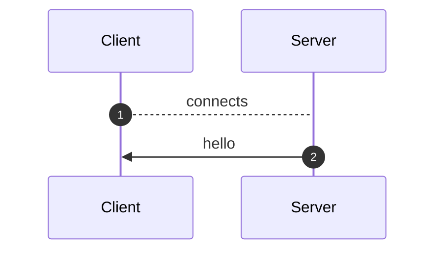
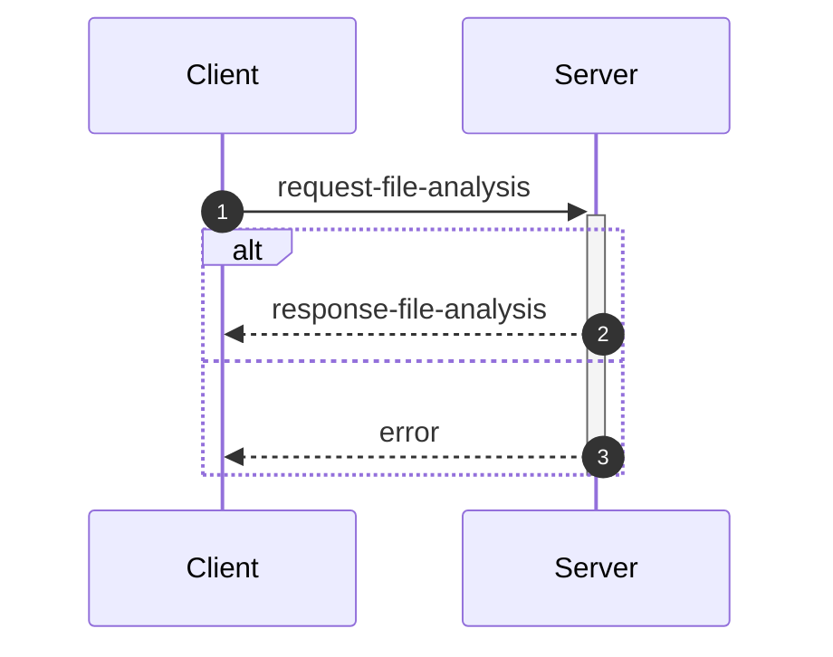
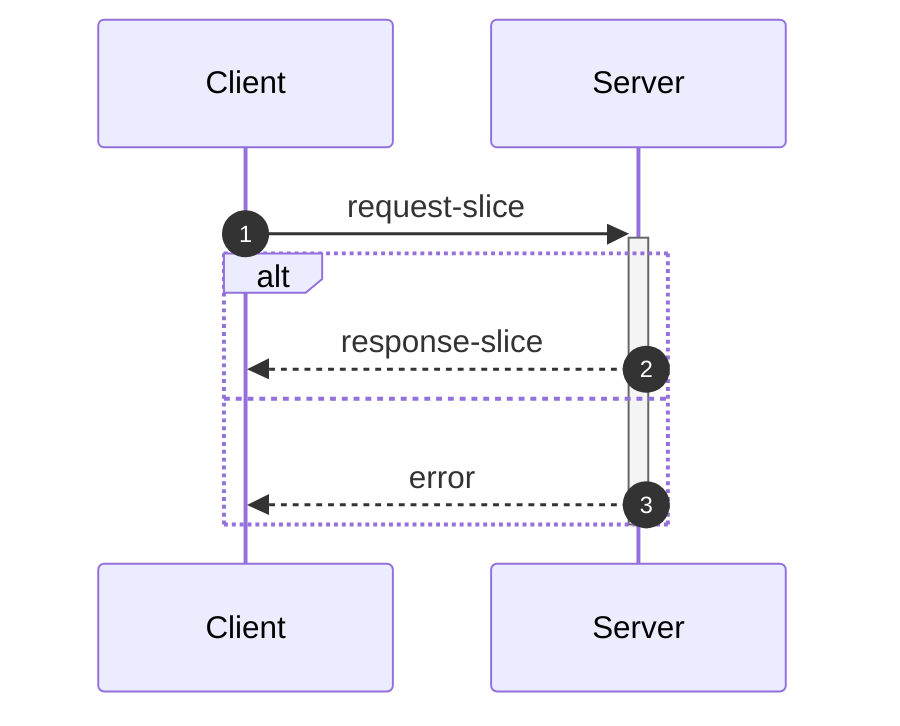
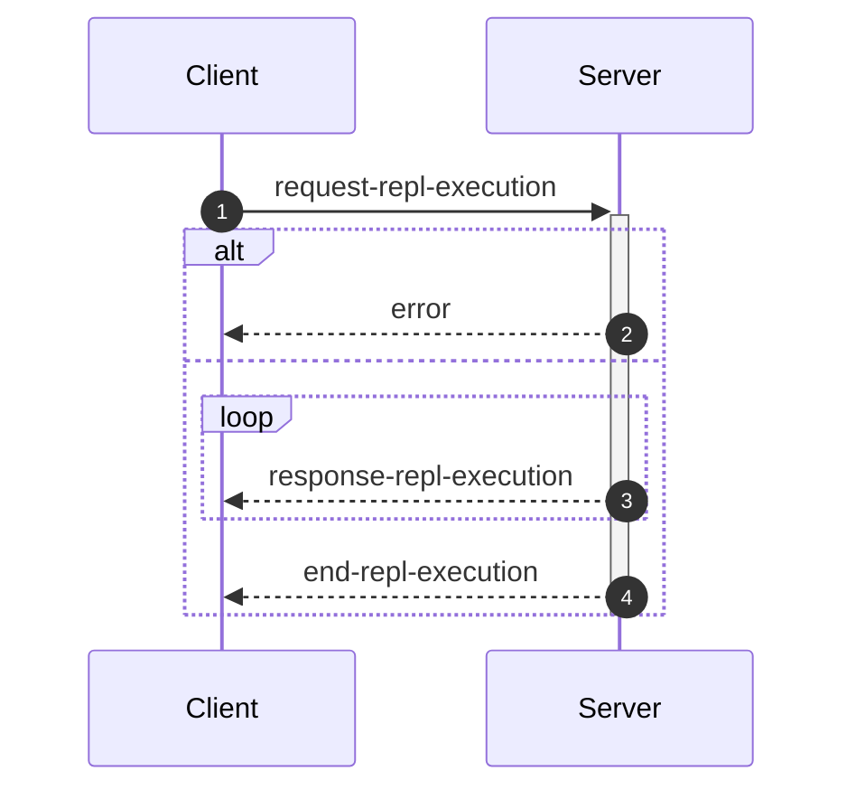
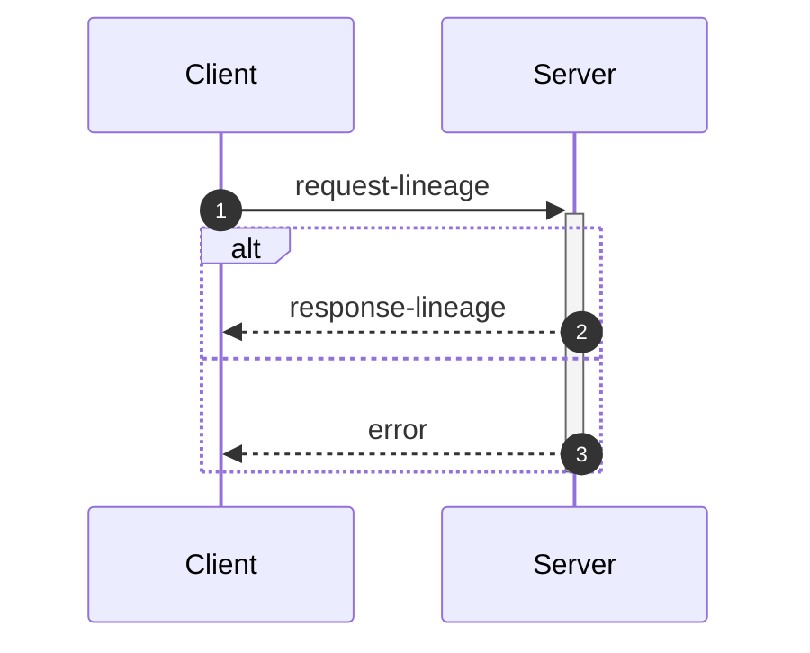

_This document was generated from '[src/documentation/print-interface-wiki.ts](https://github.com/flowr-analysis/flowr/tree/main//src/documentation/print-interface-wiki.ts)' on 2025-05-03, 19:18:48 UTC presenting an overview of flowR's interfaces (v2.2.12, using R v4.4.3). Please do not edit this file/wiki page directly._

Although far from being as detailed as the in-depth explanation of
[_flowR_](https://github.com/flowr-analysis/flowr/wiki/Core),
this wiki page explains how to interface with _flowR_ in more detail.
In general, command line arguments and other options provide short descriptions on hover over.

* [💬 Communicating with the Server](#communicating-with-the-server)
* [💻 Using the REPL](#using-the-repl)
* [⚙️ Configuring FlowR](#configuring-flowr)
* [⚒️ Writing Code](#writing-code)

<a id='communicating-with-the-server'></a>
## 💬 Communicating with the Server


As explained in the [Overview](https://github.com/flowr-analysis/flowr/wiki/Overview), you can simply run the [TCP](https://de.wikipedia.org/wiki/Transmission_Control_Protocol)&nbsp;server by adding the <span title="Description (Command Line Argument): Do not drop into a repl, but instead start a server on the given port (default: 1042) and listen for messages.">`--server`</span> flag (and, due to the interactive mode, exit with the conventional <kbd>CTRL</kbd>+<kbd>C</kbd>).
Currently, every connection is handled by the same underlying `RShell` - so the server is not designed to handle many clients at a time.
Additionally, the server is not well guarded against attacks (e.g., you can theoretically spawn an arbitrary number of&nbsp;RShell sessions on the target machine).

Every message has to be given in a single line (i.e., without a newline in-between) and end with a newline character. Nevertheless, we will pretty-print example given in the following segments for the ease of reading.


> [!NOTE]
> 
> The default <span title="Description (Command Line Argument): Do not drop into a repl, but instead start a server on the given port (default: 1042) and listen for messages.">`--server`</span> uses a simple [TCP](https://de.wikipedia.org/wiki/Transmission_Control_Protocol)
> connection. If you want _flowR_ to expose a [WebSocket](https://de.wikipedia.org/wiki/WebSocket) server instead, add the <span title="Description (Command Line Argument): If the server flag is set, use websocket for messaging">`--ws`</span> flag (i.e., <span title="Description (Command Line Argument): Do not drop into a repl, but instead start a server on the given port (default: 1042) and listen for messages.">`--server`</span> <span title="Description (Command Line Argument): If the server flag is set, use websocket for messaging">`--ws`</span>) when starting _flowR_ from the command line.
> 			


<ul><li>
<a id="message-hello"></a>
<b>Hello</b> Message (<code>hello</code>) 
<details>

<summary style="color:gray"> View Details. <i>The server informs the client about the successful connection and provides Meta-Information.</i> </summary>




	
After launching _flowR_, for example, with <code>docker run -it --rm eagleoutice/flowr <span title="Description (Command Line Argument): Do not drop into a repl, but instead start a server on the given port (default: 1042) and listen for messages.">-<span/>-server</span></code>&nbsp;(🐳️), simply connecting should present you with a `hello` message, that amongst others should reveal the versions of&nbsp;_flowR_ and&nbsp;R, using the [semver 2.0](https://semver.org/spec/v2.0.0.html) versioning scheme.
The message looks like this:


```json
{
  "type": "hello",
  "clientName": "client-0",
  "versions": {
    "flowr": "2.2.12",
    "r": "4.4.3",
    "engine": "r-shell"
  }
}
```


There are currently a few messages that you can send after the hello message.
If you want to _slice_ a piece of R code you first have to send an [analysis request](#message-request-file-analysis), so that you can send one or multiple slice requests afterward.
Requests for the [REPL](#message-request-repl) are independent of that.
	

<hr>


<details>
<summary style="color:gray">Message schema (<code>hello</code>)</summary>

For the definition of the hello message, please see it's implementation at [`./src/cli/repl/server/messages/message-hello.ts`](https://github.com/flowr-analysis/flowr/tree/main/./src/cli/repl/server/messages/message-hello.ts).

- **.** object [required]
    - **type** string [required]
        _The type of the hello message._
        Allows only the values: 'hello'
    - **id** any [forbidden]
        _The id of the message is always undefined (as it is the initial message and not requested)._
    - **clientName** string [required]
        _A unique name that is assigned to each client. It has no semantic meaning and is only used/useful for debugging._
    - **versions** object [required]
        - **flowr** string [required]
            _The version of the flowr server running in semver format._
        - **r** string [required]
            _The version of the underlying R shell running in semver format._
        - **engine** string [required]
            _The parser backend that is used to parse the R code._

</details>


<hr>

</details>	
	</li>

<li>
<a id="message-request-file-analysis"></a>
<b>Analysis</b> Message (<code>request-file-analysis</code>) 
<details>

<summary style="color:gray"> View Details. <i>The server builds the dataflow graph for a given input file (or a set of files).</i> </summary>




	
The request allows the server to analyze a file and prepare it for slicing.
The message can contain a `filetoken`, which is used to identify the file in later slice or lineage requests (if you do not add one, the request will not be stored and therefore, it is not available for subsequent requests).

> **Please note!**\
> If you want to send and process a lot of analysis requests, but do not want to slice them, please do not pass the `filetoken` field. This will save the server a lot of memory allocation.

Furthermore, the request must contain either a `content` field to directly pass the file's content or a `filepath` field which contains the path to the file (this path must be accessible for the server to be useful).
If you add the `id` field, the answer will use the same `id` so you can match requests and the corresponding answers.
See the implementation of the request-file-analysis message for more information.


<details>
<summary>Example of the <code>request-file-analysis</code> Message</summary>

_Note:_ even though we pretty-print these messages, they are sent as a single line, ending with a newline.

The following lists all messages that were sent and received in case you want to reproduce the scenario:

<ol>
<li> <code>hello</code> (response)
<details> 

<summary> Show Details </summary>

The first message is always a hello message.


```json
{
  "type": "hello",
  "clientName": "client-0",
  "versions": {
    "flowr": "2.2.12",
    "r": "4.4.3",
    "engine": "r-shell"
  }
}
```


</details>
</li>

<li> <b><code>request-file-analysis</code> (request)</b>
<details open> 

<summary> Show Details </summary>

Let' suppose you simply want to analyze the following script:
 
```r
x <- 1
x + 1
```

 For this, you can send the following request:


```json
{
  "type": "request-file-analysis",
  "id": "1",
  "filetoken": "x",
  "content": "x <- 1\nx + 1"
}
```


</details>
</li>

<li> <code>response-file-analysis</code> (response)
<details> 

<summary> Show Details </summary>


The `results` field of the response effectively contains three keys of importance:

- `parse`: which contains 1:1 the parse result in CSV format that we received from the `RShell` (i.e., the AST produced by the parser of the R interpreter).
- `normalize`: which contains the normalized AST, including ids (see the `info` field and the [Normalized AST](https://github.com/flowr-analysis/flowr/wiki/Normalized%20AST) wiki page).
- `dataflow`: especially important is the `graph` field which contains the dataflow graph as a set of root vertices (see the [Dataflow Graph](https://github.com/flowr-analysis/flowr/wiki/Dataflow%20Graph) wiki page).
			


_As the code is pretty long, we inhibit pretty printing and syntax highlighting (JSON, hiding built-in):_

```text
{"type":"response-file-analysis","format":"json","id":"1","results":{"parse":{"parsed":"[1,1,1,6,7,0,\"expr\",false,\"x <- 1\"],[1,1,1,1,1,3,\"SYMBOL\",true,\"x\"],[1,1,1,1,3,7,\"expr\",false,\"x\"],[1,3,1,4,2,7,\"LEFT_ASSIGN\",true,\"<-\"],[1,6,1,6,4,5,\"NUM_CONST\",true,\"1\"],[1,6,1,6,5,7,\"expr\",false,\"1\"],[2,1,2,5,16,0,\"expr\",false,\"x + 1\"],[2,1,2,1,10,12,\"SYMBOL\",true,\"x\"],[2,1,2,1,12,16,\"expr\",false,\"x\"],[2,3,2,3,11,16,\"'+'\",true,\"+\"],[2,5,2,5,13,14,\"NUM_CONST\",true,\"1\"],[2,5,2,5,14,16,\"expr\",false,\"1\"]",".meta":{"timing":5}},"normalize":{"ast":{"type":"RExpressionList","children":[{"type":"RBinaryOp","location":[1,3,1,4],"lhs":{"type":"RSymbol","location":[1,1,1,1],"content":"x","lexeme":"x","info":{"fullRange":[1,1,1,1],"additionalTokens":[],"id":0,"parent":2,"role":"binop-lhs","index":0,"nesting":0,"file":"/tmp/tmp-7765-7NbBlvd6UL4E-.R"}},"rhs":{"location":[1,6,1,6],"lexeme":"1","info":{"fullRange":[1,6,1,6],"additionalTokens":[],"id":1,"parent":2,"role":"binop-rhs","index":1,"nesting":0,"file":"/tmp/tmp-7765-7NbBlvd6UL4E-.R"},"type":"RNumber","content":{"num":1,"complexNumber":false,"markedAsInt":false}},"operator":"<-","lexeme":"<-","info":{"fullRange":[1,1,1,6],"additionalTokens":[],"id":2,"parent":6,"nesting":0,"file":"/tmp/tmp-7765-7NbBlvd6UL4E-.R","index":0,"role":"expr-list-child"}},{"type":"RBinaryOp","location":[2,3,2,3],"lhs":{"type":"RSymbol","location":[2,1,2,1],"content":"x","lexeme":"x","info":{"fullRange":[2,1,2,1],"additionalTokens":[],"id":3,"parent":5,"role":"binop-lhs","index":0,"nesting":0,"file":"/tmp/tmp-7765-7NbBlvd6UL4E-.R"}},"rhs":{"location":[2,5,2,5],"lexeme":"1","info":{"fullRange":[2,5,2,5],"additionalTokens":[],"id":4,"parent":5,"role":"binop-rhs","index":1,"nesting":0,"file":"/tmp/tmp-7765-7NbBlvd6UL4E-.R"},"type":"RNumber","content":{"num":1,"complexNumber":false,"markedAsInt":false}},"operator":"+","lexeme":"+","info":{"fullRange":[2,1,2,5],"additionalTokens":[],"id":5,"parent":6,"nesting":0,"file":"/tmp/tmp-7765-7NbBlvd6UL4E-.R","index":1,"role":"expr-list-child"}}],"info":{"additionalTokens":[],"id":6,"nesting":0,"file":"/tmp/tmp-7765-7NbBlvd6UL4E-.R","role":"root","index":0}},".meta":{"timing":3}},"dataflow":{"unknownReferences":[],"in":[{"nodeId":2,"name":"<-","type":2},{"nodeId":5,"name":"+","type":2}],"out":[{"nodeId":0,"name":"x","type":4,"definedAt":2,"value":[1]}],"environment":{"current":{"id":12,"parent":"<BuiltInEnvironment>","memory":[["x",[{"nodeId":0,"name":"x","type":4,"definedAt":2,"value":[1]}]]]},"level":0},"graph":{"_sourced":["/tmp/tmp-7765-7NbBlvd6UL4E-.R"],"_unknownSideEffects":[],"rootVertices":[1,0,2,3,4,5],"vertexInformation":[[1,{"tag":"value","id":1}],[0,{"tag":"variable-definition","id":0}],[2,{"tag":"function-call","id":2,"name":"<-","onlyBuiltin":true,"args":[{"nodeId":0,"type":32},{"nodeId":1,"type":32}],"origin":["builtin:assignment"]}],[3,{"tag":"use","id":3}],[4,{"tag":"value","id":4}],[5,{"tag":"function-call","id":5,"name":"+","onlyBuiltin":true,"args":[{"nodeId":3,"type":32},{"nodeId":4,"type":32}],"origin":["builtin:default"]}]],"edgeInformation":[[2,[[1,{"types":64}],[0,{"types":72}],["built-in:<-",{"types":1}]]],[0,[[1,{"types":2}],[2,{"types":2}]]],[3,[[0,{"types":1}]]],[5,[[3,{"types":65}],[4,{"types":65}],["built-in:+",{"types":1}]]]]},"entryPoint":2,"exitPoints":[{"type":0,"nodeId":5}],".meta":{"timing":4}}}}
```


</details>
</li>
</ol>

The complete round-trip took 17.97 ms (including time required to validate the messages, start, and stop the internal mock server).

</details>


You receive an error if, for whatever reason, the analysis fails (e.g., the message or code you sent contained syntax errors).
It contains a human-readable description *why* the analysis failed (see the error message implementation for more details).


<details>
<summary>Example Error Message</summary>

_Note:_ even though we pretty-print these messages, they are sent as a single line, ending with a newline.

The following lists all messages that were sent and received in case you want to reproduce the scenario:

<ol>
<li> <code>hello</code> (response)
<details> 

<summary> Show Details </summary>

The first message is always a hello message.


```json
{
  "type": "hello",
  "clientName": "client-0",
  "versions": {
    "flowr": "2.2.12",
    "r": "4.4.3",
    "engine": "r-shell"
  }
}
```


</details>
</li>

<li> <code>request-file-analysis</code> (request)
<details> 

<summary> Show Details </summary>


```json
{
  "type": "request-file-analysis",
  "id": "1",
  "filename": "sample.R",
  "content": "x <-"
}
```


</details>
</li>

<li> <b><code>error</code> (response)</b>
<details open> 

<summary> Show Details </summary>


```json
{
  "id": "1",
  "type": "error",
  "fatal": false,
  "reason": "Error while analyzing file sample.R: GuardError: unable to parse R code (see the log for more information) for request {\"request\":\"file\",\"content\":\"/tmp/tmp-7765-TX8hQJ70teS0-.R\"}}"
}
```


</details>
</li>
</ol>

The complete round-trip took 1.43 ms (including time required to validate the messages, start, and stop the internal mock server).

</details>


&nbsp;

<a id="analysis-include-cfg"></a>
**Including the Control Flow Graph**

While _flowR_ does (for the time being) not use an explicit control flow graph but instead relies on control-dependency edges within the dataflow graph, 
the respective structure can still be exposed using the server (note that, as this feature is not needed within _flowR_, it is tested significantly less - 
so please create a [new issue](https://github.com/flowr-analysis/flowr/issues/new/choose) for any bug you may encounter).
For this, the analysis request may add `cfg: true` to its list of options.


<details>
<summary>Requesting a Control Flow Graph</summary>

_Note:_ even though we pretty-print these messages, they are sent as a single line, ending with a newline.

The following lists all messages that were sent and received in case you want to reproduce the scenario:

<ol>
<li> <code>hello</code> (response)
<details> 

<summary> Show Details </summary>

The first message is always a hello message.


```json
{
  "type": "hello",
  "clientName": "client-0",
  "versions": {
    "flowr": "2.2.12",
    "r": "4.4.3",
    "engine": "r-shell"
  }
}
```


</details>
</li>

<li> <b><code>request-file-analysis</code> (request)</b>
<details open> 

<summary> Show Details </summary>


```json
{
  "type": "request-file-analysis",
  "id": "1",
  "filetoken": "x",
  "content": "if(unknown > 0) { x <- 2 } else { x <- 5 }\nfor(i in 1:x) { print(x); print(i) }",
  "cfg": true
}
```


</details>
</li>

<li> <code>response-file-analysis</code> (response)
<details> 

<summary> Show Details </summary>


The response looks basically the same as a response sent without the `cfg` flag. However, additionally it contains a `cfg` field. 
If you are interested in a visual representation of the control flow graph, see the 
[visualization with mermaid](https://mermaid.live/view#base64:eyJjb2RlIjoiZmxvd2NoYXJ0IEJUXG4gICAgbjMyKFtcImBSRXhwcmVzc2lvbkxpc3QgKDMyKWBcIl0pXG4gICAgbjE1W1wiYFJJZlRoZW5FbHNlICgxNSlcbiMzNDtpZih1bmtub3duICM2MjsgMCkgIzEyMzsgeCAjNjA7IzQ1OyAyICMxMjU7IGVsc2UgIzEyMzsgeCAjNjA7IzQ1OyA1ICMxMjU7IzM0O2BcIl1cbiAgICBuMTUtY29uZGl0aW9uW1sxNS1jb25kaXRpb25dXVxuICAgIG4xNS1leGl0KCgxNS1leGl0KSlcbiAgICBuMChbXCJgUlN5bWJvbCAoMClcbiMzNDt1bmtub3duIzM0O2BcIl0pXG4gICAgbjEoW1wiYFJOdW1iZXIgKDEpXG4jMzQ7MCMzNDtgXCJdKVxuICAgIG4yKFtcImBSQmluYXJ5T3AgKDIpXG4jMzQ7dW5rbm93biAjNjI7IDAjMzQ7YFwiXSlcbiAgICBuMi1leGl0KCgyLWV4aXQpKVxuICAgIG44KFtcImBSRXhwcmVzc2lvbkxpc3QgKDgpYFwiXSlcbiAgICBuNShbXCJgUlN5bWJvbCAoNSlcbiMzNDt4IzM0O2BcIl0pXG4gICAgbjYoW1wiYFJOdW1iZXIgKDYpXG4jMzQ7MiMzNDtgXCJdKVxuICAgIG43KFtcImBSQmluYXJ5T3AgKDcpXG4jMzQ7eCAjNjA7IzQ1OyAyIzM0O2BcIl0pXG4gICAgbjctZXhpdCgoNy1leGl0KSlcbiAgICBuOC1leGl0KCg4LWV4aXQpKVxuICAgIG4xNChbXCJgUkV4cHJlc3Npb25MaXN0ICgxNClgXCJdKVxuICAgIG4xMShbXCJgUlN5bWJvbCAoMTEpXG4jMzQ7eCMzNDtgXCJdKVxuICAgIG4xMihbXCJgUk51bWJlciAoMTIpXG4jMzQ7NSMzNDtgXCJdKVxuICAgIG4xMyhbXCJgUkJpbmFyeU9wICgxMylcbiMzNDt4ICM2MDsjNDU7IDUjMzQ7YFwiXSlcbiAgICBuMTMtZXhpdCgoMTMtZXhpdCkpXG4gICAgbjE0LWV4aXQoKDE0LWV4aXQpKVxuICAgIG4xNihbXCJgUlN5bWJvbCAoMTYpXG4jMzQ7aSMzNDtgXCJdKVxuICAgIG4zMVtcImBSRm9yTG9vcCAoMzEpXG4jMzQ7Zm9yKGkgaW4gMSM1ODt4KSAjMTIzOyBwcmludCh4KTsgcHJpbnQoaSkgIzEyNTsjMzQ7YFwiXVxuICAgIG4xNyhbXCJgUk51bWJlciAoMTcpXG4jMzQ7MSMzNDtgXCJdKVxuICAgIG4xOChbXCJgUlN5bWJvbCAoMTgpXG4jMzQ7eCMzNDtgXCJdKVxuICAgIG4xOShbXCJgUkJpbmFyeU9wICgxOSlcbiMzNDsxIzU4O3gjMzQ7YFwiXSlcbiAgICBuMTktZXhpdCgoMTktZXhpdCkpXG4gICAgbjMwKFtcImBSRXhwcmVzc2lvbkxpc3QgKDMwKWBcIl0pXG4gICAgbjIyKFtcImBSU3ltYm9sICgyMilcbiMzNDtwcmludCh4KSMzNDtgXCJdKVxuICAgIG4yNVtcImBSRnVuY3Rpb25DYWxsICgyNSlcbiMzNDtwcmludCh4KSMzNDtgXCJdXG4gICAgbjI1LW5hbWVbWzI1LW5hbWVdXVxuICAgIG4yNS1leGl0KCgyNS1leGl0KSlcbiAgICBuMjQoW1wiYFJBcmd1bWVudCAoMjQpXG4jMzQ7eCMzNDtgXCJdKVxuICAgIG4yNC1iZWZvcmUtdmFsdWVbWzI0LWJlZm9yZS12YWx1ZV1dXG4gICAgbjIzKFtcImBSU3ltYm9sICgyMylcbiMzNDt4IzM0O2BcIl0pXG4gICAgbjI0LWV4aXQoKDI0LWV4aXQpKVxuICAgIG4yNihbXCJgUlN5bWJvbCAoMjYpXG4jMzQ7cHJpbnQoaSkjMzQ7YFwiXSlcbiAgICBuMjlbXCJgUkZ1bmN0aW9uQ2FsbCAoMjkpXG4jMzQ7cHJpbnQoaSkjMzQ7YFwiXVxuICAgIG4yOS1uYW1lW1syOS1uYW1lXV1cbiAgICBuMjktZXhpdCgoMjktZXhpdCkpXG4gICAgbjI4KFtcImBSQXJndW1lbnQgKDI4KVxuIzM0O2kjMzQ7YFwiXSlcbiAgICBuMjgtYmVmb3JlLXZhbHVlW1syOC1iZWZvcmUtdmFsdWVdXVxuICAgIG4yNyhbXCJgUlN5bWJvbCAoMjcpXG4jMzQ7aSMzNDtgXCJdKVxuICAgIG4yOC1leGl0KCgyOC1leGl0KSlcbiAgICBuMzAtZXhpdCgoMzAtZXhpdCkpXG4gICAgbjMxLWhlYWRbWzMxLWhlYWRdXVxuICAgIG4zMS1leGl0KCgzMS1leGl0KSlcbiAgICBuMzItZXhpdCgoMzItZXhpdCkpXG4gICAgbjE1IC0uLT58XCJGRFwifCBuMzJcbiAgICBuMSAtLi0+fFwiRkRcInwgbjBcbiAgICBuMCAtLi0+fFwiRkRcInwgbjJcbiAgICBuMi1leGl0IC0uLT58XCJGRFwifCBuMVxuICAgIG43IC0uLT58XCJGRFwifCBuOFxuICAgIG42IC0uLT58XCJGRFwifCBuNVxuICAgIG41IC0uLT58XCJGRFwifCBuN1xuICAgIG43LWV4aXQgLS4tPnxcIkZEXCJ8IG42XG4gICAgbjgtZXhpdCAtLi0+fFwiRkRcInwgbjctZXhpdFxuICAgIG4xMyAtLi0+fFwiRkRcInwgbjE0XG4gICAgbjEyIC0uLT58XCJGRFwifCBuMTFcbiAgICBuMTEgLS4tPnxcIkZEXCJ8IG4xM1xuICAgIG4xMy1leGl0IC0uLT58XCJGRFwifCBuMTJcbiAgICBuMTQtZXhpdCAtLi0+fFwiRkRcInwgbjEzLWV4aXRcbiAgICBuMTUtY29uZGl0aW9uIC0uLT58XCJGRFwifCBuMi1leGl0XG4gICAgbjggLS0+fFwiQ0QgKFRSVUUpXCJ8IG4xNS1jb25kaXRpb25cbiAgICBuMTQgLS0+fFwiQ0QgKEZBTFNFKVwifCBuMTUtY29uZGl0aW9uXG4gICAgbjIgLS4tPnxcIkZEXCJ8IG4xNVxuICAgIG4xNS1leGl0IC0uLT58XCJGRFwifCBuOC1leGl0XG4gICAgbjE1LWV4aXQgLS4tPnxcIkZEXCJ8IG4xNC1leGl0XG4gICAgbjMxIC0uLT58XCJGRFwifCBuMTUtZXhpdFxuICAgIG4zMSAtLi0+fFwiRkRcInwgbjMwLWV4aXRcbiAgICBuMTggLS4tPnxcIkZEXCJ8IG4xN1xuICAgIG4xNyAtLi0+fFwiRkRcInwgbjE5XG4gICAgbjE5LWV4aXQgLS4tPnxcIkZEXCJ8IG4xOFxuICAgIG4yNSAtLi0+fFwiRkRcInwgbjMwXG4gICAgbjIyIC0uLT58XCJGRFwifCBuMjVcbiAgICBuMjUtbmFtZSAtLi0+fFwiRkRcInwgbjIyXG4gICAgbjI0LWJlZm9yZS12YWx1ZSAtLi0+fFwiRkRcInwgbjI0XG4gICAgbjIzIC0uLT58XCJGRFwifCBuMjQtYmVmb3JlLXZhbHVlXG4gICAgbjI0LWV4aXQgLS4tPnxcIkZEXCJ8IG4yM1xuICAgIG4yNCAtLi0+fFwiRkRcInwgbjI1LW5hbWVcbiAgICBuMjUtZXhpdCAtLi0+fFwiRkRcInwgbjI0LWV4aXRcbiAgICBuMjkgLS4tPnxcIkZEXCJ8IG4yNS1leGl0XG4gICAgbjI2IC0uLT58XCJGRFwifCBuMjlcbiAgICBuMjktbmFtZSAtLi0+fFwiRkRcInwgbjI2XG4gICAgbjI4LWJlZm9yZS12YWx1ZSAtLi0+fFwiRkRcInwgbjI4XG4gICAgbjI3IC0uLT58XCJGRFwifCBuMjgtYmVmb3JlLXZhbHVlXG4gICAgbjI4LWV4aXQgLS4tPnxcIkZEXCJ8IG4yN1xuICAgIG4yOCAtLi0+fFwiRkRcInwgbjI5LW5hbWVcbiAgICBuMjktZXhpdCAtLi0+fFwiRkRcInwgbjI4LWV4aXRcbiAgICBuMzAtZXhpdCAtLi0+fFwiRkRcInwgbjI5LWV4aXRcbiAgICBuMTkgLS4tPnxcIkZEXCJ8IG4zMVxuICAgIG4xNiAtLi0+fFwiRkRcInwgbjE5LWV4aXRcbiAgICBuMzEtaGVhZCAtLi0+fFwiRkRcInwgbjE2XG4gICAgbjMwIC0tPnxcIkNEIChUUlVFKVwifCBuMzEtaGVhZFxuICAgIG4zMS1leGl0IC0tPnxcIkNEIChGQUxTRSlcInwgbjE5LWV4aXRcbiAgICBuMzItZXhpdCAtLi0+fFwiRkRcInwgbjMxLWV4aXRcbiAgICBzdHlsZSBuMzIgc3Ryb2tlOmN5YW4sc3Ryb2tlLXdpZHRoOjYuNXB4OyAgICBzdHlsZSBuMzItZXhpdCBzdHJva2U6Z3JlZW4sc3Ryb2tlLXdpZHRoOjYuNXB4OyIsIm1lcm1haWQiOnsiYXV0b1N5bmMiOnRydWV9fQ==).
			


_As the code is pretty long, we inhibit pretty printing and syntax highlighting (JSON, hiding built-in):_

```text
{"type":"response-file-analysis","format":"json","id":"1","cfg":{"returns":[],"entryPoints":[32],"exitPoints":["32-exit"],"breaks":[],"nexts":[],"graph":{"rootVertices":[32,15,"15-condition","15-exit",0,1,2,"2-exit",8,5,6,7,"7-exit","8-exit",14,11,12,13,"13-exit","14-exit",16,31,17,18,19,"19-exit",30,22,25,"25-name","25-exit",24,"24-before-value",23,"24-exit",26,29,"29-name","29-exit",28,"28-before-value",27,"28-exit","30-exit","31-head","31-exit","32-exit"],"vertexInformation":[[32,{"id":32,"type":"expr","end":["32-exit"]}],[15,{"id":15,"type":"stm","mid":["15-condition"],"end":["15-exit"]}],["15-condition",{"id":"15-condition","kind":"condition","type":"mid","root":15}],["15-exit",{"id":"15-exit","type":"end","root":15}],[0,{"id":0,"type":"expr"}],[1,{"id":1,"type":"expr"}],[2,{"id":2,"type":"expr","end":["2-exit"]}],["2-exit",{"id":"2-exit","type":"end","root":2}],[8,{"id":8,"type":"expr","end":["8-exit"]}],[5,{"id":5,"type":"expr"}],[6,{"id":6,"type":"expr"}],[7,{"id":7,"type":"expr","end":["7-exit"]}],["7-exit",{"id":"7-exit","type":"end","root":7}],["8-exit",{"id":"8-exit","type":"end","root":8}],[14,{"id":14,"type":"expr","end":["14-exit"]}],[11,{"id":11,"type":"expr"}],[12,{"id":12,"type":"expr"}],[13,{"id":13,"type":"expr","end":["13-exit"]}],["13-exit",{"id":"13-exit","type":"end","root":13}],["14-exit",{"id":"14-exit","type":"end","root":14}],[16,{"id":16,"type":"expr"}],[31,{"id":31,"type":"stm","exit":["31-exit"],"mid":["31-head"]}],[17,{"id":17,"type":"expr"}],[18,{"id":18,"type":"expr"}],[19,{"id":19,"type":"expr","end":["19-exit"]}],["19-exit",{"id":"19-exit","type":"end","root":19}],[30,{"id":30,"type":"expr","end":["30-exit"]}],[22,{"id":22,"type":"expr"}],[25,{"id":25,"type":"stm","mid":["25-name"],"end":["25-exit"]}],["25-name",{"id":"25-name","kind":"name","type":"mid","root":25}],["25-exit",{"id":"25-exit","type":"end","root":25}],[24,{"id":24,"type":"expr","mid":["24-before-value"],"end":["24-exit"]}],["24-before-value",{"id":"24-before-value","kind":"before-value","type":"mid","root":24}],[23,{"id":23,"type":"expr"}],["24-exit",{"id":"24-exit","type":"end","root":24}],[26,{"id":26,"type":"expr"}],[29,{"id":29,"type":"stm","mid":["29-name"],"end":["29-exit"]}],["29-name",{"id":"29-name","kind":"name","type":"mid","root":29}],["29-exit",{"id":"29-exit","type":"end","root":29}],[28,{"id":28,"type":"expr","mid":["28-before-value"],"end":["28-exit"]}],["28-before-value",{"id":"28-before-value","kind":"before-value","type":"mid","root":28}],[27,{"id":27,"type":"expr"}],["28-exit",{"id":"28-exit","type":"end","root":28}],["30-exit",{"id":"30-exit","type":"end","root":30}],["31-head",{"id":"31-head","type":"mid","root":31,"kind":"head"}],["31-exit",{"id":"31-exit","type":"end","root":31}],["32-exit",{"id":"32-exit","type":"end","root":32}]],"bbChildren":[],"edgeInformation":[[15,[[32,{"label":0}]]],[1,[[0,{"label":0}]]],[0,[[2,{"label":0}]]],["2-exit",[[1,{"label":0}]]],[7,[[8,{"label":0}]]],[6,[[5,{"label":0}]]],[5,[[7,{"label":0}]]],["7-exit",[[6,{"label":0}]]],["8-exit",[["7-exit",{"label":0}]]],[13,[[14,{"label":0}]]],[12,[[11,{"label":0}]]],[11,[[13,{"label":0}]]],["13-exit",[[12,{"label":0}]]],["14-exit",[["13-exit",{"label":0}]]],["15-condition",[["2-exit",{"label":0}]]],[8,[["15-condition",{"label":1,"when":"TRUE","caused":15}]]],[14,[["15-condition",{"label":1,"when":"FALSE","caused":15}]]],[2,[[15,{"label":0}]]],["15-exit",[["8-exit",{"label":0}],["14-exit",{"label":0}]]],[31,[["15-exit",{"label":0}],["30-exit",{"label":0}]]],[18,[[17,{"label":0}]]],[17,[[19,{"label":0}]]],["19-exit",[[18,{"label":0}]]],[25,[[30,{"label":0}]]],[22,[[25,{"label":0}]]],["25-name",[[22,{"label":0}]]],["24-before-value",[[24,{"label":0}]]],[23,[["24-before-value",{"label":0}]]],["24-exit",[[23,{"label":0}]]],[24,[["25-name",{"label":0}]]],["25-exit",[["24-exit",{"label":0}]]],[29,[["25-exit",{"label":0}]]],[26,[[29,{"label":0}]]],["29-name",[[26,{"label":0}]]],["28-before-value",[[28,{"label":0}]]],[27,[["28-before-value",{"label":0}]]],["28-exit",[[27,{"label":0}]]],[28,[["29-name",{"label":0}]]],["29-exit",[["28-exit",{"label":0}]]],["30-exit",[["29-exit",{"label":0}]]],[19,[[31,{"label":0}]]],[16,[["19-exit",{"label":0}]]],["31-head",[[16,{"label":0}]]],[30,[["31-head",{"label":1,"when":"TRUE","caused":31}]]],["31-exit",[["19-exit",{"label":1,"when":"FALSE","caused":31}]]],["32-exit",[["31-exit",{"label":0}]]]]}},"results":{"parse":{"parsed":"[1,1,1,42,38,0,\"expr\",false,\"if(unknown > 0) { x <- 2 } else { x <- 5 }\"],[1,1,1,2,1,38,\"IF\",true,\"if\"],[1,3,1,3,2,38,\"'('\",true,\"(\"],[1,4,1,14,9,38,\"expr\",false,\"unknown > 0\"],[1,4,1,10,3,5,\"SYMBOL\",true,\"unknown\"],[1,4,1,10,5,9,\"expr\",false,\"unknown\"],[1,12,1,12,4,9,\"GT\",true,\">\"],[1,14,1,14,6,7,\"NUM_CONST\",true,\"0\"],[1,14,1,14,7,9,\"expr\",false,\"0\"],[1,15,1,15,8,38,\"')'\",true,\")\"],[1,17,1,26,22,38,\"expr\",false,\"{ x <- 2 }\"],[1,17,1,17,12,22,\"'{'\",true,\"{\"],[1,19,1,24,19,22,\"expr\",false,\"x <- 2\"],[1,19,1,19,13,15,\"SYMBOL\",true,\"x\"],[1,19,1,19,15,19,\"expr\",false,\"x\"],[1,21,1,22,14,19,\"LEFT_ASSIGN\",true,\"<-\"],[1,24,1,24,16,17,\"NUM_CONST\",true,\"2\"],[1,24,1,24,17,19,\"expr\",false,\"2\"],[1,26,1,26,18,22,\"'}'\",true,\"}\"],[1,28,1,31,23,38,\"ELSE\",true,\"else\"],[1,33,1,42,35,38,\"expr\",false,\"{ x <- 5 }\"],[1,33,1,33,25,35,\"'{'\",true,\"{\"],[1,35,1,40,32,35,\"expr\",false,\"x <- 5\"],[1,35,1,35,26,28,\"SYMBOL\",true,\"x\"],[1,35,1,35,28,32,\"expr\",false,\"x\"],[1,37,1,38,27,32,\"LEFT_ASSIGN\",true,\"<-\"],[1,40,1,40,29,30,\"NUM_CONST\",true,\"5\"],[1,40,1,40,30,32,\"expr\",false,\"5\"],[1,42,1,42,31,35,\"'}'\",true,\"}\"],[2,1,2,36,84,0,\"expr\",false,\"for(i in 1:x) { print(x); print(i) }\"],[2,1,2,3,41,84,\"FOR\",true,\"for\"],[2,4,2,13,53,84,\"forcond\",false,\"(i in 1:x)\"],[2,4,2,4,42,53,\"'('\",true,\"(\"],[2,5,2,5,43,53,\"SYMBOL\",true,\"i\"],[2,7,2,8,44,53,\"IN\",true,\"in\"],[2,10,2,12,51,53,\"expr\",false,\"1:x\"],[2,10,2,10,45,46,\"NUM_CONST\",true,\"1\"],[2,10,2,10,46,51,\"expr\",false,\"1\"],[2,11,2,11,47,51,\"':'\",true,\":\"],[2,12,2,12,48,50,\"SYMBOL\",true,\"x\"],[2,12,2,12,50,51,\"expr\",false,\"x\"],[2,13,2,13,49,53,\"')'\",true,\")\"],[2,15,2,36,81,84,\"expr\",false,\"{ print(x); print(i) }\"],[2,15,2,15,54,81,\"'{'\",true,\"{\"],[2,17,2,24,64,81,\"expr\",false,\"print(x)\"],[2,17,2,21,55,57,\"SYMBOL_FUNCTION_CALL\",true,\"print\"],[2,17,2,21,57,64,\"expr\",false,\"print\"],[2,22,2,22,56,64,\"'('\",true,\"(\"],[2,23,2,23,58,60,\"SYMBOL\",true,\"x\"],[2,23,2,23,60,64,\"expr\",false,\"x\"],[2,24,2,24,59,64,\"')'\",true,\")\"],[2,25,2,25,65,81,\"';'\",true,\";\"],[2,27,2,34,77,81,\"expr\",false,\"print(i)\"],[2,27,2,31,68,70,\"SYMBOL_FUNCTION_CALL\",true,\"print\"],[2,27,2,31,70,77,\"expr\",false,\"print\"],[2,32,2,32,69,77,\"'('\",true,\"(\"],[2,33,2,33,71,73,\"SYMBOL\",true,\"i\"],[2,33,2,33,73,77,\"expr\",false,\"i\"],[2,34,2,34,72,77,\"')'\",true,\")\"],[2,36,2,36,78,81,\"'}'\",true,\"}\"]",".meta":{"timing":3}},"normalize":{"ast":{"type":"RExpressionList","children":[{"type":"RIfThenElse","condition":{"type":"RBinaryOp","location":[1,12,1,12],"lhs":{"type":"RSymbol","location":[1,4,1,10],"content":"unknown","lexeme":"unknown","info":{"fullRange":[1,4,1,10],"additionalTokens":[],"id":0,"parent":2,"role":"binop-lhs","index":0,"nesting":1,"file":"/tmp/tmp-7765-S8dAfDhEWNdg-.R"}},"rhs":{"location":[1,14,1,14],"lexeme":"0","info":{"fullRange":[1,14,1,14],"additionalTokens":[],"id":1,"parent":2,"role":"binop-rhs","index":1,"nesting":1,"file":"/tmp/tmp-7765-S8dAfDhEWNdg-.R"},"type":"RNumber","content":{"num":0,"complexNumber":false,"markedAsInt":false}},"operator":">","lexeme":">","info":{"fullRange":[1,4,1,14],"additionalTokens":[],"id":2,"parent":15,"nesting":1,"file":"/tmp/tmp-7765-S8dAfDhEWNdg-.R","role":"if-cond"}},"then":{"type":"RExpressionList","children":[{"type":"RBinaryOp","location":[1,21,1,22],"lhs":{"type":"RSymbol","location":[1,19,1,19],"content":"x","lexeme":"x","info":{"fullRange":[1,19,1,19],"additionalTokens":[],"id":5,"parent":7,"role":"binop-lhs","index":0,"nesting":1,"file":"/tmp/tmp-7765-S8dAfDhEWNdg-.R"}},"rhs":{"location":[1,24,1,24],"lexeme":"2","info":{"fullRange":[1,24,1,24],"additionalTokens":[],"id":6,"parent":7,"role":"binop-rhs","index":1,"nesting":1,"file":"/tmp/tmp-7765-S8dAfDhEWNdg-.R"},"type":"RNumber","content":{"num":2,"complexNumber":false,"markedAsInt":false}},"operator":"<-","lexeme":"<-","info":{"fullRange":[1,19,1,24],"additionalTokens":[],"id":7,"parent":8,"nesting":1,"file":"/tmp/tmp-7765-S8dAfDhEWNdg-.R","index":0,"role":"expr-list-child"}}],"grouping":[{"type":"RSymbol","location":[1,17,1,17],"content":"{","lexeme":"{","info":{"fullRange":[1,17,1,26],"additionalTokens":[],"id":3,"role":"root","index":0,"nesting":1,"file":"/tmp/tmp-7765-S8dAfDhEWNdg-.R"}},{"type":"RSymbol","location":[1,26,1,26],"content":"}","lexeme":"}","info":{"fullRange":[1,17,1,26],"additionalTokens":[],"id":4,"role":"root","index":0,"nesting":1,"file":"/tmp/tmp-7765-S8dAfDhEWNdg-.R"}}],"info":{"additionalTokens":[],"id":8,"parent":15,"nesting":1,"file":"/tmp/tmp-7765-S8dAfDhEWNdg-.R","index":1,"role":"if-then"}},"location":[1,1,1,2],"lexeme":"if","info":{"fullRange":[1,1,1,42],"additionalTokens":[],"id":15,"parent":32,"nesting":1,"file":"/tmp/tmp-7765-S8dAfDhEWNdg-.R","index":0,"role":"expr-list-child"},"otherwise":{"type":"RExpressionList","children":[{"type":"RBinaryOp","location":[1,37,1,38],"lhs":{"type":"RSymbol","location":[1,35,1,35],"content":"x","lexeme":"x","info":{"fullRange":[1,35,1,35],"additionalTokens":[],"id":11,"parent":13,"role":"binop-lhs","index":0,"nesting":1,"file":"/tmp/tmp-7765-S8dAfDhEWNdg-.R"}},"rhs":{"location":[1,40,1,40],"lexeme":"5","info":{"fullRange":[1,40,1,40],"additionalTokens":[],"id":12,"parent":13,"role":"binop-rhs","index":1,"nesting":1,"file":"/tmp/tmp-7765-S8dAfDhEWNdg-.R"},"type":"RNumber","content":{"num":5,"complexNumber":false,"markedAsInt":false}},"operator":"<-","lexeme":"<-","info":{"fullRange":[1,35,1,40],"additionalTokens":[],"id":13,"parent":14,"nesting":1,"file":"/tmp/tmp-7765-S8dAfDhEWNdg-.R","index":0,"role":"expr-list-child"}}],"grouping":[{"type":"RSymbol","location":[1,33,1,33],"content":"{","lexeme":"{","info":{"fullRange":[1,33,1,42],"additionalTokens":[],"id":9,"role":"root","index":0,"nesting":1,"file":"/tmp/tmp-7765-S8dAfDhEWNdg-.R"}},{"type":"RSymbol","location":[1,42,1,42],"content":"}","lexeme":"}","info":{"fullRange":[1,33,1,42],"additionalTokens":[],"id":10,"role":"root","index":0,"nesting":1,"file":"/tmp/tmp-7765-S8dAfDhEWNdg-.R"}}],"info":{"additionalTokens":[],"id":14,"parent":15,"nesting":1,"file":"/tmp/tmp-7765-S8dAfDhEWNdg-.R","index":2,"role":"if-otherwise"}}},{"type":"RForLoop","variable":{"type":"RSymbol","location":[2,5,2,5],"content":"i","lexeme":"i","info":{"additionalTokens":[],"id":16,"parent":31,"role":"for-variable","index":0,"nesting":1,"file":"/tmp/tmp-7765-S8dAfDhEWNdg-.R"}},"vector":{"type":"RBinaryOp","location":[2,11,2,11],"lhs":{"location":[2,10,2,10],"lexeme":"1","info":{"fullRange":[2,10,2,10],"additionalTokens":[],"id":17,"parent":19,"role":"binop-lhs","index":0,"nesting":1,"file":"/tmp/tmp-7765-S8dAfDhEWNdg-.R"},"type":"RNumber","content":{"num":1,"complexNumber":false,"markedAsInt":false}},"rhs":{"type":"RSymbol","location":[2,12,2,12],"content":"x","lexeme":"x","info":{"fullRange":[2,12,2,12],"additionalTokens":[],"id":18,"parent":19,"role":"binop-rhs","index":1,"nesting":1,"file":"/tmp/tmp-7765-S8dAfDhEWNdg-.R"}},"operator":":","lexeme":":","info":{"fullRange":[2,10,2,12],"additionalTokens":[],"id":19,"parent":31,"nesting":1,"file":"/tmp/tmp-7765-S8dAfDhEWNdg-.R","index":1,"role":"for-vector"}},"body":{"type":"RExpressionList","children":[{"type":"RFunctionCall","named":true,"location":[2,17,2,21],"lexeme":"print","functionName":{"type":"RSymbol","location":[2,17,2,21],"content":"print","lexeme":"print","info":{"fullRange":[2,17,2,24],"additionalTokens":[],"id":22,"parent":25,"role":"call-name","index":0,"nesting":1,"file":"/tmp/tmp-7765-S8dAfDhEWNdg-.R"}},"arguments":[{"type":"RArgument","location":[2,23,2,23],"lexeme":"x","value":{"type":"RSymbol","location":[2,23,2,23],"content":"x","lexeme":"x","info":{"fullRange":[2,23,2,23],"additionalTokens":[],"id":23,"parent":24,"role":"arg-value","index":0,"nesting":1,"file":"/tmp/tmp-7765-S8dAfDhEWNdg-.R"}},"info":{"fullRange":[2,23,2,23],"additionalTokens":[],"id":24,"parent":25,"nesting":1,"file":"/tmp/tmp-7765-S8dAfDhEWNdg-.R","index":1,"role":"call-argument"}}],"info":{"fullRange":[2,17,2,24],"additionalTokens":[],"id":25,"parent":30,"nesting":1,"file":"/tmp/tmp-7765-S8dAfDhEWNdg-.R","index":0,"role":"expr-list-child"}},{"type":"RFunctionCall","named":true,"location":[2,27,2,31],"lexeme":"print","functionName":{"type":"RSymbol","location":[2,27,2,31],"content":"print","lexeme":"print","info":{"fullRange":[2,27,2,34],"additionalTokens":[],"id":26,"parent":29,"role":"call-name","index":0,"nesting":1,"file":"/tmp/tmp-7765-S8dAfDhEWNdg-.R"}},"arguments":[{"type":"RArgument","location":[2,33,2,33],"lexeme":"i","value":{"type":"RSymbol","location":[2,33,2,33],"content":"i","lexeme":"i","info":{"fullRange":[2,33,2,33],"additionalTokens":[],"id":27,"parent":28,"role":"arg-value","index":0,"nesting":1,"file":"/tmp/tmp-7765-S8dAfDhEWNdg-.R"}},"info":{"fullRange":[2,33,2,33],"additionalTokens":[],"id":28,"parent":29,"nesting":1,"file":"/tmp/tmp-7765-S8dAfDhEWNdg-.R","index":1,"role":"call-argument"}}],"info":{"fullRange":[2,27,2,34],"additionalTokens":[],"id":29,"parent":30,"nesting":1,"file":"/tmp/tmp-7765-S8dAfDhEWNdg-.R","index":1,"role":"expr-list-child"}}],"grouping":[{"type":"RSymbol","location":[2,15,2,15],"content":"{","lexeme":"{","info":{"fullRange":[2,15,2,36],"additionalTokens":[],"id":20,"role":"root","index":0,"nesting":1,"file":"/tmp/tmp-7765-S8dAfDhEWNdg-.R"}},{"type":"RSymbol","location":[2,36,2,36],"content":"}","lexeme":"}","info":{"fullRange":[2,15,2,36],"additionalTokens":[],"id":21,"role":"root","index":0,"nesting":1,"file":"/tmp/tmp-7765-S8dAfDhEWNdg-.R"}}],"info":{"additionalTokens":[],"id":30,"parent":31,"nesting":1,"file":"/tmp/tmp-7765-S8dAfDhEWNdg-.R","index":2,"role":"for-body"}},"lexeme":"for","info":{"fullRange":[2,1,2,36],"additionalTokens":[],"id":31,"parent":32,"nesting":1,"file":"/tmp/tmp-7765-S8dAfDhEWNdg-.R","index":1,"role":"expr-list-child"},"location":[2,1,2,3]}],"info":{"additionalTokens":[],"id":32,"nesting":0,"file":"/tmp/tmp-7765-S8dAfDhEWNdg-.R","role":"root","index":0}},".meta":{"timing":1}},"dataflow":{"unknownReferences":[],"in":[{"nodeId":15,"name":"if","type":2},{"nodeId":0,"name":"unknown","type":1},{"nodeId":2,"name":">","type":2},{"nodeId":7,"name":"<-","controlDependencies":[{"id":15,"when":true}],"type":2},{"nodeId":13,"name":"<-","controlDependencies":[{"id":15,"when":false}],"type":2},{"nodeId":8,"name":"{","controlDependencies":[{"id":15,"when":true}],"type":2},{"nodeId":14,"name":"{","controlDependencies":[{"id":15,"when":false}],"type":2},{"nodeId":31,"name":"for","type":2},{"name":":","nodeId":19,"type":2},{"name":"print","nodeId":25,"type":2},{"name":"print","nodeId":29,"type":2}],"out":[{"nodeId":5,"name":"x","controlDependencies":[{"id":15,"when":true},{"id":15,"when":true}],"type":4,"definedAt":7,"value":[6]},{"nodeId":11,"name":"x","controlDependencies":[{"id":15,"when":false},{"id":15,"when":false}],"type":4,"definedAt":13,"value":[12]},{"nodeId":16,"name":"i","type":1}],"environment":{"current":{"id":93,"parent":"<BuiltInEnvironment>","memory":[["x",[{"nodeId":5,"name":"x","controlDependencies":[{"id":15,"when":false}],"type":4,"definedAt":7,"value":[6]},{"nodeId":11,"name":"x","controlDependencies":[{"id":15,"when":false}],"type":4,"definedAt":13,"value":[12]}]],["i",[{"nodeId":16,"name":"i","type":4,"definedAt":31}]]]},"level":0},"graph":{"_sourced":["/tmp/tmp-7765-S8dAfDhEWNdg-.R"],"_unknownSideEffects":[{"id":25,"linkTo":{"type":"link-to-last-call","callName":{}}},{"id":29,"linkTo":{"type":"link-to-last-call","callName":{}}}],"rootVertices":[0,1,2,6,5,7,8,12,11,13,14,15,16,17,18,19,23,25,27,29,30,31],"vertexInformation":[[0,{"tag":"use","id":0}],[1,{"tag":"value","id":1}],[2,{"tag":"function-call","id":2,"name":">","onlyBuiltin":true,"args":[{"nodeId":0,"type":32},{"nodeId":1,"type":32}],"origin":["builtin:default"]}],[6,{"tag":"value","id":6}],[5,{"tag":"variable-definition","id":5,"cds":[{"id":15,"when":true}]}],[7,{"tag":"function-call","id":7,"name":"<-","onlyBuiltin":true,"cds":[{"id":15,"when":true}],"args":[{"nodeId":5,"type":32},{"nodeId":6,"type":32}],"origin":["builtin:assignment"]}],[8,{"tag":"function-call","id":8,"name":"{","onlyBuiltin":true,"cds":[{"id":15,"when":true}],"args":[{"nodeId":7,"type":32}],"origin":["builtin:expression-list"]}],[12,{"tag":"value","id":12}],[11,{"tag":"variable-definition","id":11,"cds":[{"id":15,"when":false}]}],[13,{"tag":"function-call","id":13,"name":"<-","onlyBuiltin":true,"cds":[{"id":15,"when":false}],"args":[{"nodeId":11,"type":32},{"nodeId":12,"type":32}],"origin":["builtin:assignment"]}],[14,{"tag":"function-call","id":14,"name":"{","onlyBuiltin":true,"cds":[{"id":15,"when":false}],"args":[{"nodeId":13,"type":32}],"origin":["builtin:expression-list"]}],[15,{"tag":"function-call","id":15,"name":"if","onlyBuiltin":true,"args":[{"nodeId":2,"type":32},{"nodeId":8,"type":32},{"nodeId":14,"type":32}],"origin":["builtin:if-then-else"]}],[16,{"tag":"variable-definition","id":16}],[17,{"tag":"value","id":17}],[18,{"tag":"use","id":18}],[19,{"tag":"function-call","id":19,"name":":","onlyBuiltin":true,"args":[{"nodeId":17,"type":32},{"nodeId":18,"type":32}],"origin":["builtin:default"]}],[23,{"tag":"use","id":23,"cds":[{"id":31,"when":true}]}],[25,{"tag":"function-call","id":25,"name":"print","onlyBuiltin":true,"cds":[{"id":31,"when":true}],"args":[{"nodeId":23,"type":32}],"origin":["builtin:default"]}],[27,{"tag":"use","id":27,"cds":[{"id":31,"when":true}]}],[29,{"tag":"function-call","id":29,"name":"print","onlyBuiltin":true,"cds":[{"id":31,"when":true}],"args":[{"nodeId":27,"type":32}],"origin":["builtin:default"]}],[30,{"tag":"function-call","id":30,"name":"{","onlyBuiltin":true,"cds":[{"id":31,"when":true}],"args":[{"nodeId":25,"type":32},{"nodeId":29,"type":32}],"origin":["builtin:expression-list"]}],[31,{"tag":"function-call","id":31,"name":"for","onlyBuiltin":true,"args":[{"nodeId":16,"type":32},{"nodeId":19,"type":32},{"nodeId":30,"type":32}],"origin":["builtin:for-loop"]}]],"edgeInformation":[[2,[[0,{"types":65}],[1,{"types":65}],["built-in:>",{"types":1}]]],[7,[[6,{"types":64}],[5,{"types":72}],["built-in:<-",{"types":1}]]],[5,[[6,{"types":2}],[7,{"types":2}]]],[8,[[7,{"types":72}],["built-in:{",{"types":1}]]],[15,[[8,{"types":72}],[14,{"types":72}],[2,{"types":65}],["built-in:if",{"types":1}]]],[13,[[12,{"types":64}],[11,{"types":72}],["built-in:<-",{"types":1}]]],[11,[[12,{"types":2}],[13,{"types":2}]]],[14,[[13,{"types":72}],["built-in:{",{"types":1}]]],[19,[[17,{"types":65}],[18,{"types":65}],["built-in::",{"types":1}]]],[18,[[5,{"types":1}],[11,{"types":1}]]],[25,[[23,{"types":73}],["built-in:print",{"types":1}]]],[23,[[5,{"types":1}],[11,{"types":1}]]],[29,[[27,{"types":73}],["built-in:print",{"types":1}]]],[27,[[16,{"types":1}]]],[30,[[25,{"types":64}],[29,{"types":72}],["built-in:{",{"types":1}]]],[16,[[19,{"types":2}]]],[31,[[16,{"types":65}],[19,{"types":65}],[30,{"types":320}],["built-in:for",{"types":1}]]]]},"entryPoint":15,"exitPoints":[{"type":0,"nodeId":31}],".meta":{"timing":2}}}}
```


</details>
</li>
</ol>

The complete round-trip took 9.78 ms (including time required to validate the messages, start, and stop the internal mock server).

</details>


&nbsp;

<a id="analysis-format-n-quads"></a>
**Retrieve the Output as RDF N-Quads**

The default response is formatted as JSON.
However, by specifying `format: "n-quads"`, you can retrieve the individual results (e.g., the [Normalized AST](https://github.com/flowr-analysis/flowr/wiki/Normalized%20AST)),
as [RDF N-Quads](https://www.w3.org/TR/n-quads/).
This works with and without the control flow graph as described [above](#analysis-include-cfg).


<details>
<summary>Requesting RDF N-Quads</summary>

_Note:_ even though we pretty-print these messages, they are sent as a single line, ending with a newline.

The following lists all messages that were sent and received in case you want to reproduce the scenario:

<ol>
<li> <code>hello</code> (response)
<details> 

<summary> Show Details </summary>

The first message is always a hello message.


```json
{
  "type": "hello",
  "clientName": "client-0",
  "versions": {
    "flowr": "2.2.12",
    "r": "4.4.3",
    "engine": "r-shell"
  }
}
```


</details>
</li>

<li> <b><code>request-file-analysis</code> (request)</b>
<details open> 

<summary> Show Details </summary>


```json
{
  "type": "request-file-analysis",
  "id": "1",
  "filetoken": "x",
  "content": "x <- 1\nx + 1",
  "format": "n-quads",
  "cfg": true
}
```


</details>
</li>

<li> <code>response-file-analysis</code> (response)
<details> 

<summary> Show Details </summary>


Please note, that the base message format is still JSON. Only the individual results get converted. 
While the context is derived from the `filename`, we currently offer no way to customize other parts of the quads 
(please open a [new issue](https://github.com/flowr-analysis/flowr/issues/new/choose) if you require this).

			


_As the code is pretty long, we inhibit pretty printing and syntax highlighting (JSON, hiding built-in):_

```text
{"type":"response-file-analysis","format":"n-quads","id":"1","cfg":"<https://uni-ulm.de/r-ast/unknown/0> <https://uni-ulm.de/r-ast/rootIds> \"6\"^^<http://www.w3.org/2001/XMLSchema#integer> <unknown> .\n<https://uni-ulm.de/r-ast/unknown/0> <https://uni-ulm.de/r-ast/rootIds> \"0\"^^<http://www.w3.org/2001/XMLSchema#integer> <unknown> .\n<https://uni-ulm.de/r-ast/unknown/0> <https://uni-ulm.de/r-ast/rootIds> \"1\"^^<http://www.w3.org/2001/XMLSchema#integer> <unknown> .\n<https://uni-ulm.de/r-ast/unknown/0> <https://uni-ulm.de/r-ast/rootIds> \"2\"^^<http://www.w3.org/2001/XMLSchema#integer> <unknown> .\n<https://uni-ulm.de/r-ast/unknown/0> <https://uni-ulm.de/r-ast/rootIds> \"2-exit\" <unknown> .\n<https://uni-ulm.de/r-ast/unknown/0> <https://uni-ulm.de/r-ast/rootIds> \"3\"^^<http://www.w3.org/2001/XMLSchema#integer> <unknown> .\n<https://uni-ulm.de/r-ast/unknown/0> <https://uni-ulm.de/r-ast/rootIds> \"4\"^^<http://www.w3.org/2001/XMLSchema#integer> <unknown> .\n<https://uni-ulm.de/r-ast/unknown/0> <https://uni-ulm.de/r-ast/rootIds> \"5\"^^<http://www.w3.org/2001/XMLSchema#integer> <unknown> .\n<https://uni-ulm.de/r-ast/unknown/0> <https://uni-ulm.de/r-ast/rootIds> \"5-exit\" <unknown> .\n<https://uni-ulm.de/r-ast/unknown/0> <https://uni-ulm.de/r-ast/rootIds> \"6-exit\" <unknown> .\n<https://uni-ulm.de/r-ast/unknown/0> <https://uni-ulm.de/r-ast/vertices> <https://uni-ulm.de/r-ast/unknown/1> <unknown> .\n<https://uni-ulm.de/r-ast/unknown/1> <https://uni-ulm.de/r-ast/next> <https://uni-ulm.de/r-ast/unknown/2> <unknown> .\n<https://uni-ulm.de/r-ast/unknown/1> <https://uni-ulm.de/r-ast/id> \"6\"^^<http://www.w3.org/2001/XMLSchema#integer> <unknown> .\n<https://uni-ulm.de/r-ast/unknown/0> <https://uni-ulm.de/r-ast/vertices> <https://uni-ulm.de/r-ast/unknown/2> <unknown> .\n<https://uni-ulm.de/r-ast/unknown/2> <https://uni-ulm.de/r-ast/next> <https://uni-ulm.de/r-ast/unknown/3> <unknown> .\n<https://uni-ulm.de/r-ast/unknown/2> <https://uni-ulm.de/r-ast/id> \"0\"^^<http://www.w3.org/2001/XMLSchema#integer> <unknown> .\n<https://uni-ulm.de/r-ast/unknown/0> <https://uni-ulm.de/r-ast/vertices> <https://uni-ulm.de/r-ast/unknown/3> <unknown> .\n<https://uni-ulm.de/r-ast/unknown/3> <https://uni-ulm.de/r-ast/next> <https://uni-ulm.de/r-ast/unknown/4> <unknown> .\n<https://uni-ulm.de/r-ast/unknown/3> <https://uni-ulm.de/r-ast/id> \"1\"^^<http://www.w3.org/2001/XMLSchema#integer> <unknown> .\n<https://uni-ulm.de/r-ast/unknown/0> <https://uni-ulm.de/r-ast/vertices> <https://uni-ulm.de/r-ast/unknown/4> <unknown> .\n<https://uni-ulm.de/r-ast/unknown/4> <https://uni-ulm.de/r-ast/next> <https://uni-ulm.de/r-ast/unknown/5> <unknown> .\n<https://uni-ulm.de/r-ast/unknown/4> <https://uni-ulm.de/r-ast/id> \"2\"^^<http://www.w3.org/2001/XMLSchema#integer> <unknown> .\n<https://uni-ulm.de/r-ast/unknown/0> <https://uni-ulm.de/r-ast/vertices> <https://uni-ulm.de/r-ast/unknown/5> <unknown> .\n<https://uni-ulm.de/r-ast/unknown/5> <https://uni-ulm.de/r-ast/next> <https://uni-ulm.de/r-ast/unknown/6> <unknown> .\n<https://uni-ulm.de/r-ast/unknown/5> <https://uni-ulm.de/r-ast/id> \"2-exit\" <unknown> .\n<https://uni-ulm.de/r-ast/unknown/0> <https://uni-ulm.de/r-ast/vertices> <https://uni-ulm.de/r-ast/unknown/6> <unknown> .\n<https://uni-ulm.de/r-ast/unknown/6> <https://uni-ulm.de/r-ast/next> <https://uni-ulm.de/r-ast/unknown/7> <unknown> .\n<https://uni-ulm.de/r-ast/unknown/6> <https://uni-ulm.de/r-ast/id> \"3\"^^<http://www.w3.org/2001/XMLSchema#integer> <unknown> .\n<https://uni-ulm.de/r-ast/unknown/0> <https://uni-ulm.de/r-ast/vertices> <https://uni-ulm.de/r-ast/unknown/7> <unknown> .\n<https://uni-ulm.de/r-ast/unknown/7> <https://uni-ulm.de/r-ast/next> <https://uni-ulm.de/r-ast/unknown/8> <unknown> .\n<https://uni-ulm.de/r-ast/unknown/7> <https://uni-ulm.de/r-ast/id> \"4\"^^<http://www.w3.org/2001/XMLSchema#integer> <unknown> .\n<https://uni-ulm.de/r-ast/unknown/0> <https://uni-ulm.de/r-ast/vertices> <https://uni-ulm.de/r-ast/unknown/8> <unknown> .\n<https://uni-ulm.de/r-ast/unknown/8> <https://uni-ulm.de/r-ast/next> <https://uni-ulm.de/r-ast/unknown/9> <unknown> .\n<https://uni-ulm.de/r-ast/unknown/8> <https://uni-ulm.de/r-ast/id> \"5\"^^<http://www.w3.org/2001/XMLSchema#integer> <unknown> .\n<https://uni-ulm.de/r-ast/unknown/0> <https://uni-ulm.de/r-ast/vertices> <https://uni-ulm.de/r-ast/unknown/9> <unknown> .\n<https://uni-ulm.de/r-ast/unknown/9> <https://uni-ulm.de/r-ast/next> <https://uni-ulm.de/r-ast/unknown/10> <unknown> .\n<https://uni-ulm.de/r-ast/unknown/9> <https://uni-ulm.de/r-ast/id> \"5-exit\" <unknown> .\n<https://uni-ulm.de/r-ast/unknown/0> <https://uni-ulm.de/r-ast/vertices> <https://uni-ulm.de/r-ast/unknown/10> <unknown> .\n<https://uni-ulm.de/r-ast/unknown/10> <https://uni-ulm.de/r-ast/id> \"6-exit\" <unknown> .\n<https://uni-ulm.de/r-ast/unknown/0> <https://uni-ulm.de/r-ast/edges> <https://uni-ulm.de/r-ast/unknown/11> <unknown> .\n<https://uni-ulm.de/r-ast/unknown/11> <https://uni-ulm.de/r-ast/next> <https://uni-ulm.de/r-ast/unknown/12> <unknown> .\n<https://uni-ulm.de/r-ast/unknown/11> <https://uni-ulm.de/r-ast/from> \"2\"^^<http://www.w3.org/2001/XMLSchema#integer> <unknown> .\n<https://uni-ulm.de/r-ast/unknown/11> <https://uni-ulm.de/r-ast/to> \"6\"^^<http://www.w3.org/2001/XMLSchema#integer> <unknown> .\n<https://uni-ulm.de/r-ast/unknown/11> <https://uni-ulm.de/r-ast/type> \"0\"^^<http://www.w3.org/2001/XMLSchema#integer> <unknown> .\n<https://uni-ulm.de/r-ast/unknown/0> <https://uni-ulm.de/r-ast/edges> <https://uni-ulm.de/r-ast/unknown/12> <unknown> .\n<https://uni-ulm.de/r-ast/unknown/12> <https://uni-ulm.de/r-ast/next> <https://uni-ulm.de/r-ast/unknown/13> <unknown> .\n<https://uni-ulm.de/r-ast/unknown/12> <https://uni-ulm.de/r-ast/from> \"1\"^^<http://www.w3.org/2001/XMLSchema#integer> <unknown> .\n<https://uni-ulm.de/r-ast/unknown/12> <https://uni-ulm.de/r-ast/to> \"0\"^^<http://www.w3.org/2001/XMLSchema#integer> <unknown> .\n<https://uni-ulm.de/r-ast/unknown/12> <https://uni-ulm.de/r-ast/type> \"0\"^^<http://www.w3.org/2001/XMLSchema#integer> <unknown> .\n<https://uni-ulm.de/r-ast/unknown/0> <https://uni-ulm.de/r-ast/edges> <https://uni-ulm.de/r-ast/unknown/13> <unknown> .\n<https://uni-ulm.de/r-ast/unknown/13> <https://uni-ulm.de/r-ast/next> <https://uni-ulm.de/r-ast/unknown/14> <unknown> .\n<https://uni-ulm.de/r-ast/unknown/13> <https://uni-ulm.de/r-ast/from> \"0\"^^<http://www.w3.org/2001/XMLSchema#integer> <unknown> .\n<https://uni-ulm.de/r-ast/unknown/13> <https://uni-ulm.de/r-ast/to> \"2\"^^<http://www.w3.org/2001/XMLSchema#integer> <unknown> .\n<https://uni-ulm.de/r-ast/unknown/13> <https://uni-ulm.de/r-ast/type> \"0\"^^<http://www.w3.org/2001/XMLSchema#integer> <unknown> .\n<https://uni-ulm.de/r-ast/unknown/0> <https://uni-ulm.de/r-ast/edges> <https://uni-ulm.de/r-ast/unknown/14> <unknown> .\n<https://uni-ulm.de/r-ast/unknown/14> <https://uni-ulm.de/r-ast/next> <https://uni-ulm.de/r-ast/unknown/15> <unknown> .\n<https://uni-ulm.de/r-ast/unknown/14> <https://uni-ulm.de/r-ast/from> \"2-exit\" <unknown> .\n<https://uni-ulm.de/r-ast/unknown/14> <https://uni-ulm.de/r-ast/to> \"1\"^^<http://www.w3.org/2001/XMLSchema#integer> <unknown> .\n<https://uni-ulm.de/r-ast/unknown/14> <https://uni-ulm.de/r-ast/type> \"0\"^^<http://www.w3.org/2001/XMLSchema#integer> <unknown> .\n<https://uni-ulm.de/r-ast/unknown/0> <https://uni-ulm.de/r-ast/edges> <https://uni-ulm.de/r-ast/unknown/15> <unknown> .\n<https://uni-ulm.de/r-ast/unknown/15> <https://uni-ulm.de/r-ast/next> <https://uni-ulm.de/r-ast/unknown/16> <unknown> .\n<https://uni-ulm.de/r-ast/unknown/15> <https://uni-ulm.de/r-ast/from> \"5\"^^<http://www.w3.org/2001/XMLSchema#integer> <unknown> .\n<https://uni-ulm.de/r-ast/unknown/15> <https://uni-ulm.de/r-ast/to> \"2-exit\" <unknown> .\n<https://uni-ulm.de/r-ast/unknown/15> <https://uni-ulm.de/r-ast/type> \"0\"^^<http://www.w3.org/2001/XMLSchema#integer> <unknown> .\n<https://uni-ulm.de/r-ast/unknown/0> <https://uni-ulm.de/r-ast/edges> <https://uni-ulm.de/r-ast/unknown/16> <unknown> .\n<https://uni-ulm.de/r-ast/unknown/16> <https://uni-ulm.de/r-ast/next> <https://uni-ulm.de/r-ast/unknown/17> <unknown> .\n<https://uni-ulm.de/r-ast/unknown/16> <https://uni-ulm.de/r-ast/from> \"4\"^^<http://www.w3.org/2001/XMLSchema#integer> <unknown> .\n<https://uni-ulm.de/r-ast/unknown/16> <https://uni-ulm.de/r-ast/to> \"3\"^^<http://www.w3.org/2001/XMLSchema#integer> <unknown> .\n<https://uni-ulm.de/r-ast/unknown/16> <https://uni-ulm.de/r-ast/type> \"0\"^^<http://www.w3.org/2001/XMLSchema#integer> <unknown> .\n<https://uni-ulm.de/r-ast/unknown/0> <https://uni-ulm.de/r-ast/edges> <https://uni-ulm.de/r-ast/unknown/17> <unknown> .\n<https://uni-ulm.de/r-ast/unknown/17> <https://uni-ulm.de/r-ast/next> <https://uni-ulm.de/r-ast/unknown/18> <unknown> .\n<https://uni-ulm.de/r-ast/unknown/17> <https://uni-ulm.de/r-ast/from> \"3\"^^<http://www.w3.org/2001/XMLSchema#integer> <unknown> .\n<https://uni-ulm.de/r-ast/unknown/17> <https://uni-ulm.de/r-ast/to> \"5\"^^<http://www.w3.org/2001/XMLSchema#integer> <unknown> .\n<https://uni-ulm.de/r-ast/unknown/17> <https://uni-ulm.de/r-ast/type> \"0\"^^<http://www.w3.org/2001/XMLSchema#integer> <unknown> .\n<https://uni-ulm.de/r-ast/unknown/0> <https://uni-ulm.de/r-ast/edges> <https://uni-ulm.de/r-ast/unknown/18> <unknown> .\n<https://uni-ulm.de/r-ast/unknown/18> <https://uni-ulm.de/r-ast/next> <https://uni-ulm.de/r-ast/unknown/19> <unknown> .\n<https://uni-ulm.de/r-ast/unknown/18> <https://uni-ulm.de/r-ast/from> \"5-exit\" <unknown> .\n<https://uni-ulm.de/r-ast/unknown/18> <https://uni-ulm.de/r-ast/to> \"4\"^^<http://www.w3.org/2001/XMLSchema#integer> <unknown> .\n<https://uni-ulm.de/r-ast/unknown/18> <https://uni-ulm.de/r-ast/type> \"0\"^^<http://www.w3.org/2001/XMLSchema#integer> <unknown> .\n<https://uni-ulm.de/r-ast/unknown/0> <https://uni-ulm.de/r-ast/edges> <https://uni-ulm.de/r-ast/unknown/19> <unknown> .\n<https://uni-ulm.de/r-ast/unknown/19> <https://uni-ulm.de/r-ast/from> \"6-exit\" <unknown> .\n<https://uni-ulm.de/r-ast/unknown/19> <https://uni-ulm.de/r-ast/to> \"5-exit\" <unknown> .\n<https://uni-ulm.de/r-ast/unknown/19> <https://uni-ulm.de/r-ast/type> \"0\"^^<http://www.w3.org/2001/XMLSchema#integer> <unknown> .\n<https://uni-ulm.de/r-ast/unknown/0> <https://uni-ulm.de/r-ast/entryPoints> \"6\"^^<http://www.w3.org/2001/XMLSchema#integer> <unknown> .\n<https://uni-ulm.de/r-ast/unknown/0> <https://uni-ulm.de/r-ast/exitPoints> \"6-exit\" <unknown> .\n","results":{"parse":"<https://uni-ulm.de/r-ast/unknown/0> <https://uni-ulm.de/r-ast/token> \"exprlist\" <unknown> .\n<https://uni-ulm.de/r-ast/unknown/0> <https://uni-ulm.de/r-ast/text> \"\" <unknown> .\n<https://uni-ulm.de/r-ast/unknown/0> <https://uni-ulm.de/r-ast/id> \"0\"^^<http://www.w3.org/2001/XMLSchema#integer> <unknown> .\n<https://uni-ulm.de/r-ast/unknown/0> <https://uni-ulm.de/r-ast/parent> \"0\"^^<http://www.w3.org/2001/XMLSchema#integer> <unknown> .\n<https://uni-ulm.de/r-ast/unknown/0> <https://uni-ulm.de/r-ast/line1> \"1\"^^<http://www.w3.org/2001/XMLSchema#integer> <unknown> .\n<https://uni-ulm.de/r-ast/unknown/0> <https://uni-ulm.de/r-ast/col1> \"1\"^^<http://www.w3.org/2001/XMLSchema#integer> <unknown> .\n<https://uni-ulm.de/r-ast/unknown/0> <https://uni-ulm.de/r-ast/line2> \"2\"^^<http://www.w3.org/2001/XMLSchema#integer> <unknown> .\n<https://uni-ulm.de/r-ast/unknown/0> <https://uni-ulm.de/r-ast/col2> \"5\"^^<http://www.w3.org/2001/XMLSchema#integer> <unknown> .\n<https://uni-ulm.de/r-ast/unknown/0> <https://uni-ulm.de/r-ast/children> <https://uni-ulm.de/r-ast/unknown/1> <unknown> .\n<https://uni-ulm.de/r-ast/unknown/1> <https://uni-ulm.de/r-ast/next> <https://uni-ulm.de/r-ast/unknown/2> <unknown> .\n<https://uni-ulm.de/r-ast/unknown/1> <https://uni-ulm.de/r-ast/line1> \"1\"^^<http://www.w3.org/2001/XMLSchema#integer> <unknown> .\n<https://uni-ulm.de/r-ast/unknown/1> <https://uni-ulm.de/r-ast/col1> \"1\"^^<http://www.w3.org/2001/XMLSchema#integer> <unknown> .\n<https://uni-ulm.de/r-ast/unknown/1> <https://uni-ulm.de/r-ast/line2> \"1\"^^<http://www.w3.org/2001/XMLSchema#integer> <unknown> .\n<https://uni-ulm.de/r-ast/unknown/1> <https://uni-ulm.de/r-ast/col2> \"6\"^^<http://www.w3.org/2001/XMLSchema#integer> <unknown> .\n<https://uni-ulm.de/r-ast/unknown/1> <https://uni-ulm.de/r-ast/id> \"7\"^^<http://www.w3.org/2001/XMLSchema#integer> <unknown> .\n<https://uni-ulm.de/r-ast/unknown/1> <https://uni-ulm.de/r-ast/parent> \"0\"^^<http://www.w3.org/2001/XMLSchema#integer> <unknown> .\n<https://uni-ulm.de/r-ast/unknown/1> <https://uni-ulm.de/r-ast/token> \"expr\" <unknown> .\n<https://uni-ulm.de/r-ast/unknown/1> <https://uni-ulm.de/r-ast/terminal> \"false\"^^<http://www.w3.org/2001/XMLSchema#boolean> <unknown> .\n<https://uni-ulm.de/r-ast/unknown/1> <https://uni-ulm.de/r-ast/text> \"x <- 1\" <unknown> .\n<https://uni-ulm.de/r-ast/unknown/1> <https://uni-ulm.de/r-ast/children> <https://uni-ulm.de/r-ast/unknown/3> <unknown> .\n<https://uni-ulm.de/r-ast/unknown/3> <https://uni-ulm.de/r-ast/next> <https://uni-ulm.de/r-ast/unknown/4> <unknown> .\n<https://uni-ulm.de/r-ast/unknown/3> <https://uni-ulm.de/r-ast/line1> \"1\"^^<http://www.w3.org/2001/XMLSchema#integer> <unknown> .\n<https://uni-ulm.de/r-ast/unknown/3> <https://uni-ulm.de/r-ast/col1> \"1\"^^<http://www.w3.org/2001/XMLSchema#integer> <unknown> .\n<https://uni-ulm.de/r-ast/unknown/3> <https://uni-ulm.de/r-ast/line2> \"1\"^^<http://www.w3.org/2001/XMLSchema#integer> <unknown> .\n<https://uni-ulm.de/r-ast/unknown/3> <https://uni-ulm.de/r-ast/col2> \"1\"^^<http://www.w3.org/2001/XMLSchema#integer> <unknown> .\n<https://uni-ulm.de/r-ast/unknown/3> <https://uni-ulm.de/r-ast/id> \"3\"^^<http://www.w3.org/2001/XMLSchema#integer> <unknown> .\n<https://uni-ulm.de/r-ast/unknown/3> <https://uni-ulm.de/r-ast/parent> \"7\"^^<http://www.w3.org/2001/XMLSchema#integer> <unknown> .\n<https://uni-ulm.de/r-ast/unknown/3> <https://uni-ulm.de/r-ast/token> \"expr\" <unknown> .\n<https://uni-ulm.de/r-ast/unknown/3> <https://uni-ulm.de/r-ast/terminal> \"false\"^^<http://www.w3.org/2001/XMLSchema#boolean> <unknown> .\n<https://uni-ulm.de/r-ast/unknown/3> <https://uni-ulm.de/r-ast/text> \"x\" <unknown> .\n<https://uni-ulm.de/r-ast/unknown/3> <https://uni-ulm.de/r-ast/children> <https://uni-ulm.de/r-ast/unknown/5> <unknown> .\n<https://uni-ulm.de/r-ast/unknown/5> <https://uni-ulm.de/r-ast/line1> \"1\"^^<http://www.w3.org/2001/XMLSchema#integer> <unknown> .\n<https://uni-ulm.de/r-ast/unknown/5> <https://uni-ulm.de/r-ast/col1> \"1\"^^<http://www.w3.org/2001/XMLSchema#integer> <unknown> .\n<https://uni-ulm.de/r-ast/unknown/5> <https://uni-ulm.de/r-ast/line2> \"1\"^^<http://www.w3.org/2001/XMLSchema#integer> <unknown> .\n<https://uni-ulm.de/r-ast/unknown/5> <https://uni-ulm.de/r-ast/col2> \"1\"^^<http://www.w3.org/2001/XMLSchema#integer> <unknown> .\n<https://uni-ulm.de/r-ast/unknown/5> <https://uni-ulm.de/r-ast/id> \"1\"^^<http://www.w3.org/2001/XMLSchema#integer> <unknown> .\n<https://uni-ulm.de/r-ast/unknown/5> <https://uni-ulm.de/r-ast/parent> \"3\"^^<http://www.w3.org/2001/XMLSchema#integer> <unknown> .\n<https://uni-ulm.de/r-ast/unknown/5> <https://uni-ulm.de/r-ast/token> \"SYMBOL\" <unknown> .\n<https://uni-ulm.de/r-ast/unknown/5> <https://uni-ulm.de/r-ast/terminal> \"true\"^^<http://www.w3.org/2001/XMLSchema#boolean> <unknown> .\n<https://uni-ulm.de/r-ast/unknown/5> <https://uni-ulm.de/r-ast/text> \"x\" <unknown> .\n<https://uni-ulm.de/r-ast/unknown/1> <https://uni-ulm.de/r-ast/children> <https://uni-ulm.de/r-ast/unknown/4> <unknown> .\n<https://uni-ulm.de/r-ast/unknown/4> <https://uni-ulm.de/r-ast/next> <https://uni-ulm.de/r-ast/unknown/6> <unknown> .\n<https://uni-ulm.de/r-ast/unknown/4> <https://uni-ulm.de/r-ast/line1> \"1\"^^<http://www.w3.org/2001/XMLSchema#integer> <unknown> .\n<https://uni-ulm.de/r-ast/unknown/4> <https://uni-ulm.de/r-ast/col1> \"3\"^^<http://www.w3.org/2001/XMLSchema#integer> <unknown> .\n<https://uni-ulm.de/r-ast/unknown/4> <https://uni-ulm.de/r-ast/line2> \"1\"^^<http://www.w3.org/2001/XMLSchema#integer> <unknown> .\n<https://uni-ulm.de/r-ast/unknown/4> <https://uni-ulm.de/r-ast/col2> \"4\"^^<http://www.w3.org/2001/XMLSchema#integer> <unknown> .\n<https://uni-ulm.de/r-ast/unknown/4> <https://uni-ulm.de/r-ast/id> \"2\"^^<http://www.w3.org/2001/XMLSchema#integer> <unknown> .\n<https://uni-ulm.de/r-ast/unknown/4> <https://uni-ulm.de/r-ast/parent> \"7\"^^<http://www.w3.org/2001/XMLSchema#integer> <unknown> .\n<https://uni-ulm.de/r-ast/unknown/4> <https://uni-ulm.de/r-ast/token> \"LEFT_ASSIGN\" <unknown> .\n<https://uni-ulm.de/r-ast/unknown/4> <https://uni-ulm.de/r-ast/terminal> \"true\"^^<http://www.w3.org/2001/XMLSchema#boolean> <unknown> .\n<https://uni-ulm.de/r-ast/unknown/4> <https://uni-ulm.de/r-ast/text> \"<-\" <unknown> .\n<https://uni-ulm.de/r-ast/unknown/1> <https://uni-ulm.de/r-ast/children> <https://uni-ulm.de/r-ast/unknown/6> <unknown> .\n<https://uni-ulm.de/r-ast/unknown/6> <https://uni-ulm.de/r-ast/line1> \"1\"^^<http://www.w3.org/2001/XMLSchema#integer> <unknown> .\n<https://uni-ulm.de/r-ast/unknown/6> <https://uni-ulm.de/r-ast/col1> \"6\"^^<http://www.w3.org/2001/XMLSchema#integer> <unknown> .\n<https://uni-ulm.de/r-ast/unknown/6> <https://uni-ulm.de/r-ast/line2> \"1\"^^<http://www.w3.org/2001/XMLSchema#integer> <unknown> .\n<https://uni-ulm.de/r-ast/unknown/6> <https://uni-ulm.de/r-ast/col2> \"6\"^^<http://www.w3.org/2001/XMLSchema#integer> <unknown> .\n<https://uni-ulm.de/r-ast/unknown/6> <https://uni-ulm.de/r-ast/id> \"5\"^^<http://www.w3.org/2001/XMLSchema#integer> <unknown> .\n<https://uni-ulm.de/r-ast/unknown/6> <https://uni-ulm.de/r-ast/parent> \"7\"^^<http://www.w3.org/2001/XMLSchema#integer> <unknown> .\n<https://uni-ulm.de/r-ast/unknown/6> <https://uni-ulm.de/r-ast/token> \"expr\" <unknown> .\n<https://uni-ulm.de/r-ast/unknown/6> <https://uni-ulm.de/r-ast/terminal> \"false\"^^<http://www.w3.org/2001/XMLSchema#boolean> <unknown> .\n<https://uni-ulm.de/r-ast/unknown/6> <https://uni-ulm.de/r-ast/text> \"1\" <unknown> .\n<https://uni-ulm.de/r-ast/unknown/6> <https://uni-ulm.de/r-ast/children> <https://uni-ulm.de/r-ast/unknown/7> <unknown> .\n<https://uni-ulm.de/r-ast/unknown/7> <https://uni-ulm.de/r-ast/line1> \"1\"^^<http://www.w3.org/2001/XMLSchema#integer> <unknown> .\n<https://uni-ulm.de/r-ast/unknown/7> <https://uni-ulm.de/r-ast/col1> \"6\"^^<http://www.w3.org/2001/XMLSchema#integer> <unknown> .\n<https://uni-ulm.de/r-ast/unknown/7> <https://uni-ulm.de/r-ast/line2> \"1\"^^<http://www.w3.org/2001/XMLSchema#integer> <unknown> .\n<https://uni-ulm.de/r-ast/unknown/7> <https://uni-ulm.de/r-ast/col2> \"6\"^^<http://www.w3.org/2001/XMLSchema#integer> <unknown> .\n<https://uni-ulm.de/r-ast/unknown/7> <https://uni-ulm.de/r-ast/id> \"4\"^^<http://www.w3.org/2001/XMLSchema#integer> <unknown> .\n<https://uni-ulm.de/r-ast/unknown/7> <https://uni-ulm.de/r-ast/parent> \"5\"^^<http://www.w3.org/2001/XMLSchema#integer> <unknown> .\n<https://uni-ulm.de/r-ast/unknown/7> <https://uni-ulm.de/r-ast/token> \"NUM_CONST\" <unknown> .\n<https://uni-ulm.de/r-ast/unknown/7> <https://uni-ulm.de/r-ast/terminal> \"true\"^^<http://www.w3.org/2001/XMLSchema#boolean> <unknown> .\n<https://uni-ulm.de/r-ast/unknown/7> <https://uni-ulm.de/r-ast/text> \"1\" <unknown> .\n<https://uni-ulm.de/r-ast/unknown/0> <https://uni-ulm.de/r-ast/children> <https://uni-ulm.de/r-ast/unknown/2> <unknown> .\n<https://uni-ulm.de/r-ast/unknown/2> <https://uni-ulm.de/r-ast/line1> \"2\"^^<http://www.w3.org/2001/XMLSchema#integer> <unknown> .\n<https://uni-ulm.de/r-ast/unknown/2> <https://uni-ulm.de/r-ast/col1> \"1\"^^<http://www.w3.org/2001/XMLSchema#integer> <unknown> .\n<https://uni-ulm.de/r-ast/unknown/2> <https://uni-ulm.de/r-ast/line2> \"2\"^^<http://www.w3.org/2001/XMLSchema#integer> <unknown> .\n<https://uni-ulm.de/r-ast/unknown/2> <https://uni-ulm.de/r-ast/col2> \"5\"^^<http://www.w3.org/2001/XMLSchema#integer> <unknown> .\n<https://uni-ulm.de/r-ast/unknown/2> <https://uni-ulm.de/r-ast/id> \"16\"^^<http://www.w3.org/2001/XMLSchema#integer> <unknown> .\n<https://uni-ulm.de/r-ast/unknown/2> <https://uni-ulm.de/r-ast/parent> \"0\"^^<http://www.w3.org/2001/XMLSchema#integer> <unknown> .\n<https://uni-ulm.de/r-ast/unknown/2> <https://uni-ulm.de/r-ast/token> \"expr\" <unknown> .\n<https://uni-ulm.de/r-ast/unknown/2> <https://uni-ulm.de/r-ast/terminal> \"false\"^^<http://www.w3.org/2001/XMLSchema#boolean> <unknown> .\n<https://uni-ulm.de/r-ast/unknown/2> <https://uni-ulm.de/r-ast/text> \"x + 1\" <unknown> .\n<https://uni-ulm.de/r-ast/unknown/2> <https://uni-ulm.de/r-ast/children> <https://uni-ulm.de/r-ast/unknown/8> <unknown> .\n<https://uni-ulm.de/r-ast/unknown/8> <https://uni-ulm.de/r-ast/next> <https://uni-ulm.de/r-ast/unknown/9> <unknown> .\n<https://uni-ulm.de/r-ast/unknown/8> <https://uni-ulm.de/r-ast/line1> \"2\"^^<http://www.w3.org/2001/XMLSchema#integer> <unknown> .\n<https://uni-ulm.de/r-ast/unknown/8> <https://uni-ulm.de/r-ast/col1> \"1\"^^<http://www.w3.org/2001/XMLSchema#integer> <unknown> .\n<https://uni-ulm.de/r-ast/unknown/8> <https://uni-ulm.de/r-ast/line2> \"2\"^^<http://www.w3.org/2001/XMLSchema#integer> <unknown> .\n<https://uni-ulm.de/r-ast/unknown/8> <https://uni-ulm.de/r-ast/col2> \"1\"^^<http://www.w3.org/2001/XMLSchema#integer> <unknown> .\n<https://uni-ulm.de/r-ast/unknown/8> <https://uni-ulm.de/r-ast/id> \"12\"^^<http://www.w3.org/2001/XMLSchema#integer> <unknown> .\n<https://uni-ulm.de/r-ast/unknown/8> <https://uni-ulm.de/r-ast/parent> \"16\"^^<http://www.w3.org/2001/XMLSchema#integer> <unknown> .\n<https://uni-ulm.de/r-ast/unknown/8> <https://uni-ulm.de/r-ast/token> \"expr\" <unknown> .\n<https://uni-ulm.de/r-ast/unknown/8> <https://uni-ulm.de/r-ast/terminal> \"false\"^^<http://www.w3.org/2001/XMLSchema#boolean> <unknown> .\n<https://uni-ulm.de/r-ast/unknown/8> <https://uni-ulm.de/r-ast/text> \"x\" <unknown> .\n<https://uni-ulm.de/r-ast/unknown/8> <https://uni-ulm.de/r-ast/children> <https://uni-ulm.de/r-ast/unknown/10> <unknown> .\n<https://uni-ulm.de/r-ast/unknown/10> <https://uni-ulm.de/r-ast/line1> \"2\"^^<http://www.w3.org/2001/XMLSchema#integer> <unknown> .\n<https://uni-ulm.de/r-ast/unknown/10> <https://uni-ulm.de/r-ast/col1> \"1\"^^<http://www.w3.org/2001/XMLSchema#integer> <unknown> .\n<https://uni-ulm.de/r-ast/unknown/10> <https://uni-ulm.de/r-ast/line2> \"2\"^^<http://www.w3.org/2001/XMLSchema#integer> <unknown> .\n<https://uni-ulm.de/r-ast/unknown/10> <https://uni-ulm.de/r-ast/col2> \"1\"^^<http://www.w3.org/2001/XMLSchema#integer> <unknown> .\n<https://uni-ulm.de/r-ast/unknown/10> <https://uni-ulm.de/r-ast/id> \"10\"^^<http://www.w3.org/2001/XMLSchema#integer> <unknown> .\n<https://uni-ulm.de/r-ast/unknown/10> <https://uni-ulm.de/r-ast/parent> \"12\"^^<http://www.w3.org/2001/XMLSchema#integer> <unknown> .\n<https://uni-ulm.de/r-ast/unknown/10> <https://uni-ulm.de/r-ast/token> \"SYMBOL\" <unknown> .\n<https://uni-ulm.de/r-ast/unknown/10> <https://uni-ulm.de/r-ast/terminal> \"true\"^^<http://www.w3.org/2001/XMLSchema#boolean> <unknown> .\n<https://uni-ulm.de/r-ast/unknown/10> <https://uni-ulm.de/r-ast/text> \"x\" <unknown> .\n<https://uni-ulm.de/r-ast/unknown/2> <https://uni-ulm.de/r-ast/children> <https://uni-ulm.de/r-ast/unknown/9> <unknown> .\n<https://uni-ulm.de/r-ast/unknown/9> <https://uni-ulm.de/r-ast/next> <https://uni-ulm.de/r-ast/unknown/11> <unknown> .\n<https://uni-ulm.de/r-ast/unknown/9> <https://uni-ulm.de/r-ast/line1> \"2\"^^<http://www.w3.org/2001/XMLSchema#integer> <unknown> .\n<https://uni-ulm.de/r-ast/unknown/9> <https://uni-ulm.de/r-ast/col1> \"3\"^^<http://www.w3.org/2001/XMLSchema#integer> <unknown> .\n<https://uni-ulm.de/r-ast/unknown/9> <https://uni-ulm.de/r-ast/line2> \"2\"^^<http://www.w3.org/2001/XMLSchema#integer> <unknown> .\n<https://uni-ulm.de/r-ast/unknown/9> <https://uni-ulm.de/r-ast/col2> \"3\"^^<http://www.w3.org/2001/XMLSchema#integer> <unknown> .\n<https://uni-ulm.de/r-ast/unknown/9> <https://uni-ulm.de/r-ast/id> \"11\"^^<http://www.w3.org/2001/XMLSchema#integer> <unknown> .\n<https://uni-ulm.de/r-ast/unknown/9> <https://uni-ulm.de/r-ast/parent> \"16\"^^<http://www.w3.org/2001/XMLSchema#integer> <unknown> .\n<https://uni-ulm.de/r-ast/unknown/9> <https://uni-ulm.de/r-ast/token> \"+\" <unknown> .\n<https://uni-ulm.de/r-ast/unknown/9> <https://uni-ulm.de/r-ast/terminal> \"true\"^^<http://www.w3.org/2001/XMLSchema#boolean> <unknown> .\n<https://uni-ulm.de/r-ast/unknown/9> <https://uni-ulm.de/r-ast/text> \"+\" <unknown> .\n<https://uni-ulm.de/r-ast/unknown/2> <https://uni-ulm.de/r-ast/children> <https://uni-ulm.de/r-ast/unknown/11> <unknown> .\n<https://uni-ulm.de/r-ast/unknown/11> <https://uni-ulm.de/r-ast/line1> \"2\"^^<http://www.w3.org/2001/XMLSchema#integer> <unknown> .\n<https://uni-ulm.de/r-ast/unknown/11> <https://uni-ulm.de/r-ast/col1> \"5\"^^<http://www.w3.org/2001/XMLSchema#integer> <unknown> .\n<https://uni-ulm.de/r-ast/unknown/11> <https://uni-ulm.de/r-ast/line2> \"2\"^^<http://www.w3.org/2001/XMLSchema#integer> <unknown> .\n<https://uni-ulm.de/r-ast/unknown/11> <https://uni-ulm.de/r-ast/col2> \"5\"^^<http://www.w3.org/2001/XMLSchema#integer> <unknown> .\n<https://uni-ulm.de/r-ast/unknown/11> <https://uni-ulm.de/r-ast/id> \"14\"^^<http://www.w3.org/2001/XMLSchema#integer> <unknown> .\n<https://uni-ulm.de/r-ast/unknown/11> <https://uni-ulm.de/r-ast/parent> \"16\"^^<http://www.w3.org/2001/XMLSchema#integer> <unknown> .\n<https://uni-ulm.de/r-ast/unknown/11> <https://uni-ulm.de/r-ast/token> \"expr\" <unknown> .\n<https://uni-ulm.de/r-ast/unknown/11> <https://uni-ulm.de/r-ast/terminal> \"false\"^^<http://www.w3.org/2001/XMLSchema#boolean> <unknown> .\n<https://uni-ulm.de/r-ast/unknown/11> <https://uni-ulm.de/r-ast/text> \"1\" <unknown> .\n<https://uni-ulm.de/r-ast/unknown/11> <https://uni-ulm.de/r-ast/children> <https://uni-ulm.de/r-ast/unknown/12> <unknown> .\n<https://uni-ulm.de/r-ast/unknown/12> <https://uni-ulm.de/r-ast/line1> \"2\"^^<http://www.w3.org/2001/XMLSchema#integer> <unknown> .\n<https://uni-ulm.de/r-ast/unknown/12> <https://uni-ulm.de/r-ast/col1> \"5\"^^<http://www.w3.org/2001/XMLSchema#integer> <unknown> .\n<https://uni-ulm.de/r-ast/unknown/12> <https://uni-ulm.de/r-ast/line2> \"2\"^^<http://www.w3.org/2001/XMLSchema#integer> <unknown> .\n<https://uni-ulm.de/r-ast/unknown/12> <https://uni-ulm.de/r-ast/col2> \"5\"^^<http://www.w3.org/2001/XMLSchema#integer> <unknown> .\n<https://uni-ulm.de/r-ast/unknown/12> <https://uni-ulm.de/r-ast/id> \"13\"^^<http://www.w3.org/2001/XMLSchema#integer> <unknown> .\n<https://uni-ulm.de/r-ast/unknown/12> <https://uni-ulm.de/r-ast/parent> \"14\"^^<http://www.w3.org/2001/XMLSchema#integer> <unknown> .\n<https://uni-ulm.de/r-ast/unknown/12> <https://uni-ulm.de/r-ast/token> \"NUM_CONST\" <unknown> .\n<https://uni-ulm.de/r-ast/unknown/12> <https://uni-ulm.de/r-ast/terminal> \"true\"^^<http://www.w3.org/2001/XMLSchema#boolean> <unknown> .\n<https://uni-ulm.de/r-ast/unknown/12> <https://uni-ulm.de/r-ast/text> \"1\" <unknown> .\n<https://uni-ulm.de/r-ast/unknown/0> <https://uni-ulm.de/r-ast/terminal> \"false\"^^<http://www.w3.org/2001/XMLSchema#boolean> <unknown> .\n","normalize":"<https://uni-ulm.de/r-ast/unknown/0> <https://uni-ulm.de/r-ast/type> \"RExpressionList\" <unknown> .\n<https://uni-ulm.de/r-ast/unknown/0> <https://uni-ulm.de/r-ast/children> <https://uni-ulm.de/r-ast/unknown/1> <unknown> .\n<https://uni-ulm.de/r-ast/unknown/1> <https://uni-ulm.de/r-ast/next> <https://uni-ulm.de/r-ast/unknown/2> <unknown> .\n<https://uni-ulm.de/r-ast/unknown/1> <https://uni-ulm.de/r-ast/type> \"RBinaryOp\" <unknown> .\n<https://uni-ulm.de/r-ast/unknown/1> <https://uni-ulm.de/r-ast/location> \"1\"^^<http://www.w3.org/2001/XMLSchema#integer> <unknown> .\n<https://uni-ulm.de/r-ast/unknown/1> <https://uni-ulm.de/r-ast/location> \"3\"^^<http://www.w3.org/2001/XMLSchema#integer> <unknown> .\n<https://uni-ulm.de/r-ast/unknown/1> <https://uni-ulm.de/r-ast/location> \"1\"^^<http://www.w3.org/2001/XMLSchema#integer> <unknown> .\n<https://uni-ulm.de/r-ast/unknown/1> <https://uni-ulm.de/r-ast/location> \"4\"^^<http://www.w3.org/2001/XMLSchema#integer> <unknown> .\n<https://uni-ulm.de/r-ast/unknown/1> <https://uni-ulm.de/r-ast/lhs> <https://uni-ulm.de/r-ast/unknown/3> <unknown> .\n<https://uni-ulm.de/r-ast/unknown/3> <https://uni-ulm.de/r-ast/type> \"RSymbol\" <unknown> .\n<https://uni-ulm.de/r-ast/unknown/3> <https://uni-ulm.de/r-ast/location> \"1\"^^<http://www.w3.org/2001/XMLSchema#integer> <unknown> .\n<https://uni-ulm.de/r-ast/unknown/3> <https://uni-ulm.de/r-ast/location> \"1\"^^<http://www.w3.org/2001/XMLSchema#integer> <unknown> .\n<https://uni-ulm.de/r-ast/unknown/3> <https://uni-ulm.de/r-ast/location> \"1\"^^<http://www.w3.org/2001/XMLSchema#integer> <unknown> .\n<https://uni-ulm.de/r-ast/unknown/3> <https://uni-ulm.de/r-ast/location> \"1\"^^<http://www.w3.org/2001/XMLSchema#integer> <unknown> .\n<https://uni-ulm.de/r-ast/unknown/3> <https://uni-ulm.de/r-ast/content> \"x\" <unknown> .\n<https://uni-ulm.de/r-ast/unknown/3> <https://uni-ulm.de/r-ast/lexeme> \"x\" <unknown> .\n<https://uni-ulm.de/r-ast/unknown/1> <https://uni-ulm.de/r-ast/rhs> <https://uni-ulm.de/r-ast/unknown/4> <unknown> .\n<https://uni-ulm.de/r-ast/unknown/4> <https://uni-ulm.de/r-ast/location> \"1\"^^<http://www.w3.org/2001/XMLSchema#integer> <unknown> .\n<https://uni-ulm.de/r-ast/unknown/4> <https://uni-ulm.de/r-ast/location> \"6\"^^<http://www.w3.org/2001/XMLSchema#integer> <unknown> .\n<https://uni-ulm.de/r-ast/unknown/4> <https://uni-ulm.de/r-ast/location> \"1\"^^<http://www.w3.org/2001/XMLSchema#integer> <unknown> .\n<https://uni-ulm.de/r-ast/unknown/4> <https://uni-ulm.de/r-ast/location> \"6\"^^<http://www.w3.org/2001/XMLSchema#integer> <unknown> .\n<https://uni-ulm.de/r-ast/unknown/4> <https://uni-ulm.de/r-ast/lexeme> \"1\" <unknown> .\n<https://uni-ulm.de/r-ast/unknown/4> <https://uni-ulm.de/r-ast/type> \"RNumber\" <unknown> .\n<https://uni-ulm.de/r-ast/unknown/4> <https://uni-ulm.de/r-ast/content> <https://uni-ulm.de/r-ast/unknown/5> <unknown> .\n<https://uni-ulm.de/r-ast/unknown/5> <https://uni-ulm.de/r-ast/num> \"1\"^^<http://www.w3.org/2001/XMLSchema#integer> <unknown> .\n<https://uni-ulm.de/r-ast/unknown/1> <https://uni-ulm.de/r-ast/operator> \"<-\" <unknown> .\n<https://uni-ulm.de/r-ast/unknown/1> <https://uni-ulm.de/r-ast/lexeme> \"<-\" <unknown> .\n<https://uni-ulm.de/r-ast/unknown/0> <https://uni-ulm.de/r-ast/children> <https://uni-ulm.de/r-ast/unknown/2> <unknown> .\n<https://uni-ulm.de/r-ast/unknown/2> <https://uni-ulm.de/r-ast/type> \"RBinaryOp\" <unknown> .\n<https://uni-ulm.de/r-ast/unknown/2> <https://uni-ulm.de/r-ast/location> \"2\"^^<http://www.w3.org/2001/XMLSchema#integer> <unknown> .\n<https://uni-ulm.de/r-ast/unknown/2> <https://uni-ulm.de/r-ast/location> \"3\"^^<http://www.w3.org/2001/XMLSchema#integer> <unknown> .\n<https://uni-ulm.de/r-ast/unknown/2> <https://uni-ulm.de/r-ast/location> \"2\"^^<http://www.w3.org/2001/XMLSchema#integer> <unknown> .\n<https://uni-ulm.de/r-ast/unknown/2> <https://uni-ulm.de/r-ast/location> \"3\"^^<http://www.w3.org/2001/XMLSchema#integer> <unknown> .\n<https://uni-ulm.de/r-ast/unknown/2> <https://uni-ulm.de/r-ast/lhs> <https://uni-ulm.de/r-ast/unknown/6> <unknown> .\n<https://uni-ulm.de/r-ast/unknown/6> <https://uni-ulm.de/r-ast/type> \"RSymbol\" <unknown> .\n<https://uni-ulm.de/r-ast/unknown/6> <https://uni-ulm.de/r-ast/location> \"2\"^^<http://www.w3.org/2001/XMLSchema#integer> <unknown> .\n<https://uni-ulm.de/r-ast/unknown/6> <https://uni-ulm.de/r-ast/location> \"1\"^^<http://www.w3.org/2001/XMLSchema#integer> <unknown> .\n<https://uni-ulm.de/r-ast/unknown/6> <https://uni-ulm.de/r-ast/location> \"2\"^^<http://www.w3.org/2001/XMLSchema#integer> <unknown> .\n<https://uni-ulm.de/r-ast/unknown/6> <https://uni-ulm.de/r-ast/location> \"1\"^^<http://www.w3.org/2001/XMLSchema#integer> <unknown> .\n<https://uni-ulm.de/r-ast/unknown/6> <https://uni-ulm.de/r-ast/content> \"x\" <unknown> .\n<https://uni-ulm.de/r-ast/unknown/6> <https://uni-ulm.de/r-ast/lexeme> \"x\" <unknown> .\n<https://uni-ulm.de/r-ast/unknown/2> <https://uni-ulm.de/r-ast/rhs> <https://uni-ulm.de/r-ast/unknown/7> <unknown> .\n<https://uni-ulm.de/r-ast/unknown/7> <https://uni-ulm.de/r-ast/location> \"2\"^^<http://www.w3.org/2001/XMLSchema#integer> <unknown> .\n<https://uni-ulm.de/r-ast/unknown/7> <https://uni-ulm.de/r-ast/location> \"5\"^^<http://www.w3.org/2001/XMLSchema#integer> <unknown> .\n<https://uni-ulm.de/r-ast/unknown/7> <https://uni-ulm.de/r-ast/location> \"2\"^^<http://www.w3.org/2001/XMLSchema#integer> <unknown> .\n<https://uni-ulm.de/r-ast/unknown/7> <https://uni-ulm.de/r-ast/location> \"5\"^^<http://www.w3.org/2001/XMLSchema#integer> <unknown> .\n<https://uni-ulm.de/r-ast/unknown/7> <https://uni-ulm.de/r-ast/lexeme> \"1\" <unknown> .\n<https://uni-ulm.de/r-ast/unknown/7> <https://uni-ulm.de/r-ast/type> \"RNumber\" <unknown> .\n<https://uni-ulm.de/r-ast/unknown/7> <https://uni-ulm.de/r-ast/content> <https://uni-ulm.de/r-ast/unknown/8> <unknown> .\n<https://uni-ulm.de/r-ast/unknown/8> <https://uni-ulm.de/r-ast/num> \"1\"^^<http://www.w3.org/2001/XMLSchema#integer> <unknown> .\n<https://uni-ulm.de/r-ast/unknown/2> <https://uni-ulm.de/r-ast/operator> \"+\" <unknown> .\n<https://uni-ulm.de/r-ast/unknown/2> <https://uni-ulm.de/r-ast/lexeme> \"+\" <unknown> .\n","dataflow":"<https://uni-ulm.de/r-ast/unknown/0> <https://uni-ulm.de/r-ast/rootIds> \"1\"^^<http://www.w3.org/2001/XMLSchema#integer> <unknown> .\n<https://uni-ulm.de/r-ast/unknown/0> <https://uni-ulm.de/r-ast/rootIds> \"0\"^^<http://www.w3.org/2001/XMLSchema#integer> <unknown> .\n<https://uni-ulm.de/r-ast/unknown/0> <https://uni-ulm.de/r-ast/rootIds> \"2\"^^<http://www.w3.org/2001/XMLSchema#integer> <unknown> .\n<https://uni-ulm.de/r-ast/unknown/0> <https://uni-ulm.de/r-ast/rootIds> \"3\"^^<http://www.w3.org/2001/XMLSchema#integer> <unknown> .\n<https://uni-ulm.de/r-ast/unknown/0> <https://uni-ulm.de/r-ast/rootIds> \"4\"^^<http://www.w3.org/2001/XMLSchema#integer> <unknown> .\n<https://uni-ulm.de/r-ast/unknown/0> <https://uni-ulm.de/r-ast/rootIds> \"5\"^^<http://www.w3.org/2001/XMLSchema#integer> <unknown> .\n<https://uni-ulm.de/r-ast/unknown/0> <https://uni-ulm.de/r-ast/vertices> <https://uni-ulm.de/r-ast/unknown/1> <unknown> .\n<https://uni-ulm.de/r-ast/unknown/1> <https://uni-ulm.de/r-ast/next> <https://uni-ulm.de/r-ast/unknown/2> <unknown> .\n<https://uni-ulm.de/r-ast/unknown/1> <https://uni-ulm.de/r-ast/tag> \"value\" <unknown> .\n<https://uni-ulm.de/r-ast/unknown/1> <https://uni-ulm.de/r-ast/id> \"1\"^^<http://www.w3.org/2001/XMLSchema#integer> <unknown> .\n<https://uni-ulm.de/r-ast/unknown/0> <https://uni-ulm.de/r-ast/vertices> <https://uni-ulm.de/r-ast/unknown/2> <unknown> .\n<https://uni-ulm.de/r-ast/unknown/2> <https://uni-ulm.de/r-ast/next> <https://uni-ulm.de/r-ast/unknown/3> <unknown> .\n<https://uni-ulm.de/r-ast/unknown/2> <https://uni-ulm.de/r-ast/tag> \"variable-definition\" <unknown> .\n<https://uni-ulm.de/r-ast/unknown/2> <https://uni-ulm.de/r-ast/id> \"0\"^^<http://www.w3.org/2001/XMLSchema#integer> <unknown> .\n<https://uni-ulm.de/r-ast/unknown/0> <https://uni-ulm.de/r-ast/vertices> <https://uni-ulm.de/r-ast/unknown/3> <unknown> .\n<https://uni-ulm.de/r-ast/unknown/3> <https://uni-ulm.de/r-ast/next> <https://uni-ulm.de/r-ast/unknown/4> <unknown> .\n<https://uni-ulm.de/r-ast/unknown/3> <https://uni-ulm.de/r-ast/tag> \"function-call\" <unknown> .\n<https://uni-ulm.de/r-ast/unknown/3> <https://uni-ulm.de/r-ast/id> \"2\"^^<http://www.w3.org/2001/XMLSchema#integer> <unknown> .\n<https://uni-ulm.de/r-ast/unknown/3> <https://uni-ulm.de/r-ast/name> \"<-\" <unknown> .\n<https://uni-ulm.de/r-ast/unknown/3> <https://uni-ulm.de/r-ast/onlyBuiltin> \"true\"^^<http://www.w3.org/2001/XMLSchema#boolean> <unknown> .\n<https://uni-ulm.de/r-ast/unknown/3> <https://uni-ulm.de/r-ast/args> <https://uni-ulm.de/r-ast/unknown/5> <unknown> .\n<https://uni-ulm.de/r-ast/unknown/5> <https://uni-ulm.de/r-ast/next> <https://uni-ulm.de/r-ast/unknown/6> <unknown> .\n<https://uni-ulm.de/r-ast/unknown/5> <https://uni-ulm.de/r-ast/nodeId> \"0\"^^<http://www.w3.org/2001/XMLSchema#integer> <unknown> .\n<https://uni-ulm.de/r-ast/unknown/5> <https://uni-ulm.de/r-ast/type> \"32\"^^<http://www.w3.org/2001/XMLSchema#integer> <unknown> .\n<https://uni-ulm.de/r-ast/unknown/3> <https://uni-ulm.de/r-ast/args> <https://uni-ulm.de/r-ast/unknown/6> <unknown> .\n<https://uni-ulm.de/r-ast/unknown/6> <https://uni-ulm.de/r-ast/nodeId> \"1\"^^<http://www.w3.org/2001/XMLSchema#integer> <unknown> .\n<https://uni-ulm.de/r-ast/unknown/6> <https://uni-ulm.de/r-ast/type> \"32\"^^<http://www.w3.org/2001/XMLSchema#integer> <unknown> .\n<https://uni-ulm.de/r-ast/unknown/3> <https://uni-ulm.de/r-ast/origin> \"builtin:assignment\" <unknown> .\n<https://uni-ulm.de/r-ast/unknown/0> <https://uni-ulm.de/r-ast/vertices> <https://uni-ulm.de/r-ast/unknown/4> <unknown> .\n<https://uni-ulm.de/r-ast/unknown/4> <https://uni-ulm.de/r-ast/next> <https://uni-ulm.de/r-ast/unknown/7> <unknown> .\n<https://uni-ulm.de/r-ast/unknown/4> <https://uni-ulm.de/r-ast/tag> \"use\" <unknown> .\n<https://uni-ulm.de/r-ast/unknown/4> <https://uni-ulm.de/r-ast/id> \"3\"^^<http://www.w3.org/2001/XMLSchema#integer> <unknown> .\n<https://uni-ulm.de/r-ast/unknown/0> <https://uni-ulm.de/r-ast/vertices> <https://uni-ulm.de/r-ast/unknown/7> <unknown> .\n<https://uni-ulm.de/r-ast/unknown/7> <https://uni-ulm.de/r-ast/next> <https://uni-ulm.de/r-ast/unknown/8> <unknown> .\n<https://uni-ulm.de/r-ast/unknown/7> <https://uni-ulm.de/r-ast/tag> \"value\" <unknown> .\n<https://uni-ulm.de/r-ast/unknown/7> <https://uni-ulm.de/r-ast/id> \"4\"^^<http://www.w3.org/2001/XMLSchema#integer> <unknown> .\n<https://uni-ulm.de/r-ast/unknown/0> <https://uni-ulm.de/r-ast/vertices> <https://uni-ulm.de/r-ast/unknown/8> <unknown> .\n<https://uni-ulm.de/r-ast/unknown/8> <https://uni-ulm.de/r-ast/tag> \"function-call\" <unknown> .\n<https://uni-ulm.de/r-ast/unknown/8> <https://uni-ulm.de/r-ast/id> \"5\"^^<http://www.w3.org/2001/XMLSchema#integer> <unknown> .\n<https://uni-ulm.de/r-ast/unknown/8> <https://uni-ulm.de/r-ast/name> \"+\" <unknown> .\n<https://uni-ulm.de/r-ast/unknown/8> <https://uni-ulm.de/r-ast/onlyBuiltin> \"true\"^^<http://www.w3.org/2001/XMLSchema#boolean> <unknown> .\n<https://uni-ulm.de/r-ast/unknown/8> <https://uni-ulm.de/r-ast/args> <https://uni-ulm.de/r-ast/unknown/9> <unknown> .\n<https://uni-ulm.de/r-ast/unknown/9> <https://uni-ulm.de/r-ast/next> <https://uni-ulm.de/r-ast/unknown/10> <unknown> .\n<https://uni-ulm.de/r-ast/unknown/9> <https://uni-ulm.de/r-ast/nodeId> \"3\"^^<http://www.w3.org/2001/XMLSchema#integer> <unknown> .\n<https://uni-ulm.de/r-ast/unknown/9> <https://uni-ulm.de/r-ast/type> \"32\"^^<http://www.w3.org/2001/XMLSchema#integer> <unknown> .\n<https://uni-ulm.de/r-ast/unknown/8> <https://uni-ulm.de/r-ast/args> <https://uni-ulm.de/r-ast/unknown/10> <unknown> .\n<https://uni-ulm.de/r-ast/unknown/10> <https://uni-ulm.de/r-ast/nodeId> \"4\"^^<http://www.w3.org/2001/XMLSchema#integer> <unknown> .\n<https://uni-ulm.de/r-ast/unknown/10> <https://uni-ulm.de/r-ast/type> \"32\"^^<http://www.w3.org/2001/XMLSchema#integer> <unknown> .\n<https://uni-ulm.de/r-ast/unknown/8> <https://uni-ulm.de/r-ast/origin> \"builtin:default\" <unknown> .\n<https://uni-ulm.de/r-ast/unknown/0> <https://uni-ulm.de/r-ast/edges> <https://uni-ulm.de/r-ast/unknown/11> <unknown> .\n<https://uni-ulm.de/r-ast/unknown/11> <https://uni-ulm.de/r-ast/next> <https://uni-ulm.de/r-ast/unknown/12> <unknown> .\n<https://uni-ulm.de/r-ast/unknown/11> <https://uni-ulm.de/r-ast/from> \"2\"^^<http://www.w3.org/2001/XMLSchema#integer> <unknown> .\n<https://uni-ulm.de/r-ast/unknown/11> <https://uni-ulm.de/r-ast/to> \"1\"^^<http://www.w3.org/2001/XMLSchema#integer> <unknown> .\n<https://uni-ulm.de/r-ast/unknown/11> <https://uni-ulm.de/r-ast/type> \"argument\" <unknown> .\n<https://uni-ulm.de/r-ast/unknown/0> <https://uni-ulm.de/r-ast/edges> <https://uni-ulm.de/r-ast/unknown/12> <unknown> .\n<https://uni-ulm.de/r-ast/unknown/12> <https://uni-ulm.de/r-ast/next> <https://uni-ulm.de/r-ast/unknown/13> <unknown> .\n<https://uni-ulm.de/r-ast/unknown/12> <https://uni-ulm.de/r-ast/from> \"2\"^^<http://www.w3.org/2001/XMLSchema#integer> <unknown> .\n<https://uni-ulm.de/r-ast/unknown/12> <https://uni-ulm.de/r-ast/to> \"0\"^^<http://www.w3.org/2001/XMLSchema#integer> <unknown> .\n<https://uni-ulm.de/r-ast/unknown/12> <https://uni-ulm.de/r-ast/type> \"returns\" <unknown> .\n<https://uni-ulm.de/r-ast/unknown/12> <https://uni-ulm.de/r-ast/type> \"argument\" <unknown> .\n<https://uni-ulm.de/r-ast/unknown/0> <https://uni-ulm.de/r-ast/edges> <https://uni-ulm.de/r-ast/unknown/13> <unknown> .\n<https://uni-ulm.de/r-ast/unknown/13> <https://uni-ulm.de/r-ast/next> <https://uni-ulm.de/r-ast/unknown/14> <unknown> .\n<https://uni-ulm.de/r-ast/unknown/13> <https://uni-ulm.de/r-ast/from> \"2\"^^<http://www.w3.org/2001/XMLSchema#integer> <unknown> .\n<https://uni-ulm.de/r-ast/unknown/13> <https://uni-ulm.de/r-ast/to> \"built-in:<-\" <unknown> .\n<https://uni-ulm.de/r-ast/unknown/13> <https://uni-ulm.de/r-ast/type> \"reads\" <unknown> .\n<https://uni-ulm.de/r-ast/unknown/0> <https://uni-ulm.de/r-ast/edges> <https://uni-ulm.de/r-ast/unknown/14> <unknown> .\n<https://uni-ulm.de/r-ast/unknown/14> <https://uni-ulm.de/r-ast/next> <https://uni-ulm.de/r-ast/unknown/15> <unknown> .\n<https://uni-ulm.de/r-ast/unknown/14> <https://uni-ulm.de/r-ast/from> \"0\"^^<http://www.w3.org/2001/XMLSchema#integer> <unknown> .\n<https://uni-ulm.de/r-ast/unknown/14> <https://uni-ulm.de/r-ast/to> \"1\"^^<http://www.w3.org/2001/XMLSchema#integer> <unknown> .\n<https://uni-ulm.de/r-ast/unknown/14> <https://uni-ulm.de/r-ast/type> \"defined-by\" <unknown> .\n<https://uni-ulm.de/r-ast/unknown/0> <https://uni-ulm.de/r-ast/edges> <https://uni-ulm.de/r-ast/unknown/15> <unknown> .\n<https://uni-ulm.de/r-ast/unknown/15> <https://uni-ulm.de/r-ast/next> <https://uni-ulm.de/r-ast/unknown/16> <unknown> .\n<https://uni-ulm.de/r-ast/unknown/15> <https://uni-ulm.de/r-ast/from> \"0\"^^<http://www.w3.org/2001/XMLSchema#integer> <unknown> .\n<https://uni-ulm.de/r-ast/unknown/15> <https://uni-ulm.de/r-ast/to> \"2\"^^<http://www.w3.org/2001/XMLSchema#integer> <unknown> .\n<https://uni-ulm.de/r-ast/unknown/15> <https://uni-ulm.de/r-ast/type> \"defined-by\" <unknown> .\n<https://uni-ulm.de/r-ast/unknown/0> <https://uni-ulm.de/r-ast/edges> <https://uni-ulm.de/r-ast/unknown/16> <unknown> .\n<https://uni-ulm.de/r-ast/unknown/16> <https://uni-ulm.de/r-ast/next> <https://uni-ulm.de/r-ast/unknown/17> <unknown> .\n<https://uni-ulm.de/r-ast/unknown/16> <https://uni-ulm.de/r-ast/from> \"3\"^^<http://www.w3.org/2001/XMLSchema#integer> <unknown> .\n<https://uni-ulm.de/r-ast/unknown/16> <https://uni-ulm.de/r-ast/to> \"0\"^^<http://www.w3.org/2001/XMLSchema#integer> <unknown> .\n<https://uni-ulm.de/r-ast/unknown/16> <https://uni-ulm.de/r-ast/type> \"reads\" <unknown> .\n<https://uni-ulm.de/r-ast/unknown/0> <https://uni-ulm.de/r-ast/edges> <https://uni-ulm.de/r-ast/unknown/17> <unknown> .\n<https://uni-ulm.de/r-ast/unknown/17> <https://uni-ulm.de/r-ast/next> <https://uni-ulm.de/r-ast/unknown/18> <unknown> .\n<https://uni-ulm.de/r-ast/unknown/17> <https://uni-ulm.de/r-ast/from> \"5\"^^<http://www.w3.org/2001/XMLSchema#integer> <unknown> .\n<https://uni-ulm.de/r-ast/unknown/17> <https://uni-ulm.de/r-ast/to> \"3\"^^<http://www.w3.org/2001/XMLSchema#integer> <unknown> .\n<https://uni-ulm.de/r-ast/unknown/17> <https://uni-ulm.de/r-ast/type> \"reads\" <unknown> .\n<https://uni-ulm.de/r-ast/unknown/17> <https://uni-ulm.de/r-ast/type> \"argument\" <unknown> .\n<https://uni-ulm.de/r-ast/unknown/0> <https://uni-ulm.de/r-ast/edges> <https://uni-ulm.de/r-ast/unknown/18> <unknown> .\n<https://uni-ulm.de/r-ast/unknown/18> <https://uni-ulm.de/r-ast/next> <https://uni-ulm.de/r-ast/unknown/19> <unknown> .\n<https://uni-ulm.de/r-ast/unknown/18> <https://uni-ulm.de/r-ast/from> \"5\"^^<http://www.w3.org/2001/XMLSchema#integer> <unknown> .\n<https://uni-ulm.de/r-ast/unknown/18> <https://uni-ulm.de/r-ast/to> \"4\"^^<http://www.w3.org/2001/XMLSchema#integer> <unknown> .\n<https://uni-ulm.de/r-ast/unknown/18> <https://uni-ulm.de/r-ast/type> \"reads\" <unknown> .\n<https://uni-ulm.de/r-ast/unknown/18> <https://uni-ulm.de/r-ast/type> \"argument\" <unknown> .\n<https://uni-ulm.de/r-ast/unknown/0> <https://uni-ulm.de/r-ast/edges> <https://uni-ulm.de/r-ast/unknown/19> <unknown> .\n<https://uni-ulm.de/r-ast/unknown/19> <https://uni-ulm.de/r-ast/from> \"5\"^^<http://www.w3.org/2001/XMLSchema#integer> <unknown> .\n<https://uni-ulm.de/r-ast/unknown/19> <https://uni-ulm.de/r-ast/to> \"built-in:+\" <unknown> .\n<https://uni-ulm.de/r-ast/unknown/19> <https://uni-ulm.de/r-ast/type> \"reads\" <unknown> .\n"}}
```


</details>
</li>
</ol>

The complete round-trip took 6.21 ms (including time required to validate the messages, start, and stop the internal mock server).

</details>


<a id="analysis-format-compact"></a>
**Retrieve the Output in a Compacted Form**

The default response is formatted as JSON. But this can get very big quickly.
By specifying `format: "compact"`, you can retrieve the results heavily compacted (using [lz-string](https://www.npmjs.com/package/lz-string)).
This works with and without the control flow graph as described [above](#analysis-include-cfg).


<details>
<summary>Requesting Compacted Results</summary>

_Note:_ even though we pretty-print these messages, they are sent as a single line, ending with a newline.

The following lists all messages that were sent and received in case you want to reproduce the scenario:

<ol>
<li> <code>hello</code> (response)
<details> 

<summary> Show Details </summary>

The first message is always a hello message.


```json
{
  "type": "hello",
  "clientName": "client-0",
  "versions": {
    "flowr": "2.2.12",
    "r": "4.4.3",
    "engine": "r-shell"
  }
}
```


</details>
</li>

<li> <b><code>request-file-analysis</code> (request)</b>
<details open> 

<summary> Show Details </summary>


```json
{
  "type": "request-file-analysis",
  "id": "1",
  "filetoken": "x",
  "content": "x <- 1\nx + 1",
  "format": "compact",
  "cfg": true
}
```


</details>
</li>

<li> <code>response-file-analysis</code> (response)
<details> 

<summary> Show Details </summary>


Please note, that the base message format is still JSON. Only the individual results are printed as binary objects.
			


_As the code is pretty long, we inhibit pretty printing and syntax highlighting (JSON, hiding built-in):_

```text
{"type":"response-file-analysis","format":"compact","id":"1","cfg":"ᯡ࠳䅬̀坐ᶡ乀஠洢琣℥犸ŜHߐএ妔Ǔ㗠ߙ⣬啕㑡偍Ɇ傧値㒠ࢀඁ潾࿛⩬ᰡ暁∠ᰠ⵲䆥ᕅ-ℬਖ਼ƒЮ᩸8堢ᣐŐ牝砂֠ᦫ+ଠ⬮῭泡猁Ы栠湦⡞D帠ڊ⌠˺䑭┐祔ᗈᲠʊ䋑Ţॴ჈䙵ᠸ⼸庮అҀƝ墈嬢掍䳂啲䇋咕ヰ๝吧㾅㫏䭲Ի⍚♱乓䈁綜ᇓ䬂沪ⲣ矼壋推墙㚈ヶ৳櫂Ჷ廋漭峣Ɖ㠊尐综弱又્Ġ⮃䇼䶀䄈ᄽン崈䚤㢋厇㤀༡ԯ焼㱘ⴂĵ唢㔁ڃ恽ܳₕ䉁,ᝳ䠠ශ⤡旰稤ࡴ⡀䒪⺴旨泎ⴃℒ≫ᩂࡀᚊඃ博ܤ己Dž妜劤⩐嵸殀䩶畬坈⪵ㆥ桨䩆掆嚍橡ㆾ榒䩭⵮埋ℜঋ殍ᯕ獺฀䭡㾛堹qij尓ࠍ侓⪐䭃ឈǏ穝嵻⛲  ","results":"ᯡࠣ䄬Ԁ朥ᢠ⹲⭘ʄ䠭偃TȨۯ䂖㸠ᨐςภẁ⏟†ࠡ寫␦0Đ˳笃倫埧䡶⣞†⼠攠䴠夠℠礠᥶N⠡⺑㰺❯侴兮凓⬮溆瑌䅩䩰‥侠়䯫倥ࠡ䐠⨠素⃒奠ीܰǪ౭⹀ᅫ೉ҿࠀօ烄ŵ橱㚪㥢Ẻ㘇࢙⸐禍粂川থ䈮持燳᭝Ĥ䄂湉᪾毴琼搨Lj扙ㆠ峕ᜰᝦ勳桖ᛷ㌋淢⥌燿崄ᰆᵊϜ䐷ဠ㤲瘐篤幞ᑮড়㼽ٰ嗊嫝⿲᤺懏懔䴜⧏ă琦ᜳ⥇瑠=+㎠రሴP¶ᱩဣ堡晨⸠ؓ吐ဥဧ奠㣎ҰƘშࠢƠ౤䠠怢㳠幨\"⢥㵘أ²Ⲫ㝢☫ᢠᣠÑፘ琴ܠ劰汑Ṍ䫅䵅ᴥ௔う᧡㉕ࡉ᳎ᨨ漡╁Ř⵬ో੅ⰴ峅ઑ1䖹揻༇⥴㙀㊋௱坊٣⡸䈑盦ว䖀౬㊶惓䋖ᣩ抐动᪻晆牏∮䏀Ⓑ⊵恤Ⲡ᫰气፾䥓ѣ⤀㐽ᩢɀᐲᲵ䎴䭌ذ綞卒佢ᡨ㄂侶䧴䜉䮂疲䀾䂁拠ᏹ籃შ扁ⱀdဨɀj⍑ƻ♲㣢ᙊ⤠᥆┢綁℉ᵶ月㨲؊㠼枺㍼ࡸ⦂橻䭪浹⥺澳⃆⣻᭶滹㬾沋筡恠䜣Ⅸ㌩敚惌୚夥氧ᜰ૛坤๥㝡⥨楁濚ཌƛ佳惛⽻愙ί漚㾏氛罦≉䵀抳ಐ朡⪹䝞Ⅺ哺ⓨ卓欤ᠵᛄ㓤Α䰰ǩ₎溠戸±⣄আ°ཛ唇⛩〱ම᡼楊粵沤䭞♸⭊捺ℙౠᭆ拹换᷸⥾涢䤑擪傍ᩣᦍ揥眰™棬摅Ӌ掙潧洙彮ș㼿栙ვ恹磩浙や⣙唣ృ㕽⦢ó⠺㌫▉※➉ᥐᬺ崤椐㘥̤䃞※䴰渺⎈渥掃⻑䚄旇ᳬ恹⛘᥈件ሶ储冦歝塡挜ᢶ㠮沶匔墡ᐪ᷇੖屴䀦὚ᜰ᰷᪢嗤睾᱙ଃ扅䫑᥶Ⓔ坶擦圇ᣰጸ⃙姱愸ᚕつᰴ僐嚦⋬ᯖ熩䤔ጅⒷࣞ拚ݟต໿孤杙擤䇫嘬㣆ℯ狶匮Ә㉇䬑ᕵ⓺卄ᬙᓪ圅᫅䎕ᧅ⤍ᨢ璼⿄䁣ᘣೳዏ䳫ᓨ泛ᄅᲬ欄ᒯᔡ㴓ሡᙟဵぇ㱮䋰ื僈厯䙮䍬ࢷ呤劲ᓭၿ喵ຼ塎瞁い䫑㦘ᆩᵷ┚坅ᬖṤ㦮寱㫡⯴畝‥榞斕祜᭭孀眖䏶ᡛ⏜嬿∘爢䬑㲽☄㭌㏀Ỷ㍉择հ㻦⡗᮫煢⋕䥁㙜ᔔഈ⁖Ĉ—ヌぉ➊摷䕅ᔀᬮ匭ۏᔋ敌㕕䭆尲℁᳻㰵䦤♈地㾨摏嘘ᶞ帙ᓽ押᭿埁㊃ì፬撷朡埼ీἘ⻓磓ᬀṍ柒橄搠܅惆܈ሴ岹ჲ偩ᅮՃ扃唠൬ば।ᦴ'ᚲ瀠’㋈炰綐ᕜ⇤㙪ᓦ䶠‬冔ᝣ穈ݟㄧ䄝瓄డ純ⲁ㪧啉ᄢ碟׀䘭牽჌ƍƲ佃ᢵ䡟剧⒐䋨暭ᝯȁᢠᅣ⯩䉉䠰Ⱨႎ䚐ನ剙൑䔹悸ᢠ⩓䃴㼘剓䖠京晐抱笿冮ᐂb↬≁╉₤ᦫ缫ऱ䐾ᄹ䀬䅁挰੄抆Ꮐ殭版⋒瀅䂹ᬲ˼̀⁅剨⒄瑭䓃ະအ࢑ᑃॆ扄⋅璌䙔䮫㤜䬑䥥榞ᄣεቚ㇦᩽➐塡䑽ٰኸᅪ⢡ᙄnj⤥婨朤沪䲹䥉ဣ䦎ኍ䲽⋐ஆ晶䖴烬ӱ䱠Ꮋ⤱ὲ愩制⦄嚒◸穨㴎丄θ⦹䈓͜叶㸇䊑䐠ῃ札㛠ㄅ䴱喲䦷ᇓ์ਬ奰ཏઠDŽ㘸䃌ᢥt䫅榷娒Ⅸ繨ł翨峪䶱ぱ᦮渫㲲ૌ☶庛⑂戥缴晢ቦ䖳䜡ᣛ஑㼵⣁ᒄㅊᳬ昞洴ᦏᕲ仦䬿婣䲍ᐘᑉ㳻অ璿ᗚ抪峘⡑㻫祾ᜰ䆦૳Ե簉喲倫烃⮡㻄5ີᕪ啒嫌ˊ䢕摹旼埊壖吥⣴䵼ƺ擀笒⺵夰畔咙ໃ䖵ㆵኋ坺啮䛯ⵥ嵻昚堋ۀ䪰ࢵ窀䦼羫㫹ອᩰšᣰ旰傺歉ᮄ⋖卮嘒࿈᫡⹕峲ᘙ妸෌᯵⫄⭭ᐠⅅ㗦疍㓘ⳅ䜼ᶭ帊᧗檑㭕է㚺垉‰渍拵ᷖ巢?䉛仆婇⬅睬矆彊曖氭惵䁇凚痑挗⚵浧埬䑍໵ⷍ䧸䃯囌槙嬇㗔Β甦欉绲䩍篽綱垓局ƙゟ㰃㲗䎃䟡瀊㜔⠣௴Ψ޻ݞ糰簭╿㛨娺຤ᡵ碴畨㬪⢑ħ⊭㕷喾暈⻫渣毹䰬㡻䒓㰈愬楠Ȓჸ盱䤼㤁ᵝ翾㶌㎦碄䭄漕㾐䳲悡য橝噶卲㦦㊟檓㜮㮞ล༺嫏歳⅑⏏彫濅歟⬆ԃಒ怍槶ῳ◸㍋岆報杬抴᳠䳡噢姥ⶭϼ䐂㢡ȩ柕㚕甂矖枹ȏᳬ棗玔㚶㓀Ũ妝✌獯剮⿁屻㦤嫝嗴⭤㚆坈埒椒猅ཟᖈ槚᫫竜⭌㽛溑᠄汴䀻ⱕ効嘖廫㭰毶㵧⊙䬘歍䛧⽩楿㇄崃绗᭵䀇Ⳗ㞒筎⥘溥獿时巻秚獽㙶ᲂ垮綍໥ᎍ偼晦塹Ϙ㶔ㄖ䲅暙㹍ᜏ⿿᯼媭彩䳣┦䥔ᎌᚈ窎⃨Ჽ柼ⷙᩓች߷㤷儆䰀\"ᴒ明⋦᳣䮎憣ᨛ䥫䟨矧㤍ༀᴽ≌ऺ⏻㼐嬳㊙⟴碈礋ބ炼ᇿⲃ䭝叁嶅ẓ⟻删㴋䆵ڱ槭䱓摚绱㢔巣叐皗律倏乿䘚ⴃ獛௽惇璕䒴䱜愙療榿瘁巓埿䏏᥅ಐ㟮⩯ႎ湍暵⤬̸ᢂ揳㲣㞑瞶眯ᴆ漚矾㸃嶞䢞வ燴浥瞬礦刄䢃煿燧Კ党怤穯纞䦹痉䌃⥘sᝑ廹癛熢穏羜埶粶Ⓜ帵፿䰁㱗䵎㘼✞挟寅縎忍幛櫞Ā㻷彻砕ং翗⏃瞨约䯩ᚼ䰔幆堋価硇㔚垲䋞戊牷皜
桏䑚⾽翿嘚佝㇞堣䡎䊞⌕缫懟⦘ô⎕澫羇ⳑ绰؝倗⾵䩼崺㇟汜洒咷綿摈㒐篜ſ敦炒䷑簥洡籥翙涶櫚瞓ج̻攎搬䁰ⱙ€└ᾢɟ溲䈪染䱐擎䈗⾰㸏䅡㴖濋ᔸᱎᠧ⎴ƀᓶ漓䟌屘ሡ⨩ᗕ㲧拖瘬灮̘ṁᩰ䀶΃捎⮱䡫त᧶娨忝ͅࣁन⢌䎡搢੤恄嵆拶ᒓ桡䏾浡ᔓ羥氠ᕘฃᢍ紘殁紮௒硹ค䌯䂑䌘欁眯ᡰ䍴„ቱ硦䦸Ẳ悯枼ƕྴ༩ᯏˎⲜ⢨⮿䉴ᛞ㔮࿝砲᧠梭Œ䕒ᾴ㒒犥ၩ۠㤬ₚ┵ը⊩ᒒ㷹斁琨e⋊ᗁƔᒑ⎥攨੠橉⋨ᕲສ瑭⋍扁嗳璓⏲≑ᩰ㨤屨ᘁ䡔䲊ɵ滁Ⱓ䲈⋊❑঩㈵ᆐॠ溨ᗊ扖ᗑ禩垪浆႑ᖭ䢩揖ố⩧砮挈楑ᮨౠ㴈ằ䥧岈挖ᶑ㘫椬⊘ὁ␮歃掤ᴑ儮籮⌼⼎涅俏ᘇ朞␑璌䔑൸䎪ౠ̱៮ܬ䆺Ꭵ懜ቧ⏆Ҟ἞嶭䢮጑Ⴀ䁨ҕ䉩≩籫ʂljႠᩴ䁀僩ᵑ䏔䖳ዳ಩恭⺧ዩ᭩幮௏Ꮦၩ㡪ኃ䒥ᗩ㒩ⶤ勮ṉţ♅抢柊Ⱡ樬Ű⮑ᒐ暪勵᥉䂫痒卵ỉ奬‡劕ᚮ̧並勩憉䧆③没ᕉ఩媛掄⡈䭩劺僑Ȃ⭬䇇叝ṩ咫檝礝ᚤᝬ㢨㉋౎ⶇ⥂㲝ᘚ棪䁌㈣ẞ⃬䨢㊳᭩瓪璔䊀ˉⵦ䀤櫌ᅭၸ匰H㳨ᙱ㉢ញ叐劝≩ⅹ浢噰ˣṹ峮㙽始ᱎ૬㿆ࡢ᫩㌔䇏㏵俹嵬剿Ⱨᚸ㇮ᩴ猀ٙᳪ扄挳无㣨⢎㎷ᔈ⣦♽⏳榸૬溊率ᇙඩ⹴ㄷᖹ㗭㊥㍏Ꮩ㐫溟ᆓᮙ婩庞ᔳᶹ⃐嚁̳႞塭ᙽ೟ᴈ`๣㍇᮹濩ር緮‥灊Ƅ஥攠ـᢀ犛斒䑍⸨ਿấ朮᪖ਦ䐶੢为硫ፑ磪ᆆ୏榸䉉㉑୓ṥᩴ璆桨囩㹔㆖王፡䃨亝磸囹幉励䅥॰杦ၿ獨喒䅎ॱʸᇥ䬯庅੥๔⥊枦ዟ⥅ᅋ枭ᖱ཈䕥㩓ધᘚ浈⨮椏ბឭ杓”劅婪ᦎ䪭ͪม㿛䉰圱噴㥥劋᳁筯噣珼封啊岿䩔䭞㕤⨢屼堑爭֖⋜坹⹍ţς咱Éひ⪉ࣙ؀ሶჸތ㳧榊௏᮹䳈䁖⮒埩壌煪㏘凁⋌⽉⪮ⲙⱦᖝ⬓૾㫉散⩂噱⪶㕧⬒孅媯䦂捓௵㋋㚈檮⃥ዉ㉙იᔖ微疌䓻֨ᧉ㘥஦墒ᗍ䵿ெ巕崩漸糏Ẳ≏矉䪮᫚Ꮜᶎઈ忾⧎侱櫊⪕njಗሠᔕᓏⓍ檢曨㗠๸䩸夦῎ᚓ檾ᤉ*ͭ㉞啲ࢎ஭᳉€☪疜ጼ✭ҏ⶙䭓ભ᥊䎙挭༭䵌繥ᅘ⾵坏ⓕㆩ刭ݭ♶ǩ囹媍㞹ှ孂㜗⍪汹岉ᚋ澱䈀剭䣊咤੎䅵㥋ᥪ氥囹ㆉ劦傰哭䜲䭦૮助㬖䮑包崁ٌ癬导⇍֍㵩ᕚᾹ䢎䆄⸕崠䅯⁕⊱噹〧ᮋ᪙ᎍ据孩⊉†⬩Ⅼ䀊ٵ㥷㟮㛺=皩㫲㿻ʾય㐵㵄怤䣁㘭⑺㲼䫃㘑䉛楴ଵ狎ګḇø䘓㙤⧿僔眛⒴㧾䁜眺ペ秸撶∪ؠ᪨䳐ǭ㺽⊷⍐w㣵嗲⑺砇⿌䷹⻶矗⇻䷵⺺砀㣤ద䵾㙍㇤⏳唽㖣⒵Ᏸຼ㑯ⵔ㓋ᱳ恠ᐽ⇺⛊䣏⎱㚵ື哯⿍寶廖政⻱ಸ佔挞⍚୼䛤Ơ̛殭Ἂ㚆Ἒ䖵ʨᦞ嘛៿伨0䖰儨盭㕚ယ_㛪㔙Ⅻ䁕ᱰུ㚲偟绠ස唥滽㻢◱䵲Ƿ廰㝟⑽䡖沬༫䱐枩囂༏㙌⤵⪤哮ᢧ䚺∖䜴⋺᯵仧લඡさ䇊㝵⬡ⱛƥ省䆧䌀-⸡ল涔㘱兓䂞ᔯ䢱宆撆䪘亠ơ㤳ⶪᴀ䪭Ή䎹䍱犭孇⍊ᦖ䮂孌㷗準冯ǃ䌰᣺妬స採潑灵ˮ嵲炎摸ќ䏾⺱䊴䁏䍣濉ᬗ咠ংᲫo夣帗攩䁄彂⢁ḧၭᢜ㵆䪩汴囬ᏘⲤ矶毎ᤉ漀娮⋾㣍䉰䞮䀿ᥐՈ✓㞢䣪<ᰠ䈭䎐Ɵ₋眭䣧恽⾃礲᥋ぉ癭孛只䆿ĥ域ⳤ温弸矘㍐玂̣㐭䂁þఘ皵哿憹峮㩕备癙⥠删Ӌ圹朠⧏䎛ᴁോ吨㐛ᳶ槭䀢㎪犹䫯暛಻䝱ᷭ嚎ᠻḙ᛬皀Ʒộ浇㺜猳୙䣬ኖ綥狙秬溟↬ڙ䋮暳䑯ᶹ緮庛嚻ỹ燦ƍ姀墹婛冄掅䦠์㣖猨妙汍空ఋṥ篮冃Ĥ封繍䆘獡㝡͎㗙䭟ᣊ兎嚆఑䎥幃䦉଩ㅥ柬䥭䰀巄棎ᦘ拚ǥ森⃺⭌墥獳禔䯦㙵䕁庄ę䫻文玜᷵翭˹⁒帥妇ඁ⮤岥瓯ছ䭚晹䷌⦐⭴帵彻䶏Ⱁ沣ᯎ඘戠ͱᬊݼ㟦㽸嫧ᛍ㛋㭿䋷᜽㛺ⅹⷐ㟽㈝⮷䜗堜ニ奺纡ᝣ㓋ݼⴍ祃㢫敠櫶埉〡婸竦㙹ぅ罽攀㝀恨ჾᔏᣁ㎻姃替ᙻ㻋䩼欖垦ᙻ䓽㋝㛑㐶ࢦ圜欒㟦ᇸ㜓ങ৫˿䘻㜀ۋ⋹盠͇セ幔䆺癳㷢映寎᜻墹ސൡ䇨⊴ᒠ⍻柁䋳㠣㓭ᭃᓨ势ᓶ碎嵳㗣員示䀈ֶ穅ᅛీ୬⹜厚䗠癊溇rي怠㉔匯㐃狺峎瞼䔩ՠ䀥ᨗ㞞ᵍ∙⬻よᏺ䀹癏㥫⯺䁋➑⻳ၜ扃癊㌛ᪿ㻣✲樶ῼ潟癹ࠧ̃Ȇ偠焧硂䇻䡩ⵞ类∍ሤ疧䤖䀱≣倻翬䖪秤猵ᱟ扉皀ປⵤ弓♨玛㉛弛ૈ紛ḅ㼍⠊㨛ᗆ绶⎸瀧朑甧ฬ䗧䡞䈊疄羧沫焃乄璽挷欰祕娇眾伇姏㮛緯廨Ɣ祳͛刑伸皇㿸姰࿌篌孙爝丠ᐇ㛭☃ሽ€⽫䁑௳ェ䳞昍੊屸൜ק⚔灈⟻؍ຬ烧㠪㇬⽸禇恞׸࿘篨幞䩡⻗୥㸹稁⾥惠ᠧ欸䕕呗ᇚ測ᱪ穧㞖樅ཊ絧絙嗧眊紜ۙㇻ໌照᭘噛⺩ಷ娎෹伙៣燞Ḑ岗姍䯜⯔潔筗⃟ㅱ䆙₀݃Хᆤ夹ツ᚞Ⴢը䓬๗ԫ拌૥⭖пプ㵚唒瀈篸⣝绦澺缷㛛姿༚涗慞ᾄ寨⪢᙭᫽೨┠Ლ䷠⻔焗⠀披満ܗ࿚䘷澯䂀忟縑凝́㠡Ϧ䣡爷࢞嗻瞊笯竞䗢ἂ緗ӝ淪Ṷ息⊙⮖ḹᐶ㉥ਚ༘潏⅞ᗩ‎繷犞㸋濾照㪙緿溈₸᚞Ќ࡙烄僙刏Ṷ翯㗜ఌ⿸牏撚☊ᾣᇨ⅛焒待粂࣢う⹨㋨徚秭滵繧惚㸓凕獯勦緣ḭ瀯掛㐉幜ຏ溜封俍瘛懇⸝廖竷䓘痡漯倿哝儑㼝竾∄皓䚬ိ弔埡宜爖寛ᗨ幍瓗⮙䐆㽾Ἧᴙ㘈ဓ翗វ䨱㯄哃燏埸绀Ფ嘇⤩㼒璡標册缝簿勝Ꮶ忡癳䗚䏧㽂灏Ἒ㘐弓癏枙ʂ繷䳟ℝ力巯禟㼾炸㇀ݟ㲜䗃绀ɿ๎㠚繥縿䪞后彝䆯冾䎚Ȋ柛ứ窏敷᪜ᆕⷴ朣絖琏厮ᐘఄ῝࡯磏歩ᰝ榔ೠ悇糄眲䖢杠䀊垺缊礟慯⒜,ᔨØ綹爧兞傘吅忄ἁ㨓旿ዥ瀬⏱漡綰я䆢∤〸㦠䅾㣲䏈㫁ଔ䆬⃦緈ጟ䲡惙尃忚㺽碹斿ᷝࠐ㯸羐ᷥ畽੡㛪琾㓎ズ歒ⲳ⎍㈭ߢ垆ʙ牰⾞定㠴㿟㻨د橁᪀兓勥愁㣷Ūא⁻瀻⾵撾يوㅝ␯ᡞ㝫π஀╡漛䴎傎㸮ֈ᪟⬈Į硜㔾恲୧ᶤ∁㔬偘ࣦᯯ湱♢ࣱ摙桛౨঻呁䠧㠊恦㹱Ґጰ䈢䤑灓圬Ԫ໨㝁悉榊梑⇖्᫋⪀䁃絷惯㕹℅˲爳Ⱦ⡼溵Ӑᴯජ瀯呋䃭̖瘀㔡䳢䘰᡻㌋ެᣩᐙ毲ౌᵊ䢂㘻䊁㯘⨵柘∍筸ᬠ檢瘨桞ᄅ䎺५垁㓛ḳ╀䛊 Â忞ⅵᏜᘐ嘜攭᱊ㄓ䋀೘☡ᮛ昸殣⇼٘ዐ䫸缬࡞ݶ⠱र⡌أ䔭硫纜㏂ᱠ榢∖Ɂℊ䎴஧䆁笥ူ䡪ŋ㄂ᢨ羍楆剕ःथǎ伡᫻┍㓓ᄸآዿ㲣⨓ɒႲ⋁౸㼁洤ᩍ暸ᙷ秘ᇨ䍃畃إ㰶⋧㗍䰔奦焷珁⤘䖳浐喣悯こൻ䌂ང∁㸤朧ᑭᄻ奊ኈ瓃屁࿿焊絜ᐐ㖴武㤷䑨ℤ䜒ᣀ盃㔭橔䣛䈭ऴ⒴䝤┴䒚␡䟿泒ᄑ犯坭䣨ᡧ煴⧞畤㠂ѵ⇓ݼᴰ惂撩淢䣇ʲ༬㓱櫐ᴳ䲅允㮕Έ曔利ᙕ㽩䉕౬⚁帘匷⡺ㅞ䒆ᢈ櫢䖬਼壺⓫ཏ䡌撥䔮Ɐ懬槄᯸參⪫ᡕ梫䏽င㾞潧甴汿元爮ᩈ㮂籑癑㣎掬❧࿑ⱦ⃡岐熑䓚ᕸ慃䦨䉆焉挰඼ㅁ(眸಍ᅵᅾᨸ穙椀䙅捈拟ₜ㙑ᤧ挺澻兤䗬ኘ䎂㎭௳ᣘ⍷⎜㝑’漸籺爕ၞ᧘绣᯵䢦ӽ扟࿼⅑䏦欼㲊ㅢ穖ᠤ玂⮄⅚磓⋎⟢㑑ᾚ悺摡ȉ኱ᒤ睉⎨ṛ磃投໯噁㏤炷Ო硴␱ី攲ȑᙙ㵆h㠂⋑⁥梾ᱯ熕䖚‘䬲伔剕㩐愤䳠㾩᳨怨琳煕第᙭ˀ⩮兔塯抙ല↩佥ᢽѲ憌⓵Ⳅ䛀–烨幍ጫཱྀἶ䔒咷㒚䨜桷Ⱍֳ婫Է⒫͡ࢼ⛁ťグʔ䥹䛂⬄䎲恫冮擗Ꮠ಄ⱱ⬙఻੣㹇ޒḄ劃桬ㅍ℃Ꭵࣜ㛼Ӆ䠌㒳ᆍ槥ᄅã䖣樱擬甲㙌Ფ勇倮籭ॾ▤ᐄ墲ᡯ噀ᓉኺ੔⬠⫅‣⪅䥡䕴䷴潲偩滠垔⏜町⊺⹧䀇剳⤦⠙᯿⍣ガ㱄䪞峦䢖䊉䅨ଂ⮮ᄅ䈲ŀ栔孫㈧㓢碲人╉᫥⸲橤䦍♍ᐤ狳ᷴᵝ䡽勲璚㤉䉠㌄ḳ⬛恠๸ⷂᕭ彿圤࢞俑ᔉ㤧亵咄燖ھᮔ渲㲰ᗨ೿剾䴚ℹႄ㺵䮺炭஭Წ糁Ե͌烔ፎ佪⽱盅ᚹ橫笐攃ᥱቓ棬卞敀夥ڠ݆դ張㤣᧐ȃᙘ泲楬᥃ᓁ⎝໪㮼ɣ妿䩰夣ᬸ䊸ŀ憧ᕆ絒摅䦰仉ᵄ債粞䧼柭᳤䱓♪怮ⳉ㏢䲫᭹棇橦6僯㭽濸磅䛮㨽ཉ勡䲊㕉䊄禼♦夢柿Ҍ䧓䟰㭢泵瓯埆㼚ⷣ▾ᶳ峞无Ì枲䫩䵎沯⋵䳪㾹᥄ᩄ๿⥗䛚⼼烲‡婎氺悹䲬⊩⪱去㨱♃䑕ᧈ䑢繪乒Ⓡ㎃䥅᝙അ孅⺆ࢂ柴䂈ῼ㩰汷ᕭ㔻䡔፩㿛⁡晨䥼査ᔼ当枨坟⦙摛乲⯙圧窻ᅛ㧭摯ᡣᮤ䐱䯿潪粷䨲㥉宄⺹ຉ㥗ⓢប奒à⽒⼳峇䲑ɐᘆਅ矝⒈䰛ᣈ伙傱ݟ材珡乎㢱渄ᚻ庌ᧈ䯿ᯌ壭忬ᙟʙ慑஢㦦䐠p繺兯撏ᄬ䦒僫ᝃ糭㍓̡⠙䡑ၸⲄ$ኇᴘ皓㉇⃘⳯紫仌㨥堆恳幩䧮晪஢礘⟫彷綖㌚઎䠥片派䤪〬ᐢᴈ斃⡯兕ⳗ珵価㲥ⶇ朩ే਀✄⑂䪒利㝛崝勎⒱⺙㘅亵ū租䚁Ἔ夫䏯弮⋶玭ዱ㯙㒒㴏৐֩᤽捕ྒ屉⭟峾௃䨾㡉宐౿䇝䔳଒䳜ਤ㉍㊶х熀䚰㻉䠵ஷ摬ְ䚰喴䚫⼶㣋抬Ⳣ⥠䁪ᱡ∣^㊡䇘噑౪煈Ӭ挅㌛䫾⒥㔷ɻㅿⳇ䋤弲爓৩ヹዢ䭖䨾᪼ἥ᡼牮ֹ㩴嚲碓ᯬ䍐ጌ䪃䷩◹㪵䖇毇▲娻ᦷߢ厣〵⡮惑䡐…ᙡٲ␨攪ᓻ᠂澳䑉㓏䌕௺⣁㿅䆷ٽ⚘斳ᒬ嚬畬潫☽]焵ݠᣠ䆢䙷妎椧ᔼ偘⧫尠㓙紟ਸ਼Ⱌ⡅㚷²䯆⸷ᘷ䖒乒❋᳝㓁煞⺔̠殶繷㥺ᦈ䪀囄䇣㕊༢ଛ䪴ⲙ╥囆婳ㅻ敋⚅未翫➦䉾崎ࡹǧ帞䘷ᦽ䆃䔘嗿漪峫䵪ፚഞ੢⫠ವ䉴䑷⌣ᔦ析䇼䄀㟩㍕䪖⮊䤒㈙丷剱ຓ◯ᓂ嫤䂪ϡ糁᳢Ꮩⲵ≥㞅䀥䐣抆晀਌伕ૈ勐䌅௤䩒゙ㅵ楹䱊喋毊参糋櫈䱨摁炵⫼Ⱄ丠⵰〣挘᜘姊手嫍獝ᣝ⩶⩸仵ݵ碋㕯乗࠴⧜❊Ⓦ‬ᕮ懠ⷂ㳥ಷպ兲教ᗂ差「勊煊剐歹⤴ᆠ尥ॵ亓םઆ儺䄪Ӭ擑㌋੝⡭㼘䰉㍴敻䜙哇ᐏ㿋缔߾檭⪫⦭㤵㣶广㪛অ空劝ྋ䷌㉽㋉䭊hᯮ⇶㬢ᵫ㗼ᙸ喲䞋⣊盂䌑歇⢖䦕凴Ӊ␦ᅡ筊变✋幌⭀⫦䪨⩥㬉兵ʾⶄ偛坆婂䬬ᯏ⛟ⱟ劅䲎䐹ᦷ熽ᶑ㕂嗮噺䌊堧廅瓰拉˄ᡕ島摠͡㕮囖倲䠋○ớ竬慠湡㱜䁔县Ͱ礀孊劦䆠拖孕窫௿ⶭ㨭ໄ嬱䍷◴ᜱ寲眨᳷ੋ⇗ᝣ⪰⩕⤣⍴痘㗖劚栊わ潒䜈ĸ滎ි⹗⣻掋屴䃆Ţ်㕌㢠ڱᬹ⯽㑙ϴṿᦑ畚埚処儻䊋㈺⛞᫴洳㤭㞒祬剥ႂ㝢兆溺ʦ⨬ۙᨱ⡳㗵䞆楹畼െ㠉喚崸䀴暣᪔洐㽰⤶౽⥱䶨!娆唁牌㫂曪⬆䫑㝵ᕔ因஁偾㜥埣౻稲ו岥൭仕⢩⮄㡼ቴ㕢噡徦摻ҋ慝ཞ෱擛䅦䍗悸煄਌ᐷḦ尋Ⲋ⧛ӈ婠䪓㉌櫗漵ᄦ儁垆喢瀺喌痛嚺嬗ഫ㧵⭕⺸殀⦥㒡ၖ歺粃扱ṡ季ਚ⛲ổⅹ⮙㋠ሠ呖爲⎈䇉猜宴檻㓖䷖曼Ჩ淨㠝斨㐡槫⇽۫寎淚᦭棵狾浡හ攱徖䔩ྎᩮὋ嫞檪Ǫ簱㤠Ƴ偱ˮŶ䠪氢τຨá殎侵࠶盿⭫涌㗝埜䮂儎爦໘㭮欝ጽ悕䀪ޘᵉ栃匮曕┌Ꮟ㒰寒氵⧅ᒔ⛲⚚ᵋび唈ᮄⴏ㵈ᚖ㫂޶奵⺗旍➚禁㔐孚婛ῪѺ໪㯙槢嚲㺕嗉杤巀矀䡐澻殊珉⻇宒濻㘍˗廼杢巐矋岉᫛⛴ϋມ甀خ㖍❅糺➙嶶瞍吂剚ⲏ反櫆媮漷⳽欈ⷻ䞀⫰痻庺楚㢢Ꮮໍ毲殒娽№懼❣帛哳墚囋掍㯒㛽㭷␯㡝ᾗ䏵䞄㵘璳儾歛ै൏Ị㯐洆㍽䕕ᏸ杸嶝㇇啮弬㘉㡨廉㮰匯ⱂ䜗秲⾏㦅睹卪狫柊畍弉㬋栿㼪挰毵ࡁ巜癗墎䃛੊ெ㪲檕檇㕝⨖䷄㝪綮᪯崮䆙䘦㉹⼂⬚棒஝圲矱坽ᵺ盃壞喛知Ꮫ㺳竷櫧㜝囪䷼އ丄督嬞䰋☋῜庻ᮛ涣ト砖拶枀Β眸䌆癜ᄌ⓼Ǣ㷬殯㹭⩴ᶳ澜㘟睠㪢ڛ楅₎窶ℭ撥㫽痕ᯃ䃦嗟穰ᨗ‣甖^ᾚϠഇ侍―ၙ涞礤ൎ䟽℧刳ؼ眢箄↰䎣ᨖ晸劶年礋橡産搽偈潊ڳ燀礽琔᧾⹽东䏐㩗ⴅ਼䷶㹪櫎睰琝⫧ࡘჴ㺚竧擯㢦怬䢉䄇媄ᣏ⹣㼖㌣䑆䏢㯈ㅑᢩ㠿経妃帓主⸣䶘␋僵ƮⰋ梁栢✔ぎ㻜ᯕ汛╝*屑䗃䐍આ姍ⶦḈ♇∟綤Ḑ惣ဤᐍ℉䍽癇尞爧篭増捸䚼Ⳣܪ敶悢⣹䈩ྰ၁牧㔓ႏ戔䙄ᨨ璍Ь޶ࣲ紱࿮␡燅攺㫬ᮑ牑㜚剠⃥ٔǾೄ㍠羦᤹ᢘᆦ婌ᷓ⫣ᅠ嬧≑剃෱ു̠檤歿㺍䛔ᱨ粃媯␊ᄔ捭ර村䯛㤸ゅ壽䛈⹉㳒ⶮ煾Dヂ䅲߅㋊్㲏╾ۮ੨档㪬䑐椅Ϧཔ㭡瞚灋翑䆷䛾ὤ媥侬慘ᒫ掰ǃ⧡磄䢾㨦╊䛣瑘考掭ŗ⁨ᐇ೔㸶䣛᠈⃙爝䶱Ủ丳瑭凎㻀捊璠徝㘽㖉ා燝ࠊ᭨砳䂭ॖӮ␔࿮壡䥀䕎䫜ᶁ☰埃䷙䥯癝⣷䍧ဈㅡ䅆㲸䁘䨁㨷澈欝䥠ണ罎લ䱳䕨္⢽۞㥣⚞Ḥ㶳Ἥ♘椁ፊ丒㵪䑆礹㙞#⚓⟪⓳ᳳ⑁⅑㫪坽屽ᧇ娹抃䧠⛙ᩴ憡幯⑗⃣号್䰉䬐眽ઊ剸暾ᦠᑐ࣡湴㓪㌻⏆䀉䇦㔽抁⧑آᬬ盳࣯䅒禀卮仆㤸㲆⧍㩪姐⪢悜⎣敵᭔僮㏒丟澹杇઺ᢙ⧉޽潐欃૭炾䜯ͅ㚮㩗ʭ椅㈭ጶ柇ᩚⲃ㳭͚䣯㍥亄㆑愆ʺ统㲧抇Ჾ㼃巬᝜ݜ匊⁄܏͇簏ৄ椳曀͜慾盯ㅔ崅升ེ㟹噧怋ᚔ笗㰕ᇜ漓瞛⡷㙎綟乿ᷢ⥁竣I懧櫼㞧∫䗭敕洐㏋䳬㨩榇粺䚘㨁䒀帧䛓毷碎̖ନ⬸ʣ⍇॑ᠳ͌嬥瀀縫旭ⵝ攑㐝䶸㤹禇容㙌䗖擸嶗া⍮栳ᔃ珴⽞㾩澇瑿㺈端柸漜缘Ṏ楋ₒ稡穖圥枆㑹㺎䘕杵᾿⨭㉯䕰㺛稩仨䐏㺘夳汄䗻琫掎䅫ሬŒ崁㏨⾦す匶徿Ҏ幣᝖ຒ殺☯孤㔁̎ⷘ㏖䞦૤ڀ▰暤嵲滳䐯僒挈婤ހ㳡䙝㠮䖝婎㕂ᴒ称Ⓦ὘箠⮳ཉ㨹䡷⡿媙䘆孱ᅪ穃捪ࡉऋ岐í┰઀ᯠ㻀ᴐ硊妩㫋⏹ㅞ䫳玹⸩㛙泦橹҂纭⟩᳢ዋ⛍意㣠殭⸈〚䍶焈刪႟ƻ樸泒凍⛓ᬅ⌴⻯啥抷ź↌熲朌嬲瑽绎⛐扒殜㘽㥨ㇷ敼喘㝂ᅕ呺欋滣䳑ᤅ䯔⾅㗵桶活㯑昀祆寚摳嫬⓽竳㬗ⱽ㌲楁⬿⇒㗰㙹ᾐ犫୯嫔ଇ⭈⼍㚥繶ቼ䨱㗨㙮峊挻悍∭唍⯗曒䣕幖ཿ䪛娋៖墂筃㳌᳑棩ᑤ潪㵅擷䓹掌堲ⲁឺ秭䧎姛㗏்】㜭囶㚼厃稄㚉峴欠䗏㧑ȯ浼淮汎⋷嗰坦W粎岺煻ՠ嗛朇䌻Ⱛ㹭僖≸⟚丑᝞岲浻⧠㗚徃ᮣ⾻㳍䧚䆄ⶅ㣹坵峊燻ᗎ套猚欶⸂㼭䶶㭼㆏㗭᠕⤠ǻץᷓ᛫寁沯彲⋷尺⢜෪垃岻䭻罍嫔競⯡⻝㮵塶⣹ᮍ෩圳帚眫ᤌ呒̐㮳⿉՘∵Ⰿ䞆ኪ盹Ӷ测涍㷐ⴉ搚沎㾅燗㓺綒嗚盋屖䒋猍㵗漜宣湷㜟≔⸊咱㗾矧奆愫⭎寖紛㬡渕㗅甖䏽侜᷺癗庠º〮⛓ㆾ↳没傝䎬珺⦃嗿㞥崲瑻伏䗗Ή筝ࠗ㯅翷ᕼᾗ儛㝆庌礛堌扳惫⭭湝㸍惖䯾疞㇁時嵽ᆋ㇮䣵缄玿汧㘀偣屼䶅㤓睖寶琧㟌⋺廰㭁浀炓Ⱟ࡜ќ䛒睊山䪨ŀ傞∉斴Ọ㣽䪗系➒綪㘭妕㜛緍埙᫥ܸ涏㔰༮ɡ掁礇㚂⸱祛侍’漋珢⽏㇣悗爼ⶌ⏋㝤㳧ࡧ⪓㿑朄ⲪῈ盹䀯ౙ殙䎿㝸㶱棻丽炝懮䝩潈翣斯◽嶝榧㢋嶩⇧ᥗ祱県ᮦᲠ獃堯᜺満嗚㟞妑猻撵ʓ䛵͂έ䘠稯㫼⾛搌ཀྵᷡ慧」⊗战❘泎Ვ甮ㅈ攌ᶦไ㵆焫䰽投伛毩疗㪍焯帬攚掼仃壃㊋5䴁ਃ➇推爃瀮䕙斉ෳင㩸熋ᚾ慐ἅ⬣Ჯ㡕罣挪攊嘑作啺澣皽⒒匆㯽ᾇ㙍䇶捚儣マ໖ࣿ㩛䏏筱ਝ㔨癦凹玖擽䔋吟㜄㱩濇㶽᭼৸ḛᴃ㊸ⴺ㿿种ⷆᔒ㾹洇椼⺕⛪林淌癕笴এ㴜礤ຂ⾀竐榵Კ؆磱ẘ秳勯᝙甚玴ܮ屏ื㸾憓妘᝱̈吆昆續⶟ఘ⹚㽙椷㾾䪙⾀ម徕ฆ緮ⓙ掋⠭ྫྷ塺犋晾璛ᨏ挹ⱂ繫扗䣟紌揄佊夅櫧ၼ䖞㮮ᯃ䈍ᔃ瓏ⓘⴅ瘞⽉㧡搋犽珐仦ᔗᷪ玭䰠氢䐳⇇ྕ㿵癃㚼禖◯朴岫㊫櫏矻ᄙዝ⸪ᩁ绷捼ᠡᬅ母Ѥ猠ߏ⛝➜毥亵㫕灷庽冞痢秴䴬粲䟎㣸ᬕ琔㙭㴙泷ռ㏐෭篶嶴箋岏⻟崞懼⽽媨ࣈ塁曚昇᮵ᶪ୕纏㪤᜞Ⰿ倝㷒恷⩾ⱒถ➱汶爯㶤仚䐯ᮢ湐Թ晅䓩䌡౛ᯥ嶈瓭䥀Ϟ粏␜倇庚祗㫿ᖐ䧭坔怖硛緯䯝㨧⯦ൔ㰃ᜋ瘹㦞㔂㝕幊睛悎ොⲉ寸䮘ㄍ睷廾㮐Ⲟ᭼咀㪣帏嗜ᔏ䰃潳㨭男乕ᾕⶐ歏淜猍琎⳸ᨱ碷䙂㧪劼侬徐廥坉帻㨛挎屜喂߰Ṩ梭罗ၝℓ嗺て⸲绖淶㢞䈆㮤㟿㾣甗䡭ࣽ笁ྜὒ⸌缗ᕻ○㮿㥆峫㷻ᢌྚ縌࿄㿐皻畎䢙䓘嚮滪淥憨ㄌ憙⑎➳嶜秧涎绿伝⧤Ῥ㳊瑯盿儒叭瞌⹬秇䊏㻚✄䟙ṯ㥵絗◽ࣚ帉佘渡㒝匿畼喒枫ഗ㠬睯䏾析㏧砄㹚㴶卖㞽⼛枼㟼姛⌓ᳵ⽘嬟俿㔉瓣忎䟝㨌䟃Ἐ穳晅僝⊧戂⼴戙缵䑯湺ምḝ῏妫憗损礐ǚ⿩㿅瓫搔乞᭐ⴧᾓ᢫潯Ⰽ墖ᮏྭ從牋搕噜嘆簍佻㫍犇⻟㮖眔ᮋ⽩猧沿㦙爁ޢ怂窹掇爳㬓淶柳ᷭ睳巎愎垖ᯣ坍媳掯ᇝ⌖ᰃ⼳㷥籋䑏᛿ଘ瞽倊㸹斷㱜䁿樟篵㲼祃玾㦘㘕凸徺糃猏㛮伞ᾄ埘弽怷䑯羛؋㟇Ẅ緻昏ቬᔙᯱ濴熨䀯橮焜㷉珵犼㩞⭏ᘽ寓爆琁〘緽捷⯮复࿟ṑᣫ撿὾欔簝⽆᰽缗枿ᕺ办玦㻲翹䄳䦿慑ḝ澜ⰸ礷䮾箝㸟៣庎㿇稳澯㼞柽ᨔ㽚縳擮䛞䰜᠎㼊繑欿།֔៴彉ὸ筏呯楘⹙㗅幂㷉罿犜ᘙ⟲怑ᵣ硏稏ܟ瘞琋㽋㨍絇斀一㟳復篃璃晟朘榋箯忒㶗硎濜乾౓彘洿bƙƝ痘᠒睚ᜯ级ႜ⨖ࠏἰ緊㸏抾ㄛࠄ䞚࿞糯扟㘨ठ枰民❚Փ䵷漚礗珣ḥ緇槲ጝఒᙽ䀃〇牿娮ᦸ᠓宥揫籥港營崝഍㼬竗綟㮞桟ᩤ心噚箏粟㏎⠟᠉杩罝絯從᡽ਗ਼䀉垇箐⶟㱿圦ΰṧⶩ笓䍒簛ᶒ⟮㼙套憟⪟ᘒ弚㽫ി瓕湯ᰞ‚㗇㞗綩㕨ᭂ䔥ᬑ㼬硢⨟砟䜛树渌俩㾻潓漛昏稟盔 㢟ঞ⠣捣䀓䀃⦲䏒ޅ⬗綰Ҭ㒺⚟倧Ů怣ఛ〒崋㿿绚ïʸА㏗烠Ằ庹㮞ㄼ栤栬推Q矅罓㹅᳠ѱ皐≿䥧ᐞᬽ丛—倇⁍㿌缤縷紐տ猗悖䢠䐡眜ౠ㠖像㿦羊ȃ縖㥯珿拀⺟ጡ儢Ⱗᚖ〉ǵ㾺䃛中簬߆域敍䓪¡ژ昤㨓㈄᯻㟑དnjϋ箠ઔ滿䫠惮翽☥旓䀉搪䳊䃈䁞̙挨ਠᾀ㭠綎㘢ẘࠗ砵䢷悌¦㰡Θݭ猸┠ࣿ֡䒢̩ฐ栻䁄ႇ彧Ķ粋簈୨᭗䛿ᆡ䊣䤤渓䀏K羡羋Ọ旻穴້搰㍠癡ⰽ㤥吖䐇㿮偧羈Ư約ڔ৤ဟ嘟ኡژྪ戒➊䡄ぽ漻Ɠᴌޅ炐Ꮐ㱀羞ʢጥ㼕琹恖探ℍ也絪֗玝洷域ˡᘜ㥪ᰑ丌绯痈㖖纻˿窪֏檰㬀枞䘢夦昭пᏭ傅彉Ņ紎а着ሐ㒟ს砝紧 瀸㿯傟罁ǸД㬤ઘᎰ㺀厡瘣ᄧ樭䠿㣲w₤Ľ㱊ӂഴ൰㢗㗄㠢ᢦ倒䰽旴ྶ䄈ↁ΁Ѥࡈᥰ⟀剁ၣ嚢ة䕇O⮪〿呶䃳ɡ㏊歰↰哮晢涢天氵揯ゞ潽ǘ糵懴಄ᜁਠ㎀Ṣ⟠䨪ᬄ摂⡫Ⴓ炏納秖狸᳈⟏♡槼傤娩䈷䡙恧á绚緫㬴ඨᇿ䂧Ở犢缥㶓܅塊桶⅞⇃㱳築グỰ㢠嵡潼⚦洫劇硕淊僨眖䏡窠ୄᣐ⤀䇁ȼ咤㰩ဇ瑍羣⚛㓉ʃ܎灄Ί䢰獡押㪦帯搲ొၜㄏ䄬秓Ѵ೽涨⧼⣁罢․ࠪ㘇呞ࢅ瞊ℬ䈲Ш猦氨㎠洮帼᪤⿐簍呔䢎僘Ⅻʻհ煔᝸㓛㸞穨嬥ܨ㰹呃࿛シ䇮䋾Әॏ托⓰儁╣ڥ஖希ㅲ᡹儜↣㷆݆૴᪸⏐突ૢԦ檑昺㑄䏙歟䆩磻叠˸ᆘⰠᘁ凣ⶤⰔ嬆珠灾䃬慗䌏Һྜၘ⚰磰᭢ᢤ䬯怾ၔᇄ䂹懟縟Ӫလᣘⱐ稠ᒢඦ䌩ᄄ㑞澠潿ᜌ㷗ޮ෼ᥘ㠨䯁瞣灧㰴Ⅎ呄偷㝄ᄩȸ䆌ൂᾘ⌧⻡㺝ᄛ眪瘹䱜䑩僲ለ䈩㤥琓Ⲩⓡ⊁䝝ਛन丵⿳墙წ愰䦯ԩࣈᠭ剟᫺ဵဥ䒨ķᡏ㡴炬憢攀ݩ঴ᵄ⸟㪾㼣橤嬬儿摚䒊㾙ᄧ䐈䑩畳愸⶟ᵁ窰䄑夨ᎎ䤢摬䤇䆜⎈䐩ఋ΄⟃⚤ʼn䛩焧࿍䃹㢋क娨栢䊙ুŤ♇ັ䝢㵺摐ᤷ䥽摼 処⋮ؙऒ᪢௨筤⣃䛛䐶滂䩕䢋䝤㬎ᲆ߁೏洘⡐懡䣃繦㊫㙯ਗ਼ᒉ⣗ሞ⌇揫憙捰ₖੱ᫂Ტ䄇ȵᷡ碗㾎Ả䉿ܪࣝ⣴㊰⵱㋂絥੆㔼䩟撔⃍℗屣⮵ට敨ʈ涱ባᡦ竑IJ嬺㒘棟溑≲䗍ഺ឵ᵈ䯐⃃㳘䊬ؿ托ᢑ⤞哞ᣂ䞍ສᦤኈ䈚槃坧暭焰⩘瑱⢪橉␎䗌㎚ᔲ䧦ᯱ㮀啈圮ಃ穂6îᅕ㱤ӆ࿪ិ娈氁参坦纬ി牋峉މ儫憌䇤ㅪኬ㪅ᚱ惂ລຨ㤲㩕璟䢬㈐扜䔳૊ሄ㻜⋀纩㭧䦮㞩♁瑦छሚ⌈䓣૊歬⍒㧱罂ᓦ捃ጽ੘睞倨Ù㥾㫍৑ތ࣎⭱懝惥Ἤ䌷䙅璏⣑兂戥䜳ฆ჌⶘ད⢡䘣ⷂˆ䙟摦壬呰汰䛸ୢᛸ↸叱ᦃ僤ন礻噋Ⱨ梽ㆺ捙ᇋधࡾᤘ㛑གྷ໧㼇匱ٟめ⤓㆒捽䙻垖ᎌ⿸砶枂櫥᮳紳牄ʽ梣⃠捗ز༂᥌⟟᝱澂㵧㢁紷0䏝捈爉捎䖣吶ὴⲂੱ奤ụ▪笵مᲆら入挣䝥੎ᛌ┖ᬠ乨䚻⚯圸湋ౡ梼ㆅ䊉硥ࣖᅴ㣠Α䌌璃᮫眿㙛璟䤗㢤礇挶⛆ᴴ㲘樨䨂㍘䆨㸈硏ᑩ㣄熅捱嫇ାᶯẘ勑砜Ꮵ我㡤楏ᵃ燁䨖䔓琢᫰⦸掱氕⟤Ж僂峻椣䪇噦䲖箿౷惔ㆸ嘱槣䴈復䯌竹粙̵炖憐硧ೊ␠堤篒㜂៦撬ⴾਖ਼䲍磀ीዹ桠乡፪Ơၜ㇙ᡇ徭ᰉ織沕礜㈇⇐⛲⃡ፁႎᙤᙂ则糰悸暧ʓÜ৲戨⛫࿬Ţⷒഩಹ䙂䔦悼啫䉹Ӛड़≭䙐伞Ⴤ㼘⼩儑㒱䑮஥慖䉯Ӷਜሳ䚕ဇ滜㝛ᘠ椳箻羓⢶悫㥒墾尣䀱兤܄ᒙഠ皩冢㦑瑪樠ㅞ⢏඙ज़䍝䗏ୖṼ⑼঩揘⧳倧梸ㅘ஼䄇ংᅼ⟘䫑᫙഼঩˽ㅈ焔夰緵᪰⓪湁Ꭳ䤙㒗⎴⣸搁䔂䩄ᱨ漹䰪崷ˆ凡ᎈ礁㝡䤲⋐㑩寢婄㉪䴀琹ၷ㦆愉䃍Ⰷࢩᱲ㨇ᭀ䚙ඣՒ儠畱傒礃㆖Ꮂ═䨖ᖠᵄ氰ኳ畇䩪㒼浿ᒩ䓚䦅ግ䁴争ᑲ⿄拀Ṡ儠㤥椤ㅐ義䓹䧱∶⛼噎ᒲ⚨坩䜳㵄枮爦奚堦撱䧥፶⟬䩙ဲ㺹⣩愵㎛ᬧᯈ湘抍Ⓕ䧩̎▛喎᫲Ⲑ筩嘃ᵇѮ眼✺牣偻䦊䃾␯১*㵀毩屘Χ䅮␹⁕’擇䧅Ꮩ檰२⎂▘囩㵃㽄ၯ粸䕞剼ᒬ焾ʁ❂佬ՠㆱṩ両秚ʇ☥ṁ੿─䤧懹Ͳ䡾ᬼ⥐粑嬳彇㙪抳㹇੽ᓈ䤬劭ₔ጑ᱲ㺴啉疁枙ᱮᒵ怨泌ᶕ䥫Ꮚ⛚⅑ᕊ㽒㧩䖲ⵦឪ琉ѝં䓮⥫⏐䕚㑵᧠ᩴ䫉掳堐൪᪻ᕌஹᔁ⥱ጦ▮ì湪⇄擩ⳃ䝘㕪㐾敃ੳ僎⦤ኚ⑚䷕ᒛຶ⿉ল䍇♯沷᥏ⱱ䄵䤧፛㭻ມሜ㈈傩嵲㿤い䚶െ᩠㓳䥱口☤仕ᾲ㼤㿼㕠愈⍩暱╏᩠瀢樂቞⟕ૂᨴ㰧ᾮ咲዆祭暰ℬ婬b楇ጻⒶ亍ធピ皉㺲ణ疓ሮ቏DŽ䢳ਝ卩ЕⓍ᷄⏘倱䓲≄祮䔶ᵐ㪞ٱ椣卺兼义Თᖈ㇉㥳֦旦碵尫㩥哭䧺卑⛮䰙ᐊ⎔墨䏲ᝆ㱪∿嵟࠹傍榶吊∌䪨ᒊ↨ረ⋲絅ᕪ䟉␳空ᓏ䤾勢䑌㛥ᆚ㰔應敲ῇ朕᪹ᕂڏ璪₿厛❥ହᣯ᭘緉屳捅僭䚻䅞᪉㢴䥊ዲ┲䬮᳚⌬樹刽⿅橭万畆瑵猪᧯ጽ✦䠣ᢲ└柉㏳₆࣭抵⍈᩽咸ᦝፈ枬䲉ᙘब榩弲ᙇ䍯↷楅抙䔈樏Ꮵ䜅ణዦ㠬䐮嶳矆䓩䦺Ռ乊䴉᥹号☑丱Ⲱ㭄啩巳⳩६ᦼ㵀⡯擖᧼勠杁俳ၲ☠࿊ⅲ窅ᅫᦼፅډ㔎槁焾❙俉ሆ㳔禹嵃ⲇ恮妱捇暒⃟᧍古⟆䬫Ṟ䯔羹慒杅⃮礵⅝㛋瓤妟叀普仦း㏘僁竲榅⍪▲⍆㊁Ⲭ姫㴈昢䠳ᔊ⢗㿱㱹情㣬঵∰ၼ䲤䤽≌攊丫Ḋ㑌涹䫒ಇ匧㠶㡂嚚ℊᤲ籿▉䮑ᆂ⤔䒹ᴲ晄⛪㺰୆媏䜼㼙㏦栈䪻᯦⚌媹⏳䊇ɨ䖵⫫窆Ⓢ䦛㐚ᎁ俁ᮦ㻤仩ᗓ䗆拯暺浄皔ⳣ奭厎栍䧻ᔲ⪌瞹䟒ᓇ囪斾湇ᙬ瓮姬Ꮪ枕瞻Ỻ㐌糹㝒皇໨ᶿ楜ᙼⳛ夫㎑䙽䡃ჺ⟌澹㢓箆䇩䎳㭅婫泽ᦀ獁⠂Ƚᴁ坄痹ʓ㊇啯 啁⚛ⳳ椠珚┣丩᙮⍬变ݲ䴄䍭䓉䵘ੴᔈ㦇ዹ救䮋ᠶ⥬嶉撒օ䍪玸❘嚈㔈册獾栄䩋ᵖ㠼糙叒Ʉ㩨疲̈́ᙪ᳥㦅㍅斋䡣ᄏ似灙㷓䦄⒮ᣀ畈湢᳼姽⋎撖仧᷺㙈渶埳㮇凯ᖿ⭌傈哋Ủ㈥招䳅ᣪⱴ䗙翓欅㫬殿捇湠哳䄮珝栒䪅Ữ㷬珙梓㈇Ữℷॕѻᓍ⥔犢昧䰧᰾㈼岙䲒਄燩㮼⥟婾夑楤狀媉䩏Ệ㓜翙Ⰲ廅㏭㺼⽈૕㳬㦭狳ͷ䡫ᔺ㼴余伒⣇႖⮰兝Ṱ崅奂牳❥ଏ᦮ⴄ垙慒劅曯ྱ筄⚔䴑稝珽♉䷍ᱞ⵷ඹؓ㐆篨ኸ᭕㙥䓉礦牲⡪ӑ᥈➔浹ኒ㍆ੵᾴ捿井㓤㦕琉暋也ᴴ⏤仙᠒㠆Ӱ᮳Ὗ≿ᴙ祟狤枫佇ዪ⮨塑ᘓЅ埩极彈๠ˮ湠ஹ明䳝ᯂ⺌䳙Γ䅅忨⮾䃟扺咰׀拉村䢠哖⨢淎䞒兄え涼ݍ纐䳏续琇擰⩽ឞㄈ旙攃圇⊯偶㩉晻˵槰卨撀⾿ኦ㲢俹ᠲ癧灬㾲南䆖ʽ㤢ୄᒗ䮹១㚴哙倒䞳៫➸ᝒƊ杍ᛂ獿晨⢿ᔺ⪢䇙ᄒ睆䇒⟠坐憗⢛㻬刭䖎൯ᵮⵢ儥പ䇹۪ʽ戼¾㴚ᥦੌ៓䶠剾↢耙ἳ媅ᯨひ僖憂洌㻤௩᫞伐報⎢帉␫㎆翮䑳惜ٱ哙礪૿❊䩿ᑁ⹔悩㱒䤇⁌殳絘䩪ý礱玀擄⧿ጾ⻬癩礒唶䉩垶䱏ᅩ˳ᦕૼᓙ䯈屆ヂ怙㒫ᴷ恏呷ቌ↋̔䗐甙摰⨈徒⥂繙殃理᧩䚵䣇ٮ⊫夣੧暳䭭᧡㠼亹⭲緆燓䀠╮碜紞椦䆖᠋๯ᢌ⛢䄥㬪愴ᱏ䢀潛ㅱ抽㤧ખᕟ䂸尮⒌瑙悳⼶ᡎ亻⽊晰㳲ؙ቞ᑰ⾘左⧌筙库ष㯭⚶潈ᅼ拓夫ୌ旳估剶㈲繀₪྄㧮≾潀湷罱䊴䆬Ġ䌩ሺ嘔癅員㢷煋瑷œṳ糂▩ͩᔏ凷ᱩ㊧⺰㉪ᄆ竮呺マ䙻ጀ䘇ୢᓋ瘭愠㯼杅㑪∇⩉㉿⥃憋䌞֖㏥ᒸ⬄偎➲丞㵳∱८䩸ᕖᅬⲵ☂劼ᝄྰ彊㰲㟙䄪ⶅ之䩰罇熝㴝╚ੈᒧ俰姑⮢侥᷂椵䀓婼㣖Ẫ㳐׊అᘰ౴岺㣄揅火ᤆ絊䉶嵆榉䓍楽கᚦ埝ᨹ㟂查㿓弴ᅌ౹嵑穨拔▩䩯曀⸬刾⾌垹㒫ᦷ凨嚸㓍楨⊳☑䮶ᔙ䶻方⩢紹૪ᴵ惪垻烛再㋇☄䫟䚺⫄嚊㥴厅䲓ᴷ䅈䎸擏८終䖄Ϲᘖ⿤塙㔴泅簓䰷ᑯ摷⍄㥠狅祢䩩ᕒ⾼共㙼䕉ムڠ〃濆Ŗ紿挕斻䰌硳䧠ᨒ㮲熅䩫ࢵ䇨湳䮵⦁ᔋ奷䫗ᚢ⻟᪱㱒婹⟪ᔴ捍ᘰཙ⚀抯礫䫶᜞⵼傁⩲璅䥪䣄䙉䉲坃䪍ᴓ斣ੰ杆⭸圥㟂棅狫椅⦩晵ⳕ֓㋱׍䩏᠔䥢崖㼌䈵ొѵ㱊庸絙禇崒䒱䯨埞⢼員Ⱂ烙᧫呴俫繶哆㙶瓣礹䰈斊ߤ䨥㵀伵杫㊋扪᩹᳁䖚糆䖼㎲ЩⳌ寶㩪甙缪率旫硼䃟≲岨ᔣ牎ᜒ⨗擉⹂媹▒⦴ᓍ⥽坔⥴䫾ᘈ⪱❩⤜妜⇂勥♋⒆Ⳍ婷㍎╱紋祘䮷ᐲ⡟⬙⁆൅睊塴፩ᙷ㋊纗䫗ᘝ䪒▢䵙ᬅ⦒桵䪫㶇䷯㉻૗ṽ૏䕖⪐囡⹂偾♪穡玓㈶泫乱狖䚈粿ᗱ⫌因䦌倵≪剅峊㮣ૈ偶㥄ᖓዀᕨ叾枹⿉Ḗ⃒縥捪厷烬պ䝙ႚ泥敭⪏⟓伌儒⇒凉煒䥶捉╾⫂ᆛ㌁䗋૸唬⽳ỮⰟᢤᩒ汤䱭⵿悯斎⋻ᔵ⫘ᗍ⿄嬲宊䉹氒䩵剈羶勝啻唗▇䯟ᚶ⦾ᚕ㭼䔙⟊笆௬啱Ӑ╻䝷┽⭤嗦⦢儕㴲䈥ፒᧄ礡䕿⥊ṿ崘唰毽显ⷠ哜┒杵ㅋ愶㑊ኹێ挠檸㗞犿橕⿉ᶲ⛌伅㫓⒇燉浸壕ᖀ᪴᥄歺ᘃ⴩ᩖ㮤ᚥ缣᫘ᗫᲷᗤ啨䌟ᔠ檚唣Ⲇ寪Ḝ咉浼墵⛗纷⃈ⶆⴋ喍፯ᖕⲈ孕⟲棕箓᠅㡊ᖽ⃎Ƙ挈㦮䯃᙭ⴜ怕㼊坕疋⫷絉⭲՘㖍㌚喔䨵昴ⵖ嬲◲槥䋫ዷᇊ屷㿮㕱⫒╽䩭啥⢊尹㡄旕㞪兇㷋㍰慗㖙ᫎ㕾毽喻Ⱔ對㑚犆晊啶楏敱嫎ᅶ瓟㖺毌堔⨮忕⑒搉┊ٴཬ杹ໜඌ潓᧰樫嚤䦉ṍㄺ念構᳷収ੲ⻓ᖑ㪸䤡喑囼䰔埥㧚悅⿋奤绉嵴Ⳋ⵾檹㖅䩾☚Ⲓ寶⧒爵䱓懤勩ູዌ䚉ᬘ╵氛囃䬃ᖦ㌺匕牒⯄⹆䎿浃㶟嬓妓檕埇⫾忑ᡲԥ䐋ᬲᕆټ⽄պ⋫瘚殳嚵⻢单㔺料硋୴濊᭲㋙浹嫞ᗩʳ埉⼠姅ⅲ劉ڨ䓅㏊ᅴ䕛涐䳥〪狀㗿⾆堽㈚接ጲさ兌⬬囐煳拕㗗੐㔏⮤囎㾚䌕⢠怛傋․㫘䍵烑疝㋆┷⫋ᑒ㓚刅ࡣ巵淎歸拚嶝ഊ᦮㌶咧侁席゚箕᪪恵ߋ罻㫗嵺㪢ඐ⪧嚃⸁助⡒壹剓抇㿎⵳䇕⺔ଜ൯毵ᑍⷜ廃⒘䘕倊燶勩⺻绌嵵㔚ᗬᯤ吰瀍ᨣ㘚溭紊絵ێ僲ݖ͠㫒㔨ᯎល倊嘣㵀盹㐪㛇Ŏಽᣇ掃ⴁ䦮ᮗ嘀榁偣⠲恭฻ᩕ䇮烶峆㶆ʿ൸㊤㔗⿖倫䵦䱭椂㬅Ŏ朱⇊䶋㪣᧔殇嚤歑庳⼪䅭ᢲΆ䩈ཿ㍎䶖㳾娇⩿ល䫚彣ⷈ唉⧋⧴岌㭽ở╧䛹幪殑坄ࢉ奥⛄䱹暻烶嵨䭴䛔捪᫤හ㊚㚐毓ῳ⮪剉ྪ੔Ŏ⓴懒嶊䛹䵑㈡ᙨ況傀ᛆ囅䔻祖ᒎӻ䇅⍸⛲䶦੔㘏亾凑㙦䷙൪㻷牮㳴凊զ㴍䷎᭩枸ⶐ帽㘆濭┘ῷ⣯烰ᥗ捱⛫䵅᪖㜕⡙妵⚦傹瀓ٴⱫ筼勞ᆒᛜ瘏᪠柈⭩崫⮜纩䬻兕熏⋷䫑禊▆㖅ᕑ㛏俐厫㰆偵ҵ㕵䩳䓹㋟掞⒧ᔻ᫆㖌櫙宫㡄䎵㑪㳖で䥳仁ዊᚸฌ婋咔澾婳㕒灕⾒৵ᒠ僱⋂纘⬊䶹બ㗔櫶姫⨶浍䘋テ棉⽻嗄䩰ↁᥬ牡柯䥕囵◆䓑耊ặ䬯ㆹ坜歽䚪Ԯ孵⟓丩ᣋズ䋕悓⫖ⶏ䦹姂⭷曎䵖獸嘲殕堥㡒堞渊⋷㟏᳼凓獷ᜍⶤᯉ愿⩚凝ぶ䐉ᐒ䍕ᖈ垹ፌ䕦㜇啑婞㔯䦹傻㩶峕ᶓ◕ᚌ㳸僉ᙯ᪹⸷⭪旝ⷍ儫⹖囍䃻嗕䫪㛻僎㉭㚡㘁婮㑚⭙噋ⓦ曍拺淖ᎈ䵶䓀ᦓ挞榹婝㝊桽ᙻ㊶愥䮪㓕䞉仿䷍চ盗嗄嫳ᕿⲉ儵㯪砵㕻妄㖏竿෌㭧粷疤孏㕁⪎塓ℒ眅䨋✇㪈㻼淈季嬂ŭ᭿㝳Ⰹ嬛㡬殙㌓沦斊汱᫈㮒⫓淍孟㝟ⷙ啳↖䏭窊♄䶏㫴緗㦂༘փ䬛斡澉兩⁖吽㺲䢕疋Ɒ⏐歺竒䘙䧁攞䮝嶫㕿ḽ棃ᒖ巎䪺痊ኁ㪶ⴴ匫吶櫥嵫⚮罅毓沕禎ㇻ⻃綝犺⨛学㞞椃啫▖眽絲獗䔏泼Ꮣ⦋Ჶ疉આᘐ橽倣㏲倭宐䪕唏糱╔㵫䬏ᗭ⭤癝⩓夋⬮樍ᱛ柖椈ᓆ㏅歫櫛ᴻቈ㓂榊字僦俍囓拕ⴌ䇳揚卡ᛛ䶞㬓哶⩕Ꮙ㢆䋉㉛ㄈൈ秲ዘ㭤໱浖㬪ឰ⭤墷♢才ᕊᏸ䴊ድ⏋䝿ኹᵙ寲瞶橥廮㿔懵֒▗㛏⧳㗋屽嚻䗅㩯圽⪰七㽄幭ᕚʔ⪎旵Ꮧᝮ䪻㥴欔瓴澇ᐺⰚ婥䇚囵ӊ睹᧋杹⫩ⷘ婦甋䶻寁ßᰠࢡ᧊҃㝄Ḩ૒滷⻋㭊痽⻓応䪐⋽䷚أ㜍剠㯃㝪溩✌႑煄ࠛ䷗㥵ǀ⯚瀠漈ย㯂杪㬏ḑ㰖眆ͅⴗ㴠৽㸸ྔ缍巹㯈འ灵r䴾眝漧受⑦杭耕ė⼏緭ߔ瞗滤㶀穡痃湗ᱚ㒫⩝⟚屸┎⻵務㑥橼㷟㯸媳檇䟰䠊㻎甄穔䁳䨳Ɉ恕ぱ巿⪍圝ⶫ列␖缒ښ㔗ᨌ汎ᑑ侍Ἔ砢穏㤠愷嶛䘾橭楚ጓ䘊嘿緧侕睊㴲䋊奈懦⒩ࣳཝ❡ᰱ嘎㖽௖浧ᛘ嵼穻ઋ海壈ᵾ尬ᆚ嬖天ሤ䒩⽬ࢣ愞⃑眳䯶≏⇾壕㶛洗䄌珺巟纯ỗ㸒橽睳瀗屏⡞玶ඛ⼕䐈Ᏹ取武峟㶱笘㇧歒枏㾧ú䙜憖旁௿᭫囋ྑ䶴猸㐻漗嵏㖔ཝⴛᶢԗ岂⿕ᾆṀ塜等挼乵⭿ㅦล⬪燧瘌䷰绚㞜䍦絆刳璫每妒㱹ࣝ㔚姖⃡珳俅律ᓖ紼竆省漇呟⨤澝檛䊚ࠎ台慭㟘㊾㶋筌ᒼ⻐啟⯾䴝㷛䜔䘊濿柕㾄せ㙋箵甍៶䙏⦞糬䱭䟖绬姰㿇東绛絗穵儯濟刿㥾傉琒珗䯡௷翙彮绶綾篐瓟洛土㠞捩攫ఔ怾㘠῟挢ക巃⯣᝶քࣗ⏎兝⽫◐债恛Ჿö変Ѥݻŵㇿ↉ኤ䧙專ᠮ倻䘮₍椧ࣼ緧䮬㠏椏孟✃⤣稦摂ᠻ卥悙⠣Ǫ͝䨘཭㏓椛㪡妄娦؛栻࡝䂐ͼ璺㑂ޑ宙瑀㦠暈⢣彝ӱ吻ၜ῀Đ牅Ѓ筠๯漠㴟㶡戝ᣬج᠎僅ႝℙ據Ứߔ࿰Ჸ䩨்ᵝ䒸㘭䠾㡐孥侇㫖㸙篻璓⤀ㆀ燡䂣⼧⸭砹ѝ᫬ᄇぇ䘱䁅՟䠗估漥᯽簋į䰽䥁ڬᕿౘ䏟⢾ᠡ坸栧⫨唖碈⬸㯉㪷係㞔结Ϗ篂梴ᴸ搖仁䛦⃐รᨏᠺ秥僷䆋Ǭظ㙴ᮀ㚰曁欈຦癱孂౓娫┳Š恐≈ⓖΐ㮝ρ哣ᨀṹ␊嗷䭙ຜ懸㻓⣒๡䝸㵐態㍣ধ稲扶梹嚽ヾ擙κ㨴ຆ՘㲐磲㗣ಳ狹①捃㫱焔儅䏛㨦ఠ⏥ͳ஁碘ឦ伺&ݢ㵤䇚ᠠ䚡ྼ᦯吾ⰱ墀ካ€䁯ɖ噙Ⓐ≇㸅猋ヅ੤㠴⸁汝会䬻⚨扐࿏䘾ᇨ恔ჵ䖊͢帹㪈奃ࡧ喔㗬剘⋓ᱪ⣊⎊挸̿Å᏷׸瑱ᙦ洑∧㉙៚㍱庵光⋙ි᧫䯜㡱佃兦櫤ྣ朾俗ت⤉⏴䝶င⺺჈竘敉喃⏤榮䉡撕䲖凞⍃娥༬Ⅺᄿ峾䝑ⵧ㜖㔾䔷೹洮刋⎪䛍权人ឈ浱巃㖂害䤽䩝ᩝ椝冶֮䞭ඐ߄䀛䯱䂃ᴃ⠠画ٟ咐潯弜䙉≃໲⚺ᘸ浸坈㢂䷤劮♔ه椔狻⻳⏳໢ᮑ䚸焸云⑧倠๩䄴㍄㽺䪔␇笳ᄒ͌㦸篊皃⫧؀欸怣᫷㲑ㆶ掕䞹౐ք㏈硱綃榊婻⚯癖咟夓ᆮ⣋⣲䔫਴ㅘ粰㢢ⱦ匕㬊᩟牁卒偩搋⎐嬮ᶼ㷴࣑䆞㫺ᒯ儻湐᲏嵰燣掫懻ാ᭶ᯀ攮妄槃دⷍ濲ゝ瞄ǣ⌠ए൸ᢄ㵴㫞熨ᕦ⒠爀⍠ℬ⡄≹刋⮜䟪ᰜ㾨ݰ✤兡䁭暬䙘⿉㣻爐ᐟ䛀䴡ᬅܤ繑爳䡇l悿⅚౫㣺燙挬砳懀ᴔ㍘炩睰⢠⑭䨸Ⴥ㗘⎂爍ᗫ䙜䛎ᶄѤ檩什圂暮㤾湘ᐽ䓫ひ皵戥ȴἩᭂၩ䠁ᒦ灗Ᲊ扟罬⓬嚢爞⌿现泔㾻哢㪣ᵦ啫瑃⥟ʅ礔ㆶ扊䝴佫㓢䀄⍩晴ㆧ䩭⤢ᝪ咧⣥䧧⁞ߪ೐ή崘竁吣䅦ࣦⲹ籑ክ璛䧰掳٤疱‒ᤠሶ㜝ߦ怯簺呟梅擳ਈ冡➞匏প㈝䠑厃ዧ㖬甸癚Ⲙ礈䛳掃揋࿅᭴㚴敉槵潋የ㱶ᠣ杚纑⧾⣅⟔余ᶜ㷇№䨙૆㽫忯ᕝ惲哳༜䨑⟤ྃ浣嶖㏉䙳㢛㺕䇫留䝘ቿ⧢升獵࿯䤟᫈憑罃嵇嶖䴈䵚ᒁ杲榭⏫᯲ުḄ㪓㎉狳姆گ暾穽⧇㔏⹾䷩ή䳸毥戈拑䡕檺咯⪸䕛⪛乗峛口氘咞┖唲㛚ጴ噚PⵁRઘ惸⧞䐐ᯄ中ḧᘔ眔䢍俆罯媸劾懟⯋⧆匩ᰞ᜘瀐¬綣᭳篆⃭ȼᵑ䧒᎚ᦲ卹ᨢ㕚䭦㣴瓉磳摒↯䦎յ⚏㓴㇂締ᰊ乳ᴀ࠸恎拳暇潭⮎δ㿿㤌凝敁Ꮿඃ᪲㎬熹佽⏦⍬ԏṑ⇌䴈᛹幒暥丏⽨㩌杶䅓䲇⽭於⍞⚎筬Ჵو䚠畱⺾噒㝹罳傆禔喺᭖㎠䣫᳣㐚㎭䲟⨆㨫⃆惓㪆࡮ᢾ⭕䝁洕᫇㌤䁎䳑ὼ㭌洉伳杳㑮綈៳劁䳽⧃卡朋嘧ᣂ㻈ๆ矃撆ᓆᎹ㭞ຑԄ㧐㥉栘砄伔㜳㪬櫓⒆㽯玿䭚了員樗㌱᪽␷᫊㟷㣙曓᷻䢆悡握䗯⳱∐嶔嬻乜⦎㊌摹䚓孚⠄␖㝙ᢙ唐⫆玌禧䲟⸺ッ㢉榓߇旭箹↳ẟ㍸樍㍳杼睄াㅄ槦拓ྦ௯棪⽚㪀͏䧥᷄㈯Á᧢㬤琩唕ᣒ柯ゾ䅙㺇峲姝獨厏䰡῞㞤渶䖎琇濬䂹烵⊆-刈㗩ν໯Ủ㔜樉椹့策崼᧲㽓泴樋禾杠⼫ἡ㛎ք戫熆೗㳈㭑⇆擵䨛඘ᜌ䲧ᴓ帴氥漓࠷啖ࡹ䝛箻擧竫㗵朽伈梁ヌ磆摳瞆⢇桹᝟姓䌝㧘䵃䚞䲮ṡ㏜涥従悳ɏ㎸劶ᲀ㎚処୓⛗䲤沥剂报䱍ᧇ答ᔻ⛵嵞˺⋲浨᠄ⱼ榍哂津峍㠷ᡏ㏏⛳Ṓ礌֪儯㬑ǵఆ㺢棉䶫㚙࿯䡺ᣑ溆侎ほୃ昺䵘庝Ⴇ㒬糓Ժ◭瑽䛾緞㴒䗌㥼ᙜ㝄শ㝢盹旓䘶ᛯ寴㿼მ㴋ק厎ᚁ㕄尿ⴲ杹䉫ԇ煌秵㗳亐匔崰䮥寈矇ᢩ㈽㓄燓আ╎橿擝嚋⌆⺺痮柪⺑洋圌稙穡␷竔ֹ筗৙棯榰ଽᝄ甀᫳嵲橄含㖫䅄恿ⵖ珊䴉暴玃ᜩ矨Ὕᐮ⑜嚓䐇㧯㖽㽚䊗ԏ稛ปᙏ䲟ᦁ㣂捅紉㊺忭澻⅔㦝⳹₨ᎏ朎ⷭઅ喔潡戥ᮒ⽮噾䟳⒗煣咷匲ᝎ䱗᫊朿呤㸌з䅵䅸ᜂ熐拵斯示䇁⹶眑㲦⤵杬⛛ቌ笾牕媘匆ᗶ⌲䛥䒛樦ㄠ泙䒓⦷祇亿哗䖛଄刉ఙ⠆硈濅㒾‹栥⤭䡻䋙归䵮⦴卾枂⤒忷Ổ洉噋㬷坯ĉ䋸ᆇ狪憧⍼橰枨巩㕂憅烋廧癖╹ⓝ䣔ጅ☎䬱ᙣ柪塹寶ㅵ坓悳Ŏ煾ピᆝጘ◬䯠狂⹍⹕㯢疙䱓笺ხ慼峕斟㴃喧䯟❖䍙滌ຢY䫝੠经乸ᣚ疓㌝ೇ₡型椌帕㇮䡵䇭劇痭䛖㖊⬛懮⮁噶㛃᭕㿓㸹汫暶ˎ容ॗ哚㵳ᖷ⮶囎⼪⡍㵢瓕渫⳶⛎婻ヷⶑᬙ喫䰅国⼕䷭㳺翅枋ಆ䵬Ꮉ䛒秙᳠瘀殁ᛩ⵺嬖屚濎䒋㽷Ꮾᵾ佑疕ᬖᇾ獚圌杚尅㴊搚敋Իᓌ孹ۖ涃ᬝⒽ氛ᯮ于庮㒺濹儳㋶揌⭻妱㶇㣿ᗛ民晑ⶆଢ଼あ洕漋凶問䝺䒸綃㤇囑௱朂㒼娞㜤栉瀻ិ䇭ᵳ兒䧎㔕痭稔劾ⰼ增㕪朅珫䎷⽏㖻坛涊唉曌ᮤ晧ⶊ幇廢燕恭泷߭烻㕑⇒㔚禹ତ㚒瞊嫕㈾㕥戓男剎Ꮈ⣲妝⬜拭Ⱄ㚨洔娞孬箥䢃⁗䭭䃽浘嶁䓿ฒ⬴厸滺尅᭪搉翥潆䧬桽奕㶋竵昗䗪㞋仰庱㞔慦矫⹗ゴ磺瓕᎑䛳䫶㏐㫑敒ằ㕢楕嶻࿷Ҏ瀿燚原̋槒䧚㜃⽮帆㙊惹䱹潗檌᣹廞ǒ㫰䷨殟晈渷ᦊ弫⪨ઋ⍗ၶ㩸䳙㢎卸ᛲ᭖圩㓁䲫㗌煭嬽⫶⪎䭻凚㎙朔丞⯭䞒丕槍㴚枥瘻䇶䱏ɿ䗑勚⬏刀由欒喱害㉲淍庋╷翮}ᳺᦁ圕囔毁噲滭熹㿊絀糫植㹔懩嶃ᮌ㊀ⷓᮈ渆瀉䰃⋖瓄糖徐〹橳愥ࡔ⫧旋䢸ಖ浖ϻ㣖磍撶ⷖ栻໹䄲ឡᛅ涿ᴞɮ汱捦Ⳛ䐃♼旵ຎ磿ᷚ奨㰧渎䫟㛷⤥䒟俁ሣ⸔悗㳈揳෷炗僩ᗙ玐㘢≬ὠ旝ᄽ嶊琥㷉൒恉䮮䎗⇶䵇媼䷣壳㚠婭ᑭ㎣ᤎ筶⽡眣ഈ᷒撡ဧ㫡֠湗㳚椫ᐷ⹌朤叟➁ڵ摺㭴癜檫৚憄澽碮䥗後◐௘噁償ᣕ吆␅ဠ拗ⴏ⾬▼妗ᄎ娋炌ធ㌝硥㭨矮ძ彭⦚嬍屦寵笍׽䇘➂岁嶪䪘⃪䞻宨ᓸᎉෛ䋶⇋潴㷜斊༊嶳㭡㚟⯸䚗㠚寽䟄珬呮ፅᅛ玌ş帀ਜ❯檲嵗㫤ᑝ悛㥆∍㄀ߞྏ滢㷇⃕槨〈᤭⨏վ媛͠ሌ৸篙䰫Ἂ㷜Ბ瞄ℷ孾䉾握໥ᕨᘏ叼武尵ȭ㶼答✊氍ᾧ㴪ᇝ熛㬖ᳳ⯺矛侕幕㶩䨥䎣氮ᒏ㑞潝䝋ᇖฌ囃リ䡬㼌綺⠠I᫳៹呧䎠䝊乂᱋ㅷ滲♿㻑ᇐ⛔ݠࠎᗥ֋椷愝溌ęᅙ炲䉟㖌曵ୀЗ簌滸䋚秶缉涳筹泯滱ᓟㆰᬝ厱ࠗ倎↻ᰶ羙眝ᦜ⁋怽溙⼠猎擆⠛ಡ檒⬱翚〯绺岈࠘ᣰᱳ䋫传Ƶ戞籠墣す䂙湋缚兄ސpἳ䏠灡紣嘧க䮘⌧‬қ哭ᷫ灑揈኿徠纞畈ᘛᗑ琽猾摒愅愱楟䫜璤ᾆナ仡燀✧捡尾叵࢑犍攼䐁㢘ᄟ儰䏕᳊奣愨⍰㄀⑚夭羆⇠ȭߪ䃔Ỽᰭ㋁正嚴Ჰ✮ⱘ䋭彭㠴㙘悚ిᄌ⮠㵢姣徫Ә埮ኇġᾅ会㖯޻ֽǐⅮ䵅࣡で䨨ບ䡟႓楌መ㜯őๅᯏ媴梱涝劼ᕘ檒疣〫戾䠩ἄ䝈笲὏⃥ഫ嘇ᘅࠡᣤ⫀権䤜㠯Ϣ䝇梊᱑⅕泊䮐ᚎ䖐ᔾ碠⠢嬩凿瘃㑥ಢ抠ɔ柱盒૸Ʈ籒䀣⎠᡹汦㎑䜽歉˸㮠ཱྀ祰⎧ฯ㞑䈤䘪帥搢恱ѳတㆌ㧅෢ࣳủ้䀑Ღ㘬㸦#䢅ü榃䋙ս‘澦㜨嶮笿ᕶ怠㤂唱搝ҩ爅μ㳘篤ᬃ䀤枮涳繙加$䧍г拘㞮✾㹙䀡㤐筏ࠧ撀侉Ⴂ㧅 sⵊᐐ✴禮Ნ㭘紩簃嚬အ梾楅⊑璸㻡淯砩䉼惍䎈䲉ෂे㚘笶庖ᑯ┋畵Ꭳ灎ûᅒ㾄繵口渔矃̽ₕ㣈更ᢶ∭时䄯涮珖ఘ❬㇤८押穕䪛籘฽㺢࠹瘯梡犱ா穳䥝秕᪼刉檚⻨ᑒ啀值⡃⺈Πߜᡘ䁰⏀ླ൛烫爦䨨Ⲑ救ㅵ઺㽔而㤘ᚧ⨸堢ᣣ烨ସ扂g⟒䘣Ჽ䅻హ磲ょ╅㣩൒ឥഐ爗ග₞夳ዕῤ猹晀喲捈哨߼ឣʞ搦㎢㕗䝇掯᧬焄ጹ⋘㱨䏡怦⠥変ᘢ墘朦ij᳻棦㾩涐㚇焰禾刵㚛䴓ೊ䱣⟏ᴤ̺㣊伎نই䊩ẽ俽㪑㔉汵厬恖侍ὰ堌礜๴Ⓒ敵䈢ᓤປᎬ5㐒࣍ᨔႮ日ʡۓ䉼੠暾❞緦ᴁ╊珖撷亷὎㶙櫙涓掌⇯橠䝜呮㴒⇬-杻佪猎㯌簦ۮ㈇㝯ᚽ彘换>秵珡ᡊア怠͂䆙嚦׬ᱢ硼䅘∾㮐畈៰ 疃㌑䀿Ꮱ㹔伥暴ⰷ⍭Ѽ㣄↜䌌缊஬᝸】ἱ㰁䬥暴 ᾚឺ椸屁㢠ҥ瀓素Ჰ桼怤憚朢搦揵桌⾭ბ㢂糥疫笷ᑎ屾⣛熛礄䨳ఁ២爈廾㼬哅摓悷䕐籒哞斨ጯ㙘㋌塚⻴尠⟲硖ྦㆷᜨ狺徨妟攀Ļ䃖㩾ʢ惰րೊ凫憷ተ⹿ു㦐冯॰㷒⠉ᇫἠ⻀倅漎☈瑎ⶡ㔦Ლḯӗ䯲簝㑋ᶜ⋠䉑堤⫇婓倲ዘ֝攨ᗪ㉰在桂峕̾ơᕋ䮀Ⓩ硒૙ử准⢰⮲ವ⻫ὥ㫪瘵睋䜀ḯ啾〴喜⩫唜巨ᡅ㥼彷堒䄜㯨዇ॡĽ൑ά箻嘝砱坣⹱瘭㴬₾Ố碅姎Ⲽᴂᜣ଑\"殯Ɍ䂋泟弬命ᎋ翳᧸懐㮀ᔡ帨ᘜ搌ᜪ⢖忥晼⇕掮ൈⱠ͊ᘸ䅙嚮瘂㉹咯⼵㍖敚璕抰৷㦍޼㮴䘣䞩搨⁳޺࿔䌧ゔटᴒ⬈柎ཽ★剣ܕ痱ṻ垶懴䍸乵▨Ի縼攪姐㻝綜᰸瘔⯯垟々#㢡Ũᠻ庉⌮惽⤠䎐ग़ฆᰋਐ渹嵀ἁ؞ƴ刐擎纉姜Ἡ梣嵡᮪杤滯濺敚燋ᦠް㍢綳厰പ崻丅ࠩ䟔䦅岓㤐⯪冣䝷弐⫼懧玖䰰ⷧϹ沌汒䋊愍䇋ᭊܐ᝹矡ᬧ⻦㡂渖瘿汳䟣ᖄ➼㊳ᖔϗ⺮ଌ眼䭤Ƭ㘄偫ᰘ磸ᐂ՚䚠㿻嗴፯喠佟㪝ᴝㇺေₕ主὆䀂甽掰㞀厹⊠喠熑搴⠫瀨X秴ǒزℙآ㯴㤢䇿滄悞殶ヾ᚜₅溁恮㼮稉愄გ毃ㇽ᭟䞓怺摉⏘é潳帾㽮禽筛溗䃙秾⯞ޗ▨㷩㯐ܦǛˋ㵤㭎ἰ┗欏⇾Ú亗⼁き㐝栕乫෧㡙ࢽ換偑⼎栌篚枑漟帉ṡ眳澷唷㭞繦㚛窑⍩Ǿ⿚ᩢༀ؉环⟺∋峧㣾糽殛算伎祀㡘ᾗ漀栠箥ᑐे屟㤾羝濻伀むᦸ兊嫯Ἁ縍㯷睋濃巏㪎籴ఛ劗帏㿾⑟羔㼐ϩ簀࿐῀㽿扁磀ㆱ⤯ء㟾灚䄘怡縙⎥矯湃峗㫒ý慓䠗琿䡟㟙羖伈ಏ㯜ྙ漨㳰糁絡檆㫄䰮┫嫞侚晲㱍䚀厜䂋崡㩡甽疧笗⓯῾㢞羕䈇䏦㯣睙瀐㿽敞煃窣冯ᩱ䪡ㄤ〦媨榹䞫ཹ⊔ᶔ惄຃殃⯗䂈๜沛なᐷᥕ䟇སќ㳍░縃搝狮紏㹝㲜夝㾤ᐟ䟕咬䧷盪ᮬ㹁渣䛴㣦綐』咫䁦Ꮸ綶಑Ἳㇸ縸䒳窥ᩯ䵫㿑లᔘ਀⯞㮲俷碪㿎剆乴⃽䵯௃╝纐㹣嵶叺挭櫕ἱ໘嚾ᴃ囧䉯၎碮՚煓樂⧞叒瞰F´湴炈ಇ䂑่㥜求䴗&㐜宠㶫ᾶ㺷㗟㻓焝䀧⶿൞ΐ㹩娌㹘枵垧ῇ挼稌䮃გᛀ嶾㺺⺞樫娎㏿➸暗῎㴼綹疄䘇囯᳨㝞庐ਠ稞Ᏸ➥ᒟỾ㳌绐㳇з䛯կ⊡᫅ਧ㸼⨈向偐弁㸌礝悓樷剏椵㒰䕜䪝؁䇼ឯ⑉
vˤ๓珐ᘼ猎璂⤠㍌☔䰙᠍ݯẅ帲礣䉫烒᥏㬄Ჽᦙ匚明䯡᠊〛㘫ṥ䋅瑫澋氧䁾᭱֝川ⅢⰚᘃࣲ弁䶥㰗҉乷濼տ禶唷䴒┹Ⰳത㒪帵庒羵珋珼⽏慾⫞ン炼啫⯪捞যụ㲡㳕皋橌哏絿⛞のᬒήມ䁠䡽㓚㹒㺕狝௷瞀庿㛝⥛笒氠ᰀ柇⾜幝㾦紬ⳋ粤㽏ၧ˟ᶟ䜟☘ᰃៈ潉庉὆窠༁绷曔㳾⣟愐㹠⸏⯴㠍⼯熽㷊⟬碻楾▏吱㬔㻠欗欹⯵㞮⽱彻㷚翩ᵔŗ匧䩿仟㮝✖⨁╒垡潹廃㰮納牺⨜᭣烫䫞癎奠؈㰘堇〓彥穦祕竛盆嗑㓠䟭㫳匔㓻㰔⨎「弫㾭炜䢛瞗孏垦籐⾝匞昚Å枽䚯彯䀍炜䉰䬇嵔䟾㓀㞤ᒠ㸁٣⨻⽫幠崞砣玛耗䲭⭥˯ᕶᕨḉ吙氇㏫䓅侖၁ˉʾ❗痕䶡‥∜箣嵳㠓㝈㻝棡沿g洯䞢Ȱ啺䤚᪉䐂䟮࿸‛΅徱籃秤窥㔿♟◸䌠癥吽䉄ϋ昼㼓᎑篃窫慪Ἷ浠ʟുਕ搒籖ሪ⃱㥕傏ֳ猛愣㨏ᥞᕝ䄝䨐犰砶ဤ㸈㽁檉绳硇棗䊴ᢀ媞爋㏇吔柦俸၆㾟㼓坓簛瀯尿෉䚞⢥Ȑ繎栄橮㪺㽸⥯㿶ご䯯紀嘯峁焜䨬㐛柹俋ᾁ㽌締ɼ䉳盯喿՞ຟ椚㨙吁៽㴴彵὜絹稹䷱乏瑿泞敏㊘㌓㌓⠞⿛管⡪絼搈撋៧珔୏䫉礝嘟圑⟡䤧搭㻌帐掋翍瞃澇烫堠ݘ⧨氫ਉ掮៉佴ᵱה਄Ϫྰ䵰屝㒚窙䰯埥咊ફ㾥戕程筈涏曈ⰸ䎜侤ẚᰈ樤濛び㽲挺㶻犽笧䠷䷞¼᝝⸒尟ㇽ澰㑛㺺㉞⒈䂗晆㷐槟ᢡ伛澐効燼琛䚟㼷ᴥ䐛绗捇䊀⯟༱Ἑท䴍砄瀏၇㺆纈罛義搿勿ž垝滇䨪ࠗ昃橑礝㽵ਊ䊧矗昿窀䏞ᾞ勤␙䈙လ瀃ᡐȞ耞焏ྉ悪ṟ沞˞壁㐕尀㠚B㾇砖纳羛粗歀⧿⒞㾜㛄㐟⠌炘忀㿦Ⴧ憃羵ധ沰⍟亞Ԝ㍡琑意倘澡䀐縿䆝礷熗涺⋟㲞椟羕䰗⠚〝⑳㽗㻈縻线֏爏篧懟䔞弟琗ࠁ氽怏怚纲ࣻ竧煏眫◟⚟䙀⒛༄䬌濳砎㒡ᅹࠃ礛࡯懿滿庞┞㘝㰙簔氾徴柒ᾣ繧繗皐⡟䒟㦞᝟䐙ࠕ㠖珡㿨罱繌ዋ綯紗捿栀⶞漟ؚ吚᠄׮㿢翞縠叇緯睯恟羬夿ⴜ殞๣瀙〔㾪羰介籇秏璿抿滟ܟ἞䮀မ縈怷䀎࠲ẫ缜稏癿擌᫟䤯嘝䨜ఞ砕῭ 翍繢㇏罗緢ʸ澟廾竪榯〒挳㿵䢍翕羳緗㺿義紟嚟屌瀜೒អ怃㾕羻缫ㄏ綐䃧粗緕紗籿粉緯粯粻懟紷緝Û䵣粭ᣧ䷘ȟ絼愠ɾ絧ᱽ粮絠͉粗巉簮㸀ˀΆဨͯ紀λ䵛縅絿氨ɰ΁惰ȿ籇粥粐Ϙ㲉粰Ϩɂ⣨ʎ縖債糶琮再紧緫紦絋緁綽紳糐˽紸̆糐傎傭緸壄ΘȰ冄ʝ籈ϣᕎ再緈ʃ籧粤ɐɤϩ簸ˇ綐̻絲〴͸ώ傘̴Υ畘Øϣ瑌τ́紤ʽ糔ϧ絤ʿ籝絿絃Ōɍ痌̄̚ड़ˬˌ˅縝憈Π̿簱純ʸȿᆾ㨜͟璜͸΄堸ᱏ糵峙汸᳴Χ緑ᵔͿᵐʔЋ縔ʇ籩↘ᴨʵࢲɨ̒Ђ˄㵹↪̘ɗ紌Ѓ綤̼͒˒ˢȴ凪̛⤂΀᳦̬簬jΜ綄⃺ʭ↲ȤɔЌϲϔΗ緤̐ȴ傚ϳȒˎ⁆ˈ䅺ɡ峉嶆͚˻䴼₆ɚ̚ϙ糊ϵ粢ЈˠϒБᵶ̍紘〮΀ϖ䤦¶ʫⱌ䄄̢᷶ʊɠˤ͢Ʉʬ糎Ͽ紈慮ΰɨ˾άɤ᷹îώ͖˗緖ʼɢɳ締Μ僎ˆȴᲞΰ΀ʡᷮɣ⦁ɊΏ紌Ȯ℈ʡʕ籡̖ʉ簱˻ᇑΡᲟ綅ඁ̞Ȧɱ̡̊ͦȬͷ℩ɾ͂惉Υ憱ᴁȯ樉̱Ƞαΰ㵱͒ϩʒ̚悹˻႙ɱḑˡ縉ʩͲθ㲠Ύ΢ΔɑȺɖ傥ω̘憅Ρ⅙烸⁘⃘⃓ň憏愾む₿䀶⁺⃤恇Ė⃐䇐⁂⅙炰̺岹Û䢭䦥ș⷗Მ㢭燻䂳䁊䁳䇅䁱䄅䁺`ǵ䔞㣲䄛䂧䂝ㇴ䁼ඖ粄LjȆ䂪Ý)⥏傼䅮ϑ䆾ᰨƩŰ烐-̫è䂐⇐LjƃΘ䆖⇸㴀Ƥv⃋䄳̺嵦Ȑó˚䤇へ䤭瀷タ綵Ȗㅔò⃯䄖絩煠⁕ȵ䀶‴ſ䄫Λ⇨䆿䁻ʐ⇼䄳႘榹燍⃘ᣧ綳煜´«͓—椙ᄭ燺ᵜĜçɓΒℓ̰œƳΪć˼ի͟䅷↟䅋ͥNjτ↋Ι縋Ͽ䆨惞䅛ͻίϪ⁹䃯ϛ˹Ù↋ȿ炋̼ⁱ䢥­˝PŐ䁃ʤ᳃ϐĢǃ˻Ͷ䆛Ƥ↳ͳЂ↛è ₅৬戅⇬↛ȉƭτLjğʀ䋊ᰫΰ䉿䂬⁧τsП˭ƀ䉐䏄ƪƾᵧ͠䊰ƏƳ·ɨ䌶KƳ̘惽䃰䌀䎭ȴ䇳Ǧ䁞৲硿䆐₼㵸䌨ᠳŢ慗­凈䋝G䂝䷇䄇惒᷀炠  "}
```


</details>
</li>
</ol>

The complete round-trip took 44.06 ms (including time required to validate the messages, start, and stop the internal mock server).

</details>

	

<hr>

<details>
<summary style="color:gray">Message schema (<code>request-file-analysis</code>)</summary>

For the definition of the hello message, please see it's implementation at [`./src/cli/repl/server/messages/message-analysis.ts`](https://github.com/flowr-analysis/flowr/tree/main/./src/cli/repl/server/messages/message-analysis.ts).

- **.** object 
    - **type** string [required]
        _The type of the message._
        Allows only the values: 'request-file-analysis'
    - **id** string [optional]
        _You may pass an id to link requests with responses (they get the same id)._
    - **filetoken** string [optional]
        _A unique token to identify the file for subsequent requests. Only use this if you plan to send more queries!_
    - **filename** string [optional]
        _A human-readable name of the file, only for debugging purposes._
    - **content** string [optional]
        _The content of the file or an R expression (either give this or the filepath)._
    - **filepath** alternatives [optional]
        _The path to the file(s) on the local machine (either give this or the content)._
        - **.** string 
        - **.** array 
        Valid item types:
            - **.** string 
    - **cfg** boolean [optional]
        _If you want to extract the control flow information of the file._
    - **format** string [optional]
        _The format of the results, if missing we assume json._
        Allows only the values: 'json', 'n-quads', 'compact'

</details>

<details>
<summary style="color:gray">Message schema (<code>response-file-analysis</code>)</summary>

For the definition of the hello message, please see it's implementation at [`./src/cli/repl/server/messages/message-analysis.ts`](https://github.com/flowr-analysis/flowr/tree/main/./src/cli/repl/server/messages/message-analysis.ts).

- **.** alternatives [required]
    _The response to a file analysis request (based on the `format` field)._
    - **.** object 
        _The response in JSON format._
        - **type** string [required]
            _The type of the message._
            Allows only the values: 'response-file-analysis'
        - **id** string [optional]
            _The id of the message, if you passed one in the request._
        - **format** string [required]
            _The format of the results in json format._
            Allows only the values: 'json'
        - **results** object [required]
            _The results of the analysis (one field per step)._
        - **cfg** object [optional]
            _The control flow information of the file, only present if requested._
    - **.** object 
        _The response as n-quads._
        - **type** string [required]
            _The type of the message._
            Allows only the values: 'response-file-analysis'
        - **id** string [optional]
            _The id of the message, if you passed one in the request._
        - **format** string [required]
            _The format of the results in n-quads format._
            Allows only the values: 'n-quads'
        - **results** object [required]
            _The results of the analysis (one field per step). Quads are presented as string._
        - **cfg** string [optional]
            _The control flow information of the file, only present if requested._
    - **.** object 
        - **type** string [required]
            _The type of the message._
            Allows only the values: 'response-file-analysis'
        - **id** string [optional]
            _The id of the message, if you passed one in the request._
        - **format** string [required]
            _The format of the results in bson format._
            Allows only the values: 'bson'
        - **results** string [required]
            _The results of the analysis (one field per step)._
        - **cfg** string [optional]
            _The control flow information of the file, only present if requested._

</details>


<hr>

</details>	
	</li>

<li>
<a id="message-request-slice"></a>
<b>Slice</b> Message (<code>request-slice</code>) 
<details>

<summary style="color:gray"> View Details. <i>(<a href="https://github.com/flowr-analysis/flowr/wiki/Query%20API">deprecated</a>) The server slices a file based on the given criteria.</i> </summary>




**We deprecated the slice request in favor of the `static-slice` [Query](https://github.com/flowr-analysis/flowr/wiki/Query%20API).**

To slice, you have to send a file analysis request first. The `filetoken` you assign is of use here as you can re-use it to repeatedly slice the same file.
Besides that, you only need to add an array of slicing criteria, using one of the formats described on the [terminology wiki page](https://github.com/flowr-analysis/flowr/wiki/Terminology#slicing-criterion) 
(however, instead of using `;`, you can simply pass separate array elements).
See the implementation of the request-slice message for more information.

Additionally, you may pass `"noMagicComments": true` to disable the automatic selection of elements based on magic comments (see below).


<details>
<summary>Example of the <code>request-slice</code> Message</summary>

_Note:_ even though we pretty-print these messages, they are sent as a single line, ending with a newline.

The following lists all messages that were sent and received in case you want to reproduce the scenario:

<ol>
<li> <code>hello</code> (response)
<details> 

<summary> Show Details </summary>

The first message is always a hello message.


```json
{
  "type": "hello",
  "clientName": "client-0",
  "versions": {
    "flowr": "2.2.12",
    "r": "4.4.3",
    "engine": "r-shell"
  }
}
```


</details>
</li>

<li> <code>request-file-analysis</code> (request)
<details> 

<summary> Show Details </summary>

Let's assume you want to slice the following script:

```r
x <- 1
x + 1
```


For this we first request the analysis, using a `filetoken` of `x` to slice the file in the next request.


```json
{
  "type": "request-file-analysis",
  "id": "1",
  "filetoken": "x",
  "content": "x <- 1\nx + 1"
}
```


</details>
</li>

<li> <code>response-file-analysis</code> (response)
<details> 

<summary> Show Details </summary>


See [above](#message-request-file-analysis) for the general structure of the response.
			


_As the code is pretty long, we inhibit pretty printing and syntax highlighting (JSON, hiding built-in):_

```text
{"type":"response-file-analysis","format":"json","id":"1","results":{"parse":{"parsed":"[1,1,1,6,7,0,\"expr\",false,\"x <- 1\"],[1,1,1,1,1,3,\"SYMBOL\",true,\"x\"],[1,1,1,1,3,7,\"expr\",false,\"x\"],[1,3,1,4,2,7,\"LEFT_ASSIGN\",true,\"<-\"],[1,6,1,6,4,5,\"NUM_CONST\",true,\"1\"],[1,6,1,6,5,7,\"expr\",false,\"1\"],[2,1,2,5,16,0,\"expr\",false,\"x + 1\"],[2,1,2,1,10,12,\"SYMBOL\",true,\"x\"],[2,1,2,1,12,16,\"expr\",false,\"x\"],[2,3,2,3,11,16,\"'+'\",true,\"+\"],[2,5,2,5,13,14,\"NUM_CONST\",true,\"1\"],[2,5,2,5,14,16,\"expr\",false,\"1\"]",".meta":{"timing":6}},"normalize":{"ast":{"type":"RExpressionList","children":[{"type":"RBinaryOp","location":[1,3,1,4],"lhs":{"type":"RSymbol","location":[1,1,1,1],"content":"x","lexeme":"x","info":{"fullRange":[1,1,1,1],"additionalTokens":[],"id":0,"parent":2,"role":"binop-lhs","index":0,"nesting":0,"file":"/tmp/tmp-7765-AGcJAPH2y3D0-.R"}},"rhs":{"location":[1,6,1,6],"lexeme":"1","info":{"fullRange":[1,6,1,6],"additionalTokens":[],"id":1,"parent":2,"role":"binop-rhs","index":1,"nesting":0,"file":"/tmp/tmp-7765-AGcJAPH2y3D0-.R"},"type":"RNumber","content":{"num":1,"complexNumber":false,"markedAsInt":false}},"operator":"<-","lexeme":"<-","info":{"fullRange":[1,1,1,6],"additionalTokens":[],"id":2,"parent":6,"nesting":0,"file":"/tmp/tmp-7765-AGcJAPH2y3D0-.R","index":0,"role":"expr-list-child"}},{"type":"RBinaryOp","location":[2,3,2,3],"lhs":{"type":"RSymbol","location":[2,1,2,1],"content":"x","lexeme":"x","info":{"fullRange":[2,1,2,1],"additionalTokens":[],"id":3,"parent":5,"role":"binop-lhs","index":0,"nesting":0,"file":"/tmp/tmp-7765-AGcJAPH2y3D0-.R"}},"rhs":{"location":[2,5,2,5],"lexeme":"1","info":{"fullRange":[2,5,2,5],"additionalTokens":[],"id":4,"parent":5,"role":"binop-rhs","index":1,"nesting":0,"file":"/tmp/tmp-7765-AGcJAPH2y3D0-.R"},"type":"RNumber","content":{"num":1,"complexNumber":false,"markedAsInt":false}},"operator":"+","lexeme":"+","info":{"fullRange":[2,1,2,5],"additionalTokens":[],"id":5,"parent":6,"nesting":0,"file":"/tmp/tmp-7765-AGcJAPH2y3D0-.R","index":1,"role":"expr-list-child"}}],"info":{"additionalTokens":[],"id":6,"nesting":0,"file":"/tmp/tmp-7765-AGcJAPH2y3D0-.R","role":"root","index":0}},".meta":{"timing":0}},"dataflow":{"unknownReferences":[],"in":[{"nodeId":2,"name":"<-","type":2},{"nodeId":5,"name":"+","type":2}],"out":[{"nodeId":0,"name":"x","type":4,"definedAt":2,"value":[1]}],"environment":{"current":{"id":131,"parent":"<BuiltInEnvironment>","memory":[["x",[{"nodeId":0,"name":"x","type":4,"definedAt":2,"value":[1]}]]]},"level":0},"graph":{"_sourced":["/tmp/tmp-7765-AGcJAPH2y3D0-.R"],"_unknownSideEffects":[],"rootVertices":[1,0,2,3,4,5],"vertexInformation":[[1,{"tag":"value","id":1}],[0,{"tag":"variable-definition","id":0}],[2,{"tag":"function-call","id":2,"name":"<-","onlyBuiltin":true,"args":[{"nodeId":0,"type":32},{"nodeId":1,"type":32}],"origin":["builtin:assignment"]}],[3,{"tag":"use","id":3}],[4,{"tag":"value","id":4}],[5,{"tag":"function-call","id":5,"name":"+","onlyBuiltin":true,"args":[{"nodeId":3,"type":32},{"nodeId":4,"type":32}],"origin":["builtin:default"]}]],"edgeInformation":[[2,[[1,{"types":64}],[0,{"types":72}],["built-in:<-",{"types":1}]]],[0,[[1,{"types":2}],[2,{"types":2}]]],[3,[[0,{"types":1}]]],[5,[[3,{"types":65}],[4,{"types":65}],["built-in:+",{"types":1}]]]]},"entryPoint":2,"exitPoints":[{"type":0,"nodeId":5}],".meta":{"timing":1}}}}
```


</details>
</li>

<li> <b><code>request-slice</code> (request)</b>
<details open> 

<summary> Show Details </summary>

Of course, the second slice criterion `2:1` is redundant for the input, as they refer to the same variable. It is only for demonstration purposes.


```json
{
  "type": "request-slice",
  "id": "2",
  "filetoken": "x",
  "criterion": [
    "2@x",
    "2:1"
  ]
}
```


</details>
</li>

<li> <code>response-slice</code> (response)
<details> 

<summary> Show Details </summary>


The `results` field of the response contains two keys of importance:

- `slice`: which contains the result of the slicing (e.g., the ids included in the slice in `result`).
- `reconstruct`: contains the reconstructed code, as well as additional meta information. 
                   The automatically selected lines correspond to additional filters (e.g., magic comments) which force the unconditiojnal inclusion of certain elements.


```json
{
  "type": "response-slice",
  "id": "2",
  "results": {
    "slice": {
      "timesHitThreshold": 0,
      "result": [
        3,
        0,
        1,
        2,
        "built-in:<-"
      ],
      "decodedCriteria": [
        {
          "criterion": "2@x",
          "id": 3
        },
        {
          "criterion": "2:1",
          "id": 3
        }
      ],
      ".meta": {
        "timing": 2
      }
    },
    "reconstruct": {
      "code": "x <- 1\nx",
      "linesWithAutoSelected": 0,
      ".meta": {
        "timing": 1
      }
    }
  }
}
```


</details>
</li>
</ol>

The complete round-trip took 12.80 ms (including time required to validate the messages, start, and stop the internal mock server).

</details>


The semantics of the error message are similar. If, for example, the slicing criterion is invalid or the `filetoken` is unknown, _flowR_ will respond with an error.

&nbsp;

<a id="slice-magic-comments"></a>
**Magic Comments**


Within a document that is to be sliced, you can use magic comments to influence the slicing process:

- `# flowr@include_next_line` will cause the next line to be included, independent of if it is important for the slice.
- `# flowr@include_this_line` will cause the current line to be included, independent of if it is important for the slice.
- `# flowr@include_start` and `# flowr@include_end` will cause the lines between them to be included, independent of if they are important for the slice. These magic comments can be nested but should appear on a separate line.

	

<hr>

<details>
<summary style="color:gray">Message schema (<code>request-slice</code>)</summary>

For the definition of the hello message, please see it's implementation at [`./src/cli/repl/server/messages/message-slice.ts`](https://github.com/flowr-analysis/flowr/tree/main/./src/cli/repl/server/messages/message-slice.ts).

- **.** object 
    - **type** string [required]
        _The type of the message._
        Allows only the values: 'request-slice'
    - **id** string [optional]
        _The id of the message, if you passed one in the request._
    - **filetoken** string [required]
        _The filetoken of the file to slice must be the same as with the analysis request._
    - **criterion** array [required]
        _The slicing criteria to use._
    Valid item types:
        - **.** string 

</details>

<details>
<summary style="color:gray">Message schema (<code>response-slice</code>)</summary>

For the definition of the hello message, please see it's implementation at [`./src/cli/repl/server/messages/message-slice.ts`](https://github.com/flowr-analysis/flowr/tree/main/./src/cli/repl/server/messages/message-slice.ts).

- **.** object 
    _The response to a slice request._
    - **type** string [required]
        _The type of the message._
        Allows only the values: 'response-slice'
    - **id** string [optional]
        _The id of the message, if you passed one in the request._
    - **results** object [required]
        _The results of the slice (one field per step slicing step)._

</details>


<hr>

</details>	
	</li>

<li>
<a id="message-request-repl-execution"></a>
<b>REPL</b> Message (<code>request-repl-execution</code>) 
<details>

<summary style="color:gray"> View Details. <i>Access the read evaluate print loop of flowR.</i> </summary>




> [!WARNING]
> To execute arbitrary R commands with a request, the server has to be started explicitly with <span title="Description (Command Line Argument): Allow to access the underlying R session when using flowR (security warning: this allows the execution of arbitrary R code!)">`--r-session-access`</span>.
> Please be aware that this introduces a security risk.


The REPL execution message allows to send a REPL command to receive its output. 
For more on the REPL, see the [introduction](https://github.com/flowr-analysis/flowr/wiki/Overview#the-read-eval-print-loop-repl), or the [description below](#using-the-repl).
You only have to pass the command you want to execute in the `expression` field. 
Furthermore, you can set the `ansi` field to `true` if you are interested in output formatted using [ANSI escape codes](https://en.wikipedia.org/wiki/ANSI_escape_code).
We strongly recommend you to make use of the `id` field to link answers with requests as you can theoretically request the execution of multiple scripts at the same time, which then happens in parallel.

> [!WARNING]
> There is currently no automatic sandboxing or safeguarding against such requests. They simply execute the respective&nbsp;R code on your machine. 
> Please be very careful (and do not use <span title="Description (Command Line Argument): Allow to access the underlying R session when using flowR (security warning: this allows the execution of arbitrary R code!)">`--r-session-access`</span> if you are unsure).


The answer on such a request is different from the other messages as the `response-repl-execution` message may be sent multiple times. 
This allows to better handle requests that require more time but already output intermediate results.
You can detect the end of the execution by receiving the `end-repl-execution` message.

The semantics of the error message are similar to that of the other messages.

<details>
<summary>Example of the <code>request-slice</code> Message</summary>

_Note:_ even though we pretty-print these messages, they are sent as a single line, ending with a newline.

The following lists all messages that were sent and received in case you want to reproduce the scenario:

<ol>
<li> <code>hello</code> (response)
<details> 

<summary> Show Details </summary>

The first message is always a hello message.


```json
{
  "type": "hello",
  "clientName": "client-0",
  "versions": {
    "flowr": "2.2.12",
    "r": "4.4.3",
    "engine": "r-shell"
  }
}
```


</details>
</li>

<li> <b><code>request-repl-execution</code> (request)</b>
<details open> 

<summary> Show Details </summary>


```json
{
  "type": "request-repl-execution",
  "id": "1",
  "expression": ":help"
}
```


</details>
</li>

<li> <code>response-repl-execution</code> (response)
<details> 

<summary> Show Details </summary>


The `stream` field (either `stdout` or `stderr`) informs you of the output's origin: either the standard output or the standard error channel. After this message follows the end marker.


<details>
<summary>Pretty-Printed Result</summary>


```text
If enabled ('--r-session-access'), you can just enter R expressions which get evaluated right away:
R> 1 + 1
[1] 2

Besides that, you can use the following commands. The scripts can accept further arguments. In general, those ending with [*] may be called with and without the star. 
There are the following basic commands:
  :controlflow[*]     Get mermaid code for the control-flow graph of R code, start with 'file://' to indicate a file (star: Returns the URL to mermaid.live) (aliases: :cfg, :cf)
  :dataflow[*]        Get mermaid code for the dataflow graph of R code, start with 'file://' to indicate a file (star: Returns the URL to mermaid.live) (aliases: :d, :df)
  :dataflowsimple[*]  Get simplified mermaid code for the dataflow graph of R code, start with 'file://' to indicate a file (star: Returns the URL to mermaid.live) (aliases: :ds, :dfs)
  :execute            Execute the given code as R code (essentially similar to using now command). This requires the `--r-session-access` flag to be set and requires the r-shell engine. (aliases: :e, :r)
  :help               Show help information (aliases: :h, :?)
  :lineage            Get the lineage of an R object (alias: :lin)
  :normalize[*]       Get mermaid code for the normalized AST of R code, start with 'file://' to indicate a file (star: Returns the URL to mermaid.live) (alias: :n)
  :parse              Prints ASCII Art of the parsed, unmodified AST, start with 'file://' to indicate a file (alias: :p)
  :query[*]           Query the given R code, start with 'file://' to indicate a file. The query is to be a valid query in json format (use 'help' to get more information). (star: Similar to query, but returns the output in json format.)
  :quit               End the repl (aliases: :q, :exit)
  :version            Prints the version of flowR as well as the current version of R

Furthermore, you can directly call the following scripts which accept arguments. If you are unsure, try to add --help after the command.
  :benchmark          Benchmark the static backwards slicer
  :export-quads       Export quads of the normalized AST of a given R code file
  :slicer             Static backwards executable slicer for R
  :stats              Generate usage Statistics for R scripts
  :summarizer         Summarize the results of the benchmark

You can combine commands by separating them with a semicolon ;.
```


</details>
				


```json
{
  "type": "response-repl-execution",
  "id": "1",
  "result": "\nIf enabled ('--r-session-access'), you can just enter R expressions which get evaluated right away:\nR> 1 + 1\n[1] 2\n\nBesides that, you can use the following commands. The scripts can accept further arguments. In general, those ending with [*] may be called with and without the star. \nThere are the following basic commands:\n  :controlflow[*]     Get mermaid code for the control-flow graph of R code, start with 'file://' to indicate a file (star: Returns the URL to mermaid.live) (aliases: :cfg, :cf)\n  :dataflow[*]        Get mermaid code for the dataflow graph of R code, start with 'file://' to indicate a file (star: Returns the URL to mermaid.live) (aliases: :d, :df)\n  :dataflowsimple[*]  Get simplified mermaid code for the dataflow graph of R code, start with 'file://' to indicate a file (star: Returns the URL to mermaid.live) (aliases: :ds, :dfs)\n  :execute            Execute the given code as R code (essentially similar to using now command). This requires the `--r-session-access` flag to be set and requires the r-shell engine. (aliases: :e, :r)\n  :help               Show help information (aliases: :h, :?)\n  :lineage            Get the lineage of an R object (alias: :lin)\n  :normalize[*]       Get mermaid code for the normalized AST of R code, start with 'file://' to indicate a file (star: Returns the URL to mermaid.live) (alias: :n)\n  :parse              Prints ASCII Art of the parsed, unmodified AST, start with 'file://' to indicate a file (alias: :p)\n  :query[*]           Query the given R code, start with 'file://' to indicate a file. The query is to be a valid query in json format (use 'help' to get more information). (star: Similar to query, but returns the output in json format.)\n  :quit               End the repl (aliases: :q, :exit)\n  :version            Prints the version of flowR as well as the current version of R\n\nFurthermore, you can directly call the following scripts which accept arguments. If you are unsure, try to add --help after the command.\n  :benchmark          Benchmark the static backwards slicer\n  :export-quads       Export quads of the normalized AST of a given R code file\n  :slicer             Static backwards executable slicer for R\n  :stats              Generate usage Statistics for R scripts\n  :summarizer         Summarize the results of the benchmark\n\nYou can combine commands by separating them with a semicolon ;.\n",
  "stream": "stdout"
}
```


</details>
</li>

<li> <code>end-repl-execution</code> (response)
<details> 

<summary> Show Details </summary>


```json
{
  "type": "end-repl-execution",
  "id": "1"
}
```


</details>
</li>
</ol>

The complete round-trip took 1.29 ms (including time required to validate the messages, start, and stop the internal mock server).

</details>

	

<hr>

<details>
<summary style="color:gray">Message schema (<code>request-repl-execution</code>)</summary>

For the definition of the hello message, please see it's implementation at [`./src/cli/repl/server/messages/message-repl.ts`](https://github.com/flowr-analysis/flowr/tree/main/./src/cli/repl/server/messages/message-repl.ts).

- **.** object 
    - **type** string [required]
        _The type of the message._
        Allows only the values: 'request-repl-execution'
    - **id** string [optional]
        _The id of the message, will be the same for the request._
    - **ansi** boolean [optional]
        _Should ansi formatting be enabled for the response? Is `false` by default._
    - **expression** string [required]
        _The expression to execute._

</details>

<details>
<summary style="color:gray">Message schema (<code>response-repl-execution</code>)</summary>

For the definition of the hello message, please see it's implementation at [`./src/cli/repl/server/messages/message-repl.ts`](https://github.com/flowr-analysis/flowr/tree/main/./src/cli/repl/server/messages/message-repl.ts).

- **.** object 
    - **type** string [required]
        _The type of the message._
        Allows only the values: 'response-repl-execution'
    - **id** string [optional]
        _The id of the message, will be the same for the request._
    - **stream** string [required]
        _The stream the message is from._
        Allows only the values: 'stdout', 'stderr'
    - **result** string [required]
        _The output of the execution._

</details>

<details>
<summary style="color:gray">Message schema (<code>end-repl-execution</code>)</summary>

For the definition of the hello message, please see it's implementation at [`./src/cli/repl/server/messages/message-repl.ts`](https://github.com/flowr-analysis/flowr/tree/main/./src/cli/repl/server/messages/message-repl.ts).

- **.** object 
    - **type** string [required]
        _The type of the message._
        Allows only the values: 'end-repl-execution'
    - **id** string [optional]
        _The id of the message, will be the same for the request._

</details>


<hr>

</details>	
	</li>

<li>
<a id="message-request-query"></a>
<b>Query</b> Message (<code>request-query</code>) 
<details>

<summary style="color:gray"> View Details. <i>Query an analysis result for specific information.</i> </summary>


To send queries, you have to send an [analysis request](#message-request-file-analysis) first. The `filetoken` you assign is of use here as you can re-use it to repeatedly query the same file.
This message provides direct access to _flowR_'s Query API. Please consult the [Query API documentation](https://github.com/flowr-analysis/flowr/wiki/Query%20API) for more information.


<details>
<summary>Example of the <code>request-query</code> Message</summary>

_Note:_ even though we pretty-print these messages, they are sent as a single line, ending with a newline.

The following lists all messages that were sent and received in case you want to reproduce the scenario:

<ol>
<li> <code>hello</code> (response)
<details> 

<summary> Show Details </summary>

The first message is always a hello message.


```json
{
  "type": "hello",
  "clientName": "client-0",
  "versions": {
    "flowr": "2.2.12",
    "r": "4.4.3",
    "engine": "r-shell"
  }
}
```


</details>
</li>

<li> <code>request-file-analysis</code> (request)
<details> 

<summary> Show Details </summary>

Let's assume you want to query the following script:

```r
library(ggplot)
library(dplyr)
library(readr)

# read data with read_csv
data <- read_csv('data.csv')
data2 <- read_csv('data2.csv')

m <- mean(data$x) 
print(m)

data %>%
	ggplot(aes(x = x, y = y)) +
	geom_point()
	
plot(data2$x, data2$y)
points(data2$x, data2$y)
	
print(mean(data2$k))
```
.

For this we first request the analysis, using a dummy `filetoken` of `x` to slice the file in the next request.


```json
{
  "type": "request-file-analysis",
  "id": "1",
  "filetoken": "x",
  "content": "library(ggplot)\nlibrary(dplyr)\nlibrary(readr)\n\n# read data with read_csv\ndata <- read_csv('data.csv')\ndata2 <- read_csv('data2.csv')\n\nm <- mean(data$x) \nprint(m)\n\ndata %>%\n\tggplot(aes(x = x, y = y)) +\n\tgeom_point()\n\t\nplot(data2$x, data2$y)\npoints(data2$x, data2$y)\n\t\nprint(mean(data2$k))"
}
```


</details>
</li>

<li> <code>response-file-analysis</code> (response)
<details> 

<summary> Show Details </summary>


See [above](#message-request-file-analysis) for the general structure of the response.
			


_As the code is pretty long, we inhibit pretty printing and syntax highlighting (JSON, hiding built-in):_

```text
{"type":"response-file-analysis","format":"json","id":"1","results":{"parse":{"parsed":"[1,1,1,15,10,0,\"expr\",false,\"library(ggplot)\"],[1,1,1,7,1,3,\"SYMBOL_FUNCTION_CALL\",true,\"library\"],[1,1,1,7,3,10,\"expr\",false,\"library\"],[1,8,1,8,2,10,\"'('\",true,\"(\"],[1,9,1,14,4,6,\"SYMBOL\",true,\"ggplot\"],[1,9,1,14,6,10,\"expr\",false,\"ggplot\"],[1,15,1,15,5,10,\"')'\",true,\")\"],[2,1,2,14,23,0,\"expr\",false,\"library(dplyr)\"],[2,1,2,7,14,16,\"SYMBOL_FUNCTION_CALL\",true,\"library\"],[2,1,2,7,16,23,\"expr\",false,\"library\"],[2,8,2,8,15,23,\"'('\",true,\"(\"],[2,9,2,13,17,19,\"SYMBOL\",true,\"dplyr\"],[2,9,2,13,19,23,\"expr\",false,\"dplyr\"],[2,14,2,14,18,23,\"')'\",true,\")\"],[3,1,3,14,36,0,\"expr\",false,\"library(readr)\"],[3,1,3,7,27,29,\"SYMBOL_FUNCTION_CALL\",true,\"library\"],[3,1,3,7,29,36,\"expr\",false,\"library\"],[3,8,3,8,28,36,\"'('\",true,\"(\"],[3,9,3,13,30,32,\"SYMBOL\",true,\"readr\"],[3,9,3,13,32,36,\"expr\",false,\"readr\"],[3,14,3,14,31,36,\"')'\",true,\")\"],[5,1,5,25,42,-59,\"COMMENT\",true,\"# read data with read_csv\"],[6,1,6,28,59,0,\"expr\",false,\"data <- read_csv('data.csv')\"],[6,1,6,4,45,47,\"SYMBOL\",true,\"data\"],[6,1,6,4,47,59,\"expr\",false,\"data\"],[6,6,6,7,46,59,\"LEFT_ASSIGN\",true,\"<-\"],[6,9,6,28,57,59,\"expr\",false,\"read_csv('data.csv')\"],[6,9,6,16,48,50,\"SYMBOL_FUNCTION_CALL\",true,\"read_csv\"],[6,9,6,16,50,57,\"expr\",false,\"read_csv\"],[6,17,6,17,49,57,\"'('\",true,\"(\"],[6,18,6,27,51,53,\"STR_CONST\",true,\"'data.csv'\"],[6,18,6,27,53,57,\"expr\",false,\"'data.csv'\"],[6,28,6,28,52,57,\"')'\",true,\")\"],[7,1,7,30,76,0,\"expr\",false,\"data2 <- read_csv('data2.csv')\"],[7,1,7,5,62,64,\"SYMBOL\",true,\"data2\"],[7,1,7,5,64,76,\"expr\",false,\"data2\"],[7,7,7,8,63,76,\"LEFT_ASSIGN\",true,\"<-\"],[7,10,7,30,74,76,\"expr\",false,\"read_csv('data2.csv')\"],[7,10,7,17,65,67,\"SYMBOL_FUNCTION_CALL\",true,\"read_csv\"],[7,10,7,17,67,74,\"expr\",false,\"read_csv\"],[7,18,7,18,66,74,\"'('\",true,\"(\"],[7,19,7,29,68,70,\"STR_CONST\",true,\"'data2.csv'\"],[7,19,7,29,70,74,\"expr\",false,\"'data2.csv'\"],[7,30,7,30,69,74,\"')'\",true,\")\"],[9,1,9,17,98,0,\"expr\",false,\"m <- mean(data$x)\"],[9,1,9,1,81,83,\"SYMBOL\",true,\"m\"],[9,1,9,1,83,98,\"expr\",false,\"m\"],[9,3,9,4,82,98,\"LEFT_ASSIGN\",true,\"<-\"],[9,6,9,17,96,98,\"expr\",false,\"mean(data$x)\"],[9,6,9,9,84,86,\"SYMBOL_FUNCTION_CALL\",true,\"mean\"],[9,6,9,9,86,96,\"expr\",false,\"mean\"],[9,10,9,10,85,96,\"'('\",true,\"(\"],[9,11,9,16,91,96,\"expr\",false,\"data$x\"],[9,11,9,14,87,89,\"SYMBOL\",true,\"data\"],[9,11,9,14,89,91,\"expr\",false,\"data\"],[9,15,9,15,88,91,\"'$'\",true,\"$\"],[9,16,9,16,90,91,\"SYMBOL\",true,\"x\"],[9,17,9,17,92,96,\"')'\",true,\")\"],[10,1,10,8,110,0,\"expr\",false,\"print(m)\"],[10,1,10,5,101,103,\"SYMBOL_FUNCTION_CALL\",true,\"print\"],[10,1,10,5,103,110,\"expr\",false,\"print\"],[10,6,10,6,102,110,\"'('\",true,\"(\"],[10,7,10,7,104,106,\"SYMBOL\",true,\"m\"],[10,7,10,7,106,110,\"expr\",false,\"m\"],[10,8,10,8,105,110,\"')'\",true,\")\"],[12,1,14,20,158,0,\"expr\",false,\"data %>%\\n\\tggplot(aes(x = x, y = y)) +\\n\\tgeom_point()\"],[12,1,13,33,149,158,\"expr\",false,\"data %>%\\n\\tggplot(aes(x = x, y = y))\"],[12,1,12,4,116,118,\"SYMBOL\",true,\"data\"],[12,1,12,4,118,149,\"expr\",false,\"data\"],[12,6,12,8,117,149,\"SPECIAL\",true,\"%>%\"],[13,9,13,33,147,149,\"expr\",false,\"ggplot(aes(x = x, y = y))\"],[13,9,13,14,120,122,\"SYMBOL_FUNCTION_CALL\",true,\"ggplot\"],[13,9,13,14,122,147,\"expr\",false,\"ggplot\"],[13,15,13,15,121,147,\"'('\",true,\"(\"],[13,16,13,32,142,147,\"expr\",false,\"aes(x = x, y = y)\"],[13,16,13,18,123,125,\"SYMBOL_FUNCTION_CALL\",true,\"aes\"],[13,16,13,18,125,142,\"expr\",false,\"aes\"],[13,19,13,19,124,142,\"'('\",true,\"(\"],[13,20,13,20,126,142,\"SYMBOL_SUB\",true,\"x\"],[13,22,13,22,127,142,\"EQ_SUB\",true,\"=\"],[13,24,13,24,128,130,\"SYMBOL\",true,\"x\"],[13,24,13,24,130,142,\"expr\",false,\"x\"],[13,25,13,25,129,142,\"','\",true,\",\"],[13,27,13,27,134,142,\"SYMBOL_SUB\",true,\"y\"],[13,29,13,29,135,142,\"EQ_SUB\",true,\"=\"],[13,31,13,31,136,138,\"SYMBOL\",true,\"y\"],[13,31,13,31,138,142,\"expr\",false,\"y\"],[13,32,13,32,137,142,\"')'\",true,\")\"],[13,33,13,33,143,147,\"')'\",true,\")\"],[13,35,13,35,148,158,\"'+'\",true,\"+\"],[14,9,14,20,156,158,\"expr\",false,\"geom_point()\"],[14,9,14,18,151,153,\"SYMBOL_FUNCTION_CALL\",true,\"geom_point\"],[14,9,14,18,153,156,\"expr\",false,\"geom_point\"],[14,19,14,19,152,156,\"'('\",true,\"(\"],[14,20,14,20,154,156,\"')'\",true,\")\"],[16,1,16,22,184,0,\"expr\",false,\"plot(data2$x, data2$y)\"],[16,1,16,4,163,165,\"SYMBOL_FUNCTION_CALL\",true,\"plot\"],[16,1,16,4,165,184,\"expr\",false,\"plot\"],[16,5,16,5,164,184,\"'('\",true,\"(\"],[16,6,16,12,170,184,\"expr\",false,\"data2$x\"],[16,6,16,10,166,168,\"SYMBOL\",true,\"data2\"],[16,6,16,10,168,170,\"expr\",false,\"data2\"],[16,11,16,11,167,170,\"'$'\",true,\"$\"],[16,12,16,12,169,170,\"SYMBOL\",true,\"x\"],[16,13,16,13,171,184,\"','\",true,\",\"],[16,15,16,21,179,184,\"expr\",false,\"data2$y\"],[16,15,16,19,175,177,\"SYMBOL\",true,\"data2\"],[16,15,16,19,177,179,\"expr\",false,\"data2\"],[16,20,16,20,176,179,\"'$'\",true,\"$\"],[16,21,16,21,178,179,\"SYMBOL\",true,\"y\"],[16,22,16,22,180,184,\"')'\",true,\")\"],[17,1,17,24,209,0,\"expr\",false,\"points(data2$x, data2$y)\"],[17,1,17,6,188,190,\"SYMBOL_FUNCTION_CALL\",true,\"points\"],[17,1,17,6,190,209,\"expr\",false,\"points\"],[17,7,17,7,189,209,\"'('\",true,\"(\"],[17,8,17,14,195,209,\"expr\",false,\"data2$x\"],[17,8,17,12,191,193,\"SYMBOL\",true,\"data2\"],[17,8,17,12,193,195,\"expr\",false,\"data2\"],[17,13,17,13,192,195,\"'$'\",true,\"$\"],[17,14,17,14,194,195,\"SYMBOL\",true,\"x\"],[17,15,17,15,196,209,\"','\",true,\",\"],[17,17,17,23,204,209,\"expr\",false,\"data2$y\"],[17,17,17,21,200,202,\"SYMBOL\",true,\"data2\"],[17,17,17,21,202,204,\"expr\",false,\"data2\"],[17,22,17,22,201,204,\"'$'\",true,\"$\"],[17,23,17,23,203,204,\"SYMBOL\",true,\"y\"],[17,24,17,24,205,209,\"')'\",true,\")\"],[19,1,19,20,235,0,\"expr\",false,\"print(mean(data2$k))\"],[19,1,19,5,215,217,\"SYMBOL_FUNCTION_CALL\",true,\"print\"],[19,1,19,5,217,235,\"expr\",false,\"print\"],[19,6,19,6,216,235,\"'('\",true,\"(\"],[19,7,19,19,230,235,\"expr\",false,\"mean(data2$k)\"],[19,7,19,10,218,220,\"SYMBOL_FUNCTION_CALL\",true,\"mean\"],[19,7,19,10,220,230,\"expr\",false,\"mean\"],[19,11,19,11,219,230,\"'('\",true,\"(\"],[19,12,19,18,225,230,\"expr\",false,\"data2$k\"],[19,12,19,16,221,223,\"SYMBOL\",true,\"data2\"],[19,12,19,16,223,225,\"expr\",false,\"data2\"],[19,17,19,17,222,225,\"'$'\",true,\"$\"],[19,18,19,18,224,225,\"SYMBOL\",true,\"k\"],[19,19,19,19,226,230,\"')'\",true,\")\"],[19,20,19,20,231,235,\"')'\",true,\")\"]",".meta":{"timing":4}},"normalize":{"ast":{"type":"RExpressionList","children":[{"type":"RFunctionCall","named":true,"location":[1,1,1,7],"lexeme":"library","functionName":{"type":"RSymbol","location":[1,1,1,7],"content":"library","lexeme":"library","info":{"fullRange":[1,1,1,15],"additionalTokens":[],"id":0,"parent":3,"role":"call-name","index":0,"nesting":0,"file":"/tmp/tmp-7765-awZsMUlaGza5-.R"}},"arguments":[{"type":"RArgument","location":[1,9,1,14],"lexeme":"ggplot","value":{"type":"RSymbol","location":[1,9,1,14],"content":"ggplot","lexeme":"ggplot","info":{"fullRange":[1,9,1,14],"additionalTokens":[],"id":1,"parent":2,"role":"arg-value","index":0,"nesting":0,"file":"/tmp/tmp-7765-awZsMUlaGza5-.R"}},"info":{"fullRange":[1,9,1,14],"additionalTokens":[],"id":2,"parent":3,"nesting":0,"file":"/tmp/tmp-7765-awZsMUlaGza5-.R","index":1,"role":"call-argument"}}],"info":{"fullRange":[1,1,1,15],"additionalTokens":[],"id":3,"parent":90,"nesting":0,"file":"/tmp/tmp-7765-awZsMUlaGza5-.R","index":0,"role":"expr-list-child"}},{"type":"RFunctionCall","named":true,"location":[2,1,2,7],"lexeme":"library","functionName":{"type":"RSymbol","location":[2,1,2,7],"content":"library","lexeme":"library","info":{"fullRange":[2,1,2,14],"additionalTokens":[],"id":4,"parent":7,"role":"call-name","index":0,"nesting":0,"file":"/tmp/tmp-7765-awZsMUlaGza5-.R"}},"arguments":[{"type":"RArgument","location":[2,9,2,13],"lexeme":"dplyr","value":{"type":"RSymbol","location":[2,9,2,13],"content":"dplyr","lexeme":"dplyr","info":{"fullRange":[2,9,2,13],"additionalTokens":[],"id":5,"parent":6,"role":"arg-value","index":0,"nesting":0,"file":"/tmp/tmp-7765-awZsMUlaGza5-.R"}},"info":{"fullRange":[2,9,2,13],"additionalTokens":[],"id":6,"parent":7,"nesting":0,"file":"/tmp/tmp-7765-awZsMUlaGza5-.R","index":1,"role":"call-argument"}}],"info":{"fullRange":[2,1,2,14],"additionalTokens":[],"id":7,"parent":90,"nesting":0,"file":"/tmp/tmp-7765-awZsMUlaGza5-.R","index":1,"role":"expr-list-child"}},{"type":"RFunctionCall","named":true,"location":[3,1,3,7],"lexeme":"library","functionName":{"type":"RSymbol","location":[3,1,3,7],"content":"library","lexeme":"library","info":{"fullRange":[3,1,3,14],"additionalTokens":[],"id":8,"parent":11,"role":"call-name","index":0,"nesting":0,"file":"/tmp/tmp-7765-awZsMUlaGza5-.R"}},"arguments":[{"type":"RArgument","location":[3,9,3,13],"lexeme":"readr","value":{"type":"RSymbol","location":[3,9,3,13],"content":"readr","lexeme":"readr","info":{"fullRange":[3,9,3,13],"additionalTokens":[],"id":9,"parent":10,"role":"arg-value","index":0,"nesting":0,"file":"/tmp/tmp-7765-awZsMUlaGza5-.R"}},"info":{"fullRange":[3,9,3,13],"additionalTokens":[],"id":10,"parent":11,"nesting":0,"file":"/tmp/tmp-7765-awZsMUlaGza5-.R","index":1,"role":"call-argument"}}],"info":{"fullRange":[3,1,3,14],"additionalTokens":[],"id":11,"parent":90,"nesting":0,"file":"/tmp/tmp-7765-awZsMUlaGza5-.R","index":2,"role":"expr-list-child"}},{"type":"RBinaryOp","location":[6,6,6,7],"lhs":{"type":"RSymbol","location":[6,1,6,4],"content":"data","lexeme":"data","info":{"fullRange":[6,1,6,4],"additionalTokens":[],"id":12,"parent":17,"role":"binop-lhs","index":0,"nesting":0,"file":"/tmp/tmp-7765-awZsMUlaGza5-.R"}},"rhs":{"type":"RFunctionCall","named":true,"location":[6,9,6,16],"lexeme":"read_csv","functionName":{"type":"RSymbol","location":[6,9,6,16],"content":"read_csv","lexeme":"read_csv","info":{"fullRange":[6,9,6,28],"additionalTokens":[],"id":13,"parent":16,"role":"call-name","index":0,"nesting":0,"file":"/tmp/tmp-7765-awZsMUlaGza5-.R"}},"arguments":[{"type":"RArgument","location":[6,18,6,27],"lexeme":"'data.csv'","value":{"type":"RString","location":[6,18,6,27],"content":{"str":"data.csv","quotes":"'"},"lexeme":"'data.csv'","info":{"fullRange":[6,18,6,27],"additionalTokens":[],"id":14,"parent":15,"role":"arg-value","index":0,"nesting":0,"file":"/tmp/tmp-7765-awZsMUlaGza5-.R"}},"info":{"fullRange":[6,18,6,27],"additionalTokens":[],"id":15,"parent":16,"nesting":0,"file":"/tmp/tmp-7765-awZsMUlaGza5-.R","index":1,"role":"call-argument"}}],"info":{"fullRange":[6,9,6,28],"additionalTokens":[],"id":16,"parent":17,"nesting":0,"file":"/tmp/tmp-7765-awZsMUlaGza5-.R","index":1,"role":"binop-rhs"}},"operator":"<-","lexeme":"<-","info":{"fullRange":[6,1,6,28],"additionalTokens":[{"type":"RComment","location":[5,1,5,25],"content":" read data with read_csv","lexeme":"# read data with read_csv","info":{"fullRange":[6,1,6,28],"additionalTokens":[]}}],"id":17,"parent":90,"nesting":0,"file":"/tmp/tmp-7765-awZsMUlaGza5-.R","index":3,"role":"expr-list-child"}},{"type":"RBinaryOp","location":[7,7,7,8],"lhs":{"type":"RSymbol","location":[7,1,7,5],"content":"data2","lexeme":"data2","info":{"fullRange":[7,1,7,5],"additionalTokens":[],"id":18,"parent":23,"role":"binop-lhs","index":0,"nesting":0,"file":"/tmp/tmp-7765-awZsMUlaGza5-.R"}},"rhs":{"type":"RFunctionCall","named":true,"location":[7,10,7,17],"lexeme":"read_csv","functionName":{"type":"RSymbol","location":[7,10,7,17],"content":"read_csv","lexeme":"read_csv","info":{"fullRange":[7,10,7,30],"additionalTokens":[],"id":19,"parent":22,"role":"call-name","index":0,"nesting":0,"file":"/tmp/tmp-7765-awZsMUlaGza5-.R"}},"arguments":[{"type":"RArgument","location":[7,19,7,29],"lexeme":"'data2.csv'","value":{"type":"RString","location":[7,19,7,29],"content":{"str":"data2.csv","quotes":"'"},"lexeme":"'data2.csv'","info":{"fullRange":[7,19,7,29],"additionalTokens":[],"id":20,"parent":21,"role":"arg-value","index":0,"nesting":0,"file":"/tmp/tmp-7765-awZsMUlaGza5-.R"}},"info":{"fullRange":[7,19,7,29],"additionalTokens":[],"id":21,"parent":22,"nesting":0,"file":"/tmp/tmp-7765-awZsMUlaGza5-.R","index":1,"role":"call-argument"}}],"info":{"fullRange":[7,10,7,30],"additionalTokens":[],"id":22,"parent":23,"nesting":0,"file":"/tmp/tmp-7765-awZsMUlaGza5-.R","index":1,"role":"binop-rhs"}},"operator":"<-","lexeme":"<-","info":{"fullRange":[7,1,7,30],"additionalTokens":[],"id":23,"parent":90,"nesting":0,"file":"/tmp/tmp-7765-awZsMUlaGza5-.R","index":4,"role":"expr-list-child"}},{"type":"RBinaryOp","location":[9,3,9,4],"lhs":{"type":"RSymbol","location":[9,1,9,1],"content":"m","lexeme":"m","info":{"fullRange":[9,1,9,1],"additionalTokens":[],"id":24,"parent":32,"role":"binop-lhs","index":0,"nesting":0,"file":"/tmp/tmp-7765-awZsMUlaGza5-.R"}},"rhs":{"type":"RFunctionCall","named":true,"location":[9,6,9,9],"lexeme":"mean","functionName":{"type":"RSymbol","location":[9,6,9,9],"content":"mean","lexeme":"mean","info":{"fullRange":[9,6,9,17],"additionalTokens":[],"id":25,"parent":31,"role":"call-name","index":0,"nesting":0,"file":"/tmp/tmp-7765-awZsMUlaGza5-.R"}},"arguments":[{"type":"RArgument","location":[9,11,9,16],"lexeme":"data$x","value":{"type":"RAccess","location":[9,15,9,15],"lexeme":"$","accessed":{"type":"RSymbol","location":[9,11,9,14],"content":"data","lexeme":"data","info":{"fullRange":[9,11,9,14],"additionalTokens":[],"id":26,"parent":29,"role":"accessed","index":0,"nesting":0,"file":"/tmp/tmp-7765-awZsMUlaGza5-.R"}},"operator":"$","access":[{"type":"RArgument","location":[9,16,9,16],"lexeme":"x","value":{"type":"RSymbol","location":[9,16,9,16],"content":"x","lexeme":"x","info":{"fullRange":[9,11,9,16],"additionalTokens":[],"id":27,"parent":28,"role":"arg-value","index":0,"nesting":0,"file":"/tmp/tmp-7765-awZsMUlaGza5-.R"}},"info":{"fullRange":[9,16,9,16],"additionalTokens":[],"id":28,"parent":29,"nesting":0,"file":"/tmp/tmp-7765-awZsMUlaGza5-.R","index":1,"role":"index-access"}}],"info":{"fullRange":[9,11,9,16],"additionalTokens":[],"id":29,"parent":30,"nesting":0,"file":"/tmp/tmp-7765-awZsMUlaGza5-.R","index":0,"role":"arg-value"}},"info":{"fullRange":[9,11,9,16],"additionalTokens":[],"id":30,"parent":31,"nesting":0,"file":"/tmp/tmp-7765-awZsMUlaGza5-.R","index":1,"role":"call-argument"}}],"info":{"fullRange":[9,6,9,17],"additionalTokens":[],"id":31,"parent":32,"nesting":0,"file":"/tmp/tmp-7765-awZsMUlaGza5-.R","index":1,"role":"binop-rhs"}},"operator":"<-","lexeme":"<-","info":{"fullRange":[9,1,9,17],"additionalTokens":[],"id":32,"parent":90,"nesting":0,"file":"/tmp/tmp-7765-awZsMUlaGza5-.R","index":5,"role":"expr-list-child"}},{"type":"RFunctionCall","named":true,"location":[10,1,10,5],"lexeme":"print","functionName":{"type":"RSymbol","location":[10,1,10,5],"content":"print","lexeme":"print","info":{"fullRange":[10,1,10,8],"additionalTokens":[],"id":33,"parent":36,"role":"call-name","index":0,"nesting":0,"file":"/tmp/tmp-7765-awZsMUlaGza5-.R"}},"arguments":[{"type":"RArgument","location":[10,7,10,7],"lexeme":"m","value":{"type":"RSymbol","location":[10,7,10,7],"content":"m","lexeme":"m","info":{"fullRange":[10,7,10,7],"additionalTokens":[],"id":34,"parent":35,"role":"arg-value","index":0,"nesting":0,"file":"/tmp/tmp-7765-awZsMUlaGza5-.R"}},"info":{"fullRange":[10,7,10,7],"additionalTokens":[],"id":35,"parent":36,"nesting":0,"file":"/tmp/tmp-7765-awZsMUlaGza5-.R","index":1,"role":"call-argument"}}],"info":{"fullRange":[10,1,10,8],"additionalTokens":[],"id":36,"parent":90,"nesting":0,"file":"/tmp/tmp-7765-awZsMUlaGza5-.R","index":6,"role":"expr-list-child"}},{"type":"RBinaryOp","location":[13,35,13,35],"lhs":{"type":"RFunctionCall","named":true,"infixSpecial":true,"lexeme":"data %>%\n\tggplot(aes(x = x, y = y))","location":[12,6,12,8],"functionName":{"type":"RSymbol","location":[12,6,12,8],"lexeme":"%>%","content":"%>%","info":{"id":37,"parent":52,"role":"call-name","index":0,"nesting":0,"file":"/tmp/tmp-7765-awZsMUlaGza5-.R"}},"arguments":[{"type":"RArgument","location":[12,1,12,4],"value":{"type":"RSymbol","location":[12,1,12,4],"content":"data","lexeme":"data","info":{"fullRange":[12,1,12,4],"additionalTokens":[],"id":38,"parent":39,"role":"arg-value","index":0,"nesting":0,"file":"/tmp/tmp-7765-awZsMUlaGza5-.R"}},"lexeme":"data","info":{"id":39,"parent":52,"nesting":0,"file":"/tmp/tmp-7765-awZsMUlaGza5-.R","index":1,"role":"call-argument"}},{"type":"RArgument","location":[13,9,13,14],"value":{"type":"RFunctionCall","named":true,"location":[13,9,13,14],"lexeme":"ggplot","functionName":{"type":"RSymbol","location":[13,9,13,14],"content":"ggplot","lexeme":"ggplot","info":{"fullRange":[13,9,13,33],"additionalTokens":[],"id":40,"parent":50,"role":"call-name","index":0,"nesting":0,"file":"/tmp/tmp-7765-awZsMUlaGza5-.R"}},"arguments":[{"type":"RArgument","location":[13,16,13,32],"lexeme":"aes(x = x, y = y)","value":{"type":"RFunctionCall","named":true,"location":[13,16,13,18],"lexeme":"aes","functionName":{"type":"RSymbol","location":[13,16,13,18],"content":"aes","lexeme":"aes","info":{"fullRange":[13,16,13,32],"additionalTokens":[],"id":41,"parent":48,"role":"call-name","index":0,"nesting":0,"file":"/tmp/tmp-7765-awZsMUlaGza5-.R"}},"arguments":[{"type":"RArgument","location":[13,20,13,20],"lexeme":"x","name":{"type":"RSymbol","location":[13,20,13,20],"content":"x","lexeme":"x","info":{"fullRange":[13,20,13,20],"additionalTokens":[],"id":42,"parent":44,"role":"arg-name","index":0,"nesting":0,"file":"/tmp/tmp-7765-awZsMUlaGza5-.R"}},"value":{"type":"RSymbol","location":[13,24,13,24],"content":"x","lexeme":"x","info":{"fullRange":[13,24,13,24],"additionalTokens":[],"id":43,"parent":44,"role":"arg-value","index":1,"nesting":0,"file":"/tmp/tmp-7765-awZsMUlaGza5-.R"}},"info":{"fullRange":[13,20,13,20],"additionalTokens":[],"id":44,"parent":48,"nesting":0,"file":"/tmp/tmp-7765-awZsMUlaGza5-.R","index":1,"role":"call-argument"}},{"type":"RArgument","location":[13,27,13,27],"lexeme":"y","name":{"type":"RSymbol","location":[13,27,13,27],"content":"y","lexeme":"y","info":{"fullRange":[13,27,13,27],"additionalTokens":[],"id":45,"parent":47,"role":"arg-name","index":0,"nesting":0,"file":"/tmp/tmp-7765-awZsMUlaGza5-.R"}},"value":{"type":"RSymbol","location":[13,31,13,31],"content":"y","lexeme":"y","info":{"fullRange":[13,31,13,31],"additionalTokens":[],"id":46,"parent":47,"role":"arg-value","index":1,"nesting":0,"file":"/tmp/tmp-7765-awZsMUlaGza5-.R"}},"info":{"fullRange":[13,27,13,27],"additionalTokens":[],"id":47,"parent":48,"nesting":0,"file":"/tmp/tmp-7765-awZsMUlaGza5-.R","index":2,"role":"call-argument"}}],"info":{"fullRange":[13,16,13,32],"additionalTokens":[],"id":48,"parent":49,"nesting":0,"file":"/tmp/tmp-7765-awZsMUlaGza5-.R","index":0,"role":"arg-value"}},"info":{"fullRange":[13,16,13,32],"additionalTokens":[],"id":49,"parent":50,"nesting":0,"file":"/tmp/tmp-7765-awZsMUlaGza5-.R","index":1,"role":"call-argument"}}],"info":{"fullRange":[13,9,13,33],"additionalTokens":[],"id":50,"parent":51,"nesting":0,"file":"/tmp/tmp-7765-awZsMUlaGza5-.R","index":0,"role":"arg-value"}},"lexeme":"ggplot","info":{"id":51,"parent":52,"nesting":0,"file":"/tmp/tmp-7765-awZsMUlaGza5-.R","index":2,"role":"call-argument"}}],"info":{"additionalTokens":[],"id":52,"parent":55,"nesting":0,"file":"/tmp/tmp-7765-awZsMUlaGza5-.R","role":"binop-lhs"}},"rhs":{"type":"RFunctionCall","named":true,"location":[14,9,14,18],"lexeme":"geom_point","functionName":{"type":"RSymbol","location":[14,9,14,18],"content":"geom_point","lexeme":"geom_point","info":{"fullRange":[14,9,14,20],"additionalTokens":[],"id":53,"parent":54,"role":"call-name","index":0,"nesting":0,"file":"/tmp/tmp-7765-awZsMUlaGza5-.R"}},"arguments":[],"info":{"fullRange":[14,9,14,20],"additionalTokens":[],"id":54,"parent":55,"nesting":0,"file":"/tmp/tmp-7765-awZsMUlaGza5-.R","index":1,"role":"binop-rhs"}},"operator":"+","lexeme":"+","info":{"fullRange":[12,1,14,20],"additionalTokens":[],"id":55,"parent":90,"nesting":0,"file":"/tmp/tmp-7765-awZsMUlaGza5-.R","index":7,"role":"expr-list-child"}},{"type":"RFunctionCall","named":true,"location":[16,1,16,4],"lexeme":"plot","functionName":{"type":"RSymbol","location":[16,1,16,4],"content":"plot","lexeme":"plot","info":{"fullRange":[16,1,16,22],"additionalTokens":[],"id":56,"parent":67,"role":"call-name","index":0,"nesting":0,"file":"/tmp/tmp-7765-awZsMUlaGza5-.R"}},"arguments":[{"type":"RArgument","location":[16,6,16,12],"lexeme":"data2$x","value":{"type":"RAccess","location":[16,11,16,11],"lexeme":"$","accessed":{"type":"RSymbol","location":[16,6,16,10],"content":"data2","lexeme":"data2","info":{"fullRange":[16,6,16,10],"additionalTokens":[],"id":57,"parent":60,"role":"accessed","index":0,"nesting":0,"file":"/tmp/tmp-7765-awZsMUlaGza5-.R"}},"operator":"$","access":[{"type":"RArgument","location":[16,12,16,12],"lexeme":"x","value":{"type":"RSymbol","location":[16,12,16,12],"content":"x","lexeme":"x","info":{"fullRange":[16,6,16,12],"additionalTokens":[],"id":58,"parent":59,"role":"arg-value","index":0,"nesting":0,"file":"/tmp/tmp-7765-awZsMUlaGza5-.R"}},"info":{"fullRange":[16,12,16,12],"additionalTokens":[],"id":59,"parent":60,"nesting":0,"file":"/tmp/tmp-7765-awZsMUlaGza5-.R","index":1,"role":"index-access"}}],"info":{"fullRange":[16,6,16,12],"additionalTokens":[],"id":60,"parent":61,"nesting":0,"file":"/tmp/tmp-7765-awZsMUlaGza5-.R","index":0,"role":"arg-value"}},"info":{"fullRange":[16,6,16,12],"additionalTokens":[],"id":61,"parent":67,"nesting":0,"file":"/tmp/tmp-7765-awZsMUlaGza5-.R","index":1,"role":"call-argument"}},{"type":"RArgument","location":[16,15,16,21],"lexeme":"data2$y","value":{"type":"RAccess","location":[16,20,16,20],"lexeme":"$","accessed":{"type":"RSymbol","location":[16,15,16,19],"content":"data2","lexeme":"data2","info":{"fullRange":[16,15,16,19],"additionalTokens":[],"id":62,"parent":65,"role":"accessed","index":0,"nesting":0,"file":"/tmp/tmp-7765-awZsMUlaGza5-.R"}},"operator":"$","access":[{"type":"RArgument","location":[16,21,16,21],"lexeme":"y","value":{"type":"RSymbol","location":[16,21,16,21],"content":"y","lexeme":"y","info":{"fullRange":[16,15,16,21],"additionalTokens":[],"id":63,"parent":64,"role":"arg-value","index":0,"nesting":0,"file":"/tmp/tmp-7765-awZsMUlaGza5-.R"}},"info":{"fullRange":[16,21,16,21],"additionalTokens":[],"id":64,"parent":65,"nesting":0,"file":"/tmp/tmp-7765-awZsMUlaGza5-.R","index":1,"role":"index-access"}}],"info":{"fullRange":[16,15,16,21],"additionalTokens":[],"id":65,"parent":66,"nesting":0,"file":"/tmp/tmp-7765-awZsMUlaGza5-.R","index":0,"role":"arg-value"}},"info":{"fullRange":[16,15,16,21],"additionalTokens":[],"id":66,"parent":67,"nesting":0,"file":"/tmp/tmp-7765-awZsMUlaGza5-.R","index":2,"role":"call-argument"}}],"info":{"fullRange":[16,1,16,22],"additionalTokens":[],"id":67,"parent":90,"nesting":0,"file":"/tmp/tmp-7765-awZsMUlaGza5-.R","index":8,"role":"expr-list-child"}},{"type":"RFunctionCall","named":true,"location":[17,1,17,6],"lexeme":"points","functionName":{"type":"RSymbol","location":[17,1,17,6],"content":"points","lexeme":"points","info":{"fullRange":[17,1,17,24],"additionalTokens":[],"id":68,"parent":79,"role":"call-name","index":0,"nesting":0,"file":"/tmp/tmp-7765-awZsMUlaGza5-.R"}},"arguments":[{"type":"RArgument","location":[17,8,17,14],"lexeme":"data2$x","value":{"type":"RAccess","location":[17,13,17,13],"lexeme":"$","accessed":{"type":"RSymbol","location":[17,8,17,12],"content":"data2","lexeme":"data2","info":{"fullRange":[17,8,17,12],"additionalTokens":[],"id":69,"parent":72,"role":"accessed","index":0,"nesting":0,"file":"/tmp/tmp-7765-awZsMUlaGza5-.R"}},"operator":"$","access":[{"type":"RArgument","location":[17,14,17,14],"lexeme":"x","value":{"type":"RSymbol","location":[17,14,17,14],"content":"x","lexeme":"x","info":{"fullRange":[17,8,17,14],"additionalTokens":[],"id":70,"parent":71,"role":"arg-value","index":0,"nesting":0,"file":"/tmp/tmp-7765-awZsMUlaGza5-.R"}},"info":{"fullRange":[17,14,17,14],"additionalTokens":[],"id":71,"parent":72,"nesting":0,"file":"/tmp/tmp-7765-awZsMUlaGza5-.R","index":1,"role":"index-access"}}],"info":{"fullRange":[17,8,17,14],"additionalTokens":[],"id":72,"parent":73,"nesting":0,"file":"/tmp/tmp-7765-awZsMUlaGza5-.R","index":0,"role":"arg-value"}},"info":{"fullRange":[17,8,17,14],"additionalTokens":[],"id":73,"parent":79,"nesting":0,"file":"/tmp/tmp-7765-awZsMUlaGza5-.R","index":1,"role":"call-argument"}},{"type":"RArgument","location":[17,17,17,23],"lexeme":"data2$y","value":{"type":"RAccess","location":[17,22,17,22],"lexeme":"$","accessed":{"type":"RSymbol","location":[17,17,17,21],"content":"data2","lexeme":"data2","info":{"fullRange":[17,17,17,21],"additionalTokens":[],"id":74,"parent":77,"role":"accessed","index":0,"nesting":0,"file":"/tmp/tmp-7765-awZsMUlaGza5-.R"}},"operator":"$","access":[{"type":"RArgument","location":[17,23,17,23],"lexeme":"y","value":{"type":"RSymbol","location":[17,23,17,23],"content":"y","lexeme":"y","info":{"fullRange":[17,17,17,23],"additionalTokens":[],"id":75,"parent":76,"role":"arg-value","index":0,"nesting":0,"file":"/tmp/tmp-7765-awZsMUlaGza5-.R"}},"info":{"fullRange":[17,23,17,23],"additionalTokens":[],"id":76,"parent":77,"nesting":0,"file":"/tmp/tmp-7765-awZsMUlaGza5-.R","index":1,"role":"index-access"}}],"info":{"fullRange":[17,17,17,23],"additionalTokens":[],"id":77,"parent":78,"nesting":0,"file":"/tmp/tmp-7765-awZsMUlaGza5-.R","index":0,"role":"arg-value"}},"info":{"fullRange":[17,17,17,23],"additionalTokens":[],"id":78,"parent":79,"nesting":0,"file":"/tmp/tmp-7765-awZsMUlaGza5-.R","index":2,"role":"call-argument"}}],"info":{"fullRange":[17,1,17,24],"additionalTokens":[],"id":79,"parent":90,"nesting":0,"file":"/tmp/tmp-7765-awZsMUlaGza5-.R","index":9,"role":"expr-list-child"}},{"type":"RFunctionCall","named":true,"location":[19,1,19,5],"lexeme":"print","functionName":{"type":"RSymbol","location":[19,1,19,5],"content":"print","lexeme":"print","info":{"fullRange":[19,1,19,20],"additionalTokens":[],"id":80,"parent":89,"role":"call-name","index":0,"nesting":0,"file":"/tmp/tmp-7765-awZsMUlaGza5-.R"}},"arguments":[{"type":"RArgument","location":[19,7,19,19],"lexeme":"mean(data2$k)","value":{"type":"RFunctionCall","named":true,"location":[19,7,19,10],"lexeme":"mean","functionName":{"type":"RSymbol","location":[19,7,19,10],"content":"mean","lexeme":"mean","info":{"fullRange":[19,7,19,19],"additionalTokens":[],"id":81,"parent":87,"role":"call-name","index":0,"nesting":0,"file":"/tmp/tmp-7765-awZsMUlaGza5-.R"}},"arguments":[{"type":"RArgument","location":[19,12,19,18],"lexeme":"data2$k","value":{"type":"RAccess","location":[19,17,19,17],"lexeme":"$","accessed":{"type":"RSymbol","location":[19,12,19,16],"content":"data2","lexeme":"data2","info":{"fullRange":[19,12,19,16],"additionalTokens":[],"id":82,"parent":85,"role":"accessed","index":0,"nesting":0,"file":"/tmp/tmp-7765-awZsMUlaGza5-.R"}},"operator":"$","access":[{"type":"RArgument","location":[19,18,19,18],"lexeme":"k","value":{"type":"RSymbol","location":[19,18,19,18],"content":"k","lexeme":"k","info":{"fullRange":[19,12,19,18],"additionalTokens":[],"id":83,"parent":84,"role":"arg-value","index":0,"nesting":0,"file":"/tmp/tmp-7765-awZsMUlaGza5-.R"}},"info":{"fullRange":[19,18,19,18],"additionalTokens":[],"id":84,"parent":85,"nesting":0,"file":"/tmp/tmp-7765-awZsMUlaGza5-.R","index":1,"role":"index-access"}}],"info":{"fullRange":[19,12,19,18],"additionalTokens":[],"id":85,"parent":86,"nesting":0,"file":"/tmp/tmp-7765-awZsMUlaGza5-.R","index":0,"role":"arg-value"}},"info":{"fullRange":[19,12,19,18],"additionalTokens":[],"id":86,"parent":87,"nesting":0,"file":"/tmp/tmp-7765-awZsMUlaGza5-.R","index":1,"role":"call-argument"}}],"info":{"fullRange":[19,7,19,19],"additionalTokens":[],"id":87,"parent":88,"nesting":0,"file":"/tmp/tmp-7765-awZsMUlaGza5-.R","index":0,"role":"arg-value"}},"info":{"fullRange":[19,7,19,19],"additionalTokens":[],"id":88,"parent":89,"nesting":0,"file":"/tmp/tmp-7765-awZsMUlaGza5-.R","index":1,"role":"call-argument"}}],"info":{"fullRange":[19,1,19,20],"additionalTokens":[],"id":89,"parent":90,"nesting":0,"file":"/tmp/tmp-7765-awZsMUlaGza5-.R","index":10,"role":"expr-list-child"}}],"info":{"additionalTokens":[],"id":90,"nesting":0,"file":"/tmp/tmp-7765-awZsMUlaGza5-.R","role":"root","index":0}},".meta":{"timing":1}},"dataflow":{"unknownReferences":[],"in":[{"nodeId":3,"name":"library","type":2},{"nodeId":7,"name":"library","type":2},{"nodeId":11,"name":"library","type":2},{"nodeId":17,"name":"<-","type":2},{"nodeId":23,"name":"<-","type":2},{"nodeId":32,"name":"<-","type":2},{"nodeId":16,"name":"read_csv","type":2},{"nodeId":22,"name":"read_csv","type":2},{"nodeId":29,"name":"$","type":2},{"nodeId":60,"name":"$","type":2},{"nodeId":65,"name":"$","type":2},{"nodeId":72,"name":"$","type":2},{"nodeId":77,"name":"$","type":2},{"nodeId":85,"name":"$","type":2},{"nodeId":31,"name":"mean","type":2},{"nodeId":87,"name":"mean","type":2},{"nodeId":36,"name":"print","type":2},{"nodeId":89,"name":"print","type":2},{"nodeId":43,"name":"x","type":1},{"nodeId":46,"name":"y","type":1},{"nodeId":48,"name":"aes","type":2},{"nodeId":50,"name":"ggplot","type":2},{"nodeId":52,"name":"%>%","type":2},{"nodeId":54,"name":"geom_point","type":2},{"nodeId":55,"name":"+","type":2},{"nodeId":67,"name":"plot","type":2},{"nodeId":79,"name":"points","type":2}],"out":[{"nodeId":12,"name":"data","type":1,"definedAt":17,"value":[]},{"nodeId":18,"name":"data2","type":1,"definedAt":23,"value":[]},{"nodeId":24,"name":"m","type":1,"definedAt":32,"value":[]}],"environment":{"current":{"id":240,"parent":"<BuiltInEnvironment>","memory":[["data",[{"nodeId":12,"name":"data","type":1,"definedAt":17,"value":[]}]],["data2",[{"nodeId":18,"name":"data2","type":1,"definedAt":23,"value":[]}]],["m",[{"nodeId":24,"name":"m","type":1,"definedAt":32,"value":[]}]]]},"level":0},"graph":{"_sourced":["/tmp/tmp-7765-awZsMUlaGza5-.R"],"_unknownSideEffects":[3,7,11,{"id":36,"linkTo":{"type":"link-to-last-call","callName":{}}},{"id":50,"linkTo":{"type":"link-to-last-call","callName":{}}},{"id":67,"linkTo":{"type":"link-to-last-call","callName":{}}},{"id":89,"linkTo":{"type":"link-to-last-call","callName":{}}}],"rootVertices":[1,3,5,7,9,11,14,16,12,17,20,22,18,23,26,27,29,31,24,32,34,36,38,43,44,46,47,48,50,52,54,55,57,58,60,62,63,65,67,69,70,72,74,75,77,79,82,83,85,87,89],"vertexInformation":[[1,{"tag":"value","id":1}],[3,{"tag":"function-call","id":3,"name":"library","onlyBuiltin":true,"args":[{"nodeId":1,"type":32}],"origin":["builtin:library"]}],[5,{"tag":"value","id":5}],[7,{"tag":"function-call","id":7,"name":"library","onlyBuiltin":true,"args":[{"nodeId":5,"type":32}],"origin":["builtin:library"]}],[9,{"tag":"value","id":9}],[11,{"tag":"function-call","id":11,"name":"library","onlyBuiltin":true,"args":[{"nodeId":9,"type":32}],"origin":["builtin:library"]}],[14,{"tag":"value","id":14}],[16,{"tag":"function-call","id":16,"environment":{"current":{"id":147,"parent":"<BuiltInEnvironment>","memory":[]},"level":0},"name":"read_csv","onlyBuiltin":false,"args":[{"nodeId":14,"type":32}],"origin":["function"]}],[12,{"tag":"variable-definition","id":12}],[17,{"tag":"function-call","id":17,"name":"<-","onlyBuiltin":true,"args":[{"nodeId":12,"type":32},{"nodeId":16,"type":32}],"origin":["builtin:assignment"]}],[20,{"tag":"value","id":20}],[22,{"tag":"function-call","id":22,"environment":{"current":{"id":157,"parent":"<BuiltInEnvironment>","memory":[["data",[{"nodeId":12,"name":"data","type":1,"definedAt":17,"value":[]}]]]},"level":0},"name":"read_csv","onlyBuiltin":false,"args":[{"nodeId":20,"type":32}],"origin":["function"]}],[18,{"tag":"variable-definition","id":18}],[23,{"tag":"function-call","id":23,"name":"<-","onlyBuiltin":true,"args":[{"nodeId":18,"type":32},{"nodeId":22,"type":32}],"origin":["builtin:assignment"]}],[26,{"tag":"use","id":26}],[27,{"tag":"value","id":27}],[29,{"tag":"function-call","id":29,"name":"$","onlyBuiltin":true,"args":[{"nodeId":26,"type":32},{"nodeId":27,"type":32}],"origin":["builtin:access"]}],[31,{"tag":"function-call","id":31,"name":"mean","onlyBuiltin":true,"args":[{"nodeId":29,"type":32}],"origin":["builtin:default"]}],[24,{"tag":"variable-definition","id":24}],[32,{"tag":"function-call","id":32,"name":"<-","onlyBuiltin":true,"args":[{"nodeId":24,"type":32},{"nodeId":31,"type":32}],"origin":["builtin:assignment"]}],[34,{"tag":"use","id":34}],[36,{"tag":"function-call","id":36,"name":"print","onlyBuiltin":true,"args":[{"nodeId":34,"type":32}],"origin":["builtin:default"]}],[38,{"tag":"use","id":38}],[43,{"tag":"use","id":43}],[44,{"tag":"use","id":44}],[46,{"tag":"use","id":46}],[47,{"tag":"use","id":47}],[48,{"tag":"function-call","id":48,"environment":{"current":{"id":189,"parent":"<BuiltInEnvironment>","memory":[["data",[{"nodeId":12,"name":"data","type":1,"definedAt":17,"value":[]}]],["data2",[{"nodeId":18,"name":"data2","type":1,"definedAt":23,"value":[]}]],["m",[{"nodeId":24,"name":"m","type":1,"definedAt":32,"value":[]}]]]},"level":0},"name":"aes","onlyBuiltin":false,"args":[{"nodeId":44,"name":"x","type":32},{"nodeId":47,"name":"y","type":32}],"origin":["function"]}],[50,{"tag":"function-call","id":50,"name":"ggplot","onlyBuiltin":true,"args":[{"nodeId":38,"type":2},{"nodeId":48,"type":32}],"origin":["builtin:default"]}],[52,{"tag":"function-call","id":52,"name":"%>%","onlyBuiltin":true,"args":[{"nodeId":38,"type":32},{"nodeId":50,"type":32}],"origin":["builtin:pipe"]}],[54,{"tag":"function-call","id":54,"name":"geom_point","onlyBuiltin":true,"args":[],"origin":["builtin:default"]}],[55,{"tag":"function-call","id":55,"name":"+","onlyBuiltin":true,"args":[{"nodeId":52,"type":32},{"nodeId":54,"type":32}],"origin":["builtin:default"]}],[57,{"tag":"use","id":57}],[58,{"tag":"value","id":58}],[60,{"tag":"function-call","id":60,"name":"$","onlyBuiltin":true,"args":[{"nodeId":57,"type":32},{"nodeId":58,"type":32}],"origin":["builtin:access"]}],[62,{"tag":"use","id":62}],[63,{"tag":"value","id":63}],[65,{"tag":"function-call","id":65,"name":"$","onlyBuiltin":true,"args":[{"nodeId":62,"type":32},{"nodeId":63,"type":32}],"origin":["builtin:access"]}],[67,{"tag":"function-call","id":67,"name":"plot","onlyBuiltin":true,"args":[{"nodeId":60,"type":32},{"nodeId":65,"type":32}],"origin":["builtin:default"]}],[69,{"tag":"use","id":69}],[70,{"tag":"value","id":70}],[72,{"tag":"function-call","id":72,"name":"$","onlyBuiltin":true,"args":[{"nodeId":69,"type":32},{"nodeId":70,"type":32}],"origin":["builtin:access"]}],[74,{"tag":"use","id":74}],[75,{"tag":"value","id":75}],[77,{"tag":"function-call","id":77,"name":"$","onlyBuiltin":true,"args":[{"nodeId":74,"type":32},{"nodeId":75,"type":32}],"origin":["builtin:access"]}],[79,{"tag":"function-call","id":79,"name":"points","onlyBuiltin":true,"args":[{"nodeId":72,"type":32},{"nodeId":77,"type":32}],"origin":["builtin:default"]}],[82,{"tag":"use","id":82}],[83,{"tag":"value","id":83}],[85,{"tag":"function-call","id":85,"name":"$","onlyBuiltin":true,"args":[{"nodeId":82,"type":32},{"nodeId":83,"type":32}],"origin":["builtin:access"]}],[87,{"tag":"function-call","id":87,"name":"mean","onlyBuiltin":true,"args":[{"nodeId":85,"type":32}],"origin":["builtin:default"]}],[89,{"tag":"function-call","id":89,"name":"print","onlyBuiltin":true,"args":[{"nodeId":87,"type":32}],"origin":["builtin:default"]}]],"edgeInformation":[[3,[[1,{"types":64}],["built-in:library",{"types":1}]]],[7,[[5,{"types":64}],["built-in:library",{"types":1}]]],[11,[[9,{"types":64}],["built-in:library",{"types":1}]]],[16,[[14,{"types":64}]]],[17,[[16,{"types":64}],[12,{"types":72}],["built-in:<-",{"types":1}]]],[12,[[16,{"types":2}],[17,{"types":2}]]],[22,[[20,{"types":64}]]],[23,[[22,{"types":64}],[18,{"types":72}],["built-in:<-",{"types":1}]]],[18,[[22,{"types":2}],[23,{"types":2}]]],[26,[[12,{"types":1}]]],[29,[[26,{"types":73}],[27,{"types":65}],["built-in:$",{"types":1}]]],[31,[[29,{"types":65}],["built-in:mean",{"types":1}]]],[32,[[31,{"types":64}],[24,{"types":72}],["built-in:<-",{"types":1}]]],[24,[[31,{"types":2}],[32,{"types":2}]]],[36,[[34,{"types":73}],["built-in:print",{"types":1}]]],[34,[[24,{"types":1}]]],[38,[[12,{"types":1}]]],[52,[[38,{"types":64}],[50,{"types":64}],["built-in:%>%",{"types":1}]]],[44,[[43,{"types":1}]]],[48,[[43,{"types":1}],[44,{"types":64}],[46,{"types":1}],[47,{"types":64}]]],[47,[[46,{"types":1}]]],[50,[[48,{"types":65}],["built-in:ggplot",{"types":1}],[38,{"types":65}]]],[55,[[52,{"types":65}],[54,{"types":65}],["built-in:+",{"types":1}]]],[54,[["built-in:geom_point",{"types":1}],[50,{"types":1}]]],[57,[[18,{"types":1}]]],[60,[[57,{"types":73}],[58,{"types":65}],["built-in:$",{"types":1}]]],[67,[[60,{"types":65}],[65,{"types":65}],["built-in:plot",{"types":1}]]],[62,[[18,{"types":1}]]],[65,[[62,{"types":73}],[63,{"types":65}],["built-in:$",{"types":1}]]],[69,[[18,{"types":1}]]],[72,[[69,{"types":73}],[70,{"types":65}],["built-in:$",{"types":1}]]],[79,[[72,{"types":65}],[77,{"types":65}],["built-in:points",{"types":1}],[67,{"types":1}]]],[74,[[18,{"types":1}]]],[77,[[74,{"types":73}],[75,{"types":65}],["built-in:$",{"types":1}]]],[82,[[18,{"types":1}]]],[85,[[82,{"types":73}],[83,{"types":65}],["built-in:$",{"types":1}]]],[87,[[85,{"types":65}],["built-in:mean",{"types":1}]]],[89,[[87,{"types":73}],["built-in:print",{"types":1}]]]]},"entryPoint":3,"exitPoints":[{"type":0,"nodeId":89}],".meta":{"timing":7}}}}
```


</details>
</li>

<li> <b><code>request-query</code> (request)</b>
<details open> 

<summary> Show Details </summary>


```json
{
  "type": "request-query",
  "id": "2",
  "filetoken": "x",
  "query": [
    {
      "type": "compound",
      "query": "call-context",
      "commonArguments": {
        "kind": "visualize",
        "subkind": "text",
        "callTargets": "global"
      },
      "arguments": [
        {
          "callName": "^mean$"
        },
        {
          "callName": "^print$",
          "callTargets": "local"
        }
      ]
    }
  ]
}
```


</details>
</li>

<li> <code>response-query</code> (response)
<details> 

<summary> Show Details </summary>


```json
{
  "type": "response-query",
  "id": "2",
  "results": {
    "call-context": {
      ".meta": {
        "timing": 1
      },
      "kinds": {
        "visualize": {
          "subkinds": {
            "text": [
              {
                "id": 31,
                "name": "mean",
                "calls": [
                  "built-in"
                ]
              },
              {
                "id": 87,
                "name": "mean",
                "calls": [
                  "built-in"
                ]
              }
            ]
          }
        }
      }
    },
    ".meta": {
      "timing": 1
    }
  }
}
```


</details>
</li>
</ol>

The complete round-trip took 26.14 ms (including time required to validate the messages, start, and stop the internal mock server).

</details>


	

<hr>

<details>
<summary style="color:gray">Message schema (<code>request-query</code>)</summary>

For the definition of the hello message, please see it's implementation at [`./src/cli/repl/server/messages/message-query.ts`](https://github.com/flowr-analysis/flowr/tree/main/./src/cli/repl/server/messages/message-query.ts).

- **.** object 
    _Request a query to be run on the file analysis information._
    - **type** string [required]
        _The type of the message._
        Allows only the values: 'request-query'
    - **id** string [optional]
        _If you give the id, the response will be sent to the client with the same id._
    - **filetoken** string [required]
        _The filetoken of the file/data retrieved from the analysis request._
    - **query** array [required]
        _The query to run on the file analysis information._
    Valid item types:
        - **.** alternatives 
            _Any query_
            - **.** alternatives 
                _Supported queries_
                - **.** object 
                    _Call context query used to find calls in the dataflow graph_
                    - **type** string [required]
                        _The type of the query._
                        Allows only the values: 'call-context'
                    - **callName** string [required]
                        _Regex regarding the function name!_
                    - **callNameExact** boolean [optional]
                        _Should we automatically add the `^` and `$` anchors to the regex to make it an exact match?_
                    - **kind** string [optional]
                        _The kind of the call, this can be used to group calls together (e.g., linking `plot` to `visualize`). Defaults to `.`_
                    - **subkind** string [optional]
                        _The subkind of the call, this can be used to uniquely identify the respective call type when grouping the output (e.g., the normalized name, linking `ggplot` to `plot`). Defaults to `.`_
                    - **callTargets** string [optional]
                        _Call targets the function may have. This defaults to `any`. Request this specifically to gain all call targets we can resolve._
                        Allows only the values: 'global', 'must-include-global', 'local', 'must-include-local', 'any'
                    - **ignoreParameterValues** boolean [optional]
                        _Should we ignore default values for parameters in the results?_
                    - **includeAliases** boolean [optional]
                        _Consider a case like `f <- function_of_interest`, do you want uses of `f` to be included in the results?_
                    - **fileFilter** object [optional]
                        _Filter that, when set, a node's file attribute must match to be considered_
                        - **fileFilter** string [required]
                            _Regex that a node's file attribute must match to be considered_
                        - **includeUndefinedFiles** boolean [optional]
                            _If `fileFilter` is set, but a nodes `file` attribute is `undefined`, should we include it in the results? Defaults to `true`._
                    - **linkTo** alternatives [optional]
                        _Links the current call to the last call of the given kind. This way, you can link a call like `points` to the latest graphics plot etc._
                        - **.** object 
                            - **type** string [required]
                                _The type of the linkTo sub-query._
                                Allows only the values: 'link-to-last-call'
                            - **callName** string [required]
                                _Regex regarding the function name of the last call. Similar to `callName`, strings are interpreted as a regular expression._
                            - **ignoreIf** function [optional]
                                _Should we ignore this (source) call? Currently, there is no well working serialization for this._
                            - **cascadeIf** function [optional]
                                _Should we continue searching after the link was created? Currently, there is no well working serialization for this._
                            - **attachLinkInfo** object [optional]
                                _Additional information to attach to the link._
                        - **.** array 
                        Valid item types:
                            - **.** object 
                                - **type** string [required]
                                    _The type of the linkTo sub-query._
                                    Allows only the values: 'link-to-last-call'
                                - **callName** string [required]
                                    _Regex regarding the function name of the last call. Similar to `callName`, strings are interpreted as a regular expression._
                                - **ignoreIf** function [optional]
                                    _Should we ignore this (source) call? Currently, there is no well working serialization for this._
                                - **cascadeIf** function [optional]
                                    _Should we continue searching after the link was created? Currently, there is no well working serialization for this._
                                - **attachLinkInfo** object [optional]
                                    _Additional information to attach to the link._
                - **.** object 
                    _The config query retrieves the current configuration of the flowR instance._
                    - **type** string [required]
                        _The type of the query._
                        Allows only the values: 'config'
                - **.** object 
                    _The dataflow query simply returns the dataflow graph, there is no need to pass it multiple times!_
                    - **type** string [required]
                        _The type of the query._
                        Allows only the values: 'dataflow'
                - **.** object 
                    _The dataflow-lens query returns a simplified view on the dataflow graph_
                    - **type** string [required]
                        _The type of the query._
                        Allows only the values: 'dataflow-lens'
                - **.** object 
                    _The id map query retrieves the id map from the normalized AST._
                    - **type** string [required]
                        _The type of the query._
                        Allows only the values: 'id-map'
                - **.** object 
                    _The normalized AST query simply returns the normalized AST, there is no need to pass it multiple times!_
                    - **type** string [required]
                        _The type of the query._
                        Allows only the values: 'normalized-ast'
                - **.** object 
                    _The cluster query calculates and returns all clusters in the dataflow graph._
                    - **type** string [required]
                        _The type of the query._
                        Allows only the values: 'dataflow-cluster'
                - **.** object 
                    _Slice query used to slice the dataflow graph_
                    - **type** string [required]
                        _The type of the query._
                        Allows only the values: 'static-slice'
                    - **criteria** array [required]
                        _The slicing criteria to use._
                    Valid item types:
                        - **.** string 
                    - **noReconstruction** boolean [optional]
                        _Do not reconstruct the slice into readable code._
                    - **noMagicComments** boolean [optional]
                        _Should the magic comments (force-including lines within the slice) be ignored?_
                - **.** object 
                    _Lineage query used to find the lineage of a node in the dataflow graph_
                    - **type** string [required]
                        _The type of the query._
                        Allows only the values: 'lineage'
                    - **criterion** string [required]
                        _The slicing criterion of the node to get the lineage of._
                - **.** object 
                    _The dependencies query retrieves and returns the set of all dependencies in the dataflow graph, which includes libraries, sourced files, read data, and written data._
                    - **type** string [required]
                        _The type of the query._
                        Allows only the values: 'dependencies'
                    - **ignoreDefaultFunctions** boolean [optional]
                        _Should the set of functions that are detected by default be ignored/skipped?_
                    - **libraryFunctions** array [optional]
                        _The set of library functions to search for._
                    Valid item types:
                        - **.** object 
                            - **name** string [required]
                                _The name of the library function._
                            - **package** string [optional]
                                _The package name of the library function_
                            - **argIdx** number [optional]
                                _The index of the argument that contains the library name._
                            - **argName** string [optional]
                                _The name of the argument that contains the library name._
                    - **sourceFunctions** array [optional]
                        _The set of source functions to search for._
                    Valid item types:
                        - **.** object 
                            - **name** string [required]
                                _The name of the library function._
                            - **package** string [optional]
                                _The package name of the library function_
                            - **argIdx** number [optional]
                                _The index of the argument that contains the library name._
                            - **argName** string [optional]
                                _The name of the argument that contains the library name._
                    - **readFunctions** array [optional]
                        _The set of data reading functions to search for._
                    Valid item types:
                        - **.** object 
                            - **name** string [required]
                                _The name of the library function._
                            - **package** string [optional]
                                _The package name of the library function_
                            - **argIdx** number [optional]
                                _The index of the argument that contains the library name._
                            - **argName** string [optional]
                                _The name of the argument that contains the library name._
                    - **writeFunctions** array [optional]
                        _The set of data writing functions to search for._
                    Valid item types:
                        - **.** object 
                            - **name** string [required]
                                _The name of the library function._
                            - **package** string [optional]
                                _The package name of the library function_
                            - **argIdx** number [optional]
                                _The index of the argument that contains the library name._
                            - **argName** string [optional]
                                _The name of the argument that contains the library name._
                - **.** object 
                    _The location map query retrieves the location of every id in the ast._
                    - **type** string [required]
                        _The type of the query._
                        Allows only the values: 'location-map'
                - **.** object 
                    _The search query searches the normalized AST and dataflow graph for nodes that match the given search query._
                    - **type** string [required]
                        _The type of the query._
                        Allows only the values: 'search'
                    - **search** object [required]
                        _The search query to execute._
                - **.** object 
                    _Happens-Before tracks whether a always happens before b._
                    - **type** string [required]
                        _The type of the query._
                        Allows only the values: 'happens-before'
                    - **a** string [required]
                        _The first slicing criterion._
                    - **b** string [required]
                        _The second slicing criterion._
                - **.** object 
                    _The resolve value query used to get definitions of an identifier_
                    - **type** string [required]
                        _The type of the query._
                        Allows only the values: 'resolve-value'
                    - **criteria** array [required]
                        _The slicing criteria to use._
                    Valid item types:
                        - **.** string 
                - **.** object 
                    _The project query provides information on the analyzed project._
                    - **type** string [required]
                        _The type of the query._
                        Allows only the values: 'project'
                - **.** object 
                    _The resolve value query used to get definitions of an identifier_
                    - **type** string [required]
                        _The type of the query._
                        Allows only the values: 'origin'
                    - **criterion** string [required]
                        _The slicing criteria to use_
            - **.** alternatives 
                _Virtual queries (used for structure)_
                - **.** object 
                    _Compound query used to combine queries of the same type_
                    - **type** string [required]
                        _The type of the query._
                        Allows only the values: 'compound'
                    - **query** string [required]
                        _The query to run on the file analysis information._
                    - **commonArguments** object [required]
                        _Common arguments for all queries._
                    - **arguments** array [required]
                        _Arguments for each query._
                    Valid item types:
                        - **.** object 

</details>

<details>
<summary style="color:gray">Message schema (<code>response-query</code>)</summary>

For the definition of the hello message, please see it's implementation at [`./src/cli/repl/server/messages/message-query.ts`](https://github.com/flowr-analysis/flowr/tree/main/./src/cli/repl/server/messages/message-query.ts).

- **.** object 
    _The response to a query request._
    - **type** string [required]
        Allows only the values: 'response-query'
    - **id** string [optional]
        _The id of the message, will be the same for the request._
    - **results** object [required]
        _The results of the query._

</details>


<hr>

</details>	
	</li>

<li>
<a id="message-request-lineage"></a>
<b>Lineage</b> Message (<code>request-lineage</code>) 
<details>

<summary style="color:gray"> View Details. <i>(<a href="https://github.com/flowr-analysis/flowr/wiki/Query%20API">deprecated</a>) Obtain the lineage of a given slicing criterion.</i> </summary>




**We deprecated the lineage request in favor of the `lineage` [Query](https://github.com/flowr-analysis/flowr/wiki/Query%20API).**

In order to retrieve the lineage of an object, you have to send a file analysis request first. The `filetoken` you assign is of use here as you can re-use it to repeatedly retrieve the lineage of the same file.
Besides that, you will need to add a [criterion](https://github.com/flowr-analysis/flowr/wiki/Terminology#slicing-criterion) that specifies the object whose lineage you're interested in.


<details>
<summary>Example of the <code>request-query</code> Message</summary>

_Note:_ even though we pretty-print these messages, they are sent as a single line, ending with a newline.

The following lists all messages that were sent and received in case you want to reproduce the scenario:

<ol>
<li> <code>hello</code> (response)
<details> 

<summary> Show Details </summary>

The first message is always a hello message.


```json
{
  "type": "hello",
  "clientName": "client-0",
  "versions": {
    "flowr": "2.2.12",
    "r": "4.4.3",
    "engine": "r-shell"
  }
}
```


</details>
</li>

<li> <code>request-file-analysis</code> (request)
<details> 

<summary> Show Details </summary>


```json
{
  "type": "request-file-analysis",
  "id": "1",
  "filetoken": "x",
  "content": "x <- 1\nx + 1"
}
```


</details>
</li>

<li> <code>response-file-analysis</code> (response)
<details> 

<summary> Show Details </summary>


See [above](#message-request-file-analysis) for the general structure of the response.
			


_As the code is pretty long, we inhibit pretty printing and syntax highlighting (JSON, hiding built-in):_

```text
{"type":"response-file-analysis","format":"json","id":"1","results":{"parse":{"parsed":"[1,1,1,6,7,0,\"expr\",false,\"x <- 1\"],[1,1,1,1,1,3,\"SYMBOL\",true,\"x\"],[1,1,1,1,3,7,\"expr\",false,\"x\"],[1,3,1,4,2,7,\"LEFT_ASSIGN\",true,\"<-\"],[1,6,1,6,4,5,\"NUM_CONST\",true,\"1\"],[1,6,1,6,5,7,\"expr\",false,\"1\"],[2,1,2,5,16,0,\"expr\",false,\"x + 1\"],[2,1,2,1,10,12,\"SYMBOL\",true,\"x\"],[2,1,2,1,12,16,\"expr\",false,\"x\"],[2,3,2,3,11,16,\"'+'\",true,\"+\"],[2,5,2,5,13,14,\"NUM_CONST\",true,\"1\"],[2,5,2,5,14,16,\"expr\",false,\"1\"]",".meta":{"timing":2}},"normalize":{"ast":{"type":"RExpressionList","children":[{"type":"RBinaryOp","location":[1,3,1,4],"lhs":{"type":"RSymbol","location":[1,1,1,1],"content":"x","lexeme":"x","info":{"fullRange":[1,1,1,1],"additionalTokens":[],"id":0,"parent":2,"role":"binop-lhs","index":0,"nesting":0,"file":"/tmp/tmp-7765-sA3qIg0xOjy6-.R"}},"rhs":{"location":[1,6,1,6],"lexeme":"1","info":{"fullRange":[1,6,1,6],"additionalTokens":[],"id":1,"parent":2,"role":"binop-rhs","index":1,"nesting":0,"file":"/tmp/tmp-7765-sA3qIg0xOjy6-.R"},"type":"RNumber","content":{"num":1,"complexNumber":false,"markedAsInt":false}},"operator":"<-","lexeme":"<-","info":{"fullRange":[1,1,1,6],"additionalTokens":[],"id":2,"parent":6,"nesting":0,"file":"/tmp/tmp-7765-sA3qIg0xOjy6-.R","index":0,"role":"expr-list-child"}},{"type":"RBinaryOp","location":[2,3,2,3],"lhs":{"type":"RSymbol","location":[2,1,2,1],"content":"x","lexeme":"x","info":{"fullRange":[2,1,2,1],"additionalTokens":[],"id":3,"parent":5,"role":"binop-lhs","index":0,"nesting":0,"file":"/tmp/tmp-7765-sA3qIg0xOjy6-.R"}},"rhs":{"location":[2,5,2,5],"lexeme":"1","info":{"fullRange":[2,5,2,5],"additionalTokens":[],"id":4,"parent":5,"role":"binop-rhs","index":1,"nesting":0,"file":"/tmp/tmp-7765-sA3qIg0xOjy6-.R"},"type":"RNumber","content":{"num":1,"complexNumber":false,"markedAsInt":false}},"operator":"+","lexeme":"+","info":{"fullRange":[2,1,2,5],"additionalTokens":[],"id":5,"parent":6,"nesting":0,"file":"/tmp/tmp-7765-sA3qIg0xOjy6-.R","index":1,"role":"expr-list-child"}}],"info":{"additionalTokens":[],"id":6,"nesting":0,"file":"/tmp/tmp-7765-sA3qIg0xOjy6-.R","role":"root","index":0}},".meta":{"timing":0}},"dataflow":{"unknownReferences":[],"in":[{"nodeId":2,"name":"<-","type":2},{"nodeId":5,"name":"+","type":2}],"out":[{"nodeId":0,"name":"x","type":4,"definedAt":2,"value":[1]}],"environment":{"current":{"id":256,"parent":"<BuiltInEnvironment>","memory":[["x",[{"nodeId":0,"name":"x","type":4,"definedAt":2,"value":[1]}]]]},"level":0},"graph":{"_sourced":["/tmp/tmp-7765-sA3qIg0xOjy6-.R"],"_unknownSideEffects":[],"rootVertices":[1,0,2,3,4,5],"vertexInformation":[[1,{"tag":"value","id":1}],[0,{"tag":"variable-definition","id":0}],[2,{"tag":"function-call","id":2,"name":"<-","onlyBuiltin":true,"args":[{"nodeId":0,"type":32},{"nodeId":1,"type":32}],"origin":["builtin:assignment"]}],[3,{"tag":"use","id":3}],[4,{"tag":"value","id":4}],[5,{"tag":"function-call","id":5,"name":"+","onlyBuiltin":true,"args":[{"nodeId":3,"type":32},{"nodeId":4,"type":32}],"origin":["builtin:default"]}]],"edgeInformation":[[2,[[1,{"types":64}],[0,{"types":72}],["built-in:<-",{"types":1}]]],[0,[[1,{"types":2}],[2,{"types":2}]]],[3,[[0,{"types":1}]]],[5,[[3,{"types":65}],[4,{"types":65}],["built-in:+",{"types":1}]]]]},"entryPoint":2,"exitPoints":[{"type":0,"nodeId":5}],".meta":{"timing":1}}}}
```


</details>
</li>

<li> <b><code>request-lineage</code> (request)</b>
<details open> 

<summary> Show Details </summary>


```json
{
  "type": "request-lineage",
  "id": "2",
  "filetoken": "x",
  "criterion": "2@x"
}
```


</details>
</li>

<li> <code>response-lineage</code> (response)
<details> 

<summary> Show Details </summary>

The response contains the lineage of the desired object in form of an array of IDs (as the representation of a set).


```json
{
  "type": "response-lineage",
  "id": "2",
  "lineage": [
    3,
    0,
    1,
    2,
    "built-in:<-"
  ]
}
```


</details>
</li>
</ol>

The complete round-trip took 6.79 ms (including time required to validate the messages, start, and stop the internal mock server).

</details>


	

<hr>

<details>
<summary style="color:gray">Message schema (<code>request-lineage</code>)</summary>

For the definition of the hello message, please see it's implementation at [`./src/cli/repl/server/messages/message-lineage.ts`](https://github.com/flowr-analysis/flowr/tree/main/./src/cli/repl/server/messages/message-lineage.ts).

- **.** object 
    - **type** string [required]
        _The type of the message._
        Allows only the values: 'request-lineage'
    - **id** string [optional]
        _If you give the id, the response will be sent to the client with the same id._
    - **filetoken** string [required]
        _The filetoken of the file/data retrieved from the analysis request._
    - **criterion** string [required]
        _The criterion to start the lineage from._

</details>

<details>
<summary style="color:gray">Message schema (<code>response-lineage</code>)</summary>

For the definition of the hello message, please see it's implementation at [`./src/cli/repl/server/messages/message-lineage.ts`](https://github.com/flowr-analysis/flowr/tree/main/./src/cli/repl/server/messages/message-lineage.ts).

- **.** object 
    - **type** string [required]
        Allows only the values: 'response-lineage'
    - **id** string [optional]
        _The id of the message, will be the same for the request._
    - **lineage** array [required]
        _The lineage of the given criterion._
    Valid item types:
        - **.** string 

</details>


<hr>

</details>	
	</li>

</ul>

### 📡 Ways of Connecting

If you are interested in clients that communicate with _flowR_, please check out the [R adapter](https://github.com/flowr-analysis/flowr-r-adapter)
as well as the [Visual Studio Code extension](https://github.com/flowr-analysis/vscode-flowr). 

<ol>

<li>
<a id="using-netcat-without-websocket"></a>Using Netcat

<details>

<summary>Without Websocket</summary>

Suppose, you want to launch the server using a docker container. Then, start the server by (forwarding the internal default port):


```shell
docker run -p1042:1042 -it --rm eagleoutice/flowr --server
```


Now, using a tool like [_netcat_](https://linux.die.net/man/1/nc) to connect:


```shell
nc 127.0.0.1 1042
```


Within the started session, type the following message (as a single line) and press enter to see the response:


```json
{"type":"request-file-analysis","content":"x <- 1","id":"1"}
```


</details>
</li>

<li> Using Python
<details>
<summary>Without Websocket</summary>

In Python, a similar process would look like this. After starting the server as with using [netcat](#using-netcat-without-websocket), you can use the following script to connect:


```python
import socket

with socket.socket(socket.AF_INET, socket.SOCK_STREAM) as s:
    s.connect(('127.0.0.1', 1042))
    print(s.recv(4096))  # for the hello message

    s.send(b'{"type":"request-file-analysis","content":"x <- 1","id":"1"}\n')

    print(s.recv(65536))  # for the response (please use a more sophisticated mechanism)
```


</details>
</li>

</ol>


<a id='using-the-repl'></a>
## 💻 Using the REPL


> [!NOTE]
> To execute arbitrary R commands with a repl request, _flowR_ has to be started explicitly with <span title="Description (Command Line Argument): Allow to access the underlying R session when using flowR (security warning: this allows the execution of arbitrary R code!)">`--r-session-access`</span>.
> Please be aware that this introduces a security risk and note that this relies on the [`r-shell` engine](https://github.com/flowr-analysis/flowr/wiki/Engines).


Although primarily meant for users to explore, 
there is nothing which forbids simply calling _flowR_ as a subprocess to use standard-in, -output, and -error 
for communication (although you can access the REPL using the server as well, 
with the [REPL Request](#message-request-repl-execution) message).

The read-eval-print loop&nbsp;(REPL) works relatively simple.
You can submit an expression (using enter),
which is interpreted as an R&nbsp;expression by default but interpreted as a *command* if it starts with a colon (`:`).
The best command to get started with the REPL is <span title="Description (Repl Command): Show help information (aliases: :h, :?)">`:help`</span>.
Besides, you can leave the REPL either with the command <span title="Description (Repl Command): End the repl (aliases: :q, :exit)">`:quit`</span> or by pressing <kbd>CTRL</kbd>+<kbd>C</kbd> twice.


<details>
<summary>Available Commands</summary>

We currently offer the following commands (this with a `[*]` suffix are available with and without the star):


| Command | Description |
| ------- | ----------- |
| **<span title="Description (Repl Command): End the repl (aliases: :q, :exit)">:quit</span>** | End the repl (aliases: **:<span title="Alias of ':quit'. End the repl">q</span>**, **:<span title="Alias of ':quit'. End the repl">exit</span>**) |
| **<span title="Description (Repl Command): Execute the given code as R code (essentially similar to using now command). This requires the `--r-session-access` flag to be set and requires the r-shell engine. (aliases: :e, :r)">:execute</span>** | Execute the given code as R code (essentially similar to using now command). This requires the `--r-session-access` flag to be set and requires the r-shell engine. (aliases: **:<span title="Alias of ':execute'. Execute the given code as R code (essentially similar to using now command). This requires the `--r-session-access` flag to be set and requires the r-shell engine.">e</span>**, **:<span title="Alias of ':execute'. Execute the given code as R code (essentially similar to using now command). This requires the `--r-session-access` flag to be set and requires the r-shell engine.">r</span>**) |
| **<span title="Description (Repl Command): Get mermaid code for the control-flow graph of R code, start with 'file://' to indicate a file (aliases: :cfg, :cf)">:controlflow[*]</span>** | Get mermaid code for the control-flow graph of R code, start with 'file://' to indicate a file (star: Returns the URL to mermaid.live) (aliases: **:<span title="Alias of ':controlflow'. Get mermaid code for the control-flow graph of R code, start with 'file://' to indicate a file">cfg</span>**, **:<span title="Alias of ':controlflow'. Get mermaid code for the control-flow graph of R code, start with 'file://' to indicate a file">cf</span>**) |
| **<span title="Description (Repl Command): Get mermaid code for the dataflow graph of R code, start with 'file://' to indicate a file (aliases: :d, :df)">:dataflow[*]</span>** | Get mermaid code for the dataflow graph of R code, start with 'file://' to indicate a file (star: Returns the URL to mermaid.live) (aliases: **:<span title="Alias of ':dataflow'. Get mermaid code for the dataflow graph of R code, start with 'file://' to indicate a file">d</span>**, **:<span title="Alias of ':dataflow'. Get mermaid code for the dataflow graph of R code, start with 'file://' to indicate a file">df</span>**) |
| **<span title="Description (Repl Command): Get mermaid code for the normalized AST of R code, start with 'file://' to indicate a file (aliases: :n)">:normalize[*]</span>** | Get mermaid code for the normalized AST of R code, start with 'file://' to indicate a file (star: Returns the URL to mermaid.live) (alias: **:<span title="Alias of ':normalize'. Get mermaid code for the normalized AST of R code, start with 'file://' to indicate a file">n</span>**) |
| **<span title="Description (Repl Command): Get simplified mermaid code for the dataflow graph of R code, start with 'file://' to indicate a file (aliases: :ds, :dfs)">:dataflowsimple[*]</span>** | Get simplified mermaid code for the dataflow graph of R code, start with 'file://' to indicate a file (star: Returns the URL to mermaid.live) (aliases: **:<span title="Alias of ':dataflowsimple'. Get simplified mermaid code for the dataflow graph of R code, start with 'file://' to indicate a file">ds</span>**, **:<span title="Alias of ':dataflowsimple'. Get simplified mermaid code for the dataflow graph of R code, start with 'file://' to indicate a file">dfs</span>**) |
| **<span title="Description (Repl Command): Get the lineage of an R object (aliases: :lin)">:lineage</span>** | Get the lineage of an R object (alias: **:<span title="Alias of ':lineage'. Get the lineage of an R object">lin</span>**) |
| **<span title="Description (Repl Command): Prints ASCII Art of the parsed, unmodified AST, start with 'file://' to indicate a file (aliases: :p)">:parse</span>** | Prints ASCII Art of the parsed, unmodified AST, start with 'file://' to indicate a file (alias: **:<span title="Alias of ':parse'. Prints ASCII Art of the parsed, unmodified AST, start with 'file://' to indicate a file">p</span>**) |
| **<span title="Description (Repl Command): Prints the version of flowR as well as the current version of R">:version</span>** | Prints the version of flowR as well as the current version of R
| **<span title="Description (Repl Command): Query the given R code, start with 'file://' to indicate a file. The query is to be a valid query in json format (use 'help' to get more information).">:query[*]</span>** | Query the given R code, start with 'file://' to indicate a file. The query is to be a valid query in json format (use 'help' to get more information). (star: Similar to query, but returns the output in json format.)
| **<span title="Description (Repl Command): Show help information (aliases: :h, :?)">:help</span>** | Show help information (aliases: **:<span title="Alias of ':help'. Show help information">h</span>**, **:<span title="Alias of ':help'. Show help information">?</span>**) |


</details>


### Example: Retrieving the Dataflow Graph

To retrieve a URL to the [mermaid](https://mermaid.js.org/) diagram of the dataflow of a given expression, 
use <span title="Description (Repl Command, starred version): Returns the URL to mermaid.live; Base Command: Get mermaid code for the dataflow graph of R code, start with 'file://' to indicate a file (aliases: :d*, :df*)">`:dataflow*`</span> (or <span title="Description (Repl Command): Get mermaid code for the dataflow graph of R code, start with 'file://' to indicate a file (aliases: :d, :df)">`:dataflow`</span> to get the mermaid code in the cli):


```shell
$ docker run -it --rm eagleoutice/flowr # or npm run flowr 
flowR repl using flowR v2.2.12, R v4.4.3 (r-shell engine)
R> :dataflow* y <- 1 + x
```

<details>
<summary style='color:gray'>Output</summary>


```text
https://mermaid.live/view#base64:eyJjb2RlIjoiZmxvd2NoYXJ0IEJUXG4gICAgMXt7XCJgIzkxO1JOdW1iZXIjOTM7IDFcbiAgICAgICgxKVxuICAgICAgKjEuNipgXCJ9fVxuICAgIDIoW1wiYCM5MTtSU3ltYm9sIzkzOyB4XG4gICAgICAoMilcbiAgICAgICoxLjEwKmBcIl0pXG4gICAgM1tbXCJgIzkxO1JCaW5hcnlPcCM5MzsgIzQzO1xuICAgICAgKDMpXG4gICAgICAqMS42LTEwKlxuICAgICgxLCAyKWBcIl1dXG4gICAgYnVpbHQtaW46X1tcImBCdWlsdC1JbjpcbiM0MztgXCJdXG4gICAgMFtcImAjOTE7UlN5bWJvbCM5MzsgeVxuICAgICAgKDApXG4gICAgICAqMS4xKmBcIl1cbiAgICA0W1tcImAjOTE7UkJpbmFyeU9wIzkzOyAjNjA7IzQ1O1xuICAgICAgKDQpXG4gICAgICAqMS4xLTEwKlxuICAgICgwLCAzKWBcIl1dXG4gICAgYnVpbHQtaW46Xy1bXCJgQnVpbHQtSW46XG4jNjA7IzQ1O2BcIl1cbiAgICAzIC0tPnxcInJlYWRzLCBhcmd1bWVudFwifCAxXG4gICAgMyAtLT58XCJyZWFkcywgYXJndW1lbnRcInwgMlxuICAgIDMgLS4tPnxcInJlYWRzXCJ8IGJ1aWx0LWluOl9cbiAgICBsaW5rU3R5bGUgMiBzdHJva2U6Z3JheTtcbiAgICAwIC0tPnxcImRlZmluZWQtYnlcInwgM1xuICAgIDAgLS0+fFwiZGVmaW5lZC1ieVwifCA0XG4gICAgNCAtLT58XCJhcmd1bWVudFwifCAzXG4gICAgNCAtLT58XCJyZXR1cm5zLCBhcmd1bWVudFwifCAwXG4gICAgNCAtLi0+fFwicmVhZHNcInwgYnVpbHQtaW46Xy1cbiAgICBsaW5rU3R5bGUgNyBzdHJva2U6Z3JheTsiLCJtZXJtYWlkIjp7ImF1dG9TeW5jIjp0cnVlfX0=
```


Retrieve the dataflow graph of the expression `y <- 1 + x`. It looks like this:


	
<details>

<summary style="color:gray">R Code of the Dataflow Graph</summary>

The analysis required _1.56 ms_ (including parse and normalize, using the [r-shell](https://github.com/flowr-analysis/flowr/wiki/Engines) engine) within the generation environment. 
We encountered no unknown side effects during the analysis.


```r
y <- 1 + x
```


</details>


</details>


For the slicing with <span title="Description (Repl Command): Static backwards executable slicer for R">`:slicer`</span>, you have access to the same [magic comments](#slice-magic-comments) as with the [slice request](#message-request-slice).

### Example: Interfacing with the File System

Many commands that allow for an R-expression (like <span title="Description (Repl Command, starred version): Returns the URL to mermaid.live; Base Command: Get mermaid code for the dataflow graph of R code, start with 'file://' to indicate a file (aliases: :d*, :df*)">`:dataflow*`</span>) allow for a file as well 
if the argument starts with `file://`. 
If you are working from the root directory of the _flowR_ repository, the following gives you the parsed AST of the example file using the <span title="Description (Repl Command): Prints ASCII Art of the parsed, unmodified AST, start with 'file://' to indicate a file (aliases: :p)">`:parse`</span> command:


```shell
$ docker run -it --rm eagleoutice/flowr # or npm run flowr 
flowR repl using flowR v2.2.12, R v4.4.3 (r-shell engine)
R> :parse file://test/testfiles/example.R
```

<details>
<summary style='color:gray'>Output</summary>


```text
exprlist
├ expr
│ ├ expr
│ │ ╰ SYMBOL "sum" (1:1─3)
│ ├ LEFT_ASSIGN "<-" (1:5─6)
│ ╰ expr
│   ╰ NUM_CONST "0" (1:8)
├ expr
│ ├ expr
│ │ ╰ SYMBOL "product" (2:1─7)
│ ├ LEFT_ASSIGN "<-" (2:9─10)
│ ╰ expr
│   ╰ NUM_CONST "1" (2:12)
├ expr
│ ├ expr
│ │ ╰ SYMBOL "w" (3:1)
│ ├ LEFT_ASSIGN "<-" (3:3─4)
│ ╰ expr
│   ╰ NUM_CONST "7" (3:6)
├ expr
│ ├ expr
│ │ ╰ SYMBOL "N" (4:1)
│ ├ LEFT_ASSIGN "<-" (4:3─4)
│ ╰ expr
│   ╰ NUM_CONST "10" (4:6─7)
├ expr
│ ├ FOR "for" (6:1─3)
│ ├ forcond
│ │ ├ ( "(" (6:5)
│ │ ├ SYMBOL "i" (6:6)
│ │ ├ IN "in" (6:8─9)
│ │ ├ expr
│ │ │ ├ expr
│ │ │ │ ╰ NUM_CONST "1" (6:11)
│ │ │ ├ : ":" (6:12)
│ │ │ ╰ expr
│ │ │   ├ ( "(" (6:13)
│ │ │   ├ expr
│ │ │   │ ├ expr
│ │ │   │ │ ╰ SYMBOL "N" (6:14)
│ │ │   │ ├ - "-" (6:15)
│ │ │   │ ╰ expr
│ │ │   │   ╰ NUM_CONST "1" (6:16)
│ │ │   ╰ ) ")" (6:17)
│ │ ╰ ) ")" (6:18)
│ ╰ expr
│   ├ { "{" (6:20)
│   ├ expr
│   │ ├ expr
│   │ │ ╰ SYMBOL "sum" (7:3─5)
│   │ ├ LEFT_ASSIGN "<-" (7:7─8)
│   │ ╰ expr
│   │   ├ expr
│   │   │ ├ expr
│   │   │ │ ╰ SYMBOL "sum" (7:10─12)
│   │   │ ├ + "+" (7:14)
│   │   │ ╰ expr
│   │   │   ╰ SYMBOL "i" (7:16)
│   │   ├ + "+" (7:18)
│   │   ╰ expr
│   │     ╰ SYMBOL "w" (7:20)
│   ├ expr
│   │ ├ expr
│   │ │ ╰ SYMBOL "product" (8:3─9)
│   │ ├ LEFT_ASSIGN "<-" (8:11─12)
│   │ ╰ expr
│   │   ├ expr
│   │   │ ╰ SYMBOL "product" (8:14─20)
│   │   ├ * "*" (8:22)
│   │   ╰ expr
│   │     ╰ SYMBOL "i" (8:24)
│   ╰ } "}" (9:1)
├ expr
│ ├ expr
│ │ ╰ SYMBOL_FUNCTION_CALL "cat" (11:1─3)
│ ├ ( "(" (11:4)
│ ├ expr
│ │ ╰ STR_CONST "\"Sum:\"" (11:5─10)
│ ├ , "," (11:11)
│ ├ expr
│ │ ╰ SYMBOL "sum" (11:13─15)
│ ├ , "," (11:16)
│ ├ expr
│ │ ╰ STR_CONST "\"\\n\"" (11:18─21)
│ ╰ ) ")" (11:22)
╰ expr
  ├ expr
  │ ╰ SYMBOL_FUNCTION_CALL "cat" (12:1─3)
  ├ ( "(" (12:4)
  ├ expr
  │ ╰ STR_CONST "\"Product:\"" (12:5─14)
  ├ , "," (12:15)
  ├ expr
  │ ╰ SYMBOL "product" (12:17─23)
  ├ , "," (12:24)
  ├ expr
  │ ╰ STR_CONST "\"\\n\"" (12:26─29)
  ╰ ) ")" (12:30)
```


Retrieve the parsed AST of the example file.

<details>

<summary>File Content</summary>	


```r
sum <- 0
product <- 1
w <- 7
N <- 10

for (i in 1:(N-1)) {
  sum <- sum + i + w
  product <- product * i
}

cat("Sum:", sum, "\n")
cat("Product:", product, "\n")
```


</details>

As _flowR_ directly transforms this AST the output focuses on being human-readable instead of being machine-readable. 
		

</details>


<a id='configuring-flowr'></a>
## ⚙️ Configuring FlowR


When running _flowR_, you may want to specify some behaviors with a dedicated configuration file. 
By default, flowR looks for a file named `flowr.json` in the current working directory (or any higher directory). 
You can also specify a different file with <span title="Description (Command Line Argument): The name of the configuration file to use">`--config-file`</span> or pass the configuration inline using <span title="Description (Command Line Argument): The flowR configuration to use, as a JSON string">`--config-json`</span>.
To inspect the current configuration, you can run flowr with the <span title="Description (Command Line Argument): Run with verbose logging (will be passed to the corresponding script)">`--verbose`</span> flag, or use the `config` [Query](https://github.com/flowr-analysis/flowr/wiki/Query%20API).
Within the REPL this works by running the following:


```shell
:query @config
```


The following summarizes the configuration options:

- `ignoreSourceCalls`: If set to `true`, _flowR_ will ignore source calls when analyzing the code, i.e., ignoring the inclusion of other files.
- `semantics`: allows to configure the way _flowR_ handles R, although we currently only support `semantics/environment/overwriteBuiltIns`. 
  You may use this to overwrite _flowR_'s handling of built-in function and even completely clear the preset definitions shipped with flowR. 
  See [Configure BuiltIn Semantics](#configure-builtin-semantics) for more information.
- `solver`: allows to configure how _flowR_ resolves variables and their values (currently we support: `disabled`, `alias`, `builtin`), as well as if pointer analysis should be active.
- `engines`: allows to configure the engines used by _flowR_ to interact with R code. See the [Engines wiki page](https://github.com/flowr-analysis/flowr/wiki/Engines) for more information.
- `defaultEngine`: allows to specify the default engine to use for interacting with R code. If not set, an arbitrary engine from the specified list will be used.

So you can configure _flowR_ by adding a file like the following:

<details>

<summary>Example Configuration File</summary>


```json
{
  "ignoreSourceCalls": true,
  "semantics": {
    "environment": {
      "overwriteBuiltIns": {
        "definitions": [
          {
            "type": "function",
            "names": [
              "foo"
            ],
            "processor": "builtin:assignment",
            "config": {}
          }
        ]
      }
    }
  },
  "engines": [
    {
      "type": "r-shell"
    }
  ],
  "solver": {
    "variables": "alias",
    "evalStrings": true,
    "pointerTracking": true,
    "resolveSource": {
      "dropPaths": "no",
      "ignoreCapitalization": true,
      "inferWorkingDirectory": "active-script",
      "searchPath": []
    },
    "slicer": {
      "threshold": 50
    }
  }
}
```


</details>

<details> 
<a id='configure-builtin-semantics'></a>
<summary>Configure Built-In Semantics</summary> 


`semantics/environment/overwriteBuiltins` accepts two keys:

- `loadDefaults` (boolean, initially `true`): If set to `true`, the default built-in definitions are loaded before applying the custom definitions. Setting this flag to `false` explicitly disables the loading of the default definitions.
- `definitions` (array, initially empty): Allows to overwrite or define new built-in elements. Each object within must have a `type` which is one of the below. Furthermore, they may define a string array of `names` which specifies the identifiers to bind the definitions to. You may use `assumePrimitive` to specify whether _flowR_ should assume that this is a primitive non-library definition (so you probably just do not want to specify the key).

  | Type            | Description                                                                                                                                                                                                                                                                                              | Example                                                                                                    |
  | --------------- | -------------------------------------------------------------------------------------------------------------------------------------------------------------------------------------------------------------------------------------------------------------------------------------------------------- | ---------------------------------------------------------------------------------------------------------- |
  | `constant`    | Additionally allows for a `value` this should resolve to.                                                                                                                                                                                                                                                | `{ type: 'constant', names: ['NULL', 'NA'],  value: null }`                                                |
  | `function`    | Is a rather flexible way to define and bind built-in functions. For the time, we do not have extensive documentation to cover all the cases, so please either consult the sources with the `default-builtin-config.ts` or open a [new issue](https://github.com/flowr-analysis/flowr/issues/new/choose). | `{ type: 'function', names: ['next'], processor: 'builtin:default', config: { cfg: ExitPointType.Next } }` |
  | `replacement` | A comfortable way to specify replacement functions like `$<-` or `names<-`. `suffixes` describes the... suffixes to attach automatically. | `{ type: 'replacement', suffixes: ['<-', '<<-'], names: ['[', '[['] }` |


</details>

<details>

<summary style='color:gray'>Full Configuration-File Schema</summary>

- **.** object 
    _The configuration file format for flowR._
    - **ignoreSourceCalls** boolean [optional]
        _Whether source calls should be ignored, causing {@link processSourceCall}'s behavior to be skipped._
    - **semantics** object 
        _Configure language semantics and how flowR handles them._
        - **environment** object [optional]
            _Semantics regarding how to handle the R environment._
            - **overwriteBuiltIns** object [optional]
                _Do you want to overwrite (parts) of the builtin definition?_
                - **loadDefaults** boolean [optional]
                    _Should the default configuration still be loaded?_
                - **definitions** array [optional]
                    _The definitions to load/overwrite._
                Valid item types:
                    - **.** object 
    - **engines** array 
        _The engine or set of engines to use for interacting with R code. An empty array means all available engines will be used._
    Valid item types:
        - **.** alternatives 
            - **.** object 
                _The configuration for the tree sitter engine._
                - **type** string [required]
                    _Use the tree sitter engine._
                    Allows only the values: 'tree-sitter'
                - **wasmPath** string [optional]
                    _The path to the tree-sitter-r WASM binary to use. If this is undefined, this uses the default path._
                - **treeSitterWasmPath** string [optional]
                    _The path to the tree-sitter WASM binary to use. If this is undefined, this uses the default path._
                - **lax** boolean [optional]
                    _Whether to use the lax parser for parsing R code (allowing for syntax errors). If this is undefined, the strict parser will be used._
            - **.** object 
                _The configuration for the R shell engine._
                - **type** string [required]
                    _Use the R shell engine._
                    Allows only the values: 'r-shell'
                - **rPath** string [optional]
                    _The path to the R executable to use. If this is undefined, this uses the default path._
    - **defaultEngine** string [optional]
        _The default engine to use for interacting with R code. If this is undefined, an arbitrary engine from the specified list will be used._
        Allows only the values: 'tree-sitter', 'r-shell'
    - **solver** object 
        _How to resolve constants, constraints, cells, ..._
        - **variables** string 
            _How to resolve variables and their values._
            Allows only the values: 'disabled', 'alias', 'builtin'
        - **evalStrings** boolean 
            _Should we include eval(parse(text="...")) calls in the dataflow graph?_
        - **pointerTracking** alternatives 
            _Whether to track pointers in the dataflow graph, if not, the graph will be over-approximated wrt. containers and accesses._
            - **.** boolean 
            - **.** object 
                - **maxIndexCount** number [required]
                    _The maximum number of indices tracked per object with the pointer analysis._
        - **resolveSource** object [optional]
            _If lax source calls are active, flowR searches for sourced files much more freely, based on the configurations you give it. This option is only in effect if `ignoreSourceCalls` is set to false._
            - **dropPaths** string 
                _Allow to drop the first or all parts of the sourced path, if it is relative._
                Allows only the values: 'no', 'once', 'all'
            - **ignoreCapitalization** boolean 
                _Search for filenames matching in the lowercase._
            - **inferWorkingDirectory** string 
                _Try to infer the working directory from the main or any script to analyze._
                Allows only the values: 'no', 'main-script', 'active-script', 'any-script'
            - **searchPath** array 
                _Additionally search in these paths._
            Valid item types:
                - **.** string 
            - **repeatedSourceLimit** number [optional]
                _How often the same file can be sourced within a single run? Please be aware: in case of cyclic sources this may not reach a fixpoint so give this a sensible limit._
            - **applyReplacements** array 
                _Provide name replacements for loaded files_
            Valid item types:
                - **.** object 
        - **slicer** object [optional]
            _The configuration for the slicer._
            - **threshold** number [optional]
                _The maximum number of iterations to perform on a single function call during slicing._

</details>

	

<a id='writing-code'></a>
## ⚒️ Writing Code


_flowR_ can be used as a [module](https://www.npmjs.com/package/@eagleoutice/flowr) and offers several main classes and interfaces that are interesting for extension writers 
(see the [Visual Studio Code extension](https://github.com/flowr-analysis/vscode-flowr) or the [core](https://github.com/flowr-analysis/flowr/wiki/Core) wiki page for more information).

### Using the [<code><span title="The RShell represents an interactive session with the R interpreter. You can configure it by RShellOptions .  At the moment we are using a live R session (and not networking etc.) to communicate with R easily, which allows us to install packages etc. However, this might and probably will change in the future (leaving this as a legacy mode :D)">RShell</span></code>](https://github.com/flowr-analysis/flowr/tree/main//src/r-bridge/shell.ts#L140) to Interact with R

The [<code><span title="The RShell represents an interactive session with the R interpreter. You can configure it by RShellOptions .  At the moment we are using a live R session (and not networking etc.) to communicate with R easily, which allows us to install packages etc. However, this might and probably will change in the future (leaving this as a legacy mode :D)">RShell</span></code>](https://github.com/flowr-analysis/flowr/tree/main//src/r-bridge/shell.ts#L140) class allows interfacing with the `R`&nbsp;ecosystem installed on the host system.
Please have a look at [flowR's engines](https://github.com/flowr-analysis/flowr/wiki/Engines) for more information on alterantives (for example, the [<code><span title="Synchronous and (way) faster alternative to the RShell using tree-sitter.">TreeSitterExecutor</span></code>](https://github.com/flowr-analysis/flowr/tree/main//src/r-bridge/lang-4.x/tree-sitter/tree-sitter-executor.ts#L16)).


> [!IMPORTANT]
> 
> Each [<code><span title="The RShell represents an interactive session with the R interpreter. You can configure it by RShellOptions .  At the moment we are using a live R session (and not networking etc.) to communicate with R easily, which allows us to install packages etc. However, this might and probably will change in the future (leaving this as a legacy mode :D)">RShell</span></code>](https://github.com/flowr-analysis/flowr/tree/main//src/r-bridge/shell.ts#L140) controls a new instance of the R&nbsp;interpreter, 
> make sure to call <code>[<span title="Close the current R session, makes the object effectively invalid (can no longer be reopened etc.)">RShell::<i>close</i></span>](https://github.com/flowr-analysis/flowr/tree/main//src/r-bridge/shell.ts#L307)()</code> when you are done.


You can start a new "session" simply by constructing a new object with <code>new [<span title="The RShell represents an interactive session with the R interpreter. You can configure it by RShellOptions .  At the moment we are using a live R session (and not networking etc.) to communicate with R easily, which allows us to install packages etc. However, this might and probably will change in the future (leaving this as a legacy mode :D)">RShell</span>](https://github.com/flowr-analysis/flowr/tree/main//src/r-bridge/shell.ts#L140)()</code>.

However, there are several options that may be of interest 
(e.g., to automatically revive the shell in case of errors or to control the name location of the R process on the system).

With a shell object (let's call it `shell`), you can execute R code by using [<code><span title="sends the given command directly to the current R session will not do anything to alter input markers!">RShell::<i>sendCommand</i></span></code>](https://github.com/flowr-analysis/flowr/tree/main//src/r-bridge/shell.ts#L182), 
for example <code>shell.[<span title="sends the given command directly to the current R session will not do anything to alter input markers!">sendCommand</span>](https://github.com/flowr-analysis/flowr/tree/main//src/r-bridge/shell.ts#L182)("1 + 1")</code>. 
However, this does not return anything, so if you want to collect the output of your command, use
[<code><span title="Send a command and collect the output">RShell::<i>sendCommandWithOutput</i></span></code>](https://github.com/flowr-analysis/flowr/tree/main//src/r-bridge/shell.ts#L249) instead.

Besides that, the command [<code>tryToInjectHomeLibPath</code>](https://github.com/flowr-analysis/flowr/tree/main//src/r-bridge/shell.ts#L220) may be of interest, as it enables all libraries available on the host system.

### The Pipeline Executor

Once, in the beginning, _flowR_ was meant to produce a dataflow graph merely to provide *program slices*. 
However, with continuous updates, the [dataflow graph](https://github.com/flowr-analysis/flowr/wiki/Dataflow%20Graph) repeatedly proves to be the more interesting part.
With this, we restructured _flowR_'s originally *hardcoded* pipeline to be far more flexible. 
Now, it can be theoretically extended or replaced with arbitrary steps, optional steps, and what we call 'decorations' of these steps. 
In short, if you still "just want to slice" you can do it like this with the [<code><span title="The pipeline executor allows to execute arbitrary pipelines in a step-by-step fashion. If you are not yet in the possession of a pipeline , you can use the createPipeline function to create one for yourself, based on the steps that you want to execute.  Those steps are split into two phases or 'stages' (which is the name that we will use in the following), represented by the PipelineStepStage type...">PipelineExecutor</span></code>](https://github.com/flowr-analysis/flowr/tree/main//src/core/pipeline-executor.ts#L98):


```ts
const slicer = new PipelineExecutor(DEFAULT_SLICING_PIPELINE, {
  parser:    new RShell(),
  request:   requestFromInput('x <- 1\nx + 1'),
  criterion: ['2@x']
})
const slice = await slicer.allRemainingSteps()
// console.log(slice.reconstruct.code)
```


<details><summary style="">More Information</summary>


If you compare this, with what you would have done with the old (and removed) `SteppingSlicer`, 
this essentially just requires you to replace the `SteppingSlicer` with the [<code><span title="The pipeline executor allows to execute arbitrary pipelines in a step-by-step fashion. If you are not yet in the possession of a pipeline , you can use the createPipeline function to create one for yourself, based on the steps that you want to execute.  Those steps are split into two phases or 'stages' (which is the name that we will use in the following), represented by the PipelineStepStage type...">PipelineExecutor</span></code>](https://github.com/flowr-analysis/flowr/tree/main//src/core/pipeline-executor.ts#L98)
and to pass the [<code>DEFAULT_SLICING_PIPELINE</code>](https://github.com/flowr-analysis/flowr/tree/main//src/core/steps/pipeline/default-pipelines.ts#L18) as the first argument.
The [<code><span title="The pipeline executor allows to execute arbitrary pipelines in a step-by-step fashion. If you are not yet in the possession of a pipeline , you can use the createPipeline function to create one for yourself, based on the steps that you want to execute.  Those steps are split into two phases or 'stages' (which is the name that we will use in the following), represented by the PipelineStepStage type...">PipelineExecutor</span></code>](https://github.com/flowr-analysis/flowr/tree/main//src/core/pipeline-executor.ts#L98)...

1. Provides structures to investigate the results of all intermediate steps
2. Can be executed step-by-step
3. Can repeat steps (e.g., to calculate multiple slices on the same input)

See the in-code documentation for more information.

	

</details>
    


### Generate Statistics


<details>

<summary>Adding a New Feature to Extract</summary>

In this example, we construct a new feature to extract, with the name "*example*".
Whenever this name appears, you may substitute this with whatever name fits your feature best (as long as the name is unique).

1. **Create a new file in `src/statistics/features/supported`**\
   Create the file `example.ts`, and add its export to the `index.ts` file in the same directory (if not done automatically).

2. **Create the basic structure**\
   To get a better feel of what a feature must have, let's look
   at the basic structure (of course, due to TypeScript syntax,
   there are other ways to achieve the same goal):

   ```ts
   const initialExampleInfo = {
       /* whatever start value is good for you */
       someCounter: 0
   }

   export type ExampleInfo = Writable<typeof initialExampleInfo>

   export const example: Feature<ExampleInfo> = {
    name:        'Example Feature',
    description: 'A longer example description',

    process(existing: ExampleInfo, input: FeatureProcessorInput): ExampleInfo {
      /* perform analysis on the input */
      return existing
    },

    initialValue: initialExampleInfo
   }
   ```

   The `initialExampleInfo` type holds the initial values for each counter that you want to maintain during the feature extraction (they will usually be initialized with 0). The resulting `ExampleInfo` type holds the structure of the data that is to be counted. Due to the vast amount of data processed, information like the name and location of a function call is not stored here, but instead written to disk (see below).

   Every new feature must be of the `Feature<Info>` type, with `Info` referring to a `FeatureInfo` (like `ExampleInfo` in this example). Next to a `name` and a `description`, each Feature must provide:

   - a processor that extracts the information from the input, adding it to the existing information.
   - a function returning the initial value of the information (in this case, `initialExampleInfo`).

3. **Add it to the feature-mapping**\
   Now, in the `feature.ts` file in `src/statistics/features`, add your feature to the `ALL_FEATURES` object.

Now, we want to extract something. For the *example* feature created in the previous steps, we choose to count the amount of `COMMENT` tokens.
So we define a corresponding [XPath](https://developer.mozilla.org/en-US/docs/Web/XPath) query:

```ts
const commentQuery: Query = xpath.parse('//COMMENT')
```

Within our feature's `process` function, running the query is as simple as:

```ts
const comments = commentQuery.select({ node: input.parsedRAst })
```

Now we could do a lot of further processing, but for simplicity, we only record every comment found this way:

```ts
appendStatisticsFile(example.name, 'comments', comments, input.filepath)
```

We use `example.name` to avoid duplication with the name that we’ve assigned to the feature. It corresponds to the name of the folder in the statistics output.
`'comments'` refers to a freely chosen (but unique) name, that will be used as the name for the output file within the folder. The `comments` variable holds the result of the query, which is an array of nodes. Finally, we pass the `filepath` of the file that was analyzed (if known), so that it can be added to the statistics file (as additional information).

</details>
	


