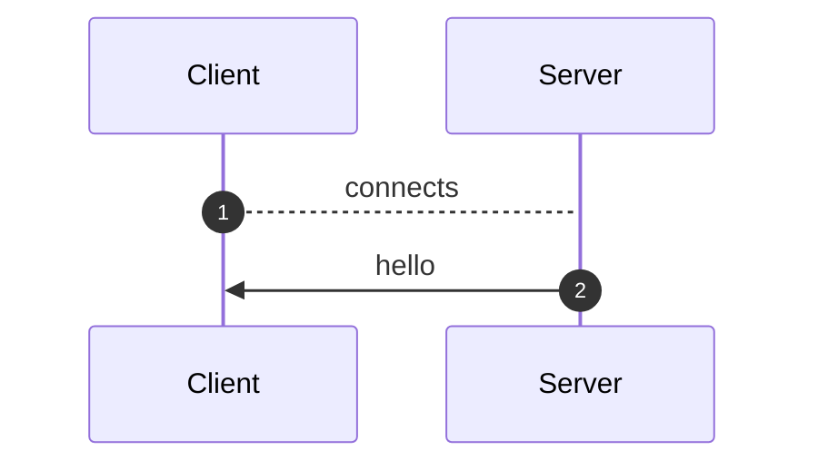
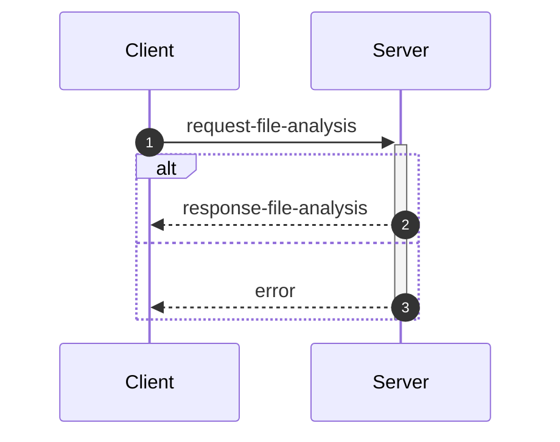
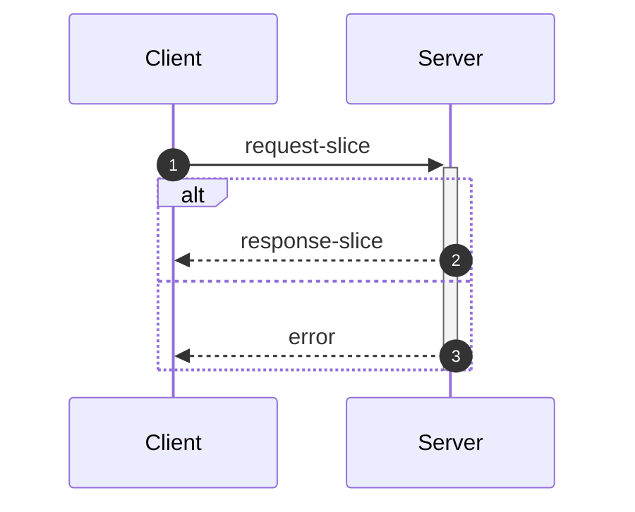
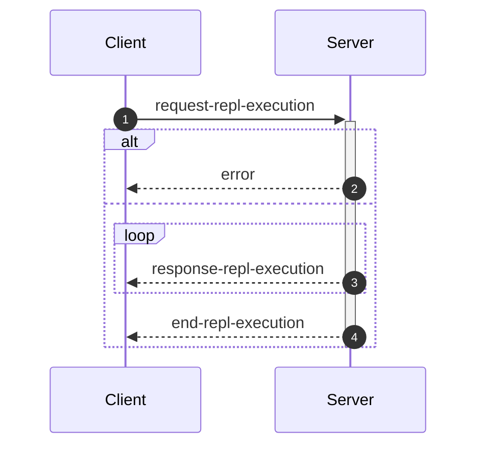

_This document was generated from '[src/documentation/wiki-interface.ts](https://github.com/flowr-analysis/flowr/tree/main//src/documentation/wiki-interface.ts)' on 2026-02-05, 09:13:06 UTC presenting an overview of flowR's interface (v2.9.3, using R v4.5.0). Please do not edit this file/wiki page directly._

Although far from being as detailed as the in-depth explanation of [_flowR_](https://github.com/flowr-analysis/flowr/wiki/wiki/core),
this wiki page explains how to interface with _flowR_ in more detail.
In general, command line arguments and other options provide short descriptions on hover over.

* [💻 Using the REPL](#using-the-repl)
* [⚙️ Configuring FlowR](#configuring-flowr)
* [⚒️ Writing Code](#writing-code)
* [💬 Communicating with the Server](#communicating-with-the-server)

<a id='using-the-repl'></a>
## 💻 Using the REPL


> [!NOTE]
> To execute arbitrary R commands with a repl request, _flowR_ has to be started explicitly with <span title="Description (Command Line Argument): Allow to access the underlying R session when using flowR (security warning: this allows the execution of arbitrary R code!)">`--r-session-access`</span>.
> Please be aware that this introduces a security risk and note that this relies on the [`r-shell` engine](https://github.com/flowr-analysis/flowr/wiki/wiki/engines) .

Although primarily meant for users to explore, 
there is nothing which forbids simply calling _flowR_ as a subprocess to use standard-in, -output, and -error 
for communication (although you can access the REPL using the server as well, 
with the [REPL Request](#message-request-repl-execution) message).

The read-eval-print loop&nbsp;(REPL) works relatively simple.
You can submit an expression (using <kbd>Enter</kbd>),
which is interpreted as an R&nbsp;expression by default but interpreted as a *command* if it starts with a colon (`:`).
The best command to get started with the REPL is <span title="Description (Repl Command): Show help information (aliases: :h, :?)">`:help`</span>.
Besides, you can leave the REPL either with the command <span title="Description (Repl Command): End the repl (aliases: :q, :exit)">`:quit`</span> or by pressing <kbd>Ctrl</kbd>+<kbd>C</kbd> twice.
When writing a *command*, you may press <kbd>Tab</kbd> to get a list of completions, if available.
Multiple commands can be entered in a single line by separating them with a semicolon (`;`), e.g. `:parse "x<-2"; :df*`.
If a command is given without R code, the REPL will re-use R code given in a previous command. 
The prior example will hence return first the parsed AST of the program and then the dataflow graph for `"x <- 2"`.

> [!NOTE]
> If you develop flowR, you may want to launch the repl using the `npm run main-dev` command, this way, you get a non-minified version of flowR with debug information and hot-reloading of source files.

<details>
<summary>Available Commands</summary>

We currently offer the following commands (this with a `[*]` suffix are available with and without the star):


| Command | Description |
| ------- | ----------- |
| **<span title="Description (Repl Command): End the repl (aliases: :q, :exit)">:quit</span>** | End the repl (aliases: **:<span title="Alias of ':quit'. End the repl">q</span>**, **:<span title="Alias of ':quit'. End the repl">exit</span>**) |
| **<span title="Description (Repl Command): Execute the given code as R code. This requires the `--r-session-access` flag to be set and requires the r-shell engine. (aliases: :e, :r)">:execute</span>** | Execute the given code as R code. This requires the `--r-session-access` flag to be set and requires the r-shell engine. (aliases: **:<span title="Alias of ':execute'. Execute the given code as R code. This requires the `--r-session-access` flag to be set and requires the r-shell engine.">e</span>**, **:<span title="Alias of ':execute'. Execute the given code as R code. This requires the `--r-session-access` flag to be set and requires the r-shell engine.">r</span>**) |
| **<span title="Description (Repl Command): Get mermaid code for the control-flow graph of R code, start with 'file://' to indicate a file (aliases: :cfg, :cf)">:controlflow[*]</span>** | Get mermaid code for the control-flow graph of R code, start with 'file://' to indicate a file (star: Returns the URL to mermaid.live) (aliases: **:<span title="Alias of ':controlflow'. Get mermaid code for the control-flow graph of R code, start with 'file://' to indicate a file">cfg</span>**, **:<span title="Alias of ':controlflow'. Get mermaid code for the control-flow graph of R code, start with 'file://' to indicate a file">cf</span>**) |
| **<span title="Description (Repl Command): Get mermaid code for the control-flow graph with basic blocks, start with 'file://' to indicate a file (aliases: :cfgb, :cfb)">:controlflowbb[*]</span>** | Get mermaid code for the control-flow graph with basic blocks, start with 'file://' to indicate a file (star: Returns the URL to mermaid.live) (aliases: **:<span title="Alias of ':controlflowbb'. Get mermaid code for the control-flow graph with basic blocks, start with 'file://' to indicate a file">cfgb</span>**, **:<span title="Alias of ':controlflowbb'. Get mermaid code for the control-flow graph with basic blocks, start with 'file://' to indicate a file">cfb</span>**) |
| **<span title="Description (Repl Command): Get mermaid code for the dataflow graph, start with 'file://' to indicate a file (aliases: :d, :df)">:dataflow[*]</span>** | Get mermaid code for the dataflow graph, start with 'file://' to indicate a file (star: Returns the URL to mermaid.live) (aliases: **:<span title="Alias of ':dataflow'. Get mermaid code for the dataflow graph, start with 'file://' to indicate a file">d</span>**, **:<span title="Alias of ':dataflow'. Get mermaid code for the dataflow graph, start with 'file://' to indicate a file">df</span>**) |
| **<span title="Description (Repl Command): Get mermaid code for the normalized AST of R code, start with 'file://' to indicate a file (aliases: :n)">:normalize[*]</span>** | Get mermaid code for the normalized AST of R code, start with 'file://' to indicate a file (star: Returns the URL to mermaid.live) (alias: **:<span title="Alias of ':normalize'. Get mermaid code for the normalized AST of R code, start with 'file://' to indicate a file">n</span>**) |
| **<span title="Description (Repl Command): Get mermaid code for the simplified dataflow graph, start with 'file://' to indicate a file (aliases: :ds, :dfs)">:dataflowsimple[*]</span>** | Get mermaid code for the simplified dataflow graph, start with 'file://' to indicate a file (star: Returns the URL to mermaid.live) (aliases: **:<span title="Alias of ':dataflowsimple'. Get mermaid code for the simplified dataflow graph, start with 'file://' to indicate a file">ds</span>**, **:<span title="Alias of ':dataflowsimple'. Get mermaid code for the simplified dataflow graph, start with 'file://' to indicate a file">dfs</span>**) |
| **<span title="Description (Repl Command): Just calculates the DFG, but only prints summary info (aliases: :d#, :df#)">:dataflowsilent</span>** | Just calculates the DFG, but only prints summary info (aliases: **:<span title="Alias of ':dataflowsilent'. Just calculates the DFG, but only prints summary info">d#</span>**, **:<span title="Alias of ':dataflowsilent'. Just calculates the DFG, but only prints summary info">df#</span>**) |
| **<span title="Description (Repl Command): Prints ASCII Art of the parsed, unmodified AST, start with 'file://' to indicate a file (aliases: :p)">:parse</span>** | Prints ASCII Art of the parsed, unmodified AST, start with 'file://' to indicate a file (alias: **:<span title="Alias of ':parse'. Prints ASCII Art of the parsed, unmodified AST, start with 'file://' to indicate a file">p</span>**) |
| **<span title="Description (Repl Command): Prints the version of flowR as well as the current version of R">:version</span>** | Prints the version of flowR as well as the current version of R
| **<span title="Description (Repl Command): Query the given R code, start with 'file://' to indicate a file. The query is to be a valid query in json format (use 'help' to get more information).">:query[*]</span>** | Query the given R code, start with 'file://' to indicate a file. The query is to be a valid query in json format (use 'help' to get more information). (star: Similar to query, but returns the output in json format.)
| **<span title="Description (Repl Command): Returns an ASCII representation of the dataflow graph (aliases: :df!)">:dataflowascii</span>** | Returns an ASCII representation of the dataflow graph (alias: **:<span title="Alias of ':dataflowascii'. Returns an ASCII representation of the dataflow graph">df!</span>**) |
| **<span title="Description (Repl Command): Show help information (aliases: :h, :?)">:help</span>** | Show help information (aliases: **:<span title="Alias of ':help'. Show help information">h</span>**, **:<span title="Alias of ':help'. Show help information">?</span>**) |


</details>


> [!TIP]
> 
> As indicated by the examples before, all REPL commands that operate on code keep track of the state.
> Hence, if you run a command like <span title="Description (Repl Command, starred version): Returns the URL to mermaid.live; Base Command: Get mermaid code for the dataflow graph, start with 'file://' to indicate a file (aliases: :d*, :df*)">`:dataflow*`</span> without providing R code,
> the REPL will re-use the R code provided in a previous command.
> Likewise, doing this will benefit from incrementality!
> If you request the dataflow graph with `:df* x <- 2 * y` and then want to see the parsed AST with `:parse`,
> the REPL will re-use previously obtained information and not re-parse the code again.
> 		


Generally, many commands offer shortcut versions in the REPL. Many queries, for example, offer a shortened format (see the example below).
Of special note, the [Config Query](https://github.com/flowr-analysis/flowr/wiki/wiki/query-api#Config-Query)
can be used to also modify the currently active configuration of _flowR_ within the REPL (see the [wiki page](https://github.com/flowr-analysis/flowr/wiki/wiki/query-api#Config-Query) for more information).

### Example: Retrieving the Dataflow Graph

To retrieve a URL to the [mermaid](https://mermaid.js.org/) diagram of the dataflow of a given expression, 
use <span title="Description (Repl Command, starred version): Returns the URL to mermaid.live; Base Command: Get mermaid code for the dataflow graph, start with 'file://' to indicate a file (aliases: :d*, :df*)">`:dataflow*`</span> (or <span title="Description (Repl Command): Get mermaid code for the dataflow graph, start with 'file://' to indicate a file (aliases: :d, :df)">`:dataflow`</span> to get the mermaid code in the cli):


```shell
$ docker run -it --rm eagleoutice/flowr # or npm run flowr 
flowR repl using flowR v2.9.3, R grammar v14 (tree-sitter engine)
R> :dataflow* y <- 1 + x
```

<details>
<summary style='color:gray'>Output</summary>


```text
https://mermaid.live/view#base64:eyJjb2RlIjoiZmxvd2NoYXJ0IEJUXG4gICAgMXt7XCJgIzkxO1JOdW1iZXIjOTM7IDFcbiAgICAgICgxKVxuICAgICAgKjEuNipgXCJ9fVxuICAgIDIoW1wiYCM5MTtSU3ltYm9sIzkzOyB4XG4gICAgICAoMilcbiAgICAgICoxLjEwKmBcIl0pXG4gICAgM1tbXCJgIzkxO1JCaW5hcnlPcCM5MzsgIzQzO1xuICAgICAgKDMpXG4gICAgICAqMS42LTEwKlxuICAgICgxLCAyKWBcIl1dXG4gICAgYnVpbHQtaW46X1tcImBCdWlsdC1JbjpcbiM0MztgXCJdXG4gICAgc3R5bGUgYnVpbHQtaW46XyBzdHJva2U6Z3JheSxmaWxsOmdyYXksc3Ryb2tlLXdpZHRoOjJweCxvcGFjaXR5Oi44O1xuICAgIDBbXCJgIzkxO1JTeW1ib2wjOTM7IHlcbiAgICAgICgwKVxuICAgICAgKjEuMSpgXCJdXG4gICAgNFtbXCJgIzkxO1JCaW5hcnlPcCM5MzsgIzYwOyM0NTtcbiAgICAgICg0KVxuICAgICAgKjEuMS0xMCpcbiAgICAoMCwgMylgXCJdXVxuICAgIGJ1aWx0LWluOl8tW1wiYEJ1aWx0LUluOlxuIzYwOyM0NTtgXCJdXG4gICAgc3R5bGUgYnVpbHQtaW46Xy0gc3Ryb2tlOmdyYXksZmlsbDpncmF5LHN0cm9rZS13aWR0aDoycHgsb3BhY2l0eTouODtcbiAgICAzIC0tPnxcInJlYWRzLCBhcmd1bWVudFwifCAxXG4gICAgMyAtLT58XCJyZWFkcywgYXJndW1lbnRcInwgMlxuICAgIDMgLS4tPnxcInJlYWRzLCBjYWxsc1wifCBidWlsdC1pbjpfXG4gICAgbGlua1N0eWxlIDIgc3Ryb2tlOmdyYXk7XG4gICAgMCAtLT58XCJkZWZpbmVkLWJ5XCJ8IDNcbiAgICAwIC0tPnxcImRlZmluZWQtYnlcInwgNFxuICAgIDQgLS0+fFwicmVhZHMsIGFyZ3VtZW50XCJ8IDNcbiAgICA0IC0tPnxcInJldHVybnMsIGFyZ3VtZW50XCJ8IDBcbiAgICA0IC0uLT58XCJyZWFkcywgY2FsbHNcInwgYnVpbHQtaW46Xy1cbiAgICBsaW5rU3R5bGUgNyBzdHJva2U6Z3JheTsiLCJtZXJtYWlkIjp7ImF1dG9TeW5jIjp0cnVlfX0=
```


Retrieve the dataflow graph of the expression `y <- 1 + x`. It looks like this:


	
<details>

<summary style="color:gray">R Code of the Dataflow Graph</summary>

The analysis required _0.7 ms_ (including parse and normalize, using the [tree-sitter](https://github.com/flowr-analysis/flowr/wiki/Engines) engine) within the generation environment. 
We encountered no unknown side effects during the analysis.


```r
y <- 1 + x
```


</details>


</details>


For small graphs like this, <span title="Description (Repl Command): Returns an ASCII representation of the dataflow graph (aliases: :df!)">`:dataflowascii`</span> also provides an ASCII representation directly in the REPL:


```shell
$ docker run -it --rm eagleoutice/flowr # or npm run flowr 
flowR repl using flowR v2.9.3, R grammar v14 (tree-sitter engine)
R> :df! y <- 1 + x
```

<details open>
<summary style='color:gray'>Output</summary>


```text
                        0<1>0
                   ┌────| 1 |
    ┌────────┐     │    0---0
 c<4>c       └──c<3>c
 |<- |  v<0>v┌──| + |
 c---c──| y |┘  c---c   u<2>u
        v---v      └────| x |
                        u---u
Edges:
3 -> 1: reads, argument  3 -> 2: reads, argument
4 -> 3: reads, argument  4 -> 0: returns, argument
0 -> 3: defined-by       0 -> 4: defined-by
```


Retrieve the dataflow graph of the expression `y <- 1 + x` as ASCII art.

</details>


For the slicing with <span title="Description (Repl Command): Static backwards executable slicer for R">`:slicer`</span>, you have access to the same [magic comments](#slice-magic-comments) as with the [slice request](#message-request-slice).

### Example: Interfacing with the File System

Many commands that allow for an R-expression (like <span title="Description (Repl Command, starred version): Returns the URL to mermaid.live; Base Command: Get mermaid code for the dataflow graph, start with 'file://' to indicate a file (aliases: :d*, :df*)">`:dataflow*`</span>) allow for a file as well 
if the argument starts with `file://`. 
If you are working from the root directory of the _flowR_ repository, the following gives you the parsed AST of the example file using the <span title="Description (Repl Command): Prints ASCII Art of the parsed, unmodified AST, start with 'file://' to indicate a file (aliases: :p)">`:parse`</span> command:


```shell
$ docker run -it --rm eagleoutice/flowr # or npm run flowr 
flowR repl using flowR v2.9.3, R grammar v14 (tree-sitter engine)
R> :parse file://test/testfiles/example.R
```

<details>
<summary style='color:gray'>Output</summary>


```text
File: test/testfiles/example.R

program
├ binaryoperator
│ ├ identifier "sum" (1:1─4)
│ ├ <- "<-" (1:5─7)
│ ╰ float "0" (1:8─9)
├ binaryoperator
│ ├ identifier "product" (2:1─8)
│ ├ <- "<-" (2:9─11)
│ ╰ float "1" (2:12─13)
├ binaryoperator
│ ├ identifier "w" (3:1─2)
│ ├ <- "<-" (3:3─5)
│ ╰ float "7" (3:6─7)
├ binaryoperator
│ ├ identifier "N" (4:1─2)
│ ├ <- "<-" (4:3─5)
│ ╰ float "10" (4:6─8)
├ forstatement
│ ├ for "for" (6:1─4)
│ ├ ( "(" (6:5─6)
│ ├ identifier "i" (6:6─7)
│ ├ in "in" (6:8─10)
│ ├ binaryoperator
│ │ ├ float "1" (6:11─12)
│ │ ├ : ":" (6:12─13)
│ │ ╰ parenthesizedexpression
│ │   ├ ( "(" (6:13─14)
│ │   ├ binaryoperator
│ │   │ ├ identifier "N" (6:14─15)
│ │   │ ├ - "-" (6:15─16)
│ │   │ ╰ float "1" (6:16─17)
│ │   ╰ ) ")" (6:17─18)
│ ├ ) ")" (6:18─19)
│ ╰ bracedexpression
│   ├ { "{" (6:20─21)
│   ├ binaryoperator
│   │ ├ identifier "sum" (7:3─6)
│   │ ├ <- "<-" (7:7─9)
│   │ ╰ binaryoperator
│   │   ├ binaryoperator
│   │   │ ├ identifier "sum" (7:10─13)
│   │   │ ├ + "+" (7:14─15)
│   │   │ ╰ identifier "i" (7:16─17)
│   │   ├ + "+" (7:18─19)
│   │   ╰ identifier "w" (7:20─21)
│   ├ binaryoperator
│   │ ├ identifier "product" (8:3─10)
│   │ ├ <- "<-" (8:11─13)
│   │ ╰ binaryoperator
│   │   ├ identifier "product" (8:14─21)
│   │   ├  "" (8:22─23)
│   │   ╰ identifier "i" (8:24─25)
│   ╰ } "}" (9:1─2)
├ call
│ ├ identifier "cat" (11:1─4)
│ ╰ arguments
│   ├ ( "(" (11:4─5)
│   ├ argument
│   │ ╰ string
│   │   ├ " "\"" (11:5─6)
│   │   ├ stringcontent "Sum:" (11:6─10)
│   │   ╰ " "\"" (11:10─11)
│   ├ comma "," (11:11─12)
│   ├ argument
│   │ ╰ identifier "sum" (11:13─16)
│   ├ comma "," (11:16─17)
│   ├ argument
│   │ ╰ string
│   │   ├ " "\"" (11:18─19)
│   │   ├ stringcontent
│   │   │ ╰ escapesequence "\\n" (11:19─21)
│   │   ╰ " "\"" (11:21─22)
│   ╰ ) ")" (11:22─23)
╰ call
  ├ identifier "cat" (12:1─4)
  ╰ arguments
    ├ ( "(" (12:4─5)
    ├ argument
    │ ╰ string
    │   ├ " "\"" (12:5─6)
    │   ├ stringcontent "Product:" (12:6─14)
    │   ╰ " "\"" (12:14─15)
    ├ comma "," (12:15─16)
    ├ argument
    │ ╰ identifier "product" (12:17─24)
    ├ comma "," (12:24─25)
    ├ argument
    │ ╰ string
    │   ├ " "\"" (12:26─27)
    │   ├ stringcontent
    │   │ ╰ escapesequence "\\n" (12:27─29)
    │   ╰ " "\"" (12:29─30)
    ╰ ) ")" (12:30─31)
```


Retrieve the parsed AST of the example file.

<details>

<summary>File Content</summary>


```r
sum <- 0
product <- 1
w <- 7
N <- 10

for (i in 1:(N-1)) {
  sum <- sum + i + w
  product <- product * i
}

cat("Sum:", sum, "\n")
cat("Product:", product, "\n")
```


</details>

As _flowR_ directly transforms this AST the output focuses on being human-readable instead of being machine-readable. 
		

</details>


### Example: Run a Query

You can run any query supported by _flowR_ using the <span title="Description (Repl Command): Query the given R code, start with 'file://' to indicate a file. The query is to be a valid query in json format (use 'help' to get more information).">`:query`</span> command.
For example, to obtain the shapes of all data frames in a given piece of code, you can run:


```shell
$ docker run -it --rm eagleoutice/flowr # or npm run flowr 
flowR repl using flowR v2.9.3, R grammar v14 (tree-sitter engine)
R> :query @df-shape "x <- data.frame(a = 1:10, b = 1:10)\ny <- x$a"
```

<details open>
<summary style='color:gray'>Output</summary>


```text
Query: df-shape (1 ms)
   ╰ 12: (colnames: [{"a", "b"}, {}], cols: [2, 2], rows: [10, 10])
   ╰ 0: (colnames: [{"a", "b"}, {}], cols: [2, 2], rows: [10, 10])
All queries together required ≈3 ms (1ms accuracy, total 3 ms)
```


Retrieve the shapes of all data frames in the given code.

</details>


To run the linter on a file, you can use (in this example, we just issue the `dead-code` linter on a small piece of code):


```shell
$ docker run -it --rm eagleoutice/flowr # or npm run flowr 
flowR repl using flowR v2.9.3, R grammar v14 (tree-sitter engine)
R> :query @linter rules:dead-code "if(FALSE) x <- 2"
```

<details open>
<summary style='color:gray'>Output</summary>


```text
Query: linter (1 ms)
   ╰ Dead Code (dead-code):
       ╰ certain:
           ╰ Code at 1.11-16
       ╰ Metadata: consideredNodes: 7, searchTimeMs: 1, processTimeMs: 0
All queries together required ≈1 ms (1ms accuracy, total 2 ms)
```


Run the linter on the given code, with only the `dead-code` rule enabled.

</details>


For more information on the available queries, please check out the [Query API](https://github.com/flowr-analysis/flowr/wiki/wiki/query-api).


<a id='configuring-flowr'></a>
## ⚙️ Configuring FlowR


When running _flowR_, you may want to specify some behaviors with a dedicated configuration file. 
By default, flowR looks for a file named `flowr.json` in the current working directory (or any higher directory). 
You can also specify a different file with <span title="Description (Command Line Argument): The name of the configuration file to use">`--config-file`</span> or pass the configuration inline using <span title="Description (Command Line Argument): The flowR configuration to use, as a JSON string">`--config-json`</span>.
To inspect the current configuration, you can run flowr with the <span title="Description (Command Line Argument): Run with verbose logging (will be passed to the corresponding script)">`--verbose`</span> flag, or use the `config` [Query](https://github.com/flowr-analysis/flowr/wiki/Query%20API).
Within the REPL this works by running the following:


```shell
:query @config
```


The following summarizes the configuration options:

- `ignoreSourceCalls`: If set to `true`, _flowR_ will ignore source calls when analyzing the code, i.e., ignoring the inclusion of other files.
- `semantics`: allows to configure the way _flowR_ handles R, although we currently only support `semantics/environment/overwriteBuiltIns`. 
  You may use this to overwrite _flowR_'s handling of built-in function and even completely clear the preset definitions shipped with flowR. 
  See [Configure BuiltIn Semantics](#configure-builtin-semantics) for more information.
- `solver`: allows to configure how _flowR_ resolves variables and their values (currently we support: `disabled`, `alias`, `builtin`), as well as if pointer analysis should be active.
- `engines`: allows to configure the engines used by _flowR_ to interact with R code. See the [Engines wiki page](https://github.com/flowr-analysis/flowr/wiki/Engines) for more information.
- `defaultEngine`: allows to specify the default engine to use for interacting with R code. If not set, an arbitrary engine from the specified list will be used.
- `abstractInterpretation`: allows to configure how _flowR_ performs abstract interpretation, although we currently only support data frame shape inference through abstract interpretation.

So you can configure _flowR_ by adding a file like the following:

<details>

<summary>Example Configuration File</summary>


```json
{
  "ignoreSourceCalls": true,
  "semantics": {
    "environment": {
      "overwriteBuiltIns": {
        "definitions": [
          {
            "type": "function",
            "names": [
              "foo"
            ],
            "processor": "builtin:assignment",
            "config": {}
          }
        ]
      }
    }
  },
  "repl": {
    "quickStats": false,
    "dfProcessorHeat": false
  },
  "project": {
    "resolveUnknownPathsOnDisk": true
  },
  "engines": [
    {
      "type": "r-shell"
    }
  ],
  "solver": {
    "variables": "alias",
    "evalStrings": true,
    "resolveSource": {
      "dropPaths": "no",
      "ignoreCapitalization": true,
      "inferWorkingDirectory": "active-script",
      "searchPath": []
    },
    "instrument": {},
    "slicer": {
      "threshold": 50
    }
  },
  "abstractInterpretation": {
    "wideningThreshold": 4,
    "dataFrame": {
      "maxColNames": 20,
      "readLoadedData": {
        "readExternalFiles": true,
        "maxReadLines": 1000000
      }
    }
  }
}
```


</details>

<details> 
<a id='configure-builtin-semantics'></a>
<summary>Configure Built-In Semantics</summary> 


`semantics/environment/overwriteBuiltins` accepts two keys:

- `loadDefaults` (boolean, initially `true`): If set to `true`, the default built-in definitions are loaded before applying the custom definitions. Setting this flag to `false` explicitly disables the loading of the default definitions.
- `definitions` (array, initially empty): Allows to overwrite or define new built-in elements. Each object within must have a `type` which is one of the below. Furthermore, they may define a string array of `names` which specifies the identifiers to bind the definitions to. You may use `assumePrimitive` to specify whether _flowR_ should assume that this is a primitive non-library definition (so you probably just do not want to specify the key).

  | Type            | Description                                                                                                                                                                                                                                                                                              | Example                                                                                                    |
  | --------------- | -------------------------------------------------------------------------------------------------------------------------------------------------------------------------------------------------------------------------------------------------------------------------------------------------------- | ---------------------------------------------------------------------------------------------------------- |
  | `constant`    | Additionally allows for a `value` this should resolve to.                                                                                                                                                                                                                                                | `{ type: 'constant', names: ['NULL', 'NA'],  value: null }`                                                |
  | `function`    | Is a rather flexible way to define and bind built-in functions. For the time, we do not have extensive documentation to cover all the cases, so please either consult the sources with the `default-builtin-config.ts` or open a [new issue](https://github.com/flowr-analysis/flowr/issues/new/choose). | `{ type: 'function', names: ['next'], processor: 'builtin:default', config: { cfg: ExitPointType.Next } }` |
  | `replacement` | A comfortable way to specify replacement functions like `$<-` or `names<-`. `suffixes` describes the... suffixes to attach automatically. | `{ type: 'replacement', suffixes: ['<-', '<<-'], names: ['[', '[['] }` |


</details>

<details>

<summary style='color:gray'>Full Configuration-File Schema</summary>

- _The configuration file format for flowR._ (object)
    - **ignoreSourceCalls** [optional] _Whether source calls should be ignored, causing {@link processSourceCall}'s behavior to be skipped._ (boolean)
    - **semantics** _Configure language semantics and how flowR handles them._ (object)
        - **environment** [optional] _Semantics regarding how to handle the R environment._ (object)
            - **overwriteBuiltIns** [optional] _Do you want to overwrite (parts) of the builtin definition?_ (object)
                - **loadDefaults** [optional] _Should the default configuration still be loaded?_ (boolean)
                - **definitions** [optional] _The definitions to load/overwrite._ (array)
                Valid item types:
                    - (object)
    - **repl** _Configuration options for the REPL._ (object)
        - **quickStats** [optional] _Whether to show quick stats in the REPL after each evaluation._ (boolean)
        - **dfProcessorHeat** [optional] _This instruments the dataflow processors to count how often each processor is called._ (boolean)
    - **project** _Project specific configuration options._ (object)
        - **resolveUnknownPathsOnDisk** [optional] _Whether to resolve unknown paths loaded by the r project disk when trying to source/analyze files._ (boolean)
    - **engines** _The engine or set of engines to use for interacting with R code. An empty array means all available engines will be used._ (array)
    Valid item types:
        - (alternatives)
            - _The configuration for the tree sitter engine._ (object)
                - **type** [required] _Use the tree sitter engine._ (string)
                    Only allows: 'tree-sitter'
                - **wasmPath** [optional] _The path to the tree-sitter-r WASM binary to use. If this is undefined, this uses the default path._ (string)
                - **treeSitterWasmPath** [optional] _The path to the tree-sitter WASM binary to use. If this is undefined, this uses the default path._ (string)
                - **lax** [optional] _Whether to use the lax parser for parsing R code (allowing for syntax errors). If this is undefined, the strict parser will be used._ (boolean)
            - _The configuration for the R shell engine._ (object)
                - **type** [required] _Use the R shell engine._ (string)
                    Only allows: 'r-shell'
                - **rPath** [optional] _The path to the R executable to use. If this is undefined, this uses the default path._ (string)
    - **defaultEngine** [optional] _The default engine to use for interacting with R code. If this is undefined, an arbitrary engine from the specified list will be used._ (string)
        Only allows: 'tree-sitter', 'r-shell'
    - **solver** _How to resolve constants, constraints, cells, ..._ (object)
        - **variables** _How to resolve variables and their values._ (string)
            Only allows: 'disabled', 'alias', 'builtin'
        - **evalStrings** _Should we include eval(parse(text="...")) calls in the dataflow graph?_ (boolean)
        - **instrument** (object)
            - **dataflowExtractors** [optional] _These keys are only intended for use within code, allowing to instrument the dataflow analyzer!_ (any)
        - **resolveSource** [optional] _If lax source calls are active, flowR searches for sourced files much more freely, based on the configurations you give it. This option is only in effect if `ignoreSourceCalls` is set to false._ (object)
            - **dropPaths** _Allow to drop the first or all parts of the sourced path, if it is relative._ (string)
                Only allows: 'no', 'once', 'all'
            - **ignoreCapitalization** _Search for filenames matching in the lowercase._ (boolean)
            - **inferWorkingDirectory** _Try to infer the working directory from the main or any script to analyze._ (string)
                Only allows: 'no', 'main-script', 'active-script', 'any-script'
            - **searchPath** _Additionally search in these paths._ (array)
            Valid item types:
                - (string)
            - **repeatedSourceLimit** [optional] _How often the same file can be sourced within a single run? Please be aware: in case of cyclic sources this may not reach a fixpoint so give this a sensible limit._ (number)
            - **applyReplacements** _Provide name replacements for loaded files_ (array)
            Valid item types:
                - (object)
        - **slicer** [optional] _The configuration for the slicer._ (object)
            - **threshold** [optional] _The maximum number of iterations to perform on a single function call during slicing._ (number)
    - **abstractInterpretation** _The configuration options for abstract interpretation._ (object)
        - **dataFrame** _The configuration of the shape inference for data frames._ (object)
            - **maxColNames** _The maximum number of columns names to infer for data frames before over-approximating the column names to top._ (number)
            - **wideningThreshold** _The threshold for the number of visitations of a node at which widening should be performed to ensure the termination of the fixpoint iteration._ (number)
            - **readLoadedData** _Configuration options for reading data frame shapes from loaded external data files, such as CSV files._ (object)
                - **readExternalFiles** _Whether data frame shapes should be extracted from loaded external files, such as CSV files._ (boolean)
                - **maxReadLines** _The maximum number of lines to read when extracting data frame shapes from loaded files, such as CSV files._ (number)

</details>

	

<a id='writing-code'></a>
## ⚒️ Writing Code

_flowR_ can be used as a [module](https://www.npmjs.com/package/@eagleoutice/flowr) and offers several main classes and interfaces that are interesting for extension writers 
(see the [Visual Studio Code extension](https://marketplace.visualstudio.com/items?itemName=code-inspect.vscode-flowr) or the [Core](https://github.com/flowr-analysis/flowr/wiki/wiki/core) wiki page for more information).

### Creating Analyses with _flowR_

Nowadays, instances of the <a href="https://github.com/flowr-analysis/flowr/tree/main//src/project/flowr-analyzer.ts#L163"><code><span title="Central class for conducting analyses with FlowR. Use the FlowrAnalyzerBuilder to create a new instance. If you want the original pattern of creating a pipeline and running all steps, you can still do this with FlowrAnalyzer#runFull . To inspect the context of the analyzer, use FlowrAnalyzer#inspectContext (if you are a plugin and need to modify it, use FlowrAnalyzer#context instead).">FlowrAnalyzer</span></code></a> should be used as central frontend to get analysis results from _flowR_.
For example, a program slice can be created like this:


```ts
const analyzer = await new FlowrAnalyzerBuilder()
    .setEngine('tree-sitter')
    .build();
analyzer.addRequest('x <- 1\ny <- x\nx');
const result = await analyzer.query([
    {
        type:     'static-slice',
        criteria: ['3@x']
    }
]);
//console.log(result['static-slice']);
```


For more information, please have a look at the [Analyzer](https://github.com/flowr-analysis/flowr/wiki/wiki/analyzer) wiki page, which explains how to construct and use the <a href="https://github.com/flowr-analysis/flowr/tree/main//src/project/flowr-analyzer.ts#L163"><code><span title="Central class for conducting analyses with FlowR. Use the FlowrAnalyzerBuilder to create a new instance. If you want the original pattern of creating a pipeline and running all steps, you can still do this with FlowrAnalyzer#runFull . To inspect the context of the analyzer, use FlowrAnalyzer#inspectContext (if you are a plugin and need to modify it, use FlowrAnalyzer#context instead).">FlowrAnalyzer</span></code></a> in more detail.
To work with specific perspectives, you can also consult the respective pages like the [Dataflow Graph](https://github.com/flowr-analysis/flowr/wiki/wiki/dataflow-graph) or the [Abstract Interpretation](https://github.com/flowr-analysis/flowr/wiki/wiki/abstract-interpretation) wiki pages.
        
### The Pipeline Executor (Low-Level Interface)

Once, in the beginning, _flowR_ was meant to produce a dataflow graph merely to provide *program slices*. 
However, with continuous updates, the [Dataflow Graph](https://github.com/flowr-analysis/flowr/wiki/wiki/dataflow-graph) repeatedly proves to be the more interesting part.
With this, we restructured _flowR_'s originally *hardcoded* pipeline to be far more flexible. 
Now, it can be theoretically extended or replaced with arbitrary steps, optional steps, and what we call 'decorations' of these steps. 
In short, a slicing pipeline using the <a href="https://github.com/flowr-analysis/flowr/tree/main//src/core/pipeline-executor.ts#L97"><code><span title="**Please note:** The PipelineExecutor is now considered to be a rather low-level API for flowR. While it still works and is the basis for all other layers, we strongly recommend using the FlowrAnalyzer and its builder to create and use an analyzer instance that is pre-configured for your use-case. The pipeline executor allows to execute arbitrary pipelines in a step-by-step fashion. If you are not...">PipelineExecutor</span></code></a> looks like this:


```ts

const slicer = new PipelineExecutor(DEFAULT_SLICING_PIPELINE, {
  parser:    new RShell(),
  request:   requestFromInput('x <- 1\nx + 1'),
  criterion: ['2@x']
})
const slice = await slicer.allRemainingSteps()
// console.log(slice.reconstruct.code)
```


<details><summary>More Information</summary>


If you compare this, with what you would have done with the old (and removed) `SteppingSlicer`, 
this essentially just requires you to replace the `SteppingSlicer` with the <a href="https://github.com/flowr-analysis/flowr/tree/main//src/core/pipeline-executor.ts#L97"><code><span title="**Please note:** The PipelineExecutor is now considered to be a rather low-level API for flowR. While it still works and is the basis for all other layers, we strongly recommend using the FlowrAnalyzer and its builder to create and use an analyzer instance that is pre-configured for your use-case. The pipeline executor allows to execute arbitrary pipelines in a step-by-step fashion. If you are not...">PipelineExecutor</span></code></a>
and to pass the <a href="https://github.com/flowr-analysis/flowr/tree/main//src/core/steps/pipeline/default-pipelines.ts#L18"><code>DEFAULT_SLICING_PIPELINE</code></a> as the first argument.
The <a href="https://github.com/flowr-analysis/flowr/tree/main//src/core/pipeline-executor.ts#L97"><code><span title="**Please note:** The PipelineExecutor is now considered to be a rather low-level API for flowR. While it still works and is the basis for all other layers, we strongly recommend using the FlowrAnalyzer and its builder to create and use an analyzer instance that is pre-configured for your use-case. The pipeline executor allows to execute arbitrary pipelines in a step-by-step fashion. If you are not...">PipelineExecutor</span></code></a>...

1. Provides structures to investigate the results of all intermediate steps
2. Can be executed step-by-step
3. Can repeat steps (e.g., to calculate multiple slices on the same input)

See the in-code documentation for more information.

	

</details>
    

### Using the <a href="https://github.com/flowr-analysis/flowr/tree/main//src/r-bridge/shell.ts#L143"><code><span title="The RShell represents an interactive session with the R interpreter. You can configure it by RShellOptions . At the moment we are using a live R session (and not networking etc.) to communicate with R easily, which allows us to install packages etc. However, this might and probably will change in the future (leaving this as a legacy mode :D)">RShell</span></code></a> to Interact with R

The <a href="https://github.com/flowr-analysis/flowr/tree/main//src/r-bridge/shell.ts#L143"><code><span title="The RShell represents an interactive session with the R interpreter. You can configure it by RShellOptions . At the moment we are using a live R session (and not networking etc.) to communicate with R easily, which allows us to install packages etc. However, this might and probably will change in the future (leaving this as a legacy mode :D)">RShell</span></code></a> class allows interfacing with the `R`&nbsp;ecosystem installed on the host system.
Please have a look at [flowR's Engines](https://github.com/flowr-analysis/flowr/wiki/wiki/engines) for more information on alternatives (for example, the <a href="https://github.com/flowr-analysis/flowr/tree/main//src/r-bridge/lang-4.x/tree-sitter/tree-sitter-executor.ts#L18"><code><span title="Synchronous and (way) faster alternative to the RShell using tree-sitter.">TreeSitterExecutor</span></code></a>).


> [!IMPORTANT]
> 
> Each <a href="https://github.com/flowr-analysis/flowr/tree/main//src/r-bridge/shell.ts#L143"><code><span title="The RShell represents an interactive session with the R interpreter. You can configure it by RShellOptions . At the moment we are using a live R session (and not networking etc.) to communicate with R easily, which allows us to install packages etc. However, this might and probably will change in the future (leaving this as a legacy mode :D)">RShell</span></code></a> controls a new instance of the R&nbsp;interpreter, 
> make sure to call <code><a href="https://github.com/flowr-analysis/flowr/tree/main//src/r-bridge/shell.ts#L317"><span title="Close the current R session, makes the object effectively invalid (can no longer be reopened etc.)">RShell::<i>close</i></span></a>()</code> when you are done.


You can start a new "session" simply by constructing a new object with <code>new <a href="https://github.com/flowr-analysis/flowr/tree/main//src/r-bridge/shell.ts#L143"><span title="The RShell represents an interactive session with the R interpreter. You can configure it by RShellOptions . At the moment we are using a live R session (and not networking etc.) to communicate with R easily, which allows us to install packages etc. However, this might and probably will change in the future (leaving this as a legacy mode :D)">RShell</span></a>()</code>.

However, there are several options that may be of interest 
(e.g., to automatically revive the shell in case of errors or to control the name location of the R process on the system).

With a shell object (let's call it `shell`), you can execute R code by using <a href="https://github.com/flowr-analysis/flowr/tree/main//src/r-bridge/shell.ts#L195"><code><span title="sends the given command directly to the current R session will not do anything to alter input markers!">RShell::<i>sendCommand</i></span></code></a>, 
for example <code>shell.<a href="https://github.com/flowr-analysis/flowr/tree/main//src/r-bridge/shell.ts#L195"><span title="sends the given command directly to the current R session will not do anything to alter input markers!">sendCommand</span></a>("1 + 1")</code>. 
However, this does not return anything, so if you want to collect the output of your command, use
<a href="https://github.com/flowr-analysis/flowr/tree/main//src/r-bridge/shell.ts#L261"><code><span title="Send a command and collect the output">RShell::<i>sendCommandWithOutput</i></span></code></a> instead.

Besides that, the command <a href="https://github.com/flowr-analysis/flowr/tree/main//src/r-bridge/shell.ts#L233"><code>RShell::<b>tryToInjectHomeLibPath</b></code></a> may be of interest, as it enables all libraries available on the host system.


### Generate Statistics (No longer a Focus of flowR)


<details>

<summary>Adding a New Feature to Extract</summary>

In this example, we construct a new feature to extract, with the name "*example*".
Whenever this name appears, you may substitute this with whatever name fits your feature best (as long as the name is unique).

1. **Create a new file in `src/statistics/features/supported`**\
   Create the file `example.ts`, and add its export to the `index.ts` file in the same directory (if not done automatically).

2. **Create the basic structure**\
   To get a better feel of what a feature must have, let's look
   at the basic structure (of course, due to TypeScript syntax,
   there are other ways to achieve the same goal):

   ```ts
   const initialExampleInfo = {
       /* whatever start value is good for you */
       someCounter: 0
   }

   export type ExampleInfo = Writable<typeof initialExampleInfo>

   export const example: Feature<ExampleInfo> = {
    name:        'Example Feature',
    description: 'A longer example description',

    process(existing: ExampleInfo, input: FeatureProcessorInput): ExampleInfo {
      /* perform analysis on the input */
      return existing
    },

    initialValue: initialExampleInfo
   }
   ```

   The `initialExampleInfo` type holds the initial values for each counter that you want to maintain during the feature extraction (they will usually be initialized with 0). The resulting `ExampleInfo` type holds the structure of the data that is to be counted. Due to the vast amount of data processed, information like the name and location of a function call is not stored here, but instead written to disk (see below).

   Every new feature must be of the `Feature<Info>` type, with `Info` referring to a `FeatureInfo` (like `ExampleInfo` in this example). Next to a `name` and a `description`, each Feature must provide:

   - a processor that extracts the information from the input, adding it to the existing information.
   - a function returning the initial value of the information (in this case, `initialExampleInfo`).

3. **Add it to the feature-mapping**\
   Now, in the `feature.ts` file in `src/statistics/features`, add your feature to the `ALL_FEATURES` object.

Now, we want to extract something. For the *example* feature created in the previous steps, we choose to count the amount of `COMMENT` tokens.
So we define a corresponding [XPath](https://developer.mozilla.org/en-US/docs/Web/XPath) query:

```ts
const commentQuery: Query = xpath.parse('//COMMENT')
```

Within our feature's `process` function, running the query is as simple as:

```ts
const comments = commentQuery.select({ node: input.parsedRAst })
```

Now we could do a lot of further processing, but for simplicity, we only record every comment found this way:

```ts
appendStatisticsFile(example.name, 'comments', comments, input.filepath)
```

We use `example.name` to avoid duplication with the name that we’ve assigned to the feature. It corresponds to the name of the folder in the statistics output.
`'comments'` refers to a freely chosen (but unique) name, that will be used as the name for the output file within the folder. The `comments` variable holds the result of the query, which is an array of nodes. Finally, we pass the `filepath` of the file that was analyzed (if known), so that it can be added to the statistics file (as additional information).

</details>
	

<a id='communicating-with-the-server'></a>
## 💬 Communicating with the Server


As explained in the [Overview](https://github.com/flowr-analysis/flowr/wiki/Overview), you can simply run the [TCP](https://de.wikipedia.org/wiki/Transmission_Control_Protocol)&nbsp;server by adding the <span title="Description (Command Line Argument): Do not drop into a repl, but instead start a server on the given port (default: 1042) and listen for messages.">`--server`</span> flag (and, due to the interactive mode, exit with the conventional <kbd>CTRL</kbd>+<kbd>C</kbd>).
Currently, every connection is handled by the same underlying `RShell` - so the server is not designed to handle many clients at a time.
Additionally, the server is not well guarded against attacks (e.g., you can theoretically spawn an arbitrary number of&nbsp;RShell sessions on the target machine).

Every message has to be given in a single line (i.e., without a newline in-between) and end with a newline character. Nevertheless, we will pretty-print example given in the following segments for the ease of reading.


> [!NOTE]
> 
> The default <span title="Description (Command Line Argument): Do not drop into a repl, but instead start a server on the given port (default: 1042) and listen for messages.">`--server`</span> uses a simple [TCP](https://de.wikipedia.org/wiki/Transmission_Control_Protocol)
> connection. If you want _flowR_ to expose a [WebSocket](https://de.wikipedia.org/wiki/WebSocket) server instead, add the <span title="Description (Command Line Argument): If the server flag is set, use websocket for messaging">`--ws`</span> flag (i.e., <span title="Description (Command Line Argument): Do not drop into a repl, but instead start a server on the given port (default: 1042) and listen for messages.">`--server`</span> <span title="Description (Command Line Argument): If the server flag is set, use websocket for messaging">`--ws`</span>) when starting _flowR_ from the command line.
> 			


<ul><li>
<a id="message-hello"></a>
<b>Hello</b> Message (<code>hello</code>) 
<details>

<summary style="color:gray"> View Details. <i>The server informs the client about the successful connection and provides Meta-Information.</i> </summary>




	
After launching _flowR_, for example, with <code>docker run -it --rm eagleoutice/flowr <span title="Description (Command Line Argument): Do not drop into a repl, but instead start a server on the given port (default: 1042) and listen for messages.">-<span/>-server</span></code>&nbsp;(🐳️), simply connecting should present you with a `hello` message, that amongst others should reveal the versions of&nbsp;_flowR_ and&nbsp;R, using the [semver 2.0](https://semver.org/spec/v2.0.0.html) versioning scheme.
The message looks like this:


```json
{
  "type": "hello",
  "clientName": "client-0",
  "versions": {
    "flowr": "2.9.3",
    "r": "4.5.0",
    "engine": "r-shell"
  }
}
```


There are currently a few messages that you can send after the hello message.
If you want to _slice_ a piece of R code you first have to send an [analysis request](#message-request-file-analysis), so that you can send one or multiple slice requests afterward.
Requests for the [REPL](#message-request-repl) are independent of that.
	

<hr>


<details>
<summary style="color:gray">Message schema (<code>hello</code>)</summary>

For the definition of the hello message, please see it's implementation at [`./src/cli/repl/server/messages/message-hello.ts`](https://github.com/flowr-analysis/flowr/tree/main/./src/cli/repl/server/messages/message-hello.ts).

- [required] (object)
    - **type** [required] _The type of the hello message._ (string)
        Only allows: 'hello'
    - **id** [forbidden] _The id of the message is always undefined (as it is the initial message and not requested)._ (any)
    - **clientName** [required] _A unique name that is assigned to each client. It has no semantic meaning and is only used/useful for debugging._ (string)
    - **versions** [required] (object)
        - **flowr** [required] _The version of the flowr server running in semver format._ (string)
        - **r** [required] _The version of the underlying R shell running in semver format._ (string)
        - **engine** [required] _The parser backend that is used to parse the R code._ (string)

</details>


<hr>

</details>
	</li>

<li>
<a id="message-request-file-analysis"></a>
<b>Analysis</b> Message (<code>request-file-analysis</code>) 
<details>

<summary style="color:gray"> View Details. <i>The server builds the dataflow graph for a given input file (or a set of files).</i> </summary>




	
The request allows the server to analyze a file and prepare it for slicing.
The message can contain a `filetoken`, which is used to identify the file in later slice or query requests (if you do not add one, the request will not be stored and therefore, it is not available for subsequent requests).

> **Please note!**\
> If you want to send and process a lot of analysis requests, but do not want to slice them, please do not pass the `filetoken` field. This will save the server a lot of memory allocation.

Furthermore, the request must contain either a `content` field to directly pass the file's content or a `filepath` field which contains the path to the file (this path must be accessible for the server to be useful).
If you add the `id` field, the answer will use the same `id` so you can match requests and the corresponding answers.
See the implementation of the request-file-analysis message for more information.


<details>
<summary>Example of the <code>request-file-analysis</code> Message</summary>

_Note:_ even though we pretty-print these messages, they are sent as a single line, ending with a newline.

The following lists all messages that were sent and received in case you want to reproduce the scenario:

<ol>
<li> <code>hello</code> (response)
<details> 

<summary> Show Details </summary>

The first message is always a hello message.


```json
{
  "type": "hello",
  "clientName": "client-0",
  "versions": {
    "flowr": "2.9.3",
    "r": "4.5.0",
    "engine": "r-shell"
  }
}
```


</details>
</li>

<li> <b><code>request-file-analysis</code> (request)</b>
<details open> 

<summary> Show Details </summary>

Let's suppose you simply want to analyze the following script:
 
```r
x <- 1
x + 1
```

 For this, you can send the following request:


```json
{
  "type": "request-file-analysis",
  "id": "1",
  "filetoken": "x",
  "content": "x <- 1\nx + 1"
}
```


</details>
</li>

<li> <code>response-file-analysis</code> (response)
<details> 

<summary> Show Details </summary>


The `results` field of the response effectively contains three keys of importance:

- `parse`: which contains 1:1 the parse result in CSV format that we received from the `RShell` (i.e., the AST produced by the parser of the R interpreter).
- `normalize`: which contains the normalized AST, including ids (see the `info` field and the [Normalized AST](https://github.com/flowr-analysis/flowr/wiki/Normalized%20AST) wiki page).
- `dataflow`: especially important is the `graph` field which contains the dataflow graph as a set of root vertices (see the [Dataflow Graph](https://github.com/flowr-analysis/flowr/wiki/Dataflow%20Graph) wiki page).
			


_As the code is pretty long, we inhibit pretty printing and syntax highlighting (JSON, hiding built-in):_

```text
{"type":"response-file-analysis","format":"json","id":"1","results":{"parse":{"files":[{"parsed":"[1,1,1,6,7,0,\"expr\",false,\"x <- 1\"],[1,1,1,1,1,3,\"SYMBOL\",true,\"x\"],[1,1,1,1,3,7,\"expr\",false,\"x\"],[1,3,1,4,2,7,\"LEFT_ASSIGN\",true,\"<-\"],[1,6,1,6,4,5,\"NUM_CONST\",true,\"1\"],[1,6,1,6,5,7,\"expr\",false,\"1\"],[2,1,2,5,16,0,\"expr\",false,\"x + 1\"],[2,1,2,1,10,12,\"SYMBOL\",true,\"x\"],[2,1,2,1,12,16,\"expr\",false,\"x\"],[2,3,2,3,11,16,\"'+'\",true,\"+\"],[2,5,2,5,13,14,\"NUM_CONST\",true,\"1\"],[2,5,2,5,14,16,\"expr\",false,\"1\"]","filePath":"/tmp/tmp-8638-AvAuqabLHFsd-.R"}],".meta":{"timing":3}},"normalize":{"ast":{"type":"RProject","files":[{"root":{"type":"RExpressionList","children":[{"type":"RBinaryOp","location":[1,3,1,4],"lhs":{"type":"RSymbol","location":[1,1,1,1],"content":"x","lexeme":"x","info":{"fullRange":[1,1,1,1],"adToks":[],"id":0,"parent":2,"role":"binop-lhs","index":0,"nesting":0,"file":"/tmp/tmp-8638-AvAuqabLHFsd-.R"}},"rhs":{"location":[1,6,1,6],"lexeme":"1","info":{"fullRange":[1,6,1,6],"adToks":[],"id":1,"parent":2,"role":"binop-rhs","index":1,"nesting":0,"file":"/tmp/tmp-8638-AvAuqabLHFsd-.R"},"type":"RNumber","content":{"num":1,"complexNumber":false,"markedAsInt":false}},"operator":"<-","lexeme":"<-","info":{"fullRange":[1,1,1,6],"adToks":[],"id":2,"parent":6,"nesting":0,"file":"/tmp/tmp-8638-AvAuqabLHFsd-.R","index":0,"role":"expr-list-child"}},{"type":"RBinaryOp","location":[2,3,2,3],"lhs":{"type":"RSymbol","location":[2,1,2,1],"content":"x","lexeme":"x","info":{"fullRange":[2,1,2,1],"adToks":[],"id":3,"parent":5,"role":"binop-lhs","index":0,"nesting":0,"file":"/tmp/tmp-8638-AvAuqabLHFsd-.R"}},"rhs":{"location":[2,5,2,5],"lexeme":"1","info":{"fullRange":[2,5,2,5],"adToks":[],"id":4,"parent":5,"role":"binop-rhs","index":1,"nesting":0,"file":"/tmp/tmp-8638-AvAuqabLHFsd-.R"},"type":"RNumber","content":{"num":1,"complexNumber":false,"markedAsInt":false}},"operator":"+","lexeme":"+","info":{"fullRange":[2,1,2,5],"adToks":[],"id":5,"parent":6,"nesting":0,"file":"/tmp/tmp-8638-AvAuqabLHFsd-.R","index":1,"role":"expr-list-child"}}],"info":{"adToks":[],"id":6,"nesting":0,"file":"/tmp/tmp-8638-AvAuqabLHFsd-.R","role":"root","index":0}},"filePath":"/tmp/tmp-8638-AvAuqabLHFsd-.R"}],"info":{"id":7}},".meta":{"timing":0}},"dataflow":{"unknownReferences":[],"in":[{"nodeId":2,"name":"<-","type":2},{"nodeId":5,"name":"+","type":2}],"out":[{"nodeId":0,"name":"x","type":4,"definedAt":2,"value":[1]}],"environment":{"current":{"id":1829,"parent":"<BuiltInEnvironment>","memory":[["x",[{"nodeId":0,"name":"x","type":4,"definedAt":2,"value":[1]}]]]},"level":0},"graph":{"rootVertices":[1,0,2,3,4,5],"vertexInformation":[[1,{"tag":"value","id":1}],[0,{"tag":"vdef","id":0}],[2,{"tag":"fcall","id":2,"name":"<-","onlyBuiltin":true,"args":[{"nodeId":0,"type":32},{"nodeId":1,"type":32}],"origin":["builtin:assignment"]}],[3,{"tag":"use","id":3}],[4,{"tag":"value","id":4}],[5,{"tag":"fcall","id":5,"name":"+","onlyBuiltin":true,"args":[{"nodeId":3,"type":32},{"nodeId":4,"type":32}],"origin":["builtin:default"]}]],"edgeInformation":[[2,[[1,{"types":65}],[0,{"types":72}],["built-in:<-",{"types":5}]]],[0,[[1,{"types":2}],[2,{"types":2}]]],[3,[[0,{"types":1}]]],[5,[[3,{"types":65}],[4,{"types":65}],["built-in:+",{"types":5}]]]],"_unknownSideEffects":[]},"entryPoint":2,"exitPoints":[{"type":0,"nodeId":5}],"hooks":[],".meta":{"timing":0}}}}
```


</details>
</li>
</ol>

The complete round-trip took 8.9 ms (including time required to validate the messages, start, and stop the internal mock server).

</details>


You receive an error if, for whatever reason, the analysis fails (e.g., the message or code you sent contained syntax errors).
It contains a human-readable description *why* the analysis failed (see the error message implementation for more details).


<details>
<summary>Example Error Message</summary>

_Note:_ even though we pretty-print these messages, they are sent as a single line, ending with a newline.

The following lists all messages that were sent and received in case you want to reproduce the scenario:

<ol>
<li> <code>hello</code> (response)
<details> 

<summary> Show Details </summary>

The first message is always a hello message.


```json
{
  "type": "hello",
  "clientName": "client-0",
  "versions": {
    "flowr": "2.9.3",
    "r": "4.5.0",
    "engine": "r-shell"
  }
}
```


</details>
</li>

<li> <code>request-file-analysis</code> (request)
<details> 

<summary> Show Details </summary>


```json
{
  "type": "request-file-analysis",
  "id": "1",
  "filename": "sample.R",
  "content": "x <-"
}
```


</details>
</li>

<li> <b><code>error</code> (response)</b>
<details open> 

<summary> Show Details </summary>


```json
{
  "id": "1",
  "type": "error",
  "fatal": false,
  "reason": "Error while analyzing file sample.R: GuardError: unable to parse R code (see the log for more information) for request {\"request\":\"text\",\"content\":\"x <-\"}}\n Report a Bug: https://github.com/flowr-analysis/flowr/issues/new?body=%3C!%2D%2D%20Please%20describe%20your%20issue%20in%20more%20detail%20below!%20%2D%2D%3E%0A%0A%0A%3C!%2D%2D%20Automatically%20generated%20issue%20metadata%2C%20please%20do%20not%20edit%20or%20delete%20content%20below%20this%20line%20%2D%2D%3E%0A%2D%2D%2D%0A%0AflowR%20version%3A%202.9.3%0Anode%20version%3A%20v22.14.0%0Anode%20arch%3A%20x64%0Anode%20platform%3A%20linux%0Amessage%3A%20%60unable%20to%20parse%20R%20code%20%28see%20the%20log%20for%20more%20information%29%20for%20request%20%7B%22request%22%3A%22text%22%2C%22content%22%3A%22x%20%3C%2D%22%7D%7D%60%0Astack%20trace%3A%0A%60%60%60%0A%20%20%20%20at%20guard%20%28%3C%3E%2Fsrc%2Futil%2Fassert.ts%3A128%3A9%29%0A%20%20%20%20at%20guardRetrievedOutput%20%28%3C%3E%2Fsrc%2Fr%2Dbridge%2Fretriever.ts%3A221%3A7%29%0A%20%20%20%20at%20%2Fhome%2Frunner%2Fwork%2Fflowr%2Fflowr%2Fsrc%2Fr%2Dbridge%2Fretriever.ts%3A182%3A4%0A%20%20%20%20at%20processTicksAndRejections%20%28node%3Ainternal%2Fprocess%2Ftask_queues%3A105%3A5%29%0A%20%20%20%20at%20async%20Object.parseRequests%20%5Bas%20processor%5D%20%28%3C%3E%2Fsrc%2Fr%2Dbridge%2Fparser.ts%3A104%3A19%29%0A%20%20%20%20at%20async%20PipelineExecutor.nextStep%20%28%3C%3E%2Fsrc%2Fcore%2Fpipeline%2Dexecutor.ts%3A192%3A25%29%0A%20%20%20%20at%20async%20FlowrAnalyzerCache.runTapeUntil%20%28%3C%3E%2Fsrc%2Fproject%2Fcache%2Fflowr%2Danalyzer%2Dcache.ts%3A93%3A4%29%0A%20%20%20%20at%20async%20FlowRServerConnection.sendFileAnalysisResponse%20%28%3C%3E%2Fsrc%2Fcli%2Frepl%2Fserver%2Fconnection.ts%3A163%3A52%29%0A%60%60%60%0A%0A%2D%2D%2D%0A%09"
}
```


</details>
</li>
</ol>

The complete round-trip took 11.8 ms (including time required to validate the messages, start, and stop the internal mock server).

</details>


&nbsp;

<a id="analysis-include-cfg"></a>
**Including the Control Flow Graph**

While _flowR_ does (for the time being) not use an explicit control flow graph but instead relies on control-dependency edges within the dataflow graph, 
the respective structure can still be exposed using the server (note that, as this feature is not needed within _flowR_, it is tested significantly less - 
so please create a [new issue](https://github.com/flowr-analysis/flowr/issues/new/choose) for any bug you may encounter).
For this, the analysis request may add `cfg: true` to its list of options.


<details>
<summary>Requesting a Control Flow Graph</summary>

_Note:_ even though we pretty-print these messages, they are sent as a single line, ending with a newline.

The following lists all messages that were sent and received in case you want to reproduce the scenario:

<ol>
<li> <code>hello</code> (response)
<details> 

<summary> Show Details </summary>

The first message is always a hello message.


```json
{
  "type": "hello",
  "clientName": "client-0",
  "versions": {
    "flowr": "2.9.3",
    "r": "4.5.0",
    "engine": "r-shell"
  }
}
```


</details>
</li>

<li> <b><code>request-file-analysis</code> (request)</b>
<details open> 

<summary> Show Details </summary>


```json
{
  "type": "request-file-analysis",
  "id": "1",
  "filetoken": "x",
  "content": "if(unknown > 0) { x <- 2 } else { x <- 5 }\nfor(i in 1:x) { print(x); print(i) }",
  "cfg": true
}
```


</details>
</li>

<li> <code>response-file-analysis</code> (response)
<details> 

<summary> Show Details </summary>


The response looks basically the same as a response sent without the `cfg` flag. However, additionally it contains a `cfg` field. 
If you are interested in a visual representation of the control flow graph, see the 
[visualization with mermaid](https://mermaid.live/view#base64:eyJjb2RlIjoiZmxvd2NoYXJ0IEJUXG4gICAgbjMyKFtcImBSRXhwcmVzc2lvbkxpc3QgKDMyKWBcIl0pXG4gICAgbjE1W1wiYFJJZlRoZW5FbHNlICgxNSlcbiMzNDtpZih1bmtub3duICM2MjsgMCkgIzEyMzsgeCAjNjA7IzQ1OyAyICMxMjU7IGVsc2UgIzEyMzsgeCAjNjA7IzQ1OyA1ICMxMjU7IzM0O2BcIl1cbiAgICBuMTUtZXhpdCgoMTUtZXhpdCkpXG4gICAgbjAoW1wiYFJTeW1ib2wgKDApXG4jMzQ7dW5rbm93biMzNDtgXCJdKVxuICAgIG4xKFtcImBSTnVtYmVyICgxKVxuIzM0OzAjMzQ7YFwiXSlcbiAgICBuMihbXCJgUkJpbmFyeU9wICgyKVxuIzM0O3Vua25vd24gIzYyOyAwIzM0O2BcIl0pXG4gICAgbjItZXhpdCgoMi1leGl0KSlcbiAgICBuOChbXCJgUkV4cHJlc3Npb25MaXN0ICg4KWBcIl0pXG4gICAgbjUoW1wiYFJTeW1ib2wgKDUpXG4jMzQ7eCMzNDtgXCJdKVxuICAgIG42KFtcImBSTnVtYmVyICg2KVxuIzM0OzIjMzQ7YFwiXSlcbiAgICBuNyhbXCJgUkJpbmFyeU9wICg3KVxuIzM0O3ggIzYwOyM0NTsgMiMzNDtgXCJdKVxuICAgIG43LWV4aXQoKDctZXhpdCkpXG4gICAgbjgtZXhpdCgoOC1leGl0KSlcbiAgICBuMTQoW1wiYFJFeHByZXNzaW9uTGlzdCAoMTQpYFwiXSlcbiAgICBuMTEoW1wiYFJTeW1ib2wgKDExKVxuIzM0O3gjMzQ7YFwiXSlcbiAgICBuMTIoW1wiYFJOdW1iZXIgKDEyKVxuIzM0OzUjMzQ7YFwiXSlcbiAgICBuMTMoW1wiYFJCaW5hcnlPcCAoMTMpXG4jMzQ7eCAjNjA7IzQ1OyA1IzM0O2BcIl0pXG4gICAgbjEzLWV4aXQoKDEzLWV4aXQpKVxuICAgIG4xNC1leGl0KCgxNC1leGl0KSlcbiAgICBuMTYoW1wiYFJTeW1ib2wgKDE2KVxuIzM0O2kjMzQ7YFwiXSlcbiAgICBuMzFbXCJgUkZvckxvb3AgKDMxKVxuIzM0O2ZvcihpIGluIDEjNTg7eCkgIzEyMzsgcHJpbnQoeCk7IHByaW50KGkpICMxMjU7IzM0O2BcIl1cbiAgICBuMTcoW1wiYFJOdW1iZXIgKDE3KVxuIzM0OzEjMzQ7YFwiXSlcbiAgICBuMTgoW1wiYFJTeW1ib2wgKDE4KVxuIzM0O3gjMzQ7YFwiXSlcbiAgICBuMTkoW1wiYFJCaW5hcnlPcCAoMTkpXG4jMzQ7MSM1ODt4IzM0O2BcIl0pXG4gICAgbjE5LWV4aXQoKDE5LWV4aXQpKVxuICAgIG4zMChbXCJgUkV4cHJlc3Npb25MaXN0ICgzMClgXCJdKVxuICAgIG4yMihbXCJgUlN5bWJvbCAoMjIpXG4jMzQ7cHJpbnQoeCkjMzQ7YFwiXSlcbiAgICBuMjVbXCJgUkZ1bmN0aW9uQ2FsbCAoMjUpXG4jMzQ7cHJpbnQoeCkjMzQ7YFwiXVxuICAgIG4yNS1leGl0KCgyNS1leGl0KSlcbiAgICBuMjQoW1wiYFJBcmd1bWVudCAoMjQpXG4jMzQ7eCMzNDtgXCJdKVxuICAgIG4yMyhbXCJgUlN5bWJvbCAoMjMpXG4jMzQ7eCMzNDtgXCJdKVxuICAgIG4yNC1leGl0KCgyNC1leGl0KSlcbiAgICBuMjYoW1wiYFJTeW1ib2wgKDI2KVxuIzM0O3ByaW50KGkpIzM0O2BcIl0pXG4gICAgbjI5W1wiYFJGdW5jdGlvbkNhbGwgKDI5KVxuIzM0O3ByaW50KGkpIzM0O2BcIl1cbiAgICBuMjktZXhpdCgoMjktZXhpdCkpXG4gICAgbjI4KFtcImBSQXJndW1lbnQgKDI4KVxuIzM0O2kjMzQ7YFwiXSlcbiAgICBuMjcoW1wiYFJTeW1ib2wgKDI3KVxuIzM0O2kjMzQ7YFwiXSlcbiAgICBuMjgtZXhpdCgoMjgtZXhpdCkpXG4gICAgbjMwLWV4aXQoKDMwLWV4aXQpKVxuICAgIG4zMS1leGl0KCgzMS1leGl0KSlcbiAgICBuMzItZXhpdCgoMzItZXhpdCkpXG4gICAgbjE1IC0uLT58XCJGRFwifCBuMzJcbiAgICBuMSAtLi0+fFwiRkRcInwgbjBcbiAgICBuMCAtLi0+fFwiRkRcInwgbjJcbiAgICBuMi1leGl0IC0uLT58XCJGRFwifCBuMVxuICAgIG43IC0uLT58XCJGRFwifCBuOFxuICAgIG42IC0uLT58XCJGRFwifCBuNVxuICAgIG41IC0uLT58XCJGRFwifCBuN1xuICAgIG43LWV4aXQgLS4tPnxcIkZEXCJ8IG42XG4gICAgbjgtZXhpdCAtLi0+fFwiRkRcInwgbjctZXhpdFxuICAgIG4xMyAtLi0+fFwiRkRcInwgbjE0XG4gICAgbjEyIC0uLT58XCJGRFwifCBuMTFcbiAgICBuMTEgLS4tPnxcIkZEXCJ8IG4xM1xuICAgIG4xMy1leGl0IC0uLT58XCJGRFwifCBuMTJcbiAgICBuMTQtZXhpdCAtLi0+fFwiRkRcInwgbjEzLWV4aXRcbiAgICBuOCAtLT58XCJDRCAoVFJVRSlcInwgbjItZXhpdFxuICAgIG4xNCAtLT58XCJDRCAoRkFMU0UpXCJ8IG4yLWV4aXRcbiAgICBuMiAtLi0+fFwiRkRcInwgbjE1XG4gICAgbjE1LWV4aXQgLS4tPnxcIkZEXCJ8IG44LWV4aXRcbiAgICBuMTUtZXhpdCAtLi0+fFwiRkRcInwgbjE0LWV4aXRcbiAgICBuMzEgLS4tPnxcIkZEXCJ8IG4xNS1leGl0XG4gICAgbjMxIC0uLT58XCJGRFwifCBuMzAtZXhpdFxuICAgIG4xOCAtLi0+fFwiRkRcInwgbjE3XG4gICAgbjE3IC0uLT58XCJGRFwifCBuMTlcbiAgICBuMTktZXhpdCAtLi0+fFwiRkRcInwgbjE4XG4gICAgbjI1IC0uLT58XCJGRFwifCBuMzBcbiAgICBuMjIgLS4tPnxcIkZEXCJ8IG4yNVxuICAgIG4yMyAtLi0+fFwiRkRcInwgbjI0XG4gICAgbjI0LWV4aXQgLS4tPnxcIkZEXCJ8IG4yM1xuICAgIG4yNCAtLi0+fFwiRkRcInwgbjIyXG4gICAgbjI1LWV4aXQgLS4tPnxcIkZEXCJ8IG4yNC1leGl0XG4gICAgbjI5IC0uLT58XCJGRFwifCBuMjUtZXhpdFxuICAgIG4yNiAtLi0+fFwiRkRcInwgbjI5XG4gICAgbjI3IC0uLT58XCJGRFwifCBuMjhcbiAgICBuMjgtZXhpdCAtLi0+fFwiRkRcInwgbjI3XG4gICAgbjI4IC0uLT58XCJGRFwifCBuMjZcbiAgICBuMjktZXhpdCAtLi0+fFwiRkRcInwgbjI4LWV4aXRcbiAgICBuMzAtZXhpdCAtLi0+fFwiRkRcInwgbjI5LWV4aXRcbiAgICBuMTkgLS4tPnxcIkZEXCJ8IG4zMVxuICAgIG4xNiAtLi0+fFwiRkRcInwgbjE5LWV4aXRcbiAgICBuMzAgLS0+fFwiQ0QgKFRSVUUpXCJ8IG4xNlxuICAgIG4zMS1leGl0IC0tPnxcIkNEIChGQUxTRSlcInwgbjE2XG4gICAgbjMyLWV4aXQgLS4tPnxcIkZEXCJ8IG4zMS1leGl0XG4gICAgc3R5bGUgbjMyIHN0cm9rZTpjeWFuLHN0cm9rZS13aWR0aDo2LjVweDsgICAgc3R5bGUgbjMyLWV4aXQgc3Ryb2tlOmdyZWVuLHN0cm9rZS13aWR0aDo2LjVweDsiLCJtZXJtYWlkIjp7ImF1dG9TeW5jIjp0cnVlfX0=).
			


_As the code is pretty long, we inhibit pretty printing and syntax highlighting (JSON, hiding built-in):_

```text
{"type":"response-file-analysis","format":"json","id":"1","cfg":{"returns":[],"entryPoints":[32],"exitPoints":["32-exit"],"breaks":[],"nexts":[],"graph":{"rootVertices":[32,15,"15-exit",0,1,2,"2-exit",8,5,6,7,"7-exit","8-exit",14,11,12,13,"13-exit","14-exit",16,31,17,18,19,"19-exit",30,22,25,"25-exit",24,23,"24-exit",26,29,"29-exit",28,27,"28-exit","30-exit","31-exit","32-exit"],"vertexInformation":[[32,{"id":32,"type":"expr","end":["32-exit"]}],[15,{"id":15,"type":"stm","mid":["2-exit"],"end":["15-exit"]}],["15-exit",{"id":"15-exit","type":"end","root":15}],[0,{"id":0,"type":"expr"}],[1,{"id":1,"type":"expr"}],[2,{"id":2,"type":"expr","end":["2-exit"]}],["2-exit",{"id":"2-exit","type":"end","root":2}],[8,{"id":8,"type":"expr","end":["8-exit"]}],[5,{"id":5,"type":"expr"}],[6,{"id":6,"type":"expr"}],[7,{"id":7,"type":"expr","end":["7-exit"]}],["7-exit",{"id":"7-exit","type":"end","root":7}],["8-exit",{"id":"8-exit","type":"end","root":8}],[14,{"id":14,"type":"expr","end":["14-exit"]}],[11,{"id":11,"type":"expr"}],[12,{"id":12,"type":"expr"}],[13,{"id":13,"type":"expr","end":["13-exit"]}],["13-exit",{"id":"13-exit","type":"end","root":13}],["14-exit",{"id":"14-exit","type":"end","root":14}],[16,{"id":16,"type":"expr"}],[31,{"id":31,"type":"stm","end":["31-exit"],"mid":[16]}],[17,{"id":17,"type":"expr"}],[18,{"id":18,"type":"expr"}],[19,{"id":19,"type":"expr","end":["19-exit"]}],["19-exit",{"id":"19-exit","type":"end","root":19}],[30,{"id":30,"type":"expr","end":["30-exit"]}],[22,{"id":22,"type":"expr"}],[25,{"id":25,"type":"stm","mid":[22],"end":["25-exit"]}],["25-exit",{"id":"25-exit","type":"end","root":25}],[24,{"id":24,"type":"expr","mid":[24],"end":["24-exit"]}],[23,{"id":23,"type":"expr"}],["24-exit",{"id":"24-exit","type":"end","root":24}],[26,{"id":26,"type":"expr"}],[29,{"id":29,"type":"stm","mid":[26],"end":["29-exit"]}],["29-exit",{"id":"29-exit","type":"end","root":29}],[28,{"id":28,"type":"expr","mid":[28],"end":["28-exit"]}],[27,{"id":27,"type":"expr"}],["28-exit",{"id":"28-exit","type":"end","root":28}],["30-exit",{"id":"30-exit","type":"end","root":30}],["31-exit",{"id":"31-exit","type":"end","root":31}],["32-exit",{"id":"32-exit","type":"end","root":32}]],"bbChildren":[],"edgeInformation":[[15,[[32,{"label":0}]]],[1,[[0,{"label":0}]]],[0,[[2,{"label":0}]]],["2-exit",[[1,{"label":0}]]],[7,[[8,{"label":0}]]],[6,[[5,{"label":0}]]],[5,[[7,{"label":0}]]],["7-exit",[[6,{"label":0}]]],["8-exit",[["7-exit",{"label":0}]]],[13,[[14,{"label":0}]]],[12,[[11,{"label":0}]]],[11,[[13,{"label":0}]]],["13-exit",[[12,{"label":0}]]],["14-exit",[["13-exit",{"label":0}]]],[8,[["2-exit",{"label":1,"when":"TRUE","caused":15}]]],[14,[["2-exit",{"label":1,"when":"FALSE","caused":15}]]],[2,[[15,{"label":0}]]],["15-exit",[["8-exit",{"label":0}],["14-exit",{"label":0}]]],[31,[["15-exit",{"label":0}],["30-exit",{"label":0}]]],[18,[[17,{"label":0}]]],[17,[[19,{"label":0}]]],["19-exit",[[18,{"label":0}]]],[25,[[30,{"label":0}]]],[22,[[25,{"label":0}]]],[23,[[24,{"label":0}]]],["24-exit",[[23,{"label":0}]]],[24,[[22,{"label":0}]]],["25-exit",[["24-exit",{"label":0}]]],[29,[["25-exit",{"label":0}]]],[26,[[29,{"label":0}]]],[27,[[28,{"label":0}]]],["28-exit",[[27,{"label":0}]]],[28,[[26,{"label":0}]]],["29-exit",[["28-exit",{"label":0}]]],["30-exit",[["29-exit",{"label":0}]]],[19,[[31,{"label":0}]]],[16,[["19-exit",{"label":0}]]],[30,[[16,{"label":1,"when":"TRUE","caused":31}]]],["31-exit",[[16,{"label":1,"when":"FALSE","caused":31}]]],["32-exit",[["31-exit",{"label":0}]]]],"_mayHaveBasicBlocks":false}},"results":{"parse":{"files":[{"parsed":"[1,1,1,42,38,0,\"expr\",false,\"if(unknown > 0) { x <- 2 } else { x <- 5 }\"],[1,1,1,2,1,38,\"IF\",true,\"if\"],[1,3,1,3,2,38,\"'('\",true,\"(\"],[1,4,1,14,9,38,\"expr\",false,\"unknown > 0\"],[1,4,1,10,3,5,\"SYMBOL\",true,\"unknown\"],[1,4,1,10,5,9,\"expr\",false,\"unknown\"],[1,12,1,12,4,9,\"GT\",true,\">\"],[1,14,1,14,6,7,\"NUM_CONST\",true,\"0\"],[1,14,1,14,7,9,\"expr\",false,\"0\"],[1,15,1,15,8,38,\"')'\",true,\")\"],[1,17,1,26,22,38,\"expr\",false,\"{ x <- 2 }\"],[1,17,1,17,12,22,\"'{'\",true,\"{\"],[1,19,1,24,19,22,\"expr\",false,\"x <- 2\"],[1,19,1,19,13,15,\"SYMBOL\",true,\"x\"],[1,19,1,19,15,19,\"expr\",false,\"x\"],[1,21,1,22,14,19,\"LEFT_ASSIGN\",true,\"<-\"],[1,24,1,24,16,17,\"NUM_CONST\",true,\"2\"],[1,24,1,24,17,19,\"expr\",false,\"2\"],[1,26,1,26,18,22,\"'}'\",true,\"}\"],[1,28,1,31,23,38,\"ELSE\",true,\"else\"],[1,33,1,42,35,38,\"expr\",false,\"{ x <- 5 }\"],[1,33,1,33,25,35,\"'{'\",true,\"{\"],[1,35,1,40,32,35,\"expr\",false,\"x <- 5\"],[1,35,1,35,26,28,\"SYMBOL\",true,\"x\"],[1,35,1,35,28,32,\"expr\",false,\"x\"],[1,37,1,38,27,32,\"LEFT_ASSIGN\",true,\"<-\"],[1,40,1,40,29,30,\"NUM_CONST\",true,\"5\"],[1,40,1,40,30,32,\"expr\",false,\"5\"],[1,42,1,42,31,35,\"'}'\",true,\"}\"],[2,1,2,36,84,0,\"expr\",false,\"for(i in 1:x) { print(x); print(i) }\"],[2,1,2,3,41,84,\"FOR\",true,\"for\"],[2,4,2,13,53,84,\"forcond\",false,\"(i in 1:x)\"],[2,4,2,4,42,53,\"'('\",true,\"(\"],[2,5,2,5,43,53,\"SYMBOL\",true,\"i\"],[2,7,2,8,44,53,\"IN\",true,\"in\"],[2,10,2,12,51,53,\"expr\",false,\"1:x\"],[2,10,2,10,45,46,\"NUM_CONST\",true,\"1\"],[2,10,2,10,46,51,\"expr\",false,\"1\"],[2,11,2,11,47,51,\"':'\",true,\":\"],[2,12,2,12,48,50,\"SYMBOL\",true,\"x\"],[2,12,2,12,50,51,\"expr\",false,\"x\"],[2,13,2,13,49,53,\"')'\",true,\")\"],[2,15,2,36,81,84,\"expr\",false,\"{ print(x); print(i) }\"],[2,15,2,15,54,81,\"'{'\",true,\"{\"],[2,17,2,24,64,81,\"expr\",false,\"print(x)\"],[2,17,2,21,55,57,\"SYMBOL_FUNCTION_CALL\",true,\"print\"],[2,17,2,21,57,64,\"expr\",false,\"print\"],[2,22,2,22,56,64,\"'('\",true,\"(\"],[2,23,2,23,58,60,\"SYMBOL\",true,\"x\"],[2,23,2,23,60,64,\"expr\",false,\"x\"],[2,24,2,24,59,64,\"')'\",true,\")\"],[2,25,2,25,65,81,\"';'\",true,\";\"],[2,27,2,34,77,81,\"expr\",false,\"print(i)\"],[2,27,2,31,68,70,\"SYMBOL_FUNCTION_CALL\",true,\"print\"],[2,27,2,31,70,77,\"expr\",false,\"print\"],[2,32,2,32,69,77,\"'('\",true,\"(\"],[2,33,2,33,71,73,\"SYMBOL\",true,\"i\"],[2,33,2,33,73,77,\"expr\",false,\"i\"],[2,34,2,34,72,77,\"')'\",true,\")\"],[2,36,2,36,78,81,\"'}'\",true,\"}\"]","filePath":"/tmp/tmp-8638-nS6Zw3NMVzVZ-.R"}],".meta":{"timing":3}},"normalize":{"ast":{"type":"RProject","files":[{"root":{"type":"RExpressionList","children":[{"type":"RIfThenElse","condition":{"type":"RBinaryOp","location":[1,12,1,12],"lhs":{"type":"RSymbol","location":[1,4,1,10],"content":"unknown","lexeme":"unknown","info":{"fullRange":[1,4,1,10],"adToks":[],"id":0,"parent":2,"role":"binop-lhs","index":0,"nesting":1,"file":"/tmp/tmp-8638-nS6Zw3NMVzVZ-.R"}},"rhs":{"location":[1,14,1,14],"lexeme":"0","info":{"fullRange":[1,14,1,14],"adToks":[],"id":1,"parent":2,"role":"binop-rhs","index":1,"nesting":1,"file":"/tmp/tmp-8638-nS6Zw3NMVzVZ-.R"},"type":"RNumber","content":{"num":0,"complexNumber":false,"markedAsInt":false}},"operator":">","lexeme":">","info":{"fullRange":[1,4,1,14],"adToks":[],"id":2,"parent":15,"nesting":1,"file":"/tmp/tmp-8638-nS6Zw3NMVzVZ-.R","role":"if-cond"}},"then":{"type":"RExpressionList","children":[{"type":"RBinaryOp","location":[1,21,1,22],"lhs":{"type":"RSymbol","location":[1,19,1,19],"content":"x","lexeme":"x","info":{"fullRange":[1,19,1,19],"adToks":[],"id":5,"parent":7,"role":"binop-lhs","index":0,"nesting":1,"file":"/tmp/tmp-8638-nS6Zw3NMVzVZ-.R"}},"rhs":{"location":[1,24,1,24],"lexeme":"2","info":{"fullRange":[1,24,1,24],"adToks":[],"id":6,"parent":7,"role":"binop-rhs","index":1,"nesting":1,"file":"/tmp/tmp-8638-nS6Zw3NMVzVZ-.R"},"type":"RNumber","content":{"num":2,"complexNumber":false,"markedAsInt":false}},"operator":"<-","lexeme":"<-","info":{"fullRange":[1,19,1,24],"adToks":[],"id":7,"parent":8,"nesting":1,"file":"/tmp/tmp-8638-nS6Zw3NMVzVZ-.R","index":0,"role":"expr-list-child"}}],"grouping":[{"type":"RSymbol","location":[1,17,1,17],"content":"{","lexeme":"{","info":{"fullRange":[1,17,1,26],"adToks":[],"id":3,"role":"root","index":0,"nesting":1,"file":"/tmp/tmp-8638-nS6Zw3NMVzVZ-.R"}},{"type":"RSymbol","location":[1,26,1,26],"content":"}","lexeme":"}","info":{"fullRange":[1,17,1,26],"adToks":[],"id":4,"role":"root","index":0,"nesting":1,"file":"/tmp/tmp-8638-nS6Zw3NMVzVZ-.R"}}],"info":{"adToks":[],"id":8,"parent":15,"nesting":1,"file":"/tmp/tmp-8638-nS6Zw3NMVzVZ-.R","index":1,"role":"if-then"}},"location":[1,1,1,2],"lexeme":"if","info":{"fullRange":[1,1,1,42],"adToks":[],"id":15,"parent":32,"nesting":1,"file":"/tmp/tmp-8638-nS6Zw3NMVzVZ-.R","index":0,"role":"expr-list-child"},"otherwise":{"type":"RExpressionList","children":[{"type":"RBinaryOp","location":[1,37,1,38],"lhs":{"type":"RSymbol","location":[1,35,1,35],"content":"x","lexeme":"x","info":{"fullRange":[1,35,1,35],"adToks":[],"id":11,"parent":13,"role":"binop-lhs","index":0,"nesting":1,"file":"/tmp/tmp-8638-nS6Zw3NMVzVZ-.R"}},"rhs":{"location":[1,40,1,40],"lexeme":"5","info":{"fullRange":[1,40,1,40],"adToks":[],"id":12,"parent":13,"role":"binop-rhs","index":1,"nesting":1,"file":"/tmp/tmp-8638-nS6Zw3NMVzVZ-.R"},"type":"RNumber","content":{"num":5,"complexNumber":false,"markedAsInt":false}},"operator":"<-","lexeme":"<-","info":{"fullRange":[1,35,1,40],"adToks":[],"id":13,"parent":14,"nesting":1,"file":"/tmp/tmp-8638-nS6Zw3NMVzVZ-.R","index":0,"role":"expr-list-child"}}],"grouping":[{"type":"RSymbol","location":[1,33,1,33],"content":"{","lexeme":"{","info":{"fullRange":[1,33,1,42],"adToks":[],"id":9,"role":"root","index":0,"nesting":1,"file":"/tmp/tmp-8638-nS6Zw3NMVzVZ-.R"}},{"type":"RSymbol","location":[1,42,1,42],"content":"}","lexeme":"}","info":{"fullRange":[1,33,1,42],"adToks":[],"id":10,"role":"root","index":0,"nesting":1,"file":"/tmp/tmp-8638-nS6Zw3NMVzVZ-.R"}}],"info":{"adToks":[],"id":14,"parent":15,"nesting":1,"file":"/tmp/tmp-8638-nS6Zw3NMVzVZ-.R","index":2,"role":"if-other"}}},{"type":"RForLoop","variable":{"type":"RSymbol","location":[2,5,2,5],"content":"i","lexeme":"i","info":{"adToks":[],"id":16,"parent":31,"role":"for-var","index":0,"nesting":1,"file":"/tmp/tmp-8638-nS6Zw3NMVzVZ-.R"}},"vector":{"type":"RBinaryOp","location":[2,11,2,11],"lhs":{"location":[2,10,2,10],"lexeme":"1","info":{"fullRange":[2,10,2,10],"adToks":[],"id":17,"parent":19,"role":"binop-lhs","index":0,"nesting":1,"file":"/tmp/tmp-8638-nS6Zw3NMVzVZ-.R"},"type":"RNumber","content":{"num":1,"complexNumber":false,"markedAsInt":false}},"rhs":{"type":"RSymbol","location":[2,12,2,12],"content":"x","lexeme":"x","info":{"fullRange":[2,12,2,12],"adToks":[],"id":18,"parent":19,"role":"binop-rhs","index":1,"nesting":1,"file":"/tmp/tmp-8638-nS6Zw3NMVzVZ-.R"}},"operator":":","lexeme":":","info":{"fullRange":[2,10,2,12],"adToks":[],"id":19,"parent":31,"nesting":1,"file":"/tmp/tmp-8638-nS6Zw3NMVzVZ-.R","index":1,"role":"for-vec"}},"body":{"type":"RExpressionList","children":[{"type":"RFunctionCall","named":true,"location":[2,17,2,21],"lexeme":"print","functionName":{"type":"RSymbol","location":[2,17,2,21],"content":"print","lexeme":"print","info":{"fullRange":[2,17,2,24],"adToks":[],"id":22,"parent":25,"role":"call-name","index":0,"nesting":1,"file":"/tmp/tmp-8638-nS6Zw3NMVzVZ-.R"}},"arguments":[{"type":"RArgument","location":[2,23,2,23],"lexeme":"x","value":{"type":"RSymbol","location":[2,23,2,23],"content":"x","lexeme":"x","info":{"fullRange":[2,23,2,23],"adToks":[],"id":23,"parent":24,"role":"arg-value","index":0,"nesting":1,"file":"/tmp/tmp-8638-nS6Zw3NMVzVZ-.R"}},"info":{"fullRange":[2,23,2,23],"adToks":[],"id":24,"parent":25,"nesting":1,"file":"/tmp/tmp-8638-nS6Zw3NMVzVZ-.R","index":1,"role":"call-arg"}}],"info":{"fullRange":[2,17,2,24],"adToks":[],"id":25,"parent":30,"nesting":1,"file":"/tmp/tmp-8638-nS6Zw3NMVzVZ-.R","index":0,"role":"expr-list-child"}},{"type":"RFunctionCall","named":true,"location":[2,27,2,31],"lexeme":"print","functionName":{"type":"RSymbol","location":[2,27,2,31],"content":"print","lexeme":"print","info":{"fullRange":[2,27,2,34],"adToks":[],"id":26,"parent":29,"role":"call-name","index":0,"nesting":1,"file":"/tmp/tmp-8638-nS6Zw3NMVzVZ-.R"}},"arguments":[{"type":"RArgument","location":[2,33,2,33],"lexeme":"i","value":{"type":"RSymbol","location":[2,33,2,33],"content":"i","lexeme":"i","info":{"fullRange":[2,33,2,33],"adToks":[],"id":27,"parent":28,"role":"arg-value","index":0,"nesting":1,"file":"/tmp/tmp-8638-nS6Zw3NMVzVZ-.R"}},"info":{"fullRange":[2,33,2,33],"adToks":[],"id":28,"parent":29,"nesting":1,"file":"/tmp/tmp-8638-nS6Zw3NMVzVZ-.R","index":1,"role":"call-arg"}}],"info":{"fullRange":[2,27,2,34],"adToks":[],"id":29,"parent":30,"nesting":1,"file":"/tmp/tmp-8638-nS6Zw3NMVzVZ-.R","index":1,"role":"expr-list-child"}}],"grouping":[{"type":"RSymbol","location":[2,15,2,15],"content":"{","lexeme":"{","info":{"fullRange":[2,15,2,36],"adToks":[],"id":20,"role":"root","index":0,"nesting":1,"file":"/tmp/tmp-8638-nS6Zw3NMVzVZ-.R"}},{"type":"RSymbol","location":[2,36,2,36],"content":"}","lexeme":"}","info":{"fullRange":[2,15,2,36],"adToks":[],"id":21,"role":"root","index":0,"nesting":1,"file":"/tmp/tmp-8638-nS6Zw3NMVzVZ-.R"}}],"info":{"adToks":[],"id":30,"parent":31,"nesting":1,"file":"/tmp/tmp-8638-nS6Zw3NMVzVZ-.R","index":2,"role":"for-body"}},"lexeme":"for","info":{"fullRange":[2,1,2,36],"adToks":[],"id":31,"parent":32,"nesting":1,"file":"/tmp/tmp-8638-nS6Zw3NMVzVZ-.R","index":1,"role":"expr-list-child"},"location":[2,1,2,3]}],"info":{"adToks":[],"id":32,"nesting":0,"file":"/tmp/tmp-8638-nS6Zw3NMVzVZ-.R","role":"root","index":0}},"filePath":"/tmp/tmp-8638-nS6Zw3NMVzVZ-.R"}],"info":{"id":33}},".meta":{"timing":1}},"dataflow":{"unknownReferences":[],"in":[{"nodeId":15,"name":"if","type":2},{"nodeId":0,"name":"unknown","type":1},{"nodeId":2,"name":">","type":2},{"nodeId":7,"name":"<-","cds":[{"id":15,"when":true}],"type":2},{"nodeId":13,"name":"<-","cds":[{"id":15,"when":false}],"type":2},{"nodeId":8,"name":"{","cds":[{"id":15,"when":true}],"type":2},{"nodeId":14,"name":"{","cds":[{"id":15,"when":false}],"type":2},{"nodeId":31,"name":"for","type":2},{"name":":","nodeId":19,"type":2},{"name":"print","nodeId":25,"type":2},{"name":"print","nodeId":29,"type":2}],"out":[{"nodeId":5,"name":"x","type":4,"definedAt":7,"cds":[{"id":15,"when":true}],"value":[6]},{"nodeId":11,"name":"x","type":4,"definedAt":13,"cds":[{"id":15,"when":true},{"id":15,"when":false}],"value":[12]},{"nodeId":16,"name":"i","type":1}],"environment":{"current":{"id":1913,"parent":"<BuiltInEnvironment>","memory":[["x",[{"nodeId":5,"name":"x","type":4,"definedAt":7,"cds":[{"id":15,"when":true},{"id":15,"when":false}],"value":[6]},{"nodeId":11,"name":"x","type":4,"definedAt":13,"cds":[{"id":15,"when":true},{"id":15,"when":false}],"value":[12]}]],["i",[{"nodeId":16,"name":"i","type":4,"definedAt":31}]]]},"level":0},"graph":{"rootVertices":[0,1,2,6,5,7,8,12,11,13,14,15,16,17,18,19,23,25,27,29,30,31],"vertexInformation":[[0,{"tag":"use","id":0}],[1,{"tag":"value","id":1}],[2,{"tag":"fcall","id":2,"name":">","onlyBuiltin":true,"args":[{"nodeId":0,"type":32},{"nodeId":1,"type":32}],"origin":["builtin:default"]}],[6,{"tag":"value","id":6}],[5,{"tag":"vdef","id":5,"cds":[{"id":15,"when":true}]}],[7,{"tag":"fcall","id":7,"name":"<-","onlyBuiltin":true,"cds":[{"id":15,"when":true}],"args":[{"nodeId":5,"type":32},{"nodeId":6,"type":32}],"origin":["builtin:assignment"]}],[8,{"tag":"fcall","id":8,"name":"{","onlyBuiltin":true,"cds":[{"id":15,"when":true}],"args":[{"nodeId":7,"type":32}],"origin":["builtin:expression-list"]}],[12,{"tag":"value","id":12}],[11,{"tag":"vdef","id":11,"cds":[{"id":15,"when":false}]}],[13,{"tag":"fcall","id":13,"name":"<-","onlyBuiltin":true,"cds":[{"id":15,"when":false}],"args":[{"nodeId":11,"type":32},{"nodeId":12,"type":32}],"origin":["builtin:assignment"]}],[14,{"tag":"fcall","id":14,"name":"{","onlyBuiltin":true,"cds":[{"id":15,"when":false}],"args":[{"nodeId":13,"type":32}],"origin":["builtin:expression-list"]}],[15,{"tag":"fcall","id":15,"name":"if","onlyBuiltin":true,"args":[{"nodeId":2,"type":32},{"nodeId":8,"type":32},{"nodeId":14,"type":32}],"origin":["builtin:if-then-else"]}],[16,{"tag":"vdef","id":16}],[17,{"tag":"value","id":17}],[18,{"tag":"use","id":18}],[19,{"tag":"fcall","id":19,"name":":","onlyBuiltin":true,"args":[{"nodeId":17,"type":32},{"nodeId":18,"type":32}],"origin":["builtin:default"]}],[23,{"tag":"use","id":23,"cds":[{"id":31,"when":true}]}],[25,{"tag":"fcall","id":25,"name":"print","onlyBuiltin":true,"cds":[{"id":31,"when":true}],"args":[{"nodeId":23,"type":32}],"origin":["builtin:default"]}],[27,{"tag":"use","id":27,"cds":[{"id":31,"when":true}]}],[29,{"tag":"fcall","id":29,"name":"print","onlyBuiltin":true,"cds":[{"id":31,"when":true}],"args":[{"nodeId":27,"type":32}],"origin":["builtin:default"]}],[30,{"tag":"fcall","id":30,"name":"{","onlyBuiltin":true,"cds":[{"id":31,"when":true}],"args":[{"nodeId":25,"type":32},{"nodeId":29,"type":32}],"origin":["builtin:expression-list"]}],[31,{"tag":"fcall","id":31,"name":"for","onlyBuiltin":true,"args":[{"nodeId":16,"type":32},{"nodeId":19,"type":32},{"nodeId":30,"type":32}],"origin":["builtin:for-loop"]}]],"edgeInformation":[[2,[[0,{"types":65}],[1,{"types":65}],["built-in:>",{"types":5}]]],[7,[[6,{"types":65}],[5,{"types":72}],["built-in:<-",{"types":5}]]],[5,[[6,{"types":2}],[7,{"types":2}]]],[8,[[7,{"types":72}],["built-in:{",{"types":5}]]],[15,[[8,{"types":72}],[14,{"types":72}],[2,{"types":65}],["built-in:if",{"types":5}]]],[13,[[12,{"types":65}],[11,{"types":72}],["built-in:<-",{"types":5}]]],[11,[[12,{"types":2}],[13,{"types":2}]]],[14,[[13,{"types":72}],["built-in:{",{"types":5}]]],[19,[[17,{"types":65}],[18,{"types":65}],["built-in::",{"types":5}]]],[18,[[5,{"types":1}],[11,{"types":1}]]],[25,[[23,{"types":73}],["built-in:print",{"types":5}]]],[23,[[5,{"types":1}],[11,{"types":1}]]],[29,[[27,{"types":73}],["built-in:print",{"types":5}]]],[27,[[16,{"types":1}]]],[30,[[25,{"types":64}],[29,{"types":72}],["built-in:{",{"types":5}]]],[16,[[19,{"types":2}]]],[31,[[16,{"types":64}],[19,{"types":65}],[30,{"types":320}],["built-in:for",{"types":5}]]]],"_unknownSideEffects":[{"id":25,"linkTo":{"type":"link-to-last-call","callName":{}}},{"id":29,"linkTo":{"type":"link-to-last-call","callName":{}}}]},"entryPoint":15,"exitPoints":[{"type":0,"nodeId":31}],"hooks":[],"cfgQuick":{"graph":{"rootVertices":[32,15,"15-exit",0,1,2,"2-exit",8,5,6,7,"7-exit","8-exit",14,11,12,13,"13-exit","14-exit",16,31,17,18,19,"19-exit",30,22,25,"25-exit",24,23,"24-exit",26,29,"29-exit",28,27,"28-exit","30-exit","31-exit","32-exit"],"vertexInformation":[[32,{"id":32,"type":"expr","end":["32-exit"]}],[15,{"id":15,"type":"stm","mid":["2-exit"],"end":["15-exit"]}],["15-exit",{"id":"15-exit","type":"end","root":15}],[0,{"id":0,"type":"expr"}],[1,{"id":1,"type":"expr"}],[2,{"id":2,"type":"expr","end":["2-exit"]}],["2-exit",{"id":"2-exit","type":"end","root":2}],[8,{"id":8,"type":"expr","end":["8-exit"]}],[5,{"id":5,"type":"expr"}],[6,{"id":6,"type":"expr"}],[7,{"id":7,"type":"expr","end":["7-exit"]}],["7-exit",{"id":"7-exit","type":"end","root":7}],["8-exit",{"id":"8-exit","type":"end","root":8}],[14,{"id":14,"type":"expr","end":["14-exit"]}],[11,{"id":11,"type":"expr"}],[12,{"id":12,"type":"expr"}],[13,{"id":13,"type":"expr","end":["13-exit"]}],["13-exit",{"id":"13-exit","type":"end","root":13}],["14-exit",{"id":"14-exit","type":"end","root":14}],[16,{"id":16,"type":"expr"}],[31,{"id":31,"type":"stm","end":["31-exit"],"mid":[16]}],[17,{"id":17,"type":"expr"}],[18,{"id":18,"type":"expr"}],[19,{"id":19,"type":"expr","end":["19-exit"]}],["19-exit",{"id":"19-exit","type":"end","root":19}],[30,{"id":30,"type":"expr","end":["30-exit"]}],[22,{"id":22,"type":"expr"}],[25,{"id":25,"type":"stm","mid":[22],"end":["25-exit"]}],["25-exit",{"id":"25-exit","type":"end","root":25}],[24,{"id":24,"type":"expr","mid":[24],"end":["24-exit"]}],[23,{"id":23,"type":"expr"}],["24-exit",{"id":"24-exit","type":"end","root":24}],[26,{"id":26,"type":"expr"}],[29,{"id":29,"type":"stm","mid":[26],"end":["29-exit"]}],["29-exit",{"id":"29-exit","type":"end","root":29}],[28,{"id":28,"type":"expr","mid":[28],"end":["28-exit"]}],[27,{"id":27,"type":"expr"}],["28-exit",{"id":"28-exit","type":"end","root":28}],["30-exit",{"id":"30-exit","type":"end","root":30}],["31-exit",{"id":"31-exit","type":"end","root":31}],["32-exit",{"id":"32-exit","type":"end","root":32}]],"bbChildren":[],"edgeInformation":[[15,[[32,{"label":0}]]],[1,[[0,{"label":0}]]],[0,[[2,{"label":0}]]],["2-exit",[[1,{"label":0}]]],[7,[[8,{"label":0}]]],[6,[[5,{"label":0}]]],[5,[[7,{"label":0}]]],["7-exit",[[6,{"label":0}]]],["8-exit",[["7-exit",{"label":0}]]],[13,[[14,{"label":0}]]],[12,[[11,{"label":0}]]],[11,[[13,{"label":0}]]],["13-exit",[[12,{"label":0}]]],["14-exit",[["13-exit",{"label":0}]]],[8,[["2-exit",{"label":1,"when":"TRUE","caused":15}]]],[14,[["2-exit",{"label":1,"when":"FALSE","caused":15}]]],[2,[[15,{"label":0}]]],["15-exit",[["8-exit",{"label":0}],["14-exit",{"label":0}]]],[31,[["15-exit",{"label":0}],["30-exit",{"label":0}]]],[18,[[17,{"label":0}]]],[17,[[19,{"label":0}]]],["19-exit",[[18,{"label":0}]]],[25,[[30,{"label":0}]]],[22,[[25,{"label":0}]]],[23,[[24,{"label":0}]]],["24-exit",[[23,{"label":0}]]],[24,[[22,{"label":0}]]],["25-exit",[["24-exit",{"label":0}]]],[29,[["25-exit",{"label":0}]]],[26,[[29,{"label":0}]]],[27,[[28,{"label":0}]]],["28-exit",[[27,{"label":0}]]],[28,[[26,{"label":0}]]],["29-exit",[["28-exit",{"label":0}]]],["30-exit",[["29-exit",{"label":0}]]],[19,[[31,{"label":0}]]],[16,[["19-exit",{"label":0}]]],[30,[[16,{"label":1,"when":"TRUE","caused":31}]]],["31-exit",[[16,{"label":1,"when":"FALSE","caused":31}]]],["32-exit",[["31-exit",{"label":0}]]]],"_mayHaveBasicBlocks":false},"breaks":[],"nexts":[],"returns":[],"exitPoints":["32-exit"],"entryPoints":[32]},".meta":{"timing":1}}}}
```


</details>
</li>
</ol>

The complete round-trip took 9.2 ms (including time required to validate the messages, start, and stop the internal mock server).

</details>


&nbsp;

<a id="analysis-format-n-quads"></a>
**Retrieve the Output as RDF N-Quads**

The default response is formatted as JSON.
However, by specifying `format: "n-quads"`, you can retrieve the individual results (e.g., the [Normalized AST](https://github.com/flowr-analysis/flowr/wiki/Normalized%20AST)),
as [RDF N-Quads](https://www.w3.org/TR/n-quads/).
This works with and without the control flow graph as described [above](#analysis-include-cfg).


<details>
<summary>Requesting RDF N-Quads</summary>

_Note:_ even though we pretty-print these messages, they are sent as a single line, ending with a newline.

The following lists all messages that were sent and received in case you want to reproduce the scenario:

<ol>
<li> <code>hello</code> (response)
<details> 

<summary> Show Details </summary>

The first message is always a hello message.


```json
{
  "type": "hello",
  "clientName": "client-0",
  "versions": {
    "flowr": "2.9.3",
    "r": "4.5.0",
    "engine": "r-shell"
  }
}
```


</details>
</li>

<li> <b><code>request-file-analysis</code> (request)</b>
<details open> 

<summary> Show Details </summary>


```json
{
  "type": "request-file-analysis",
  "id": "1",
  "filetoken": "x",
  "content": "x <- 1\nx + 1",
  "format": "n-quads",
  "cfg": true
}
```


</details>
</li>

<li> <code>response-file-analysis</code> (response)
<details> 

<summary> Show Details </summary>


Please note, that the base message format is still JSON. Only the individual results get converted. 
While the context is derived from the `filename`, we currently offer no way to customize other parts of the quads 
(please open a [new issue](https://github.com/flowr-analysis/flowr/issues/new/choose) if you require this).

			


_As the code is pretty long, we inhibit pretty printing and syntax highlighting (JSON, hiding built-in):_

```text
{"type":"response-file-analysis","format":"n-quads","id":"1","cfg":"<https://uni-ulm.de/r-ast/unknown/0> <https://uni-ulm.de/r-ast/rootIds> \"6\"^^<http://www.w3.org/2001/XMLSchema#integer> <unknown> .\n<https://uni-ulm.de/r-ast/unknown/0> <https://uni-ulm.de/r-ast/rootIds> \"0\"^^<http://www.w3.org/2001/XMLSchema#integer> <unknown> .\n<https://uni-ulm.de/r-ast/unknown/0> <https://uni-ulm.de/r-ast/rootIds> \"1\"^^<http://www.w3.org/2001/XMLSchema#integer> <unknown> .\n<https://uni-ulm.de/r-ast/unknown/0> <https://uni-ulm.de/r-ast/rootIds> \"2\"^^<http://www.w3.org/2001/XMLSchema#integer> <unknown> .\n<https://uni-ulm.de/r-ast/unknown/0> <https://uni-ulm.de/r-ast/rootIds> \"2-exit\" <unknown> .\n<https://uni-ulm.de/r-ast/unknown/0> <https://uni-ulm.de/r-ast/rootIds> \"3\"^^<http://www.w3.org/2001/XMLSchema#integer> <unknown> .\n<https://uni-ulm.de/r-ast/unknown/0> <https://uni-ulm.de/r-ast/rootIds> \"4\"^^<http://www.w3.org/2001/XMLSchema#integer> <unknown> .\n<https://uni-ulm.de/r-ast/unknown/0> <https://uni-ulm.de/r-ast/rootIds> \"5\"^^<http://www.w3.org/2001/XMLSchema#integer> <unknown> .\n<https://uni-ulm.de/r-ast/unknown/0> <https://uni-ulm.de/r-ast/rootIds> \"5-exit\" <unknown> .\n<https://uni-ulm.de/r-ast/unknown/0> <https://uni-ulm.de/r-ast/rootIds> \"6-exit\" <unknown> .\n<https://uni-ulm.de/r-ast/unknown/0> <https://uni-ulm.de/r-ast/vertices> <https://uni-ulm.de/r-ast/unknown/1> <unknown> .\n<https://uni-ulm.de/r-ast/unknown/1> <https://uni-ulm.de/r-ast/next> <https://uni-ulm.de/r-ast/unknown/2> <unknown> .\n<https://uni-ulm.de/r-ast/unknown/1> <https://uni-ulm.de/r-ast/id> \"6\"^^<http://www.w3.org/2001/XMLSchema#integer> <unknown> .\n<https://uni-ulm.de/r-ast/unknown/0> <https://uni-ulm.de/r-ast/vertices> <https://uni-ulm.de/r-ast/unknown/2> <unknown> .\n<https://uni-ulm.de/r-ast/unknown/2> <https://uni-ulm.de/r-ast/next> <https://uni-ulm.de/r-ast/unknown/3> <unknown> .\n<https://uni-ulm.de/r-ast/unknown/2> <https://uni-ulm.de/r-ast/id> \"0\"^^<http://www.w3.org/2001/XMLSchema#integer> <unknown> .\n<https://uni-ulm.de/r-ast/unknown/0> <https://uni-ulm.de/r-ast/vertices> <https://uni-ulm.de/r-ast/unknown/3> <unknown> .\n<https://uni-ulm.de/r-ast/unknown/3> <https://uni-ulm.de/r-ast/next> <https://uni-ulm.de/r-ast/unknown/4> <unknown> .\n<https://uni-ulm.de/r-ast/unknown/3> <https://uni-ulm.de/r-ast/id> \"1\"^^<http://www.w3.org/2001/XMLSchema#integer> <unknown> .\n<https://uni-ulm.de/r-ast/unknown/0> <https://uni-ulm.de/r-ast/vertices> <https://uni-ulm.de/r-ast/unknown/4> <unknown> .\n<https://uni-ulm.de/r-ast/unknown/4> <https://uni-ulm.de/r-ast/next> <https://uni-ulm.de/r-ast/unknown/5> <unknown> .\n<https://uni-ulm.de/r-ast/unknown/4> <https://uni-ulm.de/r-ast/id> \"2\"^^<http://www.w3.org/2001/XMLSchema#integer> <unknown> .\n<https://uni-ulm.de/r-ast/unknown/0> <https://uni-ulm.de/r-ast/vertices> <https://uni-ulm.de/r-ast/unknown/5> <unknown> .\n<https://uni-ulm.de/r-ast/unknown/5> <https://uni-ulm.de/r-ast/next> <https://uni-ulm.de/r-ast/unknown/6> <unknown> .\n<https://uni-ulm.de/r-ast/unknown/5> <https://uni-ulm.de/r-ast/id> \"2-exit\" <unknown> .\n<https://uni-ulm.de/r-ast/unknown/0> <https://uni-ulm.de/r-ast/vertices> <https://uni-ulm.de/r-ast/unknown/6> <unknown> .\n<https://uni-ulm.de/r-ast/unknown/6> <https://uni-ulm.de/r-ast/next> <https://uni-ulm.de/r-ast/unknown/7> <unknown> .\n<https://uni-ulm.de/r-ast/unknown/6> <https://uni-ulm.de/r-ast/id> \"3\"^^<http://www.w3.org/2001/XMLSchema#integer> <unknown> .\n<https://uni-ulm.de/r-ast/unknown/0> <https://uni-ulm.de/r-ast/vertices> <https://uni-ulm.de/r-ast/unknown/7> <unknown> .\n<https://uni-ulm.de/r-ast/unknown/7> <https://uni-ulm.de/r-ast/next> <https://uni-ulm.de/r-ast/unknown/8> <unknown> .\n<https://uni-ulm.de/r-ast/unknown/7> <https://uni-ulm.de/r-ast/id> \"4\"^^<http://www.w3.org/2001/XMLSchema#integer> <unknown> .\n<https://uni-ulm.de/r-ast/unknown/0> <https://uni-ulm.de/r-ast/vertices> <https://uni-ulm.de/r-ast/unknown/8> <unknown> .\n<https://uni-ulm.de/r-ast/unknown/8> <https://uni-ulm.de/r-ast/next> <https://uni-ulm.de/r-ast/unknown/9> <unknown> .\n<https://uni-ulm.de/r-ast/unknown/8> <https://uni-ulm.de/r-ast/id> \"5\"^^<http://www.w3.org/2001/XMLSchema#integer> <unknown> .\n<https://uni-ulm.de/r-ast/unknown/0> <https://uni-ulm.de/r-ast/vertices> <https://uni-ulm.de/r-ast/unknown/9> <unknown> .\n<https://uni-ulm.de/r-ast/unknown/9> <https://uni-ulm.de/r-ast/next> <https://uni-ulm.de/r-ast/unknown/10> <unknown> .\n<https://uni-ulm.de/r-ast/unknown/9> <https://uni-ulm.de/r-ast/id> \"5-exit\" <unknown> .\n<https://uni-ulm.de/r-ast/unknown/0> <https://uni-ulm.de/r-ast/vertices> <https://uni-ulm.de/r-ast/unknown/10> <unknown> .\n<https://uni-ulm.de/r-ast/unknown/10> <https://uni-ulm.de/r-ast/id> \"6-exit\" <unknown> .\n<https://uni-ulm.de/r-ast/unknown/0> <https://uni-ulm.de/r-ast/edges> <https://uni-ulm.de/r-ast/unknown/11> <unknown> .\n<https://uni-ulm.de/r-ast/unknown/11> <https://uni-ulm.de/r-ast/next> <https://uni-ulm.de/r-ast/unknown/12> <unknown> .\n<https://uni-ulm.de/r-ast/unknown/11> <https://uni-ulm.de/r-ast/from> \"2\"^^<http://www.w3.org/2001/XMLSchema#integer> <unknown> .\n<https://uni-ulm.de/r-ast/unknown/11> <https://uni-ulm.de/r-ast/to> \"6\"^^<http://www.w3.org/2001/XMLSchema#integer> <unknown> .\n<https://uni-ulm.de/r-ast/unknown/11> <https://uni-ulm.de/r-ast/type> \"0\"^^<http://www.w3.org/2001/XMLSchema#integer> <unknown> .\n<https://uni-ulm.de/r-ast/unknown/0> <https://uni-ulm.de/r-ast/edges> <https://uni-ulm.de/r-ast/unknown/12> <unknown> .\n<https://uni-ulm.de/r-ast/unknown/12> <https://uni-ulm.de/r-ast/next> <https://uni-ulm.de/r-ast/unknown/13> <unknown> .\n<https://uni-ulm.de/r-ast/unknown/12> <https://uni-ulm.de/r-ast/from> \"1\"^^<http://www.w3.org/2001/XMLSchema#integer> <unknown> .\n<https://uni-ulm.de/r-ast/unknown/12> <https://uni-ulm.de/r-ast/to> \"0\"^^<http://www.w3.org/2001/XMLSchema#integer> <unknown> .\n<https://uni-ulm.de/r-ast/unknown/12> <https://uni-ulm.de/r-ast/type> \"0\"^^<http://www.w3.org/2001/XMLSchema#integer> <unknown> .\n<https://uni-ulm.de/r-ast/unknown/0> <https://uni-ulm.de/r-ast/edges> <https://uni-ulm.de/r-ast/unknown/13> <unknown> .\n<https://uni-ulm.de/r-ast/unknown/13> <https://uni-ulm.de/r-ast/next> <https://uni-ulm.de/r-ast/unknown/14> <unknown> .\n<https://uni-ulm.de/r-ast/unknown/13> <https://uni-ulm.de/r-ast/from> \"0\"^^<http://www.w3.org/2001/XMLSchema#integer> <unknown> .\n<https://uni-ulm.de/r-ast/unknown/13> <https://uni-ulm.de/r-ast/to> \"2\"^^<http://www.w3.org/2001/XMLSchema#integer> <unknown> .\n<https://uni-ulm.de/r-ast/unknown/13> <https://uni-ulm.de/r-ast/type> \"0\"^^<http://www.w3.org/2001/XMLSchema#integer> <unknown> .\n<https://uni-ulm.de/r-ast/unknown/0> <https://uni-ulm.de/r-ast/edges> <https://uni-ulm.de/r-ast/unknown/14> <unknown> .\n<https://uni-ulm.de/r-ast/unknown/14> <https://uni-ulm.de/r-ast/next> <https://uni-ulm.de/r-ast/unknown/15> <unknown> .\n<https://uni-ulm.de/r-ast/unknown/14> <https://uni-ulm.de/r-ast/from> \"2-exit\" <unknown> .\n<https://uni-ulm.de/r-ast/unknown/14> <https://uni-ulm.de/r-ast/to> \"1\"^^<http://www.w3.org/2001/XMLSchema#integer> <unknown> .\n<https://uni-ulm.de/r-ast/unknown/14> <https://uni-ulm.de/r-ast/type> \"0\"^^<http://www.w3.org/2001/XMLSchema#integer> <unknown> .\n<https://uni-ulm.de/r-ast/unknown/0> <https://uni-ulm.de/r-ast/edges> <https://uni-ulm.de/r-ast/unknown/15> <unknown> .\n<https://uni-ulm.de/r-ast/unknown/15> <https://uni-ulm.de/r-ast/next> <https://uni-ulm.de/r-ast/unknown/16> <unknown> .\n<https://uni-ulm.de/r-ast/unknown/15> <https://uni-ulm.de/r-ast/from> \"5\"^^<http://www.w3.org/2001/XMLSchema#integer> <unknown> .\n<https://uni-ulm.de/r-ast/unknown/15> <https://uni-ulm.de/r-ast/to> \"2-exit\" <unknown> .\n<https://uni-ulm.de/r-ast/unknown/15> <https://uni-ulm.de/r-ast/type> \"0\"^^<http://www.w3.org/2001/XMLSchema#integer> <unknown> .\n<https://uni-ulm.de/r-ast/unknown/0> <https://uni-ulm.de/r-ast/edges> <https://uni-ulm.de/r-ast/unknown/16> <unknown> .\n<https://uni-ulm.de/r-ast/unknown/16> <https://uni-ulm.de/r-ast/next> <https://uni-ulm.de/r-ast/unknown/17> <unknown> .\n<https://uni-ulm.de/r-ast/unknown/16> <https://uni-ulm.de/r-ast/from> \"4\"^^<http://www.w3.org/2001/XMLSchema#integer> <unknown> .\n<https://uni-ulm.de/r-ast/unknown/16> <https://uni-ulm.de/r-ast/to> \"3\"^^<http://www.w3.org/2001/XMLSchema#integer> <unknown> .\n<https://uni-ulm.de/r-ast/unknown/16> <https://uni-ulm.de/r-ast/type> \"0\"^^<http://www.w3.org/2001/XMLSchema#integer> <unknown> .\n<https://uni-ulm.de/r-ast/unknown/0> <https://uni-ulm.de/r-ast/edges> <https://uni-ulm.de/r-ast/unknown/17> <unknown> .\n<https://uni-ulm.de/r-ast/unknown/17> <https://uni-ulm.de/r-ast/next> <https://uni-ulm.de/r-ast/unknown/18> <unknown> .\n<https://uni-ulm.de/r-ast/unknown/17> <https://uni-ulm.de/r-ast/from> \"3\"^^<http://www.w3.org/2001/XMLSchema#integer> <unknown> .\n<https://uni-ulm.de/r-ast/unknown/17> <https://uni-ulm.de/r-ast/to> \"5\"^^<http://www.w3.org/2001/XMLSchema#integer> <unknown> .\n<https://uni-ulm.de/r-ast/unknown/17> <https://uni-ulm.de/r-ast/type> \"0\"^^<http://www.w3.org/2001/XMLSchema#integer> <unknown> .\n<https://uni-ulm.de/r-ast/unknown/0> <https://uni-ulm.de/r-ast/edges> <https://uni-ulm.de/r-ast/unknown/18> <unknown> .\n<https://uni-ulm.de/r-ast/unknown/18> <https://uni-ulm.de/r-ast/next> <https://uni-ulm.de/r-ast/unknown/19> <unknown> .\n<https://uni-ulm.de/r-ast/unknown/18> <https://uni-ulm.de/r-ast/from> \"5-exit\" <unknown> .\n<https://uni-ulm.de/r-ast/unknown/18> <https://uni-ulm.de/r-ast/to> \"4\"^^<http://www.w3.org/2001/XMLSchema#integer> <unknown> .\n<https://uni-ulm.de/r-ast/unknown/18> <https://uni-ulm.de/r-ast/type> \"0\"^^<http://www.w3.org/2001/XMLSchema#integer> <unknown> .\n<https://uni-ulm.de/r-ast/unknown/0> <https://uni-ulm.de/r-ast/edges> <https://uni-ulm.de/r-ast/unknown/19> <unknown> .\n<https://uni-ulm.de/r-ast/unknown/19> <https://uni-ulm.de/r-ast/from> \"6-exit\" <unknown> .\n<https://uni-ulm.de/r-ast/unknown/19> <https://uni-ulm.de/r-ast/to> \"5-exit\" <unknown> .\n<https://uni-ulm.de/r-ast/unknown/19> <https://uni-ulm.de/r-ast/type> \"0\"^^<http://www.w3.org/2001/XMLSchema#integer> <unknown> .\n<https://uni-ulm.de/r-ast/unknown/0> <https://uni-ulm.de/r-ast/entryPoints> \"6\"^^<http://www.w3.org/2001/XMLSchema#integer> <unknown> .\n<https://uni-ulm.de/r-ast/unknown/0> <https://uni-ulm.de/r-ast/exitPoints> \"6-exit\" <unknown> .\n","results":{"parse":"<https://uni-ulm.de/r-ast/unknown/0> <https://uni-ulm.de/r-ast/token> \"exprlist\" <unknown> .\n<https://uni-ulm.de/r-ast/unknown/0> <https://uni-ulm.de/r-ast/text> \"\" <unknown> .\n<https://uni-ulm.de/r-ast/unknown/0> <https://uni-ulm.de/r-ast/id> \"0\"^^<http://www.w3.org/2001/XMLSchema#integer> <unknown> .\n<https://uni-ulm.de/r-ast/unknown/0> <https://uni-ulm.de/r-ast/parent> \"0\"^^<http://www.w3.org/2001/XMLSchema#integer> <unknown> .\n<https://uni-ulm.de/r-ast/unknown/0> <https://uni-ulm.de/r-ast/line1> \"1\"^^<http://www.w3.org/2001/XMLSchema#integer> <unknown> .\n<https://uni-ulm.de/r-ast/unknown/0> <https://uni-ulm.de/r-ast/col1> \"1\"^^<http://www.w3.org/2001/XMLSchema#integer> <unknown> .\n<https://uni-ulm.de/r-ast/unknown/0> <https://uni-ulm.de/r-ast/line2> \"2\"^^<http://www.w3.org/2001/XMLSchema#integer> <unknown> .\n<https://uni-ulm.de/r-ast/unknown/0> <https://uni-ulm.de/r-ast/col2> \"5\"^^<http://www.w3.org/2001/XMLSchema#integer> <unknown> .\n<https://uni-ulm.de/r-ast/unknown/0> <https://uni-ulm.de/r-ast/children> <https://uni-ulm.de/r-ast/unknown/1> <unknown> .\n<https://uni-ulm.de/r-ast/unknown/1> <https://uni-ulm.de/r-ast/next> <https://uni-ulm.de/r-ast/unknown/2> <unknown> .\n<https://uni-ulm.de/r-ast/unknown/1> <https://uni-ulm.de/r-ast/line1> \"1\"^^<http://www.w3.org/2001/XMLSchema#integer> <unknown> .\n<https://uni-ulm.de/r-ast/unknown/1> <https://uni-ulm.de/r-ast/col1> \"1\"^^<http://www.w3.org/2001/XMLSchema#integer> <unknown> .\n<https://uni-ulm.de/r-ast/unknown/1> <https://uni-ulm.de/r-ast/line2> \"1\"^^<http://www.w3.org/2001/XMLSchema#integer> <unknown> .\n<https://uni-ulm.de/r-ast/unknown/1> <https://uni-ulm.de/r-ast/col2> \"6\"^^<http://www.w3.org/2001/XMLSchema#integer> <unknown> .\n<https://uni-ulm.de/r-ast/unknown/1> <https://uni-ulm.de/r-ast/id> \"7\"^^<http://www.w3.org/2001/XMLSchema#integer> <unknown> .\n<https://uni-ulm.de/r-ast/unknown/1> <https://uni-ulm.de/r-ast/parent> \"0\"^^<http://www.w3.org/2001/XMLSchema#integer> <unknown> .\n<https://uni-ulm.de/r-ast/unknown/1> <https://uni-ulm.de/r-ast/token> \"expr\" <unknown> .\n<https://uni-ulm.de/r-ast/unknown/1> <https://uni-ulm.de/r-ast/terminal> \"false\"^^<http://www.w3.org/2001/XMLSchema#boolean> <unknown> .\n<https://uni-ulm.de/r-ast/unknown/1> <https://uni-ulm.de/r-ast/text> \"x <- 1\" <unknown> .\n<https://uni-ulm.de/r-ast/unknown/1> <https://uni-ulm.de/r-ast/children> <https://uni-ulm.de/r-ast/unknown/3> <unknown> .\n<https://uni-ulm.de/r-ast/unknown/3> <https://uni-ulm.de/r-ast/next> <https://uni-ulm.de/r-ast/unknown/4> <unknown> .\n<https://uni-ulm.de/r-ast/unknown/3> <https://uni-ulm.de/r-ast/line1> \"1\"^^<http://www.w3.org/2001/XMLSchema#integer> <unknown> .\n<https://uni-ulm.de/r-ast/unknown/3> <https://uni-ulm.de/r-ast/col1> \"1\"^^<http://www.w3.org/2001/XMLSchema#integer> <unknown> .\n<https://uni-ulm.de/r-ast/unknown/3> <https://uni-ulm.de/r-ast/line2> \"1\"^^<http://www.w3.org/2001/XMLSchema#integer> <unknown> .\n<https://uni-ulm.de/r-ast/unknown/3> <https://uni-ulm.de/r-ast/col2> \"1\"^^<http://www.w3.org/2001/XMLSchema#integer> <unknown> .\n<https://uni-ulm.de/r-ast/unknown/3> <https://uni-ulm.de/r-ast/id> \"3\"^^<http://www.w3.org/2001/XMLSchema#integer> <unknown> .\n<https://uni-ulm.de/r-ast/unknown/3> <https://uni-ulm.de/r-ast/parent> \"7\"^^<http://www.w3.org/2001/XMLSchema#integer> <unknown> .\n<https://uni-ulm.de/r-ast/unknown/3> <https://uni-ulm.de/r-ast/token> \"expr\" <unknown> .\n<https://uni-ulm.de/r-ast/unknown/3> <https://uni-ulm.de/r-ast/terminal> \"false\"^^<http://www.w3.org/2001/XMLSchema#boolean> <unknown> .\n<https://uni-ulm.de/r-ast/unknown/3> <https://uni-ulm.de/r-ast/text> \"x\" <unknown> .\n<https://uni-ulm.de/r-ast/unknown/3> <https://uni-ulm.de/r-ast/children> <https://uni-ulm.de/r-ast/unknown/5> <unknown> .\n<https://uni-ulm.de/r-ast/unknown/5> <https://uni-ulm.de/r-ast/line1> \"1\"^^<http://www.w3.org/2001/XMLSchema#integer> <unknown> .\n<https://uni-ulm.de/r-ast/unknown/5> <https://uni-ulm.de/r-ast/col1> \"1\"^^<http://www.w3.org/2001/XMLSchema#integer> <unknown> .\n<https://uni-ulm.de/r-ast/unknown/5> <https://uni-ulm.de/r-ast/line2> \"1\"^^<http://www.w3.org/2001/XMLSchema#integer> <unknown> .\n<https://uni-ulm.de/r-ast/unknown/5> <https://uni-ulm.de/r-ast/col2> \"1\"^^<http://www.w3.org/2001/XMLSchema#integer> <unknown> .\n<https://uni-ulm.de/r-ast/unknown/5> <https://uni-ulm.de/r-ast/id> \"1\"^^<http://www.w3.org/2001/XMLSchema#integer> <unknown> .\n<https://uni-ulm.de/r-ast/unknown/5> <https://uni-ulm.de/r-ast/parent> \"3\"^^<http://www.w3.org/2001/XMLSchema#integer> <unknown> .\n<https://uni-ulm.de/r-ast/unknown/5> <https://uni-ulm.de/r-ast/token> \"SYMBOL\" <unknown> .\n<https://uni-ulm.de/r-ast/unknown/5> <https://uni-ulm.de/r-ast/terminal> \"true\"^^<http://www.w3.org/2001/XMLSchema#boolean> <unknown> .\n<https://uni-ulm.de/r-ast/unknown/5> <https://uni-ulm.de/r-ast/text> \"x\" <unknown> .\n<https://uni-ulm.de/r-ast/unknown/1> <https://uni-ulm.de/r-ast/children> <https://uni-ulm.de/r-ast/unknown/4> <unknown> .\n<https://uni-ulm.de/r-ast/unknown/4> <https://uni-ulm.de/r-ast/next> <https://uni-ulm.de/r-ast/unknown/6> <unknown> .\n<https://uni-ulm.de/r-ast/unknown/4> <https://uni-ulm.de/r-ast/line1> \"1\"^^<http://www.w3.org/2001/XMLSchema#integer> <unknown> .\n<https://uni-ulm.de/r-ast/unknown/4> <https://uni-ulm.de/r-ast/col1> \"3\"^^<http://www.w3.org/2001/XMLSchema#integer> <unknown> .\n<https://uni-ulm.de/r-ast/unknown/4> <https://uni-ulm.de/r-ast/line2> \"1\"^^<http://www.w3.org/2001/XMLSchema#integer> <unknown> .\n<https://uni-ulm.de/r-ast/unknown/4> <https://uni-ulm.de/r-ast/col2> \"4\"^^<http://www.w3.org/2001/XMLSchema#integer> <unknown> .\n<https://uni-ulm.de/r-ast/unknown/4> <https://uni-ulm.de/r-ast/id> \"2\"^^<http://www.w3.org/2001/XMLSchema#integer> <unknown> .\n<https://uni-ulm.de/r-ast/unknown/4> <https://uni-ulm.de/r-ast/parent> \"7\"^^<http://www.w3.org/2001/XMLSchema#integer> <unknown> .\n<https://uni-ulm.de/r-ast/unknown/4> <https://uni-ulm.de/r-ast/token> \"LEFT_ASSIGN\" <unknown> .\n<https://uni-ulm.de/r-ast/unknown/4> <https://uni-ulm.de/r-ast/terminal> \"true\"^^<http://www.w3.org/2001/XMLSchema#boolean> <unknown> .\n<https://uni-ulm.de/r-ast/unknown/4> <https://uni-ulm.de/r-ast/text> \"<-\" <unknown> .\n<https://uni-ulm.de/r-ast/unknown/1> <https://uni-ulm.de/r-ast/children> <https://uni-ulm.de/r-ast/unknown/6> <unknown> .\n<https://uni-ulm.de/r-ast/unknown/6> <https://uni-ulm.de/r-ast/line1> \"1\"^^<http://www.w3.org/2001/XMLSchema#integer> <unknown> .\n<https://uni-ulm.de/r-ast/unknown/6> <https://uni-ulm.de/r-ast/col1> \"6\"^^<http://www.w3.org/2001/XMLSchema#integer> <unknown> .\n<https://uni-ulm.de/r-ast/unknown/6> <https://uni-ulm.de/r-ast/line2> \"1\"^^<http://www.w3.org/2001/XMLSchema#integer> <unknown> .\n<https://uni-ulm.de/r-ast/unknown/6> <https://uni-ulm.de/r-ast/col2> \"6\"^^<http://www.w3.org/2001/XMLSchema#integer> <unknown> .\n<https://uni-ulm.de/r-ast/unknown/6> <https://uni-ulm.de/r-ast/id> \"5\"^^<http://www.w3.org/2001/XMLSchema#integer> <unknown> .\n<https://uni-ulm.de/r-ast/unknown/6> <https://uni-ulm.de/r-ast/parent> \"7\"^^<http://www.w3.org/2001/XMLSchema#integer> <unknown> .\n<https://uni-ulm.de/r-ast/unknown/6> <https://uni-ulm.de/r-ast/token> \"expr\" <unknown> .\n<https://uni-ulm.de/r-ast/unknown/6> <https://uni-ulm.de/r-ast/terminal> \"false\"^^<http://www.w3.org/2001/XMLSchema#boolean> <unknown> .\n<https://uni-ulm.de/r-ast/unknown/6> <https://uni-ulm.de/r-ast/text> \"1\" <unknown> .\n<https://uni-ulm.de/r-ast/unknown/6> <https://uni-ulm.de/r-ast/children> <https://uni-ulm.de/r-ast/unknown/7> <unknown> .\n<https://uni-ulm.de/r-ast/unknown/7> <https://uni-ulm.de/r-ast/line1> \"1\"^^<http://www.w3.org/2001/XMLSchema#integer> <unknown> .\n<https://uni-ulm.de/r-ast/unknown/7> <https://uni-ulm.de/r-ast/col1> \"6\"^^<http://www.w3.org/2001/XMLSchema#integer> <unknown> .\n<https://uni-ulm.de/r-ast/unknown/7> <https://uni-ulm.de/r-ast/line2> \"1\"^^<http://www.w3.org/2001/XMLSchema#integer> <unknown> .\n<https://uni-ulm.de/r-ast/unknown/7> <https://uni-ulm.de/r-ast/col2> \"6\"^^<http://www.w3.org/2001/XMLSchema#integer> <unknown> .\n<https://uni-ulm.de/r-ast/unknown/7> <https://uni-ulm.de/r-ast/id> \"4\"^^<http://www.w3.org/2001/XMLSchema#integer> <unknown> .\n<https://uni-ulm.de/r-ast/unknown/7> <https://uni-ulm.de/r-ast/parent> \"5\"^^<http://www.w3.org/2001/XMLSchema#integer> <unknown> .\n<https://uni-ulm.de/r-ast/unknown/7> <https://uni-ulm.de/r-ast/token> \"NUM_CONST\" <unknown> .\n<https://uni-ulm.de/r-ast/unknown/7> <https://uni-ulm.de/r-ast/terminal> \"true\"^^<http://www.w3.org/2001/XMLSchema#boolean> <unknown> .\n<https://uni-ulm.de/r-ast/unknown/7> <https://uni-ulm.de/r-ast/text> \"1\" <unknown> .\n<https://uni-ulm.de/r-ast/unknown/0> <https://uni-ulm.de/r-ast/children> <https://uni-ulm.de/r-ast/unknown/2> <unknown> .\n<https://uni-ulm.de/r-ast/unknown/2> <https://uni-ulm.de/r-ast/line1> \"2\"^^<http://www.w3.org/2001/XMLSchema#integer> <unknown> .\n<https://uni-ulm.de/r-ast/unknown/2> <https://uni-ulm.de/r-ast/col1> \"1\"^^<http://www.w3.org/2001/XMLSchema#integer> <unknown> .\n<https://uni-ulm.de/r-ast/unknown/2> <https://uni-ulm.de/r-ast/line2> \"2\"^^<http://www.w3.org/2001/XMLSchema#integer> <unknown> .\n<https://uni-ulm.de/r-ast/unknown/2> <https://uni-ulm.de/r-ast/col2> \"5\"^^<http://www.w3.org/2001/XMLSchema#integer> <unknown> .\n<https://uni-ulm.de/r-ast/unknown/2> <https://uni-ulm.de/r-ast/id> \"16\"^^<http://www.w3.org/2001/XMLSchema#integer> <unknown> .\n<https://uni-ulm.de/r-ast/unknown/2> <https://uni-ulm.de/r-ast/parent> \"0\"^^<http://www.w3.org/2001/XMLSchema#integer> <unknown> .\n<https://uni-ulm.de/r-ast/unknown/2> <https://uni-ulm.de/r-ast/token> \"expr\" <unknown> .\n<https://uni-ulm.de/r-ast/unknown/2> <https://uni-ulm.de/r-ast/terminal> \"false\"^^<http://www.w3.org/2001/XMLSchema#boolean> <unknown> .\n<https://uni-ulm.de/r-ast/unknown/2> <https://uni-ulm.de/r-ast/text> \"x + 1\" <unknown> .\n<https://uni-ulm.de/r-ast/unknown/2> <https://uni-ulm.de/r-ast/children> <https://uni-ulm.de/r-ast/unknown/8> <unknown> .\n<https://uni-ulm.de/r-ast/unknown/8> <https://uni-ulm.de/r-ast/next> <https://uni-ulm.de/r-ast/unknown/9> <unknown> .\n<https://uni-ulm.de/r-ast/unknown/8> <https://uni-ulm.de/r-ast/line1> \"2\"^^<http://www.w3.org/2001/XMLSchema#integer> <unknown> .\n<https://uni-ulm.de/r-ast/unknown/8> <https://uni-ulm.de/r-ast/col1> \"1\"^^<http://www.w3.org/2001/XMLSchema#integer> <unknown> .\n<https://uni-ulm.de/r-ast/unknown/8> <https://uni-ulm.de/r-ast/line2> \"2\"^^<http://www.w3.org/2001/XMLSchema#integer> <unknown> .\n<https://uni-ulm.de/r-ast/unknown/8> <https://uni-ulm.de/r-ast/col2> \"1\"^^<http://www.w3.org/2001/XMLSchema#integer> <unknown> .\n<https://uni-ulm.de/r-ast/unknown/8> <https://uni-ulm.de/r-ast/id> \"12\"^^<http://www.w3.org/2001/XMLSchema#integer> <unknown> .\n<https://uni-ulm.de/r-ast/unknown/8> <https://uni-ulm.de/r-ast/parent> \"16\"^^<http://www.w3.org/2001/XMLSchema#integer> <unknown> .\n<https://uni-ulm.de/r-ast/unknown/8> <https://uni-ulm.de/r-ast/token> \"expr\" <unknown> .\n<https://uni-ulm.de/r-ast/unknown/8> <https://uni-ulm.de/r-ast/terminal> \"false\"^^<http://www.w3.org/2001/XMLSchema#boolean> <unknown> .\n<https://uni-ulm.de/r-ast/unknown/8> <https://uni-ulm.de/r-ast/text> \"x\" <unknown> .\n<https://uni-ulm.de/r-ast/unknown/8> <https://uni-ulm.de/r-ast/children> <https://uni-ulm.de/r-ast/unknown/10> <unknown> .\n<https://uni-ulm.de/r-ast/unknown/10> <https://uni-ulm.de/r-ast/line1> \"2\"^^<http://www.w3.org/2001/XMLSchema#integer> <unknown> .\n<https://uni-ulm.de/r-ast/unknown/10> <https://uni-ulm.de/r-ast/col1> \"1\"^^<http://www.w3.org/2001/XMLSchema#integer> <unknown> .\n<https://uni-ulm.de/r-ast/unknown/10> <https://uni-ulm.de/r-ast/line2> \"2\"^^<http://www.w3.org/2001/XMLSchema#integer> <unknown> .\n<https://uni-ulm.de/r-ast/unknown/10> <https://uni-ulm.de/r-ast/col2> \"1\"^^<http://www.w3.org/2001/XMLSchema#integer> <unknown> .\n<https://uni-ulm.de/r-ast/unknown/10> <https://uni-ulm.de/r-ast/id> \"10\"^^<http://www.w3.org/2001/XMLSchema#integer> <unknown> .\n<https://uni-ulm.de/r-ast/unknown/10> <https://uni-ulm.de/r-ast/parent> \"12\"^^<http://www.w3.org/2001/XMLSchema#integer> <unknown> .\n<https://uni-ulm.de/r-ast/unknown/10> <https://uni-ulm.de/r-ast/token> \"SYMBOL\" <unknown> .\n<https://uni-ulm.de/r-ast/unknown/10> <https://uni-ulm.de/r-ast/terminal> \"true\"^^<http://www.w3.org/2001/XMLSchema#boolean> <unknown> .\n<https://uni-ulm.de/r-ast/unknown/10> <https://uni-ulm.de/r-ast/text> \"x\" <unknown> .\n<https://uni-ulm.de/r-ast/unknown/2> <https://uni-ulm.de/r-ast/children> <https://uni-ulm.de/r-ast/unknown/9> <unknown> .\n<https://uni-ulm.de/r-ast/unknown/9> <https://uni-ulm.de/r-ast/next> <https://uni-ulm.de/r-ast/unknown/11> <unknown> .\n<https://uni-ulm.de/r-ast/unknown/9> <https://uni-ulm.de/r-ast/line1> \"2\"^^<http://www.w3.org/2001/XMLSchema#integer> <unknown> .\n<https://uni-ulm.de/r-ast/unknown/9> <https://uni-ulm.de/r-ast/col1> \"3\"^^<http://www.w3.org/2001/XMLSchema#integer> <unknown> .\n<https://uni-ulm.de/r-ast/unknown/9> <https://uni-ulm.de/r-ast/line2> \"2\"^^<http://www.w3.org/2001/XMLSchema#integer> <unknown> .\n<https://uni-ulm.de/r-ast/unknown/9> <https://uni-ulm.de/r-ast/col2> \"3\"^^<http://www.w3.org/2001/XMLSchema#integer> <unknown> .\n<https://uni-ulm.de/r-ast/unknown/9> <https://uni-ulm.de/r-ast/id> \"11\"^^<http://www.w3.org/2001/XMLSchema#integer> <unknown> .\n<https://uni-ulm.de/r-ast/unknown/9> <https://uni-ulm.de/r-ast/parent> \"16\"^^<http://www.w3.org/2001/XMLSchema#integer> <unknown> .\n<https://uni-ulm.de/r-ast/unknown/9> <https://uni-ulm.de/r-ast/token> \"+\" <unknown> .\n<https://uni-ulm.de/r-ast/unknown/9> <https://uni-ulm.de/r-ast/terminal> \"true\"^^<http://www.w3.org/2001/XMLSchema#boolean> <unknown> .\n<https://uni-ulm.de/r-ast/unknown/9> <https://uni-ulm.de/r-ast/text> \"+\" <unknown> .\n<https://uni-ulm.de/r-ast/unknown/2> <https://uni-ulm.de/r-ast/children> <https://uni-ulm.de/r-ast/unknown/11> <unknown> .\n<https://uni-ulm.de/r-ast/unknown/11> <https://uni-ulm.de/r-ast/line1> \"2\"^^<http://www.w3.org/2001/XMLSchema#integer> <unknown> .\n<https://uni-ulm.de/r-ast/unknown/11> <https://uni-ulm.de/r-ast/col1> \"5\"^^<http://www.w3.org/2001/XMLSchema#integer> <unknown> .\n<https://uni-ulm.de/r-ast/unknown/11> <https://uni-ulm.de/r-ast/line2> \"2\"^^<http://www.w3.org/2001/XMLSchema#integer> <unknown> .\n<https://uni-ulm.de/r-ast/unknown/11> <https://uni-ulm.de/r-ast/col2> \"5\"^^<http://www.w3.org/2001/XMLSchema#integer> <unknown> .\n<https://uni-ulm.de/r-ast/unknown/11> <https://uni-ulm.de/r-ast/id> \"14\"^^<http://www.w3.org/2001/XMLSchema#integer> <unknown> .\n<https://uni-ulm.de/r-ast/unknown/11> <https://uni-ulm.de/r-ast/parent> \"16\"^^<http://www.w3.org/2001/XMLSchema#integer> <unknown> .\n<https://uni-ulm.de/r-ast/unknown/11> <https://uni-ulm.de/r-ast/token> \"expr\" <unknown> .\n<https://uni-ulm.de/r-ast/unknown/11> <https://uni-ulm.de/r-ast/terminal> \"false\"^^<http://www.w3.org/2001/XMLSchema#boolean> <unknown> .\n<https://uni-ulm.de/r-ast/unknown/11> <https://uni-ulm.de/r-ast/text> \"1\" <unknown> .\n<https://uni-ulm.de/r-ast/unknown/11> <https://uni-ulm.de/r-ast/children> <https://uni-ulm.de/r-ast/unknown/12> <unknown> .\n<https://uni-ulm.de/r-ast/unknown/12> <https://uni-ulm.de/r-ast/line1> \"2\"^^<http://www.w3.org/2001/XMLSchema#integer> <unknown> .\n<https://uni-ulm.de/r-ast/unknown/12> <https://uni-ulm.de/r-ast/col1> \"5\"^^<http://www.w3.org/2001/XMLSchema#integer> <unknown> .\n<https://uni-ulm.de/r-ast/unknown/12> <https://uni-ulm.de/r-ast/line2> \"2\"^^<http://www.w3.org/2001/XMLSchema#integer> <unknown> .\n<https://uni-ulm.de/r-ast/unknown/12> <https://uni-ulm.de/r-ast/col2> \"5\"^^<http://www.w3.org/2001/XMLSchema#integer> <unknown> .\n<https://uni-ulm.de/r-ast/unknown/12> <https://uni-ulm.de/r-ast/id> \"13\"^^<http://www.w3.org/2001/XMLSchema#integer> <unknown> .\n<https://uni-ulm.de/r-ast/unknown/12> <https://uni-ulm.de/r-ast/parent> \"14\"^^<http://www.w3.org/2001/XMLSchema#integer> <unknown> .\n<https://uni-ulm.de/r-ast/unknown/12> <https://uni-ulm.de/r-ast/token> \"NUM_CONST\" <unknown> .\n<https://uni-ulm.de/r-ast/unknown/12> <https://uni-ulm.de/r-ast/terminal> \"true\"^^<http://www.w3.org/2001/XMLSchema#boolean> <unknown> .\n<https://uni-ulm.de/r-ast/unknown/12> <https://uni-ulm.de/r-ast/text> \"1\" <unknown> .\n<https://uni-ulm.de/r-ast/unknown/0> <https://uni-ulm.de/r-ast/terminal> \"false\"^^<http://www.w3.org/2001/XMLSchema#boolean> <unknown> .\n","normalize":"<https://uni-ulm.de/r-ast/unknown/0> <https://uni-ulm.de/r-ast/type> \"RExpressionList\" <unknown> .\n<https://uni-ulm.de/r-ast/unknown/0> <https://uni-ulm.de/r-ast/children> <https://uni-ulm.de/r-ast/unknown/1> <unknown> .\n<https://uni-ulm.de/r-ast/unknown/1> <https://uni-ulm.de/r-ast/next> <https://uni-ulm.de/r-ast/unknown/2> <unknown> .\n<https://uni-ulm.de/r-ast/unknown/1> <https://uni-ulm.de/r-ast/type> \"RBinaryOp\" <unknown> .\n<https://uni-ulm.de/r-ast/unknown/1> <https://uni-ulm.de/r-ast/location> \"1\"^^<http://www.w3.org/2001/XMLSchema#integer> <unknown> .\n<https://uni-ulm.de/r-ast/unknown/1> <https://uni-ulm.de/r-ast/location> \"3\"^^<http://www.w3.org/2001/XMLSchema#integer> <unknown> .\n<https://uni-ulm.de/r-ast/unknown/1> <https://uni-ulm.de/r-ast/location> \"1\"^^<http://www.w3.org/2001/XMLSchema#integer> <unknown> .\n<https://uni-ulm.de/r-ast/unknown/1> <https://uni-ulm.de/r-ast/location> \"4\"^^<http://www.w3.org/2001/XMLSchema#integer> <unknown> .\n<https://uni-ulm.de/r-ast/unknown/1> <https://uni-ulm.de/r-ast/lhs> <https://uni-ulm.de/r-ast/unknown/3> <unknown> .\n<https://uni-ulm.de/r-ast/unknown/3> <https://uni-ulm.de/r-ast/type> \"RSymbol\" <unknown> .\n<https://uni-ulm.de/r-ast/unknown/3> <https://uni-ulm.de/r-ast/location> \"1\"^^<http://www.w3.org/2001/XMLSchema#integer> <unknown> .\n<https://uni-ulm.de/r-ast/unknown/3> <https://uni-ulm.de/r-ast/location> \"1\"^^<http://www.w3.org/2001/XMLSchema#integer> <unknown> .\n<https://uni-ulm.de/r-ast/unknown/3> <https://uni-ulm.de/r-ast/location> \"1\"^^<http://www.w3.org/2001/XMLSchema#integer> <unknown> .\n<https://uni-ulm.de/r-ast/unknown/3> <https://uni-ulm.de/r-ast/location> \"1\"^^<http://www.w3.org/2001/XMLSchema#integer> <unknown> .\n<https://uni-ulm.de/r-ast/unknown/3> <https://uni-ulm.de/r-ast/content> \"x\" <unknown> .\n<https://uni-ulm.de/r-ast/unknown/3> <https://uni-ulm.de/r-ast/lexeme> \"x\" <unknown> .\n<https://uni-ulm.de/r-ast/unknown/1> <https://uni-ulm.de/r-ast/rhs> <https://uni-ulm.de/r-ast/unknown/4> <unknown> .\n<https://uni-ulm.de/r-ast/unknown/4> <https://uni-ulm.de/r-ast/location> \"1\"^^<http://www.w3.org/2001/XMLSchema#integer> <unknown> .\n<https://uni-ulm.de/r-ast/unknown/4> <https://uni-ulm.de/r-ast/location> \"6\"^^<http://www.w3.org/2001/XMLSchema#integer> <unknown> .\n<https://uni-ulm.de/r-ast/unknown/4> <https://uni-ulm.de/r-ast/location> \"1\"^^<http://www.w3.org/2001/XMLSchema#integer> <unknown> .\n<https://uni-ulm.de/r-ast/unknown/4> <https://uni-ulm.de/r-ast/location> \"6\"^^<http://www.w3.org/2001/XMLSchema#integer> <unknown> .\n<https://uni-ulm.de/r-ast/unknown/4> <https://uni-ulm.de/r-ast/lexeme> \"1\" <unknown> .\n<https://uni-ulm.de/r-ast/unknown/4> <https://uni-ulm.de/r-ast/type> \"RNumber\" <unknown> .\n<https://uni-ulm.de/r-ast/unknown/4> <https://uni-ulm.de/r-ast/content> <https://uni-ulm.de/r-ast/unknown/5> <unknown> .\n<https://uni-ulm.de/r-ast/unknown/5> <https://uni-ulm.de/r-ast/num> \"1\"^^<http://www.w3.org/2001/XMLSchema#integer> <unknown> .\n<https://uni-ulm.de/r-ast/unknown/1> <https://uni-ulm.de/r-ast/operator> \"<-\" <unknown> .\n<https://uni-ulm.de/r-ast/unknown/1> <https://uni-ulm.de/r-ast/lexeme> \"<-\" <unknown> .\n<https://uni-ulm.de/r-ast/unknown/0> <https://uni-ulm.de/r-ast/children> <https://uni-ulm.de/r-ast/unknown/2> <unknown> .\n<https://uni-ulm.de/r-ast/unknown/2> <https://uni-ulm.de/r-ast/type> \"RBinaryOp\" <unknown> .\n<https://uni-ulm.de/r-ast/unknown/2> <https://uni-ulm.de/r-ast/location> \"2\"^^<http://www.w3.org/2001/XMLSchema#integer> <unknown> .\n<https://uni-ulm.de/r-ast/unknown/2> <https://uni-ulm.de/r-ast/location> \"3\"^^<http://www.w3.org/2001/XMLSchema#integer> <unknown> .\n<https://uni-ulm.de/r-ast/unknown/2> <https://uni-ulm.de/r-ast/location> \"2\"^^<http://www.w3.org/2001/XMLSchema#integer> <unknown> .\n<https://uni-ulm.de/r-ast/unknown/2> <https://uni-ulm.de/r-ast/location> \"3\"^^<http://www.w3.org/2001/XMLSchema#integer> <unknown> .\n<https://uni-ulm.de/r-ast/unknown/2> <https://uni-ulm.de/r-ast/lhs> <https://uni-ulm.de/r-ast/unknown/6> <unknown> .\n<https://uni-ulm.de/r-ast/unknown/6> <https://uni-ulm.de/r-ast/type> \"RSymbol\" <unknown> .\n<https://uni-ulm.de/r-ast/unknown/6> <https://uni-ulm.de/r-ast/location> \"2\"^^<http://www.w3.org/2001/XMLSchema#integer> <unknown> .\n<https://uni-ulm.de/r-ast/unknown/6> <https://uni-ulm.de/r-ast/location> \"1\"^^<http://www.w3.org/2001/XMLSchema#integer> <unknown> .\n<https://uni-ulm.de/r-ast/unknown/6> <https://uni-ulm.de/r-ast/location> \"2\"^^<http://www.w3.org/2001/XMLSchema#integer> <unknown> .\n<https://uni-ulm.de/r-ast/unknown/6> <https://uni-ulm.de/r-ast/location> \"1\"^^<http://www.w3.org/2001/XMLSchema#integer> <unknown> .\n<https://uni-ulm.de/r-ast/unknown/6> <https://uni-ulm.de/r-ast/content> \"x\" <unknown> .\n<https://uni-ulm.de/r-ast/unknown/6> <https://uni-ulm.de/r-ast/lexeme> \"x\" <unknown> .\n<https://uni-ulm.de/r-ast/unknown/2> <https://uni-ulm.de/r-ast/rhs> <https://uni-ulm.de/r-ast/unknown/7> <unknown> .\n<https://uni-ulm.de/r-ast/unknown/7> <https://uni-ulm.de/r-ast/location> \"2\"^^<http://www.w3.org/2001/XMLSchema#integer> <unknown> .\n<https://uni-ulm.de/r-ast/unknown/7> <https://uni-ulm.de/r-ast/location> \"5\"^^<http://www.w3.org/2001/XMLSchema#integer> <unknown> .\n<https://uni-ulm.de/r-ast/unknown/7> <https://uni-ulm.de/r-ast/location> \"2\"^^<http://www.w3.org/2001/XMLSchema#integer> <unknown> .\n<https://uni-ulm.de/r-ast/unknown/7> <https://uni-ulm.de/r-ast/location> \"5\"^^<http://www.w3.org/2001/XMLSchema#integer> <unknown> .\n<https://uni-ulm.de/r-ast/unknown/7> <https://uni-ulm.de/r-ast/lexeme> \"1\" <unknown> .\n<https://uni-ulm.de/r-ast/unknown/7> <https://uni-ulm.de/r-ast/type> \"RNumber\" <unknown> .\n<https://uni-ulm.de/r-ast/unknown/7> <https://uni-ulm.de/r-ast/content> <https://uni-ulm.de/r-ast/unknown/8> <unknown> .\n<https://uni-ulm.de/r-ast/unknown/8> <https://uni-ulm.de/r-ast/num> \"1\"^^<http://www.w3.org/2001/XMLSchema#integer> <unknown> .\n<https://uni-ulm.de/r-ast/unknown/2> <https://uni-ulm.de/r-ast/operator> \"+\" <unknown> .\n<https://uni-ulm.de/r-ast/unknown/2> <https://uni-ulm.de/r-ast/lexeme> \"+\" <unknown> .\n","dataflow":"<https://uni-ulm.de/r-ast/unknown/0> <https://uni-ulm.de/r-ast/rootIds> \"1\"^^<http://www.w3.org/2001/XMLSchema#integer> <unknown> .\n<https://uni-ulm.de/r-ast/unknown/0> <https://uni-ulm.de/r-ast/rootIds> \"0\"^^<http://www.w3.org/2001/XMLSchema#integer> <unknown> .\n<https://uni-ulm.de/r-ast/unknown/0> <https://uni-ulm.de/r-ast/rootIds> \"2\"^^<http://www.w3.org/2001/XMLSchema#integer> <unknown> .\n<https://uni-ulm.de/r-ast/unknown/0> <https://uni-ulm.de/r-ast/rootIds> \"3\"^^<http://www.w3.org/2001/XMLSchema#integer> <unknown> .\n<https://uni-ulm.de/r-ast/unknown/0> <https://uni-ulm.de/r-ast/rootIds> \"4\"^^<http://www.w3.org/2001/XMLSchema#integer> <unknown> .\n<https://uni-ulm.de/r-ast/unknown/0> <https://uni-ulm.de/r-ast/rootIds> \"5\"^^<http://www.w3.org/2001/XMLSchema#integer> <unknown> .\n<https://uni-ulm.de/r-ast/unknown/0> <https://uni-ulm.de/r-ast/vertices> <https://uni-ulm.de/r-ast/unknown/1> <unknown> .\n<https://uni-ulm.de/r-ast/unknown/1> <https://uni-ulm.de/r-ast/next> <https://uni-ulm.de/r-ast/unknown/2> <unknown> .\n<https://uni-ulm.de/r-ast/unknown/1> <https://uni-ulm.de/r-ast/tag> \"value\" <unknown> .\n<https://uni-ulm.de/r-ast/unknown/1> <https://uni-ulm.de/r-ast/id> \"1\"^^<http://www.w3.org/2001/XMLSchema#integer> <unknown> .\n<https://uni-ulm.de/r-ast/unknown/0> <https://uni-ulm.de/r-ast/vertices> <https://uni-ulm.de/r-ast/unknown/2> <unknown> .\n<https://uni-ulm.de/r-ast/unknown/2> <https://uni-ulm.de/r-ast/next> <https://uni-ulm.de/r-ast/unknown/3> <unknown> .\n<https://uni-ulm.de/r-ast/unknown/2> <https://uni-ulm.de/r-ast/tag> \"vdef\" <unknown> .\n<https://uni-ulm.de/r-ast/unknown/2> <https://uni-ulm.de/r-ast/id> \"0\"^^<http://www.w3.org/2001/XMLSchema#integer> <unknown> .\n<https://uni-ulm.de/r-ast/unknown/0> <https://uni-ulm.de/r-ast/vertices> <https://uni-ulm.de/r-ast/unknown/3> <unknown> .\n<https://uni-ulm.de/r-ast/unknown/3> <https://uni-ulm.de/r-ast/next> <https://uni-ulm.de/r-ast/unknown/4> <unknown> .\n<https://uni-ulm.de/r-ast/unknown/3> <https://uni-ulm.de/r-ast/tag> \"fcall\" <unknown> .\n<https://uni-ulm.de/r-ast/unknown/3> <https://uni-ulm.de/r-ast/id> \"2\"^^<http://www.w3.org/2001/XMLSchema#integer> <unknown> .\n<https://uni-ulm.de/r-ast/unknown/3> <https://uni-ulm.de/r-ast/name> \"<-\" <unknown> .\n<https://uni-ulm.de/r-ast/unknown/3> <https://uni-ulm.de/r-ast/onlyBuiltin> \"true\"^^<http://www.w3.org/2001/XMLSchema#boolean> <unknown> .\n<https://uni-ulm.de/r-ast/unknown/3> <https://uni-ulm.de/r-ast/args> <https://uni-ulm.de/r-ast/unknown/5> <unknown> .\n<https://uni-ulm.de/r-ast/unknown/5> <https://uni-ulm.de/r-ast/next> <https://uni-ulm.de/r-ast/unknown/6> <unknown> .\n<https://uni-ulm.de/r-ast/unknown/5> <https://uni-ulm.de/r-ast/nodeId> \"0\"^^<http://www.w3.org/2001/XMLSchema#integer> <unknown> .\n<https://uni-ulm.de/r-ast/unknown/5> <https://uni-ulm.de/r-ast/type> \"32\"^^<http://www.w3.org/2001/XMLSchema#integer> <unknown> .\n<https://uni-ulm.de/r-ast/unknown/3> <https://uni-ulm.de/r-ast/args> <https://uni-ulm.de/r-ast/unknown/6> <unknown> .\n<https://uni-ulm.de/r-ast/unknown/6> <https://uni-ulm.de/r-ast/nodeId> \"1\"^^<http://www.w3.org/2001/XMLSchema#integer> <unknown> .\n<https://uni-ulm.de/r-ast/unknown/6> <https://uni-ulm.de/r-ast/type> \"32\"^^<http://www.w3.org/2001/XMLSchema#integer> <unknown> .\n<https://uni-ulm.de/r-ast/unknown/3> <https://uni-ulm.de/r-ast/origin> \"builtin:assignment\" <unknown> .\n<https://uni-ulm.de/r-ast/unknown/0> <https://uni-ulm.de/r-ast/vertices> <https://uni-ulm.de/r-ast/unknown/4> <unknown> .\n<https://uni-ulm.de/r-ast/unknown/4> <https://uni-ulm.de/r-ast/next> <https://uni-ulm.de/r-ast/unknown/7> <unknown> .\n<https://uni-ulm.de/r-ast/unknown/4> <https://uni-ulm.de/r-ast/tag> \"use\" <unknown> .\n<https://uni-ulm.de/r-ast/unknown/4> <https://uni-ulm.de/r-ast/id> \"3\"^^<http://www.w3.org/2001/XMLSchema#integer> <unknown> .\n<https://uni-ulm.de/r-ast/unknown/0> <https://uni-ulm.de/r-ast/vertices> <https://uni-ulm.de/r-ast/unknown/7> <unknown> .\n<https://uni-ulm.de/r-ast/unknown/7> <https://uni-ulm.de/r-ast/next> <https://uni-ulm.de/r-ast/unknown/8> <unknown> .\n<https://uni-ulm.de/r-ast/unknown/7> <https://uni-ulm.de/r-ast/tag> \"value\" <unknown> .\n<https://uni-ulm.de/r-ast/unknown/7> <https://uni-ulm.de/r-ast/id> \"4\"^^<http://www.w3.org/2001/XMLSchema#integer> <unknown> .\n<https://uni-ulm.de/r-ast/unknown/0> <https://uni-ulm.de/r-ast/vertices> <https://uni-ulm.de/r-ast/unknown/8> <unknown> .\n<https://uni-ulm.de/r-ast/unknown/8> <https://uni-ulm.de/r-ast/tag> \"fcall\" <unknown> .\n<https://uni-ulm.de/r-ast/unknown/8> <https://uni-ulm.de/r-ast/id> \"5\"^^<http://www.w3.org/2001/XMLSchema#integer> <unknown> .\n<https://uni-ulm.de/r-ast/unknown/8> <https://uni-ulm.de/r-ast/name> \"+\" <unknown> .\n<https://uni-ulm.de/r-ast/unknown/8> <https://uni-ulm.de/r-ast/onlyBuiltin> \"true\"^^<http://www.w3.org/2001/XMLSchema#boolean> <unknown> .\n<https://uni-ulm.de/r-ast/unknown/8> <https://uni-ulm.de/r-ast/args> <https://uni-ulm.de/r-ast/unknown/9> <unknown> .\n<https://uni-ulm.de/r-ast/unknown/9> <https://uni-ulm.de/r-ast/next> <https://uni-ulm.de/r-ast/unknown/10> <unknown> .\n<https://uni-ulm.de/r-ast/unknown/9> <https://uni-ulm.de/r-ast/nodeId> \"3\"^^<http://www.w3.org/2001/XMLSchema#integer> <unknown> .\n<https://uni-ulm.de/r-ast/unknown/9> <https://uni-ulm.de/r-ast/type> \"32\"^^<http://www.w3.org/2001/XMLSchema#integer> <unknown> .\n<https://uni-ulm.de/r-ast/unknown/8> <https://uni-ulm.de/r-ast/args> <https://uni-ulm.de/r-ast/unknown/10> <unknown> .\n<https://uni-ulm.de/r-ast/unknown/10> <https://uni-ulm.de/r-ast/nodeId> \"4\"^^<http://www.w3.org/2001/XMLSchema#integer> <unknown> .\n<https://uni-ulm.de/r-ast/unknown/10> <https://uni-ulm.de/r-ast/type> \"32\"^^<http://www.w3.org/2001/XMLSchema#integer> <unknown> .\n<https://uni-ulm.de/r-ast/unknown/8> <https://uni-ulm.de/r-ast/origin> \"builtin:default\" <unknown> .\n<https://uni-ulm.de/r-ast/unknown/0> <https://uni-ulm.de/r-ast/edges> <https://uni-ulm.de/r-ast/unknown/11> <unknown> .\n<https://uni-ulm.de/r-ast/unknown/11> <https://uni-ulm.de/r-ast/next> <https://uni-ulm.de/r-ast/unknown/12> <unknown> .\n<https://uni-ulm.de/r-ast/unknown/11> <https://uni-ulm.de/r-ast/from> \"2\"^^<http://www.w3.org/2001/XMLSchema#integer> <unknown> .\n<https://uni-ulm.de/r-ast/unknown/11> <https://uni-ulm.de/r-ast/to> \"1\"^^<http://www.w3.org/2001/XMLSchema#integer> <unknown> .\n<https://uni-ulm.de/r-ast/unknown/11> <https://uni-ulm.de/r-ast/type> \"reads\" <unknown> .\n<https://uni-ulm.de/r-ast/unknown/11> <https://uni-ulm.de/r-ast/type> \"argument\" <unknown> .\n<https://uni-ulm.de/r-ast/unknown/0> <https://uni-ulm.de/r-ast/edges> <https://uni-ulm.de/r-ast/unknown/12> <unknown> .\n<https://uni-ulm.de/r-ast/unknown/12> <https://uni-ulm.de/r-ast/next> <https://uni-ulm.de/r-ast/unknown/13> <unknown> .\n<https://uni-ulm.de/r-ast/unknown/12> <https://uni-ulm.de/r-ast/from> \"2\"^^<http://www.w3.org/2001/XMLSchema#integer> <unknown> .\n<https://uni-ulm.de/r-ast/unknown/12> <https://uni-ulm.de/r-ast/to> \"0\"^^<http://www.w3.org/2001/XMLSchema#integer> <unknown> .\n<https://uni-ulm.de/r-ast/unknown/12> <https://uni-ulm.de/r-ast/type> \"returns\" <unknown> .\n<https://uni-ulm.de/r-ast/unknown/12> <https://uni-ulm.de/r-ast/type> \"argument\" <unknown> .\n<https://uni-ulm.de/r-ast/unknown/0> <https://uni-ulm.de/r-ast/edges> <https://uni-ulm.de/r-ast/unknown/13> <unknown> .\n<https://uni-ulm.de/r-ast/unknown/13> <https://uni-ulm.de/r-ast/next> <https://uni-ulm.de/r-ast/unknown/14> <unknown> .\n<https://uni-ulm.de/r-ast/unknown/13> <https://uni-ulm.de/r-ast/from> \"2\"^^<http://www.w3.org/2001/XMLSchema#integer> <unknown> .\n<https://uni-ulm.de/r-ast/unknown/13> <https://uni-ulm.de/r-ast/to> \"built-in:<-\" <unknown> .\n<https://uni-ulm.de/r-ast/unknown/13> <https://uni-ulm.de/r-ast/type> \"reads\" <unknown> .\n<https://uni-ulm.de/r-ast/unknown/13> <https://uni-ulm.de/r-ast/type> \"calls\" <unknown> .\n<https://uni-ulm.de/r-ast/unknown/0> <https://uni-ulm.de/r-ast/edges> <https://uni-ulm.de/r-ast/unknown/14> <unknown> .\n<https://uni-ulm.de/r-ast/unknown/14> <https://uni-ulm.de/r-ast/next> <https://uni-ulm.de/r-ast/unknown/15> <unknown> .\n<https://uni-ulm.de/r-ast/unknown/14> <https://uni-ulm.de/r-ast/from> \"0\"^^<http://www.w3.org/2001/XMLSchema#integer> <unknown> .\n<https://uni-ulm.de/r-ast/unknown/14> <https://uni-ulm.de/r-ast/to> \"1\"^^<http://www.w3.org/2001/XMLSchema#integer> <unknown> .\n<https://uni-ulm.de/r-ast/unknown/14> <https://uni-ulm.de/r-ast/type> \"defined-by\" <unknown> .\n<https://uni-ulm.de/r-ast/unknown/0> <https://uni-ulm.de/r-ast/edges> <https://uni-ulm.de/r-ast/unknown/15> <unknown> .\n<https://uni-ulm.de/r-ast/unknown/15> <https://uni-ulm.de/r-ast/next> <https://uni-ulm.de/r-ast/unknown/16> <unknown> .\n<https://uni-ulm.de/r-ast/unknown/15> <https://uni-ulm.de/r-ast/from> \"0\"^^<http://www.w3.org/2001/XMLSchema#integer> <unknown> .\n<https://uni-ulm.de/r-ast/unknown/15> <https://uni-ulm.de/r-ast/to> \"2\"^^<http://www.w3.org/2001/XMLSchema#integer> <unknown> .\n<https://uni-ulm.de/r-ast/unknown/15> <https://uni-ulm.de/r-ast/type> \"defined-by\" <unknown> .\n<https://uni-ulm.de/r-ast/unknown/0> <https://uni-ulm.de/r-ast/edges> <https://uni-ulm.de/r-ast/unknown/16> <unknown> .\n<https://uni-ulm.de/r-ast/unknown/16> <https://uni-ulm.de/r-ast/next> <https://uni-ulm.de/r-ast/unknown/17> <unknown> .\n<https://uni-ulm.de/r-ast/unknown/16> <https://uni-ulm.de/r-ast/from> \"3\"^^<http://www.w3.org/2001/XMLSchema#integer> <unknown> .\n<https://uni-ulm.de/r-ast/unknown/16> <https://uni-ulm.de/r-ast/to> \"0\"^^<http://www.w3.org/2001/XMLSchema#integer> <unknown> .\n<https://uni-ulm.de/r-ast/unknown/16> <https://uni-ulm.de/r-ast/type> \"reads\" <unknown> .\n<https://uni-ulm.de/r-ast/unknown/0> <https://uni-ulm.de/r-ast/edges> <https://uni-ulm.de/r-ast/unknown/17> <unknown> .\n<https://uni-ulm.de/r-ast/unknown/17> <https://uni-ulm.de/r-ast/next> <https://uni-ulm.de/r-ast/unknown/18> <unknown> .\n<https://uni-ulm.de/r-ast/unknown/17> <https://uni-ulm.de/r-ast/from> \"5\"^^<http://www.w3.org/2001/XMLSchema#integer> <unknown> .\n<https://uni-ulm.de/r-ast/unknown/17> <https://uni-ulm.de/r-ast/to> \"3\"^^<http://www.w3.org/2001/XMLSchema#integer> <unknown> .\n<https://uni-ulm.de/r-ast/unknown/17> <https://uni-ulm.de/r-ast/type> \"reads\" <unknown> .\n<https://uni-ulm.de/r-ast/unknown/17> <https://uni-ulm.de/r-ast/type> \"argument\" <unknown> .\n<https://uni-ulm.de/r-ast/unknown/0> <https://uni-ulm.de/r-ast/edges> <https://uni-ulm.de/r-ast/unknown/18> <unknown> .\n<https://uni-ulm.de/r-ast/unknown/18> <https://uni-ulm.de/r-ast/next> <https://uni-ulm.de/r-ast/unknown/19> <unknown> .\n<https://uni-ulm.de/r-ast/unknown/18> <https://uni-ulm.de/r-ast/from> \"5\"^^<http://www.w3.org/2001/XMLSchema#integer> <unknown> .\n<https://uni-ulm.de/r-ast/unknown/18> <https://uni-ulm.de/r-ast/to> \"4\"^^<http://www.w3.org/2001/XMLSchema#integer> <unknown> .\n<https://uni-ulm.de/r-ast/unknown/18> <https://uni-ulm.de/r-ast/type> \"reads\" <unknown> .\n<https://uni-ulm.de/r-ast/unknown/18> <https://uni-ulm.de/r-ast/type> \"argument\" <unknown> .\n<https://uni-ulm.de/r-ast/unknown/0> <https://uni-ulm.de/r-ast/edges> <https://uni-ulm.de/r-ast/unknown/19> <unknown> .\n<https://uni-ulm.de/r-ast/unknown/19> <https://uni-ulm.de/r-ast/from> \"5\"^^<http://www.w3.org/2001/XMLSchema#integer> <unknown> .\n<https://uni-ulm.de/r-ast/unknown/19> <https://uni-ulm.de/r-ast/to> \"built-in:+\" <unknown> .\n<https://uni-ulm.de/r-ast/unknown/19> <https://uni-ulm.de/r-ast/type> \"reads\" <unknown> .\n<https://uni-ulm.de/r-ast/unknown/19> <https://uni-ulm.de/r-ast/type> \"calls\" <unknown> .\n"}}
```


</details>
</li>
</ol>

The complete round-trip took 6.9 ms (including time required to validate the messages, start, and stop the internal mock server).

</details>


<a id="analysis-format-compact"></a>
**Retrieve the Output in a Compacted Form**

The default response is formatted as JSON. But this can get very big quickly.
By specifying `format: "compact"`, you can retrieve the results heavily compacted (using [lz-string](https://www.npmjs.com/package/lz-string)).
This works with and without the control flow graph as described [above](#analysis-include-cfg).


<details>
<summary>Requesting Compacted Results</summary>

_Note:_ even though we pretty-print these messages, they are sent as a single line, ending with a newline.

The following lists all messages that were sent and received in case you want to reproduce the scenario:

<ol>
<li> <code>hello</code> (response)
<details> 

<summary> Show Details </summary>

The first message is always a hello message.


```json
{
  "type": "hello",
  "clientName": "client-0",
  "versions": {
    "flowr": "2.9.3",
    "r": "4.5.0",
    "engine": "r-shell"
  }
}
```


</details>
</li>

<li> <b><code>request-file-analysis</code> (request)</b>
<details open> 

<summary> Show Details </summary>


```json
{
  "type": "request-file-analysis",
  "id": "1",
  "filetoken": "x",
  "content": "x <- 1\nx + 1",
  "format": "compact",
  "cfg": true
}
```


</details>
</li>

<li> <code>response-file-analysis</code> (response)
<details> 

<summary> Show Details </summary>


Please note, that the base message format is still JSON. Only the individual results are printed as binary objects.
			


_As the code is pretty long, we inhibit pretty printing and syntax highlighting (JSON, hiding built-in):_

```text
{"type":"response-file-analysis","format":"compact","id":"1","cfg":"ᯡ࠳䅬̀坐ᶡ乀஠洢琣℥犸ŜHߐএ妔Ǔ㗠ߙ⣬啕㑡偍Ɇ傧値㒠ࢀඁ潾࿛⩬ᰡ暁∠ᰠ⵲䆥ᕅ-ℬਖ਼ƒЮ᩸8堢ᣐŐ牝砂֠ᦫ+ଠ⬮῭泡猁Ы栠湦⡞D帠ڊ⌠˺䑭┐祔ᗈᲠʊ䋑Ţॴ჈䙵ᠸ⼸庮అҀƝ墈嬢掍䳂啲䇋咕ヰ๝吧㾅㫏䭲Ի⍚♱乓䈁綜ᇓ䬂沪ⲣ矼壋推墙㚈ヶ৳櫂Ჷ廋漭峣Ɖ㠊尐综弱又્Ġ⮃䇼䶀䄈ᄽン崈䚤㢋厇㤀༡ԯ焼㱘ⴂĵ唢㔁ڃ恽ܳₕ䉁,ᝳ䠠ශ⤡旰稤ࡴ⡀䒪⺴旨泎ⴃℒ≫ᩂࡀᚊඃ博ܤ己Dž妜劤⩐嵸殀䩶畬坈⪵ㆥ桨䩆掆嚍橡ㆾ榒䩭⵮埋ℜঋ殍ᯕ獺฀䭡㾛堹qij尓ࠍ侓⪐䭃ឈǏ穝㵨'梅Рɴ↨b兂چᙹ剉䥅₲儫ᢠ䃺㚰  ","results":"ᯡࠣ䄬Ԁ朥ᢠ⹰ڀ■㚑䤦檲ⲐŒ≎ĸó⻀ᬵǸ吠拀ຨ㠠禥Ꮚᐰᨀ㢦瀠‣怫₱⧠ᝪ劭᫺⨡䲂ƴŔƄ¤Ȅ„Ƞ峀˙憮牲凃㮓✾㸢䉧溔㤦⫋㗈L⨠ጳ౬怪ဣࠠ吡稠䄽ຠበเβ嫹籡㉮唦㴵᱀૦ᗨˈ඲â፼仂⃎晀吮㥳䰚呕睎⽟аⱊᔁ甥⏈兕ਦᬧ䲛敔Ⲱͳ敫玱畖Դ㎿Ⲏ㔊瀍吮❔ٕ垤柺㹃㻲䒦椾†犍倅㦩嬻䛈声←厯⩔ⵖ䏁᭸崹䰸㥍憅䱩玭፿ᯄ偬ₔଠH₶\"晠ȉᘠ᛬φᥒ#䝤楹ᤱ䀤⠠滼ఠͰŘᠬݠ‰⩒.䀢⢠㊤ַ榐▢ɢ䂶ᨾ䭠–Y䤡⅊䫊Ш㐡癰㵘⍠~ђȠ䂀䬮判堠佐ᗲϫⓈ۰Ź怠ㆷ喉Ꮠ㱈ਹ嫝㝿倻ህ墸涡䃰ᮁ嚃⅝⊄㥬憨⠼࢈⚝羀㽊᢭桏劃©భ夸匓欂ళ⥢啦३慳㫦㏅簉1䛱䏗Ḏ罗䃘㑵㉟乸喴籮洐瀭ⲭ愲䚴۽瓀㚑㹱»⻵ת呡䑤䛰ͺ䟘⫍Ղႌ㠺Ύ␪Ⴀ僫ư槨棺〦⌮ᰪ椺戧䅀翰殀㵤棁壳Ȧ晩䡒ᡝ䪒湿䨪兼⥪ᥡ⭊䭴Ү潣妖㵹㨖ા䄮緰穀ဢ䂾䍬硾⯣þ㯥㨬癊歞埣稀濷筰R娺ᓤ֡䃲ۺᡊϱѐ楁揱I㑓椺卯箁灛䘁㱍䢒⹷䠪慬⡪楮⩊婍᯶岦惮㠪¶䷨ך䍧斺⭣㩒ⰻ䎙彟晀垾悠ݪǞስრ䲹╀ӂ楺桏摲㭬䋨㷻䀾䃤圉ō橾毶笺篵㧰⟥篞修✡⭰䄥غ毁卋ܲ᱖䠱ᭈ䟹剉摱坚䜉結㗉㈧ૡ⋲惨勼壱⨷⮮湁奖⠥姖⭱䕎廷Ɯ䎳℮穌㯆㷒㣮㧡㥑ữ<禽㨥ⳛ䜾Ꮣ䘦㿄ʾ珦唩ᅁ埝宭㩩囆☖໑Έ䕈ᓴ偎㯉⡆ס㹞㞹㻄暁粎᢭䙬㗹ቑ枱ᝊ䟙婛⚮倴睑珂ੌ์喑ṏ䝵吼࿵篭䴬ᛚ⟕ї箤ᒇ痃䗛䒉框⁓岙ع⭸撁㍟碳⭔㐱存䑙㉙晱㝙⥺佃ᣥ槯搥效ᚠპ䦥ဢᖠ⣊泻磓ㅺ擕ᜰ瓓ᓆ᳖䠅⠰嗥ျ㊵狌䅧⫔ณ㫔☖࿘⻣冖➫␭ྕῗ埋ǘ伭ᶌ下燒䴻槖佋́⛫冯䃍佽㖶ఴ䁺濿䑇睮ණ悗簇终䶋挄͹㌂主⧆亻⭾嵆᣸ฉᖅ䌅⇌䡲橤态ᙼ嵯檄潱ᕾᾚῩɐ㘝⪊浵ᰊ䌕㻱戢䡠ᐣ堠瞏⎂ൗ殉忣⽉怪șᖄ䚘恦嵃Ⳗ䒥ᤷ硠僰‷᩵ⶇ崨䓔ރ㓰ᰘ棾˙乛ႋ勀櫁娻Ŭ簭㐸ᜠぐ㒐〹थ婀ⓒ↔͢羂剶䟩䈮恷ᅣྷȺὃ⁰摔ൣ竀स㘪´䕒䀹稹ࣄ栥ᗮ椿溣ⵘ㘳Ōፊ扟Հ㉄┭⟄㭫璘஠‾僬ೠ☹߰崤ム੔㓃岊ᇂ㈨椰᳦ⲛڐ毁֑⍶иాᑨ偒䎟УᱦǍ᮪ҵ∨㌺䡶Ꮥ睶拍ত᲋ѡ㪬䓷౔眰䥾ᆠ屑Ɯ⌣籷ᬄ㹯წ೩᜽ऩᬲ⨬所ᝂኞՀ੩T䦁咤煹ᔳ㥗ᆺ⢰㢁┘傳ᓠ䨹㖁ⅴᝌ絇ᏼ⢄᪉䑴牢ᩍ悊⠬䣍ᎂ癙䌼⛇㉽◌巔洍䡉⊲⤳ᙡ⭝㌀ഇɬ斤䑯瓜䥙භ狻᳓煙ᅋᡣ井䜍ݪ璣䮹媰ᧉఒ瀿玦㯥ဵ杺i峨Ⱉమ㥵ᨳݕ獶㔵㺂䇤櫭㭈倥Ⓔ瓠徃嵗叡⸅९ς䣬崑䱥犹ה巡棄ᎆ㱇暑旒幈ዶⳄ校ñ䨒㭈ଖ㵄究ᑌ慊ૐ电ⶻ׃Ἢ䳆䎱㥂䭐噊䝊㲹⸅祲ᕻ䓋彑ህໂ托坄擌匝ⷩ㍱㗪呲穚珘䇶ⶔ杴塊ᴛ⽕䭺㕶噪㛔௙㪶ሳ囚௎㋠札佹䗾嬓懛琂ᕁ䰮䂚恎嫴䣅ჲ礫ኺ槃橠ƶ崢⫚䠠᜔沙⽺൞墡ᗟ民㇇所㟔炈撤濭ࣽ䫾洺搥嬃⮵獻䓖矨_⮌ᤨ䖄泿夽孻⽂㯢当倹䩆㑏箑╨⠬㑞ⷙ⎯⎈嵷㢲璂儉狼䢽澷ູ嬈✦㭚❗析眄帨溞፠㗺Ȼ媰寇㬗㥨ཱྀℾ剎煜അ枱㶨Խ彆ⅇ㼖杴啲嶋䈅椝⿷离冡寗㩤㋡ý䂡坕⇓沣橷Ͽဠ唐㵛࢖歛ⷧ⣺໎矄懿滣翷䌤㜠䒐ᢸ璭涂ͱ矩刺ᢝၼ絰㩇䲓筸栕美ဎ溮Ȓ溳Ő揙ᩇ彀Ĕ抎䞓⨮瓬䲁粸燥ᰣ敘␅咇檁㨶㝯㹠ȱ甃痮瓈槤ړ捗Ꮿ仦㢀ࠐ独礙㖙涹㻯Ṵ⛺ㄠ࿢猲㼆皍掂篭崻౉䁾燾ᭀ擖୰㬶咉䞏Ⳳ椋䵁悼刞ᾝᙚ䯆䀆岈ᛒ箨⬕㟦扽攆弙+攋㣔紩㸷嶖淊綖級⿵戤ἒ氻䇶⎕塖亇噴ᒷଘ丕爽㳧ᱻគ巒㍷⎌晒懌䋶污悼淨宩'昋㝞嬫ᶖ⦄㛐滍ᓤ泉徎焧巫橽㯿ᕀ㞌噜耎἗砍䯸姗嫓࿜⡍㺛哟矞㌎ᛱ⵮櫽巡ᩧ⇛孯㠇Ვ睆稾㇬沃佻縄㹻咟厲㼮宊埑琿Ỿᱣ䅞ἂ䅛㵴߄甶†Ũ㴀ဈ淎ဿᶃ䦻φ㰫䢜௰牏䔃晥簄秭ᐓ勻㓪㵋䆞୪狏宝ڜ熿䴄峓栽琅㶧姚秺熗േ佈敼凢ಋ䆾勻㧷㪖ᜦ碖匑垙滿一仛痝ᢾ㩔箑➮缶瞍扣烱差沛湜ᯬ彍ᤓ埇㽏∈Ứᕿ桤㷍悾焰㭫Ϟ᯦痭؛看㮫㺅㌽ϙᗨ簳嬚᠚碾弌弣᧝旰彗矯䀠Ґఇ㯍Ȓ澛㨏☝睹璟㰘⺯徛䂞繨Ⱝⱙ篔稝๜悟៵ㆯ乛ผ㪿᎝彋耎少㺗竐៲缨㺅ᩕ翚ธݢ緟㠓ҫ盌☒㽣氘皗糏垵羽糓恞奧Ⲱ緉扞䘓v⡟湎┒ᶯ緀ḡ娒䇈ϠḒ捡䀭䇇ġ绒䆶ʐ៞ړ㟄糁櫮䈭悊ω⥡ⴓ㼹ㅫޡ⤕擝˰࣡㠨俁編኎嘯だȶ⯡橦糄ぐȈ硇垺ᶿ渶ᄫ࢑Ϋ渮⎒ᾷᢄጠ硇灻䑴Ꭰ澶ၞ傈⹁焐㟞㱜揁穣桼䍟悡澗ᚩ䋬ᵡ㫱塠ⓔᷮͥ⾤䋉澡橱㢙䐀Ỿ┬ط䌌ᬒ⼮粣儞䜁➔䁰≀Ь瞕㞡綹栁㈥ѹ粥沱澳岱ǃӡ䅐撜Òᇡ刪炔嵹殱⣤⽚㲥橱ⲫ瞮Ѐ̸炬㞶綊ᧈ漬灢⏘ᗬ氮丽≲᝞暪稨≉໡ڪᢊ⊦ᵨʯ䒂䉚 熭瑴ఽঀ䘫矟㳀ཱ̬䢆峰᫑䘅䒘紪ự抮ᾮ搆ᵪᠡᲗ摀෱沨禵拴៑縑ឱ⊝枑厫囋抋汢㵁屯㳞᩠䦪㲁抝樸〇粚䎒∩澮糋碍Ѵࠓ廁䍗摎ᡫ䊎嶦扡⦮翋ᱱ 䂨Ⲯዓ樢䰠൜ቶ漁昬‱ቐɩ㑯叜䋟梡嚒剭ቊᵁ㠦ኆछ樚䍣‪ž᝞湭犋∮ᵑ⎬璀匙ឩ㜵晑備៩澶≁元࿩⡔⪒刡ჁⱩᮺ勾ᬒᵮ粧㈏扑⑯ׁ厥ᦩ䙩᮹勅᮲㍨ᩭ冭Šᘡ⪕ᔭᔉ獬ʈ劝有杩媂ᖾ䍨䐫匋␹ཬ檅務䘹㽫٭⊽䩩疔㑫絢䇉٪塯米ḩ䐦恳塢ᴪ在沙ጤ懈寧ٺ㉛撱糭橢摫ᖞ溒缺ț既Ӫ㾶揉⃹⛨⁊㍌ᅹ湀皓㋓ΌЦ糄ŝ׹捪䡴൧ᗘ㋩皂⏘䵙⻪暂狓棙彨乻㌋⛙姭硬拨ෙ㽮湭㱗⭈䣡䀿ၣᬒ䱕ẙ犗ᙡㅬ瞩狯ᆙ㽮库狓摸奡ᓅ父⨙濮皎爿ᙠ㿪ॕ㋼∥煢柃夜䛡Ύ㣔ીଥO幯尰咥Ⳬ→华ጠ召᫂唀宲ཥ憖喭➙枯ᚱ૕⃊剋窅ଐ婥汉䁧斑ᇙ戕㲱଎⧒㉊ɥઐ姥ᮅ兿୮⎌䙌᩻Τe䐢ᅸ䫛མ摏ᆔ᷄儉煋䥶㊴岈ᕊ枱୐奅测滂௵᭩Ԑ媚㍹柅ൠ᥸ନ厥ᵌㆂ挰嘱䋨䑧䏾Ꭵ筋‬␃朱佪橷ᢨ弅₅㉴ผ全݊枴T們噌䑢摂墤湊窙㔂帑埬䕴ୣȜ᛬⊄珉⢈ೈ▏䬣޵᭤敦ఒ帒╮㴶⭖ᛥִ喊䨾ᆩὌ䙱⩗ૅ⃍敻⫓涀形㐼揊呹ད畿⪶ᅑ⍎穔焸䜘◃ఱႥ⟄Ⱕ䁗儜䨸ँⶊᎸⱀదᣗॖ幈挳⽋ᶦ念ⳮᶈ櫓推᳣㴠殼兩䯍⢕毦忑ፍ癣㥋ĕ旣窝殓೘桪᪼Ꮒ包垲ࡔㅱᣵ穫乾玖怕屪晨ᭌѴႪᙎㇿ栭੨ᨣ氟渭ବů屑劭簒暞ᨦ䣥⠂橌偰ؼ䏡嵲㏢摥㊈䀥᫉哙沉硪஘孈ڊ㍲ᔤ姭栆玁燔῭䪉獺ᬤ旭ᆎ即款ᄹ卉ᮤ容喅䐠⭲ᑊ壭᭠ᩚ拵櫹嫏䆚孕偵ᛋၜօǍ㐧ᑧᲥ抍㎈ಗ᱒宁ㆈ秝嬼ᢍ㦊獓婕ہ໋嚧尃ۍ侌䦍䏅哵妍㵰㯝嬒㌮粽傰䋥❍却ಃ偅愈䎎ᯫⒽ墈䝢摓堹⫦ᨵᅄ勞紋උ᫺ᢵ梒ᝡ㪃ួ̌岁冬⍭冫厝㭽嬕寠㝺䩻巁絤䥩䍻彙亱睿匛塑欠禄䨢忽⢊╈⯧堉䨎ࡺ⬻劉⡔䘲穳厭皎䎺簂堉Ḋ䊗ᲵὊ䄊兴窠巤␎䀲孏怄ᇮ၄匽呎〧役窝洝䥮⹫篞☸â᪜㪻唦‏峋篫␣䊊杻䓠㫙咏罪築☠Ⲋ禓殺圍䃠℘ݍ帶琻傂ࡪ忁涎斆獾✜尻㽝抰㍍狨ཀྵܔ䞣▉儑Ĉ㉙᭤稬Ńࢥ〢殎㴨㯍岳+ࠐ滣㐤烨߁濣嘺ࣨ䜯၃㘸焍嬂ⷠᙖ⽮⬋⣃套䥯ு曃హ囘ⷔ㖾䡀㈤ċ欣ᔽ㳁䘽ಔซ㍢䭹憃挺⮝䛻ə㘪湃䨨㍵ᣋ㢸ż㲤ിឋᲜ㩊䃌惴玜㲘愨䁀䒍ರ砌䥷㇂㬳᠏礁⫨³僢ⓧ穀㮲璹䓼✛柨䀈礀橿桳儾侹✝ẙ卦糔焹ॅ㪺変㩥᪳㦇哿区㷵幨㾉䚨ヒ㵡‧箺㌕Ȉ೶❢㵪ㆺ柄偈௤攻瓻䒆㝓欻ឋ♠ӓ█洗撻ᴠ䬢㩄䪖㛑綹⓱寘䢓㶺⮙栖㸝玉冃篢昸宾➐晰㬕䞼堭૓ἓَ玷߷揣⼽擎扈㈽⨾佥宔㫉ⵈٝ冔匫磩Ⳬ❮㼈硺⮑䜜䮹㮏䚝曀欫䟖ɢ្㢠塾䞇ڛྣ渼磰ᯓ噫糧ჾ峽ъᠣ呗禟䢈ᴡ縼Ƃࡓ㊮燌ㄍਢ᱕๛兀后桁㌷婆㝺煿ዶ㵌㜌܉指䎬ニ戬ℯlʠ碢罔ヾ侬ᨴ欖嚵ዬԯ皽⁺➭ᕾ浲尅㶋澰ᠵ圵㯳帼‣因ો႗⬗ĭ㏋ᚆ傠⒝㲋ụᬗਂ຋㎆䎻噝㖹⣻嬗ᵤἋ歿䳫嘳㴻䛊笀㞕㋤⍀۶垝㰻ও᫥埫⪻⓺暉㘮差ᠤ㬄䯋㢻༏✒秝㞻⃾曤敓㊋䋽ܘ㚝杻棺ዿ㜃㜲ื圄䩧㚻ၸ曫㛓㯸᳸樧㘫㢎⋸䜋ᷧ㙻≻⼅㜂⚀᫾✀ᜰϛ凼竳㘷㛻棵ἁ偣ㅺỿᛁ砛㕋垳廰眺⏀巺⫽㕿㒛愊仱嚇㴌;伇㚷㷻拾䏇砏㤫橷ȓ睬⑈㟾㬞眀瘛䛿椥砟㮻忺Ǡ⶷㐎⑘䈋ⷢ枧ᡙ⋧埿㻥摜仩眠矋㠰戞㠓֛ヽǹ䫟㑫᫸⪜ྪ㮕䅒樥ู㍂⩜懭࿻㵧ٚ眕瞸緉巽ᶛ࿙械乜勩⟢潇㹟≯砈篸婟伈住㹇♙⻩屴羧㢓嚱侨矠ᐫᇢ摌笡ฌ堤䔭̠岢刨㛕䁋㠢ૹÖ坕ཡ㋯硪廫乾狰׃࣬㖑UᏟ䍀ҍ䄧僶䭅ۊ涀擘䰠ୣ㾂஌瑫᭟䤃╝嵻䢃漕᛼➷ࠠᗽ丼甇᝚盻什ࡋ᷶ଗ仍ӫ㽛㋧ᚰ䰷幾穝т璈㟦䗭冂糼әᘲ⽠檷䏉ᮩ⻪瑫⧞ທ᳿䴠ṩ䃷ำ嵪ך䀲漩嶭筘清⽉ଇ繽嗧倊瘇䡊㘏佹〷㛚狯ᝢ痷巁痴⺂穁⇜㗫奦犷㓟ᛚ潖罣䗙᎜漶祅῟ᡮ漼紇緞嘁漊疡叝⦓⽎砜毘痽漎䠸䣛瘓漂绔㟘☒⽽๗ᾑϿ剡纱⼄䥨ᥡ煷࢘ḑᇼ稇湃㷢“璯⃝帄屉椗䲘෫瀂箯࿘᏷濁楯㽬叨牛ࠓ䠐˱⼘ㅏ戫ḱ渹牋碘巫ἢ绷皛ؗ⹑翷䇛珹濾繈粙樰弢㝏䏫䰘徳ؙ㠤敵俜ㅏᮝᖃ⨵猯ۘᰓὺ盯ი琘⺕疯埘᯾Ủ窏᎓㭕廰䩵Ⳝ㰄㻓案㞀㣄䰃礷ᚉ̋微笯䚘簊廝燏ᾚ毣瀝珯沞ธ⠥犏৚獒㼳砉欛ℼ嘼㡷璌㠐㯳瓏㟞塔ᕌິ碤ᨿ⭀却ᅴ橒↭ࢥ忥ᣈ䏍么ᮁ烙澹㢯疙帞䀎羔⺝氏ẑ琿猞⁈㻙䦃᭸㤐䉄⟨燨⇬彉Ჟ唟燽ἵ犗ⴝ⦇㹉Ͽ㼞稀罠⦀ማ࿾B疑㠦借䦇焠᏾⯛㸉殺Ẅķ柏✝঒ᯤὪ紣ܱਠᐙᗈ䂒ȉ࡚w㷝㥇樴坋緱ᎏ伞料桧祗㹐̗濿㴀瀖࿴㽹ࡇ瘟怞䂢梬‹ẙ禠᧯␢ᰕ៰漬ƭ燿帡恈〴岱ᙘ٣୳ශ㰧ᯫäƇ°㥐禛樈⁧㹄ݟ慠䘀䐐翦䄑粟犿冊䘥栂殨njۃ滠潽民៿佸͞砀⹸焧䐁֡๰ヨក嚙ౕ൷㍾疳˂堶氘࠹侱Țя沯⛜Ⱇ⏴悠縕熠➡㠤緪灷䅪櫤Ὂ๽♆恿䒗焜䚐⧞䅐刳һ礉޻櫿ʢ縪㏧ὣʷ玀⿾ェఈ࿄⇜س湺㙢椪䀣჌携ॊ佁㤦檍&ⅲݮװ繢⼔ᑝ漧綴ୀ☞Ț倮傇绔ވ᠟⺣.け㼴㶝盷勁⠥㠼ྵ䅞猔ᓰ繢䓖汙惱痚ୟ姞䬣ᨰᢍ繥л椟⤣搭㿢ㄗ糆૰㊞妤栄恩⅌ִᲀ䕢侒呂Ⴑ嵌ష嫡ᨊ主塣癕䡲睘斦ᘳႯᧁ༐㼡䆥戃珜纊礤᳟㠣屠灜惍簡࣏䟼硥ᗈ⑿㱻䎂沐噣⒯䡂烁䉱ࡐ␁▤ఊ忖ᇵࠜᔰ曣甬削卪⏔ዌᝐ㽢篋撙娭姇撨縝㒬єÏ䉶ਘⶁଥ夸Ѭ↢䠒ᱝዂ寔㒦c঳ӄݠ♁溎⑶粺䕲ψ䕁ὗᱍ澄∢୤㉱斦ఊ墇ƒ䛴ᯟ₀᪭䉨棽⎳倽僱浧崻㻗ᴏ偃⅂㱭ᮦႶ൓≓燄㋱崚㸳㑳ᆖ䔂፰瑣旇穄ᢴΣబ⒒㽀怢ㆪ渠ᯠ榸卬⊮剂检Ͼ౸㡁䱥堎࢔nj䙚ᐨ䱌妪⭾备ෙ撴འ剢␿呰峍䟖ᝀ䡙㸨䙄壴⋃ࢄ⑁ࠥ挲摹㺘䘐ᐎ㞃€䇮婹扚༇ᮠ罠㬳䱼ۊᫎ᯸䅢䖫੒ᣲ䉧࣌㦱㾦✿ᒞህ僎ᳰ免ឬ寪孑申㘌⩡你㢆㢁㈆䘎ᡘ嵂斨扄悹␍෤ⴑ槤㤲籼焮ּ⾘摂煆中籃䏷୑䆄框弳炈刞ڞᅈ冢ㆭя礘抋౬㨼䑆䂲㏙䙐⛾ᜲ⮢㶬䯡ॊⱉᝂ㿁㟧䌼Ɫ戈䞴ᵈ睝㊨Ŗ墸䎳Â㹁湆䢸楋䇐♉淧ㆥ䦢⅑ࣽ捰䪂㫱䙥ザ抟焩䟒ᴮ₳Ѩ审㈵኷னḱṆ愴᝖䦔❁᥄煢䎨Ṝ壿搄䧢㔑乇䭯劖煤嫹ᒰ搉ຒੇⓉʰ䚒⿰ᵄ眾籴䧅䝑ᕈ淃塨乛䄋Ꮄ䵴⯩≻岷撏停➌欄枃憇瞫擐揻盯䓩穥䲽硥䧡⒌჈禈䥭⥐☢協䲉῜缑ҿ秕॥➵ႄ䒲㹮᥋礟ፐ䬼⡉Ꮴ䊷䊋ᲅ╾ᘨ宨嵯煔扒吂䮢ↆ岲ڻ⪝ᴝ䙑᠄䲳⎪扜㣖厒作㨼㇅河檈槥♙ፀ僳䉭ⷮ婍另䬝኉࿧⒱䊌䥍➅ე眜甯慜₨勶亰㜉织䉫怣♏☖ኤ䍳桮䙌瓙卺仌⫩ໄ䷭᰻楹䬣᳸屨戴瘢哉㳊䷘啢⢄ັ㰧榉♕ፔ刃獯絝哅ዬ垦㉐滇朾拎ᦰ✅拣ᑬ磫⹇㓼挋⑑᫖㘫䒱᪒᥊篅Ḙ䬳Ũ嵓೥加产ڹ㊇熶ʕᧄ旳ᔔ球䉓䑗ⓙ稏ଶ㯩هຽ᪉槓♶ᰐ䝒坪㩌䀱㋠ʶₖ䦆ስ伹瀲ᆾۼ㑒呪⧪ٝ㋀V㢠窆ຸ暘其䟫Ậ忳欩⭈࣓㉍䰆⢩籨䌶癳榖۪˘撵㻯筝瓃ቱ䬚ㄑ獅䰳䪓妏橛搼猅㇫⩔承㈵矄ଐ浣䖵᳃幉旇ᕨ絳⇫孛璥㎯๶⪑毅不㟖㧂੖ᖼ巁⧪坊潫ř吡Ƞ⯢⢶⒨䥯橛擢ஓᅅ杆⳿Ꮉ䪊⠉䖇墸剾⦂ᦗ᳼殓嗮寻崉爻䪎♲˫ڲ痏奨⅏៼橲䳭⍞沨狋ખ㓙善ᝉṦ礶端ᶠ㝄′権㔬珠亠Ặ㫇箹穡㨁斅᤼旳ߪɓ梛犵圞⦊愫ጥ㢱娍服ᬒ܀媦个泄㉣仾ⱙ䳆墾繩㦠▷኎㠪䁌ᕃ晔ୀ⨖㊰⼛砋㹶狘ᑲྡྷ瓒寭存㤘ૹ䱡ℙ搵྾1զ᥸斷̫簓瞧捔ᆠⱬ䪹䀫塷4Օ⃻Ῐ䙲㾫㽟㲧⌡䴈垥瞅咽ᒴ䕯⑱ᘼḀᓔ啄洊⠴⠶șڄ恾↉䥂ᑀ噂䜲ቌؽ⋅વ兑⇈✩扩ⱈ繙䁚╭⒵噏㵦[ਰ⓾ㅡ約⡷兵Ԧᖯᓔ歙ํ壔㽷୿៙৥᜶ㆅʋ凈ڿ拜缍㎤硒罗୎ඡ☙䨶挸皘䗸攣ᔲ扪ᵑ擉Ù崂◌厥ᶋ瞌⦂ᤢឈ呂䭒ůⓝ䲺ୢ䶇᳅嗄঳Ⳟ㋤暸䁂㐰ᓩ⣃崐壚、㔠䄵傺䥷䖕ᝰ妲礓⯓昺⋡ᠦ⨖⩆ᰅ␹@䒺᝻ᕲ䣫ṍ㍜㊿ஐ䫩⮸ᖴ澼峂斶ᙔ䇘㼬㵉䍕⋚槮⮼ᮑᓇ屲䥶旕ᗩᅒ憫筈⁚ћ䰌ख⍢⾵ếҘ▲⨢吲䉌ཎⓇ⌁௖⶙㞅„㹶
ᘖᘚ⢪殪汈瘬䣸䯯独㴵⒴ܲ㪁㤮柴奒徫䠇߰䮛发⣶坚᠁〦湷Ի䛜䖠ൊⴶݏ᳇䮔⺥㴉㞶籵暋ᱬ囟˪禍僀૑撦↲Ơࡴ瓠ࡷ哝ᄂ噪垠嚪泌䋆匆厞䩅㸅⦷㕋ᕤ嘈奋♊介榠㝙㹇ⵑ⣄仡捶煵᪀禈昏ᓌ䍪䙏湢⼫⫯䤟峮ঘ䌣㐪¥䍭ⵊ疽滍ث櫔ⵁ㈅敵޴⹦ᨖ埢岜眲ǎ竆㳫]Ⱝ㪊܄㦇⹥၄ 䮸ㄠ㘢䰠Ჩ㳳⭮⮐戡㍳籎㕂ɺ孌痋㯭࣎欂⮙⬯䃕絡୹䵥祙嘆匊憋∶ᛔ嬖橋⢎㛒攵⹷榆㧩䈮奺䄒㯨ዖ櫱猖⳵℅ছ䝲疘痱梿提搂६❭㫡䪏牵㫅烶ॽ敼畄喓Έ㜊ᡊ஬笖䌼侚䠐኷☁Ⓧ疶摴呒䛫磍㽟⋚橕⥝㈒泶晴皻㔽ᔠអ熭㊦ٷ櫗ࡸⴣ㰭ჴⅿ嵭嗕囮圪紋Ƣ䇌P᪩ण㴭惨൉੒㄀㕨ᆠḻᘡ䇜૜⬅亽ㄭՇ཰浴㋤㓡呫ᄺ瘩懊孾帏ⶦ☜㙔彻嵳社ᒒ匒坋ナ捅ە㋘榉㾹䀩䓺ᕯ@䒎媊似㊉滈瓩欀⬹☵⿴祲䅷ᢎ᫩吒䲪䃔⧉瓇Ʌ灃㎕橳೿䍤痯杜嫊䤓咎⇇窨ᆌ॓㇦杖Ⳳ᲼㕡啔র“ẋ㸻曋ᬘ檥㕵཰玍ඈᨙ倶戄冉私⥃⃗௅㓅琘エ䮀⸌圥宆熒凉৛䑴尟⨷Ὅᾆ箱Ό帨䙊實䙺⫎ཛ᜚櫔歡䓍礆᲼㑑儌㝼嬒୺䪎ೝ竔䯴橣㡭䝗㢩步瘁㌭剴榨掌堩ᭉ͆歍䲭⭵❱綗䔺㓱彶夡㎈睨䬭嫓憋⇶ᷱᬧኬ淦䈍凅㰨൷兌䌘᪋ⴝ㿍亅围ᮑ淰ʽ充῅㮊㷀皽宭üቤ㛔䝳₷涖䏎并竪篌泟䛌孃⯋⺥ᛗ㻴ݲ婐瘣否䭻瀠稿᡿孠⡹᤽桳ᱸ㐷ⶏ呱哖仪⮏מ皰Ñ浧㜽ᇔࡅ䃖ᶈ畝ዶ箲ᖢ˔囤9櫌ঽ偷勶ൢൗ㟹偖䑻殎ᨱ仰慙涛⡽皔䗿㆖朘ᕨ῾फ玊囑㛾嬤湇㾽劕旲澱ᘺ瞣ᩴ穛屈Ⲧ唛䩎洭⬍䩖秹㉺嶔ᘻ埆兲䂊㙭䅗愕梅⃽甲⌨瞗෪㝹帮䵻ᄎ绀⻓䵽澗㱭徶䚸཰്摃┎簲湀䟛勃㬬䴧⟍㕔嗻㮔㤴⢰䜾䷛㜰柉໑綅ڠᅥ䰥䳷ⵆ䈙癨䁌᝛✌Ꮟ回㬎溧⽝̔⯺筣㸅皩ഩ¨亥䓫墄䅀䊯⒉磀㯵潤]眨戎睺Ԏ⯔ᛁᬋ榖ゝඇ߻潵ᷴ僀ݞ瞛ఏෘ䡵篳䪰▝条߹⽸ᶹ㔛冲忛┍濓弙窵坟㾝眕矿Ὡ摱⬷尭᜚ဈΈỮ⫇海⚝ᾓ⿿㾎窐棟張⸚᠎矃䉘瘄椓᠝倭⿊斅ⷼ睽峖檛Ῡ翅绐ۏ浠欚怯䕾憼œᙼ岌忺痆忖⍼ܑ汯⊝攖㿴䄍ד瘏剡帧䈏槀㻚ڐᢀ燩気椦很綒㙳ᴎ宨᰺炌䇘ۋ沿⻭஗㿾ⴠ䌫瞐㖾牅Ќ炚⇀᫄Ჲ奣堮⻸㾕ⴱ咿姆崫⨸㺥ޕ侰篝师矼ㄐ縟瑋勆棪​ࢊᴄ݄ὐ瘝㽩⑚罶̪ངڡ䭛⸺碖ܒᯋ⭗ㄣ嬕叽ܯ䍐ဈ㧾䞦栺悄℻çᜠ瞣椖牭㾌␑ෟ兡涧㖍ῗ⇡筲ᴙ䢶ᒮ੦䣶ά瓈㡞楦樹ᯃ↣檇⸨懣傯䩞枚Λ皴㦡ℤ䠫矅殄㮯爰絣研䋷ョ祔ഛ䷱䝦䰉៝凞₠瀁嶄⇴ࡑ䞗䙖䋬ゞ痢⨫屘䡩䍔༟威ا昱䣠捹ഈ㝸勦ᚆ䣹㇫䕆减䩡⮨吂壨懗ެᇑ䏢嬻瘦ヽ䛾ࠨ竝ᔕ橜ᣥષ࿷步㿧Ս旧⚩畡᳈渭ὣ湖ᢅȗݰᘟ⯦㬻䱃燅㭈᰸椥䚶✎ӱᫀ䰺ℂ᳦⁏母戴糶⺡㐽單䘺偵ĺт㝠亣⼩ࢍৣ䝶毁⒳▉奐咬䶲⮂㖁劢帓ⲑ熰㘁Ẹ⤳ٯ⩓杰␂ತ㒕ᝆ纵択ᮛ䢺ᦇ⬠ۀ勇焑ㄴ䱜㬩叧䊺㱞䄄✹᳨矽⎯㵈哺厬㖺㻼⿭曷ĥ仝⃆桵␽愭⅟攅ᐋപ㍩䣇窻ટ冨㯔ᦄ栱筮浚㪭叠亸䴱ᆁ㩶瀲ᦨ☧೴昳㔧ṛ⓻挦侪ァ兛吼抏斈杅㖉♝ᳮ均ᱏ僦䊝Ⳓ円▽⾽⦯搃᫄渳佭畟ⓠň仉咉翆┋僂猂杞噼峓忋㧩洄u榶㷕℆◶ᯒ঺柽᳸祓六᭘㓡揦䰦㜝ᆇ⎼㙅㧭煷፠م䒯篳燃厄佚㥙惇厺窑姝˳ᰨ捓ᾭ㍖䆶玭䗾㲙㹤刬嘿ᅊ杰䩜筳཮ḽ夗厓䱾㘑唧垸㫛䐷构Ἣᐫါ湯⬫Ḑ̺ഥ将粺㿭樃暳ᵜ昁㿮絜㾚商俴ᔥ劸啓憂晫䕄⏁䖽̖䣐䋵懰件㏉綆㾻ẏ㇯䝤Ẅ緓⁧䣖↺ᙄⲑ㟾ᔁ㎠囆׾ᜇՄ狅牯⣕ᴊଭ俁㺙昶娾憉㨚䌤怂旁䕎买᪟㳗೓噴䚷ᑾౕ槍✳ᷴ纫⥎ᣚ䔋㎒⻑㐎ᚶ㘒晪昚緖㠏ᛰ㱺旰猍㦗ฉス畇徼⊗稉᠖ᰔ糫䮕Ķ⪃䰄嘆㻔䡷慳䗯摬䄤࢑⩋⠠招䁻䭨〉㨅䯦璾ᦙ妻طᮌ灋恫拘䬔漗▧༱慶憹稴㼚ȩ῅⥃৒⫕ῐ䯏嚩㼅䴶徿▅ᦿ✜嫢汍㳏䭧吻塵⸊彵思⩽Ħ恂䲗ᦕ因ⷛ䝗೸䭈⸹㸅䌶她姛嘉篅ᥗ᪋▉㛙䂷繌疌㬹䛇獼纄秩៾ᾼ翫Ọ⑝ܡ歹䦌㙀箭፻䓜℄嚎ऒ滓⽌㋞㬟珬⹎ㆅ禈㈭㧂፟⏉᛬⨋琘䑌ᇋ欢䲽ㅅ冷役䦐笕堊᪄吻ᐥ凘㡩採ビ壑೧✹榘䂶埤屺氋哮ᇛ⣴午湭愨噗㦸䧜ࣳ䎉墏䪍籬⟁␻Ꭷ⽶㲕䆶瑺ⶓᖫ囶嬟⎋㸛姚朜竂漹ϖ尠᫴檫煄娿ⰳLjᦌ㜥繐ᴧ俈㈙佗ὸ疃׎垄嫚硻䃡ᗛᕪ容㯽᲍泗⫺䮆ⶭᆲ¨ም࠭ס㜍尖潣㲥汖⓹殗旆ᚹᰚ矋ᯏ◛ᕫ宀䦍堽䤛ڣ宊様䡍嫬㸐淮穰夎⑑瀐檴ᯗ⥸綝嗹柝嵒杋Ï⻑₸㯑滇㬖憖⧿ᖂ淝↍ᦻⱛ䬏睒ጁ珼淅㍙侶♹㚗ᶣ㛉嬆˛懀䯓ᜍ㯶滪儥绶懺ྀ专ㄻ壮秛旌ן園ᯟధ㍍椗⇼⾌儡瞲Ӝᗖ昇䇑⒥嬻渞槭簆ᏽ军ⷌ睻廪猋㨌潞學㮛渚毽泋㟻㴳Ő矸ㆁ䘠润Ⓛ㜋篊࢟ゝ戶潽㖔瘘㛩寶椻↎㯔㛫篁䄟㸱猖⛾䄝緬ߙ惖橉Ⅶ巜Ử寈Ḛຣ外⺹▝瘃睓妎斋澖柞Ȝ笥満竈丮灞␫Ͽⅽ庞晻ᮭ⹔羆ᶁ泐瀩港᫺㞍֤㝠㣆绣਼䷡㜇ݢ޻㇣偆毿ⵢᔸߋ妶晧怏㢔㻻⭳瀓㐕濗㥿构⏐眴㶡执Լ䣛ሏ凱漈璃盢ጷ䤖⫝࿔䍮悧唽碒ǯ宆ⲗ㱃垖晝ⵢ搘㩜㯔௧☾敽禠䩶ὄ࠳梃㍺ᶈ䶥垙嵆珋朿寙㼐஄疧㨳瞮㋹┟搅祸㲖璍ㄏ㓛擵றᲛ㴳埖柽ⶌ䏬朲㣖筫娾湑䨝޿涧㽳怖՟愐Ϙ㜙态湇ఏ䢕㻰涭Ị᪳泋畘攇㎅ႛ帩璇缏᪛匋⟤漴窝䤮䠏ᔈ؈檲㦶犇Ἅ滖໦栀€硞د㋋ᕎ揖佝塹暛〼⪚姥孧῿㲰ᇮ筜攀঩亷揩籇⺎ક囱߳沈猃䉮坞洅琋ឈ㭊㈇猎௘⌜嬼㔄獍氶碆ᴎ㎳瞨㽙灧↮窖娖唰帬繊晎ᥙ沁厹㜑㺹炻妽⊘䘗栄浱奭宯ၘጞ䃌⼑㯉畱䤏熔᧳᝘ 獓䀮ࣚ紝⎪⿭樱洷ᐽ妒໡䟌岙ᰈ㍎ᥚ瓒᜶⽜ᯬٷ≿䟑稏އⵘ玽睯᝝旝௙⼇ɔଷ楽疑䨒ㆡ䐼筍犰⦬⬏ώ⽩㨅珇畾י嘀淺强禽⣎曘ل揦䦽宓㈷盗墓㛯堐峺盃巎淸欅㏍⿝㶰Ⱛȩ䏑㎓ⵏ浵ⰳ坵ᛙ焒㷧ྂ㿕禇⩾֘丛⪎嶕↳擵㞡竘ᐂ濟䈭棇㉾禐ህᜢ年眻梤ᗝ崜宴殰㬮攵౷㟘囧㟋⍓峃狏槝⬓ᯐ渽㢭槷எ㮕䗴眹ṲDž灮珞妃䰂⿍㫍盷㕾䞝丝㠟ᳫ㣛圯㑛漌ఆ༞▵瀨甄ޒ◺睁岎纝夎㧘㜘簈⣑㭝涛ᠠ倬䡘Ꮱᷞ爛泆៝⼓琋湧㷝殗呼ᾝ喛矸仰縛糇♙䌋棹⹽૴㋗\\㎛囷➗徎礻憗炝崑ߺ痻㰎癳悼祖稁箣帰砧娾姘崜㰟㯕㲣混ᡝ㶟樘堖濏㦠ᘠ໾眃晁⽸繀ᶯ標䅌已垷峁籛唿ᯙ刞箽滥㺪⶯ቢ㤕䘝ࠒ㲑牠ᬗࡶ丶㡍瘳婄楛ል倩吗㏢㵺猭墿䁚Ȍ叉ὐ碽罯䍞⭛⇦佺㻞珳㙯㇙䌈㍲‟嵓敷獜├ϵ俀㳩繊磬慽㏐帙␨稹汩簮ॗ惾侸ὥ缾搒᫹⤈ή亏㳓攷౭䄗∂⽑峰⣳幾毼危㹮枅㥋糉⋯ᄓ琚⼶㺰瀷百䆘嘌埻侺立捇㇩䇓叼⾁㳢痘Ƃਈ㞜䞧࿤绮牯Ⳝ狳㏿⾜ᖂ秷嬖㌋ㄍ戫㠅洓旇翼欓৿侹㷶砷嘾㋹ზ䏶ୂ缮紧㋽മ昊澼徙瑛澾掟稂㟈㪡ຖ紏ᅾ䌜簁催Ἵ痕槏徛缚瞪ὰ篛箏繾眕ᰀ簃ⶂ珕埿煽䬄嗳⍎祽耏ᇞ漚⨝⼯㾄㔗䤖ㄝ崎ྱᖮ篦章✗ʐ⠁㶕浕㑗梾ᮙᔑ㏭غ粻溯஌䨔潶杒浓盾繞壽䬀倊庎緋殏㒜眘毾濒垓箓睟㏛磡㯟ഞ羖泯㺝Ȑ៨ὢ綣粰⸪⅓㸃射Ⴍ㭬⮄՝唚㗫圢㹉窻橿浜渁⿅伉粛撃䓿䶑ᄱ怚糓犍仞༚䞙䞻㜄㱻繏ℏ䉜㏺㜠纭窯旟椙憁㶿㽽㣷揿佼⛶໿ᄓ嶛篷泊爚⼁ྱῶ縇糿℞樒လ䮁纘㵳寏䨛妘瞴絩綵瓟暝縚㠉杨崜缳佮㦘堔⑻亻細㤏梶斑濩忣㷅禿䵞㔼ఞ俲㫟巩⧿䵲ቱ䨊珆嵯獏窖ș␟復⛏ẳ硿墸㝖៦玳编㷇焋ৼ⠖ᎍ纙羿繿ⴜࠔ埰翰疧㧹䖆壞怏姸ῠ繿ື卿㾘☌耖἗絯牏О尜娸矿㮟攧䀠嵎䙽拚⏕㰋ᗾ䏘Ý㹢㵳碹疷敯䴇ᶞ烼Ⱈ嘒䀲台➲侁⸰̊㤙ӳ歐删帡ᴤ䠛ሑ 忽᦭㵴Ĭ紺㤰ࡀᮓ䝕ഀ戢ᥘ䁤ࢢႾ᷎罽Ἓ籸۵昬敿䟟᧞〝䠤ㄕЍ⁁⎲剶ǡ䶈㮐஀ᖜ䊰◖堨侩㔠翪㛭ⷝ㬴弜ʋ箲痍溟堟ဘ┣爧猑ྯ偅₌䂯籭ᴴרઉ漟䔇㳮嬜糚╖娇⏻粹䂡乼䕌Ь煄❀㛻᫞嫹稧㰮䰇恒侦㽡Ȗη穘േⴀ㱛⫞榜嫩㰪ᨭࡘ඼⑨䇡涜פࢮ憗傏㪡₣䠙簖考偃࿏㙟ȑʈ㡲剈Ằⷿ㉢索㦳አ䬁刵ၧ纊䇭䇣墰ട撠㑀攡炢瑊∬㐸㨹偻䂦䅞₊ݔഐሟᎶᣮ敤ᘦ䘯㥏㓸⣆⃊䜞絨܄ਰሧ奿Ꭱ索挤昭罎塚ば关ƗḖ㩬࿸ደ⁠孡洢ฤ䐨䐿偆玫⅋䆣灦ާ㈐ጥ䳀握欣峚⤐對俧羡₮⊉ɾۤट䇄ߠ緡磽甤篴܍濻ႂ悰䆇ˢѼଈ᠀㰰䷡⼣Ǜ測㾊ⳡῄ⃔↵䴢߇燨ᴨ㴯ૡజ快琪戵塎₉ᄛ䆮䆅ኢૄᶨ⸠䋡嚢瘤愨琷ј䡼䃺ↄ䉟炒࿘ᢏ䘠桁幣⪚怫䰱ᳺ忍䃍Ĥ䋍箜௰ᝀ⁰昡纣滘䌱怷㱮₩⻇㱑մసᓰ⍀牾禣⊧⮕܏㯫炈㾉確䐉Ĭैᨷ寀囁庣ᾙር尺״ࡨ᝷仢䌆墈଴፻䉰亞翍劤䀆㨴״偼䄟⇥縍Ӫ৷濨㱐䑁屢傦个稼㑗Έ僐憖籃篳㚴䲀㱐緡彡昤㔫䠵䱕悋愀溠絯祏熄᫐㌀溁⬣缧ሣ显ᗯり傤䇀䐋Ӝ৤ᒯ冰磁橝座緔☰ᡜ桳⃟䆡䊛Ԭਤ᳈ゐ玀畣⺙澵ุ㨧⡥ⵌ䇱䋻ښऌἸ⟰瞁煴㚤ᢕ㸊䱗ቕ僾懳䉊Ҡ܈Ἓ䎐ಔ⛠宣⫖◁⒰碌嬳成ჯܼ೰ᣘ㲏㌁⻣䠁⨪ḻҪ.䉻我䈅ޞ癜ᨘ㔐忔ᇢ瑛〫爴硝恸¬Ǧ簫վ牌Ṡ㌓⦁≣Ԥ₮䕍P⢇Ⴐᆰ␘稒࿘ឧ勧ກڢ㢘悫䰄塝傗捊ȅ䌨䛚ጺ䕸⼨廡敜岛㬕喉ࡁ䒝炯↦䎡箼ୌἨ┨娮䷢∋㍇栺扞灴や䲧ͤ䒙疔ᄳ到䌁ใଙ㢪ℳ硃缤䢬ᅊ⎐䓙眃挞ฐ嬱͢ᦛ播䈽才䡣₰幻䌤䓊ࢫ樸⿰溊ㆼ嗸ࢫ崍㉊㏑ࣤŬ䌃ࠄ॔ᬘ⡐䎱䶼喤皗ᖉࡈ㥈Ⴀ共䍻Ҽ঒ᓘⷨ䊁ག‑ʪ∽ੇ䥇㊚ᇢ嵡߀਴ᯈ⑰篁嵂疛Ж㸽凳儰䣄划䉲䘌මⱃḠ⡁ዂ怡䪮԰䁘ႌㄐ優⎔ێ࣊ᕴ㙈牠曂繥䴩吸汝㡮䤕湹⍞ѥॼᔴⶐ漁䷔Τ䚪甿㡁䑤Đᅎ̘磭઒᭴ⱈ吁䇂⾥犭焽䇻Қ࣢凴᳖䚀ฤ់嚈彡䗂碥檩ⴰ橊⢊烚䈒䌊܁६䢐❒⽱瞣䖤⠯ᄹ案摨梬ᆯ⎐䖷㒌ᰔ㫈崞ᣣ䭥ഭⴻ䩙梵℟凍⊫墕୨Ṙ㍨䓒境⥦末樱䩏咟ᾌ净挭始ፈᦈ㓨牡៝Ʋ幆⪄♄瑰ᤖ戇∬䙉࣎䉬ㆭߤ徹㡈㔤碄壱䑧¾年䇪䅓୞,␟⡱犂⃤⺯㤽卡䱼n㈜⊸ᯓಆ៨ᦸ睴憂㿘愲䡁ᙄⱹ烵Ȅ紇ҥ࢜ᝄ⌸䃑䣂䋤㦮⬷啶Ⲟ墥ⓒ扼ᄀᑛ₿典牠厂ຣ仲䤾秦⒏ᣧ戜捉䙕໴䊌⣰᧑΂᳧ⶨ䥬㙃䲕ኃ₴䆝㨰㏴䭌⁘傑⟂灥爮欴ᩗⲃᤐ熦ͣ䠛ഝļ⿸畔փ䋦⎬ࠏɀךፊㅧ⥓䗪㓮ᚼ⑸䍰愂簚ⶫ᜵乁㿔㢷ㆷ⋽䒓૎ᑼ㇘䭤ጃ‐‡᫏ٕ⥌壀䫓˲䗚࢖ᇌ⽨囑㬃˦̤圶ฬ㒈⼩焽抅䒓ઞʴ᮳ⳑ؃䇈嬩唺㩘ಇࣱ煚揧䝏ຠ఺䢶◑ᘂ珦᦬桤䊣ᱧᣓ熦⣷䘣඲ᱜ₈䲑㗃㯦⾩㷫䰰敁磹ㅷ扯䒫९䅸Ƞᷜஂ懧剣ܬ瞾䢞僔ㄿ˯穟ଦᙠዸ瀑ဲ廧掮¿繛粒※ï桓⥏आẢⲺᥞṔ櫧垫ጴ癋㲂ࣷ㆑扥䔀䳡᳼ㆸ攩᧨淦毥ࡪīʃᢦॣ秋䖰෎ᩢ㻘礩⡰͹ᡮ傲ᙕ䉳Ӗ煖ᕛ䕑ဏ⅜⸠ᾑ撃楦ޯㄿ㹊ʖ磸燯挹䚨䱡᩼㋐⊒ὡ㋧₶ゲᙗ⊗ᢻƹ⏱䑟ੱᔜ㘤亩⤙睪ⶭ梶湞未9撖䴭䓸‘អ㏽᫾疃片窬⢵慌㱥䓝ㅎጼ⚽⚑ᬂ㔤瘤␤⸱ʔ±晜ቿၨ䦁ᴍ䖱玱ᲂ㈤䦁㟃Ⲥ緤嬻फ़ኚ䓕愱ሼ⍧癞瀙ޝⓢ翩ⓥ澮碶䥐֥ࣽۅ፠僘㏉ᩋᮼ㉞漬䁚౫㰵๙や僟ৰ椁塔䮦栕ȁᰐ㄀嶚妭喅糸㉫㸻煜抧䙴䶚ᵲ㸈倚䦥ፅᡷ嵁᥄㉼㹩籩磖⟔䱌ᶼ㎤穩䍂㼃㠡沵䲤牵扭䥣棄ࢼ䨾乲ㇸ曑匳㹄瞪ḭ⒴ᗉ䢻䤱ᔺ⌚ǹᕀ射䗩嶳で癪璹汆ʗ࡟䥴࣓Ꭲ䫯ฒ⬄䊞ᡲ惉䁭⌼穇᲏歍๸拡⛜䩶伪␢Ⲵ เ䢆ဥ␹ိ炷婯䖑⚢灅ᑪ⒴淑缃剧术岰兊剾㣒৮䗩Ⓡ擅ᥨᢴ䀱㏕㿩奯抳簪䪗ᓿㅵ姩⑉眵⿷崐䋖⸑⋄㤗ષ慱嗞Ҵ㇩ቀⓝࡢᢒ㽘爘ᥳ抡敬唻敘
壑⦽㵦姐柵᭍䏐ᛨ₴㨳㜥ᧁ᱄㹙ᓖ咖䇻䕺乲੦儴狉摲݄ᙨ撿⡾橽攫⦁憽⒱叵ᖠ೴揉䭲宸嵩抺㕗ᠫ偋㇗䇫⫶杅ጺ⑸䏀Ⴠ⾉湭䲲ㅇ抚咶⦊撳❚ŭἺ㵔䄌糳㇆卨⚷漷橧゛㹚ࡨᩘ䭅᪊⇴䶉⋠㠹ɮ䲴ㅅ⩪ᓭນ深␾્ᣈ㛔殉焼嚧筮㚷ⵏ撟㓍䠻Ζӡ㒽ᛒހ狂ೲ幅㍪㊲拼抗࠳⥁刽╮䡽ᕜ⼸崉槳粪⭭᪶ᕈɝ傍恱ᎍ☠⋵ᚪഔ常枸滇楬暺䥞㊓ᔎৌ副⛪䯝ᆚ═䂱䷲ۅ㽨拣絊ᩨ㔁€¥⇦䭭Ẍ⬔䋨翳䤡䃨䆾ⵝ᪛㒮䥠勨䖚䩙ᐊ㓴䈹戔䢇玑ຽ䍃X೼ᥥ吇̾䤭ᙊ㱔倰姳ῇ㕪冻㎥پ撺燠劒䜖䮣ᥦ⁔䒉䔃や潪㪵捄٨处榔᳈⑖䤭ᑆ㜤笩剃䲤獯㺷䵚ᩡ㔁ᥡቫ⟩䶭ᅆ㲬䀹浲Ɂ䠂ᘣ潱᪍೔⡺㊟ĉ䢥ᣦ〴猹瑒濄穫皿华⯖䲸Ú㋊㌑䱓᭺㝬窹撡況甧✱䑜䩧䴝₎Ꭶ⡒ࢅᝒ⵴䘹൳ᴰ糨缇獘ᩨ壿ᦢ桥⚺䥯䨄ሬ䊉ᩒ⇆ያ嘬䭙ڃ瓯ॉ፵✇୽ᨪ㫬婹ܰ䦅烮䖺״嚉ಡᨐ㊨摡䣲ˢཬ根嫓刺ഠ㖰Մ䒞ᄚ円ጪ旡䧣ḽ䷌䭢牲綇櫫⨆獛㪇繉ভ㉥䞭䭱Ỷ㧨彑ሲ㊅Ⳬ䆳᭓⊙⳵妳㋦旼埗潦㳘朡ᗓ宇絮㸯捎㙲梥娚⊾❈䮳ᗚㄌ弹橓Ά᭭嶻孚嚛ᒡ⦼剄曅䯥᤿ฌ抹罒ᭊˮ㺷䭕੯㒨໷㋞曻戛ሖ∌煹濓Ӈ廬悵孜橮咸V勛䖼⎽ᒊ㗴扩⽝ф⩩⺺絀噻ಬ㤲券桲噇Ὂ▭ቡ㧳亇೪䶺ോ㈭ᴛ᥆㏒會䨫ᾮ⑌方枲ᯇ⧬ࢤ㍉亚泟⧖㌙曙侫ᙆⅬ䣹ᚃ猻盭ᚿ先栠泳᤽㋮䝛೛Ớ⣌悹熒猆Ḗ⦶᝖ᩤ崊奭劮昦䧿敎⟏ǹ櫳܅㣫刽䝃抋᳠㥽厞㡗畹暎ㅰ滹筜攆ữ᮷㭙␽㉊㤩㐙◣䳫ᴦⴼ巉㾓ㄅ५ᖺ㭃㲙沱煊犚昒䬯᧪≜瑙炒᳆Ϯ営ᕑ了呚㤹玙擙仞ዮ㜘孙៲ᴆ৭ν杆暆㴗爎版曪䳏Ế㙴䒙兒᪅兢➰坞㚑ҫ奫㋙旋䩗暾㇬䶹㋓आᵫ垹筞买峜禲㍚摳දᑮ⏼焙崒㪅⯨ᆳ㭉๽㳗ᦂ匧♶ߍḆ⛬朙䵠羇᫗㪹楂暉㴊⺀玛昏䩳ᵾ㧜崮ᛲ射❩⦲ᙒ纛³㧬⊅替伽ᥞ⥼拹僓㧇䯩殴罎纞紒娂㊠ᗰ䴷᎞⽼椙ㅲ倵᝭斿㝞心均ǜ㎀ឋ䲠姎㾐笹嬒ఇ泬䮻௭繥㲼᳟֔暏ഏᰞ㙬耙ᰓᨅ䖪摄獈䆆˱槚粠旻h湂◶㏙箝忄塉ၽད牷㳋妴ୣ⚐⺀徱嬜傥☫柇㡊ྰ杞䅽ᴑ姴ઘᒗ䦯ῡ㕼珙ᤪ皇ࡏ瞲彞㹦䊦׆叹⌀䴓ጞ㼢羚㡒ش㍲ᡸ僁犖㔒׫㉂昸⪫ᗁ♌濹䬪溅ӬẶᅌ㊉䌗社ૌᙒ䡇᠍乜搙秳宠杮➾ᕡ⚏䋗᧏㈣朘ⴿጱ⢴履㠫᷆㵬现Ⴧ幢⋮⥩૰ᑲ䨛ᔱ∢峊瑸峅㼭ኳ彌⚜喂䔿㕃攰仐嫚あ洙犪䔷⥩q⣙冔⌟㥤县旳䳨刞⢔徥惓禇橋ឱ䣃军泐ף吗⚧䢧ှ⯂笙女䴷⁏䱴ᕆ䩬䒡煯厷✷䰸嚪㢂嘥浲ଷ䉋શ检兤坫׃牮ᙘ⹨刊▬晑ᶫ擇乊䭣䣞煣納ջံᕗ䬿ῑⷜ姹┪簶汎瞶僒兯ᓇԿஶ᝵䨳ᜑⳂ站壳ἴ௩䲱壈ທ㓷ຈ崀枢ⴤ尩㔲䥥㉒Դ෨羹⻷⃈粼◕匑ᑞ仗ᖗ囼籅Ъ⠦ᙪ憽僌㪑ዿ楬ౘᖌ䉄嫇僄尹Ẫี㳩䆽ᒾẔ拮䔶੎ᖜ⪯ᐑ⛢婥唫㲶召牱ᣏ穤勨㤢䬂望䪋ᱦ⑂磡伫〇㱌ᆼ哉ᅰ劺䘞੫攬⭟ᡁ⿌癥ㄫ䚶睯殸ᝈ橼䋫┲吚៓䫸刮ヲ侙燒嚷ʼn㩻㓍晿Ⳏ䗃狝ឬ⯔姑㠼剅䒽㶇᫭瑿㽜嚏勯禓௕⒝侘凞⪤日搓劅繏⑻壍਴᲼䘑䯠ᙊ⺐奸ඕᕱ瞫況獌晀㽂俚挘׉୯杂⢫ᱹ⢠㥹⋪瀣獎㱳㽕準㳹⧍䯊ᘃ䠬墩〇ᛎ㓪弆Ⱓ㮼彅妇഍恞珵௟䪴坮㱬糅勪ц௫容Ⳁ榕㌀䕳䯱ᑉ䪼圆≷㿂⍠㘣ࡤ䪵׭Ľ挗⻛䰗᠚⡤儎⤢䑡揪㮴䊣Ṽӛ㦆灳斑్᚛䶔弑✲毅䓪梇ፋੴࣖ䥶摏教ୟᒚ⻤塎▲䌢ɫ恶嚥㉾㳒䦐䃬ᥟ焇②⿤帱㲌䨵㲜㦷䑌ɺ⣛䦖烦՘⩶ᕚ㞼圩⋒痥栲ഷ⛭嶿壘֕૰╻䩼ᙘ⾘克䶒砅獓㾵⭎ټ㳕䖃拦ᔪ䩇ᕬ⩫ḉ㸂穹à憷L癴⽂禂˺ỷ䬤咅伔帱㑪急⣪恶㷬枵₣禍沭ᖐ⪷ឌ⪔哩㲜浙㝫婵ࡍ恩瓔᥺猗䕾䮇ᜉ⽂巶㊪䵹敪㱶䵌奻㋋㙸杛斑౵ᚌઢ娅⾒瞵浫ゴ㭪屲㽙㥷૧娞Ⱇᔙ⬨孥⩊恵獫况兦丩ⰷ჋ˏ،ੰᛅ⥄孪㻸禅ᒫ癴柭屳㍅ᖍ帯⊂઀ច⮄咺⋂履瞪ۈ䖪պⓑ࿙ዒᖁⰔ哎Ⲉ噅⓲焅䊫嵶ዋ⥸畘▄ዑ禪⪕ᖖ⺲啩㯴刵㨓䲵絉ᥴ䝖ㆀ欛㹃狔埉⩀徾㧊媞᳒շ嫌㩹櫊䖚檭ի獆ᐡ⩒徆⬪ť敊ㅴ☩ൽ㫉喎⫄䨙⭢咑⼪唎㞲剹ị❷䇬絰᫋ծዪ⃭䣶噊ద坙⥴珵⓫⹤⣎ᕶ㫔ൠ峯㦐毺ᑇ個῏䑪棥ᒊ䣧࣏ͳ嫅畴ᪧᕐ橳攝䵠噁⟂廙椫⬙ljൾ᭎඄䫥斥⩴᠞ⱚ夊⚺娵䆓ࣴੈ㕲㳋敡狟⹜䯃⑴ⷜ倵ⅴ箩㉪ழ⥋楿嫂ᕷ⫊ᘑ⬉壪〆呱ぺ娅−⭶摊䅴㫘⺆ᬕ㛸歺圍⶚凵⩺单喋㨷懌⨰働慢䳅㕏䭧攩䫖屍⁌砩岊嶅ૈ᥾罎浨˫㕯䯙回ⲕ᣾⪺惙圓䅶僯ㅷ䛅浡櫑祩玈啃䰿ၱ⛪眙㱋妱۫㥶浈ᵳಮਔ橳ឪ⳴儦⍒段杊इ๏ૂ㢬煱㫕䒖⬖唦⾚媊≷㧤㌊ྶ䯌㥂䓂兴̚嗭橐ិ⿶奍⫚瓕ಊⴵੋ፱曀媔狁痔毥咇Ⱌ夅㥔䟕ᝠ㻴⑏庾䫝⦆⫹嘋汤ᔅ⵸坪✺摕枊೶᳏ඵ惔↏⫝痋毊坏⩕᲎ⓢ匕ឫ䤅ⷬ㵳䝌⵻⫮疵欛ឳ䳊ᑙ㰊夙㐊悴ᓩ㼃㛛絩睱甯正唏⡆儱㙔倕炪䊄徐ㅲ滄㖍№甠ᬕ唠泮壭㫐澕笊ϵドㅿ᫙䖘䪴畻Ⰰ߿ⱡ川㤦掵ⰻ 毊⵵䋏嚛媿◁䪈㗑⽮兽㟒収ძ䪷梉摽⇋浰嬚秺劈㗦ⶵὣ㲊咵硋ҥ翩瞶ᕝ䍥⪡ർ᮵啽⥋ᆶ⾦巵示扶ҍ❶㍑䎃笆෨ఄ哈榱嶍⥪犭ᦊᡣ㢉⭸˄井勗昆ᨰ㕛⺿ᰣ㗺崙箝ᤆ䷌㣾㇔捿ଃՕⱕᖽⶂ呃⺺匭䞓俴᲎㉻㋁㕠甗ᗫⰝ♭佶匎ⶌ疭⸋㙔䢉ó䓖㚋᫯㦊ዼ柒䀬䩞㍆䏄睨煔罊⃱Ễͮ⛧ⓞ䧢ᒴ澔䆳㜦䞭௣㐷瑎哱滐厇଎痮଴唄⡐堉㲺抭Ԋ¶咏惰݌㶟䛋敽̇♨汞塎㷺容஁␇⚈ヵፉ卻櫠䵁历㔄⣖å㛒䆅堺僁ᭌ㓼⇈厝䚰椲屖㝪Ⲅ岙㤆俕ᷓ⎶⍮䓹㧘皕哽䴩ᰖ㞧⹩喓⡔桭宻dž⧨ॵ㻊斟嫥啁ᬆ㕯乷ឃ㨆砵z凵ۏӿ竌ஜ㬀秷厷啣丑塓㍦䁭ᘻ䡴ፈ䋼৛ᦗ朇׽ᬁ㔑俉埳㜚䷙䈺㙗ƌ⓰㧗୾䛙㗇ᬩ㝲棙嗒࿺佭ɋǷ窌㭿ড়䭳曣㗸⭃喨⧤匽⬪䜹㮻块碋冺秋ຑᛱ㗄⪨㙜溉哓⒒烍㞺ܷ孏૳懍ੌ泱⸊宂㘢漟ᙡ⮶䭭弒⥖㍉⫹孂᎕窫ඪ䍟堄椮埓⹶婍₻曗庋᣿ᕜ㦒™ᕐ᮹㑚涠咫〦淍䖻盕从፾᧓湦ڼⶃ牝㠂氆喝㯶媭䖓␷ᑈ勺׉๰㜗瘃㍣㗚湾凹㠺䗙㇪བ㦋嫽凊絧㋴䶁卾㛚溔宖㙒忭ズ硖▉㕺◃䭯紝⸒寐圇⸭卻㧒䘙ᡋၶ㖍扻˚武䚥䴦樭㒏伍媥㣶䲅ㇻᡵ䎍ⶸ嗂歮㚦᧑寻更⠨屛◖洍䃳⛴ឌ㝻ᓀṾᛖ؛姹ៃ⩅廝⽊朕ʺ绕垈۸⛏㮝ᜀ╝୆㒓⾵ⵙ㨖䄍离៕㯉㛰櫏嶁唢䖂劉圖榆吋♶纍罻ה濩㍱᷍ਜ਼ᫌᗪ⯚ᘸ毭哻⃖岵ᢓ᪣䜧廰䏍捽⬊渖簾嚾檚庛⛶泍ず⢕෉溺࣑㩤᛼ᶟ⫣㝟䰏ἑ⺮歍㫻孶痋ዴ䏄䝨曳⦬㫊朢⼃唦⵶䷵㕪៶ྍ熷䏋ඌ䒨㔷宨畾漣対Ⰺ糕ᬓ嫇牌惼強᎚牍䵹᪕㟦渘峻㬖樭䵛㱴͂⍶䏌╤㚣浸呞咅䦭囫⤴掍㵻䢖㤍⇴䭅᭢亿啶㯻呻ⷷᆡ㸬耕竊ᬆ嫩ဣ珉箻盀⸌㪄皱洡孎⁎缾瀺㤵Ө䮴௛⠣૊涾嬮㜝䱣徇⎮堒湊ᣕ䑉ㅰ⻋֛ᑓᴹ⩤矴滓峧₦瓍㙛ᦗ䌌㧼烅枍ᚰ楥㩜畞橈展㕎悹પ捵ណ籲巟⦍⼌崪櫤嗔欰姭㊦䴍寓╵勈嫿㟪㝺笑ᶋନ瘮椝唝⽮久㧚ವ檌۵⫚嚙䋸⸆㭏߸⡬尧㫎䊍嵛㊕眉ᳵ寕卡⻺ḃତ痳䯃噇㭺䒽◛濗┌绷叉瞙勾ḗ㮴疦槣ᝮ〾䡽嵺枔ᴌ෴哈⨤㌆夢㪼㙌⻵ᜯ⭮漥八愖箅熸䟊ޒ᳏䴹寃㔍溩嗒Ύ䙽゚妕刎⽸⟔፡ẽ嵩⯼㗖⦬倫┎嶽抚Ζ䨌⧾䳜୴䛚㵻䅼ᛕ欲哫㉖縵⇛ׇ礉Ͻ叅ཀྵẺ▽㪪ᜒ渊姭⁶䓽侓篔䬈姰痄筢溭痌㬹甉浧兏㬪壭哻㞆ᾊ僺ೂ१⻇ᔰ㊁ᓹ機ᕇ㐮獝ᶚ綄棋松㟞䕼䚤稐㭽璫湧坱㛾䳵呚᳇䫬摻寁嵽ᴖ⣕橵䙊䶛减㫾塽俚ផЎɲ࿂焿盹⥶宛㕺橧剉⯾䲝ࣛۄ╫㽺珗庇竗ᦼ㏍埜⹏徍䀌筍⤚㖕㐋嗻礸皞䚼䖅篢删勼ࢰ٭Ⓚܴ⸕怣㟽怲性㺯㴹筷㓷樤⨸ॠ瞝眛孹㰉矷濜ᔡ灋櫹ç琗溜束┞̝ῡ縗吋痰瓕㝽ཪ悦ᅷ癏滺拟⸠ᬝ戠ḗཇ濲㿌㼾䀧૧筯瓿栿嗟げ嚭劔簗栎忴㿒羝绹絿笖孏渟嗬㎞廅渚〕桳㿰㿐ñᚐͷ端䀠冮䈛入ཕᄂୃ缯爈⟱朱ọ㸂篗傞ୠ㢠畑㰣琧⍺倾؄౾û睬΂篝畒◠㩠澚ⴣਦ瀮㼬檫妢糉㈶㩄ۛnj⎀㎝㼮帕⫛ᬕ⠾࿳眳䄋Ǽ愌ۓከἀ㹀糖䤣琠敡灌磲疮⃧䩧㸬立畓渰㒸嚡粣ⶓ睨吸⡘⒧⃺ᬮϦہ婟渠㴟㔶崾㤦☮␻ᡓ坴戩ț㪎琶硇⺐㠾䖏◝䥚䒔渊桓䂞ë䇗性㸔໰ᨨ㒗乄ण䘐⦅␲䑓妨䕫滥嶱箜ཧ槿婮乁䩹笧瀯∾હ࢖䃻䈞㶴䨒൬䨋屉⨞侅欧椯਽Ⲻ௤䃤⇓䫔َ⪛瞐㣰源⿞劧㪴ي塜ᧈࢩdž䎻㭐⫔ᴰ䡲⻁仌籂⴯怽❄㺲䄆㻔䎔ᕦཬ῀㥐沁冣砧ᲆ烌ᑒ₝モ⇕Ś樻㒈᫠㵠甥ⴣ润Яᠽ᱗⺶核绽ᓍ㋛瓬ᨿ坐涫ⷣ殧㑳ḽ巾೭烫ᢑ纾䃉⦱㔘㏸ᰁ䉔ѳ席弍׽⿑烫抟䐙䄡༜ᴎ䖐洈ృ侲Ἧ愺籛䟡㶐伓糗䁱ఢ᭤㾐翎羣㍈催⏕扚碛औᇼ⎷ٻ琢ᡈ゗ぬᙃ⩧傭㰸嗰᧗歧溨⌴⢩෦䧈㪄㺱务橧ࠓ㧥牐䒐椾偗㩨ܗ礪ᬘ㉈懽㦝䐒㸯ᜋ㉚‰烹ᆨ盲䛥ෂ攄㛈晨ᢢ俣ᦨ᪀杫ᒌ妈ᇰ㶧ة྄嗴㒒侁ǃ俔䆸檊䪴盿ᵈ㍜⍀݊ལ咔ㄉ帽㯃嶽崂㰥帣窼絲䈝泞䞼䤹焈ㅕ⑦睩漓䆯紺⭭ಉ綯凾×䈘竜佖么玠炃擦矣㇒U梂僯↿㠹䝒㪋⇅塆ბ䪃䃑彂ି纹ኪ夎ᔇ⏽ބ嗰嗌㿊㙑抃㵁堸嬼恮儽㳇箎损䊓࿺⢌㍲⨏ᾃዦ㲚䜻偢᥇庰仠搇硶❮ῌ㞸燑偂秧厡睨ऺ岋≶⓽⺪ފ㔭▶ᴂ媲ᛕ嶦ሗ瘹⑞҉⤆⒣捛䞒☾ᶠ㽬⎸敀畨៦ᦪ㹘岒禒燋掯䙮吩ೖ᜘淘传倰棂搂㢱晐ӿ纄䁀☧ྖ⤜㱘民捑灇䁮清撸䊒Ԓ৖煠ဠ⑇Ⳗᦤ縑䲵㡆絺断慐ᅅ㵧硖熌ϸೞẻᓪ垡嫝㏻䤬ᔻ硞撚ๅ墪᎙篥䚟ূ㪢Ⲧᢀ㴳䤠碻慕᫑ա㢮ㄢ♨䰩ὂ㱀ᨑ瑩吂剮Ҹⅶ୅⊔泙ፄ➄剽⮩ঌ゠ἳⵆᘮ猽䅝Ⓟ䔌墽Ꮱ቙䖉ᮎᨚኘ弳େ㏦璼๔岀䔁䦮ㇶ⟷಑᪒㯼ⱄ季䑈⺣礕⎻⒟㣬⓯ጥ劜俩ᴱ兡㭤䁳憦䅭淕幘છ攔⦠ᏼ 丑ᱢ㈴牑穥䮂⥬䢹═ʝ稹媙ㅒ♥䕦߬޴汞䣕竺Ȭฺ࡜抄ⓢৼ匸様旘䃪㝴疈ᡩ┣專િ઼縵ᓨᓾ楹ዺ仾 㛼⚱勝੩ᛥ᤻灒◂唙燭ϵ☻䙓न㵜⓸䃃െ䑭倡ῥ␰∿傖⒡挖旓ൺ㻔泐᫤彡孬⎭奓ʟӡ䦺匠㈮亍Ṛ㊼⇉偌緇᪢຺浟㪕ɱ⧻ℕ⠘䶶߻剔枮ⳑ࿆╯㺿᭦۔磴槦Ꮙݏัᬢ㳴珰こⰓ୬憾ᕕ窕䅖ᛳࡖቝǺᱜ奓ݤ晓滇ⲇو捒橃籧᣾䊅≐东⍚ߤ潹Ằ⪆杮⛈⥖ᇇԅ᧛癆✹䓳ᭆ伸斉掑䘸枱確௉氰棩ર喢ކൣᲒ㫂㞹夃䋔㷥▽₹9㱚ᇹ揃⚬䵆Ά墰絾娃ࢆឮ崼ڊ嚑ⴎ⒥㏑桜乥ἒ㟤焑琠⃇磬湊㩽岔泾䇤㎬才䶙ᴻᏯ⥸䷦桰㘠徊ᑱũ䪷娚㌱䚚䲠洆尌珹倍瞇፱䎾叴㚒突∞救昲❒᳏嵔瓱泳烒㚄Ꮏᖶᕓ᳻䊪䗤❻唴⹂㴤憹桳㬫̖䢿ݑ⺍掊রᏠ氍磷Ṣ〼扺媓࿲杴ᮺ墾淞崂⦨Ꮡ磼㗞᧙嗒Ῑ熓䄆Ӯ⦎慴Ẋ䞀稕ᎁ寓䱃∯᠄昜⼹丸啳޾㝞ᚚ㸲秙獹枅❏᫤塋╶拍ࢠῘ㶹㝋⟋⮁稃玱杯䵗Ἶ巏⟾䋍侻៭綾潖ᗂ紈㧳珙朵哉ᡎ㋃╩欓將堬㞿᝖劒峨؊㷮Ϻ亻槯嗴朙僭俦㬗⁺樢纍ਤ֦ⵯ曣䰯ὡ㶜耙尫݆䁍仏㽟的宝形ஈៗ⠜㗼㾈溜ĵ爷ᆓ༽⬷墜ഛ滆ᐋ杕Ⓥ氕ᅢ秦囨娶䀺ۋᣳƛᮇ⧄ௐᙱ㠆᧷弉☥䦍縶䡏⮽䍛媀䅻㧙௶柁喯᧤堬绉圫㛂䩏⨉ßߍ੎䖼ூ᠀⿿ḏႂ猾堫┛⿮ͪ惟皗宎治௪᠑喯ᨵ嶂璥灅᜶岄ᱼ罒凋)繆溴៑䲧䨎因⿥劃䜶懷㦌獲এ缸☔┢殜ⳤ塞䴫⤼暓粚氘ඹࣔ᷌椚㧋痉ᛄ⿄幖㜃㕅嶓ⶰ祏吹❕⪕䋮◒ᴥ៪嚗ᵉ㛌攚嘕琠㝭ູᵟᆋ捳᫽㺋➾份ᾉ㸲搶睍㸊㵌㚻㓖窂供ྲྀ䯏⚖仯。㌠ឩ婫ㅇٍ㉹㝞㽜㙲旬ⶓម侘尳ῴ曺䕥吷᥌圊哚溒⽸䫣䬰ᨮ⸭᭕偌澹昫家䋮᡹୙⪌ⴎ妶㵕ᘾ⺈崙㗳㪶䎫㒶盵繾Ⳝ㦍猘䖩䷟᛼〄堥㩢窾晳廻ᥭż⩒ք拸唘⮸篒丐壎㚲棙祫涆㍬乻Ⳙᝈ崆旼Ꮶ㪲昼学嚤ವ廫Ѷⱍᅿ惖珜猕ᖼ䗷⭰ⴌ塠゘Ͱ㴓㿇勇䮼矮㑏缠旤涱ᙊᘒ崅㥼瑵䃋犊湎Ѹ䋓䖙䌄᧚⮌ᛏ呢峹㴪挵伫ᓉɌ㕿僞࿉ჶ娙⭚曤Ⲹ弻᷊殖絙丶㩌㡻僖㺜欕嗃䮨嚭⿲嵑㖊耝㦫᝶䥏昌嫷妄勰䘓溒囡ข屵㵲笪䗫䨇㻌ԋज़淉㌟喳⎵ᚣ⺼帏ᇒ掾婈ॆ曖瑹竐ㆆᬈ廷䮮嚵⳴孑㟫⃾岳㜺ⵎ穻೓ᦓ̉㗱䯳ᝮ䳲塵㮺硕久⫶⽭溸囜↛勴时毉捌⽡溲㔢癴儓⳷ἔḿ拘ჟ筯燦崰㯇䴃歙㵖≠綨㏘㿭杹瀰嶇ャא㏯ᙊⴆ幑㔊橅紋՝⁏睸爀Ꮭ峭嗳氖垉ⱖ塭㊪篙刳༇濴潺Ŗ䊌䓦ᘇ㍶曲ⷞ孖㆚绕伋㳶ῶ抸㭟埉ງ痷㏩᜽⛢廍嗒ḵ儋䈛碮噼ࡾ᭕ଁ㗄㨈因涗ᩪ㦢稭境愺毯捸ዙ睉ܝ◖凗嘤睪夺噊㙵瘻㼺䙍灻绑⎄糱׬㶊困溴嫾㦢瞙惋珚ᆔ煈燔痖ጶ秗ൽ䈘≠宮㍢眐ܨ乖短ᵹ扴ᎂ⛿෹᭩㩑⼍䩞㙦瓾䜍⹒⪌᣼䧘Ə笚下⦠坖⽉嬑㚋␭䁫床̕仍᧝厈焃㗻奶㜘浹宑咆畭梻ݻ亍㓾绘㖗笍䷔丂娬潁妩圜歭享煖⊌ើ僓㍁✕丌䯷嘤㚥幡㋠硭泫幗Ɏ磻囕玖䛯䷧⦉㝖ⲑ彆庚灥程瓗Ǎ⽿懞Ζ笓痓⯇堒浈孩㻂旉枻዗庌፼⇛⮟ጝ⸂恐垊淢宋㌦糁纳槊仌养㗖䖛⋯㗩䮅嚋Ⲕ峞厞㧕彫熷䖎厽ໞᇋ穨斶氝៼⻍崍㿲槭毭㾶㻏汼凒ҁ䓡嗆容㙺浝䯻㋊恍䟭伷䲎㵾ࡵ䊕曹欌⭴㞱㓌幻㢅⢵䷻☪⿍䃾烝纒۫Ƭ»⪳仹榙㉚漭䈻঺翮㙸壟庛⪞㨒ᮠ㍠✽念〺榍呛ᗗऎᮾ⫳䞏盬稖斒朔ⲯ晇㣖湕楻ㇶ䔎ָ◝禃ଟ㧡ண图滒᳝㳶泍唓㍷羭ᓾᏘᆓ猃ⷬ㮴癋㕃䰇㾲溽翻䓖犍㕿䗟枂任Ḉ㭨狂汬媫㹭ㄍ䞻庖垌㳿Ꮭ嶜眛ᶡ昞㟻㞎湓ギ攥䀻㍗䠭⎉徿㎋⼄ᷡ㰝䫍溃沓㹖樵嫛撗㱗䅼毗殒愝䧫厔㟄㛫⿷ㄚ濽熭棋瞌松慹ඇݶ撈毬癠甞姷㽎煰劋≗⧏⏓淝嵓綺㷟⧱㠀涳哯㺊㸽ẛ䒉䡚♗ᫌ簦គ疤练ೆᥚ协㍶ⶕ滋䶆䱌ㇽ䯟ྌ亩㶺篤ǫ瀁䵒ᕾ瓝枛㬗⮰☆䗌奨㻯䴹㯺皝汎噬ശ幙㔛㣕崂稳椩森ኲㇾ䙯ឣ圂堷㝎籄⬛熭晒矸濏塥暫ᵃ箶㗧泻廿㪞楶廢㺥溈៹恩ນ㼙繕ࢺ㳐Ǐ壽㇞甍圛圖『Ώ濐䉡绻縚㩢琰⠍ㄠ犢␼㕄槡㸑˦䏬瓷̄緃㜀ဏⰩࢇ₢⃲ᱼ墸㆛ᖼফ枫Dz⾚㡰຀ᵫ䎠矱䚭戧ࠥᠼ૵ᩥ℉璱ⶄ愐㍛澒に⟾杵儧廠凁䪽懘ឞ䇷჆ޒ䱸Თ忼ᜌྣ姛㸜∾ᡛゐ㏸䈇Б稿㛑汨㭏㵼呣䠄䄥籮Ⴥ絘廟㬨䄱㇣ቡ估➀笡懝拚ݷ尌瑟⢟儔⼺䏝ވ枡䇈㬌ৣɤᙓ獗ࠣ䱘㢓宯ʁ䎲ߦ࿌᧧壀緤෣熬༮䫲ɜ㢙Ⱕ惃㋳摡ຼᰪᐄԱ汃枧椮᰾ਥ႕⣡Ȁ渙㒱࿼᳤㥴✱筃硧Ṥ焾㵰椾ஊزࡂ䞣ᠬᵄ㩐痡急䶻䃡放䷄咛䤉凥䣦䠠Iቲ㩘羦ޯ㝋丿㣽໓ኔ㿔䴘ლව冮ℂᇕ䢛屷>䑠ʜ嗦ᳰ⤓Ǹᒃ䣧⼖挿ἠ࿙ᤔϔ搗拓༪Ϭ㫔䣑殃禌掯庐៤堦縬∞泭⁷ྨᅬ㥨粁羃嶠䎯ᴲ湚Ⲓ缽爄୦猐ű咂೴ୈ᠃介ޮ崡ṛ䲛涠ৰ᏿犰侐ᰎ඼ౠڑ弃↑炿⑪红ԑᐱ榇䞐žΈá̄灬ੇ嶅㗨㭱濌┉◃⪔⟉ན熂㧤癠ՙފ㢈撾䛒嘥卟ᠼ᜶㩌係㌨䟛ᅩ枃揧䱯悿䭤犔ᄽ䧶㊁➌亠䎜䖴ી䖽㓇岘⃒⥛ʐ㤅䝼罙✣祬⋪ɀዴ⫀奠妣ൡ犺磳⨊₍⟝õŔܟ䲉瓳滇碠皣值媕唇⧰ᅕ⟽瘤䓚㫯߉矞徰刪㵘᪕䭚罂厡⟪佊瓱㞔璉燳姇㽯庼Ⓚ䚒㔇⧵傉✮倃ᵦ㷔监ᅥ㊇歯亿留䚚甉䇔㎭峙ܺⅆ㶴熉箃䓁嶮㋨楙⪐⇼᧦叨柚亓Ḷ㳀⽹敓滇୮熿ⵜ⚖䴞樇㏇❞火ᶆ≬畉染䚇奯⎼␽犑ⴟ䨈冊柁俶᧶㭴ù煓厇䍯ⶽ㭟᪙䴁᧺倩标₷ᷖ㺔篙楺Ⳁ⏯ᖬ䙡噞㴘筌⍄ၢ㨓Ų㖚䣹㣔緲䟮篭买刯ঽ稅垔䟢❰⪞㲰㼙濜ब珈べÛ灠坦䨏㙰᝔≉⥡㶿嘯᜞簷ắ唑⬆ǯ簲ᠪSဪℂᢙ憠Ȋ吤㱒ऀ⽁屢澰玠杛婭⃄⹢⯡㥄ⴤ០洷႑塿劣憛ㅰ䗿⑔戔⹽䂁㩠ौጳ儢婮ᯆ⏲氻⌂熽叽ᓓ䄋圧⒂箥瑐㸷朵ⱼ㑧㆔榫䗣ъ➿䄘峜✲焔橪⚷䉩咳惩榑悏◵扱ᜬ　ő㦲狥欴⊷ዡ䩼磝亞匉ᢱ䮣ឲڼ庩㹖᾵৤䞷䥎晿ⓜ瘩㌁ᩕ䰐僖⽴徟朓俥筤垷ဃ敱漶䄣潳㈔曥Ǒ⾚ীὣ帅末猷Ɏ噿㜬ঔଌ搽䮹䜮⼔Յ㾪窵歹ㅷᓏ㿗洯ᖖ橋>య漈㬲嶠Ϊ翧倞㥰敁畽╳▞㌏昆⮠培⹘忁㯪爵瘃ᡷ䊣啾嫛喒委傘毺埻䁚岕঺盵痵ඔ熦燮⏶㖓⬉㘅粂瓤ࣄ岅㮲疵灨䃷惎伾૝ᨸ嬎嘅㪈᝶䏶彅㳺禕斋睴䏁岻ộΩ᪳塔檎ၘ䂜灍⏴㟠俋⯷叉佼ᕄᴢ᪴堹䀧⑏⾚厬₦獕嬞㯷㞔㍱砡綜‱㔸⸹๫€㤲Ϻ䶋ដǺ㭹᥆䇙䎙܎⦱ᯱ哐滏䭡؄䖐溫侬ᐠ㓿熀牅✞七̪⋬溉征➠ۑЗ჈槗篑䑃礡羪䠿玧䑏ॴራ㨆砙涮㣗溏䋾㚳粪ⷡΈ⪨Ë扡㈍㣒篵憔ᮨ斏⯧ᓝ₠ۡ⸃䙣㜵⢨硇獢௿㢢⃷␡ᨢ僅缄▼渃䥰L璽彫∗̍梶⠠㼐↫硪㹍眏ɱ傋析ƏᲙ㓌箉籰ॴự㸢箃箛繦ḗ摳ࡌ琳弧⛘⦴ݢ㸷瓀㨡䟂ጣ䨼娲㯂Ⳇሃ屇㪰⮠ज़捴ᔎ穡塆怡伋᷹䠼矰火嵋₎縒 ॄ䩶着燫巇㫎猠፛䙼㍁⽳寚晪漛爠!⒴㈎᷼䠵➙⼆U㯞矨塇嶆⌾纱Ӄ睋䪩ቧۡ箤ᒴ⼻⏳ࣜ䡦存㽗㶠䠤⾠戨侉䌇㺦िⱵ傃叢妏幜䙖亘࠱㼗后㯼࿝歂缓㍢㬔G湺䙕❞縈ጛ氩瑀䒣濛ʿ沖桃篍僁ൟ嵽沠欣歜♠ᐡㄢ忚䡄䈅Ͽ箰ⰠỽĠ篫∣望堨အ矿♢䄔ѽЋ篌攄Ῡ侓䘄䍵氛慣娿濼䇦愖ᄿᠸ⑫砆椾冠窤恙ሧ瑔吏俿徒ㄕ䲱䏠䠖溜濯煗ඖ砟偵⢖䝄倽䎥㶘⍠柂䟴❆祽慱糸ࢰᥓ⻨ॢ唤㇅刘෽媈䎢ᄯ帏瓌ྎ屃捗࿑♂ⲟ⢭㈇㻵⤝ཁᓌ㾵㓊Հ䤤⍴⅖䘡怠§慉㘒ᙄࡤ塪䆕䒲䭮жྯ㼾砹ࠃ䌊䆬䁛ᱰ幼焂≀݇½㕇弘ᾐᥝ絀攙朒粹ଧ哴䉛嵝哴ܧᄪߓ⌮ຢ素!Ⴀʟà᷀ᦄ淲ટㅗ⒅吗揘ᱧ䚇╞ᕉ礈ݢ⌉㌎╞Ⱓᔖ䀢吗䏊俕 㹔碇䬕ໂ❯⍓ᒔ⥵甕樈穵㙭…ƾ䲀䗍仓率介氄旤䚛കപᐟ䟦ডờ䐂Ȕѓ甘ㄠ́⡠䷧䩥㐹护䑆঎䂟9˳䃱抴✯忈㻠⡣၇㐸䈒ⅰ䄇䷇愌竄ד悫■඾ჟ眪KႸ生墖佌瘁㲗୪ಫ硚ᎄ擠瀠琡䞝焟㐏⠒侱枱㋂籥纴ᔙᚄ剿棜㞳綡爁ᾴ䁏ཀ姐ტ杅緩็燯寡㹞亝䔔ਵ産ឲᡁὢ㾓䆰Ė੡࣏戨〠ᜃ+䘅珧九ᄒ㢗⃔✐犓晇栨百ϳ䖛穮ᘖم汱⼩籥㶝䒊䳫濨⭏奩櫞䅜䬜ㆦⰂ庙⿷᾵㺒纩瀳糷稔ဠ۝ᗃ㬝礠9᏷撴潾ؼ•㨣媪ᨫ琙⁃䀠ϊ灶⒝ắ毿剟⽾徝䀚簭璁摗碏䣿䣐綝䜕传/䭗撴᳿ঢ়Μ㲒丆$㟽砷 ě䟭砉ὗ矨峾ⴉ殞ݪႩᰗ䐂濅徛Ƿ㶇û梶⺏嫾竜Ꮚ朘㘂䍅㟏壽從掓䈇খ౜ʕ৾爃礁箣ḉⴢ砈␺㡴ᣎ科綩඗屔ᗿ彃堠ࠥၷ㰆⠒栧弝ှ绹䟙㍣䙃੨壞殏厭㸃ἦⱐ瀆楉ˇ㥾অ崗尯←矜䁅呯㓤䉙䠝奟忭刞繀䞛獲␏⩠⿝溝盨О朢᧜ㅐ㾠维挝犞礯晏矾悝ᾜ䈒䈫ナ࿝䉿怍ዩ⌸硧禧帜倠ⲽᚧ炨ᄨ䡗每埓⢡ઽϬ管熐Ⰷ匰ଐ呓ͤḒ⇊ሢ䙥盌⨐匏䮟⁐ࣗ也儂毠਒२⠃䥶Ӗ∳坩筇摯ᗘࠏ烐犜就娥ं廢㫦ഊ䀋濉擾桔ఘḏ愎ⓝ唚灉੤栙搎㢕Ȁâ糄फ橡ᖿ㠠㚞↞ݢ戉Ꮊ࡫ᒝ᷼翁⇔൘ɐᙤ湀㺝紘ౣ眡柳侯䠁ㅢ缌端ர٭᡿䥈㆞簋䘒␓Ὀu♐⦵ኙ罫瑨၏欖ß㺞埕優㰯摜⁰愔䂺–ܩ᤺šɿ桾冝絁嘗ఄ添砱籵䃒糓咯䋷毯桛窑⺞姧⪪䤨塀獲恘ヨ˶䨻秪‧沀　璿✚Ɂ氍᠅䩟┓㽺繹⃘綰֏稑羯ᘣ圚瘖㼔䠔Პ忤䇆缍▻焩箏䛿৶太㔡渕䰛爮䁦?珦繩⟛礗攊⍴⼯⽰弛ฒ㪨䬷濡従ࣅᲦˬ㏲牪Ⳁ₟᫰䈞Ừ䎧❞俣₦㹷㾘㾚䝘Ԟᚨ䩞⊽ʣᏁ氷傹ഒ梀缰偣繠⠉༿灟㐥崂攤ܫ䴔࿥ 枊夤灃耜‡縗冿䒟堣ሜ储㐻≋ᐎ❟⅑紙縖ᮯ窿偅⇯̝୛澒惌穨ҟ潝㱒ၫ穴䞢ㆿ癏暞净Ćޕ㶯䁞⡐Ƽ⤴⦢ℛ灝ٿ瀨㦞ℿ䘘ᰜᅛ乇㷲ᰩ緭緭卶眯榿䉟⣱㪝羄
稂笵瘪㓳㹮䍴㾩緤૿繇挩俉㑮副䪁ᵰ㾵ㇾ䠺澶憊㸒$⦜⤤㈟敞快堚㵜㾣㱤塳糑禖༳ᄗ眔ᐥ弼᷂渔ົ揣堎⾊庢䆶䋙磋碇旓ㆿ昜ᴥ┠疷桕塪伽捆㹙纹瞟ᚇ曀焈䭞݉㭡㤟༺ㇳ㦺䀧繻㹏立紇禟ɾ嘝জ夫々⸃侮煭翦㳗築盿狐೯Ȉ田䠚䌒 爊⡤❴ᛰኊ߿穟烰ᝏ爞煞⠚ഘ㨘䰙㠝ओ縻絏窭œ疟䍯瘞Ḟ㠞―৅傷翍কਗ糞℔穸 ڿ箿祚禷笖䅯磿端笖䇷硏穗祵窢㣟祬篟窇抗笠ը䣞℟碀ܚ~⁼㦚掌碁ϭ£䃊箠ԝſ穷筠ڶ䋠џ穏穀߿磴竟篗秀ڟ礰Ӥग砰ࠀՖ戠֍禚憀Է禿穚禼穿穠ݿ筷竿积篷称ݗ穐ӀՔ竐ؐݢ㧐ސȀ׌祈୸ȰҺቇ᯳䊰ܨѠټ祠ިӠټ秠ٟ篰ԛÏ秨ҏ筯⇴ↈՈ׸ԑ㄁␆˪Đλ⋶挚ŘغØݦㆧ毂㬖悘ڻ↘ۘ։㣠$ݘܤێ⍔ᨴᬹ᥮㭱狝⌹ᦅ慀炉ᤉᡋࣤъ㨒㮢恄ݸ䦹᫑卖煞ጕ揼㢄Ӛ磃‿ࡲ倴ܾ⇘砯穠ě㡇珸禸祴א䮶㧤Я⇴ٶTࠐ䦆⋔נϔ޵ヌ㬰ĔҌ㰔٘⍴؀䨘Ҷ扌㠬Ӧܬא䩼ₜ悪䉲ɬݼ㏬ڶɬܧ↬ى⃌ٌӬҔב憌Ьށ⅌ч炚njۤ٩獔秌ݫ㠼تᦌ܉⋼Ք޼Я₺၌ׂ拼ޜ䆟Е票ႜԓ⏌Դԛ䎜ќ⯽ဢ޵こ⌗≨妼࠙狝⊢ܯ↕ᮗⅠʾ₰ᅫ竵ㄈ⏢Ԁ㌽毄ݮ㭯⃂т֗慉禴㨨䄂ߜᨯ⎐婂ܗ∨䊊䊲ќ٢Я⃂Ѳ܂ߤᎲׂ۸㩮ā⊶ȸ䍼㤕烒܁⏒شڂӚ禒גݙ笝砤تࠎটƒ扩⎪дղٹ狝Ⅺݖ爮∺jݢ℁˪͠ᣈ㋊ߊӪߵ狝⇦NJܿ楿劊кӊրЊڜч爊ՉĜѢ۪Я≺նĜдㄺߊ䂺נʾ⍡?稤嬣⋊޼凈穒戜٨ㄚҚغںܚҟ㪺Ѫޘ㋊٦ܜؒԟ卦ݪף⁆Ѷ狚ࠇ叚慊ㄏ勊ӊ慊㋦ݔݯ∊ކ޺㇌䦆߆Қ媸䆒֦ǎ票ၶڎ磺ԊЯ⃶؉稚≖؞揥号≋୐㯖طଆٜڢ㥇磚竅傖Ш㦖ӧǗऔ⊡ᥛᨪ凶ٻ煦䐖ߡᨩ䫨筸䠾᫗௦愸笚ʓ⌚Ā䈷⇎Ҏ֎ފӮٜ㧮Ҷ愎т㨎٧磅⭖̎ۂ僰穙憊Ϊ˪ʹמ̀ሯ竵ㄺΟ᏾ٞݞܒ؆مľܫ拾֍⁞Ҫ䅞Ѹ儻篞Ҁġכ冞ֳ採ѳ怡ԧ悂Ԟڛ筠㥦磚秞׾ّ碙䏁ѹ秤䎁ױ䥞礰⃓刁ߊ栱ݓ䨦㤴݁Ө㨋篡ұղȱҨ磱ү抱Ҟ≑҉Ⅽ吜䥨ጱՑߑֱ߂≊㨞Ҵ⋑Ӻ㐜䡑ޡޑ֌䣡ҁү剸Lj䇛僒劑ّظ择ۅ̘ѱԕ惁݂憑ՉӸǩ։㦉޻⍉ӎ܁ّѨ䆒妈㮿憑ڹޞܖܞ֛竝≹ՠʁٴ₹ٙӑ֩בסߙטࠎ۳狮׹ݱ֙؉ԩٙᆑ޾…᥂㮥䊥ؒ˱ᮚБ࠙ݯⅥ۔禁ّ֥יթё窙߅ݑ筹ݲؖߥׁّ҅ګ戵ޅ٩֍⊘㊆፽⁉֩ࠆ⩝⍮ܙؾࠅ֏㩑۵ޖ㌨ვٵ߿牔䋰䢫ઞڡӓ儕׏煡ࠕԖ܅۹҉ޛ碠ȭؕѠ礢Ҁ䦎ĭҡԡ৤䎤Ԙ٩⋍ޙߌۢ⊝㬲Ⱥèd٩Ѝ磱磨䋼簚憓Ν㫱ň㧜窽ۋɉ␐㫙䄗ᄧʌɽۘ䧥½Ҝ硱⋝Բǯ጗᎛䄢ႍ։㠣և䌀Dz硇⢣ұ䊷⍯㰁㤸㦨⇒箎˖5C⁧ŀ䊸ݨ٭؇㯽Ꭳܣࠒ穩₣ْ筿抁䅣֠䅦䋣ֺ篣Ӣ控̵Ã۰р݂悃ڥ爃ѱ䎓䂷㪣شᣓѣҢ戳ѷ㭣ޘ㪳ޓ穸C֧Ńܵ±䋃۳߃߳ڹ௓ܣٓ܃۫Ґℳؒ揚Ô稁䈫ٳޑăѸըޫ۝⁗㨚⃓Ԫ秤䈈⋓ڴ㬅≘␃߂↓֗㥋ؓۋѳܫҋګӳ՟砯⎗窥猻ՓԻ޻һ׏㮥䌻ѻײ₎䉋ӣӋ޳كԵ‹ݳދӛݯ⇛ڹఛڛЩገ⎻ہ䇙ፇڛ‧қ䌧ܓڧ݉Njћܴśݧ߰ӤᏇۭڥ灘₇هڸ䉷ހʋׇڸ⎛ғгԧޓٜܳ㫻֧ԫѧܴŧߠӧӚ竷ݫᮥ䄯ԃ׬֯⇈䆾छ޹Ѳↈй爞磠ʇࠋ䎇ҳ܇Ы߻ԗָ݂ؗ懯ٯ޷Ԓᢜ悉灏ػٔ䌏ܿݯپ秲ᨿ߯կՏޯ䃏җ׏ࠇڏ֏׃ח⍿؏ܯܥ₟޿ݷߚȿѿԀ㫼†䝗ٻۗݻҧՏᇻާ݃Էࠗҷѱ∿ۜݸ¿ަ〠䘠䑥ޟӀ䗿՝䁟ڢ㪗؇ҏ݃۟ԋ՜Հ䛱⏀䘟ڈ₀䘿筲䍰䚠䘧ݞȀ䙅0䟏Ӡ䒫ԲƫЯҨ᫟௃ㆨ⋀䓛˟௷ч獰䔀䑓䍐䙩ş԰䕳נ䞏٭ڈ∐䛈↯ъ㈘婏ۇч灄墨ƨ䕻ӯ㩠䗣ذ䟐䙛ڐ䝛р䑷≖⢭㏒㎸䖈䘟ڈ䙏Ӱ䖚ь䋸䚋ӌ恨䝋ՠ䖗ߋܗۨ䗟Я⋸䙸䛈䝈䕸倥惇ڗ樟¤䑋חӻը䘸䘷ܸ䜷݂挛↟ݲ䉄䐨䓄䟸䓘㧄䑐䖇٤䘈䖳и䞗ܰ䞘䚰䝯≄䙯榤䒇Ш䗕ₛԦႀʹ䑤䑠䔇ߘ䠄䚘䒰䞐䞈᫴䓛⏰ᢔ䕷Ըᮔ䗷߄䔿㤴ᨔ䗸䖄䝏Ԅ䙔䠈䗐䐴䓨䗤䟠䝂慴䚔䟸ᬬ䘤䙔䃂㠬䘏燌䚬䟿ެ䛏Ք䕬䓔䔴䗔䓽၂㫙偂㠨䗌䟌䚐ࡼ䖌䜀䔌䙟،䝟ش䛬䗨䛝∲㨄冼䐨䞪㰓ټ䔕熜䘁䎈䞠䜈䑬䘄䠌䐷۔䚸䛓䈜䟽䤲慢䝉ʜ䗃硪㧢䔜䛵㋢䙸͘䙣׼䠀䝤䝬䙧ؼ䑢䒻䋂䛦ᡂ䞜䐨䟲㭸䟑篺Ŭ\"䕐䚂䓐䞂䐼䝜䔘䠆Ւ㥿兒㪲䗒䝂䠗冲䒬䛔⋘䛐䙜䓬䖋׬䙭ޒ䛒䙲䖈䐨䒊ˢ窒䓚慪䛹笰Ͳ䜰˘䟞䍞ᄉٸ̐ှ੐IJВ䝨䔸䔪䓜䐯⇪䔪߽ᄺ䑊䘟ں䜨䑇⡺䙊䝊䗲捂ͦŠ䓠Ɗ䙨䑜䜊䖘䙒䜴䓚窺䓺挌磌䚸䍗㣪䠎怦䓼䞨䞬䞷礊䓤䞢䝂戯㤲挦䖇䀦䘦䞿恆䒦䔈䔓ަ䟲䖢䕦䙭Ӧ䟽ፆ䖇䂯㩆䑲‶䓆䘢䗆䜖䁦䔂䛤䠊䕒䓚穏㤲挶䠆䙺䘴ᠶ䓺䖦䞶䒆䓟؂䑏㥋⃖䚛ؠး䄸䂸䌎ˋ䏇䏼祷懰䌍ϖ䏙䂡¶䎐䋤䈠ኈ䞁祺Ĥ厡䫑䋚ᄪȫ㤢䛈ǐɽʹˊǎ凘抅ϲ㨚或ˈ̊ʵ憰ˮ䖇ȹ̿̀ǐξ䖹̶䅐䂾̞ˏǬ΍ż穞䓀Ɛየ䊜碐䘅ŊܚĸǑ㫁ؽݲ㯀䆚䐞ϰ䊈Ћ㡡䟦䁉͡䘰䈅Ɂ⊽原愱㭹∌䙐ᄤΈ^䖰΁㣞䝻㫾䞤́䞑ž䓈䁐䋾䓴±䜲Ğ䖀䎶䈀䐆΍⌡䑉㪡䟚ǿ憰䏇䍃Ɂ䗀䏉䉫Α䔰䃁䘊狜㏁䝋Ⅿ጗ᄐ䅖䆐̰Uľ䜲㢾䒷㥤·㭰ʲ䊮ǰŴ˾䟾䠀䊮ɐŁ䚸䎥䉵É䞇Ϯ䓈ǐʼn䒞䚙ʮ̉䕤ȹ䝛笹䜀Έ·㪉䑹䖺ǹ䓴·㤁䖉䟔䏉䔤̱䚙䙀lj䛾䔫䇧ù䞙䠂䋊ǀ䩩熞˱ΎȽʲʓ獛祺̤ץ䝌㈖s䋁“䎙䕕掍ؗſŀ嫿Ø⊁㧅愠  "}
```


</details>
</li>
</ol>

The complete round-trip took 45.7 ms (including time required to validate the messages, start, and stop the internal mock server).

</details>

	

<hr>

<details>
<summary style="color:gray">Message schema (<code>request-file-analysis</code>)</summary>

For the definition of the hello message, please see it's implementation at [`./src/cli/repl/server/messages/message-analysis.ts`](https://github.com/flowr-analysis/flowr/tree/main/./src/cli/repl/server/messages/message-analysis.ts).

- (object)
    - **type** [required] _The type of the message._ (string)
        Only allows: 'request-file-analysis'
    - **id** [optional] _You may pass an id to link requests with responses (they get the same id)._ (string)
    - **filetoken** [optional] _A unique token to identify the file for subsequent requests. Only use this if you plan to send more queries!_ (string)
    - **filename** [optional] _A human-readable name of the file, only for debugging purposes._ (string)
    - **content** [optional] _The content of the file or an R expression (either give this or the filepath)._ (string)
    - **filepath** [optional] _The path to the file(s) on the local machine (either give this or the content)._ (alternatives)
        - (string)
        - (array)
        Valid item types:
            - (string)
    - **cfg** [optional] _If you want to extract the control flow information of the file._ (boolean)
    - **format** [optional] _The format of the results, if missing we assume json._ (string)
        Only allows: 'json', 'n-quads', 'compact'

</details>

<details>
<summary style="color:gray">Message schema (<code>response-file-analysis</code>)</summary>

For the definition of the hello message, please see it's implementation at [`./src/cli/repl/server/messages/message-analysis.ts`](https://github.com/flowr-analysis/flowr/tree/main/./src/cli/repl/server/messages/message-analysis.ts).

- [required] _The response to a file analysis request (based on the `format` field)._ (alternatives)
    - _The response in JSON format._ (object)
        - **type** [required] _The type of the message._ (string)
            Only allows: 'response-file-analysis'
        - **id** [optional] _The id of the message, if you passed one in the request._ (string)
        - **format** [required] _The format of the results in json format._ (string)
            Only allows: 'json'
        - **results** [required] _The results of the analysis (one field per step)._ (object)
        - **cfg** [optional] _The control flow information of the file, only present if requested._ (object)
    - _The response as n-quads._ (object)
        - **type** [required] _The type of the message._ (string)
            Only allows: 'response-file-analysis'
        - **id** [optional] _The id of the message, if you passed one in the request._ (string)
        - **format** [required] _The format of the results in n-quads format._ (string)
            Only allows: 'n-quads'
        - **results** [required] _The results of the analysis (one field per step). Quads are presented as string._ (object)
        - **cfg** [optional] _The control flow information of the file, only present if requested._ (string)
    - (object)
        - **type** [required] _The type of the message._ (string)
            Only allows: 'response-file-analysis'
        - **id** [optional] _The id of the message, if you passed one in the request._ (string)
        - **format** [required] _The format of the results in bson format._ (string)
            Only allows: 'bson'
        - **results** [required] _The results of the analysis (one field per step)._ (string)
        - **cfg** [optional] _The control flow information of the file, only present if requested._ (string)

</details>


<hr>

</details>
	</li>

<li>
<a id="message-request-slice"></a>
<b>Slice</b> Message (<code>request-slice</code>) 
<details>

<summary style="color:gray"> View Details. <i>(<a href="https://github.com/flowr-analysis/flowr/wiki/Query%20API">deprecated</a>) The server slices a file based on the given criteria.</i> </summary>




**We deprecated the slice request in favor of the `static-slice` [Query](https://github.com/flowr-analysis/flowr/wiki/Query%20API).**

To slice, you have to send a file analysis request first. The `filetoken` you assign is of use here as you can re-use it to repeatedly slice the same file.
Besides that, you only need to add an array of slicing criteria, using one of the formats described on the [terminology wiki page](https://github.com/flowr-analysis/flowr/wiki/Terminology#slicing-criterion) 
(however, instead of using `;`, you can simply pass separate array elements).
See the implementation of the request-slice message for more information.

Additionally, you may pass `"noMagicComments": true` to disable the automatic selection of elements based on magic comments (see below).


<details>
<summary>Example of the <code>request-slice</code> Message</summary>

_Note:_ even though we pretty-print these messages, they are sent as a single line, ending with a newline.

The following lists all messages that were sent and received in case you want to reproduce the scenario:

<ol>
<li> <code>hello</code> (response)
<details> 

<summary> Show Details </summary>

The first message is always a hello message.


```json
{
  "type": "hello",
  "clientName": "client-0",
  "versions": {
    "flowr": "2.9.3",
    "r": "4.5.0",
    "engine": "r-shell"
  }
}
```


</details>
</li>

<li> <code>request-file-analysis</code> (request)
<details> 

<summary> Show Details </summary>

Let's assume you want to slice the following script:

```r
x <- 1
x + 1
```


For this we first request the analysis, using a `filetoken` of `x` to slice the file in the next request.


```json
{
  "type": "request-file-analysis",
  "id": "1",
  "filetoken": "x",
  "content": "x <- 1\nx + 1"
}
```


</details>
</li>

<li> <code>response-file-analysis</code> (response)
<details> 

<summary> Show Details </summary>


See [above](#message-request-file-analysis) for the general structure of the response.
			


_As the code is pretty long, we inhibit pretty printing and syntax highlighting (JSON, hiding built-in):_

```text
{"type":"response-file-analysis","format":"json","id":"1","results":{"parse":{"files":[{"parsed":"[1,1,1,6,7,0,\"expr\",false,\"x <- 1\"],[1,1,1,1,1,3,\"SYMBOL\",true,\"x\"],[1,1,1,1,3,7,\"expr\",false,\"x\"],[1,3,1,4,2,7,\"LEFT_ASSIGN\",true,\"<-\"],[1,6,1,6,4,5,\"NUM_CONST\",true,\"1\"],[1,6,1,6,5,7,\"expr\",false,\"1\"],[2,1,2,5,16,0,\"expr\",false,\"x + 1\"],[2,1,2,1,10,12,\"SYMBOL\",true,\"x\"],[2,1,2,1,12,16,\"expr\",false,\"x\"],[2,3,2,3,11,16,\"'+'\",true,\"+\"],[2,5,2,5,13,14,\"NUM_CONST\",true,\"1\"],[2,5,2,5,14,16,\"expr\",false,\"1\"]","filePath":"/tmp/tmp-8638-7FjSnF1HisqF-.R"}],".meta":{"timing":4}},"normalize":{"ast":{"type":"RProject","files":[{"root":{"type":"RExpressionList","children":[{"type":"RBinaryOp","location":[1,3,1,4],"lhs":{"type":"RSymbol","location":[1,1,1,1],"content":"x","lexeme":"x","info":{"fullRange":[1,1,1,1],"adToks":[],"id":0,"parent":2,"role":"binop-lhs","index":0,"nesting":0,"file":"/tmp/tmp-8638-7FjSnF1HisqF-.R"}},"rhs":{"location":[1,6,1,6],"lexeme":"1","info":{"fullRange":[1,6,1,6],"adToks":[],"id":1,"parent":2,"role":"binop-rhs","index":1,"nesting":0,"file":"/tmp/tmp-8638-7FjSnF1HisqF-.R"},"type":"RNumber","content":{"num":1,"complexNumber":false,"markedAsInt":false}},"operator":"<-","lexeme":"<-","info":{"fullRange":[1,1,1,6],"adToks":[],"id":2,"parent":6,"nesting":0,"file":"/tmp/tmp-8638-7FjSnF1HisqF-.R","index":0,"role":"expr-list-child"}},{"type":"RBinaryOp","location":[2,3,2,3],"lhs":{"type":"RSymbol","location":[2,1,2,1],"content":"x","lexeme":"x","info":{"fullRange":[2,1,2,1],"adToks":[],"id":3,"parent":5,"role":"binop-lhs","index":0,"nesting":0,"file":"/tmp/tmp-8638-7FjSnF1HisqF-.R"}},"rhs":{"location":[2,5,2,5],"lexeme":"1","info":{"fullRange":[2,5,2,5],"adToks":[],"id":4,"parent":5,"role":"binop-rhs","index":1,"nesting":0,"file":"/tmp/tmp-8638-7FjSnF1HisqF-.R"},"type":"RNumber","content":{"num":1,"complexNumber":false,"markedAsInt":false}},"operator":"+","lexeme":"+","info":{"fullRange":[2,1,2,5],"adToks":[],"id":5,"parent":6,"nesting":0,"file":"/tmp/tmp-8638-7FjSnF1HisqF-.R","index":1,"role":"expr-list-child"}}],"info":{"adToks":[],"id":6,"nesting":0,"file":"/tmp/tmp-8638-7FjSnF1HisqF-.R","role":"root","index":0}},"filePath":"/tmp/tmp-8638-7FjSnF1HisqF-.R"}],"info":{"id":7}},".meta":{"timing":0}},"dataflow":{"unknownReferences":[],"in":[{"nodeId":2,"name":"<-","type":2},{"nodeId":5,"name":"+","type":2}],"out":[{"nodeId":0,"name":"x","type":4,"definedAt":2,"value":[1]}],"environment":{"current":{"id":1941,"parent":"<BuiltInEnvironment>","memory":[["x",[{"nodeId":0,"name":"x","type":4,"definedAt":2,"value":[1]}]]]},"level":0},"graph":{"rootVertices":[1,0,2,3,4,5],"vertexInformation":[[1,{"tag":"value","id":1}],[0,{"tag":"vdef","id":0}],[2,{"tag":"fcall","id":2,"name":"<-","onlyBuiltin":true,"args":[{"nodeId":0,"type":32},{"nodeId":1,"type":32}],"origin":["builtin:assignment"]}],[3,{"tag":"use","id":3}],[4,{"tag":"value","id":4}],[5,{"tag":"fcall","id":5,"name":"+","onlyBuiltin":true,"args":[{"nodeId":3,"type":32},{"nodeId":4,"type":32}],"origin":["builtin:default"]}]],"edgeInformation":[[2,[[1,{"types":65}],[0,{"types":72}],["built-in:<-",{"types":5}]]],[0,[[1,{"types":2}],[2,{"types":2}]]],[3,[[0,{"types":1}]]],[5,[[3,{"types":65}],[4,{"types":65}],["built-in:+",{"types":5}]]]],"_unknownSideEffects":[]},"entryPoint":2,"exitPoints":[{"type":0,"nodeId":5}],"hooks":[],".meta":{"timing":0}}}}
```


</details>
</li>

<li> <b><code>request-slice</code> (request)</b>
<details open> 

<summary> Show Details </summary>

Of course, the second slice criterion `2:1` is redundant for the input, as they refer to the same variable. It is only for demonstration purposes.


```json
{
  "type": "request-slice",
  "id": "2",
  "filetoken": "x",
  "criterion": [
    "2@x",
    "2:1"
  ]
}
```


</details>
</li>

<li> <code>response-slice</code> (response)
<details> 

<summary> Show Details </summary>


The `results` field of the response contains two keys of importance:

- `slice`: which contains the result of the slicing (e.g., the ids included in the slice in `result`).
- `reconstruct`: contains the reconstructed code, as well as additional meta information. 
                   The automatically selected lines correspond to additional filters (e.g., magic comments) which force the unconditiojnal inclusion of certain elements.


```json
{
  "type": "response-slice",
  "id": "2",
  "results": {}
}
```


</details>
</li>
</ol>

The complete round-trip took 11.6 ms (including time required to validate the messages, start, and stop the internal mock server).

</details>


The semantics of the error message are similar. If, for example, the slicing criterion is invalid or the `filetoken` is unknown, _flowR_ will respond with an error.

&nbsp;

<a id="slice-magic-comments"></a>
**Magic Comments**


Within a document that is to be sliced, you can use magic comments to influence the slicing process:

- `# flowr@include_next_line` will cause the next line to be included, independent of if it is important for the slice.
- `# flowr@include_this_line` will cause the current line to be included, independent of if it is important for the slice.
- `# flowr@include_start` and `# flowr@include_end` will cause the lines between them to be included, independent of if they are important for the slice. These magic comments can be nested but should appear on a separate line.

	

<hr>

<details>
<summary style="color:gray">Message schema (<code>request-slice</code>)</summary>

For the definition of the hello message, please see it's implementation at [`./src/cli/repl/server/messages/message-slice.ts`](https://github.com/flowr-analysis/flowr/tree/main/./src/cli/repl/server/messages/message-slice.ts).

- (object)
    - **type** [required] _The type of the message._ (string)
        Only allows: 'request-slice'
    - **id** [optional] _The id of the message, if you passed one in the request._ (string)
    - **filetoken** [required] _The filetoken of the file to slice must be the same as with the analysis request._ (string)
    - **criterion** [required] _The slicing criteria to use._ (array)
    Valid item types:
        - (string)
    - **direction** _The direction to slice in. Defaults to backward slicing if unset._ (string)
        Only allows: 'backward', 'forward'

</details>

<details>
<summary style="color:gray">Message schema (<code>response-slice</code>)</summary>

For the definition of the hello message, please see it's implementation at [`./src/cli/repl/server/messages/message-slice.ts`](https://github.com/flowr-analysis/flowr/tree/main/./src/cli/repl/server/messages/message-slice.ts).

- _The response to a slice request._ (object)
    - **type** [required] _The type of the message._ (string)
        Only allows: 'response-slice'
    - **id** [optional] _The id of the message, if you passed one in the request._ (string)
    - **results** [required] _The results of the slice (one field per step slicing step)._ (object)

</details>


<hr>

</details>
	</li>

<li>
<a id="message-request-repl-execution"></a>
<b>REPL</b> Message (<code>request-repl-execution</code>) 
<details>

<summary style="color:gray"> View Details. <i>Access the read evaluate print loop of flowR.</i> </summary>




> [!WARNING]
> To execute arbitrary R commands with a request, the server has to be started explicitly with <span title="Description (Command Line Argument): Allow to access the underlying R session when using flowR (security warning: this allows the execution of arbitrary R code!)">`--r-session-access`</span>.
> Please be aware that this introduces a security risk.


The REPL execution message allows to send a REPL command to receive its output. 
For more on the REPL, see the [introduction](https://github.com/flowr-analysis/flowr/wiki/Overview#the-read-eval-print-loop-repl), or the [description below](#using-the-repl).
You only have to pass the command you want to execute in the `expression` field. 
Furthermore, you can set the `ansi` field to `true` if you are interested in output formatted using [ANSI escape codes](https://en.wikipedia.org/wiki/ANSI_escape_code).
We strongly recommend you to make use of the `id` field to link answers with requests as you can theoretically request the execution of multiple scripts at the same time, which then happens in parallel.

> [!WARNING]
> There is currently no automatic sandboxing or safeguarding against such requests. They simply execute the respective&nbsp;R code on your machine. 
> Please be very careful (and do not use <span title="Description (Command Line Argument): Allow to access the underlying R session when using flowR (security warning: this allows the execution of arbitrary R code!)">`--r-session-access`</span> if you are unsure).


The answer on such a request is different from the other messages as the `response-repl-execution` message may be sent multiple times. 
This allows to better handle requests that require more time but already output intermediate results.
You can detect the end of the execution by receiving the `end-repl-execution` message.

The semantics of the error message are similar to that of the other messages.

<details>
<summary>Example of the <code>request-slice</code> Message</summary>

_Note:_ even though we pretty-print these messages, they are sent as a single line, ending with a newline.

The following lists all messages that were sent and received in case you want to reproduce the scenario:

<ol>
<li> <code>hello</code> (response)
<details> 

<summary> Show Details </summary>

The first message is always a hello message.


```json
{
  "type": "hello",
  "clientName": "client-0",
  "versions": {
    "flowr": "2.9.3",
    "r": "4.5.0",
    "engine": "r-shell"
  }
}
```


</details>
</li>

<li> <b><code>request-repl-execution</code> (request)</b>
<details open> 

<summary> Show Details </summary>


```json
{
  "type": "request-repl-execution",
  "id": "1",
  "expression": ":help"
}
```


</details>
</li>

<li> <code>response-repl-execution</code> (response)
<details> 

<summary> Show Details </summary>


The `stream` field (either `stdout` or `stderr`) informs you of the output's origin: either the standard output or the standard error channel. After this message follows the end marker.


<details>
<summary>Pretty-Printed Result</summary>


```text

If enabled ('--r-session-access' and if using the 'r-shell' engine), you can just enter R expressions which get evaluated right away:
R> 1 + 1
[1] 2

Besides that, you can use the following commands. The scripts can accept further arguments. In general, those ending with [*] may be called with and without the star. 
There are the following basic commands:
  :controlflow[*]     Get mermaid code for the control-flow graph of R code, start with 'file://' to indicate a file (star: Returns the URL to mermaid.live) (aliases: :cfg, :cf)
  :controlflowbb[*]   Get mermaid code for the control-flow graph with basic blocks, start with 'file://' to indicate a file (star: Returns the URL to mermaid.live) (aliases: :cfgb, :cfb)
  :dataflow[*]        Get mermaid code for the dataflow graph, start with 'file://' to indicate a file (star: Returns the URL to mermaid.live) (aliases: :d, :df)
  :dataflowascii      Returns an ASCII representation of the dataflow graph (alias: :df!)
  :dataflowsilent     Just calculates the DFG, but only prints summary info (aliases: :d#, :df#)
  :dataflowsimple[*]  Get mermaid code for the simplified dataflow graph, start with 'file://' to indicate a file (star: Returns the URL to mermaid.live) (aliases: :ds, :dfs)
  :execute            Execute the given code as R code. This requires the `--r-session-access` flag to be set and requires the r-shell engine. (aliases: :e, :r)
  :help               Show help information (aliases: :h, :?)
  :normalize[*]       Get mermaid code for the normalized AST of R code, start with 'file://' to indicate a file (star: Returns the URL to mermaid.live) (alias: :n)
  :parse              Prints ASCII Art of the parsed, unmodified AST, start with 'file://' to indicate a file (alias: :p)
  :query[*]           Query the given R code, start with 'file://' to indicate a file. The query is to be a valid query in json format (use 'help' to get more information). (star: Similar to query, but returns the output in json format.)
  :quit               End the repl (aliases: :q, :exit)
  :version            Prints the version of flowR as well as the current version of R

Furthermore, you can directly call the following scripts which accept arguments. If you are unsure, try to add --help after the command.
  :benchmark          Benchmark the static backwards slicer
  :export-quads       Export quads of the normalized AST of a given R code file
  :slicer             Static backwards executable slicer for R
  :stats              Generate usage Statistics for R scripts
  :summarizer         Summarize the results of the benchmark

You can combine commands by separating them with a semicolon ;.
```


</details>
				


```json
{
  "type": "response-repl-execution",
  "id": "1",
  "result": "\nIf enabled ('--r-session-access' and if using the 'r-shell' engine), you can just enter R expressions which get evaluated right away:\nR> 1 + 1\n[1] 2\n\nBesides that, you can use the following commands. The scripts can accept further arguments. In general, those ending with [*] may be called with and without the star. \nThere are the following basic commands:\n  :controlflow[*]     Get mermaid code for the control-flow graph of R code, start with 'file://' to indicate a file (star: Returns the URL to mermaid.live) (aliases: :cfg, :cf)\n  :controlflowbb[*]   Get mermaid code for the control-flow graph with basic blocks, start with 'file://' to indicate a file (star: Returns the URL to mermaid.live) (aliases: :cfgb, :cfb)\n  :dataflow[*]        Get mermaid code for the dataflow graph, start with 'file://' to indicate a file (star: Returns the URL to mermaid.live) (aliases: :d, :df)\n  :dataflowascii      Returns an ASCII representation of the dataflow graph (alias: :df!)\n  :dataflowsilent     Just calculates the DFG, but only prints summary info (aliases: :d#, :df#)\n  :dataflowsimple[*]  Get mermaid code for the simplified dataflow graph, start with 'file://' to indicate a file (star: Returns the URL to mermaid.live) (aliases: :ds, :dfs)\n  :execute            Execute the given code as R code. This requires the `--r-session-access` flag to be set and requires the r-shell engine. (aliases: :e, :r)\n  :help               Show help information (aliases: :h, :?)\n  :normalize[*]       Get mermaid code for the normalized AST of R code, start with 'file://' to indicate a file (star: Returns the URL to mermaid.live) (alias: :n)\n  :parse              Prints ASCII Art of the parsed, unmodified AST, start with 'file://' to indicate a file (alias: :p)\n  :query[*]           Query the given R code, start with 'file://' to indicate a file. The query is to be a valid query in json format (use 'help' to get more information). (star: Similar to query, but returns the output in json format.)\n  :quit               End the repl (aliases: :q, :exit)\n  :version            Prints the version of flowR as well as the current version of R\n\nFurthermore, you can directly call the following scripts which accept arguments. If you are unsure, try to add --help after the command.\n  :benchmark          Benchmark the static backwards slicer\n  :export-quads       Export quads of the normalized AST of a given R code file\n  :slicer             Static backwards executable slicer for R\n  :stats              Generate usage Statistics for R scripts\n  :summarizer         Summarize the results of the benchmark\n\nYou can combine commands by separating them with a semicolon ;.\n",
  "stream": "stdout"
}
```


</details>
</li>

<li> <code>end-repl-execution</code> (response)
<details> 

<summary> Show Details </summary>


```json
{
  "type": "end-repl-execution",
  "id": "1"
}
```


</details>
</li>
</ol>

The complete round-trip took 1.2 ms (including time required to validate the messages, start, and stop the internal mock server).

</details>

	

<hr>

<details>
<summary style="color:gray">Message schema (<code>request-repl-execution</code>)</summary>

For the definition of the hello message, please see it's implementation at [`./src/cli/repl/server/messages/message-repl.ts`](https://github.com/flowr-analysis/flowr/tree/main/./src/cli/repl/server/messages/message-repl.ts).

- (object)
    - **type** [required] _The type of the message._ (string)
        Only allows: 'request-repl-execution'
    - **id** [optional] _The id of the message, will be the same for the request._ (string)
    - **ansi** [optional] _Should ansi formatting be enabled for the response? Is `false` by default._ (boolean)
    - **expression** [required] _The expression to execute._ (string)

</details>

<details>
<summary style="color:gray">Message schema (<code>response-repl-execution</code>)</summary>

For the definition of the hello message, please see it's implementation at [`./src/cli/repl/server/messages/message-repl.ts`](https://github.com/flowr-analysis/flowr/tree/main/./src/cli/repl/server/messages/message-repl.ts).

- (object)
    - **type** [required] _The type of the message._ (string)
        Only allows: 'response-repl-execution'
    - **id** [optional] _The id of the message, will be the same for the request._ (string)
    - **stream** [required] _The stream the message is from._ (string)
        Only allows: 'stdout', 'stderr'
    - **result** [required] _The output of the execution._ (string)

</details>

<details>
<summary style="color:gray">Message schema (<code>end-repl-execution</code>)</summary>

For the definition of the hello message, please see it's implementation at [`./src/cli/repl/server/messages/message-repl.ts`](https://github.com/flowr-analysis/flowr/tree/main/./src/cli/repl/server/messages/message-repl.ts).

- (object)
    - **type** [required] _The type of the message._ (string)
        Only allows: 'end-repl-execution'
    - **id** [optional] _The id of the message, will be the same for the request._ (string)

</details>


<hr>

</details>
	</li>

<li>
<a id="message-request-query"></a>
<b>Query</b> Message (<code>request-query</code>) 
<details>

<summary style="color:gray"> View Details. <i>Query an analysis result for specific information.</i> </summary>


To send queries, you have to send an [analysis request](#message-request-file-analysis) first. The `filetoken` you assign is of use here as you can re-use it to repeatedly query the same file.
This message provides direct access to _flowR_'s Query API. Please consult the [Query API documentation](https://github.com/flowr-analysis/flowr/wiki/Query%20API) for more information.


<details>
<summary>Example of the <code>request-query</code> Message</summary>

_Note:_ even though we pretty-print these messages, they are sent as a single line, ending with a newline.

The following lists all messages that were sent and received in case you want to reproduce the scenario:

<ol>
<li> <code>hello</code> (response)
<details> 

<summary> Show Details </summary>

The first message is always a hello message.


```json
{
  "type": "hello",
  "clientName": "client-0",
  "versions": {
    "flowr": "2.9.3",
    "r": "4.5.0",
    "engine": "r-shell"
  }
}
```


</details>
</li>

<li> <code>request-file-analysis</code> (request)
<details> 

<summary> Show Details </summary>

Let's assume you want to query the following script:

```r
library(ggplot)
library(dplyr)
library(readr)

# read data with read_csv
data <- read_csv('data.csv')
data2 <- read_csv('data2.csv')

m <- mean(data$x) 
print(m)

data %>%
	ggplot(aes(x = x, y = y)) +
	geom_point()
	
plot(data2$x, data2$y)
points(data2$x, data2$y)
	
print(mean(data2$k))
```
.

For this we first request the analysis, using a dummy `filetoken` of `x` to slice the file in the next request.


```json
{
  "type": "request-file-analysis",
  "id": "1",
  "filetoken": "x",
  "content": "library(ggplot)\nlibrary(dplyr)\nlibrary(readr)\n\n# read data with read_csv\ndata <- read_csv('data.csv')\ndata2 <- read_csv('data2.csv')\n\nm <- mean(data$x) \nprint(m)\n\ndata %>%\n\tggplot(aes(x = x, y = y)) +\n\tgeom_point()\n\t\nplot(data2$x, data2$y)\npoints(data2$x, data2$y)\n\t\nprint(mean(data2$k))"
}
```


</details>
</li>

<li> <code>response-file-analysis</code> (response)
<details> 

<summary> Show Details </summary>


See [above](#message-request-file-analysis) for the general structure of the response.
			


_As the code is pretty long, we inhibit pretty printing and syntax highlighting (JSON, hiding built-in):_

```text
{"type":"response-file-analysis","format":"json","id":"1","results":{"parse":{"files":[{"parsed":"[1,1,1,15,10,0,\"expr\",false,\"library(ggplot)\"],[1,1,1,7,1,3,\"SYMBOL_FUNCTION_CALL\",true,\"library\"],[1,1,1,7,3,10,\"expr\",false,\"library\"],[1,8,1,8,2,10,\"'('\",true,\"(\"],[1,9,1,14,4,6,\"SYMBOL\",true,\"ggplot\"],[1,9,1,14,6,10,\"expr\",false,\"ggplot\"],[1,15,1,15,5,10,\"')'\",true,\")\"],[2,1,2,14,23,0,\"expr\",false,\"library(dplyr)\"],[2,1,2,7,14,16,\"SYMBOL_FUNCTION_CALL\",true,\"library\"],[2,1,2,7,16,23,\"expr\",false,\"library\"],[2,8,2,8,15,23,\"'('\",true,\"(\"],[2,9,2,13,17,19,\"SYMBOL\",true,\"dplyr\"],[2,9,2,13,19,23,\"expr\",false,\"dplyr\"],[2,14,2,14,18,23,\"')'\",true,\")\"],[3,1,3,14,36,0,\"expr\",false,\"library(readr)\"],[3,1,3,7,27,29,\"SYMBOL_FUNCTION_CALL\",true,\"library\"],[3,1,3,7,29,36,\"expr\",false,\"library\"],[3,8,3,8,28,36,\"'('\",true,\"(\"],[3,9,3,13,30,32,\"SYMBOL\",true,\"readr\"],[3,9,3,13,32,36,\"expr\",false,\"readr\"],[3,14,3,14,31,36,\"')'\",true,\")\"],[5,1,5,25,42,-59,\"COMMENT\",true,\"# read data with read_csv\"],[6,1,6,28,59,0,\"expr\",false,\"data <- read_csv('data.csv')\"],[6,1,6,4,45,47,\"SYMBOL\",true,\"data\"],[6,1,6,4,47,59,\"expr\",false,\"data\"],[6,6,6,7,46,59,\"LEFT_ASSIGN\",true,\"<-\"],[6,9,6,28,57,59,\"expr\",false,\"read_csv('data.csv')\"],[6,9,6,16,48,50,\"SYMBOL_FUNCTION_CALL\",true,\"read_csv\"],[6,9,6,16,50,57,\"expr\",false,\"read_csv\"],[6,17,6,17,49,57,\"'('\",true,\"(\"],[6,18,6,27,51,53,\"STR_CONST\",true,\"'data.csv'\"],[6,18,6,27,53,57,\"expr\",false,\"'data.csv'\"],[6,28,6,28,52,57,\"')'\",true,\")\"],[7,1,7,30,76,0,\"expr\",false,\"data2 <- read_csv('data2.csv')\"],[7,1,7,5,62,64,\"SYMBOL\",true,\"data2\"],[7,1,7,5,64,76,\"expr\",false,\"data2\"],[7,7,7,8,63,76,\"LEFT_ASSIGN\",true,\"<-\"],[7,10,7,30,74,76,\"expr\",false,\"read_csv('data2.csv')\"],[7,10,7,17,65,67,\"SYMBOL_FUNCTION_CALL\",true,\"read_csv\"],[7,10,7,17,67,74,\"expr\",false,\"read_csv\"],[7,18,7,18,66,74,\"'('\",true,\"(\"],[7,19,7,29,68,70,\"STR_CONST\",true,\"'data2.csv'\"],[7,19,7,29,70,74,\"expr\",false,\"'data2.csv'\"],[7,30,7,30,69,74,\"')'\",true,\")\"],[9,1,9,17,98,0,\"expr\",false,\"m <- mean(data$x)\"],[9,1,9,1,81,83,\"SYMBOL\",true,\"m\"],[9,1,9,1,83,98,\"expr\",false,\"m\"],[9,3,9,4,82,98,\"LEFT_ASSIGN\",true,\"<-\"],[9,6,9,17,96,98,\"expr\",false,\"mean(data$x)\"],[9,6,9,9,84,86,\"SYMBOL_FUNCTION_CALL\",true,\"mean\"],[9,6,9,9,86,96,\"expr\",false,\"mean\"],[9,10,9,10,85,96,\"'('\",true,\"(\"],[9,11,9,16,91,96,\"expr\",false,\"data$x\"],[9,11,9,14,87,89,\"SYMBOL\",true,\"data\"],[9,11,9,14,89,91,\"expr\",false,\"data\"],[9,15,9,15,88,91,\"'$'\",true,\"$\"],[9,16,9,16,90,91,\"SYMBOL\",true,\"x\"],[9,17,9,17,92,96,\"')'\",true,\")\"],[10,1,10,8,110,0,\"expr\",false,\"print(m)\"],[10,1,10,5,101,103,\"SYMBOL_FUNCTION_CALL\",true,\"print\"],[10,1,10,5,103,110,\"expr\",false,\"print\"],[10,6,10,6,102,110,\"'('\",true,\"(\"],[10,7,10,7,104,106,\"SYMBOL\",true,\"m\"],[10,7,10,7,106,110,\"expr\",false,\"m\"],[10,8,10,8,105,110,\"')'\",true,\")\"],[12,1,14,20,158,0,\"expr\",false,\"data %>%\\n\\tggplot(aes(x = x, y = y)) +\\n\\tgeom_point()\"],[12,1,13,33,149,158,\"expr\",false,\"data %>%\\n\\tggplot(aes(x = x, y = y))\"],[12,1,12,4,116,118,\"SYMBOL\",true,\"data\"],[12,1,12,4,118,149,\"expr\",false,\"data\"],[12,6,12,8,117,149,\"SPECIAL\",true,\"%>%\"],[13,9,13,33,147,149,\"expr\",false,\"ggplot(aes(x = x, y = y))\"],[13,9,13,14,120,122,\"SYMBOL_FUNCTION_CALL\",true,\"ggplot\"],[13,9,13,14,122,147,\"expr\",false,\"ggplot\"],[13,15,13,15,121,147,\"'('\",true,\"(\"],[13,16,13,32,142,147,\"expr\",false,\"aes(x = x, y = y)\"],[13,16,13,18,123,125,\"SYMBOL_FUNCTION_CALL\",true,\"aes\"],[13,16,13,18,125,142,\"expr\",false,\"aes\"],[13,19,13,19,124,142,\"'('\",true,\"(\"],[13,20,13,20,126,142,\"SYMBOL_SUB\",true,\"x\"],[13,22,13,22,127,142,\"EQ_SUB\",true,\"=\"],[13,24,13,24,128,130,\"SYMBOL\",true,\"x\"],[13,24,13,24,130,142,\"expr\",false,\"x\"],[13,25,13,25,129,142,\"','\",true,\",\"],[13,27,13,27,134,142,\"SYMBOL_SUB\",true,\"y\"],[13,29,13,29,135,142,\"EQ_SUB\",true,\"=\"],[13,31,13,31,136,138,\"SYMBOL\",true,\"y\"],[13,31,13,31,138,142,\"expr\",false,\"y\"],[13,32,13,32,137,142,\"')'\",true,\")\"],[13,33,13,33,143,147,\"')'\",true,\")\"],[13,35,13,35,148,158,\"'+'\",true,\"+\"],[14,9,14,20,156,158,\"expr\",false,\"geom_point()\"],[14,9,14,18,151,153,\"SYMBOL_FUNCTION_CALL\",true,\"geom_point\"],[14,9,14,18,153,156,\"expr\",false,\"geom_point\"],[14,19,14,19,152,156,\"'('\",true,\"(\"],[14,20,14,20,154,156,\"')'\",true,\")\"],[16,1,16,22,184,0,\"expr\",false,\"plot(data2$x, data2$y)\"],[16,1,16,4,163,165,\"SYMBOL_FUNCTION_CALL\",true,\"plot\"],[16,1,16,4,165,184,\"expr\",false,\"plot\"],[16,5,16,5,164,184,\"'('\",true,\"(\"],[16,6,16,12,170,184,\"expr\",false,\"data2$x\"],[16,6,16,10,166,168,\"SYMBOL\",true,\"data2\"],[16,6,16,10,168,170,\"expr\",false,\"data2\"],[16,11,16,11,167,170,\"'$'\",true,\"$\"],[16,12,16,12,169,170,\"SYMBOL\",true,\"x\"],[16,13,16,13,171,184,\"','\",true,\",\"],[16,15,16,21,179,184,\"expr\",false,\"data2$y\"],[16,15,16,19,175,177,\"SYMBOL\",true,\"data2\"],[16,15,16,19,177,179,\"expr\",false,\"data2\"],[16,20,16,20,176,179,\"'$'\",true,\"$\"],[16,21,16,21,178,179,\"SYMBOL\",true,\"y\"],[16,22,16,22,180,184,\"')'\",true,\")\"],[17,1,17,24,209,0,\"expr\",false,\"points(data2$x, data2$y)\"],[17,1,17,6,188,190,\"SYMBOL_FUNCTION_CALL\",true,\"points\"],[17,1,17,6,190,209,\"expr\",false,\"points\"],[17,7,17,7,189,209,\"'('\",true,\"(\"],[17,8,17,14,195,209,\"expr\",false,\"data2$x\"],[17,8,17,12,191,193,\"SYMBOL\",true,\"data2\"],[17,8,17,12,193,195,\"expr\",false,\"data2\"],[17,13,17,13,192,195,\"'$'\",true,\"$\"],[17,14,17,14,194,195,\"SYMBOL\",true,\"x\"],[17,15,17,15,196,209,\"','\",true,\",\"],[17,17,17,23,204,209,\"expr\",false,\"data2$y\"],[17,17,17,21,200,202,\"SYMBOL\",true,\"data2\"],[17,17,17,21,202,204,\"expr\",false,\"data2\"],[17,22,17,22,201,204,\"'$'\",true,\"$\"],[17,23,17,23,203,204,\"SYMBOL\",true,\"y\"],[17,24,17,24,205,209,\"')'\",true,\")\"],[19,1,19,20,235,0,\"expr\",false,\"print(mean(data2$k))\"],[19,1,19,5,215,217,\"SYMBOL_FUNCTION_CALL\",true,\"print\"],[19,1,19,5,217,235,\"expr\",false,\"print\"],[19,6,19,6,216,235,\"'('\",true,\"(\"],[19,7,19,19,230,235,\"expr\",false,\"mean(data2$k)\"],[19,7,19,10,218,220,\"SYMBOL_FUNCTION_CALL\",true,\"mean\"],[19,7,19,10,220,230,\"expr\",false,\"mean\"],[19,11,19,11,219,230,\"'('\",true,\"(\"],[19,12,19,18,225,230,\"expr\",false,\"data2$k\"],[19,12,19,16,221,223,\"SYMBOL\",true,\"data2\"],[19,12,19,16,223,225,\"expr\",false,\"data2\"],[19,17,19,17,222,225,\"'$'\",true,\"$\"],[19,18,19,18,224,225,\"SYMBOL\",true,\"k\"],[19,19,19,19,226,230,\"')'\",true,\")\"],[19,20,19,20,231,235,\"')'\",true,\")\"]","filePath":"/tmp/tmp-8638-DqEGr1xUlTkJ-.R"}],".meta":{"timing":4}},"normalize":{"ast":{"type":"RProject","files":[{"root":{"type":"RExpressionList","children":[{"type":"RFunctionCall","named":true,"location":[1,1,1,7],"lexeme":"library","functionName":{"type":"RSymbol","location":[1,1,1,7],"content":"library","lexeme":"library","info":{"fullRange":[1,1,1,15],"adToks":[],"id":0,"parent":3,"role":"call-name","index":0,"nesting":0,"file":"/tmp/tmp-8638-DqEGr1xUlTkJ-.R"}},"arguments":[{"type":"RArgument","location":[1,9,1,14],"lexeme":"ggplot","value":{"type":"RSymbol","location":[1,9,1,14],"content":"ggplot","lexeme":"ggplot","info":{"fullRange":[1,9,1,14],"adToks":[],"id":1,"parent":2,"role":"arg-value","index":0,"nesting":0,"file":"/tmp/tmp-8638-DqEGr1xUlTkJ-.R"}},"info":{"fullRange":[1,9,1,14],"adToks":[],"id":2,"parent":3,"nesting":0,"file":"/tmp/tmp-8638-DqEGr1xUlTkJ-.R","index":1,"role":"call-arg"}}],"info":{"fullRange":[1,1,1,15],"adToks":[],"id":3,"parent":90,"nesting":0,"file":"/tmp/tmp-8638-DqEGr1xUlTkJ-.R","index":0,"role":"expr-list-child"}},{"type":"RFunctionCall","named":true,"location":[2,1,2,7],"lexeme":"library","functionName":{"type":"RSymbol","location":[2,1,2,7],"content":"library","lexeme":"library","info":{"fullRange":[2,1,2,14],"adToks":[],"id":4,"parent":7,"role":"call-name","index":0,"nesting":0,"file":"/tmp/tmp-8638-DqEGr1xUlTkJ-.R"}},"arguments":[{"type":"RArgument","location":[2,9,2,13],"lexeme":"dplyr","value":{"type":"RSymbol","location":[2,9,2,13],"content":"dplyr","lexeme":"dplyr","info":{"fullRange":[2,9,2,13],"adToks":[],"id":5,"parent":6,"role":"arg-value","index":0,"nesting":0,"file":"/tmp/tmp-8638-DqEGr1xUlTkJ-.R"}},"info":{"fullRange":[2,9,2,13],"adToks":[],"id":6,"parent":7,"nesting":0,"file":"/tmp/tmp-8638-DqEGr1xUlTkJ-.R","index":1,"role":"call-arg"}}],"info":{"fullRange":[2,1,2,14],"adToks":[],"id":7,"parent":90,"nesting":0,"file":"/tmp/tmp-8638-DqEGr1xUlTkJ-.R","index":1,"role":"expr-list-child"}},{"type":"RFunctionCall","named":true,"location":[3,1,3,7],"lexeme":"library","functionName":{"type":"RSymbol","location":[3,1,3,7],"content":"library","lexeme":"library","info":{"fullRange":[3,1,3,14],"adToks":[],"id":8,"parent":11,"role":"call-name","index":0,"nesting":0,"file":"/tmp/tmp-8638-DqEGr1xUlTkJ-.R"}},"arguments":[{"type":"RArgument","location":[3,9,3,13],"lexeme":"readr","value":{"type":"RSymbol","location":[3,9,3,13],"content":"readr","lexeme":"readr","info":{"fullRange":[3,9,3,13],"adToks":[],"id":9,"parent":10,"role":"arg-value","index":0,"nesting":0,"file":"/tmp/tmp-8638-DqEGr1xUlTkJ-.R"}},"info":{"fullRange":[3,9,3,13],"adToks":[],"id":10,"parent":11,"nesting":0,"file":"/tmp/tmp-8638-DqEGr1xUlTkJ-.R","index":1,"role":"call-arg"}}],"info":{"fullRange":[3,1,3,14],"adToks":[],"id":11,"parent":90,"nesting":0,"file":"/tmp/tmp-8638-DqEGr1xUlTkJ-.R","index":2,"role":"expr-list-child"}},{"type":"RBinaryOp","location":[6,6,6,7],"lhs":{"type":"RSymbol","location":[6,1,6,4],"content":"data","lexeme":"data","info":{"fullRange":[6,1,6,4],"adToks":[],"id":12,"parent":17,"role":"binop-lhs","index":0,"nesting":0,"file":"/tmp/tmp-8638-DqEGr1xUlTkJ-.R"}},"rhs":{"type":"RFunctionCall","named":true,"location":[6,9,6,16],"lexeme":"read_csv","functionName":{"type":"RSymbol","location":[6,9,6,16],"content":"read_csv","lexeme":"read_csv","info":{"fullRange":[6,9,6,28],"adToks":[],"id":13,"parent":16,"role":"call-name","index":0,"nesting":0,"file":"/tmp/tmp-8638-DqEGr1xUlTkJ-.R"}},"arguments":[{"type":"RArgument","location":[6,18,6,27],"lexeme":"'data.csv'","value":{"type":"RString","location":[6,18,6,27],"content":{"str":"data.csv","quotes":"'"},"lexeme":"'data.csv'","info":{"fullRange":[6,18,6,27],"adToks":[],"id":14,"parent":15,"role":"arg-value","index":0,"nesting":0,"file":"/tmp/tmp-8638-DqEGr1xUlTkJ-.R"}},"info":{"fullRange":[6,18,6,27],"adToks":[],"id":15,"parent":16,"nesting":0,"file":"/tmp/tmp-8638-DqEGr1xUlTkJ-.R","index":1,"role":"call-arg"}}],"info":{"fullRange":[6,9,6,28],"adToks":[],"id":16,"parent":17,"nesting":0,"file":"/tmp/tmp-8638-DqEGr1xUlTkJ-.R","index":1,"role":"binop-rhs"}},"operator":"<-","lexeme":"<-","info":{"fullRange":[6,1,6,28],"adToks":[{"type":"RComment","location":[5,1,5,25],"lexeme":"# read data with read_csv","info":{"fullRange":[6,1,6,28],"adToks":[]}}],"id":17,"parent":90,"nesting":0,"file":"/tmp/tmp-8638-DqEGr1xUlTkJ-.R","index":3,"role":"expr-list-child"}},{"type":"RBinaryOp","location":[7,7,7,8],"lhs":{"type":"RSymbol","location":[7,1,7,5],"content":"data2","lexeme":"data2","info":{"fullRange":[7,1,7,5],"adToks":[],"id":18,"parent":23,"role":"binop-lhs","index":0,"nesting":0,"file":"/tmp/tmp-8638-DqEGr1xUlTkJ-.R"}},"rhs":{"type":"RFunctionCall","named":true,"location":[7,10,7,17],"lexeme":"read_csv","functionName":{"type":"RSymbol","location":[7,10,7,17],"content":"read_csv","lexeme":"read_csv","info":{"fullRange":[7,10,7,30],"adToks":[],"id":19,"parent":22,"role":"call-name","index":0,"nesting":0,"file":"/tmp/tmp-8638-DqEGr1xUlTkJ-.R"}},"arguments":[{"type":"RArgument","location":[7,19,7,29],"lexeme":"'data2.csv'","value":{"type":"RString","location":[7,19,7,29],"content":{"str":"data2.csv","quotes":"'"},"lexeme":"'data2.csv'","info":{"fullRange":[7,19,7,29],"adToks":[],"id":20,"parent":21,"role":"arg-value","index":0,"nesting":0,"file":"/tmp/tmp-8638-DqEGr1xUlTkJ-.R"}},"info":{"fullRange":[7,19,7,29],"adToks":[],"id":21,"parent":22,"nesting":0,"file":"/tmp/tmp-8638-DqEGr1xUlTkJ-.R","index":1,"role":"call-arg"}}],"info":{"fullRange":[7,10,7,30],"adToks":[],"id":22,"parent":23,"nesting":0,"file":"/tmp/tmp-8638-DqEGr1xUlTkJ-.R","index":1,"role":"binop-rhs"}},"operator":"<-","lexeme":"<-","info":{"fullRange":[7,1,7,30],"adToks":[],"id":23,"parent":90,"nesting":0,"file":"/tmp/tmp-8638-DqEGr1xUlTkJ-.R","index":4,"role":"expr-list-child"}},{"type":"RBinaryOp","location":[9,3,9,4],"lhs":{"type":"RSymbol","location":[9,1,9,1],"content":"m","lexeme":"m","info":{"fullRange":[9,1,9,1],"adToks":[],"id":24,"parent":32,"role":"binop-lhs","index":0,"nesting":0,"file":"/tmp/tmp-8638-DqEGr1xUlTkJ-.R"}},"rhs":{"type":"RFunctionCall","named":true,"location":[9,6,9,9],"lexeme":"mean","functionName":{"type":"RSymbol","location":[9,6,9,9],"content":"mean","lexeme":"mean","info":{"fullRange":[9,6,9,17],"adToks":[],"id":25,"parent":31,"role":"call-name","index":0,"nesting":0,"file":"/tmp/tmp-8638-DqEGr1xUlTkJ-.R"}},"arguments":[{"type":"RArgument","location":[9,11,9,16],"lexeme":"data$x","value":{"type":"RAccess","location":[9,15,9,15],"lexeme":"$","accessed":{"type":"RSymbol","location":[9,11,9,14],"content":"data","lexeme":"data","info":{"fullRange":[9,11,9,14],"adToks":[],"id":26,"parent":29,"role":"accessed","index":0,"nesting":0,"file":"/tmp/tmp-8638-DqEGr1xUlTkJ-.R"}},"operator":"$","access":[{"type":"RArgument","location":[9,16,9,16],"lexeme":"x","value":{"type":"RSymbol","location":[9,16,9,16],"content":"x","lexeme":"x","info":{"fullRange":[9,11,9,16],"adToks":[],"id":27,"parent":28,"role":"arg-value","index":0,"nesting":0,"file":"/tmp/tmp-8638-DqEGr1xUlTkJ-.R"}},"info":{"fullRange":[9,16,9,16],"adToks":[],"id":28,"parent":29,"nesting":0,"file":"/tmp/tmp-8638-DqEGr1xUlTkJ-.R","index":1,"role":"index-acc"}}],"info":{"fullRange":[9,11,9,16],"adToks":[],"id":29,"parent":30,"nesting":0,"file":"/tmp/tmp-8638-DqEGr1xUlTkJ-.R","index":0,"role":"arg-value"}},"info":{"fullRange":[9,11,9,16],"adToks":[],"id":30,"parent":31,"nesting":0,"file":"/tmp/tmp-8638-DqEGr1xUlTkJ-.R","index":1,"role":"call-arg"}}],"info":{"fullRange":[9,6,9,17],"adToks":[],"id":31,"parent":32,"nesting":0,"file":"/tmp/tmp-8638-DqEGr1xUlTkJ-.R","index":1,"role":"binop-rhs"}},"operator":"<-","lexeme":"<-","info":{"fullRange":[9,1,9,17],"adToks":[],"id":32,"parent":90,"nesting":0,"file":"/tmp/tmp-8638-DqEGr1xUlTkJ-.R","index":5,"role":"expr-list-child"}},{"type":"RFunctionCall","named":true,"location":[10,1,10,5],"lexeme":"print","functionName":{"type":"RSymbol","location":[10,1,10,5],"content":"print","lexeme":"print","info":{"fullRange":[10,1,10,8],"adToks":[],"id":33,"parent":36,"role":"call-name","index":0,"nesting":0,"file":"/tmp/tmp-8638-DqEGr1xUlTkJ-.R"}},"arguments":[{"type":"RArgument","location":[10,7,10,7],"lexeme":"m","value":{"type":"RSymbol","location":[10,7,10,7],"content":"m","lexeme":"m","info":{"fullRange":[10,7,10,7],"adToks":[],"id":34,"parent":35,"role":"arg-value","index":0,"nesting":0,"file":"/tmp/tmp-8638-DqEGr1xUlTkJ-.R"}},"info":{"fullRange":[10,7,10,7],"adToks":[],"id":35,"parent":36,"nesting":0,"file":"/tmp/tmp-8638-DqEGr1xUlTkJ-.R","index":1,"role":"call-arg"}}],"info":{"fullRange":[10,1,10,8],"adToks":[],"id":36,"parent":90,"nesting":0,"file":"/tmp/tmp-8638-DqEGr1xUlTkJ-.R","index":6,"role":"expr-list-child"}},{"type":"RBinaryOp","location":[13,35,13,35],"lhs":{"type":"RFunctionCall","named":true,"infixSpecial":true,"lexeme":"data %>%\n\tggplot(aes(x = x, y = y))","location":[12,6,12,8],"functionName":{"type":"RSymbol","location":[12,6,12,8],"lexeme":"%>%","content":"%>%","info":{"id":37,"parent":52,"role":"call-name","index":0,"nesting":0,"file":"/tmp/tmp-8638-DqEGr1xUlTkJ-.R"}},"arguments":[{"type":"RArgument","location":[12,1,12,4],"value":{"type":"RSymbol","location":[12,1,12,4],"content":"data","lexeme":"data","info":{"fullRange":[12,1,12,4],"adToks":[],"id":38,"parent":39,"role":"arg-value","index":0,"nesting":0,"file":"/tmp/tmp-8638-DqEGr1xUlTkJ-.R"}},"lexeme":"data","info":{"id":39,"parent":52,"nesting":0,"file":"/tmp/tmp-8638-DqEGr1xUlTkJ-.R","index":1,"role":"call-arg"}},{"type":"RArgument","location":[13,9,13,14],"value":{"type":"RFunctionCall","named":true,"location":[13,9,13,14],"lexeme":"ggplot","functionName":{"type":"RSymbol","location":[13,9,13,14],"content":"ggplot","lexeme":"ggplot","info":{"fullRange":[13,9,13,33],"adToks":[],"id":40,"parent":50,"role":"call-name","index":0,"nesting":0,"file":"/tmp/tmp-8638-DqEGr1xUlTkJ-.R"}},"arguments":[{"type":"RArgument","location":[13,16,13,32],"lexeme":"aes(x = x, y = y)","value":{"type":"RFunctionCall","named":true,"location":[13,16,13,18],"lexeme":"aes","functionName":{"type":"RSymbol","location":[13,16,13,18],"content":"aes","lexeme":"aes","info":{"fullRange":[13,16,13,32],"adToks":[],"id":41,"parent":48,"role":"call-name","index":0,"nesting":0,"file":"/tmp/tmp-8638-DqEGr1xUlTkJ-.R"}},"arguments":[{"type":"RArgument","location":[13,20,13,20],"lexeme":"x","name":{"type":"RSymbol","location":[13,20,13,20],"content":"x","lexeme":"x","info":{"fullRange":[13,20,13,20],"adToks":[],"id":42,"parent":44,"role":"arg-name","index":0,"nesting":0,"file":"/tmp/tmp-8638-DqEGr1xUlTkJ-.R"}},"value":{"type":"RSymbol","location":[13,24,13,24],"content":"x","lexeme":"x","info":{"fullRange":[13,24,13,24],"adToks":[],"id":43,"parent":44,"role":"arg-value","index":1,"nesting":0,"file":"/tmp/tmp-8638-DqEGr1xUlTkJ-.R"}},"info":{"fullRange":[13,20,13,20],"adToks":[],"id":44,"parent":48,"nesting":0,"file":"/tmp/tmp-8638-DqEGr1xUlTkJ-.R","index":1,"role":"call-arg"}},{"type":"RArgument","location":[13,27,13,27],"lexeme":"y","name":{"type":"RSymbol","location":[13,27,13,27],"content":"y","lexeme":"y","info":{"fullRange":[13,27,13,27],"adToks":[],"id":45,"parent":47,"role":"arg-name","index":0,"nesting":0,"file":"/tmp/tmp-8638-DqEGr1xUlTkJ-.R"}},"value":{"type":"RSymbol","location":[13,31,13,31],"content":"y","lexeme":"y","info":{"fullRange":[13,31,13,31],"adToks":[],"id":46,"parent":47,"role":"arg-value","index":1,"nesting":0,"file":"/tmp/tmp-8638-DqEGr1xUlTkJ-.R"}},"info":{"fullRange":[13,27,13,27],"adToks":[],"id":47,"parent":48,"nesting":0,"file":"/tmp/tmp-8638-DqEGr1xUlTkJ-.R","index":2,"role":"call-arg"}}],"info":{"fullRange":[13,16,13,32],"adToks":[],"id":48,"parent":49,"nesting":0,"file":"/tmp/tmp-8638-DqEGr1xUlTkJ-.R","index":0,"role":"arg-value"}},"info":{"fullRange":[13,16,13,32],"adToks":[],"id":49,"parent":50,"nesting":0,"file":"/tmp/tmp-8638-DqEGr1xUlTkJ-.R","index":1,"role":"call-arg"}}],"info":{"fullRange":[13,9,13,33],"adToks":[],"id":50,"parent":51,"nesting":0,"file":"/tmp/tmp-8638-DqEGr1xUlTkJ-.R","index":0,"role":"arg-value"}},"lexeme":"ggplot","info":{"id":51,"parent":52,"nesting":0,"file":"/tmp/tmp-8638-DqEGr1xUlTkJ-.R","index":2,"role":"call-arg"}}],"info":{"adToks":[],"id":52,"parent":55,"nesting":0,"file":"/tmp/tmp-8638-DqEGr1xUlTkJ-.R","role":"binop-lhs"}},"rhs":{"type":"RFunctionCall","named":true,"location":[14,9,14,18],"lexeme":"geom_point","functionName":{"type":"RSymbol","location":[14,9,14,18],"content":"geom_point","lexeme":"geom_point","info":{"fullRange":[14,9,14,20],"adToks":[],"id":53,"parent":54,"role":"call-name","index":0,"nesting":0,"file":"/tmp/tmp-8638-DqEGr1xUlTkJ-.R"}},"arguments":[],"info":{"fullRange":[14,9,14,20],"adToks":[],"id":54,"parent":55,"nesting":0,"file":"/tmp/tmp-8638-DqEGr1xUlTkJ-.R","index":1,"role":"binop-rhs"}},"operator":"+","lexeme":"+","info":{"fullRange":[12,1,14,20],"adToks":[],"id":55,"parent":90,"nesting":0,"file":"/tmp/tmp-8638-DqEGr1xUlTkJ-.R","index":7,"role":"expr-list-child"}},{"type":"RFunctionCall","named":true,"location":[16,1,16,4],"lexeme":"plot","functionName":{"type":"RSymbol","location":[16,1,16,4],"content":"plot","lexeme":"plot","info":{"fullRange":[16,1,16,22],"adToks":[],"id":56,"parent":67,"role":"call-name","index":0,"nesting":0,"file":"/tmp/tmp-8638-DqEGr1xUlTkJ-.R"}},"arguments":[{"type":"RArgument","location":[16,6,16,12],"lexeme":"data2$x","value":{"type":"RAccess","location":[16,11,16,11],"lexeme":"$","accessed":{"type":"RSymbol","location":[16,6,16,10],"content":"data2","lexeme":"data2","info":{"fullRange":[16,6,16,10],"adToks":[],"id":57,"parent":60,"role":"accessed","index":0,"nesting":0,"file":"/tmp/tmp-8638-DqEGr1xUlTkJ-.R"}},"operator":"$","access":[{"type":"RArgument","location":[16,12,16,12],"lexeme":"x","value":{"type":"RSymbol","location":[16,12,16,12],"content":"x","lexeme":"x","info":{"fullRange":[16,6,16,12],"adToks":[],"id":58,"parent":59,"role":"arg-value","index":0,"nesting":0,"file":"/tmp/tmp-8638-DqEGr1xUlTkJ-.R"}},"info":{"fullRange":[16,12,16,12],"adToks":[],"id":59,"parent":60,"nesting":0,"file":"/tmp/tmp-8638-DqEGr1xUlTkJ-.R","index":1,"role":"index-acc"}}],"info":{"fullRange":[16,6,16,12],"adToks":[],"id":60,"parent":61,"nesting":0,"file":"/tmp/tmp-8638-DqEGr1xUlTkJ-.R","index":0,"role":"arg-value"}},"info":{"fullRange":[16,6,16,12],"adToks":[],"id":61,"parent":67,"nesting":0,"file":"/tmp/tmp-8638-DqEGr1xUlTkJ-.R","index":1,"role":"call-arg"}},{"type":"RArgument","location":[16,15,16,21],"lexeme":"data2$y","value":{"type":"RAccess","location":[16,20,16,20],"lexeme":"$","accessed":{"type":"RSymbol","location":[16,15,16,19],"content":"data2","lexeme":"data2","info":{"fullRange":[16,15,16,19],"adToks":[],"id":62,"parent":65,"role":"accessed","index":0,"nesting":0,"file":"/tmp/tmp-8638-DqEGr1xUlTkJ-.R"}},"operator":"$","access":[{"type":"RArgument","location":[16,21,16,21],"lexeme":"y","value":{"type":"RSymbol","location":[16,21,16,21],"content":"y","lexeme":"y","info":{"fullRange":[16,15,16,21],"adToks":[],"id":63,"parent":64,"role":"arg-value","index":0,"nesting":0,"file":"/tmp/tmp-8638-DqEGr1xUlTkJ-.R"}},"info":{"fullRange":[16,21,16,21],"adToks":[],"id":64,"parent":65,"nesting":0,"file":"/tmp/tmp-8638-DqEGr1xUlTkJ-.R","index":1,"role":"index-acc"}}],"info":{"fullRange":[16,15,16,21],"adToks":[],"id":65,"parent":66,"nesting":0,"file":"/tmp/tmp-8638-DqEGr1xUlTkJ-.R","index":0,"role":"arg-value"}},"info":{"fullRange":[16,15,16,21],"adToks":[],"id":66,"parent":67,"nesting":0,"file":"/tmp/tmp-8638-DqEGr1xUlTkJ-.R","index":2,"role":"call-arg"}}],"info":{"fullRange":[16,1,16,22],"adToks":[],"id":67,"parent":90,"nesting":0,"file":"/tmp/tmp-8638-DqEGr1xUlTkJ-.R","index":8,"role":"expr-list-child"}},{"type":"RFunctionCall","named":true,"location":[17,1,17,6],"lexeme":"points","functionName":{"type":"RSymbol","location":[17,1,17,6],"content":"points","lexeme":"points","info":{"fullRange":[17,1,17,24],"adToks":[],"id":68,"parent":79,"role":"call-name","index":0,"nesting":0,"file":"/tmp/tmp-8638-DqEGr1xUlTkJ-.R"}},"arguments":[{"type":"RArgument","location":[17,8,17,14],"lexeme":"data2$x","value":{"type":"RAccess","location":[17,13,17,13],"lexeme":"$","accessed":{"type":"RSymbol","location":[17,8,17,12],"content":"data2","lexeme":"data2","info":{"fullRange":[17,8,17,12],"adToks":[],"id":69,"parent":72,"role":"accessed","index":0,"nesting":0,"file":"/tmp/tmp-8638-DqEGr1xUlTkJ-.R"}},"operator":"$","access":[{"type":"RArgument","location":[17,14,17,14],"lexeme":"x","value":{"type":"RSymbol","location":[17,14,17,14],"content":"x","lexeme":"x","info":{"fullRange":[17,8,17,14],"adToks":[],"id":70,"parent":71,"role":"arg-value","index":0,"nesting":0,"file":"/tmp/tmp-8638-DqEGr1xUlTkJ-.R"}},"info":{"fullRange":[17,14,17,14],"adToks":[],"id":71,"parent":72,"nesting":0,"file":"/tmp/tmp-8638-DqEGr1xUlTkJ-.R","index":1,"role":"index-acc"}}],"info":{"fullRange":[17,8,17,14],"adToks":[],"id":72,"parent":73,"nesting":0,"file":"/tmp/tmp-8638-DqEGr1xUlTkJ-.R","index":0,"role":"arg-value"}},"info":{"fullRange":[17,8,17,14],"adToks":[],"id":73,"parent":79,"nesting":0,"file":"/tmp/tmp-8638-DqEGr1xUlTkJ-.R","index":1,"role":"call-arg"}},{"type":"RArgument","location":[17,17,17,23],"lexeme":"data2$y","value":{"type":"RAccess","location":[17,22,17,22],"lexeme":"$","accessed":{"type":"RSymbol","location":[17,17,17,21],"content":"data2","lexeme":"data2","info":{"fullRange":[17,17,17,21],"adToks":[],"id":74,"parent":77,"role":"accessed","index":0,"nesting":0,"file":"/tmp/tmp-8638-DqEGr1xUlTkJ-.R"}},"operator":"$","access":[{"type":"RArgument","location":[17,23,17,23],"lexeme":"y","value":{"type":"RSymbol","location":[17,23,17,23],"content":"y","lexeme":"y","info":{"fullRange":[17,17,17,23],"adToks":[],"id":75,"parent":76,"role":"arg-value","index":0,"nesting":0,"file":"/tmp/tmp-8638-DqEGr1xUlTkJ-.R"}},"info":{"fullRange":[17,23,17,23],"adToks":[],"id":76,"parent":77,"nesting":0,"file":"/tmp/tmp-8638-DqEGr1xUlTkJ-.R","index":1,"role":"index-acc"}}],"info":{"fullRange":[17,17,17,23],"adToks":[],"id":77,"parent":78,"nesting":0,"file":"/tmp/tmp-8638-DqEGr1xUlTkJ-.R","index":0,"role":"arg-value"}},"info":{"fullRange":[17,17,17,23],"adToks":[],"id":78,"parent":79,"nesting":0,"file":"/tmp/tmp-8638-DqEGr1xUlTkJ-.R","index":2,"role":"call-arg"}}],"info":{"fullRange":[17,1,17,24],"adToks":[],"id":79,"parent":90,"nesting":0,"file":"/tmp/tmp-8638-DqEGr1xUlTkJ-.R","index":9,"role":"expr-list-child"}},{"type":"RFunctionCall","named":true,"location":[19,1,19,5],"lexeme":"print","functionName":{"type":"RSymbol","location":[19,1,19,5],"content":"print","lexeme":"print","info":{"fullRange":[19,1,19,20],"adToks":[],"id":80,"parent":89,"role":"call-name","index":0,"nesting":0,"file":"/tmp/tmp-8638-DqEGr1xUlTkJ-.R"}},"arguments":[{"type":"RArgument","location":[19,7,19,19],"lexeme":"mean(data2$k)","value":{"type":"RFunctionCall","named":true,"location":[19,7,19,10],"lexeme":"mean","functionName":{"type":"RSymbol","location":[19,7,19,10],"content":"mean","lexeme":"mean","info":{"fullRange":[19,7,19,19],"adToks":[],"id":81,"parent":87,"role":"call-name","index":0,"nesting":0,"file":"/tmp/tmp-8638-DqEGr1xUlTkJ-.R"}},"arguments":[{"type":"RArgument","location":[19,12,19,18],"lexeme":"data2$k","value":{"type":"RAccess","location":[19,17,19,17],"lexeme":"$","accessed":{"type":"RSymbol","location":[19,12,19,16],"content":"data2","lexeme":"data2","info":{"fullRange":[19,12,19,16],"adToks":[],"id":82,"parent":85,"role":"accessed","index":0,"nesting":0,"file":"/tmp/tmp-8638-DqEGr1xUlTkJ-.R"}},"operator":"$","access":[{"type":"RArgument","location":[19,18,19,18],"lexeme":"k","value":{"type":"RSymbol","location":[19,18,19,18],"content":"k","lexeme":"k","info":{"fullRange":[19,12,19,18],"adToks":[],"id":83,"parent":84,"role":"arg-value","index":0,"nesting":0,"file":"/tmp/tmp-8638-DqEGr1xUlTkJ-.R"}},"info":{"fullRange":[19,18,19,18],"adToks":[],"id":84,"parent":85,"nesting":0,"file":"/tmp/tmp-8638-DqEGr1xUlTkJ-.R","index":1,"role":"index-acc"}}],"info":{"fullRange":[19,12,19,18],"adToks":[],"id":85,"parent":86,"nesting":0,"file":"/tmp/tmp-8638-DqEGr1xUlTkJ-.R","index":0,"role":"arg-value"}},"info":{"fullRange":[19,12,19,18],"adToks":[],"id":86,"parent":87,"nesting":0,"file":"/tmp/tmp-8638-DqEGr1xUlTkJ-.R","index":1,"role":"call-arg"}}],"info":{"fullRange":[19,7,19,19],"adToks":[],"id":87,"parent":88,"nesting":0,"file":"/tmp/tmp-8638-DqEGr1xUlTkJ-.R","index":0,"role":"arg-value"}},"info":{"fullRange":[19,7,19,19],"adToks":[],"id":88,"parent":89,"nesting":0,"file":"/tmp/tmp-8638-DqEGr1xUlTkJ-.R","index":1,"role":"call-arg"}}],"info":{"fullRange":[19,1,19,20],"adToks":[],"id":89,"parent":90,"nesting":0,"file":"/tmp/tmp-8638-DqEGr1xUlTkJ-.R","index":10,"role":"expr-list-child"}}],"info":{"adToks":[],"id":90,"nesting":0,"file":"/tmp/tmp-8638-DqEGr1xUlTkJ-.R","role":"root","index":0}},"filePath":"/tmp/tmp-8638-DqEGr1xUlTkJ-.R"}],"info":{"id":91}},".meta":{"timing":1}},"dataflow":{"unknownReferences":[],"in":[{"nodeId":3,"name":"library","type":2},{"nodeId":7,"name":"library","type":2},{"nodeId":11,"name":"library","type":2},{"nodeId":17,"name":"<-","type":2},{"nodeId":23,"name":"<-","type":2},{"nodeId":32,"name":"<-","type":2},{"nodeId":16,"name":"read_csv","type":2},{"nodeId":22,"name":"read_csv","type":2},{"nodeId":29,"name":"$","type":2},{"nodeId":60,"name":"$","type":2},{"nodeId":65,"name":"$","type":2},{"nodeId":72,"name":"$","type":2},{"nodeId":77,"name":"$","type":2},{"nodeId":85,"name":"$","type":2},{"nodeId":31,"name":"mean","type":2},{"nodeId":87,"name":"mean","type":2},{"nodeId":36,"name":"print","type":2},{"nodeId":89,"name":"print","type":2},{"nodeId":43,"name":"x","type":1},{"nodeId":46,"name":"y","type":1},{"nodeId":48,"name":"aes","type":2},{"nodeId":50,"name":"ggplot","type":2},{"nodeId":52,"name":"%>%","type":2},{"nodeId":54,"name":"geom_point","type":2},{"nodeId":55,"name":"+","type":2},{"nodeId":67,"name":"plot","type":2},{"nodeId":79,"name":"points","type":2}],"out":[{"nodeId":12,"name":"data","type":1,"definedAt":17,"value":[]},{"nodeId":18,"name":"data2","type":1,"definedAt":23,"value":[]},{"nodeId":24,"name":"m","type":1,"definedAt":32,"value":[31]}],"environment":{"current":{"id":1985,"parent":"<BuiltInEnvironment>","memory":[["data",[{"nodeId":12,"name":"data","type":1,"definedAt":17,"value":[]}]],["data2",[{"nodeId":18,"name":"data2","type":1,"definedAt":23,"value":[]}]],["m",[{"nodeId":24,"name":"m","type":1,"definedAt":32,"value":[31]}]]]},"level":0},"graph":{"rootVertices":[1,3,5,7,9,11,14,16,12,17,20,22,18,23,26,27,29,31,24,32,34,36,38,43,44,46,47,48,50,52,54,55,57,58,60,62,63,65,67,69,70,72,74,75,77,79,82,83,85,87,89],"vertexInformation":[[1,{"tag":"value","id":1}],[3,{"tag":"fcall","id":3,"name":"library","onlyBuiltin":true,"args":[{"nodeId":1,"type":32}],"origin":["builtin:library"]}],[5,{"tag":"value","id":5}],[7,{"tag":"fcall","id":7,"name":"library","onlyBuiltin":true,"args":[{"nodeId":5,"type":32}],"origin":["builtin:library"]}],[9,{"tag":"value","id":9}],[11,{"tag":"fcall","id":11,"name":"library","onlyBuiltin":true,"args":[{"nodeId":9,"type":32}],"origin":["builtin:library"]}],[14,{"tag":"value","id":14}],[16,{"tag":"fcall","id":16,"environment":{"current":{"id":1961,"parent":"<BuiltInEnvironment>","memory":[]},"level":0},"name":"read_csv","onlyBuiltin":false,"args":[{"nodeId":14,"type":32}],"origin":["function"]}],[12,{"tag":"vdef","id":12}],[17,{"tag":"fcall","id":17,"name":"<-","onlyBuiltin":true,"args":[{"nodeId":12,"type":32},{"nodeId":16,"type":32}],"origin":["builtin:assignment"]}],[20,{"tag":"value","id":20}],[22,{"tag":"fcall","id":22,"environment":{"current":{"id":1969,"parent":"<BuiltInEnvironment>","memory":[["data",[{"nodeId":12,"name":"data","type":1,"definedAt":17,"value":[]}]]]},"level":0},"name":"read_csv","onlyBuiltin":false,"args":[{"nodeId":20,"type":32}],"origin":["function"]}],[18,{"tag":"vdef","id":18}],[23,{"tag":"fcall","id":23,"name":"<-","onlyBuiltin":true,"args":[{"nodeId":18,"type":32},{"nodeId":22,"type":32}],"origin":["builtin:assignment"]}],[26,{"tag":"use","id":26}],[27,{"tag":"value","id":27}],[29,{"tag":"fcall","id":29,"name":"$","onlyBuiltin":true,"args":[{"nodeId":26,"type":32},{"nodeId":27,"type":32}],"origin":["builtin:access"]}],[31,{"tag":"fcall","id":31,"name":"mean","onlyBuiltin":true,"args":[{"nodeId":29,"type":32}],"origin":["builtin:default"]}],[24,{"tag":"vdef","id":24}],[32,{"tag":"fcall","id":32,"name":"<-","onlyBuiltin":true,"args":[{"nodeId":24,"type":32},{"nodeId":31,"type":32}],"origin":["builtin:assignment"]}],[34,{"tag":"use","id":34}],[36,{"tag":"fcall","id":36,"name":"print","onlyBuiltin":true,"args":[{"nodeId":34,"type":32}],"origin":["builtin:default"]}],[38,{"tag":"use","id":38}],[43,{"tag":"use","id":43}],[44,{"tag":"use","id":44}],[46,{"tag":"use","id":46}],[47,{"tag":"use","id":47}],[48,{"tag":"fcall","id":48,"environment":{"current":{"id":2002,"parent":"<BuiltInEnvironment>","memory":[["data",[{"nodeId":12,"name":"data","type":1,"definedAt":17,"value":[]}]],["data2",[{"nodeId":18,"name":"data2","type":1,"definedAt":23,"value":[]}]],["m",[{"nodeId":24,"name":"m","type":1,"definedAt":32,"value":[31]}]]]},"level":0},"name":"aes","onlyBuiltin":false,"args":[{"nodeId":44,"name":"x","type":32},{"nodeId":47,"name":"y","type":32}],"origin":["function"]}],[50,{"tag":"fcall","id":50,"name":"ggplot","onlyBuiltin":true,"args":[{"nodeId":38,"type":2},{"nodeId":48,"type":32}],"origin":["builtin:default"]}],[52,{"tag":"fcall","id":52,"name":"%>%","onlyBuiltin":true,"args":[{"nodeId":38,"type":32},{"nodeId":50,"type":32}],"origin":["builtin:pipe"]}],[54,{"tag":"fcall","id":54,"name":"geom_point","onlyBuiltin":true,"args":[],"origin":["builtin:default"]}],[55,{"tag":"fcall","id":55,"name":"+","onlyBuiltin":true,"args":[{"nodeId":52,"type":32},{"nodeId":54,"type":32}],"origin":["builtin:default"]}],[57,{"tag":"use","id":57}],[58,{"tag":"value","id":58}],[60,{"tag":"fcall","id":60,"name":"$","onlyBuiltin":true,"args":[{"nodeId":57,"type":32},{"nodeId":58,"type":32}],"origin":["builtin:access"]}],[62,{"tag":"use","id":62}],[63,{"tag":"value","id":63}],[65,{"tag":"fcall","id":65,"name":"$","onlyBuiltin":true,"args":[{"nodeId":62,"type":32},{"nodeId":63,"type":32}],"origin":["builtin:access"]}],[67,{"tag":"fcall","id":67,"name":"plot","onlyBuiltin":true,"args":[{"nodeId":60,"type":32},{"nodeId":65,"type":32}],"origin":["builtin:default"]}],[69,{"tag":"use","id":69}],[70,{"tag":"value","id":70}],[72,{"tag":"fcall","id":72,"name":"$","onlyBuiltin":true,"args":[{"nodeId":69,"type":32},{"nodeId":70,"type":32}],"origin":["builtin:access"]}],[74,{"tag":"use","id":74}],[75,{"tag":"value","id":75}],[77,{"tag":"fcall","id":77,"name":"$","onlyBuiltin":true,"args":[{"nodeId":74,"type":32},{"nodeId":75,"type":32}],"origin":["builtin:access"]}],[79,{"tag":"fcall","id":79,"name":"points","onlyBuiltin":true,"args":[{"nodeId":72,"type":32},{"nodeId":77,"type":32}],"origin":["builtin:default"]}],[82,{"tag":"use","id":82}],[83,{"tag":"value","id":83}],[85,{"tag":"fcall","id":85,"name":"$","onlyBuiltin":true,"args":[{"nodeId":82,"type":32},{"nodeId":83,"type":32}],"origin":["builtin:access"]}],[87,{"tag":"fcall","id":87,"name":"mean","onlyBuiltin":true,"args":[{"nodeId":85,"type":32}],"origin":["builtin:default"]}],[89,{"tag":"fcall","id":89,"name":"print","onlyBuiltin":true,"args":[{"nodeId":87,"type":32}],"origin":["builtin:default"]}]],"edgeInformation":[[3,[[1,{"types":64}],["built-in:library",{"types":5}]]],[7,[[5,{"types":64}],["built-in:library",{"types":5}]]],[11,[[9,{"types":64}],["built-in:library",{"types":5}]]],[16,[[14,{"types":64}]]],[17,[[16,{"types":65}],[12,{"types":72}],["built-in:<-",{"types":5}]]],[12,[[16,{"types":2}],[17,{"types":2}]]],[22,[[20,{"types":64}]]],[23,[[22,{"types":65}],[18,{"types":72}],["built-in:<-",{"types":5}]]],[18,[[22,{"types":2}],[23,{"types":2}]]],[26,[[12,{"types":1}]]],[29,[[26,{"types":73}],[27,{"types":65}],["built-in:$",{"types":5}]]],[31,[[29,{"types":65}],["built-in:mean",{"types":5}]]],[32,[[31,{"types":65}],[24,{"types":72}],["built-in:<-",{"types":5}]]],[24,[[31,{"types":2}],[32,{"types":2}]]],[36,[[34,{"types":73}],["built-in:print",{"types":5}]]],[34,[[24,{"types":1}]]],[38,[[12,{"types":1}]]],[52,[[38,{"types":64}],[50,{"types":64}],["built-in:%>%",{"types":5}]]],[44,[[43,{"types":1}]]],[48,[[43,{"types":1}],[44,{"types":64}],[46,{"types":1}],[47,{"types":64}]]],[47,[[46,{"types":1}]]],[50,[[48,{"types":65}],["built-in:ggplot",{"types":5}],[38,{"types":65}]]],[55,[[52,{"types":65}],[54,{"types":65}],["built-in:+",{"types":5}]]],[54,[["built-in:geom_point",{"types":5}],[50,{"types":1}]]],[57,[[18,{"types":1}]]],[60,[[57,{"types":73}],[58,{"types":65}],["built-in:$",{"types":5}]]],[67,[[60,{"types":65}],[65,{"types":65}],["built-in:plot",{"types":5}]]],[62,[[18,{"types":1}]]],[65,[[62,{"types":73}],[63,{"types":65}],["built-in:$",{"types":5}]]],[69,[[18,{"types":1}]]],[72,[[69,{"types":73}],[70,{"types":65}],["built-in:$",{"types":5}]]],[79,[[72,{"types":65}],[77,{"types":65}],["built-in:points",{"types":5}],[67,{"types":1}]]],[74,[[18,{"types":1}]]],[77,[[74,{"types":73}],[75,{"types":65}],["built-in:$",{"types":5}]]],[82,[[18,{"types":1}]]],[85,[[82,{"types":73}],[83,{"types":65}],["built-in:$",{"types":5}]]],[87,[[85,{"types":65}],["built-in:mean",{"types":5}]]],[89,[[87,{"types":73}],["built-in:print",{"types":5}]]]],"_unknownSideEffects":[3,7,11,{"id":36,"linkTo":{"type":"link-to-last-call","callName":{}}},{"id":50,"linkTo":{"type":"link-to-last-call","callName":{}}},{"id":67,"linkTo":{"type":"link-to-last-call","callName":{}}},{"id":89,"linkTo":{"type":"link-to-last-call","callName":{}}}]},"entryPoint":3,"exitPoints":[{"type":0,"nodeId":89}],"hooks":[],"cfgQuick":{"graph":{"rootVertices":[90,0,3,"3-exit",2,1,"2-exit",4,7,"7-exit",6,5,"6-exit",8,11,"11-exit",10,9,"10-exit",12,13,16,"16-exit",15,14,"15-exit",17,"17-exit",18,19,22,"22-exit",21,20,"21-exit",23,"23-exit",24,25,31,"31-exit",30,26,29,28,27,"28-exit","29-exit","30-exit",32,"32-exit",33,36,"36-exit",35,34,"35-exit",37,52,"52-exit",39,38,"39-exit",51,40,50,"50-exit",49,41,48,"48-exit",44,42,43,"44-exit",47,45,46,"47-exit","49-exit","51-exit",53,54,"54-exit",55,"55-exit",56,67,"67-exit",61,57,60,59,58,"59-exit","60-exit","61-exit",66,62,65,64,63,"64-exit","65-exit","66-exit",68,79,"79-exit",73,69,72,71,70,"71-exit","72-exit","73-exit",78,74,77,76,75,"76-exit","77-exit","78-exit",80,89,"89-exit",88,81,87,"87-exit",86,82,85,84,83,"84-exit","85-exit","86-exit","88-exit","90-exit"],"vertexInformation":[[90,{"id":90,"type":"expr","end":["90-exit"]}],[0,{"id":0,"type":"expr"}],[3,{"id":3,"type":"stm","mid":[0],"end":["3-exit"]}],["3-exit",{"id":"3-exit","type":"end","root":3}],[2,{"id":2,"type":"expr","mid":[2],"end":["2-exit"]}],[1,{"id":1,"type":"expr"}],["2-exit",{"id":"2-exit","type":"end","root":2}],[4,{"id":4,"type":"expr"}],[7,{"id":7,"type":"stm","mid":[4],"end":["7-exit"]}],["7-exit",{"id":"7-exit","type":"end","root":7}],[6,{"id":6,"type":"expr","mid":[6],"end":["6-exit"]}],[5,{"id":5,"type":"expr"}],["6-exit",{"id":"6-exit","type":"end","root":6}],[8,{"id":8,"type":"expr"}],[11,{"id":11,"type":"stm","mid":[8],"end":["11-exit"]}],["11-exit",{"id":"11-exit","type":"end","root":11}],[10,{"id":10,"type":"expr","mid":[10],"end":["10-exit"]}],[9,{"id":9,"type":"expr"}],["10-exit",{"id":"10-exit","type":"end","root":10}],[12,{"id":12,"type":"expr"}],[13,{"id":13,"type":"expr"}],[16,{"id":16,"type":"expr","mid":[13],"end":["16-exit"]}],["16-exit",{"id":"16-exit","type":"end","root":16}],[15,{"id":15,"type":"expr","mid":[15],"end":["15-exit"]}],[14,{"id":14,"type":"expr"}],["15-exit",{"id":"15-exit","type":"end","root":15}],[17,{"id":17,"type":"expr","end":["17-exit"]}],["17-exit",{"id":"17-exit","type":"end","root":17}],[18,{"id":18,"type":"expr"}],[19,{"id":19,"type":"expr"}],[22,{"id":22,"type":"expr","mid":[19],"end":["22-exit"]}],["22-exit",{"id":"22-exit","type":"end","root":22}],[21,{"id":21,"type":"expr","mid":[21],"end":["21-exit"]}],[20,{"id":20,"type":"expr"}],["21-exit",{"id":"21-exit","type":"end","root":21}],[23,{"id":23,"type":"expr","end":["23-exit"]}],["23-exit",{"id":"23-exit","type":"end","root":23}],[24,{"id":24,"type":"expr"}],[25,{"id":25,"type":"expr"}],[31,{"id":31,"type":"expr","mid":[25],"end":["31-exit"]}],["31-exit",{"id":"31-exit","type":"end","root":31}],[30,{"id":30,"type":"expr","mid":[30],"end":["30-exit"]}],[26,{"id":26,"type":"expr"}],[29,{"id":29,"type":"expr","mid":[26],"end":["29-exit"]}],[28,{"id":28,"type":"expr","mid":[28],"end":["28-exit"]}],[27,{"id":27,"type":"expr"}],["28-exit",{"id":"28-exit","type":"end","root":28}],["29-exit",{"id":"29-exit","type":"end","root":29}],["30-exit",{"id":"30-exit","type":"end","root":30}],[32,{"id":32,"type":"expr","end":["32-exit"]}],["32-exit",{"id":"32-exit","type":"end","root":32}],[33,{"id":33,"type":"expr"}],[36,{"id":36,"type":"stm","mid":[33],"end":["36-exit"]}],["36-exit",{"id":"36-exit","type":"end","root":36}],[35,{"id":35,"type":"expr","mid":[35],"end":["35-exit"]}],[34,{"id":34,"type":"expr"}],["35-exit",{"id":"35-exit","type":"end","root":35}],[37,{"id":37,"type":"expr"}],[52,{"id":52,"type":"expr","mid":[37],"end":["52-exit"]}],["52-exit",{"id":"52-exit","type":"end","root":52}],[39,{"id":39,"type":"expr","mid":[39],"end":["39-exit"]}],[38,{"id":38,"type":"expr"}],["39-exit",{"id":"39-exit","type":"end","root":39}],[51,{"id":51,"type":"expr","mid":[51],"end":["51-exit"]}],[40,{"id":40,"type":"expr"}],[50,{"id":50,"type":"expr","mid":[40],"end":["50-exit"]}],["50-exit",{"id":"50-exit","type":"end","root":50}],[49,{"id":49,"type":"expr","mid":[49],"end":["49-exit"]}],[41,{"id":41,"type":"expr"}],[48,{"id":48,"type":"expr","mid":[41],"end":["48-exit"]}],["48-exit",{"id":"48-exit","type":"end","root":48}],[44,{"id":44,"type":"expr","mid":[42],"end":["44-exit"]}],[42,{"id":42,"type":"expr"}],[43,{"id":43,"type":"expr"}],["44-exit",{"id":"44-exit","type":"end","root":44}],[47,{"id":47,"type":"expr","mid":[45],"end":["47-exit"]}],[45,{"id":45,"type":"expr"}],[46,{"id":46,"type":"expr"}],["47-exit",{"id":"47-exit","type":"end","root":47}],["49-exit",{"id":"49-exit","type":"end","root":49}],["51-exit",{"id":"51-exit","type":"end","root":51}],[53,{"id":53,"type":"expr"}],[54,{"id":54,"type":"expr","mid":[53],"end":["54-exit"]}],["54-exit",{"id":"54-exit","type":"end","root":54}],[55,{"id":55,"type":"expr","end":["55-exit"]}],["55-exit",{"id":"55-exit","type":"end","root":55}],[56,{"id":56,"type":"expr"}],[67,{"id":67,"type":"stm","mid":[56],"end":["67-exit"]}],["67-exit",{"id":"67-exit","type":"end","root":67}],[61,{"id":61,"type":"expr","mid":[61],"end":["61-exit"]}],[57,{"id":57,"type":"expr"}],[60,{"id":60,"type":"expr","mid":[57],"end":["60-exit"]}],[59,{"id":59,"type":"expr","mid":[59],"end":["59-exit"]}],[58,{"id":58,"type":"expr"}],["59-exit",{"id":"59-exit","type":"end","root":59}],["60-exit",{"id":"60-exit","type":"end","root":60}],["61-exit",{"id":"61-exit","type":"end","root":61}],[66,{"id":66,"type":"expr","mid":[66],"end":["66-exit"]}],[62,{"id":62,"type":"expr"}],[65,{"id":65,"type":"expr","mid":[62],"end":["65-exit"]}],[64,{"id":64,"type":"expr","mid":[64],"end":["64-exit"]}],[63,{"id":63,"type":"expr"}],["64-exit",{"id":"64-exit","type":"end","root":64}],["65-exit",{"id":"65-exit","type":"end","root":65}],["66-exit",{"id":"66-exit","type":"end","root":66}],[68,{"id":68,"type":"expr"}],[79,{"id":79,"type":"stm","mid":[68],"end":["79-exit"]}],["79-exit",{"id":"79-exit","type":"end","root":79}],[73,{"id":73,"type":"expr","mid":[73],"end":["73-exit"]}],[69,{"id":69,"type":"expr"}],[72,{"id":72,"type":"expr","mid":[69],"end":["72-exit"]}],[71,{"id":71,"type":"expr","mid":[71],"end":["71-exit"]}],[70,{"id":70,"type":"expr"}],["71-exit",{"id":"71-exit","type":"end","root":71}],["72-exit",{"id":"72-exit","type":"end","root":72}],["73-exit",{"id":"73-exit","type":"end","root":73}],[78,{"id":78,"type":"expr","mid":[78],"end":["78-exit"]}],[74,{"id":74,"type":"expr"}],[77,{"id":77,"type":"expr","mid":[74],"end":["77-exit"]}],[76,{"id":76,"type":"expr","mid":[76],"end":["76-exit"]}],[75,{"id":75,"type":"expr"}],["76-exit",{"id":"76-exit","type":"end","root":76}],["77-exit",{"id":"77-exit","type":"end","root":77}],["78-exit",{"id":"78-exit","type":"end","root":78}],[80,{"id":80,"type":"expr"}],[89,{"id":89,"type":"stm","mid":[80],"end":["89-exit"]}],["89-exit",{"id":"89-exit","type":"end","root":89}],[88,{"id":88,"type":"expr","mid":[88],"end":["88-exit"]}],[81,{"id":81,"type":"expr"}],[87,{"id":87,"type":"expr","mid":[81],"end":["87-exit"]}],["87-exit",{"id":"87-exit","type":"end","root":87}],[86,{"id":86,"type":"expr","mid":[86],"end":["86-exit"]}],[82,{"id":82,"type":"expr"}],[85,{"id":85,"type":"expr","mid":[82],"end":["85-exit"]}],[84,{"id":84,"type":"expr","mid":[84],"end":["84-exit"]}],[83,{"id":83,"type":"expr"}],["84-exit",{"id":"84-exit","type":"end","root":84}],["85-exit",{"id":"85-exit","type":"end","root":85}],["86-exit",{"id":"86-exit","type":"end","root":86}],["88-exit",{"id":"88-exit","type":"end","root":88}],["90-exit",{"id":"90-exit","type":"end","root":90}]],"bbChildren":[],"edgeInformation":[[3,[[90,{"label":0}]]],[0,[[3,{"label":0}]]],[1,[[2,{"label":0}]]],["2-exit",[[1,{"label":0}]]],[2,[[0,{"label":0}]]],["3-exit",[["2-exit",{"label":0}]]],[7,[["3-exit",{"label":0}]]],[4,[[7,{"label":0}]]],[5,[[6,{"label":0}]]],["6-exit",[[5,{"label":0}]]],[6,[[4,{"label":0}]]],["7-exit",[["6-exit",{"label":0}]]],[11,[["7-exit",{"label":0}]]],[8,[[11,{"label":0}]]],[9,[[10,{"label":0}]]],["10-exit",[[9,{"label":0}]]],[10,[[8,{"label":0}]]],["11-exit",[["10-exit",{"label":0}]]],[17,[["11-exit",{"label":0}]]],[13,[[16,{"label":0}]]],[14,[[15,{"label":0}]]],["15-exit",[[14,{"label":0}]]],[15,[[13,{"label":0}]]],["16-exit",[["15-exit",{"label":0}]]],[16,[[12,{"label":0}]]],[12,[[17,{"label":0}]]],["17-exit",[["16-exit",{"label":0}]]],[23,[["17-exit",{"label":0}]]],[19,[[22,{"label":0}]]],[20,[[21,{"label":0}]]],["21-exit",[[20,{"label":0}]]],[21,[[19,{"label":0}]]],["22-exit",[["21-exit",{"label":0}]]],[22,[[18,{"label":0}]]],[18,[[23,{"label":0}]]],["23-exit",[["22-exit",{"label":0}]]],[32,[["23-exit",{"label":0}]]],[25,[[31,{"label":0}]]],[26,[[29,{"label":0}]]],[27,[[28,{"label":0}]]],["28-exit",[[27,{"label":0}]]],[28,[[26,{"label":0}]]],["29-exit",[["28-exit",{"label":0}]]],[29,[[30,{"label":0}]]],["30-exit",[["29-exit",{"label":0}]]],[30,[[25,{"label":0}]]],["31-exit",[["30-exit",{"label":0}]]],[31,[[24,{"label":0}]]],[24,[[32,{"label":0}]]],["32-exit",[["31-exit",{"label":0}]]],[36,[["32-exit",{"label":0}]]],[33,[[36,{"label":0}]]],[34,[[35,{"label":0}]]],["35-exit",[[34,{"label":0}]]],[35,[[33,{"label":0}]]],["36-exit",[["35-exit",{"label":0}]]],[55,[["36-exit",{"label":0}]]],[37,[[52,{"label":0}]]],[38,[[39,{"label":0}]]],["39-exit",[[38,{"label":0}]]],[39,[[37,{"label":0}]]],[40,[[50,{"label":0}]]],[41,[[48,{"label":0}]]],[42,[[44,{"label":0}]]],[43,[[42,{"label":0}]]],["44-exit",[[43,{"label":0}]]],[44,[[41,{"label":0}]]],[45,[[47,{"label":0}]]],[46,[[45,{"label":0}]]],["47-exit",[[46,{"label":0}]]],[47,[["44-exit",{"label":0}]]],["48-exit",[["47-exit",{"label":0}]]],[48,[[49,{"label":0}]]],["49-exit",[["48-exit",{"label":0}]]],[49,[[40,{"label":0}]]],["50-exit",[["49-exit",{"label":0}]]],[50,[[51,{"label":0}]]],["51-exit",[["50-exit",{"label":0}]]],[51,[["39-exit",{"label":0}]]],["52-exit",[["51-exit",{"label":0}]]],[53,[[54,{"label":0}]]],["54-exit",[[53,{"label":0}]]],[54,[["52-exit",{"label":0}]]],[52,[[55,{"label":0}]]],["55-exit",[["54-exit",{"label":0}]]],[67,[["55-exit",{"label":0}]]],[56,[[67,{"label":0}]]],[57,[[60,{"label":0}]]],[58,[[59,{"label":0}]]],["59-exit",[[58,{"label":0}]]],[59,[[57,{"label":0}]]],["60-exit",[["59-exit",{"label":0}]]],[60,[[61,{"label":0}]]],["61-exit",[["60-exit",{"label":0}]]],[61,[[56,{"label":0}]]],[62,[[65,{"label":0}]]],[63,[[64,{"label":0}]]],["64-exit",[[63,{"label":0}]]],[64,[[62,{"label":0}]]],["65-exit",[["64-exit",{"label":0}]]],[65,[[66,{"label":0}]]],["66-exit",[["65-exit",{"label":0}]]],[66,[["61-exit",{"label":0}]]],["67-exit",[["66-exit",{"label":0}]]],[79,[["67-exit",{"label":0}]]],[68,[[79,{"label":0}]]],[69,[[72,{"label":0}]]],[70,[[71,{"label":0}]]],["71-exit",[[70,{"label":0}]]],[71,[[69,{"label":0}]]],["72-exit",[["71-exit",{"label":0}]]],[72,[[73,{"label":0}]]],["73-exit",[["72-exit",{"label":0}]]],[73,[[68,{"label":0}]]],[74,[[77,{"label":0}]]],[75,[[76,{"label":0}]]],["76-exit",[[75,{"label":0}]]],[76,[[74,{"label":0}]]],["77-exit",[["76-exit",{"label":0}]]],[77,[[78,{"label":0}]]],["78-exit",[["77-exit",{"label":0}]]],[78,[["73-exit",{"label":0}]]],["79-exit",[["78-exit",{"label":0}]]],[89,[["79-exit",{"label":0}]]],[80,[[89,{"label":0}]]],[81,[[87,{"label":0}]]],[82,[[85,{"label":0}]]],[83,[[84,{"label":0}]]],["84-exit",[[83,{"label":0}]]],[84,[[82,{"label":0}]]],["85-exit",[["84-exit",{"label":0}]]],[85,[[86,{"label":0}]]],["86-exit",[["85-exit",{"label":0}]]],[86,[[81,{"label":0}]]],["87-exit",[["86-exit",{"label":0}]]],[87,[[88,{"label":0}]]],["88-exit",[["87-exit",{"label":0}]]],[88,[[80,{"label":0}]]],["89-exit",[["88-exit",{"label":0}]]],["90-exit",[["89-exit",{"label":0}]]]],"_mayHaveBasicBlocks":false},"breaks":[],"nexts":[],"returns":[],"exitPoints":["90-exit"],"entryPoints":[90]},".meta":{"timing":2}}}}
```


</details>
</li>

<li> <b><code>request-query</code> (request)</b>
<details open> 

<summary> Show Details </summary>


```json
{
  "type": "request-query",
  "id": "2",
  "filetoken": "x",
  "query": [
    {
      "type": "compound",
      "query": "call-context",
      "commonArguments": {
        "kind": "visualize",
        "subkind": "text",
        "callTargets": "global"
      },
      "arguments": [
        {
          "callName": "^mean$"
        },
        {
          "callName": "^print$",
          "callTargets": "local"
        }
      ]
    }
  ]
}
```


</details>
</li>

<li> <code>response-query</code> (response)
<details> 

<summary> Show Details </summary>


```json
{
  "type": "response-query",
  "id": "2",
  "results": {
    "call-context": {
      ".meta": {
        "timing": 0
      },
      "kinds": {
        "visualize": {
          "subkinds": {
            "text": [
              {
                "id": 31,
                "name": "mean",
                "calls": [
                  "built-in"
                ]
              },
              {
                "id": 87,
                "name": "mean",
                "calls": [
                  "built-in"
                ]
              }
            ]
          }
        }
      }
    },
    ".meta": {
      "timing": 0
    }
  }
}
```


</details>
</li>
</ol>

The complete round-trip took 29.0 ms (including time required to validate the messages, start, and stop the internal mock server).

</details>


	

<hr>

<details>
<summary style="color:gray">Message schema (<code>request-query</code>)</summary>

For the definition of the hello message, please see it's implementation at [`./src/cli/repl/server/messages/message-query.ts`](https://github.com/flowr-analysis/flowr/tree/main/./src/cli/repl/server/messages/message-query.ts).

- _Request a query to be run on the file analysis information._ (object)
    - **type** [required] _The type of the message._ (string)
        Only allows: 'request-query'
    - **id** [optional] _If you give the id, the response will be sent to the client with the same id._ (string)
    - **filetoken** [required] _The filetoken of the file/data retrieved from the analysis request._ (string)
    - **query** [required] _The query to run on the file analysis information._ (array)
    Valid item types:
        - _A virtual or an active query!_ (alternatives)
            - _Supported queries_ (alternatives)
                - _Call context query used to find calls in the dataflow graph_ (object)
                    - **type** [required] _The type of the query._ (string)
                        Only allows: 'call-context'
                    - **callName** [required] _Regex regarding the function name!_ (string)
                    - **callNameExact** [optional] _Should we automatically add the `^` and `$` anchors to the regex to make it an exact match?_ (boolean)
                    - **kind** [optional] _The kind of the call, this can be used to group calls together (e.g., linking `plot` to `visualize`). Defaults to `.`_ (string)
                    - **subkind** [optional] _The subkind of the call, this can be used to uniquely identify the respective call type when grouping the output (e.g., the normalized name, linking `ggplot` to `plot`). Defaults to `.`_ (string)
                    - **callTargets** [optional] _Call targets the function may have. This defaults to `any`. Request this specifically to gain all call targets we can resolve._ (string)
                        Only allows: 'global', 'must-include-global', 'local', 'must-include-local', 'any'
                    - **ignoreParameterValues** [optional] _Should we ignore default values for parameters in the results?_ (boolean)
                    - **includeAliases** [optional] _Consider a case like `f <- function_of_interest`, do you want uses of `f` to be included in the results?_ (boolean)
                    - **fileFilter** [optional] _Filter that, when set, a node's file attribute must match to be considered_ (object)
                        - **fileFilter** [required] _Regex that a node's file attribute must match to be considered_ (string)
                        - **includeUndefinedFiles** [optional] _If `fileFilter` is set, but a nodes `file` attribute is `undefined`, should we include it in the results? Defaults to `true`._ (boolean)
                    - **linkTo** [optional] _Links the current call to the last call of the given kind. This way, you can link a call like `points` to the latest graphics plot etc._ (alternatives)
                        - (alternatives)
                            - _Links the current call to the last call of the given kind. This way, you can link a call like `points` to the latest graphics plot etc._ (object)
                                - **type** [required] _The type of the linkTo sub-query._ (string)
                                    Only allows: 'link-to-last-call'
                                - **callName** [required] _Test regarding the function name of the last call. Similar to `callName`, strings are interpreted as a regular expression, and string arrays are checked for containment._ (alternatives)
                                    - (string)
                                    - (array)
                                    Valid item types:
                                        - (string)
                                - **ignoreIf** [optional] _Should we ignore this (source) call? Currently, there is no well working serialization for this._ (function)
                                - **cascadeIf** [optional] _Should we continue searching after the link was created? Currently, there is no well working serialization for this._ (function)
                                - **attachLinkInfo** [optional] _Additional information to attach to the link._ (object)
                            - _Allows to link nested calls to their parent calls. This way, you can link an `assert_equal` call to the parent `test_that` call etc._ (object)
                                - **type** [required] _The type of the linkTo sub-query._ (string)
                                    Only allows: 'link-to-nested-call'
                                - **callName** [required] _Test regarding the function name of the last call. Similar to `callName`, strings are interpreted as a regular expression, and string arrays are checked for containment._ (alternatives)
                                    - (string)
                                    - (array)
                                    Valid item types:
                                        - (string)
                                - **ignoreIf** [optional] _Should we ignore this (source) call? Currently, there is no well working serialization for this._ (function)
                                - **attachLinkInfo** [optional] _Additional information to attach to the link._ (object)
                        - (array)
                        Valid item types:
                            - (alternatives)
                                - _Links the current call to the last call of the given kind. This way, you can link a call like `points` to the latest graphics plot etc._ (object)
                                    - **type** [required] _The type of the linkTo sub-query._ (string)
                                        Only allows: 'link-to-last-call'
                                    - **callName** [required] _Test regarding the function name of the last call. Similar to `callName`, strings are interpreted as a regular expression, and string arrays are checked for containment._ (alternatives)
                                        - (string)
                                        - (array)
                                        Valid item types:
                                            - (string)
                                    - **ignoreIf** [optional] _Should we ignore this (source) call? Currently, there is no well working serialization for this._ (function)
                                    - **cascadeIf** [optional] _Should we continue searching after the link was created? Currently, there is no well working serialization for this._ (function)
                                    - **attachLinkInfo** [optional] _Additional information to attach to the link._ (object)
                                - _Allows to link nested calls to their parent calls. This way, you can link an `assert_equal` call to the parent `test_that` call etc._ (object)
                                    - **type** [required] _The type of the linkTo sub-query._ (string)
                                        Only allows: 'link-to-nested-call'
                                    - **callName** [required] _Test regarding the function name of the last call. Similar to `callName`, strings are interpreted as a regular expression, and string arrays are checked for containment._ (alternatives)
                                        - (string)
                                        - (array)
                                        Valid item types:
                                            - (string)
                                    - **ignoreIf** [optional] _Should we ignore this (source) call? Currently, there is no well working serialization for this._ (function)
                                    - **attachLinkInfo** [optional] _Additional information to attach to the link._ (object)
                - _The config query retrieves the current configuration of the flowR instance and optionally also updates it._ (object)
                    - **type** [required] _The type of the query._ (string)
                        Only allows: 'config'
                    - **update** [optional] _An optional partial configuration to update the current configuration with before returning it. Only the provided fields will be updated, all other fields will remain unchanged._ (object)
                - _The control flow query provides the control flow graph of the analysis, optionally simplified._ (object)
                    - **type** [required] _The type of the query._ (string)
                        Only allows: 'control-flow'
                    - **config** [optional] _Optional configuration for the control flow query._ (object)
                        - **simplificationPasses** _The simplification passes to apply to the control flow graph. If unset, the default simplification order will be used._ (array)
                        Valid item types:
                            - (string)
                                Only allows: 'unique-cf-sets', 'analyze-dead-code', 'remove-dead-code', 'to-basic-blocks'
                - _A query to compute the Call Graph of the analyzed project._ (object)
                    - **type** [required] _The type of the query._ (string)
                        Only allows: 'call-graph'
                - _The dataflow query simply returns the dataflow graph, there is no need to pass it multiple times!_ (object)
                    - **type** [required] _The type of the query._ (string)
                        Only allows: 'dataflow'
                - _Either returns all function definitions alongside whether they are recursive, or just those matching the filters._ (object)
                    - **type** [required] _The type of the query._ (string)
                        Only allows: 'does-call'
                    - **queryId** [optional] _An optional unique identifier for this query, to identify it in the output._ (string)
                    - **call** _The function from which calls are being made. This is a slicing criterion that resolves to a function definition node._ (string)
                    - **calls** [required] _The constraints on which functions are being called. This can be a combination of name-based or id-based constraints, combined with logical operators (and, or, one-of)._ (object)
                - _The dataflow-lens query returns a simplified view on the dataflow graph_ (object)
                    - **type** [required] _The type of the query._ (string)
                        Only allows: 'dataflow-lens'
                - _The df-shape query retrieves information on the shape of dataframes_ (object)
                    - **type** [required] _The type of the query._ (string)
                        Only allows: 'df-shape'
                    - **criterion** [optional] _The slicing criterion of the node to get the dataframe shape for._ (string)
                - _The file query finds files in the project based on their roles and path patterns._ (object)
                    - **type** [required] _The type of the query._ (string)
                        Only allows: 'files'
                    - **roles** [optional] _Optional roles of the files to query. If not provided, all roles are considered._ (array)
                    Valid item types:
                        - (string)
                            Only allows: 'description', 'namespace', 'news', 'vignette', 'test', 'data', 'license', 'source', 'other'
                    - **matchesPathRegex** [optional] _An optional regular expression to match the file paths against._ (string)
                - _The id map query retrieves the id map from the normalized AST._ (object)
                    - **type** [required] _The type of the query._ (string)
                        Only allows: 'id-map'
                - _The normalized AST query simply returns the normalized AST, there is no need to pass it multiple times!_ (object)
                    - **type** [required] _The type of the query._ (string)
                        Only allows: 'normalized-ast'
                - _The cluster query calculates and returns all clusters in the dataflow graph._ (object)
                    - **type** [required] _The type of the query._ (string)
                        Only allows: 'dataflow-cluster'
                - _Slice query used to slice the dataflow graph_ (object)
                    - **type** [required] _The type of the query._ (string)
                        Only allows: 'static-slice'
                    - **criteria** [required] _The slicing criteria to use._ (array)
                    Valid item types:
                        - (string)
                    - **noReconstruction** [optional] _Do not reconstruct the slice into readable code._ (boolean)
                    - **noMagicComments** [optional] _Should the magic comments (force-including lines within the slice) be ignored?_ (boolean)
                    - **direction** [optional] _The direction to slice in. Defaults to backward slicing if unset._ (string)
                        Only allows: 'backward', 'forward'
                - _The dependencies query retrieves and returns the set of all dependencies in the dataflow graph, which includes libraries, sourced files, read data, and written data._ (object)
                    - **type** [required] _The type of the query._ (string)
                        Only allows: 'dependencies'
                    - **ignoreDefaultFunctions** [optional] _Should the set of functions that are detected by default be ignored/skipped? Defaults to false._ (boolean)
                    - **libraryFunctions** [optional] _The set of library functions to search for._ (array)
                    Valid item types:
                        - (object)
                            - **name** [required] _The name of the library function._ (string)
                            - **package** [optional] _The package name of the library function_ (string)
                            - **argIdx** [optional] _The index of the argument that contains the library name._ (number)
                            - **argName** [optional] _The name of the argument that contains the library name._ (string)
                    - **sourceFunctions** [optional] _The set of source functions to search for._ (array)
                    Valid item types:
                        - (object)
                            - **name** [required] _The name of the library function._ (string)
                            - **package** [optional] _The package name of the library function_ (string)
                            - **argIdx** [optional] _The index of the argument that contains the library name._ (number)
                            - **argName** [optional] _The name of the argument that contains the library name._ (string)
                    - **readFunctions** [optional] _The set of read functions to search for._ (array)
                    Valid item types:
                        - (object)
                            - **name** [required] _The name of the library function._ (string)
                            - **package** [optional] _The package name of the library function_ (string)
                            - **argIdx** [optional] _The index of the argument that contains the library name._ (number)
                            - **argName** [optional] _The name of the argument that contains the library name._ (string)
                    - **writeFunctions** [optional] _The set of write functions to search for._ (array)
                    Valid item types:
                        - (object)
                            - **name** [required] _The name of the library function._ (string)
                            - **package** [optional] _The package name of the library function_ (string)
                            - **argIdx** [optional] _The index of the argument that contains the library name._ (number)
                            - **argName** [optional] _The name of the argument that contains the library name._ (string)
                    - **visualizeFunctions** [optional] _The set of visualize functions to search for._ (array)
                    Valid item types:
                        - (object)
                            - **name** [required] _The name of the library function._ (string)
                            - **package** [optional] _The package name of the library function_ (string)
                            - **argIdx** [optional] _The index of the argument that contains the library name._ (number)
                            - **argName** [optional] _The name of the argument that contains the library name._ (string)
                    - **testFunctions** [optional] _The set of test functions to search for._ (array)
                    Valid item types:
                        - (object)
                            - **name** [required] _The name of the library function._ (string)
                            - **package** [optional] _The package name of the library function_ (string)
                            - **argIdx** [optional] _The index of the argument that contains the library name._ (number)
                            - **argName** [optional] _The name of the argument that contains the library name._ (string)
                    - **enabledCategories** [optional] _A set of flags that determines what types of dependencies are searched for. If unset, all dependency types are searched for._ (array)
                    Valid item types:
                        - (string)
                    - **additionalCategories** [optional] _A set of additional, user-supplied dependency categories, whose results will be included in the query return value._ (object)
                        Only allows: '[object Object]'
                - _The location map query retrieves the location of every id in the ast._ (object)
                    - **type** [required] _The type of the query._ (string)
                        Only allows: 'location-map'
                    - **ids** [optional] _Optional list of ids to filter the results by._ (array)
                    Valid item types:
                        - (string)
                - _The search query searches the normalized AST and dataflow graph for nodes that match the given search query._ (object)
                    - **type** [required] _The type of the query._ (string)
                        Only allows: 'search'
                    - **search** [required] _The search query to execute._ (object)
                - _Happens-Before tracks whether a always happens before b._ (object)
                    - **type** [required] _The type of the query._ (string)
                        Only allows: 'happens-before'
                    - **a** [required] _The first slicing criterion._ (string)
                    - **b** [required] _The second slicing criterion._ (string)
                - _Query to inspect which functions throw exceptions._ (object)
                    - **type** [required] _The type of the query._ (string)
                        Only allows: 'inspect-exception'
                    - **filter** [optional] _If given, only function definitions that match one of the given slicing criteria are considered. Each criterion can be either `line:column`, `line@variable-name`, or `$id`, where the latter directly specifies the node id of the function definition to be considered._ (array)
                    Valid item types:
                        - [required] (string)
                - _Either returns all function definitions alongside whether they are higher-order functions, or just those matching the filters._ (object)
                    - **type** [required] _The type of the query._ (string)
                        Only allows: 'inspect-higher-order'
                    - **filter** [optional] _If given, only function definitions that match one of the given slicing criteria are considered. Each criterion can be either `line:column`, `line@variable-name`, or `$id`, where the latter directly specifies the node id of the function definition to be considered._ (array)
                    Valid item types:
                        - [required] (string)
                - _Either returns all function definitions alongside whether they are recursive, or just those matching the filters._ (object)
                    - **type** [required] _The type of the query._ (string)
                        Only allows: 'inspect-recursion'
                    - **filter** [optional] _If given, only function definitions that match one of the given slicing criteria are considered. Each criterion can be either `line:column`, `line@variable-name`, or `$id`, where the latter directly specifies the node id of the function definition to be considered._ (array)
                    Valid item types:
                        - [required] (string)
                - _The resolve value query used to get definitions of an identifier_ (object)
                    - **type** [required] _The type of the query._ (string)
                        Only allows: 'resolve-value'
                    - **criteria** [required] _The slicing criteria to use._ (array)
                    Valid item types:
                        - (string)
                - _The project query provides information on the analyzed project._ (object)
                    - **type** [required] _The type of the query._ (string)
                        Only allows: 'project'
                    - **withDf** [optional] _Whether to include Dataflow information in the result._ (boolean)
                - _The resolve value query used to get definitions of an identifier_ (object)
                    - **type** [required] _The type of the query._ (string)
                        Only allows: 'origin'
                    - **criterion** [required] _The slicing criteria to use_ (string)
                - _The linter query lints for the given set of rules and returns the result._ (object)
                    - **type** [required] _The type of the query._ (string)
                        Only allows: 'linter'
                    - **rules** _The rules to lint for. If unset, all rules will be included._ (array)
                    Valid item types:
                        - (string)
                            Only allows: 'deprecated-functions', 'file-path-validity', 'seeded-randomness', 'absolute-file-paths', 'unused-definitions', 'naming-convention', 'network-functions', 'dataframe-access-validation', 'dead-code', 'useless-loop'
                        - (object)
                            - **name** [required] (string)
                                Only allows: 'deprecated-functions', 'file-path-validity', 'seeded-randomness', 'absolute-file-paths', 'unused-definitions', 'naming-convention', 'network-functions', 'dataframe-access-validation', 'dead-code', 'useless-loop'
                            - **config** (object)
            - _Virtual queries (used for structure)_ (alternatives)
                - _Compound query used to combine queries of the same type_ (object)
                    - **type** [required] _The type of the query._ (string)
                        Only allows: 'compound'
                    - **query** [required] _The query to run on the file analysis information._ (string)
                    - **commonArguments** [required] _Common arguments for all queries._ (object)
                    - **arguments** [required] _Arguments for each query._ (array)
                    Valid item types:
                        - (object)

</details>

<details>
<summary style="color:gray">Message schema (<code>response-query</code>)</summary>

For the definition of the hello message, please see it's implementation at [`./src/cli/repl/server/messages/message-query.ts`](https://github.com/flowr-analysis/flowr/tree/main/./src/cli/repl/server/messages/message-query.ts).

- _The response to a query request._ (object)
    - **type** [required] (string)
        Only allows: 'response-query'
    - **id** [optional] _The id of the message, will be the same for the request._ (string)
    - **results** [required] _The results of the query._ (object)

</details>


<hr>

</details>
	</li>

</ul>

### 📡 Ways of Connecting

If you are interested in clients that communicate with _flowR_, please check out the [R adapter](https://github.com/flowr-analysis/flowr-r-adapter)
as well as the [Visual Studio Code extension](https://github.com/flowr-analysis/vscode-flowr). 

<ol>

<li>
<a id="using-netcat-without-websocket"></a>Using Netcat

<details>

<summary>Without Websocket</summary>

Suppose, you want to launch the server using a docker container. Then, start the server by (forwarding the internal default port):


```shell
docker run -p1042:1042 -it --rm eagleoutice/flowr --server
```


Now, using a tool like [_netcat_](https://linux.die.net/man/1/nc) to connect:


```shell
nc 127.0.0.1 1042
```


Within the started session, type the following message (as a single line) and press enter to see the response:


```json
{"type":"request-file-analysis","content":"x <- 1","id":"1"}
```


</details>
</li>

<li> Using Python
<details>
<summary>Without Websocket</summary>

In Python, a similar process would look like this. After starting the server as with using [netcat](#using-netcat-without-websocket), you can use the following script to connect:


```python

import socket

with socket.socket(socket.AF_INET, socket.SOCK_STREAM) as s:
    s.connect(('127.0.0.1', 1042))
    print(s.recv(4096))  # for the hello message

    s.send(b'{"type":"request-file-analysis","content":"x <- 1","id":"1"}\n')

    print(s.recv(65536))  # for the response (please use a more sophisticated mechanism)
```


</details>
</li>

</ol>


