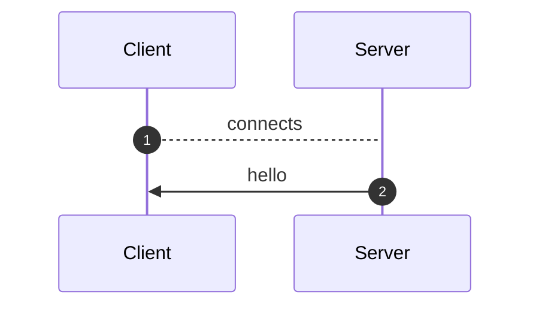
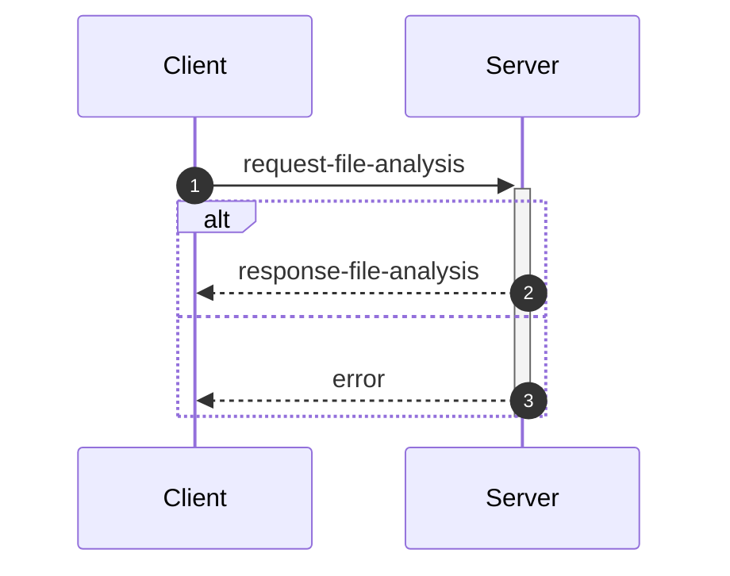
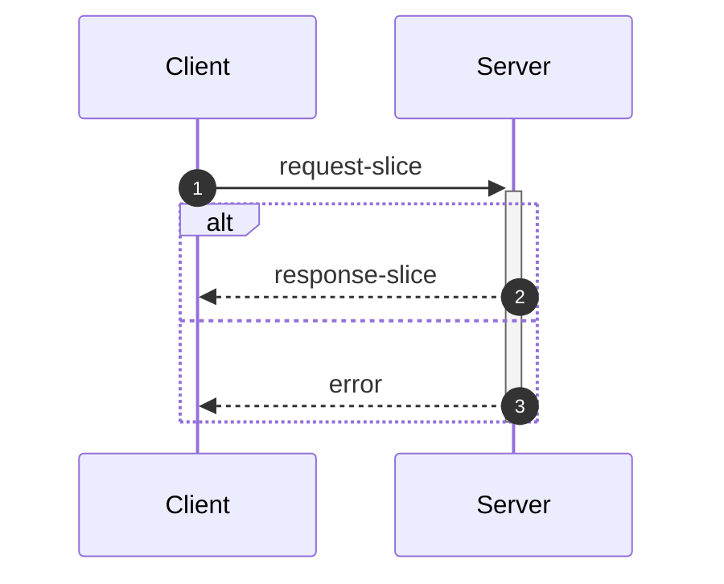
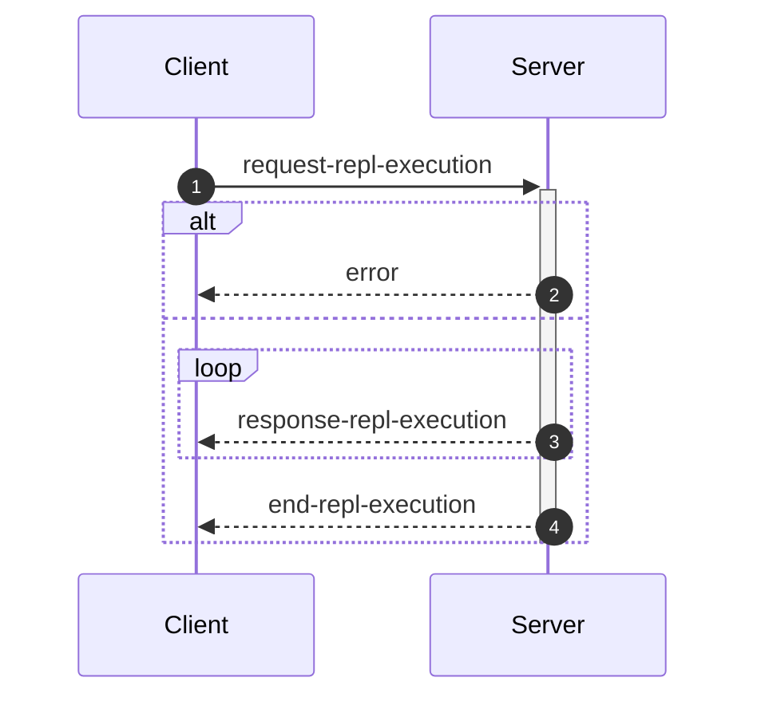
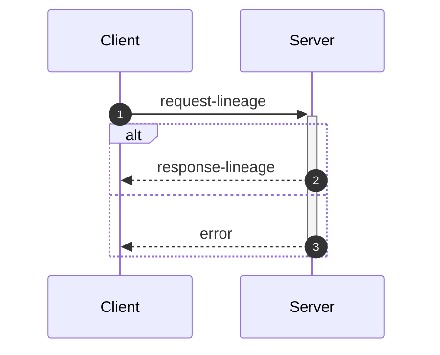

_This document was generated from '[src/documentation/print-interface-wiki.ts](https://github.com/flowr-analysis/flowr/tree/main//src/documentation/print-interface-wiki.ts)' on 2025-05-28, 09:03:09 UTC presenting an overview of flowR's interfaces (v2.2.13, using R v4.4.3). Please do not edit this file/wiki page directly._

Although far from being as detailed as the in-depth explanation of
[_flowR_](https://github.com/flowr-analysis/flowr/wiki/Core),
this wiki page explains how to interface with _flowR_ in more detail.
In general, command line arguments and other options provide short descriptions on hover over.

* [💬 Communicating with the Server](#communicating-with-the-server)
* [💻 Using the REPL](#using-the-repl)
* [⚙️ Configuring FlowR](#configuring-flowr)
* [⚒️ Writing Code](#writing-code)

<a id='communicating-with-the-server'></a>
## 💬 Communicating with the Server


As explained in the [Overview](https://github.com/flowr-analysis/flowr/wiki/Overview), you can simply run the [TCP](https://de.wikipedia.org/wiki/Transmission_Control_Protocol)&nbsp;server by adding the <span title="Description (Command Line Argument): Do not drop into a repl, but instead start a server on the given port (default: 1042) and listen for messages.">`--server`</span> flag (and, due to the interactive mode, exit with the conventional <kbd>CTRL</kbd>+<kbd>C</kbd>).
Currently, every connection is handled by the same underlying `RShell` - so the server is not designed to handle many clients at a time.
Additionally, the server is not well guarded against attacks (e.g., you can theoretically spawn an arbitrary number of&nbsp;RShell sessions on the target machine).

Every message has to be given in a single line (i.e., without a newline in-between) and end with a newline character. Nevertheless, we will pretty-print example given in the following segments for the ease of reading.


> [!NOTE]
> 
> The default <span title="Description (Command Line Argument): Do not drop into a repl, but instead start a server on the given port (default: 1042) and listen for messages.">`--server`</span> uses a simple [TCP](https://de.wikipedia.org/wiki/Transmission_Control_Protocol)
> connection. If you want _flowR_ to expose a [WebSocket](https://de.wikipedia.org/wiki/WebSocket) server instead, add the <span title="Description (Command Line Argument): If the server flag is set, use websocket for messaging">`--ws`</span> flag (i.e., <span title="Description (Command Line Argument): Do not drop into a repl, but instead start a server on the given port (default: 1042) and listen for messages.">`--server`</span> <span title="Description (Command Line Argument): If the server flag is set, use websocket for messaging">`--ws`</span>) when starting _flowR_ from the command line.
> 			


<ul><li>
<a id="message-hello"></a>
<b>Hello</b> Message (<code>hello</code>) 
<details>

<summary style="color:gray"> View Details. <i>The server informs the client about the successful connection and provides Meta-Information.</i> </summary>




	
After launching _flowR_, for example, with <code>docker run -it --rm eagleoutice/flowr <span title="Description (Command Line Argument): Do not drop into a repl, but instead start a server on the given port (default: 1042) and listen for messages.">-<span/>-server</span></code>&nbsp;(🐳️), simply connecting should present you with a `hello` message, that amongst others should reveal the versions of&nbsp;_flowR_ and&nbsp;R, using the [semver 2.0](https://semver.org/spec/v2.0.0.html) versioning scheme.
The message looks like this:


```json
{
  "type": "hello",
  "clientName": "client-0",
  "versions": {
    "flowr": "2.2.13",
    "r": "4.4.3",
    "engine": "r-shell"
  }
}
```


There are currently a few messages that you can send after the hello message.
If you want to _slice_ a piece of R code you first have to send an [analysis request](#message-request-file-analysis), so that you can send one or multiple slice requests afterward.
Requests for the [REPL](#message-request-repl) are independent of that.
	

<hr>


<details>
<summary style="color:gray">Message schema (<code>hello</code>)</summary>

For the definition of the hello message, please see it's implementation at [`./src/cli/repl/server/messages/message-hello.ts`](https://github.com/flowr-analysis/flowr/tree/main/./src/cli/repl/server/messages/message-hello.ts).

- **.** object [required]
    - **type** string [required]
        _The type of the hello message._
        Allows only the values: 'hello'
    - **id** any [forbidden]
        _The id of the message is always undefined (as it is the initial message and not requested)._
    - **clientName** string [required]
        _A unique name that is assigned to each client. It has no semantic meaning and is only used/useful for debugging._
    - **versions** object [required]
        - **flowr** string [required]
            _The version of the flowr server running in semver format._
        - **r** string [required]
            _The version of the underlying R shell running in semver format._
        - **engine** string [required]
            _The parser backend that is used to parse the R code._

</details>


<hr>

</details>	
	</li>

<li>
<a id="message-request-file-analysis"></a>
<b>Analysis</b> Message (<code>request-file-analysis</code>) 
<details>

<summary style="color:gray"> View Details. <i>The server builds the dataflow graph for a given input file (or a set of files).</i> </summary>




	
The request allows the server to analyze a file and prepare it for slicing.
The message can contain a `filetoken`, which is used to identify the file in later slice or lineage requests (if you do not add one, the request will not be stored and therefore, it is not available for subsequent requests).

> **Please note!**\
> If you want to send and process a lot of analysis requests, but do not want to slice them, please do not pass the `filetoken` field. This will save the server a lot of memory allocation.

Furthermore, the request must contain either a `content` field to directly pass the file's content or a `filepath` field which contains the path to the file (this path must be accessible for the server to be useful).
If you add the `id` field, the answer will use the same `id` so you can match requests and the corresponding answers.
See the implementation of the request-file-analysis message for more information.


<details>
<summary>Example of the <code>request-file-analysis</code> Message</summary>

_Note:_ even though we pretty-print these messages, they are sent as a single line, ending with a newline.

The following lists all messages that were sent and received in case you want to reproduce the scenario:

<ol>
<li> <code>hello</code> (response)
<details> 

<summary> Show Details </summary>

The first message is always a hello message.


```json
{
  "type": "hello",
  "clientName": "client-0",
  "versions": {
    "flowr": "2.2.13",
    "r": "4.4.3",
    "engine": "r-shell"
  }
}
```


</details>
</li>

<li> <b><code>request-file-analysis</code> (request)</b>
<details open> 

<summary> Show Details </summary>

Let' suppose you simply want to analyze the following script:
 
```r
x <- 1
x + 1
```

 For this, you can send the following request:


```json
{
  "type": "request-file-analysis",
  "id": "1",
  "filetoken": "x",
  "content": "x <- 1\nx + 1"
}
```


</details>
</li>

<li> <code>response-file-analysis</code> (response)
<details> 

<summary> Show Details </summary>


The `results` field of the response effectively contains three keys of importance:

- `parse`: which contains 1:1 the parse result in CSV format that we received from the `RShell` (i.e., the AST produced by the parser of the R interpreter).
- `normalize`: which contains the normalized AST, including ids (see the `info` field and the [Normalized AST](https://github.com/flowr-analysis/flowr/wiki/Normalized%20AST) wiki page).
- `dataflow`: especially important is the `graph` field which contains the dataflow graph as a set of root vertices (see the [Dataflow Graph](https://github.com/flowr-analysis/flowr/wiki/Dataflow%20Graph) wiki page).
			


_As the code is pretty long, we inhibit pretty printing and syntax highlighting (JSON, hiding built-in):_

```text
{"type":"response-file-analysis","format":"json","id":"1","results":{"parse":{"parsed":"[1,1,1,6,7,0,\"expr\",false,\"x <- 1\"],[1,1,1,1,1,3,\"SYMBOL\",true,\"x\"],[1,1,1,1,3,7,\"expr\",false,\"x\"],[1,3,1,4,2,7,\"LEFT_ASSIGN\",true,\"<-\"],[1,6,1,6,4,5,\"NUM_CONST\",true,\"1\"],[1,6,1,6,5,7,\"expr\",false,\"1\"],[2,1,2,5,16,0,\"expr\",false,\"x + 1\"],[2,1,2,1,10,12,\"SYMBOL\",true,\"x\"],[2,1,2,1,12,16,\"expr\",false,\"x\"],[2,3,2,3,11,16,\"'+'\",true,\"+\"],[2,5,2,5,13,14,\"NUM_CONST\",true,\"1\"],[2,5,2,5,14,16,\"expr\",false,\"1\"]",".meta":{"timing":4}},"normalize":{"ast":{"type":"RExpressionList","children":[{"type":"RBinaryOp","location":[1,3,1,4],"lhs":{"type":"RSymbol","location":[1,1,1,1],"content":"x","lexeme":"x","info":{"fullRange":[1,1,1,1],"additionalTokens":[],"id":0,"parent":2,"role":"binop-lhs","index":0,"nesting":0,"file":"/tmp/tmp-7976-NUKt2OIiAcxI-.R"}},"rhs":{"location":[1,6,1,6],"lexeme":"1","info":{"fullRange":[1,6,1,6],"additionalTokens":[],"id":1,"parent":2,"role":"binop-rhs","index":1,"nesting":0,"file":"/tmp/tmp-7976-NUKt2OIiAcxI-.R"},"type":"RNumber","content":{"num":1,"complexNumber":false,"markedAsInt":false}},"operator":"<-","lexeme":"<-","info":{"fullRange":[1,1,1,6],"additionalTokens":[],"id":2,"parent":6,"nesting":0,"file":"/tmp/tmp-7976-NUKt2OIiAcxI-.R","index":0,"role":"expr-list-child"}},{"type":"RBinaryOp","location":[2,3,2,3],"lhs":{"type":"RSymbol","location":[2,1,2,1],"content":"x","lexeme":"x","info":{"fullRange":[2,1,2,1],"additionalTokens":[],"id":3,"parent":5,"role":"binop-lhs","index":0,"nesting":0,"file":"/tmp/tmp-7976-NUKt2OIiAcxI-.R"}},"rhs":{"location":[2,5,2,5],"lexeme":"1","info":{"fullRange":[2,5,2,5],"additionalTokens":[],"id":4,"parent":5,"role":"binop-rhs","index":1,"nesting":0,"file":"/tmp/tmp-7976-NUKt2OIiAcxI-.R"},"type":"RNumber","content":{"num":1,"complexNumber":false,"markedAsInt":false}},"operator":"+","lexeme":"+","info":{"fullRange":[2,1,2,5],"additionalTokens":[],"id":5,"parent":6,"nesting":0,"file":"/tmp/tmp-7976-NUKt2OIiAcxI-.R","index":1,"role":"expr-list-child"}}],"info":{"additionalTokens":[],"id":6,"nesting":0,"file":"/tmp/tmp-7976-NUKt2OIiAcxI-.R","role":"root","index":0}},".meta":{"timing":3}},"dataflow":{"unknownReferences":[],"in":[{"nodeId":2,"name":"<-","type":2},{"nodeId":5,"name":"+","type":2}],"out":[{"nodeId":0,"name":"x","type":4,"definedAt":2,"value":[1]}],"environment":{"current":{"id":12,"parent":"<BuiltInEnvironment>","memory":[["x",[{"nodeId":0,"name":"x","type":4,"definedAt":2,"value":[1]}]]]},"level":0},"graph":{"_sourced":["/tmp/tmp-7976-NUKt2OIiAcxI-.R"],"_unknownSideEffects":[],"rootVertices":[1,0,2,3,4,5],"vertexInformation":[[1,{"tag":"value","id":1}],[0,{"tag":"variable-definition","id":0}],[2,{"tag":"function-call","id":2,"name":"<-","onlyBuiltin":true,"args":[{"nodeId":0,"type":32},{"nodeId":1,"type":32}],"origin":["builtin:assignment"]}],[3,{"tag":"use","id":3}],[4,{"tag":"value","id":4}],[5,{"tag":"function-call","id":5,"name":"+","onlyBuiltin":true,"args":[{"nodeId":3,"type":32},{"nodeId":4,"type":32}],"origin":["builtin:default"]}]],"edgeInformation":[[2,[[1,{"types":64}],[0,{"types":72}],["built-in:<-",{"types":5}]]],[0,[[1,{"types":2}],[2,{"types":2}]]],[3,[[0,{"types":1}]]],[5,[[3,{"types":65}],[4,{"types":65}],["built-in:+",{"types":5}]]]]},"entryPoint":2,"exitPoints":[{"type":0,"nodeId":5}],".meta":{"timing":4}}}}
```


</details>
</li>
</ol>

The complete round-trip took 17.4 ms (including time required to validate the messages, start, and stop the internal mock server).

</details>


You receive an error if, for whatever reason, the analysis fails (e.g., the message or code you sent contained syntax errors).
It contains a human-readable description *why* the analysis failed (see the error message implementation for more details).


<details>
<summary>Example Error Message</summary>

_Note:_ even though we pretty-print these messages, they are sent as a single line, ending with a newline.

The following lists all messages that were sent and received in case you want to reproduce the scenario:

<ol>
<li> <code>hello</code> (response)
<details> 

<summary> Show Details </summary>

The first message is always a hello message.


```json
{
  "type": "hello",
  "clientName": "client-0",
  "versions": {
    "flowr": "2.2.13",
    "r": "4.4.3",
    "engine": "r-shell"
  }
}
```


</details>
</li>

<li> <code>request-file-analysis</code> (request)
<details> 

<summary> Show Details </summary>


```json
{
  "type": "request-file-analysis",
  "id": "1",
  "filename": "sample.R",
  "content": "x <-"
}
```


</details>
</li>

<li> <b><code>error</code> (response)</b>
<details open> 

<summary> Show Details </summary>


```json
{
  "id": "1",
  "type": "error",
  "fatal": false,
  "reason": "Error while analyzing file sample.R: GuardError: unable to parse R code (see the log for more information) for request {\"request\":\"file\",\"content\":\"/tmp/tmp-7976-2gfmkN0QM4hF-.R\"}}\n Report a Bug: https://github.com/flowr-analysis/flowr/issues/new?body=%3C!%2D%2D%20Please%20describe%20your%20issue%20in%20more%20detail%20below!%20%2D%2D%3E%0A%0A%0A%3C!%2D%2D%20Automatically%20generated%20issue%20metadata%2C%20please%20do%20not%20edit%20or%20delete%20content%20below%20this%20line%20%2D%2D%3E%0A%2D%2D%2D%0A%0AflowR%20version%3A%202.2.13%0Anode%20version%3A%20v22.13.1%0Anode%20arch%3A%20x64%0Anode%20platform%3A%20linux%0Amessage%3A%20%60unable%20to%20parse%20R%20code%20%28see%20the%20log%20for%20more%20information%29%20for%20request%20%7B%22request%22%3A%22file%22%2C%22content%22%3A%22%2Ftmp%2Ftmp%2D7976%2D2gfmkN0QM4hF%2D.R%22%7D%7D%60%0Astack%20trace%3A%0A%60%60%60%0A%20%20%20%20at%20guard%20%28%3C%3E%2Fsrc%2Futil%2Fassert.ts%3A75%3A9%29%0A%20%20%20%20at%20guardRetrievedOutput%20%28%3C%3E%2Fsrc%2Fr%2Dbridge%2Fretriever.ts%3A184%3A7%29%0A%20%20%20%20at%20%2Fhome%2Frunner%2Fwork%2Fflowr%2Fflowr%2Fsrc%2Fr%2Dbridge%2Fretriever.ts%3A148%3A4%0A%20%20%20%20at%20processTicksAndRejections%20%28node%3Ainternal%2Fprocess%2Ftask_queues%3A105%3A5%29%0A%20%20%20%20at%20async%20Object.parseRequests%20%5Bas%20processor%5D%20%28%3C%3E%2Fsrc%2Fr%2Dbridge%2Fparser.ts%3A58%3A18%29%0A%20%20%20%20at%20async%20PipelineExecutor.nextStep%20%28%3C%3E%2Fsrc%2Fcore%2Fpipeline%2Dexecutor.ts%3A204%3A25%29%0A%20%20%20%20at%20async%20PipelineExecutor.allRemainingSteps%20%28%3C%3E%2Fsrc%2Fcore%2Fpipeline%2Dexecutor.ts%3A263%3A4%29%0A%20%20%20%20at%20async%20FlowRServerConnection.handleFileAnalysisRequest%20%28%3C%3E%2Fsrc%2Fcli%2Frepl%2Fserver%2Fconnection.ts%3A144%3A3%29%0A%60%60%60%0A%0A%2D%2D%2D%0A%09"
}
```


</details>
</li>
</ol>

The complete round-trip took 7.9 ms (including time required to validate the messages, start, and stop the internal mock server).

</details>


&nbsp;

<a id="analysis-include-cfg"></a>
**Including the Control Flow Graph**

While _flowR_ does (for the time being) not use an explicit control flow graph but instead relies on control-dependency edges within the dataflow graph, 
the respective structure can still be exposed using the server (note that, as this feature is not needed within _flowR_, it is tested significantly less - 
so please create a [new issue](https://github.com/flowr-analysis/flowr/issues/new/choose) for any bug you may encounter).
For this, the analysis request may add `cfg: true` to its list of options.


<details>
<summary>Requesting a Control Flow Graph</summary>

_Note:_ even though we pretty-print these messages, they are sent as a single line, ending with a newline.

The following lists all messages that were sent and received in case you want to reproduce the scenario:

<ol>
<li> <code>hello</code> (response)
<details> 

<summary> Show Details </summary>

The first message is always a hello message.


```json
{
  "type": "hello",
  "clientName": "client-0",
  "versions": {
    "flowr": "2.2.13",
    "r": "4.4.3",
    "engine": "r-shell"
  }
}
```


</details>
</li>

<li> <b><code>request-file-analysis</code> (request)</b>
<details open> 

<summary> Show Details </summary>


```json
{
  "type": "request-file-analysis",
  "id": "1",
  "filetoken": "x",
  "content": "if(unknown > 0) { x <- 2 } else { x <- 5 }\nfor(i in 1:x) { print(x); print(i) }",
  "cfg": true
}
```


</details>
</li>

<li> <code>response-file-analysis</code> (response)
<details> 

<summary> Show Details </summary>


The response looks basically the same as a response sent without the `cfg` flag. However, additionally it contains a `cfg` field. 
If you are interested in a visual representation of the control flow graph, see the 
[visualization with mermaid](https://mermaid.live/view#base64:eyJjb2RlIjoiZmxvd2NoYXJ0IEJUXG4gICAgbjMyKFtcImBSRXhwcmVzc2lvbkxpc3QgKDMyKWBcIl0pXG4gICAgbjE1W1wiYFJJZlRoZW5FbHNlICgxNSlcbiMzNDtpZih1bmtub3duICM2MjsgMCkgIzEyMzsgeCAjNjA7IzQ1OyAyICMxMjU7IGVsc2UgIzEyMzsgeCAjNjA7IzQ1OyA1ICMxMjU7IzM0O2BcIl1cbiAgICBuMTUtY29uZGl0aW9uW1sxNS1jb25kaXRpb25dXVxuICAgIG4xNS1leGl0KCgxNS1leGl0KSlcbiAgICBuMChbXCJgUlN5bWJvbCAoMClcbiMzNDt1bmtub3duIzM0O2BcIl0pXG4gICAgbjEoW1wiYFJOdW1iZXIgKDEpXG4jMzQ7MCMzNDtgXCJdKVxuICAgIG4yKFtcImBSQmluYXJ5T3AgKDIpXG4jMzQ7dW5rbm93biAjNjI7IDAjMzQ7YFwiXSlcbiAgICBuMi1leGl0KCgyLWV4aXQpKVxuICAgIG44KFtcImBSRXhwcmVzc2lvbkxpc3QgKDgpYFwiXSlcbiAgICBuNShbXCJgUlN5bWJvbCAoNSlcbiMzNDt4IzM0O2BcIl0pXG4gICAgbjYoW1wiYFJOdW1iZXIgKDYpXG4jMzQ7MiMzNDtgXCJdKVxuICAgIG43KFtcImBSQmluYXJ5T3AgKDcpXG4jMzQ7eCAjNjA7IzQ1OyAyIzM0O2BcIl0pXG4gICAgbjctZXhpdCgoNy1leGl0KSlcbiAgICBuOC1leGl0KCg4LWV4aXQpKVxuICAgIG4xNChbXCJgUkV4cHJlc3Npb25MaXN0ICgxNClgXCJdKVxuICAgIG4xMShbXCJgUlN5bWJvbCAoMTEpXG4jMzQ7eCMzNDtgXCJdKVxuICAgIG4xMihbXCJgUk51bWJlciAoMTIpXG4jMzQ7NSMzNDtgXCJdKVxuICAgIG4xMyhbXCJgUkJpbmFyeU9wICgxMylcbiMzNDt4ICM2MDsjNDU7IDUjMzQ7YFwiXSlcbiAgICBuMTMtZXhpdCgoMTMtZXhpdCkpXG4gICAgbjE0LWV4aXQoKDE0LWV4aXQpKVxuICAgIG4xNihbXCJgUlN5bWJvbCAoMTYpXG4jMzQ7aSMzNDtgXCJdKVxuICAgIG4zMVtcImBSRm9yTG9vcCAoMzEpXG4jMzQ7Zm9yKGkgaW4gMSM1ODt4KSAjMTIzOyBwcmludCh4KTsgcHJpbnQoaSkgIzEyNTsjMzQ7YFwiXVxuICAgIG4xNyhbXCJgUk51bWJlciAoMTcpXG4jMzQ7MSMzNDtgXCJdKVxuICAgIG4xOChbXCJgUlN5bWJvbCAoMTgpXG4jMzQ7eCMzNDtgXCJdKVxuICAgIG4xOShbXCJgUkJpbmFyeU9wICgxOSlcbiMzNDsxIzU4O3gjMzQ7YFwiXSlcbiAgICBuMTktZXhpdCgoMTktZXhpdCkpXG4gICAgbjMwKFtcImBSRXhwcmVzc2lvbkxpc3QgKDMwKWBcIl0pXG4gICAgbjIyKFtcImBSU3ltYm9sICgyMilcbiMzNDtwcmludCh4KSMzNDtgXCJdKVxuICAgIG4yNVtcImBSRnVuY3Rpb25DYWxsICgyNSlcbiMzNDtwcmludCh4KSMzNDtgXCJdXG4gICAgbjI1LW5hbWVbWzI1LW5hbWVdXVxuICAgIG4yNS1leGl0KCgyNS1leGl0KSlcbiAgICBuMjQoW1wiYFJBcmd1bWVudCAoMjQpXG4jMzQ7eCMzNDtgXCJdKVxuICAgIG4yNC1iZWZvcmUtdmFsdWVbWzI0LWJlZm9yZS12YWx1ZV1dXG4gICAgbjIzKFtcImBSU3ltYm9sICgyMylcbiMzNDt4IzM0O2BcIl0pXG4gICAgbjI0LWV4aXQoKDI0LWV4aXQpKVxuICAgIG4yNihbXCJgUlN5bWJvbCAoMjYpXG4jMzQ7cHJpbnQoaSkjMzQ7YFwiXSlcbiAgICBuMjlbXCJgUkZ1bmN0aW9uQ2FsbCAoMjkpXG4jMzQ7cHJpbnQoaSkjMzQ7YFwiXVxuICAgIG4yOS1uYW1lW1syOS1uYW1lXV1cbiAgICBuMjktZXhpdCgoMjktZXhpdCkpXG4gICAgbjI4KFtcImBSQXJndW1lbnQgKDI4KVxuIzM0O2kjMzQ7YFwiXSlcbiAgICBuMjgtYmVmb3JlLXZhbHVlW1syOC1iZWZvcmUtdmFsdWVdXVxuICAgIG4yNyhbXCJgUlN5bWJvbCAoMjcpXG4jMzQ7aSMzNDtgXCJdKVxuICAgIG4yOC1leGl0KCgyOC1leGl0KSlcbiAgICBuMzAtZXhpdCgoMzAtZXhpdCkpXG4gICAgbjMxLWhlYWRbWzMxLWhlYWRdXVxuICAgIG4zMS1leGl0KCgzMS1leGl0KSlcbiAgICBuMzItZXhpdCgoMzItZXhpdCkpXG4gICAgbjE1IC0uLT58XCJGRFwifCBuMzJcbiAgICBuMSAtLi0+fFwiRkRcInwgbjBcbiAgICBuMCAtLi0+fFwiRkRcInwgbjJcbiAgICBuMi1leGl0IC0uLT58XCJGRFwifCBuMVxuICAgIG43IC0uLT58XCJGRFwifCBuOFxuICAgIG42IC0uLT58XCJGRFwifCBuNVxuICAgIG41IC0uLT58XCJGRFwifCBuN1xuICAgIG43LWV4aXQgLS4tPnxcIkZEXCJ8IG42XG4gICAgbjgtZXhpdCAtLi0+fFwiRkRcInwgbjctZXhpdFxuICAgIG4xMyAtLi0+fFwiRkRcInwgbjE0XG4gICAgbjEyIC0uLT58XCJGRFwifCBuMTFcbiAgICBuMTEgLS4tPnxcIkZEXCJ8IG4xM1xuICAgIG4xMy1leGl0IC0uLT58XCJGRFwifCBuMTJcbiAgICBuMTQtZXhpdCAtLi0+fFwiRkRcInwgbjEzLWV4aXRcbiAgICBuMTUtY29uZGl0aW9uIC0uLT58XCJGRFwifCBuMi1leGl0XG4gICAgbjggLS0+fFwiQ0QgKFRSVUUpXCJ8IG4xNS1jb25kaXRpb25cbiAgICBuMTQgLS0+fFwiQ0QgKEZBTFNFKVwifCBuMTUtY29uZGl0aW9uXG4gICAgbjIgLS4tPnxcIkZEXCJ8IG4xNVxuICAgIG4xNS1leGl0IC0uLT58XCJGRFwifCBuOC1leGl0XG4gICAgbjE1LWV4aXQgLS4tPnxcIkZEXCJ8IG4xNC1leGl0XG4gICAgbjMxIC0uLT58XCJGRFwifCBuMTUtZXhpdFxuICAgIG4zMSAtLi0+fFwiRkRcInwgbjMwLWV4aXRcbiAgICBuMTggLS4tPnxcIkZEXCJ8IG4xN1xuICAgIG4xNyAtLi0+fFwiRkRcInwgbjE5XG4gICAgbjE5LWV4aXQgLS4tPnxcIkZEXCJ8IG4xOFxuICAgIG4yNSAtLi0+fFwiRkRcInwgbjMwXG4gICAgbjIyIC0uLT58XCJGRFwifCBuMjVcbiAgICBuMjUtbmFtZSAtLi0+fFwiRkRcInwgbjIyXG4gICAgbjI0LWJlZm9yZS12YWx1ZSAtLi0+fFwiRkRcInwgbjI0XG4gICAgbjIzIC0uLT58XCJGRFwifCBuMjQtYmVmb3JlLXZhbHVlXG4gICAgbjI0LWV4aXQgLS4tPnxcIkZEXCJ8IG4yM1xuICAgIG4yNCAtLi0+fFwiRkRcInwgbjI1LW5hbWVcbiAgICBuMjUtZXhpdCAtLi0+fFwiRkRcInwgbjI0LWV4aXRcbiAgICBuMjkgLS4tPnxcIkZEXCJ8IG4yNS1leGl0XG4gICAgbjI2IC0uLT58XCJGRFwifCBuMjlcbiAgICBuMjktbmFtZSAtLi0+fFwiRkRcInwgbjI2XG4gICAgbjI4LWJlZm9yZS12YWx1ZSAtLi0+fFwiRkRcInwgbjI4XG4gICAgbjI3IC0uLT58XCJGRFwifCBuMjgtYmVmb3JlLXZhbHVlXG4gICAgbjI4LWV4aXQgLS4tPnxcIkZEXCJ8IG4yN1xuICAgIG4yOCAtLi0+fFwiRkRcInwgbjI5LW5hbWVcbiAgICBuMjktZXhpdCAtLi0+fFwiRkRcInwgbjI4LWV4aXRcbiAgICBuMzAtZXhpdCAtLi0+fFwiRkRcInwgbjI5LWV4aXRcbiAgICBuMTkgLS4tPnxcIkZEXCJ8IG4zMVxuICAgIG4xNiAtLi0+fFwiRkRcInwgbjE5LWV4aXRcbiAgICBuMzEtaGVhZCAtLi0+fFwiRkRcInwgbjE2XG4gICAgbjMwIC0tPnxcIkNEIChUUlVFKVwifCBuMzEtaGVhZFxuICAgIG4zMS1leGl0IC0tPnxcIkNEIChGQUxTRSlcInwgbjMxLWhlYWRcbiAgICBuMzItZXhpdCAtLi0+fFwiRkRcInwgbjMxLWV4aXRcbiAgICBzdHlsZSBuMzIgc3Ryb2tlOmN5YW4sc3Ryb2tlLXdpZHRoOjYuNXB4OyAgICBzdHlsZSBuMzItZXhpdCBzdHJva2U6Z3JlZW4sc3Ryb2tlLXdpZHRoOjYuNXB4OyIsIm1lcm1haWQiOnsiYXV0b1N5bmMiOnRydWV9fQ==).
			


_As the code is pretty long, we inhibit pretty printing and syntax highlighting (JSON, hiding built-in):_

```text
{"type":"response-file-analysis","format":"json","id":"1","cfg":{"returns":[],"entryPoints":[32],"exitPoints":["32-exit"],"breaks":[],"nexts":[],"graph":{"rootVertices":[32,15,"15-condition","15-exit",0,1,2,"2-exit",8,5,6,7,"7-exit","8-exit",14,11,12,13,"13-exit","14-exit",16,31,17,18,19,"19-exit",30,22,25,"25-name","25-exit",24,"24-before-value",23,"24-exit",26,29,"29-name","29-exit",28,"28-before-value",27,"28-exit","30-exit","31-head","31-exit","32-exit"],"vertexInformation":[[32,{"id":32,"type":"expr","end":["32-exit"]}],[15,{"id":15,"type":"stm","mid":["15-condition"],"end":["15-exit"]}],["15-condition",{"id":"15-condition","kind":"condition","type":"mid","root":15}],["15-exit",{"id":"15-exit","type":"end","root":15}],[0,{"id":0,"type":"expr"}],[1,{"id":1,"type":"expr"}],[2,{"id":2,"type":"expr","end":["2-exit"]}],["2-exit",{"id":"2-exit","type":"end","root":2}],[8,{"id":8,"type":"expr","end":["8-exit"]}],[5,{"id":5,"type":"expr"}],[6,{"id":6,"type":"expr"}],[7,{"id":7,"type":"expr","end":["7-exit"]}],["7-exit",{"id":"7-exit","type":"end","root":7}],["8-exit",{"id":"8-exit","type":"end","root":8}],[14,{"id":14,"type":"expr","end":["14-exit"]}],[11,{"id":11,"type":"expr"}],[12,{"id":12,"type":"expr"}],[13,{"id":13,"type":"expr","end":["13-exit"]}],["13-exit",{"id":"13-exit","type":"end","root":13}],["14-exit",{"id":"14-exit","type":"end","root":14}],[16,{"id":16,"type":"expr"}],[31,{"id":31,"type":"stm","end":["31-exit"],"mid":["31-head"]}],[17,{"id":17,"type":"expr"}],[18,{"id":18,"type":"expr"}],[19,{"id":19,"type":"expr","end":["19-exit"]}],["19-exit",{"id":"19-exit","type":"end","root":19}],[30,{"id":30,"type":"expr","end":["30-exit"]}],[22,{"id":22,"type":"expr"}],[25,{"id":25,"type":"stm","mid":["25-name"],"end":["25-exit"]}],["25-name",{"id":"25-name","kind":"name","type":"mid","root":25}],["25-exit",{"id":"25-exit","type":"end","root":25}],[24,{"id":24,"type":"expr","mid":["24-before-value"],"end":["24-exit"]}],["24-before-value",{"id":"24-before-value","kind":"before-value","type":"mid","root":24}],[23,{"id":23,"type":"expr"}],["24-exit",{"id":"24-exit","type":"end","root":24}],[26,{"id":26,"type":"expr"}],[29,{"id":29,"type":"stm","mid":["29-name"],"end":["29-exit"]}],["29-name",{"id":"29-name","kind":"name","type":"mid","root":29}],["29-exit",{"id":"29-exit","type":"end","root":29}],[28,{"id":28,"type":"expr","mid":["28-before-value"],"end":["28-exit"]}],["28-before-value",{"id":"28-before-value","kind":"before-value","type":"mid","root":28}],[27,{"id":27,"type":"expr"}],["28-exit",{"id":"28-exit","type":"end","root":28}],["30-exit",{"id":"30-exit","type":"end","root":30}],["31-head",{"id":"31-head","type":"mid","root":31,"kind":"head"}],["31-exit",{"id":"31-exit","type":"end","root":31}],["32-exit",{"id":"32-exit","type":"end","root":32}]],"bbChildren":[],"edgeInformation":[[15,[[32,{"label":0}]]],[1,[[0,{"label":0}]]],[0,[[2,{"label":0}]]],["2-exit",[[1,{"label":0}]]],[7,[[8,{"label":0}]]],[6,[[5,{"label":0}]]],[5,[[7,{"label":0}]]],["7-exit",[[6,{"label":0}]]],["8-exit",[["7-exit",{"label":0}]]],[13,[[14,{"label":0}]]],[12,[[11,{"label":0}]]],[11,[[13,{"label":0}]]],["13-exit",[[12,{"label":0}]]],["14-exit",[["13-exit",{"label":0}]]],["15-condition",[["2-exit",{"label":0}]]],[8,[["15-condition",{"label":1,"when":"TRUE","caused":15}]]],[14,[["15-condition",{"label":1,"when":"FALSE","caused":15}]]],[2,[[15,{"label":0}]]],["15-exit",[["8-exit",{"label":0}],["14-exit",{"label":0}]]],[31,[["15-exit",{"label":0}],["30-exit",{"label":0}]]],[18,[[17,{"label":0}]]],[17,[[19,{"label":0}]]],["19-exit",[[18,{"label":0}]]],[25,[[30,{"label":0}]]],[22,[[25,{"label":0}]]],["25-name",[[22,{"label":0}]]],["24-before-value",[[24,{"label":0}]]],[23,[["24-before-value",{"label":0}]]],["24-exit",[[23,{"label":0}]]],[24,[["25-name",{"label":0}]]],["25-exit",[["24-exit",{"label":0}]]],[29,[["25-exit",{"label":0}]]],[26,[[29,{"label":0}]]],["29-name",[[26,{"label":0}]]],["28-before-value",[[28,{"label":0}]]],[27,[["28-before-value",{"label":0}]]],["28-exit",[[27,{"label":0}]]],[28,[["29-name",{"label":0}]]],["29-exit",[["28-exit",{"label":0}]]],["30-exit",[["29-exit",{"label":0}]]],[19,[[31,{"label":0}]]],[16,[["19-exit",{"label":0}]]],["31-head",[[16,{"label":0}]]],[30,[["31-head",{"label":1,"when":"TRUE","caused":31}]]],["31-exit",[["31-head",{"label":1,"when":"FALSE","caused":31}]]],["32-exit",[["31-exit",{"label":0}]]]],"_mayHaveBasicBlocks":false}},"results":{"parse":{"parsed":"[1,1,1,42,38,0,\"expr\",false,\"if(unknown > 0) { x <- 2 } else { x <- 5 }\"],[1,1,1,2,1,38,\"IF\",true,\"if\"],[1,3,1,3,2,38,\"'('\",true,\"(\"],[1,4,1,14,9,38,\"expr\",false,\"unknown > 0\"],[1,4,1,10,3,5,\"SYMBOL\",true,\"unknown\"],[1,4,1,10,5,9,\"expr\",false,\"unknown\"],[1,12,1,12,4,9,\"GT\",true,\">\"],[1,14,1,14,6,7,\"NUM_CONST\",true,\"0\"],[1,14,1,14,7,9,\"expr\",false,\"0\"],[1,15,1,15,8,38,\"')'\",true,\")\"],[1,17,1,26,22,38,\"expr\",false,\"{ x <- 2 }\"],[1,17,1,17,12,22,\"'{'\",true,\"{\"],[1,19,1,24,19,22,\"expr\",false,\"x <- 2\"],[1,19,1,19,13,15,\"SYMBOL\",true,\"x\"],[1,19,1,19,15,19,\"expr\",false,\"x\"],[1,21,1,22,14,19,\"LEFT_ASSIGN\",true,\"<-\"],[1,24,1,24,16,17,\"NUM_CONST\",true,\"2\"],[1,24,1,24,17,19,\"expr\",false,\"2\"],[1,26,1,26,18,22,\"'}'\",true,\"}\"],[1,28,1,31,23,38,\"ELSE\",true,\"else\"],[1,33,1,42,35,38,\"expr\",false,\"{ x <- 5 }\"],[1,33,1,33,25,35,\"'{'\",true,\"{\"],[1,35,1,40,32,35,\"expr\",false,\"x <- 5\"],[1,35,1,35,26,28,\"SYMBOL\",true,\"x\"],[1,35,1,35,28,32,\"expr\",false,\"x\"],[1,37,1,38,27,32,\"LEFT_ASSIGN\",true,\"<-\"],[1,40,1,40,29,30,\"NUM_CONST\",true,\"5\"],[1,40,1,40,30,32,\"expr\",false,\"5\"],[1,42,1,42,31,35,\"'}'\",true,\"}\"],[2,1,2,36,84,0,\"expr\",false,\"for(i in 1:x) { print(x); print(i) }\"],[2,1,2,3,41,84,\"FOR\",true,\"for\"],[2,4,2,13,53,84,\"forcond\",false,\"(i in 1:x)\"],[2,4,2,4,42,53,\"'('\",true,\"(\"],[2,5,2,5,43,53,\"SYMBOL\",true,\"i\"],[2,7,2,8,44,53,\"IN\",true,\"in\"],[2,10,2,12,51,53,\"expr\",false,\"1:x\"],[2,10,2,10,45,46,\"NUM_CONST\",true,\"1\"],[2,10,2,10,46,51,\"expr\",false,\"1\"],[2,11,2,11,47,51,\"':'\",true,\":\"],[2,12,2,12,48,50,\"SYMBOL\",true,\"x\"],[2,12,2,12,50,51,\"expr\",false,\"x\"],[2,13,2,13,49,53,\"')'\",true,\")\"],[2,15,2,36,81,84,\"expr\",false,\"{ print(x); print(i) }\"],[2,15,2,15,54,81,\"'{'\",true,\"{\"],[2,17,2,24,64,81,\"expr\",false,\"print(x)\"],[2,17,2,21,55,57,\"SYMBOL_FUNCTION_CALL\",true,\"print\"],[2,17,2,21,57,64,\"expr\",false,\"print\"],[2,22,2,22,56,64,\"'('\",true,\"(\"],[2,23,2,23,58,60,\"SYMBOL\",true,\"x\"],[2,23,2,23,60,64,\"expr\",false,\"x\"],[2,24,2,24,59,64,\"')'\",true,\")\"],[2,25,2,25,65,81,\"';'\",true,\";\"],[2,27,2,34,77,81,\"expr\",false,\"print(i)\"],[2,27,2,31,68,70,\"SYMBOL_FUNCTION_CALL\",true,\"print\"],[2,27,2,31,70,77,\"expr\",false,\"print\"],[2,32,2,32,69,77,\"'('\",true,\"(\"],[2,33,2,33,71,73,\"SYMBOL\",true,\"i\"],[2,33,2,33,73,77,\"expr\",false,\"i\"],[2,34,2,34,72,77,\"')'\",true,\")\"],[2,36,2,36,78,81,\"'}'\",true,\"}\"]",".meta":{"timing":2}},"normalize":{"ast":{"type":"RExpressionList","children":[{"type":"RIfThenElse","condition":{"type":"RBinaryOp","location":[1,12,1,12],"lhs":{"type":"RSymbol","location":[1,4,1,10],"content":"unknown","lexeme":"unknown","info":{"fullRange":[1,4,1,10],"additionalTokens":[],"id":0,"parent":2,"role":"binop-lhs","index":0,"nesting":1,"file":"/tmp/tmp-7976-7hM7l1IMeC5n-.R"}},"rhs":{"location":[1,14,1,14],"lexeme":"0","info":{"fullRange":[1,14,1,14],"additionalTokens":[],"id":1,"parent":2,"role":"binop-rhs","index":1,"nesting":1,"file":"/tmp/tmp-7976-7hM7l1IMeC5n-.R"},"type":"RNumber","content":{"num":0,"complexNumber":false,"markedAsInt":false}},"operator":">","lexeme":">","info":{"fullRange":[1,4,1,14],"additionalTokens":[],"id":2,"parent":15,"nesting":1,"file":"/tmp/tmp-7976-7hM7l1IMeC5n-.R","role":"if-cond"}},"then":{"type":"RExpressionList","children":[{"type":"RBinaryOp","location":[1,21,1,22],"lhs":{"type":"RSymbol","location":[1,19,1,19],"content":"x","lexeme":"x","info":{"fullRange":[1,19,1,19],"additionalTokens":[],"id":5,"parent":7,"role":"binop-lhs","index":0,"nesting":1,"file":"/tmp/tmp-7976-7hM7l1IMeC5n-.R"}},"rhs":{"location":[1,24,1,24],"lexeme":"2","info":{"fullRange":[1,24,1,24],"additionalTokens":[],"id":6,"parent":7,"role":"binop-rhs","index":1,"nesting":1,"file":"/tmp/tmp-7976-7hM7l1IMeC5n-.R"},"type":"RNumber","content":{"num":2,"complexNumber":false,"markedAsInt":false}},"operator":"<-","lexeme":"<-","info":{"fullRange":[1,19,1,24],"additionalTokens":[],"id":7,"parent":8,"nesting":1,"file":"/tmp/tmp-7976-7hM7l1IMeC5n-.R","index":0,"role":"expr-list-child"}}],"grouping":[{"type":"RSymbol","location":[1,17,1,17],"content":"{","lexeme":"{","info":{"fullRange":[1,17,1,26],"additionalTokens":[],"id":3,"role":"root","index":0,"nesting":1,"file":"/tmp/tmp-7976-7hM7l1IMeC5n-.R"}},{"type":"RSymbol","location":[1,26,1,26],"content":"}","lexeme":"}","info":{"fullRange":[1,17,1,26],"additionalTokens":[],"id":4,"role":"root","index":0,"nesting":1,"file":"/tmp/tmp-7976-7hM7l1IMeC5n-.R"}}],"info":{"additionalTokens":[],"id":8,"parent":15,"nesting":1,"file":"/tmp/tmp-7976-7hM7l1IMeC5n-.R","index":1,"role":"if-then"}},"location":[1,1,1,2],"lexeme":"if","info":{"fullRange":[1,1,1,42],"additionalTokens":[],"id":15,"parent":32,"nesting":1,"file":"/tmp/tmp-7976-7hM7l1IMeC5n-.R","index":0,"role":"expr-list-child"},"otherwise":{"type":"RExpressionList","children":[{"type":"RBinaryOp","location":[1,37,1,38],"lhs":{"type":"RSymbol","location":[1,35,1,35],"content":"x","lexeme":"x","info":{"fullRange":[1,35,1,35],"additionalTokens":[],"id":11,"parent":13,"role":"binop-lhs","index":0,"nesting":1,"file":"/tmp/tmp-7976-7hM7l1IMeC5n-.R"}},"rhs":{"location":[1,40,1,40],"lexeme":"5","info":{"fullRange":[1,40,1,40],"additionalTokens":[],"id":12,"parent":13,"role":"binop-rhs","index":1,"nesting":1,"file":"/tmp/tmp-7976-7hM7l1IMeC5n-.R"},"type":"RNumber","content":{"num":5,"complexNumber":false,"markedAsInt":false}},"operator":"<-","lexeme":"<-","info":{"fullRange":[1,35,1,40],"additionalTokens":[],"id":13,"parent":14,"nesting":1,"file":"/tmp/tmp-7976-7hM7l1IMeC5n-.R","index":0,"role":"expr-list-child"}}],"grouping":[{"type":"RSymbol","location":[1,33,1,33],"content":"{","lexeme":"{","info":{"fullRange":[1,33,1,42],"additionalTokens":[],"id":9,"role":"root","index":0,"nesting":1,"file":"/tmp/tmp-7976-7hM7l1IMeC5n-.R"}},{"type":"RSymbol","location":[1,42,1,42],"content":"}","lexeme":"}","info":{"fullRange":[1,33,1,42],"additionalTokens":[],"id":10,"role":"root","index":0,"nesting":1,"file":"/tmp/tmp-7976-7hM7l1IMeC5n-.R"}}],"info":{"additionalTokens":[],"id":14,"parent":15,"nesting":1,"file":"/tmp/tmp-7976-7hM7l1IMeC5n-.R","index":2,"role":"if-otherwise"}}},{"type":"RForLoop","variable":{"type":"RSymbol","location":[2,5,2,5],"content":"i","lexeme":"i","info":{"additionalTokens":[],"id":16,"parent":31,"role":"for-variable","index":0,"nesting":1,"file":"/tmp/tmp-7976-7hM7l1IMeC5n-.R"}},"vector":{"type":"RBinaryOp","location":[2,11,2,11],"lhs":{"location":[2,10,2,10],"lexeme":"1","info":{"fullRange":[2,10,2,10],"additionalTokens":[],"id":17,"parent":19,"role":"binop-lhs","index":0,"nesting":1,"file":"/tmp/tmp-7976-7hM7l1IMeC5n-.R"},"type":"RNumber","content":{"num":1,"complexNumber":false,"markedAsInt":false}},"rhs":{"type":"RSymbol","location":[2,12,2,12],"content":"x","lexeme":"x","info":{"fullRange":[2,12,2,12],"additionalTokens":[],"id":18,"parent":19,"role":"binop-rhs","index":1,"nesting":1,"file":"/tmp/tmp-7976-7hM7l1IMeC5n-.R"}},"operator":":","lexeme":":","info":{"fullRange":[2,10,2,12],"additionalTokens":[],"id":19,"parent":31,"nesting":1,"file":"/tmp/tmp-7976-7hM7l1IMeC5n-.R","index":1,"role":"for-vector"}},"body":{"type":"RExpressionList","children":[{"type":"RFunctionCall","named":true,"location":[2,17,2,21],"lexeme":"print","functionName":{"type":"RSymbol","location":[2,17,2,21],"content":"print","lexeme":"print","info":{"fullRange":[2,17,2,24],"additionalTokens":[],"id":22,"parent":25,"role":"call-name","index":0,"nesting":1,"file":"/tmp/tmp-7976-7hM7l1IMeC5n-.R"}},"arguments":[{"type":"RArgument","location":[2,23,2,23],"lexeme":"x","value":{"type":"RSymbol","location":[2,23,2,23],"content":"x","lexeme":"x","info":{"fullRange":[2,23,2,23],"additionalTokens":[],"id":23,"parent":24,"role":"arg-value","index":0,"nesting":1,"file":"/tmp/tmp-7976-7hM7l1IMeC5n-.R"}},"info":{"fullRange":[2,23,2,23],"additionalTokens":[],"id":24,"parent":25,"nesting":1,"file":"/tmp/tmp-7976-7hM7l1IMeC5n-.R","index":1,"role":"call-argument"}}],"info":{"fullRange":[2,17,2,24],"additionalTokens":[],"id":25,"parent":30,"nesting":1,"file":"/tmp/tmp-7976-7hM7l1IMeC5n-.R","index":0,"role":"expr-list-child"}},{"type":"RFunctionCall","named":true,"location":[2,27,2,31],"lexeme":"print","functionName":{"type":"RSymbol","location":[2,27,2,31],"content":"print","lexeme":"print","info":{"fullRange":[2,27,2,34],"additionalTokens":[],"id":26,"parent":29,"role":"call-name","index":0,"nesting":1,"file":"/tmp/tmp-7976-7hM7l1IMeC5n-.R"}},"arguments":[{"type":"RArgument","location":[2,33,2,33],"lexeme":"i","value":{"type":"RSymbol","location":[2,33,2,33],"content":"i","lexeme":"i","info":{"fullRange":[2,33,2,33],"additionalTokens":[],"id":27,"parent":28,"role":"arg-value","index":0,"nesting":1,"file":"/tmp/tmp-7976-7hM7l1IMeC5n-.R"}},"info":{"fullRange":[2,33,2,33],"additionalTokens":[],"id":28,"parent":29,"nesting":1,"file":"/tmp/tmp-7976-7hM7l1IMeC5n-.R","index":1,"role":"call-argument"}}],"info":{"fullRange":[2,27,2,34],"additionalTokens":[],"id":29,"parent":30,"nesting":1,"file":"/tmp/tmp-7976-7hM7l1IMeC5n-.R","index":1,"role":"expr-list-child"}}],"grouping":[{"type":"RSymbol","location":[2,15,2,15],"content":"{","lexeme":"{","info":{"fullRange":[2,15,2,36],"additionalTokens":[],"id":20,"role":"root","index":0,"nesting":1,"file":"/tmp/tmp-7976-7hM7l1IMeC5n-.R"}},{"type":"RSymbol","location":[2,36,2,36],"content":"}","lexeme":"}","info":{"fullRange":[2,15,2,36],"additionalTokens":[],"id":21,"role":"root","index":0,"nesting":1,"file":"/tmp/tmp-7976-7hM7l1IMeC5n-.R"}}],"info":{"additionalTokens":[],"id":30,"parent":31,"nesting":1,"file":"/tmp/tmp-7976-7hM7l1IMeC5n-.R","index":2,"role":"for-body"}},"lexeme":"for","info":{"fullRange":[2,1,2,36],"additionalTokens":[],"id":31,"parent":32,"nesting":1,"file":"/tmp/tmp-7976-7hM7l1IMeC5n-.R","index":1,"role":"expr-list-child"},"location":[2,1,2,3]}],"info":{"additionalTokens":[],"id":32,"nesting":0,"file":"/tmp/tmp-7976-7hM7l1IMeC5n-.R","role":"root","index":0}},".meta":{"timing":1}},"dataflow":{"unknownReferences":[],"in":[{"nodeId":15,"name":"if","type":2},{"nodeId":0,"name":"unknown","type":1},{"nodeId":2,"name":">","type":2},{"nodeId":7,"name":"<-","controlDependencies":[{"id":15,"when":true}],"type":2},{"nodeId":13,"name":"<-","controlDependencies":[{"id":15,"when":false}],"type":2},{"nodeId":8,"name":"{","controlDependencies":[{"id":15,"when":true}],"type":2},{"nodeId":14,"name":"{","controlDependencies":[{"id":15,"when":false}],"type":2},{"nodeId":31,"name":"for","type":2},{"name":":","nodeId":19,"type":2},{"name":"print","nodeId":25,"type":2},{"name":"print","nodeId":29,"type":2}],"out":[{"nodeId":5,"name":"x","controlDependencies":[{"id":15,"when":true},{"id":15,"when":true}],"type":4,"definedAt":7,"value":[6]},{"nodeId":11,"name":"x","controlDependencies":[{"id":15,"when":false},{"id":15,"when":false}],"type":4,"definedAt":13,"value":[12]},{"nodeId":16,"name":"i","type":1}],"environment":{"current":{"id":93,"parent":"<BuiltInEnvironment>","memory":[["x",[{"nodeId":5,"name":"x","controlDependencies":[{"id":15,"when":false}],"type":4,"definedAt":7,"value":[6]},{"nodeId":11,"name":"x","controlDependencies":[{"id":15,"when":false}],"type":4,"definedAt":13,"value":[12]}]],["i",[{"nodeId":16,"name":"i","type":4,"definedAt":31}]]]},"level":0},"graph":{"_sourced":["/tmp/tmp-7976-7hM7l1IMeC5n-.R"],"_unknownSideEffects":[{"id":25,"linkTo":{"type":"link-to-last-call","callName":{}}},{"id":29,"linkTo":{"type":"link-to-last-call","callName":{}}}],"rootVertices":[0,1,2,6,5,7,8,12,11,13,14,15,16,17,18,19,23,25,27,29,30,31],"vertexInformation":[[0,{"tag":"use","id":0}],[1,{"tag":"value","id":1}],[2,{"tag":"function-call","id":2,"name":">","onlyBuiltin":true,"args":[{"nodeId":0,"type":32},{"nodeId":1,"type":32}],"origin":["builtin:default"]}],[6,{"tag":"value","id":6}],[5,{"tag":"variable-definition","id":5,"cds":[{"id":15,"when":true}]}],[7,{"tag":"function-call","id":7,"name":"<-","onlyBuiltin":true,"cds":[{"id":15,"when":true}],"args":[{"nodeId":5,"type":32},{"nodeId":6,"type":32}],"origin":["builtin:assignment"]}],[8,{"tag":"function-call","id":8,"name":"{","onlyBuiltin":true,"cds":[{"id":15,"when":true}],"args":[{"nodeId":7,"type":32}],"origin":["builtin:expression-list"]}],[12,{"tag":"value","id":12}],[11,{"tag":"variable-definition","id":11,"cds":[{"id":15,"when":false}]}],[13,{"tag":"function-call","id":13,"name":"<-","onlyBuiltin":true,"cds":[{"id":15,"when":false}],"args":[{"nodeId":11,"type":32},{"nodeId":12,"type":32}],"origin":["builtin:assignment"]}],[14,{"tag":"function-call","id":14,"name":"{","onlyBuiltin":true,"cds":[{"id":15,"when":false}],"args":[{"nodeId":13,"type":32}],"origin":["builtin:expression-list"]}],[15,{"tag":"function-call","id":15,"name":"if","onlyBuiltin":true,"args":[{"nodeId":2,"type":32},{"nodeId":8,"type":32},{"nodeId":14,"type":32}],"origin":["builtin:if-then-else"]}],[16,{"tag":"variable-definition","id":16}],[17,{"tag":"value","id":17}],[18,{"tag":"use","id":18}],[19,{"tag":"function-call","id":19,"name":":","onlyBuiltin":true,"args":[{"nodeId":17,"type":32},{"nodeId":18,"type":32}],"origin":["builtin:default"]}],[23,{"tag":"use","id":23,"cds":[{"id":31,"when":true}]}],[25,{"tag":"function-call","id":25,"name":"print","onlyBuiltin":true,"cds":[{"id":31,"when":true}],"args":[{"nodeId":23,"type":32}],"origin":["builtin:default"]}],[27,{"tag":"use","id":27,"cds":[{"id":31,"when":true}]}],[29,{"tag":"function-call","id":29,"name":"print","onlyBuiltin":true,"cds":[{"id":31,"when":true}],"args":[{"nodeId":27,"type":32}],"origin":["builtin:default"]}],[30,{"tag":"function-call","id":30,"name":"{","onlyBuiltin":true,"cds":[{"id":31,"when":true}],"args":[{"nodeId":25,"type":32},{"nodeId":29,"type":32}],"origin":["builtin:expression-list"]}],[31,{"tag":"function-call","id":31,"name":"for","onlyBuiltin":true,"args":[{"nodeId":16,"type":32},{"nodeId":19,"type":32},{"nodeId":30,"type":32}],"origin":["builtin:for-loop"]}]],"edgeInformation":[[2,[[0,{"types":65}],[1,{"types":65}],["built-in:>",{"types":5}]]],[7,[[6,{"types":64}],[5,{"types":72}],["built-in:<-",{"types":5}]]],[5,[[6,{"types":2}],[7,{"types":2}]]],[8,[[7,{"types":72}],["built-in:{",{"types":5}]]],[15,[[8,{"types":72}],[14,{"types":72}],[2,{"types":65}],["built-in:if",{"types":5}]]],[13,[[12,{"types":64}],[11,{"types":72}],["built-in:<-",{"types":5}]]],[11,[[12,{"types":2}],[13,{"types":2}]]],[14,[[13,{"types":72}],["built-in:{",{"types":5}]]],[19,[[17,{"types":65}],[18,{"types":65}],["built-in::",{"types":5}]]],[18,[[5,{"types":1}],[11,{"types":1}]]],[25,[[23,{"types":73}],["built-in:print",{"types":5}]]],[23,[[5,{"types":1}],[11,{"types":1}]]],[29,[[27,{"types":73}],["built-in:print",{"types":5}]]],[27,[[16,{"types":1}]]],[30,[[25,{"types":64}],[29,{"types":72}],["built-in:{",{"types":5}]]],[16,[[19,{"types":2}]]],[31,[[16,{"types":65}],[19,{"types":65}],[30,{"types":320}],["built-in:for",{"types":5}]]]]},"entryPoint":15,"exitPoints":[{"type":0,"nodeId":31}],".meta":{"timing":2}}}}
```


</details>
</li>
</ol>

The complete round-trip took 9.2 ms (including time required to validate the messages, start, and stop the internal mock server).

</details>


&nbsp;

<a id="analysis-format-n-quads"></a>
**Retrieve the Output as RDF N-Quads**

The default response is formatted as JSON.
However, by specifying `format: "n-quads"`, you can retrieve the individual results (e.g., the [Normalized AST](https://github.com/flowr-analysis/flowr/wiki/Normalized%20AST)),
as [RDF N-Quads](https://www.w3.org/TR/n-quads/).
This works with and without the control flow graph as described [above](#analysis-include-cfg).


<details>
<summary>Requesting RDF N-Quads</summary>

_Note:_ even though we pretty-print these messages, they are sent as a single line, ending with a newline.

The following lists all messages that were sent and received in case you want to reproduce the scenario:

<ol>
<li> <code>hello</code> (response)
<details> 

<summary> Show Details </summary>

The first message is always a hello message.


```json
{
  "type": "hello",
  "clientName": "client-0",
  "versions": {
    "flowr": "2.2.13",
    "r": "4.4.3",
    "engine": "r-shell"
  }
}
```


</details>
</li>

<li> <b><code>request-file-analysis</code> (request)</b>
<details open> 

<summary> Show Details </summary>


```json
{
  "type": "request-file-analysis",
  "id": "1",
  "filetoken": "x",
  "content": "x <- 1\nx + 1",
  "format": "n-quads",
  "cfg": true
}
```


</details>
</li>

<li> <code>response-file-analysis</code> (response)
<details> 

<summary> Show Details </summary>


Please note, that the base message format is still JSON. Only the individual results get converted. 
While the context is derived from the `filename`, we currently offer no way to customize other parts of the quads 
(please open a [new issue](https://github.com/flowr-analysis/flowr/issues/new/choose) if you require this).

			


_As the code is pretty long, we inhibit pretty printing and syntax highlighting (JSON, hiding built-in):_

```text
{"type":"response-file-analysis","format":"n-quads","id":"1","cfg":"<https://uni-ulm.de/r-ast/unknown/0> <https://uni-ulm.de/r-ast/rootIds> \"6\"^^<http://www.w3.org/2001/XMLSchema#integer> <unknown> .\n<https://uni-ulm.de/r-ast/unknown/0> <https://uni-ulm.de/r-ast/rootIds> \"0\"^^<http://www.w3.org/2001/XMLSchema#integer> <unknown> .\n<https://uni-ulm.de/r-ast/unknown/0> <https://uni-ulm.de/r-ast/rootIds> \"1\"^^<http://www.w3.org/2001/XMLSchema#integer> <unknown> .\n<https://uni-ulm.de/r-ast/unknown/0> <https://uni-ulm.de/r-ast/rootIds> \"2\"^^<http://www.w3.org/2001/XMLSchema#integer> <unknown> .\n<https://uni-ulm.de/r-ast/unknown/0> <https://uni-ulm.de/r-ast/rootIds> \"2-exit\" <unknown> .\n<https://uni-ulm.de/r-ast/unknown/0> <https://uni-ulm.de/r-ast/rootIds> \"3\"^^<http://www.w3.org/2001/XMLSchema#integer> <unknown> .\n<https://uni-ulm.de/r-ast/unknown/0> <https://uni-ulm.de/r-ast/rootIds> \"4\"^^<http://www.w3.org/2001/XMLSchema#integer> <unknown> .\n<https://uni-ulm.de/r-ast/unknown/0> <https://uni-ulm.de/r-ast/rootIds> \"5\"^^<http://www.w3.org/2001/XMLSchema#integer> <unknown> .\n<https://uni-ulm.de/r-ast/unknown/0> <https://uni-ulm.de/r-ast/rootIds> \"5-exit\" <unknown> .\n<https://uni-ulm.de/r-ast/unknown/0> <https://uni-ulm.de/r-ast/rootIds> \"6-exit\" <unknown> .\n<https://uni-ulm.de/r-ast/unknown/0> <https://uni-ulm.de/r-ast/vertices> <https://uni-ulm.de/r-ast/unknown/1> <unknown> .\n<https://uni-ulm.de/r-ast/unknown/1> <https://uni-ulm.de/r-ast/next> <https://uni-ulm.de/r-ast/unknown/2> <unknown> .\n<https://uni-ulm.de/r-ast/unknown/1> <https://uni-ulm.de/r-ast/id> \"6\"^^<http://www.w3.org/2001/XMLSchema#integer> <unknown> .\n<https://uni-ulm.de/r-ast/unknown/0> <https://uni-ulm.de/r-ast/vertices> <https://uni-ulm.de/r-ast/unknown/2> <unknown> .\n<https://uni-ulm.de/r-ast/unknown/2> <https://uni-ulm.de/r-ast/next> <https://uni-ulm.de/r-ast/unknown/3> <unknown> .\n<https://uni-ulm.de/r-ast/unknown/2> <https://uni-ulm.de/r-ast/id> \"0\"^^<http://www.w3.org/2001/XMLSchema#integer> <unknown> .\n<https://uni-ulm.de/r-ast/unknown/0> <https://uni-ulm.de/r-ast/vertices> <https://uni-ulm.de/r-ast/unknown/3> <unknown> .\n<https://uni-ulm.de/r-ast/unknown/3> <https://uni-ulm.de/r-ast/next> <https://uni-ulm.de/r-ast/unknown/4> <unknown> .\n<https://uni-ulm.de/r-ast/unknown/3> <https://uni-ulm.de/r-ast/id> \"1\"^^<http://www.w3.org/2001/XMLSchema#integer> <unknown> .\n<https://uni-ulm.de/r-ast/unknown/0> <https://uni-ulm.de/r-ast/vertices> <https://uni-ulm.de/r-ast/unknown/4> <unknown> .\n<https://uni-ulm.de/r-ast/unknown/4> <https://uni-ulm.de/r-ast/next> <https://uni-ulm.de/r-ast/unknown/5> <unknown> .\n<https://uni-ulm.de/r-ast/unknown/4> <https://uni-ulm.de/r-ast/id> \"2\"^^<http://www.w3.org/2001/XMLSchema#integer> <unknown> .\n<https://uni-ulm.de/r-ast/unknown/0> <https://uni-ulm.de/r-ast/vertices> <https://uni-ulm.de/r-ast/unknown/5> <unknown> .\n<https://uni-ulm.de/r-ast/unknown/5> <https://uni-ulm.de/r-ast/next> <https://uni-ulm.de/r-ast/unknown/6> <unknown> .\n<https://uni-ulm.de/r-ast/unknown/5> <https://uni-ulm.de/r-ast/id> \"2-exit\" <unknown> .\n<https://uni-ulm.de/r-ast/unknown/0> <https://uni-ulm.de/r-ast/vertices> <https://uni-ulm.de/r-ast/unknown/6> <unknown> .\n<https://uni-ulm.de/r-ast/unknown/6> <https://uni-ulm.de/r-ast/next> <https://uni-ulm.de/r-ast/unknown/7> <unknown> .\n<https://uni-ulm.de/r-ast/unknown/6> <https://uni-ulm.de/r-ast/id> \"3\"^^<http://www.w3.org/2001/XMLSchema#integer> <unknown> .\n<https://uni-ulm.de/r-ast/unknown/0> <https://uni-ulm.de/r-ast/vertices> <https://uni-ulm.de/r-ast/unknown/7> <unknown> .\n<https://uni-ulm.de/r-ast/unknown/7> <https://uni-ulm.de/r-ast/next> <https://uni-ulm.de/r-ast/unknown/8> <unknown> .\n<https://uni-ulm.de/r-ast/unknown/7> <https://uni-ulm.de/r-ast/id> \"4\"^^<http://www.w3.org/2001/XMLSchema#integer> <unknown> .\n<https://uni-ulm.de/r-ast/unknown/0> <https://uni-ulm.de/r-ast/vertices> <https://uni-ulm.de/r-ast/unknown/8> <unknown> .\n<https://uni-ulm.de/r-ast/unknown/8> <https://uni-ulm.de/r-ast/next> <https://uni-ulm.de/r-ast/unknown/9> <unknown> .\n<https://uni-ulm.de/r-ast/unknown/8> <https://uni-ulm.de/r-ast/id> \"5\"^^<http://www.w3.org/2001/XMLSchema#integer> <unknown> .\n<https://uni-ulm.de/r-ast/unknown/0> <https://uni-ulm.de/r-ast/vertices> <https://uni-ulm.de/r-ast/unknown/9> <unknown> .\n<https://uni-ulm.de/r-ast/unknown/9> <https://uni-ulm.de/r-ast/next> <https://uni-ulm.de/r-ast/unknown/10> <unknown> .\n<https://uni-ulm.de/r-ast/unknown/9> <https://uni-ulm.de/r-ast/id> \"5-exit\" <unknown> .\n<https://uni-ulm.de/r-ast/unknown/0> <https://uni-ulm.de/r-ast/vertices> <https://uni-ulm.de/r-ast/unknown/10> <unknown> .\n<https://uni-ulm.de/r-ast/unknown/10> <https://uni-ulm.de/r-ast/id> \"6-exit\" <unknown> .\n<https://uni-ulm.de/r-ast/unknown/0> <https://uni-ulm.de/r-ast/edges> <https://uni-ulm.de/r-ast/unknown/11> <unknown> .\n<https://uni-ulm.de/r-ast/unknown/11> <https://uni-ulm.de/r-ast/next> <https://uni-ulm.de/r-ast/unknown/12> <unknown> .\n<https://uni-ulm.de/r-ast/unknown/11> <https://uni-ulm.de/r-ast/from> \"2\"^^<http://www.w3.org/2001/XMLSchema#integer> <unknown> .\n<https://uni-ulm.de/r-ast/unknown/11> <https://uni-ulm.de/r-ast/to> \"6\"^^<http://www.w3.org/2001/XMLSchema#integer> <unknown> .\n<https://uni-ulm.de/r-ast/unknown/11> <https://uni-ulm.de/r-ast/type> \"0\"^^<http://www.w3.org/2001/XMLSchema#integer> <unknown> .\n<https://uni-ulm.de/r-ast/unknown/0> <https://uni-ulm.de/r-ast/edges> <https://uni-ulm.de/r-ast/unknown/12> <unknown> .\n<https://uni-ulm.de/r-ast/unknown/12> <https://uni-ulm.de/r-ast/next> <https://uni-ulm.de/r-ast/unknown/13> <unknown> .\n<https://uni-ulm.de/r-ast/unknown/12> <https://uni-ulm.de/r-ast/from> \"1\"^^<http://www.w3.org/2001/XMLSchema#integer> <unknown> .\n<https://uni-ulm.de/r-ast/unknown/12> <https://uni-ulm.de/r-ast/to> \"0\"^^<http://www.w3.org/2001/XMLSchema#integer> <unknown> .\n<https://uni-ulm.de/r-ast/unknown/12> <https://uni-ulm.de/r-ast/type> \"0\"^^<http://www.w3.org/2001/XMLSchema#integer> <unknown> .\n<https://uni-ulm.de/r-ast/unknown/0> <https://uni-ulm.de/r-ast/edges> <https://uni-ulm.de/r-ast/unknown/13> <unknown> .\n<https://uni-ulm.de/r-ast/unknown/13> <https://uni-ulm.de/r-ast/next> <https://uni-ulm.de/r-ast/unknown/14> <unknown> .\n<https://uni-ulm.de/r-ast/unknown/13> <https://uni-ulm.de/r-ast/from> \"0\"^^<http://www.w3.org/2001/XMLSchema#integer> <unknown> .\n<https://uni-ulm.de/r-ast/unknown/13> <https://uni-ulm.de/r-ast/to> \"2\"^^<http://www.w3.org/2001/XMLSchema#integer> <unknown> .\n<https://uni-ulm.de/r-ast/unknown/13> <https://uni-ulm.de/r-ast/type> \"0\"^^<http://www.w3.org/2001/XMLSchema#integer> <unknown> .\n<https://uni-ulm.de/r-ast/unknown/0> <https://uni-ulm.de/r-ast/edges> <https://uni-ulm.de/r-ast/unknown/14> <unknown> .\n<https://uni-ulm.de/r-ast/unknown/14> <https://uni-ulm.de/r-ast/next> <https://uni-ulm.de/r-ast/unknown/15> <unknown> .\n<https://uni-ulm.de/r-ast/unknown/14> <https://uni-ulm.de/r-ast/from> \"2-exit\" <unknown> .\n<https://uni-ulm.de/r-ast/unknown/14> <https://uni-ulm.de/r-ast/to> \"1\"^^<http://www.w3.org/2001/XMLSchema#integer> <unknown> .\n<https://uni-ulm.de/r-ast/unknown/14> <https://uni-ulm.de/r-ast/type> \"0\"^^<http://www.w3.org/2001/XMLSchema#integer> <unknown> .\n<https://uni-ulm.de/r-ast/unknown/0> <https://uni-ulm.de/r-ast/edges> <https://uni-ulm.de/r-ast/unknown/15> <unknown> .\n<https://uni-ulm.de/r-ast/unknown/15> <https://uni-ulm.de/r-ast/next> <https://uni-ulm.de/r-ast/unknown/16> <unknown> .\n<https://uni-ulm.de/r-ast/unknown/15> <https://uni-ulm.de/r-ast/from> \"5\"^^<http://www.w3.org/2001/XMLSchema#integer> <unknown> .\n<https://uni-ulm.de/r-ast/unknown/15> <https://uni-ulm.de/r-ast/to> \"2-exit\" <unknown> .\n<https://uni-ulm.de/r-ast/unknown/15> <https://uni-ulm.de/r-ast/type> \"0\"^^<http://www.w3.org/2001/XMLSchema#integer> <unknown> .\n<https://uni-ulm.de/r-ast/unknown/0> <https://uni-ulm.de/r-ast/edges> <https://uni-ulm.de/r-ast/unknown/16> <unknown> .\n<https://uni-ulm.de/r-ast/unknown/16> <https://uni-ulm.de/r-ast/next> <https://uni-ulm.de/r-ast/unknown/17> <unknown> .\n<https://uni-ulm.de/r-ast/unknown/16> <https://uni-ulm.de/r-ast/from> \"4\"^^<http://www.w3.org/2001/XMLSchema#integer> <unknown> .\n<https://uni-ulm.de/r-ast/unknown/16> <https://uni-ulm.de/r-ast/to> \"3\"^^<http://www.w3.org/2001/XMLSchema#integer> <unknown> .\n<https://uni-ulm.de/r-ast/unknown/16> <https://uni-ulm.de/r-ast/type> \"0\"^^<http://www.w3.org/2001/XMLSchema#integer> <unknown> .\n<https://uni-ulm.de/r-ast/unknown/0> <https://uni-ulm.de/r-ast/edges> <https://uni-ulm.de/r-ast/unknown/17> <unknown> .\n<https://uni-ulm.de/r-ast/unknown/17> <https://uni-ulm.de/r-ast/next> <https://uni-ulm.de/r-ast/unknown/18> <unknown> .\n<https://uni-ulm.de/r-ast/unknown/17> <https://uni-ulm.de/r-ast/from> \"3\"^^<http://www.w3.org/2001/XMLSchema#integer> <unknown> .\n<https://uni-ulm.de/r-ast/unknown/17> <https://uni-ulm.de/r-ast/to> \"5\"^^<http://www.w3.org/2001/XMLSchema#integer> <unknown> .\n<https://uni-ulm.de/r-ast/unknown/17> <https://uni-ulm.de/r-ast/type> \"0\"^^<http://www.w3.org/2001/XMLSchema#integer> <unknown> .\n<https://uni-ulm.de/r-ast/unknown/0> <https://uni-ulm.de/r-ast/edges> <https://uni-ulm.de/r-ast/unknown/18> <unknown> .\n<https://uni-ulm.de/r-ast/unknown/18> <https://uni-ulm.de/r-ast/next> <https://uni-ulm.de/r-ast/unknown/19> <unknown> .\n<https://uni-ulm.de/r-ast/unknown/18> <https://uni-ulm.de/r-ast/from> \"5-exit\" <unknown> .\n<https://uni-ulm.de/r-ast/unknown/18> <https://uni-ulm.de/r-ast/to> \"4\"^^<http://www.w3.org/2001/XMLSchema#integer> <unknown> .\n<https://uni-ulm.de/r-ast/unknown/18> <https://uni-ulm.de/r-ast/type> \"0\"^^<http://www.w3.org/2001/XMLSchema#integer> <unknown> .\n<https://uni-ulm.de/r-ast/unknown/0> <https://uni-ulm.de/r-ast/edges> <https://uni-ulm.de/r-ast/unknown/19> <unknown> .\n<https://uni-ulm.de/r-ast/unknown/19> <https://uni-ulm.de/r-ast/from> \"6-exit\" <unknown> .\n<https://uni-ulm.de/r-ast/unknown/19> <https://uni-ulm.de/r-ast/to> \"5-exit\" <unknown> .\n<https://uni-ulm.de/r-ast/unknown/19> <https://uni-ulm.de/r-ast/type> \"0\"^^<http://www.w3.org/2001/XMLSchema#integer> <unknown> .\n<https://uni-ulm.de/r-ast/unknown/0> <https://uni-ulm.de/r-ast/entryPoints> \"6\"^^<http://www.w3.org/2001/XMLSchema#integer> <unknown> .\n<https://uni-ulm.de/r-ast/unknown/0> <https://uni-ulm.de/r-ast/exitPoints> \"6-exit\" <unknown> .\n","results":{"parse":"<https://uni-ulm.de/r-ast/unknown/0> <https://uni-ulm.de/r-ast/token> \"exprlist\" <unknown> .\n<https://uni-ulm.de/r-ast/unknown/0> <https://uni-ulm.de/r-ast/text> \"\" <unknown> .\n<https://uni-ulm.de/r-ast/unknown/0> <https://uni-ulm.de/r-ast/id> \"0\"^^<http://www.w3.org/2001/XMLSchema#integer> <unknown> .\n<https://uni-ulm.de/r-ast/unknown/0> <https://uni-ulm.de/r-ast/parent> \"0\"^^<http://www.w3.org/2001/XMLSchema#integer> <unknown> .\n<https://uni-ulm.de/r-ast/unknown/0> <https://uni-ulm.de/r-ast/line1> \"1\"^^<http://www.w3.org/2001/XMLSchema#integer> <unknown> .\n<https://uni-ulm.de/r-ast/unknown/0> <https://uni-ulm.de/r-ast/col1> \"1\"^^<http://www.w3.org/2001/XMLSchema#integer> <unknown> .\n<https://uni-ulm.de/r-ast/unknown/0> <https://uni-ulm.de/r-ast/line2> \"2\"^^<http://www.w3.org/2001/XMLSchema#integer> <unknown> .\n<https://uni-ulm.de/r-ast/unknown/0> <https://uni-ulm.de/r-ast/col2> \"5\"^^<http://www.w3.org/2001/XMLSchema#integer> <unknown> .\n<https://uni-ulm.de/r-ast/unknown/0> <https://uni-ulm.de/r-ast/children> <https://uni-ulm.de/r-ast/unknown/1> <unknown> .\n<https://uni-ulm.de/r-ast/unknown/1> <https://uni-ulm.de/r-ast/next> <https://uni-ulm.de/r-ast/unknown/2> <unknown> .\n<https://uni-ulm.de/r-ast/unknown/1> <https://uni-ulm.de/r-ast/line1> \"1\"^^<http://www.w3.org/2001/XMLSchema#integer> <unknown> .\n<https://uni-ulm.de/r-ast/unknown/1> <https://uni-ulm.de/r-ast/col1> \"1\"^^<http://www.w3.org/2001/XMLSchema#integer> <unknown> .\n<https://uni-ulm.de/r-ast/unknown/1> <https://uni-ulm.de/r-ast/line2> \"1\"^^<http://www.w3.org/2001/XMLSchema#integer> <unknown> .\n<https://uni-ulm.de/r-ast/unknown/1> <https://uni-ulm.de/r-ast/col2> \"6\"^^<http://www.w3.org/2001/XMLSchema#integer> <unknown> .\n<https://uni-ulm.de/r-ast/unknown/1> <https://uni-ulm.de/r-ast/id> \"7\"^^<http://www.w3.org/2001/XMLSchema#integer> <unknown> .\n<https://uni-ulm.de/r-ast/unknown/1> <https://uni-ulm.de/r-ast/parent> \"0\"^^<http://www.w3.org/2001/XMLSchema#integer> <unknown> .\n<https://uni-ulm.de/r-ast/unknown/1> <https://uni-ulm.de/r-ast/token> \"expr\" <unknown> .\n<https://uni-ulm.de/r-ast/unknown/1> <https://uni-ulm.de/r-ast/terminal> \"false\"^^<http://www.w3.org/2001/XMLSchema#boolean> <unknown> .\n<https://uni-ulm.de/r-ast/unknown/1> <https://uni-ulm.de/r-ast/text> \"x <- 1\" <unknown> .\n<https://uni-ulm.de/r-ast/unknown/1> <https://uni-ulm.de/r-ast/children> <https://uni-ulm.de/r-ast/unknown/3> <unknown> .\n<https://uni-ulm.de/r-ast/unknown/3> <https://uni-ulm.de/r-ast/next> <https://uni-ulm.de/r-ast/unknown/4> <unknown> .\n<https://uni-ulm.de/r-ast/unknown/3> <https://uni-ulm.de/r-ast/line1> \"1\"^^<http://www.w3.org/2001/XMLSchema#integer> <unknown> .\n<https://uni-ulm.de/r-ast/unknown/3> <https://uni-ulm.de/r-ast/col1> \"1\"^^<http://www.w3.org/2001/XMLSchema#integer> <unknown> .\n<https://uni-ulm.de/r-ast/unknown/3> <https://uni-ulm.de/r-ast/line2> \"1\"^^<http://www.w3.org/2001/XMLSchema#integer> <unknown> .\n<https://uni-ulm.de/r-ast/unknown/3> <https://uni-ulm.de/r-ast/col2> \"1\"^^<http://www.w3.org/2001/XMLSchema#integer> <unknown> .\n<https://uni-ulm.de/r-ast/unknown/3> <https://uni-ulm.de/r-ast/id> \"3\"^^<http://www.w3.org/2001/XMLSchema#integer> <unknown> .\n<https://uni-ulm.de/r-ast/unknown/3> <https://uni-ulm.de/r-ast/parent> \"7\"^^<http://www.w3.org/2001/XMLSchema#integer> <unknown> .\n<https://uni-ulm.de/r-ast/unknown/3> <https://uni-ulm.de/r-ast/token> \"expr\" <unknown> .\n<https://uni-ulm.de/r-ast/unknown/3> <https://uni-ulm.de/r-ast/terminal> \"false\"^^<http://www.w3.org/2001/XMLSchema#boolean> <unknown> .\n<https://uni-ulm.de/r-ast/unknown/3> <https://uni-ulm.de/r-ast/text> \"x\" <unknown> .\n<https://uni-ulm.de/r-ast/unknown/3> <https://uni-ulm.de/r-ast/children> <https://uni-ulm.de/r-ast/unknown/5> <unknown> .\n<https://uni-ulm.de/r-ast/unknown/5> <https://uni-ulm.de/r-ast/line1> \"1\"^^<http://www.w3.org/2001/XMLSchema#integer> <unknown> .\n<https://uni-ulm.de/r-ast/unknown/5> <https://uni-ulm.de/r-ast/col1> \"1\"^^<http://www.w3.org/2001/XMLSchema#integer> <unknown> .\n<https://uni-ulm.de/r-ast/unknown/5> <https://uni-ulm.de/r-ast/line2> \"1\"^^<http://www.w3.org/2001/XMLSchema#integer> <unknown> .\n<https://uni-ulm.de/r-ast/unknown/5> <https://uni-ulm.de/r-ast/col2> \"1\"^^<http://www.w3.org/2001/XMLSchema#integer> <unknown> .\n<https://uni-ulm.de/r-ast/unknown/5> <https://uni-ulm.de/r-ast/id> \"1\"^^<http://www.w3.org/2001/XMLSchema#integer> <unknown> .\n<https://uni-ulm.de/r-ast/unknown/5> <https://uni-ulm.de/r-ast/parent> \"3\"^^<http://www.w3.org/2001/XMLSchema#integer> <unknown> .\n<https://uni-ulm.de/r-ast/unknown/5> <https://uni-ulm.de/r-ast/token> \"SYMBOL\" <unknown> .\n<https://uni-ulm.de/r-ast/unknown/5> <https://uni-ulm.de/r-ast/terminal> \"true\"^^<http://www.w3.org/2001/XMLSchema#boolean> <unknown> .\n<https://uni-ulm.de/r-ast/unknown/5> <https://uni-ulm.de/r-ast/text> \"x\" <unknown> .\n<https://uni-ulm.de/r-ast/unknown/1> <https://uni-ulm.de/r-ast/children> <https://uni-ulm.de/r-ast/unknown/4> <unknown> .\n<https://uni-ulm.de/r-ast/unknown/4> <https://uni-ulm.de/r-ast/next> <https://uni-ulm.de/r-ast/unknown/6> <unknown> .\n<https://uni-ulm.de/r-ast/unknown/4> <https://uni-ulm.de/r-ast/line1> \"1\"^^<http://www.w3.org/2001/XMLSchema#integer> <unknown> .\n<https://uni-ulm.de/r-ast/unknown/4> <https://uni-ulm.de/r-ast/col1> \"3\"^^<http://www.w3.org/2001/XMLSchema#integer> <unknown> .\n<https://uni-ulm.de/r-ast/unknown/4> <https://uni-ulm.de/r-ast/line2> \"1\"^^<http://www.w3.org/2001/XMLSchema#integer> <unknown> .\n<https://uni-ulm.de/r-ast/unknown/4> <https://uni-ulm.de/r-ast/col2> \"4\"^^<http://www.w3.org/2001/XMLSchema#integer> <unknown> .\n<https://uni-ulm.de/r-ast/unknown/4> <https://uni-ulm.de/r-ast/id> \"2\"^^<http://www.w3.org/2001/XMLSchema#integer> <unknown> .\n<https://uni-ulm.de/r-ast/unknown/4> <https://uni-ulm.de/r-ast/parent> \"7\"^^<http://www.w3.org/2001/XMLSchema#integer> <unknown> .\n<https://uni-ulm.de/r-ast/unknown/4> <https://uni-ulm.de/r-ast/token> \"LEFT_ASSIGN\" <unknown> .\n<https://uni-ulm.de/r-ast/unknown/4> <https://uni-ulm.de/r-ast/terminal> \"true\"^^<http://www.w3.org/2001/XMLSchema#boolean> <unknown> .\n<https://uni-ulm.de/r-ast/unknown/4> <https://uni-ulm.de/r-ast/text> \"<-\" <unknown> .\n<https://uni-ulm.de/r-ast/unknown/1> <https://uni-ulm.de/r-ast/children> <https://uni-ulm.de/r-ast/unknown/6> <unknown> .\n<https://uni-ulm.de/r-ast/unknown/6> <https://uni-ulm.de/r-ast/line1> \"1\"^^<http://www.w3.org/2001/XMLSchema#integer> <unknown> .\n<https://uni-ulm.de/r-ast/unknown/6> <https://uni-ulm.de/r-ast/col1> \"6\"^^<http://www.w3.org/2001/XMLSchema#integer> <unknown> .\n<https://uni-ulm.de/r-ast/unknown/6> <https://uni-ulm.de/r-ast/line2> \"1\"^^<http://www.w3.org/2001/XMLSchema#integer> <unknown> .\n<https://uni-ulm.de/r-ast/unknown/6> <https://uni-ulm.de/r-ast/col2> \"6\"^^<http://www.w3.org/2001/XMLSchema#integer> <unknown> .\n<https://uni-ulm.de/r-ast/unknown/6> <https://uni-ulm.de/r-ast/id> \"5\"^^<http://www.w3.org/2001/XMLSchema#integer> <unknown> .\n<https://uni-ulm.de/r-ast/unknown/6> <https://uni-ulm.de/r-ast/parent> \"7\"^^<http://www.w3.org/2001/XMLSchema#integer> <unknown> .\n<https://uni-ulm.de/r-ast/unknown/6> <https://uni-ulm.de/r-ast/token> \"expr\" <unknown> .\n<https://uni-ulm.de/r-ast/unknown/6> <https://uni-ulm.de/r-ast/terminal> \"false\"^^<http://www.w3.org/2001/XMLSchema#boolean> <unknown> .\n<https://uni-ulm.de/r-ast/unknown/6> <https://uni-ulm.de/r-ast/text> \"1\" <unknown> .\n<https://uni-ulm.de/r-ast/unknown/6> <https://uni-ulm.de/r-ast/children> <https://uni-ulm.de/r-ast/unknown/7> <unknown> .\n<https://uni-ulm.de/r-ast/unknown/7> <https://uni-ulm.de/r-ast/line1> \"1\"^^<http://www.w3.org/2001/XMLSchema#integer> <unknown> .\n<https://uni-ulm.de/r-ast/unknown/7> <https://uni-ulm.de/r-ast/col1> \"6\"^^<http://www.w3.org/2001/XMLSchema#integer> <unknown> .\n<https://uni-ulm.de/r-ast/unknown/7> <https://uni-ulm.de/r-ast/line2> \"1\"^^<http://www.w3.org/2001/XMLSchema#integer> <unknown> .\n<https://uni-ulm.de/r-ast/unknown/7> <https://uni-ulm.de/r-ast/col2> \"6\"^^<http://www.w3.org/2001/XMLSchema#integer> <unknown> .\n<https://uni-ulm.de/r-ast/unknown/7> <https://uni-ulm.de/r-ast/id> \"4\"^^<http://www.w3.org/2001/XMLSchema#integer> <unknown> .\n<https://uni-ulm.de/r-ast/unknown/7> <https://uni-ulm.de/r-ast/parent> \"5\"^^<http://www.w3.org/2001/XMLSchema#integer> <unknown> .\n<https://uni-ulm.de/r-ast/unknown/7> <https://uni-ulm.de/r-ast/token> \"NUM_CONST\" <unknown> .\n<https://uni-ulm.de/r-ast/unknown/7> <https://uni-ulm.de/r-ast/terminal> \"true\"^^<http://www.w3.org/2001/XMLSchema#boolean> <unknown> .\n<https://uni-ulm.de/r-ast/unknown/7> <https://uni-ulm.de/r-ast/text> \"1\" <unknown> .\n<https://uni-ulm.de/r-ast/unknown/0> <https://uni-ulm.de/r-ast/children> <https://uni-ulm.de/r-ast/unknown/2> <unknown> .\n<https://uni-ulm.de/r-ast/unknown/2> <https://uni-ulm.de/r-ast/line1> \"2\"^^<http://www.w3.org/2001/XMLSchema#integer> <unknown> .\n<https://uni-ulm.de/r-ast/unknown/2> <https://uni-ulm.de/r-ast/col1> \"1\"^^<http://www.w3.org/2001/XMLSchema#integer> <unknown> .\n<https://uni-ulm.de/r-ast/unknown/2> <https://uni-ulm.de/r-ast/line2> \"2\"^^<http://www.w3.org/2001/XMLSchema#integer> <unknown> .\n<https://uni-ulm.de/r-ast/unknown/2> <https://uni-ulm.de/r-ast/col2> \"5\"^^<http://www.w3.org/2001/XMLSchema#integer> <unknown> .\n<https://uni-ulm.de/r-ast/unknown/2> <https://uni-ulm.de/r-ast/id> \"16\"^^<http://www.w3.org/2001/XMLSchema#integer> <unknown> .\n<https://uni-ulm.de/r-ast/unknown/2> <https://uni-ulm.de/r-ast/parent> \"0\"^^<http://www.w3.org/2001/XMLSchema#integer> <unknown> .\n<https://uni-ulm.de/r-ast/unknown/2> <https://uni-ulm.de/r-ast/token> \"expr\" <unknown> .\n<https://uni-ulm.de/r-ast/unknown/2> <https://uni-ulm.de/r-ast/terminal> \"false\"^^<http://www.w3.org/2001/XMLSchema#boolean> <unknown> .\n<https://uni-ulm.de/r-ast/unknown/2> <https://uni-ulm.de/r-ast/text> \"x + 1\" <unknown> .\n<https://uni-ulm.de/r-ast/unknown/2> <https://uni-ulm.de/r-ast/children> <https://uni-ulm.de/r-ast/unknown/8> <unknown> .\n<https://uni-ulm.de/r-ast/unknown/8> <https://uni-ulm.de/r-ast/next> <https://uni-ulm.de/r-ast/unknown/9> <unknown> .\n<https://uni-ulm.de/r-ast/unknown/8> <https://uni-ulm.de/r-ast/line1> \"2\"^^<http://www.w3.org/2001/XMLSchema#integer> <unknown> .\n<https://uni-ulm.de/r-ast/unknown/8> <https://uni-ulm.de/r-ast/col1> \"1\"^^<http://www.w3.org/2001/XMLSchema#integer> <unknown> .\n<https://uni-ulm.de/r-ast/unknown/8> <https://uni-ulm.de/r-ast/line2> \"2\"^^<http://www.w3.org/2001/XMLSchema#integer> <unknown> .\n<https://uni-ulm.de/r-ast/unknown/8> <https://uni-ulm.de/r-ast/col2> \"1\"^^<http://www.w3.org/2001/XMLSchema#integer> <unknown> .\n<https://uni-ulm.de/r-ast/unknown/8> <https://uni-ulm.de/r-ast/id> \"12\"^^<http://www.w3.org/2001/XMLSchema#integer> <unknown> .\n<https://uni-ulm.de/r-ast/unknown/8> <https://uni-ulm.de/r-ast/parent> \"16\"^^<http://www.w3.org/2001/XMLSchema#integer> <unknown> .\n<https://uni-ulm.de/r-ast/unknown/8> <https://uni-ulm.de/r-ast/token> \"expr\" <unknown> .\n<https://uni-ulm.de/r-ast/unknown/8> <https://uni-ulm.de/r-ast/terminal> \"false\"^^<http://www.w3.org/2001/XMLSchema#boolean> <unknown> .\n<https://uni-ulm.de/r-ast/unknown/8> <https://uni-ulm.de/r-ast/text> \"x\" <unknown> .\n<https://uni-ulm.de/r-ast/unknown/8> <https://uni-ulm.de/r-ast/children> <https://uni-ulm.de/r-ast/unknown/10> <unknown> .\n<https://uni-ulm.de/r-ast/unknown/10> <https://uni-ulm.de/r-ast/line1> \"2\"^^<http://www.w3.org/2001/XMLSchema#integer> <unknown> .\n<https://uni-ulm.de/r-ast/unknown/10> <https://uni-ulm.de/r-ast/col1> \"1\"^^<http://www.w3.org/2001/XMLSchema#integer> <unknown> .\n<https://uni-ulm.de/r-ast/unknown/10> <https://uni-ulm.de/r-ast/line2> \"2\"^^<http://www.w3.org/2001/XMLSchema#integer> <unknown> .\n<https://uni-ulm.de/r-ast/unknown/10> <https://uni-ulm.de/r-ast/col2> \"1\"^^<http://www.w3.org/2001/XMLSchema#integer> <unknown> .\n<https://uni-ulm.de/r-ast/unknown/10> <https://uni-ulm.de/r-ast/id> \"10\"^^<http://www.w3.org/2001/XMLSchema#integer> <unknown> .\n<https://uni-ulm.de/r-ast/unknown/10> <https://uni-ulm.de/r-ast/parent> \"12\"^^<http://www.w3.org/2001/XMLSchema#integer> <unknown> .\n<https://uni-ulm.de/r-ast/unknown/10> <https://uni-ulm.de/r-ast/token> \"SYMBOL\" <unknown> .\n<https://uni-ulm.de/r-ast/unknown/10> <https://uni-ulm.de/r-ast/terminal> \"true\"^^<http://www.w3.org/2001/XMLSchema#boolean> <unknown> .\n<https://uni-ulm.de/r-ast/unknown/10> <https://uni-ulm.de/r-ast/text> \"x\" <unknown> .\n<https://uni-ulm.de/r-ast/unknown/2> <https://uni-ulm.de/r-ast/children> <https://uni-ulm.de/r-ast/unknown/9> <unknown> .\n<https://uni-ulm.de/r-ast/unknown/9> <https://uni-ulm.de/r-ast/next> <https://uni-ulm.de/r-ast/unknown/11> <unknown> .\n<https://uni-ulm.de/r-ast/unknown/9> <https://uni-ulm.de/r-ast/line1> \"2\"^^<http://www.w3.org/2001/XMLSchema#integer> <unknown> .\n<https://uni-ulm.de/r-ast/unknown/9> <https://uni-ulm.de/r-ast/col1> \"3\"^^<http://www.w3.org/2001/XMLSchema#integer> <unknown> .\n<https://uni-ulm.de/r-ast/unknown/9> <https://uni-ulm.de/r-ast/line2> \"2\"^^<http://www.w3.org/2001/XMLSchema#integer> <unknown> .\n<https://uni-ulm.de/r-ast/unknown/9> <https://uni-ulm.de/r-ast/col2> \"3\"^^<http://www.w3.org/2001/XMLSchema#integer> <unknown> .\n<https://uni-ulm.de/r-ast/unknown/9> <https://uni-ulm.de/r-ast/id> \"11\"^^<http://www.w3.org/2001/XMLSchema#integer> <unknown> .\n<https://uni-ulm.de/r-ast/unknown/9> <https://uni-ulm.de/r-ast/parent> \"16\"^^<http://www.w3.org/2001/XMLSchema#integer> <unknown> .\n<https://uni-ulm.de/r-ast/unknown/9> <https://uni-ulm.de/r-ast/token> \"+\" <unknown> .\n<https://uni-ulm.de/r-ast/unknown/9> <https://uni-ulm.de/r-ast/terminal> \"true\"^^<http://www.w3.org/2001/XMLSchema#boolean> <unknown> .\n<https://uni-ulm.de/r-ast/unknown/9> <https://uni-ulm.de/r-ast/text> \"+\" <unknown> .\n<https://uni-ulm.de/r-ast/unknown/2> <https://uni-ulm.de/r-ast/children> <https://uni-ulm.de/r-ast/unknown/11> <unknown> .\n<https://uni-ulm.de/r-ast/unknown/11> <https://uni-ulm.de/r-ast/line1> \"2\"^^<http://www.w3.org/2001/XMLSchema#integer> <unknown> .\n<https://uni-ulm.de/r-ast/unknown/11> <https://uni-ulm.de/r-ast/col1> \"5\"^^<http://www.w3.org/2001/XMLSchema#integer> <unknown> .\n<https://uni-ulm.de/r-ast/unknown/11> <https://uni-ulm.de/r-ast/line2> \"2\"^^<http://www.w3.org/2001/XMLSchema#integer> <unknown> .\n<https://uni-ulm.de/r-ast/unknown/11> <https://uni-ulm.de/r-ast/col2> \"5\"^^<http://www.w3.org/2001/XMLSchema#integer> <unknown> .\n<https://uni-ulm.de/r-ast/unknown/11> <https://uni-ulm.de/r-ast/id> \"14\"^^<http://www.w3.org/2001/XMLSchema#integer> <unknown> .\n<https://uni-ulm.de/r-ast/unknown/11> <https://uni-ulm.de/r-ast/parent> \"16\"^^<http://www.w3.org/2001/XMLSchema#integer> <unknown> .\n<https://uni-ulm.de/r-ast/unknown/11> <https://uni-ulm.de/r-ast/token> \"expr\" <unknown> .\n<https://uni-ulm.de/r-ast/unknown/11> <https://uni-ulm.de/r-ast/terminal> \"false\"^^<http://www.w3.org/2001/XMLSchema#boolean> <unknown> .\n<https://uni-ulm.de/r-ast/unknown/11> <https://uni-ulm.de/r-ast/text> \"1\" <unknown> .\n<https://uni-ulm.de/r-ast/unknown/11> <https://uni-ulm.de/r-ast/children> <https://uni-ulm.de/r-ast/unknown/12> <unknown> .\n<https://uni-ulm.de/r-ast/unknown/12> <https://uni-ulm.de/r-ast/line1> \"2\"^^<http://www.w3.org/2001/XMLSchema#integer> <unknown> .\n<https://uni-ulm.de/r-ast/unknown/12> <https://uni-ulm.de/r-ast/col1> \"5\"^^<http://www.w3.org/2001/XMLSchema#integer> <unknown> .\n<https://uni-ulm.de/r-ast/unknown/12> <https://uni-ulm.de/r-ast/line2> \"2\"^^<http://www.w3.org/2001/XMLSchema#integer> <unknown> .\n<https://uni-ulm.de/r-ast/unknown/12> <https://uni-ulm.de/r-ast/col2> \"5\"^^<http://www.w3.org/2001/XMLSchema#integer> <unknown> .\n<https://uni-ulm.de/r-ast/unknown/12> <https://uni-ulm.de/r-ast/id> \"13\"^^<http://www.w3.org/2001/XMLSchema#integer> <unknown> .\n<https://uni-ulm.de/r-ast/unknown/12> <https://uni-ulm.de/r-ast/parent> \"14\"^^<http://www.w3.org/2001/XMLSchema#integer> <unknown> .\n<https://uni-ulm.de/r-ast/unknown/12> <https://uni-ulm.de/r-ast/token> \"NUM_CONST\" <unknown> .\n<https://uni-ulm.de/r-ast/unknown/12> <https://uni-ulm.de/r-ast/terminal> \"true\"^^<http://www.w3.org/2001/XMLSchema#boolean> <unknown> .\n<https://uni-ulm.de/r-ast/unknown/12> <https://uni-ulm.de/r-ast/text> \"1\" <unknown> .\n<https://uni-ulm.de/r-ast/unknown/0> <https://uni-ulm.de/r-ast/terminal> \"false\"^^<http://www.w3.org/2001/XMLSchema#boolean> <unknown> .\n","normalize":"<https://uni-ulm.de/r-ast/unknown/0> <https://uni-ulm.de/r-ast/type> \"RExpressionList\" <unknown> .\n<https://uni-ulm.de/r-ast/unknown/0> <https://uni-ulm.de/r-ast/children> <https://uni-ulm.de/r-ast/unknown/1> <unknown> .\n<https://uni-ulm.de/r-ast/unknown/1> <https://uni-ulm.de/r-ast/next> <https://uni-ulm.de/r-ast/unknown/2> <unknown> .\n<https://uni-ulm.de/r-ast/unknown/1> <https://uni-ulm.de/r-ast/type> \"RBinaryOp\" <unknown> .\n<https://uni-ulm.de/r-ast/unknown/1> <https://uni-ulm.de/r-ast/location> \"1\"^^<http://www.w3.org/2001/XMLSchema#integer> <unknown> .\n<https://uni-ulm.de/r-ast/unknown/1> <https://uni-ulm.de/r-ast/location> \"3\"^^<http://www.w3.org/2001/XMLSchema#integer> <unknown> .\n<https://uni-ulm.de/r-ast/unknown/1> <https://uni-ulm.de/r-ast/location> \"1\"^^<http://www.w3.org/2001/XMLSchema#integer> <unknown> .\n<https://uni-ulm.de/r-ast/unknown/1> <https://uni-ulm.de/r-ast/location> \"4\"^^<http://www.w3.org/2001/XMLSchema#integer> <unknown> .\n<https://uni-ulm.de/r-ast/unknown/1> <https://uni-ulm.de/r-ast/lhs> <https://uni-ulm.de/r-ast/unknown/3> <unknown> .\n<https://uni-ulm.de/r-ast/unknown/3> <https://uni-ulm.de/r-ast/type> \"RSymbol\" <unknown> .\n<https://uni-ulm.de/r-ast/unknown/3> <https://uni-ulm.de/r-ast/location> \"1\"^^<http://www.w3.org/2001/XMLSchema#integer> <unknown> .\n<https://uni-ulm.de/r-ast/unknown/3> <https://uni-ulm.de/r-ast/location> \"1\"^^<http://www.w3.org/2001/XMLSchema#integer> <unknown> .\n<https://uni-ulm.de/r-ast/unknown/3> <https://uni-ulm.de/r-ast/location> \"1\"^^<http://www.w3.org/2001/XMLSchema#integer> <unknown> .\n<https://uni-ulm.de/r-ast/unknown/3> <https://uni-ulm.de/r-ast/location> \"1\"^^<http://www.w3.org/2001/XMLSchema#integer> <unknown> .\n<https://uni-ulm.de/r-ast/unknown/3> <https://uni-ulm.de/r-ast/content> \"x\" <unknown> .\n<https://uni-ulm.de/r-ast/unknown/3> <https://uni-ulm.de/r-ast/lexeme> \"x\" <unknown> .\n<https://uni-ulm.de/r-ast/unknown/1> <https://uni-ulm.de/r-ast/rhs> <https://uni-ulm.de/r-ast/unknown/4> <unknown> .\n<https://uni-ulm.de/r-ast/unknown/4> <https://uni-ulm.de/r-ast/location> \"1\"^^<http://www.w3.org/2001/XMLSchema#integer> <unknown> .\n<https://uni-ulm.de/r-ast/unknown/4> <https://uni-ulm.de/r-ast/location> \"6\"^^<http://www.w3.org/2001/XMLSchema#integer> <unknown> .\n<https://uni-ulm.de/r-ast/unknown/4> <https://uni-ulm.de/r-ast/location> \"1\"^^<http://www.w3.org/2001/XMLSchema#integer> <unknown> .\n<https://uni-ulm.de/r-ast/unknown/4> <https://uni-ulm.de/r-ast/location> \"6\"^^<http://www.w3.org/2001/XMLSchema#integer> <unknown> .\n<https://uni-ulm.de/r-ast/unknown/4> <https://uni-ulm.de/r-ast/lexeme> \"1\" <unknown> .\n<https://uni-ulm.de/r-ast/unknown/4> <https://uni-ulm.de/r-ast/type> \"RNumber\" <unknown> .\n<https://uni-ulm.de/r-ast/unknown/4> <https://uni-ulm.de/r-ast/content> <https://uni-ulm.de/r-ast/unknown/5> <unknown> .\n<https://uni-ulm.de/r-ast/unknown/5> <https://uni-ulm.de/r-ast/num> \"1\"^^<http://www.w3.org/2001/XMLSchema#integer> <unknown> .\n<https://uni-ulm.de/r-ast/unknown/1> <https://uni-ulm.de/r-ast/operator> \"<-\" <unknown> .\n<https://uni-ulm.de/r-ast/unknown/1> <https://uni-ulm.de/r-ast/lexeme> \"<-\" <unknown> .\n<https://uni-ulm.de/r-ast/unknown/0> <https://uni-ulm.de/r-ast/children> <https://uni-ulm.de/r-ast/unknown/2> <unknown> .\n<https://uni-ulm.de/r-ast/unknown/2> <https://uni-ulm.de/r-ast/type> \"RBinaryOp\" <unknown> .\n<https://uni-ulm.de/r-ast/unknown/2> <https://uni-ulm.de/r-ast/location> \"2\"^^<http://www.w3.org/2001/XMLSchema#integer> <unknown> .\n<https://uni-ulm.de/r-ast/unknown/2> <https://uni-ulm.de/r-ast/location> \"3\"^^<http://www.w3.org/2001/XMLSchema#integer> <unknown> .\n<https://uni-ulm.de/r-ast/unknown/2> <https://uni-ulm.de/r-ast/location> \"2\"^^<http://www.w3.org/2001/XMLSchema#integer> <unknown> .\n<https://uni-ulm.de/r-ast/unknown/2> <https://uni-ulm.de/r-ast/location> \"3\"^^<http://www.w3.org/2001/XMLSchema#integer> <unknown> .\n<https://uni-ulm.de/r-ast/unknown/2> <https://uni-ulm.de/r-ast/lhs> <https://uni-ulm.de/r-ast/unknown/6> <unknown> .\n<https://uni-ulm.de/r-ast/unknown/6> <https://uni-ulm.de/r-ast/type> \"RSymbol\" <unknown> .\n<https://uni-ulm.de/r-ast/unknown/6> <https://uni-ulm.de/r-ast/location> \"2\"^^<http://www.w3.org/2001/XMLSchema#integer> <unknown> .\n<https://uni-ulm.de/r-ast/unknown/6> <https://uni-ulm.de/r-ast/location> \"1\"^^<http://www.w3.org/2001/XMLSchema#integer> <unknown> .\n<https://uni-ulm.de/r-ast/unknown/6> <https://uni-ulm.de/r-ast/location> \"2\"^^<http://www.w3.org/2001/XMLSchema#integer> <unknown> .\n<https://uni-ulm.de/r-ast/unknown/6> <https://uni-ulm.de/r-ast/location> \"1\"^^<http://www.w3.org/2001/XMLSchema#integer> <unknown> .\n<https://uni-ulm.de/r-ast/unknown/6> <https://uni-ulm.de/r-ast/content> \"x\" <unknown> .\n<https://uni-ulm.de/r-ast/unknown/6> <https://uni-ulm.de/r-ast/lexeme> \"x\" <unknown> .\n<https://uni-ulm.de/r-ast/unknown/2> <https://uni-ulm.de/r-ast/rhs> <https://uni-ulm.de/r-ast/unknown/7> <unknown> .\n<https://uni-ulm.de/r-ast/unknown/7> <https://uni-ulm.de/r-ast/location> \"2\"^^<http://www.w3.org/2001/XMLSchema#integer> <unknown> .\n<https://uni-ulm.de/r-ast/unknown/7> <https://uni-ulm.de/r-ast/location> \"5\"^^<http://www.w3.org/2001/XMLSchema#integer> <unknown> .\n<https://uni-ulm.de/r-ast/unknown/7> <https://uni-ulm.de/r-ast/location> \"2\"^^<http://www.w3.org/2001/XMLSchema#integer> <unknown> .\n<https://uni-ulm.de/r-ast/unknown/7> <https://uni-ulm.de/r-ast/location> \"5\"^^<http://www.w3.org/2001/XMLSchema#integer> <unknown> .\n<https://uni-ulm.de/r-ast/unknown/7> <https://uni-ulm.de/r-ast/lexeme> \"1\" <unknown> .\n<https://uni-ulm.de/r-ast/unknown/7> <https://uni-ulm.de/r-ast/type> \"RNumber\" <unknown> .\n<https://uni-ulm.de/r-ast/unknown/7> <https://uni-ulm.de/r-ast/content> <https://uni-ulm.de/r-ast/unknown/8> <unknown> .\n<https://uni-ulm.de/r-ast/unknown/8> <https://uni-ulm.de/r-ast/num> \"1\"^^<http://www.w3.org/2001/XMLSchema#integer> <unknown> .\n<https://uni-ulm.de/r-ast/unknown/2> <https://uni-ulm.de/r-ast/operator> \"+\" <unknown> .\n<https://uni-ulm.de/r-ast/unknown/2> <https://uni-ulm.de/r-ast/lexeme> \"+\" <unknown> .\n","dataflow":"<https://uni-ulm.de/r-ast/unknown/0> <https://uni-ulm.de/r-ast/rootIds> \"1\"^^<http://www.w3.org/2001/XMLSchema#integer> <unknown> .\n<https://uni-ulm.de/r-ast/unknown/0> <https://uni-ulm.de/r-ast/rootIds> \"0\"^^<http://www.w3.org/2001/XMLSchema#integer> <unknown> .\n<https://uni-ulm.de/r-ast/unknown/0> <https://uni-ulm.de/r-ast/rootIds> \"2\"^^<http://www.w3.org/2001/XMLSchema#integer> <unknown> .\n<https://uni-ulm.de/r-ast/unknown/0> <https://uni-ulm.de/r-ast/rootIds> \"3\"^^<http://www.w3.org/2001/XMLSchema#integer> <unknown> .\n<https://uni-ulm.de/r-ast/unknown/0> <https://uni-ulm.de/r-ast/rootIds> \"4\"^^<http://www.w3.org/2001/XMLSchema#integer> <unknown> .\n<https://uni-ulm.de/r-ast/unknown/0> <https://uni-ulm.de/r-ast/rootIds> \"5\"^^<http://www.w3.org/2001/XMLSchema#integer> <unknown> .\n<https://uni-ulm.de/r-ast/unknown/0> <https://uni-ulm.de/r-ast/vertices> <https://uni-ulm.de/r-ast/unknown/1> <unknown> .\n<https://uni-ulm.de/r-ast/unknown/1> <https://uni-ulm.de/r-ast/next> <https://uni-ulm.de/r-ast/unknown/2> <unknown> .\n<https://uni-ulm.de/r-ast/unknown/1> <https://uni-ulm.de/r-ast/tag> \"value\" <unknown> .\n<https://uni-ulm.de/r-ast/unknown/1> <https://uni-ulm.de/r-ast/id> \"1\"^^<http://www.w3.org/2001/XMLSchema#integer> <unknown> .\n<https://uni-ulm.de/r-ast/unknown/0> <https://uni-ulm.de/r-ast/vertices> <https://uni-ulm.de/r-ast/unknown/2> <unknown> .\n<https://uni-ulm.de/r-ast/unknown/2> <https://uni-ulm.de/r-ast/next> <https://uni-ulm.de/r-ast/unknown/3> <unknown> .\n<https://uni-ulm.de/r-ast/unknown/2> <https://uni-ulm.de/r-ast/tag> \"variable-definition\" <unknown> .\n<https://uni-ulm.de/r-ast/unknown/2> <https://uni-ulm.de/r-ast/id> \"0\"^^<http://www.w3.org/2001/XMLSchema#integer> <unknown> .\n<https://uni-ulm.de/r-ast/unknown/0> <https://uni-ulm.de/r-ast/vertices> <https://uni-ulm.de/r-ast/unknown/3> <unknown> .\n<https://uni-ulm.de/r-ast/unknown/3> <https://uni-ulm.de/r-ast/next> <https://uni-ulm.de/r-ast/unknown/4> <unknown> .\n<https://uni-ulm.de/r-ast/unknown/3> <https://uni-ulm.de/r-ast/tag> \"function-call\" <unknown> .\n<https://uni-ulm.de/r-ast/unknown/3> <https://uni-ulm.de/r-ast/id> \"2\"^^<http://www.w3.org/2001/XMLSchema#integer> <unknown> .\n<https://uni-ulm.de/r-ast/unknown/3> <https://uni-ulm.de/r-ast/name> \"<-\" <unknown> .\n<https://uni-ulm.de/r-ast/unknown/3> <https://uni-ulm.de/r-ast/onlyBuiltin> \"true\"^^<http://www.w3.org/2001/XMLSchema#boolean> <unknown> .\n<https://uni-ulm.de/r-ast/unknown/3> <https://uni-ulm.de/r-ast/args> <https://uni-ulm.de/r-ast/unknown/5> <unknown> .\n<https://uni-ulm.de/r-ast/unknown/5> <https://uni-ulm.de/r-ast/next> <https://uni-ulm.de/r-ast/unknown/6> <unknown> .\n<https://uni-ulm.de/r-ast/unknown/5> <https://uni-ulm.de/r-ast/nodeId> \"0\"^^<http://www.w3.org/2001/XMLSchema#integer> <unknown> .\n<https://uni-ulm.de/r-ast/unknown/5> <https://uni-ulm.de/r-ast/type> \"32\"^^<http://www.w3.org/2001/XMLSchema#integer> <unknown> .\n<https://uni-ulm.de/r-ast/unknown/3> <https://uni-ulm.de/r-ast/args> <https://uni-ulm.de/r-ast/unknown/6> <unknown> .\n<https://uni-ulm.de/r-ast/unknown/6> <https://uni-ulm.de/r-ast/nodeId> \"1\"^^<http://www.w3.org/2001/XMLSchema#integer> <unknown> .\n<https://uni-ulm.de/r-ast/unknown/6> <https://uni-ulm.de/r-ast/type> \"32\"^^<http://www.w3.org/2001/XMLSchema#integer> <unknown> .\n<https://uni-ulm.de/r-ast/unknown/3> <https://uni-ulm.de/r-ast/origin> \"builtin:assignment\" <unknown> .\n<https://uni-ulm.de/r-ast/unknown/0> <https://uni-ulm.de/r-ast/vertices> <https://uni-ulm.de/r-ast/unknown/4> <unknown> .\n<https://uni-ulm.de/r-ast/unknown/4> <https://uni-ulm.de/r-ast/next> <https://uni-ulm.de/r-ast/unknown/7> <unknown> .\n<https://uni-ulm.de/r-ast/unknown/4> <https://uni-ulm.de/r-ast/tag> \"use\" <unknown> .\n<https://uni-ulm.de/r-ast/unknown/4> <https://uni-ulm.de/r-ast/id> \"3\"^^<http://www.w3.org/2001/XMLSchema#integer> <unknown> .\n<https://uni-ulm.de/r-ast/unknown/0> <https://uni-ulm.de/r-ast/vertices> <https://uni-ulm.de/r-ast/unknown/7> <unknown> .\n<https://uni-ulm.de/r-ast/unknown/7> <https://uni-ulm.de/r-ast/next> <https://uni-ulm.de/r-ast/unknown/8> <unknown> .\n<https://uni-ulm.de/r-ast/unknown/7> <https://uni-ulm.de/r-ast/tag> \"value\" <unknown> .\n<https://uni-ulm.de/r-ast/unknown/7> <https://uni-ulm.de/r-ast/id> \"4\"^^<http://www.w3.org/2001/XMLSchema#integer> <unknown> .\n<https://uni-ulm.de/r-ast/unknown/0> <https://uni-ulm.de/r-ast/vertices> <https://uni-ulm.de/r-ast/unknown/8> <unknown> .\n<https://uni-ulm.de/r-ast/unknown/8> <https://uni-ulm.de/r-ast/tag> \"function-call\" <unknown> .\n<https://uni-ulm.de/r-ast/unknown/8> <https://uni-ulm.de/r-ast/id> \"5\"^^<http://www.w3.org/2001/XMLSchema#integer> <unknown> .\n<https://uni-ulm.de/r-ast/unknown/8> <https://uni-ulm.de/r-ast/name> \"+\" <unknown> .\n<https://uni-ulm.de/r-ast/unknown/8> <https://uni-ulm.de/r-ast/onlyBuiltin> \"true\"^^<http://www.w3.org/2001/XMLSchema#boolean> <unknown> .\n<https://uni-ulm.de/r-ast/unknown/8> <https://uni-ulm.de/r-ast/args> <https://uni-ulm.de/r-ast/unknown/9> <unknown> .\n<https://uni-ulm.de/r-ast/unknown/9> <https://uni-ulm.de/r-ast/next> <https://uni-ulm.de/r-ast/unknown/10> <unknown> .\n<https://uni-ulm.de/r-ast/unknown/9> <https://uni-ulm.de/r-ast/nodeId> \"3\"^^<http://www.w3.org/2001/XMLSchema#integer> <unknown> .\n<https://uni-ulm.de/r-ast/unknown/9> <https://uni-ulm.de/r-ast/type> \"32\"^^<http://www.w3.org/2001/XMLSchema#integer> <unknown> .\n<https://uni-ulm.de/r-ast/unknown/8> <https://uni-ulm.de/r-ast/args> <https://uni-ulm.de/r-ast/unknown/10> <unknown> .\n<https://uni-ulm.de/r-ast/unknown/10> <https://uni-ulm.de/r-ast/nodeId> \"4\"^^<http://www.w3.org/2001/XMLSchema#integer> <unknown> .\n<https://uni-ulm.de/r-ast/unknown/10> <https://uni-ulm.de/r-ast/type> \"32\"^^<http://www.w3.org/2001/XMLSchema#integer> <unknown> .\n<https://uni-ulm.de/r-ast/unknown/8> <https://uni-ulm.de/r-ast/origin> \"builtin:default\" <unknown> .\n<https://uni-ulm.de/r-ast/unknown/0> <https://uni-ulm.de/r-ast/edges> <https://uni-ulm.de/r-ast/unknown/11> <unknown> .\n<https://uni-ulm.de/r-ast/unknown/11> <https://uni-ulm.de/r-ast/next> <https://uni-ulm.de/r-ast/unknown/12> <unknown> .\n<https://uni-ulm.de/r-ast/unknown/11> <https://uni-ulm.de/r-ast/from> \"2\"^^<http://www.w3.org/2001/XMLSchema#integer> <unknown> .\n<https://uni-ulm.de/r-ast/unknown/11> <https://uni-ulm.de/r-ast/to> \"1\"^^<http://www.w3.org/2001/XMLSchema#integer> <unknown> .\n<https://uni-ulm.de/r-ast/unknown/11> <https://uni-ulm.de/r-ast/type> \"argument\" <unknown> .\n<https://uni-ulm.de/r-ast/unknown/0> <https://uni-ulm.de/r-ast/edges> <https://uni-ulm.de/r-ast/unknown/12> <unknown> .\n<https://uni-ulm.de/r-ast/unknown/12> <https://uni-ulm.de/r-ast/next> <https://uni-ulm.de/r-ast/unknown/13> <unknown> .\n<https://uni-ulm.de/r-ast/unknown/12> <https://uni-ulm.de/r-ast/from> \"2\"^^<http://www.w3.org/2001/XMLSchema#integer> <unknown> .\n<https://uni-ulm.de/r-ast/unknown/12> <https://uni-ulm.de/r-ast/to> \"0\"^^<http://www.w3.org/2001/XMLSchema#integer> <unknown> .\n<https://uni-ulm.de/r-ast/unknown/12> <https://uni-ulm.de/r-ast/type> \"returns\" <unknown> .\n<https://uni-ulm.de/r-ast/unknown/12> <https://uni-ulm.de/r-ast/type> \"argument\" <unknown> .\n<https://uni-ulm.de/r-ast/unknown/0> <https://uni-ulm.de/r-ast/edges> <https://uni-ulm.de/r-ast/unknown/13> <unknown> .\n<https://uni-ulm.de/r-ast/unknown/13> <https://uni-ulm.de/r-ast/next> <https://uni-ulm.de/r-ast/unknown/14> <unknown> .\n<https://uni-ulm.de/r-ast/unknown/13> <https://uni-ulm.de/r-ast/from> \"2\"^^<http://www.w3.org/2001/XMLSchema#integer> <unknown> .\n<https://uni-ulm.de/r-ast/unknown/13> <https://uni-ulm.de/r-ast/to> \"built-in:<-\" <unknown> .\n<https://uni-ulm.de/r-ast/unknown/13> <https://uni-ulm.de/r-ast/type> \"reads\" <unknown> .\n<https://uni-ulm.de/r-ast/unknown/13> <https://uni-ulm.de/r-ast/type> \"calls\" <unknown> .\n<https://uni-ulm.de/r-ast/unknown/0> <https://uni-ulm.de/r-ast/edges> <https://uni-ulm.de/r-ast/unknown/14> <unknown> .\n<https://uni-ulm.de/r-ast/unknown/14> <https://uni-ulm.de/r-ast/next> <https://uni-ulm.de/r-ast/unknown/15> <unknown> .\n<https://uni-ulm.de/r-ast/unknown/14> <https://uni-ulm.de/r-ast/from> \"0\"^^<http://www.w3.org/2001/XMLSchema#integer> <unknown> .\n<https://uni-ulm.de/r-ast/unknown/14> <https://uni-ulm.de/r-ast/to> \"1\"^^<http://www.w3.org/2001/XMLSchema#integer> <unknown> .\n<https://uni-ulm.de/r-ast/unknown/14> <https://uni-ulm.de/r-ast/type> \"defined-by\" <unknown> .\n<https://uni-ulm.de/r-ast/unknown/0> <https://uni-ulm.de/r-ast/edges> <https://uni-ulm.de/r-ast/unknown/15> <unknown> .\n<https://uni-ulm.de/r-ast/unknown/15> <https://uni-ulm.de/r-ast/next> <https://uni-ulm.de/r-ast/unknown/16> <unknown> .\n<https://uni-ulm.de/r-ast/unknown/15> <https://uni-ulm.de/r-ast/from> \"0\"^^<http://www.w3.org/2001/XMLSchema#integer> <unknown> .\n<https://uni-ulm.de/r-ast/unknown/15> <https://uni-ulm.de/r-ast/to> \"2\"^^<http://www.w3.org/2001/XMLSchema#integer> <unknown> .\n<https://uni-ulm.de/r-ast/unknown/15> <https://uni-ulm.de/r-ast/type> \"defined-by\" <unknown> .\n<https://uni-ulm.de/r-ast/unknown/0> <https://uni-ulm.de/r-ast/edges> <https://uni-ulm.de/r-ast/unknown/16> <unknown> .\n<https://uni-ulm.de/r-ast/unknown/16> <https://uni-ulm.de/r-ast/next> <https://uni-ulm.de/r-ast/unknown/17> <unknown> .\n<https://uni-ulm.de/r-ast/unknown/16> <https://uni-ulm.de/r-ast/from> \"3\"^^<http://www.w3.org/2001/XMLSchema#integer> <unknown> .\n<https://uni-ulm.de/r-ast/unknown/16> <https://uni-ulm.de/r-ast/to> \"0\"^^<http://www.w3.org/2001/XMLSchema#integer> <unknown> .\n<https://uni-ulm.de/r-ast/unknown/16> <https://uni-ulm.de/r-ast/type> \"reads\" <unknown> .\n<https://uni-ulm.de/r-ast/unknown/0> <https://uni-ulm.de/r-ast/edges> <https://uni-ulm.de/r-ast/unknown/17> <unknown> .\n<https://uni-ulm.de/r-ast/unknown/17> <https://uni-ulm.de/r-ast/next> <https://uni-ulm.de/r-ast/unknown/18> <unknown> .\n<https://uni-ulm.de/r-ast/unknown/17> <https://uni-ulm.de/r-ast/from> \"5\"^^<http://www.w3.org/2001/XMLSchema#integer> <unknown> .\n<https://uni-ulm.de/r-ast/unknown/17> <https://uni-ulm.de/r-ast/to> \"3\"^^<http://www.w3.org/2001/XMLSchema#integer> <unknown> .\n<https://uni-ulm.de/r-ast/unknown/17> <https://uni-ulm.de/r-ast/type> \"reads\" <unknown> .\n<https://uni-ulm.de/r-ast/unknown/17> <https://uni-ulm.de/r-ast/type> \"argument\" <unknown> .\n<https://uni-ulm.de/r-ast/unknown/0> <https://uni-ulm.de/r-ast/edges> <https://uni-ulm.de/r-ast/unknown/18> <unknown> .\n<https://uni-ulm.de/r-ast/unknown/18> <https://uni-ulm.de/r-ast/next> <https://uni-ulm.de/r-ast/unknown/19> <unknown> .\n<https://uni-ulm.de/r-ast/unknown/18> <https://uni-ulm.de/r-ast/from> \"5\"^^<http://www.w3.org/2001/XMLSchema#integer> <unknown> .\n<https://uni-ulm.de/r-ast/unknown/18> <https://uni-ulm.de/r-ast/to> \"4\"^^<http://www.w3.org/2001/XMLSchema#integer> <unknown> .\n<https://uni-ulm.de/r-ast/unknown/18> <https://uni-ulm.de/r-ast/type> \"reads\" <unknown> .\n<https://uni-ulm.de/r-ast/unknown/18> <https://uni-ulm.de/r-ast/type> \"argument\" <unknown> .\n<https://uni-ulm.de/r-ast/unknown/0> <https://uni-ulm.de/r-ast/edges> <https://uni-ulm.de/r-ast/unknown/19> <unknown> .\n<https://uni-ulm.de/r-ast/unknown/19> <https://uni-ulm.de/r-ast/from> \"5\"^^<http://www.w3.org/2001/XMLSchema#integer> <unknown> .\n<https://uni-ulm.de/r-ast/unknown/19> <https://uni-ulm.de/r-ast/to> \"built-in:+\" <unknown> .\n<https://uni-ulm.de/r-ast/unknown/19> <https://uni-ulm.de/r-ast/type> \"reads\" <unknown> .\n<https://uni-ulm.de/r-ast/unknown/19> <https://uni-ulm.de/r-ast/type> \"calls\" <unknown> .\n"}}
```


</details>
</li>
</ol>

The complete round-trip took 6.2 ms (including time required to validate the messages, start, and stop the internal mock server).

</details>


<a id="analysis-format-compact"></a>
**Retrieve the Output in a Compacted Form**

The default response is formatted as JSON. But this can get very big quickly.
By specifying `format: "compact"`, you can retrieve the results heavily compacted (using [lz-string](https://www.npmjs.com/package/lz-string)).
This works with and without the control flow graph as described [above](#analysis-include-cfg).


<details>
<summary>Requesting Compacted Results</summary>

_Note:_ even though we pretty-print these messages, they are sent as a single line, ending with a newline.

The following lists all messages that were sent and received in case you want to reproduce the scenario:

<ol>
<li> <code>hello</code> (response)
<details> 

<summary> Show Details </summary>

The first message is always a hello message.


```json
{
  "type": "hello",
  "clientName": "client-0",
  "versions": {
    "flowr": "2.2.13",
    "r": "4.4.3",
    "engine": "r-shell"
  }
}
```


</details>
</li>

<li> <b><code>request-file-analysis</code> (request)</b>
<details open> 

<summary> Show Details </summary>


```json
{
  "type": "request-file-analysis",
  "id": "1",
  "filetoken": "x",
  "content": "x <- 1\nx + 1",
  "format": "compact",
  "cfg": true
}
```


</details>
</li>

<li> <code>response-file-analysis</code> (response)
<details> 

<summary> Show Details </summary>


Please note, that the base message format is still JSON. Only the individual results are printed as binary objects.
			


_As the code is pretty long, we inhibit pretty printing and syntax highlighting (JSON, hiding built-in):_

```text
{"type":"response-file-analysis","format":"compact","id":"1","cfg":"ᯡ࠳䅬̀坐ᶡ乀஠洢琣℥犸ŜHߐএ妔Ǔ㗠ߙ⣬啕㑡偍Ɇ傧値㒠ࢀඁ潾࿛⩬ᰡ暁∠ᰠ⵲䆥ᕅ-ℬਖ਼ƒЮ᩸8堢ᣐŐ牝砂֠ᦫ+ଠ⬮῭泡猁Ы栠湦⡞D帠ڊ⌠˺䑭┐祔ᗈᲠʊ䋑Ţॴ჈䙵ᠸ⼸庮అҀƝ墈嬢掍䳂啲䇋咕ヰ๝吧㾅㫏䭲Ի⍚♱乓䈁綜ᇓ䬂沪ⲣ矼壋推墙㚈ヶ৳櫂Ჷ廋漭峣Ɖ㠊尐综弱又્Ġ⮃䇼䶀䄈ᄽン崈䚤㢋厇㤀༡ԯ焼㱘ⴂĵ唢㔁ڃ恽ܳₕ䉁,ᝳ䠠ශ⤡旰稤ࡴ⡀䒪⺴旨泎ⴃℒ≫ᩂࡀᚊඃ博ܤ己Dž妜劤⩐嵸殀䩶畬坈⪵ㆥ桨䩆掆嚍橡ㆾ榒䩭⵮埋ℜঋ殍ᯕ獺฀䭡㾛堹qij尓ࠍ侓⪐䭃ឈǏ穝㵨'梅Рɴ↨b兂چᙹ剉䥅₲儫ᢠ䃺㚰  ","results":"ᯡࠣ䄬Ԁ朥ᢠ⹲⭘ʄ䠭偃TȨۯ䂖㸠ᨐςภẁ⏟†ࠡ寫␦0Đ˳笃倫埧䡶⣞†⼠攠䴠夠℠礠᥶N⠡⺑㰺❯侴兮凓⬮溆瑌䅩䩰‥侠়䯫倥ࠡ䐠⨠素⃒奠ीܰǪ౭⹀ᅫ೉ҿࠀօ烄ŵ橱㚪㥢Ẻ㘇࢙⸐禍粂川থ䈮持燳᭝Ĥ䄂湉᪾毴琼搨Lj扙ㆠ峕ᜰᝦ勳桖ᛷ㌋淢⥌燿崄ᰆᵊϜ䐷ဠ㤲瘐篤幞ᑮড়㼽ٰ嗊嫝⿲᤺懏懔䴜⧏ă琦ᜳ⥇瑠=+㎠రሴP¶ᱩဣ堡晨㾠ؓ吐ဥဧ奠㣎ҰƘშࠢƠ౤䠠怢㳠幨\"⢥㵘أ²Ⲫ㝢☫ᢠᣠÑፘ琴ܠ劰汑Ṍ䫅䵅ᴥ௔う᧡㉕ࡉ᳎ᨨ漡╁Ř⵬ో੅ⰴ峅ઑ1䖹揻༇⥴㙀㊋௱坊٣⡸䈑盦ว䖀౬㊶惓䋖ᣩ抐动᪻晆牏∮䏀Ⓑ⊵恤Ⲡ᫰气፾䥓ѣ⤀㐽᷅ᥰ⒒⬮⥌堸∕絬敝ҁუ䕞ⵇ⨋卍䗶┠㴡䎫Ư吐䙠Ř撂ᡡⓠUⅸ䂩怠⋊䘱╴愶ᕉ,䊕竢䇲㫍䷰瑄௴灙佔曘ა勥哗ᚵ嫒動彆䅬凖㛍巒癝壷皣䂡ฦ䊰暡Ф仐⬡仌庒䁀㦐勋䃔℄㎔઴䚲ປ䄒愇䴑ἓ嬕弗䨑㺏吖统怔Ŭ䁗ᩉᣧڐਤ櫉䲓爴嵪℄╕Ố↣⤺⭬⁗ೡ<䨦眈ف䀩પ⃶⠩“卮㪌䬡ࣹ䆥暲快ㅈ⾳ᘵ䫑嚰㹦ိ䧑㚑傮瘯䒮⺣䚭⃚㒦㉻侭湀ᾗ冹䑩ষ䜓帯娕㸿䰑纟䀫ㄼ⃋冲夰⺊䃦ࣺ坴恠㓴ڹ䋲婰۳婬䰭䛎䅔㰻š䅀⾱⥡䑗ڱ婗Ƒ壷ⲃᥑ槎㍐ᘳ⸬䩧␢ᙅ屋ⅱ㌮浇Ⴇ䘘⥌瀽䕍相ᒪʭ槥ᚪ丬㚗享䤮㔢㝍煛尺ᕧ䱫ᔲ㋎䥕⹯喪⏩㇝吤䴰⚌璐䘩ᵸᄭַ㐠䘈㩍掟Ꮔ㶩㥶◤⿗╨࿡紧」㖠榮࠸琻⹼⦱燻微๐硫䎂㳌䥵♭嘒⇊⥂䳲܆ⱔ槺⪭槀Ὡ抦⦶ᦀᓭⰊ櫨ⱬ仨㥮◨朎ㆴ礲䨡禶␢Ⱑ⡊惎撽↱⌭噛⚽愩₩㵤㕊㐇ん絹℉敢罎䍢Ⓢ䬷䄺䧵㙫唪㇏Ḍ㾿ᆼ獗㖼Ꮞ畚佴Ɣ忖⇄羲߯㘌㌿㦼⃑潊䏂煙Å㉽❒礼未抐ι劑㉢䧏玴ϭ挘傲ⶄ幚侖紦㨰ච㨠᷸⬸ੳ嫒ข䥪㠭䊉䍣⯪㓇Ἲ涅䫎ңᘫ࠾ք愳୍䐾䰀ᰎ繧䠙纛█ᬔ䘈Ⲹ恓ӳ᥍秠㸐ᕖ暞㏎绌櫙箳㤼媩ᤠǙ㡉䇚Ҥ坆⑔ల⒳䅨碠畠ͳఴɱڅ!摒尠<♭໔ᄼկ࢑඲䕑厀ࠣᑽװ纡ȏ池䡘絉̠戦゠ᢆ᡽⌊䩨䀢ᑃᡛΙὨ⬿穪બ扶∞ُᆼࣂᒹ⍪ၦ¤䊘㼩䒁࠺幦ᅬ䲣ቍ̬Ⅷв䓄ⶫ⣮ǡ䐩冼ෂ堫挔⨤悆㇨箬磻೎欱ࡲ䩰℮挠⇧䑪ը䲬䔃ऑ匿঩ᦨ塗掙ਰ沼٪Ṫⓡ㌩䇫ᅦኃࠢ卌⹇ኈ䗄䮮䣗໩┱ࠥỂ䠤劢㍐穵␸䑫咼䢉⚽၀ذㄷ↴ዄ䒒壗᭭₮䬹⢺㇓ὓᕄĪ⿧Ⳁ擬峨⳰䴹媹妨ී❖Ꮖⱀ媒晘䠦㣕䳩熴列ᐂ݌涹ਚ╇晠秪攚俙宷愠ࠀ禣ⷑ䱙牄㘆㪝♢绖⪝栂倠㒭䌰ᖦჀળ哚㌖५孒䫠摸װ፳䃂㍁ⰴ嶴ᜒొ㤘⣩䑱ᤠኹ䡤䧱㚩怶ᔂ幈ዊቅಢ▟ሌ杒䫹⥦嶽ᛟ㒧壣᠐塲秌凒嵔搅␢㥺ᜪ♌㤡⿥㈰あ媀拙糕㽥▚埴氓加ˀ㋅⥵ᙺ煖兓໅૙➷疖ᚐ⹊᫢〉兴㦾八慂牕ㄢᵽᘾᏊ熅⺅璶疱彲燋殕⾲綁唪䧎ۓ⩙瓾൴弓♎ᬉ‡瘃⦵憒㟌檈䳊棭湷喜傋绐⮭㓵恙噪ᎎᜉⵑ⫷┠࡭ⶩ孻浍獎ⲗ᭯嗖忈ۼ漍廵䃓偛滉⋧⺴_Ე嵽㝮咋滙涍繱涡屋秇媮└㝣㕈弈㫯⩹桱᷊劻哉␍ⱔ畫㖆䌉曎滝嗹䱟奊ᇋ筬㰭楠̒愞畆唌໤ޣඉ䴸堦៙㩠椅僨杺䐍ᣔᴽѐ啉ᴊ䢁ୗ㓤䝹ྊ橏绬Ὕ◼Ψ౪䝎䙀擔杢ෲ䀣牁攎凂ᱠ䅚㴠㋧᷈᯸摖纓箩縊䇑᪹㸸ၢ㈛痙⟴扯ᤛ㛑䲸爙Ḫ湒䐊う撕笹㸖嵶亶墿凟澽⥙㶙孆ט曐ᾯ棵噡綾秵᫨䭘唩傛䢆䜰ၢᴃཙ纾䧋澓᯹玹䔷⚂ᝲ溴Iፌ㔍䴾絮昔᪃干獘㢷₄Ī悭紅昵噼Ḽ彃砃ⶺ㾶ፓᘺ棎挂知宺᧲ⳬ໘歪㾆䎐ᝒ绶᫵乱炻⫱ᢻ懔率圷⺅㪮↍匜湭磼剉夫ᛗ䭈㦷㮋垶柎圎ཅ敹Ḋ娃⣼㬴䎶瓓ᢺ禄༁瓁䯸㈏⭛⁘㎒ざ堶睞灌൘歭桺凙平゚㮲㋖斟埥⒙恘梭旭䏚⾠(痫࿑୘眮窜眱怿ᇨȳ灘Ꮨקⲓ❱ତ䚵盿ⱌ䔒䴃䍜ᩂ㥋Җ捨紜ᴑ佖綿槰巳癚䑎ٴᩬ柶㫯儞晙橼睎䴓䥛珒㠷窜坒纮凉⸽ޓ䗶ቲ㤐䐗弫兓䝆笅⬛ᯐ捼㴀ύ槞௥㧇ᮔᒔ啨〸惣༾⸒䴛忞琛㡓ӟ枲䰿缊佤穞˦礊㛀ߖ㿓䔒ⓩ瞎墜Ἒ獾╚㺇廟咢竴䃑咼H䮼溌缾䔙㹷梞柾孻⯟⼪䜏ᝍ弝ືᬮᆴ喟涺簯筛瀝磿░溲瀾䟿敎ᆘ䲹篤漕ㇳṨ䴚怅琗泺羯潟緇㽇ḛ࿪㏞瓃䢮䎝⇶繼稝瀕㿿⨘㼰ڕ㺎砊㜝榉庉㰠橓㰿丗㍫䦟䴡䀇㽟塧作堬¿箯ẜ䩍Øʠ⬼缏_硱刽㎍㾝㣀㼰怰眧硵埼憪䂮简㢣㠶㾇⊇匝ᠸÈ梒á؄官㯿䈢ࠌ縦ط嘜⢉惲禃嬼倦䄆夯啝ᝃ!۠㦣䔎ü篐㉱戸ჲߴ䅢异彞ࡠᢢ⨀坫䢈⺜制圹ӗ倽㨴傩䢸⺵Ꭳ幬˫䚍ⶂ䍫ߑ༢㨄ㄒ㡘㫢瀺ㅗإ嶘ⲫ爻Ҁ⻢ᆃ烟ޝ䌬ؿ䃖ٟ娙䄵劃篹䙂昇}␅ῢᜊ჈殿᥂⬊ं妧姝ឈݬ䜷ᭃ就ୂ䠅ଽ峁␲⇐ୢ堼僊䓴⧣社⭃䩊઱唻⣘䖨㇃㔷╈⁲Ͱ男ℚ䠬⢂威ἢԼ䲃☴儹䗲䇰㌃⃠䚩冃䴱㭶䕽䶃崵ൕ䑌▰咫䁪̬ⷌ䩈壃䟌㒼爵䂓䜼➃畋㣠婌㿠✲䎇䙼㊜ᖎ礛䑬布䠻噴䒨㭣堰Ҽ䞕僢Ծ❿㪢㓂圀㉓稒嶝者㼱䑬伱喡磉䕽崲䴁烤Ăが㯢⒌㤀倲:㣳ल⒲ࠡᣝ穤⋌咺ⓜ♒℠瓉a⃲㦃ށ஖◆ጳ璴㥾⓲⼲䊸ୁ◼⮳㘌厑⠒㙢儹ᐹ├⥤㊱ブ概Ͱ〡䅷䑥彵檹哹ⓘ㨙㪱响╊㏢檲㓠娪ຑ媵㜣ú㚳ⰷᓢߺⴽゾ杷☥䵰墠ॻ❉寳㺸璨⚌〼ƶ䉹䚸䱒ᖨଽ㊉͜线㍸敠Ṓ䆱इ┼䥒⦷䓬攬⺴ʮ响⍠ȡ䀎噒Ⓜ⊳࠯䴍ℶⓓㄶӿ姆ンእⳢ晛ᛒᆹⲸ6⛒榥剜斖Ⱍᡫࣩ✯䝢ι噁携㈳俯䳡暶⼳㎱ᴕ㐖⬱଱低Fⲓ⮰㤕敦ᕓ丽ᴆ斖ⶒ产岥朾➓➸ஜ攆㎒凃㲢⭆㲃疲愀晧䬠ྷ䑇撖㐒熻䳕ࠒ௒఼䲫筂㚢ᖿ䴀ᒲഉ稷䢭䟞㍑ၼ琰ᔞ⠫䡽˰㩑᫢⎾䤚䥠ପ厲೷бⳳ࠯䊵惦㊐實ⴐᓁ䊰呸⊤ᝒƫ⑿⊶↏ີ̾娺ᓌ㥬屶㳸ᕗ師္䲞ᒖⱫ紺ᩪ䅰㓜㱽擱ᤸᑱ剸惹ᓞ㩣ම㳌ɉ㥪尽⤴ᮉ♫ƌ䒙≊ᗰ牵ᔛᬹⅰ孯岶䕑⫫♻䔗♹⹱噺瑚⢐᠜縳䌀⟴叫皷ⳡᙬ⁲垏犰䝙㌄慷沠ឲ᫪⬃猚䗂⵱ભ䣀嗲㵓墼䪴䘂㙊⥳␵擏°墦恧㈆ᳫ⎿㳎昵∡䕺⬁◅⧲䶱糊囏ᛋ拊⌜杵ⷊ禣潶咵㷊ॺ䓅ক㿊敶匐䐾⢫俢᫚咖⚋拉抺哒Ჰ䈶筀♅⥤涥䒅哖ᆪ≻禍响㱪䭴㪫ߑⲝ敻䊩䥱⌋捷ˋ䟪⬠㝻Ἦ杝⦜ㆲ竫圙⊅㝰櫗栍㜊ᅵ൑秲䶱⮬᳐ᜑ㻬惿᳟咉⪋ኣۚ攣㻄䣴磣ⅲá㉸᪪晓医⩷۩啑⼺壱沲㘐‫喣慏咍㓤哷嬋䙁⊱哰崆㘥埜瞿⤮㛹㡫೼祒⇭⁻ᐴ〬ᓳ⢋♅ʸᓥ䇒䓿嫩㒖㹺瓁吲ᔃ┭䫱⊾㑝⋍櫸烲ᔋ⿈x᣶暓⠋喸ଉ㛞㸺䱴㜈Ω⳺抾䁎䛋➳໰曧嚆డ⻺⋯㘔‪%ゴዦ⇞◪〮尢痰䶖⿺墖痥ളᆮ壇拘ᴶⳙᠢ勂渊ⶶ录取ᶚ⨄凘Ã㱋䞂䄛偍ᇿ⩱ᆗ墤嶎棋ᖗ倦巄⿎䶕奅䢢䆠ۃፌË⦇㦄僬楕➔䤻巕水愔㯋巐ம狄⟘㷃毅̢畬ⴵ䩾䮊㗓照፾溕ž曻氫ഀ伢Ā癮䕷橰紼䍧⒖秝淒ᆌ☔㭂緧欴䚙匴օ潺磖ာÏ歼ܕㅐ๟楌䰙珔♠ᮞ妘‸䉌䊨࿔䷉≮䚡氭㷎畢⫶凪႒㣨ᬈ幆ゆΐ᫧ةσ縄䥣⛄⏃ᴳ⪮彗䢃委ᯅᢂ伾φᒁ嘖⢞疻櫛⬮Έ䐝ৈ取俊疓ခ夕⻴䢌ǡ䴖䱼⏞滑 㖐౬枍ঢ䞩䪣惈斀ᵴㇹ活助Ꮐ€⹦㄂Ȕ㡁⌿罨⬡檃䌸皕䚬㝪㾉㙏㎬㤃̦㣥䝔㹮圿㣾Ꮬ㳙I睼崛儶䤯ヺݘ㠮樍Ē䵴ᶂ搌椠Ꮄ㳆碿㉈䞬ᄌᡮ䔝䱲㯌ବ─䙋威偪䡥⵲㩥咽Η㬃੽愭ფⴇ૸㴬儁㊀ੰ帇漥ᆴX㠡Ф䜰ᝉ㷣㉙砣⯸繦䙥ⰺ㵳໬䴒冷涂䰌᭕᪲㷞搌ⴗᱷ࣠洣〸ₗ䰞⷇̹ⓖ㏓䆭㘮㳐ذ务⑂夡惓両㍴䠑᫓㮼ך䂾㓓ʽ厂ž㘠㖽⮦昸ғ嶹挦焞⠫Ꮋ䘹杓Ɠ⮸嗗枞㞩㡾㳢拾㲃଑紓朞㮼~泰᠖㷤偹挘឵फᦴ崕柩暫硸㴅ᚱ〥ᠡ⋪竨ル燏糸᜖㵔类戻ᝮ㯶玻ጁιㄓ穿⋯ԉ▢ᅾᤘ堁㿁噼ጛ᠃৫㠦狤យ㔫繺Ჴ噑㞩䵽ૠஔë於峞噅㦫ๆ⫧។⺋੡ጔ៩㴜捺勶⚭㊫㩶⠡噞㘝㝹᫫ᛑ㖋㶆ᦵ嚍㻋⯒笃垗妒僽匕䔿་ሾԈ䲃㸋᥽竼嚑䣋䃽⬉ᚁ㒒䓻܁ප殻⣾䳌㞊㼻撺✅ޅ㲓祿ภ㝳㋋坓猖㛎桋❿幤堚ቻ㗋哢䮹㲻㍿圔梈䢓䇾嬆㞍ㅶɦ竣曇㛓㩰䐷㞛孥࣐⻥㚞柨⫽拰睍㩛⃾㜀ᵷ㞻᫒䛁皫㟢春㯃ᚙᲹ宕⃡䃈℘ᒢ掄ᝥ䑓㠡೧珃ᓨᚻ㓾秮嗳嗥瓩禟榬琮穅ᅛీ筨⸠僚䪙Ŋ灇rಮ怠㈥ⱏ㮛޸戌❷抅ࠥ崵睤擞穸ᇽ瘿㌠⟺樫眦㔠憻拈朰禨῿㔟矚㐧纽ț秠篜⡙㈬༥෴䙟歂ྰ缤员礭朐穧޾ሞཹ᡽栦呲㬃㳛児潂俒塅篺䁃瞿㫋埽创砈稛㏮ㇿ瘯䀧ẻ瓨ဝ೒湜䈔๋恇硜樨买皧⎷⧮俒儓⽚⨞⨠墌㈆ᣰ⽢㻛㊃㻧眰嘛ဣ᧧❌继᭚ⴽ侪ᄇ㹚㧼຤緊㝛১从樷໨ᗻሽ€Ὣ䁕ଭ㔺僛ᘕ௦屸䍚䗸杬灈忿䗻࿌眆თ娏ဘ禷ᣟ䈈侙็瑙ᗭ⼪穗䷠煠ਸ̠䎄䣑䚆睗䷦珝⼈琎ፚ㇫⹸熇盞ȇ⻠窷Ộ昀倚玷⇛昀ᴶ籱慨㳵瀆祡ᐉ⧴᪏洝喕ⷱ俶紷㏪ᠿᐬԄ゠剔䯃Ḵ拯戴⃉ಹ䇣炥㳵䅸疃惗盖纇亽淧ྌ硔滜㨌๮炧૤෱၎甞㝫㜛綿响⨰惇ቝㅹ䨲䁅Ṷ礷捚緻祑⠗ᠠϰểȯ琀ᡘὁ粈潠桼ā痄ҝ䗲Ỻ砧ໜ燪⹀璗沙㨐休缇य़Ꮝ 矍ટ䨕䓩݇挽氉န἗䛚旯澽ဗ䂜㈗ỡ焯稰♀征笤军嬼⽸畏㷙䯦Ἦ疯杚无湵煶Ι巩Ṇ␿Љ㈳j粃ࣤ䠐⻾磯俚㗫ᾞ熏亝ᙈᾙ箏⢘㰐庽爀ម䯻廌爏璜䩗忲烏㾛ᷡή紜ᤘᘉఋ甿ἓ༹嬢㮁ᄉ࿋㽻ᘷギ᯳ẳ碯嚾淪´皯據篼庝矷岚⇠㺮⃽ᕈ᣼毛糟搮ⅆ祔䃿䫞⡮碜ᇜ⸚䠜㸺灟ⳝ㯮滧璷⻟᠏⺑笇斝昍䀄៟业䀣㼑ᰎฟㆁ羢烣栦瀕Ṉㆦဟሜ疐⟡䜸峭率䎾⮙䦡便ẖ筣摏ࣝ稒࿵坂紲矻䮮ᰛ༈埖ⸯ箽攟̰‫䟯ঀ˿皏䙊杠4篇㹏㠸༟ᇝ怨淹⑶㵳疠ト砥㐀ឬộ篣恿ㄝ䤐◺⽲粎኿䋞徚伀㸵ぐ⼟ಽ听做戽⇵у奬ᔦ簌⭟㺩禿桿؝䘗࿺羑Ώ珠㿾䠘⫡偧㊶փ䚸㹭㐩❿⹻ȹ煟䝡ᣛ倊ᾡ䅷砽沀渢嘖䡙b㰥抐㒪๪犀ˊ瀯䃖༓㶢柰⾧塈䎼୻䈡曚йះ䅸۫揧㔜砒⯮㾓ȷ瞨Ɒ㧊਻嗕䑐Ɛ䙜ᛁ䨧Ľ挽籆❈㟢ⲋ⨼琯䙬ӘᲰ曽⤨恄₩糫爐㋞⤥爸₁ȵՔ፰約䋕ొ儑䏂囑Ꮄ筩⡬㇜懀Ꮋ⸷ⅱ䰮㏭±綤ॏ埁ㄥ㈱ၬ缗礬ፀ䘭⦡ⱃ妅䌶஄尜䟚䮊叔勗لሗݢ嬪ࡕཏϐဈ㉡娛爀ࡱľ楜ḍᏢ瓃䣵†4䠓呉≐⍁ീⷁ⒤堾ិ√ڀᨏὢܩᡏ悳䐞࣋ᘱ値ẏ䒏绳㮪Ԩ怢ᆀ〴䤘⍈㛰㘁摧债䑯Ⅶڂᰀ惢缮෫㵊⋂㜭䩔䩥ଇ▨嬈姧洨榩ʢ睱䂺≖ి庱涤㸱䢄繌䐬ᰐ紜垃੄㶙ɣ牱൱Ⅴ焇愸〻惰ᾐ珼凇橂⣕䎉੤㷡ᶦఽ炂兟ܼỨ恣厠ᩀ䣭≸㆔㢱欲᠇қ㸡ৰᔺ㟃
≅烫⌔ऐⴱ儦㌣䁲儮䓊ᵞᤐ㺩⿠恤扻炀ⲱᢥҊㅂ纆䘗效溢⢯ى䣻⋲狤ⶱ㣧䧭䲋兜䖓♜㽃䨬由ᣕЌ惰㇑〧娺ౡㇶ䚜ᦰ䦃Ⲯ⩟჋塻ૌ㽖曤᬴傔搱يو⎂⊬′㣈䍻ฬ⓾㜥䌵沜儸䜖ጸ湣ຨɎ੨䏇฼㤖⺈䨲䱠૸烮Ṩ梹枪ْ⤖捖঴㸁䰛圿墆爖䞎Ṹ琑垭၁獏掕ठᬼ沒ഽ涹㜖〡Ꮈ嚢禩⹓壙⏱জ㹾㟧瀳䑧ᅷㆡᢘ尘ፅ⅓椉䠠䣜⍑䊸䲋粓懫䓄შ憃㬮㉕磃䏿࠼⫦䉆䣃䊘熚䑧殤凃纯ό䒻揭ಢ⒩奥Ἳɴㇿձᢤ伂ᖁ䟵墧䳤䲂㙤☣␃ኑ纨䟾ᖈ䰳ᆬ揰炼䎤䤜㪐㥅䠳ኟ㉐ɚФ匍䚯咲帣ፘ䷬⼑楥ᒷ扪䧱䑁 烢䝅᥃⠭⏋୐䅰㍅シ愷Ԕ墇䢄偬༮澭嵈౼佒∩䭇猺≺爜⛉᩸羃๮扸ᓟደ䨀䥉僅㲱❀再笸淈癳物ّ⓵掴䯸⁩㭥Ұ犉懊䖅᏿ᴭ啫⿠ւ惈♌཰罄㰀灿䩋ݕẠ㠲㳀婐唈ኌ䥊㙉㻦挳⊙Ჭ╠״殲⎬䕳哨懚䪲㫎䩤䌊ᯒ標✱᧰味䕨兞Ԓ友痤ひ嗇溆璗穧▪⩗㵼㢧ᘰ䡆捳僚ⶰ⯄⯤⊉繰▍ᡔ仳夭ᡟ㔄ጠ㟚㶰毇䜆ṑ⨯␣ᱷၓ䡀䀼塿⏫唙嫎ࢅ↼窋䅜♞Ằ䱲癫浟悿叩掦㤘䢇౨ډ⼐栃ᘬ慓犢呥㔐㋩䤈儹㩧Ⲻ䚍䦢⟉ᅴ䇳禕෵㢖䒼党✹຅ⵀ⑌Y☓ᓳᜲᅭ㵗䔚㊦佦⦹濅ᴵ䁀僰ǯ䑋⃒昃༣ⅶ匝ྊ⊄ᓠदయ⧅䎑᧔壒ᆨ䭑䳏卑䦶㍐ⶆ喲䩹≊攋ᣔ囁㾐㽶瓊尽五৹㛤ᒵ㉱⨏✶ᯔ哒曭湌w㊯噇䷩敫ΰ纶ᱟ檎ی䱒念䷲≽㏢䟶⸁㒥න空䧆敁Ẍ䕙凭⎺泋㤓䯌㪄ὦᶣⰭ⛠☥ᦒ⦓㻢ୂ擯㍂䱖⣑⾥䪿皖㧛䓷Ṽ䞅ᷬ愮㎉䠭§䓪Ϊ䫌ㆠ礦䂙ᄯᐐ㓨癍甑㉓䮪㒉ӆǦṰ禳暄昼秅Ϩ佄㲦ഺཷ䪾㱆㺁ో㹺筯ῴ洓槭筓甌≤䩙ᤙ䘪侸澾秇摂⵸ⲓ῰噧ॄ牂然㤹㔇᮳汿她替ᶩ≅卪ṍॐૄ䩁ຐ瓦墱噲䑐សỐ瀒۩⍒粶獈䮎␥䂑ၰ⺒䲘ᒅᤠㄨᗪ᥍䒩䦨〆㶉ៅ羽梙ॷ暇᎜暲堤僁Ⳏ㋀㠆⥺㧢⌬ᒅ燪テ]ᡳ㵩❁礟琈ⳡ⠥☵䚼縠䕜ធፔ䙥届䥃℁狇亖㻄ᔵ垶㹷夣◯ტ䌓呪⽜乭੧䵂䓥⨅⎰琽䈐ᛤᗈ偽䕕幁峱㏰⠡ⅱⰷ|憆ビ㥸坣㶫棳⼶҈㉟䮘侴瘂灍ⅲᦈᖨ厈䒫埫ᙚ⋒絢ⰩⲺ⒴⡀মၱàࡹ₁橈䲤硬䯒⿊凥˄瑱㺋䔻䙨弲冫俧擋ጘ䱛ᗉヅ珅䞠杔⅖ᚆ᪔䭪嫒⹆䋈䬈⦩〥㢷抹⪏楽᜽ᇜ杫㴓Ỽ2巡಼ච啢㬡⚒㈓ᙌ巂排⹏࣐㋦૊⤹㬹妶噲␲旾格勨˪䝎㓀恎䴾五̠␂ᔮ䁑䂣͌嶒痲榧‾犡悾⼀ᶅ朷≽汻䖵ᜬ勬棪坋ር狛䫩䲙㨅Ꮅ䞪祥㴏᚜崪俪ⓩ扴䊠厬䣁Ⓨ㑶繻Ↄᅻᘢ呒挒筎㼴᜼⮁⥜ᄲ㼅硢摅Ḵܐ墜堕㓉翳℁୰⵮㿅t⩴▁䕄噃❪砫桪⢹䬚⬟༾ₐ砄箃ܴᗨᘕᩲ厒ӎ狇㌀⫑䩔䙵簷泮ᕢ椹⑧Ოᙀ⼵擉≽⫠ߵ㜵㺷煰ᦁᗪ圲刪熫໫櫀櫜▭ⵕↂፁ䞠㖌熼ǚ傀⏊㵌䓃䪫⫙⮢➵ൄታ㣗單坲愺嗄႔䫄Ҿ䖗䖵⑥㪄ぽ奡䗁坴彁Ⲋ᫈⛓墂猘⎞䵑ٷ婿䊁㕩埒婂杋侭ᕝ拉୓⫲冠⋷摱ż抭堆孂ҝ←竏䌛ᢻ瞕⳵õ䢹㕲嘉坓᫊甁᷉ᗲ᪳匛⨕Ⱳ䎶㬩⠢⁁㡎哚䄋ᗌۚ嬁勗࣭⾵ᘶ坼嶗娧嘥䷘ᝃ䙕Ờ嫇଑⨽⡕᫵ų㖘畺⩲ښ椴៌ⵟೣ⭬⑖ᖵ㶄⭲䶙◡坺寪淋Ⓢ组⦂㈠勄ર㣵⮵ഴභ咴凒翪富䭃拐歓ޣ❕㡗⃵ኆඃ悂歘帺ئ瓘劭匧⺪↹圅僿ⵦ൘㠁幒䊫畂ᇚ㋈᭾㏥૰㷪ࣵ␻൴䂑廚耋ૌǔ㬉㎗ඃ㨠幕嬦㲣暂㟑奆恸傉☺䈸᭑⩱ŭ㙢䕿掗妚ᛤ否漊₊䞪䡥ᩔ浂䵭╖烳眿ᔚ⑲ೆ礫⪈姀⢅‰歃⎕᯴僲㙽㖛囱张λ嚊應䜛ᫌ澍⨭ࢧ甪冕䖵擉媂ほڥ׋⊨䮉䫳㕕⭷Ӱ๥⳱㟑क़ᱺ碷◖ᚽ狯ખ㚑沓嶷畢ⷚᕅ剚䣳䂌㻓ᡂ孾珤囍㭡璃㍢׆ሡᑂ瀊埏᫕曔㏼淹㽭Ⱑ嫽籩榣㘞ቩژ秋䃂᛻᭺澱Ͱৗ⤼ᚇ⸄㞍ῂ敺窎嗟磹将溍⡵᧗䛾涄᧎䩭噢䭻ᖳ¶ʥ尋䱣々⫴竵⍧丝㙁⺖惊⢄᷂盟拓狤ᨠ㌄ई⎄ṿ㝰䰌⚺斈ǎ窰櫧⧮㐍濕Dz㎟淰睥ȅᄨ岥䃩案䂇ڋ㛥匱堤䝪ᴰǃ剝㭻䧫绑ᛰ㯗⿒⑭૓ㇽ摎Ḙ瓝吱๚急⏝້ዉ湧ㆽᯆ机枎ᷠ疴塆塛㪈䏗㣎㯹椌塽❣㱀枊ᴺ檓奎幚᫰筚看橈湖㼍㻔㛶᝼巚樂⇎呠ᑴ⏚伖㫂ˡȺ䙴⭃垑嵜瑊屚傺殌௒仹㪭淖咪玖淏垒ᶳ槠ྼ熊厍᷋亯㫝樝⢽◔峼垜秖瑳咒Ίᷴ篎仱ᣃ桔]গ⧳䐳ᴤ瞛劖晚噡揅Ờ㮹泛㱉愔ӽ㞟ᵉ㟗ᾎ犛⨍䟙♎㪓淇▽洗䗹絶㴵瓽჎玺䘍廌京㋫沯⇝圔ẃ⾘嶎畤୾瓚㷌䕯廽㫕楋⚙⮖㯺䍣渊癯彎䄛䰌㡸㻺積檏ゝ㲕㟶澏◫㔛Ꮖ榚㡏൒㻝筷榏ㇽ妧♥枙㳦’⊎䦋ὓ志执筍泹㣝⼗べ熁⡘矿弞珛耋㿙掁穢湑䮽瀯拻ᾇ縓眕勊亓္䗔⺼㯠἗ᡜ㪘ㇱ楴ෞ犀㡮倓؉Ꮟ伏篈洓␠ᰬ⨅⾝䰴฀㑢䭁✇⋍哬稧傀綕⠧堼޼Ŝ础ᶿ⼢⠫௣廗᭵桠灙稭⽭皸䎙分☸㗽䙐桶∈ࠏྀ綾䮚㡙悗ϼ߻柡府Ⱥႋ纥竵槮㹣秘㫃ᄝ湑⨶岃แᘼ⢚⤅ڀ୰珪ᮛ稅儒Śనᯮ级瀸㻇ᴋܻ⡶勣֪⑨愚妹睽杼䆛଎⟼漵۳盗卞ᜭး矟Ƨ瞉嚺碛⦊᲼ᇒ㖢ᥝ㿣✔江徟啂䇐ᬱ䜢丸⒑¼縘ᤐ溝℮歸ㄎ熥೮瀁䋥懶₉廸ᅐ䚿㒭Д䩒侹⎮ඐᢱ畧渽⒜嚻㪗⯗⭃皭㗽◌挦歸䩨ㄺ߮㿋綅䠈䗐瓾劬᱕枷Ϯ൴㷁䩦∉ⷘ纬䚛欱䗐䶭煁外廥塐ۈᲦ༸䒍䬀簌ᵰ澃甬๛惻䏧ศ㞖䍦∸喹繧䙚嚘汲䣢䔥␹䫓䘨唩妴䔻剝燘䠖᳈栃撯Ḏᤉᴦഢ㹝ᷭ傼獂㋘☩ᢤ漆䠢䧄潼ᐄ䰳⯱照䢿ᒘ㇣䞞᳤攃␗剕ᣤ㸙㩢㵩慽岾㨢䶋࢟啸柽昬䤤⦂浱໐ၑ滧樐梄㇃䙹‘犭䁬籘๸厥㯊㫉⠤丈ᨻ⧤⚱࿄梃㥭ᥑ䔊nj䷄㲶秧⠋⫏⦧䶕ᰜ㸠⩣ä澃叮倊㓁仦Ἵ䪛熾ι᭔楳ᖔ啕⭮㧎䴦䈰碕䂃智䉦疇༛㇚睭汙瓪፿ෂ㰉槇㨹Ϙ䆼❵Ḥ穓ก塱᥼㐙䵺⨸Ҁ㽉㪔姨恾ᤋ㉳纬打ᔜ⍜ෆ㟠拆稻䂘↼曺ᓌ糓ရ㭝▟燸灈㡶愆☸⚛㈉⛝᲌獣⒬孟瓻㐕࿾尹漂h⢞嚱架珱嬼噡䪌ᴖ献ᑪ㴆懇Ἰ咉姷߳᷈瘣ׯ䇹攍ছ仸旙䏳℅䇳␤䁙؛㲝⣲ᶨ羋玚禌㤠劆ಾ᪝৹晓ᴐ緓⃯図乷珝䤞㵇৳偹㺍秛䘫⡇㤡Ⴍ掱ⳉႦ懁㛡䀶䚹窌禰ᙏṣ″䗮⃔椊ௐ砶㣦幫ᑾ௿妳ƨ㍸拒䙎烑ᴒ㍇佮㩑忧玽ᆚ秬䛎斂糆挠̍ㅗŭ瞩㙙耇汼ƀ䖹暊᫤歓漭᝖䮟Ố矰䯜簕䱺Bὖ᠋᲼申可擖ᤙ匳ಷ喉瀚㈔㽷◅㖫䏘⑳ື䯢Ế䯰й㊹冷屽㚓᧏ٛᥲ挦㭎⸰ଐ婌ྨ㭘岣ሾ嚈Ỻ暯ἔ畓䉌ᓚ㌖Ꮺ⾱㭀產ᅸ⭭ᗶޥ囨槝ب狕጗溘⼾㣩瀶ॸڌẮ☤姙姰糌ᐼ⎎⏾燠ೕᑠ⦡漨ዉ⯈᪊捅囎澃ὧ卒、㜵熶㱾禜גំ᫛ጨ曌竓孪౳⾕㨢⮱ൾ㖑䑈䈜ۢ䐓♕㫟䝥ႋ⿘⟵抆;ᖈ؆曪市祳燌潞❜歛⸍ㇹ෷⭿⶞✍垆牂ᣦᯎ廝氫䬼༽㝅架玽ඊ禡㫎庞Ћȉ㻒㍫氀潁㹡盷⒤沐䛘㚤䐜烋⏎拑狢匠涡㐭䨛䀉嶞฀籆⿦桨旌㉿㔛毻⾳㊭瑧⹸熄嗳噬彊疍䫌⹘ܭ歴澅奭罭佾㖌塂ⲱᕗ⺋淍秓ⷕ᭲倉㝭䧷煼㎜痠李嫊笋憍㞈⓭ொ㕋㿭佗嵼両⢒ɉ庺筻ᠢ痖᛽㏔滩㑕翷⁻咏䘀㘵崦箋伉寈㛳嶼瀋㤍滗⓺䐾㣑₾墲箋⾎䔣盡⭔洝㺭圷᣼宒程㞑彣㘻曏緘༔䶞沴ᔕ䟗䘾ⷷ渆図弴欍䏭૚༜厞䱧㉥䗷籽㎑ⷬ盬Ὦ旻ವ㏙围₺≮ྥᏛࣾ㖁巖₭娮类厎ۑ䜁㯤⻽剽䷖旻宕师暻幦䔉ᯍ寞ỽ㯳澰ᶭ⛶ፂ侌㸙矞尸砋玏䏟漆畱汹㌽猗෽⾒෱眯庠s榰滗熳紮、ᦝ厭ヵ劉ড়盇ᡎ紓䕌糑ˤ殌澍㖝緶㿿徆绞ࢎ娼熛㖏᫚峡氃䱫㚍澖濼▉◿ᙲ婙ᠧ凮Ꮮș䎂ⵇ㿘孪㟼糦瘟㛷墌烫ㄍ篞绸毅潺㔾ᘮ厨㇅嫈寈㡨⏻紹⢬䛫㬹ᝐ灭愮湼熕緂ᛨ㧦澛ᩖ揞懳敌ὼ㚣䢯喤焉䏼㡓征癧伌䷒໫筆丐缣䠗狾ྊ䐆嘠䰞杧媒⃽嫠ब炸㛣呡䙘䄑綣➿幁瞧㏎Ǜ廫᮴ᶀΕ䖯⡜侈掩㦄ᤖ瑓宑䲛爀㴤ཥ㎃箶⑛䄉䷓䚼㯦昋࣭䜬㻦┡᷷㟡廖᥎┘涸噴㵊晻ܾߝ໰䟠ὀៃ橯՘箟淛圄㴖擁犾ᒑ䨍䟊Ὸ維掯攍宛⎬䫪㡮揧㤍⪒企䟭Ⳡ山੮䜊⨠㐔乢㨁织沾᪛䨀䞄೽㿳敀䕚ഒᠥ九嫘㬛ഗた㜙憫ڬ皭普೹ඊ㏙㙈㺩窋涼⟔⛶杴⁼ል洋͛崗㐈ປ嬩浧ࢿ奜槶䝎ᾍㄓ疖椌仃ᒻ噳ԃ㐧稽亐ኵ䠝ⵜ燝氯⽝䮂喯侼㣣⮇⥖㪐嫴プᱷ䯜㷯ᣞ᳆发倉庶焇⮏⚕ਞ篿ᴂ磓䲧喢ⳃ渓௢棹眛淍榕戄実ⶏ㿣卯希⌘⏈䆹㾩瞷仁䋷⻶偀ḫㄶ෶⋝ຒЉᛁ㿮抇≾⏒◢ះᲄ奋喖ቝ猛揾事峥ႇ凢寽ᘊᯒ怌硫垶䝟䌋䮵⽅旵羷絽毓;qø䀃描Լᬘḕ眅㫩慷挏ດ἗᜿⻚羱濮໚㬕刍⽒⪸ょڦ⨲旬ݏ᱔籫忎祝䴅痈瀙㦭璺ྏᶒ؂Ę漦缋垗䩛唛毓⺳㣕栝㉿᫜椊ខ屐Ȗ䌯廿‪၂冀䃺汷㤒ᮐ༓㟍岀ܻ珮癜䴜将㞵㫍淇攌箛吻㞫ῧ㥛屝ସ徒䶲⃣¬{浏䖔巪眨丶瓃柎⛞ඌ寥⾳㦹爍ṿፅ巪宔Ḇ秛欏盘ࣣ寀硾姡䞗媾䊘ᷯ圣漾穫繮俜ⴁ毚睋཯⌵槗⾗།㈘ೀ圑繎勸Ἃก潂㴽栗そ᭳Ḙ༠弫よ″Ⴜഄ唺㤁‍稷ӽޔ㷥㟄຾玕渾墚櫣⯪‐稑浐筌ᦗ䇫欬㰱瘋䇯ߝ笔䟥筁榃甼㿾夑盡ⷙ峽㱶䑏ݾᬄ宮ἀ祃撗䭽䞒ώⴺ幧ᄻ挰㻻ᤍ⠝埤窡篛䉟徙搇矼㹔㚶矯ᒠ甒玵囬硽栧䪌䓘᧰䮘希畇槎㊚爎⟪溰筆滯繾壑盢ఋἡ窖筗侽ⱇᷞ䝿㼹瓗坞ഞ珹༻㜥砡濯纛垄ᗃ歑畏ῗ㏙ऎ㭮㷞罋䆾㯺⬞⟯ᾀ㒰歏䖾㌔ݧ寉㸬筷揯㪟㈅柂皂硣擏哿᫟Ⰿ柕㻲砝᦮໪䭠稐忀箅璧甿䢟痵圣㹌絗櫯杙㜊㯞湊㭹憏秽够工寻澕屷䞾ᶘ⶚珊ॶ纽羷ᗞ箝㏯ᝦ沉納䰎⎜澌㟗位Ἕ澏㒗᷑嘛嬱岀䩋笏ᷛ甒揁弉ᷛ昷䓾攖氎瀄㾍㨗箮ᚘ擒ྭ晃㻛䋏઼ሓރ侲䀅男䭾䖚缑ࠇ徱纪ᾷ㲞溪娃禆‏ỗ玿゜搛㠌㿺缧窋䠆纖⟭〜䷵狯䍿䗟␚⟊㽣涫枯兗㛓攟᝜䳵礩䥆ᕞኛ㰍ẅ㲋掏癿䜐ᇳ澔粄兏昏㮍ș⿱㿼傭瑗㒼嶐杁⠌縎煯曾᳙渎៾Ὰ姷惿ჾᶜ䨉⟽ᷮ粗妯浜㰉㟴㺅繗湿ߜ⫸堜⽽帍㒗寞᫙㰐–怐㽲֗崚ژ禘ギ箳积獾宙琔ဓ䀙箮扟㤟禓င䀃ᡦ皜ㄩ昆ઉ䟏瓇尸䃟殬漗䰄⽼絇窑篯㔛簕巒羈眱盗紜尓ۼ姜磭が珀⵼ⶐᏨᾢ㫏悷䪞氖攃潘纾痿羞浽問徾續ఏ悧ᝬफ枪耎粓絿抟✙同ྭ媇磿煹昜䨻晿㿋⽭竟稟ᒥ猏絭纭硯沟帝ഛ䓵⧷缍㦟䠜氝嶖㞡⏿罉皑ഞ䟌媛缒㾂ῦީ徙㺼帗碦㜟氠㺟⽜砢䰚稆䉧㈴⠮歾繈ϴ䇀࣠ᢏ䢧␞䠣弚♒倀㿻翊ċ⃘˟稗着ᩔ̠爡嶔ᄫᙑ愌⿢夬美䱌Ც਀༁機傠屎庝䚙婆耎恉䁢¦ȉ䄸㨟瘇䯃䬟ᒡԽᘙ刖瀄翪y彞㹎䤛筨ીᭀⴟ∡䩡᠚+䀻偎翜䂯㸤˝稐९櫀だ簞倝䠘琨别翬傼ğ伍⸃⩘᝟洀㹟⊡帢㥙砕⠆偑g䂰䉮΃灚㜟才䈨ಡ᛽䫺㰩瀶ぇ恫置暏継玤৒䧀⩀䛖稣Უ⦴䐵䡗॑䃍绑Ў箸࿏挠㞑ഞ岣∤⨯债㯱㟛㞏帾䠷篭獛挰∠屡獽簦怖㮭翦偺潀䆭Ȯ祠ԯ淀㍅㘡ਣ檚玑倃⁝€㮜䄯糜הྣ扰⿠喡Ⱒ㢠瀯ᨊ围⢹ñ䇔ʚ㩘཰ᘃ哧ӡ瀜湙⯕䰿䁞ぱ℘䄽̲֔ࡘኃ嵷৲᨝✦㰖琾㧳Ÿ㼡䅍ͦ箤癈ᥟ䇟Ⱑ红ନ⺔永䀦㾺极䇂䁷簈ఏ攨㔟ᜡ噼瞚縮就぀⁲⃈䂐䏐㪨೤፣墀員尜婺炗䝍塍づï缇Ϙ۔૘Ự㔰条⡨⒤瀩場硁䡹ვ愔ˆެ࢝棎ְ棰ᦢ匙එᠹ㡙࡭Ⴥ䆶ϱҒྐ䮀⒀楁幣枚☬㬂䰬വ偔愈ⶢ⠳䍀჈㟢ᐠ曠涠售簴䑖பჱↈ䌎Ӏ೴ᓈ㝰䘐㺢暧簐娻㥿姁缧㹣͂ҧ皈Ⴈ㹗㺾棜夘ራ禎䑕梍⃱Ȟ䋶篒཭挨┠窎簜ᜦਮਸ塟炉℟Ʊ崺ૉ⊴ᦻ崛Ἠ䝣塚㤯吽摄翆グƁ㰡箠ਘᢈ⑰岁斢纤➔عⱞ䂂ɏ㒁䐋墊š䅨㄰偞扜溚椭尿⑏忍ラ೬䏛ٖන䵒Ṱ䟡翽溤ސᘅ瑚侯僄༂䎛Ѭ嘼ὠ⎧⬮掣樦䒔焆ᱏ➤焎㺕糫֪ൔẃ䶐牖㒢䮧梧倲撣炙炭慭㲴԰དྷ氏倰潜䯢椧伯倲矣灻烋懒緉ۦਗ扠∐敮氽啙┫㸳ⱂ堨窘?Γ玡໫欑墟ʡ棢▤缮ူь傗罈ᆀ@䝺࿎昤⌨毡樢㬧ᠬ؉佲ちझ⇍䉟㮚৘ᰈ㾐員儣㑦弨伌瑞墌瞇↱䍉ܶว滸㣰嵁₥㦤梗ⶊ托҃आ䈔̸䂜ଲᨘ㏿㠁ႝ屦㬭焷ご⁸䤖Ω⅂ݢ⍂ᑧ䊨唁⩂㎤梩⤶䡍⒛ᄈ㙃䊬䙩൐ᵄ⮨漁።嶤倩᤿剈撈䣋ἂ⌼䚹਴ᢤ♨斱ṃ爰న刡塊箰çᇨ奔ኔㅐ䌄ℨ朱囝㉧⢨勢੏बẞ晸梢䄻埀杰⢰昶ބ碡ኯ傪੊䡬ㄗᇟ䉰䙮杪ᜠፈ擁Ꮔ।㊨悬䩄窱⣐滊ևவ๊ወゟ᳊ᵜԤ犫㤱㉟ᒜㄉ䑕⊺䑔嘊ᗘ᫈扱㘑㬓ƒ爹㤡周絪⃃⏴䚚໼ᅟ䯈禁䢸㕤䚨爢䗢㋄棵儻䨚ჵ๎ը୰஡塕⌲皮犠㩖㑶焑縶䴶䘎ཇ॔⾈姱埴❧皫繀橜窱⤓儸絎䖹ㅀ掔⛅㯱䟃滠皬┹䈰璄ⶖᡕ≡䒝৏洟孨堖寂ყ䉱岀䙅瑤ᣧイ⊸ᢔ咺ᥜ䖺㎁རᝤ憨瘵੏璐ᣔ㈝≩䑠Ոⵒኈ䬐筀潦ኩ医䗷ಘ烯儤捂䔉ྦὬ㨠⹎᧸㕤ᦪറ䩋帪㊚兕⌥䝞⊆᧘▸犡弣㽦┤䴺ᙌ䱠壇Ც䈟ᅌㅚ᪢ᇸռ峼睤屠欵ه㾴変憐掩䒅໛俈Ƞ⵼ẃ०䶭欴كᒑ䁯㓗ᔉ䗻࢖៩ᭈ䜱㛢ᅤ㲫䤻ᙆ咝壢咤浡٭ఖᤌ㛸煱ゐᘃ侢㬶๟᳈ṝㅗ䌞ݽ૒᲌㩘瘶䤂ä㊯ܻ๔᱿ṘĈ换᪃൦ᮼ⹘瞡勣০㲪楨⹖䎺彌ㄦ䅉䐶凊Ὲ䩘婚嫙拧⼩᜴䉎硿烆䘭才䖵਎Ῥ㇈熠㘡⻧֬┿㶸㱬ࢺ曙㸀䟕༪ᥤジ筑攂仙ޭ㬴䙌㱪碸㚳⎐ᢀ䍿੹ᒘ䙱渃㯦䌑昌ᯨ塡僙煺∷䔻ਖᢴㄘ撨ၢ埙㞨古㹛慜Š撼瓿䞦⎖ẜ⏸紑㚃埥〡Ẉ಻⻇磼绶ᇋ箏埆渜㲨慾䰃翤䇔䨡ńɩ欯ᔐї䉛҃摤⏅ਆ琲疊宪縻䩓咒ऎ凁⣰⒀䴷♢Ⲿ㓼ᢘஐ桮䂱剖ʒ㾘्ḓǰ䯤䃠ڤ挔持瓙は慁慀ⵝә兿⊲婀瀡ᢔᮤ䞄縲愫ⱥਧ⅖㣌䒭ӥ戶؅แᓔ㲼ʩᤐ碰㑬֫ᅀ⊜䒩ঢᐑ䐻ඦႢ⬠⺩瘅₧䱪婪㲸咕湂甈Ñ兤ϔᙔ㭐墤ᬲ༧䬀ศ煙扲䔓ᆾ拫䞛බ⼂⻤垩ⵠ乇㔫燂ࡸኄ䒛৾ቂ◩勧༂㗗♪ٝ⪤㫓㢵怸咒⒮␸⎜☰們᫂♸偩䲲䞘剭⎭⋯摲Ⓣ溅᎒♄䥉ᐫ䶰὜䛠抹⢦盎᩟⹛䒦䦣͇䭖ݬఊ徰䟎⣣㏦羫䂵癈䲜䉮䥜ᗚ♛؉᫲⺦ⓩݡ升ᩫ璽ㅄ劂倾₪㸔䂎↔漂㶄煱๠孇䆕=㇬籬ө慬ዦ♏ࢹᛒ㮰㻩櫡彋晩岱奀牣據䧐∛硚ћ泸Ͻऑঢୄ嘴箆吺Ị礜ॲ␒☟೙ᙂ⊼㿩⾲䃄ഥ⼴ᖦ઀意䧠卛簜䰸᱀⅁໩窲卅䐨瀳䙀㉱㝙䆁≦⑼䠩Ṓ㣄篩⺲磄䐪䒳䕑㉭ᒩƅӊ⑶ƍ悳ᵐἑ㾲╇ቩἮ搣䪑磸ᇳ挥Ҳ䳲ᙪツ劑殳潄祯㊹嘡籺弮瓼及✒乕ဃᦴ䥩⸠䇩燱㲽奐›䒭⦥䥖⑜䱑᥌㜐俱ॳᓇય檵啞犖撯粚単ʊ䱕ᷔ⺶୉丠䵆晭̲ϡ⩴唊䥝ቺ❕ऱℷ䑴挩ᷣ擅⹨媺⥏橼❛⦪卹╦䩺挊⨄煱羂㥪癭岹盱沑唈㇦ዏ䚸䬑⚺⎄䪉㩳潅癨暷播牶┊䥤ᅁ燊ͧ⪺㙔寉櫲΢歬梺Ռ撘ᓱ䦁勁➚䳍᫪⧔矩㫳䗆筬㚼ℹ婬Z椵勂Pʕ晨ࣟ⼩侸㷅❩亶᪭媋䢫熂卛䐵ஈ伂㪔楀㇉ࣄ䩭溻ᵕ㊛攋届₽ⓘ䵪ᙣᩄ最珳嫅๨ᘶF㲛壱⧁句➷࿭ቲⴔ姀௳ཆ佬䢧㵆檚ᝤ樏ው┍㕡ེ㐬䏉ͳౠ⃪暿噔檖㌪⦿勀晚䶣ᐿ䨀緉㑓ᒠ⃬亽═㲾㢬ᛷ吉♔䡃ឲ⏈䅩䷲⑇ᷧ⊳乊岑ೊ⧘勨昁䨁⢗幔柉叕௄ᩫㆳᥟ檙ക榏勈旈䠷Ҫ㷴弹⇲ὄůㆲ㵖扬⓰䦅匇⒃࿢⣚⑄䎩ゲ䗅墩㘰慜犀䳓⤿叁▞䮳ᛆⅬ怉奓᎓擩⚲捁䩮Ⓒ፼⒔䥃ᡐ⛬罩掳მծ಺絁㒛瓠䥈㎪䝲亓᪆㉬厹咲⼱ⳬ㒿浅媄೟᧘剂枮䶍ᡪ㞗ჩ៲⇅㳪঴⥗晰ⳁ乕匂春仅ᬶ⊔䠹拃◇僩┲恁䙱ⴔ楅㐘暲䷳ᒦ㱔䙹拒㢄ワ丰ⵘ呵Ⳑ奜㎶╱ͽ斚₼⢹癒礤ዪڱ獅ᙵ椏᧨㈬晑䴙ᓒ⏴櫞狓ኆ㫭䶳ፃ抌ⓐ䨗勂操侳Ỗ㸬粑⍣Ⴥ獬䶶㍓抑䴍契吟➹䥛ᐦ㦌物糓挲畨㚵䭌㩫⮊妾㋦旅何ᆶ✌椉dz侰ཀྵ窷浛皍㒵ㅣ䍽✞以‖ⷴ槹嗳䇄瓭▷升暁泲䧇㌞朮丝ᘶむ淹ි禆ǯຶᙈ㚀ᾍᨓ⋾柣䢻ᗦ♌乙柒ኇ㇮於筒㪒⒴⨐匴标๳ᨮ↼繀䨂兹ի㔼䭖ຑ᳚姽卹既侇ᠶ㺼僙狳ֆ㉷⚶杗犛┅Ӎ㌡├䤇ᐳ䮼煉ᇓ㴇㺯现㭑㪉㔉㤡捊╆䡷᪪㬌畩⫓愆凭᮹协౩咤爃㐊晃乩ᆎ┼楩盒ጅ㻩厺⭞㪜㥰㨙㐓ҿౌᴚ⠘毹ඓ䥸ר㶳睄⹵㒪㦒䍤杊倅ᖮ㖬惡夓㋄廭඼པ≶岸祒劜ㅛ伃ᢾ⭜櫉႓ຆỨັ睉♢瓺ᨁ犖柗ॱ἖㽬奙ٳᘅ仮䖰潊Ẓ洉樞挗╓䩃៶ㄔ䊹伒⨇嗩ࢹ绣ẏ㲮秧剄柗䷙⿾㊔榉䱳ᰧ滩ᚾ䵎㹡ᓷᤲ㷼攓䩇ᚾ㢜䬩ے䰆ᠪ抴潒⹦攅秫㍴晘䥟ᚎ㎌熹ఓᜇ᦮暸䍄Ṩ紓姧㏯栏䴀ᢞⴜ塩ᐒ㐆੷ҳ呇⩷ᒲ槟犜╷乱ᑢ㛜䉙涓䀷扭媴睎劤偟禜㕇⚟䱗ᣮ⎌䨥嶒І㟪ྐྵ击䮪䳃᦮ፐᑩ䣠噎ⴴ䏹ဪఆ凩{㽂ⲝ粻㤰୩暣什唎㥄侩䧳栧篬徱惜㹭˖熀ୈ撳䯗ᣚ㮢缉䱒╄䑋ၵ᭑剥ˠ׭珄ᓠ⢝᠎⨔笙䄓⨄灉ᴃ໾府䌟程⍡ֈⰸᛡ≼榉ᤫ㌇樷䮽⃚๺崌Ԩᷗ暜痿ᇒ㦢墥䘒ิᑎⶻ佁⺜᭜粷珼វ䴐儝喜歱喒ᰇѩ塻䃗纶䋸⧜⁰ॳ䡯ሁ㆏‮䒒ᠵ⟯ྐྵ⃊纁̄䕋向暼䱇ሱ⍧ڥℽ破⻯⑶䰳䅧粢؊㉒ᙨⳕᴦ⹽ᰙ䉒檥ⷢ憰㕆纅䌀䗌搖攏䱧ᘦ✜叙溪电屍抳㍞ẕ䳴䥸ஒᑭ煭浟嚬僥ᢪ⌷䩮ⶶ͈䆊⋥䗄૦។⬍ᔞ㫂揉∫ࠄ噌⮼㝕䩱㓴䘔獓✐⡁ᅦ∴䛥享௄么⊴烕຅䲩㧳刭Dz哢᪱㨂尠垪䬅ࠑ⮴䭕ↀ糰䘙૨ᩎ䤘嘑が桅瀐唶⍭熾䰧噹Ⲿ礰狤曢⭸厺㦤嶥箓㻄慎疱ཎ᩶ኣf䂇敫䳈凖❼煅倪繆⹍宺ཙ憒㓒▧獩ᒴ⹝ỡ㐀眀挡⁁剭㠷᝜Ⅻዪ₌䨿棂⢟Ế㬂箩琣猪祏㉸୔⦊ゑ☜䩚朥侸币㙂䳥㎪惄⹌皵ⓓㅢ洙◙ᎆᐢ䨸庮⹂瑥咫哆籏䑰ᓞ䆀䌊▒ற⚕͔寉⛲呥㴘状။䧈哚㙫勻⧍ఞ᝸⯨套卢梹䜪ⶄ䣬Ḉネ⪛攔ƃ狪勄⢬坩⯲姩Ὢጴ侐 ᓏ幯ˇ㥑䬹ᔕ₷Ḛ™勥太ṇ佩汷ೇᆚ抭◢䬬曾䨝Ꮡ⧼亅擳⬷ᵏ斳༸榌⋦昆䬖敼⽤儱⌼䕙䴲㨄孉癰壆冊㋈昙䬶ᛦ⫨倾㹒磥֜左ࡂ㑷䝲᥾崙⨓䮧ᕢ⬴忄ᶲ捉稓禷坋牾ᵅ兤犵ճ䭫ᑐ⨰奒▧܅ࠔ宷棨≽ୂ祾猋攧૽▦TŸOᦙ⾒྄彏ᗯ烑穩擩故䭱ᒔⴌ娮㰒尅ᱫ侶彈ើ䱗㊏粫秉ఀ᜵࡜倱㩿㝙潫厷‮হᕈ噼ଞ䔲㌰噞⡔垹㓢囂婒䖶ཋⅼ㳈է㋜ք⭶៺ⵠ屎⇒䕙㯒㮷等厷䝅ՠ僪ᖠ⬥ᛸⷂ尹㯒䜵峓汵Ữγ˂妞ဿ樐ⰓᛶⲜ幩⏔䜉䭫᪵擉瑿㣀妔䬞䗮䫕ʲ⚌弉❪知ᛃ⡵ɏⅲ㳙▙㋉֧㰬咩⿲厢ᤢ祥灒䮚剉ⁱ㝘奰䓓ᖺ牌唽䵻ᤅ㓈傅栒㹴巫ٽ㓗䯎䫖ᔬ双呉⭴哅㏪䠵⌓ᅶ࿮劽㋇纜☾▷䩙ᔽ୐囒㠜漅४兴ӫ䎻ી╰˴嗙Ⱉ᠁⧪嵉㵊䃥睫ᘅ瓈ʸ潍敱䓞ᖁఝᘩ⹏᭺⿪庥兓戆ै沶⫃ᕸᤍ㨉刦嗖ⵎᙹ⹊䵅㓊箶˭ᚺᫀ榖洚喣ˁ摱⥒啥◊偅⦪䘇ᇯ⥽╝㚄瓑敒琌斒ⵣႊ⍬卵殓涴⛎ᕵ壌疉拾䕣䬾ᜥ⣤ᦲ䉢۹琢⨱䛈眾㋒㖑⢯喏⩄栝Ɒ䊵™槙ы䀆峍⵷磝㕥勂嘁஀囅ⲗễ₪偵䌒㒴䥍岵竆幯檻啧犷៭䯹፵㇄劙媥慷৏枰ᕊ㲉碠ᘎ⯈坽⾦呾Ⓔ䓢巋㣅ᧈ⑿僆剬X▾獸ݬ⵩ᡖ⮪惩癃♵槍ṵ㓓᙭䳙姗䩅堓⹻᩺⻷☙禊㛘問㚽૖嚃糏ᖘ母㨒䖺庺⻷㍅る禷倬䍸ᛈ䪔᫾ᗐ橕圝⦚咭㿪念彋䮄⍏兽೑䕨ᓈ㗢檁啽⬶姉⧺绥䂋⻵⅋ƺ᫒繰㫊啓Ⱂ哵䱊喍㜺梕篪祶癊๿᫕溕─痧ੳ喧⾮冕⺢埕ᲊ೶ᅎݸ㽙ቲ㬇喒⭳囩⠣ᐚ⃚嚕ѓᛵՎ孺⻃ᶙ⫒䖵䨰᜷⭦坁ㄏy㝪窴䋪捾×ᵻ⫫ᗺ䮌擹⨎干㑌䓙Ἢ撷櫊精᳔涂ⲯ㔶檓嗣ⰾ函㤴嵅㻫溶ᝊ፳捈岗㫽畋猟ᗙ䨂孭⎊必ʫ綆殭཰㻍幣ᰣ䐷ॏ杮䲘䄽⡜窥琋䂴睫彸㢮煁糇瘗殮ቮ侏ᴍ㽒倭㾊⫵坬䝷杚ᵾ㬂净᪭摯䠮呭む妕ቋ⊪棪坾盋⚉竺瘜⪀㚅䡎姝㇄宕ो潇ᚤ徶⇜ͬᲤ敓䫗⛊ទᅣ⧼狰晪⼶⅏㵵ࠥ䍺^產੷呿⼄凣㌨戙琣籕坍䑾捎暏⳦䘍⫤㖐泄帍㍺箥椻㪶ᛯ窱ộ畩匉疄毷嚆ⱒ堺₼瘭昋偖埌施廁䖖竂ᖹ劶咹䦞囁〲簕ⷊ刵㒏捽ᛝ⎘崇嗳剰㜽⫪弒㷦掕䣍䬇⧊Ṵ廜㕼䜋㕞ᬃ啗⪗ᘳ㖲䓅杫୵䧌Ḃ嫞㶐泖䗂樧圐樾嘮ㅊ汥緋䧶煊疷ᵲ纒ⓥපᫌᒁ⥰ሖ⌲幭ཱི叉淎䉿䧕⎛㬈▛櫳圂⯾剳╆娕䦫䦴ừᆱፈ卵笇▲殦ᖯ⣢၍⤚嬙ᐋ䵴炍㕾䧍㶇᫉㖲ᩒ㔬溔墍㔦塁兒⛷䚌Ѿ㛟⎐⛔䴿毺囻⼊墓⧌璙⌓⭖㲍ᅾ㧔獬䜕╁ᮑ坲䩙忎⇦䏕ͪ·ډ䶿界㍲䌟斡ᮖ㞝⨁傓☆篭ً潗ᵊ᱿৑掍暸喦ᮆ㖊⫑喳⮚䢑岺滆䵊᩿䳔⺃勿敟ᮯ嗍⨩倫㘶偍ޫ㚷≌᝽⥍୳勩畬㌑ᒜ橤寵匦嗙洊策Ə売૚⚈ᚺ⸖⪪ᖤ䤑元㶼ฉ᠒㳖粎䋾囎嶎᪴Ԥ᯴呪渵刭⯜䍥繻奷橶声ӗ楷⚰昨檒⯲⪉❮㫄摵ᚺ滄ዎ坻孙䮁ᛶⷅሲ哐ⷵ垅㭒䖕Ჵ乶涉棱⵹፨嫮䵩䯵㙩⢁啋⇶伕౲硴柍竾ၝ繱圊稝橹㞔棩囅㛆箥瀒ጆ痫κ䣎ᮂ⛍䷦⪖㕬桑噋⼦抍⯒ኅ㎌Ჴ糞▞圙ᘍ᩽㝬泺帻㔼撍掻ࢴ掎㵾䁙絫嬇痥孝咺棭咃⻖耕䥪忴⹂狵ዔ൭曫禒⭖㔂梹垫䀆癕・滗`Ẵ秙㥧嚿槈橨㑵䣹ቶ㭺䝚糫඄⤥₪巄⭴㫶涐婗㖎桶彩㋌槭添䲴↋⳼Ⴡஐ㜞גᰖ㖺棬唃ㆆ緕⟋ൗ❨峷旑⹇竁涢刢㙬泚勻㜦冭矻緖翍㳴プ纑૫䶈ᬵ㜆⿂哻㼶礍卻旔ੵ╽ⳙ඄༚整寽ᖡⴅᦛ⎆吵䪋ᴅ羍໶䷐ݬ曂⸐宐痪侻ἁ㪮渕௻傗嚍ྺ㣆筥ዛ丗婰癯䯘孳㮮呅㣺㉷焉ᒰᏏբ໑淁宰癮毌壎⣖叙ᅛǕ殪瑳⣃㙵咽浰ᬗ㙱浳兆㕮仍噲巶ஊ睶Ꮜ䝡ᚭᶆ寒✗Ⰹ嵲⁌䇅穛巶ح姴㏀ݩ什ᶐ嬾㘱派徇㷮溽呺ᩕԌ≲㇑杳ᜇᴴ㫬瞲棾廅㜂繀♪႖勋䓷珇֌⼌涡㪋埆榓奧₪仵媺ᦕ⻮㩻旞ও眘ⴸ᪲㘈湓咧㓮䨽眫ዕ⎍䑼⇉➃咳լ㬷□䣐僫⼜䩽牚旕┌䮤᳐᥵㛻喘畣ᙔ洟ạ㳂媽⸒↔儎෼⃔㞀۷喪ि嗭栭ᔋⓎ厽㋚榕䶎亹竁·欏ḓᩖ枹潉ḓ㠖翙㾻▔┏ᗵ毀瞈暨ᖛ㭇✑佊媱㼎徭ᾪ⒖厍ⷾ㯝㝪໇嶡㏞疽⍿朠ฐ㶎㤹⏨喳☨߀恐ἅⷴ᭐埅倚ဗ㰾摝㱩Ꭳ戌㛌ߕ⤷Ѫ㱩Ł牣涼₈̾尠Ⲛ΢ላㇸ勔⮇滈ᛙ䆹⨳潠ࢯ⻳╝䲛外䇧台⟒ཊ䁱独築痓檧噳㩸䕭㲚唖娍㵡某⾚ạ㵹⎑眫櫪Ჷ㣶災仛㮫稈㏵៎侞Ἂ㷪擡党獎⡕␯⋁浢ᬗ⬦㷴㋛䖉༗巼᭄眎ᇷ峻䵏⩰㶈媦⸌毶埗⾈烹戶筒⭞疋孡㷎泝㬺ᮈ帍฻䆶澋座㷭岽Ȩ⍆↩ঢ়௝ᄚ⪤䤧߽ោᮉ庫帆稣畧欯僓㾥㊝̹⨕Ј⸈਴库ᳯ䱎簗̇欻圝⵶劝疚䘗᫭ȸ⿚Կ㝎ਵ稢塧栯廜᧫㝝ཊ朗㗆㟸濟潣㼇᜕箕疭去ⱇ䶆䯝䈛ᶡ䔖ᗽ䣜❢㼒㸅稧疍垖ℓᒞ䌝⨲猨Љ厤㕙澚缝ಪம睈〝吷ⶎ䓽ᴄ⼔㠍䁲㩴置缌緣窸瓛梿岻⣾寽䐚ᾗဋ俼深㽥纠絊㳷矋氱⳽块௝䀚䒗粉ᷰ㿓潱给㶽箟癦֛樟㨡䖘Ҫ砖皀⾂Ή羒Ʋ緖᫫畠᷷喔䣺◢㐦砯簎㜋捀Ɗȕ㵄ޗ畳ⴠ㲏㨞䴝堛堯࠾㒾㿂㊫庪Ϸ䥗㚣段庲㼒ܣ翚ᠮ喋㫻屺塋ၞ̽⦘ག殩乀痐୶ࠕ皰硨繱ʪ⃼〹϶䨗ᡟ樶喣ⴎ崣䠦乩ᐾ⨢傎⃯牝ϛⵈ⋈ᾀ㉀檈⻶擜下нϼ傚惼㻻洼㩇㔨Ṑ㻣⑏ᆣଧ刯ጓ晦炆羇皽Ҟܐ⟛氀廧☶抝恬䄮䎵Ȼろ㿒䈏緥壼์╄ݖ䭾槺墧ᘭ㿉⑙氠澎䛉絺܏㓘Შ㘀祡牣燔ᕅ嘐摝ႌ儊∐糺䏟捧扦䮰禎繣᎛Ԭ㰋彄梚旝⇮ર㕑兼㌀㧩⦛㽣ᖭ簮ፏ帺፤ㄋ㽂㙳ځ塘߷厅ᚑ㳣䢥ጚ⠉印⢙惧⇋士ܼ傖⇸㗔ິ㋣曽屄嬣⑙佨烩䜵哭ۀ竔᷀㻰扁凨஦✭獥ᅤ碁㰴䌠ᐷڛ✸挘㎂ⲁ䴭橓攂縼撷墉䁕ゆ滿ߝ揨䞆⼕娱嗁䜦愭䨏停䇮ࣥ⇙囈䘳悀䭧⽱㮡熘ⱦ憢࿎໽姑㶔缛䏓笋吂᧜囇኱䄑䲵䭙琎瞰劦咞䦂烞猗眜欠㍏∡矝ᴄ寧椸⬴⭟䤖㣍⃌⫶㙭ऴ䀐显䕭照㾅箬┱ᒛᲃ“炎卆煗ੴ㱏ੀ⫃㜛⥕ਹ甸䩝⣪划尢䠋塐ٴ㧈棱皑ᐁ᫥䔹唵㒒⤙✝ᦳ⌍࿇૩ᆈ恆࣑塁戗瞫禹璈睵ȝ絔ߠ೟槰㙃ϱ扄捧ؘㅆ朿䳯洳㢸搖䞙癚᧊Ἰ旱呠磧姦佅੔揎ⱷnᘊۭ咲᣸㸰粱廃ƃ㦬⌿ᙝ乕3㤊揺䝽㑬᱊ᢴ㛑嬑ೃ喯㎮犪♀冭⢮挴戳฻࡛ᥔ⟑啃ᢹ嶯ㆭ剒撚M攆漂ᰒ璮ᷞጠ祒ཀ槦綬䱬瑷撁ô燕囦䙇๎ᣠט煱槃憘檮༼停⏚䃳绀揺ڙྗ࿴㊘磱䇃婧࠳ᔡ浧⩋Ɑ⣇揌䆂免様㻐淁曣ާ↯甼犢粖㖨⚗揠⛟ྮ᭿曛⛱渑框⮮獫⹜撞Ԋ㇎纤䇓䠘ᶼ㾆ᎈ灣㖧➕缾ᙜ䒐Ӧ⢯紻≶䛏櫆ᮈ撰╜ⲉ䑁䔢⑬穉岞瀺ፚ䄤ኪ‚ㄔℱ楝巺▯ࢼ嚲抎䔛৳净⚹ๅຂ㾨ᖩ紳慇ྫྷ₼甦䲇⠱檠䍱兆䒞ᤢ㽄旐⏍ῧ硭渿繛抙㑰ਇ捿䟴䴑氮Ḥ烩岳甑⹖⢼┼m煻熻ጢ䅔䷡໲㦘沱儳絆ᥦ沺㻷Დ攃䧺⎭◸䉸᪂㣕僊⩡ኚ櫴碿㥑晃ᑠ⧰匨䵍䓥ᤪ㐴筘啀܈᪱ᮭ╘琺焓䧮␑竼䲦ᤒ㱴㍉穳哧䕯抩唹7ᱛ猜縋ొ侢ụ廨眶䘃⹧䆯⼼㙚沞哭໐፭䝚侮᡼㕘様伃dž疮䮋㕚Ⲑ⣦燅揻䠚䵭ᶵ唋幣Ὀ挠Ⓐ翮歉璉㓨槴嵱♤曡沊ე爹⳵ᗆ筭ᚽ淹⪜൞漊䧇☺倚ᤄ㠸旉嘃Ⱗ寄Ử嵕檀垒┇厒殟杚ἦ媵㧱圳ࣇ檕璺䉡嗕椏㣌嶿⛽෈涨傈糱痃䛛⊇↺橗窀啠᧍司Ⰱ㑃ᩔ㓃む䙓⧙ჯ瓊晔劄畼暩⌻♚疭ᯁ廵Ⓓ才rબ再䃯㒲究ব䦨䯛厑≦㤣㲎䅳₆佬ᦹ巺暘ړ欞丕ᰆ䳨㑺㺔櫆䪭ᆆ歬Ⴛ≻䛈ⴕ⛉㎂杌瑫ᰉᣌ羉峳䳧䭮䫏ᙚ⚋潣榪㍅⭻唋᫵巌玠㢵䪺滅傿୙㚅ԛ᧷疸ܤ෮⢛ᖌ祹䷓嘀㻕喿ⵟ痓泬娀ᔯᮂᛍ᩶㵬焏ₓ疇墔Ū璹⻡䤜囏渍⭃伴⎄㶔槉憃Ɇ䢭㦾浑䧞ᳪ紶㘎䫓俏圮㰶㷹嶽ᒲ䗭涹声ႁ夃榷䵎柉丷ᡄȌ畩搳縋壮撽⡆⺅⮘懹敵朆㙗ᴊඝ◙禳畡㮖㖼ᓲ付洘⨄㎼柩䳱䢛ቜ沶歉䶇㮗壩筚ẅ⳵࠵琍柁瑚Რ娮㦙梓症班嵫潔㪃甉⫸Ⴔ祑㭧ᷤ㘃ⅎ殕琇䌓䄽筓⋏͡ૢ縷朿䱵⭞㨑∙纓㲇േ庾ᝐƓ㳯἞搒ᮑ┠屁塐㸉珅7廭x佑暔徃娎琐婀ⴇᠥᴢ惙䋾ņ汬㢸熼≖䚘䧺Ꮨោ伋ἄ㿌暙䯭∷ቭҼㅐ拚䌀䧜୨᫳ೠ֬㱼救瀫眚n⡹ձ憒˫׸掓♽依ᡠ卼愥緓ଆ巬ල彔⭖泼˿祶枽ᖵḹ囦ⵉ癳循⧬璼ᅞ亍ೢ䛕ఝ柡琈塔偕▙断ጷ篭᾿却㇚䪙䖳猬⮌⺫ᬮ㡌竄䐃嘆滆屼烓咋ワײ䤾ᝍ㛒䢜らⰉ暭㙲ⷤ䈿ᱹẉ̅㨉ஹ㎞倐寔㏻㴔炫猊ⷶ摽᝞ᆜ崇㧺൞ᜄ哷᧌儋ⓙ經㧆㾑嘪Ṙ囅㓾Ờ⃇䙠దẊ㞴睩橓ࣲѴ䩺哐㪕ᕫ◃挦䩌⼷Ἁ㨂绑咫ἷ哆穿烑㆘拴擈珔嬓乇᭜㭲獥殳ڶ㩌⍩壞ᦁ᳧什夳ឧ䳌嬿⼷㓄哫䬷睕炊᝵妎ㆤ⼔疫ቖ⾧ᴎ劤篹墫炷⪶≸㭝ঐ㋲務ఈᛎ⿛᷻劸烖䜫ಶᷬĺ慱൙ቿ׳䯌右๼幡双篹崓徶寮ጹ潗ຘ洁ۣ庫柡⾀墲㣢璥矓ض⑍桻瓚᪂䌗᦬䷸囄伂婥㢾㪩穋ᱶ杦眉ፘⷊ䳬ᖰோ䟍坄䫆䀂惶秓⠫╷䰐䢥綤⋿䴎⯍帖⺑欋嬜恵唎㚷ⷵ䕻¸槙ቮᨋ㍆䛭ใᢅ㗢瀹䚓咒狎嶸⫑咕⣡勁即➫上宗泊毥眫䉶ⅶൺ畼秜櫬槚絸᝼⹸椑㲊翅癫㍷ᦅ籿⃝䚎礓匛⮰嫕⽴妛庘溅巳糇叮嵿㡾疚垛勠䮔柚⸶渉㔊缵爫ᢷ䥇ٹ˖畔㌊ᘞ㍊ᛀ⼓ᭁ㫴悵嫋吷㧏ι曞娷ផがࣹ噺塶塕枒畺䏫䤶⻎୼嗳ⶀ拳倪₵图㘂【ં摅墭ฆৎ㚼ⳑ䭟ڗ㖭琜᠛Ⲇ尞㧽⛵嘓↦坕ᚍ仔ᖗ⣬☗Զ嘬⿎婱㙚癕濋䧶癍煺໚඙嬈䜍氛囩ⷲ樕␌碙残㜷嗌㭽囗䊗ᓳ䈍୧囱䴷⧝㢜漕枋ⰶ姎~ᛘᶌ䳡㗽ఀឫ【嫭ら⍵䏋Ꮶワ᝾磖඗੦嗺玞嚀污嶎㾢揅ݕ弆淬û歔䶙狣ᓌᭂ☵㓜汃㾻㒭渋牖ߎû懚疖⫺ර巄㞖眲巁ㄔブ猻☶秏溹凘ⶇ䩥ᘂୄ坘䷒孥㿦断䏆䰋祖筹泐减ॠ痚欰ᩄⶄ尤㲚緲爓䜶߯佽⧝ᚙ榐◉ᯑஞ䴁彁㷦砭篅㢶潍班捘槆挄ᖰ䯰圄浰沅㢤竺喻㎆歌兾㣚敇⛼ᦧ娚㜌溴極㣲琌勉䲇ῌቻ卜冖笘ⷊᯘ㚾⻱帕ῂ獵犫ͫ㓌䉿勛玃厂㖸寪㜺⛒夕㯫䎵洹烗ᙖ⋸᧟䶈曲旆ᨑ㚰湅嫡㻺狕熓嫖࿏猸⽹傕ᴄ⨁殨狌濾嶓㫺毕䒻᷷㪌ᥬ槔ຄ囷෬實㝨擩嵭㤺抍彻ᐇ㮗坽廐宊ᜁ䷑宠囌畎峵㧚溹䎫榇㟌盾ූ䮄宁痀ᮋ㘷优漽㚺窊朅⧷ᚎ扊糛疇猁渆深㘦⿡徔尪窍懾ぶ扸擺璾竷直擸ᯆ坡堣屹ᾕ吽澰琭實䌄䮤氻垃ᦾ㖓ⱐᢀ䆧㞤ḽ偛啶ڋ⇹ᗫޙ家⺉᫨睱淣岃䉬䶕╆ዘ攏᛽ᗚ它津ᷣ欀㓧䇎吟令ଣ㸲怤ⴌ℔ᯱ傑䮜斷歇㙂⎢ᫀ榒ᶽ益㿥搩㭶䟢⁠卵ᷱ寏㜋煫姉娨㱽唊Ј缂䖽㏔㹭⼌ࡇ᫏㪣⿴將㙶沄଎涖纈♣䢬㞑Ớ͓㇐朩伬ỗ㈞媽峛͕県䳵╓㙀Ԧ⹸೧㔱汥䔗㏎磃㏋╖昒愂篔᭢㊿巉኏呺⨁ݝⴚ䢽瓫᪶〺᷺㛛ᙎỮᶸ篏哳潧媌ດ垾ڛ塭䙂燸㯛ចừբ笹矠樇姯㨞फ᪃擩੭ᦺ䚤ྮ廦䨂筁堙澽׏㺢㗝椴朗帍ⲻ炬澉桗㩊ࢣݒ埠●㱞筮Ꮃ眔ᦍ᷺䁩ᾘ絔綮摣皷溯徆䨑㵲ᬛ͡䙒圠悥径㻮縃㚡瘡⺆Ͽゞ禝椴琖吏培瞩後狝睆ḇ瘿淗塹㬚欠㐛ह䔫矹㿗┠%ᣦ'ⴑ媒甂凯厢嘰Ϝ␠ဖቖե䋨ᘣ櫘ì̀Ϳ㴢⤬⽀ᰧ
ྂ䟠㽛榡漽潋峼砿凼ₛ᛹ǿ⦌ˆໞᄀ㹀綡燐㩛㪐ؠ㞣仞ᾔ⣞၆߼炰ᲄǃ䃄䊣䙠琮傱塜嫟ᕐ⇵劜⁸䈀ř⢸ᙁ扣䊛⦂搼㘵炚〿䇶屲屒༈㍨㴗⺗䉐㨠ᱧ珌墅弨⒇䩇Ϧ䁈ྭɰ㴈㏁竫▧཈ཨ慴珋ㄇ姞䊃ݖ⇨Ᾰ㴪䄁洱偤༮䙰㭾䃪℮Ꮂ懿݄ᆭₐ㵀痡瓣䊀㜯Ăࡣ碒क烰␅⁁༮ิ䈘㊱猶㸚嗡嗒嬣䒏㊭ᇾቯ䗮匆୚ɸⱱ礝崛化ᛪ䩝惬⤋ั㨵ᑙ┊ᵐ₥棁渠㊧礩ിጪ㰱椉佨Ж㷝ྠᾱ擃䵧᭴ᬠ繁㠢䪇戠綨⾏⎦ಸ冮⫮᜜儠ᆸ攬ൡ⌾椥ेᤑ絆揮ᔙඇ઎ߍ淮ᖃ缰Ԡᖃ癚ᇘ䲼ᯕ䑰m痎᷉⃋஑戆⠠Ⲑ⬩厬2礛熅ာ䞐ÒᷦǨ縱縎ᡠ䣡ᯡ岠Ⱘ₽燽ڐ➔儘⅗嚤繕ਡர曡柠怢㤬値ⴴᢗၧᆁᱜ搁ԩ稳洂氡タ瑇䊞戣Ṝ倴➈倘䂂㫛i插േ㩰 䦬㉒㵷౩焳奇ᠡ⢼澇焤抹䧾ቦ➔倠+ಂ઒攕伢Ᏺ⟨乙ᱲ㳲䦸ѳ幄Ⅿ ´察­澘⹠粓䍡Ք⑴罥䲝塑᪨㪽১⪐㔗廩砷ïⷰ湒琩抇崃旨䢂䄸彎娪䖹㯃塱傦仒᭚㲔穥ᣘχ坯⪱䛲ῑ៟槲岩䝡亥皦㯅ȴᚑࡰ燉淎㐣䀤㸵ᱰ⠣偬⧃ᱜ栒ܦᣦ㑸㖥ㆿ捙䜾㸤ᇢᩌ^の䨑䀢䪦ᣦ㦇嵐ᖂ⭛扮ⴏⓙ᤻϶⧒ע㼳⾨ٖ㊄׆㊾Á獁檩姡ጐ䈯柸乙Ќ篞炓咨ᇯ⬀䥃༧9⁘Ꮴ壪ⅻ᰸ތ猿㑹垇嗠ᘁݚ㤣洏ग़玪㈃亙䡦㲬箻偠㒇紩㼀ᶢ溕⢠娒μ朩乃䕆㣬ʹ畓䧲Ꮾ盀Æ࠮ጶ㢧琎㡐Ǵ熠ּ畢ᢆ㬰׸磂灇亝䮢䠼㏛柀秏‍✜穥ᰓ峈繑ι玐纘匬稝壭Ⴗ乚ዡ㥐簙礚7ۙ䁾᝞庬Ꮂ؎㏤柘⾏凁㤌䍥溴 ㊚៦ᤸ従䃏רޤ㠷ʯᖢ素.傖⼸পଷ剈ⱼᣞ㆚挂[௲᠔ĪⅪ؂翥毓匷慏ƀ!等㹑䫅籫撷乎㉽據玪㘥急Ⱝោ⡔已䍲瓾䳫磴㙎᱿ၚ熛ጆ?௝᝴伡恹㢙䛅瓫䨷㖻䩿僘杨㌑♋䯡᡹㈘戍䍹妶ࡋ寇⯑ⅿ۠㳩ଛ慔ℍ窑⼎ṧ偪灞婀嵈ᨡⰢ朷▞ଐึ⯲ᑹ⼔㇒⢏㐎欑ⅷ澪厽匦㡣挅堶値➳恊掵㼒㨤哋嗄ᐩ䬹䁥檕畕嗫ゖ埼瀺幵㻊筵玨ᔐ㚨嵿澁ᥗ牔㗯⮦భ⿃热㲼穵翋噔䇏殢䒳䶖⁦㗭䐊厬䟋梤ⅉ䤾届৲竘䴔┥ᒑោ痵參䢀熞焫潚炾೘ݷ叕樀Ⱁ禙玾痧㉇坐氻冏塀盓Ⰻ榢䫸⧐繞䴬ᰧ㰣⯀㜢〖初㿧㊔䨻瓋㸰墡晷㱑▘挢ᰄ摋⦱庺擹䩛È⡗勏惽ⓟཉల伫䠰䀩လ᰽݀愈ᠡ㩎⎱⣽ᇘ毧䒮业ᰚ㲔僑ͻӲଉ㚑᭗女⺴綀໯䜜౎ᰉ朢澰ḳ㴀౭抰⥗櫳ा璤厒携䷽噩⃼澛ጓ㢙䳍掻慧榱䀲祫ἠ笓Ỗ寳炣৞ᔫ㭬ɍ籃䤌炎ⓓᠢ礨ɐ㤹㥞偧ိ幱ͮឩ৻滗皈୪瑙゗ᱳ渗ᰳ㟿࿂ޡ㳽䇍䐘༌䮏᧓ુ漨圃缏寋篞溢᫞᭹屼ᬭ䯷ⶨ緭㵛睔嚩ブ⯕㲷դ ⴚ䠠㼰⿴ᖯ喡⃛暐約৺ေ₫侷ẖ㿲珠ᛨዧ㠡⽒䔣⬥ጃ䡈倠2ࠡᔓ吣㈠⩩䕊ɠ㑯Ϋ峝₀硗ഁ䘻籡᏾๛ទ⌞秡㏣䡕潠嵎㲼㽽禛䝀满ⷿ察ƙ漇巿㮡睱㢧峯㴚䈟ᔛ篴د嶡㷚ൿ䐺緼簒៰〓Ἁپ矬䐸嶗嗮෼沢澒漂䲎簄ࠛ澛峗㩞瓯ԛ䆠簏憻䂚᜵㼗Ᲊ剂睰ὥʺ↬罝樛斗『ா埘羜⨳㸓㮽知ᇢḠ籞炈ᤛ维吩埽ႚ૧㼖О㰟䱙Ⓜ疂悞繽犫䰗ᾰ濽孟⾙缇Ж篟砘ṬḰ縡籣琧椯稿䵢₝儐感猼߉߻䁘䅀翰䮙招北嘿㗼㢞愓礧緾ޮ眴戯尨簾籃晧挠ਿ⏼ಘ〥咡䇫⅍坑曤ዯΑ䰠戫匯䘎ⱟ⯛ㄖ弃娇ࠕ࿘ẘ㶈缎琣翛悯俘恜ⲟ⢖忨恀ⲅ⁸䄸̍⊏⸳片愞朮ፐ⤠䔐磦槴㐸俩ṫᦖ⍩申瀠检䲿फ़抝ғ灈㸎⠍唙ῲ㲤ᅉ疳瀑ⶃ塭垛᪃ҝ亶ñ፷㨡ᢊ㶋ຌ㔁懇渔ؤ䵞Ϋ㙗▢ܮ⥡佄ສ㺰縹爟ႇ弬暉⽤੖㻃᨜㕜⠉䒓„䓼㙹砬㷱渑炵庮㉴⌹樔㏿ᩍ熨戲䴵䭩ⶂጯ㲨͡᏾‥㲛䷼琑јwᾃ䒬穙擥༇旯娑坞᫘採忞球柨煐࿰Ȝ篶燲伣偏䊾⽟盅̑稉琍Ϡ⿰怞㹳⎑䱹୰ᡏᬦ䣟㔥⌐娋吐᎔⽈态㶜翜䮫氷羄呿ㆸ⤇挞؉᮳ਡ₸帾ヲ磅羉旳检Ⱡ㨽恢㪓甙䰋៕੸怖㻿✔瓫斷检㙾᧼㦜ଖ易縣瀢‵䃑ͼ紌݇છ縲䩠狫▝䬟ᘒ䯱睆ᑪ廅㺐Ƶ籹๷澒ᘗዞᄅ欗᭭⯤堅⼨瘴ು䋵砏ệ潏䄘䛜挀㳣㘎෮㠫　秊岧䊏⌋椙柏磒欪ᚚ嶣瘃毶ᩏ⿎漽㼚紭耎᳷盏ჾ牆玖ܛ捸䛂䔇佴怖剆竘抻籗篏⓿᱄Æܘ㺮∼浍伩幃䀃偐ѻ篐ᱯ汿໽䮜᜜〸寪⠚䠥幻ɶ絙痍泗唨䭾㕬⭆ܕ渝Ⰿ坭⾽廀̈⫝査撗埄㋾䧟瘂伕ਇ䯤៞㐹庻㺧施砘塗曄溊囜⋧⼑䄯棿ၠ濁䣫㲎籕缋礗䲏䑘矵⽆笖⸒㑟喣瀄熣㻾祝笻樗稏㻳怂ᘽ᜞瘕煸⧛⼫徏匦稝缴攉‿࿾嬛ⱦܶ䰶̾埕⽭畀缵൵炋畗䛏緉炟ℝᬔ䐙䤫墤ὐ㸭㸆◥睁䂯爿䇿筰娶⌓粠䟽ᐽ烄儀纎澊佛浗彔機璜Ẇ㈕䳋梱㧹拵⠧㺞犂䷧欝䟫炥䑃啅㏬؟ӓえB㾞玜⿝絕ᡯ璚篊ヿ攝ਞ暸䈫⬵Ὥ瑄翉纳珧欿Ἷ㕞ટ䛛Ⰵ吐柬ᬰ恽䧕Ɛ䚀瘬㳯䆄⭟㪟⨒ㅫ㐒栍砮擮㻕Ϲ竃煨ᕎㆬḀ㺟झ爚䐛栘柶ῡ㻑㢙⁜֨ž墿᠕ᆟ⌘㨜坩䔬ᡈ忬筥槥絫焷瘨੿᩟ᴋ匙刐搅߿᪄徴⁸總㯫烕lj⑿Ĵ㟼䄖☝Ⰱ᠑⥄彵㼇̮ᾨ䳷氠⊽擟纞猚星琀埩࿂徱㼚簯刻祓狏噿喸ᴸ笛䀥筧猧⎞御㼦籭箻犒抅㉿䧟㿯♥娗皮ᘌ熍弩⼖䀞磋࿗捻⤴Ꮮ㗑⅚ẖ姛I珐䲭䇥ᵂ㪲祾ଓ窀孡幠˃礥唣⏷䟢枹䂎繺䅚〗灌෿⯞䲔䈚檦䪡知碐៯㺐廝碖Ԍ࿨㒇濞淾碝彮ࠖ䨋琀㽠纁ᴃ罱亠ਿ瞈局綿ൣ㸘瘣矪ⱏ徾ά綖㡄紙抅ᵟ㟯噁樝М唔戫ᾨ㾗㸩粲㲛猯撿籟矟㹠勦␝⠟縞樮㿔乑繍≿૯燝絨缑㞝嘷檨⠉砟Ὴႄ缱繳糤ʯ汿彔֞Ĝ♷民窦「怂垜⦇憃緄䋏澿䝒办ज⨚搢᠛䏭῿忦むɻ绬䆏絓傿㼐ᜟ敢爖␨濵徾㿰羰ợ罆炀Ϳ䏟➟㿼帟樛砆⿡忰↫爅Λ笔⠿毿翟峼⨟帜Ⱆࢹ⿨㿂㿽乾翋翗瑏燿啟枟㬞濁树码獍㿔翥妌㽎瞊缏歟嫭ା⸜唫栛䢭婕忐羊罃綷纖̿獧毟伞牃㰚⠕㷢䀋㿦耊঻繯絯窏殗梸娟帜簝䖯瀜መ㿛㾢繧纯稛絫熟崟窞ㄬ倘瀔栉忱䀵罝彾櫸糿糖ᮟ䦧帞̟䨟᠘䀎 ྦྷ翳罊ട络䄟殟淕涳ࠠ᧯擏柿桿櫏殏期槏慿淏橏暯掫掟暟损樠ᙾӌ␠ᖃ憱Ơᘠ᾿愠ᛩ摿欟橿濟樗漠ᕿ梠 䥾ʠᛏ䗾ཟ淊Ơᦠᶜ患àᮠ᯿澗椠ᎏ承摟扠ᱏ楿欿浿淍ˠᠵ䕠ᝠᾜ淠࣠េ梠ـ᛿毞ട掄Ѡᷠ἟扟柠ᙟ汭ผ湀ᰟ戲䆜捀ᛱ䷀ᦏ樊什ᮿ櫠ᗟ懠ၟ洠ᱠᓀᒯ拀ᒟ椫梀᝿抔䵀ᖯ暕œࠏ戯⌀ᢿ歀᪀Ꮯ桟政戟涀ᘟ柭ܕિ槀Ꮙຕ଀ᴀ჏慀ḍ搰ᒀᨀၠᔠᗠᰀ႟瀀၀ᦕ昰኏戰ᩆ̰ᔀဥЫ䐿旟⧠п澯杀ᱯ満ᣀᬠ᨟檰᫾सѰᓟ⍰Ḱ᮰ὰᆰᓐ䓰᳟沀ᔟ昀ጟ搀ᱟ斀ᙠῠᅠᵰᡰᦿ澠摐ᳰᯜ䏁攰ᘬⷁ橈ट漮ɰ᱿术憀ᅰኰၐᠮ൐ᵠᏅ䅐ᖟ擤䅐ᥐሧ仐᭐ំཐჀᒰᯰẌ ᗹ悐ᦰ᳆֐ᐁ浍愿某᪖䌱氱溸࢐ᏮಐᷰᏠጜᫀ߰῕ഐፍ敤ǐᄶတᄐ᷐ὠ٭沊࿀ᮻ䈨ᤨᜐၿ漰᧠ᣐṰᴿ楰᫐ᐨ愨ᬐᐨᩆ̨ᦨᘨᦔ䡐ऐᦾ侨ᇀᜰᅉ悰ᒨ᪐ᗏ源Ṡᗹ汨ፀᴎ䈁杠ᝨᔨᛓ⳨ᜨᾠᙨᢨᄿ楨ᜠᵨ῰᭨ᣨᖨᏕ滨hᝠὩ桨ᇲ么Ựᝐᇠ᳝抐Ᏸᕨᓽ捨ᬏ效ᇹૈჩ拨ᓧ⹈ỨỠႨᝈᨐᦀᯠᐐᎀ៭෈ᶐᾆڈᠶI慈ᾤ䶈ᵈᒐᭈᐒ཈ᘐ᪨ᗹ枈ᇹ༈ᡉ槈ᛯ梠ඈᏈᷯ柈ᔈႈᅰᬈᬏ栈Ẉᦒุᓲُৢ෢௢ָ๦ੱȫ༢ܜ೒૒ۊͤ࿒֤ޢւُـዕ擨ड़䐼䱈ݨ栥査侏෼ʼŴڼୌʬּ˰Ƞ԰Ϝқ䓼နٜघৄʰ洯捀ൠ୔Ѱ؈ݪ䜝̄ྨᎬi恠౨ྦྷָ֠ᡸ٤ྡྷචൠŘῤߒૃ朠ీ̒ݬனޏ՜੐؜ͽ擘ኰⳈໄ䞏౛๮ഹ泈ޓীݲÓ䌯擯ĢҸ᳄೒Àਜผඊ๤༜Ԙᾢ਄ಹņ䁏పӂÀ᾿਀ӀࣘᖠĞ䱉ޏʑ樀ࠀȤᦸ൘᳼Ѐݘᱰ̤ᡴ್䒘ᰜ֖\"ຘᩈঘჂ඘ᘿ殘ጘḲด༘ᴘᇚ૬ɤᨘᛨ෪඘ៈ䖘ᖸ䮬䂬䎸ᘈƠতౘᮁ橘ᶠ࠰٘ᯘዄ௸قݘიኲ௸٠ఢ൒ෆཊྂ௸ࡰଲ਀ൠ෤᥄ố揘Ⴤሜ̈́ᵀӀi桄ᯤᢄૄᶠ౰i氤ᑄᒠౠൄᔤᏤᚈߤኄᙄᾆ਌ೄኄ᮸ឌຸ੔ศ䥁䭻ଳ洄᫡䂸ȶǘ޽঄ᶨިོ潜۞ɌڧР  "}
```


</details>
</li>
</ol>

The complete round-trip took 44.0 ms (including time required to validate the messages, start, and stop the internal mock server).

</details>

	

<hr>

<details>
<summary style="color:gray">Message schema (<code>request-file-analysis</code>)</summary>

For the definition of the hello message, please see it's implementation at [`./src/cli/repl/server/messages/message-analysis.ts`](https://github.com/flowr-analysis/flowr/tree/main/./src/cli/repl/server/messages/message-analysis.ts).

- **.** object 
    - **type** string [required]
        _The type of the message._
        Allows only the values: 'request-file-analysis'
    - **id** string [optional]
        _You may pass an id to link requests with responses (they get the same id)._
    - **filetoken** string [optional]
        _A unique token to identify the file for subsequent requests. Only use this if you plan to send more queries!_
    - **filename** string [optional]
        _A human-readable name of the file, only for debugging purposes._
    - **content** string [optional]
        _The content of the file or an R expression (either give this or the filepath)._
    - **filepath** alternatives [optional]
        _The path to the file(s) on the local machine (either give this or the content)._
        - **.** string 
        - **.** array 
        Valid item types:
            - **.** string 
    - **cfg** boolean [optional]
        _If you want to extract the control flow information of the file._
    - **format** string [optional]
        _The format of the results, if missing we assume json._
        Allows only the values: 'json', 'n-quads', 'compact'

</details>

<details>
<summary style="color:gray">Message schema (<code>response-file-analysis</code>)</summary>

For the definition of the hello message, please see it's implementation at [`./src/cli/repl/server/messages/message-analysis.ts`](https://github.com/flowr-analysis/flowr/tree/main/./src/cli/repl/server/messages/message-analysis.ts).

- **.** alternatives [required]
    _The response to a file analysis request (based on the `format` field)._
    - **.** object 
        _The response in JSON format._
        - **type** string [required]
            _The type of the message._
            Allows only the values: 'response-file-analysis'
        - **id** string [optional]
            _The id of the message, if you passed one in the request._
        - **format** string [required]
            _The format of the results in json format._
            Allows only the values: 'json'
        - **results** object [required]
            _The results of the analysis (one field per step)._
        - **cfg** object [optional]
            _The control flow information of the file, only present if requested._
    - **.** object 
        _The response as n-quads._
        - **type** string [required]
            _The type of the message._
            Allows only the values: 'response-file-analysis'
        - **id** string [optional]
            _The id of the message, if you passed one in the request._
        - **format** string [required]
            _The format of the results in n-quads format._
            Allows only the values: 'n-quads'
        - **results** object [required]
            _The results of the analysis (one field per step). Quads are presented as string._
        - **cfg** string [optional]
            _The control flow information of the file, only present if requested._
    - **.** object 
        - **type** string [required]
            _The type of the message._
            Allows only the values: 'response-file-analysis'
        - **id** string [optional]
            _The id of the message, if you passed one in the request._
        - **format** string [required]
            _The format of the results in bson format._
            Allows only the values: 'bson'
        - **results** string [required]
            _The results of the analysis (one field per step)._
        - **cfg** string [optional]
            _The control flow information of the file, only present if requested._

</details>


<hr>

</details>	
	</li>

<li>
<a id="message-request-slice"></a>
<b>Slice</b> Message (<code>request-slice</code>) 
<details>

<summary style="color:gray"> View Details. <i>(<a href="https://github.com/flowr-analysis/flowr/wiki/Query%20API">deprecated</a>) The server slices a file based on the given criteria.</i> </summary>




**We deprecated the slice request in favor of the `static-slice` [Query](https://github.com/flowr-analysis/flowr/wiki/Query%20API).**

To slice, you have to send a file analysis request first. The `filetoken` you assign is of use here as you can re-use it to repeatedly slice the same file.
Besides that, you only need to add an array of slicing criteria, using one of the formats described on the [terminology wiki page](https://github.com/flowr-analysis/flowr/wiki/Terminology#slicing-criterion) 
(however, instead of using `;`, you can simply pass separate array elements).
See the implementation of the request-slice message for more information.

Additionally, you may pass `"noMagicComments": true` to disable the automatic selection of elements based on magic comments (see below).


<details>
<summary>Example of the <code>request-slice</code> Message</summary>

_Note:_ even though we pretty-print these messages, they are sent as a single line, ending with a newline.

The following lists all messages that were sent and received in case you want to reproduce the scenario:

<ol>
<li> <code>hello</code> (response)
<details> 

<summary> Show Details </summary>

The first message is always a hello message.


```json
{
  "type": "hello",
  "clientName": "client-0",
  "versions": {
    "flowr": "2.2.13",
    "r": "4.4.3",
    "engine": "r-shell"
  }
}
```


</details>
</li>

<li> <code>request-file-analysis</code> (request)
<details> 

<summary> Show Details </summary>

Let's assume you want to slice the following script:

```r
x <- 1
x + 1
```


For this we first request the analysis, using a `filetoken` of `x` to slice the file in the next request.


```json
{
  "type": "request-file-analysis",
  "id": "1",
  "filetoken": "x",
  "content": "x <- 1\nx + 1"
}
```


</details>
</li>

<li> <code>response-file-analysis</code> (response)
<details> 

<summary> Show Details </summary>


See [above](#message-request-file-analysis) for the general structure of the response.
			


_As the code is pretty long, we inhibit pretty printing and syntax highlighting (JSON, hiding built-in):_

```text
{"type":"response-file-analysis","format":"json","id":"1","results":{"parse":{"parsed":"[1,1,1,6,7,0,\"expr\",false,\"x <- 1\"],[1,1,1,1,1,3,\"SYMBOL\",true,\"x\"],[1,1,1,1,3,7,\"expr\",false,\"x\"],[1,3,1,4,2,7,\"LEFT_ASSIGN\",true,\"<-\"],[1,6,1,6,4,5,\"NUM_CONST\",true,\"1\"],[1,6,1,6,5,7,\"expr\",false,\"1\"],[2,1,2,5,16,0,\"expr\",false,\"x + 1\"],[2,1,2,1,10,12,\"SYMBOL\",true,\"x\"],[2,1,2,1,12,16,\"expr\",false,\"x\"],[2,3,2,3,11,16,\"'+'\",true,\"+\"],[2,5,2,5,13,14,\"NUM_CONST\",true,\"1\"],[2,5,2,5,14,16,\"expr\",false,\"1\"]",".meta":{"timing":6}},"normalize":{"ast":{"type":"RExpressionList","children":[{"type":"RBinaryOp","location":[1,3,1,4],"lhs":{"type":"RSymbol","location":[1,1,1,1],"content":"x","lexeme":"x","info":{"fullRange":[1,1,1,1],"additionalTokens":[],"id":0,"parent":2,"role":"binop-lhs","index":0,"nesting":0,"file":"/tmp/tmp-7976-M1cJN9qzg6Bw-.R"}},"rhs":{"location":[1,6,1,6],"lexeme":"1","info":{"fullRange":[1,6,1,6],"additionalTokens":[],"id":1,"parent":2,"role":"binop-rhs","index":1,"nesting":0,"file":"/tmp/tmp-7976-M1cJN9qzg6Bw-.R"},"type":"RNumber","content":{"num":1,"complexNumber":false,"markedAsInt":false}},"operator":"<-","lexeme":"<-","info":{"fullRange":[1,1,1,6],"additionalTokens":[],"id":2,"parent":6,"nesting":0,"file":"/tmp/tmp-7976-M1cJN9qzg6Bw-.R","index":0,"role":"expr-list-child"}},{"type":"RBinaryOp","location":[2,3,2,3],"lhs":{"type":"RSymbol","location":[2,1,2,1],"content":"x","lexeme":"x","info":{"fullRange":[2,1,2,1],"additionalTokens":[],"id":3,"parent":5,"role":"binop-lhs","index":0,"nesting":0,"file":"/tmp/tmp-7976-M1cJN9qzg6Bw-.R"}},"rhs":{"location":[2,5,2,5],"lexeme":"1","info":{"fullRange":[2,5,2,5],"additionalTokens":[],"id":4,"parent":5,"role":"binop-rhs","index":1,"nesting":0,"file":"/tmp/tmp-7976-M1cJN9qzg6Bw-.R"},"type":"RNumber","content":{"num":1,"complexNumber":false,"markedAsInt":false}},"operator":"+","lexeme":"+","info":{"fullRange":[2,1,2,5],"additionalTokens":[],"id":5,"parent":6,"nesting":0,"file":"/tmp/tmp-7976-M1cJN9qzg6Bw-.R","index":1,"role":"expr-list-child"}}],"info":{"additionalTokens":[],"id":6,"nesting":0,"file":"/tmp/tmp-7976-M1cJN9qzg6Bw-.R","role":"root","index":0}},".meta":{"timing":0}},"dataflow":{"unknownReferences":[],"in":[{"nodeId":2,"name":"<-","type":2},{"nodeId":5,"name":"+","type":2}],"out":[{"nodeId":0,"name":"x","type":4,"definedAt":2,"value":[1]}],"environment":{"current":{"id":131,"parent":"<BuiltInEnvironment>","memory":[["x",[{"nodeId":0,"name":"x","type":4,"definedAt":2,"value":[1]}]]]},"level":0},"graph":{"_sourced":["/tmp/tmp-7976-M1cJN9qzg6Bw-.R"],"_unknownSideEffects":[],"rootVertices":[1,0,2,3,4,5],"vertexInformation":[[1,{"tag":"value","id":1}],[0,{"tag":"variable-definition","id":0}],[2,{"tag":"function-call","id":2,"name":"<-","onlyBuiltin":true,"args":[{"nodeId":0,"type":32},{"nodeId":1,"type":32}],"origin":["builtin:assignment"]}],[3,{"tag":"use","id":3}],[4,{"tag":"value","id":4}],[5,{"tag":"function-call","id":5,"name":"+","onlyBuiltin":true,"args":[{"nodeId":3,"type":32},{"nodeId":4,"type":32}],"origin":["builtin:default"]}]],"edgeInformation":[[2,[[1,{"types":64}],[0,{"types":72}],["built-in:<-",{"types":5}]]],[0,[[1,{"types":2}],[2,{"types":2}]]],[3,[[0,{"types":1}]]],[5,[[3,{"types":65}],[4,{"types":65}],["built-in:+",{"types":5}]]]]},"entryPoint":2,"exitPoints":[{"type":0,"nodeId":5}],".meta":{"timing":0}}}}
```


</details>
</li>

<li> <b><code>request-slice</code> (request)</b>
<details open> 

<summary> Show Details </summary>

Of course, the second slice criterion `2:1` is redundant for the input, as they refer to the same variable. It is only for demonstration purposes.


```json
{
  "type": "request-slice",
  "id": "2",
  "filetoken": "x",
  "criterion": [
    "2@x",
    "2:1"
  ]
}
```


</details>
</li>

<li> <code>response-slice</code> (response)
<details> 

<summary> Show Details </summary>


The `results` field of the response contains two keys of importance:

- `slice`: which contains the result of the slicing (e.g., the ids included in the slice in `result`).
- `reconstruct`: contains the reconstructed code, as well as additional meta information. 
                   The automatically selected lines correspond to additional filters (e.g., magic comments) which force the unconditiojnal inclusion of certain elements.


```json
{
  "type": "response-slice",
  "id": "2",
  "results": {
    "slice": {
      "timesHitThreshold": 0,
      "result": [
        3,
        0,
        1,
        2,
        "built-in:<-"
      ],
      "decodedCriteria": [
        {
          "criterion": "2@x",
          "id": 3
        },
        {
          "criterion": "2:1",
          "id": 3
        }
      ],
      ".meta": {
        "timing": 2
      }
    },
    "reconstruct": {
      "code": "x <- 1\nx",
      "linesWithAutoSelected": 0,
      ".meta": {
        "timing": 1
      }
    }
  }
}
```


</details>
</li>
</ol>

The complete round-trip took 12.8 ms (including time required to validate the messages, start, and stop the internal mock server).

</details>


The semantics of the error message are similar. If, for example, the slicing criterion is invalid or the `filetoken` is unknown, _flowR_ will respond with an error.

&nbsp;

<a id="slice-magic-comments"></a>
**Magic Comments**


Within a document that is to be sliced, you can use magic comments to influence the slicing process:

- `# flowr@include_next_line` will cause the next line to be included, independent of if it is important for the slice.
- `# flowr@include_this_line` will cause the current line to be included, independent of if it is important for the slice.
- `# flowr@include_start` and `# flowr@include_end` will cause the lines between them to be included, independent of if they are important for the slice. These magic comments can be nested but should appear on a separate line.

	

<hr>

<details>
<summary style="color:gray">Message schema (<code>request-slice</code>)</summary>

For the definition of the hello message, please see it's implementation at [`./src/cli/repl/server/messages/message-slice.ts`](https://github.com/flowr-analysis/flowr/tree/main/./src/cli/repl/server/messages/message-slice.ts).

- **.** object 
    - **type** string [required]
        _The type of the message._
        Allows only the values: 'request-slice'
    - **id** string [optional]
        _The id of the message, if you passed one in the request._
    - **filetoken** string [required]
        _The filetoken of the file to slice must be the same as with the analysis request._
    - **criterion** array [required]
        _The slicing criteria to use._
    Valid item types:
        - **.** string 

</details>

<details>
<summary style="color:gray">Message schema (<code>response-slice</code>)</summary>

For the definition of the hello message, please see it's implementation at [`./src/cli/repl/server/messages/message-slice.ts`](https://github.com/flowr-analysis/flowr/tree/main/./src/cli/repl/server/messages/message-slice.ts).

- **.** object 
    _The response to a slice request._
    - **type** string [required]
        _The type of the message._
        Allows only the values: 'response-slice'
    - **id** string [optional]
        _The id of the message, if you passed one in the request._
    - **results** object [required]
        _The results of the slice (one field per step slicing step)._

</details>


<hr>

</details>	
	</li>

<li>
<a id="message-request-repl-execution"></a>
<b>REPL</b> Message (<code>request-repl-execution</code>) 
<details>

<summary style="color:gray"> View Details. <i>Access the read evaluate print loop of flowR.</i> </summary>




> [!WARNING]
> To execute arbitrary R commands with a request, the server has to be started explicitly with <span title="Description (Command Line Argument): Allow to access the underlying R session when using flowR (security warning: this allows the execution of arbitrary R code!)">`--r-session-access`</span>.
> Please be aware that this introduces a security risk.


The REPL execution message allows to send a REPL command to receive its output. 
For more on the REPL, see the [introduction](https://github.com/flowr-analysis/flowr/wiki/Overview#the-read-eval-print-loop-repl), or the [description below](#using-the-repl).
You only have to pass the command you want to execute in the `expression` field. 
Furthermore, you can set the `ansi` field to `true` if you are interested in output formatted using [ANSI escape codes](https://en.wikipedia.org/wiki/ANSI_escape_code).
We strongly recommend you to make use of the `id` field to link answers with requests as you can theoretically request the execution of multiple scripts at the same time, which then happens in parallel.

> [!WARNING]
> There is currently no automatic sandboxing or safeguarding against such requests. They simply execute the respective&nbsp;R code on your machine. 
> Please be very careful (and do not use <span title="Description (Command Line Argument): Allow to access the underlying R session when using flowR (security warning: this allows the execution of arbitrary R code!)">`--r-session-access`</span> if you are unsure).


The answer on such a request is different from the other messages as the `response-repl-execution` message may be sent multiple times. 
This allows to better handle requests that require more time but already output intermediate results.
You can detect the end of the execution by receiving the `end-repl-execution` message.

The semantics of the error message are similar to that of the other messages.

<details>
<summary>Example of the <code>request-slice</code> Message</summary>

_Note:_ even though we pretty-print these messages, they are sent as a single line, ending with a newline.

The following lists all messages that were sent and received in case you want to reproduce the scenario:

<ol>
<li> <code>hello</code> (response)
<details> 

<summary> Show Details </summary>

The first message is always a hello message.


```json
{
  "type": "hello",
  "clientName": "client-0",
  "versions": {
    "flowr": "2.2.13",
    "r": "4.4.3",
    "engine": "r-shell"
  }
}
```


</details>
</li>

<li> <b><code>request-repl-execution</code> (request)</b>
<details open> 

<summary> Show Details </summary>


```json
{
  "type": "request-repl-execution",
  "id": "1",
  "expression": ":help"
}
```


</details>
</li>

<li> <code>response-repl-execution</code> (response)
<details> 

<summary> Show Details </summary>


The `stream` field (either `stdout` or `stderr`) informs you of the output's origin: either the standard output or the standard error channel. After this message follows the end marker.


<details>
<summary>Pretty-Printed Result</summary>


```text
If enabled ('--r-session-access'), you can just enter R expressions which get evaluated right away:
R> 1 + 1
[1] 2

Besides that, you can use the following commands. The scripts can accept further arguments. In general, those ending with [*] may be called with and without the star. 
There are the following basic commands:
  :controlflow[*]     Get mermaid code for the control-flow graph of R code, start with 'file://' to indicate a file (star: Returns the URL to mermaid.live) (aliases: :cfg, :cf)
  :controlflowbb[*]   Get mermaid code for the control-flow graph with basic blocks, start with 'file://' to indicate a file (star: Returns the URL to mermaid.live) (aliases: :cfgb, :cfb)
  :dataflow[*]        Get mermaid code for the dataflow graph, start with 'file://' to indicate a file (star: Returns the URL to mermaid.live) (aliases: :d, :df)
  :dataflowsimple[*]  Get mermaid code for the simplified dataflow graph, start with 'file://' to indicate a file (star: Returns the URL to mermaid.live) (aliases: :ds, :dfs)
  :execute            Execute the given code as R code (essentially similar to using now command). This requires the `--r-session-access` flag to be set and requires the r-shell engine. (aliases: :e, :r)
  :help               Show help information (aliases: :h, :?)
  :lineage            Get the lineage of an R object (alias: :lin)
  :normalize[*]       Get mermaid code for the normalized AST of R code, start with 'file://' to indicate a file (star: Returns the URL to mermaid.live) (alias: :n)
  :parse              Prints ASCII Art of the parsed, unmodified AST, start with 'file://' to indicate a file (alias: :p)
  :query[*]           Query the given R code, start with 'file://' to indicate a file. The query is to be a valid query in json format (use 'help' to get more information). (star: Similar to query, but returns the output in json format.)
  :quit               End the repl (aliases: :q, :exit)
  :version            Prints the version of flowR as well as the current version of R

Furthermore, you can directly call the following scripts which accept arguments. If you are unsure, try to add --help after the command.
  :benchmark          Benchmark the static backwards slicer
  :export-quads       Export quads of the normalized AST of a given R code file
  :slicer             Static backwards executable slicer for R
  :stats              Generate usage Statistics for R scripts
  :summarizer         Summarize the results of the benchmark

You can combine commands by separating them with a semicolon ;.
```


</details>
				


```json
{
  "type": "response-repl-execution",
  "id": "1",
  "result": "\nIf enabled ('--r-session-access'), you can just enter R expressions which get evaluated right away:\nR> 1 + 1\n[1] 2\n\nBesides that, you can use the following commands. The scripts can accept further arguments. In general, those ending with [*] may be called with and without the star. \nThere are the following basic commands:\n  :controlflow[*]     Get mermaid code for the control-flow graph of R code, start with 'file://' to indicate a file (star: Returns the URL to mermaid.live) (aliases: :cfg, :cf)\n  :controlflowbb[*]   Get mermaid code for the control-flow graph with basic blocks, start with 'file://' to indicate a file (star: Returns the URL to mermaid.live) (aliases: :cfgb, :cfb)\n  :dataflow[*]        Get mermaid code for the dataflow graph, start with 'file://' to indicate a file (star: Returns the URL to mermaid.live) (aliases: :d, :df)\n  :dataflowsimple[*]  Get mermaid code for the simplified dataflow graph, start with 'file://' to indicate a file (star: Returns the URL to mermaid.live) (aliases: :ds, :dfs)\n  :execute            Execute the given code as R code (essentially similar to using now command). This requires the `--r-session-access` flag to be set and requires the r-shell engine. (aliases: :e, :r)\n  :help               Show help information (aliases: :h, :?)\n  :lineage            Get the lineage of an R object (alias: :lin)\n  :normalize[*]       Get mermaid code for the normalized AST of R code, start with 'file://' to indicate a file (star: Returns the URL to mermaid.live) (alias: :n)\n  :parse              Prints ASCII Art of the parsed, unmodified AST, start with 'file://' to indicate a file (alias: :p)\n  :query[*]           Query the given R code, start with 'file://' to indicate a file. The query is to be a valid query in json format (use 'help' to get more information). (star: Similar to query, but returns the output in json format.)\n  :quit               End the repl (aliases: :q, :exit)\n  :version            Prints the version of flowR as well as the current version of R\n\nFurthermore, you can directly call the following scripts which accept arguments. If you are unsure, try to add --help after the command.\n  :benchmark          Benchmark the static backwards slicer\n  :export-quads       Export quads of the normalized AST of a given R code file\n  :slicer             Static backwards executable slicer for R\n  :stats              Generate usage Statistics for R scripts\n  :summarizer         Summarize the results of the benchmark\n\nYou can combine commands by separating them with a semicolon ;.\n",
  "stream": "stdout"
}
```


</details>
</li>

<li> <code>end-repl-execution</code> (response)
<details> 

<summary> Show Details </summary>


```json
{
  "type": "end-repl-execution",
  "id": "1"
}
```


</details>
</li>
</ol>

The complete round-trip took 1.2 ms (including time required to validate the messages, start, and stop the internal mock server).

</details>

	

<hr>

<details>
<summary style="color:gray">Message schema (<code>request-repl-execution</code>)</summary>

For the definition of the hello message, please see it's implementation at [`./src/cli/repl/server/messages/message-repl.ts`](https://github.com/flowr-analysis/flowr/tree/main/./src/cli/repl/server/messages/message-repl.ts).

- **.** object 
    - **type** string [required]
        _The type of the message._
        Allows only the values: 'request-repl-execution'
    - **id** string [optional]
        _The id of the message, will be the same for the request._
    - **ansi** boolean [optional]
        _Should ansi formatting be enabled for the response? Is `false` by default._
    - **expression** string [required]
        _The expression to execute._

</details>

<details>
<summary style="color:gray">Message schema (<code>response-repl-execution</code>)</summary>

For the definition of the hello message, please see it's implementation at [`./src/cli/repl/server/messages/message-repl.ts`](https://github.com/flowr-analysis/flowr/tree/main/./src/cli/repl/server/messages/message-repl.ts).

- **.** object 
    - **type** string [required]
        _The type of the message._
        Allows only the values: 'response-repl-execution'
    - **id** string [optional]
        _The id of the message, will be the same for the request._
    - **stream** string [required]
        _The stream the message is from._
        Allows only the values: 'stdout', 'stderr'
    - **result** string [required]
        _The output of the execution._

</details>

<details>
<summary style="color:gray">Message schema (<code>end-repl-execution</code>)</summary>

For the definition of the hello message, please see it's implementation at [`./src/cli/repl/server/messages/message-repl.ts`](https://github.com/flowr-analysis/flowr/tree/main/./src/cli/repl/server/messages/message-repl.ts).

- **.** object 
    - **type** string [required]
        _The type of the message._
        Allows only the values: 'end-repl-execution'
    - **id** string [optional]
        _The id of the message, will be the same for the request._

</details>


<hr>

</details>	
	</li>

<li>
<a id="message-request-query"></a>
<b>Query</b> Message (<code>request-query</code>) 
<details>

<summary style="color:gray"> View Details. <i>Query an analysis result for specific information.</i> </summary>


To send queries, you have to send an [analysis request](#message-request-file-analysis) first. The `filetoken` you assign is of use here as you can re-use it to repeatedly query the same file.
This message provides direct access to _flowR_'s Query API. Please consult the [Query API documentation](https://github.com/flowr-analysis/flowr/wiki/Query%20API) for more information.


<details>
<summary>Example of the <code>request-query</code> Message</summary>

_Note:_ even though we pretty-print these messages, they are sent as a single line, ending with a newline.

The following lists all messages that were sent and received in case you want to reproduce the scenario:

<ol>
<li> <code>hello</code> (response)
<details> 

<summary> Show Details </summary>

The first message is always a hello message.


```json
{
  "type": "hello",
  "clientName": "client-0",
  "versions": {
    "flowr": "2.2.13",
    "r": "4.4.3",
    "engine": "r-shell"
  }
}
```


</details>
</li>

<li> <code>request-file-analysis</code> (request)
<details> 

<summary> Show Details </summary>

Let's assume you want to query the following script:

```r
library(ggplot)
library(dplyr)
library(readr)

# read data with read_csv
data <- read_csv('data.csv')
data2 <- read_csv('data2.csv')

m <- mean(data$x) 
print(m)

data %>%
	ggplot(aes(x = x, y = y)) +
	geom_point()
	
plot(data2$x, data2$y)
points(data2$x, data2$y)
	
print(mean(data2$k))
```
.

For this we first request the analysis, using a dummy `filetoken` of `x` to slice the file in the next request.


```json
{
  "type": "request-file-analysis",
  "id": "1",
  "filetoken": "x",
  "content": "library(ggplot)\nlibrary(dplyr)\nlibrary(readr)\n\n# read data with read_csv\ndata <- read_csv('data.csv')\ndata2 <- read_csv('data2.csv')\n\nm <- mean(data$x) \nprint(m)\n\ndata %>%\n\tggplot(aes(x = x, y = y)) +\n\tgeom_point()\n\t\nplot(data2$x, data2$y)\npoints(data2$x, data2$y)\n\t\nprint(mean(data2$k))"
}
```


</details>
</li>

<li> <code>response-file-analysis</code> (response)
<details> 

<summary> Show Details </summary>


See [above](#message-request-file-analysis) for the general structure of the response.
			


_As the code is pretty long, we inhibit pretty printing and syntax highlighting (JSON, hiding built-in):_

```text
{"type":"response-file-analysis","format":"json","id":"1","results":{"parse":{"parsed":"[1,1,1,15,10,0,\"expr\",false,\"library(ggplot)\"],[1,1,1,7,1,3,\"SYMBOL_FUNCTION_CALL\",true,\"library\"],[1,1,1,7,3,10,\"expr\",false,\"library\"],[1,8,1,8,2,10,\"'('\",true,\"(\"],[1,9,1,14,4,6,\"SYMBOL\",true,\"ggplot\"],[1,9,1,14,6,10,\"expr\",false,\"ggplot\"],[1,15,1,15,5,10,\"')'\",true,\")\"],[2,1,2,14,23,0,\"expr\",false,\"library(dplyr)\"],[2,1,2,7,14,16,\"SYMBOL_FUNCTION_CALL\",true,\"library\"],[2,1,2,7,16,23,\"expr\",false,\"library\"],[2,8,2,8,15,23,\"'('\",true,\"(\"],[2,9,2,13,17,19,\"SYMBOL\",true,\"dplyr\"],[2,9,2,13,19,23,\"expr\",false,\"dplyr\"],[2,14,2,14,18,23,\"')'\",true,\")\"],[3,1,3,14,36,0,\"expr\",false,\"library(readr)\"],[3,1,3,7,27,29,\"SYMBOL_FUNCTION_CALL\",true,\"library\"],[3,1,3,7,29,36,\"expr\",false,\"library\"],[3,8,3,8,28,36,\"'('\",true,\"(\"],[3,9,3,13,30,32,\"SYMBOL\",true,\"readr\"],[3,9,3,13,32,36,\"expr\",false,\"readr\"],[3,14,3,14,31,36,\"')'\",true,\")\"],[5,1,5,25,42,-59,\"COMMENT\",true,\"# read data with read_csv\"],[6,1,6,28,59,0,\"expr\",false,\"data <- read_csv('data.csv')\"],[6,1,6,4,45,47,\"SYMBOL\",true,\"data\"],[6,1,6,4,47,59,\"expr\",false,\"data\"],[6,6,6,7,46,59,\"LEFT_ASSIGN\",true,\"<-\"],[6,9,6,28,57,59,\"expr\",false,\"read_csv('data.csv')\"],[6,9,6,16,48,50,\"SYMBOL_FUNCTION_CALL\",true,\"read_csv\"],[6,9,6,16,50,57,\"expr\",false,\"read_csv\"],[6,17,6,17,49,57,\"'('\",true,\"(\"],[6,18,6,27,51,53,\"STR_CONST\",true,\"'data.csv'\"],[6,18,6,27,53,57,\"expr\",false,\"'data.csv'\"],[6,28,6,28,52,57,\"')'\",true,\")\"],[7,1,7,30,76,0,\"expr\",false,\"data2 <- read_csv('data2.csv')\"],[7,1,7,5,62,64,\"SYMBOL\",true,\"data2\"],[7,1,7,5,64,76,\"expr\",false,\"data2\"],[7,7,7,8,63,76,\"LEFT_ASSIGN\",true,\"<-\"],[7,10,7,30,74,76,\"expr\",false,\"read_csv('data2.csv')\"],[7,10,7,17,65,67,\"SYMBOL_FUNCTION_CALL\",true,\"read_csv\"],[7,10,7,17,67,74,\"expr\",false,\"read_csv\"],[7,18,7,18,66,74,\"'('\",true,\"(\"],[7,19,7,29,68,70,\"STR_CONST\",true,\"'data2.csv'\"],[7,19,7,29,70,74,\"expr\",false,\"'data2.csv'\"],[7,30,7,30,69,74,\"')'\",true,\")\"],[9,1,9,17,98,0,\"expr\",false,\"m <- mean(data$x)\"],[9,1,9,1,81,83,\"SYMBOL\",true,\"m\"],[9,1,9,1,83,98,\"expr\",false,\"m\"],[9,3,9,4,82,98,\"LEFT_ASSIGN\",true,\"<-\"],[9,6,9,17,96,98,\"expr\",false,\"mean(data$x)\"],[9,6,9,9,84,86,\"SYMBOL_FUNCTION_CALL\",true,\"mean\"],[9,6,9,9,86,96,\"expr\",false,\"mean\"],[9,10,9,10,85,96,\"'('\",true,\"(\"],[9,11,9,16,91,96,\"expr\",false,\"data$x\"],[9,11,9,14,87,89,\"SYMBOL\",true,\"data\"],[9,11,9,14,89,91,\"expr\",false,\"data\"],[9,15,9,15,88,91,\"'$'\",true,\"$\"],[9,16,9,16,90,91,\"SYMBOL\",true,\"x\"],[9,17,9,17,92,96,\"')'\",true,\")\"],[10,1,10,8,110,0,\"expr\",false,\"print(m)\"],[10,1,10,5,101,103,\"SYMBOL_FUNCTION_CALL\",true,\"print\"],[10,1,10,5,103,110,\"expr\",false,\"print\"],[10,6,10,6,102,110,\"'('\",true,\"(\"],[10,7,10,7,104,106,\"SYMBOL\",true,\"m\"],[10,7,10,7,106,110,\"expr\",false,\"m\"],[10,8,10,8,105,110,\"')'\",true,\")\"],[12,1,14,20,158,0,\"expr\",false,\"data %>%\\n\\tggplot(aes(x = x, y = y)) +\\n\\tgeom_point()\"],[12,1,13,33,149,158,\"expr\",false,\"data %>%\\n\\tggplot(aes(x = x, y = y))\"],[12,1,12,4,116,118,\"SYMBOL\",true,\"data\"],[12,1,12,4,118,149,\"expr\",false,\"data\"],[12,6,12,8,117,149,\"SPECIAL\",true,\"%>%\"],[13,9,13,33,147,149,\"expr\",false,\"ggplot(aes(x = x, y = y))\"],[13,9,13,14,120,122,\"SYMBOL_FUNCTION_CALL\",true,\"ggplot\"],[13,9,13,14,122,147,\"expr\",false,\"ggplot\"],[13,15,13,15,121,147,\"'('\",true,\"(\"],[13,16,13,32,142,147,\"expr\",false,\"aes(x = x, y = y)\"],[13,16,13,18,123,125,\"SYMBOL_FUNCTION_CALL\",true,\"aes\"],[13,16,13,18,125,142,\"expr\",false,\"aes\"],[13,19,13,19,124,142,\"'('\",true,\"(\"],[13,20,13,20,126,142,\"SYMBOL_SUB\",true,\"x\"],[13,22,13,22,127,142,\"EQ_SUB\",true,\"=\"],[13,24,13,24,128,130,\"SYMBOL\",true,\"x\"],[13,24,13,24,130,142,\"expr\",false,\"x\"],[13,25,13,25,129,142,\"','\",true,\",\"],[13,27,13,27,134,142,\"SYMBOL_SUB\",true,\"y\"],[13,29,13,29,135,142,\"EQ_SUB\",true,\"=\"],[13,31,13,31,136,138,\"SYMBOL\",true,\"y\"],[13,31,13,31,138,142,\"expr\",false,\"y\"],[13,32,13,32,137,142,\"')'\",true,\")\"],[13,33,13,33,143,147,\"')'\",true,\")\"],[13,35,13,35,148,158,\"'+'\",true,\"+\"],[14,9,14,20,156,158,\"expr\",false,\"geom_point()\"],[14,9,14,18,151,153,\"SYMBOL_FUNCTION_CALL\",true,\"geom_point\"],[14,9,14,18,153,156,\"expr\",false,\"geom_point\"],[14,19,14,19,152,156,\"'('\",true,\"(\"],[14,20,14,20,154,156,\"')'\",true,\")\"],[16,1,16,22,184,0,\"expr\",false,\"plot(data2$x, data2$y)\"],[16,1,16,4,163,165,\"SYMBOL_FUNCTION_CALL\",true,\"plot\"],[16,1,16,4,165,184,\"expr\",false,\"plot\"],[16,5,16,5,164,184,\"'('\",true,\"(\"],[16,6,16,12,170,184,\"expr\",false,\"data2$x\"],[16,6,16,10,166,168,\"SYMBOL\",true,\"data2\"],[16,6,16,10,168,170,\"expr\",false,\"data2\"],[16,11,16,11,167,170,\"'$'\",true,\"$\"],[16,12,16,12,169,170,\"SYMBOL\",true,\"x\"],[16,13,16,13,171,184,\"','\",true,\",\"],[16,15,16,21,179,184,\"expr\",false,\"data2$y\"],[16,15,16,19,175,177,\"SYMBOL\",true,\"data2\"],[16,15,16,19,177,179,\"expr\",false,\"data2\"],[16,20,16,20,176,179,\"'$'\",true,\"$\"],[16,21,16,21,178,179,\"SYMBOL\",true,\"y\"],[16,22,16,22,180,184,\"')'\",true,\")\"],[17,1,17,24,209,0,\"expr\",false,\"points(data2$x, data2$y)\"],[17,1,17,6,188,190,\"SYMBOL_FUNCTION_CALL\",true,\"points\"],[17,1,17,6,190,209,\"expr\",false,\"points\"],[17,7,17,7,189,209,\"'('\",true,\"(\"],[17,8,17,14,195,209,\"expr\",false,\"data2$x\"],[17,8,17,12,191,193,\"SYMBOL\",true,\"data2\"],[17,8,17,12,193,195,\"expr\",false,\"data2\"],[17,13,17,13,192,195,\"'$'\",true,\"$\"],[17,14,17,14,194,195,\"SYMBOL\",true,\"x\"],[17,15,17,15,196,209,\"','\",true,\",\"],[17,17,17,23,204,209,\"expr\",false,\"data2$y\"],[17,17,17,21,200,202,\"SYMBOL\",true,\"data2\"],[17,17,17,21,202,204,\"expr\",false,\"data2\"],[17,22,17,22,201,204,\"'$'\",true,\"$\"],[17,23,17,23,203,204,\"SYMBOL\",true,\"y\"],[17,24,17,24,205,209,\"')'\",true,\")\"],[19,1,19,20,235,0,\"expr\",false,\"print(mean(data2$k))\"],[19,1,19,5,215,217,\"SYMBOL_FUNCTION_CALL\",true,\"print\"],[19,1,19,5,217,235,\"expr\",false,\"print\"],[19,6,19,6,216,235,\"'('\",true,\"(\"],[19,7,19,19,230,235,\"expr\",false,\"mean(data2$k)\"],[19,7,19,10,218,220,\"SYMBOL_FUNCTION_CALL\",true,\"mean\"],[19,7,19,10,220,230,\"expr\",false,\"mean\"],[19,11,19,11,219,230,\"'('\",true,\"(\"],[19,12,19,18,225,230,\"expr\",false,\"data2$k\"],[19,12,19,16,221,223,\"SYMBOL\",true,\"data2\"],[19,12,19,16,223,225,\"expr\",false,\"data2\"],[19,17,19,17,222,225,\"'$'\",true,\"$\"],[19,18,19,18,224,225,\"SYMBOL\",true,\"k\"],[19,19,19,19,226,230,\"')'\",true,\")\"],[19,20,19,20,231,235,\"')'\",true,\")\"]",".meta":{"timing":3}},"normalize":{"ast":{"type":"RExpressionList","children":[{"type":"RFunctionCall","named":true,"location":[1,1,1,7],"lexeme":"library","functionName":{"type":"RSymbol","location":[1,1,1,7],"content":"library","lexeme":"library","info":{"fullRange":[1,1,1,15],"additionalTokens":[],"id":0,"parent":3,"role":"call-name","index":0,"nesting":0,"file":"/tmp/tmp-7976-vTmkRYTLnUnG-.R"}},"arguments":[{"type":"RArgument","location":[1,9,1,14],"lexeme":"ggplot","value":{"type":"RSymbol","location":[1,9,1,14],"content":"ggplot","lexeme":"ggplot","info":{"fullRange":[1,9,1,14],"additionalTokens":[],"id":1,"parent":2,"role":"arg-value","index":0,"nesting":0,"file":"/tmp/tmp-7976-vTmkRYTLnUnG-.R"}},"info":{"fullRange":[1,9,1,14],"additionalTokens":[],"id":2,"parent":3,"nesting":0,"file":"/tmp/tmp-7976-vTmkRYTLnUnG-.R","index":1,"role":"call-argument"}}],"info":{"fullRange":[1,1,1,15],"additionalTokens":[],"id":3,"parent":90,"nesting":0,"file":"/tmp/tmp-7976-vTmkRYTLnUnG-.R","index":0,"role":"expr-list-child"}},{"type":"RFunctionCall","named":true,"location":[2,1,2,7],"lexeme":"library","functionName":{"type":"RSymbol","location":[2,1,2,7],"content":"library","lexeme":"library","info":{"fullRange":[2,1,2,14],"additionalTokens":[],"id":4,"parent":7,"role":"call-name","index":0,"nesting":0,"file":"/tmp/tmp-7976-vTmkRYTLnUnG-.R"}},"arguments":[{"type":"RArgument","location":[2,9,2,13],"lexeme":"dplyr","value":{"type":"RSymbol","location":[2,9,2,13],"content":"dplyr","lexeme":"dplyr","info":{"fullRange":[2,9,2,13],"additionalTokens":[],"id":5,"parent":6,"role":"arg-value","index":0,"nesting":0,"file":"/tmp/tmp-7976-vTmkRYTLnUnG-.R"}},"info":{"fullRange":[2,9,2,13],"additionalTokens":[],"id":6,"parent":7,"nesting":0,"file":"/tmp/tmp-7976-vTmkRYTLnUnG-.R","index":1,"role":"call-argument"}}],"info":{"fullRange":[2,1,2,14],"additionalTokens":[],"id":7,"parent":90,"nesting":0,"file":"/tmp/tmp-7976-vTmkRYTLnUnG-.R","index":1,"role":"expr-list-child"}},{"type":"RFunctionCall","named":true,"location":[3,1,3,7],"lexeme":"library","functionName":{"type":"RSymbol","location":[3,1,3,7],"content":"library","lexeme":"library","info":{"fullRange":[3,1,3,14],"additionalTokens":[],"id":8,"parent":11,"role":"call-name","index":0,"nesting":0,"file":"/tmp/tmp-7976-vTmkRYTLnUnG-.R"}},"arguments":[{"type":"RArgument","location":[3,9,3,13],"lexeme":"readr","value":{"type":"RSymbol","location":[3,9,3,13],"content":"readr","lexeme":"readr","info":{"fullRange":[3,9,3,13],"additionalTokens":[],"id":9,"parent":10,"role":"arg-value","index":0,"nesting":0,"file":"/tmp/tmp-7976-vTmkRYTLnUnG-.R"}},"info":{"fullRange":[3,9,3,13],"additionalTokens":[],"id":10,"parent":11,"nesting":0,"file":"/tmp/tmp-7976-vTmkRYTLnUnG-.R","index":1,"role":"call-argument"}}],"info":{"fullRange":[3,1,3,14],"additionalTokens":[],"id":11,"parent":90,"nesting":0,"file":"/tmp/tmp-7976-vTmkRYTLnUnG-.R","index":2,"role":"expr-list-child"}},{"type":"RBinaryOp","location":[6,6,6,7],"lhs":{"type":"RSymbol","location":[6,1,6,4],"content":"data","lexeme":"data","info":{"fullRange":[6,1,6,4],"additionalTokens":[],"id":12,"parent":17,"role":"binop-lhs","index":0,"nesting":0,"file":"/tmp/tmp-7976-vTmkRYTLnUnG-.R"}},"rhs":{"type":"RFunctionCall","named":true,"location":[6,9,6,16],"lexeme":"read_csv","functionName":{"type":"RSymbol","location":[6,9,6,16],"content":"read_csv","lexeme":"read_csv","info":{"fullRange":[6,9,6,28],"additionalTokens":[],"id":13,"parent":16,"role":"call-name","index":0,"nesting":0,"file":"/tmp/tmp-7976-vTmkRYTLnUnG-.R"}},"arguments":[{"type":"RArgument","location":[6,18,6,27],"lexeme":"'data.csv'","value":{"type":"RString","location":[6,18,6,27],"content":{"str":"data.csv","quotes":"'"},"lexeme":"'data.csv'","info":{"fullRange":[6,18,6,27],"additionalTokens":[],"id":14,"parent":15,"role":"arg-value","index":0,"nesting":0,"file":"/tmp/tmp-7976-vTmkRYTLnUnG-.R"}},"info":{"fullRange":[6,18,6,27],"additionalTokens":[],"id":15,"parent":16,"nesting":0,"file":"/tmp/tmp-7976-vTmkRYTLnUnG-.R","index":1,"role":"call-argument"}}],"info":{"fullRange":[6,9,6,28],"additionalTokens":[],"id":16,"parent":17,"nesting":0,"file":"/tmp/tmp-7976-vTmkRYTLnUnG-.R","index":1,"role":"binop-rhs"}},"operator":"<-","lexeme":"<-","info":{"fullRange":[6,1,6,28],"additionalTokens":[{"type":"RComment","location":[5,1,5,25],"content":" read data with read_csv","lexeme":"# read data with read_csv","info":{"fullRange":[6,1,6,28],"additionalTokens":[]}}],"id":17,"parent":90,"nesting":0,"file":"/tmp/tmp-7976-vTmkRYTLnUnG-.R","index":3,"role":"expr-list-child"}},{"type":"RBinaryOp","location":[7,7,7,8],"lhs":{"type":"RSymbol","location":[7,1,7,5],"content":"data2","lexeme":"data2","info":{"fullRange":[7,1,7,5],"additionalTokens":[],"id":18,"parent":23,"role":"binop-lhs","index":0,"nesting":0,"file":"/tmp/tmp-7976-vTmkRYTLnUnG-.R"}},"rhs":{"type":"RFunctionCall","named":true,"location":[7,10,7,17],"lexeme":"read_csv","functionName":{"type":"RSymbol","location":[7,10,7,17],"content":"read_csv","lexeme":"read_csv","info":{"fullRange":[7,10,7,30],"additionalTokens":[],"id":19,"parent":22,"role":"call-name","index":0,"nesting":0,"file":"/tmp/tmp-7976-vTmkRYTLnUnG-.R"}},"arguments":[{"type":"RArgument","location":[7,19,7,29],"lexeme":"'data2.csv'","value":{"type":"RString","location":[7,19,7,29],"content":{"str":"data2.csv","quotes":"'"},"lexeme":"'data2.csv'","info":{"fullRange":[7,19,7,29],"additionalTokens":[],"id":20,"parent":21,"role":"arg-value","index":0,"nesting":0,"file":"/tmp/tmp-7976-vTmkRYTLnUnG-.R"}},"info":{"fullRange":[7,19,7,29],"additionalTokens":[],"id":21,"parent":22,"nesting":0,"file":"/tmp/tmp-7976-vTmkRYTLnUnG-.R","index":1,"role":"call-argument"}}],"info":{"fullRange":[7,10,7,30],"additionalTokens":[],"id":22,"parent":23,"nesting":0,"file":"/tmp/tmp-7976-vTmkRYTLnUnG-.R","index":1,"role":"binop-rhs"}},"operator":"<-","lexeme":"<-","info":{"fullRange":[7,1,7,30],"additionalTokens":[],"id":23,"parent":90,"nesting":0,"file":"/tmp/tmp-7976-vTmkRYTLnUnG-.R","index":4,"role":"expr-list-child"}},{"type":"RBinaryOp","location":[9,3,9,4],"lhs":{"type":"RSymbol","location":[9,1,9,1],"content":"m","lexeme":"m","info":{"fullRange":[9,1,9,1],"additionalTokens":[],"id":24,"parent":32,"role":"binop-lhs","index":0,"nesting":0,"file":"/tmp/tmp-7976-vTmkRYTLnUnG-.R"}},"rhs":{"type":"RFunctionCall","named":true,"location":[9,6,9,9],"lexeme":"mean","functionName":{"type":"RSymbol","location":[9,6,9,9],"content":"mean","lexeme":"mean","info":{"fullRange":[9,6,9,17],"additionalTokens":[],"id":25,"parent":31,"role":"call-name","index":0,"nesting":0,"file":"/tmp/tmp-7976-vTmkRYTLnUnG-.R"}},"arguments":[{"type":"RArgument","location":[9,11,9,16],"lexeme":"data$x","value":{"type":"RAccess","location":[9,15,9,15],"lexeme":"$","accessed":{"type":"RSymbol","location":[9,11,9,14],"content":"data","lexeme":"data","info":{"fullRange":[9,11,9,14],"additionalTokens":[],"id":26,"parent":29,"role":"accessed","index":0,"nesting":0,"file":"/tmp/tmp-7976-vTmkRYTLnUnG-.R"}},"operator":"$","access":[{"type":"RArgument","location":[9,16,9,16],"lexeme":"x","value":{"type":"RSymbol","location":[9,16,9,16],"content":"x","lexeme":"x","info":{"fullRange":[9,11,9,16],"additionalTokens":[],"id":27,"parent":28,"role":"arg-value","index":0,"nesting":0,"file":"/tmp/tmp-7976-vTmkRYTLnUnG-.R"}},"info":{"fullRange":[9,16,9,16],"additionalTokens":[],"id":28,"parent":29,"nesting":0,"file":"/tmp/tmp-7976-vTmkRYTLnUnG-.R","index":1,"role":"index-access"}}],"info":{"fullRange":[9,11,9,16],"additionalTokens":[],"id":29,"parent":30,"nesting":0,"file":"/tmp/tmp-7976-vTmkRYTLnUnG-.R","index":0,"role":"arg-value"}},"info":{"fullRange":[9,11,9,16],"additionalTokens":[],"id":30,"parent":31,"nesting":0,"file":"/tmp/tmp-7976-vTmkRYTLnUnG-.R","index":1,"role":"call-argument"}}],"info":{"fullRange":[9,6,9,17],"additionalTokens":[],"id":31,"parent":32,"nesting":0,"file":"/tmp/tmp-7976-vTmkRYTLnUnG-.R","index":1,"role":"binop-rhs"}},"operator":"<-","lexeme":"<-","info":{"fullRange":[9,1,9,17],"additionalTokens":[],"id":32,"parent":90,"nesting":0,"file":"/tmp/tmp-7976-vTmkRYTLnUnG-.R","index":5,"role":"expr-list-child"}},{"type":"RFunctionCall","named":true,"location":[10,1,10,5],"lexeme":"print","functionName":{"type":"RSymbol","location":[10,1,10,5],"content":"print","lexeme":"print","info":{"fullRange":[10,1,10,8],"additionalTokens":[],"id":33,"parent":36,"role":"call-name","index":0,"nesting":0,"file":"/tmp/tmp-7976-vTmkRYTLnUnG-.R"}},"arguments":[{"type":"RArgument","location":[10,7,10,7],"lexeme":"m","value":{"type":"RSymbol","location":[10,7,10,7],"content":"m","lexeme":"m","info":{"fullRange":[10,7,10,7],"additionalTokens":[],"id":34,"parent":35,"role":"arg-value","index":0,"nesting":0,"file":"/tmp/tmp-7976-vTmkRYTLnUnG-.R"}},"info":{"fullRange":[10,7,10,7],"additionalTokens":[],"id":35,"parent":36,"nesting":0,"file":"/tmp/tmp-7976-vTmkRYTLnUnG-.R","index":1,"role":"call-argument"}}],"info":{"fullRange":[10,1,10,8],"additionalTokens":[],"id":36,"parent":90,"nesting":0,"file":"/tmp/tmp-7976-vTmkRYTLnUnG-.R","index":6,"role":"expr-list-child"}},{"type":"RBinaryOp","location":[13,35,13,35],"lhs":{"type":"RFunctionCall","named":true,"infixSpecial":true,"lexeme":"data %>%\n\tggplot(aes(x = x, y = y))","location":[12,6,12,8],"functionName":{"type":"RSymbol","location":[12,6,12,8],"lexeme":"%>%","content":"%>%","info":{"id":37,"parent":52,"role":"call-name","index":0,"nesting":0,"file":"/tmp/tmp-7976-vTmkRYTLnUnG-.R"}},"arguments":[{"type":"RArgument","location":[12,1,12,4],"value":{"type":"RSymbol","location":[12,1,12,4],"content":"data","lexeme":"data","info":{"fullRange":[12,1,12,4],"additionalTokens":[],"id":38,"parent":39,"role":"arg-value","index":0,"nesting":0,"file":"/tmp/tmp-7976-vTmkRYTLnUnG-.R"}},"lexeme":"data","info":{"id":39,"parent":52,"nesting":0,"file":"/tmp/tmp-7976-vTmkRYTLnUnG-.R","index":1,"role":"call-argument"}},{"type":"RArgument","location":[13,9,13,14],"value":{"type":"RFunctionCall","named":true,"location":[13,9,13,14],"lexeme":"ggplot","functionName":{"type":"RSymbol","location":[13,9,13,14],"content":"ggplot","lexeme":"ggplot","info":{"fullRange":[13,9,13,33],"additionalTokens":[],"id":40,"parent":50,"role":"call-name","index":0,"nesting":0,"file":"/tmp/tmp-7976-vTmkRYTLnUnG-.R"}},"arguments":[{"type":"RArgument","location":[13,16,13,32],"lexeme":"aes(x = x, y = y)","value":{"type":"RFunctionCall","named":true,"location":[13,16,13,18],"lexeme":"aes","functionName":{"type":"RSymbol","location":[13,16,13,18],"content":"aes","lexeme":"aes","info":{"fullRange":[13,16,13,32],"additionalTokens":[],"id":41,"parent":48,"role":"call-name","index":0,"nesting":0,"file":"/tmp/tmp-7976-vTmkRYTLnUnG-.R"}},"arguments":[{"type":"RArgument","location":[13,20,13,20],"lexeme":"x","name":{"type":"RSymbol","location":[13,20,13,20],"content":"x","lexeme":"x","info":{"fullRange":[13,20,13,20],"additionalTokens":[],"id":42,"parent":44,"role":"arg-name","index":0,"nesting":0,"file":"/tmp/tmp-7976-vTmkRYTLnUnG-.R"}},"value":{"type":"RSymbol","location":[13,24,13,24],"content":"x","lexeme":"x","info":{"fullRange":[13,24,13,24],"additionalTokens":[],"id":43,"parent":44,"role":"arg-value","index":1,"nesting":0,"file":"/tmp/tmp-7976-vTmkRYTLnUnG-.R"}},"info":{"fullRange":[13,20,13,20],"additionalTokens":[],"id":44,"parent":48,"nesting":0,"file":"/tmp/tmp-7976-vTmkRYTLnUnG-.R","index":1,"role":"call-argument"}},{"type":"RArgument","location":[13,27,13,27],"lexeme":"y","name":{"type":"RSymbol","location":[13,27,13,27],"content":"y","lexeme":"y","info":{"fullRange":[13,27,13,27],"additionalTokens":[],"id":45,"parent":47,"role":"arg-name","index":0,"nesting":0,"file":"/tmp/tmp-7976-vTmkRYTLnUnG-.R"}},"value":{"type":"RSymbol","location":[13,31,13,31],"content":"y","lexeme":"y","info":{"fullRange":[13,31,13,31],"additionalTokens":[],"id":46,"parent":47,"role":"arg-value","index":1,"nesting":0,"file":"/tmp/tmp-7976-vTmkRYTLnUnG-.R"}},"info":{"fullRange":[13,27,13,27],"additionalTokens":[],"id":47,"parent":48,"nesting":0,"file":"/tmp/tmp-7976-vTmkRYTLnUnG-.R","index":2,"role":"call-argument"}}],"info":{"fullRange":[13,16,13,32],"additionalTokens":[],"id":48,"parent":49,"nesting":0,"file":"/tmp/tmp-7976-vTmkRYTLnUnG-.R","index":0,"role":"arg-value"}},"info":{"fullRange":[13,16,13,32],"additionalTokens":[],"id":49,"parent":50,"nesting":0,"file":"/tmp/tmp-7976-vTmkRYTLnUnG-.R","index":1,"role":"call-argument"}}],"info":{"fullRange":[13,9,13,33],"additionalTokens":[],"id":50,"parent":51,"nesting":0,"file":"/tmp/tmp-7976-vTmkRYTLnUnG-.R","index":0,"role":"arg-value"}},"lexeme":"ggplot","info":{"id":51,"parent":52,"nesting":0,"file":"/tmp/tmp-7976-vTmkRYTLnUnG-.R","index":2,"role":"call-argument"}}],"info":{"additionalTokens":[],"id":52,"parent":55,"nesting":0,"file":"/tmp/tmp-7976-vTmkRYTLnUnG-.R","role":"binop-lhs"}},"rhs":{"type":"RFunctionCall","named":true,"location":[14,9,14,18],"lexeme":"geom_point","functionName":{"type":"RSymbol","location":[14,9,14,18],"content":"geom_point","lexeme":"geom_point","info":{"fullRange":[14,9,14,20],"additionalTokens":[],"id":53,"parent":54,"role":"call-name","index":0,"nesting":0,"file":"/tmp/tmp-7976-vTmkRYTLnUnG-.R"}},"arguments":[],"info":{"fullRange":[14,9,14,20],"additionalTokens":[],"id":54,"parent":55,"nesting":0,"file":"/tmp/tmp-7976-vTmkRYTLnUnG-.R","index":1,"role":"binop-rhs"}},"operator":"+","lexeme":"+","info":{"fullRange":[12,1,14,20],"additionalTokens":[],"id":55,"parent":90,"nesting":0,"file":"/tmp/tmp-7976-vTmkRYTLnUnG-.R","index":7,"role":"expr-list-child"}},{"type":"RFunctionCall","named":true,"location":[16,1,16,4],"lexeme":"plot","functionName":{"type":"RSymbol","location":[16,1,16,4],"content":"plot","lexeme":"plot","info":{"fullRange":[16,1,16,22],"additionalTokens":[],"id":56,"parent":67,"role":"call-name","index":0,"nesting":0,"file":"/tmp/tmp-7976-vTmkRYTLnUnG-.R"}},"arguments":[{"type":"RArgument","location":[16,6,16,12],"lexeme":"data2$x","value":{"type":"RAccess","location":[16,11,16,11],"lexeme":"$","accessed":{"type":"RSymbol","location":[16,6,16,10],"content":"data2","lexeme":"data2","info":{"fullRange":[16,6,16,10],"additionalTokens":[],"id":57,"parent":60,"role":"accessed","index":0,"nesting":0,"file":"/tmp/tmp-7976-vTmkRYTLnUnG-.R"}},"operator":"$","access":[{"type":"RArgument","location":[16,12,16,12],"lexeme":"x","value":{"type":"RSymbol","location":[16,12,16,12],"content":"x","lexeme":"x","info":{"fullRange":[16,6,16,12],"additionalTokens":[],"id":58,"parent":59,"role":"arg-value","index":0,"nesting":0,"file":"/tmp/tmp-7976-vTmkRYTLnUnG-.R"}},"info":{"fullRange":[16,12,16,12],"additionalTokens":[],"id":59,"parent":60,"nesting":0,"file":"/tmp/tmp-7976-vTmkRYTLnUnG-.R","index":1,"role":"index-access"}}],"info":{"fullRange":[16,6,16,12],"additionalTokens":[],"id":60,"parent":61,"nesting":0,"file":"/tmp/tmp-7976-vTmkRYTLnUnG-.R","index":0,"role":"arg-value"}},"info":{"fullRange":[16,6,16,12],"additionalTokens":[],"id":61,"parent":67,"nesting":0,"file":"/tmp/tmp-7976-vTmkRYTLnUnG-.R","index":1,"role":"call-argument"}},{"type":"RArgument","location":[16,15,16,21],"lexeme":"data2$y","value":{"type":"RAccess","location":[16,20,16,20],"lexeme":"$","accessed":{"type":"RSymbol","location":[16,15,16,19],"content":"data2","lexeme":"data2","info":{"fullRange":[16,15,16,19],"additionalTokens":[],"id":62,"parent":65,"role":"accessed","index":0,"nesting":0,"file":"/tmp/tmp-7976-vTmkRYTLnUnG-.R"}},"operator":"$","access":[{"type":"RArgument","location":[16,21,16,21],"lexeme":"y","value":{"type":"RSymbol","location":[16,21,16,21],"content":"y","lexeme":"y","info":{"fullRange":[16,15,16,21],"additionalTokens":[],"id":63,"parent":64,"role":"arg-value","index":0,"nesting":0,"file":"/tmp/tmp-7976-vTmkRYTLnUnG-.R"}},"info":{"fullRange":[16,21,16,21],"additionalTokens":[],"id":64,"parent":65,"nesting":0,"file":"/tmp/tmp-7976-vTmkRYTLnUnG-.R","index":1,"role":"index-access"}}],"info":{"fullRange":[16,15,16,21],"additionalTokens":[],"id":65,"parent":66,"nesting":0,"file":"/tmp/tmp-7976-vTmkRYTLnUnG-.R","index":0,"role":"arg-value"}},"info":{"fullRange":[16,15,16,21],"additionalTokens":[],"id":66,"parent":67,"nesting":0,"file":"/tmp/tmp-7976-vTmkRYTLnUnG-.R","index":2,"role":"call-argument"}}],"info":{"fullRange":[16,1,16,22],"additionalTokens":[],"id":67,"parent":90,"nesting":0,"file":"/tmp/tmp-7976-vTmkRYTLnUnG-.R","index":8,"role":"expr-list-child"}},{"type":"RFunctionCall","named":true,"location":[17,1,17,6],"lexeme":"points","functionName":{"type":"RSymbol","location":[17,1,17,6],"content":"points","lexeme":"points","info":{"fullRange":[17,1,17,24],"additionalTokens":[],"id":68,"parent":79,"role":"call-name","index":0,"nesting":0,"file":"/tmp/tmp-7976-vTmkRYTLnUnG-.R"}},"arguments":[{"type":"RArgument","location":[17,8,17,14],"lexeme":"data2$x","value":{"type":"RAccess","location":[17,13,17,13],"lexeme":"$","accessed":{"type":"RSymbol","location":[17,8,17,12],"content":"data2","lexeme":"data2","info":{"fullRange":[17,8,17,12],"additionalTokens":[],"id":69,"parent":72,"role":"accessed","index":0,"nesting":0,"file":"/tmp/tmp-7976-vTmkRYTLnUnG-.R"}},"operator":"$","access":[{"type":"RArgument","location":[17,14,17,14],"lexeme":"x","value":{"type":"RSymbol","location":[17,14,17,14],"content":"x","lexeme":"x","info":{"fullRange":[17,8,17,14],"additionalTokens":[],"id":70,"parent":71,"role":"arg-value","index":0,"nesting":0,"file":"/tmp/tmp-7976-vTmkRYTLnUnG-.R"}},"info":{"fullRange":[17,14,17,14],"additionalTokens":[],"id":71,"parent":72,"nesting":0,"file":"/tmp/tmp-7976-vTmkRYTLnUnG-.R","index":1,"role":"index-access"}}],"info":{"fullRange":[17,8,17,14],"additionalTokens":[],"id":72,"parent":73,"nesting":0,"file":"/tmp/tmp-7976-vTmkRYTLnUnG-.R","index":0,"role":"arg-value"}},"info":{"fullRange":[17,8,17,14],"additionalTokens":[],"id":73,"parent":79,"nesting":0,"file":"/tmp/tmp-7976-vTmkRYTLnUnG-.R","index":1,"role":"call-argument"}},{"type":"RArgument","location":[17,17,17,23],"lexeme":"data2$y","value":{"type":"RAccess","location":[17,22,17,22],"lexeme":"$","accessed":{"type":"RSymbol","location":[17,17,17,21],"content":"data2","lexeme":"data2","info":{"fullRange":[17,17,17,21],"additionalTokens":[],"id":74,"parent":77,"role":"accessed","index":0,"nesting":0,"file":"/tmp/tmp-7976-vTmkRYTLnUnG-.R"}},"operator":"$","access":[{"type":"RArgument","location":[17,23,17,23],"lexeme":"y","value":{"type":"RSymbol","location":[17,23,17,23],"content":"y","lexeme":"y","info":{"fullRange":[17,17,17,23],"additionalTokens":[],"id":75,"parent":76,"role":"arg-value","index":0,"nesting":0,"file":"/tmp/tmp-7976-vTmkRYTLnUnG-.R"}},"info":{"fullRange":[17,23,17,23],"additionalTokens":[],"id":76,"parent":77,"nesting":0,"file":"/tmp/tmp-7976-vTmkRYTLnUnG-.R","index":1,"role":"index-access"}}],"info":{"fullRange":[17,17,17,23],"additionalTokens":[],"id":77,"parent":78,"nesting":0,"file":"/tmp/tmp-7976-vTmkRYTLnUnG-.R","index":0,"role":"arg-value"}},"info":{"fullRange":[17,17,17,23],"additionalTokens":[],"id":78,"parent":79,"nesting":0,"file":"/tmp/tmp-7976-vTmkRYTLnUnG-.R","index":2,"role":"call-argument"}}],"info":{"fullRange":[17,1,17,24],"additionalTokens":[],"id":79,"parent":90,"nesting":0,"file":"/tmp/tmp-7976-vTmkRYTLnUnG-.R","index":9,"role":"expr-list-child"}},{"type":"RFunctionCall","named":true,"location":[19,1,19,5],"lexeme":"print","functionName":{"type":"RSymbol","location":[19,1,19,5],"content":"print","lexeme":"print","info":{"fullRange":[19,1,19,20],"additionalTokens":[],"id":80,"parent":89,"role":"call-name","index":0,"nesting":0,"file":"/tmp/tmp-7976-vTmkRYTLnUnG-.R"}},"arguments":[{"type":"RArgument","location":[19,7,19,19],"lexeme":"mean(data2$k)","value":{"type":"RFunctionCall","named":true,"location":[19,7,19,10],"lexeme":"mean","functionName":{"type":"RSymbol","location":[19,7,19,10],"content":"mean","lexeme":"mean","info":{"fullRange":[19,7,19,19],"additionalTokens":[],"id":81,"parent":87,"role":"call-name","index":0,"nesting":0,"file":"/tmp/tmp-7976-vTmkRYTLnUnG-.R"}},"arguments":[{"type":"RArgument","location":[19,12,19,18],"lexeme":"data2$k","value":{"type":"RAccess","location":[19,17,19,17],"lexeme":"$","accessed":{"type":"RSymbol","location":[19,12,19,16],"content":"data2","lexeme":"data2","info":{"fullRange":[19,12,19,16],"additionalTokens":[],"id":82,"parent":85,"role":"accessed","index":0,"nesting":0,"file":"/tmp/tmp-7976-vTmkRYTLnUnG-.R"}},"operator":"$","access":[{"type":"RArgument","location":[19,18,19,18],"lexeme":"k","value":{"type":"RSymbol","location":[19,18,19,18],"content":"k","lexeme":"k","info":{"fullRange":[19,12,19,18],"additionalTokens":[],"id":83,"parent":84,"role":"arg-value","index":0,"nesting":0,"file":"/tmp/tmp-7976-vTmkRYTLnUnG-.R"}},"info":{"fullRange":[19,18,19,18],"additionalTokens":[],"id":84,"parent":85,"nesting":0,"file":"/tmp/tmp-7976-vTmkRYTLnUnG-.R","index":1,"role":"index-access"}}],"info":{"fullRange":[19,12,19,18],"additionalTokens":[],"id":85,"parent":86,"nesting":0,"file":"/tmp/tmp-7976-vTmkRYTLnUnG-.R","index":0,"role":"arg-value"}},"info":{"fullRange":[19,12,19,18],"additionalTokens":[],"id":86,"parent":87,"nesting":0,"file":"/tmp/tmp-7976-vTmkRYTLnUnG-.R","index":1,"role":"call-argument"}}],"info":{"fullRange":[19,7,19,19],"additionalTokens":[],"id":87,"parent":88,"nesting":0,"file":"/tmp/tmp-7976-vTmkRYTLnUnG-.R","index":0,"role":"arg-value"}},"info":{"fullRange":[19,7,19,19],"additionalTokens":[],"id":88,"parent":89,"nesting":0,"file":"/tmp/tmp-7976-vTmkRYTLnUnG-.R","index":1,"role":"call-argument"}}],"info":{"fullRange":[19,1,19,20],"additionalTokens":[],"id":89,"parent":90,"nesting":0,"file":"/tmp/tmp-7976-vTmkRYTLnUnG-.R","index":10,"role":"expr-list-child"}}],"info":{"additionalTokens":[],"id":90,"nesting":0,"file":"/tmp/tmp-7976-vTmkRYTLnUnG-.R","role":"root","index":0}},".meta":{"timing":2}},"dataflow":{"unknownReferences":[],"in":[{"nodeId":3,"name":"library","type":2},{"nodeId":7,"name":"library","type":2},{"nodeId":11,"name":"library","type":2},{"nodeId":17,"name":"<-","type":2},{"nodeId":23,"name":"<-","type":2},{"nodeId":32,"name":"<-","type":2},{"nodeId":16,"name":"read_csv","type":2},{"nodeId":22,"name":"read_csv","type":2},{"nodeId":29,"name":"$","type":2},{"nodeId":60,"name":"$","type":2},{"nodeId":65,"name":"$","type":2},{"nodeId":72,"name":"$","type":2},{"nodeId":77,"name":"$","type":2},{"nodeId":85,"name":"$","type":2},{"nodeId":31,"name":"mean","type":2},{"nodeId":87,"name":"mean","type":2},{"nodeId":36,"name":"print","type":2},{"nodeId":89,"name":"print","type":2},{"nodeId":43,"name":"x","type":1},{"nodeId":46,"name":"y","type":1},{"nodeId":48,"name":"aes","type":2},{"nodeId":50,"name":"ggplot","type":2},{"nodeId":52,"name":"%>%","type":2},{"nodeId":54,"name":"geom_point","type":2},{"nodeId":55,"name":"+","type":2},{"nodeId":67,"name":"plot","type":2},{"nodeId":79,"name":"points","type":2}],"out":[{"nodeId":12,"name":"data","type":1,"definedAt":17,"value":[]},{"nodeId":18,"name":"data2","type":1,"definedAt":23,"value":[]},{"nodeId":24,"name":"m","type":1,"definedAt":32,"value":[]}],"environment":{"current":{"id":240,"parent":"<BuiltInEnvironment>","memory":[["data",[{"nodeId":12,"name":"data","type":1,"definedAt":17,"value":[]}]],["data2",[{"nodeId":18,"name":"data2","type":1,"definedAt":23,"value":[]}]],["m",[{"nodeId":24,"name":"m","type":1,"definedAt":32,"value":[]}]]]},"level":0},"graph":{"_sourced":["/tmp/tmp-7976-vTmkRYTLnUnG-.R"],"_unknownSideEffects":[3,7,11,{"id":36,"linkTo":{"type":"link-to-last-call","callName":{}}},{"id":50,"linkTo":{"type":"link-to-last-call","callName":{}}},{"id":67,"linkTo":{"type":"link-to-last-call","callName":{}}},{"id":89,"linkTo":{"type":"link-to-last-call","callName":{}}}],"rootVertices":[1,3,5,7,9,11,14,16,12,17,20,22,18,23,26,27,29,31,24,32,34,36,38,43,44,46,47,48,50,52,54,55,57,58,60,62,63,65,67,69,70,72,74,75,77,79,82,83,85,87,89],"vertexInformation":[[1,{"tag":"value","id":1}],[3,{"tag":"function-call","id":3,"name":"library","onlyBuiltin":true,"args":[{"nodeId":1,"type":32}],"origin":["builtin:library"]}],[5,{"tag":"value","id":5}],[7,{"tag":"function-call","id":7,"name":"library","onlyBuiltin":true,"args":[{"nodeId":5,"type":32}],"origin":["builtin:library"]}],[9,{"tag":"value","id":9}],[11,{"tag":"function-call","id":11,"name":"library","onlyBuiltin":true,"args":[{"nodeId":9,"type":32}],"origin":["builtin:library"]}],[14,{"tag":"value","id":14}],[16,{"tag":"function-call","id":16,"environment":{"current":{"id":147,"parent":"<BuiltInEnvironment>","memory":[]},"level":0},"name":"read_csv","onlyBuiltin":false,"args":[{"nodeId":14,"type":32}],"origin":["function"]}],[12,{"tag":"variable-definition","id":12}],[17,{"tag":"function-call","id":17,"name":"<-","onlyBuiltin":true,"args":[{"nodeId":12,"type":32},{"nodeId":16,"type":32}],"origin":["builtin:assignment"]}],[20,{"tag":"value","id":20}],[22,{"tag":"function-call","id":22,"environment":{"current":{"id":157,"parent":"<BuiltInEnvironment>","memory":[["data",[{"nodeId":12,"name":"data","type":1,"definedAt":17,"value":[]}]]]},"level":0},"name":"read_csv","onlyBuiltin":false,"args":[{"nodeId":20,"type":32}],"origin":["function"]}],[18,{"tag":"variable-definition","id":18}],[23,{"tag":"function-call","id":23,"name":"<-","onlyBuiltin":true,"args":[{"nodeId":18,"type":32},{"nodeId":22,"type":32}],"origin":["builtin:assignment"]}],[26,{"tag":"use","id":26}],[27,{"tag":"value","id":27}],[29,{"tag":"function-call","id":29,"name":"$","onlyBuiltin":true,"args":[{"nodeId":26,"type":32},{"nodeId":27,"type":32}],"origin":["builtin:access"]}],[31,{"tag":"function-call","id":31,"name":"mean","onlyBuiltin":true,"args":[{"nodeId":29,"type":32}],"origin":["builtin:default"]}],[24,{"tag":"variable-definition","id":24}],[32,{"tag":"function-call","id":32,"name":"<-","onlyBuiltin":true,"args":[{"nodeId":24,"type":32},{"nodeId":31,"type":32}],"origin":["builtin:assignment"]}],[34,{"tag":"use","id":34}],[36,{"tag":"function-call","id":36,"name":"print","onlyBuiltin":true,"args":[{"nodeId":34,"type":32}],"origin":["builtin:default"]}],[38,{"tag":"use","id":38}],[43,{"tag":"use","id":43}],[44,{"tag":"use","id":44}],[46,{"tag":"use","id":46}],[47,{"tag":"use","id":47}],[48,{"tag":"function-call","id":48,"environment":{"current":{"id":189,"parent":"<BuiltInEnvironment>","memory":[["data",[{"nodeId":12,"name":"data","type":1,"definedAt":17,"value":[]}]],["data2",[{"nodeId":18,"name":"data2","type":1,"definedAt":23,"value":[]}]],["m",[{"nodeId":24,"name":"m","type":1,"definedAt":32,"value":[]}]]]},"level":0},"name":"aes","onlyBuiltin":false,"args":[{"nodeId":44,"name":"x","type":32},{"nodeId":47,"name":"y","type":32}],"origin":["function"]}],[50,{"tag":"function-call","id":50,"name":"ggplot","onlyBuiltin":true,"args":[{"nodeId":38,"type":2},{"nodeId":48,"type":32}],"origin":["builtin:default"]}],[52,{"tag":"function-call","id":52,"name":"%>%","onlyBuiltin":true,"args":[{"nodeId":38,"type":32},{"nodeId":50,"type":32}],"origin":["builtin:pipe"]}],[54,{"tag":"function-call","id":54,"name":"geom_point","onlyBuiltin":true,"args":[],"origin":["builtin:default"]}],[55,{"tag":"function-call","id":55,"name":"+","onlyBuiltin":true,"args":[{"nodeId":52,"type":32},{"nodeId":54,"type":32}],"origin":["builtin:default"]}],[57,{"tag":"use","id":57}],[58,{"tag":"value","id":58}],[60,{"tag":"function-call","id":60,"name":"$","onlyBuiltin":true,"args":[{"nodeId":57,"type":32},{"nodeId":58,"type":32}],"origin":["builtin:access"]}],[62,{"tag":"use","id":62}],[63,{"tag":"value","id":63}],[65,{"tag":"function-call","id":65,"name":"$","onlyBuiltin":true,"args":[{"nodeId":62,"type":32},{"nodeId":63,"type":32}],"origin":["builtin:access"]}],[67,{"tag":"function-call","id":67,"name":"plot","onlyBuiltin":true,"args":[{"nodeId":60,"type":32},{"nodeId":65,"type":32}],"origin":["builtin:default"]}],[69,{"tag":"use","id":69}],[70,{"tag":"value","id":70}],[72,{"tag":"function-call","id":72,"name":"$","onlyBuiltin":true,"args":[{"nodeId":69,"type":32},{"nodeId":70,"type":32}],"origin":["builtin:access"]}],[74,{"tag":"use","id":74}],[75,{"tag":"value","id":75}],[77,{"tag":"function-call","id":77,"name":"$","onlyBuiltin":true,"args":[{"nodeId":74,"type":32},{"nodeId":75,"type":32}],"origin":["builtin:access"]}],[79,{"tag":"function-call","id":79,"name":"points","onlyBuiltin":true,"args":[{"nodeId":72,"type":32},{"nodeId":77,"type":32}],"origin":["builtin:default"]}],[82,{"tag":"use","id":82}],[83,{"tag":"value","id":83}],[85,{"tag":"function-call","id":85,"name":"$","onlyBuiltin":true,"args":[{"nodeId":82,"type":32},{"nodeId":83,"type":32}],"origin":["builtin:access"]}],[87,{"tag":"function-call","id":87,"name":"mean","onlyBuiltin":true,"args":[{"nodeId":85,"type":32}],"origin":["builtin:default"]}],[89,{"tag":"function-call","id":89,"name":"print","onlyBuiltin":true,"args":[{"nodeId":87,"type":32}],"origin":["builtin:default"]}]],"edgeInformation":[[3,[[1,{"types":64}],["built-in:library",{"types":5}]]],[7,[[5,{"types":64}],["built-in:library",{"types":5}]]],[11,[[9,{"types":64}],["built-in:library",{"types":5}]]],[16,[[14,{"types":64}]]],[17,[[16,{"types":64}],[12,{"types":72}],["built-in:<-",{"types":5}]]],[12,[[16,{"types":2}],[17,{"types":2}]]],[22,[[20,{"types":64}]]],[23,[[22,{"types":64}],[18,{"types":72}],["built-in:<-",{"types":5}]]],[18,[[22,{"types":2}],[23,{"types":2}]]],[26,[[12,{"types":1}]]],[29,[[26,{"types":73}],[27,{"types":65}],["built-in:$",{"types":5}]]],[31,[[29,{"types":65}],["built-in:mean",{"types":5}]]],[32,[[31,{"types":64}],[24,{"types":72}],["built-in:<-",{"types":5}]]],[24,[[31,{"types":2}],[32,{"types":2}]]],[36,[[34,{"types":73}],["built-in:print",{"types":5}]]],[34,[[24,{"types":1}]]],[38,[[12,{"types":1}]]],[52,[[38,{"types":64}],[50,{"types":64}],["built-in:%>%",{"types":5}]]],[44,[[43,{"types":1}]]],[48,[[43,{"types":1}],[44,{"types":64}],[46,{"types":1}],[47,{"types":64}]]],[47,[[46,{"types":1}]]],[50,[[48,{"types":65}],["built-in:ggplot",{"types":5}],[38,{"types":65}]]],[55,[[52,{"types":65}],[54,{"types":65}],["built-in:+",{"types":5}]]],[54,[["built-in:geom_point",{"types":5}],[50,{"types":1}]]],[57,[[18,{"types":1}]]],[60,[[57,{"types":73}],[58,{"types":65}],["built-in:$",{"types":5}]]],[67,[[60,{"types":65}],[65,{"types":65}],["built-in:plot",{"types":5}]]],[62,[[18,{"types":1}]]],[65,[[62,{"types":73}],[63,{"types":65}],["built-in:$",{"types":5}]]],[69,[[18,{"types":1}]]],[72,[[69,{"types":73}],[70,{"types":65}],["built-in:$",{"types":5}]]],[79,[[72,{"types":65}],[77,{"types":65}],["built-in:points",{"types":5}],[67,{"types":1}]]],[74,[[18,{"types":1}]]],[77,[[74,{"types":73}],[75,{"types":65}],["built-in:$",{"types":5}]]],[82,[[18,{"types":1}]]],[85,[[82,{"types":73}],[83,{"types":65}],["built-in:$",{"types":5}]]],[87,[[85,{"types":65}],["built-in:mean",{"types":5}]]],[89,[[87,{"types":73}],["built-in:print",{"types":5}]]]]},"entryPoint":3,"exitPoints":[{"type":0,"nodeId":89}],".meta":{"timing":6}}}}
```


</details>
</li>

<li> <b><code>request-query</code> (request)</b>
<details open> 

<summary> Show Details </summary>


```json
{
  "type": "request-query",
  "id": "2",
  "filetoken": "x",
  "query": [
    {
      "type": "compound",
      "query": "call-context",
      "commonArguments": {
        "kind": "visualize",
        "subkind": "text",
        "callTargets": "global"
      },
      "arguments": [
        {
          "callName": "^mean$"
        },
        {
          "callName": "^print$",
          "callTargets": "local"
        }
      ]
    }
  ]
}
```


</details>
</li>

<li> <code>response-query</code> (response)
<details> 

<summary> Show Details </summary>


```json
{
  "type": "response-query",
  "id": "2",
  "results": {
    "call-context": {
      ".meta": {
        "timing": 1
      },
      "kinds": {
        "visualize": {
          "subkinds": {
            "text": [
              {
                "id": 31,
                "name": "mean",
                "calls": [
                  "built-in"
                ]
              },
              {
                "id": 87,
                "name": "mean",
                "calls": [
                  "built-in"
                ]
              }
            ]
          }
        }
      }
    },
    ".meta": {
      "timing": 1
    }
  }
}
```


</details>
</li>
</ol>

The complete round-trip took 25.8 ms (including time required to validate the messages, start, and stop the internal mock server).

</details>


	

<hr>

<details>
<summary style="color:gray">Message schema (<code>request-query</code>)</summary>

For the definition of the hello message, please see it's implementation at [`./src/cli/repl/server/messages/message-query.ts`](https://github.com/flowr-analysis/flowr/tree/main/./src/cli/repl/server/messages/message-query.ts).

- **.** object 
    _Request a query to be run on the file analysis information._
    - **type** string [required]
        _The type of the message._
        Allows only the values: 'request-query'
    - **id** string [optional]
        _If you give the id, the response will be sent to the client with the same id._
    - **filetoken** string [required]
        _The filetoken of the file/data retrieved from the analysis request._
    - **query** array [required]
        _The query to run on the file analysis information._
    Valid item types:
        - **.** alternatives 
            _Any query_
            - **.** alternatives 
                _Supported queries_
                - **.** object 
                    _Call context query used to find calls in the dataflow graph_
                    - **type** string [required]
                        _The type of the query._
                        Allows only the values: 'call-context'
                    - **callName** string [required]
                        _Regex regarding the function name!_
                    - **callNameExact** boolean [optional]
                        _Should we automatically add the `^` and `$` anchors to the regex to make it an exact match?_
                    - **kind** string [optional]
                        _The kind of the call, this can be used to group calls together (e.g., linking `plot` to `visualize`). Defaults to `.`_
                    - **subkind** string [optional]
                        _The subkind of the call, this can be used to uniquely identify the respective call type when grouping the output (e.g., the normalized name, linking `ggplot` to `plot`). Defaults to `.`_
                    - **callTargets** string [optional]
                        _Call targets the function may have. This defaults to `any`. Request this specifically to gain all call targets we can resolve._
                        Allows only the values: 'global', 'must-include-global', 'local', 'must-include-local', 'any'
                    - **ignoreParameterValues** boolean [optional]
                        _Should we ignore default values for parameters in the results?_
                    - **includeAliases** boolean [optional]
                        _Consider a case like `f <- function_of_interest`, do you want uses of `f` to be included in the results?_
                    - **fileFilter** object [optional]
                        _Filter that, when set, a node's file attribute must match to be considered_
                        - **fileFilter** string [required]
                            _Regex that a node's file attribute must match to be considered_
                        - **includeUndefinedFiles** boolean [optional]
                            _If `fileFilter` is set, but a nodes `file` attribute is `undefined`, should we include it in the results? Defaults to `true`._
                    - **linkTo** alternatives [optional]
                        _Links the current call to the last call of the given kind. This way, you can link a call like `points` to the latest graphics plot etc._
                        - **.** object 
                            - **type** string [required]
                                _The type of the linkTo sub-query._
                                Allows only the values: 'link-to-last-call'
                            - **callName** string [required]
                                _Regex regarding the function name of the last call. Similar to `callName`, strings are interpreted as a regular expression._
                            - **ignoreIf** function [optional]
                                _Should we ignore this (source) call? Currently, there is no well working serialization for this._
                            - **cascadeIf** function [optional]
                                _Should we continue searching after the link was created? Currently, there is no well working serialization for this._
                            - **attachLinkInfo** object [optional]
                                _Additional information to attach to the link._
                        - **.** array 
                        Valid item types:
                            - **.** object 
                                - **type** string [required]
                                    _The type of the linkTo sub-query._
                                    Allows only the values: 'link-to-last-call'
                                - **callName** string [required]
                                    _Regex regarding the function name of the last call. Similar to `callName`, strings are interpreted as a regular expression._
                                - **ignoreIf** function [optional]
                                    _Should we ignore this (source) call? Currently, there is no well working serialization for this._
                                - **cascadeIf** function [optional]
                                    _Should we continue searching after the link was created? Currently, there is no well working serialization for this._
                                - **attachLinkInfo** object [optional]
                                    _Additional information to attach to the link._
                - **.** object 
                    _The config query retrieves the current configuration of the flowR instance._
                    - **type** string [required]
                        _The type of the query._
                        Allows only the values: 'config'
                - **.** object 
                    _The dataflow query simply returns the dataflow graph, there is no need to pass it multiple times!_
                    - **type** string [required]
                        _The type of the query._
                        Allows only the values: 'dataflow'
                - **.** object 
                    _The dataflow-lens query returns a simplified view on the dataflow graph_
                    - **type** string [required]
                        _The type of the query._
                        Allows only the values: 'dataflow-lens'
                - **.** object 
                    _The id map query retrieves the id map from the normalized AST._
                    - **type** string [required]
                        _The type of the query._
                        Allows only the values: 'id-map'
                - **.** object 
                    _The normalized AST query simply returns the normalized AST, there is no need to pass it multiple times!_
                    - **type** string [required]
                        _The type of the query._
                        Allows only the values: 'normalized-ast'
                - **.** object 
                    _The cluster query calculates and returns all clusters in the dataflow graph._
                    - **type** string [required]
                        _The type of the query._
                        Allows only the values: 'dataflow-cluster'
                - **.** object 
                    _Slice query used to slice the dataflow graph_
                    - **type** string [required]
                        _The type of the query._
                        Allows only the values: 'static-slice'
                    - **criteria** array [required]
                        _The slicing criteria to use._
                    Valid item types:
                        - **.** string 
                    - **noReconstruction** boolean [optional]
                        _Do not reconstruct the slice into readable code._
                    - **noMagicComments** boolean [optional]
                        _Should the magic comments (force-including lines within the slice) be ignored?_
                - **.** object 
                    _Lineage query used to find the lineage of a node in the dataflow graph_
                    - **type** string [required]
                        _The type of the query._
                        Allows only the values: 'lineage'
                    - **criterion** string [required]
                        _The slicing criterion of the node to get the lineage of._
                - **.** object 
                    _The dependencies query retrieves and returns the set of all dependencies in the dataflow graph, which includes libraries, sourced files, read data, and written data._
                    - **type** string [required]
                        _The type of the query._
                        Allows only the values: 'dependencies'
                    - **ignoreDefaultFunctions** boolean [optional]
                        _Should the set of functions that are detected by default be ignored/skipped?_
                    - **libraryFunctions** array [optional]
                        _The set of library functions to search for._
                    Valid item types:
                        - **.** object 
                            - **name** string [required]
                                _The name of the library function._
                            - **package** string [optional]
                                _The package name of the library function_
                            - **argIdx** number [optional]
                                _The index of the argument that contains the library name._
                            - **argName** string [optional]
                                _The name of the argument that contains the library name._
                    - **sourceFunctions** array [optional]
                        _The set of source functions to search for._
                    Valid item types:
                        - **.** object 
                            - **name** string [required]
                                _The name of the library function._
                            - **package** string [optional]
                                _The package name of the library function_
                            - **argIdx** number [optional]
                                _The index of the argument that contains the library name._
                            - **argName** string [optional]
                                _The name of the argument that contains the library name._
                    - **readFunctions** array [optional]
                        _The set of data reading functions to search for._
                    Valid item types:
                        - **.** object 
                            - **name** string [required]
                                _The name of the library function._
                            - **package** string [optional]
                                _The package name of the library function_
                            - **argIdx** number [optional]
                                _The index of the argument that contains the library name._
                            - **argName** string [optional]
                                _The name of the argument that contains the library name._
                    - **writeFunctions** array [optional]
                        _The set of data writing functions to search for._
                    Valid item types:
                        - **.** object 
                            - **name** string [required]
                                _The name of the library function._
                            - **package** string [optional]
                                _The package name of the library function_
                            - **argIdx** number [optional]
                                _The index of the argument that contains the library name._
                            - **argName** string [optional]
                                _The name of the argument that contains the library name._
                - **.** object 
                    _The location map query retrieves the location of every id in the ast._
                    - **type** string [required]
                        _The type of the query._
                        Allows only the values: 'location-map'
                - **.** object 
                    _The search query searches the normalized AST and dataflow graph for nodes that match the given search query._
                    - **type** string [required]
                        _The type of the query._
                        Allows only the values: 'search'
                    - **search** object [required]
                        _The search query to execute._
                - **.** object 
                    _Happens-Before tracks whether a always happens before b._
                    - **type** string [required]
                        _The type of the query._
                        Allows only the values: 'happens-before'
                    - **a** string [required]
                        _The first slicing criterion._
                    - **b** string [required]
                        _The second slicing criterion._
                - **.** object 
                    _The resolve value query used to get definitions of an identifier_
                    - **type** string [required]
                        _The type of the query._
                        Allows only the values: 'resolve-value'
                    - **criteria** array [required]
                        _The slicing criteria to use._
                    Valid item types:
                        - **.** string 
                - **.** object 
                    _The project query provides information on the analyzed project._
                    - **type** string [required]
                        _The type of the query._
                        Allows only the values: 'project'
                - **.** object 
                    _The resolve value query used to get definitions of an identifier_
                    - **type** string [required]
                        _The type of the query._
                        Allows only the values: 'origin'
                    - **criterion** string [required]
                        _The slicing criteria to use_
            - **.** alternatives 
                _Virtual queries (used for structure)_
                - **.** object 
                    _Compound query used to combine queries of the same type_
                    - **type** string [required]
                        _The type of the query._
                        Allows only the values: 'compound'
                    - **query** string [required]
                        _The query to run on the file analysis information._
                    - **commonArguments** object [required]
                        _Common arguments for all queries._
                    - **arguments** array [required]
                        _Arguments for each query._
                    Valid item types:
                        - **.** object 

</details>

<details>
<summary style="color:gray">Message schema (<code>response-query</code>)</summary>

For the definition of the hello message, please see it's implementation at [`./src/cli/repl/server/messages/message-query.ts`](https://github.com/flowr-analysis/flowr/tree/main/./src/cli/repl/server/messages/message-query.ts).

- **.** object 
    _The response to a query request._
    - **type** string [required]
        Allows only the values: 'response-query'
    - **id** string [optional]
        _The id of the message, will be the same for the request._
    - **results** object [required]
        _The results of the query._

</details>


<hr>

</details>	
	</li>

<li>
<a id="message-request-lineage"></a>
<b>Lineage</b> Message (<code>request-lineage</code>) 
<details>

<summary style="color:gray"> View Details. <i>(<a href="https://github.com/flowr-analysis/flowr/wiki/Query%20API">deprecated</a>) Obtain the lineage of a given slicing criterion.</i> </summary>




**We deprecated the lineage request in favor of the `lineage` [Query](https://github.com/flowr-analysis/flowr/wiki/Query%20API).**

In order to retrieve the lineage of an object, you have to send a file analysis request first. The `filetoken` you assign is of use here as you can re-use it to repeatedly retrieve the lineage of the same file.
Besides that, you will need to add a [criterion](https://github.com/flowr-analysis/flowr/wiki/Terminology#slicing-criterion) that specifies the object whose lineage you're interested in.


<details>
<summary>Example of the <code>request-query</code> Message</summary>

_Note:_ even though we pretty-print these messages, they are sent as a single line, ending with a newline.

The following lists all messages that were sent and received in case you want to reproduce the scenario:

<ol>
<li> <code>hello</code> (response)
<details> 

<summary> Show Details </summary>

The first message is always a hello message.


```json
{
  "type": "hello",
  "clientName": "client-0",
  "versions": {
    "flowr": "2.2.13",
    "r": "4.4.3",
    "engine": "r-shell"
  }
}
```


</details>
</li>

<li> <code>request-file-analysis</code> (request)
<details> 

<summary> Show Details </summary>


```json
{
  "type": "request-file-analysis",
  "id": "1",
  "filetoken": "x",
  "content": "x <- 1\nx + 1"
}
```


</details>
</li>

<li> <code>response-file-analysis</code> (response)
<details> 

<summary> Show Details </summary>


See [above](#message-request-file-analysis) for the general structure of the response.
			


_As the code is pretty long, we inhibit pretty printing and syntax highlighting (JSON, hiding built-in):_

```text
{"type":"response-file-analysis","format":"json","id":"1","results":{"parse":{"parsed":"[1,1,1,6,7,0,\"expr\",false,\"x <- 1\"],[1,1,1,1,1,3,\"SYMBOL\",true,\"x\"],[1,1,1,1,3,7,\"expr\",false,\"x\"],[1,3,1,4,2,7,\"LEFT_ASSIGN\",true,\"<-\"],[1,6,1,6,4,5,\"NUM_CONST\",true,\"1\"],[1,6,1,6,5,7,\"expr\",false,\"1\"],[2,1,2,5,16,0,\"expr\",false,\"x + 1\"],[2,1,2,1,10,12,\"SYMBOL\",true,\"x\"],[2,1,2,1,12,16,\"expr\",false,\"x\"],[2,3,2,3,11,16,\"'+'\",true,\"+\"],[2,5,2,5,13,14,\"NUM_CONST\",true,\"1\"],[2,5,2,5,14,16,\"expr\",false,\"1\"]",".meta":{"timing":2}},"normalize":{"ast":{"type":"RExpressionList","children":[{"type":"RBinaryOp","location":[1,3,1,4],"lhs":{"type":"RSymbol","location":[1,1,1,1],"content":"x","lexeme":"x","info":{"fullRange":[1,1,1,1],"additionalTokens":[],"id":0,"parent":2,"role":"binop-lhs","index":0,"nesting":0,"file":"/tmp/tmp-7976-bvFNz7ByR4d9-.R"}},"rhs":{"location":[1,6,1,6],"lexeme":"1","info":{"fullRange":[1,6,1,6],"additionalTokens":[],"id":1,"parent":2,"role":"binop-rhs","index":1,"nesting":0,"file":"/tmp/tmp-7976-bvFNz7ByR4d9-.R"},"type":"RNumber","content":{"num":1,"complexNumber":false,"markedAsInt":false}},"operator":"<-","lexeme":"<-","info":{"fullRange":[1,1,1,6],"additionalTokens":[],"id":2,"parent":6,"nesting":0,"file":"/tmp/tmp-7976-bvFNz7ByR4d9-.R","index":0,"role":"expr-list-child"}},{"type":"RBinaryOp","location":[2,3,2,3],"lhs":{"type":"RSymbol","location":[2,1,2,1],"content":"x","lexeme":"x","info":{"fullRange":[2,1,2,1],"additionalTokens":[],"id":3,"parent":5,"role":"binop-lhs","index":0,"nesting":0,"file":"/tmp/tmp-7976-bvFNz7ByR4d9-.R"}},"rhs":{"location":[2,5,2,5],"lexeme":"1","info":{"fullRange":[2,5,2,5],"additionalTokens":[],"id":4,"parent":5,"role":"binop-rhs","index":1,"nesting":0,"file":"/tmp/tmp-7976-bvFNz7ByR4d9-.R"},"type":"RNumber","content":{"num":1,"complexNumber":false,"markedAsInt":false}},"operator":"+","lexeme":"+","info":{"fullRange":[2,1,2,5],"additionalTokens":[],"id":5,"parent":6,"nesting":0,"file":"/tmp/tmp-7976-bvFNz7ByR4d9-.R","index":1,"role":"expr-list-child"}}],"info":{"additionalTokens":[],"id":6,"nesting":0,"file":"/tmp/tmp-7976-bvFNz7ByR4d9-.R","role":"root","index":0}},".meta":{"timing":0}},"dataflow":{"unknownReferences":[],"in":[{"nodeId":2,"name":"<-","type":2},{"nodeId":5,"name":"+","type":2}],"out":[{"nodeId":0,"name":"x","type":4,"definedAt":2,"value":[1]}],"environment":{"current":{"id":256,"parent":"<BuiltInEnvironment>","memory":[["x",[{"nodeId":0,"name":"x","type":4,"definedAt":2,"value":[1]}]]]},"level":0},"graph":{"_sourced":["/tmp/tmp-7976-bvFNz7ByR4d9-.R"],"_unknownSideEffects":[],"rootVertices":[1,0,2,3,4,5],"vertexInformation":[[1,{"tag":"value","id":1}],[0,{"tag":"variable-definition","id":0}],[2,{"tag":"function-call","id":2,"name":"<-","onlyBuiltin":true,"args":[{"nodeId":0,"type":32},{"nodeId":1,"type":32}],"origin":["builtin:assignment"]}],[3,{"tag":"use","id":3}],[4,{"tag":"value","id":4}],[5,{"tag":"function-call","id":5,"name":"+","onlyBuiltin":true,"args":[{"nodeId":3,"type":32},{"nodeId":4,"type":32}],"origin":["builtin:default"]}]],"edgeInformation":[[2,[[1,{"types":64}],[0,{"types":72}],["built-in:<-",{"types":5}]]],[0,[[1,{"types":2}],[2,{"types":2}]]],[3,[[0,{"types":1}]]],[5,[[3,{"types":65}],[4,{"types":65}],["built-in:+",{"types":5}]]]]},"entryPoint":2,"exitPoints":[{"type":0,"nodeId":5}],".meta":{"timing":0}}}}
```


</details>
</li>

<li> <b><code>request-lineage</code> (request)</b>
<details open> 

<summary> Show Details </summary>


```json
{
  "type": "request-lineage",
  "id": "2",
  "filetoken": "x",
  "criterion": "2@x"
}
```


</details>
</li>

<li> <code>response-lineage</code> (response)
<details> 

<summary> Show Details </summary>

The response contains the lineage of the desired object in form of an array of IDs (as the representation of a set).


```json
{
  "type": "response-lineage",
  "id": "2",
  "lineage": [
    3,
    0,
    1,
    2,
    "built-in:<-"
  ]
}
```


</details>
</li>
</ol>

The complete round-trip took 6.5 ms (including time required to validate the messages, start, and stop the internal mock server).

</details>


	

<hr>

<details>
<summary style="color:gray">Message schema (<code>request-lineage</code>)</summary>

For the definition of the hello message, please see it's implementation at [`./src/cli/repl/server/messages/message-lineage.ts`](https://github.com/flowr-analysis/flowr/tree/main/./src/cli/repl/server/messages/message-lineage.ts).

- **.** object 
    - **type** string [required]
        _The type of the message._
        Allows only the values: 'request-lineage'
    - **id** string [optional]
        _If you give the id, the response will be sent to the client with the same id._
    - **filetoken** string [required]
        _The filetoken of the file/data retrieved from the analysis request._
    - **criterion** string [required]
        _The criterion to start the lineage from._

</details>

<details>
<summary style="color:gray">Message schema (<code>response-lineage</code>)</summary>

For the definition of the hello message, please see it's implementation at [`./src/cli/repl/server/messages/message-lineage.ts`](https://github.com/flowr-analysis/flowr/tree/main/./src/cli/repl/server/messages/message-lineage.ts).

- **.** object 
    - **type** string [required]
        Allows only the values: 'response-lineage'
    - **id** string [optional]
        _The id of the message, will be the same for the request._
    - **lineage** array [required]
        _The lineage of the given criterion._
    Valid item types:
        - **.** string 

</details>


<hr>

</details>	
	</li>

</ul>

### 📡 Ways of Connecting

If you are interested in clients that communicate with _flowR_, please check out the [R adapter](https://github.com/flowr-analysis/flowr-r-adapter)
as well as the [Visual Studio Code extension](https://github.com/flowr-analysis/vscode-flowr). 

<ol>

<li>
<a id="using-netcat-without-websocket"></a>Using Netcat

<details>

<summary>Without Websocket</summary>

Suppose, you want to launch the server using a docker container. Then, start the server by (forwarding the internal default port):


```shell
docker run -p1042:1042 -it --rm eagleoutice/flowr --server
```


Now, using a tool like [_netcat_](https://linux.die.net/man/1/nc) to connect:


```shell
nc 127.0.0.1 1042
```


Within the started session, type the following message (as a single line) and press enter to see the response:


```json
{"type":"request-file-analysis","content":"x <- 1","id":"1"}
```


</details>
</li>

<li> Using Python
<details>
<summary>Without Websocket</summary>

In Python, a similar process would look like this. After starting the server as with using [netcat](#using-netcat-without-websocket), you can use the following script to connect:


```python
import socket

with socket.socket(socket.AF_INET, socket.SOCK_STREAM) as s:
    s.connect(('127.0.0.1', 1042))
    print(s.recv(4096))  # for the hello message

    s.send(b'{"type":"request-file-analysis","content":"x <- 1","id":"1"}\n')

    print(s.recv(65536))  # for the response (please use a more sophisticated mechanism)
```


</details>
</li>

</ol>


<a id='using-the-repl'></a>
## 💻 Using the REPL


> [!NOTE]
> To execute arbitrary R commands with a repl request, _flowR_ has to be started explicitly with <span title="Description (Command Line Argument): Allow to access the underlying R session when using flowR (security warning: this allows the execution of arbitrary R code!)">`--r-session-access`</span>.
> Please be aware that this introduces a security risk and note that this relies on the [`r-shell` engine](https://github.com/flowr-analysis/flowr/wiki/Engines).


Although primarily meant for users to explore, 
there is nothing which forbids simply calling _flowR_ as a subprocess to use standard-in, -output, and -error 
for communication (although you can access the REPL using the server as well, 
with the [REPL Request](#message-request-repl-execution) message).

The read-eval-print loop&nbsp;(REPL) works relatively simple.
You can submit an expression (using enter),
which is interpreted as an R&nbsp;expression by default but interpreted as a *command* if it starts with a colon (`:`).
The best command to get started with the REPL is <span title="Description (Repl Command): Show help information (aliases: :h, :?)">`:help`</span>.
Besides, you can leave the REPL either with the command <span title="Description (Repl Command): End the repl (aliases: :q, :exit)">`:quit`</span> or by pressing <kbd>CTRL</kbd>+<kbd>C</kbd> twice.


<details>
<summary>Available Commands</summary>

We currently offer the following commands (this with a `[*]` suffix are available with and without the star):


| Command | Description |
| ------- | ----------- |
| **<span title="Description (Repl Command): End the repl (aliases: :q, :exit)">:quit</span>** | End the repl (aliases: **:<span title="Alias of ':quit'. End the repl">q</span>**, **:<span title="Alias of ':quit'. End the repl">exit</span>**) |
| **<span title="Description (Repl Command): Execute the given code as R code (essentially similar to using now command). This requires the `--r-session-access` flag to be set and requires the r-shell engine. (aliases: :e, :r)">:execute</span>** | Execute the given code as R code (essentially similar to using now command). This requires the `--r-session-access` flag to be set and requires the r-shell engine. (aliases: **:<span title="Alias of ':execute'. Execute the given code as R code (essentially similar to using now command). This requires the `--r-session-access` flag to be set and requires the r-shell engine.">e</span>**, **:<span title="Alias of ':execute'. Execute the given code as R code (essentially similar to using now command). This requires the `--r-session-access` flag to be set and requires the r-shell engine.">r</span>**) |
| **<span title="Description (Repl Command): Get mermaid code for the control-flow graph of R code, start with 'file://' to indicate a file (aliases: :cfg, :cf)">:controlflow[*]</span>** | Get mermaid code for the control-flow graph of R code, start with 'file://' to indicate a file (star: Returns the URL to mermaid.live) (aliases: **:<span title="Alias of ':controlflow'. Get mermaid code for the control-flow graph of R code, start with 'file://' to indicate a file">cfg</span>**, **:<span title="Alias of ':controlflow'. Get mermaid code for the control-flow graph of R code, start with 'file://' to indicate a file">cf</span>**) |
| **<span title="Description (Repl Command): Get mermaid code for the control-flow graph with basic blocks, start with 'file://' to indicate a file (aliases: :cfgb, :cfb)">:controlflowbb[*]</span>** | Get mermaid code for the control-flow graph with basic blocks, start with 'file://' to indicate a file (star: Returns the URL to mermaid.live) (aliases: **:<span title="Alias of ':controlflowbb'. Get mermaid code for the control-flow graph with basic blocks, start with 'file://' to indicate a file">cfgb</span>**, **:<span title="Alias of ':controlflowbb'. Get mermaid code for the control-flow graph with basic blocks, start with 'file://' to indicate a file">cfb</span>**) |
| **<span title="Description (Repl Command): Get mermaid code for the dataflow graph, start with 'file://' to indicate a file (aliases: :d, :df)">:dataflow[*]</span>** | Get mermaid code for the dataflow graph, start with 'file://' to indicate a file (star: Returns the URL to mermaid.live) (aliases: **:<span title="Alias of ':dataflow'. Get mermaid code for the dataflow graph, start with 'file://' to indicate a file">d</span>**, **:<span title="Alias of ':dataflow'. Get mermaid code for the dataflow graph, start with 'file://' to indicate a file">df</span>**) |
| **<span title="Description (Repl Command): Get mermaid code for the normalized AST of R code, start with 'file://' to indicate a file (aliases: :n)">:normalize[*]</span>** | Get mermaid code for the normalized AST of R code, start with 'file://' to indicate a file (star: Returns the URL to mermaid.live) (alias: **:<span title="Alias of ':normalize'. Get mermaid code for the normalized AST of R code, start with 'file://' to indicate a file">n</span>**) |
| **<span title="Description (Repl Command): Get mermaid code for the simplified dataflow graph, start with 'file://' to indicate a file (aliases: :ds, :dfs)">:dataflowsimple[*]</span>** | Get mermaid code for the simplified dataflow graph, start with 'file://' to indicate a file (star: Returns the URL to mermaid.live) (aliases: **:<span title="Alias of ':dataflowsimple'. Get mermaid code for the simplified dataflow graph, start with 'file://' to indicate a file">ds</span>**, **:<span title="Alias of ':dataflowsimple'. Get mermaid code for the simplified dataflow graph, start with 'file://' to indicate a file">dfs</span>**) |
| **<span title="Description (Repl Command): Get the lineage of an R object (aliases: :lin)">:lineage</span>** | Get the lineage of an R object (alias: **:<span title="Alias of ':lineage'. Get the lineage of an R object">lin</span>**) |
| **<span title="Description (Repl Command): Prints ASCII Art of the parsed, unmodified AST, start with 'file://' to indicate a file (aliases: :p)">:parse</span>** | Prints ASCII Art of the parsed, unmodified AST, start with 'file://' to indicate a file (alias: **:<span title="Alias of ':parse'. Prints ASCII Art of the parsed, unmodified AST, start with 'file://' to indicate a file">p</span>**) |
| **<span title="Description (Repl Command): Prints the version of flowR as well as the current version of R">:version</span>** | Prints the version of flowR as well as the current version of R
| **<span title="Description (Repl Command): Query the given R code, start with 'file://' to indicate a file. The query is to be a valid query in json format (use 'help' to get more information).">:query[*]</span>** | Query the given R code, start with 'file://' to indicate a file. The query is to be a valid query in json format (use 'help' to get more information). (star: Similar to query, but returns the output in json format.)
| **<span title="Description (Repl Command): Show help information (aliases: :h, :?)">:help</span>** | Show help information (aliases: **:<span title="Alias of ':help'. Show help information">h</span>**, **:<span title="Alias of ':help'. Show help information">?</span>**) |


</details>


### Example: Retrieving the Dataflow Graph

To retrieve a URL to the [mermaid](https://mermaid.js.org/) diagram of the dataflow of a given expression, 
use <span title="Description (Repl Command, starred version): Returns the URL to mermaid.live; Base Command: Get mermaid code for the dataflow graph, start with 'file://' to indicate a file (aliases: :d*, :df*)">`:dataflow*`</span> (or <span title="Description (Repl Command): Get mermaid code for the dataflow graph, start with 'file://' to indicate a file (aliases: :d, :df)">`:dataflow`</span> to get the mermaid code in the cli):


```shell
$ docker run -it --rm eagleoutice/flowr # or npm run flowr 
flowR repl using flowR v2.2.13, R v4.4.3 (r-shell engine)
R> :dataflow* y <- 1 + x
```

<details>
<summary style='color:gray'>Output</summary>


```text
https://mermaid.live/view#base64:eyJjb2RlIjoiZmxvd2NoYXJ0IEJUXG4gICAgMXt7XCJgIzkxO1JOdW1iZXIjOTM7IDFcbiAgICAgICgxKVxuICAgICAgKjEuNipgXCJ9fVxuICAgIDIoW1wiYCM5MTtSU3ltYm9sIzkzOyB4XG4gICAgICAoMilcbiAgICAgICoxLjEwKmBcIl0pXG4gICAgM1tbXCJgIzkxO1JCaW5hcnlPcCM5MzsgIzQzO1xuICAgICAgKDMpXG4gICAgICAqMS42LTEwKlxuICAgICgxLCAyKWBcIl1dXG4gICAgYnVpbHQtaW46X1tcImBCdWlsdC1JbjpcbiM0MztgXCJdXG4gICAgc3R5bGUgYnVpbHQtaW46XyBzdHJva2U6Z3JheSxmaWxsOmxpZ2h0Z3JheSxzdHJva2Utd2lkdGg6MnB4LG9wYWNpdHk6Ljg7XG4gICAgMFtcImAjOTE7UlN5bWJvbCM5MzsgeVxuICAgICAgKDApXG4gICAgICAqMS4xKmBcIl1cbiAgICA0W1tcImAjOTE7UkJpbmFyeU9wIzkzOyAjNjA7IzQ1O1xuICAgICAgKDQpXG4gICAgICAqMS4xLTEwKlxuICAgICgwLCAzKWBcIl1dXG4gICAgYnVpbHQtaW46Xy1bXCJgQnVpbHQtSW46XG4jNjA7IzQ1O2BcIl1cbiAgICBzdHlsZSBidWlsdC1pbjpfLSBzdHJva2U6Z3JheSxmaWxsOmxpZ2h0Z3JheSxzdHJva2Utd2lkdGg6MnB4LG9wYWNpdHk6Ljg7XG4gICAgMyAtLT58XCJyZWFkcywgYXJndW1lbnRcInwgMVxuICAgIDMgLS0+fFwicmVhZHMsIGFyZ3VtZW50XCJ8IDJcbiAgICAzIC0uLT58XCJyZWFkcywgY2FsbHNcInwgYnVpbHQtaW46X1xuICAgIGxpbmtTdHlsZSAyIHN0cm9rZTpncmF5O1xuICAgIDAgLS0+fFwiZGVmaW5lZC1ieVwifCAzXG4gICAgMCAtLT58XCJkZWZpbmVkLWJ5XCJ8IDRcbiAgICA0IC0tPnxcImFyZ3VtZW50XCJ8IDNcbiAgICA0IC0tPnxcInJldHVybnMsIGFyZ3VtZW50XCJ8IDBcbiAgICA0IC0uLT58XCJyZWFkcywgY2FsbHNcInwgYnVpbHQtaW46Xy1cbiAgICBsaW5rU3R5bGUgNyBzdHJva2U6Z3JheTsiLCJtZXJtYWlkIjp7ImF1dG9TeW5jIjp0cnVlfX0=
```


Retrieve the dataflow graph of the expression `y <- 1 + x`. It looks like this:


	
<details>

<summary style="color:gray">R Code of the Dataflow Graph</summary>

The analysis required _1.8 ms_ (including parse and normalize, using the [r-shell](https://github.com/flowr-analysis/flowr/wiki/Engines) engine) within the generation environment. 
We encountered no unknown side effects during the analysis.


```r
y <- 1 + x
```


</details>


</details>


For the slicing with <span title="Description (Repl Command): Static backwards executable slicer for R">`:slicer`</span>, you have access to the same [magic comments](#slice-magic-comments) as with the [slice request](#message-request-slice).

### Example: Interfacing with the File System

Many commands that allow for an R-expression (like <span title="Description (Repl Command, starred version): Returns the URL to mermaid.live; Base Command: Get mermaid code for the dataflow graph, start with 'file://' to indicate a file (aliases: :d*, :df*)">`:dataflow*`</span>) allow for a file as well 
if the argument starts with `file://`. 
If you are working from the root directory of the _flowR_ repository, the following gives you the parsed AST of the example file using the <span title="Description (Repl Command): Prints ASCII Art of the parsed, unmodified AST, start with 'file://' to indicate a file (aliases: :p)">`:parse`</span> command:


```shell
$ docker run -it --rm eagleoutice/flowr # or npm run flowr 
flowR repl using flowR v2.2.13, R v4.4.3 (r-shell engine)
R> :parse file://test/testfiles/example.R
```

<details>
<summary style='color:gray'>Output</summary>


```text
exprlist
├ expr
│ ├ expr
│ │ ╰ SYMBOL "sum" (1:1─3)
│ ├ LEFT_ASSIGN "<-" (1:5─6)
│ ╰ expr
│   ╰ NUM_CONST "0" (1:8)
├ expr
│ ├ expr
│ │ ╰ SYMBOL "product" (2:1─7)
│ ├ LEFT_ASSIGN "<-" (2:9─10)
│ ╰ expr
│   ╰ NUM_CONST "1" (2:12)
├ expr
│ ├ expr
│ │ ╰ SYMBOL "w" (3:1)
│ ├ LEFT_ASSIGN "<-" (3:3─4)
│ ╰ expr
│   ╰ NUM_CONST "7" (3:6)
├ expr
│ ├ expr
│ │ ╰ SYMBOL "N" (4:1)
│ ├ LEFT_ASSIGN "<-" (4:3─4)
│ ╰ expr
│   ╰ NUM_CONST "10" (4:6─7)
├ expr
│ ├ FOR "for" (6:1─3)
│ ├ forcond
│ │ ├ ( "(" (6:5)
│ │ ├ SYMBOL "i" (6:6)
│ │ ├ IN "in" (6:8─9)
│ │ ├ expr
│ │ │ ├ expr
│ │ │ │ ╰ NUM_CONST "1" (6:11)
│ │ │ ├ : ":" (6:12)
│ │ │ ╰ expr
│ │ │   ├ ( "(" (6:13)
│ │ │   ├ expr
│ │ │   │ ├ expr
│ │ │   │ │ ╰ SYMBOL "N" (6:14)
│ │ │   │ ├ - "-" (6:15)
│ │ │   │ ╰ expr
│ │ │   │   ╰ NUM_CONST "1" (6:16)
│ │ │   ╰ ) ")" (6:17)
│ │ ╰ ) ")" (6:18)
│ ╰ expr
│   ├ { "{" (6:20)
│   ├ expr
│   │ ├ expr
│   │ │ ╰ SYMBOL "sum" (7:3─5)
│   │ ├ LEFT_ASSIGN "<-" (7:7─8)
│   │ ╰ expr
│   │   ├ expr
│   │   │ ├ expr
│   │   │ │ ╰ SYMBOL "sum" (7:10─12)
│   │   │ ├ + "+" (7:14)
│   │   │ ╰ expr
│   │   │   ╰ SYMBOL "i" (7:16)
│   │   ├ + "+" (7:18)
│   │   ╰ expr
│   │     ╰ SYMBOL "w" (7:20)
│   ├ expr
│   │ ├ expr
│   │ │ ╰ SYMBOL "product" (8:3─9)
│   │ ├ LEFT_ASSIGN "<-" (8:11─12)
│   │ ╰ expr
│   │   ├ expr
│   │   │ ╰ SYMBOL "product" (8:14─20)
│   │   ├ * "*" (8:22)
│   │   ╰ expr
│   │     ╰ SYMBOL "i" (8:24)
│   ╰ } "}" (9:1)
├ expr
│ ├ expr
│ │ ╰ SYMBOL_FUNCTION_CALL "cat" (11:1─3)
│ ├ ( "(" (11:4)
│ ├ expr
│ │ ╰ STR_CONST "\"Sum:\"" (11:5─10)
│ ├ , "," (11:11)
│ ├ expr
│ │ ╰ SYMBOL "sum" (11:13─15)
│ ├ , "," (11:16)
│ ├ expr
│ │ ╰ STR_CONST "\"\\n\"" (11:18─21)
│ ╰ ) ")" (11:22)
╰ expr
  ├ expr
  │ ╰ SYMBOL_FUNCTION_CALL "cat" (12:1─3)
  ├ ( "(" (12:4)
  ├ expr
  │ ╰ STR_CONST "\"Product:\"" (12:5─14)
  ├ , "," (12:15)
  ├ expr
  │ ╰ SYMBOL "product" (12:17─23)
  ├ , "," (12:24)
  ├ expr
  │ ╰ STR_CONST "\"\\n\"" (12:26─29)
  ╰ ) ")" (12:30)
```


Retrieve the parsed AST of the example file.

<details>

<summary>File Content</summary>	


```r
sum <- 0
product <- 1
w <- 7
N <- 10

for (i in 1:(N-1)) {
  sum <- sum + i + w
  product <- product * i
}

cat("Sum:", sum, "\n")
cat("Product:", product, "\n")
```


</details>

As _flowR_ directly transforms this AST the output focuses on being human-readable instead of being machine-readable. 
		

</details>


<a id='configuring-flowr'></a>
## ⚙️ Configuring FlowR


When running _flowR_, you may want to specify some behaviors with a dedicated configuration file. 
By default, flowR looks for a file named `flowr.json` in the current working directory (or any higher directory). 
You can also specify a different file with <span title="Description (Command Line Argument): The name of the configuration file to use">`--config-file`</span> or pass the configuration inline using <span title="Description (Command Line Argument): The flowR configuration to use, as a JSON string">`--config-json`</span>.
To inspect the current configuration, you can run flowr with the <span title="Description (Command Line Argument): Run with verbose logging (will be passed to the corresponding script)">`--verbose`</span> flag, or use the `config` [Query](https://github.com/flowr-analysis/flowr/wiki/Query%20API).
Within the REPL this works by running the following:


```shell
:query @config
```


The following summarizes the configuration options:

- `ignoreSourceCalls`: If set to `true`, _flowR_ will ignore source calls when analyzing the code, i.e., ignoring the inclusion of other files.
- `semantics`: allows to configure the way _flowR_ handles R, although we currently only support `semantics/environment/overwriteBuiltIns`. 
  You may use this to overwrite _flowR_'s handling of built-in function and even completely clear the preset definitions shipped with flowR. 
  See [Configure BuiltIn Semantics](#configure-builtin-semantics) for more information.
- `solver`: allows to configure how _flowR_ resolves variables and their values (currently we support: `disabled`, `alias`, `builtin`), as well as if pointer analysis should be active.
- `engines`: allows to configure the engines used by _flowR_ to interact with R code. See the [Engines wiki page](https://github.com/flowr-analysis/flowr/wiki/Engines) for more information.
- `defaultEngine`: allows to specify the default engine to use for interacting with R code. If not set, an arbitrary engine from the specified list will be used.

So you can configure _flowR_ by adding a file like the following:

<details>

<summary>Example Configuration File</summary>


```json
{
  "ignoreSourceCalls": true,
  "semantics": {
    "environment": {
      "overwriteBuiltIns": {
        "definitions": [
          {
            "type": "function",
            "names": [
              "foo"
            ],
            "processor": "builtin:assignment",
            "config": {}
          }
        ]
      }
    }
  },
  "engines": [
    {
      "type": "r-shell"
    }
  ],
  "solver": {
    "variables": "alias",
    "evalStrings": true,
    "pointerTracking": true,
    "resolveSource": {
      "dropPaths": "no",
      "ignoreCapitalization": true,
      "inferWorkingDirectory": "active-script",
      "searchPath": []
    },
    "slicer": {
      "threshold": 50
    }
  }
}
```


</details>

<details> 
<a id='configure-builtin-semantics'></a>
<summary>Configure Built-In Semantics</summary> 


`semantics/environment/overwriteBuiltins` accepts two keys:

- `loadDefaults` (boolean, initially `true`): If set to `true`, the default built-in definitions are loaded before applying the custom definitions. Setting this flag to `false` explicitly disables the loading of the default definitions.
- `definitions` (array, initially empty): Allows to overwrite or define new built-in elements. Each object within must have a `type` which is one of the below. Furthermore, they may define a string array of `names` which specifies the identifiers to bind the definitions to. You may use `assumePrimitive` to specify whether _flowR_ should assume that this is a primitive non-library definition (so you probably just do not want to specify the key).

  | Type            | Description                                                                                                                                                                                                                                                                                              | Example                                                                                                    |
  | --------------- | -------------------------------------------------------------------------------------------------------------------------------------------------------------------------------------------------------------------------------------------------------------------------------------------------------- | ---------------------------------------------------------------------------------------------------------- |
  | `constant`    | Additionally allows for a `value` this should resolve to.                                                                                                                                                                                                                                                | `{ type: 'constant', names: ['NULL', 'NA'],  value: null }`                                                |
  | `function`    | Is a rather flexible way to define and bind built-in functions. For the time, we do not have extensive documentation to cover all the cases, so please either consult the sources with the `default-builtin-config.ts` or open a [new issue](https://github.com/flowr-analysis/flowr/issues/new/choose). | `{ type: 'function', names: ['next'], processor: 'builtin:default', config: { cfg: ExitPointType.Next } }` |
  | `replacement` | A comfortable way to specify replacement functions like `$<-` or `names<-`. `suffixes` describes the... suffixes to attach automatically. | `{ type: 'replacement', suffixes: ['<-', '<<-'], names: ['[', '[['] }` |


</details>

<details>

<summary style='color:gray'>Full Configuration-File Schema</summary>

- **.** object 
    _The configuration file format for flowR._
    - **ignoreSourceCalls** boolean [optional]
        _Whether source calls should be ignored, causing {@link processSourceCall}'s behavior to be skipped._
    - **semantics** object 
        _Configure language semantics and how flowR handles them._
        - **environment** object [optional]
            _Semantics regarding how to handle the R environment._
            - **overwriteBuiltIns** object [optional]
                _Do you want to overwrite (parts) of the builtin definition?_
                - **loadDefaults** boolean [optional]
                    _Should the default configuration still be loaded?_
                - **definitions** array [optional]
                    _The definitions to load/overwrite._
                Valid item types:
                    - **.** object 
    - **engines** array 
        _The engine or set of engines to use for interacting with R code. An empty array means all available engines will be used._
    Valid item types:
        - **.** alternatives 
            - **.** object 
                _The configuration for the tree sitter engine._
                - **type** string [required]
                    _Use the tree sitter engine._
                    Allows only the values: 'tree-sitter'
                - **wasmPath** string [optional]
                    _The path to the tree-sitter-r WASM binary to use. If this is undefined, this uses the default path._
                - **treeSitterWasmPath** string [optional]
                    _The path to the tree-sitter WASM binary to use. If this is undefined, this uses the default path._
                - **lax** boolean [optional]
                    _Whether to use the lax parser for parsing R code (allowing for syntax errors). If this is undefined, the strict parser will be used._
            - **.** object 
                _The configuration for the R shell engine._
                - **type** string [required]
                    _Use the R shell engine._
                    Allows only the values: 'r-shell'
                - **rPath** string [optional]
                    _The path to the R executable to use. If this is undefined, this uses the default path._
    - **defaultEngine** string [optional]
        _The default engine to use for interacting with R code. If this is undefined, an arbitrary engine from the specified list will be used._
        Allows only the values: 'tree-sitter', 'r-shell'
    - **solver** object 
        _How to resolve constants, constraints, cells, ..._
        - **variables** string 
            _How to resolve variables and their values._
            Allows only the values: 'disabled', 'alias', 'builtin'
        - **evalStrings** boolean 
            _Should we include eval(parse(text="...")) calls in the dataflow graph?_
        - **pointerTracking** alternatives 
            _Whether to track pointers in the dataflow graph, if not, the graph will be over-approximated wrt. containers and accesses._
            - **.** boolean 
            - **.** object 
                - **maxIndexCount** number [required]
                    _The maximum number of indices tracked per object with the pointer analysis._
        - **resolveSource** object [optional]
            _If lax source calls are active, flowR searches for sourced files much more freely, based on the configurations you give it. This option is only in effect if `ignoreSourceCalls` is set to false._
            - **dropPaths** string 
                _Allow to drop the first or all parts of the sourced path, if it is relative._
                Allows only the values: 'no', 'once', 'all'
            - **ignoreCapitalization** boolean 
                _Search for filenames matching in the lowercase._
            - **inferWorkingDirectory** string 
                _Try to infer the working directory from the main or any script to analyze._
                Allows only the values: 'no', 'main-script', 'active-script', 'any-script'
            - **searchPath** array 
                _Additionally search in these paths._
            Valid item types:
                - **.** string 
            - **repeatedSourceLimit** number [optional]
                _How often the same file can be sourced within a single run? Please be aware: in case of cyclic sources this may not reach a fixpoint so give this a sensible limit._
            - **applyReplacements** array 
                _Provide name replacements for loaded files_
            Valid item types:
                - **.** object 
        - **slicer** object [optional]
            _The configuration for the slicer._
            - **threshold** number [optional]
                _The maximum number of iterations to perform on a single function call during slicing._

</details>

	

<a id='writing-code'></a>
## ⚒️ Writing Code


_flowR_ can be used as a [module](https://www.npmjs.com/package/@eagleoutice/flowr) and offers several main classes and interfaces that are interesting for extension writers 
(see the [Visual Studio Code extension](https://github.com/flowr-analysis/vscode-flowr) or the [core](https://github.com/flowr-analysis/flowr/wiki/Core) wiki page for more information).

### Using the [<code><span title="The RShell represents an interactive session with the R interpreter. You can configure it by RShellOptions .  At the moment we are using a live R session (and not networking etc.) to communicate with R easily, which allows us to install packages etc. However, this might and probably will change in the future (leaving this as a legacy mode :D)">RShell</span></code>](https://github.com/flowr-analysis/flowr/tree/main//src/r-bridge/shell.ts#L140) to Interact with R

The [<code><span title="The RShell represents an interactive session with the R interpreter. You can configure it by RShellOptions .  At the moment we are using a live R session (and not networking etc.) to communicate with R easily, which allows us to install packages etc. However, this might and probably will change in the future (leaving this as a legacy mode :D)">RShell</span></code>](https://github.com/flowr-analysis/flowr/tree/main//src/r-bridge/shell.ts#L140) class allows interfacing with the `R`&nbsp;ecosystem installed on the host system.
Please have a look at [flowR's engines](https://github.com/flowr-analysis/flowr/wiki/Engines) for more information on alterantives (for example, the [<code><span title="Synchronous and (way) faster alternative to the RShell using tree-sitter.">TreeSitterExecutor</span></code>](https://github.com/flowr-analysis/flowr/tree/main//src/r-bridge/lang-4.x/tree-sitter/tree-sitter-executor.ts#L17)).


> [!IMPORTANT]
> 
> Each [<code><span title="The RShell represents an interactive session with the R interpreter. You can configure it by RShellOptions .  At the moment we are using a live R session (and not networking etc.) to communicate with R easily, which allows us to install packages etc. However, this might and probably will change in the future (leaving this as a legacy mode :D)">RShell</span></code>](https://github.com/flowr-analysis/flowr/tree/main//src/r-bridge/shell.ts#L140) controls a new instance of the R&nbsp;interpreter, 
> make sure to call <code>[<span title="Close the current R session, makes the object effectively invalid (can no longer be reopened etc.)">RShell::<i>close</i></span>](https://github.com/flowr-analysis/flowr/tree/main//src/r-bridge/shell.ts#L307)()</code> when you are done.


You can start a new "session" simply by constructing a new object with <code>new [<span title="The RShell represents an interactive session with the R interpreter. You can configure it by RShellOptions .  At the moment we are using a live R session (and not networking etc.) to communicate with R easily, which allows us to install packages etc. However, this might and probably will change in the future (leaving this as a legacy mode :D)">RShell</span>](https://github.com/flowr-analysis/flowr/tree/main//src/r-bridge/shell.ts#L140)()</code>.

However, there are several options that may be of interest 
(e.g., to automatically revive the shell in case of errors or to control the name location of the R process on the system).

With a shell object (let's call it `shell`), you can execute R code by using [<code><span title="sends the given command directly to the current R session will not do anything to alter input markers!">RShell::<i>sendCommand</i></span></code>](https://github.com/flowr-analysis/flowr/tree/main//src/r-bridge/shell.ts#L182), 
for example <code>shell.[<span title="sends the given command directly to the current R session will not do anything to alter input markers!">sendCommand</span>](https://github.com/flowr-analysis/flowr/tree/main//src/r-bridge/shell.ts#L182)("1 + 1")</code>. 
However, this does not return anything, so if you want to collect the output of your command, use
[<code><span title="Send a command and collect the output">RShell::<i>sendCommandWithOutput</i></span></code>](https://github.com/flowr-analysis/flowr/tree/main//src/r-bridge/shell.ts#L249) instead.

Besides that, the command [<code>tryToInjectHomeLibPath</code>](https://github.com/flowr-analysis/flowr/tree/main//src/r-bridge/shell.ts#L220) may be of interest, as it enables all libraries available on the host system.

### The Pipeline Executor

Once, in the beginning, _flowR_ was meant to produce a dataflow graph merely to provide *program slices*. 
However, with continuous updates, the [dataflow graph](https://github.com/flowr-analysis/flowr/wiki/Dataflow%20Graph) repeatedly proves to be the more interesting part.
With this, we restructured _flowR_'s originally *hardcoded* pipeline to be far more flexible. 
Now, it can be theoretically extended or replaced with arbitrary steps, optional steps, and what we call 'decorations' of these steps. 
In short, if you still "just want to slice" you can do it like this with the [<code><span title="The pipeline executor allows to execute arbitrary pipelines in a step-by-step fashion. If you are not yet in the possession of a pipeline , you can use the createPipeline function to create one for yourself, based on the steps that you want to execute.  Those steps are split into two phases or 'stages' (which is the name that we will use in the following), represented by the PipelineStepStage type...">PipelineExecutor</span></code>](https://github.com/flowr-analysis/flowr/tree/main//src/core/pipeline-executor.ts#L98):


```ts
const slicer = new PipelineExecutor(DEFAULT_SLICING_PIPELINE, {
  parser:    new RShell(),
  request:   requestFromInput('x <- 1\nx + 1'),
  criterion: ['2@x']
})
const slice = await slicer.allRemainingSteps()
// console.log(slice.reconstruct.code)
```


<details><summary style="">More Information</summary>


If you compare this, with what you would have done with the old (and removed) `SteppingSlicer`, 
this essentially just requires you to replace the `SteppingSlicer` with the [<code><span title="The pipeline executor allows to execute arbitrary pipelines in a step-by-step fashion. If you are not yet in the possession of a pipeline , you can use the createPipeline function to create one for yourself, based on the steps that you want to execute.  Those steps are split into two phases or 'stages' (which is the name that we will use in the following), represented by the PipelineStepStage type...">PipelineExecutor</span></code>](https://github.com/flowr-analysis/flowr/tree/main//src/core/pipeline-executor.ts#L98)
and to pass the [<code>DEFAULT_SLICING_PIPELINE</code>](https://github.com/flowr-analysis/flowr/tree/main//src/core/steps/pipeline/default-pipelines.ts#L18) as the first argument.
The [<code><span title="The pipeline executor allows to execute arbitrary pipelines in a step-by-step fashion. If you are not yet in the possession of a pipeline , you can use the createPipeline function to create one for yourself, based on the steps that you want to execute.  Those steps are split into two phases or 'stages' (which is the name that we will use in the following), represented by the PipelineStepStage type...">PipelineExecutor</span></code>](https://github.com/flowr-analysis/flowr/tree/main//src/core/pipeline-executor.ts#L98)...

1. Provides structures to investigate the results of all intermediate steps
2. Can be executed step-by-step
3. Can repeat steps (e.g., to calculate multiple slices on the same input)

See the in-code documentation for more information.

	

</details>
    


### Generate Statistics


<details>

<summary>Adding a New Feature to Extract</summary>

In this example, we construct a new feature to extract, with the name "*example*".
Whenever this name appears, you may substitute this with whatever name fits your feature best (as long as the name is unique).

1. **Create a new file in `src/statistics/features/supported`**\
   Create the file `example.ts`, and add its export to the `index.ts` file in the same directory (if not done automatically).

2. **Create the basic structure**\
   To get a better feel of what a feature must have, let's look
   at the basic structure (of course, due to TypeScript syntax,
   there are other ways to achieve the same goal):

   ```ts
   const initialExampleInfo = {
       /* whatever start value is good for you */
       someCounter: 0
   }

   export type ExampleInfo = Writable<typeof initialExampleInfo>

   export const example: Feature<ExampleInfo> = {
    name:        'Example Feature',
    description: 'A longer example description',

    process(existing: ExampleInfo, input: FeatureProcessorInput): ExampleInfo {
      /* perform analysis on the input */
      return existing
    },

    initialValue: initialExampleInfo
   }
   ```

   The `initialExampleInfo` type holds the initial values for each counter that you want to maintain during the feature extraction (they will usually be initialized with 0). The resulting `ExampleInfo` type holds the structure of the data that is to be counted. Due to the vast amount of data processed, information like the name and location of a function call is not stored here, but instead written to disk (see below).

   Every new feature must be of the `Feature<Info>` type, with `Info` referring to a `FeatureInfo` (like `ExampleInfo` in this example). Next to a `name` and a `description`, each Feature must provide:

   - a processor that extracts the information from the input, adding it to the existing information.
   - a function returning the initial value of the information (in this case, `initialExampleInfo`).

3. **Add it to the feature-mapping**\
   Now, in the `feature.ts` file in `src/statistics/features`, add your feature to the `ALL_FEATURES` object.

Now, we want to extract something. For the *example* feature created in the previous steps, we choose to count the amount of `COMMENT` tokens.
So we define a corresponding [XPath](https://developer.mozilla.org/en-US/docs/Web/XPath) query:

```ts
const commentQuery: Query = xpath.parse('//COMMENT')
```

Within our feature's `process` function, running the query is as simple as:

```ts
const comments = commentQuery.select({ node: input.parsedRAst })
```

Now we could do a lot of further processing, but for simplicity, we only record every comment found this way:

```ts
appendStatisticsFile(example.name, 'comments', comments, input.filepath)
```

We use `example.name` to avoid duplication with the name that we’ve assigned to the feature. It corresponds to the name of the folder in the statistics output.
`'comments'` refers to a freely chosen (but unique) name, that will be used as the name for the output file within the folder. The `comments` variable holds the result of the query, which is an array of nodes. Finally, we pass the `filepath` of the file that was analyzed (if known), so that it can be added to the statistics file (as additional information).

</details>
	


