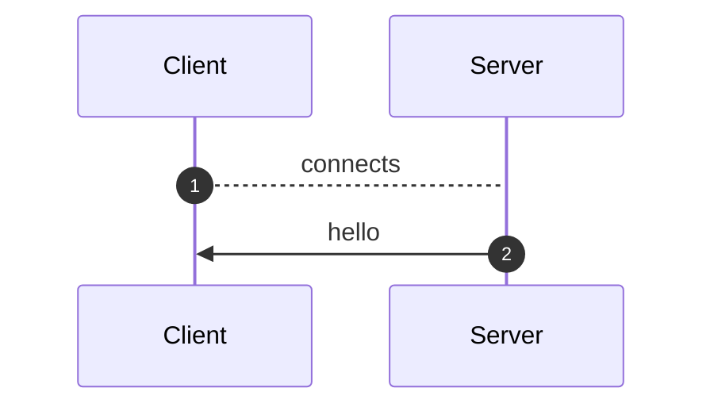
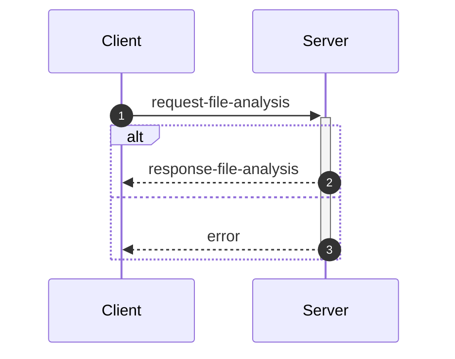
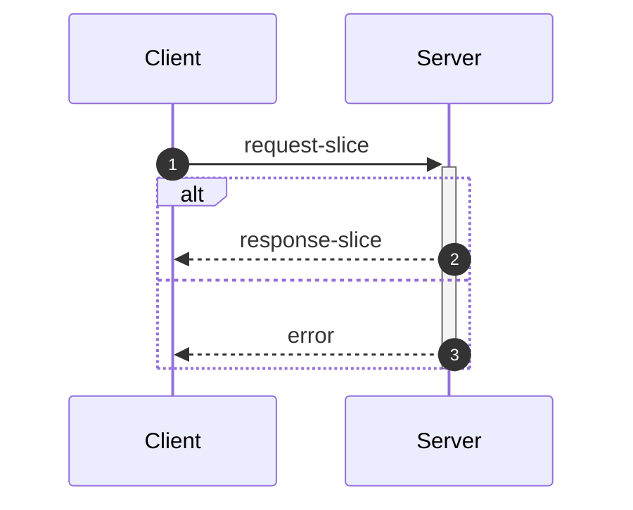
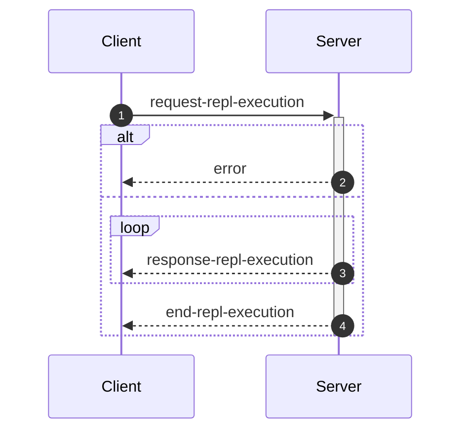

_This document was generated from '[src/documentation/wiki-interface.ts](https://github.com/flowr-analysis/flowr/tree/main//src/documentation/wiki-interface.ts)' on 2026-02-06, 22:31:35 UTC presenting an overview of flowR's interface (v2.9.6, using R v4.5.0). Please do not edit this file/wiki page directly._

Although far from being as detailed as the in-depth explanation of [_flowR_](https://github.com/flowr-analysis/flowr/wiki/wiki/core),
this wiki page explains how to interface with _flowR_ in more detail.
In general, command line arguments and other options provide short descriptions on hover over.

* [💻 Using the REPL](#using-the-repl)
* [⚙️ Configuring FlowR](#configuring-flowr)
* [⚒️ Writing Code](#writing-code)
* [💬 Communicating with the Server](#communicating-with-the-server)

<a id='using-the-repl'></a>
## 💻 Using the REPL


> [!NOTE]
> To execute arbitrary R commands with a repl request, _flowR_ has to be started explicitly with <span title="Description (Command Line Argument): Allow to access the underlying R session when using flowR (security warning: this allows the execution of arbitrary R code!)">`--r-session-access`</span>.
> Please be aware that this introduces a security risk and note that this relies on the [`r-shell` engine](https://github.com/flowr-analysis/flowr/wiki/wiki/engines) .

Although primarily meant for users to explore, 
there is nothing which forbids simply calling _flowR_ as a subprocess to use standard-in, -output, and -error 
for communication (although you can access the REPL using the server as well, 
with the [REPL Request](#message-request-repl-execution) message).

The read-eval-print loop&nbsp;(REPL) works relatively simple.
You can submit an expression (using <kbd>Enter</kbd>),
which is interpreted as an R&nbsp;expression by default but interpreted as a *command* if it starts with a colon (`:`).
The best command to get started with the REPL is <span title="Description (Repl Command): Show help information (aliases: :h, :?)">`:help`</span>.
Besides, you can leave the REPL either with the command <span title="Description (Repl Command): End the repl (aliases: :q, :exit)">`:quit`</span> or by pressing <kbd>Ctrl</kbd>+<kbd>C</kbd> twice.
When writing a *command*, you may press <kbd>Tab</kbd> to get a list of completions, if available.
Multiple commands can be entered in a single line by separating them with a semicolon (`;`), e.g. `:parse "x<-2"; :df*`.
If a command is given without R code, the REPL will re-use R code given in a previous command. 
The prior example will hence return first the parsed AST of the program and then the dataflow graph for `"x <- 2"`.

> [!NOTE]
> If you develop flowR, you may want to launch the repl using the `npm run main-dev` command, this way, you get a non-minified version of flowR with debug information and hot-reloading of source files.

<details>
<summary>Available Commands</summary>

We currently offer the following commands (this with a `[*]` suffix are available with and without the star):


| Command | Description |
| ------- | ----------- |
| **<span title="Description (Repl Command): End the repl (aliases: :q, :exit)">:quit</span>** | End the repl (aliases: **:<span title="Alias of ':quit'. End the repl">q</span>**, **:<span title="Alias of ':quit'. End the repl">exit</span>**) |
| **<span title="Description (Repl Command): Execute the given code as R code. This requires the `--r-session-access` flag to be set and requires the r-shell engine. (aliases: :e, :r)">:execute</span>** | Execute the given code as R code. This requires the `--r-session-access` flag to be set and requires the r-shell engine. (aliases: **:<span title="Alias of ':execute'. Execute the given code as R code. This requires the `--r-session-access` flag to be set and requires the r-shell engine.">e</span>**, **:<span title="Alias of ':execute'. Execute the given code as R code. This requires the `--r-session-access` flag to be set and requires the r-shell engine.">r</span>**) |
| **<span title="Description (Repl Command): Get mermaid code for the control-flow graph of R code, start with 'file://' to indicate a file (aliases: :cfg, :cf)">:controlflow[*]</span>** | Get mermaid code for the control-flow graph of R code, start with 'file://' to indicate a file (star: Returns the URL to mermaid.live) (aliases: **:<span title="Alias of ':controlflow'. Get mermaid code for the control-flow graph of R code, start with 'file://' to indicate a file">cfg</span>**, **:<span title="Alias of ':controlflow'. Get mermaid code for the control-flow graph of R code, start with 'file://' to indicate a file">cf</span>**) |
| **<span title="Description (Repl Command): Get mermaid code for the control-flow graph with basic blocks, start with 'file://' to indicate a file (aliases: :cfgb, :cfb)">:controlflowbb[*]</span>** | Get mermaid code for the control-flow graph with basic blocks, start with 'file://' to indicate a file (star: Returns the URL to mermaid.live) (aliases: **:<span title="Alias of ':controlflowbb'. Get mermaid code for the control-flow graph with basic blocks, start with 'file://' to indicate a file">cfgb</span>**, **:<span title="Alias of ':controlflowbb'. Get mermaid code for the control-flow graph with basic blocks, start with 'file://' to indicate a file">cfb</span>**) |
| **<span title="Description (Repl Command): Get mermaid code for the dataflow graph, start with 'file://' to indicate a file (aliases: :d, :df)">:dataflow[*]</span>** | Get mermaid code for the dataflow graph, start with 'file://' to indicate a file (star: Returns the URL to mermaid.live) (aliases: **:<span title="Alias of ':dataflow'. Get mermaid code for the dataflow graph, start with 'file://' to indicate a file">d</span>**, **:<span title="Alias of ':dataflow'. Get mermaid code for the dataflow graph, start with 'file://' to indicate a file">df</span>**) |
| **<span title="Description (Repl Command): Get mermaid code for the normalized AST of R code, start with 'file://' to indicate a file (aliases: :n)">:normalize[*]</span>** | Get mermaid code for the normalized AST of R code, start with 'file://' to indicate a file (star: Returns the URL to mermaid.live) (alias: **:<span title="Alias of ':normalize'. Get mermaid code for the normalized AST of R code, start with 'file://' to indicate a file">n</span>**) |
| **<span title="Description (Repl Command): Get mermaid code for the simplified dataflow graph, start with 'file://' to indicate a file (aliases: :ds, :dfs)">:dataflowsimple[*]</span>** | Get mermaid code for the simplified dataflow graph, start with 'file://' to indicate a file (star: Returns the URL to mermaid.live) (aliases: **:<span title="Alias of ':dataflowsimple'. Get mermaid code for the simplified dataflow graph, start with 'file://' to indicate a file">ds</span>**, **:<span title="Alias of ':dataflowsimple'. Get mermaid code for the simplified dataflow graph, start with 'file://' to indicate a file">dfs</span>**) |
| **<span title="Description (Repl Command): Just calculates the DFG, but only prints summary info (aliases: :d#, :df#)">:dataflowsilent</span>** | Just calculates the DFG, but only prints summary info (aliases: **:<span title="Alias of ':dataflowsilent'. Just calculates the DFG, but only prints summary info">d#</span>**, **:<span title="Alias of ':dataflowsilent'. Just calculates the DFG, but only prints summary info">df#</span>**) |
| **<span title="Description (Repl Command): Prints ASCII Art of the parsed, unmodified AST, start with 'file://' to indicate a file (aliases: :p)">:parse</span>** | Prints ASCII Art of the parsed, unmodified AST, start with 'file://' to indicate a file (alias: **:<span title="Alias of ':parse'. Prints ASCII Art of the parsed, unmodified AST, start with 'file://' to indicate a file">p</span>**) |
| **<span title="Description (Repl Command): Prints the version of flowR as well as the current version of R">:version</span>** | Prints the version of flowR as well as the current version of R
| **<span title="Description (Repl Command): Query the given R code, start with 'file://' to indicate a file. The query is to be a valid query in json format (use 'help' to get more information).">:query[*]</span>** | Query the given R code, start with 'file://' to indicate a file. The query is to be a valid query in json format (use 'help' to get more information). (star: Similar to query, but returns the output in json format.)
| **<span title="Description (Repl Command): Returns an ASCII representation of the dataflow graph (aliases: :df!)">:dataflowascii</span>** | Returns an ASCII representation of the dataflow graph (alias: **:<span title="Alias of ':dataflowascii'. Returns an ASCII representation of the dataflow graph">df!</span>**) |
| **<span title="Description (Repl Command): Show help information (aliases: :h, :?)">:help</span>** | Show help information (aliases: **:<span title="Alias of ':help'. Show help information">h</span>**, **:<span title="Alias of ':help'. Show help information">?</span>**) |


</details>


> [!TIP]
> 
> As indicated by the examples before, all REPL commands that operate on code keep track of the state.
> Hence, if you run a command like <span title="Description (Repl Command, starred version): Returns the URL to mermaid.live; Base Command: Get mermaid code for the dataflow graph, start with 'file://' to indicate a file (aliases: :d*, :df*)">`:dataflow*`</span> without providing R code,
> the REPL will re-use the R code provided in a previous command.
> Likewise, doing this will benefit from incrementality!
> If you request the dataflow graph with `:df* x <- 2 * y` and then want to see the parsed AST with `:parse`,
> the REPL will re-use previously obtained information and not re-parse the code again.
> 		


Generally, many commands offer shortcut versions in the REPL. Many queries, for example, offer a shortened format (see the example below).
Of special note, the [Config Query](https://github.com/flowr-analysis/flowr/wiki/wiki/query-api#Config-Query)
can be used to also modify the currently active configuration of _flowR_ within the REPL (see the [wiki page](https://github.com/flowr-analysis/flowr/wiki/wiki/query-api#Config-Query) for more information).

### Example: Retrieving the Dataflow Graph

To retrieve a URL to the [mermaid](https://mermaid.js.org/) diagram of the dataflow of a given expression, 
use <span title="Description (Repl Command, starred version): Returns the URL to mermaid.live; Base Command: Get mermaid code for the dataflow graph, start with 'file://' to indicate a file (aliases: :d*, :df*)">`:dataflow*`</span> (or <span title="Description (Repl Command): Get mermaid code for the dataflow graph, start with 'file://' to indicate a file (aliases: :d, :df)">`:dataflow`</span> to get the mermaid code in the cli):


```shell
$ docker run -it --rm eagleoutice/flowr # or npm run flowr 
flowR repl using flowR v2.9.6, R grammar v14 (tree-sitter engine)
R> :dataflow* y <- 1 + x
```

<details>
<summary style='color:gray'>Output</summary>


```text
https://mermaid.live/view#base64:eyJjb2RlIjoiZmxvd2NoYXJ0IEJUXG4gICAgMXt7XCJgIzkxO1JOdW1iZXIjOTM7IDFcbiAgICAgICgxKVxuICAgICAgKjEuNipgXCJ9fVxuICAgIDIoW1wiYCM5MTtSU3ltYm9sIzkzOyB4XG4gICAgICAoMilcbiAgICAgICoxLjEwKmBcIl0pXG4gICAgM1tbXCJgIzkxO1JCaW5hcnlPcCM5MzsgIzQzO1xuICAgICAgKDMpXG4gICAgICAqMS42LTEwKlxuICAgICgxLCAyKWBcIl1dXG4gICAgYnVpbHQtaW46X1tcImBCdWlsdC1JbjpcbiM0MztgXCJdXG4gICAgc3R5bGUgYnVpbHQtaW46XyBzdHJva2U6Z3JheSxmaWxsOmdyYXksc3Ryb2tlLXdpZHRoOjJweCxvcGFjaXR5Oi44O1xuICAgIDBbXCJgIzkxO1JTeW1ib2wjOTM7IHlcbiAgICAgICgwKVxuICAgICAgKjEuMSpgXCJdXG4gICAgNFtbXCJgIzkxO1JCaW5hcnlPcCM5MzsgIzYwOyM0NTtcbiAgICAgICg0KVxuICAgICAgKjEuMS0xMCpcbiAgICAoMCwgMylgXCJdXVxuICAgIGJ1aWx0LWluOl8tW1wiYEJ1aWx0LUluOlxuIzYwOyM0NTtgXCJdXG4gICAgc3R5bGUgYnVpbHQtaW46Xy0gc3Ryb2tlOmdyYXksZmlsbDpncmF5LHN0cm9rZS13aWR0aDoycHgsb3BhY2l0eTouODtcbiAgICAzIC0tPnxcInJlYWRzLCBhcmd1bWVudFwifCAxXG4gICAgMyAtLT58XCJyZWFkcywgYXJndW1lbnRcInwgMlxuICAgIDMgLS4tPnxcInJlYWRzLCBjYWxsc1wifCBidWlsdC1pbjpfXG4gICAgbGlua1N0eWxlIDIgc3Ryb2tlOmdyYXk7XG4gICAgMCAtLT58XCJkZWZpbmVkLWJ5XCJ8IDNcbiAgICAwIC0tPnxcImRlZmluZWQtYnlcInwgNFxuICAgIDQgLS0+fFwicmVhZHMsIGFyZ3VtZW50XCJ8IDNcbiAgICA0IC0tPnxcInJldHVybnMsIGFyZ3VtZW50XCJ8IDBcbiAgICA0IC0uLT58XCJyZWFkcywgY2FsbHNcInwgYnVpbHQtaW46Xy1cbiAgICBsaW5rU3R5bGUgNyBzdHJva2U6Z3JheTsiLCJtZXJtYWlkIjp7ImF1dG9TeW5jIjp0cnVlfX0=
```


Retrieve the dataflow graph of the expression `y <- 1 + x`. It looks like this:


	
<details>

<summary style="color:gray">R Code of the Dataflow Graph</summary>

The analysis required _0.6 ms_ (including parse and normalize, using the [tree-sitter](https://github.com/flowr-analysis/flowr/wiki/Engines) engine) within the generation environment. 
We encountered no unknown side effects during the analysis.


```r
y <- 1 + x
```


</details>


</details>


For small graphs like this, <span title="Description (Repl Command): Returns an ASCII representation of the dataflow graph (aliases: :df!)">`:dataflowascii`</span> also provides an ASCII representation directly in the REPL:


```shell
$ docker run -it --rm eagleoutice/flowr # or npm run flowr 
flowR repl using flowR v2.9.6, R grammar v14 (tree-sitter engine)
R> :df! y <- 1 + x
```

<details open>
<summary style='color:gray'>Output</summary>


```text
                        0<1>0
                   ┌────| 1 |
    ┌────────┐     │    0---0
 c<4>c       └──c<3>c
 |<- |  v<0>v┌──| + |
 c---c──| y |┘  c---c   u<2>u
        v---v      └────| x |
                        u---u
Edges:
3 -> 1: reads, argument  3 -> 2: reads, argument
4 -> 3: reads, argument  4 -> 0: returns, argument
0 -> 3: defined-by       0 -> 4: defined-by
```


Retrieve the dataflow graph of the expression `y <- 1 + x` as ASCII art.

</details>


For the slicing with <span title="Description (Repl Command): Static backwards executable slicer for R">`:slicer`</span>, you have access to the same [magic comments](#slice-magic-comments) as with the [slice request](#message-request-slice).

### Example: Interfacing with the File System

Many commands that allow for an R-expression (like <span title="Description (Repl Command, starred version): Returns the URL to mermaid.live; Base Command: Get mermaid code for the dataflow graph, start with 'file://' to indicate a file (aliases: :d*, :df*)">`:dataflow*`</span>) allow for a file as well 
if the argument starts with `file://`. 
If you are working from the root directory of the _flowR_ repository, the following gives you the parsed AST of the example file using the <span title="Description (Repl Command): Prints ASCII Art of the parsed, unmodified AST, start with 'file://' to indicate a file (aliases: :p)">`:parse`</span> command:


```shell
$ docker run -it --rm eagleoutice/flowr # or npm run flowr 
flowR repl using flowR v2.9.6, R grammar v14 (tree-sitter engine)
R> :parse file://test/testfiles/example.R
```

<details>
<summary style='color:gray'>Output</summary>


```text
File: test/testfiles/example.R

program
├ binaryoperator
│ ├ identifier "sum" (1:1─4)
│ ├ <- "<-" (1:5─7)
│ ╰ float "0" (1:8─9)
├ binaryoperator
│ ├ identifier "product" (2:1─8)
│ ├ <- "<-" (2:9─11)
│ ╰ float "1" (2:12─13)
├ binaryoperator
│ ├ identifier "w" (3:1─2)
│ ├ <- "<-" (3:3─5)
│ ╰ float "7" (3:6─7)
├ binaryoperator
│ ├ identifier "N" (4:1─2)
│ ├ <- "<-" (4:3─5)
│ ╰ float "10" (4:6─8)
├ forstatement
│ ├ for "for" (6:1─4)
│ ├ ( "(" (6:5─6)
│ ├ identifier "i" (6:6─7)
│ ├ in "in" (6:8─10)
│ ├ binaryoperator
│ │ ├ float "1" (6:11─12)
│ │ ├ : ":" (6:12─13)
│ │ ╰ parenthesizedexpression
│ │   ├ ( "(" (6:13─14)
│ │   ├ binaryoperator
│ │   │ ├ identifier "N" (6:14─15)
│ │   │ ├ - "-" (6:15─16)
│ │   │ ╰ float "1" (6:16─17)
│ │   ╰ ) ")" (6:17─18)
│ ├ ) ")" (6:18─19)
│ ╰ bracedexpression
│   ├ { "{" (6:20─21)
│   ├ binaryoperator
│   │ ├ identifier "sum" (7:3─6)
│   │ ├ <- "<-" (7:7─9)
│   │ ╰ binaryoperator
│   │   ├ binaryoperator
│   │   │ ├ identifier "sum" (7:10─13)
│   │   │ ├ + "+" (7:14─15)
│   │   │ ╰ identifier "i" (7:16─17)
│   │   ├ + "+" (7:18─19)
│   │   ╰ identifier "w" (7:20─21)
│   ├ binaryoperator
│   │ ├ identifier "product" (8:3─10)
│   │ ├ <- "<-" (8:11─13)
│   │ ╰ binaryoperator
│   │   ├ identifier "product" (8:14─21)
│   │   ├  "" (8:22─23)
│   │   ╰ identifier "i" (8:24─25)
│   ╰ } "}" (9:1─2)
├ call
│ ├ identifier "cat" (11:1─4)
│ ╰ arguments
│   ├ ( "(" (11:4─5)
│   ├ argument
│   │ ╰ string
│   │   ├ " "\"" (11:5─6)
│   │   ├ stringcontent "Sum:" (11:6─10)
│   │   ╰ " "\"" (11:10─11)
│   ├ comma "," (11:11─12)
│   ├ argument
│   │ ╰ identifier "sum" (11:13─16)
│   ├ comma "," (11:16─17)
│   ├ argument
│   │ ╰ string
│   │   ├ " "\"" (11:18─19)
│   │   ├ stringcontent
│   │   │ ╰ escapesequence "\\n" (11:19─21)
│   │   ╰ " "\"" (11:21─22)
│   ╰ ) ")" (11:22─23)
╰ call
  ├ identifier "cat" (12:1─4)
  ╰ arguments
    ├ ( "(" (12:4─5)
    ├ argument
    │ ╰ string
    │   ├ " "\"" (12:5─6)
    │   ├ stringcontent "Product:" (12:6─14)
    │   ╰ " "\"" (12:14─15)
    ├ comma "," (12:15─16)
    ├ argument
    │ ╰ identifier "product" (12:17─24)
    ├ comma "," (12:24─25)
    ├ argument
    │ ╰ string
    │   ├ " "\"" (12:26─27)
    │   ├ stringcontent
    │   │ ╰ escapesequence "\\n" (12:27─29)
    │   ╰ " "\"" (12:29─30)
    ╰ ) ")" (12:30─31)
```


Retrieve the parsed AST of the example file.

<details>

<summary>File Content</summary>


```r
sum <- 0
product <- 1
w <- 7
N <- 10

for (i in 1:(N-1)) {
  sum <- sum + i + w
  product <- product * i
}

cat("Sum:", sum, "\n")
cat("Product:", product, "\n")
```


</details>

As _flowR_ directly transforms this AST the output focuses on being human-readable instead of being machine-readable. 
		

</details>


### Example: Run a Query

You can run any query supported by _flowR_ using the <span title="Description (Repl Command): Query the given R code, start with 'file://' to indicate a file. The query is to be a valid query in json format (use 'help' to get more information).">`:query`</span> command.
For example, to obtain the shapes of all data frames in a given piece of code, you can run:


```shell
$ docker run -it --rm eagleoutice/flowr # or npm run flowr 
flowR repl using flowR v2.9.6, R grammar v14 (tree-sitter engine)
R> :query @df-shape "x <- data.frame(a = 1:10, b = 1:10)\ny <- x$a"
```

<details open>
<summary style='color:gray'>Output</summary>


```text
Query: df-shape (1 ms)
   ╰ 12: (colnames: [{"a", "b"}, {}], cols: [2, 2], rows: [10, 10])
   ╰ 0: (colnames: [{"a", "b"}, {}], cols: [2, 2], rows: [10, 10])
All queries together required ≈3 ms (1ms accuracy, total 4 ms)
```


Retrieve the shapes of all data frames in the given code.

</details>


To run the linter on a file, you can use (in this example, we just issue the `dead-code` linter on a small piece of code):


```shell
$ docker run -it --rm eagleoutice/flowr # or npm run flowr 
flowR repl using flowR v2.9.6, R grammar v14 (tree-sitter engine)
R> :query @linter rules:dead-code "if(FALSE) x <- 2"
```

<details open>
<summary style='color:gray'>Output</summary>


```text
Query: linter (1 ms)
   ╰ Dead Code (dead-code):
       ╰ certain:
           ╰ Code at 1.11-16
       ╰ Metadata: consideredNodes: 7, searchTimeMs: 1, processTimeMs: 0
All queries together required ≈1 ms (1ms accuracy, total 2 ms)
```


Run the linter on the given code, with only the `dead-code` rule enabled.

</details>


For more information on the available queries, please check out the [Query API](https://github.com/flowr-analysis/flowr/wiki/wiki/query-api).


<a id='configuring-flowr'></a>
## ⚙️ Configuring FlowR


When running _flowR_, you may want to specify some behaviors with a dedicated configuration file. 
By default, flowR looks for a file named `flowr.json` in the current working directory (or any higher directory). 
You can also specify a different file with <span title="Description (Command Line Argument): The name of the configuration file to use">`--config-file`</span> or pass the configuration inline using <span title="Description (Command Line Argument): The flowR configuration to use, as a JSON string">`--config-json`</span>.
To inspect the current configuration, you can run flowr with the <span title="Description (Command Line Argument): Run with verbose logging (will be passed to the corresponding script)">`--verbose`</span> flag, or use the `config` [Query](https://github.com/flowr-analysis/flowr/wiki/Query%20API).
Within the REPL this works by running the following:


```shell
:query @config
```


The following summarizes the configuration options:

- `ignoreSourceCalls`: If set to `true`, _flowR_ will ignore source calls when analyzing the code, i.e., ignoring the inclusion of other files.
- `semantics`: allows to configure the way _flowR_ handles R, although we currently only support `semantics/environment/overwriteBuiltIns`. 
  You may use this to overwrite _flowR_'s handling of built-in function and even completely clear the preset definitions shipped with flowR. 
  See [Configure BuiltIn Semantics](#configure-builtin-semantics) for more information.
- `solver`: allows to configure how _flowR_ resolves variables and their values (currently we support: `disabled`, `alias`, `builtin`), as well as if pointer analysis should be active.
- `engines`: allows to configure the engines used by _flowR_ to interact with R code. See the [Engines wiki page](https://github.com/flowr-analysis/flowr/wiki/Engines) for more information.
- `defaultEngine`: allows to specify the default engine to use for interacting with R code. If not set, an arbitrary engine from the specified list will be used.
- `abstractInterpretation`: allows to configure how _flowR_ performs abstract interpretation, although we currently only support data frame shape inference through abstract interpretation.

So you can configure _flowR_ by adding a file like the following:

<details>

<summary>Example Configuration File</summary>


```json
{
  "ignoreSourceCalls": true,
  "semantics": {
    "environment": {
      "overwriteBuiltIns": {
        "definitions": [
          {
            "type": "function",
            "names": [
              "foo"
            ],
            "processor": "builtin:assignment",
            "config": {}
          }
        ]
      }
    }
  },
  "repl": {
    "quickStats": false,
    "dfProcessorHeat": false
  },
  "project": {
    "resolveUnknownPathsOnDisk": true
  },
  "engines": [
    {
      "type": "r-shell"
    }
  ],
  "solver": {
    "variables": "alias",
    "evalStrings": true,
    "resolveSource": {
      "dropPaths": "no",
      "ignoreCapitalization": true,
      "inferWorkingDirectory": "active-script",
      "searchPath": []
    },
    "instrument": {},
    "slicer": {
      "threshold": 50
    }
  },
  "abstractInterpretation": {
    "wideningThreshold": 4,
    "dataFrame": {
      "maxColNames": 20,
      "readLoadedData": {
        "readExternalFiles": true,
        "maxReadLines": 1000000
      }
    }
  }
}
```


</details>

<details> 
<a id='configure-builtin-semantics'></a>
<summary>Configure Built-In Semantics</summary> 


`semantics/environment/overwriteBuiltins` accepts two keys:

- `loadDefaults` (boolean, initially `true`): If set to `true`, the default built-in definitions are loaded before applying the custom definitions. Setting this flag to `false` explicitly disables the loading of the default definitions.
- `definitions` (array, initially empty): Allows to overwrite or define new built-in elements. Each object within must have a `type` which is one of the below. Furthermore, they may define a string array of `names` which specifies the identifiers to bind the definitions to. You may use `assumePrimitive` to specify whether _flowR_ should assume that this is a primitive non-library definition (so you probably just do not want to specify the key).

  | Type            | Description                                                                                                                                                                                                                                                                                              | Example                                                                                                    |
  | --------------- | -------------------------------------------------------------------------------------------------------------------------------------------------------------------------------------------------------------------------------------------------------------------------------------------------------- | ---------------------------------------------------------------------------------------------------------- |
  | `constant`    | Additionally allows for a `value` this should resolve to.                                                                                                                                                                                                                                                | `{ type: 'constant', names: ['NULL', 'NA'],  value: null }`                                                |
  | `function`    | Is a rather flexible way to define and bind built-in functions. For the time, we do not have extensive documentation to cover all the cases, so please either consult the sources with the `default-builtin-config.ts` or open a [new issue](https://github.com/flowr-analysis/flowr/issues/new/choose). | `{ type: 'function', names: ['next'], processor: 'builtin:default', config: { cfg: ExitPointType.Next } }` |
  | `replacement` | A comfortable way to specify replacement functions like `$<-` or `names<-`. `suffixes` describes the... suffixes to attach automatically. | `{ type: 'replacement', suffixes: ['<-', '<<-'], names: ['[', '[['] }` |


</details>

<details>

<summary style='color:gray'>Full Configuration-File Schema</summary>

- _The configuration file format for flowR._ (object)
    - **ignoreSourceCalls** [optional] _Whether source calls should be ignored, causing {@link processSourceCall}'s behavior to be skipped._ (boolean)
    - **semantics** _Configure language semantics and how flowR handles them._ (object)
        - **environment** [optional] _Semantics regarding how to handle the R environment._ (object)
            - **overwriteBuiltIns** [optional] _Do you want to overwrite (parts) of the builtin definition?_ (object)
                - **loadDefaults** [optional] _Should the default configuration still be loaded?_ (boolean)
                - **definitions** [optional] _The definitions to load/overwrite._ (array)
                Valid item types:
                    - (object)
    - **repl** _Configuration options for the REPL._ (object)
        - **quickStats** [optional] _Whether to show quick stats in the REPL after each evaluation._ (boolean)
        - **dfProcessorHeat** [optional] _This instruments the dataflow processors to count how often each processor is called._ (boolean)
    - **project** _Project specific configuration options._ (object)
        - **resolveUnknownPathsOnDisk** [optional] _Whether to resolve unknown paths loaded by the r project disk when trying to source/analyze files._ (boolean)
    - **engines** _The engine or set of engines to use for interacting with R code. An empty array means all available engines will be used._ (array)
    Valid item types:
        - (alternatives)
            - _The configuration for the tree sitter engine._ (object)
                - **type** [required] _Use the tree sitter engine._ (string)
                    Only allows: 'tree-sitter'
                - **wasmPath** [optional] _The path to the tree-sitter-r WASM binary to use. If this is undefined, this uses the default path._ (string)
                - **treeSitterWasmPath** [optional] _The path to the tree-sitter WASM binary to use. If this is undefined, this uses the default path._ (string)
                - **lax** [optional] _Whether to use the lax parser for parsing R code (allowing for syntax errors). If this is undefined, the strict parser will be used._ (boolean)
            - _The configuration for the R shell engine._ (object)
                - **type** [required] _Use the R shell engine._ (string)
                    Only allows: 'r-shell'
                - **rPath** [optional] _The path to the R executable to use. If this is undefined, this uses the default path._ (string)
    - **defaultEngine** [optional] _The default engine to use for interacting with R code. If this is undefined, an arbitrary engine from the specified list will be used._ (string)
        Only allows: 'tree-sitter', 'r-shell'
    - **solver** _How to resolve constants, constraints, cells, ..._ (object)
        - **variables** _How to resolve variables and their values._ (string)
            Only allows: 'disabled', 'alias', 'builtin'
        - **evalStrings** _Should we include eval(parse(text="...")) calls in the dataflow graph?_ (boolean)
        - **instrument** (object)
            - **dataflowExtractors** [optional] _These keys are only intended for use within code, allowing to instrument the dataflow analyzer!_ (any)
        - **resolveSource** [optional] _If lax source calls are active, flowR searches for sourced files much more freely, based on the configurations you give it. This option is only in effect if `ignoreSourceCalls` is set to false._ (object)
            - **dropPaths** _Allow to drop the first or all parts of the sourced path, if it is relative._ (string)
                Only allows: 'no', 'once', 'all'
            - **ignoreCapitalization** _Search for filenames matching in the lowercase._ (boolean)
            - **inferWorkingDirectory** _Try to infer the working directory from the main or any script to analyze._ (string)
                Only allows: 'no', 'main-script', 'active-script', 'any-script'
            - **searchPath** _Additionally search in these paths._ (array)
            Valid item types:
                - (string)
            - **repeatedSourceLimit** [optional] _How often the same file can be sourced within a single run? Please be aware: in case of cyclic sources this may not reach a fixpoint so give this a sensible limit._ (number)
            - **applyReplacements** _Provide name replacements for loaded files_ (array)
            Valid item types:
                - (object)
        - **slicer** [optional] _The configuration for the slicer._ (object)
            - **threshold** [optional] _The maximum number of iterations to perform on a single function call during slicing._ (number)
    - **abstractInterpretation** _The configuration options for abstract interpretation._ (object)
        - **dataFrame** _The configuration of the shape inference for data frames._ (object)
            - **maxColNames** _The maximum number of columns names to infer for data frames before over-approximating the column names to top._ (number)
            - **wideningThreshold** _The threshold for the number of visitations of a node at which widening should be performed to ensure the termination of the fixpoint iteration._ (number)
            - **readLoadedData** _Configuration options for reading data frame shapes from loaded external data files, such as CSV files._ (object)
                - **readExternalFiles** _Whether data frame shapes should be extracted from loaded external files, such as CSV files._ (boolean)
                - **maxReadLines** _The maximum number of lines to read when extracting data frame shapes from loaded files, such as CSV files._ (number)

</details>

	

<a id='writing-code'></a>
## ⚒️ Writing Code

_flowR_ can be used as a [module](https://www.npmjs.com/package/@eagleoutice/flowr) and offers several main classes and interfaces that are interesting for extension writers 
(see the [Visual Studio Code extension](https://marketplace.visualstudio.com/items?itemName=code-inspect.vscode-flowr) or the [Core](https://github.com/flowr-analysis/flowr/wiki/wiki/core) wiki page for more information).

### Creating Analyses with _flowR_

Nowadays, instances of the <a href="https://github.com/flowr-analysis/flowr/tree/main//src/project/flowr-analyzer.ts#L162"><code><span title="Central class for conducting analyses with FlowR. Use the FlowrAnalyzerBuilder to create a new instance. If you want the original pattern of creating a pipeline and running all steps, you can still do this with FlowrAnalyzer#runFull . To inspect the context of the analyzer, use FlowrAnalyzer#inspectContext (if you are a plugin and need to modify it, use FlowrAnalyzer#context instead).">FlowrAnalyzer</span></code></a> should be used as central frontend to get analysis results from _flowR_.
For example, a program slice can be created like this:


```ts
const analyzer = await new FlowrAnalyzerBuilder()
    .setEngine('tree-sitter')
    .build();
analyzer.addRequest('x <- 1\ny <- x\nx');
const result = await analyzer.query([
    {
        type:     'static-slice',
        criteria: ['3@x']
    }
]);
//console.log(result['static-slice']);
```


For more information, please have a look at the [Analyzer](https://github.com/flowr-analysis/flowr/wiki/wiki/analyzer) wiki page, which explains how to construct and use the <a href="https://github.com/flowr-analysis/flowr/tree/main//src/project/flowr-analyzer.ts#L162"><code><span title="Central class for conducting analyses with FlowR. Use the FlowrAnalyzerBuilder to create a new instance. If you want the original pattern of creating a pipeline and running all steps, you can still do this with FlowrAnalyzer#runFull . To inspect the context of the analyzer, use FlowrAnalyzer#inspectContext (if you are a plugin and need to modify it, use FlowrAnalyzer#context instead).">FlowrAnalyzer</span></code></a> in more detail.
To work with specific perspectives, you can also consult the respective pages like the [Dataflow Graph](https://github.com/flowr-analysis/flowr/wiki/wiki/dataflow-graph) or the [Abstract Interpretation](https://github.com/flowr-analysis/flowr/wiki/wiki/abstract-interpretation) wiki pages.
        
### The Pipeline Executor (Low-Level Interface)

Once, in the beginning, _flowR_ was meant to produce a dataflow graph merely to provide *program slices*. 
However, with continuous updates, the [Dataflow Graph](https://github.com/flowr-analysis/flowr/wiki/wiki/dataflow-graph) repeatedly proves to be the more interesting part.
With this, we restructured _flowR_'s originally *hardcoded* pipeline to be far more flexible. 
Now, it can be theoretically extended or replaced with arbitrary steps, optional steps, and what we call 'decorations' of these steps. 
In short, a slicing pipeline using the <a href="https://github.com/flowr-analysis/flowr/tree/main//src/core/pipeline-executor.ts#L97"><code><span title="**Please note:** The PipelineExecutor is now considered to be a rather low-level API for flowR. While it still works and is the basis for all other layers, we strongly recommend using the FlowrAnalyzer and its builder to create and use an analyzer instance that is pre-configured for your use-case. The pipeline executor allows to execute arbitrary pipelines in a step-by-step fashion. If you are not...">PipelineExecutor</span></code></a> looks like this:


```ts

const slicer = new PipelineExecutor(DEFAULT_SLICING_PIPELINE, {
  parser:    new RShell(),
  request:   requestFromInput('x <- 1\nx + 1'),
  criterion: ['2@x']
})
const slice = await slicer.allRemainingSteps()
// console.log(slice.reconstruct.code)
```


<details><summary>More Information</summary>


If you compare this, with what you would have done with the old (and removed) `SteppingSlicer`, 
this essentially just requires you to replace the `SteppingSlicer` with the <a href="https://github.com/flowr-analysis/flowr/tree/main//src/core/pipeline-executor.ts#L97"><code><span title="**Please note:** The PipelineExecutor is now considered to be a rather low-level API for flowR. While it still works and is the basis for all other layers, we strongly recommend using the FlowrAnalyzer and its builder to create and use an analyzer instance that is pre-configured for your use-case. The pipeline executor allows to execute arbitrary pipelines in a step-by-step fashion. If you are not...">PipelineExecutor</span></code></a>
and to pass the <a href="https://github.com/flowr-analysis/flowr/tree/main//src/core/steps/pipeline/default-pipelines.ts#L18"><code>DEFAULT_SLICING_PIPELINE</code></a> as the first argument.
The <a href="https://github.com/flowr-analysis/flowr/tree/main//src/core/pipeline-executor.ts#L97"><code><span title="**Please note:** The PipelineExecutor is now considered to be a rather low-level API for flowR. While it still works and is the basis for all other layers, we strongly recommend using the FlowrAnalyzer and its builder to create and use an analyzer instance that is pre-configured for your use-case. The pipeline executor allows to execute arbitrary pipelines in a step-by-step fashion. If you are not...">PipelineExecutor</span></code></a>...

1. Provides structures to investigate the results of all intermediate steps
2. Can be executed step-by-step
3. Can repeat steps (e.g., to calculate multiple slices on the same input)

See the in-code documentation for more information.

	

</details>
    

### Using the <a href="https://github.com/flowr-analysis/flowr/tree/main//src/r-bridge/shell.ts#L143"><code><span title="The RShell represents an interactive session with the R interpreter. You can configure it by RShellOptions . At the moment we are using a live R session (and not networking etc.) to communicate with R easily, which allows us to install packages etc. However, this might and probably will change in the future (leaving this as a legacy mode :D)">RShell</span></code></a> to Interact with R

The <a href="https://github.com/flowr-analysis/flowr/tree/main//src/r-bridge/shell.ts#L143"><code><span title="The RShell represents an interactive session with the R interpreter. You can configure it by RShellOptions . At the moment we are using a live R session (and not networking etc.) to communicate with R easily, which allows us to install packages etc. However, this might and probably will change in the future (leaving this as a legacy mode :D)">RShell</span></code></a> class allows interfacing with the `R`&nbsp;ecosystem installed on the host system.
Please have a look at [flowR's Engines](https://github.com/flowr-analysis/flowr/wiki/wiki/engines) for more information on alternatives (for example, the <a href="https://github.com/flowr-analysis/flowr/tree/main//src/r-bridge/lang-4.x/tree-sitter/tree-sitter-executor.ts#L18"><code><span title="Synchronous and (way) faster alternative to the RShell using tree-sitter.">TreeSitterExecutor</span></code></a>).


> [!IMPORTANT]
> 
> Each <a href="https://github.com/flowr-analysis/flowr/tree/main//src/r-bridge/shell.ts#L143"><code><span title="The RShell represents an interactive session with the R interpreter. You can configure it by RShellOptions . At the moment we are using a live R session (and not networking etc.) to communicate with R easily, which allows us to install packages etc. However, this might and probably will change in the future (leaving this as a legacy mode :D)">RShell</span></code></a> controls a new instance of the R&nbsp;interpreter, 
> make sure to call <code><a href="https://github.com/flowr-analysis/flowr/tree/main//src/r-bridge/shell.ts#L317"><span title="Close the current R session, makes the object effectively invalid (can no longer be reopened etc.)">RShell::<i>close</i></span></a>()</code> when you are done.


You can start a new "session" simply by constructing a new object with <code>new <a href="https://github.com/flowr-analysis/flowr/tree/main//src/r-bridge/shell.ts#L143"><span title="The RShell represents an interactive session with the R interpreter. You can configure it by RShellOptions . At the moment we are using a live R session (and not networking etc.) to communicate with R easily, which allows us to install packages etc. However, this might and probably will change in the future (leaving this as a legacy mode :D)">RShell</span></a>()</code>.

However, there are several options that may be of interest 
(e.g., to automatically revive the shell in case of errors or to control the name location of the R process on the system).

With a shell object (let's call it `shell`), you can execute R code by using <a href="https://github.com/flowr-analysis/flowr/tree/main//src/r-bridge/shell.ts#L195"><code><span title="sends the given command directly to the current R session will not do anything to alter input markers!">RShell::<i>sendCommand</i></span></code></a>, 
for example <code>shell.<a href="https://github.com/flowr-analysis/flowr/tree/main//src/r-bridge/shell.ts#L195"><span title="sends the given command directly to the current R session will not do anything to alter input markers!">sendCommand</span></a>("1 + 1")</code>. 
However, this does not return anything, so if you want to collect the output of your command, use
<a href="https://github.com/flowr-analysis/flowr/tree/main//src/r-bridge/shell.ts#L261"><code><span title="Send a command and collect the output">RShell::<i>sendCommandWithOutput</i></span></code></a> instead.

Besides that, the command <a href="https://github.com/flowr-analysis/flowr/tree/main//src/r-bridge/shell.ts#L233"><code>RShell::<b>tryToInjectHomeLibPath</b></code></a> may be of interest, as it enables all libraries available on the host system.


### Generate Statistics (No longer a Focus of flowR)


<details>

<summary>Adding a New Feature to Extract</summary>

In this example, we construct a new feature to extract, with the name "*example*".
Whenever this name appears, you may substitute this with whatever name fits your feature best (as long as the name is unique).

1. **Create a new file in `src/statistics/features/supported`**\
   Create the file `example.ts`, and add its export to the `index.ts` file in the same directory (if not done automatically).

2. **Create the basic structure**\
   To get a better feel of what a feature must have, let's look
   at the basic structure (of course, due to TypeScript syntax,
   there are other ways to achieve the same goal):

   ```ts
   const initialExampleInfo = {
       /* whatever start value is good for you */
       someCounter: 0
   }

   export type ExampleInfo = Writable<typeof initialExampleInfo>

   export const example: Feature<ExampleInfo> = {
    name:        'Example Feature',
    description: 'A longer example description',

    process(existing: ExampleInfo, input: FeatureProcessorInput): ExampleInfo {
      /* perform analysis on the input */
      return existing
    },

    initialValue: initialExampleInfo
   }
   ```

   The `initialExampleInfo` type holds the initial values for each counter that you want to maintain during the feature extraction (they will usually be initialized with 0). The resulting `ExampleInfo` type holds the structure of the data that is to be counted. Due to the vast amount of data processed, information like the name and location of a function call is not stored here, but instead written to disk (see below).

   Every new feature must be of the `Feature<Info>` type, with `Info` referring to a `FeatureInfo` (like `ExampleInfo` in this example). Next to a `name` and a `description`, each Feature must provide:

   - a processor that extracts the information from the input, adding it to the existing information.
   - a function returning the initial value of the information (in this case, `initialExampleInfo`).

3. **Add it to the feature-mapping**\
   Now, in the `feature.ts` file in `src/statistics/features`, add your feature to the `ALL_FEATURES` object.

Now, we want to extract something. For the *example* feature created in the previous steps, we choose to count the amount of `COMMENT` tokens.
So we define a corresponding [XPath](https://developer.mozilla.org/en-US/docs/Web/XPath) query:

```ts
const commentQuery: Query = xpath.parse('//COMMENT')
```

Within our feature's `process` function, running the query is as simple as:

```ts
const comments = commentQuery.select({ node: input.parsedRAst })
```

Now we could do a lot of further processing, but for simplicity, we only record every comment found this way:

```ts
appendStatisticsFile(example.name, 'comments', comments, input.filepath)
```

We use `example.name` to avoid duplication with the name that we’ve assigned to the feature. It corresponds to the name of the folder in the statistics output.
`'comments'` refers to a freely chosen (but unique) name, that will be used as the name for the output file within the folder. The `comments` variable holds the result of the query, which is an array of nodes. Finally, we pass the `filepath` of the file that was analyzed (if known), so that it can be added to the statistics file (as additional information).

</details>
	

<a id='communicating-with-the-server'></a>
## 💬 Communicating with the Server


As explained in the [Overview](https://github.com/flowr-analysis/flowr/wiki/Overview), you can simply run the [TCP](https://de.wikipedia.org/wiki/Transmission_Control_Protocol)&nbsp;server by adding the <span title="Description (Command Line Argument): Do not drop into a repl, but instead start a server on the given port (default: 1042) and listen for messages.">`--server`</span> flag (and, due to the interactive mode, exit with the conventional <kbd>CTRL</kbd>+<kbd>C</kbd>).
Currently, every connection is handled by the same underlying `RShell` - so the server is not designed to handle many clients at a time.
Additionally, the server is not well guarded against attacks (e.g., you can theoretically spawn an arbitrary number of&nbsp;RShell sessions on the target machine).

Every message has to be given in a single line (i.e., without a newline in-between) and end with a newline character. Nevertheless, we will pretty-print example given in the following segments for the ease of reading.


> [!NOTE]
> 
> The default <span title="Description (Command Line Argument): Do not drop into a repl, but instead start a server on the given port (default: 1042) and listen for messages.">`--server`</span> uses a simple [TCP](https://de.wikipedia.org/wiki/Transmission_Control_Protocol)
> connection. If you want _flowR_ to expose a [WebSocket](https://de.wikipedia.org/wiki/WebSocket) server instead, add the <span title="Description (Command Line Argument): If the server flag is set, use websocket for messaging">`--ws`</span> flag (i.e., <span title="Description (Command Line Argument): Do not drop into a repl, but instead start a server on the given port (default: 1042) and listen for messages.">`--server`</span> <span title="Description (Command Line Argument): If the server flag is set, use websocket for messaging">`--ws`</span>) when starting _flowR_ from the command line.
> 			


<ul><li>
<a id="message-hello"></a>
<b>Hello</b> Message (<code>hello</code>) 
<details>

<summary style="color:gray"> View Details. <i>The server informs the client about the successful connection and provides Meta-Information.</i> </summary>




	
After launching _flowR_, for example, with <code>docker run -it --rm eagleoutice/flowr <span title="Description (Command Line Argument): Do not drop into a repl, but instead start a server on the given port (default: 1042) and listen for messages.">-<span/>-server</span></code>&nbsp;(🐳️), simply connecting should present you with a `hello` message, that amongst others should reveal the versions of&nbsp;_flowR_ and&nbsp;R, using the [semver 2.0](https://semver.org/spec/v2.0.0.html) versioning scheme.
The message looks like this:


```json
{
  "type": "hello",
  "clientName": "client-0",
  "versions": {
    "flowr": "2.9.6",
    "r": "4.5.0",
    "engine": "r-shell"
  }
}
```


There are currently a few messages that you can send after the hello message.
If you want to _slice_ a piece of R code you first have to send an [analysis request](#message-request-file-analysis), so that you can send one or multiple slice requests afterward.
Requests for the [REPL](#message-request-repl) are independent of that.
	

<hr>


<details>
<summary style="color:gray">Message schema (<code>hello</code>)</summary>

For the definition of the hello message, please see it's implementation at [`./src/cli/repl/server/messages/message-hello.ts`](https://github.com/flowr-analysis/flowr/tree/main/./src/cli/repl/server/messages/message-hello.ts).

- [required] (object)
    - **type** [required] _The type of the hello message._ (string)
        Only allows: 'hello'
    - **id** [forbidden] _The id of the message is always undefined (as it is the initial message and not requested)._ (any)
    - **clientName** [required] _A unique name that is assigned to each client. It has no semantic meaning and is only used/useful for debugging._ (string)
    - **versions** [required] (object)
        - **flowr** [required] _The version of the flowr server running in semver format._ (string)
        - **r** [required] _The version of the underlying R shell running in semver format._ (string)
        - **engine** [required] _The parser backend that is used to parse the R code._ (string)

</details>


<hr>

</details>
	</li>

<li>
<a id="message-request-file-analysis"></a>
<b>Analysis</b> Message (<code>request-file-analysis</code>) 
<details>

<summary style="color:gray"> View Details. <i>The server builds the dataflow graph for a given input file (or a set of files).</i> </summary>




	
The request allows the server to analyze a file and prepare it for slicing.
The message can contain a `filetoken`, which is used to identify the file in later slice or query requests (if you do not add one, the request will not be stored and therefore, it is not available for subsequent requests).

> **Please note!**\
> If you want to send and process a lot of analysis requests, but do not want to slice them, please do not pass the `filetoken` field. This will save the server a lot of memory allocation.

Furthermore, the request must contain either a `content` field to directly pass the file's content or a `filepath` field which contains the path to the file (this path must be accessible for the server to be useful).
If you add the `id` field, the answer will use the same `id` so you can match requests and the corresponding answers.
See the implementation of the request-file-analysis message for more information.


<details>
<summary>Example of the <code>request-file-analysis</code> Message</summary>

_Note:_ even though we pretty-print these messages, they are sent as a single line, ending with a newline.

The following lists all messages that were sent and received in case you want to reproduce the scenario:

<ol>
<li> <code>hello</code> (response)
<details> 

<summary> Show Details </summary>

The first message is always a hello message.


```json
{
  "type": "hello",
  "clientName": "client-0",
  "versions": {
    "flowr": "2.9.6",
    "r": "4.5.0",
    "engine": "r-shell"
  }
}
```


</details>
</li>

<li> <b><code>request-file-analysis</code> (request)</b>
<details open> 

<summary> Show Details </summary>

Let's suppose you simply want to analyze the following script:
 
```r
x <- 1
x + 1
```

 For this, you can send the following request:


```json
{
  "type": "request-file-analysis",
  "id": "1",
  "filetoken": "x",
  "content": "x <- 1\nx + 1"
}
```


</details>
</li>

<li> <code>response-file-analysis</code> (response)
<details> 

<summary> Show Details </summary>


The `results` field of the response effectively contains three keys of importance:

- `parse`: which contains 1:1 the parse result in CSV format that we received from the `RShell` (i.e., the AST produced by the parser of the R interpreter).
- `normalize`: which contains the normalized AST, including ids (see the `info` field and the [Normalized AST](https://github.com/flowr-analysis/flowr/wiki/Normalized%20AST) wiki page).
- `dataflow`: especially important is the `graph` field which contains the dataflow graph as a set of root vertices (see the [Dataflow Graph](https://github.com/flowr-analysis/flowr/wiki/Dataflow%20Graph) wiki page).
			


_As the code is pretty long, we inhibit pretty printing and syntax highlighting (JSON, hiding built-in):_

```text
{"type":"response-file-analysis","format":"json","id":"1","results":{"parse":{"files":[{"parsed":"[1,1,1,6,7,0,\"expr\",false,\"x <- 1\"],[1,1,1,1,1,3,\"SYMBOL\",true,\"x\"],[1,1,1,1,3,7,\"expr\",false,\"x\"],[1,3,1,4,2,7,\"LEFT_ASSIGN\",true,\"<-\"],[1,6,1,6,4,5,\"NUM_CONST\",true,\"1\"],[1,6,1,6,5,7,\"expr\",false,\"1\"],[2,1,2,5,16,0,\"expr\",false,\"x + 1\"],[2,1,2,1,10,12,\"SYMBOL\",true,\"x\"],[2,1,2,1,12,16,\"expr\",false,\"x\"],[2,3,2,3,11,16,\"'+'\",true,\"+\"],[2,5,2,5,13,14,\"NUM_CONST\",true,\"1\"],[2,5,2,5,14,16,\"expr\",false,\"1\"]","filePath":"/tmp/tmp-8436-1lZ0nYPGU5jJ-.R"}],".meta":{"timing":2}},"normalize":{"ast":{"type":"RProject","files":[{"root":{"type":"RExpressionList","children":[{"type":"RBinaryOp","location":[1,3,1,4],"lhs":{"type":"RSymbol","location":[1,1,1,1],"content":"x","lexeme":"x","info":{"fullRange":[1,1,1,1],"adToks":[],"id":0,"parent":2,"role":"binop-lhs","index":0,"nesting":0,"file":"/tmp/tmp-8436-1lZ0nYPGU5jJ-.R"}},"rhs":{"location":[1,6,1,6],"lexeme":"1","info":{"fullRange":[1,6,1,6],"adToks":[],"id":1,"parent":2,"role":"binop-rhs","index":1,"nesting":0,"file":"/tmp/tmp-8436-1lZ0nYPGU5jJ-.R"},"type":"RNumber","content":{"num":1,"complexNumber":false,"markedAsInt":false}},"operator":"<-","lexeme":"<-","info":{"fullRange":[1,1,1,6],"adToks":[],"id":2,"parent":6,"nesting":0,"file":"/tmp/tmp-8436-1lZ0nYPGU5jJ-.R","index":0,"role":"expr-list-child"}},{"type":"RBinaryOp","location":[2,3,2,3],"lhs":{"type":"RSymbol","location":[2,1,2,1],"content":"x","lexeme":"x","info":{"fullRange":[2,1,2,1],"adToks":[],"id":3,"parent":5,"role":"binop-lhs","index":0,"nesting":0,"file":"/tmp/tmp-8436-1lZ0nYPGU5jJ-.R"}},"rhs":{"location":[2,5,2,5],"lexeme":"1","info":{"fullRange":[2,5,2,5],"adToks":[],"id":4,"parent":5,"role":"binop-rhs","index":1,"nesting":0,"file":"/tmp/tmp-8436-1lZ0nYPGU5jJ-.R"},"type":"RNumber","content":{"num":1,"complexNumber":false,"markedAsInt":false}},"operator":"+","lexeme":"+","info":{"fullRange":[2,1,2,5],"adToks":[],"id":5,"parent":6,"nesting":0,"file":"/tmp/tmp-8436-1lZ0nYPGU5jJ-.R","index":1,"role":"expr-list-child"}}],"info":{"adToks":[],"id":6,"nesting":0,"file":"/tmp/tmp-8436-1lZ0nYPGU5jJ-.R","role":"root","index":0}},"filePath":"/tmp/tmp-8436-1lZ0nYPGU5jJ-.R"}],"info":{"id":7}},".meta":{"timing":0}},"dataflow":{"unknownReferences":[],"in":[{"nodeId":2,"name":"<-","type":2},{"nodeId":5,"name":"+","type":2}],"out":[{"nodeId":0,"name":"x","type":4,"definedAt":2,"value":[1]}],"environment":{"current":{"id":1801,"parent":"<BuiltInEnvironment>","memory":[["x",[{"nodeId":0,"name":"x","type":4,"definedAt":2,"value":[1]}]]]},"level":0},"graph":{"rootVertices":[1,0,2,3,4,5],"vertexInformation":[[1,{"tag":"value","id":1}],[0,{"tag":"vdef","id":0}],[2,{"tag":"fcall","id":2,"name":"<-","onlyBuiltin":true,"args":[{"nodeId":0,"type":32},{"nodeId":1,"type":32}],"origin":["builtin:assignment"]}],[3,{"tag":"use","id":3}],[4,{"tag":"value","id":4}],[5,{"tag":"fcall","id":5,"name":"+","onlyBuiltin":true,"args":[{"nodeId":3,"type":32},{"nodeId":4,"type":32}],"origin":["builtin:default"]}]],"edgeInformation":[[2,[[1,{"types":65}],[0,{"types":72}],["built-in:<-",{"types":5}]]],[0,[[1,{"types":2}],[2,{"types":2}]]],[3,[[0,{"types":1}]]],[5,[[3,{"types":65}],[4,{"types":65}],["built-in:+",{"types":5}]]]],"_unknownSideEffects":[]},"entryPoint":2,"exitPoints":[{"type":0,"nodeId":5}],"hooks":[],".meta":{"timing":1}}}}
```


</details>
</li>
</ol>

The complete round-trip took 14.1 ms (including time required to validate the messages, start, and stop the internal mock server).

</details>


You receive an error if, for whatever reason, the analysis fails (e.g., the message or code you sent contained syntax errors).
It contains a human-readable description *why* the analysis failed (see the error message implementation for more details).


<details>
<summary>Example Error Message</summary>

_Note:_ even though we pretty-print these messages, they are sent as a single line, ending with a newline.

The following lists all messages that were sent and received in case you want to reproduce the scenario:

<ol>
<li> <code>hello</code> (response)
<details> 

<summary> Show Details </summary>

The first message is always a hello message.


```json
{
  "type": "hello",
  "clientName": "client-0",
  "versions": {
    "flowr": "2.9.6",
    "r": "4.5.0",
    "engine": "r-shell"
  }
}
```


</details>
</li>

<li> <code>request-file-analysis</code> (request)
<details> 

<summary> Show Details </summary>


```json
{
  "type": "request-file-analysis",
  "id": "1",
  "filename": "sample.R",
  "content": "x <-"
}
```


</details>
</li>

<li> <b><code>error</code> (response)</b>
<details open> 

<summary> Show Details </summary>


```json
{
  "id": "1",
  "type": "error",
  "fatal": false,
  "reason": "Error while analyzing file sample.R: GuardError: unable to parse R code (see the log for more information) for request {\"request\":\"text\",\"content\":\"x <-\"}}\n Report a Bug: https://github.com/flowr-analysis/flowr/issues/new?body=%3C!%2D%2D%20Please%20describe%20your%20issue%20in%20more%20detail%20below!%20%2D%2D%3E%0A%0A%0A%3C!%2D%2D%20Automatically%20generated%20issue%20metadata%2C%20please%20do%20not%20edit%20or%20delete%20content%20below%20this%20line%20%2D%2D%3E%0A%2D%2D%2D%0A%0AflowR%20version%3A%202.9.6%0Anode%20version%3A%20v22.14.0%0Anode%20arch%3A%20x64%0Anode%20platform%3A%20linux%0Amessage%3A%20%60unable%20to%20parse%20R%20code%20%28see%20the%20log%20for%20more%20information%29%20for%20request%20%7B%22request%22%3A%22text%22%2C%22content%22%3A%22x%20%3C%2D%22%7D%7D%60%0Astack%20trace%3A%0A%60%60%60%0A%20%20%20%20at%20guard%20%28%3C%3E%2Fsrc%2Futil%2Fassert.ts%3A128%3A9%29%0A%20%20%20%20at%20guardRetrievedOutput%20%28%3C%3E%2Fsrc%2Fr%2Dbridge%2Fretriever.ts%3A221%3A7%29%0A%20%20%20%20at%20%2Fhome%2Frunner%2Fwork%2Fflowr%2Fflowr%2Fsrc%2Fr%2Dbridge%2Fretriever.ts%3A182%3A4%0A%20%20%20%20at%20processTicksAndRejections%20%28node%3Ainternal%2Fprocess%2Ftask_queues%3A105%3A5%29%0A%20%20%20%20at%20async%20Object.parseRequests%20%5Bas%20processor%5D%20%28%3C%3E%2Fsrc%2Fr%2Dbridge%2Fparser.ts%3A104%3A19%29%0A%20%20%20%20at%20async%20PipelineExecutor.nextStep%20%28%3C%3E%2Fsrc%2Fcore%2Fpipeline%2Dexecutor.ts%3A192%3A25%29%0A%20%20%20%20at%20async%20FlowrAnalyzerCache.runTapeUntil%20%28%3C%3E%2Fsrc%2Fproject%2Fcache%2Fflowr%2Danalyzer%2Dcache.ts%3A93%3A4%29%0A%20%20%20%20at%20async%20FlowRServerConnection.sendFileAnalysisResponse%20%28%3C%3E%2Fsrc%2Fcli%2Frepl%2Fserver%2Fconnection.ts%3A163%3A52%29%0A%60%60%60%0A%0A%2D%2D%2D%0A%09"
}
```


</details>
</li>
</ol>

The complete round-trip took 10.3 ms (including time required to validate the messages, start, and stop the internal mock server).

</details>


&nbsp;

<a id="analysis-include-cfg"></a>
**Including the Control Flow Graph**

While _flowR_ does (for the time being) not use an explicit control flow graph but instead relies on control-dependency edges within the dataflow graph, 
the respective structure can still be exposed using the server (note that, as this feature is not needed within _flowR_, it is tested significantly less - 
so please create a [new issue](https://github.com/flowr-analysis/flowr/issues/new/choose) for any bug you may encounter).
For this, the analysis request may add `cfg: true` to its list of options.


<details>
<summary>Requesting a Control Flow Graph</summary>

_Note:_ even though we pretty-print these messages, they are sent as a single line, ending with a newline.

The following lists all messages that were sent and received in case you want to reproduce the scenario:

<ol>
<li> <code>hello</code> (response)
<details> 

<summary> Show Details </summary>

The first message is always a hello message.


```json
{
  "type": "hello",
  "clientName": "client-0",
  "versions": {
    "flowr": "2.9.6",
    "r": "4.5.0",
    "engine": "r-shell"
  }
}
```


</details>
</li>

<li> <b><code>request-file-analysis</code> (request)</b>
<details open> 

<summary> Show Details </summary>


```json
{
  "type": "request-file-analysis",
  "id": "1",
  "filetoken": "x",
  "content": "if(unknown > 0) { x <- 2 } else { x <- 5 }\nfor(i in 1:x) { print(x); print(i) }",
  "cfg": true
}
```


</details>
</li>

<li> <code>response-file-analysis</code> (response)
<details> 

<summary> Show Details </summary>


The response looks basically the same as a response sent without the `cfg` flag. However, additionally it contains a `cfg` field. 
If you are interested in a visual representation of the control flow graph, see the 
[visualization with mermaid](https://mermaid.live/view#base64:eyJjb2RlIjoiZmxvd2NoYXJ0IEJUXG4gICAgbjMyKFtcImBSRXhwcmVzc2lvbkxpc3QgKDMyKWBcIl0pXG4gICAgbjE1W1wiYFJJZlRoZW5FbHNlICgxNSlcbiMzNDtpZih1bmtub3duICM2MjsgMCkgIzEyMzsgeCAjNjA7IzQ1OyAyICMxMjU7IGVsc2UgIzEyMzsgeCAjNjA7IzQ1OyA1ICMxMjU7IzM0O2BcIl1cbiAgICBuMTUtZXhpdCgoMTUtZXhpdCkpXG4gICAgbjAoW1wiYFJTeW1ib2wgKDApXG4jMzQ7dW5rbm93biMzNDtgXCJdKVxuICAgIG4xKFtcImBSTnVtYmVyICgxKVxuIzM0OzAjMzQ7YFwiXSlcbiAgICBuMihbXCJgUkJpbmFyeU9wICgyKVxuIzM0O3Vua25vd24gIzYyOyAwIzM0O2BcIl0pXG4gICAgbjItZXhpdCgoMi1leGl0KSlcbiAgICBuOChbXCJgUkV4cHJlc3Npb25MaXN0ICg4KWBcIl0pXG4gICAgbjUoW1wiYFJTeW1ib2wgKDUpXG4jMzQ7eCMzNDtgXCJdKVxuICAgIG42KFtcImBSTnVtYmVyICg2KVxuIzM0OzIjMzQ7YFwiXSlcbiAgICBuNyhbXCJgUkJpbmFyeU9wICg3KVxuIzM0O3ggIzYwOyM0NTsgMiMzNDtgXCJdKVxuICAgIG43LWV4aXQoKDctZXhpdCkpXG4gICAgbjgtZXhpdCgoOC1leGl0KSlcbiAgICBuMTQoW1wiYFJFeHByZXNzaW9uTGlzdCAoMTQpYFwiXSlcbiAgICBuMTEoW1wiYFJTeW1ib2wgKDExKVxuIzM0O3gjMzQ7YFwiXSlcbiAgICBuMTIoW1wiYFJOdW1iZXIgKDEyKVxuIzM0OzUjMzQ7YFwiXSlcbiAgICBuMTMoW1wiYFJCaW5hcnlPcCAoMTMpXG4jMzQ7eCAjNjA7IzQ1OyA1IzM0O2BcIl0pXG4gICAgbjEzLWV4aXQoKDEzLWV4aXQpKVxuICAgIG4xNC1leGl0KCgxNC1leGl0KSlcbiAgICBuMTYoW1wiYFJTeW1ib2wgKDE2KVxuIzM0O2kjMzQ7YFwiXSlcbiAgICBuMzFbXCJgUkZvckxvb3AgKDMxKVxuIzM0O2ZvcihpIGluIDEjNTg7eCkgIzEyMzsgcHJpbnQoeCk7IHByaW50KGkpICMxMjU7IzM0O2BcIl1cbiAgICBuMTcoW1wiYFJOdW1iZXIgKDE3KVxuIzM0OzEjMzQ7YFwiXSlcbiAgICBuMTgoW1wiYFJTeW1ib2wgKDE4KVxuIzM0O3gjMzQ7YFwiXSlcbiAgICBuMTkoW1wiYFJCaW5hcnlPcCAoMTkpXG4jMzQ7MSM1ODt4IzM0O2BcIl0pXG4gICAgbjE5LWV4aXQoKDE5LWV4aXQpKVxuICAgIG4zMChbXCJgUkV4cHJlc3Npb25MaXN0ICgzMClgXCJdKVxuICAgIG4yMihbXCJgUlN5bWJvbCAoMjIpXG4jMzQ7cHJpbnQoeCkjMzQ7YFwiXSlcbiAgICBuMjVbXCJgUkZ1bmN0aW9uQ2FsbCAoMjUpXG4jMzQ7cHJpbnQoeCkjMzQ7YFwiXVxuICAgIG4yNS1leGl0KCgyNS1leGl0KSlcbiAgICBuMjQoW1wiYFJBcmd1bWVudCAoMjQpXG4jMzQ7eCMzNDtgXCJdKVxuICAgIG4yMyhbXCJgUlN5bWJvbCAoMjMpXG4jMzQ7eCMzNDtgXCJdKVxuICAgIG4yNC1leGl0KCgyNC1leGl0KSlcbiAgICBuMjYoW1wiYFJTeW1ib2wgKDI2KVxuIzM0O3ByaW50KGkpIzM0O2BcIl0pXG4gICAgbjI5W1wiYFJGdW5jdGlvbkNhbGwgKDI5KVxuIzM0O3ByaW50KGkpIzM0O2BcIl1cbiAgICBuMjktZXhpdCgoMjktZXhpdCkpXG4gICAgbjI4KFtcImBSQXJndW1lbnQgKDI4KVxuIzM0O2kjMzQ7YFwiXSlcbiAgICBuMjcoW1wiYFJTeW1ib2wgKDI3KVxuIzM0O2kjMzQ7YFwiXSlcbiAgICBuMjgtZXhpdCgoMjgtZXhpdCkpXG4gICAgbjMwLWV4aXQoKDMwLWV4aXQpKVxuICAgIG4zMS1leGl0KCgzMS1leGl0KSlcbiAgICBuMzItZXhpdCgoMzItZXhpdCkpXG4gICAgbjE1IC0uLT58XCJGRFwifCBuMzJcbiAgICBuMSAtLi0+fFwiRkRcInwgbjBcbiAgICBuMCAtLi0+fFwiRkRcInwgbjJcbiAgICBuMi1leGl0IC0uLT58XCJGRFwifCBuMVxuICAgIG43IC0uLT58XCJGRFwifCBuOFxuICAgIG42IC0uLT58XCJGRFwifCBuNVxuICAgIG41IC0uLT58XCJGRFwifCBuN1xuICAgIG43LWV4aXQgLS4tPnxcIkZEXCJ8IG42XG4gICAgbjgtZXhpdCAtLi0+fFwiRkRcInwgbjctZXhpdFxuICAgIG4xMyAtLi0+fFwiRkRcInwgbjE0XG4gICAgbjEyIC0uLT58XCJGRFwifCBuMTFcbiAgICBuMTEgLS4tPnxcIkZEXCJ8IG4xM1xuICAgIG4xMy1leGl0IC0uLT58XCJGRFwifCBuMTJcbiAgICBuMTQtZXhpdCAtLi0+fFwiRkRcInwgbjEzLWV4aXRcbiAgICBuOCAtLT58XCJDRCAoVFJVRSlcInwgbjItZXhpdFxuICAgIG4xNCAtLT58XCJDRCAoRkFMU0UpXCJ8IG4yLWV4aXRcbiAgICBuMiAtLi0+fFwiRkRcInwgbjE1XG4gICAgbjE1LWV4aXQgLS4tPnxcIkZEXCJ8IG44LWV4aXRcbiAgICBuMTUtZXhpdCAtLi0+fFwiRkRcInwgbjE0LWV4aXRcbiAgICBuMzEgLS4tPnxcIkZEXCJ8IG4xNS1leGl0XG4gICAgbjMxIC0uLT58XCJGRFwifCBuMzAtZXhpdFxuICAgIG4xOCAtLi0+fFwiRkRcInwgbjE3XG4gICAgbjE3IC0uLT58XCJGRFwifCBuMTlcbiAgICBuMTktZXhpdCAtLi0+fFwiRkRcInwgbjE4XG4gICAgbjI1IC0uLT58XCJGRFwifCBuMzBcbiAgICBuMjIgLS4tPnxcIkZEXCJ8IG4yNVxuICAgIG4yMyAtLi0+fFwiRkRcInwgbjI0XG4gICAgbjI0LWV4aXQgLS4tPnxcIkZEXCJ8IG4yM1xuICAgIG4yNCAtLi0+fFwiRkRcInwgbjIyXG4gICAgbjI1LWV4aXQgLS4tPnxcIkZEXCJ8IG4yNC1leGl0XG4gICAgbjI5IC0uLT58XCJGRFwifCBuMjUtZXhpdFxuICAgIG4yNiAtLi0+fFwiRkRcInwgbjI5XG4gICAgbjI3IC0uLT58XCJGRFwifCBuMjhcbiAgICBuMjgtZXhpdCAtLi0+fFwiRkRcInwgbjI3XG4gICAgbjI4IC0uLT58XCJGRFwifCBuMjZcbiAgICBuMjktZXhpdCAtLi0+fFwiRkRcInwgbjI4LWV4aXRcbiAgICBuMzAtZXhpdCAtLi0+fFwiRkRcInwgbjI5LWV4aXRcbiAgICBuMTkgLS4tPnxcIkZEXCJ8IG4zMVxuICAgIG4xNiAtLi0+fFwiRkRcInwgbjE5LWV4aXRcbiAgICBuMzAgLS0+fFwiQ0QgKFRSVUUpXCJ8IG4xNlxuICAgIG4zMS1leGl0IC0tPnxcIkNEIChGQUxTRSlcInwgbjE2XG4gICAgbjMyLWV4aXQgLS4tPnxcIkZEXCJ8IG4zMS1leGl0XG4gICAgc3R5bGUgbjMyIHN0cm9rZTpjeWFuLHN0cm9rZS13aWR0aDo2LjVweDsgICAgc3R5bGUgbjMyLWV4aXQgc3Ryb2tlOmdyZWVuLHN0cm9rZS13aWR0aDo2LjVweDsiLCJtZXJtYWlkIjp7ImF1dG9TeW5jIjp0cnVlfX0=).
			


_As the code is pretty long, we inhibit pretty printing and syntax highlighting (JSON, hiding built-in):_

```text
{"type":"response-file-analysis","format":"json","id":"1","cfg":{"returns":[],"entryPoints":[32],"exitPoints":["32-exit"],"breaks":[],"nexts":[],"graph":{"rootVertices":[32,15,"15-exit",0,1,2,"2-exit",8,5,6,7,"7-exit","8-exit",14,11,12,13,"13-exit","14-exit",16,31,17,18,19,"19-exit",30,22,25,"25-exit",24,23,"24-exit",26,29,"29-exit",28,27,"28-exit","30-exit","31-exit","32-exit"],"vertexInformation":[[32,{"id":32,"type":"expr","end":["32-exit"]}],[15,{"id":15,"type":"stm","mid":["2-exit"],"end":["15-exit"]}],["15-exit",{"id":"15-exit","type":"end","root":15}],[0,{"id":0,"type":"expr"}],[1,{"id":1,"type":"expr"}],[2,{"id":2,"type":"expr","end":["2-exit"]}],["2-exit",{"id":"2-exit","type":"end","root":2}],[8,{"id":8,"type":"expr","end":["8-exit"]}],[5,{"id":5,"type":"expr"}],[6,{"id":6,"type":"expr"}],[7,{"id":7,"type":"expr","end":["7-exit"]}],["7-exit",{"id":"7-exit","type":"end","root":7}],["8-exit",{"id":"8-exit","type":"end","root":8}],[14,{"id":14,"type":"expr","end":["14-exit"]}],[11,{"id":11,"type":"expr"}],[12,{"id":12,"type":"expr"}],[13,{"id":13,"type":"expr","end":["13-exit"]}],["13-exit",{"id":"13-exit","type":"end","root":13}],["14-exit",{"id":"14-exit","type":"end","root":14}],[16,{"id":16,"type":"expr"}],[31,{"id":31,"type":"stm","end":["31-exit"],"mid":[16]}],[17,{"id":17,"type":"expr"}],[18,{"id":18,"type":"expr"}],[19,{"id":19,"type":"expr","end":["19-exit"]}],["19-exit",{"id":"19-exit","type":"end","root":19}],[30,{"id":30,"type":"expr","end":["30-exit"]}],[22,{"id":22,"type":"expr"}],[25,{"id":25,"type":"stm","mid":[22],"end":["25-exit"]}],["25-exit",{"id":"25-exit","type":"end","root":25}],[24,{"id":24,"type":"expr","mid":[24],"end":["24-exit"]}],[23,{"id":23,"type":"expr"}],["24-exit",{"id":"24-exit","type":"end","root":24}],[26,{"id":26,"type":"expr"}],[29,{"id":29,"type":"stm","mid":[26],"end":["29-exit"]}],["29-exit",{"id":"29-exit","type":"end","root":29}],[28,{"id":28,"type":"expr","mid":[28],"end":["28-exit"]}],[27,{"id":27,"type":"expr"}],["28-exit",{"id":"28-exit","type":"end","root":28}],["30-exit",{"id":"30-exit","type":"end","root":30}],["31-exit",{"id":"31-exit","type":"end","root":31}],["32-exit",{"id":"32-exit","type":"end","root":32}]],"bbChildren":[],"edgeInformation":[[15,[[32,{"label":0}]]],[1,[[0,{"label":0}]]],[0,[[2,{"label":0}]]],["2-exit",[[1,{"label":0}]]],[7,[[8,{"label":0}]]],[6,[[5,{"label":0}]]],[5,[[7,{"label":0}]]],["7-exit",[[6,{"label":0}]]],["8-exit",[["7-exit",{"label":0}]]],[13,[[14,{"label":0}]]],[12,[[11,{"label":0}]]],[11,[[13,{"label":0}]]],["13-exit",[[12,{"label":0}]]],["14-exit",[["13-exit",{"label":0}]]],[8,[["2-exit",{"label":1,"when":"TRUE","caused":15}]]],[14,[["2-exit",{"label":1,"when":"FALSE","caused":15}]]],[2,[[15,{"label":0}]]],["15-exit",[["8-exit",{"label":0}],["14-exit",{"label":0}]]],[31,[["15-exit",{"label":0}],["30-exit",{"label":0}]]],[18,[[17,{"label":0}]]],[17,[[19,{"label":0}]]],["19-exit",[[18,{"label":0}]]],[25,[[30,{"label":0}]]],[22,[[25,{"label":0}]]],[23,[[24,{"label":0}]]],["24-exit",[[23,{"label":0}]]],[24,[[22,{"label":0}]]],["25-exit",[["24-exit",{"label":0}]]],[29,[["25-exit",{"label":0}]]],[26,[[29,{"label":0}]]],[27,[[28,{"label":0}]]],["28-exit",[[27,{"label":0}]]],[28,[[26,{"label":0}]]],["29-exit",[["28-exit",{"label":0}]]],["30-exit",[["29-exit",{"label":0}]]],[19,[[31,{"label":0}]]],[16,[["19-exit",{"label":0}]]],[30,[[16,{"label":1,"when":"TRUE","caused":31}]]],["31-exit",[[16,{"label":1,"when":"FALSE","caused":31}]]],["32-exit",[["31-exit",{"label":0}]]]],"reverseEdgeInfo":[[32,[[15,{"label":0}]]],[0,[[1,{"label":0}]]],[2,[[0,{"label":0}]]],[1,[["2-exit",{"label":0}]]],[8,[[7,{"label":0}]]],[5,[[6,{"label":0}]]],[7,[[5,{"label":0}]]],[6,[["7-exit",{"label":0}]]],["7-exit",[["8-exit",{"label":0}]]],[14,[[13,{"label":0}]]],[11,[[12,{"label":0}]]],[13,[[11,{"label":0}]]],[12,[["13-exit",{"label":0}]]],["13-exit",[["14-exit",{"label":0}]]],["2-exit",[[8,{"label":1,"when":"TRUE","caused":15}],[14,{"label":1,"when":"FALSE","caused":15}]]],[15,[[2,{"label":0}]]],["8-exit",[["15-exit",{"label":0}]]],["14-exit",[["15-exit",{"label":0}]]],["15-exit",[[31,{"label":0}]]],[17,[[18,{"label":0}]]],[19,[[17,{"label":0}]]],[18,[["19-exit",{"label":0}]]],[30,[[25,{"label":0}]]],[25,[[22,{"label":0}]]],[24,[[23,{"label":0}]]],[23,[["24-exit",{"label":0}]]],[22,[[24,{"label":0}]]],["24-exit",[["25-exit",{"label":0}]]],["25-exit",[[29,{"label":0}]]],[29,[[26,{"label":0}]]],[28,[[27,{"label":0}]]],[27,[["28-exit",{"label":0}]]],[26,[[28,{"label":0}]]],["28-exit",[["29-exit",{"label":0}]]],["29-exit",[["30-exit",{"label":0}]]],[31,[[19,{"label":0}]]],["19-exit",[[16,{"label":0}]]],[16,[[30,{"label":1,"when":"TRUE","caused":31}],["31-exit",{"label":1,"when":"FALSE","caused":31}]]],["30-exit",[[31,{"label":0}]]],["31-exit",[["32-exit",{"label":0}]]]],"_mayHaveBasicBlocks":false}},"results":{"parse":{"files":[{"parsed":"[1,1,1,42,38,0,\"expr\",false,\"if(unknown > 0) { x <- 2 } else { x <- 5 }\"],[1,1,1,2,1,38,\"IF\",true,\"if\"],[1,3,1,3,2,38,\"'('\",true,\"(\"],[1,4,1,14,9,38,\"expr\",false,\"unknown > 0\"],[1,4,1,10,3,5,\"SYMBOL\",true,\"unknown\"],[1,4,1,10,5,9,\"expr\",false,\"unknown\"],[1,12,1,12,4,9,\"GT\",true,\">\"],[1,14,1,14,6,7,\"NUM_CONST\",true,\"0\"],[1,14,1,14,7,9,\"expr\",false,\"0\"],[1,15,1,15,8,38,\"')'\",true,\")\"],[1,17,1,26,22,38,\"expr\",false,\"{ x <- 2 }\"],[1,17,1,17,12,22,\"'{'\",true,\"{\"],[1,19,1,24,19,22,\"expr\",false,\"x <- 2\"],[1,19,1,19,13,15,\"SYMBOL\",true,\"x\"],[1,19,1,19,15,19,\"expr\",false,\"x\"],[1,21,1,22,14,19,\"LEFT_ASSIGN\",true,\"<-\"],[1,24,1,24,16,17,\"NUM_CONST\",true,\"2\"],[1,24,1,24,17,19,\"expr\",false,\"2\"],[1,26,1,26,18,22,\"'}'\",true,\"}\"],[1,28,1,31,23,38,\"ELSE\",true,\"else\"],[1,33,1,42,35,38,\"expr\",false,\"{ x <- 5 }\"],[1,33,1,33,25,35,\"'{'\",true,\"{\"],[1,35,1,40,32,35,\"expr\",false,\"x <- 5\"],[1,35,1,35,26,28,\"SYMBOL\",true,\"x\"],[1,35,1,35,28,32,\"expr\",false,\"x\"],[1,37,1,38,27,32,\"LEFT_ASSIGN\",true,\"<-\"],[1,40,1,40,29,30,\"NUM_CONST\",true,\"5\"],[1,40,1,40,30,32,\"expr\",false,\"5\"],[1,42,1,42,31,35,\"'}'\",true,\"}\"],[2,1,2,36,84,0,\"expr\",false,\"for(i in 1:x) { print(x); print(i) }\"],[2,1,2,3,41,84,\"FOR\",true,\"for\"],[2,4,2,13,53,84,\"forcond\",false,\"(i in 1:x)\"],[2,4,2,4,42,53,\"'('\",true,\"(\"],[2,5,2,5,43,53,\"SYMBOL\",true,\"i\"],[2,7,2,8,44,53,\"IN\",true,\"in\"],[2,10,2,12,51,53,\"expr\",false,\"1:x\"],[2,10,2,10,45,46,\"NUM_CONST\",true,\"1\"],[2,10,2,10,46,51,\"expr\",false,\"1\"],[2,11,2,11,47,51,\"':'\",true,\":\"],[2,12,2,12,48,50,\"SYMBOL\",true,\"x\"],[2,12,2,12,50,51,\"expr\",false,\"x\"],[2,13,2,13,49,53,\"')'\",true,\")\"],[2,15,2,36,81,84,\"expr\",false,\"{ print(x); print(i) }\"],[2,15,2,15,54,81,\"'{'\",true,\"{\"],[2,17,2,24,64,81,\"expr\",false,\"print(x)\"],[2,17,2,21,55,57,\"SYMBOL_FUNCTION_CALL\",true,\"print\"],[2,17,2,21,57,64,\"expr\",false,\"print\"],[2,22,2,22,56,64,\"'('\",true,\"(\"],[2,23,2,23,58,60,\"SYMBOL\",true,\"x\"],[2,23,2,23,60,64,\"expr\",false,\"x\"],[2,24,2,24,59,64,\"')'\",true,\")\"],[2,25,2,25,65,81,\"';'\",true,\";\"],[2,27,2,34,77,81,\"expr\",false,\"print(i)\"],[2,27,2,31,68,70,\"SYMBOL_FUNCTION_CALL\",true,\"print\"],[2,27,2,31,70,77,\"expr\",false,\"print\"],[2,32,2,32,69,77,\"'('\",true,\"(\"],[2,33,2,33,71,73,\"SYMBOL\",true,\"i\"],[2,33,2,33,73,77,\"expr\",false,\"i\"],[2,34,2,34,72,77,\"')'\",true,\")\"],[2,36,2,36,78,81,\"'}'\",true,\"}\"]","filePath":"/tmp/tmp-8436-HLJyOiK3ld1f-.R"}],".meta":{"timing":2}},"normalize":{"ast":{"type":"RProject","files":[{"root":{"type":"RExpressionList","children":[{"type":"RIfThenElse","condition":{"type":"RBinaryOp","location":[1,12,1,12],"lhs":{"type":"RSymbol","location":[1,4,1,10],"content":"unknown","lexeme":"unknown","info":{"fullRange":[1,4,1,10],"adToks":[],"id":0,"parent":2,"role":"binop-lhs","index":0,"nesting":1,"file":"/tmp/tmp-8436-HLJyOiK3ld1f-.R"}},"rhs":{"location":[1,14,1,14],"lexeme":"0","info":{"fullRange":[1,14,1,14],"adToks":[],"id":1,"parent":2,"role":"binop-rhs","index":1,"nesting":1,"file":"/tmp/tmp-8436-HLJyOiK3ld1f-.R"},"type":"RNumber","content":{"num":0,"complexNumber":false,"markedAsInt":false}},"operator":">","lexeme":">","info":{"fullRange":[1,4,1,14],"adToks":[],"id":2,"parent":15,"nesting":1,"file":"/tmp/tmp-8436-HLJyOiK3ld1f-.R","role":"if-cond"}},"then":{"type":"RExpressionList","children":[{"type":"RBinaryOp","location":[1,21,1,22],"lhs":{"type":"RSymbol","location":[1,19,1,19],"content":"x","lexeme":"x","info":{"fullRange":[1,19,1,19],"adToks":[],"id":5,"parent":7,"role":"binop-lhs","index":0,"nesting":1,"file":"/tmp/tmp-8436-HLJyOiK3ld1f-.R"}},"rhs":{"location":[1,24,1,24],"lexeme":"2","info":{"fullRange":[1,24,1,24],"adToks":[],"id":6,"parent":7,"role":"binop-rhs","index":1,"nesting":1,"file":"/tmp/tmp-8436-HLJyOiK3ld1f-.R"},"type":"RNumber","content":{"num":2,"complexNumber":false,"markedAsInt":false}},"operator":"<-","lexeme":"<-","info":{"fullRange":[1,19,1,24],"adToks":[],"id":7,"parent":8,"nesting":1,"file":"/tmp/tmp-8436-HLJyOiK3ld1f-.R","index":0,"role":"expr-list-child"}}],"grouping":[{"type":"RSymbol","location":[1,17,1,17],"content":"{","lexeme":"{","info":{"fullRange":[1,17,1,26],"adToks":[],"id":3,"role":"root","index":0,"nesting":1,"file":"/tmp/tmp-8436-HLJyOiK3ld1f-.R"}},{"type":"RSymbol","location":[1,26,1,26],"content":"}","lexeme":"}","info":{"fullRange":[1,17,1,26],"adToks":[],"id":4,"role":"root","index":0,"nesting":1,"file":"/tmp/tmp-8436-HLJyOiK3ld1f-.R"}}],"info":{"adToks":[],"id":8,"parent":15,"nesting":1,"file":"/tmp/tmp-8436-HLJyOiK3ld1f-.R","index":1,"role":"if-then"}},"location":[1,1,1,2],"lexeme":"if","info":{"fullRange":[1,1,1,42],"adToks":[],"id":15,"parent":32,"nesting":1,"file":"/tmp/tmp-8436-HLJyOiK3ld1f-.R","index":0,"role":"expr-list-child"},"otherwise":{"type":"RExpressionList","children":[{"type":"RBinaryOp","location":[1,37,1,38],"lhs":{"type":"RSymbol","location":[1,35,1,35],"content":"x","lexeme":"x","info":{"fullRange":[1,35,1,35],"adToks":[],"id":11,"parent":13,"role":"binop-lhs","index":0,"nesting":1,"file":"/tmp/tmp-8436-HLJyOiK3ld1f-.R"}},"rhs":{"location":[1,40,1,40],"lexeme":"5","info":{"fullRange":[1,40,1,40],"adToks":[],"id":12,"parent":13,"role":"binop-rhs","index":1,"nesting":1,"file":"/tmp/tmp-8436-HLJyOiK3ld1f-.R"},"type":"RNumber","content":{"num":5,"complexNumber":false,"markedAsInt":false}},"operator":"<-","lexeme":"<-","info":{"fullRange":[1,35,1,40],"adToks":[],"id":13,"parent":14,"nesting":1,"file":"/tmp/tmp-8436-HLJyOiK3ld1f-.R","index":0,"role":"expr-list-child"}}],"grouping":[{"type":"RSymbol","location":[1,33,1,33],"content":"{","lexeme":"{","info":{"fullRange":[1,33,1,42],"adToks":[],"id":9,"role":"root","index":0,"nesting":1,"file":"/tmp/tmp-8436-HLJyOiK3ld1f-.R"}},{"type":"RSymbol","location":[1,42,1,42],"content":"}","lexeme":"}","info":{"fullRange":[1,33,1,42],"adToks":[],"id":10,"role":"root","index":0,"nesting":1,"file":"/tmp/tmp-8436-HLJyOiK3ld1f-.R"}}],"info":{"adToks":[],"id":14,"parent":15,"nesting":1,"file":"/tmp/tmp-8436-HLJyOiK3ld1f-.R","index":2,"role":"if-other"}}},{"type":"RForLoop","variable":{"type":"RSymbol","location":[2,5,2,5],"content":"i","lexeme":"i","info":{"adToks":[],"id":16,"parent":31,"role":"for-var","index":0,"nesting":1,"file":"/tmp/tmp-8436-HLJyOiK3ld1f-.R"}},"vector":{"type":"RBinaryOp","location":[2,11,2,11],"lhs":{"location":[2,10,2,10],"lexeme":"1","info":{"fullRange":[2,10,2,10],"adToks":[],"id":17,"parent":19,"role":"binop-lhs","index":0,"nesting":1,"file":"/tmp/tmp-8436-HLJyOiK3ld1f-.R"},"type":"RNumber","content":{"num":1,"complexNumber":false,"markedAsInt":false}},"rhs":{"type":"RSymbol","location":[2,12,2,12],"content":"x","lexeme":"x","info":{"fullRange":[2,12,2,12],"adToks":[],"id":18,"parent":19,"role":"binop-rhs","index":1,"nesting":1,"file":"/tmp/tmp-8436-HLJyOiK3ld1f-.R"}},"operator":":","lexeme":":","info":{"fullRange":[2,10,2,12],"adToks":[],"id":19,"parent":31,"nesting":1,"file":"/tmp/tmp-8436-HLJyOiK3ld1f-.R","index":1,"role":"for-vec"}},"body":{"type":"RExpressionList","children":[{"type":"RFunctionCall","named":true,"location":[2,17,2,21],"lexeme":"print","functionName":{"type":"RSymbol","location":[2,17,2,21],"content":"print","lexeme":"print","info":{"fullRange":[2,17,2,24],"adToks":[],"id":22,"parent":25,"role":"call-name","index":0,"nesting":1,"file":"/tmp/tmp-8436-HLJyOiK3ld1f-.R"}},"arguments":[{"type":"RArgument","location":[2,23,2,23],"lexeme":"x","value":{"type":"RSymbol","location":[2,23,2,23],"content":"x","lexeme":"x","info":{"fullRange":[2,23,2,23],"adToks":[],"id":23,"parent":24,"role":"arg-value","index":0,"nesting":1,"file":"/tmp/tmp-8436-HLJyOiK3ld1f-.R"}},"info":{"fullRange":[2,23,2,23],"adToks":[],"id":24,"parent":25,"nesting":1,"file":"/tmp/tmp-8436-HLJyOiK3ld1f-.R","index":1,"role":"call-arg"}}],"info":{"fullRange":[2,17,2,24],"adToks":[],"id":25,"parent":30,"nesting":1,"file":"/tmp/tmp-8436-HLJyOiK3ld1f-.R","index":0,"role":"expr-list-child"}},{"type":"RFunctionCall","named":true,"location":[2,27,2,31],"lexeme":"print","functionName":{"type":"RSymbol","location":[2,27,2,31],"content":"print","lexeme":"print","info":{"fullRange":[2,27,2,34],"adToks":[],"id":26,"parent":29,"role":"call-name","index":0,"nesting":1,"file":"/tmp/tmp-8436-HLJyOiK3ld1f-.R"}},"arguments":[{"type":"RArgument","location":[2,33,2,33],"lexeme":"i","value":{"type":"RSymbol","location":[2,33,2,33],"content":"i","lexeme":"i","info":{"fullRange":[2,33,2,33],"adToks":[],"id":27,"parent":28,"role":"arg-value","index":0,"nesting":1,"file":"/tmp/tmp-8436-HLJyOiK3ld1f-.R"}},"info":{"fullRange":[2,33,2,33],"adToks":[],"id":28,"parent":29,"nesting":1,"file":"/tmp/tmp-8436-HLJyOiK3ld1f-.R","index":1,"role":"call-arg"}}],"info":{"fullRange":[2,27,2,34],"adToks":[],"id":29,"parent":30,"nesting":1,"file":"/tmp/tmp-8436-HLJyOiK3ld1f-.R","index":1,"role":"expr-list-child"}}],"grouping":[{"type":"RSymbol","location":[2,15,2,15],"content":"{","lexeme":"{","info":{"fullRange":[2,15,2,36],"adToks":[],"id":20,"role":"root","index":0,"nesting":1,"file":"/tmp/tmp-8436-HLJyOiK3ld1f-.R"}},{"type":"RSymbol","location":[2,36,2,36],"content":"}","lexeme":"}","info":{"fullRange":[2,15,2,36],"adToks":[],"id":21,"role":"root","index":0,"nesting":1,"file":"/tmp/tmp-8436-HLJyOiK3ld1f-.R"}}],"info":{"adToks":[],"id":30,"parent":31,"nesting":1,"file":"/tmp/tmp-8436-HLJyOiK3ld1f-.R","index":2,"role":"for-body"}},"lexeme":"for","info":{"fullRange":[2,1,2,36],"adToks":[],"id":31,"parent":32,"nesting":1,"file":"/tmp/tmp-8436-HLJyOiK3ld1f-.R","index":1,"role":"expr-list-child"},"location":[2,1,2,3]}],"info":{"adToks":[],"id":32,"nesting":0,"file":"/tmp/tmp-8436-HLJyOiK3ld1f-.R","role":"root","index":0}},"filePath":"/tmp/tmp-8436-HLJyOiK3ld1f-.R"}],"info":{"id":33}},".meta":{"timing":0}},"dataflow":{"unknownReferences":[],"in":[{"nodeId":15,"name":"if","type":2},{"nodeId":0,"name":"unknown","type":1},{"nodeId":2,"name":">","type":2},{"nodeId":7,"name":"<-","cds":[{"id":15,"when":true}],"type":2},{"nodeId":13,"name":"<-","cds":[{"id":15,"when":false}],"type":2},{"nodeId":8,"name":"{","cds":[{"id":15,"when":true}],"type":2},{"nodeId":14,"name":"{","cds":[{"id":15,"when":false}],"type":2},{"nodeId":31,"name":"for","type":2},{"name":":","nodeId":19,"type":2},{"name":"print","nodeId":25,"type":2},{"name":"print","nodeId":29,"type":2}],"out":[{"nodeId":5,"name":"x","type":4,"definedAt":7,"cds":[{"id":15,"when":true}],"value":[6]},{"nodeId":11,"name":"x","type":4,"definedAt":13,"cds":[{"id":15,"when":true},{"id":15,"when":false}],"value":[12]},{"nodeId":16,"name":"i","type":1}],"environment":{"current":{"id":1873,"parent":"<BuiltInEnvironment>","memory":[["x",[{"nodeId":5,"name":"x","type":4,"definedAt":7,"cds":[{"id":15,"when":true},{"id":15,"when":false}],"value":[6]},{"nodeId":11,"name":"x","type":4,"definedAt":13,"cds":[{"id":15,"when":true},{"id":15,"when":false}],"value":[12]}]],["i",[{"nodeId":16,"name":"i","type":4,"definedAt":31}]]]},"level":0},"graph":{"rootVertices":[0,1,2,6,5,7,8,12,11,13,14,15,16,17,18,19,23,25,27,29,30,31],"vertexInformation":[[0,{"tag":"use","id":0}],[1,{"tag":"value","id":1}],[2,{"tag":"fcall","id":2,"name":">","onlyBuiltin":true,"args":[{"nodeId":0,"type":32},{"nodeId":1,"type":32}],"origin":["builtin:default"]}],[6,{"tag":"value","id":6}],[5,{"tag":"vdef","id":5,"cds":[{"id":15,"when":true}]}],[7,{"tag":"fcall","id":7,"name":"<-","onlyBuiltin":true,"cds":[{"id":15,"when":true}],"args":[{"nodeId":5,"type":32},{"nodeId":6,"type":32}],"origin":["builtin:assignment"]}],[8,{"tag":"fcall","id":8,"name":"{","onlyBuiltin":true,"cds":[{"id":15,"when":true}],"args":[{"nodeId":7,"type":32}],"origin":["builtin:expression-list"]}],[12,{"tag":"value","id":12}],[11,{"tag":"vdef","id":11,"cds":[{"id":15,"when":false}]}],[13,{"tag":"fcall","id":13,"name":"<-","onlyBuiltin":true,"cds":[{"id":15,"when":false}],"args":[{"nodeId":11,"type":32},{"nodeId":12,"type":32}],"origin":["builtin:assignment"]}],[14,{"tag":"fcall","id":14,"name":"{","onlyBuiltin":true,"cds":[{"id":15,"when":false}],"args":[{"nodeId":13,"type":32}],"origin":["builtin:expression-list"]}],[15,{"tag":"fcall","id":15,"name":"if","onlyBuiltin":true,"args":[{"nodeId":2,"type":32},{"nodeId":8,"type":32},{"nodeId":14,"type":32}],"origin":["builtin:if-then-else"]}],[16,{"tag":"vdef","id":16}],[17,{"tag":"value","id":17}],[18,{"tag":"use","id":18}],[19,{"tag":"fcall","id":19,"name":":","onlyBuiltin":true,"args":[{"nodeId":17,"type":32},{"nodeId":18,"type":32}],"origin":["builtin:default"]}],[23,{"tag":"use","id":23,"cds":[{"id":31,"when":true}]}],[25,{"tag":"fcall","id":25,"name":"print","onlyBuiltin":true,"cds":[{"id":31,"when":true}],"args":[{"nodeId":23,"type":32}],"origin":["builtin:default"]}],[27,{"tag":"use","id":27,"cds":[{"id":31,"when":true}]}],[29,{"tag":"fcall","id":29,"name":"print","onlyBuiltin":true,"cds":[{"id":31,"when":true}],"args":[{"nodeId":27,"type":32}],"origin":["builtin:default"]}],[30,{"tag":"fcall","id":30,"name":"{","onlyBuiltin":true,"cds":[{"id":31,"when":true}],"args":[{"nodeId":25,"type":32},{"nodeId":29,"type":32}],"origin":["builtin:expression-list"]}],[31,{"tag":"fcall","id":31,"name":"for","onlyBuiltin":true,"args":[{"nodeId":16,"type":32},{"nodeId":19,"type":32},{"nodeId":30,"type":32}],"origin":["builtin:for-loop"]}]],"edgeInformation":[[2,[[0,{"types":65}],[1,{"types":65}],["built-in:>",{"types":5}]]],[7,[[6,{"types":65}],[5,{"types":72}],["built-in:<-",{"types":5}]]],[5,[[6,{"types":2}],[7,{"types":2}]]],[8,[[7,{"types":72}],["built-in:{",{"types":5}]]],[15,[[8,{"types":72}],[14,{"types":72}],[2,{"types":65}],["built-in:if",{"types":5}]]],[13,[[12,{"types":65}],[11,{"types":72}],["built-in:<-",{"types":5}]]],[11,[[12,{"types":2}],[13,{"types":2}]]],[14,[[13,{"types":72}],["built-in:{",{"types":5}]]],[19,[[17,{"types":65}],[18,{"types":65}],["built-in::",{"types":5}]]],[18,[[5,{"types":1}],[11,{"types":1}]]],[25,[[23,{"types":73}],["built-in:print",{"types":5}]]],[23,[[5,{"types":1}],[11,{"types":1}]]],[29,[[27,{"types":73}],["built-in:print",{"types":5}]]],[27,[[16,{"types":1}]]],[30,[[25,{"types":64}],[29,{"types":72}],["built-in:{",{"types":5}]]],[16,[[19,{"types":2}]]],[31,[[16,{"types":64}],[19,{"types":65}],[30,{"types":320}],["built-in:for",{"types":5}]]]],"_unknownSideEffects":[{"id":25,"linkTo":{"type":"link-to-last-call","callName":{}}},{"id":29,"linkTo":{"type":"link-to-last-call","callName":{}}}]},"entryPoint":15,"exitPoints":[{"type":0,"nodeId":31}],"hooks":[],"cfgQuick":{"graph":{"rootVertices":[32,15,"15-exit",0,1,2,"2-exit",8,5,6,7,"7-exit","8-exit",14,11,12,13,"13-exit","14-exit",16,31,17,18,19,"19-exit",30,22,25,"25-exit",24,23,"24-exit",26,29,"29-exit",28,27,"28-exit","30-exit","31-exit","32-exit"],"vertexInformation":[[32,{"id":32,"type":"expr","end":["32-exit"]}],[15,{"id":15,"type":"stm","mid":["2-exit"],"end":["15-exit"]}],["15-exit",{"id":"15-exit","type":"end","root":15}],[0,{"id":0,"type":"expr"}],[1,{"id":1,"type":"expr"}],[2,{"id":2,"type":"expr","end":["2-exit"]}],["2-exit",{"id":"2-exit","type":"end","root":2}],[8,{"id":8,"type":"expr","end":["8-exit"]}],[5,{"id":5,"type":"expr"}],[6,{"id":6,"type":"expr"}],[7,{"id":7,"type":"expr","end":["7-exit"]}],["7-exit",{"id":"7-exit","type":"end","root":7}],["8-exit",{"id":"8-exit","type":"end","root":8}],[14,{"id":14,"type":"expr","end":["14-exit"]}],[11,{"id":11,"type":"expr"}],[12,{"id":12,"type":"expr"}],[13,{"id":13,"type":"expr","end":["13-exit"]}],["13-exit",{"id":"13-exit","type":"end","root":13}],["14-exit",{"id":"14-exit","type":"end","root":14}],[16,{"id":16,"type":"expr"}],[31,{"id":31,"type":"stm","end":["31-exit"],"mid":[16]}],[17,{"id":17,"type":"expr"}],[18,{"id":18,"type":"expr"}],[19,{"id":19,"type":"expr","end":["19-exit"]}],["19-exit",{"id":"19-exit","type":"end","root":19}],[30,{"id":30,"type":"expr","end":["30-exit"]}],[22,{"id":22,"type":"expr"}],[25,{"id":25,"type":"stm","mid":[22],"end":["25-exit"]}],["25-exit",{"id":"25-exit","type":"end","root":25}],[24,{"id":24,"type":"expr","mid":[24],"end":["24-exit"]}],[23,{"id":23,"type":"expr"}],["24-exit",{"id":"24-exit","type":"end","root":24}],[26,{"id":26,"type":"expr"}],[29,{"id":29,"type":"stm","mid":[26],"end":["29-exit"]}],["29-exit",{"id":"29-exit","type":"end","root":29}],[28,{"id":28,"type":"expr","mid":[28],"end":["28-exit"]}],[27,{"id":27,"type":"expr"}],["28-exit",{"id":"28-exit","type":"end","root":28}],["30-exit",{"id":"30-exit","type":"end","root":30}],["31-exit",{"id":"31-exit","type":"end","root":31}],["32-exit",{"id":"32-exit","type":"end","root":32}]],"bbChildren":[],"edgeInformation":[[15,[[32,{"label":0}]]],[1,[[0,{"label":0}]]],[0,[[2,{"label":0}]]],["2-exit",[[1,{"label":0}]]],[7,[[8,{"label":0}]]],[6,[[5,{"label":0}]]],[5,[[7,{"label":0}]]],["7-exit",[[6,{"label":0}]]],["8-exit",[["7-exit",{"label":0}]]],[13,[[14,{"label":0}]]],[12,[[11,{"label":0}]]],[11,[[13,{"label":0}]]],["13-exit",[[12,{"label":0}]]],["14-exit",[["13-exit",{"label":0}]]],[8,[["2-exit",{"label":1,"when":"TRUE","caused":15}]]],[14,[["2-exit",{"label":1,"when":"FALSE","caused":15}]]],[2,[[15,{"label":0}]]],["15-exit",[["8-exit",{"label":0}],["14-exit",{"label":0}]]],[31,[["15-exit",{"label":0}],["30-exit",{"label":0}]]],[18,[[17,{"label":0}]]],[17,[[19,{"label":0}]]],["19-exit",[[18,{"label":0}]]],[25,[[30,{"label":0}]]],[22,[[25,{"label":0}]]],[23,[[24,{"label":0}]]],["24-exit",[[23,{"label":0}]]],[24,[[22,{"label":0}]]],["25-exit",[["24-exit",{"label":0}]]],[29,[["25-exit",{"label":0}]]],[26,[[29,{"label":0}]]],[27,[[28,{"label":0}]]],["28-exit",[[27,{"label":0}]]],[28,[[26,{"label":0}]]],["29-exit",[["28-exit",{"label":0}]]],["30-exit",[["29-exit",{"label":0}]]],[19,[[31,{"label":0}]]],[16,[["19-exit",{"label":0}]]],[30,[[16,{"label":1,"when":"TRUE","caused":31}]]],["31-exit",[[16,{"label":1,"when":"FALSE","caused":31}]]],["32-exit",[["31-exit",{"label":0}]]]],"reverseEdgeInfo":[[32,[[15,{"label":0}]]],[0,[[1,{"label":0}]]],[2,[[0,{"label":0}]]],[1,[["2-exit",{"label":0}]]],[8,[[7,{"label":0}]]],[5,[[6,{"label":0}]]],[7,[[5,{"label":0}]]],[6,[["7-exit",{"label":0}]]],["7-exit",[["8-exit",{"label":0}]]],[14,[[13,{"label":0}]]],[11,[[12,{"label":0}]]],[13,[[11,{"label":0}]]],[12,[["13-exit",{"label":0}]]],["13-exit",[["14-exit",{"label":0}]]],["2-exit",[[8,{"label":1,"when":"TRUE","caused":15}],[14,{"label":1,"when":"FALSE","caused":15}]]],[15,[[2,{"label":0}]]],["8-exit",[["15-exit",{"label":0}]]],["14-exit",[["15-exit",{"label":0}]]],["15-exit",[[31,{"label":0}]]],[17,[[18,{"label":0}]]],[19,[[17,{"label":0}]]],[18,[["19-exit",{"label":0}]]],[30,[[25,{"label":0}]]],[25,[[22,{"label":0}]]],[24,[[23,{"label":0}]]],[23,[["24-exit",{"label":0}]]],[22,[[24,{"label":0}]]],["24-exit",[["25-exit",{"label":0}]]],["25-exit",[[29,{"label":0}]]],[29,[[26,{"label":0}]]],[28,[[27,{"label":0}]]],[27,[["28-exit",{"label":0}]]],[26,[[28,{"label":0}]]],["28-exit",[["29-exit",{"label":0}]]],["29-exit",[["30-exit",{"label":0}]]],[31,[[19,{"label":0}]]],["19-exit",[[16,{"label":0}]]],[16,[[30,{"label":1,"when":"TRUE","caused":31}],["31-exit",{"label":1,"when":"FALSE","caused":31}]]],["30-exit",[[31,{"label":0}]]],["31-exit",[["32-exit",{"label":0}]]]],"_mayHaveBasicBlocks":false},"breaks":[],"nexts":[],"returns":[],"exitPoints":["32-exit"],"entryPoints":[32]},".meta":{"timing":1}}}}
```


</details>
</li>
</ol>

The complete round-trip took 7.8 ms (including time required to validate the messages, start, and stop the internal mock server).

</details>


&nbsp;

<a id="analysis-format-n-quads"></a>
**Retrieve the Output as RDF N-Quads**

The default response is formatted as JSON.
However, by specifying `format: "n-quads"`, you can retrieve the individual results (e.g., the [Normalized AST](https://github.com/flowr-analysis/flowr/wiki/Normalized%20AST)),
as [RDF N-Quads](https://www.w3.org/TR/n-quads/).
This works with and without the control flow graph as described [above](#analysis-include-cfg).


<details>
<summary>Requesting RDF N-Quads</summary>

_Note:_ even though we pretty-print these messages, they are sent as a single line, ending with a newline.

The following lists all messages that were sent and received in case you want to reproduce the scenario:

<ol>
<li> <code>hello</code> (response)
<details> 

<summary> Show Details </summary>

The first message is always a hello message.


```json
{
  "type": "hello",
  "clientName": "client-0",
  "versions": {
    "flowr": "2.9.6",
    "r": "4.5.0",
    "engine": "r-shell"
  }
}
```


</details>
</li>

<li> <b><code>request-file-analysis</code> (request)</b>
<details open> 

<summary> Show Details </summary>


```json
{
  "type": "request-file-analysis",
  "id": "1",
  "filetoken": "x",
  "content": "x <- 1\nx + 1",
  "format": "n-quads",
  "cfg": true
}
```


</details>
</li>

<li> <code>response-file-analysis</code> (response)
<details> 

<summary> Show Details </summary>


Please note, that the base message format is still JSON. Only the individual results get converted. 
While the context is derived from the `filename`, we currently offer no way to customize other parts of the quads 
(please open a [new issue](https://github.com/flowr-analysis/flowr/issues/new/choose) if you require this).

			


_As the code is pretty long, we inhibit pretty printing and syntax highlighting (JSON, hiding built-in):_

```text
{"type":"response-file-analysis","format":"n-quads","id":"1","cfg":"<https://uni-ulm.de/r-ast/unknown/0> <https://uni-ulm.de/r-ast/rootIds> \"6\"^^<http://www.w3.org/2001/XMLSchema#integer> <unknown> .\n<https://uni-ulm.de/r-ast/unknown/0> <https://uni-ulm.de/r-ast/rootIds> \"0\"^^<http://www.w3.org/2001/XMLSchema#integer> <unknown> .\n<https://uni-ulm.de/r-ast/unknown/0> <https://uni-ulm.de/r-ast/rootIds> \"1\"^^<http://www.w3.org/2001/XMLSchema#integer> <unknown> .\n<https://uni-ulm.de/r-ast/unknown/0> <https://uni-ulm.de/r-ast/rootIds> \"2\"^^<http://www.w3.org/2001/XMLSchema#integer> <unknown> .\n<https://uni-ulm.de/r-ast/unknown/0> <https://uni-ulm.de/r-ast/rootIds> \"2-exit\" <unknown> .\n<https://uni-ulm.de/r-ast/unknown/0> <https://uni-ulm.de/r-ast/rootIds> \"3\"^^<http://www.w3.org/2001/XMLSchema#integer> <unknown> .\n<https://uni-ulm.de/r-ast/unknown/0> <https://uni-ulm.de/r-ast/rootIds> \"4\"^^<http://www.w3.org/2001/XMLSchema#integer> <unknown> .\n<https://uni-ulm.de/r-ast/unknown/0> <https://uni-ulm.de/r-ast/rootIds> \"5\"^^<http://www.w3.org/2001/XMLSchema#integer> <unknown> .\n<https://uni-ulm.de/r-ast/unknown/0> <https://uni-ulm.de/r-ast/rootIds> \"5-exit\" <unknown> .\n<https://uni-ulm.de/r-ast/unknown/0> <https://uni-ulm.de/r-ast/rootIds> \"6-exit\" <unknown> .\n<https://uni-ulm.de/r-ast/unknown/0> <https://uni-ulm.de/r-ast/vertices> <https://uni-ulm.de/r-ast/unknown/1> <unknown> .\n<https://uni-ulm.de/r-ast/unknown/1> <https://uni-ulm.de/r-ast/next> <https://uni-ulm.de/r-ast/unknown/2> <unknown> .\n<https://uni-ulm.de/r-ast/unknown/1> <https://uni-ulm.de/r-ast/id> \"6\"^^<http://www.w3.org/2001/XMLSchema#integer> <unknown> .\n<https://uni-ulm.de/r-ast/unknown/0> <https://uni-ulm.de/r-ast/vertices> <https://uni-ulm.de/r-ast/unknown/2> <unknown> .\n<https://uni-ulm.de/r-ast/unknown/2> <https://uni-ulm.de/r-ast/next> <https://uni-ulm.de/r-ast/unknown/3> <unknown> .\n<https://uni-ulm.de/r-ast/unknown/2> <https://uni-ulm.de/r-ast/id> \"0\"^^<http://www.w3.org/2001/XMLSchema#integer> <unknown> .\n<https://uni-ulm.de/r-ast/unknown/0> <https://uni-ulm.de/r-ast/vertices> <https://uni-ulm.de/r-ast/unknown/3> <unknown> .\n<https://uni-ulm.de/r-ast/unknown/3> <https://uni-ulm.de/r-ast/next> <https://uni-ulm.de/r-ast/unknown/4> <unknown> .\n<https://uni-ulm.de/r-ast/unknown/3> <https://uni-ulm.de/r-ast/id> \"1\"^^<http://www.w3.org/2001/XMLSchema#integer> <unknown> .\n<https://uni-ulm.de/r-ast/unknown/0> <https://uni-ulm.de/r-ast/vertices> <https://uni-ulm.de/r-ast/unknown/4> <unknown> .\n<https://uni-ulm.de/r-ast/unknown/4> <https://uni-ulm.de/r-ast/next> <https://uni-ulm.de/r-ast/unknown/5> <unknown> .\n<https://uni-ulm.de/r-ast/unknown/4> <https://uni-ulm.de/r-ast/id> \"2\"^^<http://www.w3.org/2001/XMLSchema#integer> <unknown> .\n<https://uni-ulm.de/r-ast/unknown/0> <https://uni-ulm.de/r-ast/vertices> <https://uni-ulm.de/r-ast/unknown/5> <unknown> .\n<https://uni-ulm.de/r-ast/unknown/5> <https://uni-ulm.de/r-ast/next> <https://uni-ulm.de/r-ast/unknown/6> <unknown> .\n<https://uni-ulm.de/r-ast/unknown/5> <https://uni-ulm.de/r-ast/id> \"2-exit\" <unknown> .\n<https://uni-ulm.de/r-ast/unknown/0> <https://uni-ulm.de/r-ast/vertices> <https://uni-ulm.de/r-ast/unknown/6> <unknown> .\n<https://uni-ulm.de/r-ast/unknown/6> <https://uni-ulm.de/r-ast/next> <https://uni-ulm.de/r-ast/unknown/7> <unknown> .\n<https://uni-ulm.de/r-ast/unknown/6> <https://uni-ulm.de/r-ast/id> \"3\"^^<http://www.w3.org/2001/XMLSchema#integer> <unknown> .\n<https://uni-ulm.de/r-ast/unknown/0> <https://uni-ulm.de/r-ast/vertices> <https://uni-ulm.de/r-ast/unknown/7> <unknown> .\n<https://uni-ulm.de/r-ast/unknown/7> <https://uni-ulm.de/r-ast/next> <https://uni-ulm.de/r-ast/unknown/8> <unknown> .\n<https://uni-ulm.de/r-ast/unknown/7> <https://uni-ulm.de/r-ast/id> \"4\"^^<http://www.w3.org/2001/XMLSchema#integer> <unknown> .\n<https://uni-ulm.de/r-ast/unknown/0> <https://uni-ulm.de/r-ast/vertices> <https://uni-ulm.de/r-ast/unknown/8> <unknown> .\n<https://uni-ulm.de/r-ast/unknown/8> <https://uni-ulm.de/r-ast/next> <https://uni-ulm.de/r-ast/unknown/9> <unknown> .\n<https://uni-ulm.de/r-ast/unknown/8> <https://uni-ulm.de/r-ast/id> \"5\"^^<http://www.w3.org/2001/XMLSchema#integer> <unknown> .\n<https://uni-ulm.de/r-ast/unknown/0> <https://uni-ulm.de/r-ast/vertices> <https://uni-ulm.de/r-ast/unknown/9> <unknown> .\n<https://uni-ulm.de/r-ast/unknown/9> <https://uni-ulm.de/r-ast/next> <https://uni-ulm.de/r-ast/unknown/10> <unknown> .\n<https://uni-ulm.de/r-ast/unknown/9> <https://uni-ulm.de/r-ast/id> \"5-exit\" <unknown> .\n<https://uni-ulm.de/r-ast/unknown/0> <https://uni-ulm.de/r-ast/vertices> <https://uni-ulm.de/r-ast/unknown/10> <unknown> .\n<https://uni-ulm.de/r-ast/unknown/10> <https://uni-ulm.de/r-ast/id> \"6-exit\" <unknown> .\n<https://uni-ulm.de/r-ast/unknown/0> <https://uni-ulm.de/r-ast/edges> <https://uni-ulm.de/r-ast/unknown/11> <unknown> .\n<https://uni-ulm.de/r-ast/unknown/11> <https://uni-ulm.de/r-ast/next> <https://uni-ulm.de/r-ast/unknown/12> <unknown> .\n<https://uni-ulm.de/r-ast/unknown/11> <https://uni-ulm.de/r-ast/from> \"2\"^^<http://www.w3.org/2001/XMLSchema#integer> <unknown> .\n<https://uni-ulm.de/r-ast/unknown/11> <https://uni-ulm.de/r-ast/to> \"6\"^^<http://www.w3.org/2001/XMLSchema#integer> <unknown> .\n<https://uni-ulm.de/r-ast/unknown/11> <https://uni-ulm.de/r-ast/type> \"0\"^^<http://www.w3.org/2001/XMLSchema#integer> <unknown> .\n<https://uni-ulm.de/r-ast/unknown/0> <https://uni-ulm.de/r-ast/edges> <https://uni-ulm.de/r-ast/unknown/12> <unknown> .\n<https://uni-ulm.de/r-ast/unknown/12> <https://uni-ulm.de/r-ast/next> <https://uni-ulm.de/r-ast/unknown/13> <unknown> .\n<https://uni-ulm.de/r-ast/unknown/12> <https://uni-ulm.de/r-ast/from> \"1\"^^<http://www.w3.org/2001/XMLSchema#integer> <unknown> .\n<https://uni-ulm.de/r-ast/unknown/12> <https://uni-ulm.de/r-ast/to> \"0\"^^<http://www.w3.org/2001/XMLSchema#integer> <unknown> .\n<https://uni-ulm.de/r-ast/unknown/12> <https://uni-ulm.de/r-ast/type> \"0\"^^<http://www.w3.org/2001/XMLSchema#integer> <unknown> .\n<https://uni-ulm.de/r-ast/unknown/0> <https://uni-ulm.de/r-ast/edges> <https://uni-ulm.de/r-ast/unknown/13> <unknown> .\n<https://uni-ulm.de/r-ast/unknown/13> <https://uni-ulm.de/r-ast/next> <https://uni-ulm.de/r-ast/unknown/14> <unknown> .\n<https://uni-ulm.de/r-ast/unknown/13> <https://uni-ulm.de/r-ast/from> \"0\"^^<http://www.w3.org/2001/XMLSchema#integer> <unknown> .\n<https://uni-ulm.de/r-ast/unknown/13> <https://uni-ulm.de/r-ast/to> \"2\"^^<http://www.w3.org/2001/XMLSchema#integer> <unknown> .\n<https://uni-ulm.de/r-ast/unknown/13> <https://uni-ulm.de/r-ast/type> \"0\"^^<http://www.w3.org/2001/XMLSchema#integer> <unknown> .\n<https://uni-ulm.de/r-ast/unknown/0> <https://uni-ulm.de/r-ast/edges> <https://uni-ulm.de/r-ast/unknown/14> <unknown> .\n<https://uni-ulm.de/r-ast/unknown/14> <https://uni-ulm.de/r-ast/next> <https://uni-ulm.de/r-ast/unknown/15> <unknown> .\n<https://uni-ulm.de/r-ast/unknown/14> <https://uni-ulm.de/r-ast/from> \"2-exit\" <unknown> .\n<https://uni-ulm.de/r-ast/unknown/14> <https://uni-ulm.de/r-ast/to> \"1\"^^<http://www.w3.org/2001/XMLSchema#integer> <unknown> .\n<https://uni-ulm.de/r-ast/unknown/14> <https://uni-ulm.de/r-ast/type> \"0\"^^<http://www.w3.org/2001/XMLSchema#integer> <unknown> .\n<https://uni-ulm.de/r-ast/unknown/0> <https://uni-ulm.de/r-ast/edges> <https://uni-ulm.de/r-ast/unknown/15> <unknown> .\n<https://uni-ulm.de/r-ast/unknown/15> <https://uni-ulm.de/r-ast/next> <https://uni-ulm.de/r-ast/unknown/16> <unknown> .\n<https://uni-ulm.de/r-ast/unknown/15> <https://uni-ulm.de/r-ast/from> \"5\"^^<http://www.w3.org/2001/XMLSchema#integer> <unknown> .\n<https://uni-ulm.de/r-ast/unknown/15> <https://uni-ulm.de/r-ast/to> \"2-exit\" <unknown> .\n<https://uni-ulm.de/r-ast/unknown/15> <https://uni-ulm.de/r-ast/type> \"0\"^^<http://www.w3.org/2001/XMLSchema#integer> <unknown> .\n<https://uni-ulm.de/r-ast/unknown/0> <https://uni-ulm.de/r-ast/edges> <https://uni-ulm.de/r-ast/unknown/16> <unknown> .\n<https://uni-ulm.de/r-ast/unknown/16> <https://uni-ulm.de/r-ast/next> <https://uni-ulm.de/r-ast/unknown/17> <unknown> .\n<https://uni-ulm.de/r-ast/unknown/16> <https://uni-ulm.de/r-ast/from> \"4\"^^<http://www.w3.org/2001/XMLSchema#integer> <unknown> .\n<https://uni-ulm.de/r-ast/unknown/16> <https://uni-ulm.de/r-ast/to> \"3\"^^<http://www.w3.org/2001/XMLSchema#integer> <unknown> .\n<https://uni-ulm.de/r-ast/unknown/16> <https://uni-ulm.de/r-ast/type> \"0\"^^<http://www.w3.org/2001/XMLSchema#integer> <unknown> .\n<https://uni-ulm.de/r-ast/unknown/0> <https://uni-ulm.de/r-ast/edges> <https://uni-ulm.de/r-ast/unknown/17> <unknown> .\n<https://uni-ulm.de/r-ast/unknown/17> <https://uni-ulm.de/r-ast/next> <https://uni-ulm.de/r-ast/unknown/18> <unknown> .\n<https://uni-ulm.de/r-ast/unknown/17> <https://uni-ulm.de/r-ast/from> \"3\"^^<http://www.w3.org/2001/XMLSchema#integer> <unknown> .\n<https://uni-ulm.de/r-ast/unknown/17> <https://uni-ulm.de/r-ast/to> \"5\"^^<http://www.w3.org/2001/XMLSchema#integer> <unknown> .\n<https://uni-ulm.de/r-ast/unknown/17> <https://uni-ulm.de/r-ast/type> \"0\"^^<http://www.w3.org/2001/XMLSchema#integer> <unknown> .\n<https://uni-ulm.de/r-ast/unknown/0> <https://uni-ulm.de/r-ast/edges> <https://uni-ulm.de/r-ast/unknown/18> <unknown> .\n<https://uni-ulm.de/r-ast/unknown/18> <https://uni-ulm.de/r-ast/next> <https://uni-ulm.de/r-ast/unknown/19> <unknown> .\n<https://uni-ulm.de/r-ast/unknown/18> <https://uni-ulm.de/r-ast/from> \"5-exit\" <unknown> .\n<https://uni-ulm.de/r-ast/unknown/18> <https://uni-ulm.de/r-ast/to> \"4\"^^<http://www.w3.org/2001/XMLSchema#integer> <unknown> .\n<https://uni-ulm.de/r-ast/unknown/18> <https://uni-ulm.de/r-ast/type> \"0\"^^<http://www.w3.org/2001/XMLSchema#integer> <unknown> .\n<https://uni-ulm.de/r-ast/unknown/0> <https://uni-ulm.de/r-ast/edges> <https://uni-ulm.de/r-ast/unknown/19> <unknown> .\n<https://uni-ulm.de/r-ast/unknown/19> <https://uni-ulm.de/r-ast/from> \"6-exit\" <unknown> .\n<https://uni-ulm.de/r-ast/unknown/19> <https://uni-ulm.de/r-ast/to> \"5-exit\" <unknown> .\n<https://uni-ulm.de/r-ast/unknown/19> <https://uni-ulm.de/r-ast/type> \"0\"^^<http://www.w3.org/2001/XMLSchema#integer> <unknown> .\n<https://uni-ulm.de/r-ast/unknown/0> <https://uni-ulm.de/r-ast/entryPoints> \"6\"^^<http://www.w3.org/2001/XMLSchema#integer> <unknown> .\n<https://uni-ulm.de/r-ast/unknown/0> <https://uni-ulm.de/r-ast/exitPoints> \"6-exit\" <unknown> .\n","results":{"parse":"<https://uni-ulm.de/r-ast/unknown/0> <https://uni-ulm.de/r-ast/token> \"exprlist\" <unknown> .\n<https://uni-ulm.de/r-ast/unknown/0> <https://uni-ulm.de/r-ast/text> \"\" <unknown> .\n<https://uni-ulm.de/r-ast/unknown/0> <https://uni-ulm.de/r-ast/id> \"0\"^^<http://www.w3.org/2001/XMLSchema#integer> <unknown> .\n<https://uni-ulm.de/r-ast/unknown/0> <https://uni-ulm.de/r-ast/parent> \"0\"^^<http://www.w3.org/2001/XMLSchema#integer> <unknown> .\n<https://uni-ulm.de/r-ast/unknown/0> <https://uni-ulm.de/r-ast/line1> \"1\"^^<http://www.w3.org/2001/XMLSchema#integer> <unknown> .\n<https://uni-ulm.de/r-ast/unknown/0> <https://uni-ulm.de/r-ast/col1> \"1\"^^<http://www.w3.org/2001/XMLSchema#integer> <unknown> .\n<https://uni-ulm.de/r-ast/unknown/0> <https://uni-ulm.de/r-ast/line2> \"2\"^^<http://www.w3.org/2001/XMLSchema#integer> <unknown> .\n<https://uni-ulm.de/r-ast/unknown/0> <https://uni-ulm.de/r-ast/col2> \"5\"^^<http://www.w3.org/2001/XMLSchema#integer> <unknown> .\n<https://uni-ulm.de/r-ast/unknown/0> <https://uni-ulm.de/r-ast/children> <https://uni-ulm.de/r-ast/unknown/1> <unknown> .\n<https://uni-ulm.de/r-ast/unknown/1> <https://uni-ulm.de/r-ast/next> <https://uni-ulm.de/r-ast/unknown/2> <unknown> .\n<https://uni-ulm.de/r-ast/unknown/1> <https://uni-ulm.de/r-ast/line1> \"1\"^^<http://www.w3.org/2001/XMLSchema#integer> <unknown> .\n<https://uni-ulm.de/r-ast/unknown/1> <https://uni-ulm.de/r-ast/col1> \"1\"^^<http://www.w3.org/2001/XMLSchema#integer> <unknown> .\n<https://uni-ulm.de/r-ast/unknown/1> <https://uni-ulm.de/r-ast/line2> \"1\"^^<http://www.w3.org/2001/XMLSchema#integer> <unknown> .\n<https://uni-ulm.de/r-ast/unknown/1> <https://uni-ulm.de/r-ast/col2> \"6\"^^<http://www.w3.org/2001/XMLSchema#integer> <unknown> .\n<https://uni-ulm.de/r-ast/unknown/1> <https://uni-ulm.de/r-ast/id> \"7\"^^<http://www.w3.org/2001/XMLSchema#integer> <unknown> .\n<https://uni-ulm.de/r-ast/unknown/1> <https://uni-ulm.de/r-ast/parent> \"0\"^^<http://www.w3.org/2001/XMLSchema#integer> <unknown> .\n<https://uni-ulm.de/r-ast/unknown/1> <https://uni-ulm.de/r-ast/token> \"expr\" <unknown> .\n<https://uni-ulm.de/r-ast/unknown/1> <https://uni-ulm.de/r-ast/terminal> \"false\"^^<http://www.w3.org/2001/XMLSchema#boolean> <unknown> .\n<https://uni-ulm.de/r-ast/unknown/1> <https://uni-ulm.de/r-ast/text> \"x <- 1\" <unknown> .\n<https://uni-ulm.de/r-ast/unknown/1> <https://uni-ulm.de/r-ast/children> <https://uni-ulm.de/r-ast/unknown/3> <unknown> .\n<https://uni-ulm.de/r-ast/unknown/3> <https://uni-ulm.de/r-ast/next> <https://uni-ulm.de/r-ast/unknown/4> <unknown> .\n<https://uni-ulm.de/r-ast/unknown/3> <https://uni-ulm.de/r-ast/line1> \"1\"^^<http://www.w3.org/2001/XMLSchema#integer> <unknown> .\n<https://uni-ulm.de/r-ast/unknown/3> <https://uni-ulm.de/r-ast/col1> \"1\"^^<http://www.w3.org/2001/XMLSchema#integer> <unknown> .\n<https://uni-ulm.de/r-ast/unknown/3> <https://uni-ulm.de/r-ast/line2> \"1\"^^<http://www.w3.org/2001/XMLSchema#integer> <unknown> .\n<https://uni-ulm.de/r-ast/unknown/3> <https://uni-ulm.de/r-ast/col2> \"1\"^^<http://www.w3.org/2001/XMLSchema#integer> <unknown> .\n<https://uni-ulm.de/r-ast/unknown/3> <https://uni-ulm.de/r-ast/id> \"3\"^^<http://www.w3.org/2001/XMLSchema#integer> <unknown> .\n<https://uni-ulm.de/r-ast/unknown/3> <https://uni-ulm.de/r-ast/parent> \"7\"^^<http://www.w3.org/2001/XMLSchema#integer> <unknown> .\n<https://uni-ulm.de/r-ast/unknown/3> <https://uni-ulm.de/r-ast/token> \"expr\" <unknown> .\n<https://uni-ulm.de/r-ast/unknown/3> <https://uni-ulm.de/r-ast/terminal> \"false\"^^<http://www.w3.org/2001/XMLSchema#boolean> <unknown> .\n<https://uni-ulm.de/r-ast/unknown/3> <https://uni-ulm.de/r-ast/text> \"x\" <unknown> .\n<https://uni-ulm.de/r-ast/unknown/3> <https://uni-ulm.de/r-ast/children> <https://uni-ulm.de/r-ast/unknown/5> <unknown> .\n<https://uni-ulm.de/r-ast/unknown/5> <https://uni-ulm.de/r-ast/line1> \"1\"^^<http://www.w3.org/2001/XMLSchema#integer> <unknown> .\n<https://uni-ulm.de/r-ast/unknown/5> <https://uni-ulm.de/r-ast/col1> \"1\"^^<http://www.w3.org/2001/XMLSchema#integer> <unknown> .\n<https://uni-ulm.de/r-ast/unknown/5> <https://uni-ulm.de/r-ast/line2> \"1\"^^<http://www.w3.org/2001/XMLSchema#integer> <unknown> .\n<https://uni-ulm.de/r-ast/unknown/5> <https://uni-ulm.de/r-ast/col2> \"1\"^^<http://www.w3.org/2001/XMLSchema#integer> <unknown> .\n<https://uni-ulm.de/r-ast/unknown/5> <https://uni-ulm.de/r-ast/id> \"1\"^^<http://www.w3.org/2001/XMLSchema#integer> <unknown> .\n<https://uni-ulm.de/r-ast/unknown/5> <https://uni-ulm.de/r-ast/parent> \"3\"^^<http://www.w3.org/2001/XMLSchema#integer> <unknown> .\n<https://uni-ulm.de/r-ast/unknown/5> <https://uni-ulm.de/r-ast/token> \"SYMBOL\" <unknown> .\n<https://uni-ulm.de/r-ast/unknown/5> <https://uni-ulm.de/r-ast/terminal> \"true\"^^<http://www.w3.org/2001/XMLSchema#boolean> <unknown> .\n<https://uni-ulm.de/r-ast/unknown/5> <https://uni-ulm.de/r-ast/text> \"x\" <unknown> .\n<https://uni-ulm.de/r-ast/unknown/1> <https://uni-ulm.de/r-ast/children> <https://uni-ulm.de/r-ast/unknown/4> <unknown> .\n<https://uni-ulm.de/r-ast/unknown/4> <https://uni-ulm.de/r-ast/next> <https://uni-ulm.de/r-ast/unknown/6> <unknown> .\n<https://uni-ulm.de/r-ast/unknown/4> <https://uni-ulm.de/r-ast/line1> \"1\"^^<http://www.w3.org/2001/XMLSchema#integer> <unknown> .\n<https://uni-ulm.de/r-ast/unknown/4> <https://uni-ulm.de/r-ast/col1> \"3\"^^<http://www.w3.org/2001/XMLSchema#integer> <unknown> .\n<https://uni-ulm.de/r-ast/unknown/4> <https://uni-ulm.de/r-ast/line2> \"1\"^^<http://www.w3.org/2001/XMLSchema#integer> <unknown> .\n<https://uni-ulm.de/r-ast/unknown/4> <https://uni-ulm.de/r-ast/col2> \"4\"^^<http://www.w3.org/2001/XMLSchema#integer> <unknown> .\n<https://uni-ulm.de/r-ast/unknown/4> <https://uni-ulm.de/r-ast/id> \"2\"^^<http://www.w3.org/2001/XMLSchema#integer> <unknown> .\n<https://uni-ulm.de/r-ast/unknown/4> <https://uni-ulm.de/r-ast/parent> \"7\"^^<http://www.w3.org/2001/XMLSchema#integer> <unknown> .\n<https://uni-ulm.de/r-ast/unknown/4> <https://uni-ulm.de/r-ast/token> \"LEFT_ASSIGN\" <unknown> .\n<https://uni-ulm.de/r-ast/unknown/4> <https://uni-ulm.de/r-ast/terminal> \"true\"^^<http://www.w3.org/2001/XMLSchema#boolean> <unknown> .\n<https://uni-ulm.de/r-ast/unknown/4> <https://uni-ulm.de/r-ast/text> \"<-\" <unknown> .\n<https://uni-ulm.de/r-ast/unknown/1> <https://uni-ulm.de/r-ast/children> <https://uni-ulm.de/r-ast/unknown/6> <unknown> .\n<https://uni-ulm.de/r-ast/unknown/6> <https://uni-ulm.de/r-ast/line1> \"1\"^^<http://www.w3.org/2001/XMLSchema#integer> <unknown> .\n<https://uni-ulm.de/r-ast/unknown/6> <https://uni-ulm.de/r-ast/col1> \"6\"^^<http://www.w3.org/2001/XMLSchema#integer> <unknown> .\n<https://uni-ulm.de/r-ast/unknown/6> <https://uni-ulm.de/r-ast/line2> \"1\"^^<http://www.w3.org/2001/XMLSchema#integer> <unknown> .\n<https://uni-ulm.de/r-ast/unknown/6> <https://uni-ulm.de/r-ast/col2> \"6\"^^<http://www.w3.org/2001/XMLSchema#integer> <unknown> .\n<https://uni-ulm.de/r-ast/unknown/6> <https://uni-ulm.de/r-ast/id> \"5\"^^<http://www.w3.org/2001/XMLSchema#integer> <unknown> .\n<https://uni-ulm.de/r-ast/unknown/6> <https://uni-ulm.de/r-ast/parent> \"7\"^^<http://www.w3.org/2001/XMLSchema#integer> <unknown> .\n<https://uni-ulm.de/r-ast/unknown/6> <https://uni-ulm.de/r-ast/token> \"expr\" <unknown> .\n<https://uni-ulm.de/r-ast/unknown/6> <https://uni-ulm.de/r-ast/terminal> \"false\"^^<http://www.w3.org/2001/XMLSchema#boolean> <unknown> .\n<https://uni-ulm.de/r-ast/unknown/6> <https://uni-ulm.de/r-ast/text> \"1\" <unknown> .\n<https://uni-ulm.de/r-ast/unknown/6> <https://uni-ulm.de/r-ast/children> <https://uni-ulm.de/r-ast/unknown/7> <unknown> .\n<https://uni-ulm.de/r-ast/unknown/7> <https://uni-ulm.de/r-ast/line1> \"1\"^^<http://www.w3.org/2001/XMLSchema#integer> <unknown> .\n<https://uni-ulm.de/r-ast/unknown/7> <https://uni-ulm.de/r-ast/col1> \"6\"^^<http://www.w3.org/2001/XMLSchema#integer> <unknown> .\n<https://uni-ulm.de/r-ast/unknown/7> <https://uni-ulm.de/r-ast/line2> \"1\"^^<http://www.w3.org/2001/XMLSchema#integer> <unknown> .\n<https://uni-ulm.de/r-ast/unknown/7> <https://uni-ulm.de/r-ast/col2> \"6\"^^<http://www.w3.org/2001/XMLSchema#integer> <unknown> .\n<https://uni-ulm.de/r-ast/unknown/7> <https://uni-ulm.de/r-ast/id> \"4\"^^<http://www.w3.org/2001/XMLSchema#integer> <unknown> .\n<https://uni-ulm.de/r-ast/unknown/7> <https://uni-ulm.de/r-ast/parent> \"5\"^^<http://www.w3.org/2001/XMLSchema#integer> <unknown> .\n<https://uni-ulm.de/r-ast/unknown/7> <https://uni-ulm.de/r-ast/token> \"NUM_CONST\" <unknown> .\n<https://uni-ulm.de/r-ast/unknown/7> <https://uni-ulm.de/r-ast/terminal> \"true\"^^<http://www.w3.org/2001/XMLSchema#boolean> <unknown> .\n<https://uni-ulm.de/r-ast/unknown/7> <https://uni-ulm.de/r-ast/text> \"1\" <unknown> .\n<https://uni-ulm.de/r-ast/unknown/0> <https://uni-ulm.de/r-ast/children> <https://uni-ulm.de/r-ast/unknown/2> <unknown> .\n<https://uni-ulm.de/r-ast/unknown/2> <https://uni-ulm.de/r-ast/line1> \"2\"^^<http://www.w3.org/2001/XMLSchema#integer> <unknown> .\n<https://uni-ulm.de/r-ast/unknown/2> <https://uni-ulm.de/r-ast/col1> \"1\"^^<http://www.w3.org/2001/XMLSchema#integer> <unknown> .\n<https://uni-ulm.de/r-ast/unknown/2> <https://uni-ulm.de/r-ast/line2> \"2\"^^<http://www.w3.org/2001/XMLSchema#integer> <unknown> .\n<https://uni-ulm.de/r-ast/unknown/2> <https://uni-ulm.de/r-ast/col2> \"5\"^^<http://www.w3.org/2001/XMLSchema#integer> <unknown> .\n<https://uni-ulm.de/r-ast/unknown/2> <https://uni-ulm.de/r-ast/id> \"16\"^^<http://www.w3.org/2001/XMLSchema#integer> <unknown> .\n<https://uni-ulm.de/r-ast/unknown/2> <https://uni-ulm.de/r-ast/parent> \"0\"^^<http://www.w3.org/2001/XMLSchema#integer> <unknown> .\n<https://uni-ulm.de/r-ast/unknown/2> <https://uni-ulm.de/r-ast/token> \"expr\" <unknown> .\n<https://uni-ulm.de/r-ast/unknown/2> <https://uni-ulm.de/r-ast/terminal> \"false\"^^<http://www.w3.org/2001/XMLSchema#boolean> <unknown> .\n<https://uni-ulm.de/r-ast/unknown/2> <https://uni-ulm.de/r-ast/text> \"x + 1\" <unknown> .\n<https://uni-ulm.de/r-ast/unknown/2> <https://uni-ulm.de/r-ast/children> <https://uni-ulm.de/r-ast/unknown/8> <unknown> .\n<https://uni-ulm.de/r-ast/unknown/8> <https://uni-ulm.de/r-ast/next> <https://uni-ulm.de/r-ast/unknown/9> <unknown> .\n<https://uni-ulm.de/r-ast/unknown/8> <https://uni-ulm.de/r-ast/line1> \"2\"^^<http://www.w3.org/2001/XMLSchema#integer> <unknown> .\n<https://uni-ulm.de/r-ast/unknown/8> <https://uni-ulm.de/r-ast/col1> \"1\"^^<http://www.w3.org/2001/XMLSchema#integer> <unknown> .\n<https://uni-ulm.de/r-ast/unknown/8> <https://uni-ulm.de/r-ast/line2> \"2\"^^<http://www.w3.org/2001/XMLSchema#integer> <unknown> .\n<https://uni-ulm.de/r-ast/unknown/8> <https://uni-ulm.de/r-ast/col2> \"1\"^^<http://www.w3.org/2001/XMLSchema#integer> <unknown> .\n<https://uni-ulm.de/r-ast/unknown/8> <https://uni-ulm.de/r-ast/id> \"12\"^^<http://www.w3.org/2001/XMLSchema#integer> <unknown> .\n<https://uni-ulm.de/r-ast/unknown/8> <https://uni-ulm.de/r-ast/parent> \"16\"^^<http://www.w3.org/2001/XMLSchema#integer> <unknown> .\n<https://uni-ulm.de/r-ast/unknown/8> <https://uni-ulm.de/r-ast/token> \"expr\" <unknown> .\n<https://uni-ulm.de/r-ast/unknown/8> <https://uni-ulm.de/r-ast/terminal> \"false\"^^<http://www.w3.org/2001/XMLSchema#boolean> <unknown> .\n<https://uni-ulm.de/r-ast/unknown/8> <https://uni-ulm.de/r-ast/text> \"x\" <unknown> .\n<https://uni-ulm.de/r-ast/unknown/8> <https://uni-ulm.de/r-ast/children> <https://uni-ulm.de/r-ast/unknown/10> <unknown> .\n<https://uni-ulm.de/r-ast/unknown/10> <https://uni-ulm.de/r-ast/line1> \"2\"^^<http://www.w3.org/2001/XMLSchema#integer> <unknown> .\n<https://uni-ulm.de/r-ast/unknown/10> <https://uni-ulm.de/r-ast/col1> \"1\"^^<http://www.w3.org/2001/XMLSchema#integer> <unknown> .\n<https://uni-ulm.de/r-ast/unknown/10> <https://uni-ulm.de/r-ast/line2> \"2\"^^<http://www.w3.org/2001/XMLSchema#integer> <unknown> .\n<https://uni-ulm.de/r-ast/unknown/10> <https://uni-ulm.de/r-ast/col2> \"1\"^^<http://www.w3.org/2001/XMLSchema#integer> <unknown> .\n<https://uni-ulm.de/r-ast/unknown/10> <https://uni-ulm.de/r-ast/id> \"10\"^^<http://www.w3.org/2001/XMLSchema#integer> <unknown> .\n<https://uni-ulm.de/r-ast/unknown/10> <https://uni-ulm.de/r-ast/parent> \"12\"^^<http://www.w3.org/2001/XMLSchema#integer> <unknown> .\n<https://uni-ulm.de/r-ast/unknown/10> <https://uni-ulm.de/r-ast/token> \"SYMBOL\" <unknown> .\n<https://uni-ulm.de/r-ast/unknown/10> <https://uni-ulm.de/r-ast/terminal> \"true\"^^<http://www.w3.org/2001/XMLSchema#boolean> <unknown> .\n<https://uni-ulm.de/r-ast/unknown/10> <https://uni-ulm.de/r-ast/text> \"x\" <unknown> .\n<https://uni-ulm.de/r-ast/unknown/2> <https://uni-ulm.de/r-ast/children> <https://uni-ulm.de/r-ast/unknown/9> <unknown> .\n<https://uni-ulm.de/r-ast/unknown/9> <https://uni-ulm.de/r-ast/next> <https://uni-ulm.de/r-ast/unknown/11> <unknown> .\n<https://uni-ulm.de/r-ast/unknown/9> <https://uni-ulm.de/r-ast/line1> \"2\"^^<http://www.w3.org/2001/XMLSchema#integer> <unknown> .\n<https://uni-ulm.de/r-ast/unknown/9> <https://uni-ulm.de/r-ast/col1> \"3\"^^<http://www.w3.org/2001/XMLSchema#integer> <unknown> .\n<https://uni-ulm.de/r-ast/unknown/9> <https://uni-ulm.de/r-ast/line2> \"2\"^^<http://www.w3.org/2001/XMLSchema#integer> <unknown> .\n<https://uni-ulm.de/r-ast/unknown/9> <https://uni-ulm.de/r-ast/col2> \"3\"^^<http://www.w3.org/2001/XMLSchema#integer> <unknown> .\n<https://uni-ulm.de/r-ast/unknown/9> <https://uni-ulm.de/r-ast/id> \"11\"^^<http://www.w3.org/2001/XMLSchema#integer> <unknown> .\n<https://uni-ulm.de/r-ast/unknown/9> <https://uni-ulm.de/r-ast/parent> \"16\"^^<http://www.w3.org/2001/XMLSchema#integer> <unknown> .\n<https://uni-ulm.de/r-ast/unknown/9> <https://uni-ulm.de/r-ast/token> \"+\" <unknown> .\n<https://uni-ulm.de/r-ast/unknown/9> <https://uni-ulm.de/r-ast/terminal> \"true\"^^<http://www.w3.org/2001/XMLSchema#boolean> <unknown> .\n<https://uni-ulm.de/r-ast/unknown/9> <https://uni-ulm.de/r-ast/text> \"+\" <unknown> .\n<https://uni-ulm.de/r-ast/unknown/2> <https://uni-ulm.de/r-ast/children> <https://uni-ulm.de/r-ast/unknown/11> <unknown> .\n<https://uni-ulm.de/r-ast/unknown/11> <https://uni-ulm.de/r-ast/line1> \"2\"^^<http://www.w3.org/2001/XMLSchema#integer> <unknown> .\n<https://uni-ulm.de/r-ast/unknown/11> <https://uni-ulm.de/r-ast/col1> \"5\"^^<http://www.w3.org/2001/XMLSchema#integer> <unknown> .\n<https://uni-ulm.de/r-ast/unknown/11> <https://uni-ulm.de/r-ast/line2> \"2\"^^<http://www.w3.org/2001/XMLSchema#integer> <unknown> .\n<https://uni-ulm.de/r-ast/unknown/11> <https://uni-ulm.de/r-ast/col2> \"5\"^^<http://www.w3.org/2001/XMLSchema#integer> <unknown> .\n<https://uni-ulm.de/r-ast/unknown/11> <https://uni-ulm.de/r-ast/id> \"14\"^^<http://www.w3.org/2001/XMLSchema#integer> <unknown> .\n<https://uni-ulm.de/r-ast/unknown/11> <https://uni-ulm.de/r-ast/parent> \"16\"^^<http://www.w3.org/2001/XMLSchema#integer> <unknown> .\n<https://uni-ulm.de/r-ast/unknown/11> <https://uni-ulm.de/r-ast/token> \"expr\" <unknown> .\n<https://uni-ulm.de/r-ast/unknown/11> <https://uni-ulm.de/r-ast/terminal> \"false\"^^<http://www.w3.org/2001/XMLSchema#boolean> <unknown> .\n<https://uni-ulm.de/r-ast/unknown/11> <https://uni-ulm.de/r-ast/text> \"1\" <unknown> .\n<https://uni-ulm.de/r-ast/unknown/11> <https://uni-ulm.de/r-ast/children> <https://uni-ulm.de/r-ast/unknown/12> <unknown> .\n<https://uni-ulm.de/r-ast/unknown/12> <https://uni-ulm.de/r-ast/line1> \"2\"^^<http://www.w3.org/2001/XMLSchema#integer> <unknown> .\n<https://uni-ulm.de/r-ast/unknown/12> <https://uni-ulm.de/r-ast/col1> \"5\"^^<http://www.w3.org/2001/XMLSchema#integer> <unknown> .\n<https://uni-ulm.de/r-ast/unknown/12> <https://uni-ulm.de/r-ast/line2> \"2\"^^<http://www.w3.org/2001/XMLSchema#integer> <unknown> .\n<https://uni-ulm.de/r-ast/unknown/12> <https://uni-ulm.de/r-ast/col2> \"5\"^^<http://www.w3.org/2001/XMLSchema#integer> <unknown> .\n<https://uni-ulm.de/r-ast/unknown/12> <https://uni-ulm.de/r-ast/id> \"13\"^^<http://www.w3.org/2001/XMLSchema#integer> <unknown> .\n<https://uni-ulm.de/r-ast/unknown/12> <https://uni-ulm.de/r-ast/parent> \"14\"^^<http://www.w3.org/2001/XMLSchema#integer> <unknown> .\n<https://uni-ulm.de/r-ast/unknown/12> <https://uni-ulm.de/r-ast/token> \"NUM_CONST\" <unknown> .\n<https://uni-ulm.de/r-ast/unknown/12> <https://uni-ulm.de/r-ast/terminal> \"true\"^^<http://www.w3.org/2001/XMLSchema#boolean> <unknown> .\n<https://uni-ulm.de/r-ast/unknown/12> <https://uni-ulm.de/r-ast/text> \"1\" <unknown> .\n<https://uni-ulm.de/r-ast/unknown/0> <https://uni-ulm.de/r-ast/terminal> \"false\"^^<http://www.w3.org/2001/XMLSchema#boolean> <unknown> .\n","normalize":"<https://uni-ulm.de/r-ast/unknown/0> <https://uni-ulm.de/r-ast/type> \"RExpressionList\" <unknown> .\n<https://uni-ulm.de/r-ast/unknown/0> <https://uni-ulm.de/r-ast/children> <https://uni-ulm.de/r-ast/unknown/1> <unknown> .\n<https://uni-ulm.de/r-ast/unknown/1> <https://uni-ulm.de/r-ast/next> <https://uni-ulm.de/r-ast/unknown/2> <unknown> .\n<https://uni-ulm.de/r-ast/unknown/1> <https://uni-ulm.de/r-ast/type> \"RBinaryOp\" <unknown> .\n<https://uni-ulm.de/r-ast/unknown/1> <https://uni-ulm.de/r-ast/location> \"1\"^^<http://www.w3.org/2001/XMLSchema#integer> <unknown> .\n<https://uni-ulm.de/r-ast/unknown/1> <https://uni-ulm.de/r-ast/location> \"3\"^^<http://www.w3.org/2001/XMLSchema#integer> <unknown> .\n<https://uni-ulm.de/r-ast/unknown/1> <https://uni-ulm.de/r-ast/location> \"1\"^^<http://www.w3.org/2001/XMLSchema#integer> <unknown> .\n<https://uni-ulm.de/r-ast/unknown/1> <https://uni-ulm.de/r-ast/location> \"4\"^^<http://www.w3.org/2001/XMLSchema#integer> <unknown> .\n<https://uni-ulm.de/r-ast/unknown/1> <https://uni-ulm.de/r-ast/lhs> <https://uni-ulm.de/r-ast/unknown/3> <unknown> .\n<https://uni-ulm.de/r-ast/unknown/3> <https://uni-ulm.de/r-ast/type> \"RSymbol\" <unknown> .\n<https://uni-ulm.de/r-ast/unknown/3> <https://uni-ulm.de/r-ast/location> \"1\"^^<http://www.w3.org/2001/XMLSchema#integer> <unknown> .\n<https://uni-ulm.de/r-ast/unknown/3> <https://uni-ulm.de/r-ast/location> \"1\"^^<http://www.w3.org/2001/XMLSchema#integer> <unknown> .\n<https://uni-ulm.de/r-ast/unknown/3> <https://uni-ulm.de/r-ast/location> \"1\"^^<http://www.w3.org/2001/XMLSchema#integer> <unknown> .\n<https://uni-ulm.de/r-ast/unknown/3> <https://uni-ulm.de/r-ast/location> \"1\"^^<http://www.w3.org/2001/XMLSchema#integer> <unknown> .\n<https://uni-ulm.de/r-ast/unknown/3> <https://uni-ulm.de/r-ast/content> \"x\" <unknown> .\n<https://uni-ulm.de/r-ast/unknown/3> <https://uni-ulm.de/r-ast/lexeme> \"x\" <unknown> .\n<https://uni-ulm.de/r-ast/unknown/1> <https://uni-ulm.de/r-ast/rhs> <https://uni-ulm.de/r-ast/unknown/4> <unknown> .\n<https://uni-ulm.de/r-ast/unknown/4> <https://uni-ulm.de/r-ast/location> \"1\"^^<http://www.w3.org/2001/XMLSchema#integer> <unknown> .\n<https://uni-ulm.de/r-ast/unknown/4> <https://uni-ulm.de/r-ast/location> \"6\"^^<http://www.w3.org/2001/XMLSchema#integer> <unknown> .\n<https://uni-ulm.de/r-ast/unknown/4> <https://uni-ulm.de/r-ast/location> \"1\"^^<http://www.w3.org/2001/XMLSchema#integer> <unknown> .\n<https://uni-ulm.de/r-ast/unknown/4> <https://uni-ulm.de/r-ast/location> \"6\"^^<http://www.w3.org/2001/XMLSchema#integer> <unknown> .\n<https://uni-ulm.de/r-ast/unknown/4> <https://uni-ulm.de/r-ast/lexeme> \"1\" <unknown> .\n<https://uni-ulm.de/r-ast/unknown/4> <https://uni-ulm.de/r-ast/type> \"RNumber\" <unknown> .\n<https://uni-ulm.de/r-ast/unknown/4> <https://uni-ulm.de/r-ast/content> <https://uni-ulm.de/r-ast/unknown/5> <unknown> .\n<https://uni-ulm.de/r-ast/unknown/5> <https://uni-ulm.de/r-ast/num> \"1\"^^<http://www.w3.org/2001/XMLSchema#integer> <unknown> .\n<https://uni-ulm.de/r-ast/unknown/1> <https://uni-ulm.de/r-ast/operator> \"<-\" <unknown> .\n<https://uni-ulm.de/r-ast/unknown/1> <https://uni-ulm.de/r-ast/lexeme> \"<-\" <unknown> .\n<https://uni-ulm.de/r-ast/unknown/0> <https://uni-ulm.de/r-ast/children> <https://uni-ulm.de/r-ast/unknown/2> <unknown> .\n<https://uni-ulm.de/r-ast/unknown/2> <https://uni-ulm.de/r-ast/type> \"RBinaryOp\" <unknown> .\n<https://uni-ulm.de/r-ast/unknown/2> <https://uni-ulm.de/r-ast/location> \"2\"^^<http://www.w3.org/2001/XMLSchema#integer> <unknown> .\n<https://uni-ulm.de/r-ast/unknown/2> <https://uni-ulm.de/r-ast/location> \"3\"^^<http://www.w3.org/2001/XMLSchema#integer> <unknown> .\n<https://uni-ulm.de/r-ast/unknown/2> <https://uni-ulm.de/r-ast/location> \"2\"^^<http://www.w3.org/2001/XMLSchema#integer> <unknown> .\n<https://uni-ulm.de/r-ast/unknown/2> <https://uni-ulm.de/r-ast/location> \"3\"^^<http://www.w3.org/2001/XMLSchema#integer> <unknown> .\n<https://uni-ulm.de/r-ast/unknown/2> <https://uni-ulm.de/r-ast/lhs> <https://uni-ulm.de/r-ast/unknown/6> <unknown> .\n<https://uni-ulm.de/r-ast/unknown/6> <https://uni-ulm.de/r-ast/type> \"RSymbol\" <unknown> .\n<https://uni-ulm.de/r-ast/unknown/6> <https://uni-ulm.de/r-ast/location> \"2\"^^<http://www.w3.org/2001/XMLSchema#integer> <unknown> .\n<https://uni-ulm.de/r-ast/unknown/6> <https://uni-ulm.de/r-ast/location> \"1\"^^<http://www.w3.org/2001/XMLSchema#integer> <unknown> .\n<https://uni-ulm.de/r-ast/unknown/6> <https://uni-ulm.de/r-ast/location> \"2\"^^<http://www.w3.org/2001/XMLSchema#integer> <unknown> .\n<https://uni-ulm.de/r-ast/unknown/6> <https://uni-ulm.de/r-ast/location> \"1\"^^<http://www.w3.org/2001/XMLSchema#integer> <unknown> .\n<https://uni-ulm.de/r-ast/unknown/6> <https://uni-ulm.de/r-ast/content> \"x\" <unknown> .\n<https://uni-ulm.de/r-ast/unknown/6> <https://uni-ulm.de/r-ast/lexeme> \"x\" <unknown> .\n<https://uni-ulm.de/r-ast/unknown/2> <https://uni-ulm.de/r-ast/rhs> <https://uni-ulm.de/r-ast/unknown/7> <unknown> .\n<https://uni-ulm.de/r-ast/unknown/7> <https://uni-ulm.de/r-ast/location> \"2\"^^<http://www.w3.org/2001/XMLSchema#integer> <unknown> .\n<https://uni-ulm.de/r-ast/unknown/7> <https://uni-ulm.de/r-ast/location> \"5\"^^<http://www.w3.org/2001/XMLSchema#integer> <unknown> .\n<https://uni-ulm.de/r-ast/unknown/7> <https://uni-ulm.de/r-ast/location> \"2\"^^<http://www.w3.org/2001/XMLSchema#integer> <unknown> .\n<https://uni-ulm.de/r-ast/unknown/7> <https://uni-ulm.de/r-ast/location> \"5\"^^<http://www.w3.org/2001/XMLSchema#integer> <unknown> .\n<https://uni-ulm.de/r-ast/unknown/7> <https://uni-ulm.de/r-ast/lexeme> \"1\" <unknown> .\n<https://uni-ulm.de/r-ast/unknown/7> <https://uni-ulm.de/r-ast/type> \"RNumber\" <unknown> .\n<https://uni-ulm.de/r-ast/unknown/7> <https://uni-ulm.de/r-ast/content> <https://uni-ulm.de/r-ast/unknown/8> <unknown> .\n<https://uni-ulm.de/r-ast/unknown/8> <https://uni-ulm.de/r-ast/num> \"1\"^^<http://www.w3.org/2001/XMLSchema#integer> <unknown> .\n<https://uni-ulm.de/r-ast/unknown/2> <https://uni-ulm.de/r-ast/operator> \"+\" <unknown> .\n<https://uni-ulm.de/r-ast/unknown/2> <https://uni-ulm.de/r-ast/lexeme> \"+\" <unknown> .\n","dataflow":"<https://uni-ulm.de/r-ast/unknown/0> <https://uni-ulm.de/r-ast/rootIds> \"1\"^^<http://www.w3.org/2001/XMLSchema#integer> <unknown> .\n<https://uni-ulm.de/r-ast/unknown/0> <https://uni-ulm.de/r-ast/rootIds> \"0\"^^<http://www.w3.org/2001/XMLSchema#integer> <unknown> .\n<https://uni-ulm.de/r-ast/unknown/0> <https://uni-ulm.de/r-ast/rootIds> \"2\"^^<http://www.w3.org/2001/XMLSchema#integer> <unknown> .\n<https://uni-ulm.de/r-ast/unknown/0> <https://uni-ulm.de/r-ast/rootIds> \"3\"^^<http://www.w3.org/2001/XMLSchema#integer> <unknown> .\n<https://uni-ulm.de/r-ast/unknown/0> <https://uni-ulm.de/r-ast/rootIds> \"4\"^^<http://www.w3.org/2001/XMLSchema#integer> <unknown> .\n<https://uni-ulm.de/r-ast/unknown/0> <https://uni-ulm.de/r-ast/rootIds> \"5\"^^<http://www.w3.org/2001/XMLSchema#integer> <unknown> .\n<https://uni-ulm.de/r-ast/unknown/0> <https://uni-ulm.de/r-ast/vertices> <https://uni-ulm.de/r-ast/unknown/1> <unknown> .\n<https://uni-ulm.de/r-ast/unknown/1> <https://uni-ulm.de/r-ast/next> <https://uni-ulm.de/r-ast/unknown/2> <unknown> .\n<https://uni-ulm.de/r-ast/unknown/1> <https://uni-ulm.de/r-ast/tag> \"value\" <unknown> .\n<https://uni-ulm.de/r-ast/unknown/1> <https://uni-ulm.de/r-ast/id> \"1\"^^<http://www.w3.org/2001/XMLSchema#integer> <unknown> .\n<https://uni-ulm.de/r-ast/unknown/0> <https://uni-ulm.de/r-ast/vertices> <https://uni-ulm.de/r-ast/unknown/2> <unknown> .\n<https://uni-ulm.de/r-ast/unknown/2> <https://uni-ulm.de/r-ast/next> <https://uni-ulm.de/r-ast/unknown/3> <unknown> .\n<https://uni-ulm.de/r-ast/unknown/2> <https://uni-ulm.de/r-ast/tag> \"vdef\" <unknown> .\n<https://uni-ulm.de/r-ast/unknown/2> <https://uni-ulm.de/r-ast/id> \"0\"^^<http://www.w3.org/2001/XMLSchema#integer> <unknown> .\n<https://uni-ulm.de/r-ast/unknown/0> <https://uni-ulm.de/r-ast/vertices> <https://uni-ulm.de/r-ast/unknown/3> <unknown> .\n<https://uni-ulm.de/r-ast/unknown/3> <https://uni-ulm.de/r-ast/next> <https://uni-ulm.de/r-ast/unknown/4> <unknown> .\n<https://uni-ulm.de/r-ast/unknown/3> <https://uni-ulm.de/r-ast/tag> \"fcall\" <unknown> .\n<https://uni-ulm.de/r-ast/unknown/3> <https://uni-ulm.de/r-ast/id> \"2\"^^<http://www.w3.org/2001/XMLSchema#integer> <unknown> .\n<https://uni-ulm.de/r-ast/unknown/3> <https://uni-ulm.de/r-ast/name> \"<-\" <unknown> .\n<https://uni-ulm.de/r-ast/unknown/3> <https://uni-ulm.de/r-ast/onlyBuiltin> \"true\"^^<http://www.w3.org/2001/XMLSchema#boolean> <unknown> .\n<https://uni-ulm.de/r-ast/unknown/3> <https://uni-ulm.de/r-ast/args> <https://uni-ulm.de/r-ast/unknown/5> <unknown> .\n<https://uni-ulm.de/r-ast/unknown/5> <https://uni-ulm.de/r-ast/next> <https://uni-ulm.de/r-ast/unknown/6> <unknown> .\n<https://uni-ulm.de/r-ast/unknown/5> <https://uni-ulm.de/r-ast/nodeId> \"0\"^^<http://www.w3.org/2001/XMLSchema#integer> <unknown> .\n<https://uni-ulm.de/r-ast/unknown/5> <https://uni-ulm.de/r-ast/type> \"32\"^^<http://www.w3.org/2001/XMLSchema#integer> <unknown> .\n<https://uni-ulm.de/r-ast/unknown/3> <https://uni-ulm.de/r-ast/args> <https://uni-ulm.de/r-ast/unknown/6> <unknown> .\n<https://uni-ulm.de/r-ast/unknown/6> <https://uni-ulm.de/r-ast/nodeId> \"1\"^^<http://www.w3.org/2001/XMLSchema#integer> <unknown> .\n<https://uni-ulm.de/r-ast/unknown/6> <https://uni-ulm.de/r-ast/type> \"32\"^^<http://www.w3.org/2001/XMLSchema#integer> <unknown> .\n<https://uni-ulm.de/r-ast/unknown/3> <https://uni-ulm.de/r-ast/origin> \"builtin:assignment\" <unknown> .\n<https://uni-ulm.de/r-ast/unknown/0> <https://uni-ulm.de/r-ast/vertices> <https://uni-ulm.de/r-ast/unknown/4> <unknown> .\n<https://uni-ulm.de/r-ast/unknown/4> <https://uni-ulm.de/r-ast/next> <https://uni-ulm.de/r-ast/unknown/7> <unknown> .\n<https://uni-ulm.de/r-ast/unknown/4> <https://uni-ulm.de/r-ast/tag> \"use\" <unknown> .\n<https://uni-ulm.de/r-ast/unknown/4> <https://uni-ulm.de/r-ast/id> \"3\"^^<http://www.w3.org/2001/XMLSchema#integer> <unknown> .\n<https://uni-ulm.de/r-ast/unknown/0> <https://uni-ulm.de/r-ast/vertices> <https://uni-ulm.de/r-ast/unknown/7> <unknown> .\n<https://uni-ulm.de/r-ast/unknown/7> <https://uni-ulm.de/r-ast/next> <https://uni-ulm.de/r-ast/unknown/8> <unknown> .\n<https://uni-ulm.de/r-ast/unknown/7> <https://uni-ulm.de/r-ast/tag> \"value\" <unknown> .\n<https://uni-ulm.de/r-ast/unknown/7> <https://uni-ulm.de/r-ast/id> \"4\"^^<http://www.w3.org/2001/XMLSchema#integer> <unknown> .\n<https://uni-ulm.de/r-ast/unknown/0> <https://uni-ulm.de/r-ast/vertices> <https://uni-ulm.de/r-ast/unknown/8> <unknown> .\n<https://uni-ulm.de/r-ast/unknown/8> <https://uni-ulm.de/r-ast/tag> \"fcall\" <unknown> .\n<https://uni-ulm.de/r-ast/unknown/8> <https://uni-ulm.de/r-ast/id> \"5\"^^<http://www.w3.org/2001/XMLSchema#integer> <unknown> .\n<https://uni-ulm.de/r-ast/unknown/8> <https://uni-ulm.de/r-ast/name> \"+\" <unknown> .\n<https://uni-ulm.de/r-ast/unknown/8> <https://uni-ulm.de/r-ast/onlyBuiltin> \"true\"^^<http://www.w3.org/2001/XMLSchema#boolean> <unknown> .\n<https://uni-ulm.de/r-ast/unknown/8> <https://uni-ulm.de/r-ast/args> <https://uni-ulm.de/r-ast/unknown/9> <unknown> .\n<https://uni-ulm.de/r-ast/unknown/9> <https://uni-ulm.de/r-ast/next> <https://uni-ulm.de/r-ast/unknown/10> <unknown> .\n<https://uni-ulm.de/r-ast/unknown/9> <https://uni-ulm.de/r-ast/nodeId> \"3\"^^<http://www.w3.org/2001/XMLSchema#integer> <unknown> .\n<https://uni-ulm.de/r-ast/unknown/9> <https://uni-ulm.de/r-ast/type> \"32\"^^<http://www.w3.org/2001/XMLSchema#integer> <unknown> .\n<https://uni-ulm.de/r-ast/unknown/8> <https://uni-ulm.de/r-ast/args> <https://uni-ulm.de/r-ast/unknown/10> <unknown> .\n<https://uni-ulm.de/r-ast/unknown/10> <https://uni-ulm.de/r-ast/nodeId> \"4\"^^<http://www.w3.org/2001/XMLSchema#integer> <unknown> .\n<https://uni-ulm.de/r-ast/unknown/10> <https://uni-ulm.de/r-ast/type> \"32\"^^<http://www.w3.org/2001/XMLSchema#integer> <unknown> .\n<https://uni-ulm.de/r-ast/unknown/8> <https://uni-ulm.de/r-ast/origin> \"builtin:default\" <unknown> .\n<https://uni-ulm.de/r-ast/unknown/0> <https://uni-ulm.de/r-ast/edges> <https://uni-ulm.de/r-ast/unknown/11> <unknown> .\n<https://uni-ulm.de/r-ast/unknown/11> <https://uni-ulm.de/r-ast/next> <https://uni-ulm.de/r-ast/unknown/12> <unknown> .\n<https://uni-ulm.de/r-ast/unknown/11> <https://uni-ulm.de/r-ast/from> \"2\"^^<http://www.w3.org/2001/XMLSchema#integer> <unknown> .\n<https://uni-ulm.de/r-ast/unknown/11> <https://uni-ulm.de/r-ast/to> \"1\"^^<http://www.w3.org/2001/XMLSchema#integer> <unknown> .\n<https://uni-ulm.de/r-ast/unknown/11> <https://uni-ulm.de/r-ast/type> \"reads\" <unknown> .\n<https://uni-ulm.de/r-ast/unknown/11> <https://uni-ulm.de/r-ast/type> \"argument\" <unknown> .\n<https://uni-ulm.de/r-ast/unknown/0> <https://uni-ulm.de/r-ast/edges> <https://uni-ulm.de/r-ast/unknown/12> <unknown> .\n<https://uni-ulm.de/r-ast/unknown/12> <https://uni-ulm.de/r-ast/next> <https://uni-ulm.de/r-ast/unknown/13> <unknown> .\n<https://uni-ulm.de/r-ast/unknown/12> <https://uni-ulm.de/r-ast/from> \"2\"^^<http://www.w3.org/2001/XMLSchema#integer> <unknown> .\n<https://uni-ulm.de/r-ast/unknown/12> <https://uni-ulm.de/r-ast/to> \"0\"^^<http://www.w3.org/2001/XMLSchema#integer> <unknown> .\n<https://uni-ulm.de/r-ast/unknown/12> <https://uni-ulm.de/r-ast/type> \"returns\" <unknown> .\n<https://uni-ulm.de/r-ast/unknown/12> <https://uni-ulm.de/r-ast/type> \"argument\" <unknown> .\n<https://uni-ulm.de/r-ast/unknown/0> <https://uni-ulm.de/r-ast/edges> <https://uni-ulm.de/r-ast/unknown/13> <unknown> .\n<https://uni-ulm.de/r-ast/unknown/13> <https://uni-ulm.de/r-ast/next> <https://uni-ulm.de/r-ast/unknown/14> <unknown> .\n<https://uni-ulm.de/r-ast/unknown/13> <https://uni-ulm.de/r-ast/from> \"2\"^^<http://www.w3.org/2001/XMLSchema#integer> <unknown> .\n<https://uni-ulm.de/r-ast/unknown/13> <https://uni-ulm.de/r-ast/to> \"built-in:<-\" <unknown> .\n<https://uni-ulm.de/r-ast/unknown/13> <https://uni-ulm.de/r-ast/type> \"reads\" <unknown> .\n<https://uni-ulm.de/r-ast/unknown/13> <https://uni-ulm.de/r-ast/type> \"calls\" <unknown> .\n<https://uni-ulm.de/r-ast/unknown/0> <https://uni-ulm.de/r-ast/edges> <https://uni-ulm.de/r-ast/unknown/14> <unknown> .\n<https://uni-ulm.de/r-ast/unknown/14> <https://uni-ulm.de/r-ast/next> <https://uni-ulm.de/r-ast/unknown/15> <unknown> .\n<https://uni-ulm.de/r-ast/unknown/14> <https://uni-ulm.de/r-ast/from> \"0\"^^<http://www.w3.org/2001/XMLSchema#integer> <unknown> .\n<https://uni-ulm.de/r-ast/unknown/14> <https://uni-ulm.de/r-ast/to> \"1\"^^<http://www.w3.org/2001/XMLSchema#integer> <unknown> .\n<https://uni-ulm.de/r-ast/unknown/14> <https://uni-ulm.de/r-ast/type> \"defined-by\" <unknown> .\n<https://uni-ulm.de/r-ast/unknown/0> <https://uni-ulm.de/r-ast/edges> <https://uni-ulm.de/r-ast/unknown/15> <unknown> .\n<https://uni-ulm.de/r-ast/unknown/15> <https://uni-ulm.de/r-ast/next> <https://uni-ulm.de/r-ast/unknown/16> <unknown> .\n<https://uni-ulm.de/r-ast/unknown/15> <https://uni-ulm.de/r-ast/from> \"0\"^^<http://www.w3.org/2001/XMLSchema#integer> <unknown> .\n<https://uni-ulm.de/r-ast/unknown/15> <https://uni-ulm.de/r-ast/to> \"2\"^^<http://www.w3.org/2001/XMLSchema#integer> <unknown> .\n<https://uni-ulm.de/r-ast/unknown/15> <https://uni-ulm.de/r-ast/type> \"defined-by\" <unknown> .\n<https://uni-ulm.de/r-ast/unknown/0> <https://uni-ulm.de/r-ast/edges> <https://uni-ulm.de/r-ast/unknown/16> <unknown> .\n<https://uni-ulm.de/r-ast/unknown/16> <https://uni-ulm.de/r-ast/next> <https://uni-ulm.de/r-ast/unknown/17> <unknown> .\n<https://uni-ulm.de/r-ast/unknown/16> <https://uni-ulm.de/r-ast/from> \"3\"^^<http://www.w3.org/2001/XMLSchema#integer> <unknown> .\n<https://uni-ulm.de/r-ast/unknown/16> <https://uni-ulm.de/r-ast/to> \"0\"^^<http://www.w3.org/2001/XMLSchema#integer> <unknown> .\n<https://uni-ulm.de/r-ast/unknown/16> <https://uni-ulm.de/r-ast/type> \"reads\" <unknown> .\n<https://uni-ulm.de/r-ast/unknown/0> <https://uni-ulm.de/r-ast/edges> <https://uni-ulm.de/r-ast/unknown/17> <unknown> .\n<https://uni-ulm.de/r-ast/unknown/17> <https://uni-ulm.de/r-ast/next> <https://uni-ulm.de/r-ast/unknown/18> <unknown> .\n<https://uni-ulm.de/r-ast/unknown/17> <https://uni-ulm.de/r-ast/from> \"5\"^^<http://www.w3.org/2001/XMLSchema#integer> <unknown> .\n<https://uni-ulm.de/r-ast/unknown/17> <https://uni-ulm.de/r-ast/to> \"3\"^^<http://www.w3.org/2001/XMLSchema#integer> <unknown> .\n<https://uni-ulm.de/r-ast/unknown/17> <https://uni-ulm.de/r-ast/type> \"reads\" <unknown> .\n<https://uni-ulm.de/r-ast/unknown/17> <https://uni-ulm.de/r-ast/type> \"argument\" <unknown> .\n<https://uni-ulm.de/r-ast/unknown/0> <https://uni-ulm.de/r-ast/edges> <https://uni-ulm.de/r-ast/unknown/18> <unknown> .\n<https://uni-ulm.de/r-ast/unknown/18> <https://uni-ulm.de/r-ast/next> <https://uni-ulm.de/r-ast/unknown/19> <unknown> .\n<https://uni-ulm.de/r-ast/unknown/18> <https://uni-ulm.de/r-ast/from> \"5\"^^<http://www.w3.org/2001/XMLSchema#integer> <unknown> .\n<https://uni-ulm.de/r-ast/unknown/18> <https://uni-ulm.de/r-ast/to> \"4\"^^<http://www.w3.org/2001/XMLSchema#integer> <unknown> .\n<https://uni-ulm.de/r-ast/unknown/18> <https://uni-ulm.de/r-ast/type> \"reads\" <unknown> .\n<https://uni-ulm.de/r-ast/unknown/18> <https://uni-ulm.de/r-ast/type> \"argument\" <unknown> .\n<https://uni-ulm.de/r-ast/unknown/0> <https://uni-ulm.de/r-ast/edges> <https://uni-ulm.de/r-ast/unknown/19> <unknown> .\n<https://uni-ulm.de/r-ast/unknown/19> <https://uni-ulm.de/r-ast/from> \"5\"^^<http://www.w3.org/2001/XMLSchema#integer> <unknown> .\n<https://uni-ulm.de/r-ast/unknown/19> <https://uni-ulm.de/r-ast/to> \"built-in:+\" <unknown> .\n<https://uni-ulm.de/r-ast/unknown/19> <https://uni-ulm.de/r-ast/type> \"reads\" <unknown> .\n<https://uni-ulm.de/r-ast/unknown/19> <https://uni-ulm.de/r-ast/type> \"calls\" <unknown> .\n"}}
```


</details>
</li>
</ol>

The complete round-trip took 6.1 ms (including time required to validate the messages, start, and stop the internal mock server).

</details>


<a id="analysis-format-compact"></a>
**Retrieve the Output in a Compacted Form**

The default response is formatted as JSON. But this can get very big quickly.
By specifying `format: "compact"`, you can retrieve the results heavily compacted (using [lz-string](https://www.npmjs.com/package/lz-string)).
This works with and without the control flow graph as described [above](#analysis-include-cfg).


<details>
<summary>Requesting Compacted Results</summary>

_Note:_ even though we pretty-print these messages, they are sent as a single line, ending with a newline.

The following lists all messages that were sent and received in case you want to reproduce the scenario:

<ol>
<li> <code>hello</code> (response)
<details> 

<summary> Show Details </summary>

The first message is always a hello message.


```json
{
  "type": "hello",
  "clientName": "client-0",
  "versions": {
    "flowr": "2.9.6",
    "r": "4.5.0",
    "engine": "r-shell"
  }
}
```


</details>
</li>

<li> <b><code>request-file-analysis</code> (request)</b>
<details open> 

<summary> Show Details </summary>


```json
{
  "type": "request-file-analysis",
  "id": "1",
  "filetoken": "x",
  "content": "x <- 1\nx + 1",
  "format": "compact",
  "cfg": true
}
```


</details>
</li>

<li> <code>response-file-analysis</code> (response)
<details> 

<summary> Show Details </summary>


Please note, that the base message format is still JSON. Only the individual results are printed as binary objects.
			


_As the code is pretty long, we inhibit pretty printing and syntax highlighting (JSON, hiding built-in):_

```text
{"type":"response-file-analysis","format":"compact","id":"1","cfg":"ᯡ࠳䅬̀坐ᶡ乀஠洢琣℥犸ŜHߐএ妔Ǔ㗠ߙ⣬啕㑡偍Ɇ傧値㒠ࢀඁ潾࿛⩬ᰡ暁∠ᰠ⵲䆥ᕅ-ℬਖ਼ƒЮ᩸8堢ᣐŐ牝砂֠ᦫ+ଠ⬮῭泡猁Ы栠湦⡞D帠ڊ⌠˺䑭┐祔ᗈᲠʊ䋑Ţॴ჈䙵ᠸ⼸庮అҀƝ墈嬢掍䳂啲䇋咕ヰ๝吧㾅㫏䭲Ի⍚♱乓䈁綜ᇓ䬂沪ⲣ矼壋推墙㚈ヶ৳櫂Ჷ廋漭峣Ɖ㠊尐综弱又્Ġ⮃䇼䶀䄈ᄽン崈䚤㢋厇㤀༡ԯ焼㱘ⴂĵ唢㔁ڃ恽ܳₕ䉁,ᝳ䠠ශ⤡旰稤ࡴ⡀䒪⺴旨泎ⴃℒ≫ᩂࡀᚊඃ博ܤ己Dž妜劤⩐嵸殀䩶畬坈⪵ㆥ桨䩆掆嚍橡ㆾ榒䩭⵮埋ℜঋ殍ᯕ獺฀䭡㾛堹qij尓ࠍ侓⪐䭃ឈǏ穝㶘ġ䓠䐤%ଓ約咫䥹۷⻰౛竇⛾侧㘅䧶噗爅⧹㕂熺慒㫂⇊捘༦弁槙瘤㺩揖ᮛ᱈揦䷚珥旼䶳⢵站俰ٰ䀠╤ᢠъቀ暓斺⊹ቴॊდ秖䷄  ","results":"ᯡࠣ䄬Ԁ朥ᢠ⹰ڀ■㚑䤦檲ⲐŒ≎ĸó⻀ᬵǸ吠拀ຨ㠠禥Ꮚᐰᨀ㢦瀠‣怫₱⧠ᝪ劭᫺⨡䲂ƴŔƄ¤Ȅ„Ƞ峀˙憮牲凃㮓✾㸢䉧溔㤦⫋㗈L⨠ጳ౬怪ဣࠠ吡稠䄽ຠበเβ嫹籡㉮唦㴵᱀૦ᗨˈ඲â፼仂⃎晀吮㥳䰚呕睎⽟аⱊᔁ甥⏈兕ਦᬧ䲛敔Ⲱͳ敫玱畖Դ㎿Ⲏ㔊瀍吮❔ٕ垤柺㹃㻲䒦椾†犍倅㦩嬻䛈声←厯⩔ⵖ䏁᭸崹䰸㥍憅䱩玭፿ᯄ偬ₔଠH₶\"晠ȉᘠ᛬φᥒ#䨴椈᥉ဢ䢀E\"ℰ倠⌠୰⠣Ⲭᤠݯ撠㊤η榐▢ɢ䂶ᨾ䭠–Y䤡⅊䫊Ш㐡癰㵘⍠~ђȠ䂀䬮判堠佐ᗲГⓈ۰Ź怠ㆷ喉Ꮠ㱈ਹ嫝㝿倻ሙ墸涡䃰ᮁ嚃⅝⊄㥬憨⠼࢈⚝羀㿪᢭桏劃©భ夸匓欂ళ⥢啦३慳㫦㏅簉六冧㝛漞㞡㢈善㾼壋ᔘ仹焀൹෢ክᐭ帉₌ఠ儡᭽唫䫈䆨䒭啍ྐ啺੤⃸灔ךⁱХٸಥ੦䛳Rᢑ恶䣶ၜथ约嬣橆䤭䚸ၖ㉬䆲䈌厶犜䡱ਲ婵䨪奴嫠⒖稽䯓橫俐唔࢓渧儡4ᤔ᫇崔廷圖⺣ᖪ婯䘓㺘ᐖ维န嚦䕒ŀしǖ䨪䃔⸬ᨨ⤔⃒┬穦哱纸㐬煘✫㈼䮵爢塳લ䙷䪪媫✕坁壳丢䁅䎐Ǝ僴禆䫷⺬䬦瀾⯩禨ᘇ塀Dz䁲䒥⑐ፀ⥨ᙈ婶刮礴仳გព焛偔ᕺ⾫㨷䬗牗壳幋交㻯嘗㻲〪媤Ῠヶ唪ᤸ㢲懔伬夤⛮ሖⲪ㦴⭩樝㥫ၘ娪ᚶ٥ᜅ䪪僚岔焭䧒䁍䷒嬔㆕盘ఄᲺ࢕冃嵑涳媕伓䆩皘ć䲋俯▼⤒Ḍけ絀ԓẵ⁩啢⿓㷋䱮㖲⿓㖨᭣䨞⛆Ǔ䕨䅰☩燓ⓩ疦㴭掑䢌㉃㫪ᆖ㒬㤴◮儺㒕çㆭᴰ冃㇥⎪煜⋍⃀盋幌梂㔲㗋䇿层⍿┿䶼㕬䅒຾推⽪娦⴮᧟䢿᧣⼪妤㛩ᄮ㲮㧪䫳㤹前૾㟨⨞㐤ؔ塉ÁⰧԶ櫹䖻૰╩㢡▉╔旴❊䂙㩉ûࣉᖄɟᗠ枾喜瘍岢稾୲㑺⁈珊緽㕻疤炊歄杽ค惼䷴煽槒㩽ಜঌ立Ⳑ惄˴络⹟㩐摼Ͽ坝甤捼ᝀ˩ង罸䵴磺嫕楑䚠筪⭌ୈ඄䊶剥眩㋅抜卦犩⫑篲繨ᆡ《卶櫉彷柫窮ဴ䈡‽䀧㮚ᬰ楪孥縺繮À潅ⲱ伸烫⒋ᛰ჆⎞ဴᨨĆ㋋ⳗℱᚮ沍ሧ㼪᫠䝑䝤ඔ携呖䎀⦿Ǎഥ怴ࠕᘯ終⍖䐮ᘨ⺠⡷洴䫰;塡汒版−灣▁㐪ದ䇈彴Ńۡ⁜䣆⠡Ὕဠ丶ֲ洅ᇝ濵⊦慐ዡ勌∐刦≘僴穧㓞䞡㠤Ȋೡ䰤悰洫傚သ⍬䫻䛂ᩆ₭ᄣ䲅䗐䜭㩠勜ᖇơ䈂䒢Ϩ㰐䁓䒀૳㣀䥴₦㇉ւ孶疌⫰ᡣ䝐堷⣨䶑䍮焩ᘂᠳ䌰៤た䒓⹧擲ཡ䲲燱Ⴓㅅ⃬∢牂✀刡⒰ͩ☺䡮ᖲ兗᎒ᧅज़ش侨॒䰩↲嚄ᅢ㋯劒㷥٣⚸䕮⑃⓼㫅é૲㙎挸㇤檖◴嫩孭仹ʴ⥅ᅒ搵㏶⸡亐⓬塨䔞䯩Ꮁ姾ⷓ䭞Ꮂዓљ杸盰瓎䡙㦻⤣᪱㽎Ȟ㢇㱲ż痀һ䲥㾱䄇ᕳ⅐獾㖆具晈ᱭⴇ㜪t䧎䰫癛厚㰵幱ᔐ㩉೫伹䑾⦰孫尽੢㚇䊜朼孋抢ⶅ䩭0ഹ὇㊡⾇副▂䋬዁⤮兵姐婓烉䫈㤷቉㌪拈狇䦵广ᕂ姘䫛猲ᾱ橌⎪牬䫪⿵岶㔶峊䕏⏎㎨ᶅ坬畫˃俕獹㗆喊擆歡㮷⦂⅚毁㬆Ⱜ烹疸帋⽜ᯞ㹂刹䄈ߌ̋⵩ੲ൏გ⧍ᩝ␠ᦋ勥⯉\"潭䞵痁吋࠲尝㼶᪜∦筮ڬ䡭糱ഹ⨍凌䁻⹕㥾㗘䮎粠Е㛝Ⴈ噭丛ᇻ㗕片⑋獚̹⊆䋿㋜咥æ䨄宴㤔㪫喇ॎ䙊຾ⷩ৽祑榻⺤炇㏄玜眮湩愕昂㐦巠⇛⤫㪗⾔ᒡ瘴ሊ⋮ᇡ乼礷墠ᇻ犄ኗ澌番啋囘ṽ࿵綟᧚ᠻ㮗㡦ⰰ෸࠸獴᭝䡝▐㸒*伧发ލ㏕岕ශ欎穬ḝ江綘て瀨䜣ম䣽噀㔾粺⇃߲ׯ唧⊙䝟㖬罿省缍椀Ὅ楐ጬ㮳⊛爠ཬ✈睕ℎ䳩䘿䦮ᱳ䁜厤㹺䚝☷ↆ甗搠ℾ乞崎䪭ᱠ杜㎒㔙沇ؠ缮⳯ྶ垽妷洓敤淆အ籎ㅇ溎曼㙏㳻凑䊸؎ḃ㈬䮁㔧ㆊ䚸眕䵍໙刼৪ 矲揉㪇纋䚢歎㢥⽶粌◼事澰Ü仗୯傷憛埍嫏垏俅絼⁣潍䇘ᶄ㝻Ή暚敢䦑⾩彾⇷䲓䗔癋孆㖔㛬捌᫨ⶍ䐼৭岫㢰œ廖琋ビ垅ᙦ欭櫲䱭䪻目ႛ峝◷㸒刦盪揯缃澞绹㶫ᮛ⭑篥˷柚䰞簆⼂洵唍ⷻ尳⒔ᯛ㔖纓䝾犏∆᳭䙙痟幧旚䠚㥇焋㛊笾䈓渃䑘ᐃ湈Ꮧ啠穮冄 ᒧ両纭嬂ȓ噙᧐㪇䃙ߡ㴮⌘乜摿㹯ᳲ㽚ⷖ䳇勘᠁㓎⬛㟰柮ᨙ乫䭝Ǿ㹷墛ᯏ᷎ទ劙犬嗪᱁䛘ᨊ⷗ᶗ➂炏ފ⼺瞽渙帩毞寳ਇ⍯㜴礏熎盼⑞഻崍䟝揣㳫狳ཚ窗猔ả沢嘍ѧ嫼৮ᄧ㓐㰃㲎ᳰ忞滖㣗晶⇰㮲岯䅛⿂翏਋滫灓᯼崫玞紘 䜡㺗㫰Ὅ矗ἔ忾疾䠗㾥椛矘ࠏ撥䃵䎿孯῱揬ࠒ絶ᤙ揑忧⨒㟻狟缋㼷枟⬢絏炧晳⍿寁徠瑏尖翰䣞櫤彇瑝㾮枟䬚祿秿䭜Їᒕ䤯媼␈彐߅Н挄佃够娣总Ὀ᪠㰣彌㐸øᑰဿ歈ᦀ✢簀杖穯䨽ⴈ⃼ۀ㪵ᐵ伷熶ᓐ砵ོ䯰ⴡష©稿岢✊愖Рↅ㰽⒏䩦̠ẫʚ秃娝憂ბܰ㣝愄㝃碓٢〫ʞט䕢㠭禂Њથ戾༦簇䏬㨿⑝ר㐜࠽瞒梸ⳣ吷ⴻФ䭣崀㑵硨⪽砽┷޸㸣渄僠憘⻣⽅焏䡚ࠈ渴睨Ԥ∠î睶砿妼縶⁰䖿䡽䤽祛䤰ᩐ䰸ጬ䟠ୂ᰺⃎ݫ喽㤵ಙ珇䡽┵䣞礀㸠ㆮࣦ福囃᪭烮ф㮢᳭䃱⇴╂琌棏₤⊱氰棃ۄ⢃咠⤘䙈⏃績᣾䕡䇱ᘨ惞簗䨡田ラڋ䴣⬿Ṹ䞯僃洼⤃礌㺃哃3䞜䈡崽䢯᥼ⵢ笿弲礴⟼眺㣚櫜⛝э刻䔗䰃␩ᣇ䘼⟽↡纟䟈㝄₽礏䭟۱祠罛樸㎜䌃Ә✋墌␵ᤏ竓䔲㹨ࢥ䤂⭝䁉䁞叢▍渼惤IJ⌠Ⓐ䔚㯨Ⱍ࠺杊⓲⋃刷‚⟁࿝Ὲ㑔Àࠂ琍擾⛔℃匴㣮䘪⾲碶煼挺޲粽禄∺ቑ粵ͥ❊′ਵ䒳㧊⸃⽃唏䢖Ἔ⌴䔐娺㡳ᢸ撳㦺⩳㥆㒣⓺ᣰᐢ怵❲僲亾㓠⚪⟼溼璻♀߲娈㒨䃚⻔䆱瓭♺⎸憷瓐擴⇹Ⓘ坦䓟䡈᪰擋ԟ䕓悸䂌ћу僊炭䞲ぬ᪣㲐旆⏜䤿䳽⑌䓒堍术燀῝᱀䳇禌㪴ප沤ˆ㋢ᖹ戮杖⭓綰䂏䩠Ᏸ嶼㓉ա咓ᮦⲾ晄㎩厵泌晎⭝஻璩旖⻔殻᳿Ӭⲡ宷甍擷䎔犩సː䑓⽉䍳枾➒搶ᓮ碾ⴒិ甋杞⭜䖧ᐲ䩾ↅ᾽紎朎−搧粡፶ⷤ⁵㱌篻ᯨ氳糗ୡ⨡ば̛攛䄪䡵䳔ᝊ㌂〪㳣⩊丫㥁瑼ដ壴瞼礒椱⭴૊⋟♱⼫⑽䊸Ҝ圲ᮼί䤱⼅ᭆ⋀⑱✫ᱵ㙺ᘑ㔄囨拣◐㡠Ѹ䁂ᖩ⯐玬䌒ᝣ婪຾ዙᖆ⥫䚢勌礱㌫ች勝橁㵳㒰伫⟆㖼穱吣ᖡオ㡳勦ᙌㄪ愸Ⲩ䒘㸂㡿㋔ä㹜焹瓍⒓ࢫ湰ٶ╡忪ᒠ狌祠ᕩ缺拨䑌䉋灭拏➶之强糨啡㑐濢泤♮㪵ڡ䪤圙ぐ祳㑬咁㽋彄哧内㎂汰奪囉∂ᢳ狨攵㶑⩴ૼ嗕⭝嘫瑆䇬㫊䖱猾嘕⦂ጴ㌏⊪Ẩ加婑䄲ࡵ婥䁸Κᯩ↦ี囂ㆥ䈡䂃ઑᎊ垬ㄵ狓墋絵䴃嚭⭜㢣䰷倭㧪ᒹ㫵ݽ㲋笲㋾旷ዐུ屟⟽㝐䮭Ӄ⧢㩊⹺祁ͦᔳൿⓙ明㞋罻䓌撣㋡祢ࣂ挆ḝñ⒣⁝䀝惱ムᔛ䌺⣿㽌栃⿉౰繍⇪Ԡ⇠㰻商㱌䑶⚨s⪺䮽䚿Ӂ㞪犠曆㕂偫᳸纎㐾᭣糹⚾㗃ぬ峲ᜊ㕝㈂ᆺ㊳㡫㦺噸䀥㕂䋋ೳ㐣⏌⵽ⶻ⬘់㍺ղ櫒ˠ买᫶䂒䒓䡼⛶㚡䞓䍋㘶ᚯ᯻㇣۷ᚮ㍛⍰樱櫚梛㹐櫹盩ᛸ㩺䵻ᛷ唧㯻⽆ㄏ䧺Ĩⱴ狺㕡䙚ɼຨ㜃㳔䧻ڨ瑌䍛ƵⲃⅲቪⰏ仑囓ⷃॽ݂琷♒称⻫䘺ᣤ㓺ᣚ㟷㗻⽳㰦痉◛娿呩ᒸ㗛玹椾瘚⿛〯̽ᙩ⁋緵ܘ劥㲚纹ἁׅ㇚⚵ͨ慏╚㣾月㧏㹊纳廈➓䥳狈໊ᕯ⠫ᱤ㼈ŋ㌚㹢ᴂɪㇺ䌆›疿⟽俹ᔅ擟㰄憠ృ⧚傃缛䫟㳔䁘⛌痘䰧⮺䜟瓏㪴急䛏᝝㧊滸తྠ狻憎䇚ߡӋ稽圌嚎㘄⿫䆷珼⤦㋾ⲡ環筨硔嚺༰຦⎳㑯⃠ቑࡶM㜇傧㫻䥐Ð缭汖䁮ಠ稽籚懁ನ焒ɖ憮໻⹅尢掅甅⻕ਜ਼᎙ᔑ㨼橑䆺殥学娎Ȧ⁠ໝげ凷䨸懱ݡ廖㑉㖼ᙜ㇅㟸淐⎶惭扙₦㕳૗ঠᗧࡡ划盓䟧⋈૬൮㟦䞬Ⴈ(䛱䤮绩ᖖᩇㅒ缟ีⲠग़ౄ䲟∧㥎䦸䷤濝ⱇ纯อ☝՚ሉ禴濳枺㒏䪪ᆱቷ⧋ື⑳⥓ᚚ业㇇嵻撧皸梦େ吴Ÿ㧆⽰ạ䶄瑇哆᧌砠͢䃼♱彭屶㐓ố妖媄ë᩶曯㹩姰ӐᏂⓗ㎋࡙䩭ී䑧Ό勔⺀珿潖䴶῜ᚁ䏙犗څϏ⪙斠棋᤿ᢂ睙㢝㹜ᬑ湪療䍁櫁甔⷗⏊䫲䂃洷◐徬櫬媌琎䁥勗ಛ擙䯖粄Ẋڐ岛うᆛᎨΥ璖㢇夘ἁ枭ǛḄ忬㤭痭桢冠ᵢ㾻粦䇰᠁怶Ⴃᭈ眺挮棠ᇣ⤃崲՞璢ፑ㷂㎕債䕍㏲捎悎湎㱘措幀簰砤恈ިࠓ⌥瓘拁ᛌ疉⥬恰羉樥劘浵盵ᗁ⭖弙ƣⶉ⯝ḁ戢ᶌŠ大ۏ㠨毚媆┨ɷ歆娌᧎㢾ံ奖㑛嶓歹亭総㧴ℾ姕䋮嶑᭑岊矍Ώ⭬⟲₏㖏歁墷㧎⶜媉幭嚅䮀痼熠ᏎⓆ孩夎䚎ឧ氙席二♫ᯆ婍墌⎇漕妭煏箞ᮑខΎⓔ㰉崥暎宛ᯝ䗭䛂㮐宦癍撎姢㰅幅笍⮎ኆ׍䪍ƑÛ嬽埏ᮑ㰍庭ᨎഴᬵ嘍禉ྀ㯲嶙㸏ޑ剚Ͻ狍歭篧帮甏ඖ㮮摕䴍㮙㭝奍瑙㾁筰廅м徔戠ͷ㻫嘯ェ濺㛮䥏〧㳻缐ย招ᾑ∄ེ渶ɝ䈊᝝㈛癍⇴睯㐧絹䂶ห㾸毿۸໬帛扽团匰米富শ僈磫椱刖༈燻婚㈗㚏㫧浫漉歘緮䒦燵ᙪ㸶䕘ਚ᎟㣧廧凢矤疛䥙㈊癭曇䉛䎽㑬穧㸡⁥ึ▇堨澅䇤⢈ᠥ搵ᅣ㇌䅻䁐囨ו㧈穋ᛟ䉵๺狯ᘠⴸ窃⮨lj᨜ᤠ⎔࡝˔奈㕶欦⇤怠娻笰徇扻娜䜺⨍᫻唤窓Ġ⋘翃什ഇ坜剛严㔠ⅹ溨垜疈晸؛᝙イ僛猗冈┷⍢䩌⺍༷䜂◩ひ稦瓜ᵩ尪穷◮ዬ溪縒᠆䀯ኀ㏧Ԏ勒潊獩沈嗵⻼緻ཟ嗷伺琇䡉㘟仹㐷ໞ猏២珷淃痬⼂穁ᇞ㗳姦皷೟ᚶ潶珃≚䇏湩差応䦈Ὺ甇᝘ᷨຮ烷ⰫḊ䭺疗 巷『玔䃦䗠湾炷嗇㷲⽲笈䧙篘ồᨯ璨睄䪡亁㷚䏭⼮睷㢚㘙湠ү䃙⏨⼎祎઒㸖Ầ笗䓟搇溩縗梖叿叉牙໧紃紡㍫漾䰑ͯಗ潜煛滹绷些ؗὂ疯䇞฀幹灯ঢ়ఀ✵碙䖚䰒ミᜠ䳉姢忍犤勌㖒庹炯㽙㌒ᾢ秷⺘䘏⼕环㟚ᰐ底એ᎑㭃徍瓍ज堭廿丒渡䀫堼⥅䔞⟪ࢵ稇喝ଂ὎绯澝帖弝礗ğ琎ὦ爴ᄞ‸㹙䚿棛七瘶❿ᔜ౩䟶瀣ᕺ㔈᝽犗碛⯫ῌപ䬡╜ℭߵ䡌唨啕ರ捤↗煬⩁䮂帵姘↗侟栊ᾝ焗寅琞帥瞯愚幁ὣ畗ຄ复嘼㱁焵ヘ犰罏Ჾ快ᯛ疿叟砊䬧煨ማဏ佇簢䬡俼纘ť斑ᰡ䰑礵㽶㴓瓷䟾⌛㠉䟟⺛箷摏ሜ✕῰ᡑࣀǟ䥺థ〾䢣傅㯻殲㻁㎔查⽷粓燁င战怪Ῐ纓䌟浟ⴜ㉀⿤Ð̢ۂ;毙㘍殦Ẅʷ悏ȝ䦑⁋睔Π埠⇞⡙歬₂滼烮௠㧝Ь‮₸絨஗丞䨥ࠅ羽ȇ䅯瀟ጣ琖I㽥嗸୿䷎⸤怳息Ἔࠏ慿߽䈩௴₹ろް㥐䜻ᰲ傖䋩䅱⍏Ʌ哐剱䍱唖㕰㟞暚琎忔ƥ穸ᯏȣȔᯨ€Ư盏凡亱㰿ᕄᘠ筲䀰瞢‰缦ष燜䅰㾖簛㍋䢋砥޻氽ྜྷ娗⯪ē͂ཧ䫡ᢥ䰄࿜↩ܳ湺㘥㱣ᑊb䋓ᔈ⽁犦尻⧔¥وᩈ࣢ᔩ㯥罞籈ൖડⴤ耊䁎䄠ݐᢀ栣䘨䁓䂮㱌࢈㩁柛ᨷࡸ漖ҿ搎㣢㴨员䭓䉜ຐ䊰冥瀎䛍憳ݟ晠䳣澐翺䃺̶ไᦁ紥8忚態碐᭰監甩毿潆䈤ැ㣾ᄥⶉく∓㩜ᑐ睘斦ᘨ傪⑱थ偮扣☺ࡧ庆Ңᚯᡂ☐䉆愄Ȳൠ⟼౥ᗅ⑿㲻䄂澐悸掴⋪シ䎑൐⯾业总悇ࣶՀᢟ㥂エ瑎䣅㒹૯Ĩ杛䷌痛㺐᯸╸⺀约њ傶㳖ࡏ傱挘砋摫ⅧЪᄀ俙抯䩃嶂⸕಴␢䌳ጩ␮䀬⏼惨團暪刲梪⃞ㆄⵡ妦‾ࡽ↊䗠០䥂粭㑂䢮䌍ࣔ⫱攊ވౣ冿ᢩⷮ㰈ࣷࢾጭ愨▦姱Ⴇ帎摦综܌Ḩ绣Ⴋቍ傺緰ྫྷ㙑㸈଻㻗᳐奇楅ᦂ帒扊儒ʊྔ₱⸛㤻忌↢ފ᮸牣ᖮ䟻撒揞⚹你剠ᐳ㑰岝䐮ᬀ䡘㖭㱙⤀⍵ಌ㇁⳦䤿撛ㅞ炮ᆐ掜䭗癒澎㧘ࠔ႑楥䲄澮熃䙴Ꭸ䪂溯扆㣎⌇ఇ孑䗧紵凁爉ֹ欒㜃圫䒳栮എ௼ㆆ岳弼ᇏⅩ䕊ᘰ稃Ც䑓ᤋ户ఔぱ‑䟄䶱熣壡ᬘ捩⊡㼳礅ᶘ焓ᤩ翧Ḳ瑽㇠⟆ᑨ䛂㺪橒徃䊲൘┩嗦␾ㆥ२䗤䀰椂㸫ችӁ㨈䪘㫑Ꮷ吺䱤↾䕖ᧈ懢⑩橄焋ֳ‚⥺噆梸椠⇈␢栀磕䦢慝䓶⍯ॴ␩೧ि᲏再䗾᫮ᒳᑨ摞憙ፗன̱充儸ጩ䦌⟂⅘孂枨牟ԕ␀ࣲ㢩㬦Ҷ⊙㐶◡ᛘ湨ṫ旴抃⌝Ւㅡ罆紪㊑煪⚑ᮄ媂㬨ᅑ攐ፔ䠲⦑欩改ᒈ⥦䝅ဴ决േ瞰ᓁ揢曪㋩窓Ⲽ劔燊ⓥḈ厳籩㥑ᔈ㨒䴒⪩ֲ檻牨ĝ琗䵄泝㉨禥咥ዌ䤂㗱ᕇ沵瑯ᅤ♵ᴨ滃旂畏Ⓡ戺䶊㍉匰媳䩷燎寭ၴ堈䕨䕟唈刼佊⹉杆䚴ቭ⦭╼梔浭丨ⵍҭ崋⎰㑉F欵Ოㄷ䚡Ễ仲⍪埽儈㣎䲺⋼ְ㺱኉䓂䌐óS掭畗ӛፖ䰺㧑Φ嬰䪖䥆琝ᖃ◢î慦n惺丐╮惊告䙪樇䂣ប帳惭煘㔈㋊䶦⿪Ⲇ⌯ѷ䥲⡳ᢤ榩ف园䅔㊸䣚⡂ᘹ⊉♮ᦵ∃ᐤ塓₪浈㒪剩䯺ⷩ梐ᦱ晵ᨕ◘乌卓㍩7磐ǒ୒⮜ᡅᖶ੮ਘ易Ꮴ嘃࠭浕瓜拨v⵹硄㢍䢔ሩ䚾˼㍓র矮婳懤ⓖ㢠滆ળ晾ᅺ曮័珳䋯歙ᄛ㋀Җ㉹絇ǁ㚌灮旫ጿ᳁宨噚⽨猻㛢㥑痄䪰ᩱᥢ敢ᐌ尔㇪䝂澋㳃䫗噞斛椩㱖僪敟⌼䆒䗬⩖瓾㋂倆∹㹇㶺≻榆筻湼梥刓ᝎ桢狻䯮㎺耀
㱃ॖ擪ᬒҒే睒ቪ獇໎㮩྅䂻噫榭搻კಒ揨ཝ崋㵷䢾⟙р敀Ⳃ椧媯ᶠ㝅Ꮹ奃㓺牳䬖ⵙ䘄㬲幱秒䯏ᬿ༓䟭剚jⲄ䣦ⴂⵡᛌژ⦝╇ᡬ仒ⶪ录擆环挞⩶⦄缾Ɓዩ䅼ⶌ仔ߗ⸫⡱↽䵺㗹⹄㴻ṳ樓摗ሢ匓宆⃐᳉剔ᖡ┥焆⤤Ῑ繅斀慢䕀呏⭁᳟琎䵊⁹䢄漹ɸ概᫰咃ɓ哫;䌓紛我䔨砵昁⒲㸮ዀ宬瀓⃩坛⳯㊐⸡㫉樓ѷ1տ❪⫂嵒†ㅄᱻ惿侊␙㫲瑷昣ᙝⓨ姌岪塌ᅕ᲼择䰬ӥ紵ᗈ煽⡮৤䥸ⴜ㦠㩪䵩ᑜ⾚䔹娙恢㺑⧬ᝇᠢ呒䩏壌䁟૜Ⱙ⢶檄扵䙼┦᫢ⓑ␜ൕⓇÇ紴䣶㪙䰶⼰兰֖ᕡឃ♫楈瓬勬Χᚐ归儴㪺䣍╼曀ຢ摲㏨ᓎ㳂䮏ॉ㪎䚵檴๭㋝ᕕῢ␱㮯ᵖ泷䦦⪱㮹ଵ牰沛◸ᚔ凢绲毓昽⋡᥆⼮⩆瀆ᐹ 䒆ᓛፒ寒噏䳆拫玪ⴁうⶴⁿ榗䙷ᓠ忣⣫濮ㅚⅨᆇɜ✉⨅๶榃槇ᙈ庒狪✇⸡狞䮨⧩嘅㦄ㄽ煰◴ᕡ䤪牪㿭擋猜䪞ⶪ々⺴⹲㜼ᕞᘚ▪偪䉈瘾䤝玪੯䂵悶Ꮊॠ֥ᑤ怒棒⩍ዊ匨糑㎩ଠ⠁〨ṢץӒ崜୤࣌ブ⌏䫴丙ㆅⵇ㩵೔ᓼ噞ᇂ淅拋㋛喚↲Ơࡴ瓠慹᧜喪咂晪匪ӯ὜጖੥⣥⎸٠ᕴ啤䅗ᜢ曊䧋⮶䯹㹉⋦⸾㛮歷䮁禉稟攊啪廊ロ્ͧ⬭ఁ⟵⭴䒺ప¥䍭⋊圅匑ئ梀櫰ԭ↥䁅ᅷᥪᗻ◂哒测成䛈᪰樿䲭㩕槉玹斷㤴䂰ࠜ⺁䐡堪よ玳M⣙䷣ࠢ⵷焅咨৊罋䣌૕ଁ⭝⡕㯵⫷産ⶑ㕧斶兺皓ᘦ囔ⅺ氋ⰽ⧕㴆歀㆚᧯ᕮⵏഋ䷌壀⫒匥䭙㴵t㦣ྲ痣啎崽ฝ末๑₻ℯ⪹㧅䎴へ䵻㗩咖婬埊搥Ốラ⬤抝⤕⛇廅簽╦ᕾ⁚程墬廕勶櫷⮁∩絵㝸糉㖋ᕛ⠚䑋ᑎᣮ⢀擣⶙eѕჷ൵㤩呝᎚笊⧏Ǎ᪮ㅰ欠ᄭ橧惼⎐㈦䦥ಸሻਨ怪䛫ǰ溕⑅海摱榕ᖻ吱妯㴻梎ዮ䚸籈滍忎濷杶㢰䵭ᐡ墪嘋墉Ǟ峨䨿ⴂԺ⥣⃲缸䷟┚Ϡ᱃ཌᣄ⛚棼㓳㸅礇捵፫֕朳ᝆ垊搣槙✐壌殶㥡榘棻䩴ഖ㝱峚泫劍ブ⚺⭠⤆׭ٕ尲炟䵃䪆区卡ᤠ噄ᛉ⃢殓⬭ፔ⾷䎇㔰㠎⤶瑻ޱ◜ᚥ⒭œ㉪㑃㋻敱䵠㝾卆妻序惗ᜋ᭵ያ㭥ឃ奶ᆀ䱕㓥岆填滋ǑᛮᰗႾ⋾⛇ബ㑐䷌摌䏶耊歪櫝河䯻⾃㕕ὖ̨ᮇ榢ロ囆系ᘦ⛱⃥媽ⱓ㌭⛖⥶捧嘗呹姤⫻㻌䃑#嫓戋ㇶᷱᬧኪ淦䎽凅Ⱘ൷ⷓ狭嫽⻻㗍巕ዿ孭淰ǽ充ῄ枎緒盳宭ݼɤ㻗䙰ᮐᶖ䏞壶慺ẍ᧖抮᫆歀ߍ႗⇷箄᷀痫᏶簠ầ昬༛⫼⛧㨴ᒆത᭫▇曑僒䓻碊⏓皼㩩棋⚢Ⱛ৷䝶ᷦ䎪ᅸᑋӋ嫟㣢㯹櫌Ꮍ硴ヴ箌ᶑ㜊圖䣓㔉'嚮㭣ȷ㢶ᦔ׷ᝯ䕛ᥰ壀羙瑊㇜䪶ᯌ⼻➍䦗灱坣䚞䤻崃㝘㍮ỉ朊⡍泤㳥䥖䗼残渑⟝延秭ഋ嚦滌碻ᎀ䥭ⵕ板死䓾癦ఎ䆺㥋狅㬀᭜楋ㄽ䎗呬ྛ巏ᄧ刾即編⍿໾㬨剁҅儕淾ྛ䶂瓕崎䇛䤭⟛ặ殎ዯ㭥紥攭>䔤ջ坺㖛㘌✿ᚭ娽櫻⪽綗厾ⴳ㴲თ喹⾚瘎哎ሴȘ⊔ᙆ⻣ሮɚ㷿䓥ٞ䔚ဢ俘⎑ᮦ榍⣍⤔ᇹᮞ׃睚Þ匚ਏ找㻥㌷溿⹹ḗ䟼㾄䬇瑏匮䕛㬍廚他嫅滟㌝㽨念氶㴏癏寝⊢怉Წ्㩦湙⥕展潼⽯岟眏✭ማᐏ䕺सܷ澁๚≴⥇署ϗ盚奮僋ဉ㯙纤޲ݠ渝簯偟Ď緒᧠ۂ忚⳯ύ抋篨᳀杝η混㽸洯疗嶜䐧琏傀绺ۘᾁ䊣洷⿿⑄緇登务悸䈹࢙㻦۰Ⱓ▣ီ䃴⾗㷰牨㊞璧明≾㼁۴ᰰ正ဗჸ㾎緺ಀㅪ䯻Ḉ䯙∌└Ṏ㨣⌬㿺℘緺ဟ喞疧丽㟄⼙ڐ汰潹ฯ䭪僻䏖๘㬡䈔␍㢐䇿竢᫞巣᝶䱕䃾崶༘㋁摧᧶卟憲ߙ曟③ᬡ䝌䃯ᷓ的㡲๦☹毕䇰ڐἠ濣稕㉔⣱ϛ睴㰓⡧㰈珅懆䘥湈璍ԭ㳳ྏ娓睔㭱礛䴼恰䅬ʇ涕嬽氙䧷ᄆЗ疴㻡師䤯಄ㇹ婜摸疤櫔洮奌痴ళ埣ۦᚆ䒔礗䈶ࢿ䦁䀘嘰ゟ憌ڌᵑ楧常⽞㇗甖ᰫᩦ䶭㓉᪪㸦ෘ䖑㶜ㄊᲆ䄏籮Ἐⴃ徥符塵捠䛤㍑巧㡎⣄溏䙞᭲布ഘ䉇卤竈䰼ㄴ忧Ἤʄ൦̠ത猃ඤ⅒⤇⏱疏岰絁梺፵ণ␼⋸梙ഗ絇┏搓ࠜ㷀䌢稯抅䃃̡ປ⹃㘬ቐ礉㛬䳦⳩䋄᪉旂⦬❽૤怳稦乗䔊憤伒㻾妧堻䲖ৣ⫅ᵚ䉳ͫ湦椇揲嗵ʵペ㙭䪝䦥❙ᩴ疡≭祕ӷ␄侚⿉䧇㲎㪕屟䷭唢ჳ৒㵝䦎㴥㞺㘐湆嚸岆榵❜ṋ㎝᪕䫻瓲媚䅍属捩儲ᘷ▎sẴ渁噯ㅟᓰᎪ亦㏩砣䒸璋憧⟃᥏ⵓ殶䅵እ㏋䫮ఈ㇁ά泎妦杷敔焃Ⳮ敓傐፼䶢㮉櫇粽䲐⧭⛰㚌琊旪䝗Ⲽ␯᠚ໜւ疼䀪嵖村ᤌ拳峬䍗硸㎥䷺㮑榆倏惚㦥曦凫库姬岋㿘䌾ㄘ栉匦稈桓罖⚣ᨘ⟓敭㝟洝厄䶶㜝ᨡ⛊嚊稐哪ᘑ‫೬ࠂ崃珽佺べ䦢澹溃秝枲ೌὂ⳨ე檜æ䏵三樷桺⺆⧰ᚑ᪜戫f彑೦紻噚ㇰ編塼໢䗅᥎Ⴑ຦潮毿⌖ஹ予ᄙ帷恿暐䗈ឨ徧㒫俬⣇⋹܈娩㜂捨〢並㡆橐墲皐綶摟㞀㐌⸆㇙搷圼䊆׈最對䙫⥍稳匈䮓⠗䐑矆⵮ᦙ䖰᝸廬毓敌ख़崗ୗາ㧅渧܊ᦁਂ⵬妏峽缒洯䗚巾⺗ዩ斷ᶸ犜熵ᛘ孲撳ዮ惜猒⅍┙㼲出煸ֆ帤巜䓨ᱡ弶動Z⭄ܡ㼟⸶㦾ڔᗻ᝴婌砣⣍᳑⤔᱁愄㎵奼䡺斎嗤杬⏴׸嘧楑敥ው⹼㝅璪੸ᖚ昕晪弪泋嗴䣐䭬⭞玕㻵岇䰉䶆帻ª㏨痶嬢ৈëగ䵹㈵䡇岹ඛ㧧᜘嫲楊䗍ᗊ嬉涠ޚ㰐并瞸籘ᗫ➪巺簳緌⫘㬄歝瑽ぞ怢❯㣹㖣洄ప王㯍坐笏㐁䱙㌕䓶啽ᓄፃ尞帰媲㜚络⡨䋢ᠣ㮕欆䕹涔ෂ១岬瘋⢎Ű䜖Ť溯⿣⯧庼ⱬ丝䟬忪桋ಏ烙拳毰ⰽ㤭斧厕屉燪曅Ⱡኻ亏斁⑝㸽ⷵ分⋥˻⎘燢嘹嬪榻ṏ拶ûᮇ砫㉉兔䫸ᤴ盘U哵ం嫗橾ଽ⢺濎Ȝⷚ㞸ڀ㘍垿ᯒ手拭燚朂⌴ࢋ㽊懗妖卟ⷧ㟕彶獻啃ሡ࠴⨭盜䬍匛ڦ简ǧ嫭᭖缋Ⲍ彟㌚䭌濫㞍䧘Ǻ箇淅㔳婔ᡛྍ啿憲⢲⠧㒿Ⰱ垿䦖秙䌉嬢曫䟍筛᜘嵪࿧㇬⺖姹纛䷚砓壮祀㵡㵒季寍渭ඕ熗ÿ厃䘉㙋左粋㤍՝ܠ㮍汗㝖林ᏹ㞙ּ睛徾柛ὣ䏜܄㮶溭㤾漷㛻ྞ淭㚷堿㆛Nぉ滥炍娏ᒭ䕄ǻᾟ箅眴岶悛懌旜἖篃漮㲮樖媑➓縓登征䖦ᠡ丰廡寁䋈␣帗⯼掂淲垾姖減⢷盹漟简ᵤ㢝䠮ZĄ緭㞢乮猋伌炒໸㷆沷㓅僷旻Άᶨ㠀㾳㩽簿劻瑎ވῪ偣䮗炸柯ϭ㛸㡎濋⌌埒⇣箅澃㴽摶灟ᒁ⸉孛嬁簛丽ᅜ欍޺濍ℵᑦ᷸⤎䗅༳മ緓績ے۴㭶澵㩃䛆࡟䤞⫥࿠㪁祀㌽⿅䈉䞊ᶼᅑય㙝⵾搑㛸報沧ℿ璖ᬋ箂᳷ㅃ檯乞䀨禷㝛嫑捨ᜌ纀ዃ䟩ɤ燃儮渏徇␕皀㺆檧弾矐伇㯑Ὠ罊癮㙞⾣爈们彺拫㼎䯑燾䞻濏吃冮㑘ތ斥㭛娘罇惇œ戝ߎᶍㄽ琮筽┐揁枬㠮症㿕梑ᑢ则Ἄ惄㞗兜䴖㶨࿔㽖悫栎⢟樕㬹ỷ㧽泯巸夋㏰၆㰿Χ祴媹槰᭰ᵌ瑝䫮⏿┝緤ཕ幙撇㮾߯姡⠌ᳬ瓞ㅯᩞ⺁㐎修㣁摧⮾檗孩䟩Õጓ唖⬼洝珯ᜂ◮窫堫⊙䋠ओᶴ穣溮᯽䄀஡伊㴎焷枍໻׺ଠ␄禑孯䰅い琞眤㳉挷᪽㆔؝⠄屜罊䥎ⵟ儝ᷣ侲ت㶷᪌滑ᛲ❝Ὄ耓济歙崘௎⼸㲉笧㙿Ꮯ䨐旱㪲睋净ᓟᔍழ佋屏⟣疿粟ᖂ埍乪珋庁狟攚ᢤ捩㥕烑Ṿ篞䛪埩ἔ绋叛᫝଀ḓ⹲ῥ椧拤寗玉᝾彂綋橏㛜ଚ淬⹥㰹珛ὼⲕ瘑坵⭤痵⿎糜ⴑ䶫亥㮶笇僼෕⪥䝽Ⰴ祕ก⇎䔇ᯯ熵䀕恷⓽Μᘃ垉忪偻沋竚俔Ⅲ瀒㷥㮽➴ϻ䤠㭭崶缃櫎盙㾅ᯠ⹞渥揗♿ሡ渃㟦⽤票߯煙௑Ꭴ漧尙泗㻽榐ḛ㜭Ფ种攏僜㒠ḟ憫亩瞗仿禛秮᮷ᾶ羑叏ቛ粧ᐄ䀯㿩映ᐢ寕ᓢᜯ嵲㉳浖⣚眀᯲測㸭拗汾㗟㸃矼ˆ㟍乎⿝檛乼眣൅映桝掖燱瞩屎琛娎ゼ圁⫘Ṍ㶣畅Kℓỳ瞞氭徧瀿ߛ伉縏濜㩽摗翿敵┍㝔丁畋壮౞္ဲ⃐ؖ挓↑ڟ⇯完㺀ǧ椾㽚∄簄滋尝纷冼ഷ搛ང;灣缿䰗㪆௥盰Դڐఌ宓⃻㟊㿉癙小㳘∌䠒ཤ籽籯珿儘䊾侚忎罊喾᪙㞞箸Ầ㔙末澽埒⸒ྴ㾹皧䴾૏೭殠 ᒃ禧䍅䑙㼔篸ᶥ粍憗䑘缑࠙潬祣檯ड़垟䈔〒㲅羳敕ఆ五䮼彺䯌桯ཟྜᇹ伺屹砇䅾禞༚埂式㳼ᄻⵜ癜㭮ឭ㼵皓䢾斞☇栓᫲砣総懽䝆㝪侺淋塧慛᷼毕枭圝㴝珯ⓟ㴑Ⰿ侲㶭粎䖯ɉؐ᷼ဓ㩔ᆧ͝⶟ฐ侩㾕瓗䏏ᖝ⸊寝廡ᗍ畨᥽㜖㫧ឯ㹺矣籿䚜礊变㩲磛翏㭜仜᷹氙ᳵ㶈圿₟澋ᖮ廅彃毯⸏㼒小濟ၣ瀯䑟祚厚怶篂㭧條䢞ῒ㐉濐缕究䋧᷺搟建潩稲ᔿ➮䦖䟮ὴ忂石瀎㾝㯘௺㾧㷇燗㼸➗熫濓弽累拾Ԟ⸏垶㿻㨇盗਴⊅寫垪㸩燫䳟㊜ᄟ榤佀㪧漿⼽؞㰜ῂ翚烄ʃ㌛䨘㮥㸤箳筗攼✓吇寈᰽笗峾ঘటည企礷橽䔎傛㰕䝻㻐乛䗟⶜殛澤⚍簇擏⻜㘔码´ഛ䀽䂟汘夆Ῑည㢑ᬿ๿氌倏Ὴ缃爗䵏会ᐊῆ亳筇盯み㈜㘙║徴庿箿ᶙḌ῏幃筂粛␼Ⱋⷶ╍渾㍯洇炚甄Ὰ罞硏⭿ស灰༛䀌纾㗗甆ⶹ吂㧚㹊㢇绷猯⤙㰌⛳翓絟帎࿙ጃ䯠ὗ糏渏纟嘗瀃崫绅珏偾據⿺簍翩㶅禯愌น揤⼰嵑炈帟ଙ倛寠溚縷睟ἕ┙ᒋ罆粎礷眵櫧丟୮佁檛嘵ጆ⵺㠱䆗繿岁箧真椿堟㘮ࠢ瀧ޑ䀹L⬶潀ࠢၤᎾ㒟淧呇ዄ簢庺砓導篺䯃ὴả綩硈畀ίᲠ涎㰢䰥撔稡␫ⶱ孚決䈟煛ㆫ揣乏┡縜娘栩栂䁚ӇĞł䖘֐ཪ̜怞ヮ䔤ᰦᐨ甅濴玺影ȓ緵᭎熇拀㎷᪡㺥㈦媐⠸໤㮷὿㼚˝婫瞠თ凿ᶞ搢ป⟥䠽ぜ⿕᥋Ɖ沌ڸ੮感姏⍆༢䇻眑上⧸㼧㻕縛笿皇敎䁀睎硅ᰤ簩k၇ᤢ⡿₡沘ڐ२᳸ᵀ窡䩽㐙喕眏⿿䗄䄟籹Ж䄄੐ᦰ㏨⩡璣☥㦂䴀呣׌䄚䈑䴃䭮献敿占甡洣焺᠐༏偅偩兊䳭ϥ૔੨᧠㼇㊡夣睘⠪Ḇࡀ翖㽂䅧ⱪҢ灙楰䀞㇮漢䚠氪㐰䡛はὀ縹縉破൝湀⧠堪㶣ڠ瘯ⰸ໫悕㘷Ȏӈᡒ㖿▀㈀䲦䄢⬚㨬栍桐傃䄂䇮Ȳלण暡Ȁ恺熣耐濗竫塂ࡷ筼䅖崌Ѥ੟揀⿀庡夣Ⴆệ䐳ї緉䃧℗旁Ӿ盄䞨㚀冾ᄢ㼦个ⰶ童ゎႻṧ㘔ݲ༤ᗍ使㢨簜ᤥ砮ᙂ摎࢑㝲庨䉛歂य़挰㙠燞╜㈥␯㈶^灵ℚ⁕ʖ穸๨ᵰ㭀偡皢婙砗䰵偗灠缿繋˪ׄࢵ漀⹰品գ䪙䓖䰵׵珌傩䇆䏘㭬堊昐㤀侎牢缧ᘨȱ塒桨傷ↀ尹Ӛ疄ᣨ♑ᱮ斜㏙ฯ搿㑌⟃僪⇮䊝ں瘸ᩈ⦰䦂㟥㈦索⠾㑟缢ャƧ΍Ԧട暗䩀盞ţᰤ匮㈆瑙ၞィ∬䏕޸ਚ栀☀绁᪣圥匩⨽⿼ႁ罾⇝Йࠀ埰ᙸ㬀晁յ犧䨫尷౒⢊₹⇀籡Юຌࣈ㿰䝡竢崥栗⨽䱎䁿㚊憃䊠۲౼῔Ἇ㾁劢࿛圡䝤氳㠰孽㙃䍗֋ㇼᬢྐ涡湢䶥啑㘽ࡍ墒⃍懐䣀Ĉ╜Ἰ੐刁淣ྦ眫筡ᑕ₍缹ẠϝҠऄᱨ㯟΁֢戤⤨ᎉ梸悔坰ȟ䍿иผᬤ㡰榡汝暫㴭ℸ峮墈⃰ᆊ䈽ҊࢰḸ⌨灮ᗣᤧℕᠲ懿ࡥऀᄺϞӮ௢᝘㍰碁⩂嶤墕ᠵహጴ惮Ȍ≼祊ଙ敘㚨䧡უ硧个䄵扒ᡒ☻䇼⍫Ԕ昼᨜區伱ৣ䪧ギ丸ቜ埐䤟䄷͗ضઓ檀㞇℡䫣⻓琫椾㱔῅炡曰万ԪႸṺ䪇㌡㵣噤漥侊え㥗傷ᆼ䐆硾౸ᨸ㈨悀索湤温㤾≆Ѡऀ刎␍禡ਈ၉䔰溁ῢ〚甩ᄻ੟翚焃ⅼ⋏̨枠จ㶁㩱⭢ៈ洯焷㑓ᢆ弦ᄤ⍔䙸獪ᘠ͈簱Ⳃᕧ堭⸻㕠摡皖慝䋺ىం᳄⁨炁㕃䕤䒭礷⩛⒓⢦K㳿穱ฃ撤⹿㔱㲢‘⤒ᔷ摆碒↝ţ⌀䓼౺Ფ㰐乡乃耒咡᤻濫撚䣇⇅⋖䟡ૺኤ╒۱滣䲫ȯ㼎橀咔棄ƛ⋣ڵ৬俴⦵ੱ劣痻傯㴶੊䁽ࣁᇽ≔䚩ச᳽帨庖洌嬦ഢิ⁎㸫䄋廻⌻܍చ῔‸盾既曋㍆䌾و梗᎝慟吶≏昊消㞧ゞ᱂撦纭䴳䱟ʾᣅ㒴戵ၰ僴a䎃⾡浕ⷘ⛥匷>䱩硏凄䊞䖕୆ᦄ㨼ᕀ዁泤冪嚀ᙎ䲋Цㇽ⥹䙞畤⣀呸孑㷢Ȥপ࠷ᡘ䲗ᣏ缗⊜䙹劶჌⹓㛑呁ዦ֩㡬盏彙㇩­䑚›⯤ⷯ㹱ೣ㝤ᰨ款ᇫⲁ壃⃦掕䓛਄䦌⃸嵑䉣ᒠ痑挶焬沏壥㇙〈䘦઺ᢠ⇸䉑߃ۉ▮ܾ癇沇瑟ㇾ搔䕓໳括⩘❑啢ⓤ禮帾♙Ⴜ墤熒᳭䗵ࠖᏆ佲ᓑ匃ヤ⊭主晑䒖剪煜啮剗ઊ≼⑘㵱㔂⶙宨䀢橄淇惻ㄱ挥秽ຮ᧌㎨㞑䏕⣧䞩✹旺>㝳ㅲ房䉅ێᮤ㒸庑㺂䝰ឭ伴⹆㱲確ㆢ捔ᅁ▶ᕌ℘憴ⱂ⫤咬甾噄㱳壑燧捾猆ђ䱫೸䨑樃瘐⬠䀧㞾㲀壗煁憽牽౓戤⌘慱戂痤䪭䜽繝቏礍煟扟䝯৐ഝࣕ๺⦃灅䧁攱፬Ლメ爖͂ڠ䨊ᴌ⺸䨩䐲纱䶬ႳᲯ㱽᣺磂ঠ⅀䰶ᥢ⪞㌑ᴂ埦灯紸బ汽Ԋ৤ዅ䟐乎᥼㋐ޑ羕槥宫䀫湖៟㤋冖捃䔀䭾ὼ㰤嵑伴Ꮴ䖭炼ᅚ㲒ऺঔ捴▇൶᫄⦤璩〳ⱅ▨梼湐Ⲋ䔒਒抌ÀƼ三䳸掼ଲ框埱о㹃咐ӈ燬ጱ䠈䰶ᎂ㋤冩㪃Ṅ硬ଽ䂳«䉈乿按䐤䶁в⿰徑ãᡄဪ༲煗≾ӻ爞Ꮟ灤仾ᘲ㕄忴㎭羲翶ⱏ粢㒜ჯሀ⏜䓿ฦ枲㢶ᅶ濩᥇ᓖ窍⿳≰ԛㅲዂ䛖ถ╍丝ᓖ⪳耐御ܤ毳岃ፂ噽᏶禿ॄᶼ⵸嚁圲㇦̧璽楉ⴴ擫类䔷狇恹ᝲ⧤䍩③ॄ塬Ḥ奋ᥗ%䤩秉ፖ瘉᭞䞄儔粲岦䲯䌾ᥔ㲘䂝䥪榮ⓝ൑ఈ঄抢䞲地ᡭಳᩝ㉻䓒Oወᆆ∙ᖾሄ儔枲㝇ᙩ崹ᅍ㉳ⓙ兞無⑅㕦ጪ␢Ⲵ㚃瘐䢆ဥ␹ဩ烿嫪̱▢煥ᚪ⌴嗑囂㛧䑪悳摊碄ᔜ熝姑❂䬜ު␐緺ᅤ哄ᱥ抹␽੽ᒩᒝ燑⟑灵⣷嬸禑ְ汓У㌵敘㟞ᣰ燪掦█䳞ᙒ㐄䓩䎅᳄Ԗ状八䷃ᆙ⥷䄵⑵ࡥᡊ⭻ހⶱň瑂渨獶⑨粌⦍⤍ ኜน䅨⌺考ޘ╯咾ՙ墙ᔕ燧灭◜嗵ሼὴ嗉ٲ嫆䵯㪱㕀檆哌*喽Ǔ࢔࠴ጴ斡汳㦠崧ᬳ㰱媻攍৲劽ⓨ丒ᔺ⑔沉烳浳尫⚳ൌ᪜㒮⥞勾⭒ৰ乡勤噉䋲ᶣ୪ᘯ惫扰擠ोሽ▲䰼洴ⷐ毉䫲孀䭩嚾ץ縻㔝㺽卋ư仍䯺⮄⃡䚣旅ͭ窶头ば想䤾⏮┴䲖᠃乴䖉㍳⏄ᑮ玀ᕂ㩻哉楻䁭࠶䨭ᗪ․㷀ⷡ䅅൬j啍਱瓜ᡏᢍ⛻璑ᘪ⹄捩曳䵆⥪檸㵓଩瓷⻈捗┪䡵ᖚ㐔悉㚃䈣硴⿇䵂᩹甞⧸厠攪䃭Ἲ㐴䒩䟲ჇὪ䊱桪٦0᧐㎞樔፣ᆦⰬ崀緳㿅啫檹㕌岓ᢿ槒緭⚚䤮Ả㱴綉߳塅შ夲䵙㩡璥⧤㊱㮁䮝ᛦ⏴䤹䁓䇄捭₷⶧᩻ᣡᨐ㉩▹ྜ極䓄礹棲⊅࡬熴ൖ♬磡榏䑏␰〱ؘ࣐ᔚ⅒岅啯炧ᾫ⚏據楔␈暲佒ᯙ噴䊺㕓窆㓩䀭半单䲭᥅叔搱乨໪཰㕔燲泧峯樧ㅅ励ᤛ⦨㌽❁䣅᪦⭴侹⦉ϓㅨ䖾恑䩪ࡗႸ㉭䑡亴䜶㍰ᶀ䓒৅╨粼䵏≫ೄ⤮ဲ昁伕ᐺ㻞ⅹ㣳泅ݪ檽͍⇁偆࡚㊣❵䰮杶ⱬ汩ٓ䆅ᣭ斵㍊嚚ಸ᧊↺摉䨣᏶⛌嵹坓Ꮗ摯営晌㙿Ӭ姮኿⒕䱩Ὄ墔䀢攲ຄ坯㪼兔㙱㓟⥴㉆枊俷滦㻮ㆹ䧃ⶅ䳬䦿䛺⚏㔆℧㎡ּⓛᷖ㞬殹橳⣄奭঵獇੭ᒷ娒㊮搴侽ᤴ⑌珉亩⦇᥮⦽济㸰Ჯ奀猘普䤵ᢊ㈸娤◒㄄曭Ⲿ歂晵攒᧰犙┑园ᛖ㵴䰠ŕ⪄燩妼獊䄻泩楤猬敃䲍Ẇ㩋ᩙ◓攅泭粵୐乳䲪㧎㊴昕䱗朖㶼净结待乩洰嵚籲瓎妪㏳⒓丶ᇚ㡬卹厝ᖅ㝯㚹⍄䚆佣䦦⌎摋䫼ૹ侼崉ƒ羇曨沲ᝒ㙶法㤪₉ޞ䵷ᶖ㊓ᢶ炓侄㋨憅㝍ੱⲶ夨䉄撉㝛ᱎㆌ囉⟓眇䫪暻⑎湫ᓂ姎㋙⟳䳵௖⡜䭙㭓潨ְ浈ᙳ㓽㥿ᐕ摱丯ᤜ㬼欹㵓戄䏬ް啁湻泎⤮率➥ॾᮼ❌䋹牒稇㷮ᖸ⍍ਠ㳹㤦犕⟉䡓ᄾ㞌奙ഓሇⶭ丏㵁ٻⳘ秈牎杓䲏ሾ㖌峙㍳䨅磪犿浓⡊㢡्㳫摊䢿᭺⩜碑Ꮣ伆揕✃⇶㹺唙秀琁有䭥מ⾬効縓㜅㕬᾽ⵀ㩿䳠᫱獬擏䭩濻你哙␒·磩শ㽒㹸粥⨂獣撟䨇ᢏ䃜矱䓳妇绮ㆸ佋䪇糁祵珅暃ྗᚾⴴ゙䚃吇簬㦰Ὁ⾴ⓩ懤厷摼䦵᭮㞜䎙孓᳚⯪➱佊ƚ᳣㨟劍䌄りᱪ啼夥❥ఄ扪㮹䃄幾崈֕琕磰⤬⪾㖢獁瘫ㆦⷯ瞷䃞Ɩ捤؜஼擀ⴱᴲₘ䘥䆓ᝅ篮ྵ央šʶ秨ଘ柒䕡ሆ⪜傥ឣ冄䇯⡹❖ẕ᳉ᦎ珨曈⩍⯁㰢容ᴫ㺄࿯⚶嵗㙲䳻֮猪┋丏ᒁ⩼䎥⠓瘷❯ഋ⽝皕岧֏㍝擒侐姎ボ挩⓲䀶㫩ほ烍છ䋆㥅㊹④䷐囮⓵⭉⟣悅懭嶲㽅ᆞᓝ׽爬ᛛ䫵架㣵ٌ咫ċ䱏⫀ఴ冝ᓧ天்政䠨孱ⴴ搙Ⴋ者㋩µ䃖↞ⳇ㰰猿旤⬈宏߂氙ᕒ簴恊呾䣒䆘䕕ᥙ଼᜝䷎ᇱ㗢严榪倅㥩摺獍ၹ䋗娋ૌᓬ⻷ᝑ⦢䊙⢪嬶⋬灴ⱋ巀娿ֳ叆ᚳ份ᓑ◂坑+洷癌妵࣒煻ᒿ㧆犑曌⨐哆⬂撉ᐓ槆湋偹Ⴡ䆔䌙䖥ଳ攜⮘偡㈲婥籒᜶෩ᚶ滸惑紁祵匬䇐ᇸ圬㐲句氫⢴㭮ⴢ㟫穵㌲ؒ猱ᘲⰃᠱ㋢枹㾫焷㩋呺ホㅿ紛䖍ం│ⴈ崱㐌最㌪倆⥋⡵フ暃ⴟՔ䬦撁丨吩㴢䡅未㔇奌ੵ烝㩪唎姂䬅ᕣ份ቊ㧜櫅ṳ㤶仩㮳廴⮩ዓ⦊䯬ᒃ䩵៦㇌絥慪Ҥヮ㑾ᓓ庘䳦Ա୫攁䦣ᯱ│姅↫ㆄ灍㶱㓜㹷治▖劃昄⭛ᯉ㣧ܙ㸓犅穈冸ፕ暛ᑪ悧啊䗝䦬圠๒䘙㳂ኵ᱋汰瓙䆑䋈⣩䨨ᙆⷬ喾⢬伹疒怅୏窼㝋⥭糵乏勢暬⽗ၡ⮴綅㚓槅祎剼䭇碣粦╲椎ᒬ䢘嫩㍒䇥ᥒⶵ㭎澹䣔⹠䲱斜㋲ݦቔ΀Ⴄ⽉㉓壇❈渫᳞㦅㌛☑玾ឱ乼啓偈ᬅ猪㮵傣乽䣥⦜峣◷૯ᚊⳤ卼㺨䲥֪碶燬⡸㝍⦆洚禄䩑ᑾ⭕Ἑ㤲卅廪ⲵ曩㡾Ӆ熖甏攼஝攃䴢寡㓤㻅晣㼷孎晪坐ছ㲧ਞ䯏撎Ⱒ埉ㄪ呅⍫܅㹈Ꮄ്ႋ㊭ׯɵ斊䱂奙㬒写ᴲ沷潋㌾⋋䦃ከ昔⭕В⨐婶㵌秅硋撇壌命㓙յ棻╲ૅᘸ⨢工⃌䜵睪д磉㾺ⵃ楣猀祄牍ᚺ亄Ⴥ㶒癅Ǫ家嗭⥳䋞⺊䪡╣㋉ᜱⴊ惉⇌䆵≊橷ӈᑹ䋑⦓努ᕯ狭᙮⳻ᯙ㤒嶹Ⅺ屶嵮㥿᳇㩣₱िɄᗆⶸ宙ⰲ疵ⷳṷ㉖祶ᡇո⫷ᗪ䬫ᗂ䔴ॸὁԥ斓൥哨╻㞦窟ઠॆ㋛枊⵿ឞ♀婵䓊恴㹍౾䫉ᕡ粴䖎⩒᜺䫨剱Ⱳ噵孲璆狊噴柴ᙯ籈極⮵឴⬊寚㯢縵嘫碶擏⩶糒▅ૐ䖠ୗᜂⰺ姫䲊吙䧳簆彏氊ὅॷ̙׍牌咆⪺廩㥪竵Ȓ⨇䃏䥱嫆农ⴔ姵⩆ᒹ〈傶⇊慉༓⡴嫏ⅽᓖ䕸ឋ嗽⪙ឩⳈ咱㸲糙䩡䶲㽎㈻竅ᥦԀ☉䪢哱ⴲ嫎〺吅Ή᱀仈౽㝌ţ⋚█勠᜞ⲵ᭖ㆬ䘵ც缆⁊䥸棅䪇糅啻Ⴡ囍⯻ᱭₒ྅璋䤄篪㵱ۇ๩ᬙ嗻勁坄⥈卙⾒䨅劊ᔴ෮䕹嫌൦䬉嗥୊ᗓ⦒崩╂烕㗪䭴哊ၲ᫙㖔嬑嘏ጾ᠓⧺墎Ⅲ亵妋䨷ᭉ䚾ᛃ䵷ᴔ槺步⓱䬱ᡅ㉲囵ⲋ氅◯歽ӏ⵪猖㔦ⶠ執䧯ᓅ㮔纙䪋Ɔ͉橽⇨௞勍䤙牃᙮䧏ၕ㋲涵㋲ᚴ᳈⾸櫎窝櫛☊⯖坝⬮婙㛊榵⭫ࡅ噈⫂㢴䵺ℓ䒋ঙ囏༦刵⺪媕洊޶௉↉櫄冂᪫╼殑埫Ⰼ倥㚺纕䆊泦凈䙵⻐䶗抰榖ਜ਼哷〜妭㻚癕羪⺡ⷌུ⛍䞧甒Ւ櫖ℐ⧮屾⥺珵䧲叵嗌佶ề冨抹啂劵摀⫰厮㶚甕橋㏵構䡻䝄溑ኤ㥜前条⪷ႛ厺窉Ⰺ棵巋敻㽗₁⪡畠㋏㮴⧞喛啚䖕睊摷⯋彰ು綕㊴᤽⮟块⥘嚰ⷚ悕䉊捶㙍䵼᫛嵦᪴㦝毭土⦔墕⃚拵Ἣආⷍ፽䇆浨媤෴氒ᜦ⥡咽☬中筊ٶⷋ䕳瑕㥮嬏┪剈㛛⠡嫵㚠瀥⢪峄⢈䙹懟ͤ嫖ᔿ⯙唾⿼咭ⵌ僕帺᳷翋ⅳ໌海嫴天㋘㒼⺲季㛺樅綝आ䧍浻䝚橤㫋礯⯄㝀涱勚㦰窭䚋឵ᕯ掺廏㚑㒪ᘟ⩛◹⺁啃㋪䤭䌺ྷ䳋⭽㇁䖙拠疺᯦撈汗ᰃ㉦庭✻ỷ稫ᮽ᭝掚洍沶᯹…╆匳⇲㯄䈺唅͉ӿ㽜ᚒ簤䷞䢿柤沔䴉ᩒ尭⻳㮆呋䵰燈ᎉ媣ශ᯲㗀浊帆⃆稙唺孀炌繸槜⍡嬛ढ⫃唩⽉剅⇚攉Ի桕䧎⣲ᛕ晹塲㗃ᬢ㝧⸩回◦糑燡昵䶥❻೛墱䬁㙝原啌橀௝㱂沕Њ״㚌唴罍႞曙ᖋ⪭栙向彎㬌皭寊⡷ᫌ䳽槊斟㪧敷ᯁ堍乌嘊⒚宭暻ٵ㚌䵳ᇒ厁竗ෆ᫟ᙙ⼚别⑚倕䁻㺴璊⾲㛏䵮曾䵀⯣ᒼ⡺劽⟢筈⚺ᚴㆍ㓻科ⵢᛇ䷕ᰚ㓴棐嵣ⰶ獁䞋ზ争㭷瓎獷✘⸟᫲㑞⸖劫ー䂕䬻භ序᳻佛䚙㌓䴳ᬉ㜇⿾僽⎶潍Ⲓ͔䖊冱㇂絮˿෼媫ᓍ倅圫ぶ繍刺ဴʎ烽捃㙹ᛍ䡛橎㗈歞宫㿒䫍ᦺ噔疈᫱ৈ綊䜆⇿檊垾䩑嗒ᔺ業箻瓔⪌㋺㧌͠曭ධᭌ㙮䧕冕⮜ዹ䝺㓔狎㫼嗁䮓竣甾宩㜚樟ᱡ⦌綅㵻瞄䭊⓿僅᎔暠ⵓ⨳㜢橭兹㉺嶭ࡻ㛖⃯嫹݅ᮛ嬜啯死✶洳ᰫ⏦䧭䣪Ҵ㽈ヹ彁孯狇ⴢ媇场棭彻㴲倅ൻ䷔箌䙍燛㪕沩疇ᬭ㗷⨉偫ゆ䤍䘊揕懎ι䗒䭧዁丛䬵㚣⬭嬋≖罥׺㣗䱌剺◐ᵷ᫛ֶ啫㘠殊倮㕔嵵整Ḷ⵱僲⛎⭺ᐦ㖍媵㒖漭奻㒂䍕㻻࿖懏烺㫙⪨䜑䷯寷㛞泽弛⬊峭矊翕殌棾㫅ᕵ̂浗⭰ᕉ๖尧⾚枍㝻⛔⋉亷盐湷櫠畻犍旝䡃嵫☶紥呛孕徏䴽䕘䝥㴓Ք㭓⟟䭵ᬧ㎚椵冫ࢗ䑋⁲䏐ᕦ盩淊婈曤⥘嗪⼮断㒣ㅖ悍䓶巛䝨໾ᵆ孤的桀均㝆䕅Ļ嗴ď▴ු䝨᫉ᶈ㭈盞䷄婃⧚沍㲊傖燌歸㏖噩;溏殕哦伷ᖇ㨴㤍弊㊕㮎玱㏕䟍窶疂玃㟹滴ઽ⯲匍晋ຕႎ㧱䏐ទ㫈昈孴疂氞吧㭮䔽做咗劊䛲㻉᝱亶㗜⪀㙷⥨埥✆䝭婺⿔甈◷反䱵㬊䵉㬴枅沲垻⪝ㅵ擊Ⲗ勎᛾⫓ᖎ⼌嗧㈪知椫嗛㌮卽≫ጆᬍ嗲僄孢㊲液㮖ᓚ洋嘧⋢疍࣪☷َ䫴ീ䞓໭׌㪄喖䫣声㒎噅⦺ն✌ⷶ竂᥾滞啱ᰆ璪⨵௖㫌偽᪊᎖ጋჳモᥥ溺ชᨿ㖈泛屣㕆坽慳ᤄᭈ⪸䝄㵯⻱渟㭯㛐歘ᖹざ䃽姻羔梊糴淌ᦇ䛀㗔㉣㟖汋嶗㣎撅㭊忔纏◺ൖ䝷Ჴ䕄㩺畕Ⱨ廷〆兽嫪▕爍凳㷄养ᚳ嶸㬷㘶楫ᱻ⦦炍㛛撔䨉⏶⟎侎皺浍᪙堉⣣ᜥ↾䞅ᭋఉ჈ᏹໟ᝻Ờⷚ㭙癕䩸得⃪帵䬻Ķ盩⯴ߑ畧Ằบ㮹✹澦孽቎嚕剓槧㍌᯺篍᭮溻巕᭭瞸⾅એ㈎种柛㫖㜉平揑獿໯嵪厯嘕洸叝㗬伹稺䯗縋㓿獖୴廃ⵒ竕痓ਯ偡㩞柤帢瀢ሠ槍ᦷ拌խ悩箠筇潷心㍾歘僡爗同堩俉׊㺤絩簟ᨸ䇟䶰ພ⚝䔥ᖠⰋ䀥⿋砱㻸嶃㭽睘栽板⨕⎝戠䘗঄矹⿚徙㻎經礔ȡ㟏巿㒞嚝淚ᗗ惗測Ή硄组ᚓ稧瑏樿募ぢ䤵Ϲ縔ᰈ綂濋㝣朖経緗瞗浚泟➞䨐愨ྦ夗␌玮᢬㩶皚ᖣ癿䴯圷㶾寝⁽澧「㿽䁪罣纻悖歟砙珟夘⠡唝Л澗灴T珨壝纽ᅱ䖟疖͸䒜哒㟆䀧࠭眫•䂙潵મ帏稧㧀᯹䲠毾悸Ȧ䠮猥ᙩ㿞羚‚倻箬咙䐠㵠砜弝ល劕瀹㐀悃敏紂ⰼڈೠ勀㑭唡瀝栁⣹䀿෶悊⺣ơ͹䥄ໃ㓀㈠楝㣾硋,ᐼಲ柇皋㻶Χ穄༟楰㯢䤍㊣㤔劢㜓䒨‘㸼೥ˆޖ〲䩣围⮮䚣撛戮‽翶るڗȇͶܘಠᱰ㑏㊲〝槝᪔ˏ塛䂋⃳䈛縔ᓼඤ᮹ኀ砞䏪玜䨬戽中㟭℟ᴝ綂٢ངᐠ㬰矎䤣ҧ∱⃎润ࢗ⬣䝿㺠ܫ䤿⍗刍㵖笣㼦䔬而ᑞ⢎ℋ༾ᨃ଀瑲␠㳰竡䜽摛ᵗ਎䯺⟛㵏纮䎕٠ബᯎ䮈Ṟ溴嫒☔⨿ᛲ浄庴憩䏔⠶ෂ殩Θᲁ䧰䵱夸ᇀᲿ⯘傺懴絝䅖ບö䍐爚峣ឩ䬭ᦢᱝ墝୅懣䎂ᆮ࿼侔ސ罐≞᪭ਫ瘽瀸㢘࿓⺻ͤ匌ໄᮏ儠纁竣⮦㼯㈽屢碈ᷘᇍᑰ䞃└䷸ㅩᐁ䛣缧挖璍۹傘ࣥ懰⎧ߢཱིᙤ㖐磡劆㡧ڱ甦߀峝ᱡᇣ䏄䚝楟浬倨斡䎣璧墬฽㱓⒜䤍憼⎌䘽ᆲᲲʔ刐瞂಴ʯ㾶恑᫏僮㻘㈹榵⒁ኴ㐮幓㮖徜㶋政䏴㛇僸㺩涮ضᰇ▬溮奱䗴帡耗⻄⡉瀰椞侄䍺猡ຂ᫈㕎䓱䓂㇭䓒洹絮㻎尭灶ἛᏭ偲ᦋ殈深丐枭⊬ᗏ߿梕乗冢人槅ഫ䄬㼈灌㟨ღ㿆Ⓟ䙘䕔烰ܖ嗡䘭ྉu⢸氊᪃噜熮ぇ⢣幧ᷞㆷ戞䞋啙泴㔿䣑碃㶍ᖭ框璵὿䊒溣氣ዠ϶ᩬ㺛㶦玃囦纲㬽ਬ㯇栴墴㋴䦈໌槓⁘皐ݑዦ㷷̏ᙞ⴬沀熩捯拧മẾᥨᵲሑ䆃⮭嬻ヹ࣌沆燮ऻ䛐刜抶Ꮰᠤᩈ➘橅妩Ṛyၙ燱͠䟍ඵ噜㷠ᔑ七⤙箭榪幖㲊Ὁ䓱疿搀喻ࠡࠜ⁁䍃ᰦ瀗᤽乕ᙐԖ磈፟䘨Ӏὼ㝬⸩䛙獧ℴ̸橞ʟ䱽磊攏䝆擒嚔㚌Ⲧᢀ௧䤢ࢺ湒߀煡সd⚐䲱᫂㵜㙪ᬃႳᎇУ㞶䒅罰⇐፸䙀倏ং㷜↩甑䈡䑮һ幕㒂潴歉㇢⟜◓ల㐘琔㮑扆牬箫ᅑɄ剹壥ᐒ䪦八ི㵜ゑ琠ჳⲚ懯竴ᜮ㤂⇤ᑎ䀬佉ṉᜎⓩ幣絇廹剭ᥗ㊊⮟㇡ㆿ䞨䷙ᤲ㓨殩昳均侮䀶漶犇磴゜悆梅䕑᳑漚ᑉ甹皻⶗吼婕犁磡㤃掱♑僽䷳Ⲵ摉橳ᵇ㰥瞗Ւ偆懓ǰᐂ䚇ങᴩᎴ浄祳ῧ席ಽ๘㙕ℐ৕⏏箪䲁᣾᝴潡攑⦂䒬嫔䅖䀦缵အ࢞䇹ጺٮᖂ⟉彳㋠欲索൒᪒㤂ۋ嵅❺䷳འ๔悉哳│楬⮬଼媓⠤槡吋⟇䜥ᷔ઴撩妀˺㕮啀敔㪙㐩樓㑊䠜咡᬴㠸扱沩䯦⥯⺽づ煑㤋䧗厾䂎䷭榒㻂⏰૭ϣፐ౪͙㊑㩰૓㈃Ю㖝ᰦㆴ⠑緒浀❣ࢺ⍖⚱畁⧧合⟜乍ᨵ᠑Թ䴳㒆⣬缿㏉氳椃ጲ熬ᣯၣᨷᔬ狘啓⫦ᝮ֭፝⚇礄e炕㬻༴ፖỬ癚൓㯪瓮֭獒⫑≰姷⎣嬺⃹᯲㺄碩溳㍆䰬傽㑷᪍瞂⨑ᐞጼ䳫ᧂ㝌罩敵ካ䡈奱堬㷏ⴗ授⢦杜伤᧦㌊⬖糑ᎇ緪䗎᭙᪴洃໔⣢杙亏澣婑㗹罓惊叕㥪筞ハ洘娜䍒㉲ᕡᴆ娼渑泳∻朔栍⏵⻌ᳵỪ䕐⟕㙸琒㘘瀑侣ᡊ孂㼽㹔ʍ䓹ໆ卯☶䵻ᢜ厼眑佝唆⾯伾嗷岖捨睶᎟܎噫汎㶬畹杝䴺箬⮼湓⇓䍔㜸㷑ᠱ劔ᰒ姧㇉䜳曇ᛮǩ恻溝熙⺨׳枽䶼梨૽囹姓柚块ូ㭗㚜洇৖玱穈柏ῶ㔌恙位䥺ᯬල歔ᛗ䔘㧶㕷曃佄泈㙄玾喕繆㵴澸怨㲐ᶇ滧烅䫱␅἖㞽㟹俽狇䟭啫罝⯐糶秚猰᛭䷿ᵭ儜癙箓䎓偎庎㈼䆚垏哄⛣䙡乇ⵙ冢穎ᢥ戇崯ᮻཔ⺅哩㧼எ卐Ⳁ妉及⪥䤕䀇ৗ㥮罝府㴎稉磇殸⾆檁㗈૶皓ῆ䜔柭⮸㪊ᔟ私⵳孔㜨嫪ㆋ㉥狰؆⿯Ἁ㽛ƌ孹憺斛杘㛿ᣧ忤暦痹㐆䟭垼狻冋㳲䗓添䜽ᓪ桑㲢搥婈ᴶ桏㹋୵䀦罝㝌ଡ接瑵涆儂琡⯃儷梕㬎㽑熉挝姁㘞ᛜⲯ〖㸓㿹熫悚⩭柎溱ইޝ㳏㏵㫢ⵛ⾷ᄲ猹娳㋦摎➸㹷অ䮊◀猭ᰘ磍Ჺ㵔恥炥䐋孯窹ᓟ媅䌉֩玷婊⼕᧺㫔瓅毭䨊䵍⩻浜᪔嵮ᳲᎬ᜚⹤壷屼筅䳵Ʒ煍䵭ᅕ䟛䌎⧅浵樸⸬廯屒懅祝ካ獌寉⑶ƅᳫᨒ㍻殾㑓ἑㄿ㶥熍涷呌标泒ởⶁ䗵獉᛭♼峑ヒ窞秣䐷瘅湹⽖榅㮘⫻ி昵⒙ẛ刄戅砣㘷摌⣯糑䟐ᓸᛅ甹柮䶮⦺傼絅榃槦奏ᙼ೰亜㌄ᘅᵆ㨸ⷉ泈归縵唃秆䣍੊⣶妑⍪仭䮧婲ᘯ抴 笙敥⩶᪡޺⬺咘䌜⦫㍠噦⹗⢟忘Ƶ恫禂瘔祹ཹ㆛玝旜⯪暃䵜対㥚㼅婋⮷Ս灹翃㦆䋽偊௕᝻也Ჵ㷚㹵䯆㲷㝎⡿惗ᆏ⫢嗅浜ᮈ《嵵㦲绅入፷䫍䵾ⱸ懐櫨⌿ⷯ䮠ⷷᷥ㣌禲壋砶ው๸㹲▓殓嘏獔ᬚ⽝根㩊穙埋唶㻌⁋೘Ꮑ⪄斴琒ᚎ⽒౱㘺缙泣䣷䃎㒌⣞ᦙᬏਊ嶵ព䷍Ἁ㍍㮢䝫䋷ⵏ䵼⋙㖑Ẇ䚢歍ᚊⱷᯍ㵲磕帍䙇䛌ᕬ睚䶎̚㘀൱噈暗ᣧ巼滥歕㈣癃伅揲ᶍ䂛༣䭡䞡⽟ᴽ㵚瘙僕׶ʘុ᝖粏狺㧼獓垾佂嬅Ớ瓊ᡋⷷ嗬ⅸ⫁嚓亂嗓毖❕䰢孨㵺绺䇅珶ጆ⻌೽嚆⳨竿䮷堞ⶖ幱㲸挖入䧳⃌畾杖亗䌅㦺⮕柟⿚尜娊柕䪃䳷܅ÿ竟᝜ଗ旕⥢堛䲪庣㕭ⵕ䪫廷䃍㥮䫛ඝۻ旄䮣晫ⶌ䞾㥺悵縋ⴆϬ㎑曙⎜䜚ֻ愌၈溊䖃ぴ笭縕⢶噮皋叹掔狷ぞࣞ㭯ⰿᮙ㣢籭朓ᠶ㿌䱿ᅙ勇๴专珓媴浛ị圚挕匍䴺᪌ࡺ㋟㪔㴋ᖽ琊圛⾉媝㪒杭堻啗၍፹曰捶⬕ඵ㏦㘰湼洅哜梭爻㞻⋖敹僼ᎍ䜉ᬕୂ㚗ⵌ嫕㣣ね喫๗Ǝ䉿ᇘ憊䜍瘛据㙙⹮䶫㍊纙䠋揶ᯍ㽿◗云崍曂㸊䙍⿒幥㠦歍篫ϷՌ摻Օ厛㩥⸈十稫䲰孵ア捵継᫗▏硻⻞殟曯旮宑㝤䵕對㿚柍塋盖㑕᭺瓒᪙睸淂歓➄漑岦㱋〔妋竷䗏䋺䷚榚坭䖩ᮕ杖潩娫㡪曕羭ଶኌ⮹淞㺟᫦ⷊ尒猁⾑妁呒羍䐋渫ᇮ᣽繗ᖊ紗暴歗㜼㘢填㑶獵䚫恖᲏徸⽖ຒ㜄㧹宗㞈淉䵥㱦猔砃Ἣභ発痔⍑༏ⶤ卟㙢潃孆㸗㌽歓号㗮⽼盙箌卽痢嬠㚹吽⺭幮烅䧫䥖⤏䇼ⳟ㮛浹旌㭊㟮⺾帓㍒獙勹ຖ箎⇹掳枖㭯ᶱ症㜔⹾夷㒂纽揫೷এފᷛ宅⛼巓尐皞疹婧㰜畽橛㙷椌䁉⯝㶋䃬᷋毲暅旁孥଒繽䊫嚻皎㗺᧟殀䜝嘈啶睔⹻嬙㔊繼炋᭗㑯⢾寚憛⻣淍䡑噜潒ྭ㌫䃥濉ᴍ∍嵭珚➟㚤㶽⥉涃湃⒣汑䶃㗊⟡溗䝼⩜來Ἥ瞂ĉ眹ⶪ亅㞶旙䅻得⬻㏻⟐⑆㴃㭌築瞓湷堭⦀ᕍ໪榙⦋㷻哝ྜ+㸐嫣嗂欬ᛲੑ個⯃䦭璬೼㉕垖漏䵁篫ಥ掬᠏㞆䊁⮺潬在ᳲ䟛瞙㼂緌攋皢櫨ᇠ䤌悝煢㔱檙〦࿜ېᄁ䶿㬳癴䌏幟㵞籌∛㸖洋循䋚梎㛛ᵈी燉ኪԿ䐶ᆾ⼮⦗碎毓㿛ŝຳ締搩㦂ㅜீ㑎~Ч瞢溢㿾翕᜷绡⶟簐㛃Ꭰ㨀殉̣峒狕㘏ᱻ犸๊嚾ЂШྛŦ䆪ㄮ揝渧擠㨏ὺ൤℆䇺㷋⬟碸ᾚ㇋⭡撣媾䐯搿䧶緙㾃嚫ϼ簍攤ᵠ⺰⛬⯄淳⪙戨䢼Ⅾໝॉο箦橜ᨐ㼕㊎ౣ䲧䤮ጓ⑘䢟窝⇷のംᆡ䳘屠߁磦ռ㐲਽ၚ⢓ࣾᜟϮ჆ฬṶɶ䄁糣壂⓫➱䱜ᢛ溽戞䏷ܿ盘ᶰ㱈ಡ淝⨧翷ᱠႥァ焑懢㫷䠱ໂỘ㻰企橕ಱἦ焿ቜ炕羐ᇷ₋߬㔚滈㤆ڱ炆ᢲ⒮䔿㹠!⒲䅱戾╼㪙源緢咕䲢初則悥梍Ô㤧୍䞣硲尠穀‵㎡氽凥㙖䝰ਦḇ嶈甘ờ䝧廼崽吱璘⠯凵劁䞳຦ᱬ㸓䃞ዠఐ簮撆㔤沜₳凰⎼䞝䆚Ḗ懸睡昜⧧ဩ᪡攧䀩厓ᳵ掻䟚㝠Ќ㻨盔亃嶠֯ᴳ湘傆㤎㸷搃㭨⓰⁖ᾖㅩڐㄠ彊䳓♘Ლ礘爙㑰✺⚇渢㴟⧼䢕〚摯㩺᫆㲗਺ਜ推ڈ伹佲䁎ⅺ䙑弨梸䉁ᆖᩒ┐∾ౝ䞰乾Ბ᎘眠Ѓ悀⫡窇猦劕窲䧻Ꮒ⻼焅Έ᜔毩缾⡌䱯䄽簀㊚吸ᾠ厩糆ᄅt䁐ঊᕰ᳀ⳡ䛃業ʃᔕြ叾䂊䂺Ġ፴燉慳籠㭠㠔畝䪟ᔙჄ及箢㇭ᶇ䑴簧寨㵉繮䪽浚憱䔖䧶ᐚ⟝༩盎㋔竉擳曇᭯䪼Ⓛ窞唞⧵偾侣Ḛ㡔监ཥ㢇㵮暾ᵜ嗪炚䳟叇➐䬂↦䀄緉檃槡᦮৩䕜窕硻樔叿✪丳᳊㹌焹慳盇⃮窾䍚䚔㔆娉县㠹仓ᆦ㼙݈ồ䲇繯ᶽ〹㪓䴊ਛ吙䜥伡ᤶ㭴ɹ瑓妇䃮ᖾ歚檛ഄ᧺倾柇⃧Ṷ㭔磙楺އ䍮ㆼ挹ಯಇ㧩癌䘨⁤理ބ欕॒劇⏔枽卜㒠戾ጥ႖䚈県Ო惺ヒܓ徘ሹ杰プ㺗悫⺸叞汿侨䞞倜耙侎‶၏唿眇口ޤᐪƒგ⇒ᦙ憠ऺ堤ᙒ㄀⽁屠ິ玨杛婭₸⽿ᄁ㳋䒰㈨༡≎℃惙┤䌋拊௞䣲䣳梶Ƣ璠ᱸ⯧ਤ䲾ඵ农ᡈ䘅戹恥橞එ㻃ᙥ焫梀摎⣩⣘梣⌄䗳墚បၥ῞ڂ猑ឫ穌祏烹倡式ጕĕስឦ侨ᐑ㣂犥欴ᢷ⚹ቾᣟ力ጜ娪ᬭᝥ毄࿉㫘䧅暸繴准癿φ榘ጒ䗾䯈ଂ⽃ȹ㺲琠埮ଷ専๾᜿ᕯ㡒д紩䟃᫆ܥ㼸⶟∮捴❏ᶠ峘⚯匎䘑䡃៽๬彡Ⴊ稵戮簲೎兿匥剃䬌呩⠥Ⴭ洆㞥㦌㤵烋常ዏ埔拟䀮⌙明䮤垎⸬彅㬒稩䟫䌁ˏ
૟翮᧛ᘙ⮩䟽⻊屌横灕疯ჷⷡ᠃ெᆖᬒ嘄毪瑅楡㋥㨲羴ো婑睏Ṿ๝ᢡ欈⢷⯌u⸶峨௺珵檋绝㢰㵰狷洬₲㕇ら咼ₑș恺䡈楁ⴃ⯏䑅⻘⩯娤㕉こ.䥎引✸䰕涋⡌ᯏ䈈曃瀨笘䁂樨岪ᰶ䇈牄ߕ۶⻴䯕监⛒綘܏瘛殠㟃⢡帱㨑䊠ᲁ䳷幩Ӽঅ涟䜄䷱䃨ფ滴榨✒௵桴ᥫ娕㓽噅㞀朏㸫扵Ҕ潹巾㰲传ֻ啀㯯㕑繣伿˝ᕤx櫕⸰崉㸲笅楡プⓏb丷䮑榾ⷥ⨢ἐ⩰䂱焧ȅ磨⚠呉媻঄殔橴W匳㟲條憻㹅䨠࿜ʂำ䨦淛₴㐠秼C柡ⶓ᰺㫜ɵߔ⾠㻸໼䔳箝礴扗區矡槾৅ǰ䲥效ຠ㈈Ӣ㊧ᚢ༘䭉䑠睡漴଀Į磵౛皰㘩堡⏙䞜㈮Ḕ᱔睪梫徜䀠ɩኼ巨ᱬ眱溓峠ڮ疷ᣨ⯴䬎妳䯞粠 ⥅ϛ喗⨥懿㏙䀫企巪ᙎ睹䡛忄Ⅸ紪橡ʱ沐㼁Հ䯬௮቏ተ̑䮝穏㸐ౡᰍѼ矰慀疪娥᪄⬾篧䣦棯̈́ᕾ第窹⨗㤽栠c⾓⥂縚篷糂ሓΏ㿶ᯝ搤ࠠЏ十࿘洢僮緻絛矿ᅒÀ֨Ν煡 怾ݖᫀ澝琫㸅䴷砏滿岟㵁؝祁ᠯᰎ妲傘⍝朷䤹⤅砐⯐㵏㭡ᔣ淰య乀寿䷄㵠㼌㲁⁣矰棷岿㢝恣秣䌯㨾碚᧛಄湁焾㾇枳㲺䪟央ܕ皭᪾縿悿包㪠徨␓あ⁐曛ዥմ௦䉧䟷㮈昬Ѣᢐℂ॒䟇߄湞抸䓌ฎ卧硨炆碣怣䤐䥣⏼䝒傪а≕☳㒀ภ‐㛍䁃⥝⃠⨤䙑ᙢ偽ㅄ勳䔥䎃滧攦⨘乞廇㎤㭫丼⑤Ą爀喤羆繺ቇ忄䢿䣫ྰㆀ窨䡦㰏媺䀰牁⅖㣁懰⿀䅠ဠ瀀ᠧ㐡᲻㩄俤ގႴ糘禀Įᄃ↣䨥劜㨣傣㝪➽梕Ṓ㹛᫩珼㝇繯䊿⬒廃呥⨓♦滊ᚵ 㸎仍䧈à໳㐰痓䚜䴘礇桊⠁俍Ử䅦䈑羃檤佷澏∣暞㔜儫硎䢄၆爅ᅺŦ⹂᪤寀㶿浣⇢璮∗男塒ࡔԍɀ㺢娰ਫ㔘ᦾ咡⚚哮稒䠴柤䟂ࣆ伛݉縉䄨㿯擀䃟ς㙬䰮.䁟㝶ໟ䪷ཀྵ禠淇环炯Ṍƙ┫幸刈០⾸弞恸縗敀૧桌氩バ㆞牠਀爊柟ྮ“䋝⑅笃窹㵏ⴐ㈠Ụ⡂昘䄬…岀㺼笓䷄ᅮ໯䔮哜Ი洒䘄[៟┌往扽䖅簏䖷埸䛈ⓟ㲣ጛᒢ䰖⏮⿦ᢙ㳋栅烓桷一嬾歟粝匐Ế⯲婳⿿ဠư⶜䥥㘄䇤G⁛⣃≾䀄ɘ 㪥Ռ䠇桠˺簔䮋狷䷏㭾ໞᑞ㬖瘃毪ᚋ⿞廓怠Ȓ䜙ኦᰀ㟧⼧๣㳠ޕ篞ϸ࿗狱燝絇䜝礶ᰗ卜濡楤ᄦ竐粻畗澀̏ⴀஞያทᰌ堘ᕱ帵㱰戗û楺ஏ䖑ខ䏧䅳朣寴➹㡝弝᎖耇ഩᘰ瀚塣曽籓༞⥋緗撖\"Ĵ૮縍竮Ɨ忄׾㭑杋ᵒ羓哚矔র彗ʊ▕纍ኰ㢗☀㼂瞙䒐橻㯮↎䔑䲨⋈筃᭱ܗ岧窐柟瞜Ἔ㸟㏿㘧瀆榏㲪ጝ礇 检㏾൑ę΢縋縡矊ℏ庰䊼ᄣ秞栯緄奉ⴾᄙΤ∔+Ꭵ傴亩]㿚筕᥁ㇰ୮ẃ焚⊖皊Șⲅ㲫弮㻂❉ᢾ緥᪪∙x̡玞Ḛ喽࿆ᾝ筸絕ᖀ䃈縪圿᳂┓ᮧ἖焷䟸儻‾๓濡ⲁ䙇罝䌐瑘窓窠缦㸕淪ᙩῖҭ઩紻丒ເ㰠াὝ㙟✵后.便侓ὰ绰煢অᄧ㦿瑈㚢䔠䘥䢳䐭俛ἣ࢝怹穓稓歒⮿妾娂爠槆琏⟫⼿ῠ㴜翿㰏䨠ᣳఴ敩᚜⌚ረ琀֣俻ῧ淪䎙ިਸẰ፠໠ņ⍠ཨఒ恐⿟⑙㾢緋㦞͟ૐ㑿潬伐䬚娐溋穉俶㤊兲ℶ|橸ܬᤠዲ䶜奪䄛ణ簹S盿漊绻擋癷挪ÿ烟ᙳ噞搪Ⱂ攦୭″㻊粥碫䝷枺ㅀ滟㭳㬟䴳ᰒ㠚ੁ俓㿂羜䇰࣠ฦ筿䥉箞༙ᵨ檲戋樳徍㹮匲招磷溂㮇ს㺭᩼䥧ᐩ砆娷彇妄絉緦Ç算俿⣱潲朡忥儳䧹Ꮟ僲瑛ά៣Ṻฏ戴࿞堩絃䐜簗¯ᐟド佾翃籬絇獮〖忟ڢᔚ羅ㄈ࿦0㾦䇔⋒㼧緘ᣰᑟ癳ㄝ㈟媚洁俥ⲥ砄ય┠䏝纼⍂㭟╨桅缚䌐ࠀ爀๷㟷夘ąן槥ཥᡄ௞ϳ㨜«栙懻’㿴Ꮤᆧሤ穧樬⺛䧸墫稜渨᠛ሎ‟沨”燠ӝ䶛ʺ㝿⏀ĿᔛⰖቶ瀍፪孞߉ዂᚃ翱癥棆拡彁羠埨偻瀀双≒翇创禇䱫ᡟ嘇匰淌簾嘚ྴ昖Ī伮楌ڊȮ䶃罷澯ᅾ九䭦洐䘏┆⠔潻ḽŅҕ䰈ዸ㭯Ჾ神ഞ甚羷史㾷㑿Ὄŧ⌹禀Ⴞ໫䍃᪣ᰞၬᘝ㏦㿾椐幺㵂筒ি惟憿ἂ☝ⱞ攙樂怅〾伣椊Ꮧ篏绿綃剰疞⎭偄樤怃怊㿣⽔廞䊇縏磓翟榈廰䐝ఝပ഼䀙㾢佳绋糯筿烋⢇笟䘟䉄彅唙〩㿫犀璽纭㴏稏烓焷溟䈟拽䐝䘜妝夽栜嵜堜縑嘝〜倜⊩㠝㺠ឱ欽廑卜桡㍡嫽ᰝ哝⋝㰝䀜㨝䣜#؜␜‣穀ᵜ᠝ᘝဢ㠜⠢渥㒤Ⱶ䷐ᕝ廑倝ਜᐣ尡瀜⨝ڠۜᠣ帝碠娜縝耜䠝\"⠝Т廡䐣怢䕝搢琣〣ఢࠣฝຨ⒜Ⱌ朱១ὑᅄ忁”尜Ǡ䀜㭜耝㠣㰣砣䀣☜ᐝ᠜∣台由刣戣䘢縁㺠㡱禠犠㰡曰痑昣⛱ڠ嘢榹咅ᢽ婸ᘢร嘣屜㾨瘣ᘢḣ⮰焬㸭ቬ綽䧙⽱ቬ㦑Ἑ杽䉭㋥Ģ䊽⺼卹℣哨炩愢批綐痐⤣妽䄢㐜椢紨⤣䞰穜瀡丝ဠ盽㼙㩝橁ᖠԣ瑅椣௙⽰┢⩝攢᱄䰔礢產牙⌼䴣挽䐡ⴣᔣ䦙⽰ⴣัԣʝ㚱䌽ⴣᜱὐ⋁ᒠᴢἬ⌣■ᴣ䇰⸢ᑱጢ挣㴢ᔢ橱猢䌣崀ạ挣㼙欣ଣ產䄢唢ϰ嬣Ự紣棐⺑嬢牙ຩ⌣㩱猢㒽綽叱朢簰Ა圣彀ῡ疝਩伢䮝㬢崢ϰ漣䜴䞉弢牘ೱ㷱᱌ἣᒙ⽰£䏱Ǎ崀㨰倡➰吩ᴜ⶘傢ア䐐桅㌢坜Ɂࢣ䣔䞈ࢣ簸⬭ቨɁ᫁ィ㷰碣墢俜忀⢢㩨䒢ң䏰ᒢ䢢威Ꭰ㡱□ف纝ಸ璣㡱ಣ圢ᤣ台Ⲣಣ溝㞜瘣岢倴ῠ夑ቱʢ夣䂣ㄙ⽰⊣ט纱ኢ秈ᤸ塠犡尔堉犣ણᴢ₢ϰ熠ઢ栔㍅䪢媣傰㪢⼣㼘᪣牡漢ㄢ㜢廜䚢喠䮝故窣⫰犢堡➱ၡ䰝塍䃱犢䃈≜戥⽰᪢溣媣皣庢窣皢䊣㟼ƣ⊣⚢Უ暣犣Ƣ烰ᆢ㤢皢瀠㘈Ốڹ䀉犣⫐ڸ㌣ㄢ縹䦢ণ嫌䞈᪢⦣ໍ♀Ⲣ憠⏝㼙֢揜抢伙វ瘢䖣㿸纱▣墤ẹ痱פ噄妈䶢榢暢圝᤼⣑㦉ⶢ俤ⶣⳤ㩬㳈࡬▔ᱝ↢笣夽Ȝ廜玬䷤热䎣㱜੝㺡ᳱ㺠塁ױ玣ண䮣⪣抢ܼᎣ庱⮢悽殢ᗑ㮢䮢磈塝亐媠垠犡Ԣ务㎐⸜ߐ䚠ᰥ枣ឣ垣沢探煡宣旀瞢枢ᠠអ⋀垣⹉ଝ瞢徣ྡྷ羢ᔐb唑➣缝梱䊼綑ᶢ拜ᾣ澑䓐灢㠥ⴜb㐑ߜ䐱庹ࡣ噌桢䚅⎣ἣ掣圝っ恢䒅塣羣ᾣ⡢咠䐰⁢摢ᩰ䮉⽄ᡢ䑢塣㑢㡢墨偢澢挐ౣ摢孄ࡢᱢ㑣㭄➢⡣ِ橁䈉΢⯼ᱣɢ㘡䉣丣⺼ᶣ尽㌜扣曰䉢䥡Ḣ☽牣ᘡ੢ⴰ呢孱䤡所䦄㸭ᡣ婢倡劝Ɫѣ⽱穢㩣③婣晣ᩣ䑢汝㞢㱢㘢ᮢᖢ客♢牢⡢㑢ᙢ㙢ᾰᱣ枰᯴峬ᒱ穢㹣侢硣⾢⹣台ţⱁ╝ᔱ幢ᅢ幢⡢䒝瑢煢஠䙣剣偣㉢慢ᱣ煢妱穢䒝噣〵嶨䚭≢⡢熴ᣭ㡢檣硢っ♢ᱣ䕣皭柼啣祣㽱疰ࡅᮡㅐ㾢侣庹⑅剭ⵢ羣๢徘净汣ⴀᵢⵣ䈈浣ΰ䵣ᵣ䍣䁣崀㸢丣ቱ卢๢㌣グ睽䒡ڠ㈡㸢扠࿼潱䟡䐡筝旀ཽ呠䰽杝季ᢐ繰䈽㏁揩⨢᧝溡㙅兡剀䝣䜜ᑱ坢䒡ᯨ⦡߁䤨獣䩣潢威㠡磝灵形⒁◱㷽䡽਼戱擜审ⶡ㥠ࣰ懠ࡁ䠜Т⣐৽哨罢形䳝䇽䣣⭑â⁀净⃣⫝̸惣パ⇠ա僢簣モ拝烢䞉彣湝崀槼㽢㸭ᓣ罣⃑ᢁ棣糑溠╜碁惢⇡ტ⹜䒠モ㨣䓢ⓣ⣤㓢形擣⢁⧽ˣⴰೣ䃣䳢㣢უ⭽䔠ӣ娣⠜ϰ䗼纱ᓣ擢煀稰哢ᏽᇱะ䓜墩瓢姼䃢嘼壢唝Ⳣ磣ᱡ㋢䀣狣叱懱哨櫢ᒁ߰嫣櫣ᯜ囱監㓢㫢ᯀ拢ۢዢ੡䛣泣⛢曣簢⣐团䞈櫢⫣㢣☰嫢䋣㼘ัự嫣梱㫢㗽ೣۢⳣ㣢㻣䔠⒀峢ᛢ廜凣䖬䚩㨱懢抩㧣凢໣ࢭ拰ף堡⣢â竢ᣢܽৣዢ泣勣⣣槣Т窩◣碽瘰ⷢ䳝䌢揰橀箤䗢繣ʁ刢檙㟜〠㇢環滣ᗢৣợᘡ廣痢槣ӣ峢淰ਣϢ枥㑱௣巢旣㛣⬭⯢䏣䣢ጢ巣寢⏢ἁ滣ᣣᏣ叢僢绢䓢௢篣䯣䬢埢既⇣孼ਣ㷣䂽緣࿢⻣㇢揣燣拣㯨䧢勢僣㏢狢䷢猣嘡棑⿢婱࿢俢ᬝ品刣既瓢ῢ緼忣⃢廣䧣痣柣珣笢ਢ⁃嘠ᷢ冩矤၃㈢痁ᨰߣ笀䟣嗢⟣䡂翣᳢珢᧢㼁ᨱ䓸戱矢仡㡂硃亢⾼䱂濣⏢侠⑃夼㗢䡃㿣磣翣曣C寱矤瑃⨱塃䳈䦴䯽䱃䘽繍䏣汃ߣ揢ࡃ壣㱂痢ᑃȢB⣑㉂哥ቂ∠ృ㉂㯣㼙穂䑃搀层煠㱂口摃籃ᑂᩂ拜婃嗱ํ䏢ృ㻰牂⨔㿠秢ᰱ♂扠摂籃⛢Ƀ绢拝乃❸䆐秣ἰ湃עᇣ灵乂ぃ⻣᱃ੂợ忣㗢⛢㋢繂២ϱŃ⾱䅃慂えᠠ㛢熨㥃湂棢煃䟢ू⩂䥃⡃呃♽㎡ǣ⣤浱㥃᠕祂奃Ȭൂ矣牃䑂䕃⑂╂ᙂ㹃䥃噃ɂ⣑㕃㘝刬啃仢⥈悽剂橜䨩½䙂侁Ṃ䳣ᵃ⟢᳣橂終拜炼渨捂ᯢ¼捃捃䳤炽元濣ㅃΰ煃ࡂ嵃⩂噂䭃繃⽱⭂ᕈ孂ᭃ♀ⲽⒼ碁孃槥睂咼审卂ഁ㍃時ୃ㹃㵂ᝂϰ⽂岼磙⣤Â唜ూ⃃ག佂庬愜Ⴣⵂ♃浃屃幃❃㻢⥂桃叱惂ᲄອ僂潂ృҽ㩂ᅂ㸭㣂⹂ṃ烂晃ࣂ敂⣂ᕂ⨸碼㍄碼㣃㓃Ⴢ絅瓃ヂ㍂Ⓜ幃獃ᙃ䣃㽃⥃叱ӂ㓃皠匡扃禑㍜ೃ㐈᪡㪝潂燣灂嘽濁澨ቢ丝䠁ఠ䒠彂᳃⧢峃⣂廜拃䚝㛑䋃㝃煡䋂⋃⻑᫂桀筂᱃䐡㍂㋃䢡冡ऩ狩ૂ泃䝃彂㵃权峂᫂庝珱竃㫃◼ۂߑể䳂ὂ煃᨝䫃嵃敂䉃ⴁ䷽䓐㻂威Ể廃䔨凃㻃ዃ竢ǂ擂⧢෢呂⇂✀懃哩㇂娀淽凂ᒰ㧂燂灂ৃ㷁ǂ䣃⫂仃櫂㼁䏽䓑秃姂ك灴㧂ዃׂ⁁ৃ泂䇃䇂䏼䫰ෂᯢဨـ䙀♀㮡⬁樀ݝ㘐㑁孡淁満䁠◀屁ㅀဩ繍傜嚡ʼn籉ⲁ⥈炐瓼勃⨠氡条唡⪡߈湐楡ҽ绐綡⨡㪡▐搠参᧠穡ߡ㠠氠⟃䙡䗀ు䞡御䯠猡᭡獜矂⠡㘨㉀✝ୂ‡禡孰䘡命ờ正⊽⡀廁㾡㑁ᨡ䡁⿃樁㉠ႃ硁奡ࡰ瞈䀨桽噱ᵃ氨䄡娡㟂搡災࿂䠠竼䄡愠境ᱡ柂⩀瑀埂㔠䒃䒡ῂᡁ旀㡀翃㺠ƒ≼䂃溡【⑁樁࣠炂⡁檁拡ᲂсࢂ䫙₸⢃䫰編毩局䷀尡䐠畡篃䢽߂槼儠槽吡Ⓛ⎠琠唠埂㟃㡁⎡డ炂罨傀敠䪃᧠㏂⨠氠ઃ⿂湡⎡媂儡窃䜝ڃ㠡娠槽檂暂暠㚂㔠槽ᢂ᪃流⪂҃⚂疡䪃Ẃ䡨傀㇠嚃ẃ磁⪡婣௘ᾡ呠审筡⒡唙督⌡曰ㆃ⼸綠ᔁ䡠ᴀ纃ⴑୢ㷠០㱍埠⸱櫠ᦐ䀠 "}
```


</details>
</li>
</ol>

The complete round-trip took 43.9 ms (including time required to validate the messages, start, and stop the internal mock server).

</details>

	

<hr>

<details>
<summary style="color:gray">Message schema (<code>request-file-analysis</code>)</summary>

For the definition of the hello message, please see it's implementation at [`./src/cli/repl/server/messages/message-analysis.ts`](https://github.com/flowr-analysis/flowr/tree/main/./src/cli/repl/server/messages/message-analysis.ts).

- (object)
    - **type** [required] _The type of the message._ (string)
        Only allows: 'request-file-analysis'
    - **id** [optional] _You may pass an id to link requests with responses (they get the same id)._ (string)
    - **filetoken** [optional] _A unique token to identify the file for subsequent requests. Only use this if you plan to send more queries!_ (string)
    - **filename** [optional] _A human-readable name of the file, only for debugging purposes._ (string)
    - **content** [optional] _The content of the file or an R expression (either give this or the filepath)._ (string)
    - **filepath** [optional] _The path to the file(s) on the local machine (either give this or the content)._ (alternatives)
        - (string)
        - (array)
        Valid item types:
            - (string)
    - **cfg** [optional] _If you want to extract the control flow information of the file._ (boolean)
    - **format** [optional] _The format of the results, if missing we assume json._ (string)
        Only allows: 'json', 'n-quads', 'compact'

</details>

<details>
<summary style="color:gray">Message schema (<code>response-file-analysis</code>)</summary>

For the definition of the hello message, please see it's implementation at [`./src/cli/repl/server/messages/message-analysis.ts`](https://github.com/flowr-analysis/flowr/tree/main/./src/cli/repl/server/messages/message-analysis.ts).

- [required] _The response to a file analysis request (based on the `format` field)._ (alternatives)
    - _The response in JSON format._ (object)
        - **type** [required] _The type of the message._ (string)
            Only allows: 'response-file-analysis'
        - **id** [optional] _The id of the message, if you passed one in the request._ (string)
        - **format** [required] _The format of the results in json format._ (string)
            Only allows: 'json'
        - **results** [required] _The results of the analysis (one field per step)._ (object)
        - **cfg** [optional] _The control flow information of the file, only present if requested._ (object)
    - _The response as n-quads._ (object)
        - **type** [required] _The type of the message._ (string)
            Only allows: 'response-file-analysis'
        - **id** [optional] _The id of the message, if you passed one in the request._ (string)
        - **format** [required] _The format of the results in n-quads format._ (string)
            Only allows: 'n-quads'
        - **results** [required] _The results of the analysis (one field per step). Quads are presented as string._ (object)
        - **cfg** [optional] _The control flow information of the file, only present if requested._ (string)
    - (object)
        - **type** [required] _The type of the message._ (string)
            Only allows: 'response-file-analysis'
        - **id** [optional] _The id of the message, if you passed one in the request._ (string)
        - **format** [required] _The format of the results in bson format._ (string)
            Only allows: 'bson'
        - **results** [required] _The results of the analysis (one field per step)._ (string)
        - **cfg** [optional] _The control flow information of the file, only present if requested._ (string)

</details>


<hr>

</details>
	</li>

<li>
<a id="message-request-slice"></a>
<b>Slice</b> Message (<code>request-slice</code>) 
<details>

<summary style="color:gray"> View Details. <i>(<a href="https://github.com/flowr-analysis/flowr/wiki/Query%20API">deprecated</a>) The server slices a file based on the given criteria.</i> </summary>




**We deprecated the slice request in favor of the `static-slice` [Query](https://github.com/flowr-analysis/flowr/wiki/Query%20API).**

To slice, you have to send a file analysis request first. The `filetoken` you assign is of use here as you can re-use it to repeatedly slice the same file.
Besides that, you only need to add an array of slicing criteria, using one of the formats described on the [terminology wiki page](https://github.com/flowr-analysis/flowr/wiki/Terminology#slicing-criterion) 
(however, instead of using `;`, you can simply pass separate array elements).
See the implementation of the request-slice message for more information.

Additionally, you may pass `"noMagicComments": true` to disable the automatic selection of elements based on magic comments (see below).


<details>
<summary>Example of the <code>request-slice</code> Message</summary>

_Note:_ even though we pretty-print these messages, they are sent as a single line, ending with a newline.

The following lists all messages that were sent and received in case you want to reproduce the scenario:

<ol>
<li> <code>hello</code> (response)
<details> 

<summary> Show Details </summary>

The first message is always a hello message.


```json
{
  "type": "hello",
  "clientName": "client-0",
  "versions": {
    "flowr": "2.9.6",
    "r": "4.5.0",
    "engine": "r-shell"
  }
}
```


</details>
</li>

<li> <code>request-file-analysis</code> (request)
<details> 

<summary> Show Details </summary>

Let's assume you want to slice the following script:

```r
x <- 1
x + 1
```


For this we first request the analysis, using a `filetoken` of `x` to slice the file in the next request.


```json
{
  "type": "request-file-analysis",
  "id": "1",
  "filetoken": "x",
  "content": "x <- 1\nx + 1"
}
```


</details>
</li>

<li> <code>response-file-analysis</code> (response)
<details> 

<summary> Show Details </summary>


See [above](#message-request-file-analysis) for the general structure of the response.
			


_As the code is pretty long, we inhibit pretty printing and syntax highlighting (JSON, hiding built-in):_

```text
{"type":"response-file-analysis","format":"json","id":"1","results":{"parse":{"files":[{"parsed":"[1,1,1,6,7,0,\"expr\",false,\"x <- 1\"],[1,1,1,1,1,3,\"SYMBOL\",true,\"x\"],[1,1,1,1,3,7,\"expr\",false,\"x\"],[1,3,1,4,2,7,\"LEFT_ASSIGN\",true,\"<-\"],[1,6,1,6,4,5,\"NUM_CONST\",true,\"1\"],[1,6,1,6,5,7,\"expr\",false,\"1\"],[2,1,2,5,16,0,\"expr\",false,\"x + 1\"],[2,1,2,1,10,12,\"SYMBOL\",true,\"x\"],[2,1,2,1,12,16,\"expr\",false,\"x\"],[2,3,2,3,11,16,\"'+'\",true,\"+\"],[2,5,2,5,13,14,\"NUM_CONST\",true,\"1\"],[2,5,2,5,14,16,\"expr\",false,\"1\"]","filePath":"/tmp/tmp-8436-TQBQ5QqZleDp-.R"}],".meta":{"timing":1}},"normalize":{"ast":{"type":"RProject","files":[{"root":{"type":"RExpressionList","children":[{"type":"RBinaryOp","location":[1,3,1,4],"lhs":{"type":"RSymbol","location":[1,1,1,1],"content":"x","lexeme":"x","info":{"fullRange":[1,1,1,1],"adToks":[],"id":0,"parent":2,"role":"binop-lhs","index":0,"nesting":0,"file":"/tmp/tmp-8436-TQBQ5QqZleDp-.R"}},"rhs":{"location":[1,6,1,6],"lexeme":"1","info":{"fullRange":[1,6,1,6],"adToks":[],"id":1,"parent":2,"role":"binop-rhs","index":1,"nesting":0,"file":"/tmp/tmp-8436-TQBQ5QqZleDp-.R"},"type":"RNumber","content":{"num":1,"complexNumber":false,"markedAsInt":false}},"operator":"<-","lexeme":"<-","info":{"fullRange":[1,1,1,6],"adToks":[],"id":2,"parent":6,"nesting":0,"file":"/tmp/tmp-8436-TQBQ5QqZleDp-.R","index":0,"role":"expr-list-child"}},{"type":"RBinaryOp","location":[2,3,2,3],"lhs":{"type":"RSymbol","location":[2,1,2,1],"content":"x","lexeme":"x","info":{"fullRange":[2,1,2,1],"adToks":[],"id":3,"parent":5,"role":"binop-lhs","index":0,"nesting":0,"file":"/tmp/tmp-8436-TQBQ5QqZleDp-.R"}},"rhs":{"location":[2,5,2,5],"lexeme":"1","info":{"fullRange":[2,5,2,5],"adToks":[],"id":4,"parent":5,"role":"binop-rhs","index":1,"nesting":0,"file":"/tmp/tmp-8436-TQBQ5QqZleDp-.R"},"type":"RNumber","content":{"num":1,"complexNumber":false,"markedAsInt":false}},"operator":"+","lexeme":"+","info":{"fullRange":[2,1,2,5],"adToks":[],"id":5,"parent":6,"nesting":0,"file":"/tmp/tmp-8436-TQBQ5QqZleDp-.R","index":1,"role":"expr-list-child"}}],"info":{"adToks":[],"id":6,"nesting":0,"file":"/tmp/tmp-8436-TQBQ5QqZleDp-.R","role":"root","index":0}},"filePath":"/tmp/tmp-8436-TQBQ5QqZleDp-.R"}],"info":{"id":7}},".meta":{"timing":1}},"dataflow":{"unknownReferences":[],"in":[{"nodeId":2,"name":"<-","type":2},{"nodeId":5,"name":"+","type":2}],"out":[{"nodeId":0,"name":"x","type":4,"definedAt":2,"value":[1]}],"environment":{"current":{"id":1911,"parent":"<BuiltInEnvironment>","memory":[["x",[{"nodeId":0,"name":"x","type":4,"definedAt":2,"value":[1]}]]]},"level":0},"graph":{"rootVertices":[1,0,2,3,4,5],"vertexInformation":[[1,{"tag":"value","id":1}],[0,{"tag":"vdef","id":0}],[2,{"tag":"fcall","id":2,"name":"<-","onlyBuiltin":true,"args":[{"nodeId":0,"type":32},{"nodeId":1,"type":32}],"origin":["builtin:assignment"]}],[3,{"tag":"use","id":3}],[4,{"tag":"value","id":4}],[5,{"tag":"fcall","id":5,"name":"+","onlyBuiltin":true,"args":[{"nodeId":3,"type":32},{"nodeId":4,"type":32}],"origin":["builtin:default"]}]],"edgeInformation":[[2,[[1,{"types":65}],[0,{"types":72}],["built-in:<-",{"types":5}]]],[0,[[1,{"types":2}],[2,{"types":2}]]],[3,[[0,{"types":1}]]],[5,[[3,{"types":65}],[4,{"types":65}],["built-in:+",{"types":5}]]]],"_unknownSideEffects":[]},"entryPoint":2,"exitPoints":[{"type":0,"nodeId":5}],"hooks":[],".meta":{"timing":0}}}}
```


</details>
</li>

<li> <b><code>request-slice</code> (request)</b>
<details open> 

<summary> Show Details </summary>

Of course, the second slice criterion `2:1` is redundant for the input, as they refer to the same variable. It is only for demonstration purposes.


```json
{
  "type": "request-slice",
  "id": "2",
  "filetoken": "x",
  "criterion": [
    "2@x",
    "2:1"
  ]
}
```


</details>
</li>

<li> <code>response-slice</code> (response)
<details> 

<summary> Show Details </summary>


The `results` field of the response contains two keys of importance:

- `slice`: which contains the result of the slicing (e.g., the ids included in the slice in `result`).
- `reconstruct`: contains the reconstructed code, as well as additional meta information. 
                   The automatically selected lines correspond to additional filters (e.g., magic comments) which force the unconditiojnal inclusion of certain elements.


```json
{
  "type": "response-slice",
  "id": "2",
  "results": {}
}
```


</details>
</li>
</ol>

The complete round-trip took 8.9 ms (including time required to validate the messages, start, and stop the internal mock server).

</details>


The semantics of the error message are similar. If, for example, the slicing criterion is invalid or the `filetoken` is unknown, _flowR_ will respond with an error.

&nbsp;

<a id="slice-magic-comments"></a>
**Magic Comments**


Within a document that is to be sliced, you can use magic comments to influence the slicing process:

- `# flowr@include_next_line` will cause the next line to be included, independent of if it is important for the slice.
- `# flowr@include_this_line` will cause the current line to be included, independent of if it is important for the slice.
- `# flowr@include_start` and `# flowr@include_end` will cause the lines between them to be included, independent of if they are important for the slice. These magic comments can be nested but should appear on a separate line.

	

<hr>

<details>
<summary style="color:gray">Message schema (<code>request-slice</code>)</summary>

For the definition of the hello message, please see it's implementation at [`./src/cli/repl/server/messages/message-slice.ts`](https://github.com/flowr-analysis/flowr/tree/main/./src/cli/repl/server/messages/message-slice.ts).

- (object)
    - **type** [required] _The type of the message._ (string)
        Only allows: 'request-slice'
    - **id** [optional] _The id of the message, if you passed one in the request._ (string)
    - **filetoken** [required] _The filetoken of the file to slice must be the same as with the analysis request._ (string)
    - **criterion** [required] _The slicing criteria to use._ (array)
    Valid item types:
        - (string)
    - **direction** _The direction to slice in. Defaults to backward slicing if unset._ (string)
        Only allows: 'backward', 'forward'

</details>

<details>
<summary style="color:gray">Message schema (<code>response-slice</code>)</summary>

For the definition of the hello message, please see it's implementation at [`./src/cli/repl/server/messages/message-slice.ts`](https://github.com/flowr-analysis/flowr/tree/main/./src/cli/repl/server/messages/message-slice.ts).

- _The response to a slice request._ (object)
    - **type** [required] _The type of the message._ (string)
        Only allows: 'response-slice'
    - **id** [optional] _The id of the message, if you passed one in the request._ (string)
    - **results** [required] _The results of the slice (one field per step slicing step)._ (object)

</details>


<hr>

</details>
	</li>

<li>
<a id="message-request-repl-execution"></a>
<b>REPL</b> Message (<code>request-repl-execution</code>) 
<details>

<summary style="color:gray"> View Details. <i>Access the read evaluate print loop of flowR.</i> </summary>




> [!WARNING]
> To execute arbitrary R commands with a request, the server has to be started explicitly with <span title="Description (Command Line Argument): Allow to access the underlying R session when using flowR (security warning: this allows the execution of arbitrary R code!)">`--r-session-access`</span>.
> Please be aware that this introduces a security risk.


The REPL execution message allows to send a REPL command to receive its output. 
For more on the REPL, see the [introduction](https://github.com/flowr-analysis/flowr/wiki/Overview#the-read-eval-print-loop-repl), or the [description below](#using-the-repl).
You only have to pass the command you want to execute in the `expression` field. 
Furthermore, you can set the `ansi` field to `true` if you are interested in output formatted using [ANSI escape codes](https://en.wikipedia.org/wiki/ANSI_escape_code).
We strongly recommend you to make use of the `id` field to link answers with requests as you can theoretically request the execution of multiple scripts at the same time, which then happens in parallel.

> [!WARNING]
> There is currently no automatic sandboxing or safeguarding against such requests. They simply execute the respective&nbsp;R code on your machine. 
> Please be very careful (and do not use <span title="Description (Command Line Argument): Allow to access the underlying R session when using flowR (security warning: this allows the execution of arbitrary R code!)">`--r-session-access`</span> if you are unsure).


The answer on such a request is different from the other messages as the `response-repl-execution` message may be sent multiple times. 
This allows to better handle requests that require more time but already output intermediate results.
You can detect the end of the execution by receiving the `end-repl-execution` message.

The semantics of the error message are similar to that of the other messages.

<details>
<summary>Example of the <code>request-slice</code> Message</summary>

_Note:_ even though we pretty-print these messages, they are sent as a single line, ending with a newline.

The following lists all messages that were sent and received in case you want to reproduce the scenario:

<ol>
<li> <code>hello</code> (response)
<details> 

<summary> Show Details </summary>

The first message is always a hello message.


```json
{
  "type": "hello",
  "clientName": "client-0",
  "versions": {
    "flowr": "2.9.6",
    "r": "4.5.0",
    "engine": "r-shell"
  }
}
```


</details>
</li>

<li> <b><code>request-repl-execution</code> (request)</b>
<details open> 

<summary> Show Details </summary>


```json
{
  "type": "request-repl-execution",
  "id": "1",
  "expression": ":help"
}
```


</details>
</li>

<li> <code>response-repl-execution</code> (response)
<details> 

<summary> Show Details </summary>


The `stream` field (either `stdout` or `stderr`) informs you of the output's origin: either the standard output or the standard error channel. After this message follows the end marker.


<details>
<summary>Pretty-Printed Result</summary>


```text

If enabled ('--r-session-access' and if using the 'r-shell' engine), you can just enter R expressions which get evaluated right away:
R> 1 + 1
[1] 2

Besides that, you can use the following commands. The scripts can accept further arguments. In general, those ending with [*] may be called with and without the star. 
There are the following basic commands:
  :controlflow[*]     Get mermaid code for the control-flow graph of R code, start with 'file://' to indicate a file (star: Returns the URL to mermaid.live) (aliases: :cfg, :cf)
  :controlflowbb[*]   Get mermaid code for the control-flow graph with basic blocks, start with 'file://' to indicate a file (star: Returns the URL to mermaid.live) (aliases: :cfgb, :cfb)
  :dataflow[*]        Get mermaid code for the dataflow graph, start with 'file://' to indicate a file (star: Returns the URL to mermaid.live) (aliases: :d, :df)
  :dataflowascii      Returns an ASCII representation of the dataflow graph (alias: :df!)
  :dataflowsilent     Just calculates the DFG, but only prints summary info (aliases: :d#, :df#)
  :dataflowsimple[*]  Get mermaid code for the simplified dataflow graph, start with 'file://' to indicate a file (star: Returns the URL to mermaid.live) (aliases: :ds, :dfs)
  :execute            Execute the given code as R code. This requires the `--r-session-access` flag to be set and requires the r-shell engine. (aliases: :e, :r)
  :help               Show help information (aliases: :h, :?)
  :normalize[*]       Get mermaid code for the normalized AST of R code, start with 'file://' to indicate a file (star: Returns the URL to mermaid.live) (alias: :n)
  :parse              Prints ASCII Art of the parsed, unmodified AST, start with 'file://' to indicate a file (alias: :p)
  :query[*]           Query the given R code, start with 'file://' to indicate a file. The query is to be a valid query in json format (use 'help' to get more information). (star: Similar to query, but returns the output in json format.)
  :quit               End the repl (aliases: :q, :exit)
  :version            Prints the version of flowR as well as the current version of R

Furthermore, you can directly call the following scripts which accept arguments. If you are unsure, try to add --help after the command.
  :benchmark          Benchmark the static backwards slicer
  :export-quads       Export quads of the normalized AST of a given R code file
  :slicer             Static backwards executable slicer for R
  :stats              Generate usage Statistics for R scripts
  :summarizer         Summarize the results of the benchmark

You can combine commands by separating them with a semicolon ;.
```


</details>
				


```json
{
  "type": "response-repl-execution",
  "id": "1",
  "result": "\nIf enabled ('--r-session-access' and if using the 'r-shell' engine), you can just enter R expressions which get evaluated right away:\nR> 1 + 1\n[1] 2\n\nBesides that, you can use the following commands. The scripts can accept further arguments. In general, those ending with [*] may be called with and without the star. \nThere are the following basic commands:\n  :controlflow[*]     Get mermaid code for the control-flow graph of R code, start with 'file://' to indicate a file (star: Returns the URL to mermaid.live) (aliases: :cfg, :cf)\n  :controlflowbb[*]   Get mermaid code for the control-flow graph with basic blocks, start with 'file://' to indicate a file (star: Returns the URL to mermaid.live) (aliases: :cfgb, :cfb)\n  :dataflow[*]        Get mermaid code for the dataflow graph, start with 'file://' to indicate a file (star: Returns the URL to mermaid.live) (aliases: :d, :df)\n  :dataflowascii      Returns an ASCII representation of the dataflow graph (alias: :df!)\n  :dataflowsilent     Just calculates the DFG, but only prints summary info (aliases: :d#, :df#)\n  :dataflowsimple[*]  Get mermaid code for the simplified dataflow graph, start with 'file://' to indicate a file (star: Returns the URL to mermaid.live) (aliases: :ds, :dfs)\n  :execute            Execute the given code as R code. This requires the `--r-session-access` flag to be set and requires the r-shell engine. (aliases: :e, :r)\n  :help               Show help information (aliases: :h, :?)\n  :normalize[*]       Get mermaid code for the normalized AST of R code, start with 'file://' to indicate a file (star: Returns the URL to mermaid.live) (alias: :n)\n  :parse              Prints ASCII Art of the parsed, unmodified AST, start with 'file://' to indicate a file (alias: :p)\n  :query[*]           Query the given R code, start with 'file://' to indicate a file. The query is to be a valid query in json format (use 'help' to get more information). (star: Similar to query, but returns the output in json format.)\n  :quit               End the repl (aliases: :q, :exit)\n  :version            Prints the version of flowR as well as the current version of R\n\nFurthermore, you can directly call the following scripts which accept arguments. If you are unsure, try to add --help after the command.\n  :benchmark          Benchmark the static backwards slicer\n  :export-quads       Export quads of the normalized AST of a given R code file\n  :slicer             Static backwards executable slicer for R\n  :stats              Generate usage Statistics for R scripts\n  :summarizer         Summarize the results of the benchmark\n\nYou can combine commands by separating them with a semicolon ;.\n",
  "stream": "stdout"
}
```


</details>
</li>

<li> <code>end-repl-execution</code> (response)
<details> 

<summary> Show Details </summary>


```json
{
  "type": "end-repl-execution",
  "id": "1"
}
```


</details>
</li>
</ol>

The complete round-trip took 1.1 ms (including time required to validate the messages, start, and stop the internal mock server).

</details>

	

<hr>

<details>
<summary style="color:gray">Message schema (<code>request-repl-execution</code>)</summary>

For the definition of the hello message, please see it's implementation at [`./src/cli/repl/server/messages/message-repl.ts`](https://github.com/flowr-analysis/flowr/tree/main/./src/cli/repl/server/messages/message-repl.ts).

- (object)
    - **type** [required] _The type of the message._ (string)
        Only allows: 'request-repl-execution'
    - **id** [optional] _The id of the message, will be the same for the request._ (string)
    - **ansi** [optional] _Should ansi formatting be enabled for the response? Is `false` by default._ (boolean)
    - **expression** [required] _The expression to execute._ (string)

</details>

<details>
<summary style="color:gray">Message schema (<code>response-repl-execution</code>)</summary>

For the definition of the hello message, please see it's implementation at [`./src/cli/repl/server/messages/message-repl.ts`](https://github.com/flowr-analysis/flowr/tree/main/./src/cli/repl/server/messages/message-repl.ts).

- (object)
    - **type** [required] _The type of the message._ (string)
        Only allows: 'response-repl-execution'
    - **id** [optional] _The id of the message, will be the same for the request._ (string)
    - **stream** [required] _The stream the message is from._ (string)
        Only allows: 'stdout', 'stderr'
    - **result** [required] _The output of the execution._ (string)

</details>

<details>
<summary style="color:gray">Message schema (<code>end-repl-execution</code>)</summary>

For the definition of the hello message, please see it's implementation at [`./src/cli/repl/server/messages/message-repl.ts`](https://github.com/flowr-analysis/flowr/tree/main/./src/cli/repl/server/messages/message-repl.ts).

- (object)
    - **type** [required] _The type of the message._ (string)
        Only allows: 'end-repl-execution'
    - **id** [optional] _The id of the message, will be the same for the request._ (string)

</details>


<hr>

</details>
	</li>

<li>
<a id="message-request-query"></a>
<b>Query</b> Message (<code>request-query</code>) 
<details>

<summary style="color:gray"> View Details. <i>Query an analysis result for specific information.</i> </summary>


To send queries, you have to send an [analysis request](#message-request-file-analysis) first. The `filetoken` you assign is of use here as you can re-use it to repeatedly query the same file.
This message provides direct access to _flowR_'s Query API. Please consult the [Query API documentation](https://github.com/flowr-analysis/flowr/wiki/Query%20API) for more information.


<details>
<summary>Example of the <code>request-query</code> Message</summary>

_Note:_ even though we pretty-print these messages, they are sent as a single line, ending with a newline.

The following lists all messages that were sent and received in case you want to reproduce the scenario:

<ol>
<li> <code>hello</code> (response)
<details> 

<summary> Show Details </summary>

The first message is always a hello message.


```json
{
  "type": "hello",
  "clientName": "client-0",
  "versions": {
    "flowr": "2.9.6",
    "r": "4.5.0",
    "engine": "r-shell"
  }
}
```


</details>
</li>

<li> <code>request-file-analysis</code> (request)
<details> 

<summary> Show Details </summary>

Let's assume you want to query the following script:

```r
library(ggplot)
library(dplyr)
library(readr)

# read data with read_csv
data <- read_csv('data.csv')
data2 <- read_csv('data2.csv')

m <- mean(data$x) 
print(m)

data %>%
	ggplot(aes(x = x, y = y)) +
	geom_point()
	
plot(data2$x, data2$y)
points(data2$x, data2$y)
	
print(mean(data2$k))
```
.

For this we first request the analysis, using a dummy `filetoken` of `x` to slice the file in the next request.


```json
{
  "type": "request-file-analysis",
  "id": "1",
  "filetoken": "x",
  "content": "library(ggplot)\nlibrary(dplyr)\nlibrary(readr)\n\n# read data with read_csv\ndata <- read_csv('data.csv')\ndata2 <- read_csv('data2.csv')\n\nm <- mean(data$x) \nprint(m)\n\ndata %>%\n\tggplot(aes(x = x, y = y)) +\n\tgeom_point()\n\t\nplot(data2$x, data2$y)\npoints(data2$x, data2$y)\n\t\nprint(mean(data2$k))"
}
```


</details>
</li>

<li> <code>response-file-analysis</code> (response)
<details> 

<summary> Show Details </summary>


See [above](#message-request-file-analysis) for the general structure of the response.
			


_As the code is pretty long, we inhibit pretty printing and syntax highlighting (JSON, hiding built-in):_

```text
{"type":"response-file-analysis","format":"json","id":"1","results":{"parse":{"files":[{"parsed":"[1,1,1,15,10,0,\"expr\",false,\"library(ggplot)\"],[1,1,1,7,1,3,\"SYMBOL_FUNCTION_CALL\",true,\"library\"],[1,1,1,7,3,10,\"expr\",false,\"library\"],[1,8,1,8,2,10,\"'('\",true,\"(\"],[1,9,1,14,4,6,\"SYMBOL\",true,\"ggplot\"],[1,9,1,14,6,10,\"expr\",false,\"ggplot\"],[1,15,1,15,5,10,\"')'\",true,\")\"],[2,1,2,14,23,0,\"expr\",false,\"library(dplyr)\"],[2,1,2,7,14,16,\"SYMBOL_FUNCTION_CALL\",true,\"library\"],[2,1,2,7,16,23,\"expr\",false,\"library\"],[2,8,2,8,15,23,\"'('\",true,\"(\"],[2,9,2,13,17,19,\"SYMBOL\",true,\"dplyr\"],[2,9,2,13,19,23,\"expr\",false,\"dplyr\"],[2,14,2,14,18,23,\"')'\",true,\")\"],[3,1,3,14,36,0,\"expr\",false,\"library(readr)\"],[3,1,3,7,27,29,\"SYMBOL_FUNCTION_CALL\",true,\"library\"],[3,1,3,7,29,36,\"expr\",false,\"library\"],[3,8,3,8,28,36,\"'('\",true,\"(\"],[3,9,3,13,30,32,\"SYMBOL\",true,\"readr\"],[3,9,3,13,32,36,\"expr\",false,\"readr\"],[3,14,3,14,31,36,\"')'\",true,\")\"],[5,1,5,25,42,-59,\"COMMENT\",true,\"# read data with read_csv\"],[6,1,6,28,59,0,\"expr\",false,\"data <- read_csv('data.csv')\"],[6,1,6,4,45,47,\"SYMBOL\",true,\"data\"],[6,1,6,4,47,59,\"expr\",false,\"data\"],[6,6,6,7,46,59,\"LEFT_ASSIGN\",true,\"<-\"],[6,9,6,28,57,59,\"expr\",false,\"read_csv('data.csv')\"],[6,9,6,16,48,50,\"SYMBOL_FUNCTION_CALL\",true,\"read_csv\"],[6,9,6,16,50,57,\"expr\",false,\"read_csv\"],[6,17,6,17,49,57,\"'('\",true,\"(\"],[6,18,6,27,51,53,\"STR_CONST\",true,\"'data.csv'\"],[6,18,6,27,53,57,\"expr\",false,\"'data.csv'\"],[6,28,6,28,52,57,\"')'\",true,\")\"],[7,1,7,30,76,0,\"expr\",false,\"data2 <- read_csv('data2.csv')\"],[7,1,7,5,62,64,\"SYMBOL\",true,\"data2\"],[7,1,7,5,64,76,\"expr\",false,\"data2\"],[7,7,7,8,63,76,\"LEFT_ASSIGN\",true,\"<-\"],[7,10,7,30,74,76,\"expr\",false,\"read_csv('data2.csv')\"],[7,10,7,17,65,67,\"SYMBOL_FUNCTION_CALL\",true,\"read_csv\"],[7,10,7,17,67,74,\"expr\",false,\"read_csv\"],[7,18,7,18,66,74,\"'('\",true,\"(\"],[7,19,7,29,68,70,\"STR_CONST\",true,\"'data2.csv'\"],[7,19,7,29,70,74,\"expr\",false,\"'data2.csv'\"],[7,30,7,30,69,74,\"')'\",true,\")\"],[9,1,9,17,98,0,\"expr\",false,\"m <- mean(data$x)\"],[9,1,9,1,81,83,\"SYMBOL\",true,\"m\"],[9,1,9,1,83,98,\"expr\",false,\"m\"],[9,3,9,4,82,98,\"LEFT_ASSIGN\",true,\"<-\"],[9,6,9,17,96,98,\"expr\",false,\"mean(data$x)\"],[9,6,9,9,84,86,\"SYMBOL_FUNCTION_CALL\",true,\"mean\"],[9,6,9,9,86,96,\"expr\",false,\"mean\"],[9,10,9,10,85,96,\"'('\",true,\"(\"],[9,11,9,16,91,96,\"expr\",false,\"data$x\"],[9,11,9,14,87,89,\"SYMBOL\",true,\"data\"],[9,11,9,14,89,91,\"expr\",false,\"data\"],[9,15,9,15,88,91,\"'$'\",true,\"$\"],[9,16,9,16,90,91,\"SYMBOL\",true,\"x\"],[9,17,9,17,92,96,\"')'\",true,\")\"],[10,1,10,8,110,0,\"expr\",false,\"print(m)\"],[10,1,10,5,101,103,\"SYMBOL_FUNCTION_CALL\",true,\"print\"],[10,1,10,5,103,110,\"expr\",false,\"print\"],[10,6,10,6,102,110,\"'('\",true,\"(\"],[10,7,10,7,104,106,\"SYMBOL\",true,\"m\"],[10,7,10,7,106,110,\"expr\",false,\"m\"],[10,8,10,8,105,110,\"')'\",true,\")\"],[12,1,14,20,158,0,\"expr\",false,\"data %>%\\n\\tggplot(aes(x = x, y = y)) +\\n\\tgeom_point()\"],[12,1,13,33,149,158,\"expr\",false,\"data %>%\\n\\tggplot(aes(x = x, y = y))\"],[12,1,12,4,116,118,\"SYMBOL\",true,\"data\"],[12,1,12,4,118,149,\"expr\",false,\"data\"],[12,6,12,8,117,149,\"SPECIAL\",true,\"%>%\"],[13,9,13,33,147,149,\"expr\",false,\"ggplot(aes(x = x, y = y))\"],[13,9,13,14,120,122,\"SYMBOL_FUNCTION_CALL\",true,\"ggplot\"],[13,9,13,14,122,147,\"expr\",false,\"ggplot\"],[13,15,13,15,121,147,\"'('\",true,\"(\"],[13,16,13,32,142,147,\"expr\",false,\"aes(x = x, y = y)\"],[13,16,13,18,123,125,\"SYMBOL_FUNCTION_CALL\",true,\"aes\"],[13,16,13,18,125,142,\"expr\",false,\"aes\"],[13,19,13,19,124,142,\"'('\",true,\"(\"],[13,20,13,20,126,142,\"SYMBOL_SUB\",true,\"x\"],[13,22,13,22,127,142,\"EQ_SUB\",true,\"=\"],[13,24,13,24,128,130,\"SYMBOL\",true,\"x\"],[13,24,13,24,130,142,\"expr\",false,\"x\"],[13,25,13,25,129,142,\"','\",true,\",\"],[13,27,13,27,134,142,\"SYMBOL_SUB\",true,\"y\"],[13,29,13,29,135,142,\"EQ_SUB\",true,\"=\"],[13,31,13,31,136,138,\"SYMBOL\",true,\"y\"],[13,31,13,31,138,142,\"expr\",false,\"y\"],[13,32,13,32,137,142,\"')'\",true,\")\"],[13,33,13,33,143,147,\"')'\",true,\")\"],[13,35,13,35,148,158,\"'+'\",true,\"+\"],[14,9,14,20,156,158,\"expr\",false,\"geom_point()\"],[14,9,14,18,151,153,\"SYMBOL_FUNCTION_CALL\",true,\"geom_point\"],[14,9,14,18,153,156,\"expr\",false,\"geom_point\"],[14,19,14,19,152,156,\"'('\",true,\"(\"],[14,20,14,20,154,156,\"')'\",true,\")\"],[16,1,16,22,184,0,\"expr\",false,\"plot(data2$x, data2$y)\"],[16,1,16,4,163,165,\"SYMBOL_FUNCTION_CALL\",true,\"plot\"],[16,1,16,4,165,184,\"expr\",false,\"plot\"],[16,5,16,5,164,184,\"'('\",true,\"(\"],[16,6,16,12,170,184,\"expr\",false,\"data2$x\"],[16,6,16,10,166,168,\"SYMBOL\",true,\"data2\"],[16,6,16,10,168,170,\"expr\",false,\"data2\"],[16,11,16,11,167,170,\"'$'\",true,\"$\"],[16,12,16,12,169,170,\"SYMBOL\",true,\"x\"],[16,13,16,13,171,184,\"','\",true,\",\"],[16,15,16,21,179,184,\"expr\",false,\"data2$y\"],[16,15,16,19,175,177,\"SYMBOL\",true,\"data2\"],[16,15,16,19,177,179,\"expr\",false,\"data2\"],[16,20,16,20,176,179,\"'$'\",true,\"$\"],[16,21,16,21,178,179,\"SYMBOL\",true,\"y\"],[16,22,16,22,180,184,\"')'\",true,\")\"],[17,1,17,24,209,0,\"expr\",false,\"points(data2$x, data2$y)\"],[17,1,17,6,188,190,\"SYMBOL_FUNCTION_CALL\",true,\"points\"],[17,1,17,6,190,209,\"expr\",false,\"points\"],[17,7,17,7,189,209,\"'('\",true,\"(\"],[17,8,17,14,195,209,\"expr\",false,\"data2$x\"],[17,8,17,12,191,193,\"SYMBOL\",true,\"data2\"],[17,8,17,12,193,195,\"expr\",false,\"data2\"],[17,13,17,13,192,195,\"'$'\",true,\"$\"],[17,14,17,14,194,195,\"SYMBOL\",true,\"x\"],[17,15,17,15,196,209,\"','\",true,\",\"],[17,17,17,23,204,209,\"expr\",false,\"data2$y\"],[17,17,17,21,200,202,\"SYMBOL\",true,\"data2\"],[17,17,17,21,202,204,\"expr\",false,\"data2\"],[17,22,17,22,201,204,\"'$'\",true,\"$\"],[17,23,17,23,203,204,\"SYMBOL\",true,\"y\"],[17,24,17,24,205,209,\"')'\",true,\")\"],[19,1,19,20,235,0,\"expr\",false,\"print(mean(data2$k))\"],[19,1,19,5,215,217,\"SYMBOL_FUNCTION_CALL\",true,\"print\"],[19,1,19,5,217,235,\"expr\",false,\"print\"],[19,6,19,6,216,235,\"'('\",true,\"(\"],[19,7,19,19,230,235,\"expr\",false,\"mean(data2$k)\"],[19,7,19,10,218,220,\"SYMBOL_FUNCTION_CALL\",true,\"mean\"],[19,7,19,10,220,230,\"expr\",false,\"mean\"],[19,11,19,11,219,230,\"'('\",true,\"(\"],[19,12,19,18,225,230,\"expr\",false,\"data2$k\"],[19,12,19,16,221,223,\"SYMBOL\",true,\"data2\"],[19,12,19,16,223,225,\"expr\",false,\"data2\"],[19,17,19,17,222,225,\"'$'\",true,\"$\"],[19,18,19,18,224,225,\"SYMBOL\",true,\"k\"],[19,19,19,19,226,230,\"')'\",true,\")\"],[19,20,19,20,231,235,\"')'\",true,\")\"]","filePath":"/tmp/tmp-8436-iJ7LuoHY6m6u-.R"}],".meta":{"timing":6}},"normalize":{"ast":{"type":"RProject","files":[{"root":{"type":"RExpressionList","children":[{"type":"RFunctionCall","named":true,"location":[1,1,1,7],"lexeme":"library","functionName":{"type":"RSymbol","location":[1,1,1,7],"content":"library","lexeme":"library","info":{"fullRange":[1,1,1,15],"adToks":[],"id":0,"parent":3,"role":"call-name","index":0,"nesting":0,"file":"/tmp/tmp-8436-iJ7LuoHY6m6u-.R"}},"arguments":[{"type":"RArgument","location":[1,9,1,14],"lexeme":"ggplot","value":{"type":"RSymbol","location":[1,9,1,14],"content":"ggplot","lexeme":"ggplot","info":{"fullRange":[1,9,1,14],"adToks":[],"id":1,"parent":2,"role":"arg-value","index":0,"nesting":0,"file":"/tmp/tmp-8436-iJ7LuoHY6m6u-.R"}},"info":{"fullRange":[1,9,1,14],"adToks":[],"id":2,"parent":3,"nesting":0,"file":"/tmp/tmp-8436-iJ7LuoHY6m6u-.R","index":1,"role":"call-arg"}}],"info":{"fullRange":[1,1,1,15],"adToks":[],"id":3,"parent":90,"nesting":0,"file":"/tmp/tmp-8436-iJ7LuoHY6m6u-.R","index":0,"role":"expr-list-child"}},{"type":"RFunctionCall","named":true,"location":[2,1,2,7],"lexeme":"library","functionName":{"type":"RSymbol","location":[2,1,2,7],"content":"library","lexeme":"library","info":{"fullRange":[2,1,2,14],"adToks":[],"id":4,"parent":7,"role":"call-name","index":0,"nesting":0,"file":"/tmp/tmp-8436-iJ7LuoHY6m6u-.R"}},"arguments":[{"type":"RArgument","location":[2,9,2,13],"lexeme":"dplyr","value":{"type":"RSymbol","location":[2,9,2,13],"content":"dplyr","lexeme":"dplyr","info":{"fullRange":[2,9,2,13],"adToks":[],"id":5,"parent":6,"role":"arg-value","index":0,"nesting":0,"file":"/tmp/tmp-8436-iJ7LuoHY6m6u-.R"}},"info":{"fullRange":[2,9,2,13],"adToks":[],"id":6,"parent":7,"nesting":0,"file":"/tmp/tmp-8436-iJ7LuoHY6m6u-.R","index":1,"role":"call-arg"}}],"info":{"fullRange":[2,1,2,14],"adToks":[],"id":7,"parent":90,"nesting":0,"file":"/tmp/tmp-8436-iJ7LuoHY6m6u-.R","index":1,"role":"expr-list-child"}},{"type":"RFunctionCall","named":true,"location":[3,1,3,7],"lexeme":"library","functionName":{"type":"RSymbol","location":[3,1,3,7],"content":"library","lexeme":"library","info":{"fullRange":[3,1,3,14],"adToks":[],"id":8,"parent":11,"role":"call-name","index":0,"nesting":0,"file":"/tmp/tmp-8436-iJ7LuoHY6m6u-.R"}},"arguments":[{"type":"RArgument","location":[3,9,3,13],"lexeme":"readr","value":{"type":"RSymbol","location":[3,9,3,13],"content":"readr","lexeme":"readr","info":{"fullRange":[3,9,3,13],"adToks":[],"id":9,"parent":10,"role":"arg-value","index":0,"nesting":0,"file":"/tmp/tmp-8436-iJ7LuoHY6m6u-.R"}},"info":{"fullRange":[3,9,3,13],"adToks":[],"id":10,"parent":11,"nesting":0,"file":"/tmp/tmp-8436-iJ7LuoHY6m6u-.R","index":1,"role":"call-arg"}}],"info":{"fullRange":[3,1,3,14],"adToks":[],"id":11,"parent":90,"nesting":0,"file":"/tmp/tmp-8436-iJ7LuoHY6m6u-.R","index":2,"role":"expr-list-child"}},{"type":"RBinaryOp","location":[6,6,6,7],"lhs":{"type":"RSymbol","location":[6,1,6,4],"content":"data","lexeme":"data","info":{"fullRange":[6,1,6,4],"adToks":[],"id":12,"parent":17,"role":"binop-lhs","index":0,"nesting":0,"file":"/tmp/tmp-8436-iJ7LuoHY6m6u-.R"}},"rhs":{"type":"RFunctionCall","named":true,"location":[6,9,6,16],"lexeme":"read_csv","functionName":{"type":"RSymbol","location":[6,9,6,16],"content":"read_csv","lexeme":"read_csv","info":{"fullRange":[6,9,6,28],"adToks":[],"id":13,"parent":16,"role":"call-name","index":0,"nesting":0,"file":"/tmp/tmp-8436-iJ7LuoHY6m6u-.R"}},"arguments":[{"type":"RArgument","location":[6,18,6,27],"lexeme":"'data.csv'","value":{"type":"RString","location":[6,18,6,27],"content":{"str":"data.csv","quotes":"'"},"lexeme":"'data.csv'","info":{"fullRange":[6,18,6,27],"adToks":[],"id":14,"parent":15,"role":"arg-value","index":0,"nesting":0,"file":"/tmp/tmp-8436-iJ7LuoHY6m6u-.R"}},"info":{"fullRange":[6,18,6,27],"adToks":[],"id":15,"parent":16,"nesting":0,"file":"/tmp/tmp-8436-iJ7LuoHY6m6u-.R","index":1,"role":"call-arg"}}],"info":{"fullRange":[6,9,6,28],"adToks":[],"id":16,"parent":17,"nesting":0,"file":"/tmp/tmp-8436-iJ7LuoHY6m6u-.R","index":1,"role":"binop-rhs"}},"operator":"<-","lexeme":"<-","info":{"fullRange":[6,1,6,28],"adToks":[{"type":"RComment","location":[5,1,5,25],"lexeme":"# read data with read_csv","info":{"fullRange":[6,1,6,28],"adToks":[]}}],"id":17,"parent":90,"nesting":0,"file":"/tmp/tmp-8436-iJ7LuoHY6m6u-.R","index":3,"role":"expr-list-child"}},{"type":"RBinaryOp","location":[7,7,7,8],"lhs":{"type":"RSymbol","location":[7,1,7,5],"content":"data2","lexeme":"data2","info":{"fullRange":[7,1,7,5],"adToks":[],"id":18,"parent":23,"role":"binop-lhs","index":0,"nesting":0,"file":"/tmp/tmp-8436-iJ7LuoHY6m6u-.R"}},"rhs":{"type":"RFunctionCall","named":true,"location":[7,10,7,17],"lexeme":"read_csv","functionName":{"type":"RSymbol","location":[7,10,7,17],"content":"read_csv","lexeme":"read_csv","info":{"fullRange":[7,10,7,30],"adToks":[],"id":19,"parent":22,"role":"call-name","index":0,"nesting":0,"file":"/tmp/tmp-8436-iJ7LuoHY6m6u-.R"}},"arguments":[{"type":"RArgument","location":[7,19,7,29],"lexeme":"'data2.csv'","value":{"type":"RString","location":[7,19,7,29],"content":{"str":"data2.csv","quotes":"'"},"lexeme":"'data2.csv'","info":{"fullRange":[7,19,7,29],"adToks":[],"id":20,"parent":21,"role":"arg-value","index":0,"nesting":0,"file":"/tmp/tmp-8436-iJ7LuoHY6m6u-.R"}},"info":{"fullRange":[7,19,7,29],"adToks":[],"id":21,"parent":22,"nesting":0,"file":"/tmp/tmp-8436-iJ7LuoHY6m6u-.R","index":1,"role":"call-arg"}}],"info":{"fullRange":[7,10,7,30],"adToks":[],"id":22,"parent":23,"nesting":0,"file":"/tmp/tmp-8436-iJ7LuoHY6m6u-.R","index":1,"role":"binop-rhs"}},"operator":"<-","lexeme":"<-","info":{"fullRange":[7,1,7,30],"adToks":[],"id":23,"parent":90,"nesting":0,"file":"/tmp/tmp-8436-iJ7LuoHY6m6u-.R","index":4,"role":"expr-list-child"}},{"type":"RBinaryOp","location":[9,3,9,4],"lhs":{"type":"RSymbol","location":[9,1,9,1],"content":"m","lexeme":"m","info":{"fullRange":[9,1,9,1],"adToks":[],"id":24,"parent":32,"role":"binop-lhs","index":0,"nesting":0,"file":"/tmp/tmp-8436-iJ7LuoHY6m6u-.R"}},"rhs":{"type":"RFunctionCall","named":true,"location":[9,6,9,9],"lexeme":"mean","functionName":{"type":"RSymbol","location":[9,6,9,9],"content":"mean","lexeme":"mean","info":{"fullRange":[9,6,9,17],"adToks":[],"id":25,"parent":31,"role":"call-name","index":0,"nesting":0,"file":"/tmp/tmp-8436-iJ7LuoHY6m6u-.R"}},"arguments":[{"type":"RArgument","location":[9,11,9,16],"lexeme":"data$x","value":{"type":"RAccess","location":[9,15,9,15],"lexeme":"$","accessed":{"type":"RSymbol","location":[9,11,9,14],"content":"data","lexeme":"data","info":{"fullRange":[9,11,9,14],"adToks":[],"id":26,"parent":29,"role":"accessed","index":0,"nesting":0,"file":"/tmp/tmp-8436-iJ7LuoHY6m6u-.R"}},"operator":"$","access":[{"type":"RArgument","location":[9,16,9,16],"lexeme":"x","value":{"type":"RSymbol","location":[9,16,9,16],"content":"x","lexeme":"x","info":{"fullRange":[9,11,9,16],"adToks":[],"id":27,"parent":28,"role":"arg-value","index":0,"nesting":0,"file":"/tmp/tmp-8436-iJ7LuoHY6m6u-.R"}},"info":{"fullRange":[9,16,9,16],"adToks":[],"id":28,"parent":29,"nesting":0,"file":"/tmp/tmp-8436-iJ7LuoHY6m6u-.R","index":1,"role":"index-acc"}}],"info":{"fullRange":[9,11,9,16],"adToks":[],"id":29,"parent":30,"nesting":0,"file":"/tmp/tmp-8436-iJ7LuoHY6m6u-.R","index":0,"role":"arg-value"}},"info":{"fullRange":[9,11,9,16],"adToks":[],"id":30,"parent":31,"nesting":0,"file":"/tmp/tmp-8436-iJ7LuoHY6m6u-.R","index":1,"role":"call-arg"}}],"info":{"fullRange":[9,6,9,17],"adToks":[],"id":31,"parent":32,"nesting":0,"file":"/tmp/tmp-8436-iJ7LuoHY6m6u-.R","index":1,"role":"binop-rhs"}},"operator":"<-","lexeme":"<-","info":{"fullRange":[9,1,9,17],"adToks":[],"id":32,"parent":90,"nesting":0,"file":"/tmp/tmp-8436-iJ7LuoHY6m6u-.R","index":5,"role":"expr-list-child"}},{"type":"RFunctionCall","named":true,"location":[10,1,10,5],"lexeme":"print","functionName":{"type":"RSymbol","location":[10,1,10,5],"content":"print","lexeme":"print","info":{"fullRange":[10,1,10,8],"adToks":[],"id":33,"parent":36,"role":"call-name","index":0,"nesting":0,"file":"/tmp/tmp-8436-iJ7LuoHY6m6u-.R"}},"arguments":[{"type":"RArgument","location":[10,7,10,7],"lexeme":"m","value":{"type":"RSymbol","location":[10,7,10,7],"content":"m","lexeme":"m","info":{"fullRange":[10,7,10,7],"adToks":[],"id":34,"parent":35,"role":"arg-value","index":0,"nesting":0,"file":"/tmp/tmp-8436-iJ7LuoHY6m6u-.R"}},"info":{"fullRange":[10,7,10,7],"adToks":[],"id":35,"parent":36,"nesting":0,"file":"/tmp/tmp-8436-iJ7LuoHY6m6u-.R","index":1,"role":"call-arg"}}],"info":{"fullRange":[10,1,10,8],"adToks":[],"id":36,"parent":90,"nesting":0,"file":"/tmp/tmp-8436-iJ7LuoHY6m6u-.R","index":6,"role":"expr-list-child"}},{"type":"RBinaryOp","location":[13,35,13,35],"lhs":{"type":"RFunctionCall","named":true,"infixSpecial":true,"lexeme":"data %>%\n\tggplot(aes(x = x, y = y))","location":[12,6,12,8],"functionName":{"type":"RSymbol","location":[12,6,12,8],"lexeme":"%>%","content":"%>%","info":{"id":37,"parent":52,"role":"call-name","index":0,"nesting":0,"file":"/tmp/tmp-8436-iJ7LuoHY6m6u-.R"}},"arguments":[{"type":"RArgument","location":[12,1,12,4],"value":{"type":"RSymbol","location":[12,1,12,4],"content":"data","lexeme":"data","info":{"fullRange":[12,1,12,4],"adToks":[],"id":38,"parent":39,"role":"arg-value","index":0,"nesting":0,"file":"/tmp/tmp-8436-iJ7LuoHY6m6u-.R"}},"lexeme":"data","info":{"id":39,"parent":52,"nesting":0,"file":"/tmp/tmp-8436-iJ7LuoHY6m6u-.R","index":1,"role":"call-arg"}},{"type":"RArgument","location":[13,9,13,14],"value":{"type":"RFunctionCall","named":true,"location":[13,9,13,14],"lexeme":"ggplot","functionName":{"type":"RSymbol","location":[13,9,13,14],"content":"ggplot","lexeme":"ggplot","info":{"fullRange":[13,9,13,33],"adToks":[],"id":40,"parent":50,"role":"call-name","index":0,"nesting":0,"file":"/tmp/tmp-8436-iJ7LuoHY6m6u-.R"}},"arguments":[{"type":"RArgument","location":[13,16,13,32],"lexeme":"aes(x = x, y = y)","value":{"type":"RFunctionCall","named":true,"location":[13,16,13,18],"lexeme":"aes","functionName":{"type":"RSymbol","location":[13,16,13,18],"content":"aes","lexeme":"aes","info":{"fullRange":[13,16,13,32],"adToks":[],"id":41,"parent":48,"role":"call-name","index":0,"nesting":0,"file":"/tmp/tmp-8436-iJ7LuoHY6m6u-.R"}},"arguments":[{"type":"RArgument","location":[13,20,13,20],"lexeme":"x","name":{"type":"RSymbol","location":[13,20,13,20],"content":"x","lexeme":"x","info":{"fullRange":[13,20,13,20],"adToks":[],"id":42,"parent":44,"role":"arg-name","index":0,"nesting":0,"file":"/tmp/tmp-8436-iJ7LuoHY6m6u-.R"}},"value":{"type":"RSymbol","location":[13,24,13,24],"content":"x","lexeme":"x","info":{"fullRange":[13,24,13,24],"adToks":[],"id":43,"parent":44,"role":"arg-value","index":1,"nesting":0,"file":"/tmp/tmp-8436-iJ7LuoHY6m6u-.R"}},"info":{"fullRange":[13,20,13,20],"adToks":[],"id":44,"parent":48,"nesting":0,"file":"/tmp/tmp-8436-iJ7LuoHY6m6u-.R","index":1,"role":"call-arg"}},{"type":"RArgument","location":[13,27,13,27],"lexeme":"y","name":{"type":"RSymbol","location":[13,27,13,27],"content":"y","lexeme":"y","info":{"fullRange":[13,27,13,27],"adToks":[],"id":45,"parent":47,"role":"arg-name","index":0,"nesting":0,"file":"/tmp/tmp-8436-iJ7LuoHY6m6u-.R"}},"value":{"type":"RSymbol","location":[13,31,13,31],"content":"y","lexeme":"y","info":{"fullRange":[13,31,13,31],"adToks":[],"id":46,"parent":47,"role":"arg-value","index":1,"nesting":0,"file":"/tmp/tmp-8436-iJ7LuoHY6m6u-.R"}},"info":{"fullRange":[13,27,13,27],"adToks":[],"id":47,"parent":48,"nesting":0,"file":"/tmp/tmp-8436-iJ7LuoHY6m6u-.R","index":2,"role":"call-arg"}}],"info":{"fullRange":[13,16,13,32],"adToks":[],"id":48,"parent":49,"nesting":0,"file":"/tmp/tmp-8436-iJ7LuoHY6m6u-.R","index":0,"role":"arg-value"}},"info":{"fullRange":[13,16,13,32],"adToks":[],"id":49,"parent":50,"nesting":0,"file":"/tmp/tmp-8436-iJ7LuoHY6m6u-.R","index":1,"role":"call-arg"}}],"info":{"fullRange":[13,9,13,33],"adToks":[],"id":50,"parent":51,"nesting":0,"file":"/tmp/tmp-8436-iJ7LuoHY6m6u-.R","index":0,"role":"arg-value"}},"lexeme":"ggplot","info":{"id":51,"parent":52,"nesting":0,"file":"/tmp/tmp-8436-iJ7LuoHY6m6u-.R","index":2,"role":"call-arg"}}],"info":{"adToks":[],"id":52,"parent":55,"nesting":0,"file":"/tmp/tmp-8436-iJ7LuoHY6m6u-.R","role":"binop-lhs"}},"rhs":{"type":"RFunctionCall","named":true,"location":[14,9,14,18],"lexeme":"geom_point","functionName":{"type":"RSymbol","location":[14,9,14,18],"content":"geom_point","lexeme":"geom_point","info":{"fullRange":[14,9,14,20],"adToks":[],"id":53,"parent":54,"role":"call-name","index":0,"nesting":0,"file":"/tmp/tmp-8436-iJ7LuoHY6m6u-.R"}},"arguments":[],"info":{"fullRange":[14,9,14,20],"adToks":[],"id":54,"parent":55,"nesting":0,"file":"/tmp/tmp-8436-iJ7LuoHY6m6u-.R","index":1,"role":"binop-rhs"}},"operator":"+","lexeme":"+","info":{"fullRange":[12,1,14,20],"adToks":[],"id":55,"parent":90,"nesting":0,"file":"/tmp/tmp-8436-iJ7LuoHY6m6u-.R","index":7,"role":"expr-list-child"}},{"type":"RFunctionCall","named":true,"location":[16,1,16,4],"lexeme":"plot","functionName":{"type":"RSymbol","location":[16,1,16,4],"content":"plot","lexeme":"plot","info":{"fullRange":[16,1,16,22],"adToks":[],"id":56,"parent":67,"role":"call-name","index":0,"nesting":0,"file":"/tmp/tmp-8436-iJ7LuoHY6m6u-.R"}},"arguments":[{"type":"RArgument","location":[16,6,16,12],"lexeme":"data2$x","value":{"type":"RAccess","location":[16,11,16,11],"lexeme":"$","accessed":{"type":"RSymbol","location":[16,6,16,10],"content":"data2","lexeme":"data2","info":{"fullRange":[16,6,16,10],"adToks":[],"id":57,"parent":60,"role":"accessed","index":0,"nesting":0,"file":"/tmp/tmp-8436-iJ7LuoHY6m6u-.R"}},"operator":"$","access":[{"type":"RArgument","location":[16,12,16,12],"lexeme":"x","value":{"type":"RSymbol","location":[16,12,16,12],"content":"x","lexeme":"x","info":{"fullRange":[16,6,16,12],"adToks":[],"id":58,"parent":59,"role":"arg-value","index":0,"nesting":0,"file":"/tmp/tmp-8436-iJ7LuoHY6m6u-.R"}},"info":{"fullRange":[16,12,16,12],"adToks":[],"id":59,"parent":60,"nesting":0,"file":"/tmp/tmp-8436-iJ7LuoHY6m6u-.R","index":1,"role":"index-acc"}}],"info":{"fullRange":[16,6,16,12],"adToks":[],"id":60,"parent":61,"nesting":0,"file":"/tmp/tmp-8436-iJ7LuoHY6m6u-.R","index":0,"role":"arg-value"}},"info":{"fullRange":[16,6,16,12],"adToks":[],"id":61,"parent":67,"nesting":0,"file":"/tmp/tmp-8436-iJ7LuoHY6m6u-.R","index":1,"role":"call-arg"}},{"type":"RArgument","location":[16,15,16,21],"lexeme":"data2$y","value":{"type":"RAccess","location":[16,20,16,20],"lexeme":"$","accessed":{"type":"RSymbol","location":[16,15,16,19],"content":"data2","lexeme":"data2","info":{"fullRange":[16,15,16,19],"adToks":[],"id":62,"parent":65,"role":"accessed","index":0,"nesting":0,"file":"/tmp/tmp-8436-iJ7LuoHY6m6u-.R"}},"operator":"$","access":[{"type":"RArgument","location":[16,21,16,21],"lexeme":"y","value":{"type":"RSymbol","location":[16,21,16,21],"content":"y","lexeme":"y","info":{"fullRange":[16,15,16,21],"adToks":[],"id":63,"parent":64,"role":"arg-value","index":0,"nesting":0,"file":"/tmp/tmp-8436-iJ7LuoHY6m6u-.R"}},"info":{"fullRange":[16,21,16,21],"adToks":[],"id":64,"parent":65,"nesting":0,"file":"/tmp/tmp-8436-iJ7LuoHY6m6u-.R","index":1,"role":"index-acc"}}],"info":{"fullRange":[16,15,16,21],"adToks":[],"id":65,"parent":66,"nesting":0,"file":"/tmp/tmp-8436-iJ7LuoHY6m6u-.R","index":0,"role":"arg-value"}},"info":{"fullRange":[16,15,16,21],"adToks":[],"id":66,"parent":67,"nesting":0,"file":"/tmp/tmp-8436-iJ7LuoHY6m6u-.R","index":2,"role":"call-arg"}}],"info":{"fullRange":[16,1,16,22],"adToks":[],"id":67,"parent":90,"nesting":0,"file":"/tmp/tmp-8436-iJ7LuoHY6m6u-.R","index":8,"role":"expr-list-child"}},{"type":"RFunctionCall","named":true,"location":[17,1,17,6],"lexeme":"points","functionName":{"type":"RSymbol","location":[17,1,17,6],"content":"points","lexeme":"points","info":{"fullRange":[17,1,17,24],"adToks":[],"id":68,"parent":79,"role":"call-name","index":0,"nesting":0,"file":"/tmp/tmp-8436-iJ7LuoHY6m6u-.R"}},"arguments":[{"type":"RArgument","location":[17,8,17,14],"lexeme":"data2$x","value":{"type":"RAccess","location":[17,13,17,13],"lexeme":"$","accessed":{"type":"RSymbol","location":[17,8,17,12],"content":"data2","lexeme":"data2","info":{"fullRange":[17,8,17,12],"adToks":[],"id":69,"parent":72,"role":"accessed","index":0,"nesting":0,"file":"/tmp/tmp-8436-iJ7LuoHY6m6u-.R"}},"operator":"$","access":[{"type":"RArgument","location":[17,14,17,14],"lexeme":"x","value":{"type":"RSymbol","location":[17,14,17,14],"content":"x","lexeme":"x","info":{"fullRange":[17,8,17,14],"adToks":[],"id":70,"parent":71,"role":"arg-value","index":0,"nesting":0,"file":"/tmp/tmp-8436-iJ7LuoHY6m6u-.R"}},"info":{"fullRange":[17,14,17,14],"adToks":[],"id":71,"parent":72,"nesting":0,"file":"/tmp/tmp-8436-iJ7LuoHY6m6u-.R","index":1,"role":"index-acc"}}],"info":{"fullRange":[17,8,17,14],"adToks":[],"id":72,"parent":73,"nesting":0,"file":"/tmp/tmp-8436-iJ7LuoHY6m6u-.R","index":0,"role":"arg-value"}},"info":{"fullRange":[17,8,17,14],"adToks":[],"id":73,"parent":79,"nesting":0,"file":"/tmp/tmp-8436-iJ7LuoHY6m6u-.R","index":1,"role":"call-arg"}},{"type":"RArgument","location":[17,17,17,23],"lexeme":"data2$y","value":{"type":"RAccess","location":[17,22,17,22],"lexeme":"$","accessed":{"type":"RSymbol","location":[17,17,17,21],"content":"data2","lexeme":"data2","info":{"fullRange":[17,17,17,21],"adToks":[],"id":74,"parent":77,"role":"accessed","index":0,"nesting":0,"file":"/tmp/tmp-8436-iJ7LuoHY6m6u-.R"}},"operator":"$","access":[{"type":"RArgument","location":[17,23,17,23],"lexeme":"y","value":{"type":"RSymbol","location":[17,23,17,23],"content":"y","lexeme":"y","info":{"fullRange":[17,17,17,23],"adToks":[],"id":75,"parent":76,"role":"arg-value","index":0,"nesting":0,"file":"/tmp/tmp-8436-iJ7LuoHY6m6u-.R"}},"info":{"fullRange":[17,23,17,23],"adToks":[],"id":76,"parent":77,"nesting":0,"file":"/tmp/tmp-8436-iJ7LuoHY6m6u-.R","index":1,"role":"index-acc"}}],"info":{"fullRange":[17,17,17,23],"adToks":[],"id":77,"parent":78,"nesting":0,"file":"/tmp/tmp-8436-iJ7LuoHY6m6u-.R","index":0,"role":"arg-value"}},"info":{"fullRange":[17,17,17,23],"adToks":[],"id":78,"parent":79,"nesting":0,"file":"/tmp/tmp-8436-iJ7LuoHY6m6u-.R","index":2,"role":"call-arg"}}],"info":{"fullRange":[17,1,17,24],"adToks":[],"id":79,"parent":90,"nesting":0,"file":"/tmp/tmp-8436-iJ7LuoHY6m6u-.R","index":9,"role":"expr-list-child"}},{"type":"RFunctionCall","named":true,"location":[19,1,19,5],"lexeme":"print","functionName":{"type":"RSymbol","location":[19,1,19,5],"content":"print","lexeme":"print","info":{"fullRange":[19,1,19,20],"adToks":[],"id":80,"parent":89,"role":"call-name","index":0,"nesting":0,"file":"/tmp/tmp-8436-iJ7LuoHY6m6u-.R"}},"arguments":[{"type":"RArgument","location":[19,7,19,19],"lexeme":"mean(data2$k)","value":{"type":"RFunctionCall","named":true,"location":[19,7,19,10],"lexeme":"mean","functionName":{"type":"RSymbol","location":[19,7,19,10],"content":"mean","lexeme":"mean","info":{"fullRange":[19,7,19,19],"adToks":[],"id":81,"parent":87,"role":"call-name","index":0,"nesting":0,"file":"/tmp/tmp-8436-iJ7LuoHY6m6u-.R"}},"arguments":[{"type":"RArgument","location":[19,12,19,18],"lexeme":"data2$k","value":{"type":"RAccess","location":[19,17,19,17],"lexeme":"$","accessed":{"type":"RSymbol","location":[19,12,19,16],"content":"data2","lexeme":"data2","info":{"fullRange":[19,12,19,16],"adToks":[],"id":82,"parent":85,"role":"accessed","index":0,"nesting":0,"file":"/tmp/tmp-8436-iJ7LuoHY6m6u-.R"}},"operator":"$","access":[{"type":"RArgument","location":[19,18,19,18],"lexeme":"k","value":{"type":"RSymbol","location":[19,18,19,18],"content":"k","lexeme":"k","info":{"fullRange":[19,12,19,18],"adToks":[],"id":83,"parent":84,"role":"arg-value","index":0,"nesting":0,"file":"/tmp/tmp-8436-iJ7LuoHY6m6u-.R"}},"info":{"fullRange":[19,18,19,18],"adToks":[],"id":84,"parent":85,"nesting":0,"file":"/tmp/tmp-8436-iJ7LuoHY6m6u-.R","index":1,"role":"index-acc"}}],"info":{"fullRange":[19,12,19,18],"adToks":[],"id":85,"parent":86,"nesting":0,"file":"/tmp/tmp-8436-iJ7LuoHY6m6u-.R","index":0,"role":"arg-value"}},"info":{"fullRange":[19,12,19,18],"adToks":[],"id":86,"parent":87,"nesting":0,"file":"/tmp/tmp-8436-iJ7LuoHY6m6u-.R","index":1,"role":"call-arg"}}],"info":{"fullRange":[19,7,19,19],"adToks":[],"id":87,"parent":88,"nesting":0,"file":"/tmp/tmp-8436-iJ7LuoHY6m6u-.R","index":0,"role":"arg-value"}},"info":{"fullRange":[19,7,19,19],"adToks":[],"id":88,"parent":89,"nesting":0,"file":"/tmp/tmp-8436-iJ7LuoHY6m6u-.R","index":1,"role":"call-arg"}}],"info":{"fullRange":[19,1,19,20],"adToks":[],"id":89,"parent":90,"nesting":0,"file":"/tmp/tmp-8436-iJ7LuoHY6m6u-.R","index":10,"role":"expr-list-child"}}],"info":{"adToks":[],"id":90,"nesting":0,"file":"/tmp/tmp-8436-iJ7LuoHY6m6u-.R","role":"root","index":0}},"filePath":"/tmp/tmp-8436-iJ7LuoHY6m6u-.R"}],"info":{"id":91}},".meta":{"timing":1}},"dataflow":{"unknownReferences":[],"in":[{"nodeId":3,"name":"library","type":2},{"nodeId":7,"name":"library","type":2},{"nodeId":11,"name":"library","type":2},{"nodeId":17,"name":"<-","type":2},{"nodeId":23,"name":"<-","type":2},{"nodeId":32,"name":"<-","type":2},{"nodeId":16,"name":"read_csv","type":2},{"nodeId":22,"name":"read_csv","type":2},{"nodeId":29,"name":"$","type":2},{"nodeId":60,"name":"$","type":2},{"nodeId":65,"name":"$","type":2},{"nodeId":72,"name":"$","type":2},{"nodeId":77,"name":"$","type":2},{"nodeId":85,"name":"$","type":2},{"nodeId":31,"name":"mean","type":2},{"nodeId":87,"name":"mean","type":2},{"nodeId":36,"name":"print","type":2},{"nodeId":89,"name":"print","type":2},{"nodeId":43,"name":"x","type":1},{"nodeId":46,"name":"y","type":1},{"nodeId":48,"name":"aes","type":2},{"nodeId":50,"name":"ggplot","type":2},{"nodeId":52,"name":"%>%","type":2},{"nodeId":54,"name":"geom_point","type":2},{"nodeId":55,"name":"+","type":2},{"nodeId":67,"name":"plot","type":2},{"nodeId":79,"name":"points","type":2}],"out":[{"nodeId":12,"name":"data","type":1,"definedAt":17,"value":[]},{"nodeId":18,"name":"data2","type":1,"definedAt":23,"value":[]},{"nodeId":24,"name":"m","type":1,"definedAt":32,"value":[31]}],"environment":{"current":{"id":1955,"parent":"<BuiltInEnvironment>","memory":[["data",[{"nodeId":12,"name":"data","type":1,"definedAt":17,"value":[]}]],["data2",[{"nodeId":18,"name":"data2","type":1,"definedAt":23,"value":[]}]],["m",[{"nodeId":24,"name":"m","type":1,"definedAt":32,"value":[31]}]]]},"level":0},"graph":{"rootVertices":[1,3,5,7,9,11,14,16,12,17,20,22,18,23,26,27,29,31,24,32,34,36,38,43,44,46,47,48,50,52,54,55,57,58,60,62,63,65,67,69,70,72,74,75,77,79,82,83,85,87,89],"vertexInformation":[[1,{"tag":"value","id":1}],[3,{"tag":"fcall","id":3,"name":"library","onlyBuiltin":true,"args":[{"nodeId":1,"type":32}],"origin":["builtin:library"]}],[5,{"tag":"value","id":5}],[7,{"tag":"fcall","id":7,"name":"library","onlyBuiltin":true,"args":[{"nodeId":5,"type":32}],"origin":["builtin:library"]}],[9,{"tag":"value","id":9}],[11,{"tag":"fcall","id":11,"name":"library","onlyBuiltin":true,"args":[{"nodeId":9,"type":32}],"origin":["builtin:library"]}],[14,{"tag":"value","id":14}],[16,{"tag":"fcall","id":16,"environment":{"current":{"id":1931,"parent":"<BuiltInEnvironment>","memory":[]},"level":0},"name":"read_csv","onlyBuiltin":false,"args":[{"nodeId":14,"type":32}],"origin":["function"]}],[12,{"tag":"vdef","id":12}],[17,{"tag":"fcall","id":17,"name":"<-","onlyBuiltin":true,"args":[{"nodeId":12,"type":32},{"nodeId":16,"type":32}],"origin":["builtin:assignment"]}],[20,{"tag":"value","id":20}],[22,{"tag":"fcall","id":22,"environment":{"current":{"id":1939,"parent":"<BuiltInEnvironment>","memory":[["data",[{"nodeId":12,"name":"data","type":1,"definedAt":17,"value":[]}]]]},"level":0},"name":"read_csv","onlyBuiltin":false,"args":[{"nodeId":20,"type":32}],"origin":["function"]}],[18,{"tag":"vdef","id":18}],[23,{"tag":"fcall","id":23,"name":"<-","onlyBuiltin":true,"args":[{"nodeId":18,"type":32},{"nodeId":22,"type":32}],"origin":["builtin:assignment"]}],[26,{"tag":"use","id":26}],[27,{"tag":"value","id":27}],[29,{"tag":"fcall","id":29,"name":"$","onlyBuiltin":true,"args":[{"nodeId":26,"type":32},{"nodeId":27,"type":32}],"origin":["builtin:access"]}],[31,{"tag":"fcall","id":31,"name":"mean","onlyBuiltin":true,"args":[{"nodeId":29,"type":32}],"origin":["builtin:default"]}],[24,{"tag":"vdef","id":24}],[32,{"tag":"fcall","id":32,"name":"<-","onlyBuiltin":true,"args":[{"nodeId":24,"type":32},{"nodeId":31,"type":32}],"origin":["builtin:assignment"]}],[34,{"tag":"use","id":34}],[36,{"tag":"fcall","id":36,"name":"print","onlyBuiltin":true,"args":[{"nodeId":34,"type":32}],"origin":["builtin:default"]}],[38,{"tag":"use","id":38}],[43,{"tag":"use","id":43}],[44,{"tag":"use","id":44}],[46,{"tag":"use","id":46}],[47,{"tag":"use","id":47}],[48,{"tag":"fcall","id":48,"environment":{"current":{"id":1972,"parent":"<BuiltInEnvironment>","memory":[["data",[{"nodeId":12,"name":"data","type":1,"definedAt":17,"value":[]}]],["data2",[{"nodeId":18,"name":"data2","type":1,"definedAt":23,"value":[]}]],["m",[{"nodeId":24,"name":"m","type":1,"definedAt":32,"value":[31]}]]]},"level":0},"name":"aes","onlyBuiltin":false,"args":[{"nodeId":44,"name":"x","type":32},{"nodeId":47,"name":"y","type":32}],"origin":["function"]}],[50,{"tag":"fcall","id":50,"name":"ggplot","onlyBuiltin":true,"args":[{"nodeId":38,"type":2},{"nodeId":48,"type":32}],"origin":["builtin:default"]}],[52,{"tag":"fcall","id":52,"name":"%>%","onlyBuiltin":true,"args":[{"nodeId":38,"type":32},{"nodeId":50,"type":32}],"origin":["builtin:pipe"]}],[54,{"tag":"fcall","id":54,"name":"geom_point","onlyBuiltin":true,"args":[],"origin":["builtin:default"]}],[55,{"tag":"fcall","id":55,"name":"+","onlyBuiltin":true,"args":[{"nodeId":52,"type":32},{"nodeId":54,"type":32}],"origin":["builtin:default"]}],[57,{"tag":"use","id":57}],[58,{"tag":"value","id":58}],[60,{"tag":"fcall","id":60,"name":"$","onlyBuiltin":true,"args":[{"nodeId":57,"type":32},{"nodeId":58,"type":32}],"origin":["builtin:access"]}],[62,{"tag":"use","id":62}],[63,{"tag":"value","id":63}],[65,{"tag":"fcall","id":65,"name":"$","onlyBuiltin":true,"args":[{"nodeId":62,"type":32},{"nodeId":63,"type":32}],"origin":["builtin:access"]}],[67,{"tag":"fcall","id":67,"name":"plot","onlyBuiltin":true,"args":[{"nodeId":60,"type":32},{"nodeId":65,"type":32}],"origin":["builtin:default"]}],[69,{"tag":"use","id":69}],[70,{"tag":"value","id":70}],[72,{"tag":"fcall","id":72,"name":"$","onlyBuiltin":true,"args":[{"nodeId":69,"type":32},{"nodeId":70,"type":32}],"origin":["builtin:access"]}],[74,{"tag":"use","id":74}],[75,{"tag":"value","id":75}],[77,{"tag":"fcall","id":77,"name":"$","onlyBuiltin":true,"args":[{"nodeId":74,"type":32},{"nodeId":75,"type":32}],"origin":["builtin:access"]}],[79,{"tag":"fcall","id":79,"name":"points","onlyBuiltin":true,"args":[{"nodeId":72,"type":32},{"nodeId":77,"type":32}],"origin":["builtin:default"]}],[82,{"tag":"use","id":82}],[83,{"tag":"value","id":83}],[85,{"tag":"fcall","id":85,"name":"$","onlyBuiltin":true,"args":[{"nodeId":82,"type":32},{"nodeId":83,"type":32}],"origin":["builtin:access"]}],[87,{"tag":"fcall","id":87,"name":"mean","onlyBuiltin":true,"args":[{"nodeId":85,"type":32}],"origin":["builtin:default"]}],[89,{"tag":"fcall","id":89,"name":"print","onlyBuiltin":true,"args":[{"nodeId":87,"type":32}],"origin":["builtin:default"]}]],"edgeInformation":[[3,[[1,{"types":64}],["built-in:library",{"types":5}]]],[7,[[5,{"types":64}],["built-in:library",{"types":5}]]],[11,[[9,{"types":64}],["built-in:library",{"types":5}]]],[16,[[14,{"types":64}]]],[17,[[16,{"types":65}],[12,{"types":72}],["built-in:<-",{"types":5}]]],[12,[[16,{"types":2}],[17,{"types":2}]]],[22,[[20,{"types":64}]]],[23,[[22,{"types":65}],[18,{"types":72}],["built-in:<-",{"types":5}]]],[18,[[22,{"types":2}],[23,{"types":2}]]],[26,[[12,{"types":1}]]],[29,[[26,{"types":73}],[27,{"types":65}],["built-in:$",{"types":5}]]],[31,[[29,{"types":65}],["built-in:mean",{"types":5}]]],[32,[[31,{"types":65}],[24,{"types":72}],["built-in:<-",{"types":5}]]],[24,[[31,{"types":2}],[32,{"types":2}]]],[36,[[34,{"types":73}],["built-in:print",{"types":5}]]],[34,[[24,{"types":1}]]],[38,[[12,{"types":1}]]],[52,[[38,{"types":64}],[50,{"types":64}],["built-in:%>%",{"types":5}]]],[44,[[43,{"types":1}]]],[48,[[43,{"types":1}],[44,{"types":64}],[46,{"types":1}],[47,{"types":64}]]],[47,[[46,{"types":1}]]],[50,[[48,{"types":65}],["built-in:ggplot",{"types":5}],[38,{"types":65}]]],[55,[[52,{"types":65}],[54,{"types":65}],["built-in:+",{"types":5}]]],[54,[["built-in:geom_point",{"types":5}],[50,{"types":1}]]],[57,[[18,{"types":1}]]],[60,[[57,{"types":73}],[58,{"types":65}],["built-in:$",{"types":5}]]],[67,[[60,{"types":65}],[65,{"types":65}],["built-in:plot",{"types":5}]]],[62,[[18,{"types":1}]]],[65,[[62,{"types":73}],[63,{"types":65}],["built-in:$",{"types":5}]]],[69,[[18,{"types":1}]]],[72,[[69,{"types":73}],[70,{"types":65}],["built-in:$",{"types":5}]]],[79,[[72,{"types":65}],[77,{"types":65}],["built-in:points",{"types":5}],[67,{"types":1}]]],[74,[[18,{"types":1}]]],[77,[[74,{"types":73}],[75,{"types":65}],["built-in:$",{"types":5}]]],[82,[[18,{"types":1}]]],[85,[[82,{"types":73}],[83,{"types":65}],["built-in:$",{"types":5}]]],[87,[[85,{"types":65}],["built-in:mean",{"types":5}]]],[89,[[87,{"types":73}],["built-in:print",{"types":5}]]]],"_unknownSideEffects":[3,7,11,{"id":36,"linkTo":{"type":"link-to-last-call","callName":{}}},{"id":50,"linkTo":{"type":"link-to-last-call","callName":{}}},{"id":67,"linkTo":{"type":"link-to-last-call","callName":{}}},{"id":89,"linkTo":{"type":"link-to-last-call","callName":{}}}]},"entryPoint":3,"exitPoints":[{"type":0,"nodeId":89}],"hooks":[],"cfgQuick":{"graph":{"rootVertices":[90,0,3,"3-exit",2,1,"2-exit",4,7,"7-exit",6,5,"6-exit",8,11,"11-exit",10,9,"10-exit",12,13,16,"16-exit",15,14,"15-exit",17,"17-exit",18,19,22,"22-exit",21,20,"21-exit",23,"23-exit",24,25,31,"31-exit",30,26,29,28,27,"28-exit","29-exit","30-exit",32,"32-exit",33,36,"36-exit",35,34,"35-exit",37,52,"52-exit",39,38,"39-exit",51,40,50,"50-exit",49,41,48,"48-exit",44,42,43,"44-exit",47,45,46,"47-exit","49-exit","51-exit",53,54,"54-exit",55,"55-exit",56,67,"67-exit",61,57,60,59,58,"59-exit","60-exit","61-exit",66,62,65,64,63,"64-exit","65-exit","66-exit",68,79,"79-exit",73,69,72,71,70,"71-exit","72-exit","73-exit",78,74,77,76,75,"76-exit","77-exit","78-exit",80,89,"89-exit",88,81,87,"87-exit",86,82,85,84,83,"84-exit","85-exit","86-exit","88-exit","90-exit"],"vertexInformation":[[90,{"id":90,"type":"expr","end":["90-exit"]}],[0,{"id":0,"type":"expr"}],[3,{"id":3,"type":"stm","mid":[0],"end":["3-exit"]}],["3-exit",{"id":"3-exit","type":"end","root":3}],[2,{"id":2,"type":"expr","mid":[2],"end":["2-exit"]}],[1,{"id":1,"type":"expr"}],["2-exit",{"id":"2-exit","type":"end","root":2}],[4,{"id":4,"type":"expr"}],[7,{"id":7,"type":"stm","mid":[4],"end":["7-exit"]}],["7-exit",{"id":"7-exit","type":"end","root":7}],[6,{"id":6,"type":"expr","mid":[6],"end":["6-exit"]}],[5,{"id":5,"type":"expr"}],["6-exit",{"id":"6-exit","type":"end","root":6}],[8,{"id":8,"type":"expr"}],[11,{"id":11,"type":"stm","mid":[8],"end":["11-exit"]}],["11-exit",{"id":"11-exit","type":"end","root":11}],[10,{"id":10,"type":"expr","mid":[10],"end":["10-exit"]}],[9,{"id":9,"type":"expr"}],["10-exit",{"id":"10-exit","type":"end","root":10}],[12,{"id":12,"type":"expr"}],[13,{"id":13,"type":"expr"}],[16,{"id":16,"type":"expr","mid":[13],"end":["16-exit"]}],["16-exit",{"id":"16-exit","type":"end","root":16}],[15,{"id":15,"type":"expr","mid":[15],"end":["15-exit"]}],[14,{"id":14,"type":"expr"}],["15-exit",{"id":"15-exit","type":"end","root":15}],[17,{"id":17,"type":"expr","end":["17-exit"]}],["17-exit",{"id":"17-exit","type":"end","root":17}],[18,{"id":18,"type":"expr"}],[19,{"id":19,"type":"expr"}],[22,{"id":22,"type":"expr","mid":[19],"end":["22-exit"]}],["22-exit",{"id":"22-exit","type":"end","root":22}],[21,{"id":21,"type":"expr","mid":[21],"end":["21-exit"]}],[20,{"id":20,"type":"expr"}],["21-exit",{"id":"21-exit","type":"end","root":21}],[23,{"id":23,"type":"expr","end":["23-exit"]}],["23-exit",{"id":"23-exit","type":"end","root":23}],[24,{"id":24,"type":"expr"}],[25,{"id":25,"type":"expr"}],[31,{"id":31,"type":"expr","mid":[25],"end":["31-exit"]}],["31-exit",{"id":"31-exit","type":"end","root":31}],[30,{"id":30,"type":"expr","mid":[30],"end":["30-exit"]}],[26,{"id":26,"type":"expr"}],[29,{"id":29,"type":"expr","mid":[26],"end":["29-exit"]}],[28,{"id":28,"type":"expr","mid":[28],"end":["28-exit"]}],[27,{"id":27,"type":"expr"}],["28-exit",{"id":"28-exit","type":"end","root":28}],["29-exit",{"id":"29-exit","type":"end","root":29}],["30-exit",{"id":"30-exit","type":"end","root":30}],[32,{"id":32,"type":"expr","end":["32-exit"]}],["32-exit",{"id":"32-exit","type":"end","root":32}],[33,{"id":33,"type":"expr"}],[36,{"id":36,"type":"stm","mid":[33],"end":["36-exit"]}],["36-exit",{"id":"36-exit","type":"end","root":36}],[35,{"id":35,"type":"expr","mid":[35],"end":["35-exit"]}],[34,{"id":34,"type":"expr"}],["35-exit",{"id":"35-exit","type":"end","root":35}],[37,{"id":37,"type":"expr"}],[52,{"id":52,"type":"expr","mid":[37],"end":["52-exit"]}],["52-exit",{"id":"52-exit","type":"end","root":52}],[39,{"id":39,"type":"expr","mid":[39],"end":["39-exit"]}],[38,{"id":38,"type":"expr"}],["39-exit",{"id":"39-exit","type":"end","root":39}],[51,{"id":51,"type":"expr","mid":[51],"end":["51-exit"]}],[40,{"id":40,"type":"expr"}],[50,{"id":50,"type":"expr","mid":[40],"end":["50-exit"]}],["50-exit",{"id":"50-exit","type":"end","root":50}],[49,{"id":49,"type":"expr","mid":[49],"end":["49-exit"]}],[41,{"id":41,"type":"expr"}],[48,{"id":48,"type":"expr","mid":[41],"end":["48-exit"]}],["48-exit",{"id":"48-exit","type":"end","root":48}],[44,{"id":44,"type":"expr","mid":[42],"end":["44-exit"]}],[42,{"id":42,"type":"expr"}],[43,{"id":43,"type":"expr"}],["44-exit",{"id":"44-exit","type":"end","root":44}],[47,{"id":47,"type":"expr","mid":[45],"end":["47-exit"]}],[45,{"id":45,"type":"expr"}],[46,{"id":46,"type":"expr"}],["47-exit",{"id":"47-exit","type":"end","root":47}],["49-exit",{"id":"49-exit","type":"end","root":49}],["51-exit",{"id":"51-exit","type":"end","root":51}],[53,{"id":53,"type":"expr"}],[54,{"id":54,"type":"expr","mid":[53],"end":["54-exit"]}],["54-exit",{"id":"54-exit","type":"end","root":54}],[55,{"id":55,"type":"expr","end":["55-exit"]}],["55-exit",{"id":"55-exit","type":"end","root":55}],[56,{"id":56,"type":"expr"}],[67,{"id":67,"type":"stm","mid":[56],"end":["67-exit"]}],["67-exit",{"id":"67-exit","type":"end","root":67}],[61,{"id":61,"type":"expr","mid":[61],"end":["61-exit"]}],[57,{"id":57,"type":"expr"}],[60,{"id":60,"type":"expr","mid":[57],"end":["60-exit"]}],[59,{"id":59,"type":"expr","mid":[59],"end":["59-exit"]}],[58,{"id":58,"type":"expr"}],["59-exit",{"id":"59-exit","type":"end","root":59}],["60-exit",{"id":"60-exit","type":"end","root":60}],["61-exit",{"id":"61-exit","type":"end","root":61}],[66,{"id":66,"type":"expr","mid":[66],"end":["66-exit"]}],[62,{"id":62,"type":"expr"}],[65,{"id":65,"type":"expr","mid":[62],"end":["65-exit"]}],[64,{"id":64,"type":"expr","mid":[64],"end":["64-exit"]}],[63,{"id":63,"type":"expr"}],["64-exit",{"id":"64-exit","type":"end","root":64}],["65-exit",{"id":"65-exit","type":"end","root":65}],["66-exit",{"id":"66-exit","type":"end","root":66}],[68,{"id":68,"type":"expr"}],[79,{"id":79,"type":"stm","mid":[68],"end":["79-exit"]}],["79-exit",{"id":"79-exit","type":"end","root":79}],[73,{"id":73,"type":"expr","mid":[73],"end":["73-exit"]}],[69,{"id":69,"type":"expr"}],[72,{"id":72,"type":"expr","mid":[69],"end":["72-exit"]}],[71,{"id":71,"type":"expr","mid":[71],"end":["71-exit"]}],[70,{"id":70,"type":"expr"}],["71-exit",{"id":"71-exit","type":"end","root":71}],["72-exit",{"id":"72-exit","type":"end","root":72}],["73-exit",{"id":"73-exit","type":"end","root":73}],[78,{"id":78,"type":"expr","mid":[78],"end":["78-exit"]}],[74,{"id":74,"type":"expr"}],[77,{"id":77,"type":"expr","mid":[74],"end":["77-exit"]}],[76,{"id":76,"type":"expr","mid":[76],"end":["76-exit"]}],[75,{"id":75,"type":"expr"}],["76-exit",{"id":"76-exit","type":"end","root":76}],["77-exit",{"id":"77-exit","type":"end","root":77}],["78-exit",{"id":"78-exit","type":"end","root":78}],[80,{"id":80,"type":"expr"}],[89,{"id":89,"type":"stm","mid":[80],"end":["89-exit"]}],["89-exit",{"id":"89-exit","type":"end","root":89}],[88,{"id":88,"type":"expr","mid":[88],"end":["88-exit"]}],[81,{"id":81,"type":"expr"}],[87,{"id":87,"type":"expr","mid":[81],"end":["87-exit"]}],["87-exit",{"id":"87-exit","type":"end","root":87}],[86,{"id":86,"type":"expr","mid":[86],"end":["86-exit"]}],[82,{"id":82,"type":"expr"}],[85,{"id":85,"type":"expr","mid":[82],"end":["85-exit"]}],[84,{"id":84,"type":"expr","mid":[84],"end":["84-exit"]}],[83,{"id":83,"type":"expr"}],["84-exit",{"id":"84-exit","type":"end","root":84}],["85-exit",{"id":"85-exit","type":"end","root":85}],["86-exit",{"id":"86-exit","type":"end","root":86}],["88-exit",{"id":"88-exit","type":"end","root":88}],["90-exit",{"id":"90-exit","type":"end","root":90}]],"bbChildren":[],"edgeInformation":[[3,[[90,{"label":0}]]],[0,[[3,{"label":0}]]],[1,[[2,{"label":0}]]],["2-exit",[[1,{"label":0}]]],[2,[[0,{"label":0}]]],["3-exit",[["2-exit",{"label":0}]]],[7,[["3-exit",{"label":0}]]],[4,[[7,{"label":0}]]],[5,[[6,{"label":0}]]],["6-exit",[[5,{"label":0}]]],[6,[[4,{"label":0}]]],["7-exit",[["6-exit",{"label":0}]]],[11,[["7-exit",{"label":0}]]],[8,[[11,{"label":0}]]],[9,[[10,{"label":0}]]],["10-exit",[[9,{"label":0}]]],[10,[[8,{"label":0}]]],["11-exit",[["10-exit",{"label":0}]]],[17,[["11-exit",{"label":0}]]],[13,[[16,{"label":0}]]],[14,[[15,{"label":0}]]],["15-exit",[[14,{"label":0}]]],[15,[[13,{"label":0}]]],["16-exit",[["15-exit",{"label":0}]]],[16,[[12,{"label":0}]]],[12,[[17,{"label":0}]]],["17-exit",[["16-exit",{"label":0}]]],[23,[["17-exit",{"label":0}]]],[19,[[22,{"label":0}]]],[20,[[21,{"label":0}]]],["21-exit",[[20,{"label":0}]]],[21,[[19,{"label":0}]]],["22-exit",[["21-exit",{"label":0}]]],[22,[[18,{"label":0}]]],[18,[[23,{"label":0}]]],["23-exit",[["22-exit",{"label":0}]]],[32,[["23-exit",{"label":0}]]],[25,[[31,{"label":0}]]],[26,[[29,{"label":0}]]],[27,[[28,{"label":0}]]],["28-exit",[[27,{"label":0}]]],[28,[[26,{"label":0}]]],["29-exit",[["28-exit",{"label":0}]]],[29,[[30,{"label":0}]]],["30-exit",[["29-exit",{"label":0}]]],[30,[[25,{"label":0}]]],["31-exit",[["30-exit",{"label":0}]]],[31,[[24,{"label":0}]]],[24,[[32,{"label":0}]]],["32-exit",[["31-exit",{"label":0}]]],[36,[["32-exit",{"label":0}]]],[33,[[36,{"label":0}]]],[34,[[35,{"label":0}]]],["35-exit",[[34,{"label":0}]]],[35,[[33,{"label":0}]]],["36-exit",[["35-exit",{"label":0}]]],[55,[["36-exit",{"label":0}]]],[37,[[52,{"label":0}]]],[38,[[39,{"label":0}]]],["39-exit",[[38,{"label":0}]]],[39,[[37,{"label":0}]]],[40,[[50,{"label":0}]]],[41,[[48,{"label":0}]]],[42,[[44,{"label":0}]]],[43,[[42,{"label":0}]]],["44-exit",[[43,{"label":0}]]],[44,[[41,{"label":0}]]],[45,[[47,{"label":0}]]],[46,[[45,{"label":0}]]],["47-exit",[[46,{"label":0}]]],[47,[["44-exit",{"label":0}]]],["48-exit",[["47-exit",{"label":0}]]],[48,[[49,{"label":0}]]],["49-exit",[["48-exit",{"label":0}]]],[49,[[40,{"label":0}]]],["50-exit",[["49-exit",{"label":0}]]],[50,[[51,{"label":0}]]],["51-exit",[["50-exit",{"label":0}]]],[51,[["39-exit",{"label":0}]]],["52-exit",[["51-exit",{"label":0}]]],[53,[[54,{"label":0}]]],["54-exit",[[53,{"label":0}]]],[54,[["52-exit",{"label":0}]]],[52,[[55,{"label":0}]]],["55-exit",[["54-exit",{"label":0}]]],[67,[["55-exit",{"label":0}]]],[56,[[67,{"label":0}]]],[57,[[60,{"label":0}]]],[58,[[59,{"label":0}]]],["59-exit",[[58,{"label":0}]]],[59,[[57,{"label":0}]]],["60-exit",[["59-exit",{"label":0}]]],[60,[[61,{"label":0}]]],["61-exit",[["60-exit",{"label":0}]]],[61,[[56,{"label":0}]]],[62,[[65,{"label":0}]]],[63,[[64,{"label":0}]]],["64-exit",[[63,{"label":0}]]],[64,[[62,{"label":0}]]],["65-exit",[["64-exit",{"label":0}]]],[65,[[66,{"label":0}]]],["66-exit",[["65-exit",{"label":0}]]],[66,[["61-exit",{"label":0}]]],["67-exit",[["66-exit",{"label":0}]]],[79,[["67-exit",{"label":0}]]],[68,[[79,{"label":0}]]],[69,[[72,{"label":0}]]],[70,[[71,{"label":0}]]],["71-exit",[[70,{"label":0}]]],[71,[[69,{"label":0}]]],["72-exit",[["71-exit",{"label":0}]]],[72,[[73,{"label":0}]]],["73-exit",[["72-exit",{"label":0}]]],[73,[[68,{"label":0}]]],[74,[[77,{"label":0}]]],[75,[[76,{"label":0}]]],["76-exit",[[75,{"label":0}]]],[76,[[74,{"label":0}]]],["77-exit",[["76-exit",{"label":0}]]],[77,[[78,{"label":0}]]],["78-exit",[["77-exit",{"label":0}]]],[78,[["73-exit",{"label":0}]]],["79-exit",[["78-exit",{"label":0}]]],[89,[["79-exit",{"label":0}]]],[80,[[89,{"label":0}]]],[81,[[87,{"label":0}]]],[82,[[85,{"label":0}]]],[83,[[84,{"label":0}]]],["84-exit",[[83,{"label":0}]]],[84,[[82,{"label":0}]]],["85-exit",[["84-exit",{"label":0}]]],[85,[[86,{"label":0}]]],["86-exit",[["85-exit",{"label":0}]]],[86,[[81,{"label":0}]]],["87-exit",[["86-exit",{"label":0}]]],[87,[[88,{"label":0}]]],["88-exit",[["87-exit",{"label":0}]]],[88,[[80,{"label":0}]]],["89-exit",[["88-exit",{"label":0}]]],["90-exit",[["89-exit",{"label":0}]]]],"reverseEdgeInfo":[[90,[[3,{"label":0}]]],[3,[[0,{"label":0}]]],[2,[[1,{"label":0}]]],[1,[["2-exit",{"label":0}]]],[0,[[2,{"label":0}]]],["2-exit",[["3-exit",{"label":0}]]],["3-exit",[[7,{"label":0}]]],[7,[[4,{"label":0}]]],[6,[[5,{"label":0}]]],[5,[["6-exit",{"label":0}]]],[4,[[6,{"label":0}]]],["6-exit",[["7-exit",{"label":0}]]],["7-exit",[[11,{"label":0}]]],[11,[[8,{"label":0}]]],[10,[[9,{"label":0}]]],[9,[["10-exit",{"label":0}]]],[8,[[10,{"label":0}]]],["10-exit",[["11-exit",{"label":0}]]],["11-exit",[[17,{"label":0}]]],[16,[[13,{"label":0}]]],[15,[[14,{"label":0}]]],[14,[["15-exit",{"label":0}]]],[13,[[15,{"label":0}]]],["15-exit",[["16-exit",{"label":0}]]],[12,[[16,{"label":0}]]],[17,[[12,{"label":0}]]],["16-exit",[["17-exit",{"label":0}]]],["17-exit",[[23,{"label":0}]]],[22,[[19,{"label":0}]]],[21,[[20,{"label":0}]]],[20,[["21-exit",{"label":0}]]],[19,[[21,{"label":0}]]],["21-exit",[["22-exit",{"label":0}]]],[18,[[22,{"label":0}]]],[23,[[18,{"label":0}]]],["22-exit",[["23-exit",{"label":0}]]],["23-exit",[[32,{"label":0}]]],[31,[[25,{"label":0}]]],[29,[[26,{"label":0}]]],[28,[[27,{"label":0}]]],[27,[["28-exit",{"label":0}]]],[26,[[28,{"label":0}]]],["28-exit",[["29-exit",{"label":0}]]],[30,[[29,{"label":0}]]],["29-exit",[["30-exit",{"label":0}]]],[25,[[30,{"label":0}]]],["30-exit",[["31-exit",{"label":0}]]],[24,[[31,{"label":0}]]],[32,[[24,{"label":0}]]],["31-exit",[["32-exit",{"label":0}]]],["32-exit",[[36,{"label":0}]]],[36,[[33,{"label":0}]]],[35,[[34,{"label":0}]]],[34,[["35-exit",{"label":0}]]],[33,[[35,{"label":0}]]],["35-exit",[["36-exit",{"label":0}]]],["36-exit",[[55,{"label":0}]]],[52,[[37,{"label":0}]]],[39,[[38,{"label":0}]]],[38,[["39-exit",{"label":0}]]],[37,[[39,{"label":0}]]],[50,[[40,{"label":0}]]],[48,[[41,{"label":0}]]],[44,[[42,{"label":0}]]],[42,[[43,{"label":0}]]],[43,[["44-exit",{"label":0}]]],[41,[[44,{"label":0}]]],[47,[[45,{"label":0}]]],[45,[[46,{"label":0}]]],[46,[["47-exit",{"label":0}]]],["44-exit",[[47,{"label":0}]]],["47-exit",[["48-exit",{"label":0}]]],[49,[[48,{"label":0}]]],["48-exit",[["49-exit",{"label":0}]]],[40,[[49,{"label":0}]]],["49-exit",[["50-exit",{"label":0}]]],[51,[[50,{"label":0}]]],["50-exit",[["51-exit",{"label":0}]]],["39-exit",[[51,{"label":0}]]],["51-exit",[["52-exit",{"label":0}]]],[54,[[53,{"label":0}]]],[53,[["54-exit",{"label":0}]]],["52-exit",[[54,{"label":0}]]],[55,[[52,{"label":0}]]],["54-exit",[["55-exit",{"label":0}]]],["55-exit",[[67,{"label":0}]]],[67,[[56,{"label":0}]]],[60,[[57,{"label":0}]]],[59,[[58,{"label":0}]]],[58,[["59-exit",{"label":0}]]],[57,[[59,{"label":0}]]],["59-exit",[["60-exit",{"label":0}]]],[61,[[60,{"label":0}]]],["60-exit",[["61-exit",{"label":0}]]],[56,[[61,{"label":0}]]],[65,[[62,{"label":0}]]],[64,[[63,{"label":0}]]],[63,[["64-exit",{"label":0}]]],[62,[[64,{"label":0}]]],["64-exit",[["65-exit",{"label":0}]]],[66,[[65,{"label":0}]]],["65-exit",[["66-exit",{"label":0}]]],["61-exit",[[66,{"label":0}]]],["66-exit",[["67-exit",{"label":0}]]],["67-exit",[[79,{"label":0}]]],[79,[[68,{"label":0}]]],[72,[[69,{"label":0}]]],[71,[[70,{"label":0}]]],[70,[["71-exit",{"label":0}]]],[69,[[71,{"label":0}]]],["71-exit",[["72-exit",{"label":0}]]],[73,[[72,{"label":0}]]],["72-exit",[["73-exit",{"label":0}]]],[68,[[73,{"label":0}]]],[77,[[74,{"label":0}]]],[76,[[75,{"label":0}]]],[75,[["76-exit",{"label":0}]]],[74,[[76,{"label":0}]]],["76-exit",[["77-exit",{"label":0}]]],[78,[[77,{"label":0}]]],["77-exit",[["78-exit",{"label":0}]]],["73-exit",[[78,{"label":0}]]],["78-exit",[["79-exit",{"label":0}]]],["79-exit",[[89,{"label":0}]]],[89,[[80,{"label":0}]]],[87,[[81,{"label":0}]]],[85,[[82,{"label":0}]]],[84,[[83,{"label":0}]]],[83,[["84-exit",{"label":0}]]],[82,[[84,{"label":0}]]],["84-exit",[["85-exit",{"label":0}]]],[86,[[85,{"label":0}]]],["85-exit",[["86-exit",{"label":0}]]],[81,[[86,{"label":0}]]],["86-exit",[["87-exit",{"label":0}]]],[88,[[87,{"label":0}]]],["87-exit",[["88-exit",{"label":0}]]],[80,[[88,{"label":0}]]],["88-exit",[["89-exit",{"label":0}]]],["89-exit",[["90-exit",{"label":0}]]]],"_mayHaveBasicBlocks":false},"breaks":[],"nexts":[],"returns":[],"exitPoints":["90-exit"],"entryPoints":[90]},".meta":{"timing":2}}}}
```


</details>
</li>

<li> <b><code>request-query</code> (request)</b>
<details open> 

<summary> Show Details </summary>


```json
{
  "type": "request-query",
  "id": "2",
  "filetoken": "x",
  "query": [
    {
      "type": "compound",
      "query": "call-context",
      "commonArguments": {
        "kind": "visualize",
        "subkind": "text",
        "callTargets": "global"
      },
      "arguments": [
        {
          "callName": "^mean$"
        },
        {
          "callName": "^print$",
          "callTargets": "local"
        }
      ]
    }
  ]
}
```


</details>
</li>

<li> <code>response-query</code> (response)
<details> 

<summary> Show Details </summary>


```json
{
  "type": "response-query",
  "id": "2",
  "results": {
    "call-context": {
      ".meta": {
        "timing": 0
      },
      "kinds": {
        "visualize": {
          "subkinds": {
            "text": [
              {
                "id": 31,
                "name": "mean",
                "calls": [
                  "built-in"
                ]
              },
              {
                "id": 87,
                "name": "mean",
                "calls": [
                  "built-in"
                ]
              }
            ]
          }
        }
      }
    },
    ".meta": {
      "timing": 0
    }
  }
}
```


</details>
</li>
</ol>

The complete round-trip took 24.8 ms (including time required to validate the messages, start, and stop the internal mock server).

</details>


	

<hr>

<details>
<summary style="color:gray">Message schema (<code>request-query</code>)</summary>

For the definition of the hello message, please see it's implementation at [`./src/cli/repl/server/messages/message-query.ts`](https://github.com/flowr-analysis/flowr/tree/main/./src/cli/repl/server/messages/message-query.ts).

- _Request a query to be run on the file analysis information._ (object)
    - **type** [required] _The type of the message._ (string)
        Only allows: 'request-query'
    - **id** [optional] _If you give the id, the response will be sent to the client with the same id._ (string)
    - **filetoken** [required] _The filetoken of the file/data retrieved from the analysis request._ (string)
    - **query** [required] _The query to run on the file analysis information._ (array)
    Valid item types:
        - _A virtual or an active query!_ (alternatives)
            - _Supported queries_ (alternatives)
                - _Call context query used to find calls in the dataflow graph_ (object)
                    - **type** [required] _The type of the query._ (string)
                        Only allows: 'call-context'
                    - **callName** [required] _Regex regarding the function name!_ (string)
                    - **callNameExact** [optional] _Should we automatically add the `^` and `$` anchors to the regex to make it an exact match?_ (boolean)
                    - **kind** [optional] _The kind of the call, this can be used to group calls together (e.g., linking `plot` to `visualize`). Defaults to `.`_ (string)
                    - **subkind** [optional] _The subkind of the call, this can be used to uniquely identify the respective call type when grouping the output (e.g., the normalized name, linking `ggplot` to `plot`). Defaults to `.`_ (string)
                    - **callTargets** [optional] _Call targets the function may have. This defaults to `any`. Request this specifically to gain all call targets we can resolve._ (string)
                        Only allows: 'global', 'must-include-global', 'local', 'must-include-local', 'any'
                    - **ignoreParameterValues** [optional] _Should we ignore default values for parameters in the results?_ (boolean)
                    - **includeAliases** [optional] _Consider a case like `f <- function_of_interest`, do you want uses of `f` to be included in the results?_ (boolean)
                    - **fileFilter** [optional] _Filter that, when set, a node's file attribute must match to be considered_ (object)
                        - **fileFilter** [required] _Regex that a node's file attribute must match to be considered_ (string)
                        - **includeUndefinedFiles** [optional] _If `fileFilter` is set, but a nodes `file` attribute is `undefined`, should we include it in the results? Defaults to `true`._ (boolean)
                    - **linkTo** [optional] _Links the current call to the last call of the given kind. This way, you can link a call like `points` to the latest graphics plot etc._ (alternatives)
                        - (alternatives)
                            - _Links the current call to the last call of the given kind. This way, you can link a call like `points` to the latest graphics plot etc._ (object)
                                - **type** [required] _The type of the linkTo sub-query._ (string)
                                    Only allows: 'link-to-last-call'
                                - **callName** [required] _Test regarding the function name of the last call. Similar to `callName`, strings are interpreted as a regular expression, and string arrays are checked for containment._ (alternatives)
                                    - (string)
                                    - (array)
                                    Valid item types:
                                        - (string)
                                - **ignoreIf** [optional] _Should we ignore this (source) call? Currently, there is no well working serialization for this._ (function)
                                - **cascadeIf** [optional] _Should we continue searching after the link was created? Currently, there is no well working serialization for this._ (function)
                                - **attachLinkInfo** [optional] _Additional information to attach to the link._ (object)
                            - _Allows to link nested calls to their parent calls. This way, you can link an `assert_equal` call to the parent `test_that` call etc._ (object)
                                - **type** [required] _The type of the linkTo sub-query._ (string)
                                    Only allows: 'link-to-nested-call'
                                - **callName** [required] _Test regarding the function name of the last call. Similar to `callName`, strings are interpreted as a regular expression, and string arrays are checked for containment._ (alternatives)
                                    - (string)
                                    - (array)
                                    Valid item types:
                                        - (string)
                                - **ignoreIf** [optional] _Should we ignore this (source) call? Currently, there is no well working serialization for this._ (function)
                                - **attachLinkInfo** [optional] _Additional information to attach to the link._ (object)
                        - (array)
                        Valid item types:
                            - (alternatives)
                                - _Links the current call to the last call of the given kind. This way, you can link a call like `points` to the latest graphics plot etc._ (object)
                                    - **type** [required] _The type of the linkTo sub-query._ (string)
                                        Only allows: 'link-to-last-call'
                                    - **callName** [required] _Test regarding the function name of the last call. Similar to `callName`, strings are interpreted as a regular expression, and string arrays are checked for containment._ (alternatives)
                                        - (string)
                                        - (array)
                                        Valid item types:
                                            - (string)
                                    - **ignoreIf** [optional] _Should we ignore this (source) call? Currently, there is no well working serialization for this._ (function)
                                    - **cascadeIf** [optional] _Should we continue searching after the link was created? Currently, there is no well working serialization for this._ (function)
                                    - **attachLinkInfo** [optional] _Additional information to attach to the link._ (object)
                                - _Allows to link nested calls to their parent calls. This way, you can link an `assert_equal` call to the parent `test_that` call etc._ (object)
                                    - **type** [required] _The type of the linkTo sub-query._ (string)
                                        Only allows: 'link-to-nested-call'
                                    - **callName** [required] _Test regarding the function name of the last call. Similar to `callName`, strings are interpreted as a regular expression, and string arrays are checked for containment._ (alternatives)
                                        - (string)
                                        - (array)
                                        Valid item types:
                                            - (string)
                                    - **ignoreIf** [optional] _Should we ignore this (source) call? Currently, there is no well working serialization for this._ (function)
                                    - **attachLinkInfo** [optional] _Additional information to attach to the link._ (object)
                - _The config query retrieves the current configuration of the flowR instance and optionally also updates it._ (object)
                    - **type** [required] _The type of the query._ (string)
                        Only allows: 'config'
                    - **update** [optional] _An optional partial configuration to update the current configuration with before returning it. Only the provided fields will be updated, all other fields will remain unchanged._ (object)
                - _The control flow query provides the control flow graph of the analysis, optionally simplified._ (object)
                    - **type** [required] _The type of the query._ (string)
                        Only allows: 'control-flow'
                    - **config** [optional] _Optional configuration for the control flow query._ (object)
                        - **simplificationPasses** _The simplification passes to apply to the control flow graph. If unset, the default simplification order will be used._ (array)
                        Valid item types:
                            - (string)
                                Only allows: 'unique-cf-sets', 'analyze-dead-code', 'remove-dead-code', 'to-basic-blocks'
                - _A query to compute the Call Graph of the analyzed project._ (object)
                    - **type** [required] _The type of the query._ (string)
                        Only allows: 'call-graph'
                - _The dataflow query simply returns the dataflow graph, there is no need to pass it multiple times!_ (object)
                    - **type** [required] _The type of the query._ (string)
                        Only allows: 'dataflow'
                - _Either returns all function definitions alongside whether they are recursive, or just those matching the filters._ (object)
                    - **type** [required] _The type of the query._ (string)
                        Only allows: 'does-call'
                    - **queryId** [optional] _An optional unique identifier for this query, to identify it in the output._ (string)
                    - **call** _The function from which calls are being made. This is a slicing criterion that resolves to a function definition node._ (string)
                    - **calls** [required] _The constraints on which functions are being called. This can be a combination of name-based or id-based constraints, combined with logical operators (and, or, one-of)._ (object)
                - _The dataflow-lens query returns a simplified view on the dataflow graph_ (object)
                    - **type** [required] _The type of the query._ (string)
                        Only allows: 'dataflow-lens'
                - _The df-shape query retrieves information on the shape of dataframes_ (object)
                    - **type** [required] _The type of the query._ (string)
                        Only allows: 'df-shape'
                    - **criterion** [optional] _The slicing criterion of the node to get the dataframe shape for._ (string)
                - _The file query finds files in the project based on their roles and path patterns._ (object)
                    - **type** [required] _The type of the query._ (string)
                        Only allows: 'files'
                    - **roles** [optional] _Optional roles of the files to query. If not provided, all roles are considered._ (array)
                    Valid item types:
                        - (string)
                            Only allows: 'description', 'namespace', 'news', 'vignette', 'test', 'data', 'license', 'source', 'other'
                    - **matchesPathRegex** [optional] _An optional regular expression to match the file paths against._ (string)
                - _The id map query retrieves the id map from the normalized AST._ (object)
                    - **type** [required] _The type of the query._ (string)
                        Only allows: 'id-map'
                - _The normalized AST query simply returns the normalized AST, there is no need to pass it multiple times!_ (object)
                    - **type** [required] _The type of the query._ (string)
                        Only allows: 'normalized-ast'
                - _The cluster query calculates and returns all clusters in the dataflow graph._ (object)
                    - **type** [required] _The type of the query._ (string)
                        Only allows: 'dataflow-cluster'
                - _Slice query used to slice the dataflow graph_ (object)
                    - **type** [required] _The type of the query._ (string)
                        Only allows: 'static-slice'
                    - **criteria** [required] _The slicing criteria to use._ (array)
                    Valid item types:
                        - (string)
                    - **noReconstruction** [optional] _Do not reconstruct the slice into readable code._ (boolean)
                    - **noMagicComments** [optional] _Should the magic comments (force-including lines within the slice) be ignored?_ (boolean)
                    - **direction** [optional] _The direction to slice in. Defaults to backward slicing if unset._ (string)
                        Only allows: 'backward', 'forward'
                - _The dependencies query retrieves and returns the set of all dependencies in the dataflow graph, which includes libraries, sourced files, read data, and written data._ (object)
                    - **type** [required] _The type of the query._ (string)
                        Only allows: 'dependencies'
                    - **ignoreDefaultFunctions** [optional] _Should the set of functions that are detected by default be ignored/skipped? Defaults to false._ (boolean)
                    - **libraryFunctions** [optional] _The set of library functions to search for._ (array)
                    Valid item types:
                        - (object)
                            - **name** [required] _The name of the library function._ (string)
                            - **package** [optional] _The package name of the library function_ (string)
                            - **argIdx** [optional] _The index of the argument that contains the library name._ (number)
                            - **argName** [optional] _The name of the argument that contains the library name._ (string)
                    - **sourceFunctions** [optional] _The set of source functions to search for._ (array)
                    Valid item types:
                        - (object)
                            - **name** [required] _The name of the library function._ (string)
                            - **package** [optional] _The package name of the library function_ (string)
                            - **argIdx** [optional] _The index of the argument that contains the library name._ (number)
                            - **argName** [optional] _The name of the argument that contains the library name._ (string)
                    - **readFunctions** [optional] _The set of read functions to search for._ (array)
                    Valid item types:
                        - (object)
                            - **name** [required] _The name of the library function._ (string)
                            - **package** [optional] _The package name of the library function_ (string)
                            - **argIdx** [optional] _The index of the argument that contains the library name._ (number)
                            - **argName** [optional] _The name of the argument that contains the library name._ (string)
                    - **writeFunctions** [optional] _The set of write functions to search for._ (array)
                    Valid item types:
                        - (object)
                            - **name** [required] _The name of the library function._ (string)
                            - **package** [optional] _The package name of the library function_ (string)
                            - **argIdx** [optional] _The index of the argument that contains the library name._ (number)
                            - **argName** [optional] _The name of the argument that contains the library name._ (string)
                    - **visualizeFunctions** [optional] _The set of visualize functions to search for._ (array)
                    Valid item types:
                        - (object)
                            - **name** [required] _The name of the library function._ (string)
                            - **package** [optional] _The package name of the library function_ (string)
                            - **argIdx** [optional] _The index of the argument that contains the library name._ (number)
                            - **argName** [optional] _The name of the argument that contains the library name._ (string)
                    - **testFunctions** [optional] _The set of test functions to search for._ (array)
                    Valid item types:
                        - (object)
                            - **name** [required] _The name of the library function._ (string)
                            - **package** [optional] _The package name of the library function_ (string)
                            - **argIdx** [optional] _The index of the argument that contains the library name._ (number)
                            - **argName** [optional] _The name of the argument that contains the library name._ (string)
                    - **enabledCategories** [optional] _A set of flags that determines what types of dependencies are searched for. If unset, all dependency types are searched for._ (array)
                    Valid item types:
                        - (string)
                    - **additionalCategories** [optional] _A set of additional, user-supplied dependency categories, whose results will be included in the query return value._ (object)
                        Only allows: '[object Object]'
                - _The location map query retrieves the location of every id in the ast._ (object)
                    - **type** [required] _The type of the query._ (string)
                        Only allows: 'location-map'
                    - **ids** [optional] _Optional list of ids to filter the results by._ (array)
                    Valid item types:
                        - (string)
                - _The search query searches the normalized AST and dataflow graph for nodes that match the given search query._ (object)
                    - **type** [required] _The type of the query._ (string)
                        Only allows: 'search'
                    - **search** [required] _The search query to execute._ (object)
                - _Happens-Before tracks whether a always happens before b._ (object)
                    - **type** [required] _The type of the query._ (string)
                        Only allows: 'happens-before'
                    - **a** [required] _The first slicing criterion._ (string)
                    - **b** [required] _The second slicing criterion._ (string)
                - _Query to inspect which functions throw exceptions._ (object)
                    - **type** [required] _The type of the query._ (string)
                        Only allows: 'inspect-exception'
                    - **filter** [optional] _If given, only function definitions that match one of the given slicing criteria are considered. Each criterion can be either `line:column`, `line@variable-name`, or `$id`, where the latter directly specifies the node id of the function definition to be considered._ (array)
                    Valid item types:
                        - [required] (string)
                - _Either returns all function definitions alongside whether they are higher-order functions, or just those matching the filters._ (object)
                    - **type** [required] _The type of the query._ (string)
                        Only allows: 'inspect-higher-order'
                    - **filter** [optional] _If given, only function definitions that match one of the given slicing criteria are considered. Each criterion can be either `line:column`, `line@variable-name`, or `$id`, where the latter directly specifies the node id of the function definition to be considered._ (array)
                    Valid item types:
                        - [required] (string)
                - _Either returns all function definitions alongside whether they are recursive, or just those matching the filters._ (object)
                    - **type** [required] _The type of the query._ (string)
                        Only allows: 'inspect-recursion'
                    - **filter** [optional] _If given, only function definitions that match one of the given slicing criteria are considered. Each criterion can be either `line:column`, `line@variable-name`, or `$id`, where the latter directly specifies the node id of the function definition to be considered._ (array)
                    Valid item types:
                        - [required] (string)
                - _The resolve value query used to get definitions of an identifier_ (object)
                    - **type** [required] _The type of the query._ (string)
                        Only allows: 'resolve-value'
                    - **criteria** [required] _The slicing criteria to use._ (array)
                    Valid item types:
                        - (string)
                - _The project query provides information on the analyzed project._ (object)
                    - **type** [required] _The type of the query._ (string)
                        Only allows: 'project'
                    - **withDf** [optional] _Whether to include Dataflow information in the result._ (boolean)
                - _The resolve value query used to get definitions of an identifier_ (object)
                    - **type** [required] _The type of the query._ (string)
                        Only allows: 'origin'
                    - **criterion** [required] _The slicing criteria to use_ (string)
                - _The linter query lints for the given set of rules and returns the result._ (object)
                    - **type** [required] _The type of the query._ (string)
                        Only allows: 'linter'
                    - **rules** _The rules to lint for. If unset, all rules will be included._ (array)
                    Valid item types:
                        - (string)
                            Only allows: 'deprecated-functions', 'file-path-validity', 'seeded-randomness', 'absolute-file-paths', 'unused-definitions', 'naming-convention', 'network-functions', 'dataframe-access-validation', 'dead-code', 'useless-loop'
                        - (object)
                            - **name** [required] (string)
                                Only allows: 'deprecated-functions', 'file-path-validity', 'seeded-randomness', 'absolute-file-paths', 'unused-definitions', 'naming-convention', 'network-functions', 'dataframe-access-validation', 'dead-code', 'useless-loop'
                            - **config** (object)
            - _Virtual queries (used for structure)_ (alternatives)
                - _Compound query used to combine queries of the same type_ (object)
                    - **type** [required] _The type of the query._ (string)
                        Only allows: 'compound'
                    - **query** [required] _The query to run on the file analysis information._ (string)
                    - **commonArguments** [required] _Common arguments for all queries._ (object)
                    - **arguments** [required] _Arguments for each query._ (array)
                    Valid item types:
                        - (object)

</details>

<details>
<summary style="color:gray">Message schema (<code>response-query</code>)</summary>

For the definition of the hello message, please see it's implementation at [`./src/cli/repl/server/messages/message-query.ts`](https://github.com/flowr-analysis/flowr/tree/main/./src/cli/repl/server/messages/message-query.ts).

- _The response to a query request._ (object)
    - **type** [required] (string)
        Only allows: 'response-query'
    - **id** [optional] _The id of the message, will be the same for the request._ (string)
    - **results** [required] _The results of the query._ (object)

</details>


<hr>

</details>
	</li>

</ul>

### 📡 Ways of Connecting

If you are interested in clients that communicate with _flowR_, please check out the [R adapter](https://github.com/flowr-analysis/flowr-r-adapter)
as well as the [Visual Studio Code extension](https://github.com/flowr-analysis/vscode-flowr). 

<ol>

<li>
<a id="using-netcat-without-websocket"></a>Using Netcat

<details>

<summary>Without Websocket</summary>

Suppose, you want to launch the server using a docker container. Then, start the server by (forwarding the internal default port):


```shell
docker run -p1042:1042 -it --rm eagleoutice/flowr --server
```


Now, using a tool like [_netcat_](https://linux.die.net/man/1/nc) to connect:


```shell
nc 127.0.0.1 1042
```


Within the started session, type the following message (as a single line) and press enter to see the response:


```json
{"type":"request-file-analysis","content":"x <- 1","id":"1"}
```


</details>
</li>

<li> Using Python
<details>
<summary>Without Websocket</summary>

In Python, a similar process would look like this. After starting the server as with using [netcat](#using-netcat-without-websocket), you can use the following script to connect:


```python

import socket

with socket.socket(socket.AF_INET, socket.SOCK_STREAM) as s:
    s.connect(('127.0.0.1', 1042))
    print(s.recv(4096))  # for the hello message

    s.send(b'{"type":"request-file-analysis","content":"x <- 1","id":"1"}\n')

    print(s.recv(65536))  # for the response (please use a more sophisticated mechanism)
```


</details>
</li>

</ol>


