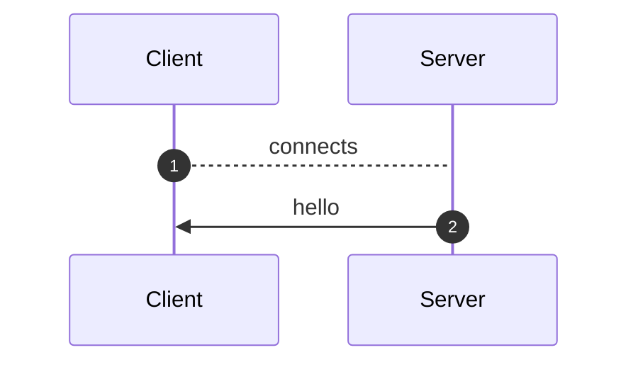
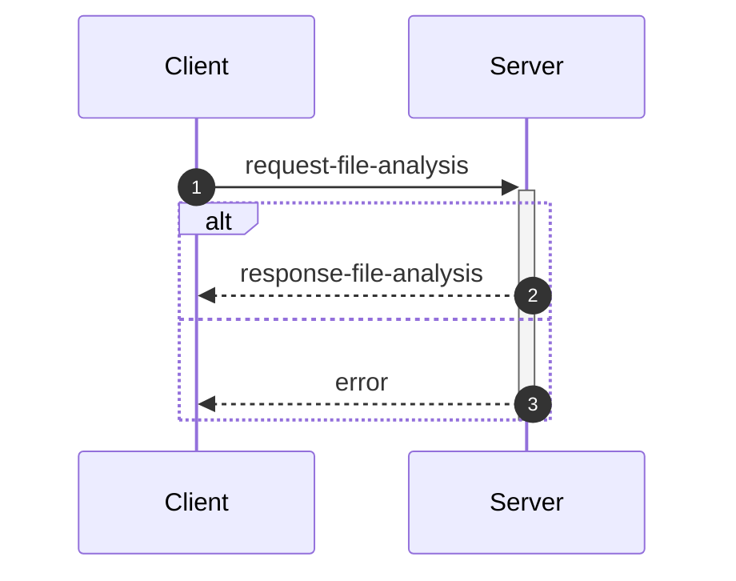
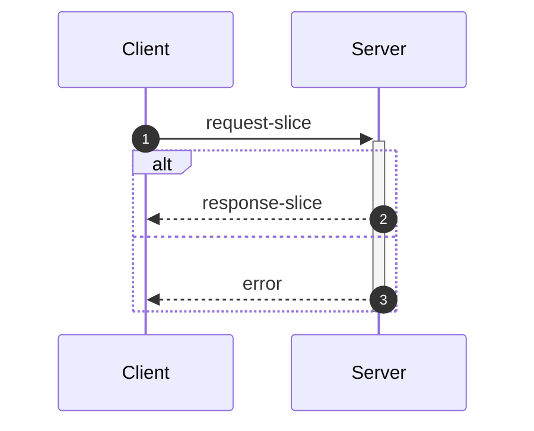
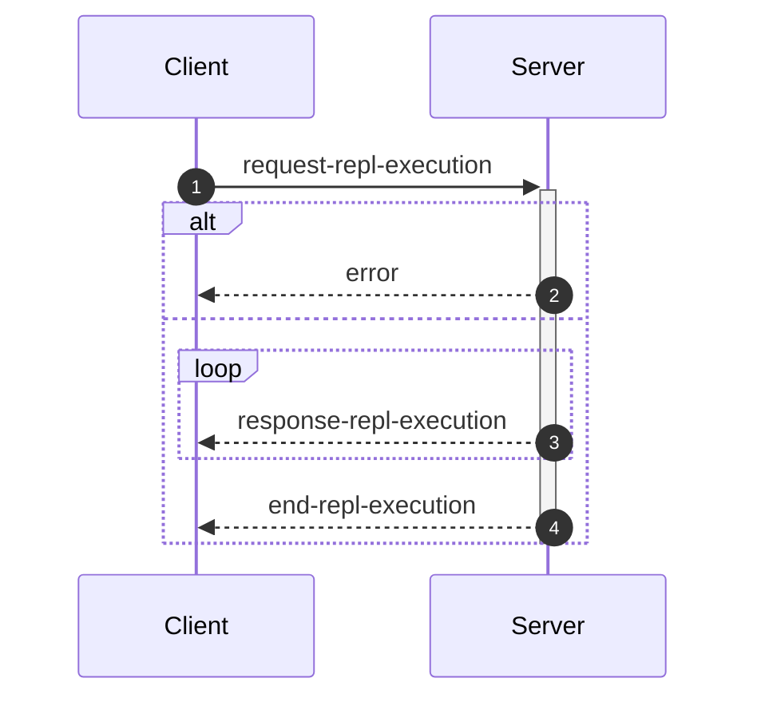

_This document was generated from '[src/documentation/wiki-interface.ts](https://github.com/flowr-analysis/flowr/tree/main//src/documentation/wiki-interface.ts)' on 2026-02-13, 12:06:32 UTC presenting an overview of flowR's interface (v2.9.9, using R v4.5.0). Please do not edit this file/wiki page directly._

Although far from being as detailed as the in-depth explanation of [_flowR_](https://github.com/flowr-analysis/flowr/wiki/wiki/core),
this wiki page explains how to interface with _flowR_ in more detail.
In general, command line arguments and other options provide short descriptions on hover over.

* [💻 Using the REPL](#using-the-repl)
* [⚙️ Configuring FlowR](#configuring-flowr)
* [⚒️ Writing Code](#writing-code)
* [💬 Communicating with the Server](#communicating-with-the-server)

<a id='using-the-repl'></a>
## 💻 Using the REPL


> [!NOTE]
> To execute arbitrary R commands with a repl request, _flowR_ has to be started explicitly with <span title="Description (Command Line Argument): Allow to access the underlying R session when using flowR (security warning: this allows the execution of arbitrary R code!)">`--r-session-access`</span>.
> Please be aware that this introduces a security risk and note that this relies on the [`r-shell` engine](https://github.com/flowr-analysis/flowr/wiki/wiki/engines) .

Although primarily meant for users to explore, 
there is nothing which forbids simply calling _flowR_ as a subprocess to use standard-in, -output, and -error 
for communication (although you can access the REPL using the server as well, 
with the [REPL Request](#message-request-repl-execution) message).

The read-eval-print loop&nbsp;(REPL) works relatively simple.
You can submit an expression (using <kbd>Enter</kbd>),
which is interpreted as an R&nbsp;expression by default but interpreted as a *command* if it starts with a colon (`:`).
The best command to get started with the REPL is <span title="Description (Repl Command): Show help information (aliases: :h, :?)">`:help`</span>.
Besides, you can leave the REPL either with the command <span title="Description (Repl Command): End the repl (aliases: :q, :exit)">`:quit`</span> or by pressing <kbd>Ctrl</kbd>+<kbd>C</kbd> twice.
When writing a *command*, you may press <kbd>Tab</kbd> to get a list of completions, if available.
Multiple commands can be entered in a single line by separating them with a semicolon (`;`), e.g. `:parse "x<-2"; :df*`.
If a command is given without R code, the REPL will re-use R code given in a previous command. 
The prior example will hence return first the parsed AST of the program and then the dataflow graph for `"x <- 2"`.

> [!NOTE]
> If you develop flowR, you may want to launch the repl using the `npm run main-dev` command, this way, you get a non-minified version of flowR with debug information and hot-reloading of source files.

<details>
<summary>Available Commands</summary>

We currently offer the following commands (this with a `[*]` suffix are available with and without the star):


| Command | Description |
| ------- | ----------- |
| **<span title="Description (Repl Command): End the repl (aliases: :q, :exit)">:quit</span>** | End the repl (aliases: **:<span title="Alias of ':quit'. End the repl">q</span>**, **:<span title="Alias of ':quit'. End the repl">exit</span>**) |
| **<span title="Description (Repl Command): Execute the given code as R code. This requires the `--r-session-access` flag to be set and requires the r-shell engine. (aliases: :e, :r)">:execute</span>** | Execute the given code as R code. This requires the `--r-session-access` flag to be set and requires the r-shell engine. (aliases: **:<span title="Alias of ':execute'. Execute the given code as R code. This requires the `--r-session-access` flag to be set and requires the r-shell engine.">e</span>**, **:<span title="Alias of ':execute'. Execute the given code as R code. This requires the `--r-session-access` flag to be set and requires the r-shell engine.">r</span>**) |
| **<span title="Description (Repl Command): Get mermaid code for the control-flow graph of R code, start with 'file://' to indicate a file (aliases: :cfg, :cf)">:controlflow[*]</span>** | Get mermaid code for the control-flow graph of R code, start with 'file://' to indicate a file (star: Returns the URL to mermaid.live) (aliases: **:<span title="Alias of ':controlflow'. Get mermaid code for the control-flow graph of R code, start with 'file://' to indicate a file">cfg</span>**, **:<span title="Alias of ':controlflow'. Get mermaid code for the control-flow graph of R code, start with 'file://' to indicate a file">cf</span>**) |
| **<span title="Description (Repl Command): Get mermaid code for the control-flow graph with basic blocks, start with 'file://' to indicate a file (aliases: :cfgb, :cfb)">:controlflowbb[*]</span>** | Get mermaid code for the control-flow graph with basic blocks, start with 'file://' to indicate a file (star: Returns the URL to mermaid.live) (aliases: **:<span title="Alias of ':controlflowbb'. Get mermaid code for the control-flow graph with basic blocks, start with 'file://' to indicate a file">cfgb</span>**, **:<span title="Alias of ':controlflowbb'. Get mermaid code for the control-flow graph with basic blocks, start with 'file://' to indicate a file">cfb</span>**) |
| **<span title="Description (Repl Command): Get mermaid code for the dataflow graph, start with 'file://' to indicate a file (aliases: :d, :df)">:dataflow[*]</span>** | Get mermaid code for the dataflow graph, start with 'file://' to indicate a file (star: Returns the URL to mermaid.live) (aliases: **:<span title="Alias of ':dataflow'. Get mermaid code for the dataflow graph, start with 'file://' to indicate a file">d</span>**, **:<span title="Alias of ':dataflow'. Get mermaid code for the dataflow graph, start with 'file://' to indicate a file">df</span>**) |
| **<span title="Description (Repl Command): Get mermaid code for the normalized AST of R code, start with 'file://' to indicate a file (aliases: :n)">:normalize[*]</span>** | Get mermaid code for the normalized AST of R code, start with 'file://' to indicate a file (star: Returns the URL to mermaid.live) (alias: **:<span title="Alias of ':normalize'. Get mermaid code for the normalized AST of R code, start with 'file://' to indicate a file">n</span>**) |
| **<span title="Description (Repl Command): Get mermaid code for the simplified dataflow graph, start with 'file://' to indicate a file (aliases: :ds, :dfs)">:dataflowsimple[*]</span>** | Get mermaid code for the simplified dataflow graph, start with 'file://' to indicate a file (star: Returns the URL to mermaid.live) (aliases: **:<span title="Alias of ':dataflowsimple'. Get mermaid code for the simplified dataflow graph, start with 'file://' to indicate a file">ds</span>**, **:<span title="Alias of ':dataflowsimple'. Get mermaid code for the simplified dataflow graph, start with 'file://' to indicate a file">dfs</span>**) |
| **<span title="Description (Repl Command): Just calculates the DFG, but only prints summary info (aliases: :d#, :df#)">:dataflowsilent</span>** | Just calculates the DFG, but only prints summary info (aliases: **:<span title="Alias of ':dataflowsilent'. Just calculates the DFG, but only prints summary info">d#</span>**, **:<span title="Alias of ':dataflowsilent'. Just calculates the DFG, but only prints summary info">df#</span>**) |
| **<span title="Description (Repl Command): Prints ASCII Art of the parsed, unmodified AST, start with 'file://' to indicate a file (aliases: :p)">:parse</span>** | Prints ASCII Art of the parsed, unmodified AST, start with 'file://' to indicate a file (alias: **:<span title="Alias of ':parse'. Prints ASCII Art of the parsed, unmodified AST, start with 'file://' to indicate a file">p</span>**) |
| **<span title="Description (Repl Command): Prints the version of flowR as well as the current version of R">:version</span>** | Prints the version of flowR as well as the current version of R
| **<span title="Description (Repl Command): Query the given R code, start with 'file://' to indicate a file. The query is to be a valid query in json format (use 'help' to get more information).">:query[*]</span>** | Query the given R code, start with 'file://' to indicate a file. The query is to be a valid query in json format (use 'help' to get more information). (star: Similar to query, but returns the output in json format.)
| **<span title="Description (Repl Command): Returns an ASCII representation of the dataflow graph (aliases: :df!)">:dataflowascii</span>** | Returns an ASCII representation of the dataflow graph (alias: **:<span title="Alias of ':dataflowascii'. Returns an ASCII representation of the dataflow graph">df!</span>**) |
| **<span title="Description (Repl Command): Returns summarization stats for the normalized AST (aliases: :n#)">:normalize#</span>** | Returns summarization stats for the normalized AST (alias: **:<span title="Alias of ':normalize#'. Returns summarization stats for the normalized AST">n#</span>**) |
| **<span title="Description (Repl Command): Show help information (aliases: :h, :?)">:help</span>** | Show help information (aliases: **:<span title="Alias of ':help'. Show help information">h</span>**, **:<span title="Alias of ':help'. Show help information">?</span>**) |


</details>


> [!TIP]
> 
> As indicated by the examples before, all REPL commands that operate on code keep track of the state.
> Hence, if you run a command like <span title="Description (Repl Command, starred version): Returns the URL to mermaid.live; Base Command: Get mermaid code for the dataflow graph, start with 'file://' to indicate a file (aliases: :d*, :df*)">`:dataflow*`</span> without providing R code,
> the REPL will re-use the R code provided in a previous command.
> Likewise, doing this will benefit from incrementality!
> If you request the dataflow graph with `:df* x <- 2 * y` and then want to see the parsed AST with `:parse`,
> the REPL will re-use previously obtained information and not re-parse the code again.
> 		


Generally, many commands offer shortcut versions in the REPL. Many queries, for example, offer a shortened format (see the example below).
Of special note, the [Config Query](https://github.com/flowr-analysis/flowr/wiki/wiki/query-api#Config-Query)
can be used to also modify the currently active configuration of _flowR_ within the REPL (see the [wiki page](https://github.com/flowr-analysis/flowr/wiki/wiki/query-api#Config-Query) for more information).

### Example: Retrieving the Dataflow Graph

To retrieve a URL to the [mermaid](https://mermaid.js.org/) diagram of the dataflow of a given expression, 
use <span title="Description (Repl Command, starred version): Returns the URL to mermaid.live; Base Command: Get mermaid code for the dataflow graph, start with 'file://' to indicate a file (aliases: :d*, :df*)">`:dataflow*`</span> (or <span title="Description (Repl Command): Get mermaid code for the dataflow graph, start with 'file://' to indicate a file (aliases: :d, :df)">`:dataflow`</span> to get the mermaid code in the cli):


```shell
$ docker run -it --rm eagleoutice/flowr # or npm run flowr 
flowR repl using flowR v2.9.9, R grammar v14 (tree-sitter engine)
R> :dataflow* y <- 1 + x
```

<details>
<summary style='color:gray'>Output</summary>


```text
https://mermaid.live/view#base64:eyJjb2RlIjoiZmxvd2NoYXJ0IEJUXG4gICAgMXt7XCJgIzkxO1JOdW1iZXIjOTM7IDFcbiAgICAgICgxKVxuICAgICAgKjEuNipgXCJ9fVxuICAgIDIoW1wiYCM5MTtSU3ltYm9sIzkzOyB4XG4gICAgICAoMilcbiAgICAgICoxLjEwKmBcIl0pXG4gICAgM1tbXCJgIzkxO1JCaW5hcnlPcCM5MzsgIzQzO1xuICAgICAgKDMpXG4gICAgICAqMS42LTEwKlxuICAgICgxLCAyKWBcIl1dXG4gICAgYnVpbHQtaW46X1tcImBCdWlsdC1JbjpcbiM0MztgXCJdXG4gICAgc3R5bGUgYnVpbHQtaW46XyBzdHJva2U6Z3JheSxmaWxsOmdyYXksc3Ryb2tlLXdpZHRoOjJweCxvcGFjaXR5Oi44O1xuICAgIDBbXCJgIzkxO1JTeW1ib2wjOTM7IHlcbiAgICAgICgwKVxuICAgICAgKjEuMSpgXCJdXG4gICAgNFtbXCJgIzkxO1JCaW5hcnlPcCM5MzsgIzYwOyM0NTtcbiAgICAgICg0KVxuICAgICAgKjEuMS0xMCpcbiAgICAoMCwgMylgXCJdXVxuICAgIGJ1aWx0LWluOl8tW1wiYEJ1aWx0LUluOlxuIzYwOyM0NTtgXCJdXG4gICAgc3R5bGUgYnVpbHQtaW46Xy0gc3Ryb2tlOmdyYXksZmlsbDpncmF5LHN0cm9rZS13aWR0aDoycHgsb3BhY2l0eTouODtcbiAgICAzIC0tPnxcInJlYWRzLCBhcmd1bWVudFwifCAxXG4gICAgMyAtLT58XCJyZWFkcywgYXJndW1lbnRcInwgMlxuICAgIDMgLS4tPnxcInJlYWRzLCBjYWxsc1wifCBidWlsdC1pbjpfXG4gICAgbGlua1N0eWxlIDIgc3Ryb2tlOmdyYXk7XG4gICAgMCAtLT58XCJkZWZpbmVkLWJ5XCJ8IDNcbiAgICAwIC0tPnxcImRlZmluZWQtYnlcInwgNFxuICAgIDQgLS0+fFwicmVhZHMsIGFyZ3VtZW50XCJ8IDNcbiAgICA0IC0tPnxcInJldHVybnMsIGFyZ3VtZW50XCJ8IDBcbiAgICA0IC0uLT58XCJyZWFkcywgY2FsbHNcInwgYnVpbHQtaW46Xy1cbiAgICBsaW5rU3R5bGUgNyBzdHJva2U6Z3JheTsiLCJtZXJtYWlkIjp7ImF1dG9TeW5jIjp0cnVlfX0=
```


Retrieve the dataflow graph of the expression `y <- 1 + x`. It looks like this:


	
<details>

<summary style="color:gray">R Code of the Dataflow Graph</summary>

The analysis required _0.8 ms_ (including parse and normalize, using the [tree-sitter](https://github.com/flowr-analysis/flowr/wiki/Engines) engine) within the generation environment. 
We encountered no unknown side effects during the analysis.


```r
y <- 1 + x
```


</details>


</details>


For small graphs like this, <span title="Description (Repl Command): Returns an ASCII representation of the dataflow graph (aliases: :df!)">`:dataflowascii`</span> also provides an ASCII representation directly in the REPL:


```shell
$ docker run -it --rm eagleoutice/flowr # or npm run flowr 
flowR repl using flowR v2.9.9, R grammar v14 (tree-sitter engine)
R> :df! y <- 1 + x
```

<details open>
<summary style='color:gray'>Output</summary>


```text
                        0<1>0
                   ┌────| 1 |
    ┌────────┐     │    0---0
 c<4>c       └──c<3>c
 |<- |  v<0>v┌──| + |
 c---c──| y |┘  c---c   u<2>u
        v---v      └────| x |
                        u---u
Edges:
3 -> 1: reads, argument  3 -> 2: reads, argument
4 -> 3: reads, argument  4 -> 0: returns, argument
0 -> 3: defined-by       0 -> 4: defined-by
```


Retrieve the dataflow graph of the expression `y <- 1 + x` as ASCII art.

</details>


For the slicing with <span title="Description (Repl Command): Static backwards executable slicer for R">`:slicer`</span>, you have access to the same [magic comments](#slice-magic-comments) as with the [slice request](#message-request-slice).

### Example: Interfacing with the File System

Many commands that allow for an R-expression (like <span title="Description (Repl Command, starred version): Returns the URL to mermaid.live; Base Command: Get mermaid code for the dataflow graph, start with 'file://' to indicate a file (aliases: :d*, :df*)">`:dataflow*`</span>) allow for a file as well 
if the argument starts with `file://`. 
If you are working from the root directory of the _flowR_ repository, the following gives you the parsed AST of the example file using the <span title="Description (Repl Command): Prints ASCII Art of the parsed, unmodified AST, start with 'file://' to indicate a file (aliases: :p)">`:parse`</span> command:


```shell
$ docker run -it --rm eagleoutice/flowr # or npm run flowr 
flowR repl using flowR v2.9.9, R grammar v14 (tree-sitter engine)
R> :parse file://test/testfiles/example.R
```

<details>
<summary style='color:gray'>Output</summary>


```text
File: test/testfiles/example.R

program
├ binaryoperator
│ ├ identifier "sum" (1:1─4)
│ ├ <- "<-" (1:5─7)
│ ╰ float "0" (1:8─9)
├ binaryoperator
│ ├ identifier "product" (2:1─8)
│ ├ <- "<-" (2:9─11)
│ ╰ float "1" (2:12─13)
├ binaryoperator
│ ├ identifier "w" (3:1─2)
│ ├ <- "<-" (3:3─5)
│ ╰ float "7" (3:6─7)
├ binaryoperator
│ ├ identifier "N" (4:1─2)
│ ├ <- "<-" (4:3─5)
│ ╰ float "10" (4:6─8)
├ forstatement
│ ├ for "for" (6:1─4)
│ ├ ( "(" (6:5─6)
│ ├ identifier "i" (6:6─7)
│ ├ in "in" (6:8─10)
│ ├ binaryoperator
│ │ ├ float "1" (6:11─12)
│ │ ├ : ":" (6:12─13)
│ │ ╰ parenthesizedexpression
│ │   ├ ( "(" (6:13─14)
│ │   ├ binaryoperator
│ │   │ ├ identifier "N" (6:14─15)
│ │   │ ├ - "-" (6:15─16)
│ │   │ ╰ float "1" (6:16─17)
│ │   ╰ ) ")" (6:17─18)
│ ├ ) ")" (6:18─19)
│ ╰ bracedexpression
│   ├ { "{" (6:20─21)
│   ├ binaryoperator
│   │ ├ identifier "sum" (7:3─6)
│   │ ├ <- "<-" (7:7─9)
│   │ ╰ binaryoperator
│   │   ├ binaryoperator
│   │   │ ├ identifier "sum" (7:10─13)
│   │   │ ├ + "+" (7:14─15)
│   │   │ ╰ identifier "i" (7:16─17)
│   │   ├ + "+" (7:18─19)
│   │   ╰ identifier "w" (7:20─21)
│   ├ binaryoperator
│   │ ├ identifier "product" (8:3─10)
│   │ ├ <- "<-" (8:11─13)
│   │ ╰ binaryoperator
│   │   ├ identifier "product" (8:14─21)
│   │   ├  "" (8:22─23)
│   │   ╰ identifier "i" (8:24─25)
│   ╰ } "}" (9:1─2)
├ call
│ ├ identifier "cat" (11:1─4)
│ ╰ arguments
│   ├ ( "(" (11:4─5)
│   ├ argument
│   │ ╰ string
│   │   ├ " "\"" (11:5─6)
│   │   ├ stringcontent "Sum:" (11:6─10)
│   │   ╰ " "\"" (11:10─11)
│   ├ comma "," (11:11─12)
│   ├ argument
│   │ ╰ identifier "sum" (11:13─16)
│   ├ comma "," (11:16─17)
│   ├ argument
│   │ ╰ string
│   │   ├ " "\"" (11:18─19)
│   │   ├ stringcontent
│   │   │ ╰ escapesequence "\\n" (11:19─21)
│   │   ╰ " "\"" (11:21─22)
│   ╰ ) ")" (11:22─23)
╰ call
  ├ identifier "cat" (12:1─4)
  ╰ arguments
    ├ ( "(" (12:4─5)
    ├ argument
    │ ╰ string
    │   ├ " "\"" (12:5─6)
    │   ├ stringcontent "Product:" (12:6─14)
    │   ╰ " "\"" (12:14─15)
    ├ comma "," (12:15─16)
    ├ argument
    │ ╰ identifier "product" (12:17─24)
    ├ comma "," (12:24─25)
    ├ argument
    │ ╰ string
    │   ├ " "\"" (12:26─27)
    │   ├ stringcontent
    │   │ ╰ escapesequence "\\n" (12:27─29)
    │   ╰ " "\"" (12:29─30)
    ╰ ) ")" (12:30─31)
```


Retrieve the parsed AST of the example file.

<details>

<summary>File Content</summary>


```r
sum <- 0
product <- 1
w <- 7
N <- 10

for (i in 1:(N-1)) {
  sum <- sum + i + w
  product <- product * i
}

cat("Sum:", sum, "\n")
cat("Product:", product, "\n")
```


</details>

As _flowR_ directly transforms this AST the output focuses on being human-readable instead of being machine-readable. 
		

</details>


### Example: Run a Query

You can run any query supported by _flowR_ using the <span title="Description (Repl Command): Query the given R code, start with 'file://' to indicate a file. The query is to be a valid query in json format (use 'help' to get more information).">`:query`</span> command.
For example, to obtain the shapes of all data frames in a given piece of code, you can run:


```shell
$ docker run -it --rm eagleoutice/flowr # or npm run flowr 
flowR repl using flowR v2.9.9, R grammar v14 (tree-sitter engine)
R> :query @df-shape "x <- data.frame(a = 1:10, b = 1:10)\ny <- x$a"
```

<details open>
<summary style='color:gray'>Output</summary>


```text
Query: df-shape (1 ms)
   ╰ 12: (colnames: [{"a", "b"}, {}], cols: [2, 2], rows: [10, 10])
   ╰ 0: (colnames: [{"a", "b"}, {}], cols: [2, 2], rows: [10, 10])
All queries together required ≈2 ms (1ms accuracy, total 3 ms)
```


Retrieve the shapes of all data frames in the given code.

</details>


To run the linter on a file, you can use (in this example, we just issue the `dead-code` linter on a small piece of code):


```shell
$ docker run -it --rm eagleoutice/flowr # or npm run flowr 
flowR repl using flowR v2.9.9, R grammar v14 (tree-sitter engine)
R> :query @linter rules:dead-code "if(FALSE) x <- 2"
```

<details open>
<summary style='color:gray'>Output</summary>


```text
Query: linter (1 ms)
   ╰ Dead Code (dead-code):
       ╰ certain:
           ╰ Code at 1.11-16
       ╰ Metadata: consideredNodes: 7, searchTimeMs: 1, processTimeMs: 0
All queries together required ≈1 ms (1ms accuracy, total 2 ms)
```


Run the linter on the given code, with only the `dead-code` rule enabled.

</details>


For more information on the available queries, please check out the [Query API](https://github.com/flowr-analysis/flowr/wiki/wiki/query-api).


<a id='configuring-flowr'></a>
## ⚙️ Configuring FlowR


When running _flowR_, you may want to specify some behaviors with a dedicated configuration file. 
By default, flowR looks for a file named `flowr.json` in the current working directory (or any higher directory). 
You can also specify a different file with <span title="Description (Command Line Argument): The name of the configuration file to use">`--config-file`</span> or pass the configuration inline using <span title="Description (Command Line Argument): The flowR configuration to use, as a JSON string">`--config-json`</span>.
To inspect the current configuration, you can run flowr with the <span title="Description (Command Line Argument): Run with verbose logging (will be passed to the corresponding script)">`--verbose`</span> flag, or use the `config` [Query](https://github.com/flowr-analysis/flowr/wiki/Query%20API).
Within the REPL this works by running the following:


```shell
:query @config
```


The following summarizes the configuration options:

- `ignoreSourceCalls`: If set to `true`, _flowR_ will ignore source calls when analyzing the code, i.e., ignoring the inclusion of other files.
- `semantics`: allows to configure the way _flowR_ handles R, although we currently only support `semantics/environment/overwriteBuiltIns`. 
  You may use this to overwrite _flowR_'s handling of built-in function and even completely clear the preset definitions shipped with flowR. 
  See [Configure BuiltIn Semantics](#configure-builtin-semantics) for more information.
- `solver`: allows to configure how _flowR_ resolves variables and their values (currently we support: `disabled`, `alias`, `builtin`), as well as if pointer analysis should be active.
- `engines`: allows to configure the engines used by _flowR_ to interact with R code. See the [Engines wiki page](https://github.com/flowr-analysis/flowr/wiki/Engines) for more information.
- `defaultEngine`: allows to specify the default engine to use for interacting with R code. If not set, an arbitrary engine from the specified list will be used.
- `abstractInterpretation`: allows to configure how _flowR_ performs abstract interpretation, although we currently only support data frame shape inference through abstract interpretation.

So you can configure _flowR_ by adding a file like the following:

<details>

<summary>Example Configuration File</summary>


```json
{
  "ignoreSourceCalls": true,
  "semantics": {
    "environment": {
      "overwriteBuiltIns": {
        "definitions": [
          {
            "type": "function",
            "names": [
              "foo"
            ],
            "processor": "builtin:assignment",
            "config": {}
          }
        ]
      }
    }
  },
  "repl": {
    "quickStats": false,
    "dfProcessorHeat": false
  },
  "project": {
    "resolveUnknownPathsOnDisk": true
  },
  "engines": [
    {
      "type": "r-shell"
    }
  ],
  "solver": {
    "variables": "alias",
    "evalStrings": true,
    "resolveSource": {
      "dropPaths": "no",
      "ignoreCapitalization": true,
      "inferWorkingDirectory": "active-script",
      "searchPath": []
    },
    "instrument": {},
    "slicer": {
      "threshold": 50
    }
  },
  "abstractInterpretation": {
    "wideningThreshold": 4,
    "dataFrame": {
      "maxColNames": 20,
      "readLoadedData": {
        "readExternalFiles": true,
        "maxReadLines": 1000000
      }
    }
  }
}
```


</details>

<details> 
<a id='configure-builtin-semantics'></a>
<summary>Configure Built-In Semantics</summary> 


`semantics/environment/overwriteBuiltins` accepts two keys:

- `loadDefaults` (boolean, initially `true`): If set to `true`, the default built-in definitions are loaded before applying the custom definitions. Setting this flag to `false` explicitly disables the loading of the default definitions.
- `definitions` (array, initially empty): Allows to overwrite or define new built-in elements. Each object within must have a `type` which is one of the below. Furthermore, they may define a string array of `names` which specifies the identifiers to bind the definitions to. You may use `assumePrimitive` to specify whether _flowR_ should assume that this is a primitive non-library definition (so you probably just do not want to specify the key).

  | Type            | Description                                                                                                                                                                                                                                                                                              | Example                                                                                                    |
  | --------------- | -------------------------------------------------------------------------------------------------------------------------------------------------------------------------------------------------------------------------------------------------------------------------------------------------------- | ---------------------------------------------------------------------------------------------------------- |
  | `constant`    | Additionally allows for a `value` this should resolve to.                                                                                                                                                                                                                                                | `{ type: 'constant', names: ['NULL', 'NA'],  value: null }`                                                |
  | `function`    | Is a rather flexible way to define and bind built-in functions. For the time, we do not have extensive documentation to cover all the cases, so please either consult the sources with the `default-builtin-config.ts` or open a [new issue](https://github.com/flowr-analysis/flowr/issues/new/choose). | `{ type: 'function', names: ['next'], processor: 'builtin:default', config: { cfg: ExitPointType.Next } }` |
  | `replacement` | A comfortable way to specify replacement functions like `$<-` or `names<-`. `suffixes` describes the... suffixes to attach automatically. | `{ type: 'replacement', suffixes: ['<-', '<<-'], names: ['[', '[['] }` |


</details>

<details>

<summary style='color:gray'>Full Configuration-File Schema</summary>

- _The configuration file format for flowR._ (object)
    - **ignoreSourceCalls** [optional] _Whether source calls should be ignored, causing {@link processSourceCall}'s behavior to be skipped._ (boolean)
    - **semantics** _Configure language semantics and how flowR handles them._ (object)
        - **environment** [optional] _Semantics regarding how to handle the R environment._ (object)
            - **overwriteBuiltIns** [optional] _Do you want to overwrite (parts) of the builtin definition?_ (object)
                - **loadDefaults** [optional] _Should the default configuration still be loaded?_ (boolean)
                - **definitions** [optional] _The definitions to load/overwrite._ (array)
                Valid item types:
                    - (object)
    - **repl** _Configuration options for the REPL._ (object)
        - **quickStats** [optional] _Whether to show quick stats in the REPL after each evaluation._ (boolean)
        - **dfProcessorHeat** [optional] _This instruments the dataflow processors to count how often each processor is called._ (boolean)
    - **project** _Project specific configuration options._ (object)
        - **resolveUnknownPathsOnDisk** [optional] _Whether to resolve unknown paths loaded by the r project disk when trying to source/analyze files._ (boolean)
    - **engines** _The engine or set of engines to use for interacting with R code. An empty array means all available engines will be used._ (array)
    Valid item types:
        - (alternatives)
            - _The configuration for the tree sitter engine._ (object)
                - **type** [required] _Use the tree sitter engine._ (string)
                    Only allows: 'tree-sitter'
                - **wasmPath** [optional] _The path to the tree-sitter-r WASM binary to use. If this is undefined, this uses the default path._ (string)
                - **treeSitterWasmPath** [optional] _The path to the tree-sitter WASM binary to use. If this is undefined, this uses the default path._ (string)
                - **lax** [optional] _Whether to use the lax parser for parsing R code (allowing for syntax errors). If this is undefined, the strict parser will be used._ (boolean)
            - _The configuration for the R shell engine._ (object)
                - **type** [required] _Use the R shell engine._ (string)
                    Only allows: 'r-shell'
                - **rPath** [optional] _The path to the R executable to use. If this is undefined, this uses the default path._ (string)
    - **defaultEngine** [optional] _The default engine to use for interacting with R code. If this is undefined, an arbitrary engine from the specified list will be used._ (string)
        Only allows: 'tree-sitter', 'r-shell'
    - **solver** _How to resolve constants, constraints, cells, ..._ (object)
        - **variables** _How to resolve variables and their values._ (string)
            Only allows: 'disabled', 'alias', 'builtin'
        - **evalStrings** _Should we include eval(parse(text="...")) calls in the dataflow graph?_ (boolean)
        - **instrument** (object)
            - **dataflowExtractors** [optional] _These keys are only intended for use within code, allowing to instrument the dataflow analyzer!_ (any)
        - **resolveSource** [optional] _If lax source calls are active, flowR searches for sourced files much more freely, based on the configurations you give it. This option is only in effect if `ignoreSourceCalls` is set to false._ (object)
            - **dropPaths** _Allow to drop the first or all parts of the sourced path, if it is relative._ (string)
                Only allows: 'no', 'once', 'all'
            - **ignoreCapitalization** _Search for filenames matching in the lowercase._ (boolean)
            - **inferWorkingDirectory** _Try to infer the working directory from the main or any script to analyze._ (string)
                Only allows: 'no', 'main-script', 'active-script', 'any-script'
            - **searchPath** _Additionally search in these paths._ (array)
            Valid item types:
                - (string)
            - **repeatedSourceLimit** [optional] _How often the same file can be sourced within a single run? Please be aware: in case of cyclic sources this may not reach a fixpoint so give this a sensible limit._ (number)
            - **applyReplacements** _Provide name replacements for loaded files_ (array)
            Valid item types:
                - (object)
        - **slicer** [optional] _The configuration for the slicer._ (object)
            - **threshold** [optional] _The maximum number of iterations to perform on a single function call during slicing._ (number)
    - **abstractInterpretation** _The configuration options for abstract interpretation._ (object)
        - **dataFrame** _The configuration of the shape inference for data frames._ (object)
            - **maxColNames** _The maximum number of columns names to infer for data frames before over-approximating the column names to top._ (number)
            - **wideningThreshold** _The threshold for the number of visitations of a node at which widening should be performed to ensure the termination of the fixpoint iteration._ (number)
            - **readLoadedData** _Configuration options for reading data frame shapes from loaded external data files, such as CSV files._ (object)
                - **readExternalFiles** _Whether data frame shapes should be extracted from loaded external files, such as CSV files._ (boolean)
                - **maxReadLines** _The maximum number of lines to read when extracting data frame shapes from loaded files, such as CSV files._ (number)

</details>

	

<a id='writing-code'></a>
## ⚒️ Writing Code

_flowR_ can be used as a [module](https://www.npmjs.com/package/@eagleoutice/flowr) and offers several main classes and interfaces that are interesting for extension writers 
(see the [Visual Studio Code extension](https://marketplace.visualstudio.com/items?itemName=code-inspect.vscode-flowr) or the [Core](https://github.com/flowr-analysis/flowr/wiki/wiki/core) wiki page for more information).

### Creating Analyses with _flowR_

Nowadays, instances of the <a href="https://github.com/flowr-analysis/flowr/tree/main//src/project/flowr-analyzer.ts#L162"><code><span title="Central class for conducting analyses with FlowR. Use the FlowrAnalyzerBuilder to create a new instance. If you want the original pattern of creating a pipeline and running all steps, you can still do this with FlowrAnalyzer#runFull . To inspect the context of the analyzer, use FlowrAnalyzer#inspectContext (if you are a plugin and need to modify it, use FlowrAnalyzer#context instead).">FlowrAnalyzer</span></code></a> should be used as central frontend to get analysis results from _flowR_.
For example, a program slice can be created like this:


```ts
const analyzer = await new FlowrAnalyzerBuilder()
    .setEngine('tree-sitter')
    .build();
analyzer.addRequest('x <- 1\ny <- x\nx');
const result = await analyzer.query([
    {
        type:     'static-slice',
        criteria: ['3@x']
    }
]);
//console.log(result['static-slice']);
```


For more information, please have a look at the [Analyzer](https://github.com/flowr-analysis/flowr/wiki/wiki/analyzer) wiki page, which explains how to construct and use the <a href="https://github.com/flowr-analysis/flowr/tree/main//src/project/flowr-analyzer.ts#L162"><code><span title="Central class for conducting analyses with FlowR. Use the FlowrAnalyzerBuilder to create a new instance. If you want the original pattern of creating a pipeline and running all steps, you can still do this with FlowrAnalyzer#runFull . To inspect the context of the analyzer, use FlowrAnalyzer#inspectContext (if you are a plugin and need to modify it, use FlowrAnalyzer#context instead).">FlowrAnalyzer</span></code></a> in more detail.
To work with specific perspectives, you can also consult the respective pages like the [Dataflow Graph](https://github.com/flowr-analysis/flowr/wiki/wiki/dataflow-graph) or the [Abstract Interpretation](https://github.com/flowr-analysis/flowr/wiki/wiki/abstract-interpretation) wiki pages.
        
### The Pipeline Executor (Low-Level Interface)

Once, in the beginning, _flowR_ was meant to produce a dataflow graph merely to provide *program slices*. 
However, with continuous updates, the [Dataflow Graph](https://github.com/flowr-analysis/flowr/wiki/wiki/dataflow-graph) repeatedly proves to be the more interesting part.
With this, we restructured _flowR_'s originally *hardcoded* pipeline to be far more flexible. 
Now, it can be theoretically extended or replaced with arbitrary steps, optional steps, and what we call 'decorations' of these steps. 
In short, a slicing pipeline using the <a href="https://github.com/flowr-analysis/flowr/tree/main//src/core/pipeline-executor.ts#L97"><code><span title="**Please note:** The PipelineExecutor is now considered to be a rather low-level API for flowR. While it still works and is the basis for all other layers, we strongly recommend using the FlowrAnalyzer and its builder to create and use an analyzer instance that is pre-configured for your use-case. The pipeline executor allows to execute arbitrary pipelines in a step-by-step fashion. If you are not...">PipelineExecutor</span></code></a> looks like this:


```ts

const slicer = new PipelineExecutor(DEFAULT_SLICING_PIPELINE, {
  parser:    new RShell(),
  request:   requestFromInput('x <- 1\nx + 1'),
  criterion: ['2@x']
})
const slice = await slicer.allRemainingSteps()
// console.log(slice.reconstruct.code)
```


<details><summary>More Information</summary>


If you compare this, with what you would have done with the old (and removed) `SteppingSlicer`, 
this essentially just requires you to replace the `SteppingSlicer` with the <a href="https://github.com/flowr-analysis/flowr/tree/main//src/core/pipeline-executor.ts#L97"><code><span title="**Please note:** The PipelineExecutor is now considered to be a rather low-level API for flowR. While it still works and is the basis for all other layers, we strongly recommend using the FlowrAnalyzer and its builder to create and use an analyzer instance that is pre-configured for your use-case. The pipeline executor allows to execute arbitrary pipelines in a step-by-step fashion. If you are not...">PipelineExecutor</span></code></a>
and to pass the <a href="https://github.com/flowr-analysis/flowr/tree/main//src/core/steps/pipeline/default-pipelines.ts#L18"><code>DEFAULT_SLICING_PIPELINE</code></a> as the first argument.
The <a href="https://github.com/flowr-analysis/flowr/tree/main//src/core/pipeline-executor.ts#L97"><code><span title="**Please note:** The PipelineExecutor is now considered to be a rather low-level API for flowR. While it still works and is the basis for all other layers, we strongly recommend using the FlowrAnalyzer and its builder to create and use an analyzer instance that is pre-configured for your use-case. The pipeline executor allows to execute arbitrary pipelines in a step-by-step fashion. If you are not...">PipelineExecutor</span></code></a>...

1. Provides structures to investigate the results of all intermediate steps
2. Can be executed step-by-step
3. Can repeat steps (e.g., to calculate multiple slices on the same input)

See the in-code documentation for more information.

	

</details>
    

### Using the <a href="https://github.com/flowr-analysis/flowr/tree/main//src/r-bridge/shell.ts#L143"><code><span title="The RShell represents an interactive session with the R interpreter. You can configure it by RShellOptions . At the moment we are using a live R session (and not networking etc.) to communicate with R easily, which allows us to install packages etc. However, this might and probably will change in the future (leaving this as a legacy mode :D)">RShell</span></code></a> to Interact with R

The <a href="https://github.com/flowr-analysis/flowr/tree/main//src/r-bridge/shell.ts#L143"><code><span title="The RShell represents an interactive session with the R interpreter. You can configure it by RShellOptions . At the moment we are using a live R session (and not networking etc.) to communicate with R easily, which allows us to install packages etc. However, this might and probably will change in the future (leaving this as a legacy mode :D)">RShell</span></code></a> class allows interfacing with the `R`&nbsp;ecosystem installed on the host system.
Please have a look at [flowR's Engines](https://github.com/flowr-analysis/flowr/wiki/wiki/engines) for more information on alternatives (for example, the <a href="https://github.com/flowr-analysis/flowr/tree/main//src/r-bridge/lang-4.x/tree-sitter/tree-sitter-executor.ts#L18"><code><span title="Synchronous and (way) faster alternative to the RShell using tree-sitter.">TreeSitterExecutor</span></code></a>).


> [!IMPORTANT]
> 
> Each <a href="https://github.com/flowr-analysis/flowr/tree/main//src/r-bridge/shell.ts#L143"><code><span title="The RShell represents an interactive session with the R interpreter. You can configure it by RShellOptions . At the moment we are using a live R session (and not networking etc.) to communicate with R easily, which allows us to install packages etc. However, this might and probably will change in the future (leaving this as a legacy mode :D)">RShell</span></code></a> controls a new instance of the R&nbsp;interpreter, 
> make sure to call <code><a href="https://github.com/flowr-analysis/flowr/tree/main//src/r-bridge/shell.ts#L317"><span title="Close the current R session, makes the object effectively invalid (can no longer be reopened etc.)">RShell::<i>close</i></span></a>()</code> when you are done.


You can start a new "session" simply by constructing a new object with <code>new <a href="https://github.com/flowr-analysis/flowr/tree/main//src/r-bridge/shell.ts#L143"><span title="The RShell represents an interactive session with the R interpreter. You can configure it by RShellOptions . At the moment we are using a live R session (and not networking etc.) to communicate with R easily, which allows us to install packages etc. However, this might and probably will change in the future (leaving this as a legacy mode :D)">RShell</span></a>()</code>.

However, there are several options that may be of interest 
(e.g., to automatically revive the shell in case of errors or to control the name location of the R process on the system).

With a shell object (let's call it `shell`), you can execute R code by using <a href="https://github.com/flowr-analysis/flowr/tree/main//src/r-bridge/shell.ts#L195"><code><span title="sends the given command directly to the current R session will not do anything to alter input markers!">RShell::<i>sendCommand</i></span></code></a>, 
for example <code>shell.<a href="https://github.com/flowr-analysis/flowr/tree/main//src/r-bridge/shell.ts#L195"><span title="sends the given command directly to the current R session will not do anything to alter input markers!">sendCommand</span></a>("1 + 1")</code>. 
However, this does not return anything, so if you want to collect the output of your command, use
<a href="https://github.com/flowr-analysis/flowr/tree/main//src/r-bridge/shell.ts#L261"><code><span title="Send a command and collect the output">RShell::<i>sendCommandWithOutput</i></span></code></a> instead.

Besides that, the command <a href="https://github.com/flowr-analysis/flowr/tree/main//src/r-bridge/shell.ts#L233"><code>RShell::<b>tryToInjectHomeLibPath</b></code></a> may be of interest, as it enables all libraries available on the host system.


### Generate Statistics (No longer a Focus of flowR)


<details>

<summary>Adding a New Feature to Extract</summary>

In this example, we construct a new feature to extract, with the name "*example*".
Whenever this name appears, you may substitute this with whatever name fits your feature best (as long as the name is unique).

1. **Create a new file in `src/statistics/features/supported`**\
   Create the file `example.ts`, and add its export to the `index.ts` file in the same directory (if not done automatically).

2. **Create the basic structure**\
   To get a better feel of what a feature must have, let's look
   at the basic structure (of course, due to TypeScript syntax,
   there are other ways to achieve the same goal):

   ```ts
   const initialExampleInfo = {
       /* whatever start value is good for you */
       someCounter: 0
   }

   export type ExampleInfo = Writable<typeof initialExampleInfo>

   export const example: Feature<ExampleInfo> = {
    name:        'Example Feature',
    description: 'A longer example description',

    process(existing: ExampleInfo, input: FeatureProcessorInput): ExampleInfo {
      /* perform analysis on the input */
      return existing
    },

    initialValue: initialExampleInfo
   }
   ```

   The `initialExampleInfo` type holds the initial values for each counter that you want to maintain during the feature extraction (they will usually be initialized with 0). The resulting `ExampleInfo` type holds the structure of the data that is to be counted. Due to the vast amount of data processed, information like the name and location of a function call is not stored here, but instead written to disk (see below).

   Every new feature must be of the `Feature<Info>` type, with `Info` referring to a `FeatureInfo` (like `ExampleInfo` in this example). Next to a `name` and a `description`, each Feature must provide:

   - a processor that extracts the information from the input, adding it to the existing information.
   - a function returning the initial value of the information (in this case, `initialExampleInfo`).

3. **Add it to the feature-mapping**\
   Now, in the `feature.ts` file in `src/statistics/features`, add your feature to the `ALL_FEATURES` object.

Now, we want to extract something. For the *example* feature created in the previous steps, we choose to count the amount of `COMMENT` tokens.
So we define a corresponding [XPath](https://developer.mozilla.org/en-US/docs/Web/XPath) query:

```ts
const commentQuery: Query = xpath.parse('//COMMENT')
```

Within our feature's `process` function, running the query is as simple as:

```ts
const comments = commentQuery.select({ node: input.parsedRAst })
```

Now we could do a lot of further processing, but for simplicity, we only record every comment found this way:

```ts
appendStatisticsFile(example.name, 'comments', comments, input.filepath)
```

We use `example.name` to avoid duplication with the name that we’ve assigned to the feature. It corresponds to the name of the folder in the statistics output.
`'comments'` refers to a freely chosen (but unique) name, that will be used as the name for the output file within the folder. The `comments` variable holds the result of the query, which is an array of nodes. Finally, we pass the `filepath` of the file that was analyzed (if known), so that it can be added to the statistics file (as additional information).

</details>
	

<a id='communicating-with-the-server'></a>
## 💬 Communicating with the Server


As explained in the [Overview](https://github.com/flowr-analysis/flowr/wiki/Overview), you can simply run the [TCP](https://de.wikipedia.org/wiki/Transmission_Control_Protocol)&nbsp;server by adding the <span title="Description (Command Line Argument): Do not drop into a repl, but instead start a server on the given port (default: 1042) and listen for messages.">`--server`</span> flag (and, due to the interactive mode, exit with the conventional <kbd>CTRL</kbd>+<kbd>C</kbd>).
Currently, every connection is handled by the same underlying `RShell` - so the server is not designed to handle many clients at a time.
Additionally, the server is not well guarded against attacks (e.g., you can theoretically spawn an arbitrary number of&nbsp;RShell sessions on the target machine).

Every message has to be given in a single line (i.e., without a newline in-between) and end with a newline character. Nevertheless, we will pretty-print example given in the following segments for the ease of reading.


> [!NOTE]
> 
> The default <span title="Description (Command Line Argument): Do not drop into a repl, but instead start a server on the given port (default: 1042) and listen for messages.">`--server`</span> uses a simple [TCP](https://de.wikipedia.org/wiki/Transmission_Control_Protocol)
> connection. If you want _flowR_ to expose a [WebSocket](https://de.wikipedia.org/wiki/WebSocket) server instead, add the <span title="Description (Command Line Argument): If the server flag is set, use websocket for messaging">`--ws`</span> flag (i.e., <span title="Description (Command Line Argument): Do not drop into a repl, but instead start a server on the given port (default: 1042) and listen for messages.">`--server`</span> <span title="Description (Command Line Argument): If the server flag is set, use websocket for messaging">`--ws`</span>) when starting _flowR_ from the command line.
> 			


<ul><li>
<a id="message-hello"></a>
<b>Hello</b> Message (<code>hello</code>) 
<details>

<summary style="color:gray"> View Details. <i>The server informs the client about the successful connection and provides Meta-Information.</i> </summary>




	
After launching _flowR_, for example, with <code>docker run -it --rm eagleoutice/flowr <span title="Description (Command Line Argument): Do not drop into a repl, but instead start a server on the given port (default: 1042) and listen for messages.">-<span/>-server</span></code>&nbsp;(🐳️), simply connecting should present you with a `hello` message, that amongst others should reveal the versions of&nbsp;_flowR_ and&nbsp;R, using the [semver 2.0](https://semver.org/spec/v2.0.0.html) versioning scheme.
The message looks like this:


```json
{
  "type": "hello",
  "clientName": "client-0",
  "versions": {
    "flowr": "2.9.9",
    "r": "4.5.0",
    "engine": "r-shell"
  }
}
```


There are currently a few messages that you can send after the hello message.
If you want to _slice_ a piece of R code you first have to send an [analysis request](#message-request-file-analysis), so that you can send one or multiple slice requests afterward.
Requests for the [REPL](#message-request-repl) are independent of that.
	

<hr>


<details>
<summary style="color:gray">Message schema (<code>hello</code>)</summary>

For the definition of the hello message, please see it's implementation at [`./src/cli/repl/server/messages/message-hello.ts`](https://github.com/flowr-analysis/flowr/tree/main/./src/cli/repl/server/messages/message-hello.ts).

- [required] (object)
    - **type** [required] _The type of the hello message._ (string)
        Only allows: 'hello'
    - **id** [forbidden] _The id of the message is always undefined (as it is the initial message and not requested)._ (any)
    - **clientName** [required] _A unique name that is assigned to each client. It has no semantic meaning and is only used/useful for debugging._ (string)
    - **versions** [required] (object)
        - **flowr** [required] _The version of the flowr server running in semver format._ (string)
        - **r** [required] _The version of the underlying R shell running in semver format._ (string)
        - **engine** [required] _The parser backend that is used to parse the R code._ (string)

</details>


<hr>

</details>
	</li>

<li>
<a id="message-request-file-analysis"></a>
<b>Analysis</b> Message (<code>request-file-analysis</code>) 
<details>

<summary style="color:gray"> View Details. <i>The server builds the dataflow graph for a given input file (or a set of files).</i> </summary>




	
The request allows the server to analyze a file and prepare it for slicing.
The message can contain a `filetoken`, which is used to identify the file in later slice or query requests (if you do not add one, the request will not be stored and therefore, it is not available for subsequent requests).

> **Please note!**\
> If you want to send and process a lot of analysis requests, but do not want to slice them, please do not pass the `filetoken` field. This will save the server a lot of memory allocation.

Furthermore, the request must contain either a `content` field to directly pass the file's content or a `filepath` field which contains the path to the file (this path must be accessible for the server to be useful).
If you add the `id` field, the answer will use the same `id` so you can match requests and the corresponding answers.
See the implementation of the request-file-analysis message for more information.


<details>
<summary>Example of the <code>request-file-analysis</code> Message</summary>

_Note:_ even though we pretty-print these messages, they are sent as a single line, ending with a newline.

The following lists all messages that were sent and received in case you want to reproduce the scenario:

<ol>
<li> <code>hello</code> (response)
<details> 

<summary> Show Details </summary>

The first message is always a hello message.


```json
{
  "type": "hello",
  "clientName": "client-0",
  "versions": {
    "flowr": "2.9.9",
    "r": "4.5.0",
    "engine": "r-shell"
  }
}
```


</details>
</li>

<li> <b><code>request-file-analysis</code> (request)</b>
<details open> 

<summary> Show Details </summary>

Let's suppose you simply want to analyze the following script:
 
```r
x <- 1
x + 1
```

 For this, you can send the following request:


```json
{
  "type": "request-file-analysis",
  "id": "1",
  "filetoken": "x",
  "content": "x <- 1\nx + 1"
}
```


</details>
</li>

<li> <code>response-file-analysis</code> (response)
<details> 

<summary> Show Details </summary>


The `results` field of the response effectively contains three keys of importance:

- `parse`: which contains 1:1 the parse result in CSV format that we received from the `RShell` (i.e., the AST produced by the parser of the R interpreter).
- `normalize`: which contains the normalized AST, including ids (see the `info` field and the [Normalized AST](https://github.com/flowr-analysis/flowr/wiki/Normalized%20AST) wiki page).
- `dataflow`: especially important is the `graph` field which contains the dataflow graph as a set of root vertices (see the [Dataflow Graph](https://github.com/flowr-analysis/flowr/wiki/Dataflow%20Graph) wiki page).
			


_As the code is pretty long, we inhibit pretty printing and syntax highlighting (JSON, hiding built-in):_

```text
{"type":"response-file-analysis","format":"json","id":"1","results":{"parse":{"files":[{"parsed":"[1,1,1,6,7,0,\"expr\",false,\"x <- 1\"],[1,1,1,1,1,3,\"SYMBOL\",true,\"x\"],[1,1,1,1,3,7,\"expr\",false,\"x\"],[1,3,1,4,2,7,\"LEFT_ASSIGN\",true,\"<-\"],[1,6,1,6,4,5,\"NUM_CONST\",true,\"1\"],[1,6,1,6,5,7,\"expr\",false,\"1\"],[2,1,2,5,16,0,\"expr\",false,\"x + 1\"],[2,1,2,1,10,12,\"SYMBOL\",true,\"x\"],[2,1,2,1,12,16,\"expr\",false,\"x\"],[2,3,2,3,11,16,\"'+'\",true,\"+\"],[2,5,2,5,13,14,\"NUM_CONST\",true,\"1\"],[2,5,2,5,14,16,\"expr\",false,\"1\"]","filePath":"/tmp/tmp-8443-00B8rKTutD6s-.R"}],".meta":{"timing":3}},"normalize":{"ast":{"type":"RProject","files":[{"root":{"type":"RExpressionList","children":[{"type":"RBinaryOp","location":[1,3,1,4],"lhs":{"type":"RSymbol","location":[1,1,1,1],"content":"x","lexeme":"x","info":{"fullRange":[1,1,1,1],"adToks":[],"id":0,"parent":2,"role":"bin-l","index":0,"nesting":0,"file":"/tmp/tmp-8443-00B8rKTutD6s-.R"}},"rhs":{"location":[1,6,1,6],"lexeme":"1","info":{"fullRange":[1,6,1,6],"adToks":[],"id":1,"parent":2,"role":"bin-r","index":1,"nesting":0,"file":"/tmp/tmp-8443-00B8rKTutD6s-.R"},"type":"RNumber","content":{"num":1,"complexNumber":false,"markedAsInt":false}},"operator":"<-","lexeme":"<-","info":{"fullRange":[1,1,1,6],"adToks":[],"id":2,"parent":6,"nesting":0,"file":"/tmp/tmp-8443-00B8rKTutD6s-.R","index":0,"role":"el-c"}},{"type":"RBinaryOp","location":[2,3,2,3],"lhs":{"type":"RSymbol","location":[2,1,2,1],"content":"x","lexeme":"x","info":{"fullRange":[2,1,2,1],"adToks":[],"id":3,"parent":5,"role":"bin-l","index":0,"nesting":0,"file":"/tmp/tmp-8443-00B8rKTutD6s-.R"}},"rhs":{"location":[2,5,2,5],"lexeme":"1","info":{"fullRange":[2,5,2,5],"adToks":[],"id":4,"parent":5,"role":"bin-r","index":1,"nesting":0,"file":"/tmp/tmp-8443-00B8rKTutD6s-.R"},"type":"RNumber","content":{"num":1,"complexNumber":false,"markedAsInt":false}},"operator":"+","lexeme":"+","info":{"fullRange":[2,1,2,5],"adToks":[],"id":5,"parent":6,"nesting":0,"file":"/tmp/tmp-8443-00B8rKTutD6s-.R","index":1,"role":"el-c"}}],"info":{"adToks":[],"id":6,"nesting":0,"file":"/tmp/tmp-8443-00B8rKTutD6s-.R","role":"root","index":0}},"filePath":"/tmp/tmp-8443-00B8rKTutD6s-.R"}],"info":{"id":7}},".meta":{"timing":0}},"dataflow":{"unknownReferences":[],"in":[{"nodeId":2,"name":"<-","type":2},{"nodeId":5,"name":"+","type":2}],"out":[{"nodeId":0,"name":"x","type":4,"definedAt":2,"value":[1]}],"environment":{"current":{"id":1914,"parent":"<BuiltInEnvironment>","memory":[["x",[{"nodeId":0,"name":"x","type":4,"definedAt":2,"value":[1]}]]]},"level":0},"graph":{"rootVertices":[1,0,2,3,4,5],"vertexInformation":[[1,{"tag":"value","id":1}],[0,{"tag":"vdef","id":0}],[2,{"tag":"fcall","id":2,"name":"<-","onlyBuiltin":true,"args":[{"nodeId":0,"type":32},{"nodeId":1,"type":32}],"origin":["builtin:assignment"]}],[3,{"tag":"use","id":3}],[4,{"tag":"value","id":4}],[5,{"tag":"fcall","id":5,"name":"+","onlyBuiltin":true,"args":[{"nodeId":3,"type":32},{"nodeId":4,"type":32}],"origin":["builtin:default"]}]],"edgeInformation":[[2,[[1,{"types":65}],[0,{"types":72}],["built-in:<-",{"types":5}]]],[0,[[1,{"types":2}],[2,{"types":2}]]],[3,[[0,{"types":1}]]],[5,[[3,{"types":65}],[4,{"types":65}],["built-in:+",{"types":5}]]]],"_unknownSideEffects":[]},"entryPoint":2,"exitPoints":[{"type":0,"nodeId":5}],"hooks":[],".meta":{"timing":1}}}}
```


</details>
</li>
</ol>

The complete round-trip took 11.2 ms (including time required to validate the messages, start, and stop the internal mock server).

</details>


You receive an error if, for whatever reason, the analysis fails (e.g., the message or code you sent contained syntax errors).
It contains a human-readable description *why* the analysis failed (see the error message implementation for more details).


<details>
<summary>Example Error Message</summary>

_Note:_ even though we pretty-print these messages, they are sent as a single line, ending with a newline.

The following lists all messages that were sent and received in case you want to reproduce the scenario:

<ol>
<li> <code>hello</code> (response)
<details> 

<summary> Show Details </summary>

The first message is always a hello message.


```json
{
  "type": "hello",
  "clientName": "client-0",
  "versions": {
    "flowr": "2.9.9",
    "r": "4.5.0",
    "engine": "r-shell"
  }
}
```


</details>
</li>

<li> <code>request-file-analysis</code> (request)
<details> 

<summary> Show Details </summary>


```json
{
  "type": "request-file-analysis",
  "id": "1",
  "filename": "sample.R",
  "content": "x <-"
}
```


</details>
</li>

<li> <b><code>error</code> (response)</b>
<details open> 

<summary> Show Details </summary>


```json
{
  "id": "1",
  "type": "error",
  "fatal": false,
  "reason": "Error while analyzing file sample.R: GuardError: unable to parse R code (see the log for more information) for request {\"request\":\"text\",\"content\":\"x <-\"}}\n Report a Bug: https://github.com/flowr-analysis/flowr/issues/new?body=%3C!%2D%2D%20Please%20describe%20your%20issue%20in%20more%20detail%20below!%20%2D%2D%3E%0A%0A%0A%3C!%2D%2D%20Automatically%20generated%20issue%20metadata%2C%20please%20do%20not%20edit%20or%20delete%20content%20below%20this%20line%20%2D%2D%3E%0A%2D%2D%2D%0A%0AflowR%20version%3A%202.9.9%0Anode%20version%3A%20v22.14.0%0Anode%20arch%3A%20x64%0Anode%20platform%3A%20linux%0Amessage%3A%20%60unable%20to%20parse%20R%20code%20%28see%20the%20log%20for%20more%20information%29%20for%20request%20%7B%22request%22%3A%22text%22%2C%22content%22%3A%22x%20%3C%2D%22%7D%7D%60%0Astack%20trace%3A%0A%60%60%60%0A%20%20%20%20at%20guard%20%28%3C%3E%2Fsrc%2Futil%2Fassert.ts%3A128%3A9%29%0A%20%20%20%20at%20guardRetrievedOutput%20%28%3C%3E%2Fsrc%2Fr%2Dbridge%2Fretriever.ts%3A221%3A7%29%0A%20%20%20%20at%20%2Fhome%2Frunner%2Fwork%2Fflowr%2Fflowr%2Fsrc%2Fr%2Dbridge%2Fretriever.ts%3A182%3A4%0A%20%20%20%20at%20processTicksAndRejections%20%28node%3Ainternal%2Fprocess%2Ftask_queues%3A105%3A5%29%0A%20%20%20%20at%20async%20Object.parseRequests%20%5Bas%20processor%5D%20%28%3C%3E%2Fsrc%2Fr%2Dbridge%2Fparser.ts%3A104%3A19%29%0A%20%20%20%20at%20async%20PipelineExecutor.nextStep%20%28%3C%3E%2Fsrc%2Fcore%2Fpipeline%2Dexecutor.ts%3A192%3A25%29%0A%20%20%20%20at%20async%20FlowrAnalyzerCache.runTapeUntil%20%28%3C%3E%2Fsrc%2Fproject%2Fcache%2Fflowr%2Danalyzer%2Dcache.ts%3A93%3A4%29%0A%20%20%20%20at%20async%20FlowRServerConnection.sendFileAnalysisResponse%20%28%3C%3E%2Fsrc%2Fcli%2Frepl%2Fserver%2Fconnection.ts%3A163%3A52%29%0A%60%60%60%0A%0A%2D%2D%2D%0A%09"
}
```


</details>
</li>
</ol>

The complete round-trip took 8.6 ms (including time required to validate the messages, start, and stop the internal mock server).

</details>


&nbsp;

<a id="analysis-include-cfg"></a>
**Including the Control Flow Graph**

While _flowR_ does (for the time being) not use an explicit control flow graph but instead relies on control-dependency edges within the dataflow graph, 
the respective structure can still be exposed using the server (note that, as this feature is not needed within _flowR_, it is tested significantly less - 
so please create a [new issue](https://github.com/flowr-analysis/flowr/issues/new/choose) for any bug you may encounter).
For this, the analysis request may add `cfg: true` to its list of options.


<details>
<summary>Requesting a Control Flow Graph</summary>

_Note:_ even though we pretty-print these messages, they are sent as a single line, ending with a newline.

The following lists all messages that were sent and received in case you want to reproduce the scenario:

<ol>
<li> <code>hello</code> (response)
<details> 

<summary> Show Details </summary>

The first message is always a hello message.


```json
{
  "type": "hello",
  "clientName": "client-0",
  "versions": {
    "flowr": "2.9.9",
    "r": "4.5.0",
    "engine": "r-shell"
  }
}
```


</details>
</li>

<li> <b><code>request-file-analysis</code> (request)</b>
<details open> 

<summary> Show Details </summary>


```json
{
  "type": "request-file-analysis",
  "id": "1",
  "filetoken": "x",
  "content": "if(unknown > 0) { x <- 2 } else { x <- 5 }\nfor(i in 1:x) { print(x); print(i) }",
  "cfg": true
}
```


</details>
</li>

<li> <code>response-file-analysis</code> (response)
<details> 

<summary> Show Details </summary>


The response looks basically the same as a response sent without the `cfg` flag. However, additionally it contains a `cfg` field. 
If you are interested in a visual representation of the control flow graph, see the 
[visualization with mermaid](https://mermaid.live/view#base64:eyJjb2RlIjoiZmxvd2NoYXJ0IEJUXG4gICAgbjMyKFtcImBSRXhwcmVzc2lvbkxpc3QgKDMyKWBcIl0pXG4gICAgbjE1W1wiYFJJZlRoZW5FbHNlICgxNSlcbiMzNDtpZih1bmtub3duICM2MjsgMCkgIzEyMzsgeCAjNjA7IzQ1OyAyICMxMjU7IGVsc2UgIzEyMzsgeCAjNjA7IzQ1OyA1ICMxMjU7IzM0O2BcIl1cbiAgICBuMTUtZVtbMTUtZV1dXG4gICAgbjAoW1wiYFJTeW1ib2wgKDApXG4jMzQ7dW5rbm93biMzNDtgXCJdKVxuICAgIG4xKFtcImBSTnVtYmVyICgxKVxuIzM0OzAjMzQ7YFwiXSlcbiAgICBuMihbXCJgUkJpbmFyeU9wICgyKVxuIzM0O3Vua25vd24gIzYyOyAwIzM0O2BcIl0pXG4gICAgbjItZVtbMi1lXV1cbiAgICBuOChbXCJgUkV4cHJlc3Npb25MaXN0ICg4KWBcIl0pXG4gICAgbjUoW1wiYFJTeW1ib2wgKDUpXG4jMzQ7eCMzNDtgXCJdKVxuICAgIG42KFtcImBSTnVtYmVyICg2KVxuIzM0OzIjMzQ7YFwiXSlcbiAgICBuNyhbXCJgUkJpbmFyeU9wICg3KVxuIzM0O3ggIzYwOyM0NTsgMiMzNDtgXCJdKVxuICAgIG43LWVbWzctZV1dXG4gICAgbjgtZVtbOC1lXV1cbiAgICBuMTQoW1wiYFJFeHByZXNzaW9uTGlzdCAoMTQpYFwiXSlcbiAgICBuMTEoW1wiYFJTeW1ib2wgKDExKVxuIzM0O3gjMzQ7YFwiXSlcbiAgICBuMTIoW1wiYFJOdW1iZXIgKDEyKVxuIzM0OzUjMzQ7YFwiXSlcbiAgICBuMTMoW1wiYFJCaW5hcnlPcCAoMTMpXG4jMzQ7eCAjNjA7IzQ1OyA1IzM0O2BcIl0pXG4gICAgbjEzLWVbWzEzLWVdXVxuICAgIG4xNC1lW1sxNC1lXV1cbiAgICBuMTYoW1wiYFJTeW1ib2wgKDE2KVxuIzM0O2kjMzQ7YFwiXSlcbiAgICBuMzFbXCJgUkZvckxvb3AgKDMxKVxuIzM0O2ZvcihpIGluIDEjNTg7eCkgIzEyMzsgcHJpbnQoeCk7IHByaW50KGkpICMxMjU7IzM0O2BcIl1cbiAgICBuMTcoW1wiYFJOdW1iZXIgKDE3KVxuIzM0OzEjMzQ7YFwiXSlcbiAgICBuMTgoW1wiYFJTeW1ib2wgKDE4KVxuIzM0O3gjMzQ7YFwiXSlcbiAgICBuMTkoW1wiYFJCaW5hcnlPcCAoMTkpXG4jMzQ7MSM1ODt4IzM0O2BcIl0pXG4gICAgbjE5LWVbWzE5LWVdXVxuICAgIG4zMChbXCJgUkV4cHJlc3Npb25MaXN0ICgzMClgXCJdKVxuICAgIG4yMihbXCJgUlN5bWJvbCAoMjIpXG4jMzQ7cHJpbnQoeCkjMzQ7YFwiXSlcbiAgICBuMjVbXCJgUkZ1bmN0aW9uQ2FsbCAoMjUpXG4jMzQ7cHJpbnQoeCkjMzQ7YFwiXVxuICAgIG4yNS1lW1syNS1lXV1cbiAgICBuMjQoW1wiYFJBcmd1bWVudCAoMjQpXG4jMzQ7eCMzNDtgXCJdKVxuICAgIG4yMyhbXCJgUlN5bWJvbCAoMjMpXG4jMzQ7eCMzNDtgXCJdKVxuICAgIG4yNC1lW1syNC1lXV1cbiAgICBuMjYoW1wiYFJTeW1ib2wgKDI2KVxuIzM0O3ByaW50KGkpIzM0O2BcIl0pXG4gICAgbjI5W1wiYFJGdW5jdGlvbkNhbGwgKDI5KVxuIzM0O3ByaW50KGkpIzM0O2BcIl1cbiAgICBuMjktZVtbMjktZV1dXG4gICAgbjI4KFtcImBSQXJndW1lbnQgKDI4KVxuIzM0O2kjMzQ7YFwiXSlcbiAgICBuMjcoW1wiYFJTeW1ib2wgKDI3KVxuIzM0O2kjMzQ7YFwiXSlcbiAgICBuMjgtZVtbMjgtZV1dXG4gICAgbjMwLWVbWzMwLWVdXVxuICAgIG4zMS1lW1szMS1lXV1cbiAgICBuMzItZVtbMzItZV1dXG4gICAgbjE1IC0uLT58XCJGRFwifCBuMzJcbiAgICBuMSAtLi0+fFwiRkRcInwgbjBcbiAgICBuMCAtLi0+fFwiRkRcInwgbjJcbiAgICBuMi1lIC0uLT58XCJGRFwifCBuMVxuICAgIG43IC0uLT58XCJGRFwifCBuOFxuICAgIG42IC0uLT58XCJGRFwifCBuNVxuICAgIG41IC0uLT58XCJGRFwifCBuN1xuICAgIG43LWUgLS4tPnxcIkZEXCJ8IG42XG4gICAgbjgtZSAtLi0+fFwiRkRcInwgbjctZVxuICAgIG4xMyAtLi0+fFwiRkRcInwgbjE0XG4gICAgbjEyIC0uLT58XCJGRFwifCBuMTFcbiAgICBuMTEgLS4tPnxcIkZEXCJ8IG4xM1xuICAgIG4xMy1lIC0uLT58XCJGRFwifCBuMTJcbiAgICBuMTQtZSAtLi0+fFwiRkRcInwgbjEzLWVcbiAgICBuOCAtLT58XCJDRCAoVFJVRSlcInwgbjItZVxuICAgIG4xNCAtLT58XCJDRCAoRkFMU0UpXCJ8IG4yLWVcbiAgICBuMiAtLi0+fFwiRkRcInwgbjE1XG4gICAgbjE1LWUgLS4tPnxcIkZEXCJ8IG44LWVcbiAgICBuMTUtZSAtLi0+fFwiRkRcInwgbjE0LWVcbiAgICBuMzEgLS4tPnxcIkZEXCJ8IG4xNS1lXG4gICAgbjMxIC0uLT58XCJGRFwifCBuMzAtZVxuICAgIG4xOCAtLi0+fFwiRkRcInwgbjE3XG4gICAgbjE3IC0uLT58XCJGRFwifCBuMTlcbiAgICBuMTktZSAtLi0+fFwiRkRcInwgbjE4XG4gICAgbjI1IC0uLT58XCJGRFwifCBuMzBcbiAgICBuMjIgLS4tPnxcIkZEXCJ8IG4yNVxuICAgIG4yMyAtLi0+fFwiRkRcInwgbjI0XG4gICAgbjI0LWUgLS4tPnxcIkZEXCJ8IG4yM1xuICAgIG4yNCAtLi0+fFwiRkRcInwgbjIyXG4gICAgbjI1LWUgLS4tPnxcIkZEXCJ8IG4yNC1lXG4gICAgbjI5IC0uLT58XCJGRFwifCBuMjUtZVxuICAgIG4yNiAtLi0+fFwiRkRcInwgbjI5XG4gICAgbjI3IC0uLT58XCJGRFwifCBuMjhcbiAgICBuMjgtZSAtLi0+fFwiRkRcInwgbjI3XG4gICAgbjI4IC0uLT58XCJGRFwifCBuMjZcbiAgICBuMjktZSAtLi0+fFwiRkRcInwgbjI4LWVcbiAgICBuMzAtZSAtLi0+fFwiRkRcInwgbjI5LWVcbiAgICBuMTkgLS4tPnxcIkZEXCJ8IG4zMVxuICAgIG4xNiAtLi0+fFwiRkRcInwgbjE5LWVcbiAgICBuMzAgLS0+fFwiQ0QgKFRSVUUpXCJ8IG4xNlxuICAgIG4zMS1lIC0tPnxcIkNEIChGQUxTRSlcInwgbjE2XG4gICAgbjMyLWUgLS4tPnxcIkZEXCJ8IG4zMS1lXG4gICAgc3R5bGUgbjMyIHN0cm9rZTpjeWFuLHN0cm9rZS13aWR0aDo2LjVweDsgICAgc3R5bGUgbjMyLWUgc3Ryb2tlOmdyZWVuLHN0cm9rZS13aWR0aDo2LjVweDsiLCJtZXJtYWlkIjp7ImF1dG9TeW5jIjp0cnVlfX0=).
			


_As the code is pretty long, we inhibit pretty printing and syntax highlighting (JSON, hiding built-in):_

```text
{"type":"response-file-analysis","format":"json","id":"1","cfg":{"returns":[],"entryPoints":[32],"exitPoints":["32-e"],"breaks":[],"nexts":[],"graph":{"roots":[32,15,"15-e",0,1,2,"2-e",8,5,6,7,"7-e","8-e",14,11,12,13,"13-e","14-e",16,31,17,18,19,"19-e",30,22,25,"25-e",24,23,"24-e",26,29,"29-e",28,27,"28-e","30-e","31-e","32-e"],"vtxInfos":[[32,[2,32,null,["32-e"]]],[15,[1,15,["2-e"],["15-e"]]],["15-e","15-e"],[0,[2,0]],[1,[2,1]],[2,[2,2,null,["2-e"]]],["2-e","2-e"],[8,[2,8,null,["8-e"]]],[5,[2,5]],[6,[2,6]],[7,[2,7,null,["7-e"]]],["7-e","7-e"],["8-e","8-e"],[14,[2,14,null,["14-e"]]],[11,[2,11]],[12,[2,12]],[13,[2,13,null,["13-e"]]],["13-e","13-e"],["14-e","14-e"],[16,[2,16]],[31,[1,31,[16],["31-e"]]],[17,[2,17]],[18,[2,18]],[19,[2,19,null,["19-e"]]],["19-e","19-e"],[30,[2,30,null,["30-e"]]],[22,[2,22]],[25,[1,25,[22],["25-e"]]],["25-e","25-e"],[24,[2,24,[24],["24-e"]]],[23,[2,23]],["24-e","24-e"],[26,[2,26]],[29,[1,29,[26],["29-e"]]],["29-e","29-e"],[28,[2,28,[28],["28-e"]]],[27,[2,27]],["28-e","28-e"],["30-e","30-e"],["31-e","31-e"],["32-e","32-e"]],"bbChildren":[],"edgeInfos":[[15,[[32,0]]],[1,[[0,0]]],[0,[[2,0]]],["2-e",[[1,0]]],[7,[[8,0]]],[6,[[5,0]]],[5,[[7,0]]],["7-e",[[6,0]]],["8-e",[["7-e",0]]],[13,[[14,0]]],[12,[[11,0]]],[11,[[13,0]]],["13-e",[[12,0]]],["14-e",[["13-e",0]]],[8,[["2-e",[15,"TRUE"]]]],[14,[["2-e",[15,"FALSE"]]]],[2,[[15,0]]],["15-e",[["8-e",0],["14-e",0]]],[31,[["15-e",0],["30-e",0]]],[18,[[17,0]]],[17,[[19,0]]],["19-e",[[18,0]]],[25,[[30,0]]],[22,[[25,0]]],[23,[[24,0]]],["24-e",[[23,0]]],[24,[[22,0]]],["25-e",[["24-e",0]]],[29,[["25-e",0]]],[26,[[29,0]]],[27,[[28,0]]],["28-e",[[27,0]]],[28,[[26,0]]],["29-e",[["28-e",0]]],["30-e",[["29-e",0]]],[19,[[31,0]]],[16,[["19-e",0]]],[30,[[16,[31,"TRUE"]]]],["31-e",[[16,[31,"FALSE"]]]],["32-e",[["31-e",0]]]],"revEdgeInfos":[[32,[[15,0]]],[0,[[1,0]]],[2,[[0,0]]],[1,[["2-e",0]]],[8,[[7,0]]],[5,[[6,0]]],[7,[[5,0]]],[6,[["7-e",0]]],["7-e",[["8-e",0]]],[14,[[13,0]]],[11,[[12,0]]],[13,[[11,0]]],[12,[["13-e",0]]],["13-e",[["14-e",0]]],["2-e",[[8,[15,"TRUE"]],[14,[15,"FALSE"]]]],[15,[[2,0]]],["8-e",[["15-e",0]]],["14-e",[["15-e",0]]],["15-e",[[31,0]]],[17,[[18,0]]],[19,[[17,0]]],[18,[["19-e",0]]],[30,[[25,0]]],[25,[[22,0]]],[24,[[23,0]]],[23,[["24-e",0]]],[22,[[24,0]]],["24-e",[["25-e",0]]],["25-e",[[29,0]]],[29,[[26,0]]],[28,[[27,0]]],[27,[["28-e",0]]],[26,[[28,0]]],["28-e",[["29-e",0]]],["29-e",[["30-e",0]]],[31,[[19,0]]],["19-e",[[16,0]]],[16,[[30,[31,"TRUE"]],["31-e",[31,"FALSE"]]]],["30-e",[[31,0]]],["31-e",[["32-e",0]]]],"_mayBB":false}},"results":{"parse":{"files":[{"parsed":"[1,1,1,42,38,0,\"expr\",false,\"if(unknown > 0) { x <- 2 } else { x <- 5 }\"],[1,1,1,2,1,38,\"IF\",true,\"if\"],[1,3,1,3,2,38,\"'('\",true,\"(\"],[1,4,1,14,9,38,\"expr\",false,\"unknown > 0\"],[1,4,1,10,3,5,\"SYMBOL\",true,\"unknown\"],[1,4,1,10,5,9,\"expr\",false,\"unknown\"],[1,12,1,12,4,9,\"GT\",true,\">\"],[1,14,1,14,6,7,\"NUM_CONST\",true,\"0\"],[1,14,1,14,7,9,\"expr\",false,\"0\"],[1,15,1,15,8,38,\"')'\",true,\")\"],[1,17,1,26,22,38,\"expr\",false,\"{ x <- 2 }\"],[1,17,1,17,12,22,\"'{'\",true,\"{\"],[1,19,1,24,19,22,\"expr\",false,\"x <- 2\"],[1,19,1,19,13,15,\"SYMBOL\",true,\"x\"],[1,19,1,19,15,19,\"expr\",false,\"x\"],[1,21,1,22,14,19,\"LEFT_ASSIGN\",true,\"<-\"],[1,24,1,24,16,17,\"NUM_CONST\",true,\"2\"],[1,24,1,24,17,19,\"expr\",false,\"2\"],[1,26,1,26,18,22,\"'}'\",true,\"}\"],[1,28,1,31,23,38,\"ELSE\",true,\"else\"],[1,33,1,42,35,38,\"expr\",false,\"{ x <- 5 }\"],[1,33,1,33,25,35,\"'{'\",true,\"{\"],[1,35,1,40,32,35,\"expr\",false,\"x <- 5\"],[1,35,1,35,26,28,\"SYMBOL\",true,\"x\"],[1,35,1,35,28,32,\"expr\",false,\"x\"],[1,37,1,38,27,32,\"LEFT_ASSIGN\",true,\"<-\"],[1,40,1,40,29,30,\"NUM_CONST\",true,\"5\"],[1,40,1,40,30,32,\"expr\",false,\"5\"],[1,42,1,42,31,35,\"'}'\",true,\"}\"],[2,1,2,36,84,0,\"expr\",false,\"for(i in 1:x) { print(x); print(i) }\"],[2,1,2,3,41,84,\"FOR\",true,\"for\"],[2,4,2,13,53,84,\"forcond\",false,\"(i in 1:x)\"],[2,4,2,4,42,53,\"'('\",true,\"(\"],[2,5,2,5,43,53,\"SYMBOL\",true,\"i\"],[2,7,2,8,44,53,\"IN\",true,\"in\"],[2,10,2,12,51,53,\"expr\",false,\"1:x\"],[2,10,2,10,45,46,\"NUM_CONST\",true,\"1\"],[2,10,2,10,46,51,\"expr\",false,\"1\"],[2,11,2,11,47,51,\"':'\",true,\":\"],[2,12,2,12,48,50,\"SYMBOL\",true,\"x\"],[2,12,2,12,50,51,\"expr\",false,\"x\"],[2,13,2,13,49,53,\"')'\",true,\")\"],[2,15,2,36,81,84,\"expr\",false,\"{ print(x); print(i) }\"],[2,15,2,15,54,81,\"'{'\",true,\"{\"],[2,17,2,24,64,81,\"expr\",false,\"print(x)\"],[2,17,2,21,55,57,\"SYMBOL_FUNCTION_CALL\",true,\"print\"],[2,17,2,21,57,64,\"expr\",false,\"print\"],[2,22,2,22,56,64,\"'('\",true,\"(\"],[2,23,2,23,58,60,\"SYMBOL\",true,\"x\"],[2,23,2,23,60,64,\"expr\",false,\"x\"],[2,24,2,24,59,64,\"')'\",true,\")\"],[2,25,2,25,65,81,\"';'\",true,\";\"],[2,27,2,34,77,81,\"expr\",false,\"print(i)\"],[2,27,2,31,68,70,\"SYMBOL_FUNCTION_CALL\",true,\"print\"],[2,27,2,31,70,77,\"expr\",false,\"print\"],[2,32,2,32,69,77,\"'('\",true,\"(\"],[2,33,2,33,71,73,\"SYMBOL\",true,\"i\"],[2,33,2,33,73,77,\"expr\",false,\"i\"],[2,34,2,34,72,77,\"')'\",true,\")\"],[2,36,2,36,78,81,\"'}'\",true,\"}\"]","filePath":"/tmp/tmp-8443-HRpRmaxf75Kx-.R"}],".meta":{"timing":2}},"normalize":{"ast":{"type":"RProject","files":[{"root":{"type":"RExpressionList","children":[{"type":"RIfThenElse","condition":{"type":"RBinaryOp","location":[1,12,1,12],"lhs":{"type":"RSymbol","location":[1,4,1,10],"content":"unknown","lexeme":"unknown","info":{"fullRange":[1,4,1,10],"adToks":[],"id":0,"parent":2,"role":"bin-l","index":0,"nesting":1,"file":"/tmp/tmp-8443-HRpRmaxf75Kx-.R"}},"rhs":{"location":[1,14,1,14],"lexeme":"0","info":{"fullRange":[1,14,1,14],"adToks":[],"id":1,"parent":2,"role":"bin-r","index":1,"nesting":1,"file":"/tmp/tmp-8443-HRpRmaxf75Kx-.R"},"type":"RNumber","content":{"num":0,"complexNumber":false,"markedAsInt":false}},"operator":">","lexeme":">","info":{"fullRange":[1,4,1,14],"adToks":[],"id":2,"parent":15,"nesting":1,"file":"/tmp/tmp-8443-HRpRmaxf75Kx-.R","role":"if-c"}},"then":{"type":"RExpressionList","children":[{"type":"RBinaryOp","location":[1,21,1,22],"lhs":{"type":"RSymbol","location":[1,19,1,19],"content":"x","lexeme":"x","info":{"fullRange":[1,19,1,19],"adToks":[],"id":5,"parent":7,"role":"bin-l","index":0,"nesting":1,"file":"/tmp/tmp-8443-HRpRmaxf75Kx-.R"}},"rhs":{"location":[1,24,1,24],"lexeme":"2","info":{"fullRange":[1,24,1,24],"adToks":[],"id":6,"parent":7,"role":"bin-r","index":1,"nesting":1,"file":"/tmp/tmp-8443-HRpRmaxf75Kx-.R"},"type":"RNumber","content":{"num":2,"complexNumber":false,"markedAsInt":false}},"operator":"<-","lexeme":"<-","info":{"fullRange":[1,19,1,24],"adToks":[],"id":7,"parent":8,"nesting":1,"file":"/tmp/tmp-8443-HRpRmaxf75Kx-.R","index":0,"role":"el-c"}}],"grouping":[{"type":"RSymbol","location":[1,17,1,17],"content":"{","lexeme":"{","info":{"fullRange":[1,17,1,26],"adToks":[],"id":3,"role":"el-g","index":0,"nesting":1,"file":"/tmp/tmp-8443-HRpRmaxf75Kx-.R"}},{"type":"RSymbol","location":[1,26,1,26],"content":"}","lexeme":"}","info":{"fullRange":[1,17,1,26],"adToks":[],"id":4,"role":"el-g","index":0,"nesting":1,"file":"/tmp/tmp-8443-HRpRmaxf75Kx-.R"}}],"info":{"adToks":[],"id":8,"parent":15,"nesting":1,"file":"/tmp/tmp-8443-HRpRmaxf75Kx-.R","index":1,"role":"if-then"}},"location":[1,1,1,2],"lexeme":"if","info":{"fullRange":[1,1,1,42],"adToks":[],"id":15,"parent":32,"nesting":1,"file":"/tmp/tmp-8443-HRpRmaxf75Kx-.R","index":0,"role":"el-c"},"otherwise":{"type":"RExpressionList","children":[{"type":"RBinaryOp","location":[1,37,1,38],"lhs":{"type":"RSymbol","location":[1,35,1,35],"content":"x","lexeme":"x","info":{"fullRange":[1,35,1,35],"adToks":[],"id":11,"parent":13,"role":"bin-l","index":0,"nesting":1,"file":"/tmp/tmp-8443-HRpRmaxf75Kx-.R"}},"rhs":{"location":[1,40,1,40],"lexeme":"5","info":{"fullRange":[1,40,1,40],"adToks":[],"id":12,"parent":13,"role":"bin-r","index":1,"nesting":1,"file":"/tmp/tmp-8443-HRpRmaxf75Kx-.R"},"type":"RNumber","content":{"num":5,"complexNumber":false,"markedAsInt":false}},"operator":"<-","lexeme":"<-","info":{"fullRange":[1,35,1,40],"adToks":[],"id":13,"parent":14,"nesting":1,"file":"/tmp/tmp-8443-HRpRmaxf75Kx-.R","index":0,"role":"el-c"}}],"grouping":[{"type":"RSymbol","location":[1,33,1,33],"content":"{","lexeme":"{","info":{"fullRange":[1,33,1,42],"adToks":[],"id":9,"role":"el-g","index":0,"nesting":1,"file":"/tmp/tmp-8443-HRpRmaxf75Kx-.R"}},{"type":"RSymbol","location":[1,42,1,42],"content":"}","lexeme":"}","info":{"fullRange":[1,33,1,42],"adToks":[],"id":10,"role":"el-g","index":0,"nesting":1,"file":"/tmp/tmp-8443-HRpRmaxf75Kx-.R"}}],"info":{"adToks":[],"id":14,"parent":15,"nesting":1,"file":"/tmp/tmp-8443-HRpRmaxf75Kx-.R","index":2,"role":"if-other"}}},{"type":"RForLoop","variable":{"type":"RSymbol","location":[2,5,2,5],"content":"i","lexeme":"i","info":{"adToks":[],"id":16,"parent":31,"role":"for-var","index":0,"nesting":1,"file":"/tmp/tmp-8443-HRpRmaxf75Kx-.R"}},"vector":{"type":"RBinaryOp","location":[2,11,2,11],"lhs":{"location":[2,10,2,10],"lexeme":"1","info":{"fullRange":[2,10,2,10],"adToks":[],"id":17,"parent":19,"role":"bin-l","index":0,"nesting":1,"file":"/tmp/tmp-8443-HRpRmaxf75Kx-.R"},"type":"RNumber","content":{"num":1,"complexNumber":false,"markedAsInt":false}},"rhs":{"type":"RSymbol","location":[2,12,2,12],"content":"x","lexeme":"x","info":{"fullRange":[2,12,2,12],"adToks":[],"id":18,"parent":19,"role":"bin-r","index":1,"nesting":1,"file":"/tmp/tmp-8443-HRpRmaxf75Kx-.R"}},"operator":":","lexeme":":","info":{"fullRange":[2,10,2,12],"adToks":[],"id":19,"parent":31,"nesting":1,"file":"/tmp/tmp-8443-HRpRmaxf75Kx-.R","index":1,"role":"for-vec"}},"body":{"type":"RExpressionList","children":[{"type":"RFunctionCall","named":true,"location":[2,17,2,21],"lexeme":"print","functionName":{"type":"RSymbol","location":[2,17,2,21],"content":"print","lexeme":"print","info":{"fullRange":[2,17,2,24],"adToks":[],"id":22,"parent":25,"role":"call-name","index":0,"nesting":1,"file":"/tmp/tmp-8443-HRpRmaxf75Kx-.R"}},"arguments":[{"type":"RArgument","location":[2,23,2,23],"lexeme":"x","value":{"type":"RSymbol","location":[2,23,2,23],"content":"x","lexeme":"x","info":{"fullRange":[2,23,2,23],"adToks":[],"id":23,"parent":24,"role":"arg-v","index":0,"nesting":1,"file":"/tmp/tmp-8443-HRpRmaxf75Kx-.R"}},"info":{"fullRange":[2,23,2,23],"adToks":[],"id":24,"parent":25,"nesting":1,"file":"/tmp/tmp-8443-HRpRmaxf75Kx-.R","index":1,"role":"call-arg"}}],"info":{"fullRange":[2,17,2,24],"adToks":[],"id":25,"parent":30,"nesting":1,"file":"/tmp/tmp-8443-HRpRmaxf75Kx-.R","index":0,"role":"el-c"}},{"type":"RFunctionCall","named":true,"location":[2,27,2,31],"lexeme":"print","functionName":{"type":"RSymbol","location":[2,27,2,31],"content":"print","lexeme":"print","info":{"fullRange":[2,27,2,34],"adToks":[],"id":26,"parent":29,"role":"call-name","index":0,"nesting":1,"file":"/tmp/tmp-8443-HRpRmaxf75Kx-.R"}},"arguments":[{"type":"RArgument","location":[2,33,2,33],"lexeme":"i","value":{"type":"RSymbol","location":[2,33,2,33],"content":"i","lexeme":"i","info":{"fullRange":[2,33,2,33],"adToks":[],"id":27,"parent":28,"role":"arg-v","index":0,"nesting":1,"file":"/tmp/tmp-8443-HRpRmaxf75Kx-.R"}},"info":{"fullRange":[2,33,2,33],"adToks":[],"id":28,"parent":29,"nesting":1,"file":"/tmp/tmp-8443-HRpRmaxf75Kx-.R","index":1,"role":"call-arg"}}],"info":{"fullRange":[2,27,2,34],"adToks":[],"id":29,"parent":30,"nesting":1,"file":"/tmp/tmp-8443-HRpRmaxf75Kx-.R","index":1,"role":"el-c"}}],"grouping":[{"type":"RSymbol","location":[2,15,2,15],"content":"{","lexeme":"{","info":{"fullRange":[2,15,2,36],"adToks":[],"id":20,"role":"el-g","index":0,"nesting":1,"file":"/tmp/tmp-8443-HRpRmaxf75Kx-.R"}},{"type":"RSymbol","location":[2,36,2,36],"content":"}","lexeme":"}","info":{"fullRange":[2,15,2,36],"adToks":[],"id":21,"role":"el-g","index":0,"nesting":1,"file":"/tmp/tmp-8443-HRpRmaxf75Kx-.R"}}],"info":{"adToks":[],"id":30,"parent":31,"nesting":1,"file":"/tmp/tmp-8443-HRpRmaxf75Kx-.R","index":2,"role":"for-b"}},"lexeme":"for","info":{"fullRange":[2,1,2,36],"adToks":[],"id":31,"parent":32,"nesting":1,"file":"/tmp/tmp-8443-HRpRmaxf75Kx-.R","index":1,"role":"el-c"},"location":[2,1,2,3]}],"info":{"adToks":[],"id":32,"nesting":0,"file":"/tmp/tmp-8443-HRpRmaxf75Kx-.R","role":"root","index":0}},"filePath":"/tmp/tmp-8443-HRpRmaxf75Kx-.R"}],"info":{"id":33}},".meta":{"timing":0}},"dataflow":{"unknownReferences":[],"in":[{"nodeId":15,"name":"if","type":2},{"nodeId":0,"name":"unknown","type":1},{"nodeId":2,"name":">","type":2},{"nodeId":7,"name":"<-","cds":[{"id":15,"when":true}],"type":2},{"nodeId":13,"name":"<-","cds":[{"id":15,"when":false}],"type":2},{"nodeId":8,"name":"{","cds":[{"id":15,"when":true}],"type":2},{"nodeId":14,"name":"{","cds":[{"id":15,"when":false}],"type":2},{"nodeId":31,"name":"for","type":2},{"nodeId":27,"name":"i","type":4,"cds":[{"id":31,"when":true}]},{"nodeId":25,"name":"print","type":2,"cds":[{"id":31,"when":true}]},{"nodeId":29,"name":"print","type":2,"cds":[{"id":31,"when":true}]},{"nodeId":19,"name":":","type":2}],"out":[{"nodeId":5,"name":"x","type":4,"definedAt":7,"cds":[{"id":15,"when":true}],"value":[6]},{"nodeId":11,"name":"x","type":4,"definedAt":13,"cds":[{"id":15,"when":true},{"id":15,"when":false}],"value":[12]},{"nodeId":16,"name":"i","type":1}],"environment":{"current":{"id":2000,"parent":"<BuiltInEnvironment>","memory":[["x",[{"nodeId":5,"name":"x","type":4,"definedAt":7,"cds":[{"id":15,"when":true},{"id":15,"when":false}],"value":[6]},{"nodeId":11,"name":"x","type":4,"definedAt":13,"cds":[{"id":15,"when":true},{"id":15,"when":false}],"value":[12]}]],["i",[{"nodeId":16,"name":"i","cds":[{"id":31,"when":true}],"type":4,"definedAt":31}]]]},"level":0},"graph":{"rootVertices":[0,1,2,6,5,7,8,12,11,13,14,15,16,17,18,19,23,25,27,29,30,31],"vertexInformation":[[0,{"tag":"use","id":0}],[1,{"tag":"value","id":1}],[2,{"tag":"fcall","id":2,"name":">","onlyBuiltin":true,"args":[{"nodeId":0,"type":32},{"nodeId":1,"type":32}],"origin":["builtin:default"]}],[6,{"tag":"value","id":6}],[5,{"tag":"vdef","id":5,"cds":[{"id":15,"when":true}]}],[7,{"tag":"fcall","id":7,"name":"<-","onlyBuiltin":true,"cds":[{"id":15,"when":true}],"args":[{"nodeId":5,"type":32},{"nodeId":6,"type":32}],"origin":["builtin:assignment"]}],[8,{"tag":"fcall","id":8,"name":"{","onlyBuiltin":true,"cds":[{"id":15,"when":true}],"args":[{"nodeId":7,"type":32}],"origin":["builtin:expression-list"]}],[12,{"tag":"value","id":12}],[11,{"tag":"vdef","id":11,"cds":[{"id":15,"when":false}]}],[13,{"tag":"fcall","id":13,"name":"<-","onlyBuiltin":true,"cds":[{"id":15,"when":false}],"args":[{"nodeId":11,"type":32},{"nodeId":12,"type":32}],"origin":["builtin:assignment"]}],[14,{"tag":"fcall","id":14,"name":"{","onlyBuiltin":true,"cds":[{"id":15,"when":false}],"args":[{"nodeId":13,"type":32}],"origin":["builtin:expression-list"]}],[15,{"tag":"fcall","id":15,"name":"if","onlyBuiltin":true,"args":[{"nodeId":2,"type":32},{"nodeId":8,"type":32},{"nodeId":14,"type":32}],"origin":["builtin:if-then-else"]}],[16,{"tag":"vdef","id":16}],[17,{"tag":"value","id":17}],[18,{"tag":"use","id":18}],[19,{"tag":"fcall","id":19,"name":":","onlyBuiltin":true,"args":[{"nodeId":17,"type":32},{"nodeId":18,"type":32}],"origin":["builtin:default"]}],[23,{"tag":"use","id":23,"cds":[{"id":31,"when":true}]}],[25,{"tag":"fcall","id":25,"name":"print","onlyBuiltin":true,"cds":[{"id":31,"when":true}],"args":[{"nodeId":23,"type":32}],"origin":["builtin:default"]}],[27,{"tag":"use","id":27,"cds":[{"id":31,"when":true}]}],[29,{"tag":"fcall","id":29,"name":"print","onlyBuiltin":true,"cds":[{"id":31,"when":true}],"args":[{"nodeId":27,"type":32}],"origin":["builtin:default"]}],[30,{"tag":"fcall","id":30,"name":"{","onlyBuiltin":true,"cds":[{"id":31,"when":true}],"args":[{"nodeId":25,"type":32},{"nodeId":29,"type":32}],"origin":["builtin:expression-list"]}],[31,{"tag":"fcall","id":31,"name":"for","onlyBuiltin":true,"args":[{"nodeId":16,"type":32},{"nodeId":19,"type":32},{"nodeId":30,"type":32}],"origin":["builtin:for-loop"]}]],"edgeInformation":[[2,[[0,{"types":65}],[1,{"types":65}],["built-in:>",{"types":5}]]],[7,[[6,{"types":65}],[5,{"types":72}],["built-in:<-",{"types":5}]]],[5,[[6,{"types":2}],[7,{"types":2}]]],[8,[[7,{"types":72}],["built-in:{",{"types":5}]]],[15,[[8,{"types":72}],[14,{"types":72}],[2,{"types":65}],["built-in:if",{"types":5}]]],[13,[[12,{"types":65}],[11,{"types":72}],["built-in:<-",{"types":5}]]],[11,[[12,{"types":2}],[13,{"types":2}]]],[14,[[13,{"types":72}],["built-in:{",{"types":5}]]],[19,[[17,{"types":65}],[18,{"types":65}],["built-in::",{"types":5}]]],[18,[[5,{"types":1}],[11,{"types":1}]]],[25,[[23,{"types":73}],["built-in:print",{"types":5}]]],[23,[[5,{"types":1}],[11,{"types":1}]]],[29,[[27,{"types":73}],["built-in:print",{"types":5}]]],[27,[[16,{"types":1}]]],[30,[[25,{"types":64}],[29,{"types":72}],["built-in:{",{"types":5}]]],[16,[[19,{"types":2}]]],[31,[[16,{"types":64}],[19,{"types":65}],[30,{"types":320}],["built-in:for",{"types":5}]]]],"_unknownSideEffects":[{"id":25,"linkTo":{"type":"link-to-last-call","callName":{}}},{"id":29,"linkTo":{"type":"link-to-last-call","callName":{}}}]},"entryPoint":15,"exitPoints":[{"type":0,"nodeId":31}],"hooks":[],"cfgQuick":{"graph":{"roots":[32,15,"15-e",0,1,2,"2-e",8,5,6,7,"7-e","8-e",14,11,12,13,"13-e","14-e",16,31,17,18,19,"19-e",30,22,25,"25-e",24,23,"24-e",26,29,"29-e",28,27,"28-e","30-e","31-e","32-e"],"vtxInfos":[[32,[2,32,null,["32-e"]]],[15,[1,15,["2-e"],["15-e"]]],["15-e","15-e"],[0,[2,0]],[1,[2,1]],[2,[2,2,null,["2-e"]]],["2-e","2-e"],[8,[2,8,null,["8-e"]]],[5,[2,5]],[6,[2,6]],[7,[2,7,null,["7-e"]]],["7-e","7-e"],["8-e","8-e"],[14,[2,14,null,["14-e"]]],[11,[2,11]],[12,[2,12]],[13,[2,13,null,["13-e"]]],["13-e","13-e"],["14-e","14-e"],[16,[2,16]],[31,[1,31,[16],["31-e"]]],[17,[2,17]],[18,[2,18]],[19,[2,19,null,["19-e"]]],["19-e","19-e"],[30,[2,30,null,["30-e"]]],[22,[2,22]],[25,[1,25,[22],["25-e"]]],["25-e","25-e"],[24,[2,24,[24],["24-e"]]],[23,[2,23]],["24-e","24-e"],[26,[2,26]],[29,[1,29,[26],["29-e"]]],["29-e","29-e"],[28,[2,28,[28],["28-e"]]],[27,[2,27]],["28-e","28-e"],["30-e","30-e"],["31-e","31-e"],["32-e","32-e"]],"bbChildren":[],"edgeInfos":[[15,[[32,0]]],[1,[[0,0]]],[0,[[2,0]]],["2-e",[[1,0]]],[7,[[8,0]]],[6,[[5,0]]],[5,[[7,0]]],["7-e",[[6,0]]],["8-e",[["7-e",0]]],[13,[[14,0]]],[12,[[11,0]]],[11,[[13,0]]],["13-e",[[12,0]]],["14-e",[["13-e",0]]],[8,[["2-e",[15,"TRUE"]]]],[14,[["2-e",[15,"FALSE"]]]],[2,[[15,0]]],["15-e",[["8-e",0],["14-e",0]]],[31,[["15-e",0],["30-e",0]]],[18,[[17,0]]],[17,[[19,0]]],["19-e",[[18,0]]],[25,[[30,0]]],[22,[[25,0]]],[23,[[24,0]]],["24-e",[[23,0]]],[24,[[22,0]]],["25-e",[["24-e",0]]],[29,[["25-e",0]]],[26,[[29,0]]],[27,[[28,0]]],["28-e",[[27,0]]],[28,[[26,0]]],["29-e",[["28-e",0]]],["30-e",[["29-e",0]]],[19,[[31,0]]],[16,[["19-e",0]]],[30,[[16,[31,"TRUE"]]]],["31-e",[[16,[31,"FALSE"]]]],["32-e",[["31-e",0]]]],"revEdgeInfos":[[32,[[15,0]]],[0,[[1,0]]],[2,[[0,0]]],[1,[["2-e",0]]],[8,[[7,0]]],[5,[[6,0]]],[7,[[5,0]]],[6,[["7-e",0]]],["7-e",[["8-e",0]]],[14,[[13,0]]],[11,[[12,0]]],[13,[[11,0]]],[12,[["13-e",0]]],["13-e",[["14-e",0]]],["2-e",[[8,[15,"TRUE"]],[14,[15,"FALSE"]]]],[15,[[2,0]]],["8-e",[["15-e",0]]],["14-e",[["15-e",0]]],["15-e",[[31,0]]],[17,[[18,0]]],[19,[[17,0]]],[18,[["19-e",0]]],[30,[[25,0]]],[25,[[22,0]]],[24,[[23,0]]],[23,[["24-e",0]]],[22,[[24,0]]],["24-e",[["25-e",0]]],["25-e",[[29,0]]],[29,[[26,0]]],[28,[[27,0]]],[27,[["28-e",0]]],[26,[[28,0]]],["28-e",[["29-e",0]]],["29-e",[["30-e",0]]],[31,[[19,0]]],["19-e",[[16,0]]],[16,[[30,[31,"TRUE"]],["31-e",[31,"FALSE"]]]],["30-e",[[31,0]]],["31-e",[["32-e",0]]]],"_mayBB":false},"breaks":[],"nexts":[],"returns":[],"exitPoints":["32-e"],"entryPoints":[32]},".meta":{"timing":0}}}}
```


</details>
</li>
</ol>

The complete round-trip took 7.8 ms (including time required to validate the messages, start, and stop the internal mock server).

</details>


&nbsp;

<a id="analysis-format-n-quads"></a>
**Retrieve the Output as RDF N-Quads**

The default response is formatted as JSON.
However, by specifying `format: "n-quads"`, you can retrieve the individual results (e.g., the [Normalized AST](https://github.com/flowr-analysis/flowr/wiki/Normalized%20AST)),
as [RDF N-Quads](https://www.w3.org/TR/n-quads/).
This works with and without the control flow graph as described [above](#analysis-include-cfg).


<details>
<summary>Requesting RDF N-Quads</summary>

_Note:_ even though we pretty-print these messages, they are sent as a single line, ending with a newline.

The following lists all messages that were sent and received in case you want to reproduce the scenario:

<ol>
<li> <code>hello</code> (response)
<details> 

<summary> Show Details </summary>

The first message is always a hello message.


```json
{
  "type": "hello",
  "clientName": "client-0",
  "versions": {
    "flowr": "2.9.9",
    "r": "4.5.0",
    "engine": "r-shell"
  }
}
```


</details>
</li>

<li> <b><code>request-file-analysis</code> (request)</b>
<details open> 

<summary> Show Details </summary>


```json
{
  "type": "request-file-analysis",
  "id": "1",
  "filetoken": "x",
  "content": "x <- 1\nx + 1",
  "format": "n-quads",
  "cfg": true
}
```


</details>
</li>

<li> <code>response-file-analysis</code> (response)
<details> 

<summary> Show Details </summary>


Please note, that the base message format is still JSON. Only the individual results get converted. 
While the context is derived from the `filename`, we currently offer no way to customize other parts of the quads 
(please open a [new issue](https://github.com/flowr-analysis/flowr/issues/new/choose) if you require this).

			


_As the code is pretty long, we inhibit pretty printing and syntax highlighting (JSON, hiding built-in):_

```text
{"type":"response-file-analysis","format":"n-quads","id":"1","cfg":"<https://uni-ulm.de/r-ast/unknown/0> <https://uni-ulm.de/r-ast/rootIds> \"6\"^^<http://www.w3.org/2001/XMLSchema#integer> <unknown> .\n<https://uni-ulm.de/r-ast/unknown/0> <https://uni-ulm.de/r-ast/rootIds> \"0\"^^<http://www.w3.org/2001/XMLSchema#integer> <unknown> .\n<https://uni-ulm.de/r-ast/unknown/0> <https://uni-ulm.de/r-ast/rootIds> \"1\"^^<http://www.w3.org/2001/XMLSchema#integer> <unknown> .\n<https://uni-ulm.de/r-ast/unknown/0> <https://uni-ulm.de/r-ast/rootIds> \"2\"^^<http://www.w3.org/2001/XMLSchema#integer> <unknown> .\n<https://uni-ulm.de/r-ast/unknown/0> <https://uni-ulm.de/r-ast/rootIds> \"2-e\" <unknown> .\n<https://uni-ulm.de/r-ast/unknown/0> <https://uni-ulm.de/r-ast/rootIds> \"3\"^^<http://www.w3.org/2001/XMLSchema#integer> <unknown> .\n<https://uni-ulm.de/r-ast/unknown/0> <https://uni-ulm.de/r-ast/rootIds> \"4\"^^<http://www.w3.org/2001/XMLSchema#integer> <unknown> .\n<https://uni-ulm.de/r-ast/unknown/0> <https://uni-ulm.de/r-ast/rootIds> \"5\"^^<http://www.w3.org/2001/XMLSchema#integer> <unknown> .\n<https://uni-ulm.de/r-ast/unknown/0> <https://uni-ulm.de/r-ast/rootIds> \"5-e\" <unknown> .\n<https://uni-ulm.de/r-ast/unknown/0> <https://uni-ulm.de/r-ast/rootIds> \"6-e\" <unknown> .\n<https://uni-ulm.de/r-ast/unknown/0> <https://uni-ulm.de/r-ast/vertices> <https://uni-ulm.de/r-ast/unknown/1> <unknown> .\n<https://uni-ulm.de/r-ast/unknown/1> <https://uni-ulm.de/r-ast/next> <https://uni-ulm.de/r-ast/unknown/2> <unknown> .\n<https://uni-ulm.de/r-ast/unknown/1> <https://uni-ulm.de/r-ast/id> \"6\"^^<http://www.w3.org/2001/XMLSchema#integer> <unknown> .\n<https://uni-ulm.de/r-ast/unknown/0> <https://uni-ulm.de/r-ast/vertices> <https://uni-ulm.de/r-ast/unknown/2> <unknown> .\n<https://uni-ulm.de/r-ast/unknown/2> <https://uni-ulm.de/r-ast/next> <https://uni-ulm.de/r-ast/unknown/3> <unknown> .\n<https://uni-ulm.de/r-ast/unknown/2> <https://uni-ulm.de/r-ast/id> \"0\"^^<http://www.w3.org/2001/XMLSchema#integer> <unknown> .\n<https://uni-ulm.de/r-ast/unknown/0> <https://uni-ulm.de/r-ast/vertices> <https://uni-ulm.de/r-ast/unknown/3> <unknown> .\n<https://uni-ulm.de/r-ast/unknown/3> <https://uni-ulm.de/r-ast/next> <https://uni-ulm.de/r-ast/unknown/4> <unknown> .\n<https://uni-ulm.de/r-ast/unknown/3> <https://uni-ulm.de/r-ast/id> \"1\"^^<http://www.w3.org/2001/XMLSchema#integer> <unknown> .\n<https://uni-ulm.de/r-ast/unknown/0> <https://uni-ulm.de/r-ast/vertices> <https://uni-ulm.de/r-ast/unknown/4> <unknown> .\n<https://uni-ulm.de/r-ast/unknown/4> <https://uni-ulm.de/r-ast/next> <https://uni-ulm.de/r-ast/unknown/5> <unknown> .\n<https://uni-ulm.de/r-ast/unknown/4> <https://uni-ulm.de/r-ast/id> \"2\"^^<http://www.w3.org/2001/XMLSchema#integer> <unknown> .\n<https://uni-ulm.de/r-ast/unknown/0> <https://uni-ulm.de/r-ast/vertices> <https://uni-ulm.de/r-ast/unknown/5> <unknown> .\n<https://uni-ulm.de/r-ast/unknown/5> <https://uni-ulm.de/r-ast/next> <https://uni-ulm.de/r-ast/unknown/6> <unknown> .\n<https://uni-ulm.de/r-ast/unknown/5> <https://uni-ulm.de/r-ast/id> \"2-e\" <unknown> .\n<https://uni-ulm.de/r-ast/unknown/0> <https://uni-ulm.de/r-ast/vertices> <https://uni-ulm.de/r-ast/unknown/6> <unknown> .\n<https://uni-ulm.de/r-ast/unknown/6> <https://uni-ulm.de/r-ast/next> <https://uni-ulm.de/r-ast/unknown/7> <unknown> .\n<https://uni-ulm.de/r-ast/unknown/6> <https://uni-ulm.de/r-ast/id> \"3\"^^<http://www.w3.org/2001/XMLSchema#integer> <unknown> .\n<https://uni-ulm.de/r-ast/unknown/0> <https://uni-ulm.de/r-ast/vertices> <https://uni-ulm.de/r-ast/unknown/7> <unknown> .\n<https://uni-ulm.de/r-ast/unknown/7> <https://uni-ulm.de/r-ast/next> <https://uni-ulm.de/r-ast/unknown/8> <unknown> .\n<https://uni-ulm.de/r-ast/unknown/7> <https://uni-ulm.de/r-ast/id> \"4\"^^<http://www.w3.org/2001/XMLSchema#integer> <unknown> .\n<https://uni-ulm.de/r-ast/unknown/0> <https://uni-ulm.de/r-ast/vertices> <https://uni-ulm.de/r-ast/unknown/8> <unknown> .\n<https://uni-ulm.de/r-ast/unknown/8> <https://uni-ulm.de/r-ast/next> <https://uni-ulm.de/r-ast/unknown/9> <unknown> .\n<https://uni-ulm.de/r-ast/unknown/8> <https://uni-ulm.de/r-ast/id> \"5\"^^<http://www.w3.org/2001/XMLSchema#integer> <unknown> .\n<https://uni-ulm.de/r-ast/unknown/0> <https://uni-ulm.de/r-ast/vertices> <https://uni-ulm.de/r-ast/unknown/9> <unknown> .\n<https://uni-ulm.de/r-ast/unknown/9> <https://uni-ulm.de/r-ast/next> <https://uni-ulm.de/r-ast/unknown/10> <unknown> .\n<https://uni-ulm.de/r-ast/unknown/9> <https://uni-ulm.de/r-ast/id> \"5-e\" <unknown> .\n<https://uni-ulm.de/r-ast/unknown/0> <https://uni-ulm.de/r-ast/vertices> <https://uni-ulm.de/r-ast/unknown/10> <unknown> .\n<https://uni-ulm.de/r-ast/unknown/10> <https://uni-ulm.de/r-ast/id> \"6-e\" <unknown> .\n<https://uni-ulm.de/r-ast/unknown/0> <https://uni-ulm.de/r-ast/edges> <https://uni-ulm.de/r-ast/unknown/11> <unknown> .\n<https://uni-ulm.de/r-ast/unknown/11> <https://uni-ulm.de/r-ast/next> <https://uni-ulm.de/r-ast/unknown/12> <unknown> .\n<https://uni-ulm.de/r-ast/unknown/11> <https://uni-ulm.de/r-ast/from> \"2\"^^<http://www.w3.org/2001/XMLSchema#integer> <unknown> .\n<https://uni-ulm.de/r-ast/unknown/11> <https://uni-ulm.de/r-ast/to> \"6\"^^<http://www.w3.org/2001/XMLSchema#integer> <unknown> .\n<https://uni-ulm.de/r-ast/unknown/11> <https://uni-ulm.de/r-ast/type> \"0\"^^<http://www.w3.org/2001/XMLSchema#integer> <unknown> .\n<https://uni-ulm.de/r-ast/unknown/0> <https://uni-ulm.de/r-ast/edges> <https://uni-ulm.de/r-ast/unknown/12> <unknown> .\n<https://uni-ulm.de/r-ast/unknown/12> <https://uni-ulm.de/r-ast/next> <https://uni-ulm.de/r-ast/unknown/13> <unknown> .\n<https://uni-ulm.de/r-ast/unknown/12> <https://uni-ulm.de/r-ast/from> \"1\"^^<http://www.w3.org/2001/XMLSchema#integer> <unknown> .\n<https://uni-ulm.de/r-ast/unknown/12> <https://uni-ulm.de/r-ast/to> \"0\"^^<http://www.w3.org/2001/XMLSchema#integer> <unknown> .\n<https://uni-ulm.de/r-ast/unknown/12> <https://uni-ulm.de/r-ast/type> \"0\"^^<http://www.w3.org/2001/XMLSchema#integer> <unknown> .\n<https://uni-ulm.de/r-ast/unknown/0> <https://uni-ulm.de/r-ast/edges> <https://uni-ulm.de/r-ast/unknown/13> <unknown> .\n<https://uni-ulm.de/r-ast/unknown/13> <https://uni-ulm.de/r-ast/next> <https://uni-ulm.de/r-ast/unknown/14> <unknown> .\n<https://uni-ulm.de/r-ast/unknown/13> <https://uni-ulm.de/r-ast/from> \"0\"^^<http://www.w3.org/2001/XMLSchema#integer> <unknown> .\n<https://uni-ulm.de/r-ast/unknown/13> <https://uni-ulm.de/r-ast/to> \"2\"^^<http://www.w3.org/2001/XMLSchema#integer> <unknown> .\n<https://uni-ulm.de/r-ast/unknown/13> <https://uni-ulm.de/r-ast/type> \"0\"^^<http://www.w3.org/2001/XMLSchema#integer> <unknown> .\n<https://uni-ulm.de/r-ast/unknown/0> <https://uni-ulm.de/r-ast/edges> <https://uni-ulm.de/r-ast/unknown/14> <unknown> .\n<https://uni-ulm.de/r-ast/unknown/14> <https://uni-ulm.de/r-ast/next> <https://uni-ulm.de/r-ast/unknown/15> <unknown> .\n<https://uni-ulm.de/r-ast/unknown/14> <https://uni-ulm.de/r-ast/from> \"2-e\" <unknown> .\n<https://uni-ulm.de/r-ast/unknown/14> <https://uni-ulm.de/r-ast/to> \"1\"^^<http://www.w3.org/2001/XMLSchema#integer> <unknown> .\n<https://uni-ulm.de/r-ast/unknown/14> <https://uni-ulm.de/r-ast/type> \"0\"^^<http://www.w3.org/2001/XMLSchema#integer> <unknown> .\n<https://uni-ulm.de/r-ast/unknown/0> <https://uni-ulm.de/r-ast/edges> <https://uni-ulm.de/r-ast/unknown/15> <unknown> .\n<https://uni-ulm.de/r-ast/unknown/15> <https://uni-ulm.de/r-ast/next> <https://uni-ulm.de/r-ast/unknown/16> <unknown> .\n<https://uni-ulm.de/r-ast/unknown/15> <https://uni-ulm.de/r-ast/from> \"5\"^^<http://www.w3.org/2001/XMLSchema#integer> <unknown> .\n<https://uni-ulm.de/r-ast/unknown/15> <https://uni-ulm.de/r-ast/to> \"2-e\" <unknown> .\n<https://uni-ulm.de/r-ast/unknown/15> <https://uni-ulm.de/r-ast/type> \"0\"^^<http://www.w3.org/2001/XMLSchema#integer> <unknown> .\n<https://uni-ulm.de/r-ast/unknown/0> <https://uni-ulm.de/r-ast/edges> <https://uni-ulm.de/r-ast/unknown/16> <unknown> .\n<https://uni-ulm.de/r-ast/unknown/16> <https://uni-ulm.de/r-ast/next> <https://uni-ulm.de/r-ast/unknown/17> <unknown> .\n<https://uni-ulm.de/r-ast/unknown/16> <https://uni-ulm.de/r-ast/from> \"4\"^^<http://www.w3.org/2001/XMLSchema#integer> <unknown> .\n<https://uni-ulm.de/r-ast/unknown/16> <https://uni-ulm.de/r-ast/to> \"3\"^^<http://www.w3.org/2001/XMLSchema#integer> <unknown> .\n<https://uni-ulm.de/r-ast/unknown/16> <https://uni-ulm.de/r-ast/type> \"0\"^^<http://www.w3.org/2001/XMLSchema#integer> <unknown> .\n<https://uni-ulm.de/r-ast/unknown/0> <https://uni-ulm.de/r-ast/edges> <https://uni-ulm.de/r-ast/unknown/17> <unknown> .\n<https://uni-ulm.de/r-ast/unknown/17> <https://uni-ulm.de/r-ast/next> <https://uni-ulm.de/r-ast/unknown/18> <unknown> .\n<https://uni-ulm.de/r-ast/unknown/17> <https://uni-ulm.de/r-ast/from> \"3\"^^<http://www.w3.org/2001/XMLSchema#integer> <unknown> .\n<https://uni-ulm.de/r-ast/unknown/17> <https://uni-ulm.de/r-ast/to> \"5\"^^<http://www.w3.org/2001/XMLSchema#integer> <unknown> .\n<https://uni-ulm.de/r-ast/unknown/17> <https://uni-ulm.de/r-ast/type> \"0\"^^<http://www.w3.org/2001/XMLSchema#integer> <unknown> .\n<https://uni-ulm.de/r-ast/unknown/0> <https://uni-ulm.de/r-ast/edges> <https://uni-ulm.de/r-ast/unknown/18> <unknown> .\n<https://uni-ulm.de/r-ast/unknown/18> <https://uni-ulm.de/r-ast/next> <https://uni-ulm.de/r-ast/unknown/19> <unknown> .\n<https://uni-ulm.de/r-ast/unknown/18> <https://uni-ulm.de/r-ast/from> \"5-e\" <unknown> .\n<https://uni-ulm.de/r-ast/unknown/18> <https://uni-ulm.de/r-ast/to> \"4\"^^<http://www.w3.org/2001/XMLSchema#integer> <unknown> .\n<https://uni-ulm.de/r-ast/unknown/18> <https://uni-ulm.de/r-ast/type> \"0\"^^<http://www.w3.org/2001/XMLSchema#integer> <unknown> .\n<https://uni-ulm.de/r-ast/unknown/0> <https://uni-ulm.de/r-ast/edges> <https://uni-ulm.de/r-ast/unknown/19> <unknown> .\n<https://uni-ulm.de/r-ast/unknown/19> <https://uni-ulm.de/r-ast/from> \"6-e\" <unknown> .\n<https://uni-ulm.de/r-ast/unknown/19> <https://uni-ulm.de/r-ast/to> \"5-e\" <unknown> .\n<https://uni-ulm.de/r-ast/unknown/19> <https://uni-ulm.de/r-ast/type> \"0\"^^<http://www.w3.org/2001/XMLSchema#integer> <unknown> .\n<https://uni-ulm.de/r-ast/unknown/0> <https://uni-ulm.de/r-ast/entryPoints> \"6\"^^<http://www.w3.org/2001/XMLSchema#integer> <unknown> .\n<https://uni-ulm.de/r-ast/unknown/0> <https://uni-ulm.de/r-ast/exitPoints> \"6-e\" <unknown> .\n","results":{"parse":"<https://uni-ulm.de/r-ast/unknown/0> <https://uni-ulm.de/r-ast/token> \"exprlist\" <unknown> .\n<https://uni-ulm.de/r-ast/unknown/0> <https://uni-ulm.de/r-ast/text> \"\" <unknown> .\n<https://uni-ulm.de/r-ast/unknown/0> <https://uni-ulm.de/r-ast/id> \"0\"^^<http://www.w3.org/2001/XMLSchema#integer> <unknown> .\n<https://uni-ulm.de/r-ast/unknown/0> <https://uni-ulm.de/r-ast/parent> \"0\"^^<http://www.w3.org/2001/XMLSchema#integer> <unknown> .\n<https://uni-ulm.de/r-ast/unknown/0> <https://uni-ulm.de/r-ast/line1> \"1\"^^<http://www.w3.org/2001/XMLSchema#integer> <unknown> .\n<https://uni-ulm.de/r-ast/unknown/0> <https://uni-ulm.de/r-ast/col1> \"1\"^^<http://www.w3.org/2001/XMLSchema#integer> <unknown> .\n<https://uni-ulm.de/r-ast/unknown/0> <https://uni-ulm.de/r-ast/line2> \"2\"^^<http://www.w3.org/2001/XMLSchema#integer> <unknown> .\n<https://uni-ulm.de/r-ast/unknown/0> <https://uni-ulm.de/r-ast/col2> \"5\"^^<http://www.w3.org/2001/XMLSchema#integer> <unknown> .\n<https://uni-ulm.de/r-ast/unknown/0> <https://uni-ulm.de/r-ast/children> <https://uni-ulm.de/r-ast/unknown/1> <unknown> .\n<https://uni-ulm.de/r-ast/unknown/1> <https://uni-ulm.de/r-ast/next> <https://uni-ulm.de/r-ast/unknown/2> <unknown> .\n<https://uni-ulm.de/r-ast/unknown/1> <https://uni-ulm.de/r-ast/line1> \"1\"^^<http://www.w3.org/2001/XMLSchema#integer> <unknown> .\n<https://uni-ulm.de/r-ast/unknown/1> <https://uni-ulm.de/r-ast/col1> \"1\"^^<http://www.w3.org/2001/XMLSchema#integer> <unknown> .\n<https://uni-ulm.de/r-ast/unknown/1> <https://uni-ulm.de/r-ast/line2> \"1\"^^<http://www.w3.org/2001/XMLSchema#integer> <unknown> .\n<https://uni-ulm.de/r-ast/unknown/1> <https://uni-ulm.de/r-ast/col2> \"6\"^^<http://www.w3.org/2001/XMLSchema#integer> <unknown> .\n<https://uni-ulm.de/r-ast/unknown/1> <https://uni-ulm.de/r-ast/id> \"7\"^^<http://www.w3.org/2001/XMLSchema#integer> <unknown> .\n<https://uni-ulm.de/r-ast/unknown/1> <https://uni-ulm.de/r-ast/parent> \"0\"^^<http://www.w3.org/2001/XMLSchema#integer> <unknown> .\n<https://uni-ulm.de/r-ast/unknown/1> <https://uni-ulm.de/r-ast/token> \"expr\" <unknown> .\n<https://uni-ulm.de/r-ast/unknown/1> <https://uni-ulm.de/r-ast/terminal> \"false\"^^<http://www.w3.org/2001/XMLSchema#boolean> <unknown> .\n<https://uni-ulm.de/r-ast/unknown/1> <https://uni-ulm.de/r-ast/text> \"x <- 1\" <unknown> .\n<https://uni-ulm.de/r-ast/unknown/1> <https://uni-ulm.de/r-ast/children> <https://uni-ulm.de/r-ast/unknown/3> <unknown> .\n<https://uni-ulm.de/r-ast/unknown/3> <https://uni-ulm.de/r-ast/next> <https://uni-ulm.de/r-ast/unknown/4> <unknown> .\n<https://uni-ulm.de/r-ast/unknown/3> <https://uni-ulm.de/r-ast/line1> \"1\"^^<http://www.w3.org/2001/XMLSchema#integer> <unknown> .\n<https://uni-ulm.de/r-ast/unknown/3> <https://uni-ulm.de/r-ast/col1> \"1\"^^<http://www.w3.org/2001/XMLSchema#integer> <unknown> .\n<https://uni-ulm.de/r-ast/unknown/3> <https://uni-ulm.de/r-ast/line2> \"1\"^^<http://www.w3.org/2001/XMLSchema#integer> <unknown> .\n<https://uni-ulm.de/r-ast/unknown/3> <https://uni-ulm.de/r-ast/col2> \"1\"^^<http://www.w3.org/2001/XMLSchema#integer> <unknown> .\n<https://uni-ulm.de/r-ast/unknown/3> <https://uni-ulm.de/r-ast/id> \"3\"^^<http://www.w3.org/2001/XMLSchema#integer> <unknown> .\n<https://uni-ulm.de/r-ast/unknown/3> <https://uni-ulm.de/r-ast/parent> \"7\"^^<http://www.w3.org/2001/XMLSchema#integer> <unknown> .\n<https://uni-ulm.de/r-ast/unknown/3> <https://uni-ulm.de/r-ast/token> \"expr\" <unknown> .\n<https://uni-ulm.de/r-ast/unknown/3> <https://uni-ulm.de/r-ast/terminal> \"false\"^^<http://www.w3.org/2001/XMLSchema#boolean> <unknown> .\n<https://uni-ulm.de/r-ast/unknown/3> <https://uni-ulm.de/r-ast/text> \"x\" <unknown> .\n<https://uni-ulm.de/r-ast/unknown/3> <https://uni-ulm.de/r-ast/children> <https://uni-ulm.de/r-ast/unknown/5> <unknown> .\n<https://uni-ulm.de/r-ast/unknown/5> <https://uni-ulm.de/r-ast/line1> \"1\"^^<http://www.w3.org/2001/XMLSchema#integer> <unknown> .\n<https://uni-ulm.de/r-ast/unknown/5> <https://uni-ulm.de/r-ast/col1> \"1\"^^<http://www.w3.org/2001/XMLSchema#integer> <unknown> .\n<https://uni-ulm.de/r-ast/unknown/5> <https://uni-ulm.de/r-ast/line2> \"1\"^^<http://www.w3.org/2001/XMLSchema#integer> <unknown> .\n<https://uni-ulm.de/r-ast/unknown/5> <https://uni-ulm.de/r-ast/col2> \"1\"^^<http://www.w3.org/2001/XMLSchema#integer> <unknown> .\n<https://uni-ulm.de/r-ast/unknown/5> <https://uni-ulm.de/r-ast/id> \"1\"^^<http://www.w3.org/2001/XMLSchema#integer> <unknown> .\n<https://uni-ulm.de/r-ast/unknown/5> <https://uni-ulm.de/r-ast/parent> \"3\"^^<http://www.w3.org/2001/XMLSchema#integer> <unknown> .\n<https://uni-ulm.de/r-ast/unknown/5> <https://uni-ulm.de/r-ast/token> \"SYMBOL\" <unknown> .\n<https://uni-ulm.de/r-ast/unknown/5> <https://uni-ulm.de/r-ast/terminal> \"true\"^^<http://www.w3.org/2001/XMLSchema#boolean> <unknown> .\n<https://uni-ulm.de/r-ast/unknown/5> <https://uni-ulm.de/r-ast/text> \"x\" <unknown> .\n<https://uni-ulm.de/r-ast/unknown/1> <https://uni-ulm.de/r-ast/children> <https://uni-ulm.de/r-ast/unknown/4> <unknown> .\n<https://uni-ulm.de/r-ast/unknown/4> <https://uni-ulm.de/r-ast/next> <https://uni-ulm.de/r-ast/unknown/6> <unknown> .\n<https://uni-ulm.de/r-ast/unknown/4> <https://uni-ulm.de/r-ast/line1> \"1\"^^<http://www.w3.org/2001/XMLSchema#integer> <unknown> .\n<https://uni-ulm.de/r-ast/unknown/4> <https://uni-ulm.de/r-ast/col1> \"3\"^^<http://www.w3.org/2001/XMLSchema#integer> <unknown> .\n<https://uni-ulm.de/r-ast/unknown/4> <https://uni-ulm.de/r-ast/line2> \"1\"^^<http://www.w3.org/2001/XMLSchema#integer> <unknown> .\n<https://uni-ulm.de/r-ast/unknown/4> <https://uni-ulm.de/r-ast/col2> \"4\"^^<http://www.w3.org/2001/XMLSchema#integer> <unknown> .\n<https://uni-ulm.de/r-ast/unknown/4> <https://uni-ulm.de/r-ast/id> \"2\"^^<http://www.w3.org/2001/XMLSchema#integer> <unknown> .\n<https://uni-ulm.de/r-ast/unknown/4> <https://uni-ulm.de/r-ast/parent> \"7\"^^<http://www.w3.org/2001/XMLSchema#integer> <unknown> .\n<https://uni-ulm.de/r-ast/unknown/4> <https://uni-ulm.de/r-ast/token> \"LEFT_ASSIGN\" <unknown> .\n<https://uni-ulm.de/r-ast/unknown/4> <https://uni-ulm.de/r-ast/terminal> \"true\"^^<http://www.w3.org/2001/XMLSchema#boolean> <unknown> .\n<https://uni-ulm.de/r-ast/unknown/4> <https://uni-ulm.de/r-ast/text> \"<-\" <unknown> .\n<https://uni-ulm.de/r-ast/unknown/1> <https://uni-ulm.de/r-ast/children> <https://uni-ulm.de/r-ast/unknown/6> <unknown> .\n<https://uni-ulm.de/r-ast/unknown/6> <https://uni-ulm.de/r-ast/line1> \"1\"^^<http://www.w3.org/2001/XMLSchema#integer> <unknown> .\n<https://uni-ulm.de/r-ast/unknown/6> <https://uni-ulm.de/r-ast/col1> \"6\"^^<http://www.w3.org/2001/XMLSchema#integer> <unknown> .\n<https://uni-ulm.de/r-ast/unknown/6> <https://uni-ulm.de/r-ast/line2> \"1\"^^<http://www.w3.org/2001/XMLSchema#integer> <unknown> .\n<https://uni-ulm.de/r-ast/unknown/6> <https://uni-ulm.de/r-ast/col2> \"6\"^^<http://www.w3.org/2001/XMLSchema#integer> <unknown> .\n<https://uni-ulm.de/r-ast/unknown/6> <https://uni-ulm.de/r-ast/id> \"5\"^^<http://www.w3.org/2001/XMLSchema#integer> <unknown> .\n<https://uni-ulm.de/r-ast/unknown/6> <https://uni-ulm.de/r-ast/parent> \"7\"^^<http://www.w3.org/2001/XMLSchema#integer> <unknown> .\n<https://uni-ulm.de/r-ast/unknown/6> <https://uni-ulm.de/r-ast/token> \"expr\" <unknown> .\n<https://uni-ulm.de/r-ast/unknown/6> <https://uni-ulm.de/r-ast/terminal> \"false\"^^<http://www.w3.org/2001/XMLSchema#boolean> <unknown> .\n<https://uni-ulm.de/r-ast/unknown/6> <https://uni-ulm.de/r-ast/text> \"1\" <unknown> .\n<https://uni-ulm.de/r-ast/unknown/6> <https://uni-ulm.de/r-ast/children> <https://uni-ulm.de/r-ast/unknown/7> <unknown> .\n<https://uni-ulm.de/r-ast/unknown/7> <https://uni-ulm.de/r-ast/line1> \"1\"^^<http://www.w3.org/2001/XMLSchema#integer> <unknown> .\n<https://uni-ulm.de/r-ast/unknown/7> <https://uni-ulm.de/r-ast/col1> \"6\"^^<http://www.w3.org/2001/XMLSchema#integer> <unknown> .\n<https://uni-ulm.de/r-ast/unknown/7> <https://uni-ulm.de/r-ast/line2> \"1\"^^<http://www.w3.org/2001/XMLSchema#integer> <unknown> .\n<https://uni-ulm.de/r-ast/unknown/7> <https://uni-ulm.de/r-ast/col2> \"6\"^^<http://www.w3.org/2001/XMLSchema#integer> <unknown> .\n<https://uni-ulm.de/r-ast/unknown/7> <https://uni-ulm.de/r-ast/id> \"4\"^^<http://www.w3.org/2001/XMLSchema#integer> <unknown> .\n<https://uni-ulm.de/r-ast/unknown/7> <https://uni-ulm.de/r-ast/parent> \"5\"^^<http://www.w3.org/2001/XMLSchema#integer> <unknown> .\n<https://uni-ulm.de/r-ast/unknown/7> <https://uni-ulm.de/r-ast/token> \"NUM_CONST\" <unknown> .\n<https://uni-ulm.de/r-ast/unknown/7> <https://uni-ulm.de/r-ast/terminal> \"true\"^^<http://www.w3.org/2001/XMLSchema#boolean> <unknown> .\n<https://uni-ulm.de/r-ast/unknown/7> <https://uni-ulm.de/r-ast/text> \"1\" <unknown> .\n<https://uni-ulm.de/r-ast/unknown/0> <https://uni-ulm.de/r-ast/children> <https://uni-ulm.de/r-ast/unknown/2> <unknown> .\n<https://uni-ulm.de/r-ast/unknown/2> <https://uni-ulm.de/r-ast/line1> \"2\"^^<http://www.w3.org/2001/XMLSchema#integer> <unknown> .\n<https://uni-ulm.de/r-ast/unknown/2> <https://uni-ulm.de/r-ast/col1> \"1\"^^<http://www.w3.org/2001/XMLSchema#integer> <unknown> .\n<https://uni-ulm.de/r-ast/unknown/2> <https://uni-ulm.de/r-ast/line2> \"2\"^^<http://www.w3.org/2001/XMLSchema#integer> <unknown> .\n<https://uni-ulm.de/r-ast/unknown/2> <https://uni-ulm.de/r-ast/col2> \"5\"^^<http://www.w3.org/2001/XMLSchema#integer> <unknown> .\n<https://uni-ulm.de/r-ast/unknown/2> <https://uni-ulm.de/r-ast/id> \"16\"^^<http://www.w3.org/2001/XMLSchema#integer> <unknown> .\n<https://uni-ulm.de/r-ast/unknown/2> <https://uni-ulm.de/r-ast/parent> \"0\"^^<http://www.w3.org/2001/XMLSchema#integer> <unknown> .\n<https://uni-ulm.de/r-ast/unknown/2> <https://uni-ulm.de/r-ast/token> \"expr\" <unknown> .\n<https://uni-ulm.de/r-ast/unknown/2> <https://uni-ulm.de/r-ast/terminal> \"false\"^^<http://www.w3.org/2001/XMLSchema#boolean> <unknown> .\n<https://uni-ulm.de/r-ast/unknown/2> <https://uni-ulm.de/r-ast/text> \"x + 1\" <unknown> .\n<https://uni-ulm.de/r-ast/unknown/2> <https://uni-ulm.de/r-ast/children> <https://uni-ulm.de/r-ast/unknown/8> <unknown> .\n<https://uni-ulm.de/r-ast/unknown/8> <https://uni-ulm.de/r-ast/next> <https://uni-ulm.de/r-ast/unknown/9> <unknown> .\n<https://uni-ulm.de/r-ast/unknown/8> <https://uni-ulm.de/r-ast/line1> \"2\"^^<http://www.w3.org/2001/XMLSchema#integer> <unknown> .\n<https://uni-ulm.de/r-ast/unknown/8> <https://uni-ulm.de/r-ast/col1> \"1\"^^<http://www.w3.org/2001/XMLSchema#integer> <unknown> .\n<https://uni-ulm.de/r-ast/unknown/8> <https://uni-ulm.de/r-ast/line2> \"2\"^^<http://www.w3.org/2001/XMLSchema#integer> <unknown> .\n<https://uni-ulm.de/r-ast/unknown/8> <https://uni-ulm.de/r-ast/col2> \"1\"^^<http://www.w3.org/2001/XMLSchema#integer> <unknown> .\n<https://uni-ulm.de/r-ast/unknown/8> <https://uni-ulm.de/r-ast/id> \"12\"^^<http://www.w3.org/2001/XMLSchema#integer> <unknown> .\n<https://uni-ulm.de/r-ast/unknown/8> <https://uni-ulm.de/r-ast/parent> \"16\"^^<http://www.w3.org/2001/XMLSchema#integer> <unknown> .\n<https://uni-ulm.de/r-ast/unknown/8> <https://uni-ulm.de/r-ast/token> \"expr\" <unknown> .\n<https://uni-ulm.de/r-ast/unknown/8> <https://uni-ulm.de/r-ast/terminal> \"false\"^^<http://www.w3.org/2001/XMLSchema#boolean> <unknown> .\n<https://uni-ulm.de/r-ast/unknown/8> <https://uni-ulm.de/r-ast/text> \"x\" <unknown> .\n<https://uni-ulm.de/r-ast/unknown/8> <https://uni-ulm.de/r-ast/children> <https://uni-ulm.de/r-ast/unknown/10> <unknown> .\n<https://uni-ulm.de/r-ast/unknown/10> <https://uni-ulm.de/r-ast/line1> \"2\"^^<http://www.w3.org/2001/XMLSchema#integer> <unknown> .\n<https://uni-ulm.de/r-ast/unknown/10> <https://uni-ulm.de/r-ast/col1> \"1\"^^<http://www.w3.org/2001/XMLSchema#integer> <unknown> .\n<https://uni-ulm.de/r-ast/unknown/10> <https://uni-ulm.de/r-ast/line2> \"2\"^^<http://www.w3.org/2001/XMLSchema#integer> <unknown> .\n<https://uni-ulm.de/r-ast/unknown/10> <https://uni-ulm.de/r-ast/col2> \"1\"^^<http://www.w3.org/2001/XMLSchema#integer> <unknown> .\n<https://uni-ulm.de/r-ast/unknown/10> <https://uni-ulm.de/r-ast/id> \"10\"^^<http://www.w3.org/2001/XMLSchema#integer> <unknown> .\n<https://uni-ulm.de/r-ast/unknown/10> <https://uni-ulm.de/r-ast/parent> \"12\"^^<http://www.w3.org/2001/XMLSchema#integer> <unknown> .\n<https://uni-ulm.de/r-ast/unknown/10> <https://uni-ulm.de/r-ast/token> \"SYMBOL\" <unknown> .\n<https://uni-ulm.de/r-ast/unknown/10> <https://uni-ulm.de/r-ast/terminal> \"true\"^^<http://www.w3.org/2001/XMLSchema#boolean> <unknown> .\n<https://uni-ulm.de/r-ast/unknown/10> <https://uni-ulm.de/r-ast/text> \"x\" <unknown> .\n<https://uni-ulm.de/r-ast/unknown/2> <https://uni-ulm.de/r-ast/children> <https://uni-ulm.de/r-ast/unknown/9> <unknown> .\n<https://uni-ulm.de/r-ast/unknown/9> <https://uni-ulm.de/r-ast/next> <https://uni-ulm.de/r-ast/unknown/11> <unknown> .\n<https://uni-ulm.de/r-ast/unknown/9> <https://uni-ulm.de/r-ast/line1> \"2\"^^<http://www.w3.org/2001/XMLSchema#integer> <unknown> .\n<https://uni-ulm.de/r-ast/unknown/9> <https://uni-ulm.de/r-ast/col1> \"3\"^^<http://www.w3.org/2001/XMLSchema#integer> <unknown> .\n<https://uni-ulm.de/r-ast/unknown/9> <https://uni-ulm.de/r-ast/line2> \"2\"^^<http://www.w3.org/2001/XMLSchema#integer> <unknown> .\n<https://uni-ulm.de/r-ast/unknown/9> <https://uni-ulm.de/r-ast/col2> \"3\"^^<http://www.w3.org/2001/XMLSchema#integer> <unknown> .\n<https://uni-ulm.de/r-ast/unknown/9> <https://uni-ulm.de/r-ast/id> \"11\"^^<http://www.w3.org/2001/XMLSchema#integer> <unknown> .\n<https://uni-ulm.de/r-ast/unknown/9> <https://uni-ulm.de/r-ast/parent> \"16\"^^<http://www.w3.org/2001/XMLSchema#integer> <unknown> .\n<https://uni-ulm.de/r-ast/unknown/9> <https://uni-ulm.de/r-ast/token> \"+\" <unknown> .\n<https://uni-ulm.de/r-ast/unknown/9> <https://uni-ulm.de/r-ast/terminal> \"true\"^^<http://www.w3.org/2001/XMLSchema#boolean> <unknown> .\n<https://uni-ulm.de/r-ast/unknown/9> <https://uni-ulm.de/r-ast/text> \"+\" <unknown> .\n<https://uni-ulm.de/r-ast/unknown/2> <https://uni-ulm.de/r-ast/children> <https://uni-ulm.de/r-ast/unknown/11> <unknown> .\n<https://uni-ulm.de/r-ast/unknown/11> <https://uni-ulm.de/r-ast/line1> \"2\"^^<http://www.w3.org/2001/XMLSchema#integer> <unknown> .\n<https://uni-ulm.de/r-ast/unknown/11> <https://uni-ulm.de/r-ast/col1> \"5\"^^<http://www.w3.org/2001/XMLSchema#integer> <unknown> .\n<https://uni-ulm.de/r-ast/unknown/11> <https://uni-ulm.de/r-ast/line2> \"2\"^^<http://www.w3.org/2001/XMLSchema#integer> <unknown> .\n<https://uni-ulm.de/r-ast/unknown/11> <https://uni-ulm.de/r-ast/col2> \"5\"^^<http://www.w3.org/2001/XMLSchema#integer> <unknown> .\n<https://uni-ulm.de/r-ast/unknown/11> <https://uni-ulm.de/r-ast/id> \"14\"^^<http://www.w3.org/2001/XMLSchema#integer> <unknown> .\n<https://uni-ulm.de/r-ast/unknown/11> <https://uni-ulm.de/r-ast/parent> \"16\"^^<http://www.w3.org/2001/XMLSchema#integer> <unknown> .\n<https://uni-ulm.de/r-ast/unknown/11> <https://uni-ulm.de/r-ast/token> \"expr\" <unknown> .\n<https://uni-ulm.de/r-ast/unknown/11> <https://uni-ulm.de/r-ast/terminal> \"false\"^^<http://www.w3.org/2001/XMLSchema#boolean> <unknown> .\n<https://uni-ulm.de/r-ast/unknown/11> <https://uni-ulm.de/r-ast/text> \"1\" <unknown> .\n<https://uni-ulm.de/r-ast/unknown/11> <https://uni-ulm.de/r-ast/children> <https://uni-ulm.de/r-ast/unknown/12> <unknown> .\n<https://uni-ulm.de/r-ast/unknown/12> <https://uni-ulm.de/r-ast/line1> \"2\"^^<http://www.w3.org/2001/XMLSchema#integer> <unknown> .\n<https://uni-ulm.de/r-ast/unknown/12> <https://uni-ulm.de/r-ast/col1> \"5\"^^<http://www.w3.org/2001/XMLSchema#integer> <unknown> .\n<https://uni-ulm.de/r-ast/unknown/12> <https://uni-ulm.de/r-ast/line2> \"2\"^^<http://www.w3.org/2001/XMLSchema#integer> <unknown> .\n<https://uni-ulm.de/r-ast/unknown/12> <https://uni-ulm.de/r-ast/col2> \"5\"^^<http://www.w3.org/2001/XMLSchema#integer> <unknown> .\n<https://uni-ulm.de/r-ast/unknown/12> <https://uni-ulm.de/r-ast/id> \"13\"^^<http://www.w3.org/2001/XMLSchema#integer> <unknown> .\n<https://uni-ulm.de/r-ast/unknown/12> <https://uni-ulm.de/r-ast/parent> \"14\"^^<http://www.w3.org/2001/XMLSchema#integer> <unknown> .\n<https://uni-ulm.de/r-ast/unknown/12> <https://uni-ulm.de/r-ast/token> \"NUM_CONST\" <unknown> .\n<https://uni-ulm.de/r-ast/unknown/12> <https://uni-ulm.de/r-ast/terminal> \"true\"^^<http://www.w3.org/2001/XMLSchema#boolean> <unknown> .\n<https://uni-ulm.de/r-ast/unknown/12> <https://uni-ulm.de/r-ast/text> \"1\" <unknown> .\n<https://uni-ulm.de/r-ast/unknown/0> <https://uni-ulm.de/r-ast/terminal> \"false\"^^<http://www.w3.org/2001/XMLSchema#boolean> <unknown> .\n","normalize":"<https://uni-ulm.de/r-ast/unknown/0> <https://uni-ulm.de/r-ast/type> \"RExpressionList\" <unknown> .\n<https://uni-ulm.de/r-ast/unknown/0> <https://uni-ulm.de/r-ast/children> <https://uni-ulm.de/r-ast/unknown/1> <unknown> .\n<https://uni-ulm.de/r-ast/unknown/1> <https://uni-ulm.de/r-ast/next> <https://uni-ulm.de/r-ast/unknown/2> <unknown> .\n<https://uni-ulm.de/r-ast/unknown/1> <https://uni-ulm.de/r-ast/type> \"RBinaryOp\" <unknown> .\n<https://uni-ulm.de/r-ast/unknown/1> <https://uni-ulm.de/r-ast/location> \"1\"^^<http://www.w3.org/2001/XMLSchema#integer> <unknown> .\n<https://uni-ulm.de/r-ast/unknown/1> <https://uni-ulm.de/r-ast/location> \"3\"^^<http://www.w3.org/2001/XMLSchema#integer> <unknown> .\n<https://uni-ulm.de/r-ast/unknown/1> <https://uni-ulm.de/r-ast/location> \"1\"^^<http://www.w3.org/2001/XMLSchema#integer> <unknown> .\n<https://uni-ulm.de/r-ast/unknown/1> <https://uni-ulm.de/r-ast/location> \"4\"^^<http://www.w3.org/2001/XMLSchema#integer> <unknown> .\n<https://uni-ulm.de/r-ast/unknown/1> <https://uni-ulm.de/r-ast/lhs> <https://uni-ulm.de/r-ast/unknown/3> <unknown> .\n<https://uni-ulm.de/r-ast/unknown/3> <https://uni-ulm.de/r-ast/type> \"RSymbol\" <unknown> .\n<https://uni-ulm.de/r-ast/unknown/3> <https://uni-ulm.de/r-ast/location> \"1\"^^<http://www.w3.org/2001/XMLSchema#integer> <unknown> .\n<https://uni-ulm.de/r-ast/unknown/3> <https://uni-ulm.de/r-ast/location> \"1\"^^<http://www.w3.org/2001/XMLSchema#integer> <unknown> .\n<https://uni-ulm.de/r-ast/unknown/3> <https://uni-ulm.de/r-ast/location> \"1\"^^<http://www.w3.org/2001/XMLSchema#integer> <unknown> .\n<https://uni-ulm.de/r-ast/unknown/3> <https://uni-ulm.de/r-ast/location> \"1\"^^<http://www.w3.org/2001/XMLSchema#integer> <unknown> .\n<https://uni-ulm.de/r-ast/unknown/3> <https://uni-ulm.de/r-ast/content> \"x\" <unknown> .\n<https://uni-ulm.de/r-ast/unknown/3> <https://uni-ulm.de/r-ast/lexeme> \"x\" <unknown> .\n<https://uni-ulm.de/r-ast/unknown/1> <https://uni-ulm.de/r-ast/rhs> <https://uni-ulm.de/r-ast/unknown/4> <unknown> .\n<https://uni-ulm.de/r-ast/unknown/4> <https://uni-ulm.de/r-ast/location> \"1\"^^<http://www.w3.org/2001/XMLSchema#integer> <unknown> .\n<https://uni-ulm.de/r-ast/unknown/4> <https://uni-ulm.de/r-ast/location> \"6\"^^<http://www.w3.org/2001/XMLSchema#integer> <unknown> .\n<https://uni-ulm.de/r-ast/unknown/4> <https://uni-ulm.de/r-ast/location> \"1\"^^<http://www.w3.org/2001/XMLSchema#integer> <unknown> .\n<https://uni-ulm.de/r-ast/unknown/4> <https://uni-ulm.de/r-ast/location> \"6\"^^<http://www.w3.org/2001/XMLSchema#integer> <unknown> .\n<https://uni-ulm.de/r-ast/unknown/4> <https://uni-ulm.de/r-ast/lexeme> \"1\" <unknown> .\n<https://uni-ulm.de/r-ast/unknown/4> <https://uni-ulm.de/r-ast/type> \"RNumber\" <unknown> .\n<https://uni-ulm.de/r-ast/unknown/4> <https://uni-ulm.de/r-ast/content> <https://uni-ulm.de/r-ast/unknown/5> <unknown> .\n<https://uni-ulm.de/r-ast/unknown/5> <https://uni-ulm.de/r-ast/num> \"1\"^^<http://www.w3.org/2001/XMLSchema#integer> <unknown> .\n<https://uni-ulm.de/r-ast/unknown/1> <https://uni-ulm.de/r-ast/operator> \"<-\" <unknown> .\n<https://uni-ulm.de/r-ast/unknown/1> <https://uni-ulm.de/r-ast/lexeme> \"<-\" <unknown> .\n<https://uni-ulm.de/r-ast/unknown/0> <https://uni-ulm.de/r-ast/children> <https://uni-ulm.de/r-ast/unknown/2> <unknown> .\n<https://uni-ulm.de/r-ast/unknown/2> <https://uni-ulm.de/r-ast/type> \"RBinaryOp\" <unknown> .\n<https://uni-ulm.de/r-ast/unknown/2> <https://uni-ulm.de/r-ast/location> \"2\"^^<http://www.w3.org/2001/XMLSchema#integer> <unknown> .\n<https://uni-ulm.de/r-ast/unknown/2> <https://uni-ulm.de/r-ast/location> \"3\"^^<http://www.w3.org/2001/XMLSchema#integer> <unknown> .\n<https://uni-ulm.de/r-ast/unknown/2> <https://uni-ulm.de/r-ast/location> \"2\"^^<http://www.w3.org/2001/XMLSchema#integer> <unknown> .\n<https://uni-ulm.de/r-ast/unknown/2> <https://uni-ulm.de/r-ast/location> \"3\"^^<http://www.w3.org/2001/XMLSchema#integer> <unknown> .\n<https://uni-ulm.de/r-ast/unknown/2> <https://uni-ulm.de/r-ast/lhs> <https://uni-ulm.de/r-ast/unknown/6> <unknown> .\n<https://uni-ulm.de/r-ast/unknown/6> <https://uni-ulm.de/r-ast/type> \"RSymbol\" <unknown> .\n<https://uni-ulm.de/r-ast/unknown/6> <https://uni-ulm.de/r-ast/location> \"2\"^^<http://www.w3.org/2001/XMLSchema#integer> <unknown> .\n<https://uni-ulm.de/r-ast/unknown/6> <https://uni-ulm.de/r-ast/location> \"1\"^^<http://www.w3.org/2001/XMLSchema#integer> <unknown> .\n<https://uni-ulm.de/r-ast/unknown/6> <https://uni-ulm.de/r-ast/location> \"2\"^^<http://www.w3.org/2001/XMLSchema#integer> <unknown> .\n<https://uni-ulm.de/r-ast/unknown/6> <https://uni-ulm.de/r-ast/location> \"1\"^^<http://www.w3.org/2001/XMLSchema#integer> <unknown> .\n<https://uni-ulm.de/r-ast/unknown/6> <https://uni-ulm.de/r-ast/content> \"x\" <unknown> .\n<https://uni-ulm.de/r-ast/unknown/6> <https://uni-ulm.de/r-ast/lexeme> \"x\" <unknown> .\n<https://uni-ulm.de/r-ast/unknown/2> <https://uni-ulm.de/r-ast/rhs> <https://uni-ulm.de/r-ast/unknown/7> <unknown> .\n<https://uni-ulm.de/r-ast/unknown/7> <https://uni-ulm.de/r-ast/location> \"2\"^^<http://www.w3.org/2001/XMLSchema#integer> <unknown> .\n<https://uni-ulm.de/r-ast/unknown/7> <https://uni-ulm.de/r-ast/location> \"5\"^^<http://www.w3.org/2001/XMLSchema#integer> <unknown> .\n<https://uni-ulm.de/r-ast/unknown/7> <https://uni-ulm.de/r-ast/location> \"2\"^^<http://www.w3.org/2001/XMLSchema#integer> <unknown> .\n<https://uni-ulm.de/r-ast/unknown/7> <https://uni-ulm.de/r-ast/location> \"5\"^^<http://www.w3.org/2001/XMLSchema#integer> <unknown> .\n<https://uni-ulm.de/r-ast/unknown/7> <https://uni-ulm.de/r-ast/lexeme> \"1\" <unknown> .\n<https://uni-ulm.de/r-ast/unknown/7> <https://uni-ulm.de/r-ast/type> \"RNumber\" <unknown> .\n<https://uni-ulm.de/r-ast/unknown/7> <https://uni-ulm.de/r-ast/content> <https://uni-ulm.de/r-ast/unknown/8> <unknown> .\n<https://uni-ulm.de/r-ast/unknown/8> <https://uni-ulm.de/r-ast/num> \"1\"^^<http://www.w3.org/2001/XMLSchema#integer> <unknown> .\n<https://uni-ulm.de/r-ast/unknown/2> <https://uni-ulm.de/r-ast/operator> \"+\" <unknown> .\n<https://uni-ulm.de/r-ast/unknown/2> <https://uni-ulm.de/r-ast/lexeme> \"+\" <unknown> .\n","dataflow":"<https://uni-ulm.de/r-ast/unknown/0> <https://uni-ulm.de/r-ast/rootIds> \"1\"^^<http://www.w3.org/2001/XMLSchema#integer> <unknown> .\n<https://uni-ulm.de/r-ast/unknown/0> <https://uni-ulm.de/r-ast/rootIds> \"0\"^^<http://www.w3.org/2001/XMLSchema#integer> <unknown> .\n<https://uni-ulm.de/r-ast/unknown/0> <https://uni-ulm.de/r-ast/rootIds> \"2\"^^<http://www.w3.org/2001/XMLSchema#integer> <unknown> .\n<https://uni-ulm.de/r-ast/unknown/0> <https://uni-ulm.de/r-ast/rootIds> \"3\"^^<http://www.w3.org/2001/XMLSchema#integer> <unknown> .\n<https://uni-ulm.de/r-ast/unknown/0> <https://uni-ulm.de/r-ast/rootIds> \"4\"^^<http://www.w3.org/2001/XMLSchema#integer> <unknown> .\n<https://uni-ulm.de/r-ast/unknown/0> <https://uni-ulm.de/r-ast/rootIds> \"5\"^^<http://www.w3.org/2001/XMLSchema#integer> <unknown> .\n<https://uni-ulm.de/r-ast/unknown/0> <https://uni-ulm.de/r-ast/vertices> <https://uni-ulm.de/r-ast/unknown/1> <unknown> .\n<https://uni-ulm.de/r-ast/unknown/1> <https://uni-ulm.de/r-ast/next> <https://uni-ulm.de/r-ast/unknown/2> <unknown> .\n<https://uni-ulm.de/r-ast/unknown/1> <https://uni-ulm.de/r-ast/tag> \"value\" <unknown> .\n<https://uni-ulm.de/r-ast/unknown/1> <https://uni-ulm.de/r-ast/id> \"1\"^^<http://www.w3.org/2001/XMLSchema#integer> <unknown> .\n<https://uni-ulm.de/r-ast/unknown/0> <https://uni-ulm.de/r-ast/vertices> <https://uni-ulm.de/r-ast/unknown/2> <unknown> .\n<https://uni-ulm.de/r-ast/unknown/2> <https://uni-ulm.de/r-ast/next> <https://uni-ulm.de/r-ast/unknown/3> <unknown> .\n<https://uni-ulm.de/r-ast/unknown/2> <https://uni-ulm.de/r-ast/tag> \"vdef\" <unknown> .\n<https://uni-ulm.de/r-ast/unknown/2> <https://uni-ulm.de/r-ast/id> \"0\"^^<http://www.w3.org/2001/XMLSchema#integer> <unknown> .\n<https://uni-ulm.de/r-ast/unknown/0> <https://uni-ulm.de/r-ast/vertices> <https://uni-ulm.de/r-ast/unknown/3> <unknown> .\n<https://uni-ulm.de/r-ast/unknown/3> <https://uni-ulm.de/r-ast/next> <https://uni-ulm.de/r-ast/unknown/4> <unknown> .\n<https://uni-ulm.de/r-ast/unknown/3> <https://uni-ulm.de/r-ast/tag> \"fcall\" <unknown> .\n<https://uni-ulm.de/r-ast/unknown/3> <https://uni-ulm.de/r-ast/id> \"2\"^^<http://www.w3.org/2001/XMLSchema#integer> <unknown> .\n<https://uni-ulm.de/r-ast/unknown/3> <https://uni-ulm.de/r-ast/name> \"<-\" <unknown> .\n<https://uni-ulm.de/r-ast/unknown/3> <https://uni-ulm.de/r-ast/onlyBuiltin> \"true\"^^<http://www.w3.org/2001/XMLSchema#boolean> <unknown> .\n<https://uni-ulm.de/r-ast/unknown/3> <https://uni-ulm.de/r-ast/args> <https://uni-ulm.de/r-ast/unknown/5> <unknown> .\n<https://uni-ulm.de/r-ast/unknown/5> <https://uni-ulm.de/r-ast/next> <https://uni-ulm.de/r-ast/unknown/6> <unknown> .\n<https://uni-ulm.de/r-ast/unknown/5> <https://uni-ulm.de/r-ast/nodeId> \"0\"^^<http://www.w3.org/2001/XMLSchema#integer> <unknown> .\n<https://uni-ulm.de/r-ast/unknown/5> <https://uni-ulm.de/r-ast/type> \"32\"^^<http://www.w3.org/2001/XMLSchema#integer> <unknown> .\n<https://uni-ulm.de/r-ast/unknown/3> <https://uni-ulm.de/r-ast/args> <https://uni-ulm.de/r-ast/unknown/6> <unknown> .\n<https://uni-ulm.de/r-ast/unknown/6> <https://uni-ulm.de/r-ast/nodeId> \"1\"^^<http://www.w3.org/2001/XMLSchema#integer> <unknown> .\n<https://uni-ulm.de/r-ast/unknown/6> <https://uni-ulm.de/r-ast/type> \"32\"^^<http://www.w3.org/2001/XMLSchema#integer> <unknown> .\n<https://uni-ulm.de/r-ast/unknown/3> <https://uni-ulm.de/r-ast/origin> \"builtin:assignment\" <unknown> .\n<https://uni-ulm.de/r-ast/unknown/0> <https://uni-ulm.de/r-ast/vertices> <https://uni-ulm.de/r-ast/unknown/4> <unknown> .\n<https://uni-ulm.de/r-ast/unknown/4> <https://uni-ulm.de/r-ast/next> <https://uni-ulm.de/r-ast/unknown/7> <unknown> .\n<https://uni-ulm.de/r-ast/unknown/4> <https://uni-ulm.de/r-ast/tag> \"use\" <unknown> .\n<https://uni-ulm.de/r-ast/unknown/4> <https://uni-ulm.de/r-ast/id> \"3\"^^<http://www.w3.org/2001/XMLSchema#integer> <unknown> .\n<https://uni-ulm.de/r-ast/unknown/0> <https://uni-ulm.de/r-ast/vertices> <https://uni-ulm.de/r-ast/unknown/7> <unknown> .\n<https://uni-ulm.de/r-ast/unknown/7> <https://uni-ulm.de/r-ast/next> <https://uni-ulm.de/r-ast/unknown/8> <unknown> .\n<https://uni-ulm.de/r-ast/unknown/7> <https://uni-ulm.de/r-ast/tag> \"value\" <unknown> .\n<https://uni-ulm.de/r-ast/unknown/7> <https://uni-ulm.de/r-ast/id> \"4\"^^<http://www.w3.org/2001/XMLSchema#integer> <unknown> .\n<https://uni-ulm.de/r-ast/unknown/0> <https://uni-ulm.de/r-ast/vertices> <https://uni-ulm.de/r-ast/unknown/8> <unknown> .\n<https://uni-ulm.de/r-ast/unknown/8> <https://uni-ulm.de/r-ast/tag> \"fcall\" <unknown> .\n<https://uni-ulm.de/r-ast/unknown/8> <https://uni-ulm.de/r-ast/id> \"5\"^^<http://www.w3.org/2001/XMLSchema#integer> <unknown> .\n<https://uni-ulm.de/r-ast/unknown/8> <https://uni-ulm.de/r-ast/name> \"+\" <unknown> .\n<https://uni-ulm.de/r-ast/unknown/8> <https://uni-ulm.de/r-ast/onlyBuiltin> \"true\"^^<http://www.w3.org/2001/XMLSchema#boolean> <unknown> .\n<https://uni-ulm.de/r-ast/unknown/8> <https://uni-ulm.de/r-ast/args> <https://uni-ulm.de/r-ast/unknown/9> <unknown> .\n<https://uni-ulm.de/r-ast/unknown/9> <https://uni-ulm.de/r-ast/next> <https://uni-ulm.de/r-ast/unknown/10> <unknown> .\n<https://uni-ulm.de/r-ast/unknown/9> <https://uni-ulm.de/r-ast/nodeId> \"3\"^^<http://www.w3.org/2001/XMLSchema#integer> <unknown> .\n<https://uni-ulm.de/r-ast/unknown/9> <https://uni-ulm.de/r-ast/type> \"32\"^^<http://www.w3.org/2001/XMLSchema#integer> <unknown> .\n<https://uni-ulm.de/r-ast/unknown/8> <https://uni-ulm.de/r-ast/args> <https://uni-ulm.de/r-ast/unknown/10> <unknown> .\n<https://uni-ulm.de/r-ast/unknown/10> <https://uni-ulm.de/r-ast/nodeId> \"4\"^^<http://www.w3.org/2001/XMLSchema#integer> <unknown> .\n<https://uni-ulm.de/r-ast/unknown/10> <https://uni-ulm.de/r-ast/type> \"32\"^^<http://www.w3.org/2001/XMLSchema#integer> <unknown> .\n<https://uni-ulm.de/r-ast/unknown/8> <https://uni-ulm.de/r-ast/origin> \"builtin:default\" <unknown> .\n<https://uni-ulm.de/r-ast/unknown/0> <https://uni-ulm.de/r-ast/edges> <https://uni-ulm.de/r-ast/unknown/11> <unknown> .\n<https://uni-ulm.de/r-ast/unknown/11> <https://uni-ulm.de/r-ast/next> <https://uni-ulm.de/r-ast/unknown/12> <unknown> .\n<https://uni-ulm.de/r-ast/unknown/11> <https://uni-ulm.de/r-ast/from> \"2\"^^<http://www.w3.org/2001/XMLSchema#integer> <unknown> .\n<https://uni-ulm.de/r-ast/unknown/11> <https://uni-ulm.de/r-ast/to> \"1\"^^<http://www.w3.org/2001/XMLSchema#integer> <unknown> .\n<https://uni-ulm.de/r-ast/unknown/11> <https://uni-ulm.de/r-ast/type> \"reads\" <unknown> .\n<https://uni-ulm.de/r-ast/unknown/11> <https://uni-ulm.de/r-ast/type> \"argument\" <unknown> .\n<https://uni-ulm.de/r-ast/unknown/0> <https://uni-ulm.de/r-ast/edges> <https://uni-ulm.de/r-ast/unknown/12> <unknown> .\n<https://uni-ulm.de/r-ast/unknown/12> <https://uni-ulm.de/r-ast/next> <https://uni-ulm.de/r-ast/unknown/13> <unknown> .\n<https://uni-ulm.de/r-ast/unknown/12> <https://uni-ulm.de/r-ast/from> \"2\"^^<http://www.w3.org/2001/XMLSchema#integer> <unknown> .\n<https://uni-ulm.de/r-ast/unknown/12> <https://uni-ulm.de/r-ast/to> \"0\"^^<http://www.w3.org/2001/XMLSchema#integer> <unknown> .\n<https://uni-ulm.de/r-ast/unknown/12> <https://uni-ulm.de/r-ast/type> \"returns\" <unknown> .\n<https://uni-ulm.de/r-ast/unknown/12> <https://uni-ulm.de/r-ast/type> \"argument\" <unknown> .\n<https://uni-ulm.de/r-ast/unknown/0> <https://uni-ulm.de/r-ast/edges> <https://uni-ulm.de/r-ast/unknown/13> <unknown> .\n<https://uni-ulm.de/r-ast/unknown/13> <https://uni-ulm.de/r-ast/next> <https://uni-ulm.de/r-ast/unknown/14> <unknown> .\n<https://uni-ulm.de/r-ast/unknown/13> <https://uni-ulm.de/r-ast/from> \"2\"^^<http://www.w3.org/2001/XMLSchema#integer> <unknown> .\n<https://uni-ulm.de/r-ast/unknown/13> <https://uni-ulm.de/r-ast/to> \"built-in:<-\" <unknown> .\n<https://uni-ulm.de/r-ast/unknown/13> <https://uni-ulm.de/r-ast/type> \"reads\" <unknown> .\n<https://uni-ulm.de/r-ast/unknown/13> <https://uni-ulm.de/r-ast/type> \"calls\" <unknown> .\n<https://uni-ulm.de/r-ast/unknown/0> <https://uni-ulm.de/r-ast/edges> <https://uni-ulm.de/r-ast/unknown/14> <unknown> .\n<https://uni-ulm.de/r-ast/unknown/14> <https://uni-ulm.de/r-ast/next> <https://uni-ulm.de/r-ast/unknown/15> <unknown> .\n<https://uni-ulm.de/r-ast/unknown/14> <https://uni-ulm.de/r-ast/from> \"0\"^^<http://www.w3.org/2001/XMLSchema#integer> <unknown> .\n<https://uni-ulm.de/r-ast/unknown/14> <https://uni-ulm.de/r-ast/to> \"1\"^^<http://www.w3.org/2001/XMLSchema#integer> <unknown> .\n<https://uni-ulm.de/r-ast/unknown/14> <https://uni-ulm.de/r-ast/type> \"defined-by\" <unknown> .\n<https://uni-ulm.de/r-ast/unknown/0> <https://uni-ulm.de/r-ast/edges> <https://uni-ulm.de/r-ast/unknown/15> <unknown> .\n<https://uni-ulm.de/r-ast/unknown/15> <https://uni-ulm.de/r-ast/next> <https://uni-ulm.de/r-ast/unknown/16> <unknown> .\n<https://uni-ulm.de/r-ast/unknown/15> <https://uni-ulm.de/r-ast/from> \"0\"^^<http://www.w3.org/2001/XMLSchema#integer> <unknown> .\n<https://uni-ulm.de/r-ast/unknown/15> <https://uni-ulm.de/r-ast/to> \"2\"^^<http://www.w3.org/2001/XMLSchema#integer> <unknown> .\n<https://uni-ulm.de/r-ast/unknown/15> <https://uni-ulm.de/r-ast/type> \"defined-by\" <unknown> .\n<https://uni-ulm.de/r-ast/unknown/0> <https://uni-ulm.de/r-ast/edges> <https://uni-ulm.de/r-ast/unknown/16> <unknown> .\n<https://uni-ulm.de/r-ast/unknown/16> <https://uni-ulm.de/r-ast/next> <https://uni-ulm.de/r-ast/unknown/17> <unknown> .\n<https://uni-ulm.de/r-ast/unknown/16> <https://uni-ulm.de/r-ast/from> \"3\"^^<http://www.w3.org/2001/XMLSchema#integer> <unknown> .\n<https://uni-ulm.de/r-ast/unknown/16> <https://uni-ulm.de/r-ast/to> \"0\"^^<http://www.w3.org/2001/XMLSchema#integer> <unknown> .\n<https://uni-ulm.de/r-ast/unknown/16> <https://uni-ulm.de/r-ast/type> \"reads\" <unknown> .\n<https://uni-ulm.de/r-ast/unknown/0> <https://uni-ulm.de/r-ast/edges> <https://uni-ulm.de/r-ast/unknown/17> <unknown> .\n<https://uni-ulm.de/r-ast/unknown/17> <https://uni-ulm.de/r-ast/next> <https://uni-ulm.de/r-ast/unknown/18> <unknown> .\n<https://uni-ulm.de/r-ast/unknown/17> <https://uni-ulm.de/r-ast/from> \"5\"^^<http://www.w3.org/2001/XMLSchema#integer> <unknown> .\n<https://uni-ulm.de/r-ast/unknown/17> <https://uni-ulm.de/r-ast/to> \"3\"^^<http://www.w3.org/2001/XMLSchema#integer> <unknown> .\n<https://uni-ulm.de/r-ast/unknown/17> <https://uni-ulm.de/r-ast/type> \"reads\" <unknown> .\n<https://uni-ulm.de/r-ast/unknown/17> <https://uni-ulm.de/r-ast/type> \"argument\" <unknown> .\n<https://uni-ulm.de/r-ast/unknown/0> <https://uni-ulm.de/r-ast/edges> <https://uni-ulm.de/r-ast/unknown/18> <unknown> .\n<https://uni-ulm.de/r-ast/unknown/18> <https://uni-ulm.de/r-ast/next> <https://uni-ulm.de/r-ast/unknown/19> <unknown> .\n<https://uni-ulm.de/r-ast/unknown/18> <https://uni-ulm.de/r-ast/from> \"5\"^^<http://www.w3.org/2001/XMLSchema#integer> <unknown> .\n<https://uni-ulm.de/r-ast/unknown/18> <https://uni-ulm.de/r-ast/to> \"4\"^^<http://www.w3.org/2001/XMLSchema#integer> <unknown> .\n<https://uni-ulm.de/r-ast/unknown/18> <https://uni-ulm.de/r-ast/type> \"reads\" <unknown> .\n<https://uni-ulm.de/r-ast/unknown/18> <https://uni-ulm.de/r-ast/type> \"argument\" <unknown> .\n<https://uni-ulm.de/r-ast/unknown/0> <https://uni-ulm.de/r-ast/edges> <https://uni-ulm.de/r-ast/unknown/19> <unknown> .\n<https://uni-ulm.de/r-ast/unknown/19> <https://uni-ulm.de/r-ast/from> \"5\"^^<http://www.w3.org/2001/XMLSchema#integer> <unknown> .\n<https://uni-ulm.de/r-ast/unknown/19> <https://uni-ulm.de/r-ast/to> \"built-in:+\" <unknown> .\n<https://uni-ulm.de/r-ast/unknown/19> <https://uni-ulm.de/r-ast/type> \"reads\" <unknown> .\n<https://uni-ulm.de/r-ast/unknown/19> <https://uni-ulm.de/r-ast/type> \"calls\" <unknown> .\n"}}
```


</details>
</li>
</ol>

The complete round-trip took 6.3 ms (including time required to validate the messages, start, and stop the internal mock server).

</details>


<a id="analysis-format-compact"></a>
**Retrieve the Output in a Compacted Form**

The default response is formatted as JSON. But this can get very big quickly.
By specifying `format: "compact"`, you can retrieve the results heavily compacted (using [lz-string](https://www.npmjs.com/package/lz-string)).
This works with and without the control flow graph as described [above](#analysis-include-cfg).


<details>
<summary>Requesting Compacted Results</summary>

_Note:_ even though we pretty-print these messages, they are sent as a single line, ending with a newline.

The following lists all messages that were sent and received in case you want to reproduce the scenario:

<ol>
<li> <code>hello</code> (response)
<details> 

<summary> Show Details </summary>

The first message is always a hello message.


```json
{
  "type": "hello",
  "clientName": "client-0",
  "versions": {
    "flowr": "2.9.9",
    "r": "4.5.0",
    "engine": "r-shell"
  }
}
```


</details>
</li>

<li> <b><code>request-file-analysis</code> (request)</b>
<details open> 

<summary> Show Details </summary>


```json
{
  "type": "request-file-analysis",
  "id": "1",
  "filetoken": "x",
  "content": "x <- 1\nx + 1",
  "format": "compact",
  "cfg": true
}
```


</details>
</li>

<li> <code>response-file-analysis</code> (response)
<details> 

<summary> Show Details </summary>


Please note, that the base message format is still JSON. Only the individual results are printed as binary objects.
			


_As the code is pretty long, we inhibit pretty printing and syntax highlighting (JSON, hiding built-in):_

```text
{"type":"response-file-analysis","format":"compact","id":"1","cfg":"ᯡ࠳䅬̀坐ᶡ乀஠洢琣℥犸ŜHߐএ妔Ǔ㗠ߙ⣬啕㑡偍ȱ琢᩠ѐې矏ġ巊☼Ćモ<M⥡䊵ᖻ■ƫCଠጮ᧾ၸƸ堠壐ː獞姣柾䀻䨣D帠ڊ℃⃱ヰᚱ砸-幊ᗭャ╥ස܉㑳ᚑ䝂斱㎬❅ⷜ㥀઻㖊⩞斻㇪㦄Დ⹹坲劇ᷲ嶧椑З禲廕ਔ䠠䁠ె均䐠䵁炒稨㋢䈨ᨾੈ䞄猒桦͔愆⭂畳⪭朾ݛᴗ寡歺ỽ烰綑紬簧䧠ӄ䃔ဳ㏝瑨ߠʫ㛛࡬Ꮁะ䖠໚䰠懼瓙⋇ᵨധ渰翿ଛůᑥ眘⦿ࣣ攦䘯ᡊ೛栠㺠஌ሰA㽕ثԑ∢\"籅† ","results":"ᯡࠣ䄬Ԁ朥ᢠ⹰ڀ■㚑䤦檲ⲐŒ≎ĸó⻀ᬵǸ吠拀ຨ㠠禥Ꮚᐰᨀ㢦瀠‣怫₱⧠ᝪ劭᫺⨡䲂ƴŔƄ¤Ȅ„Ƞ峀˙憮牲凃㮓✾㸢䉧溔㤦⫋㗈L⨠ጳ౬怪ဣࠠ吡稠䄽ຠበเβ嫹籡㉮唦㴵᱀૦ᗨˈ඲â፼仂⃎晀吮㥳䰚呕睎⽟аⱊᔁ甥⏈兕ਦᬧ䲛敔Ⲱͳ敫玱畖Դ㎿Ⲏ㔊瀍吮❔ٕ垤柺㹃㻲䒦椾†犍倅㦩嬻䛈声←厯⩔ⵖ䏁᭸崹䰸㥍憅䱩玭፿ᯄ偬ₔଠH₶\"晠ȉᘠ᛬φᥒ#䨵Քᤠ൉倡映᪠໇−-ㄴဠ␠眹'‡ᑠO奢ϫ瓘ዡŁയ◀[ὉÀ啊唤ٔĖ⡝᱃†⼤ᤢ`にིɸoᠭ椢ᗄ吶校ⴀQ寽㒳塜ᐦ໻弗㿸න૸䲍䃠桻㣶㇀廂⩙⚁䑈ฬ㙇㺠桘唸✈࿲ㆠ䒬ᛵ౳禺焬৉↕〈─樚獓创璠ࣶ棠㭽侀寠屔㫊ᡎ⳵檜ℌ碐ᛌ䜁ॆ䨶樔偖أѴ⃆寕↓唰ㄱᗔö㈎໋Ⅸ䐻ܡ倮牠儨̬堹Ƽ⚬䁽嚩噀㰲У䛖U⛒஭ᠰ㚄䲣ጠ沧ጅ㳀儵拄喴૒哕嚴Լ㻇㜌ڪ砌ᕝؼޱ瑠‥՝䛙瓝埍矜糃玃紫玝ῗ瘝翕Ȣ嗑啬恤ਭ傑冰倿ౢ⟂޳⡷兔暠ૣ႗෣㢁ഄ㳟ᘵ⊤嚴犲啵囚ろ㤭䖼瀶仕᮲䤣滑唓曏䷕ಶ܀ṷ䫳ࡋ某⁃加ᾩըう≲䠼⧂⁍听倥។摌䟽屁爭䖜ဂ៛勜㞽炝⯚䂳囋瞜徾ֳₕ呀ţǔ桱䳣䓖ළ碅侅噩௓撃䫃婲॓悜爬瀦ư凊動窤眃ී㊡ⷛ㛕ಒ琍㠷摙ᩐ矃掦㗺双瞽ளฌ砡枸᮶瀪篑洂䆩瓊ɭ⨳疈䮛㝚熊力」ᶂ۰੠⧈䭹䤡檌ྻ㩪࠺ᢂ澭⎃᜺䑭䵃癥ઓ呵圢㞈ś䱹梥ଧൊ屯ం䄊Ħ⊃璆䍄䮊㊜ဝ慂ᣫࡒᵲ偬਒•ࡻ穮ṓžὒ掞૓䒍䭂຅ຒ哻䳬公眓▷欷‰⿄Ⅸӽ慯ɖ✌⳹囂⹫䑊⽫⦶⫇㦗䡊ㅨ۸╹⭀䈀ị᳽⼇惢搆僠夊䋲٦㵸尊ښ੷♮୶Ⲥ泷⓬混䫅⧳圄弃⮚泻㾵⨕ⶔ䱯㌟睯૰楶‥佷秩Ẻ㫥ᩄᗲ業ᤒ໫燙ዄӾ௯䓴滷擼歵懯吜䡃۫᫖嗴槁吺–⹀ᒤšᶬ刔㙑儜皬噕઼š底㊬ৌ᳋㖽呣ᥟ猣䚤ֆᕮ夎䉁㚭勺᠗纄㐞嚆๠ᜈ⁝⦍ۢ卞Ơ䐪ඈယ≠㚨ɍࡽŰ巻ᓕ倠ᯐ䇸⬄⢅猀换ↈع䚫⧭䛸水ɉ⪅U瑠ࢢ恸䩌᱙岦䚐汆ɸ㩵䑺੠摯੺佩皯椐ᜠ䁝↸ᦠ䱴ৡ㨧䄯抈⥷㦤㑤搩剀ફ⣲ཁ㝤੗䶉ᡌ䅬⢲㾼ΟᐱࢬӐ⌼㑆᝱⩕⤴ࡃᒊ⏈盳嵍໔簻兤ጃ٘排၇䱦p戢墬Ǒ耄೑ᄃ恉搟ഺ岛䓤恫⪟෨ࠫ䡡ᜢ䠴በ᱆ࢊ␈幨碳൉≦℩ᦂ䉵፹䓅䩭䖄玮焣஑䚽槞ᱳ⤹ၭᮒ䒴̈́㥬植ࡁ㴵ॣၲ፟旆㚇抂❄杯┑䲹㠡妹Ả́卶℅๱Ⓢn⑊昰䶱兛╲㕉㍮㩆㲌⛼尧岶䣑␣奖䚲癜㌎⌢㙺ބ狯撯䤥澶׃ᶓὖ泠ɈẐ◚㏩棺俉瞲㈃Ძ⣗狺䀄㪀ᖔ繋Դ⨀灸爝᮳㣉୉サ⹲䕂敆䀨Ƭ潆䔵ᢡᣑ㍂⸄噬ᝄᦀ狎⦹≽姄它屭䯥㮒▏Ⓖ絎૜ⴵ癿䨲孒ⳄIJᅱ橌⇬叨Ⲩ䯉⡸樚墊勍槄㞅䠵唺狌䋁⺥䐨用哃स橢㓷ㅥ圸矊泻ⱈ筽扡優瓐㋽㯶疜⋄ᦡ桇ⲙ彶ॸ嬓⫍氃ㅕᵨ˔扫䕐椠泴䷧ጋ᧑剫⣵捯咂忈月泍᭹䫮晪䆾ძ⩕亇䒖滈_ⶏᨨ䖄㓰ᘆ嬋ീ㭢復偑䬠ᕕ䪰ʽ䣳䦭岂ϗ⫣䕕崩悮畯⛡⣍挻ƞ⺠珁㪡㮪悍ᛎ瞌⁀痵ᤨᶚⱛ⏌檑⵵ᾔ疾廀延㌝ᗰ඾ᔛ㫀É俗㫿㿴➑䞡砍仿橍㡘͐㨃悗⪉Ȯ從疮䠋㫬ᾣ珴ⴤ㊦䟓捐睴>䬭睫显嬌礊᱃䑖涄ӧ⒁䜰᪮畠Ȱ棴ౖ帋爆Ṡ㿴ೢ㇦䊓橠#稘术彰เᲹਙ橍ᕙᏘ坆悎ߗ⢖棡瞮夼⁰ṣ台䏂㒧䢆窴瓯ⓠ̓洜䷱冼燧ᵖ᧴⏌㷥溙櫛㜷崏൙䪧⌝ᠳ穔Ꮱ㎌֧筌篬䀯൥䶽⇤ѫ楐œ杘㎘㣳ᦕ⛤没猆䷊晽櫉˫屔吅㾶䗚垪混䬎埅灻榷桓䫒䯭㈇ㆍ⠂母納眂坻ᖶ崫㛞௎㞚刪៬毮ប準惻⪥巵*╻૘卉㻗嶂枚熔盠浉任ⶺ⃻მ新デ傘杶洎盼湾䠣帓忋䚲篲㫗ₜ睺欌峮⼸埽㷹妃ϝ箫㲗愍㙭ࠍ䛿澅燹䎧崧⟚孨璗安ྕ㮨⻮ߣ䝾ᦼ㺫佒䟌摯䦐俄櫑໏澁翺⨊㹧㣘嶬熯䚑侕㸠C厌漇ྒྷ卟淇堷㚟析ϯᴜ⾲ଠ歎ᴍ㹚渃ἇ榝Ⲣ灷屹⺅戼匆廋據琄䘰˦㒒瞔ଏ伏㥽෦ࣵ籺寮懗㟜㈖粏力倅ኆ稀伂篜篻㱽徑䫂福挃湒坵礬øം箨工䤝ྊ瑺ਆᾣ繝⏬㼊䳇ᙒ斯䧛䗹皡㨟溾烟௳庘妞剽⪬఩瑘઎㯎丱敎氝㵇类㞸ଘ䁽玡㫘䄭ጤᰍ῕拜燁翄ሑ澫啞㐍ỵ㺝剠縘痪᩹㬿৐޾ᇟ㐉眗熝嵾缊揀͍绛澖喇翟⳦纯燄瀎吼儡䙜秿䐢耐ܞ☕䳟穒挷弟玟❛⏾Ñ䃟㵘痬Ǻ䗟ႀ㏼Ǻ牷ధ㴴縴䙏␤寸暮䓐㦘䇹丧睠畀Ὸ托෯❙㧪0஧㎘৿亴ఠ縥׵䱐€刧桊䇲゠ം䟦䈃烗⹋㡇幬ཷ߀硝䆗到啙ၸ棄ҏ᡺⿮Ẋ匬☑摘九㔰䪦摂⇘勰椢畴糖䑊㲧䛱∙獵↧ౝ↛㔰斤斢亼㏐璸徳£⅐秙⿭橎࣠ᮧⱑ盌朐澤ᱎ窡࣢❚杸梈Š㰙ᓯᢜ䒨瑦翾ıન亥啮ᄩຳ㉃ണ㔎ව䔙潻ᇙఐ楙̨冉க㥦畳塆瓠崥潦冐ୀ⍤䡓抭່淁礢䁌ƨ䩸橛六༂㽤穕冨ظ璸橂ო๓ⓦلÓസ泦䁊沙က枦ᩪṋै䄤塘ᓃ೸璹㔾磳ഃᇦ旻㇬ਬ᧤⩑绿ᇌ⻊⾭|烁⫧㟩⚯ຘ䈡ቌ䀿ঘ澚繁Ú咠េ㹎儥෥ぇ㜮ㆰ䬘澘慚♐䤸塄э⪨交柃㜤㆐䣤尠穗⪗ᙀ㳁⌦Dᅘ师ै䥄䮸䕇॔䧃ৄ啇ῦĒ䙩᥆煸塌䨲᳤㥕䧃਄坆畲泾≏ᭅ啨⥰Ĵ矧㢼⦲丏ೄ㚷⪾䉄曊㥱⫂䮕ዅ䕫⪊䪴䟃᥋⧊䥖⣦㕅⤲匀獄⹨槨佸熩ᕒ楒愰冉浝㉦丏㏅♤沪亄䵥௸ℊ䲉ዄ絛墐⃘梦͓凞䤬灦ћ椱丬秆㥋⠲䷨病ᑃ⧬侴峥ᕓ᧦䣬枳Ձ⦋牱ዄ灂⨇琀寤勤头䍌嚇ᥔ妈&ᯇ歆妭䫇㪱摕ᨆகᐠ㭚䦝俄徆Ռᤇ斘妤㿸桃䮸攆洴㦒䪼惆㜮ѽ䢼匇❍㧃২史畺悞䊈ᄧ絘招俼渧ࡂ熈撂ࠁ䠧ࡤ䞅ⲥ〶^䜒ᢀι祶ࡁ゠〡⋼ℜ一ᑻᒫ噜䈆䙈ׇ亳โ猵璃䪠熸⃛幰⴬冉惏ᡋ䔸父庠懊乐䬅ᓨ⁑䋐揇拯ֶː璄ⱋպ╟ㆁ猦湘⥫ᇃ惑溤ⱽ̴棄滝疂惱㵞⡧懴㳀倿ᑧ䚢嘦㣩⧜⢠㼶Ӗ৬⪛ᢷྲ╠嗬伷擀╠吿વⓐ禾ᜲ䊵ӑؑㇲ檵瓌䖎呒暶Ղ▁⍠㔦⻿ᅈ䮕–攪斬ফඥୱ旮⧘熨㳈棈ੌ勲澥㹺Ⱡऄ៿╌疼塴䳑勁⨪䖵㔷䇖⭸媆ᩬᕒⶆᑵ穩㘮⮪羷洱ў⏂熻狕樉⨬ॷ汋ᕪナ䓧⬯䡳昲給煦⼕⭜奷ᩎ唭⸏୵➱⧦䁱⍷䅍⬗䀺硶擟啾ⴑࣷ⓪㻡ⶺ滇曗廓⭠疡子㘖ⲟ⮅᭝嗼₌厇⋔䅻⺐䄅૓䙱䀼壴ɂ甧ⴑ㧴Ⴚ♙೵ぶỚċ䪚朅㕁৤Ѩ槵潬ÿ⺤䁖䙟痱෵㢂̶儵似劻䇐犓ඦ笴滑(桤洵⇆ּ㌠ጶ峟慡䋦払⫅᜘溳ೀႶ㦩⯧ᶴ浒庄榴イ燔冄Ն沧䧒㖨چ焢姈৖䌔డ⌢⦀ǒ敗ዛ妭ጠབⰯ䴢榒䥘癏ല檶娢׍丂渆罕ᗏ昞ᜀဋ囚䶨۶䈺畀洤極✻ේ⛰₄Р槽ൂ⯝◖ᴨ璷⭲㖶᷍䴮滖䉅௻㤅䩪文೬þ橢⻆ϋ䬛ⱆ䂕τ硕炠㴪洹၀渪瞁揁ᵠ準夣Ꮜᣉ汨澚㏞ᶩ洇प⇏淰槷ᆕ晄䥆潍㽛䯗⩓䒄ぷ毉浛⭦Ζ䙉嵹ન俶淉喊偔ਠ珅帝槮剗ߚ⚂䃀⼲病ᗦႾ唗叛䒓殆化畹燰Ӑ㏃ˍ㵴೾滇㟃㶌濾朕䇚敚业湋䌴緅⢆峕䠲綶Ǵ澛濍⥛个䳔㑈媠ാ圥犥㈇渺瀕㍐Ϧ䰡繅翇嵣⨌囤寁梌涡滊犾䰴澷ᕔ染抨Ḍ㵖旔Č冠ᵡ⾦糦䇰 怶ဣ栠夁浸䤖䆞⩡′ẄԜ䮳拣̥䈏ቖ墘棋砑⏔兠㘟湟㗕碐⻒新传䰥đӞಂ庱㒸Ⴑ咬牞䲔ᰄ㺅䖸媕͉⢦碋禌槱耇糀恢ᷱ甖䗘扦ᬠギ哴⍚ⁱ璯榣ʉᏑ劮笥⎊᷼㱢㒙䎫僑單篷揚Ỉ熯碂̻⹑ᶚⲄ搇䮶㜣ᲆ⍌⟲Ꭾ⒞揎῁箭䠳捺ᩍѭ粉൙ᰩ羴怸Ꮱ⩉摮䛉䅖ἱ牬岁ᏛᎩ犭劉䈾ᬑ梦䪗ጱ瀇ㅮ畬䊅Ḫ佭粂卑Έ沮ኋ⣣ᡌᮭ᪃ፍᩍ㽭⊉ඓᡑ義䰸叆᤟૮窚捣ỉ籭笴㎐ܹ燂⚛璹ἑ司㚝叆毝׬ટ扚չ䂮᩾玻ẩ墮抇㌮᯲ᵬ㺕Ꮚ᪹眲五⇯᳙疕潸ௗộÀẔ᎚檥䯮ڍ玧Ỗ㲬纂㎭ᥙ䳯拮ୀ怓᫋ㆂ௥䳹揮浞ୗ洁≎冏壟扩抮皘琊ᰥ叄庉ൽ‒仁আஈᱠ㭌ڌ䮵ᾙ济㺚䮃᳅絏᪋ᐑ㈅糬㪐凌怑≣ↄ崸毝ˎ䦛М婥眫㺐⯟Ὡ䁎㆑㫊姥癶⵮⯷᐀Ίও戶娯㨅⬲惌ጁ湡⤬Ⰽ懁尠和㠾䇜⸆㴿Ϸ撪焮Ⴌ䎯憬ᤁ䛾ㅆ䄜ಠ䣖и佺ጮ粳祅ጂ㴈É癖嬞䳌⅂⨁砒䉵ઌಋᩳƌ
宖廴⏌怹殴䖕幓嶓殬ᨕ痂炟殤ᨭ椯䢌᭞䇡⒍⾦ᯖ䎭埀᎙孖晭昉厛⏙䍍汅ᇔ宀拯㐢≍൪寖䆙ភ愵῕喌殎寪悍紭㶑ᭀ֍䄮΄䍁壁侌皯寱嶭嶛ޘ᥁䪝䪍崲㭥冴܎ᷩ඿媠㌍䴱㮟帪瀏之㮵尝疌嶝ஂ柽吢梐筭夬樌Ζ簽峝瞎溨ᡞဍ縏掉篅䜽檎ⴴ⅀㮆椿΅峥奫ᨀ⼺揻墣漏ℕᣐ㾣䌯㢸篨㾍䘍㮒ⷷ寚⸌ވ㰎៣劌漵篟坭怚⤈ƕ戤极ׅ͂椟ੈ䞺搇䎣䟌ᄝ䟃崃稏·䠁帅¾焑篧妝䔏ई婊㫭嗬⅞✨侳䭅怴㥶屠㖽ᴎ㤵έ欽྇➞孝樿㤔ᯜ㳣獥⎐✯帳妾ऍ箶㾫㮾傮㥨桫玿⓻䁐ť⺫˝ឹ㵢ࢯ㴓➌㼕刿紅ݤᨫ嘎䌈㈁㥓呾䞜杤㲳翰㌛ߓ廭嫈猕垧ഖ唿ぇ堇䡋掏㔄᧶ܙ▢劾ღ䟼俌檳䫺䙨ὀ╟硪Ꮟ㇐漤汴ᆍ楽㤟⟡㱓澏ㄎ箣岫䤏ᾆᜲ㻱罽枓浕疁प䅓䮆ᷚ巿Ⓩ䮣㫳煿の猃㦠⓿✁㣓㦞■ᜉ㞘޸眦嚡禡ˆ⺾̗㞵㢭懼⌏߱㬳䖽ᬃᵏ㮆咁㈙纮䉍殾ദ㰙㡝兿ྔ㜴䂻哽ᢐဓ㱻在圂ဋ㫲⛼供㞚㴍廽礋ݕ㹛䩟欜矂ョ眱ਜ孨洷恇糎㣜ߓ潾㣺⿶㥇䚽ܓ矎✛啟缒碓㸧絟᜜ྋ㪧歞戜堐磣扞稈⟇㡃婞ᬔK綷澛渄㲣煬ᛄᔌ滈᪛戢㧔程橷侾ᄗ殘ᠫ䧞㨁ས㩧浽⸔✸ܳ僞䑇澎箆択㕳ⷷኯ㼱侻撪箷旚⾰慒䛯䏝㴔俞㥋炝䬍ܦ㼇塼焏俆㠷䷞挘⽀ï䆝క⟝玏嚝‱⾕溠ພ崆㠣繏対䰐ᾊ笻䛜樕ú礧䍟瘒༻㦧筝戌ᾆ碯䗜伄➃媏䗽୸㿝碗剖ဏ怙壄℞ἃ繘৯䃿䠘㝿㪿濿⨆㟓稧紝瘕㝫禇䬜Ⰷ㠋礫峾㬚⸃徣⻭穽榀⸝垔䁞杽⧫Ō᝞屳怾纾泴ᭋ戗ܽⰕ߽ݠ͗瘠㮞咚搎䟈䋨ד⩠杙宧õ㭾瓽ℤ娦㈛倶➿亟碓掠综㟔䟾彚峮珿幞⋱栶暠䆣獶޸㿀獱࡚斒䰸࠯䈞ⷘ堶徻ŕ筵澠罜㰪ၖ潂椰䌁剡攘␶ႇᲒ჆२ຠ䱣Ὢ罸䔬ૄӡ੢ῂ⿃ƅ礧曻⬣嘒嗸李σ痿嵡瀧砹ゑ䇆ۚ⒭డ㸮塁絯☜吒Ҫ嘱Ꮕ尲Ю䭨ᡷ΢爪㡁₷ʠਜ਼䐡䈥搎緇㱑դᩑѣㄨ≻搬嶢只Ӂ㕛瀊垻ἒހ᪰帣椨ၑ彏З瞫壁➋ጆ梘窚ʲ୏⮼抦瑔㾕ⷾ犀㳞撦樵柋䆼҄ᓰ噢熔⺿傾䍛牦䆁堧糍怠ポ޸኶㫣㠓塆⃊䎭狏䊁㒧ሀ澺䇓ӗ提爝涓㪪焇㴪㕺剆啚崅琠嫛ߤዏ☢㔪ᱜἣ峗異㫾暥砷㝃慰Ӽᇑ⡃⬯碦㠹⅏盀㈦䚰愾硰憵֜ᙐ俢ᰓ籅⃓䌡ࣘ⻾塧⸻㎺周䕢ᶒ࿝ଯ㯩幅Ჴ杄めố倿塺ᅁ碂ᮠ噂നɆ὜⍔६ʱ攘示⑲䑞秢ᱍ㿕ᐁ☹च⎦౨㫁瑤⬉䑧ȟԂ᧨焣岩䁉ㄐ⎬∴ⁱᏻ଩くᆨ׊䲠绂砗塂㼹⎹ழ㖱էㄽ悎ᅊ䟥䒈慃⃒⁗⣾⎤໰㿰給崅傈䆞䌺័䉢暬᱒椖И犸㇁玧洷Ἶ䆞䕚᮫⦴ㆫ㩟敎㣝૸㣬ᓥ椺䁴兡䖀የ梂㴑婃惐ɺ౽͑略श甹ㆉ祈䗮᝙䊬⧴⣛榋ࢴ⭑呧ᠻᒉ并䖦ᣈ淃䪨桞ᚆ挃ॕ壤䇧渿煍㇉䟢ᘳ➨Ꭼ晎㨦⌣ධ㳱䬘䌴偻䇳٦Ὸ概喬ὧ㣚疍܀ኑᅦ䯌㍔弞䒜ᆠ箂ᚬ癟᣺緹ੴ㏡⹧拦㱰煪マᙘ痨㎥瀱嶏扊ൔ⦑惤漶岘ㄼ䙞ᔸ司徯㑃⣯ी佔䘠⻣欱矕ᅵ䮗䂤崃ឣ㙔ㄋ戠ො㥡篦笶ɶ燒⫁ᔸᡂᖨ٤䓓粘㈆噚剆㘵᱾媒ᄴ摾ஃ玮晀Ӽ捷ಸ⟑⋦؍䡫੔ⓑᬘ紵ɫ元磅ॾ੶䥞ͦ核碔䥆䙒ᖘ䬂䁮煐声̘䮸㡼㥆合႖䦞砸⬰稀ᠦေӊ⌻෥ᴐ嘱ಲ㊚ॕ⊁ᤀ瘳ਭ⥟Ӿ᎘ဂ⨌䭅‭㉹৮䑸⢄紀㙯ड़g᷶ൈ⑉⤤儿籡憼Ⓣነ咝橫㥓⓶ㇼ甪㠺烄ᴂ䱟ଖ䏲඘⻀㉫ୱ枕Გ䯏῾䗧⊽硷঑⟘Ⴔ偃湮═唌厒䥶䇉ݡ᪷Ꮖ⨘ၠ඘╂ਸ਼⫮朮刿䌊ⷤ勆㸴功繮╵ᇘ巂䑯啀㓁ǚ亊⺉⇇⬼੠椹থᛔ䑤⍬幋ԅነ丢➩᫅Ἰ嵛亨⏍ᚴ曳焳㮧⡧昒亗܉ⰺ┿㉲↮◴ᛨ槢Ѯᙘࢠ砾䷲㨠渻⹩尮偓䊹᯴嬌櫂͛䅶ቐ䪪⦱㷄⚿⡧槎⛵ᒴ傁ჩ͘┃᧱䫂㳶䩡䜆皽槶娃ᅨŒ੫ᕎ഑勾仔◩⏇䂼䪑᥶楡Ṥ熨怠㍍浮㤣啢ᐹ匩窾䣇ᦐͣង汒据㡘烤㐂䳨⺹砫禳犜ㄻ࣫᷈䕃祠㸹̈́Ꮼ䭵ॹ溂Ẻ沐姛♳ᙌ篲ዩ䱊Ⳓŕ䥶ⶺ㎆䒠ٲ䑵䉍殸❥ɶն泊慰䱻怘淄䘰犜ᥴ枖ᛄ擒㍪ع洛㋽䫸䤺℆嶸皞燎禃桬戠玦䝊›屝亴〩緇Ჴ䚍ᤡ敡ҁ⸤㇬㯧᲼㴳䲷䞦㮫㦱炷ᚇਫ᪠㏳䮯歗焊㉓倖㯡磒⮹䚉担枊ᝢ⹱瑮ṗ䳗⣛䫎↑凅疺᚝㧞擳ᓼ䦂侀ཌྷ峛梇䨪㈠稲営㉩熸櫧⮔奓䏪筎崙⏧䲎㣹ⴇ㢨幦秩㯏ᶌ瑹拱睁壵牢ᗪẐ优̵幫槾搻ჼ凓ᮮ㝑㩭慏佌㟩⼩澽咒Į柛ᬼ倪⇮❇ᢪ厂伶㫉䨇㺴笸֮暬⢢篒ᳬ瘪䃾珡䷀╮稦⊸剨祉۟ៜ簓卬罘⸼ତࣁ㫂澲侫Ì㥸¿֠ਢ汩坕Ფ㌭䶡ℙ㈶妠憍Ֆ㨟ᣲ⼪䱊摾䢄䂀ޅ͐处ᤦᅤ䗏㨀幬䣓ыཀ墩狘⪾㖸椷䑽㚻⻬暘䧂沪᥮Ϥ捷᷌皷ɉ⟆疽庈秛擈応䠓橋捾❓ଶ䩑⦆獻攊్偈Ķ֙ⲓ嚔磛拔Ɯ⳾➉⬵ᑳㅽ熖ᚰ儂夡繋ذጀ䮲焑㹅ἶ౼⇑⤴䂰ྜẁ䐡堪〭卌ݩ㝉淣࠭䥿炙ᒨĢ䜲偋❒㒨揂⾡㚉䊶ബ⥶◸δ徲䗳䵈擄勒䮒⿩㷉١湌幸ᥔеኸ᧥嫩ヒ指犗䬌㛥ስ笽憃䔳ᜬ匂擫劅娾睃綾୬㎬ⶴ㰌慬ᨘᖤ幐犫ᅌⳐ䔅䫨Y➅縵於ㅍ敘擻Ỳ恲㵩獋ʸ啾ⰾ㶩狄㬻⥬ճ╌匲眰⻫縶ⴁ捜⌥⸅楑妽㛜偳ઠ徬籋ࣉӓ泹䯌⾹⌅丷汸楰ゐ喠ª夣䣌ዊㆊ䗢䅬ᄵ坘〡▅䃈噟ᨲ䙋慊拏ӈ䮡⯥㧂婶具䦷ᖎ煦晼柜 兣砿䭸⦪‵ีŵ㥨ᗍ簒孜俘狊Շ浕⏾⽎⯾敶䕳ᦍ㦸圁Ộ絫泋啌儾u⮆䍵浥ḇ▃㨧䝹潪䘃棎櫙䫽⩠䢜Ⰹ䍷㎳ៅᘎ歺彇᥋繳瀫抿઺Өᓁᒵɴ൵▟ᛝᑢ䋪㣈㓍櫃獣⤜᱕悊፾൮牆䂌ᯒ䌲峗ℳ᫃䪥䥙⦵㎴≺斅旎囃ᙠ⺊჊⦪嬍≱╵ふ╓歱൥ᥚ吽᠌媪᳊὘㓔剶䰄ྰŷႼ㍟㖺嘶儊熊ⳋ櫔Ԓ橻焽㹵㕱杴ં疶̸埒帉䯊䓡䬛⫸⨖♕⥴杺Ⴆ痃⥃⒚璹緊᣾䎆憷፽㹜㹠⽷搵畍噈党友ݫ䃞᪰ǯ⺠ȕ䀁⍍ʂ噾尚娊粤渭䉡毵䮕῕さ湴絡Տ埖嫂湊῎䇞桸᭦ᕣ㰭浧筿G倥䁡厜渋㢏䅘桱樴⾣⽑䑕好ᕷ㖿噧丒ऻ嗉▧ڦᰐ滣⾰⴦⬬Ŧ׷昗ᣲ㾋᲋ؼ˟拧⧽㩕汷睱劌甼㝶צ炻㸀৖⛁ᭃ乬₹坙㧪♶畉枪廢尓㇈᫂嬎ၔ櫛怕捗嬪庡ග㒮ᙦ吓揌凝᳒櫄洰仑秶⬼票ïष䉊嘒櫬ᇍ⩯᫃ܓ∙㭷㓳⦎䷤᠉卦䠊Ɗמ狨⬰ƫ㷭⻄䣉㎇旖䭀䷼灻牍姌✓䭫ⲫℕ❨㋴掑䳩㚅基勽犦䀹Ⲣ㲏⡽㋍櫗⎢᎙෇៹坲甊于➡囖ࢺ桳㯍᫗஽㤪”ፚ½㞁䤦䄵ᛑ䮬☻◰㇔‡᭲嫖❷ᗊ湺◊仅櫮媨儻㺍䗔䫸炮涀έ奖盃㎍෈盜卼獛㺍㡖嫹⪀ᘚ啥墆煁ގ瘭䶋婎溳Ѝ燗滋ທ洫㜝嚪桻罏׏㫧嬪滻⺍௕噦傲ᬟ㓣嘖毺஋Ⴐ啚嫽➧┽寕୶正洽㙅ዿٛ⽵౰仪ᘜ四⩺㠠ֳ獪祶㚘乮罕ᔉ姑䫛ᰎ沵㰽ⷖᝯ❵ぴ真ᄒ嵚㮈叇亵収濄ᤍ◕㍹䆔渜痭婎䋺➊旂拱᪔淽≭皗燻ギ淒瘍嬆捨⌋௝曝㭎歧㝽䶕廼歮ⷪ瞩徶撻權ᚰ漗孭淴â䞔ᇷ筫嶠疉夢䡚⬎寍⺴㈩澗㭢抖Ͽ傹ᵎ皃圎䳛授䟈໏㫃⯫⎍俄㧱犘㵤眗䢎牡ᤎ㯎㛺碌Ĥ唽泵㸍㮎㸙疃勮琪洋揟溭㪓桩ᓝ愖毷佫突痭姦灵型㟜漆㫶沽㧵┖淹ވ涽矇取定ሀ➱᳉娱๑ܭ㯙᧽嶅崩瘗岬燲侅俒㺽㪇梿⒤睗䗉ᤨ政ᕫ圇ⷁ簋ែ伿崞熿墰㨚瘆޷绬筣涮歚窉寚廋ᱯ橲ᶦ翵矹罷ɓ䆕欼眤=䟉㤓篇疟嬝砚濿求縯画棞竻䰌杚猖ḟ櫫売㐭猊㽒嗡⯲Ρ垛盋™罭㶉燷吾ᠯ濸㟏绾畻墾䬚⛭浿ƮᒐỈ坤Е啱罋⹳᜼勶攝ᔖႊ络ᔉ着熾Λ᠄罥㵏瘛嫞伪氻㍫䇌䖭⮞䥣ȯ┴℅細ന㙡䌝ᐿ࢜庩⫄᫏♣⍷㠧୭㕪཰婄ႛ哌Ჶ⛓篵瀰獣ᰔ䑛õ̲సㄶ氛䘸番懸㰟⫠៣伈坰篁㴿瀺ఱ綦倐梀བྷ綤᧰榾㜯瑚ފ嵦౐㰈㖵ၡţᇡ宫ᜀᣐ惈‧䤗̥圐㰈Χ儺毪Ʒޔ᨟巣撮緺䤁社䄴㛭Ⅷ社獫神ⅰ兑㺐㽡㩚Ψⶆ䟈㌟౧ျ䒓缤䜔ᨏ㘕໷ჼ箅禝ແ✩⽧紸≷凨:刈氒ත嫈ᤈЅಬ㥱磦砌䲖凄䚝毀礣ᥴᙓ壪嬋౲ൾῊ校Ғ⼉篍㚘牃縬⩚⃧繇ඨ㚑瓦和㧀㺳剞Ḧ䐃籨D癴Ꮚബゑ䤧ㄾ梂㈟䜿潘皣␯彼筵た猗䶩䫳瀣爩厖ܻ⧷ᄄ≮㹑㾁损འ㩁砝⢼ʁ暢害榀䲳ᷡ㿻冂$侲㣉ᬩ⳴—䧚㑉ἠ璃⴮繑℉搔䱀㯾尋᷈绚回⛽ဴ紙ᠣ✧᱅◑擊㤔㫆›员ㆤ⛦ᩤ瀃㩯恖୥挸仪㴖曆檿㊀⌇㥵ᾼᴙ嫤^卷᳠ປ忑呦咼⊌⧺✀Ề繝䐬敗ᣫ㹮俀㯾⢆堾♋乛ↀ㖮㛑ᣮ灸垉⎚丨㴁籦⢹᪆䇅窣ᮭ㨍磯㊻屢㍴焂┠♡礑㲗䛔嫁⥌泓抚慑瓷捾䰺㐉殦区䪆㇄ᮓᦏ彈紖歖៟畝乊䟹乧椹⊩侂⚧ⴃð㇭圌⣪涃哆㔁啧榾᪟榷珓ᶸ毓儫❟㽭厜瞒擖礆唁堸嵷䟇प䔓Ⅾ᱒ᓺ㏨从㝱姆㦸᧛姫栉ᓜ扜傚掻㾝㏚俢㪹猆瞻突稔⚿᪛㚕俭競幞燞榾㟍㓜垾粛榺❻ᠤ緓ᥒӤध䖚崽㡢㸱孴ᇅᦋ扶䄫⛮䕜䋭⎲人㈥朇侽ࡸ䗆㎍ᷚ弫滚‱羏໑擿滥崆䏮㏑㦻映婔栫㑬㝙泽୥冑㪞棥ች翅㔥ݘ壄ṫᵯ䨇糲珧ྪㆹ嬆獈皚䚨㩸呲湣楌೐㈹疐ƥ੊ತ෌亝㫓ᝤ⳼ጘ糷杜䴊䬢⿉㰉扦ಿ㗓㛬᝹䔲ᳫ筎涂㶍䬶ⱙ㪅禷橦␢ၮ断榿㡋࣍⋚⌞各⽴ㅉ暆ƾ䪖䗐ᜯ⮪擰䣍籑擿䯂៥㨾義ջࣜⶄ冢半捎信摴䴍东ⴼ㢉䚷瞹ঐ᧬圔孿㡋ᫎ⫑䎗⬵Ⲯ㙵䇁᤽㧨㖱傟ᥲ珳Ⓨ潔ዧ䮈⹒㘁婦捼撁✀垦尺硋㱭⫙嫬Ꮺ⺮棵畆⥼榘ױប庄桐㋍㛗欙䭻Ⱨ䰵嘀㕔澦ᗯ࣪墚瞆䓏罖狪୴ⶆ㻵墶奾➾疴䲶ᨪ糫㟌ᲇ㬟䮁䎗䢟㛶價獦x㙆忺旫⛌孙⋺Ⰻ丝㚕侶᝾֟䴤㚱嵺縻ᢎ廉܈䕞䙨Ⴕ堇䅼原梊㜖夻唻䏌坜ጇ䯘瞙㜞籸敻厏栦㝡壆晑ӏ䧘㝆̵伙孮䀻䅺Œᨗ➟᪺琋曏峖洕ே⼢㗭挈敹䮏ឋ坤⻶掋獍彋沱᷃⼥㒍兖狼䶑娉圤妊涻种㳟潦孽⸻㯩燗ᕰᖌ淗㞁夶系栣ࡊ㜋孏䨿毑発籾㎉׃坺徆狝亏㱝戹⮞深ۭ⊗廿箌ᗱி勔娋⦏䳕仼ↁ渰ㄽ玆ᑽ▋◖樶庰榋惏珒仭㭷檳婵灷亹枌嗗✖ᾶ竻䖏凖⻩毸濋㼽栋䷻ڀ⸉㣒然瞻㢎ב璙䕚摎㱽牷⳻䶕⸞癐庖矫媌挷⼙䮳沫㛝኱捼ޔ⌝矶多浫▏㻙䜖䰈⹍㓱奶⟿඘七眒⡞爨㸌秣✙䯕䖿㬅䘖᣿ទ檻盋寞硋瀎痜䡗簏涯㏍刖ၘᮽ巢直᡾暋㮏៛竦Ⱏ⺕㇝堗灙ྟ笛瞐㲬槛獍㥒ɇ篂ᚰ箋◖⣸⮜綾瞮宊挧᲏埗䛩ߌ严㾣睷汛盙巆㳇康ྦྷ撍᧛∏簔ὧㄍ䝖仼ྍ巡຿報涎ഏራ曾ⰜὈ热甯䉚瞎䏲瘸㦮烣㤏⯓廬ㅊᾠ盃䥷坃ᖋ崌Ḙ㫑擰‍凓刘䝋浐灝憯≍夜煱癜㱱惁㲦悛燡㰕⾧㉃䎮凿宙掽᝼㤡翫岤㷔挎㮖⻤磃䗋籙┈⏧糔㴱燧炿備৺篲ᷥ㸊潛熋ᖅᎱ㙗᠑樈璽硙⓭孿〟㟽䮯祛㤂旟歝妩憐ᆏ翿㱏䗐ᾔ疜㶮⳼ƍД園㷞攣∏䋗⼠栀—疙ࣖ⡉燂ⷊ昲㹨ᆇ䆾⏔廪寙ᴠ磱䓮敿ⴜЕ丶㦎炫晗˙␢ݡᴷ㈳僯㍾洔㏽丬㺩瑥䮽炞樋杽㢫㰤ᇚ杞໚ⷛ䡖㥎汇ᆽ㇔樘杒喋㠫砮㽜⤆4Ʋߠ瘧硾ᆒ儃ᬹỴ緽癯⃞徒川佁㼊愷☮䟒䗫О⭵㰀缮䄩杔ḋ亰㷙率憼ẖ׸柠‌緵敏恞匈惥ັ㶎涋㑼㒑䘐叁ᶌ窥䑮佚䤅吂⽘㽒沷房⟛瑴⯩²֠㑶罜熧䷁㞨ŵ猠㕽Ƙ廳᠂崌瞫珯泚ᤆ㸅⽵㥀ᮛ䕽⧓嘕堆ᵈ䦕娠㎣丩疭⺌姚痷睼ඒ䈒實幜窋哎⽝岧殰㞅㴱≲㝼圢᜜᝴帯⇽嗗ᣞ椄ఆ⾑㲖纣僿掕昈ᬄ廳㹈畛⍋㲕㏍∵殾秫ٿƖᗯ歡庆疑洺㳼᜘叅ᢻ㥕⑻ŋ䗠够޽巶ᯱ忏㛸ܖ家⽅㫭糷儶箝渘޳怖眻眀ѽ䆋䮊堇㠽织弎ᢚ昞ឭ徕㋛坎⯙஍✞⿬峳⥗ᨾ㊚ᗱ埣岆祃夎Ӟἄ暯侲ކ㽗烌䴭⛿➏巈⑋䵮⋛崕Д湋忍猳姴狜㑟᮱幍嘧叏ፚ䜕秸ྌނ尗㊭⮘㘝枡岮簻渏寙嶕秙ะ籱炓洎㶟ཆ歅从砝笎穜碍䯛滃㭃簧䉞ᯑ㈐⭟睸Ӷ氯Ⲙො䟑ຒ㯍朗ۼ僲搛୼㾠秧璐⋽㈟䏩Ὴ㹣紗㿽ޕ㼀လ㼡綵禷力䤒➥侣喡漹淊侙凪㝹᷆级瘏ㇹܜ㯕侣厱睯Ἶ抛嘚漊幎瘏᥶ş娟⮹Ḯ岅洯⯽ᔖ㏶ྡྷ㳤瓄Ɫ溙嬜ϷἽ㹩擻⏽૖佲྾㽶禛抿\\戀⠇孪㭯㒛ᾌ從爉杮㲟䦃嗮ᗘ㖙ϡ潏堡愭ᓜ唘ܙ䭄ጠ㘃埯妞䄏氦凨㪋摯瑼羝㳥矾㵅煷倾ᚹȜ时巺紾碏煞ᬘ⹲㧍㹭睵兿䅛䨋栟湬縓罧獞椚ᔾ㧃泭磃淧⶝渃培Ἤ缋榏Ὗጟ氐㏊㺨志椗㜸䨅㈎䟂确式Ʈ႗Ӫသ嶵磳朎曟⸁ㇵ䝤纛渷ѿ濰东䟋⎑綫䀾枞⨀㟫廤⸧癧ቼሐ凤篦ᵺ矋桿せᤄ៏瀔縵每神㼑师矉㸭瞋翀祹搖毅໱碕挿桜秙爻垰竈瓯䇜ᄞᨔ矞庁磛竏ઍ娒栉䜢級氍乥瑅垼ⶺ㩶㱮汿㡘囗௩⾋弈煃徿┛䐙粑㹶崾捿㦜䝕琥၁ⴧ䌐仁䄐֑旾ᚎ㡻慏ở䬓䞊彵㲢ႏ姞罭ᰒ昋刭精捳᎜樓ủὕ引瞏櫿纜媛濯㻛甯殛ਤฑ૭佾罧箵沞ޟ䘕޳帣纟㪯ⷼ㽿堐ṑ絹砰矟㨝憟抌罀祑磿礟ഢㇲ㾪籱糏䓏ᖝ䐟䂢羒弣掳ጟ૞砐ẻ੅ࠈ␾╖簛徶愛礓曟Ṝ熒實㽟㻱剿愞ݦလᾣ㾇縏絨伜♥傘⍁ᬱ纱㟞⑐ᾌ₱翾絋懇抜ᰛ栃忠笏營䯞氙渧⃈羡猡糟ࠜ㿝、罪絘犋秾宺㠀濐ื纟疟㪰夜倚℔⠀埭翍㼯纜㸍穗睟樠⽟䀊眜⚠洗态᭨厵䭨ᨰ䗃節గ梷囿㪞ゕᨘ䐖怱畬憮尢繘Ͱޣ㊢䈠㪠勦瀢團吐⨏䁒⇄罕廳緝称഑梠㎠灖箨༨ฒ㨥㩮ῐṁŏ㴉㧝璀ሗ够ᔾ䈢吙㐖簆ၚ羲䃴ȁ㸉簗犗枇䉏Ȟ⤢䠚⤑Ⰴ࿭⾯罷㹡㵸ⅳ矸丏䵠䎾嘜䰙䰑枃ῳ搯㽊縬ʮ稳熰ႀⶠ炞᜘ว椢㠺濾Ꭿ䃟ǰ㱫競ኋ懀㨟ᡡᴣ⸦᜖〵篤侣弿募紨㤈倨ḏ呀䍾挝ᘥኑ࠱㋴悀❙庶緂ݻ畯拠⏣Ს瘢ਦ㐫搽㿠Ꮚ罟₾籠ߴ૾攰㠗ౡ⊝㈤剗䠼⁘༳⃿㸶ȭ笔ด⎀㇠儞怣瘤ࠑషῬ~Ὦ庨ⶪۤय़星屫ᰡ嬣ਛ琔〉ᡗ循¡Ž絖ߞ眸ᇐ㟠䮀甼㌦༕㐿ᡝ偧䄒䅾ͺぬ੘႔ῠ缆䂣䜧Ȩက䗳㡞⪆惻䁇᪀࿚⣟帀冤⠠䐁羦簻䁆澼⃳绿籶Тഘረ⅐㽡⼜ゥĪ簰䰵–ᾍŀϱ߈ঈၯ䷀管笜䬤Ǔ䀵䑚恢Ⴟ㻞䕉硥畠ᷫ厃ǡ⼝᳚怕栾翷䞦རⅸḀု炄Ố㺰䵎嘝㳻瘪瀋ባ濖坐ⅅɁגཚ晠ӟ㽁糍⤧Ԭ嬊础濔぀㑀εن疛惹䣀匡䮢Ҥ稒䈸䡘༺儋繦䏉ޗ␴ᖠ㄰棁֢ᴤᩒ琽灍炕羘滈ȿ墭㏄ᄣ䘛⨖ᱢ猧㔯戹翯⢒患∎䐏ʚဟ搸㘛Ở澜³䈮␥ో桹உȚΕӠୟ核㙐梁⣢梦樖䘶㇪桮僟⇩䐕։឴ᅨ㈀籺楢妦倬䏤嚾Tナ憀‹צ௉椠▰榾䌢थବᨳ㰺塪⃇䇾紋Ӷໄ᧐㩐匞峣㺧‫㘻Pᡨ烒⅃䍓ъཐᦨ㭷㦡䙢媤ጫ堏䱂㡪ギ戄䐍㭎༄Ꮨ㺻ᵞ欣⠤堑携㱅㢙悿↩䉗ژ੐ᜠ㴐缁ᘝΥᚒ䰄㽧悈焋戃䎏ߖঀ䞐ㇰ灰橢ͻܪĸ汋ேὔ绌ώ׾઼ሤ㑐佶࣢ᘘԫ昋ࢹ徴༯戋䋟աਜᇨㄨ況廣㡤♂䡯Ⅸ䑥烼ℷ˧ےနᑨ㆔⫼㷭熊梪摧䙫⡆㴳窮㵋᤿勄ٴ֨嬐偃⧛縕ᐿ⣲燖࣪橬⌀Α௢ἶ厨猱ሱⱦᢪ焽硃䵪䓂⍱㡀ᕂḈⶐ吡䩂֤̪㶥ቌ③䣳⩊⌬䔎ⅲᇞࢾ㘊獢䞱䲩ᨡ㉝Ѷ䣶懿䍇؉৒ᤱᇰ᭮碽穥ᾕ夾牎⒓ࢿҜ䅉ɉಶ昄⁈偱筂ⶤ⠒愼牃⊪䣐冄ά报ලิ㓨䢐⤵≤⊯ဍߧ⒕ࢷᆉ⎛搉ఒᙄ㑨ぱᖼ幤䪬攵߻侮⤖⅂⋘䑵ढ䋄⋈橱時滪㠖Ⅎ䬼咞⡹盳ᘇ塠ି整たᎱⷣㅧ檮甴㉌㑤W੪ნ䔿ɪܝը峱悴⸦⼬椹ਜ਼ᒆ烢懃⎸䕍ࢺᏔ㨠㳮㙸⩧篤䩪玫摩椂䑋⋨䕾࣢᷄㎈溱淂扤⺫洴穁笾ぢ攞Ⴒ䘰䟪̇ݛ៱ሠ㽦⪮⸁婘㑶棒䒑≂∣ಊᗤ㗎▀ࠡ柠媫ळ〿畆┥兼⎱䜑▻毴㋗ፁ曢奧⪯崻䩑瑬ゴㅰ䧁䝑ࣦ᪬ㄸ埨㇬⿡冮ㄽ✮帽᣾ᅦ㸘䞪ૂ᭴㮨ឱ䚂玐庩匴晄㦷⣘č⏸䒶父Ᏼ➣ㅾ练ᄛƨጺف璘ᣑ凢挙䗻ᚺᰈը䱂窂扦㖩㌼㯺桵惮䄵ξ榙৶ၴ⍸䉑⏃牤氡…♌璑䤋ㆄ援䟦௰ᮔ㇨瑱ᇃ૧ᢨ㫣㙇墄䤛ㅞ抪䖨叛䇞ࢯݱ䓂⩥⏤❂๟႖ᣉ㇘戦䛫਺Ἄⰸ嵱晃ᇤ䡦䜷晝ᲆ㣬ᔏ禙ᅽ县䯩৸厁Ԃ崙Ꭼᬳ㡎滁㣎ⓤ痋䒫獇⍕倍⎑挂恥妬ⰱ晒⡯犆熐璆嬇ྻ䍈Ὀ̎冃枺䕐༿殪瑦䢷ㄮ⋂䑷ຢሄ亞ᤑ䙍箺䞬༶䮵㝖⺕燚拼ڞ௚Ὄ⢸翰七㸃㠧⼻唸粁倭爇拗䘂৾ᜌ㚘炱湀柦䎷终繚☿偭燎㣿䞐∦ᙼ₠帑ᣂ䆢㾭➫漰ʋ碿я䎫㮾㎞ᦜ◘弱㰣泤檬眲*ɳ碮⛨ዽ挦⌲᫷ᒺㄠ⩡䤢愫穡哣ɳ⾌৘ᐐ❞敘Ჿ䶈繑猃㚥ථ破⅋ɿ灲২䎠氌₁ᯂҤ敀㰲ⱅ組玤⅕⮸䖙湟ʴ䒌⠁់偤䃒ṍ㽋᎕ⴵṝ㑼处焪担֨䧜ł㻐悢ᔲ惀䅇⢷慘″椛牓ჽ䤯䇼ժ廠儩◩皠䈅㸬磩⑍唭↽海ר仁ᰜ㚤斑㮑晄౪墼ㅖ扦䓝্ᵌ┸䧑ᦊ坤嘠ㄴ⺡䒬㨤ਠ䉫慂ঙ䅽Ş矜Ų尘䐱㊢翤㶮⢷煎ቤⓤ䤤ዛ狤伩Ⴒ⩄杮䊸Ṇ㬣ᠴἢ仍壓ঞቌ➴乌î凸䔑枃䲧ᱬ䄶䥅ᱦ屲䧡㱊⑔世ᬱ௄嵩䪲笙㩩䲩㿧⃁Һ䦾ዦ⠏熡᫬⸤箑г㣸㉭ұㅔ㊚羑䦙ፆ⚖͹ᮟ彡३㼲Ɇᾠ㨣尴Ა磝㒜栮➨䩙ᓳᬚ㶩ᤳ坥⡬ല煈⒟礅䦂⌮➙Ǚᜳ䨀暩ᕽὄ乪㈁ቨ䊐䁶㈫㕂╄䢹ᨲ␴筈䊲჆晫欷䱓қⓅঽጜ❢䬥Ꮂ⏨俩㑲ᠢ䅭䊻慟㊈⒡ডየ㣤䳙᫂⒴售ਲ਼␘斩缶楕扼碶ӟፉ⑅ဇ೪㽈㞩籭祇扬挲⦻䩸䣾⥷揨䓿াც㼘殜繲䩚冫ス䥀劏ᒰ䨏Ꮴ◰䉻䱸ʍὉ牲惃ᕫ縪啈ɳ⒲燔割☩པ溲㔴光╳瑃㕩䀦商⩹哵ॺ削◊䡵Ჰᮠ≎䍡ጘᲴⅅ橡偝ᒚ卻䟬䧔ጒ⓴䓉㼳廅嵭確ौᩱ灇⧍㣼䐂䳒ᘼⶴ復壳疣据⒰ቑ禧⭤ष።Ⓠ䰬ں⛴昩崰燇䅨ኼ⿸઎ᒸ⨊ℨ⏊䪥᥺⹽ী᫲䋄溮伲ّ⊞磗䦦爋♡犍᧒⻔幉櫲㛙ᵭⲲ޹Ⲅᔝ৻፧⑫ै朼㇤䭩➳瓅ͨ璲൅㊇䓵ㄱ則␤䫌ی❔有㌢Ⳇ歫溸ㅃ䩰└樐ጩ䚓ॽᒚ⯤樉䋳繇睩ẲȦᩧӆॼጥ▲䷭ጚ✤尉楳烇㞭㬺ᕉ㩪ᓋ槤፿╪䲖ᠰ嶤扼こ狆६溳᤻≬sॶ⍜⌎們Ⴆ⡤嶩ण᪦摯亸乙犑唅榈㉧♁伅⢠⒄媩⑓桅㙬墿㕇⪁甔ᦹ瑍⑚䷵ᵪ㩸砱ೲ㑺ゖ暱⍎䙵哀র㊈擬䐃ᤊ⸬塩碳υ墮ⴆ籒⪄䳓椫቏┑䶵ᅆ㇔桾㻲扥㉩皴ᵌ⚍┃槶ኗš瑭ᦎ„庹乳戤ਯ匏เ檇ೕ㛭Ჺᬱ俞ℚ㽬劰渢渘䳩庰㍚䚇甈᧿别⒞䩍ᐆ㜤榉爲睅侓亷䙁㪊ⓑ⧏፭␥亓䘦㡌䜉偓㺆ዪ㪰ᅄ♪㊊䧖单❑䵵ᦔⶬ喹๓柅瞬庶䍝ᚎⳋ⧥त枅䪃ዊ㋌垹䕳⩆ዯຶ珠婿甋焠㋻❂䤍ᬶ㗌獹畒綆ㅨ㖸捃ᙣಱ槃㎻♜俣ᣚガ瀹ݓᏄ⛨඾ᭂ嚈咁夢ኚ⟺枕ᢞ䓗᥹焲ᮇ㔢挹ᙞ㟘Ⳳ熦卓➑䩹᯶㶌絩䷒䦇⻪಼᭓⚞泊䥈㍙ᩪ些ᢖ⚔燹屒ᆇ⛪䖴͇器ೇ套㈮故丧ᄖⵌ碩㥒ⶄѮ䎾歘⪇ⲥ৽㍪朜䮧ᵶ㇌塈㥓ᄅ浩ⶵፕ确泿䥂㎑窥䡓搖㔌䶹嘌მ⠔Ꮋ䝎皙哚奪ᶦ有䰙Გ㿨ƚ⍒㼃峮岰՞⚀㓹妠理朥眇ᛮ⥌獙憓下䭪঻⭒檃Ჶ姫㈹朳代ᄂⲼ疹拓淄凪䮴❔⺇䓍㥮剽⚃ਕᗖ⎣㽩僳悇㔧ڹᭉ抄ⳃ⧀ⱕ晦䭗ᢎ⥌给䲵༅ᵬ榽᥄Ⲕ䲢㧪㋤䒛万ႌ㩌炉㑓漇噩䲾䝜⚏峰祛勀查专᠎◌挩㤒切緪☸卒癨೤秘ᐃ搭䳯ᗢ⿼寙夵屇Į䒵䭃⚁㳒ॉ犏ߋ䩳ᨲ⭥㺉଒矅毫ऱ⽙窀ⳗ楀牾撓佨䌾㎤劮༓ᾅ᳕亲坈噢䲲奕猂朗䤛ᒶ㝜徙࢒抄Ѩ㞿獕噣㴘㥍各⓰䠧ណ⌼写䟴矄៩炼⥒⺈⓾纮牺撿䣗᫞⪌嵉翓紅㟮␮㽘教೟य玦╫䱿᩾ㆬ䬙㽳ぇ䄭྽⽝Ẁ岹䡋珣撮䦏ᙆ㍬簙埓䈄੪羰⭄皊峟秨珧摧䧿᫢₌䐥В䴆ᳩ䲡⥘㖴ṙ㧸இ昀ⷙᓎ㼄攑㱓堄淪暰Ý暎ʬ㻿ያ۰ⷴ⽡㢌䴙Βᜅ៫ひ睂纗糙䧟猙曻习嗡㮐⨙ᴒ忆灯ぽൌ⚚ᒻ纛絝栃作暦♢皙帪ࣄ⢭弸཈䙥㓜⧹珣杈⹯ᱚ㏤戹㇒䘵Ѭ垴䕓ⅼ沪᧦ଏ⒱䭐唊♢唙ᛓื篯᡻幟繫ݮ楎ਾ旾伐寲ⶌ廹楲䰇园纺僟窋㓄㦶ਥ朜䰵ၖ⑂呄㶒彃㙰㘴彅橵や䔣牍穹侠剞⁢甥伫㶅剋䀡䣉湲⌂䋏犊擒䱓ᚒ⮶⻹ੳ࿄峫㡱僓㺒̂⤭ୌ˙䠨Ừ㧬䝥䟒狇㡊।彉癠括䗲ዢ术䮎ឱ⌌䅥ₓ紴䑈徾མ㆜拉է狤䜗炨⊈۠ረ愳ዹ僯Ⱶ尳㆖拆䖠㎏杀⿸傝䡈ᇥ㯳朷傢汷佫Ź⒬ᦲቬᙜⳃᲑ⯌呥㰓䴄汊ⶸ⃘憁䋩榔ਿ栰Ⱔ峡㠲昙⮒羅⡎䱸Ựűʶזଡ଼┢⪧䀩㡏␥⼓㐫峭䁲❟࿙˿妴௮材疤喩㌢扅垪怶噏徰睃䅧糾纲୦ᓷᓁᤩ₲圹≪椹癎剸罍暓糮┵ଂ旦䪐姡㣔檉✪Ⴔ⡋ᶺ擊Ꭴ杔ᦙ別⛘⯝ᭉ㚜羥呪昤䓭➤彙乺北䖱੺ᓰ⧃᫉▌䂹⠓⯆幊橰烛媝ኦ᦮੦ដ⣿᪑⽲羉ᡳᚶ籈婳㓐慥招䕶吃撊⡘妑⽝ⲥⰝᜇ䕈厾צ䟕ᳩ䤾䯖ᐦ⣹ሡ㟲柅棪筆⥍䎵ⰰ彛Ჺ䕾礊ᚃ䥬剡⋬撡Ძጴϭ橳ᣓᥤ涌攬੭擵䦼ٹ㈌憙潪 ᯨ♽ᵐ㺗沧䧬䩅᛹䫇ᖿ噄涅攓ค筍沽ཊ⺀劯祃卥ᖤ⤋ᄱ⻲悥ݫ炅ᕍ嶶ⓒ扴粵◢㉶暅䪠弆ㆌ礅ғᎴ࣮乼ⳃ㦊猍㧆䬯ᛗ仴઺⻒笅擳䊷獩⡷Âㅠ㓢昖䰗ᕾⵢܺ㝢燅繫枴౉榸⃒䠫房●ଟᑒ⫵ⓩ㡒嫙␪㎷潩䲤ˈ禐⼸ᗇ䮛杣䨴图⭬拙峪㢆孋Ÿ䃓煰䌑ռዱ撞⹫ᮢ⬼倅䧲ぴ䅌墾⋌⦞጖斴狣ᖖ⪷ᕥ㙒夵ਰ؇㑵搻㣊煰拢礻ଝᕨ䲄卪㝂搅㷫䒶㉩煷ೊ熚̑ᖱ䰎ᝎ⺷ᄊ⼼䟉媪޴ᗭ婻峟ᆈ䪳◡㳕摎⡔嫅ⷼ䅩幋Ẵᣬ榴㋒╶狕种኏撩⾄奊⳪緥䜓ٴⓍ䥺⋒抓Ⲡᖎ⪦攦⧂刹㰏ᴩ嚸ᒇ竮ㅹ狈劐洋▽珳ᔪ困唉㑂帅䱊㹷䃉慹˜ᕿⒽ㣱⨶櫡䳄寿喢✤㐒扉塆祾❑ᕱ㋭ᖋఒ圅⠻ᶵⶢᬵ糲䡷歌ិ݂敵糺ᗁ䪨߰䬲廥₪睅嬒൶哮п敄斘ⓕᕓ㊌培䠺夅㗰ϥ䬳挆乪箸僂䙬檸照㌪߾　居⍪涵⦓୶惉䲭嫕ॳ挚懵ଆ嚚䪷ᢦ㳬沑ᛪ碵૎慲⫓㕶䪣啐Śគ俚奦㾠故䵓ヘ嫨絽׺䖕櫉䖌䫦唛䱗Еㆂ䅩塼仇᠓異捒එ偾業⫻᜙⾨ጶ␬䱕廳戆凎榵䫎㦈᳜喃䬂啽⡠怕⩲䳊๫⊷凎捰䣚↗㔛ᕛ੶㥈⻆崅㾪䠵䅊ֶ叫ྼ䫁䵬䫚ᄵ䫤䓨⧆倱㕤罕ᢓ扅׍絸⛝㕬ዛ嗻獥垧䠱῭㔒岉↋䡵住暺ᛞ൶ૂ㖖㏅ᓧ䱶壭㪜瘅紲峵⛋ᠺ⍅熐⽳㖥⯥嗓⤐婵⨪改㉓嵷⽭᭷ዙ楧䬒䥖䭍唩⻖儥㨒嚵瞋䬶勊⮫⃍榋䪧榃勽圾䬽ᙍ⯺喙ᾋ㛷᧯⺻勒ᶀ猛㨃ࡺ據䭮崽㖺沕Ⓥ㻵䒨杹梠ㄽ璢畽ऑᆩ俷Ὁ㕂䕕恊給૮東ブ疀ᬛ㦄欨呷⮿ᥩ⒔動ᇫṅ嗏捼楁ᕭ櫇昑檛嘋⡼卒Ṻ墹΀ⶅ⟊杰糛涎㫻㕓毣搻¦噱⢠㑕㘊ඦ柋⵿ố嶖媾☉௪ᕅ丏條㶚岵ᙳ䢄ㅍࢿ哔晰Ⓦᨈ⮵查Ⱊ免›缕㾋㟴䱭䅴獓䪏售畨䩝咙⧠刍㮚壁䈋⍵忍乼瓗熀ኰ疟檀㑥⹚峅⢒汵ᱫ㌧篎㽻廈㵴嫦᧑஢唠泆奩◴垕䯫眆篍⃶㡉絵媼疛橩喚䤂墑⇪䃹∺竵擏㥽滕熟ⴕ㔣歕嚖Ⳕ漆⡊愵暓⦇柯ࢱ㻁䙻⊾䘗橎响ⳁ匽⇚嘭✋尅䒋澺ᇝ冏笔紌口咟䮈唽⮦䘭樺੔₍㖸从ᆊ䜅㆒⫮喻⥖呂㴊狵沫⭶䂉烿⋏䍭竷啿樾嗝⣱嬃⻊䤭毳൵篏檷ᇝ慼㬌෬狚喔⼑唭㾊樵㎊㍃粏ჺ˛䍫笂㘁䩾垤溚孙⒪尭ⷲ㴵່⡲㫅畵⌁嗶⩖噈沃ᑳⲚ䞹䚪⻵ɏヽ楅Ή̑䗒ᰋ圤桾娳ア渭䄺ᵕ⦩ࣺ兙ঌ欜䵨᪊栔橺嘖♦䅕₻䴶಍僱啞ঘዹ㖛㋡ᓂⶒ初⣿ᵭ喻朙䙍Ꮌ槎㵡䜐൓ᬪ㟔⧺啳⮴䰅夓㡇ࢊ彼眧幸೒තᯖ㑬榉啓㾆橭ਓ㝖䟋ࡲ䋂㶛檣੿⮞㒠濶ᦣ☆䌵ị婉䇨ᣍ䝌ਖ਼଀䘂ወ嘈櫁彃㠶䮭᫒䱶ࣈࢿˌ⚌劦᥸孝啜楘咫㷊瞹ᖋǵ፪ዲ廔ᵮ擙նᭉ㘦⠥墪㗆䴭垺盷彌㭼旛禅ኯ妞㉟暒洁倳㿴伕㶻╕ಉ狵狀㙨困喰嬻ឨ漱ᮙⅆ䭕嶻ࣕֈ᳽彅䭤⚺娙狤朗獮哞⭶憕Ⱪ烖⚏拴嗉䮎囲痧毅戊涀傍♆䊙死煗溍找䇁ୣᜉ䵬嬵ោ沀嚓⹔噭⼻㘄੬䦼ۛ牀檵᧐橨Ȧ毪❫㵢凍䦊敖㓨۹竝Ɵ回嘁宦旲ⷉ尃⪲汥ͺ磔㹌㋲׌喇⛶ⶉ娨㜚濮压⫚緍ࠊ搵ᶌ᫻䷕殞㜇⥖媸㓤槊坉⟢眵癊磵斏ㆳ䷇⦝㜄ⶅ獛㟪⪲呛㷚榍㮊喷ᴀ೴勃ᦛ䳩淉䮪㝢⶞峋⊖疅┋▵➌ʲ͙湢ۡ䷓孭斆氅吞㇦牭ⶊ⯔瞉ዼ㍀筯⚮⸝狅㓕䴅孋⇶娭䂻㷕❎᫰淑箏㋑⶗婕㙲⽥ᖉ㻔挍䉪⥔ᮈDz瓔੠嫍স㏅㛈䣖夻⑴嶍ɺŶ暏䇰姎ݬ༈专寇㞍侺啎㬮棭曫捔残㻾勆᭱䚱椤㮮㕱沵嬍㭦恥ċ䂖╋Ỵ旞ᆙ峎▊寗智ⶍ嗫⍖䎅幻巕毈⫲痙ޟƎ昌⨤㛒瀃呖⹪旭䣊㳵淋峵ⷉ厃朁ᷯ᩟㐮汳刓㡊妡澻揔摏≿Ꮝᕮᓜ⧸䮿㑰浳偋ㅶ礽ᗺږ䥈භ㏘庁紑淙珑㘁⪃凹㧦慍㞻忇痋㞼ᭅ橮⫲兒㍭攥椓坥ⷊ䨽箒憗௏ᕺ㧆嚅䜁㔸㭄⛸欹徃➆喽ᅚ᪗㴍㖸䯔排⻣嗣㉯⑙⩿ᱷ⦺涕糪檗⎎⻴旌坲Ⳛ帘䡳ʄ周ಊ䱰Ꮢ⛛宠嬍ᢆ毗୵⻄᷹㭔႕殠׷㋠ཽ屬䎔䜋㗹Ӯ≝溌䁫㢚盙拌͗⸠᳽㿠掗㎋痷淔➜ⱅ崧ᕶ眰̻嘼儐ỽ秚唃།䷴宯⁔ᎅ帛㫎眕泫廇⛮洺巚ផ缣巻䓼睪滫嶇㪎皞㑻娗㾎硽囊皦㑀ϱ˨瞏滈ᜁԡԊ玃旣ᩁ㹴䑽䫫䬉挹⯁瞕⻰ᷯ㑞Ԣ੧徘ᮺ殘ᢛ㤗戉垨⟇ᯋ二㵚岓㡁汧Ἓ⨎䠊છ焛㈅᏷䷿戣Ἆ恴৺⬼▮⛯㶚❝哚䒗匌姲㷈ୠ滂桜穙瘆̇宽Ⴞ筝澢栣แᏸ䟝I⡥ᗘ㬕偓湷囆⎎穝绚甕㈌ᏹ埂⑱ଣ㶭䥑嘣ၗ勥宾䗝ቍ瞗،૷埅弦廫㷲窵瓑㑷厯♍∎埒ഖ㸏༴㷏䅽弋ᵕ㰉瘳渗哜㹍࿝ᄱƋᾕ㏸⟜⸤ᔒ㶑竷傥体墳㽦傝䲛༕ᐋ䊴䚡侜㻒樆笱疛櫙宕Ⴞ䨎䅚椖Њ旰矞䖹㺧漑᰹瓧汏厯㌙ᑾ澛Ԗ尌ᇵ䣏ᥣ䛠⸖箣砋汧姿⦾儝秠擻∊៽ᆠᶮ㭦絳窡瘙⮑ᘜ䳞崝粥䰖Ệ㡨⟄穩㴖綨竗瓇湳儓⒮曽媚Е㐍濽ㅗ኎㻭紷箼眶▦呗⃃㸝᎜㗶刍矿◑瞉绐摯箟ⓒ期剻⼞巀᎝㶠㜒稦਱羀dz偀٨剆た夋㘖爝㉛―ᵃ翼‡཈ƴ਑ḏ`ῆԠ氡彴氧䀮ᤗQ毐䄝ྊ㵛䩦嚫澫֠撡䆀宰搮耈ၗ₈䄞Ǻε綫甹测⊠溡禝唛狔瘊淵ₑ㨭ǀ͜ࠋ砎㄰㤠槞䀣㘦ᛗ櫂秋⛈组䆼͕࠭ȥ內呞⍎喝ရᨕ䀊す⿵⃢䇶䛼جດ⍰㻴ᾑ၁护囉ⰸ潍埛⃦Ặᴿ唇˸ῧ媘䋊㨒绵愺崭㶵炛ᇜ组㗡匜౤ャ⽀扃⻈传礔栩枉࢛⃝ğ㶊ର瘨᧏咥ហᑣࣼᲺ戹Ⅹ燉≌↽⺀Ꮜ剈᥍枰沛⾴ധ᝵ဈࡒ㿗ℊ⇨Ò४ิᮆ䉰惁漼ࢦ椯樽溼ત儇⇻㶝穓畘ẛⷰ挤卣皧ᔗظ䞢ᄬ璵⭩䐐䏨࿏䱠㍰箻ೣ㜧᫛ᘹ፨Ṃ㛜䊹洿焷䚌ᠨ㤨㠬滣᧡䟋署᱖噋撜िӊ箭暕ࢮ὘ި峣⭊䯖ᘼŧ㢊烶㤛䏰㳜䙲ͼ剿㮶઱ᾧ第┯➽碊嚟異⎡折ß̥ࢷ୸牠⡧⭣ሥ䉛條羃䇾്磜䑂ᦤ㪷Ჸ墱ⱦ䢮匆匸縷璋泏ᇤ䚡ಗत㋄㲱湃㾲ᛦ㺮ᴰ慯᎖憺檬䜎ၲᱹፑ㴈千㺂ጘᘌ嬼扎䵘じ⍢䙙෇䬄㋄㑱浃內哧ͅ籙悊㧑椁ę㉋痟檭寏⤡擌╦ᠡ䄸犎㩙⤀㣢䚭ೂὴ㲰獱毣⹂⚭䶪婞῁䣷ࣹ椃⏲䑚ᮊᙈ綺䓃ᝦ京派ㄸ璊㒀㣫䏰Ǣ┊瓞僈烂ᯣ䃧⺣̻㩓㛍ᆥ懑紲䥃๥ㄘ㝾ő墍町㍤咪扗ҋᤉ凄䏵ئಂᳬ㷠ᨱ彑⳧哧⌠ᘥ㊡½壎ᄵ䜍Q⓹偅⟖䈣䨦⤭㔽噗爪夋ᓐ挽䝋ౖ—㊏堇ΰ஧ί⌹Ӵ棤㤑硌燃䟉䒐ᱡ廊䳨忝啦娭稾埱㒏ᒓࣲ㋃椷ྐྵ倴㣊㼎ᕀ稱纡怦┼ௌⲕᇔ'䟫Ű␔ʘ灈掃暋䶭⨸ⱐⲛ㦥燋捧䞏຾ᰆẠБ七㯦⥥眿䉙沁夒⁢磛婹໼Ḍ㽸睱ᠳ狡ൄሿѿᢕ多爂㆕䛛෡Ồ䦛㜴♃၇は䂼଱噓栱岲✁拘䜯拾往疑亣埧῱ࢺ潽岜䔑ৠ熶▄ኽΤ㫤瞪ȴ⩇⢬㔹㱑岝牬䉎ጹݜ䝲ᨲ㻤窸䜺⻠䔯佗ᔹ暸䤸燖䴳䚺䟩᥸㏸痈檳䍧瞠૆ᩝ劇ᦔ䛡㶵ؼฑ᷂㻸禨嵣ᵇ㒬ⲻя㒍Ნ㇀掐䘣ໆ᭢傄柞䬃幇暯碾ጴ犁攍ᆿᎱ䚋៑⸦⃢䛠঵䌓䅯㹥՛䲆佫爔⍱㬧㠆䢪㗴尶偳‭ᅭ℈❧劍ᦜ燈嗓ᯌ䶗櫹圠羶熳佇♬ϥ粿䪎亊䓪卜㪉ಖ濭፨爁痙ၚ敯קৰ檇ࣨ皮吔䟧㝓俤㲨扚籃拧ࢯᄺ㕕Ӆ哼⧑᷎ᰚ井᧳卒ډ佳⁳⹖ĸ其ぅ㓸榶▾㭂畭ᾞ囓坱朽㮋®▌୥⧦க⦲ᔛ筼䲁⨷嵤洱垽磇ⶄ人抹痆噳榬匷欱㧅Ṫ㒷ⰴ߳Ⓠ公㚹㕰忑䪜ʎ䕟歞借坪㋃㻂播ࢆⅮʽ⭰㒏玛૙⎪✓㚉梌媬濒䩓ͧ዗㐒๚ಓ亊໱揱♈಴殌㹴碹唃梇傕✻䥿窚䭼ᧈ㎠朱吼Ẩ嬃↹笍ڇ㊔౬悍㢔䔉ᜋ構ጙ䷃‍厷㦼烓汘䜗഍浙᚞畔✜㏑ᬤ❳ᦆ㱵ⱹ䏳㬪⫭炎⭓吸涜槜Ᏽ䜊㖸ར㿸璹爳犇⡮䆾䵐㚛壱᧽卆枕ࢅ᫦㚔水ᙓ喆恕л㕛᧍洚໷㏘枚㜝ᾈ哬簉䯓Ꮋ䇬ƹ煖㒟ᤄ樗৓᩹➧᫊㠼柂䊓Ṛጛ漆䴏暚施妤叏⎪ᛍ۲㩌箎敓偻⫵〧❐⺛ഉ㧜猹曆哬䓊ㅥ⻙噳䌇ửᥪ䮿⺚΅䒺匴孒䶨曪㟛㝉滳眇ᇭ猽䕟㪇㔕甖玓⚛䴉ẩ尘筰㘃揧徬ᮽ欇粑㴝爆猴曝䳝⮾㢘耑匓༇㭶⼿余粀Ԝ⻹敲䜠㖡ᦠై泹口৆揮掹㵵ᒀ糵稁⍜㬵佃῭ሜ緹厭淇࿬玹歑ෑㆁ㳥㐇歔仍᱑Ḣ栙樍ᤇ䗯⽪䥐劝㭢؅☴㊉呇Ṿ㚢玹琫ᆛᯮ容㵹䆋瓠ᨍ㌤ᝁ佅Ჵ厸瑙亃氷縕㲺孓⭊䌏姁卅䞇䴂᳞㣴碙䱳ᑇ㑎㭩ຸ檛ⴙᆥ㗉剟佋⮭Ḝ接奓枧⵭灼繵纄䴇朂ⶠᘱ䰹੻嗈Ŕ慓漒ᵶኹ⣞߶紓⨆᷐ᛗ䰠崻䰀❥坳攷ޢ命坞䆒糶ؑఆ杄ⰸ庱㣦⬥盓溆⭗僩୑䆗䳴妭玶暘ⲯ⻹ᨂ昙峓洩ዔ䉼杛硕ڏ攐䯞៘⵽䤶市瀽⌫ᢶᙔ䦼ൖᆑӤ猛గ期䷠寖帜檙栫ć⿮愋ʬ纎拽稝ଯ朒Ⱘ亞㣢晱瞓枆䛯䟊⍝↟儃䗚ୢ杺ⵯᵦ㝅➙䌓⿧毬⁹⽜㺏㳰旖䮋䜂ⲡ䬷ᒜ瞙嬓烃毗穹Ὕ粒⭪槰琋♊⸈嫺㈯㲙歹症్຿s拓⾮䒆洕⚾䒼嵵欲橥杫ᤴ⣮⹻欂䪕ⵣ昚煩䯤⑍ᵉ㓢撉杳䶷捭⩽擘㆕噧斺㍿៑ํẹ㒁㻩䁳昇繭㘌擝峛ጟ施䰟朸曢庶㐽㔊呋㎚䭬廈僞委କ斮䰞ᝇ⑐嬉剪碉渝ࡷ⼵煸曷檂䬁ᘊ䮠圉Ⲷώ噸磅杓儇㙏慼奵如ធᖺ䰂ቼⷂ氵㡢潹䊔ே೭庽棗禛㌟䫽䯬狅ⲗ᭐᜔癮縀㈱೯㬥傡෗猆槞⮒噱Ⱬ᭵㐢沵灾䵷櫏⊋絚ᖙ㴅嗲଱柙⽕ⶆ㰨潚祭㔻桌徹嫟ڂ捶ᖨ䭂Ꮞ㛘步リ怵厫澫廏岋࣊ග綋單⯭᙮㑤Ε㏊根恣⴫⹔㵾㍕ẕ᫹؂䮆嘩䴅ᡳ坍⣵悋繷Ï獺櫘五⨡㘈䵲坏乊塭㤊犱珋ᇳ૏㖹⫞熘ଅ稀⬳ᚈ䴲帋ቚ⏕盓ྷ兔ᶼ᭛▓扰疧挵㫵ಯᬁ㎒碵斩ㇷ䝗板დ㚓猜瘉⯚垡砊堵㫂㖕繽ぱ௏੺Ⳗᦁ㌈㧣氓៧⻟澒㔼璙傋宷݆晸೚㺌嬉痡䮠⟒㞟⨩ᶂ晕粓⹷䮬溸祝ຑ䬐㗢׿囍ⵊ壹劼篙嵳᣷汏浸⍶嚈峳ᗢ֜᙭ⶸ࠱㼂槅䤋䧲滮歿䇒準猇㬎䭆噺ⴊᣪ㔦捖䟩余れ㗉䃘Ζ竵擹叢坴◁宙ㅪ㰥梓搷׎㝾ᛚᇊ֮̃ᯱ᫶。壹㕦楆丫㼶㷎㱯泔⎏㓵䖮᯶囀ⴁ外㮢缭嬉幗劏磿⇐ⶃ˶䷮殗⚏⻮妉㩺狆皋奖䇯⍼懓䧓䪜㖱ᰉ筆ⳮ墳㥚␭淋掺于㵾ᓐඇ甘㖴揞➔油Ἅ㈦⁤䞻巶庌⌾拐஁ዷ᫯氄㙂溑〔吚澡吃዆瓿䓘ᛑ䵻嘄䰉㛼ⷞ妹Ɯ晕祫᭗仕㭽凛ᶌ恽▴ᯙ㟏䶾刮㫒⫋ൻ̳᲎᠋⿏⮛㉪㬶宥⇧毇൑⬘ݷ⊌凍尋㫾ါ殞坁ⷺ淅⠜濏凿│䟍垉柇ⷘ۾䷔ᮖ㜁䖄橆ᘄ獆嘓㹖操瞊ᓠᮍት淜ൿ彌䉉笇䶧猽幻ⷿ㬉决密纏㛻⌭功㛝娧将呧犚單⪟ߵ⍻ႆ偢廼嫎溷眚ㇼ䢎峐½客派ሹ級䍇瀯Ἶ仟玘≐᷁㬎槡沣徃✬⒱忣Ŕ僧佁硣ᰲ㜴䑰梷㝃⧹墻㇦䬽䨊劗烦ࢪ稠亨宺廎ⲱ㢉澶瞼⎮漽睌ʗծ烾⧜梣ृ᷻㎊倹濙嗍⊸ჼ჻㠈᧊۹㥐戵毋఼᷊皴澩彨濵ɽ槊熗ஏ℗囂ជ欄嬭㭝㙤ビ尌୎汵ᢻ⦶㬎䗽盉垚☤幐ጲ䡀䷳嬗䖎悘嘳㶗匌෿㏔㞆䌝䷹ㄅ䷍浛射与燽耝⾖㏓䭼୪愤䓶㧕⡶矛ʧ嫌എ眽毛⺡Ԏ孵巒䮈Ἀ䠰笮妃減帯㴾獝䤆䑀⑁ॆ孧侜⃁㷼箁眃泫宗㫖䚭檛̖䘌揾慔弸兣㶲篢ԫ涘協᠐绝枛䬖ਏ抣䯛纈嬋ᠾ笣榔ࢗ嬿㯊 Ր⨹箔㧠煚抣䠓Hଠ儨琎篡俑梵硐⩮惻矌げ㑗䀘圠㒨嚘㑦洣濝檼缔ཽ篣㛴⼆專䖞禍缛种ࠌ搶Ῐ⠴绳氻筯睏滞ٻ㥎ዠೀⶖ瓷㔢’ᆠ缕㷗筇睺㊠㽥㙎ဣ灡浡犣怤搏ぉǪϩ㰎䁀ṇ徂⼞滠⠛᙭ᘣၜ叇Ąḱάܶ槠↌ᯗ㈞ຐㄠ⛪⠚忼⹇䄎!ϕၴໝ⯰㬛ⶴ叅ᗺḯ媸⪆悐ᾞ缫ϖބª䪔坯⿡紙㖀敲֡⚅䝋ᄎᵃђ༇䢤ᷦİ紡椪⴨攮ਾ篢⢐愪㍎咙₺禃䢸㭓䟫ᵣ旻儮⿕⿷ᢓᮩ≜偸䠦­⏊޴මᅴ〺ᠬ举刡㢛栣⠳⁐㱞༜ᷘ㾨ྈ฾偧术⸼將増ᮅᙌ␉ᤎཬᮙցᬇृ枧岳ȼ忼䂜愄缍䎨ة࿜ᵤ䀐纱敃忄⊯㸾属娢ㄒህ⎲䞁່ፋᗈ爱晃䞧㊮焿೥ᒗ綠徃䏠䞆༚᷈㻨玡獣䠛粯⌺ੜ㢜⤍懻␎䜠祆ᷴ㮐砱拃䡧檮഼≞ⲝऔℭ⏱䑕ྫྷ᷌㪈皁羃哝ⲯ瘙ᡚ෣㄂杳㌩䜺䃆ὴ㦸瘁纃䫧¯䴽⩘樤㤌琭接䝑࿾ᷓ➴Б扁歨⺧½㚁摠䤱Ю嘢恄හ⊨♈妟䀕ⱇ䩶䱡Ꮐ刦⽨㻷ච䑈倒ࣂ㴇੭పۆ屮砱癕࢚榠䧹牠䋄仮皇庄㍡憼̛ᄹ璒៽囤推㐴〴æ∄䈇儕䌠Ꮵఐ呄ǣ⍦ᢠ攌獋ᡁ⠔䤉ᱰᗪ࿿剳疬乯⥠祟孏攏ቝ榉❖惹ᵀĶ஡琎ᢧඐ⦊璴䪘咥惹爓曼ৢᲨ斴緩汐⽇硅ા䑦⪜溭⨎Эݧ盕ᶦ⑔竱䷳䶘Ἡ⋺䵞珵甄槥⪪䴆倅Ḓ㪥މ瓐χ൮∼嵛௷甍樞ⅸ柆佬䕮❪Ჹ紒ႇ䭮ા䍝↻唗搤㏇➏矃ᶊᵬ緘憒Ϣ峀ᎉ翺佼㟼娐繸㴳䂅ῠδ熹摓毈ワ㦿ತ䚜甉䍖叶籉㑋᷶㲱⸿䛓文ৠኽ䀧皟ҋ3♤⼕俋ᾮ㷌祙泈ኰ᧯ξ͜㚑㔋塆㏶柹乵Ồ㤌羹禣憇῅䎼疕ⴤ崘༲窾Ň伷Ὦ㽅妰㬓娇槮㵳⠊䁷洁㨃玽恊煭ƕ⍼痩硓症⳯Ჸ獝⪟崚懱珍ሯ仇ẞ㺜矉纓怛࿯䮼惙湠㨭紪ఋട瓛žⓎِ៶㸄欦䌒㿃←⩅ؒ௝摤࣬ʔ╢癥甒Է䑜糐ボ׍㲧׶湜ឯ䧽Ļ㛜䜍䢰〄崸㾱⽴ӭ峠琩牒惔⽭⤩㽂祥沓呤䀦劾ρ‣጗⥈Ǚᜪ⺧Ὁ㨪⽾ᯨ؇癰䚽痀榕₱௖䯚攐Ȕ嵲Ӥ糹ᣫ嚷汮匑湥甃仲㭤…农姳Ẏ㦌禺ᣤ㶷旂ຼ䁠ΰ㌝浏䯡⑊ർ狁Ր扃ྒྷ删䴡∳˛珐犢懟䩰Ñ昂屏℠ࢵ椺⠠云ㄫᦩ㱁䬓ᅩ偼笀优բ㧨瘱朐ⴄᛱ㸢媆斘ၲ嘎呅࣑斊徾❟⺴࢜⽇哀㨢囅挥䨨婝⯄㑪ႊ廵㶓䮠ị䕬䛏㈱௦怪欝嘑䡮堑ㄦ巓►篊 ॐ⩅埶ᡦ录㼺猠෋溌捁傽ୡ⶛漩㘎吠\"惈❾回緤欌㗬)埻】淸԰䚕矜৷栐帏呻㪪䢷⤧毀ь篎Ⅴ╺ʱ❛ῷ张≓㽴᧧爧ቁ䤋⃗䛝㍣㳩٠໰⛰⋰䃼ᢿ绌䜄㧚g烠漞槃㤦症ᐠ㡗䫴桡थ䎝戶ฏ⒘㜷䀩椃㹇⎭睴♠ᐡㄡ㇝㧯✑丅৞Ⳁ溝3㬆ᑭ樻氐␳㌬ᇞ䩩✔Åᯌ㟝煥尮ဒ䔱ና䁗埓勿络摱朝样ᰂ㡣瀼㌓㬕䵂฻垑悎⸓旛ஞឡ஢寳ᙚ⺷㧰剪烴㖋૲Თ祡僞勊痶淳㌕㡋㠽峖ɄŤ氂ᱰ畠祒巙ᆟ犪塇䵌簟㬣尯亖縤Ṟ紨塨Ỽ帤氭眀㦤㯸箅ミ⋙搡ų፵冠㠡矢榯ẗ㬎H䉠ࡨ榪䌊䔻ଖ⚌Ὄ甏᧽⧳䷯禷㘜ⱄ够咼掃䅎砐焠ᦗ氹∲寛㍩漋楙楷ᴕ烖䫍㼝ⷈਸ਼ӄ㓇㧼嶢䴵ᐢ]渣Ė䄷૷㸰㼥ᡠ禷ⷄ=ↂ属᥅烐篇₊游᳽ᅊቝ繾摓爎ॢ⟞侗6㷵ぁ尫澥掏㣾瘾ㄠ帗浳ষ吆樠〾㴘в䲏湟庀㿴ѝ狠∗㈎洎ᏸ垕伀ⲟ晢棞䈟廏ـ֬໽㌬硅ⱁ榯㨧簷⑐噀恕ᇌ傁↖ֲ᠎㷀嚖ቪ䈥⊀༻緵ၯ砛२㹲Ԟ籀仜⸃瞀䯿⥙屜㌱э޴倬Ṥ㍜Ⅼܠݠ╷怿煣矞澚Ἐ緿ޤ紙月㻅ݚⓕ౧嬯痄斀⪡➚伏䬴㱜倲Ṃჷ㡇㨣櫛䰐甿睾櫠ស絪‱㰟ᑒĒ拙慑牃ؠ⠌〠㱝႘竫Ⴁ⭝ٸҜẳ㌺î瘣竛䁰ᰏ翁ૢ⍮㈑穚ⱳཙ汬㴵䃉䳃篨⪯碨㩟护夝㚦搒庛࿰ᾼ㶮斑祽筛呯儩䅝姄攛唠9݇灴㲾笌…㨭粪䌢Ꮵ⃃䂥ȃ᠏㩁Ⴧ棤䊿㥜ચᔒ⨄縙⟪俵ᾓ廴箆侳睴 ὾信⨚㽔絉灮淇䰠⪿⬁ᶧᖔ⴨㐈扁依ἦ㼬綉竲ˇ磯຾卟急ࡠᨎ㐔䱾価὾昌箸䢓溇楸罉⮃勥䎪筜琐᱒Ⳃৎ㷓⟙炁ྠ箚枿㪱㠯㷌稗⩛!Î㧞㷬␙穑ဇ欔ⶫ㜍ᢜ熩戁Ԛ嘨⾥㧼㎬绒䥨ো䋰嘖䗃↜ὢ؏⾸ʐ䛨ᇣ湤崄榫竪㙏฿棝䖃䌕␱௶ᡶ䴘帽ち䱠ᕫ炷嶔呿澎ᦟṭ؄䯰傘〄廧䀿暅犟ᔷ䝤磩瑉ᜤ嵟ⸯ෭Ѳ⒵悔ᳫǜ䶥澠≗磐❠㩜熠嘛䇿㧨Ꮶㇴ燬⃵籮䏍翗Ƅ掓⅔ئ㌆̾埓ᝧ㬭㳍ᑏЀ瀁族儎ΐ䬢氊㢞氞㷻⁥目ⴇ㔆䬋硷䨯੸Ⴝ笤ĩ㸺ఏ埮俼䕝㸒ᔭ篊ເ㰠砎摟ZΈข緯篼㞌㥠Ÿが䙠ᕗ犄≡㚠朤䘦缻䑖㟼濈।Ꮶ纭畣璣湈ዿ৞略搬㕴尙߷᱕彬᧶縞爈ᑷ䚏ᅨ৻⬣✝㐠寴᎜潙廁ᥳ͜คṀᢀ穠䴢㬤䜲ഷ␜ⱦ澶ƻ㷓⎽烛恋䳀ט州㎝䝈䮭㰊࠭瀇䢵屻ʛஂౄㆀඬ斠咃အ⥔篷Ү㞑䅏䎨㯝狿஗箏緇箹ᾟ⼒ᒠȖₗ瀒䠏测䛴؛林泄હ篟拢Ἔ␮篯爧潐ཌ!缍痿‗砏楐㨢ᠥ侵㸘ᕒ࿴ῠ⧑泛席缶̯昏ⱞ䣳焙ἐ㲸戈そ瀦䃆秄㽃簅ङ䢬涸䇞ᚠܞ䘑䟵ط㌓䈎玨䒵罁簈ὀ仡䐒㪒ᚯᐦ䟶߉廝熤籪◃璼壣某皯䅳攥䨛ᤞ䟯堇佬㾭Ȧ絳盧笠ܿ✱䚠④䢒儝⌿ဌ濜ኤ繉筠咭ů孙恔ᒒᕢ᲼縧ఏ嗯ࡏ爌約ⓨ峧殧欿ʖ⣒綛囮,ᡀ〹皋჆⍋፰俎眯挈᝞信崛㍥఑␽ᣡ硖◈ᶢ篝і瞶㫌ཟ审㴜⟐搕⠚ߣ䲞䀘凾繚Χ摧暢ⓟ䨐⬝れᶏ烯䉕ᅍ椊罥㰱⤌睴㸐ᅙ⺑嬘增喼៹〘墽㽧ㅃ⠋碩楚᳤៾ሕ左樠弫㷧⋀哶ᥔ㷄砪ण恧䀯䃦䁞ₜ㨬䨨挿傃ぇ漽Țʾ獝溛瘗䊡傞㋃㠉ᰗᕑ㾍⃏墄侼仛筗紒㳿瀿ஞ学⸘Ș␚澧᜷滆䔍穩矗意䘗⏞媑㲟䁯㰁ᕀ䅐㿈䌪㎊٪ಷ恹大墟ⅿ漣㤕切ᷦ栞ဟ濾綹ԛ秗栏甏ᤰ柾༚徜ࠄ砟ĸ㽱欢ள秽ᕯ溲㓿增璲἞␚䨙矸塅徸罶粝綍Ǘ簏盿粞᏿真ᾙ㼞㸉Ί㡔繁繸߇煗紨ᦐ൭朅庂␒䨝搖䞷怘䃀㹘祻瑃笿坟⿞实缚僯簐⿰ῖ᱀绅׫禷缧穿到.ㅒ樛ₙ㠛䀣῔睬纵緃箇经欿寀Პ㴝瘘Ꮠ㠈倐徹潄‍籓糇簿橿䶢啾㒾䥑ᰍ〡⿪ᾥ忌罾翓糷稏筿湟废㮞ਜМ⠘濨忀缱翥簷紇ࠈᦲƀ祠㰣ⳁᓢ〉救傒羙෭礨㶉䵿泟䖟⛞皺䰝堚瀁ऻ㻟䏶䙮Ჺ煗璜䍏㠚㭧坂‱砖笑剘翎維罟卺ᴾ䒈籂೮ឤ凓䁚ಗ伟䃊耝䓋罁ᢧ㧛礠ፋ亖Ď≁⬧瀛晙缉揜罯ㆯ繧㭟糬␎弟ᘐࠜ䝑志䀑栄孷罯翯縬㳟砿氝嘛㠞礬!〞Ӟ罈ᬤ买䩠䀡䀬ࠈࠡ⠡„ȞⰞ嚀瀡㋠㠡ᙸᠡᐡအᇬ你⠡㼎櫸䰡㘞怞พ樦㰡ӈ栞嚬ሡ氠㈡䕨琡៮㾦搡婼吤娞樦ᨡ嚬ᘡި墊䕈坘䰀ぞ缞⃼䈞ဠ渡䕈羨มᖪ㉤檆潤ᖆ帡౜縡煈攘㪆罈∐⠠≨濘砞ᖼ䔡攡㇘䲪☡㨐稰ഡ‚翴甡ڔ᯺㉤稰兰ᔡ㧈匡⌡䡾穤洡⟐䔡㌡䴡攘䬡猡嵰⧠絨䩠㤰壾ዼ㜡敨伡ȡС䀞嚀ἡ㋠㼡冨悡༡樾罈䰀䏘惈梡⸞砡㸡䐡⃠㢡ᦼ愡ᢡ̨汀祠៚唡␔磠ⲡ俚缡䒡䂡⃠㲡没矔䲡㊡ಡⰠ粡⏾⯔ડ櫠℡⤡屼縡务ڡ๚昂窡嬰⪡㠠≨峀㢞ख璔䲡瀄خ嬡嚀㲡憡犡檡ড溡祠ᢡ沎檡㦡ҡ椡⒡焮䲡䖡㢔㖡Ḟ㊔䲡ℸ㬬禡ạ嶡℔□暡ᖡ㹎檡䎡狾ନᶡ䬸㬬圡欞烠垾坘ἡޡ䟌䊡斡抡㈠枡垾弐⾡垡瓴终䋂⤴೴䁡採ଌ⨸Ở縡峴ၡ刈恡ೂ檂䐨杦㔂玎⚡ちʖࡡ厡疂⹂ѡ潦൒堨嘬⫪ᛠṈ㽠栰Ḗ徎㽠≡ቡఞ¡磀瑡ྡ櫘ɡπ੡ဴ滈㉡♡⮀੘綜ᯠ祠О࿠᧸寞⹸፠乡ఠ湡买幡⮄㞡Ꭱ䔖婡∡䣞⸸ᵠ⹡ṡ㹡壞㥡俨ᅡ䃔╡๡祡㰖缆═䅡ⵡॡ呡⥡勞縡㵡揸熘ᕡ垶忎ୡ忆硾䔐处卡ੲ孡噒畸⬮楡儨ݡ᭡⩠㭡ᥘⅡט❡䮖歡㽡ᗴ。筡䃡ߴ惡条ᬡ瘞ዞ礖ࣞ⟐ཡ⃡䐂獡彡烡ᐂ⦎䃡䮈愰䃔㨴䊘ೡ歈ⳡ擀ܞ棡䣸壡廞奡彡䳡ᬠ泡㜞杞㳡䬠ˡ㱡瓡彡嘰浡㕾乐ӡᛡ͡擜灡捡ౡ໡⠠䕾㯰绡䩶ӡ烡惈凡䬞⩡⊡ᩡ廡㩡儸ᓡ䧡ὡⵡ⃡á彡ቨ䘾碞癨䃡痡⻡૜ỡ勡፡淡ሰ⟊磔ӡᷡ䵡俨୺ž峡彡敾⧡瞡᧡ϡ㻡䃡㯡◡䯡敾௡㭲护梦㦎䃡撪湆䬮拡㝡⒎㿡濡ᅆ緬ӡ翡壼⢡劂ㅂ䕡煡处䪂淠䳆畡с偡满㑡姡ᥡ⟐⑁㡁兡╡冨屁ᑁㅡ⢞缰᜞笞惈牁䗡䄮⌨ⱎ扠ീ⼞ᛀ兾楾丰堾䜸嚀ᯨ⪀嶖ᐾ㙁⾸樦㎖᱐旄㋎䶾ᛀᾂᣀ噁㐾❨ㅁ≠仄ׄᄾ᜘⩁᫡䐠䕁楐尠社ᴌ㕁Pじ埠䯎幮ᐎ缎䢾ᷠ㛠㾀ቈĀ䀰溞嶞粞儨滎翴䵁啁䌾攎ു݁穮澰戠嵁堀⨸́䍞䬠捁糀十⋀獁ᶞ㲞㣡嚀ᭁ๬㕁⌾缰䇎畁埒棁ⵁ㹸ɨ睁䨸ʖ⽁⚸彁羀⋀Pୁ惁㋡⟐姎冨㣁啁ࣁ䝁壁拁ᝁᵁ凎㵁Ⓘ品⍁㳀ು湀杁਎甞ᾞ㧡糁弐棁䣁殰ሐᣁ㾦滁磁畸䓁䫁ཁᓁؾ㓁㫁罁ہⳁ⃁ഞ峁ೈߞ⒈㻁߈ᘐ䛁⃎旁䔾ǁ坁Ⓛ絁凁嫁ፁ䋀ہ䃁曁⭁睈私翴滁仁䅤成旁዁漖⯁ӈ痁穤䇁痎擁䔖᫁╀瓁ু抠⧁⏁Ⴡా㯁Ǝ̡翁ᠠு檰₁ᗁ睾め߁吤⟁⯎淁ನ㇁㷁㍁䏁澞揁͈₁✡樐㗁ၐ〡ࠈ棼汾悁ᯁ䨞孨岁坼粁⢁秤ᢁ⫁佁᷁矁燁緁⿁≠況ᧁ縡ञ劁偢捨ኁ愰澢ႁ嚁⺁氠炁埒庁㊁犁ὠ䪁懁埁᪁ὁ㪁⒁濁ᒁ忁䘸亁粁嘡嗈㺁悁ẁ岁ề⊁⧈ඁ绁䟁䷁⇁េ磀㟁⦁䒁䳁䚁槁ᛁ汁␡岁斁⠠疁欠Ɓ㨡ඁᆁ睠ㆁ䎁ᛀ䦁࿁突䛁后῁姁⃠̞ກށႁ缐䶁忾㏈㟂ខⓠ綁柁㢁㔾巁㽁澁妁䭁禁湀缐沘䤁沁嚚䤁㄁ᵡ圐ᴁ嶁梁ᤁ墁櫁侁榁Á攁᳁縡甁磮笐杁樴甆ʁḖ欆✁稖ુ夁匁碁ԁ竁ځ⛁㦁羁່䜁礬ᜁႁ㌆翎䞁ⶁㆨሁ⤁焎省ጁ檁⼁媁厁ρ䬁暁ౡ㈁浬㲸樁ⴁ殰壈篁䊁焁牨䣈毁狁㝁΁㤁䍁☁䔁㍁嘁䮁䇚䃈炞穨搁縁椨ࠁ纁崁㛡␁㠁㖁䌁ઁ持⪁ᇁ䘁ᎁ氁ଁ玁㾁縡㸁๬䠱 บఠ䗁⮚砱ᐁ㜁㐁༁؁礁Ⰱἁ撁ᔁȁ㔁秠㏞ܚ簱ᐁኚ␱篁ခ⤞Ⲅ∱㈱态冁老熁⎁㌁昁抠氱⬁ౡ◨ȱ緬瘱ⲁ䨮種爱ᓞ屰㨮㽠ᨁ㞁ఁ潁⾁ᰁ〱缁縡䄱丮ℱḁ┰䄱ਁ䐁ı⨮ᾁ流吱稁䀱ఱ怱ⰱᘱ㘁㧡ᤱ眈唱ႁ̮Ṟ╀㸱䷡㕰匱潁愱㨱瞁㵨‱焱㎁㼁ᰱ縡欱㴮⒈眱ᷠጱ湞ᬱ଱ơ䚰⼱猱嬱㨁1ঁ䜱猁ᘁ䤱圱ౡ₱╁㢱笁㊔椮缱屾मᄠႱറケرࢱ☱㴱㰁㮔椮矔撱礱㐤睂報㿔撱ಱⷁ企洱✱⢱ᜱ嘱㧡㒱㕆ୄ䪱኱ⵠ᣾ᒱ❞䐠ັ㋾⪱琁Ⓘ㽀垤⫡䬠㤘團䘠≠掁㪱弁征⤱ౡ庱爾่‎ႁֱ戠┱㴁氨斱纱㐱ാ㘸摠ᣠㆱᠠ঱ཱྀᲱေ窱妱ᢱ㧡喱㴸ⶱ኱׎⺱䦌箱ᨱ垁㬱慁沱媱䢱ᦱ⚁粱磐緎⒈➱楐箱ޱᖼⁱ枱椁傱堀䠾⦱侱ᾁ澱咁䗰㾱翴偱楐⏎恱␔呱ぱ威䲱䡱困桱岱封硱⟐䟎⒈౱ᑱ疱倁屰呱涱ጁ⡱䘱㎱昱ɱ唁ဠ扱翴⩱ⴁ嚘夰礰䔰῀吰擐ᑀ⟐⛨ᰰ竰䅰぀糰ㅀ⨰㼰嚘ก⹾俴䈂橠垁ᴄŠ䵎ጁ唠㘠ீ檠畠涴ᾈ瓀म侸䇎樠䀎捀㳰㾰─㵀昀尠㘠䍱㈠ሰ簰叠翠嘖㦠⨠⭱ῨḘ⸰琾朱᳀捠⿨⌠╮编♁㙘幱䊈䁀ᰰ䴠潎஀䊈祀ჱаỾ२ῴ゘Ů⧈䦁梘₠洠東ġ⸊⸰࣎₠炠㓱ㅱ㭱畮獱᪠㓱ᐠ坱䠰⋰堰ˠ潱影絁ⵘ䃱ᎰҀ⣱倰擐ᆀ䛱䐰壱㬼ᠬӱ澘䇄ׄॱ畠ሠ兀ᵱḮ㵱珀ᔠ唠瑰㇠㨠⪠獱䭱㠰㇠䘠棱Ա⧐⿰ৱ攀⊰₠㘠統❱㧱偀獱⢠嗱渰痱ᔠ洠䇎姱㝀㇠ୠ䥱ᔠ᪠䇎哱ᷱ㹰槱泱深珱䪰䟱俤㯰㄀ϱ䟱⯱ဠᣢ⃼ῠ⪀ᷠπ剠癌⻀冠歈ၑ吔绠㇐ᑀ䊈㟱ᏸ婁䆀ൠັḀ絠㸀岀ୠ䭠†  "}
```


</details>
</li>
</ol>

The complete round-trip took 46.5 ms (including time required to validate the messages, start, and stop the internal mock server).

</details>

	

<hr>

<details>
<summary style="color:gray">Message schema (<code>request-file-analysis</code>)</summary>

For the definition of the hello message, please see it's implementation at [`./src/cli/repl/server/messages/message-analysis.ts`](https://github.com/flowr-analysis/flowr/tree/main/./src/cli/repl/server/messages/message-analysis.ts).

- (object)
    - **type** [required] _The type of the message._ (string)
        Only allows: 'request-file-analysis'
    - **id** [optional] _You may pass an id to link requests with responses (they get the same id)._ (string)
    - **filetoken** [optional] _A unique token to identify the file for subsequent requests. Only use this if you plan to send more queries!_ (string)
    - **filename** [optional] _A human-readable name of the file, only for debugging purposes._ (string)
    - **content** [optional] _The content of the file or an R expression (either give this or the filepath)._ (string)
    - **filepath** [optional] _The path to the file(s) on the local machine (either give this or the content)._ (alternatives)
        - (string)
        - (array)
        Valid item types:
            - (string)
    - **cfg** [optional] _If you want to extract the control flow information of the file._ (boolean)
    - **format** [optional] _The format of the results, if missing we assume json._ (string)
        Only allows: 'json', 'n-quads', 'compact'

</details>

<details>
<summary style="color:gray">Message schema (<code>response-file-analysis</code>)</summary>

For the definition of the hello message, please see it's implementation at [`./src/cli/repl/server/messages/message-analysis.ts`](https://github.com/flowr-analysis/flowr/tree/main/./src/cli/repl/server/messages/message-analysis.ts).

- [required] _The response to a file analysis request (based on the `format` field)._ (alternatives)
    - _The response in JSON format._ (object)
        - **type** [required] _The type of the message._ (string)
            Only allows: 'response-file-analysis'
        - **id** [optional] _The id of the message, if you passed one in the request._ (string)
        - **format** [required] _The format of the results in json format._ (string)
            Only allows: 'json'
        - **results** [required] _The results of the analysis (one field per step)._ (object)
        - **cfg** [optional] _The control flow information of the file, only present if requested._ (object)
    - _The response as n-quads._ (object)
        - **type** [required] _The type of the message._ (string)
            Only allows: 'response-file-analysis'
        - **id** [optional] _The id of the message, if you passed one in the request._ (string)
        - **format** [required] _The format of the results in n-quads format._ (string)
            Only allows: 'n-quads'
        - **results** [required] _The results of the analysis (one field per step). Quads are presented as string._ (object)
        - **cfg** [optional] _The control flow information of the file, only present if requested._ (string)
    - (object)
        - **type** [required] _The type of the message._ (string)
            Only allows: 'response-file-analysis'
        - **id** [optional] _The id of the message, if you passed one in the request._ (string)
        - **format** [required] _The format of the results in bson format._ (string)
            Only allows: 'bson'
        - **results** [required] _The results of the analysis (one field per step)._ (string)
        - **cfg** [optional] _The control flow information of the file, only present if requested._ (string)

</details>


<hr>

</details>
	</li>

<li>
<a id="message-request-slice"></a>
<b>Slice</b> Message (<code>request-slice</code>) 
<details>

<summary style="color:gray"> View Details. <i>(<a href="https://github.com/flowr-analysis/flowr/wiki/Query%20API">deprecated</a>) The server slices a file based on the given criteria.</i> </summary>




**We deprecated the slice request in favor of the `static-slice` [Query](https://github.com/flowr-analysis/flowr/wiki/Query%20API).**

To slice, you have to send a file analysis request first. The `filetoken` you assign is of use here as you can re-use it to repeatedly slice the same file.
Besides that, you only need to add an array of slicing criteria, using one of the formats described on the [terminology wiki page](https://github.com/flowr-analysis/flowr/wiki/Terminology#slicing-criterion) 
(however, instead of using `;`, you can simply pass separate array elements).
See the implementation of the request-slice message for more information.

Additionally, you may pass `"noMagicComments": true` to disable the automatic selection of elements based on magic comments (see below).


<details>
<summary>Example of the <code>request-slice</code> Message</summary>

_Note:_ even though we pretty-print these messages, they are sent as a single line, ending with a newline.

The following lists all messages that were sent and received in case you want to reproduce the scenario:

<ol>
<li> <code>hello</code> (response)
<details> 

<summary> Show Details </summary>

The first message is always a hello message.


```json
{
  "type": "hello",
  "clientName": "client-0",
  "versions": {
    "flowr": "2.9.9",
    "r": "4.5.0",
    "engine": "r-shell"
  }
}
```


</details>
</li>

<li> <code>request-file-analysis</code> (request)
<details> 

<summary> Show Details </summary>

Let's assume you want to slice the following script:

```r
x <- 1
x + 1
```


For this we first request the analysis, using a `filetoken` of `x` to slice the file in the next request.


```json
{
  "type": "request-file-analysis",
  "id": "1",
  "filetoken": "x",
  "content": "x <- 1\nx + 1"
}
```


</details>
</li>

<li> <code>response-file-analysis</code> (response)
<details> 

<summary> Show Details </summary>


See [above](#message-request-file-analysis) for the general structure of the response.
			


_As the code is pretty long, we inhibit pretty printing and syntax highlighting (JSON, hiding built-in):_

```text
{"type":"response-file-analysis","format":"json","id":"1","results":{"parse":{"files":[{"parsed":"[1,1,1,6,7,0,\"expr\",false,\"x <- 1\"],[1,1,1,1,1,3,\"SYMBOL\",true,\"x\"],[1,1,1,1,3,7,\"expr\",false,\"x\"],[1,3,1,4,2,7,\"LEFT_ASSIGN\",true,\"<-\"],[1,6,1,6,4,5,\"NUM_CONST\",true,\"1\"],[1,6,1,6,5,7,\"expr\",false,\"1\"],[2,1,2,5,16,0,\"expr\",false,\"x + 1\"],[2,1,2,1,10,12,\"SYMBOL\",true,\"x\"],[2,1,2,1,12,16,\"expr\",false,\"x\"],[2,3,2,3,11,16,\"'+'\",true,\"+\"],[2,5,2,5,13,14,\"NUM_CONST\",true,\"1\"],[2,5,2,5,14,16,\"expr\",false,\"1\"]","filePath":"/tmp/tmp-8443-juDGDa1AjvPX-.R"}],".meta":{"timing":2}},"normalize":{"ast":{"type":"RProject","files":[{"root":{"type":"RExpressionList","children":[{"type":"RBinaryOp","location":[1,3,1,4],"lhs":{"type":"RSymbol","location":[1,1,1,1],"content":"x","lexeme":"x","info":{"fullRange":[1,1,1,1],"adToks":[],"id":0,"parent":2,"role":"bin-l","index":0,"nesting":0,"file":"/tmp/tmp-8443-juDGDa1AjvPX-.R"}},"rhs":{"location":[1,6,1,6],"lexeme":"1","info":{"fullRange":[1,6,1,6],"adToks":[],"id":1,"parent":2,"role":"bin-r","index":1,"nesting":0,"file":"/tmp/tmp-8443-juDGDa1AjvPX-.R"},"type":"RNumber","content":{"num":1,"complexNumber":false,"markedAsInt":false}},"operator":"<-","lexeme":"<-","info":{"fullRange":[1,1,1,6],"adToks":[],"id":2,"parent":6,"nesting":0,"file":"/tmp/tmp-8443-juDGDa1AjvPX-.R","index":0,"role":"el-c"}},{"type":"RBinaryOp","location":[2,3,2,3],"lhs":{"type":"RSymbol","location":[2,1,2,1],"content":"x","lexeme":"x","info":{"fullRange":[2,1,2,1],"adToks":[],"id":3,"parent":5,"role":"bin-l","index":0,"nesting":0,"file":"/tmp/tmp-8443-juDGDa1AjvPX-.R"}},"rhs":{"location":[2,5,2,5],"lexeme":"1","info":{"fullRange":[2,5,2,5],"adToks":[],"id":4,"parent":5,"role":"bin-r","index":1,"nesting":0,"file":"/tmp/tmp-8443-juDGDa1AjvPX-.R"},"type":"RNumber","content":{"num":1,"complexNumber":false,"markedAsInt":false}},"operator":"+","lexeme":"+","info":{"fullRange":[2,1,2,5],"adToks":[],"id":5,"parent":6,"nesting":0,"file":"/tmp/tmp-8443-juDGDa1AjvPX-.R","index":1,"role":"el-c"}}],"info":{"adToks":[],"id":6,"nesting":0,"file":"/tmp/tmp-8443-juDGDa1AjvPX-.R","role":"root","index":0}},"filePath":"/tmp/tmp-8443-juDGDa1AjvPX-.R"}],"info":{"id":7}},".meta":{"timing":0}},"dataflow":{"unknownReferences":[],"in":[{"nodeId":2,"name":"<-","type":2},{"nodeId":5,"name":"+","type":2}],"out":[{"nodeId":0,"name":"x","type":4,"definedAt":2,"value":[1]}],"environment":{"current":{"id":2026,"parent":"<BuiltInEnvironment>","memory":[["x",[{"nodeId":0,"name":"x","type":4,"definedAt":2,"value":[1]}]]]},"level":0},"graph":{"rootVertices":[1,0,2,3,4,5],"vertexInformation":[[1,{"tag":"value","id":1}],[0,{"tag":"vdef","id":0}],[2,{"tag":"fcall","id":2,"name":"<-","onlyBuiltin":true,"args":[{"nodeId":0,"type":32},{"nodeId":1,"type":32}],"origin":["builtin:assignment"]}],[3,{"tag":"use","id":3}],[4,{"tag":"value","id":4}],[5,{"tag":"fcall","id":5,"name":"+","onlyBuiltin":true,"args":[{"nodeId":3,"type":32},{"nodeId":4,"type":32}],"origin":["builtin:default"]}]],"edgeInformation":[[2,[[1,{"types":65}],[0,{"types":72}],["built-in:<-",{"types":5}]]],[0,[[1,{"types":2}],[2,{"types":2}]]],[3,[[0,{"types":1}]]],[5,[[3,{"types":65}],[4,{"types":65}],["built-in:+",{"types":5}]]]],"_unknownSideEffects":[]},"entryPoint":2,"exitPoints":[{"type":0,"nodeId":5}],"hooks":[],".meta":{"timing":0}}}}
```


</details>
</li>

<li> <b><code>request-slice</code> (request)</b>
<details open> 

<summary> Show Details </summary>

Of course, the second slice criterion `2:1` is redundant for the input, as they refer to the same variable. It is only for demonstration purposes.


```json
{
  "type": "request-slice",
  "id": "2",
  "filetoken": "x",
  "criterion": [
    "2@x",
    "2:1"
  ]
}
```


</details>
</li>

<li> <code>response-slice</code> (response)
<details> 

<summary> Show Details </summary>


The `results` field of the response contains two keys of importance:

- `slice`: which contains the result of the slicing (e.g., the ids included in the slice in `result`).
- `reconstruct`: contains the reconstructed code, as well as additional meta information. 
                   The automatically selected lines correspond to additional filters (e.g., magic comments) which force the unconditiojnal inclusion of certain elements.


```json
{
  "type": "response-slice",
  "id": "2",
  "results": {}
}
```


</details>
</li>
</ol>

The complete round-trip took 10.5 ms (including time required to validate the messages, start, and stop the internal mock server).

</details>


The semantics of the error message are similar. If, for example, the slicing criterion is invalid or the `filetoken` is unknown, _flowR_ will respond with an error.

&nbsp;

<a id="slice-magic-comments"></a>
**Magic Comments**


Within a document that is to be sliced, you can use magic comments to influence the slicing process:

- `# flowr@include_next_line` will cause the next line to be included, independent of if it is important for the slice.
- `# flowr@include_this_line` will cause the current line to be included, independent of if it is important for the slice.
- `# flowr@include_start` and `# flowr@include_end` will cause the lines between them to be included, independent of if they are important for the slice. These magic comments can be nested but should appear on a separate line.

	

<hr>

<details>
<summary style="color:gray">Message schema (<code>request-slice</code>)</summary>

For the definition of the hello message, please see it's implementation at [`./src/cli/repl/server/messages/message-slice.ts`](https://github.com/flowr-analysis/flowr/tree/main/./src/cli/repl/server/messages/message-slice.ts).

- (object)
    - **type** [required] _The type of the message._ (string)
        Only allows: 'request-slice'
    - **id** [optional] _The id of the message, if you passed one in the request._ (string)
    - **filetoken** [required] _The filetoken of the file to slice must be the same as with the analysis request._ (string)
    - **criterion** [required] _The slicing criteria to use._ (array)
    Valid item types:
        - (string)
    - **direction** _The direction to slice in. Defaults to backward slicing if unset._ (string)
        Only allows: 'backward', 'forward'

</details>

<details>
<summary style="color:gray">Message schema (<code>response-slice</code>)</summary>

For the definition of the hello message, please see it's implementation at [`./src/cli/repl/server/messages/message-slice.ts`](https://github.com/flowr-analysis/flowr/tree/main/./src/cli/repl/server/messages/message-slice.ts).

- _The response to a slice request._ (object)
    - **type** [required] _The type of the message._ (string)
        Only allows: 'response-slice'
    - **id** [optional] _The id of the message, if you passed one in the request._ (string)
    - **results** [required] _The results of the slice (one field per step slicing step)._ (object)

</details>


<hr>

</details>
	</li>

<li>
<a id="message-request-repl-execution"></a>
<b>REPL</b> Message (<code>request-repl-execution</code>) 
<details>

<summary style="color:gray"> View Details. <i>Access the read evaluate print loop of flowR.</i> </summary>




> [!WARNING]
> To execute arbitrary R commands with a request, the server has to be started explicitly with <span title="Description (Command Line Argument): Allow to access the underlying R session when using flowR (security warning: this allows the execution of arbitrary R code!)">`--r-session-access`</span>.
> Please be aware that this introduces a security risk.


The REPL execution message allows to send a REPL command to receive its output. 
For more on the REPL, see the [introduction](https://github.com/flowr-analysis/flowr/wiki/Overview#the-read-eval-print-loop-repl), or the [description below](#using-the-repl).
You only have to pass the command you want to execute in the `expression` field. 
Furthermore, you can set the `ansi` field to `true` if you are interested in output formatted using [ANSI escape codes](https://en.wikipedia.org/wiki/ANSI_escape_code).
We strongly recommend you to make use of the `id` field to link answers with requests as you can theoretically request the execution of multiple scripts at the same time, which then happens in parallel.

> [!WARNING]
> There is currently no automatic sandboxing or safeguarding against such requests. They simply execute the respective&nbsp;R code on your machine. 
> Please be very careful (and do not use <span title="Description (Command Line Argument): Allow to access the underlying R session when using flowR (security warning: this allows the execution of arbitrary R code!)">`--r-session-access`</span> if you are unsure).


The answer on such a request is different from the other messages as the `response-repl-execution` message may be sent multiple times. 
This allows to better handle requests that require more time but already output intermediate results.
You can detect the end of the execution by receiving the `end-repl-execution` message.

The semantics of the error message are similar to that of the other messages.

<details>
<summary>Example of the <code>request-slice</code> Message</summary>

_Note:_ even though we pretty-print these messages, they are sent as a single line, ending with a newline.

The following lists all messages that were sent and received in case you want to reproduce the scenario:

<ol>
<li> <code>hello</code> (response)
<details> 

<summary> Show Details </summary>

The first message is always a hello message.


```json
{
  "type": "hello",
  "clientName": "client-0",
  "versions": {
    "flowr": "2.9.9",
    "r": "4.5.0",
    "engine": "r-shell"
  }
}
```


</details>
</li>

<li> <b><code>request-repl-execution</code> (request)</b>
<details open> 

<summary> Show Details </summary>


```json
{
  "type": "request-repl-execution",
  "id": "1",
  "expression": ":help"
}
```


</details>
</li>

<li> <code>response-repl-execution</code> (response)
<details> 

<summary> Show Details </summary>


The `stream` field (either `stdout` or `stderr`) informs you of the output's origin: either the standard output or the standard error channel. After this message follows the end marker.


<details>
<summary>Pretty-Printed Result</summary>


```text

If enabled ('--r-session-access' and if using the 'r-shell' engine), you can just enter R expressions which get evaluated right away:
R> 1 + 1
[1] 2

Besides that, you can use the following commands. The scripts can accept further arguments. In general, those ending with [*] may be called with and without the star. 
There are the following basic commands:
  :controlflow[*]     Get mermaid code for the control-flow graph of R code, start with 'file://' to indicate a file (star: Returns the URL to mermaid.live) (aliases: :cfg, :cf)
  :controlflowbb[*]   Get mermaid code for the control-flow graph with basic blocks, start with 'file://' to indicate a file (star: Returns the URL to mermaid.live) (aliases: :cfgb, :cfb)
  :dataflow[*]        Get mermaid code for the dataflow graph, start with 'file://' to indicate a file (star: Returns the URL to mermaid.live) (aliases: :d, :df)
  :dataflowascii      Returns an ASCII representation of the dataflow graph (alias: :df!)
  :dataflowsilent     Just calculates the DFG, but only prints summary info (aliases: :d#, :df#)
  :dataflowsimple[*]  Get mermaid code for the simplified dataflow graph, start with 'file://' to indicate a file (star: Returns the URL to mermaid.live) (aliases: :ds, :dfs)
  :execute            Execute the given code as R code. This requires the `--r-session-access` flag to be set and requires the r-shell engine. (aliases: :e, :r)
  :help               Show help information (aliases: :h, :?)
  :normalize#         Returns summarization stats for the normalized AST (alias: :n#)
  :normalize[*]       Get mermaid code for the normalized AST of R code, start with 'file://' to indicate a file (star: Returns the URL to mermaid.live) (alias: :n)
  :parse              Prints ASCII Art of the parsed, unmodified AST, start with 'file://' to indicate a file (alias: :p)
  :query[*]           Query the given R code, start with 'file://' to indicate a file. The query is to be a valid query in json format (use 'help' to get more information). (star: Similar to query, but returns the output in json format.)
  :quit               End the repl (aliases: :q, :exit)
  :version            Prints the version of flowR as well as the current version of R

Furthermore, you can directly call the following scripts which accept arguments. If you are unsure, try to add --help after the command.
  :benchmark          Benchmark the static backwards slicer
  :export-quads       Export quads of the normalized AST of a given R code file
  :slicer             Static backwards executable slicer for R
  :stats              Generate usage Statistics for R scripts
  :summarizer         Summarize the results of the benchmark

You can combine commands by separating them with a semicolon ;.
```


</details>
				


```json
{
  "type": "response-repl-execution",
  "id": "1",
  "result": "\nIf enabled ('--r-session-access' and if using the 'r-shell' engine), you can just enter R expressions which get evaluated right away:\nR> 1 + 1\n[1] 2\n\nBesides that, you can use the following commands. The scripts can accept further arguments. In general, those ending with [*] may be called with and without the star. \nThere are the following basic commands:\n  :controlflow[*]     Get mermaid code for the control-flow graph of R code, start with 'file://' to indicate a file (star: Returns the URL to mermaid.live) (aliases: :cfg, :cf)\n  :controlflowbb[*]   Get mermaid code for the control-flow graph with basic blocks, start with 'file://' to indicate a file (star: Returns the URL to mermaid.live) (aliases: :cfgb, :cfb)\n  :dataflow[*]        Get mermaid code for the dataflow graph, start with 'file://' to indicate a file (star: Returns the URL to mermaid.live) (aliases: :d, :df)\n  :dataflowascii      Returns an ASCII representation of the dataflow graph (alias: :df!)\n  :dataflowsilent     Just calculates the DFG, but only prints summary info (aliases: :d#, :df#)\n  :dataflowsimple[*]  Get mermaid code for the simplified dataflow graph, start with 'file://' to indicate a file (star: Returns the URL to mermaid.live) (aliases: :ds, :dfs)\n  :execute            Execute the given code as R code. This requires the `--r-session-access` flag to be set and requires the r-shell engine. (aliases: :e, :r)\n  :help               Show help information (aliases: :h, :?)\n  :normalize#         Returns summarization stats for the normalized AST (alias: :n#)\n  :normalize[*]       Get mermaid code for the normalized AST of R code, start with 'file://' to indicate a file (star: Returns the URL to mermaid.live) (alias: :n)\n  :parse              Prints ASCII Art of the parsed, unmodified AST, start with 'file://' to indicate a file (alias: :p)\n  :query[*]           Query the given R code, start with 'file://' to indicate a file. The query is to be a valid query in json format (use 'help' to get more information). (star: Similar to query, but returns the output in json format.)\n  :quit               End the repl (aliases: :q, :exit)\n  :version            Prints the version of flowR as well as the current version of R\n\nFurthermore, you can directly call the following scripts which accept arguments. If you are unsure, try to add --help after the command.\n  :benchmark          Benchmark the static backwards slicer\n  :export-quads       Export quads of the normalized AST of a given R code file\n  :slicer             Static backwards executable slicer for R\n  :stats              Generate usage Statistics for R scripts\n  :summarizer         Summarize the results of the benchmark\n\nYou can combine commands by separating them with a semicolon ;.\n",
  "stream": "stdout"
}
```


</details>
</li>

<li> <code>end-repl-execution</code> (response)
<details> 

<summary> Show Details </summary>


```json
{
  "type": "end-repl-execution",
  "id": "1"
}
```


</details>
</li>
</ol>

The complete round-trip took 1.1 ms (including time required to validate the messages, start, and stop the internal mock server).

</details>

	

<hr>

<details>
<summary style="color:gray">Message schema (<code>request-repl-execution</code>)</summary>

For the definition of the hello message, please see it's implementation at [`./src/cli/repl/server/messages/message-repl.ts`](https://github.com/flowr-analysis/flowr/tree/main/./src/cli/repl/server/messages/message-repl.ts).

- (object)
    - **type** [required] _The type of the message._ (string)
        Only allows: 'request-repl-execution'
    - **id** [optional] _The id of the message, will be the same for the request._ (string)
    - **ansi** [optional] _Should ansi formatting be enabled for the response? Is `false` by default._ (boolean)
    - **expression** [required] _The expression to execute._ (string)

</details>

<details>
<summary style="color:gray">Message schema (<code>response-repl-execution</code>)</summary>

For the definition of the hello message, please see it's implementation at [`./src/cli/repl/server/messages/message-repl.ts`](https://github.com/flowr-analysis/flowr/tree/main/./src/cli/repl/server/messages/message-repl.ts).

- (object)
    - **type** [required] _The type of the message._ (string)
        Only allows: 'response-repl-execution'
    - **id** [optional] _The id of the message, will be the same for the request._ (string)
    - **stream** [required] _The stream the message is from._ (string)
        Only allows: 'stdout', 'stderr'
    - **result** [required] _The output of the execution._ (string)

</details>

<details>
<summary style="color:gray">Message schema (<code>end-repl-execution</code>)</summary>

For the definition of the hello message, please see it's implementation at [`./src/cli/repl/server/messages/message-repl.ts`](https://github.com/flowr-analysis/flowr/tree/main/./src/cli/repl/server/messages/message-repl.ts).

- (object)
    - **type** [required] _The type of the message._ (string)
        Only allows: 'end-repl-execution'
    - **id** [optional] _The id of the message, will be the same for the request._ (string)

</details>


<hr>

</details>
	</li>

<li>
<a id="message-request-query"></a>
<b>Query</b> Message (<code>request-query</code>) 
<details>

<summary style="color:gray"> View Details. <i>Query an analysis result for specific information.</i> </summary>


To send queries, you have to send an [analysis request](#message-request-file-analysis) first. The `filetoken` you assign is of use here as you can re-use it to repeatedly query the same file.
This message provides direct access to _flowR_'s Query API. Please consult the [Query API documentation](https://github.com/flowr-analysis/flowr/wiki/Query%20API) for more information.


<details>
<summary>Example of the <code>request-query</code> Message</summary>

_Note:_ even though we pretty-print these messages, they are sent as a single line, ending with a newline.

The following lists all messages that were sent and received in case you want to reproduce the scenario:

<ol>
<li> <code>hello</code> (response)
<details> 

<summary> Show Details </summary>

The first message is always a hello message.


```json
{
  "type": "hello",
  "clientName": "client-0",
  "versions": {
    "flowr": "2.9.9",
    "r": "4.5.0",
    "engine": "r-shell"
  }
}
```


</details>
</li>

<li> <code>request-file-analysis</code> (request)
<details> 

<summary> Show Details </summary>

Let's assume you want to query the following script:

```r
library(ggplot)
library(dplyr)
library(readr)

# read data with read_csv
data <- read_csv('data.csv')
data2 <- read_csv('data2.csv')

m <- mean(data$x) 
print(m)

data %>%
	ggplot(aes(x = x, y = y)) +
	geom_point()
	
plot(data2$x, data2$y)
points(data2$x, data2$y)
	
print(mean(data2$k))
```
.

For this we first request the analysis, using a dummy `filetoken` of `x` to slice the file in the next request.


```json
{
  "type": "request-file-analysis",
  "id": "1",
  "filetoken": "x",
  "content": "library(ggplot)\nlibrary(dplyr)\nlibrary(readr)\n\n# read data with read_csv\ndata <- read_csv('data.csv')\ndata2 <- read_csv('data2.csv')\n\nm <- mean(data$x) \nprint(m)\n\ndata %>%\n\tggplot(aes(x = x, y = y)) +\n\tgeom_point()\n\t\nplot(data2$x, data2$y)\npoints(data2$x, data2$y)\n\t\nprint(mean(data2$k))"
}
```


</details>
</li>

<li> <code>response-file-analysis</code> (response)
<details> 

<summary> Show Details </summary>


See [above](#message-request-file-analysis) for the general structure of the response.
			


_As the code is pretty long, we inhibit pretty printing and syntax highlighting (JSON, hiding built-in):_

```text
{"type":"response-file-analysis","format":"json","id":"1","results":{"parse":{"files":[{"parsed":"[1,1,1,15,10,0,\"expr\",false,\"library(ggplot)\"],[1,1,1,7,1,3,\"SYMBOL_FUNCTION_CALL\",true,\"library\"],[1,1,1,7,3,10,\"expr\",false,\"library\"],[1,8,1,8,2,10,\"'('\",true,\"(\"],[1,9,1,14,4,6,\"SYMBOL\",true,\"ggplot\"],[1,9,1,14,6,10,\"expr\",false,\"ggplot\"],[1,15,1,15,5,10,\"')'\",true,\")\"],[2,1,2,14,23,0,\"expr\",false,\"library(dplyr)\"],[2,1,2,7,14,16,\"SYMBOL_FUNCTION_CALL\",true,\"library\"],[2,1,2,7,16,23,\"expr\",false,\"library\"],[2,8,2,8,15,23,\"'('\",true,\"(\"],[2,9,2,13,17,19,\"SYMBOL\",true,\"dplyr\"],[2,9,2,13,19,23,\"expr\",false,\"dplyr\"],[2,14,2,14,18,23,\"')'\",true,\")\"],[3,1,3,14,36,0,\"expr\",false,\"library(readr)\"],[3,1,3,7,27,29,\"SYMBOL_FUNCTION_CALL\",true,\"library\"],[3,1,3,7,29,36,\"expr\",false,\"library\"],[3,8,3,8,28,36,\"'('\",true,\"(\"],[3,9,3,13,30,32,\"SYMBOL\",true,\"readr\"],[3,9,3,13,32,36,\"expr\",false,\"readr\"],[3,14,3,14,31,36,\"')'\",true,\")\"],[5,1,5,25,42,-59,\"COMMENT\",true,\"# read data with read_csv\"],[6,1,6,28,59,0,\"expr\",false,\"data <- read_csv('data.csv')\"],[6,1,6,4,45,47,\"SYMBOL\",true,\"data\"],[6,1,6,4,47,59,\"expr\",false,\"data\"],[6,6,6,7,46,59,\"LEFT_ASSIGN\",true,\"<-\"],[6,9,6,28,57,59,\"expr\",false,\"read_csv('data.csv')\"],[6,9,6,16,48,50,\"SYMBOL_FUNCTION_CALL\",true,\"read_csv\"],[6,9,6,16,50,57,\"expr\",false,\"read_csv\"],[6,17,6,17,49,57,\"'('\",true,\"(\"],[6,18,6,27,51,53,\"STR_CONST\",true,\"'data.csv'\"],[6,18,6,27,53,57,\"expr\",false,\"'data.csv'\"],[6,28,6,28,52,57,\"')'\",true,\")\"],[7,1,7,30,76,0,\"expr\",false,\"data2 <- read_csv('data2.csv')\"],[7,1,7,5,62,64,\"SYMBOL\",true,\"data2\"],[7,1,7,5,64,76,\"expr\",false,\"data2\"],[7,7,7,8,63,76,\"LEFT_ASSIGN\",true,\"<-\"],[7,10,7,30,74,76,\"expr\",false,\"read_csv('data2.csv')\"],[7,10,7,17,65,67,\"SYMBOL_FUNCTION_CALL\",true,\"read_csv\"],[7,10,7,17,67,74,\"expr\",false,\"read_csv\"],[7,18,7,18,66,74,\"'('\",true,\"(\"],[7,19,7,29,68,70,\"STR_CONST\",true,\"'data2.csv'\"],[7,19,7,29,70,74,\"expr\",false,\"'data2.csv'\"],[7,30,7,30,69,74,\"')'\",true,\")\"],[9,1,9,17,98,0,\"expr\",false,\"m <- mean(data$x)\"],[9,1,9,1,81,83,\"SYMBOL\",true,\"m\"],[9,1,9,1,83,98,\"expr\",false,\"m\"],[9,3,9,4,82,98,\"LEFT_ASSIGN\",true,\"<-\"],[9,6,9,17,96,98,\"expr\",false,\"mean(data$x)\"],[9,6,9,9,84,86,\"SYMBOL_FUNCTION_CALL\",true,\"mean\"],[9,6,9,9,86,96,\"expr\",false,\"mean\"],[9,10,9,10,85,96,\"'('\",true,\"(\"],[9,11,9,16,91,96,\"expr\",false,\"data$x\"],[9,11,9,14,87,89,\"SYMBOL\",true,\"data\"],[9,11,9,14,89,91,\"expr\",false,\"data\"],[9,15,9,15,88,91,\"'$'\",true,\"$\"],[9,16,9,16,90,91,\"SYMBOL\",true,\"x\"],[9,17,9,17,92,96,\"')'\",true,\")\"],[10,1,10,8,110,0,\"expr\",false,\"print(m)\"],[10,1,10,5,101,103,\"SYMBOL_FUNCTION_CALL\",true,\"print\"],[10,1,10,5,103,110,\"expr\",false,\"print\"],[10,6,10,6,102,110,\"'('\",true,\"(\"],[10,7,10,7,104,106,\"SYMBOL\",true,\"m\"],[10,7,10,7,106,110,\"expr\",false,\"m\"],[10,8,10,8,105,110,\"')'\",true,\")\"],[12,1,14,20,158,0,\"expr\",false,\"data %>%\\n\\tggplot(aes(x = x, y = y)) +\\n\\tgeom_point()\"],[12,1,13,33,149,158,\"expr\",false,\"data %>%\\n\\tggplot(aes(x = x, y = y))\"],[12,1,12,4,116,118,\"SYMBOL\",true,\"data\"],[12,1,12,4,118,149,\"expr\",false,\"data\"],[12,6,12,8,117,149,\"SPECIAL\",true,\"%>%\"],[13,9,13,33,147,149,\"expr\",false,\"ggplot(aes(x = x, y = y))\"],[13,9,13,14,120,122,\"SYMBOL_FUNCTION_CALL\",true,\"ggplot\"],[13,9,13,14,122,147,\"expr\",false,\"ggplot\"],[13,15,13,15,121,147,\"'('\",true,\"(\"],[13,16,13,32,142,147,\"expr\",false,\"aes(x = x, y = y)\"],[13,16,13,18,123,125,\"SYMBOL_FUNCTION_CALL\",true,\"aes\"],[13,16,13,18,125,142,\"expr\",false,\"aes\"],[13,19,13,19,124,142,\"'('\",true,\"(\"],[13,20,13,20,126,142,\"SYMBOL_SUB\",true,\"x\"],[13,22,13,22,127,142,\"EQ_SUB\",true,\"=\"],[13,24,13,24,128,130,\"SYMBOL\",true,\"x\"],[13,24,13,24,130,142,\"expr\",false,\"x\"],[13,25,13,25,129,142,\"','\",true,\",\"],[13,27,13,27,134,142,\"SYMBOL_SUB\",true,\"y\"],[13,29,13,29,135,142,\"EQ_SUB\",true,\"=\"],[13,31,13,31,136,138,\"SYMBOL\",true,\"y\"],[13,31,13,31,138,142,\"expr\",false,\"y\"],[13,32,13,32,137,142,\"')'\",true,\")\"],[13,33,13,33,143,147,\"')'\",true,\")\"],[13,35,13,35,148,158,\"'+'\",true,\"+\"],[14,9,14,20,156,158,\"expr\",false,\"geom_point()\"],[14,9,14,18,151,153,\"SYMBOL_FUNCTION_CALL\",true,\"geom_point\"],[14,9,14,18,153,156,\"expr\",false,\"geom_point\"],[14,19,14,19,152,156,\"'('\",true,\"(\"],[14,20,14,20,154,156,\"')'\",true,\")\"],[16,1,16,22,184,0,\"expr\",false,\"plot(data2$x, data2$y)\"],[16,1,16,4,163,165,\"SYMBOL_FUNCTION_CALL\",true,\"plot\"],[16,1,16,4,165,184,\"expr\",false,\"plot\"],[16,5,16,5,164,184,\"'('\",true,\"(\"],[16,6,16,12,170,184,\"expr\",false,\"data2$x\"],[16,6,16,10,166,168,\"SYMBOL\",true,\"data2\"],[16,6,16,10,168,170,\"expr\",false,\"data2\"],[16,11,16,11,167,170,\"'$'\",true,\"$\"],[16,12,16,12,169,170,\"SYMBOL\",true,\"x\"],[16,13,16,13,171,184,\"','\",true,\",\"],[16,15,16,21,179,184,\"expr\",false,\"data2$y\"],[16,15,16,19,175,177,\"SYMBOL\",true,\"data2\"],[16,15,16,19,177,179,\"expr\",false,\"data2\"],[16,20,16,20,176,179,\"'$'\",true,\"$\"],[16,21,16,21,178,179,\"SYMBOL\",true,\"y\"],[16,22,16,22,180,184,\"')'\",true,\")\"],[17,1,17,24,209,0,\"expr\",false,\"points(data2$x, data2$y)\"],[17,1,17,6,188,190,\"SYMBOL_FUNCTION_CALL\",true,\"points\"],[17,1,17,6,190,209,\"expr\",false,\"points\"],[17,7,17,7,189,209,\"'('\",true,\"(\"],[17,8,17,14,195,209,\"expr\",false,\"data2$x\"],[17,8,17,12,191,193,\"SYMBOL\",true,\"data2\"],[17,8,17,12,193,195,\"expr\",false,\"data2\"],[17,13,17,13,192,195,\"'$'\",true,\"$\"],[17,14,17,14,194,195,\"SYMBOL\",true,\"x\"],[17,15,17,15,196,209,\"','\",true,\",\"],[17,17,17,23,204,209,\"expr\",false,\"data2$y\"],[17,17,17,21,200,202,\"SYMBOL\",true,\"data2\"],[17,17,17,21,202,204,\"expr\",false,\"data2\"],[17,22,17,22,201,204,\"'$'\",true,\"$\"],[17,23,17,23,203,204,\"SYMBOL\",true,\"y\"],[17,24,17,24,205,209,\"')'\",true,\")\"],[19,1,19,20,235,0,\"expr\",false,\"print(mean(data2$k))\"],[19,1,19,5,215,217,\"SYMBOL_FUNCTION_CALL\",true,\"print\"],[19,1,19,5,217,235,\"expr\",false,\"print\"],[19,6,19,6,216,235,\"'('\",true,\"(\"],[19,7,19,19,230,235,\"expr\",false,\"mean(data2$k)\"],[19,7,19,10,218,220,\"SYMBOL_FUNCTION_CALL\",true,\"mean\"],[19,7,19,10,220,230,\"expr\",false,\"mean\"],[19,11,19,11,219,230,\"'('\",true,\"(\"],[19,12,19,18,225,230,\"expr\",false,\"data2$k\"],[19,12,19,16,221,223,\"SYMBOL\",true,\"data2\"],[19,12,19,16,223,225,\"expr\",false,\"data2\"],[19,17,19,17,222,225,\"'$'\",true,\"$\"],[19,18,19,18,224,225,\"SYMBOL\",true,\"k\"],[19,19,19,19,226,230,\"')'\",true,\")\"],[19,20,19,20,231,235,\"')'\",true,\")\"]","filePath":"/tmp/tmp-8443-GoRK4L7LSYCi-.R"}],".meta":{"timing":3}},"normalize":{"ast":{"type":"RProject","files":[{"root":{"type":"RExpressionList","children":[{"type":"RFunctionCall","named":true,"location":[1,1,1,7],"lexeme":"library","functionName":{"type":"RSymbol","location":[1,1,1,7],"content":"library","lexeme":"library","info":{"fullRange":[1,1,1,15],"adToks":[],"id":0,"parent":3,"role":"call-name","index":0,"nesting":0,"file":"/tmp/tmp-8443-GoRK4L7LSYCi-.R"}},"arguments":[{"type":"RArgument","location":[1,9,1,14],"lexeme":"ggplot","value":{"type":"RSymbol","location":[1,9,1,14],"content":"ggplot","lexeme":"ggplot","info":{"fullRange":[1,9,1,14],"adToks":[],"id":1,"parent":2,"role":"arg-v","index":0,"nesting":0,"file":"/tmp/tmp-8443-GoRK4L7LSYCi-.R"}},"info":{"fullRange":[1,9,1,14],"adToks":[],"id":2,"parent":3,"nesting":0,"file":"/tmp/tmp-8443-GoRK4L7LSYCi-.R","index":1,"role":"call-arg"}}],"info":{"fullRange":[1,1,1,15],"adToks":[],"id":3,"parent":90,"nesting":0,"file":"/tmp/tmp-8443-GoRK4L7LSYCi-.R","index":0,"role":"el-c"}},{"type":"RFunctionCall","named":true,"location":[2,1,2,7],"lexeme":"library","functionName":{"type":"RSymbol","location":[2,1,2,7],"content":"library","lexeme":"library","info":{"fullRange":[2,1,2,14],"adToks":[],"id":4,"parent":7,"role":"call-name","index":0,"nesting":0,"file":"/tmp/tmp-8443-GoRK4L7LSYCi-.R"}},"arguments":[{"type":"RArgument","location":[2,9,2,13],"lexeme":"dplyr","value":{"type":"RSymbol","location":[2,9,2,13],"content":"dplyr","lexeme":"dplyr","info":{"fullRange":[2,9,2,13],"adToks":[],"id":5,"parent":6,"role":"arg-v","index":0,"nesting":0,"file":"/tmp/tmp-8443-GoRK4L7LSYCi-.R"}},"info":{"fullRange":[2,9,2,13],"adToks":[],"id":6,"parent":7,"nesting":0,"file":"/tmp/tmp-8443-GoRK4L7LSYCi-.R","index":1,"role":"call-arg"}}],"info":{"fullRange":[2,1,2,14],"adToks":[],"id":7,"parent":90,"nesting":0,"file":"/tmp/tmp-8443-GoRK4L7LSYCi-.R","index":1,"role":"el-c"}},{"type":"RFunctionCall","named":true,"location":[3,1,3,7],"lexeme":"library","functionName":{"type":"RSymbol","location":[3,1,3,7],"content":"library","lexeme":"library","info":{"fullRange":[3,1,3,14],"adToks":[],"id":8,"parent":11,"role":"call-name","index":0,"nesting":0,"file":"/tmp/tmp-8443-GoRK4L7LSYCi-.R"}},"arguments":[{"type":"RArgument","location":[3,9,3,13],"lexeme":"readr","value":{"type":"RSymbol","location":[3,9,3,13],"content":"readr","lexeme":"readr","info":{"fullRange":[3,9,3,13],"adToks":[],"id":9,"parent":10,"role":"arg-v","index":0,"nesting":0,"file":"/tmp/tmp-8443-GoRK4L7LSYCi-.R"}},"info":{"fullRange":[3,9,3,13],"adToks":[],"id":10,"parent":11,"nesting":0,"file":"/tmp/tmp-8443-GoRK4L7LSYCi-.R","index":1,"role":"call-arg"}}],"info":{"fullRange":[3,1,3,14],"adToks":[],"id":11,"parent":90,"nesting":0,"file":"/tmp/tmp-8443-GoRK4L7LSYCi-.R","index":2,"role":"el-c"}},{"type":"RBinaryOp","location":[6,6,6,7],"lhs":{"type":"RSymbol","location":[6,1,6,4],"content":"data","lexeme":"data","info":{"fullRange":[6,1,6,4],"adToks":[],"id":12,"parent":17,"role":"bin-l","index":0,"nesting":0,"file":"/tmp/tmp-8443-GoRK4L7LSYCi-.R"}},"rhs":{"type":"RFunctionCall","named":true,"location":[6,9,6,16],"lexeme":"read_csv","functionName":{"type":"RSymbol","location":[6,9,6,16],"content":"read_csv","lexeme":"read_csv","info":{"fullRange":[6,9,6,28],"adToks":[],"id":13,"parent":16,"role":"call-name","index":0,"nesting":0,"file":"/tmp/tmp-8443-GoRK4L7LSYCi-.R"}},"arguments":[{"type":"RArgument","location":[6,18,6,27],"lexeme":"'data.csv'","value":{"type":"RString","location":[6,18,6,27],"content":{"str":"data.csv","quotes":"'"},"lexeme":"'data.csv'","info":{"fullRange":[6,18,6,27],"adToks":[],"id":14,"parent":15,"role":"arg-v","index":0,"nesting":0,"file":"/tmp/tmp-8443-GoRK4L7LSYCi-.R"}},"info":{"fullRange":[6,18,6,27],"adToks":[],"id":15,"parent":16,"nesting":0,"file":"/tmp/tmp-8443-GoRK4L7LSYCi-.R","index":1,"role":"call-arg"}}],"info":{"fullRange":[6,9,6,28],"adToks":[],"id":16,"parent":17,"nesting":0,"file":"/tmp/tmp-8443-GoRK4L7LSYCi-.R","index":1,"role":"bin-r"}},"operator":"<-","lexeme":"<-","info":{"fullRange":[6,1,6,28],"adToks":[{"type":"RComment","location":[5,1,5,25],"lexeme":"# read data with read_csv","info":{"fullRange":[6,1,6,28],"adToks":[]}}],"id":17,"parent":90,"nesting":0,"file":"/tmp/tmp-8443-GoRK4L7LSYCi-.R","index":3,"role":"el-c"}},{"type":"RBinaryOp","location":[7,7,7,8],"lhs":{"type":"RSymbol","location":[7,1,7,5],"content":"data2","lexeme":"data2","info":{"fullRange":[7,1,7,5],"adToks":[],"id":18,"parent":23,"role":"bin-l","index":0,"nesting":0,"file":"/tmp/tmp-8443-GoRK4L7LSYCi-.R"}},"rhs":{"type":"RFunctionCall","named":true,"location":[7,10,7,17],"lexeme":"read_csv","functionName":{"type":"RSymbol","location":[7,10,7,17],"content":"read_csv","lexeme":"read_csv","info":{"fullRange":[7,10,7,30],"adToks":[],"id":19,"parent":22,"role":"call-name","index":0,"nesting":0,"file":"/tmp/tmp-8443-GoRK4L7LSYCi-.R"}},"arguments":[{"type":"RArgument","location":[7,19,7,29],"lexeme":"'data2.csv'","value":{"type":"RString","location":[7,19,7,29],"content":{"str":"data2.csv","quotes":"'"},"lexeme":"'data2.csv'","info":{"fullRange":[7,19,7,29],"adToks":[],"id":20,"parent":21,"role":"arg-v","index":0,"nesting":0,"file":"/tmp/tmp-8443-GoRK4L7LSYCi-.R"}},"info":{"fullRange":[7,19,7,29],"adToks":[],"id":21,"parent":22,"nesting":0,"file":"/tmp/tmp-8443-GoRK4L7LSYCi-.R","index":1,"role":"call-arg"}}],"info":{"fullRange":[7,10,7,30],"adToks":[],"id":22,"parent":23,"nesting":0,"file":"/tmp/tmp-8443-GoRK4L7LSYCi-.R","index":1,"role":"bin-r"}},"operator":"<-","lexeme":"<-","info":{"fullRange":[7,1,7,30],"adToks":[],"id":23,"parent":90,"nesting":0,"file":"/tmp/tmp-8443-GoRK4L7LSYCi-.R","index":4,"role":"el-c"}},{"type":"RBinaryOp","location":[9,3,9,4],"lhs":{"type":"RSymbol","location":[9,1,9,1],"content":"m","lexeme":"m","info":{"fullRange":[9,1,9,1],"adToks":[],"id":24,"parent":32,"role":"bin-l","index":0,"nesting":0,"file":"/tmp/tmp-8443-GoRK4L7LSYCi-.R"}},"rhs":{"type":"RFunctionCall","named":true,"location":[9,6,9,9],"lexeme":"mean","functionName":{"type":"RSymbol","location":[9,6,9,9],"content":"mean","lexeme":"mean","info":{"fullRange":[9,6,9,17],"adToks":[],"id":25,"parent":31,"role":"call-name","index":0,"nesting":0,"file":"/tmp/tmp-8443-GoRK4L7LSYCi-.R"}},"arguments":[{"type":"RArgument","location":[9,11,9,16],"lexeme":"data$x","value":{"type":"RAccess","location":[9,15,9,15],"lexeme":"$","accessed":{"type":"RSymbol","location":[9,11,9,14],"content":"data","lexeme":"data","info":{"fullRange":[9,11,9,14],"adToks":[],"id":26,"parent":29,"role":"acc","index":0,"nesting":0,"file":"/tmp/tmp-8443-GoRK4L7LSYCi-.R"}},"operator":"$","access":[{"type":"RArgument","location":[9,16,9,16],"lexeme":"x","value":{"type":"RSymbol","location":[9,16,9,16],"content":"x","lexeme":"x","info":{"fullRange":[9,11,9,16],"adToks":[],"id":27,"parent":28,"role":"arg-v","index":0,"nesting":0,"file":"/tmp/tmp-8443-GoRK4L7LSYCi-.R"}},"info":{"fullRange":[9,16,9,16],"adToks":[],"id":28,"parent":29,"nesting":0,"file":"/tmp/tmp-8443-GoRK4L7LSYCi-.R","index":1,"role":"idx-acc"}}],"info":{"fullRange":[9,11,9,16],"adToks":[],"id":29,"parent":30,"nesting":0,"file":"/tmp/tmp-8443-GoRK4L7LSYCi-.R","index":0,"role":"arg-v"}},"info":{"fullRange":[9,11,9,16],"adToks":[],"id":30,"parent":31,"nesting":0,"file":"/tmp/tmp-8443-GoRK4L7LSYCi-.R","index":1,"role":"call-arg"}}],"info":{"fullRange":[9,6,9,17],"adToks":[],"id":31,"parent":32,"nesting":0,"file":"/tmp/tmp-8443-GoRK4L7LSYCi-.R","index":1,"role":"bin-r"}},"operator":"<-","lexeme":"<-","info":{"fullRange":[9,1,9,17],"adToks":[],"id":32,"parent":90,"nesting":0,"file":"/tmp/tmp-8443-GoRK4L7LSYCi-.R","index":5,"role":"el-c"}},{"type":"RFunctionCall","named":true,"location":[10,1,10,5],"lexeme":"print","functionName":{"type":"RSymbol","location":[10,1,10,5],"content":"print","lexeme":"print","info":{"fullRange":[10,1,10,8],"adToks":[],"id":33,"parent":36,"role":"call-name","index":0,"nesting":0,"file":"/tmp/tmp-8443-GoRK4L7LSYCi-.R"}},"arguments":[{"type":"RArgument","location":[10,7,10,7],"lexeme":"m","value":{"type":"RSymbol","location":[10,7,10,7],"content":"m","lexeme":"m","info":{"fullRange":[10,7,10,7],"adToks":[],"id":34,"parent":35,"role":"arg-v","index":0,"nesting":0,"file":"/tmp/tmp-8443-GoRK4L7LSYCi-.R"}},"info":{"fullRange":[10,7,10,7],"adToks":[],"id":35,"parent":36,"nesting":0,"file":"/tmp/tmp-8443-GoRK4L7LSYCi-.R","index":1,"role":"call-arg"}}],"info":{"fullRange":[10,1,10,8],"adToks":[],"id":36,"parent":90,"nesting":0,"file":"/tmp/tmp-8443-GoRK4L7LSYCi-.R","index":6,"role":"el-c"}},{"type":"RBinaryOp","location":[13,35,13,35],"lhs":{"type":"RFunctionCall","named":true,"infixSpecial":true,"lexeme":"data %>%\n\tggplot(aes(x = x, y = y))","location":[12,6,12,8],"functionName":{"type":"RSymbol","location":[12,6,12,8],"lexeme":"%>%","content":"%>%","info":{"id":37,"parent":52,"role":"call-name","index":0,"nesting":0,"file":"/tmp/tmp-8443-GoRK4L7LSYCi-.R"}},"arguments":[{"type":"RArgument","location":[12,1,12,4],"value":{"type":"RSymbol","location":[12,1,12,4],"content":"data","lexeme":"data","info":{"fullRange":[12,1,12,4],"adToks":[],"id":38,"parent":39,"role":"arg-v","index":0,"nesting":0,"file":"/tmp/tmp-8443-GoRK4L7LSYCi-.R"}},"lexeme":"data","info":{"id":39,"parent":52,"nesting":0,"file":"/tmp/tmp-8443-GoRK4L7LSYCi-.R","index":1,"role":"call-arg"}},{"type":"RArgument","location":[13,9,13,14],"value":{"type":"RFunctionCall","named":true,"location":[13,9,13,14],"lexeme":"ggplot","functionName":{"type":"RSymbol","location":[13,9,13,14],"content":"ggplot","lexeme":"ggplot","info":{"fullRange":[13,9,13,33],"adToks":[],"id":40,"parent":50,"role":"call-name","index":0,"nesting":0,"file":"/tmp/tmp-8443-GoRK4L7LSYCi-.R"}},"arguments":[{"type":"RArgument","location":[13,16,13,32],"lexeme":"aes(x = x, y = y)","value":{"type":"RFunctionCall","named":true,"location":[13,16,13,18],"lexeme":"aes","functionName":{"type":"RSymbol","location":[13,16,13,18],"content":"aes","lexeme":"aes","info":{"fullRange":[13,16,13,32],"adToks":[],"id":41,"parent":48,"role":"call-name","index":0,"nesting":0,"file":"/tmp/tmp-8443-GoRK4L7LSYCi-.R"}},"arguments":[{"type":"RArgument","location":[13,20,13,20],"lexeme":"x","name":{"type":"RSymbol","location":[13,20,13,20],"content":"x","lexeme":"x","info":{"fullRange":[13,20,13,20],"adToks":[],"id":42,"parent":44,"role":"arg-n","index":0,"nesting":0,"file":"/tmp/tmp-8443-GoRK4L7LSYCi-.R"}},"value":{"type":"RSymbol","location":[13,24,13,24],"content":"x","lexeme":"x","info":{"fullRange":[13,24,13,24],"adToks":[],"id":43,"parent":44,"role":"arg-v","index":1,"nesting":0,"file":"/tmp/tmp-8443-GoRK4L7LSYCi-.R"}},"info":{"fullRange":[13,20,13,20],"adToks":[],"id":44,"parent":48,"nesting":0,"file":"/tmp/tmp-8443-GoRK4L7LSYCi-.R","index":1,"role":"call-arg"}},{"type":"RArgument","location":[13,27,13,27],"lexeme":"y","name":{"type":"RSymbol","location":[13,27,13,27],"content":"y","lexeme":"y","info":{"fullRange":[13,27,13,27],"adToks":[],"id":45,"parent":47,"role":"arg-n","index":0,"nesting":0,"file":"/tmp/tmp-8443-GoRK4L7LSYCi-.R"}},"value":{"type":"RSymbol","location":[13,31,13,31],"content":"y","lexeme":"y","info":{"fullRange":[13,31,13,31],"adToks":[],"id":46,"parent":47,"role":"arg-v","index":1,"nesting":0,"file":"/tmp/tmp-8443-GoRK4L7LSYCi-.R"}},"info":{"fullRange":[13,27,13,27],"adToks":[],"id":47,"parent":48,"nesting":0,"file":"/tmp/tmp-8443-GoRK4L7LSYCi-.R","index":2,"role":"call-arg"}}],"info":{"fullRange":[13,16,13,32],"adToks":[],"id":48,"parent":49,"nesting":0,"file":"/tmp/tmp-8443-GoRK4L7LSYCi-.R","index":0,"role":"arg-v"}},"info":{"fullRange":[13,16,13,32],"adToks":[],"id":49,"parent":50,"nesting":0,"file":"/tmp/tmp-8443-GoRK4L7LSYCi-.R","index":1,"role":"call-arg"}}],"info":{"fullRange":[13,9,13,33],"adToks":[],"id":50,"parent":51,"nesting":0,"file":"/tmp/tmp-8443-GoRK4L7LSYCi-.R","index":0,"role":"arg-v"}},"lexeme":"ggplot","info":{"id":51,"parent":52,"nesting":0,"file":"/tmp/tmp-8443-GoRK4L7LSYCi-.R","index":2,"role":"call-arg"}}],"info":{"adToks":[],"id":52,"parent":55,"nesting":0,"file":"/tmp/tmp-8443-GoRK4L7LSYCi-.R","role":"bin-l"}},"rhs":{"type":"RFunctionCall","named":true,"location":[14,9,14,18],"lexeme":"geom_point","functionName":{"type":"RSymbol","location":[14,9,14,18],"content":"geom_point","lexeme":"geom_point","info":{"fullRange":[14,9,14,20],"adToks":[],"id":53,"parent":54,"role":"call-name","index":0,"nesting":0,"file":"/tmp/tmp-8443-GoRK4L7LSYCi-.R"}},"arguments":[],"info":{"fullRange":[14,9,14,20],"adToks":[],"id":54,"parent":55,"nesting":0,"file":"/tmp/tmp-8443-GoRK4L7LSYCi-.R","index":1,"role":"bin-r"}},"operator":"+","lexeme":"+","info":{"fullRange":[12,1,14,20],"adToks":[],"id":55,"parent":90,"nesting":0,"file":"/tmp/tmp-8443-GoRK4L7LSYCi-.R","index":7,"role":"el-c"}},{"type":"RFunctionCall","named":true,"location":[16,1,16,4],"lexeme":"plot","functionName":{"type":"RSymbol","location":[16,1,16,4],"content":"plot","lexeme":"plot","info":{"fullRange":[16,1,16,22],"adToks":[],"id":56,"parent":67,"role":"call-name","index":0,"nesting":0,"file":"/tmp/tmp-8443-GoRK4L7LSYCi-.R"}},"arguments":[{"type":"RArgument","location":[16,6,16,12],"lexeme":"data2$x","value":{"type":"RAccess","location":[16,11,16,11],"lexeme":"$","accessed":{"type":"RSymbol","location":[16,6,16,10],"content":"data2","lexeme":"data2","info":{"fullRange":[16,6,16,10],"adToks":[],"id":57,"parent":60,"role":"acc","index":0,"nesting":0,"file":"/tmp/tmp-8443-GoRK4L7LSYCi-.R"}},"operator":"$","access":[{"type":"RArgument","location":[16,12,16,12],"lexeme":"x","value":{"type":"RSymbol","location":[16,12,16,12],"content":"x","lexeme":"x","info":{"fullRange":[16,6,16,12],"adToks":[],"id":58,"parent":59,"role":"arg-v","index":0,"nesting":0,"file":"/tmp/tmp-8443-GoRK4L7LSYCi-.R"}},"info":{"fullRange":[16,12,16,12],"adToks":[],"id":59,"parent":60,"nesting":0,"file":"/tmp/tmp-8443-GoRK4L7LSYCi-.R","index":1,"role":"idx-acc"}}],"info":{"fullRange":[16,6,16,12],"adToks":[],"id":60,"parent":61,"nesting":0,"file":"/tmp/tmp-8443-GoRK4L7LSYCi-.R","index":0,"role":"arg-v"}},"info":{"fullRange":[16,6,16,12],"adToks":[],"id":61,"parent":67,"nesting":0,"file":"/tmp/tmp-8443-GoRK4L7LSYCi-.R","index":1,"role":"call-arg"}},{"type":"RArgument","location":[16,15,16,21],"lexeme":"data2$y","value":{"type":"RAccess","location":[16,20,16,20],"lexeme":"$","accessed":{"type":"RSymbol","location":[16,15,16,19],"content":"data2","lexeme":"data2","info":{"fullRange":[16,15,16,19],"adToks":[],"id":62,"parent":65,"role":"acc","index":0,"nesting":0,"file":"/tmp/tmp-8443-GoRK4L7LSYCi-.R"}},"operator":"$","access":[{"type":"RArgument","location":[16,21,16,21],"lexeme":"y","value":{"type":"RSymbol","location":[16,21,16,21],"content":"y","lexeme":"y","info":{"fullRange":[16,15,16,21],"adToks":[],"id":63,"parent":64,"role":"arg-v","index":0,"nesting":0,"file":"/tmp/tmp-8443-GoRK4L7LSYCi-.R"}},"info":{"fullRange":[16,21,16,21],"adToks":[],"id":64,"parent":65,"nesting":0,"file":"/tmp/tmp-8443-GoRK4L7LSYCi-.R","index":1,"role":"idx-acc"}}],"info":{"fullRange":[16,15,16,21],"adToks":[],"id":65,"parent":66,"nesting":0,"file":"/tmp/tmp-8443-GoRK4L7LSYCi-.R","index":0,"role":"arg-v"}},"info":{"fullRange":[16,15,16,21],"adToks":[],"id":66,"parent":67,"nesting":0,"file":"/tmp/tmp-8443-GoRK4L7LSYCi-.R","index":2,"role":"call-arg"}}],"info":{"fullRange":[16,1,16,22],"adToks":[],"id":67,"parent":90,"nesting":0,"file":"/tmp/tmp-8443-GoRK4L7LSYCi-.R","index":8,"role":"el-c"}},{"type":"RFunctionCall","named":true,"location":[17,1,17,6],"lexeme":"points","functionName":{"type":"RSymbol","location":[17,1,17,6],"content":"points","lexeme":"points","info":{"fullRange":[17,1,17,24],"adToks":[],"id":68,"parent":79,"role":"call-name","index":0,"nesting":0,"file":"/tmp/tmp-8443-GoRK4L7LSYCi-.R"}},"arguments":[{"type":"RArgument","location":[17,8,17,14],"lexeme":"data2$x","value":{"type":"RAccess","location":[17,13,17,13],"lexeme":"$","accessed":{"type":"RSymbol","location":[17,8,17,12],"content":"data2","lexeme":"data2","info":{"fullRange":[17,8,17,12],"adToks":[],"id":69,"parent":72,"role":"acc","index":0,"nesting":0,"file":"/tmp/tmp-8443-GoRK4L7LSYCi-.R"}},"operator":"$","access":[{"type":"RArgument","location":[17,14,17,14],"lexeme":"x","value":{"type":"RSymbol","location":[17,14,17,14],"content":"x","lexeme":"x","info":{"fullRange":[17,8,17,14],"adToks":[],"id":70,"parent":71,"role":"arg-v","index":0,"nesting":0,"file":"/tmp/tmp-8443-GoRK4L7LSYCi-.R"}},"info":{"fullRange":[17,14,17,14],"adToks":[],"id":71,"parent":72,"nesting":0,"file":"/tmp/tmp-8443-GoRK4L7LSYCi-.R","index":1,"role":"idx-acc"}}],"info":{"fullRange":[17,8,17,14],"adToks":[],"id":72,"parent":73,"nesting":0,"file":"/tmp/tmp-8443-GoRK4L7LSYCi-.R","index":0,"role":"arg-v"}},"info":{"fullRange":[17,8,17,14],"adToks":[],"id":73,"parent":79,"nesting":0,"file":"/tmp/tmp-8443-GoRK4L7LSYCi-.R","index":1,"role":"call-arg"}},{"type":"RArgument","location":[17,17,17,23],"lexeme":"data2$y","value":{"type":"RAccess","location":[17,22,17,22],"lexeme":"$","accessed":{"type":"RSymbol","location":[17,17,17,21],"content":"data2","lexeme":"data2","info":{"fullRange":[17,17,17,21],"adToks":[],"id":74,"parent":77,"role":"acc","index":0,"nesting":0,"file":"/tmp/tmp-8443-GoRK4L7LSYCi-.R"}},"operator":"$","access":[{"type":"RArgument","location":[17,23,17,23],"lexeme":"y","value":{"type":"RSymbol","location":[17,23,17,23],"content":"y","lexeme":"y","info":{"fullRange":[17,17,17,23],"adToks":[],"id":75,"parent":76,"role":"arg-v","index":0,"nesting":0,"file":"/tmp/tmp-8443-GoRK4L7LSYCi-.R"}},"info":{"fullRange":[17,23,17,23],"adToks":[],"id":76,"parent":77,"nesting":0,"file":"/tmp/tmp-8443-GoRK4L7LSYCi-.R","index":1,"role":"idx-acc"}}],"info":{"fullRange":[17,17,17,23],"adToks":[],"id":77,"parent":78,"nesting":0,"file":"/tmp/tmp-8443-GoRK4L7LSYCi-.R","index":0,"role":"arg-v"}},"info":{"fullRange":[17,17,17,23],"adToks":[],"id":78,"parent":79,"nesting":0,"file":"/tmp/tmp-8443-GoRK4L7LSYCi-.R","index":2,"role":"call-arg"}}],"info":{"fullRange":[17,1,17,24],"adToks":[],"id":79,"parent":90,"nesting":0,"file":"/tmp/tmp-8443-GoRK4L7LSYCi-.R","index":9,"role":"el-c"}},{"type":"RFunctionCall","named":true,"location":[19,1,19,5],"lexeme":"print","functionName":{"type":"RSymbol","location":[19,1,19,5],"content":"print","lexeme":"print","info":{"fullRange":[19,1,19,20],"adToks":[],"id":80,"parent":89,"role":"call-name","index":0,"nesting":0,"file":"/tmp/tmp-8443-GoRK4L7LSYCi-.R"}},"arguments":[{"type":"RArgument","location":[19,7,19,19],"lexeme":"mean(data2$k)","value":{"type":"RFunctionCall","named":true,"location":[19,7,19,10],"lexeme":"mean","functionName":{"type":"RSymbol","location":[19,7,19,10],"content":"mean","lexeme":"mean","info":{"fullRange":[19,7,19,19],"adToks":[],"id":81,"parent":87,"role":"call-name","index":0,"nesting":0,"file":"/tmp/tmp-8443-GoRK4L7LSYCi-.R"}},"arguments":[{"type":"RArgument","location":[19,12,19,18],"lexeme":"data2$k","value":{"type":"RAccess","location":[19,17,19,17],"lexeme":"$","accessed":{"type":"RSymbol","location":[19,12,19,16],"content":"data2","lexeme":"data2","info":{"fullRange":[19,12,19,16],"adToks":[],"id":82,"parent":85,"role":"acc","index":0,"nesting":0,"file":"/tmp/tmp-8443-GoRK4L7LSYCi-.R"}},"operator":"$","access":[{"type":"RArgument","location":[19,18,19,18],"lexeme":"k","value":{"type":"RSymbol","location":[19,18,19,18],"content":"k","lexeme":"k","info":{"fullRange":[19,12,19,18],"adToks":[],"id":83,"parent":84,"role":"arg-v","index":0,"nesting":0,"file":"/tmp/tmp-8443-GoRK4L7LSYCi-.R"}},"info":{"fullRange":[19,18,19,18],"adToks":[],"id":84,"parent":85,"nesting":0,"file":"/tmp/tmp-8443-GoRK4L7LSYCi-.R","index":1,"role":"idx-acc"}}],"info":{"fullRange":[19,12,19,18],"adToks":[],"id":85,"parent":86,"nesting":0,"file":"/tmp/tmp-8443-GoRK4L7LSYCi-.R","index":0,"role":"arg-v"}},"info":{"fullRange":[19,12,19,18],"adToks":[],"id":86,"parent":87,"nesting":0,"file":"/tmp/tmp-8443-GoRK4L7LSYCi-.R","index":1,"role":"call-arg"}}],"info":{"fullRange":[19,7,19,19],"adToks":[],"id":87,"parent":88,"nesting":0,"file":"/tmp/tmp-8443-GoRK4L7LSYCi-.R","index":0,"role":"arg-v"}},"info":{"fullRange":[19,7,19,19],"adToks":[],"id":88,"parent":89,"nesting":0,"file":"/tmp/tmp-8443-GoRK4L7LSYCi-.R","index":1,"role":"call-arg"}}],"info":{"fullRange":[19,1,19,20],"adToks":[],"id":89,"parent":90,"nesting":0,"file":"/tmp/tmp-8443-GoRK4L7LSYCi-.R","index":10,"role":"el-c"}}],"info":{"adToks":[],"id":90,"nesting":0,"file":"/tmp/tmp-8443-GoRK4L7LSYCi-.R","role":"root","index":0}},"filePath":"/tmp/tmp-8443-GoRK4L7LSYCi-.R"}],"info":{"id":91}},".meta":{"timing":1}},"dataflow":{"unknownReferences":[],"in":[{"nodeId":3,"name":"library","type":2},{"nodeId":7,"name":"library","type":2},{"nodeId":11,"name":"library","type":2},{"nodeId":17,"name":"<-","type":2},{"nodeId":23,"name":"<-","type":2},{"nodeId":32,"name":"<-","type":2},{"nodeId":16,"name":"read_csv","type":2},{"nodeId":22,"name":"read_csv","type":2},{"nodeId":29,"name":"$","type":2},{"nodeId":60,"name":"$","type":2},{"nodeId":65,"name":"$","type":2},{"nodeId":72,"name":"$","type":2},{"nodeId":77,"name":"$","type":2},{"nodeId":85,"name":"$","type":2},{"nodeId":31,"name":"mean","type":2},{"nodeId":87,"name":"mean","type":2},{"nodeId":36,"name":"print","type":2},{"nodeId":89,"name":"print","type":2},{"nodeId":43,"name":"x","type":1},{"nodeId":46,"name":"y","type":1},{"nodeId":48,"name":"aes","type":2},{"nodeId":50,"name":"ggplot","type":2},{"nodeId":52,"name":"%>%","type":2},{"nodeId":54,"name":"geom_point","type":2},{"nodeId":55,"name":"+","type":2},{"nodeId":67,"name":"plot","type":2},{"nodeId":79,"name":"points","type":2}],"out":[{"nodeId":12,"name":"data","type":1,"definedAt":17,"value":[]},{"nodeId":18,"name":"data2","type":1,"definedAt":23,"value":[]},{"nodeId":24,"name":"m","type":1,"definedAt":32,"value":[31]}],"environment":{"current":{"id":2070,"parent":"<BuiltInEnvironment>","memory":[["data",[{"nodeId":12,"name":"data","type":1,"definedAt":17,"value":[]}]],["data2",[{"nodeId":18,"name":"data2","type":1,"definedAt":23,"value":[]}]],["m",[{"nodeId":24,"name":"m","type":1,"definedAt":32,"value":[31]}]]]},"level":0},"graph":{"rootVertices":[1,3,5,7,9,11,14,16,12,17,20,22,18,23,26,27,29,31,24,32,34,36,38,43,44,46,47,48,50,52,54,55,57,58,60,62,63,65,67,69,70,72,74,75,77,79,82,83,85,87,89],"vertexInformation":[[1,{"tag":"value","id":1}],[3,{"tag":"fcall","id":3,"name":"library","onlyBuiltin":true,"args":[{"nodeId":1,"type":32}],"origin":["builtin:library"]}],[5,{"tag":"value","id":5}],[7,{"tag":"fcall","id":7,"name":"library","onlyBuiltin":true,"args":[{"nodeId":5,"type":32}],"origin":["builtin:library"]}],[9,{"tag":"value","id":9}],[11,{"tag":"fcall","id":11,"name":"library","onlyBuiltin":true,"args":[{"nodeId":9,"type":32}],"origin":["builtin:library"]}],[14,{"tag":"value","id":14}],[16,{"tag":"fcall","id":16,"environment":{"current":{"id":2046,"parent":"<BuiltInEnvironment>","memory":[]},"level":0},"name":"read_csv","onlyBuiltin":false,"args":[{"nodeId":14,"type":32}],"origin":["function"]}],[12,{"tag":"vdef","id":12}],[17,{"tag":"fcall","id":17,"name":"<-","onlyBuiltin":true,"args":[{"nodeId":12,"type":32},{"nodeId":16,"type":32}],"origin":["builtin:assignment"]}],[20,{"tag":"value","id":20}],[22,{"tag":"fcall","id":22,"environment":{"current":{"id":2054,"parent":"<BuiltInEnvironment>","memory":[["data",[{"nodeId":12,"name":"data","type":1,"definedAt":17,"value":[]}]]]},"level":0},"name":"read_csv","onlyBuiltin":false,"args":[{"nodeId":20,"type":32}],"origin":["function"]}],[18,{"tag":"vdef","id":18}],[23,{"tag":"fcall","id":23,"name":"<-","onlyBuiltin":true,"args":[{"nodeId":18,"type":32},{"nodeId":22,"type":32}],"origin":["builtin:assignment"]}],[26,{"tag":"use","id":26}],[27,{"tag":"value","id":27}],[29,{"tag":"fcall","id":29,"name":"$","onlyBuiltin":true,"args":[{"nodeId":26,"type":32},{"nodeId":27,"type":32}],"origin":["builtin:access"]}],[31,{"tag":"fcall","id":31,"name":"mean","onlyBuiltin":true,"args":[{"nodeId":29,"type":32}],"origin":["builtin:default"]}],[24,{"tag":"vdef","id":24}],[32,{"tag":"fcall","id":32,"name":"<-","onlyBuiltin":true,"args":[{"nodeId":24,"type":32},{"nodeId":31,"type":32}],"origin":["builtin:assignment"]}],[34,{"tag":"use","id":34}],[36,{"tag":"fcall","id":36,"name":"print","onlyBuiltin":true,"args":[{"nodeId":34,"type":32}],"origin":["builtin:default"]}],[38,{"tag":"use","id":38}],[43,{"tag":"use","id":43}],[44,{"tag":"use","id":44}],[46,{"tag":"use","id":46}],[47,{"tag":"use","id":47}],[48,{"tag":"fcall","id":48,"environment":{"current":{"id":2087,"parent":"<BuiltInEnvironment>","memory":[["data",[{"nodeId":12,"name":"data","type":1,"definedAt":17,"value":[]}]],["data2",[{"nodeId":18,"name":"data2","type":1,"definedAt":23,"value":[]}]],["m",[{"nodeId":24,"name":"m","type":1,"definedAt":32,"value":[31]}]]]},"level":0},"name":"aes","onlyBuiltin":false,"args":[{"nodeId":44,"name":"x","type":32},{"nodeId":47,"name":"y","type":32}],"origin":["function"]}],[50,{"tag":"fcall","id":50,"name":"ggplot","onlyBuiltin":true,"args":[{"nodeId":38,"type":2},{"nodeId":48,"type":32}],"origin":["builtin:default"]}],[52,{"tag":"fcall","id":52,"name":"%>%","onlyBuiltin":true,"args":[{"nodeId":38,"type":32},{"nodeId":50,"type":32}],"origin":["builtin:pipe"]}],[54,{"tag":"fcall","id":54,"name":"geom_point","onlyBuiltin":true,"args":[],"origin":["builtin:default"]}],[55,{"tag":"fcall","id":55,"name":"+","onlyBuiltin":true,"args":[{"nodeId":52,"type":32},{"nodeId":54,"type":32}],"origin":["builtin:default"]}],[57,{"tag":"use","id":57}],[58,{"tag":"value","id":58}],[60,{"tag":"fcall","id":60,"name":"$","onlyBuiltin":true,"args":[{"nodeId":57,"type":32},{"nodeId":58,"type":32}],"origin":["builtin:access"]}],[62,{"tag":"use","id":62}],[63,{"tag":"value","id":63}],[65,{"tag":"fcall","id":65,"name":"$","onlyBuiltin":true,"args":[{"nodeId":62,"type":32},{"nodeId":63,"type":32}],"origin":["builtin:access"]}],[67,{"tag":"fcall","id":67,"name":"plot","onlyBuiltin":true,"args":[{"nodeId":60,"type":32},{"nodeId":65,"type":32}],"origin":["builtin:default"]}],[69,{"tag":"use","id":69}],[70,{"tag":"value","id":70}],[72,{"tag":"fcall","id":72,"name":"$","onlyBuiltin":true,"args":[{"nodeId":69,"type":32},{"nodeId":70,"type":32}],"origin":["builtin:access"]}],[74,{"tag":"use","id":74}],[75,{"tag":"value","id":75}],[77,{"tag":"fcall","id":77,"name":"$","onlyBuiltin":true,"args":[{"nodeId":74,"type":32},{"nodeId":75,"type":32}],"origin":["builtin:access"]}],[79,{"tag":"fcall","id":79,"name":"points","onlyBuiltin":true,"args":[{"nodeId":72,"type":32},{"nodeId":77,"type":32}],"origin":["builtin:default"]}],[82,{"tag":"use","id":82}],[83,{"tag":"value","id":83}],[85,{"tag":"fcall","id":85,"name":"$","onlyBuiltin":true,"args":[{"nodeId":82,"type":32},{"nodeId":83,"type":32}],"origin":["builtin:access"]}],[87,{"tag":"fcall","id":87,"name":"mean","onlyBuiltin":true,"args":[{"nodeId":85,"type":32}],"origin":["builtin:default"]}],[89,{"tag":"fcall","id":89,"name":"print","onlyBuiltin":true,"args":[{"nodeId":87,"type":32}],"origin":["builtin:default"]}]],"edgeInformation":[[3,[[1,{"types":64}],["built-in:library",{"types":5}]]],[7,[[5,{"types":64}],["built-in:library",{"types":5}]]],[11,[[9,{"types":64}],["built-in:library",{"types":5}]]],[16,[[14,{"types":64}]]],[17,[[16,{"types":65}],[12,{"types":72}],["built-in:<-",{"types":5}]]],[12,[[16,{"types":2}],[17,{"types":2}]]],[22,[[20,{"types":64}]]],[23,[[22,{"types":65}],[18,{"types":72}],["built-in:<-",{"types":5}]]],[18,[[22,{"types":2}],[23,{"types":2}]]],[26,[[12,{"types":1}]]],[29,[[26,{"types":73}],[27,{"types":65}],["built-in:$",{"types":5}]]],[31,[[29,{"types":65}],["built-in:mean",{"types":5}]]],[32,[[31,{"types":65}],[24,{"types":72}],["built-in:<-",{"types":5}]]],[24,[[31,{"types":2}],[32,{"types":2}]]],[36,[[34,{"types":73}],["built-in:print",{"types":5}]]],[34,[[24,{"types":1}]]],[38,[[12,{"types":1}]]],[52,[[38,{"types":64}],[50,{"types":64}],["built-in:%>%",{"types":5}]]],[44,[[43,{"types":1}]]],[48,[[43,{"types":1}],[44,{"types":64}],[46,{"types":1}],[47,{"types":64}]]],[47,[[46,{"types":1}]]],[50,[[48,{"types":65}],["built-in:ggplot",{"types":5}],[38,{"types":65}]]],[55,[[52,{"types":65}],[54,{"types":65}],["built-in:+",{"types":5}]]],[54,[["built-in:geom_point",{"types":5}],[50,{"types":1}]]],[57,[[18,{"types":1}]]],[60,[[57,{"types":73}],[58,{"types":65}],["built-in:$",{"types":5}]]],[67,[[60,{"types":65}],[65,{"types":65}],["built-in:plot",{"types":5}]]],[62,[[18,{"types":1}]]],[65,[[62,{"types":73}],[63,{"types":65}],["built-in:$",{"types":5}]]],[69,[[18,{"types":1}]]],[72,[[69,{"types":73}],[70,{"types":65}],["built-in:$",{"types":5}]]],[79,[[72,{"types":65}],[77,{"types":65}],["built-in:points",{"types":5}],[67,{"types":1}]]],[74,[[18,{"types":1}]]],[77,[[74,{"types":73}],[75,{"types":65}],["built-in:$",{"types":5}]]],[82,[[18,{"types":1}]]],[85,[[82,{"types":73}],[83,{"types":65}],["built-in:$",{"types":5}]]],[87,[[85,{"types":65}],["built-in:mean",{"types":5}]]],[89,[[87,{"types":73}],["built-in:print",{"types":5}]]]],"_unknownSideEffects":[3,7,11,{"id":36,"linkTo":{"type":"link-to-last-call","callName":{}}},{"id":50,"linkTo":{"type":"link-to-last-call","callName":{}}},{"id":67,"linkTo":{"type":"link-to-last-call","callName":{}}},{"id":89,"linkTo":{"type":"link-to-last-call","callName":{}}}]},"entryPoint":3,"exitPoints":[{"type":0,"nodeId":89}],"hooks":[],"cfgQuick":{"graph":{"roots":[90,0,3,"3-e",2,1,"2-e",4,7,"7-e",6,5,"6-e",8,11,"11-e",10,9,"10-e",12,13,16,"16-e",15,14,"15-e",17,"17-e",18,19,22,"22-e",21,20,"21-e",23,"23-e",24,25,31,"31-e",30,26,29,28,27,"28-e","29-e","30-e",32,"32-e",33,36,"36-e",35,34,"35-e",37,52,"52-e",39,38,"39-e",51,40,50,"50-e",49,41,48,"48-e",44,42,43,"44-e",47,45,46,"47-e","49-e","51-e",53,54,"54-e",55,"55-e",56,67,"67-e",61,57,60,59,58,"59-e","60-e","61-e",66,62,65,64,63,"64-e","65-e","66-e",68,79,"79-e",73,69,72,71,70,"71-e","72-e","73-e",78,74,77,76,75,"76-e","77-e","78-e",80,89,"89-e",88,81,87,"87-e",86,82,85,84,83,"84-e","85-e","86-e","88-e","90-e"],"vtxInfos":[[90,[2,90,null,["90-e"]]],[0,[2,0]],[3,[1,3,[0],["3-e"]]],["3-e","3-e"],[2,[2,2,[2],["2-e"]]],[1,[2,1]],["2-e","2-e"],[4,[2,4]],[7,[1,7,[4],["7-e"]]],["7-e","7-e"],[6,[2,6,[6],["6-e"]]],[5,[2,5]],["6-e","6-e"],[8,[2,8]],[11,[1,11,[8],["11-e"]]],["11-e","11-e"],[10,[2,10,[10],["10-e"]]],[9,[2,9]],["10-e","10-e"],[12,[2,12]],[13,[2,13]],[16,[2,16,[13],["16-e"]]],["16-e","16-e"],[15,[2,15,[15],["15-e"]]],[14,[2,14]],["15-e","15-e"],[17,[2,17,null,["17-e"]]],["17-e","17-e"],[18,[2,18]],[19,[2,19]],[22,[2,22,[19],["22-e"]]],["22-e","22-e"],[21,[2,21,[21],["21-e"]]],[20,[2,20]],["21-e","21-e"],[23,[2,23,null,["23-e"]]],["23-e","23-e"],[24,[2,24]],[25,[2,25]],[31,[2,31,[25],["31-e"]]],["31-e","31-e"],[30,[2,30,[30],["30-e"]]],[26,[2,26]],[29,[2,29,[26],["29-e"]]],[28,[2,28,[28],["28-e"]]],[27,[2,27]],["28-e","28-e"],["29-e","29-e"],["30-e","30-e"],[32,[2,32,null,["32-e"]]],["32-e","32-e"],[33,[2,33]],[36,[1,36,[33],["36-e"]]],["36-e","36-e"],[35,[2,35,[35],["35-e"]]],[34,[2,34]],["35-e","35-e"],[37,[2,37]],[52,[2,52,[37],["52-e"]]],["52-e","52-e"],[39,[2,39,[39],["39-e"]]],[38,[2,38]],["39-e","39-e"],[51,[2,51,[51],["51-e"]]],[40,[2,40]],[50,[2,50,[40],["50-e"]]],["50-e","50-e"],[49,[2,49,[49],["49-e"]]],[41,[2,41]],[48,[2,48,[41],["48-e"]]],["48-e","48-e"],[44,[2,44,[42],["44-e"]]],[42,[2,42]],[43,[2,43]],["44-e","44-e"],[47,[2,47,[45],["47-e"]]],[45,[2,45]],[46,[2,46]],["47-e","47-e"],["49-e","49-e"],["51-e","51-e"],[53,[2,53]],[54,[2,54,[53],["54-e"]]],["54-e","54-e"],[55,[2,55,null,["55-e"]]],["55-e","55-e"],[56,[2,56]],[67,[1,67,[56],["67-e"]]],["67-e","67-e"],[61,[2,61,[61],["61-e"]]],[57,[2,57]],[60,[2,60,[57],["60-e"]]],[59,[2,59,[59],["59-e"]]],[58,[2,58]],["59-e","59-e"],["60-e","60-e"],["61-e","61-e"],[66,[2,66,[66],["66-e"]]],[62,[2,62]],[65,[2,65,[62],["65-e"]]],[64,[2,64,[64],["64-e"]]],[63,[2,63]],["64-e","64-e"],["65-e","65-e"],["66-e","66-e"],[68,[2,68]],[79,[1,79,[68],["79-e"]]],["79-e","79-e"],[73,[2,73,[73],["73-e"]]],[69,[2,69]],[72,[2,72,[69],["72-e"]]],[71,[2,71,[71],["71-e"]]],[70,[2,70]],["71-e","71-e"],["72-e","72-e"],["73-e","73-e"],[78,[2,78,[78],["78-e"]]],[74,[2,74]],[77,[2,77,[74],["77-e"]]],[76,[2,76,[76],["76-e"]]],[75,[2,75]],["76-e","76-e"],["77-e","77-e"],["78-e","78-e"],[80,[2,80]],[89,[1,89,[80],["89-e"]]],["89-e","89-e"],[88,[2,88,[88],["88-e"]]],[81,[2,81]],[87,[2,87,[81],["87-e"]]],["87-e","87-e"],[86,[2,86,[86],["86-e"]]],[82,[2,82]],[85,[2,85,[82],["85-e"]]],[84,[2,84,[84],["84-e"]]],[83,[2,83]],["84-e","84-e"],["85-e","85-e"],["86-e","86-e"],["88-e","88-e"],["90-e","90-e"]],"bbChildren":[],"edgeInfos":[[3,[[90,0]]],[0,[[3,0]]],[1,[[2,0]]],["2-e",[[1,0]]],[2,[[0,0]]],["3-e",[["2-e",0]]],[7,[["3-e",0]]],[4,[[7,0]]],[5,[[6,0]]],["6-e",[[5,0]]],[6,[[4,0]]],["7-e",[["6-e",0]]],[11,[["7-e",0]]],[8,[[11,0]]],[9,[[10,0]]],["10-e",[[9,0]]],[10,[[8,0]]],["11-e",[["10-e",0]]],[17,[["11-e",0]]],[13,[[16,0]]],[14,[[15,0]]],["15-e",[[14,0]]],[15,[[13,0]]],["16-e",[["15-e",0]]],[16,[[12,0]]],[12,[[17,0]]],["17-e",[["16-e",0]]],[23,[["17-e",0]]],[19,[[22,0]]],[20,[[21,0]]],["21-e",[[20,0]]],[21,[[19,0]]],["22-e",[["21-e",0]]],[22,[[18,0]]],[18,[[23,0]]],["23-e",[["22-e",0]]],[32,[["23-e",0]]],[25,[[31,0]]],[26,[[29,0]]],[27,[[28,0]]],["28-e",[[27,0]]],[28,[[26,0]]],["29-e",[["28-e",0]]],[29,[[30,0]]],["30-e",[["29-e",0]]],[30,[[25,0]]],["31-e",[["30-e",0]]],[31,[[24,0]]],[24,[[32,0]]],["32-e",[["31-e",0]]],[36,[["32-e",0]]],[33,[[36,0]]],[34,[[35,0]]],["35-e",[[34,0]]],[35,[[33,0]]],["36-e",[["35-e",0]]],[55,[["36-e",0]]],[37,[[52,0]]],[38,[[39,0]]],["39-e",[[38,0]]],[39,[[37,0]]],[40,[[50,0]]],[41,[[48,0]]],[42,[[44,0]]],[43,[[42,0]]],["44-e",[[43,0]]],[44,[[41,0]]],[45,[[47,0]]],[46,[[45,0]]],["47-e",[[46,0]]],[47,[["44-e",0]]],["48-e",[["47-e",0]]],[48,[[49,0]]],["49-e",[["48-e",0]]],[49,[[40,0]]],["50-e",[["49-e",0]]],[50,[[51,0]]],["51-e",[["50-e",0]]],[51,[["39-e",0]]],["52-e",[["51-e",0]]],[53,[[54,0]]],["54-e",[[53,0]]],[54,[["52-e",0]]],[52,[[55,0]]],["55-e",[["54-e",0]]],[67,[["55-e",0]]],[56,[[67,0]]],[57,[[60,0]]],[58,[[59,0]]],["59-e",[[58,0]]],[59,[[57,0]]],["60-e",[["59-e",0]]],[60,[[61,0]]],["61-e",[["60-e",0]]],[61,[[56,0]]],[62,[[65,0]]],[63,[[64,0]]],["64-e",[[63,0]]],[64,[[62,0]]],["65-e",[["64-e",0]]],[65,[[66,0]]],["66-e",[["65-e",0]]],[66,[["61-e",0]]],["67-e",[["66-e",0]]],[79,[["67-e",0]]],[68,[[79,0]]],[69,[[72,0]]],[70,[[71,0]]],["71-e",[[70,0]]],[71,[[69,0]]],["72-e",[["71-e",0]]],[72,[[73,0]]],["73-e",[["72-e",0]]],[73,[[68,0]]],[74,[[77,0]]],[75,[[76,0]]],["76-e",[[75,0]]],[76,[[74,0]]],["77-e",[["76-e",0]]],[77,[[78,0]]],["78-e",[["77-e",0]]],[78,[["73-e",0]]],["79-e",[["78-e",0]]],[89,[["79-e",0]]],[80,[[89,0]]],[81,[[87,0]]],[82,[[85,0]]],[83,[[84,0]]],["84-e",[[83,0]]],[84,[[82,0]]],["85-e",[["84-e",0]]],[85,[[86,0]]],["86-e",[["85-e",0]]],[86,[[81,0]]],["87-e",[["86-e",0]]],[87,[[88,0]]],["88-e",[["87-e",0]]],[88,[[80,0]]],["89-e",[["88-e",0]]],["90-e",[["89-e",0]]]],"revEdgeInfos":[[90,[[3,0]]],[3,[[0,0]]],[2,[[1,0]]],[1,[["2-e",0]]],[0,[[2,0]]],["2-e",[["3-e",0]]],["3-e",[[7,0]]],[7,[[4,0]]],[6,[[5,0]]],[5,[["6-e",0]]],[4,[[6,0]]],["6-e",[["7-e",0]]],["7-e",[[11,0]]],[11,[[8,0]]],[10,[[9,0]]],[9,[["10-e",0]]],[8,[[10,0]]],["10-e",[["11-e",0]]],["11-e",[[17,0]]],[16,[[13,0]]],[15,[[14,0]]],[14,[["15-e",0]]],[13,[[15,0]]],["15-e",[["16-e",0]]],[12,[[16,0]]],[17,[[12,0]]],["16-e",[["17-e",0]]],["17-e",[[23,0]]],[22,[[19,0]]],[21,[[20,0]]],[20,[["21-e",0]]],[19,[[21,0]]],["21-e",[["22-e",0]]],[18,[[22,0]]],[23,[[18,0]]],["22-e",[["23-e",0]]],["23-e",[[32,0]]],[31,[[25,0]]],[29,[[26,0]]],[28,[[27,0]]],[27,[["28-e",0]]],[26,[[28,0]]],["28-e",[["29-e",0]]],[30,[[29,0]]],["29-e",[["30-e",0]]],[25,[[30,0]]],["30-e",[["31-e",0]]],[24,[[31,0]]],[32,[[24,0]]],["31-e",[["32-e",0]]],["32-e",[[36,0]]],[36,[[33,0]]],[35,[[34,0]]],[34,[["35-e",0]]],[33,[[35,0]]],["35-e",[["36-e",0]]],["36-e",[[55,0]]],[52,[[37,0]]],[39,[[38,0]]],[38,[["39-e",0]]],[37,[[39,0]]],[50,[[40,0]]],[48,[[41,0]]],[44,[[42,0]]],[42,[[43,0]]],[43,[["44-e",0]]],[41,[[44,0]]],[47,[[45,0]]],[45,[[46,0]]],[46,[["47-e",0]]],["44-e",[[47,0]]],["47-e",[["48-e",0]]],[49,[[48,0]]],["48-e",[["49-e",0]]],[40,[[49,0]]],["49-e",[["50-e",0]]],[51,[[50,0]]],["50-e",[["51-e",0]]],["39-e",[[51,0]]],["51-e",[["52-e",0]]],[54,[[53,0]]],[53,[["54-e",0]]],["52-e",[[54,0]]],[55,[[52,0]]],["54-e",[["55-e",0]]],["55-e",[[67,0]]],[67,[[56,0]]],[60,[[57,0]]],[59,[[58,0]]],[58,[["59-e",0]]],[57,[[59,0]]],["59-e",[["60-e",0]]],[61,[[60,0]]],["60-e",[["61-e",0]]],[56,[[61,0]]],[65,[[62,0]]],[64,[[63,0]]],[63,[["64-e",0]]],[62,[[64,0]]],["64-e",[["65-e",0]]],[66,[[65,0]]],["65-e",[["66-e",0]]],["61-e",[[66,0]]],["66-e",[["67-e",0]]],["67-e",[[79,0]]],[79,[[68,0]]],[72,[[69,0]]],[71,[[70,0]]],[70,[["71-e",0]]],[69,[[71,0]]],["71-e",[["72-e",0]]],[73,[[72,0]]],["72-e",[["73-e",0]]],[68,[[73,0]]],[77,[[74,0]]],[76,[[75,0]]],[75,[["76-e",0]]],[74,[[76,0]]],["76-e",[["77-e",0]]],[78,[[77,0]]],["77-e",[["78-e",0]]],["73-e",[[78,0]]],["78-e",[["79-e",0]]],["79-e",[[89,0]]],[89,[[80,0]]],[87,[[81,0]]],[85,[[82,0]]],[84,[[83,0]]],[83,[["84-e",0]]],[82,[[84,0]]],["84-e",[["85-e",0]]],[86,[[85,0]]],["85-e",[["86-e",0]]],[81,[[86,0]]],["86-e",[["87-e",0]]],[88,[[87,0]]],["87-e",[["88-e",0]]],[80,[[88,0]]],["88-e",[["89-e",0]]],["89-e",[["90-e",0]]]],"_mayBB":false},"breaks":[],"nexts":[],"returns":[],"exitPoints":["90-e"],"entryPoints":[90]},".meta":{"timing":2}}}}
```


</details>
</li>

<li> <b><code>request-query</code> (request)</b>
<details open> 

<summary> Show Details </summary>


```json
{
  "type": "request-query",
  "id": "2",
  "filetoken": "x",
  "query": [
    {
      "type": "compound",
      "query": "call-context",
      "commonArguments": {
        "kind": "visualize",
        "subkind": "text",
        "callTargets": "global"
      },
      "arguments": [
        {
          "callName": "^mean$"
        },
        {
          "callName": "^print$",
          "callTargets": "local"
        }
      ]
    }
  ]
}
```


</details>
</li>

<li> <code>response-query</code> (response)
<details> 

<summary> Show Details </summary>


```json
{
  "type": "response-query",
  "id": "2",
  "results": {
    "call-context": {
      ".meta": {
        "timing": 0
      },
      "kinds": {
        "visualize": {
          "subkinds": {
            "text": [
              {
                "id": 31,
                "name": "mean",
                "calls": [
                  "built-in"
                ]
              },
              {
                "id": 87,
                "name": "mean",
                "calls": [
                  "built-in"
                ]
              }
            ]
          }
        }
      }
    },
    ".meta": {
      "timing": 0
    }
  }
}
```


</details>
</li>
</ol>

The complete round-trip took 25.3 ms (including time required to validate the messages, start, and stop the internal mock server).

</details>


	

<hr>

<details>
<summary style="color:gray">Message schema (<code>request-query</code>)</summary>

For the definition of the hello message, please see it's implementation at [`./src/cli/repl/server/messages/message-query.ts`](https://github.com/flowr-analysis/flowr/tree/main/./src/cli/repl/server/messages/message-query.ts).

- _Request a query to be run on the file analysis information._ (object)
    - **type** [required] _The type of the message._ (string)
        Only allows: 'request-query'
    - **id** [optional] _If you give the id, the response will be sent to the client with the same id._ (string)
    - **filetoken** [required] _The filetoken of the file/data retrieved from the analysis request._ (string)
    - **query** [required] _The query to run on the file analysis information._ (array)
    Valid item types:
        - _A virtual or an active query!_ (alternatives)
            - _Supported queries_ (alternatives)
                - _Call context query used to find calls in the dataflow graph_ (object)
                    - **type** [required] _The type of the query._ (string)
                        Only allows: 'call-context'
                    - **callName** [required] _Regex regarding the function name!_ (string)
                    - **callNameExact** [optional] _Should we automatically add the `^` and `$` anchors to the regex to make it an exact match?_ (boolean)
                    - **kind** [optional] _The kind of the call, this can be used to group calls together (e.g., linking `plot` to `visualize`). Defaults to `.`_ (string)
                    - **subkind** [optional] _The subkind of the call, this can be used to uniquely identify the respective call type when grouping the output (e.g., the normalized name, linking `ggplot` to `plot`). Defaults to `.`_ (string)
                    - **callTargets** [optional] _Call targets the function may have. This defaults to `any`. Request this specifically to gain all call targets we can resolve._ (string)
                        Only allows: 'global', 'must-include-global', 'local', 'must-include-local', 'any'
                    - **ignoreParameterValues** [optional] _Should we ignore default values for parameters in the results?_ (boolean)
                    - **includeAliases** [optional] _Consider a case like `f <- function_of_interest`, do you want uses of `f` to be included in the results?_ (boolean)
                    - **fileFilter** [optional] _Filter that, when set, a node's file attribute must match to be considered_ (object)
                        - **fileFilter** [required] _Regex that a node's file attribute must match to be considered_ (string)
                        - **includeUndefinedFiles** [optional] _If `fileFilter` is set, but a nodes `file` attribute is `undefined`, should we include it in the results? Defaults to `true`._ (boolean)
                    - **linkTo** [optional] _Links the current call to the last call of the given kind. This way, you can link a call like `points` to the latest graphics plot etc._ (alternatives)
                        - (alternatives)
                            - _Links the current call to the last call of the given kind. This way, you can link a call like `points` to the latest graphics plot etc._ (object)
                                - **type** [required] _The type of the linkTo sub-query._ (string)
                                    Only allows: 'link-to-last-call'
                                - **callName** [required] _Test regarding the function name of the last call. Similar to `callName`, strings are interpreted as a regular expression, and string arrays are checked for containment._ (alternatives)
                                    - (string)
                                    - (array)
                                    Valid item types:
                                        - (string)
                                - **ignoreIf** [optional] _Should we ignore this (source) call? Currently, there is no well working serialization for this._ (function)
                                - **cascadeIf** [optional] _Should we continue searching after the link was created? Currently, there is no well working serialization for this._ (function)
                                - **attachLinkInfo** [optional] _Additional information to attach to the link._ (object)
                            - _Allows to link nested calls to their parent calls. This way, you can link an `assert_equal` call to the parent `test_that` call etc._ (object)
                                - **type** [required] _The type of the linkTo sub-query._ (string)
                                    Only allows: 'link-to-nested-call'
                                - **callName** [required] _Test regarding the function name of the last call. Similar to `callName`, strings are interpreted as a regular expression, and string arrays are checked for containment._ (alternatives)
                                    - (string)
                                    - (array)
                                    Valid item types:
                                        - (string)
                                - **ignoreIf** [optional] _Should we ignore this (source) call? Currently, there is no well working serialization for this._ (function)
                                - **attachLinkInfo** [optional] _Additional information to attach to the link._ (object)
                        - (array)
                        Valid item types:
                            - (alternatives)
                                - _Links the current call to the last call of the given kind. This way, you can link a call like `points` to the latest graphics plot etc._ (object)
                                    - **type** [required] _The type of the linkTo sub-query._ (string)
                                        Only allows: 'link-to-last-call'
                                    - **callName** [required] _Test regarding the function name of the last call. Similar to `callName`, strings are interpreted as a regular expression, and string arrays are checked for containment._ (alternatives)
                                        - (string)
                                        - (array)
                                        Valid item types:
                                            - (string)
                                    - **ignoreIf** [optional] _Should we ignore this (source) call? Currently, there is no well working serialization for this._ (function)
                                    - **cascadeIf** [optional] _Should we continue searching after the link was created? Currently, there is no well working serialization for this._ (function)
                                    - **attachLinkInfo** [optional] _Additional information to attach to the link._ (object)
                                - _Allows to link nested calls to their parent calls. This way, you can link an `assert_equal` call to the parent `test_that` call etc._ (object)
                                    - **type** [required] _The type of the linkTo sub-query._ (string)
                                        Only allows: 'link-to-nested-call'
                                    - **callName** [required] _Test regarding the function name of the last call. Similar to `callName`, strings are interpreted as a regular expression, and string arrays are checked for containment._ (alternatives)
                                        - (string)
                                        - (array)
                                        Valid item types:
                                            - (string)
                                    - **ignoreIf** [optional] _Should we ignore this (source) call? Currently, there is no well working serialization for this._ (function)
                                    - **attachLinkInfo** [optional] _Additional information to attach to the link._ (object)
                - _The config query retrieves the current configuration of the flowR instance and optionally also updates it._ (object)
                    - **type** [required] _The type of the query._ (string)
                        Only allows: 'config'
                    - **update** [optional] _An optional partial configuration to update the current configuration with before returning it. Only the provided fields will be updated, all other fields will remain unchanged._ (object)
                - _The control flow query provides the control flow graph of the analysis, optionally simplified._ (object)
                    - **type** [required] _The type of the query._ (string)
                        Only allows: 'control-flow'
                    - **config** [optional] _Optional configuration for the control flow query._ (object)
                        - **simplificationPasses** _The simplification passes to apply to the control flow graph. If unset, the default simplification order will be used._ (array)
                        Valid item types:
                            - (string)
                                Only allows: 'unique-cf-sets', 'analyze-dead-code', 'remove-dead-code', 'to-basic-blocks'
                - _A query to compute the Call Graph of the analyzed project._ (object)
                    - **type** [required] _The type of the query._ (string)
                        Only allows: 'call-graph'
                - _The dataflow query simply returns the dataflow graph, there is no need to pass it multiple times!_ (object)
                    - **type** [required] _The type of the query._ (string)
                        Only allows: 'dataflow'
                - _Either returns all function definitions alongside whether they are recursive, or just those matching the filters._ (object)
                    - **type** [required] _The type of the query._ (string)
                        Only allows: 'does-call'
                    - **queryId** [optional] _An optional unique identifier for this query, to identify it in the output._ (string)
                    - **call** _The function from which calls are being made. This is a slicing criterion that resolves to a function definition node._ (string)
                    - **calls** [required] _The constraints on which functions are being called. This can be a combination of name-based or id-based constraints, combined with logical operators (and, or, one-of)._ (object)
                - _The dataflow-lens query returns a simplified view on the dataflow graph_ (object)
                    - **type** [required] _The type of the query._ (string)
                        Only allows: 'dataflow-lens'
                - _The df-shape query retrieves information on the shape of dataframes_ (object)
                    - **type** [required] _The type of the query._ (string)
                        Only allows: 'df-shape'
                    - **criterion** [optional] _The slicing criterion of the node to get the dataframe shape for._ (string)
                - _The file query finds files in the project based on their roles and path patterns._ (object)
                    - **type** [required] _The type of the query._ (string)
                        Only allows: 'files'
                    - **roles** [optional] _Optional roles of the files to query. If not provided, all roles are considered._ (array)
                    Valid item types:
                        - (string)
                            Only allows: 'description', 'namespace', 'news', 'vignette', 'test', 'data', 'license', 'source', 'other'
                    - **matchesPathRegex** [optional] _An optional regular expression to match the file paths against._ (string)
                - _The id map query retrieves the id map from the normalized AST._ (object)
                    - **type** [required] _The type of the query._ (string)
                        Only allows: 'id-map'
                - _The normalized AST query simply returns the normalized AST, there is no need to pass it multiple times!_ (object)
                    - **type** [required] _The type of the query._ (string)
                        Only allows: 'normalized-ast'
                - _The cluster query calculates and returns all clusters in the dataflow graph._ (object)
                    - **type** [required] _The type of the query._ (string)
                        Only allows: 'dataflow-cluster'
                - _Slice query used to slice the dataflow graph_ (object)
                    - **type** [required] _The type of the query._ (string)
                        Only allows: 'static-slice'
                    - **criteria** [required] _The slicing criteria to use._ (array)
                    Valid item types:
                        - (string)
                    - **noReconstruction** [optional] _Do not reconstruct the slice into readable code._ (boolean)
                    - **noMagicComments** [optional] _Should the magic comments (force-including lines within the slice) be ignored?_ (boolean)
                    - **direction** [optional] _The direction to slice in. Defaults to backward slicing if unset._ (string)
                        Only allows: 'backward', 'forward'
                - _The dependencies query retrieves and returns the set of all dependencies in the dataflow graph, which includes libraries, sourced files, read data, and written data._ (object)
                    - **type** [required] _The type of the query._ (string)
                        Only allows: 'dependencies'
                    - **ignoreDefaultFunctions** [optional] _Should the set of functions that are detected by default be ignored/skipped? Defaults to false._ (boolean)
                    - **libraryFunctions** [optional] _The set of library functions to search for._ (array)
                    Valid item types:
                        - (object)
                            - **name** [required] _The name of the library function._ (string)
                            - **package** [optional] _The package name of the library function_ (string)
                            - **argIdx** [optional] _The index of the argument that contains the library name._ (number)
                            - **argName** [optional] _The name of the argument that contains the library name._ (string)
                    - **sourceFunctions** [optional] _The set of source functions to search for._ (array)
                    Valid item types:
                        - (object)
                            - **name** [required] _The name of the library function._ (string)
                            - **package** [optional] _The package name of the library function_ (string)
                            - **argIdx** [optional] _The index of the argument that contains the library name._ (number)
                            - **argName** [optional] _The name of the argument that contains the library name._ (string)
                    - **readFunctions** [optional] _The set of read functions to search for._ (array)
                    Valid item types:
                        - (object)
                            - **name** [required] _The name of the library function._ (string)
                            - **package** [optional] _The package name of the library function_ (string)
                            - **argIdx** [optional] _The index of the argument that contains the library name._ (number)
                            - **argName** [optional] _The name of the argument that contains the library name._ (string)
                    - **writeFunctions** [optional] _The set of write functions to search for._ (array)
                    Valid item types:
                        - (object)
                            - **name** [required] _The name of the library function._ (string)
                            - **package** [optional] _The package name of the library function_ (string)
                            - **argIdx** [optional] _The index of the argument that contains the library name._ (number)
                            - **argName** [optional] _The name of the argument that contains the library name._ (string)
                    - **visualizeFunctions** [optional] _The set of visualize functions to search for._ (array)
                    Valid item types:
                        - (object)
                            - **name** [required] _The name of the library function._ (string)
                            - **package** [optional] _The package name of the library function_ (string)
                            - **argIdx** [optional] _The index of the argument that contains the library name._ (number)
                            - **argName** [optional] _The name of the argument that contains the library name._ (string)
                    - **testFunctions** [optional] _The set of test functions to search for._ (array)
                    Valid item types:
                        - (object)
                            - **name** [required] _The name of the library function._ (string)
                            - **package** [optional] _The package name of the library function_ (string)
                            - **argIdx** [optional] _The index of the argument that contains the library name._ (number)
                            - **argName** [optional] _The name of the argument that contains the library name._ (string)
                    - **enabledCategories** [optional] _A set of flags that determines what types of dependencies are searched for. If unset, all dependency types are searched for._ (array)
                    Valid item types:
                        - (string)
                    - **additionalCategories** [optional] _A set of additional, user-supplied dependency categories, whose results will be included in the query return value._ (object)
                        Only allows: '[object Object]'
                - _The location map query retrieves the location of every id in the ast._ (object)
                    - **type** [required] _The type of the query._ (string)
                        Only allows: 'location-map'
                    - **ids** [optional] _Optional list of ids to filter the results by._ (array)
                    Valid item types:
                        - (string)
                - _The search query searches the normalized AST and dataflow graph for nodes that match the given search query._ (object)
                    - **type** [required] _The type of the query._ (string)
                        Only allows: 'search'
                    - **search** [required] _The search query to execute._ (object)
                - _Happens-Before tracks whether a always happens before b._ (object)
                    - **type** [required] _The type of the query._ (string)
                        Only allows: 'happens-before'
                    - **a** [required] _The first slicing criterion._ (string)
                    - **b** [required] _The second slicing criterion._ (string)
                - _Query to inspect which functions throw exceptions._ (object)
                    - **type** [required] _The type of the query._ (string)
                        Only allows: 'inspect-exception'
                    - **filter** [optional] _If given, only function definitions that match one of the given slicing criteria are considered. Each criterion can be either `line:column`, `line@variable-name`, or `$id`, where the latter directly specifies the node id of the function definition to be considered._ (array)
                    Valid item types:
                        - [required] (string)
                - _Either returns all function definitions alongside whether they are higher-order functions, or just those matching the filters._ (object)
                    - **type** [required] _The type of the query._ (string)
                        Only allows: 'inspect-higher-order'
                    - **filter** [optional] _If given, only function definitions that match one of the given slicing criteria are considered. Each criterion can be either `line:column`, `line@variable-name`, or `$id`, where the latter directly specifies the node id of the function definition to be considered._ (array)
                    Valid item types:
                        - [required] (string)
                - _Either returns all function definitions alongside whether they are recursive, or just those matching the filters._ (object)
                    - **type** [required] _The type of the query._ (string)
                        Only allows: 'inspect-recursion'
                    - **filter** [optional] _If given, only function definitions that match one of the given slicing criteria are considered. Each criterion can be either `line:column`, `line@variable-name`, or `$id`, where the latter directly specifies the node id of the function definition to be considered._ (array)
                    Valid item types:
                        - [required] (string)
                - _The resolve value query used to get definitions of an identifier_ (object)
                    - **type** [required] _The type of the query._ (string)
                        Only allows: 'resolve-value'
                    - **criteria** [required] _The slicing criteria to use._ (array)
                    Valid item types:
                        - (string)
                - _The project query provides information on the analyzed project._ (object)
                    - **type** [required] _The type of the query._ (string)
                        Only allows: 'project'
                    - **withDf** [optional] _Whether to include Dataflow information in the result._ (boolean)
                - _The resolve value query used to get definitions of an identifier_ (object)
                    - **type** [required] _The type of the query._ (string)
                        Only allows: 'origin'
                    - **criterion** [required] _The slicing criteria to use_ (string)
                - _The linter query lints for the given set of rules and returns the result._ (object)
                    - **type** [required] _The type of the query._ (string)
                        Only allows: 'linter'
                    - **rules** _The rules to lint for. If unset, all rules will be included._ (array)
                    Valid item types:
                        - (string)
                            Only allows: 'deprecated-functions', 'file-path-validity', 'seeded-randomness', 'absolute-file-paths', 'unused-definitions', 'naming-convention', 'network-functions', 'dataframe-access-validation', 'dead-code', 'useless-loop'
                        - (object)
                            - **name** [required] (string)
                                Only allows: 'deprecated-functions', 'file-path-validity', 'seeded-randomness', 'absolute-file-paths', 'unused-definitions', 'naming-convention', 'network-functions', 'dataframe-access-validation', 'dead-code', 'useless-loop'
                            - **config** (object)
            - _Virtual queries (used for structure)_ (alternatives)
                - _Compound query used to combine queries of the same type_ (object)
                    - **type** [required] _The type of the query._ (string)
                        Only allows: 'compound'
                    - **query** [required] _The query to run on the file analysis information._ (string)
                    - **commonArguments** [required] _Common arguments for all queries._ (object)
                    - **arguments** [required] _Arguments for each query._ (array)
                    Valid item types:
                        - (object)

</details>

<details>
<summary style="color:gray">Message schema (<code>response-query</code>)</summary>

For the definition of the hello message, please see it's implementation at [`./src/cli/repl/server/messages/message-query.ts`](https://github.com/flowr-analysis/flowr/tree/main/./src/cli/repl/server/messages/message-query.ts).

- _The response to a query request._ (object)
    - **type** [required] (string)
        Only allows: 'response-query'
    - **id** [optional] _The id of the message, will be the same for the request._ (string)
    - **results** [required] _The results of the query._ (object)

</details>


<hr>

</details>
	</li>

</ul>

### 📡 Ways of Connecting

If you are interested in clients that communicate with _flowR_, please check out the [R adapter](https://github.com/flowr-analysis/flowr-r-adapter)
as well as the [Visual Studio Code extension](https://github.com/flowr-analysis/vscode-flowr). 

<ol>

<li>
<a id="using-netcat-without-websocket"></a>Using Netcat

<details>

<summary>Without Websocket</summary>

Suppose, you want to launch the server using a docker container. Then, start the server by (forwarding the internal default port):


```shell
docker run -p1042:1042 -it --rm eagleoutice/flowr --server
```


Now, using a tool like [_netcat_](https://linux.die.net/man/1/nc) to connect:


```shell
nc 127.0.0.1 1042
```


Within the started session, type the following message (as a single line) and press enter to see the response:


```json
{"type":"request-file-analysis","content":"x <- 1","id":"1"}
```


</details>
</li>

<li> Using Python
<details>
<summary>Without Websocket</summary>

In Python, a similar process would look like this. After starting the server as with using [netcat](#using-netcat-without-websocket), you can use the following script to connect:


```python

import socket

with socket.socket(socket.AF_INET, socket.SOCK_STREAM) as s:
    s.connect(('127.0.0.1', 1042))
    print(s.recv(4096))  # for the hello message

    s.send(b'{"type":"request-file-analysis","content":"x <- 1","id":"1"}\n')

    print(s.recv(65536))  # for the response (please use a more sophisticated mechanism)
```


</details>
</li>

</ol>


