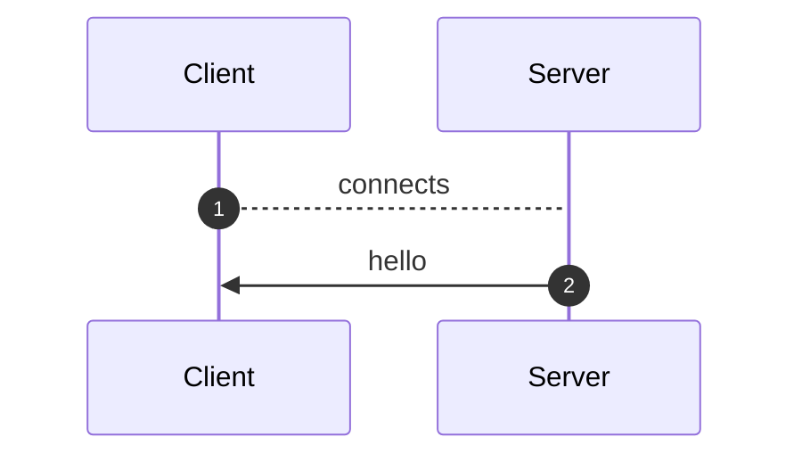
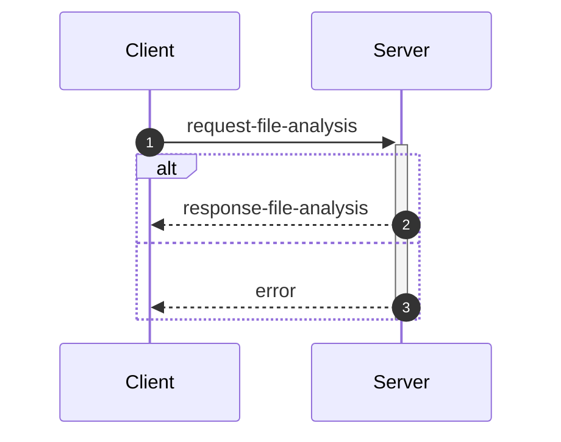
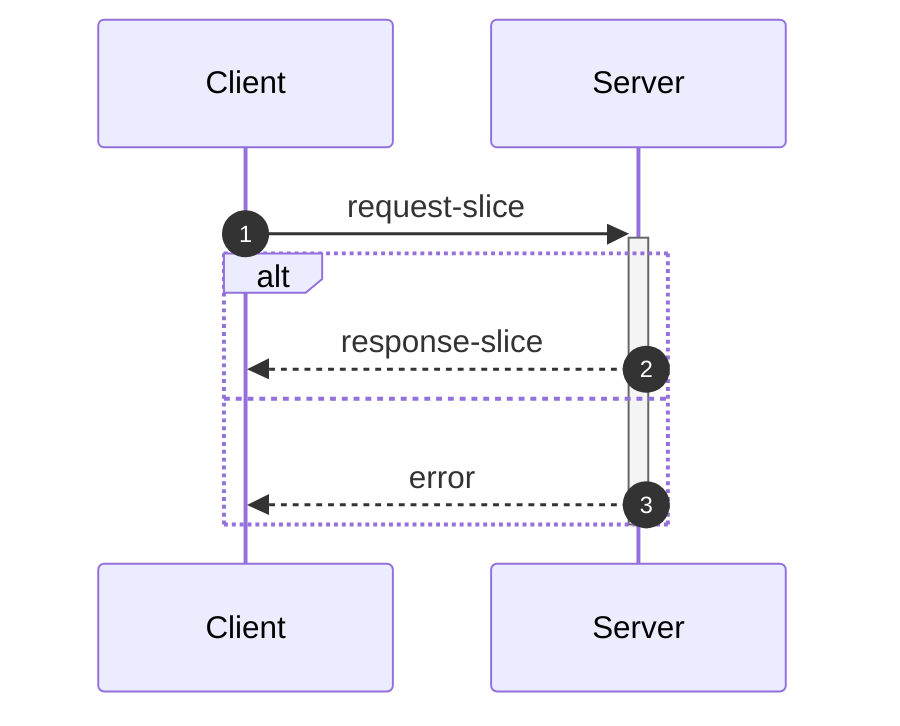
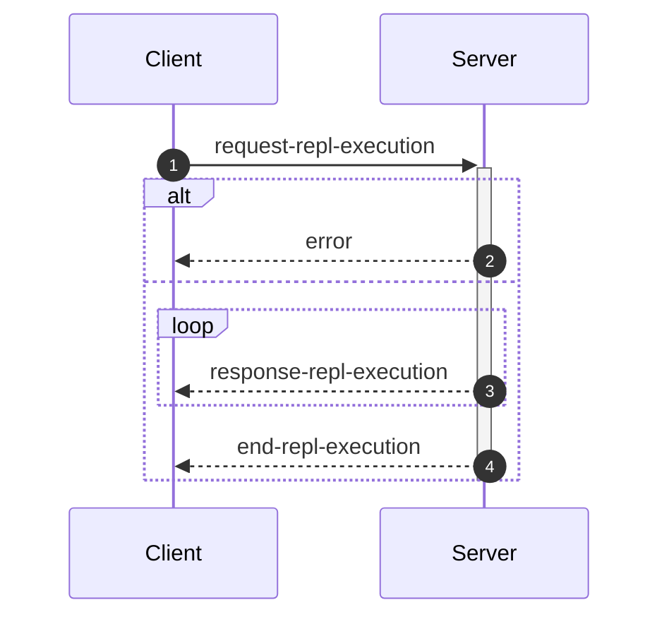

_This document was generated from '[src/documentation/wiki-interface.ts](https://github.com/flowr-analysis/flowr/tree/main//src/documentation/wiki-interface.ts)' on 2026-02-08, 16:04:20 UTC presenting an overview of flowR's interface (v2.9.7, using R v4.5.0). Please do not edit this file/wiki page directly._

Although far from being as detailed as the in-depth explanation of [_flowR_](https://github.com/flowr-analysis/flowr/wiki/wiki/core),
this wiki page explains how to interface with _flowR_ in more detail.
In general, command line arguments and other options provide short descriptions on hover over.

* [💻 Using the REPL](#using-the-repl)
* [⚙️ Configuring FlowR](#configuring-flowr)
* [⚒️ Writing Code](#writing-code)
* [💬 Communicating with the Server](#communicating-with-the-server)

<a id='using-the-repl'></a>
## 💻 Using the REPL


> [!NOTE]
> To execute arbitrary R commands with a repl request, _flowR_ has to be started explicitly with <span title="Description (Command Line Argument): Allow to access the underlying R session when using flowR (security warning: this allows the execution of arbitrary R code!)">`--r-session-access`</span>.
> Please be aware that this introduces a security risk and note that this relies on the [`r-shell` engine](https://github.com/flowr-analysis/flowr/wiki/wiki/engines) .

Although primarily meant for users to explore, 
there is nothing which forbids simply calling _flowR_ as a subprocess to use standard-in, -output, and -error 
for communication (although you can access the REPL using the server as well, 
with the [REPL Request](#message-request-repl-execution) message).

The read-eval-print loop&nbsp;(REPL) works relatively simple.
You can submit an expression (using <kbd>Enter</kbd>),
which is interpreted as an R&nbsp;expression by default but interpreted as a *command* if it starts with a colon (`:`).
The best command to get started with the REPL is <span title="Description (Repl Command): Show help information (aliases: :h, :?)">`:help`</span>.
Besides, you can leave the REPL either with the command <span title="Description (Repl Command): End the repl (aliases: :q, :exit)">`:quit`</span> or by pressing <kbd>Ctrl</kbd>+<kbd>C</kbd> twice.
When writing a *command*, you may press <kbd>Tab</kbd> to get a list of completions, if available.
Multiple commands can be entered in a single line by separating them with a semicolon (`;`), e.g. `:parse "x<-2"; :df*`.
If a command is given without R code, the REPL will re-use R code given in a previous command. 
The prior example will hence return first the parsed AST of the program and then the dataflow graph for `"x <- 2"`.

> [!NOTE]
> If you develop flowR, you may want to launch the repl using the `npm run main-dev` command, this way, you get a non-minified version of flowR with debug information and hot-reloading of source files.

<details>
<summary>Available Commands</summary>

We currently offer the following commands (this with a `[*]` suffix are available with and without the star):


| Command | Description |
| ------- | ----------- |
| **<span title="Description (Repl Command): End the repl (aliases: :q, :exit)">:quit</span>** | End the repl (aliases: **:<span title="Alias of ':quit'. End the repl">q</span>**, **:<span title="Alias of ':quit'. End the repl">exit</span>**) |
| **<span title="Description (Repl Command): Execute the given code as R code. This requires the `--r-session-access` flag to be set and requires the r-shell engine. (aliases: :e, :r)">:execute</span>** | Execute the given code as R code. This requires the `--r-session-access` flag to be set and requires the r-shell engine. (aliases: **:<span title="Alias of ':execute'. Execute the given code as R code. This requires the `--r-session-access` flag to be set and requires the r-shell engine.">e</span>**, **:<span title="Alias of ':execute'. Execute the given code as R code. This requires the `--r-session-access` flag to be set and requires the r-shell engine.">r</span>**) |
| **<span title="Description (Repl Command): Get mermaid code for the control-flow graph of R code, start with 'file://' to indicate a file (aliases: :cfg, :cf)">:controlflow[*]</span>** | Get mermaid code for the control-flow graph of R code, start with 'file://' to indicate a file (star: Returns the URL to mermaid.live) (aliases: **:<span title="Alias of ':controlflow'. Get mermaid code for the control-flow graph of R code, start with 'file://' to indicate a file">cfg</span>**, **:<span title="Alias of ':controlflow'. Get mermaid code for the control-flow graph of R code, start with 'file://' to indicate a file">cf</span>**) |
| **<span title="Description (Repl Command): Get mermaid code for the control-flow graph with basic blocks, start with 'file://' to indicate a file (aliases: :cfgb, :cfb)">:controlflowbb[*]</span>** | Get mermaid code for the control-flow graph with basic blocks, start with 'file://' to indicate a file (star: Returns the URL to mermaid.live) (aliases: **:<span title="Alias of ':controlflowbb'. Get mermaid code for the control-flow graph with basic blocks, start with 'file://' to indicate a file">cfgb</span>**, **:<span title="Alias of ':controlflowbb'. Get mermaid code for the control-flow graph with basic blocks, start with 'file://' to indicate a file">cfb</span>**) |
| **<span title="Description (Repl Command): Get mermaid code for the dataflow graph, start with 'file://' to indicate a file (aliases: :d, :df)">:dataflow[*]</span>** | Get mermaid code for the dataflow graph, start with 'file://' to indicate a file (star: Returns the URL to mermaid.live) (aliases: **:<span title="Alias of ':dataflow'. Get mermaid code for the dataflow graph, start with 'file://' to indicate a file">d</span>**, **:<span title="Alias of ':dataflow'. Get mermaid code for the dataflow graph, start with 'file://' to indicate a file">df</span>**) |
| **<span title="Description (Repl Command): Get mermaid code for the normalized AST of R code, start with 'file://' to indicate a file (aliases: :n)">:normalize[*]</span>** | Get mermaid code for the normalized AST of R code, start with 'file://' to indicate a file (star: Returns the URL to mermaid.live) (alias: **:<span title="Alias of ':normalize'. Get mermaid code for the normalized AST of R code, start with 'file://' to indicate a file">n</span>**) |
| **<span title="Description (Repl Command): Get mermaid code for the simplified dataflow graph, start with 'file://' to indicate a file (aliases: :ds, :dfs)">:dataflowsimple[*]</span>** | Get mermaid code for the simplified dataflow graph, start with 'file://' to indicate a file (star: Returns the URL to mermaid.live) (aliases: **:<span title="Alias of ':dataflowsimple'. Get mermaid code for the simplified dataflow graph, start with 'file://' to indicate a file">ds</span>**, **:<span title="Alias of ':dataflowsimple'. Get mermaid code for the simplified dataflow graph, start with 'file://' to indicate a file">dfs</span>**) |
| **<span title="Description (Repl Command): Just calculates the DFG, but only prints summary info (aliases: :d#, :df#)">:dataflowsilent</span>** | Just calculates the DFG, but only prints summary info (aliases: **:<span title="Alias of ':dataflowsilent'. Just calculates the DFG, but only prints summary info">d#</span>**, **:<span title="Alias of ':dataflowsilent'. Just calculates the DFG, but only prints summary info">df#</span>**) |
| **<span title="Description (Repl Command): Prints ASCII Art of the parsed, unmodified AST, start with 'file://' to indicate a file (aliases: :p)">:parse</span>** | Prints ASCII Art of the parsed, unmodified AST, start with 'file://' to indicate a file (alias: **:<span title="Alias of ':parse'. Prints ASCII Art of the parsed, unmodified AST, start with 'file://' to indicate a file">p</span>**) |
| **<span title="Description (Repl Command): Prints the version of flowR as well as the current version of R">:version</span>** | Prints the version of flowR as well as the current version of R
| **<span title="Description (Repl Command): Query the given R code, start with 'file://' to indicate a file. The query is to be a valid query in json format (use 'help' to get more information).">:query[*]</span>** | Query the given R code, start with 'file://' to indicate a file. The query is to be a valid query in json format (use 'help' to get more information). (star: Similar to query, but returns the output in json format.)
| **<span title="Description (Repl Command): Returns an ASCII representation of the dataflow graph (aliases: :df!)">:dataflowascii</span>** | Returns an ASCII representation of the dataflow graph (alias: **:<span title="Alias of ':dataflowascii'. Returns an ASCII representation of the dataflow graph">df!</span>**) |
| **<span title="Description (Repl Command): Returns summarization stats for the normalized AST (aliases: :n#)">:normalize#</span>** | Returns summarization stats for the normalized AST (alias: **:<span title="Alias of ':normalize#'. Returns summarization stats for the normalized AST">n#</span>**) |
| **<span title="Description (Repl Command): Show help information (aliases: :h, :?)">:help</span>** | Show help information (aliases: **:<span title="Alias of ':help'. Show help information">h</span>**, **:<span title="Alias of ':help'. Show help information">?</span>**) |


</details>


> [!TIP]
> 
> As indicated by the examples before, all REPL commands that operate on code keep track of the state.
> Hence, if you run a command like <span title="Description (Repl Command, starred version): Returns the URL to mermaid.live; Base Command: Get mermaid code for the dataflow graph, start with 'file://' to indicate a file (aliases: :d*, :df*)">`:dataflow*`</span> without providing R code,
> the REPL will re-use the R code provided in a previous command.
> Likewise, doing this will benefit from incrementality!
> If you request the dataflow graph with `:df* x <- 2 * y` and then want to see the parsed AST with `:parse`,
> the REPL will re-use previously obtained information and not re-parse the code again.
> 		


Generally, many commands offer shortcut versions in the REPL. Many queries, for example, offer a shortened format (see the example below).
Of special note, the [Config Query](https://github.com/flowr-analysis/flowr/wiki/wiki/query-api#Config-Query)
can be used to also modify the currently active configuration of _flowR_ within the REPL (see the [wiki page](https://github.com/flowr-analysis/flowr/wiki/wiki/query-api#Config-Query) for more information).

### Example: Retrieving the Dataflow Graph

To retrieve a URL to the [mermaid](https://mermaid.js.org/) diagram of the dataflow of a given expression, 
use <span title="Description (Repl Command, starred version): Returns the URL to mermaid.live; Base Command: Get mermaid code for the dataflow graph, start with 'file://' to indicate a file (aliases: :d*, :df*)">`:dataflow*`</span> (or <span title="Description (Repl Command): Get mermaid code for the dataflow graph, start with 'file://' to indicate a file (aliases: :d, :df)">`:dataflow`</span> to get the mermaid code in the cli):


```shell
$ docker run -it --rm eagleoutice/flowr # or npm run flowr 
flowR repl using flowR v2.9.7, R grammar v14 (tree-sitter engine)
R> :dataflow* y <- 1 + x
```

<details>
<summary style='color:gray'>Output</summary>


```text
https://mermaid.live/view#base64:eyJjb2RlIjoiZmxvd2NoYXJ0IEJUXG4gICAgMXt7XCJgIzkxO1JOdW1iZXIjOTM7IDFcbiAgICAgICgxKVxuICAgICAgKjEuNipgXCJ9fVxuICAgIDIoW1wiYCM5MTtSU3ltYm9sIzkzOyB4XG4gICAgICAoMilcbiAgICAgICoxLjEwKmBcIl0pXG4gICAgM1tbXCJgIzkxO1JCaW5hcnlPcCM5MzsgIzQzO1xuICAgICAgKDMpXG4gICAgICAqMS42LTEwKlxuICAgICgxLCAyKWBcIl1dXG4gICAgYnVpbHQtaW46X1tcImBCdWlsdC1JbjpcbiM0MztgXCJdXG4gICAgc3R5bGUgYnVpbHQtaW46XyBzdHJva2U6Z3JheSxmaWxsOmdyYXksc3Ryb2tlLXdpZHRoOjJweCxvcGFjaXR5Oi44O1xuICAgIDBbXCJgIzkxO1JTeW1ib2wjOTM7IHlcbiAgICAgICgwKVxuICAgICAgKjEuMSpgXCJdXG4gICAgNFtbXCJgIzkxO1JCaW5hcnlPcCM5MzsgIzYwOyM0NTtcbiAgICAgICg0KVxuICAgICAgKjEuMS0xMCpcbiAgICAoMCwgMylgXCJdXVxuICAgIGJ1aWx0LWluOl8tW1wiYEJ1aWx0LUluOlxuIzYwOyM0NTtgXCJdXG4gICAgc3R5bGUgYnVpbHQtaW46Xy0gc3Ryb2tlOmdyYXksZmlsbDpncmF5LHN0cm9rZS13aWR0aDoycHgsb3BhY2l0eTouODtcbiAgICAzIC0tPnxcInJlYWRzLCBhcmd1bWVudFwifCAxXG4gICAgMyAtLT58XCJyZWFkcywgYXJndW1lbnRcInwgMlxuICAgIDMgLS4tPnxcInJlYWRzLCBjYWxsc1wifCBidWlsdC1pbjpfXG4gICAgbGlua1N0eWxlIDIgc3Ryb2tlOmdyYXk7XG4gICAgMCAtLT58XCJkZWZpbmVkLWJ5XCJ8IDNcbiAgICAwIC0tPnxcImRlZmluZWQtYnlcInwgNFxuICAgIDQgLS0+fFwicmVhZHMsIGFyZ3VtZW50XCJ8IDNcbiAgICA0IC0tPnxcInJldHVybnMsIGFyZ3VtZW50XCJ8IDBcbiAgICA0IC0uLT58XCJyZWFkcywgY2FsbHNcInwgYnVpbHQtaW46Xy1cbiAgICBsaW5rU3R5bGUgNyBzdHJva2U6Z3JheTsiLCJtZXJtYWlkIjp7ImF1dG9TeW5jIjp0cnVlfX0=
```


Retrieve the dataflow graph of the expression `y <- 1 + x`. It looks like this:


	
<details>

<summary style="color:gray">R Code of the Dataflow Graph</summary>

The analysis required _0.6 ms_ (including parse and normalize, using the [tree-sitter](https://github.com/flowr-analysis/flowr/wiki/Engines) engine) within the generation environment. 
We encountered no unknown side effects during the analysis.


```r
y <- 1 + x
```


</details>


</details>


For small graphs like this, <span title="Description (Repl Command): Returns an ASCII representation of the dataflow graph (aliases: :df!)">`:dataflowascii`</span> also provides an ASCII representation directly in the REPL:


```shell
$ docker run -it --rm eagleoutice/flowr # or npm run flowr 
flowR repl using flowR v2.9.7, R grammar v14 (tree-sitter engine)
R> :df! y <- 1 + x
```

<details open>
<summary style='color:gray'>Output</summary>


```text
                        0<1>0
                   ┌────| 1 |
    ┌────────┐     │    0---0
 c<4>c       └──c<3>c
 |<- |  v<0>v┌──| + |
 c---c──| y |┘  c---c   u<2>u
        v---v      └────| x |
                        u---u
Edges:
3 -> 1: reads, argument  3 -> 2: reads, argument
4 -> 3: reads, argument  4 -> 0: returns, argument
0 -> 3: defined-by       0 -> 4: defined-by
```


Retrieve the dataflow graph of the expression `y <- 1 + x` as ASCII art.

</details>


For the slicing with <span title="Description (Repl Command): Static backwards executable slicer for R">`:slicer`</span>, you have access to the same [magic comments](#slice-magic-comments) as with the [slice request](#message-request-slice).

### Example: Interfacing with the File System

Many commands that allow for an R-expression (like <span title="Description (Repl Command, starred version): Returns the URL to mermaid.live; Base Command: Get mermaid code for the dataflow graph, start with 'file://' to indicate a file (aliases: :d*, :df*)">`:dataflow*`</span>) allow for a file as well 
if the argument starts with `file://`. 
If you are working from the root directory of the _flowR_ repository, the following gives you the parsed AST of the example file using the <span title="Description (Repl Command): Prints ASCII Art of the parsed, unmodified AST, start with 'file://' to indicate a file (aliases: :p)">`:parse`</span> command:


```shell
$ docker run -it --rm eagleoutice/flowr # or npm run flowr 
flowR repl using flowR v2.9.7, R grammar v14 (tree-sitter engine)
R> :parse file://test/testfiles/example.R
```

<details>
<summary style='color:gray'>Output</summary>


```text
File: test/testfiles/example.R

program
├ binaryoperator
│ ├ identifier "sum" (1:1─4)
│ ├ <- "<-" (1:5─7)
│ ╰ float "0" (1:8─9)
├ binaryoperator
│ ├ identifier "product" (2:1─8)
│ ├ <- "<-" (2:9─11)
│ ╰ float "1" (2:12─13)
├ binaryoperator
│ ├ identifier "w" (3:1─2)
│ ├ <- "<-" (3:3─5)
│ ╰ float "7" (3:6─7)
├ binaryoperator
│ ├ identifier "N" (4:1─2)
│ ├ <- "<-" (4:3─5)
│ ╰ float "10" (4:6─8)
├ forstatement
│ ├ for "for" (6:1─4)
│ ├ ( "(" (6:5─6)
│ ├ identifier "i" (6:6─7)
│ ├ in "in" (6:8─10)
│ ├ binaryoperator
│ │ ├ float "1" (6:11─12)
│ │ ├ : ":" (6:12─13)
│ │ ╰ parenthesizedexpression
│ │   ├ ( "(" (6:13─14)
│ │   ├ binaryoperator
│ │   │ ├ identifier "N" (6:14─15)
│ │   │ ├ - "-" (6:15─16)
│ │   │ ╰ float "1" (6:16─17)
│ │   ╰ ) ")" (6:17─18)
│ ├ ) ")" (6:18─19)
│ ╰ bracedexpression
│   ├ { "{" (6:20─21)
│   ├ binaryoperator
│   │ ├ identifier "sum" (7:3─6)
│   │ ├ <- "<-" (7:7─9)
│   │ ╰ binaryoperator
│   │   ├ binaryoperator
│   │   │ ├ identifier "sum" (7:10─13)
│   │   │ ├ + "+" (7:14─15)
│   │   │ ╰ identifier "i" (7:16─17)
│   │   ├ + "+" (7:18─19)
│   │   ╰ identifier "w" (7:20─21)
│   ├ binaryoperator
│   │ ├ identifier "product" (8:3─10)
│   │ ├ <- "<-" (8:11─13)
│   │ ╰ binaryoperator
│   │   ├ identifier "product" (8:14─21)
│   │   ├  "" (8:22─23)
│   │   ╰ identifier "i" (8:24─25)
│   ╰ } "}" (9:1─2)
├ call
│ ├ identifier "cat" (11:1─4)
│ ╰ arguments
│   ├ ( "(" (11:4─5)
│   ├ argument
│   │ ╰ string
│   │   ├ " "\"" (11:5─6)
│   │   ├ stringcontent "Sum:" (11:6─10)
│   │   ╰ " "\"" (11:10─11)
│   ├ comma "," (11:11─12)
│   ├ argument
│   │ ╰ identifier "sum" (11:13─16)
│   ├ comma "," (11:16─17)
│   ├ argument
│   │ ╰ string
│   │   ├ " "\"" (11:18─19)
│   │   ├ stringcontent
│   │   │ ╰ escapesequence "\\n" (11:19─21)
│   │   ╰ " "\"" (11:21─22)
│   ╰ ) ")" (11:22─23)
╰ call
  ├ identifier "cat" (12:1─4)
  ╰ arguments
    ├ ( "(" (12:4─5)
    ├ argument
    │ ╰ string
    │   ├ " "\"" (12:5─6)
    │   ├ stringcontent "Product:" (12:6─14)
    │   ╰ " "\"" (12:14─15)
    ├ comma "," (12:15─16)
    ├ argument
    │ ╰ identifier "product" (12:17─24)
    ├ comma "," (12:24─25)
    ├ argument
    │ ╰ string
    │   ├ " "\"" (12:26─27)
    │   ├ stringcontent
    │   │ ╰ escapesequence "\\n" (12:27─29)
    │   ╰ " "\"" (12:29─30)
    ╰ ) ")" (12:30─31)
```


Retrieve the parsed AST of the example file.

<details>

<summary>File Content</summary>


```r
sum <- 0
product <- 1
w <- 7
N <- 10

for (i in 1:(N-1)) {
  sum <- sum + i + w
  product <- product * i
}

cat("Sum:", sum, "\n")
cat("Product:", product, "\n")
```


</details>

As _flowR_ directly transforms this AST the output focuses on being human-readable instead of being machine-readable. 
		

</details>


### Example: Run a Query

You can run any query supported by _flowR_ using the <span title="Description (Repl Command): Query the given R code, start with 'file://' to indicate a file. The query is to be a valid query in json format (use 'help' to get more information).">`:query`</span> command.
For example, to obtain the shapes of all data frames in a given piece of code, you can run:


```shell
$ docker run -it --rm eagleoutice/flowr # or npm run flowr 
flowR repl using flowR v2.9.7, R grammar v14 (tree-sitter engine)
R> :query @df-shape "x <- data.frame(a = 1:10, b = 1:10)\ny <- x$a"
```

<details open>
<summary style='color:gray'>Output</summary>


```text
Query: df-shape (1 ms)
   ╰ 12: (colnames: [{"a", "b"}, {}], cols: [2, 2], rows: [10, 10])
   ╰ 0: (colnames: [{"a", "b"}, {}], cols: [2, 2], rows: [10, 10])
All queries together required ≈3 ms (1ms accuracy, total 4 ms)
```


Retrieve the shapes of all data frames in the given code.

</details>


To run the linter on a file, you can use (in this example, we just issue the `dead-code` linter on a small piece of code):


```shell
$ docker run -it --rm eagleoutice/flowr # or npm run flowr 
flowR repl using flowR v2.9.7, R grammar v14 (tree-sitter engine)
R> :query @linter rules:dead-code "if(FALSE) x <- 2"
```

<details open>
<summary style='color:gray'>Output</summary>


```text
Query: linter (1 ms)
   ╰ Dead Code (dead-code):
       ╰ certain:
           ╰ Code at 1.11-16
       ╰ Metadata: consideredNodes: 7, searchTimeMs: 1, processTimeMs: 0
All queries together required ≈1 ms (1ms accuracy, total 2 ms)
```


Run the linter on the given code, with only the `dead-code` rule enabled.

</details>


For more information on the available queries, please check out the [Query API](https://github.com/flowr-analysis/flowr/wiki/wiki/query-api).


<a id='configuring-flowr'></a>
## ⚙️ Configuring FlowR


When running _flowR_, you may want to specify some behaviors with a dedicated configuration file. 
By default, flowR looks for a file named `flowr.json` in the current working directory (or any higher directory). 
You can also specify a different file with <span title="Description (Command Line Argument): The name of the configuration file to use">`--config-file`</span> or pass the configuration inline using <span title="Description (Command Line Argument): The flowR configuration to use, as a JSON string">`--config-json`</span>.
To inspect the current configuration, you can run flowr with the <span title="Description (Command Line Argument): Run with verbose logging (will be passed to the corresponding script)">`--verbose`</span> flag, or use the `config` [Query](https://github.com/flowr-analysis/flowr/wiki/Query%20API).
Within the REPL this works by running the following:


```shell
:query @config
```


The following summarizes the configuration options:

- `ignoreSourceCalls`: If set to `true`, _flowR_ will ignore source calls when analyzing the code, i.e., ignoring the inclusion of other files.
- `semantics`: allows to configure the way _flowR_ handles R, although we currently only support `semantics/environment/overwriteBuiltIns`. 
  You may use this to overwrite _flowR_'s handling of built-in function and even completely clear the preset definitions shipped with flowR. 
  See [Configure BuiltIn Semantics](#configure-builtin-semantics) for more information.
- `solver`: allows to configure how _flowR_ resolves variables and their values (currently we support: `disabled`, `alias`, `builtin`), as well as if pointer analysis should be active.
- `engines`: allows to configure the engines used by _flowR_ to interact with R code. See the [Engines wiki page](https://github.com/flowr-analysis/flowr/wiki/Engines) for more information.
- `defaultEngine`: allows to specify the default engine to use for interacting with R code. If not set, an arbitrary engine from the specified list will be used.
- `abstractInterpretation`: allows to configure how _flowR_ performs abstract interpretation, although we currently only support data frame shape inference through abstract interpretation.

So you can configure _flowR_ by adding a file like the following:

<details>

<summary>Example Configuration File</summary>


```json
{
  "ignoreSourceCalls": true,
  "semantics": {
    "environment": {
      "overwriteBuiltIns": {
        "definitions": [
          {
            "type": "function",
            "names": [
              "foo"
            ],
            "processor": "builtin:assignment",
            "config": {}
          }
        ]
      }
    }
  },
  "repl": {
    "quickStats": false,
    "dfProcessorHeat": false
  },
  "project": {
    "resolveUnknownPathsOnDisk": true
  },
  "engines": [
    {
      "type": "r-shell"
    }
  ],
  "solver": {
    "variables": "alias",
    "evalStrings": true,
    "resolveSource": {
      "dropPaths": "no",
      "ignoreCapitalization": true,
      "inferWorkingDirectory": "active-script",
      "searchPath": []
    },
    "instrument": {},
    "slicer": {
      "threshold": 50
    }
  },
  "abstractInterpretation": {
    "wideningThreshold": 4,
    "dataFrame": {
      "maxColNames": 20,
      "readLoadedData": {
        "readExternalFiles": true,
        "maxReadLines": 1000000
      }
    }
  }
}
```


</details>

<details> 
<a id='configure-builtin-semantics'></a>
<summary>Configure Built-In Semantics</summary> 


`semantics/environment/overwriteBuiltins` accepts two keys:

- `loadDefaults` (boolean, initially `true`): If set to `true`, the default built-in definitions are loaded before applying the custom definitions. Setting this flag to `false` explicitly disables the loading of the default definitions.
- `definitions` (array, initially empty): Allows to overwrite or define new built-in elements. Each object within must have a `type` which is one of the below. Furthermore, they may define a string array of `names` which specifies the identifiers to bind the definitions to. You may use `assumePrimitive` to specify whether _flowR_ should assume that this is a primitive non-library definition (so you probably just do not want to specify the key).

  | Type            | Description                                                                                                                                                                                                                                                                                              | Example                                                                                                    |
  | --------------- | -------------------------------------------------------------------------------------------------------------------------------------------------------------------------------------------------------------------------------------------------------------------------------------------------------- | ---------------------------------------------------------------------------------------------------------- |
  | `constant`    | Additionally allows for a `value` this should resolve to.                                                                                                                                                                                                                                                | `{ type: 'constant', names: ['NULL', 'NA'],  value: null }`                                                |
  | `function`    | Is a rather flexible way to define and bind built-in functions. For the time, we do not have extensive documentation to cover all the cases, so please either consult the sources with the `default-builtin-config.ts` or open a [new issue](https://github.com/flowr-analysis/flowr/issues/new/choose). | `{ type: 'function', names: ['next'], processor: 'builtin:default', config: { cfg: ExitPointType.Next } }` |
  | `replacement` | A comfortable way to specify replacement functions like `$<-` or `names<-`. `suffixes` describes the... suffixes to attach automatically. | `{ type: 'replacement', suffixes: ['<-', '<<-'], names: ['[', '[['] }` |


</details>

<details>

<summary style='color:gray'>Full Configuration-File Schema</summary>

- _The configuration file format for flowR._ (object)
    - **ignoreSourceCalls** [optional] _Whether source calls should be ignored, causing {@link processSourceCall}'s behavior to be skipped._ (boolean)
    - **semantics** _Configure language semantics and how flowR handles them._ (object)
        - **environment** [optional] _Semantics regarding how to handle the R environment._ (object)
            - **overwriteBuiltIns** [optional] _Do you want to overwrite (parts) of the builtin definition?_ (object)
                - **loadDefaults** [optional] _Should the default configuration still be loaded?_ (boolean)
                - **definitions** [optional] _The definitions to load/overwrite._ (array)
                Valid item types:
                    - (object)
    - **repl** _Configuration options for the REPL._ (object)
        - **quickStats** [optional] _Whether to show quick stats in the REPL after each evaluation._ (boolean)
        - **dfProcessorHeat** [optional] _This instruments the dataflow processors to count how often each processor is called._ (boolean)
    - **project** _Project specific configuration options._ (object)
        - **resolveUnknownPathsOnDisk** [optional] _Whether to resolve unknown paths loaded by the r project disk when trying to source/analyze files._ (boolean)
    - **engines** _The engine or set of engines to use for interacting with R code. An empty array means all available engines will be used._ (array)
    Valid item types:
        - (alternatives)
            - _The configuration for the tree sitter engine._ (object)
                - **type** [required] _Use the tree sitter engine._ (string)
                    Only allows: 'tree-sitter'
                - **wasmPath** [optional] _The path to the tree-sitter-r WASM binary to use. If this is undefined, this uses the default path._ (string)
                - **treeSitterWasmPath** [optional] _The path to the tree-sitter WASM binary to use. If this is undefined, this uses the default path._ (string)
                - **lax** [optional] _Whether to use the lax parser for parsing R code (allowing for syntax errors). If this is undefined, the strict parser will be used._ (boolean)
            - _The configuration for the R shell engine._ (object)
                - **type** [required] _Use the R shell engine._ (string)
                    Only allows: 'r-shell'
                - **rPath** [optional] _The path to the R executable to use. If this is undefined, this uses the default path._ (string)
    - **defaultEngine** [optional] _The default engine to use for interacting with R code. If this is undefined, an arbitrary engine from the specified list will be used._ (string)
        Only allows: 'tree-sitter', 'r-shell'
    - **solver** _How to resolve constants, constraints, cells, ..._ (object)
        - **variables** _How to resolve variables and their values._ (string)
            Only allows: 'disabled', 'alias', 'builtin'
        - **evalStrings** _Should we include eval(parse(text="...")) calls in the dataflow graph?_ (boolean)
        - **instrument** (object)
            - **dataflowExtractors** [optional] _These keys are only intended for use within code, allowing to instrument the dataflow analyzer!_ (any)
        - **resolveSource** [optional] _If lax source calls are active, flowR searches for sourced files much more freely, based on the configurations you give it. This option is only in effect if `ignoreSourceCalls` is set to false._ (object)
            - **dropPaths** _Allow to drop the first or all parts of the sourced path, if it is relative._ (string)
                Only allows: 'no', 'once', 'all'
            - **ignoreCapitalization** _Search for filenames matching in the lowercase._ (boolean)
            - **inferWorkingDirectory** _Try to infer the working directory from the main or any script to analyze._ (string)
                Only allows: 'no', 'main-script', 'active-script', 'any-script'
            - **searchPath** _Additionally search in these paths._ (array)
            Valid item types:
                - (string)
            - **repeatedSourceLimit** [optional] _How often the same file can be sourced within a single run? Please be aware: in case of cyclic sources this may not reach a fixpoint so give this a sensible limit._ (number)
            - **applyReplacements** _Provide name replacements for loaded files_ (array)
            Valid item types:
                - (object)
        - **slicer** [optional] _The configuration for the slicer._ (object)
            - **threshold** [optional] _The maximum number of iterations to perform on a single function call during slicing._ (number)
    - **abstractInterpretation** _The configuration options for abstract interpretation._ (object)
        - **dataFrame** _The configuration of the shape inference for data frames._ (object)
            - **maxColNames** _The maximum number of columns names to infer for data frames before over-approximating the column names to top._ (number)
            - **wideningThreshold** _The threshold for the number of visitations of a node at which widening should be performed to ensure the termination of the fixpoint iteration._ (number)
            - **readLoadedData** _Configuration options for reading data frame shapes from loaded external data files, such as CSV files._ (object)
                - **readExternalFiles** _Whether data frame shapes should be extracted from loaded external files, such as CSV files._ (boolean)
                - **maxReadLines** _The maximum number of lines to read when extracting data frame shapes from loaded files, such as CSV files._ (number)

</details>

	

<a id='writing-code'></a>
## ⚒️ Writing Code

_flowR_ can be used as a [module](https://www.npmjs.com/package/@eagleoutice/flowr) and offers several main classes and interfaces that are interesting for extension writers 
(see the [Visual Studio Code extension](https://marketplace.visualstudio.com/items?itemName=code-inspect.vscode-flowr) or the [Core](https://github.com/flowr-analysis/flowr/wiki/wiki/core) wiki page for more information).

### Creating Analyses with _flowR_

Nowadays, instances of the <a href="https://github.com/flowr-analysis/flowr/tree/main//src/project/flowr-analyzer.ts#L162"><code><span title="Central class for conducting analyses with FlowR. Use the FlowrAnalyzerBuilder to create a new instance. If you want the original pattern of creating a pipeline and running all steps, you can still do this with FlowrAnalyzer#runFull . To inspect the context of the analyzer, use FlowrAnalyzer#inspectContext (if you are a plugin and need to modify it, use FlowrAnalyzer#context instead).">FlowrAnalyzer</span></code></a> should be used as central frontend to get analysis results from _flowR_.
For example, a program slice can be created like this:


```ts
const analyzer = await new FlowrAnalyzerBuilder()
    .setEngine('tree-sitter')
    .build();
analyzer.addRequest('x <- 1\ny <- x\nx');
const result = await analyzer.query([
    {
        type:     'static-slice',
        criteria: ['3@x']
    }
]);
//console.log(result['static-slice']);
```


For more information, please have a look at the [Analyzer](https://github.com/flowr-analysis/flowr/wiki/wiki/analyzer) wiki page, which explains how to construct and use the <a href="https://github.com/flowr-analysis/flowr/tree/main//src/project/flowr-analyzer.ts#L162"><code><span title="Central class for conducting analyses with FlowR. Use the FlowrAnalyzerBuilder to create a new instance. If you want the original pattern of creating a pipeline and running all steps, you can still do this with FlowrAnalyzer#runFull . To inspect the context of the analyzer, use FlowrAnalyzer#inspectContext (if you are a plugin and need to modify it, use FlowrAnalyzer#context instead).">FlowrAnalyzer</span></code></a> in more detail.
To work with specific perspectives, you can also consult the respective pages like the [Dataflow Graph](https://github.com/flowr-analysis/flowr/wiki/wiki/dataflow-graph) or the [Abstract Interpretation](https://github.com/flowr-analysis/flowr/wiki/wiki/abstract-interpretation) wiki pages.
        
### The Pipeline Executor (Low-Level Interface)

Once, in the beginning, _flowR_ was meant to produce a dataflow graph merely to provide *program slices*. 
However, with continuous updates, the [Dataflow Graph](https://github.com/flowr-analysis/flowr/wiki/wiki/dataflow-graph) repeatedly proves to be the more interesting part.
With this, we restructured _flowR_'s originally *hardcoded* pipeline to be far more flexible. 
Now, it can be theoretically extended or replaced with arbitrary steps, optional steps, and what we call 'decorations' of these steps. 
In short, a slicing pipeline using the <a href="https://github.com/flowr-analysis/flowr/tree/main//src/core/pipeline-executor.ts#L97"><code><span title="**Please note:** The PipelineExecutor is now considered to be a rather low-level API for flowR. While it still works and is the basis for all other layers, we strongly recommend using the FlowrAnalyzer and its builder to create and use an analyzer instance that is pre-configured for your use-case. The pipeline executor allows to execute arbitrary pipelines in a step-by-step fashion. If you are not...">PipelineExecutor</span></code></a> looks like this:


```ts

const slicer = new PipelineExecutor(DEFAULT_SLICING_PIPELINE, {
  parser:    new RShell(),
  request:   requestFromInput('x <- 1\nx + 1'),
  criterion: ['2@x']
})
const slice = await slicer.allRemainingSteps()
// console.log(slice.reconstruct.code)
```


<details><summary>More Information</summary>


If you compare this, with what you would have done with the old (and removed) `SteppingSlicer`, 
this essentially just requires you to replace the `SteppingSlicer` with the <a href="https://github.com/flowr-analysis/flowr/tree/main//src/core/pipeline-executor.ts#L97"><code><span title="**Please note:** The PipelineExecutor is now considered to be a rather low-level API for flowR. While it still works and is the basis for all other layers, we strongly recommend using the FlowrAnalyzer and its builder to create and use an analyzer instance that is pre-configured for your use-case. The pipeline executor allows to execute arbitrary pipelines in a step-by-step fashion. If you are not...">PipelineExecutor</span></code></a>
and to pass the <a href="https://github.com/flowr-analysis/flowr/tree/main//src/core/steps/pipeline/default-pipelines.ts#L18"><code>DEFAULT_SLICING_PIPELINE</code></a> as the first argument.
The <a href="https://github.com/flowr-analysis/flowr/tree/main//src/core/pipeline-executor.ts#L97"><code><span title="**Please note:** The PipelineExecutor is now considered to be a rather low-level API for flowR. While it still works and is the basis for all other layers, we strongly recommend using the FlowrAnalyzer and its builder to create and use an analyzer instance that is pre-configured for your use-case. The pipeline executor allows to execute arbitrary pipelines in a step-by-step fashion. If you are not...">PipelineExecutor</span></code></a>...

1. Provides structures to investigate the results of all intermediate steps
2. Can be executed step-by-step
3. Can repeat steps (e.g., to calculate multiple slices on the same input)

See the in-code documentation for more information.

	

</details>
    

### Using the <a href="https://github.com/flowr-analysis/flowr/tree/main//src/r-bridge/shell.ts#L143"><code><span title="The RShell represents an interactive session with the R interpreter. You can configure it by RShellOptions . At the moment we are using a live R session (and not networking etc.) to communicate with R easily, which allows us to install packages etc. However, this might and probably will change in the future (leaving this as a legacy mode :D)">RShell</span></code></a> to Interact with R

The <a href="https://github.com/flowr-analysis/flowr/tree/main//src/r-bridge/shell.ts#L143"><code><span title="The RShell represents an interactive session with the R interpreter. You can configure it by RShellOptions . At the moment we are using a live R session (and not networking etc.) to communicate with R easily, which allows us to install packages etc. However, this might and probably will change in the future (leaving this as a legacy mode :D)">RShell</span></code></a> class allows interfacing with the `R`&nbsp;ecosystem installed on the host system.
Please have a look at [flowR's Engines](https://github.com/flowr-analysis/flowr/wiki/wiki/engines) for more information on alternatives (for example, the <a href="https://github.com/flowr-analysis/flowr/tree/main//src/r-bridge/lang-4.x/tree-sitter/tree-sitter-executor.ts#L18"><code><span title="Synchronous and (way) faster alternative to the RShell using tree-sitter.">TreeSitterExecutor</span></code></a>).


> [!IMPORTANT]
> 
> Each <a href="https://github.com/flowr-analysis/flowr/tree/main//src/r-bridge/shell.ts#L143"><code><span title="The RShell represents an interactive session with the R interpreter. You can configure it by RShellOptions . At the moment we are using a live R session (and not networking etc.) to communicate with R easily, which allows us to install packages etc. However, this might and probably will change in the future (leaving this as a legacy mode :D)">RShell</span></code></a> controls a new instance of the R&nbsp;interpreter, 
> make sure to call <code><a href="https://github.com/flowr-analysis/flowr/tree/main//src/r-bridge/shell.ts#L317"><span title="Close the current R session, makes the object effectively invalid (can no longer be reopened etc.)">RShell::<i>close</i></span></a>()</code> when you are done.


You can start a new "session" simply by constructing a new object with <code>new <a href="https://github.com/flowr-analysis/flowr/tree/main//src/r-bridge/shell.ts#L143"><span title="The RShell represents an interactive session with the R interpreter. You can configure it by RShellOptions . At the moment we are using a live R session (and not networking etc.) to communicate with R easily, which allows us to install packages etc. However, this might and probably will change in the future (leaving this as a legacy mode :D)">RShell</span></a>()</code>.

However, there are several options that may be of interest 
(e.g., to automatically revive the shell in case of errors or to control the name location of the R process on the system).

With a shell object (let's call it `shell`), you can execute R code by using <a href="https://github.com/flowr-analysis/flowr/tree/main//src/r-bridge/shell.ts#L195"><code><span title="sends the given command directly to the current R session will not do anything to alter input markers!">RShell::<i>sendCommand</i></span></code></a>, 
for example <code>shell.<a href="https://github.com/flowr-analysis/flowr/tree/main//src/r-bridge/shell.ts#L195"><span title="sends the given command directly to the current R session will not do anything to alter input markers!">sendCommand</span></a>("1 + 1")</code>. 
However, this does not return anything, so if you want to collect the output of your command, use
<a href="https://github.com/flowr-analysis/flowr/tree/main//src/r-bridge/shell.ts#L261"><code><span title="Send a command and collect the output">RShell::<i>sendCommandWithOutput</i></span></code></a> instead.

Besides that, the command <a href="https://github.com/flowr-analysis/flowr/tree/main//src/r-bridge/shell.ts#L233"><code>RShell::<b>tryToInjectHomeLibPath</b></code></a> may be of interest, as it enables all libraries available on the host system.


### Generate Statistics (No longer a Focus of flowR)


<details>

<summary>Adding a New Feature to Extract</summary>

In this example, we construct a new feature to extract, with the name "*example*".
Whenever this name appears, you may substitute this with whatever name fits your feature best (as long as the name is unique).

1. **Create a new file in `src/statistics/features/supported`**\
   Create the file `example.ts`, and add its export to the `index.ts` file in the same directory (if not done automatically).

2. **Create the basic structure**\
   To get a better feel of what a feature must have, let's look
   at the basic structure (of course, due to TypeScript syntax,
   there are other ways to achieve the same goal):

   ```ts
   const initialExampleInfo = {
       /* whatever start value is good for you */
       someCounter: 0
   }

   export type ExampleInfo = Writable<typeof initialExampleInfo>

   export const example: Feature<ExampleInfo> = {
    name:        'Example Feature',
    description: 'A longer example description',

    process(existing: ExampleInfo, input: FeatureProcessorInput): ExampleInfo {
      /* perform analysis on the input */
      return existing
    },

    initialValue: initialExampleInfo
   }
   ```

   The `initialExampleInfo` type holds the initial values for each counter that you want to maintain during the feature extraction (they will usually be initialized with 0). The resulting `ExampleInfo` type holds the structure of the data that is to be counted. Due to the vast amount of data processed, information like the name and location of a function call is not stored here, but instead written to disk (see below).

   Every new feature must be of the `Feature<Info>` type, with `Info` referring to a `FeatureInfo` (like `ExampleInfo` in this example). Next to a `name` and a `description`, each Feature must provide:

   - a processor that extracts the information from the input, adding it to the existing information.
   - a function returning the initial value of the information (in this case, `initialExampleInfo`).

3. **Add it to the feature-mapping**\
   Now, in the `feature.ts` file in `src/statistics/features`, add your feature to the `ALL_FEATURES` object.

Now, we want to extract something. For the *example* feature created in the previous steps, we choose to count the amount of `COMMENT` tokens.
So we define a corresponding [XPath](https://developer.mozilla.org/en-US/docs/Web/XPath) query:

```ts
const commentQuery: Query = xpath.parse('//COMMENT')
```

Within our feature's `process` function, running the query is as simple as:

```ts
const comments = commentQuery.select({ node: input.parsedRAst })
```

Now we could do a lot of further processing, but for simplicity, we only record every comment found this way:

```ts
appendStatisticsFile(example.name, 'comments', comments, input.filepath)
```

We use `example.name` to avoid duplication with the name that we’ve assigned to the feature. It corresponds to the name of the folder in the statistics output.
`'comments'` refers to a freely chosen (but unique) name, that will be used as the name for the output file within the folder. The `comments` variable holds the result of the query, which is an array of nodes. Finally, we pass the `filepath` of the file that was analyzed (if known), so that it can be added to the statistics file (as additional information).

</details>
	

<a id='communicating-with-the-server'></a>
## 💬 Communicating with the Server


As explained in the [Overview](https://github.com/flowr-analysis/flowr/wiki/Overview), you can simply run the [TCP](https://de.wikipedia.org/wiki/Transmission_Control_Protocol)&nbsp;server by adding the <span title="Description (Command Line Argument): Do not drop into a repl, but instead start a server on the given port (default: 1042) and listen for messages.">`--server`</span> flag (and, due to the interactive mode, exit with the conventional <kbd>CTRL</kbd>+<kbd>C</kbd>).
Currently, every connection is handled by the same underlying `RShell` - so the server is not designed to handle many clients at a time.
Additionally, the server is not well guarded against attacks (e.g., you can theoretically spawn an arbitrary number of&nbsp;RShell sessions on the target machine).

Every message has to be given in a single line (i.e., without a newline in-between) and end with a newline character. Nevertheless, we will pretty-print example given in the following segments for the ease of reading.


> [!NOTE]
> 
> The default <span title="Description (Command Line Argument): Do not drop into a repl, but instead start a server on the given port (default: 1042) and listen for messages.">`--server`</span> uses a simple [TCP](https://de.wikipedia.org/wiki/Transmission_Control_Protocol)
> connection. If you want _flowR_ to expose a [WebSocket](https://de.wikipedia.org/wiki/WebSocket) server instead, add the <span title="Description (Command Line Argument): If the server flag is set, use websocket for messaging">`--ws`</span> flag (i.e., <span title="Description (Command Line Argument): Do not drop into a repl, but instead start a server on the given port (default: 1042) and listen for messages.">`--server`</span> <span title="Description (Command Line Argument): If the server flag is set, use websocket for messaging">`--ws`</span>) when starting _flowR_ from the command line.
> 			


<ul><li>
<a id="message-hello"></a>
<b>Hello</b> Message (<code>hello</code>) 
<details>

<summary style="color:gray"> View Details. <i>The server informs the client about the successful connection and provides Meta-Information.</i> </summary>




	
After launching _flowR_, for example, with <code>docker run -it --rm eagleoutice/flowr <span title="Description (Command Line Argument): Do not drop into a repl, but instead start a server on the given port (default: 1042) and listen for messages.">-<span/>-server</span></code>&nbsp;(🐳️), simply connecting should present you with a `hello` message, that amongst others should reveal the versions of&nbsp;_flowR_ and&nbsp;R, using the [semver 2.0](https://semver.org/spec/v2.0.0.html) versioning scheme.
The message looks like this:


```json
{
  "type": "hello",
  "clientName": "client-0",
  "versions": {
    "flowr": "2.9.7",
    "r": "4.5.0",
    "engine": "r-shell"
  }
}
```


There are currently a few messages that you can send after the hello message.
If you want to _slice_ a piece of R code you first have to send an [analysis request](#message-request-file-analysis), so that you can send one or multiple slice requests afterward.
Requests for the [REPL](#message-request-repl) are independent of that.
	

<hr>


<details>
<summary style="color:gray">Message schema (<code>hello</code>)</summary>

For the definition of the hello message, please see it's implementation at [`./src/cli/repl/server/messages/message-hello.ts`](https://github.com/flowr-analysis/flowr/tree/main/./src/cli/repl/server/messages/message-hello.ts).

- [required] (object)
    - **type** [required] _The type of the hello message._ (string)
        Only allows: 'hello'
    - **id** [forbidden] _The id of the message is always undefined (as it is the initial message and not requested)._ (any)
    - **clientName** [required] _A unique name that is assigned to each client. It has no semantic meaning and is only used/useful for debugging._ (string)
    - **versions** [required] (object)
        - **flowr** [required] _The version of the flowr server running in semver format._ (string)
        - **r** [required] _The version of the underlying R shell running in semver format._ (string)
        - **engine** [required] _The parser backend that is used to parse the R code._ (string)

</details>


<hr>

</details>
	</li>

<li>
<a id="message-request-file-analysis"></a>
<b>Analysis</b> Message (<code>request-file-analysis</code>) 
<details>

<summary style="color:gray"> View Details. <i>The server builds the dataflow graph for a given input file (or a set of files).</i> </summary>




	
The request allows the server to analyze a file and prepare it for slicing.
The message can contain a `filetoken`, which is used to identify the file in later slice or query requests (if you do not add one, the request will not be stored and therefore, it is not available for subsequent requests).

> **Please note!**\
> If you want to send and process a lot of analysis requests, but do not want to slice them, please do not pass the `filetoken` field. This will save the server a lot of memory allocation.

Furthermore, the request must contain either a `content` field to directly pass the file's content or a `filepath` field which contains the path to the file (this path must be accessible for the server to be useful).
If you add the `id` field, the answer will use the same `id` so you can match requests and the corresponding answers.
See the implementation of the request-file-analysis message for more information.


<details>
<summary>Example of the <code>request-file-analysis</code> Message</summary>

_Note:_ even though we pretty-print these messages, they are sent as a single line, ending with a newline.

The following lists all messages that were sent and received in case you want to reproduce the scenario:

<ol>
<li> <code>hello</code> (response)
<details> 

<summary> Show Details </summary>

The first message is always a hello message.


```json
{
  "type": "hello",
  "clientName": "client-0",
  "versions": {
    "flowr": "2.9.7",
    "r": "4.5.0",
    "engine": "r-shell"
  }
}
```


</details>
</li>

<li> <b><code>request-file-analysis</code> (request)</b>
<details open> 

<summary> Show Details </summary>

Let's suppose you simply want to analyze the following script:
 
```r
x <- 1
x + 1
```

 For this, you can send the following request:


```json
{
  "type": "request-file-analysis",
  "id": "1",
  "filetoken": "x",
  "content": "x <- 1\nx + 1"
}
```


</details>
</li>

<li> <code>response-file-analysis</code> (response)
<details> 

<summary> Show Details </summary>


The `results` field of the response effectively contains three keys of importance:

- `parse`: which contains 1:1 the parse result in CSV format that we received from the `RShell` (i.e., the AST produced by the parser of the R interpreter).
- `normalize`: which contains the normalized AST, including ids (see the `info` field and the [Normalized AST](https://github.com/flowr-analysis/flowr/wiki/Normalized%20AST) wiki page).
- `dataflow`: especially important is the `graph` field which contains the dataflow graph as a set of root vertices (see the [Dataflow Graph](https://github.com/flowr-analysis/flowr/wiki/Dataflow%20Graph) wiki page).
			


_As the code is pretty long, we inhibit pretty printing and syntax highlighting (JSON, hiding built-in):_

```text
{"type":"response-file-analysis","format":"json","id":"1","results":{"parse":{"files":[{"parsed":"[1,1,1,6,7,0,\"expr\",false,\"x <- 1\"],[1,1,1,1,1,3,\"SYMBOL\",true,\"x\"],[1,1,1,1,3,7,\"expr\",false,\"x\"],[1,3,1,4,2,7,\"LEFT_ASSIGN\",true,\"<-\"],[1,6,1,6,4,5,\"NUM_CONST\",true,\"1\"],[1,6,1,6,5,7,\"expr\",false,\"1\"],[2,1,2,5,16,0,\"expr\",false,\"x + 1\"],[2,1,2,1,10,12,\"SYMBOL\",true,\"x\"],[2,1,2,1,12,16,\"expr\",false,\"x\"],[2,3,2,3,11,16,\"'+'\",true,\"+\"],[2,5,2,5,13,14,\"NUM_CONST\",true,\"1\"],[2,5,2,5,14,16,\"expr\",false,\"1\"]","filePath":"/tmp/tmp-8474-TancR6jYg6cb-.R"}],".meta":{"timing":2}},"normalize":{"ast":{"type":"RProject","files":[{"root":{"type":"RExpressionList","children":[{"type":"RBinaryOp","location":[1,3,1,4],"lhs":{"type":"RSymbol","location":[1,1,1,1],"content":"x","lexeme":"x","info":{"fullRange":[1,1,1,1],"adToks":[],"id":0,"parent":2,"role":"binop-lhs","index":0,"nesting":0,"file":"/tmp/tmp-8474-TancR6jYg6cb-.R"}},"rhs":{"location":[1,6,1,6],"lexeme":"1","info":{"fullRange":[1,6,1,6],"adToks":[],"id":1,"parent":2,"role":"binop-rhs","index":1,"nesting":0,"file":"/tmp/tmp-8474-TancR6jYg6cb-.R"},"type":"RNumber","content":{"num":1,"complexNumber":false,"markedAsInt":false}},"operator":"<-","lexeme":"<-","info":{"fullRange":[1,1,1,6],"adToks":[],"id":2,"parent":6,"nesting":0,"file":"/tmp/tmp-8474-TancR6jYg6cb-.R","index":0,"role":"expr-list-child"}},{"type":"RBinaryOp","location":[2,3,2,3],"lhs":{"type":"RSymbol","location":[2,1,2,1],"content":"x","lexeme":"x","info":{"fullRange":[2,1,2,1],"adToks":[],"id":3,"parent":5,"role":"binop-lhs","index":0,"nesting":0,"file":"/tmp/tmp-8474-TancR6jYg6cb-.R"}},"rhs":{"location":[2,5,2,5],"lexeme":"1","info":{"fullRange":[2,5,2,5],"adToks":[],"id":4,"parent":5,"role":"binop-rhs","index":1,"nesting":0,"file":"/tmp/tmp-8474-TancR6jYg6cb-.R"},"type":"RNumber","content":{"num":1,"complexNumber":false,"markedAsInt":false}},"operator":"+","lexeme":"+","info":{"fullRange":[2,1,2,5],"adToks":[],"id":5,"parent":6,"nesting":0,"file":"/tmp/tmp-8474-TancR6jYg6cb-.R","index":1,"role":"expr-list-child"}}],"info":{"adToks":[],"id":6,"nesting":0,"file":"/tmp/tmp-8474-TancR6jYg6cb-.R","role":"root","index":0}},"filePath":"/tmp/tmp-8474-TancR6jYg6cb-.R"}],"info":{"id":7}},".meta":{"timing":0}},"dataflow":{"unknownReferences":[],"in":[{"nodeId":2,"name":"<-","type":2},{"nodeId":5,"name":"+","type":2}],"out":[{"nodeId":0,"name":"x","type":4,"definedAt":2,"value":[1]}],"environment":{"current":{"id":1801,"parent":"<BuiltInEnvironment>","memory":[["x",[{"nodeId":0,"name":"x","type":4,"definedAt":2,"value":[1]}]]]},"level":0},"graph":{"rootVertices":[1,0,2,3,4,5],"vertexInformation":[[1,{"tag":"value","id":1}],[0,{"tag":"vdef","id":0}],[2,{"tag":"fcall","id":2,"name":"<-","onlyBuiltin":true,"args":[{"nodeId":0,"type":32},{"nodeId":1,"type":32}],"origin":["builtin:assignment"]}],[3,{"tag":"use","id":3}],[4,{"tag":"value","id":4}],[5,{"tag":"fcall","id":5,"name":"+","onlyBuiltin":true,"args":[{"nodeId":3,"type":32},{"nodeId":4,"type":32}],"origin":["builtin:default"]}]],"edgeInformation":[[2,[[1,{"types":65}],[0,{"types":72}],["built-in:<-",{"types":5}]]],[0,[[1,{"types":2}],[2,{"types":2}]]],[3,[[0,{"types":1}]]],[5,[[3,{"types":65}],[4,{"types":65}],["built-in:+",{"types":5}]]]],"_unknownSideEffects":[]},"entryPoint":2,"exitPoints":[{"type":0,"nodeId":5}],"hooks":[],".meta":{"timing":0}}}}
```


</details>
</li>
</ol>

The complete round-trip took 10.7 ms (including time required to validate the messages, start, and stop the internal mock server).

</details>


You receive an error if, for whatever reason, the analysis fails (e.g., the message or code you sent contained syntax errors).
It contains a human-readable description *why* the analysis failed (see the error message implementation for more details).


<details>
<summary>Example Error Message</summary>

_Note:_ even though we pretty-print these messages, they are sent as a single line, ending with a newline.

The following lists all messages that were sent and received in case you want to reproduce the scenario:

<ol>
<li> <code>hello</code> (response)
<details> 

<summary> Show Details </summary>

The first message is always a hello message.


```json
{
  "type": "hello",
  "clientName": "client-0",
  "versions": {
    "flowr": "2.9.7",
    "r": "4.5.0",
    "engine": "r-shell"
  }
}
```


</details>
</li>

<li> <code>request-file-analysis</code> (request)
<details> 

<summary> Show Details </summary>


```json
{
  "type": "request-file-analysis",
  "id": "1",
  "filename": "sample.R",
  "content": "x <-"
}
```


</details>
</li>

<li> <b><code>error</code> (response)</b>
<details open> 

<summary> Show Details </summary>


```json
{
  "id": "1",
  "type": "error",
  "fatal": false,
  "reason": "Error while analyzing file sample.R: GuardError: unable to parse R code (see the log for more information) for request {\"request\":\"text\",\"content\":\"x <-\"}}\n Report a Bug: https://github.com/flowr-analysis/flowr/issues/new?body=%3C!%2D%2D%20Please%20describe%20your%20issue%20in%20more%20detail%20below!%20%2D%2D%3E%0A%0A%0A%3C!%2D%2D%20Automatically%20generated%20issue%20metadata%2C%20please%20do%20not%20edit%20or%20delete%20content%20below%20this%20line%20%2D%2D%3E%0A%2D%2D%2D%0A%0AflowR%20version%3A%202.9.7%0Anode%20version%3A%20v22.14.0%0Anode%20arch%3A%20x64%0Anode%20platform%3A%20linux%0Amessage%3A%20%60unable%20to%20parse%20R%20code%20%28see%20the%20log%20for%20more%20information%29%20for%20request%20%7B%22request%22%3A%22text%22%2C%22content%22%3A%22x%20%3C%2D%22%7D%7D%60%0Astack%20trace%3A%0A%60%60%60%0A%20%20%20%20at%20guard%20%28%3C%3E%2Fsrc%2Futil%2Fassert.ts%3A128%3A9%29%0A%20%20%20%20at%20guardRetrievedOutput%20%28%3C%3E%2Fsrc%2Fr%2Dbridge%2Fretriever.ts%3A221%3A7%29%0A%20%20%20%20at%20%2Fhome%2Frunner%2Fwork%2Fflowr%2Fflowr%2Fsrc%2Fr%2Dbridge%2Fretriever.ts%3A182%3A4%0A%20%20%20%20at%20processTicksAndRejections%20%28node%3Ainternal%2Fprocess%2Ftask_queues%3A105%3A5%29%0A%20%20%20%20at%20async%20Object.parseRequests%20%5Bas%20processor%5D%20%28%3C%3E%2Fsrc%2Fr%2Dbridge%2Fparser.ts%3A104%3A19%29%0A%20%20%20%20at%20async%20PipelineExecutor.nextStep%20%28%3C%3E%2Fsrc%2Fcore%2Fpipeline%2Dexecutor.ts%3A192%3A25%29%0A%20%20%20%20at%20async%20FlowrAnalyzerCache.runTapeUntil%20%28%3C%3E%2Fsrc%2Fproject%2Fcache%2Fflowr%2Danalyzer%2Dcache.ts%3A93%3A4%29%0A%20%20%20%20at%20async%20FlowRServerConnection.sendFileAnalysisResponse%20%28%3C%3E%2Fsrc%2Fcli%2Frepl%2Fserver%2Fconnection.ts%3A163%3A52%29%0A%60%60%60%0A%0A%2D%2D%2D%0A%09"
}
```


</details>
</li>
</ol>

The complete round-trip took 8.2 ms (including time required to validate the messages, start, and stop the internal mock server).

</details>


&nbsp;

<a id="analysis-include-cfg"></a>
**Including the Control Flow Graph**

While _flowR_ does (for the time being) not use an explicit control flow graph but instead relies on control-dependency edges within the dataflow graph, 
the respective structure can still be exposed using the server (note that, as this feature is not needed within _flowR_, it is tested significantly less - 
so please create a [new issue](https://github.com/flowr-analysis/flowr/issues/new/choose) for any bug you may encounter).
For this, the analysis request may add `cfg: true` to its list of options.


<details>
<summary>Requesting a Control Flow Graph</summary>

_Note:_ even though we pretty-print these messages, they are sent as a single line, ending with a newline.

The following lists all messages that were sent and received in case you want to reproduce the scenario:

<ol>
<li> <code>hello</code> (response)
<details> 

<summary> Show Details </summary>

The first message is always a hello message.


```json
{
  "type": "hello",
  "clientName": "client-0",
  "versions": {
    "flowr": "2.9.7",
    "r": "4.5.0",
    "engine": "r-shell"
  }
}
```


</details>
</li>

<li> <b><code>request-file-analysis</code> (request)</b>
<details open> 

<summary> Show Details </summary>


```json
{
  "type": "request-file-analysis",
  "id": "1",
  "filetoken": "x",
  "content": "if(unknown > 0) { x <- 2 } else { x <- 5 }\nfor(i in 1:x) { print(x); print(i) }",
  "cfg": true
}
```


</details>
</li>

<li> <code>response-file-analysis</code> (response)
<details> 

<summary> Show Details </summary>


The response looks basically the same as a response sent without the `cfg` flag. However, additionally it contains a `cfg` field. 
If you are interested in a visual representation of the control flow graph, see the 
[visualization with mermaid](https://mermaid.live/view#base64:eyJjb2RlIjoiZmxvd2NoYXJ0IEJUXG4gICAgbjMyKFtcImBSRXhwcmVzc2lvbkxpc3QgKDMyKWBcIl0pXG4gICAgbjE1W1wiYFJJZlRoZW5FbHNlICgxNSlcbiMzNDtpZih1bmtub3duICM2MjsgMCkgIzEyMzsgeCAjNjA7IzQ1OyAyICMxMjU7IGVsc2UgIzEyMzsgeCAjNjA7IzQ1OyA1ICMxMjU7IzM0O2BcIl1cbiAgICBuMTUtZVtbMTUtZV1dXG4gICAgbjAoW1wiYFJTeW1ib2wgKDApXG4jMzQ7dW5rbm93biMzNDtgXCJdKVxuICAgIG4xKFtcImBSTnVtYmVyICgxKVxuIzM0OzAjMzQ7YFwiXSlcbiAgICBuMihbXCJgUkJpbmFyeU9wICgyKVxuIzM0O3Vua25vd24gIzYyOyAwIzM0O2BcIl0pXG4gICAgbjItZVtbMi1lXV1cbiAgICBuOChbXCJgUkV4cHJlc3Npb25MaXN0ICg4KWBcIl0pXG4gICAgbjUoW1wiYFJTeW1ib2wgKDUpXG4jMzQ7eCMzNDtgXCJdKVxuICAgIG42KFtcImBSTnVtYmVyICg2KVxuIzM0OzIjMzQ7YFwiXSlcbiAgICBuNyhbXCJgUkJpbmFyeU9wICg3KVxuIzM0O3ggIzYwOyM0NTsgMiMzNDtgXCJdKVxuICAgIG43LWVbWzctZV1dXG4gICAgbjgtZVtbOC1lXV1cbiAgICBuMTQoW1wiYFJFeHByZXNzaW9uTGlzdCAoMTQpYFwiXSlcbiAgICBuMTEoW1wiYFJTeW1ib2wgKDExKVxuIzM0O3gjMzQ7YFwiXSlcbiAgICBuMTIoW1wiYFJOdW1iZXIgKDEyKVxuIzM0OzUjMzQ7YFwiXSlcbiAgICBuMTMoW1wiYFJCaW5hcnlPcCAoMTMpXG4jMzQ7eCAjNjA7IzQ1OyA1IzM0O2BcIl0pXG4gICAgbjEzLWVbWzEzLWVdXVxuICAgIG4xNC1lW1sxNC1lXV1cbiAgICBuMTYoW1wiYFJTeW1ib2wgKDE2KVxuIzM0O2kjMzQ7YFwiXSlcbiAgICBuMzFbXCJgUkZvckxvb3AgKDMxKVxuIzM0O2ZvcihpIGluIDEjNTg7eCkgIzEyMzsgcHJpbnQoeCk7IHByaW50KGkpICMxMjU7IzM0O2BcIl1cbiAgICBuMTcoW1wiYFJOdW1iZXIgKDE3KVxuIzM0OzEjMzQ7YFwiXSlcbiAgICBuMTgoW1wiYFJTeW1ib2wgKDE4KVxuIzM0O3gjMzQ7YFwiXSlcbiAgICBuMTkoW1wiYFJCaW5hcnlPcCAoMTkpXG4jMzQ7MSM1ODt4IzM0O2BcIl0pXG4gICAgbjE5LWVbWzE5LWVdXVxuICAgIG4zMChbXCJgUkV4cHJlc3Npb25MaXN0ICgzMClgXCJdKVxuICAgIG4yMihbXCJgUlN5bWJvbCAoMjIpXG4jMzQ7cHJpbnQoeCkjMzQ7YFwiXSlcbiAgICBuMjVbXCJgUkZ1bmN0aW9uQ2FsbCAoMjUpXG4jMzQ7cHJpbnQoeCkjMzQ7YFwiXVxuICAgIG4yNS1lW1syNS1lXV1cbiAgICBuMjQoW1wiYFJBcmd1bWVudCAoMjQpXG4jMzQ7eCMzNDtgXCJdKVxuICAgIG4yMyhbXCJgUlN5bWJvbCAoMjMpXG4jMzQ7eCMzNDtgXCJdKVxuICAgIG4yNC1lW1syNC1lXV1cbiAgICBuMjYoW1wiYFJTeW1ib2wgKDI2KVxuIzM0O3ByaW50KGkpIzM0O2BcIl0pXG4gICAgbjI5W1wiYFJGdW5jdGlvbkNhbGwgKDI5KVxuIzM0O3ByaW50KGkpIzM0O2BcIl1cbiAgICBuMjktZVtbMjktZV1dXG4gICAgbjI4KFtcImBSQXJndW1lbnQgKDI4KVxuIzM0O2kjMzQ7YFwiXSlcbiAgICBuMjcoW1wiYFJTeW1ib2wgKDI3KVxuIzM0O2kjMzQ7YFwiXSlcbiAgICBuMjgtZVtbMjgtZV1dXG4gICAgbjMwLWVbWzMwLWVdXVxuICAgIG4zMS1lW1szMS1lXV1cbiAgICBuMzItZVtbMzItZV1dXG4gICAgbjE1IC0uLT58XCJGRFwifCBuMzJcbiAgICBuMSAtLi0+fFwiRkRcInwgbjBcbiAgICBuMCAtLi0+fFwiRkRcInwgbjJcbiAgICBuMi1lIC0uLT58XCJGRFwifCBuMVxuICAgIG43IC0uLT58XCJGRFwifCBuOFxuICAgIG42IC0uLT58XCJGRFwifCBuNVxuICAgIG41IC0uLT58XCJGRFwifCBuN1xuICAgIG43LWUgLS4tPnxcIkZEXCJ8IG42XG4gICAgbjgtZSAtLi0+fFwiRkRcInwgbjctZVxuICAgIG4xMyAtLi0+fFwiRkRcInwgbjE0XG4gICAgbjEyIC0uLT58XCJGRFwifCBuMTFcbiAgICBuMTEgLS4tPnxcIkZEXCJ8IG4xM1xuICAgIG4xMy1lIC0uLT58XCJGRFwifCBuMTJcbiAgICBuMTQtZSAtLi0+fFwiRkRcInwgbjEzLWVcbiAgICBuOCAtLT58XCJDRCAoVFJVRSlcInwgbjItZVxuICAgIG4xNCAtLT58XCJDRCAoRkFMU0UpXCJ8IG4yLWVcbiAgICBuMiAtLi0+fFwiRkRcInwgbjE1XG4gICAgbjE1LWUgLS4tPnxcIkZEXCJ8IG44LWVcbiAgICBuMTUtZSAtLi0+fFwiRkRcInwgbjE0LWVcbiAgICBuMzEgLS4tPnxcIkZEXCJ8IG4xNS1lXG4gICAgbjMxIC0uLT58XCJGRFwifCBuMzAtZVxuICAgIG4xOCAtLi0+fFwiRkRcInwgbjE3XG4gICAgbjE3IC0uLT58XCJGRFwifCBuMTlcbiAgICBuMTktZSAtLi0+fFwiRkRcInwgbjE4XG4gICAgbjI1IC0uLT58XCJGRFwifCBuMzBcbiAgICBuMjIgLS4tPnxcIkZEXCJ8IG4yNVxuICAgIG4yMyAtLi0+fFwiRkRcInwgbjI0XG4gICAgbjI0LWUgLS4tPnxcIkZEXCJ8IG4yM1xuICAgIG4yNCAtLi0+fFwiRkRcInwgbjIyXG4gICAgbjI1LWUgLS4tPnxcIkZEXCJ8IG4yNC1lXG4gICAgbjI5IC0uLT58XCJGRFwifCBuMjUtZVxuICAgIG4yNiAtLi0+fFwiRkRcInwgbjI5XG4gICAgbjI3IC0uLT58XCJGRFwifCBuMjhcbiAgICBuMjgtZSAtLi0+fFwiRkRcInwgbjI3XG4gICAgbjI4IC0uLT58XCJGRFwifCBuMjZcbiAgICBuMjktZSAtLi0+fFwiRkRcInwgbjI4LWVcbiAgICBuMzAtZSAtLi0+fFwiRkRcInwgbjI5LWVcbiAgICBuMTkgLS4tPnxcIkZEXCJ8IG4zMVxuICAgIG4xNiAtLi0+fFwiRkRcInwgbjE5LWVcbiAgICBuMzAgLS0+fFwiQ0QgKFRSVUUpXCJ8IG4xNlxuICAgIG4zMS1lIC0tPnxcIkNEIChGQUxTRSlcInwgbjE2XG4gICAgbjMyLWUgLS4tPnxcIkZEXCJ8IG4zMS1lXG4gICAgc3R5bGUgbjMyIHN0cm9rZTpjeWFuLHN0cm9rZS13aWR0aDo2LjVweDsgICAgc3R5bGUgbjMyLWUgc3Ryb2tlOmdyZWVuLHN0cm9rZS13aWR0aDo2LjVweDsiLCJtZXJtYWlkIjp7ImF1dG9TeW5jIjp0cnVlfX0=).
			


_As the code is pretty long, we inhibit pretty printing and syntax highlighting (JSON, hiding built-in):_

```text
{"type":"response-file-analysis","format":"json","id":"1","cfg":{"returns":[],"entryPoints":[32],"exitPoints":["32-e"],"breaks":[],"nexts":[],"graph":{"roots":[32,15,"15-e",0,1,2,"2-e",8,5,6,7,"7-e","8-e",14,11,12,13,"13-e","14-e",16,31,17,18,19,"19-e",30,22,25,"25-e",24,23,"24-e",26,29,"29-e",28,27,"28-e","30-e","31-e","32-e"],"vtxInfos":[[32,[2,32,null,["32-e"]]],[15,[1,15,["2-e"],["15-e"]]],["15-e","15-e"],[0,[2,0]],[1,[2,1]],[2,[2,2,null,["2-e"]]],["2-e","2-e"],[8,[2,8,null,["8-e"]]],[5,[2,5]],[6,[2,6]],[7,[2,7,null,["7-e"]]],["7-e","7-e"],["8-e","8-e"],[14,[2,14,null,["14-e"]]],[11,[2,11]],[12,[2,12]],[13,[2,13,null,["13-e"]]],["13-e","13-e"],["14-e","14-e"],[16,[2,16]],[31,[1,31,[16],["31-e"]]],[17,[2,17]],[18,[2,18]],[19,[2,19,null,["19-e"]]],["19-e","19-e"],[30,[2,30,null,["30-e"]]],[22,[2,22]],[25,[1,25,[22],["25-e"]]],["25-e","25-e"],[24,[2,24,[24],["24-e"]]],[23,[2,23]],["24-e","24-e"],[26,[2,26]],[29,[1,29,[26],["29-e"]]],["29-e","29-e"],[28,[2,28,[28],["28-e"]]],[27,[2,27]],["28-e","28-e"],["30-e","30-e"],["31-e","31-e"],["32-e","32-e"]],"bbChildren":[],"edgeInfos":[[15,[[32,0]]],[1,[[0,0]]],[0,[[2,0]]],["2-e",[[1,0]]],[7,[[8,0]]],[6,[[5,0]]],[5,[[7,0]]],["7-e",[[6,0]]],["8-e",[["7-e",0]]],[13,[[14,0]]],[12,[[11,0]]],[11,[[13,0]]],["13-e",[[12,0]]],["14-e",[["13-e",0]]],[8,[["2-e",[15,"TRUE"]]]],[14,[["2-e",[15,"FALSE"]]]],[2,[[15,0]]],["15-e",[["8-e",0],["14-e",0]]],[31,[["15-e",0],["30-e",0]]],[18,[[17,0]]],[17,[[19,0]]],["19-e",[[18,0]]],[25,[[30,0]]],[22,[[25,0]]],[23,[[24,0]]],["24-e",[[23,0]]],[24,[[22,0]]],["25-e",[["24-e",0]]],[29,[["25-e",0]]],[26,[[29,0]]],[27,[[28,0]]],["28-e",[[27,0]]],[28,[[26,0]]],["29-e",[["28-e",0]]],["30-e",[["29-e",0]]],[19,[[31,0]]],[16,[["19-e",0]]],[30,[[16,[31,"TRUE"]]]],["31-e",[[16,[31,"FALSE"]]]],["32-e",[["31-e",0]]]],"revEdgeInfos":[[32,[[15,0]]],[0,[[1,0]]],[2,[[0,0]]],[1,[["2-e",0]]],[8,[[7,0]]],[5,[[6,0]]],[7,[[5,0]]],[6,[["7-e",0]]],["7-e",[["8-e",0]]],[14,[[13,0]]],[11,[[12,0]]],[13,[[11,0]]],[12,[["13-e",0]]],["13-e",[["14-e",0]]],["2-e",[[8,[15,"TRUE"]],[14,[15,"FALSE"]]]],[15,[[2,0]]],["8-e",[["15-e",0]]],["14-e",[["15-e",0]]],["15-e",[[31,0]]],[17,[[18,0]]],[19,[[17,0]]],[18,[["19-e",0]]],[30,[[25,0]]],[25,[[22,0]]],[24,[[23,0]]],[23,[["24-e",0]]],[22,[[24,0]]],["24-e",[["25-e",0]]],["25-e",[[29,0]]],[29,[[26,0]]],[28,[[27,0]]],[27,[["28-e",0]]],[26,[[28,0]]],["28-e",[["29-e",0]]],["29-e",[["30-e",0]]],[31,[[19,0]]],["19-e",[[16,0]]],[16,[[30,[31,"TRUE"]],["31-e",[31,"FALSE"]]]],["30-e",[[31,0]]],["31-e",[["32-e",0]]]],"_mayBB":false}},"results":{"parse":{"files":[{"parsed":"[1,1,1,42,38,0,\"expr\",false,\"if(unknown > 0) { x <- 2 } else { x <- 5 }\"],[1,1,1,2,1,38,\"IF\",true,\"if\"],[1,3,1,3,2,38,\"'('\",true,\"(\"],[1,4,1,14,9,38,\"expr\",false,\"unknown > 0\"],[1,4,1,10,3,5,\"SYMBOL\",true,\"unknown\"],[1,4,1,10,5,9,\"expr\",false,\"unknown\"],[1,12,1,12,4,9,\"GT\",true,\">\"],[1,14,1,14,6,7,\"NUM_CONST\",true,\"0\"],[1,14,1,14,7,9,\"expr\",false,\"0\"],[1,15,1,15,8,38,\"')'\",true,\")\"],[1,17,1,26,22,38,\"expr\",false,\"{ x <- 2 }\"],[1,17,1,17,12,22,\"'{'\",true,\"{\"],[1,19,1,24,19,22,\"expr\",false,\"x <- 2\"],[1,19,1,19,13,15,\"SYMBOL\",true,\"x\"],[1,19,1,19,15,19,\"expr\",false,\"x\"],[1,21,1,22,14,19,\"LEFT_ASSIGN\",true,\"<-\"],[1,24,1,24,16,17,\"NUM_CONST\",true,\"2\"],[1,24,1,24,17,19,\"expr\",false,\"2\"],[1,26,1,26,18,22,\"'}'\",true,\"}\"],[1,28,1,31,23,38,\"ELSE\",true,\"else\"],[1,33,1,42,35,38,\"expr\",false,\"{ x <- 5 }\"],[1,33,1,33,25,35,\"'{'\",true,\"{\"],[1,35,1,40,32,35,\"expr\",false,\"x <- 5\"],[1,35,1,35,26,28,\"SYMBOL\",true,\"x\"],[1,35,1,35,28,32,\"expr\",false,\"x\"],[1,37,1,38,27,32,\"LEFT_ASSIGN\",true,\"<-\"],[1,40,1,40,29,30,\"NUM_CONST\",true,\"5\"],[1,40,1,40,30,32,\"expr\",false,\"5\"],[1,42,1,42,31,35,\"'}'\",true,\"}\"],[2,1,2,36,84,0,\"expr\",false,\"for(i in 1:x) { print(x); print(i) }\"],[2,1,2,3,41,84,\"FOR\",true,\"for\"],[2,4,2,13,53,84,\"forcond\",false,\"(i in 1:x)\"],[2,4,2,4,42,53,\"'('\",true,\"(\"],[2,5,2,5,43,53,\"SYMBOL\",true,\"i\"],[2,7,2,8,44,53,\"IN\",true,\"in\"],[2,10,2,12,51,53,\"expr\",false,\"1:x\"],[2,10,2,10,45,46,\"NUM_CONST\",true,\"1\"],[2,10,2,10,46,51,\"expr\",false,\"1\"],[2,11,2,11,47,51,\"':'\",true,\":\"],[2,12,2,12,48,50,\"SYMBOL\",true,\"x\"],[2,12,2,12,50,51,\"expr\",false,\"x\"],[2,13,2,13,49,53,\"')'\",true,\")\"],[2,15,2,36,81,84,\"expr\",false,\"{ print(x); print(i) }\"],[2,15,2,15,54,81,\"'{'\",true,\"{\"],[2,17,2,24,64,81,\"expr\",false,\"print(x)\"],[2,17,2,21,55,57,\"SYMBOL_FUNCTION_CALL\",true,\"print\"],[2,17,2,21,57,64,\"expr\",false,\"print\"],[2,22,2,22,56,64,\"'('\",true,\"(\"],[2,23,2,23,58,60,\"SYMBOL\",true,\"x\"],[2,23,2,23,60,64,\"expr\",false,\"x\"],[2,24,2,24,59,64,\"')'\",true,\")\"],[2,25,2,25,65,81,\"';'\",true,\";\"],[2,27,2,34,77,81,\"expr\",false,\"print(i)\"],[2,27,2,31,68,70,\"SYMBOL_FUNCTION_CALL\",true,\"print\"],[2,27,2,31,70,77,\"expr\",false,\"print\"],[2,32,2,32,69,77,\"'('\",true,\"(\"],[2,33,2,33,71,73,\"SYMBOL\",true,\"i\"],[2,33,2,33,73,77,\"expr\",false,\"i\"],[2,34,2,34,72,77,\"')'\",true,\")\"],[2,36,2,36,78,81,\"'}'\",true,\"}\"]","filePath":"/tmp/tmp-8474-TTTnL6VaTm3c-.R"}],".meta":{"timing":2}},"normalize":{"ast":{"type":"RProject","files":[{"root":{"type":"RExpressionList","children":[{"type":"RIfThenElse","condition":{"type":"RBinaryOp","location":[1,12,1,12],"lhs":{"type":"RSymbol","location":[1,4,1,10],"content":"unknown","lexeme":"unknown","info":{"fullRange":[1,4,1,10],"adToks":[],"id":0,"parent":2,"role":"binop-lhs","index":0,"nesting":1,"file":"/tmp/tmp-8474-TTTnL6VaTm3c-.R"}},"rhs":{"location":[1,14,1,14],"lexeme":"0","info":{"fullRange":[1,14,1,14],"adToks":[],"id":1,"parent":2,"role":"binop-rhs","index":1,"nesting":1,"file":"/tmp/tmp-8474-TTTnL6VaTm3c-.R"},"type":"RNumber","content":{"num":0,"complexNumber":false,"markedAsInt":false}},"operator":">","lexeme":">","info":{"fullRange":[1,4,1,14],"adToks":[],"id":2,"parent":15,"nesting":1,"file":"/tmp/tmp-8474-TTTnL6VaTm3c-.R","role":"if-cond"}},"then":{"type":"RExpressionList","children":[{"type":"RBinaryOp","location":[1,21,1,22],"lhs":{"type":"RSymbol","location":[1,19,1,19],"content":"x","lexeme":"x","info":{"fullRange":[1,19,1,19],"adToks":[],"id":5,"parent":7,"role":"binop-lhs","index":0,"nesting":1,"file":"/tmp/tmp-8474-TTTnL6VaTm3c-.R"}},"rhs":{"location":[1,24,1,24],"lexeme":"2","info":{"fullRange":[1,24,1,24],"adToks":[],"id":6,"parent":7,"role":"binop-rhs","index":1,"nesting":1,"file":"/tmp/tmp-8474-TTTnL6VaTm3c-.R"},"type":"RNumber","content":{"num":2,"complexNumber":false,"markedAsInt":false}},"operator":"<-","lexeme":"<-","info":{"fullRange":[1,19,1,24],"adToks":[],"id":7,"parent":8,"nesting":1,"file":"/tmp/tmp-8474-TTTnL6VaTm3c-.R","index":0,"role":"expr-list-child"}}],"grouping":[{"type":"RSymbol","location":[1,17,1,17],"content":"{","lexeme":"{","info":{"fullRange":[1,17,1,26],"adToks":[],"id":3,"role":"root","index":0,"nesting":1,"file":"/tmp/tmp-8474-TTTnL6VaTm3c-.R"}},{"type":"RSymbol","location":[1,26,1,26],"content":"}","lexeme":"}","info":{"fullRange":[1,17,1,26],"adToks":[],"id":4,"role":"root","index":0,"nesting":1,"file":"/tmp/tmp-8474-TTTnL6VaTm3c-.R"}}],"info":{"adToks":[],"id":8,"parent":15,"nesting":1,"file":"/tmp/tmp-8474-TTTnL6VaTm3c-.R","index":1,"role":"if-then"}},"location":[1,1,1,2],"lexeme":"if","info":{"fullRange":[1,1,1,42],"adToks":[],"id":15,"parent":32,"nesting":1,"file":"/tmp/tmp-8474-TTTnL6VaTm3c-.R","index":0,"role":"expr-list-child"},"otherwise":{"type":"RExpressionList","children":[{"type":"RBinaryOp","location":[1,37,1,38],"lhs":{"type":"RSymbol","location":[1,35,1,35],"content":"x","lexeme":"x","info":{"fullRange":[1,35,1,35],"adToks":[],"id":11,"parent":13,"role":"binop-lhs","index":0,"nesting":1,"file":"/tmp/tmp-8474-TTTnL6VaTm3c-.R"}},"rhs":{"location":[1,40,1,40],"lexeme":"5","info":{"fullRange":[1,40,1,40],"adToks":[],"id":12,"parent":13,"role":"binop-rhs","index":1,"nesting":1,"file":"/tmp/tmp-8474-TTTnL6VaTm3c-.R"},"type":"RNumber","content":{"num":5,"complexNumber":false,"markedAsInt":false}},"operator":"<-","lexeme":"<-","info":{"fullRange":[1,35,1,40],"adToks":[],"id":13,"parent":14,"nesting":1,"file":"/tmp/tmp-8474-TTTnL6VaTm3c-.R","index":0,"role":"expr-list-child"}}],"grouping":[{"type":"RSymbol","location":[1,33,1,33],"content":"{","lexeme":"{","info":{"fullRange":[1,33,1,42],"adToks":[],"id":9,"role":"root","index":0,"nesting":1,"file":"/tmp/tmp-8474-TTTnL6VaTm3c-.R"}},{"type":"RSymbol","location":[1,42,1,42],"content":"}","lexeme":"}","info":{"fullRange":[1,33,1,42],"adToks":[],"id":10,"role":"root","index":0,"nesting":1,"file":"/tmp/tmp-8474-TTTnL6VaTm3c-.R"}}],"info":{"adToks":[],"id":14,"parent":15,"nesting":1,"file":"/tmp/tmp-8474-TTTnL6VaTm3c-.R","index":2,"role":"if-other"}}},{"type":"RForLoop","variable":{"type":"RSymbol","location":[2,5,2,5],"content":"i","lexeme":"i","info":{"adToks":[],"id":16,"parent":31,"role":"for-var","index":0,"nesting":1,"file":"/tmp/tmp-8474-TTTnL6VaTm3c-.R"}},"vector":{"type":"RBinaryOp","location":[2,11,2,11],"lhs":{"location":[2,10,2,10],"lexeme":"1","info":{"fullRange":[2,10,2,10],"adToks":[],"id":17,"parent":19,"role":"binop-lhs","index":0,"nesting":1,"file":"/tmp/tmp-8474-TTTnL6VaTm3c-.R"},"type":"RNumber","content":{"num":1,"complexNumber":false,"markedAsInt":false}},"rhs":{"type":"RSymbol","location":[2,12,2,12],"content":"x","lexeme":"x","info":{"fullRange":[2,12,2,12],"adToks":[],"id":18,"parent":19,"role":"binop-rhs","index":1,"nesting":1,"file":"/tmp/tmp-8474-TTTnL6VaTm3c-.R"}},"operator":":","lexeme":":","info":{"fullRange":[2,10,2,12],"adToks":[],"id":19,"parent":31,"nesting":1,"file":"/tmp/tmp-8474-TTTnL6VaTm3c-.R","index":1,"role":"for-vec"}},"body":{"type":"RExpressionList","children":[{"type":"RFunctionCall","named":true,"location":[2,17,2,21],"lexeme":"print","functionName":{"type":"RSymbol","location":[2,17,2,21],"content":"print","lexeme":"print","info":{"fullRange":[2,17,2,24],"adToks":[],"id":22,"parent":25,"role":"call-name","index":0,"nesting":1,"file":"/tmp/tmp-8474-TTTnL6VaTm3c-.R"}},"arguments":[{"type":"RArgument","location":[2,23,2,23],"lexeme":"x","value":{"type":"RSymbol","location":[2,23,2,23],"content":"x","lexeme":"x","info":{"fullRange":[2,23,2,23],"adToks":[],"id":23,"parent":24,"role":"arg-value","index":0,"nesting":1,"file":"/tmp/tmp-8474-TTTnL6VaTm3c-.R"}},"info":{"fullRange":[2,23,2,23],"adToks":[],"id":24,"parent":25,"nesting":1,"file":"/tmp/tmp-8474-TTTnL6VaTm3c-.R","index":1,"role":"call-arg"}}],"info":{"fullRange":[2,17,2,24],"adToks":[],"id":25,"parent":30,"nesting":1,"file":"/tmp/tmp-8474-TTTnL6VaTm3c-.R","index":0,"role":"expr-list-child"}},{"type":"RFunctionCall","named":true,"location":[2,27,2,31],"lexeme":"print","functionName":{"type":"RSymbol","location":[2,27,2,31],"content":"print","lexeme":"print","info":{"fullRange":[2,27,2,34],"adToks":[],"id":26,"parent":29,"role":"call-name","index":0,"nesting":1,"file":"/tmp/tmp-8474-TTTnL6VaTm3c-.R"}},"arguments":[{"type":"RArgument","location":[2,33,2,33],"lexeme":"i","value":{"type":"RSymbol","location":[2,33,2,33],"content":"i","lexeme":"i","info":{"fullRange":[2,33,2,33],"adToks":[],"id":27,"parent":28,"role":"arg-value","index":0,"nesting":1,"file":"/tmp/tmp-8474-TTTnL6VaTm3c-.R"}},"info":{"fullRange":[2,33,2,33],"adToks":[],"id":28,"parent":29,"nesting":1,"file":"/tmp/tmp-8474-TTTnL6VaTm3c-.R","index":1,"role":"call-arg"}}],"info":{"fullRange":[2,27,2,34],"adToks":[],"id":29,"parent":30,"nesting":1,"file":"/tmp/tmp-8474-TTTnL6VaTm3c-.R","index":1,"role":"expr-list-child"}}],"grouping":[{"type":"RSymbol","location":[2,15,2,15],"content":"{","lexeme":"{","info":{"fullRange":[2,15,2,36],"adToks":[],"id":20,"role":"root","index":0,"nesting":1,"file":"/tmp/tmp-8474-TTTnL6VaTm3c-.R"}},{"type":"RSymbol","location":[2,36,2,36],"content":"}","lexeme":"}","info":{"fullRange":[2,15,2,36],"adToks":[],"id":21,"role":"root","index":0,"nesting":1,"file":"/tmp/tmp-8474-TTTnL6VaTm3c-.R"}}],"info":{"adToks":[],"id":30,"parent":31,"nesting":1,"file":"/tmp/tmp-8474-TTTnL6VaTm3c-.R","index":2,"role":"for-body"}},"lexeme":"for","info":{"fullRange":[2,1,2,36],"adToks":[],"id":31,"parent":32,"nesting":1,"file":"/tmp/tmp-8474-TTTnL6VaTm3c-.R","index":1,"role":"expr-list-child"},"location":[2,1,2,3]}],"info":{"adToks":[],"id":32,"nesting":0,"file":"/tmp/tmp-8474-TTTnL6VaTm3c-.R","role":"root","index":0}},"filePath":"/tmp/tmp-8474-TTTnL6VaTm3c-.R"}],"info":{"id":33}},".meta":{"timing":0}},"dataflow":{"unknownReferences":[],"in":[{"nodeId":15,"name":"if","type":2},{"nodeId":0,"name":"unknown","type":1},{"nodeId":2,"name":">","type":2},{"nodeId":7,"name":"<-","cds":[{"id":15,"when":true}],"type":2},{"nodeId":13,"name":"<-","cds":[{"id":15,"when":false}],"type":2},{"nodeId":8,"name":"{","cds":[{"id":15,"when":true}],"type":2},{"nodeId":14,"name":"{","cds":[{"id":15,"when":false}],"type":2},{"nodeId":31,"name":"for","type":2},{"name":":","nodeId":19,"type":2},{"name":"print","nodeId":25,"type":2},{"name":"print","nodeId":29,"type":2}],"out":[{"nodeId":5,"name":"x","type":4,"definedAt":7,"cds":[{"id":15,"when":true}],"value":[6]},{"nodeId":11,"name":"x","type":4,"definedAt":13,"cds":[{"id":15,"when":true},{"id":15,"when":false}],"value":[12]},{"nodeId":16,"name":"i","type":1}],"environment":{"current":{"id":1873,"parent":"<BuiltInEnvironment>","memory":[["x",[{"nodeId":5,"name":"x","type":4,"definedAt":7,"cds":[{"id":15,"when":true},{"id":15,"when":false}],"value":[6]},{"nodeId":11,"name":"x","type":4,"definedAt":13,"cds":[{"id":15,"when":true},{"id":15,"when":false}],"value":[12]}]],["i",[{"nodeId":16,"name":"i","type":4,"definedAt":31}]]]},"level":0},"graph":{"rootVertices":[0,1,2,6,5,7,8,12,11,13,14,15,16,17,18,19,23,25,27,29,30,31],"vertexInformation":[[0,{"tag":"use","id":0}],[1,{"tag":"value","id":1}],[2,{"tag":"fcall","id":2,"name":">","onlyBuiltin":true,"args":[{"nodeId":0,"type":32},{"nodeId":1,"type":32}],"origin":["builtin:default"]}],[6,{"tag":"value","id":6}],[5,{"tag":"vdef","id":5,"cds":[{"id":15,"when":true}]}],[7,{"tag":"fcall","id":7,"name":"<-","onlyBuiltin":true,"cds":[{"id":15,"when":true}],"args":[{"nodeId":5,"type":32},{"nodeId":6,"type":32}],"origin":["builtin:assignment"]}],[8,{"tag":"fcall","id":8,"name":"{","onlyBuiltin":true,"cds":[{"id":15,"when":true}],"args":[{"nodeId":7,"type":32}],"origin":["builtin:expression-list"]}],[12,{"tag":"value","id":12}],[11,{"tag":"vdef","id":11,"cds":[{"id":15,"when":false}]}],[13,{"tag":"fcall","id":13,"name":"<-","onlyBuiltin":true,"cds":[{"id":15,"when":false}],"args":[{"nodeId":11,"type":32},{"nodeId":12,"type":32}],"origin":["builtin:assignment"]}],[14,{"tag":"fcall","id":14,"name":"{","onlyBuiltin":true,"cds":[{"id":15,"when":false}],"args":[{"nodeId":13,"type":32}],"origin":["builtin:expression-list"]}],[15,{"tag":"fcall","id":15,"name":"if","onlyBuiltin":true,"args":[{"nodeId":2,"type":32},{"nodeId":8,"type":32},{"nodeId":14,"type":32}],"origin":["builtin:if-then-else"]}],[16,{"tag":"vdef","id":16}],[17,{"tag":"value","id":17}],[18,{"tag":"use","id":18}],[19,{"tag":"fcall","id":19,"name":":","onlyBuiltin":true,"args":[{"nodeId":17,"type":32},{"nodeId":18,"type":32}],"origin":["builtin:default"]}],[23,{"tag":"use","id":23,"cds":[{"id":31,"when":true}]}],[25,{"tag":"fcall","id":25,"name":"print","onlyBuiltin":true,"cds":[{"id":31,"when":true}],"args":[{"nodeId":23,"type":32}],"origin":["builtin:default"]}],[27,{"tag":"use","id":27,"cds":[{"id":31,"when":true}]}],[29,{"tag":"fcall","id":29,"name":"print","onlyBuiltin":true,"cds":[{"id":31,"when":true}],"args":[{"nodeId":27,"type":32}],"origin":["builtin:default"]}],[30,{"tag":"fcall","id":30,"name":"{","onlyBuiltin":true,"cds":[{"id":31,"when":true}],"args":[{"nodeId":25,"type":32},{"nodeId":29,"type":32}],"origin":["builtin:expression-list"]}],[31,{"tag":"fcall","id":31,"name":"for","onlyBuiltin":true,"args":[{"nodeId":16,"type":32},{"nodeId":19,"type":32},{"nodeId":30,"type":32}],"origin":["builtin:for-loop"]}]],"edgeInformation":[[2,[[0,{"types":65}],[1,{"types":65}],["built-in:>",{"types":5}]]],[7,[[6,{"types":65}],[5,{"types":72}],["built-in:<-",{"types":5}]]],[5,[[6,{"types":2}],[7,{"types":2}]]],[8,[[7,{"types":72}],["built-in:{",{"types":5}]]],[15,[[8,{"types":72}],[14,{"types":72}],[2,{"types":65}],["built-in:if",{"types":5}]]],[13,[[12,{"types":65}],[11,{"types":72}],["built-in:<-",{"types":5}]]],[11,[[12,{"types":2}],[13,{"types":2}]]],[14,[[13,{"types":72}],["built-in:{",{"types":5}]]],[19,[[17,{"types":65}],[18,{"types":65}],["built-in::",{"types":5}]]],[18,[[5,{"types":1}],[11,{"types":1}]]],[25,[[23,{"types":73}],["built-in:print",{"types":5}]]],[23,[[5,{"types":1}],[11,{"types":1}]]],[29,[[27,{"types":73}],["built-in:print",{"types":5}]]],[27,[[16,{"types":1}]]],[30,[[25,{"types":64}],[29,{"types":72}],["built-in:{",{"types":5}]]],[16,[[19,{"types":2}]]],[31,[[16,{"types":64}],[19,{"types":65}],[30,{"types":320}],["built-in:for",{"types":5}]]]],"_unknownSideEffects":[{"id":25,"linkTo":{"type":"link-to-last-call","callName":{}}},{"id":29,"linkTo":{"type":"link-to-last-call","callName":{}}}]},"entryPoint":15,"exitPoints":[{"type":0,"nodeId":31}],"hooks":[],"cfgQuick":{"graph":{"roots":[32,15,"15-e",0,1,2,"2-e",8,5,6,7,"7-e","8-e",14,11,12,13,"13-e","14-e",16,31,17,18,19,"19-e",30,22,25,"25-e",24,23,"24-e",26,29,"29-e",28,27,"28-e","30-e","31-e","32-e"],"vtxInfos":[[32,[2,32,null,["32-e"]]],[15,[1,15,["2-e"],["15-e"]]],["15-e","15-e"],[0,[2,0]],[1,[2,1]],[2,[2,2,null,["2-e"]]],["2-e","2-e"],[8,[2,8,null,["8-e"]]],[5,[2,5]],[6,[2,6]],[7,[2,7,null,["7-e"]]],["7-e","7-e"],["8-e","8-e"],[14,[2,14,null,["14-e"]]],[11,[2,11]],[12,[2,12]],[13,[2,13,null,["13-e"]]],["13-e","13-e"],["14-e","14-e"],[16,[2,16]],[31,[1,31,[16],["31-e"]]],[17,[2,17]],[18,[2,18]],[19,[2,19,null,["19-e"]]],["19-e","19-e"],[30,[2,30,null,["30-e"]]],[22,[2,22]],[25,[1,25,[22],["25-e"]]],["25-e","25-e"],[24,[2,24,[24],["24-e"]]],[23,[2,23]],["24-e","24-e"],[26,[2,26]],[29,[1,29,[26],["29-e"]]],["29-e","29-e"],[28,[2,28,[28],["28-e"]]],[27,[2,27]],["28-e","28-e"],["30-e","30-e"],["31-e","31-e"],["32-e","32-e"]],"bbChildren":[],"edgeInfos":[[15,[[32,0]]],[1,[[0,0]]],[0,[[2,0]]],["2-e",[[1,0]]],[7,[[8,0]]],[6,[[5,0]]],[5,[[7,0]]],["7-e",[[6,0]]],["8-e",[["7-e",0]]],[13,[[14,0]]],[12,[[11,0]]],[11,[[13,0]]],["13-e",[[12,0]]],["14-e",[["13-e",0]]],[8,[["2-e",[15,"TRUE"]]]],[14,[["2-e",[15,"FALSE"]]]],[2,[[15,0]]],["15-e",[["8-e",0],["14-e",0]]],[31,[["15-e",0],["30-e",0]]],[18,[[17,0]]],[17,[[19,0]]],["19-e",[[18,0]]],[25,[[30,0]]],[22,[[25,0]]],[23,[[24,0]]],["24-e",[[23,0]]],[24,[[22,0]]],["25-e",[["24-e",0]]],[29,[["25-e",0]]],[26,[[29,0]]],[27,[[28,0]]],["28-e",[[27,0]]],[28,[[26,0]]],["29-e",[["28-e",0]]],["30-e",[["29-e",0]]],[19,[[31,0]]],[16,[["19-e",0]]],[30,[[16,[31,"TRUE"]]]],["31-e",[[16,[31,"FALSE"]]]],["32-e",[["31-e",0]]]],"revEdgeInfos":[[32,[[15,0]]],[0,[[1,0]]],[2,[[0,0]]],[1,[["2-e",0]]],[8,[[7,0]]],[5,[[6,0]]],[7,[[5,0]]],[6,[["7-e",0]]],["7-e",[["8-e",0]]],[14,[[13,0]]],[11,[[12,0]]],[13,[[11,0]]],[12,[["13-e",0]]],["13-e",[["14-e",0]]],["2-e",[[8,[15,"TRUE"]],[14,[15,"FALSE"]]]],[15,[[2,0]]],["8-e",[["15-e",0]]],["14-e",[["15-e",0]]],["15-e",[[31,0]]],[17,[[18,0]]],[19,[[17,0]]],[18,[["19-e",0]]],[30,[[25,0]]],[25,[[22,0]]],[24,[[23,0]]],[23,[["24-e",0]]],[22,[[24,0]]],["24-e",[["25-e",0]]],["25-e",[[29,0]]],[29,[[26,0]]],[28,[[27,0]]],[27,[["28-e",0]]],[26,[[28,0]]],["28-e",[["29-e",0]]],["29-e",[["30-e",0]]],[31,[[19,0]]],["19-e",[[16,0]]],[16,[[30,[31,"TRUE"]],["31-e",[31,"FALSE"]]]],["30-e",[[31,0]]],["31-e",[["32-e",0]]]],"_mayBB":false},"breaks":[],"nexts":[],"returns":[],"exitPoints":["32-e"],"entryPoints":[32]},".meta":{"timing":0}}}}
```


</details>
</li>
</ol>

The complete round-trip took 7.8 ms (including time required to validate the messages, start, and stop the internal mock server).

</details>


&nbsp;

<a id="analysis-format-n-quads"></a>
**Retrieve the Output as RDF N-Quads**

The default response is formatted as JSON.
However, by specifying `format: "n-quads"`, you can retrieve the individual results (e.g., the [Normalized AST](https://github.com/flowr-analysis/flowr/wiki/Normalized%20AST)),
as [RDF N-Quads](https://www.w3.org/TR/n-quads/).
This works with and without the control flow graph as described [above](#analysis-include-cfg).


<details>
<summary>Requesting RDF N-Quads</summary>

_Note:_ even though we pretty-print these messages, they are sent as a single line, ending with a newline.

The following lists all messages that were sent and received in case you want to reproduce the scenario:

<ol>
<li> <code>hello</code> (response)
<details> 

<summary> Show Details </summary>

The first message is always a hello message.


```json
{
  "type": "hello",
  "clientName": "client-0",
  "versions": {
    "flowr": "2.9.7",
    "r": "4.5.0",
    "engine": "r-shell"
  }
}
```


</details>
</li>

<li> <b><code>request-file-analysis</code> (request)</b>
<details open> 

<summary> Show Details </summary>


```json
{
  "type": "request-file-analysis",
  "id": "1",
  "filetoken": "x",
  "content": "x <- 1\nx + 1",
  "format": "n-quads",
  "cfg": true
}
```


</details>
</li>

<li> <code>response-file-analysis</code> (response)
<details> 

<summary> Show Details </summary>


Please note, that the base message format is still JSON. Only the individual results get converted. 
While the context is derived from the `filename`, we currently offer no way to customize other parts of the quads 
(please open a [new issue](https://github.com/flowr-analysis/flowr/issues/new/choose) if you require this).

			


_As the code is pretty long, we inhibit pretty printing and syntax highlighting (JSON, hiding built-in):_

```text
{"type":"response-file-analysis","format":"n-quads","id":"1","cfg":"<https://uni-ulm.de/r-ast/unknown/0> <https://uni-ulm.de/r-ast/rootIds> \"6\"^^<http://www.w3.org/2001/XMLSchema#integer> <unknown> .\n<https://uni-ulm.de/r-ast/unknown/0> <https://uni-ulm.de/r-ast/rootIds> \"0\"^^<http://www.w3.org/2001/XMLSchema#integer> <unknown> .\n<https://uni-ulm.de/r-ast/unknown/0> <https://uni-ulm.de/r-ast/rootIds> \"1\"^^<http://www.w3.org/2001/XMLSchema#integer> <unknown> .\n<https://uni-ulm.de/r-ast/unknown/0> <https://uni-ulm.de/r-ast/rootIds> \"2\"^^<http://www.w3.org/2001/XMLSchema#integer> <unknown> .\n<https://uni-ulm.de/r-ast/unknown/0> <https://uni-ulm.de/r-ast/rootIds> \"2-e\" <unknown> .\n<https://uni-ulm.de/r-ast/unknown/0> <https://uni-ulm.de/r-ast/rootIds> \"3\"^^<http://www.w3.org/2001/XMLSchema#integer> <unknown> .\n<https://uni-ulm.de/r-ast/unknown/0> <https://uni-ulm.de/r-ast/rootIds> \"4\"^^<http://www.w3.org/2001/XMLSchema#integer> <unknown> .\n<https://uni-ulm.de/r-ast/unknown/0> <https://uni-ulm.de/r-ast/rootIds> \"5\"^^<http://www.w3.org/2001/XMLSchema#integer> <unknown> .\n<https://uni-ulm.de/r-ast/unknown/0> <https://uni-ulm.de/r-ast/rootIds> \"5-e\" <unknown> .\n<https://uni-ulm.de/r-ast/unknown/0> <https://uni-ulm.de/r-ast/rootIds> \"6-e\" <unknown> .\n<https://uni-ulm.de/r-ast/unknown/0> <https://uni-ulm.de/r-ast/vertices> <https://uni-ulm.de/r-ast/unknown/1> <unknown> .\n<https://uni-ulm.de/r-ast/unknown/1> <https://uni-ulm.de/r-ast/next> <https://uni-ulm.de/r-ast/unknown/2> <unknown> .\n<https://uni-ulm.de/r-ast/unknown/1> <https://uni-ulm.de/r-ast/id> \"6\"^^<http://www.w3.org/2001/XMLSchema#integer> <unknown> .\n<https://uni-ulm.de/r-ast/unknown/0> <https://uni-ulm.de/r-ast/vertices> <https://uni-ulm.de/r-ast/unknown/2> <unknown> .\n<https://uni-ulm.de/r-ast/unknown/2> <https://uni-ulm.de/r-ast/next> <https://uni-ulm.de/r-ast/unknown/3> <unknown> .\n<https://uni-ulm.de/r-ast/unknown/2> <https://uni-ulm.de/r-ast/id> \"0\"^^<http://www.w3.org/2001/XMLSchema#integer> <unknown> .\n<https://uni-ulm.de/r-ast/unknown/0> <https://uni-ulm.de/r-ast/vertices> <https://uni-ulm.de/r-ast/unknown/3> <unknown> .\n<https://uni-ulm.de/r-ast/unknown/3> <https://uni-ulm.de/r-ast/next> <https://uni-ulm.de/r-ast/unknown/4> <unknown> .\n<https://uni-ulm.de/r-ast/unknown/3> <https://uni-ulm.de/r-ast/id> \"1\"^^<http://www.w3.org/2001/XMLSchema#integer> <unknown> .\n<https://uni-ulm.de/r-ast/unknown/0> <https://uni-ulm.de/r-ast/vertices> <https://uni-ulm.de/r-ast/unknown/4> <unknown> .\n<https://uni-ulm.de/r-ast/unknown/4> <https://uni-ulm.de/r-ast/next> <https://uni-ulm.de/r-ast/unknown/5> <unknown> .\n<https://uni-ulm.de/r-ast/unknown/4> <https://uni-ulm.de/r-ast/id> \"2\"^^<http://www.w3.org/2001/XMLSchema#integer> <unknown> .\n<https://uni-ulm.de/r-ast/unknown/0> <https://uni-ulm.de/r-ast/vertices> <https://uni-ulm.de/r-ast/unknown/5> <unknown> .\n<https://uni-ulm.de/r-ast/unknown/5> <https://uni-ulm.de/r-ast/next> <https://uni-ulm.de/r-ast/unknown/6> <unknown> .\n<https://uni-ulm.de/r-ast/unknown/5> <https://uni-ulm.de/r-ast/id> \"2-e\" <unknown> .\n<https://uni-ulm.de/r-ast/unknown/0> <https://uni-ulm.de/r-ast/vertices> <https://uni-ulm.de/r-ast/unknown/6> <unknown> .\n<https://uni-ulm.de/r-ast/unknown/6> <https://uni-ulm.de/r-ast/next> <https://uni-ulm.de/r-ast/unknown/7> <unknown> .\n<https://uni-ulm.de/r-ast/unknown/6> <https://uni-ulm.de/r-ast/id> \"3\"^^<http://www.w3.org/2001/XMLSchema#integer> <unknown> .\n<https://uni-ulm.de/r-ast/unknown/0> <https://uni-ulm.de/r-ast/vertices> <https://uni-ulm.de/r-ast/unknown/7> <unknown> .\n<https://uni-ulm.de/r-ast/unknown/7> <https://uni-ulm.de/r-ast/next> <https://uni-ulm.de/r-ast/unknown/8> <unknown> .\n<https://uni-ulm.de/r-ast/unknown/7> <https://uni-ulm.de/r-ast/id> \"4\"^^<http://www.w3.org/2001/XMLSchema#integer> <unknown> .\n<https://uni-ulm.de/r-ast/unknown/0> <https://uni-ulm.de/r-ast/vertices> <https://uni-ulm.de/r-ast/unknown/8> <unknown> .\n<https://uni-ulm.de/r-ast/unknown/8> <https://uni-ulm.de/r-ast/next> <https://uni-ulm.de/r-ast/unknown/9> <unknown> .\n<https://uni-ulm.de/r-ast/unknown/8> <https://uni-ulm.de/r-ast/id> \"5\"^^<http://www.w3.org/2001/XMLSchema#integer> <unknown> .\n<https://uni-ulm.de/r-ast/unknown/0> <https://uni-ulm.de/r-ast/vertices> <https://uni-ulm.de/r-ast/unknown/9> <unknown> .\n<https://uni-ulm.de/r-ast/unknown/9> <https://uni-ulm.de/r-ast/next> <https://uni-ulm.de/r-ast/unknown/10> <unknown> .\n<https://uni-ulm.de/r-ast/unknown/9> <https://uni-ulm.de/r-ast/id> \"5-e\" <unknown> .\n<https://uni-ulm.de/r-ast/unknown/0> <https://uni-ulm.de/r-ast/vertices> <https://uni-ulm.de/r-ast/unknown/10> <unknown> .\n<https://uni-ulm.de/r-ast/unknown/10> <https://uni-ulm.de/r-ast/id> \"6-e\" <unknown> .\n<https://uni-ulm.de/r-ast/unknown/0> <https://uni-ulm.de/r-ast/edges> <https://uni-ulm.de/r-ast/unknown/11> <unknown> .\n<https://uni-ulm.de/r-ast/unknown/11> <https://uni-ulm.de/r-ast/next> <https://uni-ulm.de/r-ast/unknown/12> <unknown> .\n<https://uni-ulm.de/r-ast/unknown/11> <https://uni-ulm.de/r-ast/from> \"2\"^^<http://www.w3.org/2001/XMLSchema#integer> <unknown> .\n<https://uni-ulm.de/r-ast/unknown/11> <https://uni-ulm.de/r-ast/to> \"6\"^^<http://www.w3.org/2001/XMLSchema#integer> <unknown> .\n<https://uni-ulm.de/r-ast/unknown/11> <https://uni-ulm.de/r-ast/type> \"0\"^^<http://www.w3.org/2001/XMLSchema#integer> <unknown> .\n<https://uni-ulm.de/r-ast/unknown/0> <https://uni-ulm.de/r-ast/edges> <https://uni-ulm.de/r-ast/unknown/12> <unknown> .\n<https://uni-ulm.de/r-ast/unknown/12> <https://uni-ulm.de/r-ast/next> <https://uni-ulm.de/r-ast/unknown/13> <unknown> .\n<https://uni-ulm.de/r-ast/unknown/12> <https://uni-ulm.de/r-ast/from> \"1\"^^<http://www.w3.org/2001/XMLSchema#integer> <unknown> .\n<https://uni-ulm.de/r-ast/unknown/12> <https://uni-ulm.de/r-ast/to> \"0\"^^<http://www.w3.org/2001/XMLSchema#integer> <unknown> .\n<https://uni-ulm.de/r-ast/unknown/12> <https://uni-ulm.de/r-ast/type> \"0\"^^<http://www.w3.org/2001/XMLSchema#integer> <unknown> .\n<https://uni-ulm.de/r-ast/unknown/0> <https://uni-ulm.de/r-ast/edges> <https://uni-ulm.de/r-ast/unknown/13> <unknown> .\n<https://uni-ulm.de/r-ast/unknown/13> <https://uni-ulm.de/r-ast/next> <https://uni-ulm.de/r-ast/unknown/14> <unknown> .\n<https://uni-ulm.de/r-ast/unknown/13> <https://uni-ulm.de/r-ast/from> \"0\"^^<http://www.w3.org/2001/XMLSchema#integer> <unknown> .\n<https://uni-ulm.de/r-ast/unknown/13> <https://uni-ulm.de/r-ast/to> \"2\"^^<http://www.w3.org/2001/XMLSchema#integer> <unknown> .\n<https://uni-ulm.de/r-ast/unknown/13> <https://uni-ulm.de/r-ast/type> \"0\"^^<http://www.w3.org/2001/XMLSchema#integer> <unknown> .\n<https://uni-ulm.de/r-ast/unknown/0> <https://uni-ulm.de/r-ast/edges> <https://uni-ulm.de/r-ast/unknown/14> <unknown> .\n<https://uni-ulm.de/r-ast/unknown/14> <https://uni-ulm.de/r-ast/next> <https://uni-ulm.de/r-ast/unknown/15> <unknown> .\n<https://uni-ulm.de/r-ast/unknown/14> <https://uni-ulm.de/r-ast/from> \"2-e\" <unknown> .\n<https://uni-ulm.de/r-ast/unknown/14> <https://uni-ulm.de/r-ast/to> \"1\"^^<http://www.w3.org/2001/XMLSchema#integer> <unknown> .\n<https://uni-ulm.de/r-ast/unknown/14> <https://uni-ulm.de/r-ast/type> \"0\"^^<http://www.w3.org/2001/XMLSchema#integer> <unknown> .\n<https://uni-ulm.de/r-ast/unknown/0> <https://uni-ulm.de/r-ast/edges> <https://uni-ulm.de/r-ast/unknown/15> <unknown> .\n<https://uni-ulm.de/r-ast/unknown/15> <https://uni-ulm.de/r-ast/next> <https://uni-ulm.de/r-ast/unknown/16> <unknown> .\n<https://uni-ulm.de/r-ast/unknown/15> <https://uni-ulm.de/r-ast/from> \"5\"^^<http://www.w3.org/2001/XMLSchema#integer> <unknown> .\n<https://uni-ulm.de/r-ast/unknown/15> <https://uni-ulm.de/r-ast/to> \"2-e\" <unknown> .\n<https://uni-ulm.de/r-ast/unknown/15> <https://uni-ulm.de/r-ast/type> \"0\"^^<http://www.w3.org/2001/XMLSchema#integer> <unknown> .\n<https://uni-ulm.de/r-ast/unknown/0> <https://uni-ulm.de/r-ast/edges> <https://uni-ulm.de/r-ast/unknown/16> <unknown> .\n<https://uni-ulm.de/r-ast/unknown/16> <https://uni-ulm.de/r-ast/next> <https://uni-ulm.de/r-ast/unknown/17> <unknown> .\n<https://uni-ulm.de/r-ast/unknown/16> <https://uni-ulm.de/r-ast/from> \"4\"^^<http://www.w3.org/2001/XMLSchema#integer> <unknown> .\n<https://uni-ulm.de/r-ast/unknown/16> <https://uni-ulm.de/r-ast/to> \"3\"^^<http://www.w3.org/2001/XMLSchema#integer> <unknown> .\n<https://uni-ulm.de/r-ast/unknown/16> <https://uni-ulm.de/r-ast/type> \"0\"^^<http://www.w3.org/2001/XMLSchema#integer> <unknown> .\n<https://uni-ulm.de/r-ast/unknown/0> <https://uni-ulm.de/r-ast/edges> <https://uni-ulm.de/r-ast/unknown/17> <unknown> .\n<https://uni-ulm.de/r-ast/unknown/17> <https://uni-ulm.de/r-ast/next> <https://uni-ulm.de/r-ast/unknown/18> <unknown> .\n<https://uni-ulm.de/r-ast/unknown/17> <https://uni-ulm.de/r-ast/from> \"3\"^^<http://www.w3.org/2001/XMLSchema#integer> <unknown> .\n<https://uni-ulm.de/r-ast/unknown/17> <https://uni-ulm.de/r-ast/to> \"5\"^^<http://www.w3.org/2001/XMLSchema#integer> <unknown> .\n<https://uni-ulm.de/r-ast/unknown/17> <https://uni-ulm.de/r-ast/type> \"0\"^^<http://www.w3.org/2001/XMLSchema#integer> <unknown> .\n<https://uni-ulm.de/r-ast/unknown/0> <https://uni-ulm.de/r-ast/edges> <https://uni-ulm.de/r-ast/unknown/18> <unknown> .\n<https://uni-ulm.de/r-ast/unknown/18> <https://uni-ulm.de/r-ast/next> <https://uni-ulm.de/r-ast/unknown/19> <unknown> .\n<https://uni-ulm.de/r-ast/unknown/18> <https://uni-ulm.de/r-ast/from> \"5-e\" <unknown> .\n<https://uni-ulm.de/r-ast/unknown/18> <https://uni-ulm.de/r-ast/to> \"4\"^^<http://www.w3.org/2001/XMLSchema#integer> <unknown> .\n<https://uni-ulm.de/r-ast/unknown/18> <https://uni-ulm.de/r-ast/type> \"0\"^^<http://www.w3.org/2001/XMLSchema#integer> <unknown> .\n<https://uni-ulm.de/r-ast/unknown/0> <https://uni-ulm.de/r-ast/edges> <https://uni-ulm.de/r-ast/unknown/19> <unknown> .\n<https://uni-ulm.de/r-ast/unknown/19> <https://uni-ulm.de/r-ast/from> \"6-e\" <unknown> .\n<https://uni-ulm.de/r-ast/unknown/19> <https://uni-ulm.de/r-ast/to> \"5-e\" <unknown> .\n<https://uni-ulm.de/r-ast/unknown/19> <https://uni-ulm.de/r-ast/type> \"0\"^^<http://www.w3.org/2001/XMLSchema#integer> <unknown> .\n<https://uni-ulm.de/r-ast/unknown/0> <https://uni-ulm.de/r-ast/entryPoints> \"6\"^^<http://www.w3.org/2001/XMLSchema#integer> <unknown> .\n<https://uni-ulm.de/r-ast/unknown/0> <https://uni-ulm.de/r-ast/exitPoints> \"6-e\" <unknown> .\n","results":{"parse":"<https://uni-ulm.de/r-ast/unknown/0> <https://uni-ulm.de/r-ast/token> \"exprlist\" <unknown> .\n<https://uni-ulm.de/r-ast/unknown/0> <https://uni-ulm.de/r-ast/text> \"\" <unknown> .\n<https://uni-ulm.de/r-ast/unknown/0> <https://uni-ulm.de/r-ast/id> \"0\"^^<http://www.w3.org/2001/XMLSchema#integer> <unknown> .\n<https://uni-ulm.de/r-ast/unknown/0> <https://uni-ulm.de/r-ast/parent> \"0\"^^<http://www.w3.org/2001/XMLSchema#integer> <unknown> .\n<https://uni-ulm.de/r-ast/unknown/0> <https://uni-ulm.de/r-ast/line1> \"1\"^^<http://www.w3.org/2001/XMLSchema#integer> <unknown> .\n<https://uni-ulm.de/r-ast/unknown/0> <https://uni-ulm.de/r-ast/col1> \"1\"^^<http://www.w3.org/2001/XMLSchema#integer> <unknown> .\n<https://uni-ulm.de/r-ast/unknown/0> <https://uni-ulm.de/r-ast/line2> \"2\"^^<http://www.w3.org/2001/XMLSchema#integer> <unknown> .\n<https://uni-ulm.de/r-ast/unknown/0> <https://uni-ulm.de/r-ast/col2> \"5\"^^<http://www.w3.org/2001/XMLSchema#integer> <unknown> .\n<https://uni-ulm.de/r-ast/unknown/0> <https://uni-ulm.de/r-ast/children> <https://uni-ulm.de/r-ast/unknown/1> <unknown> .\n<https://uni-ulm.de/r-ast/unknown/1> <https://uni-ulm.de/r-ast/next> <https://uni-ulm.de/r-ast/unknown/2> <unknown> .\n<https://uni-ulm.de/r-ast/unknown/1> <https://uni-ulm.de/r-ast/line1> \"1\"^^<http://www.w3.org/2001/XMLSchema#integer> <unknown> .\n<https://uni-ulm.de/r-ast/unknown/1> <https://uni-ulm.de/r-ast/col1> \"1\"^^<http://www.w3.org/2001/XMLSchema#integer> <unknown> .\n<https://uni-ulm.de/r-ast/unknown/1> <https://uni-ulm.de/r-ast/line2> \"1\"^^<http://www.w3.org/2001/XMLSchema#integer> <unknown> .\n<https://uni-ulm.de/r-ast/unknown/1> <https://uni-ulm.de/r-ast/col2> \"6\"^^<http://www.w3.org/2001/XMLSchema#integer> <unknown> .\n<https://uni-ulm.de/r-ast/unknown/1> <https://uni-ulm.de/r-ast/id> \"7\"^^<http://www.w3.org/2001/XMLSchema#integer> <unknown> .\n<https://uni-ulm.de/r-ast/unknown/1> <https://uni-ulm.de/r-ast/parent> \"0\"^^<http://www.w3.org/2001/XMLSchema#integer> <unknown> .\n<https://uni-ulm.de/r-ast/unknown/1> <https://uni-ulm.de/r-ast/token> \"expr\" <unknown> .\n<https://uni-ulm.de/r-ast/unknown/1> <https://uni-ulm.de/r-ast/terminal> \"false\"^^<http://www.w3.org/2001/XMLSchema#boolean> <unknown> .\n<https://uni-ulm.de/r-ast/unknown/1> <https://uni-ulm.de/r-ast/text> \"x <- 1\" <unknown> .\n<https://uni-ulm.de/r-ast/unknown/1> <https://uni-ulm.de/r-ast/children> <https://uni-ulm.de/r-ast/unknown/3> <unknown> .\n<https://uni-ulm.de/r-ast/unknown/3> <https://uni-ulm.de/r-ast/next> <https://uni-ulm.de/r-ast/unknown/4> <unknown> .\n<https://uni-ulm.de/r-ast/unknown/3> <https://uni-ulm.de/r-ast/line1> \"1\"^^<http://www.w3.org/2001/XMLSchema#integer> <unknown> .\n<https://uni-ulm.de/r-ast/unknown/3> <https://uni-ulm.de/r-ast/col1> \"1\"^^<http://www.w3.org/2001/XMLSchema#integer> <unknown> .\n<https://uni-ulm.de/r-ast/unknown/3> <https://uni-ulm.de/r-ast/line2> \"1\"^^<http://www.w3.org/2001/XMLSchema#integer> <unknown> .\n<https://uni-ulm.de/r-ast/unknown/3> <https://uni-ulm.de/r-ast/col2> \"1\"^^<http://www.w3.org/2001/XMLSchema#integer> <unknown> .\n<https://uni-ulm.de/r-ast/unknown/3> <https://uni-ulm.de/r-ast/id> \"3\"^^<http://www.w3.org/2001/XMLSchema#integer> <unknown> .\n<https://uni-ulm.de/r-ast/unknown/3> <https://uni-ulm.de/r-ast/parent> \"7\"^^<http://www.w3.org/2001/XMLSchema#integer> <unknown> .\n<https://uni-ulm.de/r-ast/unknown/3> <https://uni-ulm.de/r-ast/token> \"expr\" <unknown> .\n<https://uni-ulm.de/r-ast/unknown/3> <https://uni-ulm.de/r-ast/terminal> \"false\"^^<http://www.w3.org/2001/XMLSchema#boolean> <unknown> .\n<https://uni-ulm.de/r-ast/unknown/3> <https://uni-ulm.de/r-ast/text> \"x\" <unknown> .\n<https://uni-ulm.de/r-ast/unknown/3> <https://uni-ulm.de/r-ast/children> <https://uni-ulm.de/r-ast/unknown/5> <unknown> .\n<https://uni-ulm.de/r-ast/unknown/5> <https://uni-ulm.de/r-ast/line1> \"1\"^^<http://www.w3.org/2001/XMLSchema#integer> <unknown> .\n<https://uni-ulm.de/r-ast/unknown/5> <https://uni-ulm.de/r-ast/col1> \"1\"^^<http://www.w3.org/2001/XMLSchema#integer> <unknown> .\n<https://uni-ulm.de/r-ast/unknown/5> <https://uni-ulm.de/r-ast/line2> \"1\"^^<http://www.w3.org/2001/XMLSchema#integer> <unknown> .\n<https://uni-ulm.de/r-ast/unknown/5> <https://uni-ulm.de/r-ast/col2> \"1\"^^<http://www.w3.org/2001/XMLSchema#integer> <unknown> .\n<https://uni-ulm.de/r-ast/unknown/5> <https://uni-ulm.de/r-ast/id> \"1\"^^<http://www.w3.org/2001/XMLSchema#integer> <unknown> .\n<https://uni-ulm.de/r-ast/unknown/5> <https://uni-ulm.de/r-ast/parent> \"3\"^^<http://www.w3.org/2001/XMLSchema#integer> <unknown> .\n<https://uni-ulm.de/r-ast/unknown/5> <https://uni-ulm.de/r-ast/token> \"SYMBOL\" <unknown> .\n<https://uni-ulm.de/r-ast/unknown/5> <https://uni-ulm.de/r-ast/terminal> \"true\"^^<http://www.w3.org/2001/XMLSchema#boolean> <unknown> .\n<https://uni-ulm.de/r-ast/unknown/5> <https://uni-ulm.de/r-ast/text> \"x\" <unknown> .\n<https://uni-ulm.de/r-ast/unknown/1> <https://uni-ulm.de/r-ast/children> <https://uni-ulm.de/r-ast/unknown/4> <unknown> .\n<https://uni-ulm.de/r-ast/unknown/4> <https://uni-ulm.de/r-ast/next> <https://uni-ulm.de/r-ast/unknown/6> <unknown> .\n<https://uni-ulm.de/r-ast/unknown/4> <https://uni-ulm.de/r-ast/line1> \"1\"^^<http://www.w3.org/2001/XMLSchema#integer> <unknown> .\n<https://uni-ulm.de/r-ast/unknown/4> <https://uni-ulm.de/r-ast/col1> \"3\"^^<http://www.w3.org/2001/XMLSchema#integer> <unknown> .\n<https://uni-ulm.de/r-ast/unknown/4> <https://uni-ulm.de/r-ast/line2> \"1\"^^<http://www.w3.org/2001/XMLSchema#integer> <unknown> .\n<https://uni-ulm.de/r-ast/unknown/4> <https://uni-ulm.de/r-ast/col2> \"4\"^^<http://www.w3.org/2001/XMLSchema#integer> <unknown> .\n<https://uni-ulm.de/r-ast/unknown/4> <https://uni-ulm.de/r-ast/id> \"2\"^^<http://www.w3.org/2001/XMLSchema#integer> <unknown> .\n<https://uni-ulm.de/r-ast/unknown/4> <https://uni-ulm.de/r-ast/parent> \"7\"^^<http://www.w3.org/2001/XMLSchema#integer> <unknown> .\n<https://uni-ulm.de/r-ast/unknown/4> <https://uni-ulm.de/r-ast/token> \"LEFT_ASSIGN\" <unknown> .\n<https://uni-ulm.de/r-ast/unknown/4> <https://uni-ulm.de/r-ast/terminal> \"true\"^^<http://www.w3.org/2001/XMLSchema#boolean> <unknown> .\n<https://uni-ulm.de/r-ast/unknown/4> <https://uni-ulm.de/r-ast/text> \"<-\" <unknown> .\n<https://uni-ulm.de/r-ast/unknown/1> <https://uni-ulm.de/r-ast/children> <https://uni-ulm.de/r-ast/unknown/6> <unknown> .\n<https://uni-ulm.de/r-ast/unknown/6> <https://uni-ulm.de/r-ast/line1> \"1\"^^<http://www.w3.org/2001/XMLSchema#integer> <unknown> .\n<https://uni-ulm.de/r-ast/unknown/6> <https://uni-ulm.de/r-ast/col1> \"6\"^^<http://www.w3.org/2001/XMLSchema#integer> <unknown> .\n<https://uni-ulm.de/r-ast/unknown/6> <https://uni-ulm.de/r-ast/line2> \"1\"^^<http://www.w3.org/2001/XMLSchema#integer> <unknown> .\n<https://uni-ulm.de/r-ast/unknown/6> <https://uni-ulm.de/r-ast/col2> \"6\"^^<http://www.w3.org/2001/XMLSchema#integer> <unknown> .\n<https://uni-ulm.de/r-ast/unknown/6> <https://uni-ulm.de/r-ast/id> \"5\"^^<http://www.w3.org/2001/XMLSchema#integer> <unknown> .\n<https://uni-ulm.de/r-ast/unknown/6> <https://uni-ulm.de/r-ast/parent> \"7\"^^<http://www.w3.org/2001/XMLSchema#integer> <unknown> .\n<https://uni-ulm.de/r-ast/unknown/6> <https://uni-ulm.de/r-ast/token> \"expr\" <unknown> .\n<https://uni-ulm.de/r-ast/unknown/6> <https://uni-ulm.de/r-ast/terminal> \"false\"^^<http://www.w3.org/2001/XMLSchema#boolean> <unknown> .\n<https://uni-ulm.de/r-ast/unknown/6> <https://uni-ulm.de/r-ast/text> \"1\" <unknown> .\n<https://uni-ulm.de/r-ast/unknown/6> <https://uni-ulm.de/r-ast/children> <https://uni-ulm.de/r-ast/unknown/7> <unknown> .\n<https://uni-ulm.de/r-ast/unknown/7> <https://uni-ulm.de/r-ast/line1> \"1\"^^<http://www.w3.org/2001/XMLSchema#integer> <unknown> .\n<https://uni-ulm.de/r-ast/unknown/7> <https://uni-ulm.de/r-ast/col1> \"6\"^^<http://www.w3.org/2001/XMLSchema#integer> <unknown> .\n<https://uni-ulm.de/r-ast/unknown/7> <https://uni-ulm.de/r-ast/line2> \"1\"^^<http://www.w3.org/2001/XMLSchema#integer> <unknown> .\n<https://uni-ulm.de/r-ast/unknown/7> <https://uni-ulm.de/r-ast/col2> \"6\"^^<http://www.w3.org/2001/XMLSchema#integer> <unknown> .\n<https://uni-ulm.de/r-ast/unknown/7> <https://uni-ulm.de/r-ast/id> \"4\"^^<http://www.w3.org/2001/XMLSchema#integer> <unknown> .\n<https://uni-ulm.de/r-ast/unknown/7> <https://uni-ulm.de/r-ast/parent> \"5\"^^<http://www.w3.org/2001/XMLSchema#integer> <unknown> .\n<https://uni-ulm.de/r-ast/unknown/7> <https://uni-ulm.de/r-ast/token> \"NUM_CONST\" <unknown> .\n<https://uni-ulm.de/r-ast/unknown/7> <https://uni-ulm.de/r-ast/terminal> \"true\"^^<http://www.w3.org/2001/XMLSchema#boolean> <unknown> .\n<https://uni-ulm.de/r-ast/unknown/7> <https://uni-ulm.de/r-ast/text> \"1\" <unknown> .\n<https://uni-ulm.de/r-ast/unknown/0> <https://uni-ulm.de/r-ast/children> <https://uni-ulm.de/r-ast/unknown/2> <unknown> .\n<https://uni-ulm.de/r-ast/unknown/2> <https://uni-ulm.de/r-ast/line1> \"2\"^^<http://www.w3.org/2001/XMLSchema#integer> <unknown> .\n<https://uni-ulm.de/r-ast/unknown/2> <https://uni-ulm.de/r-ast/col1> \"1\"^^<http://www.w3.org/2001/XMLSchema#integer> <unknown> .\n<https://uni-ulm.de/r-ast/unknown/2> <https://uni-ulm.de/r-ast/line2> \"2\"^^<http://www.w3.org/2001/XMLSchema#integer> <unknown> .\n<https://uni-ulm.de/r-ast/unknown/2> <https://uni-ulm.de/r-ast/col2> \"5\"^^<http://www.w3.org/2001/XMLSchema#integer> <unknown> .\n<https://uni-ulm.de/r-ast/unknown/2> <https://uni-ulm.de/r-ast/id> \"16\"^^<http://www.w3.org/2001/XMLSchema#integer> <unknown> .\n<https://uni-ulm.de/r-ast/unknown/2> <https://uni-ulm.de/r-ast/parent> \"0\"^^<http://www.w3.org/2001/XMLSchema#integer> <unknown> .\n<https://uni-ulm.de/r-ast/unknown/2> <https://uni-ulm.de/r-ast/token> \"expr\" <unknown> .\n<https://uni-ulm.de/r-ast/unknown/2> <https://uni-ulm.de/r-ast/terminal> \"false\"^^<http://www.w3.org/2001/XMLSchema#boolean> <unknown> .\n<https://uni-ulm.de/r-ast/unknown/2> <https://uni-ulm.de/r-ast/text> \"x + 1\" <unknown> .\n<https://uni-ulm.de/r-ast/unknown/2> <https://uni-ulm.de/r-ast/children> <https://uni-ulm.de/r-ast/unknown/8> <unknown> .\n<https://uni-ulm.de/r-ast/unknown/8> <https://uni-ulm.de/r-ast/next> <https://uni-ulm.de/r-ast/unknown/9> <unknown> .\n<https://uni-ulm.de/r-ast/unknown/8> <https://uni-ulm.de/r-ast/line1> \"2\"^^<http://www.w3.org/2001/XMLSchema#integer> <unknown> .\n<https://uni-ulm.de/r-ast/unknown/8> <https://uni-ulm.de/r-ast/col1> \"1\"^^<http://www.w3.org/2001/XMLSchema#integer> <unknown> .\n<https://uni-ulm.de/r-ast/unknown/8> <https://uni-ulm.de/r-ast/line2> \"2\"^^<http://www.w3.org/2001/XMLSchema#integer> <unknown> .\n<https://uni-ulm.de/r-ast/unknown/8> <https://uni-ulm.de/r-ast/col2> \"1\"^^<http://www.w3.org/2001/XMLSchema#integer> <unknown> .\n<https://uni-ulm.de/r-ast/unknown/8> <https://uni-ulm.de/r-ast/id> \"12\"^^<http://www.w3.org/2001/XMLSchema#integer> <unknown> .\n<https://uni-ulm.de/r-ast/unknown/8> <https://uni-ulm.de/r-ast/parent> \"16\"^^<http://www.w3.org/2001/XMLSchema#integer> <unknown> .\n<https://uni-ulm.de/r-ast/unknown/8> <https://uni-ulm.de/r-ast/token> \"expr\" <unknown> .\n<https://uni-ulm.de/r-ast/unknown/8> <https://uni-ulm.de/r-ast/terminal> \"false\"^^<http://www.w3.org/2001/XMLSchema#boolean> <unknown> .\n<https://uni-ulm.de/r-ast/unknown/8> <https://uni-ulm.de/r-ast/text> \"x\" <unknown> .\n<https://uni-ulm.de/r-ast/unknown/8> <https://uni-ulm.de/r-ast/children> <https://uni-ulm.de/r-ast/unknown/10> <unknown> .\n<https://uni-ulm.de/r-ast/unknown/10> <https://uni-ulm.de/r-ast/line1> \"2\"^^<http://www.w3.org/2001/XMLSchema#integer> <unknown> .\n<https://uni-ulm.de/r-ast/unknown/10> <https://uni-ulm.de/r-ast/col1> \"1\"^^<http://www.w3.org/2001/XMLSchema#integer> <unknown> .\n<https://uni-ulm.de/r-ast/unknown/10> <https://uni-ulm.de/r-ast/line2> \"2\"^^<http://www.w3.org/2001/XMLSchema#integer> <unknown> .\n<https://uni-ulm.de/r-ast/unknown/10> <https://uni-ulm.de/r-ast/col2> \"1\"^^<http://www.w3.org/2001/XMLSchema#integer> <unknown> .\n<https://uni-ulm.de/r-ast/unknown/10> <https://uni-ulm.de/r-ast/id> \"10\"^^<http://www.w3.org/2001/XMLSchema#integer> <unknown> .\n<https://uni-ulm.de/r-ast/unknown/10> <https://uni-ulm.de/r-ast/parent> \"12\"^^<http://www.w3.org/2001/XMLSchema#integer> <unknown> .\n<https://uni-ulm.de/r-ast/unknown/10> <https://uni-ulm.de/r-ast/token> \"SYMBOL\" <unknown> .\n<https://uni-ulm.de/r-ast/unknown/10> <https://uni-ulm.de/r-ast/terminal> \"true\"^^<http://www.w3.org/2001/XMLSchema#boolean> <unknown> .\n<https://uni-ulm.de/r-ast/unknown/10> <https://uni-ulm.de/r-ast/text> \"x\" <unknown> .\n<https://uni-ulm.de/r-ast/unknown/2> <https://uni-ulm.de/r-ast/children> <https://uni-ulm.de/r-ast/unknown/9> <unknown> .\n<https://uni-ulm.de/r-ast/unknown/9> <https://uni-ulm.de/r-ast/next> <https://uni-ulm.de/r-ast/unknown/11> <unknown> .\n<https://uni-ulm.de/r-ast/unknown/9> <https://uni-ulm.de/r-ast/line1> \"2\"^^<http://www.w3.org/2001/XMLSchema#integer> <unknown> .\n<https://uni-ulm.de/r-ast/unknown/9> <https://uni-ulm.de/r-ast/col1> \"3\"^^<http://www.w3.org/2001/XMLSchema#integer> <unknown> .\n<https://uni-ulm.de/r-ast/unknown/9> <https://uni-ulm.de/r-ast/line2> \"2\"^^<http://www.w3.org/2001/XMLSchema#integer> <unknown> .\n<https://uni-ulm.de/r-ast/unknown/9> <https://uni-ulm.de/r-ast/col2> \"3\"^^<http://www.w3.org/2001/XMLSchema#integer> <unknown> .\n<https://uni-ulm.de/r-ast/unknown/9> <https://uni-ulm.de/r-ast/id> \"11\"^^<http://www.w3.org/2001/XMLSchema#integer> <unknown> .\n<https://uni-ulm.de/r-ast/unknown/9> <https://uni-ulm.de/r-ast/parent> \"16\"^^<http://www.w3.org/2001/XMLSchema#integer> <unknown> .\n<https://uni-ulm.de/r-ast/unknown/9> <https://uni-ulm.de/r-ast/token> \"+\" <unknown> .\n<https://uni-ulm.de/r-ast/unknown/9> <https://uni-ulm.de/r-ast/terminal> \"true\"^^<http://www.w3.org/2001/XMLSchema#boolean> <unknown> .\n<https://uni-ulm.de/r-ast/unknown/9> <https://uni-ulm.de/r-ast/text> \"+\" <unknown> .\n<https://uni-ulm.de/r-ast/unknown/2> <https://uni-ulm.de/r-ast/children> <https://uni-ulm.de/r-ast/unknown/11> <unknown> .\n<https://uni-ulm.de/r-ast/unknown/11> <https://uni-ulm.de/r-ast/line1> \"2\"^^<http://www.w3.org/2001/XMLSchema#integer> <unknown> .\n<https://uni-ulm.de/r-ast/unknown/11> <https://uni-ulm.de/r-ast/col1> \"5\"^^<http://www.w3.org/2001/XMLSchema#integer> <unknown> .\n<https://uni-ulm.de/r-ast/unknown/11> <https://uni-ulm.de/r-ast/line2> \"2\"^^<http://www.w3.org/2001/XMLSchema#integer> <unknown> .\n<https://uni-ulm.de/r-ast/unknown/11> <https://uni-ulm.de/r-ast/col2> \"5\"^^<http://www.w3.org/2001/XMLSchema#integer> <unknown> .\n<https://uni-ulm.de/r-ast/unknown/11> <https://uni-ulm.de/r-ast/id> \"14\"^^<http://www.w3.org/2001/XMLSchema#integer> <unknown> .\n<https://uni-ulm.de/r-ast/unknown/11> <https://uni-ulm.de/r-ast/parent> \"16\"^^<http://www.w3.org/2001/XMLSchema#integer> <unknown> .\n<https://uni-ulm.de/r-ast/unknown/11> <https://uni-ulm.de/r-ast/token> \"expr\" <unknown> .\n<https://uni-ulm.de/r-ast/unknown/11> <https://uni-ulm.de/r-ast/terminal> \"false\"^^<http://www.w3.org/2001/XMLSchema#boolean> <unknown> .\n<https://uni-ulm.de/r-ast/unknown/11> <https://uni-ulm.de/r-ast/text> \"1\" <unknown> .\n<https://uni-ulm.de/r-ast/unknown/11> <https://uni-ulm.de/r-ast/children> <https://uni-ulm.de/r-ast/unknown/12> <unknown> .\n<https://uni-ulm.de/r-ast/unknown/12> <https://uni-ulm.de/r-ast/line1> \"2\"^^<http://www.w3.org/2001/XMLSchema#integer> <unknown> .\n<https://uni-ulm.de/r-ast/unknown/12> <https://uni-ulm.de/r-ast/col1> \"5\"^^<http://www.w3.org/2001/XMLSchema#integer> <unknown> .\n<https://uni-ulm.de/r-ast/unknown/12> <https://uni-ulm.de/r-ast/line2> \"2\"^^<http://www.w3.org/2001/XMLSchema#integer> <unknown> .\n<https://uni-ulm.de/r-ast/unknown/12> <https://uni-ulm.de/r-ast/col2> \"5\"^^<http://www.w3.org/2001/XMLSchema#integer> <unknown> .\n<https://uni-ulm.de/r-ast/unknown/12> <https://uni-ulm.de/r-ast/id> \"13\"^^<http://www.w3.org/2001/XMLSchema#integer> <unknown> .\n<https://uni-ulm.de/r-ast/unknown/12> <https://uni-ulm.de/r-ast/parent> \"14\"^^<http://www.w3.org/2001/XMLSchema#integer> <unknown> .\n<https://uni-ulm.de/r-ast/unknown/12> <https://uni-ulm.de/r-ast/token> \"NUM_CONST\" <unknown> .\n<https://uni-ulm.de/r-ast/unknown/12> <https://uni-ulm.de/r-ast/terminal> \"true\"^^<http://www.w3.org/2001/XMLSchema#boolean> <unknown> .\n<https://uni-ulm.de/r-ast/unknown/12> <https://uni-ulm.de/r-ast/text> \"1\" <unknown> .\n<https://uni-ulm.de/r-ast/unknown/0> <https://uni-ulm.de/r-ast/terminal> \"false\"^^<http://www.w3.org/2001/XMLSchema#boolean> <unknown> .\n","normalize":"<https://uni-ulm.de/r-ast/unknown/0> <https://uni-ulm.de/r-ast/type> \"RExpressionList\" <unknown> .\n<https://uni-ulm.de/r-ast/unknown/0> <https://uni-ulm.de/r-ast/children> <https://uni-ulm.de/r-ast/unknown/1> <unknown> .\n<https://uni-ulm.de/r-ast/unknown/1> <https://uni-ulm.de/r-ast/next> <https://uni-ulm.de/r-ast/unknown/2> <unknown> .\n<https://uni-ulm.de/r-ast/unknown/1> <https://uni-ulm.de/r-ast/type> \"RBinaryOp\" <unknown> .\n<https://uni-ulm.de/r-ast/unknown/1> <https://uni-ulm.de/r-ast/location> \"1\"^^<http://www.w3.org/2001/XMLSchema#integer> <unknown> .\n<https://uni-ulm.de/r-ast/unknown/1> <https://uni-ulm.de/r-ast/location> \"3\"^^<http://www.w3.org/2001/XMLSchema#integer> <unknown> .\n<https://uni-ulm.de/r-ast/unknown/1> <https://uni-ulm.de/r-ast/location> \"1\"^^<http://www.w3.org/2001/XMLSchema#integer> <unknown> .\n<https://uni-ulm.de/r-ast/unknown/1> <https://uni-ulm.de/r-ast/location> \"4\"^^<http://www.w3.org/2001/XMLSchema#integer> <unknown> .\n<https://uni-ulm.de/r-ast/unknown/1> <https://uni-ulm.de/r-ast/lhs> <https://uni-ulm.de/r-ast/unknown/3> <unknown> .\n<https://uni-ulm.de/r-ast/unknown/3> <https://uni-ulm.de/r-ast/type> \"RSymbol\" <unknown> .\n<https://uni-ulm.de/r-ast/unknown/3> <https://uni-ulm.de/r-ast/location> \"1\"^^<http://www.w3.org/2001/XMLSchema#integer> <unknown> .\n<https://uni-ulm.de/r-ast/unknown/3> <https://uni-ulm.de/r-ast/location> \"1\"^^<http://www.w3.org/2001/XMLSchema#integer> <unknown> .\n<https://uni-ulm.de/r-ast/unknown/3> <https://uni-ulm.de/r-ast/location> \"1\"^^<http://www.w3.org/2001/XMLSchema#integer> <unknown> .\n<https://uni-ulm.de/r-ast/unknown/3> <https://uni-ulm.de/r-ast/location> \"1\"^^<http://www.w3.org/2001/XMLSchema#integer> <unknown> .\n<https://uni-ulm.de/r-ast/unknown/3> <https://uni-ulm.de/r-ast/content> \"x\" <unknown> .\n<https://uni-ulm.de/r-ast/unknown/3> <https://uni-ulm.de/r-ast/lexeme> \"x\" <unknown> .\n<https://uni-ulm.de/r-ast/unknown/1> <https://uni-ulm.de/r-ast/rhs> <https://uni-ulm.de/r-ast/unknown/4> <unknown> .\n<https://uni-ulm.de/r-ast/unknown/4> <https://uni-ulm.de/r-ast/location> \"1\"^^<http://www.w3.org/2001/XMLSchema#integer> <unknown> .\n<https://uni-ulm.de/r-ast/unknown/4> <https://uni-ulm.de/r-ast/location> \"6\"^^<http://www.w3.org/2001/XMLSchema#integer> <unknown> .\n<https://uni-ulm.de/r-ast/unknown/4> <https://uni-ulm.de/r-ast/location> \"1\"^^<http://www.w3.org/2001/XMLSchema#integer> <unknown> .\n<https://uni-ulm.de/r-ast/unknown/4> <https://uni-ulm.de/r-ast/location> \"6\"^^<http://www.w3.org/2001/XMLSchema#integer> <unknown> .\n<https://uni-ulm.de/r-ast/unknown/4> <https://uni-ulm.de/r-ast/lexeme> \"1\" <unknown> .\n<https://uni-ulm.de/r-ast/unknown/4> <https://uni-ulm.de/r-ast/type> \"RNumber\" <unknown> .\n<https://uni-ulm.de/r-ast/unknown/4> <https://uni-ulm.de/r-ast/content> <https://uni-ulm.de/r-ast/unknown/5> <unknown> .\n<https://uni-ulm.de/r-ast/unknown/5> <https://uni-ulm.de/r-ast/num> \"1\"^^<http://www.w3.org/2001/XMLSchema#integer> <unknown> .\n<https://uni-ulm.de/r-ast/unknown/1> <https://uni-ulm.de/r-ast/operator> \"<-\" <unknown> .\n<https://uni-ulm.de/r-ast/unknown/1> <https://uni-ulm.de/r-ast/lexeme> \"<-\" <unknown> .\n<https://uni-ulm.de/r-ast/unknown/0> <https://uni-ulm.de/r-ast/children> <https://uni-ulm.de/r-ast/unknown/2> <unknown> .\n<https://uni-ulm.de/r-ast/unknown/2> <https://uni-ulm.de/r-ast/type> \"RBinaryOp\" <unknown> .\n<https://uni-ulm.de/r-ast/unknown/2> <https://uni-ulm.de/r-ast/location> \"2\"^^<http://www.w3.org/2001/XMLSchema#integer> <unknown> .\n<https://uni-ulm.de/r-ast/unknown/2> <https://uni-ulm.de/r-ast/location> \"3\"^^<http://www.w3.org/2001/XMLSchema#integer> <unknown> .\n<https://uni-ulm.de/r-ast/unknown/2> <https://uni-ulm.de/r-ast/location> \"2\"^^<http://www.w3.org/2001/XMLSchema#integer> <unknown> .\n<https://uni-ulm.de/r-ast/unknown/2> <https://uni-ulm.de/r-ast/location> \"3\"^^<http://www.w3.org/2001/XMLSchema#integer> <unknown> .\n<https://uni-ulm.de/r-ast/unknown/2> <https://uni-ulm.de/r-ast/lhs> <https://uni-ulm.de/r-ast/unknown/6> <unknown> .\n<https://uni-ulm.de/r-ast/unknown/6> <https://uni-ulm.de/r-ast/type> \"RSymbol\" <unknown> .\n<https://uni-ulm.de/r-ast/unknown/6> <https://uni-ulm.de/r-ast/location> \"2\"^^<http://www.w3.org/2001/XMLSchema#integer> <unknown> .\n<https://uni-ulm.de/r-ast/unknown/6> <https://uni-ulm.de/r-ast/location> \"1\"^^<http://www.w3.org/2001/XMLSchema#integer> <unknown> .\n<https://uni-ulm.de/r-ast/unknown/6> <https://uni-ulm.de/r-ast/location> \"2\"^^<http://www.w3.org/2001/XMLSchema#integer> <unknown> .\n<https://uni-ulm.de/r-ast/unknown/6> <https://uni-ulm.de/r-ast/location> \"1\"^^<http://www.w3.org/2001/XMLSchema#integer> <unknown> .\n<https://uni-ulm.de/r-ast/unknown/6> <https://uni-ulm.de/r-ast/content> \"x\" <unknown> .\n<https://uni-ulm.de/r-ast/unknown/6> <https://uni-ulm.de/r-ast/lexeme> \"x\" <unknown> .\n<https://uni-ulm.de/r-ast/unknown/2> <https://uni-ulm.de/r-ast/rhs> <https://uni-ulm.de/r-ast/unknown/7> <unknown> .\n<https://uni-ulm.de/r-ast/unknown/7> <https://uni-ulm.de/r-ast/location> \"2\"^^<http://www.w3.org/2001/XMLSchema#integer> <unknown> .\n<https://uni-ulm.de/r-ast/unknown/7> <https://uni-ulm.de/r-ast/location> \"5\"^^<http://www.w3.org/2001/XMLSchema#integer> <unknown> .\n<https://uni-ulm.de/r-ast/unknown/7> <https://uni-ulm.de/r-ast/location> \"2\"^^<http://www.w3.org/2001/XMLSchema#integer> <unknown> .\n<https://uni-ulm.de/r-ast/unknown/7> <https://uni-ulm.de/r-ast/location> \"5\"^^<http://www.w3.org/2001/XMLSchema#integer> <unknown> .\n<https://uni-ulm.de/r-ast/unknown/7> <https://uni-ulm.de/r-ast/lexeme> \"1\" <unknown> .\n<https://uni-ulm.de/r-ast/unknown/7> <https://uni-ulm.de/r-ast/type> \"RNumber\" <unknown> .\n<https://uni-ulm.de/r-ast/unknown/7> <https://uni-ulm.de/r-ast/content> <https://uni-ulm.de/r-ast/unknown/8> <unknown> .\n<https://uni-ulm.de/r-ast/unknown/8> <https://uni-ulm.de/r-ast/num> \"1\"^^<http://www.w3.org/2001/XMLSchema#integer> <unknown> .\n<https://uni-ulm.de/r-ast/unknown/2> <https://uni-ulm.de/r-ast/operator> \"+\" <unknown> .\n<https://uni-ulm.de/r-ast/unknown/2> <https://uni-ulm.de/r-ast/lexeme> \"+\" <unknown> .\n","dataflow":"<https://uni-ulm.de/r-ast/unknown/0> <https://uni-ulm.de/r-ast/rootIds> \"1\"^^<http://www.w3.org/2001/XMLSchema#integer> <unknown> .\n<https://uni-ulm.de/r-ast/unknown/0> <https://uni-ulm.de/r-ast/rootIds> \"0\"^^<http://www.w3.org/2001/XMLSchema#integer> <unknown> .\n<https://uni-ulm.de/r-ast/unknown/0> <https://uni-ulm.de/r-ast/rootIds> \"2\"^^<http://www.w3.org/2001/XMLSchema#integer> <unknown> .\n<https://uni-ulm.de/r-ast/unknown/0> <https://uni-ulm.de/r-ast/rootIds> \"3\"^^<http://www.w3.org/2001/XMLSchema#integer> <unknown> .\n<https://uni-ulm.de/r-ast/unknown/0> <https://uni-ulm.de/r-ast/rootIds> \"4\"^^<http://www.w3.org/2001/XMLSchema#integer> <unknown> .\n<https://uni-ulm.de/r-ast/unknown/0> <https://uni-ulm.de/r-ast/rootIds> \"5\"^^<http://www.w3.org/2001/XMLSchema#integer> <unknown> .\n<https://uni-ulm.de/r-ast/unknown/0> <https://uni-ulm.de/r-ast/vertices> <https://uni-ulm.de/r-ast/unknown/1> <unknown> .\n<https://uni-ulm.de/r-ast/unknown/1> <https://uni-ulm.de/r-ast/next> <https://uni-ulm.de/r-ast/unknown/2> <unknown> .\n<https://uni-ulm.de/r-ast/unknown/1> <https://uni-ulm.de/r-ast/tag> \"value\" <unknown> .\n<https://uni-ulm.de/r-ast/unknown/1> <https://uni-ulm.de/r-ast/id> \"1\"^^<http://www.w3.org/2001/XMLSchema#integer> <unknown> .\n<https://uni-ulm.de/r-ast/unknown/0> <https://uni-ulm.de/r-ast/vertices> <https://uni-ulm.de/r-ast/unknown/2> <unknown> .\n<https://uni-ulm.de/r-ast/unknown/2> <https://uni-ulm.de/r-ast/next> <https://uni-ulm.de/r-ast/unknown/3> <unknown> .\n<https://uni-ulm.de/r-ast/unknown/2> <https://uni-ulm.de/r-ast/tag> \"vdef\" <unknown> .\n<https://uni-ulm.de/r-ast/unknown/2> <https://uni-ulm.de/r-ast/id> \"0\"^^<http://www.w3.org/2001/XMLSchema#integer> <unknown> .\n<https://uni-ulm.de/r-ast/unknown/0> <https://uni-ulm.de/r-ast/vertices> <https://uni-ulm.de/r-ast/unknown/3> <unknown> .\n<https://uni-ulm.de/r-ast/unknown/3> <https://uni-ulm.de/r-ast/next> <https://uni-ulm.de/r-ast/unknown/4> <unknown> .\n<https://uni-ulm.de/r-ast/unknown/3> <https://uni-ulm.de/r-ast/tag> \"fcall\" <unknown> .\n<https://uni-ulm.de/r-ast/unknown/3> <https://uni-ulm.de/r-ast/id> \"2\"^^<http://www.w3.org/2001/XMLSchema#integer> <unknown> .\n<https://uni-ulm.de/r-ast/unknown/3> <https://uni-ulm.de/r-ast/name> \"<-\" <unknown> .\n<https://uni-ulm.de/r-ast/unknown/3> <https://uni-ulm.de/r-ast/onlyBuiltin> \"true\"^^<http://www.w3.org/2001/XMLSchema#boolean> <unknown> .\n<https://uni-ulm.de/r-ast/unknown/3> <https://uni-ulm.de/r-ast/args> <https://uni-ulm.de/r-ast/unknown/5> <unknown> .\n<https://uni-ulm.de/r-ast/unknown/5> <https://uni-ulm.de/r-ast/next> <https://uni-ulm.de/r-ast/unknown/6> <unknown> .\n<https://uni-ulm.de/r-ast/unknown/5> <https://uni-ulm.de/r-ast/nodeId> \"0\"^^<http://www.w3.org/2001/XMLSchema#integer> <unknown> .\n<https://uni-ulm.de/r-ast/unknown/5> <https://uni-ulm.de/r-ast/type> \"32\"^^<http://www.w3.org/2001/XMLSchema#integer> <unknown> .\n<https://uni-ulm.de/r-ast/unknown/3> <https://uni-ulm.de/r-ast/args> <https://uni-ulm.de/r-ast/unknown/6> <unknown> .\n<https://uni-ulm.de/r-ast/unknown/6> <https://uni-ulm.de/r-ast/nodeId> \"1\"^^<http://www.w3.org/2001/XMLSchema#integer> <unknown> .\n<https://uni-ulm.de/r-ast/unknown/6> <https://uni-ulm.de/r-ast/type> \"32\"^^<http://www.w3.org/2001/XMLSchema#integer> <unknown> .\n<https://uni-ulm.de/r-ast/unknown/3> <https://uni-ulm.de/r-ast/origin> \"builtin:assignment\" <unknown> .\n<https://uni-ulm.de/r-ast/unknown/0> <https://uni-ulm.de/r-ast/vertices> <https://uni-ulm.de/r-ast/unknown/4> <unknown> .\n<https://uni-ulm.de/r-ast/unknown/4> <https://uni-ulm.de/r-ast/next> <https://uni-ulm.de/r-ast/unknown/7> <unknown> .\n<https://uni-ulm.de/r-ast/unknown/4> <https://uni-ulm.de/r-ast/tag> \"use\" <unknown> .\n<https://uni-ulm.de/r-ast/unknown/4> <https://uni-ulm.de/r-ast/id> \"3\"^^<http://www.w3.org/2001/XMLSchema#integer> <unknown> .\n<https://uni-ulm.de/r-ast/unknown/0> <https://uni-ulm.de/r-ast/vertices> <https://uni-ulm.de/r-ast/unknown/7> <unknown> .\n<https://uni-ulm.de/r-ast/unknown/7> <https://uni-ulm.de/r-ast/next> <https://uni-ulm.de/r-ast/unknown/8> <unknown> .\n<https://uni-ulm.de/r-ast/unknown/7> <https://uni-ulm.de/r-ast/tag> \"value\" <unknown> .\n<https://uni-ulm.de/r-ast/unknown/7> <https://uni-ulm.de/r-ast/id> \"4\"^^<http://www.w3.org/2001/XMLSchema#integer> <unknown> .\n<https://uni-ulm.de/r-ast/unknown/0> <https://uni-ulm.de/r-ast/vertices> <https://uni-ulm.de/r-ast/unknown/8> <unknown> .\n<https://uni-ulm.de/r-ast/unknown/8> <https://uni-ulm.de/r-ast/tag> \"fcall\" <unknown> .\n<https://uni-ulm.de/r-ast/unknown/8> <https://uni-ulm.de/r-ast/id> \"5\"^^<http://www.w3.org/2001/XMLSchema#integer> <unknown> .\n<https://uni-ulm.de/r-ast/unknown/8> <https://uni-ulm.de/r-ast/name> \"+\" <unknown> .\n<https://uni-ulm.de/r-ast/unknown/8> <https://uni-ulm.de/r-ast/onlyBuiltin> \"true\"^^<http://www.w3.org/2001/XMLSchema#boolean> <unknown> .\n<https://uni-ulm.de/r-ast/unknown/8> <https://uni-ulm.de/r-ast/args> <https://uni-ulm.de/r-ast/unknown/9> <unknown> .\n<https://uni-ulm.de/r-ast/unknown/9> <https://uni-ulm.de/r-ast/next> <https://uni-ulm.de/r-ast/unknown/10> <unknown> .\n<https://uni-ulm.de/r-ast/unknown/9> <https://uni-ulm.de/r-ast/nodeId> \"3\"^^<http://www.w3.org/2001/XMLSchema#integer> <unknown> .\n<https://uni-ulm.de/r-ast/unknown/9> <https://uni-ulm.de/r-ast/type> \"32\"^^<http://www.w3.org/2001/XMLSchema#integer> <unknown> .\n<https://uni-ulm.de/r-ast/unknown/8> <https://uni-ulm.de/r-ast/args> <https://uni-ulm.de/r-ast/unknown/10> <unknown> .\n<https://uni-ulm.de/r-ast/unknown/10> <https://uni-ulm.de/r-ast/nodeId> \"4\"^^<http://www.w3.org/2001/XMLSchema#integer> <unknown> .\n<https://uni-ulm.de/r-ast/unknown/10> <https://uni-ulm.de/r-ast/type> \"32\"^^<http://www.w3.org/2001/XMLSchema#integer> <unknown> .\n<https://uni-ulm.de/r-ast/unknown/8> <https://uni-ulm.de/r-ast/origin> \"builtin:default\" <unknown> .\n<https://uni-ulm.de/r-ast/unknown/0> <https://uni-ulm.de/r-ast/edges> <https://uni-ulm.de/r-ast/unknown/11> <unknown> .\n<https://uni-ulm.de/r-ast/unknown/11> <https://uni-ulm.de/r-ast/next> <https://uni-ulm.de/r-ast/unknown/12> <unknown> .\n<https://uni-ulm.de/r-ast/unknown/11> <https://uni-ulm.de/r-ast/from> \"2\"^^<http://www.w3.org/2001/XMLSchema#integer> <unknown> .\n<https://uni-ulm.de/r-ast/unknown/11> <https://uni-ulm.de/r-ast/to> \"1\"^^<http://www.w3.org/2001/XMLSchema#integer> <unknown> .\n<https://uni-ulm.de/r-ast/unknown/11> <https://uni-ulm.de/r-ast/type> \"reads\" <unknown> .\n<https://uni-ulm.de/r-ast/unknown/11> <https://uni-ulm.de/r-ast/type> \"argument\" <unknown> .\n<https://uni-ulm.de/r-ast/unknown/0> <https://uni-ulm.de/r-ast/edges> <https://uni-ulm.de/r-ast/unknown/12> <unknown> .\n<https://uni-ulm.de/r-ast/unknown/12> <https://uni-ulm.de/r-ast/next> <https://uni-ulm.de/r-ast/unknown/13> <unknown> .\n<https://uni-ulm.de/r-ast/unknown/12> <https://uni-ulm.de/r-ast/from> \"2\"^^<http://www.w3.org/2001/XMLSchema#integer> <unknown> .\n<https://uni-ulm.de/r-ast/unknown/12> <https://uni-ulm.de/r-ast/to> \"0\"^^<http://www.w3.org/2001/XMLSchema#integer> <unknown> .\n<https://uni-ulm.de/r-ast/unknown/12> <https://uni-ulm.de/r-ast/type> \"returns\" <unknown> .\n<https://uni-ulm.de/r-ast/unknown/12> <https://uni-ulm.de/r-ast/type> \"argument\" <unknown> .\n<https://uni-ulm.de/r-ast/unknown/0> <https://uni-ulm.de/r-ast/edges> <https://uni-ulm.de/r-ast/unknown/13> <unknown> .\n<https://uni-ulm.de/r-ast/unknown/13> <https://uni-ulm.de/r-ast/next> <https://uni-ulm.de/r-ast/unknown/14> <unknown> .\n<https://uni-ulm.de/r-ast/unknown/13> <https://uni-ulm.de/r-ast/from> \"2\"^^<http://www.w3.org/2001/XMLSchema#integer> <unknown> .\n<https://uni-ulm.de/r-ast/unknown/13> <https://uni-ulm.de/r-ast/to> \"built-in:<-\" <unknown> .\n<https://uni-ulm.de/r-ast/unknown/13> <https://uni-ulm.de/r-ast/type> \"reads\" <unknown> .\n<https://uni-ulm.de/r-ast/unknown/13> <https://uni-ulm.de/r-ast/type> \"calls\" <unknown> .\n<https://uni-ulm.de/r-ast/unknown/0> <https://uni-ulm.de/r-ast/edges> <https://uni-ulm.de/r-ast/unknown/14> <unknown> .\n<https://uni-ulm.de/r-ast/unknown/14> <https://uni-ulm.de/r-ast/next> <https://uni-ulm.de/r-ast/unknown/15> <unknown> .\n<https://uni-ulm.de/r-ast/unknown/14> <https://uni-ulm.de/r-ast/from> \"0\"^^<http://www.w3.org/2001/XMLSchema#integer> <unknown> .\n<https://uni-ulm.de/r-ast/unknown/14> <https://uni-ulm.de/r-ast/to> \"1\"^^<http://www.w3.org/2001/XMLSchema#integer> <unknown> .\n<https://uni-ulm.de/r-ast/unknown/14> <https://uni-ulm.de/r-ast/type> \"defined-by\" <unknown> .\n<https://uni-ulm.de/r-ast/unknown/0> <https://uni-ulm.de/r-ast/edges> <https://uni-ulm.de/r-ast/unknown/15> <unknown> .\n<https://uni-ulm.de/r-ast/unknown/15> <https://uni-ulm.de/r-ast/next> <https://uni-ulm.de/r-ast/unknown/16> <unknown> .\n<https://uni-ulm.de/r-ast/unknown/15> <https://uni-ulm.de/r-ast/from> \"0\"^^<http://www.w3.org/2001/XMLSchema#integer> <unknown> .\n<https://uni-ulm.de/r-ast/unknown/15> <https://uni-ulm.de/r-ast/to> \"2\"^^<http://www.w3.org/2001/XMLSchema#integer> <unknown> .\n<https://uni-ulm.de/r-ast/unknown/15> <https://uni-ulm.de/r-ast/type> \"defined-by\" <unknown> .\n<https://uni-ulm.de/r-ast/unknown/0> <https://uni-ulm.de/r-ast/edges> <https://uni-ulm.de/r-ast/unknown/16> <unknown> .\n<https://uni-ulm.de/r-ast/unknown/16> <https://uni-ulm.de/r-ast/next> <https://uni-ulm.de/r-ast/unknown/17> <unknown> .\n<https://uni-ulm.de/r-ast/unknown/16> <https://uni-ulm.de/r-ast/from> \"3\"^^<http://www.w3.org/2001/XMLSchema#integer> <unknown> .\n<https://uni-ulm.de/r-ast/unknown/16> <https://uni-ulm.de/r-ast/to> \"0\"^^<http://www.w3.org/2001/XMLSchema#integer> <unknown> .\n<https://uni-ulm.de/r-ast/unknown/16> <https://uni-ulm.de/r-ast/type> \"reads\" <unknown> .\n<https://uni-ulm.de/r-ast/unknown/0> <https://uni-ulm.de/r-ast/edges> <https://uni-ulm.de/r-ast/unknown/17> <unknown> .\n<https://uni-ulm.de/r-ast/unknown/17> <https://uni-ulm.de/r-ast/next> <https://uni-ulm.de/r-ast/unknown/18> <unknown> .\n<https://uni-ulm.de/r-ast/unknown/17> <https://uni-ulm.de/r-ast/from> \"5\"^^<http://www.w3.org/2001/XMLSchema#integer> <unknown> .\n<https://uni-ulm.de/r-ast/unknown/17> <https://uni-ulm.de/r-ast/to> \"3\"^^<http://www.w3.org/2001/XMLSchema#integer> <unknown> .\n<https://uni-ulm.de/r-ast/unknown/17> <https://uni-ulm.de/r-ast/type> \"reads\" <unknown> .\n<https://uni-ulm.de/r-ast/unknown/17> <https://uni-ulm.de/r-ast/type> \"argument\" <unknown> .\n<https://uni-ulm.de/r-ast/unknown/0> <https://uni-ulm.de/r-ast/edges> <https://uni-ulm.de/r-ast/unknown/18> <unknown> .\n<https://uni-ulm.de/r-ast/unknown/18> <https://uni-ulm.de/r-ast/next> <https://uni-ulm.de/r-ast/unknown/19> <unknown> .\n<https://uni-ulm.de/r-ast/unknown/18> <https://uni-ulm.de/r-ast/from> \"5\"^^<http://www.w3.org/2001/XMLSchema#integer> <unknown> .\n<https://uni-ulm.de/r-ast/unknown/18> <https://uni-ulm.de/r-ast/to> \"4\"^^<http://www.w3.org/2001/XMLSchema#integer> <unknown> .\n<https://uni-ulm.de/r-ast/unknown/18> <https://uni-ulm.de/r-ast/type> \"reads\" <unknown> .\n<https://uni-ulm.de/r-ast/unknown/18> <https://uni-ulm.de/r-ast/type> \"argument\" <unknown> .\n<https://uni-ulm.de/r-ast/unknown/0> <https://uni-ulm.de/r-ast/edges> <https://uni-ulm.de/r-ast/unknown/19> <unknown> .\n<https://uni-ulm.de/r-ast/unknown/19> <https://uni-ulm.de/r-ast/from> \"5\"^^<http://www.w3.org/2001/XMLSchema#integer> <unknown> .\n<https://uni-ulm.de/r-ast/unknown/19> <https://uni-ulm.de/r-ast/to> \"built-in:+\" <unknown> .\n<https://uni-ulm.de/r-ast/unknown/19> <https://uni-ulm.de/r-ast/type> \"reads\" <unknown> .\n<https://uni-ulm.de/r-ast/unknown/19> <https://uni-ulm.de/r-ast/type> \"calls\" <unknown> .\n"}}
```


</details>
</li>
</ol>

The complete round-trip took 6.5 ms (including time required to validate the messages, start, and stop the internal mock server).

</details>


<a id="analysis-format-compact"></a>
**Retrieve the Output in a Compacted Form**

The default response is formatted as JSON. But this can get very big quickly.
By specifying `format: "compact"`, you can retrieve the results heavily compacted (using [lz-string](https://www.npmjs.com/package/lz-string)).
This works with and without the control flow graph as described [above](#analysis-include-cfg).


<details>
<summary>Requesting Compacted Results</summary>

_Note:_ even though we pretty-print these messages, they are sent as a single line, ending with a newline.

The following lists all messages that were sent and received in case you want to reproduce the scenario:

<ol>
<li> <code>hello</code> (response)
<details> 

<summary> Show Details </summary>

The first message is always a hello message.


```json
{
  "type": "hello",
  "clientName": "client-0",
  "versions": {
    "flowr": "2.9.7",
    "r": "4.5.0",
    "engine": "r-shell"
  }
}
```


</details>
</li>

<li> <b><code>request-file-analysis</code> (request)</b>
<details open> 

<summary> Show Details </summary>


```json
{
  "type": "request-file-analysis",
  "id": "1",
  "filetoken": "x",
  "content": "x <- 1\nx + 1",
  "format": "compact",
  "cfg": true
}
```


</details>
</li>

<li> <code>response-file-analysis</code> (response)
<details> 

<summary> Show Details </summary>


Please note, that the base message format is still JSON. Only the individual results are printed as binary objects.
			


_As the code is pretty long, we inhibit pretty printing and syntax highlighting (JSON, hiding built-in):_

```text
{"type":"response-file-analysis","format":"compact","id":"1","cfg":"ᯡ࠳䅬̀坐ᶡ乀஠洢琣℥犸ŜHߐএ妔Ǔ㗠ߙ⣬啕㑡偍ȱ琢᩠ѐې矏ġ巊☼Ćモ<M⥡䊵ᖻ■ƫCଠጮ᧾ၸƸ堠壐ː獞姣柾䀻䨣D帠ڊ℃⃱ヰᚱ砸-幊ᗭャ╥ස܉㑳ᚑ䝂斱㎬❅ⷜ㥀઻㖊⩞斻㇪㦄Დ⹹坲劇ᷲ嶧椑З禲廕ਔ䠠䁠ె均䐠䵁炒稨㋢䈨ᨾੈ䞄猒桦͔愆⭂畳⪭朾ݛᴗ寡歺ỽ烰綑紬簧䧠ӄ䃔ဳ㏝瑨ߠʫ㛛࡬Ꮁะ䖠໚䰠懼瓙⋇ᵨധ渰翿ଛůᑥ眘⦿ࣣ攦䘯ᡊ೛栠㺠஌ሰA㽕ثԑ∢\"籅† ","results":"ᯡࠣ䄬Ԁ朥ᢠ⹰ڀ■㚑䤦檲ⲐŒ≎ĸó⻀ᬵǸ吠拀ຨ㠠禥Ꮚᐰᨀ㢦瀠‣怫₱⧠ᝪ劭᫺⨡䲂ƴŔƄ¤Ȅ„Ƞ峀˙憮牲凃㮓✾㸢䉧溔㤦⫋㗈L⨠ጳ౬怪ဣࠠ吡稠䄽ຠበเβ嫹籡㉮唦㴵᱀૦ᗨˈ඲â፼仂⃎晀吮㥳䰚呕睎⽟аⱊᔁ甥⏈兕ਦᬧ䲛敔Ⲱͳ敫玱畖Դ㎿Ⲏ㔊瀍吮❔ٕ垤柺㹃㻲䒦椾†犍倅㦩嬻䛈声←厯⩔ⵖ䏁᭸崹䰸㥍憅䱩玭፿ᯄ偬ₔଠH₶\"晠ȉᘠ᛬φᥒ#䨴ㅢ᥅䋠Džᘠᣥ͑ಈືဠ䒄=$儠Þ攨൏匀䬤ҥŌ㑝ᚠȓሢၴᕴ࠿⠣泀窐䚠ÜࢄСáᙍ␩〡Ẁ㏄ֶ䥰ᗀ˓䀥ཥ剮愐偐㖈穽὿噥䮂㇖̣⃍絹䚧㪩ƅᦦჀ㡞嬺箝羌婏毀潩䘢ቐ⭠兮晋䑐⛅ֵ౅Ꭲ⟋哮丏删⍋⌢淖ᶼ漢烱䪡❙㎷਑ד懠櫒ᮤ␺⡋㏲䃸ᠬᙱĻ仵׬呡䑤䫰͹ߘ㋍Ղႌ㠺ü䴫ⰹげŘോ☠搡掠ⴣⱠ硄ఛ疌ω൤ᔺゟ⳩ᤦ⤧奮ⷩ祡ⱊ䖑╉敥⺈䁈࡚㵶滸甥淸⪚࿸睝梠䀪࢛疃檛佫涚ൻ拧稧攚得樛㾊࠙䮝⢹⊊ᵛ結ᶊ₺ጤ䁘ႦၹᲧ崣Ⲉ缬ሦ㤌ᶥ央◨禞⑈䕑⥈料╧ጺ殰汩朡⁢曘·⿊㳄୆坦▣㠯ᘄ糤ଓ氰މ‷扢券রᓄଵ䴫℧㲪⎉䡹ෛ㡽瀊૸ᯤ伷⚘⽋掚ផلⵧ洙彜െÙ ᡫ⊥ഔᱪヺ⮦ⴜᎅछᩥᲪṷ患抇ᓓᩑ硈ᾺⰹѸ䭪ᕣ㔱槦欣⃹᭹惦㭜ؒ๭࿺椁抹监楛➃彙㭼“昵标勮႘ⶐ剷眾៥⪡᭷ӓ宓ᝆ兆嬎滶ႍ৵㺺䃖唐ᤧ₾᭗窣ᪧ೿洹ۦ≗Ⳣង䣧Ṥ峊ᧅ棙棤庨⣑夂凥㣠㥶倰㑆潦㑓䒶商意渲ᇤ沯ô㻄携㍖甝᯵儙偯䴁宥Ⲣᮇࢧᙧ᳥↉峴椴➏ᰄᔟᨢ̚ⰴ⵰嘣䋃㊌拭䆈ዄ屠勔墺㋊Ꮅ⁜崴䂍䑷绮ᐿ䫀㧬欎㸬ᙞ㔬ז呍ႄ㡡㪫⎭竅㡔嗂㛎䛲㗎⛪㦭旀ዅ䠼⋗嶕屸ひڊ㼪娋᫩ᢿ㔏淴㏥㾯㎰ƅ玲㧌⚪㯍䯥强⎍Έㆿ斴ےⅫ⤼玤妜瑟䦽ㅥᖐ燯寄࣡柵⻊㕄毊㎶ݟࠪ℠偶怣嵝ද呿㗇䀕ⳇp㞾Ⱕಋߪ斆媘ᓨ濤匕䫬敪妎哳㛅兺〮纄㜡罦๰ᴉ⚹⣍ۢ፞Ǡ䈮挨ֆῆ䅨ɍ災ư巺ᒥ倠ᯐ䇸⌄⢍猀絣ↈహ窭⣞吠ԭ䅠㲴♰̜惀¼ᘫዉ淢篾㑇ۢぅ䇅ⱥツ٤㣆唔䎉庯ƐУ樹䆸ӥ患㑠㨦↿悉䥳㦄㹤搡剀Ẩ᣺࿁杨਷亽џ格⢱| 栳䢬ͺ㬵煪䐱㩕ᄬ➊滉䑺㤨壊ထᬼऱᔂᠡ䌰ᗤせ䛓⹡ⓜฑ濢öᠳ㙟⨌≆䉪䌈䐥摨䥁ጶㄴᦃॄ厢⛅ऽׄ䮨ঌ䴑皾伐ၲⵈዪ㝃媅┈湮␣❼慅éݳ䙆በๆ⢊ⅸ䁩ഒ亹㎇ᤫ᪳楓᎚ⲡ♬无Ữ磡䰑乌⥻᪓㭛搶⊇䊒↶ェ泃෺斺姭᎓᭔取⸄ぞ撠❬Ჾ䳔༲㧉଒瀽獎㼥繲⚬䱊ˇ䱰サ᧖渴ὊᎽᰇ䱺撌牎洌⨀ၶ׽ᜃჇኁⲷ㠨ᔘ痪ᔟ乩撯☈妪瓒䧀Ƞ⍃晌埬㔘佹憰ո只绿䰆⏇ᱲļ䵌礎⸅楸敷ᡳ㝜⮵⩷圬坜扥䩚䖨䅽ৢ呪拎戭⣶敷Ⓢ慦ᳮዕ捰ᦨ勪Ⓣ欵̵⪂₺繋᫿䮕嚶⥞傓亵∽␠䎞❒曌嫯⬩碪䢆ρ仓獭㙆ॠ㛦奬✄溕偷ᕮ澩ૌ䆓╔ᅰ敂傌⁒湕枿ࣞ咠Ӊ刲⫕㙣㚦䙶㬲洂໽ഺ嫪㧞᫊‡紻⽨≋ႆ䮍૖栥ㇳ㙙亡䙮ᤁ㷸⽊Ⅰ⇄礭戼唵⋨ᙠ௟婍ⳅ䞓斧᪎㨳䊽ᖹ䷍堺孕ͷឩ倪睱ᬍ␭櫽ᷰ力塰ߊୣ䋔掀癀႖㲹ܽ᯽ᵂ屫嗊ܷ㘗彻柎䘤漍欁䬯綖ࠧ⳱ٯ⺕汴ཛྷ䀢卡攍䈓⩃㊾⍨㳛ẵ۟㴬罶ഁ尣戟⏃䉘素幧但䡈眔繣瞆戤ਚᮝ䙙緿妧㯎殐扔⓯ඩ悾㲠ϲ৊᫭す厲㊦㊅䜄瀔ᓧ౦庹⧽ḽᴰ¤ⵗ㵓弦孎栔穮ὓಁ瀎懳ᴃ㈢玶㉪皙爠ι晤皖磽䚥殹㩆ᶳ⽞揞㧥冀់㑍䣽ൾ灴冧ᮣ司䃄㷦⿁䞂烮㳻ങ䒌ᖰᠽች⯯အ㰭㘷矂ᛤ槎䶩⻎箿䖪屠緱ഽ㌋ᗒᛪ⏏ṭ何䪣挌帳囔猠套ᶊ❪柍ೢ⹵侉E帻偘௭㴒/䋷ຟឮ晏㫺ྵ粿疠᢭珚䭻Თ佊潌椂˝䗸绕廛፛㮪㗖徑瘡㘍໴涅䔋䷳夛䏕ᭀ౶⮒癜疬滠涍屙嗓塛⽳兲Į㎊࿔瑭䄞Ὅ䆽練䀛璘㶼♯㮖埋ⲿṠʰ姻潱棼⁖㽇㝕㭴縆Č曖枼᨞ⴓ歙劖㺻窳ϙ㧮抅仅瞾土Ἱ惙叀ᤠ▝ᝀ瞂㬚柕璯☄ᷫ硸⸝㹗ᖜ䟝㚮瞄⻍汼㻫ᵻ歘ᨳ㱇㎟ᰂ缏圇盵掍ײ⾋濚㯎㦇徜禼⍏䙋溁殿⏢ᵎ剟箴㽷䓑ඩ瓫ഋ㍘娅䭓ョ滳䠗嬇̗瞑㻖經⽹峝䏸侷珯䀠Ґ玽᥅ᜑ⾅ぎᨋ㝛绝䄇㵗尦㠄䋠૤⿗≾ଐ㹧沟䬷㹳窜淺㤠ᜟἳ矎敝㿧烿堐䄆㇄個槫玟䰛竸桻睋瀌㘝廏䘜ῌ㤛䠖䋣糿劦㋻撼㯨纟究志㶷搾ࣱ㟟絇䶾琓羷綾⢈ᠡ堤營曶こ䁢̷怾欗徶嵰ᢡȑኮ̭果拢ᘲɍ晲∫
̠ᓞ䄑域偈ᕡ⸔‣ωഒŠ总傀䪎吖箧淸᧡琫⟍ː᫬縩䀶䥀១ฯࢁ嶨ை搲炇岘Ἶㅓ䢝ဴᡁ宖厨䐝ہഫ悕㔔ሂᰦ㲾假淡梕ី䳬ᧁ⬓寀ᵷ掁̪沭䍬ᄠ῀墑ᶰቪ㭦Ⴢ᱉憡笮௃䏼ᴞ⺕碁峮①ࣥ႞Ⳃἠ᢮傀⏔ᄁ⶗䒘぀Ị㢫᭔≝ӾЯ䁄ㅜ὎眖囜ɇࡱ嬭忏㰿恱畣Ѹ䷪ᥱ㜬੕ᆯ歖⼫ႂč૱⪩瞪糕揱䘬䢘≉ɡ✖㞴ªᓁ䬩侧㵆ᥜ缫现䍐᪱嚁䀢戺ᡞ䶮㲤Jᬱ࿓汶䢶ᫎᖪҐ㲮ᗑቴ岞㳐ⵜΫួ捨ұ㎩⒐⋕永⠆㱳͞ᾑ枵張划仱⊑ᑯ緋
⟒බᗁ㰓ⲟ偁ᐄ木˂ጭ氜䰣畐Ꮗ橱⶷≦őᔩ⻕⟌ኊᗎ㱨ቨ拤湩㠕掺糿⿈㐡‣挺Ὡ䙫璐̈ᙠⳤᨣኹᲩ㬶犏ጭ沨絠੓ዠ扉ㅩ㱩ሦ᫬䥪岕㘅ᴒ团ῑ⋯或ᕯ㊐䐁ᙠ䵯特╕᳉⭤ᨥx้ቱ⪉動᫑瞭㍅勭Έ䐧媁屵ᄰ獮囋反ẑࣴ窃卝ᾱ⮂抒䋌ᡞ⃆䩽䋾᰾砬ٳσᢎ㕦幛剼ᜪ丑ᱭ屃ᜩ孯稢㍗楩け暁岿䚠朐グ㎆Ꭹrᙩ㈰ู檭䪟僋᩹☬㙢ƾ⤠睡噺厘ᗮ盯⸷千ᄺ廩噳ʧᢎ⇨㩷㉴ᘦ燯皆㎣捙䝩亞㳷ⵈš䀭ҳဪ呕⺚率ᩩ嬑⹺牗ᤉ淪Ẅ⊀ൈ䲴湽䘓ঙŃ溝㋨ங⯬㪓琏ᴒ䮆祅Ϗᙲ俪䁗王῱ဪ涿爠員偋઎扏ᑸᕵ檯猰܈嗬䪿ᔀ堥๩桹İ匥ᵱᭃ勐岥楴ᯂ૮❒硎ᅣ撱ᡩᔑ徰୙᧤牍䳎સქ玱᬴௅ˉ䨮࠹੏᧥盡为௕ᖹ䱍熑勘偅晍ঁ凤呥௨䅯ଏᛈ翪䩵ਢᬑ㧨䛂ఄ垥㥉滒䮄嫈੧繧䊆᧱糔Ⅿ⎬儙恍⾥䪬嚠戳暕扏ᦅ݌᮴ô䴑䧩٩ᑜ圤歋冕ड़僉ⶳ祿掉Ὲ惠㼹㋬刖䣊婔⭴匩೯溟刂墵❎囚⬭橉䟁䖈Ꮬᖵ嗠䥺㎩ኵ䟬煎⩄妵ⶲ喐勀จ⚣౻⏜坑䕨㕳⮚Ḗ১儫灋䙐≡狔磐ଠ佦祐〣乕䡨僐䁐ׂ乁䵥烔❜嘖塃⮺刵sⶇ⯦᭩ᱤ晉樒廉⺗涘䌮咵厩䩭䫕檕Ⳡ⹃厎媔義ⅰ፺兹㬲ࠤㅁ᩵ᩏⅮ制匕䩉啪ጡ弹糢昵糾嘩ᜯ͡ኞ吡ⅎ޾僮喞☮⍤ᮭ໥Ⰰ橔偰ࠌ㷢ᶗ㋤梥沈䁎ᰑ屙碉偭剎ᆙ劏፴ᒔ嵈窋捴ᖾ⋭એ䅧ᬹ冕瓫嚕歹䷭ʊば孻ᄵ㊊娾准᭎惫㖍⩅啍È憅⨵嚠䲭㪸下ൈ䦋⮛䨲忁⢌ᖈⰕ岁▏綒䣿䪍Ꮹ᭺偬ṍ宏䆞䎙噵續ճ审垂മ㲭刀䒩䎊瑯媸啭撨楶洣吭Ⲩ緘㩽Ṹ䍢剜௧朽㚮㮏欱吉夏䝿剓嫡婮帶䔩啙殯橞㩳傭᪌榑㭖垂㴍䢎僙坽䅏᝶泴ᕽ㊱㝫⋌偽὎囋䬜Ჾ㕊嶀⮛嫽溯奡烸ᰵ⼋䭠ᐥढ़匎厗勖歝罌㪒篢嘲公䫃寐嚍慌啮笽᧝栣ຑę‍糓I算彙Ⰼ⹵箾∸㽥⪉䨪嗱䠏᳕穃⼝␒゗竧᤭᠎ᵸ䳠ભ意⦊⫨ȣ 筹Ⓚ㡡㡀▂䊅幹梈ʽ砰㞜掯瞒⭽峍ဧ℔礰㉝Ⱦေۻᖈ睡䀠刟ᘠ榍䟌対嬣ਾ懕۰ୣ倊涸Ƹ㕣ᨿ⭨涠㷣嘿ㄓ旘æ⨌㄂Ť㕆䜌⾊糄㴣䤊珜䜭昤٠䁁㷯刖唻婁㸇刽࠹岺媔㉝洿⣸獈Ộፎℌ⪛ᆃс䣠獘㞃䝌⤐޼㚩ࠧサ冲ঝ㐌ñ᫠滸⼹礍笔㸣ૈ⏇䞣ȳ㹪ば⟂㰃㸑僓篌㬝琖ⓧؿ憳䝯⺆ᮉᅘ䙧䅡➔㘣䈋愑♬㡳枱横Ĝ㪳‸䪃ᎂ㩳狈ட傊㬳ᠿ疳✭怠പΑᱧ⡗㆞丬汆敞㛱䲯⪇佂ⴈɸDZ灷ᧉ䙌懧⇺待䱌撛᭘妧痋㔫ᩕ朰搌桛塙㫶严㤇ᘪ䋿璼柩啟˥䖼澻㑷䇞ญ兲䑷瑻↱㰆ㆲ槼ྻ㵧幣೎伢标稈ೣ䱗怇作༿䲾⫹廻⇮慀约⡔㚠⡡Ẹ塝ҷℒ䘠甬繷琊ݠ徧x䋴捃沅఻⌟̬䎪琫戋ౚ⣓䰩ۘ氭壚䘘柈滹秽؜昒溊缃劎¸ԡ焤縨抽ẉ䡁ᗉ⺪㺹㠊ⵚ䋴䤻䋒⻎䴈羷܀ね⿡㽶怫嘏妪慷募☢৊ᳶ䫙氵⼖䵶Ⳛ彃Ⲻ榢⻒ᘅ␺梇ᣗㄮܺ摷⛝Ḿú晶䱯刯ࢦ祶̊嘕ⴚ⯶䰷痽ⵗ䯷ˑ澘溵⳷ዑ㗹⾦競姛㖼揺搡焨痈柦毆〠㘇䧰忶˟燢睶䛗⻑䷀澪罗⇕汼淠ቖ盝ට⻦殌䷐ෆԮ禋㒶〴濶篚孁᷺溪痖㷖෾䩎罰䗒ⶡ滏嚗⻕槍沚皲㨩Ḛ䰤撴ߗᷠ滭֗囨唵淎瓖ᇊ㸍溒攖嗛⒠NJྜྷୖᬳ㰍侙涹屵䞍⾞Ⰽ媭竘掉歺爝搌㗌ٰ㯽塨㾘帬ḹ奫厙獳惝䠾斌ȱ嫣憍箘宗嫻㦍ᾚ婏嬩ہ侕᮪䭣幍ѡ㮘㬌฽玀߀㬓㠿ϲ䟰䀁䓇䤛檨㪿㈼綘᫔㩄耏㎉䓬㼍挾澃㭺瑨़愝檜㧱ἡ㿻歽୳䀦䯒悜៴ఢ爪䤖忦ᵍ怡䮸⺅䗀ঈ䭏柶奏悲䭿悬ᄂ৤Ę亞㝁⴪Ҏ䍺㼴䫖㖃ᄂ〡䴾㨟仳坭㔏ᇔ䷖斍䆣⠙ㆫ䐡指➚㡓冽箄杰߅圊ᦖ㖣⮔඼䦞朴嫅玾㴸抎㡔ం㴛柵搓憀̈ۡ㥺惦㌩៣仵孽䆹犗暠̈́ˆ笭嫹⽽‿坟澦溾䜍឴䙓浍㌌杙㣓䒷ⴘ䮖㽅掿⦜埛Ⓥ䞾Ⱛ柲ณ幼涱坡㤫䒈䜌㟤ᰋ彰笏堐⣛垚✟➦㦻䙽望ថ੻繾ক㞏晋䛽䬆甞䞓畽眖垧㳓摬⼰៮䚋炘ἑ椯㺙ሀ伾᜿ㅧ揾包矓㹄⦿䴞䖰祻涽缝㟅㰷⮼䈆圧㽺ᇽ∃P竴᧽㛣࿏䪎ᮆ嬮䍨㣥暼㨏滧䞻繝ᦙ㜥㸛楎䨉栄翉໾䈟㝞㧇摝紁俨ʇ欙涡ᡃ歷命䉳⾷䮠㑷⤋㉚繢≶䫟伿㷫慜䘘侂碓奜崊⾴笧畟欘矰窋䫝㗨澚磷䝞瘁籂ᦠ᷐Ȿ׼Я箾⧝ކ硻柼ਘ⽟㻗翽渋㟗⚷啝昅澔穷屜⍴ὡ繢ख琜῜壱唏⟎拦Ἓᒞؖ俶Υ■劾ᄚ䊊獍⪯䬊䙨⇃罛硚ᄀ燐⼤汬ዓ嗝ଜ⾻㨧滅⬍ᾕ㷇拟帅埌惏婕䲍䆜ᇁ➆䰂⏜አᬝ稏ྫ㶯兂氂䠭窏幾尗粶ď垝瀭枛஠㾜粰㽀ɇ䤞渂〖磋揞昚㼪祛汜㸔ⅵ籚畃圲…≇㐼⸦砢䯈㭽㰐௿㽁㴯玙Ởᠢᰌ澬焇篗槿ォ嶥忯弱唢˂؞㗙怆ᾥẳ祛溿ജ耔㏾㾟₀๫䯆إ䗆ऴ烜̓暯᝘氬毮ē㳞矶ᤡᐛ债㰻㺷简᷿ḣ砐၉羂ɩ畀〾爦眍群἞㧛檗ᴣ⁢娽䄕㴽ᜀ㞾皈ጭ䋇Ả㮓澶⤭ⴷ䳷䄈籍环僎ሤ䬎習㻠硰᳀糝⨯叮㾀秬੐⒚漦╥垵┐଑ྜ㞰㰬灑兇瀡Ꮮᑁว᷅⾢ǔ竨ᎏ΢搨㯥愐㳼ࢋ䵡耘㐹戰ⅱӤᏀ沅ᄩъ>ξ₼ᨠゥ‷ㅅↅۤ᪏Ἔ㈔⁀⃚粤ୟ唠儥〃䁯㺗硟桠儝爕㿥Ⴅ˲ੰ⍁ച栎傐㲕֤ᓡⳣ種䗢䢊䉗煣咚䬡昸梜ǭӷ桀樣⠑㟳傫線ࢰ㟞⤤ࠄₐ编У楏⠝椮㯺䄌䎈ࣵ䎁墧㖌墂憁ጶx㡢悆籉獚ᶑ相⛡濙氷ၨ懗ލ星ӣ༨硚エ樞ा儱✓圥׊懢㩀ǹⱍ¯䑇ル㲦໘⥞爚㢭ѣ懟祜᳏⹢氅≄㵌⎄ᝌ୐ὡ㧀摺婅榌០䈝̫əႻ䉟犤㼁⨧䤷ѮⅾӒᓨ揅灧槵䣝硔ኰᴠᢠ㧚ᅽ࣠ୈ啀ન刦玖⏌က㨞⮧䄻摳䄳箬ᙨ箢娐_桵⌡᝴ㅱ♈⮆咜凖䟼歩ఈ箓炾շ⋐Ⓜ孱欛焽撂㺮ᪿܲ┢䀓ᩓ您楝ྔ㖚㗡㴶᳗䢡篡⸓ʃᘒ㑄࣎⍥瀬㕁㮤䴸ᑸ㈐䚐漸溬ᆔᙏ卝ũĀ⛁㊲窆Ᵽ↱竆ᯈ剣᦭౛ᢹ㲁਴㳱⩧⬾ⱱⅽᦖᨐ啩尥稢夅␒搼㎁㫧İ沞兜䔲ᣀ殃⚪摘⤇䊓爼⟑ဤŦᲟㅚᏚͣૣΖ仠਽拸㜼✱竦㤷呡ᄦ䛮ᙐ紃㦬⹃壈旌ٜ⸁痤Մ粟圊硴វἃΐ⓫⎏掋൜㊑珦ᬺΐ㈜䔆ᨸ縃憪涢㠠ዷੳ嫔㡇䨻ⓙ䇽䜸ኞ⦢ᾃ⅐ӂ░୬⌑罥䂹Ѫ㻄䗾ᬏጃᒪ硁ᢔ᎜ূ⮑ᖰጣ籷ṿ妡亀䨂硫ṅ僢ቓโ⾱剄Եɥय䑦令䰃ࡪ沬⓯掉᠘㚩徤䥫኎ॉ琁ᕘ昂㎬َ㣉籴ຢ㽑嘒ᒰ䉯ส⛍୤答抮種⓪挰Ҵㆱ獅ᒾ紪䥀❮ᓸ䤳丬䅛━ኀ䵿᫩噥撲ᚹ䥆⛲⳾ֲ⎨綨ᓛ፯̂ㅁ❅碴㑩ᆢ⟙ᦿ➲嬃Հ撯䳖Ⅺ⁁ᴳᯬ潓ॆۑቪ㙲ᱮ⥒ᓟ⎘侰◩捦漴ኂ⧚❅Ꮄ碳ٮ嚰咦Ꮢ个㾑㌙䩪檘⥵₵ᮀ奲Ⴏ煕擊刲䪸⑱ࣱ㪺䩮㰠偭ᦴ全娫㕗碦䱩⎀㟩ὤሺ⩢㹑┦ᙤ畳⍮⹖ԙ刺䭪‴ᗄᢱᱏe᡽ኸ瀳屭Ŝ員半䫲㍁ཆ檺晙楥䛞ᙲ㯳㉱䀭塼卐俪Ⲯ焩纽檊Ý⚢ῴ懃孯䕙璺勦乃堹š昶ׂ᥈▤䇂▍ᐷ絃兟揢Ⴡ另⒆䆴ѧᇗ❥ᾔ汳䆭㡒ズˈ䢭̹ʇᆹ窗⌘斃ფ刂怡硞ⓒ䗿ആ⹁炇匹媙᧰旙ᬬ廳㓫瞧䴟Ήಶ㋡義㴼㰽㣸撢ⓔ硅狮丸䁂同倆➩䆄ڱ♮楃⓳ᶿ᛹䞣炡ⲭ㊮䪺␊㖆ᖰ扮庣䙆ᰏϓ坩ፊᓕᎼ䢚⹉ᆇ⦱⒑姊祛ᗋፓ盫໻⽿㸙矄ᴐ䵡㦸㞸㥖䁧ᇡᖣ㺫畗Ⳉ㍔䤬ヹ径ⴹnj㧖䉧ᐏʁ㣳䝏ᴖ㰫佁Ƞ珠コ䙪契暷᨜㦓ń❝㔄玦൮✑⟄綹≿妾笛晼䖓秬堹䵚猛䥎ₙ硂Ո皍㨃擛Ꮘ掳滪浍᳊㎁ल㎦ἇ〯ⓟ㦣枯ከ琠棑ㅗ೦䑕Ժ媙┄↲井煍䟗ᓜ剳欴ὃ䬩ጯෞⴲӡ癄嚖ኋێLjԁ᫨䕆瓗㊨䨶↙㛥猿ڊ簿擟ᦌ繸恊罎泪ℋ烏勩〢恱⑂纋☂᳼慂ᩫ㝝ᳱ㊭䫮㎨䐵恶㇂牨ᗈ泸᎘怠墵糁ᱵࣁ㤨瀄窻繦楍枿ᄤ烲㡌杊䣠絈⢡☜娵怦䙵┈☛Θ⼒祯潌ف௙䗥厩䘷偵㲆Է枀凼猓Ⰴ䣄⊱瓴⸲໺ケ䬩濆ユ䰃⼥⺪斦͓形ऻ䭡㔙昴ᑺ憅稍䝿 ㆫ穋ᣔ୆㊼ⵑュધⴵ微绱撽Ḃ堣䟪㝊抬૓ෑ⥥Ⰶ庺删◻笠ᾜ浢ㅉ濴愴擈⫢㱂ᒵর犉ᦓ搠喢挓癊䓌䀼改侩Ⳅ抴ᢶ愤ࣣ䟕ᅃ╫瑋͖⊰䰄⬩⁩澆≲Ŷ岕ᔐ嗮ᝫ剮毪፱ਡ伱⒴䠣塭ᆑ⦭ᐫᶂ䭪䍫壘̝卵瀹⍾▵塁ɔ灚ٹ᫘ᜭ᥎歎瓝㎥䮁㥥ܵ䠥妚昏᥻ᙲ⧪౯籀挓ଜ⯑܅᜴Ɒ≾旍晈徲糫拫楕㑻䭼ⵉㄠ䞶㱻Ⓒ㺲毡∪療㉍㭉䋰䯠䶉ㄅ皴ᙵ坘ᗔ䗋撫ⵄ堡弫j玵九䏲㡲澯⢰▶ᕬ匪䕲廯䋀劮䬍៥⬵ለㅰ▌椬䍄̠཈⦧峌剆⩹⸥娅啇羿妀ԫ䓝ᕪ筭璦㋕䫘䬺䫹Ꮅ煵䝁枸粕壴囐曝狉狖㳞⫾⼩␅ᵇս乢お噎❊簼啄毨ᡋ↥͠࿊癶ဢ㖐ㄆ噺埬擪㫮䳖ૹ䩂ⳅㄵ嚀浶㕾ㄖ呥懯⧊盍䫁ᡒ⸃䣄Ҡခ㌬‭䁳oᦀࢋᇯ⸸䀨櫟ڭ①啷㉾啫֐嗬巊䟋纤毾᪮Գ⹭⩕ᣴർඎ倩垦囜榊槉ཇᥡ䫋䷥⛙٠华᥶妮囜喺毊嫊૏᫽⭻⻜༙䥴ũ垣㖦煺۟㵢ᭉՋ乩欪ࠤ㈵ᨄ㍹ڗ㖯◚娒垓⳧仚㬓䰒懽⁥ᴰ䱵籊■暥⍺絫䓮⻏糵檌⻭⎕峵㹱碥痽ᑗ䌚彪啁Ⴧ⎉⃽ዕⰕ甸罾䵭疇旾叺倫࿊滟梟櫠Уㇲ桖ü咸⠩䌞妄䘠䢌堷窧⫁⮱㵩ᦷ坻浼᨝咲Ầ昺嵓⇓⽗Ⓕ拋唕憵䩍⍮施喳Ὺ幫悋盉笕䘈沺㴜乖ᥳ恋慓噊冨断粌⻂㌌᪺ⷣ◵籖壸⎛ญᨑ割䤊癆৐站叔ࣣ⣆ⴤ⣴Δᗭᕩ幪亊沌䇓ℕ᭨檆⽡摕䝋㕯啭ʄࢸ疺ᛍ姇⚼ᩝ俶☹⎶੿䅣䵏䅙壙㞺于哠桵揑⮞⡭⃖⽵䦐෮喲奬䲺拮᧓䑴ᆢ椾䥍啕涢கԷ桗ᑪ䯪䲈櫞窢ᰂ毡㰠泔䝀溌ʦ䃱嵼䁉ڤ嗁䜑ᩩ⯳♍·塹溑ⷕ㙉岔嶨ᶈㅇ嚤怣㓒⿍䬣ފ䆎ⵙᝑ弒屻㡊剈㜁泚㖻⑙⪲櫿営琧
⡖懀⮎䥾堲呇ࢋ⧵剶㶻஀嗒㑅删㋻倦淛䕧⑎浻➍䎒櫺屟ѵ㝖卶懀侍滙暩᭼桙ロ受嫾筭傿㓽堮珻㶋䁮੿吕ƛ⢎㟗怦琮〱㜌垶嬊ڈ㻈暠㰁檧㏍ஶါ⭶ᶨ瞣奈榁㽏䅶圂㮣ʙ❍并潷䍺ᶥ㝭尾㥛斡Ꮚ仆ֹ溾ኽ⁵䉬潜ד喩䯮優墎廗⛩ᮺ澓ℵ㥕䠨ᝧ樟ᓫ墎㵲ʌⵕ盛व洳⏕緕㭺Δ䵇㔵啨嫛孕⧄奪ѿƧℑ喕摠ᑉ帕㒫匆紒ⲍ毑休卍滗⮭僄巺厙㦛㦻凴䈵塂哈僱媉椣⺽揗䢿筵ᅾ琧埚懥缍⧜℉⇀ر㈡纔偅濂㸜፧൮嫋㔏槌ỽ劽櫻ŝ┕㏾枚㵅痵ထᬨມ磽墄䃠䈗≦ᐣ⯻⽤ĕ痐掎䨓උை皶婜槵↊᜔㦶潣㷏喡䳾揁⸏㟕⚩窋渿㸪娖寵算㵟㐪帾廛䈄⿞㻧ⓗ澌ჼ帕寲廅䤧甌丑ႚ㨉ߏỞ筅歛┝ᘉᡇ㾚穵Ⴟ坢῕⨉እ缃痓楽㌝熕婾畴嶣癯属牡〉ཱི缇⋢⑿➦㠣硽⦒巐璝⋾䰦瀼ߏ㛻㯞濗㊍䞔㡹徒ϴ᫠㎮繹倸႕ǹ匷濄ໝ刕ᗷ底⵨๯奡䤚ḋ₈ӭ㩱滷㺽⧖灑ഥʹཐ㌾坙㰺ゆ㺶笸᡿㑣㸗㿵஁涎㠟姚煺䈿‚⇭⃋梀滝␗忾Ӓ䏇睏傖卻㸈䯀ǻ篔῟⯆ℬ瑚僭㶬ຠ㘞爛娻Š⇱㭷梗㶝䌖埮ャ䌯矸㲝▧泃⒣套笤欈冝瘨氠ऎ䍺皧嶞冦ਹ㟔ሐ䚗殨翣㡊籜➘䎳痄㤁巛㥎悕戎٭䦏㍃⼬㉒杣淈ஏ棾嫣礍⿩໦᯦濫Ⱝᰭ嫳ᮙ⍔ᄰ㈖㕦ᔻ孊根䤻⧥ㄣ☺穛僱繈׀ᇰ煀崯ࡆ罓䐚র㶣⢮౟ჵᅼ᤬㣙ས⚅汧喀糍⯸䣞ⲭံ梞懢ڀᙀ瘝㠩䲚⃫䐊ᵧ㽝ഇᩑ㢶搙稁⤑䬢啇券✘ᗾᰃ㢃㶥䙘㡤揧լ㺑彣᜹⿋ǭ⫘Ῐ溹ྮᵅ礗Ó➧柱桺崴⊇燣䜞ᣠ⤁Ⱕ乛梞ķ֢㎱䑆䴹⣋⹴✝ბ᭥⪰慙㉬Ꮲ疗嘈⿦ܬ技਌⚚ರ㚃⮮㍱愍揍㒲㝉㟧ະ粙⥶ᘎዕ⬠慂䕗┐◍ܿ撑磧ή㊔炰⠑ᯰ柝夬⥴夐㴂亴㖽Ӈ痥剧⢁寷爨罌䍬䂯壬參൒㉀恆㢿㊔৵➼ᷨ惝粮囆囙卬঺㬑亩渷昬䖎ĝᣔ憳瑯ⵒ㣩懳ཊ㤟❇㨋翃⦨᮪渔碕⻖儀അᏊ㭮จ⇁睰⃃᧌杳ᝠ纳ᆯ娿磢叇ි㆑䫇ᄺ忑㈘架ᷬ缊ᇫ歑ⱙړ⩠ঽງⶼ⼭৹♑᧔煳࣭煕ೡጳ㔲㞱呇᱐暍娄瑂璼毓㛩倬㓢І盠惙瞆嚾᲋৒暵᰼悁䝯䅐⮄᎜倆嫙挅⮾⹱ᅫያѨ䩳扷͓洈㎻侦㰩伆猾岛䨈䝕᢭ଓĭ彳࣐粦䁵䖊簠䦨ᧂ朅᥌犃㭬⭔᳾玤䰾㱩燪礯Ჰ׸摰徳គ縱ࢃ壶ஸ᧎㱹獇►㺗ਓ䎀嫌癓㿔㟹勎୩伃咾夭䃏ส㡔檠媂窐直羿官௝䶦㐩䤶Ჾກ冽㫧ᩜ殲㙌壛೘䮉䲠ප廧᙭䦛ㆻ昨伂戓᙭㝐ᴉ௛侱め岧㖾ޡ◇䚸ၒ篳᥏ᯭ㐢ᜒⶹ㜼縶ၼᆊؒ权᫲纃櫮瓑䞞嵶ⱂ撅䞶棉棇枏ᅒ ㆓娬嗶⤿堡థ㬠堷ಸ溍☂᠍᳌秫੏凱ྜ᚞ⵠĵ挢湋▃ᖳᚕϖ࿁⑮㋱笾⭓಑モ圷兿䪞昍杔嶜殳֮峒䫤㑅ⰵ㊶䞛⵿枦怴䲷ḗ㛠燘ଢ଼ᓽ琋䵵㮉䎶⾾䚗纽ᜃᮒ縶⻌䟇櫣混祺啑呶↹䖈䗞᠂孂煋⧎⣖焖ɫ⶷层ឪ噑疂⍖ʌ娂爓䷌惔狻猭⽭㓵䇲⹗糂痖ؑᅏ䓳⤩墉㬊䬻⽡㤅嵶ㆽ涙ᗊᚷ儚撚瘨绒梪捆ㅺ叱ⱗ庅⶞稕埊売恫㡌䝐䋨䭨⿥೐竦䣺⿣ア㟄娈䲳䭅䧑┏毈溭㍵䙗婿⪏㗷✦Ⴤಳ⊎兛¼²毒䞑ٺ楋স⒎㝷ʞᵽ乌す㓡஝俉㴙浶፾䗄ඦ㮹嶆ၻ具מள᥊洓㉍䏺峽્⒄䁂̒卣ⶲ㗟圁寴沭㿹䳗瓹涑䷰㠖并睻眗甠㜗挓㕛㚍细慄殐ί悢嬱⺣㊰緕憲⠶湡㭭穖ຸ㎗眛㚵怔ᡛ㾌䟀伈㮼澓㏈㧇Ί㮝ᶨ絸ἶ梋䦎磐ܘ殢⳼㈙庶ᇄ殛᷄盓尺ᕛ具㽖❳嬭潃㱕碖囿熊᷻㚃屶粓嘒㗜漛ᵭ沄⏍睖枠᛼憃㚊檖沛䁘寐⼕步滫㉽簆㖹䶂帉癄痬䍻ฏ䟒Ἂ寡䎨❰掖䋸ᾆC眇巒橻㣎滔܄殖洗㩅朱᫾僢䍓盟氾攛堍࿗⼒⃾┚ຍ狶任羛栠ິ巴╫᪏寕嫽氕ⳙ㤕塖緺Č擰࿽弆砧玌翛外掹澓㖣憷栎煂ϫ㟅夎態篍悔朏㯸ज़㞣䓋䦻揆䎷䜗幨ઊཊ汙἗⵮滐纝堯枪ᄍ嶲࿀㷞繻簎ཛ䜆导῟㪣棋ቜ䂉㛎໐宁暨搌撘函⇩栰篐嫷䑞徐ෙ㚄Ἆ汧佗仰凤權ί㷭沮㧶箉淋䲵ଚ殼䶍沚㧎㮥乵ぃ溯䗼授◮ܰ幑槧㮸Ⲛᖓ䞒ᴈ䧍岶ᱚމ淝䞘㱁緧㭌⏝㜇㰄ᵅㄝ碯兜⦚⏑禣爞砧ᔾ翖㉸㬩ᵠ玝纯稽ए採穬㭡烇ᯕ႕ᑳᅟ淬惄⃱^玙及癏嫚癋ᯍ璜廣殴ṟ㵳棊ᵝ㔃綱促⦉搨⚾實槨染Ụ痃䩖㩝甋搈盷榔檧䞏媐姶⟹❐綴癮伹愞㏃亓婽ⷧ洼㲚姲篾ặ㫝号࡙洌珀侲љ棞‏Õ䍞❿ᰡ׳忶棺┌䏸ི㩑櫇ᾏ僞土攰岡㺴ဖ㌿攁ట佀㰱瓇纼⢛໶树潤矰毮ࣝ攌擷㠒㸡梷摼嚘廭孉᱋㘫儻䍘ᔁ吏Ⅹ㼹纷ᭅও缅☎㰄燫䇀䕚徆珪⹡㻅狇婾㗝时篰嵛㙋猯ᆬҌ痊䚽妵瞷䌍䛛㨚李ຌ瑓琖ㆪ䙙䯥⺟壓⾻㏵⟝曡坪屏㋋䃏䃸唇ฟ๝嫳ⲝ簩涞厔垙⢼班滻⹜ඟ䐂佱㰉漇ᘎ᫐䈕ݢ清⯋揱竘灹粜亚囜ỵ䴾∍痿᜴彄硋痎᫟┄毨澝⻾獗壿ᢘս斎尶焪墺秼✙⯚㙳㫕烧慾W☑㟏᱖琝敀ᅘ㤀⷇㙻㱲繗ो䮞㘅㟠彶燓巧᫘眆Ꮜ佛㿯匧㞳犟簴㦫᱆缳劎ᛚ圎綺溍㼥暧槽檛䈔瞿᳀ರ㕇ᅘㄛ䶸ȗ㷄篗ί᚝㨒㜣廎瑛潆᧝૔箣渥ẅ稗Ⅾ楃監兟ᾞ癫瘏䯝弄⏕濳㷕攗忽徝緯箧巖犡ᚗ⿘异ⷫ癋㲮瀯̿澟潨垐㿢㬓䠎㙙唁䯣㞲ńଠ⎌愘瘞བ☱籧䤠曙甆簍囉㭭碗䟼妚摵ྸ±笓稯䐢ሃ䞺ẟ怜䊐⧠⟖␕㔝淀ч䎆࢟枉ߞ湰碃畗恟ᤚН㬲㼩笓悿檛漇理䰦巜矗㩜Đ吀砊彉燛䨏ᵑ有篆▒㪂㸣惌ٜ㸈啲⚫㹵妏௞∈ఃἏ㵓戗ᕞ翗㏻嶮ᴠ砷泳᫻捤㺍䨵⮵挱烝䬣䩦㏔䀝㒇䰮⚞㪌柬ὧ徫橏垼⌐䯱喁ᵛㇹ⟶㆚瑧渕恪㏳祫ཝ攕琊⽞㿅砇禾俘嘕琂徸㰇㑯ᎍ᷒䅵　ᳵ碇羏庚ȝ޻篺樋桽ⲿಏ嗡倠ᷚ盄⠯劘ᨙេ怊礻矯ౝ殚㜌澎浹納䘯Ὶ㞎㗙佾♛纗Ỽܒ尜例㷁燗壾㎊ḁ〈⿙塺息㓏犖૶冝㸐禗恏⑞ถ矦彖筛㿛矟㞟⼛潟湃㲾翖䍌މ枿఩妧楏㿝Җ⧺卪㵕禷棋儝់ᏼ㽋汛箻䒏犒⟿睞庘立垗⎙䒁砂㸩嶙撿替沄⸝䜇㹾竽䕟糙⼝㟀䀎窇⏗㚟䞐䈯筒弑翿⤿▟斫⮥ო༷环犝រ尐䞠纮㈧獾㳽䰏䊙㺈缧獿㝧晭⏷尒Ჺ绣坿䛛殝緅從籩耏ᯟ䪙䠐 㺻焽㏿᜝Ԏ䮺ॻ㪷揃䥼抝㟵杼翱羏䙞㔜纈廟㽒㯻毿Ჽਚᖘ㻨粽炿榚Ț弈ᾴ幵碗江猌␝朒㾕∋羿睼爟㊰዗⺜⽙瓗䮽吔堕澹级瞗浞̚ஐዽ⻠ધ毓Ꮭ❒䠍很翂稫涎ℚ㮛忝㿛窧槓劜⠘堇侖翷甉嫞ᦚ渘㿉羹㪫潓昿ᾔ䗻垻缂絟浿㐟␞䀌㟵继禵緽ᆖ縙翘尲烫毖㬜䰁栅昱祅綯জ簒⧿垊帓瓿笖ᒝ㉎翃㹼㴩㫟甃殳叨Ⴞ⤥䓛䀯恎翷殺枊㺭緣祜皓洠㈠廞⣵Ꭰ怩羃總䉛ɸ㹭唼硨甴䮠⏳⪞亝㘙欓倏峱凚睳繘˒炚㋩潠⼠弘ൡ᠑嗔ᬋ⍫㉛倪⁺淔熰྾桗仟∞樣䉸倓圃恝䂏ᮉ㋜ɘې฀ឳ䠫ᬡ噝披娔∍槪矅±ȐⲈި୛⥀╠悒羴إ犖潉㾿ⷌճ嚯綝核࣐ᛯ䁠沾™娧簒ଋ⁂ₒ䃛ŏⲴ殏䄐ႈ᥀□礣春簫丄㷶悐⃓竿㴂㨧烀႟䗠匾ⲝ渦砬箃၈ၫ嬣庁ာݦ࣫䵨ᡊ攢夤ᬦ㮋R俅圦師簲ࠈ࿨ᨄᭀ兡Ჸ唧椡吻䡌悔摩⊦䷂筸ࢱ䂀㲶୮唢ฤ㐭␆䗿殠杬⹣᳚۔ິ❰㞠睡㚣ĥ底䴉㉠悞杝繮΂Ԭࣥ暳壧⋡嶼䳩㘭䰶删ၲ䃄䄦䀮׈঳濰㟟⃡〝攥Ḕ烋灟⠩悪沗Ȣݔൕ梐㳠緎ᘬ᝙㶑封翾ƒཧ㼜絠႘घᐙ傜ぁ杽䴤柔嫦硈䟆箂䇼絰禇瑠Ꮏ䈜㊡⡣杲ḭ瀾䑁㡓ℛ⁜䤒ܐ௤Ᾱ号㺾ᾢ瀥⨗簽俭㶤奢∘䨑٬೟䑨㚀壞䀢イ夫爁ࡄ䢕⾈䅓紛秌࠿最㋀没浽ܘ㤩␿埮⿀Ć䄥Ⱥ劲灸ὰ⛀拾䢢䭛䠭爹㡁—罄Ũ吵شॡ提❰況璣īᐯ㴍䇴ၩ僱礞綵ю爄῟侰嗡搝ఙԬ忪㑐旆Ⴗ↶䎃碄๰ᣋ䶰䣁硣䈙⠩栶၉梑ⴣǞ䎃ᄚနᳰ㯰⊡祣㰦挭唊㡙㞠惯縺䏎آৄᦟᅐ䍎煢㦤沵䰳ᑑ䮡愘憷碫࠘࿐ᶈ⌏ⷁᖣ皧匬㨱⡌ᡡ儂慢縕ܐཌᴐ㠵㎁Ⴃ朙強㘽⡁堲僎∝㲋ڈ൸ᄈ㝠梁宣綤ᨬ฻寸悗㄃㻻䘒ࠎ畼ЍĈ㬀䋍糹䄯㘺屐ऴYԕ䅗Ц࣯淀⬻━䛣厥䬫渾屈硬〦ↇ粙嫾ଭⵅ䓠瀡ṝⲦ䬬ᠰL⢒惑憕䍉݂ໄ᪨Ⅰ簁簝护怐縶ᑚ⢏睏慶䔅ࢾ๷暘ཆᮣྫ嬯Ȏ瑙䫄ཎ懀∨硟瀮戵匱㊡湝ࡧЫ䐰ч羶ャƚ䈷؁ೃ擘㪱⼡烡㟱㼩ㄻ司㡯潱應䌞ى狄ᤓ孰猱š⅑クㄸⱎ匯彎㢹ɘ䖜ൄᷤ⌀媁䁃᪤儬ऽ㱜⢉睹䇃᱓宺฀ᗄ㋟ۚ睝牦縨刷扈Ѡ䢻狚⍆㪔璬ᦄ㬐ᖖ暢ⶰब忨牏硯ࢳᆉ㱓ձढᴄ↲㖄煣๧ᨬ䄴牛硰烹ᇼ䊋秊౲᪄㥨瀱啂Ⅷ朮砼≞䒟罃⇫䎸䑾΁传ᡈ咢䳃穥䗖堊呎梚僅ᆾ⋕ѹ೟䎴Ⱐᙱߣᕥ㊮䨰᱁啐⣂憄⎼ࠒඐៀ⧐䴁沣橤᪬ⷆ䩒罗ྐᅐ䌦䛒๬ᙨⓀ佞喜ඥ傪ȼ䩟綴ࣗ縯䉦䝡෢᪰㡈湡坂੦碨礽ᩓᢗ䣺䅖⋶䟵୤⯸⟠䴁ᛃ控欨帳ᩚ䑼㈧憑䧅ҧ㟠῱䨟♡⟂ᝤ®䔺⩅⒙⤆⬏␎䟝ঘᏗ嶈灑䷃䙦䨭琍穖ᒏ梥帩␈㦤࿴઴⼡ᜁ⍽㻒⹃̾⑂౴椋军⍩ᯃ࡭䎑óⰪ㕡‸穐ᄷߨ䑵ဲ僄掤₃ࢺᢨ⇟౱獃浓ফ䀣♎ಎᵊㅄ抈↳ิ䫬☗࿢ᩭ糦㜭㨀楢喱䣬ㆳ⊱Փਭ杉ᡸ䨰ᓕ狤ଦ哯晌愬ƕ婧峙䗓୶ឈϷᡱᇢᅥપ䔳婇౷䣍㡺掲ċ໛⨉啸䇀疂糧⦫刹␳䂜Ἣㅮ捥䕾偊ᡀ䀐煱⿃㭥䶫䬸癍穓壥ㅡ挭§ॶ—૵ᛑ࿃㻤䶩ع㱓䝋ᣰ熛䅃䒳า̌㊸网ഃ㇧ණᐿ癌呫ᤊㅙ挥ᮇ࿈䚼ⶸ妪皣Ѧᴐ嬵⹗Ზ検燆挫䖰ώ᠌࣠扱㜂အ窪稯晊籂⡧䲝揀Ǧ狌ᇯ寸宱ⲃ勥↮㌺湈㱠磲燴搛䘕⃎᠁厢4Ↄ哥䑂昢劯偠ᝍ刎⊻䑇৚᫕Ᾰ圑え嵐ⶫἹʨ䱰㣪࢞戕犋ဆḿᓐР᎙⏧含漾يⲃᤉ燒披䒳ພᾜ╘孑䀳⿤ᶩጳ〲紸㕡燴捀➃⏪ᜇ䯸採ᾂ秦↨ᜳ穟类ᣘৰሷ䑠䪡៹֘䆘ษ㿠恩ጴ⅍弣㢣熈Ꮋ䒀䶾ᵬ㲤䤩尲泤ᡭ斍乌塕㢪㇕拸◠΄⼜ⴀ树䦂೥ထ傽ٓɵ績ৠᏤ┗ࣖᜤ咤孑夲瓤ᄨЅṝʈ䓚ॄ戴⓻ໆᭂ▘溼ᐠ綳⎮ଳ〿≢ӑㆦ⌭䛶மᢜ㟧⃁拔ᛥ瑨ᢵ兄䱣䓶৴搀ᎏ捐䮥Θ䥑眲㑂㱮穇慅ᢞ磩煟捴⓯౫⿬㟤義䤲兄Ⱡ簄⋥祑絎䉏䣦䑫࿆᳂㑄䢩炳ㅸ剫ᢌ䥝祍ቋ并咪⛄䣑ኢ㇘甩␃㣦妡ᒷ䥂ᷓ檃䊗愝䂵焈ᛐ䢫፩↕㯤冗⒲࿸≵⒠焨䣚࢔䶷⢴㷄獩䎑尢簁ߥᥑ⊀㄄ሗᴣ㡛㠔॒⾂Ɯ⦲≓煁ᴹቌ♄撦瓅ጪ䙸䵡ᶬ㿄䮑濁ᭅ噫坬礻栬擫ዷ፶⛬䵜ᅤ㾨怑㈠睆灂て祐湕撦瓗Ꮾ⑜䩢ᔒ⳨䯩乁彅繴┺Տ㹟ਰशᇰ㌰˄ರᨐ䛑參ᢩⅫᴋ՞ંᓪुጚ⓸䤊᧢唴碜瑳ᒠᅨḶ孶䢡ᒸ⥿䁑⚲俛⓾ᔴ焾晴ᖘ冪瀸㱾䩧ས⨜ᓪ妸䩡ẐⰘ傩儣㣅✪䙦敂砧ᓊ刄厤Ǔࢅᱷ嘐橉拈㚡〄㸠峡␪൰䆒叶⯬䍑❁ΐ☺⺳據ṫ㔿ࡘ籲ᖕ⧍䅕☛۵ዊ≴嘠睼ૅ㕮⪱卮䪄唆⪮䇕䝾խ☪唴嚀❡ᛧ嵮嬷啟箠ᓣ⦴⍮●䌕ᬊ㟴恰殂ᗓ䍩窷㐪ᩬ灇⥖吅➋现䌡䃤䋡卲猙卨ႈ煀᪚㽀椳䉮⛰䯨►㕔纀峲瑚燲僬畅᪜搼榅䀨✢勭ὒ᪀䓡䳳㗄㕩㐱尢ゞ攑燡Ꮯ䔂䵢ᵲ㋱உ滲㴤㮯䌶ᵍ媃➆槮刹▟הǘ௤嫉秳泆ᝪ憢燿ⱷ࣒䤳挧␪丽ၒ⮲ࣉ恰ᯇ᝭㰈䩆婭咥楀姯♢井᱀ᄥᮚ磲ễÕ⊸絇䩄㓷榝厰☎倅᰸ぴ抑倩濄〢㺵絚ᩮ悰ᦀ㉿➑≭ᕊ㶴緉㾼᷇⽨↱㕁橶ᔝ椠㌯⚦䫝ἦ㑴戹⡽ោ佬⪹㕖㓎ಷ⥞吀⚚井Ḋⶸ唹羳摧ͮ㲴奘穭ನ樔㎃ዦ䯃ᴢ⸬糞倭汁㼧是⽺䙪ೱ⦌მ焩侙Ὰ♀柱礃‡൯ⱬ⍜⚀䲸â㊒ㅉ䠳ᚺ㡬漹ٰ㪠৆↶晗⚎偳া揞ׄ䩱᯲℔妖㔳◇ᵪᦼᚦ᩽䲣滦㐏⓺伯䜄ᰬ剉涳Ѐ⥮℡獆پ壊纆㎗␮倝ẘ㣔䶹ン仇峮嘩獚檔ᓟ᧑㈢曙䮆ሚ⦣㻀䨰⊆勭ƹ絍⑆Ⲧ᧍⊫⟩䤽᫦⛴婹枍禆㣨㺳䭝ᚆ⳾ᨒ叭⑨䮝᧺⳴咩౒憄傮妽䥜䙣Ⳗ娊㉺旺侁኶㛴盞ɓ᧦ᴑ疾奴㙺೟也厙☨䣩ᑚ⯌灉⣓䧅⛯᪴啖㚃䳕姍䇆暍䮥杚ⷬ敉㡳䓇棨ᦶ䕊䪉沼ও㈤└䨬Ḷ㣌刉孒䞇ค嶻绺皖沤妚磾敱俋ᗺ♴櫉摳ᎆ嫨ξ歑㙵䲧之㎡摊䴧ῶ➌䱙♳ᒊ໫㌻歙♶䳼ԇ㍱暉䲳ᘮ㋬嘹旒ⲇứ⎵浍๮᳘㧤獺暳䵳ᢡឬ洹૓㬛仫厷䭗⾭洎䤶㐎暕䲧ᡮ㖌孑⚒ڢ⫬綱⍞⊟ᴞỨ牦撍䵃ቇ寬䞘㋲ጄᵮሽ嵊ၨⳞ⨀琑斓䮮橶⊼峞㇓拙ࣨභ孒⺐波⦏㎲杕䦛Ḗ┌屹˓ᝤ䪫ҵݗ晥崘⧆狊枻䩅᜶㞬䍉⪓況㋫熵睇㲀┑刌理␦瞡淮㲬柙沓⪄哄றག♴㴁夬卭枽䱯᠊が䆱ṳ㞅Ϭʳᙌẑഇ㥑珹❅䰛᥮㉜矙㎒嬇晣箻䝃乢擰示犩曺䳏᩾㩜搹ǒ丅揮箱睝䩣㔕⃯⎱ᮿ䙃᏾⽔䂙獒獇㏭缻位㪈品祵刧敯严͞㢌嵙䘓昅׭羁ⵑ婩䳨婖䎵摍䯧ᄖ㬬䦉Ẓ氄埩㮻杝䙦糾礩珹❓但ၠ㘈焹尓嘇Ϯఱ塊变㲻祂牙䗯䴳ᰪਜ垙ㅓ★濩㴳ぃ♧㳮↪牵ࠖ䥷῞㎼择笓䠆揩⦻绾ᚏ峀ף㌋┱痝Ꮁ߼春㏲㠷ⷭ䦽ㅐ纄ⴈ㧺縐ᓼ搷ឡ㬢䩦㆒备䁍恲❝Ɓˋ঵ጾ攁䬽ᘎ㰜䰘丫栴瓯㶾尯♿㳂噲⍱⑒䞡ᑁ㨜礙㮓ᐄ浯ࡶ൲↙ᴄ䄒ତᓙ䷇ᄺ⚔䜩簓‵壩窹僊ⅳೀ⧒௯昈⼸ᫀぼ嵙紫㲇෬宿僕㹭䌘⦖୹栊䱍ᖔ≌睹ޒ漅᱌ர烘䩵䋑㥼唝²䱜ᶖ冼磊悪擄塊Ჲ克ኝ岺ᨁ୑╈Ⱘ囬㌴疥揓烄埯ᶻ烝㺚㓍秺撢ⓠ⧏ሾょ⹖牓夶俩硾䣔皅糆椹Ψ晄⹯Ừㅂ玥䃳ಅ૩ၱ烞㹤⌛婪ਹ⛄⬷ᣫ兢秹䆪⺅≈咼㥝䅱紒᥃਼曗䧕ፑ⓫㑙禰ശ坯䎼壆䪟咱秛猎擟佸፫䉠変暪吵㭯瑷⣗Ⅺ⊭䕾㍺⒂ᝃᝮ㧂璹䣃挴扏㡷ࣆ橽拫䗈௾ᒤⱭᝡ㶌乥甌Ъ埬恶䵀ॶ瓀妒⏖ᖇ䱐厾™夥竳⭡礐庵ᵟ⺜ዣᄝӲᛝ䳗ᅁ㒂噥⪪ȷ唥౲检婻⋗ֳ୨ᚘ⨛Ⴡゲ敥䱪ᤵ⥍✶᝜噽䌓奬䫬ᜐ䴂ᓎ℄祩⨲ጴ㩍㱽䭌ڗ䋙䔢䭟⠘⭘囑ⱴ獉碜䬶╈᡾检二ዑ楒印᜕乴實㳌晥喪⊵寵ᾰ磈汳括䥏஬ᝄô危㚜伥櫒悆៨p彇ʃ⌉秷㌕ᘼ䡔哖㵼噎䶒粄㣨ឰ瓖冀⅑א僇⭵ཛც೐₅㲫່ੋ澴⣕纞挝Ȟ䭣៦᝔婁⧬䊅∡堇烩䶰刪⺕抵⋤㊕旪ⵄ埩㣲䍉糫㴶僯涹〹妠⌖ᨔ䮤ណষẑ㼲报≪㊆塍牰哝楣㴅秕䭞ᓶ⵰僩㱲孑䙽⺨ഡ堥䄪⥱उ䘚絧ឮ⡌宎㙂燅懪殠杋Ҋ䃉㥫❠僓䮫旫癴吩。漅᛫༴祎㱶ⓓ农ᴍ㸧䮮ᜍ侹ۉ㠂歹ၫࢶᡏ幰䓟傸挃斦䭯᠒ⲏ‑㈒劥廒ྷ克幷៥ㅰ᳹㧽ୖᒒ⪠尚㑌櫙Вᶶ䘫Ŵ㣘⦘崐ᕟଧᝄ҅涩㽬囅ొ䶶ॊ㩽擛੤ᴘֽ䮯暁⨌品㲪羅䖪༄㳬橺˚ᙥ䑚ᖆ䬇ᘛࡼ壉ㆪ批₪ᔷ჉䖽担䖖猍㹾牑攁Ⳡ居㖪岹⋪ᱷ住㞼䃝牵狙㼂⯵ᓵ䯢嶥↪她ᕊ塷䍏ହӌ㺔ኩ秲⯕ᛉ⩬壱ਬ栉ⵊᠷᝌ湶ࣼ㩬惝攻䫧ᓹ⪐健〔氵㠪瘆䣌䶰狜㦍䫾槧௜啙⮄庹〜妀梥㋘獉羷䍄ᕾ幐☉玢斒ⶒ嬡㛜䥥䶣ဆ䋋婌䋁䩤炔唾綎ឤ⺄厥㥂澵庢嬴ዉ䅴䫘全惲䕾吒唥⩨孵⟔洉瑋羴壋湼糗ᅤ䬂ؐ⯊嗗䧨奺╲垉歪䁵ӎ㞴糑█櫗敤⫵撱⡢助㾬䞙ᜓ䘥䃊垱䓝⡌Ⲣ嘊⫞撙互婵㨢咅嶪ʥ煮હ拍㕰⋁╫⩮垍⨪塅㺄╀勩ᤅ繋嵽勜批⫢䔧⯺䔪丣᝕⨊䃵毫縤ᡥ⵶睉纝䋜◠欯᠊⾜嬉⚊併垒澅䇉剸睘䪟糀ᗗⰎ嚩⬍ᐕ㊊昹㡊溶曈䩹䛌纗犿嗔珢ᒮ⻒兙⊌䵵恹厷䧌當惊▇䫊㕡૩噙ⷂ椵Ⱶ㕕ᚊ宷ۍ䥵単Ɵ㲫╒Ⰶ址⢠帩㱈毵緋刷壌㍷᫋䆏欑唬௴ᔚ䬆嫙㖜嵙ᖊ峆䳨䉱ᛇㅴ嫃▦⫷撋⸌峍⫪歕䭋ⶅᏯ⍱㛕ṽᬖ旘檁呷䫗ᡭ㟌写䙫᩵浉慱哑榎欈ᖏ⬕嚞⹔嘍㇤惙ℊ㑷ᵬ㌁墪ㄯ岨疻࣑咕乪啵㕊碕晵ㇶ৉䝵ໄ䶕ᬀ㖁૓喟䷖劙↺幕库愷懎ⅴ⫙කૺᥞ狋嗧⮒傽⸜济宫⻇෋ݱᓂ䅪瓭嗿䯻吤䲢叞❺呅祫盵Ꮛ㝳⃃ᕥ檱畫劐ណ⧜哪㭒䶑ࠓ㵴敨⮶ᛀ沟㫝ᖣ毁圯Ⲗ哝㹺䴕乲営⯈䚻᷺嵱竍漀殽ᙣ⹂刅⣚嬙搊䤶俋䊬ᭇၾ㫵积橒擓䦒幵㩒廥䈜憦八㽰᝙ՠ۱㨈⭐囕⸸埵㎜纕࿫״᷍慳拜㵰狨൷玴喡䩖嫞㳌稭琋ѷ㇏㥲䫝繹䫖穸ᩣ哉⩖厉⚺姕嘒೅れ罷盟╬䊣㗴᭭囮⭌婊Ⲧ壙㹋䔄ˈ印廜湧䲺൞氆朋⿁嵍✚札਺ⱖ৏ࣾ懙喞狤㦃⩏៨淎兵♒瀕籲獶懮㭷ᇓ䩲᳹ඟ⩌嗕⻭ᅥ㬦扵瀋ݶ㻋瞦ˀ捶䜝൝䪎嘕䢚堕⽥㭅䠪緵盎ࣱ廚絼۬׮ᰅ坭䢱ῡ㧲⬙ٰ䅔䲊罾竈橩Ⲧ祁ᮭᅺ≰匳⓲ᧄ縫瑷◫ᑯ瓗⦀䛬程欫ផ⫾峁㤦炕摋戴Ӊ⍱ᇕⶃ䚥⤢ᮛ坶ෲ傊㏦縭䜊揇ࢎⅻ歆⍿匇⤦慷暔欩坣㻆投Ⱥᵔ䜢⡰㘷䚃᝴敡䪐喬殠ع㨦呕⼺祕⚉䳹⋀ᦂ㌓㗺獓ᒉ呑傎⇴滉䲺洇㊏乿囆⵰嫑妆㔰㓁ⵙ囓㻔䔵઻块⣍䳵㻁卡拾嗶ᨴ嗼桄偙㷆䓅㏒围ᕨ熻⇒⵨䛃䵗氟ᒝ䦉塕➬壙ٱ桗͋ᓹ四㹭⛕疕᪒㔯⠹坁⸶樥桻䱖坏壹㛓嶆̇㤠婜㓂泾嚫⭼盞紓惕绍㭾䋄奦曠㧉ᯘ؆⿅儓㪊糭㉺粆⺍ーԲ玙ۿ൴᭰敕䨉堫⿆䎕枻䀅竬፷◀፯᫩▓歘✐潅埝⫈猕㣋嫷岈ི◝䮃⚭ී欜㝊榠Ⰶ勍窓糴䑍᥷ᫌ൱᛭⶧ᨣ吻Ⳡ婽㴆䏍㴋叶䶋ൿᤪ歾暷Մ䮍㛠毩寶ㇶ廙४ᗷඎ繺Ⳗ獩ങ㧌媑嚲槵光㓒䶭䇒ᖵඎ湅㇃涞ᛟ䘟᫝㛔ⱋᗋ⨆岅㧊庵⦊᣻瓕᭷⊠ᖠ䰍ᑏ䦜堩㡶煍彻㥔㦈㊱ⷌ㵰㛈啟䬠嘈橭婦㷶撍姓囔຋ㅼכ捷㓑姛欛㐽佢嶱☶丵槻壗憏摸ཐ㮄䫦涑嫞旛争库⺖眭☒㋉嗋滷ⷆ歰盛᮫ⷧ垒埊巪岦晕⫻罷Ỉ枿姙ୣ㛴ⶋ嬘搳⼔尪ᢺ䜭♊䍖煊煷㷞ᕦ圅浽⮿㞪櫺呓⩦砍ᓡ癔㛌㋺敎㕮權䶃掝咪毭忳☖春珊淔僋੺ෆ㹵崓妘㬩㞆湄宻⨖沍做Օ嵨⚺䃐䝭嬒൐㩂嘫⾍傧㗦才䁛࿗ྋ竴淝䪆༄┲媐疶澸噞ᙆ䔄䦻䊖኎䛷䇍ݥ໦⻁ᬥ曩椳咎㈮烙砊曗歋⓹㫖ᚇ囤ᴿ房㛘⭃巋⊮碭䃺粕䄊Ѳැ❩䊵ᶴၭᖎ璇ᄺ㜜涽䠋䩕䲈絴͒掃㋧ᶗ欩嘓䵳唇╣å籫凵̉㧱ৄᩴ挟畁㫳唥瀀嶽✪䍈浛ⲕᄊࣴ㷅㭨ຢ済婬睶倔冇㤜兵ᒻಗፋ㱾ࣃ፮伞চ㪝㚑浽內㽎歵὚▔䪊盽埻ᕬ⬐嘓檔ᔫ⦋嘵㉮綕壪翶ⶉ敿嗞廀漄三宀琪❩帍Ⳏ撅竺喗匏痾䗈宙暵׍欈斺⹊嗁␢条呲碔変⽳嵉ஞ仙帄㩒痍淨凗⚮竽ś䠅勩箻㯔ស嫎ᵏ導瘳ⷛ幣㘼不䴺ϔ㤋◲㯁㞛㛭ฏ孅ᜈ洭倻ゎ憭ཻ愖ྊǿ⛚垉漏敽㭻㚹桧剗ⱼ玍ᮺ㡷刏峰篈୩皻畸穞㒹⨓ṻ⻦䁥炪磗䜎澤曊䞗甏嵧㮞瘹澧呵㊶秭暚璖斉仱䷏畵⛄巚㯝㚱湛壯䀎䨵䷺墖か㓹㏄楪䪰ᖴ穱♺ⴝᾑ㢮殅梪さ戎௾⭉֙暭㴿ଡ噽䨗ᰁ⟎敵ㅻ焔ช⡰㟟䆄㬑妪尒㙻汗嫃㛤窭瑻㜗抉❱仍ྛᒽ產孥⚛溧吗㠮忽䞚ĕ疎狷ᗘ㙺ഒ䵘⯣瑎梬哛⿾汝秛Ȗ幢⪺囐䵴㻝㒌̀ɄЃ⯳ࣥ㐒痠娗慑柳䟔⭿⻊⋡䁓琷泐ѿ⠂ẝ䴛娗峅港ᵻ့㹂綷䴻痏暏嘘᫞嵝䫚ഗ玎ᗆⰣ∧㺶縓ⷻ痠ԏ屠ݞ猄∛搕㰃栤ㅬ㽤缙緥筰眻栿壟⺞椝ᨚ䰔ᰎ濴嫭彾绺㇞簉砛樷噿⎞初⺹Еᰎ忪奧洡瞁ੜᮝ槎࡜ᄟ⢕ᷝ ༗ϡ㿳揺恛缈挗笟砉択⾟⍨嗊‚栘䀏᣾珔˞炾Ẁ܂㇠Რ㞟㘞简⦨毪ፇT䂍Ć烔¸ޯ眗浟忿⪱Уᰦᠮ痯儊₞㍙ưϏ篰̵ͳ媬㌅ሣ稦῵ᘊṵ᫆᭹缏経ؼ僓䬉䄠疡挱䄦ჹ〿忻㸧疪纣ᷤژྨᴰ㢠湡瑖ᝤ䠯ෲ寉毶⽤ǵ͏䆚筭涯功㹞䂝大〕㐼⿠ႅ⃫嶉廪ࠏ璯䖝᧒䤡䶣ࡋ㴗䬏珳㝐⽬䆨挖܆㍵⊆℠懡娵⪰ု吼ᗵ⒩î䇇͓㭲田ẳ嚖偁擾ἧℯ᠂塚翛㊹弭ͨٲഗ⼨㟀炡䆣渦ḯ瀈摙۽ᄔ瀿٩ژ硧ᓾ䈈呁瓌ഽ氬⇌灕Ꮝ㽩Ȋ䎵ؠໟ棈㯕ౄУ㑓ℵྖ瑔啑愞滮☌㰔෻ⱐ㾰瘞佣漧罋稻䡫͗ᴦ⳺綄⤶ಇ檠㜇Ⅼ翀毡嚢嘻慢墒ୢ๝䐔慫篚ԥ⏑儁枀掦箐䮓⫾ᛄヮ⇑䎙ި玼᧬ঐ甁猴枦⻺硡᱓狪制懜紷ݞ碗⶷堐涠䁃゜Ь؋矽ࢁᦧ懄紩෾ྌẚܨ皢䇣䑦䜭ȿ㗱ᆤࣲᇐ䍣ۀ哅榧儐緡口㑦ᜮ䰺㍍䒝ं⇴␟پೊ⇴֎䨞噃塧璬䷶䟳勐瞝憢疊筃棒Ṕ䃨痈⻣剦璯礻㉒冼ᴳᇕ䉳䀯ߦ፸㤳⨌峲ᥦ䟫昰䩖⣫榹ᵘ甎丟㟊湣字⨱卣⚕᪭൒➄㒚㎾橾c售剹ᔐঈ橯ᵣఊമ笋⣼༦棴儦晽᥽෽Ⅽ哔ᬐ༾䶲櫲┸扊璏棹硢㙝筁൤ᡔㄺᡑ癮⦈泴㻡䙟璛晓搸揘㐀勆᪥ᝈ籎摹೧ዄ䟅晖㒛涼䑑犄疫࿾ࢤ㬀罱榝⚔斯挼㤋Ⲑ䅓┚窻㨥喓䘹᳸歑猹Ы涬✤亻䝧夔䓨䧳䆉䞘万᱘瑺䷣嘊眬⌽摜⒄类䔑捑ጷ೏ೄՉᒑ羡羓㨮䟫䟴⒚ࣵᄫ㇋䝄☾᥾Ꮰ᠘え掘牄墖瀦㲙ဥ燉Ύܗേໆ᪘缞⸃澘䱅⼹幑㲅㱷砧燨前䜞ᴌ㒁™䀳矦久╮篢幏†ȕ揰❵㠅ࠣ寈牁洃䟧䵺侨拁ₓ䲚঴攀ዹ䚀愬ঘ缩倳ᡫ⑴ⶪᅑ粈䓴ਁ‹䜿䚏ໂ㱤惪椳吃瑬㼿煭㹂䝟ᣢ·䛘俾ᫌ㴈洩畑ṇ恬粅ᑑ抚䱻璖熷䙄侗ࢂャ⦩碳笂ᾯⒼ๐岃䅟片⁜㰹㜤ᢴ䑘浩毉䵇㉮䒍掁㙗璾䦭ጦ沷ඹ᥀Ƅ攑瘃簙ឬ弻➰䊇⣡ᆽ揼䘳畞᥆ᤄ牤瞳Ꮶ⿀痄଻⊋攟䨄㐾戱㝅櫩圄畾䞳Ň䅬猠՚ф䨥夐愑❢企ᲅᶜ጑撡㧽憮⬼䙝Ⲗᔏ᳖Ɠ屏䙤乊㺴挱䋍徔ᛦ焼乐㯚㣾⦴፱䛖惵ᮨ䀒嗉太ᰂⓧ倣⿥␽䈯偘á拍睵 Ᏼ絰ㆀ⦩庢ڿܶઑ㮖燱䐎ೕᴺ㚠៉䓳dž䍮⑫ൗ檒㔔榨煽⛹䓅Ổ਴祀Ԥೲ䅮ູ՚娴甑め祻䞊㑍Ẫ㓔纑屳揇坭人Ᏼ䪟䱱榤南⛵勘䣱ᜈ໒匣绑糦⨶唱Ⲉ䅳⦢叫⟔┣ᲱḬ怹哉➩佢⼽᭍ḵഏਜ吜➁侕ᥦ㴨㡩穓沈佰ຸ矪↭㥅燣℄柹ೝ⢊㔬瞑獳ះᗧ⦼䢵⚍塔䬫ㆰ£㇕櫊ㅃᎹ濃壋乮渺⅘⒑㔃懆㍂⟙乨䬆㰍ᵉ榳校穭㊹ᑞ劍䄝槮⍓䘹䳣ᢶ㽌敹眥⺐♯ᖼ⭙仈ᆇ礬⩖Nj垤ⵖ㜪᳹噓梆㣬ῦ台㷷㇕姯䖶枽侷ᘪ奌癹埝恰㋮ּ₸䊕攃槙䶓䙭▔Ⱆ㒩㭎碓Ƈ㥶ᶼş巚䶜㧨㎍䫥产ᱳἱㅙ堳ଫ愶¿壸犍磿燹㶐䭟ໞᯜ㲼敾䢓呆ẕ׏杖⺁▖彺现➅㘾᫹宕㎑噣秆岭ếୖຈ⵫㧤淺綯࿛洵᭣ᗷ♝癳⏭Ჸݒ犒ᔐ㧧䵵昽侧᯻䵐欮䍉䨇Ữ亊㭓檥泯妩洸㓗䶻᱒㱛⽆嵍૪ᄠྐྵ潕ᗜ妉ഓ獶晝伻ᥧዤ杚獕ᙇ旬嵏佘暗峹皷猸Ķ喁橊囤珹癳ᾓ勇䪽孙嚞泷秞᧠ᙣ眠忑垜曹䕭涜ࡍྻ揲᷏番ן斟ੰ⿸梋ᤑ冡䭉৚獵灿㧡ᲈ⳴熱㍱❋亟Ὦ㑍⒥榦拻嬛桺㿉៕⥸֨浐᛿乿⮅嚼璔挕〷৔柌敗亊甀⧎㶒粞䷅ἡ㪼憙含䰫቎嚢෰写Ⲑ稀⢠ភ俈嬁㤈棾囓⠷呖徺ϸƏ䭦暫猾林䶭䵑㎌步渭❦怕㻈䫱㆓˵禬攵䭌⼎洆喠ඞ⒎ȷ劶ᶻ怵熗椊ׇ嵕㭩嚘忟䠲挖獕シ幍⺊答қⓣ㊩┱暢ⴒṚ咲晙礍撷癗ች㝗ওჾᇗපᜇ䴐嶱㭢擶乫ȇ獁㉽ᓽ媝㓴槭匰箘种 㽲暉䩫ᣇ嗮᷍哒榏㔂⦭ᶍ歶侭ᨉ㧔痶礳ࣻ摯Ɀ䝳冒˹☏攳᛾㚽ᦠd戙䙳ൠᛯ⧌烛䪞䳬䖺ஜឪ璌報㶼愅炫奺泬⦽擖㦆䴝皷ϻ៛伐夔吃▹嘫✺ⳮ嶈歶熑匛旇୻ᙳ䷼嵉㟒燺埫瞆噌ᙺ˝庞紊䖲獷୑෌ᄟᩊ㯩璫㾷㭌㵈㊰䖙挐ᑿፕ៿౦橮㐒拙䠓崷㍎竪❐妗᳷盟淋ᛃ䬞浚呴獉手樷ӌŻᴁ獓䋢᪶Ⰵ♶⻷悈ᾄ慙䧓䈚檡➾犸ຖ㳷㦦⭓ᚹⴵ⬅お痹畕⥷癮嶌惑ෛ猝冼൳᠍甽⿑㤍⧥䋫᰷╗᡹磙᳉卦唜఍ើ䷨嬍Ὴ粖旋爻ᛌ㑾᫚↔櫯㧹䭬᫭Ⓔ夯嶊癶䰫␶䉍噿勐▜⫣旙ඔ坊⹲崖㙒粙棉শ磏徹ᓜ䖁幣ᔙ䮹⯹♱ᤇ唜砆匫堇减㡺灟㦁庘庣஬᠆ℸ嶵已瞉䍫潶䵍ٻᛖ榏欌㗦⮡圞嚶壺㍺摕压嚷筮榏㊲溆箟㧌毺៵ⱸ汾ㅋ㿙偝∇ᗶ䧉ှㄲ杓禴㦳垨穚巭㞷⊕䌡⧶⯯ለ×ᶃ䟇姦玥昲〔徍叚憕翫ᑷ泆ཹ߸㶕歮姥㎭ᛏⲉᩝ㜺礜櫅䎆矏ṹ䎼綄ΈỎ椨噃㗂對㎂窅嶫亷徵典ⳙ䖉垜撏氉噀淹ᰵ㗍㡹傓具绎ú໒㗄܁㗈⮾朵ⱦ帥ೊ浹嵓徶拏჻棞敛⫲㗱⧚埠洘晾ッ⫅画嫶㧏ཻ曗磝㴋瘍㼋析⽾ρͦ綴✻᳆⫎䲋׵沔筨廾᭣㯻ː䀫嗻⹼仉ྶᇖ㞽懑溁甂ේ次嚸滕侳㰪粖䚻灷曯沍廐杊ܓᖗ殄ះ信夵㇌枅綋㕖㮷೺෿厑䒑㨍ᮧ晎⿲椙㥒滚䀻൶䂌粍㧚⎉歿拇᭎暍⺩壱㈶緭䪭倚庌僻熾ᎋ䜛嗱ᯎ婸汦榃㸶痮糃ห㵴勸Ⳟ掔卹疿歐㘫俾嫓㤚氕䅻㬇䗗⃺織溊⛫ݱ௣⟖眕⹱㭔晞枓ୖ䣏ૹ䩴殜㭷⸒ൽ㞗丕嵫㡆砩炻呶疎偍ේ䪑⌙ۖ毝ᙠ⿎䰹㏔秕䢑穗ബ㫾ᆳᮁ匚ᗪ殫㟻ⶱ䬢夂獭䮻圶ઌ੻ㇴ⦙⛣ට殮㙬⸙嬷倶服暻笻燬⭽拟掜ᎃ滴䮺噰咲彣㙪曍窫ࣻᩍ罻⫙ஐ㬙嗶妺ᝡ⿱ẻ㶪笭嘥㠂碏任㗘⎊ᜑ෱⥟㟮㓾倗䤪猅峻籒低۸緑榚ᛩ㊢㭠箑滚漍㰓ⷙ养啖▎嫩໑⮃㤌◼㮭᝹渳巧尲績潹皖ୌ⧻櫒ஐ໸⸀㬾㘧Ⳡἧ㥳ⱍ呛ॖⴌỹ槛淀眜嶵寖᝱洲崽坎秭悫㸆湏弍姛庞服᷂ᯮ噝瘋嫻ゎ曵納奖焍䅼毒គ᜔ƭ䍇囸㙻巛㲯⦦眭ᶗ㋗䍿ࣝ埪᫻淾䷋競淭Ɑ䀆瀊䪋澌♌᫫Ꮙྃ⪁巵㰑沃涺䩮梾罈պ弳䫊ἡ爄㮣㛚㷙⪹盅盡弪㟯❖捳࠶䜏揕㒁侘䀶㷨㴓㕋渇廏ま桕■彔ࡈ㨅私构彽ᷭ㰽眝⡆+⾳៱敦౥ᔫ➥咁撟ܞᖵᰅ睠䄯墕撤亝䠊ᴰପⳲ嫂従㎇㷠箔矷涼汪Ꮮ敦Ȥ渇䐍㩅䢤ᏫX緺㍨睫湹廿㢞紝紛ⶱ⠍࿺Ꮔř㖵᧷篮樑ၮҏ䪆Ḏẖ⼖㐍ῗ㿖ńຫ礌㮁ီ焘染挪挱␧䯴怌翺஧羞䦠И篚䢜煠㨫晆ร䌲哔ฌൽ圾୿ǿ尤ݽ䇣⇡帯➌瀣埀∮竊㏻㖌⺪弃औ婆䯋湛ᒄᛡ簌⤧怖ᐼ⿲傖䄟ˀ⑶ޚ枠ㄨ㿀粯။⧳翩杯ᅮぅᄟ瓩ΩẨ࿨ᴷ崇㨖禾⒧⚲ਾ彄條ᄄ於䐖惔ᤘ⌣᱁㙲ã窬䧘⚇㡚ₛ愇统ϐ㯌懬ᴸ㭌ɝৣ斧穤㑂址墜ㄙ䣇䏣ࠎ໘ᵈ㭀羊ᛣ璦ᰗ吿患碝焅懤冉䵾ྼᲹ㒨緍ᛆ⾧撮㉤另墒儙໔䇦ᮗ兜ᶺ哓瀒䥃䅧䎐 ⨀厴㰠䔗᪎ㆼ愑ᔽᡇᒔ㒱砢㩋⃭࿞捧㋨簤圠⪨⠙Ⰲ嬣㒐䶵刃ञ䝕矁⼓᭸≑槝筧⼍ᴼ㤶璘⠷刉ፁ䝳༦Ṟʏ㱞ዠḐȯ⽧唢沗眣凨⎧ጓ༌Ɍ㽸䯑摣洘䶮ຏ唦䨯 曰᲻䞗๬溠X痰ឣ燧㠡✾ⴴ㲛â爏簡牯࿥༰ƌ㺋Ⱜᔀ息笼晜Ზ㱣燷揭Ȱ侔௠䈎Ḽ䳕㈚㤄旋᷅㲗ਨ燯⏭笈乄妸㟤絅峐㢹᳡彙⵱ን熳䉟㜔ᱸ侰‏斤猈疤ᕇ牮䰲⥘炭秹牔傁ɶ嗙ᳯ旄甩渃乇֯䘏ᥓ犒澧≔偼䠦ƭ⍊ڴຸ᝴㷺尤劾刡䪛栥⠳※籊仵ᷪ㾨Έࠡ囇楯㊽⤷ખ嶗້口㤒倁ᮙȈ妄䫳拇䆧濁楟㲓椔⨇倫⟪亭Ὴ㿔玉箪⟇啯㊼⴦犘㔀ᨗ叝❳ত⢦㧴犉慳濇㍯禀絝෯ᢌቐ㏾➺俆“ම獜嘳寇ᝠẾ╚窗ᔖ᧲㎬ȥ佣ᷪ㳴耉杳傇烮ڽ⭞᪜༵᧳ʀ杼例Ṧ㸄盹缡楴杯䊼九暚?᧪偢条侫ᵊ㭌絹捳咇䃮⪢㭙㴤ᴜ姩叹权槅Ŏ㥬㧲ᵑ笇䃹℻悥㇩永燀⪉䴰㐞⨾䀐㏂ƨ߂੠ᄹ㟾傞㴕㵅珆礈ᣚ偌ಜ磡ᴝ⍇倨⾿❑氹紁彳渥綟今ᶃ杫䘧ẈჀ捁㉡䉓᧣4櫏碀㈡憎⇸䒍ះȮȄN㼳唦→䑢оℌ៿ㅀ峅Ƣ翂師曨㟥㡼ᇡ‬㈤ⰱ揤ʐ伒஛嚶ⶥ玃㻇㉉劬㶯憝̘ᡌ௿勤〄⊱㥉䅥璤㵇ᤘ㺻ᦅ冚琵䗨穝䓬⿾姀Ŕ充簡繄㥏䱽烟䀠⌓䗱ఁ䢜⼫)㱠ե昳䴷瀛੽ⓚ䝺庨旤䮵ㅱ⤧䙹㥲甥炫尷䵎㸥䣛Ƙጝ燡䯔᏶⺍䙹㫢瘠ờ᫧亻犤₥禛翜މ⪖ព⿘屙㹂ᔅ杫康⺮湼▴֙⡸ᗻᕨ憩⼜岮ܒ琵斧ᘠⱐߘ羏ᨶ䬇䟝縲倪ℒ峅㴪竅掫宀ൎ淁㓙嬣ଈ☛炘埈䌪待㥊禟ᯆ握囏䕾狙೵汛嗮⮭总炳儁㨒璵淋湷䔉᧳᷃֞匞昍⯧᠜⽈幕㧟䞷౫䧣㇎欼竚ඕᬋ秢炡堍⾦忧⛉䣴㩘槷枈㵱嬣畩戧࡞⺁哒䝉୕㝚熜㇈䧷痉ⴱ䰦ᩨ禣啓⩯堝ⴡ੽㫗⿵ྠ᷷戠⍳清㄁⸱⎱ၥ呂堶凍儕䧧ࠋ䟷⿏ʻᇚᘧ笕䁤ࡦ⓻ݦ崃㴘ᒮሑ㙗ᐡ㣽樮᎛䜊՜I䐧岙⏵學⧡ᯨݷ媏圂槂厔朒秮䩖㝔瀏 掙ঊ勩୽ࠠ⏦ĵ䶝⬞㘃瑺䊜濔弹ơତ䩻溢⦎ᾰՔ奌䈻ߗ沇᠐憣拋㰉㭵ᰃ㏨倠囈ෝ獬༨混♰m烝੐䡸ᦍ擬䇀淮瀢睙是崚ਜ湝✷䀲冖䘐Թۻ浂ᾏ佀瑢嫀༙洨捔傒ঀ峅ǰԘ典♰ࣰ䇽㪁梯眀ḅ䥼a潪傧㺾ॡᬠҗ⤏䙠揚涢伄㴡㰇䠠i灲䯞綮伌᷶㮸±滢猹Ъ乽榢⦗枰 ؀凗㣎粠呛暗ᠡ姽毘䓡漉䄻㰄㰲⌗ⶌ䎄䆖ᡜԗ☨沰䟟忡᧖⇷硿ž煎毻憝ࡲѸ兀⧇೓㟜岦›栶梆㱫湁䵐ᙞ犅崠ᨗؕಳ柙ᦺ弓桚篶焪才̏㤥Ṹ愛整Ꮰ咨⿙從ú縒簇䢹pˤپ疊倧瀯ࢇ╱濙㨠缑ᚳ箰O瀀㷟㳊ܢᄛ欘〾⁝ᡇ℗⩖䥃ኌ圫澅眀稞縖ਧ伨᳡Ճ埛⭮㪡Њ䑝眠樟嵯㿽摣暛振耏ޙ槝䘈╸渚笽㝳氱ᡩ琖ક甭㼯۠⳼ᵡ矬ሜ瘂ᦷ䂻ƵƱ傱珼㹏Შ᢮渗෱䒕戇娱画Ќᆧᅨ篤༠ᙧ宪ⴾ⸼廤↩㉲ɉ⪑᭦ĀŸߪ氜ᰇ᭬ˀҁ㪄ᔨ款՜ᰫ࿷䃌㳸繁ỵ扆㱘⺸㤁䉤†✹ઐ⟱ཻモ㹚〈祭継໦㏉璧Ϝ巎吽筟犇㍜།Κ Ł-㼡䀻⁓攢减ࡩ犬䮙お撿皡摇ੀ塜吞ቪ低ᩳ房ხኳ漡眓璿巧㊝攟䨟ཀ⩢䔏妊㸙⧸፳灬卵䂥檠ధൟĬસ枩俯ໝń糐ೳ浇䶧䬿噝恓㟯㈖ᑞ墙侾䃟ǭɢ׎ۯ׀忄籀䡩㨫娃吷䥢⢴ẑӛйઠ䛰∧淥™睐㾭ᨊ䡄枼䲏Ὁɬ絒⇡ઉ篐碿狗㑈䣯ȯ琒⡠⾞火၆Ππ߻䶧䚿敞劝㔐爓䑈᠎爀廇䨙ጥ瀫瓇塨⤠敡䲟ᤞ䎾ŗ昴傢䨌㾰㥹縃綇羰䃉磝Ლ㍏☐測䂓墶⑹㸛䆠௷ఠⱏᎾ暓➠⧥崾兒柯࿋ᾌ㼘祥爠ᶷ揄癿ႂ໥㌔㷥䯣汲呄応䆲翄䅫摃杏甸㳜؇猝娘Ⱎ偏ྋἌ㻲篡䣋撚㧏枰!䣍㿡⇕牡戠π秉搼佝䨨ᰠZ嘥で玉盞ᵇ嬝㘎毣埇⽜ཽ㲚笕焳ᛷ忏䎐 緃㿡▭琻秷䡧僾〢㶘⾤ⴾP㰤澮䠳㽜䎭疊彗栛䝾䧝幙✖下堾㯵碥廚㇦篭罋礴璏╾烐⍤㜒ẵ尋ᱣ堾熱ⓓ䔍縳疜ྏ嶐嵐ޟ濇ј劈砕ဎ෧㶸㎤ᴒᶠ 䭄珝箚殨帑楂矹䲃䪄ừ檥瞔梲㜏椘ঃ嶛⭩␴Ḏ䠫烮痁㾌惽磑⃂⇆氰☿╉弖嚮簄់濵य㵲ŝ矓橒␏嵙՗఩缜縂傾矂䳠㿞戎箝璛琗戰ᦥ₟昶Ȕ㒿䔫⏤ῤ‗犠ń煼ᦳ攴寎㝼ۂ剏∨稂⤜ῇ亡ࡏ圚䳻擹⑄䉮Ἐ௣埠忏栧ᮩ濯嘈紐籢翢嚯佼嬁矝ࢨ偪⁜䠊簾᾿⟋
綰䖈௣甋⏽⑑䔝䇞Ꮇ㷜桇炛弽徚篾䣤䩯崲啟佁樧䀮᨝琖揿㪺㼀Ή缙筓撧䦮摁穱ῗᘥ粥┵倩悁䂂ኑǓ瞇潂゘絟ڜ㺚な理㐁屼䂜㓼缉碱䐇縳᾿ᘏ⢞䴚娖•⧘「僖㾧塙禫砙屘㞰碡䆣椢㐪氽扸㑜ಡ㽌̥粔䶷硏勗㰀Ḓⴟ楥㕸潑⿓ᾀ⥀㺥絿࢚ᙄ㺀㛬䖠ャဦ䵑堑ᓛ睱䂿䆰̾檣歼㥿䣟▟䃃毡Ⱌ៦搌䁅㿷䚤ུ๗狏箓ᔐ⚞欙獣氁㔷⿮૳㹆縟ᾦỗ皏懘ᴡఠ牋㘟ʯ㟡澭咡࿟浉縯ಗ痏槿☨垜ᬘ浥攈ᡈ㇡䰐⧅ŝ窶䌗紖れ䙙絣攚弘吇䇩䖉悋礴⊁筄耄ᴍ⮀䪥ৄ⍣㸟粣砏䖆栏㽈㵄嗄䵈ᏸᲇ埞ᤜ䭟仩䎠࿼倝‪㼁Ӹ㨧熠п绀┱Ⓙ⥚紩ࠆ栌೸㿸纚᝖㲇粹櫄ᑤ䗲㿡㤜㨎栛籈刳ᦟ㿁䀃罀簧ᅯ册㸠㥢瀑ᅬᅻ煆⏜౜耄䉐䦾玱ο彟夨ᛨ䅟⧹ች⿿尡䀋䂥粤㦳砧ᄠᒼ᯸Ғ燂瘛稨ᇤ⚊篼㨈㣻硋楷౥泝籨㼪ᤛ婨农䦪䗐䠿恽特ሗ翩瀱ⳟ玉缞毺㍂ဘ䟭਄⦓㹷⎟沦柞ᵰǔ⧟ᖵⷆ㭥☘氘埭侓ἥ㱌硶㓓獟巀Ⓛ竓㴦ᬦ樋Ꮾ➣ώ‗焔硯犿拖ඟވᬼ戄ْ命⠳㿟㢉绥㲌缍«束剏㍁稝ט᨝湄忭䎬伽ṋ綶܉瞣Ⴢᮟ便ᘡ尘沔䨣⿨᧢䑫翻粪绅犋氈⚟἟ୟᆘဘ〘䀆⿗䞃翫縄粿畿窟竀㘞琝堜〓慘祕⟫k羯዇磿线毟熈帟㨟砞皠〈䀑㿑羺䑛➹翅㾬㹕㿓羣翍ᅕ羴f掸嘴柊࠶ᡚ寛翇㿟䠮翜枾翟㾿翀羱㾨翙ω翇➥翘u翂‹パ䂡ዋ㙜㿉—C羲㾸噋羧䟁埈垯䟇翈䀶㾳➯羶‘㑟翎pk堨a➩”•f爦揆儯᧐៌ᗑ硕晞◛琧㾫z—㾦‡“倡羠~h⎡d羰䂙婁≄䂈䂁䁳㱗倥爮ご倯N婋ହ䂞倥䁠㌧墶Ꮄ㉉䂖婍䂅䁫࿖籓䂙䁻䁸牊↸篈电张叆㎾ذ䦤⹈䦵ጯভጰ䧗㏀叒侦愴䜳᤼₎⪵⸸ᕒ⁦㏂伯⟊₌㉒ₒ牊䞼3㿄5宱睂䟖䟞⁥Һₕ㝀⩑⁹ぉ₂徵纱䞾ₑ䈡⁩䬨掭⁷ᾳ缫₃⁹₆Ꭼ⁶匰揋⁽ᔿ₇⁩ӎ払昿ᑅၟ捈恱〤悗⁰⁰ᘴ悘恰悀侶摆儸悟⁴ਤ悅䤻倬悔⁼悒俖恲悄䮡乁恨恦倵ȶ恢悄Ꮎ恥扅恾੅悓搳砽⿅䥃息ᩎ悚⁾ث悌拟敇悂⎽ᗅ䥉ᨵ悛悙娠ၤ儩斸␼䈴J牒Ļ₏崤ၴၽ㸩䳃䂈䥛ќၸᚱ⎪ၡ͞憵␤ႛᑔႝ㨱㖾႙₊着⨮ႆၿ矂⣉ၾ႓搸灔੅ဦ䑟侺愭ၲ੝ႀၥ⁾سၱ〫ႃ刧ၽၯ柍ሳ砨Ṝਠ傆⁻恻႙婐側㝃判傒磁Ⓠࡔ偕经䕑紼偢傂ၯ͒偸经箶\\傆傟戦偳恱睔〮偽⿌恰႒侱傜䠯ᨹ䍞偻ᩌ傖偶敒翉䎬⠼偣傋႑ၾر傋偮紫偤ࡒᎼ傀傑ⓟ偨傀⁹傆細や偣絘ぬ側̼偿ᘮ匲傖偼や午傛備娱偲み揘ቌゑ噉⍕႓䁨え矅䤳ၡゎ笱ၰཀ⩑ぴ瞳᥅ゎ筀ⵑ㨬㣔㢰ⴣら偸偼⠰㿌⁳を㣀升ゟ株磅≁䒻䓇ު゙と⏛ょ䧏᳇߉⧀灿ߖ⪣こᩗ偘Т㩜䟜炂灹ち䝙θ灯剒炐Ꮚ灢㙖灢炙䕒Ṟ並倥灔倡灛⹓㿖∯É炙炅灻偨灻揆炓ṑ炌樹灿ᐥ灶䕋䏋炍灧炝灱灭灸揔䁦ᄡ偀ࡣ炚炈灵徤埈ࡩ炜㏚ḯ炑ྫྷࢌ樧㸱瞺ȵ唲࢞ೊࡴ䲨るゅ忙澤☦࡯ᚶࢗ炀ࡪࡵ်Ƞࢌࡹ࡭撱睁࢕࢝撫りほぴࢀ⨽࢔䩐洣ࡳĢ࢝࡭Ხߗࢊ䙌䐵嵁ᕅ䤽ࡠ䡭䀰䡣䁬⁾࢒䎼忟ࡺ婀䡲⡛䂂H䢜䢘䢂䢄≗ࡿаࡶ溺愽ࡶ䢘ࡣ弦火ࢌ䢉࢞䢋ṉ䡴B࢛ࢗ࢜਻ࡵ䂃ࢃ炓࢞࢔࢕䢝䡷ࢉ࡭䢅࢒࢚爰ឮ䡨ࢗ࡯䡡䡦ἱ䢓䢋ࡠ⡭ц৕灵ࢀ⡷䢈咱࿍䢗࢜⡺炁䢄࢈⡩䡵ࡲ⡲忉࢜⢌⢐ᑀ㊵凍ࢗ࢞⡽净ᅓ叓炊簽࢑⢄⢜ࢉࡵ⢁㉞һᢽ灷灵啖Ӛ瀨䦵嵝炒⢐⢊⡬䢘偣⢛⢇灲ߗ悟⡳⡬し婋䂝䂜਷䂄梛⏀ቕ毑ၞ倬䁗䁳⡈⿖ྰ䑑>柔㇎ྴᡗ灚桼样㙆ੇΣ䱝㤷塆怵࠭砼ਹ枦桥架尥桳੏㤣㤰㰵ᅔ桻䡳ᤫ梌楎!ឱ睇桡౐㩗㯌யα⟕῅䀳ぎ⠾渠㡄Яq群☼㮳᤯梁屇桷梒ᓂᢏ梚๊౟桿硙ΰᡶై᡿塘ᡡ⡄ᡮ”ᡤ埌ᢟ攪ᡢᢜᢀ㯅᡾䘦ᡭᙋ偀ឮᢗ晟塃䞱ဴᢀlᢉᢂ⢪㮫䟍቗ᡲᢌ庿ᢊᢀᅚᡦ㮠ᡭ䏖ᡦ灎ᢓ᡽᱁ᢁ翛ᡩᢇᢝ݀塮⩑䉟᡿䂇婊塰塱ረ塵㮽ᡤ塢䠴增᡽ᰡ఻ᡶ䂙婛娳ᤢ䈯ᡦ穊塺塬η∵塱័塺瑍ᢀᡣᢄ塳ᡱ墑⁌墆䁰v寍㿅墍塩ొड़䉆墝㩚䈸㡲≋墘墛塡墇增⡑墋ᡱᢜ塩ႈ㡣娤儺㢖U墖ႆ㡬3឵唱䉍婞㡭ᢈ墆ᡨ⏞塨ᢜ㡤ᡯ墏•忎㢏䅎㡳៉悀伽瞾㢉䞱睄䁤佋㡳墖填墉㡾墌㢅㡸ᡢ㢑
墒㡹增恼䁷㢑炽恳煌䑆烖㡯匴碜硶㡽墘掦ᅇ㡪硾㡯㢕ਿ㢎塻墙ឧ墐碕㡸硼塤硭恼碋㢄䯒碗㢂碋值䁺碐ࡷ≄䁮硠≔㡶ᢀ碁塨硭㢑ᢁ➼䂕碕䀽硫碃硿䢓硣碋硿ᱛ碙㢇硵㡡ᢉ碏塤♁䂌硴3㡫兔䈻㡧党ѤҊ尴ѻ接㡷硤ᢜҍ㡤垶磄ᬶҐ㡷↶ѨҋㆵስѶ墎碃灎Ѽ⡞ҌѬ塱ҏ硾ى҉䯇ɊѤϔ曜篕҈Ꭵ剟Ѩ䁖҅氳ѳ⠬ґ硫ᢟy硿墚㨷䖽㇖Ψ䑦Ґ卂䒞㢊പ䒑㡿梟㡡碚垱硾ᢗ硯硪㡾ٔ▲䑸హ䒏ѵ␴⨵墛㢒ᒭ䒄㡩㢞硬㢁硼㢔䒂㢌䑢Ѥ垣䒚㡭㻅娱㡥ҕ䑭婊硽䒌庯䑨⒚Ȥ䒝ᢋ䑰碁䑩硲㡼䑤♘⒙䒏䩐⒖碀⑹珔灍䑵↦V⑴㢎䑫䒞䑻䑼⑬䑾ᭂ⑩Ѷ①㡬懅①⑳祎⑰㡮⒃墝ѻ硡⑧硬②ѼѢ⑷䒀⩑⨥墕⒝⑱㡽碘Ꮧ偀䒆忟䕐Ꮈ䒟尴⑫қ䒈硷⒑Ҁ⩐摩䘲Ꮀ摪撈摨᧐撖䑺᡾硯㮾䑯ቃᢌ撑㢉墜䑡椢Ꭺ冤摽碛Ꮨᾢ䡚摳偵撐ᢄ摮墎撁⒞摡䒔塼撇䑢摾ٝ撋Ꭷ冸ᾣ摦⑫еᾶద䑱眯摦瀶撓境ҋ⒔қ⒋җ墛ѩ䒙婘ᒁೝܪᒅ䀵䑮䐪Ꮘ䒈⒚塹⑖ᑦҞ⒓䑻⑱⒌⒛撑䒙硯̱Ꮨ̱Ꮍ硡ᒈᒒᓝᒃ摮摸塩ᒋ撑⒙ᑥᑩ撛䍕ᑮ絍ᑽ硺倮俍撜ὀ呱俓ᒔᒑᑨ⎫琮煘䢜羲ᕃ1ာ摩⑧䑹⒗⑾و咛俇⸰咀ᑦ咑#ᒌ廎咄ᒏ㡤咓撅៛ᙒဤ〲帺簢咄䑼ᒁ摷ᑤ♎周穁命碑㯐呱ࢻ咓⒄ѡ⒆㾲咙ᒂᒅᑶ汃㮷♇咁尻咛咃佘㑷呮ѯ咗㐿呷塱撘碗ᑶ屐㑳ᤴ㒁尫㮤㑳罆㒔㒘䒌㒑㑜㒗硠㒒㒋ᡀ箷☮㑦㒞呾ᒂF㒘咑T㢏呴䒒呢ᒜ摧ҙ娹㑳᥍㑥ѳ繚䑆䑖䐶瀬屄䉞枱с繎桟呋㐲䡅ᑃш␳織◔ྥ倹䕂Ճౕ克癃ᯓ撊䀻Y桕⁒倴畅䘺⠪Ꮕ噗お䁖倲⸹4瑲㠾䡖硎;)璑䡈ᑙс灗瀥砼恌Ц倽瑪&㸮Ĵ义⑮〼樱䀩ல侪梐䮥塄㩏灑䑆䀬Шಂᑌ䡘౦і⡟牖洭縢ொเ碁İ⁖䁍瑹D௃瑲F䀵璘⁆ಇ࡙璔䑈‵瑭⁁಑၇璂Ф㑊я璗偟璏ீಋ倣Ꮄಅ㐢ᡌಙ偋ಕ搨堧ಆТ౯ᝎŒ౵䤰礣㤳з吷QP䡞璚Ꮑ瑪㮴‪㯕>ᐰ瀽5‵瑭瑺а灃<ಒ緉᱂ల䲒㠬瑪䀻\"䲋璕〰灖䱴⁞䲑忁䲎V䀪㯚䱻䠰瀥-䱭‪㮦౦䱳㑊䱰‡౧䱩䐷䱵␸䰸㠵䱷䱦ᑒ偒″硊眧瀵ࠦ瀣⩉ဣὑ徥倻䁼Ɒ捗ぁᰲࡄ㩟䲓縼梀堪偀呩硖倹硗㠨⸰  "}
```


</details>
</li>
</ol>

The complete round-trip took 49.6 ms (including time required to validate the messages, start, and stop the internal mock server).

</details>

	

<hr>

<details>
<summary style="color:gray">Message schema (<code>request-file-analysis</code>)</summary>

For the definition of the hello message, please see it's implementation at [`./src/cli/repl/server/messages/message-analysis.ts`](https://github.com/flowr-analysis/flowr/tree/main/./src/cli/repl/server/messages/message-analysis.ts).

- (object)
    - **type** [required] _The type of the message._ (string)
        Only allows: 'request-file-analysis'
    - **id** [optional] _You may pass an id to link requests with responses (they get the same id)._ (string)
    - **filetoken** [optional] _A unique token to identify the file for subsequent requests. Only use this if you plan to send more queries!_ (string)
    - **filename** [optional] _A human-readable name of the file, only for debugging purposes._ (string)
    - **content** [optional] _The content of the file or an R expression (either give this or the filepath)._ (string)
    - **filepath** [optional] _The path to the file(s) on the local machine (either give this or the content)._ (alternatives)
        - (string)
        - (array)
        Valid item types:
            - (string)
    - **cfg** [optional] _If you want to extract the control flow information of the file._ (boolean)
    - **format** [optional] _The format of the results, if missing we assume json._ (string)
        Only allows: 'json', 'n-quads', 'compact'

</details>

<details>
<summary style="color:gray">Message schema (<code>response-file-analysis</code>)</summary>

For the definition of the hello message, please see it's implementation at [`./src/cli/repl/server/messages/message-analysis.ts`](https://github.com/flowr-analysis/flowr/tree/main/./src/cli/repl/server/messages/message-analysis.ts).

- [required] _The response to a file analysis request (based on the `format` field)._ (alternatives)
    - _The response in JSON format._ (object)
        - **type** [required] _The type of the message._ (string)
            Only allows: 'response-file-analysis'
        - **id** [optional] _The id of the message, if you passed one in the request._ (string)
        - **format** [required] _The format of the results in json format._ (string)
            Only allows: 'json'
        - **results** [required] _The results of the analysis (one field per step)._ (object)
        - **cfg** [optional] _The control flow information of the file, only present if requested._ (object)
    - _The response as n-quads._ (object)
        - **type** [required] _The type of the message._ (string)
            Only allows: 'response-file-analysis'
        - **id** [optional] _The id of the message, if you passed one in the request._ (string)
        - **format** [required] _The format of the results in n-quads format._ (string)
            Only allows: 'n-quads'
        - **results** [required] _The results of the analysis (one field per step). Quads are presented as string._ (object)
        - **cfg** [optional] _The control flow information of the file, only present if requested._ (string)
    - (object)
        - **type** [required] _The type of the message._ (string)
            Only allows: 'response-file-analysis'
        - **id** [optional] _The id of the message, if you passed one in the request._ (string)
        - **format** [required] _The format of the results in bson format._ (string)
            Only allows: 'bson'
        - **results** [required] _The results of the analysis (one field per step)._ (string)
        - **cfg** [optional] _The control flow information of the file, only present if requested._ (string)

</details>


<hr>

</details>
	</li>

<li>
<a id="message-request-slice"></a>
<b>Slice</b> Message (<code>request-slice</code>) 
<details>

<summary style="color:gray"> View Details. <i>(<a href="https://github.com/flowr-analysis/flowr/wiki/Query%20API">deprecated</a>) The server slices a file based on the given criteria.</i> </summary>




**We deprecated the slice request in favor of the `static-slice` [Query](https://github.com/flowr-analysis/flowr/wiki/Query%20API).**

To slice, you have to send a file analysis request first. The `filetoken` you assign is of use here as you can re-use it to repeatedly slice the same file.
Besides that, you only need to add an array of slicing criteria, using one of the formats described on the [terminology wiki page](https://github.com/flowr-analysis/flowr/wiki/Terminology#slicing-criterion) 
(however, instead of using `;`, you can simply pass separate array elements).
See the implementation of the request-slice message for more information.

Additionally, you may pass `"noMagicComments": true` to disable the automatic selection of elements based on magic comments (see below).


<details>
<summary>Example of the <code>request-slice</code> Message</summary>

_Note:_ even though we pretty-print these messages, they are sent as a single line, ending with a newline.

The following lists all messages that were sent and received in case you want to reproduce the scenario:

<ol>
<li> <code>hello</code> (response)
<details> 

<summary> Show Details </summary>

The first message is always a hello message.


```json
{
  "type": "hello",
  "clientName": "client-0",
  "versions": {
    "flowr": "2.9.7",
    "r": "4.5.0",
    "engine": "r-shell"
  }
}
```


</details>
</li>

<li> <code>request-file-analysis</code> (request)
<details> 

<summary> Show Details </summary>

Let's assume you want to slice the following script:

```r
x <- 1
x + 1
```


For this we first request the analysis, using a `filetoken` of `x` to slice the file in the next request.


```json
{
  "type": "request-file-analysis",
  "id": "1",
  "filetoken": "x",
  "content": "x <- 1\nx + 1"
}
```


</details>
</li>

<li> <code>response-file-analysis</code> (response)
<details> 

<summary> Show Details </summary>


See [above](#message-request-file-analysis) for the general structure of the response.
			


_As the code is pretty long, we inhibit pretty printing and syntax highlighting (JSON, hiding built-in):_

```text
{"type":"response-file-analysis","format":"json","id":"1","results":{"parse":{"files":[{"parsed":"[1,1,1,6,7,0,\"expr\",false,\"x <- 1\"],[1,1,1,1,1,3,\"SYMBOL\",true,\"x\"],[1,1,1,1,3,7,\"expr\",false,\"x\"],[1,3,1,4,2,7,\"LEFT_ASSIGN\",true,\"<-\"],[1,6,1,6,4,5,\"NUM_CONST\",true,\"1\"],[1,6,1,6,5,7,\"expr\",false,\"1\"],[2,1,2,5,16,0,\"expr\",false,\"x + 1\"],[2,1,2,1,10,12,\"SYMBOL\",true,\"x\"],[2,1,2,1,12,16,\"expr\",false,\"x\"],[2,3,2,3,11,16,\"'+'\",true,\"+\"],[2,5,2,5,13,14,\"NUM_CONST\",true,\"1\"],[2,5,2,5,14,16,\"expr\",false,\"1\"]","filePath":"/tmp/tmp-8474-Nnfwnd86zXMd-.R"}],".meta":{"timing":1}},"normalize":{"ast":{"type":"RProject","files":[{"root":{"type":"RExpressionList","children":[{"type":"RBinaryOp","location":[1,3,1,4],"lhs":{"type":"RSymbol","location":[1,1,1,1],"content":"x","lexeme":"x","info":{"fullRange":[1,1,1,1],"adToks":[],"id":0,"parent":2,"role":"binop-lhs","index":0,"nesting":0,"file":"/tmp/tmp-8474-Nnfwnd86zXMd-.R"}},"rhs":{"location":[1,6,1,6],"lexeme":"1","info":{"fullRange":[1,6,1,6],"adToks":[],"id":1,"parent":2,"role":"binop-rhs","index":1,"nesting":0,"file":"/tmp/tmp-8474-Nnfwnd86zXMd-.R"},"type":"RNumber","content":{"num":1,"complexNumber":false,"markedAsInt":false}},"operator":"<-","lexeme":"<-","info":{"fullRange":[1,1,1,6],"adToks":[],"id":2,"parent":6,"nesting":0,"file":"/tmp/tmp-8474-Nnfwnd86zXMd-.R","index":0,"role":"expr-list-child"}},{"type":"RBinaryOp","location":[2,3,2,3],"lhs":{"type":"RSymbol","location":[2,1,2,1],"content":"x","lexeme":"x","info":{"fullRange":[2,1,2,1],"adToks":[],"id":3,"parent":5,"role":"binop-lhs","index":0,"nesting":0,"file":"/tmp/tmp-8474-Nnfwnd86zXMd-.R"}},"rhs":{"location":[2,5,2,5],"lexeme":"1","info":{"fullRange":[2,5,2,5],"adToks":[],"id":4,"parent":5,"role":"binop-rhs","index":1,"nesting":0,"file":"/tmp/tmp-8474-Nnfwnd86zXMd-.R"},"type":"RNumber","content":{"num":1,"complexNumber":false,"markedAsInt":false}},"operator":"+","lexeme":"+","info":{"fullRange":[2,1,2,5],"adToks":[],"id":5,"parent":6,"nesting":0,"file":"/tmp/tmp-8474-Nnfwnd86zXMd-.R","index":1,"role":"expr-list-child"}}],"info":{"adToks":[],"id":6,"nesting":0,"file":"/tmp/tmp-8474-Nnfwnd86zXMd-.R","role":"root","index":0}},"filePath":"/tmp/tmp-8474-Nnfwnd86zXMd-.R"}],"info":{"id":7}},".meta":{"timing":0}},"dataflow":{"unknownReferences":[],"in":[{"nodeId":2,"name":"<-","type":2},{"nodeId":5,"name":"+","type":2}],"out":[{"nodeId":0,"name":"x","type":4,"definedAt":2,"value":[1]}],"environment":{"current":{"id":1911,"parent":"<BuiltInEnvironment>","memory":[["x",[{"nodeId":0,"name":"x","type":4,"definedAt":2,"value":[1]}]]]},"level":0},"graph":{"rootVertices":[1,0,2,3,4,5],"vertexInformation":[[1,{"tag":"value","id":1}],[0,{"tag":"vdef","id":0}],[2,{"tag":"fcall","id":2,"name":"<-","onlyBuiltin":true,"args":[{"nodeId":0,"type":32},{"nodeId":1,"type":32}],"origin":["builtin:assignment"]}],[3,{"tag":"use","id":3}],[4,{"tag":"value","id":4}],[5,{"tag":"fcall","id":5,"name":"+","onlyBuiltin":true,"args":[{"nodeId":3,"type":32},{"nodeId":4,"type":32}],"origin":["builtin:default"]}]],"edgeInformation":[[2,[[1,{"types":65}],[0,{"types":72}],["built-in:<-",{"types":5}]]],[0,[[1,{"types":2}],[2,{"types":2}]]],[3,[[0,{"types":1}]]],[5,[[3,{"types":65}],[4,{"types":65}],["built-in:+",{"types":5}]]]],"_unknownSideEffects":[]},"entryPoint":2,"exitPoints":[{"type":0,"nodeId":5}],"hooks":[],".meta":{"timing":1}}}}
```


</details>
</li>

<li> <b><code>request-slice</code> (request)</b>
<details open> 

<summary> Show Details </summary>

Of course, the second slice criterion `2:1` is redundant for the input, as they refer to the same variable. It is only for demonstration purposes.


```json
{
  "type": "request-slice",
  "id": "2",
  "filetoken": "x",
  "criterion": [
    "2@x",
    "2:1"
  ]
}
```


</details>
</li>

<li> <code>response-slice</code> (response)
<details> 

<summary> Show Details </summary>


The `results` field of the response contains two keys of importance:

- `slice`: which contains the result of the slicing (e.g., the ids included in the slice in `result`).
- `reconstruct`: contains the reconstructed code, as well as additional meta information. 
                   The automatically selected lines correspond to additional filters (e.g., magic comments) which force the unconditiojnal inclusion of certain elements.


```json
{
  "type": "response-slice",
  "id": "2",
  "results": {}
}
```


</details>
</li>
</ol>

The complete round-trip took 9.2 ms (including time required to validate the messages, start, and stop the internal mock server).

</details>


The semantics of the error message are similar. If, for example, the slicing criterion is invalid or the `filetoken` is unknown, _flowR_ will respond with an error.

&nbsp;

<a id="slice-magic-comments"></a>
**Magic Comments**


Within a document that is to be sliced, you can use magic comments to influence the slicing process:

- `# flowr@include_next_line` will cause the next line to be included, independent of if it is important for the slice.
- `# flowr@include_this_line` will cause the current line to be included, independent of if it is important for the slice.
- `# flowr@include_start` and `# flowr@include_end` will cause the lines between them to be included, independent of if they are important for the slice. These magic comments can be nested but should appear on a separate line.

	

<hr>

<details>
<summary style="color:gray">Message schema (<code>request-slice</code>)</summary>

For the definition of the hello message, please see it's implementation at [`./src/cli/repl/server/messages/message-slice.ts`](https://github.com/flowr-analysis/flowr/tree/main/./src/cli/repl/server/messages/message-slice.ts).

- (object)
    - **type** [required] _The type of the message._ (string)
        Only allows: 'request-slice'
    - **id** [optional] _The id of the message, if you passed one in the request._ (string)
    - **filetoken** [required] _The filetoken of the file to slice must be the same as with the analysis request._ (string)
    - **criterion** [required] _The slicing criteria to use._ (array)
    Valid item types:
        - (string)
    - **direction** _The direction to slice in. Defaults to backward slicing if unset._ (string)
        Only allows: 'backward', 'forward'

</details>

<details>
<summary style="color:gray">Message schema (<code>response-slice</code>)</summary>

For the definition of the hello message, please see it's implementation at [`./src/cli/repl/server/messages/message-slice.ts`](https://github.com/flowr-analysis/flowr/tree/main/./src/cli/repl/server/messages/message-slice.ts).

- _The response to a slice request._ (object)
    - **type** [required] _The type of the message._ (string)
        Only allows: 'response-slice'
    - **id** [optional] _The id of the message, if you passed one in the request._ (string)
    - **results** [required] _The results of the slice (one field per step slicing step)._ (object)

</details>


<hr>

</details>
	</li>

<li>
<a id="message-request-repl-execution"></a>
<b>REPL</b> Message (<code>request-repl-execution</code>) 
<details>

<summary style="color:gray"> View Details. <i>Access the read evaluate print loop of flowR.</i> </summary>




> [!WARNING]
> To execute arbitrary R commands with a request, the server has to be started explicitly with <span title="Description (Command Line Argument): Allow to access the underlying R session when using flowR (security warning: this allows the execution of arbitrary R code!)">`--r-session-access`</span>.
> Please be aware that this introduces a security risk.


The REPL execution message allows to send a REPL command to receive its output. 
For more on the REPL, see the [introduction](https://github.com/flowr-analysis/flowr/wiki/Overview#the-read-eval-print-loop-repl), or the [description below](#using-the-repl).
You only have to pass the command you want to execute in the `expression` field. 
Furthermore, you can set the `ansi` field to `true` if you are interested in output formatted using [ANSI escape codes](https://en.wikipedia.org/wiki/ANSI_escape_code).
We strongly recommend you to make use of the `id` field to link answers with requests as you can theoretically request the execution of multiple scripts at the same time, which then happens in parallel.

> [!WARNING]
> There is currently no automatic sandboxing or safeguarding against such requests. They simply execute the respective&nbsp;R code on your machine. 
> Please be very careful (and do not use <span title="Description (Command Line Argument): Allow to access the underlying R session when using flowR (security warning: this allows the execution of arbitrary R code!)">`--r-session-access`</span> if you are unsure).


The answer on such a request is different from the other messages as the `response-repl-execution` message may be sent multiple times. 
This allows to better handle requests that require more time but already output intermediate results.
You can detect the end of the execution by receiving the `end-repl-execution` message.

The semantics of the error message are similar to that of the other messages.

<details>
<summary>Example of the <code>request-slice</code> Message</summary>

_Note:_ even though we pretty-print these messages, they are sent as a single line, ending with a newline.

The following lists all messages that were sent and received in case you want to reproduce the scenario:

<ol>
<li> <code>hello</code> (response)
<details> 

<summary> Show Details </summary>

The first message is always a hello message.


```json
{
  "type": "hello",
  "clientName": "client-0",
  "versions": {
    "flowr": "2.9.7",
    "r": "4.5.0",
    "engine": "r-shell"
  }
}
```


</details>
</li>

<li> <b><code>request-repl-execution</code> (request)</b>
<details open> 

<summary> Show Details </summary>


```json
{
  "type": "request-repl-execution",
  "id": "1",
  "expression": ":help"
}
```


</details>
</li>

<li> <code>response-repl-execution</code> (response)
<details> 

<summary> Show Details </summary>


The `stream` field (either `stdout` or `stderr`) informs you of the output's origin: either the standard output or the standard error channel. After this message follows the end marker.


<details>
<summary>Pretty-Printed Result</summary>


```text

If enabled ('--r-session-access' and if using the 'r-shell' engine), you can just enter R expressions which get evaluated right away:
R> 1 + 1
[1] 2

Besides that, you can use the following commands. The scripts can accept further arguments. In general, those ending with [*] may be called with and without the star. 
There are the following basic commands:
  :controlflow[*]     Get mermaid code for the control-flow graph of R code, start with 'file://' to indicate a file (star: Returns the URL to mermaid.live) (aliases: :cfg, :cf)
  :controlflowbb[*]   Get mermaid code for the control-flow graph with basic blocks, start with 'file://' to indicate a file (star: Returns the URL to mermaid.live) (aliases: :cfgb, :cfb)
  :dataflow[*]        Get mermaid code for the dataflow graph, start with 'file://' to indicate a file (star: Returns the URL to mermaid.live) (aliases: :d, :df)
  :dataflowascii      Returns an ASCII representation of the dataflow graph (alias: :df!)
  :dataflowsilent     Just calculates the DFG, but only prints summary info (aliases: :d#, :df#)
  :dataflowsimple[*]  Get mermaid code for the simplified dataflow graph, start with 'file://' to indicate a file (star: Returns the URL to mermaid.live) (aliases: :ds, :dfs)
  :execute            Execute the given code as R code. This requires the `--r-session-access` flag to be set and requires the r-shell engine. (aliases: :e, :r)
  :help               Show help information (aliases: :h, :?)
  :normalize#         Returns summarization stats for the normalized AST (alias: :n#)
  :normalize[*]       Get mermaid code for the normalized AST of R code, start with 'file://' to indicate a file (star: Returns the URL to mermaid.live) (alias: :n)
  :parse              Prints ASCII Art of the parsed, unmodified AST, start with 'file://' to indicate a file (alias: :p)
  :query[*]           Query the given R code, start with 'file://' to indicate a file. The query is to be a valid query in json format (use 'help' to get more information). (star: Similar to query, but returns the output in json format.)
  :quit               End the repl (aliases: :q, :exit)
  :version            Prints the version of flowR as well as the current version of R

Furthermore, you can directly call the following scripts which accept arguments. If you are unsure, try to add --help after the command.
  :benchmark          Benchmark the static backwards slicer
  :export-quads       Export quads of the normalized AST of a given R code file
  :slicer             Static backwards executable slicer for R
  :stats              Generate usage Statistics for R scripts
  :summarizer         Summarize the results of the benchmark

You can combine commands by separating them with a semicolon ;.
```


</details>
				


```json
{
  "type": "response-repl-execution",
  "id": "1",
  "result": "\nIf enabled ('--r-session-access' and if using the 'r-shell' engine), you can just enter R expressions which get evaluated right away:\nR> 1 + 1\n[1] 2\n\nBesides that, you can use the following commands. The scripts can accept further arguments. In general, those ending with [*] may be called with and without the star. \nThere are the following basic commands:\n  :controlflow[*]     Get mermaid code for the control-flow graph of R code, start with 'file://' to indicate a file (star: Returns the URL to mermaid.live) (aliases: :cfg, :cf)\n  :controlflowbb[*]   Get mermaid code for the control-flow graph with basic blocks, start with 'file://' to indicate a file (star: Returns the URL to mermaid.live) (aliases: :cfgb, :cfb)\n  :dataflow[*]        Get mermaid code for the dataflow graph, start with 'file://' to indicate a file (star: Returns the URL to mermaid.live) (aliases: :d, :df)\n  :dataflowascii      Returns an ASCII representation of the dataflow graph (alias: :df!)\n  :dataflowsilent     Just calculates the DFG, but only prints summary info (aliases: :d#, :df#)\n  :dataflowsimple[*]  Get mermaid code for the simplified dataflow graph, start with 'file://' to indicate a file (star: Returns the URL to mermaid.live) (aliases: :ds, :dfs)\n  :execute            Execute the given code as R code. This requires the `--r-session-access` flag to be set and requires the r-shell engine. (aliases: :e, :r)\n  :help               Show help information (aliases: :h, :?)\n  :normalize#         Returns summarization stats for the normalized AST (alias: :n#)\n  :normalize[*]       Get mermaid code for the normalized AST of R code, start with 'file://' to indicate a file (star: Returns the URL to mermaid.live) (alias: :n)\n  :parse              Prints ASCII Art of the parsed, unmodified AST, start with 'file://' to indicate a file (alias: :p)\n  :query[*]           Query the given R code, start with 'file://' to indicate a file. The query is to be a valid query in json format (use 'help' to get more information). (star: Similar to query, but returns the output in json format.)\n  :quit               End the repl (aliases: :q, :exit)\n  :version            Prints the version of flowR as well as the current version of R\n\nFurthermore, you can directly call the following scripts which accept arguments. If you are unsure, try to add --help after the command.\n  :benchmark          Benchmark the static backwards slicer\n  :export-quads       Export quads of the normalized AST of a given R code file\n  :slicer             Static backwards executable slicer for R\n  :stats              Generate usage Statistics for R scripts\n  :summarizer         Summarize the results of the benchmark\n\nYou can combine commands by separating them with a semicolon ;.\n",
  "stream": "stdout"
}
```


</details>
</li>

<li> <code>end-repl-execution</code> (response)
<details> 

<summary> Show Details </summary>


```json
{
  "type": "end-repl-execution",
  "id": "1"
}
```


</details>
</li>
</ol>

The complete round-trip took 1.2 ms (including time required to validate the messages, start, and stop the internal mock server).

</details>

	

<hr>

<details>
<summary style="color:gray">Message schema (<code>request-repl-execution</code>)</summary>

For the definition of the hello message, please see it's implementation at [`./src/cli/repl/server/messages/message-repl.ts`](https://github.com/flowr-analysis/flowr/tree/main/./src/cli/repl/server/messages/message-repl.ts).

- (object)
    - **type** [required] _The type of the message._ (string)
        Only allows: 'request-repl-execution'
    - **id** [optional] _The id of the message, will be the same for the request._ (string)
    - **ansi** [optional] _Should ansi formatting be enabled for the response? Is `false` by default._ (boolean)
    - **expression** [required] _The expression to execute._ (string)

</details>

<details>
<summary style="color:gray">Message schema (<code>response-repl-execution</code>)</summary>

For the definition of the hello message, please see it's implementation at [`./src/cli/repl/server/messages/message-repl.ts`](https://github.com/flowr-analysis/flowr/tree/main/./src/cli/repl/server/messages/message-repl.ts).

- (object)
    - **type** [required] _The type of the message._ (string)
        Only allows: 'response-repl-execution'
    - **id** [optional] _The id of the message, will be the same for the request._ (string)
    - **stream** [required] _The stream the message is from._ (string)
        Only allows: 'stdout', 'stderr'
    - **result** [required] _The output of the execution._ (string)

</details>

<details>
<summary style="color:gray">Message schema (<code>end-repl-execution</code>)</summary>

For the definition of the hello message, please see it's implementation at [`./src/cli/repl/server/messages/message-repl.ts`](https://github.com/flowr-analysis/flowr/tree/main/./src/cli/repl/server/messages/message-repl.ts).

- (object)
    - **type** [required] _The type of the message._ (string)
        Only allows: 'end-repl-execution'
    - **id** [optional] _The id of the message, will be the same for the request._ (string)

</details>


<hr>

</details>
	</li>

<li>
<a id="message-request-query"></a>
<b>Query</b> Message (<code>request-query</code>) 
<details>

<summary style="color:gray"> View Details. <i>Query an analysis result for specific information.</i> </summary>


To send queries, you have to send an [analysis request](#message-request-file-analysis) first. The `filetoken` you assign is of use here as you can re-use it to repeatedly query the same file.
This message provides direct access to _flowR_'s Query API. Please consult the [Query API documentation](https://github.com/flowr-analysis/flowr/wiki/Query%20API) for more information.


<details>
<summary>Example of the <code>request-query</code> Message</summary>

_Note:_ even though we pretty-print these messages, they are sent as a single line, ending with a newline.

The following lists all messages that were sent and received in case you want to reproduce the scenario:

<ol>
<li> <code>hello</code> (response)
<details> 

<summary> Show Details </summary>

The first message is always a hello message.


```json
{
  "type": "hello",
  "clientName": "client-0",
  "versions": {
    "flowr": "2.9.7",
    "r": "4.5.0",
    "engine": "r-shell"
  }
}
```


</details>
</li>

<li> <code>request-file-analysis</code> (request)
<details> 

<summary> Show Details </summary>

Let's assume you want to query the following script:

```r
library(ggplot)
library(dplyr)
library(readr)

# read data with read_csv
data <- read_csv('data.csv')
data2 <- read_csv('data2.csv')

m <- mean(data$x) 
print(m)

data %>%
	ggplot(aes(x = x, y = y)) +
	geom_point()
	
plot(data2$x, data2$y)
points(data2$x, data2$y)
	
print(mean(data2$k))
```
.

For this we first request the analysis, using a dummy `filetoken` of `x` to slice the file in the next request.


```json
{
  "type": "request-file-analysis",
  "id": "1",
  "filetoken": "x",
  "content": "library(ggplot)\nlibrary(dplyr)\nlibrary(readr)\n\n# read data with read_csv\ndata <- read_csv('data.csv')\ndata2 <- read_csv('data2.csv')\n\nm <- mean(data$x) \nprint(m)\n\ndata %>%\n\tggplot(aes(x = x, y = y)) +\n\tgeom_point()\n\t\nplot(data2$x, data2$y)\npoints(data2$x, data2$y)\n\t\nprint(mean(data2$k))"
}
```


</details>
</li>

<li> <code>response-file-analysis</code> (response)
<details> 

<summary> Show Details </summary>


See [above](#message-request-file-analysis) for the general structure of the response.
			


_As the code is pretty long, we inhibit pretty printing and syntax highlighting (JSON, hiding built-in):_

```text
{"type":"response-file-analysis","format":"json","id":"1","results":{"parse":{"files":[{"parsed":"[1,1,1,15,10,0,\"expr\",false,\"library(ggplot)\"],[1,1,1,7,1,3,\"SYMBOL_FUNCTION_CALL\",true,\"library\"],[1,1,1,7,3,10,\"expr\",false,\"library\"],[1,8,1,8,2,10,\"'('\",true,\"(\"],[1,9,1,14,4,6,\"SYMBOL\",true,\"ggplot\"],[1,9,1,14,6,10,\"expr\",false,\"ggplot\"],[1,15,1,15,5,10,\"')'\",true,\")\"],[2,1,2,14,23,0,\"expr\",false,\"library(dplyr)\"],[2,1,2,7,14,16,\"SYMBOL_FUNCTION_CALL\",true,\"library\"],[2,1,2,7,16,23,\"expr\",false,\"library\"],[2,8,2,8,15,23,\"'('\",true,\"(\"],[2,9,2,13,17,19,\"SYMBOL\",true,\"dplyr\"],[2,9,2,13,19,23,\"expr\",false,\"dplyr\"],[2,14,2,14,18,23,\"')'\",true,\")\"],[3,1,3,14,36,0,\"expr\",false,\"library(readr)\"],[3,1,3,7,27,29,\"SYMBOL_FUNCTION_CALL\",true,\"library\"],[3,1,3,7,29,36,\"expr\",false,\"library\"],[3,8,3,8,28,36,\"'('\",true,\"(\"],[3,9,3,13,30,32,\"SYMBOL\",true,\"readr\"],[3,9,3,13,32,36,\"expr\",false,\"readr\"],[3,14,3,14,31,36,\"')'\",true,\")\"],[5,1,5,25,42,-59,\"COMMENT\",true,\"# read data with read_csv\"],[6,1,6,28,59,0,\"expr\",false,\"data <- read_csv('data.csv')\"],[6,1,6,4,45,47,\"SYMBOL\",true,\"data\"],[6,1,6,4,47,59,\"expr\",false,\"data\"],[6,6,6,7,46,59,\"LEFT_ASSIGN\",true,\"<-\"],[6,9,6,28,57,59,\"expr\",false,\"read_csv('data.csv')\"],[6,9,6,16,48,50,\"SYMBOL_FUNCTION_CALL\",true,\"read_csv\"],[6,9,6,16,50,57,\"expr\",false,\"read_csv\"],[6,17,6,17,49,57,\"'('\",true,\"(\"],[6,18,6,27,51,53,\"STR_CONST\",true,\"'data.csv'\"],[6,18,6,27,53,57,\"expr\",false,\"'data.csv'\"],[6,28,6,28,52,57,\"')'\",true,\")\"],[7,1,7,30,76,0,\"expr\",false,\"data2 <- read_csv('data2.csv')\"],[7,1,7,5,62,64,\"SYMBOL\",true,\"data2\"],[7,1,7,5,64,76,\"expr\",false,\"data2\"],[7,7,7,8,63,76,\"LEFT_ASSIGN\",true,\"<-\"],[7,10,7,30,74,76,\"expr\",false,\"read_csv('data2.csv')\"],[7,10,7,17,65,67,\"SYMBOL_FUNCTION_CALL\",true,\"read_csv\"],[7,10,7,17,67,74,\"expr\",false,\"read_csv\"],[7,18,7,18,66,74,\"'('\",true,\"(\"],[7,19,7,29,68,70,\"STR_CONST\",true,\"'data2.csv'\"],[7,19,7,29,70,74,\"expr\",false,\"'data2.csv'\"],[7,30,7,30,69,74,\"')'\",true,\")\"],[9,1,9,17,98,0,\"expr\",false,\"m <- mean(data$x)\"],[9,1,9,1,81,83,\"SYMBOL\",true,\"m\"],[9,1,9,1,83,98,\"expr\",false,\"m\"],[9,3,9,4,82,98,\"LEFT_ASSIGN\",true,\"<-\"],[9,6,9,17,96,98,\"expr\",false,\"mean(data$x)\"],[9,6,9,9,84,86,\"SYMBOL_FUNCTION_CALL\",true,\"mean\"],[9,6,9,9,86,96,\"expr\",false,\"mean\"],[9,10,9,10,85,96,\"'('\",true,\"(\"],[9,11,9,16,91,96,\"expr\",false,\"data$x\"],[9,11,9,14,87,89,\"SYMBOL\",true,\"data\"],[9,11,9,14,89,91,\"expr\",false,\"data\"],[9,15,9,15,88,91,\"'$'\",true,\"$\"],[9,16,9,16,90,91,\"SYMBOL\",true,\"x\"],[9,17,9,17,92,96,\"')'\",true,\")\"],[10,1,10,8,110,0,\"expr\",false,\"print(m)\"],[10,1,10,5,101,103,\"SYMBOL_FUNCTION_CALL\",true,\"print\"],[10,1,10,5,103,110,\"expr\",false,\"print\"],[10,6,10,6,102,110,\"'('\",true,\"(\"],[10,7,10,7,104,106,\"SYMBOL\",true,\"m\"],[10,7,10,7,106,110,\"expr\",false,\"m\"],[10,8,10,8,105,110,\"')'\",true,\")\"],[12,1,14,20,158,0,\"expr\",false,\"data %>%\\n\\tggplot(aes(x = x, y = y)) +\\n\\tgeom_point()\"],[12,1,13,33,149,158,\"expr\",false,\"data %>%\\n\\tggplot(aes(x = x, y = y))\"],[12,1,12,4,116,118,\"SYMBOL\",true,\"data\"],[12,1,12,4,118,149,\"expr\",false,\"data\"],[12,6,12,8,117,149,\"SPECIAL\",true,\"%>%\"],[13,9,13,33,147,149,\"expr\",false,\"ggplot(aes(x = x, y = y))\"],[13,9,13,14,120,122,\"SYMBOL_FUNCTION_CALL\",true,\"ggplot\"],[13,9,13,14,122,147,\"expr\",false,\"ggplot\"],[13,15,13,15,121,147,\"'('\",true,\"(\"],[13,16,13,32,142,147,\"expr\",false,\"aes(x = x, y = y)\"],[13,16,13,18,123,125,\"SYMBOL_FUNCTION_CALL\",true,\"aes\"],[13,16,13,18,125,142,\"expr\",false,\"aes\"],[13,19,13,19,124,142,\"'('\",true,\"(\"],[13,20,13,20,126,142,\"SYMBOL_SUB\",true,\"x\"],[13,22,13,22,127,142,\"EQ_SUB\",true,\"=\"],[13,24,13,24,128,130,\"SYMBOL\",true,\"x\"],[13,24,13,24,130,142,\"expr\",false,\"x\"],[13,25,13,25,129,142,\"','\",true,\",\"],[13,27,13,27,134,142,\"SYMBOL_SUB\",true,\"y\"],[13,29,13,29,135,142,\"EQ_SUB\",true,\"=\"],[13,31,13,31,136,138,\"SYMBOL\",true,\"y\"],[13,31,13,31,138,142,\"expr\",false,\"y\"],[13,32,13,32,137,142,\"')'\",true,\")\"],[13,33,13,33,143,147,\"')'\",true,\")\"],[13,35,13,35,148,158,\"'+'\",true,\"+\"],[14,9,14,20,156,158,\"expr\",false,\"geom_point()\"],[14,9,14,18,151,153,\"SYMBOL_FUNCTION_CALL\",true,\"geom_point\"],[14,9,14,18,153,156,\"expr\",false,\"geom_point\"],[14,19,14,19,152,156,\"'('\",true,\"(\"],[14,20,14,20,154,156,\"')'\",true,\")\"],[16,1,16,22,184,0,\"expr\",false,\"plot(data2$x, data2$y)\"],[16,1,16,4,163,165,\"SYMBOL_FUNCTION_CALL\",true,\"plot\"],[16,1,16,4,165,184,\"expr\",false,\"plot\"],[16,5,16,5,164,184,\"'('\",true,\"(\"],[16,6,16,12,170,184,\"expr\",false,\"data2$x\"],[16,6,16,10,166,168,\"SYMBOL\",true,\"data2\"],[16,6,16,10,168,170,\"expr\",false,\"data2\"],[16,11,16,11,167,170,\"'$'\",true,\"$\"],[16,12,16,12,169,170,\"SYMBOL\",true,\"x\"],[16,13,16,13,171,184,\"','\",true,\",\"],[16,15,16,21,179,184,\"expr\",false,\"data2$y\"],[16,15,16,19,175,177,\"SYMBOL\",true,\"data2\"],[16,15,16,19,177,179,\"expr\",false,\"data2\"],[16,20,16,20,176,179,\"'$'\",true,\"$\"],[16,21,16,21,178,179,\"SYMBOL\",true,\"y\"],[16,22,16,22,180,184,\"')'\",true,\")\"],[17,1,17,24,209,0,\"expr\",false,\"points(data2$x, data2$y)\"],[17,1,17,6,188,190,\"SYMBOL_FUNCTION_CALL\",true,\"points\"],[17,1,17,6,190,209,\"expr\",false,\"points\"],[17,7,17,7,189,209,\"'('\",true,\"(\"],[17,8,17,14,195,209,\"expr\",false,\"data2$x\"],[17,8,17,12,191,193,\"SYMBOL\",true,\"data2\"],[17,8,17,12,193,195,\"expr\",false,\"data2\"],[17,13,17,13,192,195,\"'$'\",true,\"$\"],[17,14,17,14,194,195,\"SYMBOL\",true,\"x\"],[17,15,17,15,196,209,\"','\",true,\",\"],[17,17,17,23,204,209,\"expr\",false,\"data2$y\"],[17,17,17,21,200,202,\"SYMBOL\",true,\"data2\"],[17,17,17,21,202,204,\"expr\",false,\"data2\"],[17,22,17,22,201,204,\"'$'\",true,\"$\"],[17,23,17,23,203,204,\"SYMBOL\",true,\"y\"],[17,24,17,24,205,209,\"')'\",true,\")\"],[19,1,19,20,235,0,\"expr\",false,\"print(mean(data2$k))\"],[19,1,19,5,215,217,\"SYMBOL_FUNCTION_CALL\",true,\"print\"],[19,1,19,5,217,235,\"expr\",false,\"print\"],[19,6,19,6,216,235,\"'('\",true,\"(\"],[19,7,19,19,230,235,\"expr\",false,\"mean(data2$k)\"],[19,7,19,10,218,220,\"SYMBOL_FUNCTION_CALL\",true,\"mean\"],[19,7,19,10,220,230,\"expr\",false,\"mean\"],[19,11,19,11,219,230,\"'('\",true,\"(\"],[19,12,19,18,225,230,\"expr\",false,\"data2$k\"],[19,12,19,16,221,223,\"SYMBOL\",true,\"data2\"],[19,12,19,16,223,225,\"expr\",false,\"data2\"],[19,17,19,17,222,225,\"'$'\",true,\"$\"],[19,18,19,18,224,225,\"SYMBOL\",true,\"k\"],[19,19,19,19,226,230,\"')'\",true,\")\"],[19,20,19,20,231,235,\"')'\",true,\")\"]","filePath":"/tmp/tmp-8474-EfE62A1BKwxd-.R"}],".meta":{"timing":6}},"normalize":{"ast":{"type":"RProject","files":[{"root":{"type":"RExpressionList","children":[{"type":"RFunctionCall","named":true,"location":[1,1,1,7],"lexeme":"library","functionName":{"type":"RSymbol","location":[1,1,1,7],"content":"library","lexeme":"library","info":{"fullRange":[1,1,1,15],"adToks":[],"id":0,"parent":3,"role":"call-name","index":0,"nesting":0,"file":"/tmp/tmp-8474-EfE62A1BKwxd-.R"}},"arguments":[{"type":"RArgument","location":[1,9,1,14],"lexeme":"ggplot","value":{"type":"RSymbol","location":[1,9,1,14],"content":"ggplot","lexeme":"ggplot","info":{"fullRange":[1,9,1,14],"adToks":[],"id":1,"parent":2,"role":"arg-value","index":0,"nesting":0,"file":"/tmp/tmp-8474-EfE62A1BKwxd-.R"}},"info":{"fullRange":[1,9,1,14],"adToks":[],"id":2,"parent":3,"nesting":0,"file":"/tmp/tmp-8474-EfE62A1BKwxd-.R","index":1,"role":"call-arg"}}],"info":{"fullRange":[1,1,1,15],"adToks":[],"id":3,"parent":90,"nesting":0,"file":"/tmp/tmp-8474-EfE62A1BKwxd-.R","index":0,"role":"expr-list-child"}},{"type":"RFunctionCall","named":true,"location":[2,1,2,7],"lexeme":"library","functionName":{"type":"RSymbol","location":[2,1,2,7],"content":"library","lexeme":"library","info":{"fullRange":[2,1,2,14],"adToks":[],"id":4,"parent":7,"role":"call-name","index":0,"nesting":0,"file":"/tmp/tmp-8474-EfE62A1BKwxd-.R"}},"arguments":[{"type":"RArgument","location":[2,9,2,13],"lexeme":"dplyr","value":{"type":"RSymbol","location":[2,9,2,13],"content":"dplyr","lexeme":"dplyr","info":{"fullRange":[2,9,2,13],"adToks":[],"id":5,"parent":6,"role":"arg-value","index":0,"nesting":0,"file":"/tmp/tmp-8474-EfE62A1BKwxd-.R"}},"info":{"fullRange":[2,9,2,13],"adToks":[],"id":6,"parent":7,"nesting":0,"file":"/tmp/tmp-8474-EfE62A1BKwxd-.R","index":1,"role":"call-arg"}}],"info":{"fullRange":[2,1,2,14],"adToks":[],"id":7,"parent":90,"nesting":0,"file":"/tmp/tmp-8474-EfE62A1BKwxd-.R","index":1,"role":"expr-list-child"}},{"type":"RFunctionCall","named":true,"location":[3,1,3,7],"lexeme":"library","functionName":{"type":"RSymbol","location":[3,1,3,7],"content":"library","lexeme":"library","info":{"fullRange":[3,1,3,14],"adToks":[],"id":8,"parent":11,"role":"call-name","index":0,"nesting":0,"file":"/tmp/tmp-8474-EfE62A1BKwxd-.R"}},"arguments":[{"type":"RArgument","location":[3,9,3,13],"lexeme":"readr","value":{"type":"RSymbol","location":[3,9,3,13],"content":"readr","lexeme":"readr","info":{"fullRange":[3,9,3,13],"adToks":[],"id":9,"parent":10,"role":"arg-value","index":0,"nesting":0,"file":"/tmp/tmp-8474-EfE62A1BKwxd-.R"}},"info":{"fullRange":[3,9,3,13],"adToks":[],"id":10,"parent":11,"nesting":0,"file":"/tmp/tmp-8474-EfE62A1BKwxd-.R","index":1,"role":"call-arg"}}],"info":{"fullRange":[3,1,3,14],"adToks":[],"id":11,"parent":90,"nesting":0,"file":"/tmp/tmp-8474-EfE62A1BKwxd-.R","index":2,"role":"expr-list-child"}},{"type":"RBinaryOp","location":[6,6,6,7],"lhs":{"type":"RSymbol","location":[6,1,6,4],"content":"data","lexeme":"data","info":{"fullRange":[6,1,6,4],"adToks":[],"id":12,"parent":17,"role":"binop-lhs","index":0,"nesting":0,"file":"/tmp/tmp-8474-EfE62A1BKwxd-.R"}},"rhs":{"type":"RFunctionCall","named":true,"location":[6,9,6,16],"lexeme":"read_csv","functionName":{"type":"RSymbol","location":[6,9,6,16],"content":"read_csv","lexeme":"read_csv","info":{"fullRange":[6,9,6,28],"adToks":[],"id":13,"parent":16,"role":"call-name","index":0,"nesting":0,"file":"/tmp/tmp-8474-EfE62A1BKwxd-.R"}},"arguments":[{"type":"RArgument","location":[6,18,6,27],"lexeme":"'data.csv'","value":{"type":"RString","location":[6,18,6,27],"content":{"str":"data.csv","quotes":"'"},"lexeme":"'data.csv'","info":{"fullRange":[6,18,6,27],"adToks":[],"id":14,"parent":15,"role":"arg-value","index":0,"nesting":0,"file":"/tmp/tmp-8474-EfE62A1BKwxd-.R"}},"info":{"fullRange":[6,18,6,27],"adToks":[],"id":15,"parent":16,"nesting":0,"file":"/tmp/tmp-8474-EfE62A1BKwxd-.R","index":1,"role":"call-arg"}}],"info":{"fullRange":[6,9,6,28],"adToks":[],"id":16,"parent":17,"nesting":0,"file":"/tmp/tmp-8474-EfE62A1BKwxd-.R","index":1,"role":"binop-rhs"}},"operator":"<-","lexeme":"<-","info":{"fullRange":[6,1,6,28],"adToks":[{"type":"RComment","location":[5,1,5,25],"lexeme":"# read data with read_csv","info":{"fullRange":[6,1,6,28],"adToks":[]}}],"id":17,"parent":90,"nesting":0,"file":"/tmp/tmp-8474-EfE62A1BKwxd-.R","index":3,"role":"expr-list-child"}},{"type":"RBinaryOp","location":[7,7,7,8],"lhs":{"type":"RSymbol","location":[7,1,7,5],"content":"data2","lexeme":"data2","info":{"fullRange":[7,1,7,5],"adToks":[],"id":18,"parent":23,"role":"binop-lhs","index":0,"nesting":0,"file":"/tmp/tmp-8474-EfE62A1BKwxd-.R"}},"rhs":{"type":"RFunctionCall","named":true,"location":[7,10,7,17],"lexeme":"read_csv","functionName":{"type":"RSymbol","location":[7,10,7,17],"content":"read_csv","lexeme":"read_csv","info":{"fullRange":[7,10,7,30],"adToks":[],"id":19,"parent":22,"role":"call-name","index":0,"nesting":0,"file":"/tmp/tmp-8474-EfE62A1BKwxd-.R"}},"arguments":[{"type":"RArgument","location":[7,19,7,29],"lexeme":"'data2.csv'","value":{"type":"RString","location":[7,19,7,29],"content":{"str":"data2.csv","quotes":"'"},"lexeme":"'data2.csv'","info":{"fullRange":[7,19,7,29],"adToks":[],"id":20,"parent":21,"role":"arg-value","index":0,"nesting":0,"file":"/tmp/tmp-8474-EfE62A1BKwxd-.R"}},"info":{"fullRange":[7,19,7,29],"adToks":[],"id":21,"parent":22,"nesting":0,"file":"/tmp/tmp-8474-EfE62A1BKwxd-.R","index":1,"role":"call-arg"}}],"info":{"fullRange":[7,10,7,30],"adToks":[],"id":22,"parent":23,"nesting":0,"file":"/tmp/tmp-8474-EfE62A1BKwxd-.R","index":1,"role":"binop-rhs"}},"operator":"<-","lexeme":"<-","info":{"fullRange":[7,1,7,30],"adToks":[],"id":23,"parent":90,"nesting":0,"file":"/tmp/tmp-8474-EfE62A1BKwxd-.R","index":4,"role":"expr-list-child"}},{"type":"RBinaryOp","location":[9,3,9,4],"lhs":{"type":"RSymbol","location":[9,1,9,1],"content":"m","lexeme":"m","info":{"fullRange":[9,1,9,1],"adToks":[],"id":24,"parent":32,"role":"binop-lhs","index":0,"nesting":0,"file":"/tmp/tmp-8474-EfE62A1BKwxd-.R"}},"rhs":{"type":"RFunctionCall","named":true,"location":[9,6,9,9],"lexeme":"mean","functionName":{"type":"RSymbol","location":[9,6,9,9],"content":"mean","lexeme":"mean","info":{"fullRange":[9,6,9,17],"adToks":[],"id":25,"parent":31,"role":"call-name","index":0,"nesting":0,"file":"/tmp/tmp-8474-EfE62A1BKwxd-.R"}},"arguments":[{"type":"RArgument","location":[9,11,9,16],"lexeme":"data$x","value":{"type":"RAccess","location":[9,15,9,15],"lexeme":"$","accessed":{"type":"RSymbol","location":[9,11,9,14],"content":"data","lexeme":"data","info":{"fullRange":[9,11,9,14],"adToks":[],"id":26,"parent":29,"role":"accessed","index":0,"nesting":0,"file":"/tmp/tmp-8474-EfE62A1BKwxd-.R"}},"operator":"$","access":[{"type":"RArgument","location":[9,16,9,16],"lexeme":"x","value":{"type":"RSymbol","location":[9,16,9,16],"content":"x","lexeme":"x","info":{"fullRange":[9,11,9,16],"adToks":[],"id":27,"parent":28,"role":"arg-value","index":0,"nesting":0,"file":"/tmp/tmp-8474-EfE62A1BKwxd-.R"}},"info":{"fullRange":[9,16,9,16],"adToks":[],"id":28,"parent":29,"nesting":0,"file":"/tmp/tmp-8474-EfE62A1BKwxd-.R","index":1,"role":"index-acc"}}],"info":{"fullRange":[9,11,9,16],"adToks":[],"id":29,"parent":30,"nesting":0,"file":"/tmp/tmp-8474-EfE62A1BKwxd-.R","index":0,"role":"arg-value"}},"info":{"fullRange":[9,11,9,16],"adToks":[],"id":30,"parent":31,"nesting":0,"file":"/tmp/tmp-8474-EfE62A1BKwxd-.R","index":1,"role":"call-arg"}}],"info":{"fullRange":[9,6,9,17],"adToks":[],"id":31,"parent":32,"nesting":0,"file":"/tmp/tmp-8474-EfE62A1BKwxd-.R","index":1,"role":"binop-rhs"}},"operator":"<-","lexeme":"<-","info":{"fullRange":[9,1,9,17],"adToks":[],"id":32,"parent":90,"nesting":0,"file":"/tmp/tmp-8474-EfE62A1BKwxd-.R","index":5,"role":"expr-list-child"}},{"type":"RFunctionCall","named":true,"location":[10,1,10,5],"lexeme":"print","functionName":{"type":"RSymbol","location":[10,1,10,5],"content":"print","lexeme":"print","info":{"fullRange":[10,1,10,8],"adToks":[],"id":33,"parent":36,"role":"call-name","index":0,"nesting":0,"file":"/tmp/tmp-8474-EfE62A1BKwxd-.R"}},"arguments":[{"type":"RArgument","location":[10,7,10,7],"lexeme":"m","value":{"type":"RSymbol","location":[10,7,10,7],"content":"m","lexeme":"m","info":{"fullRange":[10,7,10,7],"adToks":[],"id":34,"parent":35,"role":"arg-value","index":0,"nesting":0,"file":"/tmp/tmp-8474-EfE62A1BKwxd-.R"}},"info":{"fullRange":[10,7,10,7],"adToks":[],"id":35,"parent":36,"nesting":0,"file":"/tmp/tmp-8474-EfE62A1BKwxd-.R","index":1,"role":"call-arg"}}],"info":{"fullRange":[10,1,10,8],"adToks":[],"id":36,"parent":90,"nesting":0,"file":"/tmp/tmp-8474-EfE62A1BKwxd-.R","index":6,"role":"expr-list-child"}},{"type":"RBinaryOp","location":[13,35,13,35],"lhs":{"type":"RFunctionCall","named":true,"infixSpecial":true,"lexeme":"data %>%\n\tggplot(aes(x = x, y = y))","location":[12,6,12,8],"functionName":{"type":"RSymbol","location":[12,6,12,8],"lexeme":"%>%","content":"%>%","info":{"id":37,"parent":52,"role":"call-name","index":0,"nesting":0,"file":"/tmp/tmp-8474-EfE62A1BKwxd-.R"}},"arguments":[{"type":"RArgument","location":[12,1,12,4],"value":{"type":"RSymbol","location":[12,1,12,4],"content":"data","lexeme":"data","info":{"fullRange":[12,1,12,4],"adToks":[],"id":38,"parent":39,"role":"arg-value","index":0,"nesting":0,"file":"/tmp/tmp-8474-EfE62A1BKwxd-.R"}},"lexeme":"data","info":{"id":39,"parent":52,"nesting":0,"file":"/tmp/tmp-8474-EfE62A1BKwxd-.R","index":1,"role":"call-arg"}},{"type":"RArgument","location":[13,9,13,14],"value":{"type":"RFunctionCall","named":true,"location":[13,9,13,14],"lexeme":"ggplot","functionName":{"type":"RSymbol","location":[13,9,13,14],"content":"ggplot","lexeme":"ggplot","info":{"fullRange":[13,9,13,33],"adToks":[],"id":40,"parent":50,"role":"call-name","index":0,"nesting":0,"file":"/tmp/tmp-8474-EfE62A1BKwxd-.R"}},"arguments":[{"type":"RArgument","location":[13,16,13,32],"lexeme":"aes(x = x, y = y)","value":{"type":"RFunctionCall","named":true,"location":[13,16,13,18],"lexeme":"aes","functionName":{"type":"RSymbol","location":[13,16,13,18],"content":"aes","lexeme":"aes","info":{"fullRange":[13,16,13,32],"adToks":[],"id":41,"parent":48,"role":"call-name","index":0,"nesting":0,"file":"/tmp/tmp-8474-EfE62A1BKwxd-.R"}},"arguments":[{"type":"RArgument","location":[13,20,13,20],"lexeme":"x","name":{"type":"RSymbol","location":[13,20,13,20],"content":"x","lexeme":"x","info":{"fullRange":[13,20,13,20],"adToks":[],"id":42,"parent":44,"role":"arg-name","index":0,"nesting":0,"file":"/tmp/tmp-8474-EfE62A1BKwxd-.R"}},"value":{"type":"RSymbol","location":[13,24,13,24],"content":"x","lexeme":"x","info":{"fullRange":[13,24,13,24],"adToks":[],"id":43,"parent":44,"role":"arg-value","index":1,"nesting":0,"file":"/tmp/tmp-8474-EfE62A1BKwxd-.R"}},"info":{"fullRange":[13,20,13,20],"adToks":[],"id":44,"parent":48,"nesting":0,"file":"/tmp/tmp-8474-EfE62A1BKwxd-.R","index":1,"role":"call-arg"}},{"type":"RArgument","location":[13,27,13,27],"lexeme":"y","name":{"type":"RSymbol","location":[13,27,13,27],"content":"y","lexeme":"y","info":{"fullRange":[13,27,13,27],"adToks":[],"id":45,"parent":47,"role":"arg-name","index":0,"nesting":0,"file":"/tmp/tmp-8474-EfE62A1BKwxd-.R"}},"value":{"type":"RSymbol","location":[13,31,13,31],"content":"y","lexeme":"y","info":{"fullRange":[13,31,13,31],"adToks":[],"id":46,"parent":47,"role":"arg-value","index":1,"nesting":0,"file":"/tmp/tmp-8474-EfE62A1BKwxd-.R"}},"info":{"fullRange":[13,27,13,27],"adToks":[],"id":47,"parent":48,"nesting":0,"file":"/tmp/tmp-8474-EfE62A1BKwxd-.R","index":2,"role":"call-arg"}}],"info":{"fullRange":[13,16,13,32],"adToks":[],"id":48,"parent":49,"nesting":0,"file":"/tmp/tmp-8474-EfE62A1BKwxd-.R","index":0,"role":"arg-value"}},"info":{"fullRange":[13,16,13,32],"adToks":[],"id":49,"parent":50,"nesting":0,"file":"/tmp/tmp-8474-EfE62A1BKwxd-.R","index":1,"role":"call-arg"}}],"info":{"fullRange":[13,9,13,33],"adToks":[],"id":50,"parent":51,"nesting":0,"file":"/tmp/tmp-8474-EfE62A1BKwxd-.R","index":0,"role":"arg-value"}},"lexeme":"ggplot","info":{"id":51,"parent":52,"nesting":0,"file":"/tmp/tmp-8474-EfE62A1BKwxd-.R","index":2,"role":"call-arg"}}],"info":{"adToks":[],"id":52,"parent":55,"nesting":0,"file":"/tmp/tmp-8474-EfE62A1BKwxd-.R","role":"binop-lhs"}},"rhs":{"type":"RFunctionCall","named":true,"location":[14,9,14,18],"lexeme":"geom_point","functionName":{"type":"RSymbol","location":[14,9,14,18],"content":"geom_point","lexeme":"geom_point","info":{"fullRange":[14,9,14,20],"adToks":[],"id":53,"parent":54,"role":"call-name","index":0,"nesting":0,"file":"/tmp/tmp-8474-EfE62A1BKwxd-.R"}},"arguments":[],"info":{"fullRange":[14,9,14,20],"adToks":[],"id":54,"parent":55,"nesting":0,"file":"/tmp/tmp-8474-EfE62A1BKwxd-.R","index":1,"role":"binop-rhs"}},"operator":"+","lexeme":"+","info":{"fullRange":[12,1,14,20],"adToks":[],"id":55,"parent":90,"nesting":0,"file":"/tmp/tmp-8474-EfE62A1BKwxd-.R","index":7,"role":"expr-list-child"}},{"type":"RFunctionCall","named":true,"location":[16,1,16,4],"lexeme":"plot","functionName":{"type":"RSymbol","location":[16,1,16,4],"content":"plot","lexeme":"plot","info":{"fullRange":[16,1,16,22],"adToks":[],"id":56,"parent":67,"role":"call-name","index":0,"nesting":0,"file":"/tmp/tmp-8474-EfE62A1BKwxd-.R"}},"arguments":[{"type":"RArgument","location":[16,6,16,12],"lexeme":"data2$x","value":{"type":"RAccess","location":[16,11,16,11],"lexeme":"$","accessed":{"type":"RSymbol","location":[16,6,16,10],"content":"data2","lexeme":"data2","info":{"fullRange":[16,6,16,10],"adToks":[],"id":57,"parent":60,"role":"accessed","index":0,"nesting":0,"file":"/tmp/tmp-8474-EfE62A1BKwxd-.R"}},"operator":"$","access":[{"type":"RArgument","location":[16,12,16,12],"lexeme":"x","value":{"type":"RSymbol","location":[16,12,16,12],"content":"x","lexeme":"x","info":{"fullRange":[16,6,16,12],"adToks":[],"id":58,"parent":59,"role":"arg-value","index":0,"nesting":0,"file":"/tmp/tmp-8474-EfE62A1BKwxd-.R"}},"info":{"fullRange":[16,12,16,12],"adToks":[],"id":59,"parent":60,"nesting":0,"file":"/tmp/tmp-8474-EfE62A1BKwxd-.R","index":1,"role":"index-acc"}}],"info":{"fullRange":[16,6,16,12],"adToks":[],"id":60,"parent":61,"nesting":0,"file":"/tmp/tmp-8474-EfE62A1BKwxd-.R","index":0,"role":"arg-value"}},"info":{"fullRange":[16,6,16,12],"adToks":[],"id":61,"parent":67,"nesting":0,"file":"/tmp/tmp-8474-EfE62A1BKwxd-.R","index":1,"role":"call-arg"}},{"type":"RArgument","location":[16,15,16,21],"lexeme":"data2$y","value":{"type":"RAccess","location":[16,20,16,20],"lexeme":"$","accessed":{"type":"RSymbol","location":[16,15,16,19],"content":"data2","lexeme":"data2","info":{"fullRange":[16,15,16,19],"adToks":[],"id":62,"parent":65,"role":"accessed","index":0,"nesting":0,"file":"/tmp/tmp-8474-EfE62A1BKwxd-.R"}},"operator":"$","access":[{"type":"RArgument","location":[16,21,16,21],"lexeme":"y","value":{"type":"RSymbol","location":[16,21,16,21],"content":"y","lexeme":"y","info":{"fullRange":[16,15,16,21],"adToks":[],"id":63,"parent":64,"role":"arg-value","index":0,"nesting":0,"file":"/tmp/tmp-8474-EfE62A1BKwxd-.R"}},"info":{"fullRange":[16,21,16,21],"adToks":[],"id":64,"parent":65,"nesting":0,"file":"/tmp/tmp-8474-EfE62A1BKwxd-.R","index":1,"role":"index-acc"}}],"info":{"fullRange":[16,15,16,21],"adToks":[],"id":65,"parent":66,"nesting":0,"file":"/tmp/tmp-8474-EfE62A1BKwxd-.R","index":0,"role":"arg-value"}},"info":{"fullRange":[16,15,16,21],"adToks":[],"id":66,"parent":67,"nesting":0,"file":"/tmp/tmp-8474-EfE62A1BKwxd-.R","index":2,"role":"call-arg"}}],"info":{"fullRange":[16,1,16,22],"adToks":[],"id":67,"parent":90,"nesting":0,"file":"/tmp/tmp-8474-EfE62A1BKwxd-.R","index":8,"role":"expr-list-child"}},{"type":"RFunctionCall","named":true,"location":[17,1,17,6],"lexeme":"points","functionName":{"type":"RSymbol","location":[17,1,17,6],"content":"points","lexeme":"points","info":{"fullRange":[17,1,17,24],"adToks":[],"id":68,"parent":79,"role":"call-name","index":0,"nesting":0,"file":"/tmp/tmp-8474-EfE62A1BKwxd-.R"}},"arguments":[{"type":"RArgument","location":[17,8,17,14],"lexeme":"data2$x","value":{"type":"RAccess","location":[17,13,17,13],"lexeme":"$","accessed":{"type":"RSymbol","location":[17,8,17,12],"content":"data2","lexeme":"data2","info":{"fullRange":[17,8,17,12],"adToks":[],"id":69,"parent":72,"role":"accessed","index":0,"nesting":0,"file":"/tmp/tmp-8474-EfE62A1BKwxd-.R"}},"operator":"$","access":[{"type":"RArgument","location":[17,14,17,14],"lexeme":"x","value":{"type":"RSymbol","location":[17,14,17,14],"content":"x","lexeme":"x","info":{"fullRange":[17,8,17,14],"adToks":[],"id":70,"parent":71,"role":"arg-value","index":0,"nesting":0,"file":"/tmp/tmp-8474-EfE62A1BKwxd-.R"}},"info":{"fullRange":[17,14,17,14],"adToks":[],"id":71,"parent":72,"nesting":0,"file":"/tmp/tmp-8474-EfE62A1BKwxd-.R","index":1,"role":"index-acc"}}],"info":{"fullRange":[17,8,17,14],"adToks":[],"id":72,"parent":73,"nesting":0,"file":"/tmp/tmp-8474-EfE62A1BKwxd-.R","index":0,"role":"arg-value"}},"info":{"fullRange":[17,8,17,14],"adToks":[],"id":73,"parent":79,"nesting":0,"file":"/tmp/tmp-8474-EfE62A1BKwxd-.R","index":1,"role":"call-arg"}},{"type":"RArgument","location":[17,17,17,23],"lexeme":"data2$y","value":{"type":"RAccess","location":[17,22,17,22],"lexeme":"$","accessed":{"type":"RSymbol","location":[17,17,17,21],"content":"data2","lexeme":"data2","info":{"fullRange":[17,17,17,21],"adToks":[],"id":74,"parent":77,"role":"accessed","index":0,"nesting":0,"file":"/tmp/tmp-8474-EfE62A1BKwxd-.R"}},"operator":"$","access":[{"type":"RArgument","location":[17,23,17,23],"lexeme":"y","value":{"type":"RSymbol","location":[17,23,17,23],"content":"y","lexeme":"y","info":{"fullRange":[17,17,17,23],"adToks":[],"id":75,"parent":76,"role":"arg-value","index":0,"nesting":0,"file":"/tmp/tmp-8474-EfE62A1BKwxd-.R"}},"info":{"fullRange":[17,23,17,23],"adToks":[],"id":76,"parent":77,"nesting":0,"file":"/tmp/tmp-8474-EfE62A1BKwxd-.R","index":1,"role":"index-acc"}}],"info":{"fullRange":[17,17,17,23],"adToks":[],"id":77,"parent":78,"nesting":0,"file":"/tmp/tmp-8474-EfE62A1BKwxd-.R","index":0,"role":"arg-value"}},"info":{"fullRange":[17,17,17,23],"adToks":[],"id":78,"parent":79,"nesting":0,"file":"/tmp/tmp-8474-EfE62A1BKwxd-.R","index":2,"role":"call-arg"}}],"info":{"fullRange":[17,1,17,24],"adToks":[],"id":79,"parent":90,"nesting":0,"file":"/tmp/tmp-8474-EfE62A1BKwxd-.R","index":9,"role":"expr-list-child"}},{"type":"RFunctionCall","named":true,"location":[19,1,19,5],"lexeme":"print","functionName":{"type":"RSymbol","location":[19,1,19,5],"content":"print","lexeme":"print","info":{"fullRange":[19,1,19,20],"adToks":[],"id":80,"parent":89,"role":"call-name","index":0,"nesting":0,"file":"/tmp/tmp-8474-EfE62A1BKwxd-.R"}},"arguments":[{"type":"RArgument","location":[19,7,19,19],"lexeme":"mean(data2$k)","value":{"type":"RFunctionCall","named":true,"location":[19,7,19,10],"lexeme":"mean","functionName":{"type":"RSymbol","location":[19,7,19,10],"content":"mean","lexeme":"mean","info":{"fullRange":[19,7,19,19],"adToks":[],"id":81,"parent":87,"role":"call-name","index":0,"nesting":0,"file":"/tmp/tmp-8474-EfE62A1BKwxd-.R"}},"arguments":[{"type":"RArgument","location":[19,12,19,18],"lexeme":"data2$k","value":{"type":"RAccess","location":[19,17,19,17],"lexeme":"$","accessed":{"type":"RSymbol","location":[19,12,19,16],"content":"data2","lexeme":"data2","info":{"fullRange":[19,12,19,16],"adToks":[],"id":82,"parent":85,"role":"accessed","index":0,"nesting":0,"file":"/tmp/tmp-8474-EfE62A1BKwxd-.R"}},"operator":"$","access":[{"type":"RArgument","location":[19,18,19,18],"lexeme":"k","value":{"type":"RSymbol","location":[19,18,19,18],"content":"k","lexeme":"k","info":{"fullRange":[19,12,19,18],"adToks":[],"id":83,"parent":84,"role":"arg-value","index":0,"nesting":0,"file":"/tmp/tmp-8474-EfE62A1BKwxd-.R"}},"info":{"fullRange":[19,18,19,18],"adToks":[],"id":84,"parent":85,"nesting":0,"file":"/tmp/tmp-8474-EfE62A1BKwxd-.R","index":1,"role":"index-acc"}}],"info":{"fullRange":[19,12,19,18],"adToks":[],"id":85,"parent":86,"nesting":0,"file":"/tmp/tmp-8474-EfE62A1BKwxd-.R","index":0,"role":"arg-value"}},"info":{"fullRange":[19,12,19,18],"adToks":[],"id":86,"parent":87,"nesting":0,"file":"/tmp/tmp-8474-EfE62A1BKwxd-.R","index":1,"role":"call-arg"}}],"info":{"fullRange":[19,7,19,19],"adToks":[],"id":87,"parent":88,"nesting":0,"file":"/tmp/tmp-8474-EfE62A1BKwxd-.R","index":0,"role":"arg-value"}},"info":{"fullRange":[19,7,19,19],"adToks":[],"id":88,"parent":89,"nesting":0,"file":"/tmp/tmp-8474-EfE62A1BKwxd-.R","index":1,"role":"call-arg"}}],"info":{"fullRange":[19,1,19,20],"adToks":[],"id":89,"parent":90,"nesting":0,"file":"/tmp/tmp-8474-EfE62A1BKwxd-.R","index":10,"role":"expr-list-child"}}],"info":{"adToks":[],"id":90,"nesting":0,"file":"/tmp/tmp-8474-EfE62A1BKwxd-.R","role":"root","index":0}},"filePath":"/tmp/tmp-8474-EfE62A1BKwxd-.R"}],"info":{"id":91}},".meta":{"timing":1}},"dataflow":{"unknownReferences":[],"in":[{"nodeId":3,"name":"library","type":2},{"nodeId":7,"name":"library","type":2},{"nodeId":11,"name":"library","type":2},{"nodeId":17,"name":"<-","type":2},{"nodeId":23,"name":"<-","type":2},{"nodeId":32,"name":"<-","type":2},{"nodeId":16,"name":"read_csv","type":2},{"nodeId":22,"name":"read_csv","type":2},{"nodeId":29,"name":"$","type":2},{"nodeId":60,"name":"$","type":2},{"nodeId":65,"name":"$","type":2},{"nodeId":72,"name":"$","type":2},{"nodeId":77,"name":"$","type":2},{"nodeId":85,"name":"$","type":2},{"nodeId":31,"name":"mean","type":2},{"nodeId":87,"name":"mean","type":2},{"nodeId":36,"name":"print","type":2},{"nodeId":89,"name":"print","type":2},{"nodeId":43,"name":"x","type":1},{"nodeId":46,"name":"y","type":1},{"nodeId":48,"name":"aes","type":2},{"nodeId":50,"name":"ggplot","type":2},{"nodeId":52,"name":"%>%","type":2},{"nodeId":54,"name":"geom_point","type":2},{"nodeId":55,"name":"+","type":2},{"nodeId":67,"name":"plot","type":2},{"nodeId":79,"name":"points","type":2}],"out":[{"nodeId":12,"name":"data","type":1,"definedAt":17,"value":[]},{"nodeId":18,"name":"data2","type":1,"definedAt":23,"value":[]},{"nodeId":24,"name":"m","type":1,"definedAt":32,"value":[31]}],"environment":{"current":{"id":1955,"parent":"<BuiltInEnvironment>","memory":[["data",[{"nodeId":12,"name":"data","type":1,"definedAt":17,"value":[]}]],["data2",[{"nodeId":18,"name":"data2","type":1,"definedAt":23,"value":[]}]],["m",[{"nodeId":24,"name":"m","type":1,"definedAt":32,"value":[31]}]]]},"level":0},"graph":{"rootVertices":[1,3,5,7,9,11,14,16,12,17,20,22,18,23,26,27,29,31,24,32,34,36,38,43,44,46,47,48,50,52,54,55,57,58,60,62,63,65,67,69,70,72,74,75,77,79,82,83,85,87,89],"vertexInformation":[[1,{"tag":"value","id":1}],[3,{"tag":"fcall","id":3,"name":"library","onlyBuiltin":true,"args":[{"nodeId":1,"type":32}],"origin":["builtin:library"]}],[5,{"tag":"value","id":5}],[7,{"tag":"fcall","id":7,"name":"library","onlyBuiltin":true,"args":[{"nodeId":5,"type":32}],"origin":["builtin:library"]}],[9,{"tag":"value","id":9}],[11,{"tag":"fcall","id":11,"name":"library","onlyBuiltin":true,"args":[{"nodeId":9,"type":32}],"origin":["builtin:library"]}],[14,{"tag":"value","id":14}],[16,{"tag":"fcall","id":16,"environment":{"current":{"id":1931,"parent":"<BuiltInEnvironment>","memory":[]},"level":0},"name":"read_csv","onlyBuiltin":false,"args":[{"nodeId":14,"type":32}],"origin":["function"]}],[12,{"tag":"vdef","id":12}],[17,{"tag":"fcall","id":17,"name":"<-","onlyBuiltin":true,"args":[{"nodeId":12,"type":32},{"nodeId":16,"type":32}],"origin":["builtin:assignment"]}],[20,{"tag":"value","id":20}],[22,{"tag":"fcall","id":22,"environment":{"current":{"id":1939,"parent":"<BuiltInEnvironment>","memory":[["data",[{"nodeId":12,"name":"data","type":1,"definedAt":17,"value":[]}]]]},"level":0},"name":"read_csv","onlyBuiltin":false,"args":[{"nodeId":20,"type":32}],"origin":["function"]}],[18,{"tag":"vdef","id":18}],[23,{"tag":"fcall","id":23,"name":"<-","onlyBuiltin":true,"args":[{"nodeId":18,"type":32},{"nodeId":22,"type":32}],"origin":["builtin:assignment"]}],[26,{"tag":"use","id":26}],[27,{"tag":"value","id":27}],[29,{"tag":"fcall","id":29,"name":"$","onlyBuiltin":true,"args":[{"nodeId":26,"type":32},{"nodeId":27,"type":32}],"origin":["builtin:access"]}],[31,{"tag":"fcall","id":31,"name":"mean","onlyBuiltin":true,"args":[{"nodeId":29,"type":32}],"origin":["builtin:default"]}],[24,{"tag":"vdef","id":24}],[32,{"tag":"fcall","id":32,"name":"<-","onlyBuiltin":true,"args":[{"nodeId":24,"type":32},{"nodeId":31,"type":32}],"origin":["builtin:assignment"]}],[34,{"tag":"use","id":34}],[36,{"tag":"fcall","id":36,"name":"print","onlyBuiltin":true,"args":[{"nodeId":34,"type":32}],"origin":["builtin:default"]}],[38,{"tag":"use","id":38}],[43,{"tag":"use","id":43}],[44,{"tag":"use","id":44}],[46,{"tag":"use","id":46}],[47,{"tag":"use","id":47}],[48,{"tag":"fcall","id":48,"environment":{"current":{"id":1972,"parent":"<BuiltInEnvironment>","memory":[["data",[{"nodeId":12,"name":"data","type":1,"definedAt":17,"value":[]}]],["data2",[{"nodeId":18,"name":"data2","type":1,"definedAt":23,"value":[]}]],["m",[{"nodeId":24,"name":"m","type":1,"definedAt":32,"value":[31]}]]]},"level":0},"name":"aes","onlyBuiltin":false,"args":[{"nodeId":44,"name":"x","type":32},{"nodeId":47,"name":"y","type":32}],"origin":["function"]}],[50,{"tag":"fcall","id":50,"name":"ggplot","onlyBuiltin":true,"args":[{"nodeId":38,"type":2},{"nodeId":48,"type":32}],"origin":["builtin:default"]}],[52,{"tag":"fcall","id":52,"name":"%>%","onlyBuiltin":true,"args":[{"nodeId":38,"type":32},{"nodeId":50,"type":32}],"origin":["builtin:pipe"]}],[54,{"tag":"fcall","id":54,"name":"geom_point","onlyBuiltin":true,"args":[],"origin":["builtin:default"]}],[55,{"tag":"fcall","id":55,"name":"+","onlyBuiltin":true,"args":[{"nodeId":52,"type":32},{"nodeId":54,"type":32}],"origin":["builtin:default"]}],[57,{"tag":"use","id":57}],[58,{"tag":"value","id":58}],[60,{"tag":"fcall","id":60,"name":"$","onlyBuiltin":true,"args":[{"nodeId":57,"type":32},{"nodeId":58,"type":32}],"origin":["builtin:access"]}],[62,{"tag":"use","id":62}],[63,{"tag":"value","id":63}],[65,{"tag":"fcall","id":65,"name":"$","onlyBuiltin":true,"args":[{"nodeId":62,"type":32},{"nodeId":63,"type":32}],"origin":["builtin:access"]}],[67,{"tag":"fcall","id":67,"name":"plot","onlyBuiltin":true,"args":[{"nodeId":60,"type":32},{"nodeId":65,"type":32}],"origin":["builtin:default"]}],[69,{"tag":"use","id":69}],[70,{"tag":"value","id":70}],[72,{"tag":"fcall","id":72,"name":"$","onlyBuiltin":true,"args":[{"nodeId":69,"type":32},{"nodeId":70,"type":32}],"origin":["builtin:access"]}],[74,{"tag":"use","id":74}],[75,{"tag":"value","id":75}],[77,{"tag":"fcall","id":77,"name":"$","onlyBuiltin":true,"args":[{"nodeId":74,"type":32},{"nodeId":75,"type":32}],"origin":["builtin:access"]}],[79,{"tag":"fcall","id":79,"name":"points","onlyBuiltin":true,"args":[{"nodeId":72,"type":32},{"nodeId":77,"type":32}],"origin":["builtin:default"]}],[82,{"tag":"use","id":82}],[83,{"tag":"value","id":83}],[85,{"tag":"fcall","id":85,"name":"$","onlyBuiltin":true,"args":[{"nodeId":82,"type":32},{"nodeId":83,"type":32}],"origin":["builtin:access"]}],[87,{"tag":"fcall","id":87,"name":"mean","onlyBuiltin":true,"args":[{"nodeId":85,"type":32}],"origin":["builtin:default"]}],[89,{"tag":"fcall","id":89,"name":"print","onlyBuiltin":true,"args":[{"nodeId":87,"type":32}],"origin":["builtin:default"]}]],"edgeInformation":[[3,[[1,{"types":64}],["built-in:library",{"types":5}]]],[7,[[5,{"types":64}],["built-in:library",{"types":5}]]],[11,[[9,{"types":64}],["built-in:library",{"types":5}]]],[16,[[14,{"types":64}]]],[17,[[16,{"types":65}],[12,{"types":72}],["built-in:<-",{"types":5}]]],[12,[[16,{"types":2}],[17,{"types":2}]]],[22,[[20,{"types":64}]]],[23,[[22,{"types":65}],[18,{"types":72}],["built-in:<-",{"types":5}]]],[18,[[22,{"types":2}],[23,{"types":2}]]],[26,[[12,{"types":1}]]],[29,[[26,{"types":73}],[27,{"types":65}],["built-in:$",{"types":5}]]],[31,[[29,{"types":65}],["built-in:mean",{"types":5}]]],[32,[[31,{"types":65}],[24,{"types":72}],["built-in:<-",{"types":5}]]],[24,[[31,{"types":2}],[32,{"types":2}]]],[36,[[34,{"types":73}],["built-in:print",{"types":5}]]],[34,[[24,{"types":1}]]],[38,[[12,{"types":1}]]],[52,[[38,{"types":64}],[50,{"types":64}],["built-in:%>%",{"types":5}]]],[44,[[43,{"types":1}]]],[48,[[43,{"types":1}],[44,{"types":64}],[46,{"types":1}],[47,{"types":64}]]],[47,[[46,{"types":1}]]],[50,[[48,{"types":65}],["built-in:ggplot",{"types":5}],[38,{"types":65}]]],[55,[[52,{"types":65}],[54,{"types":65}],["built-in:+",{"types":5}]]],[54,[["built-in:geom_point",{"types":5}],[50,{"types":1}]]],[57,[[18,{"types":1}]]],[60,[[57,{"types":73}],[58,{"types":65}],["built-in:$",{"types":5}]]],[67,[[60,{"types":65}],[65,{"types":65}],["built-in:plot",{"types":5}]]],[62,[[18,{"types":1}]]],[65,[[62,{"types":73}],[63,{"types":65}],["built-in:$",{"types":5}]]],[69,[[18,{"types":1}]]],[72,[[69,{"types":73}],[70,{"types":65}],["built-in:$",{"types":5}]]],[79,[[72,{"types":65}],[77,{"types":65}],["built-in:points",{"types":5}],[67,{"types":1}]]],[74,[[18,{"types":1}]]],[77,[[74,{"types":73}],[75,{"types":65}],["built-in:$",{"types":5}]]],[82,[[18,{"types":1}]]],[85,[[82,{"types":73}],[83,{"types":65}],["built-in:$",{"types":5}]]],[87,[[85,{"types":65}],["built-in:mean",{"types":5}]]],[89,[[87,{"types":73}],["built-in:print",{"types":5}]]]],"_unknownSideEffects":[3,7,11,{"id":36,"linkTo":{"type":"link-to-last-call","callName":{}}},{"id":50,"linkTo":{"type":"link-to-last-call","callName":{}}},{"id":67,"linkTo":{"type":"link-to-last-call","callName":{}}},{"id":89,"linkTo":{"type":"link-to-last-call","callName":{}}}]},"entryPoint":3,"exitPoints":[{"type":0,"nodeId":89}],"hooks":[],"cfgQuick":{"graph":{"roots":[90,0,3,"3-e",2,1,"2-e",4,7,"7-e",6,5,"6-e",8,11,"11-e",10,9,"10-e",12,13,16,"16-e",15,14,"15-e",17,"17-e",18,19,22,"22-e",21,20,"21-e",23,"23-e",24,25,31,"31-e",30,26,29,28,27,"28-e","29-e","30-e",32,"32-e",33,36,"36-e",35,34,"35-e",37,52,"52-e",39,38,"39-e",51,40,50,"50-e",49,41,48,"48-e",44,42,43,"44-e",47,45,46,"47-e","49-e","51-e",53,54,"54-e",55,"55-e",56,67,"67-e",61,57,60,59,58,"59-e","60-e","61-e",66,62,65,64,63,"64-e","65-e","66-e",68,79,"79-e",73,69,72,71,70,"71-e","72-e","73-e",78,74,77,76,75,"76-e","77-e","78-e",80,89,"89-e",88,81,87,"87-e",86,82,85,84,83,"84-e","85-e","86-e","88-e","90-e"],"vtxInfos":[[90,[2,90,null,["90-e"]]],[0,[2,0]],[3,[1,3,[0],["3-e"]]],["3-e","3-e"],[2,[2,2,[2],["2-e"]]],[1,[2,1]],["2-e","2-e"],[4,[2,4]],[7,[1,7,[4],["7-e"]]],["7-e","7-e"],[6,[2,6,[6],["6-e"]]],[5,[2,5]],["6-e","6-e"],[8,[2,8]],[11,[1,11,[8],["11-e"]]],["11-e","11-e"],[10,[2,10,[10],["10-e"]]],[9,[2,9]],["10-e","10-e"],[12,[2,12]],[13,[2,13]],[16,[2,16,[13],["16-e"]]],["16-e","16-e"],[15,[2,15,[15],["15-e"]]],[14,[2,14]],["15-e","15-e"],[17,[2,17,null,["17-e"]]],["17-e","17-e"],[18,[2,18]],[19,[2,19]],[22,[2,22,[19],["22-e"]]],["22-e","22-e"],[21,[2,21,[21],["21-e"]]],[20,[2,20]],["21-e","21-e"],[23,[2,23,null,["23-e"]]],["23-e","23-e"],[24,[2,24]],[25,[2,25]],[31,[2,31,[25],["31-e"]]],["31-e","31-e"],[30,[2,30,[30],["30-e"]]],[26,[2,26]],[29,[2,29,[26],["29-e"]]],[28,[2,28,[28],["28-e"]]],[27,[2,27]],["28-e","28-e"],["29-e","29-e"],["30-e","30-e"],[32,[2,32,null,["32-e"]]],["32-e","32-e"],[33,[2,33]],[36,[1,36,[33],["36-e"]]],["36-e","36-e"],[35,[2,35,[35],["35-e"]]],[34,[2,34]],["35-e","35-e"],[37,[2,37]],[52,[2,52,[37],["52-e"]]],["52-e","52-e"],[39,[2,39,[39],["39-e"]]],[38,[2,38]],["39-e","39-e"],[51,[2,51,[51],["51-e"]]],[40,[2,40]],[50,[2,50,[40],["50-e"]]],["50-e","50-e"],[49,[2,49,[49],["49-e"]]],[41,[2,41]],[48,[2,48,[41],["48-e"]]],["48-e","48-e"],[44,[2,44,[42],["44-e"]]],[42,[2,42]],[43,[2,43]],["44-e","44-e"],[47,[2,47,[45],["47-e"]]],[45,[2,45]],[46,[2,46]],["47-e","47-e"],["49-e","49-e"],["51-e","51-e"],[53,[2,53]],[54,[2,54,[53],["54-e"]]],["54-e","54-e"],[55,[2,55,null,["55-e"]]],["55-e","55-e"],[56,[2,56]],[67,[1,67,[56],["67-e"]]],["67-e","67-e"],[61,[2,61,[61],["61-e"]]],[57,[2,57]],[60,[2,60,[57],["60-e"]]],[59,[2,59,[59],["59-e"]]],[58,[2,58]],["59-e","59-e"],["60-e","60-e"],["61-e","61-e"],[66,[2,66,[66],["66-e"]]],[62,[2,62]],[65,[2,65,[62],["65-e"]]],[64,[2,64,[64],["64-e"]]],[63,[2,63]],["64-e","64-e"],["65-e","65-e"],["66-e","66-e"],[68,[2,68]],[79,[1,79,[68],["79-e"]]],["79-e","79-e"],[73,[2,73,[73],["73-e"]]],[69,[2,69]],[72,[2,72,[69],["72-e"]]],[71,[2,71,[71],["71-e"]]],[70,[2,70]],["71-e","71-e"],["72-e","72-e"],["73-e","73-e"],[78,[2,78,[78],["78-e"]]],[74,[2,74]],[77,[2,77,[74],["77-e"]]],[76,[2,76,[76],["76-e"]]],[75,[2,75]],["76-e","76-e"],["77-e","77-e"],["78-e","78-e"],[80,[2,80]],[89,[1,89,[80],["89-e"]]],["89-e","89-e"],[88,[2,88,[88],["88-e"]]],[81,[2,81]],[87,[2,87,[81],["87-e"]]],["87-e","87-e"],[86,[2,86,[86],["86-e"]]],[82,[2,82]],[85,[2,85,[82],["85-e"]]],[84,[2,84,[84],["84-e"]]],[83,[2,83]],["84-e","84-e"],["85-e","85-e"],["86-e","86-e"],["88-e","88-e"],["90-e","90-e"]],"bbChildren":[],"edgeInfos":[[3,[[90,0]]],[0,[[3,0]]],[1,[[2,0]]],["2-e",[[1,0]]],[2,[[0,0]]],["3-e",[["2-e",0]]],[7,[["3-e",0]]],[4,[[7,0]]],[5,[[6,0]]],["6-e",[[5,0]]],[6,[[4,0]]],["7-e",[["6-e",0]]],[11,[["7-e",0]]],[8,[[11,0]]],[9,[[10,0]]],["10-e",[[9,0]]],[10,[[8,0]]],["11-e",[["10-e",0]]],[17,[["11-e",0]]],[13,[[16,0]]],[14,[[15,0]]],["15-e",[[14,0]]],[15,[[13,0]]],["16-e",[["15-e",0]]],[16,[[12,0]]],[12,[[17,0]]],["17-e",[["16-e",0]]],[23,[["17-e",0]]],[19,[[22,0]]],[20,[[21,0]]],["21-e",[[20,0]]],[21,[[19,0]]],["22-e",[["21-e",0]]],[22,[[18,0]]],[18,[[23,0]]],["23-e",[["22-e",0]]],[32,[["23-e",0]]],[25,[[31,0]]],[26,[[29,0]]],[27,[[28,0]]],["28-e",[[27,0]]],[28,[[26,0]]],["29-e",[["28-e",0]]],[29,[[30,0]]],["30-e",[["29-e",0]]],[30,[[25,0]]],["31-e",[["30-e",0]]],[31,[[24,0]]],[24,[[32,0]]],["32-e",[["31-e",0]]],[36,[["32-e",0]]],[33,[[36,0]]],[34,[[35,0]]],["35-e",[[34,0]]],[35,[[33,0]]],["36-e",[["35-e",0]]],[55,[["36-e",0]]],[37,[[52,0]]],[38,[[39,0]]],["39-e",[[38,0]]],[39,[[37,0]]],[40,[[50,0]]],[41,[[48,0]]],[42,[[44,0]]],[43,[[42,0]]],["44-e",[[43,0]]],[44,[[41,0]]],[45,[[47,0]]],[46,[[45,0]]],["47-e",[[46,0]]],[47,[["44-e",0]]],["48-e",[["47-e",0]]],[48,[[49,0]]],["49-e",[["48-e",0]]],[49,[[40,0]]],["50-e",[["49-e",0]]],[50,[[51,0]]],["51-e",[["50-e",0]]],[51,[["39-e",0]]],["52-e",[["51-e",0]]],[53,[[54,0]]],["54-e",[[53,0]]],[54,[["52-e",0]]],[52,[[55,0]]],["55-e",[["54-e",0]]],[67,[["55-e",0]]],[56,[[67,0]]],[57,[[60,0]]],[58,[[59,0]]],["59-e",[[58,0]]],[59,[[57,0]]],["60-e",[["59-e",0]]],[60,[[61,0]]],["61-e",[["60-e",0]]],[61,[[56,0]]],[62,[[65,0]]],[63,[[64,0]]],["64-e",[[63,0]]],[64,[[62,0]]],["65-e",[["64-e",0]]],[65,[[66,0]]],["66-e",[["65-e",0]]],[66,[["61-e",0]]],["67-e",[["66-e",0]]],[79,[["67-e",0]]],[68,[[79,0]]],[69,[[72,0]]],[70,[[71,0]]],["71-e",[[70,0]]],[71,[[69,0]]],["72-e",[["71-e",0]]],[72,[[73,0]]],["73-e",[["72-e",0]]],[73,[[68,0]]],[74,[[77,0]]],[75,[[76,0]]],["76-e",[[75,0]]],[76,[[74,0]]],["77-e",[["76-e",0]]],[77,[[78,0]]],["78-e",[["77-e",0]]],[78,[["73-e",0]]],["79-e",[["78-e",0]]],[89,[["79-e",0]]],[80,[[89,0]]],[81,[[87,0]]],[82,[[85,0]]],[83,[[84,0]]],["84-e",[[83,0]]],[84,[[82,0]]],["85-e",[["84-e",0]]],[85,[[86,0]]],["86-e",[["85-e",0]]],[86,[[81,0]]],["87-e",[["86-e",0]]],[87,[[88,0]]],["88-e",[["87-e",0]]],[88,[[80,0]]],["89-e",[["88-e",0]]],["90-e",[["89-e",0]]]],"revEdgeInfos":[[90,[[3,0]]],[3,[[0,0]]],[2,[[1,0]]],[1,[["2-e",0]]],[0,[[2,0]]],["2-e",[["3-e",0]]],["3-e",[[7,0]]],[7,[[4,0]]],[6,[[5,0]]],[5,[["6-e",0]]],[4,[[6,0]]],["6-e",[["7-e",0]]],["7-e",[[11,0]]],[11,[[8,0]]],[10,[[9,0]]],[9,[["10-e",0]]],[8,[[10,0]]],["10-e",[["11-e",0]]],["11-e",[[17,0]]],[16,[[13,0]]],[15,[[14,0]]],[14,[["15-e",0]]],[13,[[15,0]]],["15-e",[["16-e",0]]],[12,[[16,0]]],[17,[[12,0]]],["16-e",[["17-e",0]]],["17-e",[[23,0]]],[22,[[19,0]]],[21,[[20,0]]],[20,[["21-e",0]]],[19,[[21,0]]],["21-e",[["22-e",0]]],[18,[[22,0]]],[23,[[18,0]]],["22-e",[["23-e",0]]],["23-e",[[32,0]]],[31,[[25,0]]],[29,[[26,0]]],[28,[[27,0]]],[27,[["28-e",0]]],[26,[[28,0]]],["28-e",[["29-e",0]]],[30,[[29,0]]],["29-e",[["30-e",0]]],[25,[[30,0]]],["30-e",[["31-e",0]]],[24,[[31,0]]],[32,[[24,0]]],["31-e",[["32-e",0]]],["32-e",[[36,0]]],[36,[[33,0]]],[35,[[34,0]]],[34,[["35-e",0]]],[33,[[35,0]]],["35-e",[["36-e",0]]],["36-e",[[55,0]]],[52,[[37,0]]],[39,[[38,0]]],[38,[["39-e",0]]],[37,[[39,0]]],[50,[[40,0]]],[48,[[41,0]]],[44,[[42,0]]],[42,[[43,0]]],[43,[["44-e",0]]],[41,[[44,0]]],[47,[[45,0]]],[45,[[46,0]]],[46,[["47-e",0]]],["44-e",[[47,0]]],["47-e",[["48-e",0]]],[49,[[48,0]]],["48-e",[["49-e",0]]],[40,[[49,0]]],["49-e",[["50-e",0]]],[51,[[50,0]]],["50-e",[["51-e",0]]],["39-e",[[51,0]]],["51-e",[["52-e",0]]],[54,[[53,0]]],[53,[["54-e",0]]],["52-e",[[54,0]]],[55,[[52,0]]],["54-e",[["55-e",0]]],["55-e",[[67,0]]],[67,[[56,0]]],[60,[[57,0]]],[59,[[58,0]]],[58,[["59-e",0]]],[57,[[59,0]]],["59-e",[["60-e",0]]],[61,[[60,0]]],["60-e",[["61-e",0]]],[56,[[61,0]]],[65,[[62,0]]],[64,[[63,0]]],[63,[["64-e",0]]],[62,[[64,0]]],["64-e",[["65-e",0]]],[66,[[65,0]]],["65-e",[["66-e",0]]],["61-e",[[66,0]]],["66-e",[["67-e",0]]],["67-e",[[79,0]]],[79,[[68,0]]],[72,[[69,0]]],[71,[[70,0]]],[70,[["71-e",0]]],[69,[[71,0]]],["71-e",[["72-e",0]]],[73,[[72,0]]],["72-e",[["73-e",0]]],[68,[[73,0]]],[77,[[74,0]]],[76,[[75,0]]],[75,[["76-e",0]]],[74,[[76,0]]],["76-e",[["77-e",0]]],[78,[[77,0]]],["77-e",[["78-e",0]]],["73-e",[[78,0]]],["78-e",[["79-e",0]]],["79-e",[[89,0]]],[89,[[80,0]]],[87,[[81,0]]],[85,[[82,0]]],[84,[[83,0]]],[83,[["84-e",0]]],[82,[[84,0]]],["84-e",[["85-e",0]]],[86,[[85,0]]],["85-e",[["86-e",0]]],[81,[[86,0]]],["86-e",[["87-e",0]]],[88,[[87,0]]],["87-e",[["88-e",0]]],[80,[[88,0]]],["88-e",[["89-e",0]]],["89-e",[["90-e",0]]]],"_mayBB":false},"breaks":[],"nexts":[],"returns":[],"exitPoints":["90-e"],"entryPoints":[90]},".meta":{"timing":2}}}}
```


</details>
</li>

<li> <b><code>request-query</code> (request)</b>
<details open> 

<summary> Show Details </summary>


```json
{
  "type": "request-query",
  "id": "2",
  "filetoken": "x",
  "query": [
    {
      "type": "compound",
      "query": "call-context",
      "commonArguments": {
        "kind": "visualize",
        "subkind": "text",
        "callTargets": "global"
      },
      "arguments": [
        {
          "callName": "^mean$"
        },
        {
          "callName": "^print$",
          "callTargets": "local"
        }
      ]
    }
  ]
}
```


</details>
</li>

<li> <code>response-query</code> (response)
<details> 

<summary> Show Details </summary>


```json
{
  "type": "response-query",
  "id": "2",
  "results": {
    "call-context": {
      ".meta": {
        "timing": 0
      },
      "kinds": {
        "visualize": {
          "subkinds": {
            "text": [
              {
                "id": 31,
                "name": "mean",
                "calls": [
                  "built-in"
                ]
              },
              {
                "id": 87,
                "name": "mean",
                "calls": [
                  "built-in"
                ]
              }
            ]
          }
        }
      }
    },
    ".meta": {
      "timing": 0
    }
  }
}
```


</details>
</li>
</ol>

The complete round-trip took 23.5 ms (including time required to validate the messages, start, and stop the internal mock server).

</details>


	

<hr>

<details>
<summary style="color:gray">Message schema (<code>request-query</code>)</summary>

For the definition of the hello message, please see it's implementation at [`./src/cli/repl/server/messages/message-query.ts`](https://github.com/flowr-analysis/flowr/tree/main/./src/cli/repl/server/messages/message-query.ts).

- _Request a query to be run on the file analysis information._ (object)
    - **type** [required] _The type of the message._ (string)
        Only allows: 'request-query'
    - **id** [optional] _If you give the id, the response will be sent to the client with the same id._ (string)
    - **filetoken** [required] _The filetoken of the file/data retrieved from the analysis request._ (string)
    - **query** [required] _The query to run on the file analysis information._ (array)
    Valid item types:
        - _A virtual or an active query!_ (alternatives)
            - _Supported queries_ (alternatives)
                - _Call context query used to find calls in the dataflow graph_ (object)
                    - **type** [required] _The type of the query._ (string)
                        Only allows: 'call-context'
                    - **callName** [required] _Regex regarding the function name!_ (string)
                    - **callNameExact** [optional] _Should we automatically add the `^` and `$` anchors to the regex to make it an exact match?_ (boolean)
                    - **kind** [optional] _The kind of the call, this can be used to group calls together (e.g., linking `plot` to `visualize`). Defaults to `.`_ (string)
                    - **subkind** [optional] _The subkind of the call, this can be used to uniquely identify the respective call type when grouping the output (e.g., the normalized name, linking `ggplot` to `plot`). Defaults to `.`_ (string)
                    - **callTargets** [optional] _Call targets the function may have. This defaults to `any`. Request this specifically to gain all call targets we can resolve._ (string)
                        Only allows: 'global', 'must-include-global', 'local', 'must-include-local', 'any'
                    - **ignoreParameterValues** [optional] _Should we ignore default values for parameters in the results?_ (boolean)
                    - **includeAliases** [optional] _Consider a case like `f <- function_of_interest`, do you want uses of `f` to be included in the results?_ (boolean)
                    - **fileFilter** [optional] _Filter that, when set, a node's file attribute must match to be considered_ (object)
                        - **fileFilter** [required] _Regex that a node's file attribute must match to be considered_ (string)
                        - **includeUndefinedFiles** [optional] _If `fileFilter` is set, but a nodes `file` attribute is `undefined`, should we include it in the results? Defaults to `true`._ (boolean)
                    - **linkTo** [optional] _Links the current call to the last call of the given kind. This way, you can link a call like `points` to the latest graphics plot etc._ (alternatives)
                        - (alternatives)
                            - _Links the current call to the last call of the given kind. This way, you can link a call like `points` to the latest graphics plot etc._ (object)
                                - **type** [required] _The type of the linkTo sub-query._ (string)
                                    Only allows: 'link-to-last-call'
                                - **callName** [required] _Test regarding the function name of the last call. Similar to `callName`, strings are interpreted as a regular expression, and string arrays are checked for containment._ (alternatives)
                                    - (string)
                                    - (array)
                                    Valid item types:
                                        - (string)
                                - **ignoreIf** [optional] _Should we ignore this (source) call? Currently, there is no well working serialization for this._ (function)
                                - **cascadeIf** [optional] _Should we continue searching after the link was created? Currently, there is no well working serialization for this._ (function)
                                - **attachLinkInfo** [optional] _Additional information to attach to the link._ (object)
                            - _Allows to link nested calls to their parent calls. This way, you can link an `assert_equal` call to the parent `test_that` call etc._ (object)
                                - **type** [required] _The type of the linkTo sub-query._ (string)
                                    Only allows: 'link-to-nested-call'
                                - **callName** [required] _Test regarding the function name of the last call. Similar to `callName`, strings are interpreted as a regular expression, and string arrays are checked for containment._ (alternatives)
                                    - (string)
                                    - (array)
                                    Valid item types:
                                        - (string)
                                - **ignoreIf** [optional] _Should we ignore this (source) call? Currently, there is no well working serialization for this._ (function)
                                - **attachLinkInfo** [optional] _Additional information to attach to the link._ (object)
                        - (array)
                        Valid item types:
                            - (alternatives)
                                - _Links the current call to the last call of the given kind. This way, you can link a call like `points` to the latest graphics plot etc._ (object)
                                    - **type** [required] _The type of the linkTo sub-query._ (string)
                                        Only allows: 'link-to-last-call'
                                    - **callName** [required] _Test regarding the function name of the last call. Similar to `callName`, strings are interpreted as a regular expression, and string arrays are checked for containment._ (alternatives)
                                        - (string)
                                        - (array)
                                        Valid item types:
                                            - (string)
                                    - **ignoreIf** [optional] _Should we ignore this (source) call? Currently, there is no well working serialization for this._ (function)
                                    - **cascadeIf** [optional] _Should we continue searching after the link was created? Currently, there is no well working serialization for this._ (function)
                                    - **attachLinkInfo** [optional] _Additional information to attach to the link._ (object)
                                - _Allows to link nested calls to their parent calls. This way, you can link an `assert_equal` call to the parent `test_that` call etc._ (object)
                                    - **type** [required] _The type of the linkTo sub-query._ (string)
                                        Only allows: 'link-to-nested-call'
                                    - **callName** [required] _Test regarding the function name of the last call. Similar to `callName`, strings are interpreted as a regular expression, and string arrays are checked for containment._ (alternatives)
                                        - (string)
                                        - (array)
                                        Valid item types:
                                            - (string)
                                    - **ignoreIf** [optional] _Should we ignore this (source) call? Currently, there is no well working serialization for this._ (function)
                                    - **attachLinkInfo** [optional] _Additional information to attach to the link._ (object)
                - _The config query retrieves the current configuration of the flowR instance and optionally also updates it._ (object)
                    - **type** [required] _The type of the query._ (string)
                        Only allows: 'config'
                    - **update** [optional] _An optional partial configuration to update the current configuration with before returning it. Only the provided fields will be updated, all other fields will remain unchanged._ (object)
                - _The control flow query provides the control flow graph of the analysis, optionally simplified._ (object)
                    - **type** [required] _The type of the query._ (string)
                        Only allows: 'control-flow'
                    - **config** [optional] _Optional configuration for the control flow query._ (object)
                        - **simplificationPasses** _The simplification passes to apply to the control flow graph. If unset, the default simplification order will be used._ (array)
                        Valid item types:
                            - (string)
                                Only allows: 'unique-cf-sets', 'analyze-dead-code', 'remove-dead-code', 'to-basic-blocks'
                - _A query to compute the Call Graph of the analyzed project._ (object)
                    - **type** [required] _The type of the query._ (string)
                        Only allows: 'call-graph'
                - _The dataflow query simply returns the dataflow graph, there is no need to pass it multiple times!_ (object)
                    - **type** [required] _The type of the query._ (string)
                        Only allows: 'dataflow'
                - _Either returns all function definitions alongside whether they are recursive, or just those matching the filters._ (object)
                    - **type** [required] _The type of the query._ (string)
                        Only allows: 'does-call'
                    - **queryId** [optional] _An optional unique identifier for this query, to identify it in the output._ (string)
                    - **call** _The function from which calls are being made. This is a slicing criterion that resolves to a function definition node._ (string)
                    - **calls** [required] _The constraints on which functions are being called. This can be a combination of name-based or id-based constraints, combined with logical operators (and, or, one-of)._ (object)
                - _The dataflow-lens query returns a simplified view on the dataflow graph_ (object)
                    - **type** [required] _The type of the query._ (string)
                        Only allows: 'dataflow-lens'
                - _The df-shape query retrieves information on the shape of dataframes_ (object)
                    - **type** [required] _The type of the query._ (string)
                        Only allows: 'df-shape'
                    - **criterion** [optional] _The slicing criterion of the node to get the dataframe shape for._ (string)
                - _The file query finds files in the project based on their roles and path patterns._ (object)
                    - **type** [required] _The type of the query._ (string)
                        Only allows: 'files'
                    - **roles** [optional] _Optional roles of the files to query. If not provided, all roles are considered._ (array)
                    Valid item types:
                        - (string)
                            Only allows: 'description', 'namespace', 'news', 'vignette', 'test', 'data', 'license', 'source', 'other'
                    - **matchesPathRegex** [optional] _An optional regular expression to match the file paths against._ (string)
                - _The id map query retrieves the id map from the normalized AST._ (object)
                    - **type** [required] _The type of the query._ (string)
                        Only allows: 'id-map'
                - _The normalized AST query simply returns the normalized AST, there is no need to pass it multiple times!_ (object)
                    - **type** [required] _The type of the query._ (string)
                        Only allows: 'normalized-ast'
                - _The cluster query calculates and returns all clusters in the dataflow graph._ (object)
                    - **type** [required] _The type of the query._ (string)
                        Only allows: 'dataflow-cluster'
                - _Slice query used to slice the dataflow graph_ (object)
                    - **type** [required] _The type of the query._ (string)
                        Only allows: 'static-slice'
                    - **criteria** [required] _The slicing criteria to use._ (array)
                    Valid item types:
                        - (string)
                    - **noReconstruction** [optional] _Do not reconstruct the slice into readable code._ (boolean)
                    - **noMagicComments** [optional] _Should the magic comments (force-including lines within the slice) be ignored?_ (boolean)
                    - **direction** [optional] _The direction to slice in. Defaults to backward slicing if unset._ (string)
                        Only allows: 'backward', 'forward'
                - _The dependencies query retrieves and returns the set of all dependencies in the dataflow graph, which includes libraries, sourced files, read data, and written data._ (object)
                    - **type** [required] _The type of the query._ (string)
                        Only allows: 'dependencies'
                    - **ignoreDefaultFunctions** [optional] _Should the set of functions that are detected by default be ignored/skipped? Defaults to false._ (boolean)
                    - **libraryFunctions** [optional] _The set of library functions to search for._ (array)
                    Valid item types:
                        - (object)
                            - **name** [required] _The name of the library function._ (string)
                            - **package** [optional] _The package name of the library function_ (string)
                            - **argIdx** [optional] _The index of the argument that contains the library name._ (number)
                            - **argName** [optional] _The name of the argument that contains the library name._ (string)
                    - **sourceFunctions** [optional] _The set of source functions to search for._ (array)
                    Valid item types:
                        - (object)
                            - **name** [required] _The name of the library function._ (string)
                            - **package** [optional] _The package name of the library function_ (string)
                            - **argIdx** [optional] _The index of the argument that contains the library name._ (number)
                            - **argName** [optional] _The name of the argument that contains the library name._ (string)
                    - **readFunctions** [optional] _The set of read functions to search for._ (array)
                    Valid item types:
                        - (object)
                            - **name** [required] _The name of the library function._ (string)
                            - **package** [optional] _The package name of the library function_ (string)
                            - **argIdx** [optional] _The index of the argument that contains the library name._ (number)
                            - **argName** [optional] _The name of the argument that contains the library name._ (string)
                    - **writeFunctions** [optional] _The set of write functions to search for._ (array)
                    Valid item types:
                        - (object)
                            - **name** [required] _The name of the library function._ (string)
                            - **package** [optional] _The package name of the library function_ (string)
                            - **argIdx** [optional] _The index of the argument that contains the library name._ (number)
                            - **argName** [optional] _The name of the argument that contains the library name._ (string)
                    - **visualizeFunctions** [optional] _The set of visualize functions to search for._ (array)
                    Valid item types:
                        - (object)
                            - **name** [required] _The name of the library function._ (string)
                            - **package** [optional] _The package name of the library function_ (string)
                            - **argIdx** [optional] _The index of the argument that contains the library name._ (number)
                            - **argName** [optional] _The name of the argument that contains the library name._ (string)
                    - **testFunctions** [optional] _The set of test functions to search for._ (array)
                    Valid item types:
                        - (object)
                            - **name** [required] _The name of the library function._ (string)
                            - **package** [optional] _The package name of the library function_ (string)
                            - **argIdx** [optional] _The index of the argument that contains the library name._ (number)
                            - **argName** [optional] _The name of the argument that contains the library name._ (string)
                    - **enabledCategories** [optional] _A set of flags that determines what types of dependencies are searched for. If unset, all dependency types are searched for._ (array)
                    Valid item types:
                        - (string)
                    - **additionalCategories** [optional] _A set of additional, user-supplied dependency categories, whose results will be included in the query return value._ (object)
                        Only allows: '[object Object]'
                - _The location map query retrieves the location of every id in the ast._ (object)
                    - **type** [required] _The type of the query._ (string)
                        Only allows: 'location-map'
                    - **ids** [optional] _Optional list of ids to filter the results by._ (array)
                    Valid item types:
                        - (string)
                - _The search query searches the normalized AST and dataflow graph for nodes that match the given search query._ (object)
                    - **type** [required] _The type of the query._ (string)
                        Only allows: 'search'
                    - **search** [required] _The search query to execute._ (object)
                - _Happens-Before tracks whether a always happens before b._ (object)
                    - **type** [required] _The type of the query._ (string)
                        Only allows: 'happens-before'
                    - **a** [required] _The first slicing criterion._ (string)
                    - **b** [required] _The second slicing criterion._ (string)
                - _Query to inspect which functions throw exceptions._ (object)
                    - **type** [required] _The type of the query._ (string)
                        Only allows: 'inspect-exception'
                    - **filter** [optional] _If given, only function definitions that match one of the given slicing criteria are considered. Each criterion can be either `line:column`, `line@variable-name`, or `$id`, where the latter directly specifies the node id of the function definition to be considered._ (array)
                    Valid item types:
                        - [required] (string)
                - _Either returns all function definitions alongside whether they are higher-order functions, or just those matching the filters._ (object)
                    - **type** [required] _The type of the query._ (string)
                        Only allows: 'inspect-higher-order'
                    - **filter** [optional] _If given, only function definitions that match one of the given slicing criteria are considered. Each criterion can be either `line:column`, `line@variable-name`, or `$id`, where the latter directly specifies the node id of the function definition to be considered._ (array)
                    Valid item types:
                        - [required] (string)
                - _Either returns all function definitions alongside whether they are recursive, or just those matching the filters._ (object)
                    - **type** [required] _The type of the query._ (string)
                        Only allows: 'inspect-recursion'
                    - **filter** [optional] _If given, only function definitions that match one of the given slicing criteria are considered. Each criterion can be either `line:column`, `line@variable-name`, or `$id`, where the latter directly specifies the node id of the function definition to be considered._ (array)
                    Valid item types:
                        - [required] (string)
                - _The resolve value query used to get definitions of an identifier_ (object)
                    - **type** [required] _The type of the query._ (string)
                        Only allows: 'resolve-value'
                    - **criteria** [required] _The slicing criteria to use._ (array)
                    Valid item types:
                        - (string)
                - _The project query provides information on the analyzed project._ (object)
                    - **type** [required] _The type of the query._ (string)
                        Only allows: 'project'
                    - **withDf** [optional] _Whether to include Dataflow information in the result._ (boolean)
                - _The resolve value query used to get definitions of an identifier_ (object)
                    - **type** [required] _The type of the query._ (string)
                        Only allows: 'origin'
                    - **criterion** [required] _The slicing criteria to use_ (string)
                - _The linter query lints for the given set of rules and returns the result._ (object)
                    - **type** [required] _The type of the query._ (string)
                        Only allows: 'linter'
                    - **rules** _The rules to lint for. If unset, all rules will be included._ (array)
                    Valid item types:
                        - (string)
                            Only allows: 'deprecated-functions', 'file-path-validity', 'seeded-randomness', 'absolute-file-paths', 'unused-definitions', 'naming-convention', 'network-functions', 'dataframe-access-validation', 'dead-code', 'useless-loop'
                        - (object)
                            - **name** [required] (string)
                                Only allows: 'deprecated-functions', 'file-path-validity', 'seeded-randomness', 'absolute-file-paths', 'unused-definitions', 'naming-convention', 'network-functions', 'dataframe-access-validation', 'dead-code', 'useless-loop'
                            - **config** (object)
            - _Virtual queries (used for structure)_ (alternatives)
                - _Compound query used to combine queries of the same type_ (object)
                    - **type** [required] _The type of the query._ (string)
                        Only allows: 'compound'
                    - **query** [required] _The query to run on the file analysis information._ (string)
                    - **commonArguments** [required] _Common arguments for all queries._ (object)
                    - **arguments** [required] _Arguments for each query._ (array)
                    Valid item types:
                        - (object)

</details>

<details>
<summary style="color:gray">Message schema (<code>response-query</code>)</summary>

For the definition of the hello message, please see it's implementation at [`./src/cli/repl/server/messages/message-query.ts`](https://github.com/flowr-analysis/flowr/tree/main/./src/cli/repl/server/messages/message-query.ts).

- _The response to a query request._ (object)
    - **type** [required] (string)
        Only allows: 'response-query'
    - **id** [optional] _The id of the message, will be the same for the request._ (string)
    - **results** [required] _The results of the query._ (object)

</details>


<hr>

</details>
	</li>

</ul>

### 📡 Ways of Connecting

If you are interested in clients that communicate with _flowR_, please check out the [R adapter](https://github.com/flowr-analysis/flowr-r-adapter)
as well as the [Visual Studio Code extension](https://github.com/flowr-analysis/vscode-flowr). 

<ol>

<li>
<a id="using-netcat-without-websocket"></a>Using Netcat

<details>

<summary>Without Websocket</summary>

Suppose, you want to launch the server using a docker container. Then, start the server by (forwarding the internal default port):


```shell
docker run -p1042:1042 -it --rm eagleoutice/flowr --server
```


Now, using a tool like [_netcat_](https://linux.die.net/man/1/nc) to connect:


```shell
nc 127.0.0.1 1042
```


Within the started session, type the following message (as a single line) and press enter to see the response:


```json
{"type":"request-file-analysis","content":"x <- 1","id":"1"}
```


</details>
</li>

<li> Using Python
<details>
<summary>Without Websocket</summary>

In Python, a similar process would look like this. After starting the server as with using [netcat](#using-netcat-without-websocket), you can use the following script to connect:


```python

import socket

with socket.socket(socket.AF_INET, socket.SOCK_STREAM) as s:
    s.connect(('127.0.0.1', 1042))
    print(s.recv(4096))  # for the hello message

    s.send(b'{"type":"request-file-analysis","content":"x <- 1","id":"1"}\n')

    print(s.recv(65536))  # for the response (please use a more sophisticated mechanism)
```


</details>
</li>

</ol>


