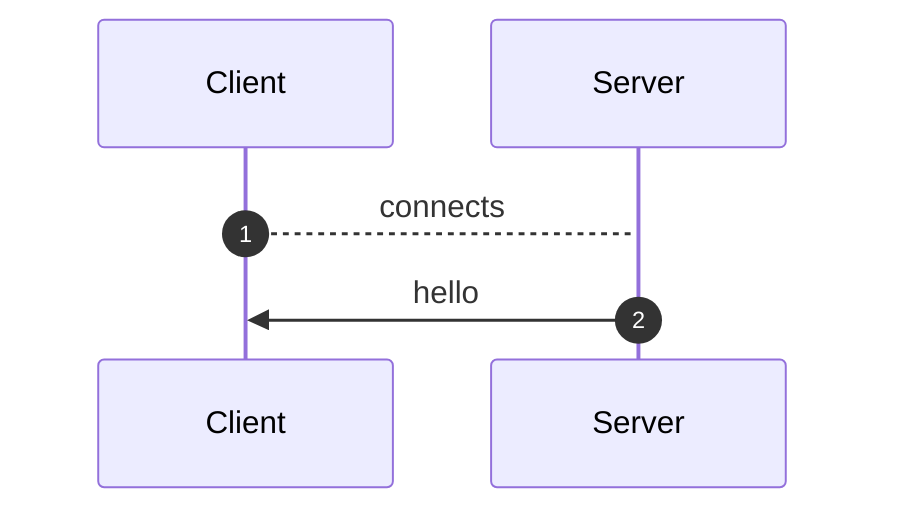
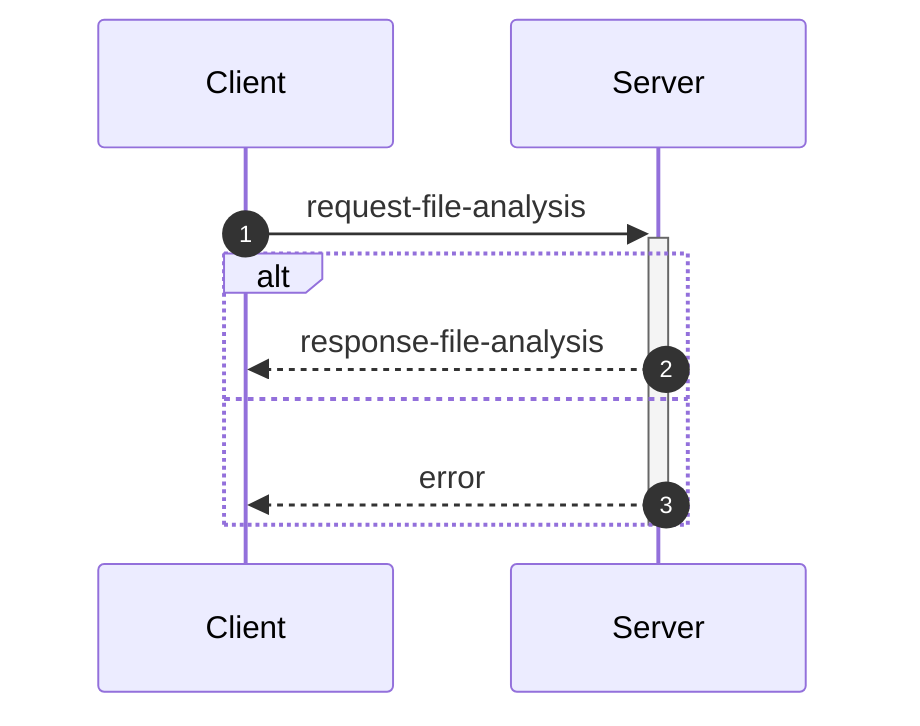
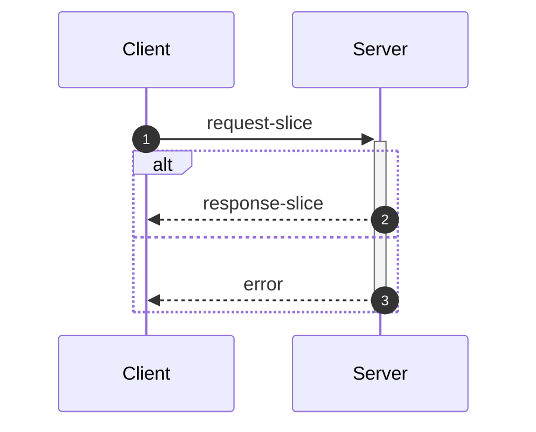
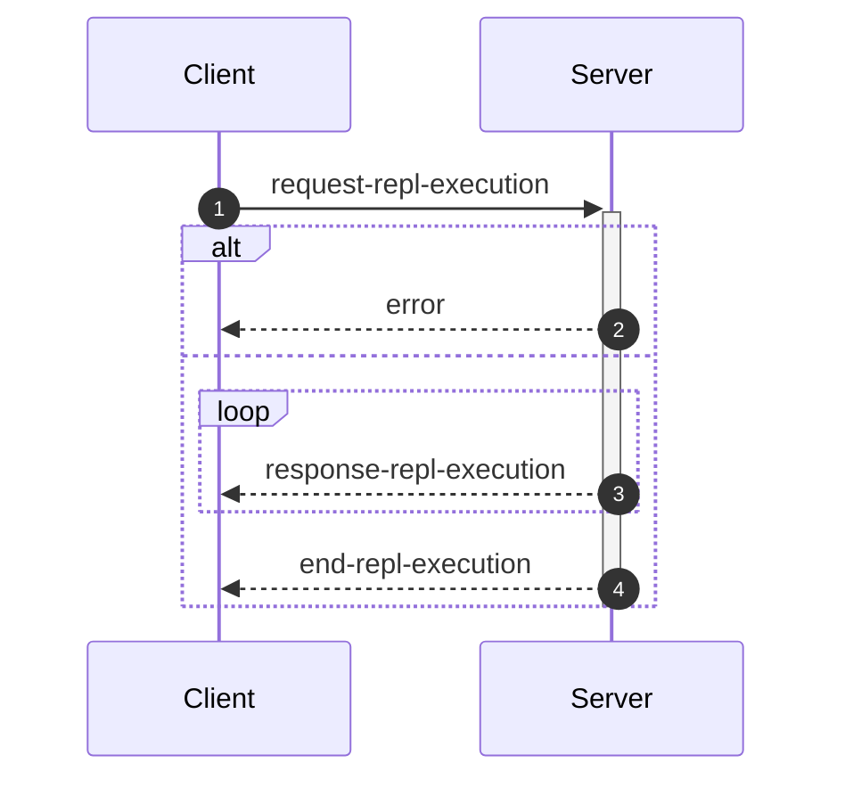

_This document was generated from '[src/documentation/wiki-interface.ts](https://github.com/flowr-analysis/flowr/tree/main//src/documentation/wiki-interface.ts)' on 2026-02-07, 13:44:42 UTC presenting an overview of flowR's interface (v2.9.6, using R v4.5.0). Please do not edit this file/wiki page directly._

Although far from being as detailed as the in-depth explanation of [_flowR_](https://github.com/flowr-analysis/flowr/wiki/wiki/core),
this wiki page explains how to interface with _flowR_ in more detail.
In general, command line arguments and other options provide short descriptions on hover over.

* [💻 Using the REPL](#using-the-repl)
* [⚙️ Configuring FlowR](#configuring-flowr)
* [⚒️ Writing Code](#writing-code)
* [💬 Communicating with the Server](#communicating-with-the-server)

<a id='using-the-repl'></a>
## 💻 Using the REPL


> [!NOTE]
> To execute arbitrary R commands with a repl request, _flowR_ has to be started explicitly with <span title="Description (Command Line Argument): Allow to access the underlying R session when using flowR (security warning: this allows the execution of arbitrary R code!)">`--r-session-access`</span>.
> Please be aware that this introduces a security risk and note that this relies on the [`r-shell` engine](https://github.com/flowr-analysis/flowr/wiki/wiki/engines) .

Although primarily meant for users to explore, 
there is nothing which forbids simply calling _flowR_ as a subprocess to use standard-in, -output, and -error 
for communication (although you can access the REPL using the server as well, 
with the [REPL Request](#message-request-repl-execution) message).

The read-eval-print loop&nbsp;(REPL) works relatively simple.
You can submit an expression (using <kbd>Enter</kbd>),
which is interpreted as an R&nbsp;expression by default but interpreted as a *command* if it starts with a colon (`:`).
The best command to get started with the REPL is <span title="Description (Repl Command): Show help information (aliases: :h, :?)">`:help`</span>.
Besides, you can leave the REPL either with the command <span title="Description (Repl Command): End the repl (aliases: :q, :exit)">`:quit`</span> or by pressing <kbd>Ctrl</kbd>+<kbd>C</kbd> twice.
When writing a *command*, you may press <kbd>Tab</kbd> to get a list of completions, if available.
Multiple commands can be entered in a single line by separating them with a semicolon (`;`), e.g. `:parse "x<-2"; :df*`.
If a command is given without R code, the REPL will re-use R code given in a previous command. 
The prior example will hence return first the parsed AST of the program and then the dataflow graph for `"x <- 2"`.

> [!NOTE]
> If you develop flowR, you may want to launch the repl using the `npm run main-dev` command, this way, you get a non-minified version of flowR with debug information and hot-reloading of source files.

<details>
<summary>Available Commands</summary>

We currently offer the following commands (this with a `[*]` suffix are available with and without the star):


| Command | Description |
| ------- | ----------- |
| **<span title="Description (Repl Command): End the repl (aliases: :q, :exit)">:quit</span>** | End the repl (aliases: **:<span title="Alias of ':quit'. End the repl">q</span>**, **:<span title="Alias of ':quit'. End the repl">exit</span>**) |
| **<span title="Description (Repl Command): Execute the given code as R code. This requires the `--r-session-access` flag to be set and requires the r-shell engine. (aliases: :e, :r)">:execute</span>** | Execute the given code as R code. This requires the `--r-session-access` flag to be set and requires the r-shell engine. (aliases: **:<span title="Alias of ':execute'. Execute the given code as R code. This requires the `--r-session-access` flag to be set and requires the r-shell engine.">e</span>**, **:<span title="Alias of ':execute'. Execute the given code as R code. This requires the `--r-session-access` flag to be set and requires the r-shell engine.">r</span>**) |
| **<span title="Description (Repl Command): Get mermaid code for the control-flow graph of R code, start with 'file://' to indicate a file (aliases: :cfg, :cf)">:controlflow[*]</span>** | Get mermaid code for the control-flow graph of R code, start with 'file://' to indicate a file (star: Returns the URL to mermaid.live) (aliases: **:<span title="Alias of ':controlflow'. Get mermaid code for the control-flow graph of R code, start with 'file://' to indicate a file">cfg</span>**, **:<span title="Alias of ':controlflow'. Get mermaid code for the control-flow graph of R code, start with 'file://' to indicate a file">cf</span>**) |
| **<span title="Description (Repl Command): Get mermaid code for the control-flow graph with basic blocks, start with 'file://' to indicate a file (aliases: :cfgb, :cfb)">:controlflowbb[*]</span>** | Get mermaid code for the control-flow graph with basic blocks, start with 'file://' to indicate a file (star: Returns the URL to mermaid.live) (aliases: **:<span title="Alias of ':controlflowbb'. Get mermaid code for the control-flow graph with basic blocks, start with 'file://' to indicate a file">cfgb</span>**, **:<span title="Alias of ':controlflowbb'. Get mermaid code for the control-flow graph with basic blocks, start with 'file://' to indicate a file">cfb</span>**) |
| **<span title="Description (Repl Command): Get mermaid code for the dataflow graph, start with 'file://' to indicate a file (aliases: :d, :df)">:dataflow[*]</span>** | Get mermaid code for the dataflow graph, start with 'file://' to indicate a file (star: Returns the URL to mermaid.live) (aliases: **:<span title="Alias of ':dataflow'. Get mermaid code for the dataflow graph, start with 'file://' to indicate a file">d</span>**, **:<span title="Alias of ':dataflow'. Get mermaid code for the dataflow graph, start with 'file://' to indicate a file">df</span>**) |
| **<span title="Description (Repl Command): Get mermaid code for the normalized AST of R code, start with 'file://' to indicate a file (aliases: :n)">:normalize[*]</span>** | Get mermaid code for the normalized AST of R code, start with 'file://' to indicate a file (star: Returns the URL to mermaid.live) (alias: **:<span title="Alias of ':normalize'. Get mermaid code for the normalized AST of R code, start with 'file://' to indicate a file">n</span>**) |
| **<span title="Description (Repl Command): Get mermaid code for the simplified dataflow graph, start with 'file://' to indicate a file (aliases: :ds, :dfs)">:dataflowsimple[*]</span>** | Get mermaid code for the simplified dataflow graph, start with 'file://' to indicate a file (star: Returns the URL to mermaid.live) (aliases: **:<span title="Alias of ':dataflowsimple'. Get mermaid code for the simplified dataflow graph, start with 'file://' to indicate a file">ds</span>**, **:<span title="Alias of ':dataflowsimple'. Get mermaid code for the simplified dataflow graph, start with 'file://' to indicate a file">dfs</span>**) |
| **<span title="Description (Repl Command): Just calculates the DFG, but only prints summary info (aliases: :d#, :df#)">:dataflowsilent</span>** | Just calculates the DFG, but only prints summary info (aliases: **:<span title="Alias of ':dataflowsilent'. Just calculates the DFG, but only prints summary info">d#</span>**, **:<span title="Alias of ':dataflowsilent'. Just calculates the DFG, but only prints summary info">df#</span>**) |
| **<span title="Description (Repl Command): Prints ASCII Art of the parsed, unmodified AST, start with 'file://' to indicate a file (aliases: :p)">:parse</span>** | Prints ASCII Art of the parsed, unmodified AST, start with 'file://' to indicate a file (alias: **:<span title="Alias of ':parse'. Prints ASCII Art of the parsed, unmodified AST, start with 'file://' to indicate a file">p</span>**) |
| **<span title="Description (Repl Command): Prints the version of flowR as well as the current version of R">:version</span>** | Prints the version of flowR as well as the current version of R
| **<span title="Description (Repl Command): Query the given R code, start with 'file://' to indicate a file. The query is to be a valid query in json format (use 'help' to get more information).">:query[*]</span>** | Query the given R code, start with 'file://' to indicate a file. The query is to be a valid query in json format (use 'help' to get more information). (star: Similar to query, but returns the output in json format.)
| **<span title="Description (Repl Command): Returns an ASCII representation of the dataflow graph (aliases: :df!)">:dataflowascii</span>** | Returns an ASCII representation of the dataflow graph (alias: **:<span title="Alias of ':dataflowascii'. Returns an ASCII representation of the dataflow graph">df!</span>**) |
| **<span title="Description (Repl Command): Returns summarization stats for the normalized AST (aliases: :n#)">:normalize#</span>** | Returns summarization stats for the normalized AST (alias: **:<span title="Alias of ':normalize#'. Returns summarization stats for the normalized AST">n#</span>**) |
| **<span title="Description (Repl Command): Show help information (aliases: :h, :?)">:help</span>** | Show help information (aliases: **:<span title="Alias of ':help'. Show help information">h</span>**, **:<span title="Alias of ':help'. Show help information">?</span>**) |


</details>


> [!TIP]
> 
> As indicated by the examples before, all REPL commands that operate on code keep track of the state.
> Hence, if you run a command like <span title="Description (Repl Command, starred version): Returns the URL to mermaid.live; Base Command: Get mermaid code for the dataflow graph, start with 'file://' to indicate a file (aliases: :d*, :df*)">`:dataflow*`</span> without providing R code,
> the REPL will re-use the R code provided in a previous command.
> Likewise, doing this will benefit from incrementality!
> If you request the dataflow graph with `:df* x <- 2 * y` and then want to see the parsed AST with `:parse`,
> the REPL will re-use previously obtained information and not re-parse the code again.
> 		


Generally, many commands offer shortcut versions in the REPL. Many queries, for example, offer a shortened format (see the example below).
Of special note, the [Config Query](https://github.com/flowr-analysis/flowr/wiki/wiki/query-api#Config-Query)
can be used to also modify the currently active configuration of _flowR_ within the REPL (see the [wiki page](https://github.com/flowr-analysis/flowr/wiki/wiki/query-api#Config-Query) for more information).

### Example: Retrieving the Dataflow Graph

To retrieve a URL to the [mermaid](https://mermaid.js.org/) diagram of the dataflow of a given expression, 
use <span title="Description (Repl Command, starred version): Returns the URL to mermaid.live; Base Command: Get mermaid code for the dataflow graph, start with 'file://' to indicate a file (aliases: :d*, :df*)">`:dataflow*`</span> (or <span title="Description (Repl Command): Get mermaid code for the dataflow graph, start with 'file://' to indicate a file (aliases: :d, :df)">`:dataflow`</span> to get the mermaid code in the cli):


```shell
$ docker run -it --rm eagleoutice/flowr # or npm run flowr 
flowR repl using flowR v2.9.6, R grammar v14 (tree-sitter engine)
R> :dataflow* y <- 1 + x
```

<details>
<summary style='color:gray'>Output</summary>


```text
https://mermaid.live/view#base64:eyJjb2RlIjoiZmxvd2NoYXJ0IEJUXG4gICAgMXt7XCJgIzkxO1JOdW1iZXIjOTM7IDFcbiAgICAgICgxKVxuICAgICAgKjEuNipgXCJ9fVxuICAgIDIoW1wiYCM5MTtSU3ltYm9sIzkzOyB4XG4gICAgICAoMilcbiAgICAgICoxLjEwKmBcIl0pXG4gICAgM1tbXCJgIzkxO1JCaW5hcnlPcCM5MzsgIzQzO1xuICAgICAgKDMpXG4gICAgICAqMS42LTEwKlxuICAgICgxLCAyKWBcIl1dXG4gICAgYnVpbHQtaW46X1tcImBCdWlsdC1JbjpcbiM0MztgXCJdXG4gICAgc3R5bGUgYnVpbHQtaW46XyBzdHJva2U6Z3JheSxmaWxsOmdyYXksc3Ryb2tlLXdpZHRoOjJweCxvcGFjaXR5Oi44O1xuICAgIDBbXCJgIzkxO1JTeW1ib2wjOTM7IHlcbiAgICAgICgwKVxuICAgICAgKjEuMSpgXCJdXG4gICAgNFtbXCJgIzkxO1JCaW5hcnlPcCM5MzsgIzYwOyM0NTtcbiAgICAgICg0KVxuICAgICAgKjEuMS0xMCpcbiAgICAoMCwgMylgXCJdXVxuICAgIGJ1aWx0LWluOl8tW1wiYEJ1aWx0LUluOlxuIzYwOyM0NTtgXCJdXG4gICAgc3R5bGUgYnVpbHQtaW46Xy0gc3Ryb2tlOmdyYXksZmlsbDpncmF5LHN0cm9rZS13aWR0aDoycHgsb3BhY2l0eTouODtcbiAgICAzIC0tPnxcInJlYWRzLCBhcmd1bWVudFwifCAxXG4gICAgMyAtLT58XCJyZWFkcywgYXJndW1lbnRcInwgMlxuICAgIDMgLS4tPnxcInJlYWRzLCBjYWxsc1wifCBidWlsdC1pbjpfXG4gICAgbGlua1N0eWxlIDIgc3Ryb2tlOmdyYXk7XG4gICAgMCAtLT58XCJkZWZpbmVkLWJ5XCJ8IDNcbiAgICAwIC0tPnxcImRlZmluZWQtYnlcInwgNFxuICAgIDQgLS0+fFwicmVhZHMsIGFyZ3VtZW50XCJ8IDNcbiAgICA0IC0tPnxcInJldHVybnMsIGFyZ3VtZW50XCJ8IDBcbiAgICA0IC0uLT58XCJyZWFkcywgY2FsbHNcInwgYnVpbHQtaW46Xy1cbiAgICBsaW5rU3R5bGUgNyBzdHJva2U6Z3JheTsiLCJtZXJtYWlkIjp7ImF1dG9TeW5jIjp0cnVlfX0=
```


Retrieve the dataflow graph of the expression `y <- 1 + x`. It looks like this:


	
<details>

<summary style="color:gray">R Code of the Dataflow Graph</summary>

The analysis required _0.6 ms_ (including parse and normalize, using the [tree-sitter](https://github.com/flowr-analysis/flowr/wiki/Engines) engine) within the generation environment. 
We encountered no unknown side effects during the analysis.


```r
y <- 1 + x
```


</details>


</details>


For small graphs like this, <span title="Description (Repl Command): Returns an ASCII representation of the dataflow graph (aliases: :df!)">`:dataflowascii`</span> also provides an ASCII representation directly in the REPL:


```shell
$ docker run -it --rm eagleoutice/flowr # or npm run flowr 
flowR repl using flowR v2.9.6, R grammar v14 (tree-sitter engine)
R> :df! y <- 1 + x
```

<details open>
<summary style='color:gray'>Output</summary>


```text
                        0<1>0
                   ┌────| 1 |
    ┌────────┐     │    0---0
 c<4>c       └──c<3>c
 |<- |  v<0>v┌──| + |
 c---c──| y |┘  c---c   u<2>u
        v---v      └────| x |
                        u---u
Edges:
3 -> 1: reads, argument  3 -> 2: reads, argument
4 -> 3: reads, argument  4 -> 0: returns, argument
0 -> 3: defined-by       0 -> 4: defined-by
```


Retrieve the dataflow graph of the expression `y <- 1 + x` as ASCII art.

</details>


For the slicing with <span title="Description (Repl Command): Static backwards executable slicer for R">`:slicer`</span>, you have access to the same [magic comments](#slice-magic-comments) as with the [slice request](#message-request-slice).

### Example: Interfacing with the File System

Many commands that allow for an R-expression (like <span title="Description (Repl Command, starred version): Returns the URL to mermaid.live; Base Command: Get mermaid code for the dataflow graph, start with 'file://' to indicate a file (aliases: :d*, :df*)">`:dataflow*`</span>) allow for a file as well 
if the argument starts with `file://`. 
If you are working from the root directory of the _flowR_ repository, the following gives you the parsed AST of the example file using the <span title="Description (Repl Command): Prints ASCII Art of the parsed, unmodified AST, start with 'file://' to indicate a file (aliases: :p)">`:parse`</span> command:


```shell
$ docker run -it --rm eagleoutice/flowr # or npm run flowr 
flowR repl using flowR v2.9.6, R grammar v14 (tree-sitter engine)
R> :parse file://test/testfiles/example.R
```

<details>
<summary style='color:gray'>Output</summary>


```text
File: test/testfiles/example.R

program
├ binaryoperator
│ ├ identifier "sum" (1:1─4)
│ ├ <- "<-" (1:5─7)
│ ╰ float "0" (1:8─9)
├ binaryoperator
│ ├ identifier "product" (2:1─8)
│ ├ <- "<-" (2:9─11)
│ ╰ float "1" (2:12─13)
├ binaryoperator
│ ├ identifier "w" (3:1─2)
│ ├ <- "<-" (3:3─5)
│ ╰ float "7" (3:6─7)
├ binaryoperator
│ ├ identifier "N" (4:1─2)
│ ├ <- "<-" (4:3─5)
│ ╰ float "10" (4:6─8)
├ forstatement
│ ├ for "for" (6:1─4)
│ ├ ( "(" (6:5─6)
│ ├ identifier "i" (6:6─7)
│ ├ in "in" (6:8─10)
│ ├ binaryoperator
│ │ ├ float "1" (6:11─12)
│ │ ├ : ":" (6:12─13)
│ │ ╰ parenthesizedexpression
│ │   ├ ( "(" (6:13─14)
│ │   ├ binaryoperator
│ │   │ ├ identifier "N" (6:14─15)
│ │   │ ├ - "-" (6:15─16)
│ │   │ ╰ float "1" (6:16─17)
│ │   ╰ ) ")" (6:17─18)
│ ├ ) ")" (6:18─19)
│ ╰ bracedexpression
│   ├ { "{" (6:20─21)
│   ├ binaryoperator
│   │ ├ identifier "sum" (7:3─6)
│   │ ├ <- "<-" (7:7─9)
│   │ ╰ binaryoperator
│   │   ├ binaryoperator
│   │   │ ├ identifier "sum" (7:10─13)
│   │   │ ├ + "+" (7:14─15)
│   │   │ ╰ identifier "i" (7:16─17)
│   │   ├ + "+" (7:18─19)
│   │   ╰ identifier "w" (7:20─21)
│   ├ binaryoperator
│   │ ├ identifier "product" (8:3─10)
│   │ ├ <- "<-" (8:11─13)
│   │ ╰ binaryoperator
│   │   ├ identifier "product" (8:14─21)
│   │   ├  "" (8:22─23)
│   │   ╰ identifier "i" (8:24─25)
│   ╰ } "}" (9:1─2)
├ call
│ ├ identifier "cat" (11:1─4)
│ ╰ arguments
│   ├ ( "(" (11:4─5)
│   ├ argument
│   │ ╰ string
│   │   ├ " "\"" (11:5─6)
│   │   ├ stringcontent "Sum:" (11:6─10)
│   │   ╰ " "\"" (11:10─11)
│   ├ comma "," (11:11─12)
│   ├ argument
│   │ ╰ identifier "sum" (11:13─16)
│   ├ comma "," (11:16─17)
│   ├ argument
│   │ ╰ string
│   │   ├ " "\"" (11:18─19)
│   │   ├ stringcontent
│   │   │ ╰ escapesequence "\\n" (11:19─21)
│   │   ╰ " "\"" (11:21─22)
│   ╰ ) ")" (11:22─23)
╰ call
  ├ identifier "cat" (12:1─4)
  ╰ arguments
    ├ ( "(" (12:4─5)
    ├ argument
    │ ╰ string
    │   ├ " "\"" (12:5─6)
    │   ├ stringcontent "Product:" (12:6─14)
    │   ╰ " "\"" (12:14─15)
    ├ comma "," (12:15─16)
    ├ argument
    │ ╰ identifier "product" (12:17─24)
    ├ comma "," (12:24─25)
    ├ argument
    │ ╰ string
    │   ├ " "\"" (12:26─27)
    │   ├ stringcontent
    │   │ ╰ escapesequence "\\n" (12:27─29)
    │   ╰ " "\"" (12:29─30)
    ╰ ) ")" (12:30─31)
```


Retrieve the parsed AST of the example file.

<details>

<summary>File Content</summary>


```r
sum <- 0
product <- 1
w <- 7
N <- 10

for (i in 1:(N-1)) {
  sum <- sum + i + w
  product <- product * i
}

cat("Sum:", sum, "\n")
cat("Product:", product, "\n")
```


</details>

As _flowR_ directly transforms this AST the output focuses on being human-readable instead of being machine-readable. 
		

</details>


### Example: Run a Query

You can run any query supported by _flowR_ using the <span title="Description (Repl Command): Query the given R code, start with 'file://' to indicate a file. The query is to be a valid query in json format (use 'help' to get more information).">`:query`</span> command.
For example, to obtain the shapes of all data frames in a given piece of code, you can run:


```shell
$ docker run -it --rm eagleoutice/flowr # or npm run flowr 
flowR repl using flowR v2.9.6, R grammar v14 (tree-sitter engine)
R> :query @df-shape "x <- data.frame(a = 1:10, b = 1:10)\ny <- x$a"
```

<details open>
<summary style='color:gray'>Output</summary>


```text
Query: df-shape (1 ms)
   ╰ 12: (colnames: [{"a", "b"}, {}], cols: [2, 2], rows: [10, 10])
   ╰ 0: (colnames: [{"a", "b"}, {}], cols: [2, 2], rows: [10, 10])
All queries together required ≈2 ms (1ms accuracy, total 3 ms)
```


Retrieve the shapes of all data frames in the given code.

</details>


To run the linter on a file, you can use (in this example, we just issue the `dead-code` linter on a small piece of code):


```shell
$ docker run -it --rm eagleoutice/flowr # or npm run flowr 
flowR repl using flowR v2.9.6, R grammar v14 (tree-sitter engine)
R> :query @linter rules:dead-code "if(FALSE) x <- 2"
```

<details open>
<summary style='color:gray'>Output</summary>


```text
Query: linter (1 ms)
   ╰ Dead Code (dead-code):
       ╰ certain:
           ╰ Code at 1.11-16
       ╰ Metadata: consideredNodes: 7, searchTimeMs: 1, processTimeMs: 0
All queries together required ≈1 ms (1ms accuracy, total 1 ms)
```


Run the linter on the given code, with only the `dead-code` rule enabled.

</details>


For more information on the available queries, please check out the [Query API](https://github.com/flowr-analysis/flowr/wiki/wiki/query-api).


<a id='configuring-flowr'></a>
## ⚙️ Configuring FlowR


When running _flowR_, you may want to specify some behaviors with a dedicated configuration file. 
By default, flowR looks for a file named `flowr.json` in the current working directory (or any higher directory). 
You can also specify a different file with <span title="Description (Command Line Argument): The name of the configuration file to use">`--config-file`</span> or pass the configuration inline using <span title="Description (Command Line Argument): The flowR configuration to use, as a JSON string">`--config-json`</span>.
To inspect the current configuration, you can run flowr with the <span title="Description (Command Line Argument): Run with verbose logging (will be passed to the corresponding script)">`--verbose`</span> flag, or use the `config` [Query](https://github.com/flowr-analysis/flowr/wiki/Query%20API).
Within the REPL this works by running the following:


```shell
:query @config
```


The following summarizes the configuration options:

- `ignoreSourceCalls`: If set to `true`, _flowR_ will ignore source calls when analyzing the code, i.e., ignoring the inclusion of other files.
- `semantics`: allows to configure the way _flowR_ handles R, although we currently only support `semantics/environment/overwriteBuiltIns`. 
  You may use this to overwrite _flowR_'s handling of built-in function and even completely clear the preset definitions shipped with flowR. 
  See [Configure BuiltIn Semantics](#configure-builtin-semantics) for more information.
- `solver`: allows to configure how _flowR_ resolves variables and their values (currently we support: `disabled`, `alias`, `builtin`), as well as if pointer analysis should be active.
- `engines`: allows to configure the engines used by _flowR_ to interact with R code. See the [Engines wiki page](https://github.com/flowr-analysis/flowr/wiki/Engines) for more information.
- `defaultEngine`: allows to specify the default engine to use for interacting with R code. If not set, an arbitrary engine from the specified list will be used.
- `abstractInterpretation`: allows to configure how _flowR_ performs abstract interpretation, although we currently only support data frame shape inference through abstract interpretation.

So you can configure _flowR_ by adding a file like the following:

<details>

<summary>Example Configuration File</summary>


```json
{
  "ignoreSourceCalls": true,
  "semantics": {
    "environment": {
      "overwriteBuiltIns": {
        "definitions": [
          {
            "type": "function",
            "names": [
              "foo"
            ],
            "processor": "builtin:assignment",
            "config": {}
          }
        ]
      }
    }
  },
  "repl": {
    "quickStats": false,
    "dfProcessorHeat": false
  },
  "project": {
    "resolveUnknownPathsOnDisk": true
  },
  "engines": [
    {
      "type": "r-shell"
    }
  ],
  "solver": {
    "variables": "alias",
    "evalStrings": true,
    "resolveSource": {
      "dropPaths": "no",
      "ignoreCapitalization": true,
      "inferWorkingDirectory": "active-script",
      "searchPath": []
    },
    "instrument": {},
    "slicer": {
      "threshold": 50
    }
  },
  "abstractInterpretation": {
    "wideningThreshold": 4,
    "dataFrame": {
      "maxColNames": 20,
      "readLoadedData": {
        "readExternalFiles": true,
        "maxReadLines": 1000000
      }
    }
  }
}
```


</details>

<details> 
<a id='configure-builtin-semantics'></a>
<summary>Configure Built-In Semantics</summary> 


`semantics/environment/overwriteBuiltins` accepts two keys:

- `loadDefaults` (boolean, initially `true`): If set to `true`, the default built-in definitions are loaded before applying the custom definitions. Setting this flag to `false` explicitly disables the loading of the default definitions.
- `definitions` (array, initially empty): Allows to overwrite or define new built-in elements. Each object within must have a `type` which is one of the below. Furthermore, they may define a string array of `names` which specifies the identifiers to bind the definitions to. You may use `assumePrimitive` to specify whether _flowR_ should assume that this is a primitive non-library definition (so you probably just do not want to specify the key).

  | Type            | Description                                                                                                                                                                                                                                                                                              | Example                                                                                                    |
  | --------------- | -------------------------------------------------------------------------------------------------------------------------------------------------------------------------------------------------------------------------------------------------------------------------------------------------------- | ---------------------------------------------------------------------------------------------------------- |
  | `constant`    | Additionally allows for a `value` this should resolve to.                                                                                                                                                                                                                                                | `{ type: 'constant', names: ['NULL', 'NA'],  value: null }`                                                |
  | `function`    | Is a rather flexible way to define and bind built-in functions. For the time, we do not have extensive documentation to cover all the cases, so please either consult the sources with the `default-builtin-config.ts` or open a [new issue](https://github.com/flowr-analysis/flowr/issues/new/choose). | `{ type: 'function', names: ['next'], processor: 'builtin:default', config: { cfg: ExitPointType.Next } }` |
  | `replacement` | A comfortable way to specify replacement functions like `$<-` or `names<-`. `suffixes` describes the... suffixes to attach automatically. | `{ type: 'replacement', suffixes: ['<-', '<<-'], names: ['[', '[['] }` |


</details>

<details>

<summary style='color:gray'>Full Configuration-File Schema</summary>

- _The configuration file format for flowR._ (object)
    - **ignoreSourceCalls** [optional] _Whether source calls should be ignored, causing {@link processSourceCall}'s behavior to be skipped._ (boolean)
    - **semantics** _Configure language semantics and how flowR handles them._ (object)
        - **environment** [optional] _Semantics regarding how to handle the R environment._ (object)
            - **overwriteBuiltIns** [optional] _Do you want to overwrite (parts) of the builtin definition?_ (object)
                - **loadDefaults** [optional] _Should the default configuration still be loaded?_ (boolean)
                - **definitions** [optional] _The definitions to load/overwrite._ (array)
                Valid item types:
                    - (object)
    - **repl** _Configuration options for the REPL._ (object)
        - **quickStats** [optional] _Whether to show quick stats in the REPL after each evaluation._ (boolean)
        - **dfProcessorHeat** [optional] _This instruments the dataflow processors to count how often each processor is called._ (boolean)
    - **project** _Project specific configuration options._ (object)
        - **resolveUnknownPathsOnDisk** [optional] _Whether to resolve unknown paths loaded by the r project disk when trying to source/analyze files._ (boolean)
    - **engines** _The engine or set of engines to use for interacting with R code. An empty array means all available engines will be used._ (array)
    Valid item types:
        - (alternatives)
            - _The configuration for the tree sitter engine._ (object)
                - **type** [required] _Use the tree sitter engine._ (string)
                    Only allows: 'tree-sitter'
                - **wasmPath** [optional] _The path to the tree-sitter-r WASM binary to use. If this is undefined, this uses the default path._ (string)
                - **treeSitterWasmPath** [optional] _The path to the tree-sitter WASM binary to use. If this is undefined, this uses the default path._ (string)
                - **lax** [optional] _Whether to use the lax parser for parsing R code (allowing for syntax errors). If this is undefined, the strict parser will be used._ (boolean)
            - _The configuration for the R shell engine._ (object)
                - **type** [required] _Use the R shell engine._ (string)
                    Only allows: 'r-shell'
                - **rPath** [optional] _The path to the R executable to use. If this is undefined, this uses the default path._ (string)
    - **defaultEngine** [optional] _The default engine to use for interacting with R code. If this is undefined, an arbitrary engine from the specified list will be used._ (string)
        Only allows: 'tree-sitter', 'r-shell'
    - **solver** _How to resolve constants, constraints, cells, ..._ (object)
        - **variables** _How to resolve variables and their values._ (string)
            Only allows: 'disabled', 'alias', 'builtin'
        - **evalStrings** _Should we include eval(parse(text="...")) calls in the dataflow graph?_ (boolean)
        - **instrument** (object)
            - **dataflowExtractors** [optional] _These keys are only intended for use within code, allowing to instrument the dataflow analyzer!_ (any)
        - **resolveSource** [optional] _If lax source calls are active, flowR searches for sourced files much more freely, based on the configurations you give it. This option is only in effect if `ignoreSourceCalls` is set to false._ (object)
            - **dropPaths** _Allow to drop the first or all parts of the sourced path, if it is relative._ (string)
                Only allows: 'no', 'once', 'all'
            - **ignoreCapitalization** _Search for filenames matching in the lowercase._ (boolean)
            - **inferWorkingDirectory** _Try to infer the working directory from the main or any script to analyze._ (string)
                Only allows: 'no', 'main-script', 'active-script', 'any-script'
            - **searchPath** _Additionally search in these paths._ (array)
            Valid item types:
                - (string)
            - **repeatedSourceLimit** [optional] _How often the same file can be sourced within a single run? Please be aware: in case of cyclic sources this may not reach a fixpoint so give this a sensible limit._ (number)
            - **applyReplacements** _Provide name replacements for loaded files_ (array)
            Valid item types:
                - (object)
        - **slicer** [optional] _The configuration for the slicer._ (object)
            - **threshold** [optional] _The maximum number of iterations to perform on a single function call during slicing._ (number)
    - **abstractInterpretation** _The configuration options for abstract interpretation._ (object)
        - **dataFrame** _The configuration of the shape inference for data frames._ (object)
            - **maxColNames** _The maximum number of columns names to infer for data frames before over-approximating the column names to top._ (number)
            - **wideningThreshold** _The threshold for the number of visitations of a node at which widening should be performed to ensure the termination of the fixpoint iteration._ (number)
            - **readLoadedData** _Configuration options for reading data frame shapes from loaded external data files, such as CSV files._ (object)
                - **readExternalFiles** _Whether data frame shapes should be extracted from loaded external files, such as CSV files._ (boolean)
                - **maxReadLines** _The maximum number of lines to read when extracting data frame shapes from loaded files, such as CSV files._ (number)

</details>

	

<a id='writing-code'></a>
## ⚒️ Writing Code

_flowR_ can be used as a [module](https://www.npmjs.com/package/@eagleoutice/flowr) and offers several main classes and interfaces that are interesting for extension writers 
(see the [Visual Studio Code extension](https://marketplace.visualstudio.com/items?itemName=code-inspect.vscode-flowr) or the [Core](https://github.com/flowr-analysis/flowr/wiki/wiki/core) wiki page for more information).

### Creating Analyses with _flowR_

Nowadays, instances of the <a href="https://github.com/flowr-analysis/flowr/tree/main//src/project/flowr-analyzer.ts#L162"><code><span title="Central class for conducting analyses with FlowR. Use the FlowrAnalyzerBuilder to create a new instance. If you want the original pattern of creating a pipeline and running all steps, you can still do this with FlowrAnalyzer#runFull . To inspect the context of the analyzer, use FlowrAnalyzer#inspectContext (if you are a plugin and need to modify it, use FlowrAnalyzer#context instead).">FlowrAnalyzer</span></code></a> should be used as central frontend to get analysis results from _flowR_.
For example, a program slice can be created like this:


```ts
const analyzer = await new FlowrAnalyzerBuilder()
    .setEngine('tree-sitter')
    .build();
analyzer.addRequest('x <- 1\ny <- x\nx');
const result = await analyzer.query([
    {
        type:     'static-slice',
        criteria: ['3@x']
    }
]);
//console.log(result['static-slice']);
```


For more information, please have a look at the [Analyzer](https://github.com/flowr-analysis/flowr/wiki/wiki/analyzer) wiki page, which explains how to construct and use the <a href="https://github.com/flowr-analysis/flowr/tree/main//src/project/flowr-analyzer.ts#L162"><code><span title="Central class for conducting analyses with FlowR. Use the FlowrAnalyzerBuilder to create a new instance. If you want the original pattern of creating a pipeline and running all steps, you can still do this with FlowrAnalyzer#runFull . To inspect the context of the analyzer, use FlowrAnalyzer#inspectContext (if you are a plugin and need to modify it, use FlowrAnalyzer#context instead).">FlowrAnalyzer</span></code></a> in more detail.
To work with specific perspectives, you can also consult the respective pages like the [Dataflow Graph](https://github.com/flowr-analysis/flowr/wiki/wiki/dataflow-graph) or the [Abstract Interpretation](https://github.com/flowr-analysis/flowr/wiki/wiki/abstract-interpretation) wiki pages.
        
### The Pipeline Executor (Low-Level Interface)

Once, in the beginning, _flowR_ was meant to produce a dataflow graph merely to provide *program slices*. 
However, with continuous updates, the [Dataflow Graph](https://github.com/flowr-analysis/flowr/wiki/wiki/dataflow-graph) repeatedly proves to be the more interesting part.
With this, we restructured _flowR_'s originally *hardcoded* pipeline to be far more flexible. 
Now, it can be theoretically extended or replaced with arbitrary steps, optional steps, and what we call 'decorations' of these steps. 
In short, a slicing pipeline using the <a href="https://github.com/flowr-analysis/flowr/tree/main//src/core/pipeline-executor.ts#L97"><code><span title="**Please note:** The PipelineExecutor is now considered to be a rather low-level API for flowR. While it still works and is the basis for all other layers, we strongly recommend using the FlowrAnalyzer and its builder to create and use an analyzer instance that is pre-configured for your use-case. The pipeline executor allows to execute arbitrary pipelines in a step-by-step fashion. If you are not...">PipelineExecutor</span></code></a> looks like this:


```ts

const slicer = new PipelineExecutor(DEFAULT_SLICING_PIPELINE, {
  parser:    new RShell(),
  request:   requestFromInput('x <- 1\nx + 1'),
  criterion: ['2@x']
})
const slice = await slicer.allRemainingSteps()
// console.log(slice.reconstruct.code)
```


<details><summary>More Information</summary>


If you compare this, with what you would have done with the old (and removed) `SteppingSlicer`, 
this essentially just requires you to replace the `SteppingSlicer` with the <a href="https://github.com/flowr-analysis/flowr/tree/main//src/core/pipeline-executor.ts#L97"><code><span title="**Please note:** The PipelineExecutor is now considered to be a rather low-level API for flowR. While it still works and is the basis for all other layers, we strongly recommend using the FlowrAnalyzer and its builder to create and use an analyzer instance that is pre-configured for your use-case. The pipeline executor allows to execute arbitrary pipelines in a step-by-step fashion. If you are not...">PipelineExecutor</span></code></a>
and to pass the <a href="https://github.com/flowr-analysis/flowr/tree/main//src/core/steps/pipeline/default-pipelines.ts#L18"><code>DEFAULT_SLICING_PIPELINE</code></a> as the first argument.
The <a href="https://github.com/flowr-analysis/flowr/tree/main//src/core/pipeline-executor.ts#L97"><code><span title="**Please note:** The PipelineExecutor is now considered to be a rather low-level API for flowR. While it still works and is the basis for all other layers, we strongly recommend using the FlowrAnalyzer and its builder to create and use an analyzer instance that is pre-configured for your use-case. The pipeline executor allows to execute arbitrary pipelines in a step-by-step fashion. If you are not...">PipelineExecutor</span></code></a>...

1. Provides structures to investigate the results of all intermediate steps
2. Can be executed step-by-step
3. Can repeat steps (e.g., to calculate multiple slices on the same input)

See the in-code documentation for more information.

	

</details>
    

### Using the <a href="https://github.com/flowr-analysis/flowr/tree/main//src/r-bridge/shell.ts#L143"><code><span title="The RShell represents an interactive session with the R interpreter. You can configure it by RShellOptions . At the moment we are using a live R session (and not networking etc.) to communicate with R easily, which allows us to install packages etc. However, this might and probably will change in the future (leaving this as a legacy mode :D)">RShell</span></code></a> to Interact with R

The <a href="https://github.com/flowr-analysis/flowr/tree/main//src/r-bridge/shell.ts#L143"><code><span title="The RShell represents an interactive session with the R interpreter. You can configure it by RShellOptions . At the moment we are using a live R session (and not networking etc.) to communicate with R easily, which allows us to install packages etc. However, this might and probably will change in the future (leaving this as a legacy mode :D)">RShell</span></code></a> class allows interfacing with the `R`&nbsp;ecosystem installed on the host system.
Please have a look at [flowR's Engines](https://github.com/flowr-analysis/flowr/wiki/wiki/engines) for more information on alternatives (for example, the <a href="https://github.com/flowr-analysis/flowr/tree/main//src/r-bridge/lang-4.x/tree-sitter/tree-sitter-executor.ts#L18"><code><span title="Synchronous and (way) faster alternative to the RShell using tree-sitter.">TreeSitterExecutor</span></code></a>).


> [!IMPORTANT]
> 
> Each <a href="https://github.com/flowr-analysis/flowr/tree/main//src/r-bridge/shell.ts#L143"><code><span title="The RShell represents an interactive session with the R interpreter. You can configure it by RShellOptions . At the moment we are using a live R session (and not networking etc.) to communicate with R easily, which allows us to install packages etc. However, this might and probably will change in the future (leaving this as a legacy mode :D)">RShell</span></code></a> controls a new instance of the R&nbsp;interpreter, 
> make sure to call <code><a href="https://github.com/flowr-analysis/flowr/tree/main//src/r-bridge/shell.ts#L317"><span title="Close the current R session, makes the object effectively invalid (can no longer be reopened etc.)">RShell::<i>close</i></span></a>()</code> when you are done.


You can start a new "session" simply by constructing a new object with <code>new <a href="https://github.com/flowr-analysis/flowr/tree/main//src/r-bridge/shell.ts#L143"><span title="The RShell represents an interactive session with the R interpreter. You can configure it by RShellOptions . At the moment we are using a live R session (and not networking etc.) to communicate with R easily, which allows us to install packages etc. However, this might and probably will change in the future (leaving this as a legacy mode :D)">RShell</span></a>()</code>.

However, there are several options that may be of interest 
(e.g., to automatically revive the shell in case of errors or to control the name location of the R process on the system).

With a shell object (let's call it `shell`), you can execute R code by using <a href="https://github.com/flowr-analysis/flowr/tree/main//src/r-bridge/shell.ts#L195"><code><span title="sends the given command directly to the current R session will not do anything to alter input markers!">RShell::<i>sendCommand</i></span></code></a>, 
for example <code>shell.<a href="https://github.com/flowr-analysis/flowr/tree/main//src/r-bridge/shell.ts#L195"><span title="sends the given command directly to the current R session will not do anything to alter input markers!">sendCommand</span></a>("1 + 1")</code>. 
However, this does not return anything, so if you want to collect the output of your command, use
<a href="https://github.com/flowr-analysis/flowr/tree/main//src/r-bridge/shell.ts#L261"><code><span title="Send a command and collect the output">RShell::<i>sendCommandWithOutput</i></span></code></a> instead.

Besides that, the command <a href="https://github.com/flowr-analysis/flowr/tree/main//src/r-bridge/shell.ts#L233"><code>RShell::<b>tryToInjectHomeLibPath</b></code></a> may be of interest, as it enables all libraries available on the host system.


### Generate Statistics (No longer a Focus of flowR)


<details>

<summary>Adding a New Feature to Extract</summary>

In this example, we construct a new feature to extract, with the name "*example*".
Whenever this name appears, you may substitute this with whatever name fits your feature best (as long as the name is unique).

1. **Create a new file in `src/statistics/features/supported`**\
   Create the file `example.ts`, and add its export to the `index.ts` file in the same directory (if not done automatically).

2. **Create the basic structure**\
   To get a better feel of what a feature must have, let's look
   at the basic structure (of course, due to TypeScript syntax,
   there are other ways to achieve the same goal):

   ```ts
   const initialExampleInfo = {
       /* whatever start value is good for you */
       someCounter: 0
   }

   export type ExampleInfo = Writable<typeof initialExampleInfo>

   export const example: Feature<ExampleInfo> = {
    name:        'Example Feature',
    description: 'A longer example description',

    process(existing: ExampleInfo, input: FeatureProcessorInput): ExampleInfo {
      /* perform analysis on the input */
      return existing
    },

    initialValue: initialExampleInfo
   }
   ```

   The `initialExampleInfo` type holds the initial values for each counter that you want to maintain during the feature extraction (they will usually be initialized with 0). The resulting `ExampleInfo` type holds the structure of the data that is to be counted. Due to the vast amount of data processed, information like the name and location of a function call is not stored here, but instead written to disk (see below).

   Every new feature must be of the `Feature<Info>` type, with `Info` referring to a `FeatureInfo` (like `ExampleInfo` in this example). Next to a `name` and a `description`, each Feature must provide:

   - a processor that extracts the information from the input, adding it to the existing information.
   - a function returning the initial value of the information (in this case, `initialExampleInfo`).

3. **Add it to the feature-mapping**\
   Now, in the `feature.ts` file in `src/statistics/features`, add your feature to the `ALL_FEATURES` object.

Now, we want to extract something. For the *example* feature created in the previous steps, we choose to count the amount of `COMMENT` tokens.
So we define a corresponding [XPath](https://developer.mozilla.org/en-US/docs/Web/XPath) query:

```ts
const commentQuery: Query = xpath.parse('//COMMENT')
```

Within our feature's `process` function, running the query is as simple as:

```ts
const comments = commentQuery.select({ node: input.parsedRAst })
```

Now we could do a lot of further processing, but for simplicity, we only record every comment found this way:

```ts
appendStatisticsFile(example.name, 'comments', comments, input.filepath)
```

We use `example.name` to avoid duplication with the name that we’ve assigned to the feature. It corresponds to the name of the folder in the statistics output.
`'comments'` refers to a freely chosen (but unique) name, that will be used as the name for the output file within the folder. The `comments` variable holds the result of the query, which is an array of nodes. Finally, we pass the `filepath` of the file that was analyzed (if known), so that it can be added to the statistics file (as additional information).

</details>
	

<a id='communicating-with-the-server'></a>
## 💬 Communicating with the Server


As explained in the [Overview](https://github.com/flowr-analysis/flowr/wiki/Overview), you can simply run the [TCP](https://de.wikipedia.org/wiki/Transmission_Control_Protocol)&nbsp;server by adding the <span title="Description (Command Line Argument): Do not drop into a repl, but instead start a server on the given port (default: 1042) and listen for messages.">`--server`</span> flag (and, due to the interactive mode, exit with the conventional <kbd>CTRL</kbd>+<kbd>C</kbd>).
Currently, every connection is handled by the same underlying `RShell` - so the server is not designed to handle many clients at a time.
Additionally, the server is not well guarded against attacks (e.g., you can theoretically spawn an arbitrary number of&nbsp;RShell sessions on the target machine).

Every message has to be given in a single line (i.e., without a newline in-between) and end with a newline character. Nevertheless, we will pretty-print example given in the following segments for the ease of reading.


> [!NOTE]
> 
> The default <span title="Description (Command Line Argument): Do not drop into a repl, but instead start a server on the given port (default: 1042) and listen for messages.">`--server`</span> uses a simple [TCP](https://de.wikipedia.org/wiki/Transmission_Control_Protocol)
> connection. If you want _flowR_ to expose a [WebSocket](https://de.wikipedia.org/wiki/WebSocket) server instead, add the <span title="Description (Command Line Argument): If the server flag is set, use websocket for messaging">`--ws`</span> flag (i.e., <span title="Description (Command Line Argument): Do not drop into a repl, but instead start a server on the given port (default: 1042) and listen for messages.">`--server`</span> <span title="Description (Command Line Argument): If the server flag is set, use websocket for messaging">`--ws`</span>) when starting _flowR_ from the command line.
> 			


<ul><li>
<a id="message-hello"></a>
<b>Hello</b> Message (<code>hello</code>) 
<details>

<summary style="color:gray"> View Details. <i>The server informs the client about the successful connection and provides Meta-Information.</i> </summary>




	
After launching _flowR_, for example, with <code>docker run -it --rm eagleoutice/flowr <span title="Description (Command Line Argument): Do not drop into a repl, but instead start a server on the given port (default: 1042) and listen for messages.">-<span/>-server</span></code>&nbsp;(🐳️), simply connecting should present you with a `hello` message, that amongst others should reveal the versions of&nbsp;_flowR_ and&nbsp;R, using the [semver 2.0](https://semver.org/spec/v2.0.0.html) versioning scheme.
The message looks like this:


```json
{
  "type": "hello",
  "clientName": "client-0",
  "versions": {
    "flowr": "2.9.6",
    "r": "4.5.0",
    "engine": "r-shell"
  }
}
```


There are currently a few messages that you can send after the hello message.
If you want to _slice_ a piece of R code you first have to send an [analysis request](#message-request-file-analysis), so that you can send one or multiple slice requests afterward.
Requests for the [REPL](#message-request-repl) are independent of that.
	

<hr>


<details>
<summary style="color:gray">Message schema (<code>hello</code>)</summary>

For the definition of the hello message, please see it's implementation at [`./src/cli/repl/server/messages/message-hello.ts`](https://github.com/flowr-analysis/flowr/tree/main/./src/cli/repl/server/messages/message-hello.ts).

- [required] (object)
    - **type** [required] _The type of the hello message._ (string)
        Only allows: 'hello'
    - **id** [forbidden] _The id of the message is always undefined (as it is the initial message and not requested)._ (any)
    - **clientName** [required] _A unique name that is assigned to each client. It has no semantic meaning and is only used/useful for debugging._ (string)
    - **versions** [required] (object)
        - **flowr** [required] _The version of the flowr server running in semver format._ (string)
        - **r** [required] _The version of the underlying R shell running in semver format._ (string)
        - **engine** [required] _The parser backend that is used to parse the R code._ (string)

</details>


<hr>

</details>
	</li>

<li>
<a id="message-request-file-analysis"></a>
<b>Analysis</b> Message (<code>request-file-analysis</code>) 
<details>

<summary style="color:gray"> View Details. <i>The server builds the dataflow graph for a given input file (or a set of files).</i> </summary>




	
The request allows the server to analyze a file and prepare it for slicing.
The message can contain a `filetoken`, which is used to identify the file in later slice or query requests (if you do not add one, the request will not be stored and therefore, it is not available for subsequent requests).

> **Please note!**\
> If you want to send and process a lot of analysis requests, but do not want to slice them, please do not pass the `filetoken` field. This will save the server a lot of memory allocation.

Furthermore, the request must contain either a `content` field to directly pass the file's content or a `filepath` field which contains the path to the file (this path must be accessible for the server to be useful).
If you add the `id` field, the answer will use the same `id` so you can match requests and the corresponding answers.
See the implementation of the request-file-analysis message for more information.


<details>
<summary>Example of the <code>request-file-analysis</code> Message</summary>

_Note:_ even though we pretty-print these messages, they are sent as a single line, ending with a newline.

The following lists all messages that were sent and received in case you want to reproduce the scenario:

<ol>
<li> <code>hello</code> (response)
<details> 

<summary> Show Details </summary>

The first message is always a hello message.


```json
{
  "type": "hello",
  "clientName": "client-0",
  "versions": {
    "flowr": "2.9.6",
    "r": "4.5.0",
    "engine": "r-shell"
  }
}
```


</details>
</li>

<li> <b><code>request-file-analysis</code> (request)</b>
<details open> 

<summary> Show Details </summary>

Let's suppose you simply want to analyze the following script:
 
```r
x <- 1
x + 1
```

 For this, you can send the following request:


```json
{
  "type": "request-file-analysis",
  "id": "1",
  "filetoken": "x",
  "content": "x <- 1\nx + 1"
}
```


</details>
</li>

<li> <code>response-file-analysis</code> (response)
<details> 

<summary> Show Details </summary>


The `results` field of the response effectively contains three keys of importance:

- `parse`: which contains 1:1 the parse result in CSV format that we received from the `RShell` (i.e., the AST produced by the parser of the R interpreter).
- `normalize`: which contains the normalized AST, including ids (see the `info` field and the [Normalized AST](https://github.com/flowr-analysis/flowr/wiki/Normalized%20AST) wiki page).
- `dataflow`: especially important is the `graph` field which contains the dataflow graph as a set of root vertices (see the [Dataflow Graph](https://github.com/flowr-analysis/flowr/wiki/Dataflow%20Graph) wiki page).
			


_As the code is pretty long, we inhibit pretty printing and syntax highlighting (JSON, hiding built-in):_

```text
{"type":"response-file-analysis","format":"json","id":"1","results":{"parse":{"files":[{"parsed":"[1,1,1,6,7,0,\"expr\",false,\"x <- 1\"],[1,1,1,1,1,3,\"SYMBOL\",true,\"x\"],[1,1,1,1,3,7,\"expr\",false,\"x\"],[1,3,1,4,2,7,\"LEFT_ASSIGN\",true,\"<-\"],[1,6,1,6,4,5,\"NUM_CONST\",true,\"1\"],[1,6,1,6,5,7,\"expr\",false,\"1\"],[2,1,2,5,16,0,\"expr\",false,\"x + 1\"],[2,1,2,1,10,12,\"SYMBOL\",true,\"x\"],[2,1,2,1,12,16,\"expr\",false,\"x\"],[2,3,2,3,11,16,\"'+'\",true,\"+\"],[2,5,2,5,13,14,\"NUM_CONST\",true,\"1\"],[2,5,2,5,14,16,\"expr\",false,\"1\"]","filePath":"/tmp/tmp-8543-edOJh2onK4m3-.R"}],".meta":{"timing":3}},"normalize":{"ast":{"type":"RProject","files":[{"root":{"type":"RExpressionList","children":[{"type":"RBinaryOp","location":[1,3,1,4],"lhs":{"type":"RSymbol","location":[1,1,1,1],"content":"x","lexeme":"x","info":{"fullRange":[1,1,1,1],"adToks":[],"id":0,"parent":2,"role":"binop-lhs","index":0,"nesting":0,"file":"/tmp/tmp-8543-edOJh2onK4m3-.R"}},"rhs":{"location":[1,6,1,6],"lexeme":"1","info":{"fullRange":[1,6,1,6],"adToks":[],"id":1,"parent":2,"role":"binop-rhs","index":1,"nesting":0,"file":"/tmp/tmp-8543-edOJh2onK4m3-.R"},"type":"RNumber","content":{"num":1,"complexNumber":false,"markedAsInt":false}},"operator":"<-","lexeme":"<-","info":{"fullRange":[1,1,1,6],"adToks":[],"id":2,"parent":6,"nesting":0,"file":"/tmp/tmp-8543-edOJh2onK4m3-.R","index":0,"role":"expr-list-child"}},{"type":"RBinaryOp","location":[2,3,2,3],"lhs":{"type":"RSymbol","location":[2,1,2,1],"content":"x","lexeme":"x","info":{"fullRange":[2,1,2,1],"adToks":[],"id":3,"parent":5,"role":"binop-lhs","index":0,"nesting":0,"file":"/tmp/tmp-8543-edOJh2onK4m3-.R"}},"rhs":{"location":[2,5,2,5],"lexeme":"1","info":{"fullRange":[2,5,2,5],"adToks":[],"id":4,"parent":5,"role":"binop-rhs","index":1,"nesting":0,"file":"/tmp/tmp-8543-edOJh2onK4m3-.R"},"type":"RNumber","content":{"num":1,"complexNumber":false,"markedAsInt":false}},"operator":"+","lexeme":"+","info":{"fullRange":[2,1,2,5],"adToks":[],"id":5,"parent":6,"nesting":0,"file":"/tmp/tmp-8543-edOJh2onK4m3-.R","index":1,"role":"expr-list-child"}}],"info":{"adToks":[],"id":6,"nesting":0,"file":"/tmp/tmp-8543-edOJh2onK4m3-.R","role":"root","index":0}},"filePath":"/tmp/tmp-8543-edOJh2onK4m3-.R"}],"info":{"id":7}},".meta":{"timing":0}},"dataflow":{"unknownReferences":[],"in":[{"nodeId":2,"name":"<-","type":2},{"nodeId":5,"name":"+","type":2}],"out":[{"nodeId":0,"name":"x","type":4,"definedAt":2,"value":[1]}],"environment":{"current":{"id":1801,"parent":"<BuiltInEnvironment>","memory":[["x",[{"nodeId":0,"name":"x","type":4,"definedAt":2,"value":[1]}]]]},"level":0},"graph":{"rootVertices":[1,0,2,3,4,5],"vertexInformation":[[1,{"tag":"value","id":1}],[0,{"tag":"vdef","id":0}],[2,{"tag":"fcall","id":2,"name":"<-","onlyBuiltin":true,"args":[{"nodeId":0,"type":32},{"nodeId":1,"type":32}],"origin":["builtin:assignment"]}],[3,{"tag":"use","id":3}],[4,{"tag":"value","id":4}],[5,{"tag":"fcall","id":5,"name":"+","onlyBuiltin":true,"args":[{"nodeId":3,"type":32},{"nodeId":4,"type":32}],"origin":["builtin:default"]}]],"edgeInformation":[[2,[[1,{"types":65}],[0,{"types":72}],["built-in:<-",{"types":5}]]],[0,[[1,{"types":2}],[2,{"types":2}]]],[3,[[0,{"types":1}]]],[5,[[3,{"types":65}],[4,{"types":65}],["built-in:+",{"types":5}]]]],"_unknownSideEffects":[]},"entryPoint":2,"exitPoints":[{"type":0,"nodeId":5}],"hooks":[],".meta":{"timing":0}}}}
```


</details>
</li>
</ol>

The complete round-trip took 10.6 ms (including time required to validate the messages, start, and stop the internal mock server).

</details>


You receive an error if, for whatever reason, the analysis fails (e.g., the message or code you sent contained syntax errors).
It contains a human-readable description *why* the analysis failed (see the error message implementation for more details).


<details>
<summary>Example Error Message</summary>

_Note:_ even though we pretty-print these messages, they are sent as a single line, ending with a newline.

The following lists all messages that were sent and received in case you want to reproduce the scenario:

<ol>
<li> <code>hello</code> (response)
<details> 

<summary> Show Details </summary>

The first message is always a hello message.


```json
{
  "type": "hello",
  "clientName": "client-0",
  "versions": {
    "flowr": "2.9.6",
    "r": "4.5.0",
    "engine": "r-shell"
  }
}
```


</details>
</li>

<li> <code>request-file-analysis</code> (request)
<details> 

<summary> Show Details </summary>


```json
{
  "type": "request-file-analysis",
  "id": "1",
  "filename": "sample.R",
  "content": "x <-"
}
```


</details>
</li>

<li> <b><code>error</code> (response)</b>
<details open> 

<summary> Show Details </summary>


```json
{
  "id": "1",
  "type": "error",
  "fatal": false,
  "reason": "Error while analyzing file sample.R: GuardError: unable to parse R code (see the log for more information) for request {\"request\":\"text\",\"content\":\"x <-\"}}\n Report a Bug: https://github.com/flowr-analysis/flowr/issues/new?body=%3C!%2D%2D%20Please%20describe%20your%20issue%20in%20more%20detail%20below!%20%2D%2D%3E%0A%0A%0A%3C!%2D%2D%20Automatically%20generated%20issue%20metadata%2C%20please%20do%20not%20edit%20or%20delete%20content%20below%20this%20line%20%2D%2D%3E%0A%2D%2D%2D%0A%0AflowR%20version%3A%202.9.6%0Anode%20version%3A%20v22.14.0%0Anode%20arch%3A%20x64%0Anode%20platform%3A%20linux%0Amessage%3A%20%60unable%20to%20parse%20R%20code%20%28see%20the%20log%20for%20more%20information%29%20for%20request%20%7B%22request%22%3A%22text%22%2C%22content%22%3A%22x%20%3C%2D%22%7D%7D%60%0Astack%20trace%3A%0A%60%60%60%0A%20%20%20%20at%20guard%20%28%3C%3E%2Fsrc%2Futil%2Fassert.ts%3A128%3A9%29%0A%20%20%20%20at%20guardRetrievedOutput%20%28%3C%3E%2Fsrc%2Fr%2Dbridge%2Fretriever.ts%3A221%3A7%29%0A%20%20%20%20at%20%2Fhome%2Frunner%2Fwork%2Fflowr%2Fflowr%2Fsrc%2Fr%2Dbridge%2Fretriever.ts%3A182%3A4%0A%20%20%20%20at%20processTicksAndRejections%20%28node%3Ainternal%2Fprocess%2Ftask_queues%3A105%3A5%29%0A%20%20%20%20at%20async%20Object.parseRequests%20%5Bas%20processor%5D%20%28%3C%3E%2Fsrc%2Fr%2Dbridge%2Fparser.ts%3A104%3A19%29%0A%20%20%20%20at%20async%20PipelineExecutor.nextStep%20%28%3C%3E%2Fsrc%2Fcore%2Fpipeline%2Dexecutor.ts%3A192%3A25%29%0A%20%20%20%20at%20async%20FlowrAnalyzerCache.runTapeUntil%20%28%3C%3E%2Fsrc%2Fproject%2Fcache%2Fflowr%2Danalyzer%2Dcache.ts%3A93%3A4%29%0A%20%20%20%20at%20async%20FlowRServerConnection.sendFileAnalysisResponse%20%28%3C%3E%2Fsrc%2Fcli%2Frepl%2Fserver%2Fconnection.ts%3A163%3A52%29%0A%60%60%60%0A%0A%2D%2D%2D%0A%09"
}
```


</details>
</li>
</ol>

The complete round-trip took 8.4 ms (including time required to validate the messages, start, and stop the internal mock server).

</details>


&nbsp;

<a id="analysis-include-cfg"></a>
**Including the Control Flow Graph**

While _flowR_ does (for the time being) not use an explicit control flow graph but instead relies on control-dependency edges within the dataflow graph, 
the respective structure can still be exposed using the server (note that, as this feature is not needed within _flowR_, it is tested significantly less - 
so please create a [new issue](https://github.com/flowr-analysis/flowr/issues/new/choose) for any bug you may encounter).
For this, the analysis request may add `cfg: true` to its list of options.


<details>
<summary>Requesting a Control Flow Graph</summary>

_Note:_ even though we pretty-print these messages, they are sent as a single line, ending with a newline.

The following lists all messages that were sent and received in case you want to reproduce the scenario:

<ol>
<li> <code>hello</code> (response)
<details> 

<summary> Show Details </summary>

The first message is always a hello message.


```json
{
  "type": "hello",
  "clientName": "client-0",
  "versions": {
    "flowr": "2.9.6",
    "r": "4.5.0",
    "engine": "r-shell"
  }
}
```


</details>
</li>

<li> <b><code>request-file-analysis</code> (request)</b>
<details open> 

<summary> Show Details </summary>


```json
{
  "type": "request-file-analysis",
  "id": "1",
  "filetoken": "x",
  "content": "if(unknown > 0) { x <- 2 } else { x <- 5 }\nfor(i in 1:x) { print(x); print(i) }",
  "cfg": true
}
```


</details>
</li>

<li> <code>response-file-analysis</code> (response)
<details> 

<summary> Show Details </summary>


The response looks basically the same as a response sent without the `cfg` flag. However, additionally it contains a `cfg` field. 
If you are interested in a visual representation of the control flow graph, see the 
[visualization with mermaid](https://mermaid.live/view#base64:eyJjb2RlIjoiZmxvd2NoYXJ0IEJUXG4gICAgbjMyKFtcImBSRXhwcmVzc2lvbkxpc3QgKDMyKWBcIl0pXG4gICAgbjE1W1wiYFJJZlRoZW5FbHNlICgxNSlcbiMzNDtpZih1bmtub3duICM2MjsgMCkgIzEyMzsgeCAjNjA7IzQ1OyAyICMxMjU7IGVsc2UgIzEyMzsgeCAjNjA7IzQ1OyA1ICMxMjU7IzM0O2BcIl1cbiAgICBuMTUtZXhpdCgoMTUtZXhpdCkpXG4gICAgbjAoW1wiYFJTeW1ib2wgKDApXG4jMzQ7dW5rbm93biMzNDtgXCJdKVxuICAgIG4xKFtcImBSTnVtYmVyICgxKVxuIzM0OzAjMzQ7YFwiXSlcbiAgICBuMihbXCJgUkJpbmFyeU9wICgyKVxuIzM0O3Vua25vd24gIzYyOyAwIzM0O2BcIl0pXG4gICAgbjItZXhpdCgoMi1leGl0KSlcbiAgICBuOChbXCJgUkV4cHJlc3Npb25MaXN0ICg4KWBcIl0pXG4gICAgbjUoW1wiYFJTeW1ib2wgKDUpXG4jMzQ7eCMzNDtgXCJdKVxuICAgIG42KFtcImBSTnVtYmVyICg2KVxuIzM0OzIjMzQ7YFwiXSlcbiAgICBuNyhbXCJgUkJpbmFyeU9wICg3KVxuIzM0O3ggIzYwOyM0NTsgMiMzNDtgXCJdKVxuICAgIG43LWV4aXQoKDctZXhpdCkpXG4gICAgbjgtZXhpdCgoOC1leGl0KSlcbiAgICBuMTQoW1wiYFJFeHByZXNzaW9uTGlzdCAoMTQpYFwiXSlcbiAgICBuMTEoW1wiYFJTeW1ib2wgKDExKVxuIzM0O3gjMzQ7YFwiXSlcbiAgICBuMTIoW1wiYFJOdW1iZXIgKDEyKVxuIzM0OzUjMzQ7YFwiXSlcbiAgICBuMTMoW1wiYFJCaW5hcnlPcCAoMTMpXG4jMzQ7eCAjNjA7IzQ1OyA1IzM0O2BcIl0pXG4gICAgbjEzLWV4aXQoKDEzLWV4aXQpKVxuICAgIG4xNC1leGl0KCgxNC1leGl0KSlcbiAgICBuMTYoW1wiYFJTeW1ib2wgKDE2KVxuIzM0O2kjMzQ7YFwiXSlcbiAgICBuMzFbXCJgUkZvckxvb3AgKDMxKVxuIzM0O2ZvcihpIGluIDEjNTg7eCkgIzEyMzsgcHJpbnQoeCk7IHByaW50KGkpICMxMjU7IzM0O2BcIl1cbiAgICBuMTcoW1wiYFJOdW1iZXIgKDE3KVxuIzM0OzEjMzQ7YFwiXSlcbiAgICBuMTgoW1wiYFJTeW1ib2wgKDE4KVxuIzM0O3gjMzQ7YFwiXSlcbiAgICBuMTkoW1wiYFJCaW5hcnlPcCAoMTkpXG4jMzQ7MSM1ODt4IzM0O2BcIl0pXG4gICAgbjE5LWV4aXQoKDE5LWV4aXQpKVxuICAgIG4zMChbXCJgUkV4cHJlc3Npb25MaXN0ICgzMClgXCJdKVxuICAgIG4yMihbXCJgUlN5bWJvbCAoMjIpXG4jMzQ7cHJpbnQoeCkjMzQ7YFwiXSlcbiAgICBuMjVbXCJgUkZ1bmN0aW9uQ2FsbCAoMjUpXG4jMzQ7cHJpbnQoeCkjMzQ7YFwiXVxuICAgIG4yNS1leGl0KCgyNS1leGl0KSlcbiAgICBuMjQoW1wiYFJBcmd1bWVudCAoMjQpXG4jMzQ7eCMzNDtgXCJdKVxuICAgIG4yMyhbXCJgUlN5bWJvbCAoMjMpXG4jMzQ7eCMzNDtgXCJdKVxuICAgIG4yNC1leGl0KCgyNC1leGl0KSlcbiAgICBuMjYoW1wiYFJTeW1ib2wgKDI2KVxuIzM0O3ByaW50KGkpIzM0O2BcIl0pXG4gICAgbjI5W1wiYFJGdW5jdGlvbkNhbGwgKDI5KVxuIzM0O3ByaW50KGkpIzM0O2BcIl1cbiAgICBuMjktZXhpdCgoMjktZXhpdCkpXG4gICAgbjI4KFtcImBSQXJndW1lbnQgKDI4KVxuIzM0O2kjMzQ7YFwiXSlcbiAgICBuMjcoW1wiYFJTeW1ib2wgKDI3KVxuIzM0O2kjMzQ7YFwiXSlcbiAgICBuMjgtZXhpdCgoMjgtZXhpdCkpXG4gICAgbjMwLWV4aXQoKDMwLWV4aXQpKVxuICAgIG4zMS1leGl0KCgzMS1leGl0KSlcbiAgICBuMzItZXhpdCgoMzItZXhpdCkpXG4gICAgbjE1IC0uLT58XCJGRFwifCBuMzJcbiAgICBuMSAtLi0+fFwiRkRcInwgbjBcbiAgICBuMCAtLi0+fFwiRkRcInwgbjJcbiAgICBuMi1leGl0IC0uLT58XCJGRFwifCBuMVxuICAgIG43IC0uLT58XCJGRFwifCBuOFxuICAgIG42IC0uLT58XCJGRFwifCBuNVxuICAgIG41IC0uLT58XCJGRFwifCBuN1xuICAgIG43LWV4aXQgLS4tPnxcIkZEXCJ8IG42XG4gICAgbjgtZXhpdCAtLi0+fFwiRkRcInwgbjctZXhpdFxuICAgIG4xMyAtLi0+fFwiRkRcInwgbjE0XG4gICAgbjEyIC0uLT58XCJGRFwifCBuMTFcbiAgICBuMTEgLS4tPnxcIkZEXCJ8IG4xM1xuICAgIG4xMy1leGl0IC0uLT58XCJGRFwifCBuMTJcbiAgICBuMTQtZXhpdCAtLi0+fFwiRkRcInwgbjEzLWV4aXRcbiAgICBuOCAtLT58XCJDRCAoVFJVRSlcInwgbjItZXhpdFxuICAgIG4xNCAtLT58XCJDRCAoRkFMU0UpXCJ8IG4yLWV4aXRcbiAgICBuMiAtLi0+fFwiRkRcInwgbjE1XG4gICAgbjE1LWV4aXQgLS4tPnxcIkZEXCJ8IG44LWV4aXRcbiAgICBuMTUtZXhpdCAtLi0+fFwiRkRcInwgbjE0LWV4aXRcbiAgICBuMzEgLS4tPnxcIkZEXCJ8IG4xNS1leGl0XG4gICAgbjMxIC0uLT58XCJGRFwifCBuMzAtZXhpdFxuICAgIG4xOCAtLi0+fFwiRkRcInwgbjE3XG4gICAgbjE3IC0uLT58XCJGRFwifCBuMTlcbiAgICBuMTktZXhpdCAtLi0+fFwiRkRcInwgbjE4XG4gICAgbjI1IC0uLT58XCJGRFwifCBuMzBcbiAgICBuMjIgLS4tPnxcIkZEXCJ8IG4yNVxuICAgIG4yMyAtLi0+fFwiRkRcInwgbjI0XG4gICAgbjI0LWV4aXQgLS4tPnxcIkZEXCJ8IG4yM1xuICAgIG4yNCAtLi0+fFwiRkRcInwgbjIyXG4gICAgbjI1LWV4aXQgLS4tPnxcIkZEXCJ8IG4yNC1leGl0XG4gICAgbjI5IC0uLT58XCJGRFwifCBuMjUtZXhpdFxuICAgIG4yNiAtLi0+fFwiRkRcInwgbjI5XG4gICAgbjI3IC0uLT58XCJGRFwifCBuMjhcbiAgICBuMjgtZXhpdCAtLi0+fFwiRkRcInwgbjI3XG4gICAgbjI4IC0uLT58XCJGRFwifCBuMjZcbiAgICBuMjktZXhpdCAtLi0+fFwiRkRcInwgbjI4LWV4aXRcbiAgICBuMzAtZXhpdCAtLi0+fFwiRkRcInwgbjI5LWV4aXRcbiAgICBuMTkgLS4tPnxcIkZEXCJ8IG4zMVxuICAgIG4xNiAtLi0+fFwiRkRcInwgbjE5LWV4aXRcbiAgICBuMzAgLS0+fFwiQ0QgKFRSVUUpXCJ8IG4xNlxuICAgIG4zMS1leGl0IC0tPnxcIkNEIChGQUxTRSlcInwgbjE2XG4gICAgbjMyLWV4aXQgLS4tPnxcIkZEXCJ8IG4zMS1leGl0XG4gICAgc3R5bGUgbjMyIHN0cm9rZTpjeWFuLHN0cm9rZS13aWR0aDo2LjVweDsgICAgc3R5bGUgbjMyLWV4aXQgc3Ryb2tlOmdyZWVuLHN0cm9rZS13aWR0aDo2LjVweDsiLCJtZXJtYWlkIjp7ImF1dG9TeW5jIjp0cnVlfX0=).
			


_As the code is pretty long, we inhibit pretty printing and syntax highlighting (JSON, hiding built-in):_

```text
{"type":"response-file-analysis","format":"json","id":"1","cfg":{"returns":[],"entryPoints":[32],"exitPoints":["32-exit"],"breaks":[],"nexts":[],"graph":{"rootVertices":[32,15,"15-exit",0,1,2,"2-exit",8,5,6,7,"7-exit","8-exit",14,11,12,13,"13-exit","14-exit",16,31,17,18,19,"19-exit",30,22,25,"25-exit",24,23,"24-exit",26,29,"29-exit",28,27,"28-exit","30-exit","31-exit","32-exit"],"vertexInformation":[[32,{"id":32,"type":"expr","end":["32-exit"]}],[15,{"id":15,"type":"stm","mid":["2-exit"],"end":["15-exit"]}],["15-exit",{"id":"15-exit","type":"end","root":15}],[0,{"id":0,"type":"expr"}],[1,{"id":1,"type":"expr"}],[2,{"id":2,"type":"expr","end":["2-exit"]}],["2-exit",{"id":"2-exit","type":"end","root":2}],[8,{"id":8,"type":"expr","end":["8-exit"]}],[5,{"id":5,"type":"expr"}],[6,{"id":6,"type":"expr"}],[7,{"id":7,"type":"expr","end":["7-exit"]}],["7-exit",{"id":"7-exit","type":"end","root":7}],["8-exit",{"id":"8-exit","type":"end","root":8}],[14,{"id":14,"type":"expr","end":["14-exit"]}],[11,{"id":11,"type":"expr"}],[12,{"id":12,"type":"expr"}],[13,{"id":13,"type":"expr","end":["13-exit"]}],["13-exit",{"id":"13-exit","type":"end","root":13}],["14-exit",{"id":"14-exit","type":"end","root":14}],[16,{"id":16,"type":"expr"}],[31,{"id":31,"type":"stm","end":["31-exit"],"mid":[16]}],[17,{"id":17,"type":"expr"}],[18,{"id":18,"type":"expr"}],[19,{"id":19,"type":"expr","end":["19-exit"]}],["19-exit",{"id":"19-exit","type":"end","root":19}],[30,{"id":30,"type":"expr","end":["30-exit"]}],[22,{"id":22,"type":"expr"}],[25,{"id":25,"type":"stm","mid":[22],"end":["25-exit"]}],["25-exit",{"id":"25-exit","type":"end","root":25}],[24,{"id":24,"type":"expr","mid":[24],"end":["24-exit"]}],[23,{"id":23,"type":"expr"}],["24-exit",{"id":"24-exit","type":"end","root":24}],[26,{"id":26,"type":"expr"}],[29,{"id":29,"type":"stm","mid":[26],"end":["29-exit"]}],["29-exit",{"id":"29-exit","type":"end","root":29}],[28,{"id":28,"type":"expr","mid":[28],"end":["28-exit"]}],[27,{"id":27,"type":"expr"}],["28-exit",{"id":"28-exit","type":"end","root":28}],["30-exit",{"id":"30-exit","type":"end","root":30}],["31-exit",{"id":"31-exit","type":"end","root":31}],["32-exit",{"id":"32-exit","type":"end","root":32}]],"bbChildren":[],"edgeInformation":[[15,[[32,{"label":0}]]],[1,[[0,{"label":0}]]],[0,[[2,{"label":0}]]],["2-exit",[[1,{"label":0}]]],[7,[[8,{"label":0}]]],[6,[[5,{"label":0}]]],[5,[[7,{"label":0}]]],["7-exit",[[6,{"label":0}]]],["8-exit",[["7-exit",{"label":0}]]],[13,[[14,{"label":0}]]],[12,[[11,{"label":0}]]],[11,[[13,{"label":0}]]],["13-exit",[[12,{"label":0}]]],["14-exit",[["13-exit",{"label":0}]]],[8,[["2-exit",{"label":1,"when":"TRUE","caused":15}]]],[14,[["2-exit",{"label":1,"when":"FALSE","caused":15}]]],[2,[[15,{"label":0}]]],["15-exit",[["8-exit",{"label":0}],["14-exit",{"label":0}]]],[31,[["15-exit",{"label":0}],["30-exit",{"label":0}]]],[18,[[17,{"label":0}]]],[17,[[19,{"label":0}]]],["19-exit",[[18,{"label":0}]]],[25,[[30,{"label":0}]]],[22,[[25,{"label":0}]]],[23,[[24,{"label":0}]]],["24-exit",[[23,{"label":0}]]],[24,[[22,{"label":0}]]],["25-exit",[["24-exit",{"label":0}]]],[29,[["25-exit",{"label":0}]]],[26,[[29,{"label":0}]]],[27,[[28,{"label":0}]]],["28-exit",[[27,{"label":0}]]],[28,[[26,{"label":0}]]],["29-exit",[["28-exit",{"label":0}]]],["30-exit",[["29-exit",{"label":0}]]],[19,[[31,{"label":0}]]],[16,[["19-exit",{"label":0}]]],[30,[[16,{"label":1,"when":"TRUE","caused":31}]]],["31-exit",[[16,{"label":1,"when":"FALSE","caused":31}]]],["32-exit",[["31-exit",{"label":0}]]]],"reverseEdgeInfo":[[32,[[15,{"label":0}]]],[0,[[1,{"label":0}]]],[2,[[0,{"label":0}]]],[1,[["2-exit",{"label":0}]]],[8,[[7,{"label":0}]]],[5,[[6,{"label":0}]]],[7,[[5,{"label":0}]]],[6,[["7-exit",{"label":0}]]],["7-exit",[["8-exit",{"label":0}]]],[14,[[13,{"label":0}]]],[11,[[12,{"label":0}]]],[13,[[11,{"label":0}]]],[12,[["13-exit",{"label":0}]]],["13-exit",[["14-exit",{"label":0}]]],["2-exit",[[8,{"label":1,"when":"TRUE","caused":15}],[14,{"label":1,"when":"FALSE","caused":15}]]],[15,[[2,{"label":0}]]],["8-exit",[["15-exit",{"label":0}]]],["14-exit",[["15-exit",{"label":0}]]],["15-exit",[[31,{"label":0}]]],[17,[[18,{"label":0}]]],[19,[[17,{"label":0}]]],[18,[["19-exit",{"label":0}]]],[30,[[25,{"label":0}]]],[25,[[22,{"label":0}]]],[24,[[23,{"label":0}]]],[23,[["24-exit",{"label":0}]]],[22,[[24,{"label":0}]]],["24-exit",[["25-exit",{"label":0}]]],["25-exit",[[29,{"label":0}]]],[29,[[26,{"label":0}]]],[28,[[27,{"label":0}]]],[27,[["28-exit",{"label":0}]]],[26,[[28,{"label":0}]]],["28-exit",[["29-exit",{"label":0}]]],["29-exit",[["30-exit",{"label":0}]]],[31,[[19,{"label":0}]]],["19-exit",[[16,{"label":0}]]],[16,[[30,{"label":1,"when":"TRUE","caused":31}],["31-exit",{"label":1,"when":"FALSE","caused":31}]]],["30-exit",[[31,{"label":0}]]],["31-exit",[["32-exit",{"label":0}]]]],"_mayHaveBasicBlocks":false}},"results":{"parse":{"files":[{"parsed":"[1,1,1,42,38,0,\"expr\",false,\"if(unknown > 0) { x <- 2 } else { x <- 5 }\"],[1,1,1,2,1,38,\"IF\",true,\"if\"],[1,3,1,3,2,38,\"'('\",true,\"(\"],[1,4,1,14,9,38,\"expr\",false,\"unknown > 0\"],[1,4,1,10,3,5,\"SYMBOL\",true,\"unknown\"],[1,4,1,10,5,9,\"expr\",false,\"unknown\"],[1,12,1,12,4,9,\"GT\",true,\">\"],[1,14,1,14,6,7,\"NUM_CONST\",true,\"0\"],[1,14,1,14,7,9,\"expr\",false,\"0\"],[1,15,1,15,8,38,\"')'\",true,\")\"],[1,17,1,26,22,38,\"expr\",false,\"{ x <- 2 }\"],[1,17,1,17,12,22,\"'{'\",true,\"{\"],[1,19,1,24,19,22,\"expr\",false,\"x <- 2\"],[1,19,1,19,13,15,\"SYMBOL\",true,\"x\"],[1,19,1,19,15,19,\"expr\",false,\"x\"],[1,21,1,22,14,19,\"LEFT_ASSIGN\",true,\"<-\"],[1,24,1,24,16,17,\"NUM_CONST\",true,\"2\"],[1,24,1,24,17,19,\"expr\",false,\"2\"],[1,26,1,26,18,22,\"'}'\",true,\"}\"],[1,28,1,31,23,38,\"ELSE\",true,\"else\"],[1,33,1,42,35,38,\"expr\",false,\"{ x <- 5 }\"],[1,33,1,33,25,35,\"'{'\",true,\"{\"],[1,35,1,40,32,35,\"expr\",false,\"x <- 5\"],[1,35,1,35,26,28,\"SYMBOL\",true,\"x\"],[1,35,1,35,28,32,\"expr\",false,\"x\"],[1,37,1,38,27,32,\"LEFT_ASSIGN\",true,\"<-\"],[1,40,1,40,29,30,\"NUM_CONST\",true,\"5\"],[1,40,1,40,30,32,\"expr\",false,\"5\"],[1,42,1,42,31,35,\"'}'\",true,\"}\"],[2,1,2,36,84,0,\"expr\",false,\"for(i in 1:x) { print(x); print(i) }\"],[2,1,2,3,41,84,\"FOR\",true,\"for\"],[2,4,2,13,53,84,\"forcond\",false,\"(i in 1:x)\"],[2,4,2,4,42,53,\"'('\",true,\"(\"],[2,5,2,5,43,53,\"SYMBOL\",true,\"i\"],[2,7,2,8,44,53,\"IN\",true,\"in\"],[2,10,2,12,51,53,\"expr\",false,\"1:x\"],[2,10,2,10,45,46,\"NUM_CONST\",true,\"1\"],[2,10,2,10,46,51,\"expr\",false,\"1\"],[2,11,2,11,47,51,\"':'\",true,\":\"],[2,12,2,12,48,50,\"SYMBOL\",true,\"x\"],[2,12,2,12,50,51,\"expr\",false,\"x\"],[2,13,2,13,49,53,\"')'\",true,\")\"],[2,15,2,36,81,84,\"expr\",false,\"{ print(x); print(i) }\"],[2,15,2,15,54,81,\"'{'\",true,\"{\"],[2,17,2,24,64,81,\"expr\",false,\"print(x)\"],[2,17,2,21,55,57,\"SYMBOL_FUNCTION_CALL\",true,\"print\"],[2,17,2,21,57,64,\"expr\",false,\"print\"],[2,22,2,22,56,64,\"'('\",true,\"(\"],[2,23,2,23,58,60,\"SYMBOL\",true,\"x\"],[2,23,2,23,60,64,\"expr\",false,\"x\"],[2,24,2,24,59,64,\"')'\",true,\")\"],[2,25,2,25,65,81,\"';'\",true,\";\"],[2,27,2,34,77,81,\"expr\",false,\"print(i)\"],[2,27,2,31,68,70,\"SYMBOL_FUNCTION_CALL\",true,\"print\"],[2,27,2,31,70,77,\"expr\",false,\"print\"],[2,32,2,32,69,77,\"'('\",true,\"(\"],[2,33,2,33,71,73,\"SYMBOL\",true,\"i\"],[2,33,2,33,73,77,\"expr\",false,\"i\"],[2,34,2,34,72,77,\"')'\",true,\")\"],[2,36,2,36,78,81,\"'}'\",true,\"}\"]","filePath":"/tmp/tmp-8543-rYHt2dI6CfkD-.R"}],".meta":{"timing":2}},"normalize":{"ast":{"type":"RProject","files":[{"root":{"type":"RExpressionList","children":[{"type":"RIfThenElse","condition":{"type":"RBinaryOp","location":[1,12,1,12],"lhs":{"type":"RSymbol","location":[1,4,1,10],"content":"unknown","lexeme":"unknown","info":{"fullRange":[1,4,1,10],"adToks":[],"id":0,"parent":2,"role":"binop-lhs","index":0,"nesting":1,"file":"/tmp/tmp-8543-rYHt2dI6CfkD-.R"}},"rhs":{"location":[1,14,1,14],"lexeme":"0","info":{"fullRange":[1,14,1,14],"adToks":[],"id":1,"parent":2,"role":"binop-rhs","index":1,"nesting":1,"file":"/tmp/tmp-8543-rYHt2dI6CfkD-.R"},"type":"RNumber","content":{"num":0,"complexNumber":false,"markedAsInt":false}},"operator":">","lexeme":">","info":{"fullRange":[1,4,1,14],"adToks":[],"id":2,"parent":15,"nesting":1,"file":"/tmp/tmp-8543-rYHt2dI6CfkD-.R","role":"if-cond"}},"then":{"type":"RExpressionList","children":[{"type":"RBinaryOp","location":[1,21,1,22],"lhs":{"type":"RSymbol","location":[1,19,1,19],"content":"x","lexeme":"x","info":{"fullRange":[1,19,1,19],"adToks":[],"id":5,"parent":7,"role":"binop-lhs","index":0,"nesting":1,"file":"/tmp/tmp-8543-rYHt2dI6CfkD-.R"}},"rhs":{"location":[1,24,1,24],"lexeme":"2","info":{"fullRange":[1,24,1,24],"adToks":[],"id":6,"parent":7,"role":"binop-rhs","index":1,"nesting":1,"file":"/tmp/tmp-8543-rYHt2dI6CfkD-.R"},"type":"RNumber","content":{"num":2,"complexNumber":false,"markedAsInt":false}},"operator":"<-","lexeme":"<-","info":{"fullRange":[1,19,1,24],"adToks":[],"id":7,"parent":8,"nesting":1,"file":"/tmp/tmp-8543-rYHt2dI6CfkD-.R","index":0,"role":"expr-list-child"}}],"grouping":[{"type":"RSymbol","location":[1,17,1,17],"content":"{","lexeme":"{","info":{"fullRange":[1,17,1,26],"adToks":[],"id":3,"role":"root","index":0,"nesting":1,"file":"/tmp/tmp-8543-rYHt2dI6CfkD-.R"}},{"type":"RSymbol","location":[1,26,1,26],"content":"}","lexeme":"}","info":{"fullRange":[1,17,1,26],"adToks":[],"id":4,"role":"root","index":0,"nesting":1,"file":"/tmp/tmp-8543-rYHt2dI6CfkD-.R"}}],"info":{"adToks":[],"id":8,"parent":15,"nesting":1,"file":"/tmp/tmp-8543-rYHt2dI6CfkD-.R","index":1,"role":"if-then"}},"location":[1,1,1,2],"lexeme":"if","info":{"fullRange":[1,1,1,42],"adToks":[],"id":15,"parent":32,"nesting":1,"file":"/tmp/tmp-8543-rYHt2dI6CfkD-.R","index":0,"role":"expr-list-child"},"otherwise":{"type":"RExpressionList","children":[{"type":"RBinaryOp","location":[1,37,1,38],"lhs":{"type":"RSymbol","location":[1,35,1,35],"content":"x","lexeme":"x","info":{"fullRange":[1,35,1,35],"adToks":[],"id":11,"parent":13,"role":"binop-lhs","index":0,"nesting":1,"file":"/tmp/tmp-8543-rYHt2dI6CfkD-.R"}},"rhs":{"location":[1,40,1,40],"lexeme":"5","info":{"fullRange":[1,40,1,40],"adToks":[],"id":12,"parent":13,"role":"binop-rhs","index":1,"nesting":1,"file":"/tmp/tmp-8543-rYHt2dI6CfkD-.R"},"type":"RNumber","content":{"num":5,"complexNumber":false,"markedAsInt":false}},"operator":"<-","lexeme":"<-","info":{"fullRange":[1,35,1,40],"adToks":[],"id":13,"parent":14,"nesting":1,"file":"/tmp/tmp-8543-rYHt2dI6CfkD-.R","index":0,"role":"expr-list-child"}}],"grouping":[{"type":"RSymbol","location":[1,33,1,33],"content":"{","lexeme":"{","info":{"fullRange":[1,33,1,42],"adToks":[],"id":9,"role":"root","index":0,"nesting":1,"file":"/tmp/tmp-8543-rYHt2dI6CfkD-.R"}},{"type":"RSymbol","location":[1,42,1,42],"content":"}","lexeme":"}","info":{"fullRange":[1,33,1,42],"adToks":[],"id":10,"role":"root","index":0,"nesting":1,"file":"/tmp/tmp-8543-rYHt2dI6CfkD-.R"}}],"info":{"adToks":[],"id":14,"parent":15,"nesting":1,"file":"/tmp/tmp-8543-rYHt2dI6CfkD-.R","index":2,"role":"if-other"}}},{"type":"RForLoop","variable":{"type":"RSymbol","location":[2,5,2,5],"content":"i","lexeme":"i","info":{"adToks":[],"id":16,"parent":31,"role":"for-var","index":0,"nesting":1,"file":"/tmp/tmp-8543-rYHt2dI6CfkD-.R"}},"vector":{"type":"RBinaryOp","location":[2,11,2,11],"lhs":{"location":[2,10,2,10],"lexeme":"1","info":{"fullRange":[2,10,2,10],"adToks":[],"id":17,"parent":19,"role":"binop-lhs","index":0,"nesting":1,"file":"/tmp/tmp-8543-rYHt2dI6CfkD-.R"},"type":"RNumber","content":{"num":1,"complexNumber":false,"markedAsInt":false}},"rhs":{"type":"RSymbol","location":[2,12,2,12],"content":"x","lexeme":"x","info":{"fullRange":[2,12,2,12],"adToks":[],"id":18,"parent":19,"role":"binop-rhs","index":1,"nesting":1,"file":"/tmp/tmp-8543-rYHt2dI6CfkD-.R"}},"operator":":","lexeme":":","info":{"fullRange":[2,10,2,12],"adToks":[],"id":19,"parent":31,"nesting":1,"file":"/tmp/tmp-8543-rYHt2dI6CfkD-.R","index":1,"role":"for-vec"}},"body":{"type":"RExpressionList","children":[{"type":"RFunctionCall","named":true,"location":[2,17,2,21],"lexeme":"print","functionName":{"type":"RSymbol","location":[2,17,2,21],"content":"print","lexeme":"print","info":{"fullRange":[2,17,2,24],"adToks":[],"id":22,"parent":25,"role":"call-name","index":0,"nesting":1,"file":"/tmp/tmp-8543-rYHt2dI6CfkD-.R"}},"arguments":[{"type":"RArgument","location":[2,23,2,23],"lexeme":"x","value":{"type":"RSymbol","location":[2,23,2,23],"content":"x","lexeme":"x","info":{"fullRange":[2,23,2,23],"adToks":[],"id":23,"parent":24,"role":"arg-value","index":0,"nesting":1,"file":"/tmp/tmp-8543-rYHt2dI6CfkD-.R"}},"info":{"fullRange":[2,23,2,23],"adToks":[],"id":24,"parent":25,"nesting":1,"file":"/tmp/tmp-8543-rYHt2dI6CfkD-.R","index":1,"role":"call-arg"}}],"info":{"fullRange":[2,17,2,24],"adToks":[],"id":25,"parent":30,"nesting":1,"file":"/tmp/tmp-8543-rYHt2dI6CfkD-.R","index":0,"role":"expr-list-child"}},{"type":"RFunctionCall","named":true,"location":[2,27,2,31],"lexeme":"print","functionName":{"type":"RSymbol","location":[2,27,2,31],"content":"print","lexeme":"print","info":{"fullRange":[2,27,2,34],"adToks":[],"id":26,"parent":29,"role":"call-name","index":0,"nesting":1,"file":"/tmp/tmp-8543-rYHt2dI6CfkD-.R"}},"arguments":[{"type":"RArgument","location":[2,33,2,33],"lexeme":"i","value":{"type":"RSymbol","location":[2,33,2,33],"content":"i","lexeme":"i","info":{"fullRange":[2,33,2,33],"adToks":[],"id":27,"parent":28,"role":"arg-value","index":0,"nesting":1,"file":"/tmp/tmp-8543-rYHt2dI6CfkD-.R"}},"info":{"fullRange":[2,33,2,33],"adToks":[],"id":28,"parent":29,"nesting":1,"file":"/tmp/tmp-8543-rYHt2dI6CfkD-.R","index":1,"role":"call-arg"}}],"info":{"fullRange":[2,27,2,34],"adToks":[],"id":29,"parent":30,"nesting":1,"file":"/tmp/tmp-8543-rYHt2dI6CfkD-.R","index":1,"role":"expr-list-child"}}],"grouping":[{"type":"RSymbol","location":[2,15,2,15],"content":"{","lexeme":"{","info":{"fullRange":[2,15,2,36],"adToks":[],"id":20,"role":"root","index":0,"nesting":1,"file":"/tmp/tmp-8543-rYHt2dI6CfkD-.R"}},{"type":"RSymbol","location":[2,36,2,36],"content":"}","lexeme":"}","info":{"fullRange":[2,15,2,36],"adToks":[],"id":21,"role":"root","index":0,"nesting":1,"file":"/tmp/tmp-8543-rYHt2dI6CfkD-.R"}}],"info":{"adToks":[],"id":30,"parent":31,"nesting":1,"file":"/tmp/tmp-8543-rYHt2dI6CfkD-.R","index":2,"role":"for-body"}},"lexeme":"for","info":{"fullRange":[2,1,2,36],"adToks":[],"id":31,"parent":32,"nesting":1,"file":"/tmp/tmp-8543-rYHt2dI6CfkD-.R","index":1,"role":"expr-list-child"},"location":[2,1,2,3]}],"info":{"adToks":[],"id":32,"nesting":0,"file":"/tmp/tmp-8543-rYHt2dI6CfkD-.R","role":"root","index":0}},"filePath":"/tmp/tmp-8543-rYHt2dI6CfkD-.R"}],"info":{"id":33}},".meta":{"timing":0}},"dataflow":{"unknownReferences":[],"in":[{"nodeId":15,"name":"if","type":2},{"nodeId":0,"name":"unknown","type":1},{"nodeId":2,"name":">","type":2},{"nodeId":7,"name":"<-","cds":[{"id":15,"when":true}],"type":2},{"nodeId":13,"name":"<-","cds":[{"id":15,"when":false}],"type":2},{"nodeId":8,"name":"{","cds":[{"id":15,"when":true}],"type":2},{"nodeId":14,"name":"{","cds":[{"id":15,"when":false}],"type":2},{"nodeId":31,"name":"for","type":2},{"name":":","nodeId":19,"type":2},{"name":"print","nodeId":25,"type":2},{"name":"print","nodeId":29,"type":2}],"out":[{"nodeId":5,"name":"x","type":4,"definedAt":7,"cds":[{"id":15,"when":true}],"value":[6]},{"nodeId":11,"name":"x","type":4,"definedAt":13,"cds":[{"id":15,"when":true},{"id":15,"when":false}],"value":[12]},{"nodeId":16,"name":"i","type":1}],"environment":{"current":{"id":1873,"parent":"<BuiltInEnvironment>","memory":[["x",[{"nodeId":5,"name":"x","type":4,"definedAt":7,"cds":[{"id":15,"when":true},{"id":15,"when":false}],"value":[6]},{"nodeId":11,"name":"x","type":4,"definedAt":13,"cds":[{"id":15,"when":true},{"id":15,"when":false}],"value":[12]}]],["i",[{"nodeId":16,"name":"i","type":4,"definedAt":31}]]]},"level":0},"graph":{"rootVertices":[0,1,2,6,5,7,8,12,11,13,14,15,16,17,18,19,23,25,27,29,30,31],"vertexInformation":[[0,{"tag":"use","id":0}],[1,{"tag":"value","id":1}],[2,{"tag":"fcall","id":2,"name":">","onlyBuiltin":true,"args":[{"nodeId":0,"type":32},{"nodeId":1,"type":32}],"origin":["builtin:default"]}],[6,{"tag":"value","id":6}],[5,{"tag":"vdef","id":5,"cds":[{"id":15,"when":true}]}],[7,{"tag":"fcall","id":7,"name":"<-","onlyBuiltin":true,"cds":[{"id":15,"when":true}],"args":[{"nodeId":5,"type":32},{"nodeId":6,"type":32}],"origin":["builtin:assignment"]}],[8,{"tag":"fcall","id":8,"name":"{","onlyBuiltin":true,"cds":[{"id":15,"when":true}],"args":[{"nodeId":7,"type":32}],"origin":["builtin:expression-list"]}],[12,{"tag":"value","id":12}],[11,{"tag":"vdef","id":11,"cds":[{"id":15,"when":false}]}],[13,{"tag":"fcall","id":13,"name":"<-","onlyBuiltin":true,"cds":[{"id":15,"when":false}],"args":[{"nodeId":11,"type":32},{"nodeId":12,"type":32}],"origin":["builtin:assignment"]}],[14,{"tag":"fcall","id":14,"name":"{","onlyBuiltin":true,"cds":[{"id":15,"when":false}],"args":[{"nodeId":13,"type":32}],"origin":["builtin:expression-list"]}],[15,{"tag":"fcall","id":15,"name":"if","onlyBuiltin":true,"args":[{"nodeId":2,"type":32},{"nodeId":8,"type":32},{"nodeId":14,"type":32}],"origin":["builtin:if-then-else"]}],[16,{"tag":"vdef","id":16}],[17,{"tag":"value","id":17}],[18,{"tag":"use","id":18}],[19,{"tag":"fcall","id":19,"name":":","onlyBuiltin":true,"args":[{"nodeId":17,"type":32},{"nodeId":18,"type":32}],"origin":["builtin:default"]}],[23,{"tag":"use","id":23,"cds":[{"id":31,"when":true}]}],[25,{"tag":"fcall","id":25,"name":"print","onlyBuiltin":true,"cds":[{"id":31,"when":true}],"args":[{"nodeId":23,"type":32}],"origin":["builtin:default"]}],[27,{"tag":"use","id":27,"cds":[{"id":31,"when":true}]}],[29,{"tag":"fcall","id":29,"name":"print","onlyBuiltin":true,"cds":[{"id":31,"when":true}],"args":[{"nodeId":27,"type":32}],"origin":["builtin:default"]}],[30,{"tag":"fcall","id":30,"name":"{","onlyBuiltin":true,"cds":[{"id":31,"when":true}],"args":[{"nodeId":25,"type":32},{"nodeId":29,"type":32}],"origin":["builtin:expression-list"]}],[31,{"tag":"fcall","id":31,"name":"for","onlyBuiltin":true,"args":[{"nodeId":16,"type":32},{"nodeId":19,"type":32},{"nodeId":30,"type":32}],"origin":["builtin:for-loop"]}]],"edgeInformation":[[2,[[0,{"types":65}],[1,{"types":65}],["built-in:>",{"types":5}]]],[7,[[6,{"types":65}],[5,{"types":72}],["built-in:<-",{"types":5}]]],[5,[[6,{"types":2}],[7,{"types":2}]]],[8,[[7,{"types":72}],["built-in:{",{"types":5}]]],[15,[[8,{"types":72}],[14,{"types":72}],[2,{"types":65}],["built-in:if",{"types":5}]]],[13,[[12,{"types":65}],[11,{"types":72}],["built-in:<-",{"types":5}]]],[11,[[12,{"types":2}],[13,{"types":2}]]],[14,[[13,{"types":72}],["built-in:{",{"types":5}]]],[19,[[17,{"types":65}],[18,{"types":65}],["built-in::",{"types":5}]]],[18,[[5,{"types":1}],[11,{"types":1}]]],[25,[[23,{"types":73}],["built-in:print",{"types":5}]]],[23,[[5,{"types":1}],[11,{"types":1}]]],[29,[[27,{"types":73}],["built-in:print",{"types":5}]]],[27,[[16,{"types":1}]]],[30,[[25,{"types":64}],[29,{"types":72}],["built-in:{",{"types":5}]]],[16,[[19,{"types":2}]]],[31,[[16,{"types":64}],[19,{"types":65}],[30,{"types":320}],["built-in:for",{"types":5}]]]],"_unknownSideEffects":[{"id":25,"linkTo":{"type":"link-to-last-call","callName":{}}},{"id":29,"linkTo":{"type":"link-to-last-call","callName":{}}}]},"entryPoint":15,"exitPoints":[{"type":0,"nodeId":31}],"hooks":[],"cfgQuick":{"graph":{"rootVertices":[32,15,"15-exit",0,1,2,"2-exit",8,5,6,7,"7-exit","8-exit",14,11,12,13,"13-exit","14-exit",16,31,17,18,19,"19-exit",30,22,25,"25-exit",24,23,"24-exit",26,29,"29-exit",28,27,"28-exit","30-exit","31-exit","32-exit"],"vertexInformation":[[32,{"id":32,"type":"expr","end":["32-exit"]}],[15,{"id":15,"type":"stm","mid":["2-exit"],"end":["15-exit"]}],["15-exit",{"id":"15-exit","type":"end","root":15}],[0,{"id":0,"type":"expr"}],[1,{"id":1,"type":"expr"}],[2,{"id":2,"type":"expr","end":["2-exit"]}],["2-exit",{"id":"2-exit","type":"end","root":2}],[8,{"id":8,"type":"expr","end":["8-exit"]}],[5,{"id":5,"type":"expr"}],[6,{"id":6,"type":"expr"}],[7,{"id":7,"type":"expr","end":["7-exit"]}],["7-exit",{"id":"7-exit","type":"end","root":7}],["8-exit",{"id":"8-exit","type":"end","root":8}],[14,{"id":14,"type":"expr","end":["14-exit"]}],[11,{"id":11,"type":"expr"}],[12,{"id":12,"type":"expr"}],[13,{"id":13,"type":"expr","end":["13-exit"]}],["13-exit",{"id":"13-exit","type":"end","root":13}],["14-exit",{"id":"14-exit","type":"end","root":14}],[16,{"id":16,"type":"expr"}],[31,{"id":31,"type":"stm","end":["31-exit"],"mid":[16]}],[17,{"id":17,"type":"expr"}],[18,{"id":18,"type":"expr"}],[19,{"id":19,"type":"expr","end":["19-exit"]}],["19-exit",{"id":"19-exit","type":"end","root":19}],[30,{"id":30,"type":"expr","end":["30-exit"]}],[22,{"id":22,"type":"expr"}],[25,{"id":25,"type":"stm","mid":[22],"end":["25-exit"]}],["25-exit",{"id":"25-exit","type":"end","root":25}],[24,{"id":24,"type":"expr","mid":[24],"end":["24-exit"]}],[23,{"id":23,"type":"expr"}],["24-exit",{"id":"24-exit","type":"end","root":24}],[26,{"id":26,"type":"expr"}],[29,{"id":29,"type":"stm","mid":[26],"end":["29-exit"]}],["29-exit",{"id":"29-exit","type":"end","root":29}],[28,{"id":28,"type":"expr","mid":[28],"end":["28-exit"]}],[27,{"id":27,"type":"expr"}],["28-exit",{"id":"28-exit","type":"end","root":28}],["30-exit",{"id":"30-exit","type":"end","root":30}],["31-exit",{"id":"31-exit","type":"end","root":31}],["32-exit",{"id":"32-exit","type":"end","root":32}]],"bbChildren":[],"edgeInformation":[[15,[[32,{"label":0}]]],[1,[[0,{"label":0}]]],[0,[[2,{"label":0}]]],["2-exit",[[1,{"label":0}]]],[7,[[8,{"label":0}]]],[6,[[5,{"label":0}]]],[5,[[7,{"label":0}]]],["7-exit",[[6,{"label":0}]]],["8-exit",[["7-exit",{"label":0}]]],[13,[[14,{"label":0}]]],[12,[[11,{"label":0}]]],[11,[[13,{"label":0}]]],["13-exit",[[12,{"label":0}]]],["14-exit",[["13-exit",{"label":0}]]],[8,[["2-exit",{"label":1,"when":"TRUE","caused":15}]]],[14,[["2-exit",{"label":1,"when":"FALSE","caused":15}]]],[2,[[15,{"label":0}]]],["15-exit",[["8-exit",{"label":0}],["14-exit",{"label":0}]]],[31,[["15-exit",{"label":0}],["30-exit",{"label":0}]]],[18,[[17,{"label":0}]]],[17,[[19,{"label":0}]]],["19-exit",[[18,{"label":0}]]],[25,[[30,{"label":0}]]],[22,[[25,{"label":0}]]],[23,[[24,{"label":0}]]],["24-exit",[[23,{"label":0}]]],[24,[[22,{"label":0}]]],["25-exit",[["24-exit",{"label":0}]]],[29,[["25-exit",{"label":0}]]],[26,[[29,{"label":0}]]],[27,[[28,{"label":0}]]],["28-exit",[[27,{"label":0}]]],[28,[[26,{"label":0}]]],["29-exit",[["28-exit",{"label":0}]]],["30-exit",[["29-exit",{"label":0}]]],[19,[[31,{"label":0}]]],[16,[["19-exit",{"label":0}]]],[30,[[16,{"label":1,"when":"TRUE","caused":31}]]],["31-exit",[[16,{"label":1,"when":"FALSE","caused":31}]]],["32-exit",[["31-exit",{"label":0}]]]],"reverseEdgeInfo":[[32,[[15,{"label":0}]]],[0,[[1,{"label":0}]]],[2,[[0,{"label":0}]]],[1,[["2-exit",{"label":0}]]],[8,[[7,{"label":0}]]],[5,[[6,{"label":0}]]],[7,[[5,{"label":0}]]],[6,[["7-exit",{"label":0}]]],["7-exit",[["8-exit",{"label":0}]]],[14,[[13,{"label":0}]]],[11,[[12,{"label":0}]]],[13,[[11,{"label":0}]]],[12,[["13-exit",{"label":0}]]],["13-exit",[["14-exit",{"label":0}]]],["2-exit",[[8,{"label":1,"when":"TRUE","caused":15}],[14,{"label":1,"when":"FALSE","caused":15}]]],[15,[[2,{"label":0}]]],["8-exit",[["15-exit",{"label":0}]]],["14-exit",[["15-exit",{"label":0}]]],["15-exit",[[31,{"label":0}]]],[17,[[18,{"label":0}]]],[19,[[17,{"label":0}]]],[18,[["19-exit",{"label":0}]]],[30,[[25,{"label":0}]]],[25,[[22,{"label":0}]]],[24,[[23,{"label":0}]]],[23,[["24-exit",{"label":0}]]],[22,[[24,{"label":0}]]],["24-exit",[["25-exit",{"label":0}]]],["25-exit",[[29,{"label":0}]]],[29,[[26,{"label":0}]]],[28,[[27,{"label":0}]]],[27,[["28-exit",{"label":0}]]],[26,[[28,{"label":0}]]],["28-exit",[["29-exit",{"label":0}]]],["29-exit",[["30-exit",{"label":0}]]],[31,[[19,{"label":0}]]],["19-exit",[[16,{"label":0}]]],[16,[[30,{"label":1,"when":"TRUE","caused":31}],["31-exit",{"label":1,"when":"FALSE","caused":31}]]],["30-exit",[[31,{"label":0}]]],["31-exit",[["32-exit",{"label":0}]]]],"_mayHaveBasicBlocks":false},"breaks":[],"nexts":[],"returns":[],"exitPoints":["32-exit"],"entryPoints":[32]},".meta":{"timing":0}}}}
```


</details>
</li>
</ol>

The complete round-trip took 7.9 ms (including time required to validate the messages, start, and stop the internal mock server).

</details>


&nbsp;

<a id="analysis-format-n-quads"></a>
**Retrieve the Output as RDF N-Quads**

The default response is formatted as JSON.
However, by specifying `format: "n-quads"`, you can retrieve the individual results (e.g., the [Normalized AST](https://github.com/flowr-analysis/flowr/wiki/Normalized%20AST)),
as [RDF N-Quads](https://www.w3.org/TR/n-quads/).
This works with and without the control flow graph as described [above](#analysis-include-cfg).


<details>
<summary>Requesting RDF N-Quads</summary>

_Note:_ even though we pretty-print these messages, they are sent as a single line, ending with a newline.

The following lists all messages that were sent and received in case you want to reproduce the scenario:

<ol>
<li> <code>hello</code> (response)
<details> 

<summary> Show Details </summary>

The first message is always a hello message.


```json
{
  "type": "hello",
  "clientName": "client-0",
  "versions": {
    "flowr": "2.9.6",
    "r": "4.5.0",
    "engine": "r-shell"
  }
}
```


</details>
</li>

<li> <b><code>request-file-analysis</code> (request)</b>
<details open> 

<summary> Show Details </summary>


```json
{
  "type": "request-file-analysis",
  "id": "1",
  "filetoken": "x",
  "content": "x <- 1\nx + 1",
  "format": "n-quads",
  "cfg": true
}
```


</details>
</li>

<li> <code>response-file-analysis</code> (response)
<details> 

<summary> Show Details </summary>


Please note, that the base message format is still JSON. Only the individual results get converted. 
While the context is derived from the `filename`, we currently offer no way to customize other parts of the quads 
(please open a [new issue](https://github.com/flowr-analysis/flowr/issues/new/choose) if you require this).

			


_As the code is pretty long, we inhibit pretty printing and syntax highlighting (JSON, hiding built-in):_

```text
{"type":"response-file-analysis","format":"n-quads","id":"1","cfg":"<https://uni-ulm.de/r-ast/unknown/0> <https://uni-ulm.de/r-ast/rootIds> \"6\"^^<http://www.w3.org/2001/XMLSchema#integer> <unknown> .\n<https://uni-ulm.de/r-ast/unknown/0> <https://uni-ulm.de/r-ast/rootIds> \"0\"^^<http://www.w3.org/2001/XMLSchema#integer> <unknown> .\n<https://uni-ulm.de/r-ast/unknown/0> <https://uni-ulm.de/r-ast/rootIds> \"1\"^^<http://www.w3.org/2001/XMLSchema#integer> <unknown> .\n<https://uni-ulm.de/r-ast/unknown/0> <https://uni-ulm.de/r-ast/rootIds> \"2\"^^<http://www.w3.org/2001/XMLSchema#integer> <unknown> .\n<https://uni-ulm.de/r-ast/unknown/0> <https://uni-ulm.de/r-ast/rootIds> \"2-exit\" <unknown> .\n<https://uni-ulm.de/r-ast/unknown/0> <https://uni-ulm.de/r-ast/rootIds> \"3\"^^<http://www.w3.org/2001/XMLSchema#integer> <unknown> .\n<https://uni-ulm.de/r-ast/unknown/0> <https://uni-ulm.de/r-ast/rootIds> \"4\"^^<http://www.w3.org/2001/XMLSchema#integer> <unknown> .\n<https://uni-ulm.de/r-ast/unknown/0> <https://uni-ulm.de/r-ast/rootIds> \"5\"^^<http://www.w3.org/2001/XMLSchema#integer> <unknown> .\n<https://uni-ulm.de/r-ast/unknown/0> <https://uni-ulm.de/r-ast/rootIds> \"5-exit\" <unknown> .\n<https://uni-ulm.de/r-ast/unknown/0> <https://uni-ulm.de/r-ast/rootIds> \"6-exit\" <unknown> .\n<https://uni-ulm.de/r-ast/unknown/0> <https://uni-ulm.de/r-ast/vertices> <https://uni-ulm.de/r-ast/unknown/1> <unknown> .\n<https://uni-ulm.de/r-ast/unknown/1> <https://uni-ulm.de/r-ast/next> <https://uni-ulm.de/r-ast/unknown/2> <unknown> .\n<https://uni-ulm.de/r-ast/unknown/1> <https://uni-ulm.de/r-ast/id> \"6\"^^<http://www.w3.org/2001/XMLSchema#integer> <unknown> .\n<https://uni-ulm.de/r-ast/unknown/0> <https://uni-ulm.de/r-ast/vertices> <https://uni-ulm.de/r-ast/unknown/2> <unknown> .\n<https://uni-ulm.de/r-ast/unknown/2> <https://uni-ulm.de/r-ast/next> <https://uni-ulm.de/r-ast/unknown/3> <unknown> .\n<https://uni-ulm.de/r-ast/unknown/2> <https://uni-ulm.de/r-ast/id> \"0\"^^<http://www.w3.org/2001/XMLSchema#integer> <unknown> .\n<https://uni-ulm.de/r-ast/unknown/0> <https://uni-ulm.de/r-ast/vertices> <https://uni-ulm.de/r-ast/unknown/3> <unknown> .\n<https://uni-ulm.de/r-ast/unknown/3> <https://uni-ulm.de/r-ast/next> <https://uni-ulm.de/r-ast/unknown/4> <unknown> .\n<https://uni-ulm.de/r-ast/unknown/3> <https://uni-ulm.de/r-ast/id> \"1\"^^<http://www.w3.org/2001/XMLSchema#integer> <unknown> .\n<https://uni-ulm.de/r-ast/unknown/0> <https://uni-ulm.de/r-ast/vertices> <https://uni-ulm.de/r-ast/unknown/4> <unknown> .\n<https://uni-ulm.de/r-ast/unknown/4> <https://uni-ulm.de/r-ast/next> <https://uni-ulm.de/r-ast/unknown/5> <unknown> .\n<https://uni-ulm.de/r-ast/unknown/4> <https://uni-ulm.de/r-ast/id> \"2\"^^<http://www.w3.org/2001/XMLSchema#integer> <unknown> .\n<https://uni-ulm.de/r-ast/unknown/0> <https://uni-ulm.de/r-ast/vertices> <https://uni-ulm.de/r-ast/unknown/5> <unknown> .\n<https://uni-ulm.de/r-ast/unknown/5> <https://uni-ulm.de/r-ast/next> <https://uni-ulm.de/r-ast/unknown/6> <unknown> .\n<https://uni-ulm.de/r-ast/unknown/5> <https://uni-ulm.de/r-ast/id> \"2-exit\" <unknown> .\n<https://uni-ulm.de/r-ast/unknown/0> <https://uni-ulm.de/r-ast/vertices> <https://uni-ulm.de/r-ast/unknown/6> <unknown> .\n<https://uni-ulm.de/r-ast/unknown/6> <https://uni-ulm.de/r-ast/next> <https://uni-ulm.de/r-ast/unknown/7> <unknown> .\n<https://uni-ulm.de/r-ast/unknown/6> <https://uni-ulm.de/r-ast/id> \"3\"^^<http://www.w3.org/2001/XMLSchema#integer> <unknown> .\n<https://uni-ulm.de/r-ast/unknown/0> <https://uni-ulm.de/r-ast/vertices> <https://uni-ulm.de/r-ast/unknown/7> <unknown> .\n<https://uni-ulm.de/r-ast/unknown/7> <https://uni-ulm.de/r-ast/next> <https://uni-ulm.de/r-ast/unknown/8> <unknown> .\n<https://uni-ulm.de/r-ast/unknown/7> <https://uni-ulm.de/r-ast/id> \"4\"^^<http://www.w3.org/2001/XMLSchema#integer> <unknown> .\n<https://uni-ulm.de/r-ast/unknown/0> <https://uni-ulm.de/r-ast/vertices> <https://uni-ulm.de/r-ast/unknown/8> <unknown> .\n<https://uni-ulm.de/r-ast/unknown/8> <https://uni-ulm.de/r-ast/next> <https://uni-ulm.de/r-ast/unknown/9> <unknown> .\n<https://uni-ulm.de/r-ast/unknown/8> <https://uni-ulm.de/r-ast/id> \"5\"^^<http://www.w3.org/2001/XMLSchema#integer> <unknown> .\n<https://uni-ulm.de/r-ast/unknown/0> <https://uni-ulm.de/r-ast/vertices> <https://uni-ulm.de/r-ast/unknown/9> <unknown> .\n<https://uni-ulm.de/r-ast/unknown/9> <https://uni-ulm.de/r-ast/next> <https://uni-ulm.de/r-ast/unknown/10> <unknown> .\n<https://uni-ulm.de/r-ast/unknown/9> <https://uni-ulm.de/r-ast/id> \"5-exit\" <unknown> .\n<https://uni-ulm.de/r-ast/unknown/0> <https://uni-ulm.de/r-ast/vertices> <https://uni-ulm.de/r-ast/unknown/10> <unknown> .\n<https://uni-ulm.de/r-ast/unknown/10> <https://uni-ulm.de/r-ast/id> \"6-exit\" <unknown> .\n<https://uni-ulm.de/r-ast/unknown/0> <https://uni-ulm.de/r-ast/edges> <https://uni-ulm.de/r-ast/unknown/11> <unknown> .\n<https://uni-ulm.de/r-ast/unknown/11> <https://uni-ulm.de/r-ast/next> <https://uni-ulm.de/r-ast/unknown/12> <unknown> .\n<https://uni-ulm.de/r-ast/unknown/11> <https://uni-ulm.de/r-ast/from> \"2\"^^<http://www.w3.org/2001/XMLSchema#integer> <unknown> .\n<https://uni-ulm.de/r-ast/unknown/11> <https://uni-ulm.de/r-ast/to> \"6\"^^<http://www.w3.org/2001/XMLSchema#integer> <unknown> .\n<https://uni-ulm.de/r-ast/unknown/11> <https://uni-ulm.de/r-ast/type> \"0\"^^<http://www.w3.org/2001/XMLSchema#integer> <unknown> .\n<https://uni-ulm.de/r-ast/unknown/0> <https://uni-ulm.de/r-ast/edges> <https://uni-ulm.de/r-ast/unknown/12> <unknown> .\n<https://uni-ulm.de/r-ast/unknown/12> <https://uni-ulm.de/r-ast/next> <https://uni-ulm.de/r-ast/unknown/13> <unknown> .\n<https://uni-ulm.de/r-ast/unknown/12> <https://uni-ulm.de/r-ast/from> \"1\"^^<http://www.w3.org/2001/XMLSchema#integer> <unknown> .\n<https://uni-ulm.de/r-ast/unknown/12> <https://uni-ulm.de/r-ast/to> \"0\"^^<http://www.w3.org/2001/XMLSchema#integer> <unknown> .\n<https://uni-ulm.de/r-ast/unknown/12> <https://uni-ulm.de/r-ast/type> \"0\"^^<http://www.w3.org/2001/XMLSchema#integer> <unknown> .\n<https://uni-ulm.de/r-ast/unknown/0> <https://uni-ulm.de/r-ast/edges> <https://uni-ulm.de/r-ast/unknown/13> <unknown> .\n<https://uni-ulm.de/r-ast/unknown/13> <https://uni-ulm.de/r-ast/next> <https://uni-ulm.de/r-ast/unknown/14> <unknown> .\n<https://uni-ulm.de/r-ast/unknown/13> <https://uni-ulm.de/r-ast/from> \"0\"^^<http://www.w3.org/2001/XMLSchema#integer> <unknown> .\n<https://uni-ulm.de/r-ast/unknown/13> <https://uni-ulm.de/r-ast/to> \"2\"^^<http://www.w3.org/2001/XMLSchema#integer> <unknown> .\n<https://uni-ulm.de/r-ast/unknown/13> <https://uni-ulm.de/r-ast/type> \"0\"^^<http://www.w3.org/2001/XMLSchema#integer> <unknown> .\n<https://uni-ulm.de/r-ast/unknown/0> <https://uni-ulm.de/r-ast/edges> <https://uni-ulm.de/r-ast/unknown/14> <unknown> .\n<https://uni-ulm.de/r-ast/unknown/14> <https://uni-ulm.de/r-ast/next> <https://uni-ulm.de/r-ast/unknown/15> <unknown> .\n<https://uni-ulm.de/r-ast/unknown/14> <https://uni-ulm.de/r-ast/from> \"2-exit\" <unknown> .\n<https://uni-ulm.de/r-ast/unknown/14> <https://uni-ulm.de/r-ast/to> \"1\"^^<http://www.w3.org/2001/XMLSchema#integer> <unknown> .\n<https://uni-ulm.de/r-ast/unknown/14> <https://uni-ulm.de/r-ast/type> \"0\"^^<http://www.w3.org/2001/XMLSchema#integer> <unknown> .\n<https://uni-ulm.de/r-ast/unknown/0> <https://uni-ulm.de/r-ast/edges> <https://uni-ulm.de/r-ast/unknown/15> <unknown> .\n<https://uni-ulm.de/r-ast/unknown/15> <https://uni-ulm.de/r-ast/next> <https://uni-ulm.de/r-ast/unknown/16> <unknown> .\n<https://uni-ulm.de/r-ast/unknown/15> <https://uni-ulm.de/r-ast/from> \"5\"^^<http://www.w3.org/2001/XMLSchema#integer> <unknown> .\n<https://uni-ulm.de/r-ast/unknown/15> <https://uni-ulm.de/r-ast/to> \"2-exit\" <unknown> .\n<https://uni-ulm.de/r-ast/unknown/15> <https://uni-ulm.de/r-ast/type> \"0\"^^<http://www.w3.org/2001/XMLSchema#integer> <unknown> .\n<https://uni-ulm.de/r-ast/unknown/0> <https://uni-ulm.de/r-ast/edges> <https://uni-ulm.de/r-ast/unknown/16> <unknown> .\n<https://uni-ulm.de/r-ast/unknown/16> <https://uni-ulm.de/r-ast/next> <https://uni-ulm.de/r-ast/unknown/17> <unknown> .\n<https://uni-ulm.de/r-ast/unknown/16> <https://uni-ulm.de/r-ast/from> \"4\"^^<http://www.w3.org/2001/XMLSchema#integer> <unknown> .\n<https://uni-ulm.de/r-ast/unknown/16> <https://uni-ulm.de/r-ast/to> \"3\"^^<http://www.w3.org/2001/XMLSchema#integer> <unknown> .\n<https://uni-ulm.de/r-ast/unknown/16> <https://uni-ulm.de/r-ast/type> \"0\"^^<http://www.w3.org/2001/XMLSchema#integer> <unknown> .\n<https://uni-ulm.de/r-ast/unknown/0> <https://uni-ulm.de/r-ast/edges> <https://uni-ulm.de/r-ast/unknown/17> <unknown> .\n<https://uni-ulm.de/r-ast/unknown/17> <https://uni-ulm.de/r-ast/next> <https://uni-ulm.de/r-ast/unknown/18> <unknown> .\n<https://uni-ulm.de/r-ast/unknown/17> <https://uni-ulm.de/r-ast/from> \"3\"^^<http://www.w3.org/2001/XMLSchema#integer> <unknown> .\n<https://uni-ulm.de/r-ast/unknown/17> <https://uni-ulm.de/r-ast/to> \"5\"^^<http://www.w3.org/2001/XMLSchema#integer> <unknown> .\n<https://uni-ulm.de/r-ast/unknown/17> <https://uni-ulm.de/r-ast/type> \"0\"^^<http://www.w3.org/2001/XMLSchema#integer> <unknown> .\n<https://uni-ulm.de/r-ast/unknown/0> <https://uni-ulm.de/r-ast/edges> <https://uni-ulm.de/r-ast/unknown/18> <unknown> .\n<https://uni-ulm.de/r-ast/unknown/18> <https://uni-ulm.de/r-ast/next> <https://uni-ulm.de/r-ast/unknown/19> <unknown> .\n<https://uni-ulm.de/r-ast/unknown/18> <https://uni-ulm.de/r-ast/from> \"5-exit\" <unknown> .\n<https://uni-ulm.de/r-ast/unknown/18> <https://uni-ulm.de/r-ast/to> \"4\"^^<http://www.w3.org/2001/XMLSchema#integer> <unknown> .\n<https://uni-ulm.de/r-ast/unknown/18> <https://uni-ulm.de/r-ast/type> \"0\"^^<http://www.w3.org/2001/XMLSchema#integer> <unknown> .\n<https://uni-ulm.de/r-ast/unknown/0> <https://uni-ulm.de/r-ast/edges> <https://uni-ulm.de/r-ast/unknown/19> <unknown> .\n<https://uni-ulm.de/r-ast/unknown/19> <https://uni-ulm.de/r-ast/from> \"6-exit\" <unknown> .\n<https://uni-ulm.de/r-ast/unknown/19> <https://uni-ulm.de/r-ast/to> \"5-exit\" <unknown> .\n<https://uni-ulm.de/r-ast/unknown/19> <https://uni-ulm.de/r-ast/type> \"0\"^^<http://www.w3.org/2001/XMLSchema#integer> <unknown> .\n<https://uni-ulm.de/r-ast/unknown/0> <https://uni-ulm.de/r-ast/entryPoints> \"6\"^^<http://www.w3.org/2001/XMLSchema#integer> <unknown> .\n<https://uni-ulm.de/r-ast/unknown/0> <https://uni-ulm.de/r-ast/exitPoints> \"6-exit\" <unknown> .\n","results":{"parse":"<https://uni-ulm.de/r-ast/unknown/0> <https://uni-ulm.de/r-ast/token> \"exprlist\" <unknown> .\n<https://uni-ulm.de/r-ast/unknown/0> <https://uni-ulm.de/r-ast/text> \"\" <unknown> .\n<https://uni-ulm.de/r-ast/unknown/0> <https://uni-ulm.de/r-ast/id> \"0\"^^<http://www.w3.org/2001/XMLSchema#integer> <unknown> .\n<https://uni-ulm.de/r-ast/unknown/0> <https://uni-ulm.de/r-ast/parent> \"0\"^^<http://www.w3.org/2001/XMLSchema#integer> <unknown> .\n<https://uni-ulm.de/r-ast/unknown/0> <https://uni-ulm.de/r-ast/line1> \"1\"^^<http://www.w3.org/2001/XMLSchema#integer> <unknown> .\n<https://uni-ulm.de/r-ast/unknown/0> <https://uni-ulm.de/r-ast/col1> \"1\"^^<http://www.w3.org/2001/XMLSchema#integer> <unknown> .\n<https://uni-ulm.de/r-ast/unknown/0> <https://uni-ulm.de/r-ast/line2> \"2\"^^<http://www.w3.org/2001/XMLSchema#integer> <unknown> .\n<https://uni-ulm.de/r-ast/unknown/0> <https://uni-ulm.de/r-ast/col2> \"5\"^^<http://www.w3.org/2001/XMLSchema#integer> <unknown> .\n<https://uni-ulm.de/r-ast/unknown/0> <https://uni-ulm.de/r-ast/children> <https://uni-ulm.de/r-ast/unknown/1> <unknown> .\n<https://uni-ulm.de/r-ast/unknown/1> <https://uni-ulm.de/r-ast/next> <https://uni-ulm.de/r-ast/unknown/2> <unknown> .\n<https://uni-ulm.de/r-ast/unknown/1> <https://uni-ulm.de/r-ast/line1> \"1\"^^<http://www.w3.org/2001/XMLSchema#integer> <unknown> .\n<https://uni-ulm.de/r-ast/unknown/1> <https://uni-ulm.de/r-ast/col1> \"1\"^^<http://www.w3.org/2001/XMLSchema#integer> <unknown> .\n<https://uni-ulm.de/r-ast/unknown/1> <https://uni-ulm.de/r-ast/line2> \"1\"^^<http://www.w3.org/2001/XMLSchema#integer> <unknown> .\n<https://uni-ulm.de/r-ast/unknown/1> <https://uni-ulm.de/r-ast/col2> \"6\"^^<http://www.w3.org/2001/XMLSchema#integer> <unknown> .\n<https://uni-ulm.de/r-ast/unknown/1> <https://uni-ulm.de/r-ast/id> \"7\"^^<http://www.w3.org/2001/XMLSchema#integer> <unknown> .\n<https://uni-ulm.de/r-ast/unknown/1> <https://uni-ulm.de/r-ast/parent> \"0\"^^<http://www.w3.org/2001/XMLSchema#integer> <unknown> .\n<https://uni-ulm.de/r-ast/unknown/1> <https://uni-ulm.de/r-ast/token> \"expr\" <unknown> .\n<https://uni-ulm.de/r-ast/unknown/1> <https://uni-ulm.de/r-ast/terminal> \"false\"^^<http://www.w3.org/2001/XMLSchema#boolean> <unknown> .\n<https://uni-ulm.de/r-ast/unknown/1> <https://uni-ulm.de/r-ast/text> \"x <- 1\" <unknown> .\n<https://uni-ulm.de/r-ast/unknown/1> <https://uni-ulm.de/r-ast/children> <https://uni-ulm.de/r-ast/unknown/3> <unknown> .\n<https://uni-ulm.de/r-ast/unknown/3> <https://uni-ulm.de/r-ast/next> <https://uni-ulm.de/r-ast/unknown/4> <unknown> .\n<https://uni-ulm.de/r-ast/unknown/3> <https://uni-ulm.de/r-ast/line1> \"1\"^^<http://www.w3.org/2001/XMLSchema#integer> <unknown> .\n<https://uni-ulm.de/r-ast/unknown/3> <https://uni-ulm.de/r-ast/col1> \"1\"^^<http://www.w3.org/2001/XMLSchema#integer> <unknown> .\n<https://uni-ulm.de/r-ast/unknown/3> <https://uni-ulm.de/r-ast/line2> \"1\"^^<http://www.w3.org/2001/XMLSchema#integer> <unknown> .\n<https://uni-ulm.de/r-ast/unknown/3> <https://uni-ulm.de/r-ast/col2> \"1\"^^<http://www.w3.org/2001/XMLSchema#integer> <unknown> .\n<https://uni-ulm.de/r-ast/unknown/3> <https://uni-ulm.de/r-ast/id> \"3\"^^<http://www.w3.org/2001/XMLSchema#integer> <unknown> .\n<https://uni-ulm.de/r-ast/unknown/3> <https://uni-ulm.de/r-ast/parent> \"7\"^^<http://www.w3.org/2001/XMLSchema#integer> <unknown> .\n<https://uni-ulm.de/r-ast/unknown/3> <https://uni-ulm.de/r-ast/token> \"expr\" <unknown> .\n<https://uni-ulm.de/r-ast/unknown/3> <https://uni-ulm.de/r-ast/terminal> \"false\"^^<http://www.w3.org/2001/XMLSchema#boolean> <unknown> .\n<https://uni-ulm.de/r-ast/unknown/3> <https://uni-ulm.de/r-ast/text> \"x\" <unknown> .\n<https://uni-ulm.de/r-ast/unknown/3> <https://uni-ulm.de/r-ast/children> <https://uni-ulm.de/r-ast/unknown/5> <unknown> .\n<https://uni-ulm.de/r-ast/unknown/5> <https://uni-ulm.de/r-ast/line1> \"1\"^^<http://www.w3.org/2001/XMLSchema#integer> <unknown> .\n<https://uni-ulm.de/r-ast/unknown/5> <https://uni-ulm.de/r-ast/col1> \"1\"^^<http://www.w3.org/2001/XMLSchema#integer> <unknown> .\n<https://uni-ulm.de/r-ast/unknown/5> <https://uni-ulm.de/r-ast/line2> \"1\"^^<http://www.w3.org/2001/XMLSchema#integer> <unknown> .\n<https://uni-ulm.de/r-ast/unknown/5> <https://uni-ulm.de/r-ast/col2> \"1\"^^<http://www.w3.org/2001/XMLSchema#integer> <unknown> .\n<https://uni-ulm.de/r-ast/unknown/5> <https://uni-ulm.de/r-ast/id> \"1\"^^<http://www.w3.org/2001/XMLSchema#integer> <unknown> .\n<https://uni-ulm.de/r-ast/unknown/5> <https://uni-ulm.de/r-ast/parent> \"3\"^^<http://www.w3.org/2001/XMLSchema#integer> <unknown> .\n<https://uni-ulm.de/r-ast/unknown/5> <https://uni-ulm.de/r-ast/token> \"SYMBOL\" <unknown> .\n<https://uni-ulm.de/r-ast/unknown/5> <https://uni-ulm.de/r-ast/terminal> \"true\"^^<http://www.w3.org/2001/XMLSchema#boolean> <unknown> .\n<https://uni-ulm.de/r-ast/unknown/5> <https://uni-ulm.de/r-ast/text> \"x\" <unknown> .\n<https://uni-ulm.de/r-ast/unknown/1> <https://uni-ulm.de/r-ast/children> <https://uni-ulm.de/r-ast/unknown/4> <unknown> .\n<https://uni-ulm.de/r-ast/unknown/4> <https://uni-ulm.de/r-ast/next> <https://uni-ulm.de/r-ast/unknown/6> <unknown> .\n<https://uni-ulm.de/r-ast/unknown/4> <https://uni-ulm.de/r-ast/line1> \"1\"^^<http://www.w3.org/2001/XMLSchema#integer> <unknown> .\n<https://uni-ulm.de/r-ast/unknown/4> <https://uni-ulm.de/r-ast/col1> \"3\"^^<http://www.w3.org/2001/XMLSchema#integer> <unknown> .\n<https://uni-ulm.de/r-ast/unknown/4> <https://uni-ulm.de/r-ast/line2> \"1\"^^<http://www.w3.org/2001/XMLSchema#integer> <unknown> .\n<https://uni-ulm.de/r-ast/unknown/4> <https://uni-ulm.de/r-ast/col2> \"4\"^^<http://www.w3.org/2001/XMLSchema#integer> <unknown> .\n<https://uni-ulm.de/r-ast/unknown/4> <https://uni-ulm.de/r-ast/id> \"2\"^^<http://www.w3.org/2001/XMLSchema#integer> <unknown> .\n<https://uni-ulm.de/r-ast/unknown/4> <https://uni-ulm.de/r-ast/parent> \"7\"^^<http://www.w3.org/2001/XMLSchema#integer> <unknown> .\n<https://uni-ulm.de/r-ast/unknown/4> <https://uni-ulm.de/r-ast/token> \"LEFT_ASSIGN\" <unknown> .\n<https://uni-ulm.de/r-ast/unknown/4> <https://uni-ulm.de/r-ast/terminal> \"true\"^^<http://www.w3.org/2001/XMLSchema#boolean> <unknown> .\n<https://uni-ulm.de/r-ast/unknown/4> <https://uni-ulm.de/r-ast/text> \"<-\" <unknown> .\n<https://uni-ulm.de/r-ast/unknown/1> <https://uni-ulm.de/r-ast/children> <https://uni-ulm.de/r-ast/unknown/6> <unknown> .\n<https://uni-ulm.de/r-ast/unknown/6> <https://uni-ulm.de/r-ast/line1> \"1\"^^<http://www.w3.org/2001/XMLSchema#integer> <unknown> .\n<https://uni-ulm.de/r-ast/unknown/6> <https://uni-ulm.de/r-ast/col1> \"6\"^^<http://www.w3.org/2001/XMLSchema#integer> <unknown> .\n<https://uni-ulm.de/r-ast/unknown/6> <https://uni-ulm.de/r-ast/line2> \"1\"^^<http://www.w3.org/2001/XMLSchema#integer> <unknown> .\n<https://uni-ulm.de/r-ast/unknown/6> <https://uni-ulm.de/r-ast/col2> \"6\"^^<http://www.w3.org/2001/XMLSchema#integer> <unknown> .\n<https://uni-ulm.de/r-ast/unknown/6> <https://uni-ulm.de/r-ast/id> \"5\"^^<http://www.w3.org/2001/XMLSchema#integer> <unknown> .\n<https://uni-ulm.de/r-ast/unknown/6> <https://uni-ulm.de/r-ast/parent> \"7\"^^<http://www.w3.org/2001/XMLSchema#integer> <unknown> .\n<https://uni-ulm.de/r-ast/unknown/6> <https://uni-ulm.de/r-ast/token> \"expr\" <unknown> .\n<https://uni-ulm.de/r-ast/unknown/6> <https://uni-ulm.de/r-ast/terminal> \"false\"^^<http://www.w3.org/2001/XMLSchema#boolean> <unknown> .\n<https://uni-ulm.de/r-ast/unknown/6> <https://uni-ulm.de/r-ast/text> \"1\" <unknown> .\n<https://uni-ulm.de/r-ast/unknown/6> <https://uni-ulm.de/r-ast/children> <https://uni-ulm.de/r-ast/unknown/7> <unknown> .\n<https://uni-ulm.de/r-ast/unknown/7> <https://uni-ulm.de/r-ast/line1> \"1\"^^<http://www.w3.org/2001/XMLSchema#integer> <unknown> .\n<https://uni-ulm.de/r-ast/unknown/7> <https://uni-ulm.de/r-ast/col1> \"6\"^^<http://www.w3.org/2001/XMLSchema#integer> <unknown> .\n<https://uni-ulm.de/r-ast/unknown/7> <https://uni-ulm.de/r-ast/line2> \"1\"^^<http://www.w3.org/2001/XMLSchema#integer> <unknown> .\n<https://uni-ulm.de/r-ast/unknown/7> <https://uni-ulm.de/r-ast/col2> \"6\"^^<http://www.w3.org/2001/XMLSchema#integer> <unknown> .\n<https://uni-ulm.de/r-ast/unknown/7> <https://uni-ulm.de/r-ast/id> \"4\"^^<http://www.w3.org/2001/XMLSchema#integer> <unknown> .\n<https://uni-ulm.de/r-ast/unknown/7> <https://uni-ulm.de/r-ast/parent> \"5\"^^<http://www.w3.org/2001/XMLSchema#integer> <unknown> .\n<https://uni-ulm.de/r-ast/unknown/7> <https://uni-ulm.de/r-ast/token> \"NUM_CONST\" <unknown> .\n<https://uni-ulm.de/r-ast/unknown/7> <https://uni-ulm.de/r-ast/terminal> \"true\"^^<http://www.w3.org/2001/XMLSchema#boolean> <unknown> .\n<https://uni-ulm.de/r-ast/unknown/7> <https://uni-ulm.de/r-ast/text> \"1\" <unknown> .\n<https://uni-ulm.de/r-ast/unknown/0> <https://uni-ulm.de/r-ast/children> <https://uni-ulm.de/r-ast/unknown/2> <unknown> .\n<https://uni-ulm.de/r-ast/unknown/2> <https://uni-ulm.de/r-ast/line1> \"2\"^^<http://www.w3.org/2001/XMLSchema#integer> <unknown> .\n<https://uni-ulm.de/r-ast/unknown/2> <https://uni-ulm.de/r-ast/col1> \"1\"^^<http://www.w3.org/2001/XMLSchema#integer> <unknown> .\n<https://uni-ulm.de/r-ast/unknown/2> <https://uni-ulm.de/r-ast/line2> \"2\"^^<http://www.w3.org/2001/XMLSchema#integer> <unknown> .\n<https://uni-ulm.de/r-ast/unknown/2> <https://uni-ulm.de/r-ast/col2> \"5\"^^<http://www.w3.org/2001/XMLSchema#integer> <unknown> .\n<https://uni-ulm.de/r-ast/unknown/2> <https://uni-ulm.de/r-ast/id> \"16\"^^<http://www.w3.org/2001/XMLSchema#integer> <unknown> .\n<https://uni-ulm.de/r-ast/unknown/2> <https://uni-ulm.de/r-ast/parent> \"0\"^^<http://www.w3.org/2001/XMLSchema#integer> <unknown> .\n<https://uni-ulm.de/r-ast/unknown/2> <https://uni-ulm.de/r-ast/token> \"expr\" <unknown> .\n<https://uni-ulm.de/r-ast/unknown/2> <https://uni-ulm.de/r-ast/terminal> \"false\"^^<http://www.w3.org/2001/XMLSchema#boolean> <unknown> .\n<https://uni-ulm.de/r-ast/unknown/2> <https://uni-ulm.de/r-ast/text> \"x + 1\" <unknown> .\n<https://uni-ulm.de/r-ast/unknown/2> <https://uni-ulm.de/r-ast/children> <https://uni-ulm.de/r-ast/unknown/8> <unknown> .\n<https://uni-ulm.de/r-ast/unknown/8> <https://uni-ulm.de/r-ast/next> <https://uni-ulm.de/r-ast/unknown/9> <unknown> .\n<https://uni-ulm.de/r-ast/unknown/8> <https://uni-ulm.de/r-ast/line1> \"2\"^^<http://www.w3.org/2001/XMLSchema#integer> <unknown> .\n<https://uni-ulm.de/r-ast/unknown/8> <https://uni-ulm.de/r-ast/col1> \"1\"^^<http://www.w3.org/2001/XMLSchema#integer> <unknown> .\n<https://uni-ulm.de/r-ast/unknown/8> <https://uni-ulm.de/r-ast/line2> \"2\"^^<http://www.w3.org/2001/XMLSchema#integer> <unknown> .\n<https://uni-ulm.de/r-ast/unknown/8> <https://uni-ulm.de/r-ast/col2> \"1\"^^<http://www.w3.org/2001/XMLSchema#integer> <unknown> .\n<https://uni-ulm.de/r-ast/unknown/8> <https://uni-ulm.de/r-ast/id> \"12\"^^<http://www.w3.org/2001/XMLSchema#integer> <unknown> .\n<https://uni-ulm.de/r-ast/unknown/8> <https://uni-ulm.de/r-ast/parent> \"16\"^^<http://www.w3.org/2001/XMLSchema#integer> <unknown> .\n<https://uni-ulm.de/r-ast/unknown/8> <https://uni-ulm.de/r-ast/token> \"expr\" <unknown> .\n<https://uni-ulm.de/r-ast/unknown/8> <https://uni-ulm.de/r-ast/terminal> \"false\"^^<http://www.w3.org/2001/XMLSchema#boolean> <unknown> .\n<https://uni-ulm.de/r-ast/unknown/8> <https://uni-ulm.de/r-ast/text> \"x\" <unknown> .\n<https://uni-ulm.de/r-ast/unknown/8> <https://uni-ulm.de/r-ast/children> <https://uni-ulm.de/r-ast/unknown/10> <unknown> .\n<https://uni-ulm.de/r-ast/unknown/10> <https://uni-ulm.de/r-ast/line1> \"2\"^^<http://www.w3.org/2001/XMLSchema#integer> <unknown> .\n<https://uni-ulm.de/r-ast/unknown/10> <https://uni-ulm.de/r-ast/col1> \"1\"^^<http://www.w3.org/2001/XMLSchema#integer> <unknown> .\n<https://uni-ulm.de/r-ast/unknown/10> <https://uni-ulm.de/r-ast/line2> \"2\"^^<http://www.w3.org/2001/XMLSchema#integer> <unknown> .\n<https://uni-ulm.de/r-ast/unknown/10> <https://uni-ulm.de/r-ast/col2> \"1\"^^<http://www.w3.org/2001/XMLSchema#integer> <unknown> .\n<https://uni-ulm.de/r-ast/unknown/10> <https://uni-ulm.de/r-ast/id> \"10\"^^<http://www.w3.org/2001/XMLSchema#integer> <unknown> .\n<https://uni-ulm.de/r-ast/unknown/10> <https://uni-ulm.de/r-ast/parent> \"12\"^^<http://www.w3.org/2001/XMLSchema#integer> <unknown> .\n<https://uni-ulm.de/r-ast/unknown/10> <https://uni-ulm.de/r-ast/token> \"SYMBOL\" <unknown> .\n<https://uni-ulm.de/r-ast/unknown/10> <https://uni-ulm.de/r-ast/terminal> \"true\"^^<http://www.w3.org/2001/XMLSchema#boolean> <unknown> .\n<https://uni-ulm.de/r-ast/unknown/10> <https://uni-ulm.de/r-ast/text> \"x\" <unknown> .\n<https://uni-ulm.de/r-ast/unknown/2> <https://uni-ulm.de/r-ast/children> <https://uni-ulm.de/r-ast/unknown/9> <unknown> .\n<https://uni-ulm.de/r-ast/unknown/9> <https://uni-ulm.de/r-ast/next> <https://uni-ulm.de/r-ast/unknown/11> <unknown> .\n<https://uni-ulm.de/r-ast/unknown/9> <https://uni-ulm.de/r-ast/line1> \"2\"^^<http://www.w3.org/2001/XMLSchema#integer> <unknown> .\n<https://uni-ulm.de/r-ast/unknown/9> <https://uni-ulm.de/r-ast/col1> \"3\"^^<http://www.w3.org/2001/XMLSchema#integer> <unknown> .\n<https://uni-ulm.de/r-ast/unknown/9> <https://uni-ulm.de/r-ast/line2> \"2\"^^<http://www.w3.org/2001/XMLSchema#integer> <unknown> .\n<https://uni-ulm.de/r-ast/unknown/9> <https://uni-ulm.de/r-ast/col2> \"3\"^^<http://www.w3.org/2001/XMLSchema#integer> <unknown> .\n<https://uni-ulm.de/r-ast/unknown/9> <https://uni-ulm.de/r-ast/id> \"11\"^^<http://www.w3.org/2001/XMLSchema#integer> <unknown> .\n<https://uni-ulm.de/r-ast/unknown/9> <https://uni-ulm.de/r-ast/parent> \"16\"^^<http://www.w3.org/2001/XMLSchema#integer> <unknown> .\n<https://uni-ulm.de/r-ast/unknown/9> <https://uni-ulm.de/r-ast/token> \"+\" <unknown> .\n<https://uni-ulm.de/r-ast/unknown/9> <https://uni-ulm.de/r-ast/terminal> \"true\"^^<http://www.w3.org/2001/XMLSchema#boolean> <unknown> .\n<https://uni-ulm.de/r-ast/unknown/9> <https://uni-ulm.de/r-ast/text> \"+\" <unknown> .\n<https://uni-ulm.de/r-ast/unknown/2> <https://uni-ulm.de/r-ast/children> <https://uni-ulm.de/r-ast/unknown/11> <unknown> .\n<https://uni-ulm.de/r-ast/unknown/11> <https://uni-ulm.de/r-ast/line1> \"2\"^^<http://www.w3.org/2001/XMLSchema#integer> <unknown> .\n<https://uni-ulm.de/r-ast/unknown/11> <https://uni-ulm.de/r-ast/col1> \"5\"^^<http://www.w3.org/2001/XMLSchema#integer> <unknown> .\n<https://uni-ulm.de/r-ast/unknown/11> <https://uni-ulm.de/r-ast/line2> \"2\"^^<http://www.w3.org/2001/XMLSchema#integer> <unknown> .\n<https://uni-ulm.de/r-ast/unknown/11> <https://uni-ulm.de/r-ast/col2> \"5\"^^<http://www.w3.org/2001/XMLSchema#integer> <unknown> .\n<https://uni-ulm.de/r-ast/unknown/11> <https://uni-ulm.de/r-ast/id> \"14\"^^<http://www.w3.org/2001/XMLSchema#integer> <unknown> .\n<https://uni-ulm.de/r-ast/unknown/11> <https://uni-ulm.de/r-ast/parent> \"16\"^^<http://www.w3.org/2001/XMLSchema#integer> <unknown> .\n<https://uni-ulm.de/r-ast/unknown/11> <https://uni-ulm.de/r-ast/token> \"expr\" <unknown> .\n<https://uni-ulm.de/r-ast/unknown/11> <https://uni-ulm.de/r-ast/terminal> \"false\"^^<http://www.w3.org/2001/XMLSchema#boolean> <unknown> .\n<https://uni-ulm.de/r-ast/unknown/11> <https://uni-ulm.de/r-ast/text> \"1\" <unknown> .\n<https://uni-ulm.de/r-ast/unknown/11> <https://uni-ulm.de/r-ast/children> <https://uni-ulm.de/r-ast/unknown/12> <unknown> .\n<https://uni-ulm.de/r-ast/unknown/12> <https://uni-ulm.de/r-ast/line1> \"2\"^^<http://www.w3.org/2001/XMLSchema#integer> <unknown> .\n<https://uni-ulm.de/r-ast/unknown/12> <https://uni-ulm.de/r-ast/col1> \"5\"^^<http://www.w3.org/2001/XMLSchema#integer> <unknown> .\n<https://uni-ulm.de/r-ast/unknown/12> <https://uni-ulm.de/r-ast/line2> \"2\"^^<http://www.w3.org/2001/XMLSchema#integer> <unknown> .\n<https://uni-ulm.de/r-ast/unknown/12> <https://uni-ulm.de/r-ast/col2> \"5\"^^<http://www.w3.org/2001/XMLSchema#integer> <unknown> .\n<https://uni-ulm.de/r-ast/unknown/12> <https://uni-ulm.de/r-ast/id> \"13\"^^<http://www.w3.org/2001/XMLSchema#integer> <unknown> .\n<https://uni-ulm.de/r-ast/unknown/12> <https://uni-ulm.de/r-ast/parent> \"14\"^^<http://www.w3.org/2001/XMLSchema#integer> <unknown> .\n<https://uni-ulm.de/r-ast/unknown/12> <https://uni-ulm.de/r-ast/token> \"NUM_CONST\" <unknown> .\n<https://uni-ulm.de/r-ast/unknown/12> <https://uni-ulm.de/r-ast/terminal> \"true\"^^<http://www.w3.org/2001/XMLSchema#boolean> <unknown> .\n<https://uni-ulm.de/r-ast/unknown/12> <https://uni-ulm.de/r-ast/text> \"1\" <unknown> .\n<https://uni-ulm.de/r-ast/unknown/0> <https://uni-ulm.de/r-ast/terminal> \"false\"^^<http://www.w3.org/2001/XMLSchema#boolean> <unknown> .\n","normalize":"<https://uni-ulm.de/r-ast/unknown/0> <https://uni-ulm.de/r-ast/type> \"RExpressionList\" <unknown> .\n<https://uni-ulm.de/r-ast/unknown/0> <https://uni-ulm.de/r-ast/children> <https://uni-ulm.de/r-ast/unknown/1> <unknown> .\n<https://uni-ulm.de/r-ast/unknown/1> <https://uni-ulm.de/r-ast/next> <https://uni-ulm.de/r-ast/unknown/2> <unknown> .\n<https://uni-ulm.de/r-ast/unknown/1> <https://uni-ulm.de/r-ast/type> \"RBinaryOp\" <unknown> .\n<https://uni-ulm.de/r-ast/unknown/1> <https://uni-ulm.de/r-ast/location> \"1\"^^<http://www.w3.org/2001/XMLSchema#integer> <unknown> .\n<https://uni-ulm.de/r-ast/unknown/1> <https://uni-ulm.de/r-ast/location> \"3\"^^<http://www.w3.org/2001/XMLSchema#integer> <unknown> .\n<https://uni-ulm.de/r-ast/unknown/1> <https://uni-ulm.de/r-ast/location> \"1\"^^<http://www.w3.org/2001/XMLSchema#integer> <unknown> .\n<https://uni-ulm.de/r-ast/unknown/1> <https://uni-ulm.de/r-ast/location> \"4\"^^<http://www.w3.org/2001/XMLSchema#integer> <unknown> .\n<https://uni-ulm.de/r-ast/unknown/1> <https://uni-ulm.de/r-ast/lhs> <https://uni-ulm.de/r-ast/unknown/3> <unknown> .\n<https://uni-ulm.de/r-ast/unknown/3> <https://uni-ulm.de/r-ast/type> \"RSymbol\" <unknown> .\n<https://uni-ulm.de/r-ast/unknown/3> <https://uni-ulm.de/r-ast/location> \"1\"^^<http://www.w3.org/2001/XMLSchema#integer> <unknown> .\n<https://uni-ulm.de/r-ast/unknown/3> <https://uni-ulm.de/r-ast/location> \"1\"^^<http://www.w3.org/2001/XMLSchema#integer> <unknown> .\n<https://uni-ulm.de/r-ast/unknown/3> <https://uni-ulm.de/r-ast/location> \"1\"^^<http://www.w3.org/2001/XMLSchema#integer> <unknown> .\n<https://uni-ulm.de/r-ast/unknown/3> <https://uni-ulm.de/r-ast/location> \"1\"^^<http://www.w3.org/2001/XMLSchema#integer> <unknown> .\n<https://uni-ulm.de/r-ast/unknown/3> <https://uni-ulm.de/r-ast/content> \"x\" <unknown> .\n<https://uni-ulm.de/r-ast/unknown/3> <https://uni-ulm.de/r-ast/lexeme> \"x\" <unknown> .\n<https://uni-ulm.de/r-ast/unknown/1> <https://uni-ulm.de/r-ast/rhs> <https://uni-ulm.de/r-ast/unknown/4> <unknown> .\n<https://uni-ulm.de/r-ast/unknown/4> <https://uni-ulm.de/r-ast/location> \"1\"^^<http://www.w3.org/2001/XMLSchema#integer> <unknown> .\n<https://uni-ulm.de/r-ast/unknown/4> <https://uni-ulm.de/r-ast/location> \"6\"^^<http://www.w3.org/2001/XMLSchema#integer> <unknown> .\n<https://uni-ulm.de/r-ast/unknown/4> <https://uni-ulm.de/r-ast/location> \"1\"^^<http://www.w3.org/2001/XMLSchema#integer> <unknown> .\n<https://uni-ulm.de/r-ast/unknown/4> <https://uni-ulm.de/r-ast/location> \"6\"^^<http://www.w3.org/2001/XMLSchema#integer> <unknown> .\n<https://uni-ulm.de/r-ast/unknown/4> <https://uni-ulm.de/r-ast/lexeme> \"1\" <unknown> .\n<https://uni-ulm.de/r-ast/unknown/4> <https://uni-ulm.de/r-ast/type> \"RNumber\" <unknown> .\n<https://uni-ulm.de/r-ast/unknown/4> <https://uni-ulm.de/r-ast/content> <https://uni-ulm.de/r-ast/unknown/5> <unknown> .\n<https://uni-ulm.de/r-ast/unknown/5> <https://uni-ulm.de/r-ast/num> \"1\"^^<http://www.w3.org/2001/XMLSchema#integer> <unknown> .\n<https://uni-ulm.de/r-ast/unknown/1> <https://uni-ulm.de/r-ast/operator> \"<-\" <unknown> .\n<https://uni-ulm.de/r-ast/unknown/1> <https://uni-ulm.de/r-ast/lexeme> \"<-\" <unknown> .\n<https://uni-ulm.de/r-ast/unknown/0> <https://uni-ulm.de/r-ast/children> <https://uni-ulm.de/r-ast/unknown/2> <unknown> .\n<https://uni-ulm.de/r-ast/unknown/2> <https://uni-ulm.de/r-ast/type> \"RBinaryOp\" <unknown> .\n<https://uni-ulm.de/r-ast/unknown/2> <https://uni-ulm.de/r-ast/location> \"2\"^^<http://www.w3.org/2001/XMLSchema#integer> <unknown> .\n<https://uni-ulm.de/r-ast/unknown/2> <https://uni-ulm.de/r-ast/location> \"3\"^^<http://www.w3.org/2001/XMLSchema#integer> <unknown> .\n<https://uni-ulm.de/r-ast/unknown/2> <https://uni-ulm.de/r-ast/location> \"2\"^^<http://www.w3.org/2001/XMLSchema#integer> <unknown> .\n<https://uni-ulm.de/r-ast/unknown/2> <https://uni-ulm.de/r-ast/location> \"3\"^^<http://www.w3.org/2001/XMLSchema#integer> <unknown> .\n<https://uni-ulm.de/r-ast/unknown/2> <https://uni-ulm.de/r-ast/lhs> <https://uni-ulm.de/r-ast/unknown/6> <unknown> .\n<https://uni-ulm.de/r-ast/unknown/6> <https://uni-ulm.de/r-ast/type> \"RSymbol\" <unknown> .\n<https://uni-ulm.de/r-ast/unknown/6> <https://uni-ulm.de/r-ast/location> \"2\"^^<http://www.w3.org/2001/XMLSchema#integer> <unknown> .\n<https://uni-ulm.de/r-ast/unknown/6> <https://uni-ulm.de/r-ast/location> \"1\"^^<http://www.w3.org/2001/XMLSchema#integer> <unknown> .\n<https://uni-ulm.de/r-ast/unknown/6> <https://uni-ulm.de/r-ast/location> \"2\"^^<http://www.w3.org/2001/XMLSchema#integer> <unknown> .\n<https://uni-ulm.de/r-ast/unknown/6> <https://uni-ulm.de/r-ast/location> \"1\"^^<http://www.w3.org/2001/XMLSchema#integer> <unknown> .\n<https://uni-ulm.de/r-ast/unknown/6> <https://uni-ulm.de/r-ast/content> \"x\" <unknown> .\n<https://uni-ulm.de/r-ast/unknown/6> <https://uni-ulm.de/r-ast/lexeme> \"x\" <unknown> .\n<https://uni-ulm.de/r-ast/unknown/2> <https://uni-ulm.de/r-ast/rhs> <https://uni-ulm.de/r-ast/unknown/7> <unknown> .\n<https://uni-ulm.de/r-ast/unknown/7> <https://uni-ulm.de/r-ast/location> \"2\"^^<http://www.w3.org/2001/XMLSchema#integer> <unknown> .\n<https://uni-ulm.de/r-ast/unknown/7> <https://uni-ulm.de/r-ast/location> \"5\"^^<http://www.w3.org/2001/XMLSchema#integer> <unknown> .\n<https://uni-ulm.de/r-ast/unknown/7> <https://uni-ulm.de/r-ast/location> \"2\"^^<http://www.w3.org/2001/XMLSchema#integer> <unknown> .\n<https://uni-ulm.de/r-ast/unknown/7> <https://uni-ulm.de/r-ast/location> \"5\"^^<http://www.w3.org/2001/XMLSchema#integer> <unknown> .\n<https://uni-ulm.de/r-ast/unknown/7> <https://uni-ulm.de/r-ast/lexeme> \"1\" <unknown> .\n<https://uni-ulm.de/r-ast/unknown/7> <https://uni-ulm.de/r-ast/type> \"RNumber\" <unknown> .\n<https://uni-ulm.de/r-ast/unknown/7> <https://uni-ulm.de/r-ast/content> <https://uni-ulm.de/r-ast/unknown/8> <unknown> .\n<https://uni-ulm.de/r-ast/unknown/8> <https://uni-ulm.de/r-ast/num> \"1\"^^<http://www.w3.org/2001/XMLSchema#integer> <unknown> .\n<https://uni-ulm.de/r-ast/unknown/2> <https://uni-ulm.de/r-ast/operator> \"+\" <unknown> .\n<https://uni-ulm.de/r-ast/unknown/2> <https://uni-ulm.de/r-ast/lexeme> \"+\" <unknown> .\n","dataflow":"<https://uni-ulm.de/r-ast/unknown/0> <https://uni-ulm.de/r-ast/rootIds> \"1\"^^<http://www.w3.org/2001/XMLSchema#integer> <unknown> .\n<https://uni-ulm.de/r-ast/unknown/0> <https://uni-ulm.de/r-ast/rootIds> \"0\"^^<http://www.w3.org/2001/XMLSchema#integer> <unknown> .\n<https://uni-ulm.de/r-ast/unknown/0> <https://uni-ulm.de/r-ast/rootIds> \"2\"^^<http://www.w3.org/2001/XMLSchema#integer> <unknown> .\n<https://uni-ulm.de/r-ast/unknown/0> <https://uni-ulm.de/r-ast/rootIds> \"3\"^^<http://www.w3.org/2001/XMLSchema#integer> <unknown> .\n<https://uni-ulm.de/r-ast/unknown/0> <https://uni-ulm.de/r-ast/rootIds> \"4\"^^<http://www.w3.org/2001/XMLSchema#integer> <unknown> .\n<https://uni-ulm.de/r-ast/unknown/0> <https://uni-ulm.de/r-ast/rootIds> \"5\"^^<http://www.w3.org/2001/XMLSchema#integer> <unknown> .\n<https://uni-ulm.de/r-ast/unknown/0> <https://uni-ulm.de/r-ast/vertices> <https://uni-ulm.de/r-ast/unknown/1> <unknown> .\n<https://uni-ulm.de/r-ast/unknown/1> <https://uni-ulm.de/r-ast/next> <https://uni-ulm.de/r-ast/unknown/2> <unknown> .\n<https://uni-ulm.de/r-ast/unknown/1> <https://uni-ulm.de/r-ast/tag> \"value\" <unknown> .\n<https://uni-ulm.de/r-ast/unknown/1> <https://uni-ulm.de/r-ast/id> \"1\"^^<http://www.w3.org/2001/XMLSchema#integer> <unknown> .\n<https://uni-ulm.de/r-ast/unknown/0> <https://uni-ulm.de/r-ast/vertices> <https://uni-ulm.de/r-ast/unknown/2> <unknown> .\n<https://uni-ulm.de/r-ast/unknown/2> <https://uni-ulm.de/r-ast/next> <https://uni-ulm.de/r-ast/unknown/3> <unknown> .\n<https://uni-ulm.de/r-ast/unknown/2> <https://uni-ulm.de/r-ast/tag> \"vdef\" <unknown> .\n<https://uni-ulm.de/r-ast/unknown/2> <https://uni-ulm.de/r-ast/id> \"0\"^^<http://www.w3.org/2001/XMLSchema#integer> <unknown> .\n<https://uni-ulm.de/r-ast/unknown/0> <https://uni-ulm.de/r-ast/vertices> <https://uni-ulm.de/r-ast/unknown/3> <unknown> .\n<https://uni-ulm.de/r-ast/unknown/3> <https://uni-ulm.de/r-ast/next> <https://uni-ulm.de/r-ast/unknown/4> <unknown> .\n<https://uni-ulm.de/r-ast/unknown/3> <https://uni-ulm.de/r-ast/tag> \"fcall\" <unknown> .\n<https://uni-ulm.de/r-ast/unknown/3> <https://uni-ulm.de/r-ast/id> \"2\"^^<http://www.w3.org/2001/XMLSchema#integer> <unknown> .\n<https://uni-ulm.de/r-ast/unknown/3> <https://uni-ulm.de/r-ast/name> \"<-\" <unknown> .\n<https://uni-ulm.de/r-ast/unknown/3> <https://uni-ulm.de/r-ast/onlyBuiltin> \"true\"^^<http://www.w3.org/2001/XMLSchema#boolean> <unknown> .\n<https://uni-ulm.de/r-ast/unknown/3> <https://uni-ulm.de/r-ast/args> <https://uni-ulm.de/r-ast/unknown/5> <unknown> .\n<https://uni-ulm.de/r-ast/unknown/5> <https://uni-ulm.de/r-ast/next> <https://uni-ulm.de/r-ast/unknown/6> <unknown> .\n<https://uni-ulm.de/r-ast/unknown/5> <https://uni-ulm.de/r-ast/nodeId> \"0\"^^<http://www.w3.org/2001/XMLSchema#integer> <unknown> .\n<https://uni-ulm.de/r-ast/unknown/5> <https://uni-ulm.de/r-ast/type> \"32\"^^<http://www.w3.org/2001/XMLSchema#integer> <unknown> .\n<https://uni-ulm.de/r-ast/unknown/3> <https://uni-ulm.de/r-ast/args> <https://uni-ulm.de/r-ast/unknown/6> <unknown> .\n<https://uni-ulm.de/r-ast/unknown/6> <https://uni-ulm.de/r-ast/nodeId> \"1\"^^<http://www.w3.org/2001/XMLSchema#integer> <unknown> .\n<https://uni-ulm.de/r-ast/unknown/6> <https://uni-ulm.de/r-ast/type> \"32\"^^<http://www.w3.org/2001/XMLSchema#integer> <unknown> .\n<https://uni-ulm.de/r-ast/unknown/3> <https://uni-ulm.de/r-ast/origin> \"builtin:assignment\" <unknown> .\n<https://uni-ulm.de/r-ast/unknown/0> <https://uni-ulm.de/r-ast/vertices> <https://uni-ulm.de/r-ast/unknown/4> <unknown> .\n<https://uni-ulm.de/r-ast/unknown/4> <https://uni-ulm.de/r-ast/next> <https://uni-ulm.de/r-ast/unknown/7> <unknown> .\n<https://uni-ulm.de/r-ast/unknown/4> <https://uni-ulm.de/r-ast/tag> \"use\" <unknown> .\n<https://uni-ulm.de/r-ast/unknown/4> <https://uni-ulm.de/r-ast/id> \"3\"^^<http://www.w3.org/2001/XMLSchema#integer> <unknown> .\n<https://uni-ulm.de/r-ast/unknown/0> <https://uni-ulm.de/r-ast/vertices> <https://uni-ulm.de/r-ast/unknown/7> <unknown> .\n<https://uni-ulm.de/r-ast/unknown/7> <https://uni-ulm.de/r-ast/next> <https://uni-ulm.de/r-ast/unknown/8> <unknown> .\n<https://uni-ulm.de/r-ast/unknown/7> <https://uni-ulm.de/r-ast/tag> \"value\" <unknown> .\n<https://uni-ulm.de/r-ast/unknown/7> <https://uni-ulm.de/r-ast/id> \"4\"^^<http://www.w3.org/2001/XMLSchema#integer> <unknown> .\n<https://uni-ulm.de/r-ast/unknown/0> <https://uni-ulm.de/r-ast/vertices> <https://uni-ulm.de/r-ast/unknown/8> <unknown> .\n<https://uni-ulm.de/r-ast/unknown/8> <https://uni-ulm.de/r-ast/tag> \"fcall\" <unknown> .\n<https://uni-ulm.de/r-ast/unknown/8> <https://uni-ulm.de/r-ast/id> \"5\"^^<http://www.w3.org/2001/XMLSchema#integer> <unknown> .\n<https://uni-ulm.de/r-ast/unknown/8> <https://uni-ulm.de/r-ast/name> \"+\" <unknown> .\n<https://uni-ulm.de/r-ast/unknown/8> <https://uni-ulm.de/r-ast/onlyBuiltin> \"true\"^^<http://www.w3.org/2001/XMLSchema#boolean> <unknown> .\n<https://uni-ulm.de/r-ast/unknown/8> <https://uni-ulm.de/r-ast/args> <https://uni-ulm.de/r-ast/unknown/9> <unknown> .\n<https://uni-ulm.de/r-ast/unknown/9> <https://uni-ulm.de/r-ast/next> <https://uni-ulm.de/r-ast/unknown/10> <unknown> .\n<https://uni-ulm.de/r-ast/unknown/9> <https://uni-ulm.de/r-ast/nodeId> \"3\"^^<http://www.w3.org/2001/XMLSchema#integer> <unknown> .\n<https://uni-ulm.de/r-ast/unknown/9> <https://uni-ulm.de/r-ast/type> \"32\"^^<http://www.w3.org/2001/XMLSchema#integer> <unknown> .\n<https://uni-ulm.de/r-ast/unknown/8> <https://uni-ulm.de/r-ast/args> <https://uni-ulm.de/r-ast/unknown/10> <unknown> .\n<https://uni-ulm.de/r-ast/unknown/10> <https://uni-ulm.de/r-ast/nodeId> \"4\"^^<http://www.w3.org/2001/XMLSchema#integer> <unknown> .\n<https://uni-ulm.de/r-ast/unknown/10> <https://uni-ulm.de/r-ast/type> \"32\"^^<http://www.w3.org/2001/XMLSchema#integer> <unknown> .\n<https://uni-ulm.de/r-ast/unknown/8> <https://uni-ulm.de/r-ast/origin> \"builtin:default\" <unknown> .\n<https://uni-ulm.de/r-ast/unknown/0> <https://uni-ulm.de/r-ast/edges> <https://uni-ulm.de/r-ast/unknown/11> <unknown> .\n<https://uni-ulm.de/r-ast/unknown/11> <https://uni-ulm.de/r-ast/next> <https://uni-ulm.de/r-ast/unknown/12> <unknown> .\n<https://uni-ulm.de/r-ast/unknown/11> <https://uni-ulm.de/r-ast/from> \"2\"^^<http://www.w3.org/2001/XMLSchema#integer> <unknown> .\n<https://uni-ulm.de/r-ast/unknown/11> <https://uni-ulm.de/r-ast/to> \"1\"^^<http://www.w3.org/2001/XMLSchema#integer> <unknown> .\n<https://uni-ulm.de/r-ast/unknown/11> <https://uni-ulm.de/r-ast/type> \"reads\" <unknown> .\n<https://uni-ulm.de/r-ast/unknown/11> <https://uni-ulm.de/r-ast/type> \"argument\" <unknown> .\n<https://uni-ulm.de/r-ast/unknown/0> <https://uni-ulm.de/r-ast/edges> <https://uni-ulm.de/r-ast/unknown/12> <unknown> .\n<https://uni-ulm.de/r-ast/unknown/12> <https://uni-ulm.de/r-ast/next> <https://uni-ulm.de/r-ast/unknown/13> <unknown> .\n<https://uni-ulm.de/r-ast/unknown/12> <https://uni-ulm.de/r-ast/from> \"2\"^^<http://www.w3.org/2001/XMLSchema#integer> <unknown> .\n<https://uni-ulm.de/r-ast/unknown/12> <https://uni-ulm.de/r-ast/to> \"0\"^^<http://www.w3.org/2001/XMLSchema#integer> <unknown> .\n<https://uni-ulm.de/r-ast/unknown/12> <https://uni-ulm.de/r-ast/type> \"returns\" <unknown> .\n<https://uni-ulm.de/r-ast/unknown/12> <https://uni-ulm.de/r-ast/type> \"argument\" <unknown> .\n<https://uni-ulm.de/r-ast/unknown/0> <https://uni-ulm.de/r-ast/edges> <https://uni-ulm.de/r-ast/unknown/13> <unknown> .\n<https://uni-ulm.de/r-ast/unknown/13> <https://uni-ulm.de/r-ast/next> <https://uni-ulm.de/r-ast/unknown/14> <unknown> .\n<https://uni-ulm.de/r-ast/unknown/13> <https://uni-ulm.de/r-ast/from> \"2\"^^<http://www.w3.org/2001/XMLSchema#integer> <unknown> .\n<https://uni-ulm.de/r-ast/unknown/13> <https://uni-ulm.de/r-ast/to> \"built-in:<-\" <unknown> .\n<https://uni-ulm.de/r-ast/unknown/13> <https://uni-ulm.de/r-ast/type> \"reads\" <unknown> .\n<https://uni-ulm.de/r-ast/unknown/13> <https://uni-ulm.de/r-ast/type> \"calls\" <unknown> .\n<https://uni-ulm.de/r-ast/unknown/0> <https://uni-ulm.de/r-ast/edges> <https://uni-ulm.de/r-ast/unknown/14> <unknown> .\n<https://uni-ulm.de/r-ast/unknown/14> <https://uni-ulm.de/r-ast/next> <https://uni-ulm.de/r-ast/unknown/15> <unknown> .\n<https://uni-ulm.de/r-ast/unknown/14> <https://uni-ulm.de/r-ast/from> \"0\"^^<http://www.w3.org/2001/XMLSchema#integer> <unknown> .\n<https://uni-ulm.de/r-ast/unknown/14> <https://uni-ulm.de/r-ast/to> \"1\"^^<http://www.w3.org/2001/XMLSchema#integer> <unknown> .\n<https://uni-ulm.de/r-ast/unknown/14> <https://uni-ulm.de/r-ast/type> \"defined-by\" <unknown> .\n<https://uni-ulm.de/r-ast/unknown/0> <https://uni-ulm.de/r-ast/edges> <https://uni-ulm.de/r-ast/unknown/15> <unknown> .\n<https://uni-ulm.de/r-ast/unknown/15> <https://uni-ulm.de/r-ast/next> <https://uni-ulm.de/r-ast/unknown/16> <unknown> .\n<https://uni-ulm.de/r-ast/unknown/15> <https://uni-ulm.de/r-ast/from> \"0\"^^<http://www.w3.org/2001/XMLSchema#integer> <unknown> .\n<https://uni-ulm.de/r-ast/unknown/15> <https://uni-ulm.de/r-ast/to> \"2\"^^<http://www.w3.org/2001/XMLSchema#integer> <unknown> .\n<https://uni-ulm.de/r-ast/unknown/15> <https://uni-ulm.de/r-ast/type> \"defined-by\" <unknown> .\n<https://uni-ulm.de/r-ast/unknown/0> <https://uni-ulm.de/r-ast/edges> <https://uni-ulm.de/r-ast/unknown/16> <unknown> .\n<https://uni-ulm.de/r-ast/unknown/16> <https://uni-ulm.de/r-ast/next> <https://uni-ulm.de/r-ast/unknown/17> <unknown> .\n<https://uni-ulm.de/r-ast/unknown/16> <https://uni-ulm.de/r-ast/from> \"3\"^^<http://www.w3.org/2001/XMLSchema#integer> <unknown> .\n<https://uni-ulm.de/r-ast/unknown/16> <https://uni-ulm.de/r-ast/to> \"0\"^^<http://www.w3.org/2001/XMLSchema#integer> <unknown> .\n<https://uni-ulm.de/r-ast/unknown/16> <https://uni-ulm.de/r-ast/type> \"reads\" <unknown> .\n<https://uni-ulm.de/r-ast/unknown/0> <https://uni-ulm.de/r-ast/edges> <https://uni-ulm.de/r-ast/unknown/17> <unknown> .\n<https://uni-ulm.de/r-ast/unknown/17> <https://uni-ulm.de/r-ast/next> <https://uni-ulm.de/r-ast/unknown/18> <unknown> .\n<https://uni-ulm.de/r-ast/unknown/17> <https://uni-ulm.de/r-ast/from> \"5\"^^<http://www.w3.org/2001/XMLSchema#integer> <unknown> .\n<https://uni-ulm.de/r-ast/unknown/17> <https://uni-ulm.de/r-ast/to> \"3\"^^<http://www.w3.org/2001/XMLSchema#integer> <unknown> .\n<https://uni-ulm.de/r-ast/unknown/17> <https://uni-ulm.de/r-ast/type> \"reads\" <unknown> .\n<https://uni-ulm.de/r-ast/unknown/17> <https://uni-ulm.de/r-ast/type> \"argument\" <unknown> .\n<https://uni-ulm.de/r-ast/unknown/0> <https://uni-ulm.de/r-ast/edges> <https://uni-ulm.de/r-ast/unknown/18> <unknown> .\n<https://uni-ulm.de/r-ast/unknown/18> <https://uni-ulm.de/r-ast/next> <https://uni-ulm.de/r-ast/unknown/19> <unknown> .\n<https://uni-ulm.de/r-ast/unknown/18> <https://uni-ulm.de/r-ast/from> \"5\"^^<http://www.w3.org/2001/XMLSchema#integer> <unknown> .\n<https://uni-ulm.de/r-ast/unknown/18> <https://uni-ulm.de/r-ast/to> \"4\"^^<http://www.w3.org/2001/XMLSchema#integer> <unknown> .\n<https://uni-ulm.de/r-ast/unknown/18> <https://uni-ulm.de/r-ast/type> \"reads\" <unknown> .\n<https://uni-ulm.de/r-ast/unknown/18> <https://uni-ulm.de/r-ast/type> \"argument\" <unknown> .\n<https://uni-ulm.de/r-ast/unknown/0> <https://uni-ulm.de/r-ast/edges> <https://uni-ulm.de/r-ast/unknown/19> <unknown> .\n<https://uni-ulm.de/r-ast/unknown/19> <https://uni-ulm.de/r-ast/from> \"5\"^^<http://www.w3.org/2001/XMLSchema#integer> <unknown> .\n<https://uni-ulm.de/r-ast/unknown/19> <https://uni-ulm.de/r-ast/to> \"built-in:+\" <unknown> .\n<https://uni-ulm.de/r-ast/unknown/19> <https://uni-ulm.de/r-ast/type> \"reads\" <unknown> .\n<https://uni-ulm.de/r-ast/unknown/19> <https://uni-ulm.de/r-ast/type> \"calls\" <unknown> .\n"}}
```


</details>
</li>
</ol>

The complete round-trip took 6.0 ms (including time required to validate the messages, start, and stop the internal mock server).

</details>


<a id="analysis-format-compact"></a>
**Retrieve the Output in a Compacted Form**

The default response is formatted as JSON. But this can get very big quickly.
By specifying `format: "compact"`, you can retrieve the results heavily compacted (using [lz-string](https://www.npmjs.com/package/lz-string)).
This works with and without the control flow graph as described [above](#analysis-include-cfg).


<details>
<summary>Requesting Compacted Results</summary>

_Note:_ even though we pretty-print these messages, they are sent as a single line, ending with a newline.

The following lists all messages that were sent and received in case you want to reproduce the scenario:

<ol>
<li> <code>hello</code> (response)
<details> 

<summary> Show Details </summary>

The first message is always a hello message.


```json
{
  "type": "hello",
  "clientName": "client-0",
  "versions": {
    "flowr": "2.9.6",
    "r": "4.5.0",
    "engine": "r-shell"
  }
}
```


</details>
</li>

<li> <b><code>request-file-analysis</code> (request)</b>
<details open> 

<summary> Show Details </summary>


```json
{
  "type": "request-file-analysis",
  "id": "1",
  "filetoken": "x",
  "content": "x <- 1\nx + 1",
  "format": "compact",
  "cfg": true
}
```


</details>
</li>

<li> <code>response-file-analysis</code> (response)
<details> 

<summary> Show Details </summary>


Please note, that the base message format is still JSON. Only the individual results are printed as binary objects.
			


_As the code is pretty long, we inhibit pretty printing and syntax highlighting (JSON, hiding built-in):_

```text
{"type":"response-file-analysis","format":"compact","id":"1","cfg":"ᯡ࠳䅬̀坐ᶡ乀஠洢琣℥犸ŜHߐএ妔Ǔ㗠ߙ⣬啕㑡偍Ɇ傧値㒠ࢀඁ潾࿛⩬ᰡ暁∠ᰠ⵲䆥ᕅ-ℬਖ਼ƒЮ᩸8堢ᣐŐ牝砂֠ᦫ+ଠ⬮῭泡猁Ы栠湦⡞D帠ڊ⌠˺䑭┐祔ᗈᲠʊ䋑Ţॴ჈䙵ᠸ⼸庮అҀƝ墈嬢掍䳂啲䇋咕ヰ๝吧㾅㫏䭲Ի⍚♱乓䈁綜ᇓ䬂沪ⲣ矼壋推墙㚈ヶ৳櫂Ჷ廋漭峣Ɖ㠊尐综弱又્Ġ⮃䇼䶀䄈ᄽン崈䚤㢋厇㤀༡ԯ焼㱘ⴂĵ唢㔁ڃ恽ܳₕ䉁,ᝳ䠠ශ⤡旰稤ࡴ⡀䒪⺴旨泎ⴃℒ≫ᩂࡀᚊඃ博ܤ己Dž妜劤⩐嵸殀䩶畬坈⪵ㆥ桨䩆掆嚍橡ㆾ榒䩭⵮埋ℜঋ殍ᯕ獺฀䭡㾛堹qij尓ࠍ侓⪐䭃ឈǏ穝㶘ġ䓠䐤%ଓ約咫䥹۷⻰౛竇⛾侧㘅䧶噗爅⧹㕂熺慒㫂⇊捘༦弁槙瘤㺩揖ᮛ᱈揦䷚珥旼䶳⢵站俰ٰ䀠╤ᢠъቀ暓斺⊹ቴॊდ秖䷄  ","results":"ᯡࠣ䄬Ԁ朥ᢠ⹰ڀ■㚑䤦檲ⲐŒ≎ĸó⻀ᬵǸ吠拀ຨ㠠禥Ꮚᐰᨀ㢦瀠‣怫₱⧠ᝪ劭᫺⨡䲂ƴŔƄ¤Ȅ„Ƞ峀˙憮牲凃㮓✾㸢䉧溔㤦⫋㗈L⨠ጳ౬怪ဣࠠ吡稠䄽ຠበเβ嫹籡㉮唦㴵᱀૦ᗨˈ඲â፼仂⃎晀吮㥳䰚呕睎⽟аⱊᔁ甥⏈兕ਦᬧ䲛敔Ⲱͳ敫玱畖Դ㎿Ⲏ㔊瀍吮❔ٕ垤柺㹃㻲䒦椾†犍倅㦩嬻䛈声←厯⩔ⵖ䏁᭸崹䰸㥍憅䱩玭፿ᯄ偬ₔଠH₶\"晠ȉᘠ᛬φᥒ#䕵ՔᤠۅŴK*⓰ĵᘻৈ扲㈠ຠɱ 待У៲火Ȥ䊡ᙔẶ䀠瘠㦲Ť⬵⨨ˆȌ傚㡦䀠帨㈤ 悶㛄Ӑ¾〫刣䭩⡕快䀠捯㋲➀硰ѝ㚛⻿㿶⇫ㅑ嬣ǁ嚣⳦䂚䔐犹䌰偘÷ྚ纠湴㈻倿ⓦIJᢋ㱑┇ᗤᡆ劤⪬ኳ䍆㗔杣矲C㗃֏宽溏Ɛ桊碗᳐⭩碵威愊夻䉆ൈ㗋楠永خ⢣ൎ檥慴⃤≺栣⶧尪嚥ᄰ㙘ത湨ੁA䬣Ⴓ僶媀٤๘ዴ᫤ޢ₟䃶惚壶⇱匠۬䦰㋰㶴牜侲ૂ屴䫲干⨶䐪๾䷐盚冑瘵Ạ໛徔⁀ʢḦ䔓ḷ䬑幦伕㈝ሖ㺏䐒繟媧缅䃲⛠㐨ذ⛶䅰ຯ䄦儬Ẩ๭ℾ僱᫟䬫ż㜭憌䎲狜䁶ં䉲䫒䅱光囕摖ઓ䁰ࣗ⺠㗰᩾㓴媋冲惼Ꮾ秞ㄥ㴖Ч婰ᘑ჉ؤ撪⤣䘆勲䅞⊵媄ᙡ滼ྐ٥㭯燎崔廷園⼊ᱬ婯䘗㺘٪ƶ傠Ԭ૳⇦㌮ዸ㚷慶キ奄⇯ᇮ⪮槚₉⦄ܱ䄥勡䣥哖兴ݵ๼⻐㙰৑㚶䆨⻽圢粧፠ດ⒕⛛㲒乓五ㅽ传ᴓᖗ礹⮬ủ⎨۟␦ệ䫌৕⑫㷗֒㖲㗉眍ㄦ椒⁉呀⚕⦰㨭䇜⺍᧝⣨憘晖ඬ咉姤㻫ᅮ㊭㥔㍮ເԊㆇ∴ⴌⓌ燼㞬嗈ాগ喺ల◎䨐⠗Ө簍⌫⮫⥰♧単椯榶僯ⅆ〖ጶ⒏懶⢫姄㇨兎⥴嬎ⵒ䖳䟫禪⁍a㺱Հో1㋾寑㎄媩㥎჉㵊♹⚭数Ὁ䕀ᮆᗅⲤ䜵␽獕㾼䌫ࡹ䍂淋୨ᔺ痿⟋Ⱍ⢺෺璽殃⊼᭳⚺⮚⹩䯃ྦⴾ䶉ᘸᒧ᩿侯䞎嘽ୠ栓枝ゼ步搤姅粸᮳㪹᮶付♱䠹槪斦斣Ⲱ勴壛慌䳜佴磺凪乚竿䤤ニ浰橺奓樥料凤ʰ䁈ැĎ⽦怺埦櫟ͮ⧠ᐣ爵丹ㆾු䫐浂઄ဆģ₠于⫵䞔ᄢ樍嫱狃ᰬ獸牡ᝢ䅊䶈㘩ᨐ૳偼͠䃶悠㉄玈䀲梥栵ԝ䥪ⴠǛн䅎⊢὎T㘶䁁䂉檻畠᱐水Iኅs矲)憀㥃仲៼Ͳ㢌ጢⱚ⫤㼪₄➪畯ⓖ䐈砷`ề䰹䁬⤫僚8㑉◙橓⊄ჲဥ䕸第炷∪䯪圐္Ṉ䥀⊤缨Ø䘥⶗ษ敤आ᪱噛㔎仦ⵃ٘䬯ĭ઩㜰㐾ᢳ幃Øㄡ籦$杕搢䭁వ䧎ጳॎቴ᳤⁎⅄帪⁴䤠璼應ഃ奚ጒ㝀婱႐六磡ᝉ₼᧊湣ᑖ⸚㝄㲐晔妬唄䑔෢ተರ浖搌⦥᲍┄絯⳻㋹ᶸ⧥ᩳፌ䃶⎅恙撤泯Ө䠹粺㦻ᐄ㭅㈲㥃䭐䁼䶩浮伉䎿ᦕᡓ⤯猀4䙯䕀㗪婠䷙⡿礸Ɠ啌ኮ⸅噺វ抧䓕䦖ࣈשገ⃁抚⿄↛朲传拱䫙঴䔵ᔪ瓛䁑㑅晤⑌䧯㌜ⱅ㙹⓰ġᆫ玖㠷癦✔癌Ⳃ⸵儆ᗻᜪ捁ஹ㪤冒⌶࣊⫮⺙奷攪婊᮹⪞ㅁ攽⋤ӉⓉ⫅ͷ䨆妊⫘吔✅㣃啺䳩唐⹙ݱ㕶嚋囜䮍ⰴ祭ᙄ㏉㩷⦅áൾ喪㻍牃⠇扊↸຤竀⧕㒹◁嬓୕᯳㏴䁃ᓚᱳ㪰э೴秾嘻㻑Ë⁔ॳ⟤ႈ環泩䓰ⶱ妴廦᫨ᗗ掗᠆箭㚿䠠㽖濲ࢪ摙傓᷎嫾㊖䋎㏀ষ䘸Ⱆ䯪䡰҈平㦧ὤ梦喑㌌持清㲹ᵟᬼ姅桮ᚕ㪎㑎䤋擼୼㹆䄋別ᯕᇗ㞗瞂䨾慦ἄ⬂尵敏ᦛ࠲Პ♡❣痮瓎匚澣ᗹ緿怒寃—⾔䒅䌡嶥Ǯ㍣珵͔弦㽀Èࢆ㪰滵㮛䓱稻⻏⋣㿳䌠㾧Ҏƨ恓᣹࿺戡冿䧄婘緀匛傌♸氕夏砞常ờण૳Ꭲ㣦祌⚞‡痤纭玔ฉ沼憥ᴃ╔͊㑦ᗘ晔熖ᙾ䴜䀤ᐉ吏亹ⳳ䐢獆㽆侣䞐瀬ࣵ休䖎秛ᶝ⽔哭嚂?䬇ኃ栌緥拯仚㬼⧠娃㹖⁉㸷傎ៈ禭澉凱宾⇁᫃ő緌㚶暀៘硏㋷ੵ䶈⛄審ᛓ礠௥民㴛ংᚚ書櫦瘙䙸㗤ɝ૴᭣幧痈㞼矌吹ᒵ䒿疴ᮙ❔寮櫚犖囦糮㌃⺥盼䇁᫻⣟ठߧ氎㇗୆睲璏ㄝ⽉擽⨞欂䟗䭔厖㽊↎糎㳠ᵝ倈᷷峓矝㎿㱱ⶂ窉‼繵浍煾仕寛⅜䟣㟗侟曘渍⛬ᶃ泼揾怛ᒒ守炆劁࿖竌燸᳝繜䏢㥝抪㰚尮攚ᙠ\"䦙瀼ᤛ⹀㽞揳ἧ暔୰父ㄔ⹩珮䗯朓䵀అ徉⪖⭢焷䬕⺖挮糳ᱹ哝㏐ᰇᖗޓ㜒㬒皺㞽⤊廃戼毣ᧅ㮛堔繏܈矅槍稝屻傻㮻㭑庘㐮祮企᠎緦䏡叛滼篜㩗ⳑⷑ篎极⻣硝䠺巰撟ⷁᬂ傞䮧ㅖ✓䲫栏歷ज禂ᵧ㵋⤔᎕癎܉῝糜̫㿫烙㞿侠(琷សⶣ竿箋滫損姸紗䑻သ箠Ȝ䡸ॹ㨇㘓挾㴀糏䖇࿼㼻ʝῆ珟Ⰰῗ榞砅㉏猞ࡼ慔瘗㪻琯䌇㼏挫௽⹫䪙䏗箌ပ⽗䨟弝娈Ἱ₌墜㔊ὅ箠⍉ ង笽堜〱Ù筡䰢ဳ祃⃠ۡᎩ¡孡嬣㠿彦㯗䪝儆杂؀ⴢ㓅ℌ竟ӑ䖯䄈稄䆢栤愘ٯ䤜ᐺ㝖Ґ〣େ愊ℜ屐ᠮ瑘ၗ崼、ୱި⒢☁ރ㬿厹㈳Xဨ㷥⨳䀿䬰ཱ呁Ⴈ穗䃝ẋ儚␈㹢怈䂿㡶哣昳ℚ櫸ぅ娳枝⇏剣唀₺⫘⋢࠱澅Цᯣ瘶福Ԝ廱㽮焇㥠㡂ဨد㧗儜ⴏ烒Ƥ㴝䌂䢿䯼䢡ᆬ惁᪄㸡夹惒ސ♼洇䢨恏͝䌆⤌䠗圣瀥న䕗宜由吿֐ㅂ㰹昼ٮể⤿ἶ䚚ᑂᒡ惦䜸ⵃ䌽③䑄⥣ᴰࢩ䘔㨭皩うࠗ䂜倠棣ը⭽栶墥燤⊜䔱梲䒿垂ଳ┸ʼ⠄ဣ梼䚙嬃樿墣窷壃㼏㣓䟶七㘄ℽዼ㟝强⁉䝜⤃㼂౯瀢⍢祊ҿ䔜䘙嚠⩧篾䣢尌᝸⟢⽼⎊℉䔟䶽⢻牀䙌圳娂ŬЕij⮁炶ـᢲᠪ└⑓䅣怄䃖㭲㚳ᔳი²〈縅紣⇀ԡ㼿Ἶ☒ⷃܳᤃ䖔⡳粿䔗ஆࣱ㲿撿䭂ñ憠ᔈ᥊╳¸儌⚻嵳漶祽├䷐ညᤄ⑥䣲⊵䓆⚻峳劷䦓☺㫰䚡‶ˊ⚴䚼璫┢ⱳ㼎璷⛺ㄡ㺽佃⑤ᗳ痌೯▊⫳ᳮട➦㛃໦⒭㥔㘝䅩哦❸㠝⦱ӤĀㇹℳ՗ڌ⊲䊎吻恦㵓Ḍ䢢昊ㆅ▽㼾㪟ഠЅ慤束宂㓈洆摀൒嘹Ⳏኖ◓妰ᲤĜ删ậ河❨㨬掱岒朖⥂屣ᴎ枆⦓娄峟♮㷓痎峙昘㚂搣崟┎㛝ᯃᒐ惠ඥ↶祌ᦾ⌓㮾ℑ▗唓枹㴟⓾☓娀ⰹ⊴䬓୅粿攖⾓ྶ₟昩ۓ湊˫掇䇸㹮惿柘䘪倧ˠᑞ㟽ࡼ䌌柁╲圳S攺䥵灷䦗∁❴⛏㲷䑶墫嫈啒᠚⪫硶⊼ᛠ㐄碹岱秜墫睅妒ᜢ㊫㡵挋ㇱ㾪杍㙆ᔺ㶣䈨⋤̱㱪ᶫᰴᑱ☼㉸璩៩㭓䩴㑵ជ墪塵ኽ᠎䤪᪷ⓤ空⍒洏匕∹㰪䑻䋽ᕑ⦂䡾ࣂ晤㏢Ἳ䊧ᗀᙂਏ࣏➊㎹䑱狠㇒㨬ű⑧ជ䨠橠Ӗᕤㆅᅰ䈾រ⋕煳磗敥㨪↮繶敂⪒㓀㑬噅⿪Ư䬋ↅ㌪ճ禅╝ᭊ嬾拥䥵⵫༹䓿ᕦ㣊殦匀嘅㷋娍〿⅔Ẃ㕼⳯ᬕ㿋䬹ᤃᖚነ౪籥冬ࢱ䋃剌ˠ௰㹢ಐ狍ⴲ䱌ာ¸䮨孹㰳૏඼⍰ᬌ撽ⲋ娃䑌拝ႊ⹹Ⓥ嗈✊፰㣳ᘖ㻙斨童搚∋妨尸✺帲ㅺ狗䤨ቐ梴檦⟮㾒筰ۜ➆㐻ᘠ⩰䐶᭐ ۪⠊ሊ1۫ԡ㟽᣺䚧箆₻絤拧犊ٰ⠪ຝ拽㥒ᆌ⌒㑠ኻ哼岼㜘㔪米ᑦ㝓㤴䉵曇焓㾐㨰ᛊ㜓㴺䊍曱㓳㨊伹೓ᚻ剺⳽㋤ɋ㤵ᕴ朋␊΃欆泚呁⍺嫸⫶喰ฤ㊩囔t㎽䌊㜓㘬➽᥷ㄑ㚙䇺临㜙㚓׻檮僮埶叻ㆮ囏㕩⻢㋼櫙㗝㡚㻶禓Ԝ囱ࡪ指ᗳ㨭ㇸኰ癣⼺ᗌ付㙧ㆅ᧴ಪ愺ર剺弢瞭ⶻ洴䪸㬷ホㆿ仢畼⃰♋⛑䟳⇚滶窻扗㵫ⷳ僝Ⅹ㓢淰峎䬗㿳練ᤋʙ⩫ŰἈ㑅ొ᏿瓉璨㵊䷺㔈ᮦᦛ⧻䚮㓣嶚ॿ瓽睢➽䪰啀睱㪛䁵抃睠᥺埻牱朰ੲ仼ᝐ_㴛㼂绉Ⓨ㘚㽏撟⌺⅛䷽Ϳ瑜业ᗌǂ㞇㷥恖峔㐠疚㓆Œ㞙☊⵾皠所戦囱ବ࿰℩╰ソ㔅⮒潊繜ໟȃ䡛ᚪ是㒦㩯䈅㛰碡瑚ᴋₚء憤䋐΋⽜䑗囜䦠ᖦҁ懔Ɛ琦㄀ᇖ༨瑦䞸ሖຐ滻煍恶ᣏ㝋痄凙ᡉ㞪ㄎ凬໶䉌㩝伨ၒȡ瘇ǵො䣧皤㩭矓ㅪ洉ㆳཋ⇦ⶪᴖҎ৫ћ⫸埘䰠湔䉭౷ⶽ㹖ᕀ喀窒繘㰱Ѡၥ嚬䠯畩⏐ㅗ৷琤棊搨䦰捄琛ၗ䤬令繇縆憟皘梋〄⧑೯峇纱㲳ℜ劑ಥጚ佸泛⊶䧹ご翲䵓櫞♟⳧䑘好⃀ᐚⵚ竡瘬筆慓░侇䀠ᨴȂય窝抓᡹䶯䯍區Ź狕㚇狭亠▢ᴪ▛ὸ懮劘浼♙䇯ᗒ玧᨞䗖棉紱㠄㷬叄㏈ᮚ珮ⰶ䗹䴙挴移䌻瘁瞭牯ㆴᴮ甬柒涚᭴皷紮梚⮥䊅嚕吇ᮔ≏ᗄ捞⏬緔ፑ珰㞥司䅉୙ᱠ㱌揋䍽䁁伭㲘൙棅満⢟⻎䘵డ樫籟恔ຣ㼮Ñȹ祤磺ᣖ䄡⸻ܭ桰⸗ᐳᦻ涳῍Ⓨ⦛Ṷᶖ⎕熋慆᩵䤤Ⴇ䁆Š㱢㾲ᣏ⏦㔫㖗⯪了⊤ݮ働៦嫌盙ⶪ巕俨ద毪尉弮ဩ殀ݵ桚㖛䃦寵獑⡰ኞ嵕垃䶋䔑ӕ槐懣歾廬䲌ᶇ亂ക淎ᚍ歩嶭却綘ᰚ庂Ʊ·Ⱎ崭擘ⶊ欵坭䪏㍜宧⨇ణᶊ◕幭枖㎉㳞塍䢎玒㋹孕熏䎒ᯞ炍沌䦀㬩復ܪᮊ▃壭塍㎍孙弌ẏ唫孥婗঍⎍亳壍䥌㞚少ፐᶎ厘நϽ礏㶅孫复䲋侀梁峍ᾌ⭸箣妵寨ᾄ㭭ᇰ㼌喞嬏奝䢔构殓媖ᇎ枛孋帍榌懻箯庥䵊ℕ箆ᜄࠎ嶐笨㨝玎璪箠㿭而䄐ᛋ帗਽ℍ嘱ぃ尽冋殿夂樿➌篠㡕氩ㄐ寙䇝䒏䄜敟奅嶎ᕑ݅ᯚ傺㔪䝬妱ിㄎ䞽巃匼箖篌㧴缍仓䝜瑨㜿⦔匱㑳䂼ㅏ箬㼌㴾វ⟷岳䬽垔溊㱃籛此柄㰀⨤⤑㉶㮠朗䔪&䆠⹡⤬ᮺ戵尠䖌䃻⾺篁妛糅ⴅ睎禐ʱ䂆㫘䀦䥿憰≔悽棋⎲捷㛈㊼☠㧃忉ؖ㥅嶼ᒉ剾淍䑐ྖ䰎။䐡ଁ朲ᚓ殾⤽枢媠ノ睴⯞㳔ୌ̃䭼屢⡿禋梔ካ懂弶៶䞫厑ገ塉㬣㩽໔溅㣋䥎朄㥜疞㐢祖͜㱮䵋ᜉ柔䧦掿⬍杝夓䍽㴉坞㪢歿紝䭡㴋位禜៝㧺㽼挎គ഻䭿ᶢ㞉㣫䖉㜕㟚ᩃ琺缔䵫㥻咶缂憛㦓䇾䄈瞭㻠姽响坷㸞෿㬞矗‬㑾܅眩㭺㯽ጕᝎ䊻濛䈟樀磨枑ⓘర立呞欐砕㮧獿伄h簫䩜䌎睲瓇᏿㈘㟏㱫繞㼈俿㦧㕟絚促䮌MῨ୅䀁瓜䡄磧㼓圳弍伽㴇塿㨒᝸稻䣾؅伤粻棝ʑ⽧䱷哞ጻ禐˪䶼粚⽖筊卷ᘉ伨簓歏መ᝽㬇䑽笏⽘箛凟؛⣆絗⯓⸕҅⧫揝␛ỼƠ⯒ᱪ┩穯樱ᘓ柊笵扞⼝俾緛盝縑眡耇湝䜔ᑁ繠ᢞ㦵῱㹼䥎氙ὣ൑竾•⯭ᬥ毜伞ྊ禇疠慲惉➨ǃ竊յ┵ۃረ桨⨜ᦩ䑊沷䛖༨⼓澙絧濜Ἆ瓜翷䃝爘ᾷ䑇梟✓䱶ᯕ掬䑂⊌Ⴜ刿昊䦷綆枞㐔矝筲羜⤨㽃縓礜䁲恳禿帡⌍㢼«笙೟⭝㨔毧潢絗瓧䂎ḙ䰄ឡ繆笿怸㢨倢忹ⵔɐࣨ廰⋛渇䤾儅㡟桇ㅀ們矻ὺਞ␿䘠戚䠋᱗纳筯歂ᴜ䀩P်ၕ盛䭾Ộ㈆
㸦稏沷ሢ徑⁄ռЋ犝倒焦಍㑏Ć簀ᢠ㔀爬☣ἵ㶿烀⳸⨤䀇⁹瀳笟擠洝(⿩㖖ɷ瞋䮡⠤砳柟Ǜ箷戗ア⌕ࡖⱹɃ犥䀾ᩱᐺ炖㱬᦭⿓ᾕদ兴ଲ˛狯嵾ࠤⰰ⾵䇚秠ᠿ⇜䈨怰罊粼ଉAձ尶㎻摞ؤᨡ⠑サ㼧摏Ϊ瓄䜢㹁徠⢙幁梤Ề塣Ⱄ䁒ᄔ㷌ন㓞ℛ戸䢑ḵ傴ឰ祢⨮哷გ䋀̐⻆栢ਰ傄烣Ѵጏᤣ䴕㿫₺͟猿唠㴥而恱䇠Ҹᘠ朢ᴔ塁儈䎾皈⹁燘ᰴ㿏岃Ьᅰ䥍✬౅愪⁦য়䌺ᮤ☸羺䈄ߝ期㔣㐪翱タ綶౐㺞㖥᠁悘ⅻߴᏏ㿜䴨ࡎ愃㱤໕勠䊧ী硪䅟Ⴖࡸᅢ䊆≈ႬⓊঘ▾䶧理䟈ᇥ箢ᮀ戢म⁗溔⎵僄㿜෢熇㡰䴃䥂楐珣匨篼愀␑੏䮞ᬤဿ忉ᇰ䒔፨狔ಮ硂墌憝Ў呱உᮄ硻幏竒ᘏ㬝倭灋䒎≺ౘ⾱䜦編䉓乲䝋ⷈ壂㯒㒦Cळӄݠ䙀ẇ⒖籆䕲ຈ䕁归㉖⢭Ϡ෈≁๤怷恱ᅜ䛔ᙨ䝢㚫ᩂ梴璧㠔⻱⾺䓃朧璨桨䂳㬀䑃䍱椎籹୐ⅱ渤瘶Ѿ愰䒲ᛰ疝⠭䙚ᤝ甓௞䞼㡺ᐅኩㄽ笤ᕐ篝䦫⿵ᢢ⋙ଔ⵱ଙิ䢛穞⊶ᒙ㮂⹑玦㍝ũް⫱憒笿汯↵նᝈ䶂甯㩙⤍綂ర㵱泧ሼᲙ憲݌柸旜㴆瀯校捻瞡䵦淦䜰䲈⅘䔢ឨ䜜㎭⩀焆払๘⋔ⷥ愰澡熙㦸䈈✭㜭湜捥䥿ऱ丱⏧⨲㲋刌䞾ᣰ䚃䒭牑㤞淧噭咑⇹₵㢜⒳䋟༘犽㲔禱ӿ抅౬㫑ᝥ夶㱲兀☓榸砳㺩䎽ҵ揀矍಩䑤秣灨煒穂⍫╅㑬㱒夆⏐䷤ㅱ⢧匸≸फ़䠒ጮ㌲ね⹏ቡᎿ२㘱ᷤ傱宣䊩䂁᫤参㔭慓䓔挩ഢ㯱פ䢶术䄯䜩ውⲲᮯ䒽ࣚዄ剒▩䱧䜼瑧ক䚒ᬠ媲䶯塆磶手╒⡩੅幢牸䨚䕪ᲄ橂☴䩗栿ዧஂ⊑᱄匽墝㇖┑Ễ瘂ၩ塿撿™䥅䯩Ä಴椠籞⑈Ẵ妲ം扉ᣰ压༪⛩佥沵㱣䧑ⓣ䖴殳港嚲哑ሧ怿ᤩ䁺ᢴ፝⦒➹ᰴ斳➮⥂ᔂ勂俒⨱䵤⭪檙৵◜䱔申煇啃ᓡ扂抺㭉濲犾扷⧶⒚ወ掃╨ൖ碪厊仙䞉㪺搽ᩧ煫ᨄ䓀恲羮扇ὠጐ䬂㕩㻄㚹⿛⇄␽ቔ䙣୅ᵕᓓे؀ᇆ濆䇨婨⥶☵᫔洃笯乆ᓭ፭挚㫦஧㺳䊬č䉕᭏㍲眳⡡ങ勯Òㅩツ䄴⩺楅▣ᙴ䑓繵⍜ᠽዼ䱹ᱢ㒄⚿䯋۱᪳᥄卲⪔ⱶ䴖Ӻ䧪㌹Eᒲ婥爋␳᧔厲㄂ᢶ孶㉾䳗ᛒᚇ榽♫煰➄ᰄ氘㋫⑕₥ፙ仦㪑ɇ怿橣楙䖰ธ堡㋮晷ⴌ䊁Ꭼ┐圂ᆰ扳ᥔ傾ł⧓䐣㍁㒮㍎䬆⠹ẇ熹Ѷ姩ݻᔠⷒ擭ീ䤳㊇ϖ␉瀢ḅ屹㇁杪ὄ嘲îⵅ洕㌇ྖ◑䟅不㞸㤶竇ᢈ妩⸬卶梚⁏˴๹氺Ḍ垾㦂ोᴼ杲坮畗ರ㊨䰂ら焻஻亞㧪殇ቼ䮒圔堫䴠ࡀÜẩ牪傼练庬጗ᔲ㦓䞪㭕ⴀ᎖௚⾹྇忌ṯ㦝曗ᣜ傡䯬睛峹┫ቚⷶ洆Ⴅ庘稟䙯ၴ乓䃬幎㳄珕䱼写Ї厵溞祜䪠⧈㋵ׯ⁹糦ⷺ乶㤙⧧➽扦娗♿Ჰ䟁倦䫼䲹◿䩄児殫䶰Ẕ䦏ᇎৈ━盨捃哌㉯䭶⚙耄⾸犒㧆灀崢棒䊇惉̀狠ӄž吚徰䇙Դ䉰吴堓犯⃗系勐Ɱ✥Ⰷ䀣↑䛰有ᙢ䔫树囷捴ႀ⩬䷞刑ѷRյ≛ᣢ倓硬惁᳌抩䠬ᅞ䜲綺穬刲១ᓲᴳ⇥帪䭦㌧䢫ᝥ纀㾾暊Պ敐彂怓੎ᅟ䓖㡬⿱㥺䜴䒬烜┅䍯斸⏅哲䥣抯嘁亿帤䐄⺻ᅻ凬ᑖᜌ劫癍ᮯ拏ଢ⹅坩墶冿६䄡߿棳᱅䬷Ⓩ璹େ଩㫥ᘶ汿⹶樖᪄喠䒢恉ᵌ匔䰓ᇜѥ嶊྇Ⲵ䗈̄徴岪㝨䓖㳖௪䮇৅䈶㳧楴奅儆ི峝ᒰࢪҔ㏄⣑㰙粴㩹ઋձᑗớ࣫絎஢㌍૓亩䘙Ԧ
ᄹ䔮擬娲倲Ռ瓑㋛ஶ⼯宅倵綳燕新ᐨ惬剓ᛯ嚭㡧䬯ೢ⊙掷⺲剹敥ᒉᴲ䪤偡个咭ஒ㘥㡙瑧㱴ॵؕ兢劲乪䝋擄猙䮚余㣅ƅ姯կ䘞䮂吲羘ሕ則㳣洳玌ᆱ侵྽禕㦇朓ᷲ犪㫬ወ⣦⬭ᆥؘ嚪慶礶ï憀ƨ禪౎⋇犾匑䬉⦅኷ⵊ敯ᗪ榒囪墲ದ␦⥳ą₆穣數喑ƿ摷ᚢ筫㽈ⳟ猐㌡⠬๵նㆌ囑嘊嗎ⵏଘ⻖ዖ罷ύ⸩⽉䂆侺癨唷ᖪ姬㷋ᯕ烊櫫᷅瘬᫰ᐣ猣᫒售穆:傊校۞䋍⭌⧵⡵嬆碰օ斾堚券⒋凉䟼ᬔ殣ⳕㅐ⹺䮱␩ğ掆ౠච匧ݟ᫝∓䣼ᢠዷ㼮⵨䂮啍ᕼ睓燭͎䫣⨯ᚷ䃕᫷୽䀣㔵嗿᯺墥㗏囌媪歛䯌䃥枵౽᳔廳坖匼殊燨⣃嫱⭑⼯䆕˨湶ւÎَ匽ᘜ朩瑁ℋ↯⺉㒡⑵婷ᦎ喈堊塬垊屧ớ儔䋥侑ؕᏵ䒱竗烃ᝃ᯾Ċ䇨糊᳏䨥⻅㗵瑷፱畳狅埈弚摅Œ法侞ૠƴђ僵牥慵䚈㕎奼珒⻏㛎峈᭗ⴆଭጸ烻䕪൘㘺⸴⊁梈⡃zᭌݣ♕偔潲䕽痢噡傊䪋ᤒ㇅䚲ⴸ涐⑒湩㾧絫敠࠭榚翲碊佔狝⯷⾕⒭ᔵ⓶妀劂㜧ἃҳ⟉䵍⤾ǔ清ㄅ繷壸ᕭ㨇暖實夠媋䇏䞝᪰洐㩾穖瓱火䆮㜁巊渊৏ᧃ㫼୙䂓⺭✺峰ஈ牙啦哰♠断ו碐导殭㏭㍖楳獧֜Ȧ尺䱺䞲䗆ᛥ┭ʜ⩪瑂狸䖑䷮咀厂抺ᣍ秈檼媌渺䫍刵䞱䎞瘕㛑奪堺淋⻈䚾ᯀ漍⸕⅒嶦ቱ偦䎩坚津Ί䳅匋殪漩Ⅽ໖ό㍷ࠣ㝵屎˻䇮ⷑᠴ水ൻ㋠ૻ亴疌㤤㟕咺杻䪋ဳ㜏⭊Ⱡᔍ䴄䀠᭳四偖ཅۺ䚥巓╘ऺ僅⑅囖坺⭬渜摵劖叻倡㷒▟⒎氧㼍洐۶屄䑣㗠壒⑛㚢绖᛹䩘欓ㅍ╕绿᭱偰癃刮噚ऊ⇀㜘ǽ׬ؽㄵ幨❬ᔐ携െ歫ᎏ䧞竒宨棧㬍氪⧲❺䶤૓屮畚⮊ᨻ⣒懁⩅⩩㊕懷来〢瑂島䟺⚏ǐ䛣宆欋㌽纔䌩ᝩᘣ㝋塎皘Є僓ᓚખ榍㼭ዖ੸東淬瞋夃㿅朎癒㓲㬗଺⚽৕直㝿敆瑋岖䗭஍䵉܆旸ᖜ᛽俧屣瞘ゞ疭喚兺伊䷁亿將䨺⍤愖㷽̰㵁甬导払缎ᵚ▂ॆ⸣㍵㙕槺䕷യ圝凢檛娉痎煌稩榿䙰校瑷䂓丕倸፾撨䧤ᗖᬄ㭬槅㉅璔㡴澍㷍瞆⟾䮚畡䉠≧ℂㄌ᥀ࡃ叶疪ƒ瑯儠ᔚ≕߆⚯ᩱ桫㯝狔㡷έ倫畏傾嗓琋歑㼉箣䧿㲝搕Ⓨ㽢絨畲囶矻猎៓泃穛ٶ嬝䰖䟻徑緇፥⃾䡔「⿏㵉㮖楽㾍ࠗ⊶瞓ḏ癯吡䥍值綘䨀ṨΤ礊浹ⓒψ໿娖堧䜎䟐˿㥐Ở忲∭଴䄜綒᧠ू只ᛮෞ媋筈Ề杝㹷寷㽷涘๟匾䱘స烪䆣簈ᣀ瞣☭䒽㾝Ⴓ皿叆稦䊅࢜∅箸ᩓ㖣ᰯ᷽ᮇ̤౶䍁䨚爿ៅঙ竤ᳰ椭ഭ⿻儋綍瘇儾絛؍㯉绢ެᡎ㸺嬯㏡僯給༏埁玧☹㗆⼛穘ᢠ竣甮汞焝䏎ೠ㢡卨为悁圐䞨Ḡ惽㥔௸䶏䍼ം‱䑦䄿࿍懌ݟ漿㑢ᬣ䝆䄐嶖琲⽞书社悋或ٽ濠綥栖矲⤗暐༴㑲⥦夾␿亷ߧ殈揣榗珹换⎺旈㷡紛ᴻ⒕刑㩁橀崡ᨖྈ➅縮瞧娡犦刍⢚凿㢆Ჸ掽ᇔ灎声攢ᢌ䍚洧ㄉ磺桝䛪ᮘ㭡侧त塡䄠؜ᛠ䛣昿䒛暾箲෸独ᤸ乕㢴櫩硕嶑ᶝ✽䱃炥䍎Ἐ㬃Ợ嘷㤀ᄫ๧妁啦㵍᮷爏䟴匘絞傩㓹Ẻ፽ฅᚑ峢㨨た℟糡ᷘ綁䡮෽ӿ⌠ᓌㅺ㵀ᢾ፭ৣ┼⟸瘥ᆗ屧⾡效᜹嶩恇琪籑䂢♸๐‱┭䥔磶緩ے㕊䍆㵷槏ᜉ❑Ợ㎳禧㥜ԏፋԲ㡉祧㠼咙㇘❙䇄撶㩮ᎀ礸挭㖀Ʉ⩴ㄹՁ⧼⚙ῤ畳嘧॔ᓥ䐄侀叉晜䚿᪐✗⛻䠙䋺぀᫻吶洺哐㛦嗆᜽ͥ⧿䐍ὴ柃咖㟴杧ԡ业㚕⿇஗䒦ᄢ愔圀͓㥮ⵐԂ叚Ң㟩硆ຸ檑ㆸ⟕῅⵾ⳮ睿Δ䫵䷎⍘࿀䚢絷㋦枻᭿˳杦䍔Ԙ㏖书ぉ栢Ⓕ䒗冱⠃ᦘ淓⿈坁ᴝ㌑ቜ堈ܐ斬㚒Š畛ᶘ⽓歯ᕗ泭捱丮㤉揦植ઝ絅昷ᦱ䞊旯ьⱺ÷票㨆⾬䆸⢄ᨕ曣᫘棓㕮睚ⴐ匧䶮㼝ᘇⷭ纄礢䐴ཌÂ嗭簄糯㍏䷺す榢Ὰ㪔㧳㩘⸢筣࣑ლ£搭さ张ᇀ᡽Ɔァ緮ᢢ烓⡏績糬㌻痚墙䝣桾⦺厊ᝌ拘剤稸繘挙ܟခ㎩理䑿的䖸ᛨ嬏⊫濮⣂拭㍢㋷峣ඌᎦ丩嫬ᝄ妼ඳ榴㥞˲叝䴜ᷙ琷眺䊎׏昰娡㙫楌භ勻䖉␯䠑䍻畭ᦗתϸ嬄惓࣭哓拦䯄䶉㜹亷㼇ᦑলⷼ奤枼竄洠◆⤣爙㹪䠻Ḿ皙◨៘墤澓ᇯ㓙çמ⼇ᯔ偶ᅰ◧摬䇄ࢋ㑘㲯勔⁻ఏ碑㡥嶷ҹ溗䖧䚂妒湋撥㋒㔮⮓㩄媵吡㕽⚉剽ⅽ䖀ㆳ儶ਫ਼煋⯗࿩㹖抷噿暏৵ឪ彲梓⬷睑⫿䍐焕㻵始䰋䶖帻ƪえ恝䡫ᛗ䬛慣⳺㉕罆๿ඞᬒ៘泊搲෍彁嫶̟硕嶑了嶺⦖旍杦忺穋壬Ӛ狥㑗ⸯ怟㻲ṕⶃễ͖塂籋⹏法ଌளⷝ㊕䖈ü瓶⃂⒉ᆏ個㝺䑂ᇀᬥ⼣㑵延惻熂ۂ窲ᯡ℻䰦৖ị捡さ哑⥖絻ߑ∏∎帺琳Ⲍ䭓䛼嶩బ㯲䷣䜻㲞ࣸ⍙娫ಚ煯䧑␠家⺈ᡕ䜆⩸㎘娈曪嶚礋槏姕宄匫椫㥉嘤瀤歫⪏䘛䴊涋ௗ嗚啺炿戹廩䵖慸㶗㗉㝨妶椋㲍姚㜨䠺渻㶷⺲໸ᮋⶨ㰕婿⃰撠∫罭獫㚛㛄࿗悷毗᧑㝘峦狻勎㓑ۼ尘溓଍埗䇾⭱᷀瞝外捻䔙弭㳲᯳ປ㖽牰棹妞䷷晪岒碓妎淙⓬Ჩ氷ㅲ淪祅垀⍢盵壶睰㽬㛹眛㰗䲻㤙碗ռ㶑三㚃彊爻福淕滰桀癯㘤⮗⫍↚痯㘷夶皻缌㇘Ỵ㰅汭㩝岖相➉㸒䑳塞曂ẒᏞ㱛㛻朇㮟ᨖ媒ល㗭晍宜穛❎揕⼋升㚛㺝䀽司残綠洇嫵ѐ㔪丵ዂ㬼᫐挠࠯㝻⺍㸓㝅媞殛䏏磛引㮴છ㸣瀯儻⯝πཀ㻞䀧擄紮伂笺渰籣䬖曹ម䘌㟍幡減䫯⻹盹ࠀ䮀穣米槸āਔ籨㵵⮧Ἄᓚ㛽᭛⿠白䇷熋儊战瘣Ѯ澧␌㗛ᇠܻ⩥ⱡ枖᫺⤊Ϊ຤㢞摧㇌廓㜄䞛潨稍窮塙㮘揦឴㭀槄䔌䲙剈ࠆ᷍⪐榕澊抋⎩㝫己簻ḏ梔綃ފᱸ甃岯⫍夂稘䤳帙偪唾啱ਜㅎῪ㜃䑷⃺㎖䏼㘬㵡抛ඌ抔਒⁹ᰠ窅呮Ⰴ⊔ᷛ垀㫁牋撼䟙⻺⠏濭娍䖷ⱝ⫏熢ဂ俑涧ᵧ䔽Ǹ௅Ἠ爃珶幚唖দ༳屁筇ᆼ—姂䡳水煓瞖矿஑Ꮗ嚈㳉罧䆾粘们杳港娍䛯㏽ᾛ㏁碘㹨ỉ㦼⏑廢ނ῏元櫮王礕⬃亟寙梜熿៯䧿綐砌硳眯ᩞ甛⏾亶㦞篧檽ڑ稝➆᲋㽴柯䵻ᢶ巚៕墉㬛紎憒㧠箯溨矃嗮ᖻⴑఌᜠ䂙繵⑽犚悋➭ᴲ秳帷祾ជ吊๊㠥悇䱼溘伍揹ᵒ糳筮㺦➐珢๙㼙抷簏岝☐篔峌罫招㝝಍䰎⸺㼵惱攌‘ᦔ⻤峀㎸ˎ據妗䰙乡屹暷ଏ֚朚⠛沋㽋懁奚ᬆ㨋࿰㱌ㅷ䣥挼䘚篈庘糭䇺站唌Ⰻ〓ૹ燻䭼Ÿ獼ឃᔩ䪽偻䛸ए帕⽮㿕濇䝿䁟椞坦᲋㐋癯燘ě啣侳㨅残ൾ⏞㨚៉ὼ穋堯啰笍淹懝㬰䰘䕽⛃㱔㗥᳠稻䩎㩘䜅Ꮆ㟃㦕畛勾㍶؊唵嶶瀣幊䌌ᣐ燦睝帍盷㠽纝嘖箔彚簫䛗䏛挘㮾潾䀖扌䔎⤡㌕㝽Ỷ瞋綏罙欃௉滑㦽琷珔垔槾栒“䣋䀰瘿⼜䰔滣㻽粗␼玒ᘛ嶂嵾綳簎Y䀥„䁑ᡉ簗忾敖䷰ᯃ尪疍狮篞㜚㯵⨠篴揗祴羐㓸⠙瀚ᣋ燃᥎㤄ᘉ㭈㫅糇䅾瞜縞眬峁熧癯條ᩃ᷵⬟㮙緤䔌楓㷺垗巶癛績Ꮭ權ޣ滈稣橷⑟䶖槡凞潄ɨᘠ绺徒䦁俸㹀࡯䰠䔒᷹❩ố甛厎ᒹ㜉䏩ῄ籿䖧硟ᢑ同传ᵁ⥘㔁៿眙䧡湕塓棯㥞焐吘ར幡狇琾罃‰柩曅㣓瀊㏼愛榲瞤ఇ㱓ᱮ懼演ߜᾌ硃祯ᝮᴝ緹༪䪙竱纳ሻਟ毆ဂ稭翋䄼纟旨⿯涥甋䜿䒝ᄅ៱伪砡檺☑杘嘉⼭♖㖇濮悞昍䠛Ṃ紃桯狡⬖㭣㮚漟㫷祾忘渱ඳỚ孓是㻜欙䯭倕㵉箷䎿䶟๧䌃瀓夻性ᶔ椔ᰒₚ琥牳偿犚欑⠑༨篫潗侍桵ᘉ绾帺ౣ䅮橧ᄁ䟱㛖结枏僜ᬟ尔瀙㺖纗嚿玛䜝矪἞⍚惇嬡ৃ㰊算㻵疷戮箟؂曣忬筚烗忞檋క⮱᳍秷紖ൽก㏁眾粻橗៟∖䠉⎘嵃疃瑏ỽᎎ庼瘦緶煛犜ߴ߮࿀羭縯旯侚㘕矘䶙壇筇媜䟻ఉ᮪怓立淾䲚漅䠌㹁窻涿粜㨚䂼“紖考ů摊祫߷๒糧玛ா㯺柴῏峎考ᱟ䬙縍氍䦤祀૷䋦甞㟰忠粫簷卞嬝䯒⿽㾹濭煨㣥⸑篧⾎給᪏䲿朞笅⎴㽳庨线Ҿ㖕䟤漲缃畏廟ǽᤓ矮瀐㶫涤䗾ጙ獂㯉紴燗䶎眞渒 㿕粧楍撦㐔㸗徾涇縅爾᫻埫俣伋篇束෽琟㯡㾮羘㗉儿匜㠎呜⾛碦ॗ沴ઞ⥦ἱ纋綻熟伽ⲝЌ䬁紿性珬ؒ㴐ဈ濻焗咞ⴚ倒䖺盩祿橷☞᠝᳠忧系烯壾ᰜ᠉澸繽縏ⲿ吝昜㿷睟嵒碓䀿〝〒䯦㽏礏拃ᔯ㰗࿳ᶫ署⺐緿礲疅捋偯᧞兜唘㏰䨁ᗪŸ弰盭綏㢡矯慟忇㬾㲝&啲猈䁓⟈枘勡浝礝獍╘ᣡ⋎㈣ڙ嘳ဉ䷭ெæ廗絫祐猒ൠ▾ᓎ⨢ᐦᒖ⩨ᄴⅅό樣嵱筄ء௠⥓ᢞ疝搙㎐〳埤徬罕๜Ⱥ煆㊵所ㅠ呎အ䁊耂㮋痿竜籭₺Ͻ妿眯杠⇷⎎枝㈤԰利囨涰兝Ŷɒ䍲ᓐቓ匫ⶡ✣’禐氅ၒᮯ䌣廏屔ݪ痴⵳נ䭮ܣ䀑ϒᰌ灒恸₣㼂ɡ硿瞏楟䳠甞ଣΩദ␮ࡀ泍䃈䆱ᢋ㊄൨ᆗ䔿ᾡ㔍䠦嘗䔁ၘ恣㜨Ṓʲܟ䗨ḍ岧ⰲ䢢礧㵗䒧灗᥂⢖⺊∋㋸ஈ᣸௻ⴡ㎽琥㰪砃灙介⃏ᄍ̚ؤ೐Ᏸ℈ὡႣ歃㔰ڃ㕽῜奫Ǽ奆㢔玐ᆻ䂀䦡䪣尚ӑ吶塑だ€䅧͗̊ីᾓ䅡ᾡ箼嬧澓ఉ忨忂₽繓熌ۼ࢈ᰟᤇ㳡㕁愧⸭吾䡆ႋ㾏缑τࠌྚ梐╀䇀璢ἥ㷒ᰍ硐᮷⃨䄨䌬ִ৸ᅰ⻯ᕡអ⠂㈮∺㡔ၢᄙ䆟沎刜೐ᑨ㊓⁁㐢渘〪ి翤で՟Ƅ䉛ᣢ಄ᔜ勠䏀㥩ࢦ耇㈱波䡺羔ƾͬӿ睐ᄨ㥀㝁ᬢ沤楀爿ᡄ澩¨䈚Ͻ硨䖴ថ㦯ᵾⰝḚ椮怺ᡖ恬儈Ȃ䐅ܛ煀ὐ⚀筎粢㺛乆琾ᡗ傕漴Ƭ㵉ܢໄᡈ㯠曁穢ᚧ椠䰿⡗Ⓒ惗ⅶ䎺Ժ᎘ጓ尃ु侢ƥ㺕爵翮ၣ僝䇯Ȯۜ೐ᄫ峟Ἂᮢ↥含砲㟳䢆嬥⇑ᱪإ爤ᄸ⁰咁Ⅳ唦振樳㗪どㄈ挓ʝŘਬᲰૐ䭮ᑣㄤ㰬స瑘ん僀૖̋ג珴᭸ⲇ๡榣ᚦ昭簰⡕桤悠⅖䎥秺௬᳸⃐叁夜媧笮稸᱀澬ᄃ↉ʰ䄺࠼ᑣ䘠䂡卜㦰䜬㘭㑛ᢆ潼慭䎖҂ତᔭ䑰燁ལ枉㴯㐱懯墏縠ẋ䆃偖üǵ帷ㅢ溢㿘弪䀫傮ɛ焞䈁岗㥝烜ṝ䯂㠁䶍⾤­䘦ⱁ޴ࣟ憏䐝剞တᰈᢠ滁㥣⡤䴪䨁䉙⢈彵⇟絕ᢊ஼ገ㇠儡簣㊙悫怳䉉‹Ⴧ懈㵐䞱煼昸㷠撡槣枧⌯ȼⱞ⪣ࣜ⅜⍨篬ກ溸⡨䎁Ꮲ汥伩昈ⱋࡤ࣒ᆌ岏ҕ琐ᑄ㺀䒀ᒸ㖤咯稄㱗ῄ烳戈䍄䛮઀ᤤ勠窱滣䙥മ稂塗ₔ悭ᇙ畢夸୤ሤ✿㺱慣履⌓䄵௲炙㕩丽涧צഒ᭓周皱煃㩦䂬焹㱛䑮枚皩䋾ؙ਺ཐ㢒㪁磂ť礪刿䱃䑴䢸懸䍌مంἴと礱淢ܺ眬⤿䩈ѣ睽幻絢䞡ॱ␰℠埞⣃㉦‭稽ᙨ撅瀱ഐdz׌ᎊΰ䵏ࢎㅃ攤Ხ䠄版墆⣿粽⋠ϕ஢ᙔ㷈䜁䗣䬦怫㫧㱑塉⢧䆊䌟祌〠὘⨐朁滣䚥梪愱≚澭ソỘ≸䞌ยᤛ傈殁ቃ涤᪪䩀㩎咍㎂冒⊈䐰༘᲋匨条Ⓝ憤璨റ⩝ᑷࢱ决̘䚔঺Ẹ㝒㋱ɂध纫Ըٜ౻䤀偦䎻尐ొᡗ侐瓡⒂ქ䈔ᄶ⳹榡䤄䈒呑䗙᜔ࣦ⃰⧁ୂ濪ᨭጼ⡆撖ཛሇ⏪䕜຦ᕴ❹ⵡ祃畦ℨ㸿ा㼧烟⺾㇙䚃ࢗ攬⢈璱䲘漲捄籯禼䋚倴ۧప䕒㕦ᕨᓈ೑吀彦墯由㩏璐墬凚䳅䗠ٶᄔ⾮⻑綂㵱ද㸽偂⚠晳ㆈ‥䔟父ᖔ⼸䳶⮂⢩仂㬻ᕨ沋䉢ȯ㑱穋ຶሌ㻰᯺䵂⸚ʯ⬰晚羶墠ㅚ抵䘛ว⌌⩘懀侂⛥ᖬ䨹␼汽Ν⑦掳䛅盆毴㡘綱ඃ೧䎩䌹๚Ⲇ㣓⨹拟⃇౮፭š࿑滃姦沭∿♜⿆夛㇮⊕ጋ୎ᴼᅲᇑᅁ⧦Э圵᾽䪾क繀䊉ߍ௄Ჰ䂘澑伃勧➮眴噐ኼ梽愪抛䚧Ү⍬⵿⎁⃃㽤஭㜼ᩘ屾壥煓振䗏૎៌㈘ተ㳔䛤⾪圎᱖濎㣆熯ˣ䘏शᖆ嬘琠盽枈ީ弶㹋⩋溌怺䢋䔻૰䆥ᔈ緡䢃₦⪪䤆繉ⱨӃᔚ䶠⠟஢作ⓘ䙨儀眓㶯᜼愽ɭ壱煍䎨䑛๚䖢⒠ษ罨ϥ氃ᘡ=簪ӝㅖ儶勞ᓌ⺤祔㬃Ⰹή┿㑕ᑾ䢷燺抭⤻ກტⲤ缩稳㎰桮䊦櫤Ƀԉ㆕烤ቨ䵶ᚔⳈ玑市х宨Ἶᅖ⊄⣺昣抄⑯昞ᨂ䦘䩑嶌叧䬧⼼ೡ屶碰煪Ꮏ䓈俾២↘䦩搂耑怢巀ṑҴ䓝ㆎᐄ➠䫦ឌ⛤民⹁⹇␅楈ॗ粘倴Ó䨝᪻৐า㖤歪琜㽧玮墾ṍ墏尡熁ቂ⛧ຶẲⵠ䄑ⶬ求屆␆㑞婎⓫簥ዓҏൈᆂ⽘梑畣䥇⺭⒴㙏ቹⓧ७ጼ₳炞急šશI䏧礯ㄽ慏抏Ӓýዠ傰㉸␙ ࡖ䢭ख़㱩⨳煒ɳᤈॐ棆⟣⑩楒㊞Ⱀ儁綛ឭ殂勳㉥嵾䥉␚⒥౹ᢃ墄勢網玘㬓沵奞὜縴紗ᎆ⠁ྐྵᙜ㳓۱ี尢Ṯ晩祚焽攁琪՞✯⑙᧢㤄掱Ḳᇤơ剠䥼盀ᔌⴑႝɜ䡰₪㠄叩ሃᆥ劬᜼晋䑒ᔊӹ䢑➇䁥‒┿ⅉ惌ᕄ猨㼸光粍ⓗ䤳掝悲乶佪㿜Ჴ㶂瘒䢆ဥ␹ၔऀ㫷ι♢玅ᇪ⮴䂑㉳䞤⥩ⴽ䙓禴歅䨊Ι⛒伜Jㄨ毺Ⅴ㋆ᱧ犹␳䩢哩ᑬ厤ȋำ潊俏དᴣ栲祭檻ᯪ䶻Ӵļ዇ѩख़ᦪ⩴第浳㪙畬䣂ዻ㹑咹Ṯ另䚠★ỵᛰ“⟠垺ᒢ㧄⥈ŗ咰⫻ᄢ⬈⓼˦䰤峩䆂୆浫Ჵ戾橶m㚍䇣⚧ҭᠺ⥴䏉έ槇絪䚵畁檖ょ₋㲏ɖ埍䯪㣔廑筠䅠掩䚼祎᪋擼㇊ቴ⩶䪔ൺⳔ䲑⇸淄䭩嚾ⵋ⩪㒿⦪䎔ተォᏪ❔䡊懲֢硐撿ⵍ੷һ⨀劫䛖䢽ᛸઔ椉䴳璪䍫⺽夤㩬璴懻厝⟌੸ᅺ㖔刉掣ᬥ杫璽㕌઀撨⥚支➌䙝ነ㯔娉⟲ៅ⻶⚳啝檀ћ₻䄪➳མ䜊㌐Ⴞⱹ翇䩫ᢻ♑岅ᓵ兤⌊☰䥟ద㴴〉籐䆪㴪↺͏窍墖䥿卥Ҁ́⣞俔睉ʣ㳇Рᆺⵖ婰哨ᦻ挚䝴䫑ᵪ㧔涩߲໅䣮ડ⍜媕♲ᨘ㋸攱乍捻̬䒉ò緥ન঱䵈⚎Ԕ⤣᐀擖亃ኺ㝴悹屼۪䓯暿た䙱㔖槍ത➮䥭ᕺ㍬洉㰃煇㞬⒰捞ג瓹ᦚ掔擐仭Ꮖ⍬喹dz忄䃨ࢣᾠ場絳榒㏽╙伜̆㜴嘉⎲㟆⺫庶㍉ᩦ೯᥃卼暑䢕ᯊ㑌瞹䋲⧄㥥樭⹄䙣唘妚䆂❾呓ᦂ⪴嫱ᩲ⥄㨵犲䭚ⵋ瓘姟嵲曥䦅ᤂᷨ㬹打䇅㼶⪺䈲嚏಩ᤫ厏❩䪃ᰶ⇴嶜ۓ᷄㫇↱歂噭お妜㉺֑佃ᛄᦤ᮹㶃Ⲇ㑐ᨮ᭕ક甀免㊒柴䯫ዦ㮬瓹姒䪆园ම㐼㚝䳴槞吔⑭俻Ẻ㧤卹偲Ɔ嫯碽ᕍ穳䓮瑥㌕䜆䷛ᙶ㾌拁Ւ瀳㓨㶹ᵏ᪆㓌爆厍ٺ䡩፲㭌挹⯓㢅ݮ綾ፂ 瓏妞办杝䶵Ừ⵴喹䱌疆渃䪴䝐⊐ᓋ⤫㉎敍䡣ᗱᔼ櫉㵓ᯆ嵫疵྽ຑᴇ妯㍭┦䰣ᩞሔ䟉ᠡ凄೫匳͜⪓䭑皖刹擳仓ᨖⵔ捙ᅔ檇⇯玽୆Xⲯ姧㊵㭙䬷ᐆ▼琹ㅳ㹆⻪ಾ歘⺏哱㨁㍖曋仹໎⼢ỹ嵒掆ສ△㍄婡崊ㇴ㍊⛱䲞ᬦ✸榹ⱳ垇෨碳孚濆岫᤺㍭敳䦧᜖㋠ㆾᶲᨉ䇬箶ፓ㠯კ㥵ው染䶞搫埧㿙ᷳㄅӪ㈻歕⺋泠禪⃭㣞ᑇᅮ㇌䩙㊒椆ᇬබ㭟晫㣠妖玐摃䤅ᦾ◼彉ഓ嶇Ừ䖸ᄫ晸峠०爼柂䝷ᒅ៬䡉̓䩅ᗯ庲坙年崚祺写晚䶏፾㷴暙ও㫇䯯㞽䝇㱲ⓜ㥒㎛晚住ᾖ⦜疙㷓྄䟪枵坟幸Ⳗ祁獍旓䱷὞ⷌ緙㺒欅毭澴ὃ㹥粷᧸⢥昗䯽Ṹಔ厙䝳င㔣▰᫴ẁ紘楫厫撁䮟ᆲ▜滉*߇哩ᚲÈ皅䴉楯牟柅猟჎⠜写⺒怷侮䁾罈㹴ʭ槃牠柛䫿៾㜢噙䂓璇ǭ宼䃝普ˇ㤦捩枰⽥༎⾌涙榓ⴹ໨ばὌ湣玓ध爰ᕖ䵀墺㔜焙ᰒ挅⡍㾢ୀⅳ̕祐牰枡䩛Ḯ㌬樹ࡓ氵⃯䁱ś䆌⭟禇匵٨⻣ᖞ≢堹⴫戴䗭ࡷᙇ⶿岦㨊狸᜗㄀婊㥢縩漒䆅硎徸惈↜米֦ா撒䆁Ⴖ㤸糑嶍㢇届ᛉ烟Ṯ᳢秖૴᜵䤐婶⨼廑㼪ᮠɋ殱卙穧✩㧚㈲ᚸ䡰卦⫢䯩ᬫ䠆䇩皷噅ᅦ̘䔿吁擊䣇ᾱ⼢料崒收ࡊᦴݎږ⌅㦜୫旊䫈勞⧂䋡玣抩痯⫎啟碕Ⳛ㥁劫➔ⰵᠱ㚜䦹唪搴⳪౱啇嚍烪楳சᔭ䩔⺾㝜䐥犪洶噎呹䭚湤哮㧜੫撴⥸嚡〢䊙狓攆๊恿⃝檐挒䗚収ᚌ⯃ᖶ⻂䡙ګ㢆湎䱴Ὅ煢指娌尢឴⨘儱㼂墙␓伴篫灿磐噩拺慅㊥叿䲷ᶑ≼揹㮫吅ࡌ㱳㝜ㅾ抦㦗੷時⾘圱ⓔ籅᠓㪅ᅏ澱䣑婶⊰▖ஐ攲⾘失㹵ڹ憫稴㸑຾滤惙⊹׬䰝篨⣐壁㎢疥᧣䀄♉㶻嵅㑇ግՑ牙ᗐᏻố㿢䑥ও労扈ɼ䓆冑ˇ䕜ઃ㮹䣈凪㱂䑅妫娅৮橺Åᩴ洖䔻Ȭ➘⥐嗖ⶬ啥╪嬷䏬̋䷷恨泋╥உ᜺⿨壩㮄⧉椪懆᧩౼㍄䆚ጕ▫珉栊䬴尊⯲廹捫⬴◪䙴㣖Ů㢠㧪䭱ᔌ⥡挋圬沅Ⱛ⺵园㒇೛ƚᒄ㤳珽❃䰤帞╢擉౫ᆅୌ掴Ê妈䓸┼凫̾傺ᅎ⇒尠⛫熶ⱌ♻㓘ॺ勔昙㏁⏖⨿᫹を日ၒ弄緬ᢱ㓆䆌㳀禞䮊ᗂ⽌吹⾢粹攓弄㹏㪾᳙皅䲹▩㊊擪◨屮㠂䦅⸫撶筈ㄅⓖ普犲㧢ੰᘾⵋ៖㶷⒂䍠㘡ࡠ᪱㙟㥣哧昋䆿ᛞ⮼勉→滥◫㢅㽌䴄਷禍ኰᘈⁿᜄㄗጾ⯲孅ᢓ灷ཋ牱䕀⥥㋤禾䭣ᛲ⦰儹㘲揹५Ⲵᅉ穰⋕猩ዎ支௖ᒓ䵬庙↼䤵ⴉႷ烉੹ᓏլᲢ▛䬒⍧䤗汩じ䗉濂䦶⣈䞰瓔め瓥ⅸ䨸囑ⷤ嬩㶷Dž⏓創⽋繼䳊䕯䜻仠⬏ᔊ⡲ᯪ⹪䋅ᡫ䎇㏬喽೅纇ⲡ夻ઍᑱ⯔奛嚴䫹ᓲ䙷紡晹䳂幭䫴Է੸哧䧷ḉ㗪梥妒㱷绫煽泑Ũ⋡╒ૼ垁⦧ᜅ㉒皅᥋攵⍏䥷᭏晰⋎稕ୡំ⢪匵⋜瑵测ڶ㻭Žˌ⹹⋂ᗹ⭿ᒺ⥝ᬵ⏜籵㨒ᒶ䉊敵ː啫⌑ᔥ⮒ᤵ⣘ᬩ㝴攀狡礫牗䴲╣ڋ⫻㳄⯜呮ག吩㿪扵䩫嵵嫋↻哚㥯⬖啻䯚ᘅⱄ坕◲爵䲫粵၏ⅹᣓୃ⫭䅋牭⫹⾔包㟴䆵癊㦲棍晲⫆㺟勵□䬛ᓽ䣸嶩㢪溅䙫દ㟪ᅱ狑䅾紞嘗挦嚶ⵜ嶕⚪窥涓∷息ॶ竀㹽糽ᗶⰚ昍⦔坉⨺幥○♵ۋᙸˆ疄ᬚ夣㎊噭ⵘ凈̺入⟋孂⤡㙪竃濁᪮敜䭩᛻ฺ兵お䱙劊憶ᔫ卵ᓀ照ᓼא櫮ᓓⳀ僅緅៽䉵畈厰⃕冓᫕⦔ਮ吳⩆匞㈌嵕珊⢷㧈奻䭗縣ᴉ㔵狅喐䌈姕⨒堵ᡋ收益啳糛ⶒ櫒○⨢埍⭵⇍㰒囕ᝲ㞴瓮瑹囇ᖌય㺆௼噛ⶐ卍㾪禵Ⱓ䮆ᗈͳ彅晳䋃⥞檽嘂⯶妍㈢䚹㮋恶෌卼䛚䕴㲣攱樭唍⼮再㻺䟅㴒ࡷ秪侶⋗敹䪾斟⬃哽乿ር㟴捹烋撄୉㾾䫌䶚⌏啇䮭咭Ⳋ垦㳚疅䡪嗷㹏䫊㢯照㬕䑼橝噐ࡿᘩ㯚父Ċ⧇妐屣滝ⶍ䫶㔫⭖吰ⱦ吕㻚畕压㫵㷐涳嫛冈媨㗎玽Ƨ⧾圍⿪䲕敋⋘⽋潱⽊婣嫳㻚୍ଽⴂ妝⬬䏂洊櫦珊卶㳀嶖糭ؕණ嗿⮰冝ㆼ䔅獪୧㧯檼ན畦ⴇ疧歃擉⨡崊㹜噕䦓⛆叫灻卝箮媭᥈᫃嘀䱾嬝⨦清琺䧴䭬缅ዕ㶁岻疺⮨㞸⸭槹❚剕忋ஶ凋欱桓䵤଒ญ檮堔ⷋᨙ⻪缉弊秵梏絺ị䍬ˁ秲⬾团⹔傽⸒媑ฺ䚷㍈䣳懅綞㪼൒ᯨ旨櫬勃╚瀅凫棂和ᙲ͕⍦۩ᦫ勶唡⣣ῃ⛒庭ഺふ᧏⍻㋇⎁䫘㔹䏊吻⾾坽㔪熭稻ლ⫫᣹ӑ斃䜝㕦ⳳ攛⨇ᆽ⏿ね̻䶆燪⽲㇈᎞咡᫥欵ԓ俦囅⯢熥䀺㻶⋏Ӿ㭘ᅣ㪺㘂䭲埽⯩况⇺劙叒⅔䪍⑽擆嶕ڥ疎ᩭ坤棢唖⑊䲙䏒箄㥤ٮ⣍厃刯┛毠㛰楦忣⩂䬘⺺纰⯬瓴璥楋⛡จਗ਼㕬濳ᨣ㖼殭⥒㥖䷏㡶㫔㎌曬喲猌㚰槛ῃ◦䨵►兔㲌㶽燎ͩ曫ഡᬘុ݈嶓㍆枙狋塗࿍犻㧅㺙堧攣䯻ࣄ洜ᗚ㎦掅侻牔₊ॿ⑌䍿曂âᩞ㖢橩嘎㚼杵尙ᱵᏩ⦼捠୿⛸番᫯摂樛ᜳⴆ䂙䑻̅㟌䮹૘䶎瓴嘛᩶围湹彳ⴜ煍⊺䵖໏䥶仂嵮服秥䭩㔻⽅咓₆䅍ᜋ壗秫妿ⳏ授㪹䶛ᬿ呈䱹咃⻆䞭๱❔㓎▰ᗕᵡ櫥∃獅哣䫮当㹼䇭煺ᓗຉ⫽⽖䮂囕秭⩗ᛎ⦥導ⵆ甅桻䣕れ⣴秒奸猃⸋䬍㜂毬壳㝦穈䏒㵔梊嫷懍絿㴗ⴵ牷ᚽ䩩傣㧺䉭总ᛗ妌㳸瓆፬ܚ㖸⪃㕄溾哫㴶盨㨊⋗㱫㋸㧒᭿᪦䶢氂㓆洆嚽ㅖ笭࿫将压⫴僌䮆㜋⵱孫㕐楶吉㎚勥ᯓ᮴䊈䎻᳃歭⛊淾嫱㙫䦍彻㾼朅Ⓕ೗ஈ煲ዚ䮕㪫㤴歐㑦滍嶻㥖教㵻揗ᶋ兼惈女૶▗᫪喬⼍压㪒䬍婫䀷垏ُ䗑癷崇㖍尌狒溮劫⤚䶍⩺㎷᷑狰㭕㦑⌖㖊取㒮楚忭㝜烍狻㲶⮌櫱旇殆北洷ᪧ旔⮱奝Ⰶ潑殊᭵ᕴ滺ᣀ᥮盛涆氀矏ⵕ◃ⵀ䓕⓻໇ᗊ廽᷋実✀ᷚ厵垸潥࣭㘲掵⏒咔㮋૸孈ݯ㚺ᴮ⬁圴澝ᇱⳲ橭⻊㻷ⵋ⛻൚筷囂ᵝ媄ᚃ⦵僳㾊繍ါ槴◬䧺嗘⩶䣺町專疆渥儊♮滍଒檖⣮㫿᫇ގ咾ᶟ嫇㘸橳孛╮甅ᅛতワ৴淀⎛⚩㨌巺㑁泚倥㔶漍غ䍗䚏˸಺据᫉畬᫹唙沗ፖ㧼總⍛ᅗᔊÊ䝒嚎㛘ෞᬻ㘤梗ṣ㑰䘎吺✆⡊◳Լᮁືᵈ㰕旅毡天㝎偽⥝ї熊楽ϐ橰೮ൌ官瑖倃卛㤮崍⡫䖴埫ᗶ烅䍬曒涒㯸❴毃嘷⓮䑽奻冖䔌೷௉Η⋖ැ宪৬⳺劅⛎紉Ⲻॴᤍ㧺䏉斗ۺ╋橀ᑆ漺凵㓶圽᳻宖㌌Ǿ௟嬸盉稧㬷㖽渊厦㿒焍䧚㽕䉌掲ூ᎖⛅嵈㯂᝾⺐孋⾶䒽㣪孴㤎糽⃕㝬˟嶧㮬瑕浓启㸜䡝婫ንⴏ䗹᭍㙱泉姀笚瞣栻峃㡴ᄙ撛ᢗʍ㫰ᝅཫ漃嵶⬛斤歃徯ブ秽≻ប曍凸叕ྀ伅嶯㏆呭⸻奎㦾痽孻禴拋揱䧉睢溧丝㩮皓湩儋⮾六⡚劔柍奻Ꮬ溙ᒥᴠ㫡瑓槫己⣚尭ᘋ◴ᖎ没緎瞀ề▒孃嘓濙巛⥾捽ᤫ勔ⴉ筹ό⎖㋖ᖿ宲垱伂嗷㞪吕佻疔丈䏴滍䙸䫘෦䨹ᙱ渶嵧⁞浝֛甗㌌㗴棜ݠ㻩七殤曃ฐ呝₾拽⊛廷૩䟴᳁ὮỐ浗௽✦港冻⤎惝抛ໆ琏竳俌᭾泑᧺橅晷歕ᜲↆ嵝䊛ؔ吋欳⿈㺋㻏䒚̀Ʉ߳⍓៥ᐪ෡帗㠤堫濏ώ⻌巗容梦ԏ塟㢞狔⨚䗈栍矲㲨戵續䁓硧甡㏼̚䶞砀ማທ杉♱ῑֶ绵縋笇璿殠ϟ㢠ጝ箈᠕》栫煮罬縧緃稨琷歧利ਞ砀᠛妳䬡⿹㿙罤⩏給ਡ琡堟喟ㅞ䃝ရ䥳?῾›疤ㅘ⒟䎟㨈咱塀㠐咾欠㞢氏▿⿄ᾃ㼈͛械຀ᵠ㦠墡䨣氧၊揀∃౺䄋䤝縟䬯癠洵憠暡䆂㨦㆛扥け氽ㄠ畒搭㗘ဌ搀㈣⧾侵លᷗ怏㯼䡰ℏȌ愜ߓშᾜᚠ೒ࢤ爧栠䪡Sφ℺䇯ᓡ㬆短䱣喕ァ獄ᴦᨭ䠾偞傀ῂƫΤ氤෈᷐ム煪悵床᱊堹㼪䛽䄒ȗ϶璺⋐ᩯⳗ夊徣㤕⾣圐᧿៟ᾂ廐緎ߨဘᡙቫࡁ濚叝嘯်⾡捁⃋Ǵ䎕吔෥ⱐ㴇⤞璣爧᤬晈瘁䢏㍂拓࣌آພ泈をヾ圍⑚刮緡呕㥏㫓⇊Ϩܾ⤧琨㹠珁坅䨻擷䈻࿹ႊს∊ϝ߬ಔᦼಿ䮡礣㴅䟲栾⁗ᢟ䄽⇼䍬ڡ㚬ᱸ㟋ᲊ㱣妦嬯娺䨆ፏ兮弁㣌ܮ൱䭨奛め尝䢧礭ᨿၖ㢂メ戟⦺劙惾ǔ৿⽪೹缚Ꮥ昉痰濉έ㼓ᑿٞ෱☤モ㻚㯣叀嫂牔⍧混㞍繗䐝竛͢ᤔ্ሡ燝ᆧ⼱䄾㌢䒖ࣦᚌ⏨䟤⋂ᮥᓲᄱ庡摧䔚㸼䉓䒒䤋绰崤ܺ๱⁄㮸င㩞偧咬⤿␁҉࣫ᇊ䏧ٻ傒Ḅ㭰筁極喦䩷ᠽ㼆⒊ऑ潽ቲ䚑ൄ᭬注篻ᇄ嵡䈉倽渷ᒙ࣪凿㩘ݟ栞梨㨿㜁千䅧䪮ᵅ⩚樽䣯ᇳ⌥梕೨ᐜỸ䍅㷃᠅อ旌筿䝕⑆㩋㔱㇇Ś᳙偖兓㥽矫෸洼ڎ䒁儆ᆯ噁䚴ӛ㊬㛀㏠㘣扢⤛挹橎⑄⣥檣縂䟶༛䙬㰕ᘦ䝾᳧⽠繦♕Ꮺ੥媕⏈掫ิ狶䯈渢练↦㜬┾㏉Ⲕ壹ᮌ擭䞏䈓㈇ॸ气咴滧䳅䌺ᡘ撆฿㈍⧪桧༌猩懂ᾙ⠮⧧つ崻睹䑁兾璎Ȿ䜨ዮ᳙妒⪝㿽ⴧđ㙪湐᲏ᄃㆮ઻䝇ǽ䷲⊘旤捩᧠⫥j⬿٦䤥ھ兴ᯤ༕梄ㄸ燸布毧绵⚂幐粗粅ၦ秧⨧䐡ᡜ㛐旡攑⎂Ѫ⬲ʌ≯0ई儃牤䩶ἤ砡㉠⑇玮碊๔ⅅԗ$ᐈ➍牘䵢㢤炩墩䀰ᡅºᬾ⊔Ԇ㈐ጭኵ䝱Ả㵌㪩墩㸣簮漾䬶抄ℌ庱⥷ࠉఢṐ㻼㘤坊㳦篈ު煛繜䍟႗৩Ä䳱Ẑ㼒∩勑㥆䱭疫䥚折⁀৯渂❔俩ᨆ壄纩朳嵇⩭㕥楖ᅐ䀬䦫᎔䞾琩Ợ㑄穸喳䲲竤ⲻࢵ紴粒ਉㆎ♀t瀈㕳☑翣⠦癭呪祖㲋籱墰叟搏འލᕇ䓶攅㝹㥅☺Ⅼ琶ᓾ䨙㕾檐佫પ㲴撠࿖ᚲ䥬抻敗ʏԐĹᏤ⛲䷚ᠾ停㳉䦳狆灬㽧᭢䑣䓾墨惙䄺伝䯏廋㼡涳矧ᥬ媸㕙䚸㵯熴ጣ♶䉥ᯰၼ姉廉⠀ᕯ築Ά䥂㓫ⓥ厂ጙ࿢᳄䁜㑁梣NJ缯㪼՛檞擧㒶䍺ᏽ䐨垩\\㴠ᘜ⩡ɂ素牤㐲屧䨏榷♫ό∔ஔ缉昳Իɭ周嵑吹瓭榪煣➪╱᭠Ԕ笉毳‡㿦媹娨᪖ⓩょ禴♦䷕ᦦ㛡ຆ図⿊㭬഻㹔㒃礔壈㐍➁䱻ℛ囉ࣸ幓撆烬牪ᬶ᡹妆Ӆㅴ暞༑ᣦ㽸烱刃╇勥榼㢾暌䔟扳偒⟍䤉Ȇ㶄羾䙃沆絭Ԗ獐ඤ擿ᨒ㒥䝅䑏ઁ亙٩彚盠㖬ፌ㍝㢙䳶ㆪ桳搅从Ḻ㭜❹瀑䠠䯠眏䕘㶠㱱姘瓓✷ຢ⽖㎘ዹ䦳இ䟔嫕繝અᓬ䨌卑⛍䶡વᢴ汢๳濦䃮㼻筙皂⾂Վ⩖ŀប⬮㌪ə惓⎛憬䖼↸ᣓ㖔㧾爸ૃ伜ㆮ㴋ㇹ䧓:箕篩杕皊ʉ嫽⦥是㟚䱎ㅏㆩ剥溫౬㺼˷⊈彪竚琈㮌哑᳷局Ⓣ䤳੆眖伎ᅐ⊙漺ㇹ㔫䟝亻⦰忼挩䅭ྜᏮ䢸睕ʘ䵣᪯喈曠㛛漿勬桾䍭⡇緔䧏ͽ㏀崂ᩏ㇚㩋䰿ᩎ㪒㊶揉⸸י䨌彞⢙㥱囼⷟嵓䷇ữ夋㌶搓⧈姭掿员Ჟ㓡ᴁ㷰寿侧ᴷ儛㦭‫ⴆጕ擂楟撄㵼ວ姦⠋䳾潾㓼盺簫圆灌〥潟ߘ徂榷琈偔ݾ爾㼍⬩瀓ᗳ厷灾Þ↉ᎊ㧸猫柖⍰嵞ズ㴙䲥稶ភ桺⓻䵙৆䆪帔獍疦䴁モ洪匫ᢒᱏ⌀ݐᣁ卨䖤咉毨⻖溺㧈e箭乺↴暽勹䋆㓲⛲㎃⛪㞌䓱㴌▁厽う٭ఏཚ᪙汴秥⇚ᛤ䫜⾕ᤢ疖庭砷穌㌸⥙㋙徃哻అ栌Ⲁ底嘎Ⱕ琓㲚㹌塸⃐Ꮔ䋦劵斨宜⻧ᵏ嬜桬䑫姊᫵〢忪ⷫ䋰㇏浖氂ⷖ⸠➌慥䓍乺⯵砬ⓕ䦝㞍媤䮹ᝢᦀ岛ᙼ檾妓₶演䉾ٳ瓚勴稍䢵晛乴幵匾㫅掫䘧㑭౽㣓ბ勾㛘䲖暽侴娔吔欉䯳㟇㈔籈㎾ᦏ甘᧛匽➐ඕ᳦㏴煙怓砊⃮纻͕ᦌ᥿彰㎳ᙁ䷇⥲㕯╩䵫㘇᫭穹究㦉匌䦸ò♅瓨姎㧕♥秫憧歎䡽䃗ᆎ憺؏䯌㫇瀻ự〪祹癫⵺䩎㷬˝底癡委甲ᮂ⻨宥㠲毅厣絆⹌柠㎸䖉約◻䮸噟䷇᳣却漾䵳㞶ථ⹿⋜៘䫹Ớ厂歠攗ạ㥷㸚愳〆抯ᱸ⭾░䫰Ⓡ涷毈⠛槑円✥羽䫓⽏ᅽ㩗᪇ᅾ䪡姏ᚥ嘒尙㨼瀞竀䐇㷯Ꮍ奿澭梉⨆⬦ᚚⷂ婮㚲敵糋當柵⎿櫛㺖綜ᗊ㵨在ⰿⱡ㙪杵縍䂷㝍塹務ᆕᔵἇ⮯䠋䐬᭶㿤澉䟫൫杕卯烚冘皟׬ᶎ圌⾈氁㩂琵毽䛛㫅䍸磑඀᫴㗀洢基⺤槡㉪捹掓⮶灴㍿ᣖ冞⌆ຳ䭏玕▼夵㉜磙稓勷睏⥑溝挍׳፾ᙕⵘ嵥㛪盵廝眶働㘋ᥑ溎㋮斨㍠堛⸼屹㴺神筋移䏏纽໑㯊㫢旪熸㰇䲶徕ᗜ糕焫彷ఄ䤎ͷNj㫼◻ෂȼ⎽暙㿚畠炾ㇷ¬㭻擐㶌竱▭㗷嚄筚榾㝪涉緽㼒俏佺絙禑檛疤殽栐䷧暱ぴ淹沫྇䂎㍺捔䆇ᬘ㋀ᯮ玎⺡嫐㊛⟲態㓶㩍㮸绔ઋ笃泪⭿欟⺵ᣱ㚦栵煋㗷Ὤ・竓ݛ۳皫ஈ㝐瓐寧冊汁埋ᭆ㻎⃸付畞欄ዽ⦮地沔奞㐪朙稻㪷瘴懯燑㯟䜛ֻ怼ၣ㔖态b憭羳巇䋬壸盖㟂⛯旡䬽䂄漟⠡㭦攭䠫ࢡ烏䃻Ⳕ厃㌝眍᭸圖⸉嶩㐻☭牫⤺◗枏䇞疏皖標ᯋី泺奓㟏㇭沍祴㚏繻᧗䖆䋺㖬ⵢ㐔濱幾㞠淭抻བྷᢌ熋㽞排䛥盰୼㜗䷘嵳㸺瓩暻ᛷ嵎奸救涎ᬚⷿ欺㝄淇⤳㕲瞭憻睗姎壸哑⮖狸䶺⭟囉甞峋㴶竍犻⑖巬޸姞綍ᶅ䘓淢ͬⵌ寴㢇⦭孻庶㖍ჺී殚㛡ᘉ寘ᜦ浃᫱㫶慙熻⿷㫇竽统殓ݼ痽䬫㞖渮奻㐜掕帓ၒތ杺䓜䍋㋤昉欫噛䰤当㐪戍恻Ŗ➏憊◐㎟᫨׋ᮝ嚹⹖寎㱦懙䓻໖㈄宼ೞ溛䜏咦毚㛛⸣廕㻶班䧭吶㢎汹淗箙㫹淆⭧㜯೥崩㐚⬽奝ࢗ⦏擬˟熒ૼḀ䮏㘤晢孇哌慹媕◶㢕◊⽓択➃ශ㏋㞑濴怇ᗜ眅氳᩶甏䬹䳜淜伅嗾䶴盶涱堽卮札惛怋䖎⚹䏘⮛༁䘍⮨皝ᑋ壓㧎浚珻‷㉎痼罒型⬛㘕㬣孷᚝嶷㺎敍嘫፲續᛾秝䮅ଚ⨗⎘癠摛峛㰆硙寓僶᝕䵸揑ඞ啸崐富矚盙媆ㄦ殽槻Ė乕ϼ㷑瞗૰ׄ䷥嚹泣䭍㙎疙篫䦗崌㸑峘ᦎ嫸➓㯙占㨷嬭ᬖ歝痺጖槄叔埔䚴綤捖ख咿̵橝㰿廝掛戡丏丼哹㢝伜㨃尅盶ᡗ嫕⓾漬煣㷵Џ导矗䵲恚⵽䫲秲椻巫㌎笙⊀ؖ姈柸䗄ᡧ␴捻粃ח泏唊ㅻ⩍杛җ⩡涿炁ㆼ缐㥫䊎㐺棿堫⤎瑵痓㬫砍ᆌ瓮ᡸᚯᲕࢦ㳐ď峄丞搙峦嫧⎌㧿矙ྀȏ維䚴▐ሠ㸇⥢㨕槓氌紊䡩ݣ⒲㡐纀墬碉夣孷㵃夣唩ᔍ砼祺猰䮮ጭ͜珗砥熰㾰潤᧯ا榐堽䱐䯙ྊ䇥緥䣌པ櫵呬ੈ⏝幺⸮岦硝Φ䄞䈔㒇᭄㜤瀅咿㽕䇚ᒧ⦘Ⱦ泼࠷歧䈛嘁߽䅤ỳ垧㰮畕㲧ᘄ㨼瀲။኉՜᧯涤Ѥ䈸㱆㉡ᕣ昧ྲྀ›橹ᷚㄍ⓱䏂㍔值Ᾰ㯌弲ᗣ䞀⸸ቂ̻姐⁼⃉䨏ࠅ䅌ᷰ㭰硰ᆣ枦ᰮ✌̤碒ㆱ杓䐚棑ຢ᷈ౢۢഒᱧἮኩ剚碟ऄሚϐ䝽ŒỤ㓯㤾畃穧撮窩孏ᒛ䤇ℵ⏠欆␉ⱘ⏈瑓གྷ䢧炮䔿ᝳ增⾌初⏪䞉ྚᴜ䀠ťኸ㈇籨㱕㧼猛䔸綹ᢃ䏄⟠䗳ⴧ䲚ܧේ䐀勘Ȕ↠ᎇ۸ঃ斌䖮䵥⌃沚ᾁㇳ灃䟫๲㫌㶴⻑烀⛧歩ܿ弄ে㤜⬭㘭⃏怴ᴵঘ缊斃筧翄圽氡岕梣燰兠➫烛䯠Ł垏⍰ೀはἿ乞粞ᱷ燼Ÿ䝊ᕁὢ㨤稩檣㻧槡䐣㜾烑ㆽȯ䧰༪ᴜ㣸犐弳恺汯ฺ玲໅楚䨞䭆呤倂䂲㻘硡亳滓稬沾⻇炣স≎ᜥȵ䂼朆ߣɡᆳ䑧Ἐࢽᅜⴭ攈≐吏哲亥ḡș͈ݡͺ敯礑䆅ઑ椂⧫䶭暊仧熸䆴ॲàᗈᕠ㊠㌡᪨啌ু叴䃦侚ˊʈ 嫳淇卯焢洢恖㨵⠱厳⟩ԕᶯ巌氉筜ᧇ√㹢ᕭ⪞㔄᧶↲ʺ侹Ḝ㧴熑䁓嗇⽮皽͘媙኱᧭厳➶䆵Ṛ㩬猉淳庪ᳮᦿ堵箢䴂᧿叁ᣅ亼烜ᾩඹ畳䏇㎯ᔤ⹞䝍唝ഝ笤朦侓ᶆ㼬畹纡އ⋯⚼ᵟ⚜甋ᨋ吕䐥产ᾚ㥌罹筒㚇╯⎿嵚䥣ᐾ㧡㎦朸䊻ị憌烯巓柇绮嶿͙皘ⴘ㨝口枹併͎㭌䅙磓䖈◯禿搹ዣ㴌㧪䇎揃ᆛೞ㵝䎱儨ࢼ峡㢹廃㙵浗Ⓙ珻玬′ひ͈攱潍䪤偏篲䃟瞪↢畆୘៫آ硪䀍䢥箁柁㑎䀭眄㿽䌌㈍ḩ䜬禽䃀Œ݄ᝃូᠠLj䁥⍎ี牛䑇祵㢬炛⃴å渒㌷❘俩₢琹挔ู௴傴⻜⣱䀉ย宫儷ፀዠ繘偉ᔉ᩺㴻Ƽ⽞᧚㯲䐈歘漷੎↡⣟䍈ጓ≐䰆䳤⺰Ω㾤祅瘂኷౹䙼䑁剪ᑘ无䈓៷࠴崑㾠ߥ浫䂷汱婽ଥ榟ℬ⧧灣᜵偱塹㷒烀竫榷䦂ղ≮֒ລ☟ఊ៮⹘哩㴪܅罫嫧⽏໦䋘₱⪧ၴࡉ穇࿎㘜ཪ癐匡椀㭏摼⋘榕ଏ㡨䰐悑⹜尠ᘓ䕅絠媚೎祽儌稷⬗ᘏ睱惴䒒岼㸠⩴ᅨ⭷╵好䀧喜။^౾垕揢幙㲪確׫汷ㅏᕽ䅖喙ɣ嗴低坃⹾㕕㩺瑕篋瀜㞺楼ۙ㖒嬓㠵簲瑼⼖底㸺碕櫚☾౩捿嬢㦕ᬚᗹ⮪坺伲廜ࣺ炕柋旷奏❿ᛟᶑ笖嵈✶嘧ℒ椣㴧Օ᷐೴⹀㢡約ⵠ璉Ⴖ妰㞇⢡幊⁚੕ᣐᦠ䝩䃽竀䱮䜐ྸᙐ㟡疆刐ڦ籠ঊѼ┽ୠⲒሯ媶款檛娮奲Ⓝ㻦熭沤捗㇈㣼㣝磢䀽烩毞⓼漩〪ኢ௭琵⏱㔔䋽䒷ࡣ爻㘐咉䬹瑅忌☝浍羜⯤㔩ዼᗚ䆞劥⸜寊⁐⻟瀜䄭⩐佻䤤ᯏ橼ધ嶘偰淬毀၇э徆∊儠ڊ╴奬ਪ傢࿲₼嗩䡭ˆ⧘笉ᆖ癄吠ͺ美㋲緤ޒ▴_㱘抒Ꮞѧ㯎ᢈГ尠⿮䍹᭝㪙㰴問㑿ĝ姃崪ᓮ琒೤ͺ崎⇱帷┫傪䘊⠽ă椩䆅Í྽撶ᦨᴏ㧼ᐵ怯伉啁㮽ᄌ৐ʷ㽎犄ዛ䱘䜏䫲篙粠$䕅࢛桘ᜏ䗿寙䀦⼋ᜩ䡗呃濓ᄯ㨙 j╒篱睴ҫ巗㦠ǽ窛橌嘏妳៘摠椅笇䲁├滥灬杛ⱉᄛ瀢檇䝵祁得⹐຤ⸯ椁ჭ䔲֚㩋Л叨ᎉ➣ሷ徛瀹ⵟ簉兜燰Ƞ䀡礱䠧搗栘扂猥㾝㙒样簌⦓䚍ğ㳺෡刧尚ా㽂㈡‫࠼Ϣ䄼྘Ṇ䒧⊞瘈؛喺砾•ႚ儜䈄హєྌ焨㾠绬䓣砧䞧ῼ࿽⨀焜戉啉߷℄Ộ䃟㣖䔕ᪧ纨瀎ヰ›羝战䏩ᙞ④⻸㾺熶看᪘娗㐽ï䧵㑯⓵啲梳⛮㵣䁃㲘䓶ພắᴾᅃ崦癧ਥ⡀䴳ཨ澏甛嘨禵啁您滂䙜罧夜岽䳾႘vἲ⥘縨耖ബʢ䐰䵰㓺ᠧ?簤䓍埈夰₲扊෶੪ᵘべ⅟䊞傁Ᾰ⧺ْ<燮殓䞩ࢠʼㇵ㲾䫼⭤ᔟ環叼ᥧ牟ാ傒ാ砮䍰ȼ⑉᧯ⱟ娣琠$䈠ᘜ̡㚣⎷㝥⨔┍㎑ү摡᱁悜〰㬀嵯ݡ㨲⽫ˬ繷岝⠅̿暺㾙ᮉ燳毇櫜㟉申ښ禽嫓梘枱侽ாṸPఔ紤㶌ൠ䝝⤡ᴓ⨗㩘枦伫ḸᲝ恔س扇䚩璿旃㴥唒儻砾䠴჆瀵ቺަ⅂ቤ毀⾾ᵠҴ劬ሏ畗墒ࡔ֍ϰ㦜⨰ثഘ㎿䝝䑺繌䘂琞揤ႂॾ丛؉煈嬷䩰㱿℃᭄☧'⁆㰛体Ẏ㿬罒ܕଷ瞳䉿㟫㍇匓䘕ᐡ禟夅₢㼤笥䎡ึ᭏ṩ楟⍦├稍Ꮰ⡗呲‚㼉Ⴕ祦޼ಠ䟐਩料ၣ9㜸’⾠廜焉ѳ䶓楐჏ᯠ佞劙¨ᘐ㵂堟⒪开慽䞵犯乷矸⛉㳜粧猗ᒨ氁␅⽆ᣵ㳋擵爓竣烏;兜㊚焭㘙ⴠ㞿䠠é䇝Ⓟܙ㄂C偽哱儠巪ȼ ᵼ䊡⎫瑀C䀚₭爻籗撏棿嘽掜✜丕ସ㞬濹瀠Ě䮚䥮⸇ᯬ㠖䠙庀ņ篿਌ᵛ䖈⫿纱⮙粡⸁囇㟴ݱ庋㸴㯍烻篐㞗㚑巜䦀圑渒民櫲潖彈㌛䚽糍ẗ勘⯑戃ໍ玬师同岕瀞䣷㰫䆤䮝剃㼏ℏ樺ྛ䂋㻧牛!*я㲎箇ඛ翲㘏嶸⾷౜㒖ᩩ篽㢲⼻䃕၆磖䥨ࣛ猐㝌濟⺄ț⢧儠㎂ࣞ༤ޔ≒่ᔹ䍘࿿帒㋦缕␯簗栞沕࣠缼ⷜầ拺㠿䌹炞᪇戜☍篷瞿潈㾰䂼ᑃ箍缯䏄㥈ା椝Χ戔 叉❮㊩ţ㲦睕౳㴀狮糧㤚力亓䞍纅㱗從㷂⎠歾緥⒪șဗ紧⮘㈆Č倕ྑ⣄紋㾩ۡᯨ燵畞⹜缁㜠䤄䍎倏˶䇲᳗幚哣ᣯ垛恿䊒濓挩績ߢ㯴Ⲇ㼌ॅቓ癗ࠄᵠ砡杞⤤崐偽柼oᾷṨ㽠粁檤૪⵮პᡳⴤ並఻ᅓ畈徧液ଙ耓窫緤≿ᑿ娂爧槄䰊┦⿁絹㸸紥答欥ղ᡿⋞䒢⌞䘕尼堜⾪偞∂¦߄Ӱැᛦ⣱ϰ猜ᴖ䰟椻⿌微潿䈯༫產礛痔官綞䬟易澾汉尭⢉ါ͎㙌஦ಠउ姞櫆䢞䘩縸㉺瀄䉱硦絹⠔䗗烏喴ၯ夠⬥ถᨒ怱瀞彄स糣䊻籨ඏ廴ෟ緐㔧Ḛᰀ河瀃弧㺙愈Ҁޅ⦏咴⿞㾞仂㕥ㄏ毨Ÿ徫㽮傲挧獗纂዇惠ᶭ㙼⺗ࠋⴢῳ洈㤔瀭ד眛绯緯࿈㎡〆梯ᔗ䨗梋媍䃦ଶ盜璯硧䘢罨㊢⨝樭䁧丬倠炅伷ὓ硜窯歶㩟᭞ڡ洞娝ഷ࿦œ㼦䂔∪㩇痘ࣰ⥟䵳垽娝ړᴆ〕㏆䢹ট✠䂣篘⥿倨敨捼稚搗栝凰ฤ睗塲氚µ日ཥ㡄悞潳嘘⤧ᅛᤵ徵㿾ң䤂㥩ㇾ檖ढ䲟ⓟ㈞䚩厢緈᠝㽺㢏㉳⍻粔ᑃ䎿䞞窩䐟劄檅ྭቝ௓廫㍍廑硸ࠄ䀐猘ਨ吟⪒⁢瀀窔而Δ䤇稢炳ѯ䪤䰤桻㷭㭩䋣⡐㨰侚干㹤継矺ષ斠㦿൝ᮝࠫẹᐳ嘿⁶愶㻔羉砇疇琜疿ᘟ䰝㸖【ᴨᏢ㱢眝撊ҿ眍曟䣏䍾š府㠜瀎珻栛‽翜侗翙糳禇羟狠歞߇呫‖䗅䁹罀侲䅛簐玹Ͱ☟㨟ཞ氙㴔态忧柵耆⇷翻㰓痟族慧帞縞㪘—ဒ―怕ᓵဓ怐怖㢵㹥Ḕ怕㹡ݦ笓堖䀗戧㴖欓䀓ᚣ皠瀒耒砑耐ᢢⴗ耐ထ矢န堡䀫⊖ဩʑ童ᴗ℣䴥Χ䀪䀖紦〕䀖䕑㠐耔瀒怩砓瀐.甖,倮⸱洖瀮搱㐰模竢䀨ᐴࠩ㛥䀮堐䀐〕笗倩‬〫〗‬耔砖瀖䚣耑ⴔ(ဪ瀪ࠫ⊒栩ʗ婀ਕW侢弢糣瑓ࢧ們笗堒
〓䠯䀐⠩〮⠯㒕⠯瀔瀩佧呣栫⊓㠯瞡稥慥昡䨡瀠孧团砫᭠ᨥ砪暂朴㊗盤Щ砫砪⨑䩤䐮Ю䐫⹢瑔维㥐㊕䊑佤㥑旦䱑㖂契圱␨檓␭✕䉀⠀瘂ᐩ憰෧囧ᐭ⺐ሇⴔ吨ᭇᐩṧ㤔倔䀤䞑␅㘀梧ᘢ㐭梲吪㸃㵣㐮㤔琩少ዣ琨琪㡦㐫⠶沖ဠభⰕ⌰䰪䰩ઐᐩ穣沓䰭䙢Ⱝభ梲屢糥ત刦Ⱘ⡇婂氮ⰩݧЬ兤氮ᘠᰨ燡ᰮ氫Ⱜ䢱慡氩␇㨠ᰭ␬㚔ཧ尪尫樐十㧥㰮楠尫楦簮琪㼇㝥簯⥦簩粤缢丐⡅ȭ獤ᰨⰨ嚠䈯⥳滅䈩⒑⣐⡄㍧䰪㰩佡∩ཧ⣑兄ࢣṢ偆䰭殅桢䀥戨࿣圲ᰨु戭炆狰瘄ሮሯɖ截毳戫睤ࢤāር∫⺔ཤሩ㈪别滄爬刯㢓㻤Юᘢᢣ㲕⌷ล慢ਨؔ㰯㈩佣ਫ慦ਮ⭥䨨䨯沔缢揢䥡⨭吪䨮听ཧ⨫ᜇ穡樨㮑Ė愡䨣翱㻂忂ᨩᨮ吒䈫∭✑䘦ᨨ忴愒怣娯翴㢇ᨨ嘣ୡ␅娨⤤䈬権琬ཤ稫㨫䈭嚇稨檡䉢ᨫ㳂怔࠵娯ث㈪権佢䘪䄥Ֆ岳ب☩㨬㨭⨨䄓☨樯搮娬ႂᨯ☯䍣是听ᨬ㨫⫦᪂璲ᨭᘯ᪁稯簫稨嘬竦᪀ᘩᘯ嘫ᓕДЯ爧漐⡅䨯㘩簓簫渃㵢瘩ἕ楀ษ簖旀㝥圳炓ศ眵瘩㐆䚢栔䋡旇หႰ⸨眳ࢵ瑠㵗挃Шᐮࠗ撕⋥撲༰₳幔椔⛡夑稢獡稦悢ᝡḫḨ帮丮氅丩ࠑГₗ椕Ḯ抑帬团席㸯拁玤ᨦÄ帡䨦㐭㸢၂倓㫡縬樣縨Īĩ䘭稬ᒓ中✕Į浧縭તĭ㣄Ė㧣Ĩ怤℮߄䄨句縬⫑㼓繣ℨ栐扤檕䄭箧䄭栔徔ᄪ㲐碒儫㫱编ၠ㗇ᄫ優删ㄪ娮䨯䔥ᄨ嚢ㄪ俧儭抵䤕儩焩ㄭ殶縨ब楢淁⊰⡆焫प粶嘫瘯㒔焫௥भ突⊵尒⤯मऩ儭愪⿄堧⢦߇㋄䤨पᣥ椮┤渮娮渫㒑佦焪ᤩ堣椩䐨၄ᤨ学ᤪḬ椯℮␠䢣愬ฐ䖦焯㤪䄩嘩䄨㸬尐ऩ礨䯢Ԫ䀥归䤯砬ㄫ⤭礫䤯礩温А䔫夬․┬繠न幧罴ਔ剦焯┩䔩丯䤨Ԭས攫ィ甕摣┮ᔭ┪椩ᴠ礬ₒ攨प唭攫帯支䔬Ԭ唫爑ԭ㔭刑愭㤪㙴♓徐ऩ甭♒䚒港痦㔬ᔯ甯㙂㵧焪椨ബ⃰ࢰ渢೒愩ℨ㗃䴮㥒ℬ䄭帯LJ席ഩ佡⴨⴮ℭ儗᷅洨䄩℩䝧䐭Ъ䥢䐯ᴮⲓ䉠䎖ሠᨡ䠠␪㔢ؗ㈑䢦ဦ紐嚢䎑儢㟑ἣ㴬懧祤࢓㦥ངܤ氢紩䒱䔥㴫椡槠ئ㼦糡ཆ⽁箦⑄崬䔮晢⌫ॅ怤猑␇⌭ᆣᝠ澒冖墐ഔ㬔渦㘣攤⍧ܤ₠怪⠮怭箦垕楂挮枧⌨挮ᵰ㌮挫ˢ憥挭¦䚠ጫఖጭܥጬᔧጬ⠮耕⋡匯᷆㌯匫匫析䬫⳧㌨ૣ㨥甗憡猫ܤᔥᆠ匪଩Е瞗穤㞓䔑玢欬㌬绵欩㌩၃㌭㞓振崒猨⬫䋢⬪焦䬒ሥ⬭〯⬩ନ瘀ᬮ䅢㡣欯愯止筦猒ᬬ溡䬯振䬪ጬ嬫献嬩⬬ଯ嬯ݡထዧ桦欯䒢䜫㬬礮䆥䜬ᬨ扦ᬯྕ䬯ᬨܩጭᮖᐠଫ堪匨嚠䝡箕㬮䜪㒤㡤第ԑ␅ᜮ怢笮✩笩ᬨ猯㒗✬⤤⬪ܮᐡܭ木㨓桠䜭楄圩䀦ᜫᢡ眩嬨㗀༮圯剥圭✫笪潀嬬末ጩ本怯堯∬眬ݡཤ⼪圫眫㨦ᠮ㨇ȕ眯ᜮᵳ栬漯㸱༬箥笫ᬯ笪㜬ܪ札伬匭⋣漯⢤ij兠漭弪圩䬓⚀㼪漬༭氭㼨ἬἨᮦἬ猭Ἤ堦㜨弬弫⬨ȯཤ㼯㊐煤缭⼮㼭ቖᠫ䜩唭ঃ䂪✭༪㸥缨㜯缬«ጫ㜫伫未⥦ᠨ拢₪簮堧㼫尫䂮缨侣€ᒔ㜨¯Ἡ伮悪弩Г㠯弮Ⴋ⼪桧䂨傔剣ギ₪Ἣ圫✨悭傮⬭嬭ܯ伭✒桢ᎇࡥク缱Ⴌђ䢯Ⴎ㶤傯䔦催悯猯傩¬ལࢯ潥䢩䂫俠擑ࠧガ攪ডᓓ梮炩缭炨伨ଐ札猨弭⢫ܬརᢨ䂯ゕ梮漫杤ⓕ眯梨ᠮ䆧墬༮䬫ᢩἬ伬墪嬮朩墩ࢩ穢㢪䫂㢩嬪籥缥㬩漬绳筦㢬灠⢪㔧炮伬ࢮ符ࢭ悫㎧䒫俲ס䒨䕥撬笯㢩湑劧䒮碩挭碫缯碫Ἥ⒮嬮­墩佦撫㹠ᒮ䂬䃀怢䜭䒯㬯˃㒫撬⒨咯₪咩傩咭㜪ࢯ㜩З㕠ᜯ᷇ಫ播⡖璬ᒨ璯䜩劢䲫䲫㑢⒫䬨ಮ⢭咮Ҭ撫惁丠䲩ᑕ沪ᜮ梨䒧抒ᒭ抓㵁Ჩᢨ傫璪傩⒪墪悩಩悭⋢抔☫滆㲫⼫㲭Ჩⓐ粬岯䢮岬⢭岬Ү碫嬩Ү䎇ን䎆抔䒪癔ᐗ憤粮怐ઑ犑䊩粬㎥Ⲫ⢨ࢮܨ㲨キ纖䊬⦱ዧ䊩䪔渣⼫抨⪔⤦䢬绲ካఓᒭ㌫༬澗᢬ጮ咫岩⢨披⢩佧ክ䪓㙖抩ካ⼩ᝂ䰥䊬䘫㊓䢮⊫粮⒯ⲫ⊮ಯ⒭ಫ㵦犯榇ਓ娡犪Ც䪫㢯䲨€禠⪬劮笭₪ફⲨ墯劬ʫ咩ʮ炄犑ႇ犫⼯⨠挕犭渵᪪稖ဠ઩✩劯崐纥㹁夫‑ᾤ〢ሥ⊪ಫ檮沩ῠ瘖፡⌑᪫窯᪭⌴媯₣⪩在檯༯媨㋦∤䘤⑇⠵㪮મ檬ನ㊬沪㊯咭✖ڮ☓撠暬䊯䒠ྔڭ殃暪⊭媭ᬫ㴗㪮⚫ય㠔㲩Г侑ዤᚮ枣暯暨柀㚪ᚮ助ᚫ皣ᚭ檪沭⋡嚭楆㚮枤⾔㚫㫠ຩ㚯ګ媭ᚨʩ㜬窭澖⭦ຯ皭ኬ璬†ຩ媭㚭§ຩન窪亩Г澑ዢ⺮㼫Dᢦᢥᢦ渣⮠枡紑埥傡洠皠禦ĥᚦ炣䒣B᢯ሔ娤ӃჃㆤ擆爤䮓媭⠣〠崦吡⨦ệ㣧┦犨ۡ瘥⠡樧ᗣဥ庬朧椢ἥ怣〧Ʃᤡᚤアḡ縡⼣䰢洧㴔↩‣塅䢢䌫⒩%昡浢ᠢ঑✒㴯ઓ₦窣縣傤校₠憨枣䤦冨Ⴁ攢Ⅱ㷀E冑奠ಯあЦ栠↫ဣᆑ↪․箒ЧХ熪焢䆭⢧傥䆩吥মሡ憬悠嚥悤ᆩ稦ᆪ榕ᆫ㨦㿥Ⴀ枢⌤ㆭ₠榠䬡榬Ⴁㆮᬃʇㆩ⭢⽃ཁ炦㚢瀦အढƮ劑Ƭ㞒䐤㞖倣ኦร倢吥䆯䆫悦ฤ〢ㆬ絆䆧ᔥ㦪朧庩⠣〦㦨憯㤦ร禪䐢֬†Ⴆ䖦栤㞒禬䖭ᨡ֭怡吤㞑熮禨璠禮ন䖩嘣㦭斪㒠䖥䜥䖭斨ኡ⨣㤨ሄ縡儤渠ᴥሥ玅̖䐨㖩ᲁ瘤厡ℤ玢ᖭ㏡崭眤弧䣑弥㡠欠既  "}
```


</details>
</li>
</ol>

The complete round-trip took 48.8 ms (including time required to validate the messages, start, and stop the internal mock server).

</details>

	

<hr>

<details>
<summary style="color:gray">Message schema (<code>request-file-analysis</code>)</summary>

For the definition of the hello message, please see it's implementation at [`./src/cli/repl/server/messages/message-analysis.ts`](https://github.com/flowr-analysis/flowr/tree/main/./src/cli/repl/server/messages/message-analysis.ts).

- (object)
    - **type** [required] _The type of the message._ (string)
        Only allows: 'request-file-analysis'
    - **id** [optional] _You may pass an id to link requests with responses (they get the same id)._ (string)
    - **filetoken** [optional] _A unique token to identify the file for subsequent requests. Only use this if you plan to send more queries!_ (string)
    - **filename** [optional] _A human-readable name of the file, only for debugging purposes._ (string)
    - **content** [optional] _The content of the file or an R expression (either give this or the filepath)._ (string)
    - **filepath** [optional] _The path to the file(s) on the local machine (either give this or the content)._ (alternatives)
        - (string)
        - (array)
        Valid item types:
            - (string)
    - **cfg** [optional] _If you want to extract the control flow information of the file._ (boolean)
    - **format** [optional] _The format of the results, if missing we assume json._ (string)
        Only allows: 'json', 'n-quads', 'compact'

</details>

<details>
<summary style="color:gray">Message schema (<code>response-file-analysis</code>)</summary>

For the definition of the hello message, please see it's implementation at [`./src/cli/repl/server/messages/message-analysis.ts`](https://github.com/flowr-analysis/flowr/tree/main/./src/cli/repl/server/messages/message-analysis.ts).

- [required] _The response to a file analysis request (based on the `format` field)._ (alternatives)
    - _The response in JSON format._ (object)
        - **type** [required] _The type of the message._ (string)
            Only allows: 'response-file-analysis'
        - **id** [optional] _The id of the message, if you passed one in the request._ (string)
        - **format** [required] _The format of the results in json format._ (string)
            Only allows: 'json'
        - **results** [required] _The results of the analysis (one field per step)._ (object)
        - **cfg** [optional] _The control flow information of the file, only present if requested._ (object)
    - _The response as n-quads._ (object)
        - **type** [required] _The type of the message._ (string)
            Only allows: 'response-file-analysis'
        - **id** [optional] _The id of the message, if you passed one in the request._ (string)
        - **format** [required] _The format of the results in n-quads format._ (string)
            Only allows: 'n-quads'
        - **results** [required] _The results of the analysis (one field per step). Quads are presented as string._ (object)
        - **cfg** [optional] _The control flow information of the file, only present if requested._ (string)
    - (object)
        - **type** [required] _The type of the message._ (string)
            Only allows: 'response-file-analysis'
        - **id** [optional] _The id of the message, if you passed one in the request._ (string)
        - **format** [required] _The format of the results in bson format._ (string)
            Only allows: 'bson'
        - **results** [required] _The results of the analysis (one field per step)._ (string)
        - **cfg** [optional] _The control flow information of the file, only present if requested._ (string)

</details>


<hr>

</details>
	</li>

<li>
<a id="message-request-slice"></a>
<b>Slice</b> Message (<code>request-slice</code>) 
<details>

<summary style="color:gray"> View Details. <i>(<a href="https://github.com/flowr-analysis/flowr/wiki/Query%20API">deprecated</a>) The server slices a file based on the given criteria.</i> </summary>




**We deprecated the slice request in favor of the `static-slice` [Query](https://github.com/flowr-analysis/flowr/wiki/Query%20API).**

To slice, you have to send a file analysis request first. The `filetoken` you assign is of use here as you can re-use it to repeatedly slice the same file.
Besides that, you only need to add an array of slicing criteria, using one of the formats described on the [terminology wiki page](https://github.com/flowr-analysis/flowr/wiki/Terminology#slicing-criterion) 
(however, instead of using `;`, you can simply pass separate array elements).
See the implementation of the request-slice message for more information.

Additionally, you may pass `"noMagicComments": true` to disable the automatic selection of elements based on magic comments (see below).


<details>
<summary>Example of the <code>request-slice</code> Message</summary>

_Note:_ even though we pretty-print these messages, they are sent as a single line, ending with a newline.

The following lists all messages that were sent and received in case you want to reproduce the scenario:

<ol>
<li> <code>hello</code> (response)
<details> 

<summary> Show Details </summary>

The first message is always a hello message.


```json
{
  "type": "hello",
  "clientName": "client-0",
  "versions": {
    "flowr": "2.9.6",
    "r": "4.5.0",
    "engine": "r-shell"
  }
}
```


</details>
</li>

<li> <code>request-file-analysis</code> (request)
<details> 

<summary> Show Details </summary>

Let's assume you want to slice the following script:

```r
x <- 1
x + 1
```


For this we first request the analysis, using a `filetoken` of `x` to slice the file in the next request.


```json
{
  "type": "request-file-analysis",
  "id": "1",
  "filetoken": "x",
  "content": "x <- 1\nx + 1"
}
```


</details>
</li>

<li> <code>response-file-analysis</code> (response)
<details> 

<summary> Show Details </summary>


See [above](#message-request-file-analysis) for the general structure of the response.
			


_As the code is pretty long, we inhibit pretty printing and syntax highlighting (JSON, hiding built-in):_

```text
{"type":"response-file-analysis","format":"json","id":"1","results":{"parse":{"files":[{"parsed":"[1,1,1,6,7,0,\"expr\",false,\"x <- 1\"],[1,1,1,1,1,3,\"SYMBOL\",true,\"x\"],[1,1,1,1,3,7,\"expr\",false,\"x\"],[1,3,1,4,2,7,\"LEFT_ASSIGN\",true,\"<-\"],[1,6,1,6,4,5,\"NUM_CONST\",true,\"1\"],[1,6,1,6,5,7,\"expr\",false,\"1\"],[2,1,2,5,16,0,\"expr\",false,\"x + 1\"],[2,1,2,1,10,12,\"SYMBOL\",true,\"x\"],[2,1,2,1,12,16,\"expr\",false,\"x\"],[2,3,2,3,11,16,\"'+'\",true,\"+\"],[2,5,2,5,13,14,\"NUM_CONST\",true,\"1\"],[2,5,2,5,14,16,\"expr\",false,\"1\"]","filePath":"/tmp/tmp-8543-M2GSWf4GVlbA-.R"}],".meta":{"timing":2}},"normalize":{"ast":{"type":"RProject","files":[{"root":{"type":"RExpressionList","children":[{"type":"RBinaryOp","location":[1,3,1,4],"lhs":{"type":"RSymbol","location":[1,1,1,1],"content":"x","lexeme":"x","info":{"fullRange":[1,1,1,1],"adToks":[],"id":0,"parent":2,"role":"binop-lhs","index":0,"nesting":0,"file":"/tmp/tmp-8543-M2GSWf4GVlbA-.R"}},"rhs":{"location":[1,6,1,6],"lexeme":"1","info":{"fullRange":[1,6,1,6],"adToks":[],"id":1,"parent":2,"role":"binop-rhs","index":1,"nesting":0,"file":"/tmp/tmp-8543-M2GSWf4GVlbA-.R"},"type":"RNumber","content":{"num":1,"complexNumber":false,"markedAsInt":false}},"operator":"<-","lexeme":"<-","info":{"fullRange":[1,1,1,6],"adToks":[],"id":2,"parent":6,"nesting":0,"file":"/tmp/tmp-8543-M2GSWf4GVlbA-.R","index":0,"role":"expr-list-child"}},{"type":"RBinaryOp","location":[2,3,2,3],"lhs":{"type":"RSymbol","location":[2,1,2,1],"content":"x","lexeme":"x","info":{"fullRange":[2,1,2,1],"adToks":[],"id":3,"parent":5,"role":"binop-lhs","index":0,"nesting":0,"file":"/tmp/tmp-8543-M2GSWf4GVlbA-.R"}},"rhs":{"location":[2,5,2,5],"lexeme":"1","info":{"fullRange":[2,5,2,5],"adToks":[],"id":4,"parent":5,"role":"binop-rhs","index":1,"nesting":0,"file":"/tmp/tmp-8543-M2GSWf4GVlbA-.R"},"type":"RNumber","content":{"num":1,"complexNumber":false,"markedAsInt":false}},"operator":"+","lexeme":"+","info":{"fullRange":[2,1,2,5],"adToks":[],"id":5,"parent":6,"nesting":0,"file":"/tmp/tmp-8543-M2GSWf4GVlbA-.R","index":1,"role":"expr-list-child"}}],"info":{"adToks":[],"id":6,"nesting":0,"file":"/tmp/tmp-8543-M2GSWf4GVlbA-.R","role":"root","index":0}},"filePath":"/tmp/tmp-8543-M2GSWf4GVlbA-.R"}],"info":{"id":7}},".meta":{"timing":0}},"dataflow":{"unknownReferences":[],"in":[{"nodeId":2,"name":"<-","type":2},{"nodeId":5,"name":"+","type":2}],"out":[{"nodeId":0,"name":"x","type":4,"definedAt":2,"value":[1]}],"environment":{"current":{"id":1911,"parent":"<BuiltInEnvironment>","memory":[["x",[{"nodeId":0,"name":"x","type":4,"definedAt":2,"value":[1]}]]]},"level":0},"graph":{"rootVertices":[1,0,2,3,4,5],"vertexInformation":[[1,{"tag":"value","id":1}],[0,{"tag":"vdef","id":0}],[2,{"tag":"fcall","id":2,"name":"<-","onlyBuiltin":true,"args":[{"nodeId":0,"type":32},{"nodeId":1,"type":32}],"origin":["builtin:assignment"]}],[3,{"tag":"use","id":3}],[4,{"tag":"value","id":4}],[5,{"tag":"fcall","id":5,"name":"+","onlyBuiltin":true,"args":[{"nodeId":3,"type":32},{"nodeId":4,"type":32}],"origin":["builtin:default"]}]],"edgeInformation":[[2,[[1,{"types":65}],[0,{"types":72}],["built-in:<-",{"types":5}]]],[0,[[1,{"types":2}],[2,{"types":2}]]],[3,[[0,{"types":1}]]],[5,[[3,{"types":65}],[4,{"types":65}],["built-in:+",{"types":5}]]]],"_unknownSideEffects":[]},"entryPoint":2,"exitPoints":[{"type":0,"nodeId":5}],"hooks":[],".meta":{"timing":0}}}}
```


</details>
</li>

<li> <b><code>request-slice</code> (request)</b>
<details open> 

<summary> Show Details </summary>

Of course, the second slice criterion `2:1` is redundant for the input, as they refer to the same variable. It is only for demonstration purposes.


```json
{
  "type": "request-slice",
  "id": "2",
  "filetoken": "x",
  "criterion": [
    "2@x",
    "2:1"
  ]
}
```


</details>
</li>

<li> <code>response-slice</code> (response)
<details> 

<summary> Show Details </summary>


The `results` field of the response contains two keys of importance:

- `slice`: which contains the result of the slicing (e.g., the ids included in the slice in `result`).
- `reconstruct`: contains the reconstructed code, as well as additional meta information. 
                   The automatically selected lines correspond to additional filters (e.g., magic comments) which force the unconditiojnal inclusion of certain elements.


```json
{
  "type": "response-slice",
  "id": "2",
  "results": {}
}
```


</details>
</li>
</ol>

The complete round-trip took 7.4 ms (including time required to validate the messages, start, and stop the internal mock server).

</details>


The semantics of the error message are similar. If, for example, the slicing criterion is invalid or the `filetoken` is unknown, _flowR_ will respond with an error.

&nbsp;

<a id="slice-magic-comments"></a>
**Magic Comments**


Within a document that is to be sliced, you can use magic comments to influence the slicing process:

- `# flowr@include_next_line` will cause the next line to be included, independent of if it is important for the slice.
- `# flowr@include_this_line` will cause the current line to be included, independent of if it is important for the slice.
- `# flowr@include_start` and `# flowr@include_end` will cause the lines between them to be included, independent of if they are important for the slice. These magic comments can be nested but should appear on a separate line.

	

<hr>

<details>
<summary style="color:gray">Message schema (<code>request-slice</code>)</summary>

For the definition of the hello message, please see it's implementation at [`./src/cli/repl/server/messages/message-slice.ts`](https://github.com/flowr-analysis/flowr/tree/main/./src/cli/repl/server/messages/message-slice.ts).

- (object)
    - **type** [required] _The type of the message._ (string)
        Only allows: 'request-slice'
    - **id** [optional] _The id of the message, if you passed one in the request._ (string)
    - **filetoken** [required] _The filetoken of the file to slice must be the same as with the analysis request._ (string)
    - **criterion** [required] _The slicing criteria to use._ (array)
    Valid item types:
        - (string)
    - **direction** _The direction to slice in. Defaults to backward slicing if unset._ (string)
        Only allows: 'backward', 'forward'

</details>

<details>
<summary style="color:gray">Message schema (<code>response-slice</code>)</summary>

For the definition of the hello message, please see it's implementation at [`./src/cli/repl/server/messages/message-slice.ts`](https://github.com/flowr-analysis/flowr/tree/main/./src/cli/repl/server/messages/message-slice.ts).

- _The response to a slice request._ (object)
    - **type** [required] _The type of the message._ (string)
        Only allows: 'response-slice'
    - **id** [optional] _The id of the message, if you passed one in the request._ (string)
    - **results** [required] _The results of the slice (one field per step slicing step)._ (object)

</details>


<hr>

</details>
	</li>

<li>
<a id="message-request-repl-execution"></a>
<b>REPL</b> Message (<code>request-repl-execution</code>) 
<details>

<summary style="color:gray"> View Details. <i>Access the read evaluate print loop of flowR.</i> </summary>




> [!WARNING]
> To execute arbitrary R commands with a request, the server has to be started explicitly with <span title="Description (Command Line Argument): Allow to access the underlying R session when using flowR (security warning: this allows the execution of arbitrary R code!)">`--r-session-access`</span>.
> Please be aware that this introduces a security risk.


The REPL execution message allows to send a REPL command to receive its output. 
For more on the REPL, see the [introduction](https://github.com/flowr-analysis/flowr/wiki/Overview#the-read-eval-print-loop-repl), or the [description below](#using-the-repl).
You only have to pass the command you want to execute in the `expression` field. 
Furthermore, you can set the `ansi` field to `true` if you are interested in output formatted using [ANSI escape codes](https://en.wikipedia.org/wiki/ANSI_escape_code).
We strongly recommend you to make use of the `id` field to link answers with requests as you can theoretically request the execution of multiple scripts at the same time, which then happens in parallel.

> [!WARNING]
> There is currently no automatic sandboxing or safeguarding against such requests. They simply execute the respective&nbsp;R code on your machine. 
> Please be very careful (and do not use <span title="Description (Command Line Argument): Allow to access the underlying R session when using flowR (security warning: this allows the execution of arbitrary R code!)">`--r-session-access`</span> if you are unsure).


The answer on such a request is different from the other messages as the `response-repl-execution` message may be sent multiple times. 
This allows to better handle requests that require more time but already output intermediate results.
You can detect the end of the execution by receiving the `end-repl-execution` message.

The semantics of the error message are similar to that of the other messages.

<details>
<summary>Example of the <code>request-slice</code> Message</summary>

_Note:_ even though we pretty-print these messages, they are sent as a single line, ending with a newline.

The following lists all messages that were sent and received in case you want to reproduce the scenario:

<ol>
<li> <code>hello</code> (response)
<details> 

<summary> Show Details </summary>

The first message is always a hello message.


```json
{
  "type": "hello",
  "clientName": "client-0",
  "versions": {
    "flowr": "2.9.6",
    "r": "4.5.0",
    "engine": "r-shell"
  }
}
```


</details>
</li>

<li> <b><code>request-repl-execution</code> (request)</b>
<details open> 

<summary> Show Details </summary>


```json
{
  "type": "request-repl-execution",
  "id": "1",
  "expression": ":help"
}
```


</details>
</li>

<li> <code>response-repl-execution</code> (response)
<details> 

<summary> Show Details </summary>


The `stream` field (either `stdout` or `stderr`) informs you of the output's origin: either the standard output or the standard error channel. After this message follows the end marker.


<details>
<summary>Pretty-Printed Result</summary>


```text

If enabled ('--r-session-access' and if using the 'r-shell' engine), you can just enter R expressions which get evaluated right away:
R> 1 + 1
[1] 2

Besides that, you can use the following commands. The scripts can accept further arguments. In general, those ending with [*] may be called with and without the star. 
There are the following basic commands:
  :controlflow[*]     Get mermaid code for the control-flow graph of R code, start with 'file://' to indicate a file (star: Returns the URL to mermaid.live) (aliases: :cfg, :cf)
  :controlflowbb[*]   Get mermaid code for the control-flow graph with basic blocks, start with 'file://' to indicate a file (star: Returns the URL to mermaid.live) (aliases: :cfgb, :cfb)
  :dataflow[*]        Get mermaid code for the dataflow graph, start with 'file://' to indicate a file (star: Returns the URL to mermaid.live) (aliases: :d, :df)
  :dataflowascii      Returns an ASCII representation of the dataflow graph (alias: :df!)
  :dataflowsilent     Just calculates the DFG, but only prints summary info (aliases: :d#, :df#)
  :dataflowsimple[*]  Get mermaid code for the simplified dataflow graph, start with 'file://' to indicate a file (star: Returns the URL to mermaid.live) (aliases: :ds, :dfs)
  :execute            Execute the given code as R code. This requires the `--r-session-access` flag to be set and requires the r-shell engine. (aliases: :e, :r)
  :help               Show help information (aliases: :h, :?)
  :normalize#         Returns summarization stats for the normalized AST (alias: :n#)
  :normalize[*]       Get mermaid code for the normalized AST of R code, start with 'file://' to indicate a file (star: Returns the URL to mermaid.live) (alias: :n)
  :parse              Prints ASCII Art of the parsed, unmodified AST, start with 'file://' to indicate a file (alias: :p)
  :query[*]           Query the given R code, start with 'file://' to indicate a file. The query is to be a valid query in json format (use 'help' to get more information). (star: Similar to query, but returns the output in json format.)
  :quit               End the repl (aliases: :q, :exit)
  :version            Prints the version of flowR as well as the current version of R

Furthermore, you can directly call the following scripts which accept arguments. If you are unsure, try to add --help after the command.
  :benchmark          Benchmark the static backwards slicer
  :export-quads       Export quads of the normalized AST of a given R code file
  :slicer             Static backwards executable slicer for R
  :stats              Generate usage Statistics for R scripts
  :summarizer         Summarize the results of the benchmark

You can combine commands by separating them with a semicolon ;.
```


</details>
				


```json
{
  "type": "response-repl-execution",
  "id": "1",
  "result": "\nIf enabled ('--r-session-access' and if using the 'r-shell' engine), you can just enter R expressions which get evaluated right away:\nR> 1 + 1\n[1] 2\n\nBesides that, you can use the following commands. The scripts can accept further arguments. In general, those ending with [*] may be called with and without the star. \nThere are the following basic commands:\n  :controlflow[*]     Get mermaid code for the control-flow graph of R code, start with 'file://' to indicate a file (star: Returns the URL to mermaid.live) (aliases: :cfg, :cf)\n  :controlflowbb[*]   Get mermaid code for the control-flow graph with basic blocks, start with 'file://' to indicate a file (star: Returns the URL to mermaid.live) (aliases: :cfgb, :cfb)\n  :dataflow[*]        Get mermaid code for the dataflow graph, start with 'file://' to indicate a file (star: Returns the URL to mermaid.live) (aliases: :d, :df)\n  :dataflowascii      Returns an ASCII representation of the dataflow graph (alias: :df!)\n  :dataflowsilent     Just calculates the DFG, but only prints summary info (aliases: :d#, :df#)\n  :dataflowsimple[*]  Get mermaid code for the simplified dataflow graph, start with 'file://' to indicate a file (star: Returns the URL to mermaid.live) (aliases: :ds, :dfs)\n  :execute            Execute the given code as R code. This requires the `--r-session-access` flag to be set and requires the r-shell engine. (aliases: :e, :r)\n  :help               Show help information (aliases: :h, :?)\n  :normalize#         Returns summarization stats for the normalized AST (alias: :n#)\n  :normalize[*]       Get mermaid code for the normalized AST of R code, start with 'file://' to indicate a file (star: Returns the URL to mermaid.live) (alias: :n)\n  :parse              Prints ASCII Art of the parsed, unmodified AST, start with 'file://' to indicate a file (alias: :p)\n  :query[*]           Query the given R code, start with 'file://' to indicate a file. The query is to be a valid query in json format (use 'help' to get more information). (star: Similar to query, but returns the output in json format.)\n  :quit               End the repl (aliases: :q, :exit)\n  :version            Prints the version of flowR as well as the current version of R\n\nFurthermore, you can directly call the following scripts which accept arguments. If you are unsure, try to add --help after the command.\n  :benchmark          Benchmark the static backwards slicer\n  :export-quads       Export quads of the normalized AST of a given R code file\n  :slicer             Static backwards executable slicer for R\n  :stats              Generate usage Statistics for R scripts\n  :summarizer         Summarize the results of the benchmark\n\nYou can combine commands by separating them with a semicolon ;.\n",
  "stream": "stdout"
}
```


</details>
</li>

<li> <code>end-repl-execution</code> (response)
<details> 

<summary> Show Details </summary>


```json
{
  "type": "end-repl-execution",
  "id": "1"
}
```


</details>
</li>
</ol>

The complete round-trip took 1.2 ms (including time required to validate the messages, start, and stop the internal mock server).

</details>

	

<hr>

<details>
<summary style="color:gray">Message schema (<code>request-repl-execution</code>)</summary>

For the definition of the hello message, please see it's implementation at [`./src/cli/repl/server/messages/message-repl.ts`](https://github.com/flowr-analysis/flowr/tree/main/./src/cli/repl/server/messages/message-repl.ts).

- (object)
    - **type** [required] _The type of the message._ (string)
        Only allows: 'request-repl-execution'
    - **id** [optional] _The id of the message, will be the same for the request._ (string)
    - **ansi** [optional] _Should ansi formatting be enabled for the response? Is `false` by default._ (boolean)
    - **expression** [required] _The expression to execute._ (string)

</details>

<details>
<summary style="color:gray">Message schema (<code>response-repl-execution</code>)</summary>

For the definition of the hello message, please see it's implementation at [`./src/cli/repl/server/messages/message-repl.ts`](https://github.com/flowr-analysis/flowr/tree/main/./src/cli/repl/server/messages/message-repl.ts).

- (object)
    - **type** [required] _The type of the message._ (string)
        Only allows: 'response-repl-execution'
    - **id** [optional] _The id of the message, will be the same for the request._ (string)
    - **stream** [required] _The stream the message is from._ (string)
        Only allows: 'stdout', 'stderr'
    - **result** [required] _The output of the execution._ (string)

</details>

<details>
<summary style="color:gray">Message schema (<code>end-repl-execution</code>)</summary>

For the definition of the hello message, please see it's implementation at [`./src/cli/repl/server/messages/message-repl.ts`](https://github.com/flowr-analysis/flowr/tree/main/./src/cli/repl/server/messages/message-repl.ts).

- (object)
    - **type** [required] _The type of the message._ (string)
        Only allows: 'end-repl-execution'
    - **id** [optional] _The id of the message, will be the same for the request._ (string)

</details>


<hr>

</details>
	</li>

<li>
<a id="message-request-query"></a>
<b>Query</b> Message (<code>request-query</code>) 
<details>

<summary style="color:gray"> View Details. <i>Query an analysis result for specific information.</i> </summary>


To send queries, you have to send an [analysis request](#message-request-file-analysis) first. The `filetoken` you assign is of use here as you can re-use it to repeatedly query the same file.
This message provides direct access to _flowR_'s Query API. Please consult the [Query API documentation](https://github.com/flowr-analysis/flowr/wiki/Query%20API) for more information.


<details>
<summary>Example of the <code>request-query</code> Message</summary>

_Note:_ even though we pretty-print these messages, they are sent as a single line, ending with a newline.

The following lists all messages that were sent and received in case you want to reproduce the scenario:

<ol>
<li> <code>hello</code> (response)
<details> 

<summary> Show Details </summary>

The first message is always a hello message.


```json
{
  "type": "hello",
  "clientName": "client-0",
  "versions": {
    "flowr": "2.9.6",
    "r": "4.5.0",
    "engine": "r-shell"
  }
}
```


</details>
</li>

<li> <code>request-file-analysis</code> (request)
<details> 

<summary> Show Details </summary>

Let's assume you want to query the following script:

```r
library(ggplot)
library(dplyr)
library(readr)

# read data with read_csv
data <- read_csv('data.csv')
data2 <- read_csv('data2.csv')

m <- mean(data$x) 
print(m)

data %>%
	ggplot(aes(x = x, y = y)) +
	geom_point()
	
plot(data2$x, data2$y)
points(data2$x, data2$y)
	
print(mean(data2$k))
```
.

For this we first request the analysis, using a dummy `filetoken` of `x` to slice the file in the next request.


```json
{
  "type": "request-file-analysis",
  "id": "1",
  "filetoken": "x",
  "content": "library(ggplot)\nlibrary(dplyr)\nlibrary(readr)\n\n# read data with read_csv\ndata <- read_csv('data.csv')\ndata2 <- read_csv('data2.csv')\n\nm <- mean(data$x) \nprint(m)\n\ndata %>%\n\tggplot(aes(x = x, y = y)) +\n\tgeom_point()\n\t\nplot(data2$x, data2$y)\npoints(data2$x, data2$y)\n\t\nprint(mean(data2$k))"
}
```


</details>
</li>

<li> <code>response-file-analysis</code> (response)
<details> 

<summary> Show Details </summary>


See [above](#message-request-file-analysis) for the general structure of the response.
			


_As the code is pretty long, we inhibit pretty printing and syntax highlighting (JSON, hiding built-in):_

```text
{"type":"response-file-analysis","format":"json","id":"1","results":{"parse":{"files":[{"parsed":"[1,1,1,15,10,0,\"expr\",false,\"library(ggplot)\"],[1,1,1,7,1,3,\"SYMBOL_FUNCTION_CALL\",true,\"library\"],[1,1,1,7,3,10,\"expr\",false,\"library\"],[1,8,1,8,2,10,\"'('\",true,\"(\"],[1,9,1,14,4,6,\"SYMBOL\",true,\"ggplot\"],[1,9,1,14,6,10,\"expr\",false,\"ggplot\"],[1,15,1,15,5,10,\"')'\",true,\")\"],[2,1,2,14,23,0,\"expr\",false,\"library(dplyr)\"],[2,1,2,7,14,16,\"SYMBOL_FUNCTION_CALL\",true,\"library\"],[2,1,2,7,16,23,\"expr\",false,\"library\"],[2,8,2,8,15,23,\"'('\",true,\"(\"],[2,9,2,13,17,19,\"SYMBOL\",true,\"dplyr\"],[2,9,2,13,19,23,\"expr\",false,\"dplyr\"],[2,14,2,14,18,23,\"')'\",true,\")\"],[3,1,3,14,36,0,\"expr\",false,\"library(readr)\"],[3,1,3,7,27,29,\"SYMBOL_FUNCTION_CALL\",true,\"library\"],[3,1,3,7,29,36,\"expr\",false,\"library\"],[3,8,3,8,28,36,\"'('\",true,\"(\"],[3,9,3,13,30,32,\"SYMBOL\",true,\"readr\"],[3,9,3,13,32,36,\"expr\",false,\"readr\"],[3,14,3,14,31,36,\"')'\",true,\")\"],[5,1,5,25,42,-59,\"COMMENT\",true,\"# read data with read_csv\"],[6,1,6,28,59,0,\"expr\",false,\"data <- read_csv('data.csv')\"],[6,1,6,4,45,47,\"SYMBOL\",true,\"data\"],[6,1,6,4,47,59,\"expr\",false,\"data\"],[6,6,6,7,46,59,\"LEFT_ASSIGN\",true,\"<-\"],[6,9,6,28,57,59,\"expr\",false,\"read_csv('data.csv')\"],[6,9,6,16,48,50,\"SYMBOL_FUNCTION_CALL\",true,\"read_csv\"],[6,9,6,16,50,57,\"expr\",false,\"read_csv\"],[6,17,6,17,49,57,\"'('\",true,\"(\"],[6,18,6,27,51,53,\"STR_CONST\",true,\"'data.csv'\"],[6,18,6,27,53,57,\"expr\",false,\"'data.csv'\"],[6,28,6,28,52,57,\"')'\",true,\")\"],[7,1,7,30,76,0,\"expr\",false,\"data2 <- read_csv('data2.csv')\"],[7,1,7,5,62,64,\"SYMBOL\",true,\"data2\"],[7,1,7,5,64,76,\"expr\",false,\"data2\"],[7,7,7,8,63,76,\"LEFT_ASSIGN\",true,\"<-\"],[7,10,7,30,74,76,\"expr\",false,\"read_csv('data2.csv')\"],[7,10,7,17,65,67,\"SYMBOL_FUNCTION_CALL\",true,\"read_csv\"],[7,10,7,17,67,74,\"expr\",false,\"read_csv\"],[7,18,7,18,66,74,\"'('\",true,\"(\"],[7,19,7,29,68,70,\"STR_CONST\",true,\"'data2.csv'\"],[7,19,7,29,70,74,\"expr\",false,\"'data2.csv'\"],[7,30,7,30,69,74,\"')'\",true,\")\"],[9,1,9,17,98,0,\"expr\",false,\"m <- mean(data$x)\"],[9,1,9,1,81,83,\"SYMBOL\",true,\"m\"],[9,1,9,1,83,98,\"expr\",false,\"m\"],[9,3,9,4,82,98,\"LEFT_ASSIGN\",true,\"<-\"],[9,6,9,17,96,98,\"expr\",false,\"mean(data$x)\"],[9,6,9,9,84,86,\"SYMBOL_FUNCTION_CALL\",true,\"mean\"],[9,6,9,9,86,96,\"expr\",false,\"mean\"],[9,10,9,10,85,96,\"'('\",true,\"(\"],[9,11,9,16,91,96,\"expr\",false,\"data$x\"],[9,11,9,14,87,89,\"SYMBOL\",true,\"data\"],[9,11,9,14,89,91,\"expr\",false,\"data\"],[9,15,9,15,88,91,\"'$'\",true,\"$\"],[9,16,9,16,90,91,\"SYMBOL\",true,\"x\"],[9,17,9,17,92,96,\"')'\",true,\")\"],[10,1,10,8,110,0,\"expr\",false,\"print(m)\"],[10,1,10,5,101,103,\"SYMBOL_FUNCTION_CALL\",true,\"print\"],[10,1,10,5,103,110,\"expr\",false,\"print\"],[10,6,10,6,102,110,\"'('\",true,\"(\"],[10,7,10,7,104,106,\"SYMBOL\",true,\"m\"],[10,7,10,7,106,110,\"expr\",false,\"m\"],[10,8,10,8,105,110,\"')'\",true,\")\"],[12,1,14,20,158,0,\"expr\",false,\"data %>%\\n\\tggplot(aes(x = x, y = y)) +\\n\\tgeom_point()\"],[12,1,13,33,149,158,\"expr\",false,\"data %>%\\n\\tggplot(aes(x = x, y = y))\"],[12,1,12,4,116,118,\"SYMBOL\",true,\"data\"],[12,1,12,4,118,149,\"expr\",false,\"data\"],[12,6,12,8,117,149,\"SPECIAL\",true,\"%>%\"],[13,9,13,33,147,149,\"expr\",false,\"ggplot(aes(x = x, y = y))\"],[13,9,13,14,120,122,\"SYMBOL_FUNCTION_CALL\",true,\"ggplot\"],[13,9,13,14,122,147,\"expr\",false,\"ggplot\"],[13,15,13,15,121,147,\"'('\",true,\"(\"],[13,16,13,32,142,147,\"expr\",false,\"aes(x = x, y = y)\"],[13,16,13,18,123,125,\"SYMBOL_FUNCTION_CALL\",true,\"aes\"],[13,16,13,18,125,142,\"expr\",false,\"aes\"],[13,19,13,19,124,142,\"'('\",true,\"(\"],[13,20,13,20,126,142,\"SYMBOL_SUB\",true,\"x\"],[13,22,13,22,127,142,\"EQ_SUB\",true,\"=\"],[13,24,13,24,128,130,\"SYMBOL\",true,\"x\"],[13,24,13,24,130,142,\"expr\",false,\"x\"],[13,25,13,25,129,142,\"','\",true,\",\"],[13,27,13,27,134,142,\"SYMBOL_SUB\",true,\"y\"],[13,29,13,29,135,142,\"EQ_SUB\",true,\"=\"],[13,31,13,31,136,138,\"SYMBOL\",true,\"y\"],[13,31,13,31,138,142,\"expr\",false,\"y\"],[13,32,13,32,137,142,\"')'\",true,\")\"],[13,33,13,33,143,147,\"')'\",true,\")\"],[13,35,13,35,148,158,\"'+'\",true,\"+\"],[14,9,14,20,156,158,\"expr\",false,\"geom_point()\"],[14,9,14,18,151,153,\"SYMBOL_FUNCTION_CALL\",true,\"geom_point\"],[14,9,14,18,153,156,\"expr\",false,\"geom_point\"],[14,19,14,19,152,156,\"'('\",true,\"(\"],[14,20,14,20,154,156,\"')'\",true,\")\"],[16,1,16,22,184,0,\"expr\",false,\"plot(data2$x, data2$y)\"],[16,1,16,4,163,165,\"SYMBOL_FUNCTION_CALL\",true,\"plot\"],[16,1,16,4,165,184,\"expr\",false,\"plot\"],[16,5,16,5,164,184,\"'('\",true,\"(\"],[16,6,16,12,170,184,\"expr\",false,\"data2$x\"],[16,6,16,10,166,168,\"SYMBOL\",true,\"data2\"],[16,6,16,10,168,170,\"expr\",false,\"data2\"],[16,11,16,11,167,170,\"'$'\",true,\"$\"],[16,12,16,12,169,170,\"SYMBOL\",true,\"x\"],[16,13,16,13,171,184,\"','\",true,\",\"],[16,15,16,21,179,184,\"expr\",false,\"data2$y\"],[16,15,16,19,175,177,\"SYMBOL\",true,\"data2\"],[16,15,16,19,177,179,\"expr\",false,\"data2\"],[16,20,16,20,176,179,\"'$'\",true,\"$\"],[16,21,16,21,178,179,\"SYMBOL\",true,\"y\"],[16,22,16,22,180,184,\"')'\",true,\")\"],[17,1,17,24,209,0,\"expr\",false,\"points(data2$x, data2$y)\"],[17,1,17,6,188,190,\"SYMBOL_FUNCTION_CALL\",true,\"points\"],[17,1,17,6,190,209,\"expr\",false,\"points\"],[17,7,17,7,189,209,\"'('\",true,\"(\"],[17,8,17,14,195,209,\"expr\",false,\"data2$x\"],[17,8,17,12,191,193,\"SYMBOL\",true,\"data2\"],[17,8,17,12,193,195,\"expr\",false,\"data2\"],[17,13,17,13,192,195,\"'$'\",true,\"$\"],[17,14,17,14,194,195,\"SYMBOL\",true,\"x\"],[17,15,17,15,196,209,\"','\",true,\",\"],[17,17,17,23,204,209,\"expr\",false,\"data2$y\"],[17,17,17,21,200,202,\"SYMBOL\",true,\"data2\"],[17,17,17,21,202,204,\"expr\",false,\"data2\"],[17,22,17,22,201,204,\"'$'\",true,\"$\"],[17,23,17,23,203,204,\"SYMBOL\",true,\"y\"],[17,24,17,24,205,209,\"')'\",true,\")\"],[19,1,19,20,235,0,\"expr\",false,\"print(mean(data2$k))\"],[19,1,19,5,215,217,\"SYMBOL_FUNCTION_CALL\",true,\"print\"],[19,1,19,5,217,235,\"expr\",false,\"print\"],[19,6,19,6,216,235,\"'('\",true,\"(\"],[19,7,19,19,230,235,\"expr\",false,\"mean(data2$k)\"],[19,7,19,10,218,220,\"SYMBOL_FUNCTION_CALL\",true,\"mean\"],[19,7,19,10,220,230,\"expr\",false,\"mean\"],[19,11,19,11,219,230,\"'('\",true,\"(\"],[19,12,19,18,225,230,\"expr\",false,\"data2$k\"],[19,12,19,16,221,223,\"SYMBOL\",true,\"data2\"],[19,12,19,16,223,225,\"expr\",false,\"data2\"],[19,17,19,17,222,225,\"'$'\",true,\"$\"],[19,18,19,18,224,225,\"SYMBOL\",true,\"k\"],[19,19,19,19,226,230,\"')'\",true,\")\"],[19,20,19,20,231,235,\"')'\",true,\")\"]","filePath":"/tmp/tmp-8543-NvgYrVToBC57-.R"}],".meta":{"timing":4}},"normalize":{"ast":{"type":"RProject","files":[{"root":{"type":"RExpressionList","children":[{"type":"RFunctionCall","named":true,"location":[1,1,1,7],"lexeme":"library","functionName":{"type":"RSymbol","location":[1,1,1,7],"content":"library","lexeme":"library","info":{"fullRange":[1,1,1,15],"adToks":[],"id":0,"parent":3,"role":"call-name","index":0,"nesting":0,"file":"/tmp/tmp-8543-NvgYrVToBC57-.R"}},"arguments":[{"type":"RArgument","location":[1,9,1,14],"lexeme":"ggplot","value":{"type":"RSymbol","location":[1,9,1,14],"content":"ggplot","lexeme":"ggplot","info":{"fullRange":[1,9,1,14],"adToks":[],"id":1,"parent":2,"role":"arg-value","index":0,"nesting":0,"file":"/tmp/tmp-8543-NvgYrVToBC57-.R"}},"info":{"fullRange":[1,9,1,14],"adToks":[],"id":2,"parent":3,"nesting":0,"file":"/tmp/tmp-8543-NvgYrVToBC57-.R","index":1,"role":"call-arg"}}],"info":{"fullRange":[1,1,1,15],"adToks":[],"id":3,"parent":90,"nesting":0,"file":"/tmp/tmp-8543-NvgYrVToBC57-.R","index":0,"role":"expr-list-child"}},{"type":"RFunctionCall","named":true,"location":[2,1,2,7],"lexeme":"library","functionName":{"type":"RSymbol","location":[2,1,2,7],"content":"library","lexeme":"library","info":{"fullRange":[2,1,2,14],"adToks":[],"id":4,"parent":7,"role":"call-name","index":0,"nesting":0,"file":"/tmp/tmp-8543-NvgYrVToBC57-.R"}},"arguments":[{"type":"RArgument","location":[2,9,2,13],"lexeme":"dplyr","value":{"type":"RSymbol","location":[2,9,2,13],"content":"dplyr","lexeme":"dplyr","info":{"fullRange":[2,9,2,13],"adToks":[],"id":5,"parent":6,"role":"arg-value","index":0,"nesting":0,"file":"/tmp/tmp-8543-NvgYrVToBC57-.R"}},"info":{"fullRange":[2,9,2,13],"adToks":[],"id":6,"parent":7,"nesting":0,"file":"/tmp/tmp-8543-NvgYrVToBC57-.R","index":1,"role":"call-arg"}}],"info":{"fullRange":[2,1,2,14],"adToks":[],"id":7,"parent":90,"nesting":0,"file":"/tmp/tmp-8543-NvgYrVToBC57-.R","index":1,"role":"expr-list-child"}},{"type":"RFunctionCall","named":true,"location":[3,1,3,7],"lexeme":"library","functionName":{"type":"RSymbol","location":[3,1,3,7],"content":"library","lexeme":"library","info":{"fullRange":[3,1,3,14],"adToks":[],"id":8,"parent":11,"role":"call-name","index":0,"nesting":0,"file":"/tmp/tmp-8543-NvgYrVToBC57-.R"}},"arguments":[{"type":"RArgument","location":[3,9,3,13],"lexeme":"readr","value":{"type":"RSymbol","location":[3,9,3,13],"content":"readr","lexeme":"readr","info":{"fullRange":[3,9,3,13],"adToks":[],"id":9,"parent":10,"role":"arg-value","index":0,"nesting":0,"file":"/tmp/tmp-8543-NvgYrVToBC57-.R"}},"info":{"fullRange":[3,9,3,13],"adToks":[],"id":10,"parent":11,"nesting":0,"file":"/tmp/tmp-8543-NvgYrVToBC57-.R","index":1,"role":"call-arg"}}],"info":{"fullRange":[3,1,3,14],"adToks":[],"id":11,"parent":90,"nesting":0,"file":"/tmp/tmp-8543-NvgYrVToBC57-.R","index":2,"role":"expr-list-child"}},{"type":"RBinaryOp","location":[6,6,6,7],"lhs":{"type":"RSymbol","location":[6,1,6,4],"content":"data","lexeme":"data","info":{"fullRange":[6,1,6,4],"adToks":[],"id":12,"parent":17,"role":"binop-lhs","index":0,"nesting":0,"file":"/tmp/tmp-8543-NvgYrVToBC57-.R"}},"rhs":{"type":"RFunctionCall","named":true,"location":[6,9,6,16],"lexeme":"read_csv","functionName":{"type":"RSymbol","location":[6,9,6,16],"content":"read_csv","lexeme":"read_csv","info":{"fullRange":[6,9,6,28],"adToks":[],"id":13,"parent":16,"role":"call-name","index":0,"nesting":0,"file":"/tmp/tmp-8543-NvgYrVToBC57-.R"}},"arguments":[{"type":"RArgument","location":[6,18,6,27],"lexeme":"'data.csv'","value":{"type":"RString","location":[6,18,6,27],"content":{"str":"data.csv","quotes":"'"},"lexeme":"'data.csv'","info":{"fullRange":[6,18,6,27],"adToks":[],"id":14,"parent":15,"role":"arg-value","index":0,"nesting":0,"file":"/tmp/tmp-8543-NvgYrVToBC57-.R"}},"info":{"fullRange":[6,18,6,27],"adToks":[],"id":15,"parent":16,"nesting":0,"file":"/tmp/tmp-8543-NvgYrVToBC57-.R","index":1,"role":"call-arg"}}],"info":{"fullRange":[6,9,6,28],"adToks":[],"id":16,"parent":17,"nesting":0,"file":"/tmp/tmp-8543-NvgYrVToBC57-.R","index":1,"role":"binop-rhs"}},"operator":"<-","lexeme":"<-","info":{"fullRange":[6,1,6,28],"adToks":[{"type":"RComment","location":[5,1,5,25],"lexeme":"# read data with read_csv","info":{"fullRange":[6,1,6,28],"adToks":[]}}],"id":17,"parent":90,"nesting":0,"file":"/tmp/tmp-8543-NvgYrVToBC57-.R","index":3,"role":"expr-list-child"}},{"type":"RBinaryOp","location":[7,7,7,8],"lhs":{"type":"RSymbol","location":[7,1,7,5],"content":"data2","lexeme":"data2","info":{"fullRange":[7,1,7,5],"adToks":[],"id":18,"parent":23,"role":"binop-lhs","index":0,"nesting":0,"file":"/tmp/tmp-8543-NvgYrVToBC57-.R"}},"rhs":{"type":"RFunctionCall","named":true,"location":[7,10,7,17],"lexeme":"read_csv","functionName":{"type":"RSymbol","location":[7,10,7,17],"content":"read_csv","lexeme":"read_csv","info":{"fullRange":[7,10,7,30],"adToks":[],"id":19,"parent":22,"role":"call-name","index":0,"nesting":0,"file":"/tmp/tmp-8543-NvgYrVToBC57-.R"}},"arguments":[{"type":"RArgument","location":[7,19,7,29],"lexeme":"'data2.csv'","value":{"type":"RString","location":[7,19,7,29],"content":{"str":"data2.csv","quotes":"'"},"lexeme":"'data2.csv'","info":{"fullRange":[7,19,7,29],"adToks":[],"id":20,"parent":21,"role":"arg-value","index":0,"nesting":0,"file":"/tmp/tmp-8543-NvgYrVToBC57-.R"}},"info":{"fullRange":[7,19,7,29],"adToks":[],"id":21,"parent":22,"nesting":0,"file":"/tmp/tmp-8543-NvgYrVToBC57-.R","index":1,"role":"call-arg"}}],"info":{"fullRange":[7,10,7,30],"adToks":[],"id":22,"parent":23,"nesting":0,"file":"/tmp/tmp-8543-NvgYrVToBC57-.R","index":1,"role":"binop-rhs"}},"operator":"<-","lexeme":"<-","info":{"fullRange":[7,1,7,30],"adToks":[],"id":23,"parent":90,"nesting":0,"file":"/tmp/tmp-8543-NvgYrVToBC57-.R","index":4,"role":"expr-list-child"}},{"type":"RBinaryOp","location":[9,3,9,4],"lhs":{"type":"RSymbol","location":[9,1,9,1],"content":"m","lexeme":"m","info":{"fullRange":[9,1,9,1],"adToks":[],"id":24,"parent":32,"role":"binop-lhs","index":0,"nesting":0,"file":"/tmp/tmp-8543-NvgYrVToBC57-.R"}},"rhs":{"type":"RFunctionCall","named":true,"location":[9,6,9,9],"lexeme":"mean","functionName":{"type":"RSymbol","location":[9,6,9,9],"content":"mean","lexeme":"mean","info":{"fullRange":[9,6,9,17],"adToks":[],"id":25,"parent":31,"role":"call-name","index":0,"nesting":0,"file":"/tmp/tmp-8543-NvgYrVToBC57-.R"}},"arguments":[{"type":"RArgument","location":[9,11,9,16],"lexeme":"data$x","value":{"type":"RAccess","location":[9,15,9,15],"lexeme":"$","accessed":{"type":"RSymbol","location":[9,11,9,14],"content":"data","lexeme":"data","info":{"fullRange":[9,11,9,14],"adToks":[],"id":26,"parent":29,"role":"accessed","index":0,"nesting":0,"file":"/tmp/tmp-8543-NvgYrVToBC57-.R"}},"operator":"$","access":[{"type":"RArgument","location":[9,16,9,16],"lexeme":"x","value":{"type":"RSymbol","location":[9,16,9,16],"content":"x","lexeme":"x","info":{"fullRange":[9,11,9,16],"adToks":[],"id":27,"parent":28,"role":"arg-value","index":0,"nesting":0,"file":"/tmp/tmp-8543-NvgYrVToBC57-.R"}},"info":{"fullRange":[9,16,9,16],"adToks":[],"id":28,"parent":29,"nesting":0,"file":"/tmp/tmp-8543-NvgYrVToBC57-.R","index":1,"role":"index-acc"}}],"info":{"fullRange":[9,11,9,16],"adToks":[],"id":29,"parent":30,"nesting":0,"file":"/tmp/tmp-8543-NvgYrVToBC57-.R","index":0,"role":"arg-value"}},"info":{"fullRange":[9,11,9,16],"adToks":[],"id":30,"parent":31,"nesting":0,"file":"/tmp/tmp-8543-NvgYrVToBC57-.R","index":1,"role":"call-arg"}}],"info":{"fullRange":[9,6,9,17],"adToks":[],"id":31,"parent":32,"nesting":0,"file":"/tmp/tmp-8543-NvgYrVToBC57-.R","index":1,"role":"binop-rhs"}},"operator":"<-","lexeme":"<-","info":{"fullRange":[9,1,9,17],"adToks":[],"id":32,"parent":90,"nesting":0,"file":"/tmp/tmp-8543-NvgYrVToBC57-.R","index":5,"role":"expr-list-child"}},{"type":"RFunctionCall","named":true,"location":[10,1,10,5],"lexeme":"print","functionName":{"type":"RSymbol","location":[10,1,10,5],"content":"print","lexeme":"print","info":{"fullRange":[10,1,10,8],"adToks":[],"id":33,"parent":36,"role":"call-name","index":0,"nesting":0,"file":"/tmp/tmp-8543-NvgYrVToBC57-.R"}},"arguments":[{"type":"RArgument","location":[10,7,10,7],"lexeme":"m","value":{"type":"RSymbol","location":[10,7,10,7],"content":"m","lexeme":"m","info":{"fullRange":[10,7,10,7],"adToks":[],"id":34,"parent":35,"role":"arg-value","index":0,"nesting":0,"file":"/tmp/tmp-8543-NvgYrVToBC57-.R"}},"info":{"fullRange":[10,7,10,7],"adToks":[],"id":35,"parent":36,"nesting":0,"file":"/tmp/tmp-8543-NvgYrVToBC57-.R","index":1,"role":"call-arg"}}],"info":{"fullRange":[10,1,10,8],"adToks":[],"id":36,"parent":90,"nesting":0,"file":"/tmp/tmp-8543-NvgYrVToBC57-.R","index":6,"role":"expr-list-child"}},{"type":"RBinaryOp","location":[13,35,13,35],"lhs":{"type":"RFunctionCall","named":true,"infixSpecial":true,"lexeme":"data %>%\n\tggplot(aes(x = x, y = y))","location":[12,6,12,8],"functionName":{"type":"RSymbol","location":[12,6,12,8],"lexeme":"%>%","content":"%>%","info":{"id":37,"parent":52,"role":"call-name","index":0,"nesting":0,"file":"/tmp/tmp-8543-NvgYrVToBC57-.R"}},"arguments":[{"type":"RArgument","location":[12,1,12,4],"value":{"type":"RSymbol","location":[12,1,12,4],"content":"data","lexeme":"data","info":{"fullRange":[12,1,12,4],"adToks":[],"id":38,"parent":39,"role":"arg-value","index":0,"nesting":0,"file":"/tmp/tmp-8543-NvgYrVToBC57-.R"}},"lexeme":"data","info":{"id":39,"parent":52,"nesting":0,"file":"/tmp/tmp-8543-NvgYrVToBC57-.R","index":1,"role":"call-arg"}},{"type":"RArgument","location":[13,9,13,14],"value":{"type":"RFunctionCall","named":true,"location":[13,9,13,14],"lexeme":"ggplot","functionName":{"type":"RSymbol","location":[13,9,13,14],"content":"ggplot","lexeme":"ggplot","info":{"fullRange":[13,9,13,33],"adToks":[],"id":40,"parent":50,"role":"call-name","index":0,"nesting":0,"file":"/tmp/tmp-8543-NvgYrVToBC57-.R"}},"arguments":[{"type":"RArgument","location":[13,16,13,32],"lexeme":"aes(x = x, y = y)","value":{"type":"RFunctionCall","named":true,"location":[13,16,13,18],"lexeme":"aes","functionName":{"type":"RSymbol","location":[13,16,13,18],"content":"aes","lexeme":"aes","info":{"fullRange":[13,16,13,32],"adToks":[],"id":41,"parent":48,"role":"call-name","index":0,"nesting":0,"file":"/tmp/tmp-8543-NvgYrVToBC57-.R"}},"arguments":[{"type":"RArgument","location":[13,20,13,20],"lexeme":"x","name":{"type":"RSymbol","location":[13,20,13,20],"content":"x","lexeme":"x","info":{"fullRange":[13,20,13,20],"adToks":[],"id":42,"parent":44,"role":"arg-name","index":0,"nesting":0,"file":"/tmp/tmp-8543-NvgYrVToBC57-.R"}},"value":{"type":"RSymbol","location":[13,24,13,24],"content":"x","lexeme":"x","info":{"fullRange":[13,24,13,24],"adToks":[],"id":43,"parent":44,"role":"arg-value","index":1,"nesting":0,"file":"/tmp/tmp-8543-NvgYrVToBC57-.R"}},"info":{"fullRange":[13,20,13,20],"adToks":[],"id":44,"parent":48,"nesting":0,"file":"/tmp/tmp-8543-NvgYrVToBC57-.R","index":1,"role":"call-arg"}},{"type":"RArgument","location":[13,27,13,27],"lexeme":"y","name":{"type":"RSymbol","location":[13,27,13,27],"content":"y","lexeme":"y","info":{"fullRange":[13,27,13,27],"adToks":[],"id":45,"parent":47,"role":"arg-name","index":0,"nesting":0,"file":"/tmp/tmp-8543-NvgYrVToBC57-.R"}},"value":{"type":"RSymbol","location":[13,31,13,31],"content":"y","lexeme":"y","info":{"fullRange":[13,31,13,31],"adToks":[],"id":46,"parent":47,"role":"arg-value","index":1,"nesting":0,"file":"/tmp/tmp-8543-NvgYrVToBC57-.R"}},"info":{"fullRange":[13,27,13,27],"adToks":[],"id":47,"parent":48,"nesting":0,"file":"/tmp/tmp-8543-NvgYrVToBC57-.R","index":2,"role":"call-arg"}}],"info":{"fullRange":[13,16,13,32],"adToks":[],"id":48,"parent":49,"nesting":0,"file":"/tmp/tmp-8543-NvgYrVToBC57-.R","index":0,"role":"arg-value"}},"info":{"fullRange":[13,16,13,32],"adToks":[],"id":49,"parent":50,"nesting":0,"file":"/tmp/tmp-8543-NvgYrVToBC57-.R","index":1,"role":"call-arg"}}],"info":{"fullRange":[13,9,13,33],"adToks":[],"id":50,"parent":51,"nesting":0,"file":"/tmp/tmp-8543-NvgYrVToBC57-.R","index":0,"role":"arg-value"}},"lexeme":"ggplot","info":{"id":51,"parent":52,"nesting":0,"file":"/tmp/tmp-8543-NvgYrVToBC57-.R","index":2,"role":"call-arg"}}],"info":{"adToks":[],"id":52,"parent":55,"nesting":0,"file":"/tmp/tmp-8543-NvgYrVToBC57-.R","role":"binop-lhs"}},"rhs":{"type":"RFunctionCall","named":true,"location":[14,9,14,18],"lexeme":"geom_point","functionName":{"type":"RSymbol","location":[14,9,14,18],"content":"geom_point","lexeme":"geom_point","info":{"fullRange":[14,9,14,20],"adToks":[],"id":53,"parent":54,"role":"call-name","index":0,"nesting":0,"file":"/tmp/tmp-8543-NvgYrVToBC57-.R"}},"arguments":[],"info":{"fullRange":[14,9,14,20],"adToks":[],"id":54,"parent":55,"nesting":0,"file":"/tmp/tmp-8543-NvgYrVToBC57-.R","index":1,"role":"binop-rhs"}},"operator":"+","lexeme":"+","info":{"fullRange":[12,1,14,20],"adToks":[],"id":55,"parent":90,"nesting":0,"file":"/tmp/tmp-8543-NvgYrVToBC57-.R","index":7,"role":"expr-list-child"}},{"type":"RFunctionCall","named":true,"location":[16,1,16,4],"lexeme":"plot","functionName":{"type":"RSymbol","location":[16,1,16,4],"content":"plot","lexeme":"plot","info":{"fullRange":[16,1,16,22],"adToks":[],"id":56,"parent":67,"role":"call-name","index":0,"nesting":0,"file":"/tmp/tmp-8543-NvgYrVToBC57-.R"}},"arguments":[{"type":"RArgument","location":[16,6,16,12],"lexeme":"data2$x","value":{"type":"RAccess","location":[16,11,16,11],"lexeme":"$","accessed":{"type":"RSymbol","location":[16,6,16,10],"content":"data2","lexeme":"data2","info":{"fullRange":[16,6,16,10],"adToks":[],"id":57,"parent":60,"role":"accessed","index":0,"nesting":0,"file":"/tmp/tmp-8543-NvgYrVToBC57-.R"}},"operator":"$","access":[{"type":"RArgument","location":[16,12,16,12],"lexeme":"x","value":{"type":"RSymbol","location":[16,12,16,12],"content":"x","lexeme":"x","info":{"fullRange":[16,6,16,12],"adToks":[],"id":58,"parent":59,"role":"arg-value","index":0,"nesting":0,"file":"/tmp/tmp-8543-NvgYrVToBC57-.R"}},"info":{"fullRange":[16,12,16,12],"adToks":[],"id":59,"parent":60,"nesting":0,"file":"/tmp/tmp-8543-NvgYrVToBC57-.R","index":1,"role":"index-acc"}}],"info":{"fullRange":[16,6,16,12],"adToks":[],"id":60,"parent":61,"nesting":0,"file":"/tmp/tmp-8543-NvgYrVToBC57-.R","index":0,"role":"arg-value"}},"info":{"fullRange":[16,6,16,12],"adToks":[],"id":61,"parent":67,"nesting":0,"file":"/tmp/tmp-8543-NvgYrVToBC57-.R","index":1,"role":"call-arg"}},{"type":"RArgument","location":[16,15,16,21],"lexeme":"data2$y","value":{"type":"RAccess","location":[16,20,16,20],"lexeme":"$","accessed":{"type":"RSymbol","location":[16,15,16,19],"content":"data2","lexeme":"data2","info":{"fullRange":[16,15,16,19],"adToks":[],"id":62,"parent":65,"role":"accessed","index":0,"nesting":0,"file":"/tmp/tmp-8543-NvgYrVToBC57-.R"}},"operator":"$","access":[{"type":"RArgument","location":[16,21,16,21],"lexeme":"y","value":{"type":"RSymbol","location":[16,21,16,21],"content":"y","lexeme":"y","info":{"fullRange":[16,15,16,21],"adToks":[],"id":63,"parent":64,"role":"arg-value","index":0,"nesting":0,"file":"/tmp/tmp-8543-NvgYrVToBC57-.R"}},"info":{"fullRange":[16,21,16,21],"adToks":[],"id":64,"parent":65,"nesting":0,"file":"/tmp/tmp-8543-NvgYrVToBC57-.R","index":1,"role":"index-acc"}}],"info":{"fullRange":[16,15,16,21],"adToks":[],"id":65,"parent":66,"nesting":0,"file":"/tmp/tmp-8543-NvgYrVToBC57-.R","index":0,"role":"arg-value"}},"info":{"fullRange":[16,15,16,21],"adToks":[],"id":66,"parent":67,"nesting":0,"file":"/tmp/tmp-8543-NvgYrVToBC57-.R","index":2,"role":"call-arg"}}],"info":{"fullRange":[16,1,16,22],"adToks":[],"id":67,"parent":90,"nesting":0,"file":"/tmp/tmp-8543-NvgYrVToBC57-.R","index":8,"role":"expr-list-child"}},{"type":"RFunctionCall","named":true,"location":[17,1,17,6],"lexeme":"points","functionName":{"type":"RSymbol","location":[17,1,17,6],"content":"points","lexeme":"points","info":{"fullRange":[17,1,17,24],"adToks":[],"id":68,"parent":79,"role":"call-name","index":0,"nesting":0,"file":"/tmp/tmp-8543-NvgYrVToBC57-.R"}},"arguments":[{"type":"RArgument","location":[17,8,17,14],"lexeme":"data2$x","value":{"type":"RAccess","location":[17,13,17,13],"lexeme":"$","accessed":{"type":"RSymbol","location":[17,8,17,12],"content":"data2","lexeme":"data2","info":{"fullRange":[17,8,17,12],"adToks":[],"id":69,"parent":72,"role":"accessed","index":0,"nesting":0,"file":"/tmp/tmp-8543-NvgYrVToBC57-.R"}},"operator":"$","access":[{"type":"RArgument","location":[17,14,17,14],"lexeme":"x","value":{"type":"RSymbol","location":[17,14,17,14],"content":"x","lexeme":"x","info":{"fullRange":[17,8,17,14],"adToks":[],"id":70,"parent":71,"role":"arg-value","index":0,"nesting":0,"file":"/tmp/tmp-8543-NvgYrVToBC57-.R"}},"info":{"fullRange":[17,14,17,14],"adToks":[],"id":71,"parent":72,"nesting":0,"file":"/tmp/tmp-8543-NvgYrVToBC57-.R","index":1,"role":"index-acc"}}],"info":{"fullRange":[17,8,17,14],"adToks":[],"id":72,"parent":73,"nesting":0,"file":"/tmp/tmp-8543-NvgYrVToBC57-.R","index":0,"role":"arg-value"}},"info":{"fullRange":[17,8,17,14],"adToks":[],"id":73,"parent":79,"nesting":0,"file":"/tmp/tmp-8543-NvgYrVToBC57-.R","index":1,"role":"call-arg"}},{"type":"RArgument","location":[17,17,17,23],"lexeme":"data2$y","value":{"type":"RAccess","location":[17,22,17,22],"lexeme":"$","accessed":{"type":"RSymbol","location":[17,17,17,21],"content":"data2","lexeme":"data2","info":{"fullRange":[17,17,17,21],"adToks":[],"id":74,"parent":77,"role":"accessed","index":0,"nesting":0,"file":"/tmp/tmp-8543-NvgYrVToBC57-.R"}},"operator":"$","access":[{"type":"RArgument","location":[17,23,17,23],"lexeme":"y","value":{"type":"RSymbol","location":[17,23,17,23],"content":"y","lexeme":"y","info":{"fullRange":[17,17,17,23],"adToks":[],"id":75,"parent":76,"role":"arg-value","index":0,"nesting":0,"file":"/tmp/tmp-8543-NvgYrVToBC57-.R"}},"info":{"fullRange":[17,23,17,23],"adToks":[],"id":76,"parent":77,"nesting":0,"file":"/tmp/tmp-8543-NvgYrVToBC57-.R","index":1,"role":"index-acc"}}],"info":{"fullRange":[17,17,17,23],"adToks":[],"id":77,"parent":78,"nesting":0,"file":"/tmp/tmp-8543-NvgYrVToBC57-.R","index":0,"role":"arg-value"}},"info":{"fullRange":[17,17,17,23],"adToks":[],"id":78,"parent":79,"nesting":0,"file":"/tmp/tmp-8543-NvgYrVToBC57-.R","index":2,"role":"call-arg"}}],"info":{"fullRange":[17,1,17,24],"adToks":[],"id":79,"parent":90,"nesting":0,"file":"/tmp/tmp-8543-NvgYrVToBC57-.R","index":9,"role":"expr-list-child"}},{"type":"RFunctionCall","named":true,"location":[19,1,19,5],"lexeme":"print","functionName":{"type":"RSymbol","location":[19,1,19,5],"content":"print","lexeme":"print","info":{"fullRange":[19,1,19,20],"adToks":[],"id":80,"parent":89,"role":"call-name","index":0,"nesting":0,"file":"/tmp/tmp-8543-NvgYrVToBC57-.R"}},"arguments":[{"type":"RArgument","location":[19,7,19,19],"lexeme":"mean(data2$k)","value":{"type":"RFunctionCall","named":true,"location":[19,7,19,10],"lexeme":"mean","functionName":{"type":"RSymbol","location":[19,7,19,10],"content":"mean","lexeme":"mean","info":{"fullRange":[19,7,19,19],"adToks":[],"id":81,"parent":87,"role":"call-name","index":0,"nesting":0,"file":"/tmp/tmp-8543-NvgYrVToBC57-.R"}},"arguments":[{"type":"RArgument","location":[19,12,19,18],"lexeme":"data2$k","value":{"type":"RAccess","location":[19,17,19,17],"lexeme":"$","accessed":{"type":"RSymbol","location":[19,12,19,16],"content":"data2","lexeme":"data2","info":{"fullRange":[19,12,19,16],"adToks":[],"id":82,"parent":85,"role":"accessed","index":0,"nesting":0,"file":"/tmp/tmp-8543-NvgYrVToBC57-.R"}},"operator":"$","access":[{"type":"RArgument","location":[19,18,19,18],"lexeme":"k","value":{"type":"RSymbol","location":[19,18,19,18],"content":"k","lexeme":"k","info":{"fullRange":[19,12,19,18],"adToks":[],"id":83,"parent":84,"role":"arg-value","index":0,"nesting":0,"file":"/tmp/tmp-8543-NvgYrVToBC57-.R"}},"info":{"fullRange":[19,18,19,18],"adToks":[],"id":84,"parent":85,"nesting":0,"file":"/tmp/tmp-8543-NvgYrVToBC57-.R","index":1,"role":"index-acc"}}],"info":{"fullRange":[19,12,19,18],"adToks":[],"id":85,"parent":86,"nesting":0,"file":"/tmp/tmp-8543-NvgYrVToBC57-.R","index":0,"role":"arg-value"}},"info":{"fullRange":[19,12,19,18],"adToks":[],"id":86,"parent":87,"nesting":0,"file":"/tmp/tmp-8543-NvgYrVToBC57-.R","index":1,"role":"call-arg"}}],"info":{"fullRange":[19,7,19,19],"adToks":[],"id":87,"parent":88,"nesting":0,"file":"/tmp/tmp-8543-NvgYrVToBC57-.R","index":0,"role":"arg-value"}},"info":{"fullRange":[19,7,19,19],"adToks":[],"id":88,"parent":89,"nesting":0,"file":"/tmp/tmp-8543-NvgYrVToBC57-.R","index":1,"role":"call-arg"}}],"info":{"fullRange":[19,1,19,20],"adToks":[],"id":89,"parent":90,"nesting":0,"file":"/tmp/tmp-8543-NvgYrVToBC57-.R","index":10,"role":"expr-list-child"}}],"info":{"adToks":[],"id":90,"nesting":0,"file":"/tmp/tmp-8543-NvgYrVToBC57-.R","role":"root","index":0}},"filePath":"/tmp/tmp-8543-NvgYrVToBC57-.R"}],"info":{"id":91}},".meta":{"timing":0}},"dataflow":{"unknownReferences":[],"in":[{"nodeId":3,"name":"library","type":2},{"nodeId":7,"name":"library","type":2},{"nodeId":11,"name":"library","type":2},{"nodeId":17,"name":"<-","type":2},{"nodeId":23,"name":"<-","type":2},{"nodeId":32,"name":"<-","type":2},{"nodeId":16,"name":"read_csv","type":2},{"nodeId":22,"name":"read_csv","type":2},{"nodeId":29,"name":"$","type":2},{"nodeId":60,"name":"$","type":2},{"nodeId":65,"name":"$","type":2},{"nodeId":72,"name":"$","type":2},{"nodeId":77,"name":"$","type":2},{"nodeId":85,"name":"$","type":2},{"nodeId":31,"name":"mean","type":2},{"nodeId":87,"name":"mean","type":2},{"nodeId":36,"name":"print","type":2},{"nodeId":89,"name":"print","type":2},{"nodeId":43,"name":"x","type":1},{"nodeId":46,"name":"y","type":1},{"nodeId":48,"name":"aes","type":2},{"nodeId":50,"name":"ggplot","type":2},{"nodeId":52,"name":"%>%","type":2},{"nodeId":54,"name":"geom_point","type":2},{"nodeId":55,"name":"+","type":2},{"nodeId":67,"name":"plot","type":2},{"nodeId":79,"name":"points","type":2}],"out":[{"nodeId":12,"name":"data","type":1,"definedAt":17,"value":[]},{"nodeId":18,"name":"data2","type":1,"definedAt":23,"value":[]},{"nodeId":24,"name":"m","type":1,"definedAt":32,"value":[31]}],"environment":{"current":{"id":1955,"parent":"<BuiltInEnvironment>","memory":[["data",[{"nodeId":12,"name":"data","type":1,"definedAt":17,"value":[]}]],["data2",[{"nodeId":18,"name":"data2","type":1,"definedAt":23,"value":[]}]],["m",[{"nodeId":24,"name":"m","type":1,"definedAt":32,"value":[31]}]]]},"level":0},"graph":{"rootVertices":[1,3,5,7,9,11,14,16,12,17,20,22,18,23,26,27,29,31,24,32,34,36,38,43,44,46,47,48,50,52,54,55,57,58,60,62,63,65,67,69,70,72,74,75,77,79,82,83,85,87,89],"vertexInformation":[[1,{"tag":"value","id":1}],[3,{"tag":"fcall","id":3,"name":"library","onlyBuiltin":true,"args":[{"nodeId":1,"type":32}],"origin":["builtin:library"]}],[5,{"tag":"value","id":5}],[7,{"tag":"fcall","id":7,"name":"library","onlyBuiltin":true,"args":[{"nodeId":5,"type":32}],"origin":["builtin:library"]}],[9,{"tag":"value","id":9}],[11,{"tag":"fcall","id":11,"name":"library","onlyBuiltin":true,"args":[{"nodeId":9,"type":32}],"origin":["builtin:library"]}],[14,{"tag":"value","id":14}],[16,{"tag":"fcall","id":16,"environment":{"current":{"id":1931,"parent":"<BuiltInEnvironment>","memory":[]},"level":0},"name":"read_csv","onlyBuiltin":false,"args":[{"nodeId":14,"type":32}],"origin":["function"]}],[12,{"tag":"vdef","id":12}],[17,{"tag":"fcall","id":17,"name":"<-","onlyBuiltin":true,"args":[{"nodeId":12,"type":32},{"nodeId":16,"type":32}],"origin":["builtin:assignment"]}],[20,{"tag":"value","id":20}],[22,{"tag":"fcall","id":22,"environment":{"current":{"id":1939,"parent":"<BuiltInEnvironment>","memory":[["data",[{"nodeId":12,"name":"data","type":1,"definedAt":17,"value":[]}]]]},"level":0},"name":"read_csv","onlyBuiltin":false,"args":[{"nodeId":20,"type":32}],"origin":["function"]}],[18,{"tag":"vdef","id":18}],[23,{"tag":"fcall","id":23,"name":"<-","onlyBuiltin":true,"args":[{"nodeId":18,"type":32},{"nodeId":22,"type":32}],"origin":["builtin:assignment"]}],[26,{"tag":"use","id":26}],[27,{"tag":"value","id":27}],[29,{"tag":"fcall","id":29,"name":"$","onlyBuiltin":true,"args":[{"nodeId":26,"type":32},{"nodeId":27,"type":32}],"origin":["builtin:access"]}],[31,{"tag":"fcall","id":31,"name":"mean","onlyBuiltin":true,"args":[{"nodeId":29,"type":32}],"origin":["builtin:default"]}],[24,{"tag":"vdef","id":24}],[32,{"tag":"fcall","id":32,"name":"<-","onlyBuiltin":true,"args":[{"nodeId":24,"type":32},{"nodeId":31,"type":32}],"origin":["builtin:assignment"]}],[34,{"tag":"use","id":34}],[36,{"tag":"fcall","id":36,"name":"print","onlyBuiltin":true,"args":[{"nodeId":34,"type":32}],"origin":["builtin:default"]}],[38,{"tag":"use","id":38}],[43,{"tag":"use","id":43}],[44,{"tag":"use","id":44}],[46,{"tag":"use","id":46}],[47,{"tag":"use","id":47}],[48,{"tag":"fcall","id":48,"environment":{"current":{"id":1972,"parent":"<BuiltInEnvironment>","memory":[["data",[{"nodeId":12,"name":"data","type":1,"definedAt":17,"value":[]}]],["data2",[{"nodeId":18,"name":"data2","type":1,"definedAt":23,"value":[]}]],["m",[{"nodeId":24,"name":"m","type":1,"definedAt":32,"value":[31]}]]]},"level":0},"name":"aes","onlyBuiltin":false,"args":[{"nodeId":44,"name":"x","type":32},{"nodeId":47,"name":"y","type":32}],"origin":["function"]}],[50,{"tag":"fcall","id":50,"name":"ggplot","onlyBuiltin":true,"args":[{"nodeId":38,"type":2},{"nodeId":48,"type":32}],"origin":["builtin:default"]}],[52,{"tag":"fcall","id":52,"name":"%>%","onlyBuiltin":true,"args":[{"nodeId":38,"type":32},{"nodeId":50,"type":32}],"origin":["builtin:pipe"]}],[54,{"tag":"fcall","id":54,"name":"geom_point","onlyBuiltin":true,"args":[],"origin":["builtin:default"]}],[55,{"tag":"fcall","id":55,"name":"+","onlyBuiltin":true,"args":[{"nodeId":52,"type":32},{"nodeId":54,"type":32}],"origin":["builtin:default"]}],[57,{"tag":"use","id":57}],[58,{"tag":"value","id":58}],[60,{"tag":"fcall","id":60,"name":"$","onlyBuiltin":true,"args":[{"nodeId":57,"type":32},{"nodeId":58,"type":32}],"origin":["builtin:access"]}],[62,{"tag":"use","id":62}],[63,{"tag":"value","id":63}],[65,{"tag":"fcall","id":65,"name":"$","onlyBuiltin":true,"args":[{"nodeId":62,"type":32},{"nodeId":63,"type":32}],"origin":["builtin:access"]}],[67,{"tag":"fcall","id":67,"name":"plot","onlyBuiltin":true,"args":[{"nodeId":60,"type":32},{"nodeId":65,"type":32}],"origin":["builtin:default"]}],[69,{"tag":"use","id":69}],[70,{"tag":"value","id":70}],[72,{"tag":"fcall","id":72,"name":"$","onlyBuiltin":true,"args":[{"nodeId":69,"type":32},{"nodeId":70,"type":32}],"origin":["builtin:access"]}],[74,{"tag":"use","id":74}],[75,{"tag":"value","id":75}],[77,{"tag":"fcall","id":77,"name":"$","onlyBuiltin":true,"args":[{"nodeId":74,"type":32},{"nodeId":75,"type":32}],"origin":["builtin:access"]}],[79,{"tag":"fcall","id":79,"name":"points","onlyBuiltin":true,"args":[{"nodeId":72,"type":32},{"nodeId":77,"type":32}],"origin":["builtin:default"]}],[82,{"tag":"use","id":82}],[83,{"tag":"value","id":83}],[85,{"tag":"fcall","id":85,"name":"$","onlyBuiltin":true,"args":[{"nodeId":82,"type":32},{"nodeId":83,"type":32}],"origin":["builtin:access"]}],[87,{"tag":"fcall","id":87,"name":"mean","onlyBuiltin":true,"args":[{"nodeId":85,"type":32}],"origin":["builtin:default"]}],[89,{"tag":"fcall","id":89,"name":"print","onlyBuiltin":true,"args":[{"nodeId":87,"type":32}],"origin":["builtin:default"]}]],"edgeInformation":[[3,[[1,{"types":64}],["built-in:library",{"types":5}]]],[7,[[5,{"types":64}],["built-in:library",{"types":5}]]],[11,[[9,{"types":64}],["built-in:library",{"types":5}]]],[16,[[14,{"types":64}]]],[17,[[16,{"types":65}],[12,{"types":72}],["built-in:<-",{"types":5}]]],[12,[[16,{"types":2}],[17,{"types":2}]]],[22,[[20,{"types":64}]]],[23,[[22,{"types":65}],[18,{"types":72}],["built-in:<-",{"types":5}]]],[18,[[22,{"types":2}],[23,{"types":2}]]],[26,[[12,{"types":1}]]],[29,[[26,{"types":73}],[27,{"types":65}],["built-in:$",{"types":5}]]],[31,[[29,{"types":65}],["built-in:mean",{"types":5}]]],[32,[[31,{"types":65}],[24,{"types":72}],["built-in:<-",{"types":5}]]],[24,[[31,{"types":2}],[32,{"types":2}]]],[36,[[34,{"types":73}],["built-in:print",{"types":5}]]],[34,[[24,{"types":1}]]],[38,[[12,{"types":1}]]],[52,[[38,{"types":64}],[50,{"types":64}],["built-in:%>%",{"types":5}]]],[44,[[43,{"types":1}]]],[48,[[43,{"types":1}],[44,{"types":64}],[46,{"types":1}],[47,{"types":64}]]],[47,[[46,{"types":1}]]],[50,[[48,{"types":65}],["built-in:ggplot",{"types":5}],[38,{"types":65}]]],[55,[[52,{"types":65}],[54,{"types":65}],["built-in:+",{"types":5}]]],[54,[["built-in:geom_point",{"types":5}],[50,{"types":1}]]],[57,[[18,{"types":1}]]],[60,[[57,{"types":73}],[58,{"types":65}],["built-in:$",{"types":5}]]],[67,[[60,{"types":65}],[65,{"types":65}],["built-in:plot",{"types":5}]]],[62,[[18,{"types":1}]]],[65,[[62,{"types":73}],[63,{"types":65}],["built-in:$",{"types":5}]]],[69,[[18,{"types":1}]]],[72,[[69,{"types":73}],[70,{"types":65}],["built-in:$",{"types":5}]]],[79,[[72,{"types":65}],[77,{"types":65}],["built-in:points",{"types":5}],[67,{"types":1}]]],[74,[[18,{"types":1}]]],[77,[[74,{"types":73}],[75,{"types":65}],["built-in:$",{"types":5}]]],[82,[[18,{"types":1}]]],[85,[[82,{"types":73}],[83,{"types":65}],["built-in:$",{"types":5}]]],[87,[[85,{"types":65}],["built-in:mean",{"types":5}]]],[89,[[87,{"types":73}],["built-in:print",{"types":5}]]]],"_unknownSideEffects":[3,7,11,{"id":36,"linkTo":{"type":"link-to-last-call","callName":{}}},{"id":50,"linkTo":{"type":"link-to-last-call","callName":{}}},{"id":67,"linkTo":{"type":"link-to-last-call","callName":{}}},{"id":89,"linkTo":{"type":"link-to-last-call","callName":{}}}]},"entryPoint":3,"exitPoints":[{"type":0,"nodeId":89}],"hooks":[],"cfgQuick":{"graph":{"rootVertices":[90,0,3,"3-exit",2,1,"2-exit",4,7,"7-exit",6,5,"6-exit",8,11,"11-exit",10,9,"10-exit",12,13,16,"16-exit",15,14,"15-exit",17,"17-exit",18,19,22,"22-exit",21,20,"21-exit",23,"23-exit",24,25,31,"31-exit",30,26,29,28,27,"28-exit","29-exit","30-exit",32,"32-exit",33,36,"36-exit",35,34,"35-exit",37,52,"52-exit",39,38,"39-exit",51,40,50,"50-exit",49,41,48,"48-exit",44,42,43,"44-exit",47,45,46,"47-exit","49-exit","51-exit",53,54,"54-exit",55,"55-exit",56,67,"67-exit",61,57,60,59,58,"59-exit","60-exit","61-exit",66,62,65,64,63,"64-exit","65-exit","66-exit",68,79,"79-exit",73,69,72,71,70,"71-exit","72-exit","73-exit",78,74,77,76,75,"76-exit","77-exit","78-exit",80,89,"89-exit",88,81,87,"87-exit",86,82,85,84,83,"84-exit","85-exit","86-exit","88-exit","90-exit"],"vertexInformation":[[90,{"id":90,"type":"expr","end":["90-exit"]}],[0,{"id":0,"type":"expr"}],[3,{"id":3,"type":"stm","mid":[0],"end":["3-exit"]}],["3-exit",{"id":"3-exit","type":"end","root":3}],[2,{"id":2,"type":"expr","mid":[2],"end":["2-exit"]}],[1,{"id":1,"type":"expr"}],["2-exit",{"id":"2-exit","type":"end","root":2}],[4,{"id":4,"type":"expr"}],[7,{"id":7,"type":"stm","mid":[4],"end":["7-exit"]}],["7-exit",{"id":"7-exit","type":"end","root":7}],[6,{"id":6,"type":"expr","mid":[6],"end":["6-exit"]}],[5,{"id":5,"type":"expr"}],["6-exit",{"id":"6-exit","type":"end","root":6}],[8,{"id":8,"type":"expr"}],[11,{"id":11,"type":"stm","mid":[8],"end":["11-exit"]}],["11-exit",{"id":"11-exit","type":"end","root":11}],[10,{"id":10,"type":"expr","mid":[10],"end":["10-exit"]}],[9,{"id":9,"type":"expr"}],["10-exit",{"id":"10-exit","type":"end","root":10}],[12,{"id":12,"type":"expr"}],[13,{"id":13,"type":"expr"}],[16,{"id":16,"type":"expr","mid":[13],"end":["16-exit"]}],["16-exit",{"id":"16-exit","type":"end","root":16}],[15,{"id":15,"type":"expr","mid":[15],"end":["15-exit"]}],[14,{"id":14,"type":"expr"}],["15-exit",{"id":"15-exit","type":"end","root":15}],[17,{"id":17,"type":"expr","end":["17-exit"]}],["17-exit",{"id":"17-exit","type":"end","root":17}],[18,{"id":18,"type":"expr"}],[19,{"id":19,"type":"expr"}],[22,{"id":22,"type":"expr","mid":[19],"end":["22-exit"]}],["22-exit",{"id":"22-exit","type":"end","root":22}],[21,{"id":21,"type":"expr","mid":[21],"end":["21-exit"]}],[20,{"id":20,"type":"expr"}],["21-exit",{"id":"21-exit","type":"end","root":21}],[23,{"id":23,"type":"expr","end":["23-exit"]}],["23-exit",{"id":"23-exit","type":"end","root":23}],[24,{"id":24,"type":"expr"}],[25,{"id":25,"type":"expr"}],[31,{"id":31,"type":"expr","mid":[25],"end":["31-exit"]}],["31-exit",{"id":"31-exit","type":"end","root":31}],[30,{"id":30,"type":"expr","mid":[30],"end":["30-exit"]}],[26,{"id":26,"type":"expr"}],[29,{"id":29,"type":"expr","mid":[26],"end":["29-exit"]}],[28,{"id":28,"type":"expr","mid":[28],"end":["28-exit"]}],[27,{"id":27,"type":"expr"}],["28-exit",{"id":"28-exit","type":"end","root":28}],["29-exit",{"id":"29-exit","type":"end","root":29}],["30-exit",{"id":"30-exit","type":"end","root":30}],[32,{"id":32,"type":"expr","end":["32-exit"]}],["32-exit",{"id":"32-exit","type":"end","root":32}],[33,{"id":33,"type":"expr"}],[36,{"id":36,"type":"stm","mid":[33],"end":["36-exit"]}],["36-exit",{"id":"36-exit","type":"end","root":36}],[35,{"id":35,"type":"expr","mid":[35],"end":["35-exit"]}],[34,{"id":34,"type":"expr"}],["35-exit",{"id":"35-exit","type":"end","root":35}],[37,{"id":37,"type":"expr"}],[52,{"id":52,"type":"expr","mid":[37],"end":["52-exit"]}],["52-exit",{"id":"52-exit","type":"end","root":52}],[39,{"id":39,"type":"expr","mid":[39],"end":["39-exit"]}],[38,{"id":38,"type":"expr"}],["39-exit",{"id":"39-exit","type":"end","root":39}],[51,{"id":51,"type":"expr","mid":[51],"end":["51-exit"]}],[40,{"id":40,"type":"expr"}],[50,{"id":50,"type":"expr","mid":[40],"end":["50-exit"]}],["50-exit",{"id":"50-exit","type":"end","root":50}],[49,{"id":49,"type":"expr","mid":[49],"end":["49-exit"]}],[41,{"id":41,"type":"expr"}],[48,{"id":48,"type":"expr","mid":[41],"end":["48-exit"]}],["48-exit",{"id":"48-exit","type":"end","root":48}],[44,{"id":44,"type":"expr","mid":[42],"end":["44-exit"]}],[42,{"id":42,"type":"expr"}],[43,{"id":43,"type":"expr"}],["44-exit",{"id":"44-exit","type":"end","root":44}],[47,{"id":47,"type":"expr","mid":[45],"end":["47-exit"]}],[45,{"id":45,"type":"expr"}],[46,{"id":46,"type":"expr"}],["47-exit",{"id":"47-exit","type":"end","root":47}],["49-exit",{"id":"49-exit","type":"end","root":49}],["51-exit",{"id":"51-exit","type":"end","root":51}],[53,{"id":53,"type":"expr"}],[54,{"id":54,"type":"expr","mid":[53],"end":["54-exit"]}],["54-exit",{"id":"54-exit","type":"end","root":54}],[55,{"id":55,"type":"expr","end":["55-exit"]}],["55-exit",{"id":"55-exit","type":"end","root":55}],[56,{"id":56,"type":"expr"}],[67,{"id":67,"type":"stm","mid":[56],"end":["67-exit"]}],["67-exit",{"id":"67-exit","type":"end","root":67}],[61,{"id":61,"type":"expr","mid":[61],"end":["61-exit"]}],[57,{"id":57,"type":"expr"}],[60,{"id":60,"type":"expr","mid":[57],"end":["60-exit"]}],[59,{"id":59,"type":"expr","mid":[59],"end":["59-exit"]}],[58,{"id":58,"type":"expr"}],["59-exit",{"id":"59-exit","type":"end","root":59}],["60-exit",{"id":"60-exit","type":"end","root":60}],["61-exit",{"id":"61-exit","type":"end","root":61}],[66,{"id":66,"type":"expr","mid":[66],"end":["66-exit"]}],[62,{"id":62,"type":"expr"}],[65,{"id":65,"type":"expr","mid":[62],"end":["65-exit"]}],[64,{"id":64,"type":"expr","mid":[64],"end":["64-exit"]}],[63,{"id":63,"type":"expr"}],["64-exit",{"id":"64-exit","type":"end","root":64}],["65-exit",{"id":"65-exit","type":"end","root":65}],["66-exit",{"id":"66-exit","type":"end","root":66}],[68,{"id":68,"type":"expr"}],[79,{"id":79,"type":"stm","mid":[68],"end":["79-exit"]}],["79-exit",{"id":"79-exit","type":"end","root":79}],[73,{"id":73,"type":"expr","mid":[73],"end":["73-exit"]}],[69,{"id":69,"type":"expr"}],[72,{"id":72,"type":"expr","mid":[69],"end":["72-exit"]}],[71,{"id":71,"type":"expr","mid":[71],"end":["71-exit"]}],[70,{"id":70,"type":"expr"}],["71-exit",{"id":"71-exit","type":"end","root":71}],["72-exit",{"id":"72-exit","type":"end","root":72}],["73-exit",{"id":"73-exit","type":"end","root":73}],[78,{"id":78,"type":"expr","mid":[78],"end":["78-exit"]}],[74,{"id":74,"type":"expr"}],[77,{"id":77,"type":"expr","mid":[74],"end":["77-exit"]}],[76,{"id":76,"type":"expr","mid":[76],"end":["76-exit"]}],[75,{"id":75,"type":"expr"}],["76-exit",{"id":"76-exit","type":"end","root":76}],["77-exit",{"id":"77-exit","type":"end","root":77}],["78-exit",{"id":"78-exit","type":"end","root":78}],[80,{"id":80,"type":"expr"}],[89,{"id":89,"type":"stm","mid":[80],"end":["89-exit"]}],["89-exit",{"id":"89-exit","type":"end","root":89}],[88,{"id":88,"type":"expr","mid":[88],"end":["88-exit"]}],[81,{"id":81,"type":"expr"}],[87,{"id":87,"type":"expr","mid":[81],"end":["87-exit"]}],["87-exit",{"id":"87-exit","type":"end","root":87}],[86,{"id":86,"type":"expr","mid":[86],"end":["86-exit"]}],[82,{"id":82,"type":"expr"}],[85,{"id":85,"type":"expr","mid":[82],"end":["85-exit"]}],[84,{"id":84,"type":"expr","mid":[84],"end":["84-exit"]}],[83,{"id":83,"type":"expr"}],["84-exit",{"id":"84-exit","type":"end","root":84}],["85-exit",{"id":"85-exit","type":"end","root":85}],["86-exit",{"id":"86-exit","type":"end","root":86}],["88-exit",{"id":"88-exit","type":"end","root":88}],["90-exit",{"id":"90-exit","type":"end","root":90}]],"bbChildren":[],"edgeInformation":[[3,[[90,{"label":0}]]],[0,[[3,{"label":0}]]],[1,[[2,{"label":0}]]],["2-exit",[[1,{"label":0}]]],[2,[[0,{"label":0}]]],["3-exit",[["2-exit",{"label":0}]]],[7,[["3-exit",{"label":0}]]],[4,[[7,{"label":0}]]],[5,[[6,{"label":0}]]],["6-exit",[[5,{"label":0}]]],[6,[[4,{"label":0}]]],["7-exit",[["6-exit",{"label":0}]]],[11,[["7-exit",{"label":0}]]],[8,[[11,{"label":0}]]],[9,[[10,{"label":0}]]],["10-exit",[[9,{"label":0}]]],[10,[[8,{"label":0}]]],["11-exit",[["10-exit",{"label":0}]]],[17,[["11-exit",{"label":0}]]],[13,[[16,{"label":0}]]],[14,[[15,{"label":0}]]],["15-exit",[[14,{"label":0}]]],[15,[[13,{"label":0}]]],["16-exit",[["15-exit",{"label":0}]]],[16,[[12,{"label":0}]]],[12,[[17,{"label":0}]]],["17-exit",[["16-exit",{"label":0}]]],[23,[["17-exit",{"label":0}]]],[19,[[22,{"label":0}]]],[20,[[21,{"label":0}]]],["21-exit",[[20,{"label":0}]]],[21,[[19,{"label":0}]]],["22-exit",[["21-exit",{"label":0}]]],[22,[[18,{"label":0}]]],[18,[[23,{"label":0}]]],["23-exit",[["22-exit",{"label":0}]]],[32,[["23-exit",{"label":0}]]],[25,[[31,{"label":0}]]],[26,[[29,{"label":0}]]],[27,[[28,{"label":0}]]],["28-exit",[[27,{"label":0}]]],[28,[[26,{"label":0}]]],["29-exit",[["28-exit",{"label":0}]]],[29,[[30,{"label":0}]]],["30-exit",[["29-exit",{"label":0}]]],[30,[[25,{"label":0}]]],["31-exit",[["30-exit",{"label":0}]]],[31,[[24,{"label":0}]]],[24,[[32,{"label":0}]]],["32-exit",[["31-exit",{"label":0}]]],[36,[["32-exit",{"label":0}]]],[33,[[36,{"label":0}]]],[34,[[35,{"label":0}]]],["35-exit",[[34,{"label":0}]]],[35,[[33,{"label":0}]]],["36-exit",[["35-exit",{"label":0}]]],[55,[["36-exit",{"label":0}]]],[37,[[52,{"label":0}]]],[38,[[39,{"label":0}]]],["39-exit",[[38,{"label":0}]]],[39,[[37,{"label":0}]]],[40,[[50,{"label":0}]]],[41,[[48,{"label":0}]]],[42,[[44,{"label":0}]]],[43,[[42,{"label":0}]]],["44-exit",[[43,{"label":0}]]],[44,[[41,{"label":0}]]],[45,[[47,{"label":0}]]],[46,[[45,{"label":0}]]],["47-exit",[[46,{"label":0}]]],[47,[["44-exit",{"label":0}]]],["48-exit",[["47-exit",{"label":0}]]],[48,[[49,{"label":0}]]],["49-exit",[["48-exit",{"label":0}]]],[49,[[40,{"label":0}]]],["50-exit",[["49-exit",{"label":0}]]],[50,[[51,{"label":0}]]],["51-exit",[["50-exit",{"label":0}]]],[51,[["39-exit",{"label":0}]]],["52-exit",[["51-exit",{"label":0}]]],[53,[[54,{"label":0}]]],["54-exit",[[53,{"label":0}]]],[54,[["52-exit",{"label":0}]]],[52,[[55,{"label":0}]]],["55-exit",[["54-exit",{"label":0}]]],[67,[["55-exit",{"label":0}]]],[56,[[67,{"label":0}]]],[57,[[60,{"label":0}]]],[58,[[59,{"label":0}]]],["59-exit",[[58,{"label":0}]]],[59,[[57,{"label":0}]]],["60-exit",[["59-exit",{"label":0}]]],[60,[[61,{"label":0}]]],["61-exit",[["60-exit",{"label":0}]]],[61,[[56,{"label":0}]]],[62,[[65,{"label":0}]]],[63,[[64,{"label":0}]]],["64-exit",[[63,{"label":0}]]],[64,[[62,{"label":0}]]],["65-exit",[["64-exit",{"label":0}]]],[65,[[66,{"label":0}]]],["66-exit",[["65-exit",{"label":0}]]],[66,[["61-exit",{"label":0}]]],["67-exit",[["66-exit",{"label":0}]]],[79,[["67-exit",{"label":0}]]],[68,[[79,{"label":0}]]],[69,[[72,{"label":0}]]],[70,[[71,{"label":0}]]],["71-exit",[[70,{"label":0}]]],[71,[[69,{"label":0}]]],["72-exit",[["71-exit",{"label":0}]]],[72,[[73,{"label":0}]]],["73-exit",[["72-exit",{"label":0}]]],[73,[[68,{"label":0}]]],[74,[[77,{"label":0}]]],[75,[[76,{"label":0}]]],["76-exit",[[75,{"label":0}]]],[76,[[74,{"label":0}]]],["77-exit",[["76-exit",{"label":0}]]],[77,[[78,{"label":0}]]],["78-exit",[["77-exit",{"label":0}]]],[78,[["73-exit",{"label":0}]]],["79-exit",[["78-exit",{"label":0}]]],[89,[["79-exit",{"label":0}]]],[80,[[89,{"label":0}]]],[81,[[87,{"label":0}]]],[82,[[85,{"label":0}]]],[83,[[84,{"label":0}]]],["84-exit",[[83,{"label":0}]]],[84,[[82,{"label":0}]]],["85-exit",[["84-exit",{"label":0}]]],[85,[[86,{"label":0}]]],["86-exit",[["85-exit",{"label":0}]]],[86,[[81,{"label":0}]]],["87-exit",[["86-exit",{"label":0}]]],[87,[[88,{"label":0}]]],["88-exit",[["87-exit",{"label":0}]]],[88,[[80,{"label":0}]]],["89-exit",[["88-exit",{"label":0}]]],["90-exit",[["89-exit",{"label":0}]]]],"reverseEdgeInfo":[[90,[[3,{"label":0}]]],[3,[[0,{"label":0}]]],[2,[[1,{"label":0}]]],[1,[["2-exit",{"label":0}]]],[0,[[2,{"label":0}]]],["2-exit",[["3-exit",{"label":0}]]],["3-exit",[[7,{"label":0}]]],[7,[[4,{"label":0}]]],[6,[[5,{"label":0}]]],[5,[["6-exit",{"label":0}]]],[4,[[6,{"label":0}]]],["6-exit",[["7-exit",{"label":0}]]],["7-exit",[[11,{"label":0}]]],[11,[[8,{"label":0}]]],[10,[[9,{"label":0}]]],[9,[["10-exit",{"label":0}]]],[8,[[10,{"label":0}]]],["10-exit",[["11-exit",{"label":0}]]],["11-exit",[[17,{"label":0}]]],[16,[[13,{"label":0}]]],[15,[[14,{"label":0}]]],[14,[["15-exit",{"label":0}]]],[13,[[15,{"label":0}]]],["15-exit",[["16-exit",{"label":0}]]],[12,[[16,{"label":0}]]],[17,[[12,{"label":0}]]],["16-exit",[["17-exit",{"label":0}]]],["17-exit",[[23,{"label":0}]]],[22,[[19,{"label":0}]]],[21,[[20,{"label":0}]]],[20,[["21-exit",{"label":0}]]],[19,[[21,{"label":0}]]],["21-exit",[["22-exit",{"label":0}]]],[18,[[22,{"label":0}]]],[23,[[18,{"label":0}]]],["22-exit",[["23-exit",{"label":0}]]],["23-exit",[[32,{"label":0}]]],[31,[[25,{"label":0}]]],[29,[[26,{"label":0}]]],[28,[[27,{"label":0}]]],[27,[["28-exit",{"label":0}]]],[26,[[28,{"label":0}]]],["28-exit",[["29-exit",{"label":0}]]],[30,[[29,{"label":0}]]],["29-exit",[["30-exit",{"label":0}]]],[25,[[30,{"label":0}]]],["30-exit",[["31-exit",{"label":0}]]],[24,[[31,{"label":0}]]],[32,[[24,{"label":0}]]],["31-exit",[["32-exit",{"label":0}]]],["32-exit",[[36,{"label":0}]]],[36,[[33,{"label":0}]]],[35,[[34,{"label":0}]]],[34,[["35-exit",{"label":0}]]],[33,[[35,{"label":0}]]],["35-exit",[["36-exit",{"label":0}]]],["36-exit",[[55,{"label":0}]]],[52,[[37,{"label":0}]]],[39,[[38,{"label":0}]]],[38,[["39-exit",{"label":0}]]],[37,[[39,{"label":0}]]],[50,[[40,{"label":0}]]],[48,[[41,{"label":0}]]],[44,[[42,{"label":0}]]],[42,[[43,{"label":0}]]],[43,[["44-exit",{"label":0}]]],[41,[[44,{"label":0}]]],[47,[[45,{"label":0}]]],[45,[[46,{"label":0}]]],[46,[["47-exit",{"label":0}]]],["44-exit",[[47,{"label":0}]]],["47-exit",[["48-exit",{"label":0}]]],[49,[[48,{"label":0}]]],["48-exit",[["49-exit",{"label":0}]]],[40,[[49,{"label":0}]]],["49-exit",[["50-exit",{"label":0}]]],[51,[[50,{"label":0}]]],["50-exit",[["51-exit",{"label":0}]]],["39-exit",[[51,{"label":0}]]],["51-exit",[["52-exit",{"label":0}]]],[54,[[53,{"label":0}]]],[53,[["54-exit",{"label":0}]]],["52-exit",[[54,{"label":0}]]],[55,[[52,{"label":0}]]],["54-exit",[["55-exit",{"label":0}]]],["55-exit",[[67,{"label":0}]]],[67,[[56,{"label":0}]]],[60,[[57,{"label":0}]]],[59,[[58,{"label":0}]]],[58,[["59-exit",{"label":0}]]],[57,[[59,{"label":0}]]],["59-exit",[["60-exit",{"label":0}]]],[61,[[60,{"label":0}]]],["60-exit",[["61-exit",{"label":0}]]],[56,[[61,{"label":0}]]],[65,[[62,{"label":0}]]],[64,[[63,{"label":0}]]],[63,[["64-exit",{"label":0}]]],[62,[[64,{"label":0}]]],["64-exit",[["65-exit",{"label":0}]]],[66,[[65,{"label":0}]]],["65-exit",[["66-exit",{"label":0}]]],["61-exit",[[66,{"label":0}]]],["66-exit",[["67-exit",{"label":0}]]],["67-exit",[[79,{"label":0}]]],[79,[[68,{"label":0}]]],[72,[[69,{"label":0}]]],[71,[[70,{"label":0}]]],[70,[["71-exit",{"label":0}]]],[69,[[71,{"label":0}]]],["71-exit",[["72-exit",{"label":0}]]],[73,[[72,{"label":0}]]],["72-exit",[["73-exit",{"label":0}]]],[68,[[73,{"label":0}]]],[77,[[74,{"label":0}]]],[76,[[75,{"label":0}]]],[75,[["76-exit",{"label":0}]]],[74,[[76,{"label":0}]]],["76-exit",[["77-exit",{"label":0}]]],[78,[[77,{"label":0}]]],["77-exit",[["78-exit",{"label":0}]]],["73-exit",[[78,{"label":0}]]],["78-exit",[["79-exit",{"label":0}]]],["79-exit",[[89,{"label":0}]]],[89,[[80,{"label":0}]]],[87,[[81,{"label":0}]]],[85,[[82,{"label":0}]]],[84,[[83,{"label":0}]]],[83,[["84-exit",{"label":0}]]],[82,[[84,{"label":0}]]],["84-exit",[["85-exit",{"label":0}]]],[86,[[85,{"label":0}]]],["85-exit",[["86-exit",{"label":0}]]],[81,[[86,{"label":0}]]],["86-exit",[["87-exit",{"label":0}]]],[88,[[87,{"label":0}]]],["87-exit",[["88-exit",{"label":0}]]],[80,[[88,{"label":0}]]],["88-exit",[["89-exit",{"label":0}]]],["89-exit",[["90-exit",{"label":0}]]]],"_mayHaveBasicBlocks":false},"breaks":[],"nexts":[],"returns":[],"exitPoints":["90-exit"],"entryPoints":[90]},".meta":{"timing":3}}}}
```


</details>
</li>

<li> <b><code>request-query</code> (request)</b>
<details open> 

<summary> Show Details </summary>


```json
{
  "type": "request-query",
  "id": "2",
  "filetoken": "x",
  "query": [
    {
      "type": "compound",
      "query": "call-context",
      "commonArguments": {
        "kind": "visualize",
        "subkind": "text",
        "callTargets": "global"
      },
      "arguments": [
        {
          "callName": "^mean$"
        },
        {
          "callName": "^print$",
          "callTargets": "local"
        }
      ]
    }
  ]
}
```


</details>
</li>

<li> <code>response-query</code> (response)
<details> 

<summary> Show Details </summary>


```json
{
  "type": "response-query",
  "id": "2",
  "results": {
    "call-context": {
      ".meta": {
        "timing": 0
      },
      "kinds": {
        "visualize": {
          "subkinds": {
            "text": [
              {
                "id": 31,
                "name": "mean",
                "calls": [
                  "built-in"
                ]
              },
              {
                "id": 87,
                "name": "mean",
                "calls": [
                  "built-in"
                ]
              }
            ]
          }
        }
      }
    },
    ".meta": {
      "timing": 0
    }
  }
}
```


</details>
</li>
</ol>

The complete round-trip took 26.7 ms (including time required to validate the messages, start, and stop the internal mock server).

</details>


	

<hr>

<details>
<summary style="color:gray">Message schema (<code>request-query</code>)</summary>

For the definition of the hello message, please see it's implementation at [`./src/cli/repl/server/messages/message-query.ts`](https://github.com/flowr-analysis/flowr/tree/main/./src/cli/repl/server/messages/message-query.ts).

- _Request a query to be run on the file analysis information._ (object)
    - **type** [required] _The type of the message._ (string)
        Only allows: 'request-query'
    - **id** [optional] _If you give the id, the response will be sent to the client with the same id._ (string)
    - **filetoken** [required] _The filetoken of the file/data retrieved from the analysis request._ (string)
    - **query** [required] _The query to run on the file analysis information._ (array)
    Valid item types:
        - _A virtual or an active query!_ (alternatives)
            - _Supported queries_ (alternatives)
                - _Call context query used to find calls in the dataflow graph_ (object)
                    - **type** [required] _The type of the query._ (string)
                        Only allows: 'call-context'
                    - **callName** [required] _Regex regarding the function name!_ (string)
                    - **callNameExact** [optional] _Should we automatically add the `^` and `$` anchors to the regex to make it an exact match?_ (boolean)
                    - **kind** [optional] _The kind of the call, this can be used to group calls together (e.g., linking `plot` to `visualize`). Defaults to `.`_ (string)
                    - **subkind** [optional] _The subkind of the call, this can be used to uniquely identify the respective call type when grouping the output (e.g., the normalized name, linking `ggplot` to `plot`). Defaults to `.`_ (string)
                    - **callTargets** [optional] _Call targets the function may have. This defaults to `any`. Request this specifically to gain all call targets we can resolve._ (string)
                        Only allows: 'global', 'must-include-global', 'local', 'must-include-local', 'any'
                    - **ignoreParameterValues** [optional] _Should we ignore default values for parameters in the results?_ (boolean)
                    - **includeAliases** [optional] _Consider a case like `f <- function_of_interest`, do you want uses of `f` to be included in the results?_ (boolean)
                    - **fileFilter** [optional] _Filter that, when set, a node's file attribute must match to be considered_ (object)
                        - **fileFilter** [required] _Regex that a node's file attribute must match to be considered_ (string)
                        - **includeUndefinedFiles** [optional] _If `fileFilter` is set, but a nodes `file` attribute is `undefined`, should we include it in the results? Defaults to `true`._ (boolean)
                    - **linkTo** [optional] _Links the current call to the last call of the given kind. This way, you can link a call like `points` to the latest graphics plot etc._ (alternatives)
                        - (alternatives)
                            - _Links the current call to the last call of the given kind. This way, you can link a call like `points` to the latest graphics plot etc._ (object)
                                - **type** [required] _The type of the linkTo sub-query._ (string)
                                    Only allows: 'link-to-last-call'
                                - **callName** [required] _Test regarding the function name of the last call. Similar to `callName`, strings are interpreted as a regular expression, and string arrays are checked for containment._ (alternatives)
                                    - (string)
                                    - (array)
                                    Valid item types:
                                        - (string)
                                - **ignoreIf** [optional] _Should we ignore this (source) call? Currently, there is no well working serialization for this._ (function)
                                - **cascadeIf** [optional] _Should we continue searching after the link was created? Currently, there is no well working serialization for this._ (function)
                                - **attachLinkInfo** [optional] _Additional information to attach to the link._ (object)
                            - _Allows to link nested calls to their parent calls. This way, you can link an `assert_equal` call to the parent `test_that` call etc._ (object)
                                - **type** [required] _The type of the linkTo sub-query._ (string)
                                    Only allows: 'link-to-nested-call'
                                - **callName** [required] _Test regarding the function name of the last call. Similar to `callName`, strings are interpreted as a regular expression, and string arrays are checked for containment._ (alternatives)
                                    - (string)
                                    - (array)
                                    Valid item types:
                                        - (string)
                                - **ignoreIf** [optional] _Should we ignore this (source) call? Currently, there is no well working serialization for this._ (function)
                                - **attachLinkInfo** [optional] _Additional information to attach to the link._ (object)
                        - (array)
                        Valid item types:
                            - (alternatives)
                                - _Links the current call to the last call of the given kind. This way, you can link a call like `points` to the latest graphics plot etc._ (object)
                                    - **type** [required] _The type of the linkTo sub-query._ (string)
                                        Only allows: 'link-to-last-call'
                                    - **callName** [required] _Test regarding the function name of the last call. Similar to `callName`, strings are interpreted as a regular expression, and string arrays are checked for containment._ (alternatives)
                                        - (string)
                                        - (array)
                                        Valid item types:
                                            - (string)
                                    - **ignoreIf** [optional] _Should we ignore this (source) call? Currently, there is no well working serialization for this._ (function)
                                    - **cascadeIf** [optional] _Should we continue searching after the link was created? Currently, there is no well working serialization for this._ (function)
                                    - **attachLinkInfo** [optional] _Additional information to attach to the link._ (object)
                                - _Allows to link nested calls to their parent calls. This way, you can link an `assert_equal` call to the parent `test_that` call etc._ (object)
                                    - **type** [required] _The type of the linkTo sub-query._ (string)
                                        Only allows: 'link-to-nested-call'
                                    - **callName** [required] _Test regarding the function name of the last call. Similar to `callName`, strings are interpreted as a regular expression, and string arrays are checked for containment._ (alternatives)
                                        - (string)
                                        - (array)
                                        Valid item types:
                                            - (string)
                                    - **ignoreIf** [optional] _Should we ignore this (source) call? Currently, there is no well working serialization for this._ (function)
                                    - **attachLinkInfo** [optional] _Additional information to attach to the link._ (object)
                - _The config query retrieves the current configuration of the flowR instance and optionally also updates it._ (object)
                    - **type** [required] _The type of the query._ (string)
                        Only allows: 'config'
                    - **update** [optional] _An optional partial configuration to update the current configuration with before returning it. Only the provided fields will be updated, all other fields will remain unchanged._ (object)
                - _The control flow query provides the control flow graph of the analysis, optionally simplified._ (object)
                    - **type** [required] _The type of the query._ (string)
                        Only allows: 'control-flow'
                    - **config** [optional] _Optional configuration for the control flow query._ (object)
                        - **simplificationPasses** _The simplification passes to apply to the control flow graph. If unset, the default simplification order will be used._ (array)
                        Valid item types:
                            - (string)
                                Only allows: 'unique-cf-sets', 'analyze-dead-code', 'remove-dead-code', 'to-basic-blocks'
                - _A query to compute the Call Graph of the analyzed project._ (object)
                    - **type** [required] _The type of the query._ (string)
                        Only allows: 'call-graph'
                - _The dataflow query simply returns the dataflow graph, there is no need to pass it multiple times!_ (object)
                    - **type** [required] _The type of the query._ (string)
                        Only allows: 'dataflow'
                - _Either returns all function definitions alongside whether they are recursive, or just those matching the filters._ (object)
                    - **type** [required] _The type of the query._ (string)
                        Only allows: 'does-call'
                    - **queryId** [optional] _An optional unique identifier for this query, to identify it in the output._ (string)
                    - **call** _The function from which calls are being made. This is a slicing criterion that resolves to a function definition node._ (string)
                    - **calls** [required] _The constraints on which functions are being called. This can be a combination of name-based or id-based constraints, combined with logical operators (and, or, one-of)._ (object)
                - _The dataflow-lens query returns a simplified view on the dataflow graph_ (object)
                    - **type** [required] _The type of the query._ (string)
                        Only allows: 'dataflow-lens'
                - _The df-shape query retrieves information on the shape of dataframes_ (object)
                    - **type** [required] _The type of the query._ (string)
                        Only allows: 'df-shape'
                    - **criterion** [optional] _The slicing criterion of the node to get the dataframe shape for._ (string)
                - _The file query finds files in the project based on their roles and path patterns._ (object)
                    - **type** [required] _The type of the query._ (string)
                        Only allows: 'files'
                    - **roles** [optional] _Optional roles of the files to query. If not provided, all roles are considered._ (array)
                    Valid item types:
                        - (string)
                            Only allows: 'description', 'namespace', 'news', 'vignette', 'test', 'data', 'license', 'source', 'other'
                    - **matchesPathRegex** [optional] _An optional regular expression to match the file paths against._ (string)
                - _The id map query retrieves the id map from the normalized AST._ (object)
                    - **type** [required] _The type of the query._ (string)
                        Only allows: 'id-map'
                - _The normalized AST query simply returns the normalized AST, there is no need to pass it multiple times!_ (object)
                    - **type** [required] _The type of the query._ (string)
                        Only allows: 'normalized-ast'
                - _The cluster query calculates and returns all clusters in the dataflow graph._ (object)
                    - **type** [required] _The type of the query._ (string)
                        Only allows: 'dataflow-cluster'
                - _Slice query used to slice the dataflow graph_ (object)
                    - **type** [required] _The type of the query._ (string)
                        Only allows: 'static-slice'
                    - **criteria** [required] _The slicing criteria to use._ (array)
                    Valid item types:
                        - (string)
                    - **noReconstruction** [optional] _Do not reconstruct the slice into readable code._ (boolean)
                    - **noMagicComments** [optional] _Should the magic comments (force-including lines within the slice) be ignored?_ (boolean)
                    - **direction** [optional] _The direction to slice in. Defaults to backward slicing if unset._ (string)
                        Only allows: 'backward', 'forward'
                - _The dependencies query retrieves and returns the set of all dependencies in the dataflow graph, which includes libraries, sourced files, read data, and written data._ (object)
                    - **type** [required] _The type of the query._ (string)
                        Only allows: 'dependencies'
                    - **ignoreDefaultFunctions** [optional] _Should the set of functions that are detected by default be ignored/skipped? Defaults to false._ (boolean)
                    - **libraryFunctions** [optional] _The set of library functions to search for._ (array)
                    Valid item types:
                        - (object)
                            - **name** [required] _The name of the library function._ (string)
                            - **package** [optional] _The package name of the library function_ (string)
                            - **argIdx** [optional] _The index of the argument that contains the library name._ (number)
                            - **argName** [optional] _The name of the argument that contains the library name._ (string)
                    - **sourceFunctions** [optional] _The set of source functions to search for._ (array)
                    Valid item types:
                        - (object)
                            - **name** [required] _The name of the library function._ (string)
                            - **package** [optional] _The package name of the library function_ (string)
                            - **argIdx** [optional] _The index of the argument that contains the library name._ (number)
                            - **argName** [optional] _The name of the argument that contains the library name._ (string)
                    - **readFunctions** [optional] _The set of read functions to search for._ (array)
                    Valid item types:
                        - (object)
                            - **name** [required] _The name of the library function._ (string)
                            - **package** [optional] _The package name of the library function_ (string)
                            - **argIdx** [optional] _The index of the argument that contains the library name._ (number)
                            - **argName** [optional] _The name of the argument that contains the library name._ (string)
                    - **writeFunctions** [optional] _The set of write functions to search for._ (array)
                    Valid item types:
                        - (object)
                            - **name** [required] _The name of the library function._ (string)
                            - **package** [optional] _The package name of the library function_ (string)
                            - **argIdx** [optional] _The index of the argument that contains the library name._ (number)
                            - **argName** [optional] _The name of the argument that contains the library name._ (string)
                    - **visualizeFunctions** [optional] _The set of visualize functions to search for._ (array)
                    Valid item types:
                        - (object)
                            - **name** [required] _The name of the library function._ (string)
                            - **package** [optional] _The package name of the library function_ (string)
                            - **argIdx** [optional] _The index of the argument that contains the library name._ (number)
                            - **argName** [optional] _The name of the argument that contains the library name._ (string)
                    - **testFunctions** [optional] _The set of test functions to search for._ (array)
                    Valid item types:
                        - (object)
                            - **name** [required] _The name of the library function._ (string)
                            - **package** [optional] _The package name of the library function_ (string)
                            - **argIdx** [optional] _The index of the argument that contains the library name._ (number)
                            - **argName** [optional] _The name of the argument that contains the library name._ (string)
                    - **enabledCategories** [optional] _A set of flags that determines what types of dependencies are searched for. If unset, all dependency types are searched for._ (array)
                    Valid item types:
                        - (string)
                    - **additionalCategories** [optional] _A set of additional, user-supplied dependency categories, whose results will be included in the query return value._ (object)
                        Only allows: '[object Object]'
                - _The location map query retrieves the location of every id in the ast._ (object)
                    - **type** [required] _The type of the query._ (string)
                        Only allows: 'location-map'
                    - **ids** [optional] _Optional list of ids to filter the results by._ (array)
                    Valid item types:
                        - (string)
                - _The search query searches the normalized AST and dataflow graph for nodes that match the given search query._ (object)
                    - **type** [required] _The type of the query._ (string)
                        Only allows: 'search'
                    - **search** [required] _The search query to execute._ (object)
                - _Happens-Before tracks whether a always happens before b._ (object)
                    - **type** [required] _The type of the query._ (string)
                        Only allows: 'happens-before'
                    - **a** [required] _The first slicing criterion._ (string)
                    - **b** [required] _The second slicing criterion._ (string)
                - _Query to inspect which functions throw exceptions._ (object)
                    - **type** [required] _The type of the query._ (string)
                        Only allows: 'inspect-exception'
                    - **filter** [optional] _If given, only function definitions that match one of the given slicing criteria are considered. Each criterion can be either `line:column`, `line@variable-name`, or `$id`, where the latter directly specifies the node id of the function definition to be considered._ (array)
                    Valid item types:
                        - [required] (string)
                - _Either returns all function definitions alongside whether they are higher-order functions, or just those matching the filters._ (object)
                    - **type** [required] _The type of the query._ (string)
                        Only allows: 'inspect-higher-order'
                    - **filter** [optional] _If given, only function definitions that match one of the given slicing criteria are considered. Each criterion can be either `line:column`, `line@variable-name`, or `$id`, where the latter directly specifies the node id of the function definition to be considered._ (array)
                    Valid item types:
                        - [required] (string)
                - _Either returns all function definitions alongside whether they are recursive, or just those matching the filters._ (object)
                    - **type** [required] _The type of the query._ (string)
                        Only allows: 'inspect-recursion'
                    - **filter** [optional] _If given, only function definitions that match one of the given slicing criteria are considered. Each criterion can be either `line:column`, `line@variable-name`, or `$id`, where the latter directly specifies the node id of the function definition to be considered._ (array)
                    Valid item types:
                        - [required] (string)
                - _The resolve value query used to get definitions of an identifier_ (object)
                    - **type** [required] _The type of the query._ (string)
                        Only allows: 'resolve-value'
                    - **criteria** [required] _The slicing criteria to use._ (array)
                    Valid item types:
                        - (string)
                - _The project query provides information on the analyzed project._ (object)
                    - **type** [required] _The type of the query._ (string)
                        Only allows: 'project'
                    - **withDf** [optional] _Whether to include Dataflow information in the result._ (boolean)
                - _The resolve value query used to get definitions of an identifier_ (object)
                    - **type** [required] _The type of the query._ (string)
                        Only allows: 'origin'
                    - **criterion** [required] _The slicing criteria to use_ (string)
                - _The linter query lints for the given set of rules and returns the result._ (object)
                    - **type** [required] _The type of the query._ (string)
                        Only allows: 'linter'
                    - **rules** _The rules to lint for. If unset, all rules will be included._ (array)
                    Valid item types:
                        - (string)
                            Only allows: 'deprecated-functions', 'file-path-validity', 'seeded-randomness', 'absolute-file-paths', 'unused-definitions', 'naming-convention', 'network-functions', 'dataframe-access-validation', 'dead-code', 'useless-loop'
                        - (object)
                            - **name** [required] (string)
                                Only allows: 'deprecated-functions', 'file-path-validity', 'seeded-randomness', 'absolute-file-paths', 'unused-definitions', 'naming-convention', 'network-functions', 'dataframe-access-validation', 'dead-code', 'useless-loop'
                            - **config** (object)
            - _Virtual queries (used for structure)_ (alternatives)
                - _Compound query used to combine queries of the same type_ (object)
                    - **type** [required] _The type of the query._ (string)
                        Only allows: 'compound'
                    - **query** [required] _The query to run on the file analysis information._ (string)
                    - **commonArguments** [required] _Common arguments for all queries._ (object)
                    - **arguments** [required] _Arguments for each query._ (array)
                    Valid item types:
                        - (object)

</details>

<details>
<summary style="color:gray">Message schema (<code>response-query</code>)</summary>

For the definition of the hello message, please see it's implementation at [`./src/cli/repl/server/messages/message-query.ts`](https://github.com/flowr-analysis/flowr/tree/main/./src/cli/repl/server/messages/message-query.ts).

- _The response to a query request._ (object)
    - **type** [required] (string)
        Only allows: 'response-query'
    - **id** [optional] _The id of the message, will be the same for the request._ (string)
    - **results** [required] _The results of the query._ (object)

</details>


<hr>

</details>
	</li>

</ul>

### 📡 Ways of Connecting

If you are interested in clients that communicate with _flowR_, please check out the [R adapter](https://github.com/flowr-analysis/flowr-r-adapter)
as well as the [Visual Studio Code extension](https://github.com/flowr-analysis/vscode-flowr). 

<ol>

<li>
<a id="using-netcat-without-websocket"></a>Using Netcat

<details>

<summary>Without Websocket</summary>

Suppose, you want to launch the server using a docker container. Then, start the server by (forwarding the internal default port):


```shell
docker run -p1042:1042 -it --rm eagleoutice/flowr --server
```


Now, using a tool like [_netcat_](https://linux.die.net/man/1/nc) to connect:


```shell
nc 127.0.0.1 1042
```


Within the started session, type the following message (as a single line) and press enter to see the response:


```json
{"type":"request-file-analysis","content":"x <- 1","id":"1"}
```


</details>
</li>

<li> Using Python
<details>
<summary>Without Websocket</summary>

In Python, a similar process would look like this. After starting the server as with using [netcat](#using-netcat-without-websocket), you can use the following script to connect:


```python

import socket

with socket.socket(socket.AF_INET, socket.SOCK_STREAM) as s:
    s.connect(('127.0.0.1', 1042))
    print(s.recv(4096))  # for the hello message

    s.send(b'{"type":"request-file-analysis","content":"x <- 1","id":"1"}\n')

    print(s.recv(65536))  # for the response (please use a more sophisticated mechanism)
```


</details>
</li>

</ol>


