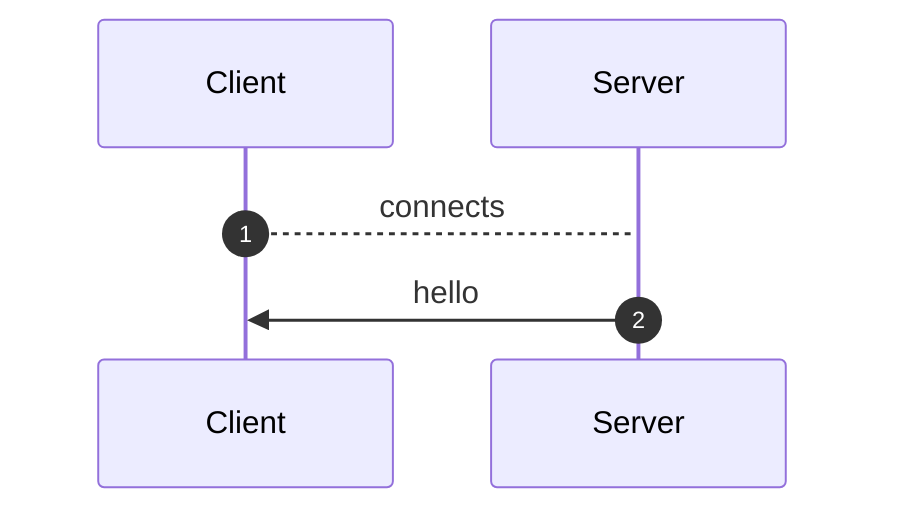
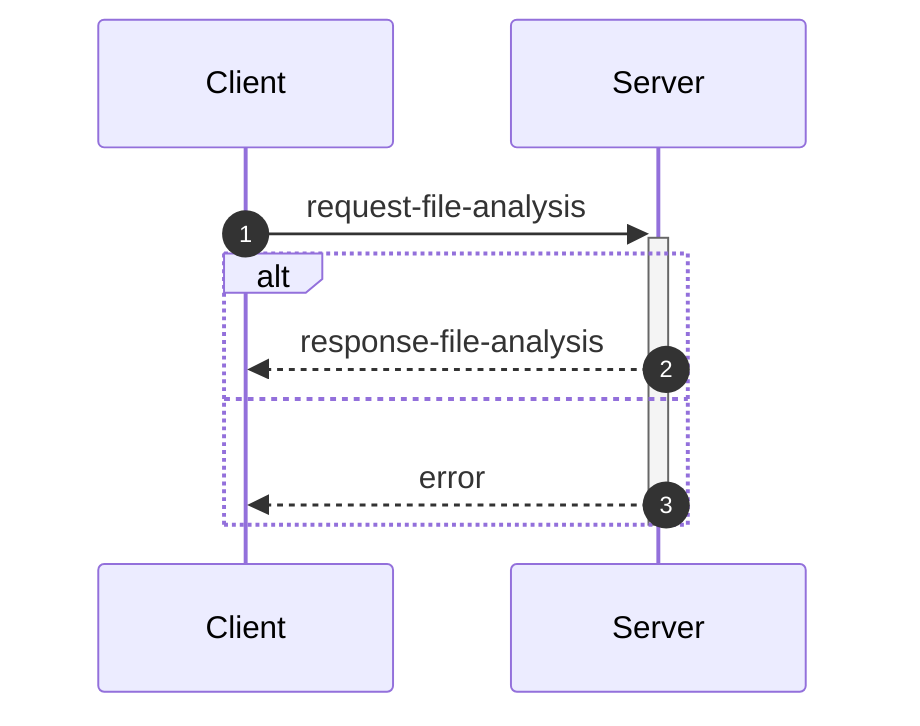
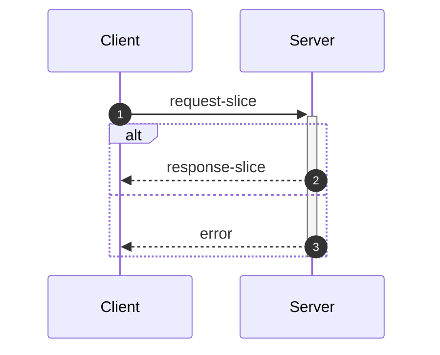
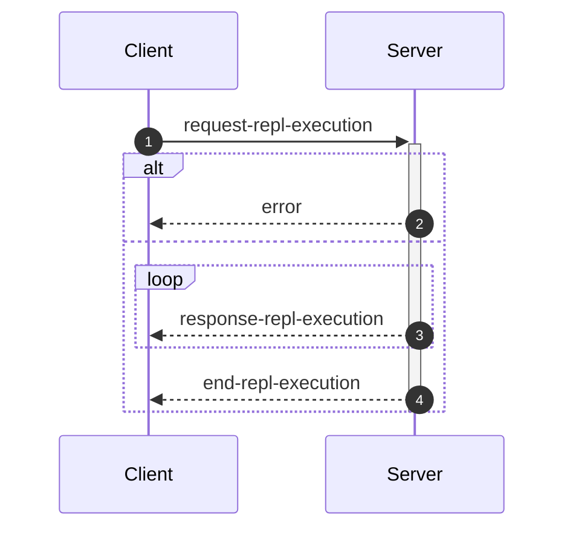

_This document was generated from '[src/documentation/wiki-interface.ts](https://github.com/flowr-analysis/flowr/tree/main//src/documentation/wiki-interface.ts)' on 2026-02-18, 07:52:00 UTC presenting an overview of flowR's interface (v2.9.10, using R v4.5.2). Please do not edit this file/wiki page directly._

Although far from being as detailed as the in-depth explanation of [_flowR_](https://github.com/flowr-analysis/flowr/wiki/wiki/core),
this wiki page explains how to interface with _flowR_ in more detail.
In general, command line arguments and other options provide short descriptions on hover over.

* [💻 Using the REPL](#using-the-repl)
* [⚙️ Configuring FlowR](#configuring-flowr)
* [⚒️ Writing Code](#writing-code)
* [💬 Communicating with the Server](#communicating-with-the-server)

<a id='using-the-repl'></a>
## 💻 Using the REPL


> [!NOTE]
> To execute arbitrary R commands with a repl request, _flowR_ has to be started explicitly with <span title="Description (Command Line Argument): Allow to access the underlying R session when using flowR (security warning: this allows the execution of arbitrary R code!)">`--r-session-access`</span>.
> Please be aware that this introduces a security risk and note that this relies on the [`r-shell` engine](https://github.com/flowr-analysis/flowr/wiki/wiki/engines) .

Although primarily meant for users to explore, 
there is nothing which forbids simply calling _flowR_ as a subprocess to use standard-in, -output, and -error 
for communication (although you can access the REPL using the server as well, 
with the [REPL Request](#message-request-repl-execution) message).

The read-eval-print loop&nbsp;(REPL) works relatively simple.
You can submit an expression (using <kbd>Enter</kbd>),
which is interpreted as an R&nbsp;expression by default but interpreted as a *command* if it starts with a colon (`:`).
The best command to get started with the REPL is <span title="Description (Repl Command): Show help information (aliases: :h, :?)">`:help`</span>.
Besides, you can leave the REPL either with the command <span title="Description (Repl Command): End the repl (aliases: :q, :exit)">`:quit`</span> or by pressing <kbd>Ctrl</kbd>+<kbd>C</kbd> twice.
When writing a *command*, you may press <kbd>Tab</kbd> to get a list of completions, if available.
Multiple commands can be entered in a single line by separating them with a semicolon (`;`), e.g. `:parse "x<-2"; :df*`.
If a command is given without R code, the REPL will re-use R code given in a previous command. 
The prior example will hence return first the parsed AST of the program and then the dataflow graph for `"x <- 2"`.

> [!NOTE]
> If you develop flowR, you may want to launch the repl using the `npm run main-dev` command, this way, you get a non-minified version of flowR with debug information and hot-reloading of source files.

<details>
<summary>Available Commands</summary>

We currently offer the following commands (this with a `[*]` suffix are available with and without the star):


| Command | Description |
| ------- | ----------- |
| **<span title="Description (Repl Command): End the repl (aliases: :q, :exit)">:quit</span>** | End the repl (aliases: **:<span title="Alias of ':quit'. End the repl">q</span>**, **:<span title="Alias of ':quit'. End the repl">exit</span>**) |
| **<span title="Description (Repl Command): Execute the given code as R code. This requires the `--r-session-access` flag to be set and requires the r-shell engine. (aliases: :e, :r)">:execute</span>** | Execute the given code as R code. This requires the `--r-session-access` flag to be set and requires the r-shell engine. (aliases: **:<span title="Alias of ':execute'. Execute the given code as R code. This requires the `--r-session-access` flag to be set and requires the r-shell engine.">e</span>**, **:<span title="Alias of ':execute'. Execute the given code as R code. This requires the `--r-session-access` flag to be set and requires the r-shell engine.">r</span>**) |
| **<span title="Description (Repl Command): Get mermaid code for the control-flow graph of R code, start with 'file://' to indicate a file (aliases: :cfg, :cf)">:controlflow[*]</span>** | Get mermaid code for the control-flow graph of R code, start with 'file://' to indicate a file (star: Returns the URL to mermaid.live) (aliases: **:<span title="Alias of ':controlflow'. Get mermaid code for the control-flow graph of R code, start with 'file://' to indicate a file">cfg</span>**, **:<span title="Alias of ':controlflow'. Get mermaid code for the control-flow graph of R code, start with 'file://' to indicate a file">cf</span>**) |
| **<span title="Description (Repl Command): Get mermaid code for the control-flow graph with basic blocks, start with 'file://' to indicate a file (aliases: :cfgb, :cfb)">:controlflowbb[*]</span>** | Get mermaid code for the control-flow graph with basic blocks, start with 'file://' to indicate a file (star: Returns the URL to mermaid.live) (aliases: **:<span title="Alias of ':controlflowbb'. Get mermaid code for the control-flow graph with basic blocks, start with 'file://' to indicate a file">cfgb</span>**, **:<span title="Alias of ':controlflowbb'. Get mermaid code for the control-flow graph with basic blocks, start with 'file://' to indicate a file">cfb</span>**) |
| **<span title="Description (Repl Command): Get mermaid code for the dataflow graph, start with 'file://' to indicate a file (aliases: :d, :df)">:dataflow[*]</span>** | Get mermaid code for the dataflow graph, start with 'file://' to indicate a file (star: Returns the URL to mermaid.live) (aliases: **:<span title="Alias of ':dataflow'. Get mermaid code for the dataflow graph, start with 'file://' to indicate a file">d</span>**, **:<span title="Alias of ':dataflow'. Get mermaid code for the dataflow graph, start with 'file://' to indicate a file">df</span>**) |
| **<span title="Description (Repl Command): Get mermaid code for the normalized AST of R code, start with 'file://' to indicate a file (aliases: :n)">:normalize[*]</span>** | Get mermaid code for the normalized AST of R code, start with 'file://' to indicate a file (star: Returns the URL to mermaid.live) (alias: **:<span title="Alias of ':normalize'. Get mermaid code for the normalized AST of R code, start with 'file://' to indicate a file">n</span>**) |
| **<span title="Description (Repl Command): Get mermaid code for the simplified dataflow graph, start with 'file://' to indicate a file (aliases: :ds, :dfs)">:dataflowsimple[*]</span>** | Get mermaid code for the simplified dataflow graph, start with 'file://' to indicate a file (star: Returns the URL to mermaid.live) (aliases: **:<span title="Alias of ':dataflowsimple'. Get mermaid code for the simplified dataflow graph, start with 'file://' to indicate a file">ds</span>**, **:<span title="Alias of ':dataflowsimple'. Get mermaid code for the simplified dataflow graph, start with 'file://' to indicate a file">dfs</span>**) |
| **<span title="Description (Repl Command): Just calculates the DFG, but only prints summary info (aliases: :d#, :df#)">:dataflowsilent</span>** | Just calculates the DFG, but only prints summary info (aliases: **:<span title="Alias of ':dataflowsilent'. Just calculates the DFG, but only prints summary info">d#</span>**, **:<span title="Alias of ':dataflowsilent'. Just calculates the DFG, but only prints summary info">df#</span>**) |
| **<span title="Description (Repl Command): Prints ASCII Art of the parsed, unmodified AST, start with 'file://' to indicate a file (aliases: :p)">:parse</span>** | Prints ASCII Art of the parsed, unmodified AST, start with 'file://' to indicate a file (alias: **:<span title="Alias of ':parse'. Prints ASCII Art of the parsed, unmodified AST, start with 'file://' to indicate a file">p</span>**) |
| **<span title="Description (Repl Command): Prints the version of flowR as well as the current version of R">:version</span>** | Prints the version of flowR as well as the current version of R
| **<span title="Description (Repl Command): Query the given R code, start with 'file://' to indicate a file. The query is to be a valid query in json format (use 'help' to get more information).">:query[*]</span>** | Query the given R code, start with 'file://' to indicate a file. The query is to be a valid query in json format (use 'help' to get more information). (star: Similar to query, but returns the output in json format.)
| **<span title="Description (Repl Command): Returns an ASCII representation of the dataflow graph (aliases: :df!)">:dataflowascii</span>** | Returns an ASCII representation of the dataflow graph (alias: **:<span title="Alias of ':dataflowascii'. Returns an ASCII representation of the dataflow graph">df!</span>**) |
| **<span title="Description (Repl Command): Returns summarization stats for the normalized AST (aliases: :n#)">:normalize#</span>** | Returns summarization stats for the normalized AST (alias: **:<span title="Alias of ':normalize#'. Returns summarization stats for the normalized AST">n#</span>**) |
| **<span title="Description (Repl Command): Show help information (aliases: :h, :?)">:help</span>** | Show help information (aliases: **:<span title="Alias of ':help'. Show help information">h</span>**, **:<span title="Alias of ':help'. Show help information">?</span>**) |


</details>


> [!TIP]
> 
> As indicated by the examples before, all REPL commands that operate on code keep track of the state.
> Hence, if you run a command like <span title="Description (Repl Command, starred version): Returns the URL to mermaid.live; Base Command: Get mermaid code for the dataflow graph, start with 'file://' to indicate a file (aliases: :d*, :df*)">`:dataflow*`</span> without providing R code,
> the REPL will re-use the R code provided in a previous command.
> Likewise, doing this will benefit from incrementality!
> If you request the dataflow graph with `:df* x <- 2 * y` and then want to see the parsed AST with `:parse`,
> the REPL will re-use previously obtained information and not re-parse the code again.
> 		


Generally, many commands offer shortcut versions in the REPL. Many queries, for example, offer a shortened format (see the example below).
Of special note, the [Config Query](https://github.com/flowr-analysis/flowr/wiki/wiki/query-api#Config-Query)
can be used to also modify the currently active configuration of _flowR_ within the REPL (see the [wiki page](https://github.com/flowr-analysis/flowr/wiki/wiki/query-api#Config-Query) for more information).

### Example: Retrieving the Dataflow Graph

To retrieve a URL to the [mermaid](https://mermaid.js.org/) diagram of the dataflow of a given expression, 
use <span title="Description (Repl Command, starred version): Returns the URL to mermaid.live; Base Command: Get mermaid code for the dataflow graph, start with 'file://' to indicate a file (aliases: :d*, :df*)">`:dataflow*`</span> (or <span title="Description (Repl Command): Get mermaid code for the dataflow graph, start with 'file://' to indicate a file (aliases: :d, :df)">`:dataflow`</span> to get the mermaid code in the cli):


```shell
$ docker run -it --rm eagleoutice/flowr # or npm run flowr 
flowR repl using flowR v2.9.10, R grammar v14 (tree-sitter engine)
R> :dataflow* y <- 1 + x
```

<details>
<summary style='color:gray'>Output</summary>


```text
https://mermaid.live/view#base64:eyJjb2RlIjoiZmxvd2NoYXJ0IEJUXG4gICAgMXt7XCJgIzkxO1JOdW1iZXIjOTM7IDFcbiAgICAgICgxKVxuICAgICAgKjEuNipgXCJ9fVxuICAgJSUgTm8gZWRnZXMgZm91bmQgZm9yIDFcbiAgICAyKFtcImAjOTE7UlN5bWJvbCM5MzsgeFxuICAgICAgKDIpXG4gICAgICAqMS4xMCpgXCJdKVxuICAgJSUgTm8gZWRnZXMgZm91bmQgZm9yIDJcbiAgICAzW1tcImAjOTE7UkJpbmFyeU9wIzkzOyAjNDM7XG4gICAgICAoMylcbiAgICAgICoxLjYtMTAqXG4gICAgKDEsIDIpYFwiXV1cbiAgICBidWlsdC1pbjpfW1wiYEJ1aWx0LUluOlxuIzQzO2BcIl1cbiAgICBzdHlsZSBidWlsdC1pbjpfIHN0cm9rZTpncmF5LGZpbGw6Z3JheSxzdHJva2Utd2lkdGg6MnB4LG9wYWNpdHk6Ljg7XG4gICAgMFtcImAjOTE7UlN5bWJvbCM5MzsgeVxuICAgICAgKDApXG4gICAgICAqMS4xKmBcIl1cbiAgICA0W1tcImAjOTE7UkJpbmFyeU9wIzkzOyAjNjA7IzQ1O1xuICAgICAgKDQpXG4gICAgICAqMS4xLTEwKlxuICAgICgwLCAzKWBcIl1dXG4gICAgYnVpbHQtaW46Xy1bXCJgQnVpbHQtSW46XG4jNjA7IzQ1O2BcIl1cbiAgICBzdHlsZSBidWlsdC1pbjpfLSBzdHJva2U6Z3JheSxmaWxsOmdyYXksc3Ryb2tlLXdpZHRoOjJweCxvcGFjaXR5Oi44O1xuICAgIDMgLS0+fFwicmVhZHMsIGFyZ3VtZW50XCJ8IDFcbiAgICAzIC0tPnxcInJlYWRzLCBhcmd1bWVudFwifCAyXG4gICAgMyAtLi0+fFwicmVhZHMsIGNhbGxzXCJ8IGJ1aWx0LWluOl9cbiAgICBsaW5rU3R5bGUgMiBzdHJva2U6Z3JheTtcbiAgICAwIC0tPnxcImRlZmluZWQtYnlcInwgM1xuICAgIDAgLS0+fFwiZGVmaW5lZC1ieVwifCA0XG4gICAgNCAtLT58XCJyZWFkcywgYXJndW1lbnRcInwgM1xuICAgIDQgLS0+fFwicmV0dXJucywgYXJndW1lbnRcInwgMFxuICAgIDQgLS4tPnxcInJlYWRzLCBjYWxsc1wifCBidWlsdC1pbjpfLVxuICAgIGxpbmtTdHlsZSA3IHN0cm9rZTpncmF5OyIsIm1lcm1haWQiOnsiYXV0b1N5bmMiOnRydWV9fQ==
Copied mermaid url to clipboard (dataflow: 0ms).
```


Retrieve the dataflow graph of the expression `y <- 1 + x`. It looks like this:


	
<details>

<summary style="color:gray">R Code of the Dataflow Graph</summary>

The analysis required _0.3 ms_ (including parse and normalize, using the [tree-sitter](https://github.com/flowr-analysis/flowr/wiki/Engines) engine) within the generation environment. 
We encountered no unknown side effects during the analysis.


```r
y <- 1 + x
```


</details>


</details>


For small graphs like this, <span title="Description (Repl Command): Returns an ASCII representation of the dataflow graph (aliases: :df!)">`:dataflowascii`</span> also provides an ASCII representation directly in the REPL:


```shell
$ docker run -it --rm eagleoutice/flowr # or npm run flowr 
flowR repl using flowR v2.9.10, R grammar v14 (tree-sitter engine)
R> :df! y <- 1 + x
```

<details open>
<summary style='color:gray'>Output</summary>


```text
                        0<1>0
                   ┌────| 1 |
    ┌────────┐     │    0---0
 c<4>c       └──c<3>c
 |<- |  v<0>v┌──| + |
 c---c──| y |┘  c---c   u<2>u
        v---v      └────| x |
                        u---u
Edges:
3 -> 1: reads, argument  3 -> 2: reads, argument
4 -> 3: reads, argument  4 -> 0: returns, argument
0 -> 3: defined-by       0 -> 4: defined-by
```


Retrieve the dataflow graph of the expression `y <- 1 + x` as ASCII art.

</details>


For the slicing with <span title="Description (Repl Command): Static backwards executable slicer for R">`:slicer`</span>, you have access to the same [magic comments](#slice-magic-comments) as with the [slice request](#message-request-slice).

### Example: Interfacing with the File System

Many commands that allow for an R-expression (like <span title="Description (Repl Command, starred version): Returns the URL to mermaid.live; Base Command: Get mermaid code for the dataflow graph, start with 'file://' to indicate a file (aliases: :d*, :df*)">`:dataflow*`</span>) allow for a file as well 
if the argument starts with `file://`. 
If you are working from the root directory of the _flowR_ repository, the following gives you the parsed AST of the example file using the <span title="Description (Repl Command): Prints ASCII Art of the parsed, unmodified AST, start with 'file://' to indicate a file (aliases: :p)">`:parse`</span> command:


```shell
$ docker run -it --rm eagleoutice/flowr # or npm run flowr 
flowR repl using flowR v2.9.10, R grammar v14 (tree-sitter engine)
R> :parse file://test/testfiles/example.R
```

<details>
<summary style='color:gray'>Output</summary>


```text
File: test/testfiles/example.R

program
├ binaryoperator
│ ├ identifier "sum" (1:1─4)
│ ├ <- "<-" (1:5─7)
│ ╰ float "0" (1:8─9)
├ binaryoperator
│ ├ identifier "product" (2:1─8)
│ ├ <- "<-" (2:9─11)
│ ╰ float "1" (2:12─13)
├ binaryoperator
│ ├ identifier "w" (3:1─2)
│ ├ <- "<-" (3:3─5)
│ ╰ float "7" (3:6─7)
├ binaryoperator
│ ├ identifier "N" (4:1─2)
│ ├ <- "<-" (4:3─5)
│ ╰ float "10" (4:6─8)
├ forstatement
│ ├ for "for" (6:1─4)
│ ├ ( "(" (6:5─6)
│ ├ identifier "i" (6:6─7)
│ ├ in "in" (6:8─10)
│ ├ binaryoperator
│ │ ├ float "1" (6:11─12)
│ │ ├ : ":" (6:12─13)
│ │ ╰ parenthesizedexpression
│ │   ├ ( "(" (6:13─14)
│ │   ├ binaryoperator
│ │   │ ├ identifier "N" (6:14─15)
│ │   │ ├ - "-" (6:15─16)
│ │   │ ╰ float "1" (6:16─17)
│ │   ╰ ) ")" (6:17─18)
│ ├ ) ")" (6:18─19)
│ ╰ bracedexpression
│   ├ { "{" (6:20─21)
│   ├ binaryoperator
│   │ ├ identifier "sum" (7:3─6)
│   │ ├ <- "<-" (7:7─9)
│   │ ╰ binaryoperator
│   │   ├ binaryoperator
│   │   │ ├ identifier "sum" (7:10─13)
│   │   │ ├ + "+" (7:14─15)
│   │   │ ╰ identifier "i" (7:16─17)
│   │   ├ + "+" (7:18─19)
│   │   ╰ identifier "w" (7:20─21)
│   ├ binaryoperator
│   │ ├ identifier "product" (8:3─10)
│   │ ├ <- "<-" (8:11─13)
│   │ ╰ binaryoperator
│   │   ├ identifier "product" (8:14─21)
│   │   ├  "" (8:22─23)
│   │   ╰ identifier "i" (8:24─25)
│   ╰ } "}" (9:1─2)
├ call
│ ├ identifier "cat" (11:1─4)
│ ╰ arguments
│   ├ ( "(" (11:4─5)
│   ├ argument
│   │ ╰ string
│   │   ├ " "\"" (11:5─6)
│   │   ├ stringcontent "Sum:" (11:6─10)
│   │   ╰ " "\"" (11:10─11)
│   ├ comma "," (11:11─12)
│   ├ argument
│   │ ╰ identifier "sum" (11:13─16)
│   ├ comma "," (11:16─17)
│   ├ argument
│   │ ╰ string
│   │   ├ " "\"" (11:18─19)
│   │   ├ stringcontent
│   │   │ ╰ escapesequence "\\n" (11:19─21)
│   │   ╰ " "\"" (11:21─22)
│   ╰ ) ")" (11:22─23)
╰ call
  ├ identifier "cat" (12:1─4)
  ╰ arguments
    ├ ( "(" (12:4─5)
    ├ argument
    │ ╰ string
    │   ├ " "\"" (12:5─6)
    │   ├ stringcontent "Product:" (12:6─14)
    │   ╰ " "\"" (12:14─15)
    ├ comma "," (12:15─16)
    ├ argument
    │ ╰ identifier "product" (12:17─24)
    ├ comma "," (12:24─25)
    ├ argument
    │ ╰ string
    │   ├ " "\"" (12:26─27)
    │   ├ stringcontent
    │   │ ╰ escapesequence "\\n" (12:27─29)
    │   ╰ " "\"" (12:29─30)
    ╰ ) ")" (12:30─31)
```


Retrieve the parsed AST of the example file.

<details>

<summary>File Content</summary>


```r
sum <- 0
product <- 1
w <- 7
N <- 10

for (i in 1:(N-1)) {
  sum <- sum + i + w
  product <- product * i
}

cat("Sum:", sum, "\n")
cat("Product:", product, "\n")
```


</details>

As _flowR_ directly transforms this AST the output focuses on being human-readable instead of being machine-readable. 
		

</details>


### Example: Run a Query

You can run any query supported by _flowR_ using the <span title="Description (Repl Command): Query the given R code, start with 'file://' to indicate a file. The query is to be a valid query in json format (use 'help' to get more information).">`:query`</span> command.
For example, to obtain the shapes of all data frames in a given piece of code, you can run:


```shell
$ docker run -it --rm eagleoutice/flowr # or npm run flowr 
flowR repl using flowR v2.9.10, R grammar v14 (tree-sitter engine)
R> :query @df-shape "x <- data.frame(a = 1:10, b = 1:10)\ny <- x$a"
```

<details open>
<summary style='color:gray'>Output</summary>


```text
Query: df-shape (0 ms)
   ╰ 12: (colnames: [{"a", "b"}, {}], cols: [2, 2], rows: [10, 10])
   ╰ 0: (colnames: [{"a", "b"}, {}], cols: [2, 2], rows: [10, 10])
All queries together required ≈1 ms (1ms accuracy, total 1 ms)
```


Retrieve the shapes of all data frames in the given code.

</details>


To run the linter on a file, you can use (in this example, we just issue the `dead-code` linter on a small piece of code):


```shell
$ docker run -it --rm eagleoutice/flowr # or npm run flowr 
flowR repl using flowR v2.9.10, R grammar v14 (tree-sitter engine)
R> :query @linter rules:dead-code "if(FALSE) x <- 2"
```

<details open>
<summary style='color:gray'>Output</summary>


```text
Query: linter (0 ms)
   ╰ Dead Code (dead-code):
       ╰ certain:
           ╰ Code at 1.11-16
       ╰ Metadata: consideredNodes: 7, searchTimeMs: 0, processTimeMs: 0
All queries together required ≈0 ms (1ms accuracy, total 0 ms)
```


Run the linter on the given code, with only the `dead-code` rule enabled.

</details>


For more information on the available queries, please check out the [Query API](https://github.com/flowr-analysis/flowr/wiki/wiki/query-api).


<a id='configuring-flowr'></a>
## ⚙️ Configuring FlowR


When running _flowR_, you may want to specify some behaviors with a dedicated configuration file. 
By default, flowR looks for a file named `flowr.json` in the current working directory (or any higher directory). 
You can also specify a different file with <span title="Description (Command Line Argument): The name of the configuration file to use">`--config-file`</span> or pass the configuration inline using <span title="Description (Command Line Argument): The flowR configuration to use, as a JSON string">`--config-json`</span>.
To inspect the current configuration, you can run flowr with the <span title="Description (Command Line Argument): Run with verbose logging (will be passed to the corresponding script)">`--verbose`</span> flag, or use the `config` [Query](https://github.com/flowr-analysis/flowr/wiki/Query%20API).
Within the REPL this works by running the following:


```shell
:query @config
```


The following summarizes the configuration options:

- `ignoreSourceCalls`: If set to `true`, _flowR_ will ignore source calls when analyzing the code, i.e., ignoring the inclusion of other files.
- `semantics`: allows to configure the way _flowR_ handles R, although we currently only support `semantics/environment/overwriteBuiltIns`. 
  You may use this to overwrite _flowR_'s handling of built-in function and even completely clear the preset definitions shipped with flowR. 
  See [Configure BuiltIn Semantics](#configure-builtin-semantics) for more information.
- `solver`: allows to configure how _flowR_ resolves variables and their values (currently we support: `disabled`, `alias`, `builtin`), as well as if pointer analysis should be active.
- `engines`: allows to configure the engines used by _flowR_ to interact with R code. See the [Engines wiki page](https://github.com/flowr-analysis/flowr/wiki/Engines) for more information.
- `defaultEngine`: allows to specify the default engine to use for interacting with R code. If not set, an arbitrary engine from the specified list will be used.
- `abstractInterpretation`: allows to configure how _flowR_ performs abstract interpretation, although we currently only support data frame shape inference through abstract interpretation.

So you can configure _flowR_ by adding a file like the following:

<details>

<summary>Example Configuration File</summary>


```json
{
  "ignoreSourceCalls": true,
  "semantics": {
    "environment": {
      "overwriteBuiltIns": {
        "definitions": [
          {
            "type": "function",
            "names": [
              "foo"
            ],
            "processor": "builtin:assignment",
            "config": {}
          }
        ]
      }
    }
  },
  "repl": {
    "quickStats": false,
    "dfProcessorHeat": false
  },
  "project": {
    "resolveUnknownPathsOnDisk": true
  },
  "engines": [
    {
      "type": "r-shell"
    }
  ],
  "solver": {
    "variables": "alias",
    "evalStrings": true,
    "resolveSource": {
      "dropPaths": "no",
      "ignoreCapitalization": true,
      "inferWorkingDirectory": "active-script",
      "searchPath": []
    },
    "instrument": {},
    "slicer": {
      "threshold": 50
    }
  },
  "abstractInterpretation": {
    "wideningThreshold": 4,
    "dataFrame": {
      "maxColNames": 20,
      "readLoadedData": {
        "readExternalFiles": true,
        "maxReadLines": 1000000
      }
    }
  }
}
```


</details>

<details> 
<a id='configure-builtin-semantics'></a>
<summary>Configure Built-In Semantics</summary> 


`semantics/environment/overwriteBuiltins` accepts two keys:

- `loadDefaults` (boolean, initially `true`): If set to `true`, the default built-in definitions are loaded before applying the custom definitions. Setting this flag to `false` explicitly disables the loading of the default definitions.
- `definitions` (array, initially empty): Allows to overwrite or define new built-in elements. Each object within must have a `type` which is one of the below. Furthermore, they may define a string array of `names` which specifies the identifiers to bind the definitions to. You may use `assumePrimitive` to specify whether _flowR_ should assume that this is a primitive non-library definition (so you probably just do not want to specify the key).

  | Type            | Description                                                                                                                                                                                                                                                                                              | Example                                                                                                    |
  | --------------- | -------------------------------------------------------------------------------------------------------------------------------------------------------------------------------------------------------------------------------------------------------------------------------------------------------- | ---------------------------------------------------------------------------------------------------------- |
  | `constant`    | Additionally allows for a `value` this should resolve to.                                                                                                                                                                                                                                                | `{ type: 'constant', names: ['NULL', 'NA'],  value: null }`                                                |
  | `function`    | Is a rather flexible way to define and bind built-in functions. For the time, we do not have extensive documentation to cover all the cases, so please either consult the sources with the `default-builtin-config.ts` or open a [new issue](https://github.com/flowr-analysis/flowr/issues/new/choose). | `{ type: 'function', names: ['next'], processor: 'builtin:default', config: { cfg: ExitPointType.Next } }` |
  | `replacement` | A comfortable way to specify replacement functions like `$<-` or `names<-`. `suffixes` describes the... suffixes to attach automatically. | `{ type: 'replacement', suffixes: ['<-', '<<-'], names: ['[', '[['] }` |


</details>

<details>

<summary style='color:gray'>Full Configuration-File Schema</summary>

- _The configuration file format for flowR._ (object)
    - **ignoreSourceCalls** [optional] _Whether source calls should be ignored, causing {@link processSourceCall}'s behavior to be skipped._ (boolean)
    - **semantics** _Configure language semantics and how flowR handles them._ (object)
        - **environment** [optional] _Semantics regarding how to handle the R environment._ (object)
            - **overwriteBuiltIns** [optional] _Do you want to overwrite (parts) of the builtin definition?_ (object)
                - **loadDefaults** [optional] _Should the default configuration still be loaded?_ (boolean)
                - **definitions** [optional] _The definitions to load/overwrite._ (array)
                Valid item types:
                    - (object)
    - **repl** _Configuration options for the REPL._ (object)
        - **quickStats** [optional] _Whether to show quick stats in the REPL after each evaluation._ (boolean)
        - **dfProcessorHeat** [optional] _This instruments the dataflow processors to count how often each processor is called._ (boolean)
    - **project** _Project specific configuration options._ (object)
        - **resolveUnknownPathsOnDisk** [optional] _Whether to resolve unknown paths loaded by the r project disk when trying to source/analyze files._ (boolean)
    - **engines** _The engine or set of engines to use for interacting with R code. An empty array means all available engines will be used._ (array)
    Valid item types:
        - (alternatives)
            - _The configuration for the tree sitter engine._ (object)
                - **type** [required] _Use the tree sitter engine._ (string)
                    Only allows: 'tree-sitter'
                - **wasmPath** [optional] _The path to the tree-sitter-r WASM binary to use. If this is undefined, this uses the default path._ (string)
                - **treeSitterWasmPath** [optional] _The path to the tree-sitter WASM binary to use. If this is undefined, this uses the default path._ (string)
                - **lax** [optional] _Whether to use the lax parser for parsing R code (allowing for syntax errors). If this is undefined, the strict parser will be used._ (boolean)
            - _The configuration for the R shell engine._ (object)
                - **type** [required] _Use the R shell engine._ (string)
                    Only allows: 'r-shell'
                - **rPath** [optional] _The path to the R executable to use. If this is undefined, this uses the default path._ (string)
    - **defaultEngine** [optional] _The default engine to use for interacting with R code. If this is undefined, an arbitrary engine from the specified list will be used._ (string)
        Only allows: 'tree-sitter', 'r-shell'
    - **solver** _How to resolve constants, constraints, cells, ..._ (object)
        - **variables** _How to resolve variables and their values._ (string)
            Only allows: 'disabled', 'alias', 'builtin'
        - **evalStrings** _Should we include eval(parse(text="...")) calls in the dataflow graph?_ (boolean)
        - **instrument** (object)
            - **dataflowExtractors** [optional] _These keys are only intended for use within code, allowing to instrument the dataflow analyzer!_ (any)
        - **resolveSource** [optional] _If lax source calls are active, flowR searches for sourced files much more freely, based on the configurations you give it. This option is only in effect if `ignoreSourceCalls` is set to false._ (object)
            - **dropPaths** _Allow to drop the first or all parts of the sourced path, if it is relative._ (string)
                Only allows: 'no', 'once', 'all'
            - **ignoreCapitalization** _Search for filenames matching in the lowercase._ (boolean)
            - **inferWorkingDirectory** _Try to infer the working directory from the main or any script to analyze._ (string)
                Only allows: 'no', 'main-script', 'active-script', 'any-script'
            - **searchPath** _Additionally search in these paths._ (array)
            Valid item types:
                - (string)
            - **repeatedSourceLimit** [optional] _How often the same file can be sourced within a single run? Please be aware: in case of cyclic sources this may not reach a fixpoint so give this a sensible limit._ (number)
            - **applyReplacements** _Provide name replacements for loaded files_ (array)
            Valid item types:
                - (object)
        - **slicer** [optional] _The configuration for the slicer._ (object)
            - **threshold** [optional] _The maximum number of iterations to perform on a single function call during slicing._ (number)
    - **abstractInterpretation** _The configuration options for abstract interpretation._ (object)
        - **dataFrame** _The configuration of the shape inference for data frames._ (object)
            - **maxColNames** _The maximum number of columns names to infer for data frames before over-approximating the column names to top._ (number)
            - **wideningThreshold** _The threshold for the number of visitations of a node at which widening should be performed to ensure the termination of the fixpoint iteration._ (number)
            - **readLoadedData** _Configuration options for reading data frame shapes from loaded external data files, such as CSV files._ (object)
                - **readExternalFiles** _Whether data frame shapes should be extracted from loaded external files, such as CSV files._ (boolean)
                - **maxReadLines** _The maximum number of lines to read when extracting data frame shapes from loaded files, such as CSV files._ (number)

</details>

	

<a id='writing-code'></a>
## ⚒️ Writing Code

_flowR_ can be used as a [module](https://www.npmjs.com/package/@eagleoutice/flowr) and offers several main classes and interfaces that are interesting for extension writers 
(see the [Visual Studio Code extension](https://marketplace.visualstudio.com/items?itemName=code-inspect.vscode-flowr) or the [Core](https://github.com/flowr-analysis/flowr/wiki/wiki/core) wiki page for more information).

### Creating Analyses with _flowR_

Nowadays, instances of the <a href="https://github.com/flowr-analysis/flowr/tree/main//src/project/flowr-analyzer.ts#L162"><code><span title="Central class for conducting analyses with FlowR. Use the FlowrAnalyzerBuilder to create a new instance. If you want the original pattern of creating a pipeline and running all steps, you can still do this with FlowrAnalyzer#runFull . To inspect the context of the analyzer, use FlowrAnalyzer#inspectContext (if you are a plugin and need to modify it, use FlowrAnalyzer#context instead).">FlowrAnalyzer</span></code></a> should be used as central frontend to get analysis results from _flowR_.
For example, a program slice can be created like this:


```ts
const analyzer = await new FlowrAnalyzerBuilder()
    .setEngine('tree-sitter')
    .build();
analyzer.addRequest('x <- 1\ny <- x\nx');
const result = await analyzer.query([
    {
        type:     'static-slice',
        criteria: ['3@x']
    }
]);
//console.log(result['static-slice']);
```


For more information, please have a look at the [Analyzer](https://github.com/flowr-analysis/flowr/wiki/wiki/analyzer) wiki page, which explains how to construct and use the <a href="https://github.com/flowr-analysis/flowr/tree/main//src/project/flowr-analyzer.ts#L162"><code><span title="Central class for conducting analyses with FlowR. Use the FlowrAnalyzerBuilder to create a new instance. If you want the original pattern of creating a pipeline and running all steps, you can still do this with FlowrAnalyzer#runFull . To inspect the context of the analyzer, use FlowrAnalyzer#inspectContext (if you are a plugin and need to modify it, use FlowrAnalyzer#context instead).">FlowrAnalyzer</span></code></a> in more detail.
To work with specific perspectives, you can also consult the respective pages like the [Dataflow Graph](https://github.com/flowr-analysis/flowr/wiki/wiki/dataflow-graph) or the [Abstract Interpretation](https://github.com/flowr-analysis/flowr/wiki/wiki/abstract-interpretation) wiki pages.
        
### The Pipeline Executor (Low-Level Interface)

Once, in the beginning, _flowR_ was meant to produce a dataflow graph merely to provide *program slices*. 
However, with continuous updates, the [Dataflow Graph](https://github.com/flowr-analysis/flowr/wiki/wiki/dataflow-graph) repeatedly proves to be the more interesting part.
With this, we restructured _flowR_'s originally *hardcoded* pipeline to be far more flexible. 
Now, it can be theoretically extended or replaced with arbitrary steps, optional steps, and what we call 'decorations' of these steps. 
In short, a slicing pipeline using the <a href="https://github.com/flowr-analysis/flowr/tree/main//src/core/pipeline-executor.ts#L97"><code><span title="**Please note:** The PipelineExecutor is now considered to be a rather low-level API for flowR. While it still works and is the basis for all other layers, we strongly recommend using the FlowrAnalyzer and its builder to create and use an analyzer instance that is pre-configured for your use-case. The pipeline executor allows to execute arbitrary pipelines in a step-by-step fashion. If you are not...">PipelineExecutor</span></code></a> looks like this:


```ts

const slicer = new PipelineExecutor(DEFAULT_SLICING_PIPELINE, {
  parser:    new RShell(),
  request:   requestFromInput('x <- 1\nx + 1'),
  criterion: ['2@x']
})
const slice = await slicer.allRemainingSteps()
// console.log(slice.reconstruct.code)
```


<details><summary>More Information</summary>


If you compare this, with what you would have done with the old (and removed) `SteppingSlicer`, 
this essentially just requires you to replace the `SteppingSlicer` with the <a href="https://github.com/flowr-analysis/flowr/tree/main//src/core/pipeline-executor.ts#L97"><code><span title="**Please note:** The PipelineExecutor is now considered to be a rather low-level API for flowR. While it still works and is the basis for all other layers, we strongly recommend using the FlowrAnalyzer and its builder to create and use an analyzer instance that is pre-configured for your use-case. The pipeline executor allows to execute arbitrary pipelines in a step-by-step fashion. If you are not...">PipelineExecutor</span></code></a>
and to pass the <a href="https://github.com/flowr-analysis/flowr/tree/main//src/core/steps/pipeline/default-pipelines.ts#L18"><code>DEFAULT_SLICING_PIPELINE</code></a> as the first argument.
The <a href="https://github.com/flowr-analysis/flowr/tree/main//src/core/pipeline-executor.ts#L97"><code><span title="**Please note:** The PipelineExecutor is now considered to be a rather low-level API for flowR. While it still works and is the basis for all other layers, we strongly recommend using the FlowrAnalyzer and its builder to create and use an analyzer instance that is pre-configured for your use-case. The pipeline executor allows to execute arbitrary pipelines in a step-by-step fashion. If you are not...">PipelineExecutor</span></code></a>...

1. Provides structures to investigate the results of all intermediate steps
2. Can be executed step-by-step
3. Can repeat steps (e.g., to calculate multiple slices on the same input)

See the in-code documentation for more information.

	

</details>
    

### Using the <a href="https://github.com/flowr-analysis/flowr/tree/main//src/r-bridge/shell.ts#L143"><code><span title="The RShell represents an interactive session with the R interpreter. You can configure it by RShellOptions . At the moment we are using a live R session (and not networking etc.) to communicate with R easily, which allows us to install packages etc. However, this might and probably will change in the future (leaving this as a legacy mode :D)">RShell</span></code></a> to Interact with R

The <a href="https://github.com/flowr-analysis/flowr/tree/main//src/r-bridge/shell.ts#L143"><code><span title="The RShell represents an interactive session with the R interpreter. You can configure it by RShellOptions . At the moment we are using a live R session (and not networking etc.) to communicate with R easily, which allows us to install packages etc. However, this might and probably will change in the future (leaving this as a legacy mode :D)">RShell</span></code></a> class allows interfacing with the `R`&nbsp;ecosystem installed on the host system.
Please have a look at [flowR's Engines](https://github.com/flowr-analysis/flowr/wiki/wiki/engines) for more information on alternatives (for example, the <a href="https://github.com/flowr-analysis/flowr/tree/main//src/r-bridge/lang-4.x/tree-sitter/tree-sitter-executor.ts#L18"><code><span title="Synchronous and (way) faster alternative to the RShell using tree-sitter.">TreeSitterExecutor</span></code></a>).


> [!IMPORTANT]
> 
> Each <a href="https://github.com/flowr-analysis/flowr/tree/main//src/r-bridge/shell.ts#L143"><code><span title="The RShell represents an interactive session with the R interpreter. You can configure it by RShellOptions . At the moment we are using a live R session (and not networking etc.) to communicate with R easily, which allows us to install packages etc. However, this might and probably will change in the future (leaving this as a legacy mode :D)">RShell</span></code></a> controls a new instance of the R&nbsp;interpreter, 
> make sure to call <code><a href="https://github.com/flowr-analysis/flowr/tree/main//src/r-bridge/shell.ts#L317"><span title="Close the current R session, makes the object effectively invalid (can no longer be reopened etc.)">RShell::<i>close</i></span></a>()</code> when you are done.


You can start a new "session" simply by constructing a new object with <code>new <a href="https://github.com/flowr-analysis/flowr/tree/main//src/r-bridge/shell.ts#L143"><span title="The RShell represents an interactive session with the R interpreter. You can configure it by RShellOptions . At the moment we are using a live R session (and not networking etc.) to communicate with R easily, which allows us to install packages etc. However, this might and probably will change in the future (leaving this as a legacy mode :D)">RShell</span></a>()</code>.

However, there are several options that may be of interest 
(e.g., to automatically revive the shell in case of errors or to control the name location of the R process on the system).

With a shell object (let's call it `shell`), you can execute R code by using <a href="https://github.com/flowr-analysis/flowr/tree/main//src/r-bridge/shell.ts#L195"><code><span title="sends the given command directly to the current R session will not do anything to alter input markers!">RShell::<i>sendCommand</i></span></code></a>, 
for example <code>shell.<a href="https://github.com/flowr-analysis/flowr/tree/main//src/r-bridge/shell.ts#L195"><span title="sends the given command directly to the current R session will not do anything to alter input markers!">sendCommand</span></a>("1 + 1")</code>. 
However, this does not return anything, so if you want to collect the output of your command, use
<a href="https://github.com/flowr-analysis/flowr/tree/main//src/r-bridge/shell.ts#L261"><code><span title="Send a command and collect the output">RShell::<i>sendCommandWithOutput</i></span></code></a> instead.

Besides that, the command <a href="https://github.com/flowr-analysis/flowr/tree/main//src/r-bridge/shell.ts#L233"><code>RShell::<b>tryToInjectHomeLibPath</b></code></a> may be of interest, as it enables all libraries available on the host system.


### Generate Statistics (No longer a Focus of flowR)


<details>

<summary>Adding a New Feature to Extract</summary>

In this example, we construct a new feature to extract, with the name "*example*".
Whenever this name appears, you may substitute this with whatever name fits your feature best (as long as the name is unique).

1. **Create a new file in `src/statistics/features/supported`**\
   Create the file `example.ts`, and add its export to the `index.ts` file in the same directory (if not done automatically).

2. **Create the basic structure**\
   To get a better feel of what a feature must have, let's look
   at the basic structure (of course, due to TypeScript syntax,
   there are other ways to achieve the same goal):

   ```ts
   const initialExampleInfo = {
       /* whatever start value is good for you */
       someCounter: 0
   }

   export type ExampleInfo = Writable<typeof initialExampleInfo>

   export const example: Feature<ExampleInfo> = {
    name:        'Example Feature',
    description: 'A longer example description',

    process(existing: ExampleInfo, input: FeatureProcessorInput): ExampleInfo {
      /* perform analysis on the input */
      return existing
    },

    initialValue: initialExampleInfo
   }
   ```

   The `initialExampleInfo` type holds the initial values for each counter that you want to maintain during the feature extraction (they will usually be initialized with 0). The resulting `ExampleInfo` type holds the structure of the data that is to be counted. Due to the vast amount of data processed, information like the name and location of a function call is not stored here, but instead written to disk (see below).

   Every new feature must be of the `Feature<Info>` type, with `Info` referring to a `FeatureInfo` (like `ExampleInfo` in this example). Next to a `name` and a `description`, each Feature must provide:

   - a processor that extracts the information from the input, adding it to the existing information.
   - a function returning the initial value of the information (in this case, `initialExampleInfo`).

3. **Add it to the feature-mapping**\
   Now, in the `feature.ts` file in `src/statistics/features`, add your feature to the `ALL_FEATURES` object.

Now, we want to extract something. For the *example* feature created in the previous steps, we choose to count the amount of `COMMENT` tokens.
So we define a corresponding [XPath](https://developer.mozilla.org/en-US/docs/Web/XPath) query:

```ts
const commentQuery: Query = xpath.parse('//COMMENT')
```

Within our feature's `process` function, running the query is as simple as:

```ts
const comments = commentQuery.select({ node: input.parsedRAst })
```

Now we could do a lot of further processing, but for simplicity, we only record every comment found this way:

```ts
appendStatisticsFile(example.name, 'comments', comments, input.filepath)
```

We use `example.name` to avoid duplication with the name that we’ve assigned to the feature. It corresponds to the name of the folder in the statistics output.
`'comments'` refers to a freely chosen (but unique) name, that will be used as the name for the output file within the folder. The `comments` variable holds the result of the query, which is an array of nodes. Finally, we pass the `filepath` of the file that was analyzed (if known), so that it can be added to the statistics file (as additional information).

</details>
	

<a id='communicating-with-the-server'></a>
## 💬 Communicating with the Server


As explained in the [Overview](https://github.com/flowr-analysis/flowr/wiki/Overview), you can simply run the [TCP](https://de.wikipedia.org/wiki/Transmission_Control_Protocol)&nbsp;server by adding the <span title="Description (Command Line Argument): Do not drop into a repl, but instead start a server on the given port (default: 1042) and listen for messages.">`--server`</span> flag (and, due to the interactive mode, exit with the conventional <kbd>CTRL</kbd>+<kbd>C</kbd>).
Currently, every connection is handled by the same underlying `RShell` - so the server is not designed to handle many clients at a time.
Additionally, the server is not well guarded against attacks (e.g., you can theoretically spawn an arbitrary number of&nbsp;RShell sessions on the target machine).

Every message has to be given in a single line (i.e., without a newline in-between) and end with a newline character. Nevertheless, we will pretty-print example given in the following segments for the ease of reading.


> [!NOTE]
> 
> The default <span title="Description (Command Line Argument): Do not drop into a repl, but instead start a server on the given port (default: 1042) and listen for messages.">`--server`</span> uses a simple [TCP](https://de.wikipedia.org/wiki/Transmission_Control_Protocol)
> connection. If you want _flowR_ to expose a [WebSocket](https://de.wikipedia.org/wiki/WebSocket) server instead, add the <span title="Description (Command Line Argument): If the server flag is set, use websocket for messaging">`--ws`</span> flag (i.e., <span title="Description (Command Line Argument): Do not drop into a repl, but instead start a server on the given port (default: 1042) and listen for messages.">`--server`</span> <span title="Description (Command Line Argument): If the server flag is set, use websocket for messaging">`--ws`</span>) when starting _flowR_ from the command line.
> 			


<ul><li>
<a id="message-hello"></a>
<b>Hello</b> Message (<code>hello</code>) 
<details>

<summary style="color:gray"> View Details. <i>The server informs the client about the successful connection and provides Meta-Information.</i> </summary>




	
After launching _flowR_, for example, with <code>docker run -it --rm eagleoutice/flowr <span title="Description (Command Line Argument): Do not drop into a repl, but instead start a server on the given port (default: 1042) and listen for messages.">-<span/>-server</span></code>&nbsp;(🐳️), simply connecting should present you with a `hello` message, that amongst others should reveal the versions of&nbsp;_flowR_ and&nbsp;R, using the [semver 2.0](https://semver.org/spec/v2.0.0.html) versioning scheme.
The message looks like this:


```json
{
  "type": "hello",
  "clientName": "client-0",
  "versions": {
    "flowr": "2.9.10",
    "r": "4.5.2",
    "engine": "r-shell"
  }
}
```


There are currently a few messages that you can send after the hello message.
If you want to _slice_ a piece of R code you first have to send an [analysis request](#message-request-file-analysis), so that you can send one or multiple slice requests afterward.
Requests for the [REPL](#message-request-repl) are independent of that.
	

<hr>


<details>
<summary style="color:gray">Message schema (<code>hello</code>)</summary>

For the definition of the hello message, please see it's implementation at [`./src/cli/repl/server/messages/message-hello.ts`](https://github.com/flowr-analysis/flowr/tree/main/./src/cli/repl/server/messages/message-hello.ts).

- [required] (object)
    - **type** [required] _The type of the hello message._ (string)
        Only allows: 'hello'
    - **id** [forbidden] _The id of the message is always undefined (as it is the initial message and not requested)._ (any)
    - **clientName** [required] _A unique name that is assigned to each client. It has no semantic meaning and is only used/useful for debugging._ (string)
    - **versions** [required] (object)
        - **flowr** [required] _The version of the flowr server running in semver format._ (string)
        - **r** [required] _The version of the underlying R shell running in semver format._ (string)
        - **engine** [required] _The parser backend that is used to parse the R code._ (string)

</details>


<hr>

</details>
	</li>

<li>
<a id="message-request-file-analysis"></a>
<b>Analysis</b> Message (<code>request-file-analysis</code>) 
<details>

<summary style="color:gray"> View Details. <i>The server builds the dataflow graph for a given input file (or a set of files).</i> </summary>




	
The request allows the server to analyze a file and prepare it for slicing.
The message can contain a `filetoken`, which is used to identify the file in later slice or query requests (if you do not add one, the request will not be stored and therefore, it is not available for subsequent requests).

> **Please note!**\
> If you want to send and process a lot of analysis requests, but do not want to slice them, please do not pass the `filetoken` field. This will save the server a lot of memory allocation.

Furthermore, the request must contain either a `content` field to directly pass the file's content or a `filepath` field which contains the path to the file (this path must be accessible for the server to be useful).
If you add the `id` field, the answer will use the same `id` so you can match requests and the corresponding answers.
See the implementation of the request-file-analysis message for more information.


<details>
<summary>Example of the <code>request-file-analysis</code> Message</summary>

_Note:_ even though we pretty-print these messages, they are sent as a single line, ending with a newline.

The following lists all messages that were sent and received in case you want to reproduce the scenario:

<ol>
<li> <code>hello</code> (response)
<details> 

<summary> Show Details </summary>

The first message is always a hello message.


```json
{
  "type": "hello",
  "clientName": "client-0",
  "versions": {
    "flowr": "2.9.10",
    "r": "4.5.2",
    "engine": "r-shell"
  }
}
```


</details>
</li>

<li> <b><code>request-file-analysis</code> (request)</b>
<details open> 

<summary> Show Details </summary>

Let's suppose you simply want to analyze the following script:
 
```r
x <- 1
x + 1
```

 For this, you can send the following request:


```json
{
  "type": "request-file-analysis",
  "id": "1",
  "filetoken": "x",
  "content": "x <- 1\nx + 1"
}
```


</details>
</li>

<li> <code>response-file-analysis</code> (response)
<details> 

<summary> Show Details </summary>


The `results` field of the response effectively contains three keys of importance:

- `parse`: which contains 1:1 the parse result in CSV format that we received from the `RShell` (i.e., the AST produced by the parser of the R interpreter).
- `normalize`: which contains the normalized AST, including ids (see the `info` field and the [Normalized AST](https://github.com/flowr-analysis/flowr/wiki/Normalized%20AST) wiki page).
- `dataflow`: especially important is the `graph` field which contains the dataflow graph as a set of root vertices (see the [Dataflow Graph](https://github.com/flowr-analysis/flowr/wiki/Dataflow%20Graph) wiki page).
			


_As the code is pretty long, we inhibit pretty printing and syntax highlighting (JSON, hiding built-in):_

```text
{"type":"response-file-analysis","format":"json","id":"1","results":{"parse":{"files":[{"parsed":"[1,1,1,6,7,0,\"expr\",false,\"x <- 1\"],[1,1,1,1,1,3,\"SYMBOL\",true,\"x\"],[1,1,1,1,3,7,\"expr\",false,\"x\"],[1,3,1,4,2,7,\"LEFT_ASSIGN\",true,\"<-\"],[1,6,1,6,4,5,\"NUM_CONST\",true,\"1\"],[1,6,1,6,5,7,\"expr\",false,\"1\"],[2,1,2,5,16,0,\"expr\",false,\"x + 1\"],[2,1,2,1,10,12,\"SYMBOL\",true,\"x\"],[2,1,2,1,12,16,\"expr\",false,\"x\"],[2,3,2,3,11,16,\"'+'\",true,\"+\"],[2,5,2,5,13,14,\"NUM_CONST\",true,\"1\"],[2,5,2,5,14,16,\"expr\",false,\"1\"]","filePath":"/tmp/tmp-79079-jfPiciKqksI9-.R"}],".meta":{"timing":2}},"normalize":{"ast":{"type":"RProject","files":[{"root":{"type":"RExpressionList","children":[{"type":"RBinaryOp","location":[1,3,1,4],"lhs":{"type":"RSymbol","location":[1,1,1,1],"content":"x","lexeme":"x","info":{"fullRange":[1,1,1,1],"adToks":[],"id":0,"parent":2,"role":"bin-l","index":0,"nesting":0,"file":"/tmp/tmp-79079-jfPiciKqksI9-.R"}},"rhs":{"location":[1,6,1,6],"lexeme":"1","info":{"fullRange":[1,6,1,6],"adToks":[],"id":1,"parent":2,"role":"bin-r","index":1,"nesting":0,"file":"/tmp/tmp-79079-jfPiciKqksI9-.R"},"type":"RNumber","content":{"num":1,"complexNumber":false,"markedAsInt":false}},"operator":"<-","lexeme":"<-","info":{"fullRange":[1,1,1,6],"adToks":[],"id":2,"parent":6,"nesting":0,"file":"/tmp/tmp-79079-jfPiciKqksI9-.R","index":0,"role":"el-c"}},{"type":"RBinaryOp","location":[2,3,2,3],"lhs":{"type":"RSymbol","location":[2,1,2,1],"content":"x","lexeme":"x","info":{"fullRange":[2,1,2,1],"adToks":[],"id":3,"parent":5,"role":"bin-l","index":0,"nesting":0,"file":"/tmp/tmp-79079-jfPiciKqksI9-.R"}},"rhs":{"location":[2,5,2,5],"lexeme":"1","info":{"fullRange":[2,5,2,5],"adToks":[],"id":4,"parent":5,"role":"bin-r","index":1,"nesting":0,"file":"/tmp/tmp-79079-jfPiciKqksI9-.R"},"type":"RNumber","content":{"num":1,"complexNumber":false,"markedAsInt":false}},"operator":"+","lexeme":"+","info":{"fullRange":[2,1,2,5],"adToks":[],"id":5,"parent":6,"nesting":0,"file":"/tmp/tmp-79079-jfPiciKqksI9-.R","index":1,"role":"el-c"}}],"info":{"adToks":[],"id":6,"nesting":0,"file":"/tmp/tmp-79079-jfPiciKqksI9-.R","role":"root","index":0}},"filePath":"/tmp/tmp-79079-jfPiciKqksI9-.R"}],"info":{"id":7}},".meta":{"timing":0}},"dataflow":{"unknownReferences":[],"in":[{"nodeId":2,"name":"<-","type":2},{"nodeId":5,"name":"+","type":2}],"out":[{"nodeId":0,"name":"x","type":4,"definedAt":2,"value":[1]}],"environment":{"current":{"id":2353,"parent":"<BuiltInEnvironment>","memory":[["x",[{"nodeId":0,"name":"x","type":4,"definedAt":2,"value":[1]}]]]},"level":0},"graph":{"rootVertices":[1,0,2,3,4,5],"vertexInformation":[[1,{"tag":"value","id":1}],[0,{"tag":"vdef","id":0}],[2,{"tag":"fcall","id":2,"name":"<-","onlyBuiltin":true,"args":[{"nodeId":0,"type":32},{"nodeId":1,"type":32}],"origin":["builtin:assignment"]}],[3,{"tag":"use","id":3}],[4,{"tag":"value","id":4}],[5,{"tag":"fcall","id":5,"name":"+","onlyBuiltin":true,"args":[{"nodeId":3,"type":32},{"nodeId":4,"type":32}],"origin":["builtin:default"]}]],"edgeInformation":[[2,[[1,{"types":65}],[0,{"types":72}],["built-in:<-",{"types":5}]]],[0,[[1,{"types":2}],[2,{"types":2}]]],[3,[[0,{"types":1}]]],[5,[[3,{"types":65}],[4,{"types":65}],["built-in:+",{"types":5}]]]],"_unknownSideEffects":[]},"entryPoint":2,"exitPoints":[{"type":0,"nodeId":5}],"hooks":[],".meta":{"timing":0}}}}
```


</details>
</li>
</ol>

The complete round-trip took 5.5 ms (including time required to validate the messages, start, and stop the internal mock server).

</details>


You receive an error if, for whatever reason, the analysis fails (e.g., the message or code you sent contained syntax errors).
It contains a human-readable description *why* the analysis failed (see the error message implementation for more details).


<details>
<summary>Example Error Message</summary>

_Note:_ even though we pretty-print these messages, they are sent as a single line, ending with a newline.

The following lists all messages that were sent and received in case you want to reproduce the scenario:

<ol>
<li> <code>hello</code> (response)
<details> 

<summary> Show Details </summary>

The first message is always a hello message.


```json
{
  "type": "hello",
  "clientName": "client-0",
  "versions": {
    "flowr": "2.9.10",
    "r": "4.5.2",
    "engine": "r-shell"
  }
}
```


</details>
</li>

<li> <code>request-file-analysis</code> (request)
<details> 

<summary> Show Details </summary>


```json
{
  "type": "request-file-analysis",
  "id": "1",
  "filename": "sample.R",
  "content": "x <-"
}
```


</details>
</li>

<li> <b><code>error</code> (response)</b>
<details open> 

<summary> Show Details </summary>


```json
{
  "id": "1",
  "type": "error",
  "fatal": false,
  "reason": "Error while analyzing file sample.R: GuardError: unable to parse R code (see the log for more information) for request {\"request\":\"text\",\"content\":\"x <-\"}}\n Report a Bug: https://github.com/flowr-analysis/flowr/issues/new?body=%3C!%2D%2D%20Please%20describe%20your%20issue%20in%20more%20detail%20below!%20%2D%2D%3E%0A%0A%0A%3C!%2D%2D%20Automatically%20generated%20issue%20metadata%2C%20please%20do%20not%20edit%20or%20delete%20content%20below%20this%20line%20%2D%2D%3E%0A%2D%2D%2D%0A%0AflowR%20version%3A%202.9.10%0Anode%20version%3A%20v24.13.0%0Anode%20arch%3A%20x64%0Anode%20platform%3A%20linux%0Amessage%3A%20%60unable%20to%20parse%20R%20code%20%28see%20the%20log%20for%20more%20information%29%20for%20request%20%7B%22request%22%3A%22text%22%2C%22content%22%3A%22x%20%3C%2D%22%7D%7D%60%0Astack%20trace%3A%0A%60%60%60%0A%20%20%20%20at%20guard%20%28%3C%3E%2Fsrc%2Futil%2Fassert.ts%3A128%3A9%29%0A%20%20%20%20at%20guardRetrievedOutput%20%28%3C%3E%2Fsrc%2Fr%2Dbridge%2Fretriever.ts%3A221%3A7%29%0A%20%20%20%20at%20%2Fhome%2Fostwind%2Fgit%2Fphd%2Fflowr%2Dfield%2Fflowr%2Fsrc%2Fr%2Dbridge%2Fretriever.ts%3A182%3A4%0A%20%20%20%20at%20processTicksAndRejections%20%28node%3Ainternal%2Fprocess%2Ftask_queues%3A103%3A5%29%0A%20%20%20%20at%20async%20Object.parseRequests%20%5Bas%20processor%5D%20%28%3C%3E%2Fsrc%2Fr%2Dbridge%2Fparser.ts%3A104%3A19%29%0A%20%20%20%20at%20async%20PipelineExecutor.nextStep%20%28%3C%3E%2Fsrc%2Fcore%2Fpipeline%2Dexecutor.ts%3A192%3A25%29%0A%20%20%20%20at%20async%20FlowrAnalyzerCache.runTapeUntil%20%28%3C%3E%2Fsrc%2Fproject%2Fcache%2Fflowr%2Danalyzer%2Dcache.ts%3A93%3A4%29%0A%20%20%20%20at%20async%20FlowRServerConnection.sendFileAnalysisResponse%20%28%3C%3E%2Fsrc%2Fcli%2Frepl%2Fserver%2Fconnection.ts%3A163%3A52%29%0A%60%60%60%0A%0A%2D%2D%2D%0A%09"
}
```


</details>
</li>
</ol>

The complete round-trip took 3.7 ms (including time required to validate the messages, start, and stop the internal mock server).

</details>


&nbsp;

<a id="analysis-include-cfg"></a>
**Including the Control Flow Graph**

While _flowR_ does (for the time being) not use an explicit control flow graph but instead relies on control-dependency edges within the dataflow graph, 
the respective structure can still be exposed using the server (note that, as this feature is not needed within _flowR_, it is tested significantly less - 
so please create a [new issue](https://github.com/flowr-analysis/flowr/issues/new/choose) for any bug you may encounter).
For this, the analysis request may add `cfg: true` to its list of options.


<details>
<summary>Requesting a Control Flow Graph</summary>

_Note:_ even though we pretty-print these messages, they are sent as a single line, ending with a newline.

The following lists all messages that were sent and received in case you want to reproduce the scenario:

<ol>
<li> <code>hello</code> (response)
<details> 

<summary> Show Details </summary>

The first message is always a hello message.


```json
{
  "type": "hello",
  "clientName": "client-0",
  "versions": {
    "flowr": "2.9.10",
    "r": "4.5.2",
    "engine": "r-shell"
  }
}
```


</details>
</li>

<li> <b><code>request-file-analysis</code> (request)</b>
<details open> 

<summary> Show Details </summary>


```json
{
  "type": "request-file-analysis",
  "id": "1",
  "filetoken": "x",
  "content": "if(unknown > 0) { x <- 2 } else { x <- 5 }\nfor(i in 1:x) { print(x); print(i) }",
  "cfg": true
}
```


</details>
</li>

<li> <code>response-file-analysis</code> (response)
<details> 

<summary> Show Details </summary>


The response looks basically the same as a response sent without the `cfg` flag. However, additionally it contains a `cfg` field. 
If you are interested in a visual representation of the control flow graph, see the 
[visualization with mermaid](https://mermaid.live/view#base64:eyJjb2RlIjoiZmxvd2NoYXJ0IEJUXG4gICAgbjMyKFtcImBSRXhwcmVzc2lvbkxpc3QgKDMyKWBcIl0pXG4gICAgbjE1W1wiYFJJZlRoZW5FbHNlICgxNSlcbiMzNDtpZih1bmtub3duICM2MjsgMCkgIzEyMzsgeCAjNjA7IzQ1OyAyICMxMjU7IGVsc2UgIzEyMzsgeCAjNjA7IzQ1OyA1ICMxMjU7IzM0O2BcIl1cbiAgICBuMTUtZVtbMTUtZV1dXG4gICAgbjAoW1wiYFJTeW1ib2wgKDApXG4jMzQ7dW5rbm93biMzNDtgXCJdKVxuICAgIG4xKFtcImBSTnVtYmVyICgxKVxuIzM0OzAjMzQ7YFwiXSlcbiAgICBuMihbXCJgUkJpbmFyeU9wICgyKVxuIzM0O3Vua25vd24gIzYyOyAwIzM0O2BcIl0pXG4gICAgbjItZVtbMi1lXV1cbiAgICBuOChbXCJgUkV4cHJlc3Npb25MaXN0ICg4KWBcIl0pXG4gICAgbjUoW1wiYFJTeW1ib2wgKDUpXG4jMzQ7eCMzNDtgXCJdKVxuICAgIG42KFtcImBSTnVtYmVyICg2KVxuIzM0OzIjMzQ7YFwiXSlcbiAgICBuNyhbXCJgUkJpbmFyeU9wICg3KVxuIzM0O3ggIzYwOyM0NTsgMiMzNDtgXCJdKVxuICAgIG43LWVbWzctZV1dXG4gICAgbjgtZVtbOC1lXV1cbiAgICBuMTQoW1wiYFJFeHByZXNzaW9uTGlzdCAoMTQpYFwiXSlcbiAgICBuMTEoW1wiYFJTeW1ib2wgKDExKVxuIzM0O3gjMzQ7YFwiXSlcbiAgICBuMTIoW1wiYFJOdW1iZXIgKDEyKVxuIzM0OzUjMzQ7YFwiXSlcbiAgICBuMTMoW1wiYFJCaW5hcnlPcCAoMTMpXG4jMzQ7eCAjNjA7IzQ1OyA1IzM0O2BcIl0pXG4gICAgbjEzLWVbWzEzLWVdXVxuICAgIG4xNC1lW1sxNC1lXV1cbiAgICBuMTYoW1wiYFJTeW1ib2wgKDE2KVxuIzM0O2kjMzQ7YFwiXSlcbiAgICBuMzFbXCJgUkZvckxvb3AgKDMxKVxuIzM0O2ZvcihpIGluIDEjNTg7eCkgIzEyMzsgcHJpbnQoeCk7IHByaW50KGkpICMxMjU7IzM0O2BcIl1cbiAgICBuMTcoW1wiYFJOdW1iZXIgKDE3KVxuIzM0OzEjMzQ7YFwiXSlcbiAgICBuMTgoW1wiYFJTeW1ib2wgKDE4KVxuIzM0O3gjMzQ7YFwiXSlcbiAgICBuMTkoW1wiYFJCaW5hcnlPcCAoMTkpXG4jMzQ7MSM1ODt4IzM0O2BcIl0pXG4gICAgbjE5LWVbWzE5LWVdXVxuICAgIG4zMChbXCJgUkV4cHJlc3Npb25MaXN0ICgzMClgXCJdKVxuICAgIG4yMihbXCJgUlN5bWJvbCAoMjIpXG4jMzQ7cHJpbnQoeCkjMzQ7YFwiXSlcbiAgICBuMjVbXCJgUkZ1bmN0aW9uQ2FsbCAoMjUpXG4jMzQ7cHJpbnQoeCkjMzQ7YFwiXVxuICAgIG4yNS1lW1syNS1lXV1cbiAgICBuMjQoW1wiYFJBcmd1bWVudCAoMjQpXG4jMzQ7eCMzNDtgXCJdKVxuICAgIG4yMyhbXCJgUlN5bWJvbCAoMjMpXG4jMzQ7eCMzNDtgXCJdKVxuICAgIG4yNC1lW1syNC1lXV1cbiAgICBuMjYoW1wiYFJTeW1ib2wgKDI2KVxuIzM0O3ByaW50KGkpIzM0O2BcIl0pXG4gICAgbjI5W1wiYFJGdW5jdGlvbkNhbGwgKDI5KVxuIzM0O3ByaW50KGkpIzM0O2BcIl1cbiAgICBuMjktZVtbMjktZV1dXG4gICAgbjI4KFtcImBSQXJndW1lbnQgKDI4KVxuIzM0O2kjMzQ7YFwiXSlcbiAgICBuMjcoW1wiYFJTeW1ib2wgKDI3KVxuIzM0O2kjMzQ7YFwiXSlcbiAgICBuMjgtZVtbMjgtZV1dXG4gICAgbjMwLWVbWzMwLWVdXVxuICAgIG4zMS1lW1szMS1lXV1cbiAgICBuMzItZVtbMzItZV1dXG4gICAgbjE1IC0uLT58XCJGRFwifCBuMzJcbiAgICBuMSAtLi0+fFwiRkRcInwgbjBcbiAgICBuMCAtLi0+fFwiRkRcInwgbjJcbiAgICBuMi1lIC0uLT58XCJGRFwifCBuMVxuICAgIG43IC0uLT58XCJGRFwifCBuOFxuICAgIG42IC0uLT58XCJGRFwifCBuNVxuICAgIG41IC0uLT58XCJGRFwifCBuN1xuICAgIG43LWUgLS4tPnxcIkZEXCJ8IG42XG4gICAgbjgtZSAtLi0+fFwiRkRcInwgbjctZVxuICAgIG4xMyAtLi0+fFwiRkRcInwgbjE0XG4gICAgbjEyIC0uLT58XCJGRFwifCBuMTFcbiAgICBuMTEgLS4tPnxcIkZEXCJ8IG4xM1xuICAgIG4xMy1lIC0uLT58XCJGRFwifCBuMTJcbiAgICBuMTQtZSAtLi0+fFwiRkRcInwgbjEzLWVcbiAgICBuOCAtLT58XCJDRCAoVFJVRSlcInwgbjItZVxuICAgIG4xNCAtLT58XCJDRCAoRkFMU0UpXCJ8IG4yLWVcbiAgICBuMiAtLi0+fFwiRkRcInwgbjE1XG4gICAgbjE1LWUgLS4tPnxcIkZEXCJ8IG44LWVcbiAgICBuMTUtZSAtLi0+fFwiRkRcInwgbjE0LWVcbiAgICBuMzEgLS4tPnxcIkZEXCJ8IG4xNS1lXG4gICAgbjMxIC0uLT58XCJGRFwifCBuMzAtZVxuICAgIG4xOCAtLi0+fFwiRkRcInwgbjE3XG4gICAgbjE3IC0uLT58XCJGRFwifCBuMTlcbiAgICBuMTktZSAtLi0+fFwiRkRcInwgbjE4XG4gICAgbjI1IC0uLT58XCJGRFwifCBuMzBcbiAgICBuMjIgLS4tPnxcIkZEXCJ8IG4yNVxuICAgIG4yMyAtLi0+fFwiRkRcInwgbjI0XG4gICAgbjI0LWUgLS4tPnxcIkZEXCJ8IG4yM1xuICAgIG4yNCAtLi0+fFwiRkRcInwgbjIyXG4gICAgbjI1LWUgLS4tPnxcIkZEXCJ8IG4yNC1lXG4gICAgbjI5IC0uLT58XCJGRFwifCBuMjUtZVxuICAgIG4yNiAtLi0+fFwiRkRcInwgbjI5XG4gICAgbjI3IC0uLT58XCJGRFwifCBuMjhcbiAgICBuMjgtZSAtLi0+fFwiRkRcInwgbjI3XG4gICAgbjI4IC0uLT58XCJGRFwifCBuMjZcbiAgICBuMjktZSAtLi0+fFwiRkRcInwgbjI4LWVcbiAgICBuMzAtZSAtLi0+fFwiRkRcInwgbjI5LWVcbiAgICBuMTkgLS4tPnxcIkZEXCJ8IG4zMVxuICAgIG4xNiAtLi0+fFwiRkRcInwgbjE5LWVcbiAgICBuMzAgLS0+fFwiQ0QgKFRSVUUpXCJ8IG4xNlxuICAgIG4zMS1lIC0tPnxcIkNEIChGQUxTRSlcInwgbjE2XG4gICAgbjMyLWUgLS4tPnxcIkZEXCJ8IG4zMS1lXG4gICAgc3R5bGUgbjMyIHN0cm9rZTpjeWFuLHN0cm9rZS13aWR0aDo2LjVweDsgICAgc3R5bGUgbjMyLWUgc3Ryb2tlOmdyZWVuLHN0cm9rZS13aWR0aDo2LjVweDsiLCJtZXJtYWlkIjp7ImF1dG9TeW5jIjp0cnVlfX0=).
			


_As the code is pretty long, we inhibit pretty printing and syntax highlighting (JSON, hiding built-in):_

```text
{"type":"response-file-analysis","format":"json","id":"1","cfg":{"returns":[],"entryPoints":[32],"exitPoints":["32-e"],"breaks":[],"nexts":[],"graph":{"roots":[32,15,"15-e",0,1,2,"2-e",8,5,6,7,"7-e","8-e",14,11,12,13,"13-e","14-e",16,31,17,18,19,"19-e",30,22,25,"25-e",24,23,"24-e",26,29,"29-e",28,27,"28-e","30-e","31-e","32-e"],"vtxInfos":[[32,[2,32,null,["32-e"]]],[15,[1,15,["2-e"],["15-e"]]],["15-e","15-e"],[0,[2,0]],[1,[2,1]],[2,[2,2,null,["2-e"]]],["2-e","2-e"],[8,[2,8,null,["8-e"]]],[5,[2,5]],[6,[2,6]],[7,[2,7,null,["7-e"]]],["7-e","7-e"],["8-e","8-e"],[14,[2,14,null,["14-e"]]],[11,[2,11]],[12,[2,12]],[13,[2,13,null,["13-e"]]],["13-e","13-e"],["14-e","14-e"],[16,[2,16]],[31,[1,31,[16],["31-e"]]],[17,[2,17]],[18,[2,18]],[19,[2,19,null,["19-e"]]],["19-e","19-e"],[30,[2,30,null,["30-e"]]],[22,[2,22]],[25,[1,25,[22],["25-e"]]],["25-e","25-e"],[24,[2,24,[24],["24-e"]]],[23,[2,23]],["24-e","24-e"],[26,[2,26]],[29,[1,29,[26],["29-e"]]],["29-e","29-e"],[28,[2,28,[28],["28-e"]]],[27,[2,27]],["28-e","28-e"],["30-e","30-e"],["31-e","31-e"],["32-e","32-e"]],"bbChildren":[],"edgeInfos":[[15,[[32,0]]],[1,[[0,0]]],[0,[[2,0]]],["2-e",[[1,0]]],[7,[[8,0]]],[6,[[5,0]]],[5,[[7,0]]],["7-e",[[6,0]]],["8-e",[["7-e",0]]],[13,[[14,0]]],[12,[[11,0]]],[11,[[13,0]]],["13-e",[[12,0]]],["14-e",[["13-e",0]]],[8,[["2-e",[15,"TRUE"]]]],[14,[["2-e",[15,"FALSE"]]]],[2,[[15,0]]],["15-e",[["8-e",0],["14-e",0]]],[31,[["15-e",0],["30-e",0]]],[18,[[17,0]]],[17,[[19,0]]],["19-e",[[18,0]]],[25,[[30,0]]],[22,[[25,0]]],[23,[[24,0]]],["24-e",[[23,0]]],[24,[[22,0]]],["25-e",[["24-e",0]]],[29,[["25-e",0]]],[26,[[29,0]]],[27,[[28,0]]],["28-e",[[27,0]]],[28,[[26,0]]],["29-e",[["28-e",0]]],["30-e",[["29-e",0]]],[19,[[31,0]]],[16,[["19-e",0]]],[30,[[16,[31,"TRUE"]]]],["31-e",[[16,[31,"FALSE"]]]],["32-e",[["31-e",0]]]],"revEdgeInfos":[[32,[[15,0]]],[0,[[1,0]]],[2,[[0,0]]],[1,[["2-e",0]]],[8,[[7,0]]],[5,[[6,0]]],[7,[[5,0]]],[6,[["7-e",0]]],["7-e",[["8-e",0]]],[14,[[13,0]]],[11,[[12,0]]],[13,[[11,0]]],[12,[["13-e",0]]],["13-e",[["14-e",0]]],["2-e",[[8,[15,"TRUE"]],[14,[15,"FALSE"]]]],[15,[[2,0]]],["8-e",[["15-e",0]]],["14-e",[["15-e",0]]],["15-e",[[31,0]]],[17,[[18,0]]],[19,[[17,0]]],[18,[["19-e",0]]],[30,[[25,0]]],[25,[[22,0]]],[24,[[23,0]]],[23,[["24-e",0]]],[22,[[24,0]]],["24-e",[["25-e",0]]],["25-e",[[29,0]]],[29,[[26,0]]],[28,[[27,0]]],[27,[["28-e",0]]],[26,[[28,0]]],["28-e",[["29-e",0]]],["29-e",[["30-e",0]]],[31,[[19,0]]],["19-e",[[16,0]]],[16,[[30,[31,"TRUE"]],["31-e",[31,"FALSE"]]]],["30-e",[[31,0]]],["31-e",[["32-e",0]]]],"_mayBB":false}},"results":{"parse":{"files":[{"parsed":"[1,1,1,42,38,0,\"expr\",false,\"if(unknown > 0) { x <- 2 } else { x <- 5 }\"],[1,1,1,2,1,38,\"IF\",true,\"if\"],[1,3,1,3,2,38,\"'('\",true,\"(\"],[1,4,1,14,9,38,\"expr\",false,\"unknown > 0\"],[1,4,1,10,3,5,\"SYMBOL\",true,\"unknown\"],[1,4,1,10,5,9,\"expr\",false,\"unknown\"],[1,12,1,12,4,9,\"GT\",true,\">\"],[1,14,1,14,6,7,\"NUM_CONST\",true,\"0\"],[1,14,1,14,7,9,\"expr\",false,\"0\"],[1,15,1,15,8,38,\"')'\",true,\")\"],[1,17,1,26,22,38,\"expr\",false,\"{ x <- 2 }\"],[1,17,1,17,12,22,\"'{'\",true,\"{\"],[1,19,1,24,19,22,\"expr\",false,\"x <- 2\"],[1,19,1,19,13,15,\"SYMBOL\",true,\"x\"],[1,19,1,19,15,19,\"expr\",false,\"x\"],[1,21,1,22,14,19,\"LEFT_ASSIGN\",true,\"<-\"],[1,24,1,24,16,17,\"NUM_CONST\",true,\"2\"],[1,24,1,24,17,19,\"expr\",false,\"2\"],[1,26,1,26,18,22,\"'}'\",true,\"}\"],[1,28,1,31,23,38,\"ELSE\",true,\"else\"],[1,33,1,42,35,38,\"expr\",false,\"{ x <- 5 }\"],[1,33,1,33,25,35,\"'{'\",true,\"{\"],[1,35,1,40,32,35,\"expr\",false,\"x <- 5\"],[1,35,1,35,26,28,\"SYMBOL\",true,\"x\"],[1,35,1,35,28,32,\"expr\",false,\"x\"],[1,37,1,38,27,32,\"LEFT_ASSIGN\",true,\"<-\"],[1,40,1,40,29,30,\"NUM_CONST\",true,\"5\"],[1,40,1,40,30,32,\"expr\",false,\"5\"],[1,42,1,42,31,35,\"'}'\",true,\"}\"],[2,1,2,36,84,0,\"expr\",false,\"for(i in 1:x) { print(x); print(i) }\"],[2,1,2,3,41,84,\"FOR\",true,\"for\"],[2,4,2,13,53,84,\"forcond\",false,\"(i in 1:x)\"],[2,4,2,4,42,53,\"'('\",true,\"(\"],[2,5,2,5,43,53,\"SYMBOL\",true,\"i\"],[2,7,2,8,44,53,\"IN\",true,\"in\"],[2,10,2,12,51,53,\"expr\",false,\"1:x\"],[2,10,2,10,45,46,\"NUM_CONST\",true,\"1\"],[2,10,2,10,46,51,\"expr\",false,\"1\"],[2,11,2,11,47,51,\"':'\",true,\":\"],[2,12,2,12,48,50,\"SYMBOL\",true,\"x\"],[2,12,2,12,50,51,\"expr\",false,\"x\"],[2,13,2,13,49,53,\"')'\",true,\")\"],[2,15,2,36,81,84,\"expr\",false,\"{ print(x); print(i) }\"],[2,15,2,15,54,81,\"'{'\",true,\"{\"],[2,17,2,24,64,81,\"expr\",false,\"print(x)\"],[2,17,2,21,55,57,\"SYMBOL_FUNCTION_CALL\",true,\"print\"],[2,17,2,21,57,64,\"expr\",false,\"print\"],[2,22,2,22,56,64,\"'('\",true,\"(\"],[2,23,2,23,58,60,\"SYMBOL\",true,\"x\"],[2,23,2,23,60,64,\"expr\",false,\"x\"],[2,24,2,24,59,64,\"')'\",true,\")\"],[2,25,2,25,65,81,\"';'\",true,\";\"],[2,27,2,34,77,81,\"expr\",false,\"print(i)\"],[2,27,2,31,68,70,\"SYMBOL_FUNCTION_CALL\",true,\"print\"],[2,27,2,31,70,77,\"expr\",false,\"print\"],[2,32,2,32,69,77,\"'('\",true,\"(\"],[2,33,2,33,71,73,\"SYMBOL\",true,\"i\"],[2,33,2,33,73,77,\"expr\",false,\"i\"],[2,34,2,34,72,77,\"')'\",true,\")\"],[2,36,2,36,78,81,\"'}'\",true,\"}\"]","filePath":"/tmp/tmp-79079-aCAhra1BCbfe-.R"}],".meta":{"timing":2}},"normalize":{"ast":{"type":"RProject","files":[{"root":{"type":"RExpressionList","children":[{"type":"RIfThenElse","condition":{"type":"RBinaryOp","location":[1,12,1,12],"lhs":{"type":"RSymbol","location":[1,4,1,10],"content":"unknown","lexeme":"unknown","info":{"fullRange":[1,4,1,10],"adToks":[],"id":0,"parent":2,"role":"bin-l","index":0,"nesting":1,"file":"/tmp/tmp-79079-aCAhra1BCbfe-.R"}},"rhs":{"location":[1,14,1,14],"lexeme":"0","info":{"fullRange":[1,14,1,14],"adToks":[],"id":1,"parent":2,"role":"bin-r","index":1,"nesting":1,"file":"/tmp/tmp-79079-aCAhra1BCbfe-.R"},"type":"RNumber","content":{"num":0,"complexNumber":false,"markedAsInt":false}},"operator":">","lexeme":">","info":{"fullRange":[1,4,1,14],"adToks":[],"id":2,"parent":15,"nesting":1,"file":"/tmp/tmp-79079-aCAhra1BCbfe-.R","role":"if-c"}},"then":{"type":"RExpressionList","children":[{"type":"RBinaryOp","location":[1,21,1,22],"lhs":{"type":"RSymbol","location":[1,19,1,19],"content":"x","lexeme":"x","info":{"fullRange":[1,19,1,19],"adToks":[],"id":5,"parent":7,"role":"bin-l","index":0,"nesting":1,"file":"/tmp/tmp-79079-aCAhra1BCbfe-.R"}},"rhs":{"location":[1,24,1,24],"lexeme":"2","info":{"fullRange":[1,24,1,24],"adToks":[],"id":6,"parent":7,"role":"bin-r","index":1,"nesting":1,"file":"/tmp/tmp-79079-aCAhra1BCbfe-.R"},"type":"RNumber","content":{"num":2,"complexNumber":false,"markedAsInt":false}},"operator":"<-","lexeme":"<-","info":{"fullRange":[1,19,1,24],"adToks":[],"id":7,"parent":8,"nesting":1,"file":"/tmp/tmp-79079-aCAhra1BCbfe-.R","index":0,"role":"el-c"}}],"grouping":[{"type":"RSymbol","location":[1,17,1,17],"content":"{","lexeme":"{","info":{"fullRange":[1,17,1,26],"adToks":[],"id":3,"role":"el-g","index":0,"nesting":1,"file":"/tmp/tmp-79079-aCAhra1BCbfe-.R"}},{"type":"RSymbol","location":[1,26,1,26],"content":"}","lexeme":"}","info":{"fullRange":[1,17,1,26],"adToks":[],"id":4,"role":"el-g","index":0,"nesting":1,"file":"/tmp/tmp-79079-aCAhra1BCbfe-.R"}}],"info":{"adToks":[],"id":8,"parent":15,"nesting":1,"file":"/tmp/tmp-79079-aCAhra1BCbfe-.R","index":1,"role":"if-then"}},"location":[1,1,1,2],"lexeme":"if","info":{"fullRange":[1,1,1,42],"adToks":[],"id":15,"parent":32,"nesting":1,"file":"/tmp/tmp-79079-aCAhra1BCbfe-.R","index":0,"role":"el-c"},"otherwise":{"type":"RExpressionList","children":[{"type":"RBinaryOp","location":[1,37,1,38],"lhs":{"type":"RSymbol","location":[1,35,1,35],"content":"x","lexeme":"x","info":{"fullRange":[1,35,1,35],"adToks":[],"id":11,"parent":13,"role":"bin-l","index":0,"nesting":1,"file":"/tmp/tmp-79079-aCAhra1BCbfe-.R"}},"rhs":{"location":[1,40,1,40],"lexeme":"5","info":{"fullRange":[1,40,1,40],"adToks":[],"id":12,"parent":13,"role":"bin-r","index":1,"nesting":1,"file":"/tmp/tmp-79079-aCAhra1BCbfe-.R"},"type":"RNumber","content":{"num":5,"complexNumber":false,"markedAsInt":false}},"operator":"<-","lexeme":"<-","info":{"fullRange":[1,35,1,40],"adToks":[],"id":13,"parent":14,"nesting":1,"file":"/tmp/tmp-79079-aCAhra1BCbfe-.R","index":0,"role":"el-c"}}],"grouping":[{"type":"RSymbol","location":[1,33,1,33],"content":"{","lexeme":"{","info":{"fullRange":[1,33,1,42],"adToks":[],"id":9,"role":"el-g","index":0,"nesting":1,"file":"/tmp/tmp-79079-aCAhra1BCbfe-.R"}},{"type":"RSymbol","location":[1,42,1,42],"content":"}","lexeme":"}","info":{"fullRange":[1,33,1,42],"adToks":[],"id":10,"role":"el-g","index":0,"nesting":1,"file":"/tmp/tmp-79079-aCAhra1BCbfe-.R"}}],"info":{"adToks":[],"id":14,"parent":15,"nesting":1,"file":"/tmp/tmp-79079-aCAhra1BCbfe-.R","index":2,"role":"if-other"}}},{"type":"RForLoop","variable":{"type":"RSymbol","location":[2,5,2,5],"content":"i","lexeme":"i","info":{"adToks":[],"id":16,"parent":31,"role":"for-var","index":0,"nesting":1,"file":"/tmp/tmp-79079-aCAhra1BCbfe-.R"}},"vector":{"type":"RBinaryOp","location":[2,11,2,11],"lhs":{"location":[2,10,2,10],"lexeme":"1","info":{"fullRange":[2,10,2,10],"adToks":[],"id":17,"parent":19,"role":"bin-l","index":0,"nesting":1,"file":"/tmp/tmp-79079-aCAhra1BCbfe-.R"},"type":"RNumber","content":{"num":1,"complexNumber":false,"markedAsInt":false}},"rhs":{"type":"RSymbol","location":[2,12,2,12],"content":"x","lexeme":"x","info":{"fullRange":[2,12,2,12],"adToks":[],"id":18,"parent":19,"role":"bin-r","index":1,"nesting":1,"file":"/tmp/tmp-79079-aCAhra1BCbfe-.R"}},"operator":":","lexeme":":","info":{"fullRange":[2,10,2,12],"adToks":[],"id":19,"parent":31,"nesting":1,"file":"/tmp/tmp-79079-aCAhra1BCbfe-.R","index":1,"role":"for-vec"}},"body":{"type":"RExpressionList","children":[{"type":"RFunctionCall","named":true,"location":[2,17,2,21],"lexeme":"print","functionName":{"type":"RSymbol","location":[2,17,2,21],"content":"print","lexeme":"print","info":{"fullRange":[2,17,2,24],"adToks":[],"id":22,"parent":25,"role":"call-name","index":0,"nesting":1,"file":"/tmp/tmp-79079-aCAhra1BCbfe-.R"}},"arguments":[{"type":"RArgument","location":[2,23,2,23],"lexeme":"x","value":{"type":"RSymbol","location":[2,23,2,23],"content":"x","lexeme":"x","info":{"fullRange":[2,23,2,23],"adToks":[],"id":23,"parent":24,"role":"arg-v","index":0,"nesting":1,"file":"/tmp/tmp-79079-aCAhra1BCbfe-.R"}},"info":{"fullRange":[2,23,2,23],"adToks":[],"id":24,"parent":25,"nesting":1,"file":"/tmp/tmp-79079-aCAhra1BCbfe-.R","index":1,"role":"call-arg"}}],"info":{"fullRange":[2,17,2,24],"adToks":[],"id":25,"parent":30,"nesting":1,"file":"/tmp/tmp-79079-aCAhra1BCbfe-.R","index":0,"role":"el-c"}},{"type":"RFunctionCall","named":true,"location":[2,27,2,31],"lexeme":"print","functionName":{"type":"RSymbol","location":[2,27,2,31],"content":"print","lexeme":"print","info":{"fullRange":[2,27,2,34],"adToks":[],"id":26,"parent":29,"role":"call-name","index":0,"nesting":1,"file":"/tmp/tmp-79079-aCAhra1BCbfe-.R"}},"arguments":[{"type":"RArgument","location":[2,33,2,33],"lexeme":"i","value":{"type":"RSymbol","location":[2,33,2,33],"content":"i","lexeme":"i","info":{"fullRange":[2,33,2,33],"adToks":[],"id":27,"parent":28,"role":"arg-v","index":0,"nesting":1,"file":"/tmp/tmp-79079-aCAhra1BCbfe-.R"}},"info":{"fullRange":[2,33,2,33],"adToks":[],"id":28,"parent":29,"nesting":1,"file":"/tmp/tmp-79079-aCAhra1BCbfe-.R","index":1,"role":"call-arg"}}],"info":{"fullRange":[2,27,2,34],"adToks":[],"id":29,"parent":30,"nesting":1,"file":"/tmp/tmp-79079-aCAhra1BCbfe-.R","index":1,"role":"el-c"}}],"grouping":[{"type":"RSymbol","location":[2,15,2,15],"content":"{","lexeme":"{","info":{"fullRange":[2,15,2,36],"adToks":[],"id":20,"role":"el-g","index":0,"nesting":1,"file":"/tmp/tmp-79079-aCAhra1BCbfe-.R"}},{"type":"RSymbol","location":[2,36,2,36],"content":"}","lexeme":"}","info":{"fullRange":[2,15,2,36],"adToks":[],"id":21,"role":"el-g","index":0,"nesting":1,"file":"/tmp/tmp-79079-aCAhra1BCbfe-.R"}}],"info":{"adToks":[],"id":30,"parent":31,"nesting":1,"file":"/tmp/tmp-79079-aCAhra1BCbfe-.R","index":2,"role":"for-b"}},"lexeme":"for","info":{"fullRange":[2,1,2,36],"adToks":[],"id":31,"parent":32,"nesting":1,"file":"/tmp/tmp-79079-aCAhra1BCbfe-.R","index":1,"role":"el-c"},"location":[2,1,2,3]}],"info":{"adToks":[],"id":32,"nesting":0,"file":"/tmp/tmp-79079-aCAhra1BCbfe-.R","role":"root","index":0}},"filePath":"/tmp/tmp-79079-aCAhra1BCbfe-.R"}],"info":{"id":33}},".meta":{"timing":0}},"dataflow":{"unknownReferences":[],"in":[{"nodeId":15,"name":"if","type":2},{"nodeId":0,"name":"unknown","type":1},{"nodeId":2,"name":">","type":2},{"nodeId":7,"name":"<-","cds":[{"id":15,"when":true}],"type":2},{"nodeId":13,"name":"<-","cds":[{"id":15,"when":false}],"type":2},{"nodeId":8,"name":"{","cds":[{"id":15,"when":true}],"type":2},{"nodeId":14,"name":"{","cds":[{"id":15,"when":false}],"type":2},{"nodeId":31,"name":"for","type":2},{"nodeId":27,"name":"i","type":4},{"nodeId":19,"name":":","type":2},{"nodeId":25,"name":"print","type":2},{"nodeId":29,"name":"print","type":2}],"out":[{"nodeId":5,"name":"x","type":4,"definedAt":7,"cds":[{"id":15,"when":true}],"value":[6]},{"nodeId":11,"name":"x","type":4,"definedAt":13,"cds":[{"id":15,"when":true},{"id":15,"when":false}],"value":[12]},{"nodeId":16,"name":"i","type":1}],"environment":{"current":{"id":2439,"parent":"<BuiltInEnvironment>","memory":[["x",[{"nodeId":5,"name":"x","type":4,"definedAt":7,"cds":[{"id":15,"when":true},{"id":15,"when":false}],"value":[6]},{"nodeId":11,"name":"x","type":4,"definedAt":13,"cds":[{"id":15,"when":true},{"id":15,"when":false}],"value":[12]}]],["i",[{"nodeId":16,"name":"i","type":4,"definedAt":31}]]]},"level":0},"graph":{"rootVertices":[0,1,2,6,5,7,8,12,11,13,14,15,16,17,18,19,23,25,27,29,30,31],"vertexInformation":[[0,{"tag":"use","id":0}],[1,{"tag":"value","id":1}],[2,{"tag":"fcall","id":2,"name":">","onlyBuiltin":true,"args":[{"nodeId":0,"type":32},{"nodeId":1,"type":32}],"origin":["builtin:default"]}],[6,{"tag":"value","id":6}],[5,{"tag":"vdef","id":5,"cds":[{"id":15,"when":true}]}],[7,{"tag":"fcall","id":7,"name":"<-","onlyBuiltin":true,"cds":[{"id":15,"when":true}],"args":[{"nodeId":5,"type":32},{"nodeId":6,"type":32}],"origin":["builtin:assignment"]}],[8,{"tag":"fcall","id":8,"name":"{","onlyBuiltin":true,"cds":[{"id":15,"when":true}],"args":[{"nodeId":7,"type":32}],"origin":["builtin:expression-list"]}],[12,{"tag":"value","id":12}],[11,{"tag":"vdef","id":11,"cds":[{"id":15,"when":false}]}],[13,{"tag":"fcall","id":13,"name":"<-","onlyBuiltin":true,"cds":[{"id":15,"when":false}],"args":[{"nodeId":11,"type":32},{"nodeId":12,"type":32}],"origin":["builtin:assignment"]}],[14,{"tag":"fcall","id":14,"name":"{","onlyBuiltin":true,"cds":[{"id":15,"when":false}],"args":[{"nodeId":13,"type":32}],"origin":["builtin:expression-list"]}],[15,{"tag":"fcall","id":15,"name":"if","onlyBuiltin":true,"args":[{"nodeId":2,"type":32},{"nodeId":8,"type":32},{"nodeId":14,"type":32}],"origin":["builtin:if-then-else"]}],[16,{"tag":"vdef","id":16}],[17,{"tag":"value","id":17}],[18,{"tag":"use","id":18}],[19,{"tag":"fcall","id":19,"name":":","onlyBuiltin":true,"args":[{"nodeId":17,"type":32},{"nodeId":18,"type":32}],"origin":["builtin:default"]}],[23,{"tag":"use","id":23,"cds":[{"id":31,"when":true}]}],[25,{"tag":"fcall","id":25,"name":"print","onlyBuiltin":true,"cds":[{"id":31,"when":true}],"args":[{"nodeId":23,"type":32}],"origin":["builtin:default"]}],[27,{"tag":"use","id":27,"cds":[{"id":31,"when":true}]}],[29,{"tag":"fcall","id":29,"name":"print","onlyBuiltin":true,"cds":[{"id":31,"when":true}],"args":[{"nodeId":27,"type":32}],"origin":["builtin:default"]}],[30,{"tag":"fcall","id":30,"name":"{","onlyBuiltin":true,"cds":[{"id":31,"when":true}],"args":[{"nodeId":25,"type":32},{"nodeId":29,"type":32}],"origin":["builtin:expression-list"]}],[31,{"tag":"fcall","id":31,"name":"for","onlyBuiltin":true,"args":[{"nodeId":16,"type":32},{"nodeId":19,"type":32},{"nodeId":30,"type":32}],"origin":["builtin:for-loop"]}]],"edgeInformation":[[2,[[0,{"types":65}],[1,{"types":65}],["built-in:>",{"types":5}]]],[7,[[6,{"types":65}],[5,{"types":72}],["built-in:<-",{"types":5}]]],[5,[[6,{"types":2}],[7,{"types":2}]]],[8,[[7,{"types":72}],["built-in:{",{"types":5}]]],[15,[[8,{"types":72}],[14,{"types":72}],[2,{"types":65}],["built-in:if",{"types":5}]]],[13,[[12,{"types":65}],[11,{"types":72}],["built-in:<-",{"types":5}]]],[11,[[12,{"types":2}],[13,{"types":2}]]],[14,[[13,{"types":72}],["built-in:{",{"types":5}]]],[19,[[17,{"types":65}],[18,{"types":65}],["built-in::",{"types":5}]]],[18,[[5,{"types":1}],[11,{"types":1}]]],[25,[[23,{"types":73}],["built-in:print",{"types":5}]]],[23,[[5,{"types":1}],[11,{"types":1}]]],[29,[[27,{"types":73}],["built-in:print",{"types":5}]]],[27,[[16,{"types":1}]]],[30,[[25,{"types":64}],[29,{"types":72}],["built-in:{",{"types":5}]]],[16,[[19,{"types":2}]]],[31,[[16,{"types":64}],[19,{"types":65}],[30,{"types":320}],["built-in:for",{"types":5}]]]],"_unknownSideEffects":[{"id":25,"linkTo":{"type":"link-to-last-call","callName":{}}},{"id":29,"linkTo":{"type":"link-to-last-call","callName":{}}}]},"entryPoint":15,"exitPoints":[{"type":0,"nodeId":31}],"hooks":[],"cfgQuick":{"graph":{"roots":[32,15,"15-e",0,1,2,"2-e",8,5,6,7,"7-e","8-e",14,11,12,13,"13-e","14-e",16,31,17,18,19,"19-e",30,22,25,"25-e",24,23,"24-e",26,29,"29-e",28,27,"28-e","30-e","31-e","32-e"],"vtxInfos":[[32,[2,32,null,["32-e"]]],[15,[1,15,["2-e"],["15-e"]]],["15-e","15-e"],[0,[2,0]],[1,[2,1]],[2,[2,2,null,["2-e"]]],["2-e","2-e"],[8,[2,8,null,["8-e"]]],[5,[2,5]],[6,[2,6]],[7,[2,7,null,["7-e"]]],["7-e","7-e"],["8-e","8-e"],[14,[2,14,null,["14-e"]]],[11,[2,11]],[12,[2,12]],[13,[2,13,null,["13-e"]]],["13-e","13-e"],["14-e","14-e"],[16,[2,16]],[31,[1,31,[16],["31-e"]]],[17,[2,17]],[18,[2,18]],[19,[2,19,null,["19-e"]]],["19-e","19-e"],[30,[2,30,null,["30-e"]]],[22,[2,22]],[25,[1,25,[22],["25-e"]]],["25-e","25-e"],[24,[2,24,[24],["24-e"]]],[23,[2,23]],["24-e","24-e"],[26,[2,26]],[29,[1,29,[26],["29-e"]]],["29-e","29-e"],[28,[2,28,[28],["28-e"]]],[27,[2,27]],["28-e","28-e"],["30-e","30-e"],["31-e","31-e"],["32-e","32-e"]],"bbChildren":[],"edgeInfos":[[15,[[32,0]]],[1,[[0,0]]],[0,[[2,0]]],["2-e",[[1,0]]],[7,[[8,0]]],[6,[[5,0]]],[5,[[7,0]]],["7-e",[[6,0]]],["8-e",[["7-e",0]]],[13,[[14,0]]],[12,[[11,0]]],[11,[[13,0]]],["13-e",[[12,0]]],["14-e",[["13-e",0]]],[8,[["2-e",[15,"TRUE"]]]],[14,[["2-e",[15,"FALSE"]]]],[2,[[15,0]]],["15-e",[["8-e",0],["14-e",0]]],[31,[["15-e",0],["30-e",0]]],[18,[[17,0]]],[17,[[19,0]]],["19-e",[[18,0]]],[25,[[30,0]]],[22,[[25,0]]],[23,[[24,0]]],["24-e",[[23,0]]],[24,[[22,0]]],["25-e",[["24-e",0]]],[29,[["25-e",0]]],[26,[[29,0]]],[27,[[28,0]]],["28-e",[[27,0]]],[28,[[26,0]]],["29-e",[["28-e",0]]],["30-e",[["29-e",0]]],[19,[[31,0]]],[16,[["19-e",0]]],[30,[[16,[31,"TRUE"]]]],["31-e",[[16,[31,"FALSE"]]]],["32-e",[["31-e",0]]]],"revEdgeInfos":[[32,[[15,0]]],[0,[[1,0]]],[2,[[0,0]]],[1,[["2-e",0]]],[8,[[7,0]]],[5,[[6,0]]],[7,[[5,0]]],[6,[["7-e",0]]],["7-e",[["8-e",0]]],[14,[[13,0]]],[11,[[12,0]]],[13,[[11,0]]],[12,[["13-e",0]]],["13-e",[["14-e",0]]],["2-e",[[8,[15,"TRUE"]],[14,[15,"FALSE"]]]],[15,[[2,0]]],["8-e",[["15-e",0]]],["14-e",[["15-e",0]]],["15-e",[[31,0]]],[17,[[18,0]]],[19,[[17,0]]],[18,[["19-e",0]]],[30,[[25,0]]],[25,[[22,0]]],[24,[[23,0]]],[23,[["24-e",0]]],[22,[[24,0]]],["24-e",[["25-e",0]]],["25-e",[[29,0]]],[29,[[26,0]]],[28,[[27,0]]],[27,[["28-e",0]]],[26,[[28,0]]],["28-e",[["29-e",0]]],["29-e",[["30-e",0]]],[31,[[19,0]]],["19-e",[[16,0]]],[16,[[30,[31,"TRUE"]],["31-e",[31,"FALSE"]]]],["30-e",[[31,0]]],["31-e",[["32-e",0]]]],"_mayBB":false},"breaks":[],"nexts":[],"returns":[],"exitPoints":["32-e"],"entryPoints":[32]},".meta":{"timing":0}}}}
```


</details>
</li>
</ol>

The complete round-trip took 4.1 ms (including time required to validate the messages, start, and stop the internal mock server).

</details>


&nbsp;

<a id="analysis-format-n-quads"></a>
**Retrieve the Output as RDF N-Quads**

The default response is formatted as JSON.
However, by specifying `format: "n-quads"`, you can retrieve the individual results (e.g., the [Normalized AST](https://github.com/flowr-analysis/flowr/wiki/Normalized%20AST)),
as [RDF N-Quads](https://www.w3.org/TR/n-quads/).
This works with and without the control flow graph as described [above](#analysis-include-cfg).


<details>
<summary>Requesting RDF N-Quads</summary>

_Note:_ even though we pretty-print these messages, they are sent as a single line, ending with a newline.

The following lists all messages that were sent and received in case you want to reproduce the scenario:

<ol>
<li> <code>hello</code> (response)
<details> 

<summary> Show Details </summary>

The first message is always a hello message.


```json
{
  "type": "hello",
  "clientName": "client-0",
  "versions": {
    "flowr": "2.9.10",
    "r": "4.5.2",
    "engine": "r-shell"
  }
}
```


</details>
</li>

<li> <b><code>request-file-analysis</code> (request)</b>
<details open> 

<summary> Show Details </summary>


```json
{
  "type": "request-file-analysis",
  "id": "1",
  "filetoken": "x",
  "content": "x <- 1\nx + 1",
  "format": "n-quads",
  "cfg": true
}
```


</details>
</li>

<li> <code>response-file-analysis</code> (response)
<details> 

<summary> Show Details </summary>


Please note, that the base message format is still JSON. Only the individual results get converted. 
While the context is derived from the `filename`, we currently offer no way to customize other parts of the quads 
(please open a [new issue](https://github.com/flowr-analysis/flowr/issues/new/choose) if you require this).

			


_As the code is pretty long, we inhibit pretty printing and syntax highlighting (JSON, hiding built-in):_

```text
{"type":"response-file-analysis","format":"n-quads","id":"1","cfg":"<https://uni-ulm.de/r-ast/unknown/0> <https://uni-ulm.de/r-ast/rootIds> \"6\"^^<http://www.w3.org/2001/XMLSchema#integer> <unknown> .\n<https://uni-ulm.de/r-ast/unknown/0> <https://uni-ulm.de/r-ast/rootIds> \"0\"^^<http://www.w3.org/2001/XMLSchema#integer> <unknown> .\n<https://uni-ulm.de/r-ast/unknown/0> <https://uni-ulm.de/r-ast/rootIds> \"1\"^^<http://www.w3.org/2001/XMLSchema#integer> <unknown> .\n<https://uni-ulm.de/r-ast/unknown/0> <https://uni-ulm.de/r-ast/rootIds> \"2\"^^<http://www.w3.org/2001/XMLSchema#integer> <unknown> .\n<https://uni-ulm.de/r-ast/unknown/0> <https://uni-ulm.de/r-ast/rootIds> \"2-e\" <unknown> .\n<https://uni-ulm.de/r-ast/unknown/0> <https://uni-ulm.de/r-ast/rootIds> \"3\"^^<http://www.w3.org/2001/XMLSchema#integer> <unknown> .\n<https://uni-ulm.de/r-ast/unknown/0> <https://uni-ulm.de/r-ast/rootIds> \"4\"^^<http://www.w3.org/2001/XMLSchema#integer> <unknown> .\n<https://uni-ulm.de/r-ast/unknown/0> <https://uni-ulm.de/r-ast/rootIds> \"5\"^^<http://www.w3.org/2001/XMLSchema#integer> <unknown> .\n<https://uni-ulm.de/r-ast/unknown/0> <https://uni-ulm.de/r-ast/rootIds> \"5-e\" <unknown> .\n<https://uni-ulm.de/r-ast/unknown/0> <https://uni-ulm.de/r-ast/rootIds> \"6-e\" <unknown> .\n<https://uni-ulm.de/r-ast/unknown/0> <https://uni-ulm.de/r-ast/vertices> <https://uni-ulm.de/r-ast/unknown/1> <unknown> .\n<https://uni-ulm.de/r-ast/unknown/1> <https://uni-ulm.de/r-ast/next> <https://uni-ulm.de/r-ast/unknown/2> <unknown> .\n<https://uni-ulm.de/r-ast/unknown/1> <https://uni-ulm.de/r-ast/id> \"6\"^^<http://www.w3.org/2001/XMLSchema#integer> <unknown> .\n<https://uni-ulm.de/r-ast/unknown/0> <https://uni-ulm.de/r-ast/vertices> <https://uni-ulm.de/r-ast/unknown/2> <unknown> .\n<https://uni-ulm.de/r-ast/unknown/2> <https://uni-ulm.de/r-ast/next> <https://uni-ulm.de/r-ast/unknown/3> <unknown> .\n<https://uni-ulm.de/r-ast/unknown/2> <https://uni-ulm.de/r-ast/id> \"0\"^^<http://www.w3.org/2001/XMLSchema#integer> <unknown> .\n<https://uni-ulm.de/r-ast/unknown/0> <https://uni-ulm.de/r-ast/vertices> <https://uni-ulm.de/r-ast/unknown/3> <unknown> .\n<https://uni-ulm.de/r-ast/unknown/3> <https://uni-ulm.de/r-ast/next> <https://uni-ulm.de/r-ast/unknown/4> <unknown> .\n<https://uni-ulm.de/r-ast/unknown/3> <https://uni-ulm.de/r-ast/id> \"1\"^^<http://www.w3.org/2001/XMLSchema#integer> <unknown> .\n<https://uni-ulm.de/r-ast/unknown/0> <https://uni-ulm.de/r-ast/vertices> <https://uni-ulm.de/r-ast/unknown/4> <unknown> .\n<https://uni-ulm.de/r-ast/unknown/4> <https://uni-ulm.de/r-ast/next> <https://uni-ulm.de/r-ast/unknown/5> <unknown> .\n<https://uni-ulm.de/r-ast/unknown/4> <https://uni-ulm.de/r-ast/id> \"2\"^^<http://www.w3.org/2001/XMLSchema#integer> <unknown> .\n<https://uni-ulm.de/r-ast/unknown/0> <https://uni-ulm.de/r-ast/vertices> <https://uni-ulm.de/r-ast/unknown/5> <unknown> .\n<https://uni-ulm.de/r-ast/unknown/5> <https://uni-ulm.de/r-ast/next> <https://uni-ulm.de/r-ast/unknown/6> <unknown> .\n<https://uni-ulm.de/r-ast/unknown/5> <https://uni-ulm.de/r-ast/id> \"2-e\" <unknown> .\n<https://uni-ulm.de/r-ast/unknown/0> <https://uni-ulm.de/r-ast/vertices> <https://uni-ulm.de/r-ast/unknown/6> <unknown> .\n<https://uni-ulm.de/r-ast/unknown/6> <https://uni-ulm.de/r-ast/next> <https://uni-ulm.de/r-ast/unknown/7> <unknown> .\n<https://uni-ulm.de/r-ast/unknown/6> <https://uni-ulm.de/r-ast/id> \"3\"^^<http://www.w3.org/2001/XMLSchema#integer> <unknown> .\n<https://uni-ulm.de/r-ast/unknown/0> <https://uni-ulm.de/r-ast/vertices> <https://uni-ulm.de/r-ast/unknown/7> <unknown> .\n<https://uni-ulm.de/r-ast/unknown/7> <https://uni-ulm.de/r-ast/next> <https://uni-ulm.de/r-ast/unknown/8> <unknown> .\n<https://uni-ulm.de/r-ast/unknown/7> <https://uni-ulm.de/r-ast/id> \"4\"^^<http://www.w3.org/2001/XMLSchema#integer> <unknown> .\n<https://uni-ulm.de/r-ast/unknown/0> <https://uni-ulm.de/r-ast/vertices> <https://uni-ulm.de/r-ast/unknown/8> <unknown> .\n<https://uni-ulm.de/r-ast/unknown/8> <https://uni-ulm.de/r-ast/next> <https://uni-ulm.de/r-ast/unknown/9> <unknown> .\n<https://uni-ulm.de/r-ast/unknown/8> <https://uni-ulm.de/r-ast/id> \"5\"^^<http://www.w3.org/2001/XMLSchema#integer> <unknown> .\n<https://uni-ulm.de/r-ast/unknown/0> <https://uni-ulm.de/r-ast/vertices> <https://uni-ulm.de/r-ast/unknown/9> <unknown> .\n<https://uni-ulm.de/r-ast/unknown/9> <https://uni-ulm.de/r-ast/next> <https://uni-ulm.de/r-ast/unknown/10> <unknown> .\n<https://uni-ulm.de/r-ast/unknown/9> <https://uni-ulm.de/r-ast/id> \"5-e\" <unknown> .\n<https://uni-ulm.de/r-ast/unknown/0> <https://uni-ulm.de/r-ast/vertices> <https://uni-ulm.de/r-ast/unknown/10> <unknown> .\n<https://uni-ulm.de/r-ast/unknown/10> <https://uni-ulm.de/r-ast/id> \"6-e\" <unknown> .\n<https://uni-ulm.de/r-ast/unknown/0> <https://uni-ulm.de/r-ast/edges> <https://uni-ulm.de/r-ast/unknown/11> <unknown> .\n<https://uni-ulm.de/r-ast/unknown/11> <https://uni-ulm.de/r-ast/next> <https://uni-ulm.de/r-ast/unknown/12> <unknown> .\n<https://uni-ulm.de/r-ast/unknown/11> <https://uni-ulm.de/r-ast/from> \"2\"^^<http://www.w3.org/2001/XMLSchema#integer> <unknown> .\n<https://uni-ulm.de/r-ast/unknown/11> <https://uni-ulm.de/r-ast/to> \"6\"^^<http://www.w3.org/2001/XMLSchema#integer> <unknown> .\n<https://uni-ulm.de/r-ast/unknown/11> <https://uni-ulm.de/r-ast/type> \"0\"^^<http://www.w3.org/2001/XMLSchema#integer> <unknown> .\n<https://uni-ulm.de/r-ast/unknown/0> <https://uni-ulm.de/r-ast/edges> <https://uni-ulm.de/r-ast/unknown/12> <unknown> .\n<https://uni-ulm.de/r-ast/unknown/12> <https://uni-ulm.de/r-ast/next> <https://uni-ulm.de/r-ast/unknown/13> <unknown> .\n<https://uni-ulm.de/r-ast/unknown/12> <https://uni-ulm.de/r-ast/from> \"1\"^^<http://www.w3.org/2001/XMLSchema#integer> <unknown> .\n<https://uni-ulm.de/r-ast/unknown/12> <https://uni-ulm.de/r-ast/to> \"0\"^^<http://www.w3.org/2001/XMLSchema#integer> <unknown> .\n<https://uni-ulm.de/r-ast/unknown/12> <https://uni-ulm.de/r-ast/type> \"0\"^^<http://www.w3.org/2001/XMLSchema#integer> <unknown> .\n<https://uni-ulm.de/r-ast/unknown/0> <https://uni-ulm.de/r-ast/edges> <https://uni-ulm.de/r-ast/unknown/13> <unknown> .\n<https://uni-ulm.de/r-ast/unknown/13> <https://uni-ulm.de/r-ast/next> <https://uni-ulm.de/r-ast/unknown/14> <unknown> .\n<https://uni-ulm.de/r-ast/unknown/13> <https://uni-ulm.de/r-ast/from> \"0\"^^<http://www.w3.org/2001/XMLSchema#integer> <unknown> .\n<https://uni-ulm.de/r-ast/unknown/13> <https://uni-ulm.de/r-ast/to> \"2\"^^<http://www.w3.org/2001/XMLSchema#integer> <unknown> .\n<https://uni-ulm.de/r-ast/unknown/13> <https://uni-ulm.de/r-ast/type> \"0\"^^<http://www.w3.org/2001/XMLSchema#integer> <unknown> .\n<https://uni-ulm.de/r-ast/unknown/0> <https://uni-ulm.de/r-ast/edges> <https://uni-ulm.de/r-ast/unknown/14> <unknown> .\n<https://uni-ulm.de/r-ast/unknown/14> <https://uni-ulm.de/r-ast/next> <https://uni-ulm.de/r-ast/unknown/15> <unknown> .\n<https://uni-ulm.de/r-ast/unknown/14> <https://uni-ulm.de/r-ast/from> \"2-e\" <unknown> .\n<https://uni-ulm.de/r-ast/unknown/14> <https://uni-ulm.de/r-ast/to> \"1\"^^<http://www.w3.org/2001/XMLSchema#integer> <unknown> .\n<https://uni-ulm.de/r-ast/unknown/14> <https://uni-ulm.de/r-ast/type> \"0\"^^<http://www.w3.org/2001/XMLSchema#integer> <unknown> .\n<https://uni-ulm.de/r-ast/unknown/0> <https://uni-ulm.de/r-ast/edges> <https://uni-ulm.de/r-ast/unknown/15> <unknown> .\n<https://uni-ulm.de/r-ast/unknown/15> <https://uni-ulm.de/r-ast/next> <https://uni-ulm.de/r-ast/unknown/16> <unknown> .\n<https://uni-ulm.de/r-ast/unknown/15> <https://uni-ulm.de/r-ast/from> \"5\"^^<http://www.w3.org/2001/XMLSchema#integer> <unknown> .\n<https://uni-ulm.de/r-ast/unknown/15> <https://uni-ulm.de/r-ast/to> \"2-e\" <unknown> .\n<https://uni-ulm.de/r-ast/unknown/15> <https://uni-ulm.de/r-ast/type> \"0\"^^<http://www.w3.org/2001/XMLSchema#integer> <unknown> .\n<https://uni-ulm.de/r-ast/unknown/0> <https://uni-ulm.de/r-ast/edges> <https://uni-ulm.de/r-ast/unknown/16> <unknown> .\n<https://uni-ulm.de/r-ast/unknown/16> <https://uni-ulm.de/r-ast/next> <https://uni-ulm.de/r-ast/unknown/17> <unknown> .\n<https://uni-ulm.de/r-ast/unknown/16> <https://uni-ulm.de/r-ast/from> \"4\"^^<http://www.w3.org/2001/XMLSchema#integer> <unknown> .\n<https://uni-ulm.de/r-ast/unknown/16> <https://uni-ulm.de/r-ast/to> \"3\"^^<http://www.w3.org/2001/XMLSchema#integer> <unknown> .\n<https://uni-ulm.de/r-ast/unknown/16> <https://uni-ulm.de/r-ast/type> \"0\"^^<http://www.w3.org/2001/XMLSchema#integer> <unknown> .\n<https://uni-ulm.de/r-ast/unknown/0> <https://uni-ulm.de/r-ast/edges> <https://uni-ulm.de/r-ast/unknown/17> <unknown> .\n<https://uni-ulm.de/r-ast/unknown/17> <https://uni-ulm.de/r-ast/next> <https://uni-ulm.de/r-ast/unknown/18> <unknown> .\n<https://uni-ulm.de/r-ast/unknown/17> <https://uni-ulm.de/r-ast/from> \"3\"^^<http://www.w3.org/2001/XMLSchema#integer> <unknown> .\n<https://uni-ulm.de/r-ast/unknown/17> <https://uni-ulm.de/r-ast/to> \"5\"^^<http://www.w3.org/2001/XMLSchema#integer> <unknown> .\n<https://uni-ulm.de/r-ast/unknown/17> <https://uni-ulm.de/r-ast/type> \"0\"^^<http://www.w3.org/2001/XMLSchema#integer> <unknown> .\n<https://uni-ulm.de/r-ast/unknown/0> <https://uni-ulm.de/r-ast/edges> <https://uni-ulm.de/r-ast/unknown/18> <unknown> .\n<https://uni-ulm.de/r-ast/unknown/18> <https://uni-ulm.de/r-ast/next> <https://uni-ulm.de/r-ast/unknown/19> <unknown> .\n<https://uni-ulm.de/r-ast/unknown/18> <https://uni-ulm.de/r-ast/from> \"5-e\" <unknown> .\n<https://uni-ulm.de/r-ast/unknown/18> <https://uni-ulm.de/r-ast/to> \"4\"^^<http://www.w3.org/2001/XMLSchema#integer> <unknown> .\n<https://uni-ulm.de/r-ast/unknown/18> <https://uni-ulm.de/r-ast/type> \"0\"^^<http://www.w3.org/2001/XMLSchema#integer> <unknown> .\n<https://uni-ulm.de/r-ast/unknown/0> <https://uni-ulm.de/r-ast/edges> <https://uni-ulm.de/r-ast/unknown/19> <unknown> .\n<https://uni-ulm.de/r-ast/unknown/19> <https://uni-ulm.de/r-ast/from> \"6-e\" <unknown> .\n<https://uni-ulm.de/r-ast/unknown/19> <https://uni-ulm.de/r-ast/to> \"5-e\" <unknown> .\n<https://uni-ulm.de/r-ast/unknown/19> <https://uni-ulm.de/r-ast/type> \"0\"^^<http://www.w3.org/2001/XMLSchema#integer> <unknown> .\n<https://uni-ulm.de/r-ast/unknown/0> <https://uni-ulm.de/r-ast/entryPoints> \"6\"^^<http://www.w3.org/2001/XMLSchema#integer> <unknown> .\n<https://uni-ulm.de/r-ast/unknown/0> <https://uni-ulm.de/r-ast/exitPoints> \"6-e\" <unknown> .\n","results":{"parse":"<https://uni-ulm.de/r-ast/unknown/0> <https://uni-ulm.de/r-ast/token> \"exprlist\" <unknown> .\n<https://uni-ulm.de/r-ast/unknown/0> <https://uni-ulm.de/r-ast/text> \"\" <unknown> .\n<https://uni-ulm.de/r-ast/unknown/0> <https://uni-ulm.de/r-ast/id> \"0\"^^<http://www.w3.org/2001/XMLSchema#integer> <unknown> .\n<https://uni-ulm.de/r-ast/unknown/0> <https://uni-ulm.de/r-ast/parent> \"0\"^^<http://www.w3.org/2001/XMLSchema#integer> <unknown> .\n<https://uni-ulm.de/r-ast/unknown/0> <https://uni-ulm.de/r-ast/line1> \"1\"^^<http://www.w3.org/2001/XMLSchema#integer> <unknown> .\n<https://uni-ulm.de/r-ast/unknown/0> <https://uni-ulm.de/r-ast/col1> \"1\"^^<http://www.w3.org/2001/XMLSchema#integer> <unknown> .\n<https://uni-ulm.de/r-ast/unknown/0> <https://uni-ulm.de/r-ast/line2> \"2\"^^<http://www.w3.org/2001/XMLSchema#integer> <unknown> .\n<https://uni-ulm.de/r-ast/unknown/0> <https://uni-ulm.de/r-ast/col2> \"5\"^^<http://www.w3.org/2001/XMLSchema#integer> <unknown> .\n<https://uni-ulm.de/r-ast/unknown/0> <https://uni-ulm.de/r-ast/children> <https://uni-ulm.de/r-ast/unknown/1> <unknown> .\n<https://uni-ulm.de/r-ast/unknown/1> <https://uni-ulm.de/r-ast/next> <https://uni-ulm.de/r-ast/unknown/2> <unknown> .\n<https://uni-ulm.de/r-ast/unknown/1> <https://uni-ulm.de/r-ast/line1> \"1\"^^<http://www.w3.org/2001/XMLSchema#integer> <unknown> .\n<https://uni-ulm.de/r-ast/unknown/1> <https://uni-ulm.de/r-ast/col1> \"1\"^^<http://www.w3.org/2001/XMLSchema#integer> <unknown> .\n<https://uni-ulm.de/r-ast/unknown/1> <https://uni-ulm.de/r-ast/line2> \"1\"^^<http://www.w3.org/2001/XMLSchema#integer> <unknown> .\n<https://uni-ulm.de/r-ast/unknown/1> <https://uni-ulm.de/r-ast/col2> \"6\"^^<http://www.w3.org/2001/XMLSchema#integer> <unknown> .\n<https://uni-ulm.de/r-ast/unknown/1> <https://uni-ulm.de/r-ast/id> \"7\"^^<http://www.w3.org/2001/XMLSchema#integer> <unknown> .\n<https://uni-ulm.de/r-ast/unknown/1> <https://uni-ulm.de/r-ast/parent> \"0\"^^<http://www.w3.org/2001/XMLSchema#integer> <unknown> .\n<https://uni-ulm.de/r-ast/unknown/1> <https://uni-ulm.de/r-ast/token> \"expr\" <unknown> .\n<https://uni-ulm.de/r-ast/unknown/1> <https://uni-ulm.de/r-ast/terminal> \"false\"^^<http://www.w3.org/2001/XMLSchema#boolean> <unknown> .\n<https://uni-ulm.de/r-ast/unknown/1> <https://uni-ulm.de/r-ast/text> \"x <- 1\" <unknown> .\n<https://uni-ulm.de/r-ast/unknown/1> <https://uni-ulm.de/r-ast/children> <https://uni-ulm.de/r-ast/unknown/3> <unknown> .\n<https://uni-ulm.de/r-ast/unknown/3> <https://uni-ulm.de/r-ast/next> <https://uni-ulm.de/r-ast/unknown/4> <unknown> .\n<https://uni-ulm.de/r-ast/unknown/3> <https://uni-ulm.de/r-ast/line1> \"1\"^^<http://www.w3.org/2001/XMLSchema#integer> <unknown> .\n<https://uni-ulm.de/r-ast/unknown/3> <https://uni-ulm.de/r-ast/col1> \"1\"^^<http://www.w3.org/2001/XMLSchema#integer> <unknown> .\n<https://uni-ulm.de/r-ast/unknown/3> <https://uni-ulm.de/r-ast/line2> \"1\"^^<http://www.w3.org/2001/XMLSchema#integer> <unknown> .\n<https://uni-ulm.de/r-ast/unknown/3> <https://uni-ulm.de/r-ast/col2> \"1\"^^<http://www.w3.org/2001/XMLSchema#integer> <unknown> .\n<https://uni-ulm.de/r-ast/unknown/3> <https://uni-ulm.de/r-ast/id> \"3\"^^<http://www.w3.org/2001/XMLSchema#integer> <unknown> .\n<https://uni-ulm.de/r-ast/unknown/3> <https://uni-ulm.de/r-ast/parent> \"7\"^^<http://www.w3.org/2001/XMLSchema#integer> <unknown> .\n<https://uni-ulm.de/r-ast/unknown/3> <https://uni-ulm.de/r-ast/token> \"expr\" <unknown> .\n<https://uni-ulm.de/r-ast/unknown/3> <https://uni-ulm.de/r-ast/terminal> \"false\"^^<http://www.w3.org/2001/XMLSchema#boolean> <unknown> .\n<https://uni-ulm.de/r-ast/unknown/3> <https://uni-ulm.de/r-ast/text> \"x\" <unknown> .\n<https://uni-ulm.de/r-ast/unknown/3> <https://uni-ulm.de/r-ast/children> <https://uni-ulm.de/r-ast/unknown/5> <unknown> .\n<https://uni-ulm.de/r-ast/unknown/5> <https://uni-ulm.de/r-ast/line1> \"1\"^^<http://www.w3.org/2001/XMLSchema#integer> <unknown> .\n<https://uni-ulm.de/r-ast/unknown/5> <https://uni-ulm.de/r-ast/col1> \"1\"^^<http://www.w3.org/2001/XMLSchema#integer> <unknown> .\n<https://uni-ulm.de/r-ast/unknown/5> <https://uni-ulm.de/r-ast/line2> \"1\"^^<http://www.w3.org/2001/XMLSchema#integer> <unknown> .\n<https://uni-ulm.de/r-ast/unknown/5> <https://uni-ulm.de/r-ast/col2> \"1\"^^<http://www.w3.org/2001/XMLSchema#integer> <unknown> .\n<https://uni-ulm.de/r-ast/unknown/5> <https://uni-ulm.de/r-ast/id> \"1\"^^<http://www.w3.org/2001/XMLSchema#integer> <unknown> .\n<https://uni-ulm.de/r-ast/unknown/5> <https://uni-ulm.de/r-ast/parent> \"3\"^^<http://www.w3.org/2001/XMLSchema#integer> <unknown> .\n<https://uni-ulm.de/r-ast/unknown/5> <https://uni-ulm.de/r-ast/token> \"SYMBOL\" <unknown> .\n<https://uni-ulm.de/r-ast/unknown/5> <https://uni-ulm.de/r-ast/terminal> \"true\"^^<http://www.w3.org/2001/XMLSchema#boolean> <unknown> .\n<https://uni-ulm.de/r-ast/unknown/5> <https://uni-ulm.de/r-ast/text> \"x\" <unknown> .\n<https://uni-ulm.de/r-ast/unknown/1> <https://uni-ulm.de/r-ast/children> <https://uni-ulm.de/r-ast/unknown/4> <unknown> .\n<https://uni-ulm.de/r-ast/unknown/4> <https://uni-ulm.de/r-ast/next> <https://uni-ulm.de/r-ast/unknown/6> <unknown> .\n<https://uni-ulm.de/r-ast/unknown/4> <https://uni-ulm.de/r-ast/line1> \"1\"^^<http://www.w3.org/2001/XMLSchema#integer> <unknown> .\n<https://uni-ulm.de/r-ast/unknown/4> <https://uni-ulm.de/r-ast/col1> \"3\"^^<http://www.w3.org/2001/XMLSchema#integer> <unknown> .\n<https://uni-ulm.de/r-ast/unknown/4> <https://uni-ulm.de/r-ast/line2> \"1\"^^<http://www.w3.org/2001/XMLSchema#integer> <unknown> .\n<https://uni-ulm.de/r-ast/unknown/4> <https://uni-ulm.de/r-ast/col2> \"4\"^^<http://www.w3.org/2001/XMLSchema#integer> <unknown> .\n<https://uni-ulm.de/r-ast/unknown/4> <https://uni-ulm.de/r-ast/id> \"2\"^^<http://www.w3.org/2001/XMLSchema#integer> <unknown> .\n<https://uni-ulm.de/r-ast/unknown/4> <https://uni-ulm.de/r-ast/parent> \"7\"^^<http://www.w3.org/2001/XMLSchema#integer> <unknown> .\n<https://uni-ulm.de/r-ast/unknown/4> <https://uni-ulm.de/r-ast/token> \"LEFT_ASSIGN\" <unknown> .\n<https://uni-ulm.de/r-ast/unknown/4> <https://uni-ulm.de/r-ast/terminal> \"true\"^^<http://www.w3.org/2001/XMLSchema#boolean> <unknown> .\n<https://uni-ulm.de/r-ast/unknown/4> <https://uni-ulm.de/r-ast/text> \"<-\" <unknown> .\n<https://uni-ulm.de/r-ast/unknown/1> <https://uni-ulm.de/r-ast/children> <https://uni-ulm.de/r-ast/unknown/6> <unknown> .\n<https://uni-ulm.de/r-ast/unknown/6> <https://uni-ulm.de/r-ast/line1> \"1\"^^<http://www.w3.org/2001/XMLSchema#integer> <unknown> .\n<https://uni-ulm.de/r-ast/unknown/6> <https://uni-ulm.de/r-ast/col1> \"6\"^^<http://www.w3.org/2001/XMLSchema#integer> <unknown> .\n<https://uni-ulm.de/r-ast/unknown/6> <https://uni-ulm.de/r-ast/line2> \"1\"^^<http://www.w3.org/2001/XMLSchema#integer> <unknown> .\n<https://uni-ulm.de/r-ast/unknown/6> <https://uni-ulm.de/r-ast/col2> \"6\"^^<http://www.w3.org/2001/XMLSchema#integer> <unknown> .\n<https://uni-ulm.de/r-ast/unknown/6> <https://uni-ulm.de/r-ast/id> \"5\"^^<http://www.w3.org/2001/XMLSchema#integer> <unknown> .\n<https://uni-ulm.de/r-ast/unknown/6> <https://uni-ulm.de/r-ast/parent> \"7\"^^<http://www.w3.org/2001/XMLSchema#integer> <unknown> .\n<https://uni-ulm.de/r-ast/unknown/6> <https://uni-ulm.de/r-ast/token> \"expr\" <unknown> .\n<https://uni-ulm.de/r-ast/unknown/6> <https://uni-ulm.de/r-ast/terminal> \"false\"^^<http://www.w3.org/2001/XMLSchema#boolean> <unknown> .\n<https://uni-ulm.de/r-ast/unknown/6> <https://uni-ulm.de/r-ast/text> \"1\" <unknown> .\n<https://uni-ulm.de/r-ast/unknown/6> <https://uni-ulm.de/r-ast/children> <https://uni-ulm.de/r-ast/unknown/7> <unknown> .\n<https://uni-ulm.de/r-ast/unknown/7> <https://uni-ulm.de/r-ast/line1> \"1\"^^<http://www.w3.org/2001/XMLSchema#integer> <unknown> .\n<https://uni-ulm.de/r-ast/unknown/7> <https://uni-ulm.de/r-ast/col1> \"6\"^^<http://www.w3.org/2001/XMLSchema#integer> <unknown> .\n<https://uni-ulm.de/r-ast/unknown/7> <https://uni-ulm.de/r-ast/line2> \"1\"^^<http://www.w3.org/2001/XMLSchema#integer> <unknown> .\n<https://uni-ulm.de/r-ast/unknown/7> <https://uni-ulm.de/r-ast/col2> \"6\"^^<http://www.w3.org/2001/XMLSchema#integer> <unknown> .\n<https://uni-ulm.de/r-ast/unknown/7> <https://uni-ulm.de/r-ast/id> \"4\"^^<http://www.w3.org/2001/XMLSchema#integer> <unknown> .\n<https://uni-ulm.de/r-ast/unknown/7> <https://uni-ulm.de/r-ast/parent> \"5\"^^<http://www.w3.org/2001/XMLSchema#integer> <unknown> .\n<https://uni-ulm.de/r-ast/unknown/7> <https://uni-ulm.de/r-ast/token> \"NUM_CONST\" <unknown> .\n<https://uni-ulm.de/r-ast/unknown/7> <https://uni-ulm.de/r-ast/terminal> \"true\"^^<http://www.w3.org/2001/XMLSchema#boolean> <unknown> .\n<https://uni-ulm.de/r-ast/unknown/7> <https://uni-ulm.de/r-ast/text> \"1\" <unknown> .\n<https://uni-ulm.de/r-ast/unknown/0> <https://uni-ulm.de/r-ast/children> <https://uni-ulm.de/r-ast/unknown/2> <unknown> .\n<https://uni-ulm.de/r-ast/unknown/2> <https://uni-ulm.de/r-ast/line1> \"2\"^^<http://www.w3.org/2001/XMLSchema#integer> <unknown> .\n<https://uni-ulm.de/r-ast/unknown/2> <https://uni-ulm.de/r-ast/col1> \"1\"^^<http://www.w3.org/2001/XMLSchema#integer> <unknown> .\n<https://uni-ulm.de/r-ast/unknown/2> <https://uni-ulm.de/r-ast/line2> \"2\"^^<http://www.w3.org/2001/XMLSchema#integer> <unknown> .\n<https://uni-ulm.de/r-ast/unknown/2> <https://uni-ulm.de/r-ast/col2> \"5\"^^<http://www.w3.org/2001/XMLSchema#integer> <unknown> .\n<https://uni-ulm.de/r-ast/unknown/2> <https://uni-ulm.de/r-ast/id> \"16\"^^<http://www.w3.org/2001/XMLSchema#integer> <unknown> .\n<https://uni-ulm.de/r-ast/unknown/2> <https://uni-ulm.de/r-ast/parent> \"0\"^^<http://www.w3.org/2001/XMLSchema#integer> <unknown> .\n<https://uni-ulm.de/r-ast/unknown/2> <https://uni-ulm.de/r-ast/token> \"expr\" <unknown> .\n<https://uni-ulm.de/r-ast/unknown/2> <https://uni-ulm.de/r-ast/terminal> \"false\"^^<http://www.w3.org/2001/XMLSchema#boolean> <unknown> .\n<https://uni-ulm.de/r-ast/unknown/2> <https://uni-ulm.de/r-ast/text> \"x + 1\" <unknown> .\n<https://uni-ulm.de/r-ast/unknown/2> <https://uni-ulm.de/r-ast/children> <https://uni-ulm.de/r-ast/unknown/8> <unknown> .\n<https://uni-ulm.de/r-ast/unknown/8> <https://uni-ulm.de/r-ast/next> <https://uni-ulm.de/r-ast/unknown/9> <unknown> .\n<https://uni-ulm.de/r-ast/unknown/8> <https://uni-ulm.de/r-ast/line1> \"2\"^^<http://www.w3.org/2001/XMLSchema#integer> <unknown> .\n<https://uni-ulm.de/r-ast/unknown/8> <https://uni-ulm.de/r-ast/col1> \"1\"^^<http://www.w3.org/2001/XMLSchema#integer> <unknown> .\n<https://uni-ulm.de/r-ast/unknown/8> <https://uni-ulm.de/r-ast/line2> \"2\"^^<http://www.w3.org/2001/XMLSchema#integer> <unknown> .\n<https://uni-ulm.de/r-ast/unknown/8> <https://uni-ulm.de/r-ast/col2> \"1\"^^<http://www.w3.org/2001/XMLSchema#integer> <unknown> .\n<https://uni-ulm.de/r-ast/unknown/8> <https://uni-ulm.de/r-ast/id> \"12\"^^<http://www.w3.org/2001/XMLSchema#integer> <unknown> .\n<https://uni-ulm.de/r-ast/unknown/8> <https://uni-ulm.de/r-ast/parent> \"16\"^^<http://www.w3.org/2001/XMLSchema#integer> <unknown> .\n<https://uni-ulm.de/r-ast/unknown/8> <https://uni-ulm.de/r-ast/token> \"expr\" <unknown> .\n<https://uni-ulm.de/r-ast/unknown/8> <https://uni-ulm.de/r-ast/terminal> \"false\"^^<http://www.w3.org/2001/XMLSchema#boolean> <unknown> .\n<https://uni-ulm.de/r-ast/unknown/8> <https://uni-ulm.de/r-ast/text> \"x\" <unknown> .\n<https://uni-ulm.de/r-ast/unknown/8> <https://uni-ulm.de/r-ast/children> <https://uni-ulm.de/r-ast/unknown/10> <unknown> .\n<https://uni-ulm.de/r-ast/unknown/10> <https://uni-ulm.de/r-ast/line1> \"2\"^^<http://www.w3.org/2001/XMLSchema#integer> <unknown> .\n<https://uni-ulm.de/r-ast/unknown/10> <https://uni-ulm.de/r-ast/col1> \"1\"^^<http://www.w3.org/2001/XMLSchema#integer> <unknown> .\n<https://uni-ulm.de/r-ast/unknown/10> <https://uni-ulm.de/r-ast/line2> \"2\"^^<http://www.w3.org/2001/XMLSchema#integer> <unknown> .\n<https://uni-ulm.de/r-ast/unknown/10> <https://uni-ulm.de/r-ast/col2> \"1\"^^<http://www.w3.org/2001/XMLSchema#integer> <unknown> .\n<https://uni-ulm.de/r-ast/unknown/10> <https://uni-ulm.de/r-ast/id> \"10\"^^<http://www.w3.org/2001/XMLSchema#integer> <unknown> .\n<https://uni-ulm.de/r-ast/unknown/10> <https://uni-ulm.de/r-ast/parent> \"12\"^^<http://www.w3.org/2001/XMLSchema#integer> <unknown> .\n<https://uni-ulm.de/r-ast/unknown/10> <https://uni-ulm.de/r-ast/token> \"SYMBOL\" <unknown> .\n<https://uni-ulm.de/r-ast/unknown/10> <https://uni-ulm.de/r-ast/terminal> \"true\"^^<http://www.w3.org/2001/XMLSchema#boolean> <unknown> .\n<https://uni-ulm.de/r-ast/unknown/10> <https://uni-ulm.de/r-ast/text> \"x\" <unknown> .\n<https://uni-ulm.de/r-ast/unknown/2> <https://uni-ulm.de/r-ast/children> <https://uni-ulm.de/r-ast/unknown/9> <unknown> .\n<https://uni-ulm.de/r-ast/unknown/9> <https://uni-ulm.de/r-ast/next> <https://uni-ulm.de/r-ast/unknown/11> <unknown> .\n<https://uni-ulm.de/r-ast/unknown/9> <https://uni-ulm.de/r-ast/line1> \"2\"^^<http://www.w3.org/2001/XMLSchema#integer> <unknown> .\n<https://uni-ulm.de/r-ast/unknown/9> <https://uni-ulm.de/r-ast/col1> \"3\"^^<http://www.w3.org/2001/XMLSchema#integer> <unknown> .\n<https://uni-ulm.de/r-ast/unknown/9> <https://uni-ulm.de/r-ast/line2> \"2\"^^<http://www.w3.org/2001/XMLSchema#integer> <unknown> .\n<https://uni-ulm.de/r-ast/unknown/9> <https://uni-ulm.de/r-ast/col2> \"3\"^^<http://www.w3.org/2001/XMLSchema#integer> <unknown> .\n<https://uni-ulm.de/r-ast/unknown/9> <https://uni-ulm.de/r-ast/id> \"11\"^^<http://www.w3.org/2001/XMLSchema#integer> <unknown> .\n<https://uni-ulm.de/r-ast/unknown/9> <https://uni-ulm.de/r-ast/parent> \"16\"^^<http://www.w3.org/2001/XMLSchema#integer> <unknown> .\n<https://uni-ulm.de/r-ast/unknown/9> <https://uni-ulm.de/r-ast/token> \"+\" <unknown> .\n<https://uni-ulm.de/r-ast/unknown/9> <https://uni-ulm.de/r-ast/terminal> \"true\"^^<http://www.w3.org/2001/XMLSchema#boolean> <unknown> .\n<https://uni-ulm.de/r-ast/unknown/9> <https://uni-ulm.de/r-ast/text> \"+\" <unknown> .\n<https://uni-ulm.de/r-ast/unknown/2> <https://uni-ulm.de/r-ast/children> <https://uni-ulm.de/r-ast/unknown/11> <unknown> .\n<https://uni-ulm.de/r-ast/unknown/11> <https://uni-ulm.de/r-ast/line1> \"2\"^^<http://www.w3.org/2001/XMLSchema#integer> <unknown> .\n<https://uni-ulm.de/r-ast/unknown/11> <https://uni-ulm.de/r-ast/col1> \"5\"^^<http://www.w3.org/2001/XMLSchema#integer> <unknown> .\n<https://uni-ulm.de/r-ast/unknown/11> <https://uni-ulm.de/r-ast/line2> \"2\"^^<http://www.w3.org/2001/XMLSchema#integer> <unknown> .\n<https://uni-ulm.de/r-ast/unknown/11> <https://uni-ulm.de/r-ast/col2> \"5\"^^<http://www.w3.org/2001/XMLSchema#integer> <unknown> .\n<https://uni-ulm.de/r-ast/unknown/11> <https://uni-ulm.de/r-ast/id> \"14\"^^<http://www.w3.org/2001/XMLSchema#integer> <unknown> .\n<https://uni-ulm.de/r-ast/unknown/11> <https://uni-ulm.de/r-ast/parent> \"16\"^^<http://www.w3.org/2001/XMLSchema#integer> <unknown> .\n<https://uni-ulm.de/r-ast/unknown/11> <https://uni-ulm.de/r-ast/token> \"expr\" <unknown> .\n<https://uni-ulm.de/r-ast/unknown/11> <https://uni-ulm.de/r-ast/terminal> \"false\"^^<http://www.w3.org/2001/XMLSchema#boolean> <unknown> .\n<https://uni-ulm.de/r-ast/unknown/11> <https://uni-ulm.de/r-ast/text> \"1\" <unknown> .\n<https://uni-ulm.de/r-ast/unknown/11> <https://uni-ulm.de/r-ast/children> <https://uni-ulm.de/r-ast/unknown/12> <unknown> .\n<https://uni-ulm.de/r-ast/unknown/12> <https://uni-ulm.de/r-ast/line1> \"2\"^^<http://www.w3.org/2001/XMLSchema#integer> <unknown> .\n<https://uni-ulm.de/r-ast/unknown/12> <https://uni-ulm.de/r-ast/col1> \"5\"^^<http://www.w3.org/2001/XMLSchema#integer> <unknown> .\n<https://uni-ulm.de/r-ast/unknown/12> <https://uni-ulm.de/r-ast/line2> \"2\"^^<http://www.w3.org/2001/XMLSchema#integer> <unknown> .\n<https://uni-ulm.de/r-ast/unknown/12> <https://uni-ulm.de/r-ast/col2> \"5\"^^<http://www.w3.org/2001/XMLSchema#integer> <unknown> .\n<https://uni-ulm.de/r-ast/unknown/12> <https://uni-ulm.de/r-ast/id> \"13\"^^<http://www.w3.org/2001/XMLSchema#integer> <unknown> .\n<https://uni-ulm.de/r-ast/unknown/12> <https://uni-ulm.de/r-ast/parent> \"14\"^^<http://www.w3.org/2001/XMLSchema#integer> <unknown> .\n<https://uni-ulm.de/r-ast/unknown/12> <https://uni-ulm.de/r-ast/token> \"NUM_CONST\" <unknown> .\n<https://uni-ulm.de/r-ast/unknown/12> <https://uni-ulm.de/r-ast/terminal> \"true\"^^<http://www.w3.org/2001/XMLSchema#boolean> <unknown> .\n<https://uni-ulm.de/r-ast/unknown/12> <https://uni-ulm.de/r-ast/text> \"1\" <unknown> .\n<https://uni-ulm.de/r-ast/unknown/0> <https://uni-ulm.de/r-ast/terminal> \"false\"^^<http://www.w3.org/2001/XMLSchema#boolean> <unknown> .\n","normalize":"<https://uni-ulm.de/r-ast/unknown/0> <https://uni-ulm.de/r-ast/type> \"RExpressionList\" <unknown> .\n<https://uni-ulm.de/r-ast/unknown/0> <https://uni-ulm.de/r-ast/children> <https://uni-ulm.de/r-ast/unknown/1> <unknown> .\n<https://uni-ulm.de/r-ast/unknown/1> <https://uni-ulm.de/r-ast/next> <https://uni-ulm.de/r-ast/unknown/2> <unknown> .\n<https://uni-ulm.de/r-ast/unknown/1> <https://uni-ulm.de/r-ast/type> \"RBinaryOp\" <unknown> .\n<https://uni-ulm.de/r-ast/unknown/1> <https://uni-ulm.de/r-ast/location> \"1\"^^<http://www.w3.org/2001/XMLSchema#integer> <unknown> .\n<https://uni-ulm.de/r-ast/unknown/1> <https://uni-ulm.de/r-ast/location> \"3\"^^<http://www.w3.org/2001/XMLSchema#integer> <unknown> .\n<https://uni-ulm.de/r-ast/unknown/1> <https://uni-ulm.de/r-ast/location> \"1\"^^<http://www.w3.org/2001/XMLSchema#integer> <unknown> .\n<https://uni-ulm.de/r-ast/unknown/1> <https://uni-ulm.de/r-ast/location> \"4\"^^<http://www.w3.org/2001/XMLSchema#integer> <unknown> .\n<https://uni-ulm.de/r-ast/unknown/1> <https://uni-ulm.de/r-ast/lhs> <https://uni-ulm.de/r-ast/unknown/3> <unknown> .\n<https://uni-ulm.de/r-ast/unknown/3> <https://uni-ulm.de/r-ast/type> \"RSymbol\" <unknown> .\n<https://uni-ulm.de/r-ast/unknown/3> <https://uni-ulm.de/r-ast/location> \"1\"^^<http://www.w3.org/2001/XMLSchema#integer> <unknown> .\n<https://uni-ulm.de/r-ast/unknown/3> <https://uni-ulm.de/r-ast/location> \"1\"^^<http://www.w3.org/2001/XMLSchema#integer> <unknown> .\n<https://uni-ulm.de/r-ast/unknown/3> <https://uni-ulm.de/r-ast/location> \"1\"^^<http://www.w3.org/2001/XMLSchema#integer> <unknown> .\n<https://uni-ulm.de/r-ast/unknown/3> <https://uni-ulm.de/r-ast/location> \"1\"^^<http://www.w3.org/2001/XMLSchema#integer> <unknown> .\n<https://uni-ulm.de/r-ast/unknown/3> <https://uni-ulm.de/r-ast/content> \"x\" <unknown> .\n<https://uni-ulm.de/r-ast/unknown/3> <https://uni-ulm.de/r-ast/lexeme> \"x\" <unknown> .\n<https://uni-ulm.de/r-ast/unknown/1> <https://uni-ulm.de/r-ast/rhs> <https://uni-ulm.de/r-ast/unknown/4> <unknown> .\n<https://uni-ulm.de/r-ast/unknown/4> <https://uni-ulm.de/r-ast/location> \"1\"^^<http://www.w3.org/2001/XMLSchema#integer> <unknown> .\n<https://uni-ulm.de/r-ast/unknown/4> <https://uni-ulm.de/r-ast/location> \"6\"^^<http://www.w3.org/2001/XMLSchema#integer> <unknown> .\n<https://uni-ulm.de/r-ast/unknown/4> <https://uni-ulm.de/r-ast/location> \"1\"^^<http://www.w3.org/2001/XMLSchema#integer> <unknown> .\n<https://uni-ulm.de/r-ast/unknown/4> <https://uni-ulm.de/r-ast/location> \"6\"^^<http://www.w3.org/2001/XMLSchema#integer> <unknown> .\n<https://uni-ulm.de/r-ast/unknown/4> <https://uni-ulm.de/r-ast/lexeme> \"1\" <unknown> .\n<https://uni-ulm.de/r-ast/unknown/4> <https://uni-ulm.de/r-ast/type> \"RNumber\" <unknown> .\n<https://uni-ulm.de/r-ast/unknown/4> <https://uni-ulm.de/r-ast/content> <https://uni-ulm.de/r-ast/unknown/5> <unknown> .\n<https://uni-ulm.de/r-ast/unknown/5> <https://uni-ulm.de/r-ast/num> \"1\"^^<http://www.w3.org/2001/XMLSchema#integer> <unknown> .\n<https://uni-ulm.de/r-ast/unknown/1> <https://uni-ulm.de/r-ast/operator> \"<-\" <unknown> .\n<https://uni-ulm.de/r-ast/unknown/1> <https://uni-ulm.de/r-ast/lexeme> \"<-\" <unknown> .\n<https://uni-ulm.de/r-ast/unknown/0> <https://uni-ulm.de/r-ast/children> <https://uni-ulm.de/r-ast/unknown/2> <unknown> .\n<https://uni-ulm.de/r-ast/unknown/2> <https://uni-ulm.de/r-ast/type> \"RBinaryOp\" <unknown> .\n<https://uni-ulm.de/r-ast/unknown/2> <https://uni-ulm.de/r-ast/location> \"2\"^^<http://www.w3.org/2001/XMLSchema#integer> <unknown> .\n<https://uni-ulm.de/r-ast/unknown/2> <https://uni-ulm.de/r-ast/location> \"3\"^^<http://www.w3.org/2001/XMLSchema#integer> <unknown> .\n<https://uni-ulm.de/r-ast/unknown/2> <https://uni-ulm.de/r-ast/location> \"2\"^^<http://www.w3.org/2001/XMLSchema#integer> <unknown> .\n<https://uni-ulm.de/r-ast/unknown/2> <https://uni-ulm.de/r-ast/location> \"3\"^^<http://www.w3.org/2001/XMLSchema#integer> <unknown> .\n<https://uni-ulm.de/r-ast/unknown/2> <https://uni-ulm.de/r-ast/lhs> <https://uni-ulm.de/r-ast/unknown/6> <unknown> .\n<https://uni-ulm.de/r-ast/unknown/6> <https://uni-ulm.de/r-ast/type> \"RSymbol\" <unknown> .\n<https://uni-ulm.de/r-ast/unknown/6> <https://uni-ulm.de/r-ast/location> \"2\"^^<http://www.w3.org/2001/XMLSchema#integer> <unknown> .\n<https://uni-ulm.de/r-ast/unknown/6> <https://uni-ulm.de/r-ast/location> \"1\"^^<http://www.w3.org/2001/XMLSchema#integer> <unknown> .\n<https://uni-ulm.de/r-ast/unknown/6> <https://uni-ulm.de/r-ast/location> \"2\"^^<http://www.w3.org/2001/XMLSchema#integer> <unknown> .\n<https://uni-ulm.de/r-ast/unknown/6> <https://uni-ulm.de/r-ast/location> \"1\"^^<http://www.w3.org/2001/XMLSchema#integer> <unknown> .\n<https://uni-ulm.de/r-ast/unknown/6> <https://uni-ulm.de/r-ast/content> \"x\" <unknown> .\n<https://uni-ulm.de/r-ast/unknown/6> <https://uni-ulm.de/r-ast/lexeme> \"x\" <unknown> .\n<https://uni-ulm.de/r-ast/unknown/2> <https://uni-ulm.de/r-ast/rhs> <https://uni-ulm.de/r-ast/unknown/7> <unknown> .\n<https://uni-ulm.de/r-ast/unknown/7> <https://uni-ulm.de/r-ast/location> \"2\"^^<http://www.w3.org/2001/XMLSchema#integer> <unknown> .\n<https://uni-ulm.de/r-ast/unknown/7> <https://uni-ulm.de/r-ast/location> \"5\"^^<http://www.w3.org/2001/XMLSchema#integer> <unknown> .\n<https://uni-ulm.de/r-ast/unknown/7> <https://uni-ulm.de/r-ast/location> \"2\"^^<http://www.w3.org/2001/XMLSchema#integer> <unknown> .\n<https://uni-ulm.de/r-ast/unknown/7> <https://uni-ulm.de/r-ast/location> \"5\"^^<http://www.w3.org/2001/XMLSchema#integer> <unknown> .\n<https://uni-ulm.de/r-ast/unknown/7> <https://uni-ulm.de/r-ast/lexeme> \"1\" <unknown> .\n<https://uni-ulm.de/r-ast/unknown/7> <https://uni-ulm.de/r-ast/type> \"RNumber\" <unknown> .\n<https://uni-ulm.de/r-ast/unknown/7> <https://uni-ulm.de/r-ast/content> <https://uni-ulm.de/r-ast/unknown/8> <unknown> .\n<https://uni-ulm.de/r-ast/unknown/8> <https://uni-ulm.de/r-ast/num> \"1\"^^<http://www.w3.org/2001/XMLSchema#integer> <unknown> .\n<https://uni-ulm.de/r-ast/unknown/2> <https://uni-ulm.de/r-ast/operator> \"+\" <unknown> .\n<https://uni-ulm.de/r-ast/unknown/2> <https://uni-ulm.de/r-ast/lexeme> \"+\" <unknown> .\n","dataflow":"<https://uni-ulm.de/r-ast/unknown/0> <https://uni-ulm.de/r-ast/rootIds> \"1\"^^<http://www.w3.org/2001/XMLSchema#integer> <unknown> .\n<https://uni-ulm.de/r-ast/unknown/0> <https://uni-ulm.de/r-ast/rootIds> \"0\"^^<http://www.w3.org/2001/XMLSchema#integer> <unknown> .\n<https://uni-ulm.de/r-ast/unknown/0> <https://uni-ulm.de/r-ast/rootIds> \"2\"^^<http://www.w3.org/2001/XMLSchema#integer> <unknown> .\n<https://uni-ulm.de/r-ast/unknown/0> <https://uni-ulm.de/r-ast/rootIds> \"3\"^^<http://www.w3.org/2001/XMLSchema#integer> <unknown> .\n<https://uni-ulm.de/r-ast/unknown/0> <https://uni-ulm.de/r-ast/rootIds> \"4\"^^<http://www.w3.org/2001/XMLSchema#integer> <unknown> .\n<https://uni-ulm.de/r-ast/unknown/0> <https://uni-ulm.de/r-ast/rootIds> \"5\"^^<http://www.w3.org/2001/XMLSchema#integer> <unknown> .\n<https://uni-ulm.de/r-ast/unknown/0> <https://uni-ulm.de/r-ast/vertices> <https://uni-ulm.de/r-ast/unknown/1> <unknown> .\n<https://uni-ulm.de/r-ast/unknown/1> <https://uni-ulm.de/r-ast/next> <https://uni-ulm.de/r-ast/unknown/2> <unknown> .\n<https://uni-ulm.de/r-ast/unknown/1> <https://uni-ulm.de/r-ast/tag> \"value\" <unknown> .\n<https://uni-ulm.de/r-ast/unknown/1> <https://uni-ulm.de/r-ast/id> \"1\"^^<http://www.w3.org/2001/XMLSchema#integer> <unknown> .\n<https://uni-ulm.de/r-ast/unknown/0> <https://uni-ulm.de/r-ast/vertices> <https://uni-ulm.de/r-ast/unknown/2> <unknown> .\n<https://uni-ulm.de/r-ast/unknown/2> <https://uni-ulm.de/r-ast/next> <https://uni-ulm.de/r-ast/unknown/3> <unknown> .\n<https://uni-ulm.de/r-ast/unknown/2> <https://uni-ulm.de/r-ast/tag> \"vdef\" <unknown> .\n<https://uni-ulm.de/r-ast/unknown/2> <https://uni-ulm.de/r-ast/id> \"0\"^^<http://www.w3.org/2001/XMLSchema#integer> <unknown> .\n<https://uni-ulm.de/r-ast/unknown/0> <https://uni-ulm.de/r-ast/vertices> <https://uni-ulm.de/r-ast/unknown/3> <unknown> .\n<https://uni-ulm.de/r-ast/unknown/3> <https://uni-ulm.de/r-ast/next> <https://uni-ulm.de/r-ast/unknown/4> <unknown> .\n<https://uni-ulm.de/r-ast/unknown/3> <https://uni-ulm.de/r-ast/tag> \"fcall\" <unknown> .\n<https://uni-ulm.de/r-ast/unknown/3> <https://uni-ulm.de/r-ast/id> \"2\"^^<http://www.w3.org/2001/XMLSchema#integer> <unknown> .\n<https://uni-ulm.de/r-ast/unknown/3> <https://uni-ulm.de/r-ast/name> \"<-\" <unknown> .\n<https://uni-ulm.de/r-ast/unknown/3> <https://uni-ulm.de/r-ast/onlyBuiltin> \"true\"^^<http://www.w3.org/2001/XMLSchema#boolean> <unknown> .\n<https://uni-ulm.de/r-ast/unknown/3> <https://uni-ulm.de/r-ast/args> <https://uni-ulm.de/r-ast/unknown/5> <unknown> .\n<https://uni-ulm.de/r-ast/unknown/5> <https://uni-ulm.de/r-ast/next> <https://uni-ulm.de/r-ast/unknown/6> <unknown> .\n<https://uni-ulm.de/r-ast/unknown/5> <https://uni-ulm.de/r-ast/nodeId> \"0\"^^<http://www.w3.org/2001/XMLSchema#integer> <unknown> .\n<https://uni-ulm.de/r-ast/unknown/5> <https://uni-ulm.de/r-ast/type> \"32\"^^<http://www.w3.org/2001/XMLSchema#integer> <unknown> .\n<https://uni-ulm.de/r-ast/unknown/3> <https://uni-ulm.de/r-ast/args> <https://uni-ulm.de/r-ast/unknown/6> <unknown> .\n<https://uni-ulm.de/r-ast/unknown/6> <https://uni-ulm.de/r-ast/nodeId> \"1\"^^<http://www.w3.org/2001/XMLSchema#integer> <unknown> .\n<https://uni-ulm.de/r-ast/unknown/6> <https://uni-ulm.de/r-ast/type> \"32\"^^<http://www.w3.org/2001/XMLSchema#integer> <unknown> .\n<https://uni-ulm.de/r-ast/unknown/3> <https://uni-ulm.de/r-ast/origin> \"builtin:assignment\" <unknown> .\n<https://uni-ulm.de/r-ast/unknown/0> <https://uni-ulm.de/r-ast/vertices> <https://uni-ulm.de/r-ast/unknown/4> <unknown> .\n<https://uni-ulm.de/r-ast/unknown/4> <https://uni-ulm.de/r-ast/next> <https://uni-ulm.de/r-ast/unknown/7> <unknown> .\n<https://uni-ulm.de/r-ast/unknown/4> <https://uni-ulm.de/r-ast/tag> \"use\" <unknown> .\n<https://uni-ulm.de/r-ast/unknown/4> <https://uni-ulm.de/r-ast/id> \"3\"^^<http://www.w3.org/2001/XMLSchema#integer> <unknown> .\n<https://uni-ulm.de/r-ast/unknown/0> <https://uni-ulm.de/r-ast/vertices> <https://uni-ulm.de/r-ast/unknown/7> <unknown> .\n<https://uni-ulm.de/r-ast/unknown/7> <https://uni-ulm.de/r-ast/next> <https://uni-ulm.de/r-ast/unknown/8> <unknown> .\n<https://uni-ulm.de/r-ast/unknown/7> <https://uni-ulm.de/r-ast/tag> \"value\" <unknown> .\n<https://uni-ulm.de/r-ast/unknown/7> <https://uni-ulm.de/r-ast/id> \"4\"^^<http://www.w3.org/2001/XMLSchema#integer> <unknown> .\n<https://uni-ulm.de/r-ast/unknown/0> <https://uni-ulm.de/r-ast/vertices> <https://uni-ulm.de/r-ast/unknown/8> <unknown> .\n<https://uni-ulm.de/r-ast/unknown/8> <https://uni-ulm.de/r-ast/tag> \"fcall\" <unknown> .\n<https://uni-ulm.de/r-ast/unknown/8> <https://uni-ulm.de/r-ast/id> \"5\"^^<http://www.w3.org/2001/XMLSchema#integer> <unknown> .\n<https://uni-ulm.de/r-ast/unknown/8> <https://uni-ulm.de/r-ast/name> \"+\" <unknown> .\n<https://uni-ulm.de/r-ast/unknown/8> <https://uni-ulm.de/r-ast/onlyBuiltin> \"true\"^^<http://www.w3.org/2001/XMLSchema#boolean> <unknown> .\n<https://uni-ulm.de/r-ast/unknown/8> <https://uni-ulm.de/r-ast/args> <https://uni-ulm.de/r-ast/unknown/9> <unknown> .\n<https://uni-ulm.de/r-ast/unknown/9> <https://uni-ulm.de/r-ast/next> <https://uni-ulm.de/r-ast/unknown/10> <unknown> .\n<https://uni-ulm.de/r-ast/unknown/9> <https://uni-ulm.de/r-ast/nodeId> \"3\"^^<http://www.w3.org/2001/XMLSchema#integer> <unknown> .\n<https://uni-ulm.de/r-ast/unknown/9> <https://uni-ulm.de/r-ast/type> \"32\"^^<http://www.w3.org/2001/XMLSchema#integer> <unknown> .\n<https://uni-ulm.de/r-ast/unknown/8> <https://uni-ulm.de/r-ast/args> <https://uni-ulm.de/r-ast/unknown/10> <unknown> .\n<https://uni-ulm.de/r-ast/unknown/10> <https://uni-ulm.de/r-ast/nodeId> \"4\"^^<http://www.w3.org/2001/XMLSchema#integer> <unknown> .\n<https://uni-ulm.de/r-ast/unknown/10> <https://uni-ulm.de/r-ast/type> \"32\"^^<http://www.w3.org/2001/XMLSchema#integer> <unknown> .\n<https://uni-ulm.de/r-ast/unknown/8> <https://uni-ulm.de/r-ast/origin> \"builtin:default\" <unknown> .\n<https://uni-ulm.de/r-ast/unknown/0> <https://uni-ulm.de/r-ast/edges> <https://uni-ulm.de/r-ast/unknown/11> <unknown> .\n<https://uni-ulm.de/r-ast/unknown/11> <https://uni-ulm.de/r-ast/next> <https://uni-ulm.de/r-ast/unknown/12> <unknown> .\n<https://uni-ulm.de/r-ast/unknown/11> <https://uni-ulm.de/r-ast/from> \"2\"^^<http://www.w3.org/2001/XMLSchema#integer> <unknown> .\n<https://uni-ulm.de/r-ast/unknown/11> <https://uni-ulm.de/r-ast/to> \"1\"^^<http://www.w3.org/2001/XMLSchema#integer> <unknown> .\n<https://uni-ulm.de/r-ast/unknown/11> <https://uni-ulm.de/r-ast/type> \"reads\" <unknown> .\n<https://uni-ulm.de/r-ast/unknown/11> <https://uni-ulm.de/r-ast/type> \"argument\" <unknown> .\n<https://uni-ulm.de/r-ast/unknown/0> <https://uni-ulm.de/r-ast/edges> <https://uni-ulm.de/r-ast/unknown/12> <unknown> .\n<https://uni-ulm.de/r-ast/unknown/12> <https://uni-ulm.de/r-ast/next> <https://uni-ulm.de/r-ast/unknown/13> <unknown> .\n<https://uni-ulm.de/r-ast/unknown/12> <https://uni-ulm.de/r-ast/from> \"2\"^^<http://www.w3.org/2001/XMLSchema#integer> <unknown> .\n<https://uni-ulm.de/r-ast/unknown/12> <https://uni-ulm.de/r-ast/to> \"0\"^^<http://www.w3.org/2001/XMLSchema#integer> <unknown> .\n<https://uni-ulm.de/r-ast/unknown/12> <https://uni-ulm.de/r-ast/type> \"returns\" <unknown> .\n<https://uni-ulm.de/r-ast/unknown/12> <https://uni-ulm.de/r-ast/type> \"argument\" <unknown> .\n<https://uni-ulm.de/r-ast/unknown/0> <https://uni-ulm.de/r-ast/edges> <https://uni-ulm.de/r-ast/unknown/13> <unknown> .\n<https://uni-ulm.de/r-ast/unknown/13> <https://uni-ulm.de/r-ast/next> <https://uni-ulm.de/r-ast/unknown/14> <unknown> .\n<https://uni-ulm.de/r-ast/unknown/13> <https://uni-ulm.de/r-ast/from> \"2\"^^<http://www.w3.org/2001/XMLSchema#integer> <unknown> .\n<https://uni-ulm.de/r-ast/unknown/13> <https://uni-ulm.de/r-ast/to> \"built-in:<-\" <unknown> .\n<https://uni-ulm.de/r-ast/unknown/13> <https://uni-ulm.de/r-ast/type> \"reads\" <unknown> .\n<https://uni-ulm.de/r-ast/unknown/13> <https://uni-ulm.de/r-ast/type> \"calls\" <unknown> .\n<https://uni-ulm.de/r-ast/unknown/0> <https://uni-ulm.de/r-ast/edges> <https://uni-ulm.de/r-ast/unknown/14> <unknown> .\n<https://uni-ulm.de/r-ast/unknown/14> <https://uni-ulm.de/r-ast/next> <https://uni-ulm.de/r-ast/unknown/15> <unknown> .\n<https://uni-ulm.de/r-ast/unknown/14> <https://uni-ulm.de/r-ast/from> \"0\"^^<http://www.w3.org/2001/XMLSchema#integer> <unknown> .\n<https://uni-ulm.de/r-ast/unknown/14> <https://uni-ulm.de/r-ast/to> \"1\"^^<http://www.w3.org/2001/XMLSchema#integer> <unknown> .\n<https://uni-ulm.de/r-ast/unknown/14> <https://uni-ulm.de/r-ast/type> \"defined-by\" <unknown> .\n<https://uni-ulm.de/r-ast/unknown/0> <https://uni-ulm.de/r-ast/edges> <https://uni-ulm.de/r-ast/unknown/15> <unknown> .\n<https://uni-ulm.de/r-ast/unknown/15> <https://uni-ulm.de/r-ast/next> <https://uni-ulm.de/r-ast/unknown/16> <unknown> .\n<https://uni-ulm.de/r-ast/unknown/15> <https://uni-ulm.de/r-ast/from> \"0\"^^<http://www.w3.org/2001/XMLSchema#integer> <unknown> .\n<https://uni-ulm.de/r-ast/unknown/15> <https://uni-ulm.de/r-ast/to> \"2\"^^<http://www.w3.org/2001/XMLSchema#integer> <unknown> .\n<https://uni-ulm.de/r-ast/unknown/15> <https://uni-ulm.de/r-ast/type> \"defined-by\" <unknown> .\n<https://uni-ulm.de/r-ast/unknown/0> <https://uni-ulm.de/r-ast/edges> <https://uni-ulm.de/r-ast/unknown/16> <unknown> .\n<https://uni-ulm.de/r-ast/unknown/16> <https://uni-ulm.de/r-ast/next> <https://uni-ulm.de/r-ast/unknown/17> <unknown> .\n<https://uni-ulm.de/r-ast/unknown/16> <https://uni-ulm.de/r-ast/from> \"3\"^^<http://www.w3.org/2001/XMLSchema#integer> <unknown> .\n<https://uni-ulm.de/r-ast/unknown/16> <https://uni-ulm.de/r-ast/to> \"0\"^^<http://www.w3.org/2001/XMLSchema#integer> <unknown> .\n<https://uni-ulm.de/r-ast/unknown/16> <https://uni-ulm.de/r-ast/type> \"reads\" <unknown> .\n<https://uni-ulm.de/r-ast/unknown/0> <https://uni-ulm.de/r-ast/edges> <https://uni-ulm.de/r-ast/unknown/17> <unknown> .\n<https://uni-ulm.de/r-ast/unknown/17> <https://uni-ulm.de/r-ast/next> <https://uni-ulm.de/r-ast/unknown/18> <unknown> .\n<https://uni-ulm.de/r-ast/unknown/17> <https://uni-ulm.de/r-ast/from> \"5\"^^<http://www.w3.org/2001/XMLSchema#integer> <unknown> .\n<https://uni-ulm.de/r-ast/unknown/17> <https://uni-ulm.de/r-ast/to> \"3\"^^<http://www.w3.org/2001/XMLSchema#integer> <unknown> .\n<https://uni-ulm.de/r-ast/unknown/17> <https://uni-ulm.de/r-ast/type> \"reads\" <unknown> .\n<https://uni-ulm.de/r-ast/unknown/17> <https://uni-ulm.de/r-ast/type> \"argument\" <unknown> .\n<https://uni-ulm.de/r-ast/unknown/0> <https://uni-ulm.de/r-ast/edges> <https://uni-ulm.de/r-ast/unknown/18> <unknown> .\n<https://uni-ulm.de/r-ast/unknown/18> <https://uni-ulm.de/r-ast/next> <https://uni-ulm.de/r-ast/unknown/19> <unknown> .\n<https://uni-ulm.de/r-ast/unknown/18> <https://uni-ulm.de/r-ast/from> \"5\"^^<http://www.w3.org/2001/XMLSchema#integer> <unknown> .\n<https://uni-ulm.de/r-ast/unknown/18> <https://uni-ulm.de/r-ast/to> \"4\"^^<http://www.w3.org/2001/XMLSchema#integer> <unknown> .\n<https://uni-ulm.de/r-ast/unknown/18> <https://uni-ulm.de/r-ast/type> \"reads\" <unknown> .\n<https://uni-ulm.de/r-ast/unknown/18> <https://uni-ulm.de/r-ast/type> \"argument\" <unknown> .\n<https://uni-ulm.de/r-ast/unknown/0> <https://uni-ulm.de/r-ast/edges> <https://uni-ulm.de/r-ast/unknown/19> <unknown> .\n<https://uni-ulm.de/r-ast/unknown/19> <https://uni-ulm.de/r-ast/from> \"5\"^^<http://www.w3.org/2001/XMLSchema#integer> <unknown> .\n<https://uni-ulm.de/r-ast/unknown/19> <https://uni-ulm.de/r-ast/to> \"built-in:+\" <unknown> .\n<https://uni-ulm.de/r-ast/unknown/19> <https://uni-ulm.de/r-ast/type> \"reads\" <unknown> .\n<https://uni-ulm.de/r-ast/unknown/19> <https://uni-ulm.de/r-ast/type> \"calls\" <unknown> .\n"}}
```


</details>
</li>
</ol>

The complete round-trip took 3.3 ms (including time required to validate the messages, start, and stop the internal mock server).

</details>


<a id="analysis-format-compact"></a>
**Retrieve the Output in a Compacted Form**

The default response is formatted as JSON. But this can get very big quickly.
By specifying `format: "compact"`, you can retrieve the results heavily compacted (using [lz-string](https://www.npmjs.com/package/lz-string)).
This works with and without the control flow graph as described [above](#analysis-include-cfg).


<details>
<summary>Requesting Compacted Results</summary>

_Note:_ even though we pretty-print these messages, they are sent as a single line, ending with a newline.

The following lists all messages that were sent and received in case you want to reproduce the scenario:

<ol>
<li> <code>hello</code> (response)
<details> 

<summary> Show Details </summary>

The first message is always a hello message.


```json
{
  "type": "hello",
  "clientName": "client-0",
  "versions": {
    "flowr": "2.9.10",
    "r": "4.5.2",
    "engine": "r-shell"
  }
}
```


</details>
</li>

<li> <b><code>request-file-analysis</code> (request)</b>
<details open> 

<summary> Show Details </summary>


```json
{
  "type": "request-file-analysis",
  "id": "1",
  "filetoken": "x",
  "content": "x <- 1\nx + 1",
  "format": "compact",
  "cfg": true
}
```


</details>
</li>

<li> <code>response-file-analysis</code> (response)
<details> 

<summary> Show Details </summary>


Please note, that the base message format is still JSON. Only the individual results are printed as binary objects.
			


_As the code is pretty long, we inhibit pretty printing and syntax highlighting (JSON, hiding built-in):_

```text
{"type":"response-file-analysis","format":"compact","id":"1","cfg":"ᯡ࠳䅬̀坐ᶡ乀஠洢琣℥犸ŜHߐএ妔Ǔ㗠ߙ⣬啕㑡偍ȱ琢᩠ѐې矏ġ巊☼Ćモ<M⥡䊵ᖻ■ƫCଠጮ᧾ၸƸ堠壐ː獞姣柾䀻䨣D帠ڊ℃⃱ヰᚱ砸-幊ᗭャ╥ස܉㑳ᚑ䝂斱㎬❅ⷜ㥀઻㖊⩞斻㇪㦄Დ⹹坲劇ᷲ嶧椑З禲廕ਔ䠠䁠ె均䐠䵁炒稨㋢䈨ᨾੈ䞄猒桦͔愆⭂畳⪭朾ݛᴗ寡歺ỽ烰綑紬簧䧠ӄ䃔ဳ㏝瑨ߠʫ㛛࡬Ꮁะ䖠໚䰠懼瓙⋇ᵨധ渰翿ଛůᑥ眘⦿ࣣ攦䘯ᡊ೛栠㺠஌ሰA㽕ثԑ∢\"籅† ","results":"ᯡࠣ䄬Ԁ朥ᢠ⹰ڀ■㚑䤦檲ⲐŒ≎ĸó⻀ᬵǸ吠拀ຨ㠠禥Ꮚᐰᨀ㢦瀠‣怫₱⧠ᝪ劭᫺⨡䲂ƴŔƄ¤Ȅ„Ƞ峀˙憮牲凃㮓✾㸢䉧溔㤦⫋㗈L⨠ጳ౬怪ဣࠠ吡稠䄽ຠበเβ嫹籡㉮唦㴵᱀૦ᗨˈ඲â፼仂⃎晀吮㥳䰚呕睎⽟аⱊᔁ甥⏈兕ਦᬧ䲛敔Ⲱͳ敫玱畖Դ㎿Ⲏ㔊瀍吮❔ٕ垤柺㹃㻲䒦椾†犍倅㦩嬻䛈声←厯⩔ⵖ䏁᭸崹䰸㥍憅䱩玭፿ᯄ偬ₔଠH₶\"晠ȉᘠ᛬φᥒ⌠ԁㇹ᥉ဤ砠廑⚠ʴ墥$䞰Š扒.䀢⢠㊤ַ榐▢ɢ䂶ᨾ䭠–Y䤡⅊䫊Ш㐡癰㵘⍡礨㈤ 悶ໄӐ禀௄޶䥰ව˓䀠捯⫲➀硰ᡓ㚛⺿⿶⏫ㅑ嬣ǀ㛣⳦䂚䔐犹䌰偘ჷྛ㼟㹴ㄻ倾ⓦIJᠻ㱑┇ᗤᡆ劥⪬ኳ䍆㗔杣柲Cස֏宽溏Ɛ棊碗᳐⭩碵威怺夻䉅ൈ෋楠永ؾ⢠䵎檥整⃤≦栣⶧届嚥ᄰ㙘ത湨ੁá䬣Ⴓ䣱䣓䫲᫤ޢ₟僶悚䓰⇱匧竬䦰㊀ᖰ牼垰ૢ呰䫲乴⨶䫲䁣䯳㘽佴⹝䋇倣垗溨Р偧僱ẇ䌒幗壳廬㿄㻯丐繿䠖償峔ᩩ堭Ȟ䈬ᩒਦ熐ㄔ⁒⤨穦哵缈Ⱘ煸⬫憼䶶猜偱ଂ䩱䨪奲婉囕摖ઓ䄊⫳⼒〭㪦巫᫾⛴㉸ᮣ㤾㵬⃏ỡ.䨥㹄ᕁ䂹Ṫ⁑㊩V俲䀴仳გޖ炛忴ᕐ➭Ỏ崔廷園⼊ᑪ婯䘗㺘੪Ŷ傣礬᫶√⴮ሸ㚱憆㶰奶⢭姄⇬⬅㍨൪ⲣ䀸٧۪勵櫃䎫嘭䨢㙍䫳儫寕恿ᄄ栣䚩້宏๳䚓伔⯓性ẅ⼋修溧⶯窧峍煵㾭啢☍屋䧏্⟗㖨᭥䦞⛁œ奬䇰␥䈐ロ疚㔪捑墌㋃㼬妤⛩ሖ㲯⵴⬍g↩ᴰ内㇥㶬燼‽⁠火庬梃्㉩䅟屇䎉ㄤ⎫⎩⦊⍬捚⿍掟弹᥃✯ᤤ㫮ᆖⲬ㦶嫑崡䉌亾⣐綂琠ؔ䡉‹呉灦擾䖻૷䖩㢦◉⥐斚筌禙⩉ûࣉᖄ࡟綵㎹嗼琸Ⲝ戸஍⡺₨毋ଢ଼㝩Ω⥺ൊ炻⮃⍼丄杽丈烷䷺⪮⍫▋ⴶ䰐啾姈䦩紹缉慺杦㌭⭌䃙Ꮊ檈厮⫞ᥨ煕䭺▤救岲判笫矤抋ᏺ暎⨭掻㝨ᆤ昊卶櫩彷痟华ဴ䈡₍䀧㦚ᬰ櫞孺縺祮À佂宦壺ྵ⫶槡䲣糠⢈ဵ䳪彸崤₍㗁娠ਜ䒂nj昼၈ѵ૰洭䅆㸡䃘࠺䐻穤䌄䠤ⴀ崡მ塉ᗀWィ塅摰㐵悦䕢核᤭ͳ䶭壸ᐣ䥄攠濤ˁհ⧠՘⁥㇄烸☤塴喨昴䃨䬴᪾䤍ޱ灎 㵣ᡓ¸水↨ݠ⑍粭ॉ㝄䝨䲢ᩤ˱ᴽ⇔ገŲ磍ἥ䠭䔲䀓䁠༢⤱䂶ঃں挊᭤㞰⊈橥棭凚䌵㓄ኂᑛ扌⫦牘◸䘣僤ґబ燀 䥝掀㏤缨θ澯礋༩ᕪ৙ġ㤢ተ⃥౹ڸ䉭ᓄ䧉≣↉ᄃ类፹嫆檓䐴垪䬿఑㚻⦵ዀ慙ႭΑҴ̈́ᵯ椈䤠墾⇉ڃ⍌厲⚆糜晌橯⓬三岺䣛ᝓṠ犐ツ婸搤仭䳘߹Ⴕᥛṹ䈠猔⮈噺杔䣬┛䭙瞱䁷᧲䝇反݆屰ᗠ߯擼မ嚸שఫ୒㉔➆涸ƥ⟬䒷∙挾妻ါ教ბ✴㪝䕀㇬䋞䭙牳恷ሃ䍘勖⥇楨⮂捉㲬⿅䩭0हᝉ㏞㇅扦曼盫犡⨵ֹ╽ᵪჅ托匷禎⫪半ೂ䥉㮺◥䍊ᮮ⯱␢ቜ凴ⱡૈ䬵≹ᕶ᪋曞⯲ㅤ乹Ϻ䗌ತⶅቶ畜劋ᛟ்々㵲ᙀ≤㪷⚕婿璁刊㝑கⱗග⋄ᦡ梗⬙⭳ত吺㫌厳㕗嵨Ƣ䯁䔷⤂糶丐圻䇗⩋⋵᎟啀Ŋ㔘侭㳾ฉⴌ凌䈂૔妎㕸澎᪠Д㜍Ⴈ!拭ᛱᖍ喃⏘ᒘ䴠೐ȋ㋉%滙绶攡ᩛ䛌᱓◰临盌皍㚺歉搳猈˚毊੘大ᦖ唎戢ރ⦰ㇼ㷳幋䓄᩟㆔潮凾歗绍溝ቱ緦倠咿奛忆欇⁄惠ཎ倻ᚰ٣せ㕨㰊㒶ٯ㠇你琤帹⇻潣剕䎨㢠碘樠ཿࠀ杔彣න娾皮ᖃ⩑㵶ყ䛀ĩಔ窇㠖疀䷑爦ȟ✳湜⎨ࡇ䛀Ș䊐䞇➬ʒ䱩欏⇭ᶳ៼台㲧ߌ椀硬羖เᐼ戋浣䥞䍶㟻悄ᨼ磴Oᗬ哹痉岿㧳㉽牑捀ఇ㇛㩩㟬ӧ䳈ṉᦢᬓ兖⨜㤶㛷ᤠ滮̂⹙䖸昃⠠㹯ᤳୗ䭺㕆搨圔撵猑啨㹿ᨊị拞䐕㹶⇚垒牏ഘ盥䅾冼婫᭐ఋ寷ᦇ噜櫏嬔⺕区ᆷ檰㻒䯖㷇Ɩ㞦絮ၒ漺䀥ႍ䵸⇵嫻㽚䮫㻛箄ᚼ睷眆泲㛺䘚䬝㍛宒㇖垀瘶擌㢳潽獿ḇ峻⡝㬽㞗⪞ᛌ⎍绫氭縉p㴛⟱㏰簊ᮈ樞抎Ǽⷣ剟Жṛಚ㰈碉官橘䜏璊ᾕ櫺ᐄ怓ⲙܴ笯咃䖭㳐ຠẹ偘姆㳧㓞崼箯咃侭㸠C䞏ᣩᔫ杚ᷨ㼷庚専灎瀰⾲ଢ⭑ᶍ⥝嗹㡷░ⰲ眖
⿕敽㻹␻狝窣㸰峪㓊玕欁癿⋽孊ࡕ恼㯋㥻㥖矈⽏̖⦆⑿⛸屋忛┷㽽→ཱ䲎噂”磷ബø─ࠏᦝԔ俚级標ẅ湯㐏坿আᘴ縧¸⾈౾戒࿫狟⏹㴷畆ᬐ惠督䁖璛ⴍ࿈秞将㸥侙䁖篏䐠὘ಋ䐿⨐ⷜ姷ⲋ岸倚⊿㼞崫瓟㨅筷杅䠂䊤䇁⮹窻唒▛糟ᄄ翷礝൏呚῰‛崷ჳ㿇竬倂缿戢ད噜儤䘲磓瀟祷喸1ై秳喍※缡㥇帠冧㽖㭱兝Ꭷć簚ᤣ⠶罽⢀㍱堁⑪础⯝⮀瑫˷忍唂羜ݲଢ敂ℂ砫偼倯´㪗䲽Ἀ惈箰⮼匁悯㡛垣䛁4؟媬䈴὎٫喸户悲⭨ㆼᡎ⸱ۍ塑矪₀ࠚգਲ਼⃋ઈ㒡䛅㸻␅ᷜㆈ㽲筥ැ䘹❣娋䃣ᘱÙ᫸㵨万lЕᣣᎏ㽠碦䰙⸼睋۝崬㸱䁗ܯ䡃絠ច樺ഠ⠤僯㩤㩂栶₌挺ੂㄽ傠䭄㕃㻌䑣⇍ᷢ眀罽⤄⽃縱ݶ㌴♢⇁⤃⧖᫽ж悷櫴ㅂᱤ椔䙀ূ㔳㒃⁰֡ㄸ棎䔔㧂‫⣡䗔⒃㴹椃⁤࿂Ⓥ⤉䟈Ⲡ猹⣽⥌☢囯䣶ׯ䇽Š墮ቇ嶃䐏夋竢徜ⰻᾛ㬿䔂䌱吻捌㚢圼㖛燀ၼ瑁夓䘴Ⳅ伲碤̌␠强礁簜℡䛉/ℜ㻂嬲╰⒎ࢃ傳礁秢㟴炻棗䚸⋭䢻ԗ₎Բࢵ䓘l➜华禂˪᱐〥ℹ䒦墳ⒾⓁ䝲Ⲳᒶ椚⛲Ⱌ〫ᑬ䩲㝴֮攞ᄬ㮲Ჶ椞✒㣵ᛩ爪窒ⳅ⊵‘✜⩲㊼Ὑ◷Ⴒᩎ瑲◊偵ہᓋ૊㽵櫉哿䔊㵳㋇㤍◒㝲᪲㙡ג㈅獅咠䫊⛲⛠㔋☌䧳䐀瓷╘㥲溦擺䑷塠皸䁵☚⏐棡ო㬦⯃纶䚛Ӟ剓䚭೿⫊ㅳƼ䴗ᆪⓃ憾䍔撊ᩲ┻೹ג╒嚾吪⍪㜜朶䓱ג⒣斴ᣵ⛶ⴠ置璺斶⧓㻅5ᇈ∲᜵Ⓨ旲㿒䲿沱✦᜙⢹烃碦僱⎴ᤉ擺ಒળᲱ◎ᨨ㶱磋଄∉㊲岳␤厓㎬㖋Ēী吸ೃ撾㒣吺⣏≮ຩ⾤婑䄲᾵日䁸ƚᏩ䆠ฯ晸ⲥ䈡䁕࢑᠓ឦ公収崓➶椐ᙾ㟴㢥䲇厮ㄣ⮋ˡ篡㬓尺暄ឆᆐ洹䌇合⍲䘶峏܊䡡ᆩヌ春咫ᘧネ⡹䪫祬㔣⃁㧼䑹᳽⥑㭐縱⌕梑⑂ָ缢抑㓰▾㹍⋪ԡ㥯尤ᔰ⹭⪺ከΩ㉫炽拨㧩⌙ੵՖ䗉ⱪት֑築㝪剺拓ߩ⍪剶䋩ࠚᓫٿԞᜊ嫪䩻田૪ш栬惻媌㟓㫌狷ᚐ㺌政琿ᐺᰣ㑽⍀嗙⏓玶徃៓䩊將ⓘ咊࢜癶⥱敏䑳煽ኦ䒲䶜ᙷ坼哅⎓煼㕛⇡௨ㅽ⍲嗚╫⳥⫏ጯ介㻌垃⏯ୋႲආ囕⽋梉櫋昵⁅㵴䳣⇈䷊并⤻悭㯋Ɓ᫽攦㢋㻀彠晍㠃䭼ὥ噑ⷒᖱ猗䜱㚣᭽㤝嗔㇓‍甐戮⋋⮆㫸ᄬ⬊娺ँ枚㝂櫈ೇ坠ᚓ㪻᫷喚㑄怬⁔䑽⹭㽶䣉城䠻㍶܃⢦࿰甹ⲩ斸⨺佄ᢤ㝻墝䣴䒶ᛣㄫõ挟ᑰ㿰性焞噀»䉽甋狡ẓ吉䚹ᓞ岻早⛁䗳㢠೶棆㑓␲㚡琸Φᩲ怮犲㪙㶒ņn㙸ᮻ㳷狊㯁㼻⋾ᛔȓ㰻㋳朙㚚ᣵ尨ͱ唫ㄡ櫺䍿䔋┺䓿囿⡡ưာ枊㞅⑔⛰琣傣㈽囶㛹呛◐₱⼭憍⁺㭶拒䦠෻火磿㔪姒䓸༗㜚䏑ⱃ㒄䆣㍻㭵ㄨ眦ᩚ罳㪨ɧ⥛䃴⚤畧∻庾Ⓒ㞍⫓㌅ℴ㓵㴣䗻᫜眻ㆱƹᲊ眜㛛㛴⚦瞄㩃罱㜖唴㗚䌷吴‡㑋⮃溸䜺剰ᐥ扸瞛⫤⏶ớ㛓છ㍷ἃ⣜㨡ᘧ摠敏⦣⯻礕瓏㚋寺廨㗙㽲ò細房㫋㣽ᛒʿ㋡窺䛓瞝⪅糶坡㗧⁅ዽㄔᢥ㏴犊圏▻㏩欼㻹ԅă◶₟矺ᚊၕ㙦㨠線捳僰౿㋪搩džⓠ篳奯♊㐷⸺ᚅ䇎推㤦 攸ǴȘ俨㐽Ξมㄫ滐ܮቔ➥O狄ਠ਎ǫ慙၌ћ䲄堗⹭㱘㒍笏䳻壂ᫀ࿟䰡扑ᝒ犉Ӡ⠯࢛牦ᨈ壯䄥ൈ睃瓦戃⏆ⱸ ࡚䁬崬㛳ᇃ喨耓㻀〫౨縦嫽㈉๸歬牓怭཈纸硃䥗ඈ毐㩗凍戸磧ƀ燓༯䑇ᙓ⢻ฦ◝๙᪩Ә管幒処ᄉ௧ਫ਼燿࿐翦㷄㈎࿎䙇⅔⚢䱤睚兞ồӠೆᙰ䧄䲘狘凋⧬伈掤ś䧝㩴癆ᗵਃ⣰叇救㍾交繆ᣨ䨔䴘敆❈槼战旆㥔ਕ樬槧䐈妰រⳠ教ᇽ⯌濇啒ᧉ侖ᕆ᪯妹亝၆祙ލ临恦⿉㦲交䝠᭗ㇷ癀Ȇ㭜ᨒ狘沇䥐㧩䶜筦奛ᨒ槔紭⽕㨏瓞吶睕ᤠNJẗ͸榝ⱍ庘䎛ᰙ檮ຎçᠥ槯Ɛᙨ嬥疉擿୰奴彮㚜㗨媶缨㺔㎺Ἑ䝰᪍௳ụ纭亂ᥛᩆ睯㵋⢄媙䔕忊吏ᾱ协㬸ʉᯅ翯᪇ఓᲧཌঔᙵଅ桪ሮா汎岸喒䮧㇉䣌ᦝ⍂奙歎熝㪺徵姹䩴歄张㓆䏼䭶᐀㿛Ნ墶܁ギ爪䢦婬ዑ洵䐌Ḽᯁ㢊棄ὁ搑⋚䎐⏁簒⌸㠳㘸凂弦⃴⪢ᙆ嚯祥䐜畫墵㫀ⲧώ䏡ॖ帞漙㌢@栉甹ዒ厅廉珎嶆Ď峄⟌ڹ䏞夁䜱厈ᰎ䄭支䎖䐔ậ埃瑮ᬯ摭䷃ᎃ棉尭䷐㎞竹寷▎䮖旷᳘愚ក廰ʨ䙗憆䵄回܌䉞Ꮥ媠ᯌ㶅䭾庬࿍性␞复䤭㮂䎁姁撌ᢐ㭻☽䊍ᎅ帳崬墄枋ᬶ䏷Ἇྏ䗫夭ှ㞔䷁ᜣ悇℉殺䏍䎍ᮏಷ廝札冸ᬯ庞⾏ᾀ㯷⠔つ䞓等娝窎⼳᭎䎽稺愘㻰㬟⎓䮒Ȕ㧍簿ྞ寇媵壓㶅䍷尕娽὞篁嫣吏箌⷏塖ļ㾌㭿少ि㲯笴㠣稻༴碢䲎ࡅ嬩緖熞罏ৃ⟒ᦍ伽宀ᰈ㠳侏Ԋᯂ㯣拧掔㰃妳渌羜䝠㇭歓ㅢ㲍ஓ再♳栌䮠ᤅ涘ⴺ㸓䌇技柈㾍唌ㄐ❴ὓ䰍ⴅ兖㩃砌ᴞ⟮㯷྽Ⴁ㥁樫晾絻䁐ۥপ͟ឥ㩢㺼儗䜱㥓央ㄆᜱ夳䲏橽篖㺳攎羌䟓屳恸䬀䝫弥䥈笈圻⽖眎ⷝ䖮溑塾⬘枤យ▣ኾႦ䅜圭⪰⪺䙨㇃╇砺ᆏ㇒⼤氬ᔍ䵿⌛ܭ㬳績ጊ⟤㥫䝿羅栞䇖泶Ἁ廼዁㡅禌戁䖛犷ࢊ㝦㷝疢慾㝐ѻ狾朵㝿擐۽㜏ãਰ狲彐ႚ披妿欂枭㨽䒼嬚睳岓板漌䁿㪠᯾曈佄笟ρ䮀ឨߴᬎ✂堟㪽恜⤡㝫㭭䑟圓㠂ᇻ籟眝⒧㯝燾刏專罛疾ऊ矩㷧橾ⓠ似◇疍ু⿠伔甂砯✬㮳᫞㴜埼㼫䳿Ხ㟌笧威圊ོ绻屝眑༢祧損刎៑嫧剿洚⿗㡳峟੦椊羓焛㘏⠃瑬⻆㔃幾楒傝啽紫㙄͜澒ំ㿗䣞ḉ埮粷毟嬃n㶷廛᧒秫涺溟М漗恐瘒㲧⾺绸估澼强绉忽搚埽屯举ⴉ澷㯓孾䤓‘羉䦜氊5籘羟杖弳晕┃•忴粿愝气៑簃懝Ș瀌絠᧟∛佶硧䇿ሁὢ㢗渿専⾽綳甏帍᠈㖿儝ᯊ㼡缔䤧⠃眶㒟紞缑㽵㶻䬜䈍佋㽿摞㠉㟎湛簓柟ნ⸓᷾ឆ屽猏乮ఛ㐂ㆥၗ窡湗■㬖᪤塢態煅ጡ⤘坣྾廳㫾枏Ȝ䨒ῥἮ絺獟伾㯙痫䂌欔Ы䇘ᰭ⎐睤溆Ε疍凞繛䀺₋㸸秞檿⨜㞑矶䄔ᣡၘ䢺तᛁⱖぞ䅍⭀宴煗㿰䃦㲻痋唎写‴ၵłև楧⁸灦ࣩ₢紴ྰ⁼ᔲጩ␮䄔ℿⴟሥᘪ刦悪↏偿啡渥༌澿ưܿ楇ア漕ࡃ澖䴼໐㛡㝩␲࢓䅗橺⪕㬀ᡇᕾ惫唂༁Ꭱ䍘㰸ិ䆕㦰᛿Ԣ⠕桀ᄝ˚睽ߨ橈制梩∑Ղ⨄ŽƱ攦儚㷼੿䍁ദ挎₆Ẵԃ憿Ⅳἓ呑崴ʝ囈◺潪┧偉်筳扐壣㼓㡋䃆䉨૨㾡㆘ጇ䢇⇽箔៎ⓢ瘒፳ㄑ緝ᜀ៰熦ሷ፞慣磬ᚰ峣簐ⱇ惼䌜࿨⯁弛僢㡶戝ո䔐滣⅀稷䵇絸ࡡ䍂欣旊㡪䇓ڟ樀䭣ࠑ摝債䋅矘ⱡ垓縸燏干ߢẠ櫝埦籍⭜෈撼റ㠙⦀ₐᄦ答ኗ⭢Ⴌࡃ儈⋶࢘が汧ဿ段婘䟜ᕒ⺜匩ߤ慬⍶暄㜱浸ᰁ㢏ŷֈᰀ癜ᒫ䁐ძ紬౬ֱ̘┿㿈ⓙ篂ᴝᢜᚃ䩋䤈粙त⢱憚ᘽ備ሉ穲ᬨ䬙থ剐䬭礭঴⪄尦┽䁨㐶䓊ᾠ嫃ү䱓℄絁ෘ㖁ᅧ嘾䌭冨䓜ဲែ庐梨惙ʙӔ㪾䃥ᐹ㒝㸿硚ᦐ参洫ቊࣽ⏽ૄ▜㌧̼硽ሖ⫆᥈挔↪᱅穡㡃୘㽾戤挲①䈂㤊ᬠ稝⊨⁐ᘢ揳๔⒴竦ᤱ兀岢珪ᗇ⋃咃㙐ࣜ␍ौ⾱壦䤱Ɫㅵ䓰ᐰ稸㶨㙁⭽⣇ঌ␠㛦猳硶媫䛺ᚘᒂά摈㤒扎甼㪡ᦘా嵊燾䒆ᙲ㈃纪篻䁅扑ࡥ䒴㖚଴ҙ戊䙚ᙸ勣倫⟬㢣抪࿖対ࣥᯋ籹儺ቮ௠ඔ⁨㑀䣭拡໨➑熚崼ᒕㄾ䝲ᘤ応婦–恛യ嵶㣪ߡ䉺煵₎Ἷ℃⾮橏㣝γ൲圩烡ളᲘ橴Ⓜᯞ❕⧶児焅掾ㅱ዆଒笽撁ਊܲḨ䰳䬫䅑ᢤቈ䦟঩⹇✾㖵䐼❑ფ哩Ἧ䭨彋⏐ឤ㥩䣦ᨼ粉ㄢ◞Ꮐ寃≯橊⹕ፃ烎壩紛瑏ࡩ瀸̰ত孃㞩ڤ碎࣌䧒㼩吢碳恶煄☪ጠ缃瀬Ṓ๧ዀڒ⚩楄ɨઐ⦠➠з㻣㔮䕙⃞揼䴤㾩框璹ⲏ䥕䠙ᬇᱳ惶敝❤懤叔Ằ௣㔢副婡㭐摴䮙⤮ᙈ䓯ኔ䵂㡩俥粽籶⨙⑵ᱴ乲浬ᕃ哜卌ִᒤࠠ⼪摧䌖✊䐇ò䍮啈䃺勀䫴㯩࿧劸䊈ᩡ㡭ᰂ❲絭ⵂ礑叐Ҩ噉糅悩䢴榊ҙ᭔痢⺪੄┑拥๺㾉᷄剎媟⦗♶Ӡ琠㡑幇㬰桝֚⤉璤弿⪜樞Ӣᅘ屃彫㑫瓗撻摬ࡢ孄䚱窎咋䆊क़㜳⪬╃⢨ȥ৘⌉⛄㊲檟倨杣ᕄ䖹磪⍒ᓐʼnȧ刎勇涎♥Ⴔ撉ᄤ䳳䥫䵓ಿᏨ䱒㗮᪆䷇梉燴摳ᤍÙ㻲Ωಢ䖾か䓤撅洺䙿楉⑕ᖬ拲扯⁰Ⳙb䣓౹ↆ⊲撎⣗䇝჈瘲Ⓞ歛䱂ల䳲㩑扇纲晢榌朣ỚǓ嫭䵶況ၤ㉄䨄狢点寈ҡ䮶ৗ 崴䥧瓾⌊䦶‹㮥甽㚄᱾曛Ấ篓ሩ穑(犝亮㣺䌪䡍箭㫩斳搗㇒೫煓⣓吃ಊ㹹皇ᒮ亊㦍୮п⪓౱ᱸⴍᳬᇘ僰ই圲㚄६昇ቘ䆒囮嵌纊猩䣍䟙秤塭䩋ਏ▭晲ℓ෨ᅙ峦㎓䣦㴉嚄ਰ噹ă朗᫖㌓玬䀵䈽㍛௶⑔ฅ彎ɳ燆昧ᳬ崓ᛨ⽈峒ė倁䞹憊叁ڌ⅂欯ᯌ筂犃⸱紉䌿৊❙璇ᴿ乼妽曶ᱰ癰㎡ṑ夏֠Ⲫ㜡径㶵⚏儥䍱⢼䈒忩ᵕ峹猟侾⠹⼆妥Ƃף焀堌䃒涡い㳖ʃ掓䤦ⴆྲ湬租柗“稒懭㌠坂ੋ坁⧊塱⾫䃌؍࢐喠Ḣ䷮杅ʺଃு⌥儅み䏏ռᜯ䖠☐籎摾䢄䂀ࠅᕐ渴ᤤ兪䖹攑ᕜ砓師⃔⋓獐Ⱑ㙶䔷ᑿ绌權ᖸ媸⽲䬅壭䒽ᵜ痑㿹ⵅ䶴๥妠枨岂歲儒⳻ᝤ悼⸊⡐᭠倯䱝狼ᚙ搲䡪栣Ӟ䳊ே䨞⑥巤㮰慤䖷撉椲桫歨據ዄ⑔盁勉੠䠪繖ヤøՐỳᘧ擘咭憨ى㰐㊴䐬煱秇⠈咲紪䙌敟൜䰕ۉ⣅᷆䩾⥧份ᐴ卲嵪͌㓗唚狗䫢☙៲㴅ᥳ◴ᑄ屘孪扊♂粮ሆ⥘嬙〵䚱厢故⧝束㮽唑娨犩狼䧱⡥斶Ҿ籧䘋ᙐ怈᧪搒罷㋒䦾⹙⌑垇㼣⹷㇪ఔ冒繂煍棟䣺୶ⱑ㏥亶傀ժ禒㎜匄紃ᳩ孶⢙䗉牥⳺ᑶᙿॾ䖀囡Ỳ摋㣫ွૐő⮈墵䱴橊ੂト嘆᭑ᕋᘧ䱶ጄલ丱▅㱵噰㊃斫௲壪公㳏ᮾ᭿䪗仠偵坅ż敺ᥘ噄廪䑊ཌྷⓏㅱ⭠ⷂ♜䕴⼾皺ů枏᭒䥉櫌˟夌⭡⺵⡩籵敵熟僚团匚׋环篺䫔犝炅⬵ၷ㜺䩹ॉᖺ帤㟝ẕ狖᳻⬽⤤塐⢶弤框⃕ئ娲䢊从峊⫖⮭⤅⬉ྲྀ㙾ඔ▱咙沺炋⇌Ṩ栣䉮ⷅ⫂泵畵ᚖ䦎ᚿᾒ杋狎稠嫫⪕⫍㶙㗇䉿⵳ᗳ❚嘄箪⇭᫊૭䬻⻫䌑捣തᖖ啁刖塺嗪ⳉ峕欄䩚ⱅ⎨懷⭴ᶟ㖱⛮墸Ꭽ唒⻒恅䲫ຍ㩕䍶捷㦛㘅噆删ᬋ㹍䝘竵䵢␍㫦瘸ᬪ岾㗚剾崠ʄ⁃ٳ糍櫧⦭㜅㵇悰䶇㕧场֚吊Ƴ㑡笋殿⸕࿕㗠硠ᶈ榅ၡ垈⟪减㻇㫯櫲䠡㠕㡕⃷ᶝ痦䉡傦粘ਅ䊽Ҧ獕⦹☭⬱筿[僙䂮塂刺⻍䭞᫏捝烃キ橕・͡൴㜱彘徊䘫ᘺ̂ி䭃⁄幔⬯掎ֻ圽ᝦ残●滇笉欟Ⰳ㡐尵৊᎙㣪㐰帉⃙ᓮ叻⚩岻⪳㉵摔❲㕡痟嘉巬寪噀姗檖扨毒⸹㏤棼֖瘔㜧ῄ粻ἓ姉⫰匰ܓ⌑ឨ⯪籔ථ㝹啂㢁䆋૟⪶毭䶳⏭♕痨୤ⵊ枖Ḷ摻玬൚䔰孧仴匤∄㾹Ⅴ嗲撿Ả泊暈⧓᜜孾⹵㻲㳗撱儥廒䍠׌啜矍䇋㝆媘⚮थ㟵೶獻㘑㝕᳦䝻䶎痘㹦学毊ὢᘱ礭ວラaබ椪慩䷎㚨6澶䩍⋶屲⭡䖅嚙厁⫺性䷑㜖ᫌⅠऍᏖ㛿ᱥ浮䇍堹ⷻ㎎᷄咣ᮞ乍㞍灷盰䮚ಯ㟽囱⿻侍窠༙寎圁㠽痖䇺筠㥍ᜂ场奺މ緒皨㬎剆尽嶱瑍璺ᵔ၄ᾂ妤夋㵧団᮪殎㐍㥗㻹⊲ᷩ΃孕㹚࿰梷眑㔀ٶ㻭墄狲孽涬睓偶皫㒋痆⛲嫞樻ㄍດ秄杪ⷋこ婎坚ឭ緞䡋媶渘㩈嗕旾安淼瓃ᩚ彛ㆈௌ仁㬱毛╽෗䗰烒帒癥᭎䞀ྍᯅ盩᫾槻Ⓗ᥶׳䚇帶瓝媮痚䄎寝໋㨭椧⼊宗⇺䆌ᶛ嘭崎烛㎌ᯒ༗㮝湧⌽傲巵❡ᷴ硇嵮慚眎ὁ滘㪽橺⁉⾖叼Ἢ㶏⭭垖玘㘣ɧາଵ減㓝猖ჵ坩㕚皧厾歑嘋Ⓐ弟孶槏㍲挖曷捯川疩坾煛ⵌ㯗⻐簕栿┽夆绷澞ඩ猳惎囔ᒍ㷹曂対泯⑝濷䧾嵒紫疽剆窘簏⽆桹䧆⢓ⶽ抈俿ሱ奜瓙峟ଡ଼䀑ᯣ侓㲁爌ᮞ㺙ል᎖嶛㖯峾䳕⠌⭠ǡ֏ቋ宥K笇⾓Ỡ窣曟ㅀᰐ寶ྀɟ淗嶝ሕ㏻羂稍墠㙷ᚵ堹⯷㺕⬣ោႣ㔕ᨵĊ纟秠〠䈦瀊₆潐ɓ歠玝䯇㟶㼩ϣ猰㏠؃㶓῕伅寺ᅑܝඖ秾℃緐ັ⧯Ⱊ㴖寷㽏稻樟⧝䰯ދస抢྄◡娄ᨽႝ⣱ڀ᳀扣᠕㠇ℌ䐕璝婞抦᭎稫∁礨ᧈ䨄䈗㡵䀰䤞盞墆溧䀗Ͽ罩ڬḇ庣㤭䱞䃥䍼哔⾁唚㟩烙懘笿厒䰨㔴払冐䎗瞚ҏᢧ稿䂊∗笜ᵐ掝⿴塗垀Ⲛ䏎執ᖺ濷䒉ᦎ+լ䋃℮▹垛䍯疘㢁倣㸹ᢘ㼀箒Ủ〝瀻⩕Ư⌼氞Ⲉ㘵唔㽇䡡䚭怯❣ᒭ瑙烵Ͼཔ㍁栣縹撕ܗ⮟⤸沃䖈٘屟⏞䁲ൡユ㎥沋唩䜩࿈籣璬籐备緹൐ㇱ憓䄿0燨Ú儮䨃㶭ᅆ䁛滘矂⨑搦匸碔澊ْṐ熃ᮯ婒壴畝ܜ㈇⿧ഃs洘⟔ᵘ考ڮ晔椂͍ຢ㛱凋䰼璉−悠ᘿ³௧怬㐫⛜ಫᏇ⥇撻粛羉䜡᮸挳⮬偟㞍挰䰲娏㕇ᮡ泆囤Ùở⥒Ḱ姍⟓ⵌ楣契嵆¾㿐Æ♠໘笳巵湖䍥ⵢ使ϩ澻⊻⪜温懇҉㮥ᠠ畓ᰭ⌢ᕄ㚑婦䂼岎⦶✸ἤ淵䡯媈㓾厧ਗ਼㔌殃̀䂛䋖扝ἴ礳䥮児レ叔ຂ㽉樧㚼仃䧤寽ᴠ碜⽭܅厀峖䇀毆䊇խ劁缚⟅ᧀ穣⭬ᡓݮ፪仌テ它হ䝜ሂ杳ᲇ༲⠢㈩➷掵疋⮴㦚㖻叧榠㱱὘拳禬獔壻᎖䱦㺦⎇ۆ㚑⽸猧ᴒᢓ簯≝䕏Ḵ价ᆆề去淸槩牤ᾌ糳䙭͜攎㍡砆㻩䞊ઈ⺉ȕ⠇᳻⚓໨氯仝㏯᫸ɽ⮧椫᪆ㆠ曓᳨痃僮睗洞玾磾㭕㠇爁䏻䊤ڱᮌ濳໬㝝䴒ϻ仒劦䠇斎ව⊀᪁炿対筵卝ô厭ฦ㸥噦ા䆜᧯朕捷䧺摍ᯬࢨ湷䴉泾㳕⡸傑禫䛛ᢢ染ヮ䳰䞟㳄⺳曥䛴株忔➎ି眂禓䮶坒̚琈于㷹塇澻憖ؙ沰ဂ樎奍P羥ၜര㳅媦䁺㏭㧺᝛ᶴ憫ॎᕗ崔䮨ߎ廅䜦橽椼ۘb䍅Ţ懆⥖グ䣶ⷎྜ㼪⮽᪋▦❤嫢瘓噭ᣘ掞⍛畹㣂玷秕⧈ᖻᙼ峒竫ᕃሡࡗ㊍㞱帵䱶煾冕ልᛠ妜欳㟬೓˫஡⽥㒈ⱶ樷෉ᗢ噲徯᱋˙弧⳰䷁㒩奵䣕॥▃᦬ឿᤤ摓彎ⓜ挋ό扙㪂捷䔽犏嗅ਦ媪煥㵢扚嶘⬳ⱄ㭱傷榿↍৬ᝒ夊曳⻏糞ᾀⳣⳭ㭕㛶䍠喚昂✣ᘺ椋്冠紇䯫⿕㶉庆㥺䦏ᗨ㡮層擋䏏慐㬂䘇䎬檑㟧咆ඓ瘚ⳮ嬟䆋罭棛化௹⼁㷵䁷ཿ֟疯ච润捆涯㵌᫯᪼棠ୟㇷ慻⎐㹬㜡忟⴫ႌ瓖ዾ䭘ⲹ凕坦㏎掘᡼㘩榚硋᪌㇔⽪ᰁⶦᐈ੶}㎕᢮㝻ᳲ硫瓍㳒嫭歛䷽㔭曷祼⣍䶾ₙ嬪竫⦏䫒朕䰀ຠ㕕勖砾㖑㗇枡Ḭ硻⡏䧟ݯⰞ䌭㳍丧瓾␤淩昺漪簒仩Ᏸ䬝⯶⳻㞭潗杸禓ᨍ㛗ᲂ綋Ώ⇛欕孢任㽵ⳗ੊㮙䶫氝崜嚞綯淘䁐毁潱Ǎ兖᥾嶒ؑ樸樖类ᢎ᷐໴㯛Ⱨ㞈⺗潾␺絛ʞ嵻ᢋጏ俈⮏ⴷ⿛㦉楖ჿ殛ễً忞佛歎⯗❱瘁Ⲛ㫍披庹Ი؀㝠尶敛⾎䗑⛫㭝潦㰽勘熿ގⷴ拑屾磡礧燜䤟᮷ⷕ㏍檖Ὴ㞃ǫަ媶緛䦍។⻲笒ℭ৭疶៹涝㷺睺外籫㊏叜漁簁⻿㖝姗Ώļ縁㧏山ⷑ䔌䟕㫮簃湣㥝簖㟿羛縁㤟宾朣㼏ሦ汢ߓⲺㅊ䐖䭾澓渝ᙀ㣮犻漏ₚ䇩篨ṋ䄡冗粻妎㧿坊媙ᚆ簍巘缝㰀溕ㅝ縮叾妒䎲໘㩎椣昏篛某݂⺠玣䰗溊濗淃㚛就愻歍碔⻴孥【粰⊮㳼ྏ丁瞤㻡稛䜎忐㻣捧滆ᓃ沯⟽⾇䡅ຫ尾₮攽ⲕ㼣޻混㽥䬮死ㄍ綣࿢巑棼娎㲖᫭䰒≴ဣ徯┯啽⏷㘼㪁槧Ὄ岗䇻䜵囃㲰傗⟎掁᏿༝⹱浇笾㒐ᛨ䝚Ố猳纮煚▋欝箃婉懵弼睈ਅ❎洣㡭䠯婘㞏ᐝ皢᱉槫ⷩ䷓岱㯗䣾ز刯嵘㼨␌为㺑看粼媘㶐氝᳤孝哯㹟惆˄ဆ㣁㜝ాᢕ䇳箭ὤ糳䒯᧻箚旅乨㡙棛䩢篓༐歇ὦ㨳浮㑺澃㎱乥嬹枇ȿ亝甌笷ᶵ摽䀰╪ℋ珡侎㺁橇冿㚗䤎杲ᵋ㼒य㽘儅„䁨ᩡ映᡿塕㧡᭗Ṙ瘭恎ཞ̏ৈཬⱥ竣娌ᆛצ䌴Ფ᳃䰡ⓜ攎反༎㣥潻㴿䚞䎅⬴嶻㹫犓ค⮜㗍ڰ㩥漓㈭嚕因᝹ⵔ罫叮ᱜ猛䂊宜滺碷๼咝朑é²֠㱶旻枫䷓༂屵猠敽纖䗩ᰗᷲ繃䡏佟⬈ᣭ⺵㥀ҧ禌ᖑ㗴⍶渽㚠━厦綜䖧២庴䧷汈檒䗺ⰟṤ瑋囮⋞ᬌ⮴⤽㺕撧ཿ䎝׹០歂燝噮统⌀ᯀ⺣㻥緧丽篎ऐ欨弘糈溋⫛➵䷳⏵殺緫炿嚘ᘊ歉崺皻歯ዾᜒ⮫᢯墍矧ैᗢᤒ䞍忖ᢑ滎ᅚ✊寬⽳㿘滗䕿䬭淩畹廣㙛䞎ᑘ測䗺噏滭溗廼⮟痠瞦尭婋乎䩎⼄掽澵丑杭㎿䋗♼㞸ᰪ盛滖槹團㮩乯㿳㚛柚斒刧ᮝᴺۃ潎ኸ✏Ⰿឳ㰽朗敯᣺⬁偒浄灵䠾盜ᄑ⌏朢㦣篷磽⦔᧭ស岎眶圏槞䈂禨滐穎沓ଔស惩歵䳎熛美埛澈㯠ἕ扃緝㎍焛燨嫓ვ卵囋䊍ᔚ旦 䚃撯傏疛☕瞻弦緛朿嘣ූ㶱Ῐ穎摯政┙☊ឝ帑犧䂾梚ਃࠈ痘奁穯掿緈娟嬐㾾篧瀏毞⨑弔ṧ㽆㡚ぞᑱ㏥✩ᶊ翗૏⻚㜙ᐟ࿘⟓杷㥞經緰寛漹奧憆䂛㔕枥䦍㥁拁㝞䌕槽嬥岲䥓嵖柟猐枿ῠ㫥眗䙿⋗⛬极浬䱕唩❙䘈㪯ว崝石濼ᔔ㐙ྞ㰡瀷甾䖙侊柊㯨㶵矎湞ʒ毸洩㾶穧抿䚘刚堛⛓暾椨囝䷞毴淒岇᳃擿ẙ㖕㯒ᾜ耋╯嫽澔猉㤽ṷᭋ珧凸ᘞ笐囖稃碻૜ᜟ杢䎆㳍磂绾篟渊⟣䙖ᰩ綃⽾㬖⯼潝㹵磗榿⪙༁矏ฺ缛矧䉽碘ৠὒ 碷懿䦝愕៊ἦ磭楼ႜও؜䟒廈王盏ᛜԅဗ῱紧每ⓝ䟙ࠟ伣㶍㪋劢䕺搘嗹睑粫礿睁ᶐ䟒䟅ᕮඏǿ䧻Ā倞怛ṇ湻媟ᨗ布ᾔ綐摽树ⱆ㞥䟲ᬊ徃摛岨䘛࣮`㾕璗䩿Ԝ琂⸄䆥禁噿娏嘚᠙屺䅣戵售罌箯⾨堓㊛焯䓾弜㰗緄瑒烆埳笝妔撪Ⅽ祄擿搏畞矲筓㺋㞯孞扜ਙ㟿樽箵泧枝∌㻫楰磥㎇柞⼙䠏⠓䀄禛煿皞Ж䰝彆籇禇硦∞栗〘绪岓悯䖕琔⿫ῃ瀛篃䝟硿ࡋ‒绡俏烰ା珂㠞挑⎸狄₄∟㠑堭實᥋梛ட㴟䟠㽫㲇秩実湠砟怐纴⺿濟⼝␓ᤱ䆥෸唇判✙僲緕眅縿糏࢝䠑篰㾹糛緟嬞琟 愅纠㮯樾尝砜俢徧罷线瑞⃯怆τ≽稡禟ᕂ搝➬忁偸纯糜砿甿欟岟㰞焐丘䀮耍࿨栭佟绥ḓ㢏疷ֿ䔠殶䅌旛易簊ᇲ‘缩缍ᡐ޴璏漿匠䆞⢘烻惄2㟺䂃潡縺ḗ磇熟汋䛟ᆶဝ૙ᇑ縋修䂗êȆ涢ᏽᏟ桀㞉࿞┍ᘛ瀫〶翦垽㼷㺮䆤ؼ⅗惀㨉⮞ឝ憘䌓␌⿵䞤弰縺ϩ硷燩槓嫗ಡ⊜〧含娊௬䂃往带η笗珺ಃ嚠䯞ܣ晘㾖垆烬࿋Ὁơ巸ѝ㊁╟庰ഞ偝㰤尨〈灁⶧愳㹈Ḓ秀๗搟䲧◮䘢慚瀯ЁZ⁴ùƼʂߵ用᨟墧㌞ണ帘丒ᐾၞ叒ཾ幵㵬Ӌ牒ↀ㡏ᴞ⊣䰘礠簌灊ནℏ㻀Ά筟睨ᰀ㫀涞丣津䐖堼䠰ばㄡǎβ ম揿局禮ဢ䨙䀩〳桄悆⃓Ǖˁ灬஠ᬼ䚀偡㼜䠥吨氻ᡕ篔惠䄽緼ӌ燎昀㉠湮庣⬤樨жࡗま栰䅅ങ᪼ಌरⅩᮞ᡼殢䫀㘡尶㦱弧㣿ʌ娜ड(ム烮繜継稨瀾ぃは惣ѰG探॰擀◠扁っՊ嵗殥矬掹ὋǍͣ礦၄ᗀ㈰䕡㟜➚渓Ḍ࿯ࡩᄓ⺄䎦ճ獄ᾀ⊷ᅁ噼嘫䤬圉⑆濙䌺⇇籖ݒ瞠ᓂ咷㌞歽䔤帗ਸ਼⡚䯗ᄋ㼒෉ڝ瑝∿䩰穁झ狘Ш䘬交₆僸滩ώ㩌༈ᕿ䍀愡栣欥嘗إ呕⢙億甖˻儍瞀↨⮰明㥢ĺ煒့၁ࡼ缼湗糪⩿㒺抐⠟⿁㰍ᴦ縓␴㑖灩僌䈐䎰㤦ଞ汈⠛◖屢⼙ŀ䨵ޥᢔ僄Ồ䊵稘ౖ撱ӿ㪁⭢⦥䔪ᤌ㡞桬㱚⇄緮ل㕹殯䱐価ᖣᆥ嘨㰶呟࡫惾⛪䉫١焯悯Ṻ㰠哢欚⼥瘶䇭断ヴ䇾ʎі൛棈㚰䯞Ợ怡笮షᱏ墝䃹䈝䍼՚ྻ涸㘰羡琩漥皢稺屘塦坴㸮㸛ݺ灐ᆸ㋿⪞␜厤倔倉ᑞ⮥烋∇䏉祤౏挋䓟ᛔ•ᮥ⸒渷㡟傔ノ绣ʷ砼྿框䝠䘚ᶢ㾧⼨ျ㱝梇Ã䓣ʮᏸഺ所⫋፶䯢␛䌬丰呎碑·Lj⋍߁౬ᐠ㓐屡恣澥⬭ᜊ᱙䂁儚戟巗܆௸䓿䷐澺剃ႚ眄ȼᕬ則ईᇌɃסൔ᫬ឨ壤㤩峓䦰樥❤绖䄑㸷瓉µʲἥ䑐䒡⌢ۘ䴔वౖ⬤䣘ª≉竧ឲ᥄⪤㒱沩婥঒恍➠摮䢠ⅸϥ⩼෌Ṙ㣠䌱翢炥㒨⤽㉂拉䤗ᆧ䥬䘏䗇䮚䳐尔ὂ䚡粫焼塉撃ㄛ䈆咢䕤ₔ̹Ὠ瑱Ⴣ幤ᒪ࠹␰濗࣋ࢶ⌇嬺ժᨴ㬨硱ൂ䶥⊮┼崧ᒄੳᅉ⋵⮉ଡ଼䕴㌨砡㳃⢘⊨ĺ牜攱ᩫᅆ∴䔩ͪᡚ䣂⦱仃㥧梨㔰⩒ᑹl冝⋪䒕෠䒴㉨篒瘝ᾧẅ഻䨾ᒥ惯Ȗ⏎ٙ఺ᮤ㸨場廃୤㲨画婊㑮䤓瀩⇊䑉๚ጲ䆀坡㰢Ꭷ犬洴ቈ咄䤓军⌾䝠ߜ䢔Ⲵ᠌泠礰ⲭ᤺Ἶ⥅棰愮⋴䓢ຒᏘ⒈濱促犲媨䌺漼⥛棾岅䁀Й憮榴ℸ湰ი窤綒崷ⱆ瑦棞⇳䈯᮵னຬ㨈亱㒂䣧媬䤳〷畁╳兴抉䓢◊ᓐ㻈窱㯃ᩧ䩅᤽♔╀歿᪹⋙䛳ྚᓮל᠐㪂㩥֫ⷯ橗ಋᤜ㆘⍟効༶ቌ㲈撱փতᚫ䀫ᩂҟ͕ㅫ⏋׹଼ᛔ㠸啡傂䱧㴡派噔䲔ẓ㈏⏑ફࡻ↬⏠縆⮣⩧Kᬸ橅摧ᢥᅖ抵䔉৖ἔ◶ਠ䚂㽥岩堠๘㢖ºᅯ緎䟍ຶᠱ徰柜䳃绦ᦩ墉牄ᱬኗ刓瓈∏䊔䐼㉨䚑ⴂ⅚ㆨ∉็ಔ㢰ㆎ拡䒑Ӫូⓤ≮炬嗦弇朴ݣ㼠劄竭掙ᅓூᕌⳘ僱⛂⸉宪仪䝿屡牬㫀泡檯๲Ṱ⭐媞掃቙䠥ሏ筴ෞਠ˷憒䏮瓶ᕾ䎞଑絔ä咪䈴叻屻ᣢ冓捗䛏ে⊜㾹Ợ巙䖑⾨眵๐沛漾爎掞䃿฿෠ଘ嫔悩恦撯炆繟⡄売燎挿䑷༰ਜ㚊】హ⅀礡弽➪ɰ䊟爗拉ӫૺ᤮ᘤ亘我⡆絢䂷繛䊶ԅ仚扶䠋ຖ῜〤我懂ᱢ灭䵡⅀⹈㉒ㅆᇩ匰˄ರର羱牂挀桭ℏ⅑䊓Ԙॎ房䚰与ạᶤ潼丳ᒡᡮ∳㵢崰䓚৿䃘➨䬣ⵢ㡠ັ╽篛朮砎慙≸ትৗ扫䑀丄ᬼ₸杆申嫘呮Ẅ䂨抅瀳ਆ燸Ⓨ⏔യਐ祀㓈ʫ犍ㅄʢ撗㈳煗ɒ凾ᥜ㧰态猂⛧㧄⢳㋭塛䓼傾ጼ♨丩ᎂⱄ綩⼲噇ɮ昬琹ဣ倠偠㔠ߐ䩩Ꮔ㕄䍪ḳ䑅硪₿㩉ᅆⓇ⃹኏̄䬦≲㥄乩è੅〡ҿࡥ⎡ぱ㪡揆ۘ䮌܇䊜⍚│㹄攫碽Ṁኌ磝䔍ጺ▔䦉Ꮼ㕹ࣩ亳䵇ᶁᄲ᥁㈵罕瘹Ꮒ◘䥿様ӡ㚩₃㱆ၯ梻ᙕ湜擕䥛絆全ၙᣒ㴕ʲ猲⃃徧娩尻ᱻ─䧪Ꮞⓔ拎泔ㇸ櫱∳ᔤ੭沼䅉䋅擥⸠ᦎ⛷඘ᐲ㻄揩s㹡㯑ʳ剘‹ᦕ婕ቸ◭ૄ滢☴罈ᒳ故ð伷楓㡠擀ডᎱ⒀֥ᚪⵄ山崝磆९䊰䥔ઑ䒯मዚ䗑犥ἇ令䑩ᭃ冋甮挵奟ቮ擗ⅥᎦ⑜仅Ḳ㚴呩⩲ᙄ楬ħ⥇⑶⒵໔搕ᥴ䩚ᵊ㌴暁纲㞧硪㼼⥑኉Ⓣ⥩扮⟊乩ᷬ㊴助挲ⱁ㜀ᘠ孭≿ᒫ०叟º䭡᯲ㅴ癉敳Շ妬ࢾ㕄੅哎䧆半ⓚ䫇⫢૴䰠即拇ሦ瀫׿⠸従笜హ┦䯴຅ᛴ嘁繂㡦ᵪἻ敞劄㒰楢劔䓆俼:㟎ர≲ᕇᙯ咽䵆塎㒬⥑勐䐭মᷪ⧴嫉˲♀獨効畆婲࡚樈厧䒜ፅ᪪╨㤨㍳畄六⯄㐫媆撣ㇻጔ♶䱭῎ᷔ徉䍠φเ亿濫婠㒸䦶払䞟൏悒㯹໑橂竦梫弼ᵞ⡢㓒ਃ剶⚤䩽ᚺ⇄塩⮃㧱♭䒼敛婮䢻঎㵥▻瑎ႇ䝤漉坢ֹ䝨㊿㵚窀咦榗剠⡞䠵ᙊ㌔灩愲㉆䑫檳ᕔڔ䒦र㐅⚶䯊Ṻ℘缉ij嗆桬旮͓⩤擓ৰ㉐曡䫣Ὴⴔ䦩✳ⱆ㺰Ჹ兆W䔇楮挗䚜䬅ሚ℔堉喲ᒄ絵ኴ㵖扫ೢᦫ勽❺䷝ᑦ➬忉᭳咇幭决摏㪗撾⦧吊➑䨕Ἂⴤ盉楓⭄ӯ窲͞劄哮樈縓⑪䣵ᇆ㣋ȹ暂䢄䡩↺啉᪖䴄䧚㍯⟉倍ᦋ䆔䀹ῳᮠ㼯⼵籊穳ᓺ⤣簽䘒焳ᅨ◰狦峌磇壬Ʒफ़␯Ā⥎㌿♸հ᛺㜬徼䱓病㓨炻୅婾ⓚ᥃券曁䵓Ⴖ㼬綉᧳冄䑮ᚺ浂牷唅᧿␎✪䶕ᭆ⓴暄慓ц䓩离泾痟䳒姾厭☚俬䷐〄煹䉓䩅拭ᖰ㕂抖ⴝᦽ戠▜䴽ᣦ〄癹Ւ綄䅠劻㍘窇Ⳉᦪ㌆摵䶋Ჶⱬ簉䍍䁅ᣪⶲ歌䩉璹ᥛ㊵ᅥ䪋ᙒ㚄弹攲➆㔣ܻ㉀䊖瓷榼卲撍䲋ᕖ⧄睩汓㌁繨嶶乕♹䳃兓ፎ昑䲵ᨖ⬌歉ⲃåݯ嶾ፔ㚚ⳉᥟ㉾枬䳓ᇊ⠼坹挲ᚄᛮ㶺䝁⪌㓐冘扄敶䣫᳂⌼擹䙲ᚄͮ⢼卆⑸㓵楥㎶擈畻᝶⿫㬮䬬೅䧩厷前䙳ⴒ㥼㌌栜䧙ᄪ⾬砉ẓ佄ந禵緶癧ᒴ妰狲撹䦧ჲ≏㡉專䔄ת㲸Ջ亖泿⧔狱树䶇ᝮ㿤湉↲㌇盯⮶杔᚛ಥ䢼爣┦伆ᔺ㑔弦⪓䧅ヮ害均੪哭娌ፍ昴咗᠚ご䏙哲dž╫Ჰ݃⩠㳡椿ዶ朙䢋῎↴翙嘜᭄狫⦴ཆẙ䆏妹㌸✧侫ᘦ㼬炙䲒旅㮪ᦻ䝓穴䓜ᧉ猳朼例᮶㌬䂙㾓ᩉ䑩∾䥗噦䖟瑕牄⒧䷋ᯎ◼叹ܒ纡ᯫDž睊抮䤎ॹ劀晐䩧᧎⍜焙㿒㵇⫫ா݂⺚泟ᦱ猫擥俣቞⹜稹☓搆廮⎱ㅛ䊆崅ज़珓晁䷯ቖ⩼毙⽳簅৫澷ᅖ劒㴓຾琂替䵭ዾ㯬宙捓⠇橨㾲橌庛紀榹厳晎䧿ἶ䀜嘙៴⌆䬖侺ཞ亗學乪䈮➿䬟‚㤔䄙攓ዄO垲䃘ų岧⨙狦攊倏ᆡ㟜䛉␪䞄၍ಿŭ࿞ཇᧂ摼斔䢺梯ਜ唑Ⱚ儇◪涺⃏␧絏㤢犈ឰⱃᙞ⸬䜀㰓瘆硉箽ൊ㺑㤑㦁琊斫ぁ惪⡢嗙䠓Ⰴ叫灹吷溒㳾榧቏窋䭰喾れ伉࢒琄⏭̆䍐₁ᓌ祤狔ᒷ䵷ᇦ⺗ᜱ滂✃䣮塹䃖қ㲥秆獌⒐⺃ᄁ⁔媥ሓ熇㱈侼ݕಫ甑ְ୼㠴熠尲⿢朙⾓ᄷ懭Ꮌㅒڜⴓ娐㍤ᐺ෰孞㱜咥┭䴇扏䪱㽇ᅷ洂׾珫ļ偼ἶ⡔煥檤ĵ橑冼罙溋粮稅଀´⮛ᨎ෼䩈⚫ᔵ㟩ʮ୑晪甇᥾劚ᙘ⹔៎モ繙繲䆄⋭Ẽ児ㅿ峤㤾猿查䰧ὑ③栥∜戴柨䡰杚Ɛ㽹⧢੺ᑛ䗸坁㠜慥猼┩ഡ堡䄦憝ᔖে௷μⳘ呑⁨玥冪㌆湌往ਡ煷峗䕈⁎ᖷ哐圇䊬罙溓·桊⪴烞八䋥妭ቡᑈ⠷ᠩ㚌涩⸫氶MⲴ䓎䅡粣ᥧ琈晝䲤剡ↄᩅ炥瀵ࣨቹՅ暊̇ौૼ簏䧰垖㵂撥䠼༺⥈ⲧÝ乩ˊ┸ਣ➸牘厎㻫ⓩ悲岷ᙊ呿᫼Ƌ㳚䗸ு摒䠴忡㹢兙⥫䨷์ᖸ浓⠱㒿֢஋Ⓤ【夑㹔磅昫ఄ獩⾴❐婷㳄㤨䫼等䧯ʩ⏄姙᪒䊆噊〾壂ū粽▏狹᝺⧻὆⢲䃙獫҇㱌੷捗榔劵䗏፜擵䷈壡├䞙ë犷癋ケࣀ䪊ᔎ╼現᜜Ⱅᚾ㻜姥ྪ昋呍䞳ⓘᅳ勆Վ䪢㯼⫬媁㏲工䳫⦴ⱋ䑱ㅒ㡙げ簴ଚᕰ⬕᭹⿮௩簲潆䍈まә楧㲢㦕䬩ᛒ⹇Ό㒲扩欒榴⥌撶᳂憈ጛ⧽䨫ᒗ䰏ᶹ㞟ᅙ䗫ᘅ翭≹哓⺂璵秙䩖ᒤⲙ悂㷆ǩͪ斷ཀྵ᩾峊榓ⴕ㥅㉇ᐥ䮔嶙⭲深ࡪ⼵᥊幾畍嚀狏╔献晊⭿Ꮊ㲒椹氨窵୮桲䣝䩾猜攱䮑ᛀ砜嵙Ⅲ凅ᵂ殶ੈஹ␵煅勦䧈⪥ᔀऴ嘹⺒吵៪⺆ニ涽杈䖀糂秂፱柇䨿ᅥ㫬庹お愆ᵋ੿᳚հ䋢㥤䭸囱Ⳑ僒ࢪ圅喲㱴ㅊර兒⹮ኢᗎఘ噋䰂坢૜掙೪⦴Ǯ垻ዓ煠䫔䖻ીᖤ⧸婙♪禅㥋㸄ᓎ楰磔榝猗⤴玍栔⪤嚉㭼䴅忢䱷烎䡲獓些䋫昆现ᒊ䱲堑㍼擉㝊ɻ⻨癳䋋妐指䖖⮐ᔶ⣌傮㥄垵⹋禅ŎẰ᭞䖎磼ᔡ⮿ᔥ⪤僒ʌ樅嬲㎆呏䙾孡ᆝ㳈斯䪑村ⴲ叺㭊䄹梫╵畬牴具䅆崓๐Š坉ⷄ嫅㑂州䌳粷⫊な㵎啠䊄׵獈嗀Ⰺ姥⫪䰱䓊㶷⃌⹶拐㥤櫮ᗓ஽ȧ䮺展⹔吅㇋䕴绫շᥕ憒峞㧜⮯▍ⶐ✵㟤洅凊䕷ዋ扸ᝅ⺃䫻ছ⪂ୁ⤐峌䘠⽥䪒晵仈冾獘ᦈ岧◂䯣ᒩⵚ呦㘊焵揳罶曎䊱ף敦哿享⯑摶䷒喱㞂䑕ԫዅ↑德ᵓ⚝㳮繣⬺嘆⧒吕㘺筵䧊✇㿩Ꮌ䛕⦍猏祛䨮喂仒帕㺜櫵ᆢ焆仪籿⛟癷䋲唱⭔ᛓ⿲弅㌺䐵沊㓶绋⡶曁Ⅰ嫮㕘䏒ᑸ䮆墱㣤惕巫౷⧈᡻站⊀嫜䘂橥唐⽴嗾≺嫅⛲䗇◈卷㕊䵾઼㕬玠咋⵶嘎K䡵㥋ٷ࣮䕽Ӛ慵೛╉̜喢⹚匭㣺帅ᮋ᝴ŏ孿磟ॿ劽嗃ᐝ垓ⶶ墍⾺湕獊绶͉䙶⍃涂㌋㘋厍嘡佖᤭▸爹ᗋ㽴ר❵盜窙播࠱劵怬Ⅴ䙱⃚睤ᱨ㋵㻍ݿᛜᶚ㒲痃࠴ᔦ伸䡦㋼朅挋擶᷋㊰拂嶋嫃㖬䫺ᒾⰼ峽㎜䉅ֱ᫶䧋ᵻ囝嶈ᴘ嘞⪾ᕅ⻎呦⥺穵ላ⫴ͪႩ坍㶐㫎痓毳埯⣾呮⢤ᕵપ䐡磯ᤄ㻁㢆窤嗻橮埯ⵞ凱㤚捕㐊᭴⏍㦿ीᶀⴆ⤮毾喠ⴚ妝㭲瘕瞋俷䋭ㆰ⛕楫竨䧣欖᛻Ⲯ崹⃊瑕Ἂᗈ塎䃹睖ঊዟ┰ᮒ喯⹄岱㊚冑咪䵷睊䐇䝀溊ۍ⥫樨摻䳖娑㣚䔕《欵炊捷ᛓᅠں疫樧噰氘嶍⟌昭Ɠㅴ炊ѳ曑䍣ኤൎ㋲嚞⼇ᦵヂ瓥⁓ᅆ矯౱绖ͺ㬟痝樦ᝨ沕☎⩦䓥榩喷㩏ᘬ嵉畳㋆她橏哯Ⱎ圍㥦憭崺匷票庻㫒禟櫗甫ሌ㜸榖喝⳦炭ྊ乔Ⓥ壽ヒᚏ狹㤫ሚ垐漇ᆮ㳚瀕旊䩗岎㽿䛝填䳂㗖ᮌ☤氢垁㗢䡭㶊夆友枱ড়ᅪ⪴㗦犂㓄榺写㛤惥ċ皇˨⣹䧍掖⛓啅ᩰ㜾䦸味㏄瓉瑊䵖⟫烳⣄掘⛊䴺⮿噡䯉堽⃂徭珒搷ᅏ垼᧍䆚ደ䶽ᬪ垔濗或⒆穅斊⃀䥌䕾୊͸ڶ⦡ਗ਼㓘浑弣㫆儹㖻᝵䪉ኈ彏ᚈ竄䵑煮㚁䧁廹⑒珕⏋⹕皉瓶彌獹嬘ᗴ⯸㚫Ⲽ庂䏪暪઻䠅ẋ䳹動⊢᫟䷺ᭆׁ⬹岂㾪哭ᶺ嵖Ƌ㕴歜╱ጅৄ⮳摁Ⰳᆫ╚憹z懷ᢉ䅺᰼涚嫇痀ᨠ噂䣉䌆㐪筭⽓单悋拾㇔䭼૏තኰ嘘樧ᔵ㍼筍帻㑗浏僰ᇒ嵳ڦ⵬橗’桰嗫⥌硍㉻ᐵᅪ窵◇䭳媿痔嬴㛬汥崖㓒愅攳ⳕ珉屻⻈嵺᫽⸟ᯑ៲沩叄㳧⎕䚋෵䣎⩵潑᎙ᛞ╪䪓⛄滅姹⸶䳭Ѻ䞷⋬㫱䛐榑᛼䶤㋌敮䥀ຍ吺拥ᵓ㑷΍䊨㗁皑圝䴡寨⁦殗⑩⹖傍⒊✵䫏徶⫙捣曽䵑宾㗳Ⰹ孉㲦犙⃳㛗█勼ॄ学᫸ⷹ封㜆樥徎㩆嬱㚪煕粌⹲⛂獦⊏䷦䭗ᖆ桖巽⻖櫍伓㾅≍˸潜禜⛗ṍ䰋ᙇ⠩屙⩖炵Ǻổ⊋份仁㚼皪സᩛ㓘䣍妻㫖徍䞻ௗ䐳睻䣈䦛峡䷺客⟒檵壹♶絩⯺灵瞉൰㷊嶞᜛渋Ꮇᔲ⮝咒⟲癵罫㿗ㆊ扽ළ筰图槇占瞢洃ᭃ⋤搽建俔玎Dz㗑䩬໅䵖橀㕮毙ᐳ㤔稽憓狔㯎佺痎䭢༝䶫叐琣⡩廛㥜剥⤊枇牉䃰Ϙ㙱囂ᶙ嫈痱桰勧ㇼ璵⼒展㞊䞽⽛䮍暯喜婣堖檃彻≴弽ⓓ㩶ᯨ䣷燀⺙曛ⵘ㎿哼泽᎖ㅶ䄽敻滕ྈ筺懄Ο䛯䵟嬩➲⨃孚㪲婭ᴒಕČ૸䏍Ⅻዽᵖ㩙ែ滂妫⧮紽⅋稵ⴏ泻惔穷亪ต⭚嚋䨭᠇㎆略᩻檖⪌槿奇㭰⻳榡㪚器湑ᾃ㉺琽Ἳ珗崊ࣿ姃≪⼕ഩ㩲琦䠵ἅ㹌繽潊℆炏żᏙ筧仜浥㭯❵澰䟏丠≠⸭ኢ㶲䍁就坤垆巎㫿⒄⽫尚塐㵽盛ᘢ㬊ኊ毁坳⺮撛䆾⮄˻䧷㪾㦀ᔰ澓✎縬ᯑ筲櫗⶧嬢揭檻南⠓⓽䗚㮕慐ⷷ)㞑](䲮璽歛嗷⽢佽䚒༹㜏淽簪睱፝巧㫖熽汛巗㸫᳽埚➖匍巽壁⚣滗嵪⊩匣氛夬哊ⱎⶄ圴☕簼䑚཭炂嵻᭢瓶潻婇㏾㱝ս⊛҅Ꮴ䑛ཬἐ甘窴⧺૽喯Ⓘ翽穪瞔⭷Ᏻ䷼僑Ἇ⇑Ӂ璖ʀ䏔圂㜪犚ⴔī‮柖ݺ滢ᶵ㨴檓湾䛯⑌潆憛ⴗ㌥屩߁ྚ‚偆⮙ភ䙇坏㬿⫽⢊᪔㜊Å߅⽾⛿ᬄ窕申滷囥䎾狝掚紗嘏׹埒๞廓㶹業畱ㆷ僋䥍Ⰰ⏽乇䨎㯺㷬极粫ᴫ婑瘋䞗嚶亹ᷝ⢚ἔ⾭Ү⟁⸾㒸瘱窷傠ⷣ啝ㄊ缍硛̖㈎ᏹ࿃ઐ㺤㸉稪撈䝇嬏Ⲿ煝供仗溊⟻⷏澀≢累嶃䨇欯啒Ჾ搒棜ؕ∈㟳䏀➗竁ᵻ殳眕樷屯◞幝朚㎣㌕柸⿙⍖潆紨窪䥝Ⓡ嗑㵪依⢛ᐖ毤柰嗡㾛ថ緤稥◷䮗廟㻤䦉⾛ᢴ縋◽⟐站ậ組卾ҿ槿县ⷰᔉ凛⦰瀏嗽῍▋⪨攗穯㞤㇜ஈȞ悤堛瓡䥣៍⊫粞䚽᰿筺疖П刈ш␝ᛊ燤怌翼㨼àLj౟章ඝ悠ㄢ⪄ࠣ㶜怯椓Œ䂗ᠪᒂỷ㬉ᓯ溟嶹༡玞ᰧ溳䠸ၛ⽻罼ǿ縙稴盍䓠㼠棞粝勛᷵䊏⏲俖ĈȜ͡箃䣐ᢀ㭿╲㔣媨窠⋵䏱㽨⃸ȑ͡㖱璥榕嚯⁾瞝侘㈯瀻䡙ႉĝǹͽࡄ໕ɢ沨㫁᪒⌧篫丈擻䗜徕ᅚ哆፶据Ր㎨⿕Ⅶ罣久᰻ᒄₙ啡狝䥛瑺变ἻⰀ棃ఴ帠䤔栩䞉瀤უĂ綊㮴ಋ櫐㻚᱁熢⽼䓰ሺ慫燃∢↥⺿拼全 憰溛ぴԧ䊷∽៽悕⃾屜䍹ژ嬯䃈㲜ᑮ㇈㲦僆̀㑓⅊÷䆿䨞䆺่䶺䧰砛੖⤰ݫ໗瑖䑍⽥䇦ᵜۓ愬᷐㞾ኁ䆘嘂உ璍᥼禫㱸™䏍ܨ㖮乸㫐疺᳣䧡㧶䶨⤾䉸ᄢ弊ร楬䘼ᩲቐ朶壣㊦狤ู个ߞᑽ懃䎴抔䙲ǜ嗛㍈寣㖧䬛⇬籑糕灿憷䎊緘Ɵĥஷ൥⦱ḡ₯ሧɞり焅亻䌥ുಢŲ̄̈濮ב⡧⢮猇㴾縹ಓ䓬凘䟞ആ࿷ၨ紱矑羳㟣庭ఎ柇ᱽ瓹એ⫻痰歋姿Ⳟ磣⑦੧⤻௻時ౣ抑ᄪ⋵ᢦז၈梱挱ቧ♧Կቜᒊ䤐䂗䍬ڟ匝঴㉈暘䯥䳃↳總犊咑⤛棢Ö投ಘᡁ吐穼晱㵧䧤ᒩ橞穙㩎梨〉⍍ౠýả䮔煣㡛Ⲯᄾ洳㒆㑥壻⎛ۋ䘯溴䴈ŷह㥦囉丽穚⥀ᣲ凡䥊䙣೗䐔㐻㠦䛃棧倡䌽䖄ғ࣢ᓒ渓䶱ຢ᢬㉑₧♱㓦᢬儺忿䲇摋䪓ᅈ捁ຶ᪂䰷⣁䞝⸦⨭ဍ绂ⲗᠹ㇦滴ㆻ໺ی㐨懿㟮૦ܭ瘑寇忐▗⻊㶠簃䖼ᠼㆌ⟑偃䘦᦯嬹礽幈㣪䪣⏤䛃౉࠰㝼↑僢傰ҭ倣㷥␵䈯倷ӹ⌉⑫痼㿘擐ጤṡ䞮䪫䉘ϗ潻ᇗ⎲⏰~ᱜ㶘擈它厦੤弼権㲈磧燴捵䠀⭄ݏ૲㼱斃ᛧ喬䂹ᘦ槝䄟ܒ嵽笻ำࡲᄸሩ瀳假凴窩⅔ʃ桔ৗᓊ捬䙯效埸牨儳ⱊᇥ欺⫹㟎ᄓ⢿㈎䅐䶴䓪ᙤ栱掲猁䝢涭ㅚኵՅ戛控竧ซ䁄チன剣䞧侭ҿㅞ穘桓ᩒⓖ拄俖ш㶥⧱罝墧ྮ梸淭ኊㄐㆮ儺⚡๠ę䃹⠡妤捦㞡䫁晘ૉ⇑䨝ጶ挔亹Ὦᨸ翱淑䎦䦬Ჿ橙˂ᝳ熩⨖⟑筣ઘ㴄曬潵䜓࣪摱堯ዐᔘ͸⡁❼伓⧂㰒㠶喱烇ͪⳮ垴ંᓷ⌈瑆♐眹欕ᎄ淒䪽彊䩬⸌塚劖ᓳⲼ占吒㚵ᣪ㉙⵬疙䉧㽖ᯫ啗㲀罠ỹ綣嬷ᙕ᥼孴紱痕㓦梭焺敜绗唌ᆾᏭ❧໕᩽娣⢉奃纺溙⚼剘槛䖌凙搏㉝喜᪪㡃⤩愍ᑋ檭ᮍⵓ糂箉⨊ᔉ䚏㞶汚㻳䒉宽ᛇ␮⌋ᵖ㿂唓泞㐯⇡㔠涥悴牉剽ᴻᩖ庽幪䪝㓠囷⍲焞ⓝᥪ㢴筎䣉唺ᄣ㺾՟痁▂刚区欁䵕᳚㙔笉碘⻺矆ᆼ畓ዋ⤅ຼ崷悈睅濦㠔摮煳杲䶇✻͒Ժ㤕媰㐏⟳ន䷆㚄溚繍Ɠ೮垌㍝㛆ኖ΃䍠䎃ᕉ殑ᷬ榹伕ᚇ崅㦸ᇫ埞殈ۑ㏷⡀㑳ὢ夃㊑煓૚ì䪹㵸嚟卢娜㍝⚐亾Ტጆ㔩枃破䋭㊋曰ᝀ洋㇒ᷓ⚕䷅᭴ぬ搴ⷓ▇࡯確槴歁泻້㕘栂瞣ᢸ唬砉䟳ර㻮䆺⍒ᲄ䃬Ʒ㏯㏢昧Ც㼌篹獉⤆レ擊怦箥帶䉥䔪⪳位Œ㲌敶䓳⇺ὤ㩉❑ᚑ➘令猥曓䱠歊㻓㋙揓ᝧ᭮玼⺽⺃ⴚ⧋᏶毋䳔桹ࣼ按䢓⠚懬溽ø溙䭻佪猰᪟ా᫜㎘睹碉γ⏭缿㹒㲛ᴛ䧠㎻⬗༞ᮜㅜ沮暡埧揬¸䃱ᒞ⳨স¢䚋亴ᯎ㸼梬䓃✆劬ʺ瞷 㖃㲪㏡暎瓃Ḏ㚬湉伎⊇⏔澼也໇ⓣ䜕ᐒ☷䵻浶㟇⹩䲳嗻⁍㺍㡵狞ᴉ⛯䵐᜿估ᨎ㢙ⴙ按栶泭ᮻ⃖窍ᓡ㇈ᵀ傐ⱀ崐㻐朢卹簶⢔ହབ⒟㴃⧎獯杣佀導㑦⏉夭䉦囔獭彙䇂浣禺நៀ࿰嶞ㄋ⣔䐓ύ嫵㾺歝㺊撜溭⃧✬乫ᯮ㠯ࡀ狰䀶ㅭ䦹᝕潞⋴䗄厡❄⹈墡囬羙稫渷ю഼ᙸ嵝̓ᚥ䠼暪㝏⴩ᡌ瘥瓓ᜬ儮⢻״⪅⳪䖥產查䲏᭝ᡌ簶綫ẇ楦㮊窷熉⌉ᧃ֪橜ⵧ入啍≅护残汌ڽõ憉㤞ۗ፠᛼ⷢ⽶㡜獹囀㓆篭ↈ墱㺐拪燱⏔殴⑿ᥣ喜抖䤕㢇淭䥤⍔⦕ጒ䗃֒㭑俅⮓殌竺䴓㘆m羺瓝庞㴑禦揮昸ⵋ䥾㙜耑䃫ᧇᯮ垿瓓䩜୺樟㎋☨⼴年ネ㨶仳夷⣗皹䮸峜ᠬ徃ࢡ壳䳩⿹㓋䑅殫⌫㭌乾欉冃⵵旡㻘晌◭ᯖ㰨稱烳撶౗纽ὐ憙≳旪㍏ᛑྕ᫑㓂䯩羫嬫᝖届㥛ಎ䖃䘆␕䙴侼士ᣚ㈵境⼷䣌Ჸ䃳䆟㴞֦䯱❢⹂嵹ᩢ沦礫ׇ罏⑼ⱛ㷒㓱㇓䭿᠘⹲廬㫛㢵埓ၰ穏牾㋕䆐㌜ᖺ⭫暺斸媩ㆂ㋥啫椈䝬枊૞㪝猟ᚲ㌨垨㙾Ⲛ㞔瞉琕奷㻵橾カ沓ރ⒮恊埉⼬巅㟇⍵䴨䮇啎㕸䃼ڝ䬞禳⭟⚣䴂壺㷊箵䵭ࢇ灏䱸泹ڀ⬌伀╀噥ⷂ嵷幊愩涓᭷䁍慏㫚巓櫷バ娖噹ⷊ從孪㧵筋斷്煾䫘楜欔ᨐ஁囐⼘姜࿊眥狋䳷㇎煺䫖ᛞ泦㗤洺婝䴺娥㣊瘥䖋峷囏䚹⃚奊嬃嗥⬸嚫ตό尒竕柫㽷楌ॹ㛛ґ櫳斬⯶枀⾻ᬌ㇪窩粋䐻暥傺恄溄㫱娐ⶓ埫຀標㑚揕擋⹷䁌坾仙粕具哥歇᫝☔墹㩴㿹刋㨇㞭⵼盛⶛猑䓓氋朞ⷾ姾㉪牙碋Ҷ⁎咏䃙㶝㫷㘆䯼牿⳦嫩〼旵䇳债畮橾僝疅䣩禿氘坏ᕐ嬱圦瀵籭檶ᠡᚹᵛᆕ̝◨ᮐ埧〆塙ᜌ燵䝫޶坆⡽㋑⒋⬕疽⮀勒爒奃㽔榵耓〷绬⁸凚䚖欃ᒶᮟᙸ池桹㽬礔勫⿷䫬㝾盟掃㌑㧂᥿ޭ⼟᭕㰜涕傻ᡖ৏屭䧘疛䛰ᗝ⯊囿⺁峵㙚日炻忷䟇哺磘㎘櫧痷歡䜙䷺娖も笭唳嵖઎❿绑㖚ᳪ䷳ᮉ垨漢妬㊪歕炋噖⿯壸梸ආᳵᨗ⯞ᙥ哠怖㦢槭澻㸷纏≾♹㣁欍ෘ௠㘳ⷙ珩ㄺ憄Ⅻ᭗乏⸻槛Α劙◖䮹㜯価儝㌲㤋᥻㜳冏㰼㶉⮔኎歚嬬⡱娿勁ं䨐ˎ໹⯈嫻㗜‣圎Ẍ孑ސ清尝↼⟍彻㥶䷛㫸槮㛷圀䃋綾㥳⬬ン䪺乭叓䩗㧓᛽ۄᥱᡄ㔩籆✷歜撿乼ᖝ⏃✷΍泿ⷚ昨盢ᔽ歏凎濵噉ޟ໵㜪氘᪒㿌㉛旖଍䷼嬪㝾潝尗䔖翵⫝̸┐㽬໹槩ᄩ殶3寊㫮沴ᨹ㦖票࡛⢖╘⇽Ϙ嵪ⓩᢠᘸ癉䝘昨䥘ᆎʨ䊠្㗱囖掗嗖ᶺ᭹屉浕⋤䴽ֽ⋝嗑劑槹ᜋ∱殡ᷤl᧖毩塧㣑ᚽ燚䚨紎⊱℣䵪ཛⷓ擕啥漕嶱䞮綽杛ኖ埍䧿᫁ឆ㛱㦡瓪盥濉撷㨪涯㙈⶗匍姾瘧ភ仉ᷟ᭹┕洬号ㅯᆖ࠳楨恭㞎⯣㞟Ԟ帜㮦皩洙Ⱟ⴦枽糜嫭༎䢏Ҁ瞅㱳巋㭢ℊ⸓✁ϩ━岸ޖᶡ䏿ᘬ瞖⻻嶲嵆皂沠∗㌾时Მ䅨樍䷀柘䱎еѲ⑙矣汈၏㺾磝湛Ηԍ㨧㯒煻伂巒ę眫滧墂㖂ᇝ妛㤗搁ᩉ㥫溤弗㷽↘䒅滛廏㒾慽槛⭈帏ɴ朊硑弄緿⠠Iư៻䇡侄筃㙓氨ℕ慏帿Þ珂᐀梸㚡矾㣢绨滳煼ªဥ琄恟㫎湬ᮀ㸗㰏䛿濔簮㜌䚃箩癟熿屈ƞ爼⸛ࠖ挱⿾㿟ᜲ恕碍㯚͕̠㦟㯃䔝硼ဖ瘡㿺テĚ绣尤ࠆ煕˪ޠભ⊲樧琯像㖅㿜ᾝ缙縖䱸ູ橀㨯ߴ嬣劒戠ବ᧺毫ľ椋停ߑ⃵࣠㮠ܡ磙ᔧ≌᰼ⲷ娨᥹ề⥡䫵ᤸἳ帤⋡涣崑縮人凰䢓䑂報哼愔᷉狨㲮仢ဨማ䠮瀎㒵࢞⢙䉒䐚໵ڔ᷐䖹䲊ᙰড়渴☼ᴆფᄆ弈䎤綴෬᳍惱ୈ᥄Ơୱ⪢攠昨㔬ڻ絇߉|ἔʹӰᘾྦྷ㼮渿戣娣䟈ሓ䏷޾稌ᱭ廃଱矴㮧ॽṠ篮古䤓戎络≶ྸ᾿巐獑䅃瞧⢯縿剙⒐ರ刏䏷ݶ䁬Ṥ㣈籱汃匤ⶄ㔼䉙䒑焔凼⏵塅ྯ㍿䴩൱泣恧㔯䋙⁜嗣㄃䄊ጢ䞮ສᷘ㶈痱簾ӧ媮渾ɟᒒऊ初⎨䝫࿂ḋ䘈籞᫃熧喯ഽ䱛沛柞ፖ⎢޿眒ᶚܸ盈ኃ啧榮帽晞Ⲑउ刅⏕₧๮䅼㾸猱瘃泴奠弿樼璤梟爓䙃⃅甀䁪挌Ԟ兤㥣䁯唯繚㞡␰ᥝࡁ竃癳渃ឤ繰帳䃘犉偳畒抖₳箶䐑˘会厌੄煗▝䉆牯䰌ᄇ㇭䦫ౘ〴&₄䆷勝䌠ࡅ᠐屄Ǡ畡桢掹璠猾⟛㯩ᵐᛪ౰㡳玬景䥡奙等攔㉙ヱ❖怹ἰ䘰窞暎ᢧ時犽ᄶજüሊ㊛͖⏥Ồ㸬໩紩㓇椱㊾淇劐㈤ⱓε✱䦕ᵠ揔牥䴠㧖㭮ᴗɆ㪝唌⨜)➦仅Ỽ䍔瑸ų戠⭯瀌浜Ѧ甈℧台䔁丽ᾩ়䄨湓畬絯ኼ㥛窗确⧥句⟶ལᵂᡬ紬⦒⮞泀உΏ⽻⁐娄續㶤嬳ᶚ㡔绸៳粈罯幢͞ڙ儛᧬Ò查佋ᲊ㥸㹹瘷⤀Ⅿ嶽῾ⴢ⨾⑏㏵ૅ丧᱊爼狳ᒓ嗹⓮㺼卟嚖䴜槳㏅⟰ཻᴹឌ祙欠㔇㸋嬥㋲ᚕ崘㧴ḣ甥乇ᰮੜ碎׊ᤝ獗Ὣ睙皕ᴓ㡅球䛤ᤇỶ㡼獺Ǔ糇䭯⮿ٟ⺐ࡓ㨙琉枣⤻砡㢜牙炊∄緢橉⃞哫㲽塝爮ၘ䈘烞♐㭏ᐚష囃箦⃞ṥ€怷≓撛⁏ጶϢ箙伱᰷ࣔྱ砦↜‵祃⸻㙫‣夲Ȣ䦃ဪชࢸɮࣝ憟䌒Շ௫摄⾕箅ڨ䨟⑳濔ᐡ䉾繀䁚ጜ◲䃡គ⹒樯䔒ಙ羴┓䖕⸂ᓝ䌌匞夢䯆к⻱᳖➠υ檰ه喙潂窑䞂泂%梷柵侳Ἲ㵬碠˫䗱䃮偁々ᦔ皭旨剎⹑沰䁪疱䆹瘸㹴籽㇨糘幊;䊸⮹甞䁂崳┠Nṁ⋑䀣煽⻮ʖ䤴ਗ¨✺ໟ䆤㳜ཙᏔ⾠皸䥼⯄ᖜ㔣≗ղ埵ᣀ᫅¿໩祈ຠ羥㣠㊧↮⬈䴦䐲埅⿉猀݊缳ዋ禐଑堢櫟喐㈱嘀Ɱ埓⥦强䀠ɨಪ㘓䘾埵〚峠ϊ王è⑇瑐㍿ߢ䶜㔠 偒໷姎玑⫛疓 㘒毊箐ĕ戍㸿ϕ氜⥝ᯮ岳篸罨ଡᅀ剁瓾䧂ፍق㴂㸋澠夹࿊ᬁ礤⤽摵傋搞塡怄䍀ஈસ᏷砀㽼廘綘䱝,ᯯ坻嬱忣㸚祷ᐠWᇃ䡡णΞ⅍ࢄᮮႰ湽殝㽞媮咻抁䲠⠢戥䎝➪䷭ᰓ瘑ᤞ嶚˦祼✻灗瀀‡䇜ಡܔ硇庚㟐澧怫㹼᜕昷ᩗ渵儰ܬ㎜↹下偶㞴灇揣㌆秭煤㡗䁉ᬡ⇟⺩᜜⸐粍㝟⹊壉㩿ⵂ䰦ᕖ寗㆚⚮穧䞗ᐴఊ㱶漻͔⇻䤋嫻擴晆碣急⨤⦩渝寘⚡㕓洝渖瘼⸌ڨㇼ剂㏼㷐屆ᐧ寱暱筸≆୊൯ᰤ㱬൶䘡急㼭ᳫ籀ᙵ坫ㅠ愳⑊܆ၒ᳸㱥䧾叞㏆害ḁ⁝㡩ォ劭䜔䢠᲌㎩㬎䌲ᯛ㑨漍Ҹ䂱♈⤴ޕ㲝⧈ᘶ㓄烆杼嶣婖ᐢ;渣–䂿ই㽽ବㅠ杌伎椯痥瞘琱⸕Ϩ筨ཌˢ托㎹㢦ᛀ瘸䯿篙絘Ἆᑐ篱瞐ǧ徶ܫ䕝橼጗⸎ῖ琑徕㕉ṧ慭…Ɵ໠䜏挝減丧椙㯾㪫瞓某緧ᷗ㯥滳弫ੜ瞵瑠㟀Ἆ籁客伣筻䍚঎ࡂ捽Ξ˲ًᖸ᫨㝈硰嶠ᒢޮ桛ᷜ痁ǎᮧ䔞畨ḛ塒刿ᒣ応矒漺礛墙眪ֈ㵅紃؂⊀㠠㨢૚ĝ⾗縞箠࿦⃏岀糮㝣祈⇲㚨灡ᢟ儘㩪噜㮸癲ij弰摯δᑧ摤猏嘌䂝ទ伏摀䟲儀ᆓ帇㼔䍀࣌㕜⌿㉐怣滦3䏲ߋ洅恵㈏㩬ऺͧ窗瀿屟仟↪㈍光䠗桙ㆬ㳧㉑癶Ṇኯ佀⩜剃⤛਼揹婋ྚ禌㽠穞甃氧塯㶑繞曆├㔠9േ悄ಿ匌‣爠ʲᨳ⌁Ē䂧 ݷፄᾍ搀Ⲍ侍৒㿄竩玳潇列䊾垢䪟ᔖ㬏⹆➺俞倠ě㪜٫樁吞⟗㯭ᾪ㳠͉珎৸㹷瑐͝婀ജ㔯吗ԥ俵᡻扔綑疈҇歯ি䍿坢ⴔ⚯吜柿࿮Ꮪ㰤繡䟎ᤇ泴玿ᮀ狦⎬煃㙕柁䒗ẁ拧ᒙ琮徠塚㞿ᅽ枨級䝿䂑咖\"lj琜稸䐫淂၏䘈᜵添嶖㱢௵泖༻䅝ㆬ箒䥨ો晐樁Ꭸ憝潡䘆Īɢ䚸၃漓ᴚ⬡᜷氳椘烞ഇ磨䘊䠪៉炝碑㷙⏥煽ࢷ絏珻䕁䦙坦昕䏬ឤ⽅ằ㽲磿㖟η応㙿ᴲ䍇濚ᘙ捌寰Òຶ䀸㩄ҥ焫搄侘䝣婙忟ᰪ羓ا嬄⥮㴝凂丱䍷屆㽠梼缌ᬕ䁏⸳᱀㳛㩭㰷䅌̀殖禘妜⛼䀧嬒澞幞殏⓬椫渼妮戋窡ੌ᩹筐ڧ弦☌ਃ࠽༭皍ʚ祵犈剗濈㪡瀢忛ᄒĂ纼㟓睿濱巖攠ഁ䍒ᤠ⳾禱ड娩ᰬᡏ簮ဥ庫㻋⏷ʻ慗唯刮⇂⮛✜㔷့͊瀄Έ牖碵泻簛縢䥿巻ܗ੥⛷審≲瀐䱫㸶箚瀔Ꮸ㱠惡璡ᨣ㘯ὢᨥ㰔ᢍ彌–綺䓛斗枷氀ᮐ⬦朝慳᜶瞡瀉强珎䆑̲Ð㏦拠㩐᯻ἕ₸᭧ڈ愗惞㽝ᐪ秛睗呑惎纓瞞朘ěၖ矜瀚䵕Ğ硝煋挻恸᏿䒠ᾜŠ縓䦠࿿澏怏幸У瘛篲ຠ䘠⾇侞府媎☪࿔ἰ⦶㹷嶑矎ᬯ坩瑟㍱ञ弝ʸ懰ぺ䍋朣ዪ˃簵گ假罿㫑ㆢܓ؄ᯥ⟊ჸ‡ǝ斱繣柰捠涢⠀Ṯ䌮䠔刦ὄ磺Ꭹ练繯᯲Ⳁ侀派検⨓ᤖ⍊ᘮᾡ弭̦耀ᛓ搨㜿డ㲞ണ䢧ᄅ∞䙁ἥ徊▩祳現㮃疿溮千㿦岹縿௠►㰰劼缄▼症綯亿䣱竐㤚⇭㖷汞Ⴛ⑺斪娯徉瓇ᷯ䠐佟㍲ᴙ䘒ᙜ㸫䥵眤怌卅綱䛧綧䚿嵟檜生ℙ䖠歚綮ᄂ⠿㸽ߣ瘻推⽻㍸䪫匙呤㚑懝⿯伩㢇⺛㱌ಊᘘⲼ檘ᶜⱘ࿞Ⰱ㰀Ⲏ弣掃䨭竟嚦晥瞘ᯉ┐偘䖹䪰†偼呩溏Ç㴡白濨⦈⠿癟翘ྙᨒϣ偤僶ᢙ̻ɞ焈ްग㈎᏾⿟瘒∆㟲⨪甓㾪匇⓴๧݁榞⟟ᥳ⪇䔚尌ⱚ濾༻溳ྍ罻矗洛巃⏟㪜伛Ḗ㼂砅⸪徫潌͝篛眯戏琗䬡ॠ匝㨗µ࿿䯅彅澼㸢戛紣殏怯䂟ᙿȜḟḚ弘ῳ砇潇嵽绞犯祚懤䵡ᤞ]␘撮㠝ι€䡞羃祻痃簏垈忟ԟದᐟ射မ῅ࡇ濮籿㺧筯縣䝟⺞利᨟⬱⒰Ǩ是睈∆䍘攛矯毸ßʟ羝ਚ皤ࠀ砈Ῠ梴绅糳篐ѡ捿庾䖞㜜仆␒᦭倔愅Ք壙繍籔೗獧䮯粟ᮜพఔ㠄俩怑㽣潮絳窧盻ؿ尤➞ज搜’灠攙ᖪ䰧悏勗濠⷏柿廟㾞߼П戬㼔⿹ 徲罁罫粯筏索ટ欠जᐞ檆撷ᡌ倾1⨕ᤒϏ碈ǟ䕦ᭃ఼ᵕ㠞瀉怓匾羭绖䩗檥羋ṏ▧甮土僡ᩒຨ㾗偝⌶≭༼㢿祳氪㔟絃暮珇䛭濫㿠揠湱纗縼⋿琍瑛尠柟ဠዙ䞂༖᷹義㇛繳㣣竟繸ܟ拑៚ǿ“☳羝考縂缏縮熧稟旞ຟ挋滱֞星桁Νࡊ२ట扉䤠ᱸట桁泟愹ܠᴠᐠᮟ漉ʠḠ᠝ཻڠᆟ洂⼈ ᓟ桑湿渣Πᒵఠᔣ٠ᶠŠᄠᗈa̽䌀䔠ᄡ池ᥟ浕ʠᔣ໠ᤑ՚⧅൯ྜا摠៟扠ᇤߠᧅࠩ෠჉‸䑬樸䈜恀ᾟ摀᫒Ȝ摭ཅÕૢ੩ݗ̇昪怲ŞԠۀᐯ֖◿溦වᯀᜟⵞ櫀ᩎ䁌⼋櫢٪ເᓕրẀቫ澠䂀ᢀ䞀ᎀṃ挀ៀᰊ๘ډ२˂һ濡䘀ᛉఀ᳠ᡀ᫠Ớ0ᱸаᛱะ᐀ᵣ渉ྜŇ࠹༰႟歀‟潀ᒰၓ䛱ະ᜔⦮䆤ୈయ№䮰ᾰ᠟杫䌯挸ްᬗ⍮䡰ᅰ῁հኛ沾䭰ᩀኰተὀᙰᝄੀṭ斠๰ጂͰ᧰᜜䚯槀ᴴர៰ᰰᝀᨰဴ䑐ᶴ੾⟋慐ᘠߐ晰Ⴐᘮ䮰აᢠዠዟ湐᧰᳐ᇰᜠୈ°Ᏸ᷐ᙃā佰᧰႐ᄂ殡撠ᐖ䮰ነ፻扥ঐᵃ࡞䲊0ሸܓ浯ऐሓ擰ᚽ䌯欐ᘕ䩧拿歈ԐḐᖺ䱕۴✱䐨፴⋐ሰ᬴ķ恧樝ය䰨ᎁ䬨ᕴ⺼◢䭨擂䲍湟櫐ᙷ挎椷滨殼ⵂ䐄殨ᷡ䘍柔࿴䏨ࢢളѨᏨɨᙨᱰሐᜎ攨ဠᅨᕨጢ䍂䣨ᕡ晨ᝧؔ䦘ୈຟ欘̗ࣛ旍҈২ᆠ෨ᡊ௨ᤌ䉐᪰ᵾ潨ὀᡈᗈרᏨ៨᜷汃݈᱈჈Ṉᇨወᠹୈ᏷暐ᆨ᜻֨ᴨᔕ泈ᮛӏಈᾒ樲෈ቊ⒫憾ō暈ᷱⶈᮉ⯈ᄨᦨႾ晐ሡވᇗĈᓈᑈᨈᕨƾLj᠙ఈᴢ⌽䦈ᾈỚ䜢⍨ᅧ䤺ൈᜈ ਸᐸᄸᯍ戈ႹุᲾ8፹✅ूĶ䲨ሸለኍָᢴ৿泟挈ᅳ柎༸Ᾰᎀමᚍ戺๸ᦸ᥸ᡸᰊ༸ᷢ٪捡挚Ӹᔠܿⴿց挸ᛐἈᐈ᳸ḈወᲰXẸᘸᗈᲸ៿漐ᔸᝨ៷欸ᙠ༸ኸᡘᠸᣘᩘᓂ䕢कⒿ瀞Ȉṩè椀ᱸῈᬈ᯸᜸ᷘỘᓘᴧ⪘᫘᳋湘ᐈᖘᤸ᠇䴸᭘ᒘ὘ለᮘᒸ᎘ᛋ棸ለቱ⨰昕昘ᵰ䷤溨ᴈ႘᩸ᔷ搈Ḙቄ瀎栘ᬠޥܰწ⏄⛈዁䯠ᜤẴ愶䣈មὦ䄘ႈጯ濬≋₤ᧄ扪Τἤᩈᣈትۿ桟根ཿ湤ᒞ梁¥汨ૄդᜈȧ潋濢ౠܣ栶ҥ柌َ抣櫤ᶌ൝敎浚ࡔ䛔䏗楳榜৉෤ᚣ涹਼⽵৔仳樏।ᇿ歕ངᄵɵ歃洂⮠Ã枨䱩࢕滩撝捝檇榀೸ࠌ൥<ยಏ晏涨Ớ೵欼仄ᤦฉໄ᫄ᗛ⾄ᨦ࢛ପౠහḜऺ߄ዳࢄ᮴಄ၴ઄ᐿ溄ᢈᦄᙕ潃殄ᨲ৵愄቟怲ऴᴄᱣׄ᯵揄ᯇ昄᧘Є‌tਦڄ᡿水᤮੕曱଴ᰊऴᔴᦧ挚Ѵ᜴ᧄᬄἄᣣ܎抴ὄڴ᠄ᇤشᑨִ᪏潀឴ᱞٴᔅמ౴Ầ昵෴Ṵ᷋´ὕ浴ᵾ歴ႄᎴິᣴᦴᠴᶴጯ恵వ濴ᗴᒵӴᯛ淴ᇄᡔᥴᢴሄ፴Ὕ渄ᅔჴᱰ4ၿ櫴᝘ᑭ漗摭՞ӴṞफ़ࣔᷢ䧞೔ၔᴿєᒕ毄ᯔ᪴῔ᾴՔ᳴ፔኔᔘ᥷掔ᮗ最ᣞࣔᶔᰬ᳔Ᏼṗ懨䀬ᶠ˔᳧ԘմᬔᦱߔᒄᨔᢔᵔᲔṏ掿ബᾤሺྔጬႃ樲¿椋䞫挠Ĭ᧘ᩁિ汬ဨ⻔ᔔ᧔᱔᢬᫃演ኬኄẬᩯ气Რ‐䥂Ĩ◅६ᗬጬḴᆠ毬ቬዔᬠ᧬᱌፬ᾠ䴔ᒴᨄ᜔᝴ሔኄᒔ᛬᦬ᶹьᷬᆠᙌᵬၬᡌᶀ٬᫸ᭁિ慌ᘈՌᷔᩔᭌṔᳬᆴḔᆬᆄ᫅િ懠Ꮜ၌ዉŒᯌᛝ濌Ꮜᢌᬈಌቔ᬴ٔὴ᪬ᬬዴ᳌ᛠᕿ揬Ἄᤌᎌਔ⌌᪷晲ਫ਼ȌἸݬጔᲴᚌ᠌ዬᖌᓌᎌ᫬ਫ਼໥䫾׌ᮿ⤼ᔼᬇ欼᜼ះ漬ᗔḌᓴ಼Ὄ ᫬᰿憼ឬ䨔ⶼᡞ֔ᦍ恼橬‚஍櫼ᱼᘌწᨳ擬ᰄ‌፼ᐴဠ᫼᭕Ƽ所஼᱑ৼၼၐᙜᩬᗼႼᵌᏔᒬ៼ᥔᚬᚼ᭼Ꮄ᱄≜ᙑ՜Ḽᚵஔ᝗⢵࿬ᭃ෼ᒼ᳜ᝌᆌᘔᑝ涌᧜ᇁҜᎬᯊ࿜ᄔᤵജ۔Ỽᦟ澜ᬬጄ᩼Ὤ᚜ᣬᆜῼ჌ᡜ᭔ὀᔜၭ橙䨜ᅜዙঔἜᗟ↠̢ኜნኌᐌ᥼ᦜᱰఢỬᅿ⼢Ẕᵿ⍘¢᤬䶢Ḭᬢၿ⡢ᾬᤔ᥌ᒢṼᐉຜẌᠢᵼỜᑜὀᴢᎢḱ䳢ᑢᥡ揨൜ᛧ䵘ա潜ᐜᢼፌ።ኼᦌᶜẼᮜᨊ䇡晼䝡慜Ꮲ᧢ᗢᅏ䭂ᘜἴᥢᏼῄ᱂ᣴᣌᇜጯ歂᧡杂Ḽᓁ梁様གᆞ䂂၇潄ߢᜄᙼ᫂Წᝢᖜ᾿時ጯ檂ῄᷰ濧濄ᅜᔂዳɌᘰ欂ᨂᆂႬ᠜᯼ဢ᫜ြᐔᐼἰ搂᫁濁抇氂Ḽᅴ䕐ಂῡ䜲ṜṢᒌዂဲᛂᕼគᠼ᝼ṁ握楁浞䵁慜ᒲ᝜ᱢᴴᴴࡲ᠂ᖂẲᎂᰲᧂᣢ᪔ၠ䬴ℜᙲ౲᳼ᱻࢻ悲ᣎ䇈Dzኲᨌᚲᤃ柣ನसֿ࿎࣠ѨఌᦲẢტሢჲᷲᵻ攗؝慜ᝒᬢ؂ᴂⳒᱠӂᅴῢᣜể桒ᮀ౒ᕎْᅼᑂᥒሲ᎜ጯ滒გᇲᅜᅕ槲ᗍஒ᯲Ἴ᷒Ḝ໗慒ᚢᝲፒ᠔ሠ໕摭Ēᰊஒធᴓ*ᤒቼᦂᰜᬒ᪢ᮂᛜᩂᗂὀᐒᬼ䰪ᰊו株Ꮗಪሪ᪜ᄪኒἒᆢᘲ᤮ক摭ڪᒪ᫒ᗛⲪᥲḪᗺܒᔪᚒᄂὀᾪᬼ䩪Ḵ၏ೂૂໂؔජݮࢤम೹࿂࠺ૺత౺རॲOٜΎ撚䫜⵨਌᲼䴫ࣅ梼ᫀ۠ڔ൰ૈҒ伍઴ܲᝳ৵浠ை੻Ӝ䕪Ҽහڢ஠۠׊ႄѺ੢ҘИ൜ݐՠಊ᝜⚟โྷ扂ᖴ࢈မҀ͉槧棤᛻໪ᨵ࠘࿂ী̅憌ਵ̈́ఊᔢૈވ೚֞ܞ䗩澉ڌᒯаවΊ᱀ẝ⹂ীŠḰºᑺொᷜй悊፰຺አފἢ຦ಢஸ̊ᜊᯄ᱑怺Ⴊܬ఺ᴢݮɌͺᨺᵉԚ䬯Ժᢠ̈́ტࡩנౠф૊ῡ滊᪔ˀીުౘݠհŠᒊᄢౘ࣠Ⱥᕒ݆ٴౚ᲼ъዀ۠NJᶊᥚ᪢֊ლᢠȺ᳉ව৵慚ጄౘຈϞаͰ৵漺Ớႂٚᐰںᦚᩚႊ᫖ؼךᶚኚᖈౘኻ䨘ߌ৘ߔ੨LJ䷚ồ懿氚အ䏸Ŗࢤਵකᐻͤᡌۈෲᢜைಜ࣌'Р  "}
```


</details>
</li>
</ol>

The complete round-trip took 23.5 ms (including time required to validate the messages, start, and stop the internal mock server).

</details>

	

<hr>

<details>
<summary style="color:gray">Message schema (<code>request-file-analysis</code>)</summary>

For the definition of the hello message, please see it's implementation at [`./src/cli/repl/server/messages/message-analysis.ts`](https://github.com/flowr-analysis/flowr/tree/main/./src/cli/repl/server/messages/message-analysis.ts).

- (object)
    - **type** [required] _The type of the message._ (string)
        Only allows: 'request-file-analysis'
    - **id** [optional] _You may pass an id to link requests with responses (they get the same id)._ (string)
    - **filetoken** [optional] _A unique token to identify the file for subsequent requests. Only use this if you plan to send more queries!_ (string)
    - **filename** [optional] _A human-readable name of the file, only for debugging purposes._ (string)
    - **content** [optional] _The content of the file or an R expression (either give this or the filepath)._ (string)
    - **filepath** [optional] _The path to the file(s) on the local machine (either give this or the content)._ (alternatives)
        - (string)
        - (array)
        Valid item types:
            - (string)
    - **cfg** [optional] _If you want to extract the control flow information of the file._ (boolean)
    - **format** [optional] _The format of the results, if missing we assume json._ (string)
        Only allows: 'json', 'n-quads', 'compact'

</details>

<details>
<summary style="color:gray">Message schema (<code>response-file-analysis</code>)</summary>

For the definition of the hello message, please see it's implementation at [`./src/cli/repl/server/messages/message-analysis.ts`](https://github.com/flowr-analysis/flowr/tree/main/./src/cli/repl/server/messages/message-analysis.ts).

- [required] _The response to a file analysis request (based on the `format` field)._ (alternatives)
    - _The response in JSON format._ (object)
        - **type** [required] _The type of the message._ (string)
            Only allows: 'response-file-analysis'
        - **id** [optional] _The id of the message, if you passed one in the request._ (string)
        - **format** [required] _The format of the results in json format._ (string)
            Only allows: 'json'
        - **results** [required] _The results of the analysis (one field per step)._ (object)
        - **cfg** [optional] _The control flow information of the file, only present if requested._ (object)
    - _The response as n-quads._ (object)
        - **type** [required] _The type of the message._ (string)
            Only allows: 'response-file-analysis'
        - **id** [optional] _The id of the message, if you passed one in the request._ (string)
        - **format** [required] _The format of the results in n-quads format._ (string)
            Only allows: 'n-quads'
        - **results** [required] _The results of the analysis (one field per step). Quads are presented as string._ (object)
        - **cfg** [optional] _The control flow information of the file, only present if requested._ (string)
    - (object)
        - **type** [required] _The type of the message._ (string)
            Only allows: 'response-file-analysis'
        - **id** [optional] _The id of the message, if you passed one in the request._ (string)
        - **format** [required] _The format of the results in bson format._ (string)
            Only allows: 'bson'
        - **results** [required] _The results of the analysis (one field per step)._ (string)
        - **cfg** [optional] _The control flow information of the file, only present if requested._ (string)

</details>


<hr>

</details>
	</li>

<li>
<a id="message-request-slice"></a>
<b>Slice</b> Message (<code>request-slice</code>) 
<details>

<summary style="color:gray"> View Details. <i>(<a href="https://github.com/flowr-analysis/flowr/wiki/Query%20API">deprecated</a>) The server slices a file based on the given criteria.</i> </summary>




**We deprecated the slice request in favor of the `static-slice` [Query](https://github.com/flowr-analysis/flowr/wiki/Query%20API).**

To slice, you have to send a file analysis request first. The `filetoken` you assign is of use here as you can re-use it to repeatedly slice the same file.
Besides that, you only need to add an array of slicing criteria, using one of the formats described on the [terminology wiki page](https://github.com/flowr-analysis/flowr/wiki/Terminology#slicing-criterion) 
(however, instead of using `;`, you can simply pass separate array elements).
See the implementation of the request-slice message for more information.

Additionally, you may pass `"noMagicComments": true` to disable the automatic selection of elements based on magic comments (see below).


<details>
<summary>Example of the <code>request-slice</code> Message</summary>

_Note:_ even though we pretty-print these messages, they are sent as a single line, ending with a newline.

The following lists all messages that were sent and received in case you want to reproduce the scenario:

<ol>
<li> <code>hello</code> (response)
<details> 

<summary> Show Details </summary>

The first message is always a hello message.


```json
{
  "type": "hello",
  "clientName": "client-0",
  "versions": {
    "flowr": "2.9.10",
    "r": "4.5.2",
    "engine": "r-shell"
  }
}
```


</details>
</li>

<li> <code>request-file-analysis</code> (request)
<details> 

<summary> Show Details </summary>

Let's assume you want to slice the following script:

```r
x <- 1
x + 1
```


For this we first request the analysis, using a `filetoken` of `x` to slice the file in the next request.


```json
{
  "type": "request-file-analysis",
  "id": "1",
  "filetoken": "x",
  "content": "x <- 1\nx + 1"
}
```


</details>
</li>

<li> <code>response-file-analysis</code> (response)
<details> 

<summary> Show Details </summary>


See [above](#message-request-file-analysis) for the general structure of the response.
			


_As the code is pretty long, we inhibit pretty printing and syntax highlighting (JSON, hiding built-in):_

```text
{"type":"response-file-analysis","format":"json","id":"1","results":{"parse":{"files":[{"parsed":"[1,1,1,6,7,0,\"expr\",false,\"x <- 1\"],[1,1,1,1,1,3,\"SYMBOL\",true,\"x\"],[1,1,1,1,3,7,\"expr\",false,\"x\"],[1,3,1,4,2,7,\"LEFT_ASSIGN\",true,\"<-\"],[1,6,1,6,4,5,\"NUM_CONST\",true,\"1\"],[1,6,1,6,5,7,\"expr\",false,\"1\"],[2,1,2,5,16,0,\"expr\",false,\"x + 1\"],[2,1,2,1,10,12,\"SYMBOL\",true,\"x\"],[2,1,2,1,12,16,\"expr\",false,\"x\"],[2,3,2,3,11,16,\"'+'\",true,\"+\"],[2,5,2,5,13,14,\"NUM_CONST\",true,\"1\"],[2,5,2,5,14,16,\"expr\",false,\"1\"]","filePath":"/tmp/tmp-79079-AjmLgRWcWP6U-.R"}],".meta":{"timing":1}},"normalize":{"ast":{"type":"RProject","files":[{"root":{"type":"RExpressionList","children":[{"type":"RBinaryOp","location":[1,3,1,4],"lhs":{"type":"RSymbol","location":[1,1,1,1],"content":"x","lexeme":"x","info":{"fullRange":[1,1,1,1],"adToks":[],"id":0,"parent":2,"role":"bin-l","index":0,"nesting":0,"file":"/tmp/tmp-79079-AjmLgRWcWP6U-.R"}},"rhs":{"location":[1,6,1,6],"lexeme":"1","info":{"fullRange":[1,6,1,6],"adToks":[],"id":1,"parent":2,"role":"bin-r","index":1,"nesting":0,"file":"/tmp/tmp-79079-AjmLgRWcWP6U-.R"},"type":"RNumber","content":{"num":1,"complexNumber":false,"markedAsInt":false}},"operator":"<-","lexeme":"<-","info":{"fullRange":[1,1,1,6],"adToks":[],"id":2,"parent":6,"nesting":0,"file":"/tmp/tmp-79079-AjmLgRWcWP6U-.R","index":0,"role":"el-c"}},{"type":"RBinaryOp","location":[2,3,2,3],"lhs":{"type":"RSymbol","location":[2,1,2,1],"content":"x","lexeme":"x","info":{"fullRange":[2,1,2,1],"adToks":[],"id":3,"parent":5,"role":"bin-l","index":0,"nesting":0,"file":"/tmp/tmp-79079-AjmLgRWcWP6U-.R"}},"rhs":{"location":[2,5,2,5],"lexeme":"1","info":{"fullRange":[2,5,2,5],"adToks":[],"id":4,"parent":5,"role":"bin-r","index":1,"nesting":0,"file":"/tmp/tmp-79079-AjmLgRWcWP6U-.R"},"type":"RNumber","content":{"num":1,"complexNumber":false,"markedAsInt":false}},"operator":"+","lexeme":"+","info":{"fullRange":[2,1,2,5],"adToks":[],"id":5,"parent":6,"nesting":0,"file":"/tmp/tmp-79079-AjmLgRWcWP6U-.R","index":1,"role":"el-c"}}],"info":{"adToks":[],"id":6,"nesting":0,"file":"/tmp/tmp-79079-AjmLgRWcWP6U-.R","role":"root","index":0}},"filePath":"/tmp/tmp-79079-AjmLgRWcWP6U-.R"}],"info":{"id":7}},".meta":{"timing":0}},"dataflow":{"unknownReferences":[],"in":[{"nodeId":2,"name":"<-","type":2},{"nodeId":5,"name":"+","type":2}],"out":[{"nodeId":0,"name":"x","type":4,"definedAt":2,"value":[1]}],"environment":{"current":{"id":2465,"parent":"<BuiltInEnvironment>","memory":[["x",[{"nodeId":0,"name":"x","type":4,"definedAt":2,"value":[1]}]]]},"level":0},"graph":{"rootVertices":[1,0,2,3,4,5],"vertexInformation":[[1,{"tag":"value","id":1}],[0,{"tag":"vdef","id":0}],[2,{"tag":"fcall","id":2,"name":"<-","onlyBuiltin":true,"args":[{"nodeId":0,"type":32},{"nodeId":1,"type":32}],"origin":["builtin:assignment"]}],[3,{"tag":"use","id":3}],[4,{"tag":"value","id":4}],[5,{"tag":"fcall","id":5,"name":"+","onlyBuiltin":true,"args":[{"nodeId":3,"type":32},{"nodeId":4,"type":32}],"origin":["builtin:default"]}]],"edgeInformation":[[2,[[1,{"types":65}],[0,{"types":72}],["built-in:<-",{"types":5}]]],[0,[[1,{"types":2}],[2,{"types":2}]]],[3,[[0,{"types":1}]]],[5,[[3,{"types":65}],[4,{"types":65}],["built-in:+",{"types":5}]]]],"_unknownSideEffects":[]},"entryPoint":2,"exitPoints":[{"type":0,"nodeId":5}],"hooks":[],".meta":{"timing":1}}}}
```


</details>
</li>

<li> <b><code>request-slice</code> (request)</b>
<details open> 

<summary> Show Details </summary>

Of course, the second slice criterion `2:1` is redundant for the input, as they refer to the same variable. It is only for demonstration purposes.


```json
{
  "type": "request-slice",
  "id": "2",
  "filetoken": "x",
  "criterion": [
    "2@x",
    "2:1"
  ]
}
```


</details>
</li>

<li> <code>response-slice</code> (response)
<details> 

<summary> Show Details </summary>


The `results` field of the response contains two keys of importance:

- `slice`: which contains the result of the slicing (e.g., the ids included in the slice in `result`).
- `reconstruct`: contains the reconstructed code, as well as additional meta information. 
                   The automatically selected lines correspond to additional filters (e.g., magic comments) which force the unconditiojnal inclusion of certain elements.


```json
{
  "type": "response-slice",
  "id": "2",
  "results": {}
}
```


</details>
</li>
</ol>

The complete round-trip took 3.8 ms (including time required to validate the messages, start, and stop the internal mock server).

</details>


The semantics of the error message are similar. If, for example, the slicing criterion is invalid or the `filetoken` is unknown, _flowR_ will respond with an error.

&nbsp;

<a id="slice-magic-comments"></a>
**Magic Comments**


Within a document that is to be sliced, you can use magic comments to influence the slicing process:

- `# flowr@include_next_line` will cause the next line to be included, independent of if it is important for the slice.
- `# flowr@include_this_line` will cause the current line to be included, independent of if it is important for the slice.
- `# flowr@include_start` and `# flowr@include_end` will cause the lines between them to be included, independent of if they are important for the slice. These magic comments can be nested but should appear on a separate line.

	

<hr>

<details>
<summary style="color:gray">Message schema (<code>request-slice</code>)</summary>

For the definition of the hello message, please see it's implementation at [`./src/cli/repl/server/messages/message-slice.ts`](https://github.com/flowr-analysis/flowr/tree/main/./src/cli/repl/server/messages/message-slice.ts).

- (object)
    - **type** [required] _The type of the message._ (string)
        Only allows: 'request-slice'
    - **id** [optional] _The id of the message, if you passed one in the request._ (string)
    - **filetoken** [required] _The filetoken of the file to slice must be the same as with the analysis request._ (string)
    - **criterion** [required] _The slicing criteria to use._ (array)
    Valid item types:
        - (string)
    - **direction** _The direction to slice in. Defaults to backward slicing if unset._ (string)
        Only allows: 'backward', 'forward'

</details>

<details>
<summary style="color:gray">Message schema (<code>response-slice</code>)</summary>

For the definition of the hello message, please see it's implementation at [`./src/cli/repl/server/messages/message-slice.ts`](https://github.com/flowr-analysis/flowr/tree/main/./src/cli/repl/server/messages/message-slice.ts).

- _The response to a slice request._ (object)
    - **type** [required] _The type of the message._ (string)
        Only allows: 'response-slice'
    - **id** [optional] _The id of the message, if you passed one in the request._ (string)
    - **results** [required] _The results of the slice (one field per step slicing step)._ (object)

</details>


<hr>

</details>
	</li>

<li>
<a id="message-request-repl-execution"></a>
<b>REPL</b> Message (<code>request-repl-execution</code>) 
<details>

<summary style="color:gray"> View Details. <i>Access the read evaluate print loop of flowR.</i> </summary>




> [!WARNING]
> To execute arbitrary R commands with a request, the server has to be started explicitly with <span title="Description (Command Line Argument): Allow to access the underlying R session when using flowR (security warning: this allows the execution of arbitrary R code!)">`--r-session-access`</span>.
> Please be aware that this introduces a security risk.


The REPL execution message allows to send a REPL command to receive its output. 
For more on the REPL, see the [introduction](https://github.com/flowr-analysis/flowr/wiki/Overview#the-read-eval-print-loop-repl), or the [description below](#using-the-repl).
You only have to pass the command you want to execute in the `expression` field. 
Furthermore, you can set the `ansi` field to `true` if you are interested in output formatted using [ANSI escape codes](https://en.wikipedia.org/wiki/ANSI_escape_code).
We strongly recommend you to make use of the `id` field to link answers with requests as you can theoretically request the execution of multiple scripts at the same time, which then happens in parallel.

> [!WARNING]
> There is currently no automatic sandboxing or safeguarding against such requests. They simply execute the respective&nbsp;R code on your machine. 
> Please be very careful (and do not use <span title="Description (Command Line Argument): Allow to access the underlying R session when using flowR (security warning: this allows the execution of arbitrary R code!)">`--r-session-access`</span> if you are unsure).


The answer on such a request is different from the other messages as the `response-repl-execution` message may be sent multiple times. 
This allows to better handle requests that require more time but already output intermediate results.
You can detect the end of the execution by receiving the `end-repl-execution` message.

The semantics of the error message are similar to that of the other messages.

<details>
<summary>Example of the <code>request-slice</code> Message</summary>

_Note:_ even though we pretty-print these messages, they are sent as a single line, ending with a newline.

The following lists all messages that were sent and received in case you want to reproduce the scenario:

<ol>
<li> <code>hello</code> (response)
<details> 

<summary> Show Details </summary>

The first message is always a hello message.


```json
{
  "type": "hello",
  "clientName": "client-0",
  "versions": {
    "flowr": "2.9.10",
    "r": "4.5.2",
    "engine": "r-shell"
  }
}
```


</details>
</li>

<li> <b><code>request-repl-execution</code> (request)</b>
<details open> 

<summary> Show Details </summary>


```json
{
  "type": "request-repl-execution",
  "id": "1",
  "expression": ":help"
}
```


</details>
</li>

<li> <code>response-repl-execution</code> (response)
<details> 

<summary> Show Details </summary>


The `stream` field (either `stdout` or `stderr`) informs you of the output's origin: either the standard output or the standard error channel. After this message follows the end marker.


<details>
<summary>Pretty-Printed Result</summary>


```text

If enabled ('--r-session-access' and if using the 'r-shell' engine), you can just enter R expressions which get evaluated right away:
R> 1 + 1
[1] 2

Besides that, you can use the following commands. The scripts can accept further arguments. In general, those ending with [*] may be called with and without the star. 
There are the following basic commands:
  :controlflow[*]     Get mermaid code for the control-flow graph of R code, start with 'file://' to indicate a file (star: Returns the URL to mermaid.live) (aliases: :cfg, :cf)
  :controlflowbb[*]   Get mermaid code for the control-flow graph with basic blocks, start with 'file://' to indicate a file (star: Returns the URL to mermaid.live) (aliases: :cfgb, :cfb)
  :dataflow[*]        Get mermaid code for the dataflow graph, start with 'file://' to indicate a file (star: Returns the URL to mermaid.live) (aliases: :d, :df)
  :dataflowascii      Returns an ASCII representation of the dataflow graph (alias: :df!)
  :dataflowsilent     Just calculates the DFG, but only prints summary info (aliases: :d#, :df#)
  :dataflowsimple[*]  Get mermaid code for the simplified dataflow graph, start with 'file://' to indicate a file (star: Returns the URL to mermaid.live) (aliases: :ds, :dfs)
  :execute            Execute the given code as R code. This requires the `--r-session-access` flag to be set and requires the r-shell engine. (aliases: :e, :r)
  :help               Show help information (aliases: :h, :?)
  :normalize#         Returns summarization stats for the normalized AST (alias: :n#)
  :normalize[*]       Get mermaid code for the normalized AST of R code, start with 'file://' to indicate a file (star: Returns the URL to mermaid.live) (alias: :n)
  :parse              Prints ASCII Art of the parsed, unmodified AST, start with 'file://' to indicate a file (alias: :p)
  :query[*]           Query the given R code, start with 'file://' to indicate a file. The query is to be a valid query in json format (use 'help' to get more information). (star: Similar to query, but returns the output in json format.)
  :quit               End the repl (aliases: :q, :exit)
  :version            Prints the version of flowR as well as the current version of R

Furthermore, you can directly call the following scripts which accept arguments. If you are unsure, try to add --help after the command.
  :benchmark          Benchmark the static backwards slicer
  :export-quads       Export quads of the normalized AST of a given R code file
  :slicer             Static backwards executable slicer for R
  :stats              Generate usage Statistics for R scripts
  :summarizer         Summarize the results of the benchmark

You can combine commands by separating them with a semicolon ;.
```


</details>
				


```json
{
  "type": "response-repl-execution",
  "id": "1",
  "result": "\nIf enabled ('--r-session-access' and if using the 'r-shell' engine), you can just enter R expressions which get evaluated right away:\nR> 1 + 1\n[1] 2\n\nBesides that, you can use the following commands. The scripts can accept further arguments. In general, those ending with [*] may be called with and without the star. \nThere are the following basic commands:\n  :controlflow[*]     Get mermaid code for the control-flow graph of R code, start with 'file://' to indicate a file (star: Returns the URL to mermaid.live) (aliases: :cfg, :cf)\n  :controlflowbb[*]   Get mermaid code for the control-flow graph with basic blocks, start with 'file://' to indicate a file (star: Returns the URL to mermaid.live) (aliases: :cfgb, :cfb)\n  :dataflow[*]        Get mermaid code for the dataflow graph, start with 'file://' to indicate a file (star: Returns the URL to mermaid.live) (aliases: :d, :df)\n  :dataflowascii      Returns an ASCII representation of the dataflow graph (alias: :df!)\n  :dataflowsilent     Just calculates the DFG, but only prints summary info (aliases: :d#, :df#)\n  :dataflowsimple[*]  Get mermaid code for the simplified dataflow graph, start with 'file://' to indicate a file (star: Returns the URL to mermaid.live) (aliases: :ds, :dfs)\n  :execute            Execute the given code as R code. This requires the `--r-session-access` flag to be set and requires the r-shell engine. (aliases: :e, :r)\n  :help               Show help information (aliases: :h, :?)\n  :normalize#         Returns summarization stats for the normalized AST (alias: :n#)\n  :normalize[*]       Get mermaid code for the normalized AST of R code, start with 'file://' to indicate a file (star: Returns the URL to mermaid.live) (alias: :n)\n  :parse              Prints ASCII Art of the parsed, unmodified AST, start with 'file://' to indicate a file (alias: :p)\n  :query[*]           Query the given R code, start with 'file://' to indicate a file. The query is to be a valid query in json format (use 'help' to get more information). (star: Similar to query, but returns the output in json format.)\n  :quit               End the repl (aliases: :q, :exit)\n  :version            Prints the version of flowR as well as the current version of R\n\nFurthermore, you can directly call the following scripts which accept arguments. If you are unsure, try to add --help after the command.\n  :benchmark          Benchmark the static backwards slicer\n  :export-quads       Export quads of the normalized AST of a given R code file\n  :slicer             Static backwards executable slicer for R\n  :stats              Generate usage Statistics for R scripts\n  :summarizer         Summarize the results of the benchmark\n\nYou can combine commands by separating them with a semicolon ;.\n",
  "stream": "stdout"
}
```


</details>
</li>

<li> <code>end-repl-execution</code> (response)
<details> 

<summary> Show Details </summary>


```json
{
  "type": "end-repl-execution",
  "id": "1"
}
```


</details>
</li>
</ol>

The complete round-trip took 0.7 ms (including time required to validate the messages, start, and stop the internal mock server).

</details>

	

<hr>

<details>
<summary style="color:gray">Message schema (<code>request-repl-execution</code>)</summary>

For the definition of the hello message, please see it's implementation at [`./src/cli/repl/server/messages/message-repl.ts`](https://github.com/flowr-analysis/flowr/tree/main/./src/cli/repl/server/messages/message-repl.ts).

- (object)
    - **type** [required] _The type of the message._ (string)
        Only allows: 'request-repl-execution'
    - **id** [optional] _The id of the message, will be the same for the request._ (string)
    - **ansi** [optional] _Should ansi formatting be enabled for the response? Is `false` by default._ (boolean)
    - **expression** [required] _The expression to execute._ (string)

</details>

<details>
<summary style="color:gray">Message schema (<code>response-repl-execution</code>)</summary>

For the definition of the hello message, please see it's implementation at [`./src/cli/repl/server/messages/message-repl.ts`](https://github.com/flowr-analysis/flowr/tree/main/./src/cli/repl/server/messages/message-repl.ts).

- (object)
    - **type** [required] _The type of the message._ (string)
        Only allows: 'response-repl-execution'
    - **id** [optional] _The id of the message, will be the same for the request._ (string)
    - **stream** [required] _The stream the message is from._ (string)
        Only allows: 'stdout', 'stderr'
    - **result** [required] _The output of the execution._ (string)

</details>

<details>
<summary style="color:gray">Message schema (<code>end-repl-execution</code>)</summary>

For the definition of the hello message, please see it's implementation at [`./src/cli/repl/server/messages/message-repl.ts`](https://github.com/flowr-analysis/flowr/tree/main/./src/cli/repl/server/messages/message-repl.ts).

- (object)
    - **type** [required] _The type of the message._ (string)
        Only allows: 'end-repl-execution'
    - **id** [optional] _The id of the message, will be the same for the request._ (string)

</details>


<hr>

</details>
	</li>

<li>
<a id="message-request-query"></a>
<b>Query</b> Message (<code>request-query</code>) 
<details>

<summary style="color:gray"> View Details. <i>Query an analysis result for specific information.</i> </summary>


To send queries, you have to send an [analysis request](#message-request-file-analysis) first. The `filetoken` you assign is of use here as you can re-use it to repeatedly query the same file.
This message provides direct access to _flowR_'s Query API. Please consult the [Query API documentation](https://github.com/flowr-analysis/flowr/wiki/Query%20API) for more information.


<details>
<summary>Example of the <code>request-query</code> Message</summary>

_Note:_ even though we pretty-print these messages, they are sent as a single line, ending with a newline.

The following lists all messages that were sent and received in case you want to reproduce the scenario:

<ol>
<li> <code>hello</code> (response)
<details> 

<summary> Show Details </summary>

The first message is always a hello message.


```json
{
  "type": "hello",
  "clientName": "client-0",
  "versions": {
    "flowr": "2.9.10",
    "r": "4.5.2",
    "engine": "r-shell"
  }
}
```


</details>
</li>

<li> <code>request-file-analysis</code> (request)
<details> 

<summary> Show Details </summary>

Let's assume you want to query the following script:

```r
library(ggplot)
library(dplyr)
library(readr)

# read data with read_csv
data <- read_csv('data.csv')
data2 <- read_csv('data2.csv')

m <- mean(data$x) 
print(m)

data %>%
	ggplot(aes(x = x, y = y)) +
	geom_point()
	
plot(data2$x, data2$y)
points(data2$x, data2$y)
	
print(mean(data2$k))
```
.

For this we first request the analysis, using a dummy `filetoken` of `x` to slice the file in the next request.


```json
{
  "type": "request-file-analysis",
  "id": "1",
  "filetoken": "x",
  "content": "library(ggplot)\nlibrary(dplyr)\nlibrary(readr)\n\n# read data with read_csv\ndata <- read_csv('data.csv')\ndata2 <- read_csv('data2.csv')\n\nm <- mean(data$x) \nprint(m)\n\ndata %>%\n\tggplot(aes(x = x, y = y)) +\n\tgeom_point()\n\t\nplot(data2$x, data2$y)\npoints(data2$x, data2$y)\n\t\nprint(mean(data2$k))"
}
```


</details>
</li>

<li> <code>response-file-analysis</code> (response)
<details> 

<summary> Show Details </summary>


See [above](#message-request-file-analysis) for the general structure of the response.
			


_As the code is pretty long, we inhibit pretty printing and syntax highlighting (JSON, hiding built-in):_

```text
{"type":"response-file-analysis","format":"json","id":"1","results":{"parse":{"files":[{"parsed":"[1,1,1,15,10,0,\"expr\",false,\"library(ggplot)\"],[1,1,1,7,1,3,\"SYMBOL_FUNCTION_CALL\",true,\"library\"],[1,1,1,7,3,10,\"expr\",false,\"library\"],[1,8,1,8,2,10,\"'('\",true,\"(\"],[1,9,1,14,4,6,\"SYMBOL\",true,\"ggplot\"],[1,9,1,14,6,10,\"expr\",false,\"ggplot\"],[1,15,1,15,5,10,\"')'\",true,\")\"],[2,1,2,14,23,0,\"expr\",false,\"library(dplyr)\"],[2,1,2,7,14,16,\"SYMBOL_FUNCTION_CALL\",true,\"library\"],[2,1,2,7,16,23,\"expr\",false,\"library\"],[2,8,2,8,15,23,\"'('\",true,\"(\"],[2,9,2,13,17,19,\"SYMBOL\",true,\"dplyr\"],[2,9,2,13,19,23,\"expr\",false,\"dplyr\"],[2,14,2,14,18,23,\"')'\",true,\")\"],[3,1,3,14,36,0,\"expr\",false,\"library(readr)\"],[3,1,3,7,27,29,\"SYMBOL_FUNCTION_CALL\",true,\"library\"],[3,1,3,7,29,36,\"expr\",false,\"library\"],[3,8,3,8,28,36,\"'('\",true,\"(\"],[3,9,3,13,30,32,\"SYMBOL\",true,\"readr\"],[3,9,3,13,32,36,\"expr\",false,\"readr\"],[3,14,3,14,31,36,\"')'\",true,\")\"],[5,1,5,25,42,-59,\"COMMENT\",true,\"# read data with read_csv\"],[6,1,6,28,59,0,\"expr\",false,\"data <- read_csv('data.csv')\"],[6,1,6,4,45,47,\"SYMBOL\",true,\"data\"],[6,1,6,4,47,59,\"expr\",false,\"data\"],[6,6,6,7,46,59,\"LEFT_ASSIGN\",true,\"<-\"],[6,9,6,28,57,59,\"expr\",false,\"read_csv('data.csv')\"],[6,9,6,16,48,50,\"SYMBOL_FUNCTION_CALL\",true,\"read_csv\"],[6,9,6,16,50,57,\"expr\",false,\"read_csv\"],[6,17,6,17,49,57,\"'('\",true,\"(\"],[6,18,6,27,51,53,\"STR_CONST\",true,\"'data.csv'\"],[6,18,6,27,53,57,\"expr\",false,\"'data.csv'\"],[6,28,6,28,52,57,\"')'\",true,\")\"],[7,1,7,30,76,0,\"expr\",false,\"data2 <- read_csv('data2.csv')\"],[7,1,7,5,62,64,\"SYMBOL\",true,\"data2\"],[7,1,7,5,64,76,\"expr\",false,\"data2\"],[7,7,7,8,63,76,\"LEFT_ASSIGN\",true,\"<-\"],[7,10,7,30,74,76,\"expr\",false,\"read_csv('data2.csv')\"],[7,10,7,17,65,67,\"SYMBOL_FUNCTION_CALL\",true,\"read_csv\"],[7,10,7,17,67,74,\"expr\",false,\"read_csv\"],[7,18,7,18,66,74,\"'('\",true,\"(\"],[7,19,7,29,68,70,\"STR_CONST\",true,\"'data2.csv'\"],[7,19,7,29,70,74,\"expr\",false,\"'data2.csv'\"],[7,30,7,30,69,74,\"')'\",true,\")\"],[9,1,9,17,98,0,\"expr\",false,\"m <- mean(data$x)\"],[9,1,9,1,81,83,\"SYMBOL\",true,\"m\"],[9,1,9,1,83,98,\"expr\",false,\"m\"],[9,3,9,4,82,98,\"LEFT_ASSIGN\",true,\"<-\"],[9,6,9,17,96,98,\"expr\",false,\"mean(data$x)\"],[9,6,9,9,84,86,\"SYMBOL_FUNCTION_CALL\",true,\"mean\"],[9,6,9,9,86,96,\"expr\",false,\"mean\"],[9,10,9,10,85,96,\"'('\",true,\"(\"],[9,11,9,16,91,96,\"expr\",false,\"data$x\"],[9,11,9,14,87,89,\"SYMBOL\",true,\"data\"],[9,11,9,14,89,91,\"expr\",false,\"data\"],[9,15,9,15,88,91,\"'$'\",true,\"$\"],[9,16,9,16,90,91,\"SYMBOL\",true,\"x\"],[9,17,9,17,92,96,\"')'\",true,\")\"],[10,1,10,8,110,0,\"expr\",false,\"print(m)\"],[10,1,10,5,101,103,\"SYMBOL_FUNCTION_CALL\",true,\"print\"],[10,1,10,5,103,110,\"expr\",false,\"print\"],[10,6,10,6,102,110,\"'('\",true,\"(\"],[10,7,10,7,104,106,\"SYMBOL\",true,\"m\"],[10,7,10,7,106,110,\"expr\",false,\"m\"],[10,8,10,8,105,110,\"')'\",true,\")\"],[12,1,14,20,158,0,\"expr\",false,\"data %>%\\n\\tggplot(aes(x = x, y = y)) +\\n\\tgeom_point()\"],[12,1,13,33,149,158,\"expr\",false,\"data %>%\\n\\tggplot(aes(x = x, y = y))\"],[12,1,12,4,116,118,\"SYMBOL\",true,\"data\"],[12,1,12,4,118,149,\"expr\",false,\"data\"],[12,6,12,8,117,149,\"SPECIAL\",true,\"%>%\"],[13,9,13,33,147,149,\"expr\",false,\"ggplot(aes(x = x, y = y))\"],[13,9,13,14,120,122,\"SYMBOL_FUNCTION_CALL\",true,\"ggplot\"],[13,9,13,14,122,147,\"expr\",false,\"ggplot\"],[13,15,13,15,121,147,\"'('\",true,\"(\"],[13,16,13,32,142,147,\"expr\",false,\"aes(x = x, y = y)\"],[13,16,13,18,123,125,\"SYMBOL_FUNCTION_CALL\",true,\"aes\"],[13,16,13,18,125,142,\"expr\",false,\"aes\"],[13,19,13,19,124,142,\"'('\",true,\"(\"],[13,20,13,20,126,142,\"SYMBOL_SUB\",true,\"x\"],[13,22,13,22,127,142,\"EQ_SUB\",true,\"=\"],[13,24,13,24,128,130,\"SYMBOL\",true,\"x\"],[13,24,13,24,130,142,\"expr\",false,\"x\"],[13,25,13,25,129,142,\"','\",true,\",\"],[13,27,13,27,134,142,\"SYMBOL_SUB\",true,\"y\"],[13,29,13,29,135,142,\"EQ_SUB\",true,\"=\"],[13,31,13,31,136,138,\"SYMBOL\",true,\"y\"],[13,31,13,31,138,142,\"expr\",false,\"y\"],[13,32,13,32,137,142,\"')'\",true,\")\"],[13,33,13,33,143,147,\"')'\",true,\")\"],[13,35,13,35,148,158,\"'+'\",true,\"+\"],[14,9,14,20,156,158,\"expr\",false,\"geom_point()\"],[14,9,14,18,151,153,\"SYMBOL_FUNCTION_CALL\",true,\"geom_point\"],[14,9,14,18,153,156,\"expr\",false,\"geom_point\"],[14,19,14,19,152,156,\"'('\",true,\"(\"],[14,20,14,20,154,156,\"')'\",true,\")\"],[16,1,16,22,184,0,\"expr\",false,\"plot(data2$x, data2$y)\"],[16,1,16,4,163,165,\"SYMBOL_FUNCTION_CALL\",true,\"plot\"],[16,1,16,4,165,184,\"expr\",false,\"plot\"],[16,5,16,5,164,184,\"'('\",true,\"(\"],[16,6,16,12,170,184,\"expr\",false,\"data2$x\"],[16,6,16,10,166,168,\"SYMBOL\",true,\"data2\"],[16,6,16,10,168,170,\"expr\",false,\"data2\"],[16,11,16,11,167,170,\"'$'\",true,\"$\"],[16,12,16,12,169,170,\"SYMBOL\",true,\"x\"],[16,13,16,13,171,184,\"','\",true,\",\"],[16,15,16,21,179,184,\"expr\",false,\"data2$y\"],[16,15,16,19,175,177,\"SYMBOL\",true,\"data2\"],[16,15,16,19,177,179,\"expr\",false,\"data2\"],[16,20,16,20,176,179,\"'$'\",true,\"$\"],[16,21,16,21,178,179,\"SYMBOL\",true,\"y\"],[16,22,16,22,180,184,\"')'\",true,\")\"],[17,1,17,24,209,0,\"expr\",false,\"points(data2$x, data2$y)\"],[17,1,17,6,188,190,\"SYMBOL_FUNCTION_CALL\",true,\"points\"],[17,1,17,6,190,209,\"expr\",false,\"points\"],[17,7,17,7,189,209,\"'('\",true,\"(\"],[17,8,17,14,195,209,\"expr\",false,\"data2$x\"],[17,8,17,12,191,193,\"SYMBOL\",true,\"data2\"],[17,8,17,12,193,195,\"expr\",false,\"data2\"],[17,13,17,13,192,195,\"'$'\",true,\"$\"],[17,14,17,14,194,195,\"SYMBOL\",true,\"x\"],[17,15,17,15,196,209,\"','\",true,\",\"],[17,17,17,23,204,209,\"expr\",false,\"data2$y\"],[17,17,17,21,200,202,\"SYMBOL\",true,\"data2\"],[17,17,17,21,202,204,\"expr\",false,\"data2\"],[17,22,17,22,201,204,\"'$'\",true,\"$\"],[17,23,17,23,203,204,\"SYMBOL\",true,\"y\"],[17,24,17,24,205,209,\"')'\",true,\")\"],[19,1,19,20,235,0,\"expr\",false,\"print(mean(data2$k))\"],[19,1,19,5,215,217,\"SYMBOL_FUNCTION_CALL\",true,\"print\"],[19,1,19,5,217,235,\"expr\",false,\"print\"],[19,6,19,6,216,235,\"'('\",true,\"(\"],[19,7,19,19,230,235,\"expr\",false,\"mean(data2$k)\"],[19,7,19,10,218,220,\"SYMBOL_FUNCTION_CALL\",true,\"mean\"],[19,7,19,10,220,230,\"expr\",false,\"mean\"],[19,11,19,11,219,230,\"'('\",true,\"(\"],[19,12,19,18,225,230,\"expr\",false,\"data2$k\"],[19,12,19,16,221,223,\"SYMBOL\",true,\"data2\"],[19,12,19,16,223,225,\"expr\",false,\"data2\"],[19,17,19,17,222,225,\"'$'\",true,\"$\"],[19,18,19,18,224,225,\"SYMBOL\",true,\"k\"],[19,19,19,19,226,230,\"')'\",true,\")\"],[19,20,19,20,231,235,\"')'\",true,\")\"]","filePath":"/tmp/tmp-79079-iw1CYUNPI484-.R"}],".meta":{"timing":3}},"normalize":{"ast":{"type":"RProject","files":[{"root":{"type":"RExpressionList","children":[{"type":"RFunctionCall","named":true,"location":[1,1,1,7],"lexeme":"library","functionName":{"type":"RSymbol","location":[1,1,1,7],"content":"library","lexeme":"library","info":{"fullRange":[1,1,1,15],"adToks":[],"id":0,"parent":3,"role":"call-name","index":0,"nesting":0,"file":"/tmp/tmp-79079-iw1CYUNPI484-.R"}},"arguments":[{"type":"RArgument","location":[1,9,1,14],"lexeme":"ggplot","value":{"type":"RSymbol","location":[1,9,1,14],"content":"ggplot","lexeme":"ggplot","info":{"fullRange":[1,9,1,14],"adToks":[],"id":1,"parent":2,"role":"arg-v","index":0,"nesting":0,"file":"/tmp/tmp-79079-iw1CYUNPI484-.R"}},"info":{"fullRange":[1,9,1,14],"adToks":[],"id":2,"parent":3,"nesting":0,"file":"/tmp/tmp-79079-iw1CYUNPI484-.R","index":1,"role":"call-arg"}}],"info":{"fullRange":[1,1,1,15],"adToks":[],"id":3,"parent":90,"nesting":0,"file":"/tmp/tmp-79079-iw1CYUNPI484-.R","index":0,"role":"el-c"}},{"type":"RFunctionCall","named":true,"location":[2,1,2,7],"lexeme":"library","functionName":{"type":"RSymbol","location":[2,1,2,7],"content":"library","lexeme":"library","info":{"fullRange":[2,1,2,14],"adToks":[],"id":4,"parent":7,"role":"call-name","index":0,"nesting":0,"file":"/tmp/tmp-79079-iw1CYUNPI484-.R"}},"arguments":[{"type":"RArgument","location":[2,9,2,13],"lexeme":"dplyr","value":{"type":"RSymbol","location":[2,9,2,13],"content":"dplyr","lexeme":"dplyr","info":{"fullRange":[2,9,2,13],"adToks":[],"id":5,"parent":6,"role":"arg-v","index":0,"nesting":0,"file":"/tmp/tmp-79079-iw1CYUNPI484-.R"}},"info":{"fullRange":[2,9,2,13],"adToks":[],"id":6,"parent":7,"nesting":0,"file":"/tmp/tmp-79079-iw1CYUNPI484-.R","index":1,"role":"call-arg"}}],"info":{"fullRange":[2,1,2,14],"adToks":[],"id":7,"parent":90,"nesting":0,"file":"/tmp/tmp-79079-iw1CYUNPI484-.R","index":1,"role":"el-c"}},{"type":"RFunctionCall","named":true,"location":[3,1,3,7],"lexeme":"library","functionName":{"type":"RSymbol","location":[3,1,3,7],"content":"library","lexeme":"library","info":{"fullRange":[3,1,3,14],"adToks":[],"id":8,"parent":11,"role":"call-name","index":0,"nesting":0,"file":"/tmp/tmp-79079-iw1CYUNPI484-.R"}},"arguments":[{"type":"RArgument","location":[3,9,3,13],"lexeme":"readr","value":{"type":"RSymbol","location":[3,9,3,13],"content":"readr","lexeme":"readr","info":{"fullRange":[3,9,3,13],"adToks":[],"id":9,"parent":10,"role":"arg-v","index":0,"nesting":0,"file":"/tmp/tmp-79079-iw1CYUNPI484-.R"}},"info":{"fullRange":[3,9,3,13],"adToks":[],"id":10,"parent":11,"nesting":0,"file":"/tmp/tmp-79079-iw1CYUNPI484-.R","index":1,"role":"call-arg"}}],"info":{"fullRange":[3,1,3,14],"adToks":[],"id":11,"parent":90,"nesting":0,"file":"/tmp/tmp-79079-iw1CYUNPI484-.R","index":2,"role":"el-c"}},{"type":"RBinaryOp","location":[6,6,6,7],"lhs":{"type":"RSymbol","location":[6,1,6,4],"content":"data","lexeme":"data","info":{"fullRange":[6,1,6,4],"adToks":[],"id":12,"parent":17,"role":"bin-l","index":0,"nesting":0,"file":"/tmp/tmp-79079-iw1CYUNPI484-.R"}},"rhs":{"type":"RFunctionCall","named":true,"location":[6,9,6,16],"lexeme":"read_csv","functionName":{"type":"RSymbol","location":[6,9,6,16],"content":"read_csv","lexeme":"read_csv","info":{"fullRange":[6,9,6,28],"adToks":[],"id":13,"parent":16,"role":"call-name","index":0,"nesting":0,"file":"/tmp/tmp-79079-iw1CYUNPI484-.R"}},"arguments":[{"type":"RArgument","location":[6,18,6,27],"lexeme":"'data.csv'","value":{"type":"RString","location":[6,18,6,27],"content":{"str":"data.csv","quotes":"'"},"lexeme":"'data.csv'","info":{"fullRange":[6,18,6,27],"adToks":[],"id":14,"parent":15,"role":"arg-v","index":0,"nesting":0,"file":"/tmp/tmp-79079-iw1CYUNPI484-.R"}},"info":{"fullRange":[6,18,6,27],"adToks":[],"id":15,"parent":16,"nesting":0,"file":"/tmp/tmp-79079-iw1CYUNPI484-.R","index":1,"role":"call-arg"}}],"info":{"fullRange":[6,9,6,28],"adToks":[],"id":16,"parent":17,"nesting":0,"file":"/tmp/tmp-79079-iw1CYUNPI484-.R","index":1,"role":"bin-r"}},"operator":"<-","lexeme":"<-","info":{"fullRange":[6,1,6,28],"adToks":[{"type":"RComment","location":[5,1,5,25],"lexeme":"# read data with read_csv","info":{"fullRange":[6,1,6,28],"adToks":[]}}],"id":17,"parent":90,"nesting":0,"file":"/tmp/tmp-79079-iw1CYUNPI484-.R","index":3,"role":"el-c"}},{"type":"RBinaryOp","location":[7,7,7,8],"lhs":{"type":"RSymbol","location":[7,1,7,5],"content":"data2","lexeme":"data2","info":{"fullRange":[7,1,7,5],"adToks":[],"id":18,"parent":23,"role":"bin-l","index":0,"nesting":0,"file":"/tmp/tmp-79079-iw1CYUNPI484-.R"}},"rhs":{"type":"RFunctionCall","named":true,"location":[7,10,7,17],"lexeme":"read_csv","functionName":{"type":"RSymbol","location":[7,10,7,17],"content":"read_csv","lexeme":"read_csv","info":{"fullRange":[7,10,7,30],"adToks":[],"id":19,"parent":22,"role":"call-name","index":0,"nesting":0,"file":"/tmp/tmp-79079-iw1CYUNPI484-.R"}},"arguments":[{"type":"RArgument","location":[7,19,7,29],"lexeme":"'data2.csv'","value":{"type":"RString","location":[7,19,7,29],"content":{"str":"data2.csv","quotes":"'"},"lexeme":"'data2.csv'","info":{"fullRange":[7,19,7,29],"adToks":[],"id":20,"parent":21,"role":"arg-v","index":0,"nesting":0,"file":"/tmp/tmp-79079-iw1CYUNPI484-.R"}},"info":{"fullRange":[7,19,7,29],"adToks":[],"id":21,"parent":22,"nesting":0,"file":"/tmp/tmp-79079-iw1CYUNPI484-.R","index":1,"role":"call-arg"}}],"info":{"fullRange":[7,10,7,30],"adToks":[],"id":22,"parent":23,"nesting":0,"file":"/tmp/tmp-79079-iw1CYUNPI484-.R","index":1,"role":"bin-r"}},"operator":"<-","lexeme":"<-","info":{"fullRange":[7,1,7,30],"adToks":[],"id":23,"parent":90,"nesting":0,"file":"/tmp/tmp-79079-iw1CYUNPI484-.R","index":4,"role":"el-c"}},{"type":"RBinaryOp","location":[9,3,9,4],"lhs":{"type":"RSymbol","location":[9,1,9,1],"content":"m","lexeme":"m","info":{"fullRange":[9,1,9,1],"adToks":[],"id":24,"parent":32,"role":"bin-l","index":0,"nesting":0,"file":"/tmp/tmp-79079-iw1CYUNPI484-.R"}},"rhs":{"type":"RFunctionCall","named":true,"location":[9,6,9,9],"lexeme":"mean","functionName":{"type":"RSymbol","location":[9,6,9,9],"content":"mean","lexeme":"mean","info":{"fullRange":[9,6,9,17],"adToks":[],"id":25,"parent":31,"role":"call-name","index":0,"nesting":0,"file":"/tmp/tmp-79079-iw1CYUNPI484-.R"}},"arguments":[{"type":"RArgument","location":[9,11,9,16],"lexeme":"data$x","value":{"type":"RAccess","location":[9,15,9,15],"lexeme":"$","accessed":{"type":"RSymbol","location":[9,11,9,14],"content":"data","lexeme":"data","info":{"fullRange":[9,11,9,14],"adToks":[],"id":26,"parent":29,"role":"acc","index":0,"nesting":0,"file":"/tmp/tmp-79079-iw1CYUNPI484-.R"}},"operator":"$","access":[{"type":"RArgument","location":[9,16,9,16],"lexeme":"x","value":{"type":"RSymbol","location":[9,16,9,16],"content":"x","lexeme":"x","info":{"fullRange":[9,11,9,16],"adToks":[],"id":27,"parent":28,"role":"arg-v","index":0,"nesting":0,"file":"/tmp/tmp-79079-iw1CYUNPI484-.R"}},"info":{"fullRange":[9,16,9,16],"adToks":[],"id":28,"parent":29,"nesting":0,"file":"/tmp/tmp-79079-iw1CYUNPI484-.R","index":1,"role":"idx-acc"}}],"info":{"fullRange":[9,11,9,16],"adToks":[],"id":29,"parent":30,"nesting":0,"file":"/tmp/tmp-79079-iw1CYUNPI484-.R","index":0,"role":"arg-v"}},"info":{"fullRange":[9,11,9,16],"adToks":[],"id":30,"parent":31,"nesting":0,"file":"/tmp/tmp-79079-iw1CYUNPI484-.R","index":1,"role":"call-arg"}}],"info":{"fullRange":[9,6,9,17],"adToks":[],"id":31,"parent":32,"nesting":0,"file":"/tmp/tmp-79079-iw1CYUNPI484-.R","index":1,"role":"bin-r"}},"operator":"<-","lexeme":"<-","info":{"fullRange":[9,1,9,17],"adToks":[],"id":32,"parent":90,"nesting":0,"file":"/tmp/tmp-79079-iw1CYUNPI484-.R","index":5,"role":"el-c"}},{"type":"RFunctionCall","named":true,"location":[10,1,10,5],"lexeme":"print","functionName":{"type":"RSymbol","location":[10,1,10,5],"content":"print","lexeme":"print","info":{"fullRange":[10,1,10,8],"adToks":[],"id":33,"parent":36,"role":"call-name","index":0,"nesting":0,"file":"/tmp/tmp-79079-iw1CYUNPI484-.R"}},"arguments":[{"type":"RArgument","location":[10,7,10,7],"lexeme":"m","value":{"type":"RSymbol","location":[10,7,10,7],"content":"m","lexeme":"m","info":{"fullRange":[10,7,10,7],"adToks":[],"id":34,"parent":35,"role":"arg-v","index":0,"nesting":0,"file":"/tmp/tmp-79079-iw1CYUNPI484-.R"}},"info":{"fullRange":[10,7,10,7],"adToks":[],"id":35,"parent":36,"nesting":0,"file":"/tmp/tmp-79079-iw1CYUNPI484-.R","index":1,"role":"call-arg"}}],"info":{"fullRange":[10,1,10,8],"adToks":[],"id":36,"parent":90,"nesting":0,"file":"/tmp/tmp-79079-iw1CYUNPI484-.R","index":6,"role":"el-c"}},{"type":"RBinaryOp","location":[13,35,13,35],"lhs":{"type":"RFunctionCall","named":true,"infixSpecial":true,"lexeme":"data %>%\n\tggplot(aes(x = x, y = y))","location":[12,6,12,8],"functionName":{"type":"RSymbol","location":[12,6,12,8],"lexeme":"%>%","content":"%>%","info":{"id":37,"parent":52,"role":"call-name","index":0,"nesting":0,"file":"/tmp/tmp-79079-iw1CYUNPI484-.R"}},"arguments":[{"type":"RArgument","location":[12,1,12,4],"value":{"type":"RSymbol","location":[12,1,12,4],"content":"data","lexeme":"data","info":{"fullRange":[12,1,12,4],"adToks":[],"id":38,"parent":39,"role":"arg-v","index":0,"nesting":0,"file":"/tmp/tmp-79079-iw1CYUNPI484-.R"}},"lexeme":"data","info":{"id":39,"parent":52,"nesting":0,"file":"/tmp/tmp-79079-iw1CYUNPI484-.R","index":1,"role":"call-arg"}},{"type":"RArgument","location":[13,9,13,14],"value":{"type":"RFunctionCall","named":true,"location":[13,9,13,14],"lexeme":"ggplot","functionName":{"type":"RSymbol","location":[13,9,13,14],"content":"ggplot","lexeme":"ggplot","info":{"fullRange":[13,9,13,33],"adToks":[],"id":40,"parent":50,"role":"call-name","index":0,"nesting":0,"file":"/tmp/tmp-79079-iw1CYUNPI484-.R"}},"arguments":[{"type":"RArgument","location":[13,16,13,32],"lexeme":"aes(x = x, y = y)","value":{"type":"RFunctionCall","named":true,"location":[13,16,13,18],"lexeme":"aes","functionName":{"type":"RSymbol","location":[13,16,13,18],"content":"aes","lexeme":"aes","info":{"fullRange":[13,16,13,32],"adToks":[],"id":41,"parent":48,"role":"call-name","index":0,"nesting":0,"file":"/tmp/tmp-79079-iw1CYUNPI484-.R"}},"arguments":[{"type":"RArgument","location":[13,20,13,20],"lexeme":"x","name":{"type":"RSymbol","location":[13,20,13,20],"content":"x","lexeme":"x","info":{"fullRange":[13,20,13,20],"adToks":[],"id":42,"parent":44,"role":"arg-n","index":0,"nesting":0,"file":"/tmp/tmp-79079-iw1CYUNPI484-.R"}},"value":{"type":"RSymbol","location":[13,24,13,24],"content":"x","lexeme":"x","info":{"fullRange":[13,24,13,24],"adToks":[],"id":43,"parent":44,"role":"arg-v","index":1,"nesting":0,"file":"/tmp/tmp-79079-iw1CYUNPI484-.R"}},"info":{"fullRange":[13,20,13,20],"adToks":[],"id":44,"parent":48,"nesting":0,"file":"/tmp/tmp-79079-iw1CYUNPI484-.R","index":1,"role":"call-arg"}},{"type":"RArgument","location":[13,27,13,27],"lexeme":"y","name":{"type":"RSymbol","location":[13,27,13,27],"content":"y","lexeme":"y","info":{"fullRange":[13,27,13,27],"adToks":[],"id":45,"parent":47,"role":"arg-n","index":0,"nesting":0,"file":"/tmp/tmp-79079-iw1CYUNPI484-.R"}},"value":{"type":"RSymbol","location":[13,31,13,31],"content":"y","lexeme":"y","info":{"fullRange":[13,31,13,31],"adToks":[],"id":46,"parent":47,"role":"arg-v","index":1,"nesting":0,"file":"/tmp/tmp-79079-iw1CYUNPI484-.R"}},"info":{"fullRange":[13,27,13,27],"adToks":[],"id":47,"parent":48,"nesting":0,"file":"/tmp/tmp-79079-iw1CYUNPI484-.R","index":2,"role":"call-arg"}}],"info":{"fullRange":[13,16,13,32],"adToks":[],"id":48,"parent":49,"nesting":0,"file":"/tmp/tmp-79079-iw1CYUNPI484-.R","index":0,"role":"arg-v"}},"info":{"fullRange":[13,16,13,32],"adToks":[],"id":49,"parent":50,"nesting":0,"file":"/tmp/tmp-79079-iw1CYUNPI484-.R","index":1,"role":"call-arg"}}],"info":{"fullRange":[13,9,13,33],"adToks":[],"id":50,"parent":51,"nesting":0,"file":"/tmp/tmp-79079-iw1CYUNPI484-.R","index":0,"role":"arg-v"}},"lexeme":"ggplot","info":{"id":51,"parent":52,"nesting":0,"file":"/tmp/tmp-79079-iw1CYUNPI484-.R","index":2,"role":"call-arg"}}],"info":{"adToks":[],"id":52,"parent":55,"nesting":0,"file":"/tmp/tmp-79079-iw1CYUNPI484-.R","role":"bin-l"}},"rhs":{"type":"RFunctionCall","named":true,"location":[14,9,14,18],"lexeme":"geom_point","functionName":{"type":"RSymbol","location":[14,9,14,18],"content":"geom_point","lexeme":"geom_point","info":{"fullRange":[14,9,14,20],"adToks":[],"id":53,"parent":54,"role":"call-name","index":0,"nesting":0,"file":"/tmp/tmp-79079-iw1CYUNPI484-.R"}},"arguments":[],"info":{"fullRange":[14,9,14,20],"adToks":[],"id":54,"parent":55,"nesting":0,"file":"/tmp/tmp-79079-iw1CYUNPI484-.R","index":1,"role":"bin-r"}},"operator":"+","lexeme":"+","info":{"fullRange":[12,1,14,20],"adToks":[],"id":55,"parent":90,"nesting":0,"file":"/tmp/tmp-79079-iw1CYUNPI484-.R","index":7,"role":"el-c"}},{"type":"RFunctionCall","named":true,"location":[16,1,16,4],"lexeme":"plot","functionName":{"type":"RSymbol","location":[16,1,16,4],"content":"plot","lexeme":"plot","info":{"fullRange":[16,1,16,22],"adToks":[],"id":56,"parent":67,"role":"call-name","index":0,"nesting":0,"file":"/tmp/tmp-79079-iw1CYUNPI484-.R"}},"arguments":[{"type":"RArgument","location":[16,6,16,12],"lexeme":"data2$x","value":{"type":"RAccess","location":[16,11,16,11],"lexeme":"$","accessed":{"type":"RSymbol","location":[16,6,16,10],"content":"data2","lexeme":"data2","info":{"fullRange":[16,6,16,10],"adToks":[],"id":57,"parent":60,"role":"acc","index":0,"nesting":0,"file":"/tmp/tmp-79079-iw1CYUNPI484-.R"}},"operator":"$","access":[{"type":"RArgument","location":[16,12,16,12],"lexeme":"x","value":{"type":"RSymbol","location":[16,12,16,12],"content":"x","lexeme":"x","info":{"fullRange":[16,6,16,12],"adToks":[],"id":58,"parent":59,"role":"arg-v","index":0,"nesting":0,"file":"/tmp/tmp-79079-iw1CYUNPI484-.R"}},"info":{"fullRange":[16,12,16,12],"adToks":[],"id":59,"parent":60,"nesting":0,"file":"/tmp/tmp-79079-iw1CYUNPI484-.R","index":1,"role":"idx-acc"}}],"info":{"fullRange":[16,6,16,12],"adToks":[],"id":60,"parent":61,"nesting":0,"file":"/tmp/tmp-79079-iw1CYUNPI484-.R","index":0,"role":"arg-v"}},"info":{"fullRange":[16,6,16,12],"adToks":[],"id":61,"parent":67,"nesting":0,"file":"/tmp/tmp-79079-iw1CYUNPI484-.R","index":1,"role":"call-arg"}},{"type":"RArgument","location":[16,15,16,21],"lexeme":"data2$y","value":{"type":"RAccess","location":[16,20,16,20],"lexeme":"$","accessed":{"type":"RSymbol","location":[16,15,16,19],"content":"data2","lexeme":"data2","info":{"fullRange":[16,15,16,19],"adToks":[],"id":62,"parent":65,"role":"acc","index":0,"nesting":0,"file":"/tmp/tmp-79079-iw1CYUNPI484-.R"}},"operator":"$","access":[{"type":"RArgument","location":[16,21,16,21],"lexeme":"y","value":{"type":"RSymbol","location":[16,21,16,21],"content":"y","lexeme":"y","info":{"fullRange":[16,15,16,21],"adToks":[],"id":63,"parent":64,"role":"arg-v","index":0,"nesting":0,"file":"/tmp/tmp-79079-iw1CYUNPI484-.R"}},"info":{"fullRange":[16,21,16,21],"adToks":[],"id":64,"parent":65,"nesting":0,"file":"/tmp/tmp-79079-iw1CYUNPI484-.R","index":1,"role":"idx-acc"}}],"info":{"fullRange":[16,15,16,21],"adToks":[],"id":65,"parent":66,"nesting":0,"file":"/tmp/tmp-79079-iw1CYUNPI484-.R","index":0,"role":"arg-v"}},"info":{"fullRange":[16,15,16,21],"adToks":[],"id":66,"parent":67,"nesting":0,"file":"/tmp/tmp-79079-iw1CYUNPI484-.R","index":2,"role":"call-arg"}}],"info":{"fullRange":[16,1,16,22],"adToks":[],"id":67,"parent":90,"nesting":0,"file":"/tmp/tmp-79079-iw1CYUNPI484-.R","index":8,"role":"el-c"}},{"type":"RFunctionCall","named":true,"location":[17,1,17,6],"lexeme":"points","functionName":{"type":"RSymbol","location":[17,1,17,6],"content":"points","lexeme":"points","info":{"fullRange":[17,1,17,24],"adToks":[],"id":68,"parent":79,"role":"call-name","index":0,"nesting":0,"file":"/tmp/tmp-79079-iw1CYUNPI484-.R"}},"arguments":[{"type":"RArgument","location":[17,8,17,14],"lexeme":"data2$x","value":{"type":"RAccess","location":[17,13,17,13],"lexeme":"$","accessed":{"type":"RSymbol","location":[17,8,17,12],"content":"data2","lexeme":"data2","info":{"fullRange":[17,8,17,12],"adToks":[],"id":69,"parent":72,"role":"acc","index":0,"nesting":0,"file":"/tmp/tmp-79079-iw1CYUNPI484-.R"}},"operator":"$","access":[{"type":"RArgument","location":[17,14,17,14],"lexeme":"x","value":{"type":"RSymbol","location":[17,14,17,14],"content":"x","lexeme":"x","info":{"fullRange":[17,8,17,14],"adToks":[],"id":70,"parent":71,"role":"arg-v","index":0,"nesting":0,"file":"/tmp/tmp-79079-iw1CYUNPI484-.R"}},"info":{"fullRange":[17,14,17,14],"adToks":[],"id":71,"parent":72,"nesting":0,"file":"/tmp/tmp-79079-iw1CYUNPI484-.R","index":1,"role":"idx-acc"}}],"info":{"fullRange":[17,8,17,14],"adToks":[],"id":72,"parent":73,"nesting":0,"file":"/tmp/tmp-79079-iw1CYUNPI484-.R","index":0,"role":"arg-v"}},"info":{"fullRange":[17,8,17,14],"adToks":[],"id":73,"parent":79,"nesting":0,"file":"/tmp/tmp-79079-iw1CYUNPI484-.R","index":1,"role":"call-arg"}},{"type":"RArgument","location":[17,17,17,23],"lexeme":"data2$y","value":{"type":"RAccess","location":[17,22,17,22],"lexeme":"$","accessed":{"type":"RSymbol","location":[17,17,17,21],"content":"data2","lexeme":"data2","info":{"fullRange":[17,17,17,21],"adToks":[],"id":74,"parent":77,"role":"acc","index":0,"nesting":0,"file":"/tmp/tmp-79079-iw1CYUNPI484-.R"}},"operator":"$","access":[{"type":"RArgument","location":[17,23,17,23],"lexeme":"y","value":{"type":"RSymbol","location":[17,23,17,23],"content":"y","lexeme":"y","info":{"fullRange":[17,17,17,23],"adToks":[],"id":75,"parent":76,"role":"arg-v","index":0,"nesting":0,"file":"/tmp/tmp-79079-iw1CYUNPI484-.R"}},"info":{"fullRange":[17,23,17,23],"adToks":[],"id":76,"parent":77,"nesting":0,"file":"/tmp/tmp-79079-iw1CYUNPI484-.R","index":1,"role":"idx-acc"}}],"info":{"fullRange":[17,17,17,23],"adToks":[],"id":77,"parent":78,"nesting":0,"file":"/tmp/tmp-79079-iw1CYUNPI484-.R","index":0,"role":"arg-v"}},"info":{"fullRange":[17,17,17,23],"adToks":[],"id":78,"parent":79,"nesting":0,"file":"/tmp/tmp-79079-iw1CYUNPI484-.R","index":2,"role":"call-arg"}}],"info":{"fullRange":[17,1,17,24],"adToks":[],"id":79,"parent":90,"nesting":0,"file":"/tmp/tmp-79079-iw1CYUNPI484-.R","index":9,"role":"el-c"}},{"type":"RFunctionCall","named":true,"location":[19,1,19,5],"lexeme":"print","functionName":{"type":"RSymbol","location":[19,1,19,5],"content":"print","lexeme":"print","info":{"fullRange":[19,1,19,20],"adToks":[],"id":80,"parent":89,"role":"call-name","index":0,"nesting":0,"file":"/tmp/tmp-79079-iw1CYUNPI484-.R"}},"arguments":[{"type":"RArgument","location":[19,7,19,19],"lexeme":"mean(data2$k)","value":{"type":"RFunctionCall","named":true,"location":[19,7,19,10],"lexeme":"mean","functionName":{"type":"RSymbol","location":[19,7,19,10],"content":"mean","lexeme":"mean","info":{"fullRange":[19,7,19,19],"adToks":[],"id":81,"parent":87,"role":"call-name","index":0,"nesting":0,"file":"/tmp/tmp-79079-iw1CYUNPI484-.R"}},"arguments":[{"type":"RArgument","location":[19,12,19,18],"lexeme":"data2$k","value":{"type":"RAccess","location":[19,17,19,17],"lexeme":"$","accessed":{"type":"RSymbol","location":[19,12,19,16],"content":"data2","lexeme":"data2","info":{"fullRange":[19,12,19,16],"adToks":[],"id":82,"parent":85,"role":"acc","index":0,"nesting":0,"file":"/tmp/tmp-79079-iw1CYUNPI484-.R"}},"operator":"$","access":[{"type":"RArgument","location":[19,18,19,18],"lexeme":"k","value":{"type":"RSymbol","location":[19,18,19,18],"content":"k","lexeme":"k","info":{"fullRange":[19,12,19,18],"adToks":[],"id":83,"parent":84,"role":"arg-v","index":0,"nesting":0,"file":"/tmp/tmp-79079-iw1CYUNPI484-.R"}},"info":{"fullRange":[19,18,19,18],"adToks":[],"id":84,"parent":85,"nesting":0,"file":"/tmp/tmp-79079-iw1CYUNPI484-.R","index":1,"role":"idx-acc"}}],"info":{"fullRange":[19,12,19,18],"adToks":[],"id":85,"parent":86,"nesting":0,"file":"/tmp/tmp-79079-iw1CYUNPI484-.R","index":0,"role":"arg-v"}},"info":{"fullRange":[19,12,19,18],"adToks":[],"id":86,"parent":87,"nesting":0,"file":"/tmp/tmp-79079-iw1CYUNPI484-.R","index":1,"role":"call-arg"}}],"info":{"fullRange":[19,7,19,19],"adToks":[],"id":87,"parent":88,"nesting":0,"file":"/tmp/tmp-79079-iw1CYUNPI484-.R","index":0,"role":"arg-v"}},"info":{"fullRange":[19,7,19,19],"adToks":[],"id":88,"parent":89,"nesting":0,"file":"/tmp/tmp-79079-iw1CYUNPI484-.R","index":1,"role":"call-arg"}}],"info":{"fullRange":[19,1,19,20],"adToks":[],"id":89,"parent":90,"nesting":0,"file":"/tmp/tmp-79079-iw1CYUNPI484-.R","index":10,"role":"el-c"}}],"info":{"adToks":[],"id":90,"nesting":0,"file":"/tmp/tmp-79079-iw1CYUNPI484-.R","role":"root","index":0}},"filePath":"/tmp/tmp-79079-iw1CYUNPI484-.R"}],"info":{"id":91}},".meta":{"timing":0}},"dataflow":{"unknownReferences":[],"in":[{"nodeId":3,"name":"library","type":2},{"nodeId":7,"name":"library","type":2},{"nodeId":11,"name":"library","type":2},{"nodeId":17,"name":"<-","type":2},{"nodeId":23,"name":"<-","type":2},{"nodeId":32,"name":"<-","type":2},{"nodeId":16,"name":"read_csv","type":2},{"nodeId":22,"name":"read_csv","type":2},{"nodeId":29,"name":"$","type":2},{"nodeId":60,"name":"$","type":2},{"nodeId":65,"name":"$","type":2},{"nodeId":72,"name":"$","type":2},{"nodeId":77,"name":"$","type":2},{"nodeId":85,"name":"$","type":2},{"nodeId":31,"name":"mean","type":2},{"nodeId":87,"name":"mean","type":2},{"nodeId":36,"name":"print","type":2},{"nodeId":89,"name":"print","type":2},{"nodeId":43,"name":"x","type":1},{"nodeId":46,"name":"y","type":1},{"nodeId":48,"name":"aes","type":2},{"nodeId":50,"name":"ggplot","type":2},{"nodeId":52,"name":"%>%","type":2},{"nodeId":54,"name":"geom_point","type":2},{"nodeId":55,"name":"+","type":2},{"nodeId":67,"name":"plot","type":2},{"nodeId":79,"name":"points","type":2}],"out":[{"nodeId":12,"name":"data","type":1,"definedAt":17,"value":[]},{"nodeId":18,"name":"data2","type":1,"definedAt":23,"value":[]},{"nodeId":24,"name":"m","type":1,"definedAt":32,"value":[31]}],"environment":{"current":{"id":2509,"parent":"<BuiltInEnvironment>","memory":[["data",[{"nodeId":12,"name":"data","type":1,"definedAt":17,"value":[]}]],["data2",[{"nodeId":18,"name":"data2","type":1,"definedAt":23,"value":[]}]],["m",[{"nodeId":24,"name":"m","type":1,"definedAt":32,"value":[31]}]]]},"level":0},"graph":{"rootVertices":[1,3,5,7,9,11,14,16,12,17,20,22,18,23,26,27,29,31,24,32,34,36,38,43,44,46,47,48,50,52,54,55,57,58,60,62,63,65,67,69,70,72,74,75,77,79,82,83,85,87,89],"vertexInformation":[[1,{"tag":"value","id":1}],[3,{"tag":"fcall","id":3,"name":"library","onlyBuiltin":true,"args":[{"nodeId":1,"type":32}],"origin":["builtin:library"]}],[5,{"tag":"value","id":5}],[7,{"tag":"fcall","id":7,"name":"library","onlyBuiltin":true,"args":[{"nodeId":5,"type":32}],"origin":["builtin:library"]}],[9,{"tag":"value","id":9}],[11,{"tag":"fcall","id":11,"name":"library","onlyBuiltin":true,"args":[{"nodeId":9,"type":32}],"origin":["builtin:library"]}],[14,{"tag":"value","id":14}],[16,{"tag":"fcall","id":16,"environment":{"current":{"id":2485,"parent":"<BuiltInEnvironment>","memory":[]},"level":0},"name":"read_csv","onlyBuiltin":false,"args":[{"nodeId":14,"type":32}],"origin":["function"]}],[12,{"tag":"vdef","id":12}],[17,{"tag":"fcall","id":17,"name":"<-","onlyBuiltin":true,"args":[{"nodeId":12,"type":32},{"nodeId":16,"type":32}],"origin":["builtin:assignment"]}],[20,{"tag":"value","id":20}],[22,{"tag":"fcall","id":22,"environment":{"current":{"id":2493,"parent":"<BuiltInEnvironment>","memory":[["data",[{"nodeId":12,"name":"data","type":1,"definedAt":17,"value":[]}]]]},"level":0},"name":"read_csv","onlyBuiltin":false,"args":[{"nodeId":20,"type":32}],"origin":["function"]}],[18,{"tag":"vdef","id":18}],[23,{"tag":"fcall","id":23,"name":"<-","onlyBuiltin":true,"args":[{"nodeId":18,"type":32},{"nodeId":22,"type":32}],"origin":["builtin:assignment"]}],[26,{"tag":"use","id":26}],[27,{"tag":"value","id":27}],[29,{"tag":"fcall","id":29,"name":"$","onlyBuiltin":true,"args":[{"nodeId":26,"type":32},{"nodeId":27,"type":32}],"origin":["builtin:access"]}],[31,{"tag":"fcall","id":31,"name":"mean","onlyBuiltin":true,"args":[{"nodeId":29,"type":32}],"origin":["builtin:default"]}],[24,{"tag":"vdef","id":24}],[32,{"tag":"fcall","id":32,"name":"<-","onlyBuiltin":true,"args":[{"nodeId":24,"type":32},{"nodeId":31,"type":32}],"origin":["builtin:assignment"]}],[34,{"tag":"use","id":34}],[36,{"tag":"fcall","id":36,"name":"print","onlyBuiltin":true,"args":[{"nodeId":34,"type":32}],"origin":["builtin:default"]}],[38,{"tag":"use","id":38}],[43,{"tag":"use","id":43}],[44,{"tag":"use","id":44}],[46,{"tag":"use","id":46}],[47,{"tag":"use","id":47}],[48,{"tag":"fcall","id":48,"environment":{"current":{"id":2526,"parent":"<BuiltInEnvironment>","memory":[["data",[{"nodeId":12,"name":"data","type":1,"definedAt":17,"value":[]}]],["data2",[{"nodeId":18,"name":"data2","type":1,"definedAt":23,"value":[]}]],["m",[{"nodeId":24,"name":"m","type":1,"definedAt":32,"value":[31]}]]]},"level":0},"name":"aes","onlyBuiltin":false,"args":[{"nodeId":44,"name":"x","type":32},{"nodeId":47,"name":"y","type":32}],"origin":["function"]}],[50,{"tag":"fcall","id":50,"name":"ggplot","onlyBuiltin":true,"args":[{"nodeId":38,"type":2},{"nodeId":48,"type":32}],"origin":["builtin:default"]}],[52,{"tag":"fcall","id":52,"name":"%>%","onlyBuiltin":true,"args":[{"nodeId":38,"type":32},{"nodeId":50,"type":32}],"origin":["builtin:pipe"]}],[54,{"tag":"fcall","id":54,"name":"geom_point","onlyBuiltin":true,"args":[],"origin":["builtin:default"]}],[55,{"tag":"fcall","id":55,"name":"+","onlyBuiltin":true,"args":[{"nodeId":52,"type":32},{"nodeId":54,"type":32}],"origin":["builtin:default"]}],[57,{"tag":"use","id":57}],[58,{"tag":"value","id":58}],[60,{"tag":"fcall","id":60,"name":"$","onlyBuiltin":true,"args":[{"nodeId":57,"type":32},{"nodeId":58,"type":32}],"origin":["builtin:access"]}],[62,{"tag":"use","id":62}],[63,{"tag":"value","id":63}],[65,{"tag":"fcall","id":65,"name":"$","onlyBuiltin":true,"args":[{"nodeId":62,"type":32},{"nodeId":63,"type":32}],"origin":["builtin:access"]}],[67,{"tag":"fcall","id":67,"name":"plot","onlyBuiltin":true,"args":[{"nodeId":60,"type":32},{"nodeId":65,"type":32}],"origin":["builtin:default"]}],[69,{"tag":"use","id":69}],[70,{"tag":"value","id":70}],[72,{"tag":"fcall","id":72,"name":"$","onlyBuiltin":true,"args":[{"nodeId":69,"type":32},{"nodeId":70,"type":32}],"origin":["builtin:access"]}],[74,{"tag":"use","id":74}],[75,{"tag":"value","id":75}],[77,{"tag":"fcall","id":77,"name":"$","onlyBuiltin":true,"args":[{"nodeId":74,"type":32},{"nodeId":75,"type":32}],"origin":["builtin:access"]}],[79,{"tag":"fcall","id":79,"name":"points","onlyBuiltin":true,"args":[{"nodeId":72,"type":32},{"nodeId":77,"type":32}],"origin":["builtin:default"]}],[82,{"tag":"use","id":82}],[83,{"tag":"value","id":83}],[85,{"tag":"fcall","id":85,"name":"$","onlyBuiltin":true,"args":[{"nodeId":82,"type":32},{"nodeId":83,"type":32}],"origin":["builtin:access"]}],[87,{"tag":"fcall","id":87,"name":"mean","onlyBuiltin":true,"args":[{"nodeId":85,"type":32}],"origin":["builtin:default"]}],[89,{"tag":"fcall","id":89,"name":"print","onlyBuiltin":true,"args":[{"nodeId":87,"type":32}],"origin":["builtin:default"]}]],"edgeInformation":[[3,[[1,{"types":64}],["built-in:library",{"types":5}]]],[7,[[5,{"types":64}],["built-in:library",{"types":5}]]],[11,[[9,{"types":64}],["built-in:library",{"types":5}]]],[16,[[14,{"types":64}]]],[17,[[16,{"types":65}],[12,{"types":72}],["built-in:<-",{"types":5}]]],[12,[[16,{"types":2}],[17,{"types":2}]]],[22,[[20,{"types":64}]]],[23,[[22,{"types":65}],[18,{"types":72}],["built-in:<-",{"types":5}]]],[18,[[22,{"types":2}],[23,{"types":2}]]],[26,[[12,{"types":1}]]],[29,[[26,{"types":73}],[27,{"types":65}],["built-in:$",{"types":5}]]],[31,[[29,{"types":65}],["built-in:mean",{"types":5}]]],[32,[[31,{"types":65}],[24,{"types":72}],["built-in:<-",{"types":5}]]],[24,[[31,{"types":2}],[32,{"types":2}]]],[36,[[34,{"types":73}],["built-in:print",{"types":5}]]],[34,[[24,{"types":1}]]],[38,[[12,{"types":1}]]],[52,[[38,{"types":64}],[50,{"types":64}],["built-in:%>%",{"types":5}]]],[44,[[43,{"types":1}]]],[48,[[43,{"types":1}],[44,{"types":64}],[46,{"types":1}],[47,{"types":64}]]],[47,[[46,{"types":1}]]],[50,[[48,{"types":65}],["built-in:ggplot",{"types":5}],[38,{"types":65}]]],[55,[[52,{"types":65}],[54,{"types":65}],["built-in:+",{"types":5}]]],[54,[["built-in:geom_point",{"types":5}],[50,{"types":1}]]],[57,[[18,{"types":1}]]],[60,[[57,{"types":73}],[58,{"types":65}],["built-in:$",{"types":5}]]],[67,[[60,{"types":65}],[65,{"types":65}],["built-in:plot",{"types":5}]]],[62,[[18,{"types":1}]]],[65,[[62,{"types":73}],[63,{"types":65}],["built-in:$",{"types":5}]]],[69,[[18,{"types":1}]]],[72,[[69,{"types":73}],[70,{"types":65}],["built-in:$",{"types":5}]]],[79,[[72,{"types":65}],[77,{"types":65}],["built-in:points",{"types":5}],[67,{"types":1}]]],[74,[[18,{"types":1}]]],[77,[[74,{"types":73}],[75,{"types":65}],["built-in:$",{"types":5}]]],[82,[[18,{"types":1}]]],[85,[[82,{"types":73}],[83,{"types":65}],["built-in:$",{"types":5}]]],[87,[[85,{"types":65}],["built-in:mean",{"types":5}]]],[89,[[87,{"types":73}],["built-in:print",{"types":5}]]]],"_unknownSideEffects":[3,7,11,{"id":36,"linkTo":{"type":"link-to-last-call","callName":{}}},{"id":50,"linkTo":{"type":"link-to-last-call","callName":{}}},{"id":67,"linkTo":{"type":"link-to-last-call","callName":{}}},{"id":89,"linkTo":{"type":"link-to-last-call","callName":{}}}]},"entryPoint":3,"exitPoints":[{"type":0,"nodeId":89}],"hooks":[],"cfgQuick":{"graph":{"roots":[90,0,3,"3-e",2,1,"2-e",4,7,"7-e",6,5,"6-e",8,11,"11-e",10,9,"10-e",12,13,16,"16-e",15,14,"15-e",17,"17-e",18,19,22,"22-e",21,20,"21-e",23,"23-e",24,25,31,"31-e",30,26,29,28,27,"28-e","29-e","30-e",32,"32-e",33,36,"36-e",35,34,"35-e",37,52,"52-e",39,38,"39-e",51,40,50,"50-e",49,41,48,"48-e",44,42,43,"44-e",47,45,46,"47-e","49-e","51-e",53,54,"54-e",55,"55-e",56,67,"67-e",61,57,60,59,58,"59-e","60-e","61-e",66,62,65,64,63,"64-e","65-e","66-e",68,79,"79-e",73,69,72,71,70,"71-e","72-e","73-e",78,74,77,76,75,"76-e","77-e","78-e",80,89,"89-e",88,81,87,"87-e",86,82,85,84,83,"84-e","85-e","86-e","88-e","90-e"],"vtxInfos":[[90,[2,90,null,["90-e"]]],[0,[2,0]],[3,[1,3,[0],["3-e"]]],["3-e","3-e"],[2,[2,2,[2],["2-e"]]],[1,[2,1]],["2-e","2-e"],[4,[2,4]],[7,[1,7,[4],["7-e"]]],["7-e","7-e"],[6,[2,6,[6],["6-e"]]],[5,[2,5]],["6-e","6-e"],[8,[2,8]],[11,[1,11,[8],["11-e"]]],["11-e","11-e"],[10,[2,10,[10],["10-e"]]],[9,[2,9]],["10-e","10-e"],[12,[2,12]],[13,[2,13]],[16,[2,16,[13],["16-e"]]],["16-e","16-e"],[15,[2,15,[15],["15-e"]]],[14,[2,14]],["15-e","15-e"],[17,[2,17,null,["17-e"]]],["17-e","17-e"],[18,[2,18]],[19,[2,19]],[22,[2,22,[19],["22-e"]]],["22-e","22-e"],[21,[2,21,[21],["21-e"]]],[20,[2,20]],["21-e","21-e"],[23,[2,23,null,["23-e"]]],["23-e","23-e"],[24,[2,24]],[25,[2,25]],[31,[2,31,[25],["31-e"]]],["31-e","31-e"],[30,[2,30,[30],["30-e"]]],[26,[2,26]],[29,[2,29,[26],["29-e"]]],[28,[2,28,[28],["28-e"]]],[27,[2,27]],["28-e","28-e"],["29-e","29-e"],["30-e","30-e"],[32,[2,32,null,["32-e"]]],["32-e","32-e"],[33,[2,33]],[36,[1,36,[33],["36-e"]]],["36-e","36-e"],[35,[2,35,[35],["35-e"]]],[34,[2,34]],["35-e","35-e"],[37,[2,37]],[52,[2,52,[37],["52-e"]]],["52-e","52-e"],[39,[2,39,[39],["39-e"]]],[38,[2,38]],["39-e","39-e"],[51,[2,51,[51],["51-e"]]],[40,[2,40]],[50,[2,50,[40],["50-e"]]],["50-e","50-e"],[49,[2,49,[49],["49-e"]]],[41,[2,41]],[48,[2,48,[41],["48-e"]]],["48-e","48-e"],[44,[2,44,[42],["44-e"]]],[42,[2,42]],[43,[2,43]],["44-e","44-e"],[47,[2,47,[45],["47-e"]]],[45,[2,45]],[46,[2,46]],["47-e","47-e"],["49-e","49-e"],["51-e","51-e"],[53,[2,53]],[54,[2,54,[53],["54-e"]]],["54-e","54-e"],[55,[2,55,null,["55-e"]]],["55-e","55-e"],[56,[2,56]],[67,[1,67,[56],["67-e"]]],["67-e","67-e"],[61,[2,61,[61],["61-e"]]],[57,[2,57]],[60,[2,60,[57],["60-e"]]],[59,[2,59,[59],["59-e"]]],[58,[2,58]],["59-e","59-e"],["60-e","60-e"],["61-e","61-e"],[66,[2,66,[66],["66-e"]]],[62,[2,62]],[65,[2,65,[62],["65-e"]]],[64,[2,64,[64],["64-e"]]],[63,[2,63]],["64-e","64-e"],["65-e","65-e"],["66-e","66-e"],[68,[2,68]],[79,[1,79,[68],["79-e"]]],["79-e","79-e"],[73,[2,73,[73],["73-e"]]],[69,[2,69]],[72,[2,72,[69],["72-e"]]],[71,[2,71,[71],["71-e"]]],[70,[2,70]],["71-e","71-e"],["72-e","72-e"],["73-e","73-e"],[78,[2,78,[78],["78-e"]]],[74,[2,74]],[77,[2,77,[74],["77-e"]]],[76,[2,76,[76],["76-e"]]],[75,[2,75]],["76-e","76-e"],["77-e","77-e"],["78-e","78-e"],[80,[2,80]],[89,[1,89,[80],["89-e"]]],["89-e","89-e"],[88,[2,88,[88],["88-e"]]],[81,[2,81]],[87,[2,87,[81],["87-e"]]],["87-e","87-e"],[86,[2,86,[86],["86-e"]]],[82,[2,82]],[85,[2,85,[82],["85-e"]]],[84,[2,84,[84],["84-e"]]],[83,[2,83]],["84-e","84-e"],["85-e","85-e"],["86-e","86-e"],["88-e","88-e"],["90-e","90-e"]],"bbChildren":[],"edgeInfos":[[3,[[90,0]]],[0,[[3,0]]],[1,[[2,0]]],["2-e",[[1,0]]],[2,[[0,0]]],["3-e",[["2-e",0]]],[7,[["3-e",0]]],[4,[[7,0]]],[5,[[6,0]]],["6-e",[[5,0]]],[6,[[4,0]]],["7-e",[["6-e",0]]],[11,[["7-e",0]]],[8,[[11,0]]],[9,[[10,0]]],["10-e",[[9,0]]],[10,[[8,0]]],["11-e",[["10-e",0]]],[17,[["11-e",0]]],[13,[[16,0]]],[14,[[15,0]]],["15-e",[[14,0]]],[15,[[13,0]]],["16-e",[["15-e",0]]],[16,[[12,0]]],[12,[[17,0]]],["17-e",[["16-e",0]]],[23,[["17-e",0]]],[19,[[22,0]]],[20,[[21,0]]],["21-e",[[20,0]]],[21,[[19,0]]],["22-e",[["21-e",0]]],[22,[[18,0]]],[18,[[23,0]]],["23-e",[["22-e",0]]],[32,[["23-e",0]]],[25,[[31,0]]],[26,[[29,0]]],[27,[[28,0]]],["28-e",[[27,0]]],[28,[[26,0]]],["29-e",[["28-e",0]]],[29,[[30,0]]],["30-e",[["29-e",0]]],[30,[[25,0]]],["31-e",[["30-e",0]]],[31,[[24,0]]],[24,[[32,0]]],["32-e",[["31-e",0]]],[36,[["32-e",0]]],[33,[[36,0]]],[34,[[35,0]]],["35-e",[[34,0]]],[35,[[33,0]]],["36-e",[["35-e",0]]],[55,[["36-e",0]]],[37,[[52,0]]],[38,[[39,0]]],["39-e",[[38,0]]],[39,[[37,0]]],[40,[[50,0]]],[41,[[48,0]]],[42,[[44,0]]],[43,[[42,0]]],["44-e",[[43,0]]],[44,[[41,0]]],[45,[[47,0]]],[46,[[45,0]]],["47-e",[[46,0]]],[47,[["44-e",0]]],["48-e",[["47-e",0]]],[48,[[49,0]]],["49-e",[["48-e",0]]],[49,[[40,0]]],["50-e",[["49-e",0]]],[50,[[51,0]]],["51-e",[["50-e",0]]],[51,[["39-e",0]]],["52-e",[["51-e",0]]],[53,[[54,0]]],["54-e",[[53,0]]],[54,[["52-e",0]]],[52,[[55,0]]],["55-e",[["54-e",0]]],[67,[["55-e",0]]],[56,[[67,0]]],[57,[[60,0]]],[58,[[59,0]]],["59-e",[[58,0]]],[59,[[57,0]]],["60-e",[["59-e",0]]],[60,[[61,0]]],["61-e",[["60-e",0]]],[61,[[56,0]]],[62,[[65,0]]],[63,[[64,0]]],["64-e",[[63,0]]],[64,[[62,0]]],["65-e",[["64-e",0]]],[65,[[66,0]]],["66-e",[["65-e",0]]],[66,[["61-e",0]]],["67-e",[["66-e",0]]],[79,[["67-e",0]]],[68,[[79,0]]],[69,[[72,0]]],[70,[[71,0]]],["71-e",[[70,0]]],[71,[[69,0]]],["72-e",[["71-e",0]]],[72,[[73,0]]],["73-e",[["72-e",0]]],[73,[[68,0]]],[74,[[77,0]]],[75,[[76,0]]],["76-e",[[75,0]]],[76,[[74,0]]],["77-e",[["76-e",0]]],[77,[[78,0]]],["78-e",[["77-e",0]]],[78,[["73-e",0]]],["79-e",[["78-e",0]]],[89,[["79-e",0]]],[80,[[89,0]]],[81,[[87,0]]],[82,[[85,0]]],[83,[[84,0]]],["84-e",[[83,0]]],[84,[[82,0]]],["85-e",[["84-e",0]]],[85,[[86,0]]],["86-e",[["85-e",0]]],[86,[[81,0]]],["87-e",[["86-e",0]]],[87,[[88,0]]],["88-e",[["87-e",0]]],[88,[[80,0]]],["89-e",[["88-e",0]]],["90-e",[["89-e",0]]]],"revEdgeInfos":[[90,[[3,0]]],[3,[[0,0]]],[2,[[1,0]]],[1,[["2-e",0]]],[0,[[2,0]]],["2-e",[["3-e",0]]],["3-e",[[7,0]]],[7,[[4,0]]],[6,[[5,0]]],[5,[["6-e",0]]],[4,[[6,0]]],["6-e",[["7-e",0]]],["7-e",[[11,0]]],[11,[[8,0]]],[10,[[9,0]]],[9,[["10-e",0]]],[8,[[10,0]]],["10-e",[["11-e",0]]],["11-e",[[17,0]]],[16,[[13,0]]],[15,[[14,0]]],[14,[["15-e",0]]],[13,[[15,0]]],["15-e",[["16-e",0]]],[12,[[16,0]]],[17,[[12,0]]],["16-e",[["17-e",0]]],["17-e",[[23,0]]],[22,[[19,0]]],[21,[[20,0]]],[20,[["21-e",0]]],[19,[[21,0]]],["21-e",[["22-e",0]]],[18,[[22,0]]],[23,[[18,0]]],["22-e",[["23-e",0]]],["23-e",[[32,0]]],[31,[[25,0]]],[29,[[26,0]]],[28,[[27,0]]],[27,[["28-e",0]]],[26,[[28,0]]],["28-e",[["29-e",0]]],[30,[[29,0]]],["29-e",[["30-e",0]]],[25,[[30,0]]],["30-e",[["31-e",0]]],[24,[[31,0]]],[32,[[24,0]]],["31-e",[["32-e",0]]],["32-e",[[36,0]]],[36,[[33,0]]],[35,[[34,0]]],[34,[["35-e",0]]],[33,[[35,0]]],["35-e",[["36-e",0]]],["36-e",[[55,0]]],[52,[[37,0]]],[39,[[38,0]]],[38,[["39-e",0]]],[37,[[39,0]]],[50,[[40,0]]],[48,[[41,0]]],[44,[[42,0]]],[42,[[43,0]]],[43,[["44-e",0]]],[41,[[44,0]]],[47,[[45,0]]],[45,[[46,0]]],[46,[["47-e",0]]],["44-e",[[47,0]]],["47-e",[["48-e",0]]],[49,[[48,0]]],["48-e",[["49-e",0]]],[40,[[49,0]]],["49-e",[["50-e",0]]],[51,[[50,0]]],["50-e",[["51-e",0]]],["39-e",[[51,0]]],["51-e",[["52-e",0]]],[54,[[53,0]]],[53,[["54-e",0]]],["52-e",[[54,0]]],[55,[[52,0]]],["54-e",[["55-e",0]]],["55-e",[[67,0]]],[67,[[56,0]]],[60,[[57,0]]],[59,[[58,0]]],[58,[["59-e",0]]],[57,[[59,0]]],["59-e",[["60-e",0]]],[61,[[60,0]]],["60-e",[["61-e",0]]],[56,[[61,0]]],[65,[[62,0]]],[64,[[63,0]]],[63,[["64-e",0]]],[62,[[64,0]]],["64-e",[["65-e",0]]],[66,[[65,0]]],["65-e",[["66-e",0]]],["61-e",[[66,0]]],["66-e",[["67-e",0]]],["67-e",[[79,0]]],[79,[[68,0]]],[72,[[69,0]]],[71,[[70,0]]],[70,[["71-e",0]]],[69,[[71,0]]],["71-e",[["72-e",0]]],[73,[[72,0]]],["72-e",[["73-e",0]]],[68,[[73,0]]],[77,[[74,0]]],[76,[[75,0]]],[75,[["76-e",0]]],[74,[[76,0]]],["76-e",[["77-e",0]]],[78,[[77,0]]],["77-e",[["78-e",0]]],["73-e",[[78,0]]],["78-e",[["79-e",0]]],["79-e",[[89,0]]],[89,[[80,0]]],[87,[[81,0]]],[85,[[82,0]]],[84,[[83,0]]],[83,[["84-e",0]]],[82,[[84,0]]],["84-e",[["85-e",0]]],[86,[[85,0]]],["85-e",[["86-e",0]]],[81,[[86,0]]],["86-e",[["87-e",0]]],[88,[[87,0]]],["87-e",[["88-e",0]]],[80,[[88,0]]],["88-e",[["89-e",0]]],["89-e",[["90-e",0]]]],"_mayBB":false},"breaks":[],"nexts":[],"returns":[],"exitPoints":["90-e"],"entryPoints":[90]},".meta":{"timing":1}}}}
```


</details>
</li>

<li> <b><code>request-query</code> (request)</b>
<details open> 

<summary> Show Details </summary>


```json
{
  "type": "request-query",
  "id": "2",
  "filetoken": "x",
  "query": [
    {
      "type": "compound",
      "query": "call-context",
      "commonArguments": {
        "kind": "visualize",
        "subkind": "text",
        "callTargets": "global"
      },
      "arguments": [
        {
          "callName": "^mean$"
        },
        {
          "callName": "^print$",
          "callTargets": "local"
        }
      ]
    }
  ]
}
```


</details>
</li>

<li> <code>response-query</code> (response)
<details> 

<summary> Show Details </summary>


```json
{
  "type": "response-query",
  "id": "2",
  "results": {
    "call-context": {
      ".meta": {
        "timing": 0
      },
      "kinds": {
        "visualize": {
          "subkinds": {
            "text": [
              {
                "id": 31,
                "name": "mean",
                "calls": [
                  "built-in"
                ]
              },
              {
                "id": 87,
                "name": "mean",
                "calls": [
                  "built-in"
                ]
              }
            ]
          }
        }
      }
    },
    ".meta": {
      "timing": 0
    }
  }
}
```


</details>
</li>
</ol>

The complete round-trip took 11.5 ms (including time required to validate the messages, start, and stop the internal mock server).

</details>


	

<hr>

<details>
<summary style="color:gray">Message schema (<code>request-query</code>)</summary>

For the definition of the hello message, please see it's implementation at [`./src/cli/repl/server/messages/message-query.ts`](https://github.com/flowr-analysis/flowr/tree/main/./src/cli/repl/server/messages/message-query.ts).

- _Request a query to be run on the file analysis information._ (object)
    - **type** [required] _The type of the message._ (string)
        Only allows: 'request-query'
    - **id** [optional] _If you give the id, the response will be sent to the client with the same id._ (string)
    - **filetoken** [required] _The filetoken of the file/data retrieved from the analysis request._ (string)
    - **query** [required] _The query to run on the file analysis information._ (array)
    Valid item types:
        - _A virtual or an active query!_ (alternatives)
            - _Supported queries_ (alternatives)
                - _Call context query used to find calls in the dataflow graph_ (object)
                    - **type** [required] _The type of the query._ (string)
                        Only allows: 'call-context'
                    - **callName** [required] _Regex regarding the function name!_ (string)
                    - **callNameExact** [optional] _Should we automatically add the `^` and `$` anchors to the regex to make it an exact match?_ (boolean)
                    - **kind** [optional] _The kind of the call, this can be used to group calls together (e.g., linking `plot` to `visualize`). Defaults to `.`_ (string)
                    - **subkind** [optional] _The subkind of the call, this can be used to uniquely identify the respective call type when grouping the output (e.g., the normalized name, linking `ggplot` to `plot`). Defaults to `.`_ (string)
                    - **callTargets** [optional] _Call targets the function may have. This defaults to `any`. Request this specifically to gain all call targets we can resolve._ (string)
                        Only allows: 'global', 'must-include-global', 'local', 'must-include-local', 'any'
                    - **ignoreParameterValues** [optional] _Should we ignore default values for parameters in the results?_ (boolean)
                    - **includeAliases** [optional] _Consider a case like `f <- function_of_interest`, do you want uses of `f` to be included in the results?_ (boolean)
                    - **fileFilter** [optional] _Filter that, when set, a node's file attribute must match to be considered_ (object)
                        - **fileFilter** [required] _Regex that a node's file attribute must match to be considered_ (string)
                        - **includeUndefinedFiles** [optional] _If `fileFilter` is set, but a nodes `file` attribute is `undefined`, should we include it in the results? Defaults to `true`._ (boolean)
                    - **linkTo** [optional] _Links the current call to the last call of the given kind. This way, you can link a call like `points` to the latest graphics plot etc._ (alternatives)
                        - (alternatives)
                            - _Links the current call to the last call of the given kind. This way, you can link a call like `points` to the latest graphics plot etc._ (object)
                                - **type** [required] _The type of the linkTo sub-query._ (string)
                                    Only allows: 'link-to-last-call'
                                - **callName** [required] _Test regarding the function name of the last call. Similar to `callName`, strings are interpreted as a regular expression, and string arrays are checked for containment._ (alternatives)
                                    - (string)
                                    - (array)
                                    Valid item types:
                                        - (string)
                                - **ignoreIf** [optional] _Should we ignore this (source) call? Currently, there is no well working serialization for this._ (function)
                                - **cascadeIf** [optional] _Should we continue searching after the link was created? Currently, there is no well working serialization for this._ (function)
                                - **attachLinkInfo** [optional] _Additional information to attach to the link._ (object)
                            - _Allows to link nested calls to their parent calls. This way, you can link an `assert_equal` call to the parent `test_that` call etc._ (object)
                                - **type** [required] _The type of the linkTo sub-query._ (string)
                                    Only allows: 'link-to-nested-call'
                                - **callName** [required] _Test regarding the function name of the last call. Similar to `callName`, strings are interpreted as a regular expression, and string arrays are checked for containment._ (alternatives)
                                    - (string)
                                    - (array)
                                    Valid item types:
                                        - (string)
                                - **ignoreIf** [optional] _Should we ignore this (source) call? Currently, there is no well working serialization for this._ (function)
                                - **attachLinkInfo** [optional] _Additional information to attach to the link._ (object)
                        - (array)
                        Valid item types:
                            - (alternatives)
                                - _Links the current call to the last call of the given kind. This way, you can link a call like `points` to the latest graphics plot etc._ (object)
                                    - **type** [required] _The type of the linkTo sub-query._ (string)
                                        Only allows: 'link-to-last-call'
                                    - **callName** [required] _Test regarding the function name of the last call. Similar to `callName`, strings are interpreted as a regular expression, and string arrays are checked for containment._ (alternatives)
                                        - (string)
                                        - (array)
                                        Valid item types:
                                            - (string)
                                    - **ignoreIf** [optional] _Should we ignore this (source) call? Currently, there is no well working serialization for this._ (function)
                                    - **cascadeIf** [optional] _Should we continue searching after the link was created? Currently, there is no well working serialization for this._ (function)
                                    - **attachLinkInfo** [optional] _Additional information to attach to the link._ (object)
                                - _Allows to link nested calls to their parent calls. This way, you can link an `assert_equal` call to the parent `test_that` call etc._ (object)
                                    - **type** [required] _The type of the linkTo sub-query._ (string)
                                        Only allows: 'link-to-nested-call'
                                    - **callName** [required] _Test regarding the function name of the last call. Similar to `callName`, strings are interpreted as a regular expression, and string arrays are checked for containment._ (alternatives)
                                        - (string)
                                        - (array)
                                        Valid item types:
                                            - (string)
                                    - **ignoreIf** [optional] _Should we ignore this (source) call? Currently, there is no well working serialization for this._ (function)
                                    - **attachLinkInfo** [optional] _Additional information to attach to the link._ (object)
                - _The config query retrieves the current configuration of the flowR instance and optionally also updates it._ (object)
                    - **type** [required] _The type of the query._ (string)
                        Only allows: 'config'
                    - **update** [optional] _An optional partial configuration to update the current configuration with before returning it. Only the provided fields will be updated, all other fields will remain unchanged._ (object)
                - _The control flow query provides the control flow graph of the analysis, optionally simplified._ (object)
                    - **type** [required] _The type of the query._ (string)
                        Only allows: 'control-flow'
                    - **config** [optional] _Optional configuration for the control flow query._ (object)
                        - **simplificationPasses** _The simplification passes to apply to the control flow graph. If unset, the default simplification order will be used._ (array)
                        Valid item types:
                            - (string)
                                Only allows: 'unique-cf-sets', 'analyze-dead-code', 'remove-dead-code', 'to-basic-blocks'
                - _A query to compute the Call Graph of the analyzed project._ (object)
                    - **type** [required] _The type of the query._ (string)
                        Only allows: 'call-graph'
                - _The dataflow query simply returns the dataflow graph, there is no need to pass it multiple times!_ (object)
                    - **type** [required] _The type of the query._ (string)
                        Only allows: 'dataflow'
                - _Either returns all function definitions alongside whether they are recursive, or just those matching the filters._ (object)
                    - **type** [required] _The type of the query._ (string)
                        Only allows: 'does-call'
                    - **queryId** [optional] _An optional unique identifier for this query, to identify it in the output._ (string)
                    - **call** _The function from which calls are being made. This is a slicing criterion that resolves to a function definition node._ (string)
                    - **calls** [required] _The constraints on which functions are being called. This can be a combination of name-based or id-based constraints, combined with logical operators (and, or, one-of)._ (object)
                - _The dataflow-lens query returns a simplified view on the dataflow graph_ (object)
                    - **type** [required] _The type of the query._ (string)
                        Only allows: 'dataflow-lens'
                - _The df-shape query retrieves information on the shape of dataframes_ (object)
                    - **type** [required] _The type of the query._ (string)
                        Only allows: 'df-shape'
                    - **criterion** [optional] _The slicing criterion of the node to get the dataframe shape for._ (string)
                - _The file query finds files in the project based on their roles and path patterns._ (object)
                    - **type** [required] _The type of the query._ (string)
                        Only allows: 'files'
                    - **roles** [optional] _Optional roles of the files to query. If not provided, all roles are considered._ (array)
                    Valid item types:
                        - (string)
                            Only allows: 'description', 'namespace', 'news', 'vignette', 'test', 'data', 'license', 'source', 'other'
                    - **matchesPathRegex** [optional] _An optional regular expression to match the file paths against._ (string)
                - _The id map query retrieves the id map from the normalized AST._ (object)
                    - **type** [required] _The type of the query._ (string)
                        Only allows: 'id-map'
                - _The normalized AST query simply returns the normalized AST, there is no need to pass it multiple times!_ (object)
                    - **type** [required] _The type of the query._ (string)
                        Only allows: 'normalized-ast'
                - _The cluster query calculates and returns all clusters in the dataflow graph._ (object)
                    - **type** [required] _The type of the query._ (string)
                        Only allows: 'dataflow-cluster'
                - _Slice query used to slice the dataflow graph_ (object)
                    - **type** [required] _The type of the query._ (string)
                        Only allows: 'static-slice'
                    - **criteria** [required] _The slicing criteria to use._ (array)
                    Valid item types:
                        - (string)
                    - **noReconstruction** [optional] _Do not reconstruct the slice into readable code._ (boolean)
                    - **noMagicComments** [optional] _Should the magic comments (force-including lines within the slice) be ignored?_ (boolean)
                    - **direction** [optional] _The direction to slice in. Defaults to backward slicing if unset._ (string)
                        Only allows: 'backward', 'forward'
                - _The dependencies query retrieves and returns the set of all dependencies in the dataflow graph, which includes libraries, sourced files, read data, and written data._ (object)
                    - **type** [required] _The type of the query._ (string)
                        Only allows: 'dependencies'
                    - **ignoreDefaultFunctions** [optional] _Should the set of functions that are detected by default be ignored/skipped? Defaults to false._ (boolean)
                    - **libraryFunctions** [optional] _The set of library functions to search for._ (array)
                    Valid item types:
                        - (object)
                            - **name** [required] _The name of the library function._ (string)
                            - **package** [optional] _The package name of the library function_ (string)
                            - **argIdx** [optional] _The index of the argument that contains the library name._ (number)
                            - **argName** [optional] _The name of the argument that contains the library name._ (string)
                    - **sourceFunctions** [optional] _The set of source functions to search for._ (array)
                    Valid item types:
                        - (object)
                            - **name** [required] _The name of the library function._ (string)
                            - **package** [optional] _The package name of the library function_ (string)
                            - **argIdx** [optional] _The index of the argument that contains the library name._ (number)
                            - **argName** [optional] _The name of the argument that contains the library name._ (string)
                    - **readFunctions** [optional] _The set of read functions to search for._ (array)
                    Valid item types:
                        - (object)
                            - **name** [required] _The name of the library function._ (string)
                            - **package** [optional] _The package name of the library function_ (string)
                            - **argIdx** [optional] _The index of the argument that contains the library name._ (number)
                            - **argName** [optional] _The name of the argument that contains the library name._ (string)
                    - **writeFunctions** [optional] _The set of write functions to search for._ (array)
                    Valid item types:
                        - (object)
                            - **name** [required] _The name of the library function._ (string)
                            - **package** [optional] _The package name of the library function_ (string)
                            - **argIdx** [optional] _The index of the argument that contains the library name._ (number)
                            - **argName** [optional] _The name of the argument that contains the library name._ (string)
                    - **visualizeFunctions** [optional] _The set of visualize functions to search for._ (array)
                    Valid item types:
                        - (object)
                            - **name** [required] _The name of the library function._ (string)
                            - **package** [optional] _The package name of the library function_ (string)
                            - **argIdx** [optional] _The index of the argument that contains the library name._ (number)
                            - **argName** [optional] _The name of the argument that contains the library name._ (string)
                    - **testFunctions** [optional] _The set of test functions to search for._ (array)
                    Valid item types:
                        - (object)
                            - **name** [required] _The name of the library function._ (string)
                            - **package** [optional] _The package name of the library function_ (string)
                            - **argIdx** [optional] _The index of the argument that contains the library name._ (number)
                            - **argName** [optional] _The name of the argument that contains the library name._ (string)
                    - **enabledCategories** [optional] _A set of flags that determines what types of dependencies are searched for. If unset, all dependency types are searched for._ (array)
                    Valid item types:
                        - (string)
                    - **additionalCategories** [optional] _A set of additional, user-supplied dependency categories, whose results will be included in the query return value._ (object)
                        Only allows: '[object Object]'
                - _The location map query retrieves the location of every id in the ast._ (object)
                    - **type** [required] _The type of the query._ (string)
                        Only allows: 'location-map'
                    - **ids** [optional] _Optional list of ids to filter the results by._ (array)
                    Valid item types:
                        - (string)
                - _The search query searches the normalized AST and dataflow graph for nodes that match the given search query._ (object)
                    - **type** [required] _The type of the query._ (string)
                        Only allows: 'search'
                    - **search** [required] _The search query to execute._ (object)
                - _Happens-Before tracks whether a always happens before b._ (object)
                    - **type** [required] _The type of the query._ (string)
                        Only allows: 'happens-before'
                    - **a** [required] _The first slicing criterion._ (string)
                    - **b** [required] _The second slicing criterion._ (string)
                - _Query to inspect which functions throw exceptions._ (object)
                    - **type** [required] _The type of the query._ (string)
                        Only allows: 'inspect-exception'
                    - **filter** [optional] _If given, only function definitions that match one of the given slicing criteria are considered. Each criterion can be either `line:column`, `line@variable-name`, or `$id`, where the latter directly specifies the node id of the function definition to be considered._ (array)
                    Valid item types:
                        - [required] (string)
                - _Either returns all function definitions alongside whether they are higher-order functions, or just those matching the filters._ (object)
                    - **type** [required] _The type of the query._ (string)
                        Only allows: 'inspect-higher-order'
                    - **filter** [optional] _If given, only function definitions that match one of the given slicing criteria are considered. Each criterion can be either `line:column`, `line@variable-name`, or `$id`, where the latter directly specifies the node id of the function definition to be considered._ (array)
                    Valid item types:
                        - [required] (string)
                - _Either returns all function definitions alongside whether they are recursive, or just those matching the filters._ (object)
                    - **type** [required] _The type of the query._ (string)
                        Only allows: 'inspect-recursion'
                    - **filter** [optional] _If given, only function definitions that match one of the given slicing criteria are considered. Each criterion can be either `line:column`, `line@variable-name`, or `$id`, where the latter directly specifies the node id of the function definition to be considered._ (array)
                    Valid item types:
                        - [required] (string)
                - _The resolve value query used to get definitions of an identifier_ (object)
                    - **type** [required] _The type of the query._ (string)
                        Only allows: 'resolve-value'
                    - **criteria** [required] _The slicing criteria to use._ (array)
                    Valid item types:
                        - (string)
                - _The project query provides information on the analyzed project._ (object)
                    - **type** [required] _The type of the query._ (string)
                        Only allows: 'project'
                    - **withDf** [optional] _Whether to include Dataflow information in the result._ (boolean)
                - _The resolve value query used to get definitions of an identifier_ (object)
                    - **type** [required] _The type of the query._ (string)
                        Only allows: 'origin'
                    - **criterion** [required] _The slicing criteria to use_ (string)
                - _The linter query lints for the given set of rules and returns the result._ (object)
                    - **type** [required] _The type of the query._ (string)
                        Only allows: 'linter'
                    - **rules** _The rules to lint for. If unset, all rules will be included._ (array)
                    Valid item types:
                        - (string)
                            Only allows: 'deprecated-functions', 'file-path-validity', 'seeded-randomness', 'absolute-file-paths', 'unused-definitions', 'naming-convention', 'network-functions', 'dataframe-access-validation', 'dead-code', 'useless-loop'
                        - (object)
                            - **name** [required] (string)
                                Only allows: 'deprecated-functions', 'file-path-validity', 'seeded-randomness', 'absolute-file-paths', 'unused-definitions', 'naming-convention', 'network-functions', 'dataframe-access-validation', 'dead-code', 'useless-loop'
                            - **config** (object)
            - _Virtual queries (used for structure)_ (alternatives)
                - _Compound query used to combine queries of the same type_ (object)
                    - **type** [required] _The type of the query._ (string)
                        Only allows: 'compound'
                    - **query** [required] _The query to run on the file analysis information._ (string)
                    - **commonArguments** [required] _Common arguments for all queries._ (object)
                    - **arguments** [required] _Arguments for each query._ (array)
                    Valid item types:
                        - (object)

</details>

<details>
<summary style="color:gray">Message schema (<code>response-query</code>)</summary>

For the definition of the hello message, please see it's implementation at [`./src/cli/repl/server/messages/message-query.ts`](https://github.com/flowr-analysis/flowr/tree/main/./src/cli/repl/server/messages/message-query.ts).

- _The response to a query request._ (object)
    - **type** [required] (string)
        Only allows: 'response-query'
    - **id** [optional] _The id of the message, will be the same for the request._ (string)
    - **results** [required] _The results of the query._ (object)

</details>


<hr>

</details>
	</li>

</ul>

### 📡 Ways of Connecting

If you are interested in clients that communicate with _flowR_, please check out the [R adapter](https://github.com/flowr-analysis/flowr-r-adapter)
as well as the [Visual Studio Code extension](https://github.com/flowr-analysis/vscode-flowr). 

<ol>

<li>
<a id="using-netcat-without-websocket"></a>Using Netcat

<details>

<summary>Without Websocket</summary>

Suppose, you want to launch the server using a docker container. Then, start the server by (forwarding the internal default port):


```shell
docker run -p1042:1042 -it --rm eagleoutice/flowr --server
```


Now, using a tool like [_netcat_](https://linux.die.net/man/1/nc) to connect:


```shell
nc 127.0.0.1 1042
```


Within the started session, type the following message (as a single line) and press enter to see the response:


```json
{"type":"request-file-analysis","content":"x <- 1","id":"1"}
```


</details>
</li>

<li> Using Python
<details>
<summary>Without Websocket</summary>

In Python, a similar process would look like this. After starting the server as with using [netcat](#using-netcat-without-websocket), you can use the following script to connect:


```python

import socket

with socket.socket(socket.AF_INET, socket.SOCK_STREAM) as s:
    s.connect(('127.0.0.1', 1042))
    print(s.recv(4096))  # for the hello message

    s.send(b'{"type":"request-file-analysis","content":"x <- 1","id":"1"}\n')

    print(s.recv(65536))  # for the response (please use a more sophisticated mechanism)
```


</details>
</li>

</ol>


