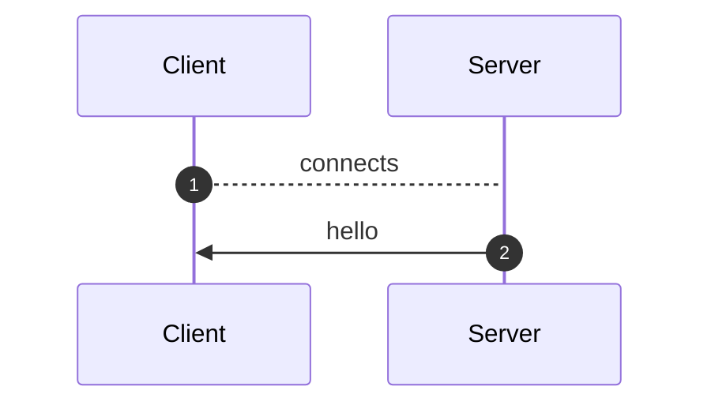
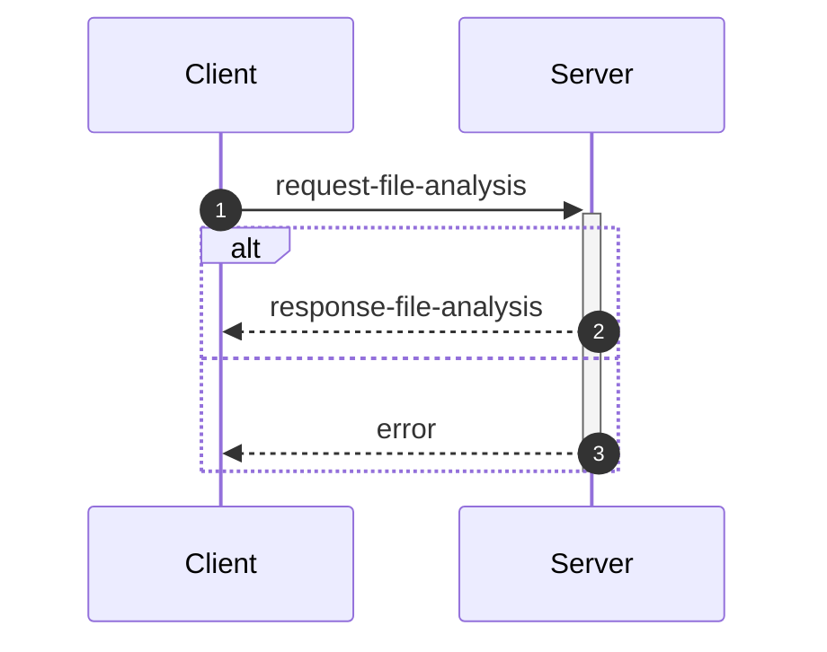
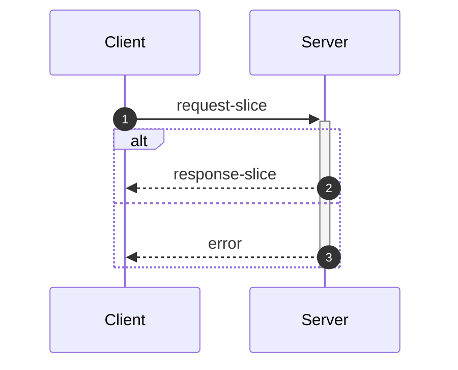

_This document was generated automatically from '/home/limerent/GitHub/phd/flowr/src/documentation/print-interface-wiki.ts' on 2024-09-28, 12:05:06 UTC presenting an overview of flowR's interfaces (version: 2.0.25, using R version 4.4.1)._

Although far from being as detailed as the in-depth explanation of
[_flowR_](https://github.com/flowr-analysis/flowr/wiki//Core),
this wiki page explains how to interface with _flowR_ in more detail.
In general, command line arguments and other options provide short descriptions on hover over.

[TODO: Table of Contents]

## 💬 Communicating with the Server


As explained in the [Overview](https://github.com/flowr-analysis/flowr/wiki//Overview), you can simply run the [TCP](https://de.wikipedia.org/wiki/Transmission_Control_Protocol)&nbsp;server by adding the <span title="Description: Do not drop into a repl, but instead start a server on the given port (default: 1042) and listen for messages.">`--server`</span> flag (and, due to the interactive mode, exit with the conventional <kbd>CTRL</kbd>+<kbd>C</kbd>).
Currently, every connection is handled by the same underlying `RShell` - so the server is not designed to handle many clients at a time.
Additionally, the server is not well guarded against attacks (e.g., you can theoretically spawn an arbitrary number of&nbsp;RShell sessions on the target machine).

Every message has to be given in a single line (i.e., without a newline in-between) and end with a newline character. Nevertheless, we will pretty-print example given in the following segments for the ease of reading.

> [!NOTE]
> The default <span title="Description: Do not drop into a repl, but instead start a server on the given port (default: 1042) and listen for messages.">`--server`</span> uses a simple [TCP](https://de.wikipedia.org/wiki/Transmission_Control_Protocol)
> connection. If you want _flowR_ to expose a [WebSocket](https://de.wikipedia.org/wiki/WebSocket) server instead, add the <span title="Description: Do not drop into a repl, but instead start a server on the given port (default: 1042) and listen for messages.">`--server`</span> flag (i.e., <span title="Description: Do not drop into a repl, but instead start a server on the given port (default: 1042) and listen for messages.">`--server`</span> <span title="Description: If the server flag is set, use websocket for messaging">`--ws`</span>) when starting _flowR_ from the command line.

<ul><li>
<a id="message-hello"></a>
<b>Hello</b> Message (<code>hello</code>, response) <br/> <i><span style="color:gray">The server informs the client about the successful connection and provides Meta-Information.</span></i> 
<details>

<summary> View Details </summary>

<details open>
<summary>Sequence Diagram</summary>



</details>


	
After launching _flowR_, for example, with <code>docker run -it --rm eagleoutpost/flowr <span title="Description: Do not drop into a repl, but instead start a server on the given port (default: 1042) and listen for messages.">-<span/>-server</span></code>&nbsp;(🐳️), simply connecting should present you with a `hello` message, that amongst others should reveal the versions of&nbsp;_flowR_ and&nbsp;R, using the [semver 2.0](https://semver.org/spec/v2.0.0.html) versioning scheme.
The message looks like this:

```json
{
  "type": "hello",
  "clientName": "client-0",
  "versions": {
    "flowr": "2.0.25",
    "r": "4.4.1"
  }
}
```

There are currently a few messages that you can send after the hello message.
If you want to *slice* a piece of R code you first have to send an [analysis request](#message-request-analysis), so that you can send one or multiple slice requests afterward.
Requests for the [REPL](#message-request-repl) are independent of that.
	

<hr>


<details>
<summary style="color:gray">Message schema (<code>hello</code>)</summary>

For the definition of the hello message, please see it's implementation at [`./src/cli/repl/server/messages/message-hello.ts`](https://github.com/flowr-analysis/flowr/tree/main/./src/cli/repl/server/messages/message-hello.ts).

- **.** object [required]
    - **type** string [required]
        _The&nbsp;type&nbsp;of&nbsp;the&nbsp;hello&nbsp;message._
        Allows only the values: 'hello'
    - **id** any [forbidden]
        _The&nbsp;id&nbsp;of&nbsp;the&nbsp;message&nbsp;is&nbsp;always&nbsp;undefined&nbsp;(as&nbsp;it&nbsp;is&nbsp;the&nbsp;initial&nbsp;message&nbsp;and&nbsp;not&nbsp;requested)._
    - **clientName** string [required]
        _A&nbsp;unique&nbsp;name&nbsp;that&nbsp;is&nbsp;assigned&nbsp;to&nbsp;each&nbsp;client.&nbsp;It&nbsp;has&nbsp;no&nbsp;semantic&nbsp;meaning&nbsp;and&nbsp;is&nbsp;only&nbsp;used/useful&nbsp;for&nbsp;debugging._
    - **versions** object [required]
        - **flowr** string [required]
            _The&nbsp;version&nbsp;of&nbsp;the&nbsp;flowr&nbsp;server&nbsp;running&nbsp;in&nbsp;semver&nbsp;format._
        - **r** string [required]
            _The&nbsp;version&nbsp;of&nbsp;the&nbsp;underlying&nbsp;R&nbsp;shell&nbsp;running&nbsp;in&nbsp;semver&nbsp;format._

</details>


<hr>

</details>	
	</li>

<li>
<a id="message-request-file-analysis"></a>
<b>Analysis</b> Message (<code>request-file-analysis</code>, request) <br/> <i><span style="color:gray">The server builds the dataflow graph for a given input file (or a set of files).</span></i> 
<details>

<summary> View Details </summary>

<details open>
<summary>Sequence Diagram</summary>



</details>


	
The request allows the server to analyze a file and prepare it for slicing.
The message can contain a `filetoken`, which is used to identify the file in later slice or lineage requests (if you do not add one, the request will not be stored and therefore, it is not available for subsequent requests).

> [!IMPORTANT]
> If you want to send and process a lot of analysis requests, but do not want to slice them, please do not pass the `filetoken` field. This will save the server a lot of memory allocation.

Furthermore, the request must contain either a `content` field to directly pass the file's content or a `filepath` field which contains the path to the file (this path must be accessible for the server to be useful).
If you add the `id` field, the answer will use the same `id` so you can match requests and the corresponding answers.
See the implementation of the request-file-analysis message for more information.


<details>
<summary>Example of <code>request-file-analysis</code> Message</summary>

_Note:_ even though we pretty-print these messages, they are sent as a single line, ending with a newline.

The following lists all messages that were sent and received in case you want to reproduce the scenario:


<details> 

<summary> (0) Response: <code>hello</code> Message</summary>

The first message is always a hello message.

```json
{
  "type": "hello",
  "clientName": "client-0",
  "versions": {
    "flowr": "2.0.25",
    "r": "4.4.1"
  }
}
```

</details>


<details open> 

<summary> (1) Request: <b><code>request-file-analysis</code> Message</b></summary>


```json
{
  "type": "request-file-analysis",
  "id": "1",
  "filetoken": "x",
  "content": "x <- 1\nx + 1"
}
```

</details>


<details> 

<summary> (2) Response: <code>response-file-analysis</code> Message</summary>


The `results` field of the response effectively contains three keys of importance:

- `parse`: which contains 1:1 the parse result in CSV format that we received from the `RShell` (i.e., the AST produced by the parser of the R interpreter).
- `normalize`: which contains the normalized AST, including ids (see the `info` field and the [Normalized AST](https://github.com/flowr-analysis/flowr/wiki//Normalized%20AST) wiki page).
- `dataflow`: especially important is the `graph` field which contains the dataflow graph as a set of root vertices (see the [Dataflow Graph](https://github.com/flowr-analysis/flowr/wiki//Dataflow%20Graph) wiki page).
			

```json
{
  "type": "response-file-analysis",
  "format": "json",
  "id": "1",
  "results": {
    "parse": "[1,1,1,6,7,0,\"expr\",false,\"x <- 1\"],[1,1,1,1,1,3,\"SYMBOL\",true,\"x\"],[1,1,1,1,3,7,\"expr\",false,\"x\"],[1,3,1,4,2,7,\"LEFT_ASSIGN\",true,\"<-\"],[1,6,1,6,4,5,\"NUM_CONST\",true,\"1\"],[1,6,1,6,5,7,\"expr\",false,\"1\"],[2,1,2,5,16,0,\"expr\",false,\"x + 1\"],[2,1,2,1,10,12,\"SYMBOL\",true,\"x\"],[2,1,2,1,12,16,\"expr\",false,\"x\"],[2,3,2,3,11,16,\"'+'\",true,\"+\"],[2,5,2,5,13,14,\"NUM_CONST\",true,\"1\"],[2,5,2,5,14,16,\"expr\",false,\"1\"]",
    "normalize": {
      "ast": {
        "type": "RExpressionList",
        "children": [
          {
            "type": "RBinaryOp",
            "location": [
              1,
              3,
              1,
              4
            ],
            "lhs": {
              "type": "RSymbol",
              "location": [
                1,
                1,
                1,
                1
              ],
              "content": "x",
              "lexeme": "x",
              "info": {
                "fullRange": [
                  1,
                  1,
                  1,
                  1
                ],
                "additionalTokens": [],
                "fullLexeme": "x",
                "id": 0,
                "parent": 2,
                "role": "binop-lhs",
                "index": 0,
                "nesting": 0
              }
            },
            "rhs": {
              "location": [
                1,
                6,
                1,
                6
              ],
              "lexeme": "1",
              "info": {
                "fullRange": [
                  1,
                  6,
                  1,
                  6
                ],
                "additionalTokens": [],
                "fullLexeme": "1",
                "id": 1,
                "parent": 2,
                "role": "binop-rhs",
                "index": 1,
                "nesting": 0
              },
              "type": "RNumber",
              "content": {
                "num": 1,
                "complexNumber": false,
                "markedAsInt": false
              }
            },
            "operator": "<-",
            "lexeme": "<-",
            "info": {
              "fullRange": [
                1,
                1,
                1,
                6
              ],
              "additionalTokens": [],
              "fullLexeme": "x <- 1",
              "id": 2,
              "parent": 6,
              "nesting": 0,
              "index": 0,
              "role": "expr-list-child"
            }
          },
          {
            "type": "RBinaryOp",
            "location": [
              2,
              3,
              2,
              3
            ],
            "lhs": {
              "type": "RSymbol",
              "location": [
                2,
                1,
                2,
                1
              ],
              "content": "x",
              "lexeme": "x",
              "info": {
                "fullRange": [
                  2,
                  1,
                  2,
                  1
                ],
                "additionalTokens": [],
                "fullLexeme": "x",
                "id": 3,
                "parent": 5,
                "role": "binop-lhs",
                "index": 0,
                "nesting": 0
              }
            },
            "rhs": {
              "location": [
                2,
                5,
                2,
                5
              ],
              "lexeme": "1",
              "info": {
                "fullRange": [
                  2,
                  5,
                  2,
                  5
                ],
                "additionalTokens": [],
                "fullLexeme": "1",
                "id": 4,
                "parent": 5,
                "role": "binop-rhs",
                "index": 1,
                "nesting": 0
              },
              "type": "RNumber",
              "content": {
                "num": 1,
                "complexNumber": false,
                "markedAsInt": false
              }
            },
            "operator": "+",
            "lexeme": "+",
            "info": {
              "fullRange": [
                2,
                1,
                2,
                5
              ],
              "additionalTokens": [],
              "fullLexeme": "x + 1",
              "id": 5,
              "parent": 6,
              "nesting": 0,
              "index": 1,
              "role": "expr-list-child"
            }
          }
        ],
        "info": {
          "additionalTokens": [],
          "id": 6,
          "nesting": 0,
          "role": "root",
          "index": 0
        }
      }
    },
    "dataflow": {
      "unknownReferences": [],
      "in": [
        {
          "nodeId": 2,
          "name": "<-",
          "type": 2
        },
        {
          "nodeId": 5,
          "name": "+",
          "type": 2
        }
      ],
      "out": [
        {
          "nodeId": 0,
          "name": "x",
          "type": 4,
          "definedAt": 2
        }
      ],
      "environment": {
        "current": {
          "id": 12,
          "parent": {
            "id": 0,
            "memory": [
              [
                "NULL",
                [
                  {
                    "type": 64,
                    "definedAt": "built-in",
                    "value": null,
                    "name": "NULL",
                    "nodeId": "built-in"
                  }
                ]
              ],
              [
                "NA",
                [
                  {
                    "type": 64,
                    "definedAt": "built-in",
                    "value": null,
                    "name": "NA",
                    "nodeId": "built-in"
                  }
                ]
              ],
              [
                "TRUE",
                [
                  {
                    "type": 64,
                    "definedAt": "built-in",
                    "value": true,
                    "name": "TRUE",
                    "nodeId": "built-in"
                  }
                ]
              ],
              [
                "T",
                [
                  {
                    "type": 64,
                    "definedAt": "built-in",
                    "value": true,
                    "name": "T",
                    "nodeId": "built-in"
                  }
                ]
              ],
              [
                "FALSE",
                [
                  {
                    "type": 64,
                    "definedAt": "built-in",
                    "value": false,
                    "name": "FALSE",
                    "nodeId": "built-in"
                  }
                ]
              ],
              [
                "F",
                [
                  {
                    "type": 64,
                    "definedAt": "built-in",
                    "value": false,
                    "name": "F",
                    "nodeId": "built-in"
                  }
                ]
              ],
              [
                "~",
                [
                  {
                    "type": 128,
                    "definedAt": "built-in",
                    "name": "~",
                    "nodeId": "built-in"
                  }
                ]
              ],
              [
                "+",
                [
                  {
                    "type": 128,
                    "definedAt": "built-in",
                    "name": "+",
                    "nodeId": "built-in"
                  }
                ]
              ],
              [
                "-",
                [
                  {
                    "type": 128,
                    "definedAt": "built-in",
                    "name": "-",
                    "nodeId": "built-in"
                  }
                ]
              ],
              [
                "*",
                [
                  {
                    "type": 128,
                    "definedAt": "built-in",
                    "name": "*",
                    "nodeId": "built-in"
                  }
                ]
              ],
              [
                "/",
                [
                  {
                    "type": 128,
                    "definedAt": "built-in",
                    "name": "/",
                    "nodeId": "built-in"
                  }
                ]
              ],
              [
                "^",
                [
                  {
                    "type": 128,
                    "definedAt": "built-in",
                    "name": "^",
                    "nodeId": "built-in"
                  }
                ]
              ],
              [
                "!",
                [
                  {
                    "type": 128,
                    "definedAt": "built-in",
                    "name": "!",
                    "nodeId": "built-in"
                  }
                ]
              ],
              [
                "?",
                [
                  {
                    "type": 128,
                    "definedAt": "built-in",
                    "name": "?",
                    "nodeId": "built-in"
                  }
                ]
              ],
              [
                "**",
                [
                  {
                    "type": 128,
                    "definedAt": "built-in",
                    "name": "**",
                    "nodeId": "built-in"
                  }
                ]
              ],
              [
                "==",
                [
                  {
                    "type": 128,
                    "definedAt": "built-in",
                    "name": "==",
                    "nodeId": "built-in"
                  }
                ]
              ],
              [
                "!=",
                [
                  {
                    "type": 128,
                    "definedAt": "built-in",
                    "name": "!=",
                    "nodeId": "built-in"
                  }
                ]
              ],
              [
                ">",
                [
                  {
                    "type": 128,
                    "definedAt": "built-in",
                    "name": ">",
                    "nodeId": "built-in"
                  }
                ]
              ],
              [
                "<",
                [
                  {
                    "type": 128,
                    "definedAt": "built-in",
                    "name": "<",
                    "nodeId": "built-in"
                  }
                ]
              ],
              [
                ">=",
                [
                  {
                    "type": 128,
                    "definedAt": "built-in",
                    "name": ">=",
                    "nodeId": "built-in"
                  }
                ]
              ],
              [
                "<=",
                [
                  {
                    "type": 128,
                    "definedAt": "built-in",
                    "name": "<=",
                    "nodeId": "built-in"
                  }
                ]
              ],
              [
                "%%",
                [
                  {
                    "type": 128,
                    "definedAt": "built-in",
                    "name": "%%",
                    "nodeId": "built-in"
                  }
                ]
              ],
              [
                "%/%",
                [
                  {
                    "type": 128,
                    "definedAt": "built-in",
                    "name": "%/%",
                    "nodeId": "built-in"
                  }
                ]
              ],
              [
                "%*%",
                [
                  {
                    "type": 128,
                    "definedAt": "built-in",
                    "name": "%*%",
                    "nodeId": "built-in"
                  }
                ]
              ],
              [
                "%in%",
                [
                  {
                    "type": 128,
                    "definedAt": "built-in",
                    "name": "%in%",
                    "nodeId": "built-in"
                  }
                ]
              ],
              [
                ":",
                [
                  {
                    "type": 128,
                    "definedAt": "built-in",
                    "name": ":",
                    "nodeId": "built-in"
                  }
                ]
              ],
              [
                "list",
                [
                  {
                    "type": 128,
                    "definedAt": "built-in",
                    "name": "list",
                    "nodeId": "built-in"
                  }
                ]
              ],
              [
                "c",
                [
                  {
                    "type": 128,
                    "definedAt": "built-in",
                    "name": "c",
                    "nodeId": "built-in"
                  }
                ]
              ],
              [
                "rep",
                [
                  {
                    "type": 128,
                    "definedAt": "built-in",
                    "name": "rep",
                    "nodeId": "built-in"
                  }
                ]
              ],
              [
                "seq",
                [
                  {
                    "type": 128,
                    "definedAt": "built-in",
                    "name": "seq",
                    "nodeId": "built-in"
                  }
                ]
              ],
              [
                "seq_len",
                [
                  {
                    "type": 128,
                    "definedAt": "built-in",
                    "name": "seq_len",
                    "nodeId": "built-in"
                  }
                ]
              ],
              [
                "seq_along",
                [
                  {
                    "type": 128,
                    "definedAt": "built-in",
                    "name": "seq_along",
                    "nodeId": "built-in"
                  }
                ]
              ],
              [
                "seq.int",
                [
                  {
                    "type": 128,
                    "definedAt": "built-in",
                    "name": "seq.int",
                    "nodeId": "built-in"
                  }
                ]
              ],
              [
                "gsub",
                [
                  {
                    "type": 128,
                    "definedAt": "built-in",
                    "name": "gsub",
                    "nodeId": "built-in"
                  }
                ]
              ],
              [
                "which",
                [
                  {
                    "type": 128,
                    "definedAt": "built-in",
                    "name": "which",
                    "nodeId": "built-in"
                  }
                ]
              ],
              [
                "class",
                [
                  {
                    "type": 128,
                    "definedAt": "built-in",
                    "name": "class",
                    "nodeId": "built-in"
                  }
                ]
              ],
              [
                "dimnames",
                [
                  {
                    "type": 128,
                    "definedAt": "built-in",
                    "name": "dimnames",
                    "nodeId": "built-in"
                  }
                ]
              ],
              [
                "min",
                [
                  {
                    "type": 128,
                    "definedAt": "built-in",
                    "name": "min",
                    "nodeId": "built-in"
                  }
                ]
              ],
              [
                "max",
                [
                  {
                    "type": 128,
                    "definedAt": "built-in",
                    "name": "max",
                    "nodeId": "built-in"
                  }
                ]
              ],
              [
                "intersect",
                [
                  {
                    "type": 128,
                    "definedAt": "built-in",
                    "name": "intersect",
                    "nodeId": "built-in"
                  }
                ]
              ],
              [
                "subset",
                [
                  {
                    "type": 128,
                    "definedAt": "built-in",
                    "name": "subset",
                    "nodeId": "built-in"
                  }
                ]
              ],
              [
                "match",
                [
                  {
                    "type": 128,
                    "definedAt": "built-in",
                    "name": "match",
                    "nodeId": "built-in"
                  }
                ]
              ],
              [
                "sqrt",
                [
                  {
                    "type": 128,
                    "definedAt": "built-in",
                    "name": "sqrt",
                    "nodeId": "built-in"
                  }
                ]
              ],
              [
                "abs",
                [
                  {
                    "type": 128,
                    "definedAt": "built-in",
                    "name": "abs",
                    "nodeId": "built-in"
                  }
                ]
              ],
              [
                "round",
                [
                  {
                    "type": 128,
                    "definedAt": "built-in",
                    "name": "round",
                    "nodeId": "built-in"
                  }
                ]
              ],
              [
                "floor",
                [
                  {
                    "type": 128,
                    "definedAt": "built-in",
                    "name": "floor",
                    "nodeId": "built-in"
                  }
                ]
              ],
              [
                "ceiling",
                [
                  {
                    "type": 128,
                    "definedAt": "built-in",
                    "name": "ceiling",
                    "nodeId": "built-in"
                  }
                ]
              ],
              [
                "signif",
                [
                  {
                    "type": 128,
                    "definedAt": "built-in",
                    "name": "signif",
                    "nodeId": "built-in"
                  }
                ]
              ],
              [
                "trunc",
                [
                  {
                    "type": 128,
                    "definedAt": "built-in",
                    "name": "trunc",
                    "nodeId": "built-in"
                  }
                ]
              ],
              [
                "log",
                [
                  {
                    "type": 128,
                    "definedAt": "built-in",
                    "name": "log",
                    "nodeId": "built-in"
                  }
                ]
              ],
              [
                "log10",
                [
                  {
                    "type": 128,
                    "definedAt": "built-in",
                    "name": "log10",
                    "nodeId": "built-in"
                  }
                ]
              ],
              [
                "log2",
                [
                  {
                    "type": 128,
                    "definedAt": "built-in",
                    "name": "log2",
                    "nodeId": "built-in"
                  }
                ]
              ],
              [
                "sum",
                [
                  {
                    "type": 128,
                    "definedAt": "built-in",
                    "name": "sum",
                    "nodeId": "built-in"
                  }
                ]
              ],
              [
                "mean",
                [
                  {
                    "type": 128,
                    "definedAt": "built-in",
                    "name": "mean",
                    "nodeId": "built-in"
                  }
                ]
              ],
              [
                "unique",
                [
                  {
                    "type": 128,
                    "definedAt": "built-in",
                    "name": "unique",
                    "nodeId": "built-in"
                  }
                ]
              ],
              [
                "paste",
                [
                  {
                    "type": 128,
                    "definedAt": "built-in",
                    "name": "paste",
                    "nodeId": "built-in"
                  }
                ]
              ],
              [
                "paste0",
                [
                  {
                    "type": 128,
                    "definedAt": "built-in",
                    "name": "paste0",
                    "nodeId": "built-in"
                  }
                ]
              ],
              [
                "read.csv",
                [
                  {
                    "type": 128,
                    "definedAt": "built-in",
                    "name": "read.csv",
                    "nodeId": "built-in"
                  }
                ]
              ],
              [
                "stop",
                [
                  {
                    "type": 128,
                    "definedAt": "built-in",
                    "name": "stop",
                    "nodeId": "built-in"
                  }
                ]
              ],
              [
                "is.null",
                [
                  {
                    "type": 128,
                    "definedAt": "built-in",
                    "name": "is.null",
                    "nodeId": "built-in"
                  }
                ]
              ],
              [
                "plot",
                [
                  {
                    "type": 128,
                    "definedAt": "built-in",
                    "name": "plot",
                    "nodeId": "built-in"
                  }
                ]
              ],
              [
                "numeric",
                [
                  {
                    "type": 128,
                    "definedAt": "built-in",
                    "name": "numeric",
                    "nodeId": "built-in"
                  }
                ]
              ],
              [
                "as.character",
                [
                  {
                    "type": 128,
                    "definedAt": "built-in",
                    "name": "as.character",
                    "nodeId": "built-in"
                  }
                ]
              ],
              [
                "as.integer",
                [
                  {
                    "type": 128,
                    "definedAt": "built-in",
                    "name": "as.integer",
                    "nodeId": "built-in"
                  }
                ]
              ],
              [
                "as.logical",
                [
                  {
                    "type": 128,
                    "definedAt": "built-in",
                    "name": "as.logical",
                    "nodeId": "built-in"
                  }
                ]
              ],
              [
                "as.numeric",
                [
                  {
                    "type": 128,
                    "definedAt": "built-in",
                    "name": "as.numeric",
                    "nodeId": "built-in"
                  }
                ]
              ],
              [
                "as.matrix",
                [
                  {
                    "type": 128,
                    "definedAt": "built-in",
                    "name": "as.matrix",
                    "nodeId": "built-in"
                  }
                ]
              ],
              [
                "do.call",
                [
                  {
                    "type": 128,
                    "definedAt": "built-in",
                    "name": "do.call",
                    "nodeId": "built-in"
                  }
                ]
              ],
              [
                "rbind",
                [
                  {
                    "type": 128,
                    "definedAt": "built-in",
                    "name": "rbind",
                    "nodeId": "built-in"
                  }
                ]
              ],
              [
                "nrow",
                [
                  {
                    "type": 128,
                    "definedAt": "built-in",
                    "name": "nrow",
                    "nodeId": "built-in"
                  }
                ]
              ],
              [
                "ncol",
                [
                  {
                    "type": 128,
                    "definedAt": "built-in",
                    "name": "ncol",
                    "nodeId": "built-in"
                  }
                ]
              ],
              [
                "tryCatch",
                [
                  {
                    "type": 128,
                    "definedAt": "built-in",
                    "name": "tryCatch",
                    "nodeId": "built-in"
                  }
                ]
              ],
              [
                "expression",
                [
                  {
                    "type": 128,
                    "definedAt": "built-in",
                    "name": "expression",
                    "nodeId": "built-in"
                  }
                ]
              ],
              [
                "factor",
                [
                  {
                    "type": 128,
                    "definedAt": "built-in",
                    "name": "factor",
                    "nodeId": "built-in"
                  }
                ]
              ],
              [
                "missing",
                [
                  {
                    "type": 128,
                    "definedAt": "built-in",
                    "name": "missing",
                    "nodeId": "built-in"
                  }
                ]
              ],
              [
                "as.data.frame",
                [
                  {
                    "type": 128,
                    "definedAt": "built-in",
                    "name": "as.data.frame",
                    "nodeId": "built-in"
                  }
                ]
              ],
              [
                "data.frame",
                [
                  {
                    "type": 128,
                    "definedAt": "built-in",
                    "name": "data.frame",
                    "nodeId": "built-in"
                  }
                ]
              ],
              [
                "na.omit",
                [
                  {
                    "type": 128,
                    "definedAt": "built-in",
                    "name": "na.omit",
                    "nodeId": "built-in"
                  }
                ]
              ],
              [
                "rownames",
                [
                  {
                    "type": 128,
                    "definedAt": "built-in",
                    "name": "rownames",
                    "nodeId": "built-in"
                  }
                ]
              ],
              [
                "names",
                [
                  {
                    "type": 128,
                    "definedAt": "built-in",
                    "name": "names",
                    "nodeId": "built-in"
                  }
                ]
              ],
              [
                "order",
                [
                  {
                    "type": 128,
                    "definedAt": "built-in",
                    "name": "order",
                    "nodeId": "built-in"
                  }
                ]
              ],
              [
                "length",
                [
                  {
                    "type": 128,
                    "definedAt": "built-in",
                    "name": "length",
                    "nodeId": "built-in"
                  }
                ]
              ],
              [
                "any",
                [
                  {
                    "type": 128,
                    "definedAt": "built-in",
                    "name": "any",
                    "nodeId": "built-in"
                  }
                ]
              ],
              [
                "dim",
                [
                  {
                    "type": 128,
                    "definedAt": "built-in",
                    "name": "dim",
                    "nodeId": "built-in"
                  }
                ]
              ],
              [
                "matrix",
                [
                  {
                    "type": 128,
                    "definedAt": "built-in",
                    "name": "matrix",
                    "nodeId": "built-in"
                  }
                ]
              ],
              [
                "cbind",
                [
                  {
                    "type": 128,
                    "definedAt": "built-in",
                    "name": "cbind",
                    "nodeId": "built-in"
                  }
                ]
              ],
              [
                "nchar",
                [
                  {
                    "type": 128,
                    "definedAt": "built-in",
                    "name": "nchar",
                    "nodeId": "built-in"
                  }
                ]
              ],
              [
                "t",
                [
                  {
                    "type": 128,
                    "definedAt": "built-in",
                    "name": "t",
                    "nodeId": "built-in"
                  }
                ]
              ],
              [
                "options",
                [
                  {
                    "type": 128,
                    "definedAt": "built-in",
                    "name": "options",
                    "nodeId": "built-in"
                  }
                ]
              ],
              [
                "mapply",
                [
                  {
                    "type": 128,
                    "definedAt": "built-in",
                    "name": "mapply",
                    "nodeId": "built-in"
                  }
                ]
              ],
              [
                "Mapply",
                [
                  {
                    "type": 128,
                    "definedAt": "built-in",
                    "name": "Mapply",
                    "nodeId": "built-in"
                  }
                ]
              ],
              [
                "lapply",
                [
                  {
                    "type": 128,
                    "definedAt": "built-in",
                    "name": "lapply",
                    "nodeId": "built-in"
                  }
                ]
              ],
              [
                "sapply",
                [
                  {
                    "type": 128,
                    "definedAt": "built-in",
                    "name": "sapply",
                    "nodeId": "built-in"
                  }
                ]
              ],
              [
                "vapply",
                [
                  {
                    "type": 128,
                    "definedAt": "built-in",
                    "name": "vapply",
                    "nodeId": "built-in"
                  }
                ]
              ],
              [
                "Lapply",
                [
                  {
                    "type": 128,
                    "definedAt": "built-in",
                    "name": "Lapply",
                    "nodeId": "built-in"
                  }
                ]
              ],
              [
                "Sapply",
                [
                  {
                    "type": 128,
                    "definedAt": "built-in",
                    "name": "Sapply",
                    "nodeId": "built-in"
                  }
                ]
              ],
              [
                "Vapply",
                [
                  {
                    "type": 128,
                    "definedAt": "built-in",
                    "name": "Vapply",
                    "nodeId": "built-in"
                  }
                ]
              ],
              [
                "apply",
                [
                  {
                    "type": 128,
                    "definedAt": "built-in",
                    "name": "apply",
                    "nodeId": "built-in"
                  }
                ]
              ],
              [
                "tapply",
                [
                  {
                    "type": 128,
                    "definedAt": "built-in",
                    "name": "tapply",
                    "nodeId": "built-in"
                  }
                ]
              ],
              [
                "Tapply",
                [
                  {
                    "type": 128,
                    "definedAt": "built-in",
                    "name": "Tapply",
                    "nodeId": "built-in"
                  }
                ]
              ],
              [
                "print",
                [
                  {
                    "type": 128,
                    "definedAt": "built-in",
                    "name": "print",
                    "nodeId": "built-in"
                  }
                ]
              ],
              [
                "(",
                [
                  {
                    "type": 128,
                    "definedAt": "built-in",
                    "name": "(",
                    "nodeId": "built-in"
                  }
                ]
              ],
              [
                "load",
                [
                  {
                    "type": 128,
                    "definedAt": "built-in",
                    "name": "load",
                    "nodeId": "built-in"
                  }
                ]
              ],
              [
                "load_all",
                [
                  {
                    "type": 128,
                    "definedAt": "built-in",
                    "name": "load_all",
                    "nodeId": "built-in"
                  }
                ]
              ],
              [
                "setwd",
                [
                  {
                    "type": 128,
                    "definedAt": "built-in",
                    "name": "setwd",
                    "nodeId": "built-in"
                  }
                ]
              ],
              [
                "set.seed",
                [
                  {
                    "type": 128,
                    "definedAt": "built-in",
                    "name": "set.seed",
                    "nodeId": "built-in"
                  }
                ]
              ],
              [
                "eval",
                [
                  {
                    "type": 128,
                    "definedAt": "built-in",
                    "name": "eval",
                    "nodeId": "built-in"
                  }
                ]
              ],
              [
                "body",
                [
                  {
                    "type": 128,
                    "definedAt": "built-in",
                    "name": "body",
                    "nodeId": "built-in"
                  }
                ]
              ],
              [
                "formals",
                [
                  {
                    "type": 128,
                    "definedAt": "built-in",
                    "name": "formals",
                    "nodeId": "built-in"
                  }
                ]
              ],
              [
                "environment",
                [
                  {
                    "type": 128,
                    "definedAt": "built-in",
                    "name": "environment",
                    "nodeId": "built-in"
                  }
                ]
              ],
              [
                "cat",
                [
                  {
                    "type": 128,
                    "definedAt": "built-in",
                    "name": "cat",
                    "nodeId": "built-in"
                  }
                ]
              ],
              [
                "switch",
                [
                  {
                    "type": 128,
                    "definedAt": "built-in",
                    "name": "switch",
                    "nodeId": "built-in"
                  }
                ]
              ],
              [
                "return",
                [
                  {
                    "type": 128,
                    "definedAt": "built-in",
                    "name": "return",
                    "nodeId": "built-in"
                  }
                ]
              ],
              [
                "break",
                [
                  {
                    "type": 128,
                    "definedAt": "built-in",
                    "name": "break",
                    "nodeId": "built-in"
                  }
                ]
              ],
              [
                "next",
                [
                  {
                    "type": 128,
                    "definedAt": "built-in",
                    "name": "next",
                    "nodeId": "built-in"
                  }
                ]
              ],
              [
                "{",
                [
                  {
                    "type": 128,
                    "definedAt": "built-in",
                    "name": "{",
                    "nodeId": "built-in"
                  }
                ]
              ],
              [
                "source",
                [
                  {
                    "type": 128,
                    "definedAt": "built-in",
                    "name": "source",
                    "nodeId": "built-in"
                  }
                ]
              ],
              [
                "[",
                [
                  {
                    "type": 128,
                    "definedAt": "built-in",
                    "name": "[",
                    "nodeId": "built-in"
                  }
                ]
              ],
              [
                "[[",
                [
                  {
                    "type": 128,
                    "definedAt": "built-in",
                    "name": "[[",
                    "nodeId": "built-in"
                  }
                ]
              ],
              [
                "$",
                [
                  {
                    "type": 128,
                    "definedAt": "built-in",
                    "name": "$",
                    "nodeId": "built-in"
                  }
                ]
              ],
              [
                "@",
                [
                  {
                    "type": 128,
                    "definedAt": "built-in",
                    "name": "@",
                    "nodeId": "built-in"
                  }
                ]
              ],
              [
                "if",
                [
                  {
                    "type": 128,
                    "definedAt": "built-in",
                    "name": "if",
                    "nodeId": "built-in"
                  }
                ]
              ],
              [
                "ifelse",
                [
                  {
                    "type": 128,
                    "definedAt": "built-in",
                    "name": "ifelse",
                    "nodeId": "built-in"
                  }
                ]
              ],
              [
                "get",
                [
                  {
                    "type": 128,
                    "definedAt": "built-in",
                    "name": "get",
                    "nodeId": "built-in"
                  }
                ]
              ],
              [
                "library",
                [
                  {
                    "type": 128,
                    "definedAt": "built-in",
                    "name": "library",
                    "nodeId": "built-in"
                  }
                ]
              ],
              [
                "require",
                [
                  {
                    "type": 128,
                    "definedAt": "built-in",
                    "name": "require",
                    "nodeId": "built-in"
                  }
                ]
              ],
              [
                "<-",
                [
                  {
                    "type": 128,
                    "definedAt": "built-in",
                    "name": "<-",
                    "nodeId": "built-in"
                  }
                ]
              ],
              [
                "=",
                [
                  {
                    "type": 128,
                    "definedAt": "built-in",
                    "name": "=",
                    "nodeId": "built-in"
                  }
                ]
              ],
              [
                ":=",
                [
                  {
                    "type": 128,
                    "definedAt": "built-in",
                    "name": ":=",
                    "nodeId": "built-in"
                  }
                ]
              ],
              [
                "assign",
                [
                  {
                    "type": 128,
                    "definedAt": "built-in",
                    "name": "assign",
                    "nodeId": "built-in"
                  }
                ]
              ],
              [
                "delayedAssign",
                [
                  {
                    "type": 128,
                    "definedAt": "built-in",
                    "name": "delayedAssign",
                    "nodeId": "built-in"
                  }
                ]
              ],
              [
                "<<-",
                [
                  {
                    "type": 128,
                    "definedAt": "built-in",
                    "name": "<<-",
                    "nodeId": "built-in"
                  }
                ]
              ],
              [
                "->",
                [
                  {
                    "type": 128,
                    "definedAt": "built-in",
                    "name": "->",
                    "nodeId": "built-in"
                  }
                ]
              ],
              [
                "->>",
                [
                  {
                    "type": 128,
                    "definedAt": "built-in",
                    "name": "->>",
                    "nodeId": "built-in"
                  }
                ]
              ],
              [
                "&&",
                [
                  {
                    "type": 128,
                    "definedAt": "built-in",
                    "name": "&&",
                    "nodeId": "built-in"
                  }
                ]
              ],
              [
                "&",
                [
                  {
                    "type": 128,
                    "definedAt": "built-in",
                    "name": "&",
                    "nodeId": "built-in"
                  }
                ]
              ],
              [
                "||",
                [
                  {
                    "type": 128,
                    "definedAt": "built-in",
                    "name": "||",
                    "nodeId": "built-in"
                  }
                ]
              ],
              [
                "|",
                [
                  {
                    "type": 128,
                    "definedAt": "built-in",
                    "name": "|",
                    "nodeId": "built-in"
                  }
                ]
              ],
              [
                "|>",
                [
                  {
                    "type": 128,
                    "definedAt": "built-in",
                    "name": "|>",
                    "nodeId": "built-in"
                  }
                ]
              ],
              [
                "%>%",
                [
                  {
                    "type": 128,
                    "definedAt": "built-in",
                    "name": "%>%",
                    "nodeId": "built-in"
                  }
                ]
              ],
              [
                "function",
                [
                  {
                    "type": 128,
                    "definedAt": "built-in",
                    "name": "function",
                    "nodeId": "built-in"
                  }
                ]
              ],
              [
                "\\",
                [
                  {
                    "type": 128,
                    "definedAt": "built-in",
                    "name": "\\",
                    "nodeId": "built-in"
                  }
                ]
              ],
              [
                "quote",
                [
                  {
                    "type": 128,
                    "definedAt": "built-in",
                    "name": "quote",
                    "nodeId": "built-in"
                  }
                ]
              ],
              [
                "substitute",
                [
                  {
                    "type": 128,
                    "definedAt": "built-in",
                    "name": "substitute",
                    "nodeId": "built-in"
                  }
                ]
              ],
              [
                "bquote",
                [
                  {
                    "type": 128,
                    "definedAt": "built-in",
                    "name": "bquote",
                    "nodeId": "built-in"
                  }
                ]
              ],
              [
                "for",
                [
                  {
                    "type": 128,
                    "definedAt": "built-in",
                    "name": "for",
                    "nodeId": "built-in"
                  }
                ]
              ],
              [
                "repeat",
                [
                  {
                    "type": 128,
                    "definedAt": "built-in",
                    "name": "repeat",
                    "nodeId": "built-in"
                  }
                ]
              ],
              [
                "while",
                [
                  {
                    "type": 128,
                    "definedAt": "built-in",
                    "name": "while",
                    "nodeId": "built-in"
                  }
                ]
              ],
              [
                "on.exit",
                [
                  {
                    "type": 128,
                    "definedAt": "built-in",
                    "name": "on.exit",
                    "nodeId": "built-in"
                  }
                ]
              ],
              [
                "sys.on.exit",
                [
                  {
                    "type": 128,
                    "definedAt": "built-in",
                    "name": "sys.on.exit",
                    "nodeId": "built-in"
                  }
                ]
              ],
              [
                "par",
                [
                  {
                    "type": 128,
                    "definedAt": "built-in",
                    "name": "par",
                    "nodeId": "built-in"
                  }
                ]
              ],
              [
                "setnames",
                [
                  {
                    "type": 128,
                    "definedAt": "built-in",
                    "name": "setnames",
                    "nodeId": "built-in"
                  }
                ]
              ],
              [
                "setNames",
                [
                  {
                    "type": 128,
                    "definedAt": "built-in",
                    "name": "setNames",
                    "nodeId": "built-in"
                  }
                ]
              ],
              [
                "setkey",
                [
                  {
                    "type": 128,
                    "definedAt": "built-in",
                    "name": "setkey",
                    "nodeId": "built-in"
                  }
                ]
              ],
              [
                "setkeyv",
                [
                  {
                    "type": 128,
                    "definedAt": "built-in",
                    "name": "setkeyv",
                    "nodeId": "built-in"
                  }
                ]
              ],
              [
                "setindex",
                [
                  {
                    "type": 128,
                    "definedAt": "built-in",
                    "name": "setindex",
                    "nodeId": "built-in"
                  }
                ]
              ],
              [
                "setindexv",
                [
                  {
                    "type": 128,
                    "definedAt": "built-in",
                    "name": "setindexv",
                    "nodeId": "built-in"
                  }
                ]
              ],
              [
                "setattr",
                [
                  {
                    "type": 128,
                    "definedAt": "built-in",
                    "name": "setattr",
                    "nodeId": "built-in"
                  }
                ]
              ],
              [
                "sink",
                [
                  {
                    "type": 128,
                    "definedAt": "built-in",
                    "name": "sink",
                    "nodeId": "built-in"
                  }
                ]
              ],
              [
                "requireNamespace",
                [
                  {
                    "type": 128,
                    "definedAt": "built-in",
                    "name": "requireNamespace",
                    "nodeId": "built-in"
                  }
                ]
              ],
              [
                "loadNamespace",
                [
                  {
                    "type": 128,
                    "definedAt": "built-in",
                    "name": "loadNamespace",
                    "nodeId": "built-in"
                  }
                ]
              ],
              [
                "attachNamespace",
                [
                  {
                    "type": 128,
                    "definedAt": "built-in",
                    "name": "attachNamespace",
                    "nodeId": "built-in"
                  }
                ]
              ],
              [
                "asNamespace",
                [
                  {
                    "type": 128,
                    "definedAt": "built-in",
                    "name": "asNamespace",
                    "nodeId": "built-in"
                  }
                ]
              ],
              [
                "library.dynam",
                [
                  {
                    "type": 128,
                    "definedAt": "built-in",
                    "name": "library.dynam",
                    "nodeId": "built-in"
                  }
                ]
              ],
              [
                "install.packages",
                [
                  {
                    "type": 128,
                    "definedAt": "built-in",
                    "name": "install.packages",
                    "nodeId": "built-in"
                  }
                ]
              ],
              [
                "install",
                [
                  {
                    "type": 128,
                    "definedAt": "built-in",
                    "name": "install",
                    "nodeId": "built-in"
                  }
                ]
              ],
              [
                "install_github",
                [
                  {
                    "type": 128,
                    "definedAt": "built-in",
                    "name": "install_github",
                    "nodeId": "built-in"
                  }
                ]
              ],
              [
                "install_gitlab",
                [
                  {
                    "type": 128,
                    "definedAt": "built-in",
                    "name": "install_gitlab",
                    "nodeId": "built-in"
                  }
                ]
              ],
              [
                "install_bitbucket",
                [
                  {
                    "type": 128,
                    "definedAt": "built-in",
                    "name": "install_bitbucket",
                    "nodeId": "built-in"
                  }
                ]
              ],
              [
                "install_url",
                [
                  {
                    "type": 128,
                    "definedAt": "built-in",
                    "name": "install_url",
                    "nodeId": "built-in"
                  }
                ]
              ],
              [
                "install_git",
                [
                  {
                    "type": 128,
                    "definedAt": "built-in",
                    "name": "install_git",
                    "nodeId": "built-in"
                  }
                ]
              ],
              [
                "install_svn",
                [
                  {
                    "type": 128,
                    "definedAt": "built-in",
                    "name": "install_svn",
                    "nodeId": "built-in"
                  }
                ]
              ],
              [
                "install_local",
                [
                  {
                    "type": 128,
                    "definedAt": "built-in",
                    "name": "install_local",
                    "nodeId": "built-in"
                  }
                ]
              ],
              [
                "install_version",
                [
                  {
                    "type": 128,
                    "definedAt": "built-in",
                    "name": "install_version",
                    "nodeId": "built-in"
                  }
                ]
              ],
              [
                "update_packages",
                [
                  {
                    "type": 128,
                    "definedAt": "built-in",
                    "name": "update_packages",
                    "nodeId": "built-in"
                  }
                ]
              ],
              [
                "attach",
                [
                  {
                    "type": 128,
                    "definedAt": "built-in",
                    "name": "attach",
                    "nodeId": "built-in"
                  }
                ]
              ],
              [
                "detach",
                [
                  {
                    "type": 128,
                    "definedAt": "built-in",
                    "name": "detach",
                    "nodeId": "built-in"
                  }
                ]
              ],
              [
                "unname",
                [
                  {
                    "type": 128,
                    "definedAt": "built-in",
                    "name": "unname",
                    "nodeId": "built-in"
                  }
                ]
              ],
              [
                "rm",
                [
                  {
                    "type": 128,
                    "definedAt": "built-in",
                    "name": "rm",
                    "nodeId": "built-in"
                  }
                ]
              ],
              [
                "remove",
                [
                  {
                    "type": 128,
                    "definedAt": "built-in",
                    "name": "remove",
                    "nodeId": "built-in"
                  }
                ]
              ],
              [
                "[<-",
                [
                  {
                    "type": 128,
                    "definedAt": "built-in",
                    "name": "[<-",
                    "nodeId": "built-in"
                  }
                ]
              ],
              [
                "[<<-",
                [
                  {
                    "type": 128,
                    "definedAt": "built-in",
                    "name": "[<<-",
                    "nodeId": "built-in"
                  }
                ]
              ],
              [
                "[[<-",
                [
                  {
                    "type": 128,
                    "definedAt": "built-in",
                    "name": "[[<-",
                    "nodeId": "built-in"
                  }
                ]
              ],
              [
                "[[<<-",
                [
                  {
                    "type": 128,
                    "definedAt": "built-in",
                    "name": "[[<<-",
                    "nodeId": "built-in"
                  }
                ]
              ],
              [
                "$<-",
                [
                  {
                    "type": 128,
                    "definedAt": "built-in",
                    "name": "$<-",
                    "nodeId": "built-in"
                  }
                ]
              ],
              [
                "$<<-",
                [
                  {
                    "type": 128,
                    "definedAt": "built-in",
                    "name": "$<<-",
                    "nodeId": "built-in"
                  }
                ]
              ],
              [
                "@<-",
                [
                  {
                    "type": 128,
                    "definedAt": "built-in",
                    "name": "@<-",
                    "nodeId": "built-in"
                  }
                ]
              ],
              [
                "@<<-",
                [
                  {
                    "type": 128,
                    "definedAt": "built-in",
                    "name": "@<<-",
                    "nodeId": "built-in"
                  }
                ]
              ],
              [
                "names<-",
                [
                  {
                    "type": 128,
                    "definedAt": "built-in",
                    "name": "names<-",
                    "nodeId": "built-in"
                  }
                ]
              ],
              [
                "names<<-",
                [
                  {
                    "type": 128,
                    "definedAt": "built-in",
                    "name": "names<<-",
                    "nodeId": "built-in"
                  }
                ]
              ],
              [
                "dimnames<-",
                [
                  {
                    "type": 128,
                    "definedAt": "built-in",
                    "name": "dimnames<-",
                    "nodeId": "built-in"
                  }
                ]
              ],
              [
                "dimnames<<-",
                [
                  {
                    "type": 128,
                    "definedAt": "built-in",
                    "name": "dimnames<<-",
                    "nodeId": "built-in"
                  }
                ]
              ],
              [
                "attributes<-",
                [
                  {
                    "type": 128,
                    "definedAt": "built-in",
                    "name": "attributes<-",
                    "nodeId": "built-in"
                  }
                ]
              ],
              [
                "attributes<<-",
                [
                  {
                    "type": 128,
                    "definedAt": "built-in",
                    "name": "attributes<<-",
                    "nodeId": "built-in"
                  }
                ]
              ],
              [
                "attr<-",
                [
                  {
                    "type": 128,
                    "definedAt": "built-in",
                    "name": "attr<-",
                    "nodeId": "built-in"
                  }
                ]
              ],
              [
                "attr<<-",
                [
                  {
                    "type": 128,
                    "definedAt": "built-in",
                    "name": "attr<<-",
                    "nodeId": "built-in"
                  }
                ]
              ],
              [
                "class<-",
                [
                  {
                    "type": 128,
                    "definedAt": "built-in",
                    "name": "class<-",
                    "nodeId": "built-in"
                  }
                ]
              ],
              [
                "class<<-",
                [
                  {
                    "type": 128,
                    "definedAt": "built-in",
                    "name": "class<<-",
                    "nodeId": "built-in"
                  }
                ]
              ],
              [
                "levels<-",
                [
                  {
                    "type": 128,
                    "definedAt": "built-in",
                    "name": "levels<-",
                    "nodeId": "built-in"
                  }
                ]
              ],
              [
                "levels<<-",
                [
                  {
                    "type": 128,
                    "definedAt": "built-in",
                    "name": "levels<<-",
                    "nodeId": "built-in"
                  }
                ]
              ],
              [
                "rownames<-",
                [
                  {
                    "type": 128,
                    "definedAt": "built-in",
                    "name": "rownames<-",
                    "nodeId": "built-in"
                  }
                ]
              ],
              [
                "rownames<<-",
                [
                  {
                    "type": 128,
                    "definedAt": "built-in",
                    "name": "rownames<<-",
                    "nodeId": "built-in"
                  }
                ]
              ],
              [
                "colnames<-",
                [
                  {
                    "type": 128,
                    "definedAt": "built-in",
                    "name": "colnames<-",
                    "nodeId": "built-in"
                  }
                ]
              ],
              [
                "colnames<<-",
                [
                  {
                    "type": 128,
                    "definedAt": "built-in",
                    "name": "colnames<<-",
                    "nodeId": "built-in"
                  }
                ]
              ],
              [
                "body<-",
                [
                  {
                    "type": 128,
                    "definedAt": "built-in",
                    "name": "body<-",
                    "nodeId": "built-in"
                  }
                ]
              ],
              [
                "body<<-",
                [
                  {
                    "type": 128,
                    "definedAt": "built-in",
                    "name": "body<<-",
                    "nodeId": "built-in"
                  }
                ]
              ],
              [
                "environment<-",
                [
                  {
                    "type": 128,
                    "definedAt": "built-in",
                    "name": "environment<-",
                    "nodeId": "built-in"
                  }
                ]
              ],
              [
                "environment<<-",
                [
                  {
                    "type": 128,
                    "definedAt": "built-in",
                    "name": "environment<<-",
                    "nodeId": "built-in"
                  }
                ]
              ],
              [
                "formals<-",
                [
                  {
                    "type": 128,
                    "definedAt": "built-in",
                    "name": "formals<-",
                    "nodeId": "built-in"
                  }
                ]
              ],
              [
                "formals<<-",
                [
                  {
                    "type": 128,
                    "definedAt": "built-in",
                    "name": "formals<<-",
                    "nodeId": "built-in"
                  }
                ]
              ]
            ]
          },
          "memory": [
            [
              "x",
              [
                {
                  "nodeId": 0,
                  "name": "x",
                  "type": 4,
                  "definedAt": 2
                }
              ]
            ]
          ]
        },
        "level": 0
      },
      "graph": {
        "_unknownSideEffects": [],
        "rootVertices": [
          1,
          0,
          2,
          3,
          4,
          5
        ],
        "vertexInformation": [
          [
            1,
            {
              "tag": "value",
              "id": 1
            }
          ],
          [
            0,
            {
              "tag": "variable-definition",
              "id": 0
            }
          ],
          [
            2,
            {
              "tag": "function-call",
              "id": 2,
              "name": "<-",
              "onlyBuiltin": true,
              "args": [
                {
                  "nodeId": 0,
                  "type": 32
                },
                {
                  "nodeId": 1,
                  "type": 32
                }
              ]
            }
          ],
          [
            3,
            {
              "tag": "use",
              "id": 3
            }
          ],
          [
            4,
            {
              "tag": "value",
              "id": 4
            }
          ],
          [
            5,
            {
              "tag": "function-call",
              "id": 5,
              "name": "+",
              "onlyBuiltin": true,
              "args": [
                {
                  "nodeId": 3,
                  "type": 32
                },
                {
                  "nodeId": 4,
                  "type": 32
                }
              ]
            }
          ]
        ],
        "edgeInformation": [
          [
            2,
            [
              [
                1,
                {
                  "types": 64
                }
              ],
              [
                0,
                {
                  "types": 72
                }
              ]
            ]
          ],
          [
            0,
            [
              [
                1,
                {
                  "types": 2
                }
              ],
              [
                2,
                {
                  "types": 2
                }
              ]
            ]
          ],
          [
            3,
            [
              [
                0,
                {
                  "types": 1
                }
              ]
            ]
          ],
          [
            5,
            [
              [
                3,
                {
                  "types": 65
                }
              ],
              [
                4,
                {
                  "types": 65
                }
              ]
            ]
          ]
        ]
      },
      "entryPoint": 2,
      "exitPoints": [
        {
          "type": 0,
          "nodeId": 5
        }
      ]
    }
  }
}
```

</details>


The complete round-trip took 12.43 ms (including time required to validate the messages, start, and stop the internal mock server).

</details>


You receive an error if, for whatever reason, the analysis fails (e.g., the message or code you sent contained syntax errors).
It contains a human-readable description *why* the analysis failed (see the error message implementation for more details).


<details>
<summary>Example Error Message</summary>

_Note:_ even though we pretty-print these messages, they are sent as a single line, ending with a newline.

The following lists all messages that were sent and received in case you want to reproduce the scenario:


<details> 

<summary> (0) Response: <code>hello</code> Message</summary>

The first message is always a hello message.

```json
{
  "type": "hello",
  "clientName": "client-0",
  "versions": {
    "flowr": "2.0.25",
    "r": "4.4.1"
  }
}
```

</details>


<details> 

<summary> (1) Request: <code>request-file-analysis</code> Message</summary>


```json
{
  "type": "request-file-analysis",
  "id": "1",
  "filename": "sample.R",
  "content": "x <-"
}
```

</details>


<details open> 

<summary> (2) Response: <b><code>error</code> Message</b></summary>


```json
{
  "id": "1",
  "type": "error",
  "fatal": false,
  "reason": "Error while analyzing file sample.R: GuardError: unable to parse R code (see the log for more information) for request {\"request\":\"file\",\"content\":\"/tmp/tmp-88738-TE73Tok4JsRB-.R\"}}"
}
```

</details>


The complete round-trip took 1.10 ms (including time required to validate the messages, start, and stop the internal mock server).

</details>


&nbsp;

<a id="analysis-include-cfg"></a>
**Including the Control Flow Graph**

While _flowR_ does (for the time being) not use an explicit control flow graph but instead relies on control-dependency edges within the dataflow graph, 
the respective structure can still be exposed using the server (note that, as this feature is not needed within _flowR_, it is tested significantly less - 
so please create a [new issue](https://github.com/flowr-analysis/flowr/issues/new/choose) for any bug you may encounter).
For this, the analysis request may add `cfg: true` to its list of options.


<details>
<summary>Requesting a Control Flow Graph</summary>

_Note:_ even though we pretty-print these messages, they are sent as a single line, ending with a newline.

The following lists all messages that were sent and received in case you want to reproduce the scenario:


<details> 

<summary> (0) Response: <code>hello</code> Message</summary>

The first message is always a hello message.

```json
{
  "type": "hello",
  "clientName": "client-0",
  "versions": {
    "flowr": "2.0.25",
    "r": "4.4.1"
  }
}
```

</details>


<details open> 

<summary> (1) Request: <b><code>request-file-analysis</code> Message</b></summary>


```json
{
  "type": "request-file-analysis",
  "id": "1",
  "filetoken": "x",
  "content": "if(unknown > 0) { x <- 2 } else { x <- 5 }\nfor(i in 1:x) { print(x); print(i) }",
  "cfg": true
}
```

</details>


<details> 

<summary> (2) Response: <code>response-file-analysis</code> Message</summary>


The response looks basically the same as a response sent without the `cfg` flag. However, additionally it contains a `cfg` field. 
If you are interested in a visual representation of the control flow graph, see the 
[visualization with mermaid](https://mermaid.live/view#base64:eyJjb2RlIjoiZmxvd2NoYXJ0IFREXG4gICAgbjE1W1wiYFJJZlRoZW5FbHNlICgxNSlcbiMzNDtpZih1bmtub3duICM2MjsgMCkgIzEyMzsgeCAjNjA7IzQ1OyAyICMxMjU7IGVsc2UgIzEyMzsgeCAjNjA7IzQ1OyA1ICMxMjU7IzM0O2BcIl1cbiAgICBuMTUtZXhpdCgoICkpXG4gICAgbjBbXCJgUlN5bWJvbCAoMClcbiMzNDt1bmtub3duIzM0O2BcIl1cbiAgICBuMVtcImBSTnVtYmVyICgxKVxuIzM0OzAjMzQ7YFwiXVxuICAgIG4yW1wiYFJCaW5hcnlPcCAoMilcbiMzNDt1bmtub3duICM2MjsgMCMzNDtgXCJdXG4gICAgbjItZXhpdCgoICkpXG4gICAgbjVbXCJgUlN5bWJvbCAoNSlcbiMzNDt4IzM0O2BcIl1cbiAgICBuNltcImBSTnVtYmVyICg2KVxuIzM0OzIjMzQ7YFwiXVxuICAgIG43W1wiYFJCaW5hcnlPcCAoNylcbiMzNDt4ICM2MDsjNDU7IDIjMzQ7YFwiXVxuICAgIG43LWV4aXQoKCApKVxuICAgIG4xMVtcImBSU3ltYm9sICgxMSlcbiMzNDt4IzM0O2BcIl1cbiAgICBuMTJbXCJgUk51bWJlciAoMTIpXG4jMzQ7NSMzNDtgXCJdXG4gICAgbjEzW1wiYFJCaW5hcnlPcCAoMTMpXG4jMzQ7eCAjNjA7IzQ1OyA1IzM0O2BcIl1cbiAgICBuMTMtZXhpdCgoICkpXG4gICAgbjE2W1wiYFJTeW1ib2wgKDE2KVxuIzM0O2kjMzQ7YFwiXVxuICAgIG4zMVtcImBSRm9yTG9vcCAoMzEpXG4jMzQ7Zm9yKGkgaW4gMTp4KSAjMTIzOyBwcmludCh4KTsgcHJpbnQoaSkgIzEyNTsjMzQ7YFwiXVxuICAgIG4zMS1leGl0KCggKSlcbiAgICBuMTdbXCJgUk51bWJlciAoMTcpXG4jMzQ7MSMzNDtgXCJdXG4gICAgbjE4W1wiYFJTeW1ib2wgKDE4KVxuIzM0O3gjMzQ7YFwiXVxuICAgIG4xOVtcImBSQmluYXJ5T3AgKDE5KVxuIzM0OzE6eCMzNDtgXCJdXG4gICAgbjE5LWV4aXQoKCApKVxuICAgIG4yMltcImBSU3ltYm9sICgyMilcbiMzNDtwcmludCh4KSMzNDtgXCJdXG4gICAgbjI1W1wiYFJGdW5jdGlvbkNhbGwgKDI1KVxuIzM0O3ByaW50KHgpIzM0O2BcIl1cbiAgICBuMjUtbmFtZSgoICkpXG4gICAgbjI1LWV4aXQoKCApKVxuICAgIG4yNFtcImBSQXJndW1lbnQgKDI0KVxuIzM0O3gjMzQ7YFwiXVxuICAgIG4yNC1iZWZvcmUtdmFsdWUoKCApKVxuICAgIG4yM1tcImBSU3ltYm9sICgyMylcbiMzNDt4IzM0O2BcIl1cbiAgICBuMjQtZXhpdCgoICkpXG4gICAgbjI2W1wiYFJTeW1ib2wgKDI2KVxuIzM0O3ByaW50KGkpIzM0O2BcIl1cbiAgICBuMjlbXCJgUkZ1bmN0aW9uQ2FsbCAoMjkpXG4jMzQ7cHJpbnQoaSkjMzQ7YFwiXVxuICAgIG4yOS1uYW1lKCggKSlcbiAgICBuMjktZXhpdCgoICkpXG4gICAgbjI4W1wiYFJBcmd1bWVudCAoMjgpXG4jMzQ7aSMzNDtgXCJdXG4gICAgbjI4LWJlZm9yZS12YWx1ZSgoICkpXG4gICAgbjI3W1wiYFJTeW1ib2wgKDI3KVxuIzM0O2kjMzQ7YFwiXVxuICAgIG4yOC1leGl0KCggKSlcbiAgICBuMSAtLi0+fFwiRkRcInwgbjBcbiAgICBuMCAtLi0+fFwiRkRcInwgbjJcbiAgICBuMi1leGl0IC0uLT58XCJGRFwifCBuMVxuICAgIG42IC0uLT58XCJGRFwifCBuNVxuICAgIG41IC0uLT58XCJGRFwifCBuN1xuICAgIG43LWV4aXQgLS4tPnxcIkZEXCJ8IG42XG4gICAgbjEyIC0uLT58XCJGRFwifCBuMTFcbiAgICBuMTEgLS4tPnxcIkZEXCJ8IG4xM1xuICAgIG4xMy1leGl0IC0uLT58XCJGRFwifCBuMTJcbiAgICBuNyAtLT58XCJDRCAoVFJVRSlcInwgbjItZXhpdFxuICAgIG4xMyAtLT58XCJDRCAoRkFMU0UpXCJ8IG4yLWV4aXRcbiAgICBuMiAtLi0+fFwiRkRcInwgbjE1XG4gICAgbjE1LWV4aXQgLS4tPnxcIkZEXCJ8IG43LWV4aXRcbiAgICBuMTUtZXhpdCAtLi0+fFwiRkRcInwgbjEzLWV4aXRcbiAgICBuMzEgLS4tPnxcIkZEXCJ8IG4xNS1leGl0XG4gICAgbjMxIC0uLT58XCJGRFwifCBuMjktZXhpdFxuICAgIG4xOCAtLi0+fFwiRkRcInwgbjE3XG4gICAgbjE3IC0uLT58XCJGRFwifCBuMTlcbiAgICBuMTktZXhpdCAtLi0+fFwiRkRcInwgbjE4XG4gICAgbjIyIC0uLT58XCJGRFwifCBuMjVcbiAgICBuMjUtbmFtZSAtLi0+fFwiRkRcInwgbjIyXG4gICAgbjI0LWJlZm9yZS12YWx1ZSAtLi0+fFwiRkRcInwgbjI0XG4gICAgbjIzIC0uLT58XCJGRFwifCBuMjQtYmVmb3JlLXZhbHVlXG4gICAgbjI0LWV4aXQgLS4tPnxcIkZEXCJ8IG4yM1xuICAgIG4yNCAtLi0+fFwiRkRcInwgbjI1LW5hbWVcbiAgICBuMjUtZXhpdCAtLi0+fFwiRkRcInwgbjI0LWV4aXRcbiAgICBuMjkgLS4tPnxcIkZEXCJ8IG4yNS1leGl0XG4gICAgbjI2IC0uLT58XCJGRFwifCBuMjlcbiAgICBuMjktbmFtZSAtLi0+fFwiRkRcInwgbjI2XG4gICAgbjI4LWJlZm9yZS12YWx1ZSAtLi0+fFwiRkRcInwgbjI4XG4gICAgbjI3IC0uLT58XCJGRFwifCBuMjgtYmVmb3JlLXZhbHVlXG4gICAgbjI4LWV4aXQgLS4tPnxcIkZEXCJ8IG4yN1xuICAgIG4yOCAtLi0+fFwiRkRcInwgbjI5LW5hbWVcbiAgICBuMjktZXhpdCAtLi0+fFwiRkRcInwgbjI4LWV4aXRcbiAgICBuMTkgLS4tPnxcIkZEXCJ8IG4zMVxuICAgIG4xNiAtLi0+fFwiRkRcInwgbjE5LWV4aXRcbiAgICBuMjUgLS0+fFwiQ0QgKFRSVUUpXCJ8IG4xNlxuICAgIG4zMS1leGl0IC0tPnxcIkNEIChGQUxTRSlcInwgbjE2XG4gICAgc3R5bGUgbjE1IHN0cm9rZTpjeWFuLHN0cm9rZS13aWR0aDo2LjVweDsgICAgc3R5bGUgbjMxLWV4aXQgc3Ryb2tlOmdyZWVuLHN0cm9rZS13aWR0aDo2LjVweDsiLCJtZXJtYWlkIjp7ImF1dG9TeW5jIjp0cnVlfX0=).
			

```json
{
  "type": "response-file-analysis",
  "format": "json",
  "id": "1",
  "cfg": {
    "graph": {
      "rootVertices": [
        15,
        "15-exit",
        0,
        1,
        2,
        "2-exit",
        5,
        6,
        7,
        "7-exit",
        11,
        12,
        13,
        "13-exit",
        16,
        31,
        "31-exit",
        17,
        18,
        19,
        "19-exit",
        22,
        25,
        "25-name",
        "25-exit",
        24,
        "24-before-value",
        23,
        "24-exit",
        26,
        29,
        "29-name",
        "29-exit",
        28,
        "28-before-value",
        27,
        "28-exit"
      ],
      "vertexInformation": [
        [
          15,
          {
            "id": 15,
            "name": "RIfThenElse",
            "type": "statement"
          }
        ],
        [
          "15-exit",
          {
            "id": "15-exit",
            "name": "if-exit",
            "type": "end-marker"
          }
        ],
        [
          0,
          {
            "id": 0,
            "name": "RSymbol",
            "type": "expression"
          }
        ],
        [
          1,
          {
            "id": 1,
            "name": "RNumber",
            "type": "expression"
          }
        ],
        [
          2,
          {
            "id": 2,
            "name": "RBinaryOp",
            "type": "expression"
          }
        ],
        [
          "2-exit",
          {
            "id": "2-exit",
            "name": "binOp-exit",
            "type": "end-marker"
          }
        ],
        [
          5,
          {
            "id": 5,
            "name": "RSymbol",
            "type": "expression"
          }
        ],
        [
          6,
          {
            "id": 6,
            "name": "RNumber",
            "type": "expression"
          }
        ],
        [
          7,
          {
            "id": 7,
            "name": "RBinaryOp",
            "type": "expression"
          }
        ],
        [
          "7-exit",
          {
            "id": "7-exit",
            "name": "binOp-exit",
            "type": "end-marker"
          }
        ],
        [
          11,
          {
            "id": 11,
            "name": "RSymbol",
            "type": "expression"
          }
        ],
        [
          12,
          {
            "id": 12,
            "name": "RNumber",
            "type": "expression"
          }
        ],
        [
          13,
          {
            "id": 13,
            "name": "RBinaryOp",
            "type": "expression"
          }
        ],
        [
          "13-exit",
          {
            "id": "13-exit",
            "name": "binOp-exit",
            "type": "end-marker"
          }
        ],
        [
          16,
          {
            "id": 16,
            "name": "RSymbol",
            "type": "expression"
          }
        ],
        [
          31,
          {
            "id": 31,
            "name": "RForLoop",
            "type": "statement"
          }
        ],
        [
          "31-exit",
          {
            "id": "31-exit",
            "name": "for-exit",
            "type": "end-marker"
          }
        ],
        [
          17,
          {
            "id": 17,
            "name": "RNumber",
            "type": "expression"
          }
        ],
        [
          18,
          {
            "id": 18,
            "name": "RSymbol",
            "type": "expression"
          }
        ],
        [
          19,
          {
            "id": 19,
            "name": "RBinaryOp",
            "type": "expression"
          }
        ],
        [
          "19-exit",
          {
            "id": "19-exit",
            "name": "binOp-exit",
            "type": "end-marker"
          }
        ],
        [
          22,
          {
            "id": 22,
            "name": "RSymbol",
            "type": "expression"
          }
        ],
        [
          25,
          {
            "id": 25,
            "name": "RFunctionCall",
            "type": "statement"
          }
        ],
        [
          "25-name",
          {
            "id": "25-name",
            "name": "call-name",
            "type": "mid-marker"
          }
        ],
        [
          "25-exit",
          {
            "id": "25-exit",
            "name": "call-exit",
            "type": "end-marker"
          }
        ],
        [
          24,
          {
            "id": 24,
            "name": "RArgument",
            "type": "expression"
          }
        ],
        [
          "24-before-value",
          {
            "id": "24-before-value",
            "name": "before-value",
            "type": "mid-marker"
          }
        ],
        [
          23,
          {
            "id": 23,
            "name": "RSymbol",
            "type": "expression"
          }
        ],
        [
          "24-exit",
          {
            "id": "24-exit",
            "name": "exit",
            "type": "end-marker"
          }
        ],
        [
          26,
          {
            "id": 26,
            "name": "RSymbol",
            "type": "expression"
          }
        ],
        [
          29,
          {
            "id": 29,
            "name": "RFunctionCall",
            "type": "statement"
          }
        ],
        [
          "29-name",
          {
            "id": "29-name",
            "name": "call-name",
            "type": "mid-marker"
          }
        ],
        [
          "29-exit",
          {
            "id": "29-exit",
            "name": "call-exit",
            "type": "end-marker"
          }
        ],
        [
          28,
          {
            "id": 28,
            "name": "RArgument",
            "type": "expression"
          }
        ],
        [
          "28-before-value",
          {
            "id": "28-before-value",
            "name": "before-value",
            "type": "mid-marker"
          }
        ],
        [
          27,
          {
            "id": 27,
            "name": "RSymbol",
            "type": "expression"
          }
        ],
        [
          "28-exit",
          {
            "id": "28-exit",
            "name": "exit",
            "type": "end-marker"
          }
        ]
      ],
      "edgeInformation": [
        [
          1,
          [
            [
              0,
              {
                "label": "FD"
              }
            ]
          ]
        ],
        [
          0,
          [
            [
              2,
              {
                "label": "FD"
              }
            ]
          ]
        ],
        [
          "2-exit",
          [
            [
              1,
              {
                "label": "FD"
              }
            ]
          ]
        ],
        [
          6,
          [
            [
              5,
              {
                "label": "FD"
              }
            ]
          ]
        ],
        [
          5,
          [
            [
              7,
              {
                "label": "FD"
              }
            ]
          ]
        ],
        [
          "7-exit",
          [
            [
              6,
              {
                "label": "FD"
              }
            ]
          ]
        ],
        [
          12,
          [
            [
              11,
              {
                "label": "FD"
              }
            ]
          ]
        ],
        [
          11,
          [
            [
              13,
              {
                "label": "FD"
              }
            ]
          ]
        ],
        [
          "13-exit",
          [
            [
              12,
              {
                "label": "FD"
              }
            ]
          ]
        ],
        [
          7,
          [
            [
              "2-exit",
              {
                "label": "CD",
                "when": "TRUE"
              }
            ]
          ]
        ],
        [
          13,
          [
            [
              "2-exit",
              {
                "label": "CD",
                "when": "FALSE"
              }
            ]
          ]
        ],
        [
          2,
          [
            [
              15,
              {
                "label": "FD"
              }
            ]
          ]
        ],
        [
          "15-exit",
          [
            [
              "7-exit",
              {
                "label": "FD"
              }
            ],
            [
              "13-exit",
              {
                "label": "FD"
              }
            ]
          ]
        ],
        [
          31,
          [
            [
              "15-exit",
              {
                "label": "FD"
              }
            ],
            [
              "29-exit",
              {
                "label": "FD"
              }
            ]
          ]
        ],
        [
          18,
          [
            [
              17,
              {
                "label": "FD"
              }
            ]
          ]
        ],
        [
          17,
          [
            [
              19,
              {
                "label": "FD"
              }
            ]
          ]
        ],
        [
          "19-exit",
          [
            [
              18,
              {
                "label": "FD"
              }
            ]
          ]
        ],
        [
          22,
          [
            [
              25,
              {
                "label": "FD"
              }
            ]
          ]
        ],
        [
          "25-name",
          [
            [
              22,
              {
                "label": "FD"
              }
            ]
          ]
        ],
        [
          "24-before-value",
          [
            [
              24,
              {
                "label": "FD"
              }
            ]
          ]
        ],
        [
          23,
          [
            [
              "24-before-value",
              {
                "label": "FD"
              }
            ]
          ]
        ],
        [
          "24-exit",
          [
            [
              23,
              {
                "label": "FD"
              }
            ]
          ]
        ],
        [
          24,
          [
            [
              "25-name",
              {
                "label": "FD"
              }
            ]
          ]
        ],
        [
          "25-exit",
          [
            [
              "24-exit",
              {
                "label": "FD"
              }
            ]
          ]
        ],
        [
          29,
          [
            [
              "25-exit",
              {
                "label": "FD"
              }
            ]
          ]
        ],
        [
          26,
          [
            [
              29,
              {
                "label": "FD"
              }
            ]
          ]
        ],
        [
          "29-name",
          [
            [
              26,
              {
                "label": "FD"
              }
            ]
          ]
        ],
        [
          "28-before-value",
          [
            [
              28,
              {
                "label": "FD"
              }
            ]
          ]
        ],
        [
          27,
          [
            [
              "28-before-value",
              {
                "label": "FD"
              }
            ]
          ]
        ],
        [
          "28-exit",
          [
            [
              27,
              {
                "label": "FD"
              }
            ]
          ]
        ],
        [
          28,
          [
            [
              "29-name",
              {
                "label": "FD"
              }
            ]
          ]
        ],
        [
          "29-exit",
          [
            [
              "28-exit",
              {
                "label": "FD"
              }
            ]
          ]
        ],
        [
          19,
          [
            [
              31,
              {
                "label": "FD"
              }
            ]
          ]
        ],
        [
          16,
          [
            [
              "19-exit",
              {
                "label": "FD"
              }
            ]
          ]
        ],
        [
          25,
          [
            [
              16,
              {
                "label": "CD",
                "when": "TRUE"
              }
            ]
          ]
        ],
        [
          "31-exit",
          [
            [
              16,
              {
                "label": "CD",
                "when": "FALSE"
              }
            ]
          ]
        ]
      ]
    },
    "breaks": [],
    "nexts": [],
    "returns": [],
    "exitPoints": [
      "31-exit"
    ],
    "entryPoints": [
      15
    ]
  },
  "results": {
    "parse": "[1,1,1,42,38,0,\"expr\",false,\"if(unknown > 0) { x <- 2 } else { x <- 5 }\"],[1,1,1,2,1,38,\"IF\",true,\"if\"],[1,3,1,3,2,38,\"'('\",true,\"(\"],[1,4,1,14,9,38,\"expr\",false,\"unknown > 0\"],[1,4,1,10,3,5,\"SYMBOL\",true,\"unknown\"],[1,4,1,10,5,9,\"expr\",false,\"unknown\"],[1,12,1,12,4,9,\"GT\",true,\">\"],[1,14,1,14,6,7,\"NUM_CONST\",true,\"0\"],[1,14,1,14,7,9,\"expr\",false,\"0\"],[1,15,1,15,8,38,\"')'\",true,\")\"],[1,17,1,26,22,38,\"expr\",false,\"{ x <- 2 }\"],[1,17,1,17,12,22,\"'{'\",true,\"{\"],[1,19,1,24,19,22,\"expr\",false,\"x <- 2\"],[1,19,1,19,13,15,\"SYMBOL\",true,\"x\"],[1,19,1,19,15,19,\"expr\",false,\"x\"],[1,21,1,22,14,19,\"LEFT_ASSIGN\",true,\"<-\"],[1,24,1,24,16,17,\"NUM_CONST\",true,\"2\"],[1,24,1,24,17,19,\"expr\",false,\"2\"],[1,26,1,26,18,22,\"'}'\",true,\"}\"],[1,28,1,31,23,38,\"ELSE\",true,\"else\"],[1,33,1,42,35,38,\"expr\",false,\"{ x <- 5 }\"],[1,33,1,33,25,35,\"'{'\",true,\"{\"],[1,35,1,40,32,35,\"expr\",false,\"x <- 5\"],[1,35,1,35,26,28,\"SYMBOL\",true,\"x\"],[1,35,1,35,28,32,\"expr\",false,\"x\"],[1,37,1,38,27,32,\"LEFT_ASSIGN\",true,\"<-\"],[1,40,1,40,29,30,\"NUM_CONST\",true,\"5\"],[1,40,1,40,30,32,\"expr\",false,\"5\"],[1,42,1,42,31,35,\"'}'\",true,\"}\"],[2,1,2,36,84,0,\"expr\",false,\"for(i in 1:x) { print(x); print(i) }\"],[2,1,2,3,41,84,\"FOR\",true,\"for\"],[2,4,2,13,53,84,\"forcond\",false,\"(i in 1:x)\"],[2,4,2,4,42,53,\"'('\",true,\"(\"],[2,5,2,5,43,53,\"SYMBOL\",true,\"i\"],[2,7,2,8,44,53,\"IN\",true,\"in\"],[2,10,2,12,51,53,\"expr\",false,\"1:x\"],[2,10,2,10,45,46,\"NUM_CONST\",true,\"1\"],[2,10,2,10,46,51,\"expr\",false,\"1\"],[2,11,2,11,47,51,\"':'\",true,\":\"],[2,12,2,12,48,50,\"SYMBOL\",true,\"x\"],[2,12,2,12,50,51,\"expr\",false,\"x\"],[2,13,2,13,49,53,\"')'\",true,\")\"],[2,15,2,36,81,84,\"expr\",false,\"{ print(x); print(i) }\"],[2,15,2,15,54,81,\"'{'\",true,\"{\"],[2,17,2,24,64,81,\"expr\",false,\"print(x)\"],[2,17,2,21,55,57,\"SYMBOL_FUNCTION_CALL\",true,\"print\"],[2,17,2,21,57,64,\"expr\",false,\"print\"],[2,22,2,22,56,64,\"'('\",true,\"(\"],[2,23,2,23,58,60,\"SYMBOL\",true,\"x\"],[2,23,2,23,60,64,\"expr\",false,\"x\"],[2,24,2,24,59,64,\"')'\",true,\")\"],[2,25,2,25,65,81,\"';'\",true,\";\"],[2,27,2,34,77,81,\"expr\",false,\"print(i)\"],[2,27,2,31,68,70,\"SYMBOL_FUNCTION_CALL\",true,\"print\"],[2,27,2,31,70,77,\"expr\",false,\"print\"],[2,32,2,32,69,77,\"'('\",true,\"(\"],[2,33,2,33,71,73,\"SYMBOL\",true,\"i\"],[2,33,2,33,73,77,\"expr\",false,\"i\"],[2,34,2,34,72,77,\"')'\",true,\")\"],[2,36,2,36,78,81,\"'}'\",true,\"}\"]",
    "normalize": {
      "ast": {
        "type": "RExpressionList",
        "children": [
          {
            "type": "RIfThenElse",
            "condition": {
              "type": "RBinaryOp",
              "location": [
                1,
                12,
                1,
                12
              ],
              "lhs": {
                "type": "RSymbol",
                "location": [
                  1,
                  4,
                  1,
                  10
                ],
                "content": "unknown",
                "lexeme": "unknown",
                "info": {
                  "fullRange": [
                    1,
                    4,
                    1,
                    10
                  ],
                  "additionalTokens": [],
                  "fullLexeme": "unknown",
                  "id": 0,
                  "parent": 2,
                  "role": "binop-lhs",
                  "index": 0,
                  "nesting": 1
                }
              },
              "rhs": {
                "location": [
                  1,
                  14,
                  1,
                  14
                ],
                "lexeme": "0",
                "info": {
                  "fullRange": [
                    1,
                    14,
                    1,
                    14
                  ],
                  "additionalTokens": [],
                  "fullLexeme": "0",
                  "id": 1,
                  "parent": 2,
                  "role": "binop-rhs",
                  "index": 1,
                  "nesting": 1
                },
                "type": "RNumber",
                "content": {
                  "num": 0,
                  "complexNumber": false,
                  "markedAsInt": false
                }
              },
              "operator": ">",
              "lexeme": ">",
              "info": {
                "fullRange": [
                  1,
                  4,
                  1,
                  14
                ],
                "additionalTokens": [],
                "fullLexeme": "unknown > 0",
                "id": 2,
                "parent": 15,
                "nesting": 1,
                "role": "if-cond"
              }
            },
            "then": {
              "type": "RExpressionList",
              "children": [
                {
                  "type": "RBinaryOp",
                  "location": [
                    1,
                    21,
                    1,
                    22
                  ],
                  "lhs": {
                    "type": "RSymbol",
                    "location": [
                      1,
                      19,
                      1,
                      19
                    ],
                    "content": "x",
                    "lexeme": "x",
                    "info": {
                      "fullRange": [
                        1,
                        19,
                        1,
                        19
                      ],
                      "additionalTokens": [],
                      "fullLexeme": "x",
                      "id": 5,
                      "parent": 7,
                      "role": "binop-lhs",
                      "index": 0,
                      "nesting": 1
                    }
                  },
                  "rhs": {
                    "location": [
                      1,
                      24,
                      1,
                      24
                    ],
                    "lexeme": "2",
                    "info": {
                      "fullRange": [
                        1,
                        24,
                        1,
                        24
                      ],
                      "additionalTokens": [],
                      "fullLexeme": "2",
                      "id": 6,
                      "parent": 7,
                      "role": "binop-rhs",
                      "index": 1,
                      "nesting": 1
                    },
                    "type": "RNumber",
                    "content": {
                      "num": 2,
                      "complexNumber": false,
                      "markedAsInt": false
                    }
                  },
                  "operator": "<-",
                  "lexeme": "<-",
                  "info": {
                    "fullRange": [
                      1,
                      19,
                      1,
                      24
                    ],
                    "additionalTokens": [],
                    "fullLexeme": "x <- 2",
                    "id": 7,
                    "parent": 8,
                    "nesting": 1,
                    "index": 0,
                    "role": "expr-list-child"
                  }
                }
              ],
              "grouping": [
                {
                  "type": "RSymbol",
                  "location": [
                    1,
                    17,
                    1,
                    17
                  ],
                  "content": "{",
                  "lexeme": "{",
                  "info": {
                    "fullRange": [
                      1,
                      17,
                      1,
                      26
                    ],
                    "additionalTokens": [],
                    "fullLexeme": "{ x <- 2 }",
                    "id": 3,
                    "role": "root",
                    "index": 0,
                    "nesting": 1
                  }
                },
                {
                  "type": "RSymbol",
                  "location": [
                    1,
                    26,
                    1,
                    26
                  ],
                  "content": "}",
                  "lexeme": "}",
                  "info": {
                    "fullRange": [
                      1,
                      17,
                      1,
                      26
                    ],
                    "additionalTokens": [],
                    "fullLexeme": "{ x <- 2 }",
                    "id": 4,
                    "role": "root",
                    "index": 0,
                    "nesting": 1
                  }
                }
              ],
              "info": {
                "additionalTokens": [],
                "id": 8,
                "parent": 15,
                "nesting": 1,
                "index": 1,
                "role": "if-then"
              }
            },
            "location": [
              1,
              1,
              1,
              2
            ],
            "lexeme": "if",
            "info": {
              "fullRange": [
                1,
                1,
                1,
                42
              ],
              "additionalTokens": [],
              "fullLexeme": "if(unknown > 0) { x <- 2 } else { x <- 5 }",
              "id": 15,
              "parent": 32,
              "nesting": 1,
              "index": 0,
              "role": "expr-list-child"
            },
            "otherwise": {
              "type": "RExpressionList",
              "children": [
                {
                  "type": "RBinaryOp",
                  "location": [
                    1,
                    37,
                    1,
                    38
                  ],
                  "lhs": {
                    "type": "RSymbol",
                    "location": [
                      1,
                      35,
                      1,
                      35
                    ],
                    "content": "x",
                    "lexeme": "x",
                    "info": {
                      "fullRange": [
                        1,
                        35,
                        1,
                        35
                      ],
                      "additionalTokens": [],
                      "fullLexeme": "x",
                      "id": 11,
                      "parent": 13,
                      "role": "binop-lhs",
                      "index": 0,
                      "nesting": 1
                    }
                  },
                  "rhs": {
                    "location": [
                      1,
                      40,
                      1,
                      40
                    ],
                    "lexeme": "5",
                    "info": {
                      "fullRange": [
                        1,
                        40,
                        1,
                        40
                      ],
                      "additionalTokens": [],
                      "fullLexeme": "5",
                      "id": 12,
                      "parent": 13,
                      "role": "binop-rhs",
                      "index": 1,
                      "nesting": 1
                    },
                    "type": "RNumber",
                    "content": {
                      "num": 5,
                      "complexNumber": false,
                      "markedAsInt": false
                    }
                  },
                  "operator": "<-",
                  "lexeme": "<-",
                  "info": {
                    "fullRange": [
                      1,
                      35,
                      1,
                      40
                    ],
                    "additionalTokens": [],
                    "fullLexeme": "x <- 5",
                    "id": 13,
                    "parent": 14,
                    "nesting": 1,
                    "index": 0,
                    "role": "expr-list-child"
                  }
                }
              ],
              "grouping": [
                {
                  "type": "RSymbol",
                  "location": [
                    1,
                    33,
                    1,
                    33
                  ],
                  "content": "{",
                  "lexeme": "{",
                  "info": {
                    "fullRange": [
                      1,
                      33,
                      1,
                      42
                    ],
                    "additionalTokens": [],
                    "fullLexeme": "{ x <- 5 }",
                    "id": 9,
                    "role": "root",
                    "index": 0,
                    "nesting": 1
                  }
                },
                {
                  "type": "RSymbol",
                  "location": [
                    1,
                    42,
                    1,
                    42
                  ],
                  "content": "}",
                  "lexeme": "}",
                  "info": {
                    "fullRange": [
                      1,
                      33,
                      1,
                      42
                    ],
                    "additionalTokens": [],
                    "fullLexeme": "{ x <- 5 }",
                    "id": 10,
                    "role": "root",
                    "index": 0,
                    "nesting": 1
                  }
                }
              ],
              "info": {
                "additionalTokens": [],
                "id": 14,
                "parent": 15,
                "nesting": 1,
                "index": 2,
                "role": "if-otherwise"
              }
            }
          },
          {
            "type": "RForLoop",
            "variable": {
              "type": "RSymbol",
              "location": [
                2,
                5,
                2,
                5
              ],
              "content": "i",
              "lexeme": "i",
              "info": {
                "additionalTokens": [],
                "id": 16,
                "parent": 31,
                "role": "for-variable",
                "index": 0,
                "nesting": 1
              }
            },
            "vector": {
              "type": "RBinaryOp",
              "location": [
                2,
                11,
                2,
                11
              ],
              "lhs": {
                "location": [
                  2,
                  10,
                  2,
                  10
                ],
                "lexeme": "1",
                "info": {
                  "fullRange": [
                    2,
                    10,
                    2,
                    10
                  ],
                  "additionalTokens": [],
                  "fullLexeme": "1",
                  "id": 17,
                  "parent": 19,
                  "role": "binop-lhs",
                  "index": 0,
                  "nesting": 1
                },
                "type": "RNumber",
                "content": {
                  "num": 1,
                  "complexNumber": false,
                  "markedAsInt": false
                }
              },
              "rhs": {
                "type": "RSymbol",
                "location": [
                  2,
                  12,
                  2,
                  12
                ],
                "content": "x",
                "lexeme": "x",
                "info": {
                  "fullRange": [
                    2,
                    12,
                    2,
                    12
                  ],
                  "additionalTokens": [],
                  "fullLexeme": "x",
                  "id": 18,
                  "parent": 19,
                  "role": "binop-rhs",
                  "index": 1,
                  "nesting": 1
                }
              },
              "operator": ":",
              "lexeme": ":",
              "info": {
                "fullRange": [
                  2,
                  10,
                  2,
                  12
                ],
                "additionalTokens": [],
                "fullLexeme": "1:x",
                "id": 19,
                "parent": 31,
                "nesting": 1,
                "index": 1,
                "role": "for-vector"
              }
            },
            "body": {
              "type": "RExpressionList",
              "children": [
                {
                  "type": "RFunctionCall",
                  "named": true,
                  "location": [
                    2,
                    17,
                    2,
                    21
                  ],
                  "lexeme": "print",
                  "functionName": {
                    "type": "RSymbol",
                    "location": [
                      2,
                      17,
                      2,
                      21
                    ],
                    "content": "print",
                    "lexeme": "print",
                    "info": {
                      "fullRange": [
                        2,
                        17,
                        2,
                        24
                      ],
                      "additionalTokens": [],
                      "fullLexeme": "print(x)",
                      "id": 22,
                      "parent": 25,
                      "role": "call-name",
                      "index": 0,
                      "nesting": 1
                    }
                  },
                  "arguments": [
                    {
                      "type": "RArgument",
                      "location": [
                        2,
                        23,
                        2,
                        23
                      ],
                      "lexeme": "x",
                      "value": {
                        "type": "RSymbol",
                        "location": [
                          2,
                          23,
                          2,
                          23
                        ],
                        "content": "x",
                        "lexeme": "x",
                        "info": {
                          "fullRange": [
                            2,
                            23,
                            2,
                            23
                          ],
                          "additionalTokens": [],
                          "fullLexeme": "x",
                          "id": 23,
                          "parent": 24,
                          "role": "arg-value",
                          "index": 0,
                          "nesting": 1
                        }
                      },
                      "info": {
                        "fullRange": [
                          2,
                          23,
                          2,
                          23
                        ],
                        "fullLexeme": "x",
                        "additionalTokens": [],
                        "id": 24,
                        "parent": 25,
                        "nesting": 1,
                        "index": 1,
                        "role": "call-argument"
                      }
                    }
                  ],
                  "info": {
                    "fullRange": [
                      2,
                      17,
                      2,
                      24
                    ],
                    "additionalTokens": [],
                    "fullLexeme": "print(x)",
                    "id": 25,
                    "parent": 30,
                    "nesting": 1,
                    "index": 0,
                    "role": "expr-list-child"
                  }
                },
                {
                  "type": "RFunctionCall",
                  "named": true,
                  "location": [
                    2,
                    27,
                    2,
                    31
                  ],
                  "lexeme": "print",
                  "functionName": {
                    "type": "RSymbol",
                    "location": [
                      2,
                      27,
                      2,
                      31
                    ],
                    "content": "print",
                    "lexeme": "print",
                    "info": {
                      "fullRange": [
                        2,
                        27,
                        2,
                        34
                      ],
                      "additionalTokens": [],
                      "fullLexeme": "print(i)",
                      "id": 26,
                      "parent": 29,
                      "role": "call-name",
                      "index": 0,
                      "nesting": 1
                    }
                  },
                  "arguments": [
                    {
                      "type": "RArgument",
                      "location": [
                        2,
                        33,
                        2,
                        33
                      ],
                      "lexeme": "i",
                      "value": {
                        "type": "RSymbol",
                        "location": [
                          2,
                          33,
                          2,
                          33
                        ],
                        "content": "i",
                        "lexeme": "i",
                        "info": {
                          "fullRange": [
                            2,
                            33,
                            2,
                            33
                          ],
                          "additionalTokens": [],
                          "fullLexeme": "i",
                          "id": 27,
                          "parent": 28,
                          "role": "arg-value",
                          "index": 0,
                          "nesting": 1
                        }
                      },
                      "info": {
                        "fullRange": [
                          2,
                          33,
                          2,
                          33
                        ],
                        "fullLexeme": "i",
                        "additionalTokens": [],
                        "id": 28,
                        "parent": 29,
                        "nesting": 1,
                        "index": 1,
                        "role": "call-argument"
                      }
                    }
                  ],
                  "info": {
                    "fullRange": [
                      2,
                      27,
                      2,
                      34
                    ],
                    "additionalTokens": [],
                    "fullLexeme": "print(i)",
                    "id": 29,
                    "parent": 30,
                    "nesting": 1,
                    "index": 1,
                    "role": "expr-list-child"
                  }
                }
              ],
              "grouping": [
                {
                  "type": "RSymbol",
                  "location": [
                    2,
                    15,
                    2,
                    15
                  ],
                  "content": "{",
                  "lexeme": "{",
                  "info": {
                    "fullRange": [
                      2,
                      15,
                      2,
                      36
                    ],
                    "additionalTokens": [],
                    "fullLexeme": "{ print(x); print(i) }",
                    "id": 20,
                    "role": "root",
                    "index": 0,
                    "nesting": 1
                  }
                },
                {
                  "type": "RSymbol",
                  "location": [
                    2,
                    36,
                    2,
                    36
                  ],
                  "content": "}",
                  "lexeme": "}",
                  "info": {
                    "fullRange": [
                      2,
                      15,
                      2,
                      36
                    ],
                    "additionalTokens": [],
                    "fullLexeme": "{ print(x); print(i) }",
                    "id": 21,
                    "role": "root",
                    "index": 0,
                    "nesting": 1
                  }
                }
              ],
              "info": {
                "additionalTokens": [],
                "id": 30,
                "parent": 31,
                "nesting": 1,
                "index": 2,
                "role": "for-body"
              }
            },
            "lexeme": "for",
            "info": {
              "fullRange": [
                2,
                1,
                2,
                36
              ],
              "additionalTokens": [],
              "fullLexeme": "for(i in 1:x) { print(x); print(i) }",
              "id": 31,
              "parent": 32,
              "nesting": 1,
              "index": 1,
              "role": "expr-list-child"
            },
            "location": [
              2,
              1,
              2,
              3
            ]
          }
        ],
        "info": {
          "additionalTokens": [],
          "id": 32,
          "nesting": 0,
          "role": "root",
          "index": 0
        }
      }
    },
    "dataflow": {
      "unknownReferences": [],
      "in": [
        {
          "nodeId": 15,
          "name": "if",
          "type": 2
        },
        {
          "nodeId": 0,
          "name": "unknown",
          "type": 1
        },
        {
          "nodeId": 2,
          "name": ">",
          "type": 2
        },
        {
          "nodeId": 7,
          "name": "<-",
          "controlDependencies": [
            {
              "id": 15,
              "when": true
            }
          ],
          "type": 2
        },
        {
          "nodeId": 13,
          "name": "<-",
          "controlDependencies": [
            {
              "id": 15,
              "when": false
            }
          ],
          "type": 2
        },
        {
          "nodeId": 8,
          "name": "{",
          "controlDependencies": [
            {
              "id": 15,
              "when": true
            }
          ],
          "type": 2
        },
        {
          "nodeId": 14,
          "name": "{",
          "controlDependencies": [
            {
              "id": 15,
              "when": false
            }
          ],
          "type": 2
        },
        {
          "nodeId": 31,
          "name": "for",
          "type": 2
        },
        {
          "name": ":",
          "nodeId": 19,
          "type": 2
        }
      ],
      "out": [
        {
          "nodeId": 5,
          "name": "x",
          "controlDependencies": [
            {
              "id": 15,
              "when": true
            },
            {
              "id": 15,
              "when": true
            }
          ],
          "type": 4,
          "definedAt": 7
        },
        {
          "nodeId": 11,
          "name": "x",
          "controlDependencies": [
            {
              "id": 15,
              "when": false
            },
            {
              "id": 15,
              "when": false
            }
          ],
          "type": 4,
          "definedAt": 13
        },
        {
          "nodeId": 16,
          "name": "i",
          "type": 1
        }
      ],
      "environment": {
        "current": {
          "id": 53,
          "parent": {
            "id": 0,
            "memory": [
              [
                "NULL",
                [
                  {
                    "type": 64,
                    "definedAt": "built-in",
                    "value": null,
                    "name": "NULL",
                    "nodeId": "built-in"
                  }
                ]
              ],
              [
                "NA",
                [
                  {
                    "type": 64,
                    "definedAt": "built-in",
                    "value": null,
                    "name": "NA",
                    "nodeId": "built-in"
                  }
                ]
              ],
              [
                "TRUE",
                [
                  {
                    "type": 64,
                    "definedAt": "built-in",
                    "value": true,
                    "name": "TRUE",
                    "nodeId": "built-in"
                  }
                ]
              ],
              [
                "T",
                [
                  {
                    "type": 64,
                    "definedAt": "built-in",
                    "value": true,
                    "name": "T",
                    "nodeId": "built-in"
                  }
                ]
              ],
              [
                "FALSE",
                [
                  {
                    "type": 64,
                    "definedAt": "built-in",
                    "value": false,
                    "name": "FALSE",
                    "nodeId": "built-in"
                  }
                ]
              ],
              [
                "F",
                [
                  {
                    "type": 64,
                    "definedAt": "built-in",
                    "value": false,
                    "name": "F",
                    "nodeId": "built-in"
                  }
                ]
              ],
              [
                "~",
                [
                  {
                    "type": 128,
                    "definedAt": "built-in",
                    "name": "~",
                    "nodeId": "built-in"
                  }
                ]
              ],
              [
                "+",
                [
                  {
                    "type": 128,
                    "definedAt": "built-in",
                    "name": "+",
                    "nodeId": "built-in"
                  }
                ]
              ],
              [
                "-",
                [
                  {
                    "type": 128,
                    "definedAt": "built-in",
                    "name": "-",
                    "nodeId": "built-in"
                  }
                ]
              ],
              [
                "*",
                [
                  {
                    "type": 128,
                    "definedAt": "built-in",
                    "name": "*",
                    "nodeId": "built-in"
                  }
                ]
              ],
              [
                "/",
                [
                  {
                    "type": 128,
                    "definedAt": "built-in",
                    "name": "/",
                    "nodeId": "built-in"
                  }
                ]
              ],
              [
                "^",
                [
                  {
                    "type": 128,
                    "definedAt": "built-in",
                    "name": "^",
                    "nodeId": "built-in"
                  }
                ]
              ],
              [
                "!",
                [
                  {
                    "type": 128,
                    "definedAt": "built-in",
                    "name": "!",
                    "nodeId": "built-in"
                  }
                ]
              ],
              [
                "?",
                [
                  {
                    "type": 128,
                    "definedAt": "built-in",
                    "name": "?",
                    "nodeId": "built-in"
                  }
                ]
              ],
              [
                "**",
                [
                  {
                    "type": 128,
                    "definedAt": "built-in",
                    "name": "**",
                    "nodeId": "built-in"
                  }
                ]
              ],
              [
                "==",
                [
                  {
                    "type": 128,
                    "definedAt": "built-in",
                    "name": "==",
                    "nodeId": "built-in"
                  }
                ]
              ],
              [
                "!=",
                [
                  {
                    "type": 128,
                    "definedAt": "built-in",
                    "name": "!=",
                    "nodeId": "built-in"
                  }
                ]
              ],
              [
                ">",
                [
                  {
                    "type": 128,
                    "definedAt": "built-in",
                    "name": ">",
                    "nodeId": "built-in"
                  }
                ]
              ],
              [
                "<",
                [
                  {
                    "type": 128,
                    "definedAt": "built-in",
                    "name": "<",
                    "nodeId": "built-in"
                  }
                ]
              ],
              [
                ">=",
                [
                  {
                    "type": 128,
                    "definedAt": "built-in",
                    "name": ">=",
                    "nodeId": "built-in"
                  }
                ]
              ],
              [
                "<=",
                [
                  {
                    "type": 128,
                    "definedAt": "built-in",
                    "name": "<=",
                    "nodeId": "built-in"
                  }
                ]
              ],
              [
                "%%",
                [
                  {
                    "type": 128,
                    "definedAt": "built-in",
                    "name": "%%",
                    "nodeId": "built-in"
                  }
                ]
              ],
              [
                "%/%",
                [
                  {
                    "type": 128,
                    "definedAt": "built-in",
                    "name": "%/%",
                    "nodeId": "built-in"
                  }
                ]
              ],
              [
                "%*%",
                [
                  {
                    "type": 128,
                    "definedAt": "built-in",
                    "name": "%*%",
                    "nodeId": "built-in"
                  }
                ]
              ],
              [
                "%in%",
                [
                  {
                    "type": 128,
                    "definedAt": "built-in",
                    "name": "%in%",
                    "nodeId": "built-in"
                  }
                ]
              ],
              [
                ":",
                [
                  {
                    "type": 128,
                    "definedAt": "built-in",
                    "name": ":",
                    "nodeId": "built-in"
                  }
                ]
              ],
              [
                "list",
                [
                  {
                    "type": 128,
                    "definedAt": "built-in",
                    "name": "list",
                    "nodeId": "built-in"
                  }
                ]
              ],
              [
                "c",
                [
                  {
                    "type": 128,
                    "definedAt": "built-in",
                    "name": "c",
                    "nodeId": "built-in"
                  }
                ]
              ],
              [
                "rep",
                [
                  {
                    "type": 128,
                    "definedAt": "built-in",
                    "name": "rep",
                    "nodeId": "built-in"
                  }
                ]
              ],
              [
                "seq",
                [
                  {
                    "type": 128,
                    "definedAt": "built-in",
                    "name": "seq",
                    "nodeId": "built-in"
                  }
                ]
              ],
              [
                "seq_len",
                [
                  {
                    "type": 128,
                    "definedAt": "built-in",
                    "name": "seq_len",
                    "nodeId": "built-in"
                  }
                ]
              ],
              [
                "seq_along",
                [
                  {
                    "type": 128,
                    "definedAt": "built-in",
                    "name": "seq_along",
                    "nodeId": "built-in"
                  }
                ]
              ],
              [
                "seq.int",
                [
                  {
                    "type": 128,
                    "definedAt": "built-in",
                    "name": "seq.int",
                    "nodeId": "built-in"
                  }
                ]
              ],
              [
                "gsub",
                [
                  {
                    "type": 128,
                    "definedAt": "built-in",
                    "name": "gsub",
                    "nodeId": "built-in"
                  }
                ]
              ],
              [
                "which",
                [
                  {
                    "type": 128,
                    "definedAt": "built-in",
                    "name": "which",
                    "nodeId": "built-in"
                  }
                ]
              ],
              [
                "class",
                [
                  {
                    "type": 128,
                    "definedAt": "built-in",
                    "name": "class",
                    "nodeId": "built-in"
                  }
                ]
              ],
              [
                "dimnames",
                [
                  {
                    "type": 128,
                    "definedAt": "built-in",
                    "name": "dimnames",
                    "nodeId": "built-in"
                  }
                ]
              ],
              [
                "min",
                [
                  {
                    "type": 128,
                    "definedAt": "built-in",
                    "name": "min",
                    "nodeId": "built-in"
                  }
                ]
              ],
              [
                "max",
                [
                  {
                    "type": 128,
                    "definedAt": "built-in",
                    "name": "max",
                    "nodeId": "built-in"
                  }
                ]
              ],
              [
                "intersect",
                [
                  {
                    "type": 128,
                    "definedAt": "built-in",
                    "name": "intersect",
                    "nodeId": "built-in"
                  }
                ]
              ],
              [
                "subset",
                [
                  {
                    "type": 128,
                    "definedAt": "built-in",
                    "name": "subset",
                    "nodeId": "built-in"
                  }
                ]
              ],
              [
                "match",
                [
                  {
                    "type": 128,
                    "definedAt": "built-in",
                    "name": "match",
                    "nodeId": "built-in"
                  }
                ]
              ],
              [
                "sqrt",
                [
                  {
                    "type": 128,
                    "definedAt": "built-in",
                    "name": "sqrt",
                    "nodeId": "built-in"
                  }
                ]
              ],
              [
                "abs",
                [
                  {
                    "type": 128,
                    "definedAt": "built-in",
                    "name": "abs",
                    "nodeId": "built-in"
                  }
                ]
              ],
              [
                "round",
                [
                  {
                    "type": 128,
                    "definedAt": "built-in",
                    "name": "round",
                    "nodeId": "built-in"
                  }
                ]
              ],
              [
                "floor",
                [
                  {
                    "type": 128,
                    "definedAt": "built-in",
                    "name": "floor",
                    "nodeId": "built-in"
                  }
                ]
              ],
              [
                "ceiling",
                [
                  {
                    "type": 128,
                    "definedAt": "built-in",
                    "name": "ceiling",
                    "nodeId": "built-in"
                  }
                ]
              ],
              [
                "signif",
                [
                  {
                    "type": 128,
                    "definedAt": "built-in",
                    "name": "signif",
                    "nodeId": "built-in"
                  }
                ]
              ],
              [
                "trunc",
                [
                  {
                    "type": 128,
                    "definedAt": "built-in",
                    "name": "trunc",
                    "nodeId": "built-in"
                  }
                ]
              ],
              [
                "log",
                [
                  {
                    "type": 128,
                    "definedAt": "built-in",
                    "name": "log",
                    "nodeId": "built-in"
                  }
                ]
              ],
              [
                "log10",
                [
                  {
                    "type": 128,
                    "definedAt": "built-in",
                    "name": "log10",
                    "nodeId": "built-in"
                  }
                ]
              ],
              [
                "log2",
                [
                  {
                    "type": 128,
                    "definedAt": "built-in",
                    "name": "log2",
                    "nodeId": "built-in"
                  }
                ]
              ],
              [
                "sum",
                [
                  {
                    "type": 128,
                    "definedAt": "built-in",
                    "name": "sum",
                    "nodeId": "built-in"
                  }
                ]
              ],
              [
                "mean",
                [
                  {
                    "type": 128,
                    "definedAt": "built-in",
                    "name": "mean",
                    "nodeId": "built-in"
                  }
                ]
              ],
              [
                "unique",
                [
                  {
                    "type": 128,
                    "definedAt": "built-in",
                    "name": "unique",
                    "nodeId": "built-in"
                  }
                ]
              ],
              [
                "paste",
                [
                  {
                    "type": 128,
                    "definedAt": "built-in",
                    "name": "paste",
                    "nodeId": "built-in"
                  }
                ]
              ],
              [
                "paste0",
                [
                  {
                    "type": 128,
                    "definedAt": "built-in",
                    "name": "paste0",
                    "nodeId": "built-in"
                  }
                ]
              ],
              [
                "read.csv",
                [
                  {
                    "type": 128,
                    "definedAt": "built-in",
                    "name": "read.csv",
                    "nodeId": "built-in"
                  }
                ]
              ],
              [
                "stop",
                [
                  {
                    "type": 128,
                    "definedAt": "built-in",
                    "name": "stop",
                    "nodeId": "built-in"
                  }
                ]
              ],
              [
                "is.null",
                [
                  {
                    "type": 128,
                    "definedAt": "built-in",
                    "name": "is.null",
                    "nodeId": "built-in"
                  }
                ]
              ],
              [
                "plot",
                [
                  {
                    "type": 128,
                    "definedAt": "built-in",
                    "name": "plot",
                    "nodeId": "built-in"
                  }
                ]
              ],
              [
                "numeric",
                [
                  {
                    "type": 128,
                    "definedAt": "built-in",
                    "name": "numeric",
                    "nodeId": "built-in"
                  }
                ]
              ],
              [
                "as.character",
                [
                  {
                    "type": 128,
                    "definedAt": "built-in",
                    "name": "as.character",
                    "nodeId": "built-in"
                  }
                ]
              ],
              [
                "as.integer",
                [
                  {
                    "type": 128,
                    "definedAt": "built-in",
                    "name": "as.integer",
                    "nodeId": "built-in"
                  }
                ]
              ],
              [
                "as.logical",
                [
                  {
                    "type": 128,
                    "definedAt": "built-in",
                    "name": "as.logical",
                    "nodeId": "built-in"
                  }
                ]
              ],
              [
                "as.numeric",
                [
                  {
                    "type": 128,
                    "definedAt": "built-in",
                    "name": "as.numeric",
                    "nodeId": "built-in"
                  }
                ]
              ],
              [
                "as.matrix",
                [
                  {
                    "type": 128,
                    "definedAt": "built-in",
                    "name": "as.matrix",
                    "nodeId": "built-in"
                  }
                ]
              ],
              [
                "do.call",
                [
                  {
                    "type": 128,
                    "definedAt": "built-in",
                    "name": "do.call",
                    "nodeId": "built-in"
                  }
                ]
              ],
              [
                "rbind",
                [
                  {
                    "type": 128,
                    "definedAt": "built-in",
                    "name": "rbind",
                    "nodeId": "built-in"
                  }
                ]
              ],
              [
                "nrow",
                [
                  {
                    "type": 128,
                    "definedAt": "built-in",
                    "name": "nrow",
                    "nodeId": "built-in"
                  }
                ]
              ],
              [
                "ncol",
                [
                  {
                    "type": 128,
                    "definedAt": "built-in",
                    "name": "ncol",
                    "nodeId": "built-in"
                  }
                ]
              ],
              [
                "tryCatch",
                [
                  {
                    "type": 128,
                    "definedAt": "built-in",
                    "name": "tryCatch",
                    "nodeId": "built-in"
                  }
                ]
              ],
              [
                "expression",
                [
                  {
                    "type": 128,
                    "definedAt": "built-in",
                    "name": "expression",
                    "nodeId": "built-in"
                  }
                ]
              ],
              [
                "factor",
                [
                  {
                    "type": 128,
                    "definedAt": "built-in",
                    "name": "factor",
                    "nodeId": "built-in"
                  }
                ]
              ],
              [
                "missing",
                [
                  {
                    "type": 128,
                    "definedAt": "built-in",
                    "name": "missing",
                    "nodeId": "built-in"
                  }
                ]
              ],
              [
                "as.data.frame",
                [
                  {
                    "type": 128,
                    "definedAt": "built-in",
                    "name": "as.data.frame",
                    "nodeId": "built-in"
                  }
                ]
              ],
              [
                "data.frame",
                [
                  {
                    "type": 128,
                    "definedAt": "built-in",
                    "name": "data.frame",
                    "nodeId": "built-in"
                  }
                ]
              ],
              [
                "na.omit",
                [
                  {
                    "type": 128,
                    "definedAt": "built-in",
                    "name": "na.omit",
                    "nodeId": "built-in"
                  }
                ]
              ],
              [
                "rownames",
                [
                  {
                    "type": 128,
                    "definedAt": "built-in",
                    "name": "rownames",
                    "nodeId": "built-in"
                  }
                ]
              ],
              [
                "names",
                [
                  {
                    "type": 128,
                    "definedAt": "built-in",
                    "name": "names",
                    "nodeId": "built-in"
                  }
                ]
              ],
              [
                "order",
                [
                  {
                    "type": 128,
                    "definedAt": "built-in",
                    "name": "order",
                    "nodeId": "built-in"
                  }
                ]
              ],
              [
                "length",
                [
                  {
                    "type": 128,
                    "definedAt": "built-in",
                    "name": "length",
                    "nodeId": "built-in"
                  }
                ]
              ],
              [
                "any",
                [
                  {
                    "type": 128,
                    "definedAt": "built-in",
                    "name": "any",
                    "nodeId": "built-in"
                  }
                ]
              ],
              [
                "dim",
                [
                  {
                    "type": 128,
                    "definedAt": "built-in",
                    "name": "dim",
                    "nodeId": "built-in"
                  }
                ]
              ],
              [
                "matrix",
                [
                  {
                    "type": 128,
                    "definedAt": "built-in",
                    "name": "matrix",
                    "nodeId": "built-in"
                  }
                ]
              ],
              [
                "cbind",
                [
                  {
                    "type": 128,
                    "definedAt": "built-in",
                    "name": "cbind",
                    "nodeId": "built-in"
                  }
                ]
              ],
              [
                "nchar",
                [
                  {
                    "type": 128,
                    "definedAt": "built-in",
                    "name": "nchar",
                    "nodeId": "built-in"
                  }
                ]
              ],
              [
                "t",
                [
                  {
                    "type": 128,
                    "definedAt": "built-in",
                    "name": "t",
                    "nodeId": "built-in"
                  }
                ]
              ],
              [
                "options",
                [
                  {
                    "type": 128,
                    "definedAt": "built-in",
                    "name": "options",
                    "nodeId": "built-in"
                  }
                ]
              ],
              [
                "mapply",
                [
                  {
                    "type": 128,
                    "definedAt": "built-in",
                    "name": "mapply",
                    "nodeId": "built-in"
                  }
                ]
              ],
              [
                "Mapply",
                [
                  {
                    "type": 128,
                    "definedAt": "built-in",
                    "name": "Mapply",
                    "nodeId": "built-in"
                  }
                ]
              ],
              [
                "lapply",
                [
                  {
                    "type": 128,
                    "definedAt": "built-in",
                    "name": "lapply",
                    "nodeId": "built-in"
                  }
                ]
              ],
              [
                "sapply",
                [
                  {
                    "type": 128,
                    "definedAt": "built-in",
                    "name": "sapply",
                    "nodeId": "built-in"
                  }
                ]
              ],
              [
                "vapply",
                [
                  {
                    "type": 128,
                    "definedAt": "built-in",
                    "name": "vapply",
                    "nodeId": "built-in"
                  }
                ]
              ],
              [
                "Lapply",
                [
                  {
                    "type": 128,
                    "definedAt": "built-in",
                    "name": "Lapply",
                    "nodeId": "built-in"
                  }
                ]
              ],
              [
                "Sapply",
                [
                  {
                    "type": 128,
                    "definedAt": "built-in",
                    "name": "Sapply",
                    "nodeId": "built-in"
                  }
                ]
              ],
              [
                "Vapply",
                [
                  {
                    "type": 128,
                    "definedAt": "built-in",
                    "name": "Vapply",
                    "nodeId": "built-in"
                  }
                ]
              ],
              [
                "apply",
                [
                  {
                    "type": 128,
                    "definedAt": "built-in",
                    "name": "apply",
                    "nodeId": "built-in"
                  }
                ]
              ],
              [
                "tapply",
                [
                  {
                    "type": 128,
                    "definedAt": "built-in",
                    "name": "tapply",
                    "nodeId": "built-in"
                  }
                ]
              ],
              [
                "Tapply",
                [
                  {
                    "type": 128,
                    "definedAt": "built-in",
                    "name": "Tapply",
                    "nodeId": "built-in"
                  }
                ]
              ],
              [
                "print",
                [
                  {
                    "type": 128,
                    "definedAt": "built-in",
                    "name": "print",
                    "nodeId": "built-in"
                  }
                ]
              ],
              [
                "(",
                [
                  {
                    "type": 128,
                    "definedAt": "built-in",
                    "name": "(",
                    "nodeId": "built-in"
                  }
                ]
              ],
              [
                "load",
                [
                  {
                    "type": 128,
                    "definedAt": "built-in",
                    "name": "load",
                    "nodeId": "built-in"
                  }
                ]
              ],
              [
                "load_all",
                [
                  {
                    "type": 128,
                    "definedAt": "built-in",
                    "name": "load_all",
                    "nodeId": "built-in"
                  }
                ]
              ],
              [
                "setwd",
                [
                  {
                    "type": 128,
                    "definedAt": "built-in",
                    "name": "setwd",
                    "nodeId": "built-in"
                  }
                ]
              ],
              [
                "set.seed",
                [
                  {
                    "type": 128,
                    "definedAt": "built-in",
                    "name": "set.seed",
                    "nodeId": "built-in"
                  }
                ]
              ],
              [
                "eval",
                [
                  {
                    "type": 128,
                    "definedAt": "built-in",
                    "name": "eval",
                    "nodeId": "built-in"
                  }
                ]
              ],
              [
                "body",
                [
                  {
                    "type": 128,
                    "definedAt": "built-in",
                    "name": "body",
                    "nodeId": "built-in"
                  }
                ]
              ],
              [
                "formals",
                [
                  {
                    "type": 128,
                    "definedAt": "built-in",
                    "name": "formals",
                    "nodeId": "built-in"
                  }
                ]
              ],
              [
                "environment",
                [
                  {
                    "type": 128,
                    "definedAt": "built-in",
                    "name": "environment",
                    "nodeId": "built-in"
                  }
                ]
              ],
              [
                "cat",
                [
                  {
                    "type": 128,
                    "definedAt": "built-in",
                    "name": "cat",
                    "nodeId": "built-in"
                  }
                ]
              ],
              [
                "switch",
                [
                  {
                    "type": 128,
                    "definedAt": "built-in",
                    "name": "switch",
                    "nodeId": "built-in"
                  }
                ]
              ],
              [
                "return",
                [
                  {
                    "type": 128,
                    "definedAt": "built-in",
                    "name": "return",
                    "nodeId": "built-in"
                  }
                ]
              ],
              [
                "break",
                [
                  {
                    "type": 128,
                    "definedAt": "built-in",
                    "name": "break",
                    "nodeId": "built-in"
                  }
                ]
              ],
              [
                "next",
                [
                  {
                    "type": 128,
                    "definedAt": "built-in",
                    "name": "next",
                    "nodeId": "built-in"
                  }
                ]
              ],
              [
                "{",
                [
                  {
                    "type": 128,
                    "definedAt": "built-in",
                    "name": "{",
                    "nodeId": "built-in"
                  }
                ]
              ],
              [
                "source",
                [
                  {
                    "type": 128,
                    "definedAt": "built-in",
                    "name": "source",
                    "nodeId": "built-in"
                  }
                ]
              ],
              [
                "[",
                [
                  {
                    "type": 128,
                    "definedAt": "built-in",
                    "name": "[",
                    "nodeId": "built-in"
                  }
                ]
              ],
              [
                "[[",
                [
                  {
                    "type": 128,
                    "definedAt": "built-in",
                    "name": "[[",
                    "nodeId": "built-in"
                  }
                ]
              ],
              [
                "$",
                [
                  {
                    "type": 128,
                    "definedAt": "built-in",
                    "name": "$",
                    "nodeId": "built-in"
                  }
                ]
              ],
              [
                "@",
                [
                  {
                    "type": 128,
                    "definedAt": "built-in",
                    "name": "@",
                    "nodeId": "built-in"
                  }
                ]
              ],
              [
                "if",
                [
                  {
                    "type": 128,
                    "definedAt": "built-in",
                    "name": "if",
                    "nodeId": "built-in"
                  }
                ]
              ],
              [
                "ifelse",
                [
                  {
                    "type": 128,
                    "definedAt": "built-in",
                    "name": "ifelse",
                    "nodeId": "built-in"
                  }
                ]
              ],
              [
                "get",
                [
                  {
                    "type": 128,
                    "definedAt": "built-in",
                    "name": "get",
                    "nodeId": "built-in"
                  }
                ]
              ],
              [
                "library",
                [
                  {
                    "type": 128,
                    "definedAt": "built-in",
                    "name": "library",
                    "nodeId": "built-in"
                  }
                ]
              ],
              [
                "require",
                [
                  {
                    "type": 128,
                    "definedAt": "built-in",
                    "name": "require",
                    "nodeId": "built-in"
                  }
                ]
              ],
              [
                "<-",
                [
                  {
                    "type": 128,
                    "definedAt": "built-in",
                    "name": "<-",
                    "nodeId": "built-in"
                  }
                ]
              ],
              [
                "=",
                [
                  {
                    "type": 128,
                    "definedAt": "built-in",
                    "name": "=",
                    "nodeId": "built-in"
                  }
                ]
              ],
              [
                ":=",
                [
                  {
                    "type": 128,
                    "definedAt": "built-in",
                    "name": ":=",
                    "nodeId": "built-in"
                  }
                ]
              ],
              [
                "assign",
                [
                  {
                    "type": 128,
                    "definedAt": "built-in",
                    "name": "assign",
                    "nodeId": "built-in"
                  }
                ]
              ],
              [
                "delayedAssign",
                [
                  {
                    "type": 128,
                    "definedAt": "built-in",
                    "name": "delayedAssign",
                    "nodeId": "built-in"
                  }
                ]
              ],
              [
                "<<-",
                [
                  {
                    "type": 128,
                    "definedAt": "built-in",
                    "name": "<<-",
                    "nodeId": "built-in"
                  }
                ]
              ],
              [
                "->",
                [
                  {
                    "type": 128,
                    "definedAt": "built-in",
                    "name": "->",
                    "nodeId": "built-in"
                  }
                ]
              ],
              [
                "->>",
                [
                  {
                    "type": 128,
                    "definedAt": "built-in",
                    "name": "->>",
                    "nodeId": "built-in"
                  }
                ]
              ],
              [
                "&&",
                [
                  {
                    "type": 128,
                    "definedAt": "built-in",
                    "name": "&&",
                    "nodeId": "built-in"
                  }
                ]
              ],
              [
                "&",
                [
                  {
                    "type": 128,
                    "definedAt": "built-in",
                    "name": "&",
                    "nodeId": "built-in"
                  }
                ]
              ],
              [
                "||",
                [
                  {
                    "type": 128,
                    "definedAt": "built-in",
                    "name": "||",
                    "nodeId": "built-in"
                  }
                ]
              ],
              [
                "|",
                [
                  {
                    "type": 128,
                    "definedAt": "built-in",
                    "name": "|",
                    "nodeId": "built-in"
                  }
                ]
              ],
              [
                "|>",
                [
                  {
                    "type": 128,
                    "definedAt": "built-in",
                    "name": "|>",
                    "nodeId": "built-in"
                  }
                ]
              ],
              [
                "%>%",
                [
                  {
                    "type": 128,
                    "definedAt": "built-in",
                    "name": "%>%",
                    "nodeId": "built-in"
                  }
                ]
              ],
              [
                "function",
                [
                  {
                    "type": 128,
                    "definedAt": "built-in",
                    "name": "function",
                    "nodeId": "built-in"
                  }
                ]
              ],
              [
                "\\",
                [
                  {
                    "type": 128,
                    "definedAt": "built-in",
                    "name": "\\",
                    "nodeId": "built-in"
                  }
                ]
              ],
              [
                "quote",
                [
                  {
                    "type": 128,
                    "definedAt": "built-in",
                    "name": "quote",
                    "nodeId": "built-in"
                  }
                ]
              ],
              [
                "substitute",
                [
                  {
                    "type": 128,
                    "definedAt": "built-in",
                    "name": "substitute",
                    "nodeId": "built-in"
                  }
                ]
              ],
              [
                "bquote",
                [
                  {
                    "type": 128,
                    "definedAt": "built-in",
                    "name": "bquote",
                    "nodeId": "built-in"
                  }
                ]
              ],
              [
                "for",
                [
                  {
                    "type": 128,
                    "definedAt": "built-in",
                    "name": "for",
                    "nodeId": "built-in"
                  }
                ]
              ],
              [
                "repeat",
                [
                  {
                    "type": 128,
                    "definedAt": "built-in",
                    "name": "repeat",
                    "nodeId": "built-in"
                  }
                ]
              ],
              [
                "while",
                [
                  {
                    "type": 128,
                    "definedAt": "built-in",
                    "name": "while",
                    "nodeId": "built-in"
                  }
                ]
              ],
              [
                "on.exit",
                [
                  {
                    "type": 128,
                    "definedAt": "built-in",
                    "name": "on.exit",
                    "nodeId": "built-in"
                  }
                ]
              ],
              [
                "sys.on.exit",
                [
                  {
                    "type": 128,
                    "definedAt": "built-in",
                    "name": "sys.on.exit",
                    "nodeId": "built-in"
                  }
                ]
              ],
              [
                "par",
                [
                  {
                    "type": 128,
                    "definedAt": "built-in",
                    "name": "par",
                    "nodeId": "built-in"
                  }
                ]
              ],
              [
                "setnames",
                [
                  {
                    "type": 128,
                    "definedAt": "built-in",
                    "name": "setnames",
                    "nodeId": "built-in"
                  }
                ]
              ],
              [
                "setNames",
                [
                  {
                    "type": 128,
                    "definedAt": "built-in",
                    "name": "setNames",
                    "nodeId": "built-in"
                  }
                ]
              ],
              [
                "setkey",
                [
                  {
                    "type": 128,
                    "definedAt": "built-in",
                    "name": "setkey",
                    "nodeId": "built-in"
                  }
                ]
              ],
              [
                "setkeyv",
                [
                  {
                    "type": 128,
                    "definedAt": "built-in",
                    "name": "setkeyv",
                    "nodeId": "built-in"
                  }
                ]
              ],
              [
                "setindex",
                [
                  {
                    "type": 128,
                    "definedAt": "built-in",
                    "name": "setindex",
                    "nodeId": "built-in"
                  }
                ]
              ],
              [
                "setindexv",
                [
                  {
                    "type": 128,
                    "definedAt": "built-in",
                    "name": "setindexv",
                    "nodeId": "built-in"
                  }
                ]
              ],
              [
                "setattr",
                [
                  {
                    "type": 128,
                    "definedAt": "built-in",
                    "name": "setattr",
                    "nodeId": "built-in"
                  }
                ]
              ],
              [
                "sink",
                [
                  {
                    "type": 128,
                    "definedAt": "built-in",
                    "name": "sink",
                    "nodeId": "built-in"
                  }
                ]
              ],
              [
                "requireNamespace",
                [
                  {
                    "type": 128,
                    "definedAt": "built-in",
                    "name": "requireNamespace",
                    "nodeId": "built-in"
                  }
                ]
              ],
              [
                "loadNamespace",
                [
                  {
                    "type": 128,
                    "definedAt": "built-in",
                    "name": "loadNamespace",
                    "nodeId": "built-in"
                  }
                ]
              ],
              [
                "attachNamespace",
                [
                  {
                    "type": 128,
                    "definedAt": "built-in",
                    "name": "attachNamespace",
                    "nodeId": "built-in"
                  }
                ]
              ],
              [
                "asNamespace",
                [
                  {
                    "type": 128,
                    "definedAt": "built-in",
                    "name": "asNamespace",
                    "nodeId": "built-in"
                  }
                ]
              ],
              [
                "library.dynam",
                [
                  {
                    "type": 128,
                    "definedAt": "built-in",
                    "name": "library.dynam",
                    "nodeId": "built-in"
                  }
                ]
              ],
              [
                "install.packages",
                [
                  {
                    "type": 128,
                    "definedAt": "built-in",
                    "name": "install.packages",
                    "nodeId": "built-in"
                  }
                ]
              ],
              [
                "install",
                [
                  {
                    "type": 128,
                    "definedAt": "built-in",
                    "name": "install",
                    "nodeId": "built-in"
                  }
                ]
              ],
              [
                "install_github",
                [
                  {
                    "type": 128,
                    "definedAt": "built-in",
                    "name": "install_github",
                    "nodeId": "built-in"
                  }
                ]
              ],
              [
                "install_gitlab",
                [
                  {
                    "type": 128,
                    "definedAt": "built-in",
                    "name": "install_gitlab",
                    "nodeId": "built-in"
                  }
                ]
              ],
              [
                "install_bitbucket",
                [
                  {
                    "type": 128,
                    "definedAt": "built-in",
                    "name": "install_bitbucket",
                    "nodeId": "built-in"
                  }
                ]
              ],
              [
                "install_url",
                [
                  {
                    "type": 128,
                    "definedAt": "built-in",
                    "name": "install_url",
                    "nodeId": "built-in"
                  }
                ]
              ],
              [
                "install_git",
                [
                  {
                    "type": 128,
                    "definedAt": "built-in",
                    "name": "install_git",
                    "nodeId": "built-in"
                  }
                ]
              ],
              [
                "install_svn",
                [
                  {
                    "type": 128,
                    "definedAt": "built-in",
                    "name": "install_svn",
                    "nodeId": "built-in"
                  }
                ]
              ],
              [
                "install_local",
                [
                  {
                    "type": 128,
                    "definedAt": "built-in",
                    "name": "install_local",
                    "nodeId": "built-in"
                  }
                ]
              ],
              [
                "install_version",
                [
                  {
                    "type": 128,
                    "definedAt": "built-in",
                    "name": "install_version",
                    "nodeId": "built-in"
                  }
                ]
              ],
              [
                "update_packages",
                [
                  {
                    "type": 128,
                    "definedAt": "built-in",
                    "name": "update_packages",
                    "nodeId": "built-in"
                  }
                ]
              ],
              [
                "attach",
                [
                  {
                    "type": 128,
                    "definedAt": "built-in",
                    "name": "attach",
                    "nodeId": "built-in"
                  }
                ]
              ],
              [
                "detach",
                [
                  {
                    "type": 128,
                    "definedAt": "built-in",
                    "name": "detach",
                    "nodeId": "built-in"
                  }
                ]
              ],
              [
                "unname",
                [
                  {
                    "type": 128,
                    "definedAt": "built-in",
                    "name": "unname",
                    "nodeId": "built-in"
                  }
                ]
              ],
              [
                "rm",
                [
                  {
                    "type": 128,
                    "definedAt": "built-in",
                    "name": "rm",
                    "nodeId": "built-in"
                  }
                ]
              ],
              [
                "remove",
                [
                  {
                    "type": 128,
                    "definedAt": "built-in",
                    "name": "remove",
                    "nodeId": "built-in"
                  }
                ]
              ],
              [
                "[<-",
                [
                  {
                    "type": 128,
                    "definedAt": "built-in",
                    "name": "[<-",
                    "nodeId": "built-in"
                  }
                ]
              ],
              [
                "[<<-",
                [
                  {
                    "type": 128,
                    "definedAt": "built-in",
                    "name": "[<<-",
                    "nodeId": "built-in"
                  }
                ]
              ],
              [
                "[[<-",
                [
                  {
                    "type": 128,
                    "definedAt": "built-in",
                    "name": "[[<-",
                    "nodeId": "built-in"
                  }
                ]
              ],
              [
                "[[<<-",
                [
                  {
                    "type": 128,
                    "definedAt": "built-in",
                    "name": "[[<<-",
                    "nodeId": "built-in"
                  }
                ]
              ],
              [
                "$<-",
                [
                  {
                    "type": 128,
                    "definedAt": "built-in",
                    "name": "$<-",
                    "nodeId": "built-in"
                  }
                ]
              ],
              [
                "$<<-",
                [
                  {
                    "type": 128,
                    "definedAt": "built-in",
                    "name": "$<<-",
                    "nodeId": "built-in"
                  }
                ]
              ],
              [
                "@<-",
                [
                  {
                    "type": 128,
                    "definedAt": "built-in",
                    "name": "@<-",
                    "nodeId": "built-in"
                  }
                ]
              ],
              [
                "@<<-",
                [
                  {
                    "type": 128,
                    "definedAt": "built-in",
                    "name": "@<<-",
                    "nodeId": "built-in"
                  }
                ]
              ],
              [
                "names<-",
                [
                  {
                    "type": 128,
                    "definedAt": "built-in",
                    "name": "names<-",
                    "nodeId": "built-in"
                  }
                ]
              ],
              [
                "names<<-",
                [
                  {
                    "type": 128,
                    "definedAt": "built-in",
                    "name": "names<<-",
                    "nodeId": "built-in"
                  }
                ]
              ],
              [
                "dimnames<-",
                [
                  {
                    "type": 128,
                    "definedAt": "built-in",
                    "name": "dimnames<-",
                    "nodeId": "built-in"
                  }
                ]
              ],
              [
                "dimnames<<-",
                [
                  {
                    "type": 128,
                    "definedAt": "built-in",
                    "name": "dimnames<<-",
                    "nodeId": "built-in"
                  }
                ]
              ],
              [
                "attributes<-",
                [
                  {
                    "type": 128,
                    "definedAt": "built-in",
                    "name": "attributes<-",
                    "nodeId": "built-in"
                  }
                ]
              ],
              [
                "attributes<<-",
                [
                  {
                    "type": 128,
                    "definedAt": "built-in",
                    "name": "attributes<<-",
                    "nodeId": "built-in"
                  }
                ]
              ],
              [
                "attr<-",
                [
                  {
                    "type": 128,
                    "definedAt": "built-in",
                    "name": "attr<-",
                    "nodeId": "built-in"
                  }
                ]
              ],
              [
                "attr<<-",
                [
                  {
                    "type": 128,
                    "definedAt": "built-in",
                    "name": "attr<<-",
                    "nodeId": "built-in"
                  }
                ]
              ],
              [
                "class<-",
                [
                  {
                    "type": 128,
                    "definedAt": "built-in",
                    "name": "class<-",
                    "nodeId": "built-in"
                  }
                ]
              ],
              [
                "class<<-",
                [
                  {
                    "type": 128,
                    "definedAt": "built-in",
                    "name": "class<<-",
                    "nodeId": "built-in"
                  }
                ]
              ],
              [
                "levels<-",
                [
                  {
                    "type": 128,
                    "definedAt": "built-in",
                    "name": "levels<-",
                    "nodeId": "built-in"
                  }
                ]
              ],
              [
                "levels<<-",
                [
                  {
                    "type": 128,
                    "definedAt": "built-in",
                    "name": "levels<<-",
                    "nodeId": "built-in"
                  }
                ]
              ],
              [
                "rownames<-",
                [
                  {
                    "type": 128,
                    "definedAt": "built-in",
                    "name": "rownames<-",
                    "nodeId": "built-in"
                  }
                ]
              ],
              [
                "rownames<<-",
                [
                  {
                    "type": 128,
                    "definedAt": "built-in",
                    "name": "rownames<<-",
                    "nodeId": "built-in"
                  }
                ]
              ],
              [
                "colnames<-",
                [
                  {
                    "type": 128,
                    "definedAt": "built-in",
                    "name": "colnames<-",
                    "nodeId": "built-in"
                  }
                ]
              ],
              [
                "colnames<<-",
                [
                  {
                    "type": 128,
                    "definedAt": "built-in",
                    "name": "colnames<<-",
                    "nodeId": "built-in"
                  }
                ]
              ],
              [
                "body<-",
                [
                  {
                    "type": 128,
                    "definedAt": "built-in",
                    "name": "body<-",
                    "nodeId": "built-in"
                  }
                ]
              ],
              [
                "body<<-",
                [
                  {
                    "type": 128,
                    "definedAt": "built-in",
                    "name": "body<<-",
                    "nodeId": "built-in"
                  }
                ]
              ],
              [
                "environment<-",
                [
                  {
                    "type": 128,
                    "definedAt": "built-in",
                    "name": "environment<-",
                    "nodeId": "built-in"
                  }
                ]
              ],
              [
                "environment<<-",
                [
                  {
                    "type": 128,
                    "definedAt": "built-in",
                    "name": "environment<<-",
                    "nodeId": "built-in"
                  }
                ]
              ],
              [
                "formals<-",
                [
                  {
                    "type": 128,
                    "definedAt": "built-in",
                    "name": "formals<-",
                    "nodeId": "built-in"
                  }
                ]
              ],
              [
                "formals<<-",
                [
                  {
                    "type": 128,
                    "definedAt": "built-in",
                    "name": "formals<<-",
                    "nodeId": "built-in"
                  }
                ]
              ]
            ]
          },
          "memory": [
            [
              "x",
              [
                {
                  "nodeId": 5,
                  "name": "x",
                  "controlDependencies": [
                    {
                      "id": 15,
                      "when": false
                    }
                  ],
                  "type": 4,
                  "definedAt": 7
                },
                {
                  "nodeId": 11,
                  "name": "x",
                  "controlDependencies": [
                    {
                      "id": 15,
                      "when": false
                    }
                  ],
                  "type": 4,
                  "definedAt": 13
                }
              ]
            ],
            [
              "i",
              [
                {
                  "nodeId": 16,
                  "name": "i",
                  "type": 4,
                  "definedAt": 31
                }
              ]
            ]
          ]
        },
        "level": 0
      },
      "graph": {
        "_unknownSideEffects": [],
        "rootVertices": [
          0,
          1,
          2,
          6,
          5,
          7,
          8,
          12,
          11,
          13,
          14,
          15,
          16,
          17,
          18,
          19,
          23,
          25,
          27,
          29,
          30,
          31
        ],
        "vertexInformation": [
          [
            0,
            {
              "tag": "use",
              "id": 0
            }
          ],
          [
            1,
            {
              "tag": "value",
              "id": 1
            }
          ],
          [
            2,
            {
              "tag": "function-call",
              "id": 2,
              "name": ">",
              "onlyBuiltin": true,
              "args": [
                {
                  "nodeId": 0,
                  "type": 32
                },
                {
                  "nodeId": 1,
                  "type": 32
                }
              ]
            }
          ],
          [
            6,
            {
              "tag": "value",
              "id": 6
            }
          ],
          [
            5,
            {
              "tag": "variable-definition",
              "id": 5,
              "controlDependencies": [
                {
                  "id": 15,
                  "when": true
                }
              ]
            }
          ],
          [
            7,
            {
              "tag": "function-call",
              "id": 7,
              "name": "<-",
              "onlyBuiltin": true,
              "controlDependencies": [
                {
                  "id": 15,
                  "when": true
                }
              ],
              "args": [
                {
                  "nodeId": 5,
                  "type": 32
                },
                {
                  "nodeId": 6,
                  "type": 32
                }
              ]
            }
          ],
          [
            8,
            {
              "tag": "function-call",
              "id": 8,
              "name": "{",
              "onlyBuiltin": true,
              "controlDependencies": [
                {
                  "id": 15,
                  "when": true
                }
              ],
              "args": [
                {
                  "nodeId": 7,
                  "type": 32
                }
              ]
            }
          ],
          [
            12,
            {
              "tag": "value",
              "id": 12
            }
          ],
          [
            11,
            {
              "tag": "variable-definition",
              "id": 11,
              "controlDependencies": [
                {
                  "id": 15,
                  "when": false
                }
              ]
            }
          ],
          [
            13,
            {
              "tag": "function-call",
              "id": 13,
              "name": "<-",
              "onlyBuiltin": true,
              "controlDependencies": [
                {
                  "id": 15,
                  "when": false
                }
              ],
              "args": [
                {
                  "nodeId": 11,
                  "type": 32
                },
                {
                  "nodeId": 12,
                  "type": 32
                }
              ]
            }
          ],
          [
            14,
            {
              "tag": "function-call",
              "id": 14,
              "name": "{",
              "onlyBuiltin": true,
              "controlDependencies": [
                {
                  "id": 15,
                  "when": false
                }
              ],
              "args": [
                {
                  "nodeId": 13,
                  "type": 32
                }
              ]
            }
          ],
          [
            15,
            {
              "tag": "function-call",
              "id": 15,
              "name": "if",
              "onlyBuiltin": true,
              "args": [
                {
                  "nodeId": 2,
                  "type": 32
                },
                {
                  "nodeId": 8,
                  "type": 32
                },
                {
                  "nodeId": 14,
                  "type": 32
                }
              ]
            }
          ],
          [
            16,
            {
              "tag": "variable-definition",
              "id": 16
            }
          ],
          [
            17,
            {
              "tag": "value",
              "id": 17
            }
          ],
          [
            18,
            {
              "tag": "use",
              "id": 18
            }
          ],
          [
            19,
            {
              "tag": "function-call",
              "id": 19,
              "name": ":",
              "onlyBuiltin": true,
              "args": [
                {
                  "nodeId": 17,
                  "type": 32
                },
                {
                  "nodeId": 18,
                  "type": 32
                }
              ]
            }
          ],
          [
            23,
            {
              "tag": "use",
              "id": 23,
              "controlDependencies": [
                {
                  "id": 31,
                  "when": true
                }
              ]
            }
          ],
          [
            25,
            {
              "tag": "function-call",
              "id": 25,
              "name": "print",
              "onlyBuiltin": true,
              "controlDependencies": [
                {
                  "id": 31,
                  "when": true
                }
              ],
              "args": [
                {
                  "nodeId": 23,
                  "type": 32
                }
              ]
            }
          ],
          [
            27,
            {
              "tag": "use",
              "id": 27,
              "controlDependencies": [
                {
                  "id": 31,
                  "when": true
                }
              ]
            }
          ],
          [
            29,
            {
              "tag": "function-call",
              "id": 29,
              "name": "print",
              "onlyBuiltin": true,
              "controlDependencies": [
                {
                  "id": 31,
                  "when": true
                }
              ],
              "args": [
                {
                  "nodeId": 27,
                  "type": 32
                }
              ]
            }
          ],
          [
            30,
            {
              "tag": "function-call",
              "id": 30,
              "name": "{",
              "onlyBuiltin": true,
              "controlDependencies": [
                {
                  "id": 31,
                  "when": true
                }
              ],
              "args": [
                {
                  "nodeId": 25,
                  "type": 32
                },
                {
                  "nodeId": 29,
                  "type": 32
                }
              ]
            }
          ],
          [
            31,
            {
              "tag": "function-call",
              "id": 31,
              "name": "for",
              "onlyBuiltin": true,
              "args": [
                {
                  "nodeId": 16,
                  "type": 32
                },
                {
                  "nodeId": 19,
                  "type": 32
                },
                {
                  "nodeId": 30,
                  "type": 32
                }
              ]
            }
          ]
        ],
        "edgeInformation": [
          [
            2,
            [
              [
                0,
                {
                  "types": 65
                }
              ],
              [
                1,
                {
                  "types": 65
                }
              ]
            ]
          ],
          [
            7,
            [
              [
                6,
                {
                  "types": 64
                }
              ],
              [
                5,
                {
                  "types": 72
                }
              ]
            ]
          ],
          [
            5,
            [
              [
                6,
                {
                  "types": 2
                }
              ],
              [
                7,
                {
                  "types": 2
                }
              ]
            ]
          ],
          [
            8,
            [
              [
                7,
                {
                  "types": 72
                }
              ]
            ]
          ],
          [
            15,
            [
              [
                8,
                {
                  "types": 72
                }
              ],
              [
                14,
                {
                  "types": 72
                }
              ],
              [
                2,
                {
                  "types": 65
                }
              ]
            ]
          ],
          [
            13,
            [
              [
                12,
                {
                  "types": 64
                }
              ],
              [
                11,
                {
                  "types": 72
                }
              ]
            ]
          ],
          [
            11,
            [
              [
                12,
                {
                  "types": 2
                }
              ],
              [
                13,
                {
                  "types": 2
                }
              ]
            ]
          ],
          [
            14,
            [
              [
                13,
                {
                  "types": 72
                }
              ]
            ]
          ],
          [
            19,
            [
              [
                17,
                {
                  "types": 65
                }
              ],
              [
                18,
                {
                  "types": 65
                }
              ]
            ]
          ],
          [
            18,
            [
              [
                5,
                {
                  "types": 1
                }
              ],
              [
                11,
                {
                  "types": 1
                }
              ]
            ]
          ],
          [
            23,
            [
              [
                5,
                {
                  "types": 1
                }
              ],
              [
                11,
                {
                  "types": 1
                }
              ]
            ]
          ],
          [
            25,
            [
              [
                23,
                {
                  "types": 73
                }
              ]
            ]
          ],
          [
            27,
            [
              [
                16,
                {
                  "types": 1
                }
              ]
            ]
          ],
          [
            29,
            [
              [
                27,
                {
                  "types": 73
                }
              ]
            ]
          ],
          [
            30,
            [
              [
                25,
                {
                  "types": 64
                }
              ],
              [
                29,
                {
                  "types": 72
                }
              ]
            ]
          ],
          [
            16,
            [
              [
                19,
                {
                  "types": 2
                }
              ]
            ]
          ],
          [
            31,
            [
              [
                16,
                {
                  "types": 65
                }
              ],
              [
                19,
                {
                  "types": 65
                }
              ],
              [
                30,
                {
                  "types": 320
                }
              ]
            ]
          ]
        ]
      },
      "entryPoint": 15,
      "exitPoints": [
        {
          "type": 0,
          "nodeId": 31
        }
      ]
    }
  }
}
```

</details>


The complete round-trip took 10.41 ms (including time required to validate the messages, start, and stop the internal mock server).

</details>


&nbsp;

<a id="analysis-format-n-quads"></a>
**Retrieve the Output as RDF N-Quads**

The default response is formatted as JSON. 
However, by specifying `format: "n-quads"`, you can retrieve the individual results (e.g., the [Normalized AST](https://github.com/flowr-analysis/flowr/wiki//Normalized%20AST)), 
as [RDF N-Quads](https://www.w3.org/TR/n-quads/). 
This works with and without the control flow graph as described [above](#analysis-include-cfg).


<details>
<summary>Requesting RDF N-Quads</summary>

_Note:_ even though we pretty-print these messages, they are sent as a single line, ending with a newline.

The following lists all messages that were sent and received in case you want to reproduce the scenario:


<details> 

<summary> (0) Response: <code>hello</code> Message</summary>

The first message is always a hello message.

```json
{
  "type": "hello",
  "clientName": "client-0",
  "versions": {
    "flowr": "2.0.25",
    "r": "4.4.1"
  }
}
```

</details>


<details open> 

<summary> (1) Request: <b><code>request-file-analysis</code> Message</b></summary>


```json
{
  "type": "request-file-analysis",
  "id": "1",
  "filetoken": "x",
  "content": "x <- 1\nx + 1",
  "format": "n-quads",
  "cfg": true
}
```

</details>


<details> 

<summary> (2) Response: <code>response-file-analysis</code> Message</summary>


Please note, that the base message format is still JSON. Only the individual results get converted. 
While the context is derived from the `filename`, we currently offer no way to customize other parts of the quads 
(please open a [new issue](https://github.com/flowr-analysis/flowr/issues/new/choose) if you require this).
			

```json
{
  "type": "response-file-analysis",
  "format": "n-quads",
  "id": "1",
  "cfg": "<https://uni-ulm.de/r-ast/unknown/0> <https://uni-ulm.de/r-ast/rootIds> \"0\"^^<http://www.w3.org/2001/XMLSchema#integer> <unknown> .\n<https://uni-ulm.de/r-ast/unknown/0> <https://uni-ulm.de/r-ast/rootIds> \"1\"^^<http://www.w3.org/2001/XMLSchema#integer> <unknown> .\n<https://uni-ulm.de/r-ast/unknown/0> <https://uni-ulm.de/r-ast/rootIds> \"2\"^^<http://www.w3.org/2001/XMLSchema#integer> <unknown> .\n<https://uni-ulm.de/r-ast/unknown/0> <https://uni-ulm.de/r-ast/rootIds> \"2-exit\" <unknown> .\n<https://uni-ulm.de/r-ast/unknown/0> <https://uni-ulm.de/r-ast/rootIds> \"3\"^^<http://www.w3.org/2001/XMLSchema#integer> <unknown> .\n<https://uni-ulm.de/r-ast/unknown/0> <https://uni-ulm.de/r-ast/rootIds> \"4\"^^<http://www.w3.org/2001/XMLSchema#integer> <unknown> .\n<https://uni-ulm.de/r-ast/unknown/0> <https://uni-ulm.de/r-ast/rootIds> \"5\"^^<http://www.w3.org/2001/XMLSchema#integer> <unknown> .\n<https://uni-ulm.de/r-ast/unknown/0> <https://uni-ulm.de/r-ast/rootIds> \"5-exit\" <unknown> .\n<https://uni-ulm.de/r-ast/unknown/0> <https://uni-ulm.de/r-ast/vertices> <https://uni-ulm.de/r-ast/unknown/1> <unknown> .\n<https://uni-ulm.de/r-ast/unknown/1> <https://uni-ulm.de/r-ast/next> <https://uni-ulm.de/r-ast/unknown/2> <unknown> .\n<https://uni-ulm.de/r-ast/unknown/1> <https://uni-ulm.de/r-ast/id> \"0\"^^<http://www.w3.org/2001/XMLSchema#integer> <unknown> .\n<https://uni-ulm.de/r-ast/unknown/1> <https://uni-ulm.de/r-ast/name> \"RSymbol\" <unknown> .\n<https://uni-ulm.de/r-ast/unknown/0> <https://uni-ulm.de/r-ast/vertices> <https://uni-ulm.de/r-ast/unknown/2> <unknown> .\n<https://uni-ulm.de/r-ast/unknown/2> <https://uni-ulm.de/r-ast/next> <https://uni-ulm.de/r-ast/unknown/3> <unknown> .\n<https://uni-ulm.de/r-ast/unknown/2> <https://uni-ulm.de/r-ast/id> \"1\"^^<http://www.w3.org/2001/XMLSchema#integer> <unknown> .\n<https://uni-ulm.de/r-ast/unknown/2> <https://uni-ulm.de/r-ast/name> \"RNumber\" <unknown> .\n<https://uni-ulm.de/r-ast/unknown/0> <https://uni-ulm.de/r-ast/vertices> <https://uni-ulm.de/r-ast/unknown/3> <unknown> .\n<https://uni-ulm.de/r-ast/unknown/3> <https://uni-ulm.de/r-ast/next> <https://uni-ulm.de/r-ast/unknown/4> <unknown> .\n<https://uni-ulm.de/r-ast/unknown/3> <https://uni-ulm.de/r-ast/id> \"2\"^^<http://www.w3.org/2001/XMLSchema#integer> <unknown> .\n<https://uni-ulm.de/r-ast/unknown/3> <https://uni-ulm.de/r-ast/name> \"RBinaryOp\" <unknown> .\n<https://uni-ulm.de/r-ast/unknown/0> <https://uni-ulm.de/r-ast/vertices> <https://uni-ulm.de/r-ast/unknown/4> <unknown> .\n<https://uni-ulm.de/r-ast/unknown/4> <https://uni-ulm.de/r-ast/next> <https://uni-ulm.de/r-ast/unknown/5> <unknown> .\n<https://uni-ulm.de/r-ast/unknown/4> <https://uni-ulm.de/r-ast/id> \"2-exit\" <unknown> .\n<https://uni-ulm.de/r-ast/unknown/4> <https://uni-ulm.de/r-ast/name> \"binOp-exit\" <unknown> .\n<https://uni-ulm.de/r-ast/unknown/0> <https://uni-ulm.de/r-ast/vertices> <https://uni-ulm.de/r-ast/unknown/5> <unknown> .\n<https://uni-ulm.de/r-ast/unknown/5> <https://uni-ulm.de/r-ast/next> <https://uni-ulm.de/r-ast/unknown/6> <unknown> .\n<https://uni-ulm.de/r-ast/unknown/5> <https://uni-ulm.de/r-ast/id> \"3\"^^<http://www.w3.org/2001/XMLSchema#integer> <unknown> .\n<https://uni-ulm.de/r-ast/unknown/5> <https://uni-ulm.de/r-ast/name> \"RSymbol\" <unknown> .\n<https://uni-ulm.de/r-ast/unknown/0> <https://uni-ulm.de/r-ast/vertices> <https://uni-ulm.de/r-ast/unknown/6> <unknown> .\n<https://uni-ulm.de/r-ast/unknown/6> <https://uni-ulm.de/r-ast/next> <https://uni-ulm.de/r-ast/unknown/7> <unknown> .\n<https://uni-ulm.de/r-ast/unknown/6> <https://uni-ulm.de/r-ast/id> \"4\"^^<http://www.w3.org/2001/XMLSchema#integer> <unknown> .\n<https://uni-ulm.de/r-ast/unknown/6> <https://uni-ulm.de/r-ast/name> \"RNumber\" <unknown> .\n<https://uni-ulm.de/r-ast/unknown/0> <https://uni-ulm.de/r-ast/vertices> <https://uni-ulm.de/r-ast/unknown/7> <unknown> .\n<https://uni-ulm.de/r-ast/unknown/7> <https://uni-ulm.de/r-ast/next> <https://uni-ulm.de/r-ast/unknown/8> <unknown> .\n<https://uni-ulm.de/r-ast/unknown/7> <https://uni-ulm.de/r-ast/id> \"5\"^^<http://www.w3.org/2001/XMLSchema#integer> <unknown> .\n<https://uni-ulm.de/r-ast/unknown/7> <https://uni-ulm.de/r-ast/name> \"RBinaryOp\" <unknown> .\n<https://uni-ulm.de/r-ast/unknown/0> <https://uni-ulm.de/r-ast/vertices> <https://uni-ulm.de/r-ast/unknown/8> <unknown> .\n<https://uni-ulm.de/r-ast/unknown/8> <https://uni-ulm.de/r-ast/id> \"5-exit\" <unknown> .\n<https://uni-ulm.de/r-ast/unknown/8> <https://uni-ulm.de/r-ast/name> \"binOp-exit\" <unknown> .\n<https://uni-ulm.de/r-ast/unknown/0> <https://uni-ulm.de/r-ast/edges> <https://uni-ulm.de/r-ast/unknown/9> <unknown> .\n<https://uni-ulm.de/r-ast/unknown/9> <https://uni-ulm.de/r-ast/next> <https://uni-ulm.de/r-ast/unknown/10> <unknown> .\n<https://uni-ulm.de/r-ast/unknown/9> <https://uni-ulm.de/r-ast/from> \"1\"^^<http://www.w3.org/2001/XMLSchema#integer> <unknown> .\n<https://uni-ulm.de/r-ast/unknown/9> <https://uni-ulm.de/r-ast/to> \"0\"^^<http://www.w3.org/2001/XMLSchema#integer> <unknown> .\n<https://uni-ulm.de/r-ast/unknown/9> <https://uni-ulm.de/r-ast/type> \"FD\" <unknown> .\n<https://uni-ulm.de/r-ast/unknown/0> <https://uni-ulm.de/r-ast/edges> <https://uni-ulm.de/r-ast/unknown/10> <unknown> .\n<https://uni-ulm.de/r-ast/unknown/10> <https://uni-ulm.de/r-ast/next> <https://uni-ulm.de/r-ast/unknown/11> <unknown> .\n<https://uni-ulm.de/r-ast/unknown/10> <https://uni-ulm.de/r-ast/from> \"0\"^^<http://www.w3.org/2001/XMLSchema#integer> <unknown> .\n<https://uni-ulm.de/r-ast/unknown/10> <https://uni-ulm.de/r-ast/to> \"2\"^^<http://www.w3.org/2001/XMLSchema#integer> <unknown> .\n<https://uni-ulm.de/r-ast/unknown/10> <https://uni-ulm.de/r-ast/type> \"FD\" <unknown> .\n<https://uni-ulm.de/r-ast/unknown/0> <https://uni-ulm.de/r-ast/edges> <https://uni-ulm.de/r-ast/unknown/11> <unknown> .\n<https://uni-ulm.de/r-ast/unknown/11> <https://uni-ulm.de/r-ast/next> <https://uni-ulm.de/r-ast/unknown/12> <unknown> .\n<https://uni-ulm.de/r-ast/unknown/11> <https://uni-ulm.de/r-ast/from> \"2-exit\" <unknown> .\n<https://uni-ulm.de/r-ast/unknown/11> <https://uni-ulm.de/r-ast/to> \"1\"^^<http://www.w3.org/2001/XMLSchema#integer> <unknown> .\n<https://uni-ulm.de/r-ast/unknown/11> <https://uni-ulm.de/r-ast/type> \"FD\" <unknown> .\n<https://uni-ulm.de/r-ast/unknown/0> <https://uni-ulm.de/r-ast/edges> <https://uni-ulm.de/r-ast/unknown/12> <unknown> .\n<https://uni-ulm.de/r-ast/unknown/12> <https://uni-ulm.de/r-ast/next> <https://uni-ulm.de/r-ast/unknown/13> <unknown> .\n<https://uni-ulm.de/r-ast/unknown/12> <https://uni-ulm.de/r-ast/from> \"5\"^^<http://www.w3.org/2001/XMLSchema#integer> <unknown> .\n<https://uni-ulm.de/r-ast/unknown/12> <https://uni-ulm.de/r-ast/to> \"2-exit\" <unknown> .\n<https://uni-ulm.de/r-ast/unknown/12> <https://uni-ulm.de/r-ast/type> \"FD\" <unknown> .\n<https://uni-ulm.de/r-ast/unknown/0> <https://uni-ulm.de/r-ast/edges> <https://uni-ulm.de/r-ast/unknown/13> <unknown> .\n<https://uni-ulm.de/r-ast/unknown/13> <https://uni-ulm.de/r-ast/next> <https://uni-ulm.de/r-ast/unknown/14> <unknown> .\n<https://uni-ulm.de/r-ast/unknown/13> <https://uni-ulm.de/r-ast/from> \"4\"^^<http://www.w3.org/2001/XMLSchema#integer> <unknown> .\n<https://uni-ulm.de/r-ast/unknown/13> <https://uni-ulm.de/r-ast/to> \"3\"^^<http://www.w3.org/2001/XMLSchema#integer> <unknown> .\n<https://uni-ulm.de/r-ast/unknown/13> <https://uni-ulm.de/r-ast/type> \"FD\" <unknown> .\n<https://uni-ulm.de/r-ast/unknown/0> <https://uni-ulm.de/r-ast/edges> <https://uni-ulm.de/r-ast/unknown/14> <unknown> .\n<https://uni-ulm.de/r-ast/unknown/14> <https://uni-ulm.de/r-ast/next> <https://uni-ulm.de/r-ast/unknown/15> <unknown> .\n<https://uni-ulm.de/r-ast/unknown/14> <https://uni-ulm.de/r-ast/from> \"3\"^^<http://www.w3.org/2001/XMLSchema#integer> <unknown> .\n<https://uni-ulm.de/r-ast/unknown/14> <https://uni-ulm.de/r-ast/to> \"5\"^^<http://www.w3.org/2001/XMLSchema#integer> <unknown> .\n<https://uni-ulm.de/r-ast/unknown/14> <https://uni-ulm.de/r-ast/type> \"FD\" <unknown> .\n<https://uni-ulm.de/r-ast/unknown/0> <https://uni-ulm.de/r-ast/edges> <https://uni-ulm.de/r-ast/unknown/15> <unknown> .\n<https://uni-ulm.de/r-ast/unknown/15> <https://uni-ulm.de/r-ast/from> \"5-exit\" <unknown> .\n<https://uni-ulm.de/r-ast/unknown/15> <https://uni-ulm.de/r-ast/to> \"4\"^^<http://www.w3.org/2001/XMLSchema#integer> <unknown> .\n<https://uni-ulm.de/r-ast/unknown/15> <https://uni-ulm.de/r-ast/type> \"FD\" <unknown> .\n<https://uni-ulm.de/r-ast/unknown/0> <https://uni-ulm.de/r-ast/entryPoints> \"2\"^^<http://www.w3.org/2001/XMLSchema#integer> <unknown> .\n<https://uni-ulm.de/r-ast/unknown/0> <https://uni-ulm.de/r-ast/exitPoints> \"5-exit\" <unknown> .\n",
  "results": {
    "parse": "<https://uni-ulm.de/r-ast/unknown/0> <https://uni-ulm.de/r-ast/exprlist> <https://uni-ulm.de/r-ast/unknown/1> <unknown> .\n<https://uni-ulm.de/r-ast/unknown/1> <https://uni-ulm.de/r-ast/c> <https://uni-ulm.de/r-ast/unknown/2> <unknown> .\n<https://uni-ulm.de/r-ast/unknown/2> <https://uni-ulm.de/r-ast/next> <https://uni-ulm.de/r-ast/unknown/3> <unknown> .\n<https://uni-ulm.de/r-ast/unknown/2> <https://uni-ulm.de/r-ast/a> <https://uni-ulm.de/r-ast/unknown/4> <unknown> .\n<https://uni-ulm.de/r-ast/unknown/4> <https://uni-ulm.de/r-ast/line1> \"1\"^^<http://www.w3.org/2001/XMLSchema#integer> <unknown> .\n<https://uni-ulm.de/r-ast/unknown/4> <https://uni-ulm.de/r-ast/col1> \"1\"^^<http://www.w3.org/2001/XMLSchema#integer> <unknown> .\n<https://uni-ulm.de/r-ast/unknown/4> <https://uni-ulm.de/r-ast/line2> \"1\"^^<http://www.w3.org/2001/XMLSchema#integer> <unknown> .\n<https://uni-ulm.de/r-ast/unknown/4> <https://uni-ulm.de/r-ast/col2> \"6\"^^<http://www.w3.org/2001/XMLSchema#integer> <unknown> .\n<https://uni-ulm.de/r-ast/unknown/2> <https://uni-ulm.de/r-ast/@> \"x <- 1\" <unknown> .\n<https://uni-ulm.de/r-ast/unknown/2> <https://uni-ulm.de/r-ast/c> <https://uni-ulm.de/r-ast/unknown/5> <unknown> .\n<https://uni-ulm.de/r-ast/unknown/5> <https://uni-ulm.de/r-ast/next> <https://uni-ulm.de/r-ast/unknown/6> <unknown> .\n<https://uni-ulm.de/r-ast/unknown/5> <https://uni-ulm.de/r-ast/a> <https://uni-ulm.de/r-ast/unknown/7> <unknown> .\n<https://uni-ulm.de/r-ast/unknown/7> <https://uni-ulm.de/r-ast/line1> \"1\"^^<http://www.w3.org/2001/XMLSchema#integer> <unknown> .\n<https://uni-ulm.de/r-ast/unknown/7> <https://uni-ulm.de/r-ast/col1> \"1\"^^<http://www.w3.org/2001/XMLSchema#integer> <unknown> .\n<https://uni-ulm.de/r-ast/unknown/7> <https://uni-ulm.de/r-ast/line2> \"1\"^^<http://www.w3.org/2001/XMLSchema#integer> <unknown> .\n<https://uni-ulm.de/r-ast/unknown/7> <https://uni-ulm.de/r-ast/col2> \"1\"^^<http://www.w3.org/2001/XMLSchema#integer> <unknown> .\n<https://uni-ulm.de/r-ast/unknown/5> <https://uni-ulm.de/r-ast/@> \"x\" <unknown> .\n<https://uni-ulm.de/r-ast/unknown/5> <https://uni-ulm.de/r-ast/c> <https://uni-ulm.de/r-ast/unknown/8> <unknown> .\n<https://uni-ulm.de/r-ast/unknown/8> <https://uni-ulm.de/r-ast/a> <https://uni-ulm.de/r-ast/unknown/9> <unknown> .\n<https://uni-ulm.de/r-ast/unknown/9> <https://uni-ulm.de/r-ast/line1> \"1\"^^<http://www.w3.org/2001/XMLSchema#integer> <unknown> .\n<https://uni-ulm.de/r-ast/unknown/9> <https://uni-ulm.de/r-ast/col1> \"1\"^^<http://www.w3.org/2001/XMLSchema#integer> <unknown> .\n<https://uni-ulm.de/r-ast/unknown/9> <https://uni-ulm.de/r-ast/line2> \"1\"^^<http://www.w3.org/2001/XMLSchema#integer> <unknown> .\n<https://uni-ulm.de/r-ast/unknown/9> <https://uni-ulm.de/r-ast/col2> \"1\"^^<http://www.w3.org/2001/XMLSchema#integer> <unknown> .\n<https://uni-ulm.de/r-ast/unknown/8> <https://uni-ulm.de/r-ast/@> \"x\" <unknown> .\n<https://uni-ulm.de/r-ast/unknown/2> <https://uni-ulm.de/r-ast/c> <https://uni-ulm.de/r-ast/unknown/6> <unknown> .\n<https://uni-ulm.de/r-ast/unknown/6> <https://uni-ulm.de/r-ast/next> <https://uni-ulm.de/r-ast/unknown/10> <unknown> .\n<https://uni-ulm.de/r-ast/unknown/6> <https://uni-ulm.de/r-ast/a> <https://uni-ulm.de/r-ast/unknown/11> <unknown> .\n<https://uni-ulm.de/r-ast/unknown/11> <https://uni-ulm.de/r-ast/line1> \"1\"^^<http://www.w3.org/2001/XMLSchema#integer> <unknown> .\n<https://uni-ulm.de/r-ast/unknown/11> <https://uni-ulm.de/r-ast/col1> \"3\"^^<http://www.w3.org/2001/XMLSchema#integer> <unknown> .\n<https://uni-ulm.de/r-ast/unknown/11> <https://uni-ulm.de/r-ast/line2> \"1\"^^<http://www.w3.org/2001/XMLSchema#integer> <unknown> .\n<https://uni-ulm.de/r-ast/unknown/11> <https://uni-ulm.de/r-ast/col2> \"4\"^^<http://www.w3.org/2001/XMLSchema#integer> <unknown> .\n<https://uni-ulm.de/r-ast/unknown/6> <https://uni-ulm.de/r-ast/@> \"<-\" <unknown> .\n<https://uni-ulm.de/r-ast/unknown/2> <https://uni-ulm.de/r-ast/c> <https://uni-ulm.de/r-ast/unknown/10> <unknown> .\n<https://uni-ulm.de/r-ast/unknown/10> <https://uni-ulm.de/r-ast/a> <https://uni-ulm.de/r-ast/unknown/12> <unknown> .\n<https://uni-ulm.de/r-ast/unknown/12> <https://uni-ulm.de/r-ast/line1> \"1\"^^<http://www.w3.org/2001/XMLSchema#integer> <unknown> .\n<https://uni-ulm.de/r-ast/unknown/12> <https://uni-ulm.de/r-ast/col1> \"6\"^^<http://www.w3.org/2001/XMLSchema#integer> <unknown> .\n<https://uni-ulm.de/r-ast/unknown/12> <https://uni-ulm.de/r-ast/line2> \"1\"^^<http://www.w3.org/2001/XMLSchema#integer> <unknown> .\n<https://uni-ulm.de/r-ast/unknown/12> <https://uni-ulm.de/r-ast/col2> \"6\"^^<http://www.w3.org/2001/XMLSchema#integer> <unknown> .\n<https://uni-ulm.de/r-ast/unknown/10> <https://uni-ulm.de/r-ast/@> \"1\" <unknown> .\n<https://uni-ulm.de/r-ast/unknown/10> <https://uni-ulm.de/r-ast/c> <https://uni-ulm.de/r-ast/unknown/13> <unknown> .\n<https://uni-ulm.de/r-ast/unknown/13> <https://uni-ulm.de/r-ast/a> <https://uni-ulm.de/r-ast/unknown/14> <unknown> .\n<https://uni-ulm.de/r-ast/unknown/14> <https://uni-ulm.de/r-ast/line1> \"1\"^^<http://www.w3.org/2001/XMLSchema#integer> <unknown> .\n<https://uni-ulm.de/r-ast/unknown/14> <https://uni-ulm.de/r-ast/col1> \"6\"^^<http://www.w3.org/2001/XMLSchema#integer> <unknown> .\n<https://uni-ulm.de/r-ast/unknown/14> <https://uni-ulm.de/r-ast/line2> \"1\"^^<http://www.w3.org/2001/XMLSchema#integer> <unknown> .\n<https://uni-ulm.de/r-ast/unknown/14> <https://uni-ulm.de/r-ast/col2> \"6\"^^<http://www.w3.org/2001/XMLSchema#integer> <unknown> .\n<https://uni-ulm.de/r-ast/unknown/13> <https://uni-ulm.de/r-ast/@> \"1\" <unknown> .\n<https://uni-ulm.de/r-ast/unknown/1> <https://uni-ulm.de/r-ast/c> <https://uni-ulm.de/r-ast/unknown/3> <unknown> .\n<https://uni-ulm.de/r-ast/unknown/3> <https://uni-ulm.de/r-ast/a> <https://uni-ulm.de/r-ast/unknown/15> <unknown> .\n<https://uni-ulm.de/r-ast/unknown/15> <https://uni-ulm.de/r-ast/line1> \"2\"^^<http://www.w3.org/2001/XMLSchema#integer> <unknown> .\n<https://uni-ulm.de/r-ast/unknown/15> <https://uni-ulm.de/r-ast/col1> \"1\"^^<http://www.w3.org/2001/XMLSchema#integer> <unknown> .\n<https://uni-ulm.de/r-ast/unknown/15> <https://uni-ulm.de/r-ast/line2> \"2\"^^<http://www.w3.org/2001/XMLSchema#integer> <unknown> .\n<https://uni-ulm.de/r-ast/unknown/15> <https://uni-ulm.de/r-ast/col2> \"5\"^^<http://www.w3.org/2001/XMLSchema#integer> <unknown> .\n<https://uni-ulm.de/r-ast/unknown/3> <https://uni-ulm.de/r-ast/@> \"x + 1\" <unknown> .\n<https://uni-ulm.de/r-ast/unknown/3> <https://uni-ulm.de/r-ast/c> <https://uni-ulm.de/r-ast/unknown/16> <unknown> .\n<https://uni-ulm.de/r-ast/unknown/16> <https://uni-ulm.de/r-ast/next> <https://uni-ulm.de/r-ast/unknown/17> <unknown> .\n<https://uni-ulm.de/r-ast/unknown/16> <https://uni-ulm.de/r-ast/a> <https://uni-ulm.de/r-ast/unknown/18> <unknown> .\n<https://uni-ulm.de/r-ast/unknown/18> <https://uni-ulm.de/r-ast/line1> \"2\"^^<http://www.w3.org/2001/XMLSchema#integer> <unknown> .\n<https://uni-ulm.de/r-ast/unknown/18> <https://uni-ulm.de/r-ast/col1> \"1\"^^<http://www.w3.org/2001/XMLSchema#integer> <unknown> .\n<https://uni-ulm.de/r-ast/unknown/18> <https://uni-ulm.de/r-ast/line2> \"2\"^^<http://www.w3.org/2001/XMLSchema#integer> <unknown> .\n<https://uni-ulm.de/r-ast/unknown/18> <https://uni-ulm.de/r-ast/col2> \"1\"^^<http://www.w3.org/2001/XMLSchema#integer> <unknown> .\n<https://uni-ulm.de/r-ast/unknown/16> <https://uni-ulm.de/r-ast/@> \"x\" <unknown> .\n<https://uni-ulm.de/r-ast/unknown/16> <https://uni-ulm.de/r-ast/c> <https://uni-ulm.de/r-ast/unknown/19> <unknown> .\n<https://uni-ulm.de/r-ast/unknown/19> <https://uni-ulm.de/r-ast/a> <https://uni-ulm.de/r-ast/unknown/20> <unknown> .\n<https://uni-ulm.de/r-ast/unknown/20> <https://uni-ulm.de/r-ast/line1> \"2\"^^<http://www.w3.org/2001/XMLSchema#integer> <unknown> .\n<https://uni-ulm.de/r-ast/unknown/20> <https://uni-ulm.de/r-ast/col1> \"1\"^^<http://www.w3.org/2001/XMLSchema#integer> <unknown> .\n<https://uni-ulm.de/r-ast/unknown/20> <https://uni-ulm.de/r-ast/line2> \"2\"^^<http://www.w3.org/2001/XMLSchema#integer> <unknown> .\n<https://uni-ulm.de/r-ast/unknown/20> <https://uni-ulm.de/r-ast/col2> \"1\"^^<http://www.w3.org/2001/XMLSchema#integer> <unknown> .\n<https://uni-ulm.de/r-ast/unknown/19> <https://uni-ulm.de/r-ast/@> \"x\" <unknown> .\n<https://uni-ulm.de/r-ast/unknown/3> <https://uni-ulm.de/r-ast/c> <https://uni-ulm.de/r-ast/unknown/17> <unknown> .\n<https://uni-ulm.de/r-ast/unknown/17> <https://uni-ulm.de/r-ast/next> <https://uni-ulm.de/r-ast/unknown/21> <unknown> .\n<https://uni-ulm.de/r-ast/unknown/17> <https://uni-ulm.de/r-ast/a> <https://uni-ulm.de/r-ast/unknown/22> <unknown> .\n<https://uni-ulm.de/r-ast/unknown/22> <https://uni-ulm.de/r-ast/line1> \"2\"^^<http://www.w3.org/2001/XMLSchema#integer> <unknown> .\n<https://uni-ulm.de/r-ast/unknown/22> <https://uni-ulm.de/r-ast/col1> \"3\"^^<http://www.w3.org/2001/XMLSchema#integer> <unknown> .\n<https://uni-ulm.de/r-ast/unknown/22> <https://uni-ulm.de/r-ast/line2> \"2\"^^<http://www.w3.org/2001/XMLSchema#integer> <unknown> .\n<https://uni-ulm.de/r-ast/unknown/22> <https://uni-ulm.de/r-ast/col2> \"3\"^^<http://www.w3.org/2001/XMLSchema#integer> <unknown> .\n<https://uni-ulm.de/r-ast/unknown/17> <https://uni-ulm.de/r-ast/@> \"+\" <unknown> .\n<https://uni-ulm.de/r-ast/unknown/3> <https://uni-ulm.de/r-ast/c> <https://uni-ulm.de/r-ast/unknown/21> <unknown> .\n<https://uni-ulm.de/r-ast/unknown/21> <https://uni-ulm.de/r-ast/a> <https://uni-ulm.de/r-ast/unknown/23> <unknown> .\n<https://uni-ulm.de/r-ast/unknown/23> <https://uni-ulm.de/r-ast/line1> \"2\"^^<http://www.w3.org/2001/XMLSchema#integer> <unknown> .\n<https://uni-ulm.de/r-ast/unknown/23> <https://uni-ulm.de/r-ast/col1> \"5\"^^<http://www.w3.org/2001/XMLSchema#integer> <unknown> .\n<https://uni-ulm.de/r-ast/unknown/23> <https://uni-ulm.de/r-ast/line2> \"2\"^^<http://www.w3.org/2001/XMLSchema#integer> <unknown> .\n<https://uni-ulm.de/r-ast/unknown/23> <https://uni-ulm.de/r-ast/col2> \"5\"^^<http://www.w3.org/2001/XMLSchema#integer> <unknown> .\n<https://uni-ulm.de/r-ast/unknown/21> <https://uni-ulm.de/r-ast/@> \"1\" <unknown> .\n<https://uni-ulm.de/r-ast/unknown/21> <https://uni-ulm.de/r-ast/c> <https://uni-ulm.de/r-ast/unknown/24> <unknown> .\n<https://uni-ulm.de/r-ast/unknown/24> <https://uni-ulm.de/r-ast/a> <https://uni-ulm.de/r-ast/unknown/25> <unknown> .\n<https://uni-ulm.de/r-ast/unknown/25> <https://uni-ulm.de/r-ast/line1> \"2\"^^<http://www.w3.org/2001/XMLSchema#integer> <unknown> .\n<https://uni-ulm.de/r-ast/unknown/25> <https://uni-ulm.de/r-ast/col1> \"5\"^^<http://www.w3.org/2001/XMLSchema#integer> <unknown> .\n<https://uni-ulm.de/r-ast/unknown/25> <https://uni-ulm.de/r-ast/line2> \"2\"^^<http://www.w3.org/2001/XMLSchema#integer> <unknown> .\n<https://uni-ulm.de/r-ast/unknown/25> <https://uni-ulm.de/r-ast/col2> \"5\"^^<http://www.w3.org/2001/XMLSchema#integer> <unknown> .\n<https://uni-ulm.de/r-ast/unknown/24> <https://uni-ulm.de/r-ast/@> \"1\" <unknown> .\n",
    "normalize": "<https://uni-ulm.de/r-ast/unknown/0> <https://uni-ulm.de/r-ast/type> \"RExpressionList\" <unknown> .\n<https://uni-ulm.de/r-ast/unknown/0> <https://uni-ulm.de/r-ast/children> <https://uni-ulm.de/r-ast/unknown/1> <unknown> .\n<https://uni-ulm.de/r-ast/unknown/1> <https://uni-ulm.de/r-ast/next> <https://uni-ulm.de/r-ast/unknown/2> <unknown> .\n<https://uni-ulm.de/r-ast/unknown/1> <https://uni-ulm.de/r-ast/type> \"RBinaryOp\" <unknown> .\n<https://uni-ulm.de/r-ast/unknown/1> <https://uni-ulm.de/r-ast/location> \"1\"^^<http://www.w3.org/2001/XMLSchema#integer> <unknown> .\n<https://uni-ulm.de/r-ast/unknown/1> <https://uni-ulm.de/r-ast/location> \"3\"^^<http://www.w3.org/2001/XMLSchema#integer> <unknown> .\n<https://uni-ulm.de/r-ast/unknown/1> <https://uni-ulm.de/r-ast/location> \"1\"^^<http://www.w3.org/2001/XMLSchema#integer> <unknown> .\n<https://uni-ulm.de/r-ast/unknown/1> <https://uni-ulm.de/r-ast/location> \"4\"^^<http://www.w3.org/2001/XMLSchema#integer> <unknown> .\n<https://uni-ulm.de/r-ast/unknown/1> <https://uni-ulm.de/r-ast/lhs> <https://uni-ulm.de/r-ast/unknown/3> <unknown> .\n<https://uni-ulm.de/r-ast/unknown/3> <https://uni-ulm.de/r-ast/type> \"RSymbol\" <unknown> .\n<https://uni-ulm.de/r-ast/unknown/3> <https://uni-ulm.de/r-ast/location> \"1\"^^<http://www.w3.org/2001/XMLSchema#integer> <unknown> .\n<https://uni-ulm.de/r-ast/unknown/3> <https://uni-ulm.de/r-ast/location> \"1\"^^<http://www.w3.org/2001/XMLSchema#integer> <unknown> .\n<https://uni-ulm.de/r-ast/unknown/3> <https://uni-ulm.de/r-ast/location> \"1\"^^<http://www.w3.org/2001/XMLSchema#integer> <unknown> .\n<https://uni-ulm.de/r-ast/unknown/3> <https://uni-ulm.de/r-ast/location> \"1\"^^<http://www.w3.org/2001/XMLSchema#integer> <unknown> .\n<https://uni-ulm.de/r-ast/unknown/3> <https://uni-ulm.de/r-ast/content> \"x\" <unknown> .\n<https://uni-ulm.de/r-ast/unknown/3> <https://uni-ulm.de/r-ast/lexeme> \"x\" <unknown> .\n<https://uni-ulm.de/r-ast/unknown/1> <https://uni-ulm.de/r-ast/rhs> <https://uni-ulm.de/r-ast/unknown/4> <unknown> .\n<https://uni-ulm.de/r-ast/unknown/4> <https://uni-ulm.de/r-ast/location> \"1\"^^<http://www.w3.org/2001/XMLSchema#integer> <unknown> .\n<https://uni-ulm.de/r-ast/unknown/4> <https://uni-ulm.de/r-ast/location> \"6\"^^<http://www.w3.org/2001/XMLSchema#integer> <unknown> .\n<https://uni-ulm.de/r-ast/unknown/4> <https://uni-ulm.de/r-ast/location> \"1\"^^<http://www.w3.org/2001/XMLSchema#integer> <unknown> .\n<https://uni-ulm.de/r-ast/unknown/4> <https://uni-ulm.de/r-ast/location> \"6\"^^<http://www.w3.org/2001/XMLSchema#integer> <unknown> .\n<https://uni-ulm.de/r-ast/unknown/4> <https://uni-ulm.de/r-ast/lexeme> \"1\" <unknown> .\n<https://uni-ulm.de/r-ast/unknown/4> <https://uni-ulm.de/r-ast/type> \"RNumber\" <unknown> .\n<https://uni-ulm.de/r-ast/unknown/4> <https://uni-ulm.de/r-ast/content> <https://uni-ulm.de/r-ast/unknown/5> <unknown> .\n<https://uni-ulm.de/r-ast/unknown/5> <https://uni-ulm.de/r-ast/num> \"1\"^^<http://www.w3.org/2001/XMLSchema#integer> <unknown> .\n<https://uni-ulm.de/r-ast/unknown/1> <https://uni-ulm.de/r-ast/operator> \"<-\" <unknown> .\n<https://uni-ulm.de/r-ast/unknown/1> <https://uni-ulm.de/r-ast/lexeme> \"<-\" <unknown> .\n<https://uni-ulm.de/r-ast/unknown/0> <https://uni-ulm.de/r-ast/children> <https://uni-ulm.de/r-ast/unknown/2> <unknown> .\n<https://uni-ulm.de/r-ast/unknown/2> <https://uni-ulm.de/r-ast/type> \"RBinaryOp\" <unknown> .\n<https://uni-ulm.de/r-ast/unknown/2> <https://uni-ulm.de/r-ast/location> \"2\"^^<http://www.w3.org/2001/XMLSchema#integer> <unknown> .\n<https://uni-ulm.de/r-ast/unknown/2> <https://uni-ulm.de/r-ast/location> \"3\"^^<http://www.w3.org/2001/XMLSchema#integer> <unknown> .\n<https://uni-ulm.de/r-ast/unknown/2> <https://uni-ulm.de/r-ast/location> \"2\"^^<http://www.w3.org/2001/XMLSchema#integer> <unknown> .\n<https://uni-ulm.de/r-ast/unknown/2> <https://uni-ulm.de/r-ast/location> \"3\"^^<http://www.w3.org/2001/XMLSchema#integer> <unknown> .\n<https://uni-ulm.de/r-ast/unknown/2> <https://uni-ulm.de/r-ast/lhs> <https://uni-ulm.de/r-ast/unknown/6> <unknown> .\n<https://uni-ulm.de/r-ast/unknown/6> <https://uni-ulm.de/r-ast/type> \"RSymbol\" <unknown> .\n<https://uni-ulm.de/r-ast/unknown/6> <https://uni-ulm.de/r-ast/location> \"2\"^^<http://www.w3.org/2001/XMLSchema#integer> <unknown> .\n<https://uni-ulm.de/r-ast/unknown/6> <https://uni-ulm.de/r-ast/location> \"1\"^^<http://www.w3.org/2001/XMLSchema#integer> <unknown> .\n<https://uni-ulm.de/r-ast/unknown/6> <https://uni-ulm.de/r-ast/location> \"2\"^^<http://www.w3.org/2001/XMLSchema#integer> <unknown> .\n<https://uni-ulm.de/r-ast/unknown/6> <https://uni-ulm.de/r-ast/location> \"1\"^^<http://www.w3.org/2001/XMLSchema#integer> <unknown> .\n<https://uni-ulm.de/r-ast/unknown/6> <https://uni-ulm.de/r-ast/content> \"x\" <unknown> .\n<https://uni-ulm.de/r-ast/unknown/6> <https://uni-ulm.de/r-ast/lexeme> \"x\" <unknown> .\n<https://uni-ulm.de/r-ast/unknown/2> <https://uni-ulm.de/r-ast/rhs> <https://uni-ulm.de/r-ast/unknown/7> <unknown> .\n<https://uni-ulm.de/r-ast/unknown/7> <https://uni-ulm.de/r-ast/location> \"2\"^^<http://www.w3.org/2001/XMLSchema#integer> <unknown> .\n<https://uni-ulm.de/r-ast/unknown/7> <https://uni-ulm.de/r-ast/location> \"5\"^^<http://www.w3.org/2001/XMLSchema#integer> <unknown> .\n<https://uni-ulm.de/r-ast/unknown/7> <https://uni-ulm.de/r-ast/location> \"2\"^^<http://www.w3.org/2001/XMLSchema#integer> <unknown> .\n<https://uni-ulm.de/r-ast/unknown/7> <https://uni-ulm.de/r-ast/location> \"5\"^^<http://www.w3.org/2001/XMLSchema#integer> <unknown> .\n<https://uni-ulm.de/r-ast/unknown/7> <https://uni-ulm.de/r-ast/lexeme> \"1\" <unknown> .\n<https://uni-ulm.de/r-ast/unknown/7> <https://uni-ulm.de/r-ast/type> \"RNumber\" <unknown> .\n<https://uni-ulm.de/r-ast/unknown/7> <https://uni-ulm.de/r-ast/content> <https://uni-ulm.de/r-ast/unknown/8> <unknown> .\n<https://uni-ulm.de/r-ast/unknown/8> <https://uni-ulm.de/r-ast/num> \"1\"^^<http://www.w3.org/2001/XMLSchema#integer> <unknown> .\n<https://uni-ulm.de/r-ast/unknown/2> <https://uni-ulm.de/r-ast/operator> \"+\" <unknown> .\n<https://uni-ulm.de/r-ast/unknown/2> <https://uni-ulm.de/r-ast/lexeme> \"+\" <unknown> .\n",
    "dataflow": "<https://uni-ulm.de/r-ast/unknown/0> <https://uni-ulm.de/r-ast/rootIds> \"1\"^^<http://www.w3.org/2001/XMLSchema#integer> <unknown> .\n<https://uni-ulm.de/r-ast/unknown/0> <https://uni-ulm.de/r-ast/rootIds> \"0\"^^<http://www.w3.org/2001/XMLSchema#integer> <unknown> .\n<https://uni-ulm.de/r-ast/unknown/0> <https://uni-ulm.de/r-ast/rootIds> \"2\"^^<http://www.w3.org/2001/XMLSchema#integer> <unknown> .\n<https://uni-ulm.de/r-ast/unknown/0> <https://uni-ulm.de/r-ast/rootIds> \"3\"^^<http://www.w3.org/2001/XMLSchema#integer> <unknown> .\n<https://uni-ulm.de/r-ast/unknown/0> <https://uni-ulm.de/r-ast/rootIds> \"4\"^^<http://www.w3.org/2001/XMLSchema#integer> <unknown> .\n<https://uni-ulm.de/r-ast/unknown/0> <https://uni-ulm.de/r-ast/rootIds> \"5\"^^<http://www.w3.org/2001/XMLSchema#integer> <unknown> .\n<https://uni-ulm.de/r-ast/unknown/0> <https://uni-ulm.de/r-ast/vertices> <https://uni-ulm.de/r-ast/unknown/1> <unknown> .\n<https://uni-ulm.de/r-ast/unknown/1> <https://uni-ulm.de/r-ast/next> <https://uni-ulm.de/r-ast/unknown/2> <unknown> .\n<https://uni-ulm.de/r-ast/unknown/1> <https://uni-ulm.de/r-ast/tag> \"value\" <unknown> .\n<https://uni-ulm.de/r-ast/unknown/1> <https://uni-ulm.de/r-ast/id> \"1\"^^<http://www.w3.org/2001/XMLSchema#integer> <unknown> .\n<https://uni-ulm.de/r-ast/unknown/0> <https://uni-ulm.de/r-ast/vertices> <https://uni-ulm.de/r-ast/unknown/2> <unknown> .\n<https://uni-ulm.de/r-ast/unknown/2> <https://uni-ulm.de/r-ast/next> <https://uni-ulm.de/r-ast/unknown/3> <unknown> .\n<https://uni-ulm.de/r-ast/unknown/2> <https://uni-ulm.de/r-ast/tag> \"variable-definition\" <unknown> .\n<https://uni-ulm.de/r-ast/unknown/2> <https://uni-ulm.de/r-ast/id> \"0\"^^<http://www.w3.org/2001/XMLSchema#integer> <unknown> .\n<https://uni-ulm.de/r-ast/unknown/0> <https://uni-ulm.de/r-ast/vertices> <https://uni-ulm.de/r-ast/unknown/3> <unknown> .\n<https://uni-ulm.de/r-ast/unknown/3> <https://uni-ulm.de/r-ast/next> <https://uni-ulm.de/r-ast/unknown/4> <unknown> .\n<https://uni-ulm.de/r-ast/unknown/3> <https://uni-ulm.de/r-ast/tag> \"function-call\" <unknown> .\n<https://uni-ulm.de/r-ast/unknown/3> <https://uni-ulm.de/r-ast/id> \"2\"^^<http://www.w3.org/2001/XMLSchema#integer> <unknown> .\n<https://uni-ulm.de/r-ast/unknown/3> <https://uni-ulm.de/r-ast/name> \"<-\" <unknown> .\n<https://uni-ulm.de/r-ast/unknown/3> <https://uni-ulm.de/r-ast/onlyBuiltin> \"true\"^^<http://www.w3.org/2001/XMLSchema#boolean> <unknown> .\n<https://uni-ulm.de/r-ast/unknown/3> <https://uni-ulm.de/r-ast/args> <https://uni-ulm.de/r-ast/unknown/5> <unknown> .\n<https://uni-ulm.de/r-ast/unknown/5> <https://uni-ulm.de/r-ast/next> <https://uni-ulm.de/r-ast/unknown/6> <unknown> .\n<https://uni-ulm.de/r-ast/unknown/5> <https://uni-ulm.de/r-ast/nodeId> \"0\"^^<http://www.w3.org/2001/XMLSchema#integer> <unknown> .\n<https://uni-ulm.de/r-ast/unknown/5> <https://uni-ulm.de/r-ast/type> \"32\"^^<http://www.w3.org/2001/XMLSchema#integer> <unknown> .\n<https://uni-ulm.de/r-ast/unknown/3> <https://uni-ulm.de/r-ast/args> <https://uni-ulm.de/r-ast/unknown/6> <unknown> .\n<https://uni-ulm.de/r-ast/unknown/6> <https://uni-ulm.de/r-ast/nodeId> \"1\"^^<http://www.w3.org/2001/XMLSchema#integer> <unknown> .\n<https://uni-ulm.de/r-ast/unknown/6> <https://uni-ulm.de/r-ast/type> \"32\"^^<http://www.w3.org/2001/XMLSchema#integer> <unknown> .\n<https://uni-ulm.de/r-ast/unknown/0> <https://uni-ulm.de/r-ast/vertices> <https://uni-ulm.de/r-ast/unknown/4> <unknown> .\n<https://uni-ulm.de/r-ast/unknown/4> <https://uni-ulm.de/r-ast/next> <https://uni-ulm.de/r-ast/unknown/7> <unknown> .\n<https://uni-ulm.de/r-ast/unknown/4> <https://uni-ulm.de/r-ast/tag> \"use\" <unknown> .\n<https://uni-ulm.de/r-ast/unknown/4> <https://uni-ulm.de/r-ast/id> \"3\"^^<http://www.w3.org/2001/XMLSchema#integer> <unknown> .\n<https://uni-ulm.de/r-ast/unknown/0> <https://uni-ulm.de/r-ast/vertices> <https://uni-ulm.de/r-ast/unknown/7> <unknown> .\n<https://uni-ulm.de/r-ast/unknown/7> <https://uni-ulm.de/r-ast/next> <https://uni-ulm.de/r-ast/unknown/8> <unknown> .\n<https://uni-ulm.de/r-ast/unknown/7> <https://uni-ulm.de/r-ast/tag> \"value\" <unknown> .\n<https://uni-ulm.de/r-ast/unknown/7> <https://uni-ulm.de/r-ast/id> \"4\"^^<http://www.w3.org/2001/XMLSchema#integer> <unknown> .\n<https://uni-ulm.de/r-ast/unknown/0> <https://uni-ulm.de/r-ast/vertices> <https://uni-ulm.de/r-ast/unknown/8> <unknown> .\n<https://uni-ulm.de/r-ast/unknown/8> <https://uni-ulm.de/r-ast/tag> \"function-call\" <unknown> .\n<https://uni-ulm.de/r-ast/unknown/8> <https://uni-ulm.de/r-ast/id> \"5\"^^<http://www.w3.org/2001/XMLSchema#integer> <unknown> .\n<https://uni-ulm.de/r-ast/unknown/8> <https://uni-ulm.de/r-ast/name> \"+\" <unknown> .\n<https://uni-ulm.de/r-ast/unknown/8> <https://uni-ulm.de/r-ast/onlyBuiltin> \"true\"^^<http://www.w3.org/2001/XMLSchema#boolean> <unknown> .\n<https://uni-ulm.de/r-ast/unknown/8> <https://uni-ulm.de/r-ast/args> <https://uni-ulm.de/r-ast/unknown/9> <unknown> .\n<https://uni-ulm.de/r-ast/unknown/9> <https://uni-ulm.de/r-ast/next> <https://uni-ulm.de/r-ast/unknown/10> <unknown> .\n<https://uni-ulm.de/r-ast/unknown/9> <https://uni-ulm.de/r-ast/nodeId> \"3\"^^<http://www.w3.org/2001/XMLSchema#integer> <unknown> .\n<https://uni-ulm.de/r-ast/unknown/9> <https://uni-ulm.de/r-ast/type> \"32\"^^<http://www.w3.org/2001/XMLSchema#integer> <unknown> .\n<https://uni-ulm.de/r-ast/unknown/8> <https://uni-ulm.de/r-ast/args> <https://uni-ulm.de/r-ast/unknown/10> <unknown> .\n<https://uni-ulm.de/r-ast/unknown/10> <https://uni-ulm.de/r-ast/nodeId> \"4\"^^<http://www.w3.org/2001/XMLSchema#integer> <unknown> .\n<https://uni-ulm.de/r-ast/unknown/10> <https://uni-ulm.de/r-ast/type> \"32\"^^<http://www.w3.org/2001/XMLSchema#integer> <unknown> .\n<https://uni-ulm.de/r-ast/unknown/0> <https://uni-ulm.de/r-ast/edges> <https://uni-ulm.de/r-ast/unknown/11> <unknown> .\n<https://uni-ulm.de/r-ast/unknown/11> <https://uni-ulm.de/r-ast/next> <https://uni-ulm.de/r-ast/unknown/12> <unknown> .\n<https://uni-ulm.de/r-ast/unknown/11> <https://uni-ulm.de/r-ast/from> \"2\"^^<http://www.w3.org/2001/XMLSchema#integer> <unknown> .\n<https://uni-ulm.de/r-ast/unknown/11> <https://uni-ulm.de/r-ast/to> \"1\"^^<http://www.w3.org/2001/XMLSchema#integer> <unknown> .\n<https://uni-ulm.de/r-ast/unknown/11> <https://uni-ulm.de/r-ast/type> \"argument\" <unknown> .\n<https://uni-ulm.de/r-ast/unknown/0> <https://uni-ulm.de/r-ast/edges> <https://uni-ulm.de/r-ast/unknown/12> <unknown> .\n<https://uni-ulm.de/r-ast/unknown/12> <https://uni-ulm.de/r-ast/next> <https://uni-ulm.de/r-ast/unknown/13> <unknown> .\n<https://uni-ulm.de/r-ast/unknown/12> <https://uni-ulm.de/r-ast/from> \"2\"^^<http://www.w3.org/2001/XMLSchema#integer> <unknown> .\n<https://uni-ulm.de/r-ast/unknown/12> <https://uni-ulm.de/r-ast/to> \"0\"^^<http://www.w3.org/2001/XMLSchema#integer> <unknown> .\n<https://uni-ulm.de/r-ast/unknown/12> <https://uni-ulm.de/r-ast/type> \"returns\" <unknown> .\n<https://uni-ulm.de/r-ast/unknown/12> <https://uni-ulm.de/r-ast/type> \"argument\" <unknown> .\n<https://uni-ulm.de/r-ast/unknown/0> <https://uni-ulm.de/r-ast/edges> <https://uni-ulm.de/r-ast/unknown/13> <unknown> .\n<https://uni-ulm.de/r-ast/unknown/13> <https://uni-ulm.de/r-ast/next> <https://uni-ulm.de/r-ast/unknown/14> <unknown> .\n<https://uni-ulm.de/r-ast/unknown/13> <https://uni-ulm.de/r-ast/from> \"0\"^^<http://www.w3.org/2001/XMLSchema#integer> <unknown> .\n<https://uni-ulm.de/r-ast/unknown/13> <https://uni-ulm.de/r-ast/to> \"1\"^^<http://www.w3.org/2001/XMLSchema#integer> <unknown> .\n<https://uni-ulm.de/r-ast/unknown/13> <https://uni-ulm.de/r-ast/type> \"defined-by\" <unknown> .\n<https://uni-ulm.de/r-ast/unknown/0> <https://uni-ulm.de/r-ast/edges> <https://uni-ulm.de/r-ast/unknown/14> <unknown> .\n<https://uni-ulm.de/r-ast/unknown/14> <https://uni-ulm.de/r-ast/next> <https://uni-ulm.de/r-ast/unknown/15> <unknown> .\n<https://uni-ulm.de/r-ast/unknown/14> <https://uni-ulm.de/r-ast/from> \"0\"^^<http://www.w3.org/2001/XMLSchema#integer> <unknown> .\n<https://uni-ulm.de/r-ast/unknown/14> <https://uni-ulm.de/r-ast/to> \"2\"^^<http://www.w3.org/2001/XMLSchema#integer> <unknown> .\n<https://uni-ulm.de/r-ast/unknown/14> <https://uni-ulm.de/r-ast/type> \"defined-by\" <unknown> .\n<https://uni-ulm.de/r-ast/unknown/0> <https://uni-ulm.de/r-ast/edges> <https://uni-ulm.de/r-ast/unknown/15> <unknown> .\n<https://uni-ulm.de/r-ast/unknown/15> <https://uni-ulm.de/r-ast/next> <https://uni-ulm.de/r-ast/unknown/16> <unknown> .\n<https://uni-ulm.de/r-ast/unknown/15> <https://uni-ulm.de/r-ast/from> \"3\"^^<http://www.w3.org/2001/XMLSchema#integer> <unknown> .\n<https://uni-ulm.de/r-ast/unknown/15> <https://uni-ulm.de/r-ast/to> \"0\"^^<http://www.w3.org/2001/XMLSchema#integer> <unknown> .\n<https://uni-ulm.de/r-ast/unknown/15> <https://uni-ulm.de/r-ast/type> \"reads\" <unknown> .\n<https://uni-ulm.de/r-ast/unknown/0> <https://uni-ulm.de/r-ast/edges> <https://uni-ulm.de/r-ast/unknown/16> <unknown> .\n<https://uni-ulm.de/r-ast/unknown/16> <https://uni-ulm.de/r-ast/next> <https://uni-ulm.de/r-ast/unknown/17> <unknown> .\n<https://uni-ulm.de/r-ast/unknown/16> <https://uni-ulm.de/r-ast/from> \"5\"^^<http://www.w3.org/2001/XMLSchema#integer> <unknown> .\n<https://uni-ulm.de/r-ast/unknown/16> <https://uni-ulm.de/r-ast/to> \"3\"^^<http://www.w3.org/2001/XMLSchema#integer> <unknown> .\n<https://uni-ulm.de/r-ast/unknown/16> <https://uni-ulm.de/r-ast/type> \"reads\" <unknown> .\n<https://uni-ulm.de/r-ast/unknown/16> <https://uni-ulm.de/r-ast/type> \"argument\" <unknown> .\n<https://uni-ulm.de/r-ast/unknown/0> <https://uni-ulm.de/r-ast/edges> <https://uni-ulm.de/r-ast/unknown/17> <unknown> .\n<https://uni-ulm.de/r-ast/unknown/17> <https://uni-ulm.de/r-ast/from> \"5\"^^<http://www.w3.org/2001/XMLSchema#integer> <unknown> .\n<https://uni-ulm.de/r-ast/unknown/17> <https://uni-ulm.de/r-ast/to> \"4\"^^<http://www.w3.org/2001/XMLSchema#integer> <unknown> .\n<https://uni-ulm.de/r-ast/unknown/17> <https://uni-ulm.de/r-ast/type> \"reads\" <unknown> .\n<https://uni-ulm.de/r-ast/unknown/17> <https://uni-ulm.de/r-ast/type> \"argument\" <unknown> .\n"
  }
}
```

</details>


The complete round-trip took 6.13 ms (including time required to validate the messages, start, and stop the internal mock server).

</details>

	

<hr>

<details>
<summary style="color:gray">Message schema (<code>request-file-analysis</code>)</summary>

For the definition of the hello message, please see it's implementation at [`./src/cli/repl/server/messages/message-analysis.ts`](https://github.com/flowr-analysis/flowr/tree/main/./src/cli/repl/server/messages/message-analysis.ts).

- **.** object 
    - **type** string [required]
        _The&nbsp;type&nbsp;of&nbsp;the&nbsp;message._
        Allows only the values: 'request-file-analysis'
    - **id** string [optional]
        _You&nbsp;may&nbsp;pass&nbsp;an&nbsp;id&nbsp;to&nbsp;link&nbsp;requests&nbsp;with&nbsp;responses&nbsp;(they&nbsp;get&nbsp;the&nbsp;same&nbsp;id)._
    - **filetoken** string [optional]
        _A&nbsp;unique&nbsp;token&nbsp;to&nbsp;identify&nbsp;the&nbsp;file&nbsp;for&nbsp;subsequent&nbsp;requests.&nbsp;Only&nbsp;use&nbsp;this&nbsp;if&nbsp;you&nbsp;plan&nbsp;to&nbsp;send&nbsp;more&nbsp;queries!_
    - **filename** string [optional]
        _A&nbsp;human-readable&nbsp;name&nbsp;of&nbsp;the&nbsp;file,&nbsp;only&nbsp;for&nbsp;debugging&nbsp;purposes._
    - **content** string [optional]
        _The&nbsp;content&nbsp;of&nbsp;the&nbsp;file&nbsp;or&nbsp;an&nbsp;R&nbsp;expression&nbsp;(either&nbsp;give&nbsp;this&nbsp;or&nbsp;the&nbsp;filepath)._
    - **filepath** alternatives [optional]
        _The&nbsp;path&nbsp;to&nbsp;the&nbsp;file(s)&nbsp;on&nbsp;the&nbsp;local&nbsp;machine&nbsp;(either&nbsp;give&nbsp;this&nbsp;or&nbsp;the&nbsp;content)._
        - **.** string 
        - **.** array 
        Valid item types:
            - **.** string 
    - **cfg** boolean [optional]
        _If&nbsp;you&nbsp;want&nbsp;to&nbsp;extract&nbsp;the&nbsp;control&nbsp;flow&nbsp;information&nbsp;of&nbsp;the&nbsp;file._
    - **format** string [optional]
        _The&nbsp;format&nbsp;of&nbsp;the&nbsp;results,&nbsp;if&nbsp;missing&nbsp;we&nbsp;assume&nbsp;json._
        Allows only the values: 'json', 'n-quads'

</details>

<details>
<summary style="color:gray">Message schema (<code>response-file-analysis</code>)</summary>

For the definition of the hello message, please see it's implementation at [`./src/cli/repl/server/messages/message-analysis.ts`](https://github.com/flowr-analysis/flowr/tree/main/./src/cli/repl/server/messages/message-analysis.ts).

- **.** alternatives [required]
    _The&nbsp;response&nbsp;to&nbsp;a&nbsp;file&nbsp;analysis&nbsp;request&nbsp;(based&nbsp;on&nbsp;the&nbsp;`format`&nbsp;field)._
    - **.** object 
        _The&nbsp;response&nbsp;in&nbsp;JSON&nbsp;format._
        - **type** string [required]
            _The&nbsp;type&nbsp;of&nbsp;the&nbsp;message._
            Allows only the values: 'response-file-analysis'
        - **id** string [optional]
            _The&nbsp;id&nbsp;of&nbsp;the&nbsp;message,&nbsp;if&nbsp;you&nbsp;passed&nbsp;one&nbsp;in&nbsp;the&nbsp;request._
        - **format** string [required]
            _The&nbsp;format&nbsp;of&nbsp;the&nbsp;results&nbsp;in&nbsp;json&nbsp;format._
            Allows only the values: 'json'
        - **results** object [required]
            _The&nbsp;results&nbsp;of&nbsp;the&nbsp;analysis&nbsp;(one&nbsp;field&nbsp;per&nbsp;step)._
        - **cfg** object [optional]
            _The&nbsp;control&nbsp;flow&nbsp;information&nbsp;of&nbsp;the&nbsp;file,&nbsp;only&nbsp;present&nbsp;if&nbsp;requested._
    - **.** object 
        _The&nbsp;response&nbsp;as&nbsp;n-quads._
        - **type** string [required]
            _The&nbsp;type&nbsp;of&nbsp;the&nbsp;message._
            Allows only the values: 'response-file-analysis'
        - **id** string [optional]
            _The&nbsp;id&nbsp;of&nbsp;the&nbsp;message,&nbsp;if&nbsp;you&nbsp;passed&nbsp;one&nbsp;in&nbsp;the&nbsp;request._
        - **format** string [required]
            _The&nbsp;format&nbsp;of&nbsp;the&nbsp;results&nbsp;in&nbsp;n-quads&nbsp;format._
            Allows only the values: 'n-quads'
        - **results** object [required]
            _The&nbsp;results&nbsp;of&nbsp;the&nbsp;analysis&nbsp;(one&nbsp;field&nbsp;per&nbsp;step).&nbsp;Quads&nbsp;are&nbsp;presented&nbsp;as&nbsp;string._
        - **cfg** string [optional]
            _The&nbsp;control&nbsp;flow&nbsp;information&nbsp;of&nbsp;the&nbsp;file,&nbsp;only&nbsp;present&nbsp;if&nbsp;requested._

</details>


<hr>

</details>	
	</li>

<li>
<a id="message-request-slice"></a>
<b>Slice</b> Message (<code>request-slice</code>, request) <br/> <i><span style="color:gray">The server informs the client about the successful connection and provides Meta-Information.</span></i> 
<details>

<summary> View Details </summary>

<details open>
<summary>Sequence Diagram</summary>



</details>


To slice, you have to send a file analysis request first. The `filetoken` you assign is of use here as you can re-use it to repeatedly slice the same file.
Besides that, you only need to add an array of slicing criteria, using one of the formats described on the [terminology wiki page](https://github.com/flowr-analysis/flowr/wiki//Terminology#slicing-criterion) 
(however, instead of using `;`, you can simply pass separate array elements).
See the implementation of the request-slice message for more information.

Additionally, you may pass `"noMagicComments": true` to disable the automatic selection of elements based on magic comments (see below).


<details>
<summary>Example of <code>request-slice</code> Message</summary>

_Note:_ even though we pretty-print these messages, they are sent as a single line, ending with a newline.

The following lists all messages that were sent and received in case you want to reproduce the scenario:


<details> 

<summary> (0) Response: <code>hello</code> Message</summary>

The first message is always a hello message.

```json
{
  "type": "hello",
  "clientName": "client-0",
  "versions": {
    "flowr": "2.0.25",
    "r": "4.4.1"
  }
}
```

</details>


<details> 

<summary> (1) Request: <code>request-file-analysis</code> Message</summary>


```json
{
  "type": "request-file-analysis",
  "id": "1",
  "filetoken": "x",
  "content": "x <- 1\nx + 1"
}
```

</details>


<details> 

<summary> (2) Response: <code>response-file-analysis</code> Message</summary>


See [above](#message-request-file-analysis) for the general structure of the response.
			

```json
{
  "type": "response-file-analysis",
  "format": "json",
  "id": "1",
  "results": {
    "parse": "[1,1,1,6,7,0,\"expr\",false,\"x <- 1\"],[1,1,1,1,1,3,\"SYMBOL\",true,\"x\"],[1,1,1,1,3,7,\"expr\",false,\"x\"],[1,3,1,4,2,7,\"LEFT_ASSIGN\",true,\"<-\"],[1,6,1,6,4,5,\"NUM_CONST\",true,\"1\"],[1,6,1,6,5,7,\"expr\",false,\"1\"],[2,1,2,5,16,0,\"expr\",false,\"x + 1\"],[2,1,2,1,10,12,\"SYMBOL\",true,\"x\"],[2,1,2,1,12,16,\"expr\",false,\"x\"],[2,3,2,3,11,16,\"'+'\",true,\"+\"],[2,5,2,5,13,14,\"NUM_CONST\",true,\"1\"],[2,5,2,5,14,16,\"expr\",false,\"1\"]",
    "normalize": {
      "ast": {
        "type": "RExpressionList",
        "children": [
          {
            "type": "RBinaryOp",
            "location": [
              1,
              3,
              1,
              4
            ],
            "lhs": {
              "type": "RSymbol",
              "location": [
                1,
                1,
                1,
                1
              ],
              "content": "x",
              "lexeme": "x",
              "info": {
                "fullRange": [
                  1,
                  1,
                  1,
                  1
                ],
                "additionalTokens": [],
                "fullLexeme": "x",
                "id": 0,
                "parent": 2,
                "role": "binop-lhs",
                "index": 0,
                "nesting": 0
              }
            },
            "rhs": {
              "location": [
                1,
                6,
                1,
                6
              ],
              "lexeme": "1",
              "info": {
                "fullRange": [
                  1,
                  6,
                  1,
                  6
                ],
                "additionalTokens": [],
                "fullLexeme": "1",
                "id": 1,
                "parent": 2,
                "role": "binop-rhs",
                "index": 1,
                "nesting": 0
              },
              "type": "RNumber",
              "content": {
                "num": 1,
                "complexNumber": false,
                "markedAsInt": false
              }
            },
            "operator": "<-",
            "lexeme": "<-",
            "info": {
              "fullRange": [
                1,
                1,
                1,
                6
              ],
              "additionalTokens": [],
              "fullLexeme": "x <- 1",
              "id": 2,
              "parent": 6,
              "nesting": 0,
              "index": 0,
              "role": "expr-list-child"
            }
          },
          {
            "type": "RBinaryOp",
            "location": [
              2,
              3,
              2,
              3
            ],
            "lhs": {
              "type": "RSymbol",
              "location": [
                2,
                1,
                2,
                1
              ],
              "content": "x",
              "lexeme": "x",
              "info": {
                "fullRange": [
                  2,
                  1,
                  2,
                  1
                ],
                "additionalTokens": [],
                "fullLexeme": "x",
                "id": 3,
                "parent": 5,
                "role": "binop-lhs",
                "index": 0,
                "nesting": 0
              }
            },
            "rhs": {
              "location": [
                2,
                5,
                2,
                5
              ],
              "lexeme": "1",
              "info": {
                "fullRange": [
                  2,
                  5,
                  2,
                  5
                ],
                "additionalTokens": [],
                "fullLexeme": "1",
                "id": 4,
                "parent": 5,
                "role": "binop-rhs",
                "index": 1,
                "nesting": 0
              },
              "type": "RNumber",
              "content": {
                "num": 1,
                "complexNumber": false,
                "markedAsInt": false
              }
            },
            "operator": "+",
            "lexeme": "+",
            "info": {
              "fullRange": [
                2,
                1,
                2,
                5
              ],
              "additionalTokens": [],
              "fullLexeme": "x + 1",
              "id": 5,
              "parent": 6,
              "nesting": 0,
              "index": 1,
              "role": "expr-list-child"
            }
          }
        ],
        "info": {
          "additionalTokens": [],
          "id": 6,
          "nesting": 0,
          "role": "root",
          "index": 0
        }
      }
    },
    "dataflow": {
      "unknownReferences": [],
      "in": [
        {
          "nodeId": 2,
          "name": "<-",
          "type": 2
        },
        {
          "nodeId": 5,
          "name": "+",
          "type": 2
        }
      ],
      "out": [
        {
          "nodeId": 0,
          "name": "x",
          "type": 4,
          "definedAt": 2
        }
      ],
      "environment": {
        "current": {
          "id": 78,
          "parent": {
            "id": 0,
            "memory": [
              [
                "NULL",
                [
                  {
                    "type": 64,
                    "definedAt": "built-in",
                    "value": null,
                    "name": "NULL",
                    "nodeId": "built-in"
                  }
                ]
              ],
              [
                "NA",
                [
                  {
                    "type": 64,
                    "definedAt": "built-in",
                    "value": null,
                    "name": "NA",
                    "nodeId": "built-in"
                  }
                ]
              ],
              [
                "TRUE",
                [
                  {
                    "type": 64,
                    "definedAt": "built-in",
                    "value": true,
                    "name": "TRUE",
                    "nodeId": "built-in"
                  }
                ]
              ],
              [
                "T",
                [
                  {
                    "type": 64,
                    "definedAt": "built-in",
                    "value": true,
                    "name": "T",
                    "nodeId": "built-in"
                  }
                ]
              ],
              [
                "FALSE",
                [
                  {
                    "type": 64,
                    "definedAt": "built-in",
                    "value": false,
                    "name": "FALSE",
                    "nodeId": "built-in"
                  }
                ]
              ],
              [
                "F",
                [
                  {
                    "type": 64,
                    "definedAt": "built-in",
                    "value": false,
                    "name": "F",
                    "nodeId": "built-in"
                  }
                ]
              ],
              [
                "~",
                [
                  {
                    "type": 128,
                    "definedAt": "built-in",
                    "name": "~",
                    "nodeId": "built-in"
                  }
                ]
              ],
              [
                "+",
                [
                  {
                    "type": 128,
                    "definedAt": "built-in",
                    "name": "+",
                    "nodeId": "built-in"
                  }
                ]
              ],
              [
                "-",
                [
                  {
                    "type": 128,
                    "definedAt": "built-in",
                    "name": "-",
                    "nodeId": "built-in"
                  }
                ]
              ],
              [
                "*",
                [
                  {
                    "type": 128,
                    "definedAt": "built-in",
                    "name": "*",
                    "nodeId": "built-in"
                  }
                ]
              ],
              [
                "/",
                [
                  {
                    "type": 128,
                    "definedAt": "built-in",
                    "name": "/",
                    "nodeId": "built-in"
                  }
                ]
              ],
              [
                "^",
                [
                  {
                    "type": 128,
                    "definedAt": "built-in",
                    "name": "^",
                    "nodeId": "built-in"
                  }
                ]
              ],
              [
                "!",
                [
                  {
                    "type": 128,
                    "definedAt": "built-in",
                    "name": "!",
                    "nodeId": "built-in"
                  }
                ]
              ],
              [
                "?",
                [
                  {
                    "type": 128,
                    "definedAt": "built-in",
                    "name": "?",
                    "nodeId": "built-in"
                  }
                ]
              ],
              [
                "**",
                [
                  {
                    "type": 128,
                    "definedAt": "built-in",
                    "name": "**",
                    "nodeId": "built-in"
                  }
                ]
              ],
              [
                "==",
                [
                  {
                    "type": 128,
                    "definedAt": "built-in",
                    "name": "==",
                    "nodeId": "built-in"
                  }
                ]
              ],
              [
                "!=",
                [
                  {
                    "type": 128,
                    "definedAt": "built-in",
                    "name": "!=",
                    "nodeId": "built-in"
                  }
                ]
              ],
              [
                ">",
                [
                  {
                    "type": 128,
                    "definedAt": "built-in",
                    "name": ">",
                    "nodeId": "built-in"
                  }
                ]
              ],
              [
                "<",
                [
                  {
                    "type": 128,
                    "definedAt": "built-in",
                    "name": "<",
                    "nodeId": "built-in"
                  }
                ]
              ],
              [
                ">=",
                [
                  {
                    "type": 128,
                    "definedAt": "built-in",
                    "name": ">=",
                    "nodeId": "built-in"
                  }
                ]
              ],
              [
                "<=",
                [
                  {
                    "type": 128,
                    "definedAt": "built-in",
                    "name": "<=",
                    "nodeId": "built-in"
                  }
                ]
              ],
              [
                "%%",
                [
                  {
                    "type": 128,
                    "definedAt": "built-in",
                    "name": "%%",
                    "nodeId": "built-in"
                  }
                ]
              ],
              [
                "%/%",
                [
                  {
                    "type": 128,
                    "definedAt": "built-in",
                    "name": "%/%",
                    "nodeId": "built-in"
                  }
                ]
              ],
              [
                "%*%",
                [
                  {
                    "type": 128,
                    "definedAt": "built-in",
                    "name": "%*%",
                    "nodeId": "built-in"
                  }
                ]
              ],
              [
                "%in%",
                [
                  {
                    "type": 128,
                    "definedAt": "built-in",
                    "name": "%in%",
                    "nodeId": "built-in"
                  }
                ]
              ],
              [
                ":",
                [
                  {
                    "type": 128,
                    "definedAt": "built-in",
                    "name": ":",
                    "nodeId": "built-in"
                  }
                ]
              ],
              [
                "list",
                [
                  {
                    "type": 128,
                    "definedAt": "built-in",
                    "name": "list",
                    "nodeId": "built-in"
                  }
                ]
              ],
              [
                "c",
                [
                  {
                    "type": 128,
                    "definedAt": "built-in",
                    "name": "c",
                    "nodeId": "built-in"
                  }
                ]
              ],
              [
                "rep",
                [
                  {
                    "type": 128,
                    "definedAt": "built-in",
                    "name": "rep",
                    "nodeId": "built-in"
                  }
                ]
              ],
              [
                "seq",
                [
                  {
                    "type": 128,
                    "definedAt": "built-in",
                    "name": "seq",
                    "nodeId": "built-in"
                  }
                ]
              ],
              [
                "seq_len",
                [
                  {
                    "type": 128,
                    "definedAt": "built-in",
                    "name": "seq_len",
                    "nodeId": "built-in"
                  }
                ]
              ],
              [
                "seq_along",
                [
                  {
                    "type": 128,
                    "definedAt": "built-in",
                    "name": "seq_along",
                    "nodeId": "built-in"
                  }
                ]
              ],
              [
                "seq.int",
                [
                  {
                    "type": 128,
                    "definedAt": "built-in",
                    "name": "seq.int",
                    "nodeId": "built-in"
                  }
                ]
              ],
              [
                "gsub",
                [
                  {
                    "type": 128,
                    "definedAt": "built-in",
                    "name": "gsub",
                    "nodeId": "built-in"
                  }
                ]
              ],
              [
                "which",
                [
                  {
                    "type": 128,
                    "definedAt": "built-in",
                    "name": "which",
                    "nodeId": "built-in"
                  }
                ]
              ],
              [
                "class",
                [
                  {
                    "type": 128,
                    "definedAt": "built-in",
                    "name": "class",
                    "nodeId": "built-in"
                  }
                ]
              ],
              [
                "dimnames",
                [
                  {
                    "type": 128,
                    "definedAt": "built-in",
                    "name": "dimnames",
                    "nodeId": "built-in"
                  }
                ]
              ],
              [
                "min",
                [
                  {
                    "type": 128,
                    "definedAt": "built-in",
                    "name": "min",
                    "nodeId": "built-in"
                  }
                ]
              ],
              [
                "max",
                [
                  {
                    "type": 128,
                    "definedAt": "built-in",
                    "name": "max",
                    "nodeId": "built-in"
                  }
                ]
              ],
              [
                "intersect",
                [
                  {
                    "type": 128,
                    "definedAt": "built-in",
                    "name": "intersect",
                    "nodeId": "built-in"
                  }
                ]
              ],
              [
                "subset",
                [
                  {
                    "type": 128,
                    "definedAt": "built-in",
                    "name": "subset",
                    "nodeId": "built-in"
                  }
                ]
              ],
              [
                "match",
                [
                  {
                    "type": 128,
                    "definedAt": "built-in",
                    "name": "match",
                    "nodeId": "built-in"
                  }
                ]
              ],
              [
                "sqrt",
                [
                  {
                    "type": 128,
                    "definedAt": "built-in",
                    "name": "sqrt",
                    "nodeId": "built-in"
                  }
                ]
              ],
              [
                "abs",
                [
                  {
                    "type": 128,
                    "definedAt": "built-in",
                    "name": "abs",
                    "nodeId": "built-in"
                  }
                ]
              ],
              [
                "round",
                [
                  {
                    "type": 128,
                    "definedAt": "built-in",
                    "name": "round",
                    "nodeId": "built-in"
                  }
                ]
              ],
              [
                "floor",
                [
                  {
                    "type": 128,
                    "definedAt": "built-in",
                    "name": "floor",
                    "nodeId": "built-in"
                  }
                ]
              ],
              [
                "ceiling",
                [
                  {
                    "type": 128,
                    "definedAt": "built-in",
                    "name": "ceiling",
                    "nodeId": "built-in"
                  }
                ]
              ],
              [
                "signif",
                [
                  {
                    "type": 128,
                    "definedAt": "built-in",
                    "name": "signif",
                    "nodeId": "built-in"
                  }
                ]
              ],
              [
                "trunc",
                [
                  {
                    "type": 128,
                    "definedAt": "built-in",
                    "name": "trunc",
                    "nodeId": "built-in"
                  }
                ]
              ],
              [
                "log",
                [
                  {
                    "type": 128,
                    "definedAt": "built-in",
                    "name": "log",
                    "nodeId": "built-in"
                  }
                ]
              ],
              [
                "log10",
                [
                  {
                    "type": 128,
                    "definedAt": "built-in",
                    "name": "log10",
                    "nodeId": "built-in"
                  }
                ]
              ],
              [
                "log2",
                [
                  {
                    "type": 128,
                    "definedAt": "built-in",
                    "name": "log2",
                    "nodeId": "built-in"
                  }
                ]
              ],
              [
                "sum",
                [
                  {
                    "type": 128,
                    "definedAt": "built-in",
                    "name": "sum",
                    "nodeId": "built-in"
                  }
                ]
              ],
              [
                "mean",
                [
                  {
                    "type": 128,
                    "definedAt": "built-in",
                    "name": "mean",
                    "nodeId": "built-in"
                  }
                ]
              ],
              [
                "unique",
                [
                  {
                    "type": 128,
                    "definedAt": "built-in",
                    "name": "unique",
                    "nodeId": "built-in"
                  }
                ]
              ],
              [
                "paste",
                [
                  {
                    "type": 128,
                    "definedAt": "built-in",
                    "name": "paste",
                    "nodeId": "built-in"
                  }
                ]
              ],
              [
                "paste0",
                [
                  {
                    "type": 128,
                    "definedAt": "built-in",
                    "name": "paste0",
                    "nodeId": "built-in"
                  }
                ]
              ],
              [
                "read.csv",
                [
                  {
                    "type": 128,
                    "definedAt": "built-in",
                    "name": "read.csv",
                    "nodeId": "built-in"
                  }
                ]
              ],
              [
                "stop",
                [
                  {
                    "type": 128,
                    "definedAt": "built-in",
                    "name": "stop",
                    "nodeId": "built-in"
                  }
                ]
              ],
              [
                "is.null",
                [
                  {
                    "type": 128,
                    "definedAt": "built-in",
                    "name": "is.null",
                    "nodeId": "built-in"
                  }
                ]
              ],
              [
                "plot",
                [
                  {
                    "type": 128,
                    "definedAt": "built-in",
                    "name": "plot",
                    "nodeId": "built-in"
                  }
                ]
              ],
              [
                "numeric",
                [
                  {
                    "type": 128,
                    "definedAt": "built-in",
                    "name": "numeric",
                    "nodeId": "built-in"
                  }
                ]
              ],
              [
                "as.character",
                [
                  {
                    "type": 128,
                    "definedAt": "built-in",
                    "name": "as.character",
                    "nodeId": "built-in"
                  }
                ]
              ],
              [
                "as.integer",
                [
                  {
                    "type": 128,
                    "definedAt": "built-in",
                    "name": "as.integer",
                    "nodeId": "built-in"
                  }
                ]
              ],
              [
                "as.logical",
                [
                  {
                    "type": 128,
                    "definedAt": "built-in",
                    "name": "as.logical",
                    "nodeId": "built-in"
                  }
                ]
              ],
              [
                "as.numeric",
                [
                  {
                    "type": 128,
                    "definedAt": "built-in",
                    "name": "as.numeric",
                    "nodeId": "built-in"
                  }
                ]
              ],
              [
                "as.matrix",
                [
                  {
                    "type": 128,
                    "definedAt": "built-in",
                    "name": "as.matrix",
                    "nodeId": "built-in"
                  }
                ]
              ],
              [
                "do.call",
                [
                  {
                    "type": 128,
                    "definedAt": "built-in",
                    "name": "do.call",
                    "nodeId": "built-in"
                  }
                ]
              ],
              [
                "rbind",
                [
                  {
                    "type": 128,
                    "definedAt": "built-in",
                    "name": "rbind",
                    "nodeId": "built-in"
                  }
                ]
              ],
              [
                "nrow",
                [
                  {
                    "type": 128,
                    "definedAt": "built-in",
                    "name": "nrow",
                    "nodeId": "built-in"
                  }
                ]
              ],
              [
                "ncol",
                [
                  {
                    "type": 128,
                    "definedAt": "built-in",
                    "name": "ncol",
                    "nodeId": "built-in"
                  }
                ]
              ],
              [
                "tryCatch",
                [
                  {
                    "type": 128,
                    "definedAt": "built-in",
                    "name": "tryCatch",
                    "nodeId": "built-in"
                  }
                ]
              ],
              [
                "expression",
                [
                  {
                    "type": 128,
                    "definedAt": "built-in",
                    "name": "expression",
                    "nodeId": "built-in"
                  }
                ]
              ],
              [
                "factor",
                [
                  {
                    "type": 128,
                    "definedAt": "built-in",
                    "name": "factor",
                    "nodeId": "built-in"
                  }
                ]
              ],
              [
                "missing",
                [
                  {
                    "type": 128,
                    "definedAt": "built-in",
                    "name": "missing",
                    "nodeId": "built-in"
                  }
                ]
              ],
              [
                "as.data.frame",
                [
                  {
                    "type": 128,
                    "definedAt": "built-in",
                    "name": "as.data.frame",
                    "nodeId": "built-in"
                  }
                ]
              ],
              [
                "data.frame",
                [
                  {
                    "type": 128,
                    "definedAt": "built-in",
                    "name": "data.frame",
                    "nodeId": "built-in"
                  }
                ]
              ],
              [
                "na.omit",
                [
                  {
                    "type": 128,
                    "definedAt": "built-in",
                    "name": "na.omit",
                    "nodeId": "built-in"
                  }
                ]
              ],
              [
                "rownames",
                [
                  {
                    "type": 128,
                    "definedAt": "built-in",
                    "name": "rownames",
                    "nodeId": "built-in"
                  }
                ]
              ],
              [
                "names",
                [
                  {
                    "type": 128,
                    "definedAt": "built-in",
                    "name": "names",
                    "nodeId": "built-in"
                  }
                ]
              ],
              [
                "order",
                [
                  {
                    "type": 128,
                    "definedAt": "built-in",
                    "name": "order",
                    "nodeId": "built-in"
                  }
                ]
              ],
              [
                "length",
                [
                  {
                    "type": 128,
                    "definedAt": "built-in",
                    "name": "length",
                    "nodeId": "built-in"
                  }
                ]
              ],
              [
                "any",
                [
                  {
                    "type": 128,
                    "definedAt": "built-in",
                    "name": "any",
                    "nodeId": "built-in"
                  }
                ]
              ],
              [
                "dim",
                [
                  {
                    "type": 128,
                    "definedAt": "built-in",
                    "name": "dim",
                    "nodeId": "built-in"
                  }
                ]
              ],
              [
                "matrix",
                [
                  {
                    "type": 128,
                    "definedAt": "built-in",
                    "name": "matrix",
                    "nodeId": "built-in"
                  }
                ]
              ],
              [
                "cbind",
                [
                  {
                    "type": 128,
                    "definedAt": "built-in",
                    "name": "cbind",
                    "nodeId": "built-in"
                  }
                ]
              ],
              [
                "nchar",
                [
                  {
                    "type": 128,
                    "definedAt": "built-in",
                    "name": "nchar",
                    "nodeId": "built-in"
                  }
                ]
              ],
              [
                "t",
                [
                  {
                    "type": 128,
                    "definedAt": "built-in",
                    "name": "t",
                    "nodeId": "built-in"
                  }
                ]
              ],
              [
                "options",
                [
                  {
                    "type": 128,
                    "definedAt": "built-in",
                    "name": "options",
                    "nodeId": "built-in"
                  }
                ]
              ],
              [
                "mapply",
                [
                  {
                    "type": 128,
                    "definedAt": "built-in",
                    "name": "mapply",
                    "nodeId": "built-in"
                  }
                ]
              ],
              [
                "Mapply",
                [
                  {
                    "type": 128,
                    "definedAt": "built-in",
                    "name": "Mapply",
                    "nodeId": "built-in"
                  }
                ]
              ],
              [
                "lapply",
                [
                  {
                    "type": 128,
                    "definedAt": "built-in",
                    "name": "lapply",
                    "nodeId": "built-in"
                  }
                ]
              ],
              [
                "sapply",
                [
                  {
                    "type": 128,
                    "definedAt": "built-in",
                    "name": "sapply",
                    "nodeId": "built-in"
                  }
                ]
              ],
              [
                "vapply",
                [
                  {
                    "type": 128,
                    "definedAt": "built-in",
                    "name": "vapply",
                    "nodeId": "built-in"
                  }
                ]
              ],
              [
                "Lapply",
                [
                  {
                    "type": 128,
                    "definedAt": "built-in",
                    "name": "Lapply",
                    "nodeId": "built-in"
                  }
                ]
              ],
              [
                "Sapply",
                [
                  {
                    "type": 128,
                    "definedAt": "built-in",
                    "name": "Sapply",
                    "nodeId": "built-in"
                  }
                ]
              ],
              [
                "Vapply",
                [
                  {
                    "type": 128,
                    "definedAt": "built-in",
                    "name": "Vapply",
                    "nodeId": "built-in"
                  }
                ]
              ],
              [
                "apply",
                [
                  {
                    "type": 128,
                    "definedAt": "built-in",
                    "name": "apply",
                    "nodeId": "built-in"
                  }
                ]
              ],
              [
                "tapply",
                [
                  {
                    "type": 128,
                    "definedAt": "built-in",
                    "name": "tapply",
                    "nodeId": "built-in"
                  }
                ]
              ],
              [
                "Tapply",
                [
                  {
                    "type": 128,
                    "definedAt": "built-in",
                    "name": "Tapply",
                    "nodeId": "built-in"
                  }
                ]
              ],
              [
                "print",
                [
                  {
                    "type": 128,
                    "definedAt": "built-in",
                    "name": "print",
                    "nodeId": "built-in"
                  }
                ]
              ],
              [
                "(",
                [
                  {
                    "type": 128,
                    "definedAt": "built-in",
                    "name": "(",
                    "nodeId": "built-in"
                  }
                ]
              ],
              [
                "load",
                [
                  {
                    "type": 128,
                    "definedAt": "built-in",
                    "name": "load",
                    "nodeId": "built-in"
                  }
                ]
              ],
              [
                "load_all",
                [
                  {
                    "type": 128,
                    "definedAt": "built-in",
                    "name": "load_all",
                    "nodeId": "built-in"
                  }
                ]
              ],
              [
                "setwd",
                [
                  {
                    "type": 128,
                    "definedAt": "built-in",
                    "name": "setwd",
                    "nodeId": "built-in"
                  }
                ]
              ],
              [
                "set.seed",
                [
                  {
                    "type": 128,
                    "definedAt": "built-in",
                    "name": "set.seed",
                    "nodeId": "built-in"
                  }
                ]
              ],
              [
                "eval",
                [
                  {
                    "type": 128,
                    "definedAt": "built-in",
                    "name": "eval",
                    "nodeId": "built-in"
                  }
                ]
              ],
              [
                "body",
                [
                  {
                    "type": 128,
                    "definedAt": "built-in",
                    "name": "body",
                    "nodeId": "built-in"
                  }
                ]
              ],
              [
                "formals",
                [
                  {
                    "type": 128,
                    "definedAt": "built-in",
                    "name": "formals",
                    "nodeId": "built-in"
                  }
                ]
              ],
              [
                "environment",
                [
                  {
                    "type": 128,
                    "definedAt": "built-in",
                    "name": "environment",
                    "nodeId": "built-in"
                  }
                ]
              ],
              [
                "cat",
                [
                  {
                    "type": 128,
                    "definedAt": "built-in",
                    "name": "cat",
                    "nodeId": "built-in"
                  }
                ]
              ],
              [
                "switch",
                [
                  {
                    "type": 128,
                    "definedAt": "built-in",
                    "name": "switch",
                    "nodeId": "built-in"
                  }
                ]
              ],
              [
                "return",
                [
                  {
                    "type": 128,
                    "definedAt": "built-in",
                    "name": "return",
                    "nodeId": "built-in"
                  }
                ]
              ],
              [
                "break",
                [
                  {
                    "type": 128,
                    "definedAt": "built-in",
                    "name": "break",
                    "nodeId": "built-in"
                  }
                ]
              ],
              [
                "next",
                [
                  {
                    "type": 128,
                    "definedAt": "built-in",
                    "name": "next",
                    "nodeId": "built-in"
                  }
                ]
              ],
              [
                "{",
                [
                  {
                    "type": 128,
                    "definedAt": "built-in",
                    "name": "{",
                    "nodeId": "built-in"
                  }
                ]
              ],
              [
                "source",
                [
                  {
                    "type": 128,
                    "definedAt": "built-in",
                    "name": "source",
                    "nodeId": "built-in"
                  }
                ]
              ],
              [
                "[",
                [
                  {
                    "type": 128,
                    "definedAt": "built-in",
                    "name": "[",
                    "nodeId": "built-in"
                  }
                ]
              ],
              [
                "[[",
                [
                  {
                    "type": 128,
                    "definedAt": "built-in",
                    "name": "[[",
                    "nodeId": "built-in"
                  }
                ]
              ],
              [
                "$",
                [
                  {
                    "type": 128,
                    "definedAt": "built-in",
                    "name": "$",
                    "nodeId": "built-in"
                  }
                ]
              ],
              [
                "@",
                [
                  {
                    "type": 128,
                    "definedAt": "built-in",
                    "name": "@",
                    "nodeId": "built-in"
                  }
                ]
              ],
              [
                "if",
                [
                  {
                    "type": 128,
                    "definedAt": "built-in",
                    "name": "if",
                    "nodeId": "built-in"
                  }
                ]
              ],
              [
                "ifelse",
                [
                  {
                    "type": 128,
                    "definedAt": "built-in",
                    "name": "ifelse",
                    "nodeId": "built-in"
                  }
                ]
              ],
              [
                "get",
                [
                  {
                    "type": 128,
                    "definedAt": "built-in",
                    "name": "get",
                    "nodeId": "built-in"
                  }
                ]
              ],
              [
                "library",
                [
                  {
                    "type": 128,
                    "definedAt": "built-in",
                    "name": "library",
                    "nodeId": "built-in"
                  }
                ]
              ],
              [
                "require",
                [
                  {
                    "type": 128,
                    "definedAt": "built-in",
                    "name": "require",
                    "nodeId": "built-in"
                  }
                ]
              ],
              [
                "<-",
                [
                  {
                    "type": 128,
                    "definedAt": "built-in",
                    "name": "<-",
                    "nodeId": "built-in"
                  }
                ]
              ],
              [
                "=",
                [
                  {
                    "type": 128,
                    "definedAt": "built-in",
                    "name": "=",
                    "nodeId": "built-in"
                  }
                ]
              ],
              [
                ":=",
                [
                  {
                    "type": 128,
                    "definedAt": "built-in",
                    "name": ":=",
                    "nodeId": "built-in"
                  }
                ]
              ],
              [
                "assign",
                [
                  {
                    "type": 128,
                    "definedAt": "built-in",
                    "name": "assign",
                    "nodeId": "built-in"
                  }
                ]
              ],
              [
                "delayedAssign",
                [
                  {
                    "type": 128,
                    "definedAt": "built-in",
                    "name": "delayedAssign",
                    "nodeId": "built-in"
                  }
                ]
              ],
              [
                "<<-",
                [
                  {
                    "type": 128,
                    "definedAt": "built-in",
                    "name": "<<-",
                    "nodeId": "built-in"
                  }
                ]
              ],
              [
                "->",
                [
                  {
                    "type": 128,
                    "definedAt": "built-in",
                    "name": "->",
                    "nodeId": "built-in"
                  }
                ]
              ],
              [
                "->>",
                [
                  {
                    "type": 128,
                    "definedAt": "built-in",
                    "name": "->>",
                    "nodeId": "built-in"
                  }
                ]
              ],
              [
                "&&",
                [
                  {
                    "type": 128,
                    "definedAt": "built-in",
                    "name": "&&",
                    "nodeId": "built-in"
                  }
                ]
              ],
              [
                "&",
                [
                  {
                    "type": 128,
                    "definedAt": "built-in",
                    "name": "&",
                    "nodeId": "built-in"
                  }
                ]
              ],
              [
                "||",
                [
                  {
                    "type": 128,
                    "definedAt": "built-in",
                    "name": "||",
                    "nodeId": "built-in"
                  }
                ]
              ],
              [
                "|",
                [
                  {
                    "type": 128,
                    "definedAt": "built-in",
                    "name": "|",
                    "nodeId": "built-in"
                  }
                ]
              ],
              [
                "|>",
                [
                  {
                    "type": 128,
                    "definedAt": "built-in",
                    "name": "|>",
                    "nodeId": "built-in"
                  }
                ]
              ],
              [
                "%>%",
                [
                  {
                    "type": 128,
                    "definedAt": "built-in",
                    "name": "%>%",
                    "nodeId": "built-in"
                  }
                ]
              ],
              [
                "function",
                [
                  {
                    "type": 128,
                    "definedAt": "built-in",
                    "name": "function",
                    "nodeId": "built-in"
                  }
                ]
              ],
              [
                "\\",
                [
                  {
                    "type": 128,
                    "definedAt": "built-in",
                    "name": "\\",
                    "nodeId": "built-in"
                  }
                ]
              ],
              [
                "quote",
                [
                  {
                    "type": 128,
                    "definedAt": "built-in",
                    "name": "quote",
                    "nodeId": "built-in"
                  }
                ]
              ],
              [
                "substitute",
                [
                  {
                    "type": 128,
                    "definedAt": "built-in",
                    "name": "substitute",
                    "nodeId": "built-in"
                  }
                ]
              ],
              [
                "bquote",
                [
                  {
                    "type": 128,
                    "definedAt": "built-in",
                    "name": "bquote",
                    "nodeId": "built-in"
                  }
                ]
              ],
              [
                "for",
                [
                  {
                    "type": 128,
                    "definedAt": "built-in",
                    "name": "for",
                    "nodeId": "built-in"
                  }
                ]
              ],
              [
                "repeat",
                [
                  {
                    "type": 128,
                    "definedAt": "built-in",
                    "name": "repeat",
                    "nodeId": "built-in"
                  }
                ]
              ],
              [
                "while",
                [
                  {
                    "type": 128,
                    "definedAt": "built-in",
                    "name": "while",
                    "nodeId": "built-in"
                  }
                ]
              ],
              [
                "on.exit",
                [
                  {
                    "type": 128,
                    "definedAt": "built-in",
                    "name": "on.exit",
                    "nodeId": "built-in"
                  }
                ]
              ],
              [
                "sys.on.exit",
                [
                  {
                    "type": 128,
                    "definedAt": "built-in",
                    "name": "sys.on.exit",
                    "nodeId": "built-in"
                  }
                ]
              ],
              [
                "par",
                [
                  {
                    "type": 128,
                    "definedAt": "built-in",
                    "name": "par",
                    "nodeId": "built-in"
                  }
                ]
              ],
              [
                "setnames",
                [
                  {
                    "type": 128,
                    "definedAt": "built-in",
                    "name": "setnames",
                    "nodeId": "built-in"
                  }
                ]
              ],
              [
                "setNames",
                [
                  {
                    "type": 128,
                    "definedAt": "built-in",
                    "name": "setNames",
                    "nodeId": "built-in"
                  }
                ]
              ],
              [
                "setkey",
                [
                  {
                    "type": 128,
                    "definedAt": "built-in",
                    "name": "setkey",
                    "nodeId": "built-in"
                  }
                ]
              ],
              [
                "setkeyv",
                [
                  {
                    "type": 128,
                    "definedAt": "built-in",
                    "name": "setkeyv",
                    "nodeId": "built-in"
                  }
                ]
              ],
              [
                "setindex",
                [
                  {
                    "type": 128,
                    "definedAt": "built-in",
                    "name": "setindex",
                    "nodeId": "built-in"
                  }
                ]
              ],
              [
                "setindexv",
                [
                  {
                    "type": 128,
                    "definedAt": "built-in",
                    "name": "setindexv",
                    "nodeId": "built-in"
                  }
                ]
              ],
              [
                "setattr",
                [
                  {
                    "type": 128,
                    "definedAt": "built-in",
                    "name": "setattr",
                    "nodeId": "built-in"
                  }
                ]
              ],
              [
                "sink",
                [
                  {
                    "type": 128,
                    "definedAt": "built-in",
                    "name": "sink",
                    "nodeId": "built-in"
                  }
                ]
              ],
              [
                "requireNamespace",
                [
                  {
                    "type": 128,
                    "definedAt": "built-in",
                    "name": "requireNamespace",
                    "nodeId": "built-in"
                  }
                ]
              ],
              [
                "loadNamespace",
                [
                  {
                    "type": 128,
                    "definedAt": "built-in",
                    "name": "loadNamespace",
                    "nodeId": "built-in"
                  }
                ]
              ],
              [
                "attachNamespace",
                [
                  {
                    "type": 128,
                    "definedAt": "built-in",
                    "name": "attachNamespace",
                    "nodeId": "built-in"
                  }
                ]
              ],
              [
                "asNamespace",
                [
                  {
                    "type": 128,
                    "definedAt": "built-in",
                    "name": "asNamespace",
                    "nodeId": "built-in"
                  }
                ]
              ],
              [
                "library.dynam",
                [
                  {
                    "type": 128,
                    "definedAt": "built-in",
                    "name": "library.dynam",
                    "nodeId": "built-in"
                  }
                ]
              ],
              [
                "install.packages",
                [
                  {
                    "type": 128,
                    "definedAt": "built-in",
                    "name": "install.packages",
                    "nodeId": "built-in"
                  }
                ]
              ],
              [
                "install",
                [
                  {
                    "type": 128,
                    "definedAt": "built-in",
                    "name": "install",
                    "nodeId": "built-in"
                  }
                ]
              ],
              [
                "install_github",
                [
                  {
                    "type": 128,
                    "definedAt": "built-in",
                    "name": "install_github",
                    "nodeId": "built-in"
                  }
                ]
              ],
              [
                "install_gitlab",
                [
                  {
                    "type": 128,
                    "definedAt": "built-in",
                    "name": "install_gitlab",
                    "nodeId": "built-in"
                  }
                ]
              ],
              [
                "install_bitbucket",
                [
                  {
                    "type": 128,
                    "definedAt": "built-in",
                    "name": "install_bitbucket",
                    "nodeId": "built-in"
                  }
                ]
              ],
              [
                "install_url",
                [
                  {
                    "type": 128,
                    "definedAt": "built-in",
                    "name": "install_url",
                    "nodeId": "built-in"
                  }
                ]
              ],
              [
                "install_git",
                [
                  {
                    "type": 128,
                    "definedAt": "built-in",
                    "name": "install_git",
                    "nodeId": "built-in"
                  }
                ]
              ],
              [
                "install_svn",
                [
                  {
                    "type": 128,
                    "definedAt": "built-in",
                    "name": "install_svn",
                    "nodeId": "built-in"
                  }
                ]
              ],
              [
                "install_local",
                [
                  {
                    "type": 128,
                    "definedAt": "built-in",
                    "name": "install_local",
                    "nodeId": "built-in"
                  }
                ]
              ],
              [
                "install_version",
                [
                  {
                    "type": 128,
                    "definedAt": "built-in",
                    "name": "install_version",
                    "nodeId": "built-in"
                  }
                ]
              ],
              [
                "update_packages",
                [
                  {
                    "type": 128,
                    "definedAt": "built-in",
                    "name": "update_packages",
                    "nodeId": "built-in"
                  }
                ]
              ],
              [
                "attach",
                [
                  {
                    "type": 128,
                    "definedAt": "built-in",
                    "name": "attach",
                    "nodeId": "built-in"
                  }
                ]
              ],
              [
                "detach",
                [
                  {
                    "type": 128,
                    "definedAt": "built-in",
                    "name": "detach",
                    "nodeId": "built-in"
                  }
                ]
              ],
              [
                "unname",
                [
                  {
                    "type": 128,
                    "definedAt": "built-in",
                    "name": "unname",
                    "nodeId": "built-in"
                  }
                ]
              ],
              [
                "rm",
                [
                  {
                    "type": 128,
                    "definedAt": "built-in",
                    "name": "rm",
                    "nodeId": "built-in"
                  }
                ]
              ],
              [
                "remove",
                [
                  {
                    "type": 128,
                    "definedAt": "built-in",
                    "name": "remove",
                    "nodeId": "built-in"
                  }
                ]
              ],
              [
                "[<-",
                [
                  {
                    "type": 128,
                    "definedAt": "built-in",
                    "name": "[<-",
                    "nodeId": "built-in"
                  }
                ]
              ],
              [
                "[<<-",
                [
                  {
                    "type": 128,
                    "definedAt": "built-in",
                    "name": "[<<-",
                    "nodeId": "built-in"
                  }
                ]
              ],
              [
                "[[<-",
                [
                  {
                    "type": 128,
                    "definedAt": "built-in",
                    "name": "[[<-",
                    "nodeId": "built-in"
                  }
                ]
              ],
              [
                "[[<<-",
                [
                  {
                    "type": 128,
                    "definedAt": "built-in",
                    "name": "[[<<-",
                    "nodeId": "built-in"
                  }
                ]
              ],
              [
                "$<-",
                [
                  {
                    "type": 128,
                    "definedAt": "built-in",
                    "name": "$<-",
                    "nodeId": "built-in"
                  }
                ]
              ],
              [
                "$<<-",
                [
                  {
                    "type": 128,
                    "definedAt": "built-in",
                    "name": "$<<-",
                    "nodeId": "built-in"
                  }
                ]
              ],
              [
                "@<-",
                [
                  {
                    "type": 128,
                    "definedAt": "built-in",
                    "name": "@<-",
                    "nodeId": "built-in"
                  }
                ]
              ],
              [
                "@<<-",
                [
                  {
                    "type": 128,
                    "definedAt": "built-in",
                    "name": "@<<-",
                    "nodeId": "built-in"
                  }
                ]
              ],
              [
                "names<-",
                [
                  {
                    "type": 128,
                    "definedAt": "built-in",
                    "name": "names<-",
                    "nodeId": "built-in"
                  }
                ]
              ],
              [
                "names<<-",
                [
                  {
                    "type": 128,
                    "definedAt": "built-in",
                    "name": "names<<-",
                    "nodeId": "built-in"
                  }
                ]
              ],
              [
                "dimnames<-",
                [
                  {
                    "type": 128,
                    "definedAt": "built-in",
                    "name": "dimnames<-",
                    "nodeId": "built-in"
                  }
                ]
              ],
              [
                "dimnames<<-",
                [
                  {
                    "type": 128,
                    "definedAt": "built-in",
                    "name": "dimnames<<-",
                    "nodeId": "built-in"
                  }
                ]
              ],
              [
                "attributes<-",
                [
                  {
                    "type": 128,
                    "definedAt": "built-in",
                    "name": "attributes<-",
                    "nodeId": "built-in"
                  }
                ]
              ],
              [
                "attributes<<-",
                [
                  {
                    "type": 128,
                    "definedAt": "built-in",
                    "name": "attributes<<-",
                    "nodeId": "built-in"
                  }
                ]
              ],
              [
                "attr<-",
                [
                  {
                    "type": 128,
                    "definedAt": "built-in",
                    "name": "attr<-",
                    "nodeId": "built-in"
                  }
                ]
              ],
              [
                "attr<<-",
                [
                  {
                    "type": 128,
                    "definedAt": "built-in",
                    "name": "attr<<-",
                    "nodeId": "built-in"
                  }
                ]
              ],
              [
                "class<-",
                [
                  {
                    "type": 128,
                    "definedAt": "built-in",
                    "name": "class<-",
                    "nodeId": "built-in"
                  }
                ]
              ],
              [
                "class<<-",
                [
                  {
                    "type": 128,
                    "definedAt": "built-in",
                    "name": "class<<-",
                    "nodeId": "built-in"
                  }
                ]
              ],
              [
                "levels<-",
                [
                  {
                    "type": 128,
                    "definedAt": "built-in",
                    "name": "levels<-",
                    "nodeId": "built-in"
                  }
                ]
              ],
              [
                "levels<<-",
                [
                  {
                    "type": 128,
                    "definedAt": "built-in",
                    "name": "levels<<-",
                    "nodeId": "built-in"
                  }
                ]
              ],
              [
                "rownames<-",
                [
                  {
                    "type": 128,
                    "definedAt": "built-in",
                    "name": "rownames<-",
                    "nodeId": "built-in"
                  }
                ]
              ],
              [
                "rownames<<-",
                [
                  {
                    "type": 128,
                    "definedAt": "built-in",
                    "name": "rownames<<-",
                    "nodeId": "built-in"
                  }
                ]
              ],
              [
                "colnames<-",
                [
                  {
                    "type": 128,
                    "definedAt": "built-in",
                    "name": "colnames<-",
                    "nodeId": "built-in"
                  }
                ]
              ],
              [
                "colnames<<-",
                [
                  {
                    "type": 128,
                    "definedAt": "built-in",
                    "name": "colnames<<-",
                    "nodeId": "built-in"
                  }
                ]
              ],
              [
                "body<-",
                [
                  {
                    "type": 128,
                    "definedAt": "built-in",
                    "name": "body<-",
                    "nodeId": "built-in"
                  }
                ]
              ],
              [
                "body<<-",
                [
                  {
                    "type": 128,
                    "definedAt": "built-in",
                    "name": "body<<-",
                    "nodeId": "built-in"
                  }
                ]
              ],
              [
                "environment<-",
                [
                  {
                    "type": 128,
                    "definedAt": "built-in",
                    "name": "environment<-",
                    "nodeId": "built-in"
                  }
                ]
              ],
              [
                "environment<<-",
                [
                  {
                    "type": 128,
                    "definedAt": "built-in",
                    "name": "environment<<-",
                    "nodeId": "built-in"
                  }
                ]
              ],
              [
                "formals<-",
                [
                  {
                    "type": 128,
                    "definedAt": "built-in",
                    "name": "formals<-",
                    "nodeId": "built-in"
                  }
                ]
              ],
              [
                "formals<<-",
                [
                  {
                    "type": 128,
                    "definedAt": "built-in",
                    "name": "formals<<-",
                    "nodeId": "built-in"
                  }
                ]
              ]
            ]
          },
          "memory": [
            [
              "x",
              [
                {
                  "nodeId": 0,
                  "name": "x",
                  "type": 4,
                  "definedAt": 2
                }
              ]
            ]
          ]
        },
        "level": 0
      },
      "graph": {
        "_unknownSideEffects": [],
        "rootVertices": [
          1,
          0,
          2,
          3,
          4,
          5
        ],
        "vertexInformation": [
          [
            1,
            {
              "tag": "value",
              "id": 1
            }
          ],
          [
            0,
            {
              "tag": "variable-definition",
              "id": 0
            }
          ],
          [
            2,
            {
              "tag": "function-call",
              "id": 2,
              "name": "<-",
              "onlyBuiltin": true,
              "args": [
                {
                  "nodeId": 0,
                  "type": 32
                },
                {
                  "nodeId": 1,
                  "type": 32
                }
              ]
            }
          ],
          [
            3,
            {
              "tag": "use",
              "id": 3
            }
          ],
          [
            4,
            {
              "tag": "value",
              "id": 4
            }
          ],
          [
            5,
            {
              "tag": "function-call",
              "id": 5,
              "name": "+",
              "onlyBuiltin": true,
              "args": [
                {
                  "nodeId": 3,
                  "type": 32
                },
                {
                  "nodeId": 4,
                  "type": 32
                }
              ]
            }
          ]
        ],
        "edgeInformation": [
          [
            2,
            [
              [
                1,
                {
                  "types": 64
                }
              ],
              [
                0,
                {
                  "types": 72
                }
              ]
            ]
          ],
          [
            0,
            [
              [
                1,
                {
                  "types": 2
                }
              ],
              [
                2,
                {
                  "types": 2
                }
              ]
            ]
          ],
          [
            3,
            [
              [
                0,
                {
                  "types": 1
                }
              ]
            ]
          ],
          [
            5,
            [
              [
                3,
                {
                  "types": 65
                }
              ],
              [
                4,
                {
                  "types": 65
                }
              ]
            ]
          ]
        ]
      },
      "entryPoint": 2,
      "exitPoints": [
        {
          "type": 0,
          "nodeId": 5
        }
      ]
    }
  }
}
```

</details>


<details open> 

<summary> (3) Request: <b><code>request-slice</code> Message</b></summary>


```json
{
  "type": "request-slice",
  "id": "2",
  "filetoken": "x",
  "criterion": [
    "2@x",
    "2:1"
  ]
}
```

</details>


<details> 

<summary> (4) Response: <code>response-slice</code> Message</summary>


The original request is the logical succession of the file analysis using the `filetoken`: `"x"`.
Of course, the second slice criterion `2:1` is redundant for the input, as they refer to the same variable. It is only for demonstration purposes:


The `results` field of the response contains two keys of importance:

- `slice`: which contains the result of the slicing (e.g., the ids included in the slice in `result`).
- `reconstruct`: contains the reconstructed code, as well as additional meta information. 
                   The automatically selected lines correspond to additional filters (e.g., magic comments) which force the unconditiojnal inclusion of certain elements.


```json
{
  "type": "response-slice",
  "id": "2",
  "results": {
    "slice": {
      "timesHitThreshold": 0,
      "result": [
        3,
        0,
        1,
        2
      ],
      "decodedCriteria": [
        {
          "criterion": "2@x",
          "id": 3
        },
        {
          "criterion": "2:1",
          "id": 3
        }
      ]
    },
    "reconstruct": {
      "code": "x <- 1\nx",
      "linesWithAutoSelected": 0
    }
  }
}
```

</details>


The complete round-trip took 5.69 ms (including time required to validate the messages, start, and stop the internal mock server).

</details>


The semantics of the error message are similar. If, for example, the slicing criterion is invalid or the `filetoken` is unknown, _flowR_ will respond with an error.

&nbsp;

<a id="slice-magic-comments"></a>
**Magic Comments**


Within a document that is to be sliced, you can use magic comments to influence the slicing process:

- `# flowr@include_next_line` will cause the next line to be included, independent of if it is important for the slice.
- `# flowr@include_this_line` will cause the current line to be included, independent of if it is important for the slice.
- `# flowr@include_start` and `# flowr@include_end` will cause the lines between them to be included, independent of if they are important for the slice. These magic comments can be nested but should appear on a separate line.


	

<hr>

<details>
<summary style="color:gray">Message schema (<code>request-slice</code>)</summary>

For the definition of the hello message, please see it's implementation at [`./src/cli/repl/server/messages/message-slice.ts`](https://github.com/flowr-analysis/flowr/tree/main/./src/cli/repl/server/messages/message-slice.ts).

- **.** object 
    - **type** string [required]
        _The&nbsp;type&nbsp;of&nbsp;the&nbsp;message._
        Allows only the values: 'request-slice'
    - **id** string [optional]
        _The&nbsp;id&nbsp;of&nbsp;the&nbsp;message,&nbsp;if&nbsp;you&nbsp;passed&nbsp;one&nbsp;in&nbsp;the&nbsp;request._
    - **filetoken** string [required]
        _The&nbsp;filetoken&nbsp;of&nbsp;the&nbsp;file&nbsp;to&nbsp;slice&nbsp;must&nbsp;be&nbsp;the&nbsp;same&nbsp;as&nbsp;with&nbsp;the&nbsp;analysis&nbsp;request._
    - **criterion** array [required]
        _The&nbsp;slicing&nbsp;criteria&nbsp;to&nbsp;use._
    Valid item types:
        - **.** string 

</details>

<details>
<summary style="color:gray">Message schema (<code>response-slice</code>)</summary>

For the definition of the hello message, please see it's implementation at [`./src/cli/repl/server/messages/message-slice.ts`](https://github.com/flowr-analysis/flowr/tree/main/./src/cli/repl/server/messages/message-slice.ts).

- **.** object 
    _The&nbsp;response&nbsp;to&nbsp;a&nbsp;slice&nbsp;request._
    - **type** string [required]
        _The&nbsp;type&nbsp;of&nbsp;the&nbsp;message._
        Allows only the values: 'response-slice'
    - **id** string [optional]
        _The&nbsp;id&nbsp;of&nbsp;the&nbsp;message,&nbsp;if&nbsp;you&nbsp;passed&nbsp;one&nbsp;in&nbsp;the&nbsp;request._
    - **results** object [required]
        _The&nbsp;results&nbsp;of&nbsp;the&nbsp;slice&nbsp;(one&nbsp;field&nbsp;per&nbsp;step&nbsp;slicing&nbsp;step)._

</details>


<hr>

</details>	
	</li>

</ul>

### 📡 Ways of Connecting

#### Using Netcat (without websocket)

Suppose, you want to launch the server using a docker container. Then, start the server by (forwarding the internal default port):

```shell
docker run -p1042:1042 -it --rm eagleoutpost/flowr --server
```

Now, using a tool like [_netcat_](https://linux.die.net/man/1/nc) to connect:

```shell
nc 127.0.0.1 1042
```

Within the started session, type the following message (as a single line) and press enter to see the response:

```json
{"type":"request-file-analysis","content":"x <- 1","id":"1"}
```

#### Using Python (without websocket)

In Python, a similar process would look like this. After starting the server as with using [netcat](#using-netcat-without-websocket), you can use the following script to connect.

<details>
<summary>Simple Example</summary>

```python
import socket

with socket.socket(socket.AF_INET, socket.SOCK_STREAM) as s:
    s.connect(('127.0.0.1', 1042))
    print(s.recv(4096))  # for the hello message

    s.send(b'{"type":"request-file-analysis","content":"x <- 1","id":"1"}\n')

    print(s.recv(65536))  # for the response (please use a more sophisticated mechanism)
```

</details>


