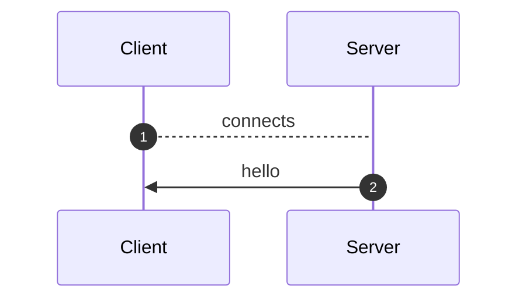
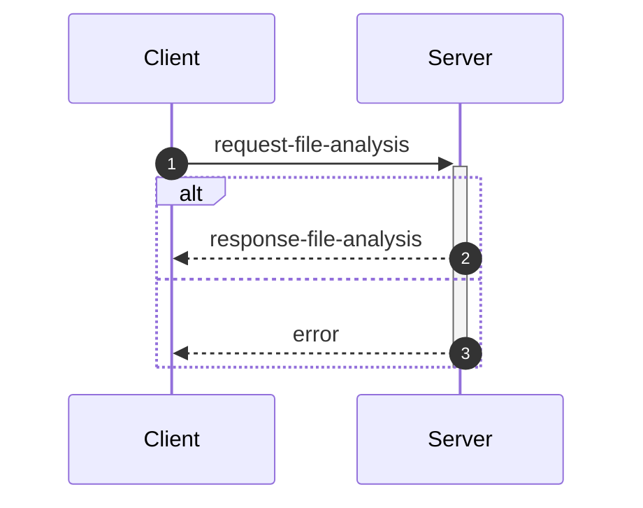
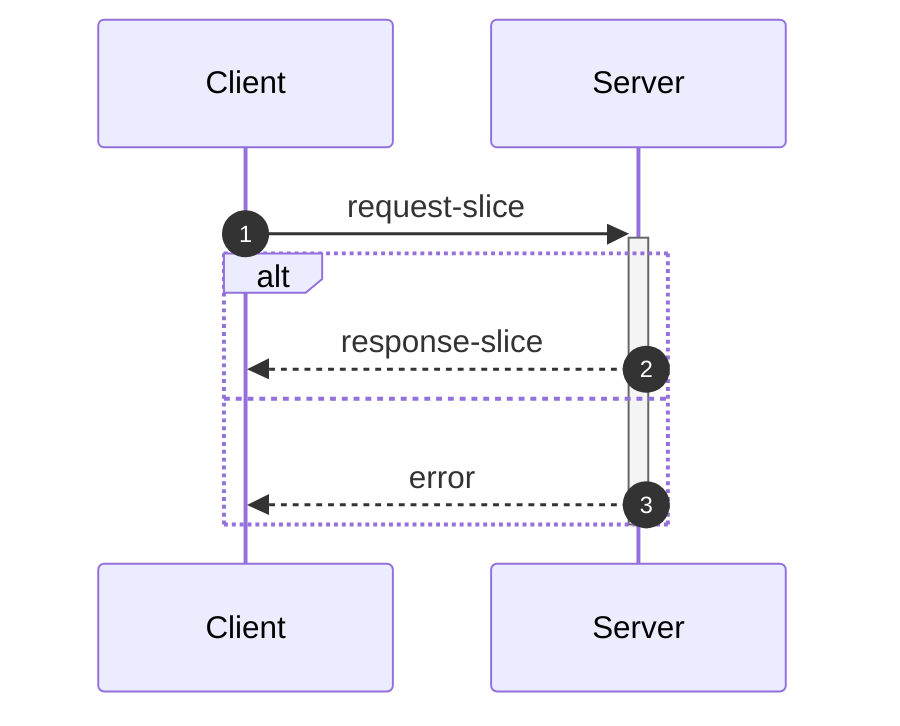
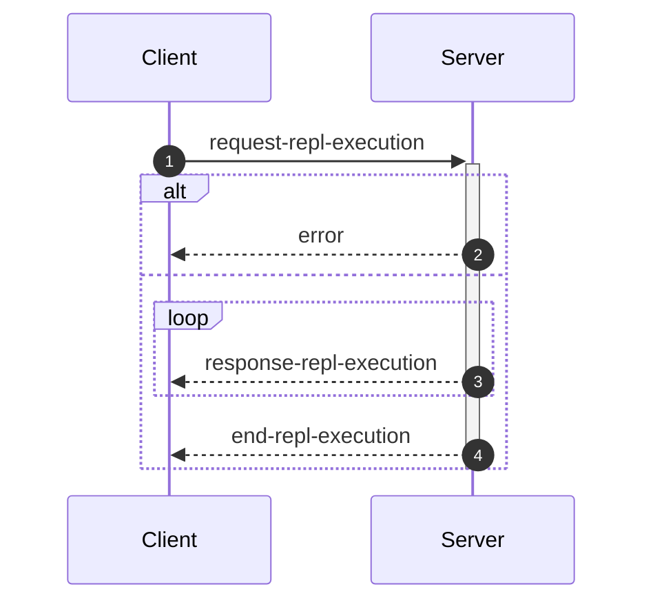
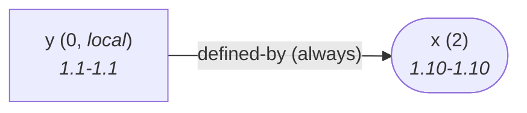

Although far from being as detailed as the in-depth explanation of [*flowR*](https://github.com/Code-Inspect/flowr/wiki/Core), this wiki page explains how to interface with *flowR* in more detail.<a href="#note1" id="note1ref"><sup>&lt;1&gt;</sup></a>

<!-- TOC -->
- [💬 Communicating with the Server](#-communicating-with-the-server)
  - [The Hello Message](#the-hello-message)
  - [The Analysis Request](#the-analysis-request)
    - [Including the Control Flow Graph](#including-the-control-flow-graph)
    - [Retrieve the Output as RDF N-Quads](#retrieve-the-output-as-rdf-n-quads)
    - [Complete Example (without WebSocket)](#complete-example-without-websocket)
      - [Using Netcat](#using-netcat)
      - [Using Python](#using-python)
  - [The Slice Request](#the-slice-request)
  - [The REPL Request](#the-repl-request)
- [💻 Using the REPL](#-using-the-repl)
  - [Example: Retrieving the Dataflow Graph](#example-retrieving-the-dataflow-graph)
  - [Interfacing with the File System](#interfacing-with-the-file-system)
- [⚒️ Writing Code](#️-writing-code)
  - [Interfacing with R by Using the `RShell`](#interfacing-with-r-by-using-the-rshell)
  - [The Pipeline Executor](#the-pipeline-executor)
  - [Generate Statistics](#generate-statistics)
    - [Extract Statistics with `extractUsageStatistics()`](#extract-statistics-with-extractusagestatistics)
    - [Adding a New Feature to Extract](#adding-a-new-feature-to-extract)
<!-- TOC -->

## 💬 Communicating with the Server

As explained in the [Overview](https://github.com/Code-Inspect/flowr/wiki/Overview), you can simply run the [TCP](https://de.wikipedia.org/wiki/Transmission_Control_Protocol)&nbsp;server by adding the `--server` flag (and, due to the interactive mode, exit with the conventional <kbd>CTRL</kbd>+<kbd>C</kbd>).
Currently, every connection is handled by the same underlying `RShell` - so the server is not designed to handle many clients at a time.
Additionally, the server is not well guarded against attacks (e.g., you can theoretically spawn an arbitrary amount of&nbsp;R shell sessions on the target machine).

Every message has to be given in a single line (i.e., without a newline in-between) and end with a newline character. Nevertheless, we will pretty-print example given in the following segments for the ease of reading.

> [!NOTE]
> The default `--server` uses a simple [TCP](https://de.wikipedia.org/wiki/Transmission_Control_Protocol)
> connection. If you want *flowR* to expose a [WebSocket](https://de.wikipedia.org/wiki/WebSocket) server instead, add the `--ws` flag (i.e., `--server --ws`) when starting *flowR* from the command line.

### The Hello Message

<details open>
<summary>Sequence Diagram</summary>


</details>

After launching, for example with  `docker run -it --rm flowr --server`&nbsp;(🐳️), simply connecting should present you with a `hello` message, that amongst others should reveal the versions of&nbsp;*flowR* and&nbsp;R running, using the [semver 2.0](https://semver.org/spec/v2.0.0.html) versioning scheme.
See the implementation of the hello message for more information regarding the contents of the message.


<details open>
    <summary>Example Message</summary>

*Note:* even though we pretty-print these messages, they are sent as a single line, ending with a newline.

```json
{
  "type":       "hello",
  "clientName": "client-0",
  "versions":   {
    "flowr": "1.0.1",
    "r":     "4.3.1"
  }
}
```

</details>

There are currently a few messages that you can send after the hello message.
If you want to *slice* a piece of R code you first have to send an [analysis request](#the-analysis-request), so that you can send one or multiple slice requests afterward.
Requests for the [REPL](#the-repl-request) are independent of that.

### The Analysis Request

<details open>
<summary>Sequence Diagram</summary>


</details>

The request allows the server to analyze a file and prepare it for slicing.
The message can contain a `filetoken`, which is used to identify the file in later slice requests (if you do not add one, the request will not be stored and therefore, it is not available for subsequent slicing).

> [!IMPORTANT]
> If you want to send and process a lot of analysis requests, but do not want to slice them, please do not pass the `filetoken` field. This will save the server a lot of memory allocation.

Furthermore, the request must contain either a `content` field to directly pass the file's content or a `filepath` field which contains the path to the file (this path must be accessible for the server to be useful).
If you add the `id` field, the answer will use the same `id` so you can match requests and the corresponding answers.
See the implementation of the request-file-analysis message for more information.

<details open>
    <summary>Example Request</summary>

*Note:* even though we pretty-print these requests, they have to be sent as a single line, which ends with a newline.

```json
{
  "type":      "request-file-analysis",
  "id":        "1",
  "filetoken": "x",
  "content":   "x <- 1\nx + 1"
}
```

</details>

<details>
    <summary>Example Response (Long)</summary>

*Note:* even though we pretty-print these responses, they are sent as a single line, ending with a newline.

The `results` field of the response effectively contains three keys of importance:

- `parse`: which contains 1:1 the parse result in CSV format that we received from the `RShell` (i.e., the AST produced by the parser of the R interpreter).
- `normalize`: which contains the normalized AST, including ids (see the `info` field).
  To better understand the structure, refer to figure&nbsp;40A in the original [master's thesis](http://dx.doi.org/10.18725/OPARU-50107) or refer to the documentation in the [source code](https://github.com/Code-Inspect/flowr/tree/main/src/r-bridge/lang-4.x/ast/model/model.ts).
- `dataflow`: especially important is the `graph` field which contains the dataflow graph as a set of root vertices (i.e. vertices that appear on the top level), a list of all vertices (`vertexInformation`), and an adjacency list of all edges (again, refer to the [source code](https://github.com/Code-Inspect/flowr/tree/main/src/dataflow/graph/graph.ts) for more information).

```json
{
  "type":    "response-file-analysis",
  "format":  "json",
  "id":      "1",
  "results": {
    "parse":     "[1,1,1,6,7,0,\"expr\",false,\"x <- 1\"],[1,1,1,1,1,3,\"SYMBOL\",true,\"x\"],[1,1,1,1,3,7,\"expr\",false,\"x\"],[1,3,1,4,2,7,\"LEFT_ASSIGN\",true,\"<-\"],[1,6,1,6,4,5,\"NUM_CONST\",true,\"1\"],[1,6,1,6,5,7,\"expr\",false,\"1\"],[2,1,2,5,16,0,\"expr\",false,\"x + 1\"],[2,1,2,1,10,12,\"SYMBOL\",true,\"x\"],[2,1,2,1,12,16,\"expr\",false,\"x\"],[2,3,2,3,11,16,\"'+'\",true,\"+\"],[2,5,2,5,13,14,\"NUM_CONST\",true,\"1\"],[2,5,2,5,14,16,\"expr\",false,\"1\"]",
    "normalize": {
      "ast": {
        "type":     "RExpressionList",
        "children": [
          {
            "type":     "RBinaryOp",
            "location": [
              1,
              3,
              1,
              4
            ],
            "lhs":      {
              "type":     "RSymbol",
              "location": [
                1,
                1,
                1,
                1
              ],
              "content":  "x",
              "lexeme":   "x",
              "info":     {
                "fullRange":        [
                  1,
                  1,
                  1,
                  1
                ],
                "additionalTokens": [],
                "fullLexeme":       "x",
                "id":               0,
                "parent":           2,
                "role":             "binop-lhs",
                "index":            0,
                "depth":            2
              }
            },
            "rhs":      {
              "location": [
                1,
                6,
                1,
                6
              ],
              "lexeme":   "1",
              "info":     {
                "fullRange":        [
                  1,
                  6,
                  1,
                  6
                ],
                "additionalTokens": [],
                "fullLexeme":       "1",
                "id":               1,
                "parent":           2,
                "role":             "binop-rhs",
                "index":            1,
                "depth":            2
              },
              "type":     "RNumber",
              "content":  {
                "num":           1,
                "complexNumber": false,
                "markedAsInt":   false
              }
            },
            "operator": "<-",
            "lexeme":   "<-",
            "info":     {
              "fullRange":        [
                1,
                1,
                1,
                6
              ],
              "additionalTokens": [],
              "fullLexeme":       "x <- 1",
              "id":               2,
              "parent":           6,
              "depth":            1,
              "index":            0,
              "role":             "expr-list-child"
            }
          },
          {
            "type":     "RBinaryOp",
            "location": [
              2,
              3,
              2,
              3
            ],
            "lhs":      {
              "type":     "RSymbol",
              "location": [
                2,
                1,
                2,
                1
              ],
              "content":  "x",
              "lexeme":   "x",
              "info":     {
                "fullRange":        [
                  2,
                  1,
                  2,
                  1
                ],
                "additionalTokens": [],
                "fullLexeme":       "x",
                "id":               3,
                "parent":           5,
                "role":             "binop-lhs",
                "index":            0,
                "depth":            2
              }
            },
            "rhs":      {
              "location": [
                2,
                5,
                2,
                5
              ],
              "lexeme":   "1",
              "info":     {
                "fullRange":        [
                  2,
                  5,
                  2,
                  5
                ],
                "additionalTokens": [],
                "fullLexeme":       "1",
                "id":               4,
                "parent":           5,
                "role":             "binop-rhs",
                "index":            1,
                "depth":            2
              },
              "type":     "RNumber",
              "content":  {
                "num":           1,
                "complexNumber": false,
                "markedAsInt":   false
              }
            },
            "operator": "+",
            "lexeme":   "+",
            "info":     {
              "fullRange":        [
                2,
                1,
                2,
                5
              ],
              "additionalTokens": [],
              "fullLexeme":       "x + 1",
              "id":               5,
              "parent":           6,
              "depth":            1,
              "index":            1,
              "role":             "expr-list-child"
            }
          }
        ],
        "info":     {
          "additionalTokens": [],
          "id":               6,
          "depth":            0,
          "role":             "root",
          "index":            0
        }
      }
    },
    "dataflow":  {
      "unknownReferences": [],
      "in":                [
        {
          "nodeId": 2,
          "name":   "<-"
        },
        {
          "nodeId": 5,
          "name":   "+",
          "call":   true
        }
      ],
      "out":               [
        {
          "nodeId":    0,
          "name":      "x",
          "kind":      "variable",
          "definedAt": 2
        },
        {
          "nodeId":    0,
          "name":      "x",
          "kind":      "variable",
          "definedAt": 2
        }
      ],
      "environment":       {
        "current": {
          "id":     90,
          "parent": {
            "id":     0,
            "memory": [
              [
                "NULL",
                [
                  {
                    "kind":      "built-in-value",
                    "definedAt": "built-in",
                    "value":     null,
                    "name":      "NULL",
                    "nodeId":    "built-in"
                  }
                ]
              ],
              [
                "NA",
                [
                  {
                    "kind":      "built-in-value",
                    "definedAt": "built-in",
                    "value":     null,
                    "name":      "NA",
                    "nodeId":    "built-in"
                  }
                ]
              ],
              [
                "TRUE",
                [
                  {
                    "kind":      "built-in-value",
                    "definedAt": "built-in",
                    "value":     true,
                    "name":      "TRUE",
                    "nodeId":    "built-in"
                  }
                ]
              ],
              [
                "T",
                [
                  {
                    "kind":      "built-in-value",
                    "definedAt": "built-in",
                    "value":     true,
                    "name":      "T",
                    "nodeId":    "built-in"
                  }
                ]
              ],
              [
                "FALSE",
                [
                  {
                    "kind":      "built-in-value",
                    "definedAt": "built-in",
                    "value":     false,
                    "name":      "FALSE",
                    "nodeId":    "built-in"
                  }
                ]
              ],
              [
                "F",
                [
                  {
                    "kind":      "built-in-value",
                    "definedAt": "built-in",
                    "value":     false,
                    "name":      "F",
                    "nodeId":    "built-in"
                  }
                ]
              ],
              [
                "~",
                [
                  {
                    "kind":      "built-in-function",
                    "definedAt": "built-in",
                    "name":      "~",
                    "nodeId":    "built-in"
                  }
                ]
              ],
              [
                "+",
                [
                  {
                    "kind":      "built-in-function",
                    "definedAt": "built-in",
                    "name":      "+",
                    "nodeId":    "built-in"
                  }
                ]
              ],
              [
                "-",
                [
                  {
                    "kind":      "built-in-function",
                    "definedAt": "built-in",
                    "name":      "-",
                    "nodeId":    "built-in"
                  }
                ]
              ],
              [
                "*",
                [
                  {
                    "kind":      "built-in-function",
                    "definedAt": "built-in",
                    "name":      "*",
                    "nodeId":    "built-in"
                  }
                ]
              ],
              [
                "/",
                [
                  {
                    "kind":      "built-in-function",
                    "definedAt": "built-in",
                    "name":      "/",
                    "nodeId":    "built-in"
                  }
                ]
              ],
              [
                "^",
                [
                  {
                    "kind":      "built-in-function",
                    "definedAt": "built-in",
                    "name":      "^",
                    "nodeId":    "built-in"
                  }
                ]
              ],
              [
                "!",
                [
                  {
                    "kind":      "built-in-function",
                    "definedAt": "built-in",
                    "name":      "!",
                    "nodeId":    "built-in"
                  }
                ]
              ],
              [
                "?",
                [
                  {
                    "kind":      "built-in-function",
                    "definedAt": "built-in",
                    "name":      "?",
                    "nodeId":    "built-in"
                  }
                ]
              ],
              [
                "**",
                [
                  {
                    "kind":      "built-in-function",
                    "definedAt": "built-in",
                    "name":      "**",
                    "nodeId":    "built-in"
                  }
                ]
              ],
              [
                "==",
                [
                  {
                    "kind":      "built-in-function",
                    "definedAt": "built-in",
                    "name":      "==",
                    "nodeId":    "built-in"
                  }
                ]
              ],
              [
                "!=",
                [
                  {
                    "kind":      "built-in-function",
                    "definedAt": "built-in",
                    "name":      "!=",
                    "nodeId":    "built-in"
                  }
                ]
              ],
              [
                ">",
                [
                  {
                    "kind":      "built-in-function",
                    "definedAt": "built-in",
                    "name":      ">",
                    "nodeId":    "built-in"
                  }
                ]
              ],
              [
                "<",
                [
                  {
                    "kind":      "built-in-function",
                    "definedAt": "built-in",
                    "name":      "<",
                    "nodeId":    "built-in"
                  }
                ]
              ],
              [
                ">=",
                [
                  {
                    "kind":      "built-in-function",
                    "definedAt": "built-in",
                    "name":      ">=",
                    "nodeId":    "built-in"
                  }
                ]
              ],
              [
                "<=",
                [
                  {
                    "kind":      "built-in-function",
                    "definedAt": "built-in",
                    "name":      "<=",
                    "nodeId":    "built-in"
                  }
                ]
              ],
              [
                "%%",
                [
                  {
                    "kind":      "built-in-function",
                    "definedAt": "built-in",
                    "name":      "%%",
                    "nodeId":    "built-in"
                  }
                ]
              ],
              [
                "%/%",
                [
                  {
                    "kind":      "built-in-function",
                    "definedAt": "built-in",
                    "name":      "%/%",
                    "nodeId":    "built-in"
                  }
                ]
              ],
              [
                "%*%",
                [
                  {
                    "kind":      "built-in-function",
                    "definedAt": "built-in",
                    "name":      "%*%",
                    "nodeId":    "built-in"
                  }
                ]
              ],
              [
                "%in%",
                [
                  {
                    "kind":      "built-in-function",
                    "definedAt": "built-in",
                    "name":      "%in%",
                    "nodeId":    "built-in"
                  }
                ]
              ],
              [
                ":",
                [
                  {
                    "kind":      "built-in-function",
                    "definedAt": "built-in",
                    "name":      ":",
                    "nodeId":    "built-in"
                  }
                ]
              ],
              [
                "list",
                [
                  {
                    "kind":      "built-in-function",
                    "definedAt": "built-in",
                    "name":      "list",
                    "nodeId":    "built-in"
                  }
                ]
              ],
              [
                "c",
                [
                  {
                    "kind":      "built-in-function",
                    "definedAt": "built-in",
                    "name":      "c",
                    "nodeId":    "built-in"
                  }
                ]
              ],
              [
                "rep",
                [
                  {
                    "kind":      "built-in-function",
                    "definedAt": "built-in",
                    "name":      "rep",
                    "nodeId":    "built-in"
                  }
                ]
              ],
              [
                "seq",
                [
                  {
                    "kind":      "built-in-function",
                    "definedAt": "built-in",
                    "name":      "seq",
                    "nodeId":    "built-in"
                  }
                ]
              ],
              [
                "seq_len",
                [
                  {
                    "kind":      "built-in-function",
                    "definedAt": "built-in",
                    "name":      "seq_len",
                    "nodeId":    "built-in"
                  }
                ]
              ],
              [
                "seq_along",
                [
                  {
                    "kind":      "built-in-function",
                    "definedAt": "built-in",
                    "name":      "seq_along",
                    "nodeId":    "built-in"
                  }
                ]
              ],
              [
                "seq.int",
                [
                  {
                    "kind":      "built-in-function",
                    "definedAt": "built-in",
                    "name":      "seq.int",
                    "nodeId":    "built-in"
                  }
                ]
              ],
              [
                "gsub",
                [
                  {
                    "kind":      "built-in-function",
                    "definedAt": "built-in",
                    "name":      "gsub",
                    "nodeId":    "built-in"
                  }
                ]
              ],
              [
                "which",
                [
                  {
                    "kind":      "built-in-function",
                    "definedAt": "built-in",
                    "name":      "which",
                    "nodeId":    "built-in"
                  }
                ]
              ],
              [
                "class",
                [
                  {
                    "kind":      "built-in-function",
                    "definedAt": "built-in",
                    "name":      "class",
                    "nodeId":    "built-in"
                  }
                ]
              ],
              [
                "dimnames",
                [
                  {
                    "kind":      "built-in-function",
                    "definedAt": "built-in",
                    "name":      "dimnames",
                    "nodeId":    "built-in"
                  }
                ]
              ],
              [
                "min",
                [
                  {
                    "kind":      "built-in-function",
                    "definedAt": "built-in",
                    "name":      "min",
                    "nodeId":    "built-in"
                  }
                ]
              ],
              [
                "max",
                [
                  {
                    "kind":      "built-in-function",
                    "definedAt": "built-in",
                    "name":      "max",
                    "nodeId":    "built-in"
                  }
                ]
              ],
              [
                "intersect",
                [
                  {
                    "kind":      "built-in-function",
                    "definedAt": "built-in",
                    "name":      "intersect",
                    "nodeId":    "built-in"
                  }
                ]
              ],
              [
                "subset",
                [
                  {
                    "kind":      "built-in-function",
                    "definedAt": "built-in",
                    "name":      "subset",
                    "nodeId":    "built-in"
                  }
                ]
              ],
              [
                "match",
                [
                  {
                    "kind":      "built-in-function",
                    "definedAt": "built-in",
                    "name":      "match",
                    "nodeId":    "built-in"
                  }
                ]
              ],
              [
                "sqrt",
                [
                  {
                    "kind":      "built-in-function",
                    "definedAt": "built-in",
                    "name":      "sqrt",
                    "nodeId":    "built-in"
                  }
                ]
              ],
              [
                "abs",
                [
                  {
                    "kind":      "built-in-function",
                    "definedAt": "built-in",
                    "name":      "abs",
                    "nodeId":    "built-in"
                  }
                ]
              ],
              [
                "round",
                [
                  {
                    "kind":      "built-in-function",
                    "definedAt": "built-in",
                    "name":      "round",
                    "nodeId":    "built-in"
                  }
                ]
              ],
              [
                "floor",
                [
                  {
                    "kind":      "built-in-function",
                    "definedAt": "built-in",
                    "name":      "floor",
                    "nodeId":    "built-in"
                  }
                ]
              ],
              [
                "ceiling",
                [
                  {
                    "kind":      "built-in-function",
                    "definedAt": "built-in",
                    "name":      "ceiling",
                    "nodeId":    "built-in"
                  }
                ]
              ],
              [
                "signif",
                [
                  {
                    "kind":      "built-in-function",
                    "definedAt": "built-in",
                    "name":      "signif",
                    "nodeId":    "built-in"
                  }
                ]
              ],
              [
                "trunc",
                [
                  {
                    "kind":      "built-in-function",
                    "definedAt": "built-in",
                    "name":      "trunc",
                    "nodeId":    "built-in"
                  }
                ]
              ],
              [
                "log",
                [
                  {
                    "kind":      "built-in-function",
                    "definedAt": "built-in",
                    "name":      "log",
                    "nodeId":    "built-in"
                  }
                ]
              ],
              [
                "log10",
                [
                  {
                    "kind":      "built-in-function",
                    "definedAt": "built-in",
                    "name":      "log10",
                    "nodeId":    "built-in"
                  }
                ]
              ],
              [
                "log2",
                [
                  {
                    "kind":      "built-in-function",
                    "definedAt": "built-in",
                    "name":      "log2",
                    "nodeId":    "built-in"
                  }
                ]
              ],
              [
                "sum",
                [
                  {
                    "kind":      "built-in-function",
                    "definedAt": "built-in",
                    "name":      "sum",
                    "nodeId":    "built-in"
                  }
                ]
              ],
              [
                "mean",
                [
                  {
                    "kind":      "built-in-function",
                    "definedAt": "built-in",
                    "name":      "mean",
                    "nodeId":    "built-in"
                  }
                ]
              ],
              [
                "unique",
                [
                  {
                    "kind":      "built-in-function",
                    "definedAt": "built-in",
                    "name":      "unique",
                    "nodeId":    "built-in"
                  }
                ]
              ],
              [
                "paste",
                [
                  {
                    "kind":      "built-in-function",
                    "definedAt": "built-in",
                    "name":      "paste",
                    "nodeId":    "built-in"
                  }
                ]
              ],
              [
                "paste0",
                [
                  {
                    "kind":      "built-in-function",
                    "definedAt": "built-in",
                    "name":      "paste0",
                    "nodeId":    "built-in"
                  }
                ]
              ],
              [
                "read.csv",
                [
                  {
                    "kind":      "built-in-function",
                    "definedAt": "built-in",
                    "name":      "read.csv",
                    "nodeId":    "built-in"
                  }
                ]
              ],
              [
                "stop",
                [
                  {
                    "kind":      "built-in-function",
                    "definedAt": "built-in",
                    "name":      "stop",
                    "nodeId":    "built-in"
                  }
                ]
              ],
              [
                "is.null",
                [
                  {
                    "kind":      "built-in-function",
                    "definedAt": "built-in",
                    "name":      "is.null",
                    "nodeId":    "built-in"
                  }
                ]
              ],
              [
                "plot",
                [
                  {
                    "kind":      "built-in-function",
                    "definedAt": "built-in",
                    "name":      "plot",
                    "nodeId":    "built-in"
                  }
                ]
              ],
              [
                "numeric",
                [
                  {
                    "kind":      "built-in-function",
                    "definedAt": "built-in",
                    "name":      "numeric",
                    "nodeId":    "built-in"
                  }
                ]
              ],
              [
                "as.character",
                [
                  {
                    "kind":      "built-in-function",
                    "definedAt": "built-in",
                    "name":      "as.character",
                    "nodeId":    "built-in"
                  }
                ]
              ],
              [
                "as.integer",
                [
                  {
                    "kind":      "built-in-function",
                    "definedAt": "built-in",
                    "name":      "as.integer",
                    "nodeId":    "built-in"
                  }
                ]
              ],
              [
                "as.logical",
                [
                  {
                    "kind":      "built-in-function",
                    "definedAt": "built-in",
                    "name":      "as.logical",
                    "nodeId":    "built-in"
                  }
                ]
              ],
              [
                "as.numeric",
                [
                  {
                    "kind":      "built-in-function",
                    "definedAt": "built-in",
                    "name":      "as.numeric",
                    "nodeId":    "built-in"
                  }
                ]
              ],
              [
                "as.matrix",
                [
                  {
                    "kind":      "built-in-function",
                    "definedAt": "built-in",
                    "name":      "as.matrix",
                    "nodeId":    "built-in"
                  }
                ]
              ],
              [
                "apply",
                [
                  {
                    "kind":      "built-in-function",
                    "definedAt": "built-in",
                    "name":      "apply",
                    "nodeId":    "built-in"
                  }
                ]
              ],
              [
                "lapply",
                [
                  {
                    "kind":      "built-in-function",
                    "definedAt": "built-in",
                    "name":      "lapply",
                    "nodeId":    "built-in"
                  }
                ]
              ],
              [
                "sapply",
                [
                  {
                    "kind":      "built-in-function",
                    "definedAt": "built-in",
                    "name":      "sapply",
                    "nodeId":    "built-in"
                  }
                ]
              ],
              [
                "tapply",
                [
                  {
                    "kind":      "built-in-function",
                    "definedAt": "built-in",
                    "name":      "tapply",
                    "nodeId":    "built-in"
                  }
                ]
              ],
              [
                "mapply",
                [
                  {
                    "kind":      "built-in-function",
                    "definedAt": "built-in",
                    "name":      "mapply",
                    "nodeId":    "built-in"
                  }
                ]
              ],
              [
                "do.call",
                [
                  {
                    "kind":      "built-in-function",
                    "definedAt": "built-in",
                    "name":      "do.call",
                    "nodeId":    "built-in"
                  }
                ]
              ],
              [
                "rbind",
                [
                  {
                    "kind":      "built-in-function",
                    "definedAt": "built-in",
                    "name":      "rbind",
                    "nodeId":    "built-in"
                  }
                ]
              ],
              [
                "nrow",
                [
                  {
                    "kind":      "built-in-function",
                    "definedAt": "built-in",
                    "name":      "nrow",
                    "nodeId":    "built-in"
                  }
                ]
              ],
              [
                "ncol",
                [
                  {
                    "kind":      "built-in-function",
                    "definedAt": "built-in",
                    "name":      "ncol",
                    "nodeId":    "built-in"
                  }
                ]
              ],
              [
                "tryCatch",
                [
                  {
                    "kind":      "built-in-function",
                    "definedAt": "built-in",
                    "name":      "tryCatch",
                    "nodeId":    "built-in"
                  }
                ]
              ],
              [
                "expression",
                [
                  {
                    "kind":      "built-in-function",
                    "definedAt": "built-in",
                    "name":      "expression",
                    "nodeId":    "built-in"
                  }
                ]
              ],
              [
                "factor",
                [
                  {
                    "kind":      "built-in-function",
                    "definedAt": "built-in",
                    "name":      "factor",
                    "nodeId":    "built-in"
                  }
                ]
              ],
              [
                "missing",
                [
                  {
                    "kind":      "built-in-function",
                    "definedAt": "built-in",
                    "name":      "missing",
                    "nodeId":    "built-in"
                  }
                ]
              ],
              [
                "as.data.frame",
                [
                  {
                    "kind":      "built-in-function",
                    "definedAt": "built-in",
                    "name":      "as.data.frame",
                    "nodeId":    "built-in"
                  }
                ]
              ],
              [
                "data.frame",
                [
                  {
                    "kind":      "built-in-function",
                    "definedAt": "built-in",
                    "name":      "data.frame",
                    "nodeId":    "built-in"
                  }
                ]
              ],
              [
                "na.omit",
                [
                  {
                    "kind":      "built-in-function",
                    "definedAt": "built-in",
                    "name":      "na.omit",
                    "nodeId":    "built-in"
                  }
                ]
              ],
              [
                "rownames",
                [
                  {
                    "kind":      "built-in-function",
                    "definedAt": "built-in",
                    "name":      "rownames",
                    "nodeId":    "built-in"
                  }
                ]
              ],
              [
                "names",
                [
                  {
                    "kind":      "built-in-function",
                    "definedAt": "built-in",
                    "name":      "names",
                    "nodeId":    "built-in"
                  }
                ]
              ],
              [
                "order",
                [
                  {
                    "kind":      "built-in-function",
                    "definedAt": "built-in",
                    "name":      "order",
                    "nodeId":    "built-in"
                  }
                ]
              ],
              [
                "length",
                [
                  {
                    "kind":      "built-in-function",
                    "definedAt": "built-in",
                    "name":      "length",
                    "nodeId":    "built-in"
                  }
                ]
              ],
              [
                "any",
                [
                  {
                    "kind":      "built-in-function",
                    "definedAt": "built-in",
                    "name":      "any",
                    "nodeId":    "built-in"
                  }
                ]
              ],
              [
                "dim",
                [
                  {
                    "kind":      "built-in-function",
                    "definedAt": "built-in",
                    "name":      "dim",
                    "nodeId":    "built-in"
                  }
                ]
              ],
              [
                "matrix",
                [
                  {
                    "kind":      "built-in-function",
                    "definedAt": "built-in",
                    "name":      "matrix",
                    "nodeId":    "built-in"
                  }
                ]
              ],
              [
                "cbind",
                [
                  {
                    "kind":      "built-in-function",
                    "definedAt": "built-in",
                    "name":      "cbind",
                    "nodeId":    "built-in"
                  }
                ]
              ],
              [
                "nchar",
                [
                  {
                    "kind":      "built-in-function",
                    "definedAt": "built-in",
                    "name":      "nchar",
                    "nodeId":    "built-in"
                  }
                ]
              ],
              [
                "t",
                [
                  {
                    "kind":      "built-in-function",
                    "definedAt": "built-in",
                    "name":      "t",
                    "nodeId":    "built-in"
                  }
                ]
              ],
              [
                "print",
                [
                  {
                    "kind":      "built-in-function",
                    "definedAt": "built-in",
                    "name":      "print",
                    "nodeId":    "built-in"
                  }
                ]
              ],
              [
                "(",
                [
                  {
                    "kind":      "built-in-function",
                    "definedAt": "built-in",
                    "name":      "(",
                    "nodeId":    "built-in"
                  }
                ]
              ],
              [
                "cat",
                [
                  {
                    "kind":      "built-in-function",
                    "definedAt": "built-in",
                    "name":      "cat",
                    "nodeId":    "built-in"
                  }
                ]
              ],
              [
                "switch",
                [
                  {
                    "kind":      "built-in-function",
                    "definedAt": "built-in",
                    "name":      "switch",
                    "nodeId":    "built-in"
                  }
                ]
              ],
              [
                "return",
                [
                  {
                    "kind":      "built-in-function",
                    "definedAt": "built-in",
                    "name":      "return",
                    "nodeId":    "built-in"
                  }
                ]
              ],
              [
                "break",
                [
                  {
                    "kind":      "built-in-function",
                    "definedAt": "built-in",
                    "name":      "break",
                    "nodeId":    "built-in"
                  }
                ]
              ],
              [
                "next",
                [
                  {
                    "kind":      "built-in-function",
                    "definedAt": "built-in",
                    "name":      "next",
                    "nodeId":    "built-in"
                  }
                ]
              ],
              [
                "{",
                [
                  {
                    "kind":      "built-in-function",
                    "definedAt": "built-in",
                    "name":      "{",
                    "nodeId":    "built-in"
                  }
                ]
              ],
              [
                "source",
                [
                  {
                    "kind":      "built-in-function",
                    "definedAt": "built-in",
                    "name":      "source",
                    "nodeId":    "built-in"
                  }
                ]
              ],
              [
                "[",
                [
                  {
                    "kind":      "built-in-function",
                    "definedAt": "built-in",
                    "name":      "[",
                    "nodeId":    "built-in"
                  }
                ]
              ],
              [
                "[[",
                [
                  {
                    "kind":      "built-in-function",
                    "definedAt": "built-in",
                    "name":      "[[",
                    "nodeId":    "built-in"
                  }
                ]
              ],
              [
                "$",
                [
                  {
                    "kind":      "built-in-function",
                    "definedAt": "built-in",
                    "name":      "$",
                    "nodeId":    "built-in"
                  }
                ]
              ],
              [
                "@",
                [
                  {
                    "kind":      "built-in-function",
                    "definedAt": "built-in",
                    "name":      "@",
                    "nodeId":    "built-in"
                  }
                ]
              ],
              [
                "if",
                [
                  {
                    "kind":      "built-in-function",
                    "definedAt": "built-in",
                    "name":      "if",
                    "nodeId":    "built-in"
                  }
                ]
              ],
              [
                "ifelse",
                [
                  {
                    "kind":      "built-in-function",
                    "definedAt": "built-in",
                    "name":      "ifelse",
                    "nodeId":    "built-in"
                  }
                ]
              ],
              [
                "get",
                [
                  {
                    "kind":      "built-in-function",
                    "definedAt": "built-in",
                    "name":      "get",
                    "nodeId":    "built-in"
                  }
                ]
              ],
              [
                "library",
                [
                  {
                    "kind":      "built-in-function",
                    "definedAt": "built-in",
                    "name":      "library",
                    "nodeId":    "built-in"
                  }
                ]
              ],
              [
                "<-",
                [
                  {
                    "kind":      "built-in-function",
                    "definedAt": "built-in",
                    "name":      "<-",
                    "nodeId":    "built-in"
                  }
                ]
              ],
              [
                "=",
                [
                  {
                    "kind":      "built-in-function",
                    "definedAt": "built-in",
                    "name":      "=",
                    "nodeId":    "built-in"
                  }
                ]
              ],
              [
                ":=",
                [
                  {
                    "kind":      "built-in-function",
                    "definedAt": "built-in",
                    "name":      ":=",
                    "nodeId":    "built-in"
                  }
                ]
              ],
              [
                "assign",
                [
                  {
                    "kind":      "built-in-function",
                    "definedAt": "built-in",
                    "name":      "assign",
                    "nodeId":    "built-in"
                  }
                ]
              ],
              [
                "delayedAssign",
                [
                  {
                    "kind":      "built-in-function",
                    "definedAt": "built-in",
                    "name":      "delayedAssign",
                    "nodeId":    "built-in"
                  }
                ]
              ],
              [
                "<<-",
                [
                  {
                    "kind":      "built-in-function",
                    "definedAt": "built-in",
                    "name":      "<<-",
                    "nodeId":    "built-in"
                  }
                ]
              ],
              [
                "->",
                [
                  {
                    "kind":      "built-in-function",
                    "definedAt": "built-in",
                    "name":      "->",
                    "nodeId":    "built-in"
                  }
                ]
              ],
              [
                "->>",
                [
                  {
                    "kind":      "built-in-function",
                    "definedAt": "built-in",
                    "name":      "->>",
                    "nodeId":    "built-in"
                  }
                ]
              ],
              [
                "&&",
                [
                  {
                    "kind":      "built-in-function",
                    "definedAt": "built-in",
                    "name":      "&&",
                    "nodeId":    "built-in"
                  }
                ]
              ],
              [
                "&",
                [
                  {
                    "kind":      "built-in-function",
                    "definedAt": "built-in",
                    "name":      "&",
                    "nodeId":    "built-in"
                  }
                ]
              ],
              [
                "||",
                [
                  {
                    "kind":      "built-in-function",
                    "definedAt": "built-in",
                    "name":      "||",
                    "nodeId":    "built-in"
                  }
                ]
              ],
              [
                "|",
                [
                  {
                    "kind":      "built-in-function",
                    "definedAt": "built-in",
                    "name":      "|",
                    "nodeId":    "built-in"
                  }
                ]
              ],
              [
                "|>",
                [
                  {
                    "kind":      "built-in-function",
                    "definedAt": "built-in",
                    "name":      "|>",
                    "nodeId":    "built-in"
                  }
                ]
              ],
              [
                "%>%",
                [
                  {
                    "kind":      "built-in-function",
                    "definedAt": "built-in",
                    "name":      "%>%",
                    "nodeId":    "built-in"
                  }
                ]
              ],
              [
                "function",
                [
                  {
                    "kind":      "built-in-function",
                    "definedAt": "built-in",
                    "name":      "function",
                    "nodeId":    "built-in"
                  }
                ]
              ],
              [
                "\\",
                [
                  {
                    "kind":      "built-in-function",
                    "definedAt": "built-in",
                    "name":      "\\",
                    "nodeId":    "built-in"
                  }
                ]
              ],
              [
                "quote",
                [
                  {
                    "kind":      "built-in-function",
                    "definedAt": "built-in",
                    "name":      "quote",
                    "nodeId":    "built-in"
                  }
                ]
              ],
              [
                "substitute",
                [
                  {
                    "kind":      "built-in-function",
                    "definedAt": "built-in",
                    "name":      "substitute",
                    "nodeId":    "built-in"
                  }
                ]
              ],
              [
                "bquote",
                [
                  {
                    "kind":      "built-in-function",
                    "definedAt": "built-in",
                    "name":      "bquote",
                    "nodeId":    "built-in"
                  }
                ]
              ],
              [
                "for",
                [
                  {
                    "kind":      "built-in-function",
                    "definedAt": "built-in",
                    "name":      "for",
                    "nodeId":    "built-in"
                  }
                ]
              ],
              [
                "repeat",
                [
                  {
                    "kind":      "built-in-function",
                    "definedAt": "built-in",
                    "name":      "repeat",
                    "nodeId":    "built-in"
                  }
                ]
              ],
              [
                "while",
                [
                  {
                    "kind":      "built-in-function",
                    "definedAt": "built-in",
                    "name":      "while",
                    "nodeId":    "built-in"
                  }
                ]
              ],
              [
                "[<-",
                [
                  {
                    "kind":      "built-in-function",
                    "definedAt": "built-in",
                    "name":      "[<-",
                    "nodeId":    "built-in"
                  }
                ]
              ],
              [
                "[[<-",
                [
                  {
                    "kind":      "built-in-function",
                    "definedAt": "built-in",
                    "name":      "[[<-",
                    "nodeId":    "built-in"
                  }
                ]
              ],
              [
                "$<-",
                [
                  {
                    "kind":      "built-in-function",
                    "definedAt": "built-in",
                    "name":      "$<-",
                    "nodeId":    "built-in"
                  }
                ]
              ],
              [
                "@<-",
                [
                  {
                    "kind":      "built-in-function",
                    "definedAt": "built-in",
                    "name":      "@<-",
                    "nodeId":    "built-in"
                  }
                ]
              ],
              [
                "names<-",
                [
                  {
                    "kind":      "built-in-function",
                    "definedAt": "built-in",
                    "name":      "names<-",
                    "nodeId":    "built-in"
                  }
                ]
              ],
              [
                "dimnames<-",
                [
                  {
                    "kind":      "built-in-function",
                    "definedAt": "built-in",
                    "name":      "dimnames<-",
                    "nodeId":    "built-in"
                  }
                ]
              ],
              [
                "attributes<-",
                [
                  {
                    "kind":      "built-in-function",
                    "definedAt": "built-in",
                    "name":      "attributes<-",
                    "nodeId":    "built-in"
                  }
                ]
              ],
              [
                "attr<-",
                [
                  {
                    "kind":      "built-in-function",
                    "definedAt": "built-in",
                    "name":      "attr<-",
                    "nodeId":    "built-in"
                  }
                ]
              ],
              [
                "class<-",
                [
                  {
                    "kind":      "built-in-function",
                    "definedAt": "built-in",
                    "name":      "class<-",
                    "nodeId":    "built-in"
                  }
                ]
              ],
              [
                "levels<-",
                [
                  {
                    "kind":      "built-in-function",
                    "definedAt": "built-in",
                    "name":      "levels<-",
                    "nodeId":    "built-in"
                  }
                ]
              ],
              [
                "rownames<-",
                [
                  {
                    "kind":      "built-in-function",
                    "definedAt": "built-in",
                    "name":      "rownames<-",
                    "nodeId":    "built-in"
                  }
                ]
              ],
              [
                "colnames<-",
                [
                  {
                    "kind":      "built-in-function",
                    "definedAt": "built-in",
                    "name":      "colnames<-",
                    "nodeId":    "built-in"
                  }
                ]
              ],
              [
                "[<<-",
                [
                  {
                    "kind":      "built-in-function",
                    "definedAt": "built-in",
                    "name":      "[<<-",
                    "nodeId":    "built-in"
                  }
                ]
              ],
              [
                "[[<<-",
                [
                  {
                    "kind":      "built-in-function",
                    "definedAt": "built-in",
                    "name":      "[[<<-",
                    "nodeId":    "built-in"
                  }
                ]
              ],
              [
                "$<<-",
                [
                  {
                    "kind":      "built-in-function",
                    "definedAt": "built-in",
                    "name":      "$<<-",
                    "nodeId":    "built-in"
                  }
                ]
              ],
              [
                "@<<-",
                [
                  {
                    "kind":      "built-in-function",
                    "definedAt": "built-in",
                    "name":      "@<<-",
                    "nodeId":    "built-in"
                  }
                ]
              ],
              [
                "names<<-",
                [
                  {
                    "kind":      "built-in-function",
                    "definedAt": "built-in",
                    "name":      "names<<-",
                    "nodeId":    "built-in"
                  }
                ]
              ],
              [
                "dimnames<<-",
                [
                  {
                    "kind":      "built-in-function",
                    "definedAt": "built-in",
                    "name":      "dimnames<<-",
                    "nodeId":    "built-in"
                  }
                ]
              ],
              [
                "attributes<<-",
                [
                  {
                    "kind":      "built-in-function",
                    "definedAt": "built-in",
                    "name":      "attributes<<-",
                    "nodeId":    "built-in"
                  }
                ]
              ],
              [
                "attr<<-",
                [
                  {
                    "kind":      "built-in-function",
                    "definedAt": "built-in",
                    "name":      "attr<<-",
                    "nodeId":    "built-in"
                  }
                ]
              ],
              [
                "class<<-",
                [
                  {
                    "kind":      "built-in-function",
                    "definedAt": "built-in",
                    "name":      "class<<-",
                    "nodeId":    "built-in"
                  }
                ]
              ],
              [
                "levels<<-",
                [
                  {
                    "kind":      "built-in-function",
                    "definedAt": "built-in",
                    "name":      "levels<<-",
                    "nodeId":    "built-in"
                  }
                ]
              ],
              [
                "rownames<<-",
                [
                  {
                    "kind":      "built-in-function",
                    "definedAt": "built-in",
                    "name":      "rownames<<-",
                    "nodeId":    "built-in"
                  }
                ]
              ],
              [
                "colnames<<-",
                [
                  {
                    "kind":      "built-in-function",
                    "definedAt": "built-in",
                    "name":      "colnames<<-",
                    "nodeId":    "built-in"
                  }
                ]
              ]
            ]
          },
          "memory": [
            [
              "x",
              [
                {
                  "nodeId":    0,
                  "name":      "x",
                  "kind":      "variable",
                  "definedAt": 2
                }
              ]
            ]
          ]
        },
        "level":   0
      },
      "graph":             {
        "rootVertices":      [
          1,
          0,
          2,
          3,
          4,
          5
        ],
        "vertexInformation": [
          [
            1,
            {
              "tag": "value",
              "id":  1
            }
          ],
          [
            0,
            {
              "tag": "variable-definition",
              "id":  0
            }
          ],
          [
            2,
            {
              "tag":         "function-call",
              "id":          2,
              "name":        "<-",
              "onlyBuiltin": true,
              "args":        [
                {
                  "nodeId": 0
                },
                {
                  "nodeId": 1
                }
              ]
            }
          ],
          [
            3,
            {
              "tag": "use",
              "id":  3
            }
          ],
          [
            4,
            {
              "tag": "value",
              "id":  4
            }
          ],
          [
            5,
            {
              "tag":         "function-call",
              "id":          5,
              "name":        "+",
              "onlyBuiltin": true,
              "args":        [
                {
                  "nodeId": 3
                },
                {
                  "nodeId": 4
                }
              ]
            }
          ]
        ],
        "edgeInformation":   [
          [
            2,
            [
              [
                1,
                {
                  "types": 64
                }
              ],
              [
                0,
                {
                  "types": 72
                }
              ]
            ]
          ],
          [
            0,
            [
              [
                1,
                {
                  "types": 2
                }
              ],
              [
                2,
                {
                  "types": 2
                }
              ]
            ]
          ],
          [
            3,
            [
              [
                0,
                {
                  "types": 1
                }
              ]
            ]
          ],
          [
            5,
            [
              [
                3,
                {
                  "types": 65
                }
              ],
              [
                4,
                {
                  "types": 65
                }
              ]
            ]
          ]
        ]
      },
      "entryPoint":        2,
      "exitPoints":        [
        {
          "type":   0,
          "nodeId": 5
        }
      ]
    }
  }
}
```

</details>


You receive an error if, for whatever reason, the analysis fails (e.g., the message or code you sent contained syntax errors).
It contains a human-readable description *why* the analysis failed (see the error message implementation for more details).

<details>
    <summary>Example Error Message</summary>

*Note:* even though we pretty-print these messages, they are sent as a single line, ending with a newline.

```json
{
  "id":     "1",
  "type":   "error",
  "fatal":  true,
  "reason": "The message type \"foo\" is not supported."
}
```

</details>

#### Including the Control Flow Graph

While *flowR* does (for the time being) not use an explicit control flow graph but instead relies on control-dependency edges within the dataflow graph, the respective structure can still be exposed using the server (note that, as this feature is not needed within *flowR*, it is tested significantly less - so please create a [new issue](https://github.com/Code-Inspect/flowr/issues/new/choose) for any bug you may encounter).
For this, the analysis request may add `cfg: true` to its list of options.

<details open>
    <summary>Example Request</summary>

*Note:* even though we pretty-print these requests, they have to be sent as a single line, which ends with a newline.

```json
{
  "type":      "request-file-analysis",
  "id":        "1",
  "filetoken": "x",
  "content":   "x <- 1\nx + 1",
  "cfg":       true
}
```

</details>

<details>
    <summary>Example Response (Shortened)</summary>

*Note:* even though we pretty-print these messages, they are sent as a single line, ending with a newline.

The response is basically the same as the response sent without the `cfg` flag. The following only shows important additions. If you are interested in a visual representation of the control flow graph, see the [mermaid visualization](https://mermaid.live/edit#base64:eyJjb2RlIjoiZmxvd2NoYXJ0IFREXG4gICAgbjBbXCJgUlN5bWJvbCAoMClcbid4J2BcIl1cbiAgICBuMVtcImBSTnVtYmVyICgxKVxuJzEnYFwiXVxuICAgIG4yW1wiYFJCaW5hcnlPcCAoMilcbid4IDwtIDEnYFwiXVxuICAgIG4zW1wiYFJTeW1ib2wgKDMpXG4neCdgXCJdXG4gICAgbjRbXCJgUk51bWJlciAoNClcbicxJ2BcIl1cbiAgICBuNVtcImBSQmluYXJ5T3AgKDUpXG4neCArIDEnYFwiXVxuICAgIG4xIC0uLT58XCJGRFwifCBuMFxuICAgIG4wIC0uLT58XCJGRFwifCBuMlxuICAgIG41IC0uLT58XCJGRFwifCBuMVxuICAgIG40IC0uLT58XCJGRFwifCBuM1xuICAgIG4zIC0uLT58XCJGRFwifCBuNVxuIiwibWVybWFpZCI6e30sInVwZGF0ZUVkaXRvciI6ZmFsc2UsImF1dG9TeW5jIjp0cnVlLCJ1cGRhdGVEaWFncmFtIjpmYWxzZX0=) (although it is really simple).

```json
{
  "type":    "response-file-analysis",
  "format":  "json",
  "id":      "1",
  "cfg":     {
    "graph":       {
      "rootVertices":      [
        0,
        1,
        2,
        "2-exit",
        3,
        4,
        5,
        "5-exit"
      ],
      "vertexInformation": [
        [
          0,
          {
            "id":   0,
            "name": "RSymbol",
            "type": "expression"
          }
        ],
        [
          1,
          {
            "id":   1,
            "name": "RNumber",
            "type": "expression"
          }
        ],
        [
          2,
          {
            "id":   2,
            "name": "RBinaryOp",
            "type": "expression"
          }
        ],
        [
          "2-exit",
          {
            "id":   "2-exit",
            "name": "binOp-exit",
            "type": "end-marker"
          }
        ],
        [
          3,
          {
            "id":   3,
            "name": "RSymbol",
            "type": "expression"
          }
        ],
        [
          4,
          {
            "id":   4,
            "name": "RNumber",
            "type": "expression"
          }
        ],
        [
          5,
          {
            "id":   5,
            "name": "RBinaryOp",
            "type": "expression"
          }
        ],
        [
          "5-exit",
          {
            "id":   "5-exit",
            "name": "binOp-exit",
            "type": "end-marker"
          }
        ]
      ],
      "edgeInformation":   [
        [
          1,
          [
            [
              0,
              {
                "label": "FD"
              }
            ]
          ]
        ],
        [
          0,
          [
            [
              2,
              {
                "label": "FD"
              }
            ]
          ]
        ],
        [
          "2-exit",
          [
            [
              1,
              {
                "label": "FD"
              }
            ]
          ]
        ],
        [
          5,
          [
            [
              "2-exit",
              {
                "label": "FD"
              }
            ]
          ]
        ],
        [
          4,
          [
            [
              3,
              {
                "label": "FD"
              }
            ]
          ]
        ],
        [
          3,
          [
            [
              5,
              {
                "label": "FD"
              }
            ]
          ]
        ],
        [
          "5-exit",
          [
            [
              4,
              {
                "label": "FD"
              }
            ]
          ]
        ]
      ]
    },
    "breaks":      [],
    "nexts":       [],
    "returns":     [],
    "exitPoints":  [
      "5-exit"
    ],
    "entryPoints": [
      2
    ]
  },
  "results": {
    // same as before
  }
}
```

</details>

#### Retrieve the Output as RDF N-Quads

The default response is formatted as JSON. However, by specifying `format: "n-quads"`, you can retrieve the individual results (e.g., the normalized AST), as [RDF N-Quads](https://www.w3.org/TR/n-quads/). This works with, and without [`cfg: true`](#including-the-control-flow-graph).

<details open>
    <summary>Example Request</summary>

*Note:* even though we pretty-print these requests, they have to be sent as a single line, which ends with a newline.

```json
{
  "type":      "request-file-analysis",
  "id":        "1",
  "filetoken": "x",
  "filename":  "example.R",
  "content":   "x <- 1\nx + 1",
  "cfg":       true,
  "format":    "n-quads"
}
```

</details>

<details>
    <summary>Example Response (Long)</summary>

*Note:* even though we pretty-print these messages, they are sent as a single line, ending with a newline.

Please note, that the base message format is still JSON. Only the individual results get converted. While the context is derived from the `filename`, we currently offer no way to customize other configurations (please open a [new issue](https://github.com/Code-Inspect/flowr/issues/new/choose) if you require this).

```json
{
  "type": "response-file-analysis",
  "format": "n-quads",
  "id": "1",
  "cfg": "<https://uni-ulm.de/r-ast/example.R/0> <https://uni-ulm.de/r-ast/rootIds> \"0\"^^<http://www.w3.org/2001/XMLSchema#integer> <example.R> .\n<https://uni-ulm.de/r-ast/example.R/0> <https://uni-ulm.de/r-ast/rootIds> \"1\"^^<http://www.w3.org/2001/XMLSchema#integer> <example.R> .\n<https://uni-ulm.de/r-ast/example.R/0> <https://uni-ulm.de/r-ast/rootIds> \"2\"^^<http://www.w3.org/2001/XMLSchema#integer> <example.R> .\n<https://uni-ulm.de/r-ast/example.R/0> <https://uni-ulm.de/r-ast/rootIds> \"2-exit\" <example.R> .\n<https://uni-ulm.de/r-ast/example.R/0> <https://uni-ulm.de/r-ast/rootIds> \"3\"^^<http://www.w3.org/2001/XMLSchema#integer> <example.R> .\n<https://uni-ulm.de/r-ast/example.R/0> <https://uni-ulm.de/r-ast/rootIds> \"4\"^^<http://www.w3.org/2001/XMLSchema#integer> <example.R> .\n<https://uni-ulm.de/r-ast/example.R/0> <https://uni-ulm.de/r-ast/rootIds> \"5\"^^<http://www.w3.org/2001/XMLSchema#integer> <example.R> .\n<https://uni-ulm.de/r-ast/example.R/0> <https://uni-ulm.de/r-ast/rootIds> \"5-exit\" <example.R> .\n<https://uni-ulm.de/r-ast/example.R/0> <https://uni-ulm.de/r-ast/vertices> <https://uni-ulm.de/r-ast/example.R/1> <example.R> .\n<https://uni-ulm.de/r-ast/example.R/1> <https://uni-ulm.de/r-ast/next> <https://uni-ulm.de/r-ast/example.R/2> <example.R> .\n<https://uni-ulm.de/r-ast/example.R/1> <https://uni-ulm.de/r-ast/id> \"0\"^^<http://www.w3.org/2001/XMLSchema#integer> <example.R> .\n<https://uni-ulm.de/r-ast/example.R/1> <https://uni-ulm.de/r-ast/name> \"RSymbol\" <example.R> .\n<https://uni-ulm.de/r-ast/example.R/0> <https://uni-ulm.de/r-ast/vertices> <https://uni-ulm.de/r-ast/example.R/2> <example.R> .\n<https://uni-ulm.de/r-ast/example.R/2> <https://uni-ulm.de/r-ast/next> <https://uni-ulm.de/r-ast/example.R/3> <example.R> .\n<https://uni-ulm.de/r-ast/example.R/2> <https://uni-ulm.de/r-ast/id> \"1\"^^<http://www.w3.org/2001/XMLSchema#integer> <example.R> .\n<https://uni-ulm.de/r-ast/example.R/2> <https://uni-ulm.de/r-ast/name> \"RNumber\" <example.R> .\n<https://uni-ulm.de/r-ast/example.R/0> <https://uni-ulm.de/r-ast/vertices> <https://uni-ulm.de/r-ast/example.R/3> <example.R> .\n<https://uni-ulm.de/r-ast/example.R/3> <https://uni-ulm.de/r-ast/next> <https://uni-ulm.de/r-ast/example.R/4> <example.R> .\n<https://uni-ulm.de/r-ast/example.R/3> <https://uni-ulm.de/r-ast/id> \"2\"^^<http://www.w3.org/2001/XMLSchema#integer> <example.R> .\n<https://uni-ulm.de/r-ast/example.R/3> <https://uni-ulm.de/r-ast/name> \"RBinaryOp\" <example.R> .\n<https://uni-ulm.de/r-ast/example.R/0> <https://uni-ulm.de/r-ast/vertices> <https://uni-ulm.de/r-ast/example.R/4> <example.R> .\n<https://uni-ulm.de/r-ast/example.R/4> <https://uni-ulm.de/r-ast/next> <https://uni-ulm.de/r-ast/example.R/5> <example.R> .\n<https://uni-ulm.de/r-ast/example.R/4> <https://uni-ulm.de/r-ast/id> \"2-exit\" <example.R> .\n<https://uni-ulm.de/r-ast/example.R/4> <https://uni-ulm.de/r-ast/name> \"binOp-exit\" <example.R> .\n<https://uni-ulm.de/r-ast/example.R/0> <https://uni-ulm.de/r-ast/vertices> <https://uni-ulm.de/r-ast/example.R/5> <example.R> .\n<https://uni-ulm.de/r-ast/example.R/5> <https://uni-ulm.de/r-ast/next> <https://uni-ulm.de/r-ast/example.R/6> <example.R> .\n<https://uni-ulm.de/r-ast/example.R/5> <https://uni-ulm.de/r-ast/id> \"3\"^^<http://www.w3.org/2001/XMLSchema#integer> <example.R> .\n<https://uni-ulm.de/r-ast/example.R/5> <https://uni-ulm.de/r-ast/name> \"RSymbol\" <example.R> .\n<https://uni-ulm.de/r-ast/example.R/0> <https://uni-ulm.de/r-ast/vertices> <https://uni-ulm.de/r-ast/example.R/6> <example.R> .\n<https://uni-ulm.de/r-ast/example.R/6> <https://uni-ulm.de/r-ast/next> <https://uni-ulm.de/r-ast/example.R/7> <example.R> .\n<https://uni-ulm.de/r-ast/example.R/6> <https://uni-ulm.de/r-ast/id> \"4\"^^<http://www.w3.org/2001/XMLSchema#integer> <example.R> .\n<https://uni-ulm.de/r-ast/example.R/6> <https://uni-ulm.de/r-ast/name> \"RNumber\" <example.R> .\n<https://uni-ulm.de/r-ast/example.R/0> <https://uni-ulm.de/r-ast/vertices> <https://uni-ulm.de/r-ast/example.R/7> <example.R> .\n<https://uni-ulm.de/r-ast/example.R/7> <https://uni-ulm.de/r-ast/next> <https://uni-ulm.de/r-ast/example.R/8> <example.R> .\n<https://uni-ulm.de/r-ast/example.R/7> <https://uni-ulm.de/r-ast/id> \"5\"^^<http://www.w3.org/2001/XMLSchema#integer> <example.R> .\n<https://uni-ulm.de/r-ast/example.R/7> <https://uni-ulm.de/r-ast/name> \"RBinaryOp\" <example.R> .\n<https://uni-ulm.de/r-ast/example.R/0> <https://uni-ulm.de/r-ast/vertices> <https://uni-ulm.de/r-ast/example.R/8> <example.R> .\n<https://uni-ulm.de/r-ast/example.R/8> <https://uni-ulm.de/r-ast/id> \"5-exit\" <example.R> .\n<https://uni-ulm.de/r-ast/example.R/8> <https://uni-ulm.de/r-ast/name> \"binOp-exit\" <example.R> .\n<https://uni-ulm.de/r-ast/example.R/0> <https://uni-ulm.de/r-ast/edges> <https://uni-ulm.de/r-ast/example.R/9> <example.R> .\n<https://uni-ulm.de/r-ast/example.R/9> <https://uni-ulm.de/r-ast/next> <https://uni-ulm.de/r-ast/example.R/10> <example.R> .\n<https://uni-ulm.de/r-ast/example.R/9> <https://uni-ulm.de/r-ast/from> \"1\"^^<http://www.w3.org/2001/XMLSchema#integer> <example.R> .\n<https://uni-ulm.de/r-ast/example.R/9> <https://uni-ulm.de/r-ast/to> \"0\"^^<http://www.w3.org/2001/XMLSchema#integer> <example.R> .\n<https://uni-ulm.de/r-ast/example.R/9> <https://uni-ulm.de/r-ast/type> \"FD\" <example.R> .\n<https://uni-ulm.de/r-ast/example.R/0> <https://uni-ulm.de/r-ast/edges> <https://uni-ulm.de/r-ast/example.R/10> <example.R> .\n<https://uni-ulm.de/r-ast/example.R/10> <https://uni-ulm.de/r-ast/next> <https://uni-ulm.de/r-ast/example.R/11> <example.R> .\n<https://uni-ulm.de/r-ast/example.R/10> <https://uni-ulm.de/r-ast/from> \"0\"^^<http://www.w3.org/2001/XMLSchema#integer> <example.R> .\n<https://uni-ulm.de/r-ast/example.R/10> <https://uni-ulm.de/r-ast/to> \"2\"^^<http://www.w3.org/2001/XMLSchema#integer> <example.R> .\n<https://uni-ulm.de/r-ast/example.R/10> <https://uni-ulm.de/r-ast/type> \"FD\" <example.R> .\n<https://uni-ulm.de/r-ast/example.R/0> <https://uni-ulm.de/r-ast/edges> <https://uni-ulm.de/r-ast/example.R/11> <example.R> .\n<https://uni-ulm.de/r-ast/example.R/11> <https://uni-ulm.de/r-ast/next> <https://uni-ulm.de/r-ast/example.R/12> <example.R> .\n<https://uni-ulm.de/r-ast/example.R/11> <https://uni-ulm.de/r-ast/from> \"2-exit\" <example.R> .\n<https://uni-ulm.de/r-ast/example.R/11> <https://uni-ulm.de/r-ast/to> \"1\"^^<http://www.w3.org/2001/XMLSchema#integer> <example.R> .\n<https://uni-ulm.de/r-ast/example.R/11> <https://uni-ulm.de/r-ast/type> \"FD\" <example.R> .\n<https://uni-ulm.de/r-ast/example.R/0> <https://uni-ulm.de/r-ast/edges> <https://uni-ulm.de/r-ast/example.R/12> <example.R> .\n<https://uni-ulm.de/r-ast/example.R/12> <https://uni-ulm.de/r-ast/next> <https://uni-ulm.de/r-ast/example.R/13> <example.R> .\n<https://uni-ulm.de/r-ast/example.R/12> <https://uni-ulm.de/r-ast/from> \"5\"^^<http://www.w3.org/2001/XMLSchema#integer> <example.R> .\n<https://uni-ulm.de/r-ast/example.R/12> <https://uni-ulm.de/r-ast/to> \"2-exit\" <example.R> .\n<https://uni-ulm.de/r-ast/example.R/12> <https://uni-ulm.de/r-ast/type> \"FD\" <example.R> .\n<https://uni-ulm.de/r-ast/example.R/0> <https://uni-ulm.de/r-ast/edges> <https://uni-ulm.de/r-ast/example.R/13> <example.R> .\n<https://uni-ulm.de/r-ast/example.R/13> <https://uni-ulm.de/r-ast/next> <https://uni-ulm.de/r-ast/example.R/14> <example.R> .\n<https://uni-ulm.de/r-ast/example.R/13> <https://uni-ulm.de/r-ast/from> \"4\"^^<http://www.w3.org/2001/XMLSchema#integer> <example.R> .\n<https://uni-ulm.de/r-ast/example.R/13> <https://uni-ulm.de/r-ast/to> \"3\"^^<http://www.w3.org/2001/XMLSchema#integer> <example.R> .\n<https://uni-ulm.de/r-ast/example.R/13> <https://uni-ulm.de/r-ast/type> \"FD\" <example.R> .\n<https://uni-ulm.de/r-ast/example.R/0> <https://uni-ulm.de/r-ast/edges> <https://uni-ulm.de/r-ast/example.R/14> <example.R> .\n<https://uni-ulm.de/r-ast/example.R/14> <https://uni-ulm.de/r-ast/next> <https://uni-ulm.de/r-ast/example.R/15> <example.R> .\n<https://uni-ulm.de/r-ast/example.R/14> <https://uni-ulm.de/r-ast/from> \"3\"^^<http://www.w3.org/2001/XMLSchema#integer> <example.R> .\n<https://uni-ulm.de/r-ast/example.R/14> <https://uni-ulm.de/r-ast/to> \"5\"^^<http://www.w3.org/2001/XMLSchema#integer> <example.R> .\n<https://uni-ulm.de/r-ast/example.R/14> <https://uni-ulm.de/r-ast/type> \"FD\" <example.R> .\n<https://uni-ulm.de/r-ast/example.R/0> <https://uni-ulm.de/r-ast/edges> <https://uni-ulm.de/r-ast/example.R/15> <example.R> .\n<https://uni-ulm.de/r-ast/example.R/15> <https://uni-ulm.de/r-ast/from> \"5-exit\" <example.R> .\n<https://uni-ulm.de/r-ast/example.R/15> <https://uni-ulm.de/r-ast/to> \"4\"^^<http://www.w3.org/2001/XMLSchema#integer> <example.R> .\n<https://uni-ulm.de/r-ast/example.R/15> <https://uni-ulm.de/r-ast/type> \"FD\" <example.R> .\n<https://uni-ulm.de/r-ast/example.R/0> <https://uni-ulm.de/r-ast/entryPoints> \"2\"^^<http://www.w3.org/2001/XMLSchema#integer> <example.R> .\n<https://uni-ulm.de/r-ast/example.R/0> <https://uni-ulm.de/r-ast/exitPoints> \"5-exit\" <example.R> .\n",
  "results": {
    "parse": "<https://uni-ulm.de/r-ast/example.R/0> <https://uni-ulm.de/r-ast/exprlist> <https://uni-ulm.de/r-ast/example.R/1> <example.R> .\n<https://uni-ulm.de/r-ast/example.R/1> <https://uni-ulm.de/r-ast/c> <https://uni-ulm.de/r-ast/example.R/2> <example.R> .\n<https://uni-ulm.de/r-ast/example.R/2> <https://uni-ulm.de/r-ast/next> <https://uni-ulm.de/r-ast/example.R/3> <example.R> .\n<https://uni-ulm.de/r-ast/example.R/2> <https://uni-ulm.de/r-ast/a> <https://uni-ulm.de/r-ast/example.R/4> <example.R> .\n<https://uni-ulm.de/r-ast/example.R/4> <https://uni-ulm.de/r-ast/line1> \"1\"^^<http://www.w3.org/2001/XMLSchema#integer> <example.R> .\n<https://uni-ulm.de/r-ast/example.R/4> <https://uni-ulm.de/r-ast/col1> \"1\"^^<http://www.w3.org/2001/XMLSchema#integer> <example.R> .\n<https://uni-ulm.de/r-ast/example.R/4> <https://uni-ulm.de/r-ast/line2> \"1\"^^<http://www.w3.org/2001/XMLSchema#integer> <example.R> .\n<https://uni-ulm.de/r-ast/example.R/4> <https://uni-ulm.de/r-ast/col2> \"6\"^^<http://www.w3.org/2001/XMLSchema#integer> <example.R> .\n<https://uni-ulm.de/r-ast/example.R/2> <https://uni-ulm.de/r-ast/@> \"x <- 1\" <example.R> .\n<https://uni-ulm.de/r-ast/example.R/2> <https://uni-ulm.de/r-ast/c> <https://uni-ulm.de/r-ast/example.R/5> <example.R> .\n<https://uni-ulm.de/r-ast/example.R/5> <https://uni-ulm.de/r-ast/next> <https://uni-ulm.de/r-ast/example.R/6> <example.R> .\n<https://uni-ulm.de/r-ast/example.R/5> <https://uni-ulm.de/r-ast/a> <https://uni-ulm.de/r-ast/example.R/7> <example.R> .\n<https://uni-ulm.de/r-ast/example.R/7> <https://uni-ulm.de/r-ast/line1> \"1\"^^<http://www.w3.org/2001/XMLSchema#integer> <example.R> .\n<https://uni-ulm.de/r-ast/example.R/7> <https://uni-ulm.de/r-ast/col1> \"1\"^^<http://www.w3.org/2001/XMLSchema#integer> <example.R> .\n<https://uni-ulm.de/r-ast/example.R/7> <https://uni-ulm.de/r-ast/line2> \"1\"^^<http://www.w3.org/2001/XMLSchema#integer> <example.R> .\n<https://uni-ulm.de/r-ast/example.R/7> <https://uni-ulm.de/r-ast/col2> \"1\"^^<http://www.w3.org/2001/XMLSchema#integer> <example.R> .\n<https://uni-ulm.de/r-ast/example.R/5> <https://uni-ulm.de/r-ast/@> \"x\" <example.R> .\n<https://uni-ulm.de/r-ast/example.R/5> <https://uni-ulm.de/r-ast/c> <https://uni-ulm.de/r-ast/example.R/8> <example.R> .\n<https://uni-ulm.de/r-ast/example.R/8> <https://uni-ulm.de/r-ast/a> <https://uni-ulm.de/r-ast/example.R/9> <example.R> .\n<https://uni-ulm.de/r-ast/example.R/9> <https://uni-ulm.de/r-ast/line1> \"1\"^^<http://www.w3.org/2001/XMLSchema#integer> <example.R> .\n<https://uni-ulm.de/r-ast/example.R/9> <https://uni-ulm.de/r-ast/col1> \"1\"^^<http://www.w3.org/2001/XMLSchema#integer> <example.R> .\n<https://uni-ulm.de/r-ast/example.R/9> <https://uni-ulm.de/r-ast/line2> \"1\"^^<http://www.w3.org/2001/XMLSchema#integer> <example.R> .\n<https://uni-ulm.de/r-ast/example.R/9> <https://uni-ulm.de/r-ast/col2> \"1\"^^<http://www.w3.org/2001/XMLSchema#integer> <example.R> .\n<https://uni-ulm.de/r-ast/example.R/8> <https://uni-ulm.de/r-ast/@> \"x\" <example.R> .\n<https://uni-ulm.de/r-ast/example.R/2> <https://uni-ulm.de/r-ast/c> <https://uni-ulm.de/r-ast/example.R/6> <example.R> .\n<https://uni-ulm.de/r-ast/example.R/6> <https://uni-ulm.de/r-ast/next> <https://uni-ulm.de/r-ast/example.R/10> <example.R> .\n<https://uni-ulm.de/r-ast/example.R/6> <https://uni-ulm.de/r-ast/a> <https://uni-ulm.de/r-ast/example.R/11> <example.R> .\n<https://uni-ulm.de/r-ast/example.R/11> <https://uni-ulm.de/r-ast/line1> \"1\"^^<http://www.w3.org/2001/XMLSchema#integer> <example.R> .\n<https://uni-ulm.de/r-ast/example.R/11> <https://uni-ulm.de/r-ast/col1> \"3\"^^<http://www.w3.org/2001/XMLSchema#integer> <example.R> .\n<https://uni-ulm.de/r-ast/example.R/11> <https://uni-ulm.de/r-ast/line2> \"1\"^^<http://www.w3.org/2001/XMLSchema#integer> <example.R> .\n<https://uni-ulm.de/r-ast/example.R/11> <https://uni-ulm.de/r-ast/col2> \"4\"^^<http://www.w3.org/2001/XMLSchema#integer> <example.R> .\n<https://uni-ulm.de/r-ast/example.R/6> <https://uni-ulm.de/r-ast/@> \"<-\" <example.R> .\n<https://uni-ulm.de/r-ast/example.R/2> <https://uni-ulm.de/r-ast/c> <https://uni-ulm.de/r-ast/example.R/10> <example.R> .\n<https://uni-ulm.de/r-ast/example.R/10> <https://uni-ulm.de/r-ast/a> <https://uni-ulm.de/r-ast/example.R/12> <example.R> .\n<https://uni-ulm.de/r-ast/example.R/12> <https://uni-ulm.de/r-ast/line1> \"1\"^^<http://www.w3.org/2001/XMLSchema#integer> <example.R> .\n<https://uni-ulm.de/r-ast/example.R/12> <https://uni-ulm.de/r-ast/col1> \"6\"^^<http://www.w3.org/2001/XMLSchema#integer> <example.R> .\n<https://uni-ulm.de/r-ast/example.R/12> <https://uni-ulm.de/r-ast/line2> \"1\"^^<http://www.w3.org/2001/XMLSchema#integer> <example.R> .\n<https://uni-ulm.de/r-ast/example.R/12> <https://uni-ulm.de/r-ast/col2> \"6\"^^<http://www.w3.org/2001/XMLSchema#integer> <example.R> .\n<https://uni-ulm.de/r-ast/example.R/10> <https://uni-ulm.de/r-ast/@> \"1\" <example.R> .\n<https://uni-ulm.de/r-ast/example.R/10> <https://uni-ulm.de/r-ast/c> <https://uni-ulm.de/r-ast/example.R/13> <example.R> .\n<https://uni-ulm.de/r-ast/example.R/13> <https://uni-ulm.de/r-ast/a> <https://uni-ulm.de/r-ast/example.R/14> <example.R> .\n<https://uni-ulm.de/r-ast/example.R/14> <https://uni-ulm.de/r-ast/line1> \"1\"^^<http://www.w3.org/2001/XMLSchema#integer> <example.R> .\n<https://uni-ulm.de/r-ast/example.R/14> <https://uni-ulm.de/r-ast/col1> \"6\"^^<http://www.w3.org/2001/XMLSchema#integer> <example.R> .\n<https://uni-ulm.de/r-ast/example.R/14> <https://uni-ulm.de/r-ast/line2> \"1\"^^<http://www.w3.org/2001/XMLSchema#integer> <example.R> .\n<https://uni-ulm.de/r-ast/example.R/14> <https://uni-ulm.de/r-ast/col2> \"6\"^^<http://www.w3.org/2001/XMLSchema#integer> <example.R> .\n<https://uni-ulm.de/r-ast/example.R/13> <https://uni-ulm.de/r-ast/@> \"1\" <example.R> .\n<https://uni-ulm.de/r-ast/example.R/1> <https://uni-ulm.de/r-ast/c> <https://uni-ulm.de/r-ast/example.R/3> <example.R> .\n<https://uni-ulm.de/r-ast/example.R/3> <https://uni-ulm.de/r-ast/a> <https://uni-ulm.de/r-ast/example.R/15> <example.R> .\n<https://uni-ulm.de/r-ast/example.R/15> <https://uni-ulm.de/r-ast/line1> \"2\"^^<http://www.w3.org/2001/XMLSchema#integer> <example.R> .\n<https://uni-ulm.de/r-ast/example.R/15> <https://uni-ulm.de/r-ast/col1> \"1\"^^<http://www.w3.org/2001/XMLSchema#integer> <example.R> .\n<https://uni-ulm.de/r-ast/example.R/15> <https://uni-ulm.de/r-ast/line2> \"2\"^^<http://www.w3.org/2001/XMLSchema#integer> <example.R> .\n<https://uni-ulm.de/r-ast/example.R/15> <https://uni-ulm.de/r-ast/col2> \"5\"^^<http://www.w3.org/2001/XMLSchema#integer> <example.R> .\n<https://uni-ulm.de/r-ast/example.R/3> <https://uni-ulm.de/r-ast/@> \"x + 1\" <example.R> .\n<https://uni-ulm.de/r-ast/example.R/3> <https://uni-ulm.de/r-ast/c> <https://uni-ulm.de/r-ast/example.R/16> <example.R> .\n<https://uni-ulm.de/r-ast/example.R/16> <https://uni-ulm.de/r-ast/next> <https://uni-ulm.de/r-ast/example.R/17> <example.R> .\n<https://uni-ulm.de/r-ast/example.R/16> <https://uni-ulm.de/r-ast/a> <https://uni-ulm.de/r-ast/example.R/18> <example.R> .\n<https://uni-ulm.de/r-ast/example.R/18> <https://uni-ulm.de/r-ast/line1> \"2\"^^<http://www.w3.org/2001/XMLSchema#integer> <example.R> .\n<https://uni-ulm.de/r-ast/example.R/18> <https://uni-ulm.de/r-ast/col1> \"1\"^^<http://www.w3.org/2001/XMLSchema#integer> <example.R> .\n<https://uni-ulm.de/r-ast/example.R/18> <https://uni-ulm.de/r-ast/line2> \"2\"^^<http://www.w3.org/2001/XMLSchema#integer> <example.R> .\n<https://uni-ulm.de/r-ast/example.R/18> <https://uni-ulm.de/r-ast/col2> \"1\"^^<http://www.w3.org/2001/XMLSchema#integer> <example.R> .\n<https://uni-ulm.de/r-ast/example.R/16> <https://uni-ulm.de/r-ast/@> \"x\" <example.R> .\n<https://uni-ulm.de/r-ast/example.R/16> <https://uni-ulm.de/r-ast/c> <https://uni-ulm.de/r-ast/example.R/19> <example.R> .\n<https://uni-ulm.de/r-ast/example.R/19> <https://uni-ulm.de/r-ast/a> <https://uni-ulm.de/r-ast/example.R/20> <example.R> .\n<https://uni-ulm.de/r-ast/example.R/20> <https://uni-ulm.de/r-ast/line1> \"2\"^^<http://www.w3.org/2001/XMLSchema#integer> <example.R> .\n<https://uni-ulm.de/r-ast/example.R/20> <https://uni-ulm.de/r-ast/col1> \"1\"^^<http://www.w3.org/2001/XMLSchema#integer> <example.R> .\n<https://uni-ulm.de/r-ast/example.R/20> <https://uni-ulm.de/r-ast/line2> \"2\"^^<http://www.w3.org/2001/XMLSchema#integer> <example.R> .\n<https://uni-ulm.de/r-ast/example.R/20> <https://uni-ulm.de/r-ast/col2> \"1\"^^<http://www.w3.org/2001/XMLSchema#integer> <example.R> .\n<https://uni-ulm.de/r-ast/example.R/19> <https://uni-ulm.de/r-ast/@> \"x\" <example.R> .\n<https://uni-ulm.de/r-ast/example.R/3> <https://uni-ulm.de/r-ast/c> <https://uni-ulm.de/r-ast/example.R/17> <example.R> .\n<https://uni-ulm.de/r-ast/example.R/17> <https://uni-ulm.de/r-ast/next> <https://uni-ulm.de/r-ast/example.R/21> <example.R> .\n<https://uni-ulm.de/r-ast/example.R/17> <https://uni-ulm.de/r-ast/a> <https://uni-ulm.de/r-ast/example.R/22> <example.R> .\n<https://uni-ulm.de/r-ast/example.R/22> <https://uni-ulm.de/r-ast/line1> \"2\"^^<http://www.w3.org/2001/XMLSchema#integer> <example.R> .\n<https://uni-ulm.de/r-ast/example.R/22> <https://uni-ulm.de/r-ast/col1> \"3\"^^<http://www.w3.org/2001/XMLSchema#integer> <example.R> .\n<https://uni-ulm.de/r-ast/example.R/22> <https://uni-ulm.de/r-ast/line2> \"2\"^^<http://www.w3.org/2001/XMLSchema#integer> <example.R> .\n<https://uni-ulm.de/r-ast/example.R/22> <https://uni-ulm.de/r-ast/col2> \"3\"^^<http://www.w3.org/2001/XMLSchema#integer> <example.R> .\n<https://uni-ulm.de/r-ast/example.R/17> <https://uni-ulm.de/r-ast/@> \"+\" <example.R> .\n<https://uni-ulm.de/r-ast/example.R/3> <https://uni-ulm.de/r-ast/c> <https://uni-ulm.de/r-ast/example.R/21> <example.R> .\n<https://uni-ulm.de/r-ast/example.R/21> <https://uni-ulm.de/r-ast/a> <https://uni-ulm.de/r-ast/example.R/23> <example.R> .\n<https://uni-ulm.de/r-ast/example.R/23> <https://uni-ulm.de/r-ast/line1> \"2\"^^<http://www.w3.org/2001/XMLSchema#integer> <example.R> .\n<https://uni-ulm.de/r-ast/example.R/23> <https://uni-ulm.de/r-ast/col1> \"5\"^^<http://www.w3.org/2001/XMLSchema#integer> <example.R> .\n<https://uni-ulm.de/r-ast/example.R/23> <https://uni-ulm.de/r-ast/line2> \"2\"^^<http://www.w3.org/2001/XMLSchema#integer> <example.R> .\n<https://uni-ulm.de/r-ast/example.R/23> <https://uni-ulm.de/r-ast/col2> \"5\"^^<http://www.w3.org/2001/XMLSchema#integer> <example.R> .\n<https://uni-ulm.de/r-ast/example.R/21> <https://uni-ulm.de/r-ast/@> \"1\" <example.R> .\n<https://uni-ulm.de/r-ast/example.R/21> <https://uni-ulm.de/r-ast/c> <https://uni-ulm.de/r-ast/example.R/24> <example.R> .\n<https://uni-ulm.de/r-ast/example.R/24> <https://uni-ulm.de/r-ast/a> <https://uni-ulm.de/r-ast/example.R/25> <example.R> .\n<https://uni-ulm.de/r-ast/example.R/25> <https://uni-ulm.de/r-ast/line1> \"2\"^^<http://www.w3.org/2001/XMLSchema#integer> <example.R> .\n<https://uni-ulm.de/r-ast/example.R/25> <https://uni-ulm.de/r-ast/col1> \"5\"^^<http://www.w3.org/2001/XMLSchema#integer> <example.R> .\n<https://uni-ulm.de/r-ast/example.R/25> <https://uni-ulm.de/r-ast/line2> \"2\"^^<http://www.w3.org/2001/XMLSchema#integer> <example.R> .\n<https://uni-ulm.de/r-ast/example.R/25> <https://uni-ulm.de/r-ast/col2> \"5\"^^<http://www.w3.org/2001/XMLSchema#integer> <example.R> .\n<https://uni-ulm.de/r-ast/example.R/24> <https://uni-ulm.de/r-ast/@> \"1\" <example.R> .\n",
    "normalize": "<https://uni-ulm.de/r-ast/example.R/0> <https://uni-ulm.de/r-ast/type> \"RExpressionList\" <example.R> .\n<https://uni-ulm.de/r-ast/example.R/0> <https://uni-ulm.de/r-ast/children> <https://uni-ulm.de/r-ast/example.R/1> <example.R> .\n<https://uni-ulm.de/r-ast/example.R/1> <https://uni-ulm.de/r-ast/next> <https://uni-ulm.de/r-ast/example.R/2> <example.R> .\n<https://uni-ulm.de/r-ast/example.R/1> <https://uni-ulm.de/r-ast/type> \"RBinaryOp\" <example.R> .\n<https://uni-ulm.de/r-ast/example.R/1> <https://uni-ulm.de/r-ast/location> \"1\"^^<http://www.w3.org/2001/XMLSchema#integer> <example.R> .\n<https://uni-ulm.de/r-ast/example.R/1> <https://uni-ulm.de/r-ast/location> \"3\"^^<http://www.w3.org/2001/XMLSchema#integer> <example.R> .\n<https://uni-ulm.de/r-ast/example.R/1> <https://uni-ulm.de/r-ast/location> \"1\"^^<http://www.w3.org/2001/XMLSchema#integer> <example.R> .\n<https://uni-ulm.de/r-ast/example.R/1> <https://uni-ulm.de/r-ast/location> \"4\"^^<http://www.w3.org/2001/XMLSchema#integer> <example.R> .\n<https://uni-ulm.de/r-ast/example.R/1> <https://uni-ulm.de/r-ast/lhs> <https://uni-ulm.de/r-ast/example.R/3> <example.R> .\n<https://uni-ulm.de/r-ast/example.R/3> <https://uni-ulm.de/r-ast/type> \"RSymbol\" <example.R> .\n<https://uni-ulm.de/r-ast/example.R/3> <https://uni-ulm.de/r-ast/location> \"1\"^^<http://www.w3.org/2001/XMLSchema#integer> <example.R> .\n<https://uni-ulm.de/r-ast/example.R/3> <https://uni-ulm.de/r-ast/location> \"1\"^^<http://www.w3.org/2001/XMLSchema#integer> <example.R> .\n<https://uni-ulm.de/r-ast/example.R/3> <https://uni-ulm.de/r-ast/location> \"1\"^^<http://www.w3.org/2001/XMLSchema#integer> <example.R> .\n<https://uni-ulm.de/r-ast/example.R/3> <https://uni-ulm.de/r-ast/location> \"1\"^^<http://www.w3.org/2001/XMLSchema#integer> <example.R> .\n<https://uni-ulm.de/r-ast/example.R/3> <https://uni-ulm.de/r-ast/content> \"x\" <example.R> .\n<https://uni-ulm.de/r-ast/example.R/3> <https://uni-ulm.de/r-ast/lexeme> \"x\" <example.R> .\n<https://uni-ulm.de/r-ast/example.R/1> <https://uni-ulm.de/r-ast/rhs> <https://uni-ulm.de/r-ast/example.R/4> <example.R> .\n<https://uni-ulm.de/r-ast/example.R/4> <https://uni-ulm.de/r-ast/location> \"1\"^^<http://www.w3.org/2001/XMLSchema#integer> <example.R> .\n<https://uni-ulm.de/r-ast/example.R/4> <https://uni-ulm.de/r-ast/location> \"6\"^^<http://www.w3.org/2001/XMLSchema#integer> <example.R> .\n<https://uni-ulm.de/r-ast/example.R/4> <https://uni-ulm.de/r-ast/location> \"1\"^^<http://www.w3.org/2001/XMLSchema#integer> <example.R> .\n<https://uni-ulm.de/r-ast/example.R/4> <https://uni-ulm.de/r-ast/location> \"6\"^^<http://www.w3.org/2001/XMLSchema#integer> <example.R> .\n<https://uni-ulm.de/r-ast/example.R/4> <https://uni-ulm.de/r-ast/lexeme> \"1\" <example.R> .\n<https://uni-ulm.de/r-ast/example.R/4> <https://uni-ulm.de/r-ast/type> \"RNumber\" <example.R> .\n<https://uni-ulm.de/r-ast/example.R/4> <https://uni-ulm.de/r-ast/content> <https://uni-ulm.de/r-ast/example.R/5> <example.R> .\n<https://uni-ulm.de/r-ast/example.R/5> <https://uni-ulm.de/r-ast/num> \"1\"^^<http://www.w3.org/2001/XMLSchema#integer> <example.R> .\n<https://uni-ulm.de/r-ast/example.R/1> <https://uni-ulm.de/r-ast/operator> \"<-\" <example.R> .\n<https://uni-ulm.de/r-ast/example.R/1> <https://uni-ulm.de/r-ast/lexeme> \"<-\" <example.R> .\n<https://uni-ulm.de/r-ast/example.R/0> <https://uni-ulm.de/r-ast/children> <https://uni-ulm.de/r-ast/example.R/2> <example.R> .\n<https://uni-ulm.de/r-ast/example.R/2> <https://uni-ulm.de/r-ast/type> \"RBinaryOp\" <example.R> .\n<https://uni-ulm.de/r-ast/example.R/2> <https://uni-ulm.de/r-ast/location> \"2\"^^<http://www.w3.org/2001/XMLSchema#integer> <example.R> .\n<https://uni-ulm.de/r-ast/example.R/2> <https://uni-ulm.de/r-ast/location> \"3\"^^<http://www.w3.org/2001/XMLSchema#integer> <example.R> .\n<https://uni-ulm.de/r-ast/example.R/2> <https://uni-ulm.de/r-ast/location> \"2\"^^<http://www.w3.org/2001/XMLSchema#integer> <example.R> .\n<https://uni-ulm.de/r-ast/example.R/2> <https://uni-ulm.de/r-ast/location> \"3\"^^<http://www.w3.org/2001/XMLSchema#integer> <example.R> .\n<https://uni-ulm.de/r-ast/example.R/2> <https://uni-ulm.de/r-ast/lhs> <https://uni-ulm.de/r-ast/example.R/6> <example.R> .\n<https://uni-ulm.de/r-ast/example.R/6> <https://uni-ulm.de/r-ast/type> \"RSymbol\" <example.R> .\n<https://uni-ulm.de/r-ast/example.R/6> <https://uni-ulm.de/r-ast/location> \"2\"^^<http://www.w3.org/2001/XMLSchema#integer> <example.R> .\n<https://uni-ulm.de/r-ast/example.R/6> <https://uni-ulm.de/r-ast/location> \"1\"^^<http://www.w3.org/2001/XMLSchema#integer> <example.R> .\n<https://uni-ulm.de/r-ast/example.R/6> <https://uni-ulm.de/r-ast/location> \"2\"^^<http://www.w3.org/2001/XMLSchema#integer> <example.R> .\n<https://uni-ulm.de/r-ast/example.R/6> <https://uni-ulm.de/r-ast/location> \"1\"^^<http://www.w3.org/2001/XMLSchema#integer> <example.R> .\n<https://uni-ulm.de/r-ast/example.R/6> <https://uni-ulm.de/r-ast/content> \"x\" <example.R> .\n<https://uni-ulm.de/r-ast/example.R/6> <https://uni-ulm.de/r-ast/lexeme> \"x\" <example.R> .\n<https://uni-ulm.de/r-ast/example.R/2> <https://uni-ulm.de/r-ast/rhs> <https://uni-ulm.de/r-ast/example.R/7> <example.R> .\n<https://uni-ulm.de/r-ast/example.R/7> <https://uni-ulm.de/r-ast/location> \"2\"^^<http://www.w3.org/2001/XMLSchema#integer> <example.R> .\n<https://uni-ulm.de/r-ast/example.R/7> <https://uni-ulm.de/r-ast/location> \"5\"^^<http://www.w3.org/2001/XMLSchema#integer> <example.R> .\n<https://uni-ulm.de/r-ast/example.R/7> <https://uni-ulm.de/r-ast/location> \"2\"^^<http://www.w3.org/2001/XMLSchema#integer> <example.R> .\n<https://uni-ulm.de/r-ast/example.R/7> <https://uni-ulm.de/r-ast/location> \"5\"^^<http://www.w3.org/2001/XMLSchema#integer> <example.R> .\n<https://uni-ulm.de/r-ast/example.R/7> <https://uni-ulm.de/r-ast/lexeme> \"1\" <example.R> .\n<https://uni-ulm.de/r-ast/example.R/7> <https://uni-ulm.de/r-ast/type> \"RNumber\" <example.R> .\n<https://uni-ulm.de/r-ast/example.R/7> <https://uni-ulm.de/r-ast/content> <https://uni-ulm.de/r-ast/example.R/8> <example.R> .\n<https://uni-ulm.de/r-ast/example.R/8> <https://uni-ulm.de/r-ast/num> \"1\"^^<http://www.w3.org/2001/XMLSchema#integer> <example.R> .\n<https://uni-ulm.de/r-ast/example.R/2> <https://uni-ulm.de/r-ast/operator> \"+\" <example.R> .\n<https://uni-ulm.de/r-ast/example.R/2> <https://uni-ulm.de/r-ast/lexeme> \"+\" <example.R> .\n",
    "dataflow": "<https://uni-ulm.de/r-ast/example.R/0> <https://uni-ulm.de/r-ast/rootIds> \"1\"^^<http://www.w3.org/2001/XMLSchema#integer> <example.R> .\n<https://uni-ulm.de/r-ast/example.R/0> <https://uni-ulm.de/r-ast/rootIds> \"0\"^^<http://www.w3.org/2001/XMLSchema#integer> <example.R> .\n<https://uni-ulm.de/r-ast/example.R/0> <https://uni-ulm.de/r-ast/rootIds> \"2\"^^<http://www.w3.org/2001/XMLSchema#integer> <example.R> .\n<https://uni-ulm.de/r-ast/example.R/0> <https://uni-ulm.de/r-ast/rootIds> \"3\"^^<http://www.w3.org/2001/XMLSchema#integer> <example.R> .\n<https://uni-ulm.de/r-ast/example.R/0> <https://uni-ulm.de/r-ast/rootIds> \"4\"^^<http://www.w3.org/2001/XMLSchema#integer> <example.R> .\n<https://uni-ulm.de/r-ast/example.R/0> <https://uni-ulm.de/r-ast/rootIds> \"5\"^^<http://www.w3.org/2001/XMLSchema#integer> <example.R> .\n<https://uni-ulm.de/r-ast/example.R/0> <https://uni-ulm.de/r-ast/vertices> <https://uni-ulm.de/r-ast/example.R/1> <example.R> .\n<https://uni-ulm.de/r-ast/example.R/1> <https://uni-ulm.de/r-ast/next> <https://uni-ulm.de/r-ast/example.R/2> <example.R> .\n<https://uni-ulm.de/r-ast/example.R/1> <https://uni-ulm.de/r-ast/tag> \"value\" <example.R> .\n<https://uni-ulm.de/r-ast/example.R/1> <https://uni-ulm.de/r-ast/id> \"1\"^^<http://www.w3.org/2001/XMLSchema#integer> <example.R> .\n<https://uni-ulm.de/r-ast/example.R/0> <https://uni-ulm.de/r-ast/vertices> <https://uni-ulm.de/r-ast/example.R/2> <example.R> .\n<https://uni-ulm.de/r-ast/example.R/2> <https://uni-ulm.de/r-ast/next> <https://uni-ulm.de/r-ast/example.R/3> <example.R> .\n<https://uni-ulm.de/r-ast/example.R/2> <https://uni-ulm.de/r-ast/tag> \"variable-definition\" <example.R> .\n<https://uni-ulm.de/r-ast/example.R/2> <https://uni-ulm.de/r-ast/id> \"0\"^^<http://www.w3.org/2001/XMLSchema#integer> <example.R> .\n<https://uni-ulm.de/r-ast/example.R/0> <https://uni-ulm.de/r-ast/vertices> <https://uni-ulm.de/r-ast/example.R/3> <example.R> .\n<https://uni-ulm.de/r-ast/example.R/3> <https://uni-ulm.de/r-ast/next> <https://uni-ulm.de/r-ast/example.R/4> <example.R> .\n<https://uni-ulm.de/r-ast/example.R/3> <https://uni-ulm.de/r-ast/tag> \"function-call\" <example.R> .\n<https://uni-ulm.de/r-ast/example.R/3> <https://uni-ulm.de/r-ast/id> \"2\"^^<http://www.w3.org/2001/XMLSchema#integer> <example.R> .\n<https://uni-ulm.de/r-ast/example.R/3> <https://uni-ulm.de/r-ast/name> \"<-\" <example.R> .\n<https://uni-ulm.de/r-ast/example.R/3> <https://uni-ulm.de/r-ast/onlyBuiltin> \"true\"^^<http://www.w3.org/2001/XMLSchema#boolean> <example.R> .\n<https://uni-ulm.de/r-ast/example.R/3> <https://uni-ulm.de/r-ast/args> <https://uni-ulm.de/r-ast/example.R/5> <example.R> .\n<https://uni-ulm.de/r-ast/example.R/5> <https://uni-ulm.de/r-ast/next> <https://uni-ulm.de/r-ast/example.R/6> <example.R> .\n<https://uni-ulm.de/r-ast/example.R/5> <https://uni-ulm.de/r-ast/nodeId> \"0\"^^<http://www.w3.org/2001/XMLSchema#integer> <example.R> .\n<https://uni-ulm.de/r-ast/example.R/3> <https://uni-ulm.de/r-ast/args> <https://uni-ulm.de/r-ast/example.R/6> <example.R> .\n<https://uni-ulm.de/r-ast/example.R/6> <https://uni-ulm.de/r-ast/nodeId> \"1\"^^<http://www.w3.org/2001/XMLSchema#integer> <example.R> .\n<https://uni-ulm.de/r-ast/example.R/0> <https://uni-ulm.de/r-ast/vertices> <https://uni-ulm.de/r-ast/example.R/4> <example.R> .\n<https://uni-ulm.de/r-ast/example.R/4> <https://uni-ulm.de/r-ast/next> <https://uni-ulm.de/r-ast/example.R/7> <example.R> .\n<https://uni-ulm.de/r-ast/example.R/4> <https://uni-ulm.de/r-ast/tag> \"use\" <example.R> .\n<https://uni-ulm.de/r-ast/example.R/4> <https://uni-ulm.de/r-ast/id> \"3\"^^<http://www.w3.org/2001/XMLSchema#integer> <example.R> .\n<https://uni-ulm.de/r-ast/example.R/0> <https://uni-ulm.de/r-ast/vertices> <https://uni-ulm.de/r-ast/example.R/7> <example.R> .\n<https://uni-ulm.de/r-ast/example.R/7> <https://uni-ulm.de/r-ast/next> <https://uni-ulm.de/r-ast/example.R/8> <example.R> .\n<https://uni-ulm.de/r-ast/example.R/7> <https://uni-ulm.de/r-ast/tag> \"value\" <example.R> .\n<https://uni-ulm.de/r-ast/example.R/7> <https://uni-ulm.de/r-ast/id> \"4\"^^<http://www.w3.org/2001/XMLSchema#integer> <example.R> .\n<https://uni-ulm.de/r-ast/example.R/0> <https://uni-ulm.de/r-ast/vertices> <https://uni-ulm.de/r-ast/example.R/8> <example.R> .\n<https://uni-ulm.de/r-ast/example.R/8> <https://uni-ulm.de/r-ast/tag> \"function-call\" <example.R> .\n<https://uni-ulm.de/r-ast/example.R/8> <https://uni-ulm.de/r-ast/id> \"5\"^^<http://www.w3.org/2001/XMLSchema#integer> <example.R> .\n<https://uni-ulm.de/r-ast/example.R/8> <https://uni-ulm.de/r-ast/name> \"+\" <example.R> .\n<https://uni-ulm.de/r-ast/example.R/8> <https://uni-ulm.de/r-ast/onlyBuiltin> \"true\"^^<http://www.w3.org/2001/XMLSchema#boolean> <example.R> .\n<https://uni-ulm.de/r-ast/example.R/8> <https://uni-ulm.de/r-ast/args> <https://uni-ulm.de/r-ast/example.R/9> <example.R> .\n<https://uni-ulm.de/r-ast/example.R/9> <https://uni-ulm.de/r-ast/next> <https://uni-ulm.de/r-ast/example.R/10> <example.R> .\n<https://uni-ulm.de/r-ast/example.R/9> <https://uni-ulm.de/r-ast/nodeId> \"3\"^^<http://www.w3.org/2001/XMLSchema#integer> <example.R> .\n<https://uni-ulm.de/r-ast/example.R/8> <https://uni-ulm.de/r-ast/args> <https://uni-ulm.de/r-ast/example.R/10> <example.R> .\n<https://uni-ulm.de/r-ast/example.R/10> <https://uni-ulm.de/r-ast/nodeId> \"4\"^^<http://www.w3.org/2001/XMLSchema#integer> <example.R> .\n<https://uni-ulm.de/r-ast/example.R/0> <https://uni-ulm.de/r-ast/edges> <https://uni-ulm.de/r-ast/example.R/11> <example.R> .\n<https://uni-ulm.de/r-ast/example.R/11> <https://uni-ulm.de/r-ast/next> <https://uni-ulm.de/r-ast/example.R/12> <example.R> .\n<https://uni-ulm.de/r-ast/example.R/11> <https://uni-ulm.de/r-ast/from> \"2\"^^<http://www.w3.org/2001/XMLSchema#integer> <example.R> .\n<https://uni-ulm.de/r-ast/example.R/11> <https://uni-ulm.de/r-ast/to> \"1\"^^<http://www.w3.org/2001/XMLSchema#integer> <example.R> .\n<https://uni-ulm.de/r-ast/example.R/11> <https://uni-ulm.de/r-ast/type> \"argument\" <example.R> .\n<https://uni-ulm.de/r-ast/example.R/0> <https://uni-ulm.de/r-ast/edges> <https://uni-ulm.de/r-ast/example.R/12> <example.R> .\n<https://uni-ulm.de/r-ast/example.R/12> <https://uni-ulm.de/r-ast/next> <https://uni-ulm.de/r-ast/example.R/13> <example.R> .\n<https://uni-ulm.de/r-ast/example.R/12> <https://uni-ulm.de/r-ast/from> \"2\"^^<http://www.w3.org/2001/XMLSchema#integer> <example.R> .\n<https://uni-ulm.de/r-ast/example.R/12> <https://uni-ulm.de/r-ast/to> \"0\"^^<http://www.w3.org/2001/XMLSchema#integer> <example.R> .\n<https://uni-ulm.de/r-ast/example.R/12> <https://uni-ulm.de/r-ast/type> \"returns\" <example.R> .\n<https://uni-ulm.de/r-ast/example.R/12> <https://uni-ulm.de/r-ast/type> \"argument\" <example.R> .\n<https://uni-ulm.de/r-ast/example.R/0> <https://uni-ulm.de/r-ast/edges> <https://uni-ulm.de/r-ast/example.R/13> <example.R> .\n<https://uni-ulm.de/r-ast/example.R/13> <https://uni-ulm.de/r-ast/next> <https://uni-ulm.de/r-ast/example.R/14> <example.R> .\n<https://uni-ulm.de/r-ast/example.R/13> <https://uni-ulm.de/r-ast/from> \"0\"^^<http://www.w3.org/2001/XMLSchema#integer> <example.R> .\n<https://uni-ulm.de/r-ast/example.R/13> <https://uni-ulm.de/r-ast/to> \"1\"^^<http://www.w3.org/2001/XMLSchema#integer> <example.R> .\n<https://uni-ulm.de/r-ast/example.R/13> <https://uni-ulm.de/r-ast/type> \"defined-by\" <example.R> .\n<https://uni-ulm.de/r-ast/example.R/0> <https://uni-ulm.de/r-ast/edges> <https://uni-ulm.de/r-ast/example.R/14> <example.R> .\n<https://uni-ulm.de/r-ast/example.R/14> <https://uni-ulm.de/r-ast/next> <https://uni-ulm.de/r-ast/example.R/15> <example.R> .\n<https://uni-ulm.de/r-ast/example.R/14> <https://uni-ulm.de/r-ast/from> \"0\"^^<http://www.w3.org/2001/XMLSchema#integer> <example.R> .\n<https://uni-ulm.de/r-ast/example.R/14> <https://uni-ulm.de/r-ast/to> \"2\"^^<http://www.w3.org/2001/XMLSchema#integer> <example.R> .\n<https://uni-ulm.de/r-ast/example.R/14> <https://uni-ulm.de/r-ast/type> \"defined-by\" <example.R> .\n<https://uni-ulm.de/r-ast/example.R/0> <https://uni-ulm.de/r-ast/edges> <https://uni-ulm.de/r-ast/example.R/15> <example.R> .\n<https://uni-ulm.de/r-ast/example.R/15> <https://uni-ulm.de/r-ast/next> <https://uni-ulm.de/r-ast/example.R/16> <example.R> .\n<https://uni-ulm.de/r-ast/example.R/15> <https://uni-ulm.de/r-ast/from> \"3\"^^<http://www.w3.org/2001/XMLSchema#integer> <example.R> .\n<https://uni-ulm.de/r-ast/example.R/15> <https://uni-ulm.de/r-ast/to> \"0\"^^<http://www.w3.org/2001/XMLSchema#integer> <example.R> .\n<https://uni-ulm.de/r-ast/example.R/15> <https://uni-ulm.de/r-ast/type> \"reads\" <example.R> .\n<https://uni-ulm.de/r-ast/example.R/0> <https://uni-ulm.de/r-ast/edges> <https://uni-ulm.de/r-ast/example.R/16> <example.R> .\n<https://uni-ulm.de/r-ast/example.R/16> <https://uni-ulm.de/r-ast/next> <https://uni-ulm.de/r-ast/example.R/17> <example.R> .\n<https://uni-ulm.de/r-ast/example.R/16> <https://uni-ulm.de/r-ast/from> \"5\"^^<http://www.w3.org/2001/XMLSchema#integer> <example.R> .\n<https://uni-ulm.de/r-ast/example.R/16> <https://uni-ulm.de/r-ast/to> \"3\"^^<http://www.w3.org/2001/XMLSchema#integer> <example.R> .\n<https://uni-ulm.de/r-ast/example.R/16> <https://uni-ulm.de/r-ast/type> \"reads\" <example.R> .\n<https://uni-ulm.de/r-ast/example.R/16> <https://uni-ulm.de/r-ast/type> \"argument\" <example.R> .\n<https://uni-ulm.de/r-ast/example.R/0> <https://uni-ulm.de/r-ast/edges> <https://uni-ulm.de/r-ast/example.R/17> <example.R> .\n<https://uni-ulm.de/r-ast/example.R/17> <https://uni-ulm.de/r-ast/from> \"5\"^^<http://www.w3.org/2001/XMLSchema#integer> <example.R> .\n<https://uni-ulm.de/r-ast/example.R/17> <https://uni-ulm.de/r-ast/to> \"4\"^^<http://www.w3.org/2001/XMLSchema#integer> <example.R> .\n<https://uni-ulm.de/r-ast/example.R/17> <https://uni-ulm.de/r-ast/type> \"reads\" <example.R> .\n<https://uni-ulm.de/r-ast/example.R/17> <https://uni-ulm.de/r-ast/type> \"argument\" <example.R> .\n"
  }
}
```
</details>

#### Complete Example (without WebSocket)

Suppose, you want to launch the server using a docker container. Then, start the server by (forwarding the internal default port):

```shell
docker run -p1042:1042 -it --rm eagleoutice/flowr --server
```

##### Using Netcat

Now, using a tool like *netcat* to connect:

```shell
nc 127.0.0.1 1042
```

Within the started session, type the following message and press enter to see the response:

```json
{
  "type":      "request-file-analysis",
  "id":        "0",
  "filetoken": "x",
  "content":   "x <- 1\nx + 1"
}
```

##### Using Python

In python, a similar process would look like this.

<details>
<summary>Simple Example</summary>

```python
import socket

with socket.socket(socket.AF_INET, socket.SOCK_STREAM) as s:
    s.connect(('127.0.0.1', 1042))
    print(s.recv(4096))  # for the hello message

    s.send(b'{"type": "request-file-analysis","id":"0","filetoken":"x","content":"x <- 1\\nx + 1"}\n')

    print(s.recv(65536))  # for the response (please use a more sophisticated mechanism)
```

</details>

### The Slice Request

<details open>
<summary>Sequence Diagram</summary>



</details>

In order to slice, you have to send a file analysis request first. The `filetoken` you assign is of use here as you can re-use it to repeatedly slice the same file.
Besides that, you only need to add an array of slicing criteria, using one of the formats described on the [terminology wiki page](https://github.com/Code-Inspect/flowr/wiki/Terminology#slicing-criterion) (however, instead of using `;`, you can simply pass separate array elements).
See the implementation of the request-slice message for more information.

<details open>
    <summary>Example Request</summary>

*Note:* even though we pretty-print these requests, they have to be sent as a single line, which ends with a newline.

This request is the logical succession of the file analysis example above which uses the `filetoken`: `"x"`.

```json
{
  "type":      "request-slice",
  "id":        "2",
  "filetoken": "x",
  "criterion": ["2@x", "2:1"]
}
```

Of course, the second slice criterion `2:1` is redundant for the input, as they refer to the same variable. It is only for demonstration purposes:

```R
x <- 1
x + 1
```

</details>

<details>
    <summary>Example Response</summary>

*Note:* even though we pretty-print these responses, they are sent as a single line, ending with a newline.

The `results` field of the response contains two keys of importance:

- `slice`: which contains the result of the slicing (i.e., the ids included in the slice, how the slicer mapped the criteria to the internal ids, and the number of times the slicer hit the threshold as described in the original [master's thesis](http://dx.doi.org/10.18725/OPARU-50107)).
- `reconstruct`: contains the reconstructed code, as well as the number of elements automatically selected due to an additional predicate (e.g., the library statements as we are currently not tracking imports).

```json
{
  "type": "response-slice",
  "id": "2",
  "results": {
    "slice": {
      "timesHitThreshold": 0,
      "result": [
        3,
        0,
        1,
        2
      ],
      "decodedCriteria": [
        {
          "criterion": "2@x",
          "id": 3
        },
        {
          "criterion": "2:1",
          "id": 3
        }
      ]
    },
    "reconstruct": {
      "code": "x <- 1\nx",
      "linesWithAutoSelected": 0
    }
  }
}
```

</details>

The semantics of the error message are similar. If, for example, the slicing criterion is invalid or the `filetoken` is unknown, *flowR* will respond with an error.

### The REPL Request

<details open>
<summary>Sequence Diagram</summary>



</details>

The REPL execution message allows to send a REPL command to receive its output. For more on the REPL, see the [introduction](https://github.com/Code-Inspect/flowr/wiki/Overview#the-read-eval-print-loop-repl), or the [description below](#using-the-repl).
You only have to pass the command you want to execute in the `expression` field. Furthermore, you can set the `ansi` field to `true` if you are interested in output formatted using [ANSI escape codes](https://en.wikipedia.org/wiki/ANSI_escape_code).
We strongly recommend you to make use of the `id` field to link answers with requests as you can theoretically request the execution of multiple scripts at the same time, which then happens in parallel.

> [!WARNING]
> There is currently no automatic sandboxing or safeguarding against such requests. They simply execute the respective&nbsp;R code on your machine. Please be very careful.

The answer on such a request is different from the other messages as the `request-repl-execution` message may be sent multiple times. This allows to better handle requests that require more time but already output intermediate results.
You can detect the end of the execution by receiving the `end-repl-execution` message.

See the implementation of the request-repl-execution message for more information.
The semantics of the error message are similar to that of the other messages.

<details open>
    <summary>Example Request</summary>

*Note:* even though we pretty-print these requests, they have to be sent as a single line, which ends with a newline.

```json
{
  "type":       "request-repl-execution",
  "id":         "0",
  "expression": "1 + 1"
}
```

</details>

<details>
    <summary>Example Response</summary>

*Note:* even though we pretty-print these responses, they are sent as a single line, ending with a newline.

Prompting with `1+1` only produces one `response-repl-execution` message:

```json
{
  "type": "response-repl-execution",
  "id": "0",
  "result": "[1] 2\n",
  "stream": "stdout"
}
```

The `stream` field (either `stdout` or `stderr`) informs you of the output's origin: either the standard output or the standard error channel. After that message, follows the end marker:

```json
{
  "type": "end-repl-execution",
  "id":   "0"
}
```

</details>

## 💻 Using the REPL

Although primarily meant for users to explore, there is nothing which forbids simply calling *flowR* as a subprocess to use standard-in, -output, and -error for communication (although you can access the REPL using the server as well, with the [REPL Request](#the-repl-request) message).

The read-eval-print loop&nbsp;(REPL) works relatively simple.
You can submit an expression (using enter),
which is interpreted as an R&nbsp;expression by default but interpreted as a *command* if it starts with a colon (`:`).
The best command to get started with the REPL is `:help`.
Besides, you can leave the REPL either with the command `:quit` or by pressing <kbd>CTRL</kbd>+<kbd>C</kbd> twice.

### Example: Retrieving the Dataflow Graph

To retrieve an URL to the [mermaid](https://mermaid.js.org/) diagram of the dataflow of a given expression, use `:dataflow*`:

```shell
$ flowr
R> :dataflow* y <- 1 + x
[...]
```

See [here](https://mermaid.live/edit#base64:eyJjb2RlIjoiZmxvd2NoYXJ0IFREXG4gICAgMFtcImB5ICgwLCAqbG9jYWwqKVxuICAgICAgKjEuMS0xLjEqYFwiXVxuICAgIDIoW1wiYHggKDIpXG4gICAgICAqMS4xMC0xLjEwKmBcIl0pXG4gICAgMCAtLT58XCJkZWZpbmVkLWJ5IChhbHdheXMpXCJ8IDIiLCJtZXJtYWlkIjp7fSwidXBkYXRlRWRpdG9yIjpmYWxzZSwiYXV0b1N5bmMiOnRydWUsInVwZGF0ZURpYWdyYW0iOmZhbHNlfQ==) for the target of the URL returned (here displayed from left to right):



The graph returned for you may differ, depending on the evolution of *flowR*.

### Interfacing with the File System

Many commands that allow for an R-expression (like `:dataflow*`) allow for a file as well, if the argument starts with `file://`. If you are located in the root directory of the *flowR* repository, the following should give you the parsed AST of the example file:

```shell
R> :parse file://test/testfiles/example.R
```

## ⚒️ Writing Code

*flowR* can be used as module and offers several main classes and interfaces that are interesting for extension (see the [core](https://github.com/Code-Inspect/flowr/wiki/Core) wiki page for more information).

### Interfacing with R by Using the `RShell`

The `RShell` class allows to interface with the `R`&nbsp;ecosystem installed on the host system.
For now there are no (real) alternatives, although we plan on providing more flexible drop-in replacements.

> [!IMPORTANT]
> Each `RShell` controls a new instance of the R&nbsp;interpreter, make sure to call `RShell::close()` when you are done.

You can start a new "session" simply by constructing a new object with `new RShell()`.
However, there are several options which may be of interest (e.g., to automatically revive the shell in case of errors or to control the name location of the R process on the system). See the in-code *documentation* for more information.

With a shell object (let's call it `shell`), you can execute R code by using `RShell::sendCommand`, for example `shell.sendCommand("1 + 1")`. However, this does not return anything, so if you want to collect the output of your command, use `RShell::sendCommandWithOutput` instead.

Besides that, the command `RShell::tryToInjectHomeLibPath` may be of interest, as it enables all libraries available on the host system.

### The Pipeline Executor

Once, in the beginning, *flowR* was meant to produce a dataflow graph merely to provide *program slices*. However, with continuous extensions the dataflow graph repeatedly proofs to be the interesting part.
With this, we restructured *flowR*'s *hardcoded* pipeline to be
far more flexible. Now, it can be theoretically extended or replaced with arbitrary steps, optional steps, and, what we call 'decorations' of these steps. In short, if you still "just want to slice", you can do it like this:

```typescript
const slicer = new PipelineExecutor(DEFAULT_SLICING_PIPELINE, {
  shell:     new RShell(),
  request:   requestFromInput('x <- 1\nx + 1'),
  criterion: ['2@x']
})
const slice = await slicer.allRemainingSteps()
// console.log(slice.reconstruct.code)
```

If you compare this, with what you would have done with the old (and removed) `SteppingSlicer`, this essentially just requires you to replace the `SteppingSlicer` with the `PipelineExecutor` and to pass the `DEFAULT_SLICING_PIPELINE` as the first argument.
The `PipelineExecutor`...

1. allows to investigate the results of all intermediate steps
2. can be executed step-by-step
3. can repeat steps (e.g., to calculate multiple slices on the same input)

See the in-code documentation for more information.

### Generate Statistics

#### Extract Statistics with `extractUsageStatistics()`

#### Adding a New Feature to Extract

In this example we construct a new feature to extract, with the name "*example*".
Whenever this name appears, you may substitute this with whatever name fits your feature best (as long as the name is unique).

1. **Create a new file in `src/statistics/features/supported`**\
   Create the file `example.ts`, and add its export to the `index.ts` file in the same directory (if not done automatically).

2. **Create the basic structure**\
   To get a better feel of what a feature must have, let's look
   at the basic structure (of course, due to TypeScript syntax,
   there are other ways to achieve the same goal):

   ```ts
   const initialExampleInfo = {
       /* whatever start value is good for you */
       someCounter: 0
   }

   export type ExampleInfo = Writable<typeof initialExampleInfo>

   export const example: Feature<ExampleInfo> = {
    name:        'Example Feature',
    description: 'A longer example description',

    process(existing: ExampleInfo, input: FeatureProcessorInput): ExampleInfo {
      /* perform analysis on the input */
      return existing
    },

    initialValue: initialExampleInfo
   }
   ```

   The `initialExampleInfo` type holds the initial values for each counter that you want to maintain during the feature extraction (they will usually be initialized with 0). The resulting `ExampleInfo` type holds the structure of the data that is to be counted. Due to the vast amount of data processed, information like the name and location of a function call is not stored here, but instead written to disk (see below).

   Every new feature must be of the `Feature<Info>` type, with `Info` referring to a `FeatureInfo` (like `ExampleInfo` in this example). Next to a `name` and a `description`, each Feature must provide:

   - a processor that extracts the information from the input, adding it to the existing information.
   - a function returning the initial value of the information (in this case, `initialExampleInfo`).

3. **Add it to the feature-mapping**\
   Now, in the `feature.ts` file in `src/statistics/features`, add your feature to the `ALL_FEATURES` object.

Now, we want to extract something. For the *example* feature created in the previous steps, we choose to count the amount of `COMMENT` tokens.
So we define a corresponding [XPath](https://developer.mozilla.org/en-US/docs/Web/XPath) query:

```ts
const commentQuery: Query = xpath.parse('//COMMENT')
```

Within our feature's `process` function, running the query is as simple as:

```ts
const comments = commentQuery.select({ node: input.parsedRAst })
```

Now we could do a lot of further processing, but for simplicity, we only record every comment found this way:

```ts
appendStatisticsFile(example.name, 'comments', comments, input.filepath)
```

We use `example.name` to avoid duplication with the name that we have assigned to the feature. It corresponds to the name of the folder in the statistics output.
`'comments'` refers to a freely chosen (but unique) name, that will be used as the name for the output file within the folder. The `comments` variable holds the result of the query, which is an array of nodes. Finally, we pass the `filepath` of the file that was analyzed (if known), so that it can be added to the statistics file (as additional information).

-----
<a id="note1" href="#note1ref">&lt;1&gt;</a>: For more information, see the code documentation at: <https://code-inspect.github.io/flowr/doc/>.
