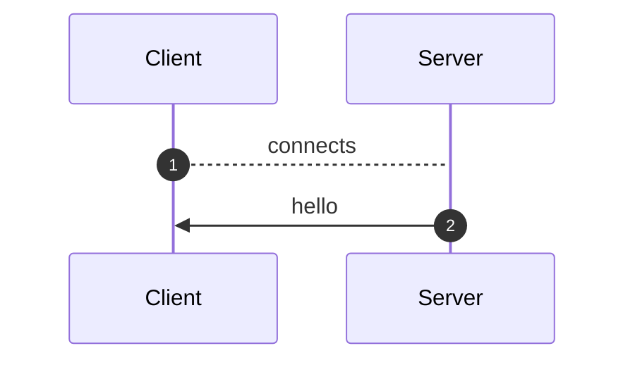
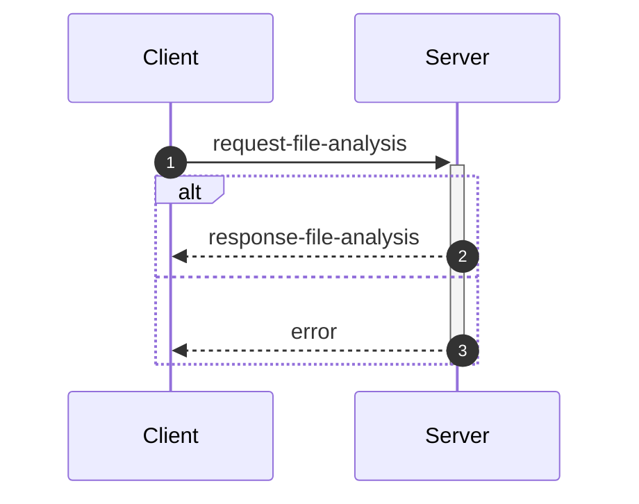
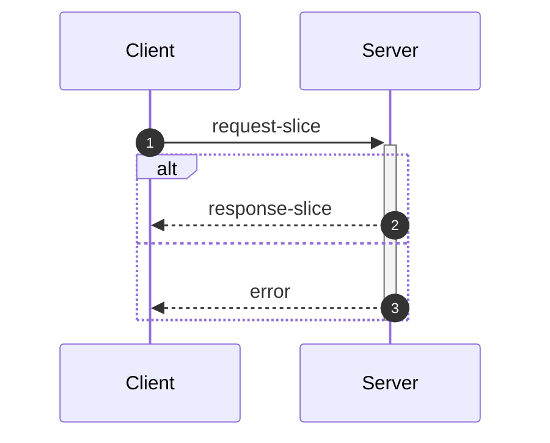
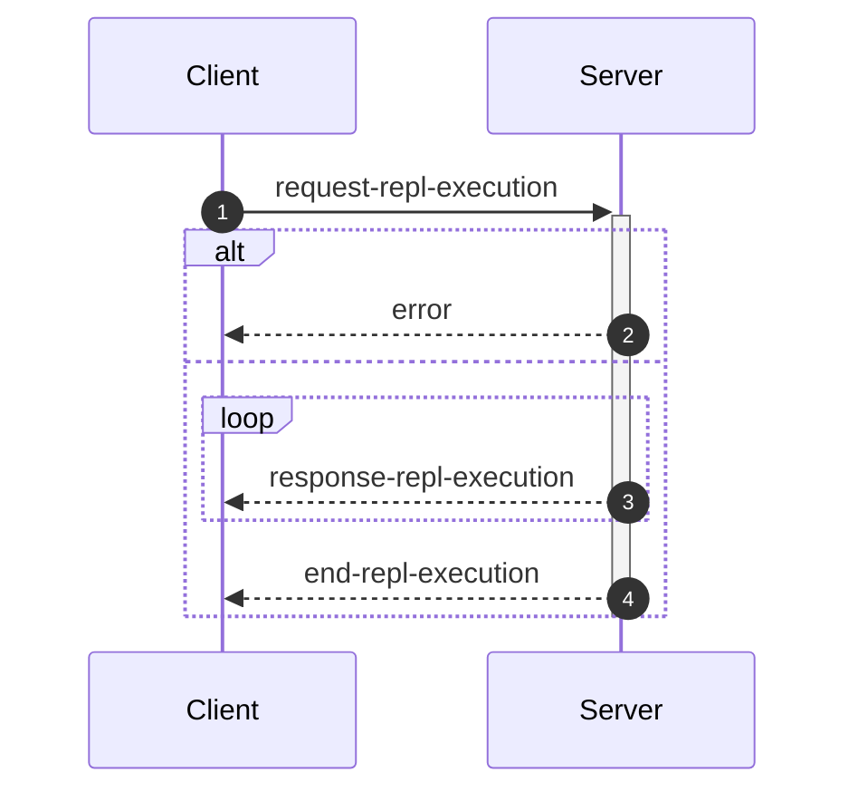

_This document was generated from '[src/documentation/wiki-interface.ts](https://github.com/flowr-analysis/flowr/tree/main//src/documentation/wiki-interface.ts)' on 2026-02-19, 19:03:33 UTC presenting an overview of flowR's interface (v2.9.11, using R v4.5.0). Please do not edit this file/wiki page directly._

Although far from being as detailed as the in-depth explanation of [_flowR_](https://github.com/flowr-analysis/flowr/wiki/wiki/core),
this wiki page explains how to interface with _flowR_ in more detail.
In general, command line arguments and other options provide short descriptions on hover over.

* [💻 Using the REPL](#using-the-repl)
* [⚙️ Configuring FlowR](#configuring-flowr)
* [⚒️ Writing Code](#writing-code)
* [💬 Communicating with the Server](#communicating-with-the-server)

<a id='using-the-repl'></a>
## 💻 Using the REPL


> [!NOTE]
> To execute arbitrary R commands with a repl request, _flowR_ has to be started explicitly with <span title="Description (Command Line Argument): Allow to access the underlying R session when using flowR (security warning: this allows the execution of arbitrary R code!)">`--r-session-access`</span>.
> Please be aware that this introduces a security risk and note that this relies on the [`r-shell` engine](https://github.com/flowr-analysis/flowr/wiki/wiki/engines) .

Although primarily meant for users to explore, 
there is nothing which forbids simply calling _flowR_ as a subprocess to use standard-in, -output, and -error 
for communication (although you can access the REPL using the server as well, 
with the [REPL Request](#message-request-repl-execution) message).

The read-eval-print loop&nbsp;(REPL) works relatively simple.
You can submit an expression (using <kbd>Enter</kbd>),
which is interpreted as an R&nbsp;expression by default but interpreted as a *command* if it starts with a colon (`:`).
The best command to get started with the REPL is <span title="Description (Repl Command): Show help information (aliases: :h, :?)">`:help`</span>.
Besides, you can leave the REPL either with the command <span title="Description (Repl Command): End the repl (aliases: :q, :exit)">`:quit`</span> or by pressing <kbd>Ctrl</kbd>+<kbd>C</kbd> twice.
When writing a *command*, you may press <kbd>Tab</kbd> to get a list of completions, if available.
Multiple commands can be entered in a single line by separating them with a semicolon (`;`), e.g. `:parse "x<-2"; :df*`.
If a command is given without R code, the REPL will re-use R code given in a previous command. 
The prior example will hence return first the parsed AST of the program and then the dataflow graph for `"x <- 2"`.

> [!NOTE]
> If you develop flowR, you may want to launch the repl using the `npm run main-dev` command, this way, you get a non-minified version of flowR with debug information and hot-reloading of source files.

<details>
<summary>Available Commands</summary>

We currently offer the following commands (this with a `[*]` suffix are available with and without the star):


| Command | Description |
| ------- | ----------- |
| **<span title="Description (Repl Command): End the repl (aliases: :q, :exit)">:quit</span>** | End the repl (aliases: **:<span title="Alias of ':quit'. End the repl">q</span>**, **:<span title="Alias of ':quit'. End the repl">exit</span>**) |
| **<span title="Description (Repl Command): Execute the given code as R code. This requires the `--r-session-access` flag to be set and requires the r-shell engine. (aliases: :e, :r)">:execute</span>** | Execute the given code as R code. This requires the `--r-session-access` flag to be set and requires the r-shell engine. (aliases: **:<span title="Alias of ':execute'. Execute the given code as R code. This requires the `--r-session-access` flag to be set and requires the r-shell engine.">e</span>**, **:<span title="Alias of ':execute'. Execute the given code as R code. This requires the `--r-session-access` flag to be set and requires the r-shell engine.">r</span>**) |
| **<span title="Description (Repl Command): Get mermaid code for the control-flow graph of R code, start with 'file://' to indicate a file (aliases: :cfg, :cf)">:controlflow[*]</span>** | Get mermaid code for the control-flow graph of R code, start with 'file://' to indicate a file (star: Returns the URL to mermaid.live) (aliases: **:<span title="Alias of ':controlflow'. Get mermaid code for the control-flow graph of R code, start with 'file://' to indicate a file">cfg</span>**, **:<span title="Alias of ':controlflow'. Get mermaid code for the control-flow graph of R code, start with 'file://' to indicate a file">cf</span>**) |
| **<span title="Description (Repl Command): Get mermaid code for the control-flow graph with basic blocks, start with 'file://' to indicate a file (aliases: :cfgb, :cfb)">:controlflowbb[*]</span>** | Get mermaid code for the control-flow graph with basic blocks, start with 'file://' to indicate a file (star: Returns the URL to mermaid.live) (aliases: **:<span title="Alias of ':controlflowbb'. Get mermaid code for the control-flow graph with basic blocks, start with 'file://' to indicate a file">cfgb</span>**, **:<span title="Alias of ':controlflowbb'. Get mermaid code for the control-flow graph with basic blocks, start with 'file://' to indicate a file">cfb</span>**) |
| **<span title="Description (Repl Command): Get mermaid code for the dataflow graph, start with 'file://' to indicate a file (aliases: :d, :df)">:dataflow[*]</span>** | Get mermaid code for the dataflow graph, start with 'file://' to indicate a file (star: Returns the URL to mermaid.live) (aliases: **:<span title="Alias of ':dataflow'. Get mermaid code for the dataflow graph, start with 'file://' to indicate a file">d</span>**, **:<span title="Alias of ':dataflow'. Get mermaid code for the dataflow graph, start with 'file://' to indicate a file">df</span>**) |
| **<span title="Description (Repl Command): Get mermaid code for the normalized AST of R code, start with 'file://' to indicate a file (aliases: :n)">:normalize[*]</span>** | Get mermaid code for the normalized AST of R code, start with 'file://' to indicate a file (star: Returns the URL to mermaid.live) (alias: **:<span title="Alias of ':normalize'. Get mermaid code for the normalized AST of R code, start with 'file://' to indicate a file">n</span>**) |
| **<span title="Description (Repl Command): Get mermaid code for the simplified dataflow graph, start with 'file://' to indicate a file (aliases: :ds, :dfs)">:dataflowsimple[*]</span>** | Get mermaid code for the simplified dataflow graph, start with 'file://' to indicate a file (star: Returns the URL to mermaid.live) (aliases: **:<span title="Alias of ':dataflowsimple'. Get mermaid code for the simplified dataflow graph, start with 'file://' to indicate a file">ds</span>**, **:<span title="Alias of ':dataflowsimple'. Get mermaid code for the simplified dataflow graph, start with 'file://' to indicate a file">dfs</span>**) |
| **<span title="Description (Repl Command): Just calculates the DFG, but only prints summary info (aliases: :d#, :df#)">:dataflowsilent</span>** | Just calculates the DFG, but only prints summary info (aliases: **:<span title="Alias of ':dataflowsilent'. Just calculates the DFG, but only prints summary info">d#</span>**, **:<span title="Alias of ':dataflowsilent'. Just calculates the DFG, but only prints summary info">df#</span>**) |
| **<span title="Description (Repl Command): Prints ASCII Art of the parsed, unmodified AST, start with 'file://' to indicate a file (aliases: :p)">:parse</span>** | Prints ASCII Art of the parsed, unmodified AST, start with 'file://' to indicate a file (alias: **:<span title="Alias of ':parse'. Prints ASCII Art of the parsed, unmodified AST, start with 'file://' to indicate a file">p</span>**) |
| **<span title="Description (Repl Command): Prints the version of flowR as well as the current version of R">:version</span>** | Prints the version of flowR as well as the current version of R
| **<span title="Description (Repl Command): Query the given R code, start with 'file://' to indicate a file. The query is to be a valid query in json format (use 'help' to get more information).">:query[*]</span>** | Query the given R code, start with 'file://' to indicate a file. The query is to be a valid query in json format (use 'help' to get more information). (star: Similar to query, but returns the output in json format.)
| **<span title="Description (Repl Command): Returns an ASCII representation of the dataflow graph (aliases: :df!)">:dataflowascii</span>** | Returns an ASCII representation of the dataflow graph (alias: **:<span title="Alias of ':dataflowascii'. Returns an ASCII representation of the dataflow graph">df!</span>**) |
| **<span title="Description (Repl Command): Returns summarization stats for the normalized AST (aliases: :n#)">:normalize#</span>** | Returns summarization stats for the normalized AST (alias: **:<span title="Alias of ':normalize#'. Returns summarization stats for the normalized AST">n#</span>**) |
| **<span title="Description (Repl Command): Show help information (aliases: :h, :?)">:help</span>** | Show help information (aliases: **:<span title="Alias of ':help'. Show help information">h</span>**, **:<span title="Alias of ':help'. Show help information">?</span>**) |


</details>


> [!TIP]
> 
> As indicated by the examples before, all REPL commands that operate on code keep track of the state.
> Hence, if you run a command like <span title="Description (Repl Command, starred version): Returns the URL to mermaid.live; Base Command: Get mermaid code for the dataflow graph, start with 'file://' to indicate a file (aliases: :d*, :df*)">`:dataflow*`</span> without providing R code,
> the REPL will re-use the R code provided in a previous command.
> Likewise, doing this will benefit from incrementality!
> If you request the dataflow graph with `:df* x <- 2 * y` and then want to see the parsed AST with `:parse`,
> the REPL will re-use previously obtained information and not re-parse the code again.
> 		


Generally, many commands offer shortcut versions in the REPL. Many queries, for example, offer a shortened format (see the example below).
Of special note, the [Config Query](https://github.com/flowr-analysis/flowr/wiki/wiki/query-api#Config-Query)
can be used to also modify the currently active configuration of _flowR_ within the REPL (see the [wiki page](https://github.com/flowr-analysis/flowr/wiki/wiki/query-api#Config-Query) for more information).

### Example: Retrieving the Dataflow Graph

To retrieve a URL to the [mermaid](https://mermaid.js.org/) diagram of the dataflow of a given expression, 
use <span title="Description (Repl Command, starred version): Returns the URL to mermaid.live; Base Command: Get mermaid code for the dataflow graph, start with 'file://' to indicate a file (aliases: :d*, :df*)">`:dataflow*`</span> (or <span title="Description (Repl Command): Get mermaid code for the dataflow graph, start with 'file://' to indicate a file (aliases: :d, :df)">`:dataflow`</span> to get the mermaid code in the cli):


```shell
$ docker run -it --rm eagleoutice/flowr # or npm run flowr 
flowR repl using flowR v2.9.11, R grammar v14 (tree-sitter engine)
R> :dataflow* y <- 1 + x
```

<details>
<summary style='color:gray'>Output</summary>


```text
https://mermaid.live/view#base64:eyJjb2RlIjoiZmxvd2NoYXJ0IEJUXG4gICAgMXt7XCJgIzkxO1JOdW1iZXIjOTM7IDFcbiAgICAgICgxKVxuICAgICAgKjEuNipgXCJ9fVxuICAgJSUgTm8gZWRnZXMgZm91bmQgZm9yIDFcbiAgICAyKFtcImAjOTE7UlN5bWJvbCM5MzsgeFxuICAgICAgKDIpXG4gICAgICAqMS4xMCpgXCJdKVxuICAgJSUgTm8gZWRnZXMgZm91bmQgZm9yIDJcbiAgICAzW1tcImAjOTE7UkJpbmFyeU9wIzkzOyAjNDM7XG4gICAgICAoMylcbiAgICAgICoxLjYtMTAqXG4gICAgKDEsIDIpYFwiXV1cbiAgICBidWlsdC1pbjpfW1wiYEJ1aWx0LUluOlxuIzQzO2BcIl1cbiAgICBzdHlsZSBidWlsdC1pbjpfIHN0cm9rZTpncmF5LGZpbGw6Z3JheSxzdHJva2Utd2lkdGg6MnB4LG9wYWNpdHk6Ljg7XG4gICAgMFtcImAjOTE7UlN5bWJvbCM5MzsgeVxuICAgICAgKDApXG4gICAgICAqMS4xKmBcIl1cbiAgICA0W1tcImAjOTE7UkJpbmFyeU9wIzkzOyAjNjA7IzQ1O1xuICAgICAgKDQpXG4gICAgICAqMS4xLTEwKlxuICAgICgwLCAzKWBcIl1dXG4gICAgYnVpbHQtaW46Xy1bXCJgQnVpbHQtSW46XG4jNjA7IzQ1O2BcIl1cbiAgICBzdHlsZSBidWlsdC1pbjpfLSBzdHJva2U6Z3JheSxmaWxsOmdyYXksc3Ryb2tlLXdpZHRoOjJweCxvcGFjaXR5Oi44O1xuICAgIDMgLS0+fFwicmVhZHMsIGFyZ3VtZW50XCJ8IDFcbiAgICAzIC0tPnxcInJlYWRzLCBhcmd1bWVudFwifCAyXG4gICAgMyAtLi0+fFwicmVhZHMsIGNhbGxzXCJ8IGJ1aWx0LWluOl9cbiAgICBsaW5rU3R5bGUgMiBzdHJva2U6Z3JheTtcbiAgICAwIC0tPnxcImRlZmluZWQtYnlcInwgM1xuICAgIDAgLS0+fFwiZGVmaW5lZC1ieVwifCA0XG4gICAgNCAtLT58XCJyZWFkcywgYXJndW1lbnRcInwgM1xuICAgIDQgLS0+fFwicmV0dXJucywgYXJndW1lbnRcInwgMFxuICAgIDQgLS4tPnxcInJlYWRzLCBjYWxsc1wifCBidWlsdC1pbjpfLVxuICAgIGxpbmtTdHlsZSA3IHN0cm9rZTpncmF5OyIsIm1lcm1haWQiOnsiYXV0b1N5bmMiOnRydWV9fQ==
```


Retrieve the dataflow graph of the expression `y <- 1 + x`. It looks like this:


	
<details>

<summary style="color:gray">R Code of the Dataflow Graph</summary>

The analysis required _0.6 ms_ (including parse and normalize, using the [tree-sitter](https://github.com/flowr-analysis/flowr/wiki/Engines) engine) within the generation environment. 
We encountered no unknown side effects during the analysis.


```r
y <- 1 + x
```


</details>


</details>


For small graphs like this, <span title="Description (Repl Command): Returns an ASCII representation of the dataflow graph (aliases: :df!)">`:dataflowascii`</span> also provides an ASCII representation directly in the REPL:


```shell
$ docker run -it --rm eagleoutice/flowr # or npm run flowr 
flowR repl using flowR v2.9.11, R grammar v14 (tree-sitter engine)
R> :df! y <- 1 + x
```

<details open>
<summary style='color:gray'>Output</summary>


```text
                        0<1>0
                   ┌────| 1 |
    ┌────────┐     │    0---0
 c<4>c       └──c<3>c
 |<- |  v<0>v┌──| + |
 c---c──| y |┘  c---c   u<2>u
        v---v      └────| x |
                        u---u
Edges:
3 -> 1: reads, argument  3 -> 2: reads, argument
4 -> 3: reads, argument  4 -> 0: returns, argument
0 -> 3: defined-by       0 -> 4: defined-by
```


Retrieve the dataflow graph of the expression `y <- 1 + x` as ASCII art.

</details>


For the slicing with <span title="Description (Repl Command): Static backwards executable slicer for R">`:slicer`</span>, you have access to the same [magic comments](#slice-magic-comments) as with the [slice request](#message-request-slice).

### Example: Interfacing with the File System

Many commands that allow for an R-expression (like <span title="Description (Repl Command, starred version): Returns the URL to mermaid.live; Base Command: Get mermaid code for the dataflow graph, start with 'file://' to indicate a file (aliases: :d*, :df*)">`:dataflow*`</span>) allow for a file as well 
if the argument starts with `file://`. 
If you are working from the root directory of the _flowR_ repository, the following gives you the parsed AST of the example file using the <span title="Description (Repl Command): Prints ASCII Art of the parsed, unmodified AST, start with 'file://' to indicate a file (aliases: :p)">`:parse`</span> command:


```shell
$ docker run -it --rm eagleoutice/flowr # or npm run flowr 
flowR repl using flowR v2.9.11, R grammar v14 (tree-sitter engine)
R> :parse file://test/testfiles/example.R
```

<details>
<summary style='color:gray'>Output</summary>


```text
File: test/testfiles/example.R

program
├ binaryoperator
│ ├ identifier "sum" (1:1─4)
│ ├ <- "<-" (1:5─7)
│ ╰ float "0" (1:8─9)
├ binaryoperator
│ ├ identifier "product" (2:1─8)
│ ├ <- "<-" (2:9─11)
│ ╰ float "1" (2:12─13)
├ binaryoperator
│ ├ identifier "w" (3:1─2)
│ ├ <- "<-" (3:3─5)
│ ╰ float "7" (3:6─7)
├ binaryoperator
│ ├ identifier "N" (4:1─2)
│ ├ <- "<-" (4:3─5)
│ ╰ float "10" (4:6─8)
├ forstatement
│ ├ for "for" (6:1─4)
│ ├ ( "(" (6:5─6)
│ ├ identifier "i" (6:6─7)
│ ├ in "in" (6:8─10)
│ ├ binaryoperator
│ │ ├ float "1" (6:11─12)
│ │ ├ : ":" (6:12─13)
│ │ ╰ parenthesizedexpression
│ │   ├ ( "(" (6:13─14)
│ │   ├ binaryoperator
│ │   │ ├ identifier "N" (6:14─15)
│ │   │ ├ - "-" (6:15─16)
│ │   │ ╰ float "1" (6:16─17)
│ │   ╰ ) ")" (6:17─18)
│ ├ ) ")" (6:18─19)
│ ╰ bracedexpression
│   ├ { "{" (6:20─21)
│   ├ binaryoperator
│   │ ├ identifier "sum" (7:3─6)
│   │ ├ <- "<-" (7:7─9)
│   │ ╰ binaryoperator
│   │   ├ binaryoperator
│   │   │ ├ identifier "sum" (7:10─13)
│   │   │ ├ + "+" (7:14─15)
│   │   │ ╰ identifier "i" (7:16─17)
│   │   ├ + "+" (7:18─19)
│   │   ╰ identifier "w" (7:20─21)
│   ├ binaryoperator
│   │ ├ identifier "product" (8:3─10)
│   │ ├ <- "<-" (8:11─13)
│   │ ╰ binaryoperator
│   │   ├ identifier "product" (8:14─21)
│   │   ├  "" (8:22─23)
│   │   ╰ identifier "i" (8:24─25)
│   ╰ } "}" (9:1─2)
├ call
│ ├ identifier "cat" (11:1─4)
│ ╰ arguments
│   ├ ( "(" (11:4─5)
│   ├ argument
│   │ ╰ string
│   │   ├ " "\"" (11:5─6)
│   │   ├ stringcontent "Sum:" (11:6─10)
│   │   ╰ " "\"" (11:10─11)
│   ├ comma "," (11:11─12)
│   ├ argument
│   │ ╰ identifier "sum" (11:13─16)
│   ├ comma "," (11:16─17)
│   ├ argument
│   │ ╰ string
│   │   ├ " "\"" (11:18─19)
│   │   ├ stringcontent
│   │   │ ╰ escapesequence "\\n" (11:19─21)
│   │   ╰ " "\"" (11:21─22)
│   ╰ ) ")" (11:22─23)
╰ call
  ├ identifier "cat" (12:1─4)
  ╰ arguments
    ├ ( "(" (12:4─5)
    ├ argument
    │ ╰ string
    │   ├ " "\"" (12:5─6)
    │   ├ stringcontent "Product:" (12:6─14)
    │   ╰ " "\"" (12:14─15)
    ├ comma "," (12:15─16)
    ├ argument
    │ ╰ identifier "product" (12:17─24)
    ├ comma "," (12:24─25)
    ├ argument
    │ ╰ string
    │   ├ " "\"" (12:26─27)
    │   ├ stringcontent
    │   │ ╰ escapesequence "\\n" (12:27─29)
    │   ╰ " "\"" (12:29─30)
    ╰ ) ")" (12:30─31)
```


Retrieve the parsed AST of the example file.

<details>

<summary>File Content</summary>


```r
sum <- 0
product <- 1
w <- 7
N <- 10

for (i in 1:(N-1)) {
  sum <- sum + i + w
  product <- product * i
}

cat("Sum:", sum, "\n")
cat("Product:", product, "\n")
```


</details>

As _flowR_ directly transforms this AST the output focuses on being human-readable instead of being machine-readable. 
		

</details>


### Example: Run a Query

You can run any query supported by _flowR_ using the <span title="Description (Repl Command): Query the given R code, start with 'file://' to indicate a file. The query is to be a valid query in json format (use 'help' to get more information).">`:query`</span> command.
For example, to obtain the shapes of all data frames in a given piece of code, you can run:


```shell
$ docker run -it --rm eagleoutice/flowr # or npm run flowr 
flowR repl using flowR v2.9.11, R grammar v14 (tree-sitter engine)
R> :query @df-shape "x <- data.frame(a = 1:10, b = 1:10)\ny <- x$a"
```

<details open>
<summary style='color:gray'>Output</summary>


```text
Query: df-shape (1 ms)
   ╰ 12: (colnames: [{"a", "b"}, {}], cols: [2, 2], rows: [10, 10])
   ╰ 0: (colnames: [{"a", "b"}, {}], cols: [2, 2], rows: [10, 10])
All queries together required ≈3 ms (1ms accuracy, total 4 ms)
```


Retrieve the shapes of all data frames in the given code.

</details>


To run the linter on a file, you can use (in this example, we just issue the `dead-code` linter on a small piece of code):


```shell
$ docker run -it --rm eagleoutice/flowr # or npm run flowr 
flowR repl using flowR v2.9.11, R grammar v14 (tree-sitter engine)
R> :query @linter rules:dead-code "if(FALSE) x <- 2"
```

<details open>
<summary style='color:gray'>Output</summary>


```text
Query: linter (1 ms)
   ╰ Dead Code (dead-code):
       ╰ certain:
           ╰ Code at 1.11-16
       ╰ Metadata: consideredNodes: 7, searchTimeMs: 1, processTimeMs: 0
All queries together required ≈1 ms (1ms accuracy, total 2 ms)
```


Run the linter on the given code, with only the `dead-code` rule enabled.

</details>


For more information on the available queries, please check out the [Query API](https://github.com/flowr-analysis/flowr/wiki/wiki/query-api).


<a id='configuring-flowr'></a>
## ⚙️ Configuring FlowR


When running _flowR_, you may want to specify some behaviors with a dedicated configuration file. 
By default, flowR looks for a file named `flowr.json` in the current working directory (or any higher directory). 
You can also specify a different file with <span title="Description (Command Line Argument): The name of the configuration file to use">`--config-file`</span> or pass the configuration inline using <span title="Description (Command Line Argument): The flowR configuration to use, as a JSON string">`--config-json`</span>.
To inspect the current configuration, you can run flowr with the <span title="Description (Command Line Argument): Run with verbose logging (will be passed to the corresponding script)">`--verbose`</span> flag, or use the `config` [Query](https://github.com/flowr-analysis/flowr/wiki/Query%20API).
Within the REPL this works by running the following:


```shell
:query @config
```


The following summarizes the configuration options:

- `ignoreSourceCalls`: If set to `true`, _flowR_ will ignore source calls when analyzing the code, i.e., ignoring the inclusion of other files.
- `semantics`: allows to configure the way _flowR_ handles R, although we currently only support `semantics/environment/overwriteBuiltIns`. 
  You may use this to overwrite _flowR_'s handling of built-in function and even completely clear the preset definitions shipped with flowR. 
  See [Configure BuiltIn Semantics](#configure-builtin-semantics) for more information.
- `solver`: allows to configure how _flowR_ resolves variables and their values (currently we support: `disabled`, `alias`, `builtin`), as well as if pointer analysis should be active.
- `engines`: allows to configure the engines used by _flowR_ to interact with R code. See the [Engines wiki page](https://github.com/flowr-analysis/flowr/wiki/Engines) for more information.
- `defaultEngine`: allows to specify the default engine to use for interacting with R code. If not set, an arbitrary engine from the specified list will be used.
- `abstractInterpretation`: allows to configure how _flowR_ performs abstract interpretation, although we currently only support data frame shape inference through abstract interpretation.

So you can configure _flowR_ by adding a file like the following:

<details>

<summary>Example Configuration File</summary>


```json
{
  "ignoreSourceCalls": true,
  "semantics": {
    "environment": {
      "overwriteBuiltIns": {
        "definitions": [
          {
            "type": "function",
            "names": [
              "foo"
            ],
            "processor": "builtin:assignment",
            "config": {}
          }
        ]
      }
    }
  },
  "repl": {
    "quickStats": false,
    "dfProcessorHeat": false
  },
  "project": {
    "resolveUnknownPathsOnDisk": true
  },
  "engines": [
    {
      "type": "r-shell"
    }
  ],
  "solver": {
    "variables": "alias",
    "evalStrings": true,
    "resolveSource": {
      "dropPaths": "no",
      "ignoreCapitalization": true,
      "inferWorkingDirectory": "active-script",
      "searchPath": []
    },
    "instrument": {},
    "slicer": {
      "threshold": 50
    }
  },
  "abstractInterpretation": {
    "wideningThreshold": 4,
    "dataFrame": {
      "maxColNames": 20,
      "readLoadedData": {
        "readExternalFiles": true,
        "maxReadLines": 1000000
      }
    }
  }
}
```


</details>

<details> 
<a id='configure-builtin-semantics'></a>
<summary>Configure Built-In Semantics</summary> 


`semantics/environment/overwriteBuiltins` accepts two keys:

- `loadDefaults` (boolean, initially `true`): If set to `true`, the default built-in definitions are loaded before applying the custom definitions. Setting this flag to `false` explicitly disables the loading of the default definitions.
- `definitions` (array, initially empty): Allows to overwrite or define new built-in elements. Each object within must have a `type` which is one of the below. Furthermore, they may define a string array of `names` which specifies the identifiers to bind the definitions to. You may use `assumePrimitive` to specify whether _flowR_ should assume that this is a primitive non-library definition (so you probably just do not want to specify the key).

  | Type            | Description                                                                                                                                                                                                                                                                                              | Example                                                                                                    |
  | --------------- | -------------------------------------------------------------------------------------------------------------------------------------------------------------------------------------------------------------------------------------------------------------------------------------------------------- | ---------------------------------------------------------------------------------------------------------- |
  | `constant`    | Additionally allows for a `value` this should resolve to.                                                                                                                                                                                                                                                | `{ type: 'constant', names: ['NULL', 'NA'],  value: null }`                                                |
  | `function`    | Is a rather flexible way to define and bind built-in functions. For the time, we do not have extensive documentation to cover all the cases, so please either consult the sources with the `default-builtin-config.ts` or open a [new issue](https://github.com/flowr-analysis/flowr/issues/new/choose). | `{ type: 'function', names: ['next'], processor: 'builtin:default', config: { cfg: ExitPointType.Next } }` |
  | `replacement` | A comfortable way to specify replacement functions like `$<-` or `names<-`. `suffixes` describes the... suffixes to attach automatically. | `{ type: 'replacement', suffixes: ['<-', '<<-'], names: ['[', '[['] }` |


</details>

<details>

<summary style='color:gray'>Full Configuration-File Schema</summary>

- _The configuration file format for flowR._ (object)
    - **ignoreSourceCalls** [optional] _Whether source calls should be ignored, causing {@link processSourceCall}'s behavior to be skipped._ (boolean)
    - **semantics** _Configure language semantics and how flowR handles them._ (object)
        - **environment** [optional] _Semantics regarding how to handle the R environment._ (object)
            - **overwriteBuiltIns** [optional] _Do you want to overwrite (parts) of the builtin definition?_ (object)
                - **loadDefaults** [optional] _Should the default configuration still be loaded?_ (boolean)
                - **definitions** [optional] _The definitions to load/overwrite._ (array)
                Valid item types:
                    - (object)
    - **repl** _Configuration options for the REPL._ (object)
        - **quickStats** [optional] _Whether to show quick stats in the REPL after each evaluation._ (boolean)
        - **dfProcessorHeat** [optional] _This instruments the dataflow processors to count how often each processor is called._ (boolean)
    - **project** _Project specific configuration options._ (object)
        - **resolveUnknownPathsOnDisk** [optional] _Whether to resolve unknown paths loaded by the r project disk when trying to source/analyze files._ (boolean)
    - **engines** _The engine or set of engines to use for interacting with R code. An empty array means all available engines will be used._ (array)
    Valid item types:
        - (alternatives)
            - _The configuration for the tree sitter engine._ (object)
                - **type** [required] _Use the tree sitter engine._ (string)
                    Only allows: 'tree-sitter'
                - **wasmPath** [optional] _The path to the tree-sitter-r WASM binary to use. If this is undefined, this uses the default path._ (string)
                - **treeSitterWasmPath** [optional] _The path to the tree-sitter WASM binary to use. If this is undefined, this uses the default path._ (string)
                - **lax** [optional] _Whether to use the lax parser for parsing R code (allowing for syntax errors). If this is undefined, the strict parser will be used._ (boolean)
            - _The configuration for the R shell engine._ (object)
                - **type** [required] _Use the R shell engine._ (string)
                    Only allows: 'r-shell'
                - **rPath** [optional] _The path to the R executable to use. If this is undefined, this uses the default path._ (string)
    - **defaultEngine** [optional] _The default engine to use for interacting with R code. If this is undefined, an arbitrary engine from the specified list will be used._ (string)
        Only allows: 'tree-sitter', 'r-shell'
    - **solver** _How to resolve constants, constraints, cells, ..._ (object)
        - **variables** _How to resolve variables and their values._ (string)
            Only allows: 'disabled', 'alias', 'builtin'
        - **evalStrings** _Should we include eval(parse(text="...")) calls in the dataflow graph?_ (boolean)
        - **instrument** (object)
            - **dataflowExtractors** [optional] _These keys are only intended for use within code, allowing to instrument the dataflow analyzer!_ (any)
        - **resolveSource** [optional] _If lax source calls are active, flowR searches for sourced files much more freely, based on the configurations you give it. This option is only in effect if `ignoreSourceCalls` is set to false._ (object)
            - **dropPaths** _Allow to drop the first or all parts of the sourced path, if it is relative._ (string)
                Only allows: 'no', 'once', 'all'
            - **ignoreCapitalization** _Search for filenames matching in the lowercase._ (boolean)
            - **inferWorkingDirectory** _Try to infer the working directory from the main or any script to analyze._ (string)
                Only allows: 'no', 'main-script', 'active-script', 'any-script'
            - **searchPath** _Additionally search in these paths._ (array)
            Valid item types:
                - (string)
            - **repeatedSourceLimit** [optional] _How often the same file can be sourced within a single run? Please be aware: in case of cyclic sources this may not reach a fixpoint so give this a sensible limit._ (number)
            - **applyReplacements** _Provide name replacements for loaded files_ (array)
            Valid item types:
                - (object)
        - **slicer** [optional] _The configuration for the slicer._ (object)
            - **threshold** [optional] _The maximum number of iterations to perform on a single function call during slicing._ (number)
    - **abstractInterpretation** _The configuration options for abstract interpretation._ (object)
        - **dataFrame** _The configuration of the shape inference for data frames._ (object)
            - **maxColNames** _The maximum number of columns names to infer for data frames before over-approximating the column names to top._ (number)
            - **wideningThreshold** _The threshold for the number of visitations of a node at which widening should be performed to ensure the termination of the fixpoint iteration._ (number)
            - **readLoadedData** _Configuration options for reading data frame shapes from loaded external data files, such as CSV files._ (object)
                - **readExternalFiles** _Whether data frame shapes should be extracted from loaded external files, such as CSV files._ (boolean)
                - **maxReadLines** _The maximum number of lines to read when extracting data frame shapes from loaded files, such as CSV files._ (number)

</details>

	

<a id='writing-code'></a>
## ⚒️ Writing Code

_flowR_ can be used as a [module](https://www.npmjs.com/package/@eagleoutice/flowr) and offers several main classes and interfaces that are interesting for extension writers 
(see the [Visual Studio Code extension](https://marketplace.visualstudio.com/items?itemName=code-inspect.vscode-flowr) or the [Core](https://github.com/flowr-analysis/flowr/wiki/wiki/core) wiki page for more information).

### Creating Analyses with _flowR_

Nowadays, instances of the <a href="https://github.com/flowr-analysis/flowr/tree/main//src/project/flowr-analyzer.ts#L162"><code><span title="Central class for conducting analyses with FlowR. Use the FlowrAnalyzerBuilder to create a new instance. If you want the original pattern of creating a pipeline and running all steps, you can still do this with FlowrAnalyzer#runFull . To inspect the context of the analyzer, use FlowrAnalyzer#inspectContext (if you are a plugin and need to modify it, use FlowrAnalyzer#context instead).">FlowrAnalyzer</span></code></a> should be used as central frontend to get analysis results from _flowR_.
For example, a program slice can be created like this:


```ts
const analyzer = await new FlowrAnalyzerBuilder()
    .setEngine('tree-sitter')
    .build();
analyzer.addRequest('x <- 1\ny <- x\nx');
const result = await analyzer.query([
    {
        type:     'static-slice',
        criteria: ['3@x']
    }
]);
//console.log(result['static-slice']);
```


For more information, please have a look at the [Analyzer](https://github.com/flowr-analysis/flowr/wiki/wiki/analyzer) wiki page, which explains how to construct and use the <a href="https://github.com/flowr-analysis/flowr/tree/main//src/project/flowr-analyzer.ts#L162"><code><span title="Central class for conducting analyses with FlowR. Use the FlowrAnalyzerBuilder to create a new instance. If you want the original pattern of creating a pipeline and running all steps, you can still do this with FlowrAnalyzer#runFull . To inspect the context of the analyzer, use FlowrAnalyzer#inspectContext (if you are a plugin and need to modify it, use FlowrAnalyzer#context instead).">FlowrAnalyzer</span></code></a> in more detail.
To work with specific perspectives, you can also consult the respective pages like the [Dataflow Graph](https://github.com/flowr-analysis/flowr/wiki/wiki/dataflow-graph) or the [Abstract Interpretation](https://github.com/flowr-analysis/flowr/wiki/wiki/abstract-interpretation) wiki pages.
        
### The Pipeline Executor (Low-Level Interface)

Once, in the beginning, _flowR_ was meant to produce a dataflow graph merely to provide *program slices*. 
However, with continuous updates, the [Dataflow Graph](https://github.com/flowr-analysis/flowr/wiki/wiki/dataflow-graph) repeatedly proves to be the more interesting part.
With this, we restructured _flowR_'s originally *hardcoded* pipeline to be far more flexible. 
Now, it can be theoretically extended or replaced with arbitrary steps, optional steps, and what we call 'decorations' of these steps. 
In short, a slicing pipeline using the <a href="https://github.com/flowr-analysis/flowr/tree/main//src/core/pipeline-executor.ts#L97"><code><span title="**Please note:** The PipelineExecutor is now considered to be a rather low-level API for flowR. While it still works and is the basis for all other layers, we strongly recommend using the FlowrAnalyzer and its builder to create and use an analyzer instance that is pre-configured for your use-case. The pipeline executor allows to execute arbitrary pipelines in a step-by-step fashion. If you are not...">PipelineExecutor</span></code></a> looks like this:


```ts

const slicer = new PipelineExecutor(DEFAULT_SLICING_PIPELINE, {
  parser:    new RShell(),
  request:   requestFromInput('x <- 1\nx + 1'),
  criterion: ['2@x']
})
const slice = await slicer.allRemainingSteps()
// console.log(slice.reconstruct.code)
```


<details><summary>More Information</summary>


If you compare this, with what you would have done with the old (and removed) `SteppingSlicer`, 
this essentially just requires you to replace the `SteppingSlicer` with the <a href="https://github.com/flowr-analysis/flowr/tree/main//src/core/pipeline-executor.ts#L97"><code><span title="**Please note:** The PipelineExecutor is now considered to be a rather low-level API for flowR. While it still works and is the basis for all other layers, we strongly recommend using the FlowrAnalyzer and its builder to create and use an analyzer instance that is pre-configured for your use-case. The pipeline executor allows to execute arbitrary pipelines in a step-by-step fashion. If you are not...">PipelineExecutor</span></code></a>
and to pass the <a href="https://github.com/flowr-analysis/flowr/tree/main//src/core/steps/pipeline/default-pipelines.ts#L18"><code>DEFAULT_SLICING_PIPELINE</code></a> as the first argument.
The <a href="https://github.com/flowr-analysis/flowr/tree/main//src/core/pipeline-executor.ts#L97"><code><span title="**Please note:** The PipelineExecutor is now considered to be a rather low-level API for flowR. While it still works and is the basis for all other layers, we strongly recommend using the FlowrAnalyzer and its builder to create and use an analyzer instance that is pre-configured for your use-case. The pipeline executor allows to execute arbitrary pipelines in a step-by-step fashion. If you are not...">PipelineExecutor</span></code></a>...

1. Provides structures to investigate the results of all intermediate steps
2. Can be executed step-by-step
3. Can repeat steps (e.g., to calculate multiple slices on the same input)

See the in-code documentation for more information.

	

</details>
    

### Using the <a href="https://github.com/flowr-analysis/flowr/tree/main//src/r-bridge/shell.ts#L143"><code><span title="The RShell represents an interactive session with the R interpreter. You can configure it by RShellOptions . At the moment we are using a live R session (and not networking etc.) to communicate with R easily, which allows us to install packages etc. However, this might and probably will change in the future (leaving this as a legacy mode :D)">RShell</span></code></a> to Interact with R

The <a href="https://github.com/flowr-analysis/flowr/tree/main//src/r-bridge/shell.ts#L143"><code><span title="The RShell represents an interactive session with the R interpreter. You can configure it by RShellOptions . At the moment we are using a live R session (and not networking etc.) to communicate with R easily, which allows us to install packages etc. However, this might and probably will change in the future (leaving this as a legacy mode :D)">RShell</span></code></a> class allows interfacing with the `R`&nbsp;ecosystem installed on the host system.
Please have a look at [flowR's Engines](https://github.com/flowr-analysis/flowr/wiki/wiki/engines) for more information on alternatives (for example, the <a href="https://github.com/flowr-analysis/flowr/tree/main//src/r-bridge/lang-4.x/tree-sitter/tree-sitter-executor.ts#L18"><code><span title="Synchronous and (way) faster alternative to the RShell using tree-sitter.">TreeSitterExecutor</span></code></a>).


> [!IMPORTANT]
> 
> Each <a href="https://github.com/flowr-analysis/flowr/tree/main//src/r-bridge/shell.ts#L143"><code><span title="The RShell represents an interactive session with the R interpreter. You can configure it by RShellOptions . At the moment we are using a live R session (and not networking etc.) to communicate with R easily, which allows us to install packages etc. However, this might and probably will change in the future (leaving this as a legacy mode :D)">RShell</span></code></a> controls a new instance of the R&nbsp;interpreter, 
> make sure to call <code><a href="https://github.com/flowr-analysis/flowr/tree/main//src/r-bridge/shell.ts#L317"><span title="Close the current R session, makes the object effectively invalid (can no longer be reopened etc.)">RShell::<i>close</i></span></a>()</code> when you are done.


You can start a new "session" simply by constructing a new object with <code>new <a href="https://github.com/flowr-analysis/flowr/tree/main//src/r-bridge/shell.ts#L143"><span title="The RShell represents an interactive session with the R interpreter. You can configure it by RShellOptions . At the moment we are using a live R session (and not networking etc.) to communicate with R easily, which allows us to install packages etc. However, this might and probably will change in the future (leaving this as a legacy mode :D)">RShell</span></a>()</code>.

However, there are several options that may be of interest 
(e.g., to automatically revive the shell in case of errors or to control the name location of the R process on the system).

With a shell object (let's call it `shell`), you can execute R code by using <a href="https://github.com/flowr-analysis/flowr/tree/main//src/r-bridge/shell.ts#L195"><code><span title="sends the given command directly to the current R session will not do anything to alter input markers!">RShell::<i>sendCommand</i></span></code></a>, 
for example <code>shell.<a href="https://github.com/flowr-analysis/flowr/tree/main//src/r-bridge/shell.ts#L195"><span title="sends the given command directly to the current R session will not do anything to alter input markers!">sendCommand</span></a>("1 + 1")</code>. 
However, this does not return anything, so if you want to collect the output of your command, use
<a href="https://github.com/flowr-analysis/flowr/tree/main//src/r-bridge/shell.ts#L261"><code><span title="Send a command and collect the output">RShell::<i>sendCommandWithOutput</i></span></code></a> instead.

Besides that, the command <a href="https://github.com/flowr-analysis/flowr/tree/main//src/r-bridge/shell.ts#L233"><code>RShell::<b>tryToInjectHomeLibPath</b></code></a> may be of interest, as it enables all libraries available on the host system.


### Generate Statistics (No longer a Focus of flowR)


<details>

<summary>Adding a New Feature to Extract</summary>

In this example, we construct a new feature to extract, with the name "*example*".
Whenever this name appears, you may substitute this with whatever name fits your feature best (as long as the name is unique).

1. **Create a new file in `src/statistics/features/supported`**\
   Create the file `example.ts`, and add its export to the `index.ts` file in the same directory (if not done automatically).

2. **Create the basic structure**\
   To get a better feel of what a feature must have, let's look
   at the basic structure (of course, due to TypeScript syntax,
   there are other ways to achieve the same goal):

   ```ts
   const initialExampleInfo = {
       /* whatever start value is good for you */
       someCounter: 0
   }

   export type ExampleInfo = Writable<typeof initialExampleInfo>

   export const example: Feature<ExampleInfo> = {
    name:        'Example Feature',
    description: 'A longer example description',

    process(existing: ExampleInfo, input: FeatureProcessorInput): ExampleInfo {
      /* perform analysis on the input */
      return existing
    },

    initialValue: initialExampleInfo
   }
   ```

   The `initialExampleInfo` type holds the initial values for each counter that you want to maintain during the feature extraction (they will usually be initialized with 0). The resulting `ExampleInfo` type holds the structure of the data that is to be counted. Due to the vast amount of data processed, information like the name and location of a function call is not stored here, but instead written to disk (see below).

   Every new feature must be of the `Feature<Info>` type, with `Info` referring to a `FeatureInfo` (like `ExampleInfo` in this example). Next to a `name` and a `description`, each Feature must provide:

   - a processor that extracts the information from the input, adding it to the existing information.
   - a function returning the initial value of the information (in this case, `initialExampleInfo`).

3. **Add it to the feature-mapping**\
   Now, in the `feature.ts` file in `src/statistics/features`, add your feature to the `ALL_FEATURES` object.

Now, we want to extract something. For the *example* feature created in the previous steps, we choose to count the amount of `COMMENT` tokens.
So we define a corresponding [XPath](https://developer.mozilla.org/en-US/docs/Web/XPath) query:

```ts
const commentQuery: Query = xpath.parse('//COMMENT')
```

Within our feature's `process` function, running the query is as simple as:

```ts
const comments = commentQuery.select({ node: input.parsedRAst })
```

Now we could do a lot of further processing, but for simplicity, we only record every comment found this way:

```ts
appendStatisticsFile(example.name, 'comments', comments, input.filepath)
```

We use `example.name` to avoid duplication with the name that we’ve assigned to the feature. It corresponds to the name of the folder in the statistics output.
`'comments'` refers to a freely chosen (but unique) name, that will be used as the name for the output file within the folder. The `comments` variable holds the result of the query, which is an array of nodes. Finally, we pass the `filepath` of the file that was analyzed (if known), so that it can be added to the statistics file (as additional information).

</details>
	

<a id='communicating-with-the-server'></a>
## 💬 Communicating with the Server


As explained in the [Overview](https://github.com/flowr-analysis/flowr/wiki/Overview), you can simply run the [TCP](https://de.wikipedia.org/wiki/Transmission_Control_Protocol)&nbsp;server by adding the <span title="Description (Command Line Argument): Do not drop into a repl, but instead start a server on the given port (default: 1042) and listen for messages.">`--server`</span> flag (and, due to the interactive mode, exit with the conventional <kbd>CTRL</kbd>+<kbd>C</kbd>).
Currently, every connection is handled by the same underlying `RShell` - so the server is not designed to handle many clients at a time.
Additionally, the server is not well guarded against attacks (e.g., you can theoretically spawn an arbitrary number of&nbsp;RShell sessions on the target machine).

Every message has to be given in a single line (i.e., without a newline in-between) and end with a newline character. Nevertheless, we will pretty-print example given in the following segments for the ease of reading.


> [!NOTE]
> 
> The default <span title="Description (Command Line Argument): Do not drop into a repl, but instead start a server on the given port (default: 1042) and listen for messages.">`--server`</span> uses a simple [TCP](https://de.wikipedia.org/wiki/Transmission_Control_Protocol)
> connection. If you want _flowR_ to expose a [WebSocket](https://de.wikipedia.org/wiki/WebSocket) server instead, add the <span title="Description (Command Line Argument): If the server flag is set, use websocket for messaging">`--ws`</span> flag (i.e., <span title="Description (Command Line Argument): Do not drop into a repl, but instead start a server on the given port (default: 1042) and listen for messages.">`--server`</span> <span title="Description (Command Line Argument): If the server flag is set, use websocket for messaging">`--ws`</span>) when starting _flowR_ from the command line.
> 			


<ul><li>
<a id="message-hello"></a>
<b>Hello</b> Message (<code>hello</code>) 
<details>

<summary style="color:gray"> View Details. <i>The server informs the client about the successful connection and provides Meta-Information.</i> </summary>




	
After launching _flowR_, for example, with <code>docker run -it --rm eagleoutice/flowr <span title="Description (Command Line Argument): Do not drop into a repl, but instead start a server on the given port (default: 1042) and listen for messages.">-<span/>-server</span></code>&nbsp;(🐳️), simply connecting should present you with a `hello` message, that amongst others should reveal the versions of&nbsp;_flowR_ and&nbsp;R, using the [semver 2.0](https://semver.org/spec/v2.0.0.html) versioning scheme.
The message looks like this:


```json
{
  "type": "hello",
  "clientName": "client-0",
  "versions": {
    "flowr": "2.9.11",
    "r": "4.5.0",
    "engine": "r-shell"
  }
}
```


There are currently a few messages that you can send after the hello message.
If you want to _slice_ a piece of R code you first have to send an [analysis request](#message-request-file-analysis), so that you can send one or multiple slice requests afterward.
Requests for the [REPL](#message-request-repl) are independent of that.
	

<hr>


<details>
<summary style="color:gray">Message schema (<code>hello</code>)</summary>

For the definition of the hello message, please see it's implementation at [`./src/cli/repl/server/messages/message-hello.ts`](https://github.com/flowr-analysis/flowr/tree/main/./src/cli/repl/server/messages/message-hello.ts).

- [required] (object)
    - **type** [required] _The type of the hello message._ (string)
        Only allows: 'hello'
    - **id** [forbidden] _The id of the message is always undefined (as it is the initial message and not requested)._ (any)
    - **clientName** [required] _A unique name that is assigned to each client. It has no semantic meaning and is only used/useful for debugging._ (string)
    - **versions** [required] (object)
        - **flowr** [required] _The version of the flowr server running in semver format._ (string)
        - **r** [required] _The version of the underlying R shell running in semver format._ (string)
        - **engine** [required] _The parser backend that is used to parse the R code._ (string)

</details>


<hr>

</details>
	</li>

<li>
<a id="message-request-file-analysis"></a>
<b>Analysis</b> Message (<code>request-file-analysis</code>) 
<details>

<summary style="color:gray"> View Details. <i>The server builds the dataflow graph for a given input file (or a set of files).</i> </summary>




	
The request allows the server to analyze a file and prepare it for slicing.
The message can contain a `filetoken`, which is used to identify the file in later slice or query requests (if you do not add one, the request will not be stored and therefore, it is not available for subsequent requests).

> **Please note!**\
> If you want to send and process a lot of analysis requests, but do not want to slice them, please do not pass the `filetoken` field. This will save the server a lot of memory allocation.

Furthermore, the request must contain either a `content` field to directly pass the file's content or a `filepath` field which contains the path to the file (this path must be accessible for the server to be useful).
If you add the `id` field, the answer will use the same `id` so you can match requests and the corresponding answers.
See the implementation of the request-file-analysis message for more information.


<details>
<summary>Example of the <code>request-file-analysis</code> Message</summary>

_Note:_ even though we pretty-print these messages, they are sent as a single line, ending with a newline.

The following lists all messages that were sent and received in case you want to reproduce the scenario:

<ol>
<li> <code>hello</code> (response)
<details> 

<summary> Show Details </summary>

The first message is always a hello message.


```json
{
  "type": "hello",
  "clientName": "client-0",
  "versions": {
    "flowr": "2.9.11",
    "r": "4.5.0",
    "engine": "r-shell"
  }
}
```


</details>
</li>

<li> <b><code>request-file-analysis</code> (request)</b>
<details open> 

<summary> Show Details </summary>

Let's suppose you simply want to analyze the following script:
 
```r
x <- 1
x + 1
```

 For this, you can send the following request:


```json
{
  "type": "request-file-analysis",
  "id": "1",
  "filetoken": "x",
  "content": "x <- 1\nx + 1"
}
```


</details>
</li>

<li> <code>response-file-analysis</code> (response)
<details> 

<summary> Show Details </summary>


The `results` field of the response effectively contains three keys of importance:

- `parse`: which contains 1:1 the parse result in CSV format that we received from the `RShell` (i.e., the AST produced by the parser of the R interpreter).
- `normalize`: which contains the normalized AST, including ids (see the `info` field and the [Normalized AST](https://github.com/flowr-analysis/flowr/wiki/Normalized%20AST) wiki page).
- `dataflow`: especially important is the `graph` field which contains the dataflow graph as a set of root vertices (see the [Dataflow Graph](https://github.com/flowr-analysis/flowr/wiki/Dataflow%20Graph) wiki page).
			


_As the code is pretty long, we inhibit pretty printing and syntax highlighting (JSON, hiding built-in):_

```text
{"type":"response-file-analysis","format":"json","id":"1","results":{"parse":{"files":[{"parsed":"[1,1,1,6,7,0,\"expr\",false,\"x <- 1\"],[1,1,1,1,1,3,\"SYMBOL\",true,\"x\"],[1,1,1,1,3,7,\"expr\",false,\"x\"],[1,3,1,4,2,7,\"LEFT_ASSIGN\",true,\"<-\"],[1,6,1,6,4,5,\"NUM_CONST\",true,\"1\"],[1,6,1,6,5,7,\"expr\",false,\"1\"],[2,1,2,5,16,0,\"expr\",false,\"x + 1\"],[2,1,2,1,10,12,\"SYMBOL\",true,\"x\"],[2,1,2,1,12,16,\"expr\",false,\"x\"],[2,3,2,3,11,16,\"'+'\",true,\"+\"],[2,5,2,5,13,14,\"NUM_CONST\",true,\"1\"],[2,5,2,5,14,16,\"expr\",false,\"1\"]","filePath":"/tmp/tmp-8486-wl7fQ4syrSzN-.R"}],".meta":{"timing":2}},"normalize":{"ast":{"type":"RProject","files":[{"root":{"type":"RExpressionList","children":[{"type":"RBinaryOp","location":[1,3,1,4],"lhs":{"type":"RSymbol","location":[1,1,1,1],"content":"x","lexeme":"x","info":{"fullRange":[1,1,1,1],"adToks":[],"id":0,"parent":2,"role":"bin-l","index":0,"nesting":0,"file":"/tmp/tmp-8486-wl7fQ4syrSzN-.R"}},"rhs":{"location":[1,6,1,6],"lexeme":"1","info":{"fullRange":[1,6,1,6],"adToks":[],"id":1,"parent":2,"role":"bin-r","index":1,"nesting":0,"file":"/tmp/tmp-8486-wl7fQ4syrSzN-.R"},"type":"RNumber","content":{"num":1,"complexNumber":false,"markedAsInt":false}},"operator":"<-","lexeme":"<-","info":{"fullRange":[1,1,1,6],"adToks":[],"id":2,"parent":6,"nesting":0,"file":"/tmp/tmp-8486-wl7fQ4syrSzN-.R","index":0,"role":"el-c"}},{"type":"RBinaryOp","location":[2,3,2,3],"lhs":{"type":"RSymbol","location":[2,1,2,1],"content":"x","lexeme":"x","info":{"fullRange":[2,1,2,1],"adToks":[],"id":3,"parent":5,"role":"bin-l","index":0,"nesting":0,"file":"/tmp/tmp-8486-wl7fQ4syrSzN-.R"}},"rhs":{"location":[2,5,2,5],"lexeme":"1","info":{"fullRange":[2,5,2,5],"adToks":[],"id":4,"parent":5,"role":"bin-r","index":1,"nesting":0,"file":"/tmp/tmp-8486-wl7fQ4syrSzN-.R"},"type":"RNumber","content":{"num":1,"complexNumber":false,"markedAsInt":false}},"operator":"+","lexeme":"+","info":{"fullRange":[2,1,2,5],"adToks":[],"id":5,"parent":6,"nesting":0,"file":"/tmp/tmp-8486-wl7fQ4syrSzN-.R","index":1,"role":"el-c"}}],"info":{"adToks":[],"id":6,"nesting":0,"file":"/tmp/tmp-8486-wl7fQ4syrSzN-.R","role":"root","index":0}},"filePath":"/tmp/tmp-8486-wl7fQ4syrSzN-.R"}],"info":{"id":7}},".meta":{"timing":0}},"dataflow":{"unknownReferences":[],"in":[{"nodeId":2,"name":"<-","type":2},{"nodeId":5,"name":"+","type":2}],"out":[{"nodeId":0,"name":"x","type":4,"definedAt":2,"value":[1]}],"environment":{"current":{"id":1801,"parent":"<BuiltInEnvironment>","memory":[["x",[{"nodeId":0,"name":"x","type":4,"definedAt":2,"value":[1]}]]]},"level":0},"graph":{"rootVertices":[1,0,2,3,4,5],"vertexInformation":[[1,{"tag":"value","id":1}],[0,{"tag":"vdef","id":0}],[2,{"tag":"fcall","id":2,"name":"<-","onlyBuiltin":true,"args":[{"nodeId":0,"type":32},{"nodeId":1,"type":32}],"origin":["builtin:assignment"]}],[3,{"tag":"use","id":3}],[4,{"tag":"value","id":4}],[5,{"tag":"fcall","id":5,"name":"+","onlyBuiltin":true,"args":[{"nodeId":3,"type":32},{"nodeId":4,"type":32}],"origin":["builtin:default"]}]],"edgeInformation":[[2,[[1,{"types":65}],[0,{"types":72}],["built-in:<-",{"types":5}]]],[0,[[1,{"types":2}],[2,{"types":2}]]],[3,[[0,{"types":1}]]],[5,[[3,{"types":65}],[4,{"types":65}],["built-in:+",{"types":5}]]]],"_unknownSideEffects":[]},"entryPoint":2,"exitPoints":[{"type":0,"nodeId":5}],"hooks":[],".meta":{"timing":0}}}}
```


</details>
</li>
</ol>

The complete round-trip took 7.9 ms (including time required to validate the messages, start, and stop the internal mock server).

</details>


You receive an error if, for whatever reason, the analysis fails (e.g., the message or code you sent contained syntax errors).
It contains a human-readable description *why* the analysis failed (see the error message implementation for more details).


<details>
<summary>Example Error Message</summary>

_Note:_ even though we pretty-print these messages, they are sent as a single line, ending with a newline.

The following lists all messages that were sent and received in case you want to reproduce the scenario:

<ol>
<li> <code>hello</code> (response)
<details> 

<summary> Show Details </summary>

The first message is always a hello message.


```json
{
  "type": "hello",
  "clientName": "client-0",
  "versions": {
    "flowr": "2.9.11",
    "r": "4.5.0",
    "engine": "r-shell"
  }
}
```


</details>
</li>

<li> <code>request-file-analysis</code> (request)
<details> 

<summary> Show Details </summary>


```json
{
  "type": "request-file-analysis",
  "id": "1",
  "filename": "sample.R",
  "content": "x <-"
}
```


</details>
</li>

<li> <b><code>error</code> (response)</b>
<details open> 

<summary> Show Details </summary>


```json
{
  "id": "1",
  "type": "error",
  "fatal": false,
  "reason": "Error while analyzing file sample.R: GuardError: unable to parse R code (see the log for more information) for request {\"request\":\"text\",\"content\":\"x <-\"}}\n Report a Bug: https://github.com/flowr-analysis/flowr/issues/new?body=%3C!%2D%2D%20Please%20describe%20your%20issue%20in%20more%20detail%20below!%20%2D%2D%3E%0A%0A%0A%3C!%2D%2D%20Automatically%20generated%20issue%20metadata%2C%20please%20do%20not%20edit%20or%20delete%20content%20below%20this%20line%20%2D%2D%3E%0A%2D%2D%2D%0A%0AflowR%20version%3A%202.9.11%0Anode%20version%3A%20v25.6.1%0Anode%20arch%3A%20x64%0Anode%20platform%3A%20linux%0Amessage%3A%20%60unable%20to%20parse%20R%20code%20%28see%20the%20log%20for%20more%20information%29%20for%20request%20%7B%22request%22%3A%22text%22%2C%22content%22%3A%22x%20%3C%2D%22%7D%7D%60%0Astack%20trace%3A%0A%60%60%60%0A%20%20%20%20at%20guard%20%28%3C%3E%2Fsrc%2Futil%2Fassert.ts%3A128%3A9%29%0A%20%20%20%20at%20guardRetrievedOutput%20%28%3C%3E%2Fsrc%2Fr%2Dbridge%2Fretriever.ts%3A221%3A7%29%0A%20%20%20%20at%20%2Fhome%2Frunner%2Fwork%2Fflowr%2Fflowr%2Fsrc%2Fr%2Dbridge%2Fretriever.ts%3A182%3A4%0A%20%20%20%20at%20processTicksAndRejections%20%28node%3Ainternal%2Fprocess%2Ftask_queues%3A104%3A5%29%0A%20%20%20%20at%20async%20Object.parseRequests%20%5Bas%20processor%5D%20%28%3C%3E%2Fsrc%2Fr%2Dbridge%2Fparser.ts%3A104%3A19%29%0A%20%20%20%20at%20async%20PipelineExecutor.nextStep%20%28%3C%3E%2Fsrc%2Fcore%2Fpipeline%2Dexecutor.ts%3A192%3A25%29%0A%20%20%20%20at%20async%20FlowrAnalyzerCache.runTapeUntil%20%28%3C%3E%2Fsrc%2Fproject%2Fcache%2Fflowr%2Danalyzer%2Dcache.ts%3A93%3A4%29%0A%20%20%20%20at%20async%20FlowRServerConnection.sendFileAnalysisResponse%20%28%3C%3E%2Fsrc%2Fcli%2Frepl%2Fserver%2Fconnection.ts%3A163%3A52%29%0A%60%60%60%0A%0A%2D%2D%2D%0A%09"
}
```


</details>
</li>
</ol>

The complete round-trip took 6.5 ms (including time required to validate the messages, start, and stop the internal mock server).

</details>


&nbsp;

<a id="analysis-include-cfg"></a>
**Including the Control Flow Graph**

While _flowR_ does (for the time being) not use an explicit control flow graph but instead relies on control-dependency edges within the dataflow graph, 
the respective structure can still be exposed using the server (note that, as this feature is not needed within _flowR_, it is tested significantly less - 
so please create a [new issue](https://github.com/flowr-analysis/flowr/issues/new/choose) for any bug you may encounter).
For this, the analysis request may add `cfg: true` to its list of options.


<details>
<summary>Requesting a Control Flow Graph</summary>

_Note:_ even though we pretty-print these messages, they are sent as a single line, ending with a newline.

The following lists all messages that were sent and received in case you want to reproduce the scenario:

<ol>
<li> <code>hello</code> (response)
<details> 

<summary> Show Details </summary>

The first message is always a hello message.


```json
{
  "type": "hello",
  "clientName": "client-0",
  "versions": {
    "flowr": "2.9.11",
    "r": "4.5.0",
    "engine": "r-shell"
  }
}
```


</details>
</li>

<li> <b><code>request-file-analysis</code> (request)</b>
<details open> 

<summary> Show Details </summary>


```json
{
  "type": "request-file-analysis",
  "id": "1",
  "filetoken": "x",
  "content": "if(unknown > 0) { x <- 2 } else { x <- 5 }\nfor(i in 1:x) { print(x); print(i) }",
  "cfg": true
}
```


</details>
</li>

<li> <code>response-file-analysis</code> (response)
<details> 

<summary> Show Details </summary>


The response looks basically the same as a response sent without the `cfg` flag. However, additionally it contains a `cfg` field. 
If you are interested in a visual representation of the control flow graph, see the 
[visualization with mermaid](https://mermaid.live/view#base64:eyJjb2RlIjoiZmxvd2NoYXJ0IEJUXG4gICAgbjMyKFtcImBSRXhwcmVzc2lvbkxpc3QgKDMyKWBcIl0pXG4gICAgbjE1W1wiYFJJZlRoZW5FbHNlICgxNSlcbiMzNDtpZih1bmtub3duICM2MjsgMCkgIzEyMzsgeCAjNjA7IzQ1OyAyICMxMjU7IGVsc2UgIzEyMzsgeCAjNjA7IzQ1OyA1ICMxMjU7IzM0O2BcIl1cbiAgICBuMTUtZVtbMTUtZV1dXG4gICAgbjAoW1wiYFJTeW1ib2wgKDApXG4jMzQ7dW5rbm93biMzNDtgXCJdKVxuICAgIG4xKFtcImBSTnVtYmVyICgxKVxuIzM0OzAjMzQ7YFwiXSlcbiAgICBuMihbXCJgUkJpbmFyeU9wICgyKVxuIzM0O3Vua25vd24gIzYyOyAwIzM0O2BcIl0pXG4gICAgbjItZVtbMi1lXV1cbiAgICBuOChbXCJgUkV4cHJlc3Npb25MaXN0ICg4KWBcIl0pXG4gICAgbjUoW1wiYFJTeW1ib2wgKDUpXG4jMzQ7eCMzNDtgXCJdKVxuICAgIG42KFtcImBSTnVtYmVyICg2KVxuIzM0OzIjMzQ7YFwiXSlcbiAgICBuNyhbXCJgUkJpbmFyeU9wICg3KVxuIzM0O3ggIzYwOyM0NTsgMiMzNDtgXCJdKVxuICAgIG43LWVbWzctZV1dXG4gICAgbjgtZVtbOC1lXV1cbiAgICBuMTQoW1wiYFJFeHByZXNzaW9uTGlzdCAoMTQpYFwiXSlcbiAgICBuMTEoW1wiYFJTeW1ib2wgKDExKVxuIzM0O3gjMzQ7YFwiXSlcbiAgICBuMTIoW1wiYFJOdW1iZXIgKDEyKVxuIzM0OzUjMzQ7YFwiXSlcbiAgICBuMTMoW1wiYFJCaW5hcnlPcCAoMTMpXG4jMzQ7eCAjNjA7IzQ1OyA1IzM0O2BcIl0pXG4gICAgbjEzLWVbWzEzLWVdXVxuICAgIG4xNC1lW1sxNC1lXV1cbiAgICBuMTYoW1wiYFJTeW1ib2wgKDE2KVxuIzM0O2kjMzQ7YFwiXSlcbiAgICBuMzFbXCJgUkZvckxvb3AgKDMxKVxuIzM0O2ZvcihpIGluIDEjNTg7eCkgIzEyMzsgcHJpbnQoeCk7IHByaW50KGkpICMxMjU7IzM0O2BcIl1cbiAgICBuMTcoW1wiYFJOdW1iZXIgKDE3KVxuIzM0OzEjMzQ7YFwiXSlcbiAgICBuMTgoW1wiYFJTeW1ib2wgKDE4KVxuIzM0O3gjMzQ7YFwiXSlcbiAgICBuMTkoW1wiYFJCaW5hcnlPcCAoMTkpXG4jMzQ7MSM1ODt4IzM0O2BcIl0pXG4gICAgbjE5LWVbWzE5LWVdXVxuICAgIG4zMChbXCJgUkV4cHJlc3Npb25MaXN0ICgzMClgXCJdKVxuICAgIG4yMihbXCJgUlN5bWJvbCAoMjIpXG4jMzQ7cHJpbnQoeCkjMzQ7YFwiXSlcbiAgICBuMjVbXCJgUkZ1bmN0aW9uQ2FsbCAoMjUpXG4jMzQ7cHJpbnQoeCkjMzQ7YFwiXVxuICAgIG4yNS1lW1syNS1lXV1cbiAgICBuMjQoW1wiYFJBcmd1bWVudCAoMjQpXG4jMzQ7eCMzNDtgXCJdKVxuICAgIG4yMyhbXCJgUlN5bWJvbCAoMjMpXG4jMzQ7eCMzNDtgXCJdKVxuICAgIG4yNC1lW1syNC1lXV1cbiAgICBuMjYoW1wiYFJTeW1ib2wgKDI2KVxuIzM0O3ByaW50KGkpIzM0O2BcIl0pXG4gICAgbjI5W1wiYFJGdW5jdGlvbkNhbGwgKDI5KVxuIzM0O3ByaW50KGkpIzM0O2BcIl1cbiAgICBuMjktZVtbMjktZV1dXG4gICAgbjI4KFtcImBSQXJndW1lbnQgKDI4KVxuIzM0O2kjMzQ7YFwiXSlcbiAgICBuMjcoW1wiYFJTeW1ib2wgKDI3KVxuIzM0O2kjMzQ7YFwiXSlcbiAgICBuMjgtZVtbMjgtZV1dXG4gICAgbjMwLWVbWzMwLWVdXVxuICAgIG4zMS1lW1szMS1lXV1cbiAgICBuMzItZVtbMzItZV1dXG4gICAgbjE1IC0uLT58XCJGRFwifCBuMzJcbiAgICBuMSAtLi0+fFwiRkRcInwgbjBcbiAgICBuMCAtLi0+fFwiRkRcInwgbjJcbiAgICBuMi1lIC0uLT58XCJGRFwifCBuMVxuICAgIG43IC0uLT58XCJGRFwifCBuOFxuICAgIG42IC0uLT58XCJGRFwifCBuNVxuICAgIG41IC0uLT58XCJGRFwifCBuN1xuICAgIG43LWUgLS4tPnxcIkZEXCJ8IG42XG4gICAgbjgtZSAtLi0+fFwiRkRcInwgbjctZVxuICAgIG4xMyAtLi0+fFwiRkRcInwgbjE0XG4gICAgbjEyIC0uLT58XCJGRFwifCBuMTFcbiAgICBuMTEgLS4tPnxcIkZEXCJ8IG4xM1xuICAgIG4xMy1lIC0uLT58XCJGRFwifCBuMTJcbiAgICBuMTQtZSAtLi0+fFwiRkRcInwgbjEzLWVcbiAgICBuOCAtLT58XCJDRCAoVFJVRSlcInwgbjItZVxuICAgIG4xNCAtLT58XCJDRCAoRkFMU0UpXCJ8IG4yLWVcbiAgICBuMiAtLi0+fFwiRkRcInwgbjE1XG4gICAgbjE1LWUgLS4tPnxcIkZEXCJ8IG44LWVcbiAgICBuMTUtZSAtLi0+fFwiRkRcInwgbjE0LWVcbiAgICBuMzEgLS4tPnxcIkZEXCJ8IG4xNS1lXG4gICAgbjMxIC0uLT58XCJGRFwifCBuMzAtZVxuICAgIG4xOCAtLi0+fFwiRkRcInwgbjE3XG4gICAgbjE3IC0uLT58XCJGRFwifCBuMTlcbiAgICBuMTktZSAtLi0+fFwiRkRcInwgbjE4XG4gICAgbjI1IC0uLT58XCJGRFwifCBuMzBcbiAgICBuMjIgLS4tPnxcIkZEXCJ8IG4yNVxuICAgIG4yMyAtLi0+fFwiRkRcInwgbjI0XG4gICAgbjI0LWUgLS4tPnxcIkZEXCJ8IG4yM1xuICAgIG4yNCAtLi0+fFwiRkRcInwgbjIyXG4gICAgbjI1LWUgLS4tPnxcIkZEXCJ8IG4yNC1lXG4gICAgbjI5IC0uLT58XCJGRFwifCBuMjUtZVxuICAgIG4yNiAtLi0+fFwiRkRcInwgbjI5XG4gICAgbjI3IC0uLT58XCJGRFwifCBuMjhcbiAgICBuMjgtZSAtLi0+fFwiRkRcInwgbjI3XG4gICAgbjI4IC0uLT58XCJGRFwifCBuMjZcbiAgICBuMjktZSAtLi0+fFwiRkRcInwgbjI4LWVcbiAgICBuMzAtZSAtLi0+fFwiRkRcInwgbjI5LWVcbiAgICBuMTkgLS4tPnxcIkZEXCJ8IG4zMVxuICAgIG4xNiAtLi0+fFwiRkRcInwgbjE5LWVcbiAgICBuMzAgLS0+fFwiQ0QgKFRSVUUpXCJ8IG4xNlxuICAgIG4zMS1lIC0tPnxcIkNEIChGQUxTRSlcInwgbjE2XG4gICAgbjMyLWUgLS4tPnxcIkZEXCJ8IG4zMS1lXG4gICAgc3R5bGUgbjMyIHN0cm9rZTpjeWFuLHN0cm9rZS13aWR0aDo2LjVweDsgICAgc3R5bGUgbjMyLWUgc3Ryb2tlOmdyZWVuLHN0cm9rZS13aWR0aDo2LjVweDsiLCJtZXJtYWlkIjp7ImF1dG9TeW5jIjp0cnVlfX0=).
			


_As the code is pretty long, we inhibit pretty printing and syntax highlighting (JSON, hiding built-in):_

```text
{"type":"response-file-analysis","format":"json","id":"1","cfg":{"returns":[],"entryPoints":[32],"exitPoints":["32-e"],"breaks":[],"nexts":[],"graph":{"roots":[32,15,"15-e",0,1,2,"2-e",8,5,6,7,"7-e","8-e",14,11,12,13,"13-e","14-e",16,31,17,18,19,"19-e",30,22,25,"25-e",24,23,"24-e",26,29,"29-e",28,27,"28-e","30-e","31-e","32-e"],"vtxInfos":[[32,[2,32,null,["32-e"]]],[15,[1,15,["2-e"],["15-e"]]],["15-e","15-e"],[0,[2,0]],[1,[2,1]],[2,[2,2,null,["2-e"]]],["2-e","2-e"],[8,[2,8,null,["8-e"]]],[5,[2,5]],[6,[2,6]],[7,[2,7,null,["7-e"]]],["7-e","7-e"],["8-e","8-e"],[14,[2,14,null,["14-e"]]],[11,[2,11]],[12,[2,12]],[13,[2,13,null,["13-e"]]],["13-e","13-e"],["14-e","14-e"],[16,[2,16]],[31,[1,31,[16],["31-e"]]],[17,[2,17]],[18,[2,18]],[19,[2,19,null,["19-e"]]],["19-e","19-e"],[30,[2,30,null,["30-e"]]],[22,[2,22]],[25,[1,25,[22],["25-e"]]],["25-e","25-e"],[24,[2,24,[24],["24-e"]]],[23,[2,23]],["24-e","24-e"],[26,[2,26]],[29,[1,29,[26],["29-e"]]],["29-e","29-e"],[28,[2,28,[28],["28-e"]]],[27,[2,27]],["28-e","28-e"],["30-e","30-e"],["31-e","31-e"],["32-e","32-e"]],"bbChildren":[],"edgeInfos":[[15,[[32,0]]],[1,[[0,0]]],[0,[[2,0]]],["2-e",[[1,0]]],[7,[[8,0]]],[6,[[5,0]]],[5,[[7,0]]],["7-e",[[6,0]]],["8-e",[["7-e",0]]],[13,[[14,0]]],[12,[[11,0]]],[11,[[13,0]]],["13-e",[[12,0]]],["14-e",[["13-e",0]]],[8,[["2-e",[15,"TRUE"]]]],[14,[["2-e",[15,"FALSE"]]]],[2,[[15,0]]],["15-e",[["8-e",0],["14-e",0]]],[31,[["15-e",0],["30-e",0]]],[18,[[17,0]]],[17,[[19,0]]],["19-e",[[18,0]]],[25,[[30,0]]],[22,[[25,0]]],[23,[[24,0]]],["24-e",[[23,0]]],[24,[[22,0]]],["25-e",[["24-e",0]]],[29,[["25-e",0]]],[26,[[29,0]]],[27,[[28,0]]],["28-e",[[27,0]]],[28,[[26,0]]],["29-e",[["28-e",0]]],["30-e",[["29-e",0]]],[19,[[31,0]]],[16,[["19-e",0]]],[30,[[16,[31,"TRUE"]]]],["31-e",[[16,[31,"FALSE"]]]],["32-e",[["31-e",0]]]],"revEdgeInfos":[[32,[[15,0]]],[0,[[1,0]]],[2,[[0,0]]],[1,[["2-e",0]]],[8,[[7,0]]],[5,[[6,0]]],[7,[[5,0]]],[6,[["7-e",0]]],["7-e",[["8-e",0]]],[14,[[13,0]]],[11,[[12,0]]],[13,[[11,0]]],[12,[["13-e",0]]],["13-e",[["14-e",0]]],["2-e",[[8,[15,"TRUE"]],[14,[15,"FALSE"]]]],[15,[[2,0]]],["8-e",[["15-e",0]]],["14-e",[["15-e",0]]],["15-e",[[31,0]]],[17,[[18,0]]],[19,[[17,0]]],[18,[["19-e",0]]],[30,[[25,0]]],[25,[[22,0]]],[24,[[23,0]]],[23,[["24-e",0]]],[22,[[24,0]]],["24-e",[["25-e",0]]],["25-e",[[29,0]]],[29,[[26,0]]],[28,[[27,0]]],[27,[["28-e",0]]],[26,[[28,0]]],["28-e",[["29-e",0]]],["29-e",[["30-e",0]]],[31,[[19,0]]],["19-e",[[16,0]]],[16,[[30,[31,"TRUE"]],["31-e",[31,"FALSE"]]]],["30-e",[[31,0]]],["31-e",[["32-e",0]]]],"_mayBB":false}},"results":{"parse":{"files":[{"parsed":"[1,1,1,42,38,0,\"expr\",false,\"if(unknown > 0) { x <- 2 } else { x <- 5 }\"],[1,1,1,2,1,38,\"IF\",true,\"if\"],[1,3,1,3,2,38,\"'('\",true,\"(\"],[1,4,1,14,9,38,\"expr\",false,\"unknown > 0\"],[1,4,1,10,3,5,\"SYMBOL\",true,\"unknown\"],[1,4,1,10,5,9,\"expr\",false,\"unknown\"],[1,12,1,12,4,9,\"GT\",true,\">\"],[1,14,1,14,6,7,\"NUM_CONST\",true,\"0\"],[1,14,1,14,7,9,\"expr\",false,\"0\"],[1,15,1,15,8,38,\"')'\",true,\")\"],[1,17,1,26,22,38,\"expr\",false,\"{ x <- 2 }\"],[1,17,1,17,12,22,\"'{'\",true,\"{\"],[1,19,1,24,19,22,\"expr\",false,\"x <- 2\"],[1,19,1,19,13,15,\"SYMBOL\",true,\"x\"],[1,19,1,19,15,19,\"expr\",false,\"x\"],[1,21,1,22,14,19,\"LEFT_ASSIGN\",true,\"<-\"],[1,24,1,24,16,17,\"NUM_CONST\",true,\"2\"],[1,24,1,24,17,19,\"expr\",false,\"2\"],[1,26,1,26,18,22,\"'}'\",true,\"}\"],[1,28,1,31,23,38,\"ELSE\",true,\"else\"],[1,33,1,42,35,38,\"expr\",false,\"{ x <- 5 }\"],[1,33,1,33,25,35,\"'{'\",true,\"{\"],[1,35,1,40,32,35,\"expr\",false,\"x <- 5\"],[1,35,1,35,26,28,\"SYMBOL\",true,\"x\"],[1,35,1,35,28,32,\"expr\",false,\"x\"],[1,37,1,38,27,32,\"LEFT_ASSIGN\",true,\"<-\"],[1,40,1,40,29,30,\"NUM_CONST\",true,\"5\"],[1,40,1,40,30,32,\"expr\",false,\"5\"],[1,42,1,42,31,35,\"'}'\",true,\"}\"],[2,1,2,36,84,0,\"expr\",false,\"for(i in 1:x) { print(x); print(i) }\"],[2,1,2,3,41,84,\"FOR\",true,\"for\"],[2,4,2,13,53,84,\"forcond\",false,\"(i in 1:x)\"],[2,4,2,4,42,53,\"'('\",true,\"(\"],[2,5,2,5,43,53,\"SYMBOL\",true,\"i\"],[2,7,2,8,44,53,\"IN\",true,\"in\"],[2,10,2,12,51,53,\"expr\",false,\"1:x\"],[2,10,2,10,45,46,\"NUM_CONST\",true,\"1\"],[2,10,2,10,46,51,\"expr\",false,\"1\"],[2,11,2,11,47,51,\"':'\",true,\":\"],[2,12,2,12,48,50,\"SYMBOL\",true,\"x\"],[2,12,2,12,50,51,\"expr\",false,\"x\"],[2,13,2,13,49,53,\"')'\",true,\")\"],[2,15,2,36,81,84,\"expr\",false,\"{ print(x); print(i) }\"],[2,15,2,15,54,81,\"'{'\",true,\"{\"],[2,17,2,24,64,81,\"expr\",false,\"print(x)\"],[2,17,2,21,55,57,\"SYMBOL_FUNCTION_CALL\",true,\"print\"],[2,17,2,21,57,64,\"expr\",false,\"print\"],[2,22,2,22,56,64,\"'('\",true,\"(\"],[2,23,2,23,58,60,\"SYMBOL\",true,\"x\"],[2,23,2,23,60,64,\"expr\",false,\"x\"],[2,24,2,24,59,64,\"')'\",true,\")\"],[2,25,2,25,65,81,\"';'\",true,\";\"],[2,27,2,34,77,81,\"expr\",false,\"print(i)\"],[2,27,2,31,68,70,\"SYMBOL_FUNCTION_CALL\",true,\"print\"],[2,27,2,31,70,77,\"expr\",false,\"print\"],[2,32,2,32,69,77,\"'('\",true,\"(\"],[2,33,2,33,71,73,\"SYMBOL\",true,\"i\"],[2,33,2,33,73,77,\"expr\",false,\"i\"],[2,34,2,34,72,77,\"')'\",true,\")\"],[2,36,2,36,78,81,\"'}'\",true,\"}\"]","filePath":"/tmp/tmp-8486-0vqo7PwsLeYB-.R"}],".meta":{"timing":3}},"normalize":{"ast":{"type":"RProject","files":[{"root":{"type":"RExpressionList","children":[{"type":"RIfThenElse","condition":{"type":"RBinaryOp","location":[1,12,1,12],"lhs":{"type":"RSymbol","location":[1,4,1,10],"content":"unknown","lexeme":"unknown","info":{"fullRange":[1,4,1,10],"adToks":[],"id":0,"parent":2,"role":"bin-l","index":0,"nesting":1,"file":"/tmp/tmp-8486-0vqo7PwsLeYB-.R"}},"rhs":{"location":[1,14,1,14],"lexeme":"0","info":{"fullRange":[1,14,1,14],"adToks":[],"id":1,"parent":2,"role":"bin-r","index":1,"nesting":1,"file":"/tmp/tmp-8486-0vqo7PwsLeYB-.R"},"type":"RNumber","content":{"num":0,"complexNumber":false,"markedAsInt":false}},"operator":">","lexeme":">","info":{"fullRange":[1,4,1,14],"adToks":[],"id":2,"parent":15,"nesting":1,"file":"/tmp/tmp-8486-0vqo7PwsLeYB-.R","role":"if-c"}},"then":{"type":"RExpressionList","children":[{"type":"RBinaryOp","location":[1,21,1,22],"lhs":{"type":"RSymbol","location":[1,19,1,19],"content":"x","lexeme":"x","info":{"fullRange":[1,19,1,19],"adToks":[],"id":5,"parent":7,"role":"bin-l","index":0,"nesting":1,"file":"/tmp/tmp-8486-0vqo7PwsLeYB-.R"}},"rhs":{"location":[1,24,1,24],"lexeme":"2","info":{"fullRange":[1,24,1,24],"adToks":[],"id":6,"parent":7,"role":"bin-r","index":1,"nesting":1,"file":"/tmp/tmp-8486-0vqo7PwsLeYB-.R"},"type":"RNumber","content":{"num":2,"complexNumber":false,"markedAsInt":false}},"operator":"<-","lexeme":"<-","info":{"fullRange":[1,19,1,24],"adToks":[],"id":7,"parent":8,"nesting":1,"file":"/tmp/tmp-8486-0vqo7PwsLeYB-.R","index":0,"role":"el-c"}}],"grouping":[{"type":"RSymbol","location":[1,17,1,17],"content":"{","lexeme":"{","info":{"fullRange":[1,17,1,26],"adToks":[],"id":3,"role":"el-g","index":0,"nesting":1,"file":"/tmp/tmp-8486-0vqo7PwsLeYB-.R"}},{"type":"RSymbol","location":[1,26,1,26],"content":"}","lexeme":"}","info":{"fullRange":[1,17,1,26],"adToks":[],"id":4,"role":"el-g","index":0,"nesting":1,"file":"/tmp/tmp-8486-0vqo7PwsLeYB-.R"}}],"info":{"adToks":[],"id":8,"parent":15,"nesting":1,"file":"/tmp/tmp-8486-0vqo7PwsLeYB-.R","index":1,"role":"if-then"}},"location":[1,1,1,2],"lexeme":"if","info":{"fullRange":[1,1,1,42],"adToks":[],"id":15,"parent":32,"nesting":1,"file":"/tmp/tmp-8486-0vqo7PwsLeYB-.R","index":0,"role":"el-c"},"otherwise":{"type":"RExpressionList","children":[{"type":"RBinaryOp","location":[1,37,1,38],"lhs":{"type":"RSymbol","location":[1,35,1,35],"content":"x","lexeme":"x","info":{"fullRange":[1,35,1,35],"adToks":[],"id":11,"parent":13,"role":"bin-l","index":0,"nesting":1,"file":"/tmp/tmp-8486-0vqo7PwsLeYB-.R"}},"rhs":{"location":[1,40,1,40],"lexeme":"5","info":{"fullRange":[1,40,1,40],"adToks":[],"id":12,"parent":13,"role":"bin-r","index":1,"nesting":1,"file":"/tmp/tmp-8486-0vqo7PwsLeYB-.R"},"type":"RNumber","content":{"num":5,"complexNumber":false,"markedAsInt":false}},"operator":"<-","lexeme":"<-","info":{"fullRange":[1,35,1,40],"adToks":[],"id":13,"parent":14,"nesting":1,"file":"/tmp/tmp-8486-0vqo7PwsLeYB-.R","index":0,"role":"el-c"}}],"grouping":[{"type":"RSymbol","location":[1,33,1,33],"content":"{","lexeme":"{","info":{"fullRange":[1,33,1,42],"adToks":[],"id":9,"role":"el-g","index":0,"nesting":1,"file":"/tmp/tmp-8486-0vqo7PwsLeYB-.R"}},{"type":"RSymbol","location":[1,42,1,42],"content":"}","lexeme":"}","info":{"fullRange":[1,33,1,42],"adToks":[],"id":10,"role":"el-g","index":0,"nesting":1,"file":"/tmp/tmp-8486-0vqo7PwsLeYB-.R"}}],"info":{"adToks":[],"id":14,"parent":15,"nesting":1,"file":"/tmp/tmp-8486-0vqo7PwsLeYB-.R","index":2,"role":"if-other"}}},{"type":"RForLoop","variable":{"type":"RSymbol","location":[2,5,2,5],"content":"i","lexeme":"i","info":{"adToks":[],"id":16,"parent":31,"role":"for-var","index":0,"nesting":1,"file":"/tmp/tmp-8486-0vqo7PwsLeYB-.R"}},"vector":{"type":"RBinaryOp","location":[2,11,2,11],"lhs":{"location":[2,10,2,10],"lexeme":"1","info":{"fullRange":[2,10,2,10],"adToks":[],"id":17,"parent":19,"role":"bin-l","index":0,"nesting":1,"file":"/tmp/tmp-8486-0vqo7PwsLeYB-.R"},"type":"RNumber","content":{"num":1,"complexNumber":false,"markedAsInt":false}},"rhs":{"type":"RSymbol","location":[2,12,2,12],"content":"x","lexeme":"x","info":{"fullRange":[2,12,2,12],"adToks":[],"id":18,"parent":19,"role":"bin-r","index":1,"nesting":1,"file":"/tmp/tmp-8486-0vqo7PwsLeYB-.R"}},"operator":":","lexeme":":","info":{"fullRange":[2,10,2,12],"adToks":[],"id":19,"parent":31,"nesting":1,"file":"/tmp/tmp-8486-0vqo7PwsLeYB-.R","index":1,"role":"for-vec"}},"body":{"type":"RExpressionList","children":[{"type":"RFunctionCall","named":true,"location":[2,17,2,21],"lexeme":"print","functionName":{"type":"RSymbol","location":[2,17,2,21],"content":"print","lexeme":"print","info":{"fullRange":[2,17,2,24],"adToks":[],"id":22,"parent":25,"role":"call-name","index":0,"nesting":1,"file":"/tmp/tmp-8486-0vqo7PwsLeYB-.R"}},"arguments":[{"type":"RArgument","location":[2,23,2,23],"lexeme":"x","value":{"type":"RSymbol","location":[2,23,2,23],"content":"x","lexeme":"x","info":{"fullRange":[2,23,2,23],"adToks":[],"id":23,"parent":24,"role":"arg-v","index":0,"nesting":1,"file":"/tmp/tmp-8486-0vqo7PwsLeYB-.R"}},"info":{"fullRange":[2,23,2,23],"adToks":[],"id":24,"parent":25,"nesting":1,"file":"/tmp/tmp-8486-0vqo7PwsLeYB-.R","index":1,"role":"call-arg"}}],"info":{"fullRange":[2,17,2,24],"adToks":[],"id":25,"parent":30,"nesting":1,"file":"/tmp/tmp-8486-0vqo7PwsLeYB-.R","index":0,"role":"el-c"}},{"type":"RFunctionCall","named":true,"location":[2,27,2,31],"lexeme":"print","functionName":{"type":"RSymbol","location":[2,27,2,31],"content":"print","lexeme":"print","info":{"fullRange":[2,27,2,34],"adToks":[],"id":26,"parent":29,"role":"call-name","index":0,"nesting":1,"file":"/tmp/tmp-8486-0vqo7PwsLeYB-.R"}},"arguments":[{"type":"RArgument","location":[2,33,2,33],"lexeme":"i","value":{"type":"RSymbol","location":[2,33,2,33],"content":"i","lexeme":"i","info":{"fullRange":[2,33,2,33],"adToks":[],"id":27,"parent":28,"role":"arg-v","index":0,"nesting":1,"file":"/tmp/tmp-8486-0vqo7PwsLeYB-.R"}},"info":{"fullRange":[2,33,2,33],"adToks":[],"id":28,"parent":29,"nesting":1,"file":"/tmp/tmp-8486-0vqo7PwsLeYB-.R","index":1,"role":"call-arg"}}],"info":{"fullRange":[2,27,2,34],"adToks":[],"id":29,"parent":30,"nesting":1,"file":"/tmp/tmp-8486-0vqo7PwsLeYB-.R","index":1,"role":"el-c"}}],"grouping":[{"type":"RSymbol","location":[2,15,2,15],"content":"{","lexeme":"{","info":{"fullRange":[2,15,2,36],"adToks":[],"id":20,"role":"el-g","index":0,"nesting":1,"file":"/tmp/tmp-8486-0vqo7PwsLeYB-.R"}},{"type":"RSymbol","location":[2,36,2,36],"content":"}","lexeme":"}","info":{"fullRange":[2,15,2,36],"adToks":[],"id":21,"role":"el-g","index":0,"nesting":1,"file":"/tmp/tmp-8486-0vqo7PwsLeYB-.R"}}],"info":{"adToks":[],"id":30,"parent":31,"nesting":1,"file":"/tmp/tmp-8486-0vqo7PwsLeYB-.R","index":2,"role":"for-b"}},"lexeme":"for","info":{"fullRange":[2,1,2,36],"adToks":[],"id":31,"parent":32,"nesting":1,"file":"/tmp/tmp-8486-0vqo7PwsLeYB-.R","index":1,"role":"el-c"},"location":[2,1,2,3]}],"info":{"adToks":[],"id":32,"nesting":0,"file":"/tmp/tmp-8486-0vqo7PwsLeYB-.R","role":"root","index":0}},"filePath":"/tmp/tmp-8486-0vqo7PwsLeYB-.R"}],"info":{"id":33}},".meta":{"timing":0}},"dataflow":{"unknownReferences":[],"in":[{"nodeId":15,"name":"if","type":2},{"nodeId":0,"name":"unknown","type":1},{"nodeId":2,"name":">","type":2},{"nodeId":7,"name":"<-","cds":[{"id":15,"when":true}],"type":2},{"nodeId":13,"name":"<-","cds":[{"id":15,"when":false}],"type":2},{"nodeId":8,"name":"{","cds":[{"id":15,"when":true}],"type":2},{"nodeId":14,"name":"{","cds":[{"id":15,"when":false}],"type":2},{"nodeId":31,"name":"for","type":2},{"nodeId":27,"name":"i","type":4},{"nodeId":19,"name":":","type":2},{"nodeId":25,"name":"print","type":2},{"nodeId":29,"name":"print","type":2}],"out":[{"nodeId":5,"name":"x","type":4,"definedAt":7,"cds":[{"id":15,"when":true}],"value":[6]},{"nodeId":11,"name":"x","type":4,"definedAt":13,"cds":[{"id":15,"when":true},{"id":15,"when":false}],"value":[12]},{"nodeId":16,"name":"i","type":1}],"environment":{"current":{"id":1887,"parent":"<BuiltInEnvironment>","memory":[["x",[{"nodeId":5,"name":"x","type":4,"definedAt":7,"cds":[{"id":15,"when":true},{"id":15,"when":false}],"value":[6]},{"nodeId":11,"name":"x","type":4,"definedAt":13,"cds":[{"id":15,"when":true},{"id":15,"when":false}],"value":[12]}]],["i",[{"nodeId":16,"name":"i","type":4,"definedAt":31}]]]},"level":0},"graph":{"rootVertices":[0,1,2,6,5,7,8,12,11,13,14,15,16,17,18,19,23,25,27,29,30,31],"vertexInformation":[[0,{"tag":"use","id":0}],[1,{"tag":"value","id":1}],[2,{"tag":"fcall","id":2,"name":">","onlyBuiltin":true,"args":[{"nodeId":0,"type":32},{"nodeId":1,"type":32}],"origin":["builtin:default"]}],[6,{"tag":"value","id":6}],[5,{"tag":"vdef","id":5,"cds":[{"id":15,"when":true}]}],[7,{"tag":"fcall","id":7,"name":"<-","onlyBuiltin":true,"cds":[{"id":15,"when":true}],"args":[{"nodeId":5,"type":32},{"nodeId":6,"type":32}],"origin":["builtin:assignment"]}],[8,{"tag":"fcall","id":8,"name":"{","onlyBuiltin":true,"cds":[{"id":15,"when":true}],"args":[{"nodeId":7,"type":32}],"origin":["builtin:expression-list"]}],[12,{"tag":"value","id":12}],[11,{"tag":"vdef","id":11,"cds":[{"id":15,"when":false}]}],[13,{"tag":"fcall","id":13,"name":"<-","onlyBuiltin":true,"cds":[{"id":15,"when":false}],"args":[{"nodeId":11,"type":32},{"nodeId":12,"type":32}],"origin":["builtin:assignment"]}],[14,{"tag":"fcall","id":14,"name":"{","onlyBuiltin":true,"cds":[{"id":15,"when":false}],"args":[{"nodeId":13,"type":32}],"origin":["builtin:expression-list"]}],[15,{"tag":"fcall","id":15,"name":"if","onlyBuiltin":true,"args":[{"nodeId":2,"type":32},{"nodeId":8,"type":32},{"nodeId":14,"type":32}],"origin":["builtin:if-then-else"]}],[16,{"tag":"vdef","id":16}],[17,{"tag":"value","id":17}],[18,{"tag":"use","id":18}],[19,{"tag":"fcall","id":19,"name":":","onlyBuiltin":true,"args":[{"nodeId":17,"type":32},{"nodeId":18,"type":32}],"origin":["builtin:default"]}],[23,{"tag":"use","id":23,"cds":[{"id":31,"when":true}]}],[25,{"tag":"fcall","id":25,"name":"print","onlyBuiltin":true,"cds":[{"id":31,"when":true}],"args":[{"nodeId":23,"type":32}],"origin":["builtin:default"]}],[27,{"tag":"use","id":27,"cds":[{"id":31,"when":true}]}],[29,{"tag":"fcall","id":29,"name":"print","onlyBuiltin":true,"cds":[{"id":31,"when":true}],"args":[{"nodeId":27,"type":32}],"origin":["builtin:default"]}],[30,{"tag":"fcall","id":30,"name":"{","onlyBuiltin":true,"cds":[{"id":31,"when":true}],"args":[{"nodeId":25,"type":32},{"nodeId":29,"type":32}],"origin":["builtin:expression-list"]}],[31,{"tag":"fcall","id":31,"name":"for","onlyBuiltin":true,"args":[{"nodeId":16,"type":32},{"nodeId":19,"type":32},{"nodeId":30,"type":32}],"origin":["builtin:for-loop"]}]],"edgeInformation":[[2,[[0,{"types":65}],[1,{"types":65}],["built-in:>",{"types":5}]]],[7,[[6,{"types":65}],[5,{"types":72}],["built-in:<-",{"types":5}]]],[5,[[6,{"types":2}],[7,{"types":2}]]],[8,[[7,{"types":72}],["built-in:{",{"types":5}]]],[15,[[8,{"types":72}],[14,{"types":72}],[2,{"types":65}],["built-in:if",{"types":5}]]],[13,[[12,{"types":65}],[11,{"types":72}],["built-in:<-",{"types":5}]]],[11,[[12,{"types":2}],[13,{"types":2}]]],[14,[[13,{"types":72}],["built-in:{",{"types":5}]]],[19,[[17,{"types":65}],[18,{"types":65}],["built-in::",{"types":5}]]],[18,[[5,{"types":1}],[11,{"types":1}]]],[25,[[23,{"types":73}],["built-in:print",{"types":5}]]],[23,[[5,{"types":1}],[11,{"types":1}]]],[29,[[27,{"types":73}],["built-in:print",{"types":5}]]],[27,[[16,{"types":1}]]],[30,[[25,{"types":64}],[29,{"types":72}],["built-in:{",{"types":5}]]],[16,[[19,{"types":2}]]],[31,[[16,{"types":64}],[19,{"types":65}],[30,{"types":320}],["built-in:for",{"types":5}]]]],"_unknownSideEffects":[{"id":25,"linkTo":{"type":"link-to-last-call","callName":{}}},{"id":29,"linkTo":{"type":"link-to-last-call","callName":{}}}]},"entryPoint":15,"exitPoints":[{"type":0,"nodeId":31}],"hooks":[],"cfgQuick":{"graph":{"roots":[32,15,"15-e",0,1,2,"2-e",8,5,6,7,"7-e","8-e",14,11,12,13,"13-e","14-e",16,31,17,18,19,"19-e",30,22,25,"25-e",24,23,"24-e",26,29,"29-e",28,27,"28-e","30-e","31-e","32-e"],"vtxInfos":[[32,[2,32,null,["32-e"]]],[15,[1,15,["2-e"],["15-e"]]],["15-e","15-e"],[0,[2,0]],[1,[2,1]],[2,[2,2,null,["2-e"]]],["2-e","2-e"],[8,[2,8,null,["8-e"]]],[5,[2,5]],[6,[2,6]],[7,[2,7,null,["7-e"]]],["7-e","7-e"],["8-e","8-e"],[14,[2,14,null,["14-e"]]],[11,[2,11]],[12,[2,12]],[13,[2,13,null,["13-e"]]],["13-e","13-e"],["14-e","14-e"],[16,[2,16]],[31,[1,31,[16],["31-e"]]],[17,[2,17]],[18,[2,18]],[19,[2,19,null,["19-e"]]],["19-e","19-e"],[30,[2,30,null,["30-e"]]],[22,[2,22]],[25,[1,25,[22],["25-e"]]],["25-e","25-e"],[24,[2,24,[24],["24-e"]]],[23,[2,23]],["24-e","24-e"],[26,[2,26]],[29,[1,29,[26],["29-e"]]],["29-e","29-e"],[28,[2,28,[28],["28-e"]]],[27,[2,27]],["28-e","28-e"],["30-e","30-e"],["31-e","31-e"],["32-e","32-e"]],"bbChildren":[],"edgeInfos":[[15,[[32,0]]],[1,[[0,0]]],[0,[[2,0]]],["2-e",[[1,0]]],[7,[[8,0]]],[6,[[5,0]]],[5,[[7,0]]],["7-e",[[6,0]]],["8-e",[["7-e",0]]],[13,[[14,0]]],[12,[[11,0]]],[11,[[13,0]]],["13-e",[[12,0]]],["14-e",[["13-e",0]]],[8,[["2-e",[15,"TRUE"]]]],[14,[["2-e",[15,"FALSE"]]]],[2,[[15,0]]],["15-e",[["8-e",0],["14-e",0]]],[31,[["15-e",0],["30-e",0]]],[18,[[17,0]]],[17,[[19,0]]],["19-e",[[18,0]]],[25,[[30,0]]],[22,[[25,0]]],[23,[[24,0]]],["24-e",[[23,0]]],[24,[[22,0]]],["25-e",[["24-e",0]]],[29,[["25-e",0]]],[26,[[29,0]]],[27,[[28,0]]],["28-e",[[27,0]]],[28,[[26,0]]],["29-e",[["28-e",0]]],["30-e",[["29-e",0]]],[19,[[31,0]]],[16,[["19-e",0]]],[30,[[16,[31,"TRUE"]]]],["31-e",[[16,[31,"FALSE"]]]],["32-e",[["31-e",0]]]],"revEdgeInfos":[[32,[[15,0]]],[0,[[1,0]]],[2,[[0,0]]],[1,[["2-e",0]]],[8,[[7,0]]],[5,[[6,0]]],[7,[[5,0]]],[6,[["7-e",0]]],["7-e",[["8-e",0]]],[14,[[13,0]]],[11,[[12,0]]],[13,[[11,0]]],[12,[["13-e",0]]],["13-e",[["14-e",0]]],["2-e",[[8,[15,"TRUE"]],[14,[15,"FALSE"]]]],[15,[[2,0]]],["8-e",[["15-e",0]]],["14-e",[["15-e",0]]],["15-e",[[31,0]]],[17,[[18,0]]],[19,[[17,0]]],[18,[["19-e",0]]],[30,[[25,0]]],[25,[[22,0]]],[24,[[23,0]]],[23,[["24-e",0]]],[22,[[24,0]]],["24-e",[["25-e",0]]],["25-e",[[29,0]]],[29,[[26,0]]],[28,[[27,0]]],[27,[["28-e",0]]],[26,[[28,0]]],["28-e",[["29-e",0]]],["29-e",[["30-e",0]]],[31,[[19,0]]],["19-e",[[16,0]]],[16,[[30,[31,"TRUE"]],["31-e",[31,"FALSE"]]]],["30-e",[[31,0]]],["31-e",[["32-e",0]]]],"_mayBB":false},"breaks":[],"nexts":[],"returns":[],"exitPoints":["32-e"],"entryPoints":[32]},".meta":{"timing":1}}}}
```


</details>
</li>
</ol>

The complete round-trip took 7.3 ms (including time required to validate the messages, start, and stop the internal mock server).

</details>


&nbsp;

<a id="analysis-format-n-quads"></a>
**Retrieve the Output as RDF N-Quads**

The default response is formatted as JSON.
However, by specifying `format: "n-quads"`, you can retrieve the individual results (e.g., the [Normalized AST](https://github.com/flowr-analysis/flowr/wiki/Normalized%20AST)),
as [RDF N-Quads](https://www.w3.org/TR/n-quads/).
This works with and without the control flow graph as described [above](#analysis-include-cfg).


<details>
<summary>Requesting RDF N-Quads</summary>

_Note:_ even though we pretty-print these messages, they are sent as a single line, ending with a newline.

The following lists all messages that were sent and received in case you want to reproduce the scenario:

<ol>
<li> <code>hello</code> (response)
<details> 

<summary> Show Details </summary>

The first message is always a hello message.


```json
{
  "type": "hello",
  "clientName": "client-0",
  "versions": {
    "flowr": "2.9.11",
    "r": "4.5.0",
    "engine": "r-shell"
  }
}
```


</details>
</li>

<li> <b><code>request-file-analysis</code> (request)</b>
<details open> 

<summary> Show Details </summary>


```json
{
  "type": "request-file-analysis",
  "id": "1",
  "filetoken": "x",
  "content": "x <- 1\nx + 1",
  "format": "n-quads",
  "cfg": true
}
```


</details>
</li>

<li> <code>response-file-analysis</code> (response)
<details> 

<summary> Show Details </summary>


Please note, that the base message format is still JSON. Only the individual results get converted. 
While the context is derived from the `filename`, we currently offer no way to customize other parts of the quads 
(please open a [new issue](https://github.com/flowr-analysis/flowr/issues/new/choose) if you require this).

			


_As the code is pretty long, we inhibit pretty printing and syntax highlighting (JSON, hiding built-in):_

```text
{"type":"response-file-analysis","format":"n-quads","id":"1","cfg":"<https://uni-ulm.de/r-ast/unknown/0> <https://uni-ulm.de/r-ast/rootIds> \"6\"^^<http://www.w3.org/2001/XMLSchema#integer> <unknown> .\n<https://uni-ulm.de/r-ast/unknown/0> <https://uni-ulm.de/r-ast/rootIds> \"0\"^^<http://www.w3.org/2001/XMLSchema#integer> <unknown> .\n<https://uni-ulm.de/r-ast/unknown/0> <https://uni-ulm.de/r-ast/rootIds> \"1\"^^<http://www.w3.org/2001/XMLSchema#integer> <unknown> .\n<https://uni-ulm.de/r-ast/unknown/0> <https://uni-ulm.de/r-ast/rootIds> \"2\"^^<http://www.w3.org/2001/XMLSchema#integer> <unknown> .\n<https://uni-ulm.de/r-ast/unknown/0> <https://uni-ulm.de/r-ast/rootIds> \"2-e\" <unknown> .\n<https://uni-ulm.de/r-ast/unknown/0> <https://uni-ulm.de/r-ast/rootIds> \"3\"^^<http://www.w3.org/2001/XMLSchema#integer> <unknown> .\n<https://uni-ulm.de/r-ast/unknown/0> <https://uni-ulm.de/r-ast/rootIds> \"4\"^^<http://www.w3.org/2001/XMLSchema#integer> <unknown> .\n<https://uni-ulm.de/r-ast/unknown/0> <https://uni-ulm.de/r-ast/rootIds> \"5\"^^<http://www.w3.org/2001/XMLSchema#integer> <unknown> .\n<https://uni-ulm.de/r-ast/unknown/0> <https://uni-ulm.de/r-ast/rootIds> \"5-e\" <unknown> .\n<https://uni-ulm.de/r-ast/unknown/0> <https://uni-ulm.de/r-ast/rootIds> \"6-e\" <unknown> .\n<https://uni-ulm.de/r-ast/unknown/0> <https://uni-ulm.de/r-ast/vertices> <https://uni-ulm.de/r-ast/unknown/1> <unknown> .\n<https://uni-ulm.de/r-ast/unknown/1> <https://uni-ulm.de/r-ast/next> <https://uni-ulm.de/r-ast/unknown/2> <unknown> .\n<https://uni-ulm.de/r-ast/unknown/1> <https://uni-ulm.de/r-ast/id> \"6\"^^<http://www.w3.org/2001/XMLSchema#integer> <unknown> .\n<https://uni-ulm.de/r-ast/unknown/0> <https://uni-ulm.de/r-ast/vertices> <https://uni-ulm.de/r-ast/unknown/2> <unknown> .\n<https://uni-ulm.de/r-ast/unknown/2> <https://uni-ulm.de/r-ast/next> <https://uni-ulm.de/r-ast/unknown/3> <unknown> .\n<https://uni-ulm.de/r-ast/unknown/2> <https://uni-ulm.de/r-ast/id> \"0\"^^<http://www.w3.org/2001/XMLSchema#integer> <unknown> .\n<https://uni-ulm.de/r-ast/unknown/0> <https://uni-ulm.de/r-ast/vertices> <https://uni-ulm.de/r-ast/unknown/3> <unknown> .\n<https://uni-ulm.de/r-ast/unknown/3> <https://uni-ulm.de/r-ast/next> <https://uni-ulm.de/r-ast/unknown/4> <unknown> .\n<https://uni-ulm.de/r-ast/unknown/3> <https://uni-ulm.de/r-ast/id> \"1\"^^<http://www.w3.org/2001/XMLSchema#integer> <unknown> .\n<https://uni-ulm.de/r-ast/unknown/0> <https://uni-ulm.de/r-ast/vertices> <https://uni-ulm.de/r-ast/unknown/4> <unknown> .\n<https://uni-ulm.de/r-ast/unknown/4> <https://uni-ulm.de/r-ast/next> <https://uni-ulm.de/r-ast/unknown/5> <unknown> .\n<https://uni-ulm.de/r-ast/unknown/4> <https://uni-ulm.de/r-ast/id> \"2\"^^<http://www.w3.org/2001/XMLSchema#integer> <unknown> .\n<https://uni-ulm.de/r-ast/unknown/0> <https://uni-ulm.de/r-ast/vertices> <https://uni-ulm.de/r-ast/unknown/5> <unknown> .\n<https://uni-ulm.de/r-ast/unknown/5> <https://uni-ulm.de/r-ast/next> <https://uni-ulm.de/r-ast/unknown/6> <unknown> .\n<https://uni-ulm.de/r-ast/unknown/5> <https://uni-ulm.de/r-ast/id> \"2-e\" <unknown> .\n<https://uni-ulm.de/r-ast/unknown/0> <https://uni-ulm.de/r-ast/vertices> <https://uni-ulm.de/r-ast/unknown/6> <unknown> .\n<https://uni-ulm.de/r-ast/unknown/6> <https://uni-ulm.de/r-ast/next> <https://uni-ulm.de/r-ast/unknown/7> <unknown> .\n<https://uni-ulm.de/r-ast/unknown/6> <https://uni-ulm.de/r-ast/id> \"3\"^^<http://www.w3.org/2001/XMLSchema#integer> <unknown> .\n<https://uni-ulm.de/r-ast/unknown/0> <https://uni-ulm.de/r-ast/vertices> <https://uni-ulm.de/r-ast/unknown/7> <unknown> .\n<https://uni-ulm.de/r-ast/unknown/7> <https://uni-ulm.de/r-ast/next> <https://uni-ulm.de/r-ast/unknown/8> <unknown> .\n<https://uni-ulm.de/r-ast/unknown/7> <https://uni-ulm.de/r-ast/id> \"4\"^^<http://www.w3.org/2001/XMLSchema#integer> <unknown> .\n<https://uni-ulm.de/r-ast/unknown/0> <https://uni-ulm.de/r-ast/vertices> <https://uni-ulm.de/r-ast/unknown/8> <unknown> .\n<https://uni-ulm.de/r-ast/unknown/8> <https://uni-ulm.de/r-ast/next> <https://uni-ulm.de/r-ast/unknown/9> <unknown> .\n<https://uni-ulm.de/r-ast/unknown/8> <https://uni-ulm.de/r-ast/id> \"5\"^^<http://www.w3.org/2001/XMLSchema#integer> <unknown> .\n<https://uni-ulm.de/r-ast/unknown/0> <https://uni-ulm.de/r-ast/vertices> <https://uni-ulm.de/r-ast/unknown/9> <unknown> .\n<https://uni-ulm.de/r-ast/unknown/9> <https://uni-ulm.de/r-ast/next> <https://uni-ulm.de/r-ast/unknown/10> <unknown> .\n<https://uni-ulm.de/r-ast/unknown/9> <https://uni-ulm.de/r-ast/id> \"5-e\" <unknown> .\n<https://uni-ulm.de/r-ast/unknown/0> <https://uni-ulm.de/r-ast/vertices> <https://uni-ulm.de/r-ast/unknown/10> <unknown> .\n<https://uni-ulm.de/r-ast/unknown/10> <https://uni-ulm.de/r-ast/id> \"6-e\" <unknown> .\n<https://uni-ulm.de/r-ast/unknown/0> <https://uni-ulm.de/r-ast/edges> <https://uni-ulm.de/r-ast/unknown/11> <unknown> .\n<https://uni-ulm.de/r-ast/unknown/11> <https://uni-ulm.de/r-ast/next> <https://uni-ulm.de/r-ast/unknown/12> <unknown> .\n<https://uni-ulm.de/r-ast/unknown/11> <https://uni-ulm.de/r-ast/from> \"2\"^^<http://www.w3.org/2001/XMLSchema#integer> <unknown> .\n<https://uni-ulm.de/r-ast/unknown/11> <https://uni-ulm.de/r-ast/to> \"6\"^^<http://www.w3.org/2001/XMLSchema#integer> <unknown> .\n<https://uni-ulm.de/r-ast/unknown/11> <https://uni-ulm.de/r-ast/type> \"0\"^^<http://www.w3.org/2001/XMLSchema#integer> <unknown> .\n<https://uni-ulm.de/r-ast/unknown/0> <https://uni-ulm.de/r-ast/edges> <https://uni-ulm.de/r-ast/unknown/12> <unknown> .\n<https://uni-ulm.de/r-ast/unknown/12> <https://uni-ulm.de/r-ast/next> <https://uni-ulm.de/r-ast/unknown/13> <unknown> .\n<https://uni-ulm.de/r-ast/unknown/12> <https://uni-ulm.de/r-ast/from> \"1\"^^<http://www.w3.org/2001/XMLSchema#integer> <unknown> .\n<https://uni-ulm.de/r-ast/unknown/12> <https://uni-ulm.de/r-ast/to> \"0\"^^<http://www.w3.org/2001/XMLSchema#integer> <unknown> .\n<https://uni-ulm.de/r-ast/unknown/12> <https://uni-ulm.de/r-ast/type> \"0\"^^<http://www.w3.org/2001/XMLSchema#integer> <unknown> .\n<https://uni-ulm.de/r-ast/unknown/0> <https://uni-ulm.de/r-ast/edges> <https://uni-ulm.de/r-ast/unknown/13> <unknown> .\n<https://uni-ulm.de/r-ast/unknown/13> <https://uni-ulm.de/r-ast/next> <https://uni-ulm.de/r-ast/unknown/14> <unknown> .\n<https://uni-ulm.de/r-ast/unknown/13> <https://uni-ulm.de/r-ast/from> \"0\"^^<http://www.w3.org/2001/XMLSchema#integer> <unknown> .\n<https://uni-ulm.de/r-ast/unknown/13> <https://uni-ulm.de/r-ast/to> \"2\"^^<http://www.w3.org/2001/XMLSchema#integer> <unknown> .\n<https://uni-ulm.de/r-ast/unknown/13> <https://uni-ulm.de/r-ast/type> \"0\"^^<http://www.w3.org/2001/XMLSchema#integer> <unknown> .\n<https://uni-ulm.de/r-ast/unknown/0> <https://uni-ulm.de/r-ast/edges> <https://uni-ulm.de/r-ast/unknown/14> <unknown> .\n<https://uni-ulm.de/r-ast/unknown/14> <https://uni-ulm.de/r-ast/next> <https://uni-ulm.de/r-ast/unknown/15> <unknown> .\n<https://uni-ulm.de/r-ast/unknown/14> <https://uni-ulm.de/r-ast/from> \"2-e\" <unknown> .\n<https://uni-ulm.de/r-ast/unknown/14> <https://uni-ulm.de/r-ast/to> \"1\"^^<http://www.w3.org/2001/XMLSchema#integer> <unknown> .\n<https://uni-ulm.de/r-ast/unknown/14> <https://uni-ulm.de/r-ast/type> \"0\"^^<http://www.w3.org/2001/XMLSchema#integer> <unknown> .\n<https://uni-ulm.de/r-ast/unknown/0> <https://uni-ulm.de/r-ast/edges> <https://uni-ulm.de/r-ast/unknown/15> <unknown> .\n<https://uni-ulm.de/r-ast/unknown/15> <https://uni-ulm.de/r-ast/next> <https://uni-ulm.de/r-ast/unknown/16> <unknown> .\n<https://uni-ulm.de/r-ast/unknown/15> <https://uni-ulm.de/r-ast/from> \"5\"^^<http://www.w3.org/2001/XMLSchema#integer> <unknown> .\n<https://uni-ulm.de/r-ast/unknown/15> <https://uni-ulm.de/r-ast/to> \"2-e\" <unknown> .\n<https://uni-ulm.de/r-ast/unknown/15> <https://uni-ulm.de/r-ast/type> \"0\"^^<http://www.w3.org/2001/XMLSchema#integer> <unknown> .\n<https://uni-ulm.de/r-ast/unknown/0> <https://uni-ulm.de/r-ast/edges> <https://uni-ulm.de/r-ast/unknown/16> <unknown> .\n<https://uni-ulm.de/r-ast/unknown/16> <https://uni-ulm.de/r-ast/next> <https://uni-ulm.de/r-ast/unknown/17> <unknown> .\n<https://uni-ulm.de/r-ast/unknown/16> <https://uni-ulm.de/r-ast/from> \"4\"^^<http://www.w3.org/2001/XMLSchema#integer> <unknown> .\n<https://uni-ulm.de/r-ast/unknown/16> <https://uni-ulm.de/r-ast/to> \"3\"^^<http://www.w3.org/2001/XMLSchema#integer> <unknown> .\n<https://uni-ulm.de/r-ast/unknown/16> <https://uni-ulm.de/r-ast/type> \"0\"^^<http://www.w3.org/2001/XMLSchema#integer> <unknown> .\n<https://uni-ulm.de/r-ast/unknown/0> <https://uni-ulm.de/r-ast/edges> <https://uni-ulm.de/r-ast/unknown/17> <unknown> .\n<https://uni-ulm.de/r-ast/unknown/17> <https://uni-ulm.de/r-ast/next> <https://uni-ulm.de/r-ast/unknown/18> <unknown> .\n<https://uni-ulm.de/r-ast/unknown/17> <https://uni-ulm.de/r-ast/from> \"3\"^^<http://www.w3.org/2001/XMLSchema#integer> <unknown> .\n<https://uni-ulm.de/r-ast/unknown/17> <https://uni-ulm.de/r-ast/to> \"5\"^^<http://www.w3.org/2001/XMLSchema#integer> <unknown> .\n<https://uni-ulm.de/r-ast/unknown/17> <https://uni-ulm.de/r-ast/type> \"0\"^^<http://www.w3.org/2001/XMLSchema#integer> <unknown> .\n<https://uni-ulm.de/r-ast/unknown/0> <https://uni-ulm.de/r-ast/edges> <https://uni-ulm.de/r-ast/unknown/18> <unknown> .\n<https://uni-ulm.de/r-ast/unknown/18> <https://uni-ulm.de/r-ast/next> <https://uni-ulm.de/r-ast/unknown/19> <unknown> .\n<https://uni-ulm.de/r-ast/unknown/18> <https://uni-ulm.de/r-ast/from> \"5-e\" <unknown> .\n<https://uni-ulm.de/r-ast/unknown/18> <https://uni-ulm.de/r-ast/to> \"4\"^^<http://www.w3.org/2001/XMLSchema#integer> <unknown> .\n<https://uni-ulm.de/r-ast/unknown/18> <https://uni-ulm.de/r-ast/type> \"0\"^^<http://www.w3.org/2001/XMLSchema#integer> <unknown> .\n<https://uni-ulm.de/r-ast/unknown/0> <https://uni-ulm.de/r-ast/edges> <https://uni-ulm.de/r-ast/unknown/19> <unknown> .\n<https://uni-ulm.de/r-ast/unknown/19> <https://uni-ulm.de/r-ast/from> \"6-e\" <unknown> .\n<https://uni-ulm.de/r-ast/unknown/19> <https://uni-ulm.de/r-ast/to> \"5-e\" <unknown> .\n<https://uni-ulm.de/r-ast/unknown/19> <https://uni-ulm.de/r-ast/type> \"0\"^^<http://www.w3.org/2001/XMLSchema#integer> <unknown> .\n<https://uni-ulm.de/r-ast/unknown/0> <https://uni-ulm.de/r-ast/entryPoints> \"6\"^^<http://www.w3.org/2001/XMLSchema#integer> <unknown> .\n<https://uni-ulm.de/r-ast/unknown/0> <https://uni-ulm.de/r-ast/exitPoints> \"6-e\" <unknown> .\n","results":{"parse":"<https://uni-ulm.de/r-ast/unknown/0> <https://uni-ulm.de/r-ast/token> \"exprlist\" <unknown> .\n<https://uni-ulm.de/r-ast/unknown/0> <https://uni-ulm.de/r-ast/text> \"\" <unknown> .\n<https://uni-ulm.de/r-ast/unknown/0> <https://uni-ulm.de/r-ast/id> \"0\"^^<http://www.w3.org/2001/XMLSchema#integer> <unknown> .\n<https://uni-ulm.de/r-ast/unknown/0> <https://uni-ulm.de/r-ast/parent> \"0\"^^<http://www.w3.org/2001/XMLSchema#integer> <unknown> .\n<https://uni-ulm.de/r-ast/unknown/0> <https://uni-ulm.de/r-ast/line1> \"1\"^^<http://www.w3.org/2001/XMLSchema#integer> <unknown> .\n<https://uni-ulm.de/r-ast/unknown/0> <https://uni-ulm.de/r-ast/col1> \"1\"^^<http://www.w3.org/2001/XMLSchema#integer> <unknown> .\n<https://uni-ulm.de/r-ast/unknown/0> <https://uni-ulm.de/r-ast/line2> \"2\"^^<http://www.w3.org/2001/XMLSchema#integer> <unknown> .\n<https://uni-ulm.de/r-ast/unknown/0> <https://uni-ulm.de/r-ast/col2> \"5\"^^<http://www.w3.org/2001/XMLSchema#integer> <unknown> .\n<https://uni-ulm.de/r-ast/unknown/0> <https://uni-ulm.de/r-ast/children> <https://uni-ulm.de/r-ast/unknown/1> <unknown> .\n<https://uni-ulm.de/r-ast/unknown/1> <https://uni-ulm.de/r-ast/next> <https://uni-ulm.de/r-ast/unknown/2> <unknown> .\n<https://uni-ulm.de/r-ast/unknown/1> <https://uni-ulm.de/r-ast/line1> \"1\"^^<http://www.w3.org/2001/XMLSchema#integer> <unknown> .\n<https://uni-ulm.de/r-ast/unknown/1> <https://uni-ulm.de/r-ast/col1> \"1\"^^<http://www.w3.org/2001/XMLSchema#integer> <unknown> .\n<https://uni-ulm.de/r-ast/unknown/1> <https://uni-ulm.de/r-ast/line2> \"1\"^^<http://www.w3.org/2001/XMLSchema#integer> <unknown> .\n<https://uni-ulm.de/r-ast/unknown/1> <https://uni-ulm.de/r-ast/col2> \"6\"^^<http://www.w3.org/2001/XMLSchema#integer> <unknown> .\n<https://uni-ulm.de/r-ast/unknown/1> <https://uni-ulm.de/r-ast/id> \"7\"^^<http://www.w3.org/2001/XMLSchema#integer> <unknown> .\n<https://uni-ulm.de/r-ast/unknown/1> <https://uni-ulm.de/r-ast/parent> \"0\"^^<http://www.w3.org/2001/XMLSchema#integer> <unknown> .\n<https://uni-ulm.de/r-ast/unknown/1> <https://uni-ulm.de/r-ast/token> \"expr\" <unknown> .\n<https://uni-ulm.de/r-ast/unknown/1> <https://uni-ulm.de/r-ast/terminal> \"false\"^^<http://www.w3.org/2001/XMLSchema#boolean> <unknown> .\n<https://uni-ulm.de/r-ast/unknown/1> <https://uni-ulm.de/r-ast/text> \"x <- 1\" <unknown> .\n<https://uni-ulm.de/r-ast/unknown/1> <https://uni-ulm.de/r-ast/children> <https://uni-ulm.de/r-ast/unknown/3> <unknown> .\n<https://uni-ulm.de/r-ast/unknown/3> <https://uni-ulm.de/r-ast/next> <https://uni-ulm.de/r-ast/unknown/4> <unknown> .\n<https://uni-ulm.de/r-ast/unknown/3> <https://uni-ulm.de/r-ast/line1> \"1\"^^<http://www.w3.org/2001/XMLSchema#integer> <unknown> .\n<https://uni-ulm.de/r-ast/unknown/3> <https://uni-ulm.de/r-ast/col1> \"1\"^^<http://www.w3.org/2001/XMLSchema#integer> <unknown> .\n<https://uni-ulm.de/r-ast/unknown/3> <https://uni-ulm.de/r-ast/line2> \"1\"^^<http://www.w3.org/2001/XMLSchema#integer> <unknown> .\n<https://uni-ulm.de/r-ast/unknown/3> <https://uni-ulm.de/r-ast/col2> \"1\"^^<http://www.w3.org/2001/XMLSchema#integer> <unknown> .\n<https://uni-ulm.de/r-ast/unknown/3> <https://uni-ulm.de/r-ast/id> \"3\"^^<http://www.w3.org/2001/XMLSchema#integer> <unknown> .\n<https://uni-ulm.de/r-ast/unknown/3> <https://uni-ulm.de/r-ast/parent> \"7\"^^<http://www.w3.org/2001/XMLSchema#integer> <unknown> .\n<https://uni-ulm.de/r-ast/unknown/3> <https://uni-ulm.de/r-ast/token> \"expr\" <unknown> .\n<https://uni-ulm.de/r-ast/unknown/3> <https://uni-ulm.de/r-ast/terminal> \"false\"^^<http://www.w3.org/2001/XMLSchema#boolean> <unknown> .\n<https://uni-ulm.de/r-ast/unknown/3> <https://uni-ulm.de/r-ast/text> \"x\" <unknown> .\n<https://uni-ulm.de/r-ast/unknown/3> <https://uni-ulm.de/r-ast/children> <https://uni-ulm.de/r-ast/unknown/5> <unknown> .\n<https://uni-ulm.de/r-ast/unknown/5> <https://uni-ulm.de/r-ast/line1> \"1\"^^<http://www.w3.org/2001/XMLSchema#integer> <unknown> .\n<https://uni-ulm.de/r-ast/unknown/5> <https://uni-ulm.de/r-ast/col1> \"1\"^^<http://www.w3.org/2001/XMLSchema#integer> <unknown> .\n<https://uni-ulm.de/r-ast/unknown/5> <https://uni-ulm.de/r-ast/line2> \"1\"^^<http://www.w3.org/2001/XMLSchema#integer> <unknown> .\n<https://uni-ulm.de/r-ast/unknown/5> <https://uni-ulm.de/r-ast/col2> \"1\"^^<http://www.w3.org/2001/XMLSchema#integer> <unknown> .\n<https://uni-ulm.de/r-ast/unknown/5> <https://uni-ulm.de/r-ast/id> \"1\"^^<http://www.w3.org/2001/XMLSchema#integer> <unknown> .\n<https://uni-ulm.de/r-ast/unknown/5> <https://uni-ulm.de/r-ast/parent> \"3\"^^<http://www.w3.org/2001/XMLSchema#integer> <unknown> .\n<https://uni-ulm.de/r-ast/unknown/5> <https://uni-ulm.de/r-ast/token> \"SYMBOL\" <unknown> .\n<https://uni-ulm.de/r-ast/unknown/5> <https://uni-ulm.de/r-ast/terminal> \"true\"^^<http://www.w3.org/2001/XMLSchema#boolean> <unknown> .\n<https://uni-ulm.de/r-ast/unknown/5> <https://uni-ulm.de/r-ast/text> \"x\" <unknown> .\n<https://uni-ulm.de/r-ast/unknown/1> <https://uni-ulm.de/r-ast/children> <https://uni-ulm.de/r-ast/unknown/4> <unknown> .\n<https://uni-ulm.de/r-ast/unknown/4> <https://uni-ulm.de/r-ast/next> <https://uni-ulm.de/r-ast/unknown/6> <unknown> .\n<https://uni-ulm.de/r-ast/unknown/4> <https://uni-ulm.de/r-ast/line1> \"1\"^^<http://www.w3.org/2001/XMLSchema#integer> <unknown> .\n<https://uni-ulm.de/r-ast/unknown/4> <https://uni-ulm.de/r-ast/col1> \"3\"^^<http://www.w3.org/2001/XMLSchema#integer> <unknown> .\n<https://uni-ulm.de/r-ast/unknown/4> <https://uni-ulm.de/r-ast/line2> \"1\"^^<http://www.w3.org/2001/XMLSchema#integer> <unknown> .\n<https://uni-ulm.de/r-ast/unknown/4> <https://uni-ulm.de/r-ast/col2> \"4\"^^<http://www.w3.org/2001/XMLSchema#integer> <unknown> .\n<https://uni-ulm.de/r-ast/unknown/4> <https://uni-ulm.de/r-ast/id> \"2\"^^<http://www.w3.org/2001/XMLSchema#integer> <unknown> .\n<https://uni-ulm.de/r-ast/unknown/4> <https://uni-ulm.de/r-ast/parent> \"7\"^^<http://www.w3.org/2001/XMLSchema#integer> <unknown> .\n<https://uni-ulm.de/r-ast/unknown/4> <https://uni-ulm.de/r-ast/token> \"LEFT_ASSIGN\" <unknown> .\n<https://uni-ulm.de/r-ast/unknown/4> <https://uni-ulm.de/r-ast/terminal> \"true\"^^<http://www.w3.org/2001/XMLSchema#boolean> <unknown> .\n<https://uni-ulm.de/r-ast/unknown/4> <https://uni-ulm.de/r-ast/text> \"<-\" <unknown> .\n<https://uni-ulm.de/r-ast/unknown/1> <https://uni-ulm.de/r-ast/children> <https://uni-ulm.de/r-ast/unknown/6> <unknown> .\n<https://uni-ulm.de/r-ast/unknown/6> <https://uni-ulm.de/r-ast/line1> \"1\"^^<http://www.w3.org/2001/XMLSchema#integer> <unknown> .\n<https://uni-ulm.de/r-ast/unknown/6> <https://uni-ulm.de/r-ast/col1> \"6\"^^<http://www.w3.org/2001/XMLSchema#integer> <unknown> .\n<https://uni-ulm.de/r-ast/unknown/6> <https://uni-ulm.de/r-ast/line2> \"1\"^^<http://www.w3.org/2001/XMLSchema#integer> <unknown> .\n<https://uni-ulm.de/r-ast/unknown/6> <https://uni-ulm.de/r-ast/col2> \"6\"^^<http://www.w3.org/2001/XMLSchema#integer> <unknown> .\n<https://uni-ulm.de/r-ast/unknown/6> <https://uni-ulm.de/r-ast/id> \"5\"^^<http://www.w3.org/2001/XMLSchema#integer> <unknown> .\n<https://uni-ulm.de/r-ast/unknown/6> <https://uni-ulm.de/r-ast/parent> \"7\"^^<http://www.w3.org/2001/XMLSchema#integer> <unknown> .\n<https://uni-ulm.de/r-ast/unknown/6> <https://uni-ulm.de/r-ast/token> \"expr\" <unknown> .\n<https://uni-ulm.de/r-ast/unknown/6> <https://uni-ulm.de/r-ast/terminal> \"false\"^^<http://www.w3.org/2001/XMLSchema#boolean> <unknown> .\n<https://uni-ulm.de/r-ast/unknown/6> <https://uni-ulm.de/r-ast/text> \"1\" <unknown> .\n<https://uni-ulm.de/r-ast/unknown/6> <https://uni-ulm.de/r-ast/children> <https://uni-ulm.de/r-ast/unknown/7> <unknown> .\n<https://uni-ulm.de/r-ast/unknown/7> <https://uni-ulm.de/r-ast/line1> \"1\"^^<http://www.w3.org/2001/XMLSchema#integer> <unknown> .\n<https://uni-ulm.de/r-ast/unknown/7> <https://uni-ulm.de/r-ast/col1> \"6\"^^<http://www.w3.org/2001/XMLSchema#integer> <unknown> .\n<https://uni-ulm.de/r-ast/unknown/7> <https://uni-ulm.de/r-ast/line2> \"1\"^^<http://www.w3.org/2001/XMLSchema#integer> <unknown> .\n<https://uni-ulm.de/r-ast/unknown/7> <https://uni-ulm.de/r-ast/col2> \"6\"^^<http://www.w3.org/2001/XMLSchema#integer> <unknown> .\n<https://uni-ulm.de/r-ast/unknown/7> <https://uni-ulm.de/r-ast/id> \"4\"^^<http://www.w3.org/2001/XMLSchema#integer> <unknown> .\n<https://uni-ulm.de/r-ast/unknown/7> <https://uni-ulm.de/r-ast/parent> \"5\"^^<http://www.w3.org/2001/XMLSchema#integer> <unknown> .\n<https://uni-ulm.de/r-ast/unknown/7> <https://uni-ulm.de/r-ast/token> \"NUM_CONST\" <unknown> .\n<https://uni-ulm.de/r-ast/unknown/7> <https://uni-ulm.de/r-ast/terminal> \"true\"^^<http://www.w3.org/2001/XMLSchema#boolean> <unknown> .\n<https://uni-ulm.de/r-ast/unknown/7> <https://uni-ulm.de/r-ast/text> \"1\" <unknown> .\n<https://uni-ulm.de/r-ast/unknown/0> <https://uni-ulm.de/r-ast/children> <https://uni-ulm.de/r-ast/unknown/2> <unknown> .\n<https://uni-ulm.de/r-ast/unknown/2> <https://uni-ulm.de/r-ast/line1> \"2\"^^<http://www.w3.org/2001/XMLSchema#integer> <unknown> .\n<https://uni-ulm.de/r-ast/unknown/2> <https://uni-ulm.de/r-ast/col1> \"1\"^^<http://www.w3.org/2001/XMLSchema#integer> <unknown> .\n<https://uni-ulm.de/r-ast/unknown/2> <https://uni-ulm.de/r-ast/line2> \"2\"^^<http://www.w3.org/2001/XMLSchema#integer> <unknown> .\n<https://uni-ulm.de/r-ast/unknown/2> <https://uni-ulm.de/r-ast/col2> \"5\"^^<http://www.w3.org/2001/XMLSchema#integer> <unknown> .\n<https://uni-ulm.de/r-ast/unknown/2> <https://uni-ulm.de/r-ast/id> \"16\"^^<http://www.w3.org/2001/XMLSchema#integer> <unknown> .\n<https://uni-ulm.de/r-ast/unknown/2> <https://uni-ulm.de/r-ast/parent> \"0\"^^<http://www.w3.org/2001/XMLSchema#integer> <unknown> .\n<https://uni-ulm.de/r-ast/unknown/2> <https://uni-ulm.de/r-ast/token> \"expr\" <unknown> .\n<https://uni-ulm.de/r-ast/unknown/2> <https://uni-ulm.de/r-ast/terminal> \"false\"^^<http://www.w3.org/2001/XMLSchema#boolean> <unknown> .\n<https://uni-ulm.de/r-ast/unknown/2> <https://uni-ulm.de/r-ast/text> \"x + 1\" <unknown> .\n<https://uni-ulm.de/r-ast/unknown/2> <https://uni-ulm.de/r-ast/children> <https://uni-ulm.de/r-ast/unknown/8> <unknown> .\n<https://uni-ulm.de/r-ast/unknown/8> <https://uni-ulm.de/r-ast/next> <https://uni-ulm.de/r-ast/unknown/9> <unknown> .\n<https://uni-ulm.de/r-ast/unknown/8> <https://uni-ulm.de/r-ast/line1> \"2\"^^<http://www.w3.org/2001/XMLSchema#integer> <unknown> .\n<https://uni-ulm.de/r-ast/unknown/8> <https://uni-ulm.de/r-ast/col1> \"1\"^^<http://www.w3.org/2001/XMLSchema#integer> <unknown> .\n<https://uni-ulm.de/r-ast/unknown/8> <https://uni-ulm.de/r-ast/line2> \"2\"^^<http://www.w3.org/2001/XMLSchema#integer> <unknown> .\n<https://uni-ulm.de/r-ast/unknown/8> <https://uni-ulm.de/r-ast/col2> \"1\"^^<http://www.w3.org/2001/XMLSchema#integer> <unknown> .\n<https://uni-ulm.de/r-ast/unknown/8> <https://uni-ulm.de/r-ast/id> \"12\"^^<http://www.w3.org/2001/XMLSchema#integer> <unknown> .\n<https://uni-ulm.de/r-ast/unknown/8> <https://uni-ulm.de/r-ast/parent> \"16\"^^<http://www.w3.org/2001/XMLSchema#integer> <unknown> .\n<https://uni-ulm.de/r-ast/unknown/8> <https://uni-ulm.de/r-ast/token> \"expr\" <unknown> .\n<https://uni-ulm.de/r-ast/unknown/8> <https://uni-ulm.de/r-ast/terminal> \"false\"^^<http://www.w3.org/2001/XMLSchema#boolean> <unknown> .\n<https://uni-ulm.de/r-ast/unknown/8> <https://uni-ulm.de/r-ast/text> \"x\" <unknown> .\n<https://uni-ulm.de/r-ast/unknown/8> <https://uni-ulm.de/r-ast/children> <https://uni-ulm.de/r-ast/unknown/10> <unknown> .\n<https://uni-ulm.de/r-ast/unknown/10> <https://uni-ulm.de/r-ast/line1> \"2\"^^<http://www.w3.org/2001/XMLSchema#integer> <unknown> .\n<https://uni-ulm.de/r-ast/unknown/10> <https://uni-ulm.de/r-ast/col1> \"1\"^^<http://www.w3.org/2001/XMLSchema#integer> <unknown> .\n<https://uni-ulm.de/r-ast/unknown/10> <https://uni-ulm.de/r-ast/line2> \"2\"^^<http://www.w3.org/2001/XMLSchema#integer> <unknown> .\n<https://uni-ulm.de/r-ast/unknown/10> <https://uni-ulm.de/r-ast/col2> \"1\"^^<http://www.w3.org/2001/XMLSchema#integer> <unknown> .\n<https://uni-ulm.de/r-ast/unknown/10> <https://uni-ulm.de/r-ast/id> \"10\"^^<http://www.w3.org/2001/XMLSchema#integer> <unknown> .\n<https://uni-ulm.de/r-ast/unknown/10> <https://uni-ulm.de/r-ast/parent> \"12\"^^<http://www.w3.org/2001/XMLSchema#integer> <unknown> .\n<https://uni-ulm.de/r-ast/unknown/10> <https://uni-ulm.de/r-ast/token> \"SYMBOL\" <unknown> .\n<https://uni-ulm.de/r-ast/unknown/10> <https://uni-ulm.de/r-ast/terminal> \"true\"^^<http://www.w3.org/2001/XMLSchema#boolean> <unknown> .\n<https://uni-ulm.de/r-ast/unknown/10> <https://uni-ulm.de/r-ast/text> \"x\" <unknown> .\n<https://uni-ulm.de/r-ast/unknown/2> <https://uni-ulm.de/r-ast/children> <https://uni-ulm.de/r-ast/unknown/9> <unknown> .\n<https://uni-ulm.de/r-ast/unknown/9> <https://uni-ulm.de/r-ast/next> <https://uni-ulm.de/r-ast/unknown/11> <unknown> .\n<https://uni-ulm.de/r-ast/unknown/9> <https://uni-ulm.de/r-ast/line1> \"2\"^^<http://www.w3.org/2001/XMLSchema#integer> <unknown> .\n<https://uni-ulm.de/r-ast/unknown/9> <https://uni-ulm.de/r-ast/col1> \"3\"^^<http://www.w3.org/2001/XMLSchema#integer> <unknown> .\n<https://uni-ulm.de/r-ast/unknown/9> <https://uni-ulm.de/r-ast/line2> \"2\"^^<http://www.w3.org/2001/XMLSchema#integer> <unknown> .\n<https://uni-ulm.de/r-ast/unknown/9> <https://uni-ulm.de/r-ast/col2> \"3\"^^<http://www.w3.org/2001/XMLSchema#integer> <unknown> .\n<https://uni-ulm.de/r-ast/unknown/9> <https://uni-ulm.de/r-ast/id> \"11\"^^<http://www.w3.org/2001/XMLSchema#integer> <unknown> .\n<https://uni-ulm.de/r-ast/unknown/9> <https://uni-ulm.de/r-ast/parent> \"16\"^^<http://www.w3.org/2001/XMLSchema#integer> <unknown> .\n<https://uni-ulm.de/r-ast/unknown/9> <https://uni-ulm.de/r-ast/token> \"+\" <unknown> .\n<https://uni-ulm.de/r-ast/unknown/9> <https://uni-ulm.de/r-ast/terminal> \"true\"^^<http://www.w3.org/2001/XMLSchema#boolean> <unknown> .\n<https://uni-ulm.de/r-ast/unknown/9> <https://uni-ulm.de/r-ast/text> \"+\" <unknown> .\n<https://uni-ulm.de/r-ast/unknown/2> <https://uni-ulm.de/r-ast/children> <https://uni-ulm.de/r-ast/unknown/11> <unknown> .\n<https://uni-ulm.de/r-ast/unknown/11> <https://uni-ulm.de/r-ast/line1> \"2\"^^<http://www.w3.org/2001/XMLSchema#integer> <unknown> .\n<https://uni-ulm.de/r-ast/unknown/11> <https://uni-ulm.de/r-ast/col1> \"5\"^^<http://www.w3.org/2001/XMLSchema#integer> <unknown> .\n<https://uni-ulm.de/r-ast/unknown/11> <https://uni-ulm.de/r-ast/line2> \"2\"^^<http://www.w3.org/2001/XMLSchema#integer> <unknown> .\n<https://uni-ulm.de/r-ast/unknown/11> <https://uni-ulm.de/r-ast/col2> \"5\"^^<http://www.w3.org/2001/XMLSchema#integer> <unknown> .\n<https://uni-ulm.de/r-ast/unknown/11> <https://uni-ulm.de/r-ast/id> \"14\"^^<http://www.w3.org/2001/XMLSchema#integer> <unknown> .\n<https://uni-ulm.de/r-ast/unknown/11> <https://uni-ulm.de/r-ast/parent> \"16\"^^<http://www.w3.org/2001/XMLSchema#integer> <unknown> .\n<https://uni-ulm.de/r-ast/unknown/11> <https://uni-ulm.de/r-ast/token> \"expr\" <unknown> .\n<https://uni-ulm.de/r-ast/unknown/11> <https://uni-ulm.de/r-ast/terminal> \"false\"^^<http://www.w3.org/2001/XMLSchema#boolean> <unknown> .\n<https://uni-ulm.de/r-ast/unknown/11> <https://uni-ulm.de/r-ast/text> \"1\" <unknown> .\n<https://uni-ulm.de/r-ast/unknown/11> <https://uni-ulm.de/r-ast/children> <https://uni-ulm.de/r-ast/unknown/12> <unknown> .\n<https://uni-ulm.de/r-ast/unknown/12> <https://uni-ulm.de/r-ast/line1> \"2\"^^<http://www.w3.org/2001/XMLSchema#integer> <unknown> .\n<https://uni-ulm.de/r-ast/unknown/12> <https://uni-ulm.de/r-ast/col1> \"5\"^^<http://www.w3.org/2001/XMLSchema#integer> <unknown> .\n<https://uni-ulm.de/r-ast/unknown/12> <https://uni-ulm.de/r-ast/line2> \"2\"^^<http://www.w3.org/2001/XMLSchema#integer> <unknown> .\n<https://uni-ulm.de/r-ast/unknown/12> <https://uni-ulm.de/r-ast/col2> \"5\"^^<http://www.w3.org/2001/XMLSchema#integer> <unknown> .\n<https://uni-ulm.de/r-ast/unknown/12> <https://uni-ulm.de/r-ast/id> \"13\"^^<http://www.w3.org/2001/XMLSchema#integer> <unknown> .\n<https://uni-ulm.de/r-ast/unknown/12> <https://uni-ulm.de/r-ast/parent> \"14\"^^<http://www.w3.org/2001/XMLSchema#integer> <unknown> .\n<https://uni-ulm.de/r-ast/unknown/12> <https://uni-ulm.de/r-ast/token> \"NUM_CONST\" <unknown> .\n<https://uni-ulm.de/r-ast/unknown/12> <https://uni-ulm.de/r-ast/terminal> \"true\"^^<http://www.w3.org/2001/XMLSchema#boolean> <unknown> .\n<https://uni-ulm.de/r-ast/unknown/12> <https://uni-ulm.de/r-ast/text> \"1\" <unknown> .\n<https://uni-ulm.de/r-ast/unknown/0> <https://uni-ulm.de/r-ast/terminal> \"false\"^^<http://www.w3.org/2001/XMLSchema#boolean> <unknown> .\n","normalize":"<https://uni-ulm.de/r-ast/unknown/0> <https://uni-ulm.de/r-ast/type> \"RExpressionList\" <unknown> .\n<https://uni-ulm.de/r-ast/unknown/0> <https://uni-ulm.de/r-ast/children> <https://uni-ulm.de/r-ast/unknown/1> <unknown> .\n<https://uni-ulm.de/r-ast/unknown/1> <https://uni-ulm.de/r-ast/next> <https://uni-ulm.de/r-ast/unknown/2> <unknown> .\n<https://uni-ulm.de/r-ast/unknown/1> <https://uni-ulm.de/r-ast/type> \"RBinaryOp\" <unknown> .\n<https://uni-ulm.de/r-ast/unknown/1> <https://uni-ulm.de/r-ast/location> \"1\"^^<http://www.w3.org/2001/XMLSchema#integer> <unknown> .\n<https://uni-ulm.de/r-ast/unknown/1> <https://uni-ulm.de/r-ast/location> \"3\"^^<http://www.w3.org/2001/XMLSchema#integer> <unknown> .\n<https://uni-ulm.de/r-ast/unknown/1> <https://uni-ulm.de/r-ast/location> \"1\"^^<http://www.w3.org/2001/XMLSchema#integer> <unknown> .\n<https://uni-ulm.de/r-ast/unknown/1> <https://uni-ulm.de/r-ast/location> \"4\"^^<http://www.w3.org/2001/XMLSchema#integer> <unknown> .\n<https://uni-ulm.de/r-ast/unknown/1> <https://uni-ulm.de/r-ast/lhs> <https://uni-ulm.de/r-ast/unknown/3> <unknown> .\n<https://uni-ulm.de/r-ast/unknown/3> <https://uni-ulm.de/r-ast/type> \"RSymbol\" <unknown> .\n<https://uni-ulm.de/r-ast/unknown/3> <https://uni-ulm.de/r-ast/location> \"1\"^^<http://www.w3.org/2001/XMLSchema#integer> <unknown> .\n<https://uni-ulm.de/r-ast/unknown/3> <https://uni-ulm.de/r-ast/location> \"1\"^^<http://www.w3.org/2001/XMLSchema#integer> <unknown> .\n<https://uni-ulm.de/r-ast/unknown/3> <https://uni-ulm.de/r-ast/location> \"1\"^^<http://www.w3.org/2001/XMLSchema#integer> <unknown> .\n<https://uni-ulm.de/r-ast/unknown/3> <https://uni-ulm.de/r-ast/location> \"1\"^^<http://www.w3.org/2001/XMLSchema#integer> <unknown> .\n<https://uni-ulm.de/r-ast/unknown/3> <https://uni-ulm.de/r-ast/content> \"x\" <unknown> .\n<https://uni-ulm.de/r-ast/unknown/3> <https://uni-ulm.de/r-ast/lexeme> \"x\" <unknown> .\n<https://uni-ulm.de/r-ast/unknown/1> <https://uni-ulm.de/r-ast/rhs> <https://uni-ulm.de/r-ast/unknown/4> <unknown> .\n<https://uni-ulm.de/r-ast/unknown/4> <https://uni-ulm.de/r-ast/location> \"1\"^^<http://www.w3.org/2001/XMLSchema#integer> <unknown> .\n<https://uni-ulm.de/r-ast/unknown/4> <https://uni-ulm.de/r-ast/location> \"6\"^^<http://www.w3.org/2001/XMLSchema#integer> <unknown> .\n<https://uni-ulm.de/r-ast/unknown/4> <https://uni-ulm.de/r-ast/location> \"1\"^^<http://www.w3.org/2001/XMLSchema#integer> <unknown> .\n<https://uni-ulm.de/r-ast/unknown/4> <https://uni-ulm.de/r-ast/location> \"6\"^^<http://www.w3.org/2001/XMLSchema#integer> <unknown> .\n<https://uni-ulm.de/r-ast/unknown/4> <https://uni-ulm.de/r-ast/lexeme> \"1\" <unknown> .\n<https://uni-ulm.de/r-ast/unknown/4> <https://uni-ulm.de/r-ast/type> \"RNumber\" <unknown> .\n<https://uni-ulm.de/r-ast/unknown/4> <https://uni-ulm.de/r-ast/content> <https://uni-ulm.de/r-ast/unknown/5> <unknown> .\n<https://uni-ulm.de/r-ast/unknown/5> <https://uni-ulm.de/r-ast/num> \"1\"^^<http://www.w3.org/2001/XMLSchema#integer> <unknown> .\n<https://uni-ulm.de/r-ast/unknown/1> <https://uni-ulm.de/r-ast/operator> \"<-\" <unknown> .\n<https://uni-ulm.de/r-ast/unknown/1> <https://uni-ulm.de/r-ast/lexeme> \"<-\" <unknown> .\n<https://uni-ulm.de/r-ast/unknown/0> <https://uni-ulm.de/r-ast/children> <https://uni-ulm.de/r-ast/unknown/2> <unknown> .\n<https://uni-ulm.de/r-ast/unknown/2> <https://uni-ulm.de/r-ast/type> \"RBinaryOp\" <unknown> .\n<https://uni-ulm.de/r-ast/unknown/2> <https://uni-ulm.de/r-ast/location> \"2\"^^<http://www.w3.org/2001/XMLSchema#integer> <unknown> .\n<https://uni-ulm.de/r-ast/unknown/2> <https://uni-ulm.de/r-ast/location> \"3\"^^<http://www.w3.org/2001/XMLSchema#integer> <unknown> .\n<https://uni-ulm.de/r-ast/unknown/2> <https://uni-ulm.de/r-ast/location> \"2\"^^<http://www.w3.org/2001/XMLSchema#integer> <unknown> .\n<https://uni-ulm.de/r-ast/unknown/2> <https://uni-ulm.de/r-ast/location> \"3\"^^<http://www.w3.org/2001/XMLSchema#integer> <unknown> .\n<https://uni-ulm.de/r-ast/unknown/2> <https://uni-ulm.de/r-ast/lhs> <https://uni-ulm.de/r-ast/unknown/6> <unknown> .\n<https://uni-ulm.de/r-ast/unknown/6> <https://uni-ulm.de/r-ast/type> \"RSymbol\" <unknown> .\n<https://uni-ulm.de/r-ast/unknown/6> <https://uni-ulm.de/r-ast/location> \"2\"^^<http://www.w3.org/2001/XMLSchema#integer> <unknown> .\n<https://uni-ulm.de/r-ast/unknown/6> <https://uni-ulm.de/r-ast/location> \"1\"^^<http://www.w3.org/2001/XMLSchema#integer> <unknown> .\n<https://uni-ulm.de/r-ast/unknown/6> <https://uni-ulm.de/r-ast/location> \"2\"^^<http://www.w3.org/2001/XMLSchema#integer> <unknown> .\n<https://uni-ulm.de/r-ast/unknown/6> <https://uni-ulm.de/r-ast/location> \"1\"^^<http://www.w3.org/2001/XMLSchema#integer> <unknown> .\n<https://uni-ulm.de/r-ast/unknown/6> <https://uni-ulm.de/r-ast/content> \"x\" <unknown> .\n<https://uni-ulm.de/r-ast/unknown/6> <https://uni-ulm.de/r-ast/lexeme> \"x\" <unknown> .\n<https://uni-ulm.de/r-ast/unknown/2> <https://uni-ulm.de/r-ast/rhs> <https://uni-ulm.de/r-ast/unknown/7> <unknown> .\n<https://uni-ulm.de/r-ast/unknown/7> <https://uni-ulm.de/r-ast/location> \"2\"^^<http://www.w3.org/2001/XMLSchema#integer> <unknown> .\n<https://uni-ulm.de/r-ast/unknown/7> <https://uni-ulm.de/r-ast/location> \"5\"^^<http://www.w3.org/2001/XMLSchema#integer> <unknown> .\n<https://uni-ulm.de/r-ast/unknown/7> <https://uni-ulm.de/r-ast/location> \"2\"^^<http://www.w3.org/2001/XMLSchema#integer> <unknown> .\n<https://uni-ulm.de/r-ast/unknown/7> <https://uni-ulm.de/r-ast/location> \"5\"^^<http://www.w3.org/2001/XMLSchema#integer> <unknown> .\n<https://uni-ulm.de/r-ast/unknown/7> <https://uni-ulm.de/r-ast/lexeme> \"1\" <unknown> .\n<https://uni-ulm.de/r-ast/unknown/7> <https://uni-ulm.de/r-ast/type> \"RNumber\" <unknown> .\n<https://uni-ulm.de/r-ast/unknown/7> <https://uni-ulm.de/r-ast/content> <https://uni-ulm.de/r-ast/unknown/8> <unknown> .\n<https://uni-ulm.de/r-ast/unknown/8> <https://uni-ulm.de/r-ast/num> \"1\"^^<http://www.w3.org/2001/XMLSchema#integer> <unknown> .\n<https://uni-ulm.de/r-ast/unknown/2> <https://uni-ulm.de/r-ast/operator> \"+\" <unknown> .\n<https://uni-ulm.de/r-ast/unknown/2> <https://uni-ulm.de/r-ast/lexeme> \"+\" <unknown> .\n","dataflow":"<https://uni-ulm.de/r-ast/unknown/0> <https://uni-ulm.de/r-ast/rootIds> \"1\"^^<http://www.w3.org/2001/XMLSchema#integer> <unknown> .\n<https://uni-ulm.de/r-ast/unknown/0> <https://uni-ulm.de/r-ast/rootIds> \"0\"^^<http://www.w3.org/2001/XMLSchema#integer> <unknown> .\n<https://uni-ulm.de/r-ast/unknown/0> <https://uni-ulm.de/r-ast/rootIds> \"2\"^^<http://www.w3.org/2001/XMLSchema#integer> <unknown> .\n<https://uni-ulm.de/r-ast/unknown/0> <https://uni-ulm.de/r-ast/rootIds> \"3\"^^<http://www.w3.org/2001/XMLSchema#integer> <unknown> .\n<https://uni-ulm.de/r-ast/unknown/0> <https://uni-ulm.de/r-ast/rootIds> \"4\"^^<http://www.w3.org/2001/XMLSchema#integer> <unknown> .\n<https://uni-ulm.de/r-ast/unknown/0> <https://uni-ulm.de/r-ast/rootIds> \"5\"^^<http://www.w3.org/2001/XMLSchema#integer> <unknown> .\n<https://uni-ulm.de/r-ast/unknown/0> <https://uni-ulm.de/r-ast/vertices> <https://uni-ulm.de/r-ast/unknown/1> <unknown> .\n<https://uni-ulm.de/r-ast/unknown/1> <https://uni-ulm.de/r-ast/next> <https://uni-ulm.de/r-ast/unknown/2> <unknown> .\n<https://uni-ulm.de/r-ast/unknown/1> <https://uni-ulm.de/r-ast/tag> \"value\" <unknown> .\n<https://uni-ulm.de/r-ast/unknown/1> <https://uni-ulm.de/r-ast/id> \"1\"^^<http://www.w3.org/2001/XMLSchema#integer> <unknown> .\n<https://uni-ulm.de/r-ast/unknown/0> <https://uni-ulm.de/r-ast/vertices> <https://uni-ulm.de/r-ast/unknown/2> <unknown> .\n<https://uni-ulm.de/r-ast/unknown/2> <https://uni-ulm.de/r-ast/next> <https://uni-ulm.de/r-ast/unknown/3> <unknown> .\n<https://uni-ulm.de/r-ast/unknown/2> <https://uni-ulm.de/r-ast/tag> \"vdef\" <unknown> .\n<https://uni-ulm.de/r-ast/unknown/2> <https://uni-ulm.de/r-ast/id> \"0\"^^<http://www.w3.org/2001/XMLSchema#integer> <unknown> .\n<https://uni-ulm.de/r-ast/unknown/0> <https://uni-ulm.de/r-ast/vertices> <https://uni-ulm.de/r-ast/unknown/3> <unknown> .\n<https://uni-ulm.de/r-ast/unknown/3> <https://uni-ulm.de/r-ast/next> <https://uni-ulm.de/r-ast/unknown/4> <unknown> .\n<https://uni-ulm.de/r-ast/unknown/3> <https://uni-ulm.de/r-ast/tag> \"fcall\" <unknown> .\n<https://uni-ulm.de/r-ast/unknown/3> <https://uni-ulm.de/r-ast/id> \"2\"^^<http://www.w3.org/2001/XMLSchema#integer> <unknown> .\n<https://uni-ulm.de/r-ast/unknown/3> <https://uni-ulm.de/r-ast/name> \"<-\" <unknown> .\n<https://uni-ulm.de/r-ast/unknown/3> <https://uni-ulm.de/r-ast/onlyBuiltin> \"true\"^^<http://www.w3.org/2001/XMLSchema#boolean> <unknown> .\n<https://uni-ulm.de/r-ast/unknown/3> <https://uni-ulm.de/r-ast/args> <https://uni-ulm.de/r-ast/unknown/5> <unknown> .\n<https://uni-ulm.de/r-ast/unknown/5> <https://uni-ulm.de/r-ast/next> <https://uni-ulm.de/r-ast/unknown/6> <unknown> .\n<https://uni-ulm.de/r-ast/unknown/5> <https://uni-ulm.de/r-ast/nodeId> \"0\"^^<http://www.w3.org/2001/XMLSchema#integer> <unknown> .\n<https://uni-ulm.de/r-ast/unknown/5> <https://uni-ulm.de/r-ast/type> \"32\"^^<http://www.w3.org/2001/XMLSchema#integer> <unknown> .\n<https://uni-ulm.de/r-ast/unknown/3> <https://uni-ulm.de/r-ast/args> <https://uni-ulm.de/r-ast/unknown/6> <unknown> .\n<https://uni-ulm.de/r-ast/unknown/6> <https://uni-ulm.de/r-ast/nodeId> \"1\"^^<http://www.w3.org/2001/XMLSchema#integer> <unknown> .\n<https://uni-ulm.de/r-ast/unknown/6> <https://uni-ulm.de/r-ast/type> \"32\"^^<http://www.w3.org/2001/XMLSchema#integer> <unknown> .\n<https://uni-ulm.de/r-ast/unknown/3> <https://uni-ulm.de/r-ast/origin> \"builtin:assignment\" <unknown> .\n<https://uni-ulm.de/r-ast/unknown/0> <https://uni-ulm.de/r-ast/vertices> <https://uni-ulm.de/r-ast/unknown/4> <unknown> .\n<https://uni-ulm.de/r-ast/unknown/4> <https://uni-ulm.de/r-ast/next> <https://uni-ulm.de/r-ast/unknown/7> <unknown> .\n<https://uni-ulm.de/r-ast/unknown/4> <https://uni-ulm.de/r-ast/tag> \"use\" <unknown> .\n<https://uni-ulm.de/r-ast/unknown/4> <https://uni-ulm.de/r-ast/id> \"3\"^^<http://www.w3.org/2001/XMLSchema#integer> <unknown> .\n<https://uni-ulm.de/r-ast/unknown/0> <https://uni-ulm.de/r-ast/vertices> <https://uni-ulm.de/r-ast/unknown/7> <unknown> .\n<https://uni-ulm.de/r-ast/unknown/7> <https://uni-ulm.de/r-ast/next> <https://uni-ulm.de/r-ast/unknown/8> <unknown> .\n<https://uni-ulm.de/r-ast/unknown/7> <https://uni-ulm.de/r-ast/tag> \"value\" <unknown> .\n<https://uni-ulm.de/r-ast/unknown/7> <https://uni-ulm.de/r-ast/id> \"4\"^^<http://www.w3.org/2001/XMLSchema#integer> <unknown> .\n<https://uni-ulm.de/r-ast/unknown/0> <https://uni-ulm.de/r-ast/vertices> <https://uni-ulm.de/r-ast/unknown/8> <unknown> .\n<https://uni-ulm.de/r-ast/unknown/8> <https://uni-ulm.de/r-ast/tag> \"fcall\" <unknown> .\n<https://uni-ulm.de/r-ast/unknown/8> <https://uni-ulm.de/r-ast/id> \"5\"^^<http://www.w3.org/2001/XMLSchema#integer> <unknown> .\n<https://uni-ulm.de/r-ast/unknown/8> <https://uni-ulm.de/r-ast/name> \"+\" <unknown> .\n<https://uni-ulm.de/r-ast/unknown/8> <https://uni-ulm.de/r-ast/onlyBuiltin> \"true\"^^<http://www.w3.org/2001/XMLSchema#boolean> <unknown> .\n<https://uni-ulm.de/r-ast/unknown/8> <https://uni-ulm.de/r-ast/args> <https://uni-ulm.de/r-ast/unknown/9> <unknown> .\n<https://uni-ulm.de/r-ast/unknown/9> <https://uni-ulm.de/r-ast/next> <https://uni-ulm.de/r-ast/unknown/10> <unknown> .\n<https://uni-ulm.de/r-ast/unknown/9> <https://uni-ulm.de/r-ast/nodeId> \"3\"^^<http://www.w3.org/2001/XMLSchema#integer> <unknown> .\n<https://uni-ulm.de/r-ast/unknown/9> <https://uni-ulm.de/r-ast/type> \"32\"^^<http://www.w3.org/2001/XMLSchema#integer> <unknown> .\n<https://uni-ulm.de/r-ast/unknown/8> <https://uni-ulm.de/r-ast/args> <https://uni-ulm.de/r-ast/unknown/10> <unknown> .\n<https://uni-ulm.de/r-ast/unknown/10> <https://uni-ulm.de/r-ast/nodeId> \"4\"^^<http://www.w3.org/2001/XMLSchema#integer> <unknown> .\n<https://uni-ulm.de/r-ast/unknown/10> <https://uni-ulm.de/r-ast/type> \"32\"^^<http://www.w3.org/2001/XMLSchema#integer> <unknown> .\n<https://uni-ulm.de/r-ast/unknown/8> <https://uni-ulm.de/r-ast/origin> \"builtin:default\" <unknown> .\n<https://uni-ulm.de/r-ast/unknown/0> <https://uni-ulm.de/r-ast/edges> <https://uni-ulm.de/r-ast/unknown/11> <unknown> .\n<https://uni-ulm.de/r-ast/unknown/11> <https://uni-ulm.de/r-ast/next> <https://uni-ulm.de/r-ast/unknown/12> <unknown> .\n<https://uni-ulm.de/r-ast/unknown/11> <https://uni-ulm.de/r-ast/from> \"2\"^^<http://www.w3.org/2001/XMLSchema#integer> <unknown> .\n<https://uni-ulm.de/r-ast/unknown/11> <https://uni-ulm.de/r-ast/to> \"1\"^^<http://www.w3.org/2001/XMLSchema#integer> <unknown> .\n<https://uni-ulm.de/r-ast/unknown/11> <https://uni-ulm.de/r-ast/type> \"reads\" <unknown> .\n<https://uni-ulm.de/r-ast/unknown/11> <https://uni-ulm.de/r-ast/type> \"argument\" <unknown> .\n<https://uni-ulm.de/r-ast/unknown/0> <https://uni-ulm.de/r-ast/edges> <https://uni-ulm.de/r-ast/unknown/12> <unknown> .\n<https://uni-ulm.de/r-ast/unknown/12> <https://uni-ulm.de/r-ast/next> <https://uni-ulm.de/r-ast/unknown/13> <unknown> .\n<https://uni-ulm.de/r-ast/unknown/12> <https://uni-ulm.de/r-ast/from> \"2\"^^<http://www.w3.org/2001/XMLSchema#integer> <unknown> .\n<https://uni-ulm.de/r-ast/unknown/12> <https://uni-ulm.de/r-ast/to> \"0\"^^<http://www.w3.org/2001/XMLSchema#integer> <unknown> .\n<https://uni-ulm.de/r-ast/unknown/12> <https://uni-ulm.de/r-ast/type> \"returns\" <unknown> .\n<https://uni-ulm.de/r-ast/unknown/12> <https://uni-ulm.de/r-ast/type> \"argument\" <unknown> .\n<https://uni-ulm.de/r-ast/unknown/0> <https://uni-ulm.de/r-ast/edges> <https://uni-ulm.de/r-ast/unknown/13> <unknown> .\n<https://uni-ulm.de/r-ast/unknown/13> <https://uni-ulm.de/r-ast/next> <https://uni-ulm.de/r-ast/unknown/14> <unknown> .\n<https://uni-ulm.de/r-ast/unknown/13> <https://uni-ulm.de/r-ast/from> \"2\"^^<http://www.w3.org/2001/XMLSchema#integer> <unknown> .\n<https://uni-ulm.de/r-ast/unknown/13> <https://uni-ulm.de/r-ast/to> \"built-in:<-\" <unknown> .\n<https://uni-ulm.de/r-ast/unknown/13> <https://uni-ulm.de/r-ast/type> \"reads\" <unknown> .\n<https://uni-ulm.de/r-ast/unknown/13> <https://uni-ulm.de/r-ast/type> \"calls\" <unknown> .\n<https://uni-ulm.de/r-ast/unknown/0> <https://uni-ulm.de/r-ast/edges> <https://uni-ulm.de/r-ast/unknown/14> <unknown> .\n<https://uni-ulm.de/r-ast/unknown/14> <https://uni-ulm.de/r-ast/next> <https://uni-ulm.de/r-ast/unknown/15> <unknown> .\n<https://uni-ulm.de/r-ast/unknown/14> <https://uni-ulm.de/r-ast/from> \"0\"^^<http://www.w3.org/2001/XMLSchema#integer> <unknown> .\n<https://uni-ulm.de/r-ast/unknown/14> <https://uni-ulm.de/r-ast/to> \"1\"^^<http://www.w3.org/2001/XMLSchema#integer> <unknown> .\n<https://uni-ulm.de/r-ast/unknown/14> <https://uni-ulm.de/r-ast/type> \"defined-by\" <unknown> .\n<https://uni-ulm.de/r-ast/unknown/0> <https://uni-ulm.de/r-ast/edges> <https://uni-ulm.de/r-ast/unknown/15> <unknown> .\n<https://uni-ulm.de/r-ast/unknown/15> <https://uni-ulm.de/r-ast/next> <https://uni-ulm.de/r-ast/unknown/16> <unknown> .\n<https://uni-ulm.de/r-ast/unknown/15> <https://uni-ulm.de/r-ast/from> \"0\"^^<http://www.w3.org/2001/XMLSchema#integer> <unknown> .\n<https://uni-ulm.de/r-ast/unknown/15> <https://uni-ulm.de/r-ast/to> \"2\"^^<http://www.w3.org/2001/XMLSchema#integer> <unknown> .\n<https://uni-ulm.de/r-ast/unknown/15> <https://uni-ulm.de/r-ast/type> \"defined-by\" <unknown> .\n<https://uni-ulm.de/r-ast/unknown/0> <https://uni-ulm.de/r-ast/edges> <https://uni-ulm.de/r-ast/unknown/16> <unknown> .\n<https://uni-ulm.de/r-ast/unknown/16> <https://uni-ulm.de/r-ast/next> <https://uni-ulm.de/r-ast/unknown/17> <unknown> .\n<https://uni-ulm.de/r-ast/unknown/16> <https://uni-ulm.de/r-ast/from> \"3\"^^<http://www.w3.org/2001/XMLSchema#integer> <unknown> .\n<https://uni-ulm.de/r-ast/unknown/16> <https://uni-ulm.de/r-ast/to> \"0\"^^<http://www.w3.org/2001/XMLSchema#integer> <unknown> .\n<https://uni-ulm.de/r-ast/unknown/16> <https://uni-ulm.de/r-ast/type> \"reads\" <unknown> .\n<https://uni-ulm.de/r-ast/unknown/0> <https://uni-ulm.de/r-ast/edges> <https://uni-ulm.de/r-ast/unknown/17> <unknown> .\n<https://uni-ulm.de/r-ast/unknown/17> <https://uni-ulm.de/r-ast/next> <https://uni-ulm.de/r-ast/unknown/18> <unknown> .\n<https://uni-ulm.de/r-ast/unknown/17> <https://uni-ulm.de/r-ast/from> \"5\"^^<http://www.w3.org/2001/XMLSchema#integer> <unknown> .\n<https://uni-ulm.de/r-ast/unknown/17> <https://uni-ulm.de/r-ast/to> \"3\"^^<http://www.w3.org/2001/XMLSchema#integer> <unknown> .\n<https://uni-ulm.de/r-ast/unknown/17> <https://uni-ulm.de/r-ast/type> \"reads\" <unknown> .\n<https://uni-ulm.de/r-ast/unknown/17> <https://uni-ulm.de/r-ast/type> \"argument\" <unknown> .\n<https://uni-ulm.de/r-ast/unknown/0> <https://uni-ulm.de/r-ast/edges> <https://uni-ulm.de/r-ast/unknown/18> <unknown> .\n<https://uni-ulm.de/r-ast/unknown/18> <https://uni-ulm.de/r-ast/next> <https://uni-ulm.de/r-ast/unknown/19> <unknown> .\n<https://uni-ulm.de/r-ast/unknown/18> <https://uni-ulm.de/r-ast/from> \"5\"^^<http://www.w3.org/2001/XMLSchema#integer> <unknown> .\n<https://uni-ulm.de/r-ast/unknown/18> <https://uni-ulm.de/r-ast/to> \"4\"^^<http://www.w3.org/2001/XMLSchema#integer> <unknown> .\n<https://uni-ulm.de/r-ast/unknown/18> <https://uni-ulm.de/r-ast/type> \"reads\" <unknown> .\n<https://uni-ulm.de/r-ast/unknown/18> <https://uni-ulm.de/r-ast/type> \"argument\" <unknown> .\n<https://uni-ulm.de/r-ast/unknown/0> <https://uni-ulm.de/r-ast/edges> <https://uni-ulm.de/r-ast/unknown/19> <unknown> .\n<https://uni-ulm.de/r-ast/unknown/19> <https://uni-ulm.de/r-ast/from> \"5\"^^<http://www.w3.org/2001/XMLSchema#integer> <unknown> .\n<https://uni-ulm.de/r-ast/unknown/19> <https://uni-ulm.de/r-ast/to> \"built-in:+\" <unknown> .\n<https://uni-ulm.de/r-ast/unknown/19> <https://uni-ulm.de/r-ast/type> \"reads\" <unknown> .\n<https://uni-ulm.de/r-ast/unknown/19> <https://uni-ulm.de/r-ast/type> \"calls\" <unknown> .\n"}}
```


</details>
</li>
</ol>

The complete round-trip took 6.0 ms (including time required to validate the messages, start, and stop the internal mock server).

</details>


<a id="analysis-format-compact"></a>
**Retrieve the Output in a Compacted Form**

The default response is formatted as JSON. But this can get very big quickly.
By specifying `format: "compact"`, you can retrieve the results heavily compacted (using [lz-string](https://www.npmjs.com/package/lz-string)).
This works with and without the control flow graph as described [above](#analysis-include-cfg).


<details>
<summary>Requesting Compacted Results</summary>

_Note:_ even though we pretty-print these messages, they are sent as a single line, ending with a newline.

The following lists all messages that were sent and received in case you want to reproduce the scenario:

<ol>
<li> <code>hello</code> (response)
<details> 

<summary> Show Details </summary>

The first message is always a hello message.


```json
{
  "type": "hello",
  "clientName": "client-0",
  "versions": {
    "flowr": "2.9.11",
    "r": "4.5.0",
    "engine": "r-shell"
  }
}
```


</details>
</li>

<li> <b><code>request-file-analysis</code> (request)</b>
<details open> 

<summary> Show Details </summary>


```json
{
  "type": "request-file-analysis",
  "id": "1",
  "filetoken": "x",
  "content": "x <- 1\nx + 1",
  "format": "compact",
  "cfg": true
}
```


</details>
</li>

<li> <code>response-file-analysis</code> (response)
<details> 

<summary> Show Details </summary>


Please note, that the base message format is still JSON. Only the individual results are printed as binary objects.
			


_As the code is pretty long, we inhibit pretty printing and syntax highlighting (JSON, hiding built-in):_

```text
{"type":"response-file-analysis","format":"compact","id":"1","cfg":"ᯡ࠳䅬̀坐ᶡ乀஠洢琣℥犸ŜHߐএ妔Ǔ㗠ߙ⣬啕㑡偍ȱ琢᩠ѐې矏ġ巊☼Ćモ<M⥡䊵ᖻ■ƫCଠጮ᧾ၸƸ堠壐ː獞姣柾䀻䨣D帠ڊ℃⃱ヰᚱ砸-幊ᗭャ╥ස܉㑳ᚑ䝂斱㎬❅ⷜ㥀઻㖊⩞斻㇪㦄Დ⹹坲劇ᷲ嶧椑З禲廕ਔ䠠䁠ె均䐠䵁炒稨㋢䈨ᨾੈ䞄猒桦͔愆⭂畳⪭朾ݛᴗ寡歺ỽ烰綑紬簧䧠ӄ䃔ဳ㏝瑨ߠʫ㛛࡬Ꮁะ䖠໚䰠懼瓙⋇ᵨധ渰翿ଛůᑥ眘⦿ࣣ攦䘯ᡊ೛栠㺠஌ሰA㽕ثԑ∢\"籅† ","results":"ᯡࠣ䄬Ԁ朥ᢠ⹰ڀ■㚑䤦檲ⲐŒ≎ĸó⻀ᬵǸ吠拀ຨ㠠禥Ꮚᐰᨀ㢦瀠‣怫₱⧠ᝪ劭᫺⨡䲂ƴŔƄ¤Ȅ„Ƞ峀˙憮牲凃㮓✾㸢䉧溔㤦⫋㗈L⨠ጳ౬怪ဣࠠ吡稠䄽ຠበเβ嫹籡㉮唦㴵᱀૦ᗨˈ඲â፼仂⃎晀吮㥳䰚呕睎⽟аⱊᔁ甥⏈兕ਦᬧ䲛敔Ⲱͳ敫玱畖Դ㎿Ⲏ㔊瀍吮❔ٕ垤柺㹃㻲䒦椾†犍倅㦩嬻䛈声←厯⩔ⵖ䏁᭸崹䰸㥍憅䱩玭፿ᯄ偬ₔଠH₶\"晠ȉᘠ᛬φᥒ#䨵㌈ᤡ䄠䆂C䊠ƚ⦕ᕪ垨搠ᴠӂ!㻪ࠪ⿅悶ЩԢⲈ㵍!氠獄ʯ៪吰཰Ϲ℔炭ȴშࠢƢⲺ䠲怢㳠䝨͍ዀ䭠և!䚎秄仡烀ₒ殕ᵾ俌䆶抃㘦͢⶚妭֕ু敓فₐỆᤗ㷞䳈柷₾䦬Ʉザ梂䫯䮨ね┩ᔸ╇ѭ⭉亳濄f䭦೽㟻泾́債儖㦃ᘳ煓㏣䅵㉗ѯ橰䮛务塐బ儤ᬽ唫䓈䆨䓅倦娯㡅⴪≀沐ᨮ嵀儨Ь堹ܽ窬䚽曞噀㰲Ȝ竖۵ڼಭᡏ嚄䲣ጠ沧ጄ㲿ᐴ⊸債劼啕暴=溫㎍嫜猌ᕝЍ寎瑠‥\\窱煜枥狜ڭ璃絝璜⾻焜忕؝▾偭ด恾冰假ণ篂ʲࢋ埴䛗畢⁻࣢ᡮഅ峏ဵ䋈圵ዌ偵暲㛍㤭䂼灊佔⯌倜亾冓䚧䳕ಶ܁事䵳ࡋ某⁍务侩ըう▲䡄⽂⁅刔倥ᛔ摌䋽尮瘔祴ଃ䞳啝柅盜௚䘳暣犝⾾²™呁幣Õࢎ䥣䒺හ塩侄暞೒䑭䵂檌࿲䁴瘔瀦Ʊ↢協嫐玂㖽㊠ඳ㝔㑼甍㠷摙ᨿ㋂䏒・⎤犼㏍ऌ砡枹䯊眓ᮾ榃㻞煋岙⸂啠䲛㜲矋≳⬌ⶂ۱劗䧉㎁䤠䩤઺᪜་䡬檬΃ሻ㢙䡂嚑ි摹刣枈ߺ璁梥୓ࡋⲛഃ㾊ࠛ籭燆䌨䲋扴ଝ愬ṫ࠼ᡳₘྒ⁔຺媚᯲㾶ᩓͶ൒硥䱃噩௓┃䥭↘玒׋氷⁏俅繨ż䅯׷竤⳹暬⮫䐢⩪৊ⵆ᥻仫慨۹禁⭁㻯歊ⴅ⮆䃢攇℗ẋ㳲Χ涀崋婲බښ౶Ⳑ楶Ԙ棶犩⽲曨宂୲楺Έ⾔൸䦮ዷ牮㌏⾶⁑䩶娞ᬻ欑ᩅ䘌澬⣼୪凙ዅ夆೮礈歶䔄汴䈛唜䡃ͪ⪺僵ম刋徺⹀ᒤŠⶠޗ㩖ྲྀ㹶儛橒両₎ⳕ۱䈹ᔵ䫱䆹ఔƚ䈠㏥㋔崱ᖈⵅ凟᠃䍏炆䄇纮䀢䪲梌œ瀰Ҡ潷Ï剄消䄜挥校ҽ乫䴠Ǜн䁎⊣低ϴȶ䂡䟉⪨淭䛡‬䡆⠤⽭ဠ丶ڦԂ憕毵掦慐ዡዌ≰刦≈啴穭㒾䞡㠤Ȋೡ䰤所䘫偌৞絯਻䁂䉆∕ᄢᒒ䘰焬㩿᝜獪䆄҂䒵紀Ḛ䃀䒀▧棝⑑㪤優䣀䄡⍲ե囅毈秆惍௡䜷儦᮰繄扐Ҧၙ䒀▮罿⊩嬼Ȗᘙࣩ扼㉅粂儘湠䁼䠑⠴䁡ሠ⅗Ͳݧ㊋䘸兪ቂඩ㌻扩ჭ՘卌㵄ᱻଈ玫咮䬑ʺ䣩࿈殠Ⓚ᥀䩺䒈丮椐倉岺᥾⅒卆ጂⅅ婪⒬士䁵䭩搻槕ᓓ㭟㐒╢粒⊶ィ⳵ེ犹⨓ᒒᅍ拂⬅怭晔榪䣔撽ㅃᶒᠭ㊰⍄᙮⛜恈紀⨹ஶ礶昡䅶爢ㇰẆ䕴䵩㳣हѴ䕿ᳲ㽕匞㷄熀⩂伡˛ਉⲵ䘐噪磜琄㸶⥔`㢃㦄ⵉ䐦䖓ᘳ佑㍁㥂ୋ្擯抭䩅⬶括削殬⫚㄄楠垂僉㋌唵⦸敀ࢰ㊮冂᪇溌暤畯˚䧵㵾ᖮ䅂孌䇭㽴ᕸ᠒䑌⁛ⶥ礸䠦堲䛃୭⃤㶚敺慡嫖᠕偽▝ᴊịⰂᕁ䰮䏺巪笀佥➴嗮区燞橠৅抄⬦䠠朘桙䝶䶕᡻竚᭝㔷㶊㑦妌媴取扻甑౻懘狼㗕㕠ș⮑偤⭆⛾⥕❷⧝倴屭Ĕ堢䦴咠㤋۬䯍̻浺堽৑桮႔⩪㘒榈ᣨഒ琭ᷓ怒汲ˉ⦔㮂̛ᛉ䡞泲Ǵᷦ妫䫞穇㤖㕉瑓㰌⻿⮑篵唠ՠ絻崚㻔㨬␬㽴疞纎䇟沣㜲ͺ卩₉窗㢖従嗁䰹Ἔ淣䑟嶎ᚦ嫀ĕ梛㬾⾗᝻䑱帻䈆歀穔⏔㢠ᒋ⨠Ⴒ䟠盗⾗౑爦绿″噟掎删?䏧ᢅ簟ㄣ─䳮續⧑᫥楜ϰ㇛緊䞗⒗ंġ䈺Ỹᨳ硐䎷彆䚂☠ឦ暄窯瓻෹䇔伜᪃㙂献建壅曘绬吪ᔉ漹刞ᠫ玍䲿嚆ẄŘ籎Ⳳเᱸ䦠Ѐ㧝ợ㪶䭪㱆搻ᛴ祵勶啨㩺戙᥋᳟䴵ぷ仄囕╌̖乞溻ᗤ墋坕௪㌷涛曏⬷嬑⹕偾㖰媓毵ᄁ㊇溎㩆淕笒园囈rዽᗙᱫᗑ毆㗶珓㞚繮㜒泲⫼׎⬣契̦㓗䞋㟆洔䁕沽䵻哧墳◔͇㓷枑杒惧廳浭挽涯宻ϒ߫㿉ᾘ㟞捌༄ỽ偟巅徧緑尐痊汴癐☾嫡亃䑻㧤㢆粐䮘煇▷㓞挬缜䱳䉞䗙毇咐㎔痋瀿䣶猍夛ῳ仿嶾㺇溗<盯䌙ა᳑㈚椃竸ᨖ㼷㋫柙㛥猂⽡煎嘂庫罆⒁۬⍥ិ⍎崚簅潿Ⴥ⳥姙㘫㺛̽㠚煇洊⣦㎽磶᝛毜寙洗擈ំ籎⼙ᓕ⃰怭䎮ᯝ׌⴯焔堙匾ሟ濃汜⏶嘿ᆄᙨ笻Ȿ侈ি弞瞓罝添䔷畂櫰惠ᝣ䂦秛唖༲狟⯼㳥厙䀺祏䐦潘׋䐧⥰⛝⧫⻫嬻砚‿᜗ᶃ煞䨙⯇祄簗䑼滄䯁紻忖煋祟瞋㾇秵㟶固㟳⾫得整㿻烬᠏㼊⌝㖎攰㢂枭籠ࠟo灾೭绣ɒ㰗絟孛䏾1䅟൘㗨Ɗ䓟⿀司Ȋ玷Х崰縴䟯⠤ᯠ曖䓐㆚ǡ乛癠畀濠戸೯᭛礪@ວ㶚燻仄ฟ㘥秡䱐ǀ尧⡌䄲゠㤂ߢ䇣煗ᙋ塃应๷㏀㡙䇷吀祙息⣄׏ぺ俪Ừ听⨑⑀亽㐰䊦⑄ⅸ印椡㕠粶䇪㒤䛶⇹癵⺧瑙⇻㐰榧䖴二㋐䒸ᾳ]⁐燙俹樮࣠Ꭷ䱎瘬析枤汚竞๢᭙❯⢈Š㐛擳ᠦ䔨硦㿺Łନ䚧ᕪᅑࢳ㉁甹㓮ೀ䤛⽽ᆹଐ党累ᅩຕㅥ㕥堦畠唧⽢兰ୀⵤࡍ拕཈旀ഢ䁌¨扸⩝冕ஂ㝤㩑冨ࠈ䒸⩂Ⴝࡓ⣦穄³స擦T汹ༀ殥橬ḫࡈ两ᡏ撣൸䒺唪礃ஃỦ◽㈔ดᇤ䩖縿ᝌᛊ侭Ĝ䅁⋧埾⛗࿘䈡扌䁏࢘枚㹁z咠⯁幊兙૥㿥圪㇀䮘枘⅂☰䠸偄硙⫐伤䯁圠ㅰ䥤尠㩋⫷ᙀᓂ䌦$ၘ瘈煏त䪸䥇煐䦣ࣄ奇濦r䁩ᅅㅯᠬ丂ᓤ契䦣ऄ孅㕤沎⏯ፇᕯ䥰4篥墸⧂䴏Ӈᚫ⩎䏤嫉奮⪢井᳇ս⩪䬴珃楍⦪俶⃦啁⧂厀絆乯⨐乸䆩敔樂怰纉ⵅ㊚䴏㷇䙿Ⳓ俄䕥珸⃪䯉᳄㵍墰⅘悦絕冾䠬羦硝楁倔燆奕⡂䳨秅摅⨔亴哥敕ᨚ䥬䮳祆⥫瞱᳄い⧧猀另ዠ头䉌媇楐妈ܚᏇ⭂姕佇኱⑑᧦ຕᐠ孜䥽仄垆祐ᣧ撘冤忯⠣䪸椆ⴰ㥲䬼潄圲ҍ䤼崇䝉㦣ࣨ深㕺悾䊈ḧ㵀抻仼昧灄熨懂㐁䠧ࡤ䆅⒥〶Ď䎒₃㶾禆ৡ゠〶⊌↜稂摭ᒓ埼伆ُ禧䢳เ㌡瑣䬠䆸䃝庀Ⱜ纉⃓ᤓ䐸簴ầ↪俰䌇擨℁䍐淄拫ֶ͐碄䱍׊⑟Ẃ㌢游Ⱬ⻃⃖滘⮽ഴ⣀溽璂佱嵊⣛杴ᓀ倫ᓛ䜢娥壮⦼⢠㜶磒ਔ⿛Ⴕ瞴☟ᓬ䜷Ⓡ䘟ᘏʵ䓗㦎ᘲ䲵磖Ցヲ抵㓈䗮嗲檶祄□⍠㤥任ᄨ井᠑┬旔ಫ֧獶昖⣘䆨峗⢨௬泲⾡㺊ⱠĄ査▬璼側೎务Ⱂ䦶唳䆶⩸劅橨ᔲ⢆ᡷ㩾㙖⪪瞷⴦Ԏ⋂䆻㋑槩⸔ŷⱍᘒㅊ䣥䬠棃栂略ㅢ⻵⩜具橊啕ⴏͶ䞶⦚䖱⵷ř⩷䈊灶ⓛ喎⮑ô⓬㼞Ⲻ曇⛓庳⩠疡᭗嗶⷟⎅歙喌⇌嶇䋐䆋⿐侅狍䛁䈌僴籄畛⮑ㇷ₢☹୵㾶滚ë䯚欅商৤֨懷⽬ď⼤俶ٛ瘁૵ႀ紲充丼粻Ǐ㉳ದ猴⻑P榤攵䇂֌㌠ᴶ᳛懞䍦汕䫑ᛸ梳∓₲㧑⻧ᖴⵔ幤汞㼤㇐冄ц撧৔㖨߆焢᧏熶䖔ఢ䌤⦀Ò楗拝妕ጠݖⰫ䵜梒慘㙋ൂ欶娢秉䷢洆睕旋敞ᜀ⠋ᛜ䶨ݶ氺㕇ⵘ汵ᬻ痂⚀₄Т⧹ഢ⻝⧖洷㓇Ⱳ㦶淉䵖潖䱅班㣥䮪榄೬Ď涢⛆緝䫻ⷦ俕緟㠵炠㔪ⴹဠ瀒宁⏆ᶟ⿖夣提ᢩ涨枚叚᷑殇Ī䇋渀棷ẕ♀䤦楍㝛ோ⬃䒄㾷⯎活ⱦඖَ嶉ନ䟶ⷎ嗪围ਠ㏁巽森屗篂☠ð倧ॕ債̵྘箳囤樊㎜竕⾑栤堰刜峝㈫⾆剗嫝⚉潺窡庅൬絶ᒣҝ䋉却嫨ڝ䬠檇㲏哉෯祤婴Ὰ怔ཻ͒䃑ᐏ畷竳᠝絫羖Ꮯ函㻈発戻厈⚊䃶呒䕬኎䮹ᭇ圂㠸癕ᭅ娠ᙱ䀽⃯䆜㵡桇焀ରἉ翀燍ⱨ歠㽊⃀ਾ㈥㺝䢂檣泠瞼᪸㟈䘑磍嬱⏵‏濙寘㯮঄䡯lʠ碥὘〾䍔吵घ䙒ᕬ樸ᩖ㌥䁺㪦ᓀ䋘㜙⚌椗珜叨〠ࣤ笥傂紼ᤑ獅䷠夸䣵ᡰⲲ⬿䣧ㄴ㳃෧䐺䘸㝚区椀捜㯃ἲ垡䛜㯣㪷磹䜈ᑃ畇处䠈䗄㬻क䜼㍣朻။䟴㾺Ⴚ礛Ⱈ㗃㚒擯ݠ㋕箕攀䙌㤳ᬼ椶敪コ┻傫䛼㡁ᠢᔖ抪㗊∰Ӿ☫劭毵㔈❏嫢愼壼☼㴳઼೴✕ԃ᪾⓽⠓ⷳ಻䎌果㆒㌤㓰☬ⳓ㚾ᔟ❊㱓曶洘朲㥓㙁┛䠎滓㌻䍹柒㸅ᴡⴞ⛕厓ය⧘♤㩓㊹䔊儖ㅓ㟆ᴀ䈾㺓ᄋㆿ曎㐂#⫼揆囵䕐⹜糦孚秉࿜渡ὐ㨏佬晍僟秣㝾䌷䃑㦐〓㯻ɳא䲴縷瑩繸䷨沆归冿䷺☶烼樏៊ሇ⭖然ⴔ挧佐᧊ⶴ抶ὖ☝佴男⥓ମⷬ怷㤴斿੄ἷࡐᚷ竪碷㵝旝仕ជ˓◺亪溔䫙䘒睾佷㣟ᅞƛ䶷ࠪ㗟㬾㓑ᘨ憖༄ર嫔湪෠ᅧά璓找◰㡞㹰吰昩䑛㺐戮ᢍ匿咇惨ªၢ䓅台揩⾸⥶ხ䠓瞉㘗癪搲⊼ྏᓥ⇇äㆷ笆戡秝㗕⇺映໙⑇⺃׶滗⇯⾺ଦ㻗䈟ⴰ撧䇞琬দ洙ᇙ㒈滚ᙖෞ㘤涾奖ᩑ䲂湢⸺䗘ٔ筠ᑂ䣱׮睚儙珙烐䳺糗ᗝⷙ㋶暧滗ධŖ眦绘⇠溰珗歭涨浦櫜ϟ璠摞煗຦Ḝ櫎樠௖⺿ᭊ帗ῐ✙瀙㠗ə嶯汶燶⣘ᙽ浠ધ篟ⶠ朾矷៪渓沖按㺡炾滾晖࿐ⰱ浆瓱ȴϡ䔡缝ᗠ⸙ᨾᤐ佒Л⾡硷႙ౝ滰涩ߐ䎶涾緗⋹㷫卾矗緒焼ῦ紑俕紴涟䲮耉⹟䓖ྻ狘●哩灦䞭Ϸ⻡斮䏖揳氦玮⇕敾ᶁ缗ߔ緱氱罕࣏溟噉穯熠擘Ȯ㳷暙ほᵮⱇ䪓ІᲚ縯廒㷄Ბ桖岖䐚䞦澮矐Ꮓḁ昗⚓୧Ὑ慺㊛்⮐ءࣅ冟ᕅ敎ࡤ叆᰾捯庘䐜น挗Ɨ椀尹汎䏜㐜ᶩ氉䦑䏉沆祵榗⯽䛛㲯呺氃旙畮ẘ㸋œ勠९࡝⎎㏷敦敕⍄ð⊵粙ॷ佹枯噒੖潏沝吟Ἁ毖ᢓ㷞溥炗࿑௱ᲈ描叚皪穐䂥·㨄඗崏扲嗎巶絮Ʒ殪∭碏瑖ᮧ牸኏厗䂉䟐ↈ㞸ࡲ㊉矮殔⯰涍摏增ఁᲹ竎⧻㯆㚦ि砋㒜澺東Ꮥ䮵ṝ珯桍㤡峠ࢎ⎝ᱯ屭檎汋ᮠ㱍畨䮔㶵嶉淗殝搔ẵ枎ㄑ⮣崩䄾汥䞲淣㾿㼽狩挐ᅮ涐㍱㹙朿溓䰇帳渏┒㲑徝犾㎟簙崣线ℐⰐ㻁爿洟揝弁渾喘჉㾫珜ᜟ湾篦൳㊔㝄༸絪眖唷瞍䊧㤖吜㽍符㺛堆㱣潮儖Ⰳ㴩挠⊓柡ۓㄒ⯴暸翻槽⟫僣燙᩾ጝ构紿ൟ᜚琌巡毶缟䰄ᴉ疾䆙䎮㸹殿✙௾㲠౜屭俈χ珜ฒ侼系摿倮倓⾮ᯟ㨟㰜絝悿綘垯廀վ㾕➭㸣熎℘某㸧罿䈘㟽帩碖㘘㰜樗租᜗ڽ罫憊㸕㰇㹀̢⸗俏㴕梖⾔➲㾯碱ᐖ域巭皞生ῂ绍榞Ɛ㞪紻綟ᖕ埨睫{煛䐡⭛㳄ⱞ〹签䔠篝叄篶⼢綝皍䦾ᑘ耂徿纋竣愿㱝ȳ䁉䴢˹捼Ц◹䂂墩Œ箕杏↝⠬⿽­峏ㄯ勞狛眉徴㼙倢⛑᱔尨䵬塬惝ʺ御獊ۉ㾲ǣ磀‏জⴖᗿ✶ˣ烿圡㎛獣ɛقߧ汀悢洆䢾ᡪₔׂᤚᐘ忣.䅴䐈ᅨḔ戮偙¦㵟獠㓞大ᠿ羮Ʊ竞斎⦢稨ᡑ椾ɜཐ㜚坫㳉爡બᇧ⫘ᰨ㚴࿪缺̈́๏僎昚㜊忇ẌՈᐠ纈䄯љཐ䉢ఘ䷨擛糉䨾Ⅿᡝ渏⬼ఐߡ䃒籪狠⥁᎘刵忔⻙׻✭Ţ䶢檸㵝ũܷ島皦㨱㏇⹣礛殀崣攨㡗羍嶼໏仁ฤ拣桾縭㭚䭐果櫶稫僃Є最ց㺥ⰷ䟉↖߰ᩐ昣挮恒ヷ˂玽΁倧昷⤥愰Ԙ䬈ཕ䠓၀南਎ஶ䌞䢧䐸ᡮ廲ԧ悰畢嘖⑔烚絾ࠩ俁ḦᛊҊ娷Ꭾ࢜⏢Ӕᝲ⽸∧猅壁氙㴇塨慒֬ᴯC㔪ɜ潄⋡૘⃤ᡦဍ犬㻝ћ松ˍ犀剙࣮夰໐≡↥␷ࡦƟԼ፰碝碩⡞ᡪ␃琄㜁ர搇Ѽ丨䚯伸㯢⢨౗㄁䊞ྨ⦡䒦焽摾ǜ䞠ᑨ噌壁ੈ⤙ऀင☡ⱱ甿⑧廈䝤የ汢笗㉑⤟䍸௤㕱ᣑറ呡嚦䘆ঀ㽃㸄桓條⏭㕰⁡⽧ര䂉兖ޜᛨ挢㲒㡘烠␍િᏱ絥曋౮兀Вจ嫣আ♀ᢳ悅෫䌱祥ⴾ౲凖䓊᳀䱹榪㩛箇⥫ત㹤繣礪ᒃ幔䗆᭸䚃敢晝ࣙ⍣ೈ⹡থ⌼ⱼ瑕䙼ᧈ狉綬♆墴抾૶咑曦倪沍nj䙺ᘸ孜㚨⡐Ě䌛ೌ⾚痥⯉㑗ƒ䟢᧳ᙉ⌓䙛ゲ䏓ྌ㺑令⌵撂䅜䓥䢘峣ή㪮磅䏁฀ᛚ埥ਲ਼ᱬⅿ硴ᤀ䆃䮮班惙槧ޜ⫾埥嵃Kゕ䝲὇҄ၭت⢦⊣ຄ⑑珦缴屠Ġ▼᥅㮙ၯ幙椞咐侢ㅑ椰᪇伴॒ఎẞݕᇲᅋク䊹ଘⳁ峤᜾⿇ᇪ䝾ᴸ伙呫ᅏԒ掏朂㚩⫧氁҂㸦䝄≄寜吩汔磙揟熂⫁㙆଱抏㈜灩᜿㛤橭で←䊯àᢠ牆౉⊓呧䉐䯄纲厬㉚ⓖ掄䨜㬱儘ゾ悀ਗスᔠᦲί慘撽዇ݒ㨑፻持增∞⚨ὤ喳㎨婎⒫挟࢒⪁❄ᦣ஠⦶㣹怴疼亖⧾䡓恕̲㧴ᣙ励䩴䥇䝹Ḵ涳ܩ扉⒵揆஽݉正劵⼼⹖㬅᭴䩲ᱱ弢S惉ࣂ㈶䑫挍䅋⧮ᐅᚨ塳徨᱃䣲吟ಒ⬩㣇㪲橻⦕╙援䳲䵩䄥ᅠ劌牺⑂绅䴲䉤⦈♉ᙔ䱲፪捪㔅匲䮺㬠症࠽\"ܕ䓡Ṅ旲᭮ى䒮抖䴺㩉ᯤ緮呍爺◽ᅾ㲁氰᥅憋屷ݴᲐф䴹粙兣▂ቴ網⸬煇慿剡丂㵊㪱Ʒ窂ㆀɲ࿷Ꮤ奪୳ಪ⇑倈⩁߄猴穽䨒۝ᜬ噔磫᭩儂⋼⃦⬹叛㳌䮶䔟╛沀濔ࡥ͐ᤐ㋖乊⒉ᢄ丹♹L斓ᒬ摥ᳫ䀬䢿ॉ૪ᬐ⯇₾ᒕ瓒旓ຣ∳㳬㵕Ӓ㏛௔╩ڀ喿ᙳᨦ搩ǣש▢䷣ᡶ䖘堒峹勠炵ᯗ礗❁᧌盳嫬䙗⳴䊂旖㋹އ㠷♠⪛ᇻᄤ濒⛳桳ń㲑䥄ⱙᒙ‡㮳妬⒳ᗌ瑓擭䍏⳥ᇃ䢮⫾ആ掼ះٷ৓ჸ稥秨奉Ҥ狯ඖ㥙ᶅହ癣૥斶Წ愤痪ॊ䈬其༼㬎ᜇ㦹䱱᧮晇ᅼ䃒⧪୍᳒ś伶ㅌ分粻籕Ъ撕᳛ვᇴ結䳯䎅৒㢉武皱⚐禌≠൜䋔௭᭞∵憥厎⾑仅屁䨴炔❪ᏼ妓⯪䍀㳊玴䧎㼌␆⾾䶣煈摿ᢸ尢囬㭒᳗࢟䤮␑ᰄ垴⩺稙䟁᪼琒೤Ú泡䖀Ⲗⶼ獚䠺㹼稖獀弼栫ჭ籝㲷勀⵼㾼ష㙁䆙∿ဿड䀒䌳჋˜ϛ乾♩〷澻䆀奝䝠座㔪ᑏ㕣䋁ሹ٨ؠᙳጩ↏؜ុ➗㘓瑌ᕛʥ≀⣾㼥ે滬ᅠ䘕㢟៙㵀籊⣆हᷥ枉唥爤౨珖䖸ᑐ啂広஭䣈㳖૨Q≶ᔷ榵冑圀é怸◀⠥昬祪଼皑㗥㐣屴幣ॸ៸ᓢ䲪硈壀䋩匙బᯥ強ᨴ熄▎ᚈ弸Ĭ㕨判䂋煓ـ۠⦠嚹〲┹◎ౠᩫᾤ擄⁃ୄⰩ✥悴塱癸▧♄又ṫ⥋ᵃዌ䩮䷩⫝̸粶੼楩╉┼⍜憲柪୦❾䭪ⰺ㳅椵䱲ঋՕᕸ呒嗤ⱗ筑极䮀ホ垞୛䶉㐪敽擖ሢ熪捍ᣕ䓩䯊⾱↸ප㰎繧䦕ኼ嫒傲盬縠岻剛኉⮅槤癶⦞慡ᑬ啲疓卋ㄶ犿ᏮⰂ⃤㾷▱㥕᧖楪ّ┪惏᭢઱䫟௹㹩⻧嶽禑旞䍢嘠ⱋ灌㍃૑䗪ሪṐ䡷䶁䁞ᖶɢ堂桳烏㳂勯䬧䪹㔵窨䥶╼᫤噙殪獓懗峉ⲯ㡙⥎⍹㼇禼憍ᕧᛥἱᨑ湬˅炾⭇䤖嵱盇究䆛ᙜ˪圪䑒࣌䕒˰䰉⮂ٵ煴᮸喗ê喎ᙏŋ㗶湕䪵⬙伡⚵䠇䪲ᖈࢆ哩擪翓圕዆क़䪜⪈ፀ粧嵼籇唶哛၊敪䋉⋎欍犝Ⱅ䀊烵㵱峞傻ת倬樜䡣䛟欞⫍⡙Ⰵ⠄繱瑌㗚埩䒺䡊繯䛝䴙ᤱ◁㮅श䙵▘昉圦妺囋่ˏ⪫ⴚ䤯ð乵ಷ⤡傍園嬒斋᢮勆媻⭐䯏䯕島ዪᶂㄳ埦࠳⪂ڂ仒怬䶯࠺㊵绷⭰劁敁吽ᙠ㴊㙈峀戽欶㞱௕Ṡ梇ⱜ狓嗑䲚琠ڣễᬒ猣⻕㤵㫶䍲5症喟ع㿒濉廃窩ᣛ⥼ত直ٿ嵡倠㝼垚帒Ϗ⻃᫻⫗⮂―正䃸ᢢච㙮娾ߨၫ樨ڥ⬰̍㸠ᝣ㌬禅䤥☖峤立晋勅竜ᩐ汃ⲙ㧷僰⍶ඈ㛈ቸ〒⡋੃媰᩸氬ࠥ牴䣲嵹෯ⓡ屚悤巎燍䛆㓤歌ᖭᄅ៍䚙圜䀳ᓚ曲Nj⛚ۺ殀每六換綽压⇾⥖ᛒ䘋埄᧌媷䩋⠳㒹䬅ό厀䋆㘏⁺劃Ʌع碌ᬔ⮑ἂ㴒峳浥䷊啶忒窺䏏ോ✇ᯜ濎㹬佔峸王⤤⧙崐戠ㆍ㝊紕㎛ⳓ⥙ࠄ泲፽匐ᅅ壺粹ঌ㧍⽉⇀ζ⌾捗⏭ᯑ⵬ᆧఢ澻ᛈ糐㫬客洳㋍ዔ櫹漱ⶍ㝵ρᔨ䊡䝭墄䃠䎫⭺ᐢ竿此£㗫␆羫㭏科૫揸䷓㽔凗洮ᮄ涃吹䋖彺怠෈㛤拖漻㿪ϔ盹䩿෫嘙嫚䁺䣊幉㛜ᓦ楛⦺揕嬡ጳ洳㝽⥢毻䭂⡹✂㐏⭳㬍䗕㋷㮊浇㖝外緺Ύ嵧嚰㨦橁ᝊ狔䱁ݤ涐瑡壢吺ċᕈ໙楞楧もᲖọݿⶂ槠Ռ䨒᲎Ǎ戣宩浇㥍ゆ勱㮀䶎擽單玲掎參㛻ӹ漆䒽䝔໿⑎浳㔹廼樜紈ை䛲爢⮻㲭෷ίΑႃ㠓兖廻憌▴⻅㬥樲⵽⏔ᗼ箍ⵓ㗜妖糺八䣅竍㬑槷⍰䊗ረ坸ᴿ㑻宎姺⪍⛁因媺濺⻞㖔᷷ۇ嵰瞙⨎湛曗篑畝㩉⢇⫭೗᧼殒渖眃姾ႛ⑳篌㛪碌$帽憔忠㮒㷉盃劂凚ᫌ凎⻬箂⛯㳽嗕㏸绂㷋㓑巎喛劉柍⫁ᩔ榇↸ϗ⯺⽿ⷵ盖嘾ⲓ䎎巯ܓ工氅」បㇷ婻樗㐗叾崻៉䞪㻩玥匹࿅Ӵ忠後䢊旳将渜搕෢㽏峇睷嘞媛Ȇ䮟㦢唥弎悥Ⰺ燿畫ℷ殀岐曚⡾惃綮瓸ᗞ煝澑濑罝箿猌ڞ␗㘊卨紫㚃唾䱹倍◿⤧筲瑟ٵ罋椧è㸜㒚Ïࠚ䬗Ᏽ⽿崟江⭾ရ߾䝨΃眫᧕∦ⱳ䂜免ࢷ湍⯂䨬啾羝繿疁Ⅿᘧ唔毮㼳稿ⲋ㉝క劋ℌ拔ಎⓊ琔䈺ₜ眚ݟ歇垝是⠃䄛΁矅嚞寛搈㌴䇡璤ᵁ⁨甪⡵䁆䏿㒥Ს碧栺䢓ƹډ痠掣翖࡙庅䖝਌䝾泤瘿⡦᪥歎睯⽕獈䂪ჹ冦౟擡䦦ࠋᢎ√娨ṗ㍵៷㔢烳ᨱಡ୉㜠禧祢X䟷樆㺽Ἦᡔ羫П瞸㽁樚䇏Ῑ⇿Ⅎᾨ署⒬慅᱇倦䉁ℇ㥧ᔾᱧ眆⋲Ჰ簝椬ɖ愛縶༠㨱䆚瘖ὂ凤ᓁᇈ纐皉彉-⫵ಬㅨ፵稻࢕Ʀںᰐ羝᠚ɞ森⎼໛巡䅦噏ᒔ㇃斺໸犃㞊屛农ⷞ榨劶望㌸䢙⼿筒ᶰ斃悭坺ᾕ䍹嚼ネᨡ㧫ᭇ縻㋞ᬐ渝䮭౜椟䍫ු㲞櫧ᘺ璘⫙㭫ğᏜ桭ҿ!偕ᥰ㡼僙ࢿ⸹ᇚక椿嘎㐮籑䤉䍀丠㴎䡧稌䊘ࣝ䢱᪆䄳䩮敄慃ᩯ痲㕭ᴧ缻抆熢⛿甤戃⯕ⱒ㝼嵅㟲㔉⍆߯埬㡩恪ⳁ☠六✡䔙㕸䱙˩穦沽㒃䧂⠐Ი枳キ旹ᓭ椂仗敉睪ڏ爱纥᪭Რ瘝ڬᕟᤞᏪ䰠㞡搻檸䊓㫍᭭ᳫ傂᫧ᬄ廟ၶ䅠楢䶃庸䃺㈏ݍỘ旃恬啗㓺ᴮ亲㔉嶺庾啃㤟⟩惤䨠䲣刄㤙ᵘ㖅ા檇夕粂槱綑ᱴ瑓氯ᙙ擰̈́䱱噩檥䦹暀⾟㋓᮵ᛓྯ摭呂ᑔ筂ㄒ嵩ⶼῆ⨓ᬅᥠ惓㦬䍔ө㎤䱦㮾瓛䊋—祉寻᪨皓秛՛ぞ㫧උⳙ獇κ岃ǥ䝧Ἤ揃૬旻㮃᱖ƞ擺笆∅緲䌇紓᰸㇃懬睚惾玀五㴹泚⏌広囿岭ⵕ㶊䃭繙峠ጫ༟夙淇箺䚒妸柗盼㧺桌⯡炥媎๗伥䜆㢺ປ㨀ᛒᨨ糓灎ཛྷ澏債燫ⲯ㈶䠕忍㼘ى˟㟓扔晐̋Ꮵ䲡㶱坆稈䆍稀͈廱䊫前㤀媽⸽䶒庞Ձ㱹↎罍枬ᢜ猫箯ポ攃双〆䆡Ⴗ̷䦀∏ᐤ䐪ࡴऩ୲䔕瓊ⷈ勘⨐暎冈᧺ᚫ᤼憫ⱏ॓䋴獜೥䏅窷穼䧎U᜔廭䟤孍ᒬ䠤⃍䡃崊᮷窠福∑ఛᯜ紫宮䭚唝史⻞㒙䔛๻⣝旯ᘼ孲繋洨哛૿ע槥စ⶷䦑㸬熭窢帬摋癮䃜糡獶⺌㼦婶㥼料ۊ噒庌瘕㓏㔩焙囖⽕㞵䩦᜾ᦊ槅⛣᥊榫䧭᯽ᳬ⮊⿕㢵媪捹ޭᗘ⛒庺栃獮潘⫸䬸ⷼ㙹䖷ᅹ㆚ᖦㆌ妺盋㕌曕᫺䯇䄬櫞㞷᷋▘痑䶤廿⟋穌ⓖ嫺医⼁㱕盶᝿䓿凘㖌峚曦䏎瓘౛㱛竭㔅翶〤Ά秾岶尤籫嗏䋙ೳ氅⼰㣵灖ᳵΘẮ嫲弆䔻䂎络䡏兂х㖙婶磺稠䶥噁弊缓ᗍ䋞᳣㵬瘣匕濁㙾᎓桲㝞婆珱ӌ燑ċ反ⷅ㷭䝷ᢽߘᘅ坢嬼氫碍۝㋼瓖〓㹕滙值旧෇敛ᘯ㞻㕏ᗖ۹᭗穣㐥棖侸එ弜䜱巒捻㒍姞国ፊ汇嬅婷⛼儨෕଍媸灋↌痝㓿⮬⵩㳥珶勹එ淫㚗痸氕完ϝY㳉ⷉㄝᧄ板滍ᗈ療খ惣㞎竛崟⭾渭㒍園䣻⣞ᷙ㞓姦磳ᤍ屫㋫縕ํㅭ其㚼箝㘏㘱嫮擛㍯䷖內匱淈峭䏗㣼穚痢枎嵒缋墌❘㛲䏦濓㛀悢筻㞋嶼㞷喲Ὲ䊍哓Ỹ氀澋ㅽ䣗䕾垑痺睅壊筛撢ៗἚᬫ溄孝䱧ⷻ澃亙直⧌㯛㑍埕⼙䮻沇㱝綖楾徂㸓真⶞杼䌎თᵷ簂熺㙽祗⡽ঊ්㛥嵊狫渌䟐弗箭漧㬣䀯ૻᾚ䨟慏封⊳㐽㗟៊简ḋ㚽䶖俸沆ϕ୰㫕䧛ఽ兒狥摅泳懽戚㟽ė⸕瘿墪殛䴌汛廣ࠏ汐玭獗繸瞟䏲㚠㥾搧䁏巚仦箌ᴰ罭濗⽻⦈⏅ш㱱琛㕌宱䎧㰊 ࣣ碮⧻ᦒ◢ວ幁昛㔽㌡创筺ὼ⚝穢ℯ℆掤矮ᡊ眧昿濐㈃筦Ứ珝涷癛䮇掼㙽⤎恇昌炖ᇽ஝泣㍭哚ṝŽ⏦㛲娩焛㣌ᵹẗ䟗⇸皳瘯墹গ⏛噂㼶綧栎㢚䨇痖ᜁ冭笄柸㿊碗૵宪櫜㐀璖ਔ᯴瀄獃䱮幟䔞合䨰㯉竇唽呰䆛෷⠑㐅婷͜㔄昆乀㡖溻皼䢜䡘栏澬玭敀㿽⺏廑佫尜罓傾⚞Ȟ尉潤瑡䦮͙㿂䏵亀᭞瀐䳆檛坕搳἗㕓䇯ٝ䴘珂伙忙縛殿窗慪éɀ㮓䰠罝ႄ⎰俒㪉羇ȿ岚稓搕垅㰫䢧ढ़紟琕ٰ㤐⏛ጥ䎼眃䟎潘煃纮ཾ䤈珸⻈櫊紷砎㆛偯朠崷㙳棷ࣝ̋Ꮋ坉忡橧㢌જ㈛栔尺坍礦柾㎓昄䁩ˠ௫怎⽺ỿ冢弪牠Ϯⳙㄍ揂⺁㸄撕ॿ燜‰垸ª睍䃏櫞䬅ᖻ㠖孠Ა䧢他ᘖ䯳ⴺ犋泏ᗸ箕䐖⻺㮙歕᷎ⶑ端❷ლ疃䇏⑟㝬氈磊帎宇猎皘稄ឌ帯㓋曆⫛⦈௙㚃㰁牱㊗ڙ掑㭤汆筮杶乞܎⯷༩㿕碷敾䓺丒嘏澊ኳ䗷▥噜冮皘嘷ៃ歽濛㗢垙屦緱憎䝸圎尗皋㳍懥泍圠䌚柇稖界綎硟䬗ᰐ濌洅槷⫏箛෼睘濩孫涶䪌ܘА⼖㶅滷䧼⏹爜朤摰甍㾯窠᎖珅ᆤ㭽瑧෼䎕巳㝛幈㵛屏煙Ἁ⏗⿯㿵暧槌佑漚珡ᵒ珽皏ෘ伖䷉漗㥙欄濿忞㳹笭佧㰋狈㭾⚔㮷ຠ砾搯巽暞Ќ࿅⪴碧皚㣺忔圔暳㣇⺷㔶ञ殃᠒丂矃羗ᅜᯁ殲⼅淒抯櫃忚搌皇浿函眾翞刋ᮻ⽄㻽累߽䄕昙ོⷫ㷧䫯绵崓೿朳姂息۽ԗ㷨侙ิ獛媷犛䮇➼㠌㣵憎兾ޒ罊⟒⎤ᢇ囎粘ນ⟑溓㭣橇᛽⭟ཙ⠆㹐䦇䳏濸ᨏ⮿仡孝活⩜洝㸀࿊㼡礇栿ᢟਐ㛓㛿㡇ⴛȱ嚑䴛䶄㽄·怯៛̙䯡ḩ㢓憯糾⎖淺䖉㻚㒫煾൸㞁т 㫱૏歟ח㐊န㹓儷揎俛⦎坺庱㤋汘絜⎻㧬㦑旵粽湮ⵜ䄂ⶮ໔緲獙਼ܞ⯺⭛഑炑僾㒙บ㏣亼粢曫秝᜔䗢漤㸬㪋䦿犁㈀砄‑㯃症糞宒珺䯝໴㕇槾㣺̜⹚࿰㺛箧䲿礜ఖ⼷㶭燫墿᎞⌃瞪࿾篁澧佧糑琑佩㿥哭䑞勜欓柯庢竫敯᳝ᬞྈ侱㸣磃呟嫟䐗⯤㹟㩝⢻ᝃ඘߀䞄纋暗派祛縑䞢溎箎檿જ䮒标噪沄ⵢ▙䒜⭙᮴怏䜇珣撟欒䐈⿙㽕熧歿ⓟ⮋倈ᶥ磁灿禜᫚琥႖⸛事⫟徖㦀斩㫏㵧懏熜㈐僦侯峞嗏竞禈殽⢍㹔媗ۿ伍䟓公ὺ桻绽狿㚛ఝ࿫幖網櫼ޟ帚澠㽳潓ᄏ箶㪘䪌῟ᙃ礷碏炾䜓᧫⽬㼢ᔿ廀ୟ筨῕㿣綢̉濛ዟ犥怙粛縗婟㾜⠊〄耊㕯恧⿅琗猇ᯁ緋竑౱Ấ䷐瞷㿎烗租竡尓⠊濯ὢ璿损缚㠅搶羛総澥㈜簔剝徊縰歝礗ᬘ㰁㾨䞢䱳棫侟众⠙㽸罫痉䬟⨫《䧣翷ݰ㝟ဎ␖埻篑糍缿嫾⽚က埮Ƚ租簱氜䗨濽㾚䁧糟嚟窡䠈௴⿖缤缋㲿筽焿渟䙟㰞⠢㨙䀔෌䧳◇㎛㢁細ؗ矟恟具㠡杝ဤီ᫅㟮⹊ĜƓ緞玝㌢䠟咠篶㪬ᦛ羕很㟻濝Ὃ幘Ͼ䧋獀ᬋ哇מ㘣Ộ⹠將㐺ᄡ㼧㺜ψҏ砜旟嚿⠡䠜ᘛࠑ〽箨⁩罕㺒ɏ箙片恀⵿㊡⍝栥Ẓ䌅䁊ₓ罼Ȋˌ窇痗朇劄྾ఝ帛㚡堁⁊㿝႑縷層Ԍ煏潠ⳟᠡ崢ဤ搩堷さ箧§㸶ͻ硗珘⬟丧བ婼᜘欲℀ᛶ⧎ᝑȝ緔ݖ盠᧗䏠硡㎽绩䈮в埡澯䝋绦΢ࡘ矪洰⧠埞ᜣሥ研堂翭⁶ℼẛ呾઄ೈበ㥀⟀瞝嘦ᨪ瞌⿠澱₽绎ͪݨ൲⛏䗀叞礣従稫穏⡏悚㽯㑧㷍窯痐᏿倠䴡⿝洤䀨䀈῭悓þ䇿㣦ݠ൨ᰀ㪟□㵝瀥簭Ἂࡇぬ愍儖ʑ㥇㏟旀ⱗ㪾䟴朘ဖ䰲濵䷖惧䈕䀢Ԑฐ᠓䖐㙴㫠殡磗琅濫灾䉈烟䈜೰ᨻ塯㡾喣ध嘮⌍硄࢏愈悳綾硂തኲ塳ᯞʜ礛㈬㰇瑲ྯ佖䄠㲞窔ै᪏䀿㶊Ɫ优ऩ⠹ῷྐྵ䂣䈄巌ٲ玊䐠⹟㗡⡢禚縒涍·悙ᝃƜᗱ㡿燵櫀㰎ࣁ≢琤㨨䠲塛偾䂯Ȃ䈥Ҫࣟ昸ည㖡ᕢǘᰪ܈⡉ゆĘ䅐䌝碘ུᡐ㥀ᇁ猢㻚☬ဴ濣⡥情Ỻ䏤݌ৰᭈ㷠屁᣼⢦LJ䀿廥嗑愋继沷嫿熨ᆠ⹀縎牣多⤭䀋瑀綬Ý瘱䍯娤୷搑ᑰ牠Ӣእᢑ樴ౖ灷̪∆簽筆࠴Ⴘ㡰䅞䓢⩘匩攈ె炔Ⴧ↋ȸጧ盄ᴐ⟠嫞ᔽ䪧伣䭯1ᢀḶ憱̛ᠴ౸ᾈ㝰炁㮢妤Ḯ緮汌Kラ繃䍻޸෸ᴏ䒯ฺ⼝厤ℭ弆௫䡢₣ⅎ䈷ӂࡼၸ⧿ɞണ㢤疑房瑎梌ℒ態䐕Ԓश⍸㉷⅞㷣ત㧑帵嗢翌罼⇯䊯Ԗड़᧨㉿▁塣喧耖ᱥౖ㾴烁亜絨篮ࠬ槈㶗㰁㋣ᾦ㈑ؿ忥῔愃⅛৬ߵ㑬ᵵ叐憶儣䞧₫⨁ⱎѹ⃼Ȉ⊰䛁જጛ児簎䗣揘☕䄰᱔ᢖミ憕䏊ـя晤㳂ᢤ洭汥弮ሺ⿴䡬儜ᅝȹ䇭枹⩳䡨婤䲅⪢匕忍߶㢒⽊₥⅄䙏Ōᄫ䦐由᎝㑧悬ࡧቂ②щᅱ෤䗠rᱯ䏰㺱ᑽ倫䶂椰㉏炎徐㋠Λ߆௢Ễ₨瀄ፂ噥璯䤺牃㤩䢵硸积⯡畈䘄㽰ྱ䩃皛ต撈牀⑱∠凁঍´犂ᆄ㫽ⁱᣂ执撨硠㐲䠲±乽䱬䛅ཪᰴ㇏࿞嗢ឧ㕶攵ᴷᑠਲ冉⊘Ⰹພ䵴⥨朎⩃Ⅵ噒㲁ੌ䀥䣗ᇛ䅜䟩࠲ƴ㾿㱱滂祥ฐᔾ㱏׋⢳ም⏪䖕ಠ䧴≨䏒᧢⁤烳电䨽㾭僭绸≙܁ଡ଼Ḙⶐ䪦㇂䭧媨᤻ᩙᑤ䣽烑₊䟩ग़ᰂ䶰嗡䡢᭥㼯焷ᑁ⊩䢫创⎑孠͜䵔⃨瞘兩晤䲪紿䢪瑠ㄕ凫䌎䞥࢚Ꮤ㹨忱ៃფ㺨䐲Ⱒ]乺⼑⌊燣ও佐┿㜱朣㱦ᴯ崼瑜౤䤄ㅹ⃇ሯ⅊ᮢႸ凱͂㘣㻁Ⓠ㩂⒅ᣮᐸ⌕窅烦ᕈ⇰廁ⷂ䕧ಯ䤷♚䱤棺ㅴ拡უࣇվȘ൑͂䋧䜀ര恗㾮ᣊ憱␄䞫शᯬⱸ楚ংヤⶳ䴻Ṷ⒎棘ë␒ټద᎔㠸䴱䳢瑥旴ⴳ噅璚夒ㆣ㐱䘙૪ὄ☱ⓑ抢籦䆭挷ᙂ⒃壅ㅖ揍䛺慠ةࡥறᬠ绤ᦩ夾摐沊䣐兆扔䗟␮᰼☈濑ƃ䳐䲮矀℥㸼༫↌㈂䓇୮ឰ⍗㞁暂榦伩̵้撃椙ᇹ把磝࣎᥷䘍├乩ȉ殫㉧⩆箣⣁刌扦䒞⒎ᑛ᯽ទ槡⡲竐緎盹屨⽉ㅽʅ䔞ดʧ伽㯖缂᎒ྡྷ攠ᷣ徨嵩紓扚瀣୺Ḽ㇈硆⣌ᷥ⇕⼻♴厢掝焲㇘ǭ捫䚜㢘䥁楣壦嶭䬷尢粇㱳爌࡯䒘☢᧌㹍⨑ᵠ以ㆫ㌾ṛ㑷桷煬楟䚻˵ਈ̘秌〳俦⾩焽㹗粍碩熄ŀ♇䔏Ң≬ᠩ〃ᑋ偯IJ婋Ѵࣀㄱ抺䒊㎖ᢢ〤惤ⰲ伃絀ᤷ⮰䵑J⃩žܞ傴楢≀䴩㨲౅㵆䂹䙖ʟゲ煍≵捐仁ᨘඤ扁䘳⸐Ѫ梪慒䡝ұॾ䣹捐丵柢志㿡偃牆㖔⢵ᙪ䗃᣺lj䌌䔷๖ố傐灂唳枣呭ี⓸抐ᐠ⒆ጄ✨Ԛᦜ劄ϒ㼑殢ॵм慎㥕倿尯䇾᫩ͅ⻜⼤朑㜂翤㦪獫ㅝ▫〧ॹ₼┘佑ᨲ㷤䑩⼳乄⡭ҹ䰡桕嵋惥ᐫ筐䥩ႄ㛰⾰า屦┬ᜳɍ⒏Ӑㇰ࣒⟺ǩẲ㽄伢ળ⥆牨撳ㅋ8⒫ẝ熩氛೷朂㌙㮾㚳崋綨ᒳ元碍椝৭⋪⒫ጉዸ߄庀㺳䩉ᢩҼ楝扴攖䥊籆⒘䵿滀䦤汩笳⍁တ沰ᥔ增Ӎ煏䵖嬏ྐྵគ㱄仩㐝揹䑪沱㥝㉶䆆㈶እ㧙lj亼⦘熢➳㟠洧⸡㺢Ҟ弢燚Ꭺ♧ࡑ᪌⣤桩Բ彆幪吱ᕹ䒇撷䥟Ꮝ夐ກ᱀̹Ӻڲ᱆㩭Ҳ䕅䨺ⓜ䦯壱䛹ਹᒌⓄ䡉椂圃ᅨ怪䕗੦┍䐴勉⟂䰎ᤒ㰴媩䜳幄窩⢼敄抋ᓌພሡ┲䡁ᷜ┄䍖熳᳇Ŧ犾⇵ၳ攑⨐䴊␹࿆ᦲ㥄敩埃絆祬ᒸ՘㉩ᓱ䧤ᐘ♊䵩Ὂ㚴滉㥳哥ᩨᤰ兊䉔湜患㐵❔䭕ᵢᐐ◉搳⫆٩愼╘੶哛煚劍◈何ᾊ☠ᗉͲ廄䱩窶楊橩唄䃼Ȟ㤊؇漜㗿㌩ࣳ媡㓂㪰㥀ኃĎ⇇ጃ♦俲䥊㑄粉⣲䥇ᩫ嗨爺䩦ᓷুጫ╶ٍᾪ〄卑㕳糅๫ᖍǫᶹ撨䅥刹ⓤ䡍ᗂᗔ畩䙲眩楩抴刷ɕ咣ᇸ叵樊н᧢▸征ೣⓆ䮨で浔㪘璻䧭ቧ◗琽ᘺ⹄俼ஃ᭄᙮沵㙂㩱⒭⦎动⒚俏䫒≄圉◳杄㱪嬾嵛劜Ⓢ䨌匇ی侓浊㰘眩槳滄ၬ窵㵅窄ⓖ⨍功⟾倝ᘺつ洩⤳竆ㅨ皰䈲⊒咰燉ೣ䓉࿍ᔣ䊏╁焳傅ѯƳ晒穫Ҭ᧐㐓╾䲹ւ☠ன㮃省佭ᢼ⍍窋ᢾ॓匘⚾䷙ሂ⢬及ร撅ᣯ憲楒㉐㒧⥣剘曅珕ሺㇴ䅉ѓⷦ卬ᔾ䵁䚇ഞ᧼㈣␱䰃ᆊ⿴檘♳䵇㉭⺹珲١䢵ᤣ励祆乲ቆ㩸簩耂⋇ᓪ⪵卛恼擹⧊㊬䝖䱹ᐦ㶐㮞᥃熋Ⳬ庹煁窐䂼মМ♁䰩ႆ㡄琉孓㉣缮暳嵒㊟䳫üЄ⍖䴣ᝢⷔ眉⨲ቆ烩䖿套♨⤏ᧅᏕ⟱䪣ជŌ瞉R㢅䃬嚾捖檜䳁⡜㊪朚䥋Ὶ㵴毉䈲㉺糭ષ፜嚞≺䨕㋘昚䷬䯺㻌䱹畓ᚘ૬喷ⵕᚍ೑䧿劚晅事ᠺ㠴ᮉ寲ᝆ嫨喽歃㩬洟兢㏎䖙䴳᱔㡴烹秒劅嫭方存嚛Ⳅ⨕㎚⓺暭Ὂ奏㎉Բ䞅唣䆵櫠汪洝ᦉ㉯➽䭱ᦖ㿄壹即侇♮ᶾ捅♫河姫畂ၹ丛ᕦ⪔䎱ߒ忄㋨榴啈๬䳞ੰ獞敽䱋ᛂ㓬楹⒓窢ᝩ榿⩅ᚊ洖爋㉁攕乧ጮⅤ牙ヲ斄䍮䤿ᩌ癳撹夡ⷼ斊ഓំⲘ侹煓掄᫫Ꮋ䭔亅哋ᦞ㎾➜䬒ھ䍘様溓Ⴤᅮο㉓㑰┆㦠㊙敢䧻ᴆ㡼彙癓㮇䫯Ꮃ൓忙ഊ㧂猔⚊九Ḯ⧬瓹ⷓ㣺旯殼⭋乮㓸ᤩ匞杰㎷ƺ㺸䗙䶒䃄櫩漻䝙婤㓻㦙劁曛䥩➎ⱔ䪹箲᫦们㦱㍏溝峣榮犥⛤牓᤮㕄炙ᢓ㼆癨㲱歓ᙬಸ秽㋂敨䦯ᒶ㌼繱沒ጇᷫ↵䭟ᙦ㳗妙㌈✧䨗ᓂ婤穁彂̄㷢撱⽝䉵㓺㦰⌙ⓚ䠵Გ⟻༖曲≈紤垻㵶ẝ㲹ढ़刮敇䷣ᴮ㕜籹糓儆㏩㜵䝞皀洔妱㉇旰䪿᱾ⵜ湖碓০Ꮿ㶲ㅁ幪Ჽ禣牣杵䰵ᇾㄻᏹ縒嘇姫⢻彌᪋㽛㧑㈺چ仛ᦻ䎘巹䚒愆೮ර㽝準೏礽⊴曩䷿ᾞ⎔急樒⏧ᶩ弾罎嚐ⲯी஫朠⡟ᐎ⥴急滒⪄䁈掳ὛṼ糯椿猑曀⡟ᬾ⤢䈥耒ⵅ᙮㖄ިƓ䳖䦄ஞ╗候᭺㗜刹燝᪚僨ㆺ⃑࿔ᓆ檚獺⛚ក廦⶜寙㹉搇僬侵睛纚ː՟抈枀⪠圶㡢猙優姄士ᚴ当ٺ炏㧤੷Ⓡ䵍᳚㊴义ഓ戵⾮冱絇⹮̆榺ః昭♏ẁ⬄戊㲒ᯅࣩ熿ド⊁糖礭剰枻疃ᴁ☼厥ള沄坫྽僘㪎䊩婳爬ᓠ䩐娮㺜揹秳氇᙭斿烃㹪擣奜揚摽䫣ᘱ⮤䑥熒䴅珮⑺筈ᚖ紀⤒勣⑦䵌˒䲐睹努瀣䩊㾿乞䆁撡姲୅枦侙ͱ㝌啥㚪┄奫纷㍏㹸咾䔡㉼ᙐ〛横㻆ᓉƪ憆⿪犱ᣜᚎˈ㤪୍斉㗏ᢊ㳼墥◓㞄᧫ሳ䣂Ẑ沿夫ஒ昌⭰垺✜窶娍㹡恦⢴絔ኋ㽀䌚䂌|⨸壱ⓢ䲥ࠓ㜷义⟋䭆熊灛䔯૆摹炐兡⑌䔹䞪㨇㙌瞽杀খ಻᧠䬞ᙬ䋀寡〲䞩硪䠉竨ぴ磖嚓⊭槨䯨ᕢ⻹ᶩ⁁᜙ራፃ၌Ѵⓗ庈䒬䖳勥朷ન寎㮼氥ʪ撷⿮ၺ濠ↂ挄ŏָ⛒⿸媩⇂桅䠫䴷㥊ᱸ僜暕拵䖟猩ា䨏ေ㒬杅攪ࡡ୭Ѿ壅纆抷ㄢ䮒ᚅ䱴墱㝌哅㥳媵繏㨃᭑Ḽ洇ᥦ䩡ᖀ⺘妩㓲䇙搲瀷ⵎᖸ卐䦟䊾◽㎽ᜪⷈ忌╲洙㠓㒶䱉䑶擞ᆐ⌑╩ગ▼⿘劾匄挞羓羄㗢璶ೂ熄㌃络䩳⑺⣤凉⻤粅࣪䘆᥋㱾೏橹㴂դ獫ˇ标ἒ‼絹燡䖴桋欻㑞亗勍䘊䪖ᘃ䩌垇ᯡ⍅ᛪ▷㻨垵僖⦌ᔄ䧽䩌ឺ⨔哱㵒窪儵঵癮ួ潀摡㋢╸䯕ᙂ⮤僙㐢憥႓夶᭏ɱፖᅬ擃㥨䰕ᜰ⺤僖㇢緅䛒䎴᭍穲磐祡峆奙䩯ᒦ俻ᄶ㽜冉Ừ㘇ቂ㹱ⵟ→勚斸஧ᙺⴼ寉⊒痩嘓᷄㽌๰㓒㉅ဧ䑆䪡ᙡ⤔孹◜彅哪伅ᭊ灾珶֎狔ᕄၠ擈ⳓᏦ⶜䅙ᗫ愵坉割᳅֞㲸ᤤ⮠嗨⪱ᱮℒ盩瑋ழᚒ籩Ⓚ穱紖禕浘㦐⢢嘑໲䗩瑋昇䝍晰磞纔狳䕨ℓᖾ⭴写㧂梵⅊ἷ篬ॽ磝熆ᄎ㤺猱ᘺ⡗፮⛒櫱濫ͧ祎䥺᳊祩岬ᖲ㎬噀⵩ᝅ㌂教ᖫᙶⓈ䁰㋌䕭䫅ᔲ⨨ᑹ⺒少⺪䗩⻓⒴㝬▲拊嚋䌄᧬ੜᖎⴻᮙ⯪乹ヲ溷奌收⍋ੰ㌝⦤⭒ᜱ⤹᠙㇪亥⩳ॵⱈ╼㕅䥿Նԗ獻穐▀䲹㘜稅剋᮷ᩪᕰ⫇纞⫍ዤ୤吳䥠兾₪羵结穴⫍ᾷ⽜㦅૦▭⫱擪睒匵‰泉㭊灄㝊畸㕀熅ⓥ㧻ᐅ昸ᘌ嗥㩼䣙勋⪷泌畴浜䚜櫖敪ீᚸྥ჎㘲䔹筒ᔆϪ湴⍍暖䫼न⩳᜞⭬庵㙬䗵巫҅ᑭ䱵潉⪗朱ᔿ⭞㥅⫄嗎⤔緵䫊切ݩ絵᳛畧撖᧍粺嚲⪦偕⭪庑佫㩶䞯ᕶ䫈ൣ糾嗛⨬䛣⬽ᡕ⽊䳅埫仃᭭㉼峍啺ኮ嗈歆啵⻼嘖☼煕㢪兵͍奿㽅㩳᫿嗌⬢啐⿘ᘪ⍊义嚋奵⥭奵棄扳᫴䖊፹嚳Ɫ垕㤪婕Բ糷孋୾狃熖થ┵剥嚲⠢幍Ⱂ䷵㋊剴㛌煾糇幼嫬㕍卵噋⥲嫡☊䚩ቒӴ噀䉴兗扶嬚䗗⩱嘣Ⳇ啎ⶬ瞥杒沇䃎ټ㳈ॠ㋵嘕䮕味⳺再㟺柕羋笴緋溽˂枾瓖㔡⮦ᑓ爻ខ㧬粕幊燶䬥塲睜⹋∾䔗牃✬␮吙◺瓕㞊ⴵ௎憸⻏ᵶኂ׎爷ᙴ⻆傮㣚庵⑋戅减坷ࣃ湳㫭秣玄旋ⱺ幦㍺疉洳䧄痏⵲ໟ⵶狃㗂䬖喩⨘响㢢盐簓䯴Ꮟ㕶滄纈㬆䧋殫枋Ř噱㝁ヵ๲哴࿊ဦ᫊ↄ竌橤歺ᘿⴘ厝ⴚ璕ফ囵䭍䙶໚⩣媱甫ϕ嗍⼺儅ⴺ瑅砊♴峫㊶敮㥾኷╞⯠㟚⽞岁㗺圕奒Ƕ煈岰ೈ畤೨෨᯲ᙛ⺕᥍㓚箕猊墵ヨ杷ӗᖁከ椣檍嗥⺉ᙣ⳺䰭䢪竵⿈暳Ệ੮㫡㖾⩌箙ⰾ嘽⿪嘭㈊㿴⿋䃵Ớƛ佐嗦毁᙭䱌己⅄瑩簒੆‰㝼䛘ᵠ䚦ต㌄㞁䶱唝ㄼ瓥ⷳ⋵㒍欰䛞ճ嬑痟氈㓐⦇ẽ㹺溭姊䂵ỏ⥹㛔㢅欝൚⯟唧⢾哃㓦篕埊䁕ỉ筽ۓ䍰䛩䣍⪘㝅䥎壃Ⳛ簭㉪᣶柊䮻⋌ͥ擿ഴᬅᗯⰩ娝㴸憭㸻さ䊌ࣻፒ᎓ܒᥑᬛ圑亵ን㕼樜◊䕖梏⹷统Ύ璹䗯⮠㜔⨖嚣⿦哙䓊ዷ᷍ӷ䇜᎔ዌ嘁⭺⒰桉冖➢䩅ᴺ䔵ډ扶槈掟۬䷪᩹栂⤀幹㚆壭ɪՔ㝭㺸拍㍺竒㔻橘哬涳ᇓ⢦絭樽ྷ效ិ⅜䍫笋㥇᪀术ⷀ卺㬦筭圻南岉឵ᅉ䎇̒ᗘ㍸㘲⺼另⠆粭瀫䙖⿎㳷秛ٯ曁㗠倸咬檂圥⧦婭᜻Õ岉ղ杁䕺䛕ਜ⮨ᜊ⯢別づ⛭᰺ᵖ㟊擲㛇୵૕⃣䂝哞⣙差ᮼ栅ᒻӅ㚊䭹槐䮔ጌ旂ᮼ曮⡉尖㟌睹乻屖榎ি׊㎃᛽䵝櫊☂䷫Ꮻ㉊䒭ጲᓔ᳭䚿⭆䮍曱痡᭻呒桅屋Ⅴ䭍⢺㶇妎ᳵ⛈嶗⳶纵橆㟄毁含⤶噕崊洱兆ី㗆嵿̌⴦␂㙲氷ና⣔牭䕺念憉Ӹ秈⮓暠ᕙ᯾㛚棍ᾳ㝶灕䭒睘⇊絺䥔晤㛳嫦娥㒄渕庋㘼璍㢋㇗⛍⛳䛝⯗朳䕭ᨲ㘖⫆嫳⡆嚙ᕻ㡕喎㳴ᓖ㊎⛑◥ଋ圁⡎彻㜶䏭Ѻ佗ᎈ䚰ශ㍡䤖涐櫛ឮ⿦崋㦂犹଒䪵禎ⶲ㗒卩䜄淂⩷昕⸽忙㙆䖾䫫ⶶ䭍䫶坌ᵲ目星᭄ᙆ潍岻㨲䜍᷊嫗瞊噸䕔᭫⋜洣嫿ᖻ䩍婛⎂䊍卻ࣕ㕑宸⇑䦇峾疇孙㓪浚坋㧄栍䇪寗彨㻺淉箈ⓟ浖௥㙄Ⱒ嶽㺔伹ᇲᕔ䣋᫲χ䶉涞㕌兔㙸俖埱⊬䠕ཻ⥗溌䳳巇㎓暥ा歱㒸伖団⁆䨍㾊Ṅྍ朸ᛱඓ䜏ⵍ媳㕁滩嵧≚洽橛惗䏊䋸䇞ᮓ໡ⷛ嫸甕䱡屾ⵂ琭Ŋ㸄㢏曵潂序᛼ᶔ嬑㔚渳巭⍬粽᳒੷┌䫰川柙曵淅ᯙ擼櫚分⦮榍籺䒕瞎㦶秓孹ዏ䴥᩷⒲⺉寎ࡒ娥拺ᠷ䴉⧹㏄➃伜׸㎜瑿乶媓㼢Ⴅ惛炖勌㻶叅獮劵،㉃✵ⲝᶅ⪦嵵歃炅䞏廱᷑ݴ⼘嵕⮫攅濊塩⒮枭᤺橄沊㛰⏈ދ່嵥㩔☥乖卷㻦笹㿳牷㫮㗹兔Ლ⻡ᶤ㬻☲残家⿎癄忄殢ሢ⫌Ầ沰滘C㨭⦭栣喱℮摽唨᎕✌堣ᯖল滱帄炗ʼ囨ൗڎ秌勡剀⼁淹簵㝠仯ᵌ㭴盈⋻咗㞎琬毚瀣༎ဦᯛढ़滧嶚Ǟᨽ梛嵗Ḏ泽ᓋ嬄ᜏ暠㯛㞗滛嶿㫾皍欧妙徎毽࿬枔ᒊ秳毋᪰ẻ嶪⎁ᣣ汾Д孊㿮㦄噷拳∽䟊硛⻔嶗嫚癵泛嚰堰竎次Ԗ㈲揽⟝䍝䉪㷟ᵢঃ涔ṷ㲖糽恚瘓爋㏷ڧ供傿घ竻ư⍚⿑እოᘉ⌔ᲈㇰ㇟ݧẨ嵼笤ၫ椷妸౾暔⚛䌕縫 墳ཨႭ⸥⁵搧䫶侯㴠ǝ烛羖ᘈ叵䟔潲὞㵬窍甹ॗ岥屾緝枛洔㌌珵⯉⾋廢ᚣࢽ瘱㗷廋前㐀◽㶷爎ߺ巶筷勲㶹㨡盗䊇儿❭⥮焛↉ྔф柘⸭ᔓⴘ筓砄䮧倫⡮瞽溚ᨗៅ䔳Շᾉ㻦㵸筣砆濧夿ㅮ罍ᤛ἗䨏䟽⿉έࣚ絬攥畓湞⫍嚷㹝弛璕∬ㇵ痜瞁㻤㸕吧畮ƫ沿⟞甝叺ᆃⰈ䣢௟彳ἔ勗⧭琣ⳗ嫿⽾笝挐眕᠈濸࿊爷䒲榁窹瘞䯯弇≢怽夛尕杧揹㿌彳㕧緇窧栆⌽ᅗ⅃⠝ᮜプ⻍࿿߂睱㻀摟穿㚴狜ֈ᠞嬤倦員ա⟀⊭籱弋尰ڦ璖Π㬈၈✝ㄒ⸕条⁓㟭êḬΞ无ೠᡀ㼠猡坴䠦ݠ倉៎㖯ĕȌṸޯ朠ᯔ䩠筐ണ㰉೑堻⠈悒䄊Ȗ͕筏㓊✀㚲㻚㘝嗫咴ᘊ篺悊䄌ƣ漞昈෨ᬏ垫ѡ䕤浠⺊爊歨傍ú䇏ᩤ窎杧欿巷㷢彆唧ⴳ吺㔯咬愕⩝ρ摡܄ᕕ⾀熙㺝淺攔堽幂⪸⑳ࣩ恮ޥᦖ嚨撝✭㾣༬耖䴈P⿘愐⬆Ṗ݂ᭁ冨㬸⌄➠䊛搦榒⑖偿冫䇻緭篼෮䍨ゥ໎匱㲦⡳㳃⑞嗵粙䩭Ϸ㥪ఠ甒俀稜剕ࢦ測⠉㻍⢜儕絮磍ݗ䎑ㅈ㯠ଐ㫎㎳繳⨸౛篒⃥弉͑ウ๰䪆䥐盤怊䄰䭩㋗䱜䑝潳㻉͘ه楌ᬐ㌪⥦ℬ慭篦۶䙵㝍䙞我悚᪅盢殷刏ⶁ乣䌐௤ฺ㍢㢖慶㣉悪⊞䞷ঘ㼭㴁耝䮧⬭䘿ⱗ䙃♧懊煠䚁䙲l䢬ⓨ塃☧汷ᨻᬹ҆禉➘兰䚁䔐žపᨬ棑፣尡儾␡䒄ㄟ欌͗ءං᧤㞨珜㱱呦ୢ焻姭㙖籍夜渑⌉རᮐ唰滞⍃ᩦ廥᤹䌳柬⽻憩ᅜ䟅眯涷寣⬁忣≧滦㺪怦埘䱤ᣉ⏓ం䕳∬ন煱獃⃊島㒩ᤲ咋汪刎⏢ǡ༖⾪ ᆌ咝ڧ⸭瀏౜牂౾凈ㇶ䚁䘰Ӥ㾈缱䏙昧キ夹ᤸ璜䤛凘幞ሂ䕮䏺ြ㹨心ࠠ札Ը屒ᒗ烶纫⎅扄䔦᳐怌埱懱ᢂၩ⯡੠琽⯓窣ᵏ熾ೆ᳉Ẹ畱杕䌲᪯帹晖䲃旐ᆲ捄ëೂỤピጱ敃䜒⚕槫᧸œ㽩䇗␒␋ೝഌ㊨珨ᦴ㍂Ⴌ㬽癓⊵ᝡ䇳⍹ߎ໚ᩌㅄⱐ㚀㻦Ц㎩ᤳᲊ桐爋ㅺ粎㠮ᢲᛘ网䣥㉳ᚮ㜹専䏞ᤒ㢣揶挤ຆᯭ☄⶘碣≋⌮⌿籑ᒔ⃫棔絞䙬䟀Û䕨᪤ៀ㠡╦ጏ䗈撍[燂悄ढ़Ξ᳊ᷘ祚穹翧n㼹œ粅瑻燕⁠⛟෡ᨌ㭘碑牠崐ᵄ㜸ᤴ岎㣦ূ恊叏ཅⷜ㡨犑䲑䇦桮崷慞㊪孳㔪⍣䛈亁ᢊ漴⿞ե汇写䜩ⱔら僻㇉掮婽˱ᣜㄌ⁩浃ऩᱰ券ᩚ粌ⓡ梐፬ϡ晒Ẳ㎃Ꮁ抳抦⾭㪭㍯䒳࣡倭᎕܊ᔜἂ㺈缑棱畇ⶡ㘻兖ᩇ┕壨âᡷ㞞滛伴㫩乴奆槆燨㥗梐筬ᓗፖ❷࿯淬㦨祑琠㽆亮䏩㩛抜䔆燿ᎉ䟫ล᪪㕇㋨琚ྰ㘢纈垼٪⣲⨀厌⩹࿊ᴀⷵ⟜橳䓆ܴ劸╚橽ݬ㪗Ꮦ♪㒜俋ᤄ竒掭澧憬ಾ摖⊜䪕⨒即஡⃵᡿均㲒千ᅊᘆ窺煒沒ᄖ⦶卣媚䲒ᴥ忴暱俕竧咯椺࡛㛌ᶌ槒⎹܆瑮ᬪ㩔橼狳৆᧷崖浜㸧浴ᇻഫᶭ౗洋壴綉歃ㆪ懵຺⃱㏹ࣴ嚮匤⧋摍᳁塱♚㏳杆抆䝈⢻暣Ꮨ仕ট⟿睖ⲱ儚≀㿮拇業↏㽱ځ纡⦬匼檗໮佉ዃ⨚汓㓇浮ຍዎ䚀哼⧁⣶䜚丩⡆㡔燁憳照ህ䝌᭼⚊㥥㳃⏅⛗ವ潃劘愹劕㥆纷櫨㍖⏃ݾ硋ശ㸒䲵Ṛ㿬絉䥓㍦䵬㚹箭杈⳰ۉ㍞欂⑋㑗匹㌆羭๓狭㺻ⶰ竎枝䓵㎼㬔疋ᣣ䪎⺚䍓夊⽴禹㍞䓞羟ᱯ׆朎䲻ὴ௬澉䌳继亗⅍慒岌洙᫘紲暶乛ᾼ㌋㥹毓坥╭榼㍜Ը᳨娑掂䞺䶛ᦇᘼ怹烕孧཭ㆹ捐ᚚ೤挄珢杶丝毜㹬碌窭⤻徑▼Ꮊڍ䪚㧾润櫐}柉惌椁忓畛ɴ⮸ⴧ梍ⳮᲭ㏒⨻䵷᱊㽼竂掓✭ᒕ䪾祘拓唓㧼示晗┯ᴃ奒࢙俕爇ㇷ崗ཞຍ㔄㨑㎶曣埯᷺㥜淉凵цᾯ½Ŗ⩘泦垈Ꮫ最俛ỹ唼料崕渆䡮悻őẐ紂স᎛暅▎⫴゜歱䌓ⴇ⑯ុ亲纆2凛獚䘺呷䩖㩩㑪杓䴆⑮䊺嵓䪟妘狮㍔最ⲾẮ妄礉皳升䏭䅎哴Ӎ̆䦽㌮ፌ䴽Ⳓ婼熪儫䌆΅⁹䉝纅೼竲ர朊㛰宦㉴枮枃ᄆ⒮欽὚嗇᳨ᦳौᛙ䷐带㓕㟉䈓dž၌ऺ䃒᪚ᴌ䲡匧᫙ಂ梕壂㓹桽⋳恍ࢻ絼璒䌔׭卤婔杓ợဥ⮑幓㻙㘧塾㕾᳈挊倦掕⛢ဉᨺ㏤獥撫䪇ᙤ༈壙溏ᔓ䗺捧⬫䰿ᭁ㩂絥噳䋦き柋ა㧆⳿㧙㐚暈癬䜩㼖岥墫ശቌ⾿睷嚆ዡ月䯝未瑋⼩᷌樶婫侧↯檾⫻ㆌ䴙禿獑枲ⶈ㐁㮲绹淓痧仭㷍棛熄ᔜ■䭺េ០帉弇䃥抓堇⒴ᑯ㽘榓ᓺ冶䬮᜚⸟᳦㠢睮呫ʇ㏭♸怪㪑夓㴐䏂李䱄嵉㕎㙙䝫妶ྶ及ɵ㺑糩禹䰗暗佁ᷞ㬲濥僫冫ō◫泜㺔猚秃䯷暿亵ᩚ㔫㜉䃫䒆ၯ≏喻㪎᳤ᜍ䯽✭唫瓱ûᓥ恋斝䋘へ䵾৖╰ᖨ⭺㭞䛢峵橴羉嘽ᑶᱍ䮊烖㽘਺ᗞୈ嚮吥ᵬ㛆㴦挹䣇媆呿㍺暅攈稍䤤嚢䳻ᰁ⩪惹油ᘶ߮硿㳙▛甕ᖫ䧜ᘮ㞖ᮁ埔曑䯳珧⿷綼૙֊卷✇ᥜ坖【嵊㘂矅媩ἷ擎Ꮟ᭕಍㋯ⴀ䬶ᮡ⊤岹㈔浇⇫₇拎➉৽Ӑ櫾ם⬢ᚬ畾Ɂͧ⽮痋㣻䫏埌烒⦚䌚昛⭠᫻ɰ䓗⟼昹糋㪶ᝆ絻僞䖂杫喪㏋᫱亊嶅债払崫ᾋ㓍⊾ᵟඌ䫩分揄曥俸屩㙩⥕妹櫻䫯㍾哕䚜೿嗹᷼猣⹐壮㤊纶䙋僶ᮅ叉䛞ⶈ͹㖬㍜㭝⳺嶁㫺懵䪋▶ᇯ㎹囝憔ᴛ嗂琑曝⼓Ჾ㨔炙礋㎶䵏籼峚榛㉹嘚⮦嚮嗂嶅㡊溉凋ⳛ坭柉招斍㫦ህ歞杂Ⲻౝ㰺愾唫ヷ孄ξ䁏▊笓禶㧗坱Ⲿ媽㡒惑洋ᆶ橄ὺໝ䖐端ົ䭇᠗䱊契᠚朙奱柶Ὅ妹㱱Հӣ移䯀㞞ⱜ忹㘤爚纓户ݏ╮ზ΃䬚娟疕噰湦婝宦戔榓ᾊ䉏ॿ㨂ᆒ嬒什Ν坰堍⩆ፊ癥䌍ⶶ䟍䎿㋚喈攍㖫䤻ᛃⲘ䯆㰚掱呍੖巌汻⛒妘㌆㖨⥛⛕⽜䡚㢼朥散䍚⩔偼懞掓૴唅ᰐ㠄溮奚㒚清攻曻ⶬ㍿⫑嵇猏⚨ᘟ៨斉役峆涭䟓இ䚎睨槖㎒㜡א䮣嘯䲖壽㨌獕䜉佖矮㳺ᵾ䎘嬋槤䶛᫳䵊帳ヴ棅窋喷⻎એהඞ䫰ⷸ殩栓⻐孫㋆滭嫋㣖⒖᥼损䶅嫹嫴ᮠ㝣䴵墫㚔撾䗳☆䚌狸⭹䳏檞෼氏☸⽖怅㥒߅翋ଢ଼絏瓸嗼⦜笇෎它៭ⱬ姁暼湄噶㇗癅㳿姘曲㜘ⓩ᪓㚒䆗倿◂䈐㚍ၷ䯚柰Ⴀㅭ㛫仫୿ߌⵥ崳㵶癍眊ⷖ㮏ࠧⷜ翘矙淵宷㜖汄哐ĺ䇮಼ࣵᦍ便痘煾ᠻ涸䫿㟃⦗撰䯾唞ᾜ䂗厉璺ᷜ妄眘䶦぀砞⭛␈㤆䄞⏊嬉縐䵵ờ⎓盲ᷔ㭶祱滚勎举ู偛᠐Ƀඒ怨ὸ侁䈈宂㛿⿽䅇㡮窝㗔ʖ攏ᣳጵ㳻┋ḃ搾১ĭ朱кጨ澒ჷᾍ䓰珙竽伜ᢱ䑈䢃剆珒㪟ᑎᓛ瓽呡එ珘䀼䌶䓵ᮝ圅沓凈䥎燭㺊㯗嗭ᙊ督䵿⼀䙎㯪睵洯卝㍶痈燛磡㬂⻿亍檢盱䣲欖瘭沒⺍⭀⇽召㎗ᶠⷿ叁箚漖禇ࢎ眂熛婒ᑏ̩䣄ⱇ㶶⏿伳⊔滲巟㮜盵涅夃ㅌ൓ᒛԖ岲㏿䟞緃ἄ皜㏜椸∤ṫ椾淐㆛勡ਏ㧾⟕栿伍礬㭡瘫氩ɏ㮋૝些䌖ᘍ寸㖃Ƞ䈾ና㓽皤ਗ嬏㉾竝秛ᔗᜎ᯽ᷖ户弟㷪箢✲拯夿㕾揱ᾛ᜵暤䋼‫ᾝ㻸緺筱ⅳ渧庿㏚ඝ侔ത⠌؈岠\"倅ᬝ甼㋹ₓ㞀䇠䰥䁀䉻箽燏泔ₜစא᠛➸ۻ緿ࡋ䀢≝ṙ桟皓ⵖ匠牑ደЀߗ娻⁚巘ᆿ绤綾牠༪ 㿛ء瘣筴砮ྎ䗤堨㸽漌⪷䊊䀨Ṁ㱙怡榱⨧㬡格ᡁ႞Ēᄽχ㢊䃅ϠɅ㣕㦣欧㲷ᡓ䡞ₘĘȝ☮݄瘈᲋䐰箭⟤─戡ܮ෼㹌Ĥᤗϣิ༾煰㮠͡絙⒧ᡍ樿㒱娢楰ổ⤶䫧䢰᷷婢ⳁ畣夠㓅稿㷳梐㓧戹ん⧹䅆㉰嗐甽ᚤཉᕹؿ矺࿢ㄐℳ䎺࠮๚๰䚐祓୴ᓀ▙ᑈ䉚᧦焇䇱䏯ߠཝ㚠眨穗Ṥᓀ⢰أ畢⨥ᐭᠼ呿檟疲Ễը篰ᥰ፠㿙㤿牟⒟࠺桝ἂ䝉໲᷷恨綖煌ᵧॐ᤼൳㤨慜歓⏌䝷站㏘㲃䊡癃帽m഼牞咐⤃刋⏏ⓣ༒᷄㽔ȱ櫃哧冯攽䡃䭇ᤔ刍⏬䠃ည᰹䌸爛ᙤ瞴妮愽ਜ਼翕ः懿⏔ޑ༦῀㉨牑絃竧ᶮ攑⹟䲞䤈刄揲䝓༶Ṵ㦘獱灢㻧休㌿ɟ㲜夌ᇠᏕ㶁ᢚ–奐纑戞ყޯ⼿ᔥ岝䤆ਔ揢䝋ັᵪؤ碔ᥰ㗧媯梽ᧃ⊑⤙ㇶ咊䖇簓㔲㿻㔈ὰ㊚ᡁ㳐㬧₁ᄻ懳⒉䌬乃匞ṗ全ờᶫ␗㑣ሃ㊖朰䴰਩⚜仐ᎌ猐秠偳傖ย抾㜋㟜⧉ĉ縺᳠㨏滱拍䔞矈⢀ᐠ穡⒡⟊疦S䔧灘◝䁦䈥⣉攆͐祯咳൞၁䨠⁵叇䱺串䌊㳖₉筄ਡ᭯曣啚 昸戞ṳ݊熂梿狔等ߡ䭇搦䆾҃媓唐ᠾ厨ቮ交⃚㿎伉猤⽧䀯庽ͅڕâ初䈯Ԓ汓ᾫ櫬绡ݓ爄烮຿畟ʧഀ堢㏯➾๳᷄Ꮼ皹獚ⶇ೯ṥ䝀ܼ洐娜›➱伽Ặ㧈ᬉ浳庰䫮⠿⭛૩␵娑ᢹ擁籒䍥狇屘቟┇㼙厼熋Ӥⴓ姩㏇⢅乜䁶㩬祡梓篲㧮〼矎氷崁㧦⃃杆䋐ô栙捙禟⨇ׁբ撤庘崅⭒珶恽价ᴖ㾬翹殓劧ᷯ⩨潟ẞ尡秢緢Ɵ伏᰷ᭅ兙氠ᔇ㏯⁼ᗤᨦ᣸灨஫朽⧑㢛暜甹杈ᰇ時纼㝜纞ԇ稕ヤᜠ⾰怚㲢罙稫刷囉懸紾洬约䗳昧竍䃯Ⴗ̸؋ᬒΣẘ濱棟ቓ⌃㥖栣撥䃬˔◂痙༢₷晈慐ᣙ㧎㲥䘒湖ៗ䢽͋㝜䦍䢰⠄ⴸᾱ佶擩剏䘈䯁ᜠ⧔帾⌲羏䍈ᡤ䠧嚾緁‪㌓⤦ȓា⺣笹㣒祜嫜᮰̆ⳃ͝ῤ猌䅟杷᝵䨀ʙ㫄۩獒⾷ᝎ㲼䘆岣⧶䮲皨·⊿ῖ㢬猙疓媈ቤ慿䭛椠Ļ㽒Ⰶ瓩⾙Ⴈ㝕䂤޷Ꮼ㻮䠢㐤ࡧ䬗泶ᑲ圲ㅠɰ勊筝Р൷㢉‡姧ш噓⿓⮬ᄴ侂ⅲ㫀᭩瞣尠犯枢❄㚫瀾医⯊⛃⻕⏨䓁⥕礒⸜Ⓚ縁畘┣倱㔦ᡴ儙准巣➱ŕ犋秌尡卽䊅䶙ႯṖe埫⼔䋍㦫௕榺◷⵰ 䨜函㪙䂕纋燷ᠠ䭽㎃椧┟ᨣ毮碗⻕†7祠ܑ瘁ṙ坧⺀½㾚篮滠₤₏Ḁǟ御徘⫡䱤䒺䡱帟䃟㽂ూ˰㙇㈎澥砨ᆺ竎乯Ⴙᅼ䞺Ģ㼋᲻婨㈠嚠嚧暥䜟෷ቜ㞳䌝毳㧦羻㴠ፗృӿ崦᎚橑бၪ㞌ⅉ嶔䛆粘Ͻ⭗⁏㘰◘䦩䠥L…㠆妅快㴂㘳ᮻ叀序嫋秛᎘縤P寀ࣂ澉峥䉶热珜㇗暎㹁䉃ẖ朓㼅尌㝼滴犠ö灮࿜ኳ嶎㫼③厙湟෽㹻㝆漥爜珖稝䷫榾临ෳ䚯⎄ቫ件⡚ᝤ咭㭧㮰糎ᚎᲗ章䒢墻㱩਩⡓ᖄ睜⿜偶琱໾稾枺眗㏳摣枝Ⅎऺ㮷䂻œ忶㓯幽扬ㅰ獹㿡䊄竔〮U硖是愮㊝㦫జฺṰ⵰䎂筌䶢喵帛㮵ㅽ濜䄗㮽༶Ό㶸ಐ䏿玌•ἃ̀䊅睬槷御᝺┞娪㼡䟏埉唣ˢᒡᓴᯩ࣡䘠h†巠〺栳ᆉ矸▮䯶♺➡氶ޤណ刼㷾j缞檕攝圧潌Ŀ㻷圬甛緐ఎ埽怡徚ⰱ睝篺ܠἍϟ㫄條縧稞暄檠త⅜Ġ徺ެོ๝П㰡犝敽彛㈎᷿֭Ɣᬔ‾޺ರ৩ἰզೖ䆦в䘰⋦梘椯斷桅⒓ᑈ⨍䏄䙇䶈᥽䑹傡₸緦愕␳Ж扱ྴ䅐㲚ዏȤ槸⼗᥯૮䟤㝗ሁᑃ篐䴗ਃǠǰ੕梧嶛࿅嵤࢞ė刎T㸵ထ‴㲈ᖱ熃稛瞴⤡෾榗夛紬ጸ㱬傊Ṣ᎗㹁疘ෛ椯燙ṟ⇚喧漟河䞩ᡒǒ掺挩硃ؠ⬌〠㩟ᢝ㫩Ⴖ⭕ޤ愄ᡨ㱯㽁犃灢⑯䆩ᅝ潡▮ਖ䮸⠜塎Ὁ䗙ޑ紱ῧ呰梿曱抝揨䨟編ࠁ沚䂜㿄糉疳罇協⊾ኀ#᎔耒䯳瓽䐠Ⅱ澳䢅ናᐠ㠠•♒㸗Ȱڜౠᨋ⨿⟪੫Ὑ洬礹矮沇擯榿⟾暚㍧樋⨠?ǯ罈䝞ڞഘ樓㏬I侪熍䌭㿭ઓ炂⧯䎾❝亟ⴗ⾒琕柮愇⼇⌼粙煆ć䅯廪Ý♆̘稈噗䩅塉チ挖ⲥ瀮ំ₤塾䳲ᆙ桥⁈益៭⑼̾櫂竵໠`㧌屾匰জౠ☉㵝抸簙孔㸱ᬅ䥫篎㎬⮿晲⤣䶝ᨥ缞㐺⾛棩㳋爠䄱帤⦛䝒峟䳁猘ᆦ䯶嚚⽴䂹㻃߉俫盶㹥ย勞֚坦昒䋘灥⿧䦥㵟崵磫翆ℐ渘⫟砃㌒梺᤼ϣ⿧䣵庠א纙C磐௩䱽砤ᮚĖ㡆揖ᤛ↡佉扛⎥ḷ狺䉉绪嶙㷳琠ᘔở⾆㓎瘦篛刻浜ᆀ⽣㶶珦ఀ溺ᰄ尋梑幆剺ࠏ㇖矒歔ᓾ撽窀䓨ᖷ呉砺⿴倈䃠礁粻綞᱔瓾㢑㕣启=ϸ䟢ࠜ糋㱠秡灭懻捶䫜ʲ⫓㜟䢲桘瀰息烸䎖縍碡ၢΏ᫾剟јᦢḉ寶呼䁪啧㾨罕䍛惵ᴏ尿⛞宙晭嵬塚砓‣廞ᰖ稍瘑咸∀㝁焢̧判栥塗㵠校Ẃ扎糐೛榺⸏篿奾ྤ䷩帞ᥝ橛᳏彛㽖纃䲌Ἄᖨ悰禢䙔ᘨ冬䀻─ὲᏙ幦՞ځ是嶜桒忝㞚䩩縓⇚矜߹ÿ㾝നᛈ̯砏➹⯝杠Ȝ␦ߧ牘ἢཌ́穣珠䜯昿涶㨢ᠥ䑱П敝࿦‟䥙浇姹羺֯砿㙞烳㤚ȓ岸ᇠぎ䏰㠜兪س稅ᑯ召剸מ㬡縧七䰌俦侖擇}愱ঋ绣寰͠ⶡ簃眿䴼⟨剩ᾣ㶞ᱩ笁眼塃䯐ථ択ⴛ岙妻᯲侹倪㻔㱙罁䋇挠ᪿ㵡≁汙㢒冻⠗㟹ਚ㺌纨䮦䕈ࡏ滧எ紅㹯弫昋ⴣ籈弹ࡐ䕙筼̇澽䲬䵸⪽䍰笭⑔爼奅Ӟ睘糥䎫瞜ŏ協⋞㉠䖭瞮㉣緱ύ筵㻣Ḋ߭窫擧䆐ីຟ增⋯⎣㡗ਸᾛ⁘纄祰❷炂◻ĸᐹᶿ曱為竣㨩待⾵⍭碳ගၮ㧌מᄽ㦇星氆ᙒ瀎爞敖缣ῴ㭿⪂Ƀ༚䰽䋫祡ᓭ⠲⩱矾ῧ店㣩瞺ધ憯䃇ѝ漝娧ਧ䡇偝キᾍʚӞ綝眛琯䊡撞勀瀾㰓ᔽ慕⃯場漸ᜧ窗礒ᩯᯟݑ漘ᤔ䈘縑䠇影⹀㼦ᤛ糷穈ᠯ忞偝唂ᜒᙺ࿬⩤ྶA缽箪൷怰嫀䪟ɑ戛ᄐ䠉娲Ῐ཈缬䇃綛禯欗娗濟恞ₛ徐ࠓ䂭ᾫ槴㽌˳篠祯檲⛞↟ạ⥅䐕㰗搄篡エ耐㹝絧瓺؏䙟矞崞䂙琗䠟倕瞱࿂纕䛫礷煏礏䖬ⰾ䡢஠ᖟ᠕吗䢅㿩Ậ㷓罷纯渏噟爸徜缘䄗簀俠忋㢊䁍籨竗眠ⰿ炟渡ጟㄛࠛ᠅帍怘䀖纹糋綇礈ᶿ曟瞞紎㸝琓砙䝁᾵㠡耚セ絨ឿ絨⅄㰮ᘨ⪽䪕ࠆ濕䁚㿑縹翧翤ྗ礿倯枞ผ㘛㰝堇ဎ怏䀘翓縛籗癿璿䄟㚑ả楆春ᐧ䁙䨢繃缌刊ܿ眱䃫㮧窹吝䠘倓ᰐ䶒翹翋纁ሗ渌刈琳燧䰔㐕᢯婑岱椙䣝羱ิḗ硱∈炚ਟ癴൘╗ۦℊ翡怞㣯翖፟禛命渠џ䠠⵾榑䯚䬡耘▩๚怚䲚ȉ毛$៣耛掚㑁…耘怦喫㳁䁘䀤&筊倥ဦᖨౘမ劃恙倥怦望瀥〤᫐ⰱ奢⤠ࠤቒ濃䠦⠥䀧岐琛ᴣ⠦ଢ栥ᵁᠤ⠤䠧ൂ栥核⮀㠥栥ঐᠤ崠堦ᦀ砤拂急塁堥⠧唡՛㩚瀧䁐␧畀␤湁䝪擃䶂価छ砛䀦с否擃㹃ᐤ╋Բᑺ榓Ӏ怛栧〘ᦣథܘ禺篣⡡煂਀挛⼁篡•氧笀オ᠘吰氧㧱䀹ᢪᰧᰧ窋摢ᰥա氥⛃⡢Ȥ尤䰧砥䰤㢘䈦㰤斛㰧∥ȥ㕢䜣㕂⤣②殚䤑ሧ敂刧䈥玐ᠤ㈦ଡ㈦ف爤刧⒛㳂価㜃糁䨤䀘瀦㐧獢⨦‚琧䨤瑁傡┣ላ氤䗳ᨦ娧㈦ߐᠥ⌠娧漊Ự㨧稥ᨥ〡稤Ěϲا否〚䰥怘寰☤琧㷱昧琧摢稥ྱ⨚䤐嘤㊡摚ᠨ稧ᨦ嘤ؤ䘥瘧إ怡┣䨤㻳ᨦ丧⨧☤‥烃严⨤ᘤ䘦ᨤ姘䘧碃汓䘧Ḥಃ汒⸤∤昦➫ᨤ帤⩻渧ว縥ನ㈥̣军䶂䄧写㸤爦∥䠢ℤ仑ᧃ愥⻐捳㫁媩Ѳ捱儧℧㨥秹團ᠥ፲ㄦ߀ㄧ⪩ጸ⡱礸㓪䏙☧㸥⊢焦愧ફ䮪㡰攺㜹⚨倧㏚㴠㣂㴣䁣㿺大夦㤥砤愥毸椤縥̂⭋欠礥羳嫃㤦⑚㤦䤂嘓伡┣耛ἢ➂∘⤃境唡攤ᔥᔥ㨤᯳䢂ԧ⸥杣產攤〣攥奢ᔤ䶲䬚唦彃ത峲㔤攥唥ո旸忠ഥ津㔥⊐甥笘ᠥᴦྂ؀ⴤ㨓㳂㴥㥨ᦚ揢⡳紥䕪̦Ө搧䀦笘毸ଛ甤紦䌥⤡̦│ദ✁䌤ⓠ䌤匤᝱㈁挤㌤ᾨ㐥⸥⌧䟹ԥ稀猤潲㌦测綳匥䬥侪洦彂⛲ⰠѠ峲䤦榓匦䷂ᬥ抠᠛๚ତ暙様猥嬤氡ᬥ堙橢嬧䳃嬧ᤤ⌛ጦᡣ洦⪸唦✥•㎛㘤焧崦椥ҁ朦ᶛ⽣匥✥匦䬦⠛̤眦㬦⌥䎃⌧圚挧ጥ䬧䴥伦⠚欧䤈ࡢᒘ殻᥀猤ूԻ摘ଥ༥ଥ甧滣匥ἤ⼥津硲漧㜧ጧᶛ糃匥¥礧ㄤԧᜧଦ圦缦䂥ጤ悤ᶘ¦缧䩈Ⓕ王匧Ⴄ㈺⤧礧⤦₤㼧䔃ጧ傤ਸ慩傦爲咸⹣㦩圡䪻ⴥ䴦⡳䢤ನ㔧⢥ㄧ㔥ᜧ༤ᠦ梦⢦䴧ᘹ懁墧梧⌢悂㠛栛糀堘ҥ翹瑁ᣛणᒡ㠛檠宛⶚塡梚沀ᦠ⽂䦡囸ឡ撧䪃䁓㷺モ窲嶢㘡ᒧΫ䊢撥墙流璥ण暱窲㊙氁Ҧ眦㯢ⲥҲ瀠Ლ等沧Ი喀煂䇙畚᪛⯠㲛圢ᬢ㶠ࣃ㶢羡尚㨘挧滣四網Ფⓡ沧沧玈⊥Ქ㦀岦໙岧㈘㲤⪙㲦㊡㶢犣粦帚ʤ伧ʥ⻘䊙㛚⊦㟺盛ᯛᲤ㹣ࠢ岦ᾣ䢁ኤ級Ⱓ㲥㊢粦犢罠ʥ㘙ʤᦢ⻚فદã㳁તથᇙ壣㪤护ᤱ抧ộ䢁秹⪤檂檥劥墠䊚䂘㨛ᪧ㊦媤䊦䪓窤滀០窤ᴧ擠ߣદ抦䪧䪤䚥毹䚤劤粤ホਢ᪦㊥暤ᠥșᢪ㚦㪤籢㚥嚤朦ዡ溤ڤ㸁ڥ䇛岤ᒛ䚦劧檥⚤㊦暥吙₦⺤慩Ấ⛃篢嚧彠紲䆤拁㚦ڤ皧护⪦䚤㺦ລ檧຦约吙㨛␂↦㢧綳柡↤溧Բㆤ怣⚤↧䟢嚧↤度憧ڧ庤剂㺥ລ粦冧尘媥∤䦤䨙ܘথ犧㳁䰙ඐ禚ধ䆦榒㦤ѡ縩䦤ဲ庤ኦ⪦ᆦ撠⚧㺤亥डᪧ约炦੒激䕀֥ㆧ䀺ᖥ㦦֥熧獁喧ᖦধ溤Ⱋ狳㖧㦧⚦䮀ἢ皥⦦㲤▥㺤冧榥㊤Цට䄨ᐦᛀ疧妤籡䰙疥ᒚ䑂ᖥ֧崠䖧憧皧䖤檥ⶥ粦亥级冥浂ᖥᧁ嶦㖦ᠧⰡথ禥㶧㶥ᴢ綥皥⊠຦ⶦ榧劤䎥冦ᦥ梀⎦ᶥ†嶤⹣㯣嶧漧ᕣ஧ầ֤⦥度ኤΦ▤冥㎤ᦧ暧烑澁䲻擣䮦㍛⯡接䐈宧ඤ㞁⮦䖤ᆧ⦥ᆦ⚧ਠ涧交圧㯡࣒㮤ߘ倧㮸䐠䮧⑛ʁ枤禤ᕚ䶥憤厧檢殥Τ᪤斥亥斦у宺宥㩃ឤ枥粀侤ឤ㷺ྦ箤䪥垦⦤殥ާ厧ᆥ榤ᮦ涤圦ྥᧁ⾦侥䶲䋁䆧䜊糂熦垥䪧垧䶧ኦᾤ䞥䞧瞦Ȉ群妥國羧〡㾦䯛⁧恤⾤欚⋁↦Ꭶ挣箥綦厥㞤㎤纤徧䞥₥偤喥᢫ࡦ疧⎥权⺦䈰〡⡥濺澧⮥䖤ᾦΥ灧▤暧㎥ᮤ叁✢Ƥ怉㡦群纰桦䦦禧倈ѧ偤⮤綥つ㞥㕁ᡥ殧ᾦ瞦䎤玥墢⡤戙済䑧ၧ⎤⑚㴠偧稐㑤づ ⑤䁧⪤摤瞥塦ᮤᠤ㑤㑚㑧呦摙㮧玈瑦瑧Ꭴ౤榥ᾦ㎥摧塥䱦摘ⱦ஧摠籚㔚撡㑦䤐籧⪧汧瑧澤⶧ᡧᱥ⚤ࡦ⁤☸㔛⪧☺扤檀ၤ⡣㴚ቧ籤烲ɦ剥䑥Ꭴ䉦ᡥ䉥౧灦屦䱤圤㉥ゑ懀䩥籥ቧ䱛枥ѧ姙ⱘ垥桥e澦牦䁧䉧䁥≥䎥烁橦ự橦⩤穥剧጑⩧䡦e䶦䉤婧牦䞧婤ᑦ㸀抩ྦ㛱穧⎦唢殛穧拲ᙥ䞛ɧ桤ޥ毺㲣渰ܥ䨛秢ᠡड厦婥▤⁤㩦殲殛㒀炙ቦ噧`汦㟸湧ࠣ⾧㚤㙧つ❠癧䌢␃氀๦㞧⑧㞤੤䱦徥₤Ṧ⹥ᙥቤ滛ᙥ㗃䅥㉦つ幦ܡ漙๧䙦乥♧㻙懁Ⅴⓣ䅤Ⅷ⼀ㅧⅥ瑦慤⢘灦繤塧ඦ斥乧滠內綳ㅤⓡ绚ㅦ倃⥤煤ᱦ溚⢘ᅥ繦塤爛摤㡥墢懙懁楥⥥湦窧⽣⥧噦ᩧ⮧慦灤≤♦੦ŧ斥䠡㥧網դ溧樁①摡摣庢ၠዣ患满歀だ歡祢 獢ҡ䡣㱣樃宻㖚彰ឫ⤡Ꭵ䎰䆃᳛⮦吡堣ຣ⨡ᔠ噰㷁ኣ䱙䪂盛⠡㔣஀䞳㹢探㒡枢瀡堡㵥璣㍣だ༡㼠忹昡⠣ͥ䱛堁塣墛౧务甡彁ణᵙ矹⒧ᤁ啦燀缠ぢ㐡勛ජ燁⒢獤恣㞘䕀罱缂൙䛀Χȁȣ㐠捥墡㕛䍥૘ͧ䈣歧㍢絥硢だͤ模孤倡捦䁣獢⁣㌠卥卧岥唁㍦๣↣୦`ዣ禣❦恡䭧㒑翲⭥㟻⚱窲൥ᔠ䠠Ң嵥瑛嵥ຠ吢吠兢ܡ校⨠ͥͥ⁢ܢᠠ䭧摡壣ડཥ掣牡ȡ堠㵧⍤⽤ ͥ∣潦ဠ恡獃㐢盛佦Ტܠ䴡൤吠樢盙步彧㥢佥Ȣ学⃤佤ͤೢΡ㽧⃤䃤䀡ጩও弢䦣圣㚢䤢┓㽧䴢堚烥濱㬣ۣ悢燃⃦ᮂ䒤禣ᔢᙧ垡㔢㞠ㆠ忺䴡  "}
```


</details>
</li>
</ol>

The complete round-trip took 42.5 ms (including time required to validate the messages, start, and stop the internal mock server).

</details>

	

<hr>

<details>
<summary style="color:gray">Message schema (<code>request-file-analysis</code>)</summary>

For the definition of the hello message, please see it's implementation at [`./src/cli/repl/server/messages/message-analysis.ts`](https://github.com/flowr-analysis/flowr/tree/main/./src/cli/repl/server/messages/message-analysis.ts).

- (object)
    - **type** [required] _The type of the message._ (string)
        Only allows: 'request-file-analysis'
    - **id** [optional] _You may pass an id to link requests with responses (they get the same id)._ (string)
    - **filetoken** [optional] _A unique token to identify the file for subsequent requests. Only use this if you plan to send more queries!_ (string)
    - **filename** [optional] _A human-readable name of the file, only for debugging purposes._ (string)
    - **content** [optional] _The content of the file or an R expression (either give this or the filepath)._ (string)
    - **filepath** [optional] _The path to the file(s) on the local machine (either give this or the content)._ (alternatives)
        - (string)
        - (array)
        Valid item types:
            - (string)
    - **cfg** [optional] _If you want to extract the control flow information of the file._ (boolean)
    - **format** [optional] _The format of the results, if missing we assume json._ (string)
        Only allows: 'json', 'n-quads', 'compact'

</details>

<details>
<summary style="color:gray">Message schema (<code>response-file-analysis</code>)</summary>

For the definition of the hello message, please see it's implementation at [`./src/cli/repl/server/messages/message-analysis.ts`](https://github.com/flowr-analysis/flowr/tree/main/./src/cli/repl/server/messages/message-analysis.ts).

- [required] _The response to a file analysis request (based on the `format` field)._ (alternatives)
    - _The response in JSON format._ (object)
        - **type** [required] _The type of the message._ (string)
            Only allows: 'response-file-analysis'
        - **id** [optional] _The id of the message, if you passed one in the request._ (string)
        - **format** [required] _The format of the results in json format._ (string)
            Only allows: 'json'
        - **results** [required] _The results of the analysis (one field per step)._ (object)
        - **cfg** [optional] _The control flow information of the file, only present if requested._ (object)
    - _The response as n-quads._ (object)
        - **type** [required] _The type of the message._ (string)
            Only allows: 'response-file-analysis'
        - **id** [optional] _The id of the message, if you passed one in the request._ (string)
        - **format** [required] _The format of the results in n-quads format._ (string)
            Only allows: 'n-quads'
        - **results** [required] _The results of the analysis (one field per step). Quads are presented as string._ (object)
        - **cfg** [optional] _The control flow information of the file, only present if requested._ (string)
    - (object)
        - **type** [required] _The type of the message._ (string)
            Only allows: 'response-file-analysis'
        - **id** [optional] _The id of the message, if you passed one in the request._ (string)
        - **format** [required] _The format of the results in bson format._ (string)
            Only allows: 'bson'
        - **results** [required] _The results of the analysis (one field per step)._ (string)
        - **cfg** [optional] _The control flow information of the file, only present if requested._ (string)

</details>


<hr>

</details>
	</li>

<li>
<a id="message-request-slice"></a>
<b>Slice</b> Message (<code>request-slice</code>) 
<details>

<summary style="color:gray"> View Details. <i>(<a href="https://github.com/flowr-analysis/flowr/wiki/Query%20API">deprecated</a>) The server slices a file based on the given criteria.</i> </summary>




**We deprecated the slice request in favor of the `static-slice` [Query](https://github.com/flowr-analysis/flowr/wiki/Query%20API).**

To slice, you have to send a file analysis request first. The `filetoken` you assign is of use here as you can re-use it to repeatedly slice the same file.
Besides that, you only need to add an array of slicing criteria, using one of the formats described on the [terminology wiki page](https://github.com/flowr-analysis/flowr/wiki/Terminology#slicing-criterion) 
(however, instead of using `;`, you can simply pass separate array elements).
See the implementation of the request-slice message for more information.

Additionally, you may pass `"noMagicComments": true` to disable the automatic selection of elements based on magic comments (see below).


<details>
<summary>Example of the <code>request-slice</code> Message</summary>

_Note:_ even though we pretty-print these messages, they are sent as a single line, ending with a newline.

The following lists all messages that were sent and received in case you want to reproduce the scenario:

<ol>
<li> <code>hello</code> (response)
<details> 

<summary> Show Details </summary>

The first message is always a hello message.


```json
{
  "type": "hello",
  "clientName": "client-0",
  "versions": {
    "flowr": "2.9.11",
    "r": "4.5.0",
    "engine": "r-shell"
  }
}
```


</details>
</li>

<li> <code>request-file-analysis</code> (request)
<details> 

<summary> Show Details </summary>

Let's assume you want to slice the following script:

```r
x <- 1
x + 1
```


For this we first request the analysis, using a `filetoken` of `x` to slice the file in the next request.


```json
{
  "type": "request-file-analysis",
  "id": "1",
  "filetoken": "x",
  "content": "x <- 1\nx + 1"
}
```


</details>
</li>

<li> <code>response-file-analysis</code> (response)
<details> 

<summary> Show Details </summary>


See [above](#message-request-file-analysis) for the general structure of the response.
			


_As the code is pretty long, we inhibit pretty printing and syntax highlighting (JSON, hiding built-in):_

```text
{"type":"response-file-analysis","format":"json","id":"1","results":{"parse":{"files":[{"parsed":"[1,1,1,6,7,0,\"expr\",false,\"x <- 1\"],[1,1,1,1,1,3,\"SYMBOL\",true,\"x\"],[1,1,1,1,3,7,\"expr\",false,\"x\"],[1,3,1,4,2,7,\"LEFT_ASSIGN\",true,\"<-\"],[1,6,1,6,4,5,\"NUM_CONST\",true,\"1\"],[1,6,1,6,5,7,\"expr\",false,\"1\"],[2,1,2,5,16,0,\"expr\",false,\"x + 1\"],[2,1,2,1,10,12,\"SYMBOL\",true,\"x\"],[2,1,2,1,12,16,\"expr\",false,\"x\"],[2,3,2,3,11,16,\"'+'\",true,\"+\"],[2,5,2,5,13,14,\"NUM_CONST\",true,\"1\"],[2,5,2,5,14,16,\"expr\",false,\"1\"]","filePath":"/tmp/tmp-8486-K8mwh74aE2mi-.R"}],".meta":{"timing":2}},"normalize":{"ast":{"type":"RProject","files":[{"root":{"type":"RExpressionList","children":[{"type":"RBinaryOp","location":[1,3,1,4],"lhs":{"type":"RSymbol","location":[1,1,1,1],"content":"x","lexeme":"x","info":{"fullRange":[1,1,1,1],"adToks":[],"id":0,"parent":2,"role":"bin-l","index":0,"nesting":0,"file":"/tmp/tmp-8486-K8mwh74aE2mi-.R"}},"rhs":{"location":[1,6,1,6],"lexeme":"1","info":{"fullRange":[1,6,1,6],"adToks":[],"id":1,"parent":2,"role":"bin-r","index":1,"nesting":0,"file":"/tmp/tmp-8486-K8mwh74aE2mi-.R"},"type":"RNumber","content":{"num":1,"complexNumber":false,"markedAsInt":false}},"operator":"<-","lexeme":"<-","info":{"fullRange":[1,1,1,6],"adToks":[],"id":2,"parent":6,"nesting":0,"file":"/tmp/tmp-8486-K8mwh74aE2mi-.R","index":0,"role":"el-c"}},{"type":"RBinaryOp","location":[2,3,2,3],"lhs":{"type":"RSymbol","location":[2,1,2,1],"content":"x","lexeme":"x","info":{"fullRange":[2,1,2,1],"adToks":[],"id":3,"parent":5,"role":"bin-l","index":0,"nesting":0,"file":"/tmp/tmp-8486-K8mwh74aE2mi-.R"}},"rhs":{"location":[2,5,2,5],"lexeme":"1","info":{"fullRange":[2,5,2,5],"adToks":[],"id":4,"parent":5,"role":"bin-r","index":1,"nesting":0,"file":"/tmp/tmp-8486-K8mwh74aE2mi-.R"},"type":"RNumber","content":{"num":1,"complexNumber":false,"markedAsInt":false}},"operator":"+","lexeme":"+","info":{"fullRange":[2,1,2,5],"adToks":[],"id":5,"parent":6,"nesting":0,"file":"/tmp/tmp-8486-K8mwh74aE2mi-.R","index":1,"role":"el-c"}}],"info":{"adToks":[],"id":6,"nesting":0,"file":"/tmp/tmp-8486-K8mwh74aE2mi-.R","role":"root","index":0}},"filePath":"/tmp/tmp-8486-K8mwh74aE2mi-.R"}],"info":{"id":7}},".meta":{"timing":0}},"dataflow":{"unknownReferences":[],"in":[{"nodeId":2,"name":"<-","type":2},{"nodeId":5,"name":"+","type":2}],"out":[{"nodeId":0,"name":"x","type":4,"definedAt":2,"value":[1]}],"environment":{"current":{"id":1913,"parent":"<BuiltInEnvironment>","memory":[["x",[{"nodeId":0,"name":"x","type":4,"definedAt":2,"value":[1]}]]]},"level":0},"graph":{"rootVertices":[1,0,2,3,4,5],"vertexInformation":[[1,{"tag":"value","id":1}],[0,{"tag":"vdef","id":0}],[2,{"tag":"fcall","id":2,"name":"<-","onlyBuiltin":true,"args":[{"nodeId":0,"type":32},{"nodeId":1,"type":32}],"origin":["builtin:assignment"]}],[3,{"tag":"use","id":3}],[4,{"tag":"value","id":4}],[5,{"tag":"fcall","id":5,"name":"+","onlyBuiltin":true,"args":[{"nodeId":3,"type":32},{"nodeId":4,"type":32}],"origin":["builtin:default"]}]],"edgeInformation":[[2,[[1,{"types":65}],[0,{"types":72}],["built-in:<-",{"types":5}]]],[0,[[1,{"types":2}],[2,{"types":2}]]],[3,[[0,{"types":1}]]],[5,[[3,{"types":65}],[4,{"types":65}],["built-in:+",{"types":5}]]]],"_unknownSideEffects":[]},"entryPoint":2,"exitPoints":[{"type":0,"nodeId":5}],"hooks":[],".meta":{"timing":0}}}}
```


</details>
</li>

<li> <b><code>request-slice</code> (request)</b>
<details open> 

<summary> Show Details </summary>

Of course, the second slice criterion `2:1` is redundant for the input, as they refer to the same variable. It is only for demonstration purposes.


```json
{
  "type": "request-slice",
  "id": "2",
  "filetoken": "x",
  "criterion": [
    "2@x",
    "2:1"
  ]
}
```


</details>
</li>

<li> <code>response-slice</code> (response)
<details> 

<summary> Show Details </summary>


The `results` field of the response contains two keys of importance:

- `slice`: which contains the result of the slicing (e.g., the ids included in the slice in `result`).
- `reconstruct`: contains the reconstructed code, as well as additional meta information. 
                   The automatically selected lines correspond to additional filters (e.g., magic comments) which force the unconditiojnal inclusion of certain elements.


```json
{
  "type": "response-slice",
  "id": "2",
  "results": {}
}
```


</details>
</li>
</ol>

The complete round-trip took 6.9 ms (including time required to validate the messages, start, and stop the internal mock server).

</details>


The semantics of the error message are similar. If, for example, the slicing criterion is invalid or the `filetoken` is unknown, _flowR_ will respond with an error.

&nbsp;

<a id="slice-magic-comments"></a>
**Magic Comments**


Within a document that is to be sliced, you can use magic comments to influence the slicing process:

- `# flowr@include_next_line` will cause the next line to be included, independent of if it is important for the slice.
- `# flowr@include_this_line` will cause the current line to be included, independent of if it is important for the slice.
- `# flowr@include_start` and `# flowr@include_end` will cause the lines between them to be included, independent of if they are important for the slice. These magic comments can be nested but should appear on a separate line.

	

<hr>

<details>
<summary style="color:gray">Message schema (<code>request-slice</code>)</summary>

For the definition of the hello message, please see it's implementation at [`./src/cli/repl/server/messages/message-slice.ts`](https://github.com/flowr-analysis/flowr/tree/main/./src/cli/repl/server/messages/message-slice.ts).

- (object)
    - **type** [required] _The type of the message._ (string)
        Only allows: 'request-slice'
    - **id** [optional] _The id of the message, if you passed one in the request._ (string)
    - **filetoken** [required] _The filetoken of the file to slice must be the same as with the analysis request._ (string)
    - **criterion** [required] _The slicing criteria to use._ (array)
    Valid item types:
        - (string)
    - **direction** _The direction to slice in. Defaults to backward slicing if unset._ (string)
        Only allows: 'backward', 'forward'

</details>

<details>
<summary style="color:gray">Message schema (<code>response-slice</code>)</summary>

For the definition of the hello message, please see it's implementation at [`./src/cli/repl/server/messages/message-slice.ts`](https://github.com/flowr-analysis/flowr/tree/main/./src/cli/repl/server/messages/message-slice.ts).

- _The response to a slice request._ (object)
    - **type** [required] _The type of the message._ (string)
        Only allows: 'response-slice'
    - **id** [optional] _The id of the message, if you passed one in the request._ (string)
    - **results** [required] _The results of the slice (one field per step slicing step)._ (object)

</details>


<hr>

</details>
	</li>

<li>
<a id="message-request-repl-execution"></a>
<b>REPL</b> Message (<code>request-repl-execution</code>) 
<details>

<summary style="color:gray"> View Details. <i>Access the read evaluate print loop of flowR.</i> </summary>




> [!WARNING]
> To execute arbitrary R commands with a request, the server has to be started explicitly with <span title="Description (Command Line Argument): Allow to access the underlying R session when using flowR (security warning: this allows the execution of arbitrary R code!)">`--r-session-access`</span>.
> Please be aware that this introduces a security risk.


The REPL execution message allows to send a REPL command to receive its output. 
For more on the REPL, see the [introduction](https://github.com/flowr-analysis/flowr/wiki/Overview#the-read-eval-print-loop-repl), or the [description below](#using-the-repl).
You only have to pass the command you want to execute in the `expression` field. 
Furthermore, you can set the `ansi` field to `true` if you are interested in output formatted using [ANSI escape codes](https://en.wikipedia.org/wiki/ANSI_escape_code).
We strongly recommend you to make use of the `id` field to link answers with requests as you can theoretically request the execution of multiple scripts at the same time, which then happens in parallel.

> [!WARNING]
> There is currently no automatic sandboxing or safeguarding against such requests. They simply execute the respective&nbsp;R code on your machine. 
> Please be very careful (and do not use <span title="Description (Command Line Argument): Allow to access the underlying R session when using flowR (security warning: this allows the execution of arbitrary R code!)">`--r-session-access`</span> if you are unsure).


The answer on such a request is different from the other messages as the `response-repl-execution` message may be sent multiple times. 
This allows to better handle requests that require more time but already output intermediate results.
You can detect the end of the execution by receiving the `end-repl-execution` message.

The semantics of the error message are similar to that of the other messages.

<details>
<summary>Example of the <code>request-slice</code> Message</summary>

_Note:_ even though we pretty-print these messages, they are sent as a single line, ending with a newline.

The following lists all messages that were sent and received in case you want to reproduce the scenario:

<ol>
<li> <code>hello</code> (response)
<details> 

<summary> Show Details </summary>

The first message is always a hello message.


```json
{
  "type": "hello",
  "clientName": "client-0",
  "versions": {
    "flowr": "2.9.11",
    "r": "4.5.0",
    "engine": "r-shell"
  }
}
```


</details>
</li>

<li> <b><code>request-repl-execution</code> (request)</b>
<details open> 

<summary> Show Details </summary>


```json
{
  "type": "request-repl-execution",
  "id": "1",
  "expression": ":help"
}
```


</details>
</li>

<li> <code>response-repl-execution</code> (response)
<details> 

<summary> Show Details </summary>


The `stream` field (either `stdout` or `stderr`) informs you of the output's origin: either the standard output or the standard error channel. After this message follows the end marker.


<details>
<summary>Pretty-Printed Result</summary>


```text

If enabled ('--r-session-access' and if using the 'r-shell' engine), you can just enter R expressions which get evaluated right away:
R> 1 + 1
[1] 2

Besides that, you can use the following commands. The scripts can accept further arguments. In general, those ending with [*] may be called with and without the star. 
There are the following basic commands:
  :controlflow[*]     Get mermaid code for the control-flow graph of R code, start with 'file://' to indicate a file (star: Returns the URL to mermaid.live) (aliases: :cfg, :cf)
  :controlflowbb[*]   Get mermaid code for the control-flow graph with basic blocks, start with 'file://' to indicate a file (star: Returns the URL to mermaid.live) (aliases: :cfgb, :cfb)
  :dataflow[*]        Get mermaid code for the dataflow graph, start with 'file://' to indicate a file (star: Returns the URL to mermaid.live) (aliases: :d, :df)
  :dataflowascii      Returns an ASCII representation of the dataflow graph (alias: :df!)
  :dataflowsilent     Just calculates the DFG, but only prints summary info (aliases: :d#, :df#)
  :dataflowsimple[*]  Get mermaid code for the simplified dataflow graph, start with 'file://' to indicate a file (star: Returns the URL to mermaid.live) (aliases: :ds, :dfs)
  :execute            Execute the given code as R code. This requires the `--r-session-access` flag to be set and requires the r-shell engine. (aliases: :e, :r)
  :help               Show help information (aliases: :h, :?)
  :normalize#         Returns summarization stats for the normalized AST (alias: :n#)
  :normalize[*]       Get mermaid code for the normalized AST of R code, start with 'file://' to indicate a file (star: Returns the URL to mermaid.live) (alias: :n)
  :parse              Prints ASCII Art of the parsed, unmodified AST, start with 'file://' to indicate a file (alias: :p)
  :query[*]           Query the given R code, start with 'file://' to indicate a file. The query is to be a valid query in json format (use 'help' to get more information). (star: Similar to query, but returns the output in json format.)
  :quit               End the repl (aliases: :q, :exit)
  :version            Prints the version of flowR as well as the current version of R

Furthermore, you can directly call the following scripts which accept arguments. If you are unsure, try to add --help after the command.
  :benchmark          Benchmark the static backwards slicer
  :export-quads       Export quads of the normalized AST of a given R code file
  :slicer             Static backwards executable slicer for R
  :stats              Generate usage Statistics for R scripts
  :summarizer         Summarize the results of the benchmark

You can combine commands by separating them with a semicolon ;.
```


</details>
				


```json
{
  "type": "response-repl-execution",
  "id": "1",
  "result": "\nIf enabled ('--r-session-access' and if using the 'r-shell' engine), you can just enter R expressions which get evaluated right away:\nR> 1 + 1\n[1] 2\n\nBesides that, you can use the following commands. The scripts can accept further arguments. In general, those ending with [*] may be called with and without the star. \nThere are the following basic commands:\n  :controlflow[*]     Get mermaid code for the control-flow graph of R code, start with 'file://' to indicate a file (star: Returns the URL to mermaid.live) (aliases: :cfg, :cf)\n  :controlflowbb[*]   Get mermaid code for the control-flow graph with basic blocks, start with 'file://' to indicate a file (star: Returns the URL to mermaid.live) (aliases: :cfgb, :cfb)\n  :dataflow[*]        Get mermaid code for the dataflow graph, start with 'file://' to indicate a file (star: Returns the URL to mermaid.live) (aliases: :d, :df)\n  :dataflowascii      Returns an ASCII representation of the dataflow graph (alias: :df!)\n  :dataflowsilent     Just calculates the DFG, but only prints summary info (aliases: :d#, :df#)\n  :dataflowsimple[*]  Get mermaid code for the simplified dataflow graph, start with 'file://' to indicate a file (star: Returns the URL to mermaid.live) (aliases: :ds, :dfs)\n  :execute            Execute the given code as R code. This requires the `--r-session-access` flag to be set and requires the r-shell engine. (aliases: :e, :r)\n  :help               Show help information (aliases: :h, :?)\n  :normalize#         Returns summarization stats for the normalized AST (alias: :n#)\n  :normalize[*]       Get mermaid code for the normalized AST of R code, start with 'file://' to indicate a file (star: Returns the URL to mermaid.live) (alias: :n)\n  :parse              Prints ASCII Art of the parsed, unmodified AST, start with 'file://' to indicate a file (alias: :p)\n  :query[*]           Query the given R code, start with 'file://' to indicate a file. The query is to be a valid query in json format (use 'help' to get more information). (star: Similar to query, but returns the output in json format.)\n  :quit               End the repl (aliases: :q, :exit)\n  :version            Prints the version of flowR as well as the current version of R\n\nFurthermore, you can directly call the following scripts which accept arguments. If you are unsure, try to add --help after the command.\n  :benchmark          Benchmark the static backwards slicer\n  :export-quads       Export quads of the normalized AST of a given R code file\n  :slicer             Static backwards executable slicer for R\n  :stats              Generate usage Statistics for R scripts\n  :summarizer         Summarize the results of the benchmark\n\nYou can combine commands by separating them with a semicolon ;.\n",
  "stream": "stdout"
}
```


</details>
</li>

<li> <code>end-repl-execution</code> (response)
<details> 

<summary> Show Details </summary>


```json
{
  "type": "end-repl-execution",
  "id": "1"
}
```


</details>
</li>
</ol>

The complete round-trip took 1.0 ms (including time required to validate the messages, start, and stop the internal mock server).

</details>

	

<hr>

<details>
<summary style="color:gray">Message schema (<code>request-repl-execution</code>)</summary>

For the definition of the hello message, please see it's implementation at [`./src/cli/repl/server/messages/message-repl.ts`](https://github.com/flowr-analysis/flowr/tree/main/./src/cli/repl/server/messages/message-repl.ts).

- (object)
    - **type** [required] _The type of the message._ (string)
        Only allows: 'request-repl-execution'
    - **id** [optional] _The id of the message, will be the same for the request._ (string)
    - **ansi** [optional] _Should ansi formatting be enabled for the response? Is `false` by default._ (boolean)
    - **expression** [required] _The expression to execute._ (string)

</details>

<details>
<summary style="color:gray">Message schema (<code>response-repl-execution</code>)</summary>

For the definition of the hello message, please see it's implementation at [`./src/cli/repl/server/messages/message-repl.ts`](https://github.com/flowr-analysis/flowr/tree/main/./src/cli/repl/server/messages/message-repl.ts).

- (object)
    - **type** [required] _The type of the message._ (string)
        Only allows: 'response-repl-execution'
    - **id** [optional] _The id of the message, will be the same for the request._ (string)
    - **stream** [required] _The stream the message is from._ (string)
        Only allows: 'stdout', 'stderr'
    - **result** [required] _The output of the execution._ (string)

</details>

<details>
<summary style="color:gray">Message schema (<code>end-repl-execution</code>)</summary>

For the definition of the hello message, please see it's implementation at [`./src/cli/repl/server/messages/message-repl.ts`](https://github.com/flowr-analysis/flowr/tree/main/./src/cli/repl/server/messages/message-repl.ts).

- (object)
    - **type** [required] _The type of the message._ (string)
        Only allows: 'end-repl-execution'
    - **id** [optional] _The id of the message, will be the same for the request._ (string)

</details>


<hr>

</details>
	</li>

<li>
<a id="message-request-query"></a>
<b>Query</b> Message (<code>request-query</code>) 
<details>

<summary style="color:gray"> View Details. <i>Query an analysis result for specific information.</i> </summary>


To send queries, you have to send an [analysis request](#message-request-file-analysis) first. The `filetoken` you assign is of use here as you can re-use it to repeatedly query the same file.
This message provides direct access to _flowR_'s Query API. Please consult the [Query API documentation](https://github.com/flowr-analysis/flowr/wiki/Query%20API) for more information.


<details>
<summary>Example of the <code>request-query</code> Message</summary>

_Note:_ even though we pretty-print these messages, they are sent as a single line, ending with a newline.

The following lists all messages that were sent and received in case you want to reproduce the scenario:

<ol>
<li> <code>hello</code> (response)
<details> 

<summary> Show Details </summary>

The first message is always a hello message.


```json
{
  "type": "hello",
  "clientName": "client-0",
  "versions": {
    "flowr": "2.9.11",
    "r": "4.5.0",
    "engine": "r-shell"
  }
}
```


</details>
</li>

<li> <code>request-file-analysis</code> (request)
<details> 

<summary> Show Details </summary>

Let's assume you want to query the following script:

```r
library(ggplot)
library(dplyr)
library(readr)

# read data with read_csv
data <- read_csv('data.csv')
data2 <- read_csv('data2.csv')

m <- mean(data$x) 
print(m)

data %>%
	ggplot(aes(x = x, y = y)) +
	geom_point()
	
plot(data2$x, data2$y)
points(data2$x, data2$y)
	
print(mean(data2$k))
```
.

For this we first request the analysis, using a dummy `filetoken` of `x` to slice the file in the next request.


```json
{
  "type": "request-file-analysis",
  "id": "1",
  "filetoken": "x",
  "content": "library(ggplot)\nlibrary(dplyr)\nlibrary(readr)\n\n# read data with read_csv\ndata <- read_csv('data.csv')\ndata2 <- read_csv('data2.csv')\n\nm <- mean(data$x) \nprint(m)\n\ndata %>%\n\tggplot(aes(x = x, y = y)) +\n\tgeom_point()\n\t\nplot(data2$x, data2$y)\npoints(data2$x, data2$y)\n\t\nprint(mean(data2$k))"
}
```


</details>
</li>

<li> <code>response-file-analysis</code> (response)
<details> 

<summary> Show Details </summary>


See [above](#message-request-file-analysis) for the general structure of the response.
			


_As the code is pretty long, we inhibit pretty printing and syntax highlighting (JSON, hiding built-in):_

```text
{"type":"response-file-analysis","format":"json","id":"1","results":{"parse":{"files":[{"parsed":"[1,1,1,15,10,0,\"expr\",false,\"library(ggplot)\"],[1,1,1,7,1,3,\"SYMBOL_FUNCTION_CALL\",true,\"library\"],[1,1,1,7,3,10,\"expr\",false,\"library\"],[1,8,1,8,2,10,\"'('\",true,\"(\"],[1,9,1,14,4,6,\"SYMBOL\",true,\"ggplot\"],[1,9,1,14,6,10,\"expr\",false,\"ggplot\"],[1,15,1,15,5,10,\"')'\",true,\")\"],[2,1,2,14,23,0,\"expr\",false,\"library(dplyr)\"],[2,1,2,7,14,16,\"SYMBOL_FUNCTION_CALL\",true,\"library\"],[2,1,2,7,16,23,\"expr\",false,\"library\"],[2,8,2,8,15,23,\"'('\",true,\"(\"],[2,9,2,13,17,19,\"SYMBOL\",true,\"dplyr\"],[2,9,2,13,19,23,\"expr\",false,\"dplyr\"],[2,14,2,14,18,23,\"')'\",true,\")\"],[3,1,3,14,36,0,\"expr\",false,\"library(readr)\"],[3,1,3,7,27,29,\"SYMBOL_FUNCTION_CALL\",true,\"library\"],[3,1,3,7,29,36,\"expr\",false,\"library\"],[3,8,3,8,28,36,\"'('\",true,\"(\"],[3,9,3,13,30,32,\"SYMBOL\",true,\"readr\"],[3,9,3,13,32,36,\"expr\",false,\"readr\"],[3,14,3,14,31,36,\"')'\",true,\")\"],[5,1,5,25,42,-59,\"COMMENT\",true,\"# read data with read_csv\"],[6,1,6,28,59,0,\"expr\",false,\"data <- read_csv('data.csv')\"],[6,1,6,4,45,47,\"SYMBOL\",true,\"data\"],[6,1,6,4,47,59,\"expr\",false,\"data\"],[6,6,6,7,46,59,\"LEFT_ASSIGN\",true,\"<-\"],[6,9,6,28,57,59,\"expr\",false,\"read_csv('data.csv')\"],[6,9,6,16,48,50,\"SYMBOL_FUNCTION_CALL\",true,\"read_csv\"],[6,9,6,16,50,57,\"expr\",false,\"read_csv\"],[6,17,6,17,49,57,\"'('\",true,\"(\"],[6,18,6,27,51,53,\"STR_CONST\",true,\"'data.csv'\"],[6,18,6,27,53,57,\"expr\",false,\"'data.csv'\"],[6,28,6,28,52,57,\"')'\",true,\")\"],[7,1,7,30,76,0,\"expr\",false,\"data2 <- read_csv('data2.csv')\"],[7,1,7,5,62,64,\"SYMBOL\",true,\"data2\"],[7,1,7,5,64,76,\"expr\",false,\"data2\"],[7,7,7,8,63,76,\"LEFT_ASSIGN\",true,\"<-\"],[7,10,7,30,74,76,\"expr\",false,\"read_csv('data2.csv')\"],[7,10,7,17,65,67,\"SYMBOL_FUNCTION_CALL\",true,\"read_csv\"],[7,10,7,17,67,74,\"expr\",false,\"read_csv\"],[7,18,7,18,66,74,\"'('\",true,\"(\"],[7,19,7,29,68,70,\"STR_CONST\",true,\"'data2.csv'\"],[7,19,7,29,70,74,\"expr\",false,\"'data2.csv'\"],[7,30,7,30,69,74,\"')'\",true,\")\"],[9,1,9,17,98,0,\"expr\",false,\"m <- mean(data$x)\"],[9,1,9,1,81,83,\"SYMBOL\",true,\"m\"],[9,1,9,1,83,98,\"expr\",false,\"m\"],[9,3,9,4,82,98,\"LEFT_ASSIGN\",true,\"<-\"],[9,6,9,17,96,98,\"expr\",false,\"mean(data$x)\"],[9,6,9,9,84,86,\"SYMBOL_FUNCTION_CALL\",true,\"mean\"],[9,6,9,9,86,96,\"expr\",false,\"mean\"],[9,10,9,10,85,96,\"'('\",true,\"(\"],[9,11,9,16,91,96,\"expr\",false,\"data$x\"],[9,11,9,14,87,89,\"SYMBOL\",true,\"data\"],[9,11,9,14,89,91,\"expr\",false,\"data\"],[9,15,9,15,88,91,\"'$'\",true,\"$\"],[9,16,9,16,90,91,\"SYMBOL\",true,\"x\"],[9,17,9,17,92,96,\"')'\",true,\")\"],[10,1,10,8,110,0,\"expr\",false,\"print(m)\"],[10,1,10,5,101,103,\"SYMBOL_FUNCTION_CALL\",true,\"print\"],[10,1,10,5,103,110,\"expr\",false,\"print\"],[10,6,10,6,102,110,\"'('\",true,\"(\"],[10,7,10,7,104,106,\"SYMBOL\",true,\"m\"],[10,7,10,7,106,110,\"expr\",false,\"m\"],[10,8,10,8,105,110,\"')'\",true,\")\"],[12,1,14,20,158,0,\"expr\",false,\"data %>%\\n\\tggplot(aes(x = x, y = y)) +\\n\\tgeom_point()\"],[12,1,13,33,149,158,\"expr\",false,\"data %>%\\n\\tggplot(aes(x = x, y = y))\"],[12,1,12,4,116,118,\"SYMBOL\",true,\"data\"],[12,1,12,4,118,149,\"expr\",false,\"data\"],[12,6,12,8,117,149,\"SPECIAL\",true,\"%>%\"],[13,9,13,33,147,149,\"expr\",false,\"ggplot(aes(x = x, y = y))\"],[13,9,13,14,120,122,\"SYMBOL_FUNCTION_CALL\",true,\"ggplot\"],[13,9,13,14,122,147,\"expr\",false,\"ggplot\"],[13,15,13,15,121,147,\"'('\",true,\"(\"],[13,16,13,32,142,147,\"expr\",false,\"aes(x = x, y = y)\"],[13,16,13,18,123,125,\"SYMBOL_FUNCTION_CALL\",true,\"aes\"],[13,16,13,18,125,142,\"expr\",false,\"aes\"],[13,19,13,19,124,142,\"'('\",true,\"(\"],[13,20,13,20,126,142,\"SYMBOL_SUB\",true,\"x\"],[13,22,13,22,127,142,\"EQ_SUB\",true,\"=\"],[13,24,13,24,128,130,\"SYMBOL\",true,\"x\"],[13,24,13,24,130,142,\"expr\",false,\"x\"],[13,25,13,25,129,142,\"','\",true,\",\"],[13,27,13,27,134,142,\"SYMBOL_SUB\",true,\"y\"],[13,29,13,29,135,142,\"EQ_SUB\",true,\"=\"],[13,31,13,31,136,138,\"SYMBOL\",true,\"y\"],[13,31,13,31,138,142,\"expr\",false,\"y\"],[13,32,13,32,137,142,\"')'\",true,\")\"],[13,33,13,33,143,147,\"')'\",true,\")\"],[13,35,13,35,148,158,\"'+'\",true,\"+\"],[14,9,14,20,156,158,\"expr\",false,\"geom_point()\"],[14,9,14,18,151,153,\"SYMBOL_FUNCTION_CALL\",true,\"geom_point\"],[14,9,14,18,153,156,\"expr\",false,\"geom_point\"],[14,19,14,19,152,156,\"'('\",true,\"(\"],[14,20,14,20,154,156,\"')'\",true,\")\"],[16,1,16,22,184,0,\"expr\",false,\"plot(data2$x, data2$y)\"],[16,1,16,4,163,165,\"SYMBOL_FUNCTION_CALL\",true,\"plot\"],[16,1,16,4,165,184,\"expr\",false,\"plot\"],[16,5,16,5,164,184,\"'('\",true,\"(\"],[16,6,16,12,170,184,\"expr\",false,\"data2$x\"],[16,6,16,10,166,168,\"SYMBOL\",true,\"data2\"],[16,6,16,10,168,170,\"expr\",false,\"data2\"],[16,11,16,11,167,170,\"'$'\",true,\"$\"],[16,12,16,12,169,170,\"SYMBOL\",true,\"x\"],[16,13,16,13,171,184,\"','\",true,\",\"],[16,15,16,21,179,184,\"expr\",false,\"data2$y\"],[16,15,16,19,175,177,\"SYMBOL\",true,\"data2\"],[16,15,16,19,177,179,\"expr\",false,\"data2\"],[16,20,16,20,176,179,\"'$'\",true,\"$\"],[16,21,16,21,178,179,\"SYMBOL\",true,\"y\"],[16,22,16,22,180,184,\"')'\",true,\")\"],[17,1,17,24,209,0,\"expr\",false,\"points(data2$x, data2$y)\"],[17,1,17,6,188,190,\"SYMBOL_FUNCTION_CALL\",true,\"points\"],[17,1,17,6,190,209,\"expr\",false,\"points\"],[17,7,17,7,189,209,\"'('\",true,\"(\"],[17,8,17,14,195,209,\"expr\",false,\"data2$x\"],[17,8,17,12,191,193,\"SYMBOL\",true,\"data2\"],[17,8,17,12,193,195,\"expr\",false,\"data2\"],[17,13,17,13,192,195,\"'$'\",true,\"$\"],[17,14,17,14,194,195,\"SYMBOL\",true,\"x\"],[17,15,17,15,196,209,\"','\",true,\",\"],[17,17,17,23,204,209,\"expr\",false,\"data2$y\"],[17,17,17,21,200,202,\"SYMBOL\",true,\"data2\"],[17,17,17,21,202,204,\"expr\",false,\"data2\"],[17,22,17,22,201,204,\"'$'\",true,\"$\"],[17,23,17,23,203,204,\"SYMBOL\",true,\"y\"],[17,24,17,24,205,209,\"')'\",true,\")\"],[19,1,19,20,235,0,\"expr\",false,\"print(mean(data2$k))\"],[19,1,19,5,215,217,\"SYMBOL_FUNCTION_CALL\",true,\"print\"],[19,1,19,5,217,235,\"expr\",false,\"print\"],[19,6,19,6,216,235,\"'('\",true,\"(\"],[19,7,19,19,230,235,\"expr\",false,\"mean(data2$k)\"],[19,7,19,10,218,220,\"SYMBOL_FUNCTION_CALL\",true,\"mean\"],[19,7,19,10,220,230,\"expr\",false,\"mean\"],[19,11,19,11,219,230,\"'('\",true,\"(\"],[19,12,19,18,225,230,\"expr\",false,\"data2$k\"],[19,12,19,16,221,223,\"SYMBOL\",true,\"data2\"],[19,12,19,16,223,225,\"expr\",false,\"data2\"],[19,17,19,17,222,225,\"'$'\",true,\"$\"],[19,18,19,18,224,225,\"SYMBOL\",true,\"k\"],[19,19,19,19,226,230,\"')'\",true,\")\"],[19,20,19,20,231,235,\"')'\",true,\")\"]","filePath":"/tmp/tmp-8486-Rfih7k7YWxXp-.R"}],".meta":{"timing":6}},"normalize":{"ast":{"type":"RProject","files":[{"root":{"type":"RExpressionList","children":[{"type":"RFunctionCall","named":true,"location":[1,1,1,7],"lexeme":"library","functionName":{"type":"RSymbol","location":[1,1,1,7],"content":"library","lexeme":"library","info":{"fullRange":[1,1,1,15],"adToks":[],"id":0,"parent":3,"role":"call-name","index":0,"nesting":0,"file":"/tmp/tmp-8486-Rfih7k7YWxXp-.R"}},"arguments":[{"type":"RArgument","location":[1,9,1,14],"lexeme":"ggplot","value":{"type":"RSymbol","location":[1,9,1,14],"content":"ggplot","lexeme":"ggplot","info":{"fullRange":[1,9,1,14],"adToks":[],"id":1,"parent":2,"role":"arg-v","index":0,"nesting":0,"file":"/tmp/tmp-8486-Rfih7k7YWxXp-.R"}},"info":{"fullRange":[1,9,1,14],"adToks":[],"id":2,"parent":3,"nesting":0,"file":"/tmp/tmp-8486-Rfih7k7YWxXp-.R","index":1,"role":"call-arg"}}],"info":{"fullRange":[1,1,1,15],"adToks":[],"id":3,"parent":90,"nesting":0,"file":"/tmp/tmp-8486-Rfih7k7YWxXp-.R","index":0,"role":"el-c"}},{"type":"RFunctionCall","named":true,"location":[2,1,2,7],"lexeme":"library","functionName":{"type":"RSymbol","location":[2,1,2,7],"content":"library","lexeme":"library","info":{"fullRange":[2,1,2,14],"adToks":[],"id":4,"parent":7,"role":"call-name","index":0,"nesting":0,"file":"/tmp/tmp-8486-Rfih7k7YWxXp-.R"}},"arguments":[{"type":"RArgument","location":[2,9,2,13],"lexeme":"dplyr","value":{"type":"RSymbol","location":[2,9,2,13],"content":"dplyr","lexeme":"dplyr","info":{"fullRange":[2,9,2,13],"adToks":[],"id":5,"parent":6,"role":"arg-v","index":0,"nesting":0,"file":"/tmp/tmp-8486-Rfih7k7YWxXp-.R"}},"info":{"fullRange":[2,9,2,13],"adToks":[],"id":6,"parent":7,"nesting":0,"file":"/tmp/tmp-8486-Rfih7k7YWxXp-.R","index":1,"role":"call-arg"}}],"info":{"fullRange":[2,1,2,14],"adToks":[],"id":7,"parent":90,"nesting":0,"file":"/tmp/tmp-8486-Rfih7k7YWxXp-.R","index":1,"role":"el-c"}},{"type":"RFunctionCall","named":true,"location":[3,1,3,7],"lexeme":"library","functionName":{"type":"RSymbol","location":[3,1,3,7],"content":"library","lexeme":"library","info":{"fullRange":[3,1,3,14],"adToks":[],"id":8,"parent":11,"role":"call-name","index":0,"nesting":0,"file":"/tmp/tmp-8486-Rfih7k7YWxXp-.R"}},"arguments":[{"type":"RArgument","location":[3,9,3,13],"lexeme":"readr","value":{"type":"RSymbol","location":[3,9,3,13],"content":"readr","lexeme":"readr","info":{"fullRange":[3,9,3,13],"adToks":[],"id":9,"parent":10,"role":"arg-v","index":0,"nesting":0,"file":"/tmp/tmp-8486-Rfih7k7YWxXp-.R"}},"info":{"fullRange":[3,9,3,13],"adToks":[],"id":10,"parent":11,"nesting":0,"file":"/tmp/tmp-8486-Rfih7k7YWxXp-.R","index":1,"role":"call-arg"}}],"info":{"fullRange":[3,1,3,14],"adToks":[],"id":11,"parent":90,"nesting":0,"file":"/tmp/tmp-8486-Rfih7k7YWxXp-.R","index":2,"role":"el-c"}},{"type":"RBinaryOp","location":[6,6,6,7],"lhs":{"type":"RSymbol","location":[6,1,6,4],"content":"data","lexeme":"data","info":{"fullRange":[6,1,6,4],"adToks":[],"id":12,"parent":17,"role":"bin-l","index":0,"nesting":0,"file":"/tmp/tmp-8486-Rfih7k7YWxXp-.R"}},"rhs":{"type":"RFunctionCall","named":true,"location":[6,9,6,16],"lexeme":"read_csv","functionName":{"type":"RSymbol","location":[6,9,6,16],"content":"read_csv","lexeme":"read_csv","info":{"fullRange":[6,9,6,28],"adToks":[],"id":13,"parent":16,"role":"call-name","index":0,"nesting":0,"file":"/tmp/tmp-8486-Rfih7k7YWxXp-.R"}},"arguments":[{"type":"RArgument","location":[6,18,6,27],"lexeme":"'data.csv'","value":{"type":"RString","location":[6,18,6,27],"content":{"str":"data.csv","quotes":"'"},"lexeme":"'data.csv'","info":{"fullRange":[6,18,6,27],"adToks":[],"id":14,"parent":15,"role":"arg-v","index":0,"nesting":0,"file":"/tmp/tmp-8486-Rfih7k7YWxXp-.R"}},"info":{"fullRange":[6,18,6,27],"adToks":[],"id":15,"parent":16,"nesting":0,"file":"/tmp/tmp-8486-Rfih7k7YWxXp-.R","index":1,"role":"call-arg"}}],"info":{"fullRange":[6,9,6,28],"adToks":[],"id":16,"parent":17,"nesting":0,"file":"/tmp/tmp-8486-Rfih7k7YWxXp-.R","index":1,"role":"bin-r"}},"operator":"<-","lexeme":"<-","info":{"fullRange":[6,1,6,28],"adToks":[{"type":"RComment","location":[5,1,5,25],"lexeme":"# read data with read_csv","info":{"fullRange":[6,1,6,28],"adToks":[]}}],"id":17,"parent":90,"nesting":0,"file":"/tmp/tmp-8486-Rfih7k7YWxXp-.R","index":3,"role":"el-c"}},{"type":"RBinaryOp","location":[7,7,7,8],"lhs":{"type":"RSymbol","location":[7,1,7,5],"content":"data2","lexeme":"data2","info":{"fullRange":[7,1,7,5],"adToks":[],"id":18,"parent":23,"role":"bin-l","index":0,"nesting":0,"file":"/tmp/tmp-8486-Rfih7k7YWxXp-.R"}},"rhs":{"type":"RFunctionCall","named":true,"location":[7,10,7,17],"lexeme":"read_csv","functionName":{"type":"RSymbol","location":[7,10,7,17],"content":"read_csv","lexeme":"read_csv","info":{"fullRange":[7,10,7,30],"adToks":[],"id":19,"parent":22,"role":"call-name","index":0,"nesting":0,"file":"/tmp/tmp-8486-Rfih7k7YWxXp-.R"}},"arguments":[{"type":"RArgument","location":[7,19,7,29],"lexeme":"'data2.csv'","value":{"type":"RString","location":[7,19,7,29],"content":{"str":"data2.csv","quotes":"'"},"lexeme":"'data2.csv'","info":{"fullRange":[7,19,7,29],"adToks":[],"id":20,"parent":21,"role":"arg-v","index":0,"nesting":0,"file":"/tmp/tmp-8486-Rfih7k7YWxXp-.R"}},"info":{"fullRange":[7,19,7,29],"adToks":[],"id":21,"parent":22,"nesting":0,"file":"/tmp/tmp-8486-Rfih7k7YWxXp-.R","index":1,"role":"call-arg"}}],"info":{"fullRange":[7,10,7,30],"adToks":[],"id":22,"parent":23,"nesting":0,"file":"/tmp/tmp-8486-Rfih7k7YWxXp-.R","index":1,"role":"bin-r"}},"operator":"<-","lexeme":"<-","info":{"fullRange":[7,1,7,30],"adToks":[],"id":23,"parent":90,"nesting":0,"file":"/tmp/tmp-8486-Rfih7k7YWxXp-.R","index":4,"role":"el-c"}},{"type":"RBinaryOp","location":[9,3,9,4],"lhs":{"type":"RSymbol","location":[9,1,9,1],"content":"m","lexeme":"m","info":{"fullRange":[9,1,9,1],"adToks":[],"id":24,"parent":32,"role":"bin-l","index":0,"nesting":0,"file":"/tmp/tmp-8486-Rfih7k7YWxXp-.R"}},"rhs":{"type":"RFunctionCall","named":true,"location":[9,6,9,9],"lexeme":"mean","functionName":{"type":"RSymbol","location":[9,6,9,9],"content":"mean","lexeme":"mean","info":{"fullRange":[9,6,9,17],"adToks":[],"id":25,"parent":31,"role":"call-name","index":0,"nesting":0,"file":"/tmp/tmp-8486-Rfih7k7YWxXp-.R"}},"arguments":[{"type":"RArgument","location":[9,11,9,16],"lexeme":"data$x","value":{"type":"RAccess","location":[9,15,9,15],"lexeme":"$","accessed":{"type":"RSymbol","location":[9,11,9,14],"content":"data","lexeme":"data","info":{"fullRange":[9,11,9,14],"adToks":[],"id":26,"parent":29,"role":"acc","index":0,"nesting":0,"file":"/tmp/tmp-8486-Rfih7k7YWxXp-.R"}},"operator":"$","access":[{"type":"RArgument","location":[9,16,9,16],"lexeme":"x","value":{"type":"RSymbol","location":[9,16,9,16],"content":"x","lexeme":"x","info":{"fullRange":[9,11,9,16],"adToks":[],"id":27,"parent":28,"role":"arg-v","index":0,"nesting":0,"file":"/tmp/tmp-8486-Rfih7k7YWxXp-.R"}},"info":{"fullRange":[9,16,9,16],"adToks":[],"id":28,"parent":29,"nesting":0,"file":"/tmp/tmp-8486-Rfih7k7YWxXp-.R","index":1,"role":"idx-acc"}}],"info":{"fullRange":[9,11,9,16],"adToks":[],"id":29,"parent":30,"nesting":0,"file":"/tmp/tmp-8486-Rfih7k7YWxXp-.R","index":0,"role":"arg-v"}},"info":{"fullRange":[9,11,9,16],"adToks":[],"id":30,"parent":31,"nesting":0,"file":"/tmp/tmp-8486-Rfih7k7YWxXp-.R","index":1,"role":"call-arg"}}],"info":{"fullRange":[9,6,9,17],"adToks":[],"id":31,"parent":32,"nesting":0,"file":"/tmp/tmp-8486-Rfih7k7YWxXp-.R","index":1,"role":"bin-r"}},"operator":"<-","lexeme":"<-","info":{"fullRange":[9,1,9,17],"adToks":[],"id":32,"parent":90,"nesting":0,"file":"/tmp/tmp-8486-Rfih7k7YWxXp-.R","index":5,"role":"el-c"}},{"type":"RFunctionCall","named":true,"location":[10,1,10,5],"lexeme":"print","functionName":{"type":"RSymbol","location":[10,1,10,5],"content":"print","lexeme":"print","info":{"fullRange":[10,1,10,8],"adToks":[],"id":33,"parent":36,"role":"call-name","index":0,"nesting":0,"file":"/tmp/tmp-8486-Rfih7k7YWxXp-.R"}},"arguments":[{"type":"RArgument","location":[10,7,10,7],"lexeme":"m","value":{"type":"RSymbol","location":[10,7,10,7],"content":"m","lexeme":"m","info":{"fullRange":[10,7,10,7],"adToks":[],"id":34,"parent":35,"role":"arg-v","index":0,"nesting":0,"file":"/tmp/tmp-8486-Rfih7k7YWxXp-.R"}},"info":{"fullRange":[10,7,10,7],"adToks":[],"id":35,"parent":36,"nesting":0,"file":"/tmp/tmp-8486-Rfih7k7YWxXp-.R","index":1,"role":"call-arg"}}],"info":{"fullRange":[10,1,10,8],"adToks":[],"id":36,"parent":90,"nesting":0,"file":"/tmp/tmp-8486-Rfih7k7YWxXp-.R","index":6,"role":"el-c"}},{"type":"RBinaryOp","location":[13,35,13,35],"lhs":{"type":"RFunctionCall","named":true,"infixSpecial":true,"lexeme":"data %>%\n\tggplot(aes(x = x, y = y))","location":[12,6,12,8],"functionName":{"type":"RSymbol","location":[12,6,12,8],"lexeme":"%>%","content":"%>%","info":{"id":37,"parent":52,"role":"call-name","index":0,"nesting":0,"file":"/tmp/tmp-8486-Rfih7k7YWxXp-.R"}},"arguments":[{"type":"RArgument","location":[12,1,12,4],"value":{"type":"RSymbol","location":[12,1,12,4],"content":"data","lexeme":"data","info":{"fullRange":[12,1,12,4],"adToks":[],"id":38,"parent":39,"role":"arg-v","index":0,"nesting":0,"file":"/tmp/tmp-8486-Rfih7k7YWxXp-.R"}},"lexeme":"data","info":{"id":39,"parent":52,"nesting":0,"file":"/tmp/tmp-8486-Rfih7k7YWxXp-.R","index":1,"role":"call-arg"}},{"type":"RArgument","location":[13,9,13,14],"value":{"type":"RFunctionCall","named":true,"location":[13,9,13,14],"lexeme":"ggplot","functionName":{"type":"RSymbol","location":[13,9,13,14],"content":"ggplot","lexeme":"ggplot","info":{"fullRange":[13,9,13,33],"adToks":[],"id":40,"parent":50,"role":"call-name","index":0,"nesting":0,"file":"/tmp/tmp-8486-Rfih7k7YWxXp-.R"}},"arguments":[{"type":"RArgument","location":[13,16,13,32],"lexeme":"aes(x = x, y = y)","value":{"type":"RFunctionCall","named":true,"location":[13,16,13,18],"lexeme":"aes","functionName":{"type":"RSymbol","location":[13,16,13,18],"content":"aes","lexeme":"aes","info":{"fullRange":[13,16,13,32],"adToks":[],"id":41,"parent":48,"role":"call-name","index":0,"nesting":0,"file":"/tmp/tmp-8486-Rfih7k7YWxXp-.R"}},"arguments":[{"type":"RArgument","location":[13,20,13,20],"lexeme":"x","name":{"type":"RSymbol","location":[13,20,13,20],"content":"x","lexeme":"x","info":{"fullRange":[13,20,13,20],"adToks":[],"id":42,"parent":44,"role":"arg-n","index":0,"nesting":0,"file":"/tmp/tmp-8486-Rfih7k7YWxXp-.R"}},"value":{"type":"RSymbol","location":[13,24,13,24],"content":"x","lexeme":"x","info":{"fullRange":[13,24,13,24],"adToks":[],"id":43,"parent":44,"role":"arg-v","index":1,"nesting":0,"file":"/tmp/tmp-8486-Rfih7k7YWxXp-.R"}},"info":{"fullRange":[13,20,13,20],"adToks":[],"id":44,"parent":48,"nesting":0,"file":"/tmp/tmp-8486-Rfih7k7YWxXp-.R","index":1,"role":"call-arg"}},{"type":"RArgument","location":[13,27,13,27],"lexeme":"y","name":{"type":"RSymbol","location":[13,27,13,27],"content":"y","lexeme":"y","info":{"fullRange":[13,27,13,27],"adToks":[],"id":45,"parent":47,"role":"arg-n","index":0,"nesting":0,"file":"/tmp/tmp-8486-Rfih7k7YWxXp-.R"}},"value":{"type":"RSymbol","location":[13,31,13,31],"content":"y","lexeme":"y","info":{"fullRange":[13,31,13,31],"adToks":[],"id":46,"parent":47,"role":"arg-v","index":1,"nesting":0,"file":"/tmp/tmp-8486-Rfih7k7YWxXp-.R"}},"info":{"fullRange":[13,27,13,27],"adToks":[],"id":47,"parent":48,"nesting":0,"file":"/tmp/tmp-8486-Rfih7k7YWxXp-.R","index":2,"role":"call-arg"}}],"info":{"fullRange":[13,16,13,32],"adToks":[],"id":48,"parent":49,"nesting":0,"file":"/tmp/tmp-8486-Rfih7k7YWxXp-.R","index":0,"role":"arg-v"}},"info":{"fullRange":[13,16,13,32],"adToks":[],"id":49,"parent":50,"nesting":0,"file":"/tmp/tmp-8486-Rfih7k7YWxXp-.R","index":1,"role":"call-arg"}}],"info":{"fullRange":[13,9,13,33],"adToks":[],"id":50,"parent":51,"nesting":0,"file":"/tmp/tmp-8486-Rfih7k7YWxXp-.R","index":0,"role":"arg-v"}},"lexeme":"ggplot","info":{"id":51,"parent":52,"nesting":0,"file":"/tmp/tmp-8486-Rfih7k7YWxXp-.R","index":2,"role":"call-arg"}}],"info":{"adToks":[],"id":52,"parent":55,"nesting":0,"file":"/tmp/tmp-8486-Rfih7k7YWxXp-.R","role":"bin-l"}},"rhs":{"type":"RFunctionCall","named":true,"location":[14,9,14,18],"lexeme":"geom_point","functionName":{"type":"RSymbol","location":[14,9,14,18],"content":"geom_point","lexeme":"geom_point","info":{"fullRange":[14,9,14,20],"adToks":[],"id":53,"parent":54,"role":"call-name","index":0,"nesting":0,"file":"/tmp/tmp-8486-Rfih7k7YWxXp-.R"}},"arguments":[],"info":{"fullRange":[14,9,14,20],"adToks":[],"id":54,"parent":55,"nesting":0,"file":"/tmp/tmp-8486-Rfih7k7YWxXp-.R","index":1,"role":"bin-r"}},"operator":"+","lexeme":"+","info":{"fullRange":[12,1,14,20],"adToks":[],"id":55,"parent":90,"nesting":0,"file":"/tmp/tmp-8486-Rfih7k7YWxXp-.R","index":7,"role":"el-c"}},{"type":"RFunctionCall","named":true,"location":[16,1,16,4],"lexeme":"plot","functionName":{"type":"RSymbol","location":[16,1,16,4],"content":"plot","lexeme":"plot","info":{"fullRange":[16,1,16,22],"adToks":[],"id":56,"parent":67,"role":"call-name","index":0,"nesting":0,"file":"/tmp/tmp-8486-Rfih7k7YWxXp-.R"}},"arguments":[{"type":"RArgument","location":[16,6,16,12],"lexeme":"data2$x","value":{"type":"RAccess","location":[16,11,16,11],"lexeme":"$","accessed":{"type":"RSymbol","location":[16,6,16,10],"content":"data2","lexeme":"data2","info":{"fullRange":[16,6,16,10],"adToks":[],"id":57,"parent":60,"role":"acc","index":0,"nesting":0,"file":"/tmp/tmp-8486-Rfih7k7YWxXp-.R"}},"operator":"$","access":[{"type":"RArgument","location":[16,12,16,12],"lexeme":"x","value":{"type":"RSymbol","location":[16,12,16,12],"content":"x","lexeme":"x","info":{"fullRange":[16,6,16,12],"adToks":[],"id":58,"parent":59,"role":"arg-v","index":0,"nesting":0,"file":"/tmp/tmp-8486-Rfih7k7YWxXp-.R"}},"info":{"fullRange":[16,12,16,12],"adToks":[],"id":59,"parent":60,"nesting":0,"file":"/tmp/tmp-8486-Rfih7k7YWxXp-.R","index":1,"role":"idx-acc"}}],"info":{"fullRange":[16,6,16,12],"adToks":[],"id":60,"parent":61,"nesting":0,"file":"/tmp/tmp-8486-Rfih7k7YWxXp-.R","index":0,"role":"arg-v"}},"info":{"fullRange":[16,6,16,12],"adToks":[],"id":61,"parent":67,"nesting":0,"file":"/tmp/tmp-8486-Rfih7k7YWxXp-.R","index":1,"role":"call-arg"}},{"type":"RArgument","location":[16,15,16,21],"lexeme":"data2$y","value":{"type":"RAccess","location":[16,20,16,20],"lexeme":"$","accessed":{"type":"RSymbol","location":[16,15,16,19],"content":"data2","lexeme":"data2","info":{"fullRange":[16,15,16,19],"adToks":[],"id":62,"parent":65,"role":"acc","index":0,"nesting":0,"file":"/tmp/tmp-8486-Rfih7k7YWxXp-.R"}},"operator":"$","access":[{"type":"RArgument","location":[16,21,16,21],"lexeme":"y","value":{"type":"RSymbol","location":[16,21,16,21],"content":"y","lexeme":"y","info":{"fullRange":[16,15,16,21],"adToks":[],"id":63,"parent":64,"role":"arg-v","index":0,"nesting":0,"file":"/tmp/tmp-8486-Rfih7k7YWxXp-.R"}},"info":{"fullRange":[16,21,16,21],"adToks":[],"id":64,"parent":65,"nesting":0,"file":"/tmp/tmp-8486-Rfih7k7YWxXp-.R","index":1,"role":"idx-acc"}}],"info":{"fullRange":[16,15,16,21],"adToks":[],"id":65,"parent":66,"nesting":0,"file":"/tmp/tmp-8486-Rfih7k7YWxXp-.R","index":0,"role":"arg-v"}},"info":{"fullRange":[16,15,16,21],"adToks":[],"id":66,"parent":67,"nesting":0,"file":"/tmp/tmp-8486-Rfih7k7YWxXp-.R","index":2,"role":"call-arg"}}],"info":{"fullRange":[16,1,16,22],"adToks":[],"id":67,"parent":90,"nesting":0,"file":"/tmp/tmp-8486-Rfih7k7YWxXp-.R","index":8,"role":"el-c"}},{"type":"RFunctionCall","named":true,"location":[17,1,17,6],"lexeme":"points","functionName":{"type":"RSymbol","location":[17,1,17,6],"content":"points","lexeme":"points","info":{"fullRange":[17,1,17,24],"adToks":[],"id":68,"parent":79,"role":"call-name","index":0,"nesting":0,"file":"/tmp/tmp-8486-Rfih7k7YWxXp-.R"}},"arguments":[{"type":"RArgument","location":[17,8,17,14],"lexeme":"data2$x","value":{"type":"RAccess","location":[17,13,17,13],"lexeme":"$","accessed":{"type":"RSymbol","location":[17,8,17,12],"content":"data2","lexeme":"data2","info":{"fullRange":[17,8,17,12],"adToks":[],"id":69,"parent":72,"role":"acc","index":0,"nesting":0,"file":"/tmp/tmp-8486-Rfih7k7YWxXp-.R"}},"operator":"$","access":[{"type":"RArgument","location":[17,14,17,14],"lexeme":"x","value":{"type":"RSymbol","location":[17,14,17,14],"content":"x","lexeme":"x","info":{"fullRange":[17,8,17,14],"adToks":[],"id":70,"parent":71,"role":"arg-v","index":0,"nesting":0,"file":"/tmp/tmp-8486-Rfih7k7YWxXp-.R"}},"info":{"fullRange":[17,14,17,14],"adToks":[],"id":71,"parent":72,"nesting":0,"file":"/tmp/tmp-8486-Rfih7k7YWxXp-.R","index":1,"role":"idx-acc"}}],"info":{"fullRange":[17,8,17,14],"adToks":[],"id":72,"parent":73,"nesting":0,"file":"/tmp/tmp-8486-Rfih7k7YWxXp-.R","index":0,"role":"arg-v"}},"info":{"fullRange":[17,8,17,14],"adToks":[],"id":73,"parent":79,"nesting":0,"file":"/tmp/tmp-8486-Rfih7k7YWxXp-.R","index":1,"role":"call-arg"}},{"type":"RArgument","location":[17,17,17,23],"lexeme":"data2$y","value":{"type":"RAccess","location":[17,22,17,22],"lexeme":"$","accessed":{"type":"RSymbol","location":[17,17,17,21],"content":"data2","lexeme":"data2","info":{"fullRange":[17,17,17,21],"adToks":[],"id":74,"parent":77,"role":"acc","index":0,"nesting":0,"file":"/tmp/tmp-8486-Rfih7k7YWxXp-.R"}},"operator":"$","access":[{"type":"RArgument","location":[17,23,17,23],"lexeme":"y","value":{"type":"RSymbol","location":[17,23,17,23],"content":"y","lexeme":"y","info":{"fullRange":[17,17,17,23],"adToks":[],"id":75,"parent":76,"role":"arg-v","index":0,"nesting":0,"file":"/tmp/tmp-8486-Rfih7k7YWxXp-.R"}},"info":{"fullRange":[17,23,17,23],"adToks":[],"id":76,"parent":77,"nesting":0,"file":"/tmp/tmp-8486-Rfih7k7YWxXp-.R","index":1,"role":"idx-acc"}}],"info":{"fullRange":[17,17,17,23],"adToks":[],"id":77,"parent":78,"nesting":0,"file":"/tmp/tmp-8486-Rfih7k7YWxXp-.R","index":0,"role":"arg-v"}},"info":{"fullRange":[17,17,17,23],"adToks":[],"id":78,"parent":79,"nesting":0,"file":"/tmp/tmp-8486-Rfih7k7YWxXp-.R","index":2,"role":"call-arg"}}],"info":{"fullRange":[17,1,17,24],"adToks":[],"id":79,"parent":90,"nesting":0,"file":"/tmp/tmp-8486-Rfih7k7YWxXp-.R","index":9,"role":"el-c"}},{"type":"RFunctionCall","named":true,"location":[19,1,19,5],"lexeme":"print","functionName":{"type":"RSymbol","location":[19,1,19,5],"content":"print","lexeme":"print","info":{"fullRange":[19,1,19,20],"adToks":[],"id":80,"parent":89,"role":"call-name","index":0,"nesting":0,"file":"/tmp/tmp-8486-Rfih7k7YWxXp-.R"}},"arguments":[{"type":"RArgument","location":[19,7,19,19],"lexeme":"mean(data2$k)","value":{"type":"RFunctionCall","named":true,"location":[19,7,19,10],"lexeme":"mean","functionName":{"type":"RSymbol","location":[19,7,19,10],"content":"mean","lexeme":"mean","info":{"fullRange":[19,7,19,19],"adToks":[],"id":81,"parent":87,"role":"call-name","index":0,"nesting":0,"file":"/tmp/tmp-8486-Rfih7k7YWxXp-.R"}},"arguments":[{"type":"RArgument","location":[19,12,19,18],"lexeme":"data2$k","value":{"type":"RAccess","location":[19,17,19,17],"lexeme":"$","accessed":{"type":"RSymbol","location":[19,12,19,16],"content":"data2","lexeme":"data2","info":{"fullRange":[19,12,19,16],"adToks":[],"id":82,"parent":85,"role":"acc","index":0,"nesting":0,"file":"/tmp/tmp-8486-Rfih7k7YWxXp-.R"}},"operator":"$","access":[{"type":"RArgument","location":[19,18,19,18],"lexeme":"k","value":{"type":"RSymbol","location":[19,18,19,18],"content":"k","lexeme":"k","info":{"fullRange":[19,12,19,18],"adToks":[],"id":83,"parent":84,"role":"arg-v","index":0,"nesting":0,"file":"/tmp/tmp-8486-Rfih7k7YWxXp-.R"}},"info":{"fullRange":[19,18,19,18],"adToks":[],"id":84,"parent":85,"nesting":0,"file":"/tmp/tmp-8486-Rfih7k7YWxXp-.R","index":1,"role":"idx-acc"}}],"info":{"fullRange":[19,12,19,18],"adToks":[],"id":85,"parent":86,"nesting":0,"file":"/tmp/tmp-8486-Rfih7k7YWxXp-.R","index":0,"role":"arg-v"}},"info":{"fullRange":[19,12,19,18],"adToks":[],"id":86,"parent":87,"nesting":0,"file":"/tmp/tmp-8486-Rfih7k7YWxXp-.R","index":1,"role":"call-arg"}}],"info":{"fullRange":[19,7,19,19],"adToks":[],"id":87,"parent":88,"nesting":0,"file":"/tmp/tmp-8486-Rfih7k7YWxXp-.R","index":0,"role":"arg-v"}},"info":{"fullRange":[19,7,19,19],"adToks":[],"id":88,"parent":89,"nesting":0,"file":"/tmp/tmp-8486-Rfih7k7YWxXp-.R","index":1,"role":"call-arg"}}],"info":{"fullRange":[19,1,19,20],"adToks":[],"id":89,"parent":90,"nesting":0,"file":"/tmp/tmp-8486-Rfih7k7YWxXp-.R","index":10,"role":"el-c"}}],"info":{"adToks":[],"id":90,"nesting":0,"file":"/tmp/tmp-8486-Rfih7k7YWxXp-.R","role":"root","index":0}},"filePath":"/tmp/tmp-8486-Rfih7k7YWxXp-.R"}],"info":{"id":91}},".meta":{"timing":1}},"dataflow":{"unknownReferences":[],"in":[{"nodeId":3,"name":"library","type":2},{"nodeId":7,"name":"library","type":2},{"nodeId":11,"name":"library","type":2},{"nodeId":17,"name":"<-","type":2},{"nodeId":23,"name":"<-","type":2},{"nodeId":32,"name":"<-","type":2},{"nodeId":16,"name":"read_csv","type":2},{"nodeId":22,"name":"read_csv","type":2},{"nodeId":29,"name":"$","type":2},{"nodeId":60,"name":"$","type":2},{"nodeId":65,"name":"$","type":2},{"nodeId":72,"name":"$","type":2},{"nodeId":77,"name":"$","type":2},{"nodeId":85,"name":"$","type":2},{"nodeId":31,"name":"mean","type":2},{"nodeId":87,"name":"mean","type":2},{"nodeId":36,"name":"print","type":2},{"nodeId":89,"name":"print","type":2},{"nodeId":43,"name":"x","type":1},{"nodeId":46,"name":"y","type":1},{"nodeId":48,"name":"aes","type":2},{"nodeId":50,"name":"ggplot","type":2},{"nodeId":52,"name":"%>%","type":2},{"nodeId":54,"name":"geom_point","type":2},{"nodeId":55,"name":"+","type":2},{"nodeId":67,"name":"plot","type":2},{"nodeId":79,"name":"points","type":2}],"out":[{"nodeId":12,"name":"data","type":1,"definedAt":17,"value":[]},{"nodeId":18,"name":"data2","type":1,"definedAt":23,"value":[]},{"nodeId":24,"name":"m","type":1,"definedAt":32,"value":[31]}],"environment":{"current":{"id":1957,"parent":"<BuiltInEnvironment>","memory":[["data",[{"nodeId":12,"name":"data","type":1,"definedAt":17,"value":[]}]],["data2",[{"nodeId":18,"name":"data2","type":1,"definedAt":23,"value":[]}]],["m",[{"nodeId":24,"name":"m","type":1,"definedAt":32,"value":[31]}]]]},"level":0},"graph":{"rootVertices":[1,3,5,7,9,11,14,16,12,17,20,22,18,23,26,27,29,31,24,32,34,36,38,43,44,46,47,48,50,52,54,55,57,58,60,62,63,65,67,69,70,72,74,75,77,79,82,83,85,87,89],"vertexInformation":[[1,{"tag":"value","id":1}],[3,{"tag":"fcall","id":3,"name":"library","onlyBuiltin":true,"args":[{"nodeId":1,"type":32}],"origin":["builtin:library"]}],[5,{"tag":"value","id":5}],[7,{"tag":"fcall","id":7,"name":"library","onlyBuiltin":true,"args":[{"nodeId":5,"type":32}],"origin":["builtin:library"]}],[9,{"tag":"value","id":9}],[11,{"tag":"fcall","id":11,"name":"library","onlyBuiltin":true,"args":[{"nodeId":9,"type":32}],"origin":["builtin:library"]}],[14,{"tag":"value","id":14}],[16,{"tag":"fcall","id":16,"environment":{"current":{"id":1933,"parent":"<BuiltInEnvironment>","memory":[]},"level":0},"name":"read_csv","onlyBuiltin":false,"args":[{"nodeId":14,"type":32}],"origin":["function"]}],[12,{"tag":"vdef","id":12}],[17,{"tag":"fcall","id":17,"name":"<-","onlyBuiltin":true,"args":[{"nodeId":12,"type":32},{"nodeId":16,"type":32}],"origin":["builtin:assignment"]}],[20,{"tag":"value","id":20}],[22,{"tag":"fcall","id":22,"environment":{"current":{"id":1941,"parent":"<BuiltInEnvironment>","memory":[["data",[{"nodeId":12,"name":"data","type":1,"definedAt":17,"value":[]}]]]},"level":0},"name":"read_csv","onlyBuiltin":false,"args":[{"nodeId":20,"type":32}],"origin":["function"]}],[18,{"tag":"vdef","id":18}],[23,{"tag":"fcall","id":23,"name":"<-","onlyBuiltin":true,"args":[{"nodeId":18,"type":32},{"nodeId":22,"type":32}],"origin":["builtin:assignment"]}],[26,{"tag":"use","id":26}],[27,{"tag":"value","id":27}],[29,{"tag":"fcall","id":29,"name":"$","onlyBuiltin":true,"args":[{"nodeId":26,"type":32},{"nodeId":27,"type":32}],"origin":["builtin:access"]}],[31,{"tag":"fcall","id":31,"name":"mean","onlyBuiltin":true,"args":[{"nodeId":29,"type":32}],"origin":["builtin:default"]}],[24,{"tag":"vdef","id":24}],[32,{"tag":"fcall","id":32,"name":"<-","onlyBuiltin":true,"args":[{"nodeId":24,"type":32},{"nodeId":31,"type":32}],"origin":["builtin:assignment"]}],[34,{"tag":"use","id":34}],[36,{"tag":"fcall","id":36,"name":"print","onlyBuiltin":true,"args":[{"nodeId":34,"type":32}],"origin":["builtin:default"]}],[38,{"tag":"use","id":38}],[43,{"tag":"use","id":43}],[44,{"tag":"use","id":44}],[46,{"tag":"use","id":46}],[47,{"tag":"use","id":47}],[48,{"tag":"fcall","id":48,"environment":{"current":{"id":1974,"parent":"<BuiltInEnvironment>","memory":[["data",[{"nodeId":12,"name":"data","type":1,"definedAt":17,"value":[]}]],["data2",[{"nodeId":18,"name":"data2","type":1,"definedAt":23,"value":[]}]],["m",[{"nodeId":24,"name":"m","type":1,"definedAt":32,"value":[31]}]]]},"level":0},"name":"aes","onlyBuiltin":false,"args":[{"nodeId":44,"name":"x","type":32},{"nodeId":47,"name":"y","type":32}],"origin":["function"]}],[50,{"tag":"fcall","id":50,"name":"ggplot","onlyBuiltin":true,"args":[{"nodeId":38,"type":2},{"nodeId":48,"type":32}],"origin":["builtin:default"]}],[52,{"tag":"fcall","id":52,"name":"%>%","onlyBuiltin":true,"args":[{"nodeId":38,"type":32},{"nodeId":50,"type":32}],"origin":["builtin:pipe"]}],[54,{"tag":"fcall","id":54,"name":"geom_point","onlyBuiltin":true,"args":[],"origin":["builtin:default"]}],[55,{"tag":"fcall","id":55,"name":"+","onlyBuiltin":true,"args":[{"nodeId":52,"type":32},{"nodeId":54,"type":32}],"origin":["builtin:default"]}],[57,{"tag":"use","id":57}],[58,{"tag":"value","id":58}],[60,{"tag":"fcall","id":60,"name":"$","onlyBuiltin":true,"args":[{"nodeId":57,"type":32},{"nodeId":58,"type":32}],"origin":["builtin:access"]}],[62,{"tag":"use","id":62}],[63,{"tag":"value","id":63}],[65,{"tag":"fcall","id":65,"name":"$","onlyBuiltin":true,"args":[{"nodeId":62,"type":32},{"nodeId":63,"type":32}],"origin":["builtin:access"]}],[67,{"tag":"fcall","id":67,"name":"plot","onlyBuiltin":true,"args":[{"nodeId":60,"type":32},{"nodeId":65,"type":32}],"origin":["builtin:default"]}],[69,{"tag":"use","id":69}],[70,{"tag":"value","id":70}],[72,{"tag":"fcall","id":72,"name":"$","onlyBuiltin":true,"args":[{"nodeId":69,"type":32},{"nodeId":70,"type":32}],"origin":["builtin:access"]}],[74,{"tag":"use","id":74}],[75,{"tag":"value","id":75}],[77,{"tag":"fcall","id":77,"name":"$","onlyBuiltin":true,"args":[{"nodeId":74,"type":32},{"nodeId":75,"type":32}],"origin":["builtin:access"]}],[79,{"tag":"fcall","id":79,"name":"points","onlyBuiltin":true,"args":[{"nodeId":72,"type":32},{"nodeId":77,"type":32}],"origin":["builtin:default"]}],[82,{"tag":"use","id":82}],[83,{"tag":"value","id":83}],[85,{"tag":"fcall","id":85,"name":"$","onlyBuiltin":true,"args":[{"nodeId":82,"type":32},{"nodeId":83,"type":32}],"origin":["builtin:access"]}],[87,{"tag":"fcall","id":87,"name":"mean","onlyBuiltin":true,"args":[{"nodeId":85,"type":32}],"origin":["builtin:default"]}],[89,{"tag":"fcall","id":89,"name":"print","onlyBuiltin":true,"args":[{"nodeId":87,"type":32}],"origin":["builtin:default"]}]],"edgeInformation":[[3,[[1,{"types":64}],["built-in:library",{"types":5}]]],[7,[[5,{"types":64}],["built-in:library",{"types":5}]]],[11,[[9,{"types":64}],["built-in:library",{"types":5}]]],[16,[[14,{"types":64}]]],[17,[[16,{"types":65}],[12,{"types":72}],["built-in:<-",{"types":5}]]],[12,[[16,{"types":2}],[17,{"types":2}]]],[22,[[20,{"types":64}]]],[23,[[22,{"types":65}],[18,{"types":72}],["built-in:<-",{"types":5}]]],[18,[[22,{"types":2}],[23,{"types":2}]]],[26,[[12,{"types":1}]]],[29,[[26,{"types":73}],[27,{"types":65}],["built-in:$",{"types":5}]]],[31,[[29,{"types":65}],["built-in:mean",{"types":5}]]],[32,[[31,{"types":65}],[24,{"types":72}],["built-in:<-",{"types":5}]]],[24,[[31,{"types":2}],[32,{"types":2}]]],[36,[[34,{"types":73}],["built-in:print",{"types":5}]]],[34,[[24,{"types":1}]]],[38,[[12,{"types":1}]]],[52,[[38,{"types":64}],[50,{"types":64}],["built-in:%>%",{"types":5}]]],[44,[[43,{"types":1}]]],[48,[[43,{"types":1}],[44,{"types":64}],[46,{"types":1}],[47,{"types":64}]]],[47,[[46,{"types":1}]]],[50,[[48,{"types":65}],[38,{"types":65}],["built-in:ggplot",{"types":5}]]],[55,[[52,{"types":65}],[54,{"types":65}],["built-in:+",{"types":5}]]],[54,[["built-in:geom_point",{"types":5}],[50,{"types":1}]]],[57,[[18,{"types":1}]]],[60,[[57,{"types":73}],[58,{"types":65}],["built-in:$",{"types":5}]]],[67,[[60,{"types":65}],[65,{"types":65}],["built-in:plot",{"types":5}]]],[62,[[18,{"types":1}]]],[65,[[62,{"types":73}],[63,{"types":65}],["built-in:$",{"types":5}]]],[69,[[18,{"types":1}]]],[72,[[69,{"types":73}],[70,{"types":65}],["built-in:$",{"types":5}]]],[79,[[72,{"types":65}],[77,{"types":65}],["built-in:points",{"types":5}],[67,{"types":1}]]],[74,[[18,{"types":1}]]],[77,[[74,{"types":73}],[75,{"types":65}],["built-in:$",{"types":5}]]],[82,[[18,{"types":1}]]],[85,[[82,{"types":73}],[83,{"types":65}],["built-in:$",{"types":5}]]],[87,[[85,{"types":65}],["built-in:mean",{"types":5}]]],[89,[[87,{"types":73}],["built-in:print",{"types":5}]]]],"_unknownSideEffects":[3,7,11,{"id":36,"linkTo":{"type":"link-to-last-call","callName":{}}},{"id":50,"linkTo":{"type":"link-to-last-call","callName":{}}},{"id":67,"linkTo":{"type":"link-to-last-call","callName":{}}},{"id":89,"linkTo":{"type":"link-to-last-call","callName":{}}}]},"entryPoint":3,"exitPoints":[{"type":0,"nodeId":89}],"hooks":[],"cfgQuick":{"graph":{"roots":[90,0,3,"3-e",2,1,"2-e",4,7,"7-e",6,5,"6-e",8,11,"11-e",10,9,"10-e",12,13,16,"16-e",15,14,"15-e",17,"17-e",18,19,22,"22-e",21,20,"21-e",23,"23-e",24,25,31,"31-e",30,26,29,28,27,"28-e","29-e","30-e",32,"32-e",33,36,"36-e",35,34,"35-e",37,52,"52-e",39,38,"39-e",51,40,50,"50-e",49,41,48,"48-e",44,42,43,"44-e",47,45,46,"47-e","49-e","51-e",53,54,"54-e",55,"55-e",56,67,"67-e",61,57,60,59,58,"59-e","60-e","61-e",66,62,65,64,63,"64-e","65-e","66-e",68,79,"79-e",73,69,72,71,70,"71-e","72-e","73-e",78,74,77,76,75,"76-e","77-e","78-e",80,89,"89-e",88,81,87,"87-e",86,82,85,84,83,"84-e","85-e","86-e","88-e","90-e"],"vtxInfos":[[90,[2,90,null,["90-e"]]],[0,[2,0]],[3,[1,3,[0],["3-e"]]],["3-e","3-e"],[2,[2,2,[2],["2-e"]]],[1,[2,1]],["2-e","2-e"],[4,[2,4]],[7,[1,7,[4],["7-e"]]],["7-e","7-e"],[6,[2,6,[6],["6-e"]]],[5,[2,5]],["6-e","6-e"],[8,[2,8]],[11,[1,11,[8],["11-e"]]],["11-e","11-e"],[10,[2,10,[10],["10-e"]]],[9,[2,9]],["10-e","10-e"],[12,[2,12]],[13,[2,13]],[16,[2,16,[13],["16-e"]]],["16-e","16-e"],[15,[2,15,[15],["15-e"]]],[14,[2,14]],["15-e","15-e"],[17,[2,17,null,["17-e"]]],["17-e","17-e"],[18,[2,18]],[19,[2,19]],[22,[2,22,[19],["22-e"]]],["22-e","22-e"],[21,[2,21,[21],["21-e"]]],[20,[2,20]],["21-e","21-e"],[23,[2,23,null,["23-e"]]],["23-e","23-e"],[24,[2,24]],[25,[2,25]],[31,[2,31,[25],["31-e"]]],["31-e","31-e"],[30,[2,30,[30],["30-e"]]],[26,[2,26]],[29,[2,29,[26],["29-e"]]],[28,[2,28,[28],["28-e"]]],[27,[2,27]],["28-e","28-e"],["29-e","29-e"],["30-e","30-e"],[32,[2,32,null,["32-e"]]],["32-e","32-e"],[33,[2,33]],[36,[1,36,[33],["36-e"]]],["36-e","36-e"],[35,[2,35,[35],["35-e"]]],[34,[2,34]],["35-e","35-e"],[37,[2,37]],[52,[2,52,[37],["52-e"]]],["52-e","52-e"],[39,[2,39,[39],["39-e"]]],[38,[2,38]],["39-e","39-e"],[51,[2,51,[51],["51-e"]]],[40,[2,40]],[50,[2,50,[40],["50-e"]]],["50-e","50-e"],[49,[2,49,[49],["49-e"]]],[41,[2,41]],[48,[2,48,[41],["48-e"]]],["48-e","48-e"],[44,[2,44,[42],["44-e"]]],[42,[2,42]],[43,[2,43]],["44-e","44-e"],[47,[2,47,[45],["47-e"]]],[45,[2,45]],[46,[2,46]],["47-e","47-e"],["49-e","49-e"],["51-e","51-e"],[53,[2,53]],[54,[2,54,[53],["54-e"]]],["54-e","54-e"],[55,[2,55,null,["55-e"]]],["55-e","55-e"],[56,[2,56]],[67,[1,67,[56],["67-e"]]],["67-e","67-e"],[61,[2,61,[61],["61-e"]]],[57,[2,57]],[60,[2,60,[57],["60-e"]]],[59,[2,59,[59],["59-e"]]],[58,[2,58]],["59-e","59-e"],["60-e","60-e"],["61-e","61-e"],[66,[2,66,[66],["66-e"]]],[62,[2,62]],[65,[2,65,[62],["65-e"]]],[64,[2,64,[64],["64-e"]]],[63,[2,63]],["64-e","64-e"],["65-e","65-e"],["66-e","66-e"],[68,[2,68]],[79,[1,79,[68],["79-e"]]],["79-e","79-e"],[73,[2,73,[73],["73-e"]]],[69,[2,69]],[72,[2,72,[69],["72-e"]]],[71,[2,71,[71],["71-e"]]],[70,[2,70]],["71-e","71-e"],["72-e","72-e"],["73-e","73-e"],[78,[2,78,[78],["78-e"]]],[74,[2,74]],[77,[2,77,[74],["77-e"]]],[76,[2,76,[76],["76-e"]]],[75,[2,75]],["76-e","76-e"],["77-e","77-e"],["78-e","78-e"],[80,[2,80]],[89,[1,89,[80],["89-e"]]],["89-e","89-e"],[88,[2,88,[88],["88-e"]]],[81,[2,81]],[87,[2,87,[81],["87-e"]]],["87-e","87-e"],[86,[2,86,[86],["86-e"]]],[82,[2,82]],[85,[2,85,[82],["85-e"]]],[84,[2,84,[84],["84-e"]]],[83,[2,83]],["84-e","84-e"],["85-e","85-e"],["86-e","86-e"],["88-e","88-e"],["90-e","90-e"]],"bbChildren":[],"edgeInfos":[[3,[[90,0]]],[0,[[3,0]]],[1,[[2,0]]],["2-e",[[1,0]]],[2,[[0,0]]],["3-e",[["2-e",0]]],[7,[["3-e",0]]],[4,[[7,0]]],[5,[[6,0]]],["6-e",[[5,0]]],[6,[[4,0]]],["7-e",[["6-e",0]]],[11,[["7-e",0]]],[8,[[11,0]]],[9,[[10,0]]],["10-e",[[9,0]]],[10,[[8,0]]],["11-e",[["10-e",0]]],[17,[["11-e",0]]],[13,[[16,0]]],[14,[[15,0]]],["15-e",[[14,0]]],[15,[[13,0]]],["16-e",[["15-e",0]]],[16,[[12,0]]],[12,[[17,0]]],["17-e",[["16-e",0]]],[23,[["17-e",0]]],[19,[[22,0]]],[20,[[21,0]]],["21-e",[[20,0]]],[21,[[19,0]]],["22-e",[["21-e",0]]],[22,[[18,0]]],[18,[[23,0]]],["23-e",[["22-e",0]]],[32,[["23-e",0]]],[25,[[31,0]]],[26,[[29,0]]],[27,[[28,0]]],["28-e",[[27,0]]],[28,[[26,0]]],["29-e",[["28-e",0]]],[29,[[30,0]]],["30-e",[["29-e",0]]],[30,[[25,0]]],["31-e",[["30-e",0]]],[31,[[24,0]]],[24,[[32,0]]],["32-e",[["31-e",0]]],[36,[["32-e",0]]],[33,[[36,0]]],[34,[[35,0]]],["35-e",[[34,0]]],[35,[[33,0]]],["36-e",[["35-e",0]]],[55,[["36-e",0]]],[37,[[52,0]]],[38,[[39,0]]],["39-e",[[38,0]]],[39,[[37,0]]],[40,[[50,0]]],[41,[[48,0]]],[42,[[44,0]]],[43,[[42,0]]],["44-e",[[43,0]]],[44,[[41,0]]],[45,[[47,0]]],[46,[[45,0]]],["47-e",[[46,0]]],[47,[["44-e",0]]],["48-e",[["47-e",0]]],[48,[[49,0]]],["49-e",[["48-e",0]]],[49,[[40,0]]],["50-e",[["49-e",0]]],[50,[[51,0]]],["51-e",[["50-e",0]]],[51,[["39-e",0]]],["52-e",[["51-e",0]]],[53,[[54,0]]],["54-e",[[53,0]]],[54,[["52-e",0]]],[52,[[55,0]]],["55-e",[["54-e",0]]],[67,[["55-e",0]]],[56,[[67,0]]],[57,[[60,0]]],[58,[[59,0]]],["59-e",[[58,0]]],[59,[[57,0]]],["60-e",[["59-e",0]]],[60,[[61,0]]],["61-e",[["60-e",0]]],[61,[[56,0]]],[62,[[65,0]]],[63,[[64,0]]],["64-e",[[63,0]]],[64,[[62,0]]],["65-e",[["64-e",0]]],[65,[[66,0]]],["66-e",[["65-e",0]]],[66,[["61-e",0]]],["67-e",[["66-e",0]]],[79,[["67-e",0]]],[68,[[79,0]]],[69,[[72,0]]],[70,[[71,0]]],["71-e",[[70,0]]],[71,[[69,0]]],["72-e",[["71-e",0]]],[72,[[73,0]]],["73-e",[["72-e",0]]],[73,[[68,0]]],[74,[[77,0]]],[75,[[76,0]]],["76-e",[[75,0]]],[76,[[74,0]]],["77-e",[["76-e",0]]],[77,[[78,0]]],["78-e",[["77-e",0]]],[78,[["73-e",0]]],["79-e",[["78-e",0]]],[89,[["79-e",0]]],[80,[[89,0]]],[81,[[87,0]]],[82,[[85,0]]],[83,[[84,0]]],["84-e",[[83,0]]],[84,[[82,0]]],["85-e",[["84-e",0]]],[85,[[86,0]]],["86-e",[["85-e",0]]],[86,[[81,0]]],["87-e",[["86-e",0]]],[87,[[88,0]]],["88-e",[["87-e",0]]],[88,[[80,0]]],["89-e",[["88-e",0]]],["90-e",[["89-e",0]]]],"revEdgeInfos":[[90,[[3,0]]],[3,[[0,0]]],[2,[[1,0]]],[1,[["2-e",0]]],[0,[[2,0]]],["2-e",[["3-e",0]]],["3-e",[[7,0]]],[7,[[4,0]]],[6,[[5,0]]],[5,[["6-e",0]]],[4,[[6,0]]],["6-e",[["7-e",0]]],["7-e",[[11,0]]],[11,[[8,0]]],[10,[[9,0]]],[9,[["10-e",0]]],[8,[[10,0]]],["10-e",[["11-e",0]]],["11-e",[[17,0]]],[16,[[13,0]]],[15,[[14,0]]],[14,[["15-e",0]]],[13,[[15,0]]],["15-e",[["16-e",0]]],[12,[[16,0]]],[17,[[12,0]]],["16-e",[["17-e",0]]],["17-e",[[23,0]]],[22,[[19,0]]],[21,[[20,0]]],[20,[["21-e",0]]],[19,[[21,0]]],["21-e",[["22-e",0]]],[18,[[22,0]]],[23,[[18,0]]],["22-e",[["23-e",0]]],["23-e",[[32,0]]],[31,[[25,0]]],[29,[[26,0]]],[28,[[27,0]]],[27,[["28-e",0]]],[26,[[28,0]]],["28-e",[["29-e",0]]],[30,[[29,0]]],["29-e",[["30-e",0]]],[25,[[30,0]]],["30-e",[["31-e",0]]],[24,[[31,0]]],[32,[[24,0]]],["31-e",[["32-e",0]]],["32-e",[[36,0]]],[36,[[33,0]]],[35,[[34,0]]],[34,[["35-e",0]]],[33,[[35,0]]],["35-e",[["36-e",0]]],["36-e",[[55,0]]],[52,[[37,0]]],[39,[[38,0]]],[38,[["39-e",0]]],[37,[[39,0]]],[50,[[40,0]]],[48,[[41,0]]],[44,[[42,0]]],[42,[[43,0]]],[43,[["44-e",0]]],[41,[[44,0]]],[47,[[45,0]]],[45,[[46,0]]],[46,[["47-e",0]]],["44-e",[[47,0]]],["47-e",[["48-e",0]]],[49,[[48,0]]],["48-e",[["49-e",0]]],[40,[[49,0]]],["49-e",[["50-e",0]]],[51,[[50,0]]],["50-e",[["51-e",0]]],["39-e",[[51,0]]],["51-e",[["52-e",0]]],[54,[[53,0]]],[53,[["54-e",0]]],["52-e",[[54,0]]],[55,[[52,0]]],["54-e",[["55-e",0]]],["55-e",[[67,0]]],[67,[[56,0]]],[60,[[57,0]]],[59,[[58,0]]],[58,[["59-e",0]]],[57,[[59,0]]],["59-e",[["60-e",0]]],[61,[[60,0]]],["60-e",[["61-e",0]]],[56,[[61,0]]],[65,[[62,0]]],[64,[[63,0]]],[63,[["64-e",0]]],[62,[[64,0]]],["64-e",[["65-e",0]]],[66,[[65,0]]],["65-e",[["66-e",0]]],["61-e",[[66,0]]],["66-e",[["67-e",0]]],["67-e",[[79,0]]],[79,[[68,0]]],[72,[[69,0]]],[71,[[70,0]]],[70,[["71-e",0]]],[69,[[71,0]]],["71-e",[["72-e",0]]],[73,[[72,0]]],["72-e",[["73-e",0]]],[68,[[73,0]]],[77,[[74,0]]],[76,[[75,0]]],[75,[["76-e",0]]],[74,[[76,0]]],["76-e",[["77-e",0]]],[78,[[77,0]]],["77-e",[["78-e",0]]],["73-e",[[78,0]]],["78-e",[["79-e",0]]],["79-e",[[89,0]]],[89,[[80,0]]],[87,[[81,0]]],[85,[[82,0]]],[84,[[83,0]]],[83,[["84-e",0]]],[82,[[84,0]]],["84-e",[["85-e",0]]],[86,[[85,0]]],["85-e",[["86-e",0]]],[81,[[86,0]]],["86-e",[["87-e",0]]],[88,[[87,0]]],["87-e",[["88-e",0]]],[80,[[88,0]]],["88-e",[["89-e",0]]],["89-e",[["90-e",0]]]],"_mayBB":false},"breaks":[],"nexts":[],"returns":[],"exitPoints":["90-e"],"entryPoints":[90]},".meta":{"timing":1}}}}
```


</details>
</li>

<li> <b><code>request-query</code> (request)</b>
<details open> 

<summary> Show Details </summary>


```json
{
  "type": "request-query",
  "id": "2",
  "filetoken": "x",
  "query": [
    {
      "type": "compound",
      "query": "call-context",
      "commonArguments": {
        "kind": "visualize",
        "subkind": "text",
        "callTargets": "global"
      },
      "arguments": [
        {
          "callName": "^mean$"
        },
        {
          "callName": "^print$",
          "callTargets": "local"
        }
      ]
    }
  ]
}
```


</details>
</li>

<li> <code>response-query</code> (response)
<details> 

<summary> Show Details </summary>


```json
{
  "type": "response-query",
  "id": "2",
  "results": {
    "call-context": {
      ".meta": {
        "timing": 0
      },
      "kinds": {
        "visualize": {
          "subkinds": {
            "text": [
              {
                "id": 31,
                "name": "mean",
                "calls": [
                  "built-in"
                ]
              },
              {
                "id": 87,
                "name": "mean",
                "calls": [
                  "built-in"
                ]
              }
            ]
          }
        }
      }
    },
    ".meta": {
      "timing": 0
    }
  }
}
```


</details>
</li>
</ol>

The complete round-trip took 25.1 ms (including time required to validate the messages, start, and stop the internal mock server).

</details>


	

<hr>

<details>
<summary style="color:gray">Message schema (<code>request-query</code>)</summary>

For the definition of the hello message, please see it's implementation at [`./src/cli/repl/server/messages/message-query.ts`](https://github.com/flowr-analysis/flowr/tree/main/./src/cli/repl/server/messages/message-query.ts).

- _Request a query to be run on the file analysis information._ (object)
    - **type** [required] _The type of the message._ (string)
        Only allows: 'request-query'
    - **id** [optional] _If you give the id, the response will be sent to the client with the same id._ (string)
    - **filetoken** [required] _The filetoken of the file/data retrieved from the analysis request._ (string)
    - **query** [required] _The query to run on the file analysis information._ (array)
    Valid item types:
        - _A virtual or an active query!_ (alternatives)
            - _Supported queries_ (alternatives)
                - _Call context query used to find calls in the dataflow graph_ (object)
                    - **type** [required] _The type of the query._ (string)
                        Only allows: 'call-context'
                    - **callName** [required] _Regex regarding the function name!_ (string)
                    - **callNameExact** [optional] _Should we automatically add the `^` and `$` anchors to the regex to make it an exact match?_ (boolean)
                    - **kind** [optional] _The kind of the call, this can be used to group calls together (e.g., linking `plot` to `visualize`). Defaults to `.`_ (string)
                    - **subkind** [optional] _The subkind of the call, this can be used to uniquely identify the respective call type when grouping the output (e.g., the normalized name, linking `ggplot` to `plot`). Defaults to `.`_ (string)
                    - **callTargets** [optional] _Call targets the function may have. This defaults to `any`. Request this specifically to gain all call targets we can resolve._ (string)
                        Only allows: 'global', 'must-include-global', 'local', 'must-include-local', 'any'
                    - **ignoreParameterValues** [optional] _Should we ignore default values for parameters in the results?_ (boolean)
                    - **includeAliases** [optional] _Consider a case like `f <- function_of_interest`, do you want uses of `f` to be included in the results?_ (boolean)
                    - **fileFilter** [optional] _Filter that, when set, a node's file attribute must match to be considered_ (object)
                        - **fileFilter** [required] _Regex that a node's file attribute must match to be considered_ (string)
                        - **includeUndefinedFiles** [optional] _If `fileFilter` is set, but a nodes `file` attribute is `undefined`, should we include it in the results? Defaults to `true`._ (boolean)
                    - **linkTo** [optional] _Links the current call to the last call of the given kind. This way, you can link a call like `points` to the latest graphics plot etc._ (alternatives)
                        - (alternatives)
                            - _Links the current call to the last call of the given kind. This way, you can link a call like `points` to the latest graphics plot etc._ (object)
                                - **type** [required] _The type of the linkTo sub-query._ (string)
                                    Only allows: 'link-to-last-call'
                                - **callName** [required] _Test regarding the function name of the last call. Similar to `callName`, strings are interpreted as a regular expression, and string arrays are checked for containment._ (alternatives)
                                    - (string)
                                    - (array)
                                    Valid item types:
                                        - (string)
                                - **ignoreIf** [optional] _Should we ignore this (source) call? Currently, there is no well working serialization for this._ (function)
                                - **cascadeIf** [optional] _Should we continue searching after the link was created? Currently, there is no well working serialization for this._ (function)
                                - **attachLinkInfo** [optional] _Additional information to attach to the link._ (object)
                            - _Allows to link nested calls to their parent calls. This way, you can link an `assert_equal` call to the parent `test_that` call etc._ (object)
                                - **type** [required] _The type of the linkTo sub-query._ (string)
                                    Only allows: 'link-to-nested-call'
                                - **callName** [required] _Test regarding the function name of the last call. Similar to `callName`, strings are interpreted as a regular expression, and string arrays are checked for containment._ (alternatives)
                                    - (string)
                                    - (array)
                                    Valid item types:
                                        - (string)
                                - **ignoreIf** [optional] _Should we ignore this (source) call? Currently, there is no well working serialization for this._ (function)
                                - **attachLinkInfo** [optional] _Additional information to attach to the link._ (object)
                        - (array)
                        Valid item types:
                            - (alternatives)
                                - _Links the current call to the last call of the given kind. This way, you can link a call like `points` to the latest graphics plot etc._ (object)
                                    - **type** [required] _The type of the linkTo sub-query._ (string)
                                        Only allows: 'link-to-last-call'
                                    - **callName** [required] _Test regarding the function name of the last call. Similar to `callName`, strings are interpreted as a regular expression, and string arrays are checked for containment._ (alternatives)
                                        - (string)
                                        - (array)
                                        Valid item types:
                                            - (string)
                                    - **ignoreIf** [optional] _Should we ignore this (source) call? Currently, there is no well working serialization for this._ (function)
                                    - **cascadeIf** [optional] _Should we continue searching after the link was created? Currently, there is no well working serialization for this._ (function)
                                    - **attachLinkInfo** [optional] _Additional information to attach to the link._ (object)
                                - _Allows to link nested calls to their parent calls. This way, you can link an `assert_equal` call to the parent `test_that` call etc._ (object)
                                    - **type** [required] _The type of the linkTo sub-query._ (string)
                                        Only allows: 'link-to-nested-call'
                                    - **callName** [required] _Test regarding the function name of the last call. Similar to `callName`, strings are interpreted as a regular expression, and string arrays are checked for containment._ (alternatives)
                                        - (string)
                                        - (array)
                                        Valid item types:
                                            - (string)
                                    - **ignoreIf** [optional] _Should we ignore this (source) call? Currently, there is no well working serialization for this._ (function)
                                    - **attachLinkInfo** [optional] _Additional information to attach to the link._ (object)
                - _The config query retrieves the current configuration of the flowR instance and optionally also updates it._ (object)
                    - **type** [required] _The type of the query._ (string)
                        Only allows: 'config'
                    - **update** [optional] _An optional partial configuration to update the current configuration with before returning it. Only the provided fields will be updated, all other fields will remain unchanged._ (object)
                - _The control flow query provides the control flow graph of the analysis, optionally simplified._ (object)
                    - **type** [required] _The type of the query._ (string)
                        Only allows: 'control-flow'
                    - **config** [optional] _Optional configuration for the control flow query._ (object)
                        - **simplificationPasses** _The simplification passes to apply to the control flow graph. If unset, the default simplification order will be used._ (array)
                        Valid item types:
                            - (string)
                                Only allows: 'unique-cf-sets', 'analyze-dead-code', 'remove-dead-code', 'to-basic-blocks'
                - _A query to compute the Call Graph of the analyzed project._ (object)
                    - **type** [required] _The type of the query._ (string)
                        Only allows: 'call-graph'
                - _The dataflow query simply returns the dataflow graph, there is no need to pass it multiple times!_ (object)
                    - **type** [required] _The type of the query._ (string)
                        Only allows: 'dataflow'
                - _Either returns all function definitions alongside whether they are recursive, or just those matching the filters._ (object)
                    - **type** [required] _The type of the query._ (string)
                        Only allows: 'does-call'
                    - **queryId** [optional] _An optional unique identifier for this query, to identify it in the output._ (string)
                    - **call** _The function from which calls are being made. This is a slicing criterion that resolves to a function definition node._ (string)
                    - **calls** [required] _The constraints on which functions are being called. This can be a combination of name-based or id-based constraints, combined with logical operators (and, or, one-of)._ (object)
                - _The dataflow-lens query returns a simplified view on the dataflow graph_ (object)
                    - **type** [required] _The type of the query._ (string)
                        Only allows: 'dataflow-lens'
                - _The df-shape query retrieves information on the shape of dataframes_ (object)
                    - **type** [required] _The type of the query._ (string)
                        Only allows: 'df-shape'
                    - **criterion** [optional] _The slicing criterion of the node to get the dataframe shape for._ (string)
                - _The file query finds files in the project based on their roles and path patterns._ (object)
                    - **type** [required] _The type of the query._ (string)
                        Only allows: 'files'
                    - **roles** [optional] _Optional roles of the files to query. If not provided, all roles are considered._ (array)
                    Valid item types:
                        - (string)
                            Only allows: 'description', 'namespace', 'news', 'vignette', 'test', 'data', 'license', 'source', 'other'
                    - **matchesPathRegex** [optional] _An optional regular expression to match the file paths against._ (string)
                - _The id map query retrieves the id map from the normalized AST._ (object)
                    - **type** [required] _The type of the query._ (string)
                        Only allows: 'id-map'
                - _The normalized AST query simply returns the normalized AST, there is no need to pass it multiple times!_ (object)
                    - **type** [required] _The type of the query._ (string)
                        Only allows: 'normalized-ast'
                - _The cluster query calculates and returns all clusters in the dataflow graph._ (object)
                    - **type** [required] _The type of the query._ (string)
                        Only allows: 'dataflow-cluster'
                - _Slice query used to slice the dataflow graph_ (object)
                    - **type** [required] _The type of the query._ (string)
                        Only allows: 'static-slice'
                    - **criteria** [required] _The slicing criteria to use._ (array)
                    Valid item types:
                        - (string)
                    - **noReconstruction** [optional] _Do not reconstruct the slice into readable code._ (boolean)
                    - **noMagicComments** [optional] _Should the magic comments (force-including lines within the slice) be ignored?_ (boolean)
                    - **direction** [optional] _The direction to slice in. Defaults to backward slicing if unset._ (string)
                        Only allows: 'backward', 'forward'
                - _The dependencies query retrieves and returns the set of all dependencies in the dataflow graph, which includes libraries, sourced files, read data, and written data._ (object)
                    - **type** [required] _The type of the query._ (string)
                        Only allows: 'dependencies'
                    - **ignoreDefaultFunctions** [optional] _Should the set of functions that are detected by default be ignored/skipped? Defaults to false._ (boolean)
                    - **libraryFunctions** [optional] _The set of library functions to search for._ (array)
                    Valid item types:
                        - (object)
                            - **name** [required] _The name of the library function._ (string)
                            - **package** [optional] _The package name of the library function_ (string)
                            - **argIdx** [optional] _The index of the argument that contains the library name._ (number)
                            - **argName** [optional] _The name of the argument that contains the library name._ (string)
                    - **sourceFunctions** [optional] _The set of source functions to search for._ (array)
                    Valid item types:
                        - (object)
                            - **name** [required] _The name of the library function._ (string)
                            - **package** [optional] _The package name of the library function_ (string)
                            - **argIdx** [optional] _The index of the argument that contains the library name._ (number)
                            - **argName** [optional] _The name of the argument that contains the library name._ (string)
                    - **readFunctions** [optional] _The set of read functions to search for._ (array)
                    Valid item types:
                        - (object)
                            - **name** [required] _The name of the library function._ (string)
                            - **package** [optional] _The package name of the library function_ (string)
                            - **argIdx** [optional] _The index of the argument that contains the library name._ (number)
                            - **argName** [optional] _The name of the argument that contains the library name._ (string)
                    - **writeFunctions** [optional] _The set of write functions to search for._ (array)
                    Valid item types:
                        - (object)
                            - **name** [required] _The name of the library function._ (string)
                            - **package** [optional] _The package name of the library function_ (string)
                            - **argIdx** [optional] _The index of the argument that contains the library name._ (number)
                            - **argName** [optional] _The name of the argument that contains the library name._ (string)
                    - **visualizeFunctions** [optional] _The set of visualize functions to search for._ (array)
                    Valid item types:
                        - (object)
                            - **name** [required] _The name of the library function._ (string)
                            - **package** [optional] _The package name of the library function_ (string)
                            - **argIdx** [optional] _The index of the argument that contains the library name._ (number)
                            - **argName** [optional] _The name of the argument that contains the library name._ (string)
                    - **testFunctions** [optional] _The set of test functions to search for._ (array)
                    Valid item types:
                        - (object)
                            - **name** [required] _The name of the library function._ (string)
                            - **package** [optional] _The package name of the library function_ (string)
                            - **argIdx** [optional] _The index of the argument that contains the library name._ (number)
                            - **argName** [optional] _The name of the argument that contains the library name._ (string)
                    - **enabledCategories** [optional] _A set of flags that determines what types of dependencies are searched for. If unset, all dependency types are searched for._ (array)
                    Valid item types:
                        - (string)
                    - **additionalCategories** [optional] _A set of additional, user-supplied dependency categories, whose results will be included in the query return value._ (object)
                        Only allows: '[object Object]'
                - _The location map query retrieves the location of every id in the ast._ (object)
                    - **type** [required] _The type of the query._ (string)
                        Only allows: 'location-map'
                    - **ids** [optional] _Optional list of ids to filter the results by._ (array)
                    Valid item types:
                        - (string)
                - _The search query searches the normalized AST and dataflow graph for nodes that match the given search query._ (object)
                    - **type** [required] _The type of the query._ (string)
                        Only allows: 'search'
                    - **search** [required] _The search query to execute._ (object)
                - _Happens-Before tracks whether a always happens before b._ (object)
                    - **type** [required] _The type of the query._ (string)
                        Only allows: 'happens-before'
                    - **a** [required] _The first slicing criterion._ (string)
                    - **b** [required] _The second slicing criterion._ (string)
                - _Query to inspect which functions throw exceptions._ (object)
                    - **type** [required] _The type of the query._ (string)
                        Only allows: 'inspect-exception'
                    - **filter** [optional] _If given, only function definitions that match one of the given slicing criteria are considered. Each criterion can be either `line:column`, `line@variable-name`, or `$id`, where the latter directly specifies the node id of the function definition to be considered._ (array)
                    Valid item types:
                        - [required] (string)
                - _Either returns all function definitions alongside whether they are higher-order functions, or just those matching the filters._ (object)
                    - **type** [required] _The type of the query._ (string)
                        Only allows: 'inspect-higher-order'
                    - **filter** [optional] _If given, only function definitions that match one of the given slicing criteria are considered. Each criterion can be either `line:column`, `line@variable-name`, or `$id`, where the latter directly specifies the node id of the function definition to be considered._ (array)
                    Valid item types:
                        - [required] (string)
                - _Either returns all function definitions alongside whether they are recursive, or just those matching the filters._ (object)
                    - **type** [required] _The type of the query._ (string)
                        Only allows: 'inspect-recursion'
                    - **filter** [optional] _If given, only function definitions that match one of the given slicing criteria are considered. Each criterion can be either `line:column`, `line@variable-name`, or `$id`, where the latter directly specifies the node id of the function definition to be considered._ (array)
                    Valid item types:
                        - [required] (string)
                - _The resolve value query used to get definitions of an identifier_ (object)
                    - **type** [required] _The type of the query._ (string)
                        Only allows: 'resolve-value'
                    - **criteria** [required] _The slicing criteria to use._ (array)
                    Valid item types:
                        - (string)
                - _The project query provides information on the analyzed project._ (object)
                    - **type** [required] _The type of the query._ (string)
                        Only allows: 'project'
                    - **withDf** [optional] _Whether to include Dataflow information in the result._ (boolean)
                - _The resolve value query used to get definitions of an identifier_ (object)
                    - **type** [required] _The type of the query._ (string)
                        Only allows: 'origin'
                    - **criterion** [required] _The slicing criteria to use_ (string)
                - _The linter query lints for the given set of rules and returns the result._ (object)
                    - **type** [required] _The type of the query._ (string)
                        Only allows: 'linter'
                    - **rules** _The rules to lint for. If unset, all rules will be included._ (array)
                    Valid item types:
                        - (string)
                            Only allows: 'deprecated-functions', 'file-path-validity', 'seeded-randomness', 'absolute-file-paths', 'unused-definitions', 'naming-convention', 'network-functions', 'dataframe-access-validation', 'dead-code', 'useless-loop'
                        - (object)
                            - **name** [required] (string)
                                Only allows: 'deprecated-functions', 'file-path-validity', 'seeded-randomness', 'absolute-file-paths', 'unused-definitions', 'naming-convention', 'network-functions', 'dataframe-access-validation', 'dead-code', 'useless-loop'
                            - **config** (object)
            - _Virtual queries (used for structure)_ (alternatives)
                - _Compound query used to combine queries of the same type_ (object)
                    - **type** [required] _The type of the query._ (string)
                        Only allows: 'compound'
                    - **query** [required] _The query to run on the file analysis information._ (string)
                    - **commonArguments** [required] _Common arguments for all queries._ (object)
                    - **arguments** [required] _Arguments for each query._ (array)
                    Valid item types:
                        - (object)

</details>

<details>
<summary style="color:gray">Message schema (<code>response-query</code>)</summary>

For the definition of the hello message, please see it's implementation at [`./src/cli/repl/server/messages/message-query.ts`](https://github.com/flowr-analysis/flowr/tree/main/./src/cli/repl/server/messages/message-query.ts).

- _The response to a query request._ (object)
    - **type** [required] (string)
        Only allows: 'response-query'
    - **id** [optional] _The id of the message, will be the same for the request._ (string)
    - **results** [required] _The results of the query._ (object)

</details>


<hr>

</details>
	</li>

</ul>

### 📡 Ways of Connecting

If you are interested in clients that communicate with _flowR_, please check out the [R adapter](https://github.com/flowr-analysis/flowr-r-adapter)
as well as the [Visual Studio Code extension](https://github.com/flowr-analysis/vscode-flowr). 

<ol>

<li>
<a id="using-netcat-without-websocket"></a>Using Netcat

<details>

<summary>Without Websocket</summary>

Suppose, you want to launch the server using a docker container. Then, start the server by (forwarding the internal default port):


```shell
docker run -p1042:1042 -it --rm eagleoutice/flowr --server
```


Now, using a tool like [_netcat_](https://linux.die.net/man/1/nc) to connect:


```shell
nc 127.0.0.1 1042
```


Within the started session, type the following message (as a single line) and press enter to see the response:


```json
{"type":"request-file-analysis","content":"x <- 1","id":"1"}
```


</details>
</li>

<li> Using Python
<details>
<summary>Without Websocket</summary>

In Python, a similar process would look like this. After starting the server as with using [netcat](#using-netcat-without-websocket), you can use the following script to connect:


```python

import socket

with socket.socket(socket.AF_INET, socket.SOCK_STREAM) as s:
    s.connect(('127.0.0.1', 1042))
    print(s.recv(4096))  # for the hello message

    s.send(b'{"type":"request-file-analysis","content":"x <- 1","id":"1"}\n')

    print(s.recv(65536))  # for the response (please use a more sophisticated mechanism)
```


</details>
</li>

</ol>


