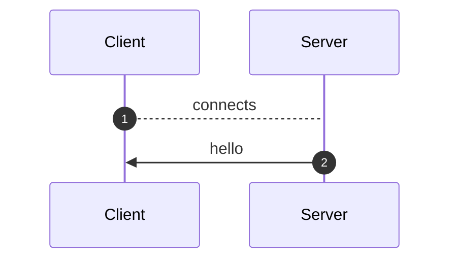
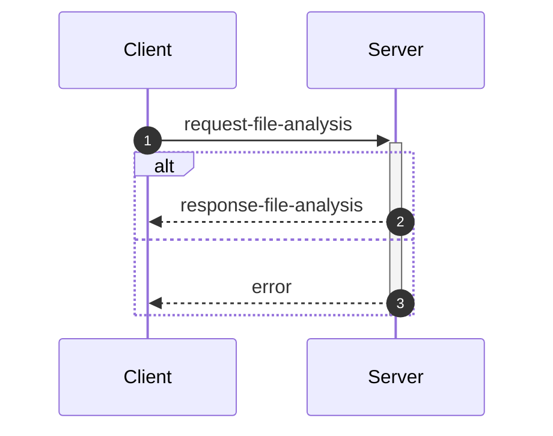
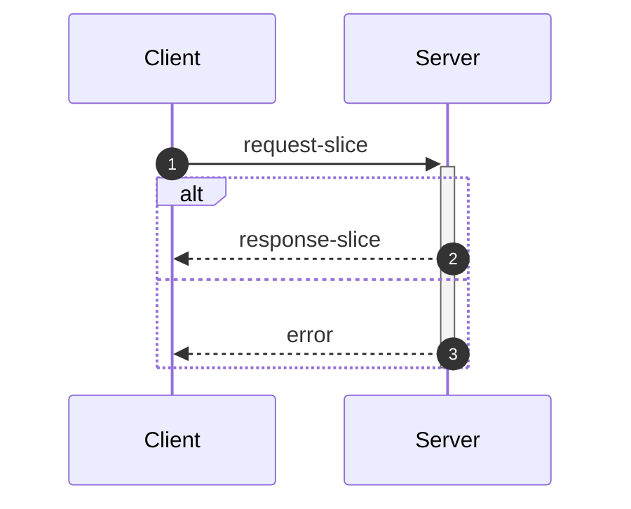
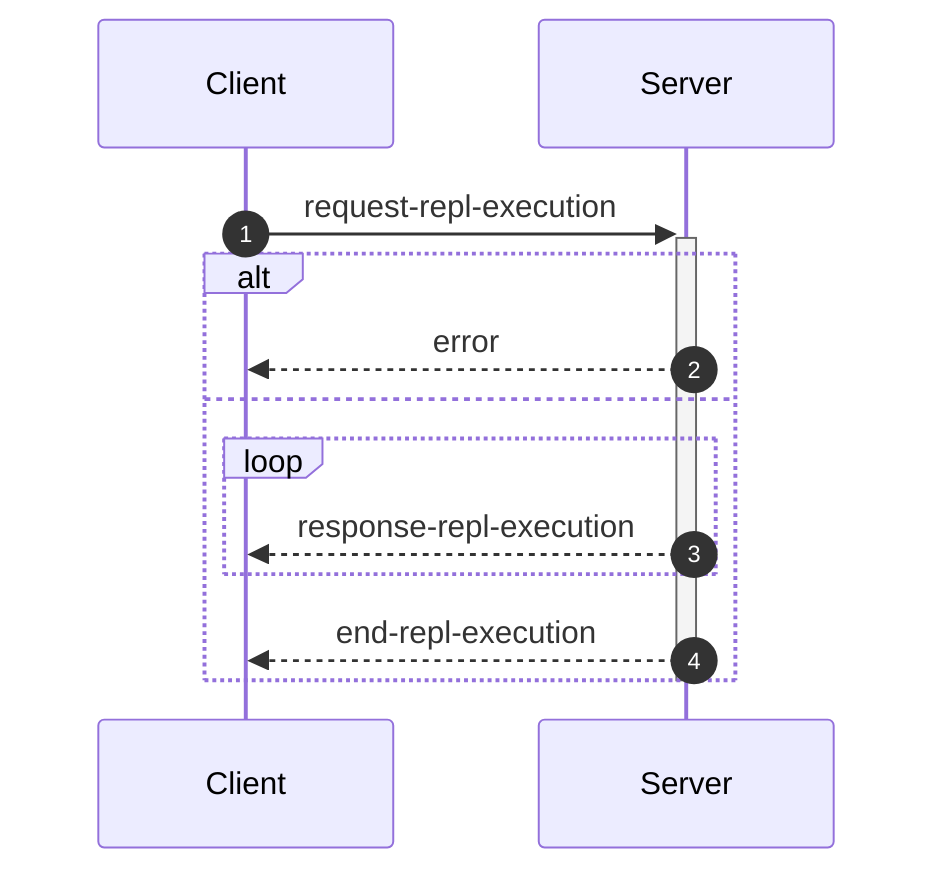

_This document was generated from '[src/documentation/wiki-interface.ts](https://github.com/flowr-analysis/flowr/tree/main//src/documentation/wiki-interface.ts)' on 2026-02-19, 17:18:57 UTC presenting an overview of flowR's interface (v2.9.11, using R v4.5.2). Please do not edit this file/wiki page directly._

Although far from being as detailed as the in-depth explanation of [_flowR_](https://github.com/flowr-analysis/flowr/wiki/wiki/core),
this wiki page explains how to interface with _flowR_ in more detail.
In general, command line arguments and other options provide short descriptions on hover over.

* [💻 Using the REPL](#using-the-repl)
* [⚙️ Configuring FlowR](#configuring-flowr)
* [⚒️ Writing Code](#writing-code)
* [💬 Communicating with the Server](#communicating-with-the-server)

<a id='using-the-repl'></a>
## 💻 Using the REPL


> [!NOTE]
> To execute arbitrary R commands with a repl request, _flowR_ has to be started explicitly with <span title="Description (Command Line Argument): Allow to access the underlying R session when using flowR (security warning: this allows the execution of arbitrary R code!)">`--r-session-access`</span>.
> Please be aware that this introduces a security risk and note that this relies on the [`r-shell` engine](https://github.com/flowr-analysis/flowr/wiki/wiki/engines) .

Although primarily meant for users to explore, 
there is nothing which forbids simply calling _flowR_ as a subprocess to use standard-in, -output, and -error 
for communication (although you can access the REPL using the server as well, 
with the [REPL Request](#message-request-repl-execution) message).

The read-eval-print loop&nbsp;(REPL) works relatively simple.
You can submit an expression (using <kbd>Enter</kbd>),
which is interpreted as an R&nbsp;expression by default but interpreted as a *command* if it starts with a colon (`:`).
The best command to get started with the REPL is <span title="Description (Repl Command): Show help information (aliases: :h, :?)">`:help`</span>.
Besides, you can leave the REPL either with the command <span title="Description (Repl Command): End the repl (aliases: :q, :exit)">`:quit`</span> or by pressing <kbd>Ctrl</kbd>+<kbd>C</kbd> twice.
When writing a *command*, you may press <kbd>Tab</kbd> to get a list of completions, if available.
Multiple commands can be entered in a single line by separating them with a semicolon (`;`), e.g. `:parse "x<-2"; :df*`.
If a command is given without R code, the REPL will re-use R code given in a previous command. 
The prior example will hence return first the parsed AST of the program and then the dataflow graph for `"x <- 2"`.

> [!NOTE]
> If you develop flowR, you may want to launch the repl using the `npm run main-dev` command, this way, you get a non-minified version of flowR with debug information and hot-reloading of source files.

<details>
<summary>Available Commands</summary>

We currently offer the following commands (this with a `[*]` suffix are available with and without the star):


| Command | Description |
| ------- | ----------- |
| **<span title="Description (Repl Command): End the repl (aliases: :q, :exit)">:quit</span>** | End the repl (aliases: **:<span title="Alias of ':quit'. End the repl">q</span>**, **:<span title="Alias of ':quit'. End the repl">exit</span>**) |
| **<span title="Description (Repl Command): Execute the given code as R code. This requires the `--r-session-access` flag to be set and requires the r-shell engine. (aliases: :e, :r)">:execute</span>** | Execute the given code as R code. This requires the `--r-session-access` flag to be set and requires the r-shell engine. (aliases: **:<span title="Alias of ':execute'. Execute the given code as R code. This requires the `--r-session-access` flag to be set and requires the r-shell engine.">e</span>**, **:<span title="Alias of ':execute'. Execute the given code as R code. This requires the `--r-session-access` flag to be set and requires the r-shell engine.">r</span>**) |
| **<span title="Description (Repl Command): Get mermaid code for the control-flow graph of R code, start with 'file://' to indicate a file (aliases: :cfg, :cf)">:controlflow[*]</span>** | Get mermaid code for the control-flow graph of R code, start with 'file://' to indicate a file (star: Returns the URL to mermaid.live) (aliases: **:<span title="Alias of ':controlflow'. Get mermaid code for the control-flow graph of R code, start with 'file://' to indicate a file">cfg</span>**, **:<span title="Alias of ':controlflow'. Get mermaid code for the control-flow graph of R code, start with 'file://' to indicate a file">cf</span>**) |
| **<span title="Description (Repl Command): Get mermaid code for the control-flow graph with basic blocks, start with 'file://' to indicate a file (aliases: :cfgb, :cfb)">:controlflowbb[*]</span>** | Get mermaid code for the control-flow graph with basic blocks, start with 'file://' to indicate a file (star: Returns the URL to mermaid.live) (aliases: **:<span title="Alias of ':controlflowbb'. Get mermaid code for the control-flow graph with basic blocks, start with 'file://' to indicate a file">cfgb</span>**, **:<span title="Alias of ':controlflowbb'. Get mermaid code for the control-flow graph with basic blocks, start with 'file://' to indicate a file">cfb</span>**) |
| **<span title="Description (Repl Command): Get mermaid code for the dataflow graph, start with 'file://' to indicate a file (aliases: :d, :df)">:dataflow[*]</span>** | Get mermaid code for the dataflow graph, start with 'file://' to indicate a file (star: Returns the URL to mermaid.live) (aliases: **:<span title="Alias of ':dataflow'. Get mermaid code for the dataflow graph, start with 'file://' to indicate a file">d</span>**, **:<span title="Alias of ':dataflow'. Get mermaid code for the dataflow graph, start with 'file://' to indicate a file">df</span>**) |
| **<span title="Description (Repl Command): Get mermaid code for the normalized AST of R code, start with 'file://' to indicate a file (aliases: :n)">:normalize[*]</span>** | Get mermaid code for the normalized AST of R code, start with 'file://' to indicate a file (star: Returns the URL to mermaid.live) (alias: **:<span title="Alias of ':normalize'. Get mermaid code for the normalized AST of R code, start with 'file://' to indicate a file">n</span>**) |
| **<span title="Description (Repl Command): Get mermaid code for the simplified dataflow graph, start with 'file://' to indicate a file (aliases: :ds, :dfs)">:dataflowsimple[*]</span>** | Get mermaid code for the simplified dataflow graph, start with 'file://' to indicate a file (star: Returns the URL to mermaid.live) (aliases: **:<span title="Alias of ':dataflowsimple'. Get mermaid code for the simplified dataflow graph, start with 'file://' to indicate a file">ds</span>**, **:<span title="Alias of ':dataflowsimple'. Get mermaid code for the simplified dataflow graph, start with 'file://' to indicate a file">dfs</span>**) |
| **<span title="Description (Repl Command): Just calculates the DFG, but only prints summary info (aliases: :d#, :df#)">:dataflowsilent</span>** | Just calculates the DFG, but only prints summary info (aliases: **:<span title="Alias of ':dataflowsilent'. Just calculates the DFG, but only prints summary info">d#</span>**, **:<span title="Alias of ':dataflowsilent'. Just calculates the DFG, but only prints summary info">df#</span>**) |
| **<span title="Description (Repl Command): Prints ASCII Art of the parsed, unmodified AST, start with 'file://' to indicate a file (aliases: :p)">:parse</span>** | Prints ASCII Art of the parsed, unmodified AST, start with 'file://' to indicate a file (alias: **:<span title="Alias of ':parse'. Prints ASCII Art of the parsed, unmodified AST, start with 'file://' to indicate a file">p</span>**) |
| **<span title="Description (Repl Command): Prints the version of flowR as well as the current version of R">:version</span>** | Prints the version of flowR as well as the current version of R
| **<span title="Description (Repl Command): Query the given R code, start with 'file://' to indicate a file. The query is to be a valid query in json format (use 'help' to get more information).">:query[*]</span>** | Query the given R code, start with 'file://' to indicate a file. The query is to be a valid query in json format (use 'help' to get more information). (star: Similar to query, but returns the output in json format.)
| **<span title="Description (Repl Command): Returns an ASCII representation of the dataflow graph (aliases: :df!)">:dataflowascii</span>** | Returns an ASCII representation of the dataflow graph (alias: **:<span title="Alias of ':dataflowascii'. Returns an ASCII representation of the dataflow graph">df!</span>**) |
| **<span title="Description (Repl Command): Returns summarization stats for the normalized AST (aliases: :n#)">:normalize#</span>** | Returns summarization stats for the normalized AST (alias: **:<span title="Alias of ':normalize#'. Returns summarization stats for the normalized AST">n#</span>**) |
| **<span title="Description (Repl Command): Show help information (aliases: :h, :?)">:help</span>** | Show help information (aliases: **:<span title="Alias of ':help'. Show help information">h</span>**, **:<span title="Alias of ':help'. Show help information">?</span>**) |


</details>


> [!TIP]
> 
> As indicated by the examples before, all REPL commands that operate on code keep track of the state.
> Hence, if you run a command like <span title="Description (Repl Command, starred version): Returns the URL to mermaid.live; Base Command: Get mermaid code for the dataflow graph, start with 'file://' to indicate a file (aliases: :d*, :df*)">`:dataflow*`</span> without providing R code,
> the REPL will re-use the R code provided in a previous command.
> Likewise, doing this will benefit from incrementality!
> If you request the dataflow graph with `:df* x <- 2 * y` and then want to see the parsed AST with `:parse`,
> the REPL will re-use previously obtained information and not re-parse the code again.
> 		


Generally, many commands offer shortcut versions in the REPL. Many queries, for example, offer a shortened format (see the example below).
Of special note, the [Config Query](https://github.com/flowr-analysis/flowr/wiki/wiki/query-api#Config-Query)
can be used to also modify the currently active configuration of _flowR_ within the REPL (see the [wiki page](https://github.com/flowr-analysis/flowr/wiki/wiki/query-api#Config-Query) for more information).

### Example: Retrieving the Dataflow Graph

To retrieve a URL to the [mermaid](https://mermaid.js.org/) diagram of the dataflow of a given expression, 
use <span title="Description (Repl Command, starred version): Returns the URL to mermaid.live; Base Command: Get mermaid code for the dataflow graph, start with 'file://' to indicate a file (aliases: :d*, :df*)">`:dataflow*`</span> (or <span title="Description (Repl Command): Get mermaid code for the dataflow graph, start with 'file://' to indicate a file (aliases: :d, :df)">`:dataflow`</span> to get the mermaid code in the cli):


```shell
$ docker run -it --rm eagleoutice/flowr # or npm run flowr 
flowR repl using flowR v2.9.11, R grammar v14 (tree-sitter engine)
R> :dataflow* y <- 1 + x
```

<details>
<summary style='color:gray'>Output</summary>


```text
https://mermaid.live/view#base64:eyJjb2RlIjoiZmxvd2NoYXJ0IEJUXG4gICAgMXt7XCJgIzkxO1JOdW1iZXIjOTM7IDFcbiAgICAgICgxKVxuICAgICAgKjEuNipgXCJ9fVxuICAgJSUgTm8gZWRnZXMgZm91bmQgZm9yIDFcbiAgICAyKFtcImAjOTE7UlN5bWJvbCM5MzsgeFxuICAgICAgKDIpXG4gICAgICAqMS4xMCpgXCJdKVxuICAgJSUgTm8gZWRnZXMgZm91bmQgZm9yIDJcbiAgICAzW1tcImAjOTE7UkJpbmFyeU9wIzkzOyAjNDM7XG4gICAgICAoMylcbiAgICAgICoxLjYtMTAqXG4gICAgKDEsIDIpYFwiXV1cbiAgICBidWlsdC1pbjpfW1wiYEJ1aWx0LUluOlxuIzQzO2BcIl1cbiAgICBzdHlsZSBidWlsdC1pbjpfIHN0cm9rZTpncmF5LGZpbGw6Z3JheSxzdHJva2Utd2lkdGg6MnB4LG9wYWNpdHk6Ljg7XG4gICAgMFtcImAjOTE7UlN5bWJvbCM5MzsgeVxuICAgICAgKDApXG4gICAgICAqMS4xKmBcIl1cbiAgICA0W1tcImAjOTE7UkJpbmFyeU9wIzkzOyAjNjA7IzQ1O1xuICAgICAgKDQpXG4gICAgICAqMS4xLTEwKlxuICAgICgwLCAzKWBcIl1dXG4gICAgYnVpbHQtaW46Xy1bXCJgQnVpbHQtSW46XG4jNjA7IzQ1O2BcIl1cbiAgICBzdHlsZSBidWlsdC1pbjpfLSBzdHJva2U6Z3JheSxmaWxsOmdyYXksc3Ryb2tlLXdpZHRoOjJweCxvcGFjaXR5Oi44O1xuICAgIDMgLS0+fFwicmVhZHMsIGFyZ3VtZW50XCJ8IDFcbiAgICAzIC0tPnxcInJlYWRzLCBhcmd1bWVudFwifCAyXG4gICAgMyAtLi0+fFwicmVhZHMsIGNhbGxzXCJ8IGJ1aWx0LWluOl9cbiAgICBsaW5rU3R5bGUgMiBzdHJva2U6Z3JheTtcbiAgICAwIC0tPnxcImRlZmluZWQtYnlcInwgM1xuICAgIDAgLS0+fFwiZGVmaW5lZC1ieVwifCA0XG4gICAgNCAtLT58XCJyZWFkcywgYXJndW1lbnRcInwgM1xuICAgIDQgLS0+fFwicmV0dXJucywgYXJndW1lbnRcInwgMFxuICAgIDQgLS4tPnxcInJlYWRzLCBjYWxsc1wifCBidWlsdC1pbjpfLVxuICAgIGxpbmtTdHlsZSA3IHN0cm9rZTpncmF5OyIsIm1lcm1haWQiOnsiYXV0b1N5bmMiOnRydWV9fQ==
Copied mermaid url to clipboard (dataflow: 0ms).
```


Retrieve the dataflow graph of the expression `y <- 1 + x`. It looks like this:


	
<details>

<summary style="color:gray">R Code of the Dataflow Graph</summary>

The analysis required _0.2 ms_ (including parse and normalize, using the [tree-sitter](https://github.com/flowr-analysis/flowr/wiki/Engines) engine) within the generation environment. 
We encountered no unknown side effects during the analysis.


```r
y <- 1 + x
```


</details>


</details>


For small graphs like this, <span title="Description (Repl Command): Returns an ASCII representation of the dataflow graph (aliases: :df!)">`:dataflowascii`</span> also provides an ASCII representation directly in the REPL:


```shell
$ docker run -it --rm eagleoutice/flowr # or npm run flowr 
flowR repl using flowR v2.9.11, R grammar v14 (tree-sitter engine)
R> :df! y <- 1 + x
```

<details open>
<summary style='color:gray'>Output</summary>


```text
                        0<1>0
                   ┌────| 1 |
    ┌────────┐     │    0---0
 c<4>c       └──c<3>c
 |<- |  v<0>v┌──| + |
 c---c──| y |┘  c---c   u<2>u
        v---v      └────| x |
                        u---u
Edges:
3 -> 1: reads, argument  3 -> 2: reads, argument
4 -> 3: reads, argument  4 -> 0: returns, argument
0 -> 3: defined-by       0 -> 4: defined-by
```


Retrieve the dataflow graph of the expression `y <- 1 + x` as ASCII art.

</details>


For the slicing with <span title="Description (Repl Command): Static backwards executable slicer for R">`:slicer`</span>, you have access to the same [magic comments](#slice-magic-comments) as with the [slice request](#message-request-slice).

### Example: Interfacing with the File System

Many commands that allow for an R-expression (like <span title="Description (Repl Command, starred version): Returns the URL to mermaid.live; Base Command: Get mermaid code for the dataflow graph, start with 'file://' to indicate a file (aliases: :d*, :df*)">`:dataflow*`</span>) allow for a file as well 
if the argument starts with `file://`. 
If you are working from the root directory of the _flowR_ repository, the following gives you the parsed AST of the example file using the <span title="Description (Repl Command): Prints ASCII Art of the parsed, unmodified AST, start with 'file://' to indicate a file (aliases: :p)">`:parse`</span> command:


```shell
$ docker run -it --rm eagleoutice/flowr # or npm run flowr 
flowR repl using flowR v2.9.11, R grammar v14 (tree-sitter engine)
R> :parse file://test/testfiles/example.R
```

<details>
<summary style='color:gray'>Output</summary>


```text
File: test/testfiles/example.R

program
├ binaryoperator
│ ├ identifier "sum" (1:1─4)
│ ├ <- "<-" (1:5─7)
│ ╰ float "0" (1:8─9)
├ binaryoperator
│ ├ identifier "product" (2:1─8)
│ ├ <- "<-" (2:9─11)
│ ╰ float "1" (2:12─13)
├ binaryoperator
│ ├ identifier "w" (3:1─2)
│ ├ <- "<-" (3:3─5)
│ ╰ float "7" (3:6─7)
├ binaryoperator
│ ├ identifier "N" (4:1─2)
│ ├ <- "<-" (4:3─5)
│ ╰ float "10" (4:6─8)
├ forstatement
│ ├ for "for" (6:1─4)
│ ├ ( "(" (6:5─6)
│ ├ identifier "i" (6:6─7)
│ ├ in "in" (6:8─10)
│ ├ binaryoperator
│ │ ├ float "1" (6:11─12)
│ │ ├ : ":" (6:12─13)
│ │ ╰ parenthesizedexpression
│ │   ├ ( "(" (6:13─14)
│ │   ├ binaryoperator
│ │   │ ├ identifier "N" (6:14─15)
│ │   │ ├ - "-" (6:15─16)
│ │   │ ╰ float "1" (6:16─17)
│ │   ╰ ) ")" (6:17─18)
│ ├ ) ")" (6:18─19)
│ ╰ bracedexpression
│   ├ { "{" (6:20─21)
│   ├ binaryoperator
│   │ ├ identifier "sum" (7:3─6)
│   │ ├ <- "<-" (7:7─9)
│   │ ╰ binaryoperator
│   │   ├ binaryoperator
│   │   │ ├ identifier "sum" (7:10─13)
│   │   │ ├ + "+" (7:14─15)
│   │   │ ╰ identifier "i" (7:16─17)
│   │   ├ + "+" (7:18─19)
│   │   ╰ identifier "w" (7:20─21)
│   ├ binaryoperator
│   │ ├ identifier "product" (8:3─10)
│   │ ├ <- "<-" (8:11─13)
│   │ ╰ binaryoperator
│   │   ├ identifier "product" (8:14─21)
│   │   ├  "" (8:22─23)
│   │   ╰ identifier "i" (8:24─25)
│   ╰ } "}" (9:1─2)
├ call
│ ├ identifier "cat" (11:1─4)
│ ╰ arguments
│   ├ ( "(" (11:4─5)
│   ├ argument
│   │ ╰ string
│   │   ├ " "\"" (11:5─6)
│   │   ├ stringcontent "Sum:" (11:6─10)
│   │   ╰ " "\"" (11:10─11)
│   ├ comma "," (11:11─12)
│   ├ argument
│   │ ╰ identifier "sum" (11:13─16)
│   ├ comma "," (11:16─17)
│   ├ argument
│   │ ╰ string
│   │   ├ " "\"" (11:18─19)
│   │   ├ stringcontent
│   │   │ ╰ escapesequence "\\n" (11:19─21)
│   │   ╰ " "\"" (11:21─22)
│   ╰ ) ")" (11:22─23)
╰ call
  ├ identifier "cat" (12:1─4)
  ╰ arguments
    ├ ( "(" (12:4─5)
    ├ argument
    │ ╰ string
    │   ├ " "\"" (12:5─6)
    │   ├ stringcontent "Product:" (12:6─14)
    │   ╰ " "\"" (12:14─15)
    ├ comma "," (12:15─16)
    ├ argument
    │ ╰ identifier "product" (12:17─24)
    ├ comma "," (12:24─25)
    ├ argument
    │ ╰ string
    │   ├ " "\"" (12:26─27)
    │   ├ stringcontent
    │   │ ╰ escapesequence "\\n" (12:27─29)
    │   ╰ " "\"" (12:29─30)
    ╰ ) ")" (12:30─31)
```


Retrieve the parsed AST of the example file.

<details>

<summary>File Content</summary>


```r
sum <- 0
product <- 1
w <- 7
N <- 10

for (i in 1:(N-1)) {
  sum <- sum + i + w
  product <- product * i
}

cat("Sum:", sum, "\n")
cat("Product:", product, "\n")
```


</details>

As _flowR_ directly transforms this AST the output focuses on being human-readable instead of being machine-readable. 
		

</details>


### Example: Run a Query

You can run any query supported by _flowR_ using the <span title="Description (Repl Command): Query the given R code, start with 'file://' to indicate a file. The query is to be a valid query in json format (use 'help' to get more information).">`:query`</span> command.
For example, to obtain the shapes of all data frames in a given piece of code, you can run:


```shell
$ docker run -it --rm eagleoutice/flowr # or npm run flowr 
flowR repl using flowR v2.9.11, R grammar v14 (tree-sitter engine)
R> :query @df-shape "x <- data.frame(a = 1:10, b = 1:10)\ny <- x$a"
```

<details open>
<summary style='color:gray'>Output</summary>


```text
Query: df-shape (1 ms)
   ╰ 12: (colnames: [{"a", "b"}, {}], cols: [2, 2], rows: [10, 10])
   ╰ 0: (colnames: [{"a", "b"}, {}], cols: [2, 2], rows: [10, 10])
All queries together required ≈2 ms (1ms accuracy, total 2 ms)
```


Retrieve the shapes of all data frames in the given code.

</details>


To run the linter on a file, you can use (in this example, we just issue the `dead-code` linter on a small piece of code):


```shell
$ docker run -it --rm eagleoutice/flowr # or npm run flowr 
flowR repl using flowR v2.9.11, R grammar v14 (tree-sitter engine)
R> :query @linter rules:dead-code "if(FALSE) x <- 2"
```

<details open>
<summary style='color:gray'>Output</summary>


```text
Query: linter (0 ms)
   ╰ Dead Code (dead-code):
       ╰ certain:
           ╰ Code at 1.11-16
       ╰ Metadata: consideredNodes: 7, searchTimeMs: 0, processTimeMs: 0
All queries together required ≈0 ms (1ms accuracy, total 0 ms)
```


Run the linter on the given code, with only the `dead-code` rule enabled.

</details>


For more information on the available queries, please check out the [Query API](https://github.com/flowr-analysis/flowr/wiki/wiki/query-api).


<a id='configuring-flowr'></a>
## ⚙️ Configuring FlowR


When running _flowR_, you may want to specify some behaviors with a dedicated configuration file. 
By default, flowR looks for a file named `flowr.json` in the current working directory (or any higher directory). 
You can also specify a different file with <span title="Description (Command Line Argument): The name of the configuration file to use">`--config-file`</span> or pass the configuration inline using <span title="Description (Command Line Argument): The flowR configuration to use, as a JSON string">`--config-json`</span>.
To inspect the current configuration, you can run flowr with the <span title="Description (Command Line Argument): Run with verbose logging (will be passed to the corresponding script)">`--verbose`</span> flag, or use the `config` [Query](https://github.com/flowr-analysis/flowr/wiki/Query%20API).
Within the REPL this works by running the following:


```shell
:query @config
```


The following summarizes the configuration options:

- `ignoreSourceCalls`: If set to `true`, _flowR_ will ignore source calls when analyzing the code, i.e., ignoring the inclusion of other files.
- `semantics`: allows to configure the way _flowR_ handles R, although we currently only support `semantics/environment/overwriteBuiltIns`. 
  You may use this to overwrite _flowR_'s handling of built-in function and even completely clear the preset definitions shipped with flowR. 
  See [Configure BuiltIn Semantics](#configure-builtin-semantics) for more information.
- `solver`: allows to configure how _flowR_ resolves variables and their values (currently we support: `disabled`, `alias`, `builtin`), as well as if pointer analysis should be active.
- `engines`: allows to configure the engines used by _flowR_ to interact with R code. See the [Engines wiki page](https://github.com/flowr-analysis/flowr/wiki/Engines) for more information.
- `defaultEngine`: allows to specify the default engine to use for interacting with R code. If not set, an arbitrary engine from the specified list will be used.
- `abstractInterpretation`: allows to configure how _flowR_ performs abstract interpretation, although we currently only support data frame shape inference through abstract interpretation.

So you can configure _flowR_ by adding a file like the following:

<details>

<summary>Example Configuration File</summary>


```json
{
  "ignoreSourceCalls": true,
  "semantics": {
    "environment": {
      "overwriteBuiltIns": {
        "definitions": [
          {
            "type": "function",
            "names": [
              "foo"
            ],
            "processor": "builtin:assignment",
            "config": {}
          }
        ]
      }
    }
  },
  "repl": {
    "quickStats": false,
    "dfProcessorHeat": false
  },
  "project": {
    "resolveUnknownPathsOnDisk": true
  },
  "engines": [
    {
      "type": "r-shell"
    }
  ],
  "solver": {
    "variables": "alias",
    "evalStrings": true,
    "resolveSource": {
      "dropPaths": "no",
      "ignoreCapitalization": true,
      "inferWorkingDirectory": "active-script",
      "searchPath": []
    },
    "instrument": {},
    "slicer": {
      "threshold": 50
    }
  },
  "abstractInterpretation": {
    "wideningThreshold": 4,
    "dataFrame": {
      "maxColNames": 20,
      "readLoadedData": {
        "readExternalFiles": true,
        "maxReadLines": 1000000
      }
    }
  }
}
```


</details>

<details> 
<a id='configure-builtin-semantics'></a>
<summary>Configure Built-In Semantics</summary> 


`semantics/environment/overwriteBuiltins` accepts two keys:

- `loadDefaults` (boolean, initially `true`): If set to `true`, the default built-in definitions are loaded before applying the custom definitions. Setting this flag to `false` explicitly disables the loading of the default definitions.
- `definitions` (array, initially empty): Allows to overwrite or define new built-in elements. Each object within must have a `type` which is one of the below. Furthermore, they may define a string array of `names` which specifies the identifiers to bind the definitions to. You may use `assumePrimitive` to specify whether _flowR_ should assume that this is a primitive non-library definition (so you probably just do not want to specify the key).

  | Type            | Description                                                                                                                                                                                                                                                                                              | Example                                                                                                    |
  | --------------- | -------------------------------------------------------------------------------------------------------------------------------------------------------------------------------------------------------------------------------------------------------------------------------------------------------- | ---------------------------------------------------------------------------------------------------------- |
  | `constant`    | Additionally allows for a `value` this should resolve to.                                                                                                                                                                                                                                                | `{ type: 'constant', names: ['NULL', 'NA'],  value: null }`                                                |
  | `function`    | Is a rather flexible way to define and bind built-in functions. For the time, we do not have extensive documentation to cover all the cases, so please either consult the sources with the `default-builtin-config.ts` or open a [new issue](https://github.com/flowr-analysis/flowr/issues/new/choose). | `{ type: 'function', names: ['next'], processor: 'builtin:default', config: { cfg: ExitPointType.Next } }` |
  | `replacement` | A comfortable way to specify replacement functions like `$<-` or `names<-`. `suffixes` describes the... suffixes to attach automatically. | `{ type: 'replacement', suffixes: ['<-', '<<-'], names: ['[', '[['] }` |


</details>

<details>

<summary style='color:gray'>Full Configuration-File Schema</summary>

- _The configuration file format for flowR._ (object)
    - **ignoreSourceCalls** [optional] _Whether source calls should be ignored, causing {@link processSourceCall}'s behavior to be skipped._ (boolean)
    - **semantics** _Configure language semantics and how flowR handles them._ (object)
        - **environment** [optional] _Semantics regarding how to handle the R environment._ (object)
            - **overwriteBuiltIns** [optional] _Do you want to overwrite (parts) of the builtin definition?_ (object)
                - **loadDefaults** [optional] _Should the default configuration still be loaded?_ (boolean)
                - **definitions** [optional] _The definitions to load/overwrite._ (array)
                Valid item types:
                    - (object)
    - **repl** _Configuration options for the REPL._ (object)
        - **quickStats** [optional] _Whether to show quick stats in the REPL after each evaluation._ (boolean)
        - **dfProcessorHeat** [optional] _This instruments the dataflow processors to count how often each processor is called._ (boolean)
    - **project** _Project specific configuration options._ (object)
        - **resolveUnknownPathsOnDisk** [optional] _Whether to resolve unknown paths loaded by the r project disk when trying to source/analyze files._ (boolean)
    - **engines** _The engine or set of engines to use for interacting with R code. An empty array means all available engines will be used._ (array)
    Valid item types:
        - (alternatives)
            - _The configuration for the tree sitter engine._ (object)
                - **type** [required] _Use the tree sitter engine._ (string)
                    Only allows: 'tree-sitter'
                - **wasmPath** [optional] _The path to the tree-sitter-r WASM binary to use. If this is undefined, this uses the default path._ (string)
                - **treeSitterWasmPath** [optional] _The path to the tree-sitter WASM binary to use. If this is undefined, this uses the default path._ (string)
                - **lax** [optional] _Whether to use the lax parser for parsing R code (allowing for syntax errors). If this is undefined, the strict parser will be used._ (boolean)
            - _The configuration for the R shell engine._ (object)
                - **type** [required] _Use the R shell engine._ (string)
                    Only allows: 'r-shell'
                - **rPath** [optional] _The path to the R executable to use. If this is undefined, this uses the default path._ (string)
    - **defaultEngine** [optional] _The default engine to use for interacting with R code. If this is undefined, an arbitrary engine from the specified list will be used._ (string)
        Only allows: 'tree-sitter', 'r-shell'
    - **solver** _How to resolve constants, constraints, cells, ..._ (object)
        - **variables** _How to resolve variables and their values._ (string)
            Only allows: 'disabled', 'alias', 'builtin'
        - **evalStrings** _Should we include eval(parse(text="...")) calls in the dataflow graph?_ (boolean)
        - **instrument** (object)
            - **dataflowExtractors** [optional] _These keys are only intended for use within code, allowing to instrument the dataflow analyzer!_ (any)
        - **resolveSource** [optional] _If lax source calls are active, flowR searches for sourced files much more freely, based on the configurations you give it. This option is only in effect if `ignoreSourceCalls` is set to false._ (object)
            - **dropPaths** _Allow to drop the first or all parts of the sourced path, if it is relative._ (string)
                Only allows: 'no', 'once', 'all'
            - **ignoreCapitalization** _Search for filenames matching in the lowercase._ (boolean)
            - **inferWorkingDirectory** _Try to infer the working directory from the main or any script to analyze._ (string)
                Only allows: 'no', 'main-script', 'active-script', 'any-script'
            - **searchPath** _Additionally search in these paths._ (array)
            Valid item types:
                - (string)
            - **repeatedSourceLimit** [optional] _How often the same file can be sourced within a single run? Please be aware: in case of cyclic sources this may not reach a fixpoint so give this a sensible limit._ (number)
            - **applyReplacements** _Provide name replacements for loaded files_ (array)
            Valid item types:
                - (object)
        - **slicer** [optional] _The configuration for the slicer._ (object)
            - **threshold** [optional] _The maximum number of iterations to perform on a single function call during slicing._ (number)
    - **abstractInterpretation** _The configuration options for abstract interpretation._ (object)
        - **dataFrame** _The configuration of the shape inference for data frames._ (object)
            - **maxColNames** _The maximum number of columns names to infer for data frames before over-approximating the column names to top._ (number)
            - **wideningThreshold** _The threshold for the number of visitations of a node at which widening should be performed to ensure the termination of the fixpoint iteration._ (number)
            - **readLoadedData** _Configuration options for reading data frame shapes from loaded external data files, such as CSV files._ (object)
                - **readExternalFiles** _Whether data frame shapes should be extracted from loaded external files, such as CSV files._ (boolean)
                - **maxReadLines** _The maximum number of lines to read when extracting data frame shapes from loaded files, such as CSV files._ (number)

</details>

	

<a id='writing-code'></a>
## ⚒️ Writing Code

_flowR_ can be used as a [module](https://www.npmjs.com/package/@eagleoutice/flowr) and offers several main classes and interfaces that are interesting for extension writers 
(see the [Visual Studio Code extension](https://marketplace.visualstudio.com/items?itemName=code-inspect.vscode-flowr) or the [Core](https://github.com/flowr-analysis/flowr/wiki/wiki/core) wiki page for more information).

### Creating Analyses with _flowR_

Nowadays, instances of the <a href="https://github.com/flowr-analysis/flowr/tree/main//src/project/flowr-analyzer.ts#L162"><code><span title="Central class for conducting analyses with FlowR. Use the FlowrAnalyzerBuilder to create a new instance. If you want the original pattern of creating a pipeline and running all steps, you can still do this with FlowrAnalyzer#runFull . To inspect the context of the analyzer, use FlowrAnalyzer#inspectContext (if you are a plugin and need to modify it, use FlowrAnalyzer#context instead).">FlowrAnalyzer</span></code></a> should be used as central frontend to get analysis results from _flowR_.
For example, a program slice can be created like this:


```ts
const analyzer = await new FlowrAnalyzerBuilder()
    .setEngine('tree-sitter')
    .build();
analyzer.addRequest('x <- 1\ny <- x\nx');
const result = await analyzer.query([
    {
        type:     'static-slice',
        criteria: ['3@x']
    }
]);
//console.log(result['static-slice']);
```


For more information, please have a look at the [Analyzer](https://github.com/flowr-analysis/flowr/wiki/wiki/analyzer) wiki page, which explains how to construct and use the <a href="https://github.com/flowr-analysis/flowr/tree/main//src/project/flowr-analyzer.ts#L162"><code><span title="Central class for conducting analyses with FlowR. Use the FlowrAnalyzerBuilder to create a new instance. If you want the original pattern of creating a pipeline and running all steps, you can still do this with FlowrAnalyzer#runFull . To inspect the context of the analyzer, use FlowrAnalyzer#inspectContext (if you are a plugin and need to modify it, use FlowrAnalyzer#context instead).">FlowrAnalyzer</span></code></a> in more detail.
To work with specific perspectives, you can also consult the respective pages like the [Dataflow Graph](https://github.com/flowr-analysis/flowr/wiki/wiki/dataflow-graph) or the [Abstract Interpretation](https://github.com/flowr-analysis/flowr/wiki/wiki/abstract-interpretation) wiki pages.
        
### The Pipeline Executor (Low-Level Interface)

Once, in the beginning, _flowR_ was meant to produce a dataflow graph merely to provide *program slices*. 
However, with continuous updates, the [Dataflow Graph](https://github.com/flowr-analysis/flowr/wiki/wiki/dataflow-graph) repeatedly proves to be the more interesting part.
With this, we restructured _flowR_'s originally *hardcoded* pipeline to be far more flexible. 
Now, it can be theoretically extended or replaced with arbitrary steps, optional steps, and what we call 'decorations' of these steps. 
In short, a slicing pipeline using the <a href="https://github.com/flowr-analysis/flowr/tree/main//src/core/pipeline-executor.ts#L97"><code><span title="**Please note:** The PipelineExecutor is now considered to be a rather low-level API for flowR. While it still works and is the basis for all other layers, we strongly recommend using the FlowrAnalyzer and its builder to create and use an analyzer instance that is pre-configured for your use-case. The pipeline executor allows to execute arbitrary pipelines in a step-by-step fashion. If you are not...">PipelineExecutor</span></code></a> looks like this:


```ts

const slicer = new PipelineExecutor(DEFAULT_SLICING_PIPELINE, {
  parser:    new RShell(),
  request:   requestFromInput('x <- 1\nx + 1'),
  criterion: ['2@x']
})
const slice = await slicer.allRemainingSteps()
// console.log(slice.reconstruct.code)
```


<details><summary>More Information</summary>


If you compare this, with what you would have done with the old (and removed) `SteppingSlicer`, 
this essentially just requires you to replace the `SteppingSlicer` with the <a href="https://github.com/flowr-analysis/flowr/tree/main//src/core/pipeline-executor.ts#L97"><code><span title="**Please note:** The PipelineExecutor is now considered to be a rather low-level API for flowR. While it still works and is the basis for all other layers, we strongly recommend using the FlowrAnalyzer and its builder to create and use an analyzer instance that is pre-configured for your use-case. The pipeline executor allows to execute arbitrary pipelines in a step-by-step fashion. If you are not...">PipelineExecutor</span></code></a>
and to pass the <a href="https://github.com/flowr-analysis/flowr/tree/main//src/core/steps/pipeline/default-pipelines.ts#L18"><code>DEFAULT_SLICING_PIPELINE</code></a> as the first argument.
The <a href="https://github.com/flowr-analysis/flowr/tree/main//src/core/pipeline-executor.ts#L97"><code><span title="**Please note:** The PipelineExecutor is now considered to be a rather low-level API for flowR. While it still works and is the basis for all other layers, we strongly recommend using the FlowrAnalyzer and its builder to create and use an analyzer instance that is pre-configured for your use-case. The pipeline executor allows to execute arbitrary pipelines in a step-by-step fashion. If you are not...">PipelineExecutor</span></code></a>...

1. Provides structures to investigate the results of all intermediate steps
2. Can be executed step-by-step
3. Can repeat steps (e.g., to calculate multiple slices on the same input)

See the in-code documentation for more information.

	

</details>
    

### Using the <a href="https://github.com/flowr-analysis/flowr/tree/main//src/r-bridge/shell.ts#L143"><code><span title="The RShell represents an interactive session with the R interpreter. You can configure it by RShellOptions . At the moment we are using a live R session (and not networking etc.) to communicate with R easily, which allows us to install packages etc. However, this might and probably will change in the future (leaving this as a legacy mode :D)">RShell</span></code></a> to Interact with R

The <a href="https://github.com/flowr-analysis/flowr/tree/main//src/r-bridge/shell.ts#L143"><code><span title="The RShell represents an interactive session with the R interpreter. You can configure it by RShellOptions . At the moment we are using a live R session (and not networking etc.) to communicate with R easily, which allows us to install packages etc. However, this might and probably will change in the future (leaving this as a legacy mode :D)">RShell</span></code></a> class allows interfacing with the `R`&nbsp;ecosystem installed on the host system.
Please have a look at [flowR's Engines](https://github.com/flowr-analysis/flowr/wiki/wiki/engines) for more information on alternatives (for example, the <a href="https://github.com/flowr-analysis/flowr/tree/main//src/r-bridge/lang-4.x/tree-sitter/tree-sitter-executor.ts#L18"><code><span title="Synchronous and (way) faster alternative to the RShell using tree-sitter.">TreeSitterExecutor</span></code></a>).


> [!IMPORTANT]
> 
> Each <a href="https://github.com/flowr-analysis/flowr/tree/main//src/r-bridge/shell.ts#L143"><code><span title="The RShell represents an interactive session with the R interpreter. You can configure it by RShellOptions . At the moment we are using a live R session (and not networking etc.) to communicate with R easily, which allows us to install packages etc. However, this might and probably will change in the future (leaving this as a legacy mode :D)">RShell</span></code></a> controls a new instance of the R&nbsp;interpreter, 
> make sure to call <code><a href="https://github.com/flowr-analysis/flowr/tree/main//src/r-bridge/shell.ts#L317"><span title="Close the current R session, makes the object effectively invalid (can no longer be reopened etc.)">RShell::<i>close</i></span></a>()</code> when you are done.


You can start a new "session" simply by constructing a new object with <code>new <a href="https://github.com/flowr-analysis/flowr/tree/main//src/r-bridge/shell.ts#L143"><span title="The RShell represents an interactive session with the R interpreter. You can configure it by RShellOptions . At the moment we are using a live R session (and not networking etc.) to communicate with R easily, which allows us to install packages etc. However, this might and probably will change in the future (leaving this as a legacy mode :D)">RShell</span></a>()</code>.

However, there are several options that may be of interest 
(e.g., to automatically revive the shell in case of errors or to control the name location of the R process on the system).

With a shell object (let's call it `shell`), you can execute R code by using <a href="https://github.com/flowr-analysis/flowr/tree/main//src/r-bridge/shell.ts#L195"><code><span title="sends the given command directly to the current R session will not do anything to alter input markers!">RShell::<i>sendCommand</i></span></code></a>, 
for example <code>shell.<a href="https://github.com/flowr-analysis/flowr/tree/main//src/r-bridge/shell.ts#L195"><span title="sends the given command directly to the current R session will not do anything to alter input markers!">sendCommand</span></a>("1 + 1")</code>. 
However, this does not return anything, so if you want to collect the output of your command, use
<a href="https://github.com/flowr-analysis/flowr/tree/main//src/r-bridge/shell.ts#L261"><code><span title="Send a command and collect the output">RShell::<i>sendCommandWithOutput</i></span></code></a> instead.

Besides that, the command <a href="https://github.com/flowr-analysis/flowr/tree/main//src/r-bridge/shell.ts#L233"><code>RShell::<b>tryToInjectHomeLibPath</b></code></a> may be of interest, as it enables all libraries available on the host system.


### Generate Statistics (No longer a Focus of flowR)


<details>

<summary>Adding a New Feature to Extract</summary>

In this example, we construct a new feature to extract, with the name "*example*".
Whenever this name appears, you may substitute this with whatever name fits your feature best (as long as the name is unique).

1. **Create a new file in `src/statistics/features/supported`**\
   Create the file `example.ts`, and add its export to the `index.ts` file in the same directory (if not done automatically).

2. **Create the basic structure**\
   To get a better feel of what a feature must have, let's look
   at the basic structure (of course, due to TypeScript syntax,
   there are other ways to achieve the same goal):

   ```ts
   const initialExampleInfo = {
       /* whatever start value is good for you */
       someCounter: 0
   }

   export type ExampleInfo = Writable<typeof initialExampleInfo>

   export const example: Feature<ExampleInfo> = {
    name:        'Example Feature',
    description: 'A longer example description',

    process(existing: ExampleInfo, input: FeatureProcessorInput): ExampleInfo {
      /* perform analysis on the input */
      return existing
    },

    initialValue: initialExampleInfo
   }
   ```

   The `initialExampleInfo` type holds the initial values for each counter that you want to maintain during the feature extraction (they will usually be initialized with 0). The resulting `ExampleInfo` type holds the structure of the data that is to be counted. Due to the vast amount of data processed, information like the name and location of a function call is not stored here, but instead written to disk (see below).

   Every new feature must be of the `Feature<Info>` type, with `Info` referring to a `FeatureInfo` (like `ExampleInfo` in this example). Next to a `name` and a `description`, each Feature must provide:

   - a processor that extracts the information from the input, adding it to the existing information.
   - a function returning the initial value of the information (in this case, `initialExampleInfo`).

3. **Add it to the feature-mapping**\
   Now, in the `feature.ts` file in `src/statistics/features`, add your feature to the `ALL_FEATURES` object.

Now, we want to extract something. For the *example* feature created in the previous steps, we choose to count the amount of `COMMENT` tokens.
So we define a corresponding [XPath](https://developer.mozilla.org/en-US/docs/Web/XPath) query:

```ts
const commentQuery: Query = xpath.parse('//COMMENT')
```

Within our feature's `process` function, running the query is as simple as:

```ts
const comments = commentQuery.select({ node: input.parsedRAst })
```

Now we could do a lot of further processing, but for simplicity, we only record every comment found this way:

```ts
appendStatisticsFile(example.name, 'comments', comments, input.filepath)
```

We use `example.name` to avoid duplication with the name that we’ve assigned to the feature. It corresponds to the name of the folder in the statistics output.
`'comments'` refers to a freely chosen (but unique) name, that will be used as the name for the output file within the folder. The `comments` variable holds the result of the query, which is an array of nodes. Finally, we pass the `filepath` of the file that was analyzed (if known), so that it can be added to the statistics file (as additional information).

</details>
	

<a id='communicating-with-the-server'></a>
## 💬 Communicating with the Server


As explained in the [Overview](https://github.com/flowr-analysis/flowr/wiki/Overview), you can simply run the [TCP](https://de.wikipedia.org/wiki/Transmission_Control_Protocol)&nbsp;server by adding the <span title="Description (Command Line Argument): Do not drop into a repl, but instead start a server on the given port (default: 1042) and listen for messages.">`--server`</span> flag (and, due to the interactive mode, exit with the conventional <kbd>CTRL</kbd>+<kbd>C</kbd>).
Currently, every connection is handled by the same underlying `RShell` - so the server is not designed to handle many clients at a time.
Additionally, the server is not well guarded against attacks (e.g., you can theoretically spawn an arbitrary number of&nbsp;RShell sessions on the target machine).

Every message has to be given in a single line (i.e., without a newline in-between) and end with a newline character. Nevertheless, we will pretty-print example given in the following segments for the ease of reading.


> [!NOTE]
> 
> The default <span title="Description (Command Line Argument): Do not drop into a repl, but instead start a server on the given port (default: 1042) and listen for messages.">`--server`</span> uses a simple [TCP](https://de.wikipedia.org/wiki/Transmission_Control_Protocol)
> connection. If you want _flowR_ to expose a [WebSocket](https://de.wikipedia.org/wiki/WebSocket) server instead, add the <span title="Description (Command Line Argument): If the server flag is set, use websocket for messaging">`--ws`</span> flag (i.e., <span title="Description (Command Line Argument): Do not drop into a repl, but instead start a server on the given port (default: 1042) and listen for messages.">`--server`</span> <span title="Description (Command Line Argument): If the server flag is set, use websocket for messaging">`--ws`</span>) when starting _flowR_ from the command line.
> 			


<ul><li>
<a id="message-hello"></a>
<b>Hello</b> Message (<code>hello</code>) 
<details>

<summary style="color:gray"> View Details. <i>The server informs the client about the successful connection and provides Meta-Information.</i> </summary>




	
After launching _flowR_, for example, with <code>docker run -it --rm eagleoutice/flowr <span title="Description (Command Line Argument): Do not drop into a repl, but instead start a server on the given port (default: 1042) and listen for messages.">-<span/>-server</span></code>&nbsp;(🐳️), simply connecting should present you with a `hello` message, that amongst others should reveal the versions of&nbsp;_flowR_ and&nbsp;R, using the [semver 2.0](https://semver.org/spec/v2.0.0.html) versioning scheme.
The message looks like this:


```json
{
  "type": "hello",
  "clientName": "client-0",
  "versions": {
    "flowr": "2.9.11",
    "r": "4.5.2",
    "engine": "r-shell"
  }
}
```


There are currently a few messages that you can send after the hello message.
If you want to _slice_ a piece of R code you first have to send an [analysis request](#message-request-file-analysis), so that you can send one or multiple slice requests afterward.
Requests for the [REPL](#message-request-repl) are independent of that.
	

<hr>


<details>
<summary style="color:gray">Message schema (<code>hello</code>)</summary>

For the definition of the hello message, please see it's implementation at [`./src/cli/repl/server/messages/message-hello.ts`](https://github.com/flowr-analysis/flowr/tree/main/./src/cli/repl/server/messages/message-hello.ts).

- [required] (object)
    - **type** [required] _The type of the hello message._ (string)
        Only allows: 'hello'
    - **id** [forbidden] _The id of the message is always undefined (as it is the initial message and not requested)._ (any)
    - **clientName** [required] _A unique name that is assigned to each client. It has no semantic meaning and is only used/useful for debugging._ (string)
    - **versions** [required] (object)
        - **flowr** [required] _The version of the flowr server running in semver format._ (string)
        - **r** [required] _The version of the underlying R shell running in semver format._ (string)
        - **engine** [required] _The parser backend that is used to parse the R code._ (string)

</details>


<hr>

</details>
	</li>

<li>
<a id="message-request-file-analysis"></a>
<b>Analysis</b> Message (<code>request-file-analysis</code>) 
<details>

<summary style="color:gray"> View Details. <i>The server builds the dataflow graph for a given input file (or a set of files).</i> </summary>




	
The request allows the server to analyze a file and prepare it for slicing.
The message can contain a `filetoken`, which is used to identify the file in later slice or query requests (if you do not add one, the request will not be stored and therefore, it is not available for subsequent requests).

> **Please note!**\
> If you want to send and process a lot of analysis requests, but do not want to slice them, please do not pass the `filetoken` field. This will save the server a lot of memory allocation.

Furthermore, the request must contain either a `content` field to directly pass the file's content or a `filepath` field which contains the path to the file (this path must be accessible for the server to be useful).
If you add the `id` field, the answer will use the same `id` so you can match requests and the corresponding answers.
See the implementation of the request-file-analysis message for more information.


<details>
<summary>Example of the <code>request-file-analysis</code> Message</summary>

_Note:_ even though we pretty-print these messages, they are sent as a single line, ending with a newline.

The following lists all messages that were sent and received in case you want to reproduce the scenario:

<ol>
<li> <code>hello</code> (response)
<details> 

<summary> Show Details </summary>

The first message is always a hello message.


```json
{
  "type": "hello",
  "clientName": "client-0",
  "versions": {
    "flowr": "2.9.11",
    "r": "4.5.2",
    "engine": "r-shell"
  }
}
```


</details>
</li>

<li> <b><code>request-file-analysis</code> (request)</b>
<details open> 

<summary> Show Details </summary>

Let's suppose you simply want to analyze the following script:
 
```r
x <- 1
x + 1
```

 For this, you can send the following request:


```json
{
  "type": "request-file-analysis",
  "id": "1",
  "filetoken": "x",
  "content": "x <- 1\nx + 1"
}
```


</details>
</li>

<li> <code>response-file-analysis</code> (response)
<details> 

<summary> Show Details </summary>


The `results` field of the response effectively contains three keys of importance:

- `parse`: which contains 1:1 the parse result in CSV format that we received from the `RShell` (i.e., the AST produced by the parser of the R interpreter).
- `normalize`: which contains the normalized AST, including ids (see the `info` field and the [Normalized AST](https://github.com/flowr-analysis/flowr/wiki/Normalized%20AST) wiki page).
- `dataflow`: especially important is the `graph` field which contains the dataflow graph as a set of root vertices (see the [Dataflow Graph](https://github.com/flowr-analysis/flowr/wiki/Dataflow%20Graph) wiki page).
			


_As the code is pretty long, we inhibit pretty printing and syntax highlighting (JSON, hiding built-in):_

```text
{"type":"response-file-analysis","format":"json","id":"1","results":{"parse":{"files":[{"parsed":"[1,1,1,6,7,0,\"expr\",false,\"x <- 1\"],[1,1,1,1,1,3,\"SYMBOL\",true,\"x\"],[1,1,1,1,3,7,\"expr\",false,\"x\"],[1,3,1,4,2,7,\"LEFT_ASSIGN\",true,\"<-\"],[1,6,1,6,4,5,\"NUM_CONST\",true,\"1\"],[1,6,1,6,5,7,\"expr\",false,\"1\"],[2,1,2,5,16,0,\"expr\",false,\"x + 1\"],[2,1,2,1,10,12,\"SYMBOL\",true,\"x\"],[2,1,2,1,12,16,\"expr\",false,\"x\"],[2,3,2,3,11,16,\"'+'\",true,\"+\"],[2,5,2,5,13,14,\"NUM_CONST\",true,\"1\"],[2,5,2,5,14,16,\"expr\",false,\"1\"]","filePath":"/tmp/tmp-33058-CnE8J4h5ox0Y-.R"}],".meta":{"timing":1}},"normalize":{"ast":{"type":"RProject","files":[{"root":{"type":"RExpressionList","children":[{"type":"RBinaryOp","location":[1,3,1,4],"lhs":{"type":"RSymbol","location":[1,1,1,1],"content":"x","lexeme":"x","info":{"fullRange":[1,1,1,1],"adToks":[],"id":0,"parent":2,"role":"bin-l","index":0,"nesting":0,"file":"/tmp/tmp-33058-CnE8J4h5ox0Y-.R"}},"rhs":{"location":[1,6,1,6],"lexeme":"1","info":{"fullRange":[1,6,1,6],"adToks":[],"id":1,"parent":2,"role":"bin-r","index":1,"nesting":0,"file":"/tmp/tmp-33058-CnE8J4h5ox0Y-.R"},"type":"RNumber","content":{"num":1,"complexNumber":false,"markedAsInt":false}},"operator":"<-","lexeme":"<-","info":{"fullRange":[1,1,1,6],"adToks":[],"id":2,"parent":6,"nesting":0,"file":"/tmp/tmp-33058-CnE8J4h5ox0Y-.R","index":0,"role":"el-c"}},{"type":"RBinaryOp","location":[2,3,2,3],"lhs":{"type":"RSymbol","location":[2,1,2,1],"content":"x","lexeme":"x","info":{"fullRange":[2,1,2,1],"adToks":[],"id":3,"parent":5,"role":"bin-l","index":0,"nesting":0,"file":"/tmp/tmp-33058-CnE8J4h5ox0Y-.R"}},"rhs":{"location":[2,5,2,5],"lexeme":"1","info":{"fullRange":[2,5,2,5],"adToks":[],"id":4,"parent":5,"role":"bin-r","index":1,"nesting":0,"file":"/tmp/tmp-33058-CnE8J4h5ox0Y-.R"},"type":"RNumber","content":{"num":1,"complexNumber":false,"markedAsInt":false}},"operator":"+","lexeme":"+","info":{"fullRange":[2,1,2,5],"adToks":[],"id":5,"parent":6,"nesting":0,"file":"/tmp/tmp-33058-CnE8J4h5ox0Y-.R","index":1,"role":"el-c"}}],"info":{"adToks":[],"id":6,"nesting":0,"file":"/tmp/tmp-33058-CnE8J4h5ox0Y-.R","role":"root","index":0}},"filePath":"/tmp/tmp-33058-CnE8J4h5ox0Y-.R"}],"info":{"id":7}},".meta":{"timing":0}},"dataflow":{"unknownReferences":[],"in":[{"nodeId":2,"name":"<-","type":2},{"nodeId":5,"name":"+","type":2}],"out":[{"nodeId":0,"name":"x","type":4,"definedAt":2,"value":[1]}],"environment":{"current":{"id":3652,"parent":"<BuiltInEnvironment>","memory":[["x",[{"nodeId":0,"name":"x","type":4,"definedAt":2,"value":[1]}]]]},"level":0},"graph":{"rootVertices":[1,0,2,3,4,5],"vertexInformation":[[1,{"tag":"value","id":1}],[0,{"tag":"vdef","id":0}],[2,{"tag":"fcall","id":2,"name":"<-","onlyBuiltin":true,"args":[{"nodeId":0,"type":32},{"nodeId":1,"type":32}],"origin":["builtin:assignment"]}],[3,{"tag":"use","id":3}],[4,{"tag":"value","id":4}],[5,{"tag":"fcall","id":5,"name":"+","onlyBuiltin":true,"args":[{"nodeId":3,"type":32},{"nodeId":4,"type":32}],"origin":["builtin:default"]}]],"edgeInformation":[[2,[[1,{"types":65}],[0,{"types":72}],["built-in:<-",{"types":5}]]],[0,[[1,{"types":2}],[2,{"types":2}]]],[3,[[0,{"types":1}]]],[5,[[3,{"types":65}],[4,{"types":65}],["built-in:+",{"types":5}]]]],"_unknownSideEffects":[]},"entryPoint":2,"exitPoints":[{"type":0,"nodeId":5}],"hooks":[],".meta":{"timing":1}}}}
```


</details>
</li>
</ol>

The complete round-trip took 4.4 ms (including time required to validate the messages, start, and stop the internal mock server).

</details>


You receive an error if, for whatever reason, the analysis fails (e.g., the message or code you sent contained syntax errors).
It contains a human-readable description *why* the analysis failed (see the error message implementation for more details).


<details>
<summary>Example Error Message</summary>

_Note:_ even though we pretty-print these messages, they are sent as a single line, ending with a newline.

The following lists all messages that were sent and received in case you want to reproduce the scenario:

<ol>
<li> <code>hello</code> (response)
<details> 

<summary> Show Details </summary>

The first message is always a hello message.


```json
{
  "type": "hello",
  "clientName": "client-0",
  "versions": {
    "flowr": "2.9.11",
    "r": "4.5.2",
    "engine": "r-shell"
  }
}
```


</details>
</li>

<li> <code>request-file-analysis</code> (request)
<details> 

<summary> Show Details </summary>


```json
{
  "type": "request-file-analysis",
  "id": "1",
  "filename": "sample.R",
  "content": "x <-"
}
```


</details>
</li>

<li> <b><code>error</code> (response)</b>
<details open> 

<summary> Show Details </summary>


```json
{
  "id": "1",
  "type": "error",
  "fatal": false,
  "reason": "Error while analyzing file sample.R: GuardError: unable to parse R code (see the log for more information) for request {\"request\":\"text\",\"content\":\"x <-\"}}\n Report a Bug: https://github.com/flowr-analysis/flowr/issues/new?body=%3C!%2D%2D%20Please%20describe%20your%20issue%20in%20more%20detail%20below!%20%2D%2D%3E%0A%0A%0A%3C!%2D%2D%20Automatically%20generated%20issue%20metadata%2C%20please%20do%20not%20edit%20or%20delete%20content%20below%20this%20line%20%2D%2D%3E%0A%2D%2D%2D%0A%0AflowR%20version%3A%202.9.11%0Anode%20version%3A%20v24.13.0%0Anode%20arch%3A%20x64%0Anode%20platform%3A%20linux%0Amessage%3A%20%60unable%20to%20parse%20R%20code%20%28see%20the%20log%20for%20more%20information%29%20for%20request%20%7B%22request%22%3A%22text%22%2C%22content%22%3A%22x%20%3C%2D%22%7D%7D%60%0Astack%20trace%3A%0A%60%60%60%0A%20%20%20%20at%20guard%20%28%3C%3E%2Fsrc%2Futil%2Fassert.ts%3A128%3A9%29%0A%20%20%20%20at%20guardRetrievedOutput%20%28%3C%3E%2Fsrc%2Fr%2Dbridge%2Fretriever.ts%3A221%3A7%29%0A%20%20%20%20at%20%2Fhome%2Fostwind%2Fgit%2Fphd%2Fflowr%2Dfield%2Fflowr%2Fsrc%2Fr%2Dbridge%2Fretriever.ts%3A182%3A4%0A%20%20%20%20at%20processTicksAndRejections%20%28node%3Ainternal%2Fprocess%2Ftask_queues%3A103%3A5%29%0A%20%20%20%20at%20async%20Object.parseRequests%20%5Bas%20processor%5D%20%28%3C%3E%2Fsrc%2Fr%2Dbridge%2Fparser.ts%3A104%3A19%29%0A%20%20%20%20at%20async%20PipelineExecutor.nextStep%20%28%3C%3E%2Fsrc%2Fcore%2Fpipeline%2Dexecutor.ts%3A192%3A25%29%0A%20%20%20%20at%20async%20FlowrAnalyzerCache.runTapeUntil%20%28%3C%3E%2Fsrc%2Fproject%2Fcache%2Fflowr%2Danalyzer%2Dcache.ts%3A93%3A4%29%0A%20%20%20%20at%20async%20FlowRServerConnection.sendFileAnalysisResponse%20%28%3C%3E%2Fsrc%2Fcli%2Frepl%2Fserver%2Fconnection.ts%3A163%3A52%29%0A%60%60%60%0A%0A%2D%2D%2D%0A%09"
}
```


</details>
</li>
</ol>

The complete round-trip took 3.0 ms (including time required to validate the messages, start, and stop the internal mock server).

</details>


&nbsp;

<a id="analysis-include-cfg"></a>
**Including the Control Flow Graph**

While _flowR_ does (for the time being) not use an explicit control flow graph but instead relies on control-dependency edges within the dataflow graph, 
the respective structure can still be exposed using the server (note that, as this feature is not needed within _flowR_, it is tested significantly less - 
so please create a [new issue](https://github.com/flowr-analysis/flowr/issues/new/choose) for any bug you may encounter).
For this, the analysis request may add `cfg: true` to its list of options.


<details>
<summary>Requesting a Control Flow Graph</summary>

_Note:_ even though we pretty-print these messages, they are sent as a single line, ending with a newline.

The following lists all messages that were sent and received in case you want to reproduce the scenario:

<ol>
<li> <code>hello</code> (response)
<details> 

<summary> Show Details </summary>

The first message is always a hello message.


```json
{
  "type": "hello",
  "clientName": "client-0",
  "versions": {
    "flowr": "2.9.11",
    "r": "4.5.2",
    "engine": "r-shell"
  }
}
```


</details>
</li>

<li> <b><code>request-file-analysis</code> (request)</b>
<details open> 

<summary> Show Details </summary>


```json
{
  "type": "request-file-analysis",
  "id": "1",
  "filetoken": "x",
  "content": "if(unknown > 0) { x <- 2 } else { x <- 5 }\nfor(i in 1:x) { print(x); print(i) }",
  "cfg": true
}
```


</details>
</li>

<li> <code>response-file-analysis</code> (response)
<details> 

<summary> Show Details </summary>


The response looks basically the same as a response sent without the `cfg` flag. However, additionally it contains a `cfg` field. 
If you are interested in a visual representation of the control flow graph, see the 
[visualization with mermaid](https://mermaid.live/view#base64:eyJjb2RlIjoiZmxvd2NoYXJ0IEJUXG4gICAgbjMyKFtcImBSRXhwcmVzc2lvbkxpc3QgKDMyKWBcIl0pXG4gICAgbjE1W1wiYFJJZlRoZW5FbHNlICgxNSlcbiMzNDtpZih1bmtub3duICM2MjsgMCkgIzEyMzsgeCAjNjA7IzQ1OyAyICMxMjU7IGVsc2UgIzEyMzsgeCAjNjA7IzQ1OyA1ICMxMjU7IzM0O2BcIl1cbiAgICBuMTUtZVtbMTUtZV1dXG4gICAgbjAoW1wiYFJTeW1ib2wgKDApXG4jMzQ7dW5rbm93biMzNDtgXCJdKVxuICAgIG4xKFtcImBSTnVtYmVyICgxKVxuIzM0OzAjMzQ7YFwiXSlcbiAgICBuMihbXCJgUkJpbmFyeU9wICgyKVxuIzM0O3Vua25vd24gIzYyOyAwIzM0O2BcIl0pXG4gICAgbjItZVtbMi1lXV1cbiAgICBuOChbXCJgUkV4cHJlc3Npb25MaXN0ICg4KWBcIl0pXG4gICAgbjUoW1wiYFJTeW1ib2wgKDUpXG4jMzQ7eCMzNDtgXCJdKVxuICAgIG42KFtcImBSTnVtYmVyICg2KVxuIzM0OzIjMzQ7YFwiXSlcbiAgICBuNyhbXCJgUkJpbmFyeU9wICg3KVxuIzM0O3ggIzYwOyM0NTsgMiMzNDtgXCJdKVxuICAgIG43LWVbWzctZV1dXG4gICAgbjgtZVtbOC1lXV1cbiAgICBuMTQoW1wiYFJFeHByZXNzaW9uTGlzdCAoMTQpYFwiXSlcbiAgICBuMTEoW1wiYFJTeW1ib2wgKDExKVxuIzM0O3gjMzQ7YFwiXSlcbiAgICBuMTIoW1wiYFJOdW1iZXIgKDEyKVxuIzM0OzUjMzQ7YFwiXSlcbiAgICBuMTMoW1wiYFJCaW5hcnlPcCAoMTMpXG4jMzQ7eCAjNjA7IzQ1OyA1IzM0O2BcIl0pXG4gICAgbjEzLWVbWzEzLWVdXVxuICAgIG4xNC1lW1sxNC1lXV1cbiAgICBuMTYoW1wiYFJTeW1ib2wgKDE2KVxuIzM0O2kjMzQ7YFwiXSlcbiAgICBuMzFbXCJgUkZvckxvb3AgKDMxKVxuIzM0O2ZvcihpIGluIDEjNTg7eCkgIzEyMzsgcHJpbnQoeCk7IHByaW50KGkpICMxMjU7IzM0O2BcIl1cbiAgICBuMTcoW1wiYFJOdW1iZXIgKDE3KVxuIzM0OzEjMzQ7YFwiXSlcbiAgICBuMTgoW1wiYFJTeW1ib2wgKDE4KVxuIzM0O3gjMzQ7YFwiXSlcbiAgICBuMTkoW1wiYFJCaW5hcnlPcCAoMTkpXG4jMzQ7MSM1ODt4IzM0O2BcIl0pXG4gICAgbjE5LWVbWzE5LWVdXVxuICAgIG4zMChbXCJgUkV4cHJlc3Npb25MaXN0ICgzMClgXCJdKVxuICAgIG4yMihbXCJgUlN5bWJvbCAoMjIpXG4jMzQ7cHJpbnQoeCkjMzQ7YFwiXSlcbiAgICBuMjVbXCJgUkZ1bmN0aW9uQ2FsbCAoMjUpXG4jMzQ7cHJpbnQoeCkjMzQ7YFwiXVxuICAgIG4yNS1lW1syNS1lXV1cbiAgICBuMjQoW1wiYFJBcmd1bWVudCAoMjQpXG4jMzQ7eCMzNDtgXCJdKVxuICAgIG4yMyhbXCJgUlN5bWJvbCAoMjMpXG4jMzQ7eCMzNDtgXCJdKVxuICAgIG4yNC1lW1syNC1lXV1cbiAgICBuMjYoW1wiYFJTeW1ib2wgKDI2KVxuIzM0O3ByaW50KGkpIzM0O2BcIl0pXG4gICAgbjI5W1wiYFJGdW5jdGlvbkNhbGwgKDI5KVxuIzM0O3ByaW50KGkpIzM0O2BcIl1cbiAgICBuMjktZVtbMjktZV1dXG4gICAgbjI4KFtcImBSQXJndW1lbnQgKDI4KVxuIzM0O2kjMzQ7YFwiXSlcbiAgICBuMjcoW1wiYFJTeW1ib2wgKDI3KVxuIzM0O2kjMzQ7YFwiXSlcbiAgICBuMjgtZVtbMjgtZV1dXG4gICAgbjMwLWVbWzMwLWVdXVxuICAgIG4zMS1lW1szMS1lXV1cbiAgICBuMzItZVtbMzItZV1dXG4gICAgbjE1IC0uLT58XCJGRFwifCBuMzJcbiAgICBuMSAtLi0+fFwiRkRcInwgbjBcbiAgICBuMCAtLi0+fFwiRkRcInwgbjJcbiAgICBuMi1lIC0uLT58XCJGRFwifCBuMVxuICAgIG43IC0uLT58XCJGRFwifCBuOFxuICAgIG42IC0uLT58XCJGRFwifCBuNVxuICAgIG41IC0uLT58XCJGRFwifCBuN1xuICAgIG43LWUgLS4tPnxcIkZEXCJ8IG42XG4gICAgbjgtZSAtLi0+fFwiRkRcInwgbjctZVxuICAgIG4xMyAtLi0+fFwiRkRcInwgbjE0XG4gICAgbjEyIC0uLT58XCJGRFwifCBuMTFcbiAgICBuMTEgLS4tPnxcIkZEXCJ8IG4xM1xuICAgIG4xMy1lIC0uLT58XCJGRFwifCBuMTJcbiAgICBuMTQtZSAtLi0+fFwiRkRcInwgbjEzLWVcbiAgICBuOCAtLT58XCJDRCAoVFJVRSlcInwgbjItZVxuICAgIG4xNCAtLT58XCJDRCAoRkFMU0UpXCJ8IG4yLWVcbiAgICBuMiAtLi0+fFwiRkRcInwgbjE1XG4gICAgbjE1LWUgLS4tPnxcIkZEXCJ8IG44LWVcbiAgICBuMTUtZSAtLi0+fFwiRkRcInwgbjE0LWVcbiAgICBuMzEgLS4tPnxcIkZEXCJ8IG4xNS1lXG4gICAgbjMxIC0uLT58XCJGRFwifCBuMzAtZVxuICAgIG4xOCAtLi0+fFwiRkRcInwgbjE3XG4gICAgbjE3IC0uLT58XCJGRFwifCBuMTlcbiAgICBuMTktZSAtLi0+fFwiRkRcInwgbjE4XG4gICAgbjI1IC0uLT58XCJGRFwifCBuMzBcbiAgICBuMjIgLS4tPnxcIkZEXCJ8IG4yNVxuICAgIG4yMyAtLi0+fFwiRkRcInwgbjI0XG4gICAgbjI0LWUgLS4tPnxcIkZEXCJ8IG4yM1xuICAgIG4yNCAtLi0+fFwiRkRcInwgbjIyXG4gICAgbjI1LWUgLS4tPnxcIkZEXCJ8IG4yNC1lXG4gICAgbjI5IC0uLT58XCJGRFwifCBuMjUtZVxuICAgIG4yNiAtLi0+fFwiRkRcInwgbjI5XG4gICAgbjI3IC0uLT58XCJGRFwifCBuMjhcbiAgICBuMjgtZSAtLi0+fFwiRkRcInwgbjI3XG4gICAgbjI4IC0uLT58XCJGRFwifCBuMjZcbiAgICBuMjktZSAtLi0+fFwiRkRcInwgbjI4LWVcbiAgICBuMzAtZSAtLi0+fFwiRkRcInwgbjI5LWVcbiAgICBuMTkgLS4tPnxcIkZEXCJ8IG4zMVxuICAgIG4xNiAtLi0+fFwiRkRcInwgbjE5LWVcbiAgICBuMzAgLS0+fFwiQ0QgKFRSVUUpXCJ8IG4xNlxuICAgIG4zMS1lIC0tPnxcIkNEIChGQUxTRSlcInwgbjE2XG4gICAgbjMyLWUgLS4tPnxcIkZEXCJ8IG4zMS1lXG4gICAgc3R5bGUgbjMyIHN0cm9rZTpjeWFuLHN0cm9rZS13aWR0aDo2LjVweDsgICAgc3R5bGUgbjMyLWUgc3Ryb2tlOmdyZWVuLHN0cm9rZS13aWR0aDo2LjVweDsiLCJtZXJtYWlkIjp7ImF1dG9TeW5jIjp0cnVlfX0=).
			


_As the code is pretty long, we inhibit pretty printing and syntax highlighting (JSON, hiding built-in):_

```text
{"type":"response-file-analysis","format":"json","id":"1","cfg":{"returns":[],"entryPoints":[32],"exitPoints":["32-e"],"breaks":[],"nexts":[],"graph":{"roots":[32,15,"15-e",0,1,2,"2-e",8,5,6,7,"7-e","8-e",14,11,12,13,"13-e","14-e",16,31,17,18,19,"19-e",30,22,25,"25-e",24,23,"24-e",26,29,"29-e",28,27,"28-e","30-e","31-e","32-e"],"vtxInfos":[[32,[2,32,null,["32-e"]]],[15,[1,15,["2-e"],["15-e"]]],["15-e","15-e"],[0,[2,0]],[1,[2,1]],[2,[2,2,null,["2-e"]]],["2-e","2-e"],[8,[2,8,null,["8-e"]]],[5,[2,5]],[6,[2,6]],[7,[2,7,null,["7-e"]]],["7-e","7-e"],["8-e","8-e"],[14,[2,14,null,["14-e"]]],[11,[2,11]],[12,[2,12]],[13,[2,13,null,["13-e"]]],["13-e","13-e"],["14-e","14-e"],[16,[2,16]],[31,[1,31,[16],["31-e"]]],[17,[2,17]],[18,[2,18]],[19,[2,19,null,["19-e"]]],["19-e","19-e"],[30,[2,30,null,["30-e"]]],[22,[2,22]],[25,[1,25,[22],["25-e"]]],["25-e","25-e"],[24,[2,24,[24],["24-e"]]],[23,[2,23]],["24-e","24-e"],[26,[2,26]],[29,[1,29,[26],["29-e"]]],["29-e","29-e"],[28,[2,28,[28],["28-e"]]],[27,[2,27]],["28-e","28-e"],["30-e","30-e"],["31-e","31-e"],["32-e","32-e"]],"bbChildren":[],"edgeInfos":[[15,[[32,0]]],[1,[[0,0]]],[0,[[2,0]]],["2-e",[[1,0]]],[7,[[8,0]]],[6,[[5,0]]],[5,[[7,0]]],["7-e",[[6,0]]],["8-e",[["7-e",0]]],[13,[[14,0]]],[12,[[11,0]]],[11,[[13,0]]],["13-e",[[12,0]]],["14-e",[["13-e",0]]],[8,[["2-e",[15,"TRUE"]]]],[14,[["2-e",[15,"FALSE"]]]],[2,[[15,0]]],["15-e",[["8-e",0],["14-e",0]]],[31,[["15-e",0],["30-e",0]]],[18,[[17,0]]],[17,[[19,0]]],["19-e",[[18,0]]],[25,[[30,0]]],[22,[[25,0]]],[23,[[24,0]]],["24-e",[[23,0]]],[24,[[22,0]]],["25-e",[["24-e",0]]],[29,[["25-e",0]]],[26,[[29,0]]],[27,[[28,0]]],["28-e",[[27,0]]],[28,[[26,0]]],["29-e",[["28-e",0]]],["30-e",[["29-e",0]]],[19,[[31,0]]],[16,[["19-e",0]]],[30,[[16,[31,"TRUE"]]]],["31-e",[[16,[31,"FALSE"]]]],["32-e",[["31-e",0]]]],"revEdgeInfos":[[32,[[15,0]]],[0,[[1,0]]],[2,[[0,0]]],[1,[["2-e",0]]],[8,[[7,0]]],[5,[[6,0]]],[7,[[5,0]]],[6,[["7-e",0]]],["7-e",[["8-e",0]]],[14,[[13,0]]],[11,[[12,0]]],[13,[[11,0]]],[12,[["13-e",0]]],["13-e",[["14-e",0]]],["2-e",[[8,[15,"TRUE"]],[14,[15,"FALSE"]]]],[15,[[2,0]]],["8-e",[["15-e",0]]],["14-e",[["15-e",0]]],["15-e",[[31,0]]],[17,[[18,0]]],[19,[[17,0]]],[18,[["19-e",0]]],[30,[[25,0]]],[25,[[22,0]]],[24,[[23,0]]],[23,[["24-e",0]]],[22,[[24,0]]],["24-e",[["25-e",0]]],["25-e",[[29,0]]],[29,[[26,0]]],[28,[[27,0]]],[27,[["28-e",0]]],[26,[[28,0]]],["28-e",[["29-e",0]]],["29-e",[["30-e",0]]],[31,[[19,0]]],["19-e",[[16,0]]],[16,[[30,[31,"TRUE"]],["31-e",[31,"FALSE"]]]],["30-e",[[31,0]]],["31-e",[["32-e",0]]]],"_mayBB":false}},"results":{"parse":{"files":[{"parsed":"[1,1,1,42,38,0,\"expr\",false,\"if(unknown > 0) { x <- 2 } else { x <- 5 }\"],[1,1,1,2,1,38,\"IF\",true,\"if\"],[1,3,1,3,2,38,\"'('\",true,\"(\"],[1,4,1,14,9,38,\"expr\",false,\"unknown > 0\"],[1,4,1,10,3,5,\"SYMBOL\",true,\"unknown\"],[1,4,1,10,5,9,\"expr\",false,\"unknown\"],[1,12,1,12,4,9,\"GT\",true,\">\"],[1,14,1,14,6,7,\"NUM_CONST\",true,\"0\"],[1,14,1,14,7,9,\"expr\",false,\"0\"],[1,15,1,15,8,38,\"')'\",true,\")\"],[1,17,1,26,22,38,\"expr\",false,\"{ x <- 2 }\"],[1,17,1,17,12,22,\"'{'\",true,\"{\"],[1,19,1,24,19,22,\"expr\",false,\"x <- 2\"],[1,19,1,19,13,15,\"SYMBOL\",true,\"x\"],[1,19,1,19,15,19,\"expr\",false,\"x\"],[1,21,1,22,14,19,\"LEFT_ASSIGN\",true,\"<-\"],[1,24,1,24,16,17,\"NUM_CONST\",true,\"2\"],[1,24,1,24,17,19,\"expr\",false,\"2\"],[1,26,1,26,18,22,\"'}'\",true,\"}\"],[1,28,1,31,23,38,\"ELSE\",true,\"else\"],[1,33,1,42,35,38,\"expr\",false,\"{ x <- 5 }\"],[1,33,1,33,25,35,\"'{'\",true,\"{\"],[1,35,1,40,32,35,\"expr\",false,\"x <- 5\"],[1,35,1,35,26,28,\"SYMBOL\",true,\"x\"],[1,35,1,35,28,32,\"expr\",false,\"x\"],[1,37,1,38,27,32,\"LEFT_ASSIGN\",true,\"<-\"],[1,40,1,40,29,30,\"NUM_CONST\",true,\"5\"],[1,40,1,40,30,32,\"expr\",false,\"5\"],[1,42,1,42,31,35,\"'}'\",true,\"}\"],[2,1,2,36,84,0,\"expr\",false,\"for(i in 1:x) { print(x); print(i) }\"],[2,1,2,3,41,84,\"FOR\",true,\"for\"],[2,4,2,13,53,84,\"forcond\",false,\"(i in 1:x)\"],[2,4,2,4,42,53,\"'('\",true,\"(\"],[2,5,2,5,43,53,\"SYMBOL\",true,\"i\"],[2,7,2,8,44,53,\"IN\",true,\"in\"],[2,10,2,12,51,53,\"expr\",false,\"1:x\"],[2,10,2,10,45,46,\"NUM_CONST\",true,\"1\"],[2,10,2,10,46,51,\"expr\",false,\"1\"],[2,11,2,11,47,51,\"':'\",true,\":\"],[2,12,2,12,48,50,\"SYMBOL\",true,\"x\"],[2,12,2,12,50,51,\"expr\",false,\"x\"],[2,13,2,13,49,53,\"')'\",true,\")\"],[2,15,2,36,81,84,\"expr\",false,\"{ print(x); print(i) }\"],[2,15,2,15,54,81,\"'{'\",true,\"{\"],[2,17,2,24,64,81,\"expr\",false,\"print(x)\"],[2,17,2,21,55,57,\"SYMBOL_FUNCTION_CALL\",true,\"print\"],[2,17,2,21,57,64,\"expr\",false,\"print\"],[2,22,2,22,56,64,\"'('\",true,\"(\"],[2,23,2,23,58,60,\"SYMBOL\",true,\"x\"],[2,23,2,23,60,64,\"expr\",false,\"x\"],[2,24,2,24,59,64,\"')'\",true,\")\"],[2,25,2,25,65,81,\"';'\",true,\";\"],[2,27,2,34,77,81,\"expr\",false,\"print(i)\"],[2,27,2,31,68,70,\"SYMBOL_FUNCTION_CALL\",true,\"print\"],[2,27,2,31,70,77,\"expr\",false,\"print\"],[2,32,2,32,69,77,\"'('\",true,\"(\"],[2,33,2,33,71,73,\"SYMBOL\",true,\"i\"],[2,33,2,33,73,77,\"expr\",false,\"i\"],[2,34,2,34,72,77,\"')'\",true,\")\"],[2,36,2,36,78,81,\"'}'\",true,\"}\"]","filePath":"/tmp/tmp-33058-HSQeMxjYLWj0-.R"}],".meta":{"timing":2}},"normalize":{"ast":{"type":"RProject","files":[{"root":{"type":"RExpressionList","children":[{"type":"RIfThenElse","condition":{"type":"RBinaryOp","location":[1,12,1,12],"lhs":{"type":"RSymbol","location":[1,4,1,10],"content":"unknown","lexeme":"unknown","info":{"fullRange":[1,4,1,10],"adToks":[],"id":0,"parent":2,"role":"bin-l","index":0,"nesting":1,"file":"/tmp/tmp-33058-HSQeMxjYLWj0-.R"}},"rhs":{"location":[1,14,1,14],"lexeme":"0","info":{"fullRange":[1,14,1,14],"adToks":[],"id":1,"parent":2,"role":"bin-r","index":1,"nesting":1,"file":"/tmp/tmp-33058-HSQeMxjYLWj0-.R"},"type":"RNumber","content":{"num":0,"complexNumber":false,"markedAsInt":false}},"operator":">","lexeme":">","info":{"fullRange":[1,4,1,14],"adToks":[],"id":2,"parent":15,"nesting":1,"file":"/tmp/tmp-33058-HSQeMxjYLWj0-.R","role":"if-c"}},"then":{"type":"RExpressionList","children":[{"type":"RBinaryOp","location":[1,21,1,22],"lhs":{"type":"RSymbol","location":[1,19,1,19],"content":"x","lexeme":"x","info":{"fullRange":[1,19,1,19],"adToks":[],"id":5,"parent":7,"role":"bin-l","index":0,"nesting":1,"file":"/tmp/tmp-33058-HSQeMxjYLWj0-.R"}},"rhs":{"location":[1,24,1,24],"lexeme":"2","info":{"fullRange":[1,24,1,24],"adToks":[],"id":6,"parent":7,"role":"bin-r","index":1,"nesting":1,"file":"/tmp/tmp-33058-HSQeMxjYLWj0-.R"},"type":"RNumber","content":{"num":2,"complexNumber":false,"markedAsInt":false}},"operator":"<-","lexeme":"<-","info":{"fullRange":[1,19,1,24],"adToks":[],"id":7,"parent":8,"nesting":1,"file":"/tmp/tmp-33058-HSQeMxjYLWj0-.R","index":0,"role":"el-c"}}],"grouping":[{"type":"RSymbol","location":[1,17,1,17],"content":"{","lexeme":"{","info":{"fullRange":[1,17,1,26],"adToks":[],"id":3,"role":"el-g","index":0,"nesting":1,"file":"/tmp/tmp-33058-HSQeMxjYLWj0-.R"}},{"type":"RSymbol","location":[1,26,1,26],"content":"}","lexeme":"}","info":{"fullRange":[1,17,1,26],"adToks":[],"id":4,"role":"el-g","index":0,"nesting":1,"file":"/tmp/tmp-33058-HSQeMxjYLWj0-.R"}}],"info":{"adToks":[],"id":8,"parent":15,"nesting":1,"file":"/tmp/tmp-33058-HSQeMxjYLWj0-.R","index":1,"role":"if-then"}},"location":[1,1,1,2],"lexeme":"if","info":{"fullRange":[1,1,1,42],"adToks":[],"id":15,"parent":32,"nesting":1,"file":"/tmp/tmp-33058-HSQeMxjYLWj0-.R","index":0,"role":"el-c"},"otherwise":{"type":"RExpressionList","children":[{"type":"RBinaryOp","location":[1,37,1,38],"lhs":{"type":"RSymbol","location":[1,35,1,35],"content":"x","lexeme":"x","info":{"fullRange":[1,35,1,35],"adToks":[],"id":11,"parent":13,"role":"bin-l","index":0,"nesting":1,"file":"/tmp/tmp-33058-HSQeMxjYLWj0-.R"}},"rhs":{"location":[1,40,1,40],"lexeme":"5","info":{"fullRange":[1,40,1,40],"adToks":[],"id":12,"parent":13,"role":"bin-r","index":1,"nesting":1,"file":"/tmp/tmp-33058-HSQeMxjYLWj0-.R"},"type":"RNumber","content":{"num":5,"complexNumber":false,"markedAsInt":false}},"operator":"<-","lexeme":"<-","info":{"fullRange":[1,35,1,40],"adToks":[],"id":13,"parent":14,"nesting":1,"file":"/tmp/tmp-33058-HSQeMxjYLWj0-.R","index":0,"role":"el-c"}}],"grouping":[{"type":"RSymbol","location":[1,33,1,33],"content":"{","lexeme":"{","info":{"fullRange":[1,33,1,42],"adToks":[],"id":9,"role":"el-g","index":0,"nesting":1,"file":"/tmp/tmp-33058-HSQeMxjYLWj0-.R"}},{"type":"RSymbol","location":[1,42,1,42],"content":"}","lexeme":"}","info":{"fullRange":[1,33,1,42],"adToks":[],"id":10,"role":"el-g","index":0,"nesting":1,"file":"/tmp/tmp-33058-HSQeMxjYLWj0-.R"}}],"info":{"adToks":[],"id":14,"parent":15,"nesting":1,"file":"/tmp/tmp-33058-HSQeMxjYLWj0-.R","index":2,"role":"if-other"}}},{"type":"RForLoop","variable":{"type":"RSymbol","location":[2,5,2,5],"content":"i","lexeme":"i","info":{"adToks":[],"id":16,"parent":31,"role":"for-var","index":0,"nesting":1,"file":"/tmp/tmp-33058-HSQeMxjYLWj0-.R"}},"vector":{"type":"RBinaryOp","location":[2,11,2,11],"lhs":{"location":[2,10,2,10],"lexeme":"1","info":{"fullRange":[2,10,2,10],"adToks":[],"id":17,"parent":19,"role":"bin-l","index":0,"nesting":1,"file":"/tmp/tmp-33058-HSQeMxjYLWj0-.R"},"type":"RNumber","content":{"num":1,"complexNumber":false,"markedAsInt":false}},"rhs":{"type":"RSymbol","location":[2,12,2,12],"content":"x","lexeme":"x","info":{"fullRange":[2,12,2,12],"adToks":[],"id":18,"parent":19,"role":"bin-r","index":1,"nesting":1,"file":"/tmp/tmp-33058-HSQeMxjYLWj0-.R"}},"operator":":","lexeme":":","info":{"fullRange":[2,10,2,12],"adToks":[],"id":19,"parent":31,"nesting":1,"file":"/tmp/tmp-33058-HSQeMxjYLWj0-.R","index":1,"role":"for-vec"}},"body":{"type":"RExpressionList","children":[{"type":"RFunctionCall","named":true,"location":[2,17,2,21],"lexeme":"print","functionName":{"type":"RSymbol","location":[2,17,2,21],"content":"print","lexeme":"print","info":{"fullRange":[2,17,2,24],"adToks":[],"id":22,"parent":25,"role":"call-name","index":0,"nesting":1,"file":"/tmp/tmp-33058-HSQeMxjYLWj0-.R"}},"arguments":[{"type":"RArgument","location":[2,23,2,23],"lexeme":"x","value":{"type":"RSymbol","location":[2,23,2,23],"content":"x","lexeme":"x","info":{"fullRange":[2,23,2,23],"adToks":[],"id":23,"parent":24,"role":"arg-v","index":0,"nesting":1,"file":"/tmp/tmp-33058-HSQeMxjYLWj0-.R"}},"info":{"fullRange":[2,23,2,23],"adToks":[],"id":24,"parent":25,"nesting":1,"file":"/tmp/tmp-33058-HSQeMxjYLWj0-.R","index":1,"role":"call-arg"}}],"info":{"fullRange":[2,17,2,24],"adToks":[],"id":25,"parent":30,"nesting":1,"file":"/tmp/tmp-33058-HSQeMxjYLWj0-.R","index":0,"role":"el-c"}},{"type":"RFunctionCall","named":true,"location":[2,27,2,31],"lexeme":"print","functionName":{"type":"RSymbol","location":[2,27,2,31],"content":"print","lexeme":"print","info":{"fullRange":[2,27,2,34],"adToks":[],"id":26,"parent":29,"role":"call-name","index":0,"nesting":1,"file":"/tmp/tmp-33058-HSQeMxjYLWj0-.R"}},"arguments":[{"type":"RArgument","location":[2,33,2,33],"lexeme":"i","value":{"type":"RSymbol","location":[2,33,2,33],"content":"i","lexeme":"i","info":{"fullRange":[2,33,2,33],"adToks":[],"id":27,"parent":28,"role":"arg-v","index":0,"nesting":1,"file":"/tmp/tmp-33058-HSQeMxjYLWj0-.R"}},"info":{"fullRange":[2,33,2,33],"adToks":[],"id":28,"parent":29,"nesting":1,"file":"/tmp/tmp-33058-HSQeMxjYLWj0-.R","index":1,"role":"call-arg"}}],"info":{"fullRange":[2,27,2,34],"adToks":[],"id":29,"parent":30,"nesting":1,"file":"/tmp/tmp-33058-HSQeMxjYLWj0-.R","index":1,"role":"el-c"}}],"grouping":[{"type":"RSymbol","location":[2,15,2,15],"content":"{","lexeme":"{","info":{"fullRange":[2,15,2,36],"adToks":[],"id":20,"role":"el-g","index":0,"nesting":1,"file":"/tmp/tmp-33058-HSQeMxjYLWj0-.R"}},{"type":"RSymbol","location":[2,36,2,36],"content":"}","lexeme":"}","info":{"fullRange":[2,15,2,36],"adToks":[],"id":21,"role":"el-g","index":0,"nesting":1,"file":"/tmp/tmp-33058-HSQeMxjYLWj0-.R"}}],"info":{"adToks":[],"id":30,"parent":31,"nesting":1,"file":"/tmp/tmp-33058-HSQeMxjYLWj0-.R","index":2,"role":"for-b"}},"lexeme":"for","info":{"fullRange":[2,1,2,36],"adToks":[],"id":31,"parent":32,"nesting":1,"file":"/tmp/tmp-33058-HSQeMxjYLWj0-.R","index":1,"role":"el-c"},"location":[2,1,2,3]}],"info":{"adToks":[],"id":32,"nesting":0,"file":"/tmp/tmp-33058-HSQeMxjYLWj0-.R","role":"root","index":0}},"filePath":"/tmp/tmp-33058-HSQeMxjYLWj0-.R"}],"info":{"id":33}},".meta":{"timing":0}},"dataflow":{"unknownReferences":[],"in":[{"nodeId":15,"name":"if","type":2},{"nodeId":0,"name":"unknown","type":1},{"nodeId":2,"name":">","type":2},{"nodeId":7,"name":"<-","cds":[{"id":15,"when":true}],"type":2},{"nodeId":13,"name":"<-","cds":[{"id":15,"when":false}],"type":2},{"nodeId":8,"name":"{","cds":[{"id":15,"when":true}],"type":2},{"nodeId":14,"name":"{","cds":[{"id":15,"when":false}],"type":2},{"nodeId":31,"name":"for","type":2},{"nodeId":27,"name":"i","type":4},{"nodeId":19,"name":":","type":2},{"nodeId":25,"name":"print","type":2},{"nodeId":29,"name":"print","type":2}],"out":[{"nodeId":5,"name":"x","type":4,"definedAt":7,"cds":[{"id":15,"when":true}],"value":[6]},{"nodeId":11,"name":"x","type":4,"definedAt":13,"cds":[{"id":15,"when":true},{"id":15,"when":false}],"value":[12]},{"nodeId":16,"name":"i","type":1}],"environment":{"current":{"id":3738,"parent":"<BuiltInEnvironment>","memory":[["x",[{"nodeId":5,"name":"x","type":4,"definedAt":7,"cds":[{"id":15,"when":true},{"id":15,"when":false}],"value":[6]},{"nodeId":11,"name":"x","type":4,"definedAt":13,"cds":[{"id":15,"when":true},{"id":15,"when":false}],"value":[12]}]],["i",[{"nodeId":16,"name":"i","type":4,"definedAt":31}]]]},"level":0},"graph":{"rootVertices":[0,1,2,6,5,7,8,12,11,13,14,15,16,17,18,19,23,25,27,29,30,31],"vertexInformation":[[0,{"tag":"use","id":0}],[1,{"tag":"value","id":1}],[2,{"tag":"fcall","id":2,"name":">","onlyBuiltin":true,"args":[{"nodeId":0,"type":32},{"nodeId":1,"type":32}],"origin":["builtin:default"]}],[6,{"tag":"value","id":6}],[5,{"tag":"vdef","id":5,"cds":[{"id":15,"when":true}]}],[7,{"tag":"fcall","id":7,"name":"<-","onlyBuiltin":true,"cds":[{"id":15,"when":true}],"args":[{"nodeId":5,"type":32},{"nodeId":6,"type":32}],"origin":["builtin:assignment"]}],[8,{"tag":"fcall","id":8,"name":"{","onlyBuiltin":true,"cds":[{"id":15,"when":true}],"args":[{"nodeId":7,"type":32}],"origin":["builtin:expression-list"]}],[12,{"tag":"value","id":12}],[11,{"tag":"vdef","id":11,"cds":[{"id":15,"when":false}]}],[13,{"tag":"fcall","id":13,"name":"<-","onlyBuiltin":true,"cds":[{"id":15,"when":false}],"args":[{"nodeId":11,"type":32},{"nodeId":12,"type":32}],"origin":["builtin:assignment"]}],[14,{"tag":"fcall","id":14,"name":"{","onlyBuiltin":true,"cds":[{"id":15,"when":false}],"args":[{"nodeId":13,"type":32}],"origin":["builtin:expression-list"]}],[15,{"tag":"fcall","id":15,"name":"if","onlyBuiltin":true,"args":[{"nodeId":2,"type":32},{"nodeId":8,"type":32},{"nodeId":14,"type":32}],"origin":["builtin:if-then-else"]}],[16,{"tag":"vdef","id":16}],[17,{"tag":"value","id":17}],[18,{"tag":"use","id":18}],[19,{"tag":"fcall","id":19,"name":":","onlyBuiltin":true,"args":[{"nodeId":17,"type":32},{"nodeId":18,"type":32}],"origin":["builtin:default"]}],[23,{"tag":"use","id":23,"cds":[{"id":31,"when":true}]}],[25,{"tag":"fcall","id":25,"name":"print","onlyBuiltin":true,"cds":[{"id":31,"when":true}],"args":[{"nodeId":23,"type":32}],"origin":["builtin:default"]}],[27,{"tag":"use","id":27,"cds":[{"id":31,"when":true}]}],[29,{"tag":"fcall","id":29,"name":"print","onlyBuiltin":true,"cds":[{"id":31,"when":true}],"args":[{"nodeId":27,"type":32}],"origin":["builtin:default"]}],[30,{"tag":"fcall","id":30,"name":"{","onlyBuiltin":true,"cds":[{"id":31,"when":true}],"args":[{"nodeId":25,"type":32},{"nodeId":29,"type":32}],"origin":["builtin:expression-list"]}],[31,{"tag":"fcall","id":31,"name":"for","onlyBuiltin":true,"args":[{"nodeId":16,"type":32},{"nodeId":19,"type":32},{"nodeId":30,"type":32}],"origin":["builtin:for-loop"]}]],"edgeInformation":[[2,[[0,{"types":65}],[1,{"types":65}],["built-in:>",{"types":5}]]],[7,[[6,{"types":65}],[5,{"types":72}],["built-in:<-",{"types":5}]]],[5,[[6,{"types":2}],[7,{"types":2}]]],[8,[[7,{"types":72}],["built-in:{",{"types":5}]]],[15,[[8,{"types":72}],[14,{"types":72}],[2,{"types":65}],["built-in:if",{"types":5}]]],[13,[[12,{"types":65}],[11,{"types":72}],["built-in:<-",{"types":5}]]],[11,[[12,{"types":2}],[13,{"types":2}]]],[14,[[13,{"types":72}],["built-in:{",{"types":5}]]],[19,[[17,{"types":65}],[18,{"types":65}],["built-in::",{"types":5}]]],[18,[[5,{"types":1}],[11,{"types":1}]]],[25,[[23,{"types":73}],["built-in:print",{"types":5}]]],[23,[[5,{"types":1}],[11,{"types":1}]]],[29,[[27,{"types":73}],["built-in:print",{"types":5}]]],[27,[[16,{"types":1}]]],[30,[[25,{"types":64}],[29,{"types":72}],["built-in:{",{"types":5}]]],[16,[[19,{"types":2}]]],[31,[[16,{"types":64}],[19,{"types":65}],[30,{"types":320}],["built-in:for",{"types":5}]]]],"_unknownSideEffects":[{"id":25,"linkTo":{"type":"link-to-last-call","callName":{}}},{"id":29,"linkTo":{"type":"link-to-last-call","callName":{}}}]},"entryPoint":15,"exitPoints":[{"type":0,"nodeId":31}],"hooks":[],"cfgQuick":{"graph":{"roots":[32,15,"15-e",0,1,2,"2-e",8,5,6,7,"7-e","8-e",14,11,12,13,"13-e","14-e",16,31,17,18,19,"19-e",30,22,25,"25-e",24,23,"24-e",26,29,"29-e",28,27,"28-e","30-e","31-e","32-e"],"vtxInfos":[[32,[2,32,null,["32-e"]]],[15,[1,15,["2-e"],["15-e"]]],["15-e","15-e"],[0,[2,0]],[1,[2,1]],[2,[2,2,null,["2-e"]]],["2-e","2-e"],[8,[2,8,null,["8-e"]]],[5,[2,5]],[6,[2,6]],[7,[2,7,null,["7-e"]]],["7-e","7-e"],["8-e","8-e"],[14,[2,14,null,["14-e"]]],[11,[2,11]],[12,[2,12]],[13,[2,13,null,["13-e"]]],["13-e","13-e"],["14-e","14-e"],[16,[2,16]],[31,[1,31,[16],["31-e"]]],[17,[2,17]],[18,[2,18]],[19,[2,19,null,["19-e"]]],["19-e","19-e"],[30,[2,30,null,["30-e"]]],[22,[2,22]],[25,[1,25,[22],["25-e"]]],["25-e","25-e"],[24,[2,24,[24],["24-e"]]],[23,[2,23]],["24-e","24-e"],[26,[2,26]],[29,[1,29,[26],["29-e"]]],["29-e","29-e"],[28,[2,28,[28],["28-e"]]],[27,[2,27]],["28-e","28-e"],["30-e","30-e"],["31-e","31-e"],["32-e","32-e"]],"bbChildren":[],"edgeInfos":[[15,[[32,0]]],[1,[[0,0]]],[0,[[2,0]]],["2-e",[[1,0]]],[7,[[8,0]]],[6,[[5,0]]],[5,[[7,0]]],["7-e",[[6,0]]],["8-e",[["7-e",0]]],[13,[[14,0]]],[12,[[11,0]]],[11,[[13,0]]],["13-e",[[12,0]]],["14-e",[["13-e",0]]],[8,[["2-e",[15,"TRUE"]]]],[14,[["2-e",[15,"FALSE"]]]],[2,[[15,0]]],["15-e",[["8-e",0],["14-e",0]]],[31,[["15-e",0],["30-e",0]]],[18,[[17,0]]],[17,[[19,0]]],["19-e",[[18,0]]],[25,[[30,0]]],[22,[[25,0]]],[23,[[24,0]]],["24-e",[[23,0]]],[24,[[22,0]]],["25-e",[["24-e",0]]],[29,[["25-e",0]]],[26,[[29,0]]],[27,[[28,0]]],["28-e",[[27,0]]],[28,[[26,0]]],["29-e",[["28-e",0]]],["30-e",[["29-e",0]]],[19,[[31,0]]],[16,[["19-e",0]]],[30,[[16,[31,"TRUE"]]]],["31-e",[[16,[31,"FALSE"]]]],["32-e",[["31-e",0]]]],"revEdgeInfos":[[32,[[15,0]]],[0,[[1,0]]],[2,[[0,0]]],[1,[["2-e",0]]],[8,[[7,0]]],[5,[[6,0]]],[7,[[5,0]]],[6,[["7-e",0]]],["7-e",[["8-e",0]]],[14,[[13,0]]],[11,[[12,0]]],[13,[[11,0]]],[12,[["13-e",0]]],["13-e",[["14-e",0]]],["2-e",[[8,[15,"TRUE"]],[14,[15,"FALSE"]]]],[15,[[2,0]]],["8-e",[["15-e",0]]],["14-e",[["15-e",0]]],["15-e",[[31,0]]],[17,[[18,0]]],[19,[[17,0]]],[18,[["19-e",0]]],[30,[[25,0]]],[25,[[22,0]]],[24,[[23,0]]],[23,[["24-e",0]]],[22,[[24,0]]],["24-e",[["25-e",0]]],["25-e",[[29,0]]],[29,[[26,0]]],[28,[[27,0]]],[27,[["28-e",0]]],[26,[[28,0]]],["28-e",[["29-e",0]]],["29-e",[["30-e",0]]],[31,[[19,0]]],["19-e",[[16,0]]],[16,[[30,[31,"TRUE"]],["31-e",[31,"FALSE"]]]],["30-e",[[31,0]]],["31-e",[["32-e",0]]]],"_mayBB":false},"breaks":[],"nexts":[],"returns":[],"exitPoints":["32-e"],"entryPoints":[32]},".meta":{"timing":0}}}}
```


</details>
</li>
</ol>

The complete round-trip took 3.5 ms (including time required to validate the messages, start, and stop the internal mock server).

</details>


&nbsp;

<a id="analysis-format-n-quads"></a>
**Retrieve the Output as RDF N-Quads**

The default response is formatted as JSON.
However, by specifying `format: "n-quads"`, you can retrieve the individual results (e.g., the [Normalized AST](https://github.com/flowr-analysis/flowr/wiki/Normalized%20AST)),
as [RDF N-Quads](https://www.w3.org/TR/n-quads/).
This works with and without the control flow graph as described [above](#analysis-include-cfg).


<details>
<summary>Requesting RDF N-Quads</summary>

_Note:_ even though we pretty-print these messages, they are sent as a single line, ending with a newline.

The following lists all messages that were sent and received in case you want to reproduce the scenario:

<ol>
<li> <code>hello</code> (response)
<details> 

<summary> Show Details </summary>

The first message is always a hello message.


```json
{
  "type": "hello",
  "clientName": "client-0",
  "versions": {
    "flowr": "2.9.11",
    "r": "4.5.2",
    "engine": "r-shell"
  }
}
```


</details>
</li>

<li> <b><code>request-file-analysis</code> (request)</b>
<details open> 

<summary> Show Details </summary>


```json
{
  "type": "request-file-analysis",
  "id": "1",
  "filetoken": "x",
  "content": "x <- 1\nx + 1",
  "format": "n-quads",
  "cfg": true
}
```


</details>
</li>

<li> <code>response-file-analysis</code> (response)
<details> 

<summary> Show Details </summary>


Please note, that the base message format is still JSON. Only the individual results get converted. 
While the context is derived from the `filename`, we currently offer no way to customize other parts of the quads 
(please open a [new issue](https://github.com/flowr-analysis/flowr/issues/new/choose) if you require this).

			


_As the code is pretty long, we inhibit pretty printing and syntax highlighting (JSON, hiding built-in):_

```text
{"type":"response-file-analysis","format":"n-quads","id":"1","cfg":"<https://uni-ulm.de/r-ast/unknown/0> <https://uni-ulm.de/r-ast/rootIds> \"6\"^^<http://www.w3.org/2001/XMLSchema#integer> <unknown> .\n<https://uni-ulm.de/r-ast/unknown/0> <https://uni-ulm.de/r-ast/rootIds> \"0\"^^<http://www.w3.org/2001/XMLSchema#integer> <unknown> .\n<https://uni-ulm.de/r-ast/unknown/0> <https://uni-ulm.de/r-ast/rootIds> \"1\"^^<http://www.w3.org/2001/XMLSchema#integer> <unknown> .\n<https://uni-ulm.de/r-ast/unknown/0> <https://uni-ulm.de/r-ast/rootIds> \"2\"^^<http://www.w3.org/2001/XMLSchema#integer> <unknown> .\n<https://uni-ulm.de/r-ast/unknown/0> <https://uni-ulm.de/r-ast/rootIds> \"2-e\" <unknown> .\n<https://uni-ulm.de/r-ast/unknown/0> <https://uni-ulm.de/r-ast/rootIds> \"3\"^^<http://www.w3.org/2001/XMLSchema#integer> <unknown> .\n<https://uni-ulm.de/r-ast/unknown/0> <https://uni-ulm.de/r-ast/rootIds> \"4\"^^<http://www.w3.org/2001/XMLSchema#integer> <unknown> .\n<https://uni-ulm.de/r-ast/unknown/0> <https://uni-ulm.de/r-ast/rootIds> \"5\"^^<http://www.w3.org/2001/XMLSchema#integer> <unknown> .\n<https://uni-ulm.de/r-ast/unknown/0> <https://uni-ulm.de/r-ast/rootIds> \"5-e\" <unknown> .\n<https://uni-ulm.de/r-ast/unknown/0> <https://uni-ulm.de/r-ast/rootIds> \"6-e\" <unknown> .\n<https://uni-ulm.de/r-ast/unknown/0> <https://uni-ulm.de/r-ast/vertices> <https://uni-ulm.de/r-ast/unknown/1> <unknown> .\n<https://uni-ulm.de/r-ast/unknown/1> <https://uni-ulm.de/r-ast/next> <https://uni-ulm.de/r-ast/unknown/2> <unknown> .\n<https://uni-ulm.de/r-ast/unknown/1> <https://uni-ulm.de/r-ast/id> \"6\"^^<http://www.w3.org/2001/XMLSchema#integer> <unknown> .\n<https://uni-ulm.de/r-ast/unknown/0> <https://uni-ulm.de/r-ast/vertices> <https://uni-ulm.de/r-ast/unknown/2> <unknown> .\n<https://uni-ulm.de/r-ast/unknown/2> <https://uni-ulm.de/r-ast/next> <https://uni-ulm.de/r-ast/unknown/3> <unknown> .\n<https://uni-ulm.de/r-ast/unknown/2> <https://uni-ulm.de/r-ast/id> \"0\"^^<http://www.w3.org/2001/XMLSchema#integer> <unknown> .\n<https://uni-ulm.de/r-ast/unknown/0> <https://uni-ulm.de/r-ast/vertices> <https://uni-ulm.de/r-ast/unknown/3> <unknown> .\n<https://uni-ulm.de/r-ast/unknown/3> <https://uni-ulm.de/r-ast/next> <https://uni-ulm.de/r-ast/unknown/4> <unknown> .\n<https://uni-ulm.de/r-ast/unknown/3> <https://uni-ulm.de/r-ast/id> \"1\"^^<http://www.w3.org/2001/XMLSchema#integer> <unknown> .\n<https://uni-ulm.de/r-ast/unknown/0> <https://uni-ulm.de/r-ast/vertices> <https://uni-ulm.de/r-ast/unknown/4> <unknown> .\n<https://uni-ulm.de/r-ast/unknown/4> <https://uni-ulm.de/r-ast/next> <https://uni-ulm.de/r-ast/unknown/5> <unknown> .\n<https://uni-ulm.de/r-ast/unknown/4> <https://uni-ulm.de/r-ast/id> \"2\"^^<http://www.w3.org/2001/XMLSchema#integer> <unknown> .\n<https://uni-ulm.de/r-ast/unknown/0> <https://uni-ulm.de/r-ast/vertices> <https://uni-ulm.de/r-ast/unknown/5> <unknown> .\n<https://uni-ulm.de/r-ast/unknown/5> <https://uni-ulm.de/r-ast/next> <https://uni-ulm.de/r-ast/unknown/6> <unknown> .\n<https://uni-ulm.de/r-ast/unknown/5> <https://uni-ulm.de/r-ast/id> \"2-e\" <unknown> .\n<https://uni-ulm.de/r-ast/unknown/0> <https://uni-ulm.de/r-ast/vertices> <https://uni-ulm.de/r-ast/unknown/6> <unknown> .\n<https://uni-ulm.de/r-ast/unknown/6> <https://uni-ulm.de/r-ast/next> <https://uni-ulm.de/r-ast/unknown/7> <unknown> .\n<https://uni-ulm.de/r-ast/unknown/6> <https://uni-ulm.de/r-ast/id> \"3\"^^<http://www.w3.org/2001/XMLSchema#integer> <unknown> .\n<https://uni-ulm.de/r-ast/unknown/0> <https://uni-ulm.de/r-ast/vertices> <https://uni-ulm.de/r-ast/unknown/7> <unknown> .\n<https://uni-ulm.de/r-ast/unknown/7> <https://uni-ulm.de/r-ast/next> <https://uni-ulm.de/r-ast/unknown/8> <unknown> .\n<https://uni-ulm.de/r-ast/unknown/7> <https://uni-ulm.de/r-ast/id> \"4\"^^<http://www.w3.org/2001/XMLSchema#integer> <unknown> .\n<https://uni-ulm.de/r-ast/unknown/0> <https://uni-ulm.de/r-ast/vertices> <https://uni-ulm.de/r-ast/unknown/8> <unknown> .\n<https://uni-ulm.de/r-ast/unknown/8> <https://uni-ulm.de/r-ast/next> <https://uni-ulm.de/r-ast/unknown/9> <unknown> .\n<https://uni-ulm.de/r-ast/unknown/8> <https://uni-ulm.de/r-ast/id> \"5\"^^<http://www.w3.org/2001/XMLSchema#integer> <unknown> .\n<https://uni-ulm.de/r-ast/unknown/0> <https://uni-ulm.de/r-ast/vertices> <https://uni-ulm.de/r-ast/unknown/9> <unknown> .\n<https://uni-ulm.de/r-ast/unknown/9> <https://uni-ulm.de/r-ast/next> <https://uni-ulm.de/r-ast/unknown/10> <unknown> .\n<https://uni-ulm.de/r-ast/unknown/9> <https://uni-ulm.de/r-ast/id> \"5-e\" <unknown> .\n<https://uni-ulm.de/r-ast/unknown/0> <https://uni-ulm.de/r-ast/vertices> <https://uni-ulm.de/r-ast/unknown/10> <unknown> .\n<https://uni-ulm.de/r-ast/unknown/10> <https://uni-ulm.de/r-ast/id> \"6-e\" <unknown> .\n<https://uni-ulm.de/r-ast/unknown/0> <https://uni-ulm.de/r-ast/edges> <https://uni-ulm.de/r-ast/unknown/11> <unknown> .\n<https://uni-ulm.de/r-ast/unknown/11> <https://uni-ulm.de/r-ast/next> <https://uni-ulm.de/r-ast/unknown/12> <unknown> .\n<https://uni-ulm.de/r-ast/unknown/11> <https://uni-ulm.de/r-ast/from> \"2\"^^<http://www.w3.org/2001/XMLSchema#integer> <unknown> .\n<https://uni-ulm.de/r-ast/unknown/11> <https://uni-ulm.de/r-ast/to> \"6\"^^<http://www.w3.org/2001/XMLSchema#integer> <unknown> .\n<https://uni-ulm.de/r-ast/unknown/11> <https://uni-ulm.de/r-ast/type> \"0\"^^<http://www.w3.org/2001/XMLSchema#integer> <unknown> .\n<https://uni-ulm.de/r-ast/unknown/0> <https://uni-ulm.de/r-ast/edges> <https://uni-ulm.de/r-ast/unknown/12> <unknown> .\n<https://uni-ulm.de/r-ast/unknown/12> <https://uni-ulm.de/r-ast/next> <https://uni-ulm.de/r-ast/unknown/13> <unknown> .\n<https://uni-ulm.de/r-ast/unknown/12> <https://uni-ulm.de/r-ast/from> \"1\"^^<http://www.w3.org/2001/XMLSchema#integer> <unknown> .\n<https://uni-ulm.de/r-ast/unknown/12> <https://uni-ulm.de/r-ast/to> \"0\"^^<http://www.w3.org/2001/XMLSchema#integer> <unknown> .\n<https://uni-ulm.de/r-ast/unknown/12> <https://uni-ulm.de/r-ast/type> \"0\"^^<http://www.w3.org/2001/XMLSchema#integer> <unknown> .\n<https://uni-ulm.de/r-ast/unknown/0> <https://uni-ulm.de/r-ast/edges> <https://uni-ulm.de/r-ast/unknown/13> <unknown> .\n<https://uni-ulm.de/r-ast/unknown/13> <https://uni-ulm.de/r-ast/next> <https://uni-ulm.de/r-ast/unknown/14> <unknown> .\n<https://uni-ulm.de/r-ast/unknown/13> <https://uni-ulm.de/r-ast/from> \"0\"^^<http://www.w3.org/2001/XMLSchema#integer> <unknown> .\n<https://uni-ulm.de/r-ast/unknown/13> <https://uni-ulm.de/r-ast/to> \"2\"^^<http://www.w3.org/2001/XMLSchema#integer> <unknown> .\n<https://uni-ulm.de/r-ast/unknown/13> <https://uni-ulm.de/r-ast/type> \"0\"^^<http://www.w3.org/2001/XMLSchema#integer> <unknown> .\n<https://uni-ulm.de/r-ast/unknown/0> <https://uni-ulm.de/r-ast/edges> <https://uni-ulm.de/r-ast/unknown/14> <unknown> .\n<https://uni-ulm.de/r-ast/unknown/14> <https://uni-ulm.de/r-ast/next> <https://uni-ulm.de/r-ast/unknown/15> <unknown> .\n<https://uni-ulm.de/r-ast/unknown/14> <https://uni-ulm.de/r-ast/from> \"2-e\" <unknown> .\n<https://uni-ulm.de/r-ast/unknown/14> <https://uni-ulm.de/r-ast/to> \"1\"^^<http://www.w3.org/2001/XMLSchema#integer> <unknown> .\n<https://uni-ulm.de/r-ast/unknown/14> <https://uni-ulm.de/r-ast/type> \"0\"^^<http://www.w3.org/2001/XMLSchema#integer> <unknown> .\n<https://uni-ulm.de/r-ast/unknown/0> <https://uni-ulm.de/r-ast/edges> <https://uni-ulm.de/r-ast/unknown/15> <unknown> .\n<https://uni-ulm.de/r-ast/unknown/15> <https://uni-ulm.de/r-ast/next> <https://uni-ulm.de/r-ast/unknown/16> <unknown> .\n<https://uni-ulm.de/r-ast/unknown/15> <https://uni-ulm.de/r-ast/from> \"5\"^^<http://www.w3.org/2001/XMLSchema#integer> <unknown> .\n<https://uni-ulm.de/r-ast/unknown/15> <https://uni-ulm.de/r-ast/to> \"2-e\" <unknown> .\n<https://uni-ulm.de/r-ast/unknown/15> <https://uni-ulm.de/r-ast/type> \"0\"^^<http://www.w3.org/2001/XMLSchema#integer> <unknown> .\n<https://uni-ulm.de/r-ast/unknown/0> <https://uni-ulm.de/r-ast/edges> <https://uni-ulm.de/r-ast/unknown/16> <unknown> .\n<https://uni-ulm.de/r-ast/unknown/16> <https://uni-ulm.de/r-ast/next> <https://uni-ulm.de/r-ast/unknown/17> <unknown> .\n<https://uni-ulm.de/r-ast/unknown/16> <https://uni-ulm.de/r-ast/from> \"4\"^^<http://www.w3.org/2001/XMLSchema#integer> <unknown> .\n<https://uni-ulm.de/r-ast/unknown/16> <https://uni-ulm.de/r-ast/to> \"3\"^^<http://www.w3.org/2001/XMLSchema#integer> <unknown> .\n<https://uni-ulm.de/r-ast/unknown/16> <https://uni-ulm.de/r-ast/type> \"0\"^^<http://www.w3.org/2001/XMLSchema#integer> <unknown> .\n<https://uni-ulm.de/r-ast/unknown/0> <https://uni-ulm.de/r-ast/edges> <https://uni-ulm.de/r-ast/unknown/17> <unknown> .\n<https://uni-ulm.de/r-ast/unknown/17> <https://uni-ulm.de/r-ast/next> <https://uni-ulm.de/r-ast/unknown/18> <unknown> .\n<https://uni-ulm.de/r-ast/unknown/17> <https://uni-ulm.de/r-ast/from> \"3\"^^<http://www.w3.org/2001/XMLSchema#integer> <unknown> .\n<https://uni-ulm.de/r-ast/unknown/17> <https://uni-ulm.de/r-ast/to> \"5\"^^<http://www.w3.org/2001/XMLSchema#integer> <unknown> .\n<https://uni-ulm.de/r-ast/unknown/17> <https://uni-ulm.de/r-ast/type> \"0\"^^<http://www.w3.org/2001/XMLSchema#integer> <unknown> .\n<https://uni-ulm.de/r-ast/unknown/0> <https://uni-ulm.de/r-ast/edges> <https://uni-ulm.de/r-ast/unknown/18> <unknown> .\n<https://uni-ulm.de/r-ast/unknown/18> <https://uni-ulm.de/r-ast/next> <https://uni-ulm.de/r-ast/unknown/19> <unknown> .\n<https://uni-ulm.de/r-ast/unknown/18> <https://uni-ulm.de/r-ast/from> \"5-e\" <unknown> .\n<https://uni-ulm.de/r-ast/unknown/18> <https://uni-ulm.de/r-ast/to> \"4\"^^<http://www.w3.org/2001/XMLSchema#integer> <unknown> .\n<https://uni-ulm.de/r-ast/unknown/18> <https://uni-ulm.de/r-ast/type> \"0\"^^<http://www.w3.org/2001/XMLSchema#integer> <unknown> .\n<https://uni-ulm.de/r-ast/unknown/0> <https://uni-ulm.de/r-ast/edges> <https://uni-ulm.de/r-ast/unknown/19> <unknown> .\n<https://uni-ulm.de/r-ast/unknown/19> <https://uni-ulm.de/r-ast/from> \"6-e\" <unknown> .\n<https://uni-ulm.de/r-ast/unknown/19> <https://uni-ulm.de/r-ast/to> \"5-e\" <unknown> .\n<https://uni-ulm.de/r-ast/unknown/19> <https://uni-ulm.de/r-ast/type> \"0\"^^<http://www.w3.org/2001/XMLSchema#integer> <unknown> .\n<https://uni-ulm.de/r-ast/unknown/0> <https://uni-ulm.de/r-ast/entryPoints> \"6\"^^<http://www.w3.org/2001/XMLSchema#integer> <unknown> .\n<https://uni-ulm.de/r-ast/unknown/0> <https://uni-ulm.de/r-ast/exitPoints> \"6-e\" <unknown> .\n","results":{"parse":"<https://uni-ulm.de/r-ast/unknown/0> <https://uni-ulm.de/r-ast/token> \"exprlist\" <unknown> .\n<https://uni-ulm.de/r-ast/unknown/0> <https://uni-ulm.de/r-ast/text> \"\" <unknown> .\n<https://uni-ulm.de/r-ast/unknown/0> <https://uni-ulm.de/r-ast/id> \"0\"^^<http://www.w3.org/2001/XMLSchema#integer> <unknown> .\n<https://uni-ulm.de/r-ast/unknown/0> <https://uni-ulm.de/r-ast/parent> \"0\"^^<http://www.w3.org/2001/XMLSchema#integer> <unknown> .\n<https://uni-ulm.de/r-ast/unknown/0> <https://uni-ulm.de/r-ast/line1> \"1\"^^<http://www.w3.org/2001/XMLSchema#integer> <unknown> .\n<https://uni-ulm.de/r-ast/unknown/0> <https://uni-ulm.de/r-ast/col1> \"1\"^^<http://www.w3.org/2001/XMLSchema#integer> <unknown> .\n<https://uni-ulm.de/r-ast/unknown/0> <https://uni-ulm.de/r-ast/line2> \"2\"^^<http://www.w3.org/2001/XMLSchema#integer> <unknown> .\n<https://uni-ulm.de/r-ast/unknown/0> <https://uni-ulm.de/r-ast/col2> \"5\"^^<http://www.w3.org/2001/XMLSchema#integer> <unknown> .\n<https://uni-ulm.de/r-ast/unknown/0> <https://uni-ulm.de/r-ast/children> <https://uni-ulm.de/r-ast/unknown/1> <unknown> .\n<https://uni-ulm.de/r-ast/unknown/1> <https://uni-ulm.de/r-ast/next> <https://uni-ulm.de/r-ast/unknown/2> <unknown> .\n<https://uni-ulm.de/r-ast/unknown/1> <https://uni-ulm.de/r-ast/line1> \"1\"^^<http://www.w3.org/2001/XMLSchema#integer> <unknown> .\n<https://uni-ulm.de/r-ast/unknown/1> <https://uni-ulm.de/r-ast/col1> \"1\"^^<http://www.w3.org/2001/XMLSchema#integer> <unknown> .\n<https://uni-ulm.de/r-ast/unknown/1> <https://uni-ulm.de/r-ast/line2> \"1\"^^<http://www.w3.org/2001/XMLSchema#integer> <unknown> .\n<https://uni-ulm.de/r-ast/unknown/1> <https://uni-ulm.de/r-ast/col2> \"6\"^^<http://www.w3.org/2001/XMLSchema#integer> <unknown> .\n<https://uni-ulm.de/r-ast/unknown/1> <https://uni-ulm.de/r-ast/id> \"7\"^^<http://www.w3.org/2001/XMLSchema#integer> <unknown> .\n<https://uni-ulm.de/r-ast/unknown/1> <https://uni-ulm.de/r-ast/parent> \"0\"^^<http://www.w3.org/2001/XMLSchema#integer> <unknown> .\n<https://uni-ulm.de/r-ast/unknown/1> <https://uni-ulm.de/r-ast/token> \"expr\" <unknown> .\n<https://uni-ulm.de/r-ast/unknown/1> <https://uni-ulm.de/r-ast/terminal> \"false\"^^<http://www.w3.org/2001/XMLSchema#boolean> <unknown> .\n<https://uni-ulm.de/r-ast/unknown/1> <https://uni-ulm.de/r-ast/text> \"x <- 1\" <unknown> .\n<https://uni-ulm.de/r-ast/unknown/1> <https://uni-ulm.de/r-ast/children> <https://uni-ulm.de/r-ast/unknown/3> <unknown> .\n<https://uni-ulm.de/r-ast/unknown/3> <https://uni-ulm.de/r-ast/next> <https://uni-ulm.de/r-ast/unknown/4> <unknown> .\n<https://uni-ulm.de/r-ast/unknown/3> <https://uni-ulm.de/r-ast/line1> \"1\"^^<http://www.w3.org/2001/XMLSchema#integer> <unknown> .\n<https://uni-ulm.de/r-ast/unknown/3> <https://uni-ulm.de/r-ast/col1> \"1\"^^<http://www.w3.org/2001/XMLSchema#integer> <unknown> .\n<https://uni-ulm.de/r-ast/unknown/3> <https://uni-ulm.de/r-ast/line2> \"1\"^^<http://www.w3.org/2001/XMLSchema#integer> <unknown> .\n<https://uni-ulm.de/r-ast/unknown/3> <https://uni-ulm.de/r-ast/col2> \"1\"^^<http://www.w3.org/2001/XMLSchema#integer> <unknown> .\n<https://uni-ulm.de/r-ast/unknown/3> <https://uni-ulm.de/r-ast/id> \"3\"^^<http://www.w3.org/2001/XMLSchema#integer> <unknown> .\n<https://uni-ulm.de/r-ast/unknown/3> <https://uni-ulm.de/r-ast/parent> \"7\"^^<http://www.w3.org/2001/XMLSchema#integer> <unknown> .\n<https://uni-ulm.de/r-ast/unknown/3> <https://uni-ulm.de/r-ast/token> \"expr\" <unknown> .\n<https://uni-ulm.de/r-ast/unknown/3> <https://uni-ulm.de/r-ast/terminal> \"false\"^^<http://www.w3.org/2001/XMLSchema#boolean> <unknown> .\n<https://uni-ulm.de/r-ast/unknown/3> <https://uni-ulm.de/r-ast/text> \"x\" <unknown> .\n<https://uni-ulm.de/r-ast/unknown/3> <https://uni-ulm.de/r-ast/children> <https://uni-ulm.de/r-ast/unknown/5> <unknown> .\n<https://uni-ulm.de/r-ast/unknown/5> <https://uni-ulm.de/r-ast/line1> \"1\"^^<http://www.w3.org/2001/XMLSchema#integer> <unknown> .\n<https://uni-ulm.de/r-ast/unknown/5> <https://uni-ulm.de/r-ast/col1> \"1\"^^<http://www.w3.org/2001/XMLSchema#integer> <unknown> .\n<https://uni-ulm.de/r-ast/unknown/5> <https://uni-ulm.de/r-ast/line2> \"1\"^^<http://www.w3.org/2001/XMLSchema#integer> <unknown> .\n<https://uni-ulm.de/r-ast/unknown/5> <https://uni-ulm.de/r-ast/col2> \"1\"^^<http://www.w3.org/2001/XMLSchema#integer> <unknown> .\n<https://uni-ulm.de/r-ast/unknown/5> <https://uni-ulm.de/r-ast/id> \"1\"^^<http://www.w3.org/2001/XMLSchema#integer> <unknown> .\n<https://uni-ulm.de/r-ast/unknown/5> <https://uni-ulm.de/r-ast/parent> \"3\"^^<http://www.w3.org/2001/XMLSchema#integer> <unknown> .\n<https://uni-ulm.de/r-ast/unknown/5> <https://uni-ulm.de/r-ast/token> \"SYMBOL\" <unknown> .\n<https://uni-ulm.de/r-ast/unknown/5> <https://uni-ulm.de/r-ast/terminal> \"true\"^^<http://www.w3.org/2001/XMLSchema#boolean> <unknown> .\n<https://uni-ulm.de/r-ast/unknown/5> <https://uni-ulm.de/r-ast/text> \"x\" <unknown> .\n<https://uni-ulm.de/r-ast/unknown/1> <https://uni-ulm.de/r-ast/children> <https://uni-ulm.de/r-ast/unknown/4> <unknown> .\n<https://uni-ulm.de/r-ast/unknown/4> <https://uni-ulm.de/r-ast/next> <https://uni-ulm.de/r-ast/unknown/6> <unknown> .\n<https://uni-ulm.de/r-ast/unknown/4> <https://uni-ulm.de/r-ast/line1> \"1\"^^<http://www.w3.org/2001/XMLSchema#integer> <unknown> .\n<https://uni-ulm.de/r-ast/unknown/4> <https://uni-ulm.de/r-ast/col1> \"3\"^^<http://www.w3.org/2001/XMLSchema#integer> <unknown> .\n<https://uni-ulm.de/r-ast/unknown/4> <https://uni-ulm.de/r-ast/line2> \"1\"^^<http://www.w3.org/2001/XMLSchema#integer> <unknown> .\n<https://uni-ulm.de/r-ast/unknown/4> <https://uni-ulm.de/r-ast/col2> \"4\"^^<http://www.w3.org/2001/XMLSchema#integer> <unknown> .\n<https://uni-ulm.de/r-ast/unknown/4> <https://uni-ulm.de/r-ast/id> \"2\"^^<http://www.w3.org/2001/XMLSchema#integer> <unknown> .\n<https://uni-ulm.de/r-ast/unknown/4> <https://uni-ulm.de/r-ast/parent> \"7\"^^<http://www.w3.org/2001/XMLSchema#integer> <unknown> .\n<https://uni-ulm.de/r-ast/unknown/4> <https://uni-ulm.de/r-ast/token> \"LEFT_ASSIGN\" <unknown> .\n<https://uni-ulm.de/r-ast/unknown/4> <https://uni-ulm.de/r-ast/terminal> \"true\"^^<http://www.w3.org/2001/XMLSchema#boolean> <unknown> .\n<https://uni-ulm.de/r-ast/unknown/4> <https://uni-ulm.de/r-ast/text> \"<-\" <unknown> .\n<https://uni-ulm.de/r-ast/unknown/1> <https://uni-ulm.de/r-ast/children> <https://uni-ulm.de/r-ast/unknown/6> <unknown> .\n<https://uni-ulm.de/r-ast/unknown/6> <https://uni-ulm.de/r-ast/line1> \"1\"^^<http://www.w3.org/2001/XMLSchema#integer> <unknown> .\n<https://uni-ulm.de/r-ast/unknown/6> <https://uni-ulm.de/r-ast/col1> \"6\"^^<http://www.w3.org/2001/XMLSchema#integer> <unknown> .\n<https://uni-ulm.de/r-ast/unknown/6> <https://uni-ulm.de/r-ast/line2> \"1\"^^<http://www.w3.org/2001/XMLSchema#integer> <unknown> .\n<https://uni-ulm.de/r-ast/unknown/6> <https://uni-ulm.de/r-ast/col2> \"6\"^^<http://www.w3.org/2001/XMLSchema#integer> <unknown> .\n<https://uni-ulm.de/r-ast/unknown/6> <https://uni-ulm.de/r-ast/id> \"5\"^^<http://www.w3.org/2001/XMLSchema#integer> <unknown> .\n<https://uni-ulm.de/r-ast/unknown/6> <https://uni-ulm.de/r-ast/parent> \"7\"^^<http://www.w3.org/2001/XMLSchema#integer> <unknown> .\n<https://uni-ulm.de/r-ast/unknown/6> <https://uni-ulm.de/r-ast/token> \"expr\" <unknown> .\n<https://uni-ulm.de/r-ast/unknown/6> <https://uni-ulm.de/r-ast/terminal> \"false\"^^<http://www.w3.org/2001/XMLSchema#boolean> <unknown> .\n<https://uni-ulm.de/r-ast/unknown/6> <https://uni-ulm.de/r-ast/text> \"1\" <unknown> .\n<https://uni-ulm.de/r-ast/unknown/6> <https://uni-ulm.de/r-ast/children> <https://uni-ulm.de/r-ast/unknown/7> <unknown> .\n<https://uni-ulm.de/r-ast/unknown/7> <https://uni-ulm.de/r-ast/line1> \"1\"^^<http://www.w3.org/2001/XMLSchema#integer> <unknown> .\n<https://uni-ulm.de/r-ast/unknown/7> <https://uni-ulm.de/r-ast/col1> \"6\"^^<http://www.w3.org/2001/XMLSchema#integer> <unknown> .\n<https://uni-ulm.de/r-ast/unknown/7> <https://uni-ulm.de/r-ast/line2> \"1\"^^<http://www.w3.org/2001/XMLSchema#integer> <unknown> .\n<https://uni-ulm.de/r-ast/unknown/7> <https://uni-ulm.de/r-ast/col2> \"6\"^^<http://www.w3.org/2001/XMLSchema#integer> <unknown> .\n<https://uni-ulm.de/r-ast/unknown/7> <https://uni-ulm.de/r-ast/id> \"4\"^^<http://www.w3.org/2001/XMLSchema#integer> <unknown> .\n<https://uni-ulm.de/r-ast/unknown/7> <https://uni-ulm.de/r-ast/parent> \"5\"^^<http://www.w3.org/2001/XMLSchema#integer> <unknown> .\n<https://uni-ulm.de/r-ast/unknown/7> <https://uni-ulm.de/r-ast/token> \"NUM_CONST\" <unknown> .\n<https://uni-ulm.de/r-ast/unknown/7> <https://uni-ulm.de/r-ast/terminal> \"true\"^^<http://www.w3.org/2001/XMLSchema#boolean> <unknown> .\n<https://uni-ulm.de/r-ast/unknown/7> <https://uni-ulm.de/r-ast/text> \"1\" <unknown> .\n<https://uni-ulm.de/r-ast/unknown/0> <https://uni-ulm.de/r-ast/children> <https://uni-ulm.de/r-ast/unknown/2> <unknown> .\n<https://uni-ulm.de/r-ast/unknown/2> <https://uni-ulm.de/r-ast/line1> \"2\"^^<http://www.w3.org/2001/XMLSchema#integer> <unknown> .\n<https://uni-ulm.de/r-ast/unknown/2> <https://uni-ulm.de/r-ast/col1> \"1\"^^<http://www.w3.org/2001/XMLSchema#integer> <unknown> .\n<https://uni-ulm.de/r-ast/unknown/2> <https://uni-ulm.de/r-ast/line2> \"2\"^^<http://www.w3.org/2001/XMLSchema#integer> <unknown> .\n<https://uni-ulm.de/r-ast/unknown/2> <https://uni-ulm.de/r-ast/col2> \"5\"^^<http://www.w3.org/2001/XMLSchema#integer> <unknown> .\n<https://uni-ulm.de/r-ast/unknown/2> <https://uni-ulm.de/r-ast/id> \"16\"^^<http://www.w3.org/2001/XMLSchema#integer> <unknown> .\n<https://uni-ulm.de/r-ast/unknown/2> <https://uni-ulm.de/r-ast/parent> \"0\"^^<http://www.w3.org/2001/XMLSchema#integer> <unknown> .\n<https://uni-ulm.de/r-ast/unknown/2> <https://uni-ulm.de/r-ast/token> \"expr\" <unknown> .\n<https://uni-ulm.de/r-ast/unknown/2> <https://uni-ulm.de/r-ast/terminal> \"false\"^^<http://www.w3.org/2001/XMLSchema#boolean> <unknown> .\n<https://uni-ulm.de/r-ast/unknown/2> <https://uni-ulm.de/r-ast/text> \"x + 1\" <unknown> .\n<https://uni-ulm.de/r-ast/unknown/2> <https://uni-ulm.de/r-ast/children> <https://uni-ulm.de/r-ast/unknown/8> <unknown> .\n<https://uni-ulm.de/r-ast/unknown/8> <https://uni-ulm.de/r-ast/next> <https://uni-ulm.de/r-ast/unknown/9> <unknown> .\n<https://uni-ulm.de/r-ast/unknown/8> <https://uni-ulm.de/r-ast/line1> \"2\"^^<http://www.w3.org/2001/XMLSchema#integer> <unknown> .\n<https://uni-ulm.de/r-ast/unknown/8> <https://uni-ulm.de/r-ast/col1> \"1\"^^<http://www.w3.org/2001/XMLSchema#integer> <unknown> .\n<https://uni-ulm.de/r-ast/unknown/8> <https://uni-ulm.de/r-ast/line2> \"2\"^^<http://www.w3.org/2001/XMLSchema#integer> <unknown> .\n<https://uni-ulm.de/r-ast/unknown/8> <https://uni-ulm.de/r-ast/col2> \"1\"^^<http://www.w3.org/2001/XMLSchema#integer> <unknown> .\n<https://uni-ulm.de/r-ast/unknown/8> <https://uni-ulm.de/r-ast/id> \"12\"^^<http://www.w3.org/2001/XMLSchema#integer> <unknown> .\n<https://uni-ulm.de/r-ast/unknown/8> <https://uni-ulm.de/r-ast/parent> \"16\"^^<http://www.w3.org/2001/XMLSchema#integer> <unknown> .\n<https://uni-ulm.de/r-ast/unknown/8> <https://uni-ulm.de/r-ast/token> \"expr\" <unknown> .\n<https://uni-ulm.de/r-ast/unknown/8> <https://uni-ulm.de/r-ast/terminal> \"false\"^^<http://www.w3.org/2001/XMLSchema#boolean> <unknown> .\n<https://uni-ulm.de/r-ast/unknown/8> <https://uni-ulm.de/r-ast/text> \"x\" <unknown> .\n<https://uni-ulm.de/r-ast/unknown/8> <https://uni-ulm.de/r-ast/children> <https://uni-ulm.de/r-ast/unknown/10> <unknown> .\n<https://uni-ulm.de/r-ast/unknown/10> <https://uni-ulm.de/r-ast/line1> \"2\"^^<http://www.w3.org/2001/XMLSchema#integer> <unknown> .\n<https://uni-ulm.de/r-ast/unknown/10> <https://uni-ulm.de/r-ast/col1> \"1\"^^<http://www.w3.org/2001/XMLSchema#integer> <unknown> .\n<https://uni-ulm.de/r-ast/unknown/10> <https://uni-ulm.de/r-ast/line2> \"2\"^^<http://www.w3.org/2001/XMLSchema#integer> <unknown> .\n<https://uni-ulm.de/r-ast/unknown/10> <https://uni-ulm.de/r-ast/col2> \"1\"^^<http://www.w3.org/2001/XMLSchema#integer> <unknown> .\n<https://uni-ulm.de/r-ast/unknown/10> <https://uni-ulm.de/r-ast/id> \"10\"^^<http://www.w3.org/2001/XMLSchema#integer> <unknown> .\n<https://uni-ulm.de/r-ast/unknown/10> <https://uni-ulm.de/r-ast/parent> \"12\"^^<http://www.w3.org/2001/XMLSchema#integer> <unknown> .\n<https://uni-ulm.de/r-ast/unknown/10> <https://uni-ulm.de/r-ast/token> \"SYMBOL\" <unknown> .\n<https://uni-ulm.de/r-ast/unknown/10> <https://uni-ulm.de/r-ast/terminal> \"true\"^^<http://www.w3.org/2001/XMLSchema#boolean> <unknown> .\n<https://uni-ulm.de/r-ast/unknown/10> <https://uni-ulm.de/r-ast/text> \"x\" <unknown> .\n<https://uni-ulm.de/r-ast/unknown/2> <https://uni-ulm.de/r-ast/children> <https://uni-ulm.de/r-ast/unknown/9> <unknown> .\n<https://uni-ulm.de/r-ast/unknown/9> <https://uni-ulm.de/r-ast/next> <https://uni-ulm.de/r-ast/unknown/11> <unknown> .\n<https://uni-ulm.de/r-ast/unknown/9> <https://uni-ulm.de/r-ast/line1> \"2\"^^<http://www.w3.org/2001/XMLSchema#integer> <unknown> .\n<https://uni-ulm.de/r-ast/unknown/9> <https://uni-ulm.de/r-ast/col1> \"3\"^^<http://www.w3.org/2001/XMLSchema#integer> <unknown> .\n<https://uni-ulm.de/r-ast/unknown/9> <https://uni-ulm.de/r-ast/line2> \"2\"^^<http://www.w3.org/2001/XMLSchema#integer> <unknown> .\n<https://uni-ulm.de/r-ast/unknown/9> <https://uni-ulm.de/r-ast/col2> \"3\"^^<http://www.w3.org/2001/XMLSchema#integer> <unknown> .\n<https://uni-ulm.de/r-ast/unknown/9> <https://uni-ulm.de/r-ast/id> \"11\"^^<http://www.w3.org/2001/XMLSchema#integer> <unknown> .\n<https://uni-ulm.de/r-ast/unknown/9> <https://uni-ulm.de/r-ast/parent> \"16\"^^<http://www.w3.org/2001/XMLSchema#integer> <unknown> .\n<https://uni-ulm.de/r-ast/unknown/9> <https://uni-ulm.de/r-ast/token> \"+\" <unknown> .\n<https://uni-ulm.de/r-ast/unknown/9> <https://uni-ulm.de/r-ast/terminal> \"true\"^^<http://www.w3.org/2001/XMLSchema#boolean> <unknown> .\n<https://uni-ulm.de/r-ast/unknown/9> <https://uni-ulm.de/r-ast/text> \"+\" <unknown> .\n<https://uni-ulm.de/r-ast/unknown/2> <https://uni-ulm.de/r-ast/children> <https://uni-ulm.de/r-ast/unknown/11> <unknown> .\n<https://uni-ulm.de/r-ast/unknown/11> <https://uni-ulm.de/r-ast/line1> \"2\"^^<http://www.w3.org/2001/XMLSchema#integer> <unknown> .\n<https://uni-ulm.de/r-ast/unknown/11> <https://uni-ulm.de/r-ast/col1> \"5\"^^<http://www.w3.org/2001/XMLSchema#integer> <unknown> .\n<https://uni-ulm.de/r-ast/unknown/11> <https://uni-ulm.de/r-ast/line2> \"2\"^^<http://www.w3.org/2001/XMLSchema#integer> <unknown> .\n<https://uni-ulm.de/r-ast/unknown/11> <https://uni-ulm.de/r-ast/col2> \"5\"^^<http://www.w3.org/2001/XMLSchema#integer> <unknown> .\n<https://uni-ulm.de/r-ast/unknown/11> <https://uni-ulm.de/r-ast/id> \"14\"^^<http://www.w3.org/2001/XMLSchema#integer> <unknown> .\n<https://uni-ulm.de/r-ast/unknown/11> <https://uni-ulm.de/r-ast/parent> \"16\"^^<http://www.w3.org/2001/XMLSchema#integer> <unknown> .\n<https://uni-ulm.de/r-ast/unknown/11> <https://uni-ulm.de/r-ast/token> \"expr\" <unknown> .\n<https://uni-ulm.de/r-ast/unknown/11> <https://uni-ulm.de/r-ast/terminal> \"false\"^^<http://www.w3.org/2001/XMLSchema#boolean> <unknown> .\n<https://uni-ulm.de/r-ast/unknown/11> <https://uni-ulm.de/r-ast/text> \"1\" <unknown> .\n<https://uni-ulm.de/r-ast/unknown/11> <https://uni-ulm.de/r-ast/children> <https://uni-ulm.de/r-ast/unknown/12> <unknown> .\n<https://uni-ulm.de/r-ast/unknown/12> <https://uni-ulm.de/r-ast/line1> \"2\"^^<http://www.w3.org/2001/XMLSchema#integer> <unknown> .\n<https://uni-ulm.de/r-ast/unknown/12> <https://uni-ulm.de/r-ast/col1> \"5\"^^<http://www.w3.org/2001/XMLSchema#integer> <unknown> .\n<https://uni-ulm.de/r-ast/unknown/12> <https://uni-ulm.de/r-ast/line2> \"2\"^^<http://www.w3.org/2001/XMLSchema#integer> <unknown> .\n<https://uni-ulm.de/r-ast/unknown/12> <https://uni-ulm.de/r-ast/col2> \"5\"^^<http://www.w3.org/2001/XMLSchema#integer> <unknown> .\n<https://uni-ulm.de/r-ast/unknown/12> <https://uni-ulm.de/r-ast/id> \"13\"^^<http://www.w3.org/2001/XMLSchema#integer> <unknown> .\n<https://uni-ulm.de/r-ast/unknown/12> <https://uni-ulm.de/r-ast/parent> \"14\"^^<http://www.w3.org/2001/XMLSchema#integer> <unknown> .\n<https://uni-ulm.de/r-ast/unknown/12> <https://uni-ulm.de/r-ast/token> \"NUM_CONST\" <unknown> .\n<https://uni-ulm.de/r-ast/unknown/12> <https://uni-ulm.de/r-ast/terminal> \"true\"^^<http://www.w3.org/2001/XMLSchema#boolean> <unknown> .\n<https://uni-ulm.de/r-ast/unknown/12> <https://uni-ulm.de/r-ast/text> \"1\" <unknown> .\n<https://uni-ulm.de/r-ast/unknown/0> <https://uni-ulm.de/r-ast/terminal> \"false\"^^<http://www.w3.org/2001/XMLSchema#boolean> <unknown> .\n","normalize":"<https://uni-ulm.de/r-ast/unknown/0> <https://uni-ulm.de/r-ast/type> \"RExpressionList\" <unknown> .\n<https://uni-ulm.de/r-ast/unknown/0> <https://uni-ulm.de/r-ast/children> <https://uni-ulm.de/r-ast/unknown/1> <unknown> .\n<https://uni-ulm.de/r-ast/unknown/1> <https://uni-ulm.de/r-ast/next> <https://uni-ulm.de/r-ast/unknown/2> <unknown> .\n<https://uni-ulm.de/r-ast/unknown/1> <https://uni-ulm.de/r-ast/type> \"RBinaryOp\" <unknown> .\n<https://uni-ulm.de/r-ast/unknown/1> <https://uni-ulm.de/r-ast/location> \"1\"^^<http://www.w3.org/2001/XMLSchema#integer> <unknown> .\n<https://uni-ulm.de/r-ast/unknown/1> <https://uni-ulm.de/r-ast/location> \"3\"^^<http://www.w3.org/2001/XMLSchema#integer> <unknown> .\n<https://uni-ulm.de/r-ast/unknown/1> <https://uni-ulm.de/r-ast/location> \"1\"^^<http://www.w3.org/2001/XMLSchema#integer> <unknown> .\n<https://uni-ulm.de/r-ast/unknown/1> <https://uni-ulm.de/r-ast/location> \"4\"^^<http://www.w3.org/2001/XMLSchema#integer> <unknown> .\n<https://uni-ulm.de/r-ast/unknown/1> <https://uni-ulm.de/r-ast/lhs> <https://uni-ulm.de/r-ast/unknown/3> <unknown> .\n<https://uni-ulm.de/r-ast/unknown/3> <https://uni-ulm.de/r-ast/type> \"RSymbol\" <unknown> .\n<https://uni-ulm.de/r-ast/unknown/3> <https://uni-ulm.de/r-ast/location> \"1\"^^<http://www.w3.org/2001/XMLSchema#integer> <unknown> .\n<https://uni-ulm.de/r-ast/unknown/3> <https://uni-ulm.de/r-ast/location> \"1\"^^<http://www.w3.org/2001/XMLSchema#integer> <unknown> .\n<https://uni-ulm.de/r-ast/unknown/3> <https://uni-ulm.de/r-ast/location> \"1\"^^<http://www.w3.org/2001/XMLSchema#integer> <unknown> .\n<https://uni-ulm.de/r-ast/unknown/3> <https://uni-ulm.de/r-ast/location> \"1\"^^<http://www.w3.org/2001/XMLSchema#integer> <unknown> .\n<https://uni-ulm.de/r-ast/unknown/3> <https://uni-ulm.de/r-ast/content> \"x\" <unknown> .\n<https://uni-ulm.de/r-ast/unknown/3> <https://uni-ulm.de/r-ast/lexeme> \"x\" <unknown> .\n<https://uni-ulm.de/r-ast/unknown/1> <https://uni-ulm.de/r-ast/rhs> <https://uni-ulm.de/r-ast/unknown/4> <unknown> .\n<https://uni-ulm.de/r-ast/unknown/4> <https://uni-ulm.de/r-ast/location> \"1\"^^<http://www.w3.org/2001/XMLSchema#integer> <unknown> .\n<https://uni-ulm.de/r-ast/unknown/4> <https://uni-ulm.de/r-ast/location> \"6\"^^<http://www.w3.org/2001/XMLSchema#integer> <unknown> .\n<https://uni-ulm.de/r-ast/unknown/4> <https://uni-ulm.de/r-ast/location> \"1\"^^<http://www.w3.org/2001/XMLSchema#integer> <unknown> .\n<https://uni-ulm.de/r-ast/unknown/4> <https://uni-ulm.de/r-ast/location> \"6\"^^<http://www.w3.org/2001/XMLSchema#integer> <unknown> .\n<https://uni-ulm.de/r-ast/unknown/4> <https://uni-ulm.de/r-ast/lexeme> \"1\" <unknown> .\n<https://uni-ulm.de/r-ast/unknown/4> <https://uni-ulm.de/r-ast/type> \"RNumber\" <unknown> .\n<https://uni-ulm.de/r-ast/unknown/4> <https://uni-ulm.de/r-ast/content> <https://uni-ulm.de/r-ast/unknown/5> <unknown> .\n<https://uni-ulm.de/r-ast/unknown/5> <https://uni-ulm.de/r-ast/num> \"1\"^^<http://www.w3.org/2001/XMLSchema#integer> <unknown> .\n<https://uni-ulm.de/r-ast/unknown/1> <https://uni-ulm.de/r-ast/operator> \"<-\" <unknown> .\n<https://uni-ulm.de/r-ast/unknown/1> <https://uni-ulm.de/r-ast/lexeme> \"<-\" <unknown> .\n<https://uni-ulm.de/r-ast/unknown/0> <https://uni-ulm.de/r-ast/children> <https://uni-ulm.de/r-ast/unknown/2> <unknown> .\n<https://uni-ulm.de/r-ast/unknown/2> <https://uni-ulm.de/r-ast/type> \"RBinaryOp\" <unknown> .\n<https://uni-ulm.de/r-ast/unknown/2> <https://uni-ulm.de/r-ast/location> \"2\"^^<http://www.w3.org/2001/XMLSchema#integer> <unknown> .\n<https://uni-ulm.de/r-ast/unknown/2> <https://uni-ulm.de/r-ast/location> \"3\"^^<http://www.w3.org/2001/XMLSchema#integer> <unknown> .\n<https://uni-ulm.de/r-ast/unknown/2> <https://uni-ulm.de/r-ast/location> \"2\"^^<http://www.w3.org/2001/XMLSchema#integer> <unknown> .\n<https://uni-ulm.de/r-ast/unknown/2> <https://uni-ulm.de/r-ast/location> \"3\"^^<http://www.w3.org/2001/XMLSchema#integer> <unknown> .\n<https://uni-ulm.de/r-ast/unknown/2> <https://uni-ulm.de/r-ast/lhs> <https://uni-ulm.de/r-ast/unknown/6> <unknown> .\n<https://uni-ulm.de/r-ast/unknown/6> <https://uni-ulm.de/r-ast/type> \"RSymbol\" <unknown> .\n<https://uni-ulm.de/r-ast/unknown/6> <https://uni-ulm.de/r-ast/location> \"2\"^^<http://www.w3.org/2001/XMLSchema#integer> <unknown> .\n<https://uni-ulm.de/r-ast/unknown/6> <https://uni-ulm.de/r-ast/location> \"1\"^^<http://www.w3.org/2001/XMLSchema#integer> <unknown> .\n<https://uni-ulm.de/r-ast/unknown/6> <https://uni-ulm.de/r-ast/location> \"2\"^^<http://www.w3.org/2001/XMLSchema#integer> <unknown> .\n<https://uni-ulm.de/r-ast/unknown/6> <https://uni-ulm.de/r-ast/location> \"1\"^^<http://www.w3.org/2001/XMLSchema#integer> <unknown> .\n<https://uni-ulm.de/r-ast/unknown/6> <https://uni-ulm.de/r-ast/content> \"x\" <unknown> .\n<https://uni-ulm.de/r-ast/unknown/6> <https://uni-ulm.de/r-ast/lexeme> \"x\" <unknown> .\n<https://uni-ulm.de/r-ast/unknown/2> <https://uni-ulm.de/r-ast/rhs> <https://uni-ulm.de/r-ast/unknown/7> <unknown> .\n<https://uni-ulm.de/r-ast/unknown/7> <https://uni-ulm.de/r-ast/location> \"2\"^^<http://www.w3.org/2001/XMLSchema#integer> <unknown> .\n<https://uni-ulm.de/r-ast/unknown/7> <https://uni-ulm.de/r-ast/location> \"5\"^^<http://www.w3.org/2001/XMLSchema#integer> <unknown> .\n<https://uni-ulm.de/r-ast/unknown/7> <https://uni-ulm.de/r-ast/location> \"2\"^^<http://www.w3.org/2001/XMLSchema#integer> <unknown> .\n<https://uni-ulm.de/r-ast/unknown/7> <https://uni-ulm.de/r-ast/location> \"5\"^^<http://www.w3.org/2001/XMLSchema#integer> <unknown> .\n<https://uni-ulm.de/r-ast/unknown/7> <https://uni-ulm.de/r-ast/lexeme> \"1\" <unknown> .\n<https://uni-ulm.de/r-ast/unknown/7> <https://uni-ulm.de/r-ast/type> \"RNumber\" <unknown> .\n<https://uni-ulm.de/r-ast/unknown/7> <https://uni-ulm.de/r-ast/content> <https://uni-ulm.de/r-ast/unknown/8> <unknown> .\n<https://uni-ulm.de/r-ast/unknown/8> <https://uni-ulm.de/r-ast/num> \"1\"^^<http://www.w3.org/2001/XMLSchema#integer> <unknown> .\n<https://uni-ulm.de/r-ast/unknown/2> <https://uni-ulm.de/r-ast/operator> \"+\" <unknown> .\n<https://uni-ulm.de/r-ast/unknown/2> <https://uni-ulm.de/r-ast/lexeme> \"+\" <unknown> .\n","dataflow":"<https://uni-ulm.de/r-ast/unknown/0> <https://uni-ulm.de/r-ast/rootIds> \"1\"^^<http://www.w3.org/2001/XMLSchema#integer> <unknown> .\n<https://uni-ulm.de/r-ast/unknown/0> <https://uni-ulm.de/r-ast/rootIds> \"0\"^^<http://www.w3.org/2001/XMLSchema#integer> <unknown> .\n<https://uni-ulm.de/r-ast/unknown/0> <https://uni-ulm.de/r-ast/rootIds> \"2\"^^<http://www.w3.org/2001/XMLSchema#integer> <unknown> .\n<https://uni-ulm.de/r-ast/unknown/0> <https://uni-ulm.de/r-ast/rootIds> \"3\"^^<http://www.w3.org/2001/XMLSchema#integer> <unknown> .\n<https://uni-ulm.de/r-ast/unknown/0> <https://uni-ulm.de/r-ast/rootIds> \"4\"^^<http://www.w3.org/2001/XMLSchema#integer> <unknown> .\n<https://uni-ulm.de/r-ast/unknown/0> <https://uni-ulm.de/r-ast/rootIds> \"5\"^^<http://www.w3.org/2001/XMLSchema#integer> <unknown> .\n<https://uni-ulm.de/r-ast/unknown/0> <https://uni-ulm.de/r-ast/vertices> <https://uni-ulm.de/r-ast/unknown/1> <unknown> .\n<https://uni-ulm.de/r-ast/unknown/1> <https://uni-ulm.de/r-ast/next> <https://uni-ulm.de/r-ast/unknown/2> <unknown> .\n<https://uni-ulm.de/r-ast/unknown/1> <https://uni-ulm.de/r-ast/tag> \"value\" <unknown> .\n<https://uni-ulm.de/r-ast/unknown/1> <https://uni-ulm.de/r-ast/id> \"1\"^^<http://www.w3.org/2001/XMLSchema#integer> <unknown> .\n<https://uni-ulm.de/r-ast/unknown/0> <https://uni-ulm.de/r-ast/vertices> <https://uni-ulm.de/r-ast/unknown/2> <unknown> .\n<https://uni-ulm.de/r-ast/unknown/2> <https://uni-ulm.de/r-ast/next> <https://uni-ulm.de/r-ast/unknown/3> <unknown> .\n<https://uni-ulm.de/r-ast/unknown/2> <https://uni-ulm.de/r-ast/tag> \"vdef\" <unknown> .\n<https://uni-ulm.de/r-ast/unknown/2> <https://uni-ulm.de/r-ast/id> \"0\"^^<http://www.w3.org/2001/XMLSchema#integer> <unknown> .\n<https://uni-ulm.de/r-ast/unknown/0> <https://uni-ulm.de/r-ast/vertices> <https://uni-ulm.de/r-ast/unknown/3> <unknown> .\n<https://uni-ulm.de/r-ast/unknown/3> <https://uni-ulm.de/r-ast/next> <https://uni-ulm.de/r-ast/unknown/4> <unknown> .\n<https://uni-ulm.de/r-ast/unknown/3> <https://uni-ulm.de/r-ast/tag> \"fcall\" <unknown> .\n<https://uni-ulm.de/r-ast/unknown/3> <https://uni-ulm.de/r-ast/id> \"2\"^^<http://www.w3.org/2001/XMLSchema#integer> <unknown> .\n<https://uni-ulm.de/r-ast/unknown/3> <https://uni-ulm.de/r-ast/name> \"<-\" <unknown> .\n<https://uni-ulm.de/r-ast/unknown/3> <https://uni-ulm.de/r-ast/onlyBuiltin> \"true\"^^<http://www.w3.org/2001/XMLSchema#boolean> <unknown> .\n<https://uni-ulm.de/r-ast/unknown/3> <https://uni-ulm.de/r-ast/args> <https://uni-ulm.de/r-ast/unknown/5> <unknown> .\n<https://uni-ulm.de/r-ast/unknown/5> <https://uni-ulm.de/r-ast/next> <https://uni-ulm.de/r-ast/unknown/6> <unknown> .\n<https://uni-ulm.de/r-ast/unknown/5> <https://uni-ulm.de/r-ast/nodeId> \"0\"^^<http://www.w3.org/2001/XMLSchema#integer> <unknown> .\n<https://uni-ulm.de/r-ast/unknown/5> <https://uni-ulm.de/r-ast/type> \"32\"^^<http://www.w3.org/2001/XMLSchema#integer> <unknown> .\n<https://uni-ulm.de/r-ast/unknown/3> <https://uni-ulm.de/r-ast/args> <https://uni-ulm.de/r-ast/unknown/6> <unknown> .\n<https://uni-ulm.de/r-ast/unknown/6> <https://uni-ulm.de/r-ast/nodeId> \"1\"^^<http://www.w3.org/2001/XMLSchema#integer> <unknown> .\n<https://uni-ulm.de/r-ast/unknown/6> <https://uni-ulm.de/r-ast/type> \"32\"^^<http://www.w3.org/2001/XMLSchema#integer> <unknown> .\n<https://uni-ulm.de/r-ast/unknown/3> <https://uni-ulm.de/r-ast/origin> \"builtin:assignment\" <unknown> .\n<https://uni-ulm.de/r-ast/unknown/0> <https://uni-ulm.de/r-ast/vertices> <https://uni-ulm.de/r-ast/unknown/4> <unknown> .\n<https://uni-ulm.de/r-ast/unknown/4> <https://uni-ulm.de/r-ast/next> <https://uni-ulm.de/r-ast/unknown/7> <unknown> .\n<https://uni-ulm.de/r-ast/unknown/4> <https://uni-ulm.de/r-ast/tag> \"use\" <unknown> .\n<https://uni-ulm.de/r-ast/unknown/4> <https://uni-ulm.de/r-ast/id> \"3\"^^<http://www.w3.org/2001/XMLSchema#integer> <unknown> .\n<https://uni-ulm.de/r-ast/unknown/0> <https://uni-ulm.de/r-ast/vertices> <https://uni-ulm.de/r-ast/unknown/7> <unknown> .\n<https://uni-ulm.de/r-ast/unknown/7> <https://uni-ulm.de/r-ast/next> <https://uni-ulm.de/r-ast/unknown/8> <unknown> .\n<https://uni-ulm.de/r-ast/unknown/7> <https://uni-ulm.de/r-ast/tag> \"value\" <unknown> .\n<https://uni-ulm.de/r-ast/unknown/7> <https://uni-ulm.de/r-ast/id> \"4\"^^<http://www.w3.org/2001/XMLSchema#integer> <unknown> .\n<https://uni-ulm.de/r-ast/unknown/0> <https://uni-ulm.de/r-ast/vertices> <https://uni-ulm.de/r-ast/unknown/8> <unknown> .\n<https://uni-ulm.de/r-ast/unknown/8> <https://uni-ulm.de/r-ast/tag> \"fcall\" <unknown> .\n<https://uni-ulm.de/r-ast/unknown/8> <https://uni-ulm.de/r-ast/id> \"5\"^^<http://www.w3.org/2001/XMLSchema#integer> <unknown> .\n<https://uni-ulm.de/r-ast/unknown/8> <https://uni-ulm.de/r-ast/name> \"+\" <unknown> .\n<https://uni-ulm.de/r-ast/unknown/8> <https://uni-ulm.de/r-ast/onlyBuiltin> \"true\"^^<http://www.w3.org/2001/XMLSchema#boolean> <unknown> .\n<https://uni-ulm.de/r-ast/unknown/8> <https://uni-ulm.de/r-ast/args> <https://uni-ulm.de/r-ast/unknown/9> <unknown> .\n<https://uni-ulm.de/r-ast/unknown/9> <https://uni-ulm.de/r-ast/next> <https://uni-ulm.de/r-ast/unknown/10> <unknown> .\n<https://uni-ulm.de/r-ast/unknown/9> <https://uni-ulm.de/r-ast/nodeId> \"3\"^^<http://www.w3.org/2001/XMLSchema#integer> <unknown> .\n<https://uni-ulm.de/r-ast/unknown/9> <https://uni-ulm.de/r-ast/type> \"32\"^^<http://www.w3.org/2001/XMLSchema#integer> <unknown> .\n<https://uni-ulm.de/r-ast/unknown/8> <https://uni-ulm.de/r-ast/args> <https://uni-ulm.de/r-ast/unknown/10> <unknown> .\n<https://uni-ulm.de/r-ast/unknown/10> <https://uni-ulm.de/r-ast/nodeId> \"4\"^^<http://www.w3.org/2001/XMLSchema#integer> <unknown> .\n<https://uni-ulm.de/r-ast/unknown/10> <https://uni-ulm.de/r-ast/type> \"32\"^^<http://www.w3.org/2001/XMLSchema#integer> <unknown> .\n<https://uni-ulm.de/r-ast/unknown/8> <https://uni-ulm.de/r-ast/origin> \"builtin:default\" <unknown> .\n<https://uni-ulm.de/r-ast/unknown/0> <https://uni-ulm.de/r-ast/edges> <https://uni-ulm.de/r-ast/unknown/11> <unknown> .\n<https://uni-ulm.de/r-ast/unknown/11> <https://uni-ulm.de/r-ast/next> <https://uni-ulm.de/r-ast/unknown/12> <unknown> .\n<https://uni-ulm.de/r-ast/unknown/11> <https://uni-ulm.de/r-ast/from> \"2\"^^<http://www.w3.org/2001/XMLSchema#integer> <unknown> .\n<https://uni-ulm.de/r-ast/unknown/11> <https://uni-ulm.de/r-ast/to> \"1\"^^<http://www.w3.org/2001/XMLSchema#integer> <unknown> .\n<https://uni-ulm.de/r-ast/unknown/11> <https://uni-ulm.de/r-ast/type> \"reads\" <unknown> .\n<https://uni-ulm.de/r-ast/unknown/11> <https://uni-ulm.de/r-ast/type> \"argument\" <unknown> .\n<https://uni-ulm.de/r-ast/unknown/0> <https://uni-ulm.de/r-ast/edges> <https://uni-ulm.de/r-ast/unknown/12> <unknown> .\n<https://uni-ulm.de/r-ast/unknown/12> <https://uni-ulm.de/r-ast/next> <https://uni-ulm.de/r-ast/unknown/13> <unknown> .\n<https://uni-ulm.de/r-ast/unknown/12> <https://uni-ulm.de/r-ast/from> \"2\"^^<http://www.w3.org/2001/XMLSchema#integer> <unknown> .\n<https://uni-ulm.de/r-ast/unknown/12> <https://uni-ulm.de/r-ast/to> \"0\"^^<http://www.w3.org/2001/XMLSchema#integer> <unknown> .\n<https://uni-ulm.de/r-ast/unknown/12> <https://uni-ulm.de/r-ast/type> \"returns\" <unknown> .\n<https://uni-ulm.de/r-ast/unknown/12> <https://uni-ulm.de/r-ast/type> \"argument\" <unknown> .\n<https://uni-ulm.de/r-ast/unknown/0> <https://uni-ulm.de/r-ast/edges> <https://uni-ulm.de/r-ast/unknown/13> <unknown> .\n<https://uni-ulm.de/r-ast/unknown/13> <https://uni-ulm.de/r-ast/next> <https://uni-ulm.de/r-ast/unknown/14> <unknown> .\n<https://uni-ulm.de/r-ast/unknown/13> <https://uni-ulm.de/r-ast/from> \"2\"^^<http://www.w3.org/2001/XMLSchema#integer> <unknown> .\n<https://uni-ulm.de/r-ast/unknown/13> <https://uni-ulm.de/r-ast/to> \"built-in:<-\" <unknown> .\n<https://uni-ulm.de/r-ast/unknown/13> <https://uni-ulm.de/r-ast/type> \"reads\" <unknown> .\n<https://uni-ulm.de/r-ast/unknown/13> <https://uni-ulm.de/r-ast/type> \"calls\" <unknown> .\n<https://uni-ulm.de/r-ast/unknown/0> <https://uni-ulm.de/r-ast/edges> <https://uni-ulm.de/r-ast/unknown/14> <unknown> .\n<https://uni-ulm.de/r-ast/unknown/14> <https://uni-ulm.de/r-ast/next> <https://uni-ulm.de/r-ast/unknown/15> <unknown> .\n<https://uni-ulm.de/r-ast/unknown/14> <https://uni-ulm.de/r-ast/from> \"0\"^^<http://www.w3.org/2001/XMLSchema#integer> <unknown> .\n<https://uni-ulm.de/r-ast/unknown/14> <https://uni-ulm.de/r-ast/to> \"1\"^^<http://www.w3.org/2001/XMLSchema#integer> <unknown> .\n<https://uni-ulm.de/r-ast/unknown/14> <https://uni-ulm.de/r-ast/type> \"defined-by\" <unknown> .\n<https://uni-ulm.de/r-ast/unknown/0> <https://uni-ulm.de/r-ast/edges> <https://uni-ulm.de/r-ast/unknown/15> <unknown> .\n<https://uni-ulm.de/r-ast/unknown/15> <https://uni-ulm.de/r-ast/next> <https://uni-ulm.de/r-ast/unknown/16> <unknown> .\n<https://uni-ulm.de/r-ast/unknown/15> <https://uni-ulm.de/r-ast/from> \"0\"^^<http://www.w3.org/2001/XMLSchema#integer> <unknown> .\n<https://uni-ulm.de/r-ast/unknown/15> <https://uni-ulm.de/r-ast/to> \"2\"^^<http://www.w3.org/2001/XMLSchema#integer> <unknown> .\n<https://uni-ulm.de/r-ast/unknown/15> <https://uni-ulm.de/r-ast/type> \"defined-by\" <unknown> .\n<https://uni-ulm.de/r-ast/unknown/0> <https://uni-ulm.de/r-ast/edges> <https://uni-ulm.de/r-ast/unknown/16> <unknown> .\n<https://uni-ulm.de/r-ast/unknown/16> <https://uni-ulm.de/r-ast/next> <https://uni-ulm.de/r-ast/unknown/17> <unknown> .\n<https://uni-ulm.de/r-ast/unknown/16> <https://uni-ulm.de/r-ast/from> \"3\"^^<http://www.w3.org/2001/XMLSchema#integer> <unknown> .\n<https://uni-ulm.de/r-ast/unknown/16> <https://uni-ulm.de/r-ast/to> \"0\"^^<http://www.w3.org/2001/XMLSchema#integer> <unknown> .\n<https://uni-ulm.de/r-ast/unknown/16> <https://uni-ulm.de/r-ast/type> \"reads\" <unknown> .\n<https://uni-ulm.de/r-ast/unknown/0> <https://uni-ulm.de/r-ast/edges> <https://uni-ulm.de/r-ast/unknown/17> <unknown> .\n<https://uni-ulm.de/r-ast/unknown/17> <https://uni-ulm.de/r-ast/next> <https://uni-ulm.de/r-ast/unknown/18> <unknown> .\n<https://uni-ulm.de/r-ast/unknown/17> <https://uni-ulm.de/r-ast/from> \"5\"^^<http://www.w3.org/2001/XMLSchema#integer> <unknown> .\n<https://uni-ulm.de/r-ast/unknown/17> <https://uni-ulm.de/r-ast/to> \"3\"^^<http://www.w3.org/2001/XMLSchema#integer> <unknown> .\n<https://uni-ulm.de/r-ast/unknown/17> <https://uni-ulm.de/r-ast/type> \"reads\" <unknown> .\n<https://uni-ulm.de/r-ast/unknown/17> <https://uni-ulm.de/r-ast/type> \"argument\" <unknown> .\n<https://uni-ulm.de/r-ast/unknown/0> <https://uni-ulm.de/r-ast/edges> <https://uni-ulm.de/r-ast/unknown/18> <unknown> .\n<https://uni-ulm.de/r-ast/unknown/18> <https://uni-ulm.de/r-ast/next> <https://uni-ulm.de/r-ast/unknown/19> <unknown> .\n<https://uni-ulm.de/r-ast/unknown/18> <https://uni-ulm.de/r-ast/from> \"5\"^^<http://www.w3.org/2001/XMLSchema#integer> <unknown> .\n<https://uni-ulm.de/r-ast/unknown/18> <https://uni-ulm.de/r-ast/to> \"4\"^^<http://www.w3.org/2001/XMLSchema#integer> <unknown> .\n<https://uni-ulm.de/r-ast/unknown/18> <https://uni-ulm.de/r-ast/type> \"reads\" <unknown> .\n<https://uni-ulm.de/r-ast/unknown/18> <https://uni-ulm.de/r-ast/type> \"argument\" <unknown> .\n<https://uni-ulm.de/r-ast/unknown/0> <https://uni-ulm.de/r-ast/edges> <https://uni-ulm.de/r-ast/unknown/19> <unknown> .\n<https://uni-ulm.de/r-ast/unknown/19> <https://uni-ulm.de/r-ast/from> \"5\"^^<http://www.w3.org/2001/XMLSchema#integer> <unknown> .\n<https://uni-ulm.de/r-ast/unknown/19> <https://uni-ulm.de/r-ast/to> \"built-in:+\" <unknown> .\n<https://uni-ulm.de/r-ast/unknown/19> <https://uni-ulm.de/r-ast/type> \"reads\" <unknown> .\n<https://uni-ulm.de/r-ast/unknown/19> <https://uni-ulm.de/r-ast/type> \"calls\" <unknown> .\n"}}
```


</details>
</li>
</ol>

The complete round-trip took 2.6 ms (including time required to validate the messages, start, and stop the internal mock server).

</details>


<a id="analysis-format-compact"></a>
**Retrieve the Output in a Compacted Form**

The default response is formatted as JSON. But this can get very big quickly.
By specifying `format: "compact"`, you can retrieve the results heavily compacted (using [lz-string](https://www.npmjs.com/package/lz-string)).
This works with and without the control flow graph as described [above](#analysis-include-cfg).


<details>
<summary>Requesting Compacted Results</summary>

_Note:_ even though we pretty-print these messages, they are sent as a single line, ending with a newline.

The following lists all messages that were sent and received in case you want to reproduce the scenario:

<ol>
<li> <code>hello</code> (response)
<details> 

<summary> Show Details </summary>

The first message is always a hello message.


```json
{
  "type": "hello",
  "clientName": "client-0",
  "versions": {
    "flowr": "2.9.11",
    "r": "4.5.2",
    "engine": "r-shell"
  }
}
```


</details>
</li>

<li> <b><code>request-file-analysis</code> (request)</b>
<details open> 

<summary> Show Details </summary>


```json
{
  "type": "request-file-analysis",
  "id": "1",
  "filetoken": "x",
  "content": "x <- 1\nx + 1",
  "format": "compact",
  "cfg": true
}
```


</details>
</li>

<li> <code>response-file-analysis</code> (response)
<details> 

<summary> Show Details </summary>


Please note, that the base message format is still JSON. Only the individual results are printed as binary objects.
			


_As the code is pretty long, we inhibit pretty printing and syntax highlighting (JSON, hiding built-in):_

```text
{"type":"response-file-analysis","format":"compact","id":"1","cfg":"ᯡ࠳䅬̀坐ᶡ乀஠洢琣℥犸ŜHߐএ妔Ǔ㗠ߙ⣬啕㑡偍ȱ琢᩠ѐې矏ġ巊☼Ćモ<M⥡䊵ᖻ■ƫCଠጮ᧾ၸƸ堠壐ː獞姣柾䀻䨣D帠ڊ℃⃱ヰᚱ砸-幊ᗭャ╥ස܉㑳ᚑ䝂斱㎬❅ⷜ㥀઻㖊⩞斻㇪㦄Დ⹹坲劇ᷲ嶧椑З禲廕ਔ䠠䁠ె均䐠䵁炒稨㋢䈨ᨾੈ䞄猒桦͔愆⭂畳⪭朾ݛᴗ寡歺ỽ烰綑紬簧䧠ӄ䃔ဳ㏝瑨ߠʫ㛛࡬Ꮁะ䖠໚䰠懼瓙⋇ᵨധ渰翿ଛůᑥ眘⦿ࣣ攦䘯ᡊ೛栠㺠஌ሰA㽕ثԑ∢\"籅† ","results":"ᯡࠣ䄬Ԁ朥ᢠ⹰ڀ■㚑䤦檲ⲐŒ≎ĸó⻀ᬵǸ吠拀ຨ㠠禥Ꮚᐰᨀ㢦瀠‣怫₱⧠ᝪ劭᫺⨡䲂ƴŔƄ¤Ȅ„Ƞ峀˙憮牲凃㮓✾㸢䉧溔㤦⫋㗈L⨠ጳ౬怪ဣࠠ吡稠䄽ຠበเβ嫹籡㉮唦㴵᱀૦ᗨˈ඲â፼仂⃎晀吮㥳䰚呕睎⽟аⱊᔁ甥⏈兕ਦᬧ䲛敔Ⲱͳ敫玱畖Դ㎿Ⲏ㔊瀍吮❔ٕ垤柺㹃㻲䒦椾†犍倅㦩嬻䛈声←厯⩔ⵖ䏁᭸崹䰸㥍憅䱩玭፿ᯄ偬ₔଠH₶\"晠ȉᘠ᛬φᥒ⚳ↁ⨠ܬ䪰ƭఠૠ̓ᦨ⪭䒀䀠䔹'‡ᑠO奢˫瓘ዡŁയ◀[<撡サ╵Ȥᨠ筈Ẽᇀ䊤ᤢ`にݲɸoᠥ椣旄否栵惜柊楇゘⠤᧖㷎濟歃旑᣻ơ偖懌捠㵤潒䳣ࡰᰰ涯㶞䂞⩑෰࿄挡स෗䣇㌵戸፲䋊䘲䧡Ᏽ檇∗椠ᆭ冡㛻໮㞡㢈喏Ꮌ姫䔘䋹焀൹෢ክᐭ嘉₌ద཈䁭ដ䌅⩀扂⎈nj䏼ᕶ䊱ࡖᰭŽ䠴℠↶̀Ꮁ冰㎵剕䐯͔囁因窩垣䓆-䲳ႄ恋ង岯᠅䋈圵ኬ偵䫅嘣η喍涾偽嶥⟁綮珽ࠨÁ߁噝⟙瓝埑嗜䲟ₜ俋瞝ῗ盀羹㑕রढǘ౔㈴̃ち瑡劂औ䛉刜凚ළ墆෢᳗ᐅʨ匴ዔ厵ૅ๬㗎⇑ᎼͲ囊玲‹呕⹲ڳ⯃ዡ尫䮒檂֙瘨”倫煁⤬Ө牲ʪᚵ凕纴Ä皹ֱ寗׼Ǟ⺣屩疔枥狜㟂睰≵咝侻珡ኀ૕Я䢁嚲௳⢔㙓೉䮅晡૓䒍䭃ૉ⣳⢂䭀瀦Ʊ㲥ુ㪨瞃㗝㊡ී㋕㒜猍㠷摙᩟㛃䎪ヺ揄皽㎽ഌ砡枸⮺爒宾涂ơ畊㱥Ⰳ喀䲛㝒炊抓⼍ⶂ۰㉯䧉䂔牲ၴठぼࡓ嶎䥣椟⾃ᡰ毢ᚁ໒⑽佃極਽⁞濃ݤᑸⲁ⮂ᱷป⡟栳㞽ᨹ≳⢳傗眨リⱠ烼澃䪊佲椖䨊夏燦‾Ợ暞೒䑭䵃皒勔亊㌪Ꮫ䱍⾐崠纝ါṭ嘪㱞屗ᆆ拕㆜⹁঒ⱬ榅೫湮⢪⁖恊䕹ࠖ㾙⮆啧ᨦୗᴧ㳫〆䠼ᤋ䋷⧳䢞侶䚎ᥓ䬐浶䔘泷撔溶嚸嬁ஒ棕Ᾱ⬕඘䮮⤗煯㌚㱓⁶㰺㧡ᴻ櫩Ჺ䒹㾭ᆪ᱔㍯睇凙ዄͶঅ㨁ᬺᬉᢓ嘋᲎䡃݇櫆围䧞嘋搅เᒤšⶠޒ穖ჱ㻖崜ᬒ両ℎ㳕牑䈽ᖵ囵䆹ᰒƦ䈡ᦩ⥶◰䑫╖᭣绿䜬I䶣䐤崸ۊශ塤柠歩Ɛఝ⡶˞䢲痂ȫⰷ⁤ᆖ祅㐠܌႖ࣙਥ⣍᳐⡺¦⇀樳ㄠ幣ば୅঴ßढ㑃Ŵ⃒❾ཾ璁᱖ডᘹᖂჰ⡲͂㑰檚⏔ὧ䃘ȡ甬惬ʃ偡װᄪ㽃䷩ᇲፀ䚱ǔ㝦⢕Ӛᾰ帤ᐡãㅤ东塛硠᳤ぅ䉸懆壚䇱敨偡׃⤯⋶匊౵匰䦫ა኱弿燶ᄲ癃ˆㄢᱦ͘单摔䣡⠸䤶ᖃ祄ዢ㝀⁎≤䈪‸䤠㢺⇉ڂ䥏捪⫅व҄䎫煼䶑ະ䊸ᶣ拵割㋇⩪側橦⑃❼䅅éͲو扨㓧઒⚴瓭䳘޹䖾䦹ᶲ経䈒⚇㳎柘僪碿உ²㧻ẓፅ⇢㥁䭐䈌纯⶚䲉㖲᥅ᮓ单牐྄䀷␼潮娷๙wᆒ䕗牖䀄幬ᔢ祪㲳䨪〢ଏᔲ⺫玬⧄婿曄牤挌ⴉ笴䂧ᄪ祚㋩➣ŧ䜬瞭೭䵅⮅䔬嚫ᩃ୉ᨠ․㏙ํ哤ߥ喰䤨厒Ⓢ娙ぴᙥប問˼થ剷旹❋೒珶⩶禌城㳌㳭౨祧⣑ӓὅ㐂㧄番Ⓔ姈⫬䩱⎾挖庋͞੹㢵嶗ᒠ≠嬈䫕䉻㕶​筅榽⚴̸㘴枩ڠ倕⍲đર昧⇽␆Ό␲俪竤Ⱡᓶ与别ᓞ渑੕䡁㟆屋䛩⥩⫾㕩弰Ǐણ㝗⺝㙚䯂䔷⹭᫼攽喃䷉ᨠ࿥娢䉂㥖㞪䷋囋ଽ䮍抈࿅䀲䑵㶨ឌ㐮歈ӑ橭愉䵎䊐叁劓≵獴埠垷‵歽䡾挐ᓪ均㬰Ό፬䎮嚴伉滕≿䴿壚㟇⤏⦸ö睞煈组栠⩯湝ῼඓ倳ゐ޷㠮筪ྡ粌⁸ᩭᩧϿ媚㏏竅㼮儍眖夺懄ᱠ籔䴠߀⍇帓某㨢ㆯ䤚౶笰爊ᣝᒸ捩倡Ѭェ淅穤环ဨదⒻ燖ᱠᅔ䴠࿪፤㰛墕⛄疖筶俩䰍⦸ᥣ䏱ᷬ㚛㏟䛌㨮ㄕ痁璸懬᪝汝㏞倡㳎㛆Ⲃ昴緭඲瑱眹ᤕ嫹㌡ᰇ䊃晴᜶䳸仑䒺䖮৬ ㎡㑇উ暈絎絠Ȓ㴙䲱䩫昍ᦳ㈬Ⱊ㱪禉᫄὏ख೵䥽皦壋糳⭩厶冄曟Ⳮ櫭ಕ徹▽ᰫ绒௻奶ẚ坚晏㫼⾙䰊䡤巓Þ工Ʒ嫆䘶矴Iஎ櫦䳱仸ෛᨻᗘ㯃ㄧ秐皳⮌楎潥䣏䈕ᱣヘ䁗㞖䦟曘甎漟㑽哋㸍庣㯕殯㘇֊拖栽༒濾䠤䐗峫៟߻㒉䄚㝡惏ヶ滃瑚緸㻧䍠䠋㒮㤉᯸弌ࡦἕ䯿Ꭿ尻勞拔碮ઝ䒳Ⳓ皨ḱ塞或㷧哒寜纖㴎ƻॗ怠ə眓汉䓛玳嶧妔᝔㭎挎ǥ祁〥び竲吝妛঑堅䝎ഄ-獾编ර凝Ⱅ㸰ᳪ㓺禕㬚⹿⃽淪੕恻㯶愗ᛕᗾ羏㻂⾅ᚅ☘伲炝߯㥻䤒䩪翎欄Ṳ䥗ബøԃ࠘幅唞俦篺㨃 慬ఏ垿ㆂᙬ箻扶⾈ſ刖຋滝緪♗畂⛾⃠督䂮璚崓ຈ揝㯾㸥愙䂎纏⬺὘һ䐿⦐㯞㧯⸋䊽倚➿戒寋绞䘅竗旧⠈╜䇂毥綻炐১營ㄒ纗碶⿲㑚㟵ῇ弯糸罷瓭瀖绿戠༲㞌儠⌲弇瑠'怨ȕ犆ᠧ䌸㳬熝㐥L⼉瞠⒃Ώ仪癠曀㿠ᢉ炼ਤⷣƘૠ䐘⤮庈ဏ௸ᴲ恭牻Ṛ㿴䇴䜟ᓉ⡂庂眷ᐢ偝ຝ盇೛塘㳔ဇ˙础䈚瘰劈 Ǡ໣ҧ䟠−犆ತ䑁⚪இਪ䞪⅔ㄬ㘒䠲ġ䋰窥ᡅጚീ኉侦棙∏ⱸ快Ἑ卐䖥槸癆珐䞰⟠ዮตᰒ〷咶঻㖥⯿᪾࣠㞤᱆๬搨灥恘䬁ॢᣛᝰ梈Šڧ痮ᄩ໠夡㌸椑౨憥Ᵽᅹต㉂ഹ㑞ທⰙ╰凥न崤̢兪ঝⵥ፵堮着伤彩冉ྂ㭤牀ግಈ䷃ഢ䁌ɨ䊹ᩐㄽठ⣥ٛ冨Ҹ濉ᩂუஈ罤ᙗↄ޸嵧ॽㅨབ१㡙㻎砒⫧墭ṛඐ戠乗樺䛜⋥濦੺狈悦㿮焻ட㏥፺粈ܷപ癉㹎癅ߥ㹁gठG㹌燀䡠ኊ‣桠䦈继ॺ਋䜸扅Ō煈丕੅♎ট࿭♇ᅝ椋䊸婄ॎcஇో࠶⣜䆠ʨ繌绢璜ᕄ楜㇏ᓄ畆楌燌䪄䊫翦Ò䛩෧獿ᤜ䰂㣧Հ⧳༴棅፬洎●⃅╶⥰޴灅ᕅ⦇୴斒࿳⌎䋄竈ՠ横䥩⻄散⪦两䧇畎⩏વ◇異洂ఄ緪ථ䦞ठ滇ᵅ憒ॗ߅乥榇ด峨ᵛ⦎䐄卦毸⁦䫑⻇䍝壨朔澈损儱书⑧獩᧦䅬濊畓⥱䠩ຆ岮⦵࡬恸ୃ⣪䳈媆浏䧙䲔竀⤹⥯猀濥䩘榜䫀掇䙗⤽䭠㟰͝夭丌濉‹⑚໤殅Ɽ㥐ↄ椄浈懓䦴䢂⾵樈ছ⇁᝜㈋䧔㌄㕃㥒䵼ᐳ䝆憪䡜朆佚ㅥේኋⰧ桭€庆ဦ禗什挤Ṕ3䗂ః暬つ䐅⤑〶~䞒ࢂ綸ؖु゠〽⌌₢䘃呼䱋㊜縇♉Տ丕โ㌡瑋䣀䊸ヌ㹸⮜䧙烋ᠫ䚸焴Ẵ愦䣐切籊⩢¬㶤䭅㜔Ⳑ㶥⭅ቌⷪЛ猫ᠾ燂䠤ിמ犂瘘磂ᇤ灳₶磔梕乞ᛂ攥ù⏼㘶婘䫚䮲䐠ᓉ◈䤲䊥祃╺ⲥ㓧哄粦⯼ച䳑╦。瘸ೊ旪ⱂ澉泛▓䫑㎶Ⅶ⦺⫖ᨢ㡁皛৤担㳀検๫⎦筠˒䜒氤Ⓟ稱⪪焇㝛㹖⳰扷知䧉⣴㤛壒㤹⦬➶㋁移璒恹૛ᔡ᝿኉洶о♪䯹⫟槚⠬㵴屌喨ڊ峧䬸棳慲籇獳⹽⶜捵噓嗽⭘罷➼↦䝱ུ˘楳⬌糷ೞ㕓矴І埼㈋⺸竴䡚恣䦺䔄⿰㦝䨺笰筏姍⭚䞦束㗧䥩⽃⻘啋㟚甇♙瘊࿼竊૔榇䴚䘇㻊৤ۨ浴ᓬ 湤塗♔ඩ੭Ã紹凭俄䴺懇㌃๦䏙乍സ䰂䉕嵛ڀز桶䉀ᤘ潦歴䧔幐⛼䌘燕㤪㝞╗侶↤滈夣槔㱴涒䁩姘䀼檤䷀㴦Ü䙴堢糒伞⡚戡䀿䶶ж烔䋓皯ๆ瓖旍B洆擗ᗈⷊ洔ኋ㠨ٗⷂ䩩痍۠乖楔拘䪆渕㠰ᤢ<燆临彦洮䗺⏶懹涖潶䟖䗤ᦀ׏㬁᭏敍䷚喩緐⫧⺆拕䠬ᴡ潶䲕悽帰ځසሪയ侌㊖参ඎ欨劔䌫᷹୘䚗珍ᶂ烁㱕ϑบ睎磤楜涾冷ඕ።㢬䂜䮖巄痾ᖎ瓧寀儩ਦ䏖哟᪚䅠↖㯄㶥涊䔖絠:ਤ無婠᝝؉杠ㆷ廍瘊⚷揀ঀⅠ㺖穘៝恨ᾎ篵劝㸉䍯䯭ᰭ៰ਵ稺夽礨ؽ筌ຉಏ彺䧏ᄙ福叏㗂僽窮晶⢖᎝㕎÷㏠㲅瀻㎨ܧ寵⥷娫፮᫵䐼啨孛൭䬍捭൒䍬⚈⮈ę⌠㪡弽礭π⿣䁌Ⅷ匡⇤䛑烀ܜ咢䁊㳨थ涄׎ِ㻍⸹昡糢⌍ⱶ䶈ڟ映℻䮨硔䊀ᐧ䑕硃Ĕ璅惔䞄㑱᪆ㄑ儫᱌擳吤斛⡃⡏⮞䠀刹̣官䜷嶦医࣡䟔楃Ḧ⣼䚉䎢ᜰ㤊䝛ໃ䴼湜ₔ㇣ᗒ夙䛮 ̼㑹䚌㉃⥴矕䟆圙㬾灋䠄ヤ流㣬䜼㼃ᘼ礅㒜㊎䢸ԋ⪒㰳ჩ䁈➤㜣姍撑♄㪬㢹⓻䜲㟲碻⤚⛸☃ⲽ皱⛂㻍皿ࣲ㓈⇳ହ减☢㝁墸㓢䚲㇈冹昧䞺㦳崼׀暌㚑־᣸⓬ų纹㶺朚㌳⪼䳷㇦㜠㶾䳻槜㝓ᗒ洎♍徺ஸᓸ⒔໓点ⓝ柖㱓嶹哢⠖㽳瞼㓦䚆㻤厽礌ᶾ㦓>ዐណ㔒#⡜瓆ዽַ也⒇彖᧏䳈搇䝕冠ⲻ帶⃚ଥᤂ戶㪷槧佦ℶє䗔ⵘ無翬䧪ⷄ砆❚槲枌痊ᕝ㲸ⶀ皻甾妽亯ủ䣐戺ⱬ恷ڡ䖶䶼瘼媢旋侴ⶶ↸䠮ⶫ㡛ۺാ⻜澷啗◡⻂畆協槦ⱪ榸૝ᗰ〆壷嵛眅◧䒶Ň恈磤泑ᘥ慣⃠ᝀ咦ᗞ出দⱔ᱗⁾᠓溢⇻牅⊧ね∇灦ኸ⋁ᣃ⃞١ⱹȢ╍ᶧṩ˪䧑ᖔࡻݛⷧ䴲囓嚰暅⣇á姩ᚆȠ◐痭⍚痷滟嘁㏫௶瀮凿Ⳇ搠䑔ි຦檦㑙ා‰䙖㟯ර≆揱䧟痴汾ᵖ⺩䶳㤶拗⢱㬒渣ॕ柭˜䞃㎷໽⾕漤㢇໓⷗⹲Ϸ壤涶淐抗淘ෲದ犧懛∞濍႖燐䷮禮湓熶丛櫮矔毕-濷⼶⿇綠ặ嶖ྲΩా耗㗜㸚湆ᇗ౜涿Ȿ礸ᷓ㸛玖编緑㨠愤⢗⿔䶯渶ఖ᧑㐳㩡窃႟缺状縣㒕⷇ⳡ椖⟘䐏⻐綨淞䐀溁漗㷓ᛧ湽ᨗ䏚ᷟ଱犖ᠭḀᦆ樢ಚ櫃悾ਲ਼ⶪᚽ㮫⑛㛜厩౐綯ⷙ㸎ᶖ澮ᇐᏼ᷌㙖⊖緑ᷖ搖劝ጹἳ㍯ჹ叅᱆ᾲ瀬岻⹫㥯⺓崁侉礮Თ痔὾枯摘㎧油珂暘␗浹璮㏞⏾概䗯ࡣ峒㖙敏㻍怸Ƃ䓤ྵ䮼幁୮柒䏮ḉ硎ږพᵦ悗碒綱汹粗῕ḏ汅灍禟䏥泪棻妑毫䚛⺮砏殸丙紗▜䚋â勡९ࡣ⇾㿶ᕠᕭ⍄ᣱ䪽籭ગ䃸ឨ㙚ॺὯ㟙⯃ή樗㖞㏂ụ秎撗㏒ÛョỾ潎ࡰ嘳マ古ʐ䨡ྔ⯄ậ灏硊祉峠ڎ玓ᰥ巟ዡ䮚寜l≢ୠˠ䉱ྏ㲐㰐彭塯写㏫潹旎垞扗岝瘊ྙҰ栊Ɩྼ⟪漙磎Ɩ涩屲᪏㎞憰㵍斏籍汈㺍瘾㮕㸂ಁ瑎䤓䎴㲽洿ඒ⎫忥笾⣠瑪濩牿Ԗॉ挐Ǯẟោ崟㤍䒩⟽ᾭ瀎甔߳才氿䴖寖㳣箏焞Ⱍ崖焏ʗ䏈念洎ᤗఉ᲻奾ຖ㢷㱆៴㳲粽痍⅑⚺垵毋氎▓篽徻焿᜜䠈渫滾㆐矱㵛槪缞喟甡碴弟矀筿ೣ柮爵㱞ⵝ屡㹜绛抿䈕⟒従摎墕Ⰻ㺹悯㈞䟆幩款✈⾼粷揿匾瀂絠Ὗ䷽œ簭罔Ꭸῲ繂撎∝⠍㰣线玚䂝㾣斿殝ߍ巉Ꮎछ柨耓穟㜚ᐁ㱩曮㿘ୱ縗痿⵺䀞縶抰䐑珊ԯ碎ᬚ䏿幭松ഐ忰㵏棾ᮒ㠕綻櫞ᖖ濸朡㴗炋屮าḋ㎼癗箿旷ᖩ砒㧤ᦂ怫ؿ䩴搤Њ㰳纃㠦怠䗝墖W㼦縗眠㌾䯘䷮䂚娴֫付Ⱜ寒ཿ渺͞燳娞ㄚ瀱࿞ŧ㤩挿ㄣ枑㟬䃖䴸༏冡ᨓ䬥䱏傋⪨ᐅ㑬昖せö͛㏠㛞ࣚ刈澡縰ч攠厵ሯࡋ㖍ɶ㊙ؠ唰ጩ␮䂔⍿ⴗૌńᡜ慊Ⅼࣄบᤧ紉垮Īߐᓀ䠢䐫W䃃絺熯࣡嬥䰿瓋⫶ܸក氕䆳ҫ摶ᓘ❮䶐ᐱ㵁ᾶǁ禓欀圜ᰫ埲ᝯЍ皏䟡熙∿࢚嬙Ӥᔩ㮱妐㹫ᑒ䎌㒿䋞⃙堶䢛䆤׵揠粜簫௤渪䍽卆品ᾉ䉣Ế䃄䉋憀匕累࿼䮊䎼ྰ➾ᬙ⸌傗žӔ᮰䧘紨ో当䖶ౠⱄ渡紨᡽Ȑ᤻ⷐ櫣ฮ緫䞐縊স⏡⚧昳䢋㻝册ᄟ⭴眨汀惽嗌㌏䏮ལ׀羱慳穷檰瓢刑嗴Č䉥疈ㅞ⾐帿㡼ŶѢᔐ暨Ꭷἶ罁䏐枤Ⰱ䒧䰁ᡪⅳ֥揟⁂夫䟺焞ɯ灤㘡卹╢䒌ᄭ၆ː䪼伃⧲惤Ý盄⦡✤堹䒕㻸䐰ᮨ旣䂬ῦ烠夹ॄⵞ糰Ա瞬簩䉂ᯐ奬ł篵࣑䊲क़⻁群焼㮰መ䒢ᣐ劝ᘤ䉔䢴䢅ࣄ㴡♦倲䤡凃ح䐿ⲣ䤬濩⣮≵௤⧞略礲嬩凋ەⴈ䆌慅䄥歉̭ओ叱ㄤ紨㒃缈䛒ᖈ䝃ᰩ寮棕ͨஈ⭡⽦紨ಋ⪞䞚ᅨ磘㺪≆䙴捭୷岁ღ丽㒘㈕箒ᛈ潃ҩⶳᢷ⋁ౠ᳑睥Ṯ᝘尲䕊敽ʸ疭䩌梼挄஄〡璦昺咝充䓦ᠶஃʫ඿ᩁ捥ब仑㓦┱ᛄ煹䘧滸旂禫كႵκࡄₑ㋧⬶㺶燭棺෠ᔃථ惥皙㴣༘⛁ᜥㄷ枭兼ܖᔸ搣䠑ⶤ礁挞慩਑燥昋总㪿䕴Ὀ濣ឪ@壬䊫ఌ㵡偦㐲㿗熎窞ᤉఠ涠㙕➅ⷽጿษ㧦〼౧㇁䕾ᠤ欂在㩔壸㣛慢⋑ᵧ⍌䊏ၷ砨濭ን摩汐磎ⴏ拂㛜囧㌻粍↟ݎᏸ撂␯幗愋礸䧂㢩Ⅷᡏ扥৯ܫ⦿ᇃ㤱㱂Ⓚ才ࡴ㶩ⱄ圷ᡯᇀ⒊Ḩ碲⨔瓺⓭፬ឨ㤐ణ࠯ʍᆨ➁䲘ᜩ穬ᥕҪ典䣜㶱䕆㢼ɽ焺ўᬮᦲ倠奛⣁ቘ史㪐䭇弴礪廒䆌Ṱ垽䅩繝ӥ挵ं⌁叛଺劃凹媥ᴳ᩼⺖ՙ杫4叔Ằ珣㔩ቦ乎㡐涴枙䲮ᱏ磛ሠ䩲㜑湇᲻扳ᢡ☵Ꮄ岔庐㕘唔厅فȠ珠椻漩䥔㈥ᇴ坲╩籍䔟換প⡾櫅䂲牽⥾㠭ᰂ፲⺓䵆壭ਚ仠โ჆ᚶ媆≣➾ᥐ祲捬㑖ᒰᏃତ▌嗅牀婦⧐⁽ᵠ琡ᡓ兛㮜桝Ϛ➉౦ケ⩣䥧╙ᕔ浲㠲樰Ձɾ侏Őऩಳ橳ㅏ勎׈ԁ䱯乆擝勛࢈⮱⿆⚶剳橀擣ᴘ瘸僭͂䣐ʼnһ䜎㳆◀♥ၤ曩የ䘲䮯奜㓵ͱ䡪⻉劆淉梅㈘昳ភⅬ维ℬೋ؈䪚⮹ᆑⲺ䁜ᦽ䙈Ẑ懲፮硁䲼Х䴒⒑羒斱⒕ᇹ⃾ྔ䈲ხኹⲮ㈐㎌⑹矄ຼ䚄夫ݫᙠᛓ⫯⭬泡መ㊙೐ᗚ㌯梲䨯䫻ᙸ㈲⮔µ瓼拂䧆≹㪅▿䉳ᣮ査ᜌ爭ᖬݕ泧㎗గ䂾㜈氻䞮䪈䗩ᙴ打括᭗洃㐝䩲ᙙ椄篅些滒礿䞑ན㸳獙䅢犥佔㊹䣄ᒱ窍ᦋ䘁ᇘ瘘旬फ़Ⲵ䣎ᑔᑩ䴱ᡩ䩍ਊ放჆នル⅑Ჱ吖䩦㛱䝇榱乹#斃ၓ㚀ᷫ縹䉕㎬䣶㜲㴈疲扤⨒⚭ᙜ丂屫筁峚号䮮夙悅◃湪禝晣ᦴ㔁ܨ❒崍獧䥮㲙ᒄྺ㪌᳋䎿᳼䰃ᐁ彟⤜慸嘮−琤ᶾ皘⧣曹᲼䁂⿪᭝㤗犹䄡⠥榪ၱງ᧍䋰ᄔ索⥁痪氯㋉䬖⛙ᾅ殿沜Ւ柀姳ች曤㑦੓烐ᙆ⬠吁〡䂕䥻敇ᙌ琪篨位紐ቶ悁㚥唘宵ㄿլᐴ⽨㉠〣犥ᢂ㈹ܱ㉥礅攺慨祰ᝊ᧢氓槬὆兑੄⯖収ቄɣᆖ䕉䏅ᇎ७厩㷥⼳ଐ⫎➙栆呻Ɲ㧄ᝧⳇ▫ຐ☲挔厣ǔԠ㳡㽌♪庾ម嚠⾪ᓭᕉ⌖ੴ⢬⮥甶᱾扟䕁䈤尲䩳ᘠӇ抬▴烁䣉੠䠨縶ヤøՐ۳ᘠ擇ᔕ憨ǩⰐ粴䐥ㆃ秪᝾ᤲ媪灉烑ᒤ憪ⴏᓅ犵牰⦋䕥᠊ɲ癪歬瓊匔勻乾㰹Ⰴᅌ厨旵ᗐ圀涫畏壄䋆䪆䡬અ溵♹⫃溇秜Ẹ嵵ᭌཅ䊨਱伩⻅䋤ᩰ煲敭⨌孜滫ḖⵘС䪫䵈䘎ច㼯妐妪ᙠ岒瘳䩫䕄璫䫨ƙ⿩Ĵ羰ीᔫ敓ግⳀ⬰秢૛㓁⺹ⱅ妴㡿᥺㦭᝭းⱊ性䋙̖㋑⡸凂惀ጭծ敃ਲ妀૤ⅎ൓狄⩂ⵙↅ磅➹梹ᔴ嘄泪備㇔㳎䢰֘农ฅଆ䉽╹懨嗲媪秫棏④䬋䪅撵㿩䴰υ呥禃ᒷኲ㳊糈⹆勏䭊俾㩅羷墪啴嘕ऐÊ泋幃湅⾂⫬⿄㷾牴ᅸᖞㅺ啤嚪濲恣᫙✶⭋໕㼵䭹㱳煳₹δἲ濋经Á粹䪥ⷅ⠩㎶ᙾᖌ□唤堊岔燉㸡ᬋ播X㯉庆Ế⢺㖊嘋ᵬ愫⧮Ⴡ䪭૨٢ᵕ疉䭰并ᐹ圷ᖺ䩩嗍嫈犺⩮ⲭ㺵㾴捾\\榮㧼岈㇁᳍畅百殓⤙⧕烴孳䉪䨍坚廤ᄊێ枯媪⎇⡬ెቴ彤嶅䂫ᦾ᜔纊۩䃔⬈毇⤠ᶕ䖺嫌㶞䆺጖媃ଭ疤ṵ㬙櫏ⳬ䀤磫澰ᖈ瘖嚝᛺伳挔廚g歃ᚸ䠕毵ύ畏㗋䎐俺欒勅ǎ桍䮸⾙ㄅ冇᭽祵⧼ᒖ崦砺珏暽۸᩠浯ش塇宸喆㕸ᕸ䯺簡溡昸㪤ᰕ䷾┵⋵❽絾ഴ㘱帜瘸撏懒䛥殭Ԕ㓐倴ほ溒嗄㞑幸⼺䡌勗㓤᫧⹣㭵❶ᣳ捨も㚾屆椐ઍ⃌ኑ㢩䤓䍭⇙㝹皕㧛嗸忚熊ㅉ;⚶㌔⫌✎⸈⃾ᦈ煴㚦墪咺໊䛘曽⭬殶␵⫤឵磍㳜唱孺䤺Ł秗䡟ᬏ䡱㪭᷶棲ᖝൿ咻䰶桻䃎憾ᚥ獚䶂䛭䅗獊䅗㦁㜋ቚ撻濍块ң毥畫㭍䓔棪⭢禦竪ഠ૒◐秺固婃䄭㘕糗⊴ⅱⷎ㗁嫗ൻ屆㗌煦嬚槊ᓢ☱Ԫ仛ラΡຶ嶊噁‴㜑婀һ㕺猇啶ൡⴽ㙮嬶澈玊㨡㛅婜浒㺍〠⛵᭥ᅛ㖭岖湲ẗ᷁㛦櫺漖フ仔ᣴ炱渍䏋⎖旻㻀緂㚷嗎涛ㆍ់䓽嵡Ԧ㗱唖囻Ɔ緀ຣӮኧ㔄ጨ䍇ݵѕ⧾宁㿻䤦⏎皺ᬆ⺫㰽᫇䘄䞔ď㟃妮䣻㮍䭮a㏖ⳕ␢ᯔ⧵❼ผ啲圚筻ྌ淟ື審樶劽ϔ棧➗ᴬ疝彖絀➎ⷚ们ଖර㡽冗泺殖ᷢ囖咆珻宎䯑㛳學氇㕽緕仺坣牗㒫宴做窉壁⺩殞⢧㦪嶗♏坻涄疭傎籚笊毐໽ᰐ⿳⩍䖔拱杪巛㑛堮歴㜎䏁໐䤣棧⢽抆䏹䝫ⷬ矽偺弊弉絀仍㫃涧㥝⊕淺┦⑐䣃卮懻㮈瞦悌竑沫✽侕燸侇ᶃ㐷呾痛玎埐椬窘檗㞍✗⏱᎜崱喻岔䗛⹯䷕廴穻椳㜭㔓弍ᮀⶨƱ儗Ⳛ㈈矜㪿䯛漗が䨖䟹䍴൙烏劊哕㍅೘䛩㮍㇔ᮝ㯔樏節Ἇ笲ࣟ⇝ᄑ翭㽘㱹梛㹝猕冽䶡綒ↅ⫬䰚ʗࡣ祼嶩䢰城㜔ㄼ㽻缓箿娟☛ⴖ心侟緽浏⯝濅῰僗綥㬹⒡纓ᩇ刾⪧摐ᩕ⤝ᨚ俲ĝ੬硣愡欜倻忎ợᨳ桠恐氯㠮⮅ʸ๔⊂༚Ƌ濆ㆆސᶟ嚞嶚ᨀ㟑͋篓檏㤧ℍ揝亪箛ℋ丝ୖ⑐⢮ϲᗨ㒎䞂䀾炌绢ܘṿ壾ᰔ㠂⾉帓矠㊌廊਺佧Ȋତ䁐䏮Ⱑ䱓僂䏩݈㾡灜‒ႃ⇨ڤᶯ④㌕䑝ℐ橶࿋⦁儛⧈滉睼窈援၃丮樂僡̷砐㧁夦游篎ǩ牫⯵⟪偀僊䣺Ύ䎐ྸЅ䀁撀Ƕ⌌ᮿ䇣倭ᱝ翉ώ໯嵆揊拌ỏᇉۜ京孃殄嚽ᰯ僦䊱∇㨓洽ᅦ戉糘ῐ潾〬扒烿绢ౄ㟁剦⚎璃创䓩厈皃౩婙W⩽ཌㅨ⃴⿉䟈冾ܼὰ糃䄭䙟ऌγແ墚睦⬽㹾㇈ᕎᣤ䴠€◵ᒄ嬗ྤ㊞煦䌻ᒊ纪䚮᫈秭俶៶㩫掰棜㹩ФẓᘢŞ䝏ㇸ畣梯ᱝ礍緧༈㊦今᷈䊞䆥᧱ᨯބ暸塔禝ሐ̺ன毧䀹ᒍ⇏糞᱘焳徬㽴坯㵬戲㱩瞜㢸渥凗⇘℆堝๮ᧂ┄⎄䷢ゑ瀝咹梓廳䝱ᯈ箳ڮѿ䳄卡玮՘ᕫ䓩䀾⨉恗䮦⽍ᡭ≜ᤜ፴侈㈮䓦⢽䧍張✵᭘女ᯁٱᲘ崟疉嶉倚傺毠㈗䞘ᣄ撣嵯⁒㞈厦仴㹏ᶃ耋ᱯ槼峗圷ᛰ䐻ষⲈ㏇૛宁帧亻沕榡ڥ᯴昣摬擳瓼ⵁ䶅ᷘ撇䎱ቪl䂅犖⽓ˬ䨀⣲䏑伌㩱继ᒺ⚃槇獳ᧈ磍᎓㊭佩㍲窧ᱹ憇⧊抵㽜⛙⻣཰Ữ㜆哰礮㓟愱惦⺿‘᧍܋᷉㫃᝗ᗸୀ珷番㨆䬇㶾๦怪甾ᢶ因璋⍟棤玑䵶ス汧ᔹ઎㼏⚻ḍᾓ疉潒伤Ụ晿噹䲆亼嚜䨉柯ᨘ猓ׯ繞ჲ絯䰭儯⼃ǵ溅瞙㶙᲼繓⿮䙜ᔞ升ཾ㗶戋ၹ杏縰摛敶嵚₨㯅壤䶺倒㷉惇㎿಑ה暏᤿ܫ䊥⣓媶総疀㎟ࠚ⎸᳌㦽かᶤ梫᫬䣔䓷各⽁㹏㸜䱽巫⣁ᚖ冰碹⨫䓐甘玏ಞぉ圶焹劐囯جᦪʰ⥌⻎勧͉燠֌㭉埡囟রԤ䏲疐⃒͍㴇獃ూ㲹柆垻熉㦵塬嬱Ⳬ峺佻勫䮊ख刅勻ڦ␢ၑ敱檣⟫敃糝㄁珰俑㗉柦溽嚔䖦朷ῄ恐李糖ଚ婉⺥〵䠺㹾旵砧䘤榻⁄ᓎ狟ਥ䮒⺑㬵眶䩸淜溠➁晊橺勌ó䬃⮹೅㟈ᩦඉ禃嘙ஒ档₫ྯ⭙⬂䯟东㝩嵶䳧㖈撆圔娊筋㵍ㅜ糯䮫⽩㛥簆ᱹ䖆㦱嘰塪耓⼬杼嫬̉⸽㢡ࢄ⥻Ḷ匳碢奩ᴋ嵻湁ଃ叧侵㧕砇灹⚗䗦栘套ᜋ䯏໗勥欿ᯭ㌅䢀搅ῡ礴嚥堆䘠ゎ彔㴌䬻ⴭ㗕䘆㭸綑ᖩ垲娒爻傏䏰ᮆᭀ潣㺾姶㹺♗桌嚶寲撻ὡ䧚嬗偱⸱㌕尷㙿嚕ෝ坴奪犻檏峑⛾䅹ⴉ㟅怚䀊疟䷴۪塦洓䚍杙喍፴ී㐅䃗䠽掘ⷾ崙嬱Ⱚᇫ䏴ᜊ嬼俋グ硻ⱽ厝㘈圱嶚榻秭䛓ᜃᕧ唙㛍䱗ૺ殄Ր㙵幨ۻ栢ᡉ圓寺溿槑廗ⶈඊ㨋៽ᾪ斻燌Ô猕宾滛㠕緖皢箈ค䁿坐㡃䇴糐代穞澌㝭惷拹妒ⷄᯭ岟㙻㵎叒櫅ㅉ⼷㜽䷇坽ᇇ星☾妲璳ⴎ惓仰㰖⺝㤅絶㗿媋䷑வ婆箻㣦䱾̝ሌ済ᩍ凗姼އ䗶盱崮換缏紵༒₴淧㷝Ჱ卿㮕㷙垁岪烻窏ෑ᛫㮟䲧㿕嗖穼澚㗛㞲ݞ琨➍款ۯ䮗澏㤕籗揺㞒㸊囹淊皛䧌Ῑᜬ殂ᗿ㮝站ᗺ➘广癕柔滛㗍Ỗ᛻箑ⵯ㒝䗗䤽ᾀЀ໛嵎簧弍䉬⫫᏶奷㑵乷㡜㏕㜇瘻怖杳砼㿐罪䮶洀瑩䀱翿ࣈ䎪睷矞潫氕䟗廤箴ậ㵍䆗㑙垕䏦๘㪖犻㓏䧖ᅸ䟴浠炍䰯⿸އ䎴㟇嶆恧稍␾ህ筲ἧ唒੶巯懭䏑ଔ㩔Ꭷ䜌ᒕ⬏ߪ⶟㊝溯妧椑䏃๋ʖ棁ᴕߜ㌆ᮑӤᔝ綖粽ᤂ䐓ິ㱡羧搼⇑燩㬶㒤睄Ţ仾嫀揩孽⧫㎙绎㏞∑௻⿝㳃爗׻ࣆᏦຂ㪑眈ि奬続㰘⽄猥妮楛妐Ꮊྡྷ㾑畒ా䳕㲿㯹ẗ䎜Ɱᾶ常ኹ༝彉濧䪿᧑䧲݆㒅㫳扪൙㔓变癰⬡㷻榽⍗䌀΅Ế㜣羯楞唊揌侲ι熛涽ᷙ␨ߎ᷑吅绯ၘⴐ凅仌尉礻㖿珓⨐柧‚㷽囮塙椎ⷷ䦂䀜ჽ溼⺟ጐ毷ᵴ箓䛯⩛࣓珥睡㪖映ᐣሩ䄁➰形烁矯㯽礕ᐟ並㽹憝瀌㇗勼ᝐ广㎫䦧䵟ࣟ惗㠐㢿❋扼䲒䧢䯈嶻㟣差溎ᖂ䯦๢ࢺ傷᡿巛䘂ធᶐ狓罯㓜夃ఋ࿚婐粇硽桗໧ᯤ̈́ɨᘡŽč㬂㚙媵晷ሢ⦛槪᝟䰤砫惏᭜䬚⯬ƅ㱾潷ᕿ㒑㶒殈n՘ᗷ狞枼毫⾚ᬅ昛Ṽ⪓◴嬢怈㰫䯨ᛚ嬑㸅☍㲑炷䡾抔෷䟰ᵚ粫畏᫙崎䯀⾊㻥犚兽Κመ刞㔹㒓䕖⧘┝⧄亱㫅瀇⣼Ɠ෮垾帊ᇎ犖᧞᫛星囫ߌⷃ墾ᓆ块⎊彌猋䆎棞欃毘滤⢍盗᏶䖓淳㜰忎ྍ෎墉斘㰆潎㣵渋䋿嶕ᣣ᠃岫䣝䱄㴭㴏◭᭩㥪粹䝽䢞嘄㝓忖瑻枏睟⼈㝇仌汅票㊏巕㸘⮇ᾶ㮻式秘἟䮺垫㬍矫于䖛㷼㮗临砛䵖㵙㜊珖潿㴞縗ᏽ䑰ϳ术串狹抗ݙ冥ᘘỳ尊罻⁝➟帉宎州粛䌎୻暗毢ẽ寂章曗巚⏽ⷝ⹄级修ᕺ⎔޼ῠ篣洭὎⤟歳栌㼭填椿ㅝ爔᯹࿣㯭憯៽ᤝ∌㞰㻇∞挗㲛洎Ѣ丩䢮䓇䖾ᾜД矸㸇㒛紏ⲛ榑➽丳呅秧絽㜇ᘂစ庙㤳圩䚜ᬀ➬ᾞ㤳捯❕㔖㤗瘎ṹ烒৏௺ᨓ栈乕峽摋᲌瞓爐但漇㔇崎⺞綀័伺ᡁ潫䞎঑℡朥⾯寃涗矛㺛䮨澿㲓綍晟㔘㵺〈ᾤ琅剾䆼ጃ坊ᾂ㳋翍⃟⃖叶ཱྀ㸅繇䐿碙瞄扊徤㤋托✿㎾盼㦳忹稷或ᷘᘕ柳៓䳞悏ቜ㙗搌濖㷱热玖࡝ฒ᠜磸羻猛宬䤐备␞㸉㍑䏎ᦛ䎗㮦庒窋疽ᛜ夘⯻࿛㷬㩋懾Ǟ愇ᗈ⹘㶥瘏ℾĘ尞篫㵰祡偯ኛ䌍矜⹞系䉷㴥䋝㐊垥ᶈ甯帏䪟ᴕ⟬΅礻积煯䜙ᇤἡⷣ璋噟䫘ᬕ⯱ོ䓕显墽特ᱛả㿱籗䫾椚᪝㞪㞩糇熧犜䨟疳寏捐䇾㹷៨旌䯝᝙粁䵃⿝ሔᯡ篔籥纯呾̚ᑫ倁㺾㰷箿ℑ㔦ߋ䮦〖㳎૟穽曮埫ᛥ縛拧屝䜖澶徊綉ᅨ㛞睎㵌྅皵᫷盿ᆝ㌒ఘ徟㶣彫䞋圚⾔㷠㊍紾眉゚䋗叽弶縧罇揞䊚㼁枫怏瀛緿䏶㸚မ檵䑇璈ᛮڛҥ῟៏㵅獟ാ瘜端瀏渻羷嫿悩ࠕ῏湌淯瞻䊹㘒㣌⡞䌙みᶟ⹠㠉徥彥织旿挝⼜㟠䄶翷烸㮞暹㠞䡖羴䙷拿䨹埓傛慺罯稱璣䞙澉濨纉綗瑣ढ़峹矢署޻瘯⼟戯簊緟眇磗爛焞伜䟴㿈繫罯妞愐怘Ⴭ㼠㷏糟䍡Ж㿠㽦䄧禟灾氞砅嗮俚㎞绿籟禧皟漟佯㈞᲼怙抐⯥䷴㧏宏廼ᵶ㫮牗橿䙜ᛞ᲼␘䐗䔅㟫⾠ᭇೡ糡焰ࡂ便嘧⮎兝᪙瀑0翺⮽殝縬Ξ嬿璔ු䒠牠㘣睻᠕ᄏ翬瞭缩㸸˅窠ഀᐱᶠ渡゘尦⠕Ⰺ১ྦྷďḤ縁私癠᧿䦏ᆞ‣㐤⣒怱㟡⁩但ṷ̈̌㬿琿淔ᱧᰡ挣ป⒑瀽燾埕羕繝綃福焗機䷟▞壝朳ᰪဃ⿣ᾫ罔໨ഀ׶Ⴁ惍䊠粮ၝ吧䌒࠿㿻₃罿ǚᓼڛ瀨ጓ卤⟞朽丘琭ԅ⟭₂䞈溺˞墨२ᐏ嶴㮾椣䤠紥將T傗彟繖Е篈໨ᄰ⺠呡ኢ༚‫ϡ⡀㷑ℓƉ糠壅玀樏叀瀞患仚䈭昉㯡悋⽇ģ絻礯瘟拰㱥ᓡጣ倥怓ϮせῈ眦ʳ˧硖ӐႯ䈗⬞縢瘤㐯吵偁⸧䄍僎υᯘࣸჿ䯠珢Ȝ僚圢啯ⰽ㠿㌡橒焋篼ཐ䔠᚜(枢ᤦఒ搾䁄忐䄚Ɛ尾֜ઘጸÀ桁侣弥㉳㊉矶࿇伮ƨ䌴؜ൠ៫䱯ᣡ毝挐ᄫ搇၂⁷弡皰粜祌੅掀䒷᫡水瘙ᦒ吷埫御彣䅠䍂Ҽ࠿捨㚀䭎㜑⒦▕␻矠㷖愅Ĺ浴ࠜୠᢛ䝀箖٭眙ᖒ〽摘翘〨㒐̅֯⋐ᘻ䬟ൡc⊥อ搿⁑⡳½Ⅶȧ割લ➐ⴰ潎坼㐦㔯਷穸桴ᄈ㓄䏏夓牵⡵匀搞粴毻ؔఽ䯠⁦缯ڮЃ磟疔ᗝ䂰緁抢Ⴐ礮␪ృ徾惻Ơ̊Ւ࢈የⰾҁɣ↧ဒ椆్ᢄエ缛ʃآฏ榠⅐慁罤ᩚ昫☻ᑂ硊媘䊁灶ໃ涻嚯Ⴡ瑢暧䈫䘼㡂⡥徊憀ŋдऌ᥸⣠糡䈌㴥ṓ琿汄桵±䅑糽笚৤᪐㥉㊞᧣䔧ඕ∼䑉⯞Ⴏ⇮簹ۦ௬ᰨ㇀持㴢Ԧ眬ᠺ⑂㾧ă懔䈫穖ಃ溈◐囁䚣➦昨倇江䛏὇⇣䐆㤌೫斸㩐䜁峢墥簑ȸ㢠䡥扃Ǎⳣҵ㗌ᒠば咁㕢⊥䄒渼摍墒悰ᅰ䉠䓠੔ૐ⳯ᯡ砝粤椑⠵ɞ䢍₿憳䏦ؚૢᶁ弐娱卼洐帬䇂䤣㝓஘ᬕ䌐䚄ঢᦨ⢨癁油ਲ਼♃儰⢠䲦倬㨧畬種ࢶ䕨ࣈ㼱縱ᦦ唯愾呖ҏ焜慬恤䘑ࣁD⋕⼱㠠扦⢨⤶剙炚彷䈕ॴ䟢煠⚘㊠烡検ᐹ墫縸䊿⒖䢵ᇂ⏌䝾⟲Პᢾ⸊䍣穈Ცᨤ牔㡩䣻縶䊲媶厒ἱǰ㵮୕ᩧሤ㤸ੇ䒈䣑ƴ䂔䓱૑ȴ⩈焮ᆄ皙⒩ㄵ㱎Ҝㄙሚ∲䓹ంᶴ㻨悐椵⩦㲯⨊㉝懂⍙ᅕࢪ䓁≊ᾴ⾨悰ᣃ㚋䩇椿⩘咃⾏ᇷ䍍ؙലዴ㫈睱戨↰䊫㭀᱙碘絡凹₷篞ज़柠Ⱀ䄱ൢᵦ粫櫌橜㑮⣕ᅣ≂䘑๞ܴᰚ㺱䷂嵛ᔬਉ቙䑦ე凒⏗٪懺ᴠಇぱூ学檫⤵ἥ⤧丰儯⎫ᐍ๪ᒔ⧐獾參灦⪭ल穅㒆㵎礒䤎䘤ीපᷮ⥎磃煃䆭㔲䟰ₜ椔㙽⎒䝣ࢠષዑᑑ到ヤ䆩堪ګዖ棱ᅘ挄厡ং殤㐐琱揃䶧劭㘻穏䒁ᣜ㇝⎉䜃੤䈬㶼➘㠁磥碭㌸家౷儛Ȇ≊䕃୲ᗬ㶸䍑Ↄ˫㦩̷㙸㒃僱八⌀m࠴ᩳ䇐槁䯣ᓧ㺨攳♕㑹べ懷⏚䞋ེᛄ㸱ݑ䎂㺑庩′噌ၷ椞ㆇ⍒䚩੖ᩌ㊍☐ႂ仐倢≨⩖摭䁷㇤戸䚳ౚ᱈⊸嗑丝䑧䘁Բ癍汹扰熾掹䐭࿲቞䊤㈘ᝨ佦推㷠乗ⷂ墵Ṭ␝䚝സᶌ⠈惑㦣澒厨̷่岅੯簲䧎橏悴䒄⑀䥱盂哤漭㥅⹔⥕嶆爌紱毩ク⧼⛘僡㬃烤ᮬ申ʻ屠㶙ᚅ抶玿۪ɛ䌨䰈牬Ꮴ瓳ᬼ噌㢉⢣☮ⰶ䚾㎾Ẇ䷠洑䨃ᦐ㜃旧幂⒔椒ㇹ扇ԧྂᮐ䄘姤渠篦痂Ѥ籆ⱻ΋燋⤯䝴४ြ❘娑ୃ㄁ᾩ݁㍧粏吿‧扜爠䢰䏬℀朁疃哥䠡¸⼬焬Ҡগ房ሠ亞ᏼ㏰砩䉃ῤ֯ㄬ䅗类䂼ॡ焃ᇉऋ佭ᢠᕀ撡༧ò⪈⅔౩Ӓऴᐟ⫀佼᭔♨溑ඃ椳⡮Ⴕ簮䊘ცআ䱘Ⓒ䗁ᥨᲤ伩䣨挃⡩䬎ᅸ㯕ࣦ凸ᗤ␺璱቎Ẩ博▃᧤⼬嬱繇梐㣖粒቏H䴌᧳ݤ偈ᗽ炧⡨ṧ㐼གྷ炛䚒⁍⭯ࢯં㜙˨㞅㐀㜠勆局—烙儣拷䘫☰ྔ⇤䖩朳噄౭碴⧼扳䓋ॖ哤⒤䫬ഈᑈ瘀䪴ؓ⡩䒶剁栿䠦঎ᏓҘ䦁ᦢ⛸两⒲亠副䒰慘პ⓸䧉ሲ╤䫠ਲ⫯ⴘઔ滧帷墺氦办ゎ㬁扒⓭າ᫤❄庑掩േ戲⾂楑歌₫䅞ዊ▸争ᝲ㍃⣩㼳ⶠᙤ‍ᙗ㺰烞䦓፝੏猡Ꮈ㏤搩䜂಻ᙩ䲪奏㿗㹽䨓ረ⒤䢱ᴜỰ܀䔂㨚౮䬎爹半༼ᆰ⋩䗟फ़ᚄ㯄嬩庳❇摯Ჿ㥆ឨ撻䥟ፎ⚟⑉䵢㡠㹒䗕敇罰㒲ौ੿ᑘ䦉Ꭺ㯇౧櫂⋸礁㞳ᩇ侪箪ՃXᔘ⤩ጮⓢ䧥ᜪ㈴䴀䪲橤⑯Ұ懺ੵ⒪⧹™♅ࣴ溌⦘綑ⶳϦ䷡岹╍旒㼮⦔剂Ⓖ䫉Ჲ⦛㵑橲橦ժጾ奋ቷ⒬⥿抖❤䡉ᑊ㱘䥩㥳ㅇ䕫ኽ㏣໓я愙䅆橄䬙ᯂ⦤⫼浳ぇ婮Ἲ噐Ე哌਌匕┢䁕ᗊ☠້ɲ㓇摭媻⥇⩺唎ð帕Z౹ᅍ᪄牠ི窠᳁᪲祌橦䔒凙ᏸ⒤䠭ᘊ㡄啩棳晰䅩ұ殩搾ᓈ⧷ኳⒸ䅭ቪ≴猩⥳懄穪媵⥙᪕ぴ楡⌂ࠐ䱢ֺ⣄楉䓲商慫⯄㐴䉎哚楤刻☺ʍጜ⺰䟱僳⟤⵨䚹祅媎ᔅွ匘☲䨽᣺タⶉᦲ慇疪傲ौ抃䓹榬ᏼ✆䥚᫢⨤䄉槳ே断䚵嵜༮瓕⨃ጷ♸䫅ẺⲄ渒⭝᳄ᥩ朂䕙䪟㣶⧾ጚ♾丅უ咔稉⚳䟇楯犴⅀≷Ӂਂ匇┶丝ᩢ䀔絑旳᥆坫⬾嵛㉾⒬楉㤟⑊丹ᨆ俴朩ၓࢇ㽭Ұ夸扭䓁ᅏ㤝⑎䯱ጠᗤ䌑寲幧潮䆶敟ڟ䔌᧛卐昱䬕↿垄䯉⍳䷅睮ㆿ㕘橩ഇ䧽叴✖俭ሒピ嬹䵳⻆恪⪾絜抛೗⥳古⯪丽ᴯ䑴䲹墲犅ᐬ㲲兛䙶㢾樈吘撎䰳ᣆヸ䔉㉃峇ᕯ榾浒㪃ങ椷卟⑤仕殂⨉ᐉ⭒ᮣ㠬䴲忽♺䓔⦅⋥ᠶ䫃ሚ⁄疹婒䟆糬㦱䍕ٹԌ榠㊟⟡䭣ᘶ㰬䝩哂傇幩榲䍘ڈⴊ槔㉢攨仭ᛊ≤撹抨ઇ㋮ঽ啕璓䳾Ǐ折柙䥾᛽刔痉൳ۇ浬噤㍉檞咢妕㉐摨䬫ា㹤瑹惲文ឫᆉ⭑ಆ甕⧱㋤枲䴋᪶ㄔ義᳓ⲅ棪䶹浜碊ᓾ姛ⵒ㩻㜓ᅆ㧌楈罓ᎇ囪橮㍑噰ᑺ䧍Ꮭ⛐㉹ᵶℌ僩ᳳᵅ坨△͒᩾没䦳ᎈ摨䭛ᧈ઄楩㕃侇橫Ẻᕞ⩧洏㇪ቓ䛙䡻ዪ⊬啹Ų㾆٩㶻⍌⩤ᴈ燛㍦月乳ᵖ≤扙㧓䙥箮稽卆皀洄㤦㌾柨䱧ᖶ㧴竹䅂⍦稩岹ፅ♽ヿㅧ扣✑䫳ᨆ忉糓㖅៓掴歅亅ࣵ奶㴡➙Ƒ殦₳㶹宲ᝆ秨嶷ଡ଼檆ᳪᦢ犙旟℻ᵲ⏯ᷩ⁲ᢄࣨ厽᭙⺑ᳱ㨏挘摓䱫ᓦ㵼揉⅒ᴄヨ窴♐ᩱ泔滪燈✻䫩⪎⍼毩དྷ䡺◪䚸䍆溞崟⧮犃◊䰵Გ㱌庹㶲ᮠ๩䖺㕎亝峵焣㎔斛俹Ꮐ且矹墳䝅啯▷睆㾢攃姞剋◙恣Ḏぜ浙狒綄柑ᾄ䭒ᙹӬ秒爳旧亳ᢂ䵨紩权㚇緢Ⓑᅸ⊌ფ⧊㈡昛ஓᣖ㡛ხ渜瘄瑰㞳㵪ຝ㳊秡㎲栞䦧ᚎ⍿㻘㔓ɇ滬ᶻ㝓♨㴞妸嶎摥佯ᚦ㠌婹戓吇们Ꮋ児㹯岩৛狓攕丧ᶖㇼ巹Г㌇矩ࢳⵎ๩⃯⧪⠴晗熗ᢞ⍬炙૒稆哓窸罆᪋峏礩劏搱䷿჆•嘙娓〆珩⤌䇵㙢撓礭㌗☯䴗Ὂ〢培徒ࠇ㫩㾳佉㚇㲯㺏㎛朐䶷ᡊ㸢璹Ó㕄㫕䏣睘䅠Ԣ㺉掻杂䰧រ⌼盙ⲓ㪄⡍椣㽵湫˲ԱЬ੯䡣኎㰜䊹Ԓ簵ͪ熺潈ນಳ秀玷敯䨰咦㋼༥嘓圄㷮䦿ⵑṺ撿㥊୓旀⮏Პ⿔垹汳㣇௭䁺၀憄㴓櫬ை敨䵷ᆁㅤ栥పḄȒ瞱㍖㊁೭姮஬⒁䥰回㵢殉专ᄆ凭圶橜↎䋦㨚ଁ▘⺯ᲁⱂ椙囓牄è疻兀ړ納ա੅晨⽵ᢱ⌜汥㲃滇ᅤ泅汁♧哒悙ଞ撰盐ᗺ㴢箙䆼ืお㮴⣔僌䊫㧕଀̴⦨寂⬔䶹纓峈祩ặሩ晲ᓽ䆔૨摐⢗ᚱ㚴佥䬡瞙Ⱆ瑿╉矗̃ᨎ琏杀⬵ᣁ㡢煹㊫率桋猱჌ṿ唅䘋䂿栀⨛ዑ㘌䡩䜜儩ഡ堢䄺≿Ὧ禥ΰ䉼ⱏ⮁㋂穎䱲㈃⡫ᱶ尢煵拺᤿૷娙ܘ兖⟬箥爫ᚄ屏硻湐ᆐ拰禫猦搥两儱⸲斥䁫晄䡊偵ベ憊ዖթ૤ᕢ⡿ι㞄晅㈪ࢷ籬ት惉ႀ峄Վ⏮ၲ⤠帩ⴤ䛩河䄴痪㡿楆Ŵ抶╶㴨ᓿ䲏捁㪌佅措伴瑍⑳壝煢抦䔳獮ᖪ⨿᥺ⓔ垥īᧆ敎䑷Ⓣ䊅洘奬䪸ᐷ䳴ࣉ∌毙拳红籍䎷ᣜ♵佩ᦥ炠ᚢⵔ塉╂挥吓叄䵏ⶺፈ慠Ⳬ▊卜ᐪ⼐宪㞲狅ᗳ⪷䗩婶䣍榞挏礱ଣᚊɰ怞㐂翥䌕⨴๯᩷磁熝哭Ղઉ政仔剑⑲䖹磪圴捊䞻᝜煴㋤旆୺ᔢ䂼ٸ᝞Ὑ劒➅滭ᙶ玡牵᳇䧂ୖᙒ଑ᆹ㫒妅₤䘷ᇯ㙼Ն繥㲼早班摪⠵὾⥒嫥ᕢ⦴⩊੿瓕妈咱敥䭽昖⭏ᄹ⌲勅獪⮴畎扴泂ɨᲹ斔㏢ᘆ⥄崱㤲緅ᚓ㦇၎㩽孊榎጗祋㌥曭乄吆⪌粙ի窷㷯䩳ᓕ禜狭散૖៊ⷔ娬╔憥癪䂄㽋⤴峈楽劥䢴䇞ᇎ〉ᴥⓂ剱♲㾷ᭈ㺻峀᚜૷֐⪈⍞ⱏᑂ┼簅ᘒ摄凮繾䝗禐劸◚㈳朱⥏ᇞ₼儥缲ᡴ䅎㡸拄䖄ዒᗳ䩈啠⫹昩Ē猵汋昇毯晰䳚㙿㋁ᗿ௝ᑡ且嘺⎪繅梳ɶ⍎॰峞╶㋧䗧䨶⃋䪂忲⍪欵㢃垴⁉ᧅ杝╾岧敺⯵摀ⶩᙅ㈂俙䅳ᙵᑭᑾ᳔嚄狔旰䮄喣䣒僅㱪䑥ᭊṶ哏兼烝嚙猟ॽ㎳ᙙ⹨埅㦌搥嶳䎅ᵊվ᭙Ⅿ䋘䗨ୣᕾ⾂庹㎪桥䗔ᤵ౎╶啑徬ў猒吵⧲寬┪伅瓋኷狈灣磜⊸䈡ᕝ琐啌⿏ᱥ⭢久哊⹴㿮瞿哚䕱䋞斔⮛ᐴ䤲塕≪汹䶓甅勍㥳ཛྷ⥬屗奪琜❫䫙ᕩ⮪䋵樫疵哬㙼䋛㦖抪嘂㐅末䦷ጵ㧢䫵㧊渵⑨瑹ⳕṫዌᦇ⩲喵⻺奕⺬熩䦫旅⻌ᆻᣜ䦜拰⻶Ⰵ▝⥊庢㎄祵ߋˆ绌ᱻड़௔䳦纭⪶嚪⦊刵㳂塵益碶㫌䩳櫘պ䣨㗘玒吺⬿ᯄ⻤擅炫⵵㝈悷糍ᅯዅ┱૩呝䶔吁㛪瓹ᔫ㓴䛊޷ナ兼㼼ℹ⬎ᖜ⫒刹⚺侵ጳ善᧏䑴ԡ䵿檦▙劄坃⯛ᱍ㍂溩媊㡵㕏橰ᛙž募ॊ⬌噁Ȿ᧕㢺礵ߋ䫴㧈ᙾ彔վ嬁ᖊⰈ柂〉፦ㆺ皙枫⮛筯ᡴӊ⊛啔㖒獭咻⬔嬥⛄篅ᆋዅ⻩፶䋔ॷ劳ᔾ檣ᘟ䢢崍⩸姕柲㯆ⷍ♾ોƜ㽡㨁毸ᚢ⼮厱㚂࿙ི槵㷌䆷瓂㕤嫕ᄹ氚ᆬ▗ၽ₂᥄楓䜆坎ⁱ⻃㦁᫭㔠氎嘇⮗Ῑ⣢疕ᨓ䢴ᙤ⭽ە疐嫺痄⬎圛⧺埚⩺懵猳㋷⓭欣睂㵶㫉ᕺ玓图⤩ᕝ㙼滐Ⲋ电ࠣ牻䣞再櫍唣樾噗畾嗸⊺䜕㘊⛵⽩憱㫏٢㪷楡Ꮓ啙ⶮ嵱㹚䝅ݓ埶ϊ㽹ॏ敪጗◐⨶‧⸎囥㿚盕䜊҄ύ煱绘ᵩ拽嘈㍔垟⬣ᰝ㝪払ᯫᅶ廊整盈Ζ⌒畦毤吴⣡嗭㘦極渊W柋䚽䇍㦼䋇㦃殷᠔䠪嗽㣲䋨惊掴ຨ买䛟綘嫢ධ⭫⚁⫓榶㩬壥穲柴ᾪ噿݈੉竍畺橸㙀毛᱃㗼伭ࢲಆ䏍劵໐⶞璥ㅔਦᒍⰎ徣ⱦ䆵Ṳ凴≏䣶バ敻檨痷⬴☔⥱刘ⵦ怕ഺ珷䒋ヴ竃䎑䛮戏⬍堔䪦卾㙤搕彌⏆炏絸擀䍭䜇㗈橾哰洑嚆㑚䄹圻ᴶ䢈䃻۞䎛棻瘐ᰔ噘⺩宮⥚玥绊慗籯㑶㛕綉䛕啍猸㗕⺁嶃⭦毵ⲻ⥔杯౴燀掂⬊ඌᬲម洶名⿦䥭悻䡕ʋ哶䇆繳泪֌଴㚲⵺儤㶊䅭⊋痴矌㝽槕䅱ጉ㘛㊚㛣枎堶⼧⵭㩒埄䒍೼槉፾璵丅᭿坪ⱂ呂㏚宭岩爵䡩睷ۃㅽ㫿යᩖ㓰䡣ᱝ⧺䊙爻⇴⯩ॷᅵ㎅朂䷷ᮾ㕉⧱ⱹ㮪乕壂嘨湩ㅰ槛浺匕䵕଎擑⺹堓㞆䔕Ɋ叴䆎杽ዃ獤ᜅ禫檬ᝋ⥚忲⸒恵ὓ⎷穏᣼ᧂ獸媴⴯殢㔡⾉崍㰪䟵⪳㾇墉箷◎䍡ᛉ凁⬪㕸椊嫣㬺絍ࢫೕ拊瓿ᅇ୲暩ਘ嫬㓒澦囫㑦楍㚋善⦏粳ᗈ奶᫔甯牕户⩄䢫⚚磵๻繖ᰔ杻ᝇ⮊囸ⵅ剂㞿⠷ᜦ㹺䦹⼺杕凬壹ᗋ⭫⛔ⵦ婲㑤ⷶ庳⚶哵Ⴚ務㻈⦸ᕙ⚇ė乗檸㟒橦姫⟶䆹㽺チ⇭䦶ො඗የ෪尊㕺栨圣⣆巍殻粶ᕪ᡾䷜Ξ㪯ⷳ㉝ⓤ溅匆⋦犍⃺ࡗ涋㮸ৎ⭱۷⸁琋旪⪊叾₺抍ࡪ◖涎ۿ燏妓㫇㖽媯៟⫓捹㳒冭䧕嶵庉ዺ䷕ୠ⚱清ᰛ㒮槨即ㄆ恍➒৖把ⅾ凍孹㜋䵶牓㕛⫽嶻⮶惍׻咴䉫勲ᗏᎍ̂涘᯷㙄梽力Ⱂ泙寻缅ဗ䕾Վ䶋㓱浭ᫎ㑮濍᭦㰖眙⌲໵ᇯ䢱㛚㵸崄⸃嫩㘨浖啃⠮䀽禺ϖᛌỵ拞ݠ暲ㄭ䪩㗎歹娛∮崹摛ᡴᙥ懷緊⥾糌䖀᯿㖢櫣嵋⼌瀭仪⒕䍉ݶ痖⊯㳊ඨ㫚嘴䡥ᙧ❚砽䩛㎵ᤍ▽租⥷ڪ൶㰮㙤沈尳㔆䬍ඊᢗ床燽元捽曪ⴡ㌾㑑楰奩▮変㡳⠷ᮏ剺ד䞛㜒淊㮉នⷥᗩ㑚穹槓暔Έ䫹䏊⭼亰ᖛᨭ呙槨啵⇈䷥䮓㕷⫊姲ᧆ➞仭派㩑᫛䞓匇㠆嶭扛㩆䌉Ƕ᫞㹦皩洲ቂ睢毑囊㞴喵Փ䦕嗌㊵Ꮖ歭仹ᶍᧈ◅淃ᾷ㕢૞㠡ड൱佤癤೚灲嶔෪疙湅创㛮渆䫚▕䬏庌毚垅䂒帄䥴≝曨૗ᛎ硆巠㚢笏痱揌ޏ仔♣㩦疞׋姩઎尠㻚㎗݇䷸寘䀾䁇㉋㭶珍毋嵇Ⲗ䓽䏴斠笈ⷵ寞秆滏愋㯚眭湛幄ゎ函嗚掖柉旸ର睵漛巳ࡾ睭泂ᘨ⩷᤾᝹ㄩ⫆䌂噽᝭瓡䗛㨺畝潦 㠎䤭ȐウȎ带擻瞘䔣↧媱璦璫垎⸜瘍䏴椔᎐始䟃愼἖怼ࣶ䭼♆⒯㢾珡㐠攔㈋侵䟂ᕩ䴪㵛楩睝⣘ᓯⒾ嚀殩䃨ȏ
⨤亟ک㑨箙督症嘡㌢縕㲤焗،ᦿ䟊⾏㉰䶺Ⴅ畱㝇問㥾棝暊⼴敨ؤ埋׋橵㵸ⷙ疜૞敂э܎⩪䤗拶漍叅⦈໧帛㭅琣泗嚛勑ם᎚⾠⾔䑇ߍ⹞ᒯᱨ篝矄仗吉㛾曍箚✁縎潦ⵍ佷庨綤稡疻浧圯⫾撽剒愗䤌㗲ἱᾓ廹㶑穙䪛栧府俯㧝㢚ؔ儉笶䏕䮗仝嵑㪑眷溼έ嗊ቝጛ㈕ฎ敄⢢䡢㻘綒᧝娶楋ṋ㋞硝儛㷁ል㟴漡徂㻎緭竅㬒䭭ᑿ‾甝✒柖咏⇵䯇枕㺧㵦簇瘴Ꭷ姟㊊ⷀ招㤻孮㗰範ὺ线⒧簗畍⏿姳⨄㘀Ⱊ㓢䥤៊抾籯咷峗筊皖Ÿ刈ᜥ໽ᘚ嘗㈉ᗎ㿀瑇织縊棿瓋焟姢ఞ唪შ怭9∁Ⳁ⾋绠З簀༿溫怟ⴞ帝ရ⠮』㿳䰥牑༸Ϩٟ矧洳化ᘡ縝┚㸗噎嫺淛ក绲擤ࠐླᖅ䓠濫ߝᰚ氬喊畫獺煳傪̿窺ሊīⰯㆨ桝怚Ж倌♥悈ℏǰ͒ࠚጨẊ௘䰀楢ᤅ⨬Ʒ⯽㛘n䳉怺ځ眾ᚊ䛩埕⡦仍ᯘ砻҃翎䄊纬Й灌࿫畎澀獃➠Қ塰㴁㡕瑨矒㼑϶ܟ瑓殓∀撪⭝何Ĭ⣁١炊⮽碿ᒜߧ桤ᢡ氵ᑡ留ଛ疕合䏻ܮჴ↡ᲄ⦘;Ҩ㿜ᐝ㡣Ყ⏣䑴Ⴐ粮ᄔ擔Д笃垫杈㩰筁搠抦ᔬ叢䢭㩼ණ⇨ⅺۇះ檒滰惡熘座☂➬䷀᳜㹽ᩁ䌳䆴㙏汅岰畞庽⤧ƀ㞮౞嚱ヤ憣㈂ᗇý沦ᬼ⎁教䆻祔昸䡚䢁䄅䣱ᇐ⒢ძ殐ሴⴁ缨ႃᒡ佊割੎焅∐؞ٛ⩜Ήᯌ⾨口ႂ㰡徢ʡ䮽汿ࣿ䌫↲\"ᴈ㴅㤁秱元䂯縻㧠نईᇘ⍀掿䁣࢘㿄┱珣熛⳴䷡Ա䒁汦ᆰㇼ糩畇చტ坆廣珻䰖簼䡛゙㧞䣂⏡ا᯲᭄㛐熺À掃䤡夼扟ホࣿ窝ᅼ䘽䖒᱄㱀ἁ戍柂⊯㤹㍵᱇झᆩ⌮挃ᄍ䪙ȴ゠݃ᕦ嘮⾏偟ᢄ烿ࣕ⌱搔䓊ᤦ᳚ᦈ恃お歧唹磷炚僬凱ᅦ䙀ċ೘㿄㛱妥⮦瘗ᕆ㨥ᗯ䍫缚≎䝛懚᥀စ剱曝䭲㺯†ᒱ璘岋凐挡䚞ྐИ㇨昱悃ᮊׄ䊨♐癁ᣯ懏ჾ⡰ࢲᨤ㦸灪㘉ㄦ។ⴹ剚碐窪㇜挠ᘁ౶ᡌȬ㫿ᗺ⶧✬嘒紈࿒▐㼔υ䙣䛧ઌ㱼㯑䡑刦⛔䁁Եₔ⭱㛊⌺䚌ಖỔ㟤□穑݃㨕ᔿ≖䀱眵ႆࣞ䄀͎䚪ᇨ素㌃拠ᰰ紧⹜㐳㤙処䵧ەൢᰂᷘ獰⼃㗦ᮬ̎ካ䒉㣵燵搛䞏෌Ἤθ୑塜ᬑᾅ儾䉝ⲋ礑ざ䥍䝦嚃榘㖈澱怃࿧禮㤼ŝ᫏⒄৻⃰⟟ຄㄪ᩟ὂ䎃㹂桬჈旲俐烼懺⏺䜭䟚΢㾘罨嘳㖦晪䞠ᴥ岍ℼ䪒Ǡ⚹垈᬴ᛜ㜱洳橇碭墺㣩ᙇ䵕ሮ⏼㓻Ʉ὏埿╁縳䧦ၭ檩煗梞Ӥ䦡ᎋغཱུ╴㮰滒䕃☚ܯ⤽Ṑ⊜磺䤙ጽ䭞ྉᩲ㏹↑槣䣧溬㤻ᱚಔ攑燽ḃ㫯໻ంẄ濱䗣஢↮Ჸ憷泚ಣԻO᪛撙ᦥ؄櫩前㮛㙮惮๳犏线䨞禁♟ၥ᱃叄愡埃⺫喅押♓傃⥭攄台㮔❅ᴗ὾⼱矍峆炬ʸ櫾沜Ӷᓙᕝ猑඙⡊㔌⿖䋨Ѧ¯巋啛಄ࣸሕⶍ䛊౫毓団㻉慳᠋任᪽䉓⪈❴૱⎄چ咘檘㑴緉堳仇㦔⚸籘叔গ戎ฒብ倴瑱囔憞䪳榧䉮昹奙劖⩽泭厌犡⌽᱃媝㨷㡳仅•婊彾╲甔⨋即⛂璕Ḅ㙴扦巳ࢠ཮㲹ᵐ姞甏䨋卙⚛摊ἒネ⹱硃㰊潭幏ᕖڃ\"槊浜㮁乊ᢃ圷㯑塽翺⟠劾ㅛ峕ആ᧬匸曕Ƃ櫓怬翩捳濆ᅯẽŕ䒚⣼樀䵄栌㞳ᰦ㭴猬刦纚७⊋ヰ嵕䳶ᦿᆞ檜斓ΰ䔄礬惙Ƈ厳暋噝䧒≾ᦨ㌩᫤保᯽ᅌ箆哓䊆⛷弼⅙ⲓ╵何㎿䚙䱃ా崍㭹纃ڇۮ⬼ᇲڝഉᒐ㎍♾䳭᪦ノ܄秓崻牄䆿ᵗ㪑䴉ᨄײᩗϛ᷶㋹㽹埓㥀㻯熻絓皈ೢ嫌¯㥺㧓᥯ᆝ☹緱आୢ爽筚䋟ⴈ䪤獱杂侧Ẉ墼縊㰕ְᥭ㿍❠㊙ᴀ᫠พቒ䲹⿮㱼擺䆓屻組⮾孕⚇䣭ᨙ㏮橋䲠櫓涴潙绎ᷧ侬༺Ṙ⺒磪燝搝昫ൄ᷺㞤羉峓梆ၕ޾幒粐磽燛᧏⬇丗ᶜ㽓ⁱ憓Ŧ㋬厌䉘㪏㪖禰ഫႥ࿵⿴壌罉侙䖆㯮䮈ᵒઑഈ哔㍵❏伖Ẇ㿤瞩曓䜳ቬ䮸㝹旀ᙻ秉᎘殢㠟᫥函㞺傓䌇㙵ξ录㷚㴝娎疀᠉䵋Ს㽬炮檃䔻⦯⁼橛㺉㺚咬௰寳ྗᯪ㝼繼槑漦䖬伽ग़⪆㳾瓪卧枎┭᭓匙∙幓硺◅⾼㝗⟖泫㨊ଠ⫸⹟ᧂ墍≹墓ⵃޔ㔦垶᪐᝼㧠㷛䃤⾟ᬹ刻㻜䓼㈜ୢ㎹࣓ᆅ⌜曤஥朰⺀墼㕢渥䐭ᴶ瑌偾睚᚜懑ֶ㎢朄⾢滣偦⳥僓ຆ璇汽糼熂洋䗽ஶ䞆仗ᢱἂ稶玫ᎋ柭殺娎憁䓵嫎䎉ࠗ佛⫞ㇼ笊晓䉛ᯮ㶿䢽広䋸弆獺ᎉ乡汞㍧㝤䨓懇᛭憺໸皅ዦ廄捁ఄ瞣ᦩ㾲礹玭溓ྯ޹幘庈㮊禱珏䝉亐廆㺲痙䁹暶്༻畓榁㴆燢ᶳ✴㙭ᤑ㉸罥摫ल捏↎ⵛ泐╼徃࠳塏䱋ⱹ㍋嫥䔽⻇ಖ噺ఄ妒ᾐ姉௜䃶ⰺ瘙叴由窽㯒杌㙾瑐㆒ݵ昀獷៥䲹ᾳᆂ懩境殶ᅍ澼㵼禁拸亥㍟ᙠ〕ᮬ㔣⠵䪫㚷⥍┼瓓憀䙾ֱ畭✃໋ᠺ㑛⌥煫♇㳯疸ֻօΈኢజ宔█屩㾪欉羳熶ᩮ恺䳟ᅈ挖◀⡆ᜒ⼽ᤞ㪽ᖪᛳ呚䍕咿๙熎洄■娔圚䶽Ẇ㻸Ṥ㶃►䪗⼢傡福㳷斱⮢嘹䰪嬵㽓⌉䅋慷ᥖ㺺䃚䖜ዤ喼ତ㈵⼲寣堔氉测಺䂴Ÿ㋖禒攉ᗪ୾េ⺢ⵕ㉏㋅䷋亓៷䙏櫓喁䬖嗧卄囵ⱢḪ㧊祚䫋⩷壌糫㫓窌洈嗁⬷ᝀ盪庌㙢沑熃㉷ፍ㹹磚඗甄㗠Ⱄ圫䴒崕㤬箥淫㩒㳍桻狑⇞૫⧢厥栎⾺媾㼺柵玥㋶瑎Ṿ睒㚛ᣥ䖦殃暤侼毺㐴笥汅缳䷎畹盚䆟磭槀⡝埡Ⲵ嵪䀙≤焋➇㩅筹ⵛ兀㌈秡歝暿೔岉㉚洵廓ߊ杅橿佐嶘ᴜ瘕珏曽乊弭㘽⤕䯋狶᷏䥼䫛疜ㅴת䭷卣体ᩁ㓊柬敳䳷㋮⭺盚綗唅▢⏆ᜅౠ嫖㨲晚䠋䭶㧍汸哗֊匏朇歇囮✕ᾝ㯜篵癙澲㿏⥿僛秘˥姌ᬷ噯皖巳ᅪⰙ炓怷獔䙸壖ᦑۭ秋歵埬⓬媣㝒烵塩≗׬烼凓Ɠ笓䛯珒⚵䲱思㵊搵䪋㗷櫏ჼ燙㚟䜅㧑ᮒ埛䱞幝ㅂ瀥曭㏷滏䕹৕拆✙痚ஊ㚴渱濕㣚杭傻⽷碍᧪Ǽ㖊㫱䒠⮆昰Ⳛ山岢紕嬻ⰷ和價䭹㎉✐㦻᭺㞹䱄妝㿲㥅瀻確䢎೼வ䦀ᬗ䶸Č䜿᫾塽ḭ䷹摻絖姍ⅿ喍஁抚⭤寓Ꭷ楯嚑⤘᏶狫猦燤ⱴ旚ၙ䫹㻶⬳柴䱺崅㲵嶝Ԩ㳗䐡㋿泖捲圕ⷺ安ᐳF向ⳇᗍ渻዆悏ᙴ堡殉ኪ㔰擃祧䆯厀摖栵㊻籖掎秶ṋ䢁㳅繗⪍棧焲傻ㄆ篤ዻ᭴㷳国䣷ѽṔ⦱孯ൄ≺狠൞壍宋䨇៌㣼ᷗ宕㻋煽寧㛘檶զḭ宭౑嬸䄰✡䷨儰倴ぜ欞㝶漖咛㚬㱇௻⟖⅐㴥❪䷴・∢␰眰ۚޛ㨖爒㟻翓䜋泸燑㎶໲禨䱐瘷䩶僫㍶簚ຊ粗㬯懸嬈䞞䍏淊ᬼ㜑淘哫ㅺ䢽浛ʖ䪒␨Ꮦ殅仩᷊や盛s寫✶瘂扲皖䵪׿羣ឳ䤒刿控嫩燉ࢾᐅဌ䉛溗䤏泈᧚宊⻸巹㰊極泫屔姂ᕽ简ᆈ屃纉䢵ㄷ⻽婆Გ盙涝嬈ʮ淽㬻滖Ơ䷿毖Ⱓ⼈川㮆睝獔⫄䪎惽䒢਱Ἆ᷿ᯑ箁⻵巅㮜盕疰֢ఎ痽矛崥ል㷺㯒ၷ滷䔴㶒㞥࢛婯ㅃṽ旛检∎䃿ᗞྍἈ窕㐱睂刷婭 ʡ礥㷻೰㡽パ枣䚈Ӽᖛ㎨ᘍ穄㸠粵堻㷻౔䲙滨ᗠӂᎾ⼪᭡ḍ䛂࿙≃廳⸚ૃ瘪汨朏㣎次ᾛ䊠Ў懧࿝ᾋ䑴縖ೊ煌οڮ㡙♼⛀渖㐎碑矙♡㻽䁅第丗漜塯מ玼曀奡瀠幺⵷㾁继᷺㻧睦犿宠ພ朢㐛䪔堍矸敂羚浄б䏘橧炠㱟㐠㸝䥼倗怌嵶ု㒂灴瀤ݿ㓒䦔四⚡瓳レ娗䈏柿矔炳Ǡ׻Ҥ࿰叨䙮䫢ᔔ啅䘱搼暂矔㾎㼚ॸݤ⣨᳐䗀皑᪣欧@䧂攥毬♧䇵乤ⱘ࿓渀㱿ㄅ┓㼧秙ᩂ攧撠〼橊偹℉䀭⌡喇䵁畀ⲧ庠檡ᨤ䏪儝∜䐘䂖䆞瞈㦰睁籾ҧ㫖㒁䱝窠儎䇛䡪ा㧌ᵈ㠯幫ࡣ俻䘯縍䑜嚉ㄅ∑䎭ܮྌṦ✐盁湣嗀Ḯ䘽ɝ碟儃䄪奐䟚ཬṈ䀐纁昌ᾧ翹≄䍅җ愋⇽ψܬྛ濘㢁彷䯣咧Ἧ爿扙⒜ި刘␙ݺ༢Ἀ㤨礱烣䵧ጮ✃剛ᱪछ䈝␈䞜๚ᳳ滠罡眣宧儯礿䑙炁⤖出偲䟪སἤ㳰猱窃泀溯ݡ唦ᒚ㄁㈚媙䜦࿂ᵆ䚈卟ㄖ盧䋖⏠௵䄥喹榲䑂ᑽᇵ刌㤐䅨ᵚ㗧ŝ∎⵫儨⡺燸岚㒈⢵᫜㧀供䦣孬ྮ圻ᐕ粜寉䝙櫤Д䒋浡曍䳧໖͌۹Ṡ倧椭ሰ廓㘸¾ᓿ䍁ᘖඒኒч䜽㞹ㅝᷴԙ⿆⢆纤侌㉂㱪ʩ绹㩇嚰剫क़炧ԉ@墖扚䨝㇠㹘䚶䭩ⅇ〔ؾ牓桘杴䨒Ꮀ惈侀䩲㺱൩揚ᵇ䈱⸾篹緢攍栯ᏰΒ俻愤─ᝉ精勇न岼䥟䀦─⧥Ꮍ⣂伫Ϊ㢄罞穳墝㕮⪽௃᪕攞摦牢兖亂㈒㽄皩潳瑂ᩯ㲢൜䪒㾄槿ᇛ❳楉Ȏ●榴ኍ␀桼⎡渔ښᾧ瞈㐛❺候ᷖ״祊έ汇絀䚾ᡚ窞Ѽᨐ㐔⵵糲椦㲬璂䁓堠峯仹〦㓢ഊ⊼缬杲尶䄵Юカㄶχᵮ亼ፙ㪖ᔙ᧧厯箉仐ٶ㹌獹氾ᚇ㢢㦼⍙皚ⴙ㵡㏂柵佫ᾭ➏劾憡㞇৯廭❘䣠洎᧳㎫梩侉ᷖ㻗㓩暐ೇ〛ֽݟ亘ຑ㧰䅙杅丷Ჭ┄ᘲܒ㠔淀ቐ㽃㘥粽䐮ဠ洟䣴໹搞䮙攪⸇毩季ὂᘦ〿儭珻搬ࠠ尾㑥侙摍㠄㸠⾿ࠠťතⷜ梍㙤䆀倸憢䎚塆ใ忮⁾Ú纜̅祈஢➞桰ȏ橄瑥撫灄㷮ळ䣙ဉ䨪䗩啎礎ℛḒ䖓忠沜⌷桽䱽㭃㆑患䘍搞攐˜嵲ژ硖瘄⾪▙≽᝙䚘甈⨓古U䩀Ɣ眴瘢។㲷⯂渦哝窨䈼⯑᥍ឬ瓽 Ӱʎᝫ竔捎䧂䀦ፎ㌕㴹k៍⥠ƫ䞨≌㸁η㿒䚢๛䀬㤇䇑縝ܷ䇗ዅӸۿ᧫杬䃎䧂㑦ፊଆፑ綄僓煱ṅǰ௕ସᩰ廱慾嫄梢ଔᗧ乼ā⾦㉥㴾୾ᬠⱷ磏穢ዜ֩䬝ⵉ⯄栠hྱ⫝壣䬚ᘞ⮸‘⻍㐉՘篺ۋ姤⫎䧀 ࡞∊筵瀎ᑷ㳎〠૞㖕侄渿⯓䑝〟捇堼㶦ᕂい秎朲剆䶐娽ӵኤ䓋⼞朞劭䘄௤㖱⭡箮綄ᶑ㤬䁍倵傡ざ弘÷㴜ଋ榤䯎歾ྏ‣㬀綐暍坾䆖庶剢Ѩᤋ瘩຦板墣ᶐ❾痩৻Ӡ澝⊄Šରଋ煒ࢎ僼廜⋦笕栧毣ڦ⊞岠ٚ硒ᔋ押᎑ヿ⇛ᱫ䜗塱Ṉ⺻⽩猳㯦笕擎⠠撎ᾂ柦ှ䜝籍ᬾᘅ⇯櫽㥗±ᣓ䈕祘擾৞㸂挕ួՋᜧⳑ泽㠊ᘲḍ癰修ᘸⶐ䮙ᢅ䴤Ή㜭䂩αᯤ༠ᕰṬ֏徼䍁圅ᄩ漑ᦍ㟬ᇝ䑓䓱࿍睻嫻⻢兡嗝ݍ矀渏吲倾㦠⌬怵㒀ภ␐Ử濡纅㖘ସɋ⪜偩僆慲ⱻࢫ৻䯗熃滼粤箒嬭㘥䴩塁䤰Л㱝圽粂⊗榩ৼ悷ⵋ罿՘䄌域啕͢晴临歝提㭦 ⑀ɝ恐ވኹҗɅ᧾ᤸ嗋⼛৅䂈ⴇރᔇ痮礈ᚻ泗ⓠ㧽ᯝِ⼉໵嶧⁞䅫德㳎穗᫛䘛弎ⷾ獎⠎漚㸞䛭…Ï๠䁏䣝禛氛翅略珞叽ઐ巤ţ⃮潽巓ฌ砅糔✗Ⱙ⺡㼤椫簹䔧ٸቼᇹ䙿㹀ৄࡶ€䚰㹰⣄㬩䄠༽偤㭩͢ɂㆯ۝檰ଗ晭ᘡ៙ę≖ч㲝捎总弳ᚡ瞈慈㰯ᢸ弰ጣ䀣倰ᗠ簈儇澛怇㷾綣擼∯堿ॠ⺵桃șϭ椰摲č庲燁瘦ᢆ᪘ⳁ⑝所箜䞘ᷱ篥岌Ἄ»䟁绍ྦྷ簈拐Ẑ搧ᖨ戍㬸l༯澻㊯u䋣̛撈฿⇼俜ᄛ洤␚婕ྡྷẤ㺲焱穃然ጯ着ⱞ㉆焝ਦX䟩ཿ㢄㴗㯾磃添犯਎Ơ璟⤓䬪嘨㈠„圾ླ岘柑(⡔੨梛စȮ ເ♨Ỽ3㡾ῆᆘ穭ȃ碹ⱯᢹḂ粛澐ਘᐈ⟑埝刂㻕ℑ璺 ྮ➧撙῜㵄绡烢௄ᠠ⅝෣ᚯ$湁⠉䒥ᾒ㰴穉砃礽䩯ા楟⪟ԛ洿ᐝ⟿⡙Ổ㵲〉繑ࢇ絯᜾慁㛡斦䜪䥤栗墽梆㿋➹突ᆠ䒚斿˿थⴐཱ䁲㒖\"\\焌缸俓窂㻯⸉᜴◹互䤭ϰ਒ⲷ“犘惉琅ኰᑷ㒁暢筡崖㺴珴攄Ӂ൰∻姘嘓柪࿯स㝝䖇崕␩琕篖紟ẽ㎎殨ᔫ瀷玔㞿䓨✤⌚䈃珨ៀ伯ῡ㱗奲犫挞ᯯ㺨熳寻丯夑จfओ⁸ᴲڜ甙栒㣜緁़䙆ጚ䄞ᓬ㨚∬᧦Ꮢ绗◥୻䣘䧘ᮗ紣熙溽丿᠗巜徤嶤䇏ڀ檲擏䎏㿓ଠ㡑㍦Ⰷ帻₾矒浲⨆䫋羃寬掯⡣⾡崓嘅␟ᄵ　Գ଺磿㈹ເ㰠࠿ᒢ䂘秩㘎U埰དᥩ㵻㑢Źಠᦦ⋨䒠洠並నś࠿⾞底傻䟕礋耝䰈僿毾絥搤㕬ᯣ爸澔ഃ㻸憕程緷䇶㝿檲Κᶀท毱歪ၧ䇼䏤Ĭཨী⮀ሔᇂਡᮠ东ϴ㠉䓵弃㳪⎓䳗᳐៏ᵎ䷞原⩡✃䝉塸㡊冂␆Ÿ摸ᵦ㢛Ǿఱ綍ュ఺簹+圇⹶情暍熻縹枺秾ᷟ⩹䠥尛埅⚺䁗㹎碱䌋溗冴疾嶣ྜྷ伐圧㰆砕ⓡя㸎穭πᆠ㷹䇿厾曙冯㸑簒ਤ伶眭㳍䎝筲⨗竔忿⏝僆炜ిᄃ熧擒䅠缥✣箃᭷挡璀竜㺘ᬙഥ泔灧峒ၸᴆЙ䒚嗐⤜剳㷂℞⩭Џཋ⏈Ἷ湞玐㮖±戯唿㊯ᕐ㖃泫嘐桞堘Ὀ㿐ǁ竡࢈๤ljⱞ潣ഥ戚ᅀ䠍࿜ֵ䖅̩絨瘲\"㧩堁㽝ᴪ䨒縨儿泤 ᾰ罃婱䉋Ԗ㠠ს纡य岢噺懆㸏濐爄绩Ķᓕ瞼璿䕟ἒⲵׁ䢭俅柬㺰绑繧㜧砋㕌ᵹ᝺㔘⥥ḏ㐷砛ခ瘼綍ₓ瓡凕啅₩٦㯀䘜ᜈ⋉妰撯懤炙恫灁粶↿Þ᭣䌣㛪檹᠛㣨䌉槦ᅎ绦⣽楊ᮗপ楲沁夜㼏猯㒏⁝濗怗㧋焈Ṉ⦬ὠۡ矚ྒἁ毸箲崉㽭把Պ䭝泏䅴丗叐戽琹吴㟤䙪彼ẜ䃵緡罷悧捿Վໝ活㘒⨍◐篒睽㻫ί㳍盳ʏ祿㍬ޟܜᓩ吾ᑍ促㭶Ӯ紈沖綘ᄛ劯櫞໢欛䤗䈇㸛㡅忭㽶籶簾牽殏䖗ᷞ㶝眚箭㰑Ȓರ㾭濮绲➘∯掲ⷿЎ⇾沜㸖㼎埿㯥彯㺺糍綋縗祤⿿刎Ĝ㤅瘒䂲ဇ☸㾭滊㋏㹢͔ˏ巿Ҟ喞朚㸟ᰕရ瀔㿫㹺緍粭Ƿ瀏睿ʞ䄝œ向P㠙῭筵ᣁ纵礷畗暿术ㄏ䋡朙␟䈙候㐬㾌翑紷㳻瞯櫛潟珿紟㠠牭㸛⿯ታ彊緌s翐⩿㾛緿䒟生ሙ㸐封〈䁕ᚿ㻑翕緧緗捿伯緞䜝繫Й砎⦿ሼ惒䂘ę⁏䐈࿿懀ğ夺᧲࢜㓴‘㿀翽硣繥⌯砿漅᫃⺭ƚћ璕樐ᙎ凒㒤泏ệ粦ᯈ矃癧瞟䮸琟⌰㒐卌㘢糵绒ὦ瑇筿泳㖟牨㺉䬥น1昉ᜳ㞐ǻ羓௏硻埏瞟弞暜傆宖瀟㸧㿬䜃瞧绩缿ⵟ抟徟ᢸ刜⑕࿓‗懊羥而揤ዟ‵२ඟ瀚Ḟ䖣砚〙倇楁翝羻繡建❟盟燲㼟ཙ溣သ᠟〓⿾䪃翌好㉿绬亟睃ဟ缟ߚ笛氲砚䀸耛幃孫Ⳃ䦓⾡箘倘䰙㐘囡‥ྚ嫀ဧ椈᩠塺䦐㓂⁘怚䰚㟣►ጱ扸䍂柡‡⥁缂栙塒ࠧࠦ✁绫᠛礳ᡠ⠥䃪ጲ栧㧳《㑢ࠦ䥠䠥囃ᡡ堦⠦〤ࠚ怙忚㠥ᠤ憘⸪堦Ц㉑䜡祁ଢ呠矹⇹䆀ᐚ␥ᶛ‚砧〥Ɓ搦⤡␤Ě吧吥䀦欀ὃ⾠琧耚榒笙琦ᰙဦഠ琥滙〢攠㼊䠥ṓ⌡Ⱗ月砤%砧➛傣氥་廲尧Ⱕ㻲㰧䬠‥⥉氦撡ྚᐥᰧᐥᦠȦ簤᳀ϰ簤啠Ⱕ怡⥂㊠⼙稑氦㾱㯚ࢂ倛㛲尤判㰦Ⱕ㈦戦攣琧⻲尧琤急〥怦岱ਤ䰦⬱氧䰦ᇲ尥䲁߰⏱樥䒀ᨤ䨥ᐥ䨥䈥ᨤ甛䎛ॡ氧樦玹満ᐘԣᚘ㴃䐦攡ئ绐థ◒笚䘧䘦Ǔ♀春㚘ک卲㒪৹⛀嘦☦㔒⍡匛ᰤ剑嘥⪨⎫ᘤ檨措丹桰猺䕨כȦధᇻ㘦䈦㖩ᢐ挚岨严湳䗘ᬣ媰索恣寸㗘紡帤㸤㘥ᴑ㘧紘瘤掂䭊帤ၚ縥䛁㸤縧嶰椃Ằ⼢攠㰘张ខ䜙ṑഢ愤〣愤բᄥⶲᰥ⸥ⷸ渧娧淸嶁㔡愤ᄥᄤ㗹द⃀ㄤ䋱䤤愧ध䑸徘廢儥椤焥☧⸦Ħ渥䠡ᤥ㌚⬱㤦猙Ṣ礥҈ẚ珣রԧᜁԦ㣫ᱚ㐙級ϻ劘⻘⤥婋䔧䤥儥䔥⤢珢椦⃀唥j䦒䔦㍀㝲䁩縧彰Ĥ攥ച攃ᔦ甦⾫攃攦ԥ甤㏣唤ᇨ糂①䋲丧㔥ⴥᛲⰢᴧ抢␙┧ħ䧹Ħ䔤淀㴤ךⴧᔤ̤氡ᴥ湲䔥㡣椤䅘䁂⌥‣癘屘紥䊙姚崥⌥ᔥ椧䌫挦絠甥搘㴀猥㴦性┦紤㤧墣猧匤㔦甧㌦崤楃ś妸棢䔤欤夦㘥大ദ笘ᬤ⡡毚ᤧ⬤㬥⬧ᔧ榚䨂崧笤ത㢱ധତद㤦ܥᦚ╂✦ঙ洤浪䨱尸崧ᔥ牋梺┦ଥጦ攤团䔤圦穓̤㌤眥Ᲊ榫圡஻⤧ㄧ঱༧璺伤㨺⸦夥焧大䜧墠⼤伥ㄥ绚⬱ἦ䤧ㄦ⫁ᐘ␘ὃ縛ᐘ査䱂Ὓठ咣缤᪢⧚䘣⃙Ί⿚筣὚⢡槹₤ⶢ䭂姹࣢㪳暲㪙悥㶨⊡硣Ῑ媢䭂ゥडᚱ䛛䘁缤缧♀䢥И䋚梙⥊瀠ᷚᆂ奂ۚ兙矙Ʃಘ㜡ᬣ㶢壂綣aᘙ㼚㜦懣ዚ⬰梥⃠䍀梥⢦ྈ䒤ᢙ梤⥀ᢧ徢⍣ᢤ⡙撡墧㊠㢥犡㢦娘碤䴤̣碤ⳳ䒦絢㋚䒧亙ⱡ璤⒧䦃梦狚ᢧ圙撧᪂ᒤ綡犡䃣㢥Ḙ㒥䠢䫛♁ದ璤璥䋛岥⮂ἣ⒥梃ᇺⲦ墥㊠沧墡碙௚ḛ娙ħᲥ乁璦緘䍃柣璤ᤤᓡ抧ಥ䴲䲧櫚粥ⷻ粤ᒦʧᒧʥ沥咤Ღ笘ܘ⳱ኦ㓛矠䊤㴁抦梤䲥⒥䲤撥粦毙ⲧ㊦犣ʦ咥䊧㈙೚༚嫂⪥Ҥ㴱柡䪤â紱窦㋁⪤劤檥劥ᢤ᪤ʧ墧ᪧਡ犥媦碥ᦡ矠ુ㛁ڧ〠抦窥埡䪧护挦泂嚤怠䊥㲧ࠠ粤⚥牂ᪧ⚦㢦媦㈛䊤䬤ᩡ皥௹皤Ҙ怺忁綐纛皤ڦ䦒丘ⶒ庤䚥嘂劥ۘ亦墙⚥ᒤ暦⺧ᘘᚤ̢㺦③縫ೃấ㺧ḫ嚤瀊憥↥嚧㚥欧䠹ᆧ㺤约Ё级䲦撦⚥㊧交咥暥⺧媦ፀㆧ↤̓䦤冤窦ᆧⰢ冦妛嵃ấㆥ㴠熥檤㊧熦ⰣⲤ犦暥ण沧⺤ἥ崣Ấ䀥榤榤畁ᦧ榦矸形丘ວ瞁䚧纤Ⲥ㦥㦤䆦䆧咦%֤憥榤ᆦᘉ征座パ㯣ᦦ崢妧劧⊢㊦㦥᪦㢧থ䆦Ფ爀疧⣓疦䖤㡠疧䪦䦑⟠斦⒧㲦檧ඤ᪢ᖧ䶥দ禧犧禦䵙ߢ廁ᶥ㖤♃㎸䐠▤搥竀⎦疧⯹斦熧檦亥ƥʤ禦䊤䦧䆧ۂ⎹ࡘ⊂接䎧去皥⎥䁚玧㎥嶧⪤㶧䚤ᖧᎤধƤ⺦ⶦ喥Ĥ஦籑玥䎥ᝀ䪥痚狁掦ວລ⮦Ƥ殦厤喤થĥ宦㪦䎲㮦宧䞥஥洘䞧ڤඥ挠Ꭵ妤䶤綦ত媧殥ޤ溤枦弤Ⳳ㞦தᶤགྷ宦縋✣宧㮦㶤Ƥ墧箧㦦ަΥࠉྦ䞦昈〠䪧ưᾥ㚧庥ఋᾦ枧ኦ纤ឥ㶦䍃⮥䶤垧ਡ⾦䦤㐋徥㞥尫瞤徧Xၙ➦⼙擘䁙枧湰⮧斥熥羥ᖤ⶧綧暧ⶦ䵰偘玳⁤ᶧၘ紣ᶥ⥈ࡥ䮦䚥ၦᎧ妦偦綦垤つ㎥つࡥ㷃恥䎤㡚礙撠恥稐塧撦Ⱐၥඥ侥㡥偦沦桥ⶦ笚㡥塚嫂䑤㜣ᡦㄙ㡥ࡦ癛⑧᪂䡥㾧䡦ឧ㶥⡤dລ禧d因⑥㥨⳰瑧㡥䎦઱☣塥ᴩ౦⎦㾧ㆧ㾥硥亦殦ѧ厧ѥĥ䱤玧㲳洣౤ᶥᱦ摤ಥ层࡚ᑦⱧᑤ羦䶤Ѥ桧汤ᮤ溥ᱧ廰籥䎤㔢ₘ䱧䟳≤涛ࠠ硥Ⱨ圙㲠㸱䌦Ⱐ洂䷢ᠡढɧ⡥厤ḙ桦笛扥ᶙក扤ᶧ੦ቦ扥塐⩦籤妧ቤᒙ碃ᄠ⌢㉤怣㉦呥箧羦汧ɤ੤ᱤ溤⩦ಃ埚ấ䉠⫙⩥Ṑ䙤ⱥ橧籦俛渚牧呥垧⾦ˣ嫚嫃䙦絠䙦䙤◁噤♦ටቤ欚晥㩦g晥㑦懡ᙦ⬲㙦絡㫛噤开⹥㙧枥♦㪛婧侦㩤ަ๦㎧墠⛚嫃⹧书㱤ኤ彠⹥ብ湦癧ឧ癤㑤Υ๥ᦣ幦⬱繤窦㨀呡呠㑣庣偢㋠濛㾫灣嚡孠╡¢䅡ҡ桢䉢㨃去㆙ི➫⤢ඤ氲ↂᣛ斦吡堣ຣ⨢唢㙰σኡ౥⦂㋛⠢甠⮃➲⥣採㒣桢瀡堢奧璠䅣ࡢ༣㼣䴡昢嚢欛祤倣䀰娂忙汤䀠猡⃁డ⥙䊙䂤㤂ᅧ团缠ࡢ㐣ᓘ⁣慣⒢㕥ၠ㊣ᕂὲ∀ㅛ獀㦥戁ȣ㐡祥䠢ᅙդѣ㥧䈣ⵧ墡ㅥ浦ࡣ㥤模ᵧड╧⁢筣恣敤索ᕤ䕛ᕧ奒啤畦正↣畧䁣⣢֢⍧ၡ൧ಒ娂䵤ᤱᾢ傦㴠煦唠䠢Ҡᥥ偙ᥥຠ吢吢煡ܡ校⨣㥦祤ၡܢᠠ൤盻ॠ䪢୤Ꭲ♡ȡ堣ᥥ䕥Სܡ⭥∡歧⦀᭤吣㐢㋙䭦孤ʣ㭦瀠樢㋙ⵧ䭥橠䭥Ȣᵧ䝦䕢❥Ṡᓣ΢㭦❦煥ⴣ䌪ஐ㼢⢠㜣㚢䤣┐㴚䘠糀睦࿳㬣⛠濛囡杧宂¥禡唣≦瞢産瞡斣䤁  "}
```


</details>
</li>
</ol>

The complete round-trip took 18.3 ms (including time required to validate the messages, start, and stop the internal mock server).

</details>

	

<hr>

<details>
<summary style="color:gray">Message schema (<code>request-file-analysis</code>)</summary>

For the definition of the hello message, please see it's implementation at [`./src/cli/repl/server/messages/message-analysis.ts`](https://github.com/flowr-analysis/flowr/tree/main/./src/cli/repl/server/messages/message-analysis.ts).

- (object)
    - **type** [required] _The type of the message._ (string)
        Only allows: 'request-file-analysis'
    - **id** [optional] _You may pass an id to link requests with responses (they get the same id)._ (string)
    - **filetoken** [optional] _A unique token to identify the file for subsequent requests. Only use this if you plan to send more queries!_ (string)
    - **filename** [optional] _A human-readable name of the file, only for debugging purposes._ (string)
    - **content** [optional] _The content of the file or an R expression (either give this or the filepath)._ (string)
    - **filepath** [optional] _The path to the file(s) on the local machine (either give this or the content)._ (alternatives)
        - (string)
        - (array)
        Valid item types:
            - (string)
    - **cfg** [optional] _If you want to extract the control flow information of the file._ (boolean)
    - **format** [optional] _The format of the results, if missing we assume json._ (string)
        Only allows: 'json', 'n-quads', 'compact'

</details>

<details>
<summary style="color:gray">Message schema (<code>response-file-analysis</code>)</summary>

For the definition of the hello message, please see it's implementation at [`./src/cli/repl/server/messages/message-analysis.ts`](https://github.com/flowr-analysis/flowr/tree/main/./src/cli/repl/server/messages/message-analysis.ts).

- [required] _The response to a file analysis request (based on the `format` field)._ (alternatives)
    - _The response in JSON format._ (object)
        - **type** [required] _The type of the message._ (string)
            Only allows: 'response-file-analysis'
        - **id** [optional] _The id of the message, if you passed one in the request._ (string)
        - **format** [required] _The format of the results in json format._ (string)
            Only allows: 'json'
        - **results** [required] _The results of the analysis (one field per step)._ (object)
        - **cfg** [optional] _The control flow information of the file, only present if requested._ (object)
    - _The response as n-quads._ (object)
        - **type** [required] _The type of the message._ (string)
            Only allows: 'response-file-analysis'
        - **id** [optional] _The id of the message, if you passed one in the request._ (string)
        - **format** [required] _The format of the results in n-quads format._ (string)
            Only allows: 'n-quads'
        - **results** [required] _The results of the analysis (one field per step). Quads are presented as string._ (object)
        - **cfg** [optional] _The control flow information of the file, only present if requested._ (string)
    - (object)
        - **type** [required] _The type of the message._ (string)
            Only allows: 'response-file-analysis'
        - **id** [optional] _The id of the message, if you passed one in the request._ (string)
        - **format** [required] _The format of the results in bson format._ (string)
            Only allows: 'bson'
        - **results** [required] _The results of the analysis (one field per step)._ (string)
        - **cfg** [optional] _The control flow information of the file, only present if requested._ (string)

</details>


<hr>

</details>
	</li>

<li>
<a id="message-request-slice"></a>
<b>Slice</b> Message (<code>request-slice</code>) 
<details>

<summary style="color:gray"> View Details. <i>(<a href="https://github.com/flowr-analysis/flowr/wiki/Query%20API">deprecated</a>) The server slices a file based on the given criteria.</i> </summary>




**We deprecated the slice request in favor of the `static-slice` [Query](https://github.com/flowr-analysis/flowr/wiki/Query%20API).**

To slice, you have to send a file analysis request first. The `filetoken` you assign is of use here as you can re-use it to repeatedly slice the same file.
Besides that, you only need to add an array of slicing criteria, using one of the formats described on the [terminology wiki page](https://github.com/flowr-analysis/flowr/wiki/Terminology#slicing-criterion) 
(however, instead of using `;`, you can simply pass separate array elements).
See the implementation of the request-slice message for more information.

Additionally, you may pass `"noMagicComments": true` to disable the automatic selection of elements based on magic comments (see below).


<details>
<summary>Example of the <code>request-slice</code> Message</summary>

_Note:_ even though we pretty-print these messages, they are sent as a single line, ending with a newline.

The following lists all messages that were sent and received in case you want to reproduce the scenario:

<ol>
<li> <code>hello</code> (response)
<details> 

<summary> Show Details </summary>

The first message is always a hello message.


```json
{
  "type": "hello",
  "clientName": "client-0",
  "versions": {
    "flowr": "2.9.11",
    "r": "4.5.2",
    "engine": "r-shell"
  }
}
```


</details>
</li>

<li> <code>request-file-analysis</code> (request)
<details> 

<summary> Show Details </summary>

Let's assume you want to slice the following script:

```r
x <- 1
x + 1
```


For this we first request the analysis, using a `filetoken` of `x` to slice the file in the next request.


```json
{
  "type": "request-file-analysis",
  "id": "1",
  "filetoken": "x",
  "content": "x <- 1\nx + 1"
}
```


</details>
</li>

<li> <code>response-file-analysis</code> (response)
<details> 

<summary> Show Details </summary>


See [above](#message-request-file-analysis) for the general structure of the response.
			


_As the code is pretty long, we inhibit pretty printing and syntax highlighting (JSON, hiding built-in):_

```text
{"type":"response-file-analysis","format":"json","id":"1","results":{"parse":{"files":[{"parsed":"[1,1,1,6,7,0,\"expr\",false,\"x <- 1\"],[1,1,1,1,1,3,\"SYMBOL\",true,\"x\"],[1,1,1,1,3,7,\"expr\",false,\"x\"],[1,3,1,4,2,7,\"LEFT_ASSIGN\",true,\"<-\"],[1,6,1,6,4,5,\"NUM_CONST\",true,\"1\"],[1,6,1,6,5,7,\"expr\",false,\"1\"],[2,1,2,5,16,0,\"expr\",false,\"x + 1\"],[2,1,2,1,10,12,\"SYMBOL\",true,\"x\"],[2,1,2,1,12,16,\"expr\",false,\"x\"],[2,3,2,3,11,16,\"'+'\",true,\"+\"],[2,5,2,5,13,14,\"NUM_CONST\",true,\"1\"],[2,5,2,5,14,16,\"expr\",false,\"1\"]","filePath":"/tmp/tmp-33058-MShbQDc7ycMd-.R"}],".meta":{"timing":1}},"normalize":{"ast":{"type":"RProject","files":[{"root":{"type":"RExpressionList","children":[{"type":"RBinaryOp","location":[1,3,1,4],"lhs":{"type":"RSymbol","location":[1,1,1,1],"content":"x","lexeme":"x","info":{"fullRange":[1,1,1,1],"adToks":[],"id":0,"parent":2,"role":"bin-l","index":0,"nesting":0,"file":"/tmp/tmp-33058-MShbQDc7ycMd-.R"}},"rhs":{"location":[1,6,1,6],"lexeme":"1","info":{"fullRange":[1,6,1,6],"adToks":[],"id":1,"parent":2,"role":"bin-r","index":1,"nesting":0,"file":"/tmp/tmp-33058-MShbQDc7ycMd-.R"},"type":"RNumber","content":{"num":1,"complexNumber":false,"markedAsInt":false}},"operator":"<-","lexeme":"<-","info":{"fullRange":[1,1,1,6],"adToks":[],"id":2,"parent":6,"nesting":0,"file":"/tmp/tmp-33058-MShbQDc7ycMd-.R","index":0,"role":"el-c"}},{"type":"RBinaryOp","location":[2,3,2,3],"lhs":{"type":"RSymbol","location":[2,1,2,1],"content":"x","lexeme":"x","info":{"fullRange":[2,1,2,1],"adToks":[],"id":3,"parent":5,"role":"bin-l","index":0,"nesting":0,"file":"/tmp/tmp-33058-MShbQDc7ycMd-.R"}},"rhs":{"location":[2,5,2,5],"lexeme":"1","info":{"fullRange":[2,5,2,5],"adToks":[],"id":4,"parent":5,"role":"bin-r","index":1,"nesting":0,"file":"/tmp/tmp-33058-MShbQDc7ycMd-.R"},"type":"RNumber","content":{"num":1,"complexNumber":false,"markedAsInt":false}},"operator":"+","lexeme":"+","info":{"fullRange":[2,1,2,5],"adToks":[],"id":5,"parent":6,"nesting":0,"file":"/tmp/tmp-33058-MShbQDc7ycMd-.R","index":1,"role":"el-c"}}],"info":{"adToks":[],"id":6,"nesting":0,"file":"/tmp/tmp-33058-MShbQDc7ycMd-.R","role":"root","index":0}},"filePath":"/tmp/tmp-33058-MShbQDc7ycMd-.R"}],"info":{"id":7}},".meta":{"timing":0}},"dataflow":{"unknownReferences":[],"in":[{"nodeId":2,"name":"<-","type":2},{"nodeId":5,"name":"+","type":2}],"out":[{"nodeId":0,"name":"x","type":4,"definedAt":2,"value":[1]}],"environment":{"current":{"id":3764,"parent":"<BuiltInEnvironment>","memory":[["x",[{"nodeId":0,"name":"x","type":4,"definedAt":2,"value":[1]}]]]},"level":0},"graph":{"rootVertices":[1,0,2,3,4,5],"vertexInformation":[[1,{"tag":"value","id":1}],[0,{"tag":"vdef","id":0}],[2,{"tag":"fcall","id":2,"name":"<-","onlyBuiltin":true,"args":[{"nodeId":0,"type":32},{"nodeId":1,"type":32}],"origin":["builtin:assignment"]}],[3,{"tag":"use","id":3}],[4,{"tag":"value","id":4}],[5,{"tag":"fcall","id":5,"name":"+","onlyBuiltin":true,"args":[{"nodeId":3,"type":32},{"nodeId":4,"type":32}],"origin":["builtin:default"]}]],"edgeInformation":[[2,[[1,{"types":65}],[0,{"types":72}],["built-in:<-",{"types":5}]]],[0,[[1,{"types":2}],[2,{"types":2}]]],[3,[[0,{"types":1}]]],[5,[[3,{"types":65}],[4,{"types":65}],["built-in:+",{"types":5}]]]],"_unknownSideEffects":[]},"entryPoint":2,"exitPoints":[{"type":0,"nodeId":5}],"hooks":[],".meta":{"timing":0}}}}
```


</details>
</li>

<li> <b><code>request-slice</code> (request)</b>
<details open> 

<summary> Show Details </summary>

Of course, the second slice criterion `2:1` is redundant for the input, as they refer to the same variable. It is only for demonstration purposes.


```json
{
  "type": "request-slice",
  "id": "2",
  "filetoken": "x",
  "criterion": [
    "2@x",
    "2:1"
  ]
}
```


</details>
</li>

<li> <code>response-slice</code> (response)
<details> 

<summary> Show Details </summary>


The `results` field of the response contains two keys of importance:

- `slice`: which contains the result of the slicing (e.g., the ids included in the slice in `result`).
- `reconstruct`: contains the reconstructed code, as well as additional meta information. 
                   The automatically selected lines correspond to additional filters (e.g., magic comments) which force the unconditiojnal inclusion of certain elements.


```json
{
  "type": "response-slice",
  "id": "2",
  "results": {}
}
```


</details>
</li>
</ol>

The complete round-trip took 3.2 ms (including time required to validate the messages, start, and stop the internal mock server).

</details>


The semantics of the error message are similar. If, for example, the slicing criterion is invalid or the `filetoken` is unknown, _flowR_ will respond with an error.

&nbsp;

<a id="slice-magic-comments"></a>
**Magic Comments**


Within a document that is to be sliced, you can use magic comments to influence the slicing process:

- `# flowr@include_next_line` will cause the next line to be included, independent of if it is important for the slice.
- `# flowr@include_this_line` will cause the current line to be included, independent of if it is important for the slice.
- `# flowr@include_start` and `# flowr@include_end` will cause the lines between them to be included, independent of if they are important for the slice. These magic comments can be nested but should appear on a separate line.

	

<hr>

<details>
<summary style="color:gray">Message schema (<code>request-slice</code>)</summary>

For the definition of the hello message, please see it's implementation at [`./src/cli/repl/server/messages/message-slice.ts`](https://github.com/flowr-analysis/flowr/tree/main/./src/cli/repl/server/messages/message-slice.ts).

- (object)
    - **type** [required] _The type of the message._ (string)
        Only allows: 'request-slice'
    - **id** [optional] _The id of the message, if you passed one in the request._ (string)
    - **filetoken** [required] _The filetoken of the file to slice must be the same as with the analysis request._ (string)
    - **criterion** [required] _The slicing criteria to use._ (array)
    Valid item types:
        - (string)
    - **direction** _The direction to slice in. Defaults to backward slicing if unset._ (string)
        Only allows: 'backward', 'forward'

</details>

<details>
<summary style="color:gray">Message schema (<code>response-slice</code>)</summary>

For the definition of the hello message, please see it's implementation at [`./src/cli/repl/server/messages/message-slice.ts`](https://github.com/flowr-analysis/flowr/tree/main/./src/cli/repl/server/messages/message-slice.ts).

- _The response to a slice request._ (object)
    - **type** [required] _The type of the message._ (string)
        Only allows: 'response-slice'
    - **id** [optional] _The id of the message, if you passed one in the request._ (string)
    - **results** [required] _The results of the slice (one field per step slicing step)._ (object)

</details>


<hr>

</details>
	</li>

<li>
<a id="message-request-repl-execution"></a>
<b>REPL</b> Message (<code>request-repl-execution</code>) 
<details>

<summary style="color:gray"> View Details. <i>Access the read evaluate print loop of flowR.</i> </summary>




> [!WARNING]
> To execute arbitrary R commands with a request, the server has to be started explicitly with <span title="Description (Command Line Argument): Allow to access the underlying R session when using flowR (security warning: this allows the execution of arbitrary R code!)">`--r-session-access`</span>.
> Please be aware that this introduces a security risk.


The REPL execution message allows to send a REPL command to receive its output. 
For more on the REPL, see the [introduction](https://github.com/flowr-analysis/flowr/wiki/Overview#the-read-eval-print-loop-repl), or the [description below](#using-the-repl).
You only have to pass the command you want to execute in the `expression` field. 
Furthermore, you can set the `ansi` field to `true` if you are interested in output formatted using [ANSI escape codes](https://en.wikipedia.org/wiki/ANSI_escape_code).
We strongly recommend you to make use of the `id` field to link answers with requests as you can theoretically request the execution of multiple scripts at the same time, which then happens in parallel.

> [!WARNING]
> There is currently no automatic sandboxing or safeguarding against such requests. They simply execute the respective&nbsp;R code on your machine. 
> Please be very careful (and do not use <span title="Description (Command Line Argument): Allow to access the underlying R session when using flowR (security warning: this allows the execution of arbitrary R code!)">`--r-session-access`</span> if you are unsure).


The answer on such a request is different from the other messages as the `response-repl-execution` message may be sent multiple times. 
This allows to better handle requests that require more time but already output intermediate results.
You can detect the end of the execution by receiving the `end-repl-execution` message.

The semantics of the error message are similar to that of the other messages.

<details>
<summary>Example of the <code>request-slice</code> Message</summary>

_Note:_ even though we pretty-print these messages, they are sent as a single line, ending with a newline.

The following lists all messages that were sent and received in case you want to reproduce the scenario:

<ol>
<li> <code>hello</code> (response)
<details> 

<summary> Show Details </summary>

The first message is always a hello message.


```json
{
  "type": "hello",
  "clientName": "client-0",
  "versions": {
    "flowr": "2.9.11",
    "r": "4.5.2",
    "engine": "r-shell"
  }
}
```


</details>
</li>

<li> <b><code>request-repl-execution</code> (request)</b>
<details open> 

<summary> Show Details </summary>


```json
{
  "type": "request-repl-execution",
  "id": "1",
  "expression": ":help"
}
```


</details>
</li>

<li> <code>response-repl-execution</code> (response)
<details> 

<summary> Show Details </summary>


The `stream` field (either `stdout` or `stderr`) informs you of the output's origin: either the standard output or the standard error channel. After this message follows the end marker.


<details>
<summary>Pretty-Printed Result</summary>


```text

If enabled ('--r-session-access' and if using the 'r-shell' engine), you can just enter R expressions which get evaluated right away:
R> 1 + 1
[1] 2

Besides that, you can use the following commands. The scripts can accept further arguments. In general, those ending with [*] may be called with and without the star. 
There are the following basic commands:
  :controlflow[*]     Get mermaid code for the control-flow graph of R code, start with 'file://' to indicate a file (star: Returns the URL to mermaid.live) (aliases: :cfg, :cf)
  :controlflowbb[*]   Get mermaid code for the control-flow graph with basic blocks, start with 'file://' to indicate a file (star: Returns the URL to mermaid.live) (aliases: :cfgb, :cfb)
  :dataflow[*]        Get mermaid code for the dataflow graph, start with 'file://' to indicate a file (star: Returns the URL to mermaid.live) (aliases: :d, :df)
  :dataflowascii      Returns an ASCII representation of the dataflow graph (alias: :df!)
  :dataflowsilent     Just calculates the DFG, but only prints summary info (aliases: :d#, :df#)
  :dataflowsimple[*]  Get mermaid code for the simplified dataflow graph, start with 'file://' to indicate a file (star: Returns the URL to mermaid.live) (aliases: :ds, :dfs)
  :execute            Execute the given code as R code. This requires the `--r-session-access` flag to be set and requires the r-shell engine. (aliases: :e, :r)
  :help               Show help information (aliases: :h, :?)
  :normalize#         Returns summarization stats for the normalized AST (alias: :n#)
  :normalize[*]       Get mermaid code for the normalized AST of R code, start with 'file://' to indicate a file (star: Returns the URL to mermaid.live) (alias: :n)
  :parse              Prints ASCII Art of the parsed, unmodified AST, start with 'file://' to indicate a file (alias: :p)
  :query[*]           Query the given R code, start with 'file://' to indicate a file. The query is to be a valid query in json format (use 'help' to get more information). (star: Similar to query, but returns the output in json format.)
  :quit               End the repl (aliases: :q, :exit)
  :version            Prints the version of flowR as well as the current version of R

Furthermore, you can directly call the following scripts which accept arguments. If you are unsure, try to add --help after the command.
  :benchmark          Benchmark the static backwards slicer
  :export-quads       Export quads of the normalized AST of a given R code file
  :slicer             Static backwards executable slicer for R
  :stats              Generate usage Statistics for R scripts
  :summarizer         Summarize the results of the benchmark

You can combine commands by separating them with a semicolon ;.
```


</details>
				


```json
{
  "type": "response-repl-execution",
  "id": "1",
  "result": "\nIf enabled ('--r-session-access' and if using the 'r-shell' engine), you can just enter R expressions which get evaluated right away:\nR> 1 + 1\n[1] 2\n\nBesides that, you can use the following commands. The scripts can accept further arguments. In general, those ending with [*] may be called with and without the star. \nThere are the following basic commands:\n  :controlflow[*]     Get mermaid code for the control-flow graph of R code, start with 'file://' to indicate a file (star: Returns the URL to mermaid.live) (aliases: :cfg, :cf)\n  :controlflowbb[*]   Get mermaid code for the control-flow graph with basic blocks, start with 'file://' to indicate a file (star: Returns the URL to mermaid.live) (aliases: :cfgb, :cfb)\n  :dataflow[*]        Get mermaid code for the dataflow graph, start with 'file://' to indicate a file (star: Returns the URL to mermaid.live) (aliases: :d, :df)\n  :dataflowascii      Returns an ASCII representation of the dataflow graph (alias: :df!)\n  :dataflowsilent     Just calculates the DFG, but only prints summary info (aliases: :d#, :df#)\n  :dataflowsimple[*]  Get mermaid code for the simplified dataflow graph, start with 'file://' to indicate a file (star: Returns the URL to mermaid.live) (aliases: :ds, :dfs)\n  :execute            Execute the given code as R code. This requires the `--r-session-access` flag to be set and requires the r-shell engine. (aliases: :e, :r)\n  :help               Show help information (aliases: :h, :?)\n  :normalize#         Returns summarization stats for the normalized AST (alias: :n#)\n  :normalize[*]       Get mermaid code for the normalized AST of R code, start with 'file://' to indicate a file (star: Returns the URL to mermaid.live) (alias: :n)\n  :parse              Prints ASCII Art of the parsed, unmodified AST, start with 'file://' to indicate a file (alias: :p)\n  :query[*]           Query the given R code, start with 'file://' to indicate a file. The query is to be a valid query in json format (use 'help' to get more information). (star: Similar to query, but returns the output in json format.)\n  :quit               End the repl (aliases: :q, :exit)\n  :version            Prints the version of flowR as well as the current version of R\n\nFurthermore, you can directly call the following scripts which accept arguments. If you are unsure, try to add --help after the command.\n  :benchmark          Benchmark the static backwards slicer\n  :export-quads       Export quads of the normalized AST of a given R code file\n  :slicer             Static backwards executable slicer for R\n  :stats              Generate usage Statistics for R scripts\n  :summarizer         Summarize the results of the benchmark\n\nYou can combine commands by separating them with a semicolon ;.\n",
  "stream": "stdout"
}
```


</details>
</li>

<li> <code>end-repl-execution</code> (response)
<details> 

<summary> Show Details </summary>


```json
{
  "type": "end-repl-execution",
  "id": "1"
}
```


</details>
</li>
</ol>

The complete round-trip took 0.5 ms (including time required to validate the messages, start, and stop the internal mock server).

</details>

	

<hr>

<details>
<summary style="color:gray">Message schema (<code>request-repl-execution</code>)</summary>

For the definition of the hello message, please see it's implementation at [`./src/cli/repl/server/messages/message-repl.ts`](https://github.com/flowr-analysis/flowr/tree/main/./src/cli/repl/server/messages/message-repl.ts).

- (object)
    - **type** [required] _The type of the message._ (string)
        Only allows: 'request-repl-execution'
    - **id** [optional] _The id of the message, will be the same for the request._ (string)
    - **ansi** [optional] _Should ansi formatting be enabled for the response? Is `false` by default._ (boolean)
    - **expression** [required] _The expression to execute._ (string)

</details>

<details>
<summary style="color:gray">Message schema (<code>response-repl-execution</code>)</summary>

For the definition of the hello message, please see it's implementation at [`./src/cli/repl/server/messages/message-repl.ts`](https://github.com/flowr-analysis/flowr/tree/main/./src/cli/repl/server/messages/message-repl.ts).

- (object)
    - **type** [required] _The type of the message._ (string)
        Only allows: 'response-repl-execution'
    - **id** [optional] _The id of the message, will be the same for the request._ (string)
    - **stream** [required] _The stream the message is from._ (string)
        Only allows: 'stdout', 'stderr'
    - **result** [required] _The output of the execution._ (string)

</details>

<details>
<summary style="color:gray">Message schema (<code>end-repl-execution</code>)</summary>

For the definition of the hello message, please see it's implementation at [`./src/cli/repl/server/messages/message-repl.ts`](https://github.com/flowr-analysis/flowr/tree/main/./src/cli/repl/server/messages/message-repl.ts).

- (object)
    - **type** [required] _The type of the message._ (string)
        Only allows: 'end-repl-execution'
    - **id** [optional] _The id of the message, will be the same for the request._ (string)

</details>


<hr>

</details>
	</li>

<li>
<a id="message-request-query"></a>
<b>Query</b> Message (<code>request-query</code>) 
<details>

<summary style="color:gray"> View Details. <i>Query an analysis result for specific information.</i> </summary>


To send queries, you have to send an [analysis request](#message-request-file-analysis) first. The `filetoken` you assign is of use here as you can re-use it to repeatedly query the same file.
This message provides direct access to _flowR_'s Query API. Please consult the [Query API documentation](https://github.com/flowr-analysis/flowr/wiki/Query%20API) for more information.


<details>
<summary>Example of the <code>request-query</code> Message</summary>

_Note:_ even though we pretty-print these messages, they are sent as a single line, ending with a newline.

The following lists all messages that were sent and received in case you want to reproduce the scenario:

<ol>
<li> <code>hello</code> (response)
<details> 

<summary> Show Details </summary>

The first message is always a hello message.


```json
{
  "type": "hello",
  "clientName": "client-0",
  "versions": {
    "flowr": "2.9.11",
    "r": "4.5.2",
    "engine": "r-shell"
  }
}
```


</details>
</li>

<li> <code>request-file-analysis</code> (request)
<details> 

<summary> Show Details </summary>

Let's assume you want to query the following script:

```r
library(ggplot)
library(dplyr)
library(readr)

# read data with read_csv
data <- read_csv('data.csv')
data2 <- read_csv('data2.csv')

m <- mean(data$x) 
print(m)

data %>%
	ggplot(aes(x = x, y = y)) +
	geom_point()
	
plot(data2$x, data2$y)
points(data2$x, data2$y)
	
print(mean(data2$k))
```
.

For this we first request the analysis, using a dummy `filetoken` of `x` to slice the file in the next request.


```json
{
  "type": "request-file-analysis",
  "id": "1",
  "filetoken": "x",
  "content": "library(ggplot)\nlibrary(dplyr)\nlibrary(readr)\n\n# read data with read_csv\ndata <- read_csv('data.csv')\ndata2 <- read_csv('data2.csv')\n\nm <- mean(data$x) \nprint(m)\n\ndata %>%\n\tggplot(aes(x = x, y = y)) +\n\tgeom_point()\n\t\nplot(data2$x, data2$y)\npoints(data2$x, data2$y)\n\t\nprint(mean(data2$k))"
}
```


</details>
</li>

<li> <code>response-file-analysis</code> (response)
<details> 

<summary> Show Details </summary>


See [above](#message-request-file-analysis) for the general structure of the response.
			


_As the code is pretty long, we inhibit pretty printing and syntax highlighting (JSON, hiding built-in):_

```text
{"type":"response-file-analysis","format":"json","id":"1","results":{"parse":{"files":[{"parsed":"[1,1,1,15,10,0,\"expr\",false,\"library(ggplot)\"],[1,1,1,7,1,3,\"SYMBOL_FUNCTION_CALL\",true,\"library\"],[1,1,1,7,3,10,\"expr\",false,\"library\"],[1,8,1,8,2,10,\"'('\",true,\"(\"],[1,9,1,14,4,6,\"SYMBOL\",true,\"ggplot\"],[1,9,1,14,6,10,\"expr\",false,\"ggplot\"],[1,15,1,15,5,10,\"')'\",true,\")\"],[2,1,2,14,23,0,\"expr\",false,\"library(dplyr)\"],[2,1,2,7,14,16,\"SYMBOL_FUNCTION_CALL\",true,\"library\"],[2,1,2,7,16,23,\"expr\",false,\"library\"],[2,8,2,8,15,23,\"'('\",true,\"(\"],[2,9,2,13,17,19,\"SYMBOL\",true,\"dplyr\"],[2,9,2,13,19,23,\"expr\",false,\"dplyr\"],[2,14,2,14,18,23,\"')'\",true,\")\"],[3,1,3,14,36,0,\"expr\",false,\"library(readr)\"],[3,1,3,7,27,29,\"SYMBOL_FUNCTION_CALL\",true,\"library\"],[3,1,3,7,29,36,\"expr\",false,\"library\"],[3,8,3,8,28,36,\"'('\",true,\"(\"],[3,9,3,13,30,32,\"SYMBOL\",true,\"readr\"],[3,9,3,13,32,36,\"expr\",false,\"readr\"],[3,14,3,14,31,36,\"')'\",true,\")\"],[5,1,5,25,42,-59,\"COMMENT\",true,\"# read data with read_csv\"],[6,1,6,28,59,0,\"expr\",false,\"data <- read_csv('data.csv')\"],[6,1,6,4,45,47,\"SYMBOL\",true,\"data\"],[6,1,6,4,47,59,\"expr\",false,\"data\"],[6,6,6,7,46,59,\"LEFT_ASSIGN\",true,\"<-\"],[6,9,6,28,57,59,\"expr\",false,\"read_csv('data.csv')\"],[6,9,6,16,48,50,\"SYMBOL_FUNCTION_CALL\",true,\"read_csv\"],[6,9,6,16,50,57,\"expr\",false,\"read_csv\"],[6,17,6,17,49,57,\"'('\",true,\"(\"],[6,18,6,27,51,53,\"STR_CONST\",true,\"'data.csv'\"],[6,18,6,27,53,57,\"expr\",false,\"'data.csv'\"],[6,28,6,28,52,57,\"')'\",true,\")\"],[7,1,7,30,76,0,\"expr\",false,\"data2 <- read_csv('data2.csv')\"],[7,1,7,5,62,64,\"SYMBOL\",true,\"data2\"],[7,1,7,5,64,76,\"expr\",false,\"data2\"],[7,7,7,8,63,76,\"LEFT_ASSIGN\",true,\"<-\"],[7,10,7,30,74,76,\"expr\",false,\"read_csv('data2.csv')\"],[7,10,7,17,65,67,\"SYMBOL_FUNCTION_CALL\",true,\"read_csv\"],[7,10,7,17,67,74,\"expr\",false,\"read_csv\"],[7,18,7,18,66,74,\"'('\",true,\"(\"],[7,19,7,29,68,70,\"STR_CONST\",true,\"'data2.csv'\"],[7,19,7,29,70,74,\"expr\",false,\"'data2.csv'\"],[7,30,7,30,69,74,\"')'\",true,\")\"],[9,1,9,17,98,0,\"expr\",false,\"m <- mean(data$x)\"],[9,1,9,1,81,83,\"SYMBOL\",true,\"m\"],[9,1,9,1,83,98,\"expr\",false,\"m\"],[9,3,9,4,82,98,\"LEFT_ASSIGN\",true,\"<-\"],[9,6,9,17,96,98,\"expr\",false,\"mean(data$x)\"],[9,6,9,9,84,86,\"SYMBOL_FUNCTION_CALL\",true,\"mean\"],[9,6,9,9,86,96,\"expr\",false,\"mean\"],[9,10,9,10,85,96,\"'('\",true,\"(\"],[9,11,9,16,91,96,\"expr\",false,\"data$x\"],[9,11,9,14,87,89,\"SYMBOL\",true,\"data\"],[9,11,9,14,89,91,\"expr\",false,\"data\"],[9,15,9,15,88,91,\"'$'\",true,\"$\"],[9,16,9,16,90,91,\"SYMBOL\",true,\"x\"],[9,17,9,17,92,96,\"')'\",true,\")\"],[10,1,10,8,110,0,\"expr\",false,\"print(m)\"],[10,1,10,5,101,103,\"SYMBOL_FUNCTION_CALL\",true,\"print\"],[10,1,10,5,103,110,\"expr\",false,\"print\"],[10,6,10,6,102,110,\"'('\",true,\"(\"],[10,7,10,7,104,106,\"SYMBOL\",true,\"m\"],[10,7,10,7,106,110,\"expr\",false,\"m\"],[10,8,10,8,105,110,\"')'\",true,\")\"],[12,1,14,20,158,0,\"expr\",false,\"data %>%\\n\\tggplot(aes(x = x, y = y)) +\\n\\tgeom_point()\"],[12,1,13,33,149,158,\"expr\",false,\"data %>%\\n\\tggplot(aes(x = x, y = y))\"],[12,1,12,4,116,118,\"SYMBOL\",true,\"data\"],[12,1,12,4,118,149,\"expr\",false,\"data\"],[12,6,12,8,117,149,\"SPECIAL\",true,\"%>%\"],[13,9,13,33,147,149,\"expr\",false,\"ggplot(aes(x = x, y = y))\"],[13,9,13,14,120,122,\"SYMBOL_FUNCTION_CALL\",true,\"ggplot\"],[13,9,13,14,122,147,\"expr\",false,\"ggplot\"],[13,15,13,15,121,147,\"'('\",true,\"(\"],[13,16,13,32,142,147,\"expr\",false,\"aes(x = x, y = y)\"],[13,16,13,18,123,125,\"SYMBOL_FUNCTION_CALL\",true,\"aes\"],[13,16,13,18,125,142,\"expr\",false,\"aes\"],[13,19,13,19,124,142,\"'('\",true,\"(\"],[13,20,13,20,126,142,\"SYMBOL_SUB\",true,\"x\"],[13,22,13,22,127,142,\"EQ_SUB\",true,\"=\"],[13,24,13,24,128,130,\"SYMBOL\",true,\"x\"],[13,24,13,24,130,142,\"expr\",false,\"x\"],[13,25,13,25,129,142,\"','\",true,\",\"],[13,27,13,27,134,142,\"SYMBOL_SUB\",true,\"y\"],[13,29,13,29,135,142,\"EQ_SUB\",true,\"=\"],[13,31,13,31,136,138,\"SYMBOL\",true,\"y\"],[13,31,13,31,138,142,\"expr\",false,\"y\"],[13,32,13,32,137,142,\"')'\",true,\")\"],[13,33,13,33,143,147,\"')'\",true,\")\"],[13,35,13,35,148,158,\"'+'\",true,\"+\"],[14,9,14,20,156,158,\"expr\",false,\"geom_point()\"],[14,9,14,18,151,153,\"SYMBOL_FUNCTION_CALL\",true,\"geom_point\"],[14,9,14,18,153,156,\"expr\",false,\"geom_point\"],[14,19,14,19,152,156,\"'('\",true,\"(\"],[14,20,14,20,154,156,\"')'\",true,\")\"],[16,1,16,22,184,0,\"expr\",false,\"plot(data2$x, data2$y)\"],[16,1,16,4,163,165,\"SYMBOL_FUNCTION_CALL\",true,\"plot\"],[16,1,16,4,165,184,\"expr\",false,\"plot\"],[16,5,16,5,164,184,\"'('\",true,\"(\"],[16,6,16,12,170,184,\"expr\",false,\"data2$x\"],[16,6,16,10,166,168,\"SYMBOL\",true,\"data2\"],[16,6,16,10,168,170,\"expr\",false,\"data2\"],[16,11,16,11,167,170,\"'$'\",true,\"$\"],[16,12,16,12,169,170,\"SYMBOL\",true,\"x\"],[16,13,16,13,171,184,\"','\",true,\",\"],[16,15,16,21,179,184,\"expr\",false,\"data2$y\"],[16,15,16,19,175,177,\"SYMBOL\",true,\"data2\"],[16,15,16,19,177,179,\"expr\",false,\"data2\"],[16,20,16,20,176,179,\"'$'\",true,\"$\"],[16,21,16,21,178,179,\"SYMBOL\",true,\"y\"],[16,22,16,22,180,184,\"')'\",true,\")\"],[17,1,17,24,209,0,\"expr\",false,\"points(data2$x, data2$y)\"],[17,1,17,6,188,190,\"SYMBOL_FUNCTION_CALL\",true,\"points\"],[17,1,17,6,190,209,\"expr\",false,\"points\"],[17,7,17,7,189,209,\"'('\",true,\"(\"],[17,8,17,14,195,209,\"expr\",false,\"data2$x\"],[17,8,17,12,191,193,\"SYMBOL\",true,\"data2\"],[17,8,17,12,193,195,\"expr\",false,\"data2\"],[17,13,17,13,192,195,\"'$'\",true,\"$\"],[17,14,17,14,194,195,\"SYMBOL\",true,\"x\"],[17,15,17,15,196,209,\"','\",true,\",\"],[17,17,17,23,204,209,\"expr\",false,\"data2$y\"],[17,17,17,21,200,202,\"SYMBOL\",true,\"data2\"],[17,17,17,21,202,204,\"expr\",false,\"data2\"],[17,22,17,22,201,204,\"'$'\",true,\"$\"],[17,23,17,23,203,204,\"SYMBOL\",true,\"y\"],[17,24,17,24,205,209,\"')'\",true,\")\"],[19,1,19,20,235,0,\"expr\",false,\"print(mean(data2$k))\"],[19,1,19,5,215,217,\"SYMBOL_FUNCTION_CALL\",true,\"print\"],[19,1,19,5,217,235,\"expr\",false,\"print\"],[19,6,19,6,216,235,\"'('\",true,\"(\"],[19,7,19,19,230,235,\"expr\",false,\"mean(data2$k)\"],[19,7,19,10,218,220,\"SYMBOL_FUNCTION_CALL\",true,\"mean\"],[19,7,19,10,220,230,\"expr\",false,\"mean\"],[19,11,19,11,219,230,\"'('\",true,\"(\"],[19,12,19,18,225,230,\"expr\",false,\"data2$k\"],[19,12,19,16,221,223,\"SYMBOL\",true,\"data2\"],[19,12,19,16,223,225,\"expr\",false,\"data2\"],[19,17,19,17,222,225,\"'$'\",true,\"$\"],[19,18,19,18,224,225,\"SYMBOL\",true,\"k\"],[19,19,19,19,226,230,\"')'\",true,\")\"],[19,20,19,20,231,235,\"')'\",true,\")\"]","filePath":"/tmp/tmp-33058-YkiciHBZF2f4-.R"}],".meta":{"timing":2}},"normalize":{"ast":{"type":"RProject","files":[{"root":{"type":"RExpressionList","children":[{"type":"RFunctionCall","named":true,"location":[1,1,1,7],"lexeme":"library","functionName":{"type":"RSymbol","location":[1,1,1,7],"content":"library","lexeme":"library","info":{"fullRange":[1,1,1,15],"adToks":[],"id":0,"parent":3,"role":"call-name","index":0,"nesting":0,"file":"/tmp/tmp-33058-YkiciHBZF2f4-.R"}},"arguments":[{"type":"RArgument","location":[1,9,1,14],"lexeme":"ggplot","value":{"type":"RSymbol","location":[1,9,1,14],"content":"ggplot","lexeme":"ggplot","info":{"fullRange":[1,9,1,14],"adToks":[],"id":1,"parent":2,"role":"arg-v","index":0,"nesting":0,"file":"/tmp/tmp-33058-YkiciHBZF2f4-.R"}},"info":{"fullRange":[1,9,1,14],"adToks":[],"id":2,"parent":3,"nesting":0,"file":"/tmp/tmp-33058-YkiciHBZF2f4-.R","index":1,"role":"call-arg"}}],"info":{"fullRange":[1,1,1,15],"adToks":[],"id":3,"parent":90,"nesting":0,"file":"/tmp/tmp-33058-YkiciHBZF2f4-.R","index":0,"role":"el-c"}},{"type":"RFunctionCall","named":true,"location":[2,1,2,7],"lexeme":"library","functionName":{"type":"RSymbol","location":[2,1,2,7],"content":"library","lexeme":"library","info":{"fullRange":[2,1,2,14],"adToks":[],"id":4,"parent":7,"role":"call-name","index":0,"nesting":0,"file":"/tmp/tmp-33058-YkiciHBZF2f4-.R"}},"arguments":[{"type":"RArgument","location":[2,9,2,13],"lexeme":"dplyr","value":{"type":"RSymbol","location":[2,9,2,13],"content":"dplyr","lexeme":"dplyr","info":{"fullRange":[2,9,2,13],"adToks":[],"id":5,"parent":6,"role":"arg-v","index":0,"nesting":0,"file":"/tmp/tmp-33058-YkiciHBZF2f4-.R"}},"info":{"fullRange":[2,9,2,13],"adToks":[],"id":6,"parent":7,"nesting":0,"file":"/tmp/tmp-33058-YkiciHBZF2f4-.R","index":1,"role":"call-arg"}}],"info":{"fullRange":[2,1,2,14],"adToks":[],"id":7,"parent":90,"nesting":0,"file":"/tmp/tmp-33058-YkiciHBZF2f4-.R","index":1,"role":"el-c"}},{"type":"RFunctionCall","named":true,"location":[3,1,3,7],"lexeme":"library","functionName":{"type":"RSymbol","location":[3,1,3,7],"content":"library","lexeme":"library","info":{"fullRange":[3,1,3,14],"adToks":[],"id":8,"parent":11,"role":"call-name","index":0,"nesting":0,"file":"/tmp/tmp-33058-YkiciHBZF2f4-.R"}},"arguments":[{"type":"RArgument","location":[3,9,3,13],"lexeme":"readr","value":{"type":"RSymbol","location":[3,9,3,13],"content":"readr","lexeme":"readr","info":{"fullRange":[3,9,3,13],"adToks":[],"id":9,"parent":10,"role":"arg-v","index":0,"nesting":0,"file":"/tmp/tmp-33058-YkiciHBZF2f4-.R"}},"info":{"fullRange":[3,9,3,13],"adToks":[],"id":10,"parent":11,"nesting":0,"file":"/tmp/tmp-33058-YkiciHBZF2f4-.R","index":1,"role":"call-arg"}}],"info":{"fullRange":[3,1,3,14],"adToks":[],"id":11,"parent":90,"nesting":0,"file":"/tmp/tmp-33058-YkiciHBZF2f4-.R","index":2,"role":"el-c"}},{"type":"RBinaryOp","location":[6,6,6,7],"lhs":{"type":"RSymbol","location":[6,1,6,4],"content":"data","lexeme":"data","info":{"fullRange":[6,1,6,4],"adToks":[],"id":12,"parent":17,"role":"bin-l","index":0,"nesting":0,"file":"/tmp/tmp-33058-YkiciHBZF2f4-.R"}},"rhs":{"type":"RFunctionCall","named":true,"location":[6,9,6,16],"lexeme":"read_csv","functionName":{"type":"RSymbol","location":[6,9,6,16],"content":"read_csv","lexeme":"read_csv","info":{"fullRange":[6,9,6,28],"adToks":[],"id":13,"parent":16,"role":"call-name","index":0,"nesting":0,"file":"/tmp/tmp-33058-YkiciHBZF2f4-.R"}},"arguments":[{"type":"RArgument","location":[6,18,6,27],"lexeme":"'data.csv'","value":{"type":"RString","location":[6,18,6,27],"content":{"str":"data.csv","quotes":"'"},"lexeme":"'data.csv'","info":{"fullRange":[6,18,6,27],"adToks":[],"id":14,"parent":15,"role":"arg-v","index":0,"nesting":0,"file":"/tmp/tmp-33058-YkiciHBZF2f4-.R"}},"info":{"fullRange":[6,18,6,27],"adToks":[],"id":15,"parent":16,"nesting":0,"file":"/tmp/tmp-33058-YkiciHBZF2f4-.R","index":1,"role":"call-arg"}}],"info":{"fullRange":[6,9,6,28],"adToks":[],"id":16,"parent":17,"nesting":0,"file":"/tmp/tmp-33058-YkiciHBZF2f4-.R","index":1,"role":"bin-r"}},"operator":"<-","lexeme":"<-","info":{"fullRange":[6,1,6,28],"adToks":[{"type":"RComment","location":[5,1,5,25],"lexeme":"# read data with read_csv","info":{"fullRange":[6,1,6,28],"adToks":[]}}],"id":17,"parent":90,"nesting":0,"file":"/tmp/tmp-33058-YkiciHBZF2f4-.R","index":3,"role":"el-c"}},{"type":"RBinaryOp","location":[7,7,7,8],"lhs":{"type":"RSymbol","location":[7,1,7,5],"content":"data2","lexeme":"data2","info":{"fullRange":[7,1,7,5],"adToks":[],"id":18,"parent":23,"role":"bin-l","index":0,"nesting":0,"file":"/tmp/tmp-33058-YkiciHBZF2f4-.R"}},"rhs":{"type":"RFunctionCall","named":true,"location":[7,10,7,17],"lexeme":"read_csv","functionName":{"type":"RSymbol","location":[7,10,7,17],"content":"read_csv","lexeme":"read_csv","info":{"fullRange":[7,10,7,30],"adToks":[],"id":19,"parent":22,"role":"call-name","index":0,"nesting":0,"file":"/tmp/tmp-33058-YkiciHBZF2f4-.R"}},"arguments":[{"type":"RArgument","location":[7,19,7,29],"lexeme":"'data2.csv'","value":{"type":"RString","location":[7,19,7,29],"content":{"str":"data2.csv","quotes":"'"},"lexeme":"'data2.csv'","info":{"fullRange":[7,19,7,29],"adToks":[],"id":20,"parent":21,"role":"arg-v","index":0,"nesting":0,"file":"/tmp/tmp-33058-YkiciHBZF2f4-.R"}},"info":{"fullRange":[7,19,7,29],"adToks":[],"id":21,"parent":22,"nesting":0,"file":"/tmp/tmp-33058-YkiciHBZF2f4-.R","index":1,"role":"call-arg"}}],"info":{"fullRange":[7,10,7,30],"adToks":[],"id":22,"parent":23,"nesting":0,"file":"/tmp/tmp-33058-YkiciHBZF2f4-.R","index":1,"role":"bin-r"}},"operator":"<-","lexeme":"<-","info":{"fullRange":[7,1,7,30],"adToks":[],"id":23,"parent":90,"nesting":0,"file":"/tmp/tmp-33058-YkiciHBZF2f4-.R","index":4,"role":"el-c"}},{"type":"RBinaryOp","location":[9,3,9,4],"lhs":{"type":"RSymbol","location":[9,1,9,1],"content":"m","lexeme":"m","info":{"fullRange":[9,1,9,1],"adToks":[],"id":24,"parent":32,"role":"bin-l","index":0,"nesting":0,"file":"/tmp/tmp-33058-YkiciHBZF2f4-.R"}},"rhs":{"type":"RFunctionCall","named":true,"location":[9,6,9,9],"lexeme":"mean","functionName":{"type":"RSymbol","location":[9,6,9,9],"content":"mean","lexeme":"mean","info":{"fullRange":[9,6,9,17],"adToks":[],"id":25,"parent":31,"role":"call-name","index":0,"nesting":0,"file":"/tmp/tmp-33058-YkiciHBZF2f4-.R"}},"arguments":[{"type":"RArgument","location":[9,11,9,16],"lexeme":"data$x","value":{"type":"RAccess","location":[9,15,9,15],"lexeme":"$","accessed":{"type":"RSymbol","location":[9,11,9,14],"content":"data","lexeme":"data","info":{"fullRange":[9,11,9,14],"adToks":[],"id":26,"parent":29,"role":"acc","index":0,"nesting":0,"file":"/tmp/tmp-33058-YkiciHBZF2f4-.R"}},"operator":"$","access":[{"type":"RArgument","location":[9,16,9,16],"lexeme":"x","value":{"type":"RSymbol","location":[9,16,9,16],"content":"x","lexeme":"x","info":{"fullRange":[9,11,9,16],"adToks":[],"id":27,"parent":28,"role":"arg-v","index":0,"nesting":0,"file":"/tmp/tmp-33058-YkiciHBZF2f4-.R"}},"info":{"fullRange":[9,16,9,16],"adToks":[],"id":28,"parent":29,"nesting":0,"file":"/tmp/tmp-33058-YkiciHBZF2f4-.R","index":1,"role":"idx-acc"}}],"info":{"fullRange":[9,11,9,16],"adToks":[],"id":29,"parent":30,"nesting":0,"file":"/tmp/tmp-33058-YkiciHBZF2f4-.R","index":0,"role":"arg-v"}},"info":{"fullRange":[9,11,9,16],"adToks":[],"id":30,"parent":31,"nesting":0,"file":"/tmp/tmp-33058-YkiciHBZF2f4-.R","index":1,"role":"call-arg"}}],"info":{"fullRange":[9,6,9,17],"adToks":[],"id":31,"parent":32,"nesting":0,"file":"/tmp/tmp-33058-YkiciHBZF2f4-.R","index":1,"role":"bin-r"}},"operator":"<-","lexeme":"<-","info":{"fullRange":[9,1,9,17],"adToks":[],"id":32,"parent":90,"nesting":0,"file":"/tmp/tmp-33058-YkiciHBZF2f4-.R","index":5,"role":"el-c"}},{"type":"RFunctionCall","named":true,"location":[10,1,10,5],"lexeme":"print","functionName":{"type":"RSymbol","location":[10,1,10,5],"content":"print","lexeme":"print","info":{"fullRange":[10,1,10,8],"adToks":[],"id":33,"parent":36,"role":"call-name","index":0,"nesting":0,"file":"/tmp/tmp-33058-YkiciHBZF2f4-.R"}},"arguments":[{"type":"RArgument","location":[10,7,10,7],"lexeme":"m","value":{"type":"RSymbol","location":[10,7,10,7],"content":"m","lexeme":"m","info":{"fullRange":[10,7,10,7],"adToks":[],"id":34,"parent":35,"role":"arg-v","index":0,"nesting":0,"file":"/tmp/tmp-33058-YkiciHBZF2f4-.R"}},"info":{"fullRange":[10,7,10,7],"adToks":[],"id":35,"parent":36,"nesting":0,"file":"/tmp/tmp-33058-YkiciHBZF2f4-.R","index":1,"role":"call-arg"}}],"info":{"fullRange":[10,1,10,8],"adToks":[],"id":36,"parent":90,"nesting":0,"file":"/tmp/tmp-33058-YkiciHBZF2f4-.R","index":6,"role":"el-c"}},{"type":"RBinaryOp","location":[13,35,13,35],"lhs":{"type":"RFunctionCall","named":true,"infixSpecial":true,"lexeme":"data %>%\n\tggplot(aes(x = x, y = y))","location":[12,6,12,8],"functionName":{"type":"RSymbol","location":[12,6,12,8],"lexeme":"%>%","content":"%>%","info":{"id":37,"parent":52,"role":"call-name","index":0,"nesting":0,"file":"/tmp/tmp-33058-YkiciHBZF2f4-.R"}},"arguments":[{"type":"RArgument","location":[12,1,12,4],"value":{"type":"RSymbol","location":[12,1,12,4],"content":"data","lexeme":"data","info":{"fullRange":[12,1,12,4],"adToks":[],"id":38,"parent":39,"role":"arg-v","index":0,"nesting":0,"file":"/tmp/tmp-33058-YkiciHBZF2f4-.R"}},"lexeme":"data","info":{"id":39,"parent":52,"nesting":0,"file":"/tmp/tmp-33058-YkiciHBZF2f4-.R","index":1,"role":"call-arg"}},{"type":"RArgument","location":[13,9,13,14],"value":{"type":"RFunctionCall","named":true,"location":[13,9,13,14],"lexeme":"ggplot","functionName":{"type":"RSymbol","location":[13,9,13,14],"content":"ggplot","lexeme":"ggplot","info":{"fullRange":[13,9,13,33],"adToks":[],"id":40,"parent":50,"role":"call-name","index":0,"nesting":0,"file":"/tmp/tmp-33058-YkiciHBZF2f4-.R"}},"arguments":[{"type":"RArgument","location":[13,16,13,32],"lexeme":"aes(x = x, y = y)","value":{"type":"RFunctionCall","named":true,"location":[13,16,13,18],"lexeme":"aes","functionName":{"type":"RSymbol","location":[13,16,13,18],"content":"aes","lexeme":"aes","info":{"fullRange":[13,16,13,32],"adToks":[],"id":41,"parent":48,"role":"call-name","index":0,"nesting":0,"file":"/tmp/tmp-33058-YkiciHBZF2f4-.R"}},"arguments":[{"type":"RArgument","location":[13,20,13,20],"lexeme":"x","name":{"type":"RSymbol","location":[13,20,13,20],"content":"x","lexeme":"x","info":{"fullRange":[13,20,13,20],"adToks":[],"id":42,"parent":44,"role":"arg-n","index":0,"nesting":0,"file":"/tmp/tmp-33058-YkiciHBZF2f4-.R"}},"value":{"type":"RSymbol","location":[13,24,13,24],"content":"x","lexeme":"x","info":{"fullRange":[13,24,13,24],"adToks":[],"id":43,"parent":44,"role":"arg-v","index":1,"nesting":0,"file":"/tmp/tmp-33058-YkiciHBZF2f4-.R"}},"info":{"fullRange":[13,20,13,20],"adToks":[],"id":44,"parent":48,"nesting":0,"file":"/tmp/tmp-33058-YkiciHBZF2f4-.R","index":1,"role":"call-arg"}},{"type":"RArgument","location":[13,27,13,27],"lexeme":"y","name":{"type":"RSymbol","location":[13,27,13,27],"content":"y","lexeme":"y","info":{"fullRange":[13,27,13,27],"adToks":[],"id":45,"parent":47,"role":"arg-n","index":0,"nesting":0,"file":"/tmp/tmp-33058-YkiciHBZF2f4-.R"}},"value":{"type":"RSymbol","location":[13,31,13,31],"content":"y","lexeme":"y","info":{"fullRange":[13,31,13,31],"adToks":[],"id":46,"parent":47,"role":"arg-v","index":1,"nesting":0,"file":"/tmp/tmp-33058-YkiciHBZF2f4-.R"}},"info":{"fullRange":[13,27,13,27],"adToks":[],"id":47,"parent":48,"nesting":0,"file":"/tmp/tmp-33058-YkiciHBZF2f4-.R","index":2,"role":"call-arg"}}],"info":{"fullRange":[13,16,13,32],"adToks":[],"id":48,"parent":49,"nesting":0,"file":"/tmp/tmp-33058-YkiciHBZF2f4-.R","index":0,"role":"arg-v"}},"info":{"fullRange":[13,16,13,32],"adToks":[],"id":49,"parent":50,"nesting":0,"file":"/tmp/tmp-33058-YkiciHBZF2f4-.R","index":1,"role":"call-arg"}}],"info":{"fullRange":[13,9,13,33],"adToks":[],"id":50,"parent":51,"nesting":0,"file":"/tmp/tmp-33058-YkiciHBZF2f4-.R","index":0,"role":"arg-v"}},"lexeme":"ggplot","info":{"id":51,"parent":52,"nesting":0,"file":"/tmp/tmp-33058-YkiciHBZF2f4-.R","index":2,"role":"call-arg"}}],"info":{"adToks":[],"id":52,"parent":55,"nesting":0,"file":"/tmp/tmp-33058-YkiciHBZF2f4-.R","role":"bin-l"}},"rhs":{"type":"RFunctionCall","named":true,"location":[14,9,14,18],"lexeme":"geom_point","functionName":{"type":"RSymbol","location":[14,9,14,18],"content":"geom_point","lexeme":"geom_point","info":{"fullRange":[14,9,14,20],"adToks":[],"id":53,"parent":54,"role":"call-name","index":0,"nesting":0,"file":"/tmp/tmp-33058-YkiciHBZF2f4-.R"}},"arguments":[],"info":{"fullRange":[14,9,14,20],"adToks":[],"id":54,"parent":55,"nesting":0,"file":"/tmp/tmp-33058-YkiciHBZF2f4-.R","index":1,"role":"bin-r"}},"operator":"+","lexeme":"+","info":{"fullRange":[12,1,14,20],"adToks":[],"id":55,"parent":90,"nesting":0,"file":"/tmp/tmp-33058-YkiciHBZF2f4-.R","index":7,"role":"el-c"}},{"type":"RFunctionCall","named":true,"location":[16,1,16,4],"lexeme":"plot","functionName":{"type":"RSymbol","location":[16,1,16,4],"content":"plot","lexeme":"plot","info":{"fullRange":[16,1,16,22],"adToks":[],"id":56,"parent":67,"role":"call-name","index":0,"nesting":0,"file":"/tmp/tmp-33058-YkiciHBZF2f4-.R"}},"arguments":[{"type":"RArgument","location":[16,6,16,12],"lexeme":"data2$x","value":{"type":"RAccess","location":[16,11,16,11],"lexeme":"$","accessed":{"type":"RSymbol","location":[16,6,16,10],"content":"data2","lexeme":"data2","info":{"fullRange":[16,6,16,10],"adToks":[],"id":57,"parent":60,"role":"acc","index":0,"nesting":0,"file":"/tmp/tmp-33058-YkiciHBZF2f4-.R"}},"operator":"$","access":[{"type":"RArgument","location":[16,12,16,12],"lexeme":"x","value":{"type":"RSymbol","location":[16,12,16,12],"content":"x","lexeme":"x","info":{"fullRange":[16,6,16,12],"adToks":[],"id":58,"parent":59,"role":"arg-v","index":0,"nesting":0,"file":"/tmp/tmp-33058-YkiciHBZF2f4-.R"}},"info":{"fullRange":[16,12,16,12],"adToks":[],"id":59,"parent":60,"nesting":0,"file":"/tmp/tmp-33058-YkiciHBZF2f4-.R","index":1,"role":"idx-acc"}}],"info":{"fullRange":[16,6,16,12],"adToks":[],"id":60,"parent":61,"nesting":0,"file":"/tmp/tmp-33058-YkiciHBZF2f4-.R","index":0,"role":"arg-v"}},"info":{"fullRange":[16,6,16,12],"adToks":[],"id":61,"parent":67,"nesting":0,"file":"/tmp/tmp-33058-YkiciHBZF2f4-.R","index":1,"role":"call-arg"}},{"type":"RArgument","location":[16,15,16,21],"lexeme":"data2$y","value":{"type":"RAccess","location":[16,20,16,20],"lexeme":"$","accessed":{"type":"RSymbol","location":[16,15,16,19],"content":"data2","lexeme":"data2","info":{"fullRange":[16,15,16,19],"adToks":[],"id":62,"parent":65,"role":"acc","index":0,"nesting":0,"file":"/tmp/tmp-33058-YkiciHBZF2f4-.R"}},"operator":"$","access":[{"type":"RArgument","location":[16,21,16,21],"lexeme":"y","value":{"type":"RSymbol","location":[16,21,16,21],"content":"y","lexeme":"y","info":{"fullRange":[16,15,16,21],"adToks":[],"id":63,"parent":64,"role":"arg-v","index":0,"nesting":0,"file":"/tmp/tmp-33058-YkiciHBZF2f4-.R"}},"info":{"fullRange":[16,21,16,21],"adToks":[],"id":64,"parent":65,"nesting":0,"file":"/tmp/tmp-33058-YkiciHBZF2f4-.R","index":1,"role":"idx-acc"}}],"info":{"fullRange":[16,15,16,21],"adToks":[],"id":65,"parent":66,"nesting":0,"file":"/tmp/tmp-33058-YkiciHBZF2f4-.R","index":0,"role":"arg-v"}},"info":{"fullRange":[16,15,16,21],"adToks":[],"id":66,"parent":67,"nesting":0,"file":"/tmp/tmp-33058-YkiciHBZF2f4-.R","index":2,"role":"call-arg"}}],"info":{"fullRange":[16,1,16,22],"adToks":[],"id":67,"parent":90,"nesting":0,"file":"/tmp/tmp-33058-YkiciHBZF2f4-.R","index":8,"role":"el-c"}},{"type":"RFunctionCall","named":true,"location":[17,1,17,6],"lexeme":"points","functionName":{"type":"RSymbol","location":[17,1,17,6],"content":"points","lexeme":"points","info":{"fullRange":[17,1,17,24],"adToks":[],"id":68,"parent":79,"role":"call-name","index":0,"nesting":0,"file":"/tmp/tmp-33058-YkiciHBZF2f4-.R"}},"arguments":[{"type":"RArgument","location":[17,8,17,14],"lexeme":"data2$x","value":{"type":"RAccess","location":[17,13,17,13],"lexeme":"$","accessed":{"type":"RSymbol","location":[17,8,17,12],"content":"data2","lexeme":"data2","info":{"fullRange":[17,8,17,12],"adToks":[],"id":69,"parent":72,"role":"acc","index":0,"nesting":0,"file":"/tmp/tmp-33058-YkiciHBZF2f4-.R"}},"operator":"$","access":[{"type":"RArgument","location":[17,14,17,14],"lexeme":"x","value":{"type":"RSymbol","location":[17,14,17,14],"content":"x","lexeme":"x","info":{"fullRange":[17,8,17,14],"adToks":[],"id":70,"parent":71,"role":"arg-v","index":0,"nesting":0,"file":"/tmp/tmp-33058-YkiciHBZF2f4-.R"}},"info":{"fullRange":[17,14,17,14],"adToks":[],"id":71,"parent":72,"nesting":0,"file":"/tmp/tmp-33058-YkiciHBZF2f4-.R","index":1,"role":"idx-acc"}}],"info":{"fullRange":[17,8,17,14],"adToks":[],"id":72,"parent":73,"nesting":0,"file":"/tmp/tmp-33058-YkiciHBZF2f4-.R","index":0,"role":"arg-v"}},"info":{"fullRange":[17,8,17,14],"adToks":[],"id":73,"parent":79,"nesting":0,"file":"/tmp/tmp-33058-YkiciHBZF2f4-.R","index":1,"role":"call-arg"}},{"type":"RArgument","location":[17,17,17,23],"lexeme":"data2$y","value":{"type":"RAccess","location":[17,22,17,22],"lexeme":"$","accessed":{"type":"RSymbol","location":[17,17,17,21],"content":"data2","lexeme":"data2","info":{"fullRange":[17,17,17,21],"adToks":[],"id":74,"parent":77,"role":"acc","index":0,"nesting":0,"file":"/tmp/tmp-33058-YkiciHBZF2f4-.R"}},"operator":"$","access":[{"type":"RArgument","location":[17,23,17,23],"lexeme":"y","value":{"type":"RSymbol","location":[17,23,17,23],"content":"y","lexeme":"y","info":{"fullRange":[17,17,17,23],"adToks":[],"id":75,"parent":76,"role":"arg-v","index":0,"nesting":0,"file":"/tmp/tmp-33058-YkiciHBZF2f4-.R"}},"info":{"fullRange":[17,23,17,23],"adToks":[],"id":76,"parent":77,"nesting":0,"file":"/tmp/tmp-33058-YkiciHBZF2f4-.R","index":1,"role":"idx-acc"}}],"info":{"fullRange":[17,17,17,23],"adToks":[],"id":77,"parent":78,"nesting":0,"file":"/tmp/tmp-33058-YkiciHBZF2f4-.R","index":0,"role":"arg-v"}},"info":{"fullRange":[17,17,17,23],"adToks":[],"id":78,"parent":79,"nesting":0,"file":"/tmp/tmp-33058-YkiciHBZF2f4-.R","index":2,"role":"call-arg"}}],"info":{"fullRange":[17,1,17,24],"adToks":[],"id":79,"parent":90,"nesting":0,"file":"/tmp/tmp-33058-YkiciHBZF2f4-.R","index":9,"role":"el-c"}},{"type":"RFunctionCall","named":true,"location":[19,1,19,5],"lexeme":"print","functionName":{"type":"RSymbol","location":[19,1,19,5],"content":"print","lexeme":"print","info":{"fullRange":[19,1,19,20],"adToks":[],"id":80,"parent":89,"role":"call-name","index":0,"nesting":0,"file":"/tmp/tmp-33058-YkiciHBZF2f4-.R"}},"arguments":[{"type":"RArgument","location":[19,7,19,19],"lexeme":"mean(data2$k)","value":{"type":"RFunctionCall","named":true,"location":[19,7,19,10],"lexeme":"mean","functionName":{"type":"RSymbol","location":[19,7,19,10],"content":"mean","lexeme":"mean","info":{"fullRange":[19,7,19,19],"adToks":[],"id":81,"parent":87,"role":"call-name","index":0,"nesting":0,"file":"/tmp/tmp-33058-YkiciHBZF2f4-.R"}},"arguments":[{"type":"RArgument","location":[19,12,19,18],"lexeme":"data2$k","value":{"type":"RAccess","location":[19,17,19,17],"lexeme":"$","accessed":{"type":"RSymbol","location":[19,12,19,16],"content":"data2","lexeme":"data2","info":{"fullRange":[19,12,19,16],"adToks":[],"id":82,"parent":85,"role":"acc","index":0,"nesting":0,"file":"/tmp/tmp-33058-YkiciHBZF2f4-.R"}},"operator":"$","access":[{"type":"RArgument","location":[19,18,19,18],"lexeme":"k","value":{"type":"RSymbol","location":[19,18,19,18],"content":"k","lexeme":"k","info":{"fullRange":[19,12,19,18],"adToks":[],"id":83,"parent":84,"role":"arg-v","index":0,"nesting":0,"file":"/tmp/tmp-33058-YkiciHBZF2f4-.R"}},"info":{"fullRange":[19,18,19,18],"adToks":[],"id":84,"parent":85,"nesting":0,"file":"/tmp/tmp-33058-YkiciHBZF2f4-.R","index":1,"role":"idx-acc"}}],"info":{"fullRange":[19,12,19,18],"adToks":[],"id":85,"parent":86,"nesting":0,"file":"/tmp/tmp-33058-YkiciHBZF2f4-.R","index":0,"role":"arg-v"}},"info":{"fullRange":[19,12,19,18],"adToks":[],"id":86,"parent":87,"nesting":0,"file":"/tmp/tmp-33058-YkiciHBZF2f4-.R","index":1,"role":"call-arg"}}],"info":{"fullRange":[19,7,19,19],"adToks":[],"id":87,"parent":88,"nesting":0,"file":"/tmp/tmp-33058-YkiciHBZF2f4-.R","index":0,"role":"arg-v"}},"info":{"fullRange":[19,7,19,19],"adToks":[],"id":88,"parent":89,"nesting":0,"file":"/tmp/tmp-33058-YkiciHBZF2f4-.R","index":1,"role":"call-arg"}}],"info":{"fullRange":[19,1,19,20],"adToks":[],"id":89,"parent":90,"nesting":0,"file":"/tmp/tmp-33058-YkiciHBZF2f4-.R","index":10,"role":"el-c"}}],"info":{"adToks":[],"id":90,"nesting":0,"file":"/tmp/tmp-33058-YkiciHBZF2f4-.R","role":"root","index":0}},"filePath":"/tmp/tmp-33058-YkiciHBZF2f4-.R"}],"info":{"id":91}},".meta":{"timing":1}},"dataflow":{"unknownReferences":[],"in":[{"nodeId":3,"name":"library","type":2},{"nodeId":7,"name":"library","type":2},{"nodeId":11,"name":"library","type":2},{"nodeId":17,"name":"<-","type":2},{"nodeId":23,"name":"<-","type":2},{"nodeId":32,"name":"<-","type":2},{"nodeId":16,"name":"read_csv","type":2},{"nodeId":22,"name":"read_csv","type":2},{"nodeId":29,"name":"$","type":2},{"nodeId":60,"name":"$","type":2},{"nodeId":65,"name":"$","type":2},{"nodeId":72,"name":"$","type":2},{"nodeId":77,"name":"$","type":2},{"nodeId":85,"name":"$","type":2},{"nodeId":31,"name":"mean","type":2},{"nodeId":87,"name":"mean","type":2},{"nodeId":36,"name":"print","type":2},{"nodeId":89,"name":"print","type":2},{"nodeId":43,"name":"x","type":1},{"nodeId":46,"name":"y","type":1},{"nodeId":48,"name":"aes","type":2},{"nodeId":50,"name":"ggplot","type":2},{"nodeId":52,"name":"%>%","type":2},{"nodeId":54,"name":"geom_point","type":2},{"nodeId":55,"name":"+","type":2},{"nodeId":67,"name":"plot","type":2},{"nodeId":79,"name":"points","type":2}],"out":[{"nodeId":12,"name":"data","type":1,"definedAt":17,"value":[]},{"nodeId":18,"name":"data2","type":1,"definedAt":23,"value":[]},{"nodeId":24,"name":"m","type":1,"definedAt":32,"value":[31]}],"environment":{"current":{"id":3808,"parent":"<BuiltInEnvironment>","memory":[["data",[{"nodeId":12,"name":"data","type":1,"definedAt":17,"value":[]}]],["data2",[{"nodeId":18,"name":"data2","type":1,"definedAt":23,"value":[]}]],["m",[{"nodeId":24,"name":"m","type":1,"definedAt":32,"value":[31]}]]]},"level":0},"graph":{"rootVertices":[1,3,5,7,9,11,14,16,12,17,20,22,18,23,26,27,29,31,24,32,34,36,38,43,44,46,47,48,50,52,54,55,57,58,60,62,63,65,67,69,70,72,74,75,77,79,82,83,85,87,89],"vertexInformation":[[1,{"tag":"value","id":1}],[3,{"tag":"fcall","id":3,"name":"library","onlyBuiltin":true,"args":[{"nodeId":1,"type":32}],"origin":["builtin:library"]}],[5,{"tag":"value","id":5}],[7,{"tag":"fcall","id":7,"name":"library","onlyBuiltin":true,"args":[{"nodeId":5,"type":32}],"origin":["builtin:library"]}],[9,{"tag":"value","id":9}],[11,{"tag":"fcall","id":11,"name":"library","onlyBuiltin":true,"args":[{"nodeId":9,"type":32}],"origin":["builtin:library"]}],[14,{"tag":"value","id":14}],[16,{"tag":"fcall","id":16,"environment":{"current":{"id":3784,"parent":"<BuiltInEnvironment>","memory":[]},"level":0},"name":"read_csv","onlyBuiltin":false,"args":[{"nodeId":14,"type":32}],"origin":["function"]}],[12,{"tag":"vdef","id":12}],[17,{"tag":"fcall","id":17,"name":"<-","onlyBuiltin":true,"args":[{"nodeId":12,"type":32},{"nodeId":16,"type":32}],"origin":["builtin:assignment"]}],[20,{"tag":"value","id":20}],[22,{"tag":"fcall","id":22,"environment":{"current":{"id":3792,"parent":"<BuiltInEnvironment>","memory":[["data",[{"nodeId":12,"name":"data","type":1,"definedAt":17,"value":[]}]]]},"level":0},"name":"read_csv","onlyBuiltin":false,"args":[{"nodeId":20,"type":32}],"origin":["function"]}],[18,{"tag":"vdef","id":18}],[23,{"tag":"fcall","id":23,"name":"<-","onlyBuiltin":true,"args":[{"nodeId":18,"type":32},{"nodeId":22,"type":32}],"origin":["builtin:assignment"]}],[26,{"tag":"use","id":26}],[27,{"tag":"value","id":27}],[29,{"tag":"fcall","id":29,"name":"$","onlyBuiltin":true,"args":[{"nodeId":26,"type":32},{"nodeId":27,"type":32}],"origin":["builtin:access"]}],[31,{"tag":"fcall","id":31,"name":"mean","onlyBuiltin":true,"args":[{"nodeId":29,"type":32}],"origin":["builtin:default"]}],[24,{"tag":"vdef","id":24}],[32,{"tag":"fcall","id":32,"name":"<-","onlyBuiltin":true,"args":[{"nodeId":24,"type":32},{"nodeId":31,"type":32}],"origin":["builtin:assignment"]}],[34,{"tag":"use","id":34}],[36,{"tag":"fcall","id":36,"name":"print","onlyBuiltin":true,"args":[{"nodeId":34,"type":32}],"origin":["builtin:default"]}],[38,{"tag":"use","id":38}],[43,{"tag":"use","id":43}],[44,{"tag":"use","id":44}],[46,{"tag":"use","id":46}],[47,{"tag":"use","id":47}],[48,{"tag":"fcall","id":48,"environment":{"current":{"id":3825,"parent":"<BuiltInEnvironment>","memory":[["data",[{"nodeId":12,"name":"data","type":1,"definedAt":17,"value":[]}]],["data2",[{"nodeId":18,"name":"data2","type":1,"definedAt":23,"value":[]}]],["m",[{"nodeId":24,"name":"m","type":1,"definedAt":32,"value":[31]}]]]},"level":0},"name":"aes","onlyBuiltin":false,"args":[{"nodeId":44,"name":"x","type":32},{"nodeId":47,"name":"y","type":32}],"origin":["function"]}],[50,{"tag":"fcall","id":50,"name":"ggplot","onlyBuiltin":true,"args":[{"nodeId":38,"type":2},{"nodeId":48,"type":32}],"origin":["builtin:default"]}],[52,{"tag":"fcall","id":52,"name":"%>%","onlyBuiltin":true,"args":[{"nodeId":38,"type":32},{"nodeId":50,"type":32}],"origin":["builtin:pipe"]}],[54,{"tag":"fcall","id":54,"name":"geom_point","onlyBuiltin":true,"args":[],"origin":["builtin:default"]}],[55,{"tag":"fcall","id":55,"name":"+","onlyBuiltin":true,"args":[{"nodeId":52,"type":32},{"nodeId":54,"type":32}],"origin":["builtin:default"]}],[57,{"tag":"use","id":57}],[58,{"tag":"value","id":58}],[60,{"tag":"fcall","id":60,"name":"$","onlyBuiltin":true,"args":[{"nodeId":57,"type":32},{"nodeId":58,"type":32}],"origin":["builtin:access"]}],[62,{"tag":"use","id":62}],[63,{"tag":"value","id":63}],[65,{"tag":"fcall","id":65,"name":"$","onlyBuiltin":true,"args":[{"nodeId":62,"type":32},{"nodeId":63,"type":32}],"origin":["builtin:access"]}],[67,{"tag":"fcall","id":67,"name":"plot","onlyBuiltin":true,"args":[{"nodeId":60,"type":32},{"nodeId":65,"type":32}],"origin":["builtin:default"]}],[69,{"tag":"use","id":69}],[70,{"tag":"value","id":70}],[72,{"tag":"fcall","id":72,"name":"$","onlyBuiltin":true,"args":[{"nodeId":69,"type":32},{"nodeId":70,"type":32}],"origin":["builtin:access"]}],[74,{"tag":"use","id":74}],[75,{"tag":"value","id":75}],[77,{"tag":"fcall","id":77,"name":"$","onlyBuiltin":true,"args":[{"nodeId":74,"type":32},{"nodeId":75,"type":32}],"origin":["builtin:access"]}],[79,{"tag":"fcall","id":79,"name":"points","onlyBuiltin":true,"args":[{"nodeId":72,"type":32},{"nodeId":77,"type":32}],"origin":["builtin:default"]}],[82,{"tag":"use","id":82}],[83,{"tag":"value","id":83}],[85,{"tag":"fcall","id":85,"name":"$","onlyBuiltin":true,"args":[{"nodeId":82,"type":32},{"nodeId":83,"type":32}],"origin":["builtin:access"]}],[87,{"tag":"fcall","id":87,"name":"mean","onlyBuiltin":true,"args":[{"nodeId":85,"type":32}],"origin":["builtin:default"]}],[89,{"tag":"fcall","id":89,"name":"print","onlyBuiltin":true,"args":[{"nodeId":87,"type":32}],"origin":["builtin:default"]}]],"edgeInformation":[[3,[[1,{"types":64}],["built-in:library",{"types":5}]]],[7,[[5,{"types":64}],["built-in:library",{"types":5}]]],[11,[[9,{"types":64}],["built-in:library",{"types":5}]]],[16,[[14,{"types":64}]]],[17,[[16,{"types":65}],[12,{"types":72}],["built-in:<-",{"types":5}]]],[12,[[16,{"types":2}],[17,{"types":2}]]],[22,[[20,{"types":64}]]],[23,[[22,{"types":65}],[18,{"types":72}],["built-in:<-",{"types":5}]]],[18,[[22,{"types":2}],[23,{"types":2}]]],[26,[[12,{"types":1}]]],[29,[[26,{"types":73}],[27,{"types":65}],["built-in:$",{"types":5}]]],[31,[[29,{"types":65}],["built-in:mean",{"types":5}]]],[32,[[31,{"types":65}],[24,{"types":72}],["built-in:<-",{"types":5}]]],[24,[[31,{"types":2}],[32,{"types":2}]]],[36,[[34,{"types":73}],["built-in:print",{"types":5}]]],[34,[[24,{"types":1}]]],[38,[[12,{"types":1}]]],[52,[[38,{"types":64}],[50,{"types":64}],["built-in:%>%",{"types":5}]]],[44,[[43,{"types":1}]]],[48,[[43,{"types":1}],[44,{"types":64}],[46,{"types":1}],[47,{"types":64}]]],[47,[[46,{"types":1}]]],[50,[[48,{"types":65}],[38,{"types":65}],["built-in:ggplot",{"types":5}]]],[55,[[52,{"types":65}],[54,{"types":65}],["built-in:+",{"types":5}]]],[54,[["built-in:geom_point",{"types":5}],[50,{"types":1}]]],[57,[[18,{"types":1}]]],[60,[[57,{"types":73}],[58,{"types":65}],["built-in:$",{"types":5}]]],[67,[[60,{"types":65}],[65,{"types":65}],["built-in:plot",{"types":5}]]],[62,[[18,{"types":1}]]],[65,[[62,{"types":73}],[63,{"types":65}],["built-in:$",{"types":5}]]],[69,[[18,{"types":1}]]],[72,[[69,{"types":73}],[70,{"types":65}],["built-in:$",{"types":5}]]],[79,[[72,{"types":65}],[77,{"types":65}],["built-in:points",{"types":5}],[67,{"types":1}]]],[74,[[18,{"types":1}]]],[77,[[74,{"types":73}],[75,{"types":65}],["built-in:$",{"types":5}]]],[82,[[18,{"types":1}]]],[85,[[82,{"types":73}],[83,{"types":65}],["built-in:$",{"types":5}]]],[87,[[85,{"types":65}],["built-in:mean",{"types":5}]]],[89,[[87,{"types":73}],["built-in:print",{"types":5}]]]],"_unknownSideEffects":[3,7,11,{"id":36,"linkTo":{"type":"link-to-last-call","callName":{}}},{"id":50,"linkTo":{"type":"link-to-last-call","callName":{}}},{"id":67,"linkTo":{"type":"link-to-last-call","callName":{}}},{"id":89,"linkTo":{"type":"link-to-last-call","callName":{}}}]},"entryPoint":3,"exitPoints":[{"type":0,"nodeId":89}],"hooks":[],"cfgQuick":{"graph":{"roots":[90,0,3,"3-e",2,1,"2-e",4,7,"7-e",6,5,"6-e",8,11,"11-e",10,9,"10-e",12,13,16,"16-e",15,14,"15-e",17,"17-e",18,19,22,"22-e",21,20,"21-e",23,"23-e",24,25,31,"31-e",30,26,29,28,27,"28-e","29-e","30-e",32,"32-e",33,36,"36-e",35,34,"35-e",37,52,"52-e",39,38,"39-e",51,40,50,"50-e",49,41,48,"48-e",44,42,43,"44-e",47,45,46,"47-e","49-e","51-e",53,54,"54-e",55,"55-e",56,67,"67-e",61,57,60,59,58,"59-e","60-e","61-e",66,62,65,64,63,"64-e","65-e","66-e",68,79,"79-e",73,69,72,71,70,"71-e","72-e","73-e",78,74,77,76,75,"76-e","77-e","78-e",80,89,"89-e",88,81,87,"87-e",86,82,85,84,83,"84-e","85-e","86-e","88-e","90-e"],"vtxInfos":[[90,[2,90,null,["90-e"]]],[0,[2,0]],[3,[1,3,[0],["3-e"]]],["3-e","3-e"],[2,[2,2,[2],["2-e"]]],[1,[2,1]],["2-e","2-e"],[4,[2,4]],[7,[1,7,[4],["7-e"]]],["7-e","7-e"],[6,[2,6,[6],["6-e"]]],[5,[2,5]],["6-e","6-e"],[8,[2,8]],[11,[1,11,[8],["11-e"]]],["11-e","11-e"],[10,[2,10,[10],["10-e"]]],[9,[2,9]],["10-e","10-e"],[12,[2,12]],[13,[2,13]],[16,[2,16,[13],["16-e"]]],["16-e","16-e"],[15,[2,15,[15],["15-e"]]],[14,[2,14]],["15-e","15-e"],[17,[2,17,null,["17-e"]]],["17-e","17-e"],[18,[2,18]],[19,[2,19]],[22,[2,22,[19],["22-e"]]],["22-e","22-e"],[21,[2,21,[21],["21-e"]]],[20,[2,20]],["21-e","21-e"],[23,[2,23,null,["23-e"]]],["23-e","23-e"],[24,[2,24]],[25,[2,25]],[31,[2,31,[25],["31-e"]]],["31-e","31-e"],[30,[2,30,[30],["30-e"]]],[26,[2,26]],[29,[2,29,[26],["29-e"]]],[28,[2,28,[28],["28-e"]]],[27,[2,27]],["28-e","28-e"],["29-e","29-e"],["30-e","30-e"],[32,[2,32,null,["32-e"]]],["32-e","32-e"],[33,[2,33]],[36,[1,36,[33],["36-e"]]],["36-e","36-e"],[35,[2,35,[35],["35-e"]]],[34,[2,34]],["35-e","35-e"],[37,[2,37]],[52,[2,52,[37],["52-e"]]],["52-e","52-e"],[39,[2,39,[39],["39-e"]]],[38,[2,38]],["39-e","39-e"],[51,[2,51,[51],["51-e"]]],[40,[2,40]],[50,[2,50,[40],["50-e"]]],["50-e","50-e"],[49,[2,49,[49],["49-e"]]],[41,[2,41]],[48,[2,48,[41],["48-e"]]],["48-e","48-e"],[44,[2,44,[42],["44-e"]]],[42,[2,42]],[43,[2,43]],["44-e","44-e"],[47,[2,47,[45],["47-e"]]],[45,[2,45]],[46,[2,46]],["47-e","47-e"],["49-e","49-e"],["51-e","51-e"],[53,[2,53]],[54,[2,54,[53],["54-e"]]],["54-e","54-e"],[55,[2,55,null,["55-e"]]],["55-e","55-e"],[56,[2,56]],[67,[1,67,[56],["67-e"]]],["67-e","67-e"],[61,[2,61,[61],["61-e"]]],[57,[2,57]],[60,[2,60,[57],["60-e"]]],[59,[2,59,[59],["59-e"]]],[58,[2,58]],["59-e","59-e"],["60-e","60-e"],["61-e","61-e"],[66,[2,66,[66],["66-e"]]],[62,[2,62]],[65,[2,65,[62],["65-e"]]],[64,[2,64,[64],["64-e"]]],[63,[2,63]],["64-e","64-e"],["65-e","65-e"],["66-e","66-e"],[68,[2,68]],[79,[1,79,[68],["79-e"]]],["79-e","79-e"],[73,[2,73,[73],["73-e"]]],[69,[2,69]],[72,[2,72,[69],["72-e"]]],[71,[2,71,[71],["71-e"]]],[70,[2,70]],["71-e","71-e"],["72-e","72-e"],["73-e","73-e"],[78,[2,78,[78],["78-e"]]],[74,[2,74]],[77,[2,77,[74],["77-e"]]],[76,[2,76,[76],["76-e"]]],[75,[2,75]],["76-e","76-e"],["77-e","77-e"],["78-e","78-e"],[80,[2,80]],[89,[1,89,[80],["89-e"]]],["89-e","89-e"],[88,[2,88,[88],["88-e"]]],[81,[2,81]],[87,[2,87,[81],["87-e"]]],["87-e","87-e"],[86,[2,86,[86],["86-e"]]],[82,[2,82]],[85,[2,85,[82],["85-e"]]],[84,[2,84,[84],["84-e"]]],[83,[2,83]],["84-e","84-e"],["85-e","85-e"],["86-e","86-e"],["88-e","88-e"],["90-e","90-e"]],"bbChildren":[],"edgeInfos":[[3,[[90,0]]],[0,[[3,0]]],[1,[[2,0]]],["2-e",[[1,0]]],[2,[[0,0]]],["3-e",[["2-e",0]]],[7,[["3-e",0]]],[4,[[7,0]]],[5,[[6,0]]],["6-e",[[5,0]]],[6,[[4,0]]],["7-e",[["6-e",0]]],[11,[["7-e",0]]],[8,[[11,0]]],[9,[[10,0]]],["10-e",[[9,0]]],[10,[[8,0]]],["11-e",[["10-e",0]]],[17,[["11-e",0]]],[13,[[16,0]]],[14,[[15,0]]],["15-e",[[14,0]]],[15,[[13,0]]],["16-e",[["15-e",0]]],[16,[[12,0]]],[12,[[17,0]]],["17-e",[["16-e",0]]],[23,[["17-e",0]]],[19,[[22,0]]],[20,[[21,0]]],["21-e",[[20,0]]],[21,[[19,0]]],["22-e",[["21-e",0]]],[22,[[18,0]]],[18,[[23,0]]],["23-e",[["22-e",0]]],[32,[["23-e",0]]],[25,[[31,0]]],[26,[[29,0]]],[27,[[28,0]]],["28-e",[[27,0]]],[28,[[26,0]]],["29-e",[["28-e",0]]],[29,[[30,0]]],["30-e",[["29-e",0]]],[30,[[25,0]]],["31-e",[["30-e",0]]],[31,[[24,0]]],[24,[[32,0]]],["32-e",[["31-e",0]]],[36,[["32-e",0]]],[33,[[36,0]]],[34,[[35,0]]],["35-e",[[34,0]]],[35,[[33,0]]],["36-e",[["35-e",0]]],[55,[["36-e",0]]],[37,[[52,0]]],[38,[[39,0]]],["39-e",[[38,0]]],[39,[[37,0]]],[40,[[50,0]]],[41,[[48,0]]],[42,[[44,0]]],[43,[[42,0]]],["44-e",[[43,0]]],[44,[[41,0]]],[45,[[47,0]]],[46,[[45,0]]],["47-e",[[46,0]]],[47,[["44-e",0]]],["48-e",[["47-e",0]]],[48,[[49,0]]],["49-e",[["48-e",0]]],[49,[[40,0]]],["50-e",[["49-e",0]]],[50,[[51,0]]],["51-e",[["50-e",0]]],[51,[["39-e",0]]],["52-e",[["51-e",0]]],[53,[[54,0]]],["54-e",[[53,0]]],[54,[["52-e",0]]],[52,[[55,0]]],["55-e",[["54-e",0]]],[67,[["55-e",0]]],[56,[[67,0]]],[57,[[60,0]]],[58,[[59,0]]],["59-e",[[58,0]]],[59,[[57,0]]],["60-e",[["59-e",0]]],[60,[[61,0]]],["61-e",[["60-e",0]]],[61,[[56,0]]],[62,[[65,0]]],[63,[[64,0]]],["64-e",[[63,0]]],[64,[[62,0]]],["65-e",[["64-e",0]]],[65,[[66,0]]],["66-e",[["65-e",0]]],[66,[["61-e",0]]],["67-e",[["66-e",0]]],[79,[["67-e",0]]],[68,[[79,0]]],[69,[[72,0]]],[70,[[71,0]]],["71-e",[[70,0]]],[71,[[69,0]]],["72-e",[["71-e",0]]],[72,[[73,0]]],["73-e",[["72-e",0]]],[73,[[68,0]]],[74,[[77,0]]],[75,[[76,0]]],["76-e",[[75,0]]],[76,[[74,0]]],["77-e",[["76-e",0]]],[77,[[78,0]]],["78-e",[["77-e",0]]],[78,[["73-e",0]]],["79-e",[["78-e",0]]],[89,[["79-e",0]]],[80,[[89,0]]],[81,[[87,0]]],[82,[[85,0]]],[83,[[84,0]]],["84-e",[[83,0]]],[84,[[82,0]]],["85-e",[["84-e",0]]],[85,[[86,0]]],["86-e",[["85-e",0]]],[86,[[81,0]]],["87-e",[["86-e",0]]],[87,[[88,0]]],["88-e",[["87-e",0]]],[88,[[80,0]]],["89-e",[["88-e",0]]],["90-e",[["89-e",0]]]],"revEdgeInfos":[[90,[[3,0]]],[3,[[0,0]]],[2,[[1,0]]],[1,[["2-e",0]]],[0,[[2,0]]],["2-e",[["3-e",0]]],["3-e",[[7,0]]],[7,[[4,0]]],[6,[[5,0]]],[5,[["6-e",0]]],[4,[[6,0]]],["6-e",[["7-e",0]]],["7-e",[[11,0]]],[11,[[8,0]]],[10,[[9,0]]],[9,[["10-e",0]]],[8,[[10,0]]],["10-e",[["11-e",0]]],["11-e",[[17,0]]],[16,[[13,0]]],[15,[[14,0]]],[14,[["15-e",0]]],[13,[[15,0]]],["15-e",[["16-e",0]]],[12,[[16,0]]],[17,[[12,0]]],["16-e",[["17-e",0]]],["17-e",[[23,0]]],[22,[[19,0]]],[21,[[20,0]]],[20,[["21-e",0]]],[19,[[21,0]]],["21-e",[["22-e",0]]],[18,[[22,0]]],[23,[[18,0]]],["22-e",[["23-e",0]]],["23-e",[[32,0]]],[31,[[25,0]]],[29,[[26,0]]],[28,[[27,0]]],[27,[["28-e",0]]],[26,[[28,0]]],["28-e",[["29-e",0]]],[30,[[29,0]]],["29-e",[["30-e",0]]],[25,[[30,0]]],["30-e",[["31-e",0]]],[24,[[31,0]]],[32,[[24,0]]],["31-e",[["32-e",0]]],["32-e",[[36,0]]],[36,[[33,0]]],[35,[[34,0]]],[34,[["35-e",0]]],[33,[[35,0]]],["35-e",[["36-e",0]]],["36-e",[[55,0]]],[52,[[37,0]]],[39,[[38,0]]],[38,[["39-e",0]]],[37,[[39,0]]],[50,[[40,0]]],[48,[[41,0]]],[44,[[42,0]]],[42,[[43,0]]],[43,[["44-e",0]]],[41,[[44,0]]],[47,[[45,0]]],[45,[[46,0]]],[46,[["47-e",0]]],["44-e",[[47,0]]],["47-e",[["48-e",0]]],[49,[[48,0]]],["48-e",[["49-e",0]]],[40,[[49,0]]],["49-e",[["50-e",0]]],[51,[[50,0]]],["50-e",[["51-e",0]]],["39-e",[[51,0]]],["51-e",[["52-e",0]]],[54,[[53,0]]],[53,[["54-e",0]]],["52-e",[[54,0]]],[55,[[52,0]]],["54-e",[["55-e",0]]],["55-e",[[67,0]]],[67,[[56,0]]],[60,[[57,0]]],[59,[[58,0]]],[58,[["59-e",0]]],[57,[[59,0]]],["59-e",[["60-e",0]]],[61,[[60,0]]],["60-e",[["61-e",0]]],[56,[[61,0]]],[65,[[62,0]]],[64,[[63,0]]],[63,[["64-e",0]]],[62,[[64,0]]],["64-e",[["65-e",0]]],[66,[[65,0]]],["65-e",[["66-e",0]]],["61-e",[[66,0]]],["66-e",[["67-e",0]]],["67-e",[[79,0]]],[79,[[68,0]]],[72,[[69,0]]],[71,[[70,0]]],[70,[["71-e",0]]],[69,[[71,0]]],["71-e",[["72-e",0]]],[73,[[72,0]]],["72-e",[["73-e",0]]],[68,[[73,0]]],[77,[[74,0]]],[76,[[75,0]]],[75,[["76-e",0]]],[74,[[76,0]]],["76-e",[["77-e",0]]],[78,[[77,0]]],["77-e",[["78-e",0]]],["73-e",[[78,0]]],["78-e",[["79-e",0]]],["79-e",[[89,0]]],[89,[[80,0]]],[87,[[81,0]]],[85,[[82,0]]],[84,[[83,0]]],[83,[["84-e",0]]],[82,[[84,0]]],["84-e",[["85-e",0]]],[86,[[85,0]]],["85-e",[["86-e",0]]],[81,[[86,0]]],["86-e",[["87-e",0]]],[88,[[87,0]]],["87-e",[["88-e",0]]],[80,[[88,0]]],["88-e",[["89-e",0]]],["89-e",[["90-e",0]]]],"_mayBB":false},"breaks":[],"nexts":[],"returns":[],"exitPoints":["90-e"],"entryPoints":[90]},".meta":{"timing":0}}}}
```


</details>
</li>

<li> <b><code>request-query</code> (request)</b>
<details open> 

<summary> Show Details </summary>


```json
{
  "type": "request-query",
  "id": "2",
  "filetoken": "x",
  "query": [
    {
      "type": "compound",
      "query": "call-context",
      "commonArguments": {
        "kind": "visualize",
        "subkind": "text",
        "callTargets": "global"
      },
      "arguments": [
        {
          "callName": "^mean$"
        },
        {
          "callName": "^print$",
          "callTargets": "local"
        }
      ]
    }
  ]
}
```


</details>
</li>

<li> <code>response-query</code> (response)
<details> 

<summary> Show Details </summary>


```json
{
  "type": "response-query",
  "id": "2",
  "results": {
    "call-context": {
      ".meta": {
        "timing": 0
      },
      "kinds": {
        "visualize": {
          "subkinds": {
            "text": [
              {
                "id": 31,
                "name": "mean",
                "calls": [
                  "built-in"
                ]
              },
              {
                "id": 87,
                "name": "mean",
                "calls": [
                  "built-in"
                ]
              }
            ]
          }
        }
      }
    },
    ".meta": {
      "timing": 1
    }
  }
}
```


</details>
</li>
</ol>

The complete round-trip took 9.4 ms (including time required to validate the messages, start, and stop the internal mock server).

</details>


	

<hr>

<details>
<summary style="color:gray">Message schema (<code>request-query</code>)</summary>

For the definition of the hello message, please see it's implementation at [`./src/cli/repl/server/messages/message-query.ts`](https://github.com/flowr-analysis/flowr/tree/main/./src/cli/repl/server/messages/message-query.ts).

- _Request a query to be run on the file analysis information._ (object)
    - **type** [required] _The type of the message._ (string)
        Only allows: 'request-query'
    - **id** [optional] _If you give the id, the response will be sent to the client with the same id._ (string)
    - **filetoken** [required] _The filetoken of the file/data retrieved from the analysis request._ (string)
    - **query** [required] _The query to run on the file analysis information._ (array)
    Valid item types:
        - _A virtual or an active query!_ (alternatives)
            - _Supported queries_ (alternatives)
                - _Call context query used to find calls in the dataflow graph_ (object)
                    - **type** [required] _The type of the query._ (string)
                        Only allows: 'call-context'
                    - **callName** [required] _Regex regarding the function name!_ (string)
                    - **callNameExact** [optional] _Should we automatically add the `^` and `$` anchors to the regex to make it an exact match?_ (boolean)
                    - **kind** [optional] _The kind of the call, this can be used to group calls together (e.g., linking `plot` to `visualize`). Defaults to `.`_ (string)
                    - **subkind** [optional] _The subkind of the call, this can be used to uniquely identify the respective call type when grouping the output (e.g., the normalized name, linking `ggplot` to `plot`). Defaults to `.`_ (string)
                    - **callTargets** [optional] _Call targets the function may have. This defaults to `any`. Request this specifically to gain all call targets we can resolve._ (string)
                        Only allows: 'global', 'must-include-global', 'local', 'must-include-local', 'any'
                    - **ignoreParameterValues** [optional] _Should we ignore default values for parameters in the results?_ (boolean)
                    - **includeAliases** [optional] _Consider a case like `f <- function_of_interest`, do you want uses of `f` to be included in the results?_ (boolean)
                    - **fileFilter** [optional] _Filter that, when set, a node's file attribute must match to be considered_ (object)
                        - **fileFilter** [required] _Regex that a node's file attribute must match to be considered_ (string)
                        - **includeUndefinedFiles** [optional] _If `fileFilter` is set, but a nodes `file` attribute is `undefined`, should we include it in the results? Defaults to `true`._ (boolean)
                    - **linkTo** [optional] _Links the current call to the last call of the given kind. This way, you can link a call like `points` to the latest graphics plot etc._ (alternatives)
                        - (alternatives)
                            - _Links the current call to the last call of the given kind. This way, you can link a call like `points` to the latest graphics plot etc._ (object)
                                - **type** [required] _The type of the linkTo sub-query._ (string)
                                    Only allows: 'link-to-last-call'
                                - **callName** [required] _Test regarding the function name of the last call. Similar to `callName`, strings are interpreted as a regular expression, and string arrays are checked for containment._ (alternatives)
                                    - (string)
                                    - (array)
                                    Valid item types:
                                        - (string)
                                - **ignoreIf** [optional] _Should we ignore this (source) call? Currently, there is no well working serialization for this._ (function)
                                - **cascadeIf** [optional] _Should we continue searching after the link was created? Currently, there is no well working serialization for this._ (function)
                                - **attachLinkInfo** [optional] _Additional information to attach to the link._ (object)
                            - _Allows to link nested calls to their parent calls. This way, you can link an `assert_equal` call to the parent `test_that` call etc._ (object)
                                - **type** [required] _The type of the linkTo sub-query._ (string)
                                    Only allows: 'link-to-nested-call'
                                - **callName** [required] _Test regarding the function name of the last call. Similar to `callName`, strings are interpreted as a regular expression, and string arrays are checked for containment._ (alternatives)
                                    - (string)
                                    - (array)
                                    Valid item types:
                                        - (string)
                                - **ignoreIf** [optional] _Should we ignore this (source) call? Currently, there is no well working serialization for this._ (function)
                                - **attachLinkInfo** [optional] _Additional information to attach to the link._ (object)
                        - (array)
                        Valid item types:
                            - (alternatives)
                                - _Links the current call to the last call of the given kind. This way, you can link a call like `points` to the latest graphics plot etc._ (object)
                                    - **type** [required] _The type of the linkTo sub-query._ (string)
                                        Only allows: 'link-to-last-call'
                                    - **callName** [required] _Test regarding the function name of the last call. Similar to `callName`, strings are interpreted as a regular expression, and string arrays are checked for containment._ (alternatives)
                                        - (string)
                                        - (array)
                                        Valid item types:
                                            - (string)
                                    - **ignoreIf** [optional] _Should we ignore this (source) call? Currently, there is no well working serialization for this._ (function)
                                    - **cascadeIf** [optional] _Should we continue searching after the link was created? Currently, there is no well working serialization for this._ (function)
                                    - **attachLinkInfo** [optional] _Additional information to attach to the link._ (object)
                                - _Allows to link nested calls to their parent calls. This way, you can link an `assert_equal` call to the parent `test_that` call etc._ (object)
                                    - **type** [required] _The type of the linkTo sub-query._ (string)
                                        Only allows: 'link-to-nested-call'
                                    - **callName** [required] _Test regarding the function name of the last call. Similar to `callName`, strings are interpreted as a regular expression, and string arrays are checked for containment._ (alternatives)
                                        - (string)
                                        - (array)
                                        Valid item types:
                                            - (string)
                                    - **ignoreIf** [optional] _Should we ignore this (source) call? Currently, there is no well working serialization for this._ (function)
                                    - **attachLinkInfo** [optional] _Additional information to attach to the link._ (object)
                - _The config query retrieves the current configuration of the flowR instance and optionally also updates it._ (object)
                    - **type** [required] _The type of the query._ (string)
                        Only allows: 'config'
                    - **update** [optional] _An optional partial configuration to update the current configuration with before returning it. Only the provided fields will be updated, all other fields will remain unchanged._ (object)
                - _The control flow query provides the control flow graph of the analysis, optionally simplified._ (object)
                    - **type** [required] _The type of the query._ (string)
                        Only allows: 'control-flow'
                    - **config** [optional] _Optional configuration for the control flow query._ (object)
                        - **simplificationPasses** _The simplification passes to apply to the control flow graph. If unset, the default simplification order will be used._ (array)
                        Valid item types:
                            - (string)
                                Only allows: 'unique-cf-sets', 'analyze-dead-code', 'remove-dead-code', 'to-basic-blocks'
                - _A query to compute the Call Graph of the analyzed project._ (object)
                    - **type** [required] _The type of the query._ (string)
                        Only allows: 'call-graph'
                - _The dataflow query simply returns the dataflow graph, there is no need to pass it multiple times!_ (object)
                    - **type** [required] _The type of the query._ (string)
                        Only allows: 'dataflow'
                - _Either returns all function definitions alongside whether they are recursive, or just those matching the filters._ (object)
                    - **type** [required] _The type of the query._ (string)
                        Only allows: 'does-call'
                    - **queryId** [optional] _An optional unique identifier for this query, to identify it in the output._ (string)
                    - **call** _The function from which calls are being made. This is a slicing criterion that resolves to a function definition node._ (string)
                    - **calls** [required] _The constraints on which functions are being called. This can be a combination of name-based or id-based constraints, combined with logical operators (and, or, one-of)._ (object)
                - _The dataflow-lens query returns a simplified view on the dataflow graph_ (object)
                    - **type** [required] _The type of the query._ (string)
                        Only allows: 'dataflow-lens'
                - _The df-shape query retrieves information on the shape of dataframes_ (object)
                    - **type** [required] _The type of the query._ (string)
                        Only allows: 'df-shape'
                    - **criterion** [optional] _The slicing criterion of the node to get the dataframe shape for._ (string)
                - _The file query finds files in the project based on their roles and path patterns._ (object)
                    - **type** [required] _The type of the query._ (string)
                        Only allows: 'files'
                    - **roles** [optional] _Optional roles of the files to query. If not provided, all roles are considered._ (array)
                    Valid item types:
                        - (string)
                            Only allows: 'description', 'namespace', 'news', 'vignette', 'test', 'data', 'license', 'source', 'other'
                    - **matchesPathRegex** [optional] _An optional regular expression to match the file paths against._ (string)
                - _The id map query retrieves the id map from the normalized AST._ (object)
                    - **type** [required] _The type of the query._ (string)
                        Only allows: 'id-map'
                - _The normalized AST query simply returns the normalized AST, there is no need to pass it multiple times!_ (object)
                    - **type** [required] _The type of the query._ (string)
                        Only allows: 'normalized-ast'
                - _The cluster query calculates and returns all clusters in the dataflow graph._ (object)
                    - **type** [required] _The type of the query._ (string)
                        Only allows: 'dataflow-cluster'
                - _Slice query used to slice the dataflow graph_ (object)
                    - **type** [required] _The type of the query._ (string)
                        Only allows: 'static-slice'
                    - **criteria** [required] _The slicing criteria to use._ (array)
                    Valid item types:
                        - (string)
                    - **noReconstruction** [optional] _Do not reconstruct the slice into readable code._ (boolean)
                    - **noMagicComments** [optional] _Should the magic comments (force-including lines within the slice) be ignored?_ (boolean)
                    - **direction** [optional] _The direction to slice in. Defaults to backward slicing if unset._ (string)
                        Only allows: 'backward', 'forward'
                - _The dependencies query retrieves and returns the set of all dependencies in the dataflow graph, which includes libraries, sourced files, read data, and written data._ (object)
                    - **type** [required] _The type of the query._ (string)
                        Only allows: 'dependencies'
                    - **ignoreDefaultFunctions** [optional] _Should the set of functions that are detected by default be ignored/skipped? Defaults to false._ (boolean)
                    - **libraryFunctions** [optional] _The set of library functions to search for._ (array)
                    Valid item types:
                        - (object)
                            - **name** [required] _The name of the library function._ (string)
                            - **package** [optional] _The package name of the library function_ (string)
                            - **argIdx** [optional] _The index of the argument that contains the library name._ (number)
                            - **argName** [optional] _The name of the argument that contains the library name._ (string)
                    - **sourceFunctions** [optional] _The set of source functions to search for._ (array)
                    Valid item types:
                        - (object)
                            - **name** [required] _The name of the library function._ (string)
                            - **package** [optional] _The package name of the library function_ (string)
                            - **argIdx** [optional] _The index of the argument that contains the library name._ (number)
                            - **argName** [optional] _The name of the argument that contains the library name._ (string)
                    - **readFunctions** [optional] _The set of read functions to search for._ (array)
                    Valid item types:
                        - (object)
                            - **name** [required] _The name of the library function._ (string)
                            - **package** [optional] _The package name of the library function_ (string)
                            - **argIdx** [optional] _The index of the argument that contains the library name._ (number)
                            - **argName** [optional] _The name of the argument that contains the library name._ (string)
                    - **writeFunctions** [optional] _The set of write functions to search for._ (array)
                    Valid item types:
                        - (object)
                            - **name** [required] _The name of the library function._ (string)
                            - **package** [optional] _The package name of the library function_ (string)
                            - **argIdx** [optional] _The index of the argument that contains the library name._ (number)
                            - **argName** [optional] _The name of the argument that contains the library name._ (string)
                    - **visualizeFunctions** [optional] _The set of visualize functions to search for._ (array)
                    Valid item types:
                        - (object)
                            - **name** [required] _The name of the library function._ (string)
                            - **package** [optional] _The package name of the library function_ (string)
                            - **argIdx** [optional] _The index of the argument that contains the library name._ (number)
                            - **argName** [optional] _The name of the argument that contains the library name._ (string)
                    - **testFunctions** [optional] _The set of test functions to search for._ (array)
                    Valid item types:
                        - (object)
                            - **name** [required] _The name of the library function._ (string)
                            - **package** [optional] _The package name of the library function_ (string)
                            - **argIdx** [optional] _The index of the argument that contains the library name._ (number)
                            - **argName** [optional] _The name of the argument that contains the library name._ (string)
                    - **enabledCategories** [optional] _A set of flags that determines what types of dependencies are searched for. If unset, all dependency types are searched for._ (array)
                    Valid item types:
                        - (string)
                    - **additionalCategories** [optional] _A set of additional, user-supplied dependency categories, whose results will be included in the query return value._ (object)
                        Only allows: '[object Object]'
                - _The location map query retrieves the location of every id in the ast._ (object)
                    - **type** [required] _The type of the query._ (string)
                        Only allows: 'location-map'
                    - **ids** [optional] _Optional list of ids to filter the results by._ (array)
                    Valid item types:
                        - (string)
                - _The search query searches the normalized AST and dataflow graph for nodes that match the given search query._ (object)
                    - **type** [required] _The type of the query._ (string)
                        Only allows: 'search'
                    - **search** [required] _The search query to execute._ (object)
                - _Happens-Before tracks whether a always happens before b._ (object)
                    - **type** [required] _The type of the query._ (string)
                        Only allows: 'happens-before'
                    - **a** [required] _The first slicing criterion._ (string)
                    - **b** [required] _The second slicing criterion._ (string)
                - _Query to inspect which functions throw exceptions._ (object)
                    - **type** [required] _The type of the query._ (string)
                        Only allows: 'inspect-exception'
                    - **filter** [optional] _If given, only function definitions that match one of the given slicing criteria are considered. Each criterion can be either `line:column`, `line@variable-name`, or `$id`, where the latter directly specifies the node id of the function definition to be considered._ (array)
                    Valid item types:
                        - [required] (string)
                - _Either returns all function definitions alongside whether they are higher-order functions, or just those matching the filters._ (object)
                    - **type** [required] _The type of the query._ (string)
                        Only allows: 'inspect-higher-order'
                    - **filter** [optional] _If given, only function definitions that match one of the given slicing criteria are considered. Each criterion can be either `line:column`, `line@variable-name`, or `$id`, where the latter directly specifies the node id of the function definition to be considered._ (array)
                    Valid item types:
                        - [required] (string)
                - _Either returns all function definitions alongside whether they are recursive, or just those matching the filters._ (object)
                    - **type** [required] _The type of the query._ (string)
                        Only allows: 'inspect-recursion'
                    - **filter** [optional] _If given, only function definitions that match one of the given slicing criteria are considered. Each criterion can be either `line:column`, `line@variable-name`, or `$id`, where the latter directly specifies the node id of the function definition to be considered._ (array)
                    Valid item types:
                        - [required] (string)
                - _The resolve value query used to get definitions of an identifier_ (object)
                    - **type** [required] _The type of the query._ (string)
                        Only allows: 'resolve-value'
                    - **criteria** [required] _The slicing criteria to use._ (array)
                    Valid item types:
                        - (string)
                - _The project query provides information on the analyzed project._ (object)
                    - **type** [required] _The type of the query._ (string)
                        Only allows: 'project'
                    - **withDf** [optional] _Whether to include Dataflow information in the result._ (boolean)
                - _The resolve value query used to get definitions of an identifier_ (object)
                    - **type** [required] _The type of the query._ (string)
                        Only allows: 'origin'
                    - **criterion** [required] _The slicing criteria to use_ (string)
                - _The linter query lints for the given set of rules and returns the result._ (object)
                    - **type** [required] _The type of the query._ (string)
                        Only allows: 'linter'
                    - **rules** _The rules to lint for. If unset, all rules will be included._ (array)
                    Valid item types:
                        - (string)
                            Only allows: 'deprecated-functions', 'file-path-validity', 'seeded-randomness', 'absolute-file-paths', 'unused-definitions', 'naming-convention', 'network-functions', 'dataframe-access-validation', 'dead-code', 'useless-loop'
                        - (object)
                            - **name** [required] (string)
                                Only allows: 'deprecated-functions', 'file-path-validity', 'seeded-randomness', 'absolute-file-paths', 'unused-definitions', 'naming-convention', 'network-functions', 'dataframe-access-validation', 'dead-code', 'useless-loop'
                            - **config** (object)
            - _Virtual queries (used for structure)_ (alternatives)
                - _Compound query used to combine queries of the same type_ (object)
                    - **type** [required] _The type of the query._ (string)
                        Only allows: 'compound'
                    - **query** [required] _The query to run on the file analysis information._ (string)
                    - **commonArguments** [required] _Common arguments for all queries._ (object)
                    - **arguments** [required] _Arguments for each query._ (array)
                    Valid item types:
                        - (object)

</details>

<details>
<summary style="color:gray">Message schema (<code>response-query</code>)</summary>

For the definition of the hello message, please see it's implementation at [`./src/cli/repl/server/messages/message-query.ts`](https://github.com/flowr-analysis/flowr/tree/main/./src/cli/repl/server/messages/message-query.ts).

- _The response to a query request._ (object)
    - **type** [required] (string)
        Only allows: 'response-query'
    - **id** [optional] _The id of the message, will be the same for the request._ (string)
    - **results** [required] _The results of the query._ (object)

</details>


<hr>

</details>
	</li>

</ul>

### 📡 Ways of Connecting

If you are interested in clients that communicate with _flowR_, please check out the [R adapter](https://github.com/flowr-analysis/flowr-r-adapter)
as well as the [Visual Studio Code extension](https://github.com/flowr-analysis/vscode-flowr). 

<ol>

<li>
<a id="using-netcat-without-websocket"></a>Using Netcat

<details>

<summary>Without Websocket</summary>

Suppose, you want to launch the server using a docker container. Then, start the server by (forwarding the internal default port):


```shell
docker run -p1042:1042 -it --rm eagleoutice/flowr --server
```


Now, using a tool like [_netcat_](https://linux.die.net/man/1/nc) to connect:


```shell
nc 127.0.0.1 1042
```


Within the started session, type the following message (as a single line) and press enter to see the response:


```json
{"type":"request-file-analysis","content":"x <- 1","id":"1"}
```


</details>
</li>

<li> Using Python
<details>
<summary>Without Websocket</summary>

In Python, a similar process would look like this. After starting the server as with using [netcat](#using-netcat-without-websocket), you can use the following script to connect:


```python

import socket

with socket.socket(socket.AF_INET, socket.SOCK_STREAM) as s:
    s.connect(('127.0.0.1', 1042))
    print(s.recv(4096))  # for the hello message

    s.send(b'{"type":"request-file-analysis","content":"x <- 1","id":"1"}\n')

    print(s.recv(65536))  # for the response (please use a more sophisticated mechanism)
```


</details>
</li>

</ol>


