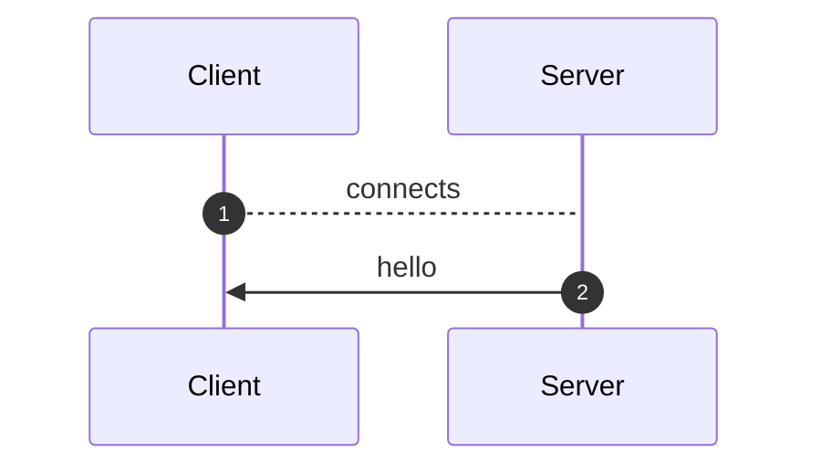
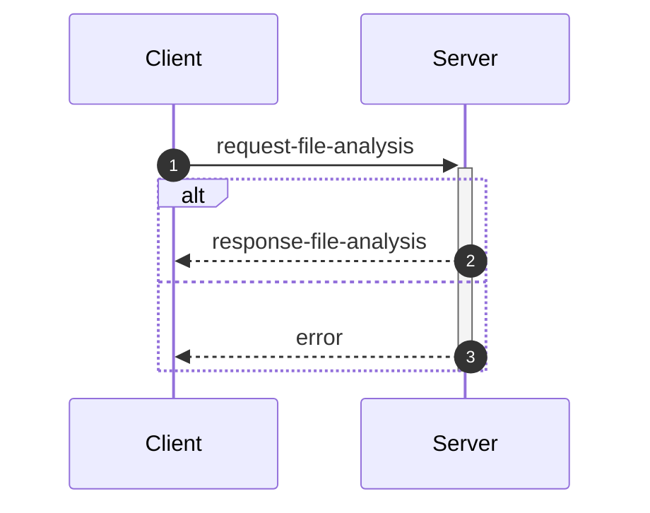
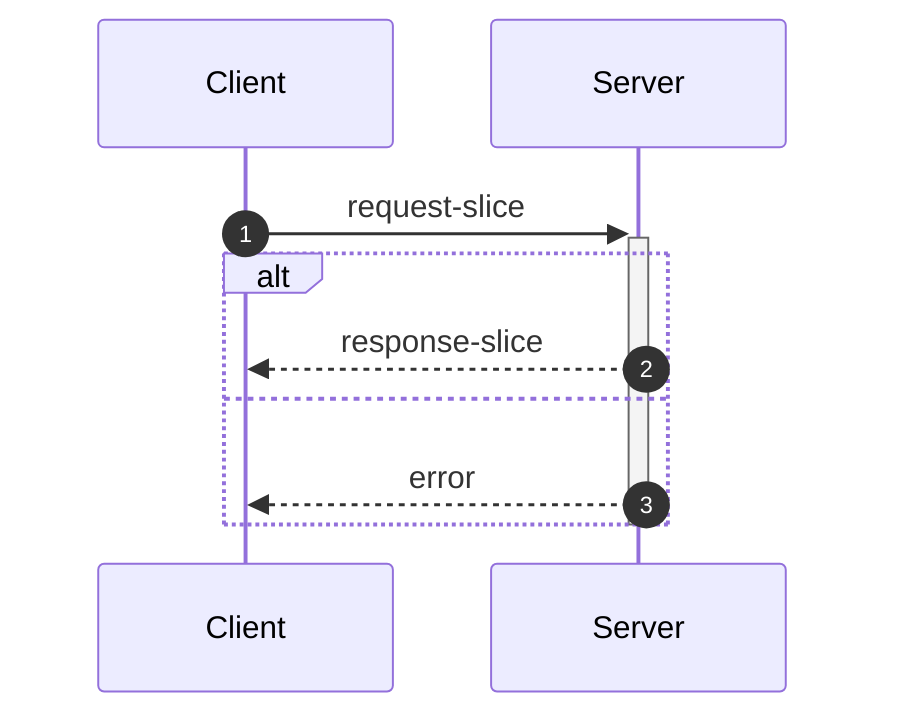
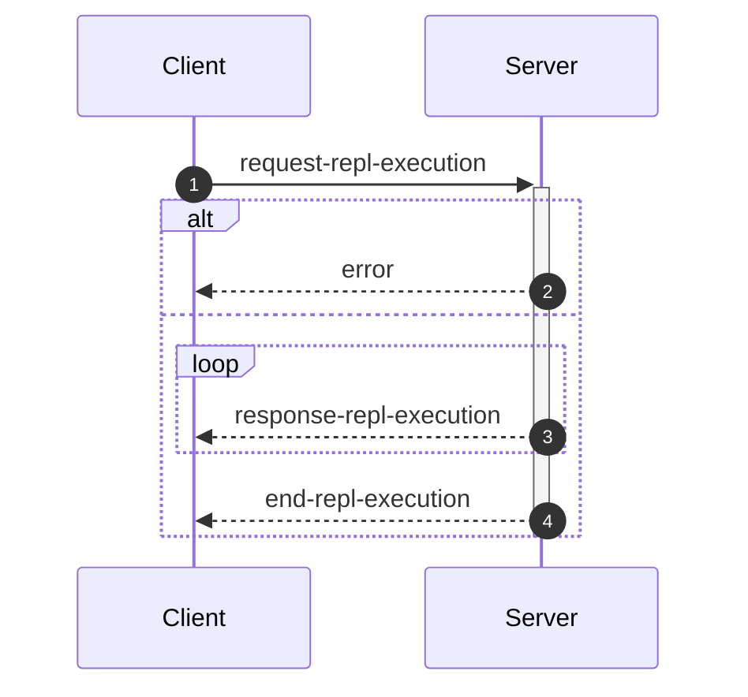

_This document was generated from '[src/documentation/wiki-interface.ts](https://github.com/flowr-analysis/flowr/tree/main//src/documentation/wiki-interface.ts)' on 2026-07-17, 09:16:21 UTC presenting an overview of flowR's interface (v2.12.3, using R v4.6.1). Please do not edit this file/wiki page directly._

Although far from being as detailed as the in-depth explanation of [_flowR_](https://github.com/flowr-analysis/flowr/wiki/core),
this wiki page explains how to interface with _flowR_ in more detail.
In general, command line arguments and other options provide short descriptions on hover over.

* [💻 Using the REPL](#using-the-repl)
* [⚙️ Configuring FlowR](#configuring-flowr)
* [⚒️ Writing Code](#writing-code)
* [💬 Communicating with the Server](#communicating-with-the-server)

<a id='using-the-repl'></a>
## 💻 Using the REPL


> [!NOTE]
> To execute arbitrary R commands with a repl request, _flowR_ has to be started explicitly with <span title="Description (Command Line Argument): Allow to access the underlying R session when using flowR (security warning: this allows the execution of arbitrary R code!)">`--r-session-access`</span>.
> Please be aware that this introduces a security risk and note that this relies on the [`r-shell` engine](https://github.com/flowr-analysis/flowr/wiki/engines) .

Although primarily meant for users to explore,
there is nothing which forbids simply calling _flowR_ as a subprocess to use standard-in, -output, and -error
for communication (although you can access the REPL using the server as well,
with the [REPL Request](#message-request-repl-execution) message).

The read-eval-print loop&nbsp;(REPL) works relatively simple.
You can submit an expression (using <kbd>Enter</kbd>),
which is interpreted as an R&nbsp;expression by default but interpreted as a *command* if it starts with a colon (`:`).
The best command to get started with the REPL is <span title="Description (Repl Command): Show help information (aliases: :h, :?)">`:help`</span>.
Besides, you can leave the REPL either with the command <span title="Description (Repl Command): End the repl (aliases: :q, :exit)">`:quit`</span> or by pressing <kbd>Ctrl</kbd>+<kbd>C</kbd> twice.
When writing a *command*, you may press <kbd>Tab</kbd> to get a list of completions, if available.
Multiple commands can be entered in a single line by separating them with a semicolon (`;`), e.g. `:parse "x<-2"; :df*`.
If a command is given without R code, the REPL will re-use R code given in a previous command.
The prior example will hence return first the parsed AST of the program and then the dataflow graph for `"x <- 2"`.

> [!NOTE]
> If you develop flowR, you may want to launch the repl using the `npm run main-dev` command, this way, you get a non-minified version of flowR with debug information and hot-reloading of source files.

<details>
<summary>Available Commands</summary>

We currently offer the following commands (this with a `[*]` suffix are available with and without the star):


| Command | Description |
| ------- | ----------- |
| **<span title="Description (Repl Command): End the repl (aliases: :q, :exit)">:quit</span>** | End the repl (aliases: **:<span title="Alias of ':quit'. End the repl">q</span>**, **:<span title="Alias of ':quit'. End the repl">exit</span>**) |
| **<span title="Description (Repl Command): Execute the given code as R code. This requires the `--r-session-access` flag to be set and requires the r-shell engine. (aliases: :e, :r)">:execute</span>** | Execute the given code as R code. This requires the `--r-session-access` flag to be set and requires the r-shell engine. (aliases: **:<span title="Alias of ':execute'. Execute the given code as R code. This requires the `--r-session-access` flag to be set and requires the r-shell engine.">e</span>**, **:<span title="Alias of ':execute'. Execute the given code as R code. This requires the `--r-session-access` flag to be set and requires the r-shell engine.">r</span>**) |
| **<span title="Description (Repl Command): Get mermaid code for the control-flow graph of R code (aliases: :cfg, :cf)">:controlflow[*]</span>** | Get mermaid code for the control-flow graph of R code (star: Returns the URL to mermaid.live) (aliases: **:<span title="Alias of ':controlflow'. Get mermaid code for the control-flow graph of R code">cfg</span>**, **:<span title="Alias of ':controlflow'. Get mermaid code for the control-flow graph of R code">cf</span>**) |
| **<span title="Description (Repl Command): Get mermaid code for the control-flow graph with basic blocks (aliases: :cfgb, :cfb)">:controlflowbb[*]</span>** | Get mermaid code for the control-flow graph with basic blocks (star: Returns the URL to mermaid.live) (aliases: **:<span title="Alias of ':controlflowbb'. Get mermaid code for the control-flow graph with basic blocks">cfgb</span>**, **:<span title="Alias of ':controlflowbb'. Get mermaid code for the control-flow graph with basic blocks">cfb</span>**) |
| **<span title="Description (Repl Command): Get mermaid code for the dataflow graph (aliases: :d, :df)">:dataflow[*]</span>** | Get mermaid code for the dataflow graph (star: Returns the URL to mermaid.live) (aliases: **:<span title="Alias of ':dataflow'. Get mermaid code for the dataflow graph">d</span>**, **:<span title="Alias of ':dataflow'. Get mermaid code for the dataflow graph">df</span>**) |
| **<span title="Description (Repl Command): Get mermaid code for the normalized AST of R code (aliases: :n)">:normalize[*]</span>** | Get mermaid code for the normalized AST of R code (star: Returns the URL to mermaid.live) (alias: **:<span title="Alias of ':normalize'. Get mermaid code for the normalized AST of R code">n</span>**) |
| **<span title="Description (Repl Command): Get mermaid code for the simplified dataflow graph (aliases: :ds, :dfs)">:dataflowsimple[*]</span>** | Get mermaid code for the simplified dataflow graph (star: Returns the URL to mermaid.live) (aliases: **:<span title="Alias of ':dataflowsimple'. Get mermaid code for the simplified dataflow graph">ds</span>**, **:<span title="Alias of ':dataflowsimple'. Get mermaid code for the simplified dataflow graph">dfs</span>**) |
| **<span title="Description (Repl Command): Inspect and extend the signature database: `query` (identical to :query @signature), `add <path>` to mount another database/source, `download` to fetch the full-history database. (aliases: :sig)">:signature</span>** | Inspect and extend the signature database: `query` (identical to :query @signature), `add <path>` to mount another database/source, `download` to fetch the full-history database. (alias: **:<span title="Alias of ':signature'. Inspect and extend the signature database: `query` (identical to :query @signature), `add <path>` to mount another database/source, `download` to fetch the full-history database.">sig</span>**) |
| **<span title="Description (Repl Command): Just calculates the DFG, but only prints summary info (aliases: :d#, :df#)">:dataflowsilent</span>** | Just calculates the DFG, but only prints summary info (aliases: **:<span title="Alias of ':dataflowsilent'. Just calculates the DFG, but only prints summary info">d#</span>**, **:<span title="Alias of ':dataflowsilent'. Just calculates the DFG, but only prints summary info">df#</span>**) |
| **<span title="Description (Repl Command): Prints ASCII Art of the parsed, unmodified AST (aliases: :p)">:parse</span>** | Prints ASCII Art of the parsed, unmodified AST (alias: **:<span title="Alias of ':parse'. Prints ASCII Art of the parsed, unmodified AST">p</span>**) |
| **<span title="Description (Repl Command): Prints the version of flowR as well as the current version of R">:version</span>** | Prints the version of flowR as well as the current version of R
| **<span title="Description (Repl Command): Query the given R code (use 'help' for more information)">:query[*]</span>** | Query the given R code (use 'help' for more information) (star: Similar to query, but returns the output in json format.)
| **<span title="Description (Repl Command): Returns an ASCII representation of the dataflow graph (aliases: :df!)">:dataflowascii</span>** | Returns an ASCII representation of the dataflow graph (alias: **:<span title="Alias of ':dataflowascii'. Returns an ASCII representation of the dataflow graph">df!</span>**) |
| **<span title="Description (Repl Command): Returns summarization stats for the normalized AST (aliases: :n#)">:normalize#</span>** | Returns summarization stats for the normalized AST (alias: **:<span title="Alias of ':normalize#'. Returns summarization stats for the normalized AST">n#</span>**) |
| **<span title="Description (Repl Command): Show help information (aliases: :h, :?)">:help</span>** | Show help information (aliases: **:<span title="Alias of ':help'. Show help information">h</span>**, **:<span title="Alias of ':help'. Show help information">?</span>**) |


</details>


> [!TIP]
> 
> As indicated by the examples before, all REPL commands that operate on code keep track of the state.
> Hence, if you run a command like <span title="Description (Repl Command, starred version): Returns the URL to mermaid.live; Base Command: Get mermaid code for the dataflow graph (aliases: :d*, :df*)">`:dataflow*`</span> without providing R code,
> the REPL will re-use the R code provided in a previous command.
> Likewise, doing this will benefit from incrementality!
> If you request the dataflow graph with `:df* x <- 2 * y` and then want to see the parsed AST with `:parse`,
> the REPL will re-use previously obtained information and not re-parse the code again.
> 		


Generally, many commands offer shortcut versions in the REPL. Many queries, for example, offer a shortened format (see the example below).
Of special note, the [Config Query](https://github.com/flowr-analysis/flowr/wiki/query-api#Config-Query)
can be used to also modify the currently active configuration of _flowR_ within the REPL (see the [wiki page](https://github.com/flowr-analysis/flowr/wiki/query-api#Config-Query) for more information).

### Example: Retrieving the Dataflow Graph

To retrieve a URL to the [mermaid](https://mermaid.js.org/) diagram of the dataflow of a given expression,
use <span title="Description (Repl Command, starred version): Returns the URL to mermaid.live; Base Command: Get mermaid code for the dataflow graph (aliases: :d*, :df*)">`:dataflow*`</span> (or <span title="Description (Repl Command): Get mermaid code for the dataflow graph (aliases: :d, :df)">`:dataflow`</span> to get the mermaid code in the cli):


```shell
$ docker run -it --rm eagleoutice/flowr # or npm run flowr 
flowR repl v2.12.3, R grammar v14 (tree-sitter engine)
R> :dataflow* y <- 1 + x
```

<details>
<summary style='color:gray'>Output</summary>


```text
https://mermaid.live/view#base64:eyJjb2RlIjoiZmxvd2NoYXJ0IEJUXG4gICAgMXt7XCJgKiM5MTtSTnVtYmVyIzkzOyogKioxKipcbiAgICAgICoxLjYqICgqKmlkOiAxKiopYFwifX1cbiAgICUlIE5vIGVkZ2VzIGZvdW5kIGZvciAxXG4gICAgMihbXCJgKiM5MTtSU3ltYm9sIzkzOyogKip4KipcbiAgICAgICoxLjEwKiAoKippZDogMioqKWBcIl0pXG4gICAlJSBObyBlZGdlcyBmb3VuZCBmb3IgMlxuICAgIDNbW1wiYCojOTE7UkJpbmFyeU9wIzkzOyogYmFzZSM1ODsjNTg7KiojNDM7KipcbiAgICAgICoxLjYtMTAqICgqKmlkOiAzKiopXG4gICAgYXJnOiAoMSwgMilgXCJdXVxuICAgIGJ1aWx0LWluOl9bXCJgQnVpbHQtSW46XG4jNDM7YFwiXVxuICAgIHN0eWxlIGJ1aWx0LWluOl8gc3Ryb2tlOmdyYXksZmlsbDpncmF5LHN0cm9rZS13aWR0aDoycHgsb3BhY2l0eTouODtcbiAgICAwW1wiYCojOTE7UlN5bWJvbCM5MzsqICoqeSoqXG4gICAgICAqMS4xKiAoKippZDogMCoqLCB2OiAzKWBcIl1cbiAgICA0W1tcImAqIzkxO1JCaW5hcnlPcCM5MzsqIGJhc2UjNTg7IzU4OyoqIzYwOyM0NTsqKlxuICAgICAgKjEuMS0xMCogKCoqaWQ6IDQqKilcbiAgICBhcmc6ICgwLCAzKWBcIl1dXG4gICAgYnVpbHQtaW46Xy1bXCJgQnVpbHQtSW46XG4jNjA7IzQ1O2BcIl1cbiAgICBzdHlsZSBidWlsdC1pbjpfLSBzdHJva2U6Z3JheSxmaWxsOmdyYXksc3Ryb2tlLXdpZHRoOjJweCxvcGFjaXR5Oi44O1xuICAgIDMgLS0+fFwicmVhZHMsIGFyZ1wifCAxXG4gICAgMyAtLT58XCJyZWFkcywgYXJnXCJ8IDJcbiAgICAzIC0uLT58XCJyZWFkcywgY2FsbHNcInwgYnVpbHQtaW46X1xuICAgIGxpbmtTdHlsZSAyIHN0cm9rZTpncmF5O1xuICAgIDAgLS0+fFwiZGVmaW5lZC1ieVwifCAzXG4gICAgMCAtLT58XCJkZWZpbmVkLWJ5XCJ8IDRcbiAgICA0IC0tPnxcInJlYWRzLCBhcmdcInwgM1xuICAgIDQgLS0+fFwicmV0dXJucywgYXJnXCJ8IDBcbiAgICA0IC0uLT58XCJyZWFkcywgY2FsbHNcInwgYnVpbHQtaW46Xy1cbiAgICBsaW5rU3R5bGUgNyBzdHJva2U6Z3JheTsiLCJtZXJtYWlkIjp7ImF1dG9TeW5jIjp0cnVlfX0=
```


Retrieve the dataflow graph of the expression `y <- 1 + x`. It looks like this:


```mermaid
flowchart LR
    1{{"`*#91;RNumber#93;* **1**
      *1.6* (**id: 1**)`"}}
   %% No edges found for 1
    2(["`*#91;RSymbol#93;* **x**
      *1.10* (**id: 2**)`"])
   %% No edges found for 2
    3[["`*#91;RBinaryOp#93;* base#58;#58;**#43;**
      *1.6-10* (**id: 3**)
    arg: (1, 2)`"]]
    built-in:_["`Built-In:
#43;`"]
    style built-in:_ stroke:gray,fill:gray,stroke-width:2px,opacity:.8;
    0["`*#91;RSymbol#93;* **y**
      *1.1* (**id: 0**, v: 3)`"]
    4[["`*#91;RBinaryOp#93;* base#58;#58;**#60;#45;**
      *1.1-10* (**id: 4**)
    arg: (0, 3)`"]]
    built-in:_-["`Built-In:
#60;#45;`"]
    style built-in:_- stroke:gray,fill:gray,stroke-width:2px,opacity:.8;
    3 -->|"reads, arg"| 1
    3 -->|"reads, arg"| 2
    3 -.->|"reads, calls"| built-in:_
    linkStyle 2 stroke:gray;
    0 -->|"defined-by"| 3
    0 -->|"defined-by"| 4
    4 -->|"reads, arg"| 3
    4 -->|"returns, arg"| 0
    4 -.->|"reads, calls"| built-in:_-
    linkStyle 7 stroke:gray;
```

	
<details>

<summary style="color:gray">R Code of the Dataflow Graph</summary>

The analysis required _7.2 ms_ (including parse and normalize, using the [tree-sitter](https://github.com/flowr-analysis/flowr/wiki/Engines) engine) within the generation environment. No [signature database](https://github.com/flowr-analysis/flowr/wiki/Signature-Database) is mounted for these generated graphs, so `library()` calls attach no package exports; base-R names are still qualified via the generated base-package store (e.g. `acf` as `stats::acf`). 
We encountered no unknown side effects during the analysis.


```r
y <- 1 + x
```


</details>


</details>


For small graphs like this, <span title="Description (Repl Command): Returns an ASCII representation of the dataflow graph (aliases: :df!)">`:dataflowascii`</span> also provides an ASCII representation directly in the REPL:


```shell
$ docker run -it --rm eagleoutice/flowr # or npm run flowr 
flowR repl v2.12.3, R grammar v14 (tree-sitter engine)
R> :df! y <- 1 + x
```

<details open>
<summary style='color:gray'>Output</summary>


```text
                        0<1>0
                   ┌────| 1 |
    ┌────────┐     │    0---0
 c<4>c       └──c<3>c
 |<- |  v<0>v┌──| + |
 c---c──| y |┘  c---c   u<2>u
        v---v      └────| x |
                        u---u
Edges:
3 -> 1: reads, arg  3 -> 2: reads, arg
4 -> 3: reads, arg  4 -> 0: returns, arg
0 -> 3: defined-by  0 -> 4: defined-by
```


Retrieve the dataflow graph of the expression `y <- 1 + x` as ASCII art.

</details>


For the slicing with <span title="Description (Repl Command): Static backwards executable slicer for R">`:slicer`</span>, you have access to the same [magic comments](#slice-magic-comments) as with the [slice request](#message-request-slice).
Pass `--inline` to splice resolvable `source()` calls into the reconstruction so the slice is a single self-contained R text (the same as the static slice query's `inlineSources` flag).
See `--help` for more flags!

### Example: Interfacing with the File System

Many commands that allow for an R-expression (like <span title="Description (Repl Command, starred version): Returns the URL to mermaid.live; Base Command: Get mermaid code for the dataflow graph (aliases: :d*, :df*)">`:dataflow*`</span>) allow for a file as well
if the argument starts with `file://`.
If you are working from the root directory of the _flowR_ repository, the following gives you the parsed AST of the example file using the <span title="Description (Repl Command): Prints ASCII Art of the parsed, unmodified AST (aliases: :p)">`:parse`</span> command:

> **Watch mode**: Replace `file://` with `watch://` to enter watch mode.
> flowR runs the command immediately and then re-runs it every time the file (or any file inside the folder) changes.
> Enter any other command to leave watch mode.
> For example: `:df watch://analysis.R`


```shell
$ docker run -it --rm eagleoutice/flowr # or npm run flowr 
flowR repl v2.12.3, R grammar v14 (tree-sitter engine)
R> :parse file://test/testfiles/example.R
```

<details>
<summary style='color:gray'>Output</summary>


```text
File: test/testfiles/example.R

program
├ binaryoperator
│ ├ identifier "sum" (1:1─4)
│ ├ <- "<-" (1:5─7)
│ ╰ float "0" (1:8─9)
├ binaryoperator
│ ├ identifier "product" (2:1─8)
│ ├ <- "<-" (2:9─11)
│ ╰ float "1" (2:12─13)
├ binaryoperator
│ ├ identifier "w" (3:1─2)
│ ├ <- "<-" (3:3─5)
│ ╰ float "7" (3:6─7)
├ binaryoperator
│ ├ identifier "N" (4:1─2)
│ ├ <- "<-" (4:3─5)
│ ╰ float "10" (4:6─8)
├ forstatement
│ ├ for "for" (6:1─4)
│ ├ ( "(" (6:5─6)
│ ├ identifier "i" (6:6─7)
│ ├ in "in" (6:8─10)
│ ├ binaryoperator
│ │ ├ float "1" (6:11─12)
│ │ ├ : ":" (6:12─13)
│ │ ╰ parenthesizedexpression
│ │   ├ ( "(" (6:13─14)
│ │   ├ binaryoperator
│ │   │ ├ identifier "N" (6:14─15)
│ │   │ ├ - "-" (6:15─16)
│ │   │ ╰ float "1" (6:16─17)
│ │   ╰ ) ")" (6:17─18)
│ ├ ) ")" (6:18─19)
│ ╰ bracedexpression
│   ├ { "{" (6:20─21)
│   ├ binaryoperator
│   │ ├ identifier "sum" (7:3─6)
│   │ ├ <- "<-" (7:7─9)
│   │ ╰ binaryoperator
│   │   ├ binaryoperator
│   │   │ ├ identifier "sum" (7:10─13)
│   │   │ ├ + "+" (7:14─15)
│   │   │ ╰ identifier "i" (7:16─17)
│   │   ├ + "+" (7:18─19)
│   │   ╰ identifier "w" (7:20─21)
│   ├ binaryoperator
│   │ ├ identifier "product" (8:3─10)
│   │ ├ <- "<-" (8:11─13)
│   │ ╰ binaryoperator
│   │   ├ identifier "product" (8:14─21)
│   │   ├  "" (8:22─23)
│   │   ╰ identifier "i" (8:24─25)
│   ╰ } "}" (9:1─2)
├ call
│ ├ identifier "cat" (11:1─4)
│ ╰ arguments
│   ├ ( "(" (11:4─5)
│   ├ argument
│   │ ╰ string
│   │   ├ " "\"" (11:5─6)
│   │   ├ stringcontent "Sum:" (11:6─10)
│   │   ╰ " "\"" (11:10─11)
│   ├ comma "," (11:11─12)
│   ├ argument
│   │ ╰ identifier "sum" (11:13─16)
│   ├ comma "," (11:16─17)
│   ├ argument
│   │ ╰ string
│   │   ├ " "\"" (11:18─19)
│   │   ├ stringcontent
│   │   │ ╰ escapesequence "\\n" (11:19─21)
│   │   ╰ " "\"" (11:21─22)
│   ╰ ) ")" (11:22─23)
╰ call
  ├ identifier "cat" (12:1─4)
  ╰ arguments
    ├ ( "(" (12:4─5)
    ├ argument
    │ ╰ string
    │   ├ " "\"" (12:5─6)
    │   ├ stringcontent "Product:" (12:6─14)
    │   ╰ " "\"" (12:14─15)
    ├ comma "," (12:15─16)
    ├ argument
    │ ╰ identifier "product" (12:17─24)
    ├ comma "," (12:24─25)
    ├ argument
    │ ╰ string
    │   ├ " "\"" (12:26─27)
    │   ├ stringcontent
    │   │ ╰ escapesequence "\\n" (12:27─29)
    │   ╰ " "\"" (12:29─30)
    ╰ ) ")" (12:30─31)
```


Retrieve the parsed AST of the example file.

<details>

<summary>File Content</summary>


```r
sum <- 0
product <- 1
w <- 7
N <- 10

for (i in 1:(N-1)) {
  sum <- sum + i + w
  product <- product * i
}

cat("Sum:", sum, "\n")
cat("Product:", product, "\n")
```


</details>

As _flowR_ directly transforms this AST the output focuses on being human-readable instead of being machine-readable.
		

</details>


### Example: Run a Query

You can run any query supported by _flowR_ using the <span title="Description (Repl Command): Query the given R code (use 'help' for more information)">`:query`</span> command.
For example, to obtain the shapes of all data frames in a given piece of code, you can run:


```shell
$ docker run -it --rm eagleoutice/flowr # or npm run flowr 
flowR repl v2.12.3, R grammar v14 (tree-sitter engine)
R> :query @absint df-shape "x <- data.frame(a = 1:10, b = 1:10)\ny <- x$a"
```

<details open>
<summary style='color:gray'>Output</summary>


```text
Query: absint (2 ms)
   ╰ $12: (colnames: [{"a", "b"}, {}], cols: [2, 2], rows: [10, 10])
   ╰ $0: (colnames: [{"a", "b"}, {}], cols: [2, 2], rows: [10, 10])
All queries together required ≈4 ms (1ms accuracy, total 5 ms)
```


Retrieve the shapes of all data frames in the given code.

</details>


To run the linter on a file, you can use (in this example, we just issue the `dead-code` linter on a small piece of code):


```shell
$ docker run -it --rm eagleoutice/flowr # or npm run flowr 
flowR repl v2.12.3, R grammar v14 (tree-sitter engine)
R> :query @linter rules:dead-code "if(FALSE) x <- 2"
```

<details open>
<summary style='color:gray'>Output</summary>


```text
Query: linter (1 ms)
   ╰ Dead Code (dead-code):
       ╰ certain:
           ╰ Code at 1.11-16
       ╰ Metadata: searchTimeMs: 1, processTimeMs: 0
All queries together required ≈1 ms (1ms accuracy, total 2 ms)
```


Run the linter on the given code, with only the `dead-code` rule enabled.

</details>


For more information on the available queries, please check out the [Query API](https://github.com/flowr-analysis/flowr/wiki/query-api).


<a id='configuring-flowr'></a>
## ⚙️ Configuring FlowR


When running _flowR_, you may want to specify some behaviors with a dedicated configuration file.
By default, flowR looks for a file named `flowr.json` in the current working directory (or any higher directory).
You can also specify a different file with <span title="Description (Command Line Argument): The name of the configuration file to use">`--config-file`</span> or pass the configuration inline using <span title="Description (Command Line Argument): The flowR configuration to use, as a JSON string">`--config-json`</span>.
To inspect the current configuration, you can run flowr with the <span title="Description (Command Line Argument): Run with verbose logging (will be passed to the corresponding script)">`--verbose`</span> flag, or use the `config` [Query](https://github.com/flowr-analysis/flowr/wiki/query-api).
Within the REPL this works by running the following:


```shell
:query @config
```


To work with the <a href="https://github.com/flowr-analysis/flowr/tree/main/src/config.ts#L126"><code><span title="The configuration file format for flowR.">FlowrConfig</span></code></a> you can use the provided helper objects alongside its methods like
<a href="https://github.com/flowr-analysis/flowr/tree/main/src/config.ts#L625"><code><span title="Creates a new flowr config that has the updated values.">FlowrConfig::<b>amend</b></span></code></a>.
The schema below documents every option; the ones you most likely want are:

- <a href="https://github.com/flowr-analysis/flowr/wiki/Interface#configuring-flowr" title="Configuration Option (boolean): Whether source calls should be ignored, causing {@link processSourceCall}&#39;s behavior to be skipped.">ignoreSourceCalls</a>: ignore source calls when analyzing the code, i.e., ignore the inclusion of other files.
- <a href="https://github.com/flowr-analysis/flowr/wiki/Interface#configuring-flowr" title="Configuration Option (object): Do you want to overwrite (parts) of the builtin definition?">semantics.environment.overwriteBuiltIns</a>: overwrite _flowR_'s handling of built-in functions, or clear the preset definitions entirely.
  See [Configure BuiltIn Semantics](#configure-builtin-semantics) for more information.
- <a href="https://github.com/flowr-analysis/flowr/wiki/Interface#configuring-flowr" title="Configuration Option (string): How to resolve variables and their values. (one of &quot;disabled&quot;, &quot;alias&quot;, &quot;builtin&quot;)">solver.variables</a>: how to resolve variables and their values (`disabled`, `alias`, `builtin`).
- <a href="https://github.com/flowr-analysis/flowr/wiki/Interface#configuring-flowr" title="Configuration Option (array): The engine or set of engines to use for interacting with R code. An empty array means all available engines will be used.">engines</a> and <a href="https://github.com/flowr-analysis/flowr/wiki/Interface#configuring-flowr" title="Configuration Option (string): The default engine to use for interacting with R code. If this is undefined, an arbitrary engine from the specified list will be used. (one of &quot;tree-sitter&quot;, &quot;r-shell&quot;)">defaultEngine</a>: the engines used to interact with R code, see the [Engines wiki page](https://github.com/flowr-analysis/flowr/wiki/engines).
- <a href="https://github.com/flowr-analysis/flowr/wiki/Interface#configuring-flowr" title="Configuration Option (array): Files a framework loads on its own, without any source() call (e.g. global.R in a shiny app), in the order they are loaded; flowR orders the matching project files accordingly and analyzes them as one program. Entries are case-insensitive globs matched against the file path, a plain name matches any file with that name, and entries matching no project file are warned about. Usually set per project kind via specializeConfig.">project.implicitSources</a>: the files a framework loads without any `source()` call, in the order in which they are
  loaded. Entries are globs (e.g. `R/*.R`) matched against the file path ignoring capitalization; one matching no file is reported.
- <a href="https://github.com/flowr-analysis/flowr/wiki/Interface#configuring-flowr" title="Configuration Option (object): Overwrite (parts of) the configuration depending on the project kind flowR detects, e.g. to give a shiny app its implicit sources.">specializeConfig</a>: overwrite (parts of) the configuration depending on the kind of project _flowR_ detects
  (e.g. `shiny-app`), which is how a shiny app gets its implicit sources by default. What you configure directly wins.
- <a href="https://github.com/flowr-analysis/flowr/wiki/Interface#configuring-flowr" title="Configuration Option (array): The default plugins to load when creating a new instance of FlowrAnalyzer">defaultPlugins</a> and <a href="https://github.com/flowr-analysis/flowr/wiki/Interface#configuring-flowr" title="Configuration Option (array): The plugins to load in REPL mode">repl.plugins</a>: the plugins to load for a new <a href="https://github.com/flowr-analysis/flowr/tree/main/src/project/flowr-analyzer.ts#L162"><code><span title="Central class for conducting analyses with FlowR. Use the FlowrAnalyzerBuilder to create a new instance. If you want the original pattern of creating a pipeline and running all steps, you can still do this with FlowrAnalyzer#runFull . To inspect the context of the analyzer, use FlowrAnalyzer#inspectContext (if you are a plugin and need to modify it, use FlowrAnalyzer#context instead).">FlowrAnalyzer</span></code></a> and in the REPL
  (use `flowr:default` to reference the former).

So you can configure _flowR_ by adding a file like the following:

<details>

<summary>Example Configuration File</summary>


```json
{
  "ignoreSourceCalls": true,
  "semantics": {
    "environment": {
      "overwriteBuiltIns": {
        "definitions": [
          {
            "type": "function",
            "names": [
              "foo"
            ],
            "processor": "builtin:assign",
            "config": {}
          }
        ]
      }
    }
  },
  "defaultPlugins": [
    "file:description",
    "versions:description"
  ],
  "repl": {
    "quickStats": false,
    "dfProcessorHeat": false,
    "hints": true,
    "plugins": [
      "flowr:default"
    ]
  },
  "project": {
    "resolveUnknownPathsOnDisk": true,
    "implicitSources": [
      "global.R",
      "app.R"
    ]
  },
  "specializeConfig": {
    "shiny-app": {
      "project": {
        "implicitSources": [
          "global.R",
          "ui.R",
          "server.R",
          "app.R"
        ]
      }
    }
  },
  "engines": [
    {
      "type": "r-shell"
    }
  ],
  "solver": {
    "variables": "alias",
    "evalStrings": true,
    "trackEnvironments": true,
    "sigdb": {
      "enabled": true,
      "loadProjectDependencies": true,
      "eagerlyLoad": false,
      "eagerlyLoadExports": false,
      "linkBaseR": false,
      "linkDescriptionDependencies": false
    },
    "resolveSource": {
      "dropPaths": "no",
      "ignoreCapitalization": true,
      "inferWorkingDirectory": "active-script",
      "searchPath": []
    },
    "instrument": {},
    "slicer": {
      "threshold": 50
    }
  },
  "abstractInterpretation": {
    "wideningThreshold": 4,
    "dataFrame": {
      "maxColNames": 20,
      "readLoadedData": {
        "readExternalFiles": true,
        "maxReadLines": 1000000
      }
    }
  },
  "gas": {
    "thresholds": {
      "memory": {
        "problematic": 0.7,
        "critical": 0.9
      },
      "timeMs": {
        "problematic": 100000,
        "critical": 120000
      }
    },
    "features": {}
  }
}
```


</details>

<details>
<a id='configure-builtin-semantics'></a>
<summary>Configure Built-In Semantics</summary>


`semantics/environment/overwriteBuiltins` accepts two keys:

- `loadDefaults` (boolean, initially `true`): If set to `true`, the default built-in definitions are loaded before applying the custom definitions. Setting this flag to `false` explicitly disables the loading of the default definitions.
- `definitions` (array, initially empty): Allows to overwrite or define new built-in elements. Each object within must have a `type` which is one of the below. Furthermore, they may define a string array of `names` which specifies the identifiers to bind the definitions to. You may use `assumePrimitive` to specify whether _flowR_ should assume that this is a primitive non-library definition (so you probably just do not want to specify the key).

  | Type            | Description                                                                                                                                                                                                                                                                                              | Example                                                                                                    |
  | --------------- | -------------------------------------------------------------------------------------------------------------------------------------------------------------------------------------------------------------------------------------------------------------------------------------------------------- | ---------------------------------------------------------------------------------------------------------- |
  | `constant`    | Additionally allows for a `value` this should resolve to.                                                                                                                                                                                                                                                | `{ type: 'constant', names: ['NULL', 'NA'],  value: null }`                                                |
  | `function`    | Is a rather flexible way to define and bind built-in functions. For the time, we do not have extensive documentation to cover all the cases, so please either consult the sources with the `default-builtin-config.ts` or open a [new issue](https://github.com/flowr-analysis/flowr/issues/new/choose). | `{ type: 'function', names: ['next'], processor: 'builtin:d', config: { cfg: ExitPointType.Next } }` |
  | `replacement` | A comfortable way to specify replacement functions like `$<-` or `names<-`. `suffixes` describes the... suffixes to attach automatically. | `{ type: 'replacement', suffixes: ['<-', '<<-'], names: ['[', '[['] }` |


</details>

<details>

<summary style='color:gray'>Full Configuration-File Schema</summary>

- _The configuration file format for flowR._ (object)
    - **ignoreSourceCalls** [optional] _Whether source calls should be ignored, causing {@link processSourceCall}'s behavior to be skipped._ (boolean)
    - **semantics** _Configure language semantics and how flowR handles them._ (object)
        - **environment** [optional] _Semantics regarding how to handle the R environment._ (object)
            - **overwriteBuiltIns** [optional] _Do you want to overwrite (parts) of the builtin definition?_ (object)
                - **loadDefaults** [optional] _Should the default configuration still be loaded?_ (boolean)
                - **definitions** [optional] _The definitions to load/overwrite._ (array)
                Valid item types:
                    - (object)
    - **defaultPlugins** [optional] _The default plugins to load when creating a new instance of FlowrAnalyzer_ (array)
    Valid item types:
        - (alternatives)
            - (string)
            - (array)
    - **repl** _Configuration options for the REPL._ (object)
        - **quickStats** [optional] _Whether to show quick stats in the REPL after each evaluation._ (boolean)
        - **dfProcessorHeat** [optional] _This instruments the dataflow processors to count how often each processor is called._ (boolean)
        - **hints** [optional] _Whether to show dim inline hints on the empty prompt (automatically disabled on non-interactive terminals)._ (boolean)
        - **plugins** [optional] _The plugins to load in REPL mode_ (array)
        Valid item types:
            - (alternatives)
                - (string)
                - (array)
        - **autoUseFileProtocol** [optional] _Prepend the file protocol to a repl input that looks like a path, instead of only warning about it._ (boolean)
        - **queryStats** [optional] _Whether `:query` closes with the line stating how long the queries took (`:query*` never prints it)._ (boolean)
    - **project** _Project specific configuration options._ (object)
        - **resolveUnknownPathsOnDisk** [optional] _Whether to resolve unknown paths loaded by the r project disk when trying to source/analyze files._ (boolean)
        - **basePackages** [optional] _The packages considered part of R itself (base and recommended); if unset, flowR uses its built-in list._ (array)
        Valid item types:
            - (string)
        - **implicitSources** [optional] _Files a framework loads on its own, without any source() call (e.g. global.R in a shiny app), in the order they are loaded; flowR orders the matching project files accordingly and analyzes them as one program. Entries are case-insensitive globs matched against the file path, a plain name matches any file with that name, and entries matching no project file are warned about. Usually set per project kind via specializeConfig._ (array)
        Valid item types:
            - (string)
    - **specializeConfig** [optional] _Overwrite (parts of) the configuration depending on the project kind flowR detects, e.g. to give a shiny app its implicit sources._ (object)
    - **engines** _The engine or set of engines to use for interacting with R code. An empty array means all available engines will be used._ (array)
    Valid item types:
        - (alternatives)
            - _The configuration for the tree sitter engine._ (object)
                - **type** [required] _Use the tree sitter engine._ (string)
                    Only allows: 'tree-sitter'
                - **wasmPath** [optional] _The path to the tree-sitter-r WASM binary to use. If this is undefined, this uses the default path._ (string)
                - **treeSitterWasmPath** [optional] _The path to the tree-sitter WASM binary to use. If this is undefined, this uses the default path._ (string)
                - **lax** [optional] _Whether to use the lax parser for parsing R code (allowing for syntax errors). If this is undefined, the strict parser will be used._ (boolean)
            - _The configuration for the R shell engine._ (object)
                - **type** [required] _Use the R shell engine._ (string)
                    Only allows: 'r-shell'
                - **rPath** [optional] _The path to the R executable to use. If this is undefined, this uses the default path._ (string)
    - **defaultEngine** [optional] _The default engine to use for interacting with R code. If this is undefined, an arbitrary engine from the specified list will be used._ (string)
        Only allows: 'tree-sitter', 'r-shell'
    - **solver** _How to resolve constants, constraints, cells, ..._ (object)
        - **variables** _How to resolve variables and their values._ (string)
            Only allows: 'disabled', 'alias', 'builtin'
        - **evalStrings** _Should we include eval(parse(text="...")) calls in the dataflow graph?_ (boolean)
        - **trackEnvironments** [optional] _Track user-created environments (new.env, assign/get/local with envir=, dollar-assign, attach). When false, all envir-style calls fall through conservatively._ (boolean)
        - **sigdb** _Resolving library exports from a signature database._ (object)
            - **enabled** [optional] _Resolve library()/use() exports from a signature database (default true); when false no database is consulted._ (boolean)
            - **loadProjectDependencies** [optional] _Load the project's declared dependencies from its metadata files (DESCRIPTION Imports/Depends, rproject.toml, renv.lock, rv.lock) (default true); when false these files are not read for dependencies._ (boolean)
            - **eagerlyLoad** [optional] _Parse the database up front rather than on the first package load (default false, ignored if disabled)._ (boolean)
            - **eagerlyLoadExports** [optional] _Add a vertex for every export on load rather than on demand (default false); keeps the dataflow graph small._ (boolean)
            - **assumedRVersion** [optional] _R version assumed when resolving versioned (base-R) exports: a pin like "4.5" or "auto" to detect the installed R (default "auto")._ (string)
            - **linkBaseR** [optional] _Eagerly attach base-R namespaces so bare base calls resolve without library() (default false)._ (boolean)
            - **linkBaseRCalls** [optional] _Add a lightweight Reads edge from a bare base-R call to its signature-database function vertex (default false; base-R qualification is edge-free otherwise)._ (boolean)
            - **linkPackageCalls** [optional] _Add a lightweight Reads edge from a resolved package call to its signature-database function vertex (default false)._ (boolean)
            - **linkDescriptionDependencies** [optional] _Eagerly attach the namespaces of the project's declared DESCRIPTION dependencies (Imports/Depends) so their exports resolve without an explicit library() (default false)._ (boolean)
            - **warmInBackground** [optional] _Decompress the hot shards (base + most-downloaded) in a background task on startup so the first library() lookup is warm (default false; for long-running servers/REPLs)._ (boolean)
            - **additionalPaths** [optional] _Extra directories or bundle/manifest files searched for signature databases (alongside the shipped default and $FLOWR_SIGDB_DIR); a downloaded full-history bundle placed here is mounted automatically._ (array)
            Valid item types:
                - (string)
            - **downloadRepo** [optional] _GitHub owner/repo the full-history bundle is downloaded from via ":signature download" (default "flowr-analysis/flowr", release tag "sigdb-v<flowR-version>")._ (string)
            - **autoSync** [optional] _On startup, re-download shards whose committed sigdb.remote.json hash no longer matches the cache, in the background (default false; opt-in network sync after a git pull)._ (boolean)
            - **versionSelection** [optional] _When a project constrains a dependency, resolve to the newest (default), oldest, or system-installed version satisfying it; system needs R and falls back to newest. Base-R packages always resolve against the assumed R version._ (string)
                Only allows: 'newest', 'oldest', 'system'
            - **versionOverrides** [optional] _Force an exact version for specific packages (name -> version), overriding both the project constraint and the versionSelection policy (default {})._ (object)
        - **instrument** (object)
            - **dataflowExtractors** [optional] _These keys are only intended for use within code, allowing to instrument the dataflow analyzer!_ (any)
        - **resolveSource** [optional] _If lax source calls are active, flowR searches for sourced files much more freely, based on the configurations you give it. This option is only in effect if `ignoreSourceCalls` is set to false._ (object)
            - **dropPaths** _Allow to drop the first or all parts of the sourced path, if it is relative._ (string)
                Only allows: 'no', 'once', 'all'
            - **ignoreCapitalization** _Search for filenames matching in the lowercase._ (boolean)
            - **inferWorkingDirectory** _Try to infer the working directory from the main or any script to analyze._ (string)
                Only allows: 'no', 'main-script', 'active-script', 'any-script'
            - **searchPath** _Additionally search in these paths._ (array)
            Valid item types:
                - (string)
            - **repeatedSourceLimit** [optional] _How often the same file can be sourced within a single run? Please be aware: in case of cyclic sources this may not reach a fixpoint so give this a sensible limit._ (number)
            - **applyReplacements** _Provide name replacements for loaded files_ (array)
            Valid item types:
                - (object)
            - **assumeFilesExist** [optional] _Assume a sourced file is always there, making what it defines certain instead of conditional on the source call._ (boolean)
        - **slicer** [optional] _The configuration for the slicer._ (object)
            - **threshold** [optional] _The maximum number of iterations to perform on a single function call during slicing._ (number)
            - **autoExtend** [optional] _If set, the slicer will gain an additional post-pass._ (boolean)
    - **abstractInterpretation** _The configuration options for abstract interpretation._ (object)
        - **wideningThreshold** _The threshold for the number of visitations of a node at which widening should be performed to ensure the termination of the fixpoint iteration._ (number)
        - **dataFrame** _The configuration of the shape inference for data frames._ (object)
            - **maxColNames** _The maximum number of columns names to infer for data frames before over-approximating the column names to top._ (number)
            - **readLoadedData** _Configuration options for reading data frame shapes from loaded external data files, such as CSV files._ (object)
                - **readExternalFiles** _Whether data frame shapes should be extracted from loaded external files, such as CSV files._ (boolean)
                - **maxReadLines** _The maximum number of lines to read when extracting data frame shapes from loaded files, such as CSV files._ (number)
    - **gas** [optional] _Resource-usage guard (gas) configuration. All feature factors default to 0 (disabled). See https://github.com/flowr-analysis/flowr/wiki/Core#gas-resource-guard._ (object)
        - **thresholds** [optional] _Shared thresholds for all gas checks (scaled by per-feature factor)._ (object)
            - **memory** [optional] _Heap-usage fraction thresholds (0-1)._ (object)
                - **problematic** [optional] _Heap fraction (0-1) above which Problematic is returned._ (number)
                - **critical** [optional] _Heap fraction (0-1) above which Critical is returned._ (number)
            - **timeMs** [optional] _Elapsed analysis time thresholds in milliseconds._ (object)
                - **problematic** [optional] _Elapsed ms above which Problematic is returned._ (number)
                - **critical** [optional] _Elapsed ms above which Critical is returned._ (number)
        - **features** [optional] _Per-feature sensitivity factors. 0 or absent disables gas checking for that feature. A factor of 2 makes the feature twice as sensitive. Recognised keys: `source`, `side-effect-linking`, `linter`._ (object)
        - **heapProvider** [optional] _Custom heap statistics source (programmatic configs only), overriding the built-in v8/performance.memory detection._ (function)

</details>

	

<a id='writing-code'></a>
## ⚒️ Writing Code

_flowR_ can be used as a [module](https://www.npmjs.com/package/@eagleoutice/flowr) and offers several main classes and interfaces that are interesting for extension writers 
(see the [Visual Studio Code extension](https://marketplace.visualstudio.com/items?itemName=code-inspect.vscode-flowr) or the [Core](https://github.com/flowr-analysis/flowr/wiki/core) wiki page for more information).

### Creating Analyses with _flowR_

Nowadays, instances of the <a href="https://github.com/flowr-analysis/flowr/tree/main/src/project/flowr-analyzer.ts#L162"><code><span title="Central class for conducting analyses with FlowR. Use the FlowrAnalyzerBuilder to create a new instance. If you want the original pattern of creating a pipeline and running all steps, you can still do this with FlowrAnalyzer#runFull . To inspect the context of the analyzer, use FlowrAnalyzer#inspectContext (if you are a plugin and need to modify it, use FlowrAnalyzer#context instead).">FlowrAnalyzer</span></code></a> should be used as central frontend to get analysis results from _flowR_.
For example, a program slice can be created like this:


```ts
const analyzer = await new FlowrAnalyzerBuilder()
    .setEngine('tree-sitter')
    .build();
analyzer.addRequest('x <- 1\ny <- x\nx');
const result = await analyzer.query([
    {
        type:     'static-slice',
        criteria: ['3@x']
    }
]);
//console.log(result['static-slice']);
```


For more information, please have a look at the [Analyzer](https://github.com/flowr-analysis/flowr/wiki/analyzer) wiki page, which explains how to construct and use the <a href="https://github.com/flowr-analysis/flowr/tree/main/src/project/flowr-analyzer.ts#L162"><code><span title="Central class for conducting analyses with FlowR. Use the FlowrAnalyzerBuilder to create a new instance. If you want the original pattern of creating a pipeline and running all steps, you can still do this with FlowrAnalyzer#runFull . To inspect the context of the analyzer, use FlowrAnalyzer#inspectContext (if you are a plugin and need to modify it, use FlowrAnalyzer#context instead).">FlowrAnalyzer</span></code></a> in more detail.
To work with specific perspectives, you can also consult the respective pages like the [Dataflow Graph](https://github.com/flowr-analysis/flowr/wiki/dataflow-graph) or the [Abstract Interpretation](https://github.com/flowr-analysis/flowr/wiki/abstract-interpretation) wiki pages.
### The Pipeline Executor (Low-Level Interface)

Once, in the beginning, _flowR_ was meant to produce a dataflow graph merely to provide *program slices*. 
However, with continuous updates, the [Dataflow Graph](https://github.com/flowr-analysis/flowr/wiki/dataflow-graph) repeatedly proves to be the more interesting part.
With this, we restructured _flowR_'s originally *hardcoded* pipeline to be far more flexible. 
Now, it can be theoretically extended or replaced with arbitrary steps, optional steps, and what we call 'decorations' of these steps. 
In short, a slicing pipeline using the <a href="https://github.com/flowr-analysis/flowr/tree/main/src/core/pipeline-executor.ts#L97"><code><span title="**Please note:** The PipelineExecutor is now considered to be a rather low-level API for flowR. While it still works and is the basis for all other layers, we strongly recommend using the FlowrAnalyzer and its builder to create and use an analyzer instance that is pre-configured for your use-case. The pipeline executor allows to execute arbitrary pipelines in a step-by-step fashion. If you are not...">PipelineExecutor</span></code></a> looks like this:


```ts

const slicer = new PipelineExecutor(DEFAULT_SLICING_PIPELINE, {
  parser:    new RShell(),
  request:   requestFromInput('x <- 1\nx + 1'),
  criterion: ['2@x']
})
const slice = await slicer.allRemainingSteps()
// console.log(slice.reconstruct.code)
```


<details><summary>More Information</summary>


If you compare this, with what you would have done with the old (and removed) `SteppingSlicer`, 
this essentially just requires you to replace the `SteppingSlicer` with the <a href="https://github.com/flowr-analysis/flowr/tree/main/src/core/pipeline-executor.ts#L97"><code><span title="**Please note:** The PipelineExecutor is now considered to be a rather low-level API for flowR. While it still works and is the basis for all other layers, we strongly recommend using the FlowrAnalyzer and its builder to create and use an analyzer instance that is pre-configured for your use-case. The pipeline executor allows to execute arbitrary pipelines in a step-by-step fashion. If you are not...">PipelineExecutor</span></code></a>
and to pass the <a href="https://github.com/flowr-analysis/flowr/tree/main/src/core/steps/pipeline/default-pipelines.ts#L18"><code>DEFAULT_SLICING_PIPELINE</code></a> as the first argument.
The <a href="https://github.com/flowr-analysis/flowr/tree/main/src/core/pipeline-executor.ts#L97"><code><span title="**Please note:** The PipelineExecutor is now considered to be a rather low-level API for flowR. While it still works and is the basis for all other layers, we strongly recommend using the FlowrAnalyzer and its builder to create and use an analyzer instance that is pre-configured for your use-case. The pipeline executor allows to execute arbitrary pipelines in a step-by-step fashion. If you are not...">PipelineExecutor</span></code></a>...

1. Provides structures to investigate the results of all intermediate steps
2. Can be executed step-by-step
3. Can repeat steps (e.g., to calculate multiple slices on the same input)

See the in-code documentation for more information.


</details>

### Using the <a href="https://github.com/flowr-analysis/flowr/tree/main/src/r-bridge/shell.ts#L143"><code><span title="The RShell represents an interactive session with the R interpreter. You can configure it by RShellOptions . At the moment we are using a live R session (and not networking etc.) to communicate with R easily, which allows us to install packages etc. However, this might and probably will change in the future (leaving this as a legacy mode :D)">RShell</span></code></a> to Interact with R

The <a href="https://github.com/flowr-analysis/flowr/tree/main/src/r-bridge/shell.ts#L143"><code><span title="The RShell represents an interactive session with the R interpreter. You can configure it by RShellOptions . At the moment we are using a live R session (and not networking etc.) to communicate with R easily, which allows us to install packages etc. However, this might and probably will change in the future (leaving this as a legacy mode :D)">RShell</span></code></a> class allows interfacing with the `R`&nbsp;ecosystem installed on the host system.
Please have a look at [flowR's Engines](https://github.com/flowr-analysis/flowr/wiki/engines) for more information on alternatives (for example, the <a href="https://github.com/flowr-analysis/flowr/tree/main/src/r-bridge/lang-4.x/tree-sitter/tree-sitter-executor.ts#L18"><code><span title="Synchronous and (way) faster alternative to the RShell using tree-sitter.">TreeSitterExecutor</span></code></a>).


> [!IMPORTANT]
> 
> Each <a href="https://github.com/flowr-analysis/flowr/tree/main/src/r-bridge/shell.ts#L143"><code><span title="The RShell represents an interactive session with the R interpreter. You can configure it by RShellOptions . At the moment we are using a live R session (and not networking etc.) to communicate with R easily, which allows us to install packages etc. However, this might and probably will change in the future (leaving this as a legacy mode :D)">RShell</span></code></a> controls a new instance of the R&nbsp;interpreter, 
> make sure to call <code><a href="https://github.com/flowr-analysis/flowr/tree/main/src/r-bridge/shell.ts#L351"><span title="Close the current R session, makes the object effectively invalid (can no longer be reopened etc.)">RShell::<i>close</i></span></a>()</code> when you are done.


You can start a new "session" simply by constructing a new object with <code>new <a href="https://github.com/flowr-analysis/flowr/tree/main/src/r-bridge/shell.ts#L143"><span title="The RShell represents an interactive session with the R interpreter. You can configure it by RShellOptions . At the moment we are using a live R session (and not networking etc.) to communicate with R easily, which allows us to install packages etc. However, this might and probably will change in the future (leaving this as a legacy mode :D)">RShell</span></a>()</code>.

However, there are several options that may be of interest 
(e.g., to automatically revive the shell in case of errors or to control the name location of the R process on the system).

With a shell object (let's call it `shell`), you can execute R code by using <a href="https://github.com/flowr-analysis/flowr/tree/main/src/r-bridge/shell.ts#L212"><code><span title="sends the given command directly to the current R session will not do anything to alter input markers!">RShell::<i>sendCommand</i></span></code></a>,
for example <code>shell.<a href="https://github.com/flowr-analysis/flowr/tree/main/src/r-bridge/shell.ts#L212"><span title="sends the given command directly to the current R session will not do anything to alter input markers!">sendCommand</span></a>("1 + 1")</code>.
However, this does not return anything, so if you want to collect the output of your command, use
<a href="https://github.com/flowr-analysis/flowr/tree/main/src/r-bridge/shell.ts#L295"><code><span title="Send a command and collect the output">RShell::<i>sendCommandWithOutput</i></span></code></a> instead.


<a id='communicating-with-the-server'></a>
## 💬 Communicating with the Server


As explained in the [Overview](https://github.com/flowr-analysis/flowr/wiki/overview), you can simply run the [TCP](https://de.wikipedia.org/wiki/Transmission_Control_Protocol)&nbsp;server by adding the <span title="Description (Command Line Argument): Do not drop into a repl, but instead start a server on the given port (default: 1042) and listen for messages.">`--server`</span> flag (and, due to the interactive mode, exit with the conventional <kbd>CTRL</kbd>+<kbd>C</kbd>).
Currently, every connection is handled by the same underlying `RShell` - so the server is not designed to handle many clients at a time.
Additionally, the server is not well guarded against attacks (e.g., you can theoretically spawn an arbitrary number of&nbsp;RShell sessions on the target machine).

Every message has to be given in a single line (i.e., without a newline in-between) and end with a newline character. Nevertheless, we will pretty-print example given in the following segments for the ease of reading.


> [!NOTE]
> 
> The default <span title="Description (Command Line Argument): Do not drop into a repl, but instead start a server on the given port (default: 1042) and listen for messages.">`--server`</span> uses a simple [TCP](https://de.wikipedia.org/wiki/Transmission_Control_Protocol)
> connection. If you want _flowR_ to expose a [WebSocket](https://de.wikipedia.org/wiki/WebSocket) server instead, add the <span title="Description (Command Line Argument): If the server flag is set, use websocket for messaging">`--ws`</span> flag (i.e., <span title="Description (Command Line Argument): Do not drop into a repl, but instead start a server on the given port (default: 1042) and listen for messages.">`--server`</span> <span title="Description (Command Line Argument): If the server flag is set, use websocket for messaging">`--ws`</span>) when starting _flowR_ from the command line.


<ul><li>
<a id="message-hello"></a>
<b>Hello</b> Message (<code>hello</code>) 
<details>

<summary style="color:gray"> View Details. <i>The server informs the client about the successful connection and provides Meta-Information.</i> </summary>


```mermaid
sequenceDiagram
    autonumber
    participant Client
    participant Server

    
    Client-->Server: connects
    Server->>Client: hello
	
```


	
After launching _flowR_, for example, with <code>docker run -it --rm eagleoutice/flowr <span title="Description (Command Line Argument): Do not drop into a repl, but instead start a server on the given port (default: 1042) and listen for messages.">-<span/>-server</span></code>&nbsp;(🐳️), simply connecting should present you with a `hello` message, that amongst others should reveal the versions of&nbsp;_flowR_ and&nbsp;R, using the [semver 2.0](https://semver.org/spec/v2.0.0.html) versioning scheme.
The message looks like this:


```json
{
  "type": "hello",
  "clientName": "client-0",
  "versions": {
    "flowr": "2.12.3",
    "r": "4.6.1",
    "engine": "r-shell"
  }
}
```


There are currently a few messages that you can send after the hello message.
If you want to _slice_ a piece of R code you first have to send an [analysis request](#message-request-file-analysis), so that you can send one or multiple slice requests afterward.
Requests for the [REPL](#message-request-repl) are independent of that.
	

<hr>


<details>
<summary style="color:gray">Message schema (<code>hello</code>)</summary>

For the definition of the hello message, please see it's implementation at [`./src/cli/repl/server/messages/message-hello.ts`](https://github.com/flowr-analysis/flowr/tree/main/./src/cli/repl/server/messages/message-hello.ts).

- [required] (object)
    - **type** [required] _The type of the hello message._ (string)
        Only allows: 'hello'
    - **id** [forbidden] _The id of the message is always undefined (as it is the initial message and not requested)._ (any)
    - **clientName** [required] _A unique name that is assigned to each client. It has no semantic meaning and is only used/useful for debugging._ (string)
    - **versions** [required] (object)
        - **flowr** [required] _The version of the flowr server running in semver format._ (string)
        - **r** [required] _The version of the underlying R shell running in semver format._ (string)
        - **engine** [required] _The parser backend that is used to parse the R code._ (string)

</details>


<hr>

</details>
	</li>

<li>
<a id="message-request-file-analysis"></a>
<b>Analysis</b> Message (<code>request-file-analysis</code>) 
<details>

<summary style="color:gray"> View Details. <i>The server builds the dataflow graph for a given input file (or a set of files).</i> </summary>


```mermaid
sequenceDiagram
    autonumber
    participant Client
    participant Server

    
    Client->>+Server: request-file-analysis
    alt
        Server-->>Client: response-file-analysis
    else
        Server-->>Client: error
    end
    deactivate  Server
	
```


	
The request allows the server to analyze a file and prepare it for slicing.
The message can contain a `filetoken`, which is used to identify the file in later slice or query requests (if you do not add one, the request will not be stored and therefore, it is not available for subsequent requests).

> **Please note!**\
> If you want to send and process a lot of analysis requests, but do not want to slice them, please do not pass the `filetoken` field. This will save the server a lot of memory allocation.

Furthermore, the request must contain either a `content` field to directly pass the file's content or a `filepath` field which contains the path to the file (this path must be accessible for the server to be useful).
If you add the `id` field, the answer will use the same `id` so you can match requests and the corresponding answers.
See the implementation of the request-file-analysis message for more information.

You can drop one or more stored file tokens by adding the `invalidateToken` field (a single token or an array of tokens).
The server frees the corresponding analyses _after_ it has answered the request.

> **Tip!**\
> If you only want to drop tokens, you do not need a separate message: send a `request-file-analysis` that contains _just_ the `invalidateToken` field (and no `content` or `filepath`).
> Such a request behaves like an empty file analysis and the server replies with an empty `results` object.
> Because invalidation happens after the response, you may even pass the _current_ `filetoken` in `invalidateToken` to analyze a file once and have the server forget it right after you received the results.


<details>
<summary>Example of the <code>request-file-analysis</code> Message</summary>

_Note:_ even though we pretty-print these messages, they are sent as a single line, ending with a newline.

The following lists all messages that were sent and received in case you want to reproduce the scenario:

<ol>
<li> <code>hello</code> (response)
<details> 

<summary> Show Details </summary>

The first message is always a hello message.


```json
{
  "type": "hello",
  "clientName": "client-0",
  "versions": {
    "flowr": "2.12.3",
    "r": "4.6.1",
    "engine": "r-shell"
  }
}
```


</details>
</li>

<li> <b><code>request-file-analysis</code> (request)</b>
<details open> 

<summary> Show Details </summary>

Let's suppose you simply want to analyze the following script:
 
```r
x <- 1
x + 1
```

 For this, you can send the following request:


```json
{
  "type": "request-file-analysis",
  "id": "1",
  "filetoken": "x",
  "content": "x <- 1\nx + 1"
}
```


</details>
</li>

<li> <code>response-file-analysis</code> (response)
<details> 

<summary> Show Details </summary>


The `results` field of the response effectively contains three keys of importance:

- `parse`: which contains 1:1 the parse result in CSV format that we received from the `RShell` (i.e., the AST produced by the parser of the R interpreter).
- `normalize`: which contains the normalized AST, including ids (see the `info` field and the [Normalized AST](https://github.com/flowr-analysis/flowr/wiki/normalized-ast) wiki page).
- `dataflow`: especially important is the `graph` field which contains the dataflow graph as a set of root vertices (see the [Dataflow Graph](https://github.com/flowr-analysis/flowr/wiki/dataflow-graph) wiki page).
			


_As the code is pretty long, we inhibit pretty printing and syntax highlighting (JSON, hiding built-in):_

```text
{"type":"response-file-analysis","format":"json","id":"1","results":{"parse":{"files":[{"parsed":"[1,1,1,6,7,0,\"expr\",false,\"x <- 1\"],[1,1,1,1,1,3,\"SYMBOL\",true,\"x\"],[1,1,1,1,3,7,\"expr\",false,\"x\"],[1,3,1,4,2,7,\"LEFT_ASSIGN\",true,\"<-\"],[1,6,1,6,4,5,\"NUM_CONST\",true,\"1\"],[1,6,1,6,5,7,\"expr\",false,\"1\"],[2,1,2,5,16,0,\"expr\",false,\"x + 1\"],[2,1,2,1,10,12,\"SYMBOL\",true,\"x\"],[2,1,2,1,12,16,\"expr\",false,\"x\"],[2,3,2,3,11,16,\"'+'\",true,\"+\"],[2,5,2,5,13,14,\"NUM_CONST\",true,\"1\"],[2,5,2,5,14,16,\"expr\",false,\"1\"]","filePath":"/tmp/tmp-533464-shZ4ASRNXx4I-.R"}],".meta":{"timing":2}},"normalize":{"ast":{"type":"RProject","files":[{"root":{"type":"RExpressionList","children":[{"type":"RBinaryOp","location":[1,3,1,4],"lhs":{"type":"RSymbol","location":[1,1,1,1],"content":"x","lexeme":"x","info":{"fullRange":[1,1,1,1],"adToks":[],"id":0,"parent":2,"role":"bin-l","index":0,"nest":0,"file":"/tmp/tmp-533464-shZ4ASRNXx4I-.R"}},"rhs":{"location":[1,6,1,6],"lexeme":"1","info":{"fullRange":[1,6,1,6],"adToks":[],"id":1,"parent":2,"role":"bin-r","index":1,"nest":0,"file":"/tmp/tmp-533464-shZ4ASRNXx4I-.R"},"type":"RNumber","content":{"num":1,"complexNumber":false,"markedAsInt":false}},"operator":"<-","lexeme":"<-","info":{"fullRange":[1,1,1,6],"adToks":[],"id":2,"parent":6,"nest":0,"file":"/tmp/tmp-533464-shZ4ASRNXx4I-.R","index":0,"role":"el-c"}},{"type":"RBinaryOp","location":[2,3,2,3],"lhs":{"type":"RSymbol","location":[2,1,2,1],"content":"x","lexeme":"x","info":{"fullRange":[2,1,2,1],"adToks":[],"id":3,"parent":5,"role":"bin-l","index":0,"nest":0,"file":"/tmp/tmp-533464-shZ4ASRNXx4I-.R"}},"rhs":{"location":[2,5,2,5],"lexeme":"1","info":{"fullRange":[2,5,2,5],"adToks":[],"id":4,"parent":5,"role":"bin-r","index":1,"nest":0,"file":"/tmp/tmp-533464-shZ4ASRNXx4I-.R"},"type":"RNumber","content":{"num":1,"complexNumber":false,"markedAsInt":false}},"operator":"+","lexeme":"+","info":{"fullRange":[2,1,2,5],"adToks":[],"id":5,"parent":6,"nest":0,"file":"/tmp/tmp-533464-shZ4ASRNXx4I-.R","index":1,"role":"el-c"}}],"info":{"adToks":[],"id":6,"nest":0,"file":"/tmp/tmp-533464-shZ4ASRNXx4I-.R","role":"root","index":0}},"filePath":"/tmp/tmp-533464-shZ4ASRNXx4I-.R"}],"info":{"id":7}},".meta":{"timing":1}},"dataflow":{"unknownReferences":[],"in":[{"nodeId":2,"name":"<-","type":2},{"nodeId":5,"name":"+","type":2}],"out":[{"nodeId":0,"name":"x","type":4,"definedAt":2,"value":[1]}],"environment":{"current":{"id":54,"parent":"<BuiltInEnvironment>","memory":[["x",[{"nodeId":0,"name":"x","type":4,"definedAt":2,"value":[1]}]]],"globalEnv":true},"level":0},"graph":{"rootVertices":[1,0,2,3,4,5],"vertexInformation":[[1,{"tag":"value","id":1}],[0,{"tag":"vdef","id":0,"source":[1]}],[2,{"tag":"fcall","id":2,"name":"<-","onlyBuiltin":true,"args":[{"nodeId":0,"type":32},{"nodeId":1,"type":32}],"origin":["builtin:assign"]}],[3,{"tag":"use","id":3}],[4,{"tag":"value","id":4}],[5,{"tag":"fcall","id":5,"name":"+","onlyBuiltin":true,"args":[{"nodeId":3,"type":32},{"nodeId":4,"type":32}],"origin":["builtin:d"]}]],"edgeInformation":[[2,[[1,{"types":65}],[0,{"types":72}],["built-in:<-",{"types":5}]]],[0,[[1,{"types":2}],[2,{"types":2}]]],[3,[[0,{"types":1}]]],[5,[[3,{"types":65}],[4,{"types":65}],["built-in:+",{"types":5}]]]],"_unknownSideEffects":[]},"entryPoint":2,"exitPoints":[{"type":0,"nodeId":5}],"hooks":[],".meta":{"timing":1}}}}
```


</details>
</li>
</ol>

The complete round-trip took 8.0 ms (including time required to validate the messages, start, and stop the internal mock server).

</details>


You receive an error if, for whatever reason, the analysis fails (e.g., the message or code you sent contained syntax errors).
It contains a human-readable description *why* the analysis failed (see the error message implementation for more details).


<details>
<summary>Example Error Message</summary>

_Note:_ even though we pretty-print these messages, they are sent as a single line, ending with a newline.

The following lists all messages that were sent and received in case you want to reproduce the scenario:

<ol>
<li> <code>hello</code> (response)
<details> 

<summary> Show Details </summary>

The first message is always a hello message.


```json
{
  "type": "hello",
  "clientName": "client-0",
  "versions": {
    "flowr": "2.12.3",
    "r": "4.6.1",
    "engine": "r-shell"
  }
}
```


</details>
</li>

<li> <code>request-file-analysis</code> (request)
<details> 

<summary> Show Details </summary>


```json
{
  "type": "request-file-analysis",
  "id": "1",
  "filename": "sample.R",
  "content": "x <-"
}
```


</details>
</li>

<li> <b><code>error</code> (response)</b>
<details open> 

<summary> Show Details </summary>


```json
{
  "id": "1",
  "type": "error",
  "fatal": false,
  "reason": "Error while analyzing file sample.R: GuardError: unable to parse R code (see the log for more information) for request {\"request\":\"text\",\"content\":\"x <-\"}}\n Report a Bug: https://github.com/flowr-analysis/flowr/issues/new?body=%3C!%2D%2D%20Please%20describe%20your%20issue%20in%20more%20detail%20below!%20%2D%2D%3E%0A%0A%0A%3C!%2D%2D%20Automatically%20generated%20issue%20metadata%2C%20please%20do%20not%20edit%20or%20delete%20content%20below%20this%20line%20%2D%2D%3E%0A%2D%2D%2D%0A%0AflowR%20version%3A%202.12.3%0Anode%20version%3A%20v24.16.0%0Anode%20arch%3A%20x64%0Anode%20platform%3A%20linux%0Amessage%3A%20%60unable%20to%20parse%20R%20code%20%28see%20the%20log%20for%20more%20information%29%20for%20request%20%7B%22request%22%3A%22text%22%2C%22content%22%3A%22x%20%3C%2D%22%7D%7D%60%0Astack%20trace%3A%0A%60%60%60%0A%20%20%20%20at%20guard%20%28%3C%3E%2Fsrc%2Futil%2Fassert.ts%3A128%3A9%29%0A%20%20%20%20at%20guardRetrievedOutput%20%28%3C%3E%2Fsrc%2Fr%2Dbridge%2Fretriever.ts%3A224%3A7%29%0A%20%20%20%20at%20%2Fhome%2Fostwind%2Fgit%2Fphd%2Fflowr%2Dfield%2Fflowr%2Fsrc%2Fr%2Dbridge%2Fretriever.ts%3A185%3A4%0A%20%20%20%20at%20processTicksAndRejections%20%28node%3Ainternal%2Fprocess%2Ftask_queues%3A104%3A5%29%0A%20%20%20%20at%20async%20Object.parseRequests%20%5Bas%20processor%5D%20%28%3C%3E%2Fsrc%2Fr%2Dbridge%2Fparser.ts%3A98%3A19%29%0A%20%20%20%20at%20async%20PipelineExecutor.nextStep%20%28%3C%3E%2Fsrc%2Fcore%2Fpipeline%2Dexecutor.ts%3A192%3A25%29%0A%20%20%20%20at%20async%20FlowrAnalyzerCache.runTapeUntil%20%28%3C%3E%2Fsrc%2Fproject%2Fcache%2Fflowr%2Danalyzer%2Dcache.ts%3A101%3A4%29%0A%20%20%20%20at%20async%20FlowRServerConnection.sendFileAnalysisResponse%20%28%3C%3E%2Fsrc%2Fcli%2Frepl%2Fserver%2Fconnection.ts%3A211%3A53%29%0A%60%60%60%0A%0A%2D%2D%2D%0A%09"
}
```


</details>
</li>
</ol>

The complete round-trip took 3.5 ms (including time required to validate the messages, start, and stop the internal mock server).

</details>


&nbsp;

<a id="analysis-include-cfg"></a>
**Including the Control Flow Graph**

While _flowR_ does (for the time being) not use an explicit control flow graph but instead relies on control-dependency edges within the dataflow graph, 
the respective structure can still be exposed using the server (note that, as this feature is not needed within _flowR_, it is tested significantly less - 
so please create a [new issue](https://github.com/flowr-analysis/flowr/issues/new/choose) for any bug you may encounter).
For this, the analysis request may add `cfg: true` to its list of options.


<details>
<summary>Requesting a Control Flow Graph</summary>

_Note:_ even though we pretty-print these messages, they are sent as a single line, ending with a newline.

The following lists all messages that were sent and received in case you want to reproduce the scenario:

<ol>
<li> <code>hello</code> (response)
<details> 

<summary> Show Details </summary>

The first message is always a hello message.


```json
{
  "type": "hello",
  "clientName": "client-0",
  "versions": {
    "flowr": "2.12.3",
    "r": "4.6.1",
    "engine": "r-shell"
  }
}
```


</details>
</li>

<li> <b><code>request-file-analysis</code> (request)</b>
<details open> 

<summary> Show Details </summary>


```json
{
  "type": "request-file-analysis",
  "id": "1",
  "filetoken": "x",
  "content": "if(unknown > 0) { x <- 2 } else { x <- 5 }\nfor(i in 1:x) { print(x); print(i) }",
  "cfg": true
}
```


</details>
</li>

<li> <code>response-file-analysis</code> (response)
<details> 

<summary> Show Details </summary>


The response looks basically the same as a response sent without the `cfg` flag. However, additionally it contains a `cfg` field. 
If you are interested in a visual representation of the control flow graph, see the 
[visualization with mermaid](https://mermaid.live/view#base64:eyJjb2RlIjoiZmxvd2NoYXJ0IEJUXG4gICAgbjMyKFtcImBSRXhwcmVzc2lvbkxpc3QgKDMyKWBcIl0pXG4gICAgbjE1W1wiYFJJZlRoZW5FbHNlICgxNSlcbiMzNDtpZih1bmtub3duICM2MjsgMCkgIzEyMzsgeCAjNjA7IzQ1OyAyICMxMjU7IGVsc2UgIzEyMzsgeCAjNjA7IzQ1OyA1ICMxMjU7IzM0O2BcIl1cbiAgICBuMTUtZVtbMTUtZV1dXG4gICAgbjAoW1wiYFJTeW1ib2wgKDApXG4jMzQ7dW5rbm93biMzNDtgXCJdKVxuICAgIG4xKFtcImBSTnVtYmVyICgxKVxuIzM0OzAjMzQ7YFwiXSlcbiAgICBuMihbXCJgUkJpbmFyeU9wICgyKVxuIzM0O3Vua25vd24gIzYyOyAwIzM0O2BcIl0pXG4gICAgbjItZVtbMi1lXV1cbiAgICBuOChbXCJgUkV4cHJlc3Npb25MaXN0ICg4KWBcIl0pXG4gICAgbjUoW1wiYFJTeW1ib2wgKDUpXG4jMzQ7eCMzNDtgXCJdKVxuICAgIG42KFtcImBSTnVtYmVyICg2KVxuIzM0OzIjMzQ7YFwiXSlcbiAgICBuNyhbXCJgUkJpbmFyeU9wICg3KVxuIzM0O3ggIzYwOyM0NTsgMiMzNDtgXCJdKVxuICAgIG43LWVbWzctZV1dXG4gICAgbjgtZVtbOC1lXV1cbiAgICBuMTQoW1wiYFJFeHByZXNzaW9uTGlzdCAoMTQpYFwiXSlcbiAgICBuMTEoW1wiYFJTeW1ib2wgKDExKVxuIzM0O3gjMzQ7YFwiXSlcbiAgICBuMTIoW1wiYFJOdW1iZXIgKDEyKVxuIzM0OzUjMzQ7YFwiXSlcbiAgICBuMTMoW1wiYFJCaW5hcnlPcCAoMTMpXG4jMzQ7eCAjNjA7IzQ1OyA1IzM0O2BcIl0pXG4gICAgbjEzLWVbWzEzLWVdXVxuICAgIG4xNC1lW1sxNC1lXV1cbiAgICBuMTYoW1wiYFJTeW1ib2wgKDE2KVxuIzM0O2kjMzQ7YFwiXSlcbiAgICBuMzFbXCJgUkZvckxvb3AgKDMxKVxuIzM0O2ZvcihpIGluIDEjNTg7eCkgIzEyMzsgcHJpbnQoeCk7IHByaW50KGkpICMxMjU7IzM0O2BcIl1cbiAgICBuMTcoW1wiYFJOdW1iZXIgKDE3KVxuIzM0OzEjMzQ7YFwiXSlcbiAgICBuMTgoW1wiYFJTeW1ib2wgKDE4KVxuIzM0O3gjMzQ7YFwiXSlcbiAgICBuMTkoW1wiYFJCaW5hcnlPcCAoMTkpXG4jMzQ7MSM1ODt4IzM0O2BcIl0pXG4gICAgbjE5LWVbWzE5LWVdXVxuICAgIG4zMChbXCJgUkV4cHJlc3Npb25MaXN0ICgzMClgXCJdKVxuICAgIG4yMihbXCJgUlN5bWJvbCAoMjIpXG4jMzQ7cHJpbnQoeCkjMzQ7YFwiXSlcbiAgICBuMjVbXCJgUkZ1bmN0aW9uQ2FsbCAoMjUpXG4jMzQ7cHJpbnQoeCkjMzQ7YFwiXVxuICAgIG4yNS1lW1syNS1lXV1cbiAgICBuMjQoW1wiYFJBcmd1bWVudCAoMjQpXG4jMzQ7eCMzNDtgXCJdKVxuICAgIG4yMyhbXCJgUlN5bWJvbCAoMjMpXG4jMzQ7eCMzNDtgXCJdKVxuICAgIG4yNC1lW1syNC1lXV1cbiAgICBuMjYoW1wiYFJTeW1ib2wgKDI2KVxuIzM0O3ByaW50KGkpIzM0O2BcIl0pXG4gICAgbjI5W1wiYFJGdW5jdGlvbkNhbGwgKDI5KVxuIzM0O3ByaW50KGkpIzM0O2BcIl1cbiAgICBuMjktZVtbMjktZV1dXG4gICAgbjI4KFtcImBSQXJndW1lbnQgKDI4KVxuIzM0O2kjMzQ7YFwiXSlcbiAgICBuMjcoW1wiYFJTeW1ib2wgKDI3KVxuIzM0O2kjMzQ7YFwiXSlcbiAgICBuMjgtZVtbMjgtZV1dXG4gICAgbjMwLWVbWzMwLWVdXVxuICAgIG4zMS1lW1szMS1lXV1cbiAgICBuMzItZVtbMzItZV1dXG4gICAgbjE1IC0uLT58XCJGRFwifCBuMzJcbiAgICBuMSAtLi0+fFwiRkRcInwgbjBcbiAgICBuMCAtLi0+fFwiRkRcInwgbjJcbiAgICBuMi1lIC0uLT58XCJGRFwifCBuMVxuICAgIG43IC0uLT58XCJGRFwifCBuOFxuICAgIG42IC0uLT58XCJGRFwifCBuNVxuICAgIG41IC0uLT58XCJGRFwifCBuN1xuICAgIG43LWUgLS4tPnxcIkZEXCJ8IG42XG4gICAgbjgtZSAtLi0+fFwiRkRcInwgbjctZVxuICAgIG4xMyAtLi0+fFwiRkRcInwgbjE0XG4gICAgbjEyIC0uLT58XCJGRFwifCBuMTFcbiAgICBuMTEgLS4tPnxcIkZEXCJ8IG4xM1xuICAgIG4xMy1lIC0uLT58XCJGRFwifCBuMTJcbiAgICBuMTQtZSAtLi0+fFwiRkRcInwgbjEzLWVcbiAgICBuOCAtLT58XCJDRCAoVFJVRSlcInwgbjItZVxuICAgIG4xNCAtLT58XCJDRCAoRkFMU0UpXCJ8IG4yLWVcbiAgICBuMiAtLi0+fFwiRkRcInwgbjE1XG4gICAgbjE1LWUgLS4tPnxcIkZEXCJ8IG44LWVcbiAgICBuMTUtZSAtLi0+fFwiRkRcInwgbjE0LWVcbiAgICBuMzEgLS4tPnxcIkZEXCJ8IG4xNS1lXG4gICAgbjMxIC0uLT58XCJGRFwifCBuMzAtZVxuICAgIG4xOCAtLi0+fFwiRkRcInwgbjE3XG4gICAgbjE3IC0uLT58XCJGRFwifCBuMTlcbiAgICBuMTktZSAtLi0+fFwiRkRcInwgbjE4XG4gICAgbjI1IC0uLT58XCJGRFwifCBuMzBcbiAgICBuMjIgLS4tPnxcIkZEXCJ8IG4yNVxuICAgIG4yMyAtLi0+fFwiRkRcInwgbjI0XG4gICAgbjI0LWUgLS4tPnxcIkZEXCJ8IG4yM1xuICAgIG4yNCAtLi0+fFwiRkRcInwgbjIyXG4gICAgbjI1LWUgLS4tPnxcIkZEXCJ8IG4yNC1lXG4gICAgbjI5IC0uLT58XCJGRFwifCBuMjUtZVxuICAgIG4yNiAtLi0+fFwiRkRcInwgbjI5XG4gICAgbjI3IC0uLT58XCJGRFwifCBuMjhcbiAgICBuMjgtZSAtLi0+fFwiRkRcInwgbjI3XG4gICAgbjI4IC0uLT58XCJGRFwifCBuMjZcbiAgICBuMjktZSAtLi0+fFwiRkRcInwgbjI4LWVcbiAgICBuMzAtZSAtLi0+fFwiRkRcInwgbjI5LWVcbiAgICBuMTkgLS4tPnxcIkZEXCJ8IG4zMVxuICAgIG4xNiAtLi0+fFwiRkRcInwgbjE5LWVcbiAgICBuMzAgLS0+fFwiQ0QgKFRSVUUpXCJ8IG4xNlxuICAgIG4zMS1lIC0tPnxcIkNEIChGQUxTRSlcInwgbjE2XG4gICAgbjMyLWUgLS4tPnxcIkZEXCJ8IG4zMS1lXG4gICAgc3R5bGUgbjMyIHN0cm9rZTpjeWFuLHN0cm9rZS13aWR0aDo2LjVweDsgICAgc3R5bGUgbjMyLWUgc3Ryb2tlOmdyZWVuLHN0cm9rZS13aWR0aDo2LjVweDsiLCJtZXJtYWlkIjp7ImF1dG9TeW5jIjp0cnVlfX0=).
			


_As the code is pretty long, we inhibit pretty printing and syntax highlighting (JSON, hiding built-in):_

```text
{"type":"response-file-analysis","format":"json","id":"1","cfg":{"returns":[],"entryPoints":[32],"exitPoints":["32-e"],"breaks":[],"nexts":[],"graph":{"roots":[32,15,"15-e",0,1,2,"2-e",8,5,6,7,"7-e","8-e",14,11,12,13,"13-e","14-e",16,31,17,18,19,"19-e",30,22,25,"25-e",24,23,"24-e",26,29,"29-e",28,27,"28-e","30-e","31-e","32-e"],"vtxInfos":[[32,[2,32,null,["32-e"]]],[15,[1,15,["2-e"],["15-e"]]],["15-e","15-e"],[0,[2,0]],[1,[2,1]],[2,[2,2,null,["2-e"]]],["2-e","2-e"],[8,[2,8,null,["8-e"]]],[5,[2,5]],[6,[2,6]],[7,[2,7,null,["7-e"]]],["7-e","7-e"],["8-e","8-e"],[14,[2,14,null,["14-e"]]],[11,[2,11]],[12,[2,12]],[13,[2,13,null,["13-e"]]],["13-e","13-e"],["14-e","14-e"],[16,[2,16]],[31,[1,31,[16],["31-e"]]],[17,[2,17]],[18,[2,18]],[19,[2,19,null,["19-e"]]],["19-e","19-e"],[30,[2,30,null,["30-e"]]],[22,[2,22]],[25,[1,25,[22],["25-e"]]],["25-e","25-e"],[24,[2,24,[24],["24-e"]]],[23,[2,23]],["24-e","24-e"],[26,[2,26]],[29,[1,29,[26],["29-e"]]],["29-e","29-e"],[28,[2,28,[28],["28-e"]]],[27,[2,27]],["28-e","28-e"],["30-e","30-e"],["31-e","31-e"],["32-e","32-e"]],"bbChildren":[],"edgeInfos":[[15,[[32,0]]],[1,[[0,0]]],[0,[[2,0]]],["2-e",[[1,0]]],[7,[[8,0]]],[6,[[5,0]]],[5,[[7,0]]],["7-e",[[6,0]]],["8-e",[["7-e",0]]],[13,[[14,0]]],[12,[[11,0]]],[11,[[13,0]]],["13-e",[[12,0]]],["14-e",[["13-e",0]]],[8,[["2-e",[15,"TRUE"]]]],[14,[["2-e",[15,"FALSE"]]]],[2,[[15,0]]],["15-e",[["8-e",0],["14-e",0]]],[31,[["15-e",0],["30-e",0]]],[18,[[17,0]]],[17,[[19,0]]],["19-e",[[18,0]]],[25,[[30,0]]],[22,[[25,0]]],[23,[[24,0]]],["24-e",[[23,0]]],[24,[[22,0]]],["25-e",[["24-e",0]]],[29,[["25-e",0]]],[26,[[29,0]]],[27,[[28,0]]],["28-e",[[27,0]]],[28,[[26,0]]],["29-e",[["28-e",0]]],["30-e",[["29-e",0]]],[19,[[31,0]]],[16,[["19-e",0]]],[30,[[16,[31,"TRUE"]]]],["31-e",[[16,[31,"FALSE"]]]],["32-e",[["31-e",0]]]],"_mayBB":false}},"results":{"parse":{"files":[{"parsed":"[1,1,1,42,38,0,\"expr\",false,\"if(unknown > 0) { x <- 2 } else { x <- 5 }\"],[1,1,1,2,1,38,\"IF\",true,\"if\"],[1,3,1,3,2,38,\"'('\",true,\"(\"],[1,4,1,14,9,38,\"expr\",false,\"unknown > 0\"],[1,4,1,10,3,5,\"SYMBOL\",true,\"unknown\"],[1,4,1,10,5,9,\"expr\",false,\"unknown\"],[1,12,1,12,4,9,\"GT\",true,\">\"],[1,14,1,14,6,7,\"NUM_CONST\",true,\"0\"],[1,14,1,14,7,9,\"expr\",false,\"0\"],[1,15,1,15,8,38,\"')'\",true,\")\"],[1,17,1,26,22,38,\"expr\",false,\"{ x <- 2 }\"],[1,17,1,17,12,22,\"'{'\",true,\"{\"],[1,19,1,24,19,22,\"expr\",false,\"x <- 2\"],[1,19,1,19,13,15,\"SYMBOL\",true,\"x\"],[1,19,1,19,15,19,\"expr\",false,\"x\"],[1,21,1,22,14,19,\"LEFT_ASSIGN\",true,\"<-\"],[1,24,1,24,16,17,\"NUM_CONST\",true,\"2\"],[1,24,1,24,17,19,\"expr\",false,\"2\"],[1,26,1,26,18,22,\"'}'\",true,\"}\"],[1,28,1,31,23,38,\"ELSE\",true,\"else\"],[1,33,1,42,35,38,\"expr\",false,\"{ x <- 5 }\"],[1,33,1,33,25,35,\"'{'\",true,\"{\"],[1,35,1,40,32,35,\"expr\",false,\"x <- 5\"],[1,35,1,35,26,28,\"SYMBOL\",true,\"x\"],[1,35,1,35,28,32,\"expr\",false,\"x\"],[1,37,1,38,27,32,\"LEFT_ASSIGN\",true,\"<-\"],[1,40,1,40,29,30,\"NUM_CONST\",true,\"5\"],[1,40,1,40,30,32,\"expr\",false,\"5\"],[1,42,1,42,31,35,\"'}'\",true,\"}\"],[2,1,2,36,84,0,\"expr\",false,\"for(i in 1:x) { print(x); print(i) }\"],[2,1,2,3,41,84,\"FOR\",true,\"for\"],[2,4,2,13,53,84,\"forcond\",false,\"(i in 1:x)\"],[2,4,2,4,42,53,\"'('\",true,\"(\"],[2,5,2,5,43,53,\"SYMBOL\",true,\"i\"],[2,7,2,8,44,53,\"IN\",true,\"in\"],[2,10,2,12,51,53,\"expr\",false,\"1:x\"],[2,10,2,10,45,46,\"NUM_CONST\",true,\"1\"],[2,10,2,10,46,51,\"expr\",false,\"1\"],[2,11,2,11,47,51,\"':'\",true,\":\"],[2,12,2,12,48,50,\"SYMBOL\",true,\"x\"],[2,12,2,12,50,51,\"expr\",false,\"x\"],[2,13,2,13,49,53,\"')'\",true,\")\"],[2,15,2,36,81,84,\"expr\",false,\"{ print(x); print(i) }\"],[2,15,2,15,54,81,\"'{'\",true,\"{\"],[2,17,2,24,64,81,\"expr\",false,\"print(x)\"],[2,17,2,21,55,57,\"SYMBOL_FUNCTION_CALL\",true,\"print\"],[2,17,2,21,57,64,\"expr\",false,\"print\"],[2,22,2,22,56,64,\"'('\",true,\"(\"],[2,23,2,23,58,60,\"SYMBOL\",true,\"x\"],[2,23,2,23,60,64,\"expr\",false,\"x\"],[2,24,2,24,59,64,\"')'\",true,\")\"],[2,25,2,25,65,81,\"';'\",true,\";\"],[2,27,2,34,77,81,\"expr\",false,\"print(i)\"],[2,27,2,31,68,70,\"SYMBOL_FUNCTION_CALL\",true,\"print\"],[2,27,2,31,70,77,\"expr\",false,\"print\"],[2,32,2,32,69,77,\"'('\",true,\"(\"],[2,33,2,33,71,73,\"SYMBOL\",true,\"i\"],[2,33,2,33,73,77,\"expr\",false,\"i\"],[2,34,2,34,72,77,\"')'\",true,\")\"],[2,36,2,36,78,81,\"'}'\",true,\"}\"]","filePath":"/tmp/tmp-533464-SaZtFBSATH1z-.R"}],".meta":{"timing":1}},"normalize":{"ast":{"type":"RProject","files":[{"root":{"type":"RExpressionList","children":[{"type":"RIfThenElse","condition":{"type":"RBinaryOp","location":[1,12,1,12],"lhs":{"type":"RSymbol","location":[1,4,1,10],"content":"unknown","lexeme":"unknown","info":{"fullRange":[1,4,1,10],"adToks":[],"id":0,"parent":2,"role":"bin-l","index":0,"nest":1,"file":"/tmp/tmp-533464-SaZtFBSATH1z-.R"}},"rhs":{"location":[1,14,1,14],"lexeme":"0","info":{"fullRange":[1,14,1,14],"adToks":[],"id":1,"parent":2,"role":"bin-r","index":1,"nest":1,"file":"/tmp/tmp-533464-SaZtFBSATH1z-.R"},"type":"RNumber","content":{"num":0,"complexNumber":false,"markedAsInt":false}},"operator":">","lexeme":">","info":{"fullRange":[1,4,1,14],"adToks":[],"id":2,"parent":15,"nest":1,"file":"/tmp/tmp-533464-SaZtFBSATH1z-.R","role":"if-c"}},"then":{"type":"RExpressionList","children":[{"type":"RBinaryOp","location":[1,21,1,22],"lhs":{"type":"RSymbol","location":[1,19,1,19],"content":"x","lexeme":"x","info":{"fullRange":[1,19,1,19],"adToks":[],"id":5,"parent":7,"role":"bin-l","index":0,"nest":1,"file":"/tmp/tmp-533464-SaZtFBSATH1z-.R"}},"rhs":{"location":[1,24,1,24],"lexeme":"2","info":{"fullRange":[1,24,1,24],"adToks":[],"id":6,"parent":7,"role":"bin-r","index":1,"nest":1,"file":"/tmp/tmp-533464-SaZtFBSATH1z-.R"},"type":"RNumber","content":{"num":2,"complexNumber":false,"markedAsInt":false}},"operator":"<-","lexeme":"<-","info":{"fullRange":[1,19,1,24],"adToks":[],"id":7,"parent":8,"nest":1,"file":"/tmp/tmp-533464-SaZtFBSATH1z-.R","index":0,"role":"el-c"}}],"grouping":[{"type":"RSymbol","location":[1,17,1,17],"content":"{","lexeme":"{","info":{"fullRange":[1,17,1,26],"adToks":[],"id":3,"role":"el-g","index":0,"nest":1,"file":"/tmp/tmp-533464-SaZtFBSATH1z-.R"}},{"type":"RSymbol","location":[1,26,1,26],"content":"}","lexeme":"}","info":{"fullRange":[1,17,1,26],"adToks":[],"id":4,"role":"el-g","index":0,"nest":1,"file":"/tmp/tmp-533464-SaZtFBSATH1z-.R"}}],"info":{"adToks":[],"id":8,"parent":15,"nest":1,"file":"/tmp/tmp-533464-SaZtFBSATH1z-.R","index":1,"role":"if-then"}},"location":[1,1,1,2],"lexeme":"if","info":{"fullRange":[1,1,1,42],"adToks":[],"id":15,"parent":32,"nest":1,"file":"/tmp/tmp-533464-SaZtFBSATH1z-.R","index":0,"role":"el-c"},"otherwise":{"type":"RExpressionList","children":[{"type":"RBinaryOp","location":[1,37,1,38],"lhs":{"type":"RSymbol","location":[1,35,1,35],"content":"x","lexeme":"x","info":{"fullRange":[1,35,1,35],"adToks":[],"id":11,"parent":13,"role":"bin-l","index":0,"nest":1,"file":"/tmp/tmp-533464-SaZtFBSATH1z-.R"}},"rhs":{"location":[1,40,1,40],"lexeme":"5","info":{"fullRange":[1,40,1,40],"adToks":[],"id":12,"parent":13,"role":"bin-r","index":1,"nest":1,"file":"/tmp/tmp-533464-SaZtFBSATH1z-.R"},"type":"RNumber","content":{"num":5,"complexNumber":false,"markedAsInt":false}},"operator":"<-","lexeme":"<-","info":{"fullRange":[1,35,1,40],"adToks":[],"id":13,"parent":14,"nest":1,"file":"/tmp/tmp-533464-SaZtFBSATH1z-.R","index":0,"role":"el-c"}}],"grouping":[{"type":"RSymbol","location":[1,33,1,33],"content":"{","lexeme":"{","info":{"fullRange":[1,33,1,42],"adToks":[],"id":9,"role":"el-g","index":0,"nest":1,"file":"/tmp/tmp-533464-SaZtFBSATH1z-.R"}},{"type":"RSymbol","location":[1,42,1,42],"content":"}","lexeme":"}","info":{"fullRange":[1,33,1,42],"adToks":[],"id":10,"role":"el-g","index":0,"nest":1,"file":"/tmp/tmp-533464-SaZtFBSATH1z-.R"}}],"info":{"adToks":[],"id":14,"parent":15,"nest":1,"file":"/tmp/tmp-533464-SaZtFBSATH1z-.R","index":2,"role":"if-other"}}},{"type":"RForLoop","variable":{"type":"RSymbol","location":[2,5,2,5],"content":"i","lexeme":"i","info":{"adToks":[],"id":16,"parent":31,"role":"for-var","index":0,"nest":1,"file":"/tmp/tmp-533464-SaZtFBSATH1z-.R"}},"vector":{"type":"RBinaryOp","location":[2,11,2,11],"lhs":{"location":[2,10,2,10],"lexeme":"1","info":{"fullRange":[2,10,2,10],"adToks":[],"id":17,"parent":19,"role":"bin-l","index":0,"nest":1,"file":"/tmp/tmp-533464-SaZtFBSATH1z-.R"},"type":"RNumber","content":{"num":1,"complexNumber":false,"markedAsInt":false}},"rhs":{"type":"RSymbol","location":[2,12,2,12],"content":"x","lexeme":"x","info":{"fullRange":[2,12,2,12],"adToks":[],"id":18,"parent":19,"role":"bin-r","index":1,"nest":1,"file":"/tmp/tmp-533464-SaZtFBSATH1z-.R"}},"operator":":","lexeme":":","info":{"fullRange":[2,10,2,12],"adToks":[],"id":19,"parent":31,"nest":1,"file":"/tmp/tmp-533464-SaZtFBSATH1z-.R","index":1,"role":"for-vec"}},"body":{"type":"RExpressionList","children":[{"type":"RFunctionCall","named":true,"location":[2,17,2,21],"lexeme":"print","functionName":{"type":"RSymbol","location":[2,17,2,21],"content":"print","lexeme":"print","info":{"fullRange":[2,17,2,24],"adToks":[],"id":22,"parent":25,"role":"call-name","index":0,"nest":1,"file":"/tmp/tmp-533464-SaZtFBSATH1z-.R"}},"arguments":[{"type":"RArgument","location":[2,23,2,23],"lexeme":"x","value":{"type":"RSymbol","location":[2,23,2,23],"content":"x","lexeme":"x","info":{"fullRange":[2,23,2,23],"adToks":[],"id":23,"parent":24,"role":"arg-v","index":0,"nest":1,"file":"/tmp/tmp-533464-SaZtFBSATH1z-.R"}},"info":{"fullRange":[2,23,2,23],"adToks":[],"id":24,"parent":25,"nest":1,"file":"/tmp/tmp-533464-SaZtFBSATH1z-.R","index":1,"role":"call-arg"}}],"info":{"fullRange":[2,17,2,24],"adToks":[],"id":25,"parent":30,"nest":1,"file":"/tmp/tmp-533464-SaZtFBSATH1z-.R","index":0,"role":"el-c"}},{"type":"RFunctionCall","named":true,"location":[2,27,2,31],"lexeme":"print","functionName":{"type":"RSymbol","location":[2,27,2,31],"content":"print","lexeme":"print","info":{"fullRange":[2,27,2,34],"adToks":[],"id":26,"parent":29,"role":"call-name","index":0,"nest":1,"file":"/tmp/tmp-533464-SaZtFBSATH1z-.R"}},"arguments":[{"type":"RArgument","location":[2,33,2,33],"lexeme":"i","value":{"type":"RSymbol","location":[2,33,2,33],"content":"i","lexeme":"i","info":{"fullRange":[2,33,2,33],"adToks":[],"id":27,"parent":28,"role":"arg-v","index":0,"nest":1,"file":"/tmp/tmp-533464-SaZtFBSATH1z-.R"}},"info":{"fullRange":[2,33,2,33],"adToks":[],"id":28,"parent":29,"nest":1,"file":"/tmp/tmp-533464-SaZtFBSATH1z-.R","index":1,"role":"call-arg"}}],"info":{"fullRange":[2,27,2,34],"adToks":[],"id":29,"parent":30,"nest":1,"file":"/tmp/tmp-533464-SaZtFBSATH1z-.R","index":1,"role":"el-c"}}],"grouping":[{"type":"RSymbol","location":[2,15,2,15],"content":"{","lexeme":"{","info":{"fullRange":[2,15,2,36],"adToks":[],"id":20,"role":"el-g","index":0,"nest":1,"file":"/tmp/tmp-533464-SaZtFBSATH1z-.R"}},{"type":"RSymbol","location":[2,36,2,36],"content":"}","lexeme":"}","info":{"fullRange":[2,15,2,36],"adToks":[],"id":21,"role":"el-g","index":0,"nest":1,"file":"/tmp/tmp-533464-SaZtFBSATH1z-.R"}}],"info":{"adToks":[],"id":30,"parent":31,"nest":1,"file":"/tmp/tmp-533464-SaZtFBSATH1z-.R","index":2,"role":"for-b"}},"lexeme":"for","info":{"fullRange":[2,1,2,36],"adToks":[],"id":31,"parent":32,"nest":1,"file":"/tmp/tmp-533464-SaZtFBSATH1z-.R","index":1,"role":"el-c"},"location":[2,1,2,3]}],"info":{"adToks":[],"id":32,"nest":0,"file":"/tmp/tmp-533464-SaZtFBSATH1z-.R","role":"root","index":0}},"filePath":"/tmp/tmp-533464-SaZtFBSATH1z-.R"}],"info":{"id":33}},".meta":{"timing":0}},"dataflow":{"unknownReferences":[],"in":[{"nodeId":15,"name":"if","type":2},{"nodeId":0,"name":"unknown","type":1},{"nodeId":2,"name":">","type":2},{"nodeId":7,"name":"<-","cds":[{"id":15,"when":true}],"type":2},{"nodeId":13,"name":"<-","cds":[{"id":15,"when":false}],"type":2},{"nodeId":8,"name":"{","cds":[{"id":15,"when":true}],"type":2},{"nodeId":14,"name":"{","cds":[{"id":15,"when":false}],"type":2},{"nodeId":31,"name":"for","type":2},{"nodeId":27,"name":"i","type":4},{"nodeId":19,"name":":","type":2},{"nodeId":25,"name":"print","type":2},{"nodeId":29,"name":"print","type":2}],"out":[{"nodeId":5,"name":"x","type":4,"definedAt":7,"cds":[{"id":15,"when":true}],"value":[6]},{"nodeId":11,"name":"x","type":4,"definedAt":13,"cds":[{"id":15,"when":false}],"value":[12]},{"nodeId":16,"name":"i","type":1}],"environment":{"current":{"id":127,"parent":"<BuiltInEnvironment>","memory":[["x",[{"nodeId":5,"name":"x","type":4,"definedAt":7,"cds":[{"id":15,"when":true},{"id":15,"when":false}],"value":[6]},{"nodeId":11,"name":"x","type":4,"definedAt":13,"cds":[{"id":15,"when":true},{"id":15,"when":false}],"value":[12]}]],["i",[{"nodeId":16,"name":"i","type":4,"definedAt":31}]]],"globalEnv":true},"level":0},"graph":{"rootVertices":[0,1,2,6,5,7,8,12,11,13,14,15,16,17,18,19,23,25,27,29,30,31],"vertexInformation":[[0,{"tag":"use","id":0}],[1,{"tag":"value","id":1}],[2,{"tag":"fcall","id":2,"name":">","onlyBuiltin":true,"args":[{"nodeId":0,"type":32},{"nodeId":1,"type":32}],"origin":["builtin:d"]}],[6,{"tag":"value","id":6}],[5,{"tag":"vdef","id":5,"cds":[{"id":15,"when":true}],"source":[6]}],[7,{"tag":"fcall","id":7,"name":"<-","onlyBuiltin":true,"cds":[{"id":15,"when":true}],"args":[{"nodeId":5,"type":32},{"nodeId":6,"type":32}],"origin":["builtin:assign"]}],[8,{"tag":"fcall","id":8,"name":"{","onlyBuiltin":true,"cds":[{"id":15,"when":true}],"args":[{"nodeId":7,"type":32}],"origin":["builtin:el"]}],[12,{"tag":"value","id":12}],[11,{"tag":"vdef","id":11,"cds":[{"id":15,"when":false}],"source":[12]}],[13,{"tag":"fcall","id":13,"name":"<-","onlyBuiltin":true,"cds":[{"id":15,"when":false}],"args":[{"nodeId":11,"type":32},{"nodeId":12,"type":32}],"origin":["builtin:assign"]}],[14,{"tag":"fcall","id":14,"name":"{","onlyBuiltin":true,"cds":[{"id":15,"when":false}],"args":[{"nodeId":13,"type":32}],"origin":["builtin:el"]}],[15,{"tag":"fcall","id":15,"name":"if","onlyBuiltin":true,"args":[{"nodeId":2,"type":32},{"nodeId":8,"type":32},{"nodeId":14,"type":32}],"origin":["builtin:ite"]}],[16,{"tag":"vdef","id":16,"source":[19]}],[17,{"tag":"value","id":17}],[18,{"tag":"use","id":18}],[19,{"tag":"fcall","id":19,"name":":","onlyBuiltin":true,"args":[{"nodeId":17,"type":32},{"nodeId":18,"type":32}],"origin":["builtin:d"]}],[23,{"tag":"use","id":23,"cds":[{"id":31,"when":true}]}],[25,{"tag":"fcall","id":25,"name":"print","onlyBuiltin":true,"cds":[{"id":31,"when":true}],"args":[{"nodeId":23,"type":32}],"origin":["builtin:d"]}],[27,{"tag":"use","id":27,"cds":[{"id":31,"when":true}]}],[29,{"tag":"fcall","id":29,"name":"print","onlyBuiltin":true,"cds":[{"id":31,"when":true}],"args":[{"nodeId":27,"type":32}],"origin":["builtin:d"]}],[30,{"tag":"fcall","id":30,"name":"{","onlyBuiltin":true,"cds":[{"id":31,"when":true}],"args":[{"nodeId":25,"type":32},{"nodeId":29,"type":32}],"origin":["builtin:el"]}],[31,{"tag":"fcall","id":31,"name":"for","onlyBuiltin":true,"args":[{"nodeId":16,"type":32},{"nodeId":19,"type":32},{"nodeId":30,"type":32}],"origin":["builtin:fl"]}]],"edgeInformation":[[2,[[0,{"types":65}],[1,{"types":65}],["built-in:>",{"types":5}]]],[7,[[6,{"types":65}],[5,{"types":72}],["built-in:<-",{"types":5}]]],[5,[[6,{"types":2}],[7,{"types":2}]]],[8,[[7,{"types":72}],["built-in:{",{"types":5}]]],[15,[[8,{"types":72}],[14,{"types":72}],[2,{"types":65}],["built-in:if",{"types":5}]]],[13,[[12,{"types":65}],[11,{"types":72}],["built-in:<-",{"types":5}]]],[11,[[12,{"types":2}],[13,{"types":2}]]],[14,[[13,{"types":72}],["built-in:{",{"types":5}]]],[19,[[17,{"types":65}],[18,{"types":65}],["built-in::",{"types":5}]]],[18,[[5,{"types":1}],[11,{"types":1}]]],[25,[[23,{"types":73}],["built-in:print",{"types":5}]]],[23,[[5,{"types":1}],[11,{"types":1}]]],[29,[[27,{"types":73}],["built-in:print",{"types":5}]]],[27,[[16,{"types":1}]]],[30,[[25,{"types":64}],[29,{"types":72}],["built-in:{",{"types":5}]]],[16,[[19,{"types":2}]]],[31,[[16,{"types":64}],[19,{"types":65}],[30,{"types":320}],["built-in:for",{"types":5}]]]],"_unknownSideEffects":[{"id":25,"linkTo":{"type":"link-to-last-call","callName":{}}},{"id":29,"linkTo":{"type":"link-to-last-call","callName":{}}}]},"entryPoint":15,"exitPoints":[{"type":0,"nodeId":31}],"hooks":[],"cfgQuick":{"graph":{"roots":[32,15,"15-e",0,1,2,"2-e",8,5,6,7,"7-e","8-e",14,11,12,13,"13-e","14-e",16,31,17,18,19,"19-e",30,22,25,"25-e",24,23,"24-e",26,29,"29-e",28,27,"28-e","30-e","31-e","32-e"],"vtxInfos":[[32,[2,32,null,["32-e"]]],[15,[1,15,["2-e"],["15-e"]]],["15-e","15-e"],[0,[2,0]],[1,[2,1]],[2,[2,2,null,["2-e"]]],["2-e","2-e"],[8,[2,8,null,["8-e"]]],[5,[2,5]],[6,[2,6]],[7,[2,7,null,["7-e"]]],["7-e","7-e"],["8-e","8-e"],[14,[2,14,null,["14-e"]]],[11,[2,11]],[12,[2,12]],[13,[2,13,null,["13-e"]]],["13-e","13-e"],["14-e","14-e"],[16,[2,16]],[31,[1,31,[16],["31-e"]]],[17,[2,17]],[18,[2,18]],[19,[2,19,null,["19-e"]]],["19-e","19-e"],[30,[2,30,null,["30-e"]]],[22,[2,22]],[25,[1,25,[22],["25-e"]]],["25-e","25-e"],[24,[2,24,[24],["24-e"]]],[23,[2,23]],["24-e","24-e"],[26,[2,26]],[29,[1,29,[26],["29-e"]]],["29-e","29-e"],[28,[2,28,[28],["28-e"]]],[27,[2,27]],["28-e","28-e"],["30-e","30-e"],["31-e","31-e"],["32-e","32-e"]],"bbChildren":[],"edgeInfos":[[15,[[32,0]]],[1,[[0,0]]],[0,[[2,0]]],["2-e",[[1,0]]],[7,[[8,0]]],[6,[[5,0]]],[5,[[7,0]]],["7-e",[[6,0]]],["8-e",[["7-e",0]]],[13,[[14,0]]],[12,[[11,0]]],[11,[[13,0]]],["13-e",[[12,0]]],["14-e",[["13-e",0]]],[8,[["2-e",[15,"TRUE"]]]],[14,[["2-e",[15,"FALSE"]]]],[2,[[15,0]]],["15-e",[["8-e",0],["14-e",0]]],[31,[["15-e",0],["30-e",0]]],[18,[[17,0]]],[17,[[19,0]]],["19-e",[[18,0]]],[25,[[30,0]]],[22,[[25,0]]],[23,[[24,0]]],["24-e",[[23,0]]],[24,[[22,0]]],["25-e",[["24-e",0]]],[29,[["25-e",0]]],[26,[[29,0]]],[27,[[28,0]]],["28-e",[[27,0]]],[28,[[26,0]]],["29-e",[["28-e",0]]],["30-e",[["29-e",0]]],[19,[[31,0]]],[16,[["19-e",0]]],[30,[[16,[31,"TRUE"]]]],["31-e",[[16,[31,"FALSE"]]]],["32-e",[["31-e",0]]]],"_mayBB":false},"breaks":[],"nexts":[],"returns":[],"exitPoints":["32-e"],"entryPoints":[32]},".meta":{"timing":1}}}}
```


</details>
</li>
</ol>

The complete round-trip took 4.6 ms (including time required to validate the messages, start, and stop the internal mock server).

</details>


&nbsp;

<a id="analysis-format-n-quads"></a>
**Retrieve the Output as RDF N-Quads**

The default response is formatted as JSON.
However, by specifying `format: "n-quads"`, you can retrieve the individual results (e.g., the [Normalized AST](https://github.com/flowr-analysis/flowr/wiki/normalized-ast)),
as [RDF N-Quads](https://www.w3.org/TR/n-quads/).
This works with and without the control flow graph as described [above](#analysis-include-cfg).


<details>
<summary>Requesting RDF N-Quads</summary>

_Note:_ even though we pretty-print these messages, they are sent as a single line, ending with a newline.

The following lists all messages that were sent and received in case you want to reproduce the scenario:

<ol>
<li> <code>hello</code> (response)
<details> 

<summary> Show Details </summary>

The first message is always a hello message.


```json
{
  "type": "hello",
  "clientName": "client-0",
  "versions": {
    "flowr": "2.12.3",
    "r": "4.6.1",
    "engine": "r-shell"
  }
}
```


</details>
</li>

<li> <b><code>request-file-analysis</code> (request)</b>
<details open> 

<summary> Show Details </summary>


```json
{
  "type": "request-file-analysis",
  "id": "1",
  "filetoken": "x",
  "content": "x <- 1\nx + 1",
  "format": "n-quads",
  "cfg": true
}
```


</details>
</li>

<li> <code>response-file-analysis</code> (response)
<details> 

<summary> Show Details </summary>


Please note, that the base message format is still JSON. Only the individual results get converted. 
While the context is derived from the `filename`, we currently offer no way to customize other parts of the quads 
(please open a [new issue](https://github.com/flowr-analysis/flowr/issues/new/choose) if you require this).

			


_As the code is pretty long, we inhibit pretty printing and syntax highlighting (JSON, hiding built-in):_

```text
{"type":"response-file-analysis","format":"n-quads","id":"1","cfg":"<https://uni-ulm.de/r-ast/unknown/0> <https://uni-ulm.de/r-ast/rootIds> \"6\"^^<http://www.w3.org/2001/XMLSchema#integer> <unknown> .\n<https://uni-ulm.de/r-ast/unknown/0> <https://uni-ulm.de/r-ast/rootIds> \"0\"^^<http://www.w3.org/2001/XMLSchema#integer> <unknown> .\n<https://uni-ulm.de/r-ast/unknown/0> <https://uni-ulm.de/r-ast/rootIds> \"1\"^^<http://www.w3.org/2001/XMLSchema#integer> <unknown> .\n<https://uni-ulm.de/r-ast/unknown/0> <https://uni-ulm.de/r-ast/rootIds> \"2\"^^<http://www.w3.org/2001/XMLSchema#integer> <unknown> .\n<https://uni-ulm.de/r-ast/unknown/0> <https://uni-ulm.de/r-ast/rootIds> \"2-e\" <unknown> .\n<https://uni-ulm.de/r-ast/unknown/0> <https://uni-ulm.de/r-ast/rootIds> \"3\"^^<http://www.w3.org/2001/XMLSchema#integer> <unknown> .\n<https://uni-ulm.de/r-ast/unknown/0> <https://uni-ulm.de/r-ast/rootIds> \"4\"^^<http://www.w3.org/2001/XMLSchema#integer> <unknown> .\n<https://uni-ulm.de/r-ast/unknown/0> <https://uni-ulm.de/r-ast/rootIds> \"5\"^^<http://www.w3.org/2001/XMLSchema#integer> <unknown> .\n<https://uni-ulm.de/r-ast/unknown/0> <https://uni-ulm.de/r-ast/rootIds> \"5-e\" <unknown> .\n<https://uni-ulm.de/r-ast/unknown/0> <https://uni-ulm.de/r-ast/rootIds> \"6-e\" <unknown> .\n<https://uni-ulm.de/r-ast/unknown/0> <https://uni-ulm.de/r-ast/vertices> <https://uni-ulm.de/r-ast/unknown/1> <unknown> .\n<https://uni-ulm.de/r-ast/unknown/1> <https://uni-ulm.de/r-ast/next> <https://uni-ulm.de/r-ast/unknown/2> <unknown> .\n<https://uni-ulm.de/r-ast/unknown/1> <https://uni-ulm.de/r-ast/id> \"6\"^^<http://www.w3.org/2001/XMLSchema#integer> <unknown> .\n<https://uni-ulm.de/r-ast/unknown/0> <https://uni-ulm.de/r-ast/vertices> <https://uni-ulm.de/r-ast/unknown/2> <unknown> .\n<https://uni-ulm.de/r-ast/unknown/2> <https://uni-ulm.de/r-ast/next> <https://uni-ulm.de/r-ast/unknown/3> <unknown> .\n<https://uni-ulm.de/r-ast/unknown/2> <https://uni-ulm.de/r-ast/id> \"0\"^^<http://www.w3.org/2001/XMLSchema#integer> <unknown> .\n<https://uni-ulm.de/r-ast/unknown/0> <https://uni-ulm.de/r-ast/vertices> <https://uni-ulm.de/r-ast/unknown/3> <unknown> .\n<https://uni-ulm.de/r-ast/unknown/3> <https://uni-ulm.de/r-ast/next> <https://uni-ulm.de/r-ast/unknown/4> <unknown> .\n<https://uni-ulm.de/r-ast/unknown/3> <https://uni-ulm.de/r-ast/id> \"1\"^^<http://www.w3.org/2001/XMLSchema#integer> <unknown> .\n<https://uni-ulm.de/r-ast/unknown/0> <https://uni-ulm.de/r-ast/vertices> <https://uni-ulm.de/r-ast/unknown/4> <unknown> .\n<https://uni-ulm.de/r-ast/unknown/4> <https://uni-ulm.de/r-ast/next> <https://uni-ulm.de/r-ast/unknown/5> <unknown> .\n<https://uni-ulm.de/r-ast/unknown/4> <https://uni-ulm.de/r-ast/id> \"2\"^^<http://www.w3.org/2001/XMLSchema#integer> <unknown> .\n<https://uni-ulm.de/r-ast/unknown/0> <https://uni-ulm.de/r-ast/vertices> <https://uni-ulm.de/r-ast/unknown/5> <unknown> .\n<https://uni-ulm.de/r-ast/unknown/5> <https://uni-ulm.de/r-ast/next> <https://uni-ulm.de/r-ast/unknown/6> <unknown> .\n<https://uni-ulm.de/r-ast/unknown/5> <https://uni-ulm.de/r-ast/id> \"2-e\" <unknown> .\n<https://uni-ulm.de/r-ast/unknown/0> <https://uni-ulm.de/r-ast/vertices> <https://uni-ulm.de/r-ast/unknown/6> <unknown> .\n<https://uni-ulm.de/r-ast/unknown/6> <https://uni-ulm.de/r-ast/next> <https://uni-ulm.de/r-ast/unknown/7> <unknown> .\n<https://uni-ulm.de/r-ast/unknown/6> <https://uni-ulm.de/r-ast/id> \"3\"^^<http://www.w3.org/2001/XMLSchema#integer> <unknown> .\n<https://uni-ulm.de/r-ast/unknown/0> <https://uni-ulm.de/r-ast/vertices> <https://uni-ulm.de/r-ast/unknown/7> <unknown> .\n<https://uni-ulm.de/r-ast/unknown/7> <https://uni-ulm.de/r-ast/next> <https://uni-ulm.de/r-ast/unknown/8> <unknown> .\n<https://uni-ulm.de/r-ast/unknown/7> <https://uni-ulm.de/r-ast/id> \"4\"^^<http://www.w3.org/2001/XMLSchema#integer> <unknown> .\n<https://uni-ulm.de/r-ast/unknown/0> <https://uni-ulm.de/r-ast/vertices> <https://uni-ulm.de/r-ast/unknown/8> <unknown> .\n<https://uni-ulm.de/r-ast/unknown/8> <https://uni-ulm.de/r-ast/next> <https://uni-ulm.de/r-ast/unknown/9> <unknown> .\n<https://uni-ulm.de/r-ast/unknown/8> <https://uni-ulm.de/r-ast/id> \"5\"^^<http://www.w3.org/2001/XMLSchema#integer> <unknown> .\n<https://uni-ulm.de/r-ast/unknown/0> <https://uni-ulm.de/r-ast/vertices> <https://uni-ulm.de/r-ast/unknown/9> <unknown> .\n<https://uni-ulm.de/r-ast/unknown/9> <https://uni-ulm.de/r-ast/next> <https://uni-ulm.de/r-ast/unknown/10> <unknown> .\n<https://uni-ulm.de/r-ast/unknown/9> <https://uni-ulm.de/r-ast/id> \"5-e\" <unknown> .\n<https://uni-ulm.de/r-ast/unknown/0> <https://uni-ulm.de/r-ast/vertices> <https://uni-ulm.de/r-ast/unknown/10> <unknown> .\n<https://uni-ulm.de/r-ast/unknown/10> <https://uni-ulm.de/r-ast/id> \"6-e\" <unknown> .\n<https://uni-ulm.de/r-ast/unknown/0> <https://uni-ulm.de/r-ast/edges> <https://uni-ulm.de/r-ast/unknown/11> <unknown> .\n<https://uni-ulm.de/r-ast/unknown/11> <https://uni-ulm.de/r-ast/next> <https://uni-ulm.de/r-ast/unknown/12> <unknown> .\n<https://uni-ulm.de/r-ast/unknown/11> <https://uni-ulm.de/r-ast/from> \"2\"^^<http://www.w3.org/2001/XMLSchema#integer> <unknown> .\n<https://uni-ulm.de/r-ast/unknown/11> <https://uni-ulm.de/r-ast/to> \"6\"^^<http://www.w3.org/2001/XMLSchema#integer> <unknown> .\n<https://uni-ulm.de/r-ast/unknown/11> <https://uni-ulm.de/r-ast/type> \"0\"^^<http://www.w3.org/2001/XMLSchema#integer> <unknown> .\n<https://uni-ulm.de/r-ast/unknown/0> <https://uni-ulm.de/r-ast/edges> <https://uni-ulm.de/r-ast/unknown/12> <unknown> .\n<https://uni-ulm.de/r-ast/unknown/12> <https://uni-ulm.de/r-ast/next> <https://uni-ulm.de/r-ast/unknown/13> <unknown> .\n<https://uni-ulm.de/r-ast/unknown/12> <https://uni-ulm.de/r-ast/from> \"1\"^^<http://www.w3.org/2001/XMLSchema#integer> <unknown> .\n<https://uni-ulm.de/r-ast/unknown/12> <https://uni-ulm.de/r-ast/to> \"0\"^^<http://www.w3.org/2001/XMLSchema#integer> <unknown> .\n<https://uni-ulm.de/r-ast/unknown/12> <https://uni-ulm.de/r-ast/type> \"0\"^^<http://www.w3.org/2001/XMLSchema#integer> <unknown> .\n<https://uni-ulm.de/r-ast/unknown/0> <https://uni-ulm.de/r-ast/edges> <https://uni-ulm.de/r-ast/unknown/13> <unknown> .\n<https://uni-ulm.de/r-ast/unknown/13> <https://uni-ulm.de/r-ast/next> <https://uni-ulm.de/r-ast/unknown/14> <unknown> .\n<https://uni-ulm.de/r-ast/unknown/13> <https://uni-ulm.de/r-ast/from> \"0\"^^<http://www.w3.org/2001/XMLSchema#integer> <unknown> .\n<https://uni-ulm.de/r-ast/unknown/13> <https://uni-ulm.de/r-ast/to> \"2\"^^<http://www.w3.org/2001/XMLSchema#integer> <unknown> .\n<https://uni-ulm.de/r-ast/unknown/13> <https://uni-ulm.de/r-ast/type> \"0\"^^<http://www.w3.org/2001/XMLSchema#integer> <unknown> .\n<https://uni-ulm.de/r-ast/unknown/0> <https://uni-ulm.de/r-ast/edges> <https://uni-ulm.de/r-ast/unknown/14> <unknown> .\n<https://uni-ulm.de/r-ast/unknown/14> <https://uni-ulm.de/r-ast/next> <https://uni-ulm.de/r-ast/unknown/15> <unknown> .\n<https://uni-ulm.de/r-ast/unknown/14> <https://uni-ulm.de/r-ast/from> \"2-e\" <unknown> .\n<https://uni-ulm.de/r-ast/unknown/14> <https://uni-ulm.de/r-ast/to> \"1\"^^<http://www.w3.org/2001/XMLSchema#integer> <unknown> .\n<https://uni-ulm.de/r-ast/unknown/14> <https://uni-ulm.de/r-ast/type> \"0\"^^<http://www.w3.org/2001/XMLSchema#integer> <unknown> .\n<https://uni-ulm.de/r-ast/unknown/0> <https://uni-ulm.de/r-ast/edges> <https://uni-ulm.de/r-ast/unknown/15> <unknown> .\n<https://uni-ulm.de/r-ast/unknown/15> <https://uni-ulm.de/r-ast/next> <https://uni-ulm.de/r-ast/unknown/16> <unknown> .\n<https://uni-ulm.de/r-ast/unknown/15> <https://uni-ulm.de/r-ast/from> \"5\"^^<http://www.w3.org/2001/XMLSchema#integer> <unknown> .\n<https://uni-ulm.de/r-ast/unknown/15> <https://uni-ulm.de/r-ast/to> \"2-e\" <unknown> .\n<https://uni-ulm.de/r-ast/unknown/15> <https://uni-ulm.de/r-ast/type> \"0\"^^<http://www.w3.org/2001/XMLSchema#integer> <unknown> .\n<https://uni-ulm.de/r-ast/unknown/0> <https://uni-ulm.de/r-ast/edges> <https://uni-ulm.de/r-ast/unknown/16> <unknown> .\n<https://uni-ulm.de/r-ast/unknown/16> <https://uni-ulm.de/r-ast/next> <https://uni-ulm.de/r-ast/unknown/17> <unknown> .\n<https://uni-ulm.de/r-ast/unknown/16> <https://uni-ulm.de/r-ast/from> \"4\"^^<http://www.w3.org/2001/XMLSchema#integer> <unknown> .\n<https://uni-ulm.de/r-ast/unknown/16> <https://uni-ulm.de/r-ast/to> \"3\"^^<http://www.w3.org/2001/XMLSchema#integer> <unknown> .\n<https://uni-ulm.de/r-ast/unknown/16> <https://uni-ulm.de/r-ast/type> \"0\"^^<http://www.w3.org/2001/XMLSchema#integer> <unknown> .\n<https://uni-ulm.de/r-ast/unknown/0> <https://uni-ulm.de/r-ast/edges> <https://uni-ulm.de/r-ast/unknown/17> <unknown> .\n<https://uni-ulm.de/r-ast/unknown/17> <https://uni-ulm.de/r-ast/next> <https://uni-ulm.de/r-ast/unknown/18> <unknown> .\n<https://uni-ulm.de/r-ast/unknown/17> <https://uni-ulm.de/r-ast/from> \"3\"^^<http://www.w3.org/2001/XMLSchema#integer> <unknown> .\n<https://uni-ulm.de/r-ast/unknown/17> <https://uni-ulm.de/r-ast/to> \"5\"^^<http://www.w3.org/2001/XMLSchema#integer> <unknown> .\n<https://uni-ulm.de/r-ast/unknown/17> <https://uni-ulm.de/r-ast/type> \"0\"^^<http://www.w3.org/2001/XMLSchema#integer> <unknown> .\n<https://uni-ulm.de/r-ast/unknown/0> <https://uni-ulm.de/r-ast/edges> <https://uni-ulm.de/r-ast/unknown/18> <unknown> .\n<https://uni-ulm.de/r-ast/unknown/18> <https://uni-ulm.de/r-ast/next> <https://uni-ulm.de/r-ast/unknown/19> <unknown> .\n<https://uni-ulm.de/r-ast/unknown/18> <https://uni-ulm.de/r-ast/from> \"5-e\" <unknown> .\n<https://uni-ulm.de/r-ast/unknown/18> <https://uni-ulm.de/r-ast/to> \"4\"^^<http://www.w3.org/2001/XMLSchema#integer> <unknown> .\n<https://uni-ulm.de/r-ast/unknown/18> <https://uni-ulm.de/r-ast/type> \"0\"^^<http://www.w3.org/2001/XMLSchema#integer> <unknown> .\n<https://uni-ulm.de/r-ast/unknown/0> <https://uni-ulm.de/r-ast/edges> <https://uni-ulm.de/r-ast/unknown/19> <unknown> .\n<https://uni-ulm.de/r-ast/unknown/19> <https://uni-ulm.de/r-ast/from> \"6-e\" <unknown> .\n<https://uni-ulm.de/r-ast/unknown/19> <https://uni-ulm.de/r-ast/to> \"5-e\" <unknown> .\n<https://uni-ulm.de/r-ast/unknown/19> <https://uni-ulm.de/r-ast/type> \"0\"^^<http://www.w3.org/2001/XMLSchema#integer> <unknown> .\n<https://uni-ulm.de/r-ast/unknown/0> <https://uni-ulm.de/r-ast/entryPoints> \"6\"^^<http://www.w3.org/2001/XMLSchema#integer> <unknown> .\n<https://uni-ulm.de/r-ast/unknown/0> <https://uni-ulm.de/r-ast/exitPoints> \"6-e\" <unknown> .\n","results":{"parse":"<https://uni-ulm.de/r-ast/unknown/0> <https://uni-ulm.de/r-ast/token> \"exprlist\" <unknown> .\n<https://uni-ulm.de/r-ast/unknown/0> <https://uni-ulm.de/r-ast/text> \"\" <unknown> .\n<https://uni-ulm.de/r-ast/unknown/0> <https://uni-ulm.de/r-ast/id> \"0\"^^<http://www.w3.org/2001/XMLSchema#integer> <unknown> .\n<https://uni-ulm.de/r-ast/unknown/0> <https://uni-ulm.de/r-ast/parent> \"0\"^^<http://www.w3.org/2001/XMLSchema#integer> <unknown> .\n<https://uni-ulm.de/r-ast/unknown/0> <https://uni-ulm.de/r-ast/line1> \"1\"^^<http://www.w3.org/2001/XMLSchema#integer> <unknown> .\n<https://uni-ulm.de/r-ast/unknown/0> <https://uni-ulm.de/r-ast/col1> \"1\"^^<http://www.w3.org/2001/XMLSchema#integer> <unknown> .\n<https://uni-ulm.de/r-ast/unknown/0> <https://uni-ulm.de/r-ast/line2> \"2\"^^<http://www.w3.org/2001/XMLSchema#integer> <unknown> .\n<https://uni-ulm.de/r-ast/unknown/0> <https://uni-ulm.de/r-ast/col2> \"5\"^^<http://www.w3.org/2001/XMLSchema#integer> <unknown> .\n<https://uni-ulm.de/r-ast/unknown/0> <https://uni-ulm.de/r-ast/children> <https://uni-ulm.de/r-ast/unknown/1> <unknown> .\n<https://uni-ulm.de/r-ast/unknown/1> <https://uni-ulm.de/r-ast/next> <https://uni-ulm.de/r-ast/unknown/2> <unknown> .\n<https://uni-ulm.de/r-ast/unknown/1> <https://uni-ulm.de/r-ast/line1> \"1\"^^<http://www.w3.org/2001/XMLSchema#integer> <unknown> .\n<https://uni-ulm.de/r-ast/unknown/1> <https://uni-ulm.de/r-ast/col1> \"1\"^^<http://www.w3.org/2001/XMLSchema#integer> <unknown> .\n<https://uni-ulm.de/r-ast/unknown/1> <https://uni-ulm.de/r-ast/line2> \"1\"^^<http://www.w3.org/2001/XMLSchema#integer> <unknown> .\n<https://uni-ulm.de/r-ast/unknown/1> <https://uni-ulm.de/r-ast/col2> \"6\"^^<http://www.w3.org/2001/XMLSchema#integer> <unknown> .\n<https://uni-ulm.de/r-ast/unknown/1> <https://uni-ulm.de/r-ast/id> \"7\"^^<http://www.w3.org/2001/XMLSchema#integer> <unknown> .\n<https://uni-ulm.de/r-ast/unknown/1> <https://uni-ulm.de/r-ast/parent> \"0\"^^<http://www.w3.org/2001/XMLSchema#integer> <unknown> .\n<https://uni-ulm.de/r-ast/unknown/1> <https://uni-ulm.de/r-ast/token> \"expr\" <unknown> .\n<https://uni-ulm.de/r-ast/unknown/1> <https://uni-ulm.de/r-ast/terminal> \"false\"^^<http://www.w3.org/2001/XMLSchema#boolean> <unknown> .\n<https://uni-ulm.de/r-ast/unknown/1> <https://uni-ulm.de/r-ast/text> \"x <- 1\" <unknown> .\n<https://uni-ulm.de/r-ast/unknown/1> <https://uni-ulm.de/r-ast/children> <https://uni-ulm.de/r-ast/unknown/3> <unknown> .\n<https://uni-ulm.de/r-ast/unknown/3> <https://uni-ulm.de/r-ast/next> <https://uni-ulm.de/r-ast/unknown/4> <unknown> .\n<https://uni-ulm.de/r-ast/unknown/3> <https://uni-ulm.de/r-ast/line1> \"1\"^^<http://www.w3.org/2001/XMLSchema#integer> <unknown> .\n<https://uni-ulm.de/r-ast/unknown/3> <https://uni-ulm.de/r-ast/col1> \"1\"^^<http://www.w3.org/2001/XMLSchema#integer> <unknown> .\n<https://uni-ulm.de/r-ast/unknown/3> <https://uni-ulm.de/r-ast/line2> \"1\"^^<http://www.w3.org/2001/XMLSchema#integer> <unknown> .\n<https://uni-ulm.de/r-ast/unknown/3> <https://uni-ulm.de/r-ast/col2> \"1\"^^<http://www.w3.org/2001/XMLSchema#integer> <unknown> .\n<https://uni-ulm.de/r-ast/unknown/3> <https://uni-ulm.de/r-ast/id> \"3\"^^<http://www.w3.org/2001/XMLSchema#integer> <unknown> .\n<https://uni-ulm.de/r-ast/unknown/3> <https://uni-ulm.de/r-ast/parent> \"7\"^^<http://www.w3.org/2001/XMLSchema#integer> <unknown> .\n<https://uni-ulm.de/r-ast/unknown/3> <https://uni-ulm.de/r-ast/token> \"expr\" <unknown> .\n<https://uni-ulm.de/r-ast/unknown/3> <https://uni-ulm.de/r-ast/terminal> \"false\"^^<http://www.w3.org/2001/XMLSchema#boolean> <unknown> .\n<https://uni-ulm.de/r-ast/unknown/3> <https://uni-ulm.de/r-ast/text> \"x\" <unknown> .\n<https://uni-ulm.de/r-ast/unknown/3> <https://uni-ulm.de/r-ast/children> <https://uni-ulm.de/r-ast/unknown/5> <unknown> .\n<https://uni-ulm.de/r-ast/unknown/5> <https://uni-ulm.de/r-ast/line1> \"1\"^^<http://www.w3.org/2001/XMLSchema#integer> <unknown> .\n<https://uni-ulm.de/r-ast/unknown/5> <https://uni-ulm.de/r-ast/col1> \"1\"^^<http://www.w3.org/2001/XMLSchema#integer> <unknown> .\n<https://uni-ulm.de/r-ast/unknown/5> <https://uni-ulm.de/r-ast/line2> \"1\"^^<http://www.w3.org/2001/XMLSchema#integer> <unknown> .\n<https://uni-ulm.de/r-ast/unknown/5> <https://uni-ulm.de/r-ast/col2> \"1\"^^<http://www.w3.org/2001/XMLSchema#integer> <unknown> .\n<https://uni-ulm.de/r-ast/unknown/5> <https://uni-ulm.de/r-ast/id> \"1\"^^<http://www.w3.org/2001/XMLSchema#integer> <unknown> .\n<https://uni-ulm.de/r-ast/unknown/5> <https://uni-ulm.de/r-ast/parent> \"3\"^^<http://www.w3.org/2001/XMLSchema#integer> <unknown> .\n<https://uni-ulm.de/r-ast/unknown/5> <https://uni-ulm.de/r-ast/token> \"SYMBOL\" <unknown> .\n<https://uni-ulm.de/r-ast/unknown/5> <https://uni-ulm.de/r-ast/terminal> \"true\"^^<http://www.w3.org/2001/XMLSchema#boolean> <unknown> .\n<https://uni-ulm.de/r-ast/unknown/5> <https://uni-ulm.de/r-ast/text> \"x\" <unknown> .\n<https://uni-ulm.de/r-ast/unknown/1> <https://uni-ulm.de/r-ast/children> <https://uni-ulm.de/r-ast/unknown/4> <unknown> .\n<https://uni-ulm.de/r-ast/unknown/4> <https://uni-ulm.de/r-ast/next> <https://uni-ulm.de/r-ast/unknown/6> <unknown> .\n<https://uni-ulm.de/r-ast/unknown/4> <https://uni-ulm.de/r-ast/line1> \"1\"^^<http://www.w3.org/2001/XMLSchema#integer> <unknown> .\n<https://uni-ulm.de/r-ast/unknown/4> <https://uni-ulm.de/r-ast/col1> \"3\"^^<http://www.w3.org/2001/XMLSchema#integer> <unknown> .\n<https://uni-ulm.de/r-ast/unknown/4> <https://uni-ulm.de/r-ast/line2> \"1\"^^<http://www.w3.org/2001/XMLSchema#integer> <unknown> .\n<https://uni-ulm.de/r-ast/unknown/4> <https://uni-ulm.de/r-ast/col2> \"4\"^^<http://www.w3.org/2001/XMLSchema#integer> <unknown> .\n<https://uni-ulm.de/r-ast/unknown/4> <https://uni-ulm.de/r-ast/id> \"2\"^^<http://www.w3.org/2001/XMLSchema#integer> <unknown> .\n<https://uni-ulm.de/r-ast/unknown/4> <https://uni-ulm.de/r-ast/parent> \"7\"^^<http://www.w3.org/2001/XMLSchema#integer> <unknown> .\n<https://uni-ulm.de/r-ast/unknown/4> <https://uni-ulm.de/r-ast/token> \"LEFT_ASSIGN\" <unknown> .\n<https://uni-ulm.de/r-ast/unknown/4> <https://uni-ulm.de/r-ast/terminal> \"true\"^^<http://www.w3.org/2001/XMLSchema#boolean> <unknown> .\n<https://uni-ulm.de/r-ast/unknown/4> <https://uni-ulm.de/r-ast/text> \"<-\" <unknown> .\n<https://uni-ulm.de/r-ast/unknown/1> <https://uni-ulm.de/r-ast/children> <https://uni-ulm.de/r-ast/unknown/6> <unknown> .\n<https://uni-ulm.de/r-ast/unknown/6> <https://uni-ulm.de/r-ast/line1> \"1\"^^<http://www.w3.org/2001/XMLSchema#integer> <unknown> .\n<https://uni-ulm.de/r-ast/unknown/6> <https://uni-ulm.de/r-ast/col1> \"6\"^^<http://www.w3.org/2001/XMLSchema#integer> <unknown> .\n<https://uni-ulm.de/r-ast/unknown/6> <https://uni-ulm.de/r-ast/line2> \"1\"^^<http://www.w3.org/2001/XMLSchema#integer> <unknown> .\n<https://uni-ulm.de/r-ast/unknown/6> <https://uni-ulm.de/r-ast/col2> \"6\"^^<http://www.w3.org/2001/XMLSchema#integer> <unknown> .\n<https://uni-ulm.de/r-ast/unknown/6> <https://uni-ulm.de/r-ast/id> \"5\"^^<http://www.w3.org/2001/XMLSchema#integer> <unknown> .\n<https://uni-ulm.de/r-ast/unknown/6> <https://uni-ulm.de/r-ast/parent> \"7\"^^<http://www.w3.org/2001/XMLSchema#integer> <unknown> .\n<https://uni-ulm.de/r-ast/unknown/6> <https://uni-ulm.de/r-ast/token> \"expr\" <unknown> .\n<https://uni-ulm.de/r-ast/unknown/6> <https://uni-ulm.de/r-ast/terminal> \"false\"^^<http://www.w3.org/2001/XMLSchema#boolean> <unknown> .\n<https://uni-ulm.de/r-ast/unknown/6> <https://uni-ulm.de/r-ast/text> \"1\" <unknown> .\n<https://uni-ulm.de/r-ast/unknown/6> <https://uni-ulm.de/r-ast/children> <https://uni-ulm.de/r-ast/unknown/7> <unknown> .\n<https://uni-ulm.de/r-ast/unknown/7> <https://uni-ulm.de/r-ast/line1> \"1\"^^<http://www.w3.org/2001/XMLSchema#integer> <unknown> .\n<https://uni-ulm.de/r-ast/unknown/7> <https://uni-ulm.de/r-ast/col1> \"6\"^^<http://www.w3.org/2001/XMLSchema#integer> <unknown> .\n<https://uni-ulm.de/r-ast/unknown/7> <https://uni-ulm.de/r-ast/line2> \"1\"^^<http://www.w3.org/2001/XMLSchema#integer> <unknown> .\n<https://uni-ulm.de/r-ast/unknown/7> <https://uni-ulm.de/r-ast/col2> \"6\"^^<http://www.w3.org/2001/XMLSchema#integer> <unknown> .\n<https://uni-ulm.de/r-ast/unknown/7> <https://uni-ulm.de/r-ast/id> \"4\"^^<http://www.w3.org/2001/XMLSchema#integer> <unknown> .\n<https://uni-ulm.de/r-ast/unknown/7> <https://uni-ulm.de/r-ast/parent> \"5\"^^<http://www.w3.org/2001/XMLSchema#integer> <unknown> .\n<https://uni-ulm.de/r-ast/unknown/7> <https://uni-ulm.de/r-ast/token> \"NUM_CONST\" <unknown> .\n<https://uni-ulm.de/r-ast/unknown/7> <https://uni-ulm.de/r-ast/terminal> \"true\"^^<http://www.w3.org/2001/XMLSchema#boolean> <unknown> .\n<https://uni-ulm.de/r-ast/unknown/7> <https://uni-ulm.de/r-ast/text> \"1\" <unknown> .\n<https://uni-ulm.de/r-ast/unknown/0> <https://uni-ulm.de/r-ast/children> <https://uni-ulm.de/r-ast/unknown/2> <unknown> .\n<https://uni-ulm.de/r-ast/unknown/2> <https://uni-ulm.de/r-ast/line1> \"2\"^^<http://www.w3.org/2001/XMLSchema#integer> <unknown> .\n<https://uni-ulm.de/r-ast/unknown/2> <https://uni-ulm.de/r-ast/col1> \"1\"^^<http://www.w3.org/2001/XMLSchema#integer> <unknown> .\n<https://uni-ulm.de/r-ast/unknown/2> <https://uni-ulm.de/r-ast/line2> \"2\"^^<http://www.w3.org/2001/XMLSchema#integer> <unknown> .\n<https://uni-ulm.de/r-ast/unknown/2> <https://uni-ulm.de/r-ast/col2> \"5\"^^<http://www.w3.org/2001/XMLSchema#integer> <unknown> .\n<https://uni-ulm.de/r-ast/unknown/2> <https://uni-ulm.de/r-ast/id> \"16\"^^<http://www.w3.org/2001/XMLSchema#integer> <unknown> .\n<https://uni-ulm.de/r-ast/unknown/2> <https://uni-ulm.de/r-ast/parent> \"0\"^^<http://www.w3.org/2001/XMLSchema#integer> <unknown> .\n<https://uni-ulm.de/r-ast/unknown/2> <https://uni-ulm.de/r-ast/token> \"expr\" <unknown> .\n<https://uni-ulm.de/r-ast/unknown/2> <https://uni-ulm.de/r-ast/terminal> \"false\"^^<http://www.w3.org/2001/XMLSchema#boolean> <unknown> .\n<https://uni-ulm.de/r-ast/unknown/2> <https://uni-ulm.de/r-ast/text> \"x + 1\" <unknown> .\n<https://uni-ulm.de/r-ast/unknown/2> <https://uni-ulm.de/r-ast/children> <https://uni-ulm.de/r-ast/unknown/8> <unknown> .\n<https://uni-ulm.de/r-ast/unknown/8> <https://uni-ulm.de/r-ast/next> <https://uni-ulm.de/r-ast/unknown/9> <unknown> .\n<https://uni-ulm.de/r-ast/unknown/8> <https://uni-ulm.de/r-ast/line1> \"2\"^^<http://www.w3.org/2001/XMLSchema#integer> <unknown> .\n<https://uni-ulm.de/r-ast/unknown/8> <https://uni-ulm.de/r-ast/col1> \"1\"^^<http://www.w3.org/2001/XMLSchema#integer> <unknown> .\n<https://uni-ulm.de/r-ast/unknown/8> <https://uni-ulm.de/r-ast/line2> \"2\"^^<http://www.w3.org/2001/XMLSchema#integer> <unknown> .\n<https://uni-ulm.de/r-ast/unknown/8> <https://uni-ulm.de/r-ast/col2> \"1\"^^<http://www.w3.org/2001/XMLSchema#integer> <unknown> .\n<https://uni-ulm.de/r-ast/unknown/8> <https://uni-ulm.de/r-ast/id> \"12\"^^<http://www.w3.org/2001/XMLSchema#integer> <unknown> .\n<https://uni-ulm.de/r-ast/unknown/8> <https://uni-ulm.de/r-ast/parent> \"16\"^^<http://www.w3.org/2001/XMLSchema#integer> <unknown> .\n<https://uni-ulm.de/r-ast/unknown/8> <https://uni-ulm.de/r-ast/token> \"expr\" <unknown> .\n<https://uni-ulm.de/r-ast/unknown/8> <https://uni-ulm.de/r-ast/terminal> \"false\"^^<http://www.w3.org/2001/XMLSchema#boolean> <unknown> .\n<https://uni-ulm.de/r-ast/unknown/8> <https://uni-ulm.de/r-ast/text> \"x\" <unknown> .\n<https://uni-ulm.de/r-ast/unknown/8> <https://uni-ulm.de/r-ast/children> <https://uni-ulm.de/r-ast/unknown/10> <unknown> .\n<https://uni-ulm.de/r-ast/unknown/10> <https://uni-ulm.de/r-ast/line1> \"2\"^^<http://www.w3.org/2001/XMLSchema#integer> <unknown> .\n<https://uni-ulm.de/r-ast/unknown/10> <https://uni-ulm.de/r-ast/col1> \"1\"^^<http://www.w3.org/2001/XMLSchema#integer> <unknown> .\n<https://uni-ulm.de/r-ast/unknown/10> <https://uni-ulm.de/r-ast/line2> \"2\"^^<http://www.w3.org/2001/XMLSchema#integer> <unknown> .\n<https://uni-ulm.de/r-ast/unknown/10> <https://uni-ulm.de/r-ast/col2> \"1\"^^<http://www.w3.org/2001/XMLSchema#integer> <unknown> .\n<https://uni-ulm.de/r-ast/unknown/10> <https://uni-ulm.de/r-ast/id> \"10\"^^<http://www.w3.org/2001/XMLSchema#integer> <unknown> .\n<https://uni-ulm.de/r-ast/unknown/10> <https://uni-ulm.de/r-ast/parent> \"12\"^^<http://www.w3.org/2001/XMLSchema#integer> <unknown> .\n<https://uni-ulm.de/r-ast/unknown/10> <https://uni-ulm.de/r-ast/token> \"SYMBOL\" <unknown> .\n<https://uni-ulm.de/r-ast/unknown/10> <https://uni-ulm.de/r-ast/terminal> \"true\"^^<http://www.w3.org/2001/XMLSchema#boolean> <unknown> .\n<https://uni-ulm.de/r-ast/unknown/10> <https://uni-ulm.de/r-ast/text> \"x\" <unknown> .\n<https://uni-ulm.de/r-ast/unknown/2> <https://uni-ulm.de/r-ast/children> <https://uni-ulm.de/r-ast/unknown/9> <unknown> .\n<https://uni-ulm.de/r-ast/unknown/9> <https://uni-ulm.de/r-ast/next> <https://uni-ulm.de/r-ast/unknown/11> <unknown> .\n<https://uni-ulm.de/r-ast/unknown/9> <https://uni-ulm.de/r-ast/line1> \"2\"^^<http://www.w3.org/2001/XMLSchema#integer> <unknown> .\n<https://uni-ulm.de/r-ast/unknown/9> <https://uni-ulm.de/r-ast/col1> \"3\"^^<http://www.w3.org/2001/XMLSchema#integer> <unknown> .\n<https://uni-ulm.de/r-ast/unknown/9> <https://uni-ulm.de/r-ast/line2> \"2\"^^<http://www.w3.org/2001/XMLSchema#integer> <unknown> .\n<https://uni-ulm.de/r-ast/unknown/9> <https://uni-ulm.de/r-ast/col2> \"3\"^^<http://www.w3.org/2001/XMLSchema#integer> <unknown> .\n<https://uni-ulm.de/r-ast/unknown/9> <https://uni-ulm.de/r-ast/id> \"11\"^^<http://www.w3.org/2001/XMLSchema#integer> <unknown> .\n<https://uni-ulm.de/r-ast/unknown/9> <https://uni-ulm.de/r-ast/parent> \"16\"^^<http://www.w3.org/2001/XMLSchema#integer> <unknown> .\n<https://uni-ulm.de/r-ast/unknown/9> <https://uni-ulm.de/r-ast/token> \"+\" <unknown> .\n<https://uni-ulm.de/r-ast/unknown/9> <https://uni-ulm.de/r-ast/terminal> \"true\"^^<http://www.w3.org/2001/XMLSchema#boolean> <unknown> .\n<https://uni-ulm.de/r-ast/unknown/9> <https://uni-ulm.de/r-ast/text> \"+\" <unknown> .\n<https://uni-ulm.de/r-ast/unknown/2> <https://uni-ulm.de/r-ast/children> <https://uni-ulm.de/r-ast/unknown/11> <unknown> .\n<https://uni-ulm.de/r-ast/unknown/11> <https://uni-ulm.de/r-ast/line1> \"2\"^^<http://www.w3.org/2001/XMLSchema#integer> <unknown> .\n<https://uni-ulm.de/r-ast/unknown/11> <https://uni-ulm.de/r-ast/col1> \"5\"^^<http://www.w3.org/2001/XMLSchema#integer> <unknown> .\n<https://uni-ulm.de/r-ast/unknown/11> <https://uni-ulm.de/r-ast/line2> \"2\"^^<http://www.w3.org/2001/XMLSchema#integer> <unknown> .\n<https://uni-ulm.de/r-ast/unknown/11> <https://uni-ulm.de/r-ast/col2> \"5\"^^<http://www.w3.org/2001/XMLSchema#integer> <unknown> .\n<https://uni-ulm.de/r-ast/unknown/11> <https://uni-ulm.de/r-ast/id> \"14\"^^<http://www.w3.org/2001/XMLSchema#integer> <unknown> .\n<https://uni-ulm.de/r-ast/unknown/11> <https://uni-ulm.de/r-ast/parent> \"16\"^^<http://www.w3.org/2001/XMLSchema#integer> <unknown> .\n<https://uni-ulm.de/r-ast/unknown/11> <https://uni-ulm.de/r-ast/token> \"expr\" <unknown> .\n<https://uni-ulm.de/r-ast/unknown/11> <https://uni-ulm.de/r-ast/terminal> \"false\"^^<http://www.w3.org/2001/XMLSchema#boolean> <unknown> .\n<https://uni-ulm.de/r-ast/unknown/11> <https://uni-ulm.de/r-ast/text> \"1\" <unknown> .\n<https://uni-ulm.de/r-ast/unknown/11> <https://uni-ulm.de/r-ast/children> <https://uni-ulm.de/r-ast/unknown/12> <unknown> .\n<https://uni-ulm.de/r-ast/unknown/12> <https://uni-ulm.de/r-ast/line1> \"2\"^^<http://www.w3.org/2001/XMLSchema#integer> <unknown> .\n<https://uni-ulm.de/r-ast/unknown/12> <https://uni-ulm.de/r-ast/col1> \"5\"^^<http://www.w3.org/2001/XMLSchema#integer> <unknown> .\n<https://uni-ulm.de/r-ast/unknown/12> <https://uni-ulm.de/r-ast/line2> \"2\"^^<http://www.w3.org/2001/XMLSchema#integer> <unknown> .\n<https://uni-ulm.de/r-ast/unknown/12> <https://uni-ulm.de/r-ast/col2> \"5\"^^<http://www.w3.org/2001/XMLSchema#integer> <unknown> .\n<https://uni-ulm.de/r-ast/unknown/12> <https://uni-ulm.de/r-ast/id> \"13\"^^<http://www.w3.org/2001/XMLSchema#integer> <unknown> .\n<https://uni-ulm.de/r-ast/unknown/12> <https://uni-ulm.de/r-ast/parent> \"14\"^^<http://www.w3.org/2001/XMLSchema#integer> <unknown> .\n<https://uni-ulm.de/r-ast/unknown/12> <https://uni-ulm.de/r-ast/token> \"NUM_CONST\" <unknown> .\n<https://uni-ulm.de/r-ast/unknown/12> <https://uni-ulm.de/r-ast/terminal> \"true\"^^<http://www.w3.org/2001/XMLSchema#boolean> <unknown> .\n<https://uni-ulm.de/r-ast/unknown/12> <https://uni-ulm.de/r-ast/text> \"1\" <unknown> .\n<https://uni-ulm.de/r-ast/unknown/0> <https://uni-ulm.de/r-ast/terminal> \"false\"^^<http://www.w3.org/2001/XMLSchema#boolean> <unknown> .\n","normalize":"<https://uni-ulm.de/r-ast/unknown/0> <https://uni-ulm.de/r-ast/type> \"RExpressionList\" <unknown> .\n<https://uni-ulm.de/r-ast/unknown/0> <https://uni-ulm.de/r-ast/children> <https://uni-ulm.de/r-ast/unknown/1> <unknown> .\n<https://uni-ulm.de/r-ast/unknown/1> <https://uni-ulm.de/r-ast/next> <https://uni-ulm.de/r-ast/unknown/2> <unknown> .\n<https://uni-ulm.de/r-ast/unknown/1> <https://uni-ulm.de/r-ast/type> \"RBinaryOp\" <unknown> .\n<https://uni-ulm.de/r-ast/unknown/1> <https://uni-ulm.de/r-ast/location> \"1\"^^<http://www.w3.org/2001/XMLSchema#integer> <unknown> .\n<https://uni-ulm.de/r-ast/unknown/1> <https://uni-ulm.de/r-ast/location> \"3\"^^<http://www.w3.org/2001/XMLSchema#integer> <unknown> .\n<https://uni-ulm.de/r-ast/unknown/1> <https://uni-ulm.de/r-ast/location> \"1\"^^<http://www.w3.org/2001/XMLSchema#integer> <unknown> .\n<https://uni-ulm.de/r-ast/unknown/1> <https://uni-ulm.de/r-ast/location> \"4\"^^<http://www.w3.org/2001/XMLSchema#integer> <unknown> .\n<https://uni-ulm.de/r-ast/unknown/1> <https://uni-ulm.de/r-ast/lhs> <https://uni-ulm.de/r-ast/unknown/3> <unknown> .\n<https://uni-ulm.de/r-ast/unknown/3> <https://uni-ulm.de/r-ast/type> \"RSymbol\" <unknown> .\n<https://uni-ulm.de/r-ast/unknown/3> <https://uni-ulm.de/r-ast/location> \"1\"^^<http://www.w3.org/2001/XMLSchema#integer> <unknown> .\n<https://uni-ulm.de/r-ast/unknown/3> <https://uni-ulm.de/r-ast/location> \"1\"^^<http://www.w3.org/2001/XMLSchema#integer> <unknown> .\n<https://uni-ulm.de/r-ast/unknown/3> <https://uni-ulm.de/r-ast/location> \"1\"^^<http://www.w3.org/2001/XMLSchema#integer> <unknown> .\n<https://uni-ulm.de/r-ast/unknown/3> <https://uni-ulm.de/r-ast/location> \"1\"^^<http://www.w3.org/2001/XMLSchema#integer> <unknown> .\n<https://uni-ulm.de/r-ast/unknown/3> <https://uni-ulm.de/r-ast/content> \"x\" <unknown> .\n<https://uni-ulm.de/r-ast/unknown/3> <https://uni-ulm.de/r-ast/lexeme> \"x\" <unknown> .\n<https://uni-ulm.de/r-ast/unknown/1> <https://uni-ulm.de/r-ast/rhs> <https://uni-ulm.de/r-ast/unknown/4> <unknown> .\n<https://uni-ulm.de/r-ast/unknown/4> <https://uni-ulm.de/r-ast/location> \"1\"^^<http://www.w3.org/2001/XMLSchema#integer> <unknown> .\n<https://uni-ulm.de/r-ast/unknown/4> <https://uni-ulm.de/r-ast/location> \"6\"^^<http://www.w3.org/2001/XMLSchema#integer> <unknown> .\n<https://uni-ulm.de/r-ast/unknown/4> <https://uni-ulm.de/r-ast/location> \"1\"^^<http://www.w3.org/2001/XMLSchema#integer> <unknown> .\n<https://uni-ulm.de/r-ast/unknown/4> <https://uni-ulm.de/r-ast/location> \"6\"^^<http://www.w3.org/2001/XMLSchema#integer> <unknown> .\n<https://uni-ulm.de/r-ast/unknown/4> <https://uni-ulm.de/r-ast/lexeme> \"1\" <unknown> .\n<https://uni-ulm.de/r-ast/unknown/4> <https://uni-ulm.de/r-ast/type> \"RNumber\" <unknown> .\n<https://uni-ulm.de/r-ast/unknown/4> <https://uni-ulm.de/r-ast/content> <https://uni-ulm.de/r-ast/unknown/5> <unknown> .\n<https://uni-ulm.de/r-ast/unknown/5> <https://uni-ulm.de/r-ast/num> \"1\"^^<http://www.w3.org/2001/XMLSchema#integer> <unknown> .\n<https://uni-ulm.de/r-ast/unknown/1> <https://uni-ulm.de/r-ast/operator> \"<-\" <unknown> .\n<https://uni-ulm.de/r-ast/unknown/1> <https://uni-ulm.de/r-ast/lexeme> \"<-\" <unknown> .\n<https://uni-ulm.de/r-ast/unknown/0> <https://uni-ulm.de/r-ast/children> <https://uni-ulm.de/r-ast/unknown/2> <unknown> .\n<https://uni-ulm.de/r-ast/unknown/2> <https://uni-ulm.de/r-ast/type> \"RBinaryOp\" <unknown> .\n<https://uni-ulm.de/r-ast/unknown/2> <https://uni-ulm.de/r-ast/location> \"2\"^^<http://www.w3.org/2001/XMLSchema#integer> <unknown> .\n<https://uni-ulm.de/r-ast/unknown/2> <https://uni-ulm.de/r-ast/location> \"3\"^^<http://www.w3.org/2001/XMLSchema#integer> <unknown> .\n<https://uni-ulm.de/r-ast/unknown/2> <https://uni-ulm.de/r-ast/location> \"2\"^^<http://www.w3.org/2001/XMLSchema#integer> <unknown> .\n<https://uni-ulm.de/r-ast/unknown/2> <https://uni-ulm.de/r-ast/location> \"3\"^^<http://www.w3.org/2001/XMLSchema#integer> <unknown> .\n<https://uni-ulm.de/r-ast/unknown/2> <https://uni-ulm.de/r-ast/lhs> <https://uni-ulm.de/r-ast/unknown/6> <unknown> .\n<https://uni-ulm.de/r-ast/unknown/6> <https://uni-ulm.de/r-ast/type> \"RSymbol\" <unknown> .\n<https://uni-ulm.de/r-ast/unknown/6> <https://uni-ulm.de/r-ast/location> \"2\"^^<http://www.w3.org/2001/XMLSchema#integer> <unknown> .\n<https://uni-ulm.de/r-ast/unknown/6> <https://uni-ulm.de/r-ast/location> \"1\"^^<http://www.w3.org/2001/XMLSchema#integer> <unknown> .\n<https://uni-ulm.de/r-ast/unknown/6> <https://uni-ulm.de/r-ast/location> \"2\"^^<http://www.w3.org/2001/XMLSchema#integer> <unknown> .\n<https://uni-ulm.de/r-ast/unknown/6> <https://uni-ulm.de/r-ast/location> \"1\"^^<http://www.w3.org/2001/XMLSchema#integer> <unknown> .\n<https://uni-ulm.de/r-ast/unknown/6> <https://uni-ulm.de/r-ast/content> \"x\" <unknown> .\n<https://uni-ulm.de/r-ast/unknown/6> <https://uni-ulm.de/r-ast/lexeme> \"x\" <unknown> .\n<https://uni-ulm.de/r-ast/unknown/2> <https://uni-ulm.de/r-ast/rhs> <https://uni-ulm.de/r-ast/unknown/7> <unknown> .\n<https://uni-ulm.de/r-ast/unknown/7> <https://uni-ulm.de/r-ast/location> \"2\"^^<http://www.w3.org/2001/XMLSchema#integer> <unknown> .\n<https://uni-ulm.de/r-ast/unknown/7> <https://uni-ulm.de/r-ast/location> \"5\"^^<http://www.w3.org/2001/XMLSchema#integer> <unknown> .\n<https://uni-ulm.de/r-ast/unknown/7> <https://uni-ulm.de/r-ast/location> \"2\"^^<http://www.w3.org/2001/XMLSchema#integer> <unknown> .\n<https://uni-ulm.de/r-ast/unknown/7> <https://uni-ulm.de/r-ast/location> \"5\"^^<http://www.w3.org/2001/XMLSchema#integer> <unknown> .\n<https://uni-ulm.de/r-ast/unknown/7> <https://uni-ulm.de/r-ast/lexeme> \"1\" <unknown> .\n<https://uni-ulm.de/r-ast/unknown/7> <https://uni-ulm.de/r-ast/type> \"RNumber\" <unknown> .\n<https://uni-ulm.de/r-ast/unknown/7> <https://uni-ulm.de/r-ast/content> <https://uni-ulm.de/r-ast/unknown/8> <unknown> .\n<https://uni-ulm.de/r-ast/unknown/8> <https://uni-ulm.de/r-ast/num> \"1\"^^<http://www.w3.org/2001/XMLSchema#integer> <unknown> .\n<https://uni-ulm.de/r-ast/unknown/2> <https://uni-ulm.de/r-ast/operator> \"+\" <unknown> .\n<https://uni-ulm.de/r-ast/unknown/2> <https://uni-ulm.de/r-ast/lexeme> \"+\" <unknown> .\n","dataflow":"<https://uni-ulm.de/r-ast/unknown/0> <https://uni-ulm.de/r-ast/rootIds> \"1\"^^<http://www.w3.org/2001/XMLSchema#integer> <unknown> .\n<https://uni-ulm.de/r-ast/unknown/0> <https://uni-ulm.de/r-ast/rootIds> \"0\"^^<http://www.w3.org/2001/XMLSchema#integer> <unknown> .\n<https://uni-ulm.de/r-ast/unknown/0> <https://uni-ulm.de/r-ast/rootIds> \"2\"^^<http://www.w3.org/2001/XMLSchema#integer> <unknown> .\n<https://uni-ulm.de/r-ast/unknown/0> <https://uni-ulm.de/r-ast/rootIds> \"3\"^^<http://www.w3.org/2001/XMLSchema#integer> <unknown> .\n<https://uni-ulm.de/r-ast/unknown/0> <https://uni-ulm.de/r-ast/rootIds> \"4\"^^<http://www.w3.org/2001/XMLSchema#integer> <unknown> .\n<https://uni-ulm.de/r-ast/unknown/0> <https://uni-ulm.de/r-ast/rootIds> \"5\"^^<http://www.w3.org/2001/XMLSchema#integer> <unknown> .\n<https://uni-ulm.de/r-ast/unknown/0> <https://uni-ulm.de/r-ast/vertices> <https://uni-ulm.de/r-ast/unknown/1> <unknown> .\n<https://uni-ulm.de/r-ast/unknown/1> <https://uni-ulm.de/r-ast/next> <https://uni-ulm.de/r-ast/unknown/2> <unknown> .\n<https://uni-ulm.de/r-ast/unknown/1> <https://uni-ulm.de/r-ast/tag> \"value\" <unknown> .\n<https://uni-ulm.de/r-ast/unknown/1> <https://uni-ulm.de/r-ast/id> \"1\"^^<http://www.w3.org/2001/XMLSchema#integer> <unknown> .\n<https://uni-ulm.de/r-ast/unknown/0> <https://uni-ulm.de/r-ast/vertices> <https://uni-ulm.de/r-ast/unknown/2> <unknown> .\n<https://uni-ulm.de/r-ast/unknown/2> <https://uni-ulm.de/r-ast/next> <https://uni-ulm.de/r-ast/unknown/3> <unknown> .\n<https://uni-ulm.de/r-ast/unknown/2> <https://uni-ulm.de/r-ast/tag> \"vdef\" <unknown> .\n<https://uni-ulm.de/r-ast/unknown/2> <https://uni-ulm.de/r-ast/id> \"0\"^^<http://www.w3.org/2001/XMLSchema#integer> <unknown> .\n<https://uni-ulm.de/r-ast/unknown/2> <https://uni-ulm.de/r-ast/source> \"1\"^^<http://www.w3.org/2001/XMLSchema#integer> <unknown> .\n<https://uni-ulm.de/r-ast/unknown/0> <https://uni-ulm.de/r-ast/vertices> <https://uni-ulm.de/r-ast/unknown/3> <unknown> .\n<https://uni-ulm.de/r-ast/unknown/3> <https://uni-ulm.de/r-ast/next> <https://uni-ulm.de/r-ast/unknown/4> <unknown> .\n<https://uni-ulm.de/r-ast/unknown/3> <https://uni-ulm.de/r-ast/tag> \"fcall\" <unknown> .\n<https://uni-ulm.de/r-ast/unknown/3> <https://uni-ulm.de/r-ast/id> \"2\"^^<http://www.w3.org/2001/XMLSchema#integer> <unknown> .\n<https://uni-ulm.de/r-ast/unknown/3> <https://uni-ulm.de/r-ast/name> \"<-\" <unknown> .\n<https://uni-ulm.de/r-ast/unknown/3> <https://uni-ulm.de/r-ast/onlyBuiltin> \"true\"^^<http://www.w3.org/2001/XMLSchema#boolean> <unknown> .\n<https://uni-ulm.de/r-ast/unknown/3> <https://uni-ulm.de/r-ast/args> <https://uni-ulm.de/r-ast/unknown/5> <unknown> .\n<https://uni-ulm.de/r-ast/unknown/5> <https://uni-ulm.de/r-ast/next> <https://uni-ulm.de/r-ast/unknown/6> <unknown> .\n<https://uni-ulm.de/r-ast/unknown/5> <https://uni-ulm.de/r-ast/nodeId> \"0\"^^<http://www.w3.org/2001/XMLSchema#integer> <unknown> .\n<https://uni-ulm.de/r-ast/unknown/5> <https://uni-ulm.de/r-ast/type> \"32\"^^<http://www.w3.org/2001/XMLSchema#integer> <unknown> .\n<https://uni-ulm.de/r-ast/unknown/3> <https://uni-ulm.de/r-ast/args> <https://uni-ulm.de/r-ast/unknown/6> <unknown> .\n<https://uni-ulm.de/r-ast/unknown/6> <https://uni-ulm.de/r-ast/nodeId> \"1\"^^<http://www.w3.org/2001/XMLSchema#integer> <unknown> .\n<https://uni-ulm.de/r-ast/unknown/6> <https://uni-ulm.de/r-ast/type> \"32\"^^<http://www.w3.org/2001/XMLSchema#integer> <unknown> .\n<https://uni-ulm.de/r-ast/unknown/3> <https://uni-ulm.de/r-ast/origin> \"builtin:assign\" <unknown> .\n<https://uni-ulm.de/r-ast/unknown/0> <https://uni-ulm.de/r-ast/vertices> <https://uni-ulm.de/r-ast/unknown/4> <unknown> .\n<https://uni-ulm.de/r-ast/unknown/4> <https://uni-ulm.de/r-ast/next> <https://uni-ulm.de/r-ast/unknown/7> <unknown> .\n<https://uni-ulm.de/r-ast/unknown/4> <https://uni-ulm.de/r-ast/tag> \"use\" <unknown> .\n<https://uni-ulm.de/r-ast/unknown/4> <https://uni-ulm.de/r-ast/id> \"3\"^^<http://www.w3.org/2001/XMLSchema#integer> <unknown> .\n<https://uni-ulm.de/r-ast/unknown/0> <https://uni-ulm.de/r-ast/vertices> <https://uni-ulm.de/r-ast/unknown/7> <unknown> .\n<https://uni-ulm.de/r-ast/unknown/7> <https://uni-ulm.de/r-ast/next> <https://uni-ulm.de/r-ast/unknown/8> <unknown> .\n<https://uni-ulm.de/r-ast/unknown/7> <https://uni-ulm.de/r-ast/tag> \"value\" <unknown> .\n<https://uni-ulm.de/r-ast/unknown/7> <https://uni-ulm.de/r-ast/id> \"4\"^^<http://www.w3.org/2001/XMLSchema#integer> <unknown> .\n<https://uni-ulm.de/r-ast/unknown/0> <https://uni-ulm.de/r-ast/vertices> <https://uni-ulm.de/r-ast/unknown/8> <unknown> .\n<https://uni-ulm.de/r-ast/unknown/8> <https://uni-ulm.de/r-ast/tag> \"fcall\" <unknown> .\n<https://uni-ulm.de/r-ast/unknown/8> <https://uni-ulm.de/r-ast/id> \"5\"^^<http://www.w3.org/2001/XMLSchema#integer> <unknown> .\n<https://uni-ulm.de/r-ast/unknown/8> <https://uni-ulm.de/r-ast/name> \"+\" <unknown> .\n<https://uni-ulm.de/r-ast/unknown/8> <https://uni-ulm.de/r-ast/onlyBuiltin> \"true\"^^<http://www.w3.org/2001/XMLSchema#boolean> <unknown> .\n<https://uni-ulm.de/r-ast/unknown/8> <https://uni-ulm.de/r-ast/args> <https://uni-ulm.de/r-ast/unknown/9> <unknown> .\n<https://uni-ulm.de/r-ast/unknown/9> <https://uni-ulm.de/r-ast/next> <https://uni-ulm.de/r-ast/unknown/10> <unknown> .\n<https://uni-ulm.de/r-ast/unknown/9> <https://uni-ulm.de/r-ast/nodeId> \"3\"^^<http://www.w3.org/2001/XMLSchema#integer> <unknown> .\n<https://uni-ulm.de/r-ast/unknown/9> <https://uni-ulm.de/r-ast/type> \"32\"^^<http://www.w3.org/2001/XMLSchema#integer> <unknown> .\n<https://uni-ulm.de/r-ast/unknown/8> <https://uni-ulm.de/r-ast/args> <https://uni-ulm.de/r-ast/unknown/10> <unknown> .\n<https://uni-ulm.de/r-ast/unknown/10> <https://uni-ulm.de/r-ast/nodeId> \"4\"^^<http://www.w3.org/2001/XMLSchema#integer> <unknown> .\n<https://uni-ulm.de/r-ast/unknown/10> <https://uni-ulm.de/r-ast/type> \"32\"^^<http://www.w3.org/2001/XMLSchema#integer> <unknown> .\n<https://uni-ulm.de/r-ast/unknown/8> <https://uni-ulm.de/r-ast/origin> \"builtin:d\" <unknown> .\n<https://uni-ulm.de/r-ast/unknown/0> <https://uni-ulm.de/r-ast/edges> <https://uni-ulm.de/r-ast/unknown/11> <unknown> .\n<https://uni-ulm.de/r-ast/unknown/11> <https://uni-ulm.de/r-ast/next> <https://uni-ulm.de/r-ast/unknown/12> <unknown> .\n<https://uni-ulm.de/r-ast/unknown/11> <https://uni-ulm.de/r-ast/from> \"2\"^^<http://www.w3.org/2001/XMLSchema#integer> <unknown> .\n<https://uni-ulm.de/r-ast/unknown/11> <https://uni-ulm.de/r-ast/to> \"1\"^^<http://www.w3.org/2001/XMLSchema#integer> <unknown> .\n<https://uni-ulm.de/r-ast/unknown/11> <https://uni-ulm.de/r-ast/type> \"reads\" <unknown> .\n<https://uni-ulm.de/r-ast/unknown/11> <https://uni-ulm.de/r-ast/type> \"arg\" <unknown> .\n<https://uni-ulm.de/r-ast/unknown/0> <https://uni-ulm.de/r-ast/edges> <https://uni-ulm.de/r-ast/unknown/12> <unknown> .\n<https://uni-ulm.de/r-ast/unknown/12> <https://uni-ulm.de/r-ast/next> <https://uni-ulm.de/r-ast/unknown/13> <unknown> .\n<https://uni-ulm.de/r-ast/unknown/12> <https://uni-ulm.de/r-ast/from> \"2\"^^<http://www.w3.org/2001/XMLSchema#integer> <unknown> .\n<https://uni-ulm.de/r-ast/unknown/12> <https://uni-ulm.de/r-ast/to> \"0\"^^<http://www.w3.org/2001/XMLSchema#integer> <unknown> .\n<https://uni-ulm.de/r-ast/unknown/12> <https://uni-ulm.de/r-ast/type> \"returns\" <unknown> .\n<https://uni-ulm.de/r-ast/unknown/12> <https://uni-ulm.de/r-ast/type> \"arg\" <unknown> .\n<https://uni-ulm.de/r-ast/unknown/0> <https://uni-ulm.de/r-ast/edges> <https://uni-ulm.de/r-ast/unknown/13> <unknown> .\n<https://uni-ulm.de/r-ast/unknown/13> <https://uni-ulm.de/r-ast/next> <https://uni-ulm.de/r-ast/unknown/14> <unknown> .\n<https://uni-ulm.de/r-ast/unknown/13> <https://uni-ulm.de/r-ast/from> \"2\"^^<http://www.w3.org/2001/XMLSchema#integer> <unknown> .\n<https://uni-ulm.de/r-ast/unknown/13> <https://uni-ulm.de/r-ast/to> \"built-in:<-\" <unknown> .\n<https://uni-ulm.de/r-ast/unknown/13> <https://uni-ulm.de/r-ast/type> \"reads\" <unknown> .\n<https://uni-ulm.de/r-ast/unknown/13> <https://uni-ulm.de/r-ast/type> \"calls\" <unknown> .\n<https://uni-ulm.de/r-ast/unknown/0> <https://uni-ulm.de/r-ast/edges> <https://uni-ulm.de/r-ast/unknown/14> <unknown> .\n<https://uni-ulm.de/r-ast/unknown/14> <https://uni-ulm.de/r-ast/next> <https://uni-ulm.de/r-ast/unknown/15> <unknown> .\n<https://uni-ulm.de/r-ast/unknown/14> <https://uni-ulm.de/r-ast/from> \"0\"^^<http://www.w3.org/2001/XMLSchema#integer> <unknown> .\n<https://uni-ulm.de/r-ast/unknown/14> <https://uni-ulm.de/r-ast/to> \"1\"^^<http://www.w3.org/2001/XMLSchema#integer> <unknown> .\n<https://uni-ulm.de/r-ast/unknown/14> <https://uni-ulm.de/r-ast/type> \"defined-by\" <unknown> .\n<https://uni-ulm.de/r-ast/unknown/0> <https://uni-ulm.de/r-ast/edges> <https://uni-ulm.de/r-ast/unknown/15> <unknown> .\n<https://uni-ulm.de/r-ast/unknown/15> <https://uni-ulm.de/r-ast/next> <https://uni-ulm.de/r-ast/unknown/16> <unknown> .\n<https://uni-ulm.de/r-ast/unknown/15> <https://uni-ulm.de/r-ast/from> \"0\"^^<http://www.w3.org/2001/XMLSchema#integer> <unknown> .\n<https://uni-ulm.de/r-ast/unknown/15> <https://uni-ulm.de/r-ast/to> \"2\"^^<http://www.w3.org/2001/XMLSchema#integer> <unknown> .\n<https://uni-ulm.de/r-ast/unknown/15> <https://uni-ulm.de/r-ast/type> \"defined-by\" <unknown> .\n<https://uni-ulm.de/r-ast/unknown/0> <https://uni-ulm.de/r-ast/edges> <https://uni-ulm.de/r-ast/unknown/16> <unknown> .\n<https://uni-ulm.de/r-ast/unknown/16> <https://uni-ulm.de/r-ast/next> <https://uni-ulm.de/r-ast/unknown/17> <unknown> .\n<https://uni-ulm.de/r-ast/unknown/16> <https://uni-ulm.de/r-ast/from> \"3\"^^<http://www.w3.org/2001/XMLSchema#integer> <unknown> .\n<https://uni-ulm.de/r-ast/unknown/16> <https://uni-ulm.de/r-ast/to> \"0\"^^<http://www.w3.org/2001/XMLSchema#integer> <unknown> .\n<https://uni-ulm.de/r-ast/unknown/16> <https://uni-ulm.de/r-ast/type> \"reads\" <unknown> .\n<https://uni-ulm.de/r-ast/unknown/0> <https://uni-ulm.de/r-ast/edges> <https://uni-ulm.de/r-ast/unknown/17> <unknown> .\n<https://uni-ulm.de/r-ast/unknown/17> <https://uni-ulm.de/r-ast/next> <https://uni-ulm.de/r-ast/unknown/18> <unknown> .\n<https://uni-ulm.de/r-ast/unknown/17> <https://uni-ulm.de/r-ast/from> \"5\"^^<http://www.w3.org/2001/XMLSchema#integer> <unknown> .\n<https://uni-ulm.de/r-ast/unknown/17> <https://uni-ulm.de/r-ast/to> \"3\"^^<http://www.w3.org/2001/XMLSchema#integer> <unknown> .\n<https://uni-ulm.de/r-ast/unknown/17> <https://uni-ulm.de/r-ast/type> \"reads\" <unknown> .\n<https://uni-ulm.de/r-ast/unknown/17> <https://uni-ulm.de/r-ast/type> \"arg\" <unknown> .\n<https://uni-ulm.de/r-ast/unknown/0> <https://uni-ulm.de/r-ast/edges> <https://uni-ulm.de/r-ast/unknown/18> <unknown> .\n<https://uni-ulm.de/r-ast/unknown/18> <https://uni-ulm.de/r-ast/next> <https://uni-ulm.de/r-ast/unknown/19> <unknown> .\n<https://uni-ulm.de/r-ast/unknown/18> <https://uni-ulm.de/r-ast/from> \"5\"^^<http://www.w3.org/2001/XMLSchema#integer> <unknown> .\n<https://uni-ulm.de/r-ast/unknown/18> <https://uni-ulm.de/r-ast/to> \"4\"^^<http://www.w3.org/2001/XMLSchema#integer> <unknown> .\n<https://uni-ulm.de/r-ast/unknown/18> <https://uni-ulm.de/r-ast/type> \"reads\" <unknown> .\n<https://uni-ulm.de/r-ast/unknown/18> <https://uni-ulm.de/r-ast/type> \"arg\" <unknown> .\n<https://uni-ulm.de/r-ast/unknown/0> <https://uni-ulm.de/r-ast/edges> <https://uni-ulm.de/r-ast/unknown/19> <unknown> .\n<https://uni-ulm.de/r-ast/unknown/19> <https://uni-ulm.de/r-ast/from> \"5\"^^<http://www.w3.org/2001/XMLSchema#integer> <unknown> .\n<https://uni-ulm.de/r-ast/unknown/19> <https://uni-ulm.de/r-ast/to> \"built-in:+\" <unknown> .\n<https://uni-ulm.de/r-ast/unknown/19> <https://uni-ulm.de/r-ast/type> \"reads\" <unknown> .\n<https://uni-ulm.de/r-ast/unknown/19> <https://uni-ulm.de/r-ast/type> \"calls\" <unknown> .\n"}}
```


</details>
</li>
</ol>

The complete round-trip took 3.3 ms (including time required to validate the messages, start, and stop the internal mock server).

</details>


<a id="analysis-format-compact"></a>
**Retrieve the Output in a Compacted Form**

The default response is formatted as JSON. But this can get very big quickly.
By specifying `format: "compact"`, you can retrieve the results heavily compacted (using [lz-string](https://www.npmjs.com/package/lz-string)).
This works with and without the control flow graph as described [above](#analysis-include-cfg).


<details>
<summary>Requesting Compacted Results</summary>

_Note:_ even though we pretty-print these messages, they are sent as a single line, ending with a newline.

The following lists all messages that were sent and received in case you want to reproduce the scenario:

<ol>
<li> <code>hello</code> (response)
<details> 

<summary> Show Details </summary>

The first message is always a hello message.


```json
{
  "type": "hello",
  "clientName": "client-0",
  "versions": {
    "flowr": "2.12.3",
    "r": "4.6.1",
    "engine": "r-shell"
  }
}
```


</details>
</li>

<li> <b><code>request-file-analysis</code> (request)</b>
<details open> 

<summary> Show Details </summary>


```json
{
  "type": "request-file-analysis",
  "id": "1",
  "filetoken": "x",
  "content": "x <- 1\nx + 1",
  "format": "compact",
  "cfg": true
}
```


</details>
</li>

<li> <code>response-file-analysis</code> (response)
<details> 

<summary> Show Details </summary>


Please note, that the base message format is still JSON. Only the individual results are printed as binary objects.
			


_As the code is pretty long, we inhibit pretty printing and syntax highlighting (JSON, hiding built-in):_

```text
{"type":"response-file-analysis","format":"compact","id":"1","cfg":"ᯡ࠳䅬̀坐ᶡ乀஠洢琣℥犸ŜHߐএ妔Ǔ㗠ߙ⣬啕㑡偍ȱ琢᩠ѐې矏ġ巊☼Ćモ<M⥡䊵ᖻ■ƫCଠጮ᧾ၸƸ堠壐ː獞姣柾䀻䨣D帠ڊ℃⃱ヰᚱ砸-幊ᗭャ╥ස܉㑳ᚑ䝂斱㎬❅ⷜ㥀઻㖊⩞斻㇪㦄Დ⹹坲劇ᷲ嶧椑З禲廕ਔ䠠䁠ె均䐠䵁炒稨㋢䈨ᨾੈ䞄猒桦͔愆⭂畳⪭朾ݛᴗ寡歺ỽ烰綑紬簧䧠ӄ䃔ဳ㏝琠ὠזन0䤺䌥䊘儡!㻸倠 ","results":"ᯡࠣ䄬Ԁ朥ᢠ⹰ڀ■㚑䤦檲ⲐŒ≎ĸó⻀ᬵǸ吠拀ຨ㠠禥Ꮚᐰᨀ㢦瀠‣怫₱⧠ᝪ劭᫺⨡䲂ƴŔƄ¤Ȅ„Ƞ峀˙憮牲凃㮓✾㸢䉧溔㤦⫋㗈L⨠ጳ౬怪ဣࠠ吡稠䄽ຠበเβ嫹籡㉮唦㴵᱀૦ᗨˈ඲â፼仂⃎晀吮㥳䰚呕睎⽟аⱊᔁ甥⏈兕ਦᬧ䲛敔Ⲱͳ敫玱畖Դ㎿Ⲏ㔊瀍吮❔ٕ垤柺㹃㻲䒦椾†犍倅㦩嬻䛈声←厯⩔ⵖ䏁᭸崹䰸㥍憅䱩玭፿ᯄ偬ₔଠH₶\"晠ȉᘠ᛬φᥒᕳ⓲䊔⡦‣└Gᮠə֬ằ䚠zᤠݠň䀠⿒䈡䰉㡅䄢Ⅰ䬺ཫ†㬠ᳩÂᖪ唤TĖ⡝᱃†⼤ᤢ`に᭲ɸoᠥ椡旄吺校ⴀQ叹㒳塜ᐢཻỷ㟿疰狸䲍䃠梋⃶㇀Ể≙⚁䑈ภ㟧廟⁗ᔹ܈߲ㆠ䒬᫱౳㧊焬৉ℵ〈─⧺絓儛璠ࣺ棡嬽垏ᯠ屔ૂᯮⲵ犜⎌碐㫌䜁দ䨺欔偖أδ⃦䯕←唰ㄱᛔöሎˋⅨ䐻ฦ䁻䤢䑀ђ悄ઔᩒດ媦墡灨‐᫸ᥗ绑嚰㉬匭㌌厶犜偱ં䉲䃲干⨶吮๾巔盚䦕瘵Ấປ䄔⁀ʦḦ唗ặ嬕幦弒㈝਑㼏吖统媠ĵ䃶♀Ⱘڰ⃱䡰ய䅧儦䧨⣓繑匠۬䬩㊌䎲狜䁶ૂ屲䫒䅴凉仕摖᪓䂊㋷⺒⠭㨦䗭ᨾ㫴㉸ᮦ㧎⵬⃏ỡĖ䨣㹄ᕁ䂹๪₱㳴嫶忲䀴図გព焛䁓旐㮫Ỏ䌒幗伖⼊Ѭ嫯嘐纘ቮƶ傦礬૱↨㽯Ȍ⣪ᥘ⳯憶⢩姄⻯⤨⽭Ǔ䁓䀸٠䘴⪡檃嶯嚭䨦㛍勵冫䟕恿ᄄ梣媭ຉ䎈仳嚗五㯓性ẃ⸻審溛㖨٧䓉爅⾪喢㈍峋廋७㟑㖨᭡䧾⛅䶝␦⧰⪌楨㯉丈㿌憣㓫愶ギ奄ⲯ妴⨧᷀ᾏ冧∴ⱌ⃋ㄼ⮭緈 ਗ䚺ೂ㇈䧐㠗ѐ祌ₐ煨䅰㷩㪎樈洨ᤸㆱ揘㳨ᅶ㢭娄⇯ⶡ告于㣕㶢琥稔忩ċ䡉灚潸䖻ዱ䖑㢠╩㥕▴⍋㧹㱉ûὌᖄ߹綅▼喌核Ⲽ琾班㞺ₐ緌஽❭⇝ヮ揸㜾⯃タ⬪䓈槆摿ㄫ⦈凿哊稭㱮䜲研❒敟䯦Ⱒ඘敻൤犌媥皊♈焫◤䃯ቴ凜⯣㼽Ⰳ㢺⪅禹坨ᆠྊ䍲橉佴ᩆ倐࿤ʰ䁈᷐Ď⽦怺㟦栿ͮ⧠ᐭ晶࣮ᡣዚ壺硓ጞ၀桠ژ哶䯂ၺ⎍㓏氘烳簹䁚羫吟૆娻٬簥㑠ᜠ濧响ఙ㺱቙ሧ玘ᝠ摈眒⦈-汀瘹㤴ᥲⵅ㄰娡أ❴䎆㙖ԡ㉹ᥠࠒ䵈␞㲓ㄙ熺⧣ジঀ䥶ိࢥၒᅥ㫇剻∔㰫䁀཰昬恆ĥもƒ◅惣➪淠ᅢፁڱ´╧ࢉӚ⾲幫⌡篨冕ೂ䒪㧽Ġ唫筀瀄⍡࣠䬨ㄦ䲃癅⎵ࡂᒊ⋈嫴嵭ठ洿䇉߂幇抬㝂䉹䒀᤬࣠款䆘ȳ๙掚ᄧd௤澮ᣰ䨩ᔢ৩ࢉ᮰Ⓚ᥁䊄Հ⑮䓽̸้䧉൲幮刺╅剦▄嬰⣄伉媶犝᢭祕抰┧壞䞘業಺䮠庳ỡᩒᖸℚⵧ嚫❿ຨᄖ䱹亼䡻ᆡፄ䍲⋥碰書曫䂍䯩砠⦎ᝓṃ匜∅ṥ⒬坯᭐تᶾॎ俒硍吆Ⓠ习ᔢ兂岡䷙㐼᥵ጪ㰲㊼☄晱♢柫ᔄ䕥渠槟ካᒺ@੐⚃⟈塌᳸乙ҵ稟ᩪ奢䰊⸷䱲Ȭ剏峆⭅噾䗳ᶃ㍃戶↵煩㈒會㌂ⷨࠫ䡴埒㡀犂⹆熌埪罩峋༅Ჾ嗯ጂ䋛ਫ਼┅㹼埌敩䪌䞌✱䃂Ṃ⨤஺⥷䅱攂䧌⻕愧㘌嶓᳑ઌ❆㶕僺俌娬⡕䊾爔婳䇔᫤㳴ᑬ儸㎭䬕↠䠯㺁寒ᅙ殉㕷嶒㛆稨朒⮠ヲĐ嗋᥇⮛ᕰ厜dž瘤朒桭烸ᕱ弓⋖ᨻ⸡ᮉ㖆䊎ዂ澠泸町ឺ⫆᪬⒖宝噶䝏⒠滩㫻ᴵ儻⽘⯇⿥坰癈ぬ⑙⏈墠嗙嗃䫂஭ⱶྑ眚婬䣛䧩᯲㸍妫ۚ᫽㬕ཀྵ眲扥Ựⲽ䯽浦᠛᫂〉ሕ殈൬尌皱⪥㼷緤弱⤬悔ؔ獠྾䯋勯浉ᑖ䍏僚细渑ᛔᑡ࿁绌滃⸣㼹⍟忛ᕞሟ⧷ㄞ㞎戡㇐ᵃ儮⍀෦を᫾㸮煫༲剱⁶ᢽ癕ᶘ㒃኎篋㈬ᒂ仞為漙ᰑ䕜╒ۇᢍ䛂⌖嵵皴庾煅―浸ඕ庆劝⚈搖䳱䗹抏Tڳ᩷Ꮾ㠂怣暘獠攥ʤԢ咞₨㨦摵 ᴜ䣡粺ಌ慥紕ං去凤ū扷ࢩࢱㄮ⢔Ꮾé䲅乻斢峓㫼䥀Ҁ䒩傩 䒩ࢮԖℲ 䤲♢ሠʲሾ≄匲&Ѩ᫄lࢲ䤱ဠ⊱ጇࠤᗫ⚣㪤␠ۄ␠ໄ␠DŽ⒚ѩኵ牷Ⅵ䬞⹍傼㧎档䐪㬵㱪堲情✠ᵳⓩ冹憢欵ߔ箵ヂ媼᮫ࢲ䠵Բ㶹3ⓔ橫ɤ䨸䒭磻ࢰ䷕䔲ᨃ㕂∴≮ᛯ㸈䒦愁⢱࿅厝ࠣ䣫⒔⏜䗿㜅夃㫲欎煵Ỡ᮹䣙ᓄᥡs䕘䖖⚠笌姵Ꮣ杝綰ȋ寤┑ܠ崒栬ᨡॊ∐ᅁ䯲㤷ᐋ殷䝎㘢ึ渢盘浦⣾媙梋䣡⟖΅洃仅挍樈俚秜௎㹅箘൏㵫䖗ڜ焣Ḗ┑䊭௿ኌ熙៖࠿匚k๽硆ɋ䐦⮾奞Щ㔑熡䬕ᅕ曡୅儈ໜ湐剄ጥు埍ᚷᄭ羒痘嬻縓柷๛棁岌猏圝簉滼ᯬ刦煈_㒹ᲈ娇ዝ㭝瀵屭ŗ吣淊Ⅰᇁ䀤厈᏾拢ݙᑩᙠᢟ᯼ຑ侞ኸǐ⧯ñ䂆婢ማ縌㣶乀⼟澭⟶刞῱ⴠ澪㺇溝⤂絾ಠࢿའ堩瑋睾堀㽴壗囼拈»笲嫡㞣s懺ៜ⠀Ἧ㢅䨢ڣû⅃䳸禮䂛穯媝㐃™禰ঝ Ĺğ䣑而䔴׀⸢຃㝮᭰㘢⛬┲Ⅺ帣⠊楡笂喣䘉䃛禚ᜢ　⃗秚М怆⃺ࡰ╭ϭ煾ܰဴ㺦劚ѿ䞢橢惁࡬嘥ࠎᵞ穀㐍╊億䆈㜝堰ყ筟弣о罥厨㲢耍უܸ㋱↫㱔ɸ݉䨹睧נ妼灁⑤礿坢栍猬寲࿣ᮢパ禸㙈ᘺ缥窨⛣␷ヅ⍨ⱃ᪡࣍ࡈ⥢‹捔䠘ⷭ吶䢠䔈℣䄻杼⨴⸥ਇ想ۚၣᘲᄂ۸㉣瘿捪䒄⩄夹㭰ڴ巂ࠣ強ქბ䔺筀䚐⤣型徚ℬ☄␋⢩箸⼢焴⃑Մ◂⤿捉䓬㫃爲侌䚏䌜嬽䗙䤂値琱䟈䲃䚁᣼⦼⌃ᄳ䃥䔨⫢लℏ篌㊣㙏㤇℣䯃ḱ䬿䠔⦬羂慰狛嶉圱筮᭠୉啧ᣈ䗴㨂ിࣆ䗌㠜ᬺ彸➢㏂笽梸▢㫉䓄㐰惸డ䤥ᱲ㨤㓃挿僃ࢲ㘥撹ⓧ䝤⨜䬼ჴ⛌␂ᢵ碼䡒Ⲳᒼ坽䙈㼲᠏擆◨墵䐨ⱽ›ὼႹ㩈➿叽励瑣⏪⛃ࢰ墸䟒㘂梽擉ࠑ啳㊱唁⠌⑭᲌㔕☟䐳ᠲ㺍ڬ⚲㜷ⓟ௎ỲⲴ䒽ⓜ㇂岱Ⴞ❨ⷳ䥩䣜␢㬍Ƴ㔀䪊ଐ咲⢮ݚ↢䰌坯Ꮼ∜庲䒵䙄⃳ⴺ彈擇倂↳䢫笆㉳㚱ⰴƅĐલ瑅⒤㬌斱ⴊ䝆⭳⦶攏⚒㍒纸㓵篶⟽㢲ᓰ朂䟒ޣ弬ǀἙ氷僮ᣠᒓ掰䓇䗆㦃嘾磮枆•㎳够䘶㏽厶ᴀ✤䞓矬䡪≜堽咷ഈ☼㶒䞲㲯➊㗓榴崆䠚㎂垼㴇搆㿒宸ӷ擾⒓㮼䡭⍧䫓⚤璫枎⬓sɭ⟮㼓ஶ磇斖ⶓ羹ʯ枺㍭恼䊨ͧ倓޿告挡㤝枼唏栞⼫㞲泸䒒⍓䮼䣾◶䄒瀬䡒ᜦ㐒ܱ䋼ᘺᔂ垿㒏冾㊓ឺ⊨̳䧒べ⋝✚㚫到拆ᔩ㔫⊾拦ᔑ⮫羳O爢匃Ⴚ̂ᙬ⬓⩱㚒៴⸫窲峬╁ㄒ穾務ᐮ㷵剱㌐ጲ䰠籡᳒䖐㷵๵㰣ᝂ⣪ቹ礉ߙ⨪暿ኬ尙ⷭ㉣睞ᓙ㜃滆૪条㖲扳璮晩㾬ㅱ岢旑⍍⥺થ偎͂ᅻ⓮ᡶኹඵ䄆昹⪫྾䓤ᝂ䣋㥶䫶ᑺ⌝㕷≝晴帠堯ᔜ埦㄂୩ಈ懥㏳ぱ⬘ᕵ㖓䣎櫞啹Ⱃጻ欝㬲㒳撱䵱摚⬂婻⳼⮪㥀䭶烯ᑎ㢋䙼䫵窍㮋絸ଋᖪ夋Ã嬂⭞ᢡ磋ŀ斕Ⱚᦋ㬛埚⺓煻哤哱㟫粊笐敭⍋垏窧呦㋅⽼ⴇᐵ⌜ჸ䳽唭㱪䥻竌✰་ჲ拔ᛱ堻⣰˘㜲䥙ʵ܎嚛䂻䲱竡呅㷒㽼糵窳⡳᮴ۼ⧳ⷬ纄⅄捄᷐瞮片垉㜵⳾曮㗴帻ᓽ⊤ᖭ㛥糹〮㘆ࡻᚫ咂U㴫䅶䁖㕫ぺ章犵㟓℘㾬⼾㟍ⷪ嫵ᚽ㟡ᱸ≹竖暫㒋♼䕩㝄ӻ㰿ᛥ㖃⾺䛿㛽㗈㛲䚡⒃枓㙓籹瞏㕲ឣ曱⛏啳ⱺ㛻ㅀ眛㌤㾬眔孽䙚᫻㒬榌唓绹ષ♿侠㞾⛛撫㋊妵ຼ䧇⽛庯໬㙇⼃㧾粽礋䲴祹伈㞎⇚奡棰琷㱚囼⻚ᑈ帡Я䣙㙷⡊㍸Ẩ䟷㲛౲ణ獝彻攳㋖砘ⴅ嚫ἁ㞗⣚♷溰/㇛叺弌㥛⫛⸆Å皎֚毹ờ矛㓻䤯ɱ敃庛⹺㻉瓿⊅矷咕登㎛ݰÓ癑⇻畁纬Կ㒚眿绗甠憉῵㼖琠揺杊夤ေ⛒௲缋瘠焧ɬዲ嚩⎚⍻滉ᑠ猦ᖭ䇘瑋㤚㴴ㅽ痠爦塐䉸ཏ㌦怭㐼慳ࢻ佶Ậీ斦汐窜瑱㼦ݼ䛟盟㦧ⱖ焞౷⊦恘廑ഐ执汜┳燘⍫શ嫔ິ䕦᷻䆫㑞₦寽ᄍུ㐧杵冣⋈淬㰥î块㢺ᦍㆶⰕ㏛ɝ纣༟㤵๞▞嚸窋㣅燙固⥘ᱛ朗⬤恧數䜊㝵㛥慝ᆤ璿㓅䅜冣⎤樚其ᔳ燤旧ᅝ竨瞏⭇嵬ẹම棥Ց⃻➴浺㋷四ຐ眴啝ᛎ㖟㽧䉓⛚穔絻拫燦㟚叆㕙眀䩔瀦⅐㛬仄攩ၒ樏ᕃ㷇䣌᦯㞰慆呗焥亻ⷭᒭ㐹⚬獦䙉娍䱤毫筳狙仸徇ᨏ৪ຑ崆惰儲悅އ俺⦛伋䝆䝕ਜ䰦㎇㬃槦嚛䘆溂㸠Ⳁ捦佖⧙➜窇䝛ᦸ䴄䠷ნ⨅云帶ཐ猒⯣䐶䑶᧲䪆䌶͵滗ු瘶痋䗅䵼挝ⓒ䧲⺂恚ᦂ㺊。痧ⵒ㨂ⱈ康棖◹ྫྷ犷㚾Ⱜ卄ᐙད䧲䨒粳˘㧝咜竻寺ᖡ〝匆峒ᖰ憪歱樱犺ⶇ㎬⒥˗乪潇勐烬š㠆䫽㮍⾅〴旇ᗁ⾇⋑ᛘ㴑⹒睆ᇰ㖴唋䌠囘疳ⳛ㩋滙痵⻺㔴䷸瓌⼌痳Ů劽တⱛӒ昑㔄䡖♒Ỳ侦拸ᏻ㓯˾͚⇛☋媆惱䄄瘗倊炧粏䷢澚竛滎⷗ᡦѐ〣䲃⃺玬痚懦涋坶ࣲⷣထ嗖ෑ幮Ⳇ焠緞淗᥇–᫒溬宮槖ዕ涷⺶皺⡡ᶥ⴮暖⚬▒潄Ҳ᱉ḛฆ瞠姝帓䘶珗׾熱ຘ焖ל㷽滎濧嗝㷛唎璠⥐۝濴濆犺ۈ⵪熖ᵝ縗埾矇捐ڻ嗦З⅖ᔨa棖竞沲痶䘯处㑃∢䥐ᄨ嗃ୁ淭䢕嬋n絇姷䎯⎼㚖炟ᶬ晁瀍堯䏒ᶋ唯梙ぬᴮ撮Ҕ渂⢰䦽ႝ䗃঑笼柔ᆯត㾮䒨搖捑欮繊ᐂ⠧ࢯᲁŮ瞏∥㔀緑⤛᝭䷑㼹˾㮚㪗⃕ᶹ䷬%⋳柚䴟᷻棓䜙纃ᛆ㹅ു䴃ᚮ㳓璤崆柆工⎿ॠš❞嶿佼翦䃘积囥⠇扶᧥倄熞⣝樔䌂炇ၝᒼ⾩†䊟ἂ䍎䆚後庥櫖拁䰂⠠ᾳ᠎啋乽毢址Ρ☠瀨㯅㹅\"確癷ㅱ㘜〘懷ⓝ娕汚纷囙燸㜰ڷ䇟挖筦簡據ᣄ澩†㹖庴䆏ᖜ䖅怅煆䙀専⥨ᆎ䙃宵廸徏殒姤č纏Γ௯㧭沎䪝ᄋ嵭矏㣏㰍屽滆傚⥉ý睧䠭廯屝珯滇簂⠠ᒸ࿛㰑⡞㬕㺰程䁝䕲ཀ秄ᡝ܌ର穧呝毸ဈ綧塾䩫ྀ礧熿ሒ眹㘧兜㈙઄繧燾㣪侎㘧懃਍矜㢧捜⨖戬硔㕞唚㟌笇宻墥࿢婑⃟䜚⇂稇揿嵽䓤叕硞ီ⼧㧩⋜樉啚畘尠㇨⿹澠ᛝ䘓ㆺ耛湟⢐瀕樴ݖ⬾⿚磗縷瘕㻶章ⷞ☎࿅႗旝丙ტƶ嗞㘓澢澇榖縋瀄㺗燝籺濡磽檖㘆⡕ሗ僂搈ᦖ簞䊝搇༥㶗䲝搘䫖䝹盞㣷ὁ漛瀣㟐怂支䚝౬徎ㆿἛ昖彶痛缸ᰈ澵簑஝冃梊Ọ桏ؗ朎䊭糧㟒}綏䛿簔㾽糼ଣ昄㿳砯䥌ࠎS罯礞㋩㽓翦䓉緇ᮺ壟ю早⾕偟禜㭪⾂兟槥ԪKⳲ梎划绷纑熟㟆o笿䧽怆翘㿿㳜㧠❏筨〟ࠜサ翶⼧嗓㕺弞㼘ᘁb縪ኲ⁻ࠢ䵳䁅䆖悒䟯䕢琥䷈Ÿഛ捺Ơ櫜帶恖存Őу妾懛澮ₙ๭竏䵠椄∓ῥ潃࠸࠽䞜㈐ⲏ㌩ẳઐᚠᡘ琨o䃐㡋獿䝐⍡㠰⣍䂒䯫沨ಢ䠐⢮℅具煛䥡㝓嬡ܯĬ獺ǻ⸣Ⰰ桙ï㠬࿛ݡਠ堅傛吺ָἠ䠠嘩⿨䂬夌཰❡䱚〴に䅖҈ᬀ䎣垂硔煟ჼత䁁攛䛌࢈䆿稙Ԏ⏩硰塌⪕⃥恰㩈梦఺࣒Ⅾ犑⠰彘ᤩь溌䏢෨厪➒擉䢎ᑪ⩄ᙰ侣┭䥸䩰惼ᎀ䓁睲樸笱㻱墷流፣甩潽ᆚ崬牑ρᔋɬ㘻䢃䯫摐秥䨩摇ቑ䉦॰㎬榧ᚣ㪬R䎏渃⵭㰒仸൅䉶අۡ督ᘼ敊懇竡亟⥨笮汍䅥䌳眹ޞ⠦王䔾態ያ⥐刼䬬㱗䆜䊁喘⟄Ƨ䇄塦䆃䬨ࠟῢ㨨ɇ⭝̋揸䀁仡⃁碇岰䒢ᴨ渼䬯䱈ࢮ硼䘸⊁䄧ᅧ塪ᇓڜᚨ竁挪≍⠪⇮ᘂ务࠙瘿㐡๘᫔ᷝᕃ⒫‸乸≾剸㪱㉧ळ幆偒䎶⸵Ղ〫汋䢨™ࢌ垁▥Բᒏ㉌䚌ፈӃ㲮๲匫ಥ́ǁ熹倬呩⪔䔸擈䫃ᔪ绽⣒঩ⅹࢠ嬻嘿巎ᓦ䟠ljᙃ㙄婒㕜⍝揔う悳⤱ཊ凅ዚᔮ㏢੄穅პ㡉¯ᢴЂ䬦璌⇅ጦᙙែ㚩撢ᣗ⌕ଵᙑ橠滀㐬㊆䚞洧ઃ㬬晁梷啓࿛ዐ⍠䞮瑱䒮稶ᔸ硃ᔀᙈ夘捪╌⒘䷹㌯液烥䘘䎨㚀剖䙎婖抻ગ妡ㄚိ汮に䃐⸃آ憪ᢨ⁢碐૴⼡凥ั卟ㆳ䟘⡓╩窧盶㮑挜⍼㒖犦ଣ屭ㅦᎎỠ潍㯤䩒奭挰δ㑱䒥⼵ᑿㆍ穾᪘糃⵱穑䤒⋳ྛ儑㟤氾摳ᆞ䕴፨涍䩤䁎罛䏽€ᠩᬤ₷ɟ爀♡᭏␲ⶨ⯱ԏ⍠䅢㩱䇫悻旇穨❪↡➂੃慖ӑ⢨俦䚚冧䢸䡡傴␾᠂㔳⯳໽㠸၏༝䰱᧦槄抑३᪑ᕉỀ㙃使䤌甐倂⛡慄䭥扱䒂⟆䨵⬔≪ⅆ㵙፰䡲㱩᳥歋ኘ䨘棉ዤ䪳⡬⥃Ӑ䱔䰭䏶ۻ昁౑䤠ߑ᝾ᦳ溡厾磕緌䥒⣱摥᳄䊁よ䟊檤宲᥀䥏扏ኼ喷䔒斤怯㔥爉椥὚ij⁤Ղᢀ厑旴Ѡ⥘ᘍઌ⦺⓪࠴໴䡬缭ᔝ↿瓒㤴ⳇ势檧倴䄔ᯯ㩩䊬ᕅ䶂ǘల㎬〣⪳ゝ⦀炲Ⲏഩ知ᕄ烃ࢺ䮓ᑐ罢㐻⩥糝⛌䎀僲ಒ䀵哽摚䦀⿤凄姁屠榾熠ୠ䖂ዷᇥ哘ú䮬࢖◅␌म娥堿⽏㻳䐤ᵑᄃ卮伧Ᲊෆ⚸䪙榷櫺⯣■〣园PƏ睱娡洊Ẽ窙抏♕᫣Ᏺ⽫絒梕卖䪺㿑濅ƻ㧘䃆ुᷠⱓ⡯䍊ᄰ㋎䬦ㅉ⒆皹⥄ࠬ䁠௔؃壯娵猵劒⁆㜹ㅚ决㩰盄曖্Չ澭屏㽥勧ᓼᚱ∙糌暒ڷ⑭Ỵ扲纃卖孌ᑣ٨ᯉ⑆㬫⅕僢摕ᢰ壒䋩ୋ䴋劙䨽䙹ই㪳弱ԝ⒞ዯ☙櫩塘ᓑ叙䫺㟁焘疼┴炬䏫暌兒祭墲洒㈭伦∑宆⁏恭⦺札毈ਠȮፎ娯㎺䣆ㅹ⎆ါ登䳻ば৤ሳ⇯ݕӨ猍䡶ヹ㋄掼╒凰ɸ๮ሳ䧩忭᳴ቓ䵮㙙㒅ރ亙ᱲ䢍ᇾᰡԀ幞т५䱇ᔩ䬇⮷亅ᦡ旷Ფሑဲᕴ㦑⌃䶰㷙㝆⮻岭䇶MǼ泂巫洢䡽⇧ሽ備⯢箵溌幫篴䉌桲௬䭋洋㎵煾⹹ⳁ㰅W⥣宏ᕊ⬓㢕⇨糄ቀŞ⹹䣇侴㑉秀⍿ᢴ瘒䟪ᩞ桡ᆯ㗦⨼௥甮㺃੄䯟ᎀ堓⿭罌O≿䬼帼⇸s繶⣠ᗙ䤢帔奧ᝁ㒬夀⽌Ƞᬆ⊲䅢֨玿ᘢ扳ᡋ⃀兹ȧ䨒⡙屚㊨纲נ殰寐甫⩯屚䋹㱈⮖∞娩ᒱ䃞䦂几⎿᯳嶠ख़䊸ɒ䋆˩ᓪ䥣=⃇掿ˆມ㫵䐳泞呧ᢰ季澡サ໅礐垸ⶳ䜮䵑a஘⺇᜹ԫ昈♱䔢ᩫ෠ঠ⠧䐨஖ಆ䇑ዥ欵故♓紈䘫Fᵡ狆潤拜攈⯗ქ㳫ॣ᜸Æᑾᐲ榫೗ᣁ抻ਾ䏑㴤⢵ᱽ氫䔬ᎎ༰ޫ咖඿挅㡏ʑ₡Ӆކॠ◖䢚氲侪ឮᓜ኷ൂ⫑㩅ك㒧ক┩ᘆҲ寱⥌磚→䪜ⷂㄠິ䭏峆╶簔嚂䆌㰧䓊ᠸ䬊⽴ᒅ朷⟪煪▉ᛟ桒坫⩱ᓗ勪䡨ⅹ㹾疴⩼⾤壣ᑸ僲士㕋岪㋤䪆⹩Ⲡ嚷創妇┼ᚴ䶒櫪➄ೂ磓Ķⳉ⾅Ꮅ๽攧攦䍔圂旫寱㳃㊸悌ⷩ⇹㘚Ŵ㆑ᑚŜ奢湉僊˂጗䨮ⷑ⊅㠣㹻祼斍᠑伪硫奌ា㡐⩮燥ヅ悲団֟׹榲傪寪ᩦ糔沛றⵙ⣰妴⹿ᦔ䉴圂刪䅋२狄䬐㒡⣜㘅ᶵ⩸熁敝䂟ི棋华㋜猖ሞ⨠ℵ宷㄁妄̄呓ᇐ䕤䋍㑗㋺⬹⢂ɵ䦵畳祹敍ᗒ囱⋪䫋碳⠵⮍ᑨ൵偆ᦱ䬽嗴圪咪哊ㅈᫍૃ⩑ⶅ⬵嘓ᵹ敮◼售怺彋䦃ᇽ璾絞䯊≕版⬩こӈ଄ը࿊ᣦ⣎uௌᎧภᶐㅲ〯䉡摡䈠⢫手ἶ┉ఀ䖱✘⣠䜮ᵍ䆦䇞̀㮥偠࿩㑅禫ɿ৔浣䴬ῌ㗞ᖪ䔾㉰儨㛻紃௓Խ⁦磶፰₪㕆嘫ڤ㪋ᧈ⑻᫼欇Ⳑὕ擢ᑲⵤ䘅哨坂䶊座⢾嫳炻⻔וཡ孱犔ᄸƖ吗đⰇ⚵╠㈛⤔㲕䂁̽%䜓⑲姦ȑΈ⻥捉櫀ɭ㚕᥷㲠嵴Jᘀ╧◀煥⻌ۙၗ⼣ீ拷崪ⶄ䔵垶俚右ߊ欱䃦殻⹒⟤毴㭵㱍畅篾坾​䂉⻲櫤Lj欝㌹԰ᣴ㪇疑咊൚犋ᒥ⛂ۈ᪇憣␠㡕䀧䵡㕻嗁叚䘑ᢊ回⋼᭎䙝₭㏵ࣹ㵮嚽哎䅦眔Ⲍ娮⠹↊珩すᙕാ⹋䥦㙒搦䠻岋⻕ɸԘ椼ᦕ塔獼፺畨㘶劦眊旌䧏㬊檐棚P籖佾㶑ญ咙૆嬱檎䡤硴㧂䆠Ҳ㰷䮨㍭љ䅮ฤㆺঋ
᛭≳ፓ⚕୔ჼ串䖰㒆崦嚋皏䇖㌇᭄⛾僰哗勲ⅵⶥ䇅待ⷅ嚎矤ֈ橴᝭㶭ӷý䭯൑䉎呶嶻ʈ㧄⛭欪۾姍ሴ⛴㒜࢒⇘⪸立暯㪷⵹宝ԋ㎭偔奶䵡⵫唥呖楻䥏ᗌ㜐媆淴ᖍ៵౬安洯ហŇⴝ㞈ࣹ嚽婜䮓⌭佔擳獹ž㘱嫺䤻䆋ᇍ⚾歀懛㟘䄅ᤂ暤伕敁ᓧ⑛೔㷀㛽婾淽㋕汖歺筜丞㕉尖姐↉㨬᛺榡泐ؽ仆糡ݫ㦎㎐෕㈱猐及畊㨾瀋㾭拖僶ᅤ䵲ᗝ傚䟻汢緑⚿宖滝㲭䂗燳➃ǵଳ墠ペ㩀ᣏ೸⬜⫖╒栢᧺,傺⏐䟒樨㚅⨨硅烄斔᳥穴坪吴䲴⊐ᮈⶨ㊣瀧₪恬䣁ᕂ㊅媬愫ҩ☳᭻㌨䑁㗐䕐ዥ€ᗽ೗ᭇރᶣ㘯ᅨɱ焠ᨩ傖毪䍍੺៸牡痎塷䈋Ύ獛梊⏋ۏ᭱橝㮽×ᓺ⍭甠癱僬㟚倣㯈䡑㪫楏㨙৶㾲纏帗琛宆滺䈌堤Ố穃浠੝寺缠儼㵣晇奤≚Ẏ⏝ỹᮜ梍⌽底⽳䞗㔥琦ढ榚㩋俔洋↘ߛ㼹昕䇿➖渐璙ᓾ䮛戈祲Ἓ燃楝噝ຒ篴僟㸂㟙囮儛澋囋Ử㬙檿⼕㩊ᆮ徝涅⓮˞澐劲☻㽨歺洗⑶䀗ᥫ䩪㌕琩偞业樋忍ວ穇楳䀍僖ױ坩榶П彞羂核悀ㆎᄯ䎒Ν௦矧䄊稤ಟ匃Ц䴊䂊⚴㩧洛ⲝ濔⽵䞟ḙ盟屡縢ߣႄ໒司ῠ瞙寖䶽A͒疪䔂㼧尸傁亦窗櫹᧝ᠢ䏿彼炧璊৾樛爊怢绨㣏涛㜝ທ濰惯ᵬൟ咡湚⠸ᯌ↭筟樰恣孫⤼ჯ男燸㹡仫ᐼߖ⇝竻湄ϝᤕ正潢㶺ཇ嫮䴧䐌珝໦ܢ沿ⓣ樖忴焗΂盤㴬榁ᨀ幉ᇐܝ檰爣洮叽፾䎐స㶾猧個揃⻴䝐ᢜ㓃Ḓ珥㞵⎻瓹妱䭛堎ҖǬ簒Ჟ㉃㴗ၓό}碀♎佦溁䷍䎙娽⣵㷴䆭曾⋋䌨疄㡞䰧㤹㒄笐䚓氛⏃匭㩞托掇㖵᧑痺〡䢩ᡪₔςề∯癕␱搃擔ḡ䙦吹䲚Ƽ䟜濰熃䌬≘䄊揱ണ埑䄣朾Თ䅞䛮᱘砃ᗥ溁屌їҬ㣖埛₾ゲㆻ䜦滀綽䞭牜磡⏦࿜㌞偛ṧ㡦ৠ狑ᬤ斺檓◰焂榤仢㗞䂛匸㒇⇙䚱ᡸ慭呯婐រ搀ʲ㨮楇䓆涯⁲ⅷ椰瓄乯㥑ძ䎐乲㊾泦༸柏۶䘰ᷯ⦳堗祑罸帒䴟安㜠纡犘䦬奵᳐牣牯⑕ʢᏚ໲㥉䩆活㲖⧀㫕ᡴ来䭯ᕟ岡ๅᒣ呡緇媺ગ⨚䝥Ῐ皣傯恔㄃Ꮜຜ㴉嗇維ᇵ瓐㭭䡞ợח区⤴瀱佘㷊哧例岉则䞭ῄ瓳᥯絟䞌㎶ණ厹䶧䅃₀⦠ٝ沕㬌⋯捝㣻受൲㶱埆伿⚚⦵䟭ῧ⋓㢬瑶洔ᦈ๦ㄩ璇ቪ☥榤枥ᩬ盓ㅯ歜䔃㏞䶺㖹樦κځ礎昫᳉ᕃ拯昂崅㐉ྲྀ㼩犇ࢸ䪎⚿❾ᳬ珃堗坞洟㇇䶖㥸ყ⮽慊秙媏ᶧ㢓絬睘㓾珃璺㓹癚儸投姛枝œ汽ᶮ坔乭猷䔪ę仆甹嚃榴暭ῼ橳⧭བ夋縀⿮㛟⨷㚼咤⠾晞䨠棤汌㝗⽳獤䀺㍩將琸纑؆暇ᡗ₫㏬ἷ⌔᥂䊡㯩縶᡻⒈䗍晥ᨨ瞓㨭㧰䌁珴⼾㐮猶桹ᷴ◬ᘴ⌟▫൯⻭ጁఇ䌱㗁椇ẹҁ娑竈嬜紳抯䱜彠୚៩㥅扑㰠孄旺䜪棄撓ᡎ磝瓠䯫ඉ㋹䛚厣ᦓ纳᜶ঠϐᱍ⍷䋿䑖⚙ヅ祰䩼ґ冻៴婸烃濬瓐昿䬱䌆㏂䱶憽墕䍌ᖂ彴橓俥㜼䫸犣䵶㔥眆⩽䆜䘞ᝈ尲懫ᩌᦣᅊ䫹ⶩ㮱ᙷ⥺ᦄ᧐Pᩢ㇋曎ὕ拵䭜⻞㟥塦⼿妅䈁᠑涊琣㊭䐿㓮ͭ㖢㪘ء㬴㪕䗟९ځ᪋姌㣘勧⯯䰵㨵䔆᩽ᖀ㘄ᚡ決樠旍拘屴毓䃍㸮劁䬎ಗג朙傧㕳㉭狝拨⯽⻹㉵罶䔻ᢁ䲈㬾崧∋毗⇴情焟まᐭ稤⃺㶂旝♨妜沫Ọཙ笄⯿Ⱖอ巁ჿ綊瘀㙝㓚炽尰
㰩㏈ᡟ洮繗Ӻ䎉皭埌定汋㻌⋝勪ᮄʳ㶜ŗ幅඄瞆㚤݆懪ࢗ悮ၬ∓⺅䯭瘡ᰨ厛㻊㛚徦縋䧮盕笓Ꮼ瀓㻭嵳䋼⮒刈Ę⽪歹拇㤎欓殽⻝㕍浖ಾ亐㖭㯕廧࿃䵡᧬╚為䅮؅怦睿ʼnᠮ㢒峼潻ঌෞᓢᮖ⿳㤅䇛㛽㮆喫礣忖榓擑彃䙱Ꮊ漭氢揨击ஒ旯㟉἖穻᷍ᇐ朜宱潛娮皖擩澯暄ွ嵌璃〪௞痀卣俍㬭曶㓾涜ᗔ⠝墆͔ᴰ仐籫㭥澧㈠ㆆ炴णⷾ晒屠ߛ㚃Ѿ眔ᰎ乫㪽凖ᦺট㘜㮧寜˻ᴴៗ漖⩄䮆঎堑猕ც溯ស俢㗳ྌ毝✁尕淳㣽祶ơ澃㸝皵孷嶛ۺ㟜惍剓䈟后䗓弿៖廕嚯干攛⨍俜㛲ି྆㨝簗ǭ㾝ȗ盂ොᣛ抌怿ࡡ傎溑㰝灶⧿ຎ䨔眝峞沠䐽寖徾ݽ泰䆴᩶Ϻ歘䐄ຟ弾稫䨌ゖ䳶ܷ溻ゎ䔯䇼箥䏃ᝀҰ嚞䆆䟒䈕࠙〟㝣簶὾愉䎿嚘㯞熉़淑䩌炓⻩㮪㬀ⱐ֕@坨堡猧܍絖ᇠなᷨ翵ᦛ㉚瞕ᇇ盷ᦴ哧獎⧜㼍ފ⸠獝奶㩛ဤ揻眣云拒厫億慬㬯祍⠴⊖・羆搆䠈㫱擻㨍䷙爄䞠䩤羸弐྇䯫X亏擑类欽㷔ማ獒沇㓽澻ཇ漹Ꮢ匲㿩稹١㛊┺と⚴猠㥯忼֚巠俲㷑獧琏㒞ৡ嵵᳴申痸ᵝ捅碢㩙凚篫➌ݱᎠ栞ᱯ㣳灯䉚攔⏖亞崹珅㆕ᤆ᧯᭩䌦ඈਠ֠括ඩ᷶㳹洠㱺⃟懫氈ᵔ爳䭮慙ă⻆ᴖ㫹毇篍嚒౞栐狌禀㒪愰竳㢂Ï䇬ᢠᬡ☧㭲ㄏᲣ㘓修㾧紁ᒴ亳孩甇⦾㊐戋❷᰻哧くὙာ௟両㳦渇㵠䆞䗨宸居ᬓ戯緽嶔嶼ⱄ煅粇ᨾ⚚䴔木幼琙痯ᓞ䑉㶨㉹㺠䷬㌓䑔✏㻹殒祣嵯⡟⤃Ꭺᚆ㲁溇à֚懦Ⳳ崹㖎倀灛猐唢⼥㵱织㐽歖㨝េἠ瓫䇚૘嶐᳣⼲帩ཛ〠攪灪␑渳ᦋ畎ɚԎ䰘⾕㶾椷ڃ䶗㘋䝖弃ឋ緸䅠懡ᐟ⽄犥恇䵽䝝嘓圷Ḋ电澺䇞硌⺬ă㵘䇕╽嫽岪㝊 屋屖᩟ᴈϷ〕㺎捗積䐼ⷩ⟶᫆琅傒ᗜ朑ᨄ盕㮥汷ٿ⎘望ࡌ晸ྣ檢㗚ᦋ细᳍㰶矗ज़㰴㧵䜭Ợ甋厎⻘㤒⮨ᇿ栭戧㧾─犳杻ᵔ෶ᑚ⯘ᴍ㰛⹮㢍抗拏䖘䘁㟈溎眘㜏ℍἛ㰇㉳್碇庪ദ唅㯙⼼翍礎灼䜟ᰉ滽㠬ᙲ䟼ಓ冏矆年䠪⽎槞խ䶰湆㮝棋廎㾗嬗睬污癴䠾㘓⇴䏒⽁ᵉᱮ⟽䟚᷸㟊⹖炛玎י䜌䂌‟䀌㲯呝ᤊ⦀射㺔剛橮換漝篩滃㥃痗炑儔䱂杚៱綖樼㌆侱墆ገ穔࡯⍠䔓帋睌㳡碭泮࢟㄰➥㫄簮㥯慞㾬強婦䏎ˢ⸏擟剧⟻ₙ㺳绗烾छН䠐㼾癧冾窙䬉ᵛṬ繄䚜䞰㳔䈚ལ᰹绿⮿溣昭⯌湿㭓悯緾ⴙ紕俄㵉簇箿ᷜ熵ޘĜ礓棫员曷斫䜷䓅祸᩿湜䈆䰈ẝ失扷䕝㤚䯨ぎᶵᦷ䆌斟㤉᲼盠姮睻⃜憛Ꮱ⾧幒礷䠠䊠㘌⻎怓巔䡰絞ㄟ䋠⾕录纇桿犚ᘆ栖ဦ碓眴姝೜呸֣㸖㠂ዾᆣ㸤㟕ຓ㴵梯⧼⌙搚澻㷭缊ᇾ䂛綮Ȳင㼑恱䯝㜑嗨圱巑眧峗〈᎝慸庁叛毛៻姨ⓓ甹㲾栗澗㕟⬛᯺睯庉昏撏ᥛ簖ጐ䡵琯籟濊㗆䉧↥䴌ʲ埆㴘眗伱⇃熯䐠够帜࿡຾篻綯⿿✜␡Ὥⴳ礤⟾帵吓ྦ㻛奠ᦿ傎מ柳傤纹癗䡿Ⲙ吚࿬睿漇紿㪟溞甸応糐⇯睨⁨戕㠜㺙篇繿㺟ᤞᰀ征㺉゗獇匝ⰆӠ琕糧昩妜嘙䟷༒笻瑯旟㦘㬖䯍㽆穝描殟ራ㟹⧎繻皏穞㽨㧇ྲ皦硺悿徜⯚嫰坭㲋灏岿㻺丅瀀缋㐗擗Ꮫ☒မ潔紓罨ୟ夞希䐁巅糯线洝䐖ߤ䀘㸵㫷焾唛䠃ῌ缹磫Ὗ嬝娐⟡㽶罗秸㫞昚涊࿋὾硚淟祹䗰濠㛡ᄯ盏刳␜ᰑ埜Ἶ磓槿盞㤑ῲŦ耗盏矞䱰尐缫捧羗熯桾␞⿺㰛㼗羮真ࠐ簅㿏㽱稇泩ഐ乕柡ὗ紏ᇿ䴞᎙䠙澥縿絩ਟ星〕翥慷翃畫櫿䞿အ㮝㯚㘖䠈⯽羾弢㻀ϯ碠૫檧垜㆚ᗝϻ挕㯂⟴徫罧㺏縇竣痏䊠┏״Ȣ䑁向ャ⤴䮷你纹ブ㇩؁散伯⼚礭⸈࿷㟄㽵⇏䍓笞ഢɿ傧殻䝷╞嶝》䠫倹០㫍¼ᩗ⢲橫卞ⵀ⺽ᔞ♝庣屖〸僼硗䌳窼ϴᨗ埿旿佗ྞᢜ澙搭௏૨悓Ზ滦ᗬ֠র漽䏣⬡⼭氤籖矅恃↯½ƕ淛箥癟懎庰□㋄㸧ⲇ⡃儲䂎ᾊł瘈ާ璀᳀Ⅳ➦䧤⨺ᰭ塌灛₇㾗ƚ͜иਧ☰Ⱡ涂₢԰Ȭ唇䡁⁾罅ŖɴӤ཰ᇢ፠稚圣䤦∕␳埫悛✢䆂痬ࠆᐲӟ䳅ሬ☝Ԧ䎒〽ࡎ悌℃稵ʼֈࠨ涠㈠孾᛽䲹〣㐸ⶡᯇ⃷泖䥮歅僜ⓐ㐿⁾䢢┥稪⢆恎ၦ䄁䅵ʳ榬࣏撟嵀繚喢夥౧ᰳ㪻䁁た籗Ϣҷ烸᰾哀罡犢师ሩఽ⡈炁罡ĭς导ࣘᰅ䀰䎴姠㺡ദ㙆۴࢘჻㳛粚դঀ᷐㻠满↢ἤอ瀶⟶㿎é䇢ˁݖᙣ殨⫐ࡁᔑအ଴䈼⑇洧㽾䄨䋴ј௸᪨㮠懡ᷝ攛㘕䮊㡚珈Ⴒⅾ䒶㢒ࣄ᧍᷽㰮⿄校嘭งᚾࢊ䄅ڣϾؘ㆐ᣨ⾠滾ᙣ奘炗ㄧ猸恤᥁⇹⥭ࣽ痕侈寀䂺⩣护瘬䨶僭ࡻ䃺䄢Υ礄獀ŸͲᣚ正僫怢ᨬ䥸ၠ㽅㸮䊽ٲ଴ᙰ㚰䩁楢䤧㸮來䡄⿇捵䤎䌣䧚ૼΠ܊ନ叅ˋ⌫⽥じ歇僷䇾䋅لസᓨ㌰吡㰢澙挫㌀籶ु椽碳䂇ɢ牀汸㮵ʁ䰰䦦ᄨఱ恟っᄔ↮岐ֆ໤ᨑ峐摎ḭ润⌯瘄ᐤ⻜帱₝䍋ڪ೸ᵨ≰嶁穢㊦ᬨ㰎ᡒ徰䂱ᛝ䊄ֵြ᥎䥙Ⴠ᭡㐱䃓⸾䂣桨炣Ⅸ䊭ٴࢌ᪈㾠䠎索䆧燱ਮ屗冮䕫懻䐇䤏ᓨ;宛̒䟢Ꮚ甪㏏呋梒ჴ憿΅҂ඟ拸⎯㍆Є湢弮㻆⩤ѴPᆝᶕɺ枯ⴈ⁰䌤沜尤ḯⰸ偓碒ㄏ懦䊯Ӵड़ᴗ䴐旁㛽䡧悬ȴ๸䑢梎懡ᆌ‹ዴᡵ፼༁枢嬤椪愸㱒㢑焙↓絻ࠃ囂ᩤ➨糴巹ę澅䈷呚墓ࢣ戕䋸䜁ंᖨ⠨氚ᤔ檘俲⿏♷ᾣ繏稬⌄ᥑ଼ἰ㟰突㥣䲦㢭䤴ݭ③睍㩦╾䪹ᔼ䝎圯㨱兂婥椩椵硃ᡠࢩ䆦␑榹ᝒᮩ勨䆪໼ሤႮ⬈烢䠨䂼ᩣ䎪഼ّᢈ㲐䎱㿢䶤朩᰾㱛悀⣿ᇄ⌌᥅ੈ⦀ፀ刲橤ᥧ弫㢋屋碘䢩憞䊼䝖঒ᕿ厯ᙱᲣǨ⪩椣⾮@⡗咯⤈秵࿄ô㣟ᨱ⊢ᡤ欫㰽䉒⒟僛ມ䌨䞣䚊᫴㒨悰竂悑㷆഼刹ဤ‥㹴ʵ禭ঊᵔ㚈窱嬢嵤匩甴⩏⒆ヲ冓䐑橍૧悈ڈ泡㹜卦ദᴻ⩞呦㒗愜䐜䘧☺ᶔ⹈⫱ឣ此墨䤵婟硩⣹憟ȣ=ಚ᫈∑῱ᘸ佧ॆി੶瑸ང璀挅䂥ഊᙄ㉈媁䝃孧Ხ紶摀溡椐㇃⏁䙕嘩”⻰綜懃磦憭失ਜ਼⒂ᤈ凳䎮ܜ୦წ༸仁㆔瓧ᴴ咠㩏૛لቌ把⣢౞橿丸嶱ὣ擥✯昃硂桲僁刕⍹䕨悆᱔≸焂䧃捧殁䀦რ䲜壖汪掩䘅ೢၴ⩈惑ᛝ䋤ࢭର㩄㬺墪廣⊭䛫䔦ὴ➃૱皃䍥ⶭử晉灦䤐创䈱䜞৶ᄠ⪸䣑䜼䪚涫纃琺汩士㆞扶䑻ঊᇮ႐䙾懃懦ᜮऱ籄䱫壒ㆎ揸䠉লᙴ㘿ᒑ匢檘㎫瘺๙ျ䠰恰õ䙧࿊ᾼ㛰㇑夃㥥䊫渻ⱑᱩ僉ᅉ挠䗇ல᱔㓘憑㐜勤䮮䘶湘স墶凍拤ᢟኊ᧼⃘䄑柃ᩦ䦯夰ᙙᱮ棴㈑⏱䓗଎ᩜ⭘焑㌃倡ጳ䬲機僘፥㺈Φ䖏ାᴌ⛘攑┃痤枫䔸ᩀ璞礅熻挊जၱ”≘儑ᛃΤ犬㟏่粟ᢳ熝≜ߴ৆ᰔ㢈䰑༃俤在漷㺯沒墶兛య䝷༊᫤␈䱱侃竧㶭眶ŕĤ掋燈ኦ᩽ঊ᲼嚍㋡⠃䤢灬挾噊岞⣷㆕揟䗴඄᝜㚸烱∲ユΩ悿积ɿ✣兂䁀☰䯷䅼⸘䛑埂嫥➭ἲ䙜籡壚চ碠⚐仡᧢⎺ಡ挂㡇丁㼽慚悉ӭ㈄ነ䙰佔ᒢ⚗࿑竂⊣⑯䠾ᅗ≮㣰ਁ䌺䑈瞕ࠔ⑐倰ሲ令恨洷ŗ⒇棸凴抈⠟૚ᦂ⥞㢩ጳ僨ᾪ瀱慏懔Ӓ৕拴✵ઑᘌ⭤䨩缲ᡇ籭朳壢瑭壀熈᎝Ǥ䶞ᓂ⛤恩搂ᑄ䉬₰ᩄ≢Ⓛ䛩Ꮴ⛤䤮ᨢ㢧⌢ำ╇㈴⢸䱗䊜ᣀ䧝⋒☋৩Ტ℈䕩宙扆婬䢷䓧ৌ䔛咒∑᭸䭺᭲⍄灩撂彧Ѯ㒺㙚৘墑ॽኛ䐽ఽ掿䞘囒禳௘ɩ⢷⥞ʅᣦ䧟扼▱犺᫒⌤䋩漳ፆ䔓ᢱ㪤牺擞৊ᐊ⚬䴩ᧂ㣏⇑寀ᡄ碵´䭶硖朢এ፯䉼䨹᨜㍄淩沲㭄⾪䴱疻犁擰⥏ᵠ◘狾漲◈瑉Ќ嗺傕猱ṏ牨擧ঠ又✢俊Ἢ⬸癉猽㟺玬刨繌牶ཱྀ兤劃䑛৒፲⾸倁羳棇㙬抻䥎઀ӳ凸劬✃મᗒΤ怰祸啅⬮劲䕖䩺ᒤब匵Ѭ俊Ꮺ㜴墑⹳㧤恀ŧ䡇剼哿Ɯ厧݈䫙ᇒ⇤䣉â䃅ᥪ浢䀾⪗*Ạ戾䠊䦈ᲂ″ܩ⾬ܸ繩効婓⩶攍⦬句ⓕ૕ᵸ古䗉崃ᘤ穮⪹╃咛磸ਏ␍┫ಕᙊ㱄䙑⚣Ⳅ媫᪱敏ቼ浹凩Ǖグāឌ⅔凌⓲̈́庭粴ᕆ犝ᒰ椪㷉砽७ᢺ┈放徃े綫嵬ⵒ⊙扮㠰䈨⓶䦼׬ㄴ佑署癆ͪ⌻䵟呮唇⦇ჲ橖䪵᯺㛔慁挳⻪梫੢㕆檀哛⤽動▖䪕ᘺ⊔䘩ᠩቆ᝔ⲿᩗ㲅壙晘㴘㩛హᮊ㻤䴉ݲ珆䍨㲻㙋㩱哕粥可♨佌䧏ᥧ⃮Ⴂ୧▨嘠᯴ࢄ璤燣ና⛮䨞὚㔔磑៳矄ݭ庺経᪪ӎ糱汴䓠ᐚ᧘૨伉⩲櫅㍮亱♘᪑甜椽㷀柋扽ጦ㉤嵾Ȳ඘啭Զ䥝㊇瓭䥈㊟Ⓘ䡍᱔㯏⒉᥈㓪幬ᨭ㙇劒䠠焤㎱⒞䵥ᘚ⤔礹㑓Მ晨ㆲⵘ檝⤆ᤫʃⓕਂᬪⴄ㴱ೳ揧壮暺⍗Ȿ㓸络㌩䕩䲁᥆⦭਩䡂᱅㓮䦸㹀᪁⣀椪㍰敉佮ὴ❬媹ⵓ㧥ʩЁ慚普ቶ᧍勾䐹䱝ᙦ⪤䔹瑓䍥注␎ᅋ晪ά᧢摄۹䰫ᯆ㛤厹涃句Ѯ㢵䕅呰⢡槑㌩❀戉Კᖹ㖱㽲ˆ擪↾癊ᾦᔗ᧪㏑⚓ᜱᲶ㏄哩哲ਉ暬㺱嵅和擲奸ȍ䝖䷽ᦺ㾔箉摒䚇㣩ᦼ湜㑩Ⳋ槯ዚ旆䤳ᳬ⪈朞侲栘ᳯ▱繎⚁䲯㇂劘暹䩺Ỽ⚬勑崂䑃५຿㩞咒沪⨕㐀攱併ቦ㊌癹槓涅DZ㒲敔媚洖⤣㐊䒫凓ᅆ㬌綹彲炥䛯榾୐≸擈姚匎枙䧃ᨖ⿬旹⫓恘穪美絜㚆Ⲩ妏㋢☞倛᱾䀸昉厃做䁬爻㍂䡨ⴔ䤼㐄敭䱳ᴠ⏌䱹撒檆ᇪ妰⑈ᙪ㲈⇠玾搨佱᪘⧄䌉竃矄䧨悻❖ⲟ䳙⦱ጵ⠊䲩ኲ㫄䈹⛓亄嫨掼㍋ຑ河⤼榜╎䮇ᰂ♄忑揂㖇卩璴⥒婿Ⳳ㦍劙斅䡟榮㭐惙売䥇据疶华⺔崞娗掍䓙ԇќ奔燙甭ଅ䋯Ꮀ楍⹷ࢭ㪥叭暻䣡᠓媐י崂矢档᥁ي审梯㦰㖲梓倅ᗮ⪔䈉庒ކ淭㤿㝅屼副㤡珤☛䬗᪑ᵂࣱᛍ䨇径޺啇㚂೰祊玔҈䫇ᱷ壉ᓔ甓ᛸ⤡ശ囪ⴴӴ禅狋撇䱃៚⑜獹崒⤧珮皾ै庆Ԕड़ඳ敠䣏ᢔ㬒㊱△䎐㯮䴴⭅ຑ೔㨛㍵栓佷ᑕ奜椙˒㩈䟯ᴴ⭏庒椒奎䌧孏䩚ዦ∌䢱⟒䬄廨县䉀底ᾍ礥኷柯佚ᱲ⻳ᦙ㎨㺢ຮ咇㽐ㄳで稃玖景䦓᫶ⷬ䳹㘭䨇濫㾽潙纔扷秪₳斷䳛⺢⧳ХᏔ帆䛮ޱ䭇Ṹ᳛䧇牚碗䲠嗑哜哔ఫ㬻Ꮿソ⽊ⵞ˚禌㉡敀⶛ኡⷜ憙㰪扆⿫ើ慍㺁偑称ૅ卉̿ᱡ㇬缩。㜄柫宰㝻㹻ˌ֧⍷曇➿႒㦢䕄γ水࿪宵惀ઁ没㦓狫攼䵂቞㖄徙ᦂ˸䥮僬佃ↅ峮֔叟┟䩛ᣁ⩺⺥モ㨶㦯uᚡ栤䅇秶୧ዸ⾟ᶾ⧜爥᳓䀄͓ឳネ劍ׂ̛洛杵伋ṁ⁂䋙✫崅࿮灶歁ⅹ孔秝㋪擈⦨埲㦤㻙⬪孰忮洧ड़Ⅰ˽祻㋲摀ⵀ匁㲢宥挫儷I䔠罀ᲀ䋌䔦狚ৰ⾱ፂほޙ䌳ᮇᾐ㖳፟ᆒ峷ؒஇ撴ⱀ坱㽤侥⤲ជ節⑽䓻㲚瓍㙃చ╨⯨噮㙢枉䢫崵硌䱳䓨Ƒ㳉䥉ઝŷ估姑㰤桥䜒ᴶ੊瑻惙巒㲽䘅吂ᖷ䭘喢⿜䀥☪ഷ翫⑰罍䆜ˌ禁்旨⢯ᓼ⏢哔宫ఇ͐㱲Ýᆐ䋻祟ାᙑ俘婱⧐㙥ᚫ宄ᯬ⁰⣘繰徛䦇爡ᖴ⣈偑㼜丙㛉耇畯⸫侱塆灟ᆰ挎ᄂ⿚侩㐘ⅅ㴫均凯޳惒Ṳ招秘䨨ॠڴ䅩㘮╥♫撷籄儽䓆庄崍㥁௤ᘋ䧷጑⸲筥炪ἵ楊籲ビ并崙㦑௬ᘒ⽍ᕎ⫔䷥୲е㛇⩽ᣕ熞抩☓બᕤ⢄向⭲敥ི∵ᕊಎӋ↘㸾秡挊擢ⷨ叉㸲䇥䑪ધ屉䩷㙂熅㳛╉ୃūᜰ堉⶙υ䟒㌶࿯㱿哕序璴▅猣ᖚ⯮ᄸlj෥凳ႄ瘁扵Ⓝ⩷糞㤫மᐦď᳚ㅲ俥⎕暶ࡎゼ⅜↝Ҡ秂䬺朊⼬墁㉒湹晭ശ䭈ジჂ奿✮祊ᡕ৸⹨৹㝱ᖅ㚫㌴ొ熰㓑ㅩ拒秝䪁暟景ᅙ╂峙滪玵癎㩷哎妅ᳪױ䯝ᝊ⽤怑⋲峺ூ縅޵㵋ᢠᥬ祐Ó৕ᖪⰼ届㢒綅睪㴵玩Ṷ㳐Ⅱ狳昍䭱ᚧ䓨夑㵒廹䳫㒷㍏剶᳔ঀጅ㢵ୟᘗ䩍ᡉ∲䜅䭫状櫪繹罌Ẕ糟旲䬏ឡ⡴嫑㙲䖉撪శ㑍ⶸҪ繳㔀昛獣ᓨ⨼嬆✒煥⍫6ыs㣀Ⴇ犤⦤⬃䝨⿰喙Ⲫ欅⣪栴ŋ䙵ᢥᆟ椎斜⬷ឪⷌ嶙㶪䎅䀒砇Ƭ乵Ჿ纄䪴䗢㏛៩ⰲ妙㎬嬵ᐒ殶㣊⡿捎ᦜ䬛壠Ұ䧧啢ቈ㻜疅◫䉶哊≺䃓䞡䫲ᇶ⭀ጾ❴܏䮆ܙ䑂䖳泌ㅦ暨⑾糆ᗤ⩸哉⼟ṥヲ䍐愈๴㳈শ徸ᖛ䫇ᔥࣼ埪乨桍䉊汵㛂䙴䡎⥳ⓑը犼斄2嘲⣝ᫀ䙊乵棋աᣄᨥ繴犎଎乑⬐劵⮢兖⠒穵Ë⎴羔啲⫞栴આ䇭⩌㋕ⱊ儅⇢敀停嗘ው畴䫈ᖪ⫐斓੷ᗉ⤂姧傊夘㻋⑤曊ᨧᫎ敿塪于⪊嚣䱘娑⾈䛚࣋獵囎⵰狐⑟⫛溷ʂ唽⽺噡㗲䆱摋浙仈ᔎ櫈喙檣啰ᖃ拨ፚ喴॒឵䬂亵ӏ൲ዒ㕸䫀㨩⮟䬡⠣漕㘊珵㰉ခ廊ᕳ帶ᐥ檤┱੒堞⪊嬭㨺悒ӊ烶Ⅼ䙣ુ撮ゅɋΑ垹ᆸ⺙⓪濵剋繶䓍幻㫈啾᪲㔯⨼嗳⡸⣐♊䣚吵ࡋⵊ݊曐父Յᖃ⩉喆⹦厕⡊睕簱㳵䪱䵶ᛀ䋄᫒⑼䗝撽⫕⌵㙺儔劊η种ㅹ⛀ඕ᪱㕥⮵咔₆壥ེ䰱ᣊ盐㶅乨⛈喉嫒栨橽ᕃ⢊妵⷗৕㽹㎰◊㭿㖸涃檪怯南斋ᘦ嘍⛺猅翊ᙷ哎䵾竎Hᬞ択毣垕Ⲃ䬹䘺䎵㤊糴䣈歸ᛞ浪ᫌ啑⬳四⩊圽㈺䊊ᐡ䇓䫈呯䫆怡㬁⅃⩘ᝲ⪿ើ⪺䔵ᶊ๷珏歶ۈ喃㪯㔮⮰԰䏢䛐䣚篈ӊ᷵㯎么招略猕㖞⭳囷Ⱚ媭㷚毚Ȋ筵૏睳儧岍ㄏጃ籛棏⵶埆㒚婵ᬊ嫵毈ج廅撧录瘞Ⓔ殕ൾ凔⥚澵渊⸄⟌㕶․๱徎元䗸пڡ▏䏝Ⱅ㮔᯶䋪彽⻆綎竩瘗機嗟Ⲟ匝⸚煈渠爋⧲䃹㻊嵽⪽痡櫆坒㒡凮ᒨ䨭䞐⪸ῆ䃳䉻綊ᳺ唨⨰㗚⯾墘ଦ悒䠺げ流稣ǂ碵۴ැᩓᐰ瀞墣〺繚娺圁䗳ヶ猪䍮ऺහᮐ㑯信峾⳰渕ފ━碈烵䇇㹔ᅦᑂ瑭兲ɐ䋩㕯ᄦ椺穅䮱縯ᇋ䥻ु畜ኜ嗠沁屃…帕癁佫С䣳儮⎅ဥ෌䬡দॱ孃㵦断䴻✰咎櫯䎧⸱ዊ湆᫐õ䮑媙⁚妵䶋䱗㗍晲燈歏䛜憂բ㕾ܩ崃㓦練盡畂羶䩥尿寇᫏ඬ⢸䫺Ξⲳ⹨ㄎ⿊㩔绍╷绀捰✂෦ᩴ㚄汩喴݆炎Ḭᕕ撒哼簨⢎⛸䷾᪓͚Ʋ䀾ೊ䪅⧨⩗媌⥫㰢௟䛟嘆⪨㘠潉圳㿆杭↻㙖⚈屭᧐ࢴ䛘䶹᪲ᛊ桽⟆懤窻涢嚌ᘮ姜嵦坱嗩櫧圞⨶巕⾢盭ぬ矱皏䛅ዋ㎒曙໛ᮝ篆柼䦓㻄ล⮘潗⩥䁵壿妆笃䷷橪㖬橑叝ఆ䟭妻幖⪎糵尢ㆲ朏෎᪏䇺˼෽㎆眄⢺ᝂᆎⓅ㣵ᙨ㋢䵻殪㘁൉幓㐶屭Ѻ湡ㆎ䲴彝ୢ㔒ⷨ媛䟄気䰢䢿㷀⺻ὕ抎ࠤ旁㍶䚼ⵤ⬑㐢桅嵄㇘秭朌⩔㦍እ旅ↈ嚬¼婹㔬殥壥ᗦ剭暻䝵爐㋸嗚厒圁䴢歮㗇⸶刳㒶塭╺噅檈᫽ৈ歰畴璝ᰆ㗫⮅図㫶䫕㾺㿵璊ࣸ◘ஈ䚦⵳᪍㑢沂䨋㽂㳍Ἲ㑀侄ᘡⒶ止囐䶡媟̦沏侳㕄䤕繻灕ᢋ㫾仂㎜ᜐ淔ᅃ㓠ĭ帋⁖窍啨⇗綌ካ吼碣⊵ඥ嬕<橥᥽↦䯍䅻㭤纮璊ⷀՙ㛩ⶑ᫫㑊ᖙ圳⑽⎰ॺ⵹沉梭淖⭭䜞ി猤㚔⫺彻╖妭摀ϖڊ໷棯宔盺怲尝㖪汏慓᧪己䁨勖㦎⤯䄫⭪㪽ⵂ᮳㒲漑嫛ㄈ弍泺柖瞊⚿痊ச箏㕎⫱㑜桩岛ᩚ紭濫穖嶎嵼ᗟ⮄ᚦ䷏婃埗㌙徛㗆䙭䞻ൔ檍ۿ৊玙圁喧᫋㒞槍僼⻖怑ۻ俔愈櫼㗞㮚ໄ䗐㭠盈棑唭⎆儙Ἴ௕咎ုᇋ殐眇ז歅ᕁ⨝嚧㯦維ਜ਼ᙕ⤎懴揜捣䛂ḍ䫞㞡䦠ળ⟚堤幚ょ礏滲㧞啱盝ⶬ㫠瓞氃弻䪶稽窰犗焊䋱ා᭴岅ඪ㫽笆檭噇〶堍唂ಖ➎䇿⤭➎伌淊㪔皆棡击⻶䝭毺ᯗॉ奥㗞极倫淴㫾ᒬ氩咻⩮熽⦺ດ宋姻ໍ杭盫ⵘ㩀睊槢媫⮖硽治ᆕ甈ૼ䏖㲀梦ⵋᩂ疎ܐ尹匆渽䱚牣ݭ姵ᷜ䞜䛡淽ᩨ瓠ႅ峧㣎洍湺炆ᵋ䛻绁᭰ᜏ洳婯㘵汃剷ぎ孽⹚ᶗ綍㣶㏓᭡᪲淆婎␕濥·㇎䆽ⅺⶕ喋⛴ව㞇⺼涓㫦眕欩凷㟖烽ỺẔ歊秾Ố掛圊ⶋ㩭㛆溩号ⱎ怍៻⎖܋⓵秒瞘滯淕宲皫൫怛㜎䖽៚嚗ᜋ᷶ේ፺曻䵰㭼㜝棴Ż◔猵杺揕╊᧺毇掀Ệ畹㩖瓣樃坓⏆䉝⡛Ổ溊Ϸ㯉ݹ礗姨ቝ㝺潧嬯⠮剝䙈⤔圎䓰௝㞑溫䠴竖皹⧻墛⾎爍᧛攔䌋չ羺䭠⻒㵃㩞癙洑嵫㒎緅ṻ幵禈㗿㯉ម攖稜窙瑍氋嵏㜖砽᩺䣕㲣౱⭋ⷖ⼚䢸嬉㚃漧彧㪎竝䖚ᓔᜋ◰㟋⾜庫已等瓩櫩偏㭾曵࢚笕㔉寶篜潲漊䔬嬩⇫⩍彍㕶掍供䷗徏䅵䟒ᙤ᳓秞簜ᆛ桻刏㱞玍罺南䆌槴௚୪浯啙஑㟵欧垏㝾樽㽛獗䆊ᷳ痗Ὧ曽䚄㬨矧樻凧◙᜽㴛໕炈浵㫐杣庪絥㭌㘇澃嗷▮劝⯕碗⪕甅㇉⎙㺿ⵕᴛ皉痗彿⪎皝⢚㸗紦࿷᷁❻⛁絮ᰝ㙵涃偯㯾甡૛Ე㰉⏰࿔㮆㻓䶭篻癱浿僗㦞痭枻क⨉俺⯜㆐紊⵮᪗痷毖奇㈾獝ற砗琉磸忋瞒‧礱筍生檍嬵۞䂭䠚璗砈俰旗羟庯絰߻㗕⌙徟⅞嗝窱瀗9໺‚ᦓ纣絆㫏画瀝嘟⃎围离ࠬࠊၑ槕ì㛮㥂穓疯楣寒❞礣䔺␗㎊䳰₞Č⻋⓼П眻洀㌀∞旵⠛ഖ紊䏳悆⤺㓪ⶐ篮畼渀㞜⨾樝㾛䗗⼌盹忒䞔㻀δڣ杰ọ叏㰡紣㤦⨮夋⡗㧉筳㻢ᴪُ癑⍝噿⥡樍楻拗Ⰸ桙佝ᾖ䇝線婿瞎濐㑿↎喣⼦朕㊋燵ϊୠ∞Ψ櫠ෘỠ㐰摮帣奚儬型塔⟻㽲Ǧ⸂寗盳潆傛≮傣眧泗戻῿姛愎⇲㷿稡甯≨㉰炞ო戊擵ઈ䷰篂⾁㴊ⶌ㬇瞝棙΋⃖戬㞔䐡ℌኡⰳ價狔͔㬣嚬溋儠燖潣檑䘬挎磳梃㒤戜Ḋ媺㒅瀛墋㝎斠ɋᔬ઎㡘䏇℘⇱䌻㮀皅橇妟℁瞝筻ᮡ耊⑛痜焔ơ䎾㯕㚄ᩅ别⼾牝⌦க⸸樣࿛罣糌⚦䂌ˠ䄑働㌜ભ澦ᮢ縿籚ῐ℃戝嶑ᩡ໭嘒ศ策汃奨缬㏡⧰埘ჲ∃㷡۲೴ᬷ嶯⑞娥綛墭導䇴䣀ჿ䇀ಂۘຂ”區炚䛣壻唯熍呞ះ྄廍ᶔ䟂඄洄㠀楂䤣ᬦ圕示ごᷖ焖漛䎤ᩦจẛ叓┡烃㛋䴮䤽䩝㇋⟁Ƨ稆ۀ痊ᶘ㈰皮昣ⲧ堮㔾屛ત䣡冯䎐ࠛ冱漍墰璡垍◻⤮䔻叾ᒑᮄ冴崶䞍༿滭厈窞兣䈧䜖䜈槺ₗ棧漈淉箙㖌ᰯ叐次廣⤦䤵紺牓ಈᤞ໓渊䠟畆᫴㎨禱幃愛䢶ह摙旙ᣧ维掦䙌༔乤䀐珞吥ç₯愸枮ⲗ玃䈃ᖊ氃㚆ἧᶸ环㏽㡦⢮㎍㟰咇焕㇎揞ުඤ檼ŸᎣ૝ᾋ㠔㜎๖⹻஍⻔絬䚻ധ榌㦅㇒䝝ᇦ缸ᔽ㣵Ე㤗㻁緶ܤ盛搉寘毡盃↧店ᴺ㷸㲗得㇩Σ竏మᨔ㭨緱䵃៺皯欺ᳺ៑㣥˄ඌೞ㛄᥄㔫㯱笣棧⚔㼊巿岚䍞廷帉䘷౦᯴㔸灱䠳◚ጫ缸⯻㯉㾟㛅涛䟂癬▔㵟⇡䢃憚憮砍偘篗ྎ০ᓷ䚮ี漍刓㞱絨䩠⪫Ἲ峰折ྋ⌟䴿䞀䵢᪇忏▩岃穇ګ䀍῱⟉ჰ䧶㴰䛢๦᪴㉿⮮䵝ቧ≯型≒緗䔗ȟ淪⟀䲑ᶐ㥄旱嚽㕆⡭ᒸक़₊㽸ຮ挨䝎യ渌㧸籩滃⹇䈬㶏ᥕⲒ擫țፆ❱෱ỳ嬏ぁ樳஛橬格䉓珛ᄐਗጹ嬏刑ᨪ㞻ⷾ䮽捇▮儿翵ᧂ擢ᆿፎ٨俴ᴯ屯ⓑ塃ᣆ―抸㥞҂䣯㛆ᐕᄮ矺Ὠ㹇≱䎝硆㠮་楕䧔瞁Ǣ掋筽Ҙᡨㄋ⸑䈽烧ᩭ悺䥛䲅ც媲␕⠐瑟䬟䋋㶞灃ⷉ瀐伸ӻ密擠⧦ᒣ⟦䳠ᬺ㸟ᙞ儝慇␭ಿỾ䵑ᔖ憮右⟐࿍ᶲト羉墳多༲抽ᵕ媝唒⧖⌭ީ痜ᢘ䞴獾狝但⿖Ẽ瑌⪗इ燂䗤寅඄涚㻘朑丣㿇瓗ԏ㣵ௌ坮帰㏇䯶໮ᴬ㽘捩嗳ɦ涮↹䀨㢒፶仞ḙ㪠䰷椉奊ⴉ乓⹲፯樈㱟犏㔜曼㍹⛩䳪䬘㇔瞾恃䠦㓭Ⲹ䵻媂哣粣匠杹伽Ệ㖈恱䀣埦ѭ⨼㙟ڏ攙燒ፐ䜒ฝ汤㹌挾屣乻煬抺⑖㷎ⴁ䪪痀窲伫Ὂ㗴盡泓᳇ᥭ窽摔嚞ヸ⚣㐟筼㜻ᣚ㱤絹礝䶆⴯劻癓ៈ泮妾☆䞴๎溿岌摩䘳㞇໮ᦺݲ⚂唇凈匹♂㟓榖㇈খ䇓㝇䪔咹䩞৏᎟᧭䎐果䱩ᴊ㷄灉咓ယ墬䔌懦犙ᣳ৵䶉䟾䲆ᴚ㒑㮩䜣㓧啯玺ᙘ劃ݻ盜獵᫿㞻ᣠ㓬濹痓䕦–䊹Ǿ梉惟绢⣽朻䰨Ṯ㳬痙澓匥瘨䤹པ㐺惛∎㐀⟣猛澔㿼瑁疳ᜇ⧮ᣀ篰府㳴妷䵸暐࿛᳌㌛⳹憓ᡆ㭬垸幕双洕⨚䠱柟疀䠟宜熙仃朆⋯夾磿㺄䣶ҟ⴯珦ඔ‟嘜皁倓ࠇ➭⚽὚᚛捿秞䎳ڐ䶫἞㌒෩氽ś塭湇毿Ƈ洐憭㏋曻䳀店冧ㆁ䭭㳇㧯瞾牐⺕唊娍匨杻೎ᤄ㹼柑浃垧硎䨼ეƥ唜㧦⎢暳住ẞ㎔橡匫䊚棯㡾燿䏐䨾禾㍢៝丳Ე㓷㴥娓榧㛮Ჸ翺ᆅ擳妱̪競痷᳻咜桹愓ံ⿬Ⴜ深⺐唕⻣㎆孶ీ弦㯳㾁䦫吶枭⑽Ó㚋˧纥䍕ᯓ丮ṑ㭼璡竍܆ᩏ塺㽓ㆇ⋯䚰᷹婜⼷涫冬稉嗭傷扌㈻ᕕ㚃̆㧰㏁❢ⷙᵺ㏬磾䵝⼶櫭㑼烚䪐ᓻ᧊ᎍ杙瞟檥岲皙偃ⵚ楌䡽棱䦃䌏䗎௨ع侀忉r我䰍Ꭷ凭㊍㓘ƒ㓣ề珑᠟㒔峞㜷⦁亓ض⥌ᘊ凾䦌䌅姚ϝᚃ䵔ᠦ㏠濶䮫嚦咭砻ᑖ৓䤄◲卮䚊⾄姖㇒懥竫ᖷ㈬线◺ㅄ勩旡䭩硆⹽᪹㩤濥帍喦岮乿娽ኃ徐䘓䯏᠄㘿ᣉ㗀犅晫ᶶ㦮䰺燱㺁⤉缋玦❚㫥Ქ㧲梹瑫榷剎漸唅䪓厷ể撬⟼ⶤ歲㶒拹翫ᢶ࣌粍楑岓ૡ䦽猡曀疲峹㿇⻁痳嶷⩕徽˙皘夑廌ᎆ᠎㘥ῢ㷃㖥笳漷㻭㉼˛冒䓿֡Ⱇ䚗䱃濪㩠汵关ᾶ䑭ᮽ狐։೼⛩⮦៓㕊嶅媪斵丝剚ᮔ㥸㉕₆⫠稊䮘垌ⴘ氵㈼猞洳檇巭ሸ㾷溛ଌ嗔୦圜⳺崾プ㧵攓丙ɮ᥿哑皕洐⺥Ꮄ圲砂ᣁ㐘瑙瞍岶䋍楺⻴榇㴟件㶾砩乼Ᾱ儇㹕揨⬷䁍祸⫘俙ᬙᦲ⏑執㓆帿揜擱䛃Ķnj夺ۜ岄᫸ײ欫⛺ྟ汅౲焥玽囻界慸䣙ᯞ଑喦殂⟓㞖塲㳔矞䴓⛶䊖⚊࿷暓䫾嗤獵᚜⹚巉㙳傕䜓䏆描ညⓖ岌㤃盉䏚ᛗ೮ᢀᬩ⪕快䍷᷏湸⯽嶂⃾◴䮋圤⺶婨㔿⋁䱓䉇篌湽拔㶎㬍痨୨ᙻⷶ局㙊捵櫝১幔罾Ṗ涊጖旹比圠波泠僈戭犝䓧焭ℍ⻶䶛化䗙殨㝏㟡嵥㔼涅瑭甆盌൹仒綖䬋䜔獄䞨涇Ỏ㣲猕孫䩗厯椿廐᚛䬔痙⮀㠙ⴀᵝ㔒抲☋呶ь禿ᑚ㒕䓾痖୬㘽⸱嶃㟦瀞䇫Ὶ瑏䀏ⵚ再㓰绉⭌ᝇ⴩塝て漅崋套䫏ᅽ矻⪇㴑弗䯣嘯໥漙㓆獡绋☆檌劽㇟厌⋦㦥㸀嚗䶾瀄㈒築兞ਧ⚍᰼㻓䖐笚䷺⭮㜅ఴᴅ因秹偋ᙛ擌఺⇜⚃ᬅװ宎刹⹷欫㻰梉督䗆炖⮍ე綇曵䷬残杲湧毫㦦摮塓䵷斗⦈䓜΋㌄䖶᭙㚜㞵嵃㘳ㅅ砝ൻ狮䠾㗜嚞ݦ⸏᮶㚉⻑宋プ⿍砢璨瀢ሦ士嬾⒫孭恃㜭▭壋㕪疱打恂ᎏ۽ෛ扉㛴淫Û〢䣨䎗ⶰԖ᣻僅管䯥淓簦㛾ණᯬ㝤溑烌ූ渠ㇻ戠㎎洬ᷓ宏㜖⨻宗㠖揩ኛ㮖攖߻姗Ǎ㌼囔ݺ盱涿寜⋞濝嶛㈮恨惖悗侎㳈秐沑䜊䶫寞㙚竣弛㞛ል寻䕃Ǔ᥋⍧Ҡࣾ὜╌䨠倳岫㜪甽朾抗礎㦕抇䞔伇᜹໙礕⚹ះ㾹」禋–⇷ᥖ叒枎伓ḅ楬癩準ǟ䉍䅁؂庖⌎ो†䡣伓㇏捌ᩕ橫奮♎甹䧼斗⌌猣தឞ⹡⡺㍤砉激Ϸ㹮琭旻ẗ܍ᤴ浘ㇹ仱巰巡ᆙ瀏Ēᅎ烽垱㋷猍㺹˰瞕滹⥏㰆⊕渰䰱Ǘ圬杕庖䞛烮䫕玞欕䘊将瞹涧嬞嶎撽粛㩓眏槼毣᧙漓Ḕ筂䙃泉峫㷶憍氚店娏政癌⾙Ც凪䣜瞣沴廏㘝ⴍ搓ᒗ妎揹Ꮭ⍌弝ḇ㬞瞴㤭䤯㽮篝崻巶疖⏿懔澇囵ᷞ篓䈆柗庇㿾盖ޛ硹ⴏ᧻ѡ֤滵ⷓ㭥砇泏怇㫾憝翛ൺ㙖㏹Ꮯ徆垀緙掙盚溯屏㦩庽爛剃㴎濾♃㐨㛿繴䱫㝷沖峇㳩圐ᐛ廇煺忾㿘羂㜗゜⣗紜㦿᠟ゔУ䟀〮猏ி໱Ί绰Ϝ恰࿼፾ဌ⢡終〧澕倿ῖҡ䄒Ǯ䳡⨰້䆼䁾⼞窵嘛粕砼䡟ᦶ᝺䈐ϫ᧖䨈ὀ㧏㢆笮ㄧ怯戌ᇿ㹓斄✇緗帼๸᱇尟㐞撣枛☯Ƚຨ桁ṩ员ϱߠ࿄ᶠ型㺶狅牛㸯丌џ䢜䄑⇦澀獐䥄Ὣ⑌Ⓛ淬ഀᙫ唀㿓ᢓ囡廰؄ᯱ㝿檸㵖䟁挜Χ献⺛丯㌴ㄝᑠ䷁簇盃濆徵㾠㷣䕾伮㣦⩧曤ᱸ囿疧紁๛ଇ婧㾾猝炋ₔㄽ焫ூ䤓ೢ䑍氯棼ሳ廀ᖱ綘ぱ堯ᱬ僾吏䤇ᒳ䏯㢅ຒᵸ抝䗕ᩦ糜ⷹ楗䡟䷔䤟ໃ␚䞡旺Ẹ槏䡂ྻ㶜庯んⱚ瓕஀ᇼ䢡䜵๒捒嗶䓂琚䓄⏅偊ৃ㯗Ğ潤绹䞫໪䧌㺄䤭⏫⤄綗吥篍丯ނ㫹丁簇㟴ᶯ庄悑瞃崕看ܿ⩈╹␬ӻϥ㕥⬾ὔ㣍㷮瘝ϧ摇䷴᳋㲙ۇ䁝砫䢄當唵Ⱔ烔vᦒ瞮崏㼺ͳ૜ਐᏈ✸氁ᾐȤ礩痙୕⋊㟠㧉ᓐ䫛ਔᏅ掿༁ᶂ㩤綽⇪繇䢊弇䗿䕴⛙Ⴒ搂䞖ྩṓⱩ曎憢ⵇ涗ᢼ᳍佫ܴ৷Ꮈ\\亪Ჿᲄ皐♊睇ᮮS祙䝿䔸″揶⮾瀲坢ᓤ✱槶炻椗氍ᥘ擳ᔜ⨔厬ì檑唵ⱀ༽ㆪ⇇穮䊾䙘檜ᙪ㻣焤喦佁喯䄚咉竄ࡕɮଏʈ杴⫞樋欄✾侽ᾌ㲿㺑᧰ᷴ匶▏㏂岜㢰᧬梷✾睤㖦㠬牠ቓ矇宮ố捚ڕᔁਃ吔柆俨⸣头瘩申䋰浯榼Ŝ礮䩮ᖇ᪤喱䄓ʶ㭫㈯㕣䉧环ᐼ盏䊒ⴍ㣎⫖➀乻ᾌ書纱Ꮏ㦇ᣊ䘆祮⪛⿄㻣㏶䝭倇唖㻴灙橳欧㥯䠲⫏埔ᴄè珕⠜ํᷗ廔烙敝敨㱮⫰㔥ᘣ㾧根ť嗣⚵笎㮗╨ᚤ⿀揮獵㍝峑儂樚+朧俏ử⮌笅⬳弇䯯޼潙ᔌ洊娋㐛㓅䆨璦㾌焅㋓䷀䁎ᆩ潽Ίڗ懪琟ݑ盞„㲢獉ࠫ斬䓯౰⃞嚞䌛㴂䅬瘙ᆙủⱂ硉筓兇峮৴䣘᭱Ⓙቄ᫥嘥堮䉚㿂痨噃眧㛆᠎䝙暞ᴜ䧤Ŧី⸳✑㩱䧩栙৲ᣅຽഥজ儖娏昚柋丿ᱱ㤲燸ʃ䕵䟋ች╜䀬᥽㬆皵ᜮ⩔帇敂羙挃爷ͮ姓纼溒㌓◴厽䠁亅擲㾾怉挂⃝穖৯惛Თገ日吋ᝉ仇᱙㰬珘矞巖䒼礁ⅸ֞๑牐⮣៯囷ᴭ㓜㵟か硷㞦䐗拘ᎄㆂ爾䮴ⶓ什⹿潪灞所悻碮᱿峜㚑㧃㝮Ⱋ㏱᫪尮庿復摋畷剮䌾慽ᯝଌ淌⮥ⷄ侓⴯棄硲慾䉇瑮慍ቍ疒Ԓᗶ⶯ᝑ⾂瘭㾊獢晙䓷౯䵏ᢽ䪚̍䬎䗗䞗仂忩㦊笷▋嶻ᤇ缽ᙾ୎為罴⏲寅⸮嵦㥎㮄窶寲➳ኍ勝ᶚ䖞̎᪔婉⹭䳌ᷡ㳧ላ偷㏏瀾宼㣜嗂ဧ殤垡᝾嵘堦犵櫋曇嵯⤗䲺檚嬄㘑⮱ⷃ垛癊㱪璭歳慻币䬬烼些܀廸玲垷篇ᴣ㫦熭淩牷惎橍䧚綒夕崑廪㟸ᚲᙳ㮒㥳⹠廧䛇䚌᪉㎕✋Ὥᰛᬼ漸৓潑㠴离罗੗碐㇞凖ᜓ⠷᯽͓᠜ྃ㻺睍撻睷槏ᶽ䭙㧘છ؋㐉㟛ڙ峋㠢炓Ż䃷喎⽌㜎⎒笚፹封埘滘怃㧖㦍绍䗗㒎签愍Ξ✃଑䗗城濕嶉ῥ㰕殐ៗ⊎ᝀ巜㎓᎜擶W㫀卹嶏䶊羪ᱛ䋰⳹廼县拞媋湤㮤睮⚱巧㲮積泋䓗崎图቙宐䜟䌞㮡䮵⾵嵼淮盂罛䍷盶ᐽ燞ល冔巴毪矆⾡䶉檜翙欓切㟮慌㘊纒紇巩珤睝᠑ⵢ洎縙瘓焗ڷ⧇὞瞛純ⷸ厩㝫渫庑㽂燕羥䬗ƶ抿䇜䮛洝⸂ᖿ⸒澋岡孿㳵盻紋樛ӿ㓺徙ᴎ˺䯖䯘㨿廏㩊烽砖溫ॎ䩼㮻⦗䪉Ⳡ㮢叒᛫ෳ㦞碥絳壷縶翿˜೙Ȍᗸᯝ垹俐汼䓬爣監秇瀾㛯႘㮔䈟ᨅ㶰宕ᚊ尠秊犣撃刷侬录࢘ೕ欐䃠㧝码㞝⻰秦硽綛䘗ᨿ埽撺竝ᴗ㸀禉䐥侊幑✁终ԝ幷Ἦս籝ℚ∝Ѕ簞࿷㜤㳃㮪獃惓平㪎_™ᾙ⮃缚殫睰嫀㳗㿉Ƚ溋嘓㺏ܘžங῭⏼涯䟐佄㵢浑痰㨧冯␥⣎沚䞖埔淣䟇័⸿⻙㲏㛝櫧䜗㮏湟䫘岬爚峹ሌ㞊៏徸耛㡩濧嚯瑧狿瑽儚䖉㸂ࠛ㒲伸㼘籷㆝痦圗≷兔矘垔䣌淺䗫㝱Ὑ泤竩磽淙緗ᜎ䕝ᷛ䶔䣂㸀箥瞯瀛巯㨜篽捇気⌏濽宺㔟ἓ吁寖佽湚㼯㵥㋕畇囷㊿漏仙䵐▇燠᧷ෛ⹁ⵃ㶯႒ᵶᦳ喿缇嚚घ硟ᗪ叕߽Ᾰ㵴祮盓糶ڗ㞆杝අ▗乇ϿⰓ㟸ựᴭ㺹糑箻䘫场㍽ʝ崔稊৾⧏ឮ⼛嶍☒秔昇䍇㐿繜瀿紗猆㷴៛㮚㠟㑀粁㸓瞧焯ગᩝ⪚䋹䈗␒៼࿪ំ崀耊署ᤧ桏㍮ቜ↞᯵䘞㋯⮢⿈垴㿛㣙ૃ榓稣я扝䂘䌚燇␂某业 㳧᫚碕粑囋䃇糜䟙ᒝ㎁⽨堚㞫攎帴竞㮘Ҥ⅏楮扂ݛ㆙殌⏩ߖ⾑ẃ亖ٵ稴杷䋏㳆ཽ榝೒榄拠㯴⽭⿱㼔碙㜕耋杏珶絍䶙猗䈍崌ិဟ垔ⷚ紵籉粷穃恾˽ᛝ㬟瘔ᐓ旛⿐ỽ岺秡㈭熷櫏㫯վ䂟ᾑ䘁⽱堐漽暽㻆窑罋羛珧劷᠗疙⬜㤓朗䞻ܺ弳㼔絖㖻氇纏ᴏ❽珝圑㘌緵堉ᵘ݅㱋㺵箔ཉ柯঎巜ᮘ椚ᬗ毫皾漣᝞㺖繖砫獻䇗ቾ摾抚✘Ḍ㯬箩漵ᤨಜ羽窳熗䶇㙆ݞ擘✔渘杪砝㜷ᣐ㿦⡝犍猞罯冿㞾功ἕ἖稏㠚睝Ά㱂栾灓窛䷷娎⍜澝ἑ缕ㄟ篢୙㭝峦籍碮殗粏噾旟ᮞ᯼༕᯴埫䭲榽㸂站偣瀗䛝竎䳞ؾಖ䘟寶埤ᾳ⻉㳧᫁篫歆煯⑿╝儛屚㼏尜ᰋ〟媊㸁穃罳枙奍ᱮ㧞怉勾䅬䟸冪‗微㾶笩兣潇䙍徿仼῝┙缌◷➽潸㻊㹊溞璛汯劫ஶ፝ᆚ䴑搁棷ྶ䜯徬畢櫺灒禇愿䒺⊝ᆟ䨝瘜ఖྣ὿溇弹縞祻扻疏फ़悞瞘∗ᘗ⯬簊澦废㼺硞玠樯号࣎叞೚刑Б毠ဈᾍ往綛㳣㰻戇偏擮ß洝᜘琕䟷埠睑㺌履ᮑ磂砗漻އᦞĝ櫒㤘實࿫⽲㾘类㲖㺋椗䰯彞⇝劙犖内㸟俕坅㺢糧ᷩ睧楂䅯岂㿞⪏埭氁卩俒〈挚籄洺᱗杈ா་䭚廂ׁ䯤䁴澼㒜畴粵ᣑ猩狇濱㧟⍛✘祀晃㠛ᩍ忘庸玾燹撸ᴗḏ൞㲞ᄑḞ巹ޤ之湏泓㋀૶│Ö☡䷿䎽峜䨘ఞ㈣濂ő䲞紖盐潛弹 媻ඝ懛㾑Ȥလ伞戶ಧ㢸㯿ຶ刏烼ıᴁ〥㸟娝矯䟃体庴䁃筧簗棤੟䒞㾘ⓝ獻ᰝ䶙ੱ摳䅣歁努҅㪗嫿孜ᔝ唕ᐝᛈ加纁㌞籗⼘ᄇ瀷䪿䵟᝔生㜒㘕簁ၧ偮㽩絘愱傷牳䈗㳿睾ဒĔ渚䚲俺ⴡ㾪ᘉ簥碧瑤✗㋟ÿ犽昛氞ݺ慪忈㫾ᅝ犻粅俯某۟憟愞㔙巂㠟〘ཇ㿐ᒋ毻❘䈥椋皔㠵⿴ペ尖堆濱㕭㽂翕籈䘗稏竂⠪ො硋帛簗䌂ⱛ忮悏▸⁕᰾朢奟坺㖣圞樛痀篫〆倐罩羑䦇绡⥇䙟䐪挞⨜⬠ಂ⹳ 䀙㲕昋糷砱䎿灿废劝囼⼛嚤瀄忣㾴㌖攲䬗经石仙ۮ擫᥾煣မ癵〕῀罈㑣翻缏硤䓙㤟܄ǫ㙕〓‘䨠*㳜㸟Ꮘ㣶病捷嚾浧᫙㔮槸֟₟泉἟ጥ価縀ଝ栛₣翥忺嗞ۻ绌殠ቤኚ紥嚢怘祄均㡦ۄ݇㘠-挐ᾠἠⰗᗰ樢䀯ᅠ耖ࠑ岆耔ᐥ耓罤堣䀯᷇ߥ䀫㯰模䨧䀥妓⓵怯怨礕㨠
〒
耕㿢ဩ曄ᛣ净ᾣ怩倩ᢒ 㻶榕抡丠⭧䀨㒴耒䆆‫堥‮⊧〮⮣凄ࠫ㦢ぢ挂瀇⁢挄㋣ဪఒ耔倨㡤䠨瘳凃ࠪጀ曣ࢧେ傢墰幆傠栯᳀࣡䠨砖儅瀫䀧瀭墡栫傣株瓇ᠫ昧᳆ລ⠲⅁䨧堮䠪瀬‫䠩‫嬦ᛧ䑦③᜖㬴㠨䟂⚢⒠ᠡạ⨡䨤昢䪡࿵⺤ЮЬ娤㠪ڢ䐨ᒡ䨧䐥娡⁣䐭␢Щ瀶潣砨祃凂搭挕Ь᪳㤦ぐ幇搯Щ柗䀑㠯ါ㠫瀨砯䇧彷ⱡ砫渵搭␯␩ЫЬᐬɄ䐫␮䐭⨧喤琩㐩䐪␩忣䉦㐮ЯⲂ⚣㐮ǂ໱搨䰩࿳堯䯥䐯栨吭䠩瀩耑听凧ㄦ砮Ȕ碂㐫琮琩ᐯ㐪⢀Ъ琨␭琪ᰯ琭⨤఩␭氨搮䡠Ⱚ瓅䐮຤尮న㠪㰭䯑㣠ᠯ㔴縥Ⱚ㋣䅤氫ㆱ氫ᰫ氩䰨琬ȩᰩన␭㰬ᴥ⨧䐨傤搬䈩Ⴤ␮␮బ滢岠㒕∪ು怇䄧㫃昧਴⣅澦ӆ␮戭ี┦䡠浂䰫奁ᷣር挒刯ⷓ∮ࠥ刨戭⒢戬猵截ᛇ戩メ忢ር㈪怕ሪ岠㈨ⶦ娠㖥Ң໡刨б宀別᥀䨩԰㐓㪓嚣儡Ⴧ䨩澡歧₄༳⓶⨫䙅䜶ᠭᠭᝧ⨪穃倭樮敢痄䒔଑䁃ᧃⷆ‐淅䫇縠䘡․漦䤢ুළ树嗧䀠┧ⴇ㕀禂笥ઢᢣᨭ㿃ᨮᬂ‐撒瑀㳥➶ج㋠枠曁䀣㨨澄稯䒦桵ة娬漧猤傃綠祦樯兠縁჆䂖溓綥ᢕẔྀ玦␯ᅧح㨩ا㨩攤纣䘭㳥娮悤ᠬ曁☫丣☩昬ᘪ眥ʱᨥ㇥昭囥๤篠瘭ୂ瘨ᘮ翠ࣦᘬ䘭ᘮ䘯劤嘮ᘦ嘬•☪‮⻄㘫ᬣ瘩瘯丨禢⭀⸬ᘫ奴兄፱允㣢ส䘬㾁䘪ࢧศ礤丮个耕丮潢刡兆槀၄╀帨ㅄ咇狢㢣⍣มت㉠䀗彖温㨮ศ瘥ศ嘩婷䘮ḭ嘪ᗇ嘮吷寠縁冒㸪⋔㥡ェዦ湣Ĭ㸨ţว席㸫嵥畦Ⓚℨ唂㪀㸨䀕ℯ算㸩況温ห渫ห縪嘬☬Ĭ㏆ī个是į年ᔣ䤧℮呢䄬㯂໦儯䄩愯儨网ࡲ愩K怣Å噅⨯᳓䄮愭焯算焪ᘬ縭渨種ᄬ徠昪ḫᄬ簩撧㛂優ऩ焫儫⭢噂穂ㄩ䄫慶焭儫焨椪䡁〪㧳દ堡⟱♢◀瘧䎢ᜣథ䎀ᛠ梅囃ప⠲ࠨ刨て洤᤯߁⨮睁稠礨権泀天䠖夨⮢梃夯ᢕ㨥㜳ဧԯ椤樃晠氩਀ӇḮ洡礫権㤪ᙤ┨ه⼴䙣┩⨫ᠡ桂礪┩攭框櫇礪夭ఢԭ⇁Ԫ㎣Ԫ眰䔮唪䔫䍥䔮䔬䩠┮礯┨ᔪ嘱㔮攭攪佂攩ᘣ㔪ℯ灂㿖咀攠മ溶盂䥠縁യ畣倨䴩․യ㦃㤣䈕ኣ昪歁奀⴨Ţ⴫ੇ䀡忧⴪䨫㨠㛠⴪删䨭㇧洮洬ᴮ䍂乐䀠粴獰崬ᴇ愨䤬ᄪ䤭縬‡崨丬漧缢ᤲ沣拣暄紫໠⪴ஆℤ᪷ᅠ☪․栥㿀̯㺑፣ਭ婥\"⅁䌮㱁#䌫௅!澣ʇ᭰㑵⌫ⰷ⩢㈫䀢爨䟆瀩挭两ἡ┤氥㿠挬昫ጮአ⢢⅂匬㋢㟂┦䩧㕀┡栧㇤漡ሯ揁匫ீ⢤匪匨幅怡匩㣣匨ᛤ䵂㌩㌮ጭ砥㿃猭ᄴ䬮አ!Ꮻ懫Ш戫ѓހ«߱拳竟偋ֵᇫܲ䀠+昁疦ᖦ摓榧֤怣ᦥ喦ؚ忰ඥ䪱疧ॢဢ؀⼱涧䣃ര∥妤㗲ᶦβᶦ涧嶤ᶧ嶦ᅲ䨥ᑐ⫱DZ润䘁䗳Φ恰⠚ᛚᴱ͉㕂忳砲䢩接ര澢簣昃砰⢩嘨ᗲ凲㲠㱠૊ⴡཚ泱玧柱䠠洠嚣磢厧Ꭶ〦အ䮦恹᫱⮥吙㖳倡Ꭷ稸癰㎥㴡㎥㋉઀䧠ᾢ㮥៑஥伢Ფᮥ厥Ǣ伳拚ኰާᎤⓠ倢戣䮤⼲㈢➧䮦ᦀ宦崡宥宐㮤஧墠஥բ箤䮤㗲枥➦Ὀ瑲瞧䞦浃砳潉ཊא侦ޤ҂ឦ䀣ឥ硃╁妫㮥㋊ਢத㘦㘣㞥毠⾧枥仂β㾧⮤㥫ᚧ܃今ሱe㩱ỉੱ勱㊡岧瓈⁦䏢傱⨚⁧Ყ㑳笳恦Ϡʱᜐ尘໻偦䈓㟀彪Ѡ尙㩲灦桡窓䞳䥢⤣筠孡耂Ợ䡧䡧ⷈ҃丱岠䰠ഠ抦Υ绁⡤䬠桤巉棰䡧塤䭠⡥健灥筢硦桦つѤ㡥嘫碰孢ᡧᡥ୳桥‡⑥摠⶧⑂ࡤ⬡䑤䡳ᑦѧ卡硥ੳ耛ࠢ呧瓈瑥瑦ᦀ⑥䭣摥ᴦ摦䱦ᑧ磡䀦瑥Ѧ㡤劧尳ἢ呤塀䌡㲐玛䭀恘⡐屦Ἠ㤧㳰塦埣層ぁ甠籦䞤屦Ɓ侦㧋䌧䣁㿱樠幢ⱦ埢≤⮦≧㜃甀⼰羠岀疙డ怡⾣巊敱籤෰羡䗱犣ᬃ昁㼃㕰㉥㉧᷉咧喥DZ䜁䗲嬂润异㧊ဢ䩥妳磣ᩥާ㤰䞥ރ婧峒䗑侳箂᱊榤ᗰ㔡䥳乁䋙ᴧ洠紣嫠‡巰ఢ䷲㍲ᑳⰦ㐥撣ῠ⊧吥呁0٦笱ၧ猩㙤㘂Ⱑ䥲癘⬺ࠤ๤ᴣ澥䲧ᭁⷑ໊䙤旸櫳尘ῡ♤晥怡晤⬠ᙥୱᙧቲ噥ண噧剰࿢๦⎉㙓唡⤡bॱ❀䙥书憋␂Ⱐణ睙`縃Ⅶ慤䠤産٦乥䙥湦ᑳ䩧㉥䷉⩦磡⊡⹤濢痳ࠢ冠໐㙀㳓ᡣ䝂०㒢㵱䠣≢⒃ܱ涡ၣ摒洠؛篂䈠䂥値慧Ŧ஁Ŧ㚃ࠢ䅤竀ᅥ㥦氘㶁ཚᶡ癦潐䕧抣䕦ᦃᔱጡ怠琡䦧湧煦兦湥窡牧ᅣ濂握╦ᗐ⮦㕦䕤ኢ嗒流␣ઢ剥剤癳焥岠൦㠲牤摦漢㉥ㅥ䭠浤礧燳൧甁䪲嵥峠搣ᜀ⼱㵧䣀怡罱䀠ᕧ䥤㍰஁浳⟠।ㅥ浤⩤牧㲣啤̢給β給瓡會㵦ב㵥圀岀ⵥ‡ⵤ␱ᵥ⊣給熱ͧ㛲䍤入䱥⍤ᵧ⯢捥໳燳卦䢪步╃䗘⮳䗚ᦁ㍤獧ᙦ䛳ᵦ埡Ա抱欁࠙ᗛ羧嫣㭤涪Ⱒݧ᭦㍥䥂ⵥ㙥獧㟁໊䝥◚ⴣ嫡圳ᚡނ杧㭧ॠ!䧷␅煗⍉籀Ľ4⌶⋎℅ƧV憯ሇ紀Ǘ傗≋䊗≗⏗⎗␗⊽ˉί⊀ů⍍焂⌋惗⏏⋼怠心猑㿃矂߃潂䟂⟂柂拣瀡寰‚ᗢƒ䓀翂䡨炂圜篂䂂⢈促₂濃⻢瘀ࢂ璈翃ゃ⧃ᳵ忂ᧂ㭈纁纡岸旁᭐㍸湡㟈†䓀䄈҃⑤璂ℐ玐䴑ᳵ䄐䲃摱䒂瀡⒃矡撃⛰咂㊡ᤁ䎠ؠ澽᥃坠▥啃粁ⲃ唐⿩Ἕ嘡३ኃ甐榐沂䡩䄑ઃ唐⹐ᲂ岂瀠㲃ᒂ܉粂巡ʃ䊃狃涥抂ᬈ⪂䪂敨暂ԑ㚱䄐删䪂ឨ㚃暃檃⽩ᲃ壃媂倠粂䒠㙩ᰨ昡条ੈ擠〠䊂➼⊃䚃濃ᔑ㚂劃柨㊃婣垀ຂ嚃䅁䄑ठ皃˸ঃຂ䒃亃᪂溂Ẃ巠Ƣ㺂ੈ䗉纃Ƃ絵䆂㝠ǣ嗃儑ংᆂ㯑ཱྀ冃㣀⦂熃⮩㣨ᳰ䚠倝Ⱓ㌈䶃㭜溠䖈䬈⬈㫉占䡡㪂嬉ᑠ㲨庠笈婠䄉䎃䜈ሩ✈䇀ᜈ࿹疐幉ංᠡ䶂䒠婢伉ஃ䮂䔩撰樐ឩӨ捁摱埣ᬈ⎂欉ㅈೡ䬈◣䎃㬉䞃⣈搠ᎃだ厂㘝⯁㎃㯹泃䣁㮂樑怠༈㖂涃娑㘹ඃ䐠䦉䙈羂Ă埢嶃ރឃ秠➂Ơ枃嬈䞂ᄃ垃污㞂ዡ瞂月侃妠⾂最䄂偱⮂䏑㮃羃㣝㮂■婽䙢ẩඃԃ箃ℂ枃愂綃掃΂ㄢ㬉⬈焃掂䜈瞃殤⤃喘椂玢ԃᒡ拡夂啥┃崂⳱㎽ᇣ䅰尽猈ᔃࢥ⎃綃➃䰀䎃甃㶃ᩡ焃܈ᬰ✈ྂ䧁⤃圉䐐඙㴃䢙戽䅀怡㮂䮂ⶃ䔂嵨܃䮂℃ଉ⪠ጃ䞂匂儂㌂甃㄂勠䴃䬃䤂㎃洂ᬂ繱✂夃ᾃ㳩ἃ̃ඃ它˹笃缂坍䷣挂༃䓃礈㊠眂䬂唂ଂ伃ᎃⴃ⼃ᜈᴃᬃ䈃統嬂䭘澂ᛔ笃㤃䄂惹㨂ᶂނ刃戃欉㪃刂គഃ༃ሃ䴂䤃ਃྂ漃玂ἃᤂ⮃弃孨؂缃撰攂儈崃㥽†䘂圂ᄂ㜂㞃昂猃⎃ଃं⬂洃䨃漃粀䈃Ḃ̃眉偢㼃紂㷥ө䆽弝㤱㣨燬挂ᜃᔃᘂሂᬉ儂ㄢ੃簃笉➂䵣眃㈃ⵡ嘃伂瘂欂ฃ椂㥀氂⸂䰂㤂専匉罽܃Ă怡 朂௢ᔂ㶃ጂ㔂ᬰ㊠⠃猂栂儂᠂㈃⠃ࠡ哂ं㘃ᐂ䨂玃ဂ痀氃涂〃䱢紂䀃栳ᮃ罼ȃ᳴栳澂⹐䘃3圃䀲䎂怲搃掂倲ᘃ怳〳爂ⴃ厃瘃吃ฃ粁в䨐ᨂ㩉氳僨栲礃怃罼簳會⤈簂琲䐂ं嬉䠂☂掃ሂ㐳␃䞂瀲䬂ਂ䰳砂ⰲ⠳⾩堳Ȳᾃ。堲Ȳă㠳磀ం㮂専س㸃ᶃ㰃␳Ѓ搳ሲ堃刳ࠃ㈲刲ਲᐂ⼃䰳䠳ᴃ䘲市娳ᠲ縥渲̂伀䁁簨䙢嗘㉁劰⠠ᝃ砀␲刲戳ނ㄂㘳搂࠳串徠幉縳Ⅎᠲ徂焩䤳垈窠ᤲ⧣䄲ij攃昳ᄳ搳㌂刲焳㠃䨲玢夲ℳ䬁ᰳ綩ᔲ礳ᘈႅᐜ䮉⌃䶰ᄲ㘲儳儃䔳ㄲళ㘃攳ᖈ嬃⸂㿣㬃ᕀ忩撰怃⹩㼂䈲庠∲䀳ሃ㔃倲琳┲䨳⬂ᔳጳḲ椳╁⌲㠳䟢娂Bတ嬲䐳∂Գ洲䔳᠂〲䬳ల⬳紲樃⤳㈜㜲ല矰稃柣渂匳⺠㌲搲猳枂爳ം㠃䬳瞡⬳七ం帲挈嬲簲༲布嘈Ⰳ礳䈲ᘳ唃ἲㄳ朲㴳࠲ს圳琂㴃̲敨嬲攂༲漈୼ᰂ᠀嬳㢳傳匳ゲࠂ΂弲┲䢲ल³撰䒲䂲ᬲញ㮂䒲绘眈效ⴳ愲3Գ炲崳ࢳ㼳ᜳ缳寱৘忴㔲ྨ䊳妣瘀唳氂⚣姱㤳ℳ尃ⴳᲲ✳炳嘳㲲瘲ᒲ㘳ำ焲砃ᴂᤳ帨⊲љ㪲匉ἐ笲࡙ඃ㭣䐳લ〲ᴲሳ⪠ኣ崳ሂኢࢲ琳᪲攳⬃⪡欃ⰲ࿈暳樂ᢳ焹庳䴀ᤳ䚳䙉Ƴ暲䜲ゲ岳ࠂ㚳洁㱀吲າ耀㲳亲咲砃溲ဂ㪲唲䆳璲伈↳僨抲ᦲ河纳⼳嶂ᆳ撲䎂皳⪳㪃າ঳⎂⺲缳䵡ʳ㮃㭣窲➑㦳ຳ㾂宂ᇣ碳ἀ澃凢Ჳ䜲嚲嘳溳ᒳሂ㓨喳爲䦳䨳⪡Ϣ渳涳㜲瀂㎲縳榲燣ᥥƲ䮳耂綳∲γ月䎳ࠂ⎲朳ল粳㴲溲㊠厲䤳ல愀䶳㕸枳権嶳Ǚ缂㶲ᗡᚲ᮳䪳γ皲㮳檲〲㖳粲䇀➳浈㞳ᦲ䏑㦲ৣ㚰翈ᠠ坢╌⁳㝣嫈洳綳岲箳ㆳࠂ媲Ꮃ有⦳如䚢彃儳到ၳ㎳窉䈡壴⌲塳⹨Ѳ殳憲䪳ᆳ澳ଳ掲⬳⡳৉桲䠃◢䑲ឲҲ塲๰Ѳ惸䑲ᚳ㰂Ђ炳ࠂ␃害㪃ࡲ䞲ẲՀ暉㑳䰀繰౳㺲㩈怡䱳䁳㡲劳倝滀ၳ犳㶲⑲ひ摲ᐲ米栃摳喳ᑲ吃⸳味䂉㑲㚳Ⰰ䩳塲ᬼ牲䚲璲䘳㒲✁ֲ愂橲△⎲㼲ࡳ⺲穳侂ㄢ潨採厲漙㙳欲殂㙲窽䂘䲳㙳稃ං璳䑳匲屲撳匃婲垃㩲䠳湳溲塀玢琂㹲ጩ౳୩䅳ų樲恄潨ɢ㧝㤂㨁斨偳ླ㌳橲ㄣ灠祲ำ掃ᕳ疨乳卡ᾳ޲月奡⢑᭭㈑᧔湀樲ခ撱㕳ᩣታ綩ղ啲லij㥳⒥˹㊲檬䕳䒲漳⒳☃➂决㵳啳ሃ୲亲㩲޳䢲䧀⵳ɡב浲ː䡀嵲፳⍲絳娲縥Ʋ⭲涳罼噳捳䘳慲ᱳ⩲侳敳⪡ᐲ煲㈳ㅲᄃ൲᭲⦳⨲ṳ䥲ஃ堳慲ᥳℰ㝲✀㝰⏐耐惲癳漳ᘳሂ䱩ᆥ畲爃嘃⠱⹲䇁੨㪈䡘᳐玣擀૥ð琼惲Ũ㙁滰捳ᳵ⥱ӳ䕲㰃睲敳㪂毃烲ဲ㞃㍣䣳⯁ヲ嵲⓳䪢庩忢ၥᖡ桁⓳∣ᘵ搙㳳烢昴Ἑᘵ䓁氠Ƞឩ⋲ఐ†ዳǨዲ䧨缬弝劳ᲁ㋂ぽ⺡䫲ᙹ㍈⿂渱ᒡ瓢綃寰櫲⑉竳⛩竲䡨厡䛲㋃狳櫲交ᮀ嫲㫳⣡寱⛲ᛲ⑈໲狃縩簁➈唰圐簀檰ৈ⫳†櫲ᣉ᫲咡㛳⡁呁倁䇲婡【廳滲ᴰ琢凲渰ỳᯐڡ㋂഼䧲缭摱绲毉dz嫲ἲ渜燂㥁ᖡ䧲ⶢɡ२ײ槳৳㋃㤼䬙◳ⱑ槲ᛲdz囲䇲㧳Ȝ⚂瘁嗳夀倡ⶢ◳⧲㗲狳⤀恸槲ɐ᧳㦈姳懳羡㧲斂瘁׳⁡ᷲר旳綘缭ᗳϸᗳ㗲狃痲㛲䷲琜ⷳ䣁䯲䗲䷑㏲㷳⧱Ꭰ圐䟳ϲ痳᧲ෳ姳僳揳᷂0⟳右䗲Ɫ䟲䖥璡௲嫹Ꭱ⡤䏲᫲៳⏲筡䷳Ↄ弱濳ᤀ㏲憥S৲〠⟳娣⠰矲⹑ῲ図毲埲翲秲嶨偒ᠰᷲ࿳ᴼ⡒噐⡓⿳䎐垹S⟳⯳柳灒炳埲ៃ⒣塒䁓桒敨硒⿲㔼䅣娢㙢ѓᮠ毳ෲࡓ᯳翳秳౓矲篳ᴼ㙢ඨ簠㡓儼挠ῲ柳䏳忲᯳欜Ᏺ埐ɓᑒ㱓呓䉒溁㋂狑ਬ╌䩒一こ≒忳䑒ሃ⑒竲缭䩓唰桒牒㶙穓Ḁ䰼ᵲ粩ᳵ溠ْ⯳䱒䑓ⱒ⑓ࡒ剓㙁噒一䙒涣ǩ⹓奁଩䌅爈䂩㹒⣜ᩓђ打婓⡁㩓ᭂŒ偱湒࿩᧕充晒璐ᐨ噓᧔↹䭩嫉げᆥ扒汓ቒ㟳墩䥓⋣㯲Ṓ敩噒⥒᪅埉牳ⶂ弈䰁䩲㑠乓⺈䬣ᚠ⟠櫲䒢寳㙀敓㉓Ւ昈啒㔼ⅳ˸箠䪽嫉⑓ᴵ੉൒ᛳ䵒᱒嶨ՠጩ兒⊣ፓえ所㝤⧣獒佥⸝㕒兠ἢ⍒狂捒䡓戜䭓ౣ絲ྨ喈୓熈㝥㒅୒泰煡❒⭓汒抈爵䍓巳ᮠ孓乒㥁ݒᝒ̲❲₳㭓❒☩ࢩ穂㽒ᅲ慢ু彃ǔ䒠㢠ᅢ籓ʲ஠ォ癃ษგ溁Ⳳ䝨嫲㘩烒ᗣ烒䆨嫲ᤨឩⳳᕅ廩䲉棓孂நྨ壓Ƣⷩ䞲淀ⱨ早ⓒᅨ㣒嵠ߡᓒ⑈ⓓ呁㽢ߠ秥歂㘢娣罢旨ⳓǔ泒∃毩䠑᳒ὃ䛕卓Ǩⷨ峓㨢䁡䒰廁༐Ⅸ璘勓೓䁂狒淁⁃૓扁ȹ砢擒ϙ乁狓⡨ᇁ嫓䈢嫒篁䅁管ṳ狓娣ಡ垼䫓ᅩ䛒ᛓ珀璉囒䞽ۓ䂙`牠瓒儉仓ԉ嫓ᅨ㱁⻒嵉廓೒棑ⱀ枨痣ㇹ滒䇓൩⇓侨⑉廓ᇓ৳峓淂巈䡩˒牠৓⡨䧓ᘠ⧒盓ⳓ燓幓晓ᓓ拒杌㧜笨槒抨秒ᘣ䛔层䬩䗒₤䬩渱⻓Ⴄ㗓嚠㻒廓ⱐ㊡㗒竓僓垁㱑ⷓී结߲䬩ᇒ⵸㺡緓垩⡩恓䏒瞨㭂戨䏒懒䖥揓剩ϒ珓̽哒插䇒婈Ӓ叓௒䩌ᾙ⛓煵满ᛓ哓寒䫒璉ߓ⫓婃澱穃染丣㝒体㸸㩂⑉噃丨လ琈្睱俒埓瓄䡓㘨㩃啀侥‣忓ఈ䰼汃祲䴳傐䂓㬨悒ᗣ层ᥣᕁ〰圙Щᶩ禉⑥をũ纠劢ލ⢓䘙㺢㬁燸愌ᢒ烓□硅᳴ᆩᖵ廨‡䒓濍ੲғ␝ී㾈ᗨ㒒瀜⦰⋉ᘴ㍠᭒ན䲓孒允璓夢᷒吜岓㣜ㅃ佃ࣃ猐ʓ᳃㳃即†洤ᢨ筅䡠䒩楠厡憡笁池⇀ઓ熳到⊒䊒ᗣ檒䋂㋁噑⊒烂䡩㤡㪒᪓罒ናᖠ劒㻤㊒⓵䪓፰䪓犓፱䜉屠湡焠⹂䴡涡䠤⺠Დړۄ窓㐢㲓滀库˂抓磱᳓ና㊓擓䳓→⓴睲庠ᬈ丁⪰⒤□桳熓楣燍粉䃈㶡䒡⬁๣⋓ᆒጨ㨡డ२㦒暒䒩痱ᘡ夡䖒㌨䐸᪡斓ᚓ絓擲㆒܈丁奉矴妒吢斒ᖒጨ㳂⃃२ࠀ㖒劒僉ఠ栔ও䂓䌃垁禒䎓楣㐝奒摓壉Γ䦓Ṣ娀֒䏑掓玓Ʃ㾂ᝓṡ⒐㘠厩Ăᮓᩉ䢠㮒ᅑ筳瑰䮒ஂ箓⠰ޓ䮨抑岙ነ瀃枒宒㮓䆓䳒磵〈᳒⾒䞓灡◱➓刱⋓澒஀䮒⋒澓晩筃⺒㙩烃ℒ♨ᾓ弰泂呢᪠ᄓ夀嶒糂㶒焓䄒㪒䇱䇒ထړ椒㘨夒⫴璉㤒ਝ⮀統㚡❬ឨ䔒厩杭ᅩ攓䮩杬璉唒┓㼰Ǔ㪠ࠍȂ⧨㌍㭝䐐洒䏕ó᷒崒礣䆠Լ箽猢̒㥨䌒䍉㫈捓羡Ⲓ㣣沓禃堡㎠漈≀姓㋉愀勓楈㊠⌓ቐ☈ᗢᬓ朱⌒ᘉ㚰㊡仠ܣ猣䜓ጢᶂ䲓ൈ㶠匓睒㌒園亢圈ଓ䡀ڠ盁秓审䶂⇁୕㜢朓䰭眢㼓୕䟣䬕ࣔ矠ᤒ〩䚩䈒犰欥匓དྷ⢈ೈ䒣⧉怡䫑ጅ༨炱ב慓◢䈓㟡ሒ䳠湠ሓᏨ㿣ᨓ㉡掰励䊱ฝ☓Σ㜒㈒兡ᜒ拉堂爓᳤਒㲩⬁㿳坒㟓ѩ昒㞈䣐᠁⣱჉恂櫼㧜ᷩᢓ浈ۼ璉В満埡㒓˸ᐒಓ䶱樓Ⰱ吓岓Ꮢ➐ఒဣ叒昴斥緓糲⹑͒㖑ⴉృ☀ڡአ湡嚠彂Გ⯓˲琢氓䋳Ǒ♨偨ણ㗑ಡ䶓⋩ဓ专⚈Ƣ㶉ᚈ寠ư〒峥ಠ٠ಳ⺰䀒琌耓ғ㘌ᇐ౅‰瀒⠝‒Ⱑ寰Àါ怪㊤甌‪絙噂ᆡ曨⿓栫や庠㈢დ侠堫章⠪+嵈㩂Ы▒牨喒欬㩩楃旃ᕃ㋉ᅠ狰⣂㝃捃㣂Ḣ煠䬁㫠ፃ㈁千㍃獂䖈栒᪡੨ከ嵂憥ȫ٩箰᪡緁烂刪瑃㐪㇃ˠఫ庠䰫䜰Ⱛਫ皡氫㈁ᰫ睃ፂ㰫佂簫ഈȫ槒㩨琣ራ截浰᪠煡IJ瓬ᘫṌ㭉ᣂ琫幡ਫ䫃䰪睂樫ᝣ佃ᨪẒ䗈㨪佂⽃呙ثᘪᵃ䊨∪㰸㘫㬸愪㋒❃ᘪ哒敂爫壃琫㛠䨫懂⫃⨫फ横Ḫ㺠娫ੈ㸫㰫⽃簪渒㯰ᄪ䄫ⷓ捂Ɫ䔫▒笈⵸Ἤ欉㈪ڡ盂สਫफ个⨫⸪椫渪ᰪ帪⢈㤪稪礪تԪࠁᔪ允䏣┫∫㊱秠ᔪ等ᄫ杍唪᩠ㄪ⦱瘫爪⻠䴫䨪棂絠渪ᨫᤫᴪ剁尫㸫稪禂㥓弰㌪㰡珁䈪⌫K挫䜫筃揨䔃Ṕ⯡喂䃢焫ໃห䬫䤪⸪欪洪ᬪ夫帪㬫㤫縫紪眫㊂婁䌪㖈攫椱㊃㏒楨ڡ䞲㜤⚲㬑叒禡傪ᥩ濒⋄栓炪傪㰠䢫᠒䬨ࢪ᢫僨⚼惸⎄㭉㠪繰栘䁈↩糂剘㷤ᷘ㸍㢼⚽䢪孄Დ咫嵑ܝ㷠叩㚽⧰෈圑Ძଣ埒ܫ◱岪䭉Ძନ穃ˈб㙂欥䒪罰披ᩃ㑂嵉溠乃ન⼀ឨ契㶱漢䬢Ց⥐Ꮣ毒➐⪪暬允㑁䬩㈹−䉨ڪਙ䱌≉檫刱劰倡ګ燹唰璉嚫㚫୍ֹ㑁磀䚫ฝ⺪暫㻳ܴᲓ嚪溪皫℀ᒪᦀ纪庪絘Ꭰ嬩ᒡ䄳猑憫笨冪㲪ῒԪㆪ■熪嵈䦫ᆪ烂⥑碉猐⟠妫熪⢪Ԫ㦪ʪ璉֫彄櫐瀠㊡椌團٠ᖪ徍ᰣ㲪㎓繃喫ᖪᗣㆠ㖪㞍∢䶫ᳲ⩒湃ᶫ橒䒫ᚪ砩㶪媫⏢䎪窫ⶪ䩘嘪礙措ᥠ愲㠪Ϋඪ堡䬨㎫ᎉ喪Ꭺᶫ஫㦪尙喫㦫璪䋤Დⶪ㮫䨣宪䊪㗣஫ىࠥ搙喫枪崤檫疫授垫䅈ឪ嵉ⶫ垫唴ㆫ↡㳲ឩ澪尓綪瞫刱徫眒ᗢk㘓埘㺡㭵ᕘ࿙恫㮫㫥ੈ琒瘁㿘偪䬝Ⲫᣵၫ筵䉼孱䥘ᛵ淴ՙ㞪প⢈灪吱綼ՙ撘ⲑ籼䀰㉘幡ã⋩⽠呫偪厅に⭒瀪㑪㹐⡠杣२墸僣䅀⡃孡㊨㺠恀क़あ㱪૱籪禪ಪ䗈ѫ㙁屪㺡㱪≪嵈剪㉪对ډ䕨垡有棑忩ɒ戒ធ䰁⩪ᮙ橪疪硪兠ቫ佒婪⩫㣐穪൓煨䆫垁ڡ䩪ᠠ㩪澠穪䩫㦱୓㙫穫禫硫౫憈♪Ű᭩䀢窉ᢳ幪獓㙫寐嫲瘑䚉䅫ኘ咠慪瑪ބ౫⸒粪痀㙫㦰Ⅺ兪圀䀣⃉ㆈᅫⅪ㚔⌳幪⥫呕柢祫ᅪごㅪ࠘煫厓ᖈ䕪渰╫楪•Ū奫楥⡔乪䰀夙ᘠɀᮙᡫի䅫壩浪煠浤ἢ䙫४祪㵫宒絪䄁㹪ᥪ၉䍪渱㵪ေȓ䅫䱀䜂嗘䥪⵫୪湪扪ṫ煪ඪῢ祪歫柀䑀繪噪ᚩ㭪ᷲ䅫䥫ᅪ⹫杪䢫㡫湫٫Ṫᨒ൫捪ݫ፪ؓཫ䵪㢌䑁䚢ੲ拀⭪Ὣ僬玫疪⸒ᕪ幫䅫䅩㜑㕫繪ὓ⃫Ὢ杪⵫筠䭫­㽪ᝁ烫歪箫扫睫Ⰰ䣫勰罒ც䝪䮈祪⣫潪⎕唁籑Ῠ祪紭ⱼᚫë痈孫ᕫ䅪ᓪ碥㣫ᥫ䥪೫Ƣ䛵ᚽ㩫⯸䡩泪晪峫╪㙹敫柂Ց畩䯱㳫ゐ䳪䏐㳪橫⯸㨑梪カ猐㢫狫稢Ш╣㍢㈡㢫ẃ℃⃓ᓂ獳獠籓⃡㾡汀䓃㓳ఁ᜜擸泹㣃ᑠ篠氰㫫琲吼旵拡曪᷂ៃ๣૫ᢪ纒拀滫僩㠠⛃˸㻪滃ါ価䛢㳩睂広㧂宠ⶠỠ垓池㿡椪ᴪⵒ搠᳢㩉绪満㻫㻫᳴槪Ǫ㭉槱䇪࿡ੈ懫淃ᇫ深斣䔡㇫洫Ḫ৫池䧫綩᧫⧪⧫哣痪瀒䇪䋢⇫秪参ᇫᥡỡ㥠滂燪ᗫ捓搡嗪ྨ糢䕃㚱䏫槪╌揪姫嫈㧪ⷪ秪䗈תމᷫ凫◪㷫旫ᬫᗪϪ勣㗫ᩩ槁揪㧝籨曃只➱㧫笪兠௪ᷪ凪◪旫Ἢ嬫寰穨Ừ䥐◀⏫̨俪篪ₓ࿫㯫߫ᦉ䟫㏫⟫畡淫࢈䯪埫埪ᤪ弪४ੁ矪䰒猩⿪㪑㱩璠ߪ⥃˸剩堠快䶰㏫䫢翪筣糹௫៪廠⁋燫捓Ѩ籩䘪࿫ቩ䑋㯫か塩灊おẫ呋Ὺ叫快䷪ᡊ亣柫K㡋㥡硊緫㺫摋ゐສ㱊〠Ể㝱喂榈唰ɋࡊ噓䉊怀⡊ొ桊㿫䱋⇪K毈䁊硋⯪㟫ᗪ羁ቋ≊⑉圪≋ҵ俫惱ᩊ穊濫⎓眩ي⡋⡋码桊㝨ੋ塊៫䗪硋᱋毫ъ溠晊毒࿩⹋ɋ“嘡䙋ᶲ⽱喂ᙊ庠噋ⷫ珫੊䗪巪㇫⩋⁋㟪䀩眫႓繋ᑊ砽繊㹋૲ヰ䥊㉋ᙊ牋噊淫㙊汋癊᱋ᅊъᲓ圫婊楋ᶢ㙩䥋彫佑晨ŋ⺠䅊珪⢉ⱊ䩋汊ᅋ塈橋乊羒璈磵穊睑啊ᕊᕒ啋敊㕊ড᥋䅊ോ⅋䩋祋ⵊ克橋玢愒ᗢ嵋嵋㘩㌬∠絋䜂繀姼手沈䱊奊⅊㥊䵊祊ⵊ氫卋乊ᭋ矓䭋ᭋ禨ᇼɋ⭊嗘ᭊểࠝ孋⍊柫捋䵊⯪卋Պԫ❊ᗢ睋ୋ䩨ᑋ对橩罊ཋ䐠⟪ⱊ⽊݋䔠Պ届Ԫ罋㱋⑊繁ナᝋ▱Ë晋扊╍࣋睊䷪⃋㿪惊筊態䯫ᣋ㷪乊Დ࣊橂⣋坊ॊ嘍㎠ࡋⴌᠠ㓋䃋⃊㙋囂癋態჋潋僋恋ᠰ瓊⑊偊⇹哊俫ᓊ₹峋瑋㓊ߪ䍊兩ཋ畋佊磊ፊ㇫๊恋孫䣀䱩။媪ⷑ糊⋊䰈૰㝋­ȣ拊畋ᡋോ磊埪僋䓊Ԫ∢ᗣ㫋ˊ瀈嫋嫊礙㫊竊⍊勋翪㋋⽋ӊ毪ો盳䰢仳䰣Ṋ䛓䬒审㛊礽绊牠໋ዊۋ惋ⳋ狋兊旑䇊卣烊Ω㇋୊槓睋ၒ燓䥉ᣋǫ壋牋奋䳋㥋ᇊ凊㍋䗒ᗣ䧋୊⨣ᭋ搙ਣ旊壋ೊ㧋懪秊ӊ⛊Ịਢ皠刣䨣ᗋ○淋NJ䬘旊᧋姫໋懊⻊჊滊测箫ᗋᎉ᷊囋ऒ巋ϸ友楋ŋ緊晃箓㘠冠咂〠֓介㧋筋ᇋ෋凊࿉䚓禒伉ࣃ୊友及嫨⟊珋㕊ோ睃ᮓន⯋毊塋ᯊ䛊๊㯊㍋ऒ䒠ߊ㤂䟋୊㋣⟋䎐㿊់䍊懋悃勋࿋㋊泊䝊Ὂ४‡᫢按翊満㿋㿊တࢊŠዊ始噋ਫۊ悋䏋䝋ῒり㩉䢊満㫣ࢊ〨䒊⢋立䂊ᯊ痊寊෋泋⛊傊团按⒋Ҋ⧋˸䒋⇊梊⇪ᢊᇊӊ׋緪ಊ㩈沊ॊ䨉剁㉁牁潠ࡁ൰儳䔁橁漁с䒀楁ᐠᑁ節⪠ἓ燁扁ᙂ姽締⣨翩㕋弸䔒㠑噋⨠氡䝡唠⪡ᴬ⳩ኁሣ㙈糣吡䣃ᯡ犋唰ᔤ暠䄠氠皊搠䑁㡁䞡㾡羠擂։摁ᑀ䝡⭠䨫皊⠠夈ᔤਲ㿠禠⨀䘡ㆣ柃畠䁣A壁羡橁ᨡ潣ঊ῁剠⦋偁楡朱ኘ傢庣㹸筂䪊⨡娠溋池ू籁⃢䄡愠斊ຊ庋塀Ɗ㔡㖋↋㮈ᔥ⁀܈၀冊㺠ㆊޢ熊昳ᾡ榊獁僠妊@ܱ糠⎊ぁ㦋ᱰ痀֋ឨ㰤䲀尡䐡ɡᚊⷋ嚋Ɗ㚊䆋๠⎡ᆀƋ⺋၀⎡డ妊剹垁䕠⃀⎠唠䅀⺊⨡⨠枋䁠Ɗ儡㞋〳ដ▋垊箊宋⚡例㠠㔠糣▋箋䵀ឋ喋ᮋ㖡宊Ċ壩垀ǡྊċ䪋ᚠ㶴⋅ल呀牡孡⒡Ƅ盫㢫䤊ᐥ喡橀䡡᪁ℋ䗈⫪㳡⪠䃃⯠㪡毠䷐寡暠䀠 "}
```


</details>
</li>
</ol>

The complete round-trip took 24.7 ms (including time required to validate the messages, start, and stop the internal mock server).

</details>

	

<hr>

<details>
<summary style="color:gray">Message schema (<code>request-file-analysis</code>)</summary>

For the definition of the hello message, please see it's implementation at [`./src/cli/repl/server/messages/message-analysis.ts`](https://github.com/flowr-analysis/flowr/tree/main/./src/cli/repl/server/messages/message-analysis.ts).

- (object)
    - **type** [required] _The type of the message._ (string)
        Only allows: 'request-file-analysis'
    - **id** [optional] _You may pass an id to link requests with responses (they get the same id)._ (string)
    - **filetoken** [optional] _A unique token to identify the file for subsequent requests. Only use this if you plan to send more queries!_ (string)
    - **filename** [optional] _A human-readable name of the file, only for debugging purposes._ (string)
    - **content** [optional] _The content of the file or an R expression (either give this or the filepath)._ (string)
    - **filepath** [optional] _The path to the file(s) on the local machine (either give this or the content)._ (alternatives)
        - (string)
        - (array)
        Valid item types:
            - (string)
    - **cfg** [optional] _If you want to extract the control flow information of the file._ (boolean)
    - **format** [optional] _The format of the results, if missing we assume json._ (string)
        Only allows: 'json', 'n-quads', 'compact'
    - **invalidateToken** [optional] _One or more file tokens to drop from the server store after this request has been answered._ (alternatives)
        - (string)
        - (array)
        Valid item types:
            - (string)

</details>

<details>
<summary style="color:gray">Message schema (<code>response-file-analysis</code>)</summary>

For the definition of the hello message, please see it's implementation at [`./src/cli/repl/server/messages/message-analysis.ts`](https://github.com/flowr-analysis/flowr/tree/main/./src/cli/repl/server/messages/message-analysis.ts).

- [required] _The response to a file analysis request (based on the `format` field)._ (alternatives)
    - _The response in JSON format._ (object)
        - **type** [required] _The type of the message._ (string)
            Only allows: 'response-file-analysis'
        - **id** [optional] _The id of the message, if you passed one in the request._ (string)
        - **format** [required] _The format of the results in json format._ (string)
            Only allows: 'json'
        - **results** [required] _The results of the analysis (one field per step)._ (object)
        - **cfg** [optional] _The control flow information of the file, only present if requested._ (object)
    - _The response as n-quads._ (object)
        - **type** [required] _The type of the message._ (string)
            Only allows: 'response-file-analysis'
        - **id** [optional] _The id of the message, if you passed one in the request._ (string)
        - **format** [required] _The format of the results in n-quads format._ (string)
            Only allows: 'n-quads'
        - **results** [required] _The results of the analysis (one field per step). Quads are presented as string._ (object)
        - **cfg** [optional] _The control flow information of the file, only present if requested._ (string)
    - (object)
        - **type** [required] _The type of the message._ (string)
            Only allows: 'response-file-analysis'
        - **id** [optional] _The id of the message, if you passed one in the request._ (string)
        - **format** [required] _The format of the results in bson format._ (string)
            Only allows: 'bson'
        - **results** [required] _The results of the analysis (one field per step)._ (string)
        - **cfg** [optional] _The control flow information of the file, only present if requested._ (string)

</details>


<hr>

</details>
	</li>

<li>
<a id="message-request-slice"></a>
<b>Slice</b> Message (<code>request-slice</code>) 
<details>

<summary style="color:gray"> View Details. <i>(<a href="https://github.com/flowr-analysis/flowr/wiki/Query%20API">deprecated</a>) The server slices a file based on the given criteria.</i> </summary>


```mermaid
sequenceDiagram
    autonumber
    participant Client
    participant Server

    
    Client->>+Server: request-slice

    alt
        Server-->>Client: response-slice
    else
        Server-->>Client: error
    end
    deactivate  Server
	
```


**We deprecated the slice request in favor of the `static-slice` [Query](https://github.com/flowr-analysis/flowr/wiki/query-api).**

To slice, you have to send a file analysis request first. The `filetoken` you assign is of use here as you can re-use it to repeatedly slice the same file.
Besides that, you only need to add an array of slicing criteria, using one of the formats described on the [terminology wiki page](https://github.com/flowr-analysis/flowr/wiki/Terminology#slicing-criterion) 
(however, instead of using `;`, you can simply pass separate array elements).
See the implementation of the request-slice message for more information.

Additionally, you may pass `"noMagicComments": true` to disable the automatic selection of elements based on magic comments (see below).


<details>
<summary>Example of the <code>request-slice</code> Message</summary>

_Note:_ even though we pretty-print these messages, they are sent as a single line, ending with a newline.

The following lists all messages that were sent and received in case you want to reproduce the scenario:

<ol>
<li> <code>hello</code> (response)
<details> 

<summary> Show Details </summary>

The first message is always a hello message.


```json
{
  "type": "hello",
  "clientName": "client-0",
  "versions": {
    "flowr": "2.12.3",
    "r": "4.6.1",
    "engine": "r-shell"
  }
}
```


</details>
</li>

<li> <code>request-file-analysis</code> (request)
<details> 

<summary> Show Details </summary>

Let's assume you want to slice the following script:

```r
x <- 1
x + 1
```


For this we first request the analysis, using a `filetoken` of `x` to slice the file in the next request.


```json
{
  "type": "request-file-analysis",
  "id": "1",
  "filetoken": "x",
  "content": "x <- 1\nx + 1"
}
```


</details>
</li>

<li> <code>response-file-analysis</code> (response)
<details> 

<summary> Show Details </summary>


See [above](#message-request-file-analysis) for the general structure of the response.
			


_As the code is pretty long, we inhibit pretty printing and syntax highlighting (JSON, hiding built-in):_

```text
{"type":"response-file-analysis","format":"json","id":"1","results":{"parse":{"files":[{"parsed":"[1,1,1,6,7,0,\"expr\",false,\"x <- 1\"],[1,1,1,1,1,3,\"SYMBOL\",true,\"x\"],[1,1,1,1,3,7,\"expr\",false,\"x\"],[1,3,1,4,2,7,\"LEFT_ASSIGN\",true,\"<-\"],[1,6,1,6,4,5,\"NUM_CONST\",true,\"1\"],[1,6,1,6,5,7,\"expr\",false,\"1\"],[2,1,2,5,16,0,\"expr\",false,\"x + 1\"],[2,1,2,1,10,12,\"SYMBOL\",true,\"x\"],[2,1,2,1,12,16,\"expr\",false,\"x\"],[2,3,2,3,11,16,\"'+'\",true,\"+\"],[2,5,2,5,13,14,\"NUM_CONST\",true,\"1\"],[2,5,2,5,14,16,\"expr\",false,\"1\"]","filePath":"/tmp/tmp-533464-7kP8tGqdWlNZ-.R"}],".meta":{"timing":5}},"normalize":{"ast":{"type":"RProject","files":[{"root":{"type":"RExpressionList","children":[{"type":"RBinaryOp","location":[1,3,1,4],"lhs":{"type":"RSymbol","location":[1,1,1,1],"content":"x","lexeme":"x","info":{"fullRange":[1,1,1,1],"adToks":[],"id":0,"parent":2,"role":"bin-l","index":0,"nest":0,"file":"/tmp/tmp-533464-7kP8tGqdWlNZ-.R"}},"rhs":{"location":[1,6,1,6],"lexeme":"1","info":{"fullRange":[1,6,1,6],"adToks":[],"id":1,"parent":2,"role":"bin-r","index":1,"nest":0,"file":"/tmp/tmp-533464-7kP8tGqdWlNZ-.R"},"type":"RNumber","content":{"num":1,"complexNumber":false,"markedAsInt":false}},"operator":"<-","lexeme":"<-","info":{"fullRange":[1,1,1,6],"adToks":[],"id":2,"parent":6,"nest":0,"file":"/tmp/tmp-533464-7kP8tGqdWlNZ-.R","index":0,"role":"el-c"}},{"type":"RBinaryOp","location":[2,3,2,3],"lhs":{"type":"RSymbol","location":[2,1,2,1],"content":"x","lexeme":"x","info":{"fullRange":[2,1,2,1],"adToks":[],"id":3,"parent":5,"role":"bin-l","index":0,"nest":0,"file":"/tmp/tmp-533464-7kP8tGqdWlNZ-.R"}},"rhs":{"location":[2,5,2,5],"lexeme":"1","info":{"fullRange":[2,5,2,5],"adToks":[],"id":4,"parent":5,"role":"bin-r","index":1,"nest":0,"file":"/tmp/tmp-533464-7kP8tGqdWlNZ-.R"},"type":"RNumber","content":{"num":1,"complexNumber":false,"markedAsInt":false}},"operator":"+","lexeme":"+","info":{"fullRange":[2,1,2,5],"adToks":[],"id":5,"parent":6,"nest":0,"file":"/tmp/tmp-533464-7kP8tGqdWlNZ-.R","index":1,"role":"el-c"}}],"info":{"adToks":[],"id":6,"nest":0,"file":"/tmp/tmp-533464-7kP8tGqdWlNZ-.R","role":"root","index":0}},"filePath":"/tmp/tmp-533464-7kP8tGqdWlNZ-.R"}],"info":{"id":7}},".meta":{"timing":0}},"dataflow":{"unknownReferences":[],"in":[{"nodeId":2,"name":"<-","type":2},{"nodeId":5,"name":"+","type":2}],"out":[{"nodeId":0,"name":"x","type":4,"definedAt":2,"value":[1]}],"environment":{"current":{"id":148,"parent":"<BuiltInEnvironment>","memory":[["x",[{"nodeId":0,"name":"x","type":4,"definedAt":2,"value":[1]}]]],"globalEnv":true},"level":0},"graph":{"rootVertices":[1,0,2,3,4,5],"vertexInformation":[[1,{"tag":"value","id":1}],[0,{"tag":"vdef","id":0,"source":[1]}],[2,{"tag":"fcall","id":2,"name":"<-","onlyBuiltin":true,"args":[{"nodeId":0,"type":32},{"nodeId":1,"type":32}],"origin":["builtin:assign"]}],[3,{"tag":"use","id":3}],[4,{"tag":"value","id":4}],[5,{"tag":"fcall","id":5,"name":"+","onlyBuiltin":true,"args":[{"nodeId":3,"type":32},{"nodeId":4,"type":32}],"origin":["builtin:d"]}]],"edgeInformation":[[2,[[1,{"types":65}],[0,{"types":72}],["built-in:<-",{"types":5}]]],[0,[[1,{"types":2}],[2,{"types":2}]]],[3,[[0,{"types":1}]]],[5,[[3,{"types":65}],[4,{"types":65}],["built-in:+",{"types":5}]]]],"_unknownSideEffects":[]},"entryPoint":2,"exitPoints":[{"type":0,"nodeId":5}],"hooks":[],".meta":{"timing":0}}}}
```


</details>
</li>

<li> <b><code>request-slice</code> (request)</b>
<details open> 

<summary> Show Details </summary>

Of course, the second slice criterion `2:1` is redundant for the input, as they refer to the same variable. It is only for demonstration purposes.


```json
{
  "type": "request-slice",
  "id": "2",
  "filetoken": "x",
  "criterion": [
    "2@x",
    "2:1"
  ]
}
```


</details>
</li>

<li> <code>response-slice</code> (response)
<details> 

<summary> Show Details </summary>


The `results` field of the response contains two keys of importance:

- `slice`: which contains the result of the slicing (e.g., the ids included in the slice in `result`).
- `reconstruct`: contains the reconstructed code, as well as additional meta information. 
                   The automatically selected lines correspond to additional filters (e.g., magic comments) which force the unconditiojnal inclusion of certain elements.


```json
{
  "type": "response-slice",
  "id": "2",
  "results": {}
}
```


</details>
</li>
</ol>

The complete round-trip took 8.6 ms (including time required to validate the messages, start, and stop the internal mock server).

</details>


The semantics of the error message are similar. If, for example, the slicing criterion is invalid or the `filetoken` is unknown, _flowR_ will respond with an error.

&nbsp;

<a id="slice-magic-comments"></a>
**Magic Comments**


Within a document that is to be sliced, you can use magic comments to influence the slicing process:

- `# flowr@include_next_line` will cause the next line to be included, independent of if it is important for the slice.
- `# flowr@include_this_line` will cause the current line to be included, independent of if it is important for the slice.
- `# flowr@include_start` and `# flowr@include_end` will cause the lines between them to be included, independent of if they are important for the slice. These magic comments can be nested but should appear on a separate line.

	

<hr>

<details>
<summary style="color:gray">Message schema (<code>request-slice</code>)</summary>

For the definition of the hello message, please see it's implementation at [`./src/cli/repl/server/messages/message-slice.ts`](https://github.com/flowr-analysis/flowr/tree/main/./src/cli/repl/server/messages/message-slice.ts).

- (object)
    - **type** [required] _The type of the message._ (string)
        Only allows: 'request-slice'
    - **id** [optional] _The id of the message, if you passed one in the request._ (string)
    - **filetoken** [required] _The filetoken of the file to slice must be the same as with the analysis request._ (string)
    - **criterion** [required] _The slicing criteria to use._ (array)
    Valid item types:
        - (string)
    - **direction** _The direction to slice in. Defaults to backward slicing if unset._ (string)
        Only allows: 'backward', 'forward'

</details>

<details>
<summary style="color:gray">Message schema (<code>response-slice</code>)</summary>

For the definition of the hello message, please see it's implementation at [`./src/cli/repl/server/messages/message-slice.ts`](https://github.com/flowr-analysis/flowr/tree/main/./src/cli/repl/server/messages/message-slice.ts).

- _The response to a slice request._ (object)
    - **type** [required] _The type of the message._ (string)
        Only allows: 'response-slice'
    - **id** [optional] _The id of the message, if you passed one in the request._ (string)
    - **results** [required] _The results of the slice (one field per step slicing step)._ (object)

</details>


<hr>

</details>
	</li>

<li>
<a id="message-request-repl-execution"></a>
<b>REPL</b> Message (<code>request-repl-execution</code>) 
<details>

<summary style="color:gray"> View Details. <i>Access the read evaluate print loop of flowR.</i> </summary>


```mermaid
sequenceDiagram
    autonumber
    participant Client
    participant Server

    
    Client->>+Server: request-repl-execution

    alt
        Server-->>Client: error
    else

    loop
        Server-->>Client: response-repl-execution
    end
        Server-->>Client: end-repl-execution

    end

    deactivate  Server
	
```


> [!WARNING]
> To execute arbitrary R commands with a request, the server has to be started explicitly with <span title="Description (Command Line Argument): Allow to access the underlying R session when using flowR (security warning: this allows the execution of arbitrary R code!)">`--r-session-access`</span>.
> Please be aware that this introduces a security risk.


The REPL execution message allows to send a REPL command to receive its output. 
For more on the REPL, see the [introduction](https://github.com/flowr-analysis/flowr/wiki/overview#the-read-eval-print-loop-repl), or the [description below](#using-the-repl).
You only have to pass the command you want to execute in the `expression` field. 
Furthermore, you can set the `ansi` field to `true` if you are interested in output formatted using [ANSI escape codes](https://en.wikipedia.org/wiki/ANSI_escape_code).
We strongly recommend you to make use of the `id` field to link answers with requests as you can theoretically request the execution of multiple scripts at the same time, which then happens in parallel.

> [!WARNING]
> There is currently no automatic sandboxing or safeguarding against such requests. They simply execute the respective&nbsp;R code on your machine. 
> Please be very careful (and do not use <span title="Description (Command Line Argument): Allow to access the underlying R session when using flowR (security warning: this allows the execution of arbitrary R code!)">`--r-session-access`</span> if you are unsure).


The answer on such a request is different from the other messages as the `response-repl-execution` message may be sent multiple times. 
This allows to better handle requests that require more time but already output intermediate results.
You can detect the end of the execution by receiving the `end-repl-execution` message.

The semantics of the error message are similar to that of the other messages.

<details>
<summary>Example of the <code>request-slice</code> Message</summary>

_Note:_ even though we pretty-print these messages, they are sent as a single line, ending with a newline.

The following lists all messages that were sent and received in case you want to reproduce the scenario:

<ol>
<li> <code>hello</code> (response)
<details> 

<summary> Show Details </summary>

The first message is always a hello message.


```json
{
  "type": "hello",
  "clientName": "client-0",
  "versions": {
    "flowr": "2.12.3",
    "r": "4.6.1",
    "engine": "r-shell"
  }
}
```


</details>
</li>

<li> <b><code>request-repl-execution</code> (request)</b>
<details open> 

<summary> Show Details </summary>


```json
{
  "type": "request-repl-execution",
  "id": "1",
  "expression": ":help"
}
```


</details>
</li>

<li> <code>response-repl-execution</code> (response)
<details> 

<summary> Show Details </summary>


The `stream` field (either `stdout` or `stderr`) informs you of the output's origin: either the standard output or the standard error channel. After this message follows the end marker.


<details>
<summary>Pretty-Printed Result</summary>


```text

If enabled ('--r-session-access' and if using the 'r-shell' engine), you can just enter R expressions which get evaluated right away:
R> 1 + 1
[1] 2

Besides that, you can use the following commands. The scripts can accept further arguments. In general, those ending with [*] may be called with and without the star. 
There are the following basic commands:
  :controlflow[*]     Get mermaid code for the control-flow graph of R code (star: Returns the URL to mermaid.live) (aliases: :cfg, :cf)
     variants: :controlflowbb[*] (:cfgb, :cfb)
  :dataflow[*]        Get mermaid code for the dataflow graph (star: Returns the URL to mermaid.live) (aliases: :d, :df)
     variants: :dataflowascii (:df!), :dataflowsilent (:d#, :df#), :dataflowsimple[*] (:ds, :dfs)
  :execute            Execute the given code as R code. This requires the `--r-session-access` flag to be set and requires the r-shell engine. (aliases: :e, :r)
  :help               Show help information (aliases: :h, :?)
  :normalize[*]       Get mermaid code for the normalized AST of R code (star: Returns the URL to mermaid.live) (alias: :n)
     variants: :normalize# (:n#)
  :parse              Prints ASCII Art of the parsed, unmodified AST (alias: :p)
  :query[*]           Query the given R code (use 'help' for more information) (star: Similar to query, but returns the output in json format.)
  :quit               End the repl (aliases: :q, :exit)
  :signature          Inspect and extend the signature database: `query` (identical to :query @signature), `add <path>` to mount another database/source, `download` to fetch the full-history database. (alias: :sig)
  :version            Prints the version of flowR as well as the current version of R

Furthermore, you can directly call the following scripts which accept arguments. If you are unsure, try to add --help after the command.
  :benchmark          Benchmark the static backwards slicer
  :export-quads       Export quads of the normalized AST of a given R code file
  :slicer             Static backwards executable slicer for R
  :summarizer         Summarize the results of the benchmark

You can combine commands by separating them with a semicolon ;.

Commands that accept a file path support two path prefixes:
  file://<path>   run the command once on the given file or folder
  watch://<path>  re-run the command whenever the file (or any file in the folder) changes
                     Press Ctrl+C or enter any other command to leave watch mode.

You are running flowR v2.12.3 (use :version for details). Check for newer releases and per-install upgrade steps (Docker, npm, source) at:
  https://github.com/flowr-analysis/flowr/releases
```


</details>
				


```json
{
  "type": "response-repl-execution",
  "id": "1",
  "result": "\nIf enabled ('--r-session-access' and if using the 'r-shell' engine), you can just enter R expressions which get evaluated right away:\nR> 1 + 1\n[1] 2\n\nBesides that, you can use the following commands. The scripts can accept further arguments. In general, those ending with [*] may be called with and without the star. \nThere are the following basic commands:\n  :controlflow[*]     Get mermaid code for the control-flow graph of R code (star: Returns the URL to mermaid.live) (aliases: :cfg, :cf)\n     variants: :controlflowbb[*] (:cfgb, :cfb)\n  :dataflow[*]        Get mermaid code for the dataflow graph (star: Returns the URL to mermaid.live) (aliases: :d, :df)\n     variants: :dataflowascii (:df!), :dataflowsilent (:d#, :df#), :dataflowsimple[*] (:ds, :dfs)\n  :execute            Execute the given code as R code. This requires the `--r-session-access` flag to be set and requires the r-shell engine. (aliases: :e, :r)\n  :help               Show help information (aliases: :h, :?)\n  :normalize[*]       Get mermaid code for the normalized AST of R code (star: Returns the URL to mermaid.live) (alias: :n)\n     variants: :normalize# (:n#)\n  :parse              Prints ASCII Art of the parsed, unmodified AST (alias: :p)\n  :query[*]           Query the given R code (use 'help' for more information) (star: Similar to query, but returns the output in json format.)\n  :quit               End the repl (aliases: :q, :exit)\n  :signature          Inspect and extend the signature database: `query` (identical to :query @signature), `add <path>` to mount another database/source, `download` to fetch the full-history database. (alias: :sig)\n  :version            Prints the version of flowR as well as the current version of R\n\nFurthermore, you can directly call the following scripts which accept arguments. If you are unsure, try to add --help after the command.\n  :benchmark          Benchmark the static backwards slicer\n  :export-quads       Export quads of the normalized AST of a given R code file\n  :slicer             Static backwards executable slicer for R\n  :summarizer         Summarize the results of the benchmark\n\nYou can combine commands by separating them with a semicolon ;.\n\nCommands that accept a file path support two path prefixes:\n  file://<path>   run the command once on the given file or folder\n  watch://<path>  re-run the command whenever the file (or any file in the folder) changes\n                     Press Ctrl+C or enter any other command to leave watch mode.\n\nYou are running flowR v2.12.3 (use :version for details). Check for newer releases and per-install upgrade steps (Docker, npm, source) at:\n  https://github.com/flowr-analysis/flowr/releases\n",
  "stream": "stdout"
}
```


</details>
</li>

<li> <code>end-repl-execution</code> (response)
<details> 

<summary> Show Details </summary>


```json
{
  "type": "end-repl-execution",
  "id": "1"
}
```


</details>
</li>
</ol>

The complete round-trip took 4.6 ms (including time required to validate the messages, start, and stop the internal mock server).

</details>

	

<hr>

<details>
<summary style="color:gray">Message schema (<code>request-repl-execution</code>)</summary>

For the definition of the hello message, please see it's implementation at [`./src/cli/repl/server/messages/message-repl.ts`](https://github.com/flowr-analysis/flowr/tree/main/./src/cli/repl/server/messages/message-repl.ts).

- (object)
    - **type** [required] _The type of the message._ (string)
        Only allows: 'request-repl-execution'
    - **id** [optional] _The id of the message, will be the same for the request._ (string)
    - **ansi** [optional] _Should ansi formatting be enabled for the response? Is `false` by default._ (boolean)
    - **expression** [required] _The expression to execute._ (string)

</details>

<details>
<summary style="color:gray">Message schema (<code>response-repl-execution</code>)</summary>

For the definition of the hello message, please see it's implementation at [`./src/cli/repl/server/messages/message-repl.ts`](https://github.com/flowr-analysis/flowr/tree/main/./src/cli/repl/server/messages/message-repl.ts).

- (object)
    - **type** [required] _The type of the message._ (string)
        Only allows: 'response-repl-execution'
    - **id** [optional] _The id of the message, will be the same for the request._ (string)
    - **stream** [required] _The stream the message is from._ (string)
        Only allows: 'stdout', 'stderr'
    - **result** [required] _The output of the execution._ (string)

</details>

<details>
<summary style="color:gray">Message schema (<code>end-repl-execution</code>)</summary>

For the definition of the hello message, please see it's implementation at [`./src/cli/repl/server/messages/message-repl.ts`](https://github.com/flowr-analysis/flowr/tree/main/./src/cli/repl/server/messages/message-repl.ts).

- (object)
    - **type** [required] _The type of the message._ (string)
        Only allows: 'end-repl-execution'
    - **id** [optional] _The id of the message, will be the same for the request._ (string)

</details>


<hr>

</details>
	</li>

<li>
<a id="message-request-query"></a>
<b>Query</b> Message (<code>request-query</code>) 
<details>

<summary style="color:gray"> View Details. <i>Query an analysis result for specific information.</i> </summary>


```mermaid
sequenceDiagram
    autonumber
    participant Client
    participant Server

    
    Client->>+Server: request-query

    alt
        Server-->>Client: response-query
    else
        Server-->>Client: error
    end
    deactivate  Server
	
```


To send queries, you have to send an [analysis request](#message-request-file-analysis) first. The `filetoken` you assign is of use here as you can re-use it to repeatedly query the same file.
This message provides direct access to _flowR_'s Query API. Please consult the [Query API documentation](https://github.com/flowr-analysis/flowr/wiki/query-api) for more information.


<details>
<summary>Example of the <code>request-query</code> Message</summary>

_Note:_ even though we pretty-print these messages, they are sent as a single line, ending with a newline.

The following lists all messages that were sent and received in case you want to reproduce the scenario:

<ol>
<li> <code>hello</code> (response)
<details> 

<summary> Show Details </summary>

The first message is always a hello message.


```json
{
  "type": "hello",
  "clientName": "client-0",
  "versions": {
    "flowr": "2.12.3",
    "r": "4.6.1",
    "engine": "r-shell"
  }
}
```


</details>
</li>

<li> <code>request-file-analysis</code> (request)
<details> 

<summary> Show Details </summary>

Let's assume you want to query the following script:

```r
library(ggplot)
library(dplyr)
library(readr)

# read data with read_csv
data <- read_csv('data.csv')
data2 <- read_csv('data2.csv')

m <- mean(data$x) 
print(m)

data %>%
	ggplot(aes(x = x, y = y)) +
	geom_point()
	
plot(data2$x, data2$y)
points(data2$x, data2$y)
	
print(mean(data2$k))
```
.

For this we first request the analysis, using a dummy `filetoken` of `x` to slice the file in the next request.


```json
{
  "type": "request-file-analysis",
  "id": "1",
  "filetoken": "x",
  "content": "library(ggplot)\nlibrary(dplyr)\nlibrary(readr)\n\n# read data with read_csv\ndata <- read_csv('data.csv')\ndata2 <- read_csv('data2.csv')\n\nm <- mean(data$x) \nprint(m)\n\ndata %>%\n\tggplot(aes(x = x, y = y)) +\n\tgeom_point()\n\t\nplot(data2$x, data2$y)\npoints(data2$x, data2$y)\n\t\nprint(mean(data2$k))"
}
```


</details>
</li>

<li> <code>response-file-analysis</code> (response)
<details> 

<summary> Show Details </summary>


See [above](#message-request-file-analysis) for the general structure of the response.
			


_As the code is pretty long, we inhibit pretty printing and syntax highlighting (JSON, hiding built-in):_

```text
{"type":"response-file-analysis","format":"json","id":"1","results":{"parse":{"files":[{"parsed":"[1,1,1,15,10,0,\"expr\",false,\"library(ggplot)\"],[1,1,1,7,1,3,\"SYMBOL_FUNCTION_CALL\",true,\"library\"],[1,1,1,7,3,10,\"expr\",false,\"library\"],[1,8,1,8,2,10,\"'('\",true,\"(\"],[1,9,1,14,4,6,\"SYMBOL\",true,\"ggplot\"],[1,9,1,14,6,10,\"expr\",false,\"ggplot\"],[1,15,1,15,5,10,\"')'\",true,\")\"],[2,1,2,14,23,0,\"expr\",false,\"library(dplyr)\"],[2,1,2,7,14,16,\"SYMBOL_FUNCTION_CALL\",true,\"library\"],[2,1,2,7,16,23,\"expr\",false,\"library\"],[2,8,2,8,15,23,\"'('\",true,\"(\"],[2,9,2,13,17,19,\"SYMBOL\",true,\"dplyr\"],[2,9,2,13,19,23,\"expr\",false,\"dplyr\"],[2,14,2,14,18,23,\"')'\",true,\")\"],[3,1,3,14,36,0,\"expr\",false,\"library(readr)\"],[3,1,3,7,27,29,\"SYMBOL_FUNCTION_CALL\",true,\"library\"],[3,1,3,7,29,36,\"expr\",false,\"library\"],[3,8,3,8,28,36,\"'('\",true,\"(\"],[3,9,3,13,30,32,\"SYMBOL\",true,\"readr\"],[3,9,3,13,32,36,\"expr\",false,\"readr\"],[3,14,3,14,31,36,\"')'\",true,\")\"],[5,1,5,25,42,-59,\"COMMENT\",true,\"# read data with read_csv\"],[6,1,6,28,59,0,\"expr\",false,\"data <- read_csv('data.csv')\"],[6,1,6,4,45,47,\"SYMBOL\",true,\"data\"],[6,1,6,4,47,59,\"expr\",false,\"data\"],[6,6,6,7,46,59,\"LEFT_ASSIGN\",true,\"<-\"],[6,9,6,28,57,59,\"expr\",false,\"read_csv('data.csv')\"],[6,9,6,16,48,50,\"SYMBOL_FUNCTION_CALL\",true,\"read_csv\"],[6,9,6,16,50,57,\"expr\",false,\"read_csv\"],[6,17,6,17,49,57,\"'('\",true,\"(\"],[6,18,6,27,51,53,\"STR_CONST\",true,\"'data.csv'\"],[6,18,6,27,53,57,\"expr\",false,\"'data.csv'\"],[6,28,6,28,52,57,\"')'\",true,\")\"],[7,1,7,30,76,0,\"expr\",false,\"data2 <- read_csv('data2.csv')\"],[7,1,7,5,62,64,\"SYMBOL\",true,\"data2\"],[7,1,7,5,64,76,\"expr\",false,\"data2\"],[7,7,7,8,63,76,\"LEFT_ASSIGN\",true,\"<-\"],[7,10,7,30,74,76,\"expr\",false,\"read_csv('data2.csv')\"],[7,10,7,17,65,67,\"SYMBOL_FUNCTION_CALL\",true,\"read_csv\"],[7,10,7,17,67,74,\"expr\",false,\"read_csv\"],[7,18,7,18,66,74,\"'('\",true,\"(\"],[7,19,7,29,68,70,\"STR_CONST\",true,\"'data2.csv'\"],[7,19,7,29,70,74,\"expr\",false,\"'data2.csv'\"],[7,30,7,30,69,74,\"')'\",true,\")\"],[9,1,9,17,98,0,\"expr\",false,\"m <- mean(data$x)\"],[9,1,9,1,81,83,\"SYMBOL\",true,\"m\"],[9,1,9,1,83,98,\"expr\",false,\"m\"],[9,3,9,4,82,98,\"LEFT_ASSIGN\",true,\"<-\"],[9,6,9,17,96,98,\"expr\",false,\"mean(data$x)\"],[9,6,9,9,84,86,\"SYMBOL_FUNCTION_CALL\",true,\"mean\"],[9,6,9,9,86,96,\"expr\",false,\"mean\"],[9,10,9,10,85,96,\"'('\",true,\"(\"],[9,11,9,16,91,96,\"expr\",false,\"data$x\"],[9,11,9,14,87,89,\"SYMBOL\",true,\"data\"],[9,11,9,14,89,91,\"expr\",false,\"data\"],[9,15,9,15,88,91,\"'$'\",true,\"$\"],[9,16,9,16,90,91,\"SYMBOL\",true,\"x\"],[9,17,9,17,92,96,\"')'\",true,\")\"],[10,1,10,8,110,0,\"expr\",false,\"print(m)\"],[10,1,10,5,101,103,\"SYMBOL_FUNCTION_CALL\",true,\"print\"],[10,1,10,5,103,110,\"expr\",false,\"print\"],[10,6,10,6,102,110,\"'('\",true,\"(\"],[10,7,10,7,104,106,\"SYMBOL\",true,\"m\"],[10,7,10,7,106,110,\"expr\",false,\"m\"],[10,8,10,8,105,110,\"')'\",true,\")\"],[12,1,14,20,158,0,\"expr\",false,\"data %>%\\n\\tggplot(aes(x = x, y = y)) +\\n\\tgeom_point()\"],[12,1,13,33,149,158,\"expr\",false,\"data %>%\\n\\tggplot(aes(x = x, y = y))\"],[12,1,12,4,116,118,\"SYMBOL\",true,\"data\"],[12,1,12,4,118,149,\"expr\",false,\"data\"],[12,6,12,8,117,149,\"SPECIAL\",true,\"%>%\"],[13,9,13,33,147,149,\"expr\",false,\"ggplot(aes(x = x, y = y))\"],[13,9,13,14,120,122,\"SYMBOL_FUNCTION_CALL\",true,\"ggplot\"],[13,9,13,14,122,147,\"expr\",false,\"ggplot\"],[13,15,13,15,121,147,\"'('\",true,\"(\"],[13,16,13,32,142,147,\"expr\",false,\"aes(x = x, y = y)\"],[13,16,13,18,123,125,\"SYMBOL_FUNCTION_CALL\",true,\"aes\"],[13,16,13,18,125,142,\"expr\",false,\"aes\"],[13,19,13,19,124,142,\"'('\",true,\"(\"],[13,20,13,20,126,142,\"SYMBOL_SUB\",true,\"x\"],[13,22,13,22,127,142,\"EQ_SUB\",true,\"=\"],[13,24,13,24,128,130,\"SYMBOL\",true,\"x\"],[13,24,13,24,130,142,\"expr\",false,\"x\"],[13,25,13,25,129,142,\"','\",true,\",\"],[13,27,13,27,134,142,\"SYMBOL_SUB\",true,\"y\"],[13,29,13,29,135,142,\"EQ_SUB\",true,\"=\"],[13,31,13,31,136,138,\"SYMBOL\",true,\"y\"],[13,31,13,31,138,142,\"expr\",false,\"y\"],[13,32,13,32,137,142,\"')'\",true,\")\"],[13,33,13,33,143,147,\"')'\",true,\")\"],[13,35,13,35,148,158,\"'+'\",true,\"+\"],[14,9,14,20,156,158,\"expr\",false,\"geom_point()\"],[14,9,14,18,151,153,\"SYMBOL_FUNCTION_CALL\",true,\"geom_point\"],[14,9,14,18,153,156,\"expr\",false,\"geom_point\"],[14,19,14,19,152,156,\"'('\",true,\"(\"],[14,20,14,20,154,156,\"')'\",true,\")\"],[16,1,16,22,184,0,\"expr\",false,\"plot(data2$x, data2$y)\"],[16,1,16,4,163,165,\"SYMBOL_FUNCTION_CALL\",true,\"plot\"],[16,1,16,4,165,184,\"expr\",false,\"plot\"],[16,5,16,5,164,184,\"'('\",true,\"(\"],[16,6,16,12,170,184,\"expr\",false,\"data2$x\"],[16,6,16,10,166,168,\"SYMBOL\",true,\"data2\"],[16,6,16,10,168,170,\"expr\",false,\"data2\"],[16,11,16,11,167,170,\"'$'\",true,\"$\"],[16,12,16,12,169,170,\"SYMBOL\",true,\"x\"],[16,13,16,13,171,184,\"','\",true,\",\"],[16,15,16,21,179,184,\"expr\",false,\"data2$y\"],[16,15,16,19,175,177,\"SYMBOL\",true,\"data2\"],[16,15,16,19,177,179,\"expr\",false,\"data2\"],[16,20,16,20,176,179,\"'$'\",true,\"$\"],[16,21,16,21,178,179,\"SYMBOL\",true,\"y\"],[16,22,16,22,180,184,\"')'\",true,\")\"],[17,1,17,24,209,0,\"expr\",false,\"points(data2$x, data2$y)\"],[17,1,17,6,188,190,\"SYMBOL_FUNCTION_CALL\",true,\"points\"],[17,1,17,6,190,209,\"expr\",false,\"points\"],[17,7,17,7,189,209,\"'('\",true,\"(\"],[17,8,17,14,195,209,\"expr\",false,\"data2$x\"],[17,8,17,12,191,193,\"SYMBOL\",true,\"data2\"],[17,8,17,12,193,195,\"expr\",false,\"data2\"],[17,13,17,13,192,195,\"'$'\",true,\"$\"],[17,14,17,14,194,195,\"SYMBOL\",true,\"x\"],[17,15,17,15,196,209,\"','\",true,\",\"],[17,17,17,23,204,209,\"expr\",false,\"data2$y\"],[17,17,17,21,200,202,\"SYMBOL\",true,\"data2\"],[17,17,17,21,202,204,\"expr\",false,\"data2\"],[17,22,17,22,201,204,\"'$'\",true,\"$\"],[17,23,17,23,203,204,\"SYMBOL\",true,\"y\"],[17,24,17,24,205,209,\"')'\",true,\")\"],[19,1,19,20,235,0,\"expr\",false,\"print(mean(data2$k))\"],[19,1,19,5,215,217,\"SYMBOL_FUNCTION_CALL\",true,\"print\"],[19,1,19,5,217,235,\"expr\",false,\"print\"],[19,6,19,6,216,235,\"'('\",true,\"(\"],[19,7,19,19,230,235,\"expr\",false,\"mean(data2$k)\"],[19,7,19,10,218,220,\"SYMBOL_FUNCTION_CALL\",true,\"mean\"],[19,7,19,10,220,230,\"expr\",false,\"mean\"],[19,11,19,11,219,230,\"'('\",true,\"(\"],[19,12,19,18,225,230,\"expr\",false,\"data2$k\"],[19,12,19,16,221,223,\"SYMBOL\",true,\"data2\"],[19,12,19,16,223,225,\"expr\",false,\"data2\"],[19,17,19,17,222,225,\"'$'\",true,\"$\"],[19,18,19,18,224,225,\"SYMBOL\",true,\"k\"],[19,19,19,19,226,230,\"')'\",true,\")\"],[19,20,19,20,231,235,\"')'\",true,\")\"]","filePath":"/tmp/tmp-533464-axgQP3d0pafl-.R"}],".meta":{"timing":2}},"normalize":{"ast":{"type":"RProject","files":[{"root":{"type":"RExpressionList","children":[{"type":"RFunctionCall","named":true,"location":[1,1,1,7],"lexeme":"library","functionName":{"type":"RSymbol","location":[1,1,1,7],"content":"library","lexeme":"library","info":{"fullRange":[1,1,1,15],"adToks":[],"id":0,"parent":3,"role":"call-name","index":0,"nest":0,"file":"/tmp/tmp-533464-axgQP3d0pafl-.R"}},"arguments":[{"type":"RArgument","location":[1,9,1,14],"lexeme":"ggplot","value":{"type":"RSymbol","location":[1,9,1,14],"content":"ggplot","lexeme":"ggplot","info":{"fullRange":[1,9,1,14],"adToks":[],"id":1,"parent":2,"role":"arg-v","index":0,"nest":0,"file":"/tmp/tmp-533464-axgQP3d0pafl-.R"}},"info":{"fullRange":[1,9,1,14],"adToks":[],"id":2,"parent":3,"nest":0,"file":"/tmp/tmp-533464-axgQP3d0pafl-.R","index":1,"role":"call-arg"}}],"info":{"fullRange":[1,1,1,15],"adToks":[],"id":3,"parent":90,"nest":0,"file":"/tmp/tmp-533464-axgQP3d0pafl-.R","index":0,"role":"el-c"}},{"type":"RFunctionCall","named":true,"location":[2,1,2,7],"lexeme":"library","functionName":{"type":"RSymbol","location":[2,1,2,7],"content":"library","lexeme":"library","info":{"fullRange":[2,1,2,14],"adToks":[],"id":4,"parent":7,"role":"call-name","index":0,"nest":0,"file":"/tmp/tmp-533464-axgQP3d0pafl-.R"}},"arguments":[{"type":"RArgument","location":[2,9,2,13],"lexeme":"dplyr","value":{"type":"RSymbol","location":[2,9,2,13],"content":"dplyr","lexeme":"dplyr","info":{"fullRange":[2,9,2,13],"adToks":[],"id":5,"parent":6,"role":"arg-v","index":0,"nest":0,"file":"/tmp/tmp-533464-axgQP3d0pafl-.R"}},"info":{"fullRange":[2,9,2,13],"adToks":[],"id":6,"parent":7,"nest":0,"file":"/tmp/tmp-533464-axgQP3d0pafl-.R","index":1,"role":"call-arg"}}],"info":{"fullRange":[2,1,2,14],"adToks":[],"id":7,"parent":90,"nest":0,"file":"/tmp/tmp-533464-axgQP3d0pafl-.R","index":1,"role":"el-c"}},{"type":"RFunctionCall","named":true,"location":[3,1,3,7],"lexeme":"library","functionName":{"type":"RSymbol","location":[3,1,3,7],"content":"library","lexeme":"library","info":{"fullRange":[3,1,3,14],"adToks":[],"id":8,"parent":11,"role":"call-name","index":0,"nest":0,"file":"/tmp/tmp-533464-axgQP3d0pafl-.R"}},"arguments":[{"type":"RArgument","location":[3,9,3,13],"lexeme":"readr","value":{"type":"RSymbol","location":[3,9,3,13],"content":"readr","lexeme":"readr","info":{"fullRange":[3,9,3,13],"adToks":[],"id":9,"parent":10,"role":"arg-v","index":0,"nest":0,"file":"/tmp/tmp-533464-axgQP3d0pafl-.R"}},"info":{"fullRange":[3,9,3,13],"adToks":[],"id":10,"parent":11,"nest":0,"file":"/tmp/tmp-533464-axgQP3d0pafl-.R","index":1,"role":"call-arg"}}],"info":{"fullRange":[3,1,3,14],"adToks":[],"id":11,"parent":90,"nest":0,"file":"/tmp/tmp-533464-axgQP3d0pafl-.R","index":2,"role":"el-c"}},{"type":"RBinaryOp","location":[6,6,6,7],"lhs":{"type":"RSymbol","location":[6,1,6,4],"content":"data","lexeme":"data","info":{"fullRange":[6,1,6,4],"adToks":[],"id":12,"parent":17,"role":"bin-l","index":0,"nest":0,"file":"/tmp/tmp-533464-axgQP3d0pafl-.R"}},"rhs":{"type":"RFunctionCall","named":true,"location":[6,9,6,16],"lexeme":"read_csv","functionName":{"type":"RSymbol","location":[6,9,6,16],"content":"read_csv","lexeme":"read_csv","info":{"fullRange":[6,9,6,28],"adToks":[],"id":13,"parent":16,"role":"call-name","index":0,"nest":0,"file":"/tmp/tmp-533464-axgQP3d0pafl-.R"}},"arguments":[{"type":"RArgument","location":[6,18,6,27],"lexeme":"'data.csv'","value":{"type":"RString","location":[6,18,6,27],"content":{"str":"data.csv","quotes":"'"},"lexeme":"'data.csv'","info":{"fullRange":[6,18,6,27],"adToks":[],"id":14,"parent":15,"role":"arg-v","index":0,"nest":0,"file":"/tmp/tmp-533464-axgQP3d0pafl-.R"}},"info":{"fullRange":[6,18,6,27],"adToks":[],"id":15,"parent":16,"nest":0,"file":"/tmp/tmp-533464-axgQP3d0pafl-.R","index":1,"role":"call-arg"}}],"info":{"fullRange":[6,9,6,28],"adToks":[],"id":16,"parent":17,"nest":0,"file":"/tmp/tmp-533464-axgQP3d0pafl-.R","index":1,"role":"bin-r"}},"operator":"<-","lexeme":"<-","info":{"fullRange":[6,1,6,28],"adToks":[{"type":"RComment","location":[5,1,5,25],"lexeme":"# read data with read_csv","info":{"fullRange":[6,1,6,28],"adToks":[]}}],"id":17,"parent":90,"nest":0,"file":"/tmp/tmp-533464-axgQP3d0pafl-.R","index":3,"role":"el-c"}},{"type":"RBinaryOp","location":[7,7,7,8],"lhs":{"type":"RSymbol","location":[7,1,7,5],"content":"data2","lexeme":"data2","info":{"fullRange":[7,1,7,5],"adToks":[],"id":18,"parent":23,"role":"bin-l","index":0,"nest":0,"file":"/tmp/tmp-533464-axgQP3d0pafl-.R"}},"rhs":{"type":"RFunctionCall","named":true,"location":[7,10,7,17],"lexeme":"read_csv","functionName":{"type":"RSymbol","location":[7,10,7,17],"content":"read_csv","lexeme":"read_csv","info":{"fullRange":[7,10,7,30],"adToks":[],"id":19,"parent":22,"role":"call-name","index":0,"nest":0,"file":"/tmp/tmp-533464-axgQP3d0pafl-.R"}},"arguments":[{"type":"RArgument","location":[7,19,7,29],"lexeme":"'data2.csv'","value":{"type":"RString","location":[7,19,7,29],"content":{"str":"data2.csv","quotes":"'"},"lexeme":"'data2.csv'","info":{"fullRange":[7,19,7,29],"adToks":[],"id":20,"parent":21,"role":"arg-v","index":0,"nest":0,"file":"/tmp/tmp-533464-axgQP3d0pafl-.R"}},"info":{"fullRange":[7,19,7,29],"adToks":[],"id":21,"parent":22,"nest":0,"file":"/tmp/tmp-533464-axgQP3d0pafl-.R","index":1,"role":"call-arg"}}],"info":{"fullRange":[7,10,7,30],"adToks":[],"id":22,"parent":23,"nest":0,"file":"/tmp/tmp-533464-axgQP3d0pafl-.R","index":1,"role":"bin-r"}},"operator":"<-","lexeme":"<-","info":{"fullRange":[7,1,7,30],"adToks":[],"id":23,"parent":90,"nest":0,"file":"/tmp/tmp-533464-axgQP3d0pafl-.R","index":4,"role":"el-c"}},{"type":"RBinaryOp","location":[9,3,9,4],"lhs":{"type":"RSymbol","location":[9,1,9,1],"content":"m","lexeme":"m","info":{"fullRange":[9,1,9,1],"adToks":[],"id":24,"parent":32,"role":"bin-l","index":0,"nest":0,"file":"/tmp/tmp-533464-axgQP3d0pafl-.R"}},"rhs":{"type":"RFunctionCall","named":true,"location":[9,6,9,9],"lexeme":"mean","functionName":{"type":"RSymbol","location":[9,6,9,9],"content":"mean","lexeme":"mean","info":{"fullRange":[9,6,9,17],"adToks":[],"id":25,"parent":31,"role":"call-name","index":0,"nest":0,"file":"/tmp/tmp-533464-axgQP3d0pafl-.R"}},"arguments":[{"type":"RArgument","location":[9,11,9,16],"lexeme":"data$x","value":{"type":"RAccess","location":[9,15,9,15],"lexeme":"$","accessed":{"type":"RSymbol","location":[9,11,9,14],"content":"data","lexeme":"data","info":{"fullRange":[9,11,9,14],"adToks":[],"id":26,"parent":29,"role":"acc","index":0,"nest":0,"file":"/tmp/tmp-533464-axgQP3d0pafl-.R"}},"operator":"$","access":[{"type":"RArgument","location":[9,16,9,16],"lexeme":"x","value":{"type":"RSymbol","location":[9,16,9,16],"content":"x","lexeme":"x","info":{"fullRange":[9,16,9,16],"adToks":[],"id":27,"parent":28,"role":"arg-v","index":0,"nest":0,"file":"/tmp/tmp-533464-axgQP3d0pafl-.R"}},"info":{"fullRange":[9,16,9,16],"adToks":[],"id":28,"parent":29,"nest":0,"file":"/tmp/tmp-533464-axgQP3d0pafl-.R","index":1,"role":"idx-acc"}}],"info":{"fullRange":[9,11,9,16],"adToks":[],"id":29,"parent":30,"nest":0,"file":"/tmp/tmp-533464-axgQP3d0pafl-.R","index":0,"role":"arg-v"}},"info":{"fullRange":[9,11,9,16],"adToks":[],"id":30,"parent":31,"nest":0,"file":"/tmp/tmp-533464-axgQP3d0pafl-.R","index":1,"role":"call-arg"}}],"info":{"fullRange":[9,6,9,17],"adToks":[],"id":31,"parent":32,"nest":0,"file":"/tmp/tmp-533464-axgQP3d0pafl-.R","index":1,"role":"bin-r"}},"operator":"<-","lexeme":"<-","info":{"fullRange":[9,1,9,17],"adToks":[],"id":32,"parent":90,"nest":0,"file":"/tmp/tmp-533464-axgQP3d0pafl-.R","index":5,"role":"el-c"}},{"type":"RFunctionCall","named":true,"location":[10,1,10,5],"lexeme":"print","functionName":{"type":"RSymbol","location":[10,1,10,5],"content":"print","lexeme":"print","info":{"fullRange":[10,1,10,8],"adToks":[],"id":33,"parent":36,"role":"call-name","index":0,"nest":0,"file":"/tmp/tmp-533464-axgQP3d0pafl-.R"}},"arguments":[{"type":"RArgument","location":[10,7,10,7],"lexeme":"m","value":{"type":"RSymbol","location":[10,7,10,7],"content":"m","lexeme":"m","info":{"fullRange":[10,7,10,7],"adToks":[],"id":34,"parent":35,"role":"arg-v","index":0,"nest":0,"file":"/tmp/tmp-533464-axgQP3d0pafl-.R"}},"info":{"fullRange":[10,7,10,7],"adToks":[],"id":35,"parent":36,"nest":0,"file":"/tmp/tmp-533464-axgQP3d0pafl-.R","index":1,"role":"call-arg"}}],"info":{"fullRange":[10,1,10,8],"adToks":[],"id":36,"parent":90,"nest":0,"file":"/tmp/tmp-533464-axgQP3d0pafl-.R","index":6,"role":"el-c"}},{"type":"RBinaryOp","location":[13,35,13,35],"lhs":{"type":"RFunctionCall","named":true,"infixSpecial":true,"lexeme":"data %>%\n\tggplot(aes(x = x, y = y))","location":[12,6,12,8],"functionName":{"type":"RSymbol","location":[12,6,12,8],"lexeme":"%>%","content":"%>%","info":{"id":37,"parent":52,"role":"call-name","index":0,"nest":0,"file":"/tmp/tmp-533464-axgQP3d0pafl-.R"}},"arguments":[{"type":"RArgument","location":[12,1,12,4],"value":{"type":"RSymbol","location":[12,1,12,4],"content":"data","lexeme":"data","info":{"fullRange":[12,1,12,4],"adToks":[],"id":38,"parent":39,"role":"arg-v","index":0,"nest":0,"file":"/tmp/tmp-533464-axgQP3d0pafl-.R"}},"lexeme":"data","info":{"id":39,"parent":52,"nest":0,"file":"/tmp/tmp-533464-axgQP3d0pafl-.R","index":1,"role":"call-arg"}},{"type":"RArgument","location":[13,9,13,14],"value":{"type":"RFunctionCall","named":true,"location":[13,9,13,14],"lexeme":"ggplot","functionName":{"type":"RSymbol","location":[13,9,13,14],"content":"ggplot","lexeme":"ggplot","info":{"fullRange":[13,9,13,33],"adToks":[],"id":40,"parent":50,"role":"call-name","index":0,"nest":0,"file":"/tmp/tmp-533464-axgQP3d0pafl-.R"}},"arguments":[{"type":"RArgument","location":[13,16,13,32],"lexeme":"aes(x = x, y = y)","value":{"type":"RFunctionCall","named":true,"location":[13,16,13,18],"lexeme":"aes","functionName":{"type":"RSymbol","location":[13,16,13,18],"content":"aes","lexeme":"aes","info":{"fullRange":[13,16,13,32],"adToks":[],"id":41,"parent":48,"role":"call-name","index":0,"nest":0,"file":"/tmp/tmp-533464-axgQP3d0pafl-.R"}},"arguments":[{"type":"RArgument","location":[13,20,13,20],"lexeme":"x","name":{"type":"RSymbol","location":[13,20,13,20],"content":"x","lexeme":"x","info":{"fullRange":[13,20,13,20],"adToks":[],"id":42,"parent":44,"role":"arg-n","index":0,"nest":0,"file":"/tmp/tmp-533464-axgQP3d0pafl-.R"}},"value":{"type":"RSymbol","location":[13,24,13,24],"content":"x","lexeme":"x","info":{"fullRange":[13,24,13,24],"adToks":[],"id":43,"parent":44,"role":"arg-v","index":1,"nest":0,"file":"/tmp/tmp-533464-axgQP3d0pafl-.R"}},"info":{"fullRange":[13,20,13,20],"adToks":[],"id":44,"parent":48,"nest":0,"file":"/tmp/tmp-533464-axgQP3d0pafl-.R","index":1,"role":"call-arg"}},{"type":"RArgument","location":[13,27,13,27],"lexeme":"y","name":{"type":"RSymbol","location":[13,27,13,27],"content":"y","lexeme":"y","info":{"fullRange":[13,27,13,27],"adToks":[],"id":45,"parent":47,"role":"arg-n","index":0,"nest":0,"file":"/tmp/tmp-533464-axgQP3d0pafl-.R"}},"value":{"type":"RSymbol","location":[13,31,13,31],"content":"y","lexeme":"y","info":{"fullRange":[13,31,13,31],"adToks":[],"id":46,"parent":47,"role":"arg-v","index":1,"nest":0,"file":"/tmp/tmp-533464-axgQP3d0pafl-.R"}},"info":{"fullRange":[13,27,13,27],"adToks":[],"id":47,"parent":48,"nest":0,"file":"/tmp/tmp-533464-axgQP3d0pafl-.R","index":2,"role":"call-arg"}}],"info":{"fullRange":[13,16,13,32],"adToks":[],"id":48,"parent":49,"nest":0,"file":"/tmp/tmp-533464-axgQP3d0pafl-.R","index":0,"role":"arg-v"}},"info":{"fullRange":[13,16,13,32],"adToks":[],"id":49,"parent":50,"nest":0,"file":"/tmp/tmp-533464-axgQP3d0pafl-.R","index":1,"role":"call-arg"}}],"info":{"fullRange":[13,9,13,33],"adToks":[],"id":50,"parent":51,"nest":0,"file":"/tmp/tmp-533464-axgQP3d0pafl-.R","index":0,"role":"arg-v"}},"lexeme":"ggplot","info":{"id":51,"parent":52,"nest":0,"file":"/tmp/tmp-533464-axgQP3d0pafl-.R","index":2,"role":"call-arg"}}],"info":{"adToks":[],"id":52,"parent":55,"nest":0,"file":"/tmp/tmp-533464-axgQP3d0pafl-.R","role":"bin-l"}},"rhs":{"type":"RFunctionCall","named":true,"location":[14,9,14,18],"lexeme":"geom_point","functionName":{"type":"RSymbol","location":[14,9,14,18],"content":"geom_point","lexeme":"geom_point","info":{"fullRange":[14,9,14,20],"adToks":[],"id":53,"parent":54,"role":"call-name","index":0,"nest":0,"file":"/tmp/tmp-533464-axgQP3d0pafl-.R"}},"arguments":[],"info":{"fullRange":[14,9,14,20],"adToks":[],"id":54,"parent":55,"nest":0,"file":"/tmp/tmp-533464-axgQP3d0pafl-.R","index":1,"role":"bin-r"}},"operator":"+","lexeme":"+","info":{"fullRange":[12,1,14,20],"adToks":[],"id":55,"parent":90,"nest":0,"file":"/tmp/tmp-533464-axgQP3d0pafl-.R","index":7,"role":"el-c"}},{"type":"RFunctionCall","named":true,"location":[16,1,16,4],"lexeme":"plot","functionName":{"type":"RSymbol","location":[16,1,16,4],"content":"plot","lexeme":"plot","info":{"fullRange":[16,1,16,22],"adToks":[],"id":56,"parent":67,"role":"call-name","index":0,"nest":0,"file":"/tmp/tmp-533464-axgQP3d0pafl-.R"}},"arguments":[{"type":"RArgument","location":[16,6,16,12],"lexeme":"data2$x","value":{"type":"RAccess","location":[16,11,16,11],"lexeme":"$","accessed":{"type":"RSymbol","location":[16,6,16,10],"content":"data2","lexeme":"data2","info":{"fullRange":[16,6,16,10],"adToks":[],"id":57,"parent":60,"role":"acc","index":0,"nest":0,"file":"/tmp/tmp-533464-axgQP3d0pafl-.R"}},"operator":"$","access":[{"type":"RArgument","location":[16,12,16,12],"lexeme":"x","value":{"type":"RSymbol","location":[16,12,16,12],"content":"x","lexeme":"x","info":{"fullRange":[16,12,16,12],"adToks":[],"id":58,"parent":59,"role":"arg-v","index":0,"nest":0,"file":"/tmp/tmp-533464-axgQP3d0pafl-.R"}},"info":{"fullRange":[16,12,16,12],"adToks":[],"id":59,"parent":60,"nest":0,"file":"/tmp/tmp-533464-axgQP3d0pafl-.R","index":1,"role":"idx-acc"}}],"info":{"fullRange":[16,6,16,12],"adToks":[],"id":60,"parent":61,"nest":0,"file":"/tmp/tmp-533464-axgQP3d0pafl-.R","index":0,"role":"arg-v"}},"info":{"fullRange":[16,6,16,12],"adToks":[],"id":61,"parent":67,"nest":0,"file":"/tmp/tmp-533464-axgQP3d0pafl-.R","index":1,"role":"call-arg"}},{"type":"RArgument","location":[16,15,16,21],"lexeme":"data2$y","value":{"type":"RAccess","location":[16,20,16,20],"lexeme":"$","accessed":{"type":"RSymbol","location":[16,15,16,19],"content":"data2","lexeme":"data2","info":{"fullRange":[16,15,16,19],"adToks":[],"id":62,"parent":65,"role":"acc","index":0,"nest":0,"file":"/tmp/tmp-533464-axgQP3d0pafl-.R"}},"operator":"$","access":[{"type":"RArgument","location":[16,21,16,21],"lexeme":"y","value":{"type":"RSymbol","location":[16,21,16,21],"content":"y","lexeme":"y","info":{"fullRange":[16,21,16,21],"adToks":[],"id":63,"parent":64,"role":"arg-v","index":0,"nest":0,"file":"/tmp/tmp-533464-axgQP3d0pafl-.R"}},"info":{"fullRange":[16,21,16,21],"adToks":[],"id":64,"parent":65,"nest":0,"file":"/tmp/tmp-533464-axgQP3d0pafl-.R","index":1,"role":"idx-acc"}}],"info":{"fullRange":[16,15,16,21],"adToks":[],"id":65,"parent":66,"nest":0,"file":"/tmp/tmp-533464-axgQP3d0pafl-.R","index":0,"role":"arg-v"}},"info":{"fullRange":[16,15,16,21],"adToks":[],"id":66,"parent":67,"nest":0,"file":"/tmp/tmp-533464-axgQP3d0pafl-.R","index":2,"role":"call-arg"}}],"info":{"fullRange":[16,1,16,22],"adToks":[],"id":67,"parent":90,"nest":0,"file":"/tmp/tmp-533464-axgQP3d0pafl-.R","index":8,"role":"el-c"}},{"type":"RFunctionCall","named":true,"location":[17,1,17,6],"lexeme":"points","functionName":{"type":"RSymbol","location":[17,1,17,6],"content":"points","lexeme":"points","info":{"fullRange":[17,1,17,24],"adToks":[],"id":68,"parent":79,"role":"call-name","index":0,"nest":0,"file":"/tmp/tmp-533464-axgQP3d0pafl-.R"}},"arguments":[{"type":"RArgument","location":[17,8,17,14],"lexeme":"data2$x","value":{"type":"RAccess","location":[17,13,17,13],"lexeme":"$","accessed":{"type":"RSymbol","location":[17,8,17,12],"content":"data2","lexeme":"data2","info":{"fullRange":[17,8,17,12],"adToks":[],"id":69,"parent":72,"role":"acc","index":0,"nest":0,"file":"/tmp/tmp-533464-axgQP3d0pafl-.R"}},"operator":"$","access":[{"type":"RArgument","location":[17,14,17,14],"lexeme":"x","value":{"type":"RSymbol","location":[17,14,17,14],"content":"x","lexeme":"x","info":{"fullRange":[17,14,17,14],"adToks":[],"id":70,"parent":71,"role":"arg-v","index":0,"nest":0,"file":"/tmp/tmp-533464-axgQP3d0pafl-.R"}},"info":{"fullRange":[17,14,17,14],"adToks":[],"id":71,"parent":72,"nest":0,"file":"/tmp/tmp-533464-axgQP3d0pafl-.R","index":1,"role":"idx-acc"}}],"info":{"fullRange":[17,8,17,14],"adToks":[],"id":72,"parent":73,"nest":0,"file":"/tmp/tmp-533464-axgQP3d0pafl-.R","index":0,"role":"arg-v"}},"info":{"fullRange":[17,8,17,14],"adToks":[],"id":73,"parent":79,"nest":0,"file":"/tmp/tmp-533464-axgQP3d0pafl-.R","index":1,"role":"call-arg"}},{"type":"RArgument","location":[17,17,17,23],"lexeme":"data2$y","value":{"type":"RAccess","location":[17,22,17,22],"lexeme":"$","accessed":{"type":"RSymbol","location":[17,17,17,21],"content":"data2","lexeme":"data2","info":{"fullRange":[17,17,17,21],"adToks":[],"id":74,"parent":77,"role":"acc","index":0,"nest":0,"file":"/tmp/tmp-533464-axgQP3d0pafl-.R"}},"operator":"$","access":[{"type":"RArgument","location":[17,23,17,23],"lexeme":"y","value":{"type":"RSymbol","location":[17,23,17,23],"content":"y","lexeme":"y","info":{"fullRange":[17,23,17,23],"adToks":[],"id":75,"parent":76,"role":"arg-v","index":0,"nest":0,"file":"/tmp/tmp-533464-axgQP3d0pafl-.R"}},"info":{"fullRange":[17,23,17,23],"adToks":[],"id":76,"parent":77,"nest":0,"file":"/tmp/tmp-533464-axgQP3d0pafl-.R","index":1,"role":"idx-acc"}}],"info":{"fullRange":[17,17,17,23],"adToks":[],"id":77,"parent":78,"nest":0,"file":"/tmp/tmp-533464-axgQP3d0pafl-.R","index":0,"role":"arg-v"}},"info":{"fullRange":[17,17,17,23],"adToks":[],"id":78,"parent":79,"nest":0,"file":"/tmp/tmp-533464-axgQP3d0pafl-.R","index":2,"role":"call-arg"}}],"info":{"fullRange":[17,1,17,24],"adToks":[],"id":79,"parent":90,"nest":0,"file":"/tmp/tmp-533464-axgQP3d0pafl-.R","index":9,"role":"el-c"}},{"type":"RFunctionCall","named":true,"location":[19,1,19,5],"lexeme":"print","functionName":{"type":"RSymbol","location":[19,1,19,5],"content":"print","lexeme":"print","info":{"fullRange":[19,1,19,20],"adToks":[],"id":80,"parent":89,"role":"call-name","index":0,"nest":0,"file":"/tmp/tmp-533464-axgQP3d0pafl-.R"}},"arguments":[{"type":"RArgument","location":[19,7,19,19],"lexeme":"mean(data2$k)","value":{"type":"RFunctionCall","named":true,"location":[19,7,19,10],"lexeme":"mean","functionName":{"type":"RSymbol","location":[19,7,19,10],"content":"mean","lexeme":"mean","info":{"fullRange":[19,7,19,19],"adToks":[],"id":81,"parent":87,"role":"call-name","index":0,"nest":0,"file":"/tmp/tmp-533464-axgQP3d0pafl-.R"}},"arguments":[{"type":"RArgument","location":[19,12,19,18],"lexeme":"data2$k","value":{"type":"RAccess","location":[19,17,19,17],"lexeme":"$","accessed":{"type":"RSymbol","location":[19,12,19,16],"content":"data2","lexeme":"data2","info":{"fullRange":[19,12,19,16],"adToks":[],"id":82,"parent":85,"role":"acc","index":0,"nest":0,"file":"/tmp/tmp-533464-axgQP3d0pafl-.R"}},"operator":"$","access":[{"type":"RArgument","location":[19,18,19,18],"lexeme":"k","value":{"type":"RSymbol","location":[19,18,19,18],"content":"k","lexeme":"k","info":{"fullRange":[19,18,19,18],"adToks":[],"id":83,"parent":84,"role":"arg-v","index":0,"nest":0,"file":"/tmp/tmp-533464-axgQP3d0pafl-.R"}},"info":{"fullRange":[19,18,19,18],"adToks":[],"id":84,"parent":85,"nest":0,"file":"/tmp/tmp-533464-axgQP3d0pafl-.R","index":1,"role":"idx-acc"}}],"info":{"fullRange":[19,12,19,18],"adToks":[],"id":85,"parent":86,"nest":0,"file":"/tmp/tmp-533464-axgQP3d0pafl-.R","index":0,"role":"arg-v"}},"info":{"fullRange":[19,12,19,18],"adToks":[],"id":86,"parent":87,"nest":0,"file":"/tmp/tmp-533464-axgQP3d0pafl-.R","index":1,"role":"call-arg"}}],"info":{"fullRange":[19,7,19,19],"adToks":[],"id":87,"parent":88,"nest":0,"file":"/tmp/tmp-533464-axgQP3d0pafl-.R","index":0,"role":"arg-v"}},"info":{"fullRange":[19,7,19,19],"adToks":[],"id":88,"parent":89,"nest":0,"file":"/tmp/tmp-533464-axgQP3d0pafl-.R","index":1,"role":"call-arg"}}],"info":{"fullRange":[19,1,19,20],"adToks":[],"id":89,"parent":90,"nest":0,"file":"/tmp/tmp-533464-axgQP3d0pafl-.R","index":10,"role":"el-c"}}],"info":{"adToks":[],"id":90,"nest":0,"file":"/tmp/tmp-533464-axgQP3d0pafl-.R","role":"root","index":0}},"filePath":"/tmp/tmp-533464-axgQP3d0pafl-.R"}],"info":{"id":91}},".meta":{"timing":1}},"dataflow":{"unknownReferences":[],"in":[{"nodeId":3,"name":"library","type":2},{"nodeId":7,"name":"library","type":2},{"nodeId":11,"name":"library","type":2},{"nodeId":17,"name":"<-","type":2},{"nodeId":23,"name":"<-","type":2},{"nodeId":32,"name":"<-","type":2},{"nodeId":16,"name":"read_csv","type":2},{"nodeId":22,"name":"read_csv","type":2},{"nodeId":29,"name":"$","type":2},{"nodeId":60,"name":"$","type":2},{"nodeId":65,"name":"$","type":2},{"nodeId":72,"name":"$","type":2},{"nodeId":77,"name":"$","type":2},{"nodeId":85,"name":"$","type":2},{"nodeId":31,"name":"mean","type":2},{"nodeId":87,"name":"mean","type":2},{"nodeId":36,"name":"print","type":2},{"nodeId":89,"name":"print","type":2},{"nodeId":43,"name":"x","type":1},{"nodeId":46,"name":"y","type":1},{"nodeId":48,"name":"aes","type":2},{"nodeId":50,"name":"ggplot","type":2},{"nodeId":52,"name":"%>%","type":2},{"nodeId":54,"name":"geom_point","type":2},{"nodeId":55,"name":"+","type":2},{"nodeId":67,"name":"plot","type":2},{"nodeId":79,"name":"points","type":2}],"out":[{"nodeId":12,"name":"data","type":1,"definedAt":17,"value":[16]},{"nodeId":18,"name":"data2","type":1,"definedAt":23,"value":[22]},{"nodeId":24,"name":"m","type":1,"definedAt":32,"value":[31]}],"environment":{"current":{"id":218,"parent":{"id":170,"parent":{"id":168,"parent":{"id":164,"parent":{"id":162,"parent":{"id":158,"parent":"<BuiltInEnvironment>","memory":[[" library-load",[{"name":[" library-load","ggplot",false],"type":2,"nodeId":3,"definedAt":3}]]],"n":"ggplot","t":"lns"},"memory":[],"n":"dplyr","t":"imp"},"memory":[["[.fun_list",[{"name":["[.fun_list","dplyr",false],"type":2,"nodeId":"built-in:dplyr:[.fun_list","definedAt":7}]],["[.grouped_df",[{"name":["[.grouped_df","dplyr",false],"type":2,"nodeId":"built-in:dplyr:[.grouped_df","definedAt":7}]],["[.rowwise_df",[{"name":["[.rowwise_df","dplyr",false],"type":2,"nodeId":"built-in:dplyr:[.rowwise_df","definedAt":7}]],["[[<-.grouped_df",[{"name":["[[<-.grouped_df","dplyr",false],"type":2,"nodeId":"built-in:dplyr:[[<-.grouped_df","definedAt":7}]],["[<-.grouped_df",[{"name":["[<-.grouped_df","dplyr",false],"type":2,"nodeId":"built-in:dplyr:[<-.grouped_df","definedAt":7}]],["[<-.rowwise_df",[{"name":["[<-.rowwise_df","dplyr",false],"type":2,"nodeId":"built-in:dplyr:[<-.rowwise_df","definedAt":7}]],["$<-.grouped_df",[{"name":["$<-.grouped_df","dplyr",false],"type":2,"nodeId":"built-in:dplyr:$<-.grouped_df","definedAt":7}]],["across",[{"name":["across","dplyr",false],"type":2,"nodeId":"built-in:dplyr:across","definedAt":7}]],["add_count",[{"name":["add_count","dplyr",false],"type":2,"nodeId":"built-in:dplyr:add_count","definedAt":7}]],["add_count_",[{"name":["add_count_","dplyr",false],"type":2,"nodeId":"built-in:dplyr:add_count_","definedAt":7}]],["add_count.data.frame",[{"name":["add_count.data.frame","dplyr",false],"type":2,"nodeId":"built-in:dplyr:add_count.data.frame","definedAt":7}]],["add_count.default",[{"name":["add_count.default","dplyr",false],"type":2,"nodeId":"built-in:dplyr:add_count.default","definedAt":7}]],["add_rownames",[{"name":["add_rownames","dplyr",false],"type":2,"nodeId":"built-in:dplyr:add_rownames","definedAt":7}]],["add_tally",[{"name":["add_tally","dplyr",false],"type":2,"nodeId":"built-in:dplyr:add_tally","definedAt":7}]],["add_tally_",[{"name":["add_tally_","dplyr",false],"type":2,"nodeId":"built-in:dplyr:add_tally_","definedAt":7}]],["all_equal",[{"name":["all_equal","dplyr",false],"type":2,"nodeId":"built-in:dplyr:all_equal","definedAt":7}]],["all_vars",[{"name":["all_vars","dplyr",false],"type":2,"nodeId":"built-in:dplyr:all_vars","definedAt":7}]],["anti_join",[{"name":["anti_join","dplyr",false],"type":2,"nodeId":"built-in:dplyr:anti_join","definedAt":7}]],["anti_join.data.frame",[{"name":["anti_join.data.frame","dplyr",false],"type":2,"nodeId":"built-in:dplyr:anti_join.data.frame","definedAt":7}]],["any_vars",[{"name":["any_vars","dplyr",false],"type":2,"nodeId":"built-in:dplyr:any_vars","definedAt":7}]],["arrange",[{"name":["arrange","dplyr",false],"type":2,"nodeId":"built-in:dplyr:arrange","definedAt":7}]],["arrange_",[{"name":["arrange_","dplyr",false],"type":2,"nodeId":"built-in:dplyr:arrange_","definedAt":7}]],["arrange_all",[{"name":["arrange_all","dplyr",false],"type":2,"nodeId":"built-in:dplyr:arrange_all","definedAt":7}]],["arrange_at",[{"name":["arrange_at","dplyr",false],"type":2,"nodeId":"built-in:dplyr:arrange_at","definedAt":7}]],["arrange_if",[{"name":["arrange_if","dplyr",false],"type":2,"nodeId":"built-in:dplyr:arrange_if","definedAt":7}]],["arrange.data.frame",[{"name":["arrange.data.frame","dplyr",false],"type":2,"nodeId":"built-in:dplyr:arrange.data.frame","definedAt":7}]],["as_join_by.character",[{"name":["as_join_by.character","dplyr",false],"type":2,"nodeId":"built-in:dplyr:as_join_by.character","definedAt":7}]],["as_join_by.default",[{"name":["as_join_by.default","dplyr",false],"type":2,"nodeId":"built-in:dplyr:as_join_by.default","definedAt":7}]],["as_join_by.dplyr_join_by",[{"name":["as_join_by.dplyr_join_by","dplyr",false],"type":2,"nodeId":"built-in:dplyr:as_join_by.dplyr_join_by","definedAt":7}]],["as_join_by.list",[{"name":["as_join_by.list","dplyr",false],"type":2,"nodeId":"built-in:dplyr:as_join_by.list","definedAt":7}]],["as_tibble.grouped_df",[{"name":["as_tibble.grouped_df","dplyr",false],"type":2,"nodeId":"built-in:dplyr:as_tibble.grouped_df","definedAt":7}]],["as_tibble.rowwise_df",[{"name":["as_tibble.rowwise_df","dplyr",false],"type":2,"nodeId":"built-in:dplyr:as_tibble.rowwise_df","definedAt":7}]],["as.data.frame.grouped_df",[{"name":["as.data.frame.grouped_df","dplyr",false],"type":2,"nodeId":"built-in:dplyr:as.data.frame.grouped_df","definedAt":7}]],["as.tbl",[{"name":["as.tbl","dplyr",false],"type":2,"nodeId":"built-in:dplyr:as.tbl","definedAt":7}]],["auto_copy",[{"name":["auto_copy","dplyr",false],"type":2,"nodeId":"built-in:dplyr:auto_copy","definedAt":7}]],["auto_copy.data.frame",[{"name":["auto_copy.data.frame","dplyr",false],"type":2,"nodeId":"built-in:dplyr:auto_copy.data.frame","definedAt":7}]],["between",[{"name":["between","dplyr",false],"type":2,"nodeId":"built-in:dplyr:between","definedAt":7}]],["bind_cols",[{"name":["bind_cols","dplyr",false],"type":2,"nodeId":"built-in:dplyr:bind_cols","definedAt":7}]],["bind_rows",[{"name":["bind_rows","dplyr",false],"type":2,"nodeId":"built-in:dplyr:bind_rows","definedAt":7}]],["c_across",[{"name":["c_across","dplyr",false],"type":2,"nodeId":"built-in:dplyr:c_across","definedAt":7}]],["case_match",[{"name":["case_match","dplyr",false],"type":2,"nodeId":"built-in:dplyr:case_match","definedAt":7}]],["case_when",[{"name":["case_when","dplyr",false],"type":2,"nodeId":"built-in:dplyr:case_when","definedAt":7}]],["cbind.grouped_df",[{"name":["cbind.grouped_df","dplyr",false],"type":2,"nodeId":"built-in:dplyr:cbind.grouped_df","definedAt":7}]],["check_dbplyr",[{"name":["check_dbplyr","dplyr",false],"type":2,"nodeId":"built-in:dplyr:check_dbplyr","definedAt":7}]],["coalesce",[{"name":["coalesce","dplyr",false],"type":2,"nodeId":"built-in:dplyr:coalesce","definedAt":7}]],["collapse",[{"name":["collapse","dplyr",false],"type":2,"nodeId":"built-in:dplyr:collapse","definedAt":7}]],["collapse.data.frame",[{"name":["collapse.data.frame","dplyr",false],"type":2,"nodeId":"built-in:dplyr:collapse.data.frame","definedAt":7}]],["collect",[{"name":["collect","dplyr",false],"type":2,"nodeId":"built-in:dplyr:collect","definedAt":7}]],["collect.data.frame",[{"name":["collect.data.frame","dplyr",false],"type":2,"nodeId":"built-in:dplyr:collect.data.frame","definedAt":7}]],["combine",[{"name":["combine","dplyr",false],"type":2,"nodeId":"built-in:dplyr:combine","definedAt":7}]],["common_by",[{"name":["common_by","dplyr",false],"type":2,"nodeId":"built-in:dplyr:common_by","definedAt":7}]],["common_by.character",[{"name":["common_by.character","dplyr",false],"type":2,"nodeId":"built-in:dplyr:common_by.character","definedAt":7}]],["common_by.default",[{"name":["common_by.default","dplyr",false],"type":2,"nodeId":"built-in:dplyr:common_by.default","definedAt":7}]],["common_by.list",[{"name":["common_by.list","dplyr",false],"type":2,"nodeId":"built-in:dplyr:common_by.list","definedAt":7}]],["common_by.NULL",[{"name":["common_by.NULL","dplyr",false],"type":2,"nodeId":"built-in:dplyr:common_by.NULL","definedAt":7}]],["compute",[{"name":["compute","dplyr",false],"type":2,"nodeId":"built-in:dplyr:compute","definedAt":7}]],["compute.data.frame",[{"name":["compute.data.frame","dplyr",false],"type":2,"nodeId":"built-in:dplyr:compute.data.frame","definedAt":7}]],["consecutive_id",[{"name":["consecutive_id","dplyr",false],"type":2,"nodeId":"built-in:dplyr:consecutive_id","definedAt":7}]],["copy_to",[{"name":["copy_to","dplyr",false],"type":2,"nodeId":"built-in:dplyr:copy_to","definedAt":7}]],["copy_to.DBIConnection",[{"name":["copy_to.DBIConnection","dplyr",false],"type":2,"nodeId":"built-in:dplyr:copy_to.DBIConnection","definedAt":7}]],["count",[{"name":["count","dplyr",false],"type":2,"nodeId":"built-in:dplyr:count","definedAt":7}]],["count_",[{"name":["count_","dplyr",false],"type":2,"nodeId":"built-in:dplyr:count_","definedAt":7}]],["count.data.frame",[{"name":["count.data.frame","dplyr",false],"type":2,"nodeId":"built-in:dplyr:count.data.frame","definedAt":7}]],["cross_join",[{"name":["cross_join","dplyr",false],"type":2,"nodeId":"built-in:dplyr:cross_join","definedAt":7}]],["cross_join.data.frame",[{"name":["cross_join.data.frame","dplyr",false],"type":2,"nodeId":"built-in:dplyr:cross_join.data.frame","definedAt":7}]],["cumall",[{"name":["cumall","dplyr",false],"type":2,"nodeId":"built-in:dplyr:cumall","definedAt":7}]],["cumany",[{"name":["cumany","dplyr",false],"type":2,"nodeId":"built-in:dplyr:cumany","definedAt":7}]],["cume_dist",[{"name":["cume_dist","dplyr",false],"type":2,"nodeId":"built-in:dplyr:cume_dist","definedAt":7}]],["cummean",[{"name":["cummean","dplyr",false],"type":2,"nodeId":"built-in:dplyr:cummean","definedAt":7}]],["cur_column",[{"name":["cur_column","dplyr",false],"type":2,"nodeId":"built-in:dplyr:cur_column","definedAt":7}]],["cur_data",[{"name":["cur_data","dplyr",false],"type":2,"nodeId":"built-in:dplyr:cur_data","definedAt":7}]],["cur_data_all",[{"name":["cur_data_all","dplyr",false],"type":2,"nodeId":"built-in:dplyr:cur_data_all","definedAt":7}]],["cur_group",[{"name":["cur_group","dplyr",false],"type":2,"nodeId":"built-in:dplyr:cur_group","definedAt":7}]],["cur_group_id",[{"name":["cur_group_id","dplyr",false],"type":2,"nodeId":"built-in:dplyr:cur_group_id","definedAt":7}]],["cur_group_rows",[{"name":["cur_group_rows","dplyr",false],"type":2,"nodeId":"built-in:dplyr:cur_group_rows","definedAt":7}]],["db_analyze",[{"name":["db_analyze","dplyr",false],"type":2,"nodeId":"built-in:dplyr:db_analyze","definedAt":7}]],["db_begin",[{"name":["db_begin","dplyr",false],"type":2,"nodeId":"built-in:dplyr:db_begin","definedAt":7}]],["db_commit",[{"name":["db_commit","dplyr",false],"type":2,"nodeId":"built-in:dplyr:db_commit","definedAt":7}]],["db_create_index",[{"name":["db_create_index","dplyr",false],"type":2,"nodeId":"built-in:dplyr:db_create_index","definedAt":7}]],["db_create_indexes",[{"name":["db_create_indexes","dplyr",false],"type":2,"nodeId":"built-in:dplyr:db_create_indexes","definedAt":7}]],["db_create_table",[{"name":["db_create_table","dplyr",false],"type":2,"nodeId":"built-in:dplyr:db_create_table","definedAt":7}]],["db_data_type",[{"name":["db_data_type","dplyr",false],"type":2,"nodeId":"built-in:dplyr:db_data_type","definedAt":7}]],["db_desc",[{"name":["db_desc","dplyr",false],"type":2,"nodeId":"built-in:dplyr:db_desc","definedAt":7}]],["db_drop_table",[{"name":["db_drop_table","dplyr",false],"type":2,"nodeId":"built-in:dplyr:db_drop_table","definedAt":7}]],["db_explain",[{"name":["db_explain","dplyr",false],"type":2,"nodeId":"built-in:dplyr:db_explain","definedAt":7}]],["db_has_table",[{"name":["db_has_table","dplyr",false],"type":2,"nodeId":"built-in:dplyr:db_has_table","definedAt":7}]],["db_insert_into",[{"name":["db_insert_into","dplyr",false],"type":2,"nodeId":"built-in:dplyr:db_insert_into","definedAt":7}]],["db_list_tables",[{"name":["db_list_tables","dplyr",false],"type":2,"nodeId":"built-in:dplyr:db_list_tables","definedAt":7}]],["db_query_fields",[{"name":["db_query_fields","dplyr",false],"type":2,"nodeId":"built-in:dplyr:db_query_fields","definedAt":7}]],["db_query_rows",[{"name":["db_query_rows","dplyr",false],"type":2,"nodeId":"built-in:dplyr:db_query_rows","definedAt":7}]],["db_rollback",[{"name":["db_rollback","dplyr",false],"type":2,"nodeId":"built-in:dplyr:db_rollback","definedAt":7}]],["db_save_query",[{"name":["db_save_query","dplyr",false],"type":2,"nodeId":"built-in:dplyr:db_save_query","definedAt":7}]],["db_write_table",[{"name":["db_write_table","dplyr",false],"type":2,"nodeId":"built-in:dplyr:db_write_table","definedAt":7}]],["dense_rank",[{"name":["dense_rank","dplyr",false],"type":2,"nodeId":"built-in:dplyr:dense_rank","definedAt":7}]],["desc",[{"name":["desc","dplyr",false],"type":2,"nodeId":"built-in:dplyr:desc","definedAt":7}]],["dim_desc",[{"name":["dim_desc","dplyr",false],"type":2,"nodeId":"built-in:dplyr:dim_desc","definedAt":7}]],["distinct",[{"name":["distinct","dplyr",false],"type":2,"nodeId":"built-in:dplyr:distinct","definedAt":7}]],["distinct_",[{"name":["distinct_","dplyr",false],"type":2,"nodeId":"built-in:dplyr:distinct_","definedAt":7}]],["distinct_all",[{"name":["distinct_all","dplyr",false],"type":2,"nodeId":"built-in:dplyr:distinct_all","definedAt":7}]],["distinct_at",[{"name":["distinct_at","dplyr",false],"type":2,"nodeId":"built-in:dplyr:distinct_at","definedAt":7}]],["distinct_if",[{"name":["distinct_if","dplyr",false],"type":2,"nodeId":"built-in:dplyr:distinct_if","definedAt":7}]],["distinct_prepare",[{"name":["distinct_prepare","dplyr",false],"type":2,"nodeId":"built-in:dplyr:distinct_prepare","definedAt":7}]],["distinct.data.frame",[{"name":["distinct.data.frame","dplyr",false],"type":2,"nodeId":"built-in:dplyr:distinct.data.frame","definedAt":7}]],["do",[{"name":["do","dplyr",false],"type":2,"nodeId":"built-in:dplyr:do","definedAt":7}]],["do_",[{"name":["do_","dplyr",false],"type":2,"nodeId":"built-in:dplyr:do_","definedAt":7}]],["do.data.frame",[{"name":["do.data.frame","dplyr",false],"type":2,"nodeId":"built-in:dplyr:do.data.frame","definedAt":7}]],["do.grouped_df",[{"name":["do.grouped_df","dplyr",false],"type":2,"nodeId":"built-in:dplyr:do.grouped_df","definedAt":7}]],["do.NULL",[{"name":["do.NULL","dplyr",false],"type":2,"nodeId":"built-in:dplyr:do.NULL","definedAt":7}]],["do.rowwise_df",[{"name":["do.rowwise_df","dplyr",false],"type":2,"nodeId":"built-in:dplyr:do.rowwise_df","definedAt":7}]],["dplyr_col_modify",[{"name":["dplyr_col_modify","dplyr",false],"type":2,"nodeId":"built-in:dplyr:dplyr_col_modify","definedAt":7}]],["dplyr_col_modify.data.frame",[{"name":["dplyr_col_modify.data.frame","dplyr",false],"type":2,"nodeId":"built-in:dplyr:dplyr_col_modify.data.frame","definedAt":7}]],["dplyr_col_modify.grouped_df",[{"name":["dplyr_col_modify.grouped_df","dplyr",false],"type":2,"nodeId":"built-in:dplyr:dplyr_col_modify.grouped_df","definedAt":7}]],["dplyr_col_modify.rowwise_df",[{"name":["dplyr_col_modify.rowwise_df","dplyr",false],"type":2,"nodeId":"built-in:dplyr:dplyr_col_modify.rowwise_df","definedAt":7}]],["dplyr_reconstruct",[{"name":["dplyr_reconstruct","dplyr",false],"type":2,"nodeId":"built-in:dplyr:dplyr_reconstruct","definedAt":7}]],["dplyr_reconstruct.data.frame",[{"name":["dplyr_reconstruct.data.frame","dplyr",false],"type":2,"nodeId":"built-in:dplyr:dplyr_reconstruct.data.frame","definedAt":7}]],["dplyr_reconstruct.grouped_df",[{"name":["dplyr_reconstruct.grouped_df","dplyr",false],"type":2,"nodeId":"built-in:dplyr:dplyr_reconstruct.grouped_df","definedAt":7}]],["dplyr_reconstruct.rowwise_df",[{"name":["dplyr_reconstruct.rowwise_df","dplyr",false],"type":2,"nodeId":"built-in:dplyr:dplyr_reconstruct.rowwise_df","definedAt":7}]],["dplyr_row_slice",[{"name":["dplyr_row_slice","dplyr",false],"type":2,"nodeId":"built-in:dplyr:dplyr_row_slice","definedAt":7}]],["dplyr_row_slice.data.frame",[{"name":["dplyr_row_slice.data.frame","dplyr",false],"type":2,"nodeId":"built-in:dplyr:dplyr_row_slice.data.frame","definedAt":7}]],["dplyr_row_slice.grouped_df",[{"name":["dplyr_row_slice.grouped_df","dplyr",false],"type":2,"nodeId":"built-in:dplyr:dplyr_row_slice.grouped_df","definedAt":7}]],["dplyr_row_slice.rowwise_df",[{"name":["dplyr_row_slice.rowwise_df","dplyr",false],"type":2,"nodeId":"built-in:dplyr:dplyr_row_slice.rowwise_df","definedAt":7}]],["explain",[{"name":["explain","dplyr",false],"type":2,"nodeId":"built-in:dplyr:explain","definedAt":7}]],["filter",[{"name":["filter","dplyr",false],"type":2,"nodeId":"built-in:dplyr:filter","definedAt":7}]],["filter_",[{"name":["filter_","dplyr",false],"type":2,"nodeId":"built-in:dplyr:filter_","definedAt":7}]],["filter_all",[{"name":["filter_all","dplyr",false],"type":2,"nodeId":"built-in:dplyr:filter_all","definedAt":7}]],["filter_at",[{"name":["filter_at","dplyr",false],"type":2,"nodeId":"built-in:dplyr:filter_at","definedAt":7}]],["filter_bullets.dplyr:::filter_incompatible_size",[{"name":["filter_bullets.dplyr:::filter_incompatible_size","dplyr",false],"type":2,"nodeId":"built-in:dplyr:filter_bullets.dplyr:::filter_incompatible_size","definedAt":7}]],["filter_bullets.dplyr:::filter_incompatible_type",[{"name":["filter_bullets.dplyr:::filter_incompatible_type","dplyr",false],"type":2,"nodeId":"built-in:dplyr:filter_bullets.dplyr:::filter_incompatible_type","definedAt":7}]],["filter_if",[{"name":["filter_if","dplyr",false],"type":2,"nodeId":"built-in:dplyr:filter_if","definedAt":7}]],["filter_out",[{"name":["filter_out","dplyr",false],"type":2,"nodeId":"built-in:dplyr:filter_out","definedAt":7}]],["filter_out.data.frame",[{"name":["filter_out.data.frame","dplyr",false],"type":2,"nodeId":"built-in:dplyr:filter_out.data.frame","definedAt":7}]],["filter.data.frame",[{"name":["filter.data.frame","dplyr",false],"type":2,"nodeId":"built-in:dplyr:filter.data.frame","definedAt":7}]],["filter.ts",[{"name":["filter.ts","dplyr",false],"type":2,"nodeId":"built-in:dplyr:filter.ts","definedAt":7}]],["first",[{"name":["first","dplyr",false],"type":2,"nodeId":"built-in:dplyr:first","definedAt":7}]],["full_join",[{"name":["full_join","dplyr",false],"type":2,"nodeId":"built-in:dplyr:full_join","definedAt":7}]],["full_join.data.frame",[{"name":["full_join.data.frame","dplyr",false],"type":2,"nodeId":"built-in:dplyr:full_join.data.frame","definedAt":7}]],["funs",[{"name":["funs","dplyr",false],"type":2,"nodeId":"built-in:dplyr:funs","definedAt":7}]],["funs_",[{"name":["funs_","dplyr",false],"type":2,"nodeId":"built-in:dplyr:funs_","definedAt":7}]],["group_by",[{"name":["group_by","dplyr",false],"type":2,"nodeId":"built-in:dplyr:group_by","definedAt":7}]],["group_by_",[{"name":["group_by_","dplyr",false],"type":2,"nodeId":"built-in:dplyr:group_by_","definedAt":7}]],["group_by_all",[{"name":["group_by_all","dplyr",false],"type":2,"nodeId":"built-in:dplyr:group_by_all","definedAt":7}]],["group_by_at",[{"name":["group_by_at","dplyr",false],"type":2,"nodeId":"built-in:dplyr:group_by_at","definedAt":7}]],["group_by_drop_default",[{"name":["group_by_drop_default","dplyr",false],"type":2,"nodeId":"built-in:dplyr:group_by_drop_default","definedAt":7}]],["group_by_drop_default.default",[{"name":["group_by_drop_default.default","dplyr",false],"type":2,"nodeId":"built-in:dplyr:group_by_drop_default.default","definedAt":7}]],["group_by_drop_default.grouped_df",[{"name":["group_by_drop_default.grouped_df","dplyr",false],"type":2,"nodeId":"built-in:dplyr:group_by_drop_default.grouped_df","definedAt":7}]],["group_by_if",[{"name":["group_by_if","dplyr",false],"type":2,"nodeId":"built-in:dplyr:group_by_if","definedAt":7}]],["group_by_prepare",[{"name":["group_by_prepare","dplyr",false],"type":2,"nodeId":"built-in:dplyr:group_by_prepare","definedAt":7}]],["group_by.data.frame",[{"name":["group_by.data.frame","dplyr",false],"type":2,"nodeId":"built-in:dplyr:group_by.data.frame","definedAt":7}]],["group_cols",[{"name":["group_cols","dplyr",false],"type":2,"nodeId":"built-in:dplyr:group_cols","definedAt":7}]],["group_data",[{"name":["group_data","dplyr",false],"type":2,"nodeId":"built-in:dplyr:group_data","definedAt":7}]],["group_data.data.frame",[{"name":["group_data.data.frame","dplyr",false],"type":2,"nodeId":"built-in:dplyr:group_data.data.frame","definedAt":7}]],["group_data.grouped_df",[{"name":["group_data.grouped_df","dplyr",false],"type":2,"nodeId":"built-in:dplyr:group_data.grouped_df","definedAt":7}]],["group_data.rowwise_df",[{"name":["group_data.rowwise_df","dplyr",false],"type":2,"nodeId":"built-in:dplyr:group_data.rowwise_df","definedAt":7}]],["group_data.tbl_df",[{"name":["group_data.tbl_df","dplyr",false],"type":2,"nodeId":"built-in:dplyr:group_data.tbl_df","definedAt":7}]],["group_indices",[{"name":["group_indices","dplyr",false],"type":2,"nodeId":"built-in:dplyr:group_indices","definedAt":7}]],["group_indices_",[{"name":["group_indices_","dplyr",false],"type":2,"nodeId":"built-in:dplyr:group_indices_","definedAt":7}]],["group_indices.data.frame",[{"name":["group_indices.data.frame","dplyr",false],"type":2,"nodeId":"built-in:dplyr:group_indices.data.frame","definedAt":7}]],["group_keys",[{"name":["group_keys","dplyr",false],"type":2,"nodeId":"built-in:dplyr:group_keys","definedAt":7}]],["group_keys.data.frame",[{"name":["group_keys.data.frame","dplyr",false],"type":2,"nodeId":"built-in:dplyr:group_keys.data.frame","definedAt":7}]],["group_map",[{"name":["group_map","dplyr",false],"type":2,"nodeId":"built-in:dplyr:group_map","definedAt":7}]],["group_map.data.frame",[{"name":["group_map.data.frame","dplyr",false],"type":2,"nodeId":"built-in:dplyr:group_map.data.frame","definedAt":7}]],["group_modify",[{"name":["group_modify","dplyr",false],"type":2,"nodeId":"built-in:dplyr:group_modify","definedAt":7}]],["group_modify.data.frame",[{"name":["group_modify.data.frame","dplyr",false],"type":2,"nodeId":"built-in:dplyr:group_modify.data.frame","definedAt":7}]],["group_modify.grouped_df",[{"name":["group_modify.grouped_df","dplyr",false],"type":2,"nodeId":"built-in:dplyr:group_modify.grouped_df","definedAt":7}]],["group_nest",[{"name":["group_nest","dplyr",false],"type":2,"nodeId":"built-in:dplyr:group_nest","definedAt":7}]],["group_nest.data.frame",[{"name":["group_nest.data.frame","dplyr",false],"type":2,"nodeId":"built-in:dplyr:group_nest.data.frame","definedAt":7}]],["group_nest.grouped_df",[{"name":["group_nest.grouped_df","dplyr",false],"type":2,"nodeId":"built-in:dplyr:group_nest.grouped_df","definedAt":7}]],["group_rows",[{"name":["group_rows","dplyr",false],"type":2,"nodeId":"built-in:dplyr:group_rows","definedAt":7}]],["group_size",[{"name":["group_size","dplyr",false],"type":2,"nodeId":"built-in:dplyr:group_size","definedAt":7}]],["group_size.data.frame",[{"name":["group_size.data.frame","dplyr",false],"type":2,"nodeId":"built-in:dplyr:group_size.data.frame","definedAt":7}]],["group_split",[{"name":["group_split","dplyr",false],"type":2,"nodeId":"built-in:dplyr:group_split","definedAt":7}]],["group_split.data.frame",[{"name":["group_split.data.frame","dplyr",false],"type":2,"nodeId":"built-in:dplyr:group_split.data.frame","definedAt":7}]],["group_split.grouped_df",[{"name":["group_split.grouped_df","dplyr",false],"type":2,"nodeId":"built-in:dplyr:group_split.grouped_df","definedAt":7}]],["group_split.rowwise_df",[{"name":["group_split.rowwise_df","dplyr",false],"type":2,"nodeId":"built-in:dplyr:group_split.rowwise_df","definedAt":7}]],["group_trim",[{"name":["group_trim","dplyr",false],"type":2,"nodeId":"built-in:dplyr:group_trim","definedAt":7}]],["group_trim.data.frame",[{"name":["group_trim.data.frame","dplyr",false],"type":2,"nodeId":"built-in:dplyr:group_trim.data.frame","definedAt":7}]],["group_trim.grouped_df",[{"name":["group_trim.grouped_df","dplyr",false],"type":2,"nodeId":"built-in:dplyr:group_trim.grouped_df","definedAt":7}]],["group_vars",[{"name":["group_vars","dplyr",false],"type":2,"nodeId":"built-in:dplyr:group_vars","definedAt":7}]],["group_vars.data.frame",[{"name":["group_vars.data.frame","dplyr",false],"type":2,"nodeId":"built-in:dplyr:group_vars.data.frame","definedAt":7}]],["group_walk",[{"name":["group_walk","dplyr",false],"type":2,"nodeId":"built-in:dplyr:group_walk","definedAt":7}]],["grouped_df",[{"name":["grouped_df","dplyr",false],"type":2,"nodeId":"built-in:dplyr:grouped_df","definedAt":7}]],["groups",[{"name":["groups","dplyr",false],"type":2,"nodeId":"built-in:dplyr:groups","definedAt":7}]],["groups.data.frame",[{"name":["groups.data.frame","dplyr",false],"type":2,"nodeId":"built-in:dplyr:groups.data.frame","definedAt":7}]],["ident",[{"name":["ident","dplyr",false],"type":2,"nodeId":"built-in:dplyr:ident","definedAt":7}]],["if_all",[{"name":["if_all","dplyr",false],"type":2,"nodeId":"built-in:dplyr:if_all","definedAt":7}]],["if_any",[{"name":["if_any","dplyr",false],"type":2,"nodeId":"built-in:dplyr:if_any","definedAt":7}]],["if_else",[{"name":["if_else","dplyr",false],"type":2,"nodeId":"built-in:dplyr:if_else","definedAt":7}]],["inner_join",[{"name":["inner_join","dplyr",false],"type":2,"nodeId":"built-in:dplyr:inner_join","definedAt":7}]],["inner_join.data.frame",[{"name":["inner_join.data.frame","dplyr",false],"type":2,"nodeId":"built-in:dplyr:inner_join.data.frame","definedAt":7}]],["intersect.data.frame",[{"name":["intersect.data.frame","dplyr",false],"type":2,"nodeId":"built-in:dplyr:intersect.data.frame","definedAt":7}]],["is_grouped_df",[{"name":["is_grouped_df","dplyr",false],"type":2,"nodeId":"built-in:dplyr:is_grouped_df","definedAt":7}]],["is.grouped_df",[{"name":["is.grouped_df","dplyr",false],"type":2,"nodeId":"built-in:dplyr:is.grouped_df","definedAt":7}]],["is.src",[{"name":["is.src","dplyr",false],"type":2,"nodeId":"built-in:dplyr:is.src","definedAt":7}]],["is.tbl",[{"name":["is.tbl","dplyr",false],"type":2,"nodeId":"built-in:dplyr:is.tbl","definedAt":7}]],["join_by",[{"name":["join_by","dplyr",false],"type":2,"nodeId":"built-in:dplyr:join_by","definedAt":7}]],["lag",[{"name":["lag","dplyr",false],"type":2,"nodeId":"built-in:dplyr:lag","definedAt":7}]],["last",[{"name":["last","dplyr",false],"type":2,"nodeId":"built-in:dplyr:last","definedAt":7}]],["last_dplyr_warnings",[{"name":["last_dplyr_warnings","dplyr",false],"type":2,"nodeId":"built-in:dplyr:last_dplyr_warnings","definedAt":7}]],["lead",[{"name":["lead","dplyr",false],"type":2,"nodeId":"built-in:dplyr:lead","definedAt":7}]],["left_join",[{"name":["left_join","dplyr",false],"type":2,"nodeId":"built-in:dplyr:left_join","definedAt":7}]],["left_join.data.frame",[{"name":["left_join.data.frame","dplyr",false],"type":2,"nodeId":"built-in:dplyr:left_join.data.frame","definedAt":7}]],["make_tbl",[{"name":["make_tbl","dplyr",false],"type":2,"nodeId":"built-in:dplyr:make_tbl","definedAt":7}]],["min_rank",[{"name":["min_rank","dplyr",false],"type":2,"nodeId":"built-in:dplyr:min_rank","definedAt":7}]],["mutate",[{"name":["mutate","dplyr",false],"type":2,"nodeId":"built-in:dplyr:mutate","definedAt":7}]],["mutate_",[{"name":["mutate_","dplyr",false],"type":2,"nodeId":"built-in:dplyr:mutate_","definedAt":7}]],["mutate_all",[{"name":["mutate_all","dplyr",false],"type":2,"nodeId":"built-in:dplyr:mutate_all","definedAt":7}]],["mutate_at",[{"name":["mutate_at","dplyr",false],"type":2,"nodeId":"built-in:dplyr:mutate_at","definedAt":7}]],["mutate_bullets.dplyr:::error_incompatible_combine",[{"name":["mutate_bullets.dplyr:::error_incompatible_combine","dplyr",false],"type":2,"nodeId":"built-in:dplyr:mutate_bullets.dplyr:::error_incompatible_combine","definedAt":7}]],["mutate_bullets.dplyr:::mutate_constant_recycle_error",[{"name":["mutate_bullets.dplyr:::mutate_constant_recycle_error","dplyr",false],"type":2,"nodeId":"built-in:dplyr:mutate_bullets.dplyr:::mutate_constant_recycle_error","definedAt":7}]],["mutate_bullets.dplyr:::mutate_incompatible_size",[{"name":["mutate_bullets.dplyr:::mutate_incompatible_size","dplyr",false],"type":2,"nodeId":"built-in:dplyr:mutate_bullets.dplyr:::mutate_incompatible_size","definedAt":7}]],["mutate_bullets.dplyr:::mutate_mixed_null",[{"name":["mutate_bullets.dplyr:::mutate_mixed_null","dplyr",false],"type":2,"nodeId":"built-in:dplyr:mutate_bullets.dplyr:::mutate_mixed_null","definedAt":7}]],["mutate_bullets.dplyr:::mutate_not_vector",[{"name":["mutate_bullets.dplyr:::mutate_not_vector","dplyr",false],"type":2,"nodeId":"built-in:dplyr:mutate_bullets.dplyr:::mutate_not_vector","definedAt":7}]],["mutate_each",[{"name":["mutate_each","dplyr",false],"type":2,"nodeId":"built-in:dplyr:mutate_each","definedAt":7}]],["mutate_each_",[{"name":["mutate_each_","dplyr",false],"type":2,"nodeId":"built-in:dplyr:mutate_each_","definedAt":7}]],["mutate_if",[{"name":["mutate_if","dplyr",false],"type":2,"nodeId":"built-in:dplyr:mutate_if","definedAt":7}]],["mutate.data.frame",[{"name":["mutate.data.frame","dplyr",false],"type":2,"nodeId":"built-in:dplyr:mutate.data.frame","definedAt":7}]],["n",[{"name":["n","dplyr",false],"type":2,"nodeId":"built-in:dplyr:n","definedAt":7}]],["n_distinct",[{"name":["n_distinct","dplyr",false],"type":2,"nodeId":"built-in:dplyr:n_distinct","definedAt":7}]],["n_groups",[{"name":["n_groups","dplyr",false],"type":2,"nodeId":"built-in:dplyr:n_groups","definedAt":7}]],["n_groups.data.frame",[{"name":["n_groups.data.frame","dplyr",false],"type":2,"nodeId":"built-in:dplyr:n_groups.data.frame","definedAt":7}]],["na_if",[{"name":["na_if","dplyr",false],"type":2,"nodeId":"built-in:dplyr:na_if","definedAt":7}]],["names<-.grouped_df",[{"name":["names<-.grouped_df","dplyr",false],"type":2,"nodeId":"built-in:dplyr:names<-.grouped_df","definedAt":7}]],["names<-.rowwise_df",[{"name":["names<-.rowwise_df","dplyr",false],"type":2,"nodeId":"built-in:dplyr:names<-.rowwise_df","definedAt":7}]],["near",[{"name":["near","dplyr",false],"type":2,"nodeId":"built-in:dplyr:near","definedAt":7}]],["nest_by",[{"name":["nest_by","dplyr",false],"type":2,"nodeId":"built-in:dplyr:nest_by","definedAt":7}]],["nest_by.data.frame",[{"name":["nest_by.data.frame","dplyr",false],"type":2,"nodeId":"built-in:dplyr:nest_by.data.frame","definedAt":7}]],["nest_by.grouped_df",[{"name":["nest_by.grouped_df","dplyr",false],"type":2,"nodeId":"built-in:dplyr:nest_by.grouped_df","definedAt":7}]],["nest_join",[{"name":["nest_join","dplyr",false],"type":2,"nodeId":"built-in:dplyr:nest_join","definedAt":7}]],["nest_join.data.frame",[{"name":["nest_join.data.frame","dplyr",false],"type":2,"nodeId":"built-in:dplyr:nest_join.data.frame","definedAt":7}]],["new_grouped_df",[{"name":["new_grouped_df","dplyr",false],"type":2,"nodeId":"built-in:dplyr:new_grouped_df","definedAt":7}]],["new_rowwise_df",[{"name":["new_rowwise_df","dplyr",false],"type":2,"nodeId":"built-in:dplyr:new_rowwise_df","definedAt":7}]],["nth",[{"name":["nth","dplyr",false],"type":2,"nodeId":"built-in:dplyr:nth","definedAt":7}]],["ntile",[{"name":["ntile","dplyr",false],"type":2,"nodeId":"built-in:dplyr:ntile","definedAt":7}]],["order_by",[{"name":["order_by","dplyr",false],"type":2,"nodeId":"built-in:dplyr:order_by","definedAt":7}]],["percent_rank",[{"name":["percent_rank","dplyr",false],"type":2,"nodeId":"built-in:dplyr:percent_rank","definedAt":7}]],["pick",[{"name":["pick","dplyr",false],"type":2,"nodeId":"built-in:dplyr:pick","definedAt":7}]],["print.all_vars",[{"name":["print.all_vars","dplyr",false],"type":2,"nodeId":"built-in:dplyr:print.all_vars","definedAt":7}]],["print.any_vars",[{"name":["print.any_vars","dplyr",false],"type":2,"nodeId":"built-in:dplyr:print.any_vars","definedAt":7}]],["print.dplyr_join_by",[{"name":["print.dplyr_join_by","dplyr",false],"type":2,"nodeId":"built-in:dplyr:print.dplyr_join_by","definedAt":7}]],["print.dplyr_sel_vars",[{"name":["print.dplyr_sel_vars","dplyr",false],"type":2,"nodeId":"built-in:dplyr:print.dplyr_sel_vars","definedAt":7}]],["print.fun_list",[{"name":["print.fun_list","dplyr",false],"type":2,"nodeId":"built-in:dplyr:print.fun_list","definedAt":7}]],["print.last_dplyr_warnings",[{"name":["print.last_dplyr_warnings","dplyr",false],"type":2,"nodeId":"built-in:dplyr:print.last_dplyr_warnings","definedAt":7}]],["print.src",[{"name":["print.src","dplyr",false],"type":2,"nodeId":"built-in:dplyr:print.src","definedAt":7}]],["progress_estimated",[{"name":["progress_estimated","dplyr",false],"type":2,"nodeId":"built-in:dplyr:progress_estimated","definedAt":7}]],["pull",[{"name":["pull","dplyr",false],"type":2,"nodeId":"built-in:dplyr:pull","definedAt":7}]],["pull.data.frame",[{"name":["pull.data.frame","dplyr",false],"type":2,"nodeId":"built-in:dplyr:pull.data.frame","definedAt":7}]],["rbind.grouped_df",[{"name":["rbind.grouped_df","dplyr",false],"type":2,"nodeId":"built-in:dplyr:rbind.grouped_df","definedAt":7}]],["rbind.rowwise_df",[{"name":["rbind.rowwise_df","dplyr",false],"type":2,"nodeId":"built-in:dplyr:rbind.rowwise_df","definedAt":7}]],["recode",[{"name":["recode","dplyr",false],"type":2,"nodeId":"built-in:dplyr:recode","definedAt":7}]],["recode_default.default",[{"name":["recode_default.default","dplyr",false],"type":2,"nodeId":"built-in:dplyr:recode_default.default","definedAt":7}]],["recode_default.factor",[{"name":["recode_default.factor","dplyr",false],"type":2,"nodeId":"built-in:dplyr:recode_default.factor","definedAt":7}]],["recode_factor",[{"name":["recode_factor","dplyr",false],"type":2,"nodeId":"built-in:dplyr:recode_factor","definedAt":7}]],["recode_values",[{"name":["recode_values","dplyr",false],"type":2,"nodeId":"built-in:dplyr:recode_values","definedAt":7}]],["recode.character",[{"name":["recode.character","dplyr",false],"type":2,"nodeId":"built-in:dplyr:recode.character","definedAt":7}]],["recode.factor",[{"name":["recode.factor","dplyr",false],"type":2,"nodeId":"built-in:dplyr:recode.factor","definedAt":7}]],["recode.numeric",[{"name":["recode.numeric","dplyr",false],"type":2,"nodeId":"built-in:dplyr:recode.numeric","definedAt":7}]],["reframe",[{"name":["reframe","dplyr",false],"type":2,"nodeId":"built-in:dplyr:reframe","definedAt":7}]],["reframe.data.frame",[{"name":["reframe.data.frame","dplyr",false],"type":2,"nodeId":"built-in:dplyr:reframe.data.frame","definedAt":7}]],["relocate",[{"name":["relocate","dplyr",false],"type":2,"nodeId":"built-in:dplyr:relocate","definedAt":7}]],["relocate.data.frame",[{"name":["relocate.data.frame","dplyr",false],"type":2,"nodeId":"built-in:dplyr:relocate.data.frame","definedAt":7}]],["rename",[{"name":["rename","dplyr",false],"type":2,"nodeId":"built-in:dplyr:rename","definedAt":7}]],["rename_",[{"name":["rename_","dplyr",false],"type":2,"nodeId":"built-in:dplyr:rename_","definedAt":7}]],["rename_all",[{"name":["rename_all","dplyr",false],"type":2,"nodeId":"built-in:dplyr:rename_all","definedAt":7}]],["rename_at",[{"name":["rename_at","dplyr",false],"type":2,"nodeId":"built-in:dplyr:rename_at","definedAt":7}]],["rename_if",[{"name":["rename_if","dplyr",false],"type":2,"nodeId":"built-in:dplyr:rename_if","definedAt":7}]],["rename_with",[{"name":["rename_with","dplyr",false],"type":2,"nodeId":"built-in:dplyr:rename_with","definedAt":7}]],["rename_with.data.frame",[{"name":["rename_with.data.frame","dplyr",false],"type":2,"nodeId":"built-in:dplyr:rename_with.data.frame","definedAt":7}]],["rename.data.frame",[{"name":["rename.data.frame","dplyr",false],"type":2,"nodeId":"built-in:dplyr:rename.data.frame","definedAt":7}]],["replace_values",[{"name":["replace_values","dplyr",false],"type":2,"nodeId":"built-in:dplyr:replace_values","definedAt":7}]],["replace_when",[{"name":["replace_when","dplyr",false],"type":2,"nodeId":"built-in:dplyr:replace_when","definedAt":7}]],["right_join",[{"name":["right_join","dplyr",false],"type":2,"nodeId":"built-in:dplyr:right_join","definedAt":7}]],["right_join.data.frame",[{"name":["right_join.data.frame","dplyr",false],"type":2,"nodeId":"built-in:dplyr:right_join.data.frame","definedAt":7}]],["row_number",[{"name":["row_number","dplyr",false],"type":2,"nodeId":"built-in:dplyr:row_number","definedAt":7}]],["rows_append",[{"name":["rows_append","dplyr",false],"type":2,"nodeId":"built-in:dplyr:rows_append","definedAt":7}]],["rows_append.data.frame",[{"name":["rows_append.data.frame","dplyr",false],"type":2,"nodeId":"built-in:dplyr:rows_append.data.frame","definedAt":7}]],["rows_delete",[{"name":["rows_delete","dplyr",false],"type":2,"nodeId":"built-in:dplyr:rows_delete","definedAt":7}]],["rows_delete.data.frame",[{"name":["rows_delete.data.frame","dplyr",false],"type":2,"nodeId":"built-in:dplyr:rows_delete.data.frame","definedAt":7}]],["rows_insert",[{"name":["rows_insert","dplyr",false],"type":2,"nodeId":"built-in:dplyr:rows_insert","definedAt":7}]],["rows_insert.data.frame",[{"name":["rows_insert.data.frame","dplyr",false],"type":2,"nodeId":"built-in:dplyr:rows_insert.data.frame","definedAt":7}]],["rows_patch",[{"name":["rows_patch","dplyr",false],"type":2,"nodeId":"built-in:dplyr:rows_patch","definedAt":7}]],["rows_patch.data.frame",[{"name":["rows_patch.data.frame","dplyr",false],"type":2,"nodeId":"built-in:dplyr:rows_patch.data.frame","definedAt":7}]],["rows_update",[{"name":["rows_update","dplyr",false],"type":2,"nodeId":"built-in:dplyr:rows_update","definedAt":7}]],["rows_update.data.frame",[{"name":["rows_update.data.frame","dplyr",false],"type":2,"nodeId":"built-in:dplyr:rows_update.data.frame","definedAt":7}]],["rows_upsert",[{"name":["rows_upsert","dplyr",false],"type":2,"nodeId":"built-in:dplyr:rows_upsert","definedAt":7}]],["rows_upsert.data.frame",[{"name":["rows_upsert.data.frame","dplyr",false],"type":2,"nodeId":"built-in:dplyr:rows_upsert.data.frame","definedAt":7}]],["rowwise",[{"name":["rowwise","dplyr",false],"type":2,"nodeId":"built-in:dplyr:rowwise","definedAt":7}]],["rowwise.data.frame",[{"name":["rowwise.data.frame","dplyr",false],"type":2,"nodeId":"built-in:dplyr:rowwise.data.frame","definedAt":7}]],["rowwise.grouped_df",[{"name":["rowwise.grouped_df","dplyr",false],"type":2,"nodeId":"built-in:dplyr:rowwise.grouped_df","definedAt":7}]],["same_src",[{"name":["same_src","dplyr",false],"type":2,"nodeId":"built-in:dplyr:same_src","definedAt":7}]],["same_src.data.frame",[{"name":["same_src.data.frame","dplyr",false],"type":2,"nodeId":"built-in:dplyr:same_src.data.frame","definedAt":7}]],["sample_frac",[{"name":["sample_frac","dplyr",false],"type":2,"nodeId":"built-in:dplyr:sample_frac","definedAt":7}]],["sample_frac.data.frame",[{"name":["sample_frac.data.frame","dplyr",false],"type":2,"nodeId":"built-in:dplyr:sample_frac.data.frame","definedAt":7}]],["sample_frac.default",[{"name":["sample_frac.default","dplyr",false],"type":2,"nodeId":"built-in:dplyr:sample_frac.default","definedAt":7}]],["sample_n",[{"name":["sample_n","dplyr",false],"type":2,"nodeId":"built-in:dplyr:sample_n","definedAt":7}]],["sample_n.data.frame",[{"name":["sample_n.data.frame","dplyr",false],"type":2,"nodeId":"built-in:dplyr:sample_n.data.frame","definedAt":7}]],["sample_n.default",[{"name":["sample_n.default","dplyr",false],"type":2,"nodeId":"built-in:dplyr:sample_n.default","definedAt":7}]],["select",[{"name":["select","dplyr",false],"type":2,"nodeId":"built-in:dplyr:select","definedAt":7}]],["select_",[{"name":["select_","dplyr",false],"type":2,"nodeId":"built-in:dplyr:select_","definedAt":7}]],["select_all",[{"name":["select_all","dplyr",false],"type":2,"nodeId":"built-in:dplyr:select_all","definedAt":7}]],["select_at",[{"name":["select_at","dplyr",false],"type":2,"nodeId":"built-in:dplyr:select_at","definedAt":7}]],["select_if",[{"name":["select_if","dplyr",false],"type":2,"nodeId":"built-in:dplyr:select_if","definedAt":7}]],["select.data.frame",[{"name":["select.data.frame","dplyr",false],"type":2,"nodeId":"built-in:dplyr:select.data.frame","definedAt":7}]],["select.list",[{"name":["select.list","dplyr",false],"type":2,"nodeId":"built-in:dplyr:select.list","definedAt":7}]],["semi_join",[{"name":["semi_join","dplyr",false],"type":2,"nodeId":"built-in:dplyr:semi_join","definedAt":7}]],["semi_join.data.frame",[{"name":["semi_join.data.frame","dplyr",false],"type":2,"nodeId":"built-in:dplyr:semi_join.data.frame","definedAt":7}]],["setdiff.data.frame",[{"name":["setdiff.data.frame","dplyr",false],"type":2,"nodeId":"built-in:dplyr:setdiff.data.frame","definedAt":7}]],["setequal.data.frame",[{"name":["setequal.data.frame","dplyr",false],"type":2,"nodeId":"built-in:dplyr:setequal.data.frame","definedAt":7}]],["show_query",[{"name":["show_query","dplyr",false],"type":2,"nodeId":"built-in:dplyr:show_query","definedAt":7}]],["slice",[{"name":["slice","dplyr",false],"type":2,"nodeId":"built-in:dplyr:slice","definedAt":7}]],["slice_",[{"name":["slice_","dplyr",false],"type":2,"nodeId":"built-in:dplyr:slice_","definedAt":7}]],["slice_head",[{"name":["slice_head","dplyr",false],"type":2,"nodeId":"built-in:dplyr:slice_head","definedAt":7}]],["slice_head.data.frame",[{"name":["slice_head.data.frame","dplyr",false],"type":2,"nodeId":"built-in:dplyr:slice_head.data.frame","definedAt":7}]],["slice_max",[{"name":["slice_max","dplyr",false],"type":2,"nodeId":"built-in:dplyr:slice_max","definedAt":7}]],["slice_max.data.frame",[{"name":["slice_max.data.frame","dplyr",false],"type":2,"nodeId":"built-in:dplyr:slice_max.data.frame","definedAt":7}]],["slice_min",[{"name":["slice_min","dplyr",false],"type":2,"nodeId":"built-in:dplyr:slice_min","definedAt":7}]],["slice_min.data.frame",[{"name":["slice_min.data.frame","dplyr",false],"type":2,"nodeId":"built-in:dplyr:slice_min.data.frame","definedAt":7}]],["slice_sample",[{"name":["slice_sample","dplyr",false],"type":2,"nodeId":"built-in:dplyr:slice_sample","definedAt":7}]],["slice_sample.data.frame",[{"name":["slice_sample.data.frame","dplyr",false],"type":2,"nodeId":"built-in:dplyr:slice_sample.data.frame","definedAt":7}]],["slice_tail",[{"name":["slice_tail","dplyr",false],"type":2,"nodeId":"built-in:dplyr:slice_tail","definedAt":7}]],["slice_tail.data.frame",[{"name":["slice_tail.data.frame","dplyr",false],"type":2,"nodeId":"built-in:dplyr:slice_tail.data.frame","definedAt":7}]],["slice.data.frame",[{"name":["slice.data.frame","dplyr",false],"type":2,"nodeId":"built-in:dplyr:slice.data.frame","definedAt":7}]],["sql",[{"name":["sql","dplyr",false],"type":2,"nodeId":"built-in:dplyr:sql","definedAt":7}]],["sql_escape_ident",[{"name":["sql_escape_ident","dplyr",false],"type":2,"nodeId":"built-in:dplyr:sql_escape_ident","definedAt":7}]],["sql_escape_string",[{"name":["sql_escape_string","dplyr",false],"type":2,"nodeId":"built-in:dplyr:sql_escape_string","definedAt":7}]],["sql_join",[{"name":["sql_join","dplyr",false],"type":2,"nodeId":"built-in:dplyr:sql_join","definedAt":7}]],["sql_select",[{"name":["sql_select","dplyr",false],"type":2,"nodeId":"built-in:dplyr:sql_select","definedAt":7}]],["sql_semi_join",[{"name":["sql_semi_join","dplyr",false],"type":2,"nodeId":"built-in:dplyr:sql_semi_join","definedAt":7}]],["sql_set_op",[{"name":["sql_set_op","dplyr",false],"type":2,"nodeId":"built-in:dplyr:sql_set_op","definedAt":7}]],["sql_subquery",[{"name":["sql_subquery","dplyr",false],"type":2,"nodeId":"built-in:dplyr:sql_subquery","definedAt":7}]],["sql_translate_env",[{"name":["sql_translate_env","dplyr",false],"type":2,"nodeId":"built-in:dplyr:sql_translate_env","definedAt":7}]],["src",[{"name":["src","dplyr",false],"type":2,"nodeId":"built-in:dplyr:src","definedAt":7}]],["src_df",[{"name":["src_df","dplyr",false],"type":2,"nodeId":"built-in:dplyr:src_df","definedAt":7}]],["src_local",[{"name":["src_local","dplyr",false],"type":2,"nodeId":"built-in:dplyr:src_local","definedAt":7}]],["src_mysql",[{"name":["src_mysql","dplyr",false],"type":2,"nodeId":"built-in:dplyr:src_mysql","definedAt":7}]],["src_postgres",[{"name":["src_postgres","dplyr",false],"type":2,"nodeId":"built-in:dplyr:src_postgres","definedAt":7}]],["src_sqlite",[{"name":["src_sqlite","dplyr",false],"type":2,"nodeId":"built-in:dplyr:src_sqlite","definedAt":7}]],["src_tbls",[{"name":["src_tbls","dplyr",false],"type":2,"nodeId":"built-in:dplyr:src_tbls","definedAt":7}]],["summarise",[{"name":["summarise","dplyr",false],"type":2,"nodeId":"built-in:dplyr:summarise","definedAt":7}]],["summarise_",[{"name":["summarise_","dplyr",false],"type":2,"nodeId":"built-in:dplyr:summarise_","definedAt":7}]],["summarise_all",[{"name":["summarise_all","dplyr",false],"type":2,"nodeId":"built-in:dplyr:summarise_all","definedAt":7}]],["summarise_at",[{"name":["summarise_at","dplyr",false],"type":2,"nodeId":"built-in:dplyr:summarise_at","definedAt":7}]],["summarise_bullets.dplyr:::reframe_incompatible_size",[{"name":["summarise_bullets.dplyr:::reframe_incompatible_size","dplyr",false],"type":2,"nodeId":"built-in:dplyr:summarise_bullets.dplyr:::reframe_incompatible_size","definedAt":7}]],["summarise_bullets.dplyr:::summarise_incompatible_size",[{"name":["summarise_bullets.dplyr:::summarise_incompatible_size","dplyr",false],"type":2,"nodeId":"built-in:dplyr:summarise_bullets.dplyr:::summarise_incompatible_size","definedAt":7}]],["summarise_bullets.dplyr:::summarise_mixed_null",[{"name":["summarise_bullets.dplyr:::summarise_mixed_null","dplyr",false],"type":2,"nodeId":"built-in:dplyr:summarise_bullets.dplyr:::summarise_mixed_null","definedAt":7}]],["summarise_bullets.dplyr:::summarise_unsupported_type",[{"name":["summarise_bullets.dplyr:::summarise_unsupported_type","dplyr",false],"type":2,"nodeId":"built-in:dplyr:summarise_bullets.dplyr:::summarise_unsupported_type","definedAt":7}]],["summarise_each",[{"name":["summarise_each","dplyr",false],"type":2,"nodeId":"built-in:dplyr:summarise_each","definedAt":7}]],["summarise_each_",[{"name":["summarise_each_","dplyr",false],"type":2,"nodeId":"built-in:dplyr:summarise_each_","definedAt":7}]],["summarise_if",[{"name":["summarise_if","dplyr",false],"type":2,"nodeId":"built-in:dplyr:summarise_if","definedAt":7}]],["summarise.data.frame",[{"name":["summarise.data.frame","dplyr",false],"type":2,"nodeId":"built-in:dplyr:summarise.data.frame","definedAt":7}]],["summarise.grouped_df",[{"name":["summarise.grouped_df","dplyr",false],"type":2,"nodeId":"built-in:dplyr:summarise.grouped_df","definedAt":7}]],["summarise.rowwise_df",[{"name":["summarise.rowwise_df","dplyr",false],"type":2,"nodeId":"built-in:dplyr:summarise.rowwise_df","definedAt":7}]],["summarize",[{"name":["summarize","dplyr",false],"type":2,"nodeId":"built-in:dplyr:summarize","definedAt":7}]],["summarize_",[{"name":["summarize_","dplyr",false],"type":2,"nodeId":"built-in:dplyr:summarize_","definedAt":7}]],["summarize_all",[{"name":["summarize_all","dplyr",false],"type":2,"nodeId":"built-in:dplyr:summarize_all","definedAt":7}]],["summarize_at",[{"name":["summarize_at","dplyr",false],"type":2,"nodeId":"built-in:dplyr:summarize_at","definedAt":7}]],["summarize_each",[{"name":["summarize_each","dplyr",false],"type":2,"nodeId":"built-in:dplyr:summarize_each","definedAt":7}]],["summarize_each_",[{"name":["summarize_each_","dplyr",false],"type":2,"nodeId":"built-in:dplyr:summarize_each_","definedAt":7}]],["summarize_if",[{"name":["summarize_if","dplyr",false],"type":2,"nodeId":"built-in:dplyr:summarize_if","definedAt":7}]],["symdiff",[{"name":["symdiff","dplyr",false],"type":2,"nodeId":"built-in:dplyr:symdiff","definedAt":7}]],["symdiff.data.frame",[{"name":["symdiff.data.frame","dplyr",false],"type":2,"nodeId":"built-in:dplyr:symdiff.data.frame","definedAt":7}]],["symdiff.default",[{"name":["symdiff.default","dplyr",false],"type":2,"nodeId":"built-in:dplyr:symdiff.default","definedAt":7}]],["tally",[{"name":["tally","dplyr",false],"type":2,"nodeId":"built-in:dplyr:tally","definedAt":7}]],["tally_",[{"name":["tally_","dplyr",false],"type":2,"nodeId":"built-in:dplyr:tally_","definedAt":7}]],["tally.data.frame",[{"name":["tally.data.frame","dplyr",false],"type":2,"nodeId":"built-in:dplyr:tally.data.frame","definedAt":7}]],["tbl",[{"name":["tbl","dplyr",false],"type":2,"nodeId":"built-in:dplyr:tbl","definedAt":7}]],["tbl_df",[{"name":["tbl_df","dplyr",false],"type":2,"nodeId":"built-in:dplyr:tbl_df","definedAt":7}]],["tbl_nongroup_vars",[{"name":["tbl_nongroup_vars","dplyr",false],"type":2,"nodeId":"built-in:dplyr:tbl_nongroup_vars","definedAt":7}]],["tbl_ptype",[{"name":["tbl_ptype","dplyr",false],"type":2,"nodeId":"built-in:dplyr:tbl_ptype","definedAt":7}]],["tbl_ptype.default",[{"name":["tbl_ptype.default","dplyr",false],"type":2,"nodeId":"built-in:dplyr:tbl_ptype.default","definedAt":7}]],["tbl_sum.grouped_df",[{"name":["tbl_sum.grouped_df","dplyr",false],"type":2,"nodeId":"built-in:dplyr:tbl_sum.grouped_df","definedAt":7}]],["tbl_sum.rowwise_df",[{"name":["tbl_sum.rowwise_df","dplyr",false],"type":2,"nodeId":"built-in:dplyr:tbl_sum.rowwise_df","definedAt":7}]],["tbl_vars",[{"name":["tbl_vars","dplyr",false],"type":2,"nodeId":"built-in:dplyr:tbl_vars","definedAt":7}]],["tbl_vars.data.frame",[{"name":["tbl_vars.data.frame","dplyr",false],"type":2,"nodeId":"built-in:dplyr:tbl_vars.data.frame","definedAt":7}]],["tbl.DBIConnection",[{"name":["tbl.DBIConnection","dplyr",false],"type":2,"nodeId":"built-in:dplyr:tbl.DBIConnection","definedAt":7}]],["top_frac",[{"name":["top_frac","dplyr",false],"type":2,"nodeId":"built-in:dplyr:top_frac","definedAt":7}]],["top_n",[{"name":["top_n","dplyr",false],"type":2,"nodeId":"built-in:dplyr:top_n","definedAt":7}]],["transmute",[{"name":["transmute","dplyr",false],"type":2,"nodeId":"built-in:dplyr:transmute","definedAt":7}]],["transmute_",[{"name":["transmute_","dplyr",false],"type":2,"nodeId":"built-in:dplyr:transmute_","definedAt":7}]],["transmute_all",[{"name":["transmute_all","dplyr",false],"type":2,"nodeId":"built-in:dplyr:transmute_all","definedAt":7}]],["transmute_at",[{"name":["transmute_at","dplyr",false],"type":2,"nodeId":"built-in:dplyr:transmute_at","definedAt":7}]],["transmute_if",[{"name":["transmute_if","dplyr",false],"type":2,"nodeId":"built-in:dplyr:transmute_if","definedAt":7}]],["transmute.data.frame",[{"name":["transmute.data.frame","dplyr",false],"type":2,"nodeId":"built-in:dplyr:transmute.data.frame","definedAt":7}]],["ungroup",[{"name":["ungroup","dplyr",false],"type":2,"nodeId":"built-in:dplyr:ungroup","definedAt":7}]],["ungroup.data.frame",[{"name":["ungroup.data.frame","dplyr",false],"type":2,"nodeId":"built-in:dplyr:ungroup.data.frame","definedAt":7}]],["ungroup.grouped_df",[{"name":["ungroup.grouped_df","dplyr",false],"type":2,"nodeId":"built-in:dplyr:ungroup.grouped_df","definedAt":7}]],["ungroup.rowwise_df",[{"name":["ungroup.rowwise_df","dplyr",false],"type":2,"nodeId":"built-in:dplyr:ungroup.rowwise_df","definedAt":7}]],["union_all",[{"name":["union_all","dplyr",false],"type":2,"nodeId":"built-in:dplyr:union_all","definedAt":7}]],["union_all.data.frame",[{"name":["union_all.data.frame","dplyr",false],"type":2,"nodeId":"built-in:dplyr:union_all.data.frame","definedAt":7}]],["union_all.default",[{"name":["union_all.default","dplyr",false],"type":2,"nodeId":"built-in:dplyr:union_all.default","definedAt":7}]],["union.data.frame",[{"name":["union.data.frame","dplyr",false],"type":2,"nodeId":"built-in:dplyr:union.data.frame","definedAt":7}]],["validate_grouped_df",[{"name":["validate_grouped_df","dplyr",false],"type":2,"nodeId":"built-in:dplyr:validate_grouped_df","definedAt":7}]],["validate_rowwise_df",[{"name":["validate_rowwise_df","dplyr",false],"type":2,"nodeId":"built-in:dplyr:validate_rowwise_df","definedAt":7}]],["vars",[{"name":["vars","dplyr",false],"type":2,"nodeId":"built-in:dplyr:vars","definedAt":7}]],["when_all",[{"name":["when_all","dplyr",false],"type":2,"nodeId":"built-in:dplyr:when_all","definedAt":7}]],["when_any",[{"name":["when_any","dplyr",false],"type":2,"nodeId":"built-in:dplyr:when_any","definedAt":7}]],["with_groups",[{"name":["with_groups","dplyr",false],"type":2,"nodeId":"built-in:dplyr:with_groups","definedAt":7}]],["with_order",[{"name":["with_order","dplyr",false],"type":2,"nodeId":"built-in:dplyr:with_order","definedAt":7}]],["wrap_dbplyr_obj",[{"name":["wrap_dbplyr_obj","dplyr",false],"type":2,"nodeId":"built-in:dplyr:wrap_dbplyr_obj","definedAt":7}]]],"n":"dplyr","t":"ns"},"memory":[],"n":"readr","t":"imp"},"memory":[["[.spec_tbl_df",[{"name":["[.spec_tbl_df","readr",false],"type":2,"nodeId":"built-in:readr:[.spec_tbl_df","definedAt":11}]],["AccumulateCallback",[{"name":["AccumulateCallback","readr",false],"type":2,"nodeId":"built-in:readr:AccumulateCallback","definedAt":11}]],["as_chunk_callback.ChunkCallback",[{"name":["as_chunk_callback.ChunkCallback","readr",false],"type":2,"nodeId":"built-in:readr:as_chunk_callback.ChunkCallback","definedAt":11}]],["as_chunk_callback.function",[{"name":["as_chunk_callback.function","readr",false],"type":2,"nodeId":"built-in:readr:as_chunk_callback.function","definedAt":11}]],["as_chunk_callback.R6ClassGenerator",[{"name":["as_chunk_callback.R6ClassGenerator","readr",false],"type":2,"nodeId":"built-in:readr:as_chunk_callback.R6ClassGenerator","definedAt":11}]],["as_tibble.spec_tbl_df",[{"name":["as_tibble.spec_tbl_df","readr",false],"type":2,"nodeId":"built-in:readr:as_tibble.spec_tbl_df","definedAt":11}]],["as.character.col_spec",[{"name":["as.character.col_spec","readr",false],"type":2,"nodeId":"built-in:readr:as.character.col_spec","definedAt":11}]],["as.col_spec",[{"name":["as.col_spec","readr",false],"type":2,"nodeId":"built-in:readr:as.col_spec","definedAt":11}]],["as.col_spec.character",[{"name":["as.col_spec.character","readr",false],"type":2,"nodeId":"built-in:readr:as.col_spec.character","definedAt":11}]],["as.col_spec.col_spec",[{"name":["as.col_spec.col_spec","readr",false],"type":2,"nodeId":"built-in:readr:as.col_spec.col_spec","definedAt":11}]],["as.col_spec.data.frame",[{"name":["as.col_spec.data.frame","readr",false],"type":2,"nodeId":"built-in:readr:as.col_spec.data.frame","definedAt":11}]],["as.col_spec.default",[{"name":["as.col_spec.default","readr",false],"type":2,"nodeId":"built-in:readr:as.col_spec.default","definedAt":11}]],["as.col_spec.list",[{"name":["as.col_spec.list","readr",false],"type":2,"nodeId":"built-in:readr:as.col_spec.list","definedAt":11}]],["as.col_spec.NULL",[{"name":["as.col_spec.NULL","readr",false],"type":2,"nodeId":"built-in:readr:as.col_spec.NULL","definedAt":11}]],["as.data.frame.spec_tbl_df",[{"name":["as.data.frame.spec_tbl_df","readr",false],"type":2,"nodeId":"built-in:readr:as.data.frame.spec_tbl_df","definedAt":11}]],["ChunkCallback",[{"name":["ChunkCallback","readr",false],"type":2,"nodeId":"built-in:readr:ChunkCallback","definedAt":11}]],["clipboard",[{"name":["clipboard","readr",false],"type":2,"nodeId":"built-in:readr:clipboard","definedAt":11}]],["col_character",[{"name":["col_character","readr",false],"type":2,"nodeId":"built-in:readr:col_character","definedAt":11}]],["col_date",[{"name":["col_date","readr",false],"type":2,"nodeId":"built-in:readr:col_date","definedAt":11}]],["col_datetime",[{"name":["col_datetime","readr",false],"type":2,"nodeId":"built-in:readr:col_datetime","definedAt":11}]],["col_double",[{"name":["col_double","readr",false],"type":2,"nodeId":"built-in:readr:col_double","definedAt":11}]],["col_factor",[{"name":["col_factor","readr",false],"type":2,"nodeId":"built-in:readr:col_factor","definedAt":11}]],["col_guess",[{"name":["col_guess","readr",false],"type":2,"nodeId":"built-in:readr:col_guess","definedAt":11}]],["col_integer",[{"name":["col_integer","readr",false],"type":2,"nodeId":"built-in:readr:col_integer","definedAt":11}]],["col_logical",[{"name":["col_logical","readr",false],"type":2,"nodeId":"built-in:readr:col_logical","definedAt":11}]],["col_number",[{"name":["col_number","readr",false],"type":2,"nodeId":"built-in:readr:col_number","definedAt":11}]],["col_skip",[{"name":["col_skip","readr",false],"type":2,"nodeId":"built-in:readr:col_skip","definedAt":11}]],["col_time",[{"name":["col_time","readr",false],"type":2,"nodeId":"built-in:readr:col_time","definedAt":11}]],["cols",[{"name":["cols","readr",false],"type":2,"nodeId":"built-in:readr:cols","definedAt":11}]],["cols_condense",[{"name":["cols_condense","readr",false],"type":2,"nodeId":"built-in:readr:cols_condense","definedAt":11}]],["cols_only",[{"name":["cols_only","readr",false],"type":2,"nodeId":"built-in:readr:cols_only","definedAt":11}]],["count_fields",[{"name":["count_fields","readr",false],"type":2,"nodeId":"built-in:readr:count_fields","definedAt":11}]],["DataFrameCallback",[{"name":["DataFrameCallback","readr",false],"type":2,"nodeId":"built-in:readr:DataFrameCallback","definedAt":11}]],["datasource",[{"name":["datasource","readr",false],"type":2,"nodeId":"built-in:readr:datasource","definedAt":11}]],["date_names",[{"name":["date_names","readr",false],"type":2,"nodeId":"built-in:readr:date_names","definedAt":11}]],["date_names_lang",[{"name":["date_names_lang","readr",false],"type":2,"nodeId":"built-in:readr:date_names_lang","definedAt":11}]],["date_names_langs",[{"name":["date_names_langs","readr",false],"type":2,"nodeId":"built-in:readr:date_names_langs","definedAt":11}]],["default_locale",[{"name":["default_locale","readr",false],"type":2,"nodeId":"built-in:readr:default_locale","definedAt":11}]],["edition_get",[{"name":["edition_get","readr",false],"type":2,"nodeId":"built-in:readr:edition_get","definedAt":11}]],["format_csv",[{"name":["format_csv","readr",false],"type":2,"nodeId":"built-in:readr:format_csv","definedAt":11}]],["format_csv2",[{"name":["format_csv2","readr",false],"type":2,"nodeId":"built-in:readr:format_csv2","definedAt":11}]],["format_delim",[{"name":["format_delim","readr",false],"type":2,"nodeId":"built-in:readr:format_delim","definedAt":11}]],["format_tsv",[{"name":["format_tsv","readr",false],"type":2,"nodeId":"built-in:readr:format_tsv","definedAt":11}]],["format.col_spec",[{"name":["format.col_spec","readr",false],"type":2,"nodeId":"built-in:readr:format.col_spec","definedAt":11}]],["fwf_cols",[{"name":["fwf_cols","readr",false],"type":2,"nodeId":"built-in:readr:fwf_cols","definedAt":11}]],["fwf_empty",[{"name":["fwf_empty","readr",false],"type":2,"nodeId":"built-in:readr:fwf_empty","definedAt":11}]],["fwf_positions",[{"name":["fwf_positions","readr",false],"type":2,"nodeId":"built-in:readr:fwf_positions","definedAt":11}]],["fwf_widths",[{"name":["fwf_widths","readr",false],"type":2,"nodeId":"built-in:readr:fwf_widths","definedAt":11}]],["guess_encoding",[{"name":["guess_encoding","readr",false],"type":2,"nodeId":"built-in:readr:guess_encoding","definedAt":11}]],["guess_parser",[{"name":["guess_parser","readr",false],"type":2,"nodeId":"built-in:readr:guess_parser","definedAt":11}]],["ListCallback",[{"name":["ListCallback","readr",false],"type":2,"nodeId":"built-in:readr:ListCallback","definedAt":11}]],["local_edition",[{"name":["local_edition","readr",false],"type":2,"nodeId":"built-in:readr:local_edition","definedAt":11}]],["locale",[{"name":["locale","readr",false],"type":2,"nodeId":"built-in:readr:locale","definedAt":11}]],["output_column",[{"name":["output_column","readr",false],"type":2,"nodeId":"built-in:readr:output_column","definedAt":11}]],["output_column.default",[{"name":["output_column.default","readr",false],"type":2,"nodeId":"built-in:readr:output_column.default","definedAt":11}]],["output_column.double",[{"name":["output_column.double","readr",false],"type":2,"nodeId":"built-in:readr:output_column.double","definedAt":11}]],["output_column.POSIXt",[{"name":["output_column.POSIXt","readr",false],"type":2,"nodeId":"built-in:readr:output_column.POSIXt","definedAt":11}]],["parse_character",[{"name":["parse_character","readr",false],"type":2,"nodeId":"built-in:readr:parse_character","definedAt":11}]],["parse_date",[{"name":["parse_date","readr",false],"type":2,"nodeId":"built-in:readr:parse_date","definedAt":11}]],["parse_datetime",[{"name":["parse_datetime","readr",false],"type":2,"nodeId":"built-in:readr:parse_datetime","definedAt":11}]],["parse_double",[{"name":["parse_double","readr",false],"type":2,"nodeId":"built-in:readr:parse_double","definedAt":11}]],["parse_factor",[{"name":["parse_factor","readr",false],"type":2,"nodeId":"built-in:readr:parse_factor","definedAt":11}]],["parse_guess",[{"name":["parse_guess","readr",false],"type":2,"nodeId":"built-in:readr:parse_guess","definedAt":11}]],["parse_integer",[{"name":["parse_integer","readr",false],"type":2,"nodeId":"built-in:readr:parse_integer","definedAt":11}]],["parse_logical",[{"name":["parse_logical","readr",false],"type":2,"nodeId":"built-in:readr:parse_logical","definedAt":11}]],["parse_number",[{"name":["parse_number","readr",false],"type":2,"nodeId":"built-in:readr:parse_number","definedAt":11}]],["parse_time",[{"name":["parse_time","readr",false],"type":2,"nodeId":"built-in:readr:parse_time","definedAt":11}]],["parse_vector",[{"name":["parse_vector","readr",false],"type":2,"nodeId":"built-in:readr:parse_vector","definedAt":11}]],["print.col_spec",[{"name":["print.col_spec","readr",false],"type":2,"nodeId":"built-in:readr:print.col_spec","definedAt":11}]],["print.collector",[{"name":["print.collector","readr",false],"type":2,"nodeId":"built-in:readr:print.collector","definedAt":11}]],["print.date_names",[{"name":["print.date_names","readr",false],"type":2,"nodeId":"built-in:readr:print.date_names","definedAt":11}]],["print.locale",[{"name":["print.locale","readr",false],"type":2,"nodeId":"built-in:readr:print.locale","definedAt":11}]],["problems",[{"name":["problems","readr",false],"type":2,"nodeId":"built-in:readr:problems","definedAt":11}]],["read_builtin",[{"name":["read_builtin","readr",false],"type":2,"nodeId":"built-in:readr:read_builtin","definedAt":11}]],["read_csv",[{"name":["read_csv","readr",false],"type":2,"nodeId":"built-in:readr:read_csv","definedAt":11}]],["read_csv_chunked",[{"name":["read_csv_chunked","readr",false],"type":2,"nodeId":"built-in:readr:read_csv_chunked","definedAt":11}]],["read_csv2",[{"name":["read_csv2","readr",false],"type":2,"nodeId":"built-in:readr:read_csv2","definedAt":11}]],["read_csv2_chunked",[{"name":["read_csv2_chunked","readr",false],"type":2,"nodeId":"built-in:readr:read_csv2_chunked","definedAt":11}]],["read_delim",[{"name":["read_delim","readr",false],"type":2,"nodeId":"built-in:readr:read_delim","definedAt":11}]],["read_delim_chunked",[{"name":["read_delim_chunked","readr",false],"type":2,"nodeId":"built-in:readr:read_delim_chunked","definedAt":11}]],["read_file",[{"name":["read_file","readr",false],"type":2,"nodeId":"built-in:readr:read_file","definedAt":11}]],["read_file_raw",[{"name":["read_file_raw","readr",false],"type":2,"nodeId":"built-in:readr:read_file_raw","definedAt":11}]],["read_fwf",[{"name":["read_fwf","readr",false],"type":2,"nodeId":"built-in:readr:read_fwf","definedAt":11}]],["read_lines",[{"name":["read_lines","readr",false],"type":2,"nodeId":"built-in:readr:read_lines","definedAt":11}]],["read_lines_chunked",[{"name":["read_lines_chunked","readr",false],"type":2,"nodeId":"built-in:readr:read_lines_chunked","definedAt":11}]],["read_lines_raw",[{"name":["read_lines_raw","readr",false],"type":2,"nodeId":"built-in:readr:read_lines_raw","definedAt":11}]],["read_lines_raw_chunked",[{"name":["read_lines_raw_chunked","readr",false],"type":2,"nodeId":"built-in:readr:read_lines_raw_chunked","definedAt":11}]],["read_log",[{"name":["read_log","readr",false],"type":2,"nodeId":"built-in:readr:read_log","definedAt":11}]],["read_rds",[{"name":["read_rds","readr",false],"type":2,"nodeId":"built-in:readr:read_rds","definedAt":11}]],["read_table",[{"name":["read_table","readr",false],"type":2,"nodeId":"built-in:readr:read_table","definedAt":11}]],["read_tsv",[{"name":["read_tsv","readr",false],"type":2,"nodeId":"built-in:readr:read_tsv","definedAt":11}]],["read_tsv_chunked",[{"name":["read_tsv_chunked","readr",false],"type":2,"nodeId":"built-in:readr:read_tsv_chunked","definedAt":11}]],["readr_example",[{"name":["readr_example","readr",false],"type":2,"nodeId":"built-in:readr:readr_example","definedAt":11}]],["readr_threads",[{"name":["readr_threads","readr",false],"type":2,"nodeId":"built-in:readr:readr_threads","definedAt":11}]],["should_read_lazy",[{"name":["should_read_lazy","readr",false],"type":2,"nodeId":"built-in:readr:should_read_lazy","definedAt":11}]],["should_show_types",[{"name":["should_show_types","readr",false],"type":2,"nodeId":"built-in:readr:should_show_types","definedAt":11}]],["show_progress",[{"name":["show_progress","readr",false],"type":2,"nodeId":"built-in:readr:show_progress","definedAt":11}]],["SideEffectChunkCallback",[{"name":["SideEffectChunkCallback","readr",false],"type":2,"nodeId":"built-in:readr:SideEffectChunkCallback","definedAt":11}]],["spec",[{"name":["spec","readr",false],"type":2,"nodeId":"built-in:readr:spec","definedAt":11}]],["spec_csv",[{"name":["spec_csv","readr",false],"type":2,"nodeId":"built-in:readr:spec_csv","definedAt":11}]],["spec_csv2",[{"name":["spec_csv2","readr",false],"type":2,"nodeId":"built-in:readr:spec_csv2","definedAt":11}]],["spec_delim",[{"name":["spec_delim","readr",false],"type":2,"nodeId":"built-in:readr:spec_delim","definedAt":11}]],["spec_table",[{"name":["spec_table","readr",false],"type":2,"nodeId":"built-in:readr:spec_table","definedAt":11}]],["spec_tsv",[{"name":["spec_tsv","readr",false],"type":2,"nodeId":"built-in:readr:spec_tsv","definedAt":11}]],["stop_for_problems",[{"name":["stop_for_problems","readr",false],"type":2,"nodeId":"built-in:readr:stop_for_problems","definedAt":11}]],["str.col_spec",[{"name":["str.col_spec","readr",false],"type":2,"nodeId":"built-in:readr:str.col_spec","definedAt":11}]],["tokenize",[{"name":["tokenize","readr",false],"type":2,"nodeId":"built-in:readr:tokenize","definedAt":11}]],["tokenizer_csv",[{"name":["tokenizer_csv","readr",false],"type":2,"nodeId":"built-in:readr:tokenizer_csv","definedAt":11}]],["tokenizer_delim",[{"name":["tokenizer_delim","readr",false],"type":2,"nodeId":"built-in:readr:tokenizer_delim","definedAt":11}]],["tokenizer_fwf",[{"name":["tokenizer_fwf","readr",false],"type":2,"nodeId":"built-in:readr:tokenizer_fwf","definedAt":11}]],["tokenizer_line",[{"name":["tokenizer_line","readr",false],"type":2,"nodeId":"built-in:readr:tokenizer_line","definedAt":11}]],["tokenizer_log",[{"name":["tokenizer_log","readr",false],"type":2,"nodeId":"built-in:readr:tokenizer_log","definedAt":11}]],["tokenizer_tsv",[{"name":["tokenizer_tsv","readr",false],"type":2,"nodeId":"built-in:readr:tokenizer_tsv","definedAt":11}]],["tokenizer_ws",[{"name":["tokenizer_ws","readr",false],"type":2,"nodeId":"built-in:readr:tokenizer_ws","definedAt":11}]],["type_convert",[{"name":["type_convert","readr",false],"type":2,"nodeId":"built-in:readr:type_convert","definedAt":11}]],["type_to_col.Date",[{"name":["type_to_col.Date","readr",false],"type":2,"nodeId":"built-in:readr:type_to_col.Date","definedAt":11}]],["type_to_col.default",[{"name":["type_to_col.default","readr",false],"type":2,"nodeId":"built-in:readr:type_to_col.default","definedAt":11}]],["type_to_col.double",[{"name":["type_to_col.double","readr",false],"type":2,"nodeId":"built-in:readr:type_to_col.double","definedAt":11}]],["type_to_col.factor",[{"name":["type_to_col.factor","readr",false],"type":2,"nodeId":"built-in:readr:type_to_col.factor","definedAt":11}]],["type_to_col.hms",[{"name":["type_to_col.hms","readr",false],"type":2,"nodeId":"built-in:readr:type_to_col.hms","definedAt":11}]],["type_to_col.integer",[{"name":["type_to_col.integer","readr",false],"type":2,"nodeId":"built-in:readr:type_to_col.integer","definedAt":11}]],["type_to_col.logical",[{"name":["type_to_col.logical","readr",false],"type":2,"nodeId":"built-in:readr:type_to_col.logical","definedAt":11}]],["type_to_col.POSIXct",[{"name":["type_to_col.POSIXct","readr",false],"type":2,"nodeId":"built-in:readr:type_to_col.POSIXct","definedAt":11}]],["with_edition",[{"name":["with_edition","readr",false],"type":2,"nodeId":"built-in:readr:with_edition","definedAt":11}]],["write_csv",[{"name":["write_csv","readr",false],"type":2,"nodeId":"built-in:readr:write_csv","definedAt":11}]],["write_csv2",[{"name":["write_csv2","readr",false],"type":2,"nodeId":"built-in:readr:write_csv2","definedAt":11}]],["write_delim",[{"name":["write_delim","readr",false],"type":2,"nodeId":"built-in:readr:write_delim","definedAt":11}]],["write_excel_csv",[{"name":["write_excel_csv","readr",false],"type":2,"nodeId":"built-in:readr:write_excel_csv","definedAt":11}]],["write_excel_csv2",[{"name":["write_excel_csv2","readr",false],"type":2,"nodeId":"built-in:readr:write_excel_csv2","definedAt":11}]],["write_file",[{"name":["write_file","readr",false],"type":2,"nodeId":"built-in:readr:write_file","definedAt":11}]],["write_lines",[{"name":["write_lines","readr",false],"type":2,"nodeId":"built-in:readr:write_lines","definedAt":11}]],["write_rds",[{"name":["write_rds","readr",false],"type":2,"nodeId":"built-in:readr:write_rds","definedAt":11}]],["write_tsv",[{"name":["write_tsv","readr",false],"type":2,"nodeId":"built-in:readr:write_tsv","definedAt":11}]]],"n":"readr","t":"ns"},"memory":[["data",[{"nodeId":12,"name":"data","type":1,"definedAt":17,"value":[16]}]],["data2",[{"nodeId":18,"name":"data2","type":1,"definedAt":23,"value":[22]}]],["m",[{"nodeId":24,"name":"m","type":1,"definedAt":32,"value":[31]}]]],"globalEnv":true},"level":0},"graph":{"rootVertices":[1,3,5,7,9,11,14,16,"built-in:readr:read_csv",12,17,20,22,18,23,26,27,29,31,24,32,34,36,38,43,44,46,47,48,50,52,54,55,57,58,60,62,63,65,67,69,70,72,74,75,77,79,82,83,85,87,89],"vertexInformation":[[1,{"tag":"value","id":1}],[3,{"tag":"fcall","id":3,"name":"library","onlyBuiltin":true,"args":[{"nodeId":1,"type":32}],"origin":["builtin:lib"]}],[5,{"tag":"value","id":5}],[7,{"tag":"fcall","id":7,"name":"library","onlyBuiltin":true,"args":[{"nodeId":5,"type":32}],"origin":["builtin:lib"]}],[9,{"tag":"value","id":9}],[11,{"tag":"fcall","id":11,"name":"library","onlyBuiltin":true,"args":[{"nodeId":9,"type":32}],"origin":["builtin:lib"]}],[14,{"tag":"value","id":14}],[16,{"tag":"fcall","id":16,"environment":{"current":{"id":180,"parent":{"id":179,"parent":{"id":178,"parent":{"id":177,"parent":{"id":176,"parent":{"id":175,"parent":"<BuiltInEnvironment>","memory":[[" library-load",[{"name":[" library-load","ggplot",false],"type":2,"nodeId":3,"definedAt":3}]]],"n":"ggplot","t":"lns"},"memory":[],"n":"dplyr","t":"imp"},"memory":[["[.fun_list",[{"name":["[.fun_list","dplyr",false],"type":2,"nodeId":"built-in:dplyr:[.fun_list","definedAt":7}]],["[.grouped_df",[{"name":["[.grouped_df","dplyr",false],"type":2,"nodeId":"built-in:dplyr:[.grouped_df","definedAt":7}]],["[.rowwise_df",[{"name":["[.rowwise_df","dplyr",false],"type":2,"nodeId":"built-in:dplyr:[.rowwise_df","definedAt":7}]],["[[<-.grouped_df",[{"name":["[[<-.grouped_df","dplyr",false],"type":2,"nodeId":"built-in:dplyr:[[<-.grouped_df","definedAt":7}]],["[<-.grouped_df",[{"name":["[<-.grouped_df","dplyr",false],"type":2,"nodeId":"built-in:dplyr:[<-.grouped_df","definedAt":7}]],["[<-.rowwise_df",[{"name":["[<-.rowwise_df","dplyr",false],"type":2,"nodeId":"built-in:dplyr:[<-.rowwise_df","definedAt":7}]],["$<-.grouped_df",[{"name":["$<-.grouped_df","dplyr",false],"type":2,"nodeId":"built-in:dplyr:$<-.grouped_df","definedAt":7}]],["across",[{"name":["across","dplyr",false],"type":2,"nodeId":"built-in:dplyr:across","definedAt":7}]],["add_count",[{"name":["add_count","dplyr",false],"type":2,"nodeId":"built-in:dplyr:add_count","definedAt":7}]],["add_count_",[{"name":["add_count_","dplyr",false],"type":2,"nodeId":"built-in:dplyr:add_count_","definedAt":7}]],["add_count.data.frame",[{"name":["add_count.data.frame","dplyr",false],"type":2,"nodeId":"built-in:dplyr:add_count.data.frame","definedAt":7}]],["add_count.default",[{"name":["add_count.default","dplyr",false],"type":2,"nodeId":"built-in:dplyr:add_count.default","definedAt":7}]],["add_rownames",[{"name":["add_rownames","dplyr",false],"type":2,"nodeId":"built-in:dplyr:add_rownames","definedAt":7}]],["add_tally",[{"name":["add_tally","dplyr",false],"type":2,"nodeId":"built-in:dplyr:add_tally","definedAt":7}]],["add_tally_",[{"name":["add_tally_","dplyr",false],"type":2,"nodeId":"built-in:dplyr:add_tally_","definedAt":7}]],["all_equal",[{"name":["all_equal","dplyr",false],"type":2,"nodeId":"built-in:dplyr:all_equal","definedAt":7}]],["all_vars",[{"name":["all_vars","dplyr",false],"type":2,"nodeId":"built-in:dplyr:all_vars","definedAt":7}]],["anti_join",[{"name":["anti_join","dplyr",false],"type":2,"nodeId":"built-in:dplyr:anti_join","definedAt":7}]],["anti_join.data.frame",[{"name":["anti_join.data.frame","dplyr",false],"type":2,"nodeId":"built-in:dplyr:anti_join.data.frame","definedAt":7}]],["any_vars",[{"name":["any_vars","dplyr",false],"type":2,"nodeId":"built-in:dplyr:any_vars","definedAt":7}]],["arrange",[{"name":["arrange","dplyr",false],"type":2,"nodeId":"built-in:dplyr:arrange","definedAt":7}]],["arrange_",[{"name":["arrange_","dplyr",false],"type":2,"nodeId":"built-in:dplyr:arrange_","definedAt":7}]],["arrange_all",[{"name":["arrange_all","dplyr",false],"type":2,"nodeId":"built-in:dplyr:arrange_all","definedAt":7}]],["arrange_at",[{"name":["arrange_at","dplyr",false],"type":2,"nodeId":"built-in:dplyr:arrange_at","definedAt":7}]],["arrange_if",[{"name":["arrange_if","dplyr",false],"type":2,"nodeId":"built-in:dplyr:arrange_if","definedAt":7}]],["arrange.data.frame",[{"name":["arrange.data.frame","dplyr",false],"type":2,"nodeId":"built-in:dplyr:arrange.data.frame","definedAt":7}]],["as_join_by.character",[{"name":["as_join_by.character","dplyr",false],"type":2,"nodeId":"built-in:dplyr:as_join_by.character","definedAt":7}]],["as_join_by.default",[{"name":["as_join_by.default","dplyr",false],"type":2,"nodeId":"built-in:dplyr:as_join_by.default","definedAt":7}]],["as_join_by.dplyr_join_by",[{"name":["as_join_by.dplyr_join_by","dplyr",false],"type":2,"nodeId":"built-in:dplyr:as_join_by.dplyr_join_by","definedAt":7}]],["as_join_by.list",[{"name":["as_join_by.list","dplyr",false],"type":2,"nodeId":"built-in:dplyr:as_join_by.list","definedAt":7}]],["as_tibble.grouped_df",[{"name":["as_tibble.grouped_df","dplyr",false],"type":2,"nodeId":"built-in:dplyr:as_tibble.grouped_df","definedAt":7}]],["as_tibble.rowwise_df",[{"name":["as_tibble.rowwise_df","dplyr",false],"type":2,"nodeId":"built-in:dplyr:as_tibble.rowwise_df","definedAt":7}]],["as.data.frame.grouped_df",[{"name":["as.data.frame.grouped_df","dplyr",false],"type":2,"nodeId":"built-in:dplyr:as.data.frame.grouped_df","definedAt":7}]],["as.tbl",[{"name":["as.tbl","dplyr",false],"type":2,"nodeId":"built-in:dplyr:as.tbl","definedAt":7}]],["auto_copy",[{"name":["auto_copy","dplyr",false],"type":2,"nodeId":"built-in:dplyr:auto_copy","definedAt":7}]],["auto_copy.data.frame",[{"name":["auto_copy.data.frame","dplyr",false],"type":2,"nodeId":"built-in:dplyr:auto_copy.data.frame","definedAt":7}]],["between",[{"name":["between","dplyr",false],"type":2,"nodeId":"built-in:dplyr:between","definedAt":7}]],["bind_cols",[{"name":["bind_cols","dplyr",false],"type":2,"nodeId":"built-in:dplyr:bind_cols","definedAt":7}]],["bind_rows",[{"name":["bind_rows","dplyr",false],"type":2,"nodeId":"built-in:dplyr:bind_rows","definedAt":7}]],["c_across",[{"name":["c_across","dplyr",false],"type":2,"nodeId":"built-in:dplyr:c_across","definedAt":7}]],["case_match",[{"name":["case_match","dplyr",false],"type":2,"nodeId":"built-in:dplyr:case_match","definedAt":7}]],["case_when",[{"name":["case_when","dplyr",false],"type":2,"nodeId":"built-in:dplyr:case_when","definedAt":7}]],["cbind.grouped_df",[{"name":["cbind.grouped_df","dplyr",false],"type":2,"nodeId":"built-in:dplyr:cbind.grouped_df","definedAt":7}]],["check_dbplyr",[{"name":["check_dbplyr","dplyr",false],"type":2,"nodeId":"built-in:dplyr:check_dbplyr","definedAt":7}]],["coalesce",[{"name":["coalesce","dplyr",false],"type":2,"nodeId":"built-in:dplyr:coalesce","definedAt":7}]],["collapse",[{"name":["collapse","dplyr",false],"type":2,"nodeId":"built-in:dplyr:collapse","definedAt":7}]],["collapse.data.frame",[{"name":["collapse.data.frame","dplyr",false],"type":2,"nodeId":"built-in:dplyr:collapse.data.frame","definedAt":7}]],["collect",[{"name":["collect","dplyr",false],"type":2,"nodeId":"built-in:dplyr:collect","definedAt":7}]],["collect.data.frame",[{"name":["collect.data.frame","dplyr",false],"type":2,"nodeId":"built-in:dplyr:collect.data.frame","definedAt":7}]],["combine",[{"name":["combine","dplyr",false],"type":2,"nodeId":"built-in:dplyr:combine","definedAt":7}]],["common_by",[{"name":["common_by","dplyr",false],"type":2,"nodeId":"built-in:dplyr:common_by","definedAt":7}]],["common_by.character",[{"name":["common_by.character","dplyr",false],"type":2,"nodeId":"built-in:dplyr:common_by.character","definedAt":7}]],["common_by.default",[{"name":["common_by.default","dplyr",false],"type":2,"nodeId":"built-in:dplyr:common_by.default","definedAt":7}]],["common_by.list",[{"name":["common_by.list","dplyr",false],"type":2,"nodeId":"built-in:dplyr:common_by.list","definedAt":7}]],["common_by.NULL",[{"name":["common_by.NULL","dplyr",false],"type":2,"nodeId":"built-in:dplyr:common_by.NULL","definedAt":7}]],["compute",[{"name":["compute","dplyr",false],"type":2,"nodeId":"built-in:dplyr:compute","definedAt":7}]],["compute.data.frame",[{"name":["compute.data.frame","dplyr",false],"type":2,"nodeId":"built-in:dplyr:compute.data.frame","definedAt":7}]],["consecutive_id",[{"name":["consecutive_id","dplyr",false],"type":2,"nodeId":"built-in:dplyr:consecutive_id","definedAt":7}]],["copy_to",[{"name":["copy_to","dplyr",false],"type":2,"nodeId":"built-in:dplyr:copy_to","definedAt":7}]],["copy_to.DBIConnection",[{"name":["copy_to.DBIConnection","dplyr",false],"type":2,"nodeId":"built-in:dplyr:copy_to.DBIConnection","definedAt":7}]],["count",[{"name":["count","dplyr",false],"type":2,"nodeId":"built-in:dplyr:count","definedAt":7}]],["count_",[{"name":["count_","dplyr",false],"type":2,"nodeId":"built-in:dplyr:count_","definedAt":7}]],["count.data.frame",[{"name":["count.data.frame","dplyr",false],"type":2,"nodeId":"built-in:dplyr:count.data.frame","definedAt":7}]],["cross_join",[{"name":["cross_join","dplyr",false],"type":2,"nodeId":"built-in:dplyr:cross_join","definedAt":7}]],["cross_join.data.frame",[{"name":["cross_join.data.frame","dplyr",false],"type":2,"nodeId":"built-in:dplyr:cross_join.data.frame","definedAt":7}]],["cumall",[{"name":["cumall","dplyr",false],"type":2,"nodeId":"built-in:dplyr:cumall","definedAt":7}]],["cumany",[{"name":["cumany","dplyr",false],"type":2,"nodeId":"built-in:dplyr:cumany","definedAt":7}]],["cume_dist",[{"name":["cume_dist","dplyr",false],"type":2,"nodeId":"built-in:dplyr:cume_dist","definedAt":7}]],["cummean",[{"name":["cummean","dplyr",false],"type":2,"nodeId":"built-in:dplyr:cummean","definedAt":7}]],["cur_column",[{"name":["cur_column","dplyr",false],"type":2,"nodeId":"built-in:dplyr:cur_column","definedAt":7}]],["cur_data",[{"name":["cur_data","dplyr",false],"type":2,"nodeId":"built-in:dplyr:cur_data","definedAt":7}]],["cur_data_all",[{"name":["cur_data_all","dplyr",false],"type":2,"nodeId":"built-in:dplyr:cur_data_all","definedAt":7}]],["cur_group",[{"name":["cur_group","dplyr",false],"type":2,"nodeId":"built-in:dplyr:cur_group","definedAt":7}]],["cur_group_id",[{"name":["cur_group_id","dplyr",false],"type":2,"nodeId":"built-in:dplyr:cur_group_id","definedAt":7}]],["cur_group_rows",[{"name":["cur_group_rows","dplyr",false],"type":2,"nodeId":"built-in:dplyr:cur_group_rows","definedAt":7}]],["db_analyze",[{"name":["db_analyze","dplyr",false],"type":2,"nodeId":"built-in:dplyr:db_analyze","definedAt":7}]],["db_begin",[{"name":["db_begin","dplyr",false],"type":2,"nodeId":"built-in:dplyr:db_begin","definedAt":7}]],["db_commit",[{"name":["db_commit","dplyr",false],"type":2,"nodeId":"built-in:dplyr:db_commit","definedAt":7}]],["db_create_index",[{"name":["db_create_index","dplyr",false],"type":2,"nodeId":"built-in:dplyr:db_create_index","definedAt":7}]],["db_create_indexes",[{"name":["db_create_indexes","dplyr",false],"type":2,"nodeId":"built-in:dplyr:db_create_indexes","definedAt":7}]],["db_create_table",[{"name":["db_create_table","dplyr",false],"type":2,"nodeId":"built-in:dplyr:db_create_table","definedAt":7}]],["db_data_type",[{"name":["db_data_type","dplyr",false],"type":2,"nodeId":"built-in:dplyr:db_data_type","definedAt":7}]],["db_desc",[{"name":["db_desc","dplyr",false],"type":2,"nodeId":"built-in:dplyr:db_desc","definedAt":7}]],["db_drop_table",[{"name":["db_drop_table","dplyr",false],"type":2,"nodeId":"built-in:dplyr:db_drop_table","definedAt":7}]],["db_explain",[{"name":["db_explain","dplyr",false],"type":2,"nodeId":"built-in:dplyr:db_explain","definedAt":7}]],["db_has_table",[{"name":["db_has_table","dplyr",false],"type":2,"nodeId":"built-in:dplyr:db_has_table","definedAt":7}]],["db_insert_into",[{"name":["db_insert_into","dplyr",false],"type":2,"nodeId":"built-in:dplyr:db_insert_into","definedAt":7}]],["db_list_tables",[{"name":["db_list_tables","dplyr",false],"type":2,"nodeId":"built-in:dplyr:db_list_tables","definedAt":7}]],["db_query_fields",[{"name":["db_query_fields","dplyr",false],"type":2,"nodeId":"built-in:dplyr:db_query_fields","definedAt":7}]],["db_query_rows",[{"name":["db_query_rows","dplyr",false],"type":2,"nodeId":"built-in:dplyr:db_query_rows","definedAt":7}]],["db_rollback",[{"name":["db_rollback","dplyr",false],"type":2,"nodeId":"built-in:dplyr:db_rollback","definedAt":7}]],["db_save_query",[{"name":["db_save_query","dplyr",false],"type":2,"nodeId":"built-in:dplyr:db_save_query","definedAt":7}]],["db_write_table",[{"name":["db_write_table","dplyr",false],"type":2,"nodeId":"built-in:dplyr:db_write_table","definedAt":7}]],["dense_rank",[{"name":["dense_rank","dplyr",false],"type":2,"nodeId":"built-in:dplyr:dense_rank","definedAt":7}]],["desc",[{"name":["desc","dplyr",false],"type":2,"nodeId":"built-in:dplyr:desc","definedAt":7}]],["dim_desc",[{"name":["dim_desc","dplyr",false],"type":2,"nodeId":"built-in:dplyr:dim_desc","definedAt":7}]],["distinct",[{"name":["distinct","dplyr",false],"type":2,"nodeId":"built-in:dplyr:distinct","definedAt":7}]],["distinct_",[{"name":["distinct_","dplyr",false],"type":2,"nodeId":"built-in:dplyr:distinct_","definedAt":7}]],["distinct_all",[{"name":["distinct_all","dplyr",false],"type":2,"nodeId":"built-in:dplyr:distinct_all","definedAt":7}]],["distinct_at",[{"name":["distinct_at","dplyr",false],"type":2,"nodeId":"built-in:dplyr:distinct_at","definedAt":7}]],["distinct_if",[{"name":["distinct_if","dplyr",false],"type":2,"nodeId":"built-in:dplyr:distinct_if","definedAt":7}]],["distinct_prepare",[{"name":["distinct_prepare","dplyr",false],"type":2,"nodeId":"built-in:dplyr:distinct_prepare","definedAt":7}]],["distinct.data.frame",[{"name":["distinct.data.frame","dplyr",false],"type":2,"nodeId":"built-in:dplyr:distinct.data.frame","definedAt":7}]],["do",[{"name":["do","dplyr",false],"type":2,"nodeId":"built-in:dplyr:do","definedAt":7}]],["do_",[{"name":["do_","dplyr",false],"type":2,"nodeId":"built-in:dplyr:do_","definedAt":7}]],["do.data.frame",[{"name":["do.data.frame","dplyr",false],"type":2,"nodeId":"built-in:dplyr:do.data.frame","definedAt":7}]],["do.grouped_df",[{"name":["do.grouped_df","dplyr",false],"type":2,"nodeId":"built-in:dplyr:do.grouped_df","definedAt":7}]],["do.NULL",[{"name":["do.NULL","dplyr",false],"type":2,"nodeId":"built-in:dplyr:do.NULL","definedAt":7}]],["do.rowwise_df",[{"name":["do.rowwise_df","dplyr",false],"type":2,"nodeId":"built-in:dplyr:do.rowwise_df","definedAt":7}]],["dplyr_col_modify",[{"name":["dplyr_col_modify","dplyr",false],"type":2,"nodeId":"built-in:dplyr:dplyr_col_modify","definedAt":7}]],["dplyr_col_modify.data.frame",[{"name":["dplyr_col_modify.data.frame","dplyr",false],"type":2,"nodeId":"built-in:dplyr:dplyr_col_modify.data.frame","definedAt":7}]],["dplyr_col_modify.grouped_df",[{"name":["dplyr_col_modify.grouped_df","dplyr",false],"type":2,"nodeId":"built-in:dplyr:dplyr_col_modify.grouped_df","definedAt":7}]],["dplyr_col_modify.rowwise_df",[{"name":["dplyr_col_modify.rowwise_df","dplyr",false],"type":2,"nodeId":"built-in:dplyr:dplyr_col_modify.rowwise_df","definedAt":7}]],["dplyr_reconstruct",[{"name":["dplyr_reconstruct","dplyr",false],"type":2,"nodeId":"built-in:dplyr:dplyr_reconstruct","definedAt":7}]],["dplyr_reconstruct.data.frame",[{"name":["dplyr_reconstruct.data.frame","dplyr",false],"type":2,"nodeId":"built-in:dplyr:dplyr_reconstruct.data.frame","definedAt":7}]],["dplyr_reconstruct.grouped_df",[{"name":["dplyr_reconstruct.grouped_df","dplyr",false],"type":2,"nodeId":"built-in:dplyr:dplyr_reconstruct.grouped_df","definedAt":7}]],["dplyr_reconstruct.rowwise_df",[{"name":["dplyr_reconstruct.rowwise_df","dplyr",false],"type":2,"nodeId":"built-in:dplyr:dplyr_reconstruct.rowwise_df","definedAt":7}]],["dplyr_row_slice",[{"name":["dplyr_row_slice","dplyr",false],"type":2,"nodeId":"built-in:dplyr:dplyr_row_slice","definedAt":7}]],["dplyr_row_slice.data.frame",[{"name":["dplyr_row_slice.data.frame","dplyr",false],"type":2,"nodeId":"built-in:dplyr:dplyr_row_slice.data.frame","definedAt":7}]],["dplyr_row_slice.grouped_df",[{"name":["dplyr_row_slice.grouped_df","dplyr",false],"type":2,"nodeId":"built-in:dplyr:dplyr_row_slice.grouped_df","definedAt":7}]],["dplyr_row_slice.rowwise_df",[{"name":["dplyr_row_slice.rowwise_df","dplyr",false],"type":2,"nodeId":"built-in:dplyr:dplyr_row_slice.rowwise_df","definedAt":7}]],["explain",[{"name":["explain","dplyr",false],"type":2,"nodeId":"built-in:dplyr:explain","definedAt":7}]],["filter",[{"name":["filter","dplyr",false],"type":2,"nodeId":"built-in:dplyr:filter","definedAt":7}]],["filter_",[{"name":["filter_","dplyr",false],"type":2,"nodeId":"built-in:dplyr:filter_","definedAt":7}]],["filter_all",[{"name":["filter_all","dplyr",false],"type":2,"nodeId":"built-in:dplyr:filter_all","definedAt":7}]],["filter_at",[{"name":["filter_at","dplyr",false],"type":2,"nodeId":"built-in:dplyr:filter_at","definedAt":7}]],["filter_bullets.dplyr:::filter_incompatible_size",[{"name":["filter_bullets.dplyr:::filter_incompatible_size","dplyr",false],"type":2,"nodeId":"built-in:dplyr:filter_bullets.dplyr:::filter_incompatible_size","definedAt":7}]],["filter_bullets.dplyr:::filter_incompatible_type",[{"name":["filter_bullets.dplyr:::filter_incompatible_type","dplyr",false],"type":2,"nodeId":"built-in:dplyr:filter_bullets.dplyr:::filter_incompatible_type","definedAt":7}]],["filter_if",[{"name":["filter_if","dplyr",false],"type":2,"nodeId":"built-in:dplyr:filter_if","definedAt":7}]],["filter_out",[{"name":["filter_out","dplyr",false],"type":2,"nodeId":"built-in:dplyr:filter_out","definedAt":7}]],["filter_out.data.frame",[{"name":["filter_out.data.frame","dplyr",false],"type":2,"nodeId":"built-in:dplyr:filter_out.data.frame","definedAt":7}]],["filter.data.frame",[{"name":["filter.data.frame","dplyr",false],"type":2,"nodeId":"built-in:dplyr:filter.data.frame","definedAt":7}]],["filter.ts",[{"name":["filter.ts","dplyr",false],"type":2,"nodeId":"built-in:dplyr:filter.ts","definedAt":7}]],["first",[{"name":["first","dplyr",false],"type":2,"nodeId":"built-in:dplyr:first","definedAt":7}]],["full_join",[{"name":["full_join","dplyr",false],"type":2,"nodeId":"built-in:dplyr:full_join","definedAt":7}]],["full_join.data.frame",[{"name":["full_join.data.frame","dplyr",false],"type":2,"nodeId":"built-in:dplyr:full_join.data.frame","definedAt":7}]],["funs",[{"name":["funs","dplyr",false],"type":2,"nodeId":"built-in:dplyr:funs","definedAt":7}]],["funs_",[{"name":["funs_","dplyr",false],"type":2,"nodeId":"built-in:dplyr:funs_","definedAt":7}]],["group_by",[{"name":["group_by","dplyr",false],"type":2,"nodeId":"built-in:dplyr:group_by","definedAt":7}]],["group_by_",[{"name":["group_by_","dplyr",false],"type":2,"nodeId":"built-in:dplyr:group_by_","definedAt":7}]],["group_by_all",[{"name":["group_by_all","dplyr",false],"type":2,"nodeId":"built-in:dplyr:group_by_all","definedAt":7}]],["group_by_at",[{"name":["group_by_at","dplyr",false],"type":2,"nodeId":"built-in:dplyr:group_by_at","definedAt":7}]],["group_by_drop_default",[{"name":["group_by_drop_default","dplyr",false],"type":2,"nodeId":"built-in:dplyr:group_by_drop_default","definedAt":7}]],["group_by_drop_default.default",[{"name":["group_by_drop_default.default","dplyr",false],"type":2,"nodeId":"built-in:dplyr:group_by_drop_default.default","definedAt":7}]],["group_by_drop_default.grouped_df",[{"name":["group_by_drop_default.grouped_df","dplyr",false],"type":2,"nodeId":"built-in:dplyr:group_by_drop_default.grouped_df","definedAt":7}]],["group_by_if",[{"name":["group_by_if","dplyr",false],"type":2,"nodeId":"built-in:dplyr:group_by_if","definedAt":7}]],["group_by_prepare",[{"name":["group_by_prepare","dplyr",false],"type":2,"nodeId":"built-in:dplyr:group_by_prepare","definedAt":7}]],["group_by.data.frame",[{"name":["group_by.data.frame","dplyr",false],"type":2,"nodeId":"built-in:dplyr:group_by.data.frame","definedAt":7}]],["group_cols",[{"name":["group_cols","dplyr",false],"type":2,"nodeId":"built-in:dplyr:group_cols","definedAt":7}]],["group_data",[{"name":["group_data","dplyr",false],"type":2,"nodeId":"built-in:dplyr:group_data","definedAt":7}]],["group_data.data.frame",[{"name":["group_data.data.frame","dplyr",false],"type":2,"nodeId":"built-in:dplyr:group_data.data.frame","definedAt":7}]],["group_data.grouped_df",[{"name":["group_data.grouped_df","dplyr",false],"type":2,"nodeId":"built-in:dplyr:group_data.grouped_df","definedAt":7}]],["group_data.rowwise_df",[{"name":["group_data.rowwise_df","dplyr",false],"type":2,"nodeId":"built-in:dplyr:group_data.rowwise_df","definedAt":7}]],["group_data.tbl_df",[{"name":["group_data.tbl_df","dplyr",false],"type":2,"nodeId":"built-in:dplyr:group_data.tbl_df","definedAt":7}]],["group_indices",[{"name":["group_indices","dplyr",false],"type":2,"nodeId":"built-in:dplyr:group_indices","definedAt":7}]],["group_indices_",[{"name":["group_indices_","dplyr",false],"type":2,"nodeId":"built-in:dplyr:group_indices_","definedAt":7}]],["group_indices.data.frame",[{"name":["group_indices.data.frame","dplyr",false],"type":2,"nodeId":"built-in:dplyr:group_indices.data.frame","definedAt":7}]],["group_keys",[{"name":["group_keys","dplyr",false],"type":2,"nodeId":"built-in:dplyr:group_keys","definedAt":7}]],["group_keys.data.frame",[{"name":["group_keys.data.frame","dplyr",false],"type":2,"nodeId":"built-in:dplyr:group_keys.data.frame","definedAt":7}]],["group_map",[{"name":["group_map","dplyr",false],"type":2,"nodeId":"built-in:dplyr:group_map","definedAt":7}]],["group_map.data.frame",[{"name":["group_map.data.frame","dplyr",false],"type":2,"nodeId":"built-in:dplyr:group_map.data.frame","definedAt":7}]],["group_modify",[{"name":["group_modify","dplyr",false],"type":2,"nodeId":"built-in:dplyr:group_modify","definedAt":7}]],["group_modify.data.frame",[{"name":["group_modify.data.frame","dplyr",false],"type":2,"nodeId":"built-in:dplyr:group_modify.data.frame","definedAt":7}]],["group_modify.grouped_df",[{"name":["group_modify.grouped_df","dplyr",false],"type":2,"nodeId":"built-in:dplyr:group_modify.grouped_df","definedAt":7}]],["group_nest",[{"name":["group_nest","dplyr",false],"type":2,"nodeId":"built-in:dplyr:group_nest","definedAt":7}]],["group_nest.data.frame",[{"name":["group_nest.data.frame","dplyr",false],"type":2,"nodeId":"built-in:dplyr:group_nest.data.frame","definedAt":7}]],["group_nest.grouped_df",[{"name":["group_nest.grouped_df","dplyr",false],"type":2,"nodeId":"built-in:dplyr:group_nest.grouped_df","definedAt":7}]],["group_rows",[{"name":["group_rows","dplyr",false],"type":2,"nodeId":"built-in:dplyr:group_rows","definedAt":7}]],["group_size",[{"name":["group_size","dplyr",false],"type":2,"nodeId":"built-in:dplyr:group_size","definedAt":7}]],["group_size.data.frame",[{"name":["group_size.data.frame","dplyr",false],"type":2,"nodeId":"built-in:dplyr:group_size.data.frame","definedAt":7}]],["group_split",[{"name":["group_split","dplyr",false],"type":2,"nodeId":"built-in:dplyr:group_split","definedAt":7}]],["group_split.data.frame",[{"name":["group_split.data.frame","dplyr",false],"type":2,"nodeId":"built-in:dplyr:group_split.data.frame","definedAt":7}]],["group_split.grouped_df",[{"name":["group_split.grouped_df","dplyr",false],"type":2,"nodeId":"built-in:dplyr:group_split.grouped_df","definedAt":7}]],["group_split.rowwise_df",[{"name":["group_split.rowwise_df","dplyr",false],"type":2,"nodeId":"built-in:dplyr:group_split.rowwise_df","definedAt":7}]],["group_trim",[{"name":["group_trim","dplyr",false],"type":2,"nodeId":"built-in:dplyr:group_trim","definedAt":7}]],["group_trim.data.frame",[{"name":["group_trim.data.frame","dplyr",false],"type":2,"nodeId":"built-in:dplyr:group_trim.data.frame","definedAt":7}]],["group_trim.grouped_df",[{"name":["group_trim.grouped_df","dplyr",false],"type":2,"nodeId":"built-in:dplyr:group_trim.grouped_df","definedAt":7}]],["group_vars",[{"name":["group_vars","dplyr",false],"type":2,"nodeId":"built-in:dplyr:group_vars","definedAt":7}]],["group_vars.data.frame",[{"name":["group_vars.data.frame","dplyr",false],"type":2,"nodeId":"built-in:dplyr:group_vars.data.frame","definedAt":7}]],["group_walk",[{"name":["group_walk","dplyr",false],"type":2,"nodeId":"built-in:dplyr:group_walk","definedAt":7}]],["grouped_df",[{"name":["grouped_df","dplyr",false],"type":2,"nodeId":"built-in:dplyr:grouped_df","definedAt":7}]],["groups",[{"name":["groups","dplyr",false],"type":2,"nodeId":"built-in:dplyr:groups","definedAt":7}]],["groups.data.frame",[{"name":["groups.data.frame","dplyr",false],"type":2,"nodeId":"built-in:dplyr:groups.data.frame","definedAt":7}]],["ident",[{"name":["ident","dplyr",false],"type":2,"nodeId":"built-in:dplyr:ident","definedAt":7}]],["if_all",[{"name":["if_all","dplyr",false],"type":2,"nodeId":"built-in:dplyr:if_all","definedAt":7}]],["if_any",[{"name":["if_any","dplyr",false],"type":2,"nodeId":"built-in:dplyr:if_any","definedAt":7}]],["if_else",[{"name":["if_else","dplyr",false],"type":2,"nodeId":"built-in:dplyr:if_else","definedAt":7}]],["inner_join",[{"name":["inner_join","dplyr",false],"type":2,"nodeId":"built-in:dplyr:inner_join","definedAt":7}]],["inner_join.data.frame",[{"name":["inner_join.data.frame","dplyr",false],"type":2,"nodeId":"built-in:dplyr:inner_join.data.frame","definedAt":7}]],["intersect.data.frame",[{"name":["intersect.data.frame","dplyr",false],"type":2,"nodeId":"built-in:dplyr:intersect.data.frame","definedAt":7}]],["is_grouped_df",[{"name":["is_grouped_df","dplyr",false],"type":2,"nodeId":"built-in:dplyr:is_grouped_df","definedAt":7}]],["is.grouped_df",[{"name":["is.grouped_df","dplyr",false],"type":2,"nodeId":"built-in:dplyr:is.grouped_df","definedAt":7}]],["is.src",[{"name":["is.src","dplyr",false],"type":2,"nodeId":"built-in:dplyr:is.src","definedAt":7}]],["is.tbl",[{"name":["is.tbl","dplyr",false],"type":2,"nodeId":"built-in:dplyr:is.tbl","definedAt":7}]],["join_by",[{"name":["join_by","dplyr",false],"type":2,"nodeId":"built-in:dplyr:join_by","definedAt":7}]],["lag",[{"name":["lag","dplyr",false],"type":2,"nodeId":"built-in:dplyr:lag","definedAt":7}]],["last",[{"name":["last","dplyr",false],"type":2,"nodeId":"built-in:dplyr:last","definedAt":7}]],["last_dplyr_warnings",[{"name":["last_dplyr_warnings","dplyr",false],"type":2,"nodeId":"built-in:dplyr:last_dplyr_warnings","definedAt":7}]],["lead",[{"name":["lead","dplyr",false],"type":2,"nodeId":"built-in:dplyr:lead","definedAt":7}]],["left_join",[{"name":["left_join","dplyr",false],"type":2,"nodeId":"built-in:dplyr:left_join","definedAt":7}]],["left_join.data.frame",[{"name":["left_join.data.frame","dplyr",false],"type":2,"nodeId":"built-in:dplyr:left_join.data.frame","definedAt":7}]],["make_tbl",[{"name":["make_tbl","dplyr",false],"type":2,"nodeId":"built-in:dplyr:make_tbl","definedAt":7}]],["min_rank",[{"name":["min_rank","dplyr",false],"type":2,"nodeId":"built-in:dplyr:min_rank","definedAt":7}]],["mutate",[{"name":["mutate","dplyr",false],"type":2,"nodeId":"built-in:dplyr:mutate","definedAt":7}]],["mutate_",[{"name":["mutate_","dplyr",false],"type":2,"nodeId":"built-in:dplyr:mutate_","definedAt":7}]],["mutate_all",[{"name":["mutate_all","dplyr",false],"type":2,"nodeId":"built-in:dplyr:mutate_all","definedAt":7}]],["mutate_at",[{"name":["mutate_at","dplyr",false],"type":2,"nodeId":"built-in:dplyr:mutate_at","definedAt":7}]],["mutate_bullets.dplyr:::error_incompatible_combine",[{"name":["mutate_bullets.dplyr:::error_incompatible_combine","dplyr",false],"type":2,"nodeId":"built-in:dplyr:mutate_bullets.dplyr:::error_incompatible_combine","definedAt":7}]],["mutate_bullets.dplyr:::mutate_constant_recycle_error",[{"name":["mutate_bullets.dplyr:::mutate_constant_recycle_error","dplyr",false],"type":2,"nodeId":"built-in:dplyr:mutate_bullets.dplyr:::mutate_constant_recycle_error","definedAt":7}]],["mutate_bullets.dplyr:::mutate_incompatible_size",[{"name":["mutate_bullets.dplyr:::mutate_incompatible_size","dplyr",false],"type":2,"nodeId":"built-in:dplyr:mutate_bullets.dplyr:::mutate_incompatible_size","definedAt":7}]],["mutate_bullets.dplyr:::mutate_mixed_null",[{"name":["mutate_bullets.dplyr:::mutate_mixed_null","dplyr",false],"type":2,"nodeId":"built-in:dplyr:mutate_bullets.dplyr:::mutate_mixed_null","definedAt":7}]],["mutate_bullets.dplyr:::mutate_not_vector",[{"name":["mutate_bullets.dplyr:::mutate_not_vector","dplyr",false],"type":2,"nodeId":"built-in:dplyr:mutate_bullets.dplyr:::mutate_not_vector","definedAt":7}]],["mutate_each",[{"name":["mutate_each","dplyr",false],"type":2,"nodeId":"built-in:dplyr:mutate_each","definedAt":7}]],["mutate_each_",[{"name":["mutate_each_","dplyr",false],"type":2,"nodeId":"built-in:dplyr:mutate_each_","definedAt":7}]],["mutate_if",[{"name":["mutate_if","dplyr",false],"type":2,"nodeId":"built-in:dplyr:mutate_if","definedAt":7}]],["mutate.data.frame",[{"name":["mutate.data.frame","dplyr",false],"type":2,"nodeId":"built-in:dplyr:mutate.data.frame","definedAt":7}]],["n",[{"name":["n","dplyr",false],"type":2,"nodeId":"built-in:dplyr:n","definedAt":7}]],["n_distinct",[{"name":["n_distinct","dplyr",false],"type":2,"nodeId":"built-in:dplyr:n_distinct","definedAt":7}]],["n_groups",[{"name":["n_groups","dplyr",false],"type":2,"nodeId":"built-in:dplyr:n_groups","definedAt":7}]],["n_groups.data.frame",[{"name":["n_groups.data.frame","dplyr",false],"type":2,"nodeId":"built-in:dplyr:n_groups.data.frame","definedAt":7}]],["na_if",[{"name":["na_if","dplyr",false],"type":2,"nodeId":"built-in:dplyr:na_if","definedAt":7}]],["names<-.grouped_df",[{"name":["names<-.grouped_df","dplyr",false],"type":2,"nodeId":"built-in:dplyr:names<-.grouped_df","definedAt":7}]],["names<-.rowwise_df",[{"name":["names<-.rowwise_df","dplyr",false],"type":2,"nodeId":"built-in:dplyr:names<-.rowwise_df","definedAt":7}]],["near",[{"name":["near","dplyr",false],"type":2,"nodeId":"built-in:dplyr:near","definedAt":7}]],["nest_by",[{"name":["nest_by","dplyr",false],"type":2,"nodeId":"built-in:dplyr:nest_by","definedAt":7}]],["nest_by.data.frame",[{"name":["nest_by.data.frame","dplyr",false],"type":2,"nodeId":"built-in:dplyr:nest_by.data.frame","definedAt":7}]],["nest_by.grouped_df",[{"name":["nest_by.grouped_df","dplyr",false],"type":2,"nodeId":"built-in:dplyr:nest_by.grouped_df","definedAt":7}]],["nest_join",[{"name":["nest_join","dplyr",false],"type":2,"nodeId":"built-in:dplyr:nest_join","definedAt":7}]],["nest_join.data.frame",[{"name":["nest_join.data.frame","dplyr",false],"type":2,"nodeId":"built-in:dplyr:nest_join.data.frame","definedAt":7}]],["new_grouped_df",[{"name":["new_grouped_df","dplyr",false],"type":2,"nodeId":"built-in:dplyr:new_grouped_df","definedAt":7}]],["new_rowwise_df",[{"name":["new_rowwise_df","dplyr",false],"type":2,"nodeId":"built-in:dplyr:new_rowwise_df","definedAt":7}]],["nth",[{"name":["nth","dplyr",false],"type":2,"nodeId":"built-in:dplyr:nth","definedAt":7}]],["ntile",[{"name":["ntile","dplyr",false],"type":2,"nodeId":"built-in:dplyr:ntile","definedAt":7}]],["order_by",[{"name":["order_by","dplyr",false],"type":2,"nodeId":"built-in:dplyr:order_by","definedAt":7}]],["percent_rank",[{"name":["percent_rank","dplyr",false],"type":2,"nodeId":"built-in:dplyr:percent_rank","definedAt":7}]],["pick",[{"name":["pick","dplyr",false],"type":2,"nodeId":"built-in:dplyr:pick","definedAt":7}]],["print.all_vars",[{"name":["print.all_vars","dplyr",false],"type":2,"nodeId":"built-in:dplyr:print.all_vars","definedAt":7}]],["print.any_vars",[{"name":["print.any_vars","dplyr",false],"type":2,"nodeId":"built-in:dplyr:print.any_vars","definedAt":7}]],["print.dplyr_join_by",[{"name":["print.dplyr_join_by","dplyr",false],"type":2,"nodeId":"built-in:dplyr:print.dplyr_join_by","definedAt":7}]],["print.dplyr_sel_vars",[{"name":["print.dplyr_sel_vars","dplyr",false],"type":2,"nodeId":"built-in:dplyr:print.dplyr_sel_vars","definedAt":7}]],["print.fun_list",[{"name":["print.fun_list","dplyr",false],"type":2,"nodeId":"built-in:dplyr:print.fun_list","definedAt":7}]],["print.last_dplyr_warnings",[{"name":["print.last_dplyr_warnings","dplyr",false],"type":2,"nodeId":"built-in:dplyr:print.last_dplyr_warnings","definedAt":7}]],["print.src",[{"name":["print.src","dplyr",false],"type":2,"nodeId":"built-in:dplyr:print.src","definedAt":7}]],["progress_estimated",[{"name":["progress_estimated","dplyr",false],"type":2,"nodeId":"built-in:dplyr:progress_estimated","definedAt":7}]],["pull",[{"name":["pull","dplyr",false],"type":2,"nodeId":"built-in:dplyr:pull","definedAt":7}]],["pull.data.frame",[{"name":["pull.data.frame","dplyr",false],"type":2,"nodeId":"built-in:dplyr:pull.data.frame","definedAt":7}]],["rbind.grouped_df",[{"name":["rbind.grouped_df","dplyr",false],"type":2,"nodeId":"built-in:dplyr:rbind.grouped_df","definedAt":7}]],["rbind.rowwise_df",[{"name":["rbind.rowwise_df","dplyr",false],"type":2,"nodeId":"built-in:dplyr:rbind.rowwise_df","definedAt":7}]],["recode",[{"name":["recode","dplyr",false],"type":2,"nodeId":"built-in:dplyr:recode","definedAt":7}]],["recode_default.default",[{"name":["recode_default.default","dplyr",false],"type":2,"nodeId":"built-in:dplyr:recode_default.default","definedAt":7}]],["recode_default.factor",[{"name":["recode_default.factor","dplyr",false],"type":2,"nodeId":"built-in:dplyr:recode_default.factor","definedAt":7}]],["recode_factor",[{"name":["recode_factor","dplyr",false],"type":2,"nodeId":"built-in:dplyr:recode_factor","definedAt":7}]],["recode_values",[{"name":["recode_values","dplyr",false],"type":2,"nodeId":"built-in:dplyr:recode_values","definedAt":7}]],["recode.character",[{"name":["recode.character","dplyr",false],"type":2,"nodeId":"built-in:dplyr:recode.character","definedAt":7}]],["recode.factor",[{"name":["recode.factor","dplyr",false],"type":2,"nodeId":"built-in:dplyr:recode.factor","definedAt":7}]],["recode.numeric",[{"name":["recode.numeric","dplyr",false],"type":2,"nodeId":"built-in:dplyr:recode.numeric","definedAt":7}]],["reframe",[{"name":["reframe","dplyr",false],"type":2,"nodeId":"built-in:dplyr:reframe","definedAt":7}]],["reframe.data.frame",[{"name":["reframe.data.frame","dplyr",false],"type":2,"nodeId":"built-in:dplyr:reframe.data.frame","definedAt":7}]],["relocate",[{"name":["relocate","dplyr",false],"type":2,"nodeId":"built-in:dplyr:relocate","definedAt":7}]],["relocate.data.frame",[{"name":["relocate.data.frame","dplyr",false],"type":2,"nodeId":"built-in:dplyr:relocate.data.frame","definedAt":7}]],["rename",[{"name":["rename","dplyr",false],"type":2,"nodeId":"built-in:dplyr:rename","definedAt":7}]],["rename_",[{"name":["rename_","dplyr",false],"type":2,"nodeId":"built-in:dplyr:rename_","definedAt":7}]],["rename_all",[{"name":["rename_all","dplyr",false],"type":2,"nodeId":"built-in:dplyr:rename_all","definedAt":7}]],["rename_at",[{"name":["rename_at","dplyr",false],"type":2,"nodeId":"built-in:dplyr:rename_at","definedAt":7}]],["rename_if",[{"name":["rename_if","dplyr",false],"type":2,"nodeId":"built-in:dplyr:rename_if","definedAt":7}]],["rename_with",[{"name":["rename_with","dplyr",false],"type":2,"nodeId":"built-in:dplyr:rename_with","definedAt":7}]],["rename_with.data.frame",[{"name":["rename_with.data.frame","dplyr",false],"type":2,"nodeId":"built-in:dplyr:rename_with.data.frame","definedAt":7}]],["rename.data.frame",[{"name":["rename.data.frame","dplyr",false],"type":2,"nodeId":"built-in:dplyr:rename.data.frame","definedAt":7}]],["replace_values",[{"name":["replace_values","dplyr",false],"type":2,"nodeId":"built-in:dplyr:replace_values","definedAt":7}]],["replace_when",[{"name":["replace_when","dplyr",false],"type":2,"nodeId":"built-in:dplyr:replace_when","definedAt":7}]],["right_join",[{"name":["right_join","dplyr",false],"type":2,"nodeId":"built-in:dplyr:right_join","definedAt":7}]],["right_join.data.frame",[{"name":["right_join.data.frame","dplyr",false],"type":2,"nodeId":"built-in:dplyr:right_join.data.frame","definedAt":7}]],["row_number",[{"name":["row_number","dplyr",false],"type":2,"nodeId":"built-in:dplyr:row_number","definedAt":7}]],["rows_append",[{"name":["rows_append","dplyr",false],"type":2,"nodeId":"built-in:dplyr:rows_append","definedAt":7}]],["rows_append.data.frame",[{"name":["rows_append.data.frame","dplyr",false],"type":2,"nodeId":"built-in:dplyr:rows_append.data.frame","definedAt":7}]],["rows_delete",[{"name":["rows_delete","dplyr",false],"type":2,"nodeId":"built-in:dplyr:rows_delete","definedAt":7}]],["rows_delete.data.frame",[{"name":["rows_delete.data.frame","dplyr",false],"type":2,"nodeId":"built-in:dplyr:rows_delete.data.frame","definedAt":7}]],["rows_insert",[{"name":["rows_insert","dplyr",false],"type":2,"nodeId":"built-in:dplyr:rows_insert","definedAt":7}]],["rows_insert.data.frame",[{"name":["rows_insert.data.frame","dplyr",false],"type":2,"nodeId":"built-in:dplyr:rows_insert.data.frame","definedAt":7}]],["rows_patch",[{"name":["rows_patch","dplyr",false],"type":2,"nodeId":"built-in:dplyr:rows_patch","definedAt":7}]],["rows_patch.data.frame",[{"name":["rows_patch.data.frame","dplyr",false],"type":2,"nodeId":"built-in:dplyr:rows_patch.data.frame","definedAt":7}]],["rows_update",[{"name":["rows_update","dplyr",false],"type":2,"nodeId":"built-in:dplyr:rows_update","definedAt":7}]],["rows_update.data.frame",[{"name":["rows_update.data.frame","dplyr",false],"type":2,"nodeId":"built-in:dplyr:rows_update.data.frame","definedAt":7}]],["rows_upsert",[{"name":["rows_upsert","dplyr",false],"type":2,"nodeId":"built-in:dplyr:rows_upsert","definedAt":7}]],["rows_upsert.data.frame",[{"name":["rows_upsert.data.frame","dplyr",false],"type":2,"nodeId":"built-in:dplyr:rows_upsert.data.frame","definedAt":7}]],["rowwise",[{"name":["rowwise","dplyr",false],"type":2,"nodeId":"built-in:dplyr:rowwise","definedAt":7}]],["rowwise.data.frame",[{"name":["rowwise.data.frame","dplyr",false],"type":2,"nodeId":"built-in:dplyr:rowwise.data.frame","definedAt":7}]],["rowwise.grouped_df",[{"name":["rowwise.grouped_df","dplyr",false],"type":2,"nodeId":"built-in:dplyr:rowwise.grouped_df","definedAt":7}]],["same_src",[{"name":["same_src","dplyr",false],"type":2,"nodeId":"built-in:dplyr:same_src","definedAt":7}]],["same_src.data.frame",[{"name":["same_src.data.frame","dplyr",false],"type":2,"nodeId":"built-in:dplyr:same_src.data.frame","definedAt":7}]],["sample_frac",[{"name":["sample_frac","dplyr",false],"type":2,"nodeId":"built-in:dplyr:sample_frac","definedAt":7}]],["sample_frac.data.frame",[{"name":["sample_frac.data.frame","dplyr",false],"type":2,"nodeId":"built-in:dplyr:sample_frac.data.frame","definedAt":7}]],["sample_frac.default",[{"name":["sample_frac.default","dplyr",false],"type":2,"nodeId":"built-in:dplyr:sample_frac.default","definedAt":7}]],["sample_n",[{"name":["sample_n","dplyr",false],"type":2,"nodeId":"built-in:dplyr:sample_n","definedAt":7}]],["sample_n.data.frame",[{"name":["sample_n.data.frame","dplyr",false],"type":2,"nodeId":"built-in:dplyr:sample_n.data.frame","definedAt":7}]],["sample_n.default",[{"name":["sample_n.default","dplyr",false],"type":2,"nodeId":"built-in:dplyr:sample_n.default","definedAt":7}]],["select",[{"name":["select","dplyr",false],"type":2,"nodeId":"built-in:dplyr:select","definedAt":7}]],["select_",[{"name":["select_","dplyr",false],"type":2,"nodeId":"built-in:dplyr:select_","definedAt":7}]],["select_all",[{"name":["select_all","dplyr",false],"type":2,"nodeId":"built-in:dplyr:select_all","definedAt":7}]],["select_at",[{"name":["select_at","dplyr",false],"type":2,"nodeId":"built-in:dplyr:select_at","definedAt":7}]],["select_if",[{"name":["select_if","dplyr",false],"type":2,"nodeId":"built-in:dplyr:select_if","definedAt":7}]],["select.data.frame",[{"name":["select.data.frame","dplyr",false],"type":2,"nodeId":"built-in:dplyr:select.data.frame","definedAt":7}]],["select.list",[{"name":["select.list","dplyr",false],"type":2,"nodeId":"built-in:dplyr:select.list","definedAt":7}]],["semi_join",[{"name":["semi_join","dplyr",false],"type":2,"nodeId":"built-in:dplyr:semi_join","definedAt":7}]],["semi_join.data.frame",[{"name":["semi_join.data.frame","dplyr",false],"type":2,"nodeId":"built-in:dplyr:semi_join.data.frame","definedAt":7}]],["setdiff.data.frame",[{"name":["setdiff.data.frame","dplyr",false],"type":2,"nodeId":"built-in:dplyr:setdiff.data.frame","definedAt":7}]],["setequal.data.frame",[{"name":["setequal.data.frame","dplyr",false],"type":2,"nodeId":"built-in:dplyr:setequal.data.frame","definedAt":7}]],["show_query",[{"name":["show_query","dplyr",false],"type":2,"nodeId":"built-in:dplyr:show_query","definedAt":7}]],["slice",[{"name":["slice","dplyr",false],"type":2,"nodeId":"built-in:dplyr:slice","definedAt":7}]],["slice_",[{"name":["slice_","dplyr",false],"type":2,"nodeId":"built-in:dplyr:slice_","definedAt":7}]],["slice_head",[{"name":["slice_head","dplyr",false],"type":2,"nodeId":"built-in:dplyr:slice_head","definedAt":7}]],["slice_head.data.frame",[{"name":["slice_head.data.frame","dplyr",false],"type":2,"nodeId":"built-in:dplyr:slice_head.data.frame","definedAt":7}]],["slice_max",[{"name":["slice_max","dplyr",false],"type":2,"nodeId":"built-in:dplyr:slice_max","definedAt":7}]],["slice_max.data.frame",[{"name":["slice_max.data.frame","dplyr",false],"type":2,"nodeId":"built-in:dplyr:slice_max.data.frame","definedAt":7}]],["slice_min",[{"name":["slice_min","dplyr",false],"type":2,"nodeId":"built-in:dplyr:slice_min","definedAt":7}]],["slice_min.data.frame",[{"name":["slice_min.data.frame","dplyr",false],"type":2,"nodeId":"built-in:dplyr:slice_min.data.frame","definedAt":7}]],["slice_sample",[{"name":["slice_sample","dplyr",false],"type":2,"nodeId":"built-in:dplyr:slice_sample","definedAt":7}]],["slice_sample.data.frame",[{"name":["slice_sample.data.frame","dplyr",false],"type":2,"nodeId":"built-in:dplyr:slice_sample.data.frame","definedAt":7}]],["slice_tail",[{"name":["slice_tail","dplyr",false],"type":2,"nodeId":"built-in:dplyr:slice_tail","definedAt":7}]],["slice_tail.data.frame",[{"name":["slice_tail.data.frame","dplyr",false],"type":2,"nodeId":"built-in:dplyr:slice_tail.data.frame","definedAt":7}]],["slice.data.frame",[{"name":["slice.data.frame","dplyr",false],"type":2,"nodeId":"built-in:dplyr:slice.data.frame","definedAt":7}]],["sql",[{"name":["sql","dplyr",false],"type":2,"nodeId":"built-in:dplyr:sql","definedAt":7}]],["sql_escape_ident",[{"name":["sql_escape_ident","dplyr",false],"type":2,"nodeId":"built-in:dplyr:sql_escape_ident","definedAt":7}]],["sql_escape_string",[{"name":["sql_escape_string","dplyr",false],"type":2,"nodeId":"built-in:dplyr:sql_escape_string","definedAt":7}]],["sql_join",[{"name":["sql_join","dplyr",false],"type":2,"nodeId":"built-in:dplyr:sql_join","definedAt":7}]],["sql_select",[{"name":["sql_select","dplyr",false],"type":2,"nodeId":"built-in:dplyr:sql_select","definedAt":7}]],["sql_semi_join",[{"name":["sql_semi_join","dplyr",false],"type":2,"nodeId":"built-in:dplyr:sql_semi_join","definedAt":7}]],["sql_set_op",[{"name":["sql_set_op","dplyr",false],"type":2,"nodeId":"built-in:dplyr:sql_set_op","definedAt":7}]],["sql_subquery",[{"name":["sql_subquery","dplyr",false],"type":2,"nodeId":"built-in:dplyr:sql_subquery","definedAt":7}]],["sql_translate_env",[{"name":["sql_translate_env","dplyr",false],"type":2,"nodeId":"built-in:dplyr:sql_translate_env","definedAt":7}]],["src",[{"name":["src","dplyr",false],"type":2,"nodeId":"built-in:dplyr:src","definedAt":7}]],["src_df",[{"name":["src_df","dplyr",false],"type":2,"nodeId":"built-in:dplyr:src_df","definedAt":7}]],["src_local",[{"name":["src_local","dplyr",false],"type":2,"nodeId":"built-in:dplyr:src_local","definedAt":7}]],["src_mysql",[{"name":["src_mysql","dplyr",false],"type":2,"nodeId":"built-in:dplyr:src_mysql","definedAt":7}]],["src_postgres",[{"name":["src_postgres","dplyr",false],"type":2,"nodeId":"built-in:dplyr:src_postgres","definedAt":7}]],["src_sqlite",[{"name":["src_sqlite","dplyr",false],"type":2,"nodeId":"built-in:dplyr:src_sqlite","definedAt":7}]],["src_tbls",[{"name":["src_tbls","dplyr",false],"type":2,"nodeId":"built-in:dplyr:src_tbls","definedAt":7}]],["summarise",[{"name":["summarise","dplyr",false],"type":2,"nodeId":"built-in:dplyr:summarise","definedAt":7}]],["summarise_",[{"name":["summarise_","dplyr",false],"type":2,"nodeId":"built-in:dplyr:summarise_","definedAt":7}]],["summarise_all",[{"name":["summarise_all","dplyr",false],"type":2,"nodeId":"built-in:dplyr:summarise_all","definedAt":7}]],["summarise_at",[{"name":["summarise_at","dplyr",false],"type":2,"nodeId":"built-in:dplyr:summarise_at","definedAt":7}]],["summarise_bullets.dplyr:::reframe_incompatible_size",[{"name":["summarise_bullets.dplyr:::reframe_incompatible_size","dplyr",false],"type":2,"nodeId":"built-in:dplyr:summarise_bullets.dplyr:::reframe_incompatible_size","definedAt":7}]],["summarise_bullets.dplyr:::summarise_incompatible_size",[{"name":["summarise_bullets.dplyr:::summarise_incompatible_size","dplyr",false],"type":2,"nodeId":"built-in:dplyr:summarise_bullets.dplyr:::summarise_incompatible_size","definedAt":7}]],["summarise_bullets.dplyr:::summarise_mixed_null",[{"name":["summarise_bullets.dplyr:::summarise_mixed_null","dplyr",false],"type":2,"nodeId":"built-in:dplyr:summarise_bullets.dplyr:::summarise_mixed_null","definedAt":7}]],["summarise_bullets.dplyr:::summarise_unsupported_type",[{"name":["summarise_bullets.dplyr:::summarise_unsupported_type","dplyr",false],"type":2,"nodeId":"built-in:dplyr:summarise_bullets.dplyr:::summarise_unsupported_type","definedAt":7}]],["summarise_each",[{"name":["summarise_each","dplyr",false],"type":2,"nodeId":"built-in:dplyr:summarise_each","definedAt":7}]],["summarise_each_",[{"name":["summarise_each_","dplyr",false],"type":2,"nodeId":"built-in:dplyr:summarise_each_","definedAt":7}]],["summarise_if",[{"name":["summarise_if","dplyr",false],"type":2,"nodeId":"built-in:dplyr:summarise_if","definedAt":7}]],["summarise.data.frame",[{"name":["summarise.data.frame","dplyr",false],"type":2,"nodeId":"built-in:dplyr:summarise.data.frame","definedAt":7}]],["summarise.grouped_df",[{"name":["summarise.grouped_df","dplyr",false],"type":2,"nodeId":"built-in:dplyr:summarise.grouped_df","definedAt":7}]],["summarise.rowwise_df",[{"name":["summarise.rowwise_df","dplyr",false],"type":2,"nodeId":"built-in:dplyr:summarise.rowwise_df","definedAt":7}]],["summarize",[{"name":["summarize","dplyr",false],"type":2,"nodeId":"built-in:dplyr:summarize","definedAt":7}]],["summarize_",[{"name":["summarize_","dplyr",false],"type":2,"nodeId":"built-in:dplyr:summarize_","definedAt":7}]],["summarize_all",[{"name":["summarize_all","dplyr",false],"type":2,"nodeId":"built-in:dplyr:summarize_all","definedAt":7}]],["summarize_at",[{"name":["summarize_at","dplyr",false],"type":2,"nodeId":"built-in:dplyr:summarize_at","definedAt":7}]],["summarize_each",[{"name":["summarize_each","dplyr",false],"type":2,"nodeId":"built-in:dplyr:summarize_each","definedAt":7}]],["summarize_each_",[{"name":["summarize_each_","dplyr",false],"type":2,"nodeId":"built-in:dplyr:summarize_each_","definedAt":7}]],["summarize_if",[{"name":["summarize_if","dplyr",false],"type":2,"nodeId":"built-in:dplyr:summarize_if","definedAt":7}]],["symdiff",[{"name":["symdiff","dplyr",false],"type":2,"nodeId":"built-in:dplyr:symdiff","definedAt":7}]],["symdiff.data.frame",[{"name":["symdiff.data.frame","dplyr",false],"type":2,"nodeId":"built-in:dplyr:symdiff.data.frame","definedAt":7}]],["symdiff.default",[{"name":["symdiff.default","dplyr",false],"type":2,"nodeId":"built-in:dplyr:symdiff.default","definedAt":7}]],["tally",[{"name":["tally","dplyr",false],"type":2,"nodeId":"built-in:dplyr:tally","definedAt":7}]],["tally_",[{"name":["tally_","dplyr",false],"type":2,"nodeId":"built-in:dplyr:tally_","definedAt":7}]],["tally.data.frame",[{"name":["tally.data.frame","dplyr",false],"type":2,"nodeId":"built-in:dplyr:tally.data.frame","definedAt":7}]],["tbl",[{"name":["tbl","dplyr",false],"type":2,"nodeId":"built-in:dplyr:tbl","definedAt":7}]],["tbl_df",[{"name":["tbl_df","dplyr",false],"type":2,"nodeId":"built-in:dplyr:tbl_df","definedAt":7}]],["tbl_nongroup_vars",[{"name":["tbl_nongroup_vars","dplyr",false],"type":2,"nodeId":"built-in:dplyr:tbl_nongroup_vars","definedAt":7}]],["tbl_ptype",[{"name":["tbl_ptype","dplyr",false],"type":2,"nodeId":"built-in:dplyr:tbl_ptype","definedAt":7}]],["tbl_ptype.default",[{"name":["tbl_ptype.default","dplyr",false],"type":2,"nodeId":"built-in:dplyr:tbl_ptype.default","definedAt":7}]],["tbl_sum.grouped_df",[{"name":["tbl_sum.grouped_df","dplyr",false],"type":2,"nodeId":"built-in:dplyr:tbl_sum.grouped_df","definedAt":7}]],["tbl_sum.rowwise_df",[{"name":["tbl_sum.rowwise_df","dplyr",false],"type":2,"nodeId":"built-in:dplyr:tbl_sum.rowwise_df","definedAt":7}]],["tbl_vars",[{"name":["tbl_vars","dplyr",false],"type":2,"nodeId":"built-in:dplyr:tbl_vars","definedAt":7}]],["tbl_vars.data.frame",[{"name":["tbl_vars.data.frame","dplyr",false],"type":2,"nodeId":"built-in:dplyr:tbl_vars.data.frame","definedAt":7}]],["tbl.DBIConnection",[{"name":["tbl.DBIConnection","dplyr",false],"type":2,"nodeId":"built-in:dplyr:tbl.DBIConnection","definedAt":7}]],["top_frac",[{"name":["top_frac","dplyr",false],"type":2,"nodeId":"built-in:dplyr:top_frac","definedAt":7}]],["top_n",[{"name":["top_n","dplyr",false],"type":2,"nodeId":"built-in:dplyr:top_n","definedAt":7}]],["transmute",[{"name":["transmute","dplyr",false],"type":2,"nodeId":"built-in:dplyr:transmute","definedAt":7}]],["transmute_",[{"name":["transmute_","dplyr",false],"type":2,"nodeId":"built-in:dplyr:transmute_","definedAt":7}]],["transmute_all",[{"name":["transmute_all","dplyr",false],"type":2,"nodeId":"built-in:dplyr:transmute_all","definedAt":7}]],["transmute_at",[{"name":["transmute_at","dplyr",false],"type":2,"nodeId":"built-in:dplyr:transmute_at","definedAt":7}]],["transmute_if",[{"name":["transmute_if","dplyr",false],"type":2,"nodeId":"built-in:dplyr:transmute_if","definedAt":7}]],["transmute.data.frame",[{"name":["transmute.data.frame","dplyr",false],"type":2,"nodeId":"built-in:dplyr:transmute.data.frame","definedAt":7}]],["ungroup",[{"name":["ungroup","dplyr",false],"type":2,"nodeId":"built-in:dplyr:ungroup","definedAt":7}]],["ungroup.data.frame",[{"name":["ungroup.data.frame","dplyr",false],"type":2,"nodeId":"built-in:dplyr:ungroup.data.frame","definedAt":7}]],["ungroup.grouped_df",[{"name":["ungroup.grouped_df","dplyr",false],"type":2,"nodeId":"built-in:dplyr:ungroup.grouped_df","definedAt":7}]],["ungroup.rowwise_df",[{"name":["ungroup.rowwise_df","dplyr",false],"type":2,"nodeId":"built-in:dplyr:ungroup.rowwise_df","definedAt":7}]],["union_all",[{"name":["union_all","dplyr",false],"type":2,"nodeId":"built-in:dplyr:union_all","definedAt":7}]],["union_all.data.frame",[{"name":["union_all.data.frame","dplyr",false],"type":2,"nodeId":"built-in:dplyr:union_all.data.frame","definedAt":7}]],["union_all.default",[{"name":["union_all.default","dplyr",false],"type":2,"nodeId":"built-in:dplyr:union_all.default","definedAt":7}]],["union.data.frame",[{"name":["union.data.frame","dplyr",false],"type":2,"nodeId":"built-in:dplyr:union.data.frame","definedAt":7}]],["validate_grouped_df",[{"name":["validate_grouped_df","dplyr",false],"type":2,"nodeId":"built-in:dplyr:validate_grouped_df","definedAt":7}]],["validate_rowwise_df",[{"name":["validate_rowwise_df","dplyr",false],"type":2,"nodeId":"built-in:dplyr:validate_rowwise_df","definedAt":7}]],["vars",[{"name":["vars","dplyr",false],"type":2,"nodeId":"built-in:dplyr:vars","definedAt":7}]],["when_all",[{"name":["when_all","dplyr",false],"type":2,"nodeId":"built-in:dplyr:when_all","definedAt":7}]],["when_any",[{"name":["when_any","dplyr",false],"type":2,"nodeId":"built-in:dplyr:when_any","definedAt":7}]],["with_groups",[{"name":["with_groups","dplyr",false],"type":2,"nodeId":"built-in:dplyr:with_groups","definedAt":7}]],["with_order",[{"name":["with_order","dplyr",false],"type":2,"nodeId":"built-in:dplyr:with_order","definedAt":7}]],["wrap_dbplyr_obj",[{"name":["wrap_dbplyr_obj","dplyr",false],"type":2,"nodeId":"built-in:dplyr:wrap_dbplyr_obj","definedAt":7}]]],"n":"dplyr","t":"ns"},"memory":[],"n":"readr","t":"imp"},"memory":[["[.spec_tbl_df",[{"name":["[.spec_tbl_df","readr",false],"type":2,"nodeId":"built-in:readr:[.spec_tbl_df","definedAt":11}]],["AccumulateCallback",[{"name":["AccumulateCallback","readr",false],"type":2,"nodeId":"built-in:readr:AccumulateCallback","definedAt":11}]],["as_chunk_callback.ChunkCallback",[{"name":["as_chunk_callback.ChunkCallback","readr",false],"type":2,"nodeId":"built-in:readr:as_chunk_callback.ChunkCallback","definedAt":11}]],["as_chunk_callback.function",[{"name":["as_chunk_callback.function","readr",false],"type":2,"nodeId":"built-in:readr:as_chunk_callback.function","definedAt":11}]],["as_chunk_callback.R6ClassGenerator",[{"name":["as_chunk_callback.R6ClassGenerator","readr",false],"type":2,"nodeId":"built-in:readr:as_chunk_callback.R6ClassGenerator","definedAt":11}]],["as_tibble.spec_tbl_df",[{"name":["as_tibble.spec_tbl_df","readr",false],"type":2,"nodeId":"built-in:readr:as_tibble.spec_tbl_df","definedAt":11}]],["as.character.col_spec",[{"name":["as.character.col_spec","readr",false],"type":2,"nodeId":"built-in:readr:as.character.col_spec","definedAt":11}]],["as.col_spec",[{"name":["as.col_spec","readr",false],"type":2,"nodeId":"built-in:readr:as.col_spec","definedAt":11}]],["as.col_spec.character",[{"name":["as.col_spec.character","readr",false],"type":2,"nodeId":"built-in:readr:as.col_spec.character","definedAt":11}]],["as.col_spec.col_spec",[{"name":["as.col_spec.col_spec","readr",false],"type":2,"nodeId":"built-in:readr:as.col_spec.col_spec","definedAt":11}]],["as.col_spec.data.frame",[{"name":["as.col_spec.data.frame","readr",false],"type":2,"nodeId":"built-in:readr:as.col_spec.data.frame","definedAt":11}]],["as.col_spec.default",[{"name":["as.col_spec.default","readr",false],"type":2,"nodeId":"built-in:readr:as.col_spec.default","definedAt":11}]],["as.col_spec.list",[{"name":["as.col_spec.list","readr",false],"type":2,"nodeId":"built-in:readr:as.col_spec.list","definedAt":11}]],["as.col_spec.NULL",[{"name":["as.col_spec.NULL","readr",false],"type":2,"nodeId":"built-in:readr:as.col_spec.NULL","definedAt":11}]],["as.data.frame.spec_tbl_df",[{"name":["as.data.frame.spec_tbl_df","readr",false],"type":2,"nodeId":"built-in:readr:as.data.frame.spec_tbl_df","definedAt":11}]],["ChunkCallback",[{"name":["ChunkCallback","readr",false],"type":2,"nodeId":"built-in:readr:ChunkCallback","definedAt":11}]],["clipboard",[{"name":["clipboard","readr",false],"type":2,"nodeId":"built-in:readr:clipboard","definedAt":11}]],["col_character",[{"name":["col_character","readr",false],"type":2,"nodeId":"built-in:readr:col_character","definedAt":11}]],["col_date",[{"name":["col_date","readr",false],"type":2,"nodeId":"built-in:readr:col_date","definedAt":11}]],["col_datetime",[{"name":["col_datetime","readr",false],"type":2,"nodeId":"built-in:readr:col_datetime","definedAt":11}]],["col_double",[{"name":["col_double","readr",false],"type":2,"nodeId":"built-in:readr:col_double","definedAt":11}]],["col_factor",[{"name":["col_factor","readr",false],"type":2,"nodeId":"built-in:readr:col_factor","definedAt":11}]],["col_guess",[{"name":["col_guess","readr",false],"type":2,"nodeId":"built-in:readr:col_guess","definedAt":11}]],["col_integer",[{"name":["col_integer","readr",false],"type":2,"nodeId":"built-in:readr:col_integer","definedAt":11}]],["col_logical",[{"name":["col_logical","readr",false],"type":2,"nodeId":"built-in:readr:col_logical","definedAt":11}]],["col_number",[{"name":["col_number","readr",false],"type":2,"nodeId":"built-in:readr:col_number","definedAt":11}]],["col_skip",[{"name":["col_skip","readr",false],"type":2,"nodeId":"built-in:readr:col_skip","definedAt":11}]],["col_time",[{"name":["col_time","readr",false],"type":2,"nodeId":"built-in:readr:col_time","definedAt":11}]],["cols",[{"name":["cols","readr",false],"type":2,"nodeId":"built-in:readr:cols","definedAt":11}]],["cols_condense",[{"name":["cols_condense","readr",false],"type":2,"nodeId":"built-in:readr:cols_condense","definedAt":11}]],["cols_only",[{"name":["cols_only","readr",false],"type":2,"nodeId":"built-in:readr:cols_only","definedAt":11}]],["count_fields",[{"name":["count_fields","readr",false],"type":2,"nodeId":"built-in:readr:count_fields","definedAt":11}]],["DataFrameCallback",[{"name":["DataFrameCallback","readr",false],"type":2,"nodeId":"built-in:readr:DataFrameCallback","definedAt":11}]],["datasource",[{"name":["datasource","readr",false],"type":2,"nodeId":"built-in:readr:datasource","definedAt":11}]],["date_names",[{"name":["date_names","readr",false],"type":2,"nodeId":"built-in:readr:date_names","definedAt":11}]],["date_names_lang",[{"name":["date_names_lang","readr",false],"type":2,"nodeId":"built-in:readr:date_names_lang","definedAt":11}]],["date_names_langs",[{"name":["date_names_langs","readr",false],"type":2,"nodeId":"built-in:readr:date_names_langs","definedAt":11}]],["default_locale",[{"name":["default_locale","readr",false],"type":2,"nodeId":"built-in:readr:default_locale","definedAt":11}]],["edition_get",[{"name":["edition_get","readr",false],"type":2,"nodeId":"built-in:readr:edition_get","definedAt":11}]],["format_csv",[{"name":["format_csv","readr",false],"type":2,"nodeId":"built-in:readr:format_csv","definedAt":11}]],["format_csv2",[{"name":["format_csv2","readr",false],"type":2,"nodeId":"built-in:readr:format_csv2","definedAt":11}]],["format_delim",[{"name":["format_delim","readr",false],"type":2,"nodeId":"built-in:readr:format_delim","definedAt":11}]],["format_tsv",[{"name":["format_tsv","readr",false],"type":2,"nodeId":"built-in:readr:format_tsv","definedAt":11}]],["format.col_spec",[{"name":["format.col_spec","readr",false],"type":2,"nodeId":"built-in:readr:format.col_spec","definedAt":11}]],["fwf_cols",[{"name":["fwf_cols","readr",false],"type":2,"nodeId":"built-in:readr:fwf_cols","definedAt":11}]],["fwf_empty",[{"name":["fwf_empty","readr",false],"type":2,"nodeId":"built-in:readr:fwf_empty","definedAt":11}]],["fwf_positions",[{"name":["fwf_positions","readr",false],"type":2,"nodeId":"built-in:readr:fwf_positions","definedAt":11}]],["fwf_widths",[{"name":["fwf_widths","readr",false],"type":2,"nodeId":"built-in:readr:fwf_widths","definedAt":11}]],["guess_encoding",[{"name":["guess_encoding","readr",false],"type":2,"nodeId":"built-in:readr:guess_encoding","definedAt":11}]],["guess_parser",[{"name":["guess_parser","readr",false],"type":2,"nodeId":"built-in:readr:guess_parser","definedAt":11}]],["ListCallback",[{"name":["ListCallback","readr",false],"type":2,"nodeId":"built-in:readr:ListCallback","definedAt":11}]],["local_edition",[{"name":["local_edition","readr",false],"type":2,"nodeId":"built-in:readr:local_edition","definedAt":11}]],["locale",[{"name":["locale","readr",false],"type":2,"nodeId":"built-in:readr:locale","definedAt":11}]],["output_column",[{"name":["output_column","readr",false],"type":2,"nodeId":"built-in:readr:output_column","definedAt":11}]],["output_column.default",[{"name":["output_column.default","readr",false],"type":2,"nodeId":"built-in:readr:output_column.default","definedAt":11}]],["output_column.double",[{"name":["output_column.double","readr",false],"type":2,"nodeId":"built-in:readr:output_column.double","definedAt":11}]],["output_column.POSIXt",[{"name":["output_column.POSIXt","readr",false],"type":2,"nodeId":"built-in:readr:output_column.POSIXt","definedAt":11}]],["parse_character",[{"name":["parse_character","readr",false],"type":2,"nodeId":"built-in:readr:parse_character","definedAt":11}]],["parse_date",[{"name":["parse_date","readr",false],"type":2,"nodeId":"built-in:readr:parse_date","definedAt":11}]],["parse_datetime",[{"name":["parse_datetime","readr",false],"type":2,"nodeId":"built-in:readr:parse_datetime","definedAt":11}]],["parse_double",[{"name":["parse_double","readr",false],"type":2,"nodeId":"built-in:readr:parse_double","definedAt":11}]],["parse_factor",[{"name":["parse_factor","readr",false],"type":2,"nodeId":"built-in:readr:parse_factor","definedAt":11}]],["parse_guess",[{"name":["parse_guess","readr",false],"type":2,"nodeId":"built-in:readr:parse_guess","definedAt":11}]],["parse_integer",[{"name":["parse_integer","readr",false],"type":2,"nodeId":"built-in:readr:parse_integer","definedAt":11}]],["parse_logical",[{"name":["parse_logical","readr",false],"type":2,"nodeId":"built-in:readr:parse_logical","definedAt":11}]],["parse_number",[{"name":["parse_number","readr",false],"type":2,"nodeId":"built-in:readr:parse_number","definedAt":11}]],["parse_time",[{"name":["parse_time","readr",false],"type":2,"nodeId":"built-in:readr:parse_time","definedAt":11}]],["parse_vector",[{"name":["parse_vector","readr",false],"type":2,"nodeId":"built-in:readr:parse_vector","definedAt":11}]],["print.col_spec",[{"name":["print.col_spec","readr",false],"type":2,"nodeId":"built-in:readr:print.col_spec","definedAt":11}]],["print.collector",[{"name":["print.collector","readr",false],"type":2,"nodeId":"built-in:readr:print.collector","definedAt":11}]],["print.date_names",[{"name":["print.date_names","readr",false],"type":2,"nodeId":"built-in:readr:print.date_names","definedAt":11}]],["print.locale",[{"name":["print.locale","readr",false],"type":2,"nodeId":"built-in:readr:print.locale","definedAt":11}]],["problems",[{"name":["problems","readr",false],"type":2,"nodeId":"built-in:readr:problems","definedAt":11}]],["read_builtin",[{"name":["read_builtin","readr",false],"type":2,"nodeId":"built-in:readr:read_builtin","definedAt":11}]],["read_csv",[{"name":["read_csv","readr",false],"type":2,"nodeId":"built-in:readr:read_csv","definedAt":11}]],["read_csv_chunked",[{"name":["read_csv_chunked","readr",false],"type":2,"nodeId":"built-in:readr:read_csv_chunked","definedAt":11}]],["read_csv2",[{"name":["read_csv2","readr",false],"type":2,"nodeId":"built-in:readr:read_csv2","definedAt":11}]],["read_csv2_chunked",[{"name":["read_csv2_chunked","readr",false],"type":2,"nodeId":"built-in:readr:read_csv2_chunked","definedAt":11}]],["read_delim",[{"name":["read_delim","readr",false],"type":2,"nodeId":"built-in:readr:read_delim","definedAt":11}]],["read_delim_chunked",[{"name":["read_delim_chunked","readr",false],"type":2,"nodeId":"built-in:readr:read_delim_chunked","definedAt":11}]],["read_file",[{"name":["read_file","readr",false],"type":2,"nodeId":"built-in:readr:read_file","definedAt":11}]],["read_file_raw",[{"name":["read_file_raw","readr",false],"type":2,"nodeId":"built-in:readr:read_file_raw","definedAt":11}]],["read_fwf",[{"name":["read_fwf","readr",false],"type":2,"nodeId":"built-in:readr:read_fwf","definedAt":11}]],["read_lines",[{"name":["read_lines","readr",false],"type":2,"nodeId":"built-in:readr:read_lines","definedAt":11}]],["read_lines_chunked",[{"name":["read_lines_chunked","readr",false],"type":2,"nodeId":"built-in:readr:read_lines_chunked","definedAt":11}]],["read_lines_raw",[{"name":["read_lines_raw","readr",false],"type":2,"nodeId":"built-in:readr:read_lines_raw","definedAt":11}]],["read_lines_raw_chunked",[{"name":["read_lines_raw_chunked","readr",false],"type":2,"nodeId":"built-in:readr:read_lines_raw_chunked","definedAt":11}]],["read_log",[{"name":["read_log","readr",false],"type":2,"nodeId":"built-in:readr:read_log","definedAt":11}]],["read_rds",[{"name":["read_rds","readr",false],"type":2,"nodeId":"built-in:readr:read_rds","definedAt":11}]],["read_table",[{"name":["read_table","readr",false],"type":2,"nodeId":"built-in:readr:read_table","definedAt":11}]],["read_tsv",[{"name":["read_tsv","readr",false],"type":2,"nodeId":"built-in:readr:read_tsv","definedAt":11}]],["read_tsv_chunked",[{"name":["read_tsv_chunked","readr",false],"type":2,"nodeId":"built-in:readr:read_tsv_chunked","definedAt":11}]],["readr_example",[{"name":["readr_example","readr",false],"type":2,"nodeId":"built-in:readr:readr_example","definedAt":11}]],["readr_threads",[{"name":["readr_threads","readr",false],"type":2,"nodeId":"built-in:readr:readr_threads","definedAt":11}]],["should_read_lazy",[{"name":["should_read_lazy","readr",false],"type":2,"nodeId":"built-in:readr:should_read_lazy","definedAt":11}]],["should_show_types",[{"name":["should_show_types","readr",false],"type":2,"nodeId":"built-in:readr:should_show_types","definedAt":11}]],["show_progress",[{"name":["show_progress","readr",false],"type":2,"nodeId":"built-in:readr:show_progress","definedAt":11}]],["SideEffectChunkCallback",[{"name":["SideEffectChunkCallback","readr",false],"type":2,"nodeId":"built-in:readr:SideEffectChunkCallback","definedAt":11}]],["spec",[{"name":["spec","readr",false],"type":2,"nodeId":"built-in:readr:spec","definedAt":11}]],["spec_csv",[{"name":["spec_csv","readr",false],"type":2,"nodeId":"built-in:readr:spec_csv","definedAt":11}]],["spec_csv2",[{"name":["spec_csv2","readr",false],"type":2,"nodeId":"built-in:readr:spec_csv2","definedAt":11}]],["spec_delim",[{"name":["spec_delim","readr",false],"type":2,"nodeId":"built-in:readr:spec_delim","definedAt":11}]],["spec_table",[{"name":["spec_table","readr",false],"type":2,"nodeId":"built-in:readr:spec_table","definedAt":11}]],["spec_tsv",[{"name":["spec_tsv","readr",false],"type":2,"nodeId":"built-in:readr:spec_tsv","definedAt":11}]],["stop_for_problems",[{"name":["stop_for_problems","readr",false],"type":2,"nodeId":"built-in:readr:stop_for_problems","definedAt":11}]],["str.col_spec",[{"name":["str.col_spec","readr",false],"type":2,"nodeId":"built-in:readr:str.col_spec","definedAt":11}]],["tokenize",[{"name":["tokenize","readr",false],"type":2,"nodeId":"built-in:readr:tokenize","definedAt":11}]],["tokenizer_csv",[{"name":["tokenizer_csv","readr",false],"type":2,"nodeId":"built-in:readr:tokenizer_csv","definedAt":11}]],["tokenizer_delim",[{"name":["tokenizer_delim","readr",false],"type":2,"nodeId":"built-in:readr:tokenizer_delim","definedAt":11}]],["tokenizer_fwf",[{"name":["tokenizer_fwf","readr",false],"type":2,"nodeId":"built-in:readr:tokenizer_fwf","definedAt":11}]],["tokenizer_line",[{"name":["tokenizer_line","readr",false],"type":2,"nodeId":"built-in:readr:tokenizer_line","definedAt":11}]],["tokenizer_log",[{"name":["tokenizer_log","readr",false],"type":2,"nodeId":"built-in:readr:tokenizer_log","definedAt":11}]],["tokenizer_tsv",[{"name":["tokenizer_tsv","readr",false],"type":2,"nodeId":"built-in:readr:tokenizer_tsv","definedAt":11}]],["tokenizer_ws",[{"name":["tokenizer_ws","readr",false],"type":2,"nodeId":"built-in:readr:tokenizer_ws","definedAt":11}]],["type_convert",[{"name":["type_convert","readr",false],"type":2,"nodeId":"built-in:readr:type_convert","definedAt":11}]],["type_to_col.Date",[{"name":["type_to_col.Date","readr",false],"type":2,"nodeId":"built-in:readr:type_to_col.Date","definedAt":11}]],["type_to_col.default",[{"name":["type_to_col.default","readr",false],"type":2,"nodeId":"built-in:readr:type_to_col.default","definedAt":11}]],["type_to_col.double",[{"name":["type_to_col.double","readr",false],"type":2,"nodeId":"built-in:readr:type_to_col.double","definedAt":11}]],["type_to_col.factor",[{"name":["type_to_col.factor","readr",false],"type":2,"nodeId":"built-in:readr:type_to_col.factor","definedAt":11}]],["type_to_col.hms",[{"name":["type_to_col.hms","readr",false],"type":2,"nodeId":"built-in:readr:type_to_col.hms","definedAt":11}]],["type_to_col.integer",[{"name":["type_to_col.integer","readr",false],"type":2,"nodeId":"built-in:readr:type_to_col.integer","definedAt":11}]],["type_to_col.logical",[{"name":["type_to_col.logical","readr",false],"type":2,"nodeId":"built-in:readr:type_to_col.logical","definedAt":11}]],["type_to_col.POSIXct",[{"name":["type_to_col.POSIXct","readr",false],"type":2,"nodeId":"built-in:readr:type_to_col.POSIXct","definedAt":11}]],["with_edition",[{"name":["with_edition","readr",false],"type":2,"nodeId":"built-in:readr:with_edition","definedAt":11}]],["write_csv",[{"name":["write_csv","readr",false],"type":2,"nodeId":"built-in:readr:write_csv","definedAt":11}]],["write_csv2",[{"name":["write_csv2","readr",false],"type":2,"nodeId":"built-in:readr:write_csv2","definedAt":11}]],["write_delim",[{"name":["write_delim","readr",false],"type":2,"nodeId":"built-in:readr:write_delim","definedAt":11}]],["write_excel_csv",[{"name":["write_excel_csv","readr",false],"type":2,"nodeId":"built-in:readr:write_excel_csv","definedAt":11}]],["write_excel_csv2",[{"name":["write_excel_csv2","readr",false],"type":2,"nodeId":"built-in:readr:write_excel_csv2","definedAt":11}]],["write_file",[{"name":["write_file","readr",false],"type":2,"nodeId":"built-in:readr:write_file","definedAt":11}]],["write_lines",[{"name":["write_lines","readr",false],"type":2,"nodeId":"built-in:readr:write_lines","definedAt":11}]],["write_rds",[{"name":["write_rds","readr",false],"type":2,"nodeId":"built-in:readr:write_rds","definedAt":11}]],["write_tsv",[{"name":["write_tsv","readr",false],"type":2,"nodeId":"built-in:readr:write_tsv","definedAt":11}]]],"n":"readr","t":"ns"},"memory":[],"globalEnv":true},"level":0},"name":"read_csv","onlyBuiltin":false,"args":[{"nodeId":14,"type":32}],"origin":["function"]}],["built-in:readr:read_csv",{"tag":"fdef","id":"built-in:readr:read_csv","environment":{"current":{"id":187,"parent":{"id":186,"parent":{"id":185,"parent":{"id":184,"parent":{"id":183,"parent":{"id":182,"parent":"<BuiltInEnvironment>","memory":[[" library-load",[{"name":[" library-load","ggplot",false],"type":2,"nodeId":3,"definedAt":3}]]],"n":"ggplot","t":"lns"},"memory":[],"n":"dplyr","t":"imp"},"memory":[["[.fun_list",[{"name":["[.fun_list","dplyr",false],"type":2,"nodeId":"built-in:dplyr:[.fun_list","definedAt":7}]],["[.grouped_df",[{"name":["[.grouped_df","dplyr",false],"type":2,"nodeId":"built-in:dplyr:[.grouped_df","definedAt":7}]],["[.rowwise_df",[{"name":["[.rowwise_df","dplyr",false],"type":2,"nodeId":"built-in:dplyr:[.rowwise_df","definedAt":7}]],["[[<-.grouped_df",[{"name":["[[<-.grouped_df","dplyr",false],"type":2,"nodeId":"built-in:dplyr:[[<-.grouped_df","definedAt":7}]],["[<-.grouped_df",[{"name":["[<-.grouped_df","dplyr",false],"type":2,"nodeId":"built-in:dplyr:[<-.grouped_df","definedAt":7}]],["[<-.rowwise_df",[{"name":["[<-.rowwise_df","dplyr",false],"type":2,"nodeId":"built-in:dplyr:[<-.rowwise_df","definedAt":7}]],["$<-.grouped_df",[{"name":["$<-.grouped_df","dplyr",false],"type":2,"nodeId":"built-in:dplyr:$<-.grouped_df","definedAt":7}]],["across",[{"name":["across","dplyr",false],"type":2,"nodeId":"built-in:dplyr:across","definedAt":7}]],["add_count",[{"name":["add_count","dplyr",false],"type":2,"nodeId":"built-in:dplyr:add_count","definedAt":7}]],["add_count_",[{"name":["add_count_","dplyr",false],"type":2,"nodeId":"built-in:dplyr:add_count_","definedAt":7}]],["add_count.data.frame",[{"name":["add_count.data.frame","dplyr",false],"type":2,"nodeId":"built-in:dplyr:add_count.data.frame","definedAt":7}]],["add_count.default",[{"name":["add_count.default","dplyr",false],"type":2,"nodeId":"built-in:dplyr:add_count.default","definedAt":7}]],["add_rownames",[{"name":["add_rownames","dplyr",false],"type":2,"nodeId":"built-in:dplyr:add_rownames","definedAt":7}]],["add_tally",[{"name":["add_tally","dplyr",false],"type":2,"nodeId":"built-in:dplyr:add_tally","definedAt":7}]],["add_tally_",[{"name":["add_tally_","dplyr",false],"type":2,"nodeId":"built-in:dplyr:add_tally_","definedAt":7}]],["all_equal",[{"name":["all_equal","dplyr",false],"type":2,"nodeId":"built-in:dplyr:all_equal","definedAt":7}]],["all_vars",[{"name":["all_vars","dplyr",false],"type":2,"nodeId":"built-in:dplyr:all_vars","definedAt":7}]],["anti_join",[{"name":["anti_join","dplyr",false],"type":2,"nodeId":"built-in:dplyr:anti_join","definedAt":7}]],["anti_join.data.frame",[{"name":["anti_join.data.frame","dplyr",false],"type":2,"nodeId":"built-in:dplyr:anti_join.data.frame","definedAt":7}]],["any_vars",[{"name":["any_vars","dplyr",false],"type":2,"nodeId":"built-in:dplyr:any_vars","definedAt":7}]],["arrange",[{"name":["arrange","dplyr",false],"type":2,"nodeId":"built-in:dplyr:arrange","definedAt":7}]],["arrange_",[{"name":["arrange_","dplyr",false],"type":2,"nodeId":"built-in:dplyr:arrange_","definedAt":7}]],["arrange_all",[{"name":["arrange_all","dplyr",false],"type":2,"nodeId":"built-in:dplyr:arrange_all","definedAt":7}]],["arrange_at",[{"name":["arrange_at","dplyr",false],"type":2,"nodeId":"built-in:dplyr:arrange_at","definedAt":7}]],["arrange_if",[{"name":["arrange_if","dplyr",false],"type":2,"nodeId":"built-in:dplyr:arrange_if","definedAt":7}]],["arrange.data.frame",[{"name":["arrange.data.frame","dplyr",false],"type":2,"nodeId":"built-in:dplyr:arrange.data.frame","definedAt":7}]],["as_join_by.character",[{"name":["as_join_by.character","dplyr",false],"type":2,"nodeId":"built-in:dplyr:as_join_by.character","definedAt":7}]],["as_join_by.default",[{"name":["as_join_by.default","dplyr",false],"type":2,"nodeId":"built-in:dplyr:as_join_by.default","definedAt":7}]],["as_join_by.dplyr_join_by",[{"name":["as_join_by.dplyr_join_by","dplyr",false],"type":2,"nodeId":"built-in:dplyr:as_join_by.dplyr_join_by","definedAt":7}]],["as_join_by.list",[{"name":["as_join_by.list","dplyr",false],"type":2,"nodeId":"built-in:dplyr:as_join_by.list","definedAt":7}]],["as_tibble.grouped_df",[{"name":["as_tibble.grouped_df","dplyr",false],"type":2,"nodeId":"built-in:dplyr:as_tibble.grouped_df","definedAt":7}]],["as_tibble.rowwise_df",[{"name":["as_tibble.rowwise_df","dplyr",false],"type":2,"nodeId":"built-in:dplyr:as_tibble.rowwise_df","definedAt":7}]],["as.data.frame.grouped_df",[{"name":["as.data.frame.grouped_df","dplyr",false],"type":2,"nodeId":"built-in:dplyr:as.data.frame.grouped_df","definedAt":7}]],["as.tbl",[{"name":["as.tbl","dplyr",false],"type":2,"nodeId":"built-in:dplyr:as.tbl","definedAt":7}]],["auto_copy",[{"name":["auto_copy","dplyr",false],"type":2,"nodeId":"built-in:dplyr:auto_copy","definedAt":7}]],["auto_copy.data.frame",[{"name":["auto_copy.data.frame","dplyr",false],"type":2,"nodeId":"built-in:dplyr:auto_copy.data.frame","definedAt":7}]],["between",[{"name":["between","dplyr",false],"type":2,"nodeId":"built-in:dplyr:between","definedAt":7}]],["bind_cols",[{"name":["bind_cols","dplyr",false],"type":2,"nodeId":"built-in:dplyr:bind_cols","definedAt":7}]],["bind_rows",[{"name":["bind_rows","dplyr",false],"type":2,"nodeId":"built-in:dplyr:bind_rows","definedAt":7}]],["c_across",[{"name":["c_across","dplyr",false],"type":2,"nodeId":"built-in:dplyr:c_across","definedAt":7}]],["case_match",[{"name":["case_match","dplyr",false],"type":2,"nodeId":"built-in:dplyr:case_match","definedAt":7}]],["case_when",[{"name":["case_when","dplyr",false],"type":2,"nodeId":"built-in:dplyr:case_when","definedAt":7}]],["cbind.grouped_df",[{"name":["cbind.grouped_df","dplyr",false],"type":2,"nodeId":"built-in:dplyr:cbind.grouped_df","definedAt":7}]],["check_dbplyr",[{"name":["check_dbplyr","dplyr",false],"type":2,"nodeId":"built-in:dplyr:check_dbplyr","definedAt":7}]],["coalesce",[{"name":["coalesce","dplyr",false],"type":2,"nodeId":"built-in:dplyr:coalesce","definedAt":7}]],["collapse",[{"name":["collapse","dplyr",false],"type":2,"nodeId":"built-in:dplyr:collapse","definedAt":7}]],["collapse.data.frame",[{"name":["collapse.data.frame","dplyr",false],"type":2,"nodeId":"built-in:dplyr:collapse.data.frame","definedAt":7}]],["collect",[{"name":["collect","dplyr",false],"type":2,"nodeId":"built-in:dplyr:collect","definedAt":7}]],["collect.data.frame",[{"name":["collect.data.frame","dplyr",false],"type":2,"nodeId":"built-in:dplyr:collect.data.frame","definedAt":7}]],["combine",[{"name":["combine","dplyr",false],"type":2,"nodeId":"built-in:dplyr:combine","definedAt":7}]],["common_by",[{"name":["common_by","dplyr",false],"type":2,"nodeId":"built-in:dplyr:common_by","definedAt":7}]],["common_by.character",[{"name":["common_by.character","dplyr",false],"type":2,"nodeId":"built-in:dplyr:common_by.character","definedAt":7}]],["common_by.default",[{"name":["common_by.default","dplyr",false],"type":2,"nodeId":"built-in:dplyr:common_by.default","definedAt":7}]],["common_by.list",[{"name":["common_by.list","dplyr",false],"type":2,"nodeId":"built-in:dplyr:common_by.list","definedAt":7}]],["common_by.NULL",[{"name":["common_by.NULL","dplyr",false],"type":2,"nodeId":"built-in:dplyr:common_by.NULL","definedAt":7}]],["compute",[{"name":["compute","dplyr",false],"type":2,"nodeId":"built-in:dplyr:compute","definedAt":7}]],["compute.data.frame",[{"name":["compute.data.frame","dplyr",false],"type":2,"nodeId":"built-in:dplyr:compute.data.frame","definedAt":7}]],["consecutive_id",[{"name":["consecutive_id","dplyr",false],"type":2,"nodeId":"built-in:dplyr:consecutive_id","definedAt":7}]],["copy_to",[{"name":["copy_to","dplyr",false],"type":2,"nodeId":"built-in:dplyr:copy_to","definedAt":7}]],["copy_to.DBIConnection",[{"name":["copy_to.DBIConnection","dplyr",false],"type":2,"nodeId":"built-in:dplyr:copy_to.DBIConnection","definedAt":7}]],["count",[{"name":["count","dplyr",false],"type":2,"nodeId":"built-in:dplyr:count","definedAt":7}]],["count_",[{"name":["count_","dplyr",false],"type":2,"nodeId":"built-in:dplyr:count_","definedAt":7}]],["count.data.frame",[{"name":["count.data.frame","dplyr",false],"type":2,"nodeId":"built-in:dplyr:count.data.frame","definedAt":7}]],["cross_join",[{"name":["cross_join","dplyr",false],"type":2,"nodeId":"built-in:dplyr:cross_join","definedAt":7}]],["cross_join.data.frame",[{"name":["cross_join.data.frame","dplyr",false],"type":2,"nodeId":"built-in:dplyr:cross_join.data.frame","definedAt":7}]],["cumall",[{"name":["cumall","dplyr",false],"type":2,"nodeId":"built-in:dplyr:cumall","definedAt":7}]],["cumany",[{"name":["cumany","dplyr",false],"type":2,"nodeId":"built-in:dplyr:cumany","definedAt":7}]],["cume_dist",[{"name":["cume_dist","dplyr",false],"type":2,"nodeId":"built-in:dplyr:cume_dist","definedAt":7}]],["cummean",[{"name":["cummean","dplyr",false],"type":2,"nodeId":"built-in:dplyr:cummean","definedAt":7}]],["cur_column",[{"name":["cur_column","dplyr",false],"type":2,"nodeId":"built-in:dplyr:cur_column","definedAt":7}]],["cur_data",[{"name":["cur_data","dplyr",false],"type":2,"nodeId":"built-in:dplyr:cur_data","definedAt":7}]],["cur_data_all",[{"name":["cur_data_all","dplyr",false],"type":2,"nodeId":"built-in:dplyr:cur_data_all","definedAt":7}]],["cur_group",[{"name":["cur_group","dplyr",false],"type":2,"nodeId":"built-in:dplyr:cur_group","definedAt":7}]],["cur_group_id",[{"name":["cur_group_id","dplyr",false],"type":2,"nodeId":"built-in:dplyr:cur_group_id","definedAt":7}]],["cur_group_rows",[{"name":["cur_group_rows","dplyr",false],"type":2,"nodeId":"built-in:dplyr:cur_group_rows","definedAt":7}]],["db_analyze",[{"name":["db_analyze","dplyr",false],"type":2,"nodeId":"built-in:dplyr:db_analyze","definedAt":7}]],["db_begin",[{"name":["db_begin","dplyr",false],"type":2,"nodeId":"built-in:dplyr:db_begin","definedAt":7}]],["db_commit",[{"name":["db_commit","dplyr",false],"type":2,"nodeId":"built-in:dplyr:db_commit","definedAt":7}]],["db_create_index",[{"name":["db_create_index","dplyr",false],"type":2,"nodeId":"built-in:dplyr:db_create_index","definedAt":7}]],["db_create_indexes",[{"name":["db_create_indexes","dplyr",false],"type":2,"nodeId":"built-in:dplyr:db_create_indexes","definedAt":7}]],["db_create_table",[{"name":["db_create_table","dplyr",false],"type":2,"nodeId":"built-in:dplyr:db_create_table","definedAt":7}]],["db_data_type",[{"name":["db_data_type","dplyr",false],"type":2,"nodeId":"built-in:dplyr:db_data_type","definedAt":7}]],["db_desc",[{"name":["db_desc","dplyr",false],"type":2,"nodeId":"built-in:dplyr:db_desc","definedAt":7}]],["db_drop_table",[{"name":["db_drop_table","dplyr",false],"type":2,"nodeId":"built-in:dplyr:db_drop_table","definedAt":7}]],["db_explain",[{"name":["db_explain","dplyr",false],"type":2,"nodeId":"built-in:dplyr:db_explain","definedAt":7}]],["db_has_table",[{"name":["db_has_table","dplyr",false],"type":2,"nodeId":"built-in:dplyr:db_has_table","definedAt":7}]],["db_insert_into",[{"name":["db_insert_into","dplyr",false],"type":2,"nodeId":"built-in:dplyr:db_insert_into","definedAt":7}]],["db_list_tables",[{"name":["db_list_tables","dplyr",false],"type":2,"nodeId":"built-in:dplyr:db_list_tables","definedAt":7}]],["db_query_fields",[{"name":["db_query_fields","dplyr",false],"type":2,"nodeId":"built-in:dplyr:db_query_fields","definedAt":7}]],["db_query_rows",[{"name":["db_query_rows","dplyr",false],"type":2,"nodeId":"built-in:dplyr:db_query_rows","definedAt":7}]],["db_rollback",[{"name":["db_rollback","dplyr",false],"type":2,"nodeId":"built-in:dplyr:db_rollback","definedAt":7}]],["db_save_query",[{"name":["db_save_query","dplyr",false],"type":2,"nodeId":"built-in:dplyr:db_save_query","definedAt":7}]],["db_write_table",[{"name":["db_write_table","dplyr",false],"type":2,"nodeId":"built-in:dplyr:db_write_table","definedAt":7}]],["dense_rank",[{"name":["dense_rank","dplyr",false],"type":2,"nodeId":"built-in:dplyr:dense_rank","definedAt":7}]],["desc",[{"name":["desc","dplyr",false],"type":2,"nodeId":"built-in:dplyr:desc","definedAt":7}]],["dim_desc",[{"name":["dim_desc","dplyr",false],"type":2,"nodeId":"built-in:dplyr:dim_desc","definedAt":7}]],["distinct",[{"name":["distinct","dplyr",false],"type":2,"nodeId":"built-in:dplyr:distinct","definedAt":7}]],["distinct_",[{"name":["distinct_","dplyr",false],"type":2,"nodeId":"built-in:dplyr:distinct_","definedAt":7}]],["distinct_all",[{"name":["distinct_all","dplyr",false],"type":2,"nodeId":"built-in:dplyr:distinct_all","definedAt":7}]],["distinct_at",[{"name":["distinct_at","dplyr",false],"type":2,"nodeId":"built-in:dplyr:distinct_at","definedAt":7}]],["distinct_if",[{"name":["distinct_if","dplyr",false],"type":2,"nodeId":"built-in:dplyr:distinct_if","definedAt":7}]],["distinct_prepare",[{"name":["distinct_prepare","dplyr",false],"type":2,"nodeId":"built-in:dplyr:distinct_prepare","definedAt":7}]],["distinct.data.frame",[{"name":["distinct.data.frame","dplyr",false],"type":2,"nodeId":"built-in:dplyr:distinct.data.frame","definedAt":7}]],["do",[{"name":["do","dplyr",false],"type":2,"nodeId":"built-in:dplyr:do","definedAt":7}]],["do_",[{"name":["do_","dplyr",false],"type":2,"nodeId":"built-in:dplyr:do_","definedAt":7}]],["do.data.frame",[{"name":["do.data.frame","dplyr",false],"type":2,"nodeId":"built-in:dplyr:do.data.frame","definedAt":7}]],["do.grouped_df",[{"name":["do.grouped_df","dplyr",false],"type":2,"nodeId":"built-in:dplyr:do.grouped_df","definedAt":7}]],["do.NULL",[{"name":["do.NULL","dplyr",false],"type":2,"nodeId":"built-in:dplyr:do.NULL","definedAt":7}]],["do.rowwise_df",[{"name":["do.rowwise_df","dplyr",false],"type":2,"nodeId":"built-in:dplyr:do.rowwise_df","definedAt":7}]],["dplyr_col_modify",[{"name":["dplyr_col_modify","dplyr",false],"type":2,"nodeId":"built-in:dplyr:dplyr_col_modify","definedAt":7}]],["dplyr_col_modify.data.frame",[{"name":["dplyr_col_modify.data.frame","dplyr",false],"type":2,"nodeId":"built-in:dplyr:dplyr_col_modify.data.frame","definedAt":7}]],["dplyr_col_modify.grouped_df",[{"name":["dplyr_col_modify.grouped_df","dplyr",false],"type":2,"nodeId":"built-in:dplyr:dplyr_col_modify.grouped_df","definedAt":7}]],["dplyr_col_modify.rowwise_df",[{"name":["dplyr_col_modify.rowwise_df","dplyr",false],"type":2,"nodeId":"built-in:dplyr:dplyr_col_modify.rowwise_df","definedAt":7}]],["dplyr_reconstruct",[{"name":["dplyr_reconstruct","dplyr",false],"type":2,"nodeId":"built-in:dplyr:dplyr_reconstruct","definedAt":7}]],["dplyr_reconstruct.data.frame",[{"name":["dplyr_reconstruct.data.frame","dplyr",false],"type":2,"nodeId":"built-in:dplyr:dplyr_reconstruct.data.frame","definedAt":7}]],["dplyr_reconstruct.grouped_df",[{"name":["dplyr_reconstruct.grouped_df","dplyr",false],"type":2,"nodeId":"built-in:dplyr:dplyr_reconstruct.grouped_df","definedAt":7}]],["dplyr_reconstruct.rowwise_df",[{"name":["dplyr_reconstruct.rowwise_df","dplyr",false],"type":2,"nodeId":"built-in:dplyr:dplyr_reconstruct.rowwise_df","definedAt":7}]],["dplyr_row_slice",[{"name":["dplyr_row_slice","dplyr",false],"type":2,"nodeId":"built-in:dplyr:dplyr_row_slice","definedAt":7}]],["dplyr_row_slice.data.frame",[{"name":["dplyr_row_slice.data.frame","dplyr",false],"type":2,"nodeId":"built-in:dplyr:dplyr_row_slice.data.frame","definedAt":7}]],["dplyr_row_slice.grouped_df",[{"name":["dplyr_row_slice.grouped_df","dplyr",false],"type":2,"nodeId":"built-in:dplyr:dplyr_row_slice.grouped_df","definedAt":7}]],["dplyr_row_slice.rowwise_df",[{"name":["dplyr_row_slice.rowwise_df","dplyr",false],"type":2,"nodeId":"built-in:dplyr:dplyr_row_slice.rowwise_df","definedAt":7}]],["explain",[{"name":["explain","dplyr",false],"type":2,"nodeId":"built-in:dplyr:explain","definedAt":7}]],["filter",[{"name":["filter","dplyr",false],"type":2,"nodeId":"built-in:dplyr:filter","definedAt":7}]],["filter_",[{"name":["filter_","dplyr",false],"type":2,"nodeId":"built-in:dplyr:filter_","definedAt":7}]],["filter_all",[{"name":["filter_all","dplyr",false],"type":2,"nodeId":"built-in:dplyr:filter_all","definedAt":7}]],["filter_at",[{"name":["filter_at","dplyr",false],"type":2,"nodeId":"built-in:dplyr:filter_at","definedAt":7}]],["filter_bullets.dplyr:::filter_incompatible_size",[{"name":["filter_bullets.dplyr:::filter_incompatible_size","dplyr",false],"type":2,"nodeId":"built-in:dplyr:filter_bullets.dplyr:::filter_incompatible_size","definedAt":7}]],["filter_bullets.dplyr:::filter_incompatible_type",[{"name":["filter_bullets.dplyr:::filter_incompatible_type","dplyr",false],"type":2,"nodeId":"built-in:dplyr:filter_bullets.dplyr:::filter_incompatible_type","definedAt":7}]],["filter_if",[{"name":["filter_if","dplyr",false],"type":2,"nodeId":"built-in:dplyr:filter_if","definedAt":7}]],["filter_out",[{"name":["filter_out","dplyr",false],"type":2,"nodeId":"built-in:dplyr:filter_out","definedAt":7}]],["filter_out.data.frame",[{"name":["filter_out.data.frame","dplyr",false],"type":2,"nodeId":"built-in:dplyr:filter_out.data.frame","definedAt":7}]],["filter.data.frame",[{"name":["filter.data.frame","dplyr",false],"type":2,"nodeId":"built-in:dplyr:filter.data.frame","definedAt":7}]],["filter.ts",[{"name":["filter.ts","dplyr",false],"type":2,"nodeId":"built-in:dplyr:filter.ts","definedAt":7}]],["first",[{"name":["first","dplyr",false],"type":2,"nodeId":"built-in:dplyr:first","definedAt":7}]],["full_join",[{"name":["full_join","dplyr",false],"type":2,"nodeId":"built-in:dplyr:full_join","definedAt":7}]],["full_join.data.frame",[{"name":["full_join.data.frame","dplyr",false],"type":2,"nodeId":"built-in:dplyr:full_join.data.frame","definedAt":7}]],["funs",[{"name":["funs","dplyr",false],"type":2,"nodeId":"built-in:dplyr:funs","definedAt":7}]],["funs_",[{"name":["funs_","dplyr",false],"type":2,"nodeId":"built-in:dplyr:funs_","definedAt":7}]],["group_by",[{"name":["group_by","dplyr",false],"type":2,"nodeId":"built-in:dplyr:group_by","definedAt":7}]],["group_by_",[{"name":["group_by_","dplyr",false],"type":2,"nodeId":"built-in:dplyr:group_by_","definedAt":7}]],["group_by_all",[{"name":["group_by_all","dplyr",false],"type":2,"nodeId":"built-in:dplyr:group_by_all","definedAt":7}]],["group_by_at",[{"name":["group_by_at","dplyr",false],"type":2,"nodeId":"built-in:dplyr:group_by_at","definedAt":7}]],["group_by_drop_default",[{"name":["group_by_drop_default","dplyr",false],"type":2,"nodeId":"built-in:dplyr:group_by_drop_default","definedAt":7}]],["group_by_drop_default.default",[{"name":["group_by_drop_default.default","dplyr",false],"type":2,"nodeId":"built-in:dplyr:group_by_drop_default.default","definedAt":7}]],["group_by_drop_default.grouped_df",[{"name":["group_by_drop_default.grouped_df","dplyr",false],"type":2,"nodeId":"built-in:dplyr:group_by_drop_default.grouped_df","definedAt":7}]],["group_by_if",[{"name":["group_by_if","dplyr",false],"type":2,"nodeId":"built-in:dplyr:group_by_if","definedAt":7}]],["group_by_prepare",[{"name":["group_by_prepare","dplyr",false],"type":2,"nodeId":"built-in:dplyr:group_by_prepare","definedAt":7}]],["group_by.data.frame",[{"name":["group_by.data.frame","dplyr",false],"type":2,"nodeId":"built-in:dplyr:group_by.data.frame","definedAt":7}]],["group_cols",[{"name":["group_cols","dplyr",false],"type":2,"nodeId":"built-in:dplyr:group_cols","definedAt":7}]],["group_data",[{"name":["group_data","dplyr",false],"type":2,"nodeId":"built-in:dplyr:group_data","definedAt":7}]],["group_data.data.frame",[{"name":["group_data.data.frame","dplyr",false],"type":2,"nodeId":"built-in:dplyr:group_data.data.frame","definedAt":7}]],["group_data.grouped_df",[{"name":["group_data.grouped_df","dplyr",false],"type":2,"nodeId":"built-in:dplyr:group_data.grouped_df","definedAt":7}]],["group_data.rowwise_df",[{"name":["group_data.rowwise_df","dplyr",false],"type":2,"nodeId":"built-in:dplyr:group_data.rowwise_df","definedAt":7}]],["group_data.tbl_df",[{"name":["group_data.tbl_df","dplyr",false],"type":2,"nodeId":"built-in:dplyr:group_data.tbl_df","definedAt":7}]],["group_indices",[{"name":["group_indices","dplyr",false],"type":2,"nodeId":"built-in:dplyr:group_indices","definedAt":7}]],["group_indices_",[{"name":["group_indices_","dplyr",false],"type":2,"nodeId":"built-in:dplyr:group_indices_","definedAt":7}]],["group_indices.data.frame",[{"name":["group_indices.data.frame","dplyr",false],"type":2,"nodeId":"built-in:dplyr:group_indices.data.frame","definedAt":7}]],["group_keys",[{"name":["group_keys","dplyr",false],"type":2,"nodeId":"built-in:dplyr:group_keys","definedAt":7}]],["group_keys.data.frame",[{"name":["group_keys.data.frame","dplyr",false],"type":2,"nodeId":"built-in:dplyr:group_keys.data.frame","definedAt":7}]],["group_map",[{"name":["group_map","dplyr",false],"type":2,"nodeId":"built-in:dplyr:group_map","definedAt":7}]],["group_map.data.frame",[{"name":["group_map.data.frame","dplyr",false],"type":2,"nodeId":"built-in:dplyr:group_map.data.frame","definedAt":7}]],["group_modify",[{"name":["group_modify","dplyr",false],"type":2,"nodeId":"built-in:dplyr:group_modify","definedAt":7}]],["group_modify.data.frame",[{"name":["group_modify.data.frame","dplyr",false],"type":2,"nodeId":"built-in:dplyr:group_modify.data.frame","definedAt":7}]],["group_modify.grouped_df",[{"name":["group_modify.grouped_df","dplyr",false],"type":2,"nodeId":"built-in:dplyr:group_modify.grouped_df","definedAt":7}]],["group_nest",[{"name":["group_nest","dplyr",false],"type":2,"nodeId":"built-in:dplyr:group_nest","definedAt":7}]],["group_nest.data.frame",[{"name":["group_nest.data.frame","dplyr",false],"type":2,"nodeId":"built-in:dplyr:group_nest.data.frame","definedAt":7}]],["group_nest.grouped_df",[{"name":["group_nest.grouped_df","dplyr",false],"type":2,"nodeId":"built-in:dplyr:group_nest.grouped_df","definedAt":7}]],["group_rows",[{"name":["group_rows","dplyr",false],"type":2,"nodeId":"built-in:dplyr:group_rows","definedAt":7}]],["group_size",[{"name":["group_size","dplyr",false],"type":2,"nodeId":"built-in:dplyr:group_size","definedAt":7}]],["group_size.data.frame",[{"name":["group_size.data.frame","dplyr",false],"type":2,"nodeId":"built-in:dplyr:group_size.data.frame","definedAt":7}]],["group_split",[{"name":["group_split","dplyr",false],"type":2,"nodeId":"built-in:dplyr:group_split","definedAt":7}]],["group_split.data.frame",[{"name":["group_split.data.frame","dplyr",false],"type":2,"nodeId":"built-in:dplyr:group_split.data.frame","definedAt":7}]],["group_split.grouped_df",[{"name":["group_split.grouped_df","dplyr",false],"type":2,"nodeId":"built-in:dplyr:group_split.grouped_df","definedAt":7}]],["group_split.rowwise_df",[{"name":["group_split.rowwise_df","dplyr",false],"type":2,"nodeId":"built-in:dplyr:group_split.rowwise_df","definedAt":7}]],["group_trim",[{"name":["group_trim","dplyr",false],"type":2,"nodeId":"built-in:dplyr:group_trim","definedAt":7}]],["group_trim.data.frame",[{"name":["group_trim.data.frame","dplyr",false],"type":2,"nodeId":"built-in:dplyr:group_trim.data.frame","definedAt":7}]],["group_trim.grouped_df",[{"name":["group_trim.grouped_df","dplyr",false],"type":2,"nodeId":"built-in:dplyr:group_trim.grouped_df","definedAt":7}]],["group_vars",[{"name":["group_vars","dplyr",false],"type":2,"nodeId":"built-in:dplyr:group_vars","definedAt":7}]],["group_vars.data.frame",[{"name":["group_vars.data.frame","dplyr",false],"type":2,"nodeId":"built-in:dplyr:group_vars.data.frame","definedAt":7}]],["group_walk",[{"name":["group_walk","dplyr",false],"type":2,"nodeId":"built-in:dplyr:group_walk","definedAt":7}]],["grouped_df",[{"name":["grouped_df","dplyr",false],"type":2,"nodeId":"built-in:dplyr:grouped_df","definedAt":7}]],["groups",[{"name":["groups","dplyr",false],"type":2,"nodeId":"built-in:dplyr:groups","definedAt":7}]],["groups.data.frame",[{"name":["groups.data.frame","dplyr",false],"type":2,"nodeId":"built-in:dplyr:groups.data.frame","definedAt":7}]],["ident",[{"name":["ident","dplyr",false],"type":2,"nodeId":"built-in:dplyr:ident","definedAt":7}]],["if_all",[{"name":["if_all","dplyr",false],"type":2,"nodeId":"built-in:dplyr:if_all","definedAt":7}]],["if_any",[{"name":["if_any","dplyr",false],"type":2,"nodeId":"built-in:dplyr:if_any","definedAt":7}]],["if_else",[{"name":["if_else","dplyr",false],"type":2,"nodeId":"built-in:dplyr:if_else","definedAt":7}]],["inner_join",[{"name":["inner_join","dplyr",false],"type":2,"nodeId":"built-in:dplyr:inner_join","definedAt":7}]],["inner_join.data.frame",[{"name":["inner_join.data.frame","dplyr",false],"type":2,"nodeId":"built-in:dplyr:inner_join.data.frame","definedAt":7}]],["intersect.data.frame",[{"name":["intersect.data.frame","dplyr",false],"type":2,"nodeId":"built-in:dplyr:intersect.data.frame","definedAt":7}]],["is_grouped_df",[{"name":["is_grouped_df","dplyr",false],"type":2,"nodeId":"built-in:dplyr:is_grouped_df","definedAt":7}]],["is.grouped_df",[{"name":["is.grouped_df","dplyr",false],"type":2,"nodeId":"built-in:dplyr:is.grouped_df","definedAt":7}]],["is.src",[{"name":["is.src","dplyr",false],"type":2,"nodeId":"built-in:dplyr:is.src","definedAt":7}]],["is.tbl",[{"name":["is.tbl","dplyr",false],"type":2,"nodeId":"built-in:dplyr:is.tbl","definedAt":7}]],["join_by",[{"name":["join_by","dplyr",false],"type":2,"nodeId":"built-in:dplyr:join_by","definedAt":7}]],["lag",[{"name":["lag","dplyr",false],"type":2,"nodeId":"built-in:dplyr:lag","definedAt":7}]],["last",[{"name":["last","dplyr",false],"type":2,"nodeId":"built-in:dplyr:last","definedAt":7}]],["last_dplyr_warnings",[{"name":["last_dplyr_warnings","dplyr",false],"type":2,"nodeId":"built-in:dplyr:last_dplyr_warnings","definedAt":7}]],["lead",[{"name":["lead","dplyr",false],"type":2,"nodeId":"built-in:dplyr:lead","definedAt":7}]],["left_join",[{"name":["left_join","dplyr",false],"type":2,"nodeId":"built-in:dplyr:left_join","definedAt":7}]],["left_join.data.frame",[{"name":["left_join.data.frame","dplyr",false],"type":2,"nodeId":"built-in:dplyr:left_join.data.frame","definedAt":7}]],["make_tbl",[{"name":["make_tbl","dplyr",false],"type":2,"nodeId":"built-in:dplyr:make_tbl","definedAt":7}]],["min_rank",[{"name":["min_rank","dplyr",false],"type":2,"nodeId":"built-in:dplyr:min_rank","definedAt":7}]],["mutate",[{"name":["mutate","dplyr",false],"type":2,"nodeId":"built-in:dplyr:mutate","definedAt":7}]],["mutate_",[{"name":["mutate_","dplyr",false],"type":2,"nodeId":"built-in:dplyr:mutate_","definedAt":7}]],["mutate_all",[{"name":["mutate_all","dplyr",false],"type":2,"nodeId":"built-in:dplyr:mutate_all","definedAt":7}]],["mutate_at",[{"name":["mutate_at","dplyr",false],"type":2,"nodeId":"built-in:dplyr:mutate_at","definedAt":7}]],["mutate_bullets.dplyr:::error_incompatible_combine",[{"name":["mutate_bullets.dplyr:::error_incompatible_combine","dplyr",false],"type":2,"nodeId":"built-in:dplyr:mutate_bullets.dplyr:::error_incompatible_combine","definedAt":7}]],["mutate_bullets.dplyr:::mutate_constant_recycle_error",[{"name":["mutate_bullets.dplyr:::mutate_constant_recycle_error","dplyr",false],"type":2,"nodeId":"built-in:dplyr:mutate_bullets.dplyr:::mutate_constant_recycle_error","definedAt":7}]],["mutate_bullets.dplyr:::mutate_incompatible_size",[{"name":["mutate_bullets.dplyr:::mutate_incompatible_size","dplyr",false],"type":2,"nodeId":"built-in:dplyr:mutate_bullets.dplyr:::mutate_incompatible_size","definedAt":7}]],["mutate_bullets.dplyr:::mutate_mixed_null",[{"name":["mutate_bullets.dplyr:::mutate_mixed_null","dplyr",false],"type":2,"nodeId":"built-in:dplyr:mutate_bullets.dplyr:::mutate_mixed_null","definedAt":7}]],["mutate_bullets.dplyr:::mutate_not_vector",[{"name":["mutate_bullets.dplyr:::mutate_not_vector","dplyr",false],"type":2,"nodeId":"built-in:dplyr:mutate_bullets.dplyr:::mutate_not_vector","definedAt":7}]],["mutate_each",[{"name":["mutate_each","dplyr",false],"type":2,"nodeId":"built-in:dplyr:mutate_each","definedAt":7}]],["mutate_each_",[{"name":["mutate_each_","dplyr",false],"type":2,"nodeId":"built-in:dplyr:mutate_each_","definedAt":7}]],["mutate_if",[{"name":["mutate_if","dplyr",false],"type":2,"nodeId":"built-in:dplyr:mutate_if","definedAt":7}]],["mutate.data.frame",[{"name":["mutate.data.frame","dplyr",false],"type":2,"nodeId":"built-in:dplyr:mutate.data.frame","definedAt":7}]],["n",[{"name":["n","dplyr",false],"type":2,"nodeId":"built-in:dplyr:n","definedAt":7}]],["n_distinct",[{"name":["n_distinct","dplyr",false],"type":2,"nodeId":"built-in:dplyr:n_distinct","definedAt":7}]],["n_groups",[{"name":["n_groups","dplyr",false],"type":2,"nodeId":"built-in:dplyr:n_groups","definedAt":7}]],["n_groups.data.frame",[{"name":["n_groups.data.frame","dplyr",false],"type":2,"nodeId":"built-in:dplyr:n_groups.data.frame","definedAt":7}]],["na_if",[{"name":["na_if","dplyr",false],"type":2,"nodeId":"built-in:dplyr:na_if","definedAt":7}]],["names<-.grouped_df",[{"name":["names<-.grouped_df","dplyr",false],"type":2,"nodeId":"built-in:dplyr:names<-.grouped_df","definedAt":7}]],["names<-.rowwise_df",[{"name":["names<-.rowwise_df","dplyr",false],"type":2,"nodeId":"built-in:dplyr:names<-.rowwise_df","definedAt":7}]],["near",[{"name":["near","dplyr",false],"type":2,"nodeId":"built-in:dplyr:near","definedAt":7}]],["nest_by",[{"name":["nest_by","dplyr",false],"type":2,"nodeId":"built-in:dplyr:nest_by","definedAt":7}]],["nest_by.data.frame",[{"name":["nest_by.data.frame","dplyr",false],"type":2,"nodeId":"built-in:dplyr:nest_by.data.frame","definedAt":7}]],["nest_by.grouped_df",[{"name":["nest_by.grouped_df","dplyr",false],"type":2,"nodeId":"built-in:dplyr:nest_by.grouped_df","definedAt":7}]],["nest_join",[{"name":["nest_join","dplyr",false],"type":2,"nodeId":"built-in:dplyr:nest_join","definedAt":7}]],["nest_join.data.frame",[{"name":["nest_join.data.frame","dplyr",false],"type":2,"nodeId":"built-in:dplyr:nest_join.data.frame","definedAt":7}]],["new_grouped_df",[{"name":["new_grouped_df","dplyr",false],"type":2,"nodeId":"built-in:dplyr:new_grouped_df","definedAt":7}]],["new_rowwise_df",[{"name":["new_rowwise_df","dplyr",false],"type":2,"nodeId":"built-in:dplyr:new_rowwise_df","definedAt":7}]],["nth",[{"name":["nth","dplyr",false],"type":2,"nodeId":"built-in:dplyr:nth","definedAt":7}]],["ntile",[{"name":["ntile","dplyr",false],"type":2,"nodeId":"built-in:dplyr:ntile","definedAt":7}]],["order_by",[{"name":["order_by","dplyr",false],"type":2,"nodeId":"built-in:dplyr:order_by","definedAt":7}]],["percent_rank",[{"name":["percent_rank","dplyr",false],"type":2,"nodeId":"built-in:dplyr:percent_rank","definedAt":7}]],["pick",[{"name":["pick","dplyr",false],"type":2,"nodeId":"built-in:dplyr:pick","definedAt":7}]],["print.all_vars",[{"name":["print.all_vars","dplyr",false],"type":2,"nodeId":"built-in:dplyr:print.all_vars","definedAt":7}]],["print.any_vars",[{"name":["print.any_vars","dplyr",false],"type":2,"nodeId":"built-in:dplyr:print.any_vars","definedAt":7}]],["print.dplyr_join_by",[{"name":["print.dplyr_join_by","dplyr",false],"type":2,"nodeId":"built-in:dplyr:print.dplyr_join_by","definedAt":7}]],["print.dplyr_sel_vars",[{"name":["print.dplyr_sel_vars","dplyr",false],"type":2,"nodeId":"built-in:dplyr:print.dplyr_sel_vars","definedAt":7}]],["print.fun_list",[{"name":["print.fun_list","dplyr",false],"type":2,"nodeId":"built-in:dplyr:print.fun_list","definedAt":7}]],["print.last_dplyr_warnings",[{"name":["print.last_dplyr_warnings","dplyr",false],"type":2,"nodeId":"built-in:dplyr:print.last_dplyr_warnings","definedAt":7}]],["print.src",[{"name":["print.src","dplyr",false],"type":2,"nodeId":"built-in:dplyr:print.src","definedAt":7}]],["progress_estimated",[{"name":["progress_estimated","dplyr",false],"type":2,"nodeId":"built-in:dplyr:progress_estimated","definedAt":7}]],["pull",[{"name":["pull","dplyr",false],"type":2,"nodeId":"built-in:dplyr:pull","definedAt":7}]],["pull.data.frame",[{"name":["pull.data.frame","dplyr",false],"type":2,"nodeId":"built-in:dplyr:pull.data.frame","definedAt":7}]],["rbind.grouped_df",[{"name":["rbind.grouped_df","dplyr",false],"type":2,"nodeId":"built-in:dplyr:rbind.grouped_df","definedAt":7}]],["rbind.rowwise_df",[{"name":["rbind.rowwise_df","dplyr",false],"type":2,"nodeId":"built-in:dplyr:rbind.rowwise_df","definedAt":7}]],["recode",[{"name":["recode","dplyr",false],"type":2,"nodeId":"built-in:dplyr:recode","definedAt":7}]],["recode_default.default",[{"name":["recode_default.default","dplyr",false],"type":2,"nodeId":"built-in:dplyr:recode_default.default","definedAt":7}]],["recode_default.factor",[{"name":["recode_default.factor","dplyr",false],"type":2,"nodeId":"built-in:dplyr:recode_default.factor","definedAt":7}]],["recode_factor",[{"name":["recode_factor","dplyr",false],"type":2,"nodeId":"built-in:dplyr:recode_factor","definedAt":7}]],["recode_values",[{"name":["recode_values","dplyr",false],"type":2,"nodeId":"built-in:dplyr:recode_values","definedAt":7}]],["recode.character",[{"name":["recode.character","dplyr",false],"type":2,"nodeId":"built-in:dplyr:recode.character","definedAt":7}]],["recode.factor",[{"name":["recode.factor","dplyr",false],"type":2,"nodeId":"built-in:dplyr:recode.factor","definedAt":7}]],["recode.numeric",[{"name":["recode.numeric","dplyr",false],"type":2,"nodeId":"built-in:dplyr:recode.numeric","definedAt":7}]],["reframe",[{"name":["reframe","dplyr",false],"type":2,"nodeId":"built-in:dplyr:reframe","definedAt":7}]],["reframe.data.frame",[{"name":["reframe.data.frame","dplyr",false],"type":2,"nodeId":"built-in:dplyr:reframe.data.frame","definedAt":7}]],["relocate",[{"name":["relocate","dplyr",false],"type":2,"nodeId":"built-in:dplyr:relocate","definedAt":7}]],["relocate.data.frame",[{"name":["relocate.data.frame","dplyr",false],"type":2,"nodeId":"built-in:dplyr:relocate.data.frame","definedAt":7}]],["rename",[{"name":["rename","dplyr",false],"type":2,"nodeId":"built-in:dplyr:rename","definedAt":7}]],["rename_",[{"name":["rename_","dplyr",false],"type":2,"nodeId":"built-in:dplyr:rename_","definedAt":7}]],["rename_all",[{"name":["rename_all","dplyr",false],"type":2,"nodeId":"built-in:dplyr:rename_all","definedAt":7}]],["rename_at",[{"name":["rename_at","dplyr",false],"type":2,"nodeId":"built-in:dplyr:rename_at","definedAt":7}]],["rename_if",[{"name":["rename_if","dplyr",false],"type":2,"nodeId":"built-in:dplyr:rename_if","definedAt":7}]],["rename_with",[{"name":["rename_with","dplyr",false],"type":2,"nodeId":"built-in:dplyr:rename_with","definedAt":7}]],["rename_with.data.frame",[{"name":["rename_with.data.frame","dplyr",false],"type":2,"nodeId":"built-in:dplyr:rename_with.data.frame","definedAt":7}]],["rename.data.frame",[{"name":["rename.data.frame","dplyr",false],"type":2,"nodeId":"built-in:dplyr:rename.data.frame","definedAt":7}]],["replace_values",[{"name":["replace_values","dplyr",false],"type":2,"nodeId":"built-in:dplyr:replace_values","definedAt":7}]],["replace_when",[{"name":["replace_when","dplyr",false],"type":2,"nodeId":"built-in:dplyr:replace_when","definedAt":7}]],["right_join",[{"name":["right_join","dplyr",false],"type":2,"nodeId":"built-in:dplyr:right_join","definedAt":7}]],["right_join.data.frame",[{"name":["right_join.data.frame","dplyr",false],"type":2,"nodeId":"built-in:dplyr:right_join.data.frame","definedAt":7}]],["row_number",[{"name":["row_number","dplyr",false],"type":2,"nodeId":"built-in:dplyr:row_number","definedAt":7}]],["rows_append",[{"name":["rows_append","dplyr",false],"type":2,"nodeId":"built-in:dplyr:rows_append","definedAt":7}]],["rows_append.data.frame",[{"name":["rows_append.data.frame","dplyr",false],"type":2,"nodeId":"built-in:dplyr:rows_append.data.frame","definedAt":7}]],["rows_delete",[{"name":["rows_delete","dplyr",false],"type":2,"nodeId":"built-in:dplyr:rows_delete","definedAt":7}]],["rows_delete.data.frame",[{"name":["rows_delete.data.frame","dplyr",false],"type":2,"nodeId":"built-in:dplyr:rows_delete.data.frame","definedAt":7}]],["rows_insert",[{"name":["rows_insert","dplyr",false],"type":2,"nodeId":"built-in:dplyr:rows_insert","definedAt":7}]],["rows_insert.data.frame",[{"name":["rows_insert.data.frame","dplyr",false],"type":2,"nodeId":"built-in:dplyr:rows_insert.data.frame","definedAt":7}]],["rows_patch",[{"name":["rows_patch","dplyr",false],"type":2,"nodeId":"built-in:dplyr:rows_patch","definedAt":7}]],["rows_patch.data.frame",[{"name":["rows_patch.data.frame","dplyr",false],"type":2,"nodeId":"built-in:dplyr:rows_patch.data.frame","definedAt":7}]],["rows_update",[{"name":["rows_update","dplyr",false],"type":2,"nodeId":"built-in:dplyr:rows_update","definedAt":7}]],["rows_update.data.frame",[{"name":["rows_update.data.frame","dplyr",false],"type":2,"nodeId":"built-in:dplyr:rows_update.data.frame","definedAt":7}]],["rows_upsert",[{"name":["rows_upsert","dplyr",false],"type":2,"nodeId":"built-in:dplyr:rows_upsert","definedAt":7}]],["rows_upsert.data.frame",[{"name":["rows_upsert.data.frame","dplyr",false],"type":2,"nodeId":"built-in:dplyr:rows_upsert.data.frame","definedAt":7}]],["rowwise",[{"name":["rowwise","dplyr",false],"type":2,"nodeId":"built-in:dplyr:rowwise","definedAt":7}]],["rowwise.data.frame",[{"name":["rowwise.data.frame","dplyr",false],"type":2,"nodeId":"built-in:dplyr:rowwise.data.frame","definedAt":7}]],["rowwise.grouped_df",[{"name":["rowwise.grouped_df","dplyr",false],"type":2,"nodeId":"built-in:dplyr:rowwise.grouped_df","definedAt":7}]],["same_src",[{"name":["same_src","dplyr",false],"type":2,"nodeId":"built-in:dplyr:same_src","definedAt":7}]],["same_src.data.frame",[{"name":["same_src.data.frame","dplyr",false],"type":2,"nodeId":"built-in:dplyr:same_src.data.frame","definedAt":7}]],["sample_frac",[{"name":["sample_frac","dplyr",false],"type":2,"nodeId":"built-in:dplyr:sample_frac","definedAt":7}]],["sample_frac.data.frame",[{"name":["sample_frac.data.frame","dplyr",false],"type":2,"nodeId":"built-in:dplyr:sample_frac.data.frame","definedAt":7}]],["sample_frac.default",[{"name":["sample_frac.default","dplyr",false],"type":2,"nodeId":"built-in:dplyr:sample_frac.default","definedAt":7}]],["sample_n",[{"name":["sample_n","dplyr",false],"type":2,"nodeId":"built-in:dplyr:sample_n","definedAt":7}]],["sample_n.data.frame",[{"name":["sample_n.data.frame","dplyr",false],"type":2,"nodeId":"built-in:dplyr:sample_n.data.frame","definedAt":7}]],["sample_n.default",[{"name":["sample_n.default","dplyr",false],"type":2,"nodeId":"built-in:dplyr:sample_n.default","definedAt":7}]],["select",[{"name":["select","dplyr",false],"type":2,"nodeId":"built-in:dplyr:select","definedAt":7}]],["select_",[{"name":["select_","dplyr",false],"type":2,"nodeId":"built-in:dplyr:select_","definedAt":7}]],["select_all",[{"name":["select_all","dplyr",false],"type":2,"nodeId":"built-in:dplyr:select_all","definedAt":7}]],["select_at",[{"name":["select_at","dplyr",false],"type":2,"nodeId":"built-in:dplyr:select_at","definedAt":7}]],["select_if",[{"name":["select_if","dplyr",false],"type":2,"nodeId":"built-in:dplyr:select_if","definedAt":7}]],["select.data.frame",[{"name":["select.data.frame","dplyr",false],"type":2,"nodeId":"built-in:dplyr:select.data.frame","definedAt":7}]],["select.list",[{"name":["select.list","dplyr",false],"type":2,"nodeId":"built-in:dplyr:select.list","definedAt":7}]],["semi_join",[{"name":["semi_join","dplyr",false],"type":2,"nodeId":"built-in:dplyr:semi_join","definedAt":7}]],["semi_join.data.frame",[{"name":["semi_join.data.frame","dplyr",false],"type":2,"nodeId":"built-in:dplyr:semi_join.data.frame","definedAt":7}]],["setdiff.data.frame",[{"name":["setdiff.data.frame","dplyr",false],"type":2,"nodeId":"built-in:dplyr:setdiff.data.frame","definedAt":7}]],["setequal.data.frame",[{"name":["setequal.data.frame","dplyr",false],"type":2,"nodeId":"built-in:dplyr:setequal.data.frame","definedAt":7}]],["show_query",[{"name":["show_query","dplyr",false],"type":2,"nodeId":"built-in:dplyr:show_query","definedAt":7}]],["slice",[{"name":["slice","dplyr",false],"type":2,"nodeId":"built-in:dplyr:slice","definedAt":7}]],["slice_",[{"name":["slice_","dplyr",false],"type":2,"nodeId":"built-in:dplyr:slice_","definedAt":7}]],["slice_head",[{"name":["slice_head","dplyr",false],"type":2,"nodeId":"built-in:dplyr:slice_head","definedAt":7}]],["slice_head.data.frame",[{"name":["slice_head.data.frame","dplyr",false],"type":2,"nodeId":"built-in:dplyr:slice_head.data.frame","definedAt":7}]],["slice_max",[{"name":["slice_max","dplyr",false],"type":2,"nodeId":"built-in:dplyr:slice_max","definedAt":7}]],["slice_max.data.frame",[{"name":["slice_max.data.frame","dplyr",false],"type":2,"nodeId":"built-in:dplyr:slice_max.data.frame","definedAt":7}]],["slice_min",[{"name":["slice_min","dplyr",false],"type":2,"nodeId":"built-in:dplyr:slice_min","definedAt":7}]],["slice_min.data.frame",[{"name":["slice_min.data.frame","dplyr",false],"type":2,"nodeId":"built-in:dplyr:slice_min.data.frame","definedAt":7}]],["slice_sample",[{"name":["slice_sample","dplyr",false],"type":2,"nodeId":"built-in:dplyr:slice_sample","definedAt":7}]],["slice_sample.data.frame",[{"name":["slice_sample.data.frame","dplyr",false],"type":2,"nodeId":"built-in:dplyr:slice_sample.data.frame","definedAt":7}]],["slice_tail",[{"name":["slice_tail","dplyr",false],"type":2,"nodeId":"built-in:dplyr:slice_tail","definedAt":7}]],["slice_tail.data.frame",[{"name":["slice_tail.data.frame","dplyr",false],"type":2,"nodeId":"built-in:dplyr:slice_tail.data.frame","definedAt":7}]],["slice.data.frame",[{"name":["slice.data.frame","dplyr",false],"type":2,"nodeId":"built-in:dplyr:slice.data.frame","definedAt":7}]],["sql",[{"name":["sql","dplyr",false],"type":2,"nodeId":"built-in:dplyr:sql","definedAt":7}]],["sql_escape_ident",[{"name":["sql_escape_ident","dplyr",false],"type":2,"nodeId":"built-in:dplyr:sql_escape_ident","definedAt":7}]],["sql_escape_string",[{"name":["sql_escape_string","dplyr",false],"type":2,"nodeId":"built-in:dplyr:sql_escape_string","definedAt":7}]],["sql_join",[{"name":["sql_join","dplyr",false],"type":2,"nodeId":"built-in:dplyr:sql_join","definedAt":7}]],["sql_select",[{"name":["sql_select","dplyr",false],"type":2,"nodeId":"built-in:dplyr:sql_select","definedAt":7}]],["sql_semi_join",[{"name":["sql_semi_join","dplyr",false],"type":2,"nodeId":"built-in:dplyr:sql_semi_join","definedAt":7}]],["sql_set_op",[{"name":["sql_set_op","dplyr",false],"type":2,"nodeId":"built-in:dplyr:sql_set_op","definedAt":7}]],["sql_subquery",[{"name":["sql_subquery","dplyr",false],"type":2,"nodeId":"built-in:dplyr:sql_subquery","definedAt":7}]],["sql_translate_env",[{"name":["sql_translate_env","dplyr",false],"type":2,"nodeId":"built-in:dplyr:sql_translate_env","definedAt":7}]],["src",[{"name":["src","dplyr",false],"type":2,"nodeId":"built-in:dplyr:src","definedAt":7}]],["src_df",[{"name":["src_df","dplyr",false],"type":2,"nodeId":"built-in:dplyr:src_df","definedAt":7}]],["src_local",[{"name":["src_local","dplyr",false],"type":2,"nodeId":"built-in:dplyr:src_local","definedAt":7}]],["src_mysql",[{"name":["src_mysql","dplyr",false],"type":2,"nodeId":"built-in:dplyr:src_mysql","definedAt":7}]],["src_postgres",[{"name":["src_postgres","dplyr",false],"type":2,"nodeId":"built-in:dplyr:src_postgres","definedAt":7}]],["src_sqlite",[{"name":["src_sqlite","dplyr",false],"type":2,"nodeId":"built-in:dplyr:src_sqlite","definedAt":7}]],["src_tbls",[{"name":["src_tbls","dplyr",false],"type":2,"nodeId":"built-in:dplyr:src_tbls","definedAt":7}]],["summarise",[{"name":["summarise","dplyr",false],"type":2,"nodeId":"built-in:dplyr:summarise","definedAt":7}]],["summarise_",[{"name":["summarise_","dplyr",false],"type":2,"nodeId":"built-in:dplyr:summarise_","definedAt":7}]],["summarise_all",[{"name":["summarise_all","dplyr",false],"type":2,"nodeId":"built-in:dplyr:summarise_all","definedAt":7}]],["summarise_at",[{"name":["summarise_at","dplyr",false],"type":2,"nodeId":"built-in:dplyr:summarise_at","definedAt":7}]],["summarise_bullets.dplyr:::reframe_incompatible_size",[{"name":["summarise_bullets.dplyr:::reframe_incompatible_size","dplyr",false],"type":2,"nodeId":"built-in:dplyr:summarise_bullets.dplyr:::reframe_incompatible_size","definedAt":7}]],["summarise_bullets.dplyr:::summarise_incompatible_size",[{"name":["summarise_bullets.dplyr:::summarise_incompatible_size","dplyr",false],"type":2,"nodeId":"built-in:dplyr:summarise_bullets.dplyr:::summarise_incompatible_size","definedAt":7}]],["summarise_bullets.dplyr:::summarise_mixed_null",[{"name":["summarise_bullets.dplyr:::summarise_mixed_null","dplyr",false],"type":2,"nodeId":"built-in:dplyr:summarise_bullets.dplyr:::summarise_mixed_null","definedAt":7}]],["summarise_bullets.dplyr:::summarise_unsupported_type",[{"name":["summarise_bullets.dplyr:::summarise_unsupported_type","dplyr",false],"type":2,"nodeId":"built-in:dplyr:summarise_bullets.dplyr:::summarise_unsupported_type","definedAt":7}]],["summarise_each",[{"name":["summarise_each","dplyr",false],"type":2,"nodeId":"built-in:dplyr:summarise_each","definedAt":7}]],["summarise_each_",[{"name":["summarise_each_","dplyr",false],"type":2,"nodeId":"built-in:dplyr:summarise_each_","definedAt":7}]],["summarise_if",[{"name":["summarise_if","dplyr",false],"type":2,"nodeId":"built-in:dplyr:summarise_if","definedAt":7}]],["summarise.data.frame",[{"name":["summarise.data.frame","dplyr",false],"type":2,"nodeId":"built-in:dplyr:summarise.data.frame","definedAt":7}]],["summarise.grouped_df",[{"name":["summarise.grouped_df","dplyr",false],"type":2,"nodeId":"built-in:dplyr:summarise.grouped_df","definedAt":7}]],["summarise.rowwise_df",[{"name":["summarise.rowwise_df","dplyr",false],"type":2,"nodeId":"built-in:dplyr:summarise.rowwise_df","definedAt":7}]],["summarize",[{"name":["summarize","dplyr",false],"type":2,"nodeId":"built-in:dplyr:summarize","definedAt":7}]],["summarize_",[{"name":["summarize_","dplyr",false],"type":2,"nodeId":"built-in:dplyr:summarize_","definedAt":7}]],["summarize_all",[{"name":["summarize_all","dplyr",false],"type":2,"nodeId":"built-in:dplyr:summarize_all","definedAt":7}]],["summarize_at",[{"name":["summarize_at","dplyr",false],"type":2,"nodeId":"built-in:dplyr:summarize_at","definedAt":7}]],["summarize_each",[{"name":["summarize_each","dplyr",false],"type":2,"nodeId":"built-in:dplyr:summarize_each","definedAt":7}]],["summarize_each_",[{"name":["summarize_each_","dplyr",false],"type":2,"nodeId":"built-in:dplyr:summarize_each_","definedAt":7}]],["summarize_if",[{"name":["summarize_if","dplyr",false],"type":2,"nodeId":"built-in:dplyr:summarize_if","definedAt":7}]],["symdiff",[{"name":["symdiff","dplyr",false],"type":2,"nodeId":"built-in:dplyr:symdiff","definedAt":7}]],["symdiff.data.frame",[{"name":["symdiff.data.frame","dplyr",false],"type":2,"nodeId":"built-in:dplyr:symdiff.data.frame","definedAt":7}]],["symdiff.default",[{"name":["symdiff.default","dplyr",false],"type":2,"nodeId":"built-in:dplyr:symdiff.default","definedAt":7}]],["tally",[{"name":["tally","dplyr",false],"type":2,"nodeId":"built-in:dplyr:tally","definedAt":7}]],["tally_",[{"name":["tally_","dplyr",false],"type":2,"nodeId":"built-in:dplyr:tally_","definedAt":7}]],["tally.data.frame",[{"name":["tally.data.frame","dplyr",false],"type":2,"nodeId":"built-in:dplyr:tally.data.frame","definedAt":7}]],["tbl",[{"name":["tbl","dplyr",false],"type":2,"nodeId":"built-in:dplyr:tbl","definedAt":7}]],["tbl_df",[{"name":["tbl_df","dplyr",false],"type":2,"nodeId":"built-in:dplyr:tbl_df","definedAt":7}]],["tbl_nongroup_vars",[{"name":["tbl_nongroup_vars","dplyr",false],"type":2,"nodeId":"built-in:dplyr:tbl_nongroup_vars","definedAt":7}]],["tbl_ptype",[{"name":["tbl_ptype","dplyr",false],"type":2,"nodeId":"built-in:dplyr:tbl_ptype","definedAt":7}]],["tbl_ptype.default",[{"name":["tbl_ptype.default","dplyr",false],"type":2,"nodeId":"built-in:dplyr:tbl_ptype.default","definedAt":7}]],["tbl_sum.grouped_df",[{"name":["tbl_sum.grouped_df","dplyr",false],"type":2,"nodeId":"built-in:dplyr:tbl_sum.grouped_df","definedAt":7}]],["tbl_sum.rowwise_df",[{"name":["tbl_sum.rowwise_df","dplyr",false],"type":2,"nodeId":"built-in:dplyr:tbl_sum.rowwise_df","definedAt":7}]],["tbl_vars",[{"name":["tbl_vars","dplyr",false],"type":2,"nodeId":"built-in:dplyr:tbl_vars","definedAt":7}]],["tbl_vars.data.frame",[{"name":["tbl_vars.data.frame","dplyr",false],"type":2,"nodeId":"built-in:dplyr:tbl_vars.data.frame","definedAt":7}]],["tbl.DBIConnection",[{"name":["tbl.DBIConnection","dplyr",false],"type":2,"nodeId":"built-in:dplyr:tbl.DBIConnection","definedAt":7}]],["top_frac",[{"name":["top_frac","dplyr",false],"type":2,"nodeId":"built-in:dplyr:top_frac","definedAt":7}]],["top_n",[{"name":["top_n","dplyr",false],"type":2,"nodeId":"built-in:dplyr:top_n","definedAt":7}]],["transmute",[{"name":["transmute","dplyr",false],"type":2,"nodeId":"built-in:dplyr:transmute","definedAt":7}]],["transmute_",[{"name":["transmute_","dplyr",false],"type":2,"nodeId":"built-in:dplyr:transmute_","definedAt":7}]],["transmute_all",[{"name":["transmute_all","dplyr",false],"type":2,"nodeId":"built-in:dplyr:transmute_all","definedAt":7}]],["transmute_at",[{"name":["transmute_at","dplyr",false],"type":2,"nodeId":"built-in:dplyr:transmute_at","definedAt":7}]],["transmute_if",[{"name":["transmute_if","dplyr",false],"type":2,"nodeId":"built-in:dplyr:transmute_if","definedAt":7}]],["transmute.data.frame",[{"name":["transmute.data.frame","dplyr",false],"type":2,"nodeId":"built-in:dplyr:transmute.data.frame","definedAt":7}]],["ungroup",[{"name":["ungroup","dplyr",false],"type":2,"nodeId":"built-in:dplyr:ungroup","definedAt":7}]],["ungroup.data.frame",[{"name":["ungroup.data.frame","dplyr",false],"type":2,"nodeId":"built-in:dplyr:ungroup.data.frame","definedAt":7}]],["ungroup.grouped_df",[{"name":["ungroup.grouped_df","dplyr",false],"type":2,"nodeId":"built-in:dplyr:ungroup.grouped_df","definedAt":7}]],["ungroup.rowwise_df",[{"name":["ungroup.rowwise_df","dplyr",false],"type":2,"nodeId":"built-in:dplyr:ungroup.rowwise_df","definedAt":7}]],["union_all",[{"name":["union_all","dplyr",false],"type":2,"nodeId":"built-in:dplyr:union_all","definedAt":7}]],["union_all.data.frame",[{"name":["union_all.data.frame","dplyr",false],"type":2,"nodeId":"built-in:dplyr:union_all.data.frame","definedAt":7}]],["union_all.default",[{"name":["union_all.default","dplyr",false],"type":2,"nodeId":"built-in:dplyr:union_all.default","definedAt":7}]],["union.data.frame",[{"name":["union.data.frame","dplyr",false],"type":2,"nodeId":"built-in:dplyr:union.data.frame","definedAt":7}]],["validate_grouped_df",[{"name":["validate_grouped_df","dplyr",false],"type":2,"nodeId":"built-in:dplyr:validate_grouped_df","definedAt":7}]],["validate_rowwise_df",[{"name":["validate_rowwise_df","dplyr",false],"type":2,"nodeId":"built-in:dplyr:validate_rowwise_df","definedAt":7}]],["vars",[{"name":["vars","dplyr",false],"type":2,"nodeId":"built-in:dplyr:vars","definedAt":7}]],["when_all",[{"name":["when_all","dplyr",false],"type":2,"nodeId":"built-in:dplyr:when_all","definedAt":7}]],["when_any",[{"name":["when_any","dplyr",false],"type":2,"nodeId":"built-in:dplyr:when_any","definedAt":7}]],["with_groups",[{"name":["with_groups","dplyr",false],"type":2,"nodeId":"built-in:dplyr:with_groups","definedAt":7}]],["with_order",[{"name":["with_order","dplyr",false],"type":2,"nodeId":"built-in:dplyr:with_order","definedAt":7}]],["wrap_dbplyr_obj",[{"name":["wrap_dbplyr_obj","dplyr",false],"type":2,"nodeId":"built-in:dplyr:wrap_dbplyr_obj","definedAt":7}]]],"n":"dplyr","t":"ns"},"memory":[],"n":"readr","t":"imp"},"memory":[["[.spec_tbl_df",[{"name":["[.spec_tbl_df","readr",false],"type":2,"nodeId":"built-in:readr:[.spec_tbl_df","definedAt":11}]],["AccumulateCallback",[{"name":["AccumulateCallback","readr",false],"type":2,"nodeId":"built-in:readr:AccumulateCallback","definedAt":11}]],["as_chunk_callback.ChunkCallback",[{"name":["as_chunk_callback.ChunkCallback","readr",false],"type":2,"nodeId":"built-in:readr:as_chunk_callback.ChunkCallback","definedAt":11}]],["as_chunk_callback.function",[{"name":["as_chunk_callback.function","readr",false],"type":2,"nodeId":"built-in:readr:as_chunk_callback.function","definedAt":11}]],["as_chunk_callback.R6ClassGenerator",[{"name":["as_chunk_callback.R6ClassGenerator","readr",false],"type":2,"nodeId":"built-in:readr:as_chunk_callback.R6ClassGenerator","definedAt":11}]],["as_tibble.spec_tbl_df",[{"name":["as_tibble.spec_tbl_df","readr",false],"type":2,"nodeId":"built-in:readr:as_tibble.spec_tbl_df","definedAt":11}]],["as.character.col_spec",[{"name":["as.character.col_spec","readr",false],"type":2,"nodeId":"built-in:readr:as.character.col_spec","definedAt":11}]],["as.col_spec",[{"name":["as.col_spec","readr",false],"type":2,"nodeId":"built-in:readr:as.col_spec","definedAt":11}]],["as.col_spec.character",[{"name":["as.col_spec.character","readr",false],"type":2,"nodeId":"built-in:readr:as.col_spec.character","definedAt":11}]],["as.col_spec.col_spec",[{"name":["as.col_spec.col_spec","readr",false],"type":2,"nodeId":"built-in:readr:as.col_spec.col_spec","definedAt":11}]],["as.col_spec.data.frame",[{"name":["as.col_spec.data.frame","readr",false],"type":2,"nodeId":"built-in:readr:as.col_spec.data.frame","definedAt":11}]],["as.col_spec.default",[{"name":["as.col_spec.default","readr",false],"type":2,"nodeId":"built-in:readr:as.col_spec.default","definedAt":11}]],["as.col_spec.list",[{"name":["as.col_spec.list","readr",false],"type":2,"nodeId":"built-in:readr:as.col_spec.list","definedAt":11}]],["as.col_spec.NULL",[{"name":["as.col_spec.NULL","readr",false],"type":2,"nodeId":"built-in:readr:as.col_spec.NULL","definedAt":11}]],["as.data.frame.spec_tbl_df",[{"name":["as.data.frame.spec_tbl_df","readr",false],"type":2,"nodeId":"built-in:readr:as.data.frame.spec_tbl_df","definedAt":11}]],["ChunkCallback",[{"name":["ChunkCallback","readr",false],"type":2,"nodeId":"built-in:readr:ChunkCallback","definedAt":11}]],["clipboard",[{"name":["clipboard","readr",false],"type":2,"nodeId":"built-in:readr:clipboard","definedAt":11}]],["col_character",[{"name":["col_character","readr",false],"type":2,"nodeId":"built-in:readr:col_character","definedAt":11}]],["col_date",[{"name":["col_date","readr",false],"type":2,"nodeId":"built-in:readr:col_date","definedAt":11}]],["col_datetime",[{"name":["col_datetime","readr",false],"type":2,"nodeId":"built-in:readr:col_datetime","definedAt":11}]],["col_double",[{"name":["col_double","readr",false],"type":2,"nodeId":"built-in:readr:col_double","definedAt":11}]],["col_factor",[{"name":["col_factor","readr",false],"type":2,"nodeId":"built-in:readr:col_factor","definedAt":11}]],["col_guess",[{"name":["col_guess","readr",false],"type":2,"nodeId":"built-in:readr:col_guess","definedAt":11}]],["col_integer",[{"name":["col_integer","readr",false],"type":2,"nodeId":"built-in:readr:col_integer","definedAt":11}]],["col_logical",[{"name":["col_logical","readr",false],"type":2,"nodeId":"built-in:readr:col_logical","definedAt":11}]],["col_number",[{"name":["col_number","readr",false],"type":2,"nodeId":"built-in:readr:col_number","definedAt":11}]],["col_skip",[{"name":["col_skip","readr",false],"type":2,"nodeId":"built-in:readr:col_skip","definedAt":11}]],["col_time",[{"name":["col_time","readr",false],"type":2,"nodeId":"built-in:readr:col_time","definedAt":11}]],["cols",[{"name":["cols","readr",false],"type":2,"nodeId":"built-in:readr:cols","definedAt":11}]],["cols_condense",[{"name":["cols_condense","readr",false],"type":2,"nodeId":"built-in:readr:cols_condense","definedAt":11}]],["cols_only",[{"name":["cols_only","readr",false],"type":2,"nodeId":"built-in:readr:cols_only","definedAt":11}]],["count_fields",[{"name":["count_fields","readr",false],"type":2,"nodeId":"built-in:readr:count_fields","definedAt":11}]],["DataFrameCallback",[{"name":["DataFrameCallback","readr",false],"type":2,"nodeId":"built-in:readr:DataFrameCallback","definedAt":11}]],["datasource",[{"name":["datasource","readr",false],"type":2,"nodeId":"built-in:readr:datasource","definedAt":11}]],["date_names",[{"name":["date_names","readr",false],"type":2,"nodeId":"built-in:readr:date_names","definedAt":11}]],["date_names_lang",[{"name":["date_names_lang","readr",false],"type":2,"nodeId":"built-in:readr:date_names_lang","definedAt":11}]],["date_names_langs",[{"name":["date_names_langs","readr",false],"type":2,"nodeId":"built-in:readr:date_names_langs","definedAt":11}]],["default_locale",[{"name":["default_locale","readr",false],"type":2,"nodeId":"built-in:readr:default_locale","definedAt":11}]],["edition_get",[{"name":["edition_get","readr",false],"type":2,"nodeId":"built-in:readr:edition_get","definedAt":11}]],["format_csv",[{"name":["format_csv","readr",false],"type":2,"nodeId":"built-in:readr:format_csv","definedAt":11}]],["format_csv2",[{"name":["format_csv2","readr",false],"type":2,"nodeId":"built-in:readr:format_csv2","definedAt":11}]],["format_delim",[{"name":["format_delim","readr",false],"type":2,"nodeId":"built-in:readr:format_delim","definedAt":11}]],["format_tsv",[{"name":["format_tsv","readr",false],"type":2,"nodeId":"built-in:readr:format_tsv","definedAt":11}]],["format.col_spec",[{"name":["format.col_spec","readr",false],"type":2,"nodeId":"built-in:readr:format.col_spec","definedAt":11}]],["fwf_cols",[{"name":["fwf_cols","readr",false],"type":2,"nodeId":"built-in:readr:fwf_cols","definedAt":11}]],["fwf_empty",[{"name":["fwf_empty","readr",false],"type":2,"nodeId":"built-in:readr:fwf_empty","definedAt":11}]],["fwf_positions",[{"name":["fwf_positions","readr",false],"type":2,"nodeId":"built-in:readr:fwf_positions","definedAt":11}]],["fwf_widths",[{"name":["fwf_widths","readr",false],"type":2,"nodeId":"built-in:readr:fwf_widths","definedAt":11}]],["guess_encoding",[{"name":["guess_encoding","readr",false],"type":2,"nodeId":"built-in:readr:guess_encoding","definedAt":11}]],["guess_parser",[{"name":["guess_parser","readr",false],"type":2,"nodeId":"built-in:readr:guess_parser","definedAt":11}]],["ListCallback",[{"name":["ListCallback","readr",false],"type":2,"nodeId":"built-in:readr:ListCallback","definedAt":11}]],["local_edition",[{"name":["local_edition","readr",false],"type":2,"nodeId":"built-in:readr:local_edition","definedAt":11}]],["locale",[{"name":["locale","readr",false],"type":2,"nodeId":"built-in:readr:locale","definedAt":11}]],["output_column",[{"name":["output_column","readr",false],"type":2,"nodeId":"built-in:readr:output_column","definedAt":11}]],["output_column.default",[{"name":["output_column.default","readr",false],"type":2,"nodeId":"built-in:readr:output_column.default","definedAt":11}]],["output_column.double",[{"name":["output_column.double","readr",false],"type":2,"nodeId":"built-in:readr:output_column.double","definedAt":11}]],["output_column.POSIXt",[{"name":["output_column.POSIXt","readr",false],"type":2,"nodeId":"built-in:readr:output_column.POSIXt","definedAt":11}]],["parse_character",[{"name":["parse_character","readr",false],"type":2,"nodeId":"built-in:readr:parse_character","definedAt":11}]],["parse_date",[{"name":["parse_date","readr",false],"type":2,"nodeId":"built-in:readr:parse_date","definedAt":11}]],["parse_datetime",[{"name":["parse_datetime","readr",false],"type":2,"nodeId":"built-in:readr:parse_datetime","definedAt":11}]],["parse_double",[{"name":["parse_double","readr",false],"type":2,"nodeId":"built-in:readr:parse_double","definedAt":11}]],["parse_factor",[{"name":["parse_factor","readr",false],"type":2,"nodeId":"built-in:readr:parse_factor","definedAt":11}]],["parse_guess",[{"name":["parse_guess","readr",false],"type":2,"nodeId":"built-in:readr:parse_guess","definedAt":11}]],["parse_integer",[{"name":["parse_integer","readr",false],"type":2,"nodeId":"built-in:readr:parse_integer","definedAt":11}]],["parse_logical",[{"name":["parse_logical","readr",false],"type":2,"nodeId":"built-in:readr:parse_logical","definedAt":11}]],["parse_number",[{"name":["parse_number","readr",false],"type":2,"nodeId":"built-in:readr:parse_number","definedAt":11}]],["parse_time",[{"name":["parse_time","readr",false],"type":2,"nodeId":"built-in:readr:parse_time","definedAt":11}]],["parse_vector",[{"name":["parse_vector","readr",false],"type":2,"nodeId":"built-in:readr:parse_vector","definedAt":11}]],["print.col_spec",[{"name":["print.col_spec","readr",false],"type":2,"nodeId":"built-in:readr:print.col_spec","definedAt":11}]],["print.collector",[{"name":["print.collector","readr",false],"type":2,"nodeId":"built-in:readr:print.collector","definedAt":11}]],["print.date_names",[{"name":["print.date_names","readr",false],"type":2,"nodeId":"built-in:readr:print.date_names","definedAt":11}]],["print.locale",[{"name":["print.locale","readr",false],"type":2,"nodeId":"built-in:readr:print.locale","definedAt":11}]],["problems",[{"name":["problems","readr",false],"type":2,"nodeId":"built-in:readr:problems","definedAt":11}]],["read_builtin",[{"name":["read_builtin","readr",false],"type":2,"nodeId":"built-in:readr:read_builtin","definedAt":11}]],["read_csv",[{"name":["read_csv","readr",false],"type":2,"nodeId":"built-in:readr:read_csv","definedAt":11}]],["read_csv_chunked",[{"name":["read_csv_chunked","readr",false],"type":2,"nodeId":"built-in:readr:read_csv_chunked","definedAt":11}]],["read_csv2",[{"name":["read_csv2","readr",false],"type":2,"nodeId":"built-in:readr:read_csv2","definedAt":11}]],["read_csv2_chunked",[{"name":["read_csv2_chunked","readr",false],"type":2,"nodeId":"built-in:readr:read_csv2_chunked","definedAt":11}]],["read_delim",[{"name":["read_delim","readr",false],"type":2,"nodeId":"built-in:readr:read_delim","definedAt":11}]],["read_delim_chunked",[{"name":["read_delim_chunked","readr",false],"type":2,"nodeId":"built-in:readr:read_delim_chunked","definedAt":11}]],["read_file",[{"name":["read_file","readr",false],"type":2,"nodeId":"built-in:readr:read_file","definedAt":11}]],["read_file_raw",[{"name":["read_file_raw","readr",false],"type":2,"nodeId":"built-in:readr:read_file_raw","definedAt":11}]],["read_fwf",[{"name":["read_fwf","readr",false],"type":2,"nodeId":"built-in:readr:read_fwf","definedAt":11}]],["read_lines",[{"name":["read_lines","readr",false],"type":2,"nodeId":"built-in:readr:read_lines","definedAt":11}]],["read_lines_chunked",[{"name":["read_lines_chunked","readr",false],"type":2,"nodeId":"built-in:readr:read_lines_chunked","definedAt":11}]],["read_lines_raw",[{"name":["read_lines_raw","readr",false],"type":2,"nodeId":"built-in:readr:read_lines_raw","definedAt":11}]],["read_lines_raw_chunked",[{"name":["read_lines_raw_chunked","readr",false],"type":2,"nodeId":"built-in:readr:read_lines_raw_chunked","definedAt":11}]],["read_log",[{"name":["read_log","readr",false],"type":2,"nodeId":"built-in:readr:read_log","definedAt":11}]],["read_rds",[{"name":["read_rds","readr",false],"type":2,"nodeId":"built-in:readr:read_rds","definedAt":11}]],["read_table",[{"name":["read_table","readr",false],"type":2,"nodeId":"built-in:readr:read_table","definedAt":11}]],["read_tsv",[{"name":["read_tsv","readr",false],"type":2,"nodeId":"built-in:readr:read_tsv","definedAt":11}]],["read_tsv_chunked",[{"name":["read_tsv_chunked","readr",false],"type":2,"nodeId":"built-in:readr:read_tsv_chunked","definedAt":11}]],["readr_example",[{"name":["readr_example","readr",false],"type":2,"nodeId":"built-in:readr:readr_example","definedAt":11}]],["readr_threads",[{"name":["readr_threads","readr",false],"type":2,"nodeId":"built-in:readr:readr_threads","definedAt":11}]],["should_read_lazy",[{"name":["should_read_lazy","readr",false],"type":2,"nodeId":"built-in:readr:should_read_lazy","definedAt":11}]],["should_show_types",[{"name":["should_show_types","readr",false],"type":2,"nodeId":"built-in:readr:should_show_types","definedAt":11}]],["show_progress",[{"name":["show_progress","readr",false],"type":2,"nodeId":"built-in:readr:show_progress","definedAt":11}]],["SideEffectChunkCallback",[{"name":["SideEffectChunkCallback","readr",false],"type":2,"nodeId":"built-in:readr:SideEffectChunkCallback","definedAt":11}]],["spec",[{"name":["spec","readr",false],"type":2,"nodeId":"built-in:readr:spec","definedAt":11}]],["spec_csv",[{"name":["spec_csv","readr",false],"type":2,"nodeId":"built-in:readr:spec_csv","definedAt":11}]],["spec_csv2",[{"name":["spec_csv2","readr",false],"type":2,"nodeId":"built-in:readr:spec_csv2","definedAt":11}]],["spec_delim",[{"name":["spec_delim","readr",false],"type":2,"nodeId":"built-in:readr:spec_delim","definedAt":11}]],["spec_table",[{"name":["spec_table","readr",false],"type":2,"nodeId":"built-in:readr:spec_table","definedAt":11}]],["spec_tsv",[{"name":["spec_tsv","readr",false],"type":2,"nodeId":"built-in:readr:spec_tsv","definedAt":11}]],["stop_for_problems",[{"name":["stop_for_problems","readr",false],"type":2,"nodeId":"built-in:readr:stop_for_problems","definedAt":11}]],["str.col_spec",[{"name":["str.col_spec","readr",false],"type":2,"nodeId":"built-in:readr:str.col_spec","definedAt":11}]],["tokenize",[{"name":["tokenize","readr",false],"type":2,"nodeId":"built-in:readr:tokenize","definedAt":11}]],["tokenizer_csv",[{"name":["tokenizer_csv","readr",false],"type":2,"nodeId":"built-in:readr:tokenizer_csv","definedAt":11}]],["tokenizer_delim",[{"name":["tokenizer_delim","readr",false],"type":2,"nodeId":"built-in:readr:tokenizer_delim","definedAt":11}]],["tokenizer_fwf",[{"name":["tokenizer_fwf","readr",false],"type":2,"nodeId":"built-in:readr:tokenizer_fwf","definedAt":11}]],["tokenizer_line",[{"name":["tokenizer_line","readr",false],"type":2,"nodeId":"built-in:readr:tokenizer_line","definedAt":11}]],["tokenizer_log",[{"name":["tokenizer_log","readr",false],"type":2,"nodeId":"built-in:readr:tokenizer_log","definedAt":11}]],["tokenizer_tsv",[{"name":["tokenizer_tsv","readr",false],"type":2,"nodeId":"built-in:readr:tokenizer_tsv","definedAt":11}]],["tokenizer_ws",[{"name":["tokenizer_ws","readr",false],"type":2,"nodeId":"built-in:readr:tokenizer_ws","definedAt":11}]],["type_convert",[{"name":["type_convert","readr",false],"type":2,"nodeId":"built-in:readr:type_convert","definedAt":11}]],["type_to_col.Date",[{"name":["type_to_col.Date","readr",false],"type":2,"nodeId":"built-in:readr:type_to_col.Date","definedAt":11}]],["type_to_col.default",[{"name":["type_to_col.default","readr",false],"type":2,"nodeId":"built-in:readr:type_to_col.default","definedAt":11}]],["type_to_col.double",[{"name":["type_to_col.double","readr",false],"type":2,"nodeId":"built-in:readr:type_to_col.double","definedAt":11}]],["type_to_col.factor",[{"name":["type_to_col.factor","readr",false],"type":2,"nodeId":"built-in:readr:type_to_col.factor","definedAt":11}]],["type_to_col.hms",[{"name":["type_to_col.hms","readr",false],"type":2,"nodeId":"built-in:readr:type_to_col.hms","definedAt":11}]],["type_to_col.integer",[{"name":["type_to_col.integer","readr",false],"type":2,"nodeId":"built-in:readr:type_to_col.integer","definedAt":11}]],["type_to_col.logical",[{"name":["type_to_col.logical","readr",false],"type":2,"nodeId":"built-in:readr:type_to_col.logical","definedAt":11}]],["type_to_col.POSIXct",[{"name":["type_to_col.POSIXct","readr",false],"type":2,"nodeId":"built-in:readr:type_to_col.POSIXct","definedAt":11}]],["with_edition",[{"name":["with_edition","readr",false],"type":2,"nodeId":"built-in:readr:with_edition","definedAt":11}]],["write_csv",[{"name":["write_csv","readr",false],"type":2,"nodeId":"built-in:readr:write_csv","definedAt":11}]],["write_csv2",[{"name":["write_csv2","readr",false],"type":2,"nodeId":"built-in:readr:write_csv2","definedAt":11}]],["write_delim",[{"name":["write_delim","readr",false],"type":2,"nodeId":"built-in:readr:write_delim","definedAt":11}]],["write_excel_csv",[{"name":["write_excel_csv","readr",false],"type":2,"nodeId":"built-in:readr:write_excel_csv","definedAt":11}]],["write_excel_csv2",[{"name":["write_excel_csv2","readr",false],"type":2,"nodeId":"built-in:readr:write_excel_csv2","definedAt":11}]],["write_file",[{"name":["write_file","readr",false],"type":2,"nodeId":"built-in:readr:write_file","definedAt":11}]],["write_lines",[{"name":["write_lines","readr",false],"type":2,"nodeId":"built-in:readr:write_lines","definedAt":11}]],["write_rds",[{"name":["write_rds","readr",false],"type":2,"nodeId":"built-in:readr:write_rds","definedAt":11}]],["write_tsv",[{"name":["write_tsv","readr",false],"type":2,"nodeId":"built-in:readr:write_tsv","definedAt":11}]]],"n":"readr","t":"ns"},"memory":[],"globalEnv":true},"level":0},"params":{},"subflow":{"graph":[],"unknownReferences":[],"in":[],"out":[],"environment":{"level":0,"current":{"id":171,"parent":{"id":170,"parent":{"id":168,"parent":{"id":164,"parent":{"id":162,"parent":{"id":158,"parent":"<BuiltInEnvironment>","memory":[[" library-load",[{"name":[" library-load","ggplot",false],"type":2,"nodeId":3,"definedAt":3}]]],"n":"ggplot","t":"lns"},"memory":[],"n":"dplyr","t":"imp"},"memory":[["[.fun_list",[{"name":["[.fun_list","dplyr",false],"type":2,"nodeId":"built-in:dplyr:[.fun_list","definedAt":7}]],["[.grouped_df",[{"name":["[.grouped_df","dplyr",false],"type":2,"nodeId":"built-in:dplyr:[.grouped_df","definedAt":7}]],["[.rowwise_df",[{"name":["[.rowwise_df","dplyr",false],"type":2,"nodeId":"built-in:dplyr:[.rowwise_df","definedAt":7}]],["[[<-.grouped_df",[{"name":["[[<-.grouped_df","dplyr",false],"type":2,"nodeId":"built-in:dplyr:[[<-.grouped_df","definedAt":7}]],["[<-.grouped_df",[{"name":["[<-.grouped_df","dplyr",false],"type":2,"nodeId":"built-in:dplyr:[<-.grouped_df","definedAt":7}]],["[<-.rowwise_df",[{"name":["[<-.rowwise_df","dplyr",false],"type":2,"nodeId":"built-in:dplyr:[<-.rowwise_df","definedAt":7}]],["$<-.grouped_df",[{"name":["$<-.grouped_df","dplyr",false],"type":2,"nodeId":"built-in:dplyr:$<-.grouped_df","definedAt":7}]],["across",[{"name":["across","dplyr",false],"type":2,"nodeId":"built-in:dplyr:across","definedAt":7}]],["add_count",[{"name":["add_count","dplyr",false],"type":2,"nodeId":"built-in:dplyr:add_count","definedAt":7}]],["add_count_",[{"name":["add_count_","dplyr",false],"type":2,"nodeId":"built-in:dplyr:add_count_","definedAt":7}]],["add_count.data.frame",[{"name":["add_count.data.frame","dplyr",false],"type":2,"nodeId":"built-in:dplyr:add_count.data.frame","definedAt":7}]],["add_count.default",[{"name":["add_count.default","dplyr",false],"type":2,"nodeId":"built-in:dplyr:add_count.default","definedAt":7}]],["add_rownames",[{"name":["add_rownames","dplyr",false],"type":2,"nodeId":"built-in:dplyr:add_rownames","definedAt":7}]],["add_tally",[{"name":["add_tally","dplyr",false],"type":2,"nodeId":"built-in:dplyr:add_tally","definedAt":7}]],["add_tally_",[{"name":["add_tally_","dplyr",false],"type":2,"nodeId":"built-in:dplyr:add_tally_","definedAt":7}]],["all_equal",[{"name":["all_equal","dplyr",false],"type":2,"nodeId":"built-in:dplyr:all_equal","definedAt":7}]],["all_vars",[{"name":["all_vars","dplyr",false],"type":2,"nodeId":"built-in:dplyr:all_vars","definedAt":7}]],["anti_join",[{"name":["anti_join","dplyr",false],"type":2,"nodeId":"built-in:dplyr:anti_join","definedAt":7}]],["anti_join.data.frame",[{"name":["anti_join.data.frame","dplyr",false],"type":2,"nodeId":"built-in:dplyr:anti_join.data.frame","definedAt":7}]],["any_vars",[{"name":["any_vars","dplyr",false],"type":2,"nodeId":"built-in:dplyr:any_vars","definedAt":7}]],["arrange",[{"name":["arrange","dplyr",false],"type":2,"nodeId":"built-in:dplyr:arrange","definedAt":7}]],["arrange_",[{"name":["arrange_","dplyr",false],"type":2,"nodeId":"built-in:dplyr:arrange_","definedAt":7}]],["arrange_all",[{"name":["arrange_all","dplyr",false],"type":2,"nodeId":"built-in:dplyr:arrange_all","definedAt":7}]],["arrange_at",[{"name":["arrange_at","dplyr",false],"type":2,"nodeId":"built-in:dplyr:arrange_at","definedAt":7}]],["arrange_if",[{"name":["arrange_if","dplyr",false],"type":2,"nodeId":"built-in:dplyr:arrange_if","definedAt":7}]],["arrange.data.frame",[{"name":["arrange.data.frame","dplyr",false],"type":2,"nodeId":"built-in:dplyr:arrange.data.frame","definedAt":7}]],["as_join_by.character",[{"name":["as_join_by.character","dplyr",false],"type":2,"nodeId":"built-in:dplyr:as_join_by.character","definedAt":7}]],["as_join_by.default",[{"name":["as_join_by.default","dplyr",false],"type":2,"nodeId":"built-in:dplyr:as_join_by.default","definedAt":7}]],["as_join_by.dplyr_join_by",[{"name":["as_join_by.dplyr_join_by","dplyr",false],"type":2,"nodeId":"built-in:dplyr:as_join_by.dplyr_join_by","definedAt":7}]],["as_join_by.list",[{"name":["as_join_by.list","dplyr",false],"type":2,"nodeId":"built-in:dplyr:as_join_by.list","definedAt":7}]],["as_tibble.grouped_df",[{"name":["as_tibble.grouped_df","dplyr",false],"type":2,"nodeId":"built-in:dplyr:as_tibble.grouped_df","definedAt":7}]],["as_tibble.rowwise_df",[{"name":["as_tibble.rowwise_df","dplyr",false],"type":2,"nodeId":"built-in:dplyr:as_tibble.rowwise_df","definedAt":7}]],["as.data.frame.grouped_df",[{"name":["as.data.frame.grouped_df","dplyr",false],"type":2,"nodeId":"built-in:dplyr:as.data.frame.grouped_df","definedAt":7}]],["as.tbl",[{"name":["as.tbl","dplyr",false],"type":2,"nodeId":"built-in:dplyr:as.tbl","definedAt":7}]],["auto_copy",[{"name":["auto_copy","dplyr",false],"type":2,"nodeId":"built-in:dplyr:auto_copy","definedAt":7}]],["auto_copy.data.frame",[{"name":["auto_copy.data.frame","dplyr",false],"type":2,"nodeId":"built-in:dplyr:auto_copy.data.frame","definedAt":7}]],["between",[{"name":["between","dplyr",false],"type":2,"nodeId":"built-in:dplyr:between","definedAt":7}]],["bind_cols",[{"name":["bind_cols","dplyr",false],"type":2,"nodeId":"built-in:dplyr:bind_cols","definedAt":7}]],["bind_rows",[{"name":["bind_rows","dplyr",false],"type":2,"nodeId":"built-in:dplyr:bind_rows","definedAt":7}]],["c_across",[{"name":["c_across","dplyr",false],"type":2,"nodeId":"built-in:dplyr:c_across","definedAt":7}]],["case_match",[{"name":["case_match","dplyr",false],"type":2,"nodeId":"built-in:dplyr:case_match","definedAt":7}]],["case_when",[{"name":["case_when","dplyr",false],"type":2,"nodeId":"built-in:dplyr:case_when","definedAt":7}]],["cbind.grouped_df",[{"name":["cbind.grouped_df","dplyr",false],"type":2,"nodeId":"built-in:dplyr:cbind.grouped_df","definedAt":7}]],["check_dbplyr",[{"name":["check_dbplyr","dplyr",false],"type":2,"nodeId":"built-in:dplyr:check_dbplyr","definedAt":7}]],["coalesce",[{"name":["coalesce","dplyr",false],"type":2,"nodeId":"built-in:dplyr:coalesce","definedAt":7}]],["collapse",[{"name":["collapse","dplyr",false],"type":2,"nodeId":"built-in:dplyr:collapse","definedAt":7}]],["collapse.data.frame",[{"name":["collapse.data.frame","dplyr",false],"type":2,"nodeId":"built-in:dplyr:collapse.data.frame","definedAt":7}]],["collect",[{"name":["collect","dplyr",false],"type":2,"nodeId":"built-in:dplyr:collect","definedAt":7}]],["collect.data.frame",[{"name":["collect.data.frame","dplyr",false],"type":2,"nodeId":"built-in:dplyr:collect.data.frame","definedAt":7}]],["combine",[{"name":["combine","dplyr",false],"type":2,"nodeId":"built-in:dplyr:combine","definedAt":7}]],["common_by",[{"name":["common_by","dplyr",false],"type":2,"nodeId":"built-in:dplyr:common_by","definedAt":7}]],["common_by.character",[{"name":["common_by.character","dplyr",false],"type":2,"nodeId":"built-in:dplyr:common_by.character","definedAt":7}]],["common_by.default",[{"name":["common_by.default","dplyr",false],"type":2,"nodeId":"built-in:dplyr:common_by.default","definedAt":7}]],["common_by.list",[{"name":["common_by.list","dplyr",false],"type":2,"nodeId":"built-in:dplyr:common_by.list","definedAt":7}]],["common_by.NULL",[{"name":["common_by.NULL","dplyr",false],"type":2,"nodeId":"built-in:dplyr:common_by.NULL","definedAt":7}]],["compute",[{"name":["compute","dplyr",false],"type":2,"nodeId":"built-in:dplyr:compute","definedAt":7}]],["compute.data.frame",[{"name":["compute.data.frame","dplyr",false],"type":2,"nodeId":"built-in:dplyr:compute.data.frame","definedAt":7}]],["consecutive_id",[{"name":["consecutive_id","dplyr",false],"type":2,"nodeId":"built-in:dplyr:consecutive_id","definedAt":7}]],["copy_to",[{"name":["copy_to","dplyr",false],"type":2,"nodeId":"built-in:dplyr:copy_to","definedAt":7}]],["copy_to.DBIConnection",[{"name":["copy_to.DBIConnection","dplyr",false],"type":2,"nodeId":"built-in:dplyr:copy_to.DBIConnection","definedAt":7}]],["count",[{"name":["count","dplyr",false],"type":2,"nodeId":"built-in:dplyr:count","definedAt":7}]],["count_",[{"name":["count_","dplyr",false],"type":2,"nodeId":"built-in:dplyr:count_","definedAt":7}]],["count.data.frame",[{"name":["count.data.frame","dplyr",false],"type":2,"nodeId":"built-in:dplyr:count.data.frame","definedAt":7}]],["cross_join",[{"name":["cross_join","dplyr",false],"type":2,"nodeId":"built-in:dplyr:cross_join","definedAt":7}]],["cross_join.data.frame",[{"name":["cross_join.data.frame","dplyr",false],"type":2,"nodeId":"built-in:dplyr:cross_join.data.frame","definedAt":7}]],["cumall",[{"name":["cumall","dplyr",false],"type":2,"nodeId":"built-in:dplyr:cumall","definedAt":7}]],["cumany",[{"name":["cumany","dplyr",false],"type":2,"nodeId":"built-in:dplyr:cumany","definedAt":7}]],["cume_dist",[{"name":["cume_dist","dplyr",false],"type":2,"nodeId":"built-in:dplyr:cume_dist","definedAt":7}]],["cummean",[{"name":["cummean","dplyr",false],"type":2,"nodeId":"built-in:dplyr:cummean","definedAt":7}]],["cur_column",[{"name":["cur_column","dplyr",false],"type":2,"nodeId":"built-in:dplyr:cur_column","definedAt":7}]],["cur_data",[{"name":["cur_data","dplyr",false],"type":2,"nodeId":"built-in:dplyr:cur_data","definedAt":7}]],["cur_data_all",[{"name":["cur_data_all","dplyr",false],"type":2,"nodeId":"built-in:dplyr:cur_data_all","definedAt":7}]],["cur_group",[{"name":["cur_group","dplyr",false],"type":2,"nodeId":"built-in:dplyr:cur_group","definedAt":7}]],["cur_group_id",[{"name":["cur_group_id","dplyr",false],"type":2,"nodeId":"built-in:dplyr:cur_group_id","definedAt":7}]],["cur_group_rows",[{"name":["cur_group_rows","dplyr",false],"type":2,"nodeId":"built-in:dplyr:cur_group_rows","definedAt":7}]],["db_analyze",[{"name":["db_analyze","dplyr",false],"type":2,"nodeId":"built-in:dplyr:db_analyze","definedAt":7}]],["db_begin",[{"name":["db_begin","dplyr",false],"type":2,"nodeId":"built-in:dplyr:db_begin","definedAt":7}]],["db_commit",[{"name":["db_commit","dplyr",false],"type":2,"nodeId":"built-in:dplyr:db_commit","definedAt":7}]],["db_create_index",[{"name":["db_create_index","dplyr",false],"type":2,"nodeId":"built-in:dplyr:db_create_index","definedAt":7}]],["db_create_indexes",[{"name":["db_create_indexes","dplyr",false],"type":2,"nodeId":"built-in:dplyr:db_create_indexes","definedAt":7}]],["db_create_table",[{"name":["db_create_table","dplyr",false],"type":2,"nodeId":"built-in:dplyr:db_create_table","definedAt":7}]],["db_data_type",[{"name":["db_data_type","dplyr",false],"type":2,"nodeId":"built-in:dplyr:db_data_type","definedAt":7}]],["db_desc",[{"name":["db_desc","dplyr",false],"type":2,"nodeId":"built-in:dplyr:db_desc","definedAt":7}]],["db_drop_table",[{"name":["db_drop_table","dplyr",false],"type":2,"nodeId":"built-in:dplyr:db_drop_table","definedAt":7}]],["db_explain",[{"name":["db_explain","dplyr",false],"type":2,"nodeId":"built-in:dplyr:db_explain","definedAt":7}]],["db_has_table",[{"name":["db_has_table","dplyr",false],"type":2,"nodeId":"built-in:dplyr:db_has_table","definedAt":7}]],["db_insert_into",[{"name":["db_insert_into","dplyr",false],"type":2,"nodeId":"built-in:dplyr:db_insert_into","definedAt":7}]],["db_list_tables",[{"name":["db_list_tables","dplyr",false],"type":2,"nodeId":"built-in:dplyr:db_list_tables","definedAt":7}]],["db_query_fields",[{"name":["db_query_fields","dplyr",false],"type":2,"nodeId":"built-in:dplyr:db_query_fields","definedAt":7}]],["db_query_rows",[{"name":["db_query_rows","dplyr",false],"type":2,"nodeId":"built-in:dplyr:db_query_rows","definedAt":7}]],["db_rollback",[{"name":["db_rollback","dplyr",false],"type":2,"nodeId":"built-in:dplyr:db_rollback","definedAt":7}]],["db_save_query",[{"name":["db_save_query","dplyr",false],"type":2,"nodeId":"built-in:dplyr:db_save_query","definedAt":7}]],["db_write_table",[{"name":["db_write_table","dplyr",false],"type":2,"nodeId":"built-in:dplyr:db_write_table","definedAt":7}]],["dense_rank",[{"name":["dense_rank","dplyr",false],"type":2,"nodeId":"built-in:dplyr:dense_rank","definedAt":7}]],["desc",[{"name":["desc","dplyr",false],"type":2,"nodeId":"built-in:dplyr:desc","definedAt":7}]],["dim_desc",[{"name":["dim_desc","dplyr",false],"type":2,"nodeId":"built-in:dplyr:dim_desc","definedAt":7}]],["distinct",[{"name":["distinct","dplyr",false],"type":2,"nodeId":"built-in:dplyr:distinct","definedAt":7}]],["distinct_",[{"name":["distinct_","dplyr",false],"type":2,"nodeId":"built-in:dplyr:distinct_","definedAt":7}]],["distinct_all",[{"name":["distinct_all","dplyr",false],"type":2,"nodeId":"built-in:dplyr:distinct_all","definedAt":7}]],["distinct_at",[{"name":["distinct_at","dplyr",false],"type":2,"nodeId":"built-in:dplyr:distinct_at","definedAt":7}]],["distinct_if",[{"name":["distinct_if","dplyr",false],"type":2,"nodeId":"built-in:dplyr:distinct_if","definedAt":7}]],["distinct_prepare",[{"name":["distinct_prepare","dplyr",false],"type":2,"nodeId":"built-in:dplyr:distinct_prepare","definedAt":7}]],["distinct.data.frame",[{"name":["distinct.data.frame","dplyr",false],"type":2,"nodeId":"built-in:dplyr:distinct.data.frame","definedAt":7}]],["do",[{"name":["do","dplyr",false],"type":2,"nodeId":"built-in:dplyr:do","definedAt":7}]],["do_",[{"name":["do_","dplyr",false],"type":2,"nodeId":"built-in:dplyr:do_","definedAt":7}]],["do.data.frame",[{"name":["do.data.frame","dplyr",false],"type":2,"nodeId":"built-in:dplyr:do.data.frame","definedAt":7}]],["do.grouped_df",[{"name":["do.grouped_df","dplyr",false],"type":2,"nodeId":"built-in:dplyr:do.grouped_df","definedAt":7}]],["do.NULL",[{"name":["do.NULL","dplyr",false],"type":2,"nodeId":"built-in:dplyr:do.NULL","definedAt":7}]],["do.rowwise_df",[{"name":["do.rowwise_df","dplyr",false],"type":2,"nodeId":"built-in:dplyr:do.rowwise_df","definedAt":7}]],["dplyr_col_modify",[{"name":["dplyr_col_modify","dplyr",false],"type":2,"nodeId":"built-in:dplyr:dplyr_col_modify","definedAt":7}]],["dplyr_col_modify.data.frame",[{"name":["dplyr_col_modify.data.frame","dplyr",false],"type":2,"nodeId":"built-in:dplyr:dplyr_col_modify.data.frame","definedAt":7}]],["dplyr_col_modify.grouped_df",[{"name":["dplyr_col_modify.grouped_df","dplyr",false],"type":2,"nodeId":"built-in:dplyr:dplyr_col_modify.grouped_df","definedAt":7}]],["dplyr_col_modify.rowwise_df",[{"name":["dplyr_col_modify.rowwise_df","dplyr",false],"type":2,"nodeId":"built-in:dplyr:dplyr_col_modify.rowwise_df","definedAt":7}]],["dplyr_reconstruct",[{"name":["dplyr_reconstruct","dplyr",false],"type":2,"nodeId":"built-in:dplyr:dplyr_reconstruct","definedAt":7}]],["dplyr_reconstruct.data.frame",[{"name":["dplyr_reconstruct.data.frame","dplyr",false],"type":2,"nodeId":"built-in:dplyr:dplyr_reconstruct.data.frame","definedAt":7}]],["dplyr_reconstruct.grouped_df",[{"name":["dplyr_reconstruct.grouped_df","dplyr",false],"type":2,"nodeId":"built-in:dplyr:dplyr_reconstruct.grouped_df","definedAt":7}]],["dplyr_reconstruct.rowwise_df",[{"name":["dplyr_reconstruct.rowwise_df","dplyr",false],"type":2,"nodeId":"built-in:dplyr:dplyr_reconstruct.rowwise_df","definedAt":7}]],["dplyr_row_slice",[{"name":["dplyr_row_slice","dplyr",false],"type":2,"nodeId":"built-in:dplyr:dplyr_row_slice","definedAt":7}]],["dplyr_row_slice.data.frame",[{"name":["dplyr_row_slice.data.frame","dplyr",false],"type":2,"nodeId":"built-in:dplyr:dplyr_row_slice.data.frame","definedAt":7}]],["dplyr_row_slice.grouped_df",[{"name":["dplyr_row_slice.grouped_df","dplyr",false],"type":2,"nodeId":"built-in:dplyr:dplyr_row_slice.grouped_df","definedAt":7}]],["dplyr_row_slice.rowwise_df",[{"name":["dplyr_row_slice.rowwise_df","dplyr",false],"type":2,"nodeId":"built-in:dplyr:dplyr_row_slice.rowwise_df","definedAt":7}]],["explain",[{"name":["explain","dplyr",false],"type":2,"nodeId":"built-in:dplyr:explain","definedAt":7}]],["filter",[{"name":["filter","dplyr",false],"type":2,"nodeId":"built-in:dplyr:filter","definedAt":7}]],["filter_",[{"name":["filter_","dplyr",false],"type":2,"nodeId":"built-in:dplyr:filter_","definedAt":7}]],["filter_all",[{"name":["filter_all","dplyr",false],"type":2,"nodeId":"built-in:dplyr:filter_all","definedAt":7}]],["filter_at",[{"name":["filter_at","dplyr",false],"type":2,"nodeId":"built-in:dplyr:filter_at","definedAt":7}]],["filter_bullets.dplyr:::filter_incompatible_size",[{"name":["filter_bullets.dplyr:::filter_incompatible_size","dplyr",false],"type":2,"nodeId":"built-in:dplyr:filter_bullets.dplyr:::filter_incompatible_size","definedAt":7}]],["filter_bullets.dplyr:::filter_incompatible_type",[{"name":["filter_bullets.dplyr:::filter_incompatible_type","dplyr",false],"type":2,"nodeId":"built-in:dplyr:filter_bullets.dplyr:::filter_incompatible_type","definedAt":7}]],["filter_if",[{"name":["filter_if","dplyr",false],"type":2,"nodeId":"built-in:dplyr:filter_if","definedAt":7}]],["filter_out",[{"name":["filter_out","dplyr",false],"type":2,"nodeId":"built-in:dplyr:filter_out","definedAt":7}]],["filter_out.data.frame",[{"name":["filter_out.data.frame","dplyr",false],"type":2,"nodeId":"built-in:dplyr:filter_out.data.frame","definedAt":7}]],["filter.data.frame",[{"name":["filter.data.frame","dplyr",false],"type":2,"nodeId":"built-in:dplyr:filter.data.frame","definedAt":7}]],["filter.ts",[{"name":["filter.ts","dplyr",false],"type":2,"nodeId":"built-in:dplyr:filter.ts","definedAt":7}]],["first",[{"name":["first","dplyr",false],"type":2,"nodeId":"built-in:dplyr:first","definedAt":7}]],["full_join",[{"name":["full_join","dplyr",false],"type":2,"nodeId":"built-in:dplyr:full_join","definedAt":7}]],["full_join.data.frame",[{"name":["full_join.data.frame","dplyr",false],"type":2,"nodeId":"built-in:dplyr:full_join.data.frame","definedAt":7}]],["funs",[{"name":["funs","dplyr",false],"type":2,"nodeId":"built-in:dplyr:funs","definedAt":7}]],["funs_",[{"name":["funs_","dplyr",false],"type":2,"nodeId":"built-in:dplyr:funs_","definedAt":7}]],["group_by",[{"name":["group_by","dplyr",false],"type":2,"nodeId":"built-in:dplyr:group_by","definedAt":7}]],["group_by_",[{"name":["group_by_","dplyr",false],"type":2,"nodeId":"built-in:dplyr:group_by_","definedAt":7}]],["group_by_all",[{"name":["group_by_all","dplyr",false],"type":2,"nodeId":"built-in:dplyr:group_by_all","definedAt":7}]],["group_by_at",[{"name":["group_by_at","dplyr",false],"type":2,"nodeId":"built-in:dplyr:group_by_at","definedAt":7}]],["group_by_drop_default",[{"name":["group_by_drop_default","dplyr",false],"type":2,"nodeId":"built-in:dplyr:group_by_drop_default","definedAt":7}]],["group_by_drop_default.default",[{"name":["group_by_drop_default.default","dplyr",false],"type":2,"nodeId":"built-in:dplyr:group_by_drop_default.default","definedAt":7}]],["group_by_drop_default.grouped_df",[{"name":["group_by_drop_default.grouped_df","dplyr",false],"type":2,"nodeId":"built-in:dplyr:group_by_drop_default.grouped_df","definedAt":7}]],["group_by_if",[{"name":["group_by_if","dplyr",false],"type":2,"nodeId":"built-in:dplyr:group_by_if","definedAt":7}]],["group_by_prepare",[{"name":["group_by_prepare","dplyr",false],"type":2,"nodeId":"built-in:dplyr:group_by_prepare","definedAt":7}]],["group_by.data.frame",[{"name":["group_by.data.frame","dplyr",false],"type":2,"nodeId":"built-in:dplyr:group_by.data.frame","definedAt":7}]],["group_cols",[{"name":["group_cols","dplyr",false],"type":2,"nodeId":"built-in:dplyr:group_cols","definedAt":7}]],["group_data",[{"name":["group_data","dplyr",false],"type":2,"nodeId":"built-in:dplyr:group_data","definedAt":7}]],["group_data.data.frame",[{"name":["group_data.data.frame","dplyr",false],"type":2,"nodeId":"built-in:dplyr:group_data.data.frame","definedAt":7}]],["group_data.grouped_df",[{"name":["group_data.grouped_df","dplyr",false],"type":2,"nodeId":"built-in:dplyr:group_data.grouped_df","definedAt":7}]],["group_data.rowwise_df",[{"name":["group_data.rowwise_df","dplyr",false],"type":2,"nodeId":"built-in:dplyr:group_data.rowwise_df","definedAt":7}]],["group_data.tbl_df",[{"name":["group_data.tbl_df","dplyr",false],"type":2,"nodeId":"built-in:dplyr:group_data.tbl_df","definedAt":7}]],["group_indices",[{"name":["group_indices","dplyr",false],"type":2,"nodeId":"built-in:dplyr:group_indices","definedAt":7}]],["group_indices_",[{"name":["group_indices_","dplyr",false],"type":2,"nodeId":"built-in:dplyr:group_indices_","definedAt":7}]],["group_indices.data.frame",[{"name":["group_indices.data.frame","dplyr",false],"type":2,"nodeId":"built-in:dplyr:group_indices.data.frame","definedAt":7}]],["group_keys",[{"name":["group_keys","dplyr",false],"type":2,"nodeId":"built-in:dplyr:group_keys","definedAt":7}]],["group_keys.data.frame",[{"name":["group_keys.data.frame","dplyr",false],"type":2,"nodeId":"built-in:dplyr:group_keys.data.frame","definedAt":7}]],["group_map",[{"name":["group_map","dplyr",false],"type":2,"nodeId":"built-in:dplyr:group_map","definedAt":7}]],["group_map.data.frame",[{"name":["group_map.data.frame","dplyr",false],"type":2,"nodeId":"built-in:dplyr:group_map.data.frame","definedAt":7}]],["group_modify",[{"name":["group_modify","dplyr",false],"type":2,"nodeId":"built-in:dplyr:group_modify","definedAt":7}]],["group_modify.data.frame",[{"name":["group_modify.data.frame","dplyr",false],"type":2,"nodeId":"built-in:dplyr:group_modify.data.frame","definedAt":7}]],["group_modify.grouped_df",[{"name":["group_modify.grouped_df","dplyr",false],"type":2,"nodeId":"built-in:dplyr:group_modify.grouped_df","definedAt":7}]],["group_nest",[{"name":["group_nest","dplyr",false],"type":2,"nodeId":"built-in:dplyr:group_nest","definedAt":7}]],["group_nest.data.frame",[{"name":["group_nest.data.frame","dplyr",false],"type":2,"nodeId":"built-in:dplyr:group_nest.data.frame","definedAt":7}]],["group_nest.grouped_df",[{"name":["group_nest.grouped_df","dplyr",false],"type":2,"nodeId":"built-in:dplyr:group_nest.grouped_df","definedAt":7}]],["group_rows",[{"name":["group_rows","dplyr",false],"type":2,"nodeId":"built-in:dplyr:group_rows","definedAt":7}]],["group_size",[{"name":["group_size","dplyr",false],"type":2,"nodeId":"built-in:dplyr:group_size","definedAt":7}]],["group_size.data.frame",[{"name":["group_size.data.frame","dplyr",false],"type":2,"nodeId":"built-in:dplyr:group_size.data.frame","definedAt":7}]],["group_split",[{"name":["group_split","dplyr",false],"type":2,"nodeId":"built-in:dplyr:group_split","definedAt":7}]],["group_split.data.frame",[{"name":["group_split.data.frame","dplyr",false],"type":2,"nodeId":"built-in:dplyr:group_split.data.frame","definedAt":7}]],["group_split.grouped_df",[{"name":["group_split.grouped_df","dplyr",false],"type":2,"nodeId":"built-in:dplyr:group_split.grouped_df","definedAt":7}]],["group_split.rowwise_df",[{"name":["group_split.rowwise_df","dplyr",false],"type":2,"nodeId":"built-in:dplyr:group_split.rowwise_df","definedAt":7}]],["group_trim",[{"name":["group_trim","dplyr",false],"type":2,"nodeId":"built-in:dplyr:group_trim","definedAt":7}]],["group_trim.data.frame",[{"name":["group_trim.data.frame","dplyr",false],"type":2,"nodeId":"built-in:dplyr:group_trim.data.frame","definedAt":7}]],["group_trim.grouped_df",[{"name":["group_trim.grouped_df","dplyr",false],"type":2,"nodeId":"built-in:dplyr:group_trim.grouped_df","definedAt":7}]],["group_vars",[{"name":["group_vars","dplyr",false],"type":2,"nodeId":"built-in:dplyr:group_vars","definedAt":7}]],["group_vars.data.frame",[{"name":["group_vars.data.frame","dplyr",false],"type":2,"nodeId":"built-in:dplyr:group_vars.data.frame","definedAt":7}]],["group_walk",[{"name":["group_walk","dplyr",false],"type":2,"nodeId":"built-in:dplyr:group_walk","definedAt":7}]],["grouped_df",[{"name":["grouped_df","dplyr",false],"type":2,"nodeId":"built-in:dplyr:grouped_df","definedAt":7}]],["groups",[{"name":["groups","dplyr",false],"type":2,"nodeId":"built-in:dplyr:groups","definedAt":7}]],["groups.data.frame",[{"name":["groups.data.frame","dplyr",false],"type":2,"nodeId":"built-in:dplyr:groups.data.frame","definedAt":7}]],["ident",[{"name":["ident","dplyr",false],"type":2,"nodeId":"built-in:dplyr:ident","definedAt":7}]],["if_all",[{"name":["if_all","dplyr",false],"type":2,"nodeId":"built-in:dplyr:if_all","definedAt":7}]],["if_any",[{"name":["if_any","dplyr",false],"type":2,"nodeId":"built-in:dplyr:if_any","definedAt":7}]],["if_else",[{"name":["if_else","dplyr",false],"type":2,"nodeId":"built-in:dplyr:if_else","definedAt":7}]],["inner_join",[{"name":["inner_join","dplyr",false],"type":2,"nodeId":"built-in:dplyr:inner_join","definedAt":7}]],["inner_join.data.frame",[{"name":["inner_join.data.frame","dplyr",false],"type":2,"nodeId":"built-in:dplyr:inner_join.data.frame","definedAt":7}]],["intersect.data.frame",[{"name":["intersect.data.frame","dplyr",false],"type":2,"nodeId":"built-in:dplyr:intersect.data.frame","definedAt":7}]],["is_grouped_df",[{"name":["is_grouped_df","dplyr",false],"type":2,"nodeId":"built-in:dplyr:is_grouped_df","definedAt":7}]],["is.grouped_df",[{"name":["is.grouped_df","dplyr",false],"type":2,"nodeId":"built-in:dplyr:is.grouped_df","definedAt":7}]],["is.src",[{"name":["is.src","dplyr",false],"type":2,"nodeId":"built-in:dplyr:is.src","definedAt":7}]],["is.tbl",[{"name":["is.tbl","dplyr",false],"type":2,"nodeId":"built-in:dplyr:is.tbl","definedAt":7}]],["join_by",[{"name":["join_by","dplyr",false],"type":2,"nodeId":"built-in:dplyr:join_by","definedAt":7}]],["lag",[{"name":["lag","dplyr",false],"type":2,"nodeId":"built-in:dplyr:lag","definedAt":7}]],["last",[{"name":["last","dplyr",false],"type":2,"nodeId":"built-in:dplyr:last","definedAt":7}]],["last_dplyr_warnings",[{"name":["last_dplyr_warnings","dplyr",false],"type":2,"nodeId":"built-in:dplyr:last_dplyr_warnings","definedAt":7}]],["lead",[{"name":["lead","dplyr",false],"type":2,"nodeId":"built-in:dplyr:lead","definedAt":7}]],["left_join",[{"name":["left_join","dplyr",false],"type":2,"nodeId":"built-in:dplyr:left_join","definedAt":7}]],["left_join.data.frame",[{"name":["left_join.data.frame","dplyr",false],"type":2,"nodeId":"built-in:dplyr:left_join.data.frame","definedAt":7}]],["make_tbl",[{"name":["make_tbl","dplyr",false],"type":2,"nodeId":"built-in:dplyr:make_tbl","definedAt":7}]],["min_rank",[{"name":["min_rank","dplyr",false],"type":2,"nodeId":"built-in:dplyr:min_rank","definedAt":7}]],["mutate",[{"name":["mutate","dplyr",false],"type":2,"nodeId":"built-in:dplyr:mutate","definedAt":7}]],["mutate_",[{"name":["mutate_","dplyr",false],"type":2,"nodeId":"built-in:dplyr:mutate_","definedAt":7}]],["mutate_all",[{"name":["mutate_all","dplyr",false],"type":2,"nodeId":"built-in:dplyr:mutate_all","definedAt":7}]],["mutate_at",[{"name":["mutate_at","dplyr",false],"type":2,"nodeId":"built-in:dplyr:mutate_at","definedAt":7}]],["mutate_bullets.dplyr:::error_incompatible_combine",[{"name":["mutate_bullets.dplyr:::error_incompatible_combine","dplyr",false],"type":2,"nodeId":"built-in:dplyr:mutate_bullets.dplyr:::error_incompatible_combine","definedAt":7}]],["mutate_bullets.dplyr:::mutate_constant_recycle_error",[{"name":["mutate_bullets.dplyr:::mutate_constant_recycle_error","dplyr",false],"type":2,"nodeId":"built-in:dplyr:mutate_bullets.dplyr:::mutate_constant_recycle_error","definedAt":7}]],["mutate_bullets.dplyr:::mutate_incompatible_size",[{"name":["mutate_bullets.dplyr:::mutate_incompatible_size","dplyr",false],"type":2,"nodeId":"built-in:dplyr:mutate_bullets.dplyr:::mutate_incompatible_size","definedAt":7}]],["mutate_bullets.dplyr:::mutate_mixed_null",[{"name":["mutate_bullets.dplyr:::mutate_mixed_null","dplyr",false],"type":2,"nodeId":"built-in:dplyr:mutate_bullets.dplyr:::mutate_mixed_null","definedAt":7}]],["mutate_bullets.dplyr:::mutate_not_vector",[{"name":["mutate_bullets.dplyr:::mutate_not_vector","dplyr",false],"type":2,"nodeId":"built-in:dplyr:mutate_bullets.dplyr:::mutate_not_vector","definedAt":7}]],["mutate_each",[{"name":["mutate_each","dplyr",false],"type":2,"nodeId":"built-in:dplyr:mutate_each","definedAt":7}]],["mutate_each_",[{"name":["mutate_each_","dplyr",false],"type":2,"nodeId":"built-in:dplyr:mutate_each_","definedAt":7}]],["mutate_if",[{"name":["mutate_if","dplyr",false],"type":2,"nodeId":"built-in:dplyr:mutate_if","definedAt":7}]],["mutate.data.frame",[{"name":["mutate.data.frame","dplyr",false],"type":2,"nodeId":"built-in:dplyr:mutate.data.frame","definedAt":7}]],["n",[{"name":["n","dplyr",false],"type":2,"nodeId":"built-in:dplyr:n","definedAt":7}]],["n_distinct",[{"name":["n_distinct","dplyr",false],"type":2,"nodeId":"built-in:dplyr:n_distinct","definedAt":7}]],["n_groups",[{"name":["n_groups","dplyr",false],"type":2,"nodeId":"built-in:dplyr:n_groups","definedAt":7}]],["n_groups.data.frame",[{"name":["n_groups.data.frame","dplyr",false],"type":2,"nodeId":"built-in:dplyr:n_groups.data.frame","definedAt":7}]],["na_if",[{"name":["na_if","dplyr",false],"type":2,"nodeId":"built-in:dplyr:na_if","definedAt":7}]],["names<-.grouped_df",[{"name":["names<-.grouped_df","dplyr",false],"type":2,"nodeId":"built-in:dplyr:names<-.grouped_df","definedAt":7}]],["names<-.rowwise_df",[{"name":["names<-.rowwise_df","dplyr",false],"type":2,"nodeId":"built-in:dplyr:names<-.rowwise_df","definedAt":7}]],["near",[{"name":["near","dplyr",false],"type":2,"nodeId":"built-in:dplyr:near","definedAt":7}]],["nest_by",[{"name":["nest_by","dplyr",false],"type":2,"nodeId":"built-in:dplyr:nest_by","definedAt":7}]],["nest_by.data.frame",[{"name":["nest_by.data.frame","dplyr",false],"type":2,"nodeId":"built-in:dplyr:nest_by.data.frame","definedAt":7}]],["nest_by.grouped_df",[{"name":["nest_by.grouped_df","dplyr",false],"type":2,"nodeId":"built-in:dplyr:nest_by.grouped_df","definedAt":7}]],["nest_join",[{"name":["nest_join","dplyr",false],"type":2,"nodeId":"built-in:dplyr:nest_join","definedAt":7}]],["nest_join.data.frame",[{"name":["nest_join.data.frame","dplyr",false],"type":2,"nodeId":"built-in:dplyr:nest_join.data.frame","definedAt":7}]],["new_grouped_df",[{"name":["new_grouped_df","dplyr",false],"type":2,"nodeId":"built-in:dplyr:new_grouped_df","definedAt":7}]],["new_rowwise_df",[{"name":["new_rowwise_df","dplyr",false],"type":2,"nodeId":"built-in:dplyr:new_rowwise_df","definedAt":7}]],["nth",[{"name":["nth","dplyr",false],"type":2,"nodeId":"built-in:dplyr:nth","definedAt":7}]],["ntile",[{"name":["ntile","dplyr",false],"type":2,"nodeId":"built-in:dplyr:ntile","definedAt":7}]],["order_by",[{"name":["order_by","dplyr",false],"type":2,"nodeId":"built-in:dplyr:order_by","definedAt":7}]],["percent_rank",[{"name":["percent_rank","dplyr",false],"type":2,"nodeId":"built-in:dplyr:percent_rank","definedAt":7}]],["pick",[{"name":["pick","dplyr",false],"type":2,"nodeId":"built-in:dplyr:pick","definedAt":7}]],["print.all_vars",[{"name":["print.all_vars","dplyr",false],"type":2,"nodeId":"built-in:dplyr:print.all_vars","definedAt":7}]],["print.any_vars",[{"name":["print.any_vars","dplyr",false],"type":2,"nodeId":"built-in:dplyr:print.any_vars","definedAt":7}]],["print.dplyr_join_by",[{"name":["print.dplyr_join_by","dplyr",false],"type":2,"nodeId":"built-in:dplyr:print.dplyr_join_by","definedAt":7}]],["print.dplyr_sel_vars",[{"name":["print.dplyr_sel_vars","dplyr",false],"type":2,"nodeId":"built-in:dplyr:print.dplyr_sel_vars","definedAt":7}]],["print.fun_list",[{"name":["print.fun_list","dplyr",false],"type":2,"nodeId":"built-in:dplyr:print.fun_list","definedAt":7}]],["print.last_dplyr_warnings",[{"name":["print.last_dplyr_warnings","dplyr",false],"type":2,"nodeId":"built-in:dplyr:print.last_dplyr_warnings","definedAt":7}]],["print.src",[{"name":["print.src","dplyr",false],"type":2,"nodeId":"built-in:dplyr:print.src","definedAt":7}]],["progress_estimated",[{"name":["progress_estimated","dplyr",false],"type":2,"nodeId":"built-in:dplyr:progress_estimated","definedAt":7}]],["pull",[{"name":["pull","dplyr",false],"type":2,"nodeId":"built-in:dplyr:pull","definedAt":7}]],["pull.data.frame",[{"name":["pull.data.frame","dplyr",false],"type":2,"nodeId":"built-in:dplyr:pull.data.frame","definedAt":7}]],["rbind.grouped_df",[{"name":["rbind.grouped_df","dplyr",false],"type":2,"nodeId":"built-in:dplyr:rbind.grouped_df","definedAt":7}]],["rbind.rowwise_df",[{"name":["rbind.rowwise_df","dplyr",false],"type":2,"nodeId":"built-in:dplyr:rbind.rowwise_df","definedAt":7}]],["recode",[{"name":["recode","dplyr",false],"type":2,"nodeId":"built-in:dplyr:recode","definedAt":7}]],["recode_default.default",[{"name":["recode_default.default","dplyr",false],"type":2,"nodeId":"built-in:dplyr:recode_default.default","definedAt":7}]],["recode_default.factor",[{"name":["recode_default.factor","dplyr",false],"type":2,"nodeId":"built-in:dplyr:recode_default.factor","definedAt":7}]],["recode_factor",[{"name":["recode_factor","dplyr",false],"type":2,"nodeId":"built-in:dplyr:recode_factor","definedAt":7}]],["recode_values",[{"name":["recode_values","dplyr",false],"type":2,"nodeId":"built-in:dplyr:recode_values","definedAt":7}]],["recode.character",[{"name":["recode.character","dplyr",false],"type":2,"nodeId":"built-in:dplyr:recode.character","definedAt":7}]],["recode.factor",[{"name":["recode.factor","dplyr",false],"type":2,"nodeId":"built-in:dplyr:recode.factor","definedAt":7}]],["recode.numeric",[{"name":["recode.numeric","dplyr",false],"type":2,"nodeId":"built-in:dplyr:recode.numeric","definedAt":7}]],["reframe",[{"name":["reframe","dplyr",false],"type":2,"nodeId":"built-in:dplyr:reframe","definedAt":7}]],["reframe.data.frame",[{"name":["reframe.data.frame","dplyr",false],"type":2,"nodeId":"built-in:dplyr:reframe.data.frame","definedAt":7}]],["relocate",[{"name":["relocate","dplyr",false],"type":2,"nodeId":"built-in:dplyr:relocate","definedAt":7}]],["relocate.data.frame",[{"name":["relocate.data.frame","dplyr",false],"type":2,"nodeId":"built-in:dplyr:relocate.data.frame","definedAt":7}]],["rename",[{"name":["rename","dplyr",false],"type":2,"nodeId":"built-in:dplyr:rename","definedAt":7}]],["rename_",[{"name":["rename_","dplyr",false],"type":2,"nodeId":"built-in:dplyr:rename_","definedAt":7}]],["rename_all",[{"name":["rename_all","dplyr",false],"type":2,"nodeId":"built-in:dplyr:rename_all","definedAt":7}]],["rename_at",[{"name":["rename_at","dplyr",false],"type":2,"nodeId":"built-in:dplyr:rename_at","definedAt":7}]],["rename_if",[{"name":["rename_if","dplyr",false],"type":2,"nodeId":"built-in:dplyr:rename_if","definedAt":7}]],["rename_with",[{"name":["rename_with","dplyr",false],"type":2,"nodeId":"built-in:dplyr:rename_with","definedAt":7}]],["rename_with.data.frame",[{"name":["rename_with.data.frame","dplyr",false],"type":2,"nodeId":"built-in:dplyr:rename_with.data.frame","definedAt":7}]],["rename.data.frame",[{"name":["rename.data.frame","dplyr",false],"type":2,"nodeId":"built-in:dplyr:rename.data.frame","definedAt":7}]],["replace_values",[{"name":["replace_values","dplyr",false],"type":2,"nodeId":"built-in:dplyr:replace_values","definedAt":7}]],["replace_when",[{"name":["replace_when","dplyr",false],"type":2,"nodeId":"built-in:dplyr:replace_when","definedAt":7}]],["right_join",[{"name":["right_join","dplyr",false],"type":2,"nodeId":"built-in:dplyr:right_join","definedAt":7}]],["right_join.data.frame",[{"name":["right_join.data.frame","dplyr",false],"type":2,"nodeId":"built-in:dplyr:right_join.data.frame","definedAt":7}]],["row_number",[{"name":["row_number","dplyr",false],"type":2,"nodeId":"built-in:dplyr:row_number","definedAt":7}]],["rows_append",[{"name":["rows_append","dplyr",false],"type":2,"nodeId":"built-in:dplyr:rows_append","definedAt":7}]],["rows_append.data.frame",[{"name":["rows_append.data.frame","dplyr",false],"type":2,"nodeId":"built-in:dplyr:rows_append.data.frame","definedAt":7}]],["rows_delete",[{"name":["rows_delete","dplyr",false],"type":2,"nodeId":"built-in:dplyr:rows_delete","definedAt":7}]],["rows_delete.data.frame",[{"name":["rows_delete.data.frame","dplyr",false],"type":2,"nodeId":"built-in:dplyr:rows_delete.data.frame","definedAt":7}]],["rows_insert",[{"name":["rows_insert","dplyr",false],"type":2,"nodeId":"built-in:dplyr:rows_insert","definedAt":7}]],["rows_insert.data.frame",[{"name":["rows_insert.data.frame","dplyr",false],"type":2,"nodeId":"built-in:dplyr:rows_insert.data.frame","definedAt":7}]],["rows_patch",[{"name":["rows_patch","dplyr",false],"type":2,"nodeId":"built-in:dplyr:rows_patch","definedAt":7}]],["rows_patch.data.frame",[{"name":["rows_patch.data.frame","dplyr",false],"type":2,"nodeId":"built-in:dplyr:rows_patch.data.frame","definedAt":7}]],["rows_update",[{"name":["rows_update","dplyr",false],"type":2,"nodeId":"built-in:dplyr:rows_update","definedAt":7}]],["rows_update.data.frame",[{"name":["rows_update.data.frame","dplyr",false],"type":2,"nodeId":"built-in:dplyr:rows_update.data.frame","definedAt":7}]],["rows_upsert",[{"name":["rows_upsert","dplyr",false],"type":2,"nodeId":"built-in:dplyr:rows_upsert","definedAt":7}]],["rows_upsert.data.frame",[{"name":["rows_upsert.data.frame","dplyr",false],"type":2,"nodeId":"built-in:dplyr:rows_upsert.data.frame","definedAt":7}]],["rowwise",[{"name":["rowwise","dplyr",false],"type":2,"nodeId":"built-in:dplyr:rowwise","definedAt":7}]],["rowwise.data.frame",[{"name":["rowwise.data.frame","dplyr",false],"type":2,"nodeId":"built-in:dplyr:rowwise.data.frame","definedAt":7}]],["rowwise.grouped_df",[{"name":["rowwise.grouped_df","dplyr",false],"type":2,"nodeId":"built-in:dplyr:rowwise.grouped_df","definedAt":7}]],["same_src",[{"name":["same_src","dplyr",false],"type":2,"nodeId":"built-in:dplyr:same_src","definedAt":7}]],["same_src.data.frame",[{"name":["same_src.data.frame","dplyr",false],"type":2,"nodeId":"built-in:dplyr:same_src.data.frame","definedAt":7}]],["sample_frac",[{"name":["sample_frac","dplyr",false],"type":2,"nodeId":"built-in:dplyr:sample_frac","definedAt":7}]],["sample_frac.data.frame",[{"name":["sample_frac.data.frame","dplyr",false],"type":2,"nodeId":"built-in:dplyr:sample_frac.data.frame","definedAt":7}]],["sample_frac.default",[{"name":["sample_frac.default","dplyr",false],"type":2,"nodeId":"built-in:dplyr:sample_frac.default","definedAt":7}]],["sample_n",[{"name":["sample_n","dplyr",false],"type":2,"nodeId":"built-in:dplyr:sample_n","definedAt":7}]],["sample_n.data.frame",[{"name":["sample_n.data.frame","dplyr",false],"type":2,"nodeId":"built-in:dplyr:sample_n.data.frame","definedAt":7}]],["sample_n.default",[{"name":["sample_n.default","dplyr",false],"type":2,"nodeId":"built-in:dplyr:sample_n.default","definedAt":7}]],["select",[{"name":["select","dplyr",false],"type":2,"nodeId":"built-in:dplyr:select","definedAt":7}]],["select_",[{"name":["select_","dplyr",false],"type":2,"nodeId":"built-in:dplyr:select_","definedAt":7}]],["select_all",[{"name":["select_all","dplyr",false],"type":2,"nodeId":"built-in:dplyr:select_all","definedAt":7}]],["select_at",[{"name":["select_at","dplyr",false],"type":2,"nodeId":"built-in:dplyr:select_at","definedAt":7}]],["select_if",[{"name":["select_if","dplyr",false],"type":2,"nodeId":"built-in:dplyr:select_if","definedAt":7}]],["select.data.frame",[{"name":["select.data.frame","dplyr",false],"type":2,"nodeId":"built-in:dplyr:select.data.frame","definedAt":7}]],["select.list",[{"name":["select.list","dplyr",false],"type":2,"nodeId":"built-in:dplyr:select.list","definedAt":7}]],["semi_join",[{"name":["semi_join","dplyr",false],"type":2,"nodeId":"built-in:dplyr:semi_join","definedAt":7}]],["semi_join.data.frame",[{"name":["semi_join.data.frame","dplyr",false],"type":2,"nodeId":"built-in:dplyr:semi_join.data.frame","definedAt":7}]],["setdiff.data.frame",[{"name":["setdiff.data.frame","dplyr",false],"type":2,"nodeId":"built-in:dplyr:setdiff.data.frame","definedAt":7}]],["setequal.data.frame",[{"name":["setequal.data.frame","dplyr",false],"type":2,"nodeId":"built-in:dplyr:setequal.data.frame","definedAt":7}]],["show_query",[{"name":["show_query","dplyr",false],"type":2,"nodeId":"built-in:dplyr:show_query","definedAt":7}]],["slice",[{"name":["slice","dplyr",false],"type":2,"nodeId":"built-in:dplyr:slice","definedAt":7}]],["slice_",[{"name":["slice_","dplyr",false],"type":2,"nodeId":"built-in:dplyr:slice_","definedAt":7}]],["slice_head",[{"name":["slice_head","dplyr",false],"type":2,"nodeId":"built-in:dplyr:slice_head","definedAt":7}]],["slice_head.data.frame",[{"name":["slice_head.data.frame","dplyr",false],"type":2,"nodeId":"built-in:dplyr:slice_head.data.frame","definedAt":7}]],["slice_max",[{"name":["slice_max","dplyr",false],"type":2,"nodeId":"built-in:dplyr:slice_max","definedAt":7}]],["slice_max.data.frame",[{"name":["slice_max.data.frame","dplyr",false],"type":2,"nodeId":"built-in:dplyr:slice_max.data.frame","definedAt":7}]],["slice_min",[{"name":["slice_min","dplyr",false],"type":2,"nodeId":"built-in:dplyr:slice_min","definedAt":7}]],["slice_min.data.frame",[{"name":["slice_min.data.frame","dplyr",false],"type":2,"nodeId":"built-in:dplyr:slice_min.data.frame","definedAt":7}]],["slice_sample",[{"name":["slice_sample","dplyr",false],"type":2,"nodeId":"built-in:dplyr:slice_sample","definedAt":7}]],["slice_sample.data.frame",[{"name":["slice_sample.data.frame","dplyr",false],"type":2,"nodeId":"built-in:dplyr:slice_sample.data.frame","definedAt":7}]],["slice_tail",[{"name":["slice_tail","dplyr",false],"type":2,"nodeId":"built-in:dplyr:slice_tail","definedAt":7}]],["slice_tail.data.frame",[{"name":["slice_tail.data.frame","dplyr",false],"type":2,"nodeId":"built-in:dplyr:slice_tail.data.frame","definedAt":7}]],["slice.data.frame",[{"name":["slice.data.frame","dplyr",false],"type":2,"nodeId":"built-in:dplyr:slice.data.frame","definedAt":7}]],["sql",[{"name":["sql","dplyr",false],"type":2,"nodeId":"built-in:dplyr:sql","definedAt":7}]],["sql_escape_ident",[{"name":["sql_escape_ident","dplyr",false],"type":2,"nodeId":"built-in:dplyr:sql_escape_ident","definedAt":7}]],["sql_escape_string",[{"name":["sql_escape_string","dplyr",false],"type":2,"nodeId":"built-in:dplyr:sql_escape_string","definedAt":7}]],["sql_join",[{"name":["sql_join","dplyr",false],"type":2,"nodeId":"built-in:dplyr:sql_join","definedAt":7}]],["sql_select",[{"name":["sql_select","dplyr",false],"type":2,"nodeId":"built-in:dplyr:sql_select","definedAt":7}]],["sql_semi_join",[{"name":["sql_semi_join","dplyr",false],"type":2,"nodeId":"built-in:dplyr:sql_semi_join","definedAt":7}]],["sql_set_op",[{"name":["sql_set_op","dplyr",false],"type":2,"nodeId":"built-in:dplyr:sql_set_op","definedAt":7}]],["sql_subquery",[{"name":["sql_subquery","dplyr",false],"type":2,"nodeId":"built-in:dplyr:sql_subquery","definedAt":7}]],["sql_translate_env",[{"name":["sql_translate_env","dplyr",false],"type":2,"nodeId":"built-in:dplyr:sql_translate_env","definedAt":7}]],["src",[{"name":["src","dplyr",false],"type":2,"nodeId":"built-in:dplyr:src","definedAt":7}]],["src_df",[{"name":["src_df","dplyr",false],"type":2,"nodeId":"built-in:dplyr:src_df","definedAt":7}]],["src_local",[{"name":["src_local","dplyr",false],"type":2,"nodeId":"built-in:dplyr:src_local","definedAt":7}]],["src_mysql",[{"name":["src_mysql","dplyr",false],"type":2,"nodeId":"built-in:dplyr:src_mysql","definedAt":7}]],["src_postgres",[{"name":["src_postgres","dplyr",false],"type":2,"nodeId":"built-in:dplyr:src_postgres","definedAt":7}]],["src_sqlite",[{"name":["src_sqlite","dplyr",false],"type":2,"nodeId":"built-in:dplyr:src_sqlite","definedAt":7}]],["src_tbls",[{"name":["src_tbls","dplyr",false],"type":2,"nodeId":"built-in:dplyr:src_tbls","definedAt":7}]],["summarise",[{"name":["summarise","dplyr",false],"type":2,"nodeId":"built-in:dplyr:summarise","definedAt":7}]],["summarise_",[{"name":["summarise_","dplyr",false],"type":2,"nodeId":"built-in:dplyr:summarise_","definedAt":7}]],["summarise_all",[{"name":["summarise_all","dplyr",false],"type":2,"nodeId":"built-in:dplyr:summarise_all","definedAt":7}]],["summarise_at",[{"name":["summarise_at","dplyr",false],"type":2,"nodeId":"built-in:dplyr:summarise_at","definedAt":7}]],["summarise_bullets.dplyr:::reframe_incompatible_size",[{"name":["summarise_bullets.dplyr:::reframe_incompatible_size","dplyr",false],"type":2,"nodeId":"built-in:dplyr:summarise_bullets.dplyr:::reframe_incompatible_size","definedAt":7}]],["summarise_bullets.dplyr:::summarise_incompatible_size",[{"name":["summarise_bullets.dplyr:::summarise_incompatible_size","dplyr",false],"type":2,"nodeId":"built-in:dplyr:summarise_bullets.dplyr:::summarise_incompatible_size","definedAt":7}]],["summarise_bullets.dplyr:::summarise_mixed_null",[{"name":["summarise_bullets.dplyr:::summarise_mixed_null","dplyr",false],"type":2,"nodeId":"built-in:dplyr:summarise_bullets.dplyr:::summarise_mixed_null","definedAt":7}]],["summarise_bullets.dplyr:::summarise_unsupported_type",[{"name":["summarise_bullets.dplyr:::summarise_unsupported_type","dplyr",false],"type":2,"nodeId":"built-in:dplyr:summarise_bullets.dplyr:::summarise_unsupported_type","definedAt":7}]],["summarise_each",[{"name":["summarise_each","dplyr",false],"type":2,"nodeId":"built-in:dplyr:summarise_each","definedAt":7}]],["summarise_each_",[{"name":["summarise_each_","dplyr",false],"type":2,"nodeId":"built-in:dplyr:summarise_each_","definedAt":7}]],["summarise_if",[{"name":["summarise_if","dplyr",false],"type":2,"nodeId":"built-in:dplyr:summarise_if","definedAt":7}]],["summarise.data.frame",[{"name":["summarise.data.frame","dplyr",false],"type":2,"nodeId":"built-in:dplyr:summarise.data.frame","definedAt":7}]],["summarise.grouped_df",[{"name":["summarise.grouped_df","dplyr",false],"type":2,"nodeId":"built-in:dplyr:summarise.grouped_df","definedAt":7}]],["summarise.rowwise_df",[{"name":["summarise.rowwise_df","dplyr",false],"type":2,"nodeId":"built-in:dplyr:summarise.rowwise_df","definedAt":7}]],["summarize",[{"name":["summarize","dplyr",false],"type":2,"nodeId":"built-in:dplyr:summarize","definedAt":7}]],["summarize_",[{"name":["summarize_","dplyr",false],"type":2,"nodeId":"built-in:dplyr:summarize_","definedAt":7}]],["summarize_all",[{"name":["summarize_all","dplyr",false],"type":2,"nodeId":"built-in:dplyr:summarize_all","definedAt":7}]],["summarize_at",[{"name":["summarize_at","dplyr",false],"type":2,"nodeId":"built-in:dplyr:summarize_at","definedAt":7}]],["summarize_each",[{"name":["summarize_each","dplyr",false],"type":2,"nodeId":"built-in:dplyr:summarize_each","definedAt":7}]],["summarize_each_",[{"name":["summarize_each_","dplyr",false],"type":2,"nodeId":"built-in:dplyr:summarize_each_","definedAt":7}]],["summarize_if",[{"name":["summarize_if","dplyr",false],"type":2,"nodeId":"built-in:dplyr:summarize_if","definedAt":7}]],["symdiff",[{"name":["symdiff","dplyr",false],"type":2,"nodeId":"built-in:dplyr:symdiff","definedAt":7}]],["symdiff.data.frame",[{"name":["symdiff.data.frame","dplyr",false],"type":2,"nodeId":"built-in:dplyr:symdiff.data.frame","definedAt":7}]],["symdiff.default",[{"name":["symdiff.default","dplyr",false],"type":2,"nodeId":"built-in:dplyr:symdiff.default","definedAt":7}]],["tally",[{"name":["tally","dplyr",false],"type":2,"nodeId":"built-in:dplyr:tally","definedAt":7}]],["tally_",[{"name":["tally_","dplyr",false],"type":2,"nodeId":"built-in:dplyr:tally_","definedAt":7}]],["tally.data.frame",[{"name":["tally.data.frame","dplyr",false],"type":2,"nodeId":"built-in:dplyr:tally.data.frame","definedAt":7}]],["tbl",[{"name":["tbl","dplyr",false],"type":2,"nodeId":"built-in:dplyr:tbl","definedAt":7}]],["tbl_df",[{"name":["tbl_df","dplyr",false],"type":2,"nodeId":"built-in:dplyr:tbl_df","definedAt":7}]],["tbl_nongroup_vars",[{"name":["tbl_nongroup_vars","dplyr",false],"type":2,"nodeId":"built-in:dplyr:tbl_nongroup_vars","definedAt":7}]],["tbl_ptype",[{"name":["tbl_ptype","dplyr",false],"type":2,"nodeId":"built-in:dplyr:tbl_ptype","definedAt":7}]],["tbl_ptype.default",[{"name":["tbl_ptype.default","dplyr",false],"type":2,"nodeId":"built-in:dplyr:tbl_ptype.default","definedAt":7}]],["tbl_sum.grouped_df",[{"name":["tbl_sum.grouped_df","dplyr",false],"type":2,"nodeId":"built-in:dplyr:tbl_sum.grouped_df","definedAt":7}]],["tbl_sum.rowwise_df",[{"name":["tbl_sum.rowwise_df","dplyr",false],"type":2,"nodeId":"built-in:dplyr:tbl_sum.rowwise_df","definedAt":7}]],["tbl_vars",[{"name":["tbl_vars","dplyr",false],"type":2,"nodeId":"built-in:dplyr:tbl_vars","definedAt":7}]],["tbl_vars.data.frame",[{"name":["tbl_vars.data.frame","dplyr",false],"type":2,"nodeId":"built-in:dplyr:tbl_vars.data.frame","definedAt":7}]],["tbl.DBIConnection",[{"name":["tbl.DBIConnection","dplyr",false],"type":2,"nodeId":"built-in:dplyr:tbl.DBIConnection","definedAt":7}]],["top_frac",[{"name":["top_frac","dplyr",false],"type":2,"nodeId":"built-in:dplyr:top_frac","definedAt":7}]],["top_n",[{"name":["top_n","dplyr",false],"type":2,"nodeId":"built-in:dplyr:top_n","definedAt":7}]],["transmute",[{"name":["transmute","dplyr",false],"type":2,"nodeId":"built-in:dplyr:transmute","definedAt":7}]],["transmute_",[{"name":["transmute_","dplyr",false],"type":2,"nodeId":"built-in:dplyr:transmute_","definedAt":7}]],["transmute_all",[{"name":["transmute_all","dplyr",false],"type":2,"nodeId":"built-in:dplyr:transmute_all","definedAt":7}]],["transmute_at",[{"name":["transmute_at","dplyr",false],"type":2,"nodeId":"built-in:dplyr:transmute_at","definedAt":7}]],["transmute_if",[{"name":["transmute_if","dplyr",false],"type":2,"nodeId":"built-in:dplyr:transmute_if","definedAt":7}]],["transmute.data.frame",[{"name":["transmute.data.frame","dplyr",false],"type":2,"nodeId":"built-in:dplyr:transmute.data.frame","definedAt":7}]],["ungroup",[{"name":["ungroup","dplyr",false],"type":2,"nodeId":"built-in:dplyr:ungroup","definedAt":7}]],["ungroup.data.frame",[{"name":["ungroup.data.frame","dplyr",false],"type":2,"nodeId":"built-in:dplyr:ungroup.data.frame","definedAt":7}]],["ungroup.grouped_df",[{"name":["ungroup.grouped_df","dplyr",false],"type":2,"nodeId":"built-in:dplyr:ungroup.grouped_df","definedAt":7}]],["ungroup.rowwise_df",[{"name":["ungroup.rowwise_df","dplyr",false],"type":2,"nodeId":"built-in:dplyr:ungroup.rowwise_df","definedAt":7}]],["union_all",[{"name":["union_all","dplyr",false],"type":2,"nodeId":"built-in:dplyr:union_all","definedAt":7}]],["union_all.data.frame",[{"name":["union_all.data.frame","dplyr",false],"type":2,"nodeId":"built-in:dplyr:union_all.data.frame","definedAt":7}]],["union_all.default",[{"name":["union_all.default","dplyr",false],"type":2,"nodeId":"built-in:dplyr:union_all.default","definedAt":7}]],["union.data.frame",[{"name":["union.data.frame","dplyr",false],"type":2,"nodeId":"built-in:dplyr:union.data.frame","definedAt":7}]],["validate_grouped_df",[{"name":["validate_grouped_df","dplyr",false],"type":2,"nodeId":"built-in:dplyr:validate_grouped_df","definedAt":7}]],["validate_rowwise_df",[{"name":["validate_rowwise_df","dplyr",false],"type":2,"nodeId":"built-in:dplyr:validate_rowwise_df","definedAt":7}]],["vars",[{"name":["vars","dplyr",false],"type":2,"nodeId":"built-in:dplyr:vars","definedAt":7}]],["when_all",[{"name":["when_all","dplyr",false],"type":2,"nodeId":"built-in:dplyr:when_all","definedAt":7}]],["when_any",[{"name":["when_any","dplyr",false],"type":2,"nodeId":"built-in:dplyr:when_any","definedAt":7}]],["with_groups",[{"name":["with_groups","dplyr",false],"type":2,"nodeId":"built-in:dplyr:with_groups","definedAt":7}]],["with_order",[{"name":["with_order","dplyr",false],"type":2,"nodeId":"built-in:dplyr:with_order","definedAt":7}]],["wrap_dbplyr_obj",[{"name":["wrap_dbplyr_obj","dplyr",false],"type":2,"nodeId":"built-in:dplyr:wrap_dbplyr_obj","definedAt":7}]]],"n":"dplyr","t":"ns"},"memory":[],"n":"readr","t":"imp"},"memory":[["[.spec_tbl_df",[{"name":["[.spec_tbl_df","readr",false],"type":2,"nodeId":"built-in:readr:[.spec_tbl_df","definedAt":11}]],["AccumulateCallback",[{"name":["AccumulateCallback","readr",false],"type":2,"nodeId":"built-in:readr:AccumulateCallback","definedAt":11}]],["as_chunk_callback.ChunkCallback",[{"name":["as_chunk_callback.ChunkCallback","readr",false],"type":2,"nodeId":"built-in:readr:as_chunk_callback.ChunkCallback","definedAt":11}]],["as_chunk_callback.function",[{"name":["as_chunk_callback.function","readr",false],"type":2,"nodeId":"built-in:readr:as_chunk_callback.function","definedAt":11}]],["as_chunk_callback.R6ClassGenerator",[{"name":["as_chunk_callback.R6ClassGenerator","readr",false],"type":2,"nodeId":"built-in:readr:as_chunk_callback.R6ClassGenerator","definedAt":11}]],["as_tibble.spec_tbl_df",[{"name":["as_tibble.spec_tbl_df","readr",false],"type":2,"nodeId":"built-in:readr:as_tibble.spec_tbl_df","definedAt":11}]],["as.character.col_spec",[{"name":["as.character.col_spec","readr",false],"type":2,"nodeId":"built-in:readr:as.character.col_spec","definedAt":11}]],["as.col_spec",[{"name":["as.col_spec","readr",false],"type":2,"nodeId":"built-in:readr:as.col_spec","definedAt":11}]],["as.col_spec.character",[{"name":["as.col_spec.character","readr",false],"type":2,"nodeId":"built-in:readr:as.col_spec.character","definedAt":11}]],["as.col_spec.col_spec",[{"name":["as.col_spec.col_spec","readr",false],"type":2,"nodeId":"built-in:readr:as.col_spec.col_spec","definedAt":11}]],["as.col_spec.data.frame",[{"name":["as.col_spec.data.frame","readr",false],"type":2,"nodeId":"built-in:readr:as.col_spec.data.frame","definedAt":11}]],["as.col_spec.default",[{"name":["as.col_spec.default","readr",false],"type":2,"nodeId":"built-in:readr:as.col_spec.default","definedAt":11}]],["as.col_spec.list",[{"name":["as.col_spec.list","readr",false],"type":2,"nodeId":"built-in:readr:as.col_spec.list","definedAt":11}]],["as.col_spec.NULL",[{"name":["as.col_spec.NULL","readr",false],"type":2,"nodeId":"built-in:readr:as.col_spec.NULL","definedAt":11}]],["as.data.frame.spec_tbl_df",[{"name":["as.data.frame.spec_tbl_df","readr",false],"type":2,"nodeId":"built-in:readr:as.data.frame.spec_tbl_df","definedAt":11}]],["ChunkCallback",[{"name":["ChunkCallback","readr",false],"type":2,"nodeId":"built-in:readr:ChunkCallback","definedAt":11}]],["clipboard",[{"name":["clipboard","readr",false],"type":2,"nodeId":"built-in:readr:clipboard","definedAt":11}]],["col_character",[{"name":["col_character","readr",false],"type":2,"nodeId":"built-in:readr:col_character","definedAt":11}]],["col_date",[{"name":["col_date","readr",false],"type":2,"nodeId":"built-in:readr:col_date","definedAt":11}]],["col_datetime",[{"name":["col_datetime","readr",false],"type":2,"nodeId":"built-in:readr:col_datetime","definedAt":11}]],["col_double",[{"name":["col_double","readr",false],"type":2,"nodeId":"built-in:readr:col_double","definedAt":11}]],["col_factor",[{"name":["col_factor","readr",false],"type":2,"nodeId":"built-in:readr:col_factor","definedAt":11}]],["col_guess",[{"name":["col_guess","readr",false],"type":2,"nodeId":"built-in:readr:col_guess","definedAt":11}]],["col_integer",[{"name":["col_integer","readr",false],"type":2,"nodeId":"built-in:readr:col_integer","definedAt":11}]],["col_logical",[{"name":["col_logical","readr",false],"type":2,"nodeId":"built-in:readr:col_logical","definedAt":11}]],["col_number",[{"name":["col_number","readr",false],"type":2,"nodeId":"built-in:readr:col_number","definedAt":11}]],["col_skip",[{"name":["col_skip","readr",false],"type":2,"nodeId":"built-in:readr:col_skip","definedAt":11}]],["col_time",[{"name":["col_time","readr",false],"type":2,"nodeId":"built-in:readr:col_time","definedAt":11}]],["cols",[{"name":["cols","readr",false],"type":2,"nodeId":"built-in:readr:cols","definedAt":11}]],["cols_condense",[{"name":["cols_condense","readr",false],"type":2,"nodeId":"built-in:readr:cols_condense","definedAt":11}]],["cols_only",[{"name":["cols_only","readr",false],"type":2,"nodeId":"built-in:readr:cols_only","definedAt":11}]],["count_fields",[{"name":["count_fields","readr",false],"type":2,"nodeId":"built-in:readr:count_fields","definedAt":11}]],["DataFrameCallback",[{"name":["DataFrameCallback","readr",false],"type":2,"nodeId":"built-in:readr:DataFrameCallback","definedAt":11}]],["datasource",[{"name":["datasource","readr",false],"type":2,"nodeId":"built-in:readr:datasource","definedAt":11}]],["date_names",[{"name":["date_names","readr",false],"type":2,"nodeId":"built-in:readr:date_names","definedAt":11}]],["date_names_lang",[{"name":["date_names_lang","readr",false],"type":2,"nodeId":"built-in:readr:date_names_lang","definedAt":11}]],["date_names_langs",[{"name":["date_names_langs","readr",false],"type":2,"nodeId":"built-in:readr:date_names_langs","definedAt":11}]],["default_locale",[{"name":["default_locale","readr",false],"type":2,"nodeId":"built-in:readr:default_locale","definedAt":11}]],["edition_get",[{"name":["edition_get","readr",false],"type":2,"nodeId":"built-in:readr:edition_get","definedAt":11}]],["format_csv",[{"name":["format_csv","readr",false],"type":2,"nodeId":"built-in:readr:format_csv","definedAt":11}]],["format_csv2",[{"name":["format_csv2","readr",false],"type":2,"nodeId":"built-in:readr:format_csv2","definedAt":11}]],["format_delim",[{"name":["format_delim","readr",false],"type":2,"nodeId":"built-in:readr:format_delim","definedAt":11}]],["format_tsv",[{"name":["format_tsv","readr",false],"type":2,"nodeId":"built-in:readr:format_tsv","definedAt":11}]],["format.col_spec",[{"name":["format.col_spec","readr",false],"type":2,"nodeId":"built-in:readr:format.col_spec","definedAt":11}]],["fwf_cols",[{"name":["fwf_cols","readr",false],"type":2,"nodeId":"built-in:readr:fwf_cols","definedAt":11}]],["fwf_empty",[{"name":["fwf_empty","readr",false],"type":2,"nodeId":"built-in:readr:fwf_empty","definedAt":11}]],["fwf_positions",[{"name":["fwf_positions","readr",false],"type":2,"nodeId":"built-in:readr:fwf_positions","definedAt":11}]],["fwf_widths",[{"name":["fwf_widths","readr",false],"type":2,"nodeId":"built-in:readr:fwf_widths","definedAt":11}]],["guess_encoding",[{"name":["guess_encoding","readr",false],"type":2,"nodeId":"built-in:readr:guess_encoding","definedAt":11}]],["guess_parser",[{"name":["guess_parser","readr",false],"type":2,"nodeId":"built-in:readr:guess_parser","definedAt":11}]],["ListCallback",[{"name":["ListCallback","readr",false],"type":2,"nodeId":"built-in:readr:ListCallback","definedAt":11}]],["local_edition",[{"name":["local_edition","readr",false],"type":2,"nodeId":"built-in:readr:local_edition","definedAt":11}]],["locale",[{"name":["locale","readr",false],"type":2,"nodeId":"built-in:readr:locale","definedAt":11}]],["output_column",[{"name":["output_column","readr",false],"type":2,"nodeId":"built-in:readr:output_column","definedAt":11}]],["output_column.default",[{"name":["output_column.default","readr",false],"type":2,"nodeId":"built-in:readr:output_column.default","definedAt":11}]],["output_column.double",[{"name":["output_column.double","readr",false],"type":2,"nodeId":"built-in:readr:output_column.double","definedAt":11}]],["output_column.POSIXt",[{"name":["output_column.POSIXt","readr",false],"type":2,"nodeId":"built-in:readr:output_column.POSIXt","definedAt":11}]],["parse_character",[{"name":["parse_character","readr",false],"type":2,"nodeId":"built-in:readr:parse_character","definedAt":11}]],["parse_date",[{"name":["parse_date","readr",false],"type":2,"nodeId":"built-in:readr:parse_date","definedAt":11}]],["parse_datetime",[{"name":["parse_datetime","readr",false],"type":2,"nodeId":"built-in:readr:parse_datetime","definedAt":11}]],["parse_double",[{"name":["parse_double","readr",false],"type":2,"nodeId":"built-in:readr:parse_double","definedAt":11}]],["parse_factor",[{"name":["parse_factor","readr",false],"type":2,"nodeId":"built-in:readr:parse_factor","definedAt":11}]],["parse_guess",[{"name":["parse_guess","readr",false],"type":2,"nodeId":"built-in:readr:parse_guess","definedAt":11}]],["parse_integer",[{"name":["parse_integer","readr",false],"type":2,"nodeId":"built-in:readr:parse_integer","definedAt":11}]],["parse_logical",[{"name":["parse_logical","readr",false],"type":2,"nodeId":"built-in:readr:parse_logical","definedAt":11}]],["parse_number",[{"name":["parse_number","readr",false],"type":2,"nodeId":"built-in:readr:parse_number","definedAt":11}]],["parse_time",[{"name":["parse_time","readr",false],"type":2,"nodeId":"built-in:readr:parse_time","definedAt":11}]],["parse_vector",[{"name":["parse_vector","readr",false],"type":2,"nodeId":"built-in:readr:parse_vector","definedAt":11}]],["print.col_spec",[{"name":["print.col_spec","readr",false],"type":2,"nodeId":"built-in:readr:print.col_spec","definedAt":11}]],["print.collector",[{"name":["print.collector","readr",false],"type":2,"nodeId":"built-in:readr:print.collector","definedAt":11}]],["print.date_names",[{"name":["print.date_names","readr",false],"type":2,"nodeId":"built-in:readr:print.date_names","definedAt":11}]],["print.locale",[{"name":["print.locale","readr",false],"type":2,"nodeId":"built-in:readr:print.locale","definedAt":11}]],["problems",[{"name":["problems","readr",false],"type":2,"nodeId":"built-in:readr:problems","definedAt":11}]],["read_builtin",[{"name":["read_builtin","readr",false],"type":2,"nodeId":"built-in:readr:read_builtin","definedAt":11}]],["read_csv",[{"name":["read_csv","readr",false],"type":2,"nodeId":"built-in:readr:read_csv","definedAt":11}]],["read_csv_chunked",[{"name":["read_csv_chunked","readr",false],"type":2,"nodeId":"built-in:readr:read_csv_chunked","definedAt":11}]],["read_csv2",[{"name":["read_csv2","readr",false],"type":2,"nodeId":"built-in:readr:read_csv2","definedAt":11}]],["read_csv2_chunked",[{"name":["read_csv2_chunked","readr",false],"type":2,"nodeId":"built-in:readr:read_csv2_chunked","definedAt":11}]],["read_delim",[{"name":["read_delim","readr",false],"type":2,"nodeId":"built-in:readr:read_delim","definedAt":11}]],["read_delim_chunked",[{"name":["read_delim_chunked","readr",false],"type":2,"nodeId":"built-in:readr:read_delim_chunked","definedAt":11}]],["read_file",[{"name":["read_file","readr",false],"type":2,"nodeId":"built-in:readr:read_file","definedAt":11}]],["read_file_raw",[{"name":["read_file_raw","readr",false],"type":2,"nodeId":"built-in:readr:read_file_raw","definedAt":11}]],["read_fwf",[{"name":["read_fwf","readr",false],"type":2,"nodeId":"built-in:readr:read_fwf","definedAt":11}]],["read_lines",[{"name":["read_lines","readr",false],"type":2,"nodeId":"built-in:readr:read_lines","definedAt":11}]],["read_lines_chunked",[{"name":["read_lines_chunked","readr",false],"type":2,"nodeId":"built-in:readr:read_lines_chunked","definedAt":11}]],["read_lines_raw",[{"name":["read_lines_raw","readr",false],"type":2,"nodeId":"built-in:readr:read_lines_raw","definedAt":11}]],["read_lines_raw_chunked",[{"name":["read_lines_raw_chunked","readr",false],"type":2,"nodeId":"built-in:readr:read_lines_raw_chunked","definedAt":11}]],["read_log",[{"name":["read_log","readr",false],"type":2,"nodeId":"built-in:readr:read_log","definedAt":11}]],["read_rds",[{"name":["read_rds","readr",false],"type":2,"nodeId":"built-in:readr:read_rds","definedAt":11}]],["read_table",[{"name":["read_table","readr",false],"type":2,"nodeId":"built-in:readr:read_table","definedAt":11}]],["read_tsv",[{"name":["read_tsv","readr",false],"type":2,"nodeId":"built-in:readr:read_tsv","definedAt":11}]],["read_tsv_chunked",[{"name":["read_tsv_chunked","readr",false],"type":2,"nodeId":"built-in:readr:read_tsv_chunked","definedAt":11}]],["readr_example",[{"name":["readr_example","readr",false],"type":2,"nodeId":"built-in:readr:readr_example","definedAt":11}]],["readr_threads",[{"name":["readr_threads","readr",false],"type":2,"nodeId":"built-in:readr:readr_threads","definedAt":11}]],["should_read_lazy",[{"name":["should_read_lazy","readr",false],"type":2,"nodeId":"built-in:readr:should_read_lazy","definedAt":11}]],["should_show_types",[{"name":["should_show_types","readr",false],"type":2,"nodeId":"built-in:readr:should_show_types","definedAt":11}]],["show_progress",[{"name":["show_progress","readr",false],"type":2,"nodeId":"built-in:readr:show_progress","definedAt":11}]],["SideEffectChunkCallback",[{"name":["SideEffectChunkCallback","readr",false],"type":2,"nodeId":"built-in:readr:SideEffectChunkCallback","definedAt":11}]],["spec",[{"name":["spec","readr",false],"type":2,"nodeId":"built-in:readr:spec","definedAt":11}]],["spec_csv",[{"name":["spec_csv","readr",false],"type":2,"nodeId":"built-in:readr:spec_csv","definedAt":11}]],["spec_csv2",[{"name":["spec_csv2","readr",false],"type":2,"nodeId":"built-in:readr:spec_csv2","definedAt":11}]],["spec_delim",[{"name":["spec_delim","readr",false],"type":2,"nodeId":"built-in:readr:spec_delim","definedAt":11}]],["spec_table",[{"name":["spec_table","readr",false],"type":2,"nodeId":"built-in:readr:spec_table","definedAt":11}]],["spec_tsv",[{"name":["spec_tsv","readr",false],"type":2,"nodeId":"built-in:readr:spec_tsv","definedAt":11}]],["stop_for_problems",[{"name":["stop_for_problems","readr",false],"type":2,"nodeId":"built-in:readr:stop_for_problems","definedAt":11}]],["str.col_spec",[{"name":["str.col_spec","readr",false],"type":2,"nodeId":"built-in:readr:str.col_spec","definedAt":11}]],["tokenize",[{"name":["tokenize","readr",false],"type":2,"nodeId":"built-in:readr:tokenize","definedAt":11}]],["tokenizer_csv",[{"name":["tokenizer_csv","readr",false],"type":2,"nodeId":"built-in:readr:tokenizer_csv","definedAt":11}]],["tokenizer_delim",[{"name":["tokenizer_delim","readr",false],"type":2,"nodeId":"built-in:readr:tokenizer_delim","definedAt":11}]],["tokenizer_fwf",[{"name":["tokenizer_fwf","readr",false],"type":2,"nodeId":"built-in:readr:tokenizer_fwf","definedAt":11}]],["tokenizer_line",[{"name":["tokenizer_line","readr",false],"type":2,"nodeId":"built-in:readr:tokenizer_line","definedAt":11}]],["tokenizer_log",[{"name":["tokenizer_log","readr",false],"type":2,"nodeId":"built-in:readr:tokenizer_log","definedAt":11}]],["tokenizer_tsv",[{"name":["tokenizer_tsv","readr",false],"type":2,"nodeId":"built-in:readr:tokenizer_tsv","definedAt":11}]],["tokenizer_ws",[{"name":["tokenizer_ws","readr",false],"type":2,"nodeId":"built-in:readr:tokenizer_ws","definedAt":11}]],["type_convert",[{"name":["type_convert","readr",false],"type":2,"nodeId":"built-in:readr:type_convert","definedAt":11}]],["type_to_col.Date",[{"name":["type_to_col.Date","readr",false],"type":2,"nodeId":"built-in:readr:type_to_col.Date","definedAt":11}]],["type_to_col.default",[{"name":["type_to_col.default","readr",false],"type":2,"nodeId":"built-in:readr:type_to_col.default","definedAt":11}]],["type_to_col.double",[{"name":["type_to_col.double","readr",false],"type":2,"nodeId":"built-in:readr:type_to_col.double","definedAt":11}]],["type_to_col.factor",[{"name":["type_to_col.factor","readr",false],"type":2,"nodeId":"built-in:readr:type_to_col.factor","definedAt":11}]],["type_to_col.hms",[{"name":["type_to_col.hms","readr",false],"type":2,"nodeId":"built-in:readr:type_to_col.hms","definedAt":11}]],["type_to_col.integer",[{"name":["type_to_col.integer","readr",false],"type":2,"nodeId":"built-in:readr:type_to_col.integer","definedAt":11}]],["type_to_col.logical",[{"name":["type_to_col.logical","readr",false],"type":2,"nodeId":"built-in:readr:type_to_col.logical","definedAt":11}]],["type_to_col.POSIXct",[{"name":["type_to_col.POSIXct","readr",false],"type":2,"nodeId":"built-in:readr:type_to_col.POSIXct","definedAt":11}]],["with_edition",[{"name":["with_edition","readr",false],"type":2,"nodeId":"built-in:readr:with_edition","definedAt":11}]],["write_csv",[{"name":["write_csv","readr",false],"type":2,"nodeId":"built-in:readr:write_csv","definedAt":11}]],["write_csv2",[{"name":["write_csv2","readr",false],"type":2,"nodeId":"built-in:readr:write_csv2","definedAt":11}]],["write_delim",[{"name":["write_delim","readr",false],"type":2,"nodeId":"built-in:readr:write_delim","definedAt":11}]],["write_excel_csv",[{"name":["write_excel_csv","readr",false],"type":2,"nodeId":"built-in:readr:write_excel_csv","definedAt":11}]],["write_excel_csv2",[{"name":["write_excel_csv2","readr",false],"type":2,"nodeId":"built-in:readr:write_excel_csv2","definedAt":11}]],["write_file",[{"name":["write_file","readr",false],"type":2,"nodeId":"built-in:readr:write_file","definedAt":11}]],["write_lines",[{"name":["write_lines","readr",false],"type":2,"nodeId":"built-in:readr:write_lines","definedAt":11}]],["write_rds",[{"name":["write_rds","readr",false],"type":2,"nodeId":"built-in:readr:write_rds","definedAt":11}]],["write_tsv",[{"name":["write_tsv","readr",false],"type":2,"nodeId":"built-in:readr:write_tsv","definedAt":11}]]],"n":"readr","t":"ns"},"memory":[],"globalEnv":true}},"entryPoint":"built-in:readr:read_csv","hooks":[]},"exitPoints":[]}],[12,{"tag":"vdef","id":12,"source":[16]}],[17,{"tag":"fcall","id":17,"name":"<-","onlyBuiltin":true,"args":[{"nodeId":12,"type":32},{"nodeId":16,"type":32}],"origin":["builtin:assign"]}],[20,{"tag":"value","id":20}],[22,{"tag":"fcall","id":22,"environment":{"current":{"id":199,"parent":{"id":198,"parent":{"id":197,"parent":{"id":196,"parent":{"id":195,"parent":{"id":194,"parent":"<BuiltInEnvironment>","memory":[[" library-load",[{"name":[" library-load","ggplot",false],"type":2,"nodeId":3,"definedAt":3}]]],"n":"ggplot","t":"lns"},"memory":[],"n":"dplyr","t":"imp"},"memory":[["[.fun_list",[{"name":["[.fun_list","dplyr",false],"type":2,"nodeId":"built-in:dplyr:[.fun_list","definedAt":7}]],["[.grouped_df",[{"name":["[.grouped_df","dplyr",false],"type":2,"nodeId":"built-in:dplyr:[.grouped_df","definedAt":7}]],["[.rowwise_df",[{"name":["[.rowwise_df","dplyr",false],"type":2,"nodeId":"built-in:dplyr:[.rowwise_df","definedAt":7}]],["[[<-.grouped_df",[{"name":["[[<-.grouped_df","dplyr",false],"type":2,"nodeId":"built-in:dplyr:[[<-.grouped_df","definedAt":7}]],["[<-.grouped_df",[{"name":["[<-.grouped_df","dplyr",false],"type":2,"nodeId":"built-in:dplyr:[<-.grouped_df","definedAt":7}]],["[<-.rowwise_df",[{"name":["[<-.rowwise_df","dplyr",false],"type":2,"nodeId":"built-in:dplyr:[<-.rowwise_df","definedAt":7}]],["$<-.grouped_df",[{"name":["$<-.grouped_df","dplyr",false],"type":2,"nodeId":"built-in:dplyr:$<-.grouped_df","definedAt":7}]],["across",[{"name":["across","dplyr",false],"type":2,"nodeId":"built-in:dplyr:across","definedAt":7}]],["add_count",[{"name":["add_count","dplyr",false],"type":2,"nodeId":"built-in:dplyr:add_count","definedAt":7}]],["add_count_",[{"name":["add_count_","dplyr",false],"type":2,"nodeId":"built-in:dplyr:add_count_","definedAt":7}]],["add_count.data.frame",[{"name":["add_count.data.frame","dplyr",false],"type":2,"nodeId":"built-in:dplyr:add_count.data.frame","definedAt":7}]],["add_count.default",[{"name":["add_count.default","dplyr",false],"type":2,"nodeId":"built-in:dplyr:add_count.default","definedAt":7}]],["add_rownames",[{"name":["add_rownames","dplyr",false],"type":2,"nodeId":"built-in:dplyr:add_rownames","definedAt":7}]],["add_tally",[{"name":["add_tally","dplyr",false],"type":2,"nodeId":"built-in:dplyr:add_tally","definedAt":7}]],["add_tally_",[{"name":["add_tally_","dplyr",false],"type":2,"nodeId":"built-in:dplyr:add_tally_","definedAt":7}]],["all_equal",[{"name":["all_equal","dplyr",false],"type":2,"nodeId":"built-in:dplyr:all_equal","definedAt":7}]],["all_vars",[{"name":["all_vars","dplyr",false],"type":2,"nodeId":"built-in:dplyr:all_vars","definedAt":7}]],["anti_join",[{"name":["anti_join","dplyr",false],"type":2,"nodeId":"built-in:dplyr:anti_join","definedAt":7}]],["anti_join.data.frame",[{"name":["anti_join.data.frame","dplyr",false],"type":2,"nodeId":"built-in:dplyr:anti_join.data.frame","definedAt":7}]],["any_vars",[{"name":["any_vars","dplyr",false],"type":2,"nodeId":"built-in:dplyr:any_vars","definedAt":7}]],["arrange",[{"name":["arrange","dplyr",false],"type":2,"nodeId":"built-in:dplyr:arrange","definedAt":7}]],["arrange_",[{"name":["arrange_","dplyr",false],"type":2,"nodeId":"built-in:dplyr:arrange_","definedAt":7}]],["arrange_all",[{"name":["arrange_all","dplyr",false],"type":2,"nodeId":"built-in:dplyr:arrange_all","definedAt":7}]],["arrange_at",[{"name":["arrange_at","dplyr",false],"type":2,"nodeId":"built-in:dplyr:arrange_at","definedAt":7}]],["arrange_if",[{"name":["arrange_if","dplyr",false],"type":2,"nodeId":"built-in:dplyr:arrange_if","definedAt":7}]],["arrange.data.frame",[{"name":["arrange.data.frame","dplyr",false],"type":2,"nodeId":"built-in:dplyr:arrange.data.frame","definedAt":7}]],["as_join_by.character",[{"name":["as_join_by.character","dplyr",false],"type":2,"nodeId":"built-in:dplyr:as_join_by.character","definedAt":7}]],["as_join_by.default",[{"name":["as_join_by.default","dplyr",false],"type":2,"nodeId":"built-in:dplyr:as_join_by.default","definedAt":7}]],["as_join_by.dplyr_join_by",[{"name":["as_join_by.dplyr_join_by","dplyr",false],"type":2,"nodeId":"built-in:dplyr:as_join_by.dplyr_join_by","definedAt":7}]],["as_join_by.list",[{"name":["as_join_by.list","dplyr",false],"type":2,"nodeId":"built-in:dplyr:as_join_by.list","definedAt":7}]],["as_tibble.grouped_df",[{"name":["as_tibble.grouped_df","dplyr",false],"type":2,"nodeId":"built-in:dplyr:as_tibble.grouped_df","definedAt":7}]],["as_tibble.rowwise_df",[{"name":["as_tibble.rowwise_df","dplyr",false],"type":2,"nodeId":"built-in:dplyr:as_tibble.rowwise_df","definedAt":7}]],["as.data.frame.grouped_df",[{"name":["as.data.frame.grouped_df","dplyr",false],"type":2,"nodeId":"built-in:dplyr:as.data.frame.grouped_df","definedAt":7}]],["as.tbl",[{"name":["as.tbl","dplyr",false],"type":2,"nodeId":"built-in:dplyr:as.tbl","definedAt":7}]],["auto_copy",[{"name":["auto_copy","dplyr",false],"type":2,"nodeId":"built-in:dplyr:auto_copy","definedAt":7}]],["auto_copy.data.frame",[{"name":["auto_copy.data.frame","dplyr",false],"type":2,"nodeId":"built-in:dplyr:auto_copy.data.frame","definedAt":7}]],["between",[{"name":["between","dplyr",false],"type":2,"nodeId":"built-in:dplyr:between","definedAt":7}]],["bind_cols",[{"name":["bind_cols","dplyr",false],"type":2,"nodeId":"built-in:dplyr:bind_cols","definedAt":7}]],["bind_rows",[{"name":["bind_rows","dplyr",false],"type":2,"nodeId":"built-in:dplyr:bind_rows","definedAt":7}]],["c_across",[{"name":["c_across","dplyr",false],"type":2,"nodeId":"built-in:dplyr:c_across","definedAt":7}]],["case_match",[{"name":["case_match","dplyr",false],"type":2,"nodeId":"built-in:dplyr:case_match","definedAt":7}]],["case_when",[{"name":["case_when","dplyr",false],"type":2,"nodeId":"built-in:dplyr:case_when","definedAt":7}]],["cbind.grouped_df",[{"name":["cbind.grouped_df","dplyr",false],"type":2,"nodeId":"built-in:dplyr:cbind.grouped_df","definedAt":7}]],["check_dbplyr",[{"name":["check_dbplyr","dplyr",false],"type":2,"nodeId":"built-in:dplyr:check_dbplyr","definedAt":7}]],["coalesce",[{"name":["coalesce","dplyr",false],"type":2,"nodeId":"built-in:dplyr:coalesce","definedAt":7}]],["collapse",[{"name":["collapse","dplyr",false],"type":2,"nodeId":"built-in:dplyr:collapse","definedAt":7}]],["collapse.data.frame",[{"name":["collapse.data.frame","dplyr",false],"type":2,"nodeId":"built-in:dplyr:collapse.data.frame","definedAt":7}]],["collect",[{"name":["collect","dplyr",false],"type":2,"nodeId":"built-in:dplyr:collect","definedAt":7}]],["collect.data.frame",[{"name":["collect.data.frame","dplyr",false],"type":2,"nodeId":"built-in:dplyr:collect.data.frame","definedAt":7}]],["combine",[{"name":["combine","dplyr",false],"type":2,"nodeId":"built-in:dplyr:combine","definedAt":7}]],["common_by",[{"name":["common_by","dplyr",false],"type":2,"nodeId":"built-in:dplyr:common_by","definedAt":7}]],["common_by.character",[{"name":["common_by.character","dplyr",false],"type":2,"nodeId":"built-in:dplyr:common_by.character","definedAt":7}]],["common_by.default",[{"name":["common_by.default","dplyr",false],"type":2,"nodeId":"built-in:dplyr:common_by.default","definedAt":7}]],["common_by.list",[{"name":["common_by.list","dplyr",false],"type":2,"nodeId":"built-in:dplyr:common_by.list","definedAt":7}]],["common_by.NULL",[{"name":["common_by.NULL","dplyr",false],"type":2,"nodeId":"built-in:dplyr:common_by.NULL","definedAt":7}]],["compute",[{"name":["compute","dplyr",false],"type":2,"nodeId":"built-in:dplyr:compute","definedAt":7}]],["compute.data.frame",[{"name":["compute.data.frame","dplyr",false],"type":2,"nodeId":"built-in:dplyr:compute.data.frame","definedAt":7}]],["consecutive_id",[{"name":["consecutive_id","dplyr",false],"type":2,"nodeId":"built-in:dplyr:consecutive_id","definedAt":7}]],["copy_to",[{"name":["copy_to","dplyr",false],"type":2,"nodeId":"built-in:dplyr:copy_to","definedAt":7}]],["copy_to.DBIConnection",[{"name":["copy_to.DBIConnection","dplyr",false],"type":2,"nodeId":"built-in:dplyr:copy_to.DBIConnection","definedAt":7}]],["count",[{"name":["count","dplyr",false],"type":2,"nodeId":"built-in:dplyr:count","definedAt":7}]],["count_",[{"name":["count_","dplyr",false],"type":2,"nodeId":"built-in:dplyr:count_","definedAt":7}]],["count.data.frame",[{"name":["count.data.frame","dplyr",false],"type":2,"nodeId":"built-in:dplyr:count.data.frame","definedAt":7}]],["cross_join",[{"name":["cross_join","dplyr",false],"type":2,"nodeId":"built-in:dplyr:cross_join","definedAt":7}]],["cross_join.data.frame",[{"name":["cross_join.data.frame","dplyr",false],"type":2,"nodeId":"built-in:dplyr:cross_join.data.frame","definedAt":7}]],["cumall",[{"name":["cumall","dplyr",false],"type":2,"nodeId":"built-in:dplyr:cumall","definedAt":7}]],["cumany",[{"name":["cumany","dplyr",false],"type":2,"nodeId":"built-in:dplyr:cumany","definedAt":7}]],["cume_dist",[{"name":["cume_dist","dplyr",false],"type":2,"nodeId":"built-in:dplyr:cume_dist","definedAt":7}]],["cummean",[{"name":["cummean","dplyr",false],"type":2,"nodeId":"built-in:dplyr:cummean","definedAt":7}]],["cur_column",[{"name":["cur_column","dplyr",false],"type":2,"nodeId":"built-in:dplyr:cur_column","definedAt":7}]],["cur_data",[{"name":["cur_data","dplyr",false],"type":2,"nodeId":"built-in:dplyr:cur_data","definedAt":7}]],["cur_data_all",[{"name":["cur_data_all","dplyr",false],"type":2,"nodeId":"built-in:dplyr:cur_data_all","definedAt":7}]],["cur_group",[{"name":["cur_group","dplyr",false],"type":2,"nodeId":"built-in:dplyr:cur_group","definedAt":7}]],["cur_group_id",[{"name":["cur_group_id","dplyr",false],"type":2,"nodeId":"built-in:dplyr:cur_group_id","definedAt":7}]],["cur_group_rows",[{"name":["cur_group_rows","dplyr",false],"type":2,"nodeId":"built-in:dplyr:cur_group_rows","definedAt":7}]],["db_analyze",[{"name":["db_analyze","dplyr",false],"type":2,"nodeId":"built-in:dplyr:db_analyze","definedAt":7}]],["db_begin",[{"name":["db_begin","dplyr",false],"type":2,"nodeId":"built-in:dplyr:db_begin","definedAt":7}]],["db_commit",[{"name":["db_commit","dplyr",false],"type":2,"nodeId":"built-in:dplyr:db_commit","definedAt":7}]],["db_create_index",[{"name":["db_create_index","dplyr",false],"type":2,"nodeId":"built-in:dplyr:db_create_index","definedAt":7}]],["db_create_indexes",[{"name":["db_create_indexes","dplyr",false],"type":2,"nodeId":"built-in:dplyr:db_create_indexes","definedAt":7}]],["db_create_table",[{"name":["db_create_table","dplyr",false],"type":2,"nodeId":"built-in:dplyr:db_create_table","definedAt":7}]],["db_data_type",[{"name":["db_data_type","dplyr",false],"type":2,"nodeId":"built-in:dplyr:db_data_type","definedAt":7}]],["db_desc",[{"name":["db_desc","dplyr",false],"type":2,"nodeId":"built-in:dplyr:db_desc","definedAt":7}]],["db_drop_table",[{"name":["db_drop_table","dplyr",false],"type":2,"nodeId":"built-in:dplyr:db_drop_table","definedAt":7}]],["db_explain",[{"name":["db_explain","dplyr",false],"type":2,"nodeId":"built-in:dplyr:db_explain","definedAt":7}]],["db_has_table",[{"name":["db_has_table","dplyr",false],"type":2,"nodeId":"built-in:dplyr:db_has_table","definedAt":7}]],["db_insert_into",[{"name":["db_insert_into","dplyr",false],"type":2,"nodeId":"built-in:dplyr:db_insert_into","definedAt":7}]],["db_list_tables",[{"name":["db_list_tables","dplyr",false],"type":2,"nodeId":"built-in:dplyr:db_list_tables","definedAt":7}]],["db_query_fields",[{"name":["db_query_fields","dplyr",false],"type":2,"nodeId":"built-in:dplyr:db_query_fields","definedAt":7}]],["db_query_rows",[{"name":["db_query_rows","dplyr",false],"type":2,"nodeId":"built-in:dplyr:db_query_rows","definedAt":7}]],["db_rollback",[{"name":["db_rollback","dplyr",false],"type":2,"nodeId":"built-in:dplyr:db_rollback","definedAt":7}]],["db_save_query",[{"name":["db_save_query","dplyr",false],"type":2,"nodeId":"built-in:dplyr:db_save_query","definedAt":7}]],["db_write_table",[{"name":["db_write_table","dplyr",false],"type":2,"nodeId":"built-in:dplyr:db_write_table","definedAt":7}]],["dense_rank",[{"name":["dense_rank","dplyr",false],"type":2,"nodeId":"built-in:dplyr:dense_rank","definedAt":7}]],["desc",[{"name":["desc","dplyr",false],"type":2,"nodeId":"built-in:dplyr:desc","definedAt":7}]],["dim_desc",[{"name":["dim_desc","dplyr",false],"type":2,"nodeId":"built-in:dplyr:dim_desc","definedAt":7}]],["distinct",[{"name":["distinct","dplyr",false],"type":2,"nodeId":"built-in:dplyr:distinct","definedAt":7}]],["distinct_",[{"name":["distinct_","dplyr",false],"type":2,"nodeId":"built-in:dplyr:distinct_","definedAt":7}]],["distinct_all",[{"name":["distinct_all","dplyr",false],"type":2,"nodeId":"built-in:dplyr:distinct_all","definedAt":7}]],["distinct_at",[{"name":["distinct_at","dplyr",false],"type":2,"nodeId":"built-in:dplyr:distinct_at","definedAt":7}]],["distinct_if",[{"name":["distinct_if","dplyr",false],"type":2,"nodeId":"built-in:dplyr:distinct_if","definedAt":7}]],["distinct_prepare",[{"name":["distinct_prepare","dplyr",false],"type":2,"nodeId":"built-in:dplyr:distinct_prepare","definedAt":7}]],["distinct.data.frame",[{"name":["distinct.data.frame","dplyr",false],"type":2,"nodeId":"built-in:dplyr:distinct.data.frame","definedAt":7}]],["do",[{"name":["do","dplyr",false],"type":2,"nodeId":"built-in:dplyr:do","definedAt":7}]],["do_",[{"name":["do_","dplyr",false],"type":2,"nodeId":"built-in:dplyr:do_","definedAt":7}]],["do.data.frame",[{"name":["do.data.frame","dplyr",false],"type":2,"nodeId":"built-in:dplyr:do.data.frame","definedAt":7}]],["do.grouped_df",[{"name":["do.grouped_df","dplyr",false],"type":2,"nodeId":"built-in:dplyr:do.grouped_df","definedAt":7}]],["do.NULL",[{"name":["do.NULL","dplyr",false],"type":2,"nodeId":"built-in:dplyr:do.NULL","definedAt":7}]],["do.rowwise_df",[{"name":["do.rowwise_df","dplyr",false],"type":2,"nodeId":"built-in:dplyr:do.rowwise_df","definedAt":7}]],["dplyr_col_modify",[{"name":["dplyr_col_modify","dplyr",false],"type":2,"nodeId":"built-in:dplyr:dplyr_col_modify","definedAt":7}]],["dplyr_col_modify.data.frame",[{"name":["dplyr_col_modify.data.frame","dplyr",false],"type":2,"nodeId":"built-in:dplyr:dplyr_col_modify.data.frame","definedAt":7}]],["dplyr_col_modify.grouped_df",[{"name":["dplyr_col_modify.grouped_df","dplyr",false],"type":2,"nodeId":"built-in:dplyr:dplyr_col_modify.grouped_df","definedAt":7}]],["dplyr_col_modify.rowwise_df",[{"name":["dplyr_col_modify.rowwise_df","dplyr",false],"type":2,"nodeId":"built-in:dplyr:dplyr_col_modify.rowwise_df","definedAt":7}]],["dplyr_reconstruct",[{"name":["dplyr_reconstruct","dplyr",false],"type":2,"nodeId":"built-in:dplyr:dplyr_reconstruct","definedAt":7}]],["dplyr_reconstruct.data.frame",[{"name":["dplyr_reconstruct.data.frame","dplyr",false],"type":2,"nodeId":"built-in:dplyr:dplyr_reconstruct.data.frame","definedAt":7}]],["dplyr_reconstruct.grouped_df",[{"name":["dplyr_reconstruct.grouped_df","dplyr",false],"type":2,"nodeId":"built-in:dplyr:dplyr_reconstruct.grouped_df","definedAt":7}]],["dplyr_reconstruct.rowwise_df",[{"name":["dplyr_reconstruct.rowwise_df","dplyr",false],"type":2,"nodeId":"built-in:dplyr:dplyr_reconstruct.rowwise_df","definedAt":7}]],["dplyr_row_slice",[{"name":["dplyr_row_slice","dplyr",false],"type":2,"nodeId":"built-in:dplyr:dplyr_row_slice","definedAt":7}]],["dplyr_row_slice.data.frame",[{"name":["dplyr_row_slice.data.frame","dplyr",false],"type":2,"nodeId":"built-in:dplyr:dplyr_row_slice.data.frame","definedAt":7}]],["dplyr_row_slice.grouped_df",[{"name":["dplyr_row_slice.grouped_df","dplyr",false],"type":2,"nodeId":"built-in:dplyr:dplyr_row_slice.grouped_df","definedAt":7}]],["dplyr_row_slice.rowwise_df",[{"name":["dplyr_row_slice.rowwise_df","dplyr",false],"type":2,"nodeId":"built-in:dplyr:dplyr_row_slice.rowwise_df","definedAt":7}]],["explain",[{"name":["explain","dplyr",false],"type":2,"nodeId":"built-in:dplyr:explain","definedAt":7}]],["filter",[{"name":["filter","dplyr",false],"type":2,"nodeId":"built-in:dplyr:filter","definedAt":7}]],["filter_",[{"name":["filter_","dplyr",false],"type":2,"nodeId":"built-in:dplyr:filter_","definedAt":7}]],["filter_all",[{"name":["filter_all","dplyr",false],"type":2,"nodeId":"built-in:dplyr:filter_all","definedAt":7}]],["filter_at",[{"name":["filter_at","dplyr",false],"type":2,"nodeId":"built-in:dplyr:filter_at","definedAt":7}]],["filter_bullets.dplyr:::filter_incompatible_size",[{"name":["filter_bullets.dplyr:::filter_incompatible_size","dplyr",false],"type":2,"nodeId":"built-in:dplyr:filter_bullets.dplyr:::filter_incompatible_size","definedAt":7}]],["filter_bullets.dplyr:::filter_incompatible_type",[{"name":["filter_bullets.dplyr:::filter_incompatible_type","dplyr",false],"type":2,"nodeId":"built-in:dplyr:filter_bullets.dplyr:::filter_incompatible_type","definedAt":7}]],["filter_if",[{"name":["filter_if","dplyr",false],"type":2,"nodeId":"built-in:dplyr:filter_if","definedAt":7}]],["filter_out",[{"name":["filter_out","dplyr",false],"type":2,"nodeId":"built-in:dplyr:filter_out","definedAt":7}]],["filter_out.data.frame",[{"name":["filter_out.data.frame","dplyr",false],"type":2,"nodeId":"built-in:dplyr:filter_out.data.frame","definedAt":7}]],["filter.data.frame",[{"name":["filter.data.frame","dplyr",false],"type":2,"nodeId":"built-in:dplyr:filter.data.frame","definedAt":7}]],["filter.ts",[{"name":["filter.ts","dplyr",false],"type":2,"nodeId":"built-in:dplyr:filter.ts","definedAt":7}]],["first",[{"name":["first","dplyr",false],"type":2,"nodeId":"built-in:dplyr:first","definedAt":7}]],["full_join",[{"name":["full_join","dplyr",false],"type":2,"nodeId":"built-in:dplyr:full_join","definedAt":7}]],["full_join.data.frame",[{"name":["full_join.data.frame","dplyr",false],"type":2,"nodeId":"built-in:dplyr:full_join.data.frame","definedAt":7}]],["funs",[{"name":["funs","dplyr",false],"type":2,"nodeId":"built-in:dplyr:funs","definedAt":7}]],["funs_",[{"name":["funs_","dplyr",false],"type":2,"nodeId":"built-in:dplyr:funs_","definedAt":7}]],["group_by",[{"name":["group_by","dplyr",false],"type":2,"nodeId":"built-in:dplyr:group_by","definedAt":7}]],["group_by_",[{"name":["group_by_","dplyr",false],"type":2,"nodeId":"built-in:dplyr:group_by_","definedAt":7}]],["group_by_all",[{"name":["group_by_all","dplyr",false],"type":2,"nodeId":"built-in:dplyr:group_by_all","definedAt":7}]],["group_by_at",[{"name":["group_by_at","dplyr",false],"type":2,"nodeId":"built-in:dplyr:group_by_at","definedAt":7}]],["group_by_drop_default",[{"name":["group_by_drop_default","dplyr",false],"type":2,"nodeId":"built-in:dplyr:group_by_drop_default","definedAt":7}]],["group_by_drop_default.default",[{"name":["group_by_drop_default.default","dplyr",false],"type":2,"nodeId":"built-in:dplyr:group_by_drop_default.default","definedAt":7}]],["group_by_drop_default.grouped_df",[{"name":["group_by_drop_default.grouped_df","dplyr",false],"type":2,"nodeId":"built-in:dplyr:group_by_drop_default.grouped_df","definedAt":7}]],["group_by_if",[{"name":["group_by_if","dplyr",false],"type":2,"nodeId":"built-in:dplyr:group_by_if","definedAt":7}]],["group_by_prepare",[{"name":["group_by_prepare","dplyr",false],"type":2,"nodeId":"built-in:dplyr:group_by_prepare","definedAt":7}]],["group_by.data.frame",[{"name":["group_by.data.frame","dplyr",false],"type":2,"nodeId":"built-in:dplyr:group_by.data.frame","definedAt":7}]],["group_cols",[{"name":["group_cols","dplyr",false],"type":2,"nodeId":"built-in:dplyr:group_cols","definedAt":7}]],["group_data",[{"name":["group_data","dplyr",false],"type":2,"nodeId":"built-in:dplyr:group_data","definedAt":7}]],["group_data.data.frame",[{"name":["group_data.data.frame","dplyr",false],"type":2,"nodeId":"built-in:dplyr:group_data.data.frame","definedAt":7}]],["group_data.grouped_df",[{"name":["group_data.grouped_df","dplyr",false],"type":2,"nodeId":"built-in:dplyr:group_data.grouped_df","definedAt":7}]],["group_data.rowwise_df",[{"name":["group_data.rowwise_df","dplyr",false],"type":2,"nodeId":"built-in:dplyr:group_data.rowwise_df","definedAt":7}]],["group_data.tbl_df",[{"name":["group_data.tbl_df","dplyr",false],"type":2,"nodeId":"built-in:dplyr:group_data.tbl_df","definedAt":7}]],["group_indices",[{"name":["group_indices","dplyr",false],"type":2,"nodeId":"built-in:dplyr:group_indices","definedAt":7}]],["group_indices_",[{"name":["group_indices_","dplyr",false],"type":2,"nodeId":"built-in:dplyr:group_indices_","definedAt":7}]],["group_indices.data.frame",[{"name":["group_indices.data.frame","dplyr",false],"type":2,"nodeId":"built-in:dplyr:group_indices.data.frame","definedAt":7}]],["group_keys",[{"name":["group_keys","dplyr",false],"type":2,"nodeId":"built-in:dplyr:group_keys","definedAt":7}]],["group_keys.data.frame",[{"name":["group_keys.data.frame","dplyr",false],"type":2,"nodeId":"built-in:dplyr:group_keys.data.frame","definedAt":7}]],["group_map",[{"name":["group_map","dplyr",false],"type":2,"nodeId":"built-in:dplyr:group_map","definedAt":7}]],["group_map.data.frame",[{"name":["group_map.data.frame","dplyr",false],"type":2,"nodeId":"built-in:dplyr:group_map.data.frame","definedAt":7}]],["group_modify",[{"name":["group_modify","dplyr",false],"type":2,"nodeId":"built-in:dplyr:group_modify","definedAt":7}]],["group_modify.data.frame",[{"name":["group_modify.data.frame","dplyr",false],"type":2,"nodeId":"built-in:dplyr:group_modify.data.frame","definedAt":7}]],["group_modify.grouped_df",[{"name":["group_modify.grouped_df","dplyr",false],"type":2,"nodeId":"built-in:dplyr:group_modify.grouped_df","definedAt":7}]],["group_nest",[{"name":["group_nest","dplyr",false],"type":2,"nodeId":"built-in:dplyr:group_nest","definedAt":7}]],["group_nest.data.frame",[{"name":["group_nest.data.frame","dplyr",false],"type":2,"nodeId":"built-in:dplyr:group_nest.data.frame","definedAt":7}]],["group_nest.grouped_df",[{"name":["group_nest.grouped_df","dplyr",false],"type":2,"nodeId":"built-in:dplyr:group_nest.grouped_df","definedAt":7}]],["group_rows",[{"name":["group_rows","dplyr",false],"type":2,"nodeId":"built-in:dplyr:group_rows","definedAt":7}]],["group_size",[{"name":["group_size","dplyr",false],"type":2,"nodeId":"built-in:dplyr:group_size","definedAt":7}]],["group_size.data.frame",[{"name":["group_size.data.frame","dplyr",false],"type":2,"nodeId":"built-in:dplyr:group_size.data.frame","definedAt":7}]],["group_split",[{"name":["group_split","dplyr",false],"type":2,"nodeId":"built-in:dplyr:group_split","definedAt":7}]],["group_split.data.frame",[{"name":["group_split.data.frame","dplyr",false],"type":2,"nodeId":"built-in:dplyr:group_split.data.frame","definedAt":7}]],["group_split.grouped_df",[{"name":["group_split.grouped_df","dplyr",false],"type":2,"nodeId":"built-in:dplyr:group_split.grouped_df","definedAt":7}]],["group_split.rowwise_df",[{"name":["group_split.rowwise_df","dplyr",false],"type":2,"nodeId":"built-in:dplyr:group_split.rowwise_df","definedAt":7}]],["group_trim",[{"name":["group_trim","dplyr",false],"type":2,"nodeId":"built-in:dplyr:group_trim","definedAt":7}]],["group_trim.data.frame",[{"name":["group_trim.data.frame","dplyr",false],"type":2,"nodeId":"built-in:dplyr:group_trim.data.frame","definedAt":7}]],["group_trim.grouped_df",[{"name":["group_trim.grouped_df","dplyr",false],"type":2,"nodeId":"built-in:dplyr:group_trim.grouped_df","definedAt":7}]],["group_vars",[{"name":["group_vars","dplyr",false],"type":2,"nodeId":"built-in:dplyr:group_vars","definedAt":7}]],["group_vars.data.frame",[{"name":["group_vars.data.frame","dplyr",false],"type":2,"nodeId":"built-in:dplyr:group_vars.data.frame","definedAt":7}]],["group_walk",[{"name":["group_walk","dplyr",false],"type":2,"nodeId":"built-in:dplyr:group_walk","definedAt":7}]],["grouped_df",[{"name":["grouped_df","dplyr",false],"type":2,"nodeId":"built-in:dplyr:grouped_df","definedAt":7}]],["groups",[{"name":["groups","dplyr",false],"type":2,"nodeId":"built-in:dplyr:groups","definedAt":7}]],["groups.data.frame",[{"name":["groups.data.frame","dplyr",false],"type":2,"nodeId":"built-in:dplyr:groups.data.frame","definedAt":7}]],["ident",[{"name":["ident","dplyr",false],"type":2,"nodeId":"built-in:dplyr:ident","definedAt":7}]],["if_all",[{"name":["if_all","dplyr",false],"type":2,"nodeId":"built-in:dplyr:if_all","definedAt":7}]],["if_any",[{"name":["if_any","dplyr",false],"type":2,"nodeId":"built-in:dplyr:if_any","definedAt":7}]],["if_else",[{"name":["if_else","dplyr",false],"type":2,"nodeId":"built-in:dplyr:if_else","definedAt":7}]],["inner_join",[{"name":["inner_join","dplyr",false],"type":2,"nodeId":"built-in:dplyr:inner_join","definedAt":7}]],["inner_join.data.frame",[{"name":["inner_join.data.frame","dplyr",false],"type":2,"nodeId":"built-in:dplyr:inner_join.data.frame","definedAt":7}]],["intersect.data.frame",[{"name":["intersect.data.frame","dplyr",false],"type":2,"nodeId":"built-in:dplyr:intersect.data.frame","definedAt":7}]],["is_grouped_df",[{"name":["is_grouped_df","dplyr",false],"type":2,"nodeId":"built-in:dplyr:is_grouped_df","definedAt":7}]],["is.grouped_df",[{"name":["is.grouped_df","dplyr",false],"type":2,"nodeId":"built-in:dplyr:is.grouped_df","definedAt":7}]],["is.src",[{"name":["is.src","dplyr",false],"type":2,"nodeId":"built-in:dplyr:is.src","definedAt":7}]],["is.tbl",[{"name":["is.tbl","dplyr",false],"type":2,"nodeId":"built-in:dplyr:is.tbl","definedAt":7}]],["join_by",[{"name":["join_by","dplyr",false],"type":2,"nodeId":"built-in:dplyr:join_by","definedAt":7}]],["lag",[{"name":["lag","dplyr",false],"type":2,"nodeId":"built-in:dplyr:lag","definedAt":7}]],["last",[{"name":["last","dplyr",false],"type":2,"nodeId":"built-in:dplyr:last","definedAt":7}]],["last_dplyr_warnings",[{"name":["last_dplyr_warnings","dplyr",false],"type":2,"nodeId":"built-in:dplyr:last_dplyr_warnings","definedAt":7}]],["lead",[{"name":["lead","dplyr",false],"type":2,"nodeId":"built-in:dplyr:lead","definedAt":7}]],["left_join",[{"name":["left_join","dplyr",false],"type":2,"nodeId":"built-in:dplyr:left_join","definedAt":7}]],["left_join.data.frame",[{"name":["left_join.data.frame","dplyr",false],"type":2,"nodeId":"built-in:dplyr:left_join.data.frame","definedAt":7}]],["make_tbl",[{"name":["make_tbl","dplyr",false],"type":2,"nodeId":"built-in:dplyr:make_tbl","definedAt":7}]],["min_rank",[{"name":["min_rank","dplyr",false],"type":2,"nodeId":"built-in:dplyr:min_rank","definedAt":7}]],["mutate",[{"name":["mutate","dplyr",false],"type":2,"nodeId":"built-in:dplyr:mutate","definedAt":7}]],["mutate_",[{"name":["mutate_","dplyr",false],"type":2,"nodeId":"built-in:dplyr:mutate_","definedAt":7}]],["mutate_all",[{"name":["mutate_all","dplyr",false],"type":2,"nodeId":"built-in:dplyr:mutate_all","definedAt":7}]],["mutate_at",[{"name":["mutate_at","dplyr",false],"type":2,"nodeId":"built-in:dplyr:mutate_at","definedAt":7}]],["mutate_bullets.dplyr:::error_incompatible_combine",[{"name":["mutate_bullets.dplyr:::error_incompatible_combine","dplyr",false],"type":2,"nodeId":"built-in:dplyr:mutate_bullets.dplyr:::error_incompatible_combine","definedAt":7}]],["mutate_bullets.dplyr:::mutate_constant_recycle_error",[{"name":["mutate_bullets.dplyr:::mutate_constant_recycle_error","dplyr",false],"type":2,"nodeId":"built-in:dplyr:mutate_bullets.dplyr:::mutate_constant_recycle_error","definedAt":7}]],["mutate_bullets.dplyr:::mutate_incompatible_size",[{"name":["mutate_bullets.dplyr:::mutate_incompatible_size","dplyr",false],"type":2,"nodeId":"built-in:dplyr:mutate_bullets.dplyr:::mutate_incompatible_size","definedAt":7}]],["mutate_bullets.dplyr:::mutate_mixed_null",[{"name":["mutate_bullets.dplyr:::mutate_mixed_null","dplyr",false],"type":2,"nodeId":"built-in:dplyr:mutate_bullets.dplyr:::mutate_mixed_null","definedAt":7}]],["mutate_bullets.dplyr:::mutate_not_vector",[{"name":["mutate_bullets.dplyr:::mutate_not_vector","dplyr",false],"type":2,"nodeId":"built-in:dplyr:mutate_bullets.dplyr:::mutate_not_vector","definedAt":7}]],["mutate_each",[{"name":["mutate_each","dplyr",false],"type":2,"nodeId":"built-in:dplyr:mutate_each","definedAt":7}]],["mutate_each_",[{"name":["mutate_each_","dplyr",false],"type":2,"nodeId":"built-in:dplyr:mutate_each_","definedAt":7}]],["mutate_if",[{"name":["mutate_if","dplyr",false],"type":2,"nodeId":"built-in:dplyr:mutate_if","definedAt":7}]],["mutate.data.frame",[{"name":["mutate.data.frame","dplyr",false],"type":2,"nodeId":"built-in:dplyr:mutate.data.frame","definedAt":7}]],["n",[{"name":["n","dplyr",false],"type":2,"nodeId":"built-in:dplyr:n","definedAt":7}]],["n_distinct",[{"name":["n_distinct","dplyr",false],"type":2,"nodeId":"built-in:dplyr:n_distinct","definedAt":7}]],["n_groups",[{"name":["n_groups","dplyr",false],"type":2,"nodeId":"built-in:dplyr:n_groups","definedAt":7}]],["n_groups.data.frame",[{"name":["n_groups.data.frame","dplyr",false],"type":2,"nodeId":"built-in:dplyr:n_groups.data.frame","definedAt":7}]],["na_if",[{"name":["na_if","dplyr",false],"type":2,"nodeId":"built-in:dplyr:na_if","definedAt":7}]],["names<-.grouped_df",[{"name":["names<-.grouped_df","dplyr",false],"type":2,"nodeId":"built-in:dplyr:names<-.grouped_df","definedAt":7}]],["names<-.rowwise_df",[{"name":["names<-.rowwise_df","dplyr",false],"type":2,"nodeId":"built-in:dplyr:names<-.rowwise_df","definedAt":7}]],["near",[{"name":["near","dplyr",false],"type":2,"nodeId":"built-in:dplyr:near","definedAt":7}]],["nest_by",[{"name":["nest_by","dplyr",false],"type":2,"nodeId":"built-in:dplyr:nest_by","definedAt":7}]],["nest_by.data.frame",[{"name":["nest_by.data.frame","dplyr",false],"type":2,"nodeId":"built-in:dplyr:nest_by.data.frame","definedAt":7}]],["nest_by.grouped_df",[{"name":["nest_by.grouped_df","dplyr",false],"type":2,"nodeId":"built-in:dplyr:nest_by.grouped_df","definedAt":7}]],["nest_join",[{"name":["nest_join","dplyr",false],"type":2,"nodeId":"built-in:dplyr:nest_join","definedAt":7}]],["nest_join.data.frame",[{"name":["nest_join.data.frame","dplyr",false],"type":2,"nodeId":"built-in:dplyr:nest_join.data.frame","definedAt":7}]],["new_grouped_df",[{"name":["new_grouped_df","dplyr",false],"type":2,"nodeId":"built-in:dplyr:new_grouped_df","definedAt":7}]],["new_rowwise_df",[{"name":["new_rowwise_df","dplyr",false],"type":2,"nodeId":"built-in:dplyr:new_rowwise_df","definedAt":7}]],["nth",[{"name":["nth","dplyr",false],"type":2,"nodeId":"built-in:dplyr:nth","definedAt":7}]],["ntile",[{"name":["ntile","dplyr",false],"type":2,"nodeId":"built-in:dplyr:ntile","definedAt":7}]],["order_by",[{"name":["order_by","dplyr",false],"type":2,"nodeId":"built-in:dplyr:order_by","definedAt":7}]],["percent_rank",[{"name":["percent_rank","dplyr",false],"type":2,"nodeId":"built-in:dplyr:percent_rank","definedAt":7}]],["pick",[{"name":["pick","dplyr",false],"type":2,"nodeId":"built-in:dplyr:pick","definedAt":7}]],["print.all_vars",[{"name":["print.all_vars","dplyr",false],"type":2,"nodeId":"built-in:dplyr:print.all_vars","definedAt":7}]],["print.any_vars",[{"name":["print.any_vars","dplyr",false],"type":2,"nodeId":"built-in:dplyr:print.any_vars","definedAt":7}]],["print.dplyr_join_by",[{"name":["print.dplyr_join_by","dplyr",false],"type":2,"nodeId":"built-in:dplyr:print.dplyr_join_by","definedAt":7}]],["print.dplyr_sel_vars",[{"name":["print.dplyr_sel_vars","dplyr",false],"type":2,"nodeId":"built-in:dplyr:print.dplyr_sel_vars","definedAt":7}]],["print.fun_list",[{"name":["print.fun_list","dplyr",false],"type":2,"nodeId":"built-in:dplyr:print.fun_list","definedAt":7}]],["print.last_dplyr_warnings",[{"name":["print.last_dplyr_warnings","dplyr",false],"type":2,"nodeId":"built-in:dplyr:print.last_dplyr_warnings","definedAt":7}]],["print.src",[{"name":["print.src","dplyr",false],"type":2,"nodeId":"built-in:dplyr:print.src","definedAt":7}]],["progress_estimated",[{"name":["progress_estimated","dplyr",false],"type":2,"nodeId":"built-in:dplyr:progress_estimated","definedAt":7}]],["pull",[{"name":["pull","dplyr",false],"type":2,"nodeId":"built-in:dplyr:pull","definedAt":7}]],["pull.data.frame",[{"name":["pull.data.frame","dplyr",false],"type":2,"nodeId":"built-in:dplyr:pull.data.frame","definedAt":7}]],["rbind.grouped_df",[{"name":["rbind.grouped_df","dplyr",false],"type":2,"nodeId":"built-in:dplyr:rbind.grouped_df","definedAt":7}]],["rbind.rowwise_df",[{"name":["rbind.rowwise_df","dplyr",false],"type":2,"nodeId":"built-in:dplyr:rbind.rowwise_df","definedAt":7}]],["recode",[{"name":["recode","dplyr",false],"type":2,"nodeId":"built-in:dplyr:recode","definedAt":7}]],["recode_default.default",[{"name":["recode_default.default","dplyr",false],"type":2,"nodeId":"built-in:dplyr:recode_default.default","definedAt":7}]],["recode_default.factor",[{"name":["recode_default.factor","dplyr",false],"type":2,"nodeId":"built-in:dplyr:recode_default.factor","definedAt":7}]],["recode_factor",[{"name":["recode_factor","dplyr",false],"type":2,"nodeId":"built-in:dplyr:recode_factor","definedAt":7}]],["recode_values",[{"name":["recode_values","dplyr",false],"type":2,"nodeId":"built-in:dplyr:recode_values","definedAt":7}]],["recode.character",[{"name":["recode.character","dplyr",false],"type":2,"nodeId":"built-in:dplyr:recode.character","definedAt":7}]],["recode.factor",[{"name":["recode.factor","dplyr",false],"type":2,"nodeId":"built-in:dplyr:recode.factor","definedAt":7}]],["recode.numeric",[{"name":["recode.numeric","dplyr",false],"type":2,"nodeId":"built-in:dplyr:recode.numeric","definedAt":7}]],["reframe",[{"name":["reframe","dplyr",false],"type":2,"nodeId":"built-in:dplyr:reframe","definedAt":7}]],["reframe.data.frame",[{"name":["reframe.data.frame","dplyr",false],"type":2,"nodeId":"built-in:dplyr:reframe.data.frame","definedAt":7}]],["relocate",[{"name":["relocate","dplyr",false],"type":2,"nodeId":"built-in:dplyr:relocate","definedAt":7}]],["relocate.data.frame",[{"name":["relocate.data.frame","dplyr",false],"type":2,"nodeId":"built-in:dplyr:relocate.data.frame","definedAt":7}]],["rename",[{"name":["rename","dplyr",false],"type":2,"nodeId":"built-in:dplyr:rename","definedAt":7}]],["rename_",[{"name":["rename_","dplyr",false],"type":2,"nodeId":"built-in:dplyr:rename_","definedAt":7}]],["rename_all",[{"name":["rename_all","dplyr",false],"type":2,"nodeId":"built-in:dplyr:rename_all","definedAt":7}]],["rename_at",[{"name":["rename_at","dplyr",false],"type":2,"nodeId":"built-in:dplyr:rename_at","definedAt":7}]],["rename_if",[{"name":["rename_if","dplyr",false],"type":2,"nodeId":"built-in:dplyr:rename_if","definedAt":7}]],["rename_with",[{"name":["rename_with","dplyr",false],"type":2,"nodeId":"built-in:dplyr:rename_with","definedAt":7}]],["rename_with.data.frame",[{"name":["rename_with.data.frame","dplyr",false],"type":2,"nodeId":"built-in:dplyr:rename_with.data.frame","definedAt":7}]],["rename.data.frame",[{"name":["rename.data.frame","dplyr",false],"type":2,"nodeId":"built-in:dplyr:rename.data.frame","definedAt":7}]],["replace_values",[{"name":["replace_values","dplyr",false],"type":2,"nodeId":"built-in:dplyr:replace_values","definedAt":7}]],["replace_when",[{"name":["replace_when","dplyr",false],"type":2,"nodeId":"built-in:dplyr:replace_when","definedAt":7}]],["right_join",[{"name":["right_join","dplyr",false],"type":2,"nodeId":"built-in:dplyr:right_join","definedAt":7}]],["right_join.data.frame",[{"name":["right_join.data.frame","dplyr",false],"type":2,"nodeId":"built-in:dplyr:right_join.data.frame","definedAt":7}]],["row_number",[{"name":["row_number","dplyr",false],"type":2,"nodeId":"built-in:dplyr:row_number","definedAt":7}]],["rows_append",[{"name":["rows_append","dplyr",false],"type":2,"nodeId":"built-in:dplyr:rows_append","definedAt":7}]],["rows_append.data.frame",[{"name":["rows_append.data.frame","dplyr",false],"type":2,"nodeId":"built-in:dplyr:rows_append.data.frame","definedAt":7}]],["rows_delete",[{"name":["rows_delete","dplyr",false],"type":2,"nodeId":"built-in:dplyr:rows_delete","definedAt":7}]],["rows_delete.data.frame",[{"name":["rows_delete.data.frame","dplyr",false],"type":2,"nodeId":"built-in:dplyr:rows_delete.data.frame","definedAt":7}]],["rows_insert",[{"name":["rows_insert","dplyr",false],"type":2,"nodeId":"built-in:dplyr:rows_insert","definedAt":7}]],["rows_insert.data.frame",[{"name":["rows_insert.data.frame","dplyr",false],"type":2,"nodeId":"built-in:dplyr:rows_insert.data.frame","definedAt":7}]],["rows_patch",[{"name":["rows_patch","dplyr",false],"type":2,"nodeId":"built-in:dplyr:rows_patch","definedAt":7}]],["rows_patch.data.frame",[{"name":["rows_patch.data.frame","dplyr",false],"type":2,"nodeId":"built-in:dplyr:rows_patch.data.frame","definedAt":7}]],["rows_update",[{"name":["rows_update","dplyr",false],"type":2,"nodeId":"built-in:dplyr:rows_update","definedAt":7}]],["rows_update.data.frame",[{"name":["rows_update.data.frame","dplyr",false],"type":2,"nodeId":"built-in:dplyr:rows_update.data.frame","definedAt":7}]],["rows_upsert",[{"name":["rows_upsert","dplyr",false],"type":2,"nodeId":"built-in:dplyr:rows_upsert","definedAt":7}]],["rows_upsert.data.frame",[{"name":["rows_upsert.data.frame","dplyr",false],"type":2,"nodeId":"built-in:dplyr:rows_upsert.data.frame","definedAt":7}]],["rowwise",[{"name":["rowwise","dplyr",false],"type":2,"nodeId":"built-in:dplyr:rowwise","definedAt":7}]],["rowwise.data.frame",[{"name":["rowwise.data.frame","dplyr",false],"type":2,"nodeId":"built-in:dplyr:rowwise.data.frame","definedAt":7}]],["rowwise.grouped_df",[{"name":["rowwise.grouped_df","dplyr",false],"type":2,"nodeId":"built-in:dplyr:rowwise.grouped_df","definedAt":7}]],["same_src",[{"name":["same_src","dplyr",false],"type":2,"nodeId":"built-in:dplyr:same_src","definedAt":7}]],["same_src.data.frame",[{"name":["same_src.data.frame","dplyr",false],"type":2,"nodeId":"built-in:dplyr:same_src.data.frame","definedAt":7}]],["sample_frac",[{"name":["sample_frac","dplyr",false],"type":2,"nodeId":"built-in:dplyr:sample_frac","definedAt":7}]],["sample_frac.data.frame",[{"name":["sample_frac.data.frame","dplyr",false],"type":2,"nodeId":"built-in:dplyr:sample_frac.data.frame","definedAt":7}]],["sample_frac.default",[{"name":["sample_frac.default","dplyr",false],"type":2,"nodeId":"built-in:dplyr:sample_frac.default","definedAt":7}]],["sample_n",[{"name":["sample_n","dplyr",false],"type":2,"nodeId":"built-in:dplyr:sample_n","definedAt":7}]],["sample_n.data.frame",[{"name":["sample_n.data.frame","dplyr",false],"type":2,"nodeId":"built-in:dplyr:sample_n.data.frame","definedAt":7}]],["sample_n.default",[{"name":["sample_n.default","dplyr",false],"type":2,"nodeId":"built-in:dplyr:sample_n.default","definedAt":7}]],["select",[{"name":["select","dplyr",false],"type":2,"nodeId":"built-in:dplyr:select","definedAt":7}]],["select_",[{"name":["select_","dplyr",false],"type":2,"nodeId":"built-in:dplyr:select_","definedAt":7}]],["select_all",[{"name":["select_all","dplyr",false],"type":2,"nodeId":"built-in:dplyr:select_all","definedAt":7}]],["select_at",[{"name":["select_at","dplyr",false],"type":2,"nodeId":"built-in:dplyr:select_at","definedAt":7}]],["select_if",[{"name":["select_if","dplyr",false],"type":2,"nodeId":"built-in:dplyr:select_if","definedAt":7}]],["select.data.frame",[{"name":["select.data.frame","dplyr",false],"type":2,"nodeId":"built-in:dplyr:select.data.frame","definedAt":7}]],["select.list",[{"name":["select.list","dplyr",false],"type":2,"nodeId":"built-in:dplyr:select.list","definedAt":7}]],["semi_join",[{"name":["semi_join","dplyr",false],"type":2,"nodeId":"built-in:dplyr:semi_join","definedAt":7}]],["semi_join.data.frame",[{"name":["semi_join.data.frame","dplyr",false],"type":2,"nodeId":"built-in:dplyr:semi_join.data.frame","definedAt":7}]],["setdiff.data.frame",[{"name":["setdiff.data.frame","dplyr",false],"type":2,"nodeId":"built-in:dplyr:setdiff.data.frame","definedAt":7}]],["setequal.data.frame",[{"name":["setequal.data.frame","dplyr",false],"type":2,"nodeId":"built-in:dplyr:setequal.data.frame","definedAt":7}]],["show_query",[{"name":["show_query","dplyr",false],"type":2,"nodeId":"built-in:dplyr:show_query","definedAt":7}]],["slice",[{"name":["slice","dplyr",false],"type":2,"nodeId":"built-in:dplyr:slice","definedAt":7}]],["slice_",[{"name":["slice_","dplyr",false],"type":2,"nodeId":"built-in:dplyr:slice_","definedAt":7}]],["slice_head",[{"name":["slice_head","dplyr",false],"type":2,"nodeId":"built-in:dplyr:slice_head","definedAt":7}]],["slice_head.data.frame",[{"name":["slice_head.data.frame","dplyr",false],"type":2,"nodeId":"built-in:dplyr:slice_head.data.frame","definedAt":7}]],["slice_max",[{"name":["slice_max","dplyr",false],"type":2,"nodeId":"built-in:dplyr:slice_max","definedAt":7}]],["slice_max.data.frame",[{"name":["slice_max.data.frame","dplyr",false],"type":2,"nodeId":"built-in:dplyr:slice_max.data.frame","definedAt":7}]],["slice_min",[{"name":["slice_min","dplyr",false],"type":2,"nodeId":"built-in:dplyr:slice_min","definedAt":7}]],["slice_min.data.frame",[{"name":["slice_min.data.frame","dplyr",false],"type":2,"nodeId":"built-in:dplyr:slice_min.data.frame","definedAt":7}]],["slice_sample",[{"name":["slice_sample","dplyr",false],"type":2,"nodeId":"built-in:dplyr:slice_sample","definedAt":7}]],["slice_sample.data.frame",[{"name":["slice_sample.data.frame","dplyr",false],"type":2,"nodeId":"built-in:dplyr:slice_sample.data.frame","definedAt":7}]],["slice_tail",[{"name":["slice_tail","dplyr",false],"type":2,"nodeId":"built-in:dplyr:slice_tail","definedAt":7}]],["slice_tail.data.frame",[{"name":["slice_tail.data.frame","dplyr",false],"type":2,"nodeId":"built-in:dplyr:slice_tail.data.frame","definedAt":7}]],["slice.data.frame",[{"name":["slice.data.frame","dplyr",false],"type":2,"nodeId":"built-in:dplyr:slice.data.frame","definedAt":7}]],["sql",[{"name":["sql","dplyr",false],"type":2,"nodeId":"built-in:dplyr:sql","definedAt":7}]],["sql_escape_ident",[{"name":["sql_escape_ident","dplyr",false],"type":2,"nodeId":"built-in:dplyr:sql_escape_ident","definedAt":7}]],["sql_escape_string",[{"name":["sql_escape_string","dplyr",false],"type":2,"nodeId":"built-in:dplyr:sql_escape_string","definedAt":7}]],["sql_join",[{"name":["sql_join","dplyr",false],"type":2,"nodeId":"built-in:dplyr:sql_join","definedAt":7}]],["sql_select",[{"name":["sql_select","dplyr",false],"type":2,"nodeId":"built-in:dplyr:sql_select","definedAt":7}]],["sql_semi_join",[{"name":["sql_semi_join","dplyr",false],"type":2,"nodeId":"built-in:dplyr:sql_semi_join","definedAt":7}]],["sql_set_op",[{"name":["sql_set_op","dplyr",false],"type":2,"nodeId":"built-in:dplyr:sql_set_op","definedAt":7}]],["sql_subquery",[{"name":["sql_subquery","dplyr",false],"type":2,"nodeId":"built-in:dplyr:sql_subquery","definedAt":7}]],["sql_translate_env",[{"name":["sql_translate_env","dplyr",false],"type":2,"nodeId":"built-in:dplyr:sql_translate_env","definedAt":7}]],["src",[{"name":["src","dplyr",false],"type":2,"nodeId":"built-in:dplyr:src","definedAt":7}]],["src_df",[{"name":["src_df","dplyr",false],"type":2,"nodeId":"built-in:dplyr:src_df","definedAt":7}]],["src_local",[{"name":["src_local","dplyr",false],"type":2,"nodeId":"built-in:dplyr:src_local","definedAt":7}]],["src_mysql",[{"name":["src_mysql","dplyr",false],"type":2,"nodeId":"built-in:dplyr:src_mysql","definedAt":7}]],["src_postgres",[{"name":["src_postgres","dplyr",false],"type":2,"nodeId":"built-in:dplyr:src_postgres","definedAt":7}]],["src_sqlite",[{"name":["src_sqlite","dplyr",false],"type":2,"nodeId":"built-in:dplyr:src_sqlite","definedAt":7}]],["src_tbls",[{"name":["src_tbls","dplyr",false],"type":2,"nodeId":"built-in:dplyr:src_tbls","definedAt":7}]],["summarise",[{"name":["summarise","dplyr",false],"type":2,"nodeId":"built-in:dplyr:summarise","definedAt":7}]],["summarise_",[{"name":["summarise_","dplyr",false],"type":2,"nodeId":"built-in:dplyr:summarise_","definedAt":7}]],["summarise_all",[{"name":["summarise_all","dplyr",false],"type":2,"nodeId":"built-in:dplyr:summarise_all","definedAt":7}]],["summarise_at",[{"name":["summarise_at","dplyr",false],"type":2,"nodeId":"built-in:dplyr:summarise_at","definedAt":7}]],["summarise_bullets.dplyr:::reframe_incompatible_size",[{"name":["summarise_bullets.dplyr:::reframe_incompatible_size","dplyr",false],"type":2,"nodeId":"built-in:dplyr:summarise_bullets.dplyr:::reframe_incompatible_size","definedAt":7}]],["summarise_bullets.dplyr:::summarise_incompatible_size",[{"name":["summarise_bullets.dplyr:::summarise_incompatible_size","dplyr",false],"type":2,"nodeId":"built-in:dplyr:summarise_bullets.dplyr:::summarise_incompatible_size","definedAt":7}]],["summarise_bullets.dplyr:::summarise_mixed_null",[{"name":["summarise_bullets.dplyr:::summarise_mixed_null","dplyr",false],"type":2,"nodeId":"built-in:dplyr:summarise_bullets.dplyr:::summarise_mixed_null","definedAt":7}]],["summarise_bullets.dplyr:::summarise_unsupported_type",[{"name":["summarise_bullets.dplyr:::summarise_unsupported_type","dplyr",false],"type":2,"nodeId":"built-in:dplyr:summarise_bullets.dplyr:::summarise_unsupported_type","definedAt":7}]],["summarise_each",[{"name":["summarise_each","dplyr",false],"type":2,"nodeId":"built-in:dplyr:summarise_each","definedAt":7}]],["summarise_each_",[{"name":["summarise_each_","dplyr",false],"type":2,"nodeId":"built-in:dplyr:summarise_each_","definedAt":7}]],["summarise_if",[{"name":["summarise_if","dplyr",false],"type":2,"nodeId":"built-in:dplyr:summarise_if","definedAt":7}]],["summarise.data.frame",[{"name":["summarise.data.frame","dplyr",false],"type":2,"nodeId":"built-in:dplyr:summarise.data.frame","definedAt":7}]],["summarise.grouped_df",[{"name":["summarise.grouped_df","dplyr",false],"type":2,"nodeId":"built-in:dplyr:summarise.grouped_df","definedAt":7}]],["summarise.rowwise_df",[{"name":["summarise.rowwise_df","dplyr",false],"type":2,"nodeId":"built-in:dplyr:summarise.rowwise_df","definedAt":7}]],["summarize",[{"name":["summarize","dplyr",false],"type":2,"nodeId":"built-in:dplyr:summarize","definedAt":7}]],["summarize_",[{"name":["summarize_","dplyr",false],"type":2,"nodeId":"built-in:dplyr:summarize_","definedAt":7}]],["summarize_all",[{"name":["summarize_all","dplyr",false],"type":2,"nodeId":"built-in:dplyr:summarize_all","definedAt":7}]],["summarize_at",[{"name":["summarize_at","dplyr",false],"type":2,"nodeId":"built-in:dplyr:summarize_at","definedAt":7}]],["summarize_each",[{"name":["summarize_each","dplyr",false],"type":2,"nodeId":"built-in:dplyr:summarize_each","definedAt":7}]],["summarize_each_",[{"name":["summarize_each_","dplyr",false],"type":2,"nodeId":"built-in:dplyr:summarize_each_","definedAt":7}]],["summarize_if",[{"name":["summarize_if","dplyr",false],"type":2,"nodeId":"built-in:dplyr:summarize_if","definedAt":7}]],["symdiff",[{"name":["symdiff","dplyr",false],"type":2,"nodeId":"built-in:dplyr:symdiff","definedAt":7}]],["symdiff.data.frame",[{"name":["symdiff.data.frame","dplyr",false],"type":2,"nodeId":"built-in:dplyr:symdiff.data.frame","definedAt":7}]],["symdiff.default",[{"name":["symdiff.default","dplyr",false],"type":2,"nodeId":"built-in:dplyr:symdiff.default","definedAt":7}]],["tally",[{"name":["tally","dplyr",false],"type":2,"nodeId":"built-in:dplyr:tally","definedAt":7}]],["tally_",[{"name":["tally_","dplyr",false],"type":2,"nodeId":"built-in:dplyr:tally_","definedAt":7}]],["tally.data.frame",[{"name":["tally.data.frame","dplyr",false],"type":2,"nodeId":"built-in:dplyr:tally.data.frame","definedAt":7}]],["tbl",[{"name":["tbl","dplyr",false],"type":2,"nodeId":"built-in:dplyr:tbl","definedAt":7}]],["tbl_df",[{"name":["tbl_df","dplyr",false],"type":2,"nodeId":"built-in:dplyr:tbl_df","definedAt":7}]],["tbl_nongroup_vars",[{"name":["tbl_nongroup_vars","dplyr",false],"type":2,"nodeId":"built-in:dplyr:tbl_nongroup_vars","definedAt":7}]],["tbl_ptype",[{"name":["tbl_ptype","dplyr",false],"type":2,"nodeId":"built-in:dplyr:tbl_ptype","definedAt":7}]],["tbl_ptype.default",[{"name":["tbl_ptype.default","dplyr",false],"type":2,"nodeId":"built-in:dplyr:tbl_ptype.default","definedAt":7}]],["tbl_sum.grouped_df",[{"name":["tbl_sum.grouped_df","dplyr",false],"type":2,"nodeId":"built-in:dplyr:tbl_sum.grouped_df","definedAt":7}]],["tbl_sum.rowwise_df",[{"name":["tbl_sum.rowwise_df","dplyr",false],"type":2,"nodeId":"built-in:dplyr:tbl_sum.rowwise_df","definedAt":7}]],["tbl_vars",[{"name":["tbl_vars","dplyr",false],"type":2,"nodeId":"built-in:dplyr:tbl_vars","definedAt":7}]],["tbl_vars.data.frame",[{"name":["tbl_vars.data.frame","dplyr",false],"type":2,"nodeId":"built-in:dplyr:tbl_vars.data.frame","definedAt":7}]],["tbl.DBIConnection",[{"name":["tbl.DBIConnection","dplyr",false],"type":2,"nodeId":"built-in:dplyr:tbl.DBIConnection","definedAt":7}]],["top_frac",[{"name":["top_frac","dplyr",false],"type":2,"nodeId":"built-in:dplyr:top_frac","definedAt":7}]],["top_n",[{"name":["top_n","dplyr",false],"type":2,"nodeId":"built-in:dplyr:top_n","definedAt":7}]],["transmute",[{"name":["transmute","dplyr",false],"type":2,"nodeId":"built-in:dplyr:transmute","definedAt":7}]],["transmute_",[{"name":["transmute_","dplyr",false],"type":2,"nodeId":"built-in:dplyr:transmute_","definedAt":7}]],["transmute_all",[{"name":["transmute_all","dplyr",false],"type":2,"nodeId":"built-in:dplyr:transmute_all","definedAt":7}]],["transmute_at",[{"name":["transmute_at","dplyr",false],"type":2,"nodeId":"built-in:dplyr:transmute_at","definedAt":7}]],["transmute_if",[{"name":["transmute_if","dplyr",false],"type":2,"nodeId":"built-in:dplyr:transmute_if","definedAt":7}]],["transmute.data.frame",[{"name":["transmute.data.frame","dplyr",false],"type":2,"nodeId":"built-in:dplyr:transmute.data.frame","definedAt":7}]],["ungroup",[{"name":["ungroup","dplyr",false],"type":2,"nodeId":"built-in:dplyr:ungroup","definedAt":7}]],["ungroup.data.frame",[{"name":["ungroup.data.frame","dplyr",false],"type":2,"nodeId":"built-in:dplyr:ungroup.data.frame","definedAt":7}]],["ungroup.grouped_df",[{"name":["ungroup.grouped_df","dplyr",false],"type":2,"nodeId":"built-in:dplyr:ungroup.grouped_df","definedAt":7}]],["ungroup.rowwise_df",[{"name":["ungroup.rowwise_df","dplyr",false],"type":2,"nodeId":"built-in:dplyr:ungroup.rowwise_df","definedAt":7}]],["union_all",[{"name":["union_all","dplyr",false],"type":2,"nodeId":"built-in:dplyr:union_all","definedAt":7}]],["union_all.data.frame",[{"name":["union_all.data.frame","dplyr",false],"type":2,"nodeId":"built-in:dplyr:union_all.data.frame","definedAt":7}]],["union_all.default",[{"name":["union_all.default","dplyr",false],"type":2,"nodeId":"built-in:dplyr:union_all.default","definedAt":7}]],["union.data.frame",[{"name":["union.data.frame","dplyr",false],"type":2,"nodeId":"built-in:dplyr:union.data.frame","definedAt":7}]],["validate_grouped_df",[{"name":["validate_grouped_df","dplyr",false],"type":2,"nodeId":"built-in:dplyr:validate_grouped_df","definedAt":7}]],["validate_rowwise_df",[{"name":["validate_rowwise_df","dplyr",false],"type":2,"nodeId":"built-in:dplyr:validate_rowwise_df","definedAt":7}]],["vars",[{"name":["vars","dplyr",false],"type":2,"nodeId":"built-in:dplyr:vars","definedAt":7}]],["when_all",[{"name":["when_all","dplyr",false],"type":2,"nodeId":"built-in:dplyr:when_all","definedAt":7}]],["when_any",[{"name":["when_any","dplyr",false],"type":2,"nodeId":"built-in:dplyr:when_any","definedAt":7}]],["with_groups",[{"name":["with_groups","dplyr",false],"type":2,"nodeId":"built-in:dplyr:with_groups","definedAt":7}]],["with_order",[{"name":["with_order","dplyr",false],"type":2,"nodeId":"built-in:dplyr:with_order","definedAt":7}]],["wrap_dbplyr_obj",[{"name":["wrap_dbplyr_obj","dplyr",false],"type":2,"nodeId":"built-in:dplyr:wrap_dbplyr_obj","definedAt":7}]]],"n":"dplyr","t":"ns"},"memory":[],"n":"readr","t":"imp"},"memory":[["[.spec_tbl_df",[{"name":["[.spec_tbl_df","readr",false],"type":2,"nodeId":"built-in:readr:[.spec_tbl_df","definedAt":11}]],["AccumulateCallback",[{"name":["AccumulateCallback","readr",false],"type":2,"nodeId":"built-in:readr:AccumulateCallback","definedAt":11}]],["as_chunk_callback.ChunkCallback",[{"name":["as_chunk_callback.ChunkCallback","readr",false],"type":2,"nodeId":"built-in:readr:as_chunk_callback.ChunkCallback","definedAt":11}]],["as_chunk_callback.function",[{"name":["as_chunk_callback.function","readr",false],"type":2,"nodeId":"built-in:readr:as_chunk_callback.function","definedAt":11}]],["as_chunk_callback.R6ClassGenerator",[{"name":["as_chunk_callback.R6ClassGenerator","readr",false],"type":2,"nodeId":"built-in:readr:as_chunk_callback.R6ClassGenerator","definedAt":11}]],["as_tibble.spec_tbl_df",[{"name":["as_tibble.spec_tbl_df","readr",false],"type":2,"nodeId":"built-in:readr:as_tibble.spec_tbl_df","definedAt":11}]],["as.character.col_spec",[{"name":["as.character.col_spec","readr",false],"type":2,"nodeId":"built-in:readr:as.character.col_spec","definedAt":11}]],["as.col_spec",[{"name":["as.col_spec","readr",false],"type":2,"nodeId":"built-in:readr:as.col_spec","definedAt":11}]],["as.col_spec.character",[{"name":["as.col_spec.character","readr",false],"type":2,"nodeId":"built-in:readr:as.col_spec.character","definedAt":11}]],["as.col_spec.col_spec",[{"name":["as.col_spec.col_spec","readr",false],"type":2,"nodeId":"built-in:readr:as.col_spec.col_spec","definedAt":11}]],["as.col_spec.data.frame",[{"name":["as.col_spec.data.frame","readr",false],"type":2,"nodeId":"built-in:readr:as.col_spec.data.frame","definedAt":11}]],["as.col_spec.default",[{"name":["as.col_spec.default","readr",false],"type":2,"nodeId":"built-in:readr:as.col_spec.default","definedAt":11}]],["as.col_spec.list",[{"name":["as.col_spec.list","readr",false],"type":2,"nodeId":"built-in:readr:as.col_spec.list","definedAt":11}]],["as.col_spec.NULL",[{"name":["as.col_spec.NULL","readr",false],"type":2,"nodeId":"built-in:readr:as.col_spec.NULL","definedAt":11}]],["as.data.frame.spec_tbl_df",[{"name":["as.data.frame.spec_tbl_df","readr",false],"type":2,"nodeId":"built-in:readr:as.data.frame.spec_tbl_df","definedAt":11}]],["ChunkCallback",[{"name":["ChunkCallback","readr",false],"type":2,"nodeId":"built-in:readr:ChunkCallback","definedAt":11}]],["clipboard",[{"name":["clipboard","readr",false],"type":2,"nodeId":"built-in:readr:clipboard","definedAt":11}]],["col_character",[{"name":["col_character","readr",false],"type":2,"nodeId":"built-in:readr:col_character","definedAt":11}]],["col_date",[{"name":["col_date","readr",false],"type":2,"nodeId":"built-in:readr:col_date","definedAt":11}]],["col_datetime",[{"name":["col_datetime","readr",false],"type":2,"nodeId":"built-in:readr:col_datetime","definedAt":11}]],["col_double",[{"name":["col_double","readr",false],"type":2,"nodeId":"built-in:readr:col_double","definedAt":11}]],["col_factor",[{"name":["col_factor","readr",false],"type":2,"nodeId":"built-in:readr:col_factor","definedAt":11}]],["col_guess",[{"name":["col_guess","readr",false],"type":2,"nodeId":"built-in:readr:col_guess","definedAt":11}]],["col_integer",[{"name":["col_integer","readr",false],"type":2,"nodeId":"built-in:readr:col_integer","definedAt":11}]],["col_logical",[{"name":["col_logical","readr",false],"type":2,"nodeId":"built-in:readr:col_logical","definedAt":11}]],["col_number",[{"name":["col_number","readr",false],"type":2,"nodeId":"built-in:readr:col_number","definedAt":11}]],["col_skip",[{"name":["col_skip","readr",false],"type":2,"nodeId":"built-in:readr:col_skip","definedAt":11}]],["col_time",[{"name":["col_time","readr",false],"type":2,"nodeId":"built-in:readr:col_time","definedAt":11}]],["cols",[{"name":["cols","readr",false],"type":2,"nodeId":"built-in:readr:cols","definedAt":11}]],["cols_condense",[{"name":["cols_condense","readr",false],"type":2,"nodeId":"built-in:readr:cols_condense","definedAt":11}]],["cols_only",[{"name":["cols_only","readr",false],"type":2,"nodeId":"built-in:readr:cols_only","definedAt":11}]],["count_fields",[{"name":["count_fields","readr",false],"type":2,"nodeId":"built-in:readr:count_fields","definedAt":11}]],["DataFrameCallback",[{"name":["DataFrameCallback","readr",false],"type":2,"nodeId":"built-in:readr:DataFrameCallback","definedAt":11}]],["datasource",[{"name":["datasource","readr",false],"type":2,"nodeId":"built-in:readr:datasource","definedAt":11}]],["date_names",[{"name":["date_names","readr",false],"type":2,"nodeId":"built-in:readr:date_names","definedAt":11}]],["date_names_lang",[{"name":["date_names_lang","readr",false],"type":2,"nodeId":"built-in:readr:date_names_lang","definedAt":11}]],["date_names_langs",[{"name":["date_names_langs","readr",false],"type":2,"nodeId":"built-in:readr:date_names_langs","definedAt":11}]],["default_locale",[{"name":["default_locale","readr",false],"type":2,"nodeId":"built-in:readr:default_locale","definedAt":11}]],["edition_get",[{"name":["edition_get","readr",false],"type":2,"nodeId":"built-in:readr:edition_get","definedAt":11}]],["format_csv",[{"name":["format_csv","readr",false],"type":2,"nodeId":"built-in:readr:format_csv","definedAt":11}]],["format_csv2",[{"name":["format_csv2","readr",false],"type":2,"nodeId":"built-in:readr:format_csv2","definedAt":11}]],["format_delim",[{"name":["format_delim","readr",false],"type":2,"nodeId":"built-in:readr:format_delim","definedAt":11}]],["format_tsv",[{"name":["format_tsv","readr",false],"type":2,"nodeId":"built-in:readr:format_tsv","definedAt":11}]],["format.col_spec",[{"name":["format.col_spec","readr",false],"type":2,"nodeId":"built-in:readr:format.col_spec","definedAt":11}]],["fwf_cols",[{"name":["fwf_cols","readr",false],"type":2,"nodeId":"built-in:readr:fwf_cols","definedAt":11}]],["fwf_empty",[{"name":["fwf_empty","readr",false],"type":2,"nodeId":"built-in:readr:fwf_empty","definedAt":11}]],["fwf_positions",[{"name":["fwf_positions","readr",false],"type":2,"nodeId":"built-in:readr:fwf_positions","definedAt":11}]],["fwf_widths",[{"name":["fwf_widths","readr",false],"type":2,"nodeId":"built-in:readr:fwf_widths","definedAt":11}]],["guess_encoding",[{"name":["guess_encoding","readr",false],"type":2,"nodeId":"built-in:readr:guess_encoding","definedAt":11}]],["guess_parser",[{"name":["guess_parser","readr",false],"type":2,"nodeId":"built-in:readr:guess_parser","definedAt":11}]],["ListCallback",[{"name":["ListCallback","readr",false],"type":2,"nodeId":"built-in:readr:ListCallback","definedAt":11}]],["local_edition",[{"name":["local_edition","readr",false],"type":2,"nodeId":"built-in:readr:local_edition","definedAt":11}]],["locale",[{"name":["locale","readr",false],"type":2,"nodeId":"built-in:readr:locale","definedAt":11}]],["output_column",[{"name":["output_column","readr",false],"type":2,"nodeId":"built-in:readr:output_column","definedAt":11}]],["output_column.default",[{"name":["output_column.default","readr",false],"type":2,"nodeId":"built-in:readr:output_column.default","definedAt":11}]],["output_column.double",[{"name":["output_column.double","readr",false],"type":2,"nodeId":"built-in:readr:output_column.double","definedAt":11}]],["output_column.POSIXt",[{"name":["output_column.POSIXt","readr",false],"type":2,"nodeId":"built-in:readr:output_column.POSIXt","definedAt":11}]],["parse_character",[{"name":["parse_character","readr",false],"type":2,"nodeId":"built-in:readr:parse_character","definedAt":11}]],["parse_date",[{"name":["parse_date","readr",false],"type":2,"nodeId":"built-in:readr:parse_date","definedAt":11}]],["parse_datetime",[{"name":["parse_datetime","readr",false],"type":2,"nodeId":"built-in:readr:parse_datetime","definedAt":11}]],["parse_double",[{"name":["parse_double","readr",false],"type":2,"nodeId":"built-in:readr:parse_double","definedAt":11}]],["parse_factor",[{"name":["parse_factor","readr",false],"type":2,"nodeId":"built-in:readr:parse_factor","definedAt":11}]],["parse_guess",[{"name":["parse_guess","readr",false],"type":2,"nodeId":"built-in:readr:parse_guess","definedAt":11}]],["parse_integer",[{"name":["parse_integer","readr",false],"type":2,"nodeId":"built-in:readr:parse_integer","definedAt":11}]],["parse_logical",[{"name":["parse_logical","readr",false],"type":2,"nodeId":"built-in:readr:parse_logical","definedAt":11}]],["parse_number",[{"name":["parse_number","readr",false],"type":2,"nodeId":"built-in:readr:parse_number","definedAt":11}]],["parse_time",[{"name":["parse_time","readr",false],"type":2,"nodeId":"built-in:readr:parse_time","definedAt":11}]],["parse_vector",[{"name":["parse_vector","readr",false],"type":2,"nodeId":"built-in:readr:parse_vector","definedAt":11}]],["print.col_spec",[{"name":["print.col_spec","readr",false],"type":2,"nodeId":"built-in:readr:print.col_spec","definedAt":11}]],["print.collector",[{"name":["print.collector","readr",false],"type":2,"nodeId":"built-in:readr:print.collector","definedAt":11}]],["print.date_names",[{"name":["print.date_names","readr",false],"type":2,"nodeId":"built-in:readr:print.date_names","definedAt":11}]],["print.locale",[{"name":["print.locale","readr",false],"type":2,"nodeId":"built-in:readr:print.locale","definedAt":11}]],["problems",[{"name":["problems","readr",false],"type":2,"nodeId":"built-in:readr:problems","definedAt":11}]],["read_builtin",[{"name":["read_builtin","readr",false],"type":2,"nodeId":"built-in:readr:read_builtin","definedAt":11}]],["read_csv",[{"name":["read_csv","readr",false],"type":2,"nodeId":"built-in:readr:read_csv","definedAt":11}]],["read_csv_chunked",[{"name":["read_csv_chunked","readr",false],"type":2,"nodeId":"built-in:readr:read_csv_chunked","definedAt":11}]],["read_csv2",[{"name":["read_csv2","readr",false],"type":2,"nodeId":"built-in:readr:read_csv2","definedAt":11}]],["read_csv2_chunked",[{"name":["read_csv2_chunked","readr",false],"type":2,"nodeId":"built-in:readr:read_csv2_chunked","definedAt":11}]],["read_delim",[{"name":["read_delim","readr",false],"type":2,"nodeId":"built-in:readr:read_delim","definedAt":11}]],["read_delim_chunked",[{"name":["read_delim_chunked","readr",false],"type":2,"nodeId":"built-in:readr:read_delim_chunked","definedAt":11}]],["read_file",[{"name":["read_file","readr",false],"type":2,"nodeId":"built-in:readr:read_file","definedAt":11}]],["read_file_raw",[{"name":["read_file_raw","readr",false],"type":2,"nodeId":"built-in:readr:read_file_raw","definedAt":11}]],["read_fwf",[{"name":["read_fwf","readr",false],"type":2,"nodeId":"built-in:readr:read_fwf","definedAt":11}]],["read_lines",[{"name":["read_lines","readr",false],"type":2,"nodeId":"built-in:readr:read_lines","definedAt":11}]],["read_lines_chunked",[{"name":["read_lines_chunked","readr",false],"type":2,"nodeId":"built-in:readr:read_lines_chunked","definedAt":11}]],["read_lines_raw",[{"name":["read_lines_raw","readr",false],"type":2,"nodeId":"built-in:readr:read_lines_raw","definedAt":11}]],["read_lines_raw_chunked",[{"name":["read_lines_raw_chunked","readr",false],"type":2,"nodeId":"built-in:readr:read_lines_raw_chunked","definedAt":11}]],["read_log",[{"name":["read_log","readr",false],"type":2,"nodeId":"built-in:readr:read_log","definedAt":11}]],["read_rds",[{"name":["read_rds","readr",false],"type":2,"nodeId":"built-in:readr:read_rds","definedAt":11}]],["read_table",[{"name":["read_table","readr",false],"type":2,"nodeId":"built-in:readr:read_table","definedAt":11}]],["read_tsv",[{"name":["read_tsv","readr",false],"type":2,"nodeId":"built-in:readr:read_tsv","definedAt":11}]],["read_tsv_chunked",[{"name":["read_tsv_chunked","readr",false],"type":2,"nodeId":"built-in:readr:read_tsv_chunked","definedAt":11}]],["readr_example",[{"name":["readr_example","readr",false],"type":2,"nodeId":"built-in:readr:readr_example","definedAt":11}]],["readr_threads",[{"name":["readr_threads","readr",false],"type":2,"nodeId":"built-in:readr:readr_threads","definedAt":11}]],["should_read_lazy",[{"name":["should_read_lazy","readr",false],"type":2,"nodeId":"built-in:readr:should_read_lazy","definedAt":11}]],["should_show_types",[{"name":["should_show_types","readr",false],"type":2,"nodeId":"built-in:readr:should_show_types","definedAt":11}]],["show_progress",[{"name":["show_progress","readr",false],"type":2,"nodeId":"built-in:readr:show_progress","definedAt":11}]],["SideEffectChunkCallback",[{"name":["SideEffectChunkCallback","readr",false],"type":2,"nodeId":"built-in:readr:SideEffectChunkCallback","definedAt":11}]],["spec",[{"name":["spec","readr",false],"type":2,"nodeId":"built-in:readr:spec","definedAt":11}]],["spec_csv",[{"name":["spec_csv","readr",false],"type":2,"nodeId":"built-in:readr:spec_csv","definedAt":11}]],["spec_csv2",[{"name":["spec_csv2","readr",false],"type":2,"nodeId":"built-in:readr:spec_csv2","definedAt":11}]],["spec_delim",[{"name":["spec_delim","readr",false],"type":2,"nodeId":"built-in:readr:spec_delim","definedAt":11}]],["spec_table",[{"name":["spec_table","readr",false],"type":2,"nodeId":"built-in:readr:spec_table","definedAt":11}]],["spec_tsv",[{"name":["spec_tsv","readr",false],"type":2,"nodeId":"built-in:readr:spec_tsv","definedAt":11}]],["stop_for_problems",[{"name":["stop_for_problems","readr",false],"type":2,"nodeId":"built-in:readr:stop_for_problems","definedAt":11}]],["str.col_spec",[{"name":["str.col_spec","readr",false],"type":2,"nodeId":"built-in:readr:str.col_spec","definedAt":11}]],["tokenize",[{"name":["tokenize","readr",false],"type":2,"nodeId":"built-in:readr:tokenize","definedAt":11}]],["tokenizer_csv",[{"name":["tokenizer_csv","readr",false],"type":2,"nodeId":"built-in:readr:tokenizer_csv","definedAt":11}]],["tokenizer_delim",[{"name":["tokenizer_delim","readr",false],"type":2,"nodeId":"built-in:readr:tokenizer_delim","definedAt":11}]],["tokenizer_fwf",[{"name":["tokenizer_fwf","readr",false],"type":2,"nodeId":"built-in:readr:tokenizer_fwf","definedAt":11}]],["tokenizer_line",[{"name":["tokenizer_line","readr",false],"type":2,"nodeId":"built-in:readr:tokenizer_line","definedAt":11}]],["tokenizer_log",[{"name":["tokenizer_log","readr",false],"type":2,"nodeId":"built-in:readr:tokenizer_log","definedAt":11}]],["tokenizer_tsv",[{"name":["tokenizer_tsv","readr",false],"type":2,"nodeId":"built-in:readr:tokenizer_tsv","definedAt":11}]],["tokenizer_ws",[{"name":["tokenizer_ws","readr",false],"type":2,"nodeId":"built-in:readr:tokenizer_ws","definedAt":11}]],["type_convert",[{"name":["type_convert","readr",false],"type":2,"nodeId":"built-in:readr:type_convert","definedAt":11}]],["type_to_col.Date",[{"name":["type_to_col.Date","readr",false],"type":2,"nodeId":"built-in:readr:type_to_col.Date","definedAt":11}]],["type_to_col.default",[{"name":["type_to_col.default","readr",false],"type":2,"nodeId":"built-in:readr:type_to_col.default","definedAt":11}]],["type_to_col.double",[{"name":["type_to_col.double","readr",false],"type":2,"nodeId":"built-in:readr:type_to_col.double","definedAt":11}]],["type_to_col.factor",[{"name":["type_to_col.factor","readr",false],"type":2,"nodeId":"built-in:readr:type_to_col.factor","definedAt":11}]],["type_to_col.hms",[{"name":["type_to_col.hms","readr",false],"type":2,"nodeId":"built-in:readr:type_to_col.hms","definedAt":11}]],["type_to_col.integer",[{"name":["type_to_col.integer","readr",false],"type":2,"nodeId":"built-in:readr:type_to_col.integer","definedAt":11}]],["type_to_col.logical",[{"name":["type_to_col.logical","readr",false],"type":2,"nodeId":"built-in:readr:type_to_col.logical","definedAt":11}]],["type_to_col.POSIXct",[{"name":["type_to_col.POSIXct","readr",false],"type":2,"nodeId":"built-in:readr:type_to_col.POSIXct","definedAt":11}]],["with_edition",[{"name":["with_edition","readr",false],"type":2,"nodeId":"built-in:readr:with_edition","definedAt":11}]],["write_csv",[{"name":["write_csv","readr",false],"type":2,"nodeId":"built-in:readr:write_csv","definedAt":11}]],["write_csv2",[{"name":["write_csv2","readr",false],"type":2,"nodeId":"built-in:readr:write_csv2","definedAt":11}]],["write_delim",[{"name":["write_delim","readr",false],"type":2,"nodeId":"built-in:readr:write_delim","definedAt":11}]],["write_excel_csv",[{"name":["write_excel_csv","readr",false],"type":2,"nodeId":"built-in:readr:write_excel_csv","definedAt":11}]],["write_excel_csv2",[{"name":["write_excel_csv2","readr",false],"type":2,"nodeId":"built-in:readr:write_excel_csv2","definedAt":11}]],["write_file",[{"name":["write_file","readr",false],"type":2,"nodeId":"built-in:readr:write_file","definedAt":11}]],["write_lines",[{"name":["write_lines","readr",false],"type":2,"nodeId":"built-in:readr:write_lines","definedAt":11}]],["write_rds",[{"name":["write_rds","readr",false],"type":2,"nodeId":"built-in:readr:write_rds","definedAt":11}]],["write_tsv",[{"name":["write_tsv","readr",false],"type":2,"nodeId":"built-in:readr:write_tsv","definedAt":11}]]],"n":"readr","t":"ns"},"memory":[["data",[{"nodeId":12,"name":"data","type":1,"definedAt":17,"value":[16]}]]],"globalEnv":true},"level":0},"name":"read_csv","onlyBuiltin":false,"args":[{"nodeId":20,"type":32}],"origin":["function"]}],[18,{"tag":"vdef","id":18,"source":[22]}],[23,{"tag":"fcall","id":23,"name":"<-","onlyBuiltin":true,"args":[{"nodeId":18,"type":32},{"nodeId":22,"type":32}],"origin":["builtin:assign"]}],[26,{"tag":"use","id":26}],[27,{"tag":"value","id":27}],[29,{"tag":"fcall","id":29,"name":"$","onlyBuiltin":true,"args":[{"nodeId":26,"type":32},{"nodeId":27,"type":32}],"origin":["builtin:acc"]}],[31,{"tag":"fcall","id":31,"name":"mean","onlyBuiltin":true,"args":[{"nodeId":29,"type":32}],"origin":["builtin:d"]}],[24,{"tag":"vdef","id":24,"source":[31]}],[32,{"tag":"fcall","id":32,"name":"<-","onlyBuiltin":true,"args":[{"nodeId":24,"type":32},{"nodeId":31,"type":32}],"origin":["builtin:assign"]}],[34,{"tag":"use","id":34}],[36,{"tag":"fcall","id":36,"name":"print","onlyBuiltin":true,"args":[{"nodeId":34,"type":32}],"origin":["builtin:d"]}],[38,{"tag":"use","id":38}],[43,{"tag":"use","id":43}],[44,{"tag":"use","id":44}],[46,{"tag":"use","id":46}],[47,{"tag":"use","id":47}],[48,{"tag":"fcall","id":48,"name":"aes","onlyBuiltin":true,"args":[{"nodeId":44,"valueId":43,"name":"x","type":32},{"nodeId":47,"valueId":46,"name":"y","type":32}],"origin":["builtin:d"]}],[50,{"tag":"fcall","id":50,"name":"ggplot","onlyBuiltin":true,"args":[{"nodeId":38,"type":2},{"nodeId":48,"type":32}],"origin":["builtin:d"]}],[52,{"tag":"fcall","id":52,"name":"%>%","onlyBuiltin":true,"args":[{"nodeId":38,"type":32},{"nodeId":50,"type":32}],"origin":["builtin:pipe"]}],[54,{"tag":"fcall","id":54,"name":"geom_point","onlyBuiltin":true,"args":[],"origin":["builtin:d"]}],[55,{"tag":"fcall","id":55,"name":"+","onlyBuiltin":true,"args":[{"nodeId":52,"type":32},{"nodeId":54,"type":32}],"origin":["builtin:d"]}],[57,{"tag":"use","id":57}],[58,{"tag":"value","id":58}],[60,{"tag":"fcall","id":60,"name":"$","onlyBuiltin":true,"args":[{"nodeId":57,"type":32},{"nodeId":58,"type":32}],"origin":["builtin:acc"]}],[62,{"tag":"use","id":62}],[63,{"tag":"value","id":63}],[65,{"tag":"fcall","id":65,"name":"$","onlyBuiltin":true,"args":[{"nodeId":62,"type":32},{"nodeId":63,"type":32}],"origin":["builtin:acc"]}],[67,{"tag":"fcall","id":67,"name":"plot","onlyBuiltin":true,"args":[{"nodeId":60,"type":32},{"nodeId":65,"type":32}],"origin":["builtin:d"]}],[69,{"tag":"use","id":69}],[70,{"tag":"value","id":70}],[72,{"tag":"fcall","id":72,"name":"$","onlyBuiltin":true,"args":[{"nodeId":69,"type":32},{"nodeId":70,"type":32}],"origin":["builtin:acc"]}],[74,{"tag":"use","id":74}],[75,{"tag":"value","id":75}],[77,{"tag":"fcall","id":77,"name":"$","onlyBuiltin":true,"args":[{"nodeId":74,"type":32},{"nodeId":75,"type":32}],"origin":["builtin:acc"]}],[79,{"tag":"fcall","id":79,"name":"points","onlyBuiltin":true,"args":[{"nodeId":72,"type":32},{"nodeId":77,"type":32}],"origin":["builtin:d"]}],[82,{"tag":"use","id":82}],[83,{"tag":"value","id":83}],[85,{"tag":"fcall","id":85,"name":"$","onlyBuiltin":true,"args":[{"nodeId":82,"type":32},{"nodeId":83,"type":32}],"origin":["builtin:acc"]}],[87,{"tag":"fcall","id":87,"name":"mean","onlyBuiltin":true,"args":[{"nodeId":85,"type":32}],"origin":["builtin:d"]}],[89,{"tag":"fcall","id":89,"name":"print","onlyBuiltin":true,"args":[{"nodeId":87,"type":32}],"origin":["builtin:d"]}]],"edgeInformation":[[3,[[1,{"types":64}],["built-in:library",{"types":5}],[16,{"types":128}],[22,{"types":128}]]],[7,[[5,{"types":64}],["built-in:library",{"types":5}]]],[11,[[9,{"types":64}],["built-in:library",{"types":5}]]],[16,[[14,{"types":64}],[11,{"types":1}],["built-in:readr:read_csv",{"types":5}]]],["built-in:readr:read_csv",[[11,{"types":5}]]],[17,[[16,{"types":65}],[12,{"types":72}],["built-in:<-",{"types":5}]]],[12,[[16,{"types":2}],[17,{"types":2}]]],[22,[[20,{"types":64}],[11,{"types":1}],["built-in:readr:read_csv",{"types":5}]]],[23,[[22,{"types":65}],[18,{"types":72}],["built-in:<-",{"types":5}]]],[18,[[22,{"types":2}],[23,{"types":2}]]],[26,[[12,{"types":1}]]],[29,[[26,{"types":73}],[27,{"types":65}],["built-in:$",{"types":5}]]],[31,[[29,{"types":65}],["built-in:mean",{"types":5}]]],[32,[[31,{"types":65}],[24,{"types":72}],["built-in:<-",{"types":5}]]],[24,[[31,{"types":2}],[32,{"types":2}]]],[36,[[34,{"types":73}],["built-in:print",{"types":5}]]],[34,[[24,{"types":1}]]],[38,[[12,{"types":1}]]],[52,[[38,{"types":64}],[50,{"types":72}],["built-in:%>%",{"types":5}]]],[44,[[43,{"types":1}]]],[48,[[44,{"types":321}],[47,{"types":321}],[43,{"types":256}],[46,{"types":256}],["built-in:aes",{"types":5}]]],[47,[[46,{"types":1}]]],[50,[[48,{"types":65}],[38,{"types":65}],["built-in:ggplot",{"types":5}]]],[55,[[52,{"types":65}],[54,{"types":65}],["built-in:+",{"types":5}]]],[54,[["built-in:geom_point",{"types":5}],[50,{"types":1}]]],[57,[[18,{"types":1}]]],[60,[[57,{"types":73}],[58,{"types":65}],["built-in:$",{"types":5}]]],[67,[[60,{"types":65}],[65,{"types":65}],["built-in:plot",{"types":5}]]],[62,[[18,{"types":1}]]],[65,[[62,{"types":73}],[63,{"types":65}],["built-in:$",{"types":5}]]],[69,[[18,{"types":1}]]],[72,[[69,{"types":73}],[70,{"types":65}],["built-in:$",{"types":5}]]],[79,[[72,{"types":65}],[77,{"types":65}],["built-in:points",{"types":5}],[67,{"types":1}]]],[74,[[18,{"types":1}]]],[77,[[74,{"types":73}],[75,{"types":65}],["built-in:$",{"types":5}]]],[82,[[18,{"types":1}]]],[85,[[82,{"types":73}],[83,{"types":65}],["built-in:$",{"types":5}]]],[87,[[85,{"types":65}],["built-in:mean",{"types":5}]]],[89,[[87,{"types":73}],["built-in:print",{"types":5}]]]],"_unknownSideEffects":[3,{"id":36,"linkTo":{"type":"link-to-last-call","callName":{}}},{"id":50,"linkTo":{"type":"link-to-last-call","callName":{}}},{"id":67,"linkTo":{"type":"link-to-last-call","callName":{}}},{"id":89,"linkTo":{"type":"link-to-last-call","callName":{}}}]},"entryPoint":3,"exitPoints":[{"type":0,"nodeId":89}],"hooks":[],"cfgQuick":{"graph":{"roots":[90,0,3,"3-e",2,1,"2-e",4,7,"7-e",6,5,"6-e",8,11,"11-e",10,9,"10-e",12,13,16,"16-e",15,14,"15-e",17,"17-e",18,19,22,"22-e",21,20,"21-e",23,"23-e",24,25,31,"31-e",30,26,29,28,27,"28-e","29-e","30-e",32,"32-e",33,36,"36-e",35,34,"35-e",37,52,"52-e",39,38,"39-e",51,40,50,"50-e",49,41,48,"48-e",44,42,43,"44-e",47,45,46,"47-e","49-e","51-e",53,54,"54-e",55,"55-e",56,67,"67-e",61,57,60,59,58,"59-e","60-e","61-e",66,62,65,64,63,"64-e","65-e","66-e",68,79,"79-e",73,69,72,71,70,"71-e","72-e","73-e",78,74,77,76,75,"76-e","77-e","78-e",80,89,"89-e",88,81,87,"87-e",86,82,85,84,83,"84-e","85-e","86-e","88-e","90-e"],"vtxInfos":[[90,[2,90,null,["90-e"]]],[0,[2,0]],[3,[1,3,[0],["3-e"]]],["3-e","3-e"],[2,[2,2,[2],["2-e"]]],[1,[2,1]],["2-e","2-e"],[4,[2,4]],[7,[1,7,[4],["7-e"]]],["7-e","7-e"],[6,[2,6,[6],["6-e"]]],[5,[2,5]],["6-e","6-e"],[8,[2,8]],[11,[1,11,[8],["11-e"]]],["11-e","11-e"],[10,[2,10,[10],["10-e"]]],[9,[2,9]],["10-e","10-e"],[12,[2,12]],[13,[2,13]],[16,[2,16,[13],["16-e"]]],["16-e","16-e"],[15,[2,15,[15],["15-e"]]],[14,[2,14]],["15-e","15-e"],[17,[2,17,null,["17-e"]]],["17-e","17-e"],[18,[2,18]],[19,[2,19]],[22,[2,22,[19],["22-e"]]],["22-e","22-e"],[21,[2,21,[21],["21-e"]]],[20,[2,20]],["21-e","21-e"],[23,[2,23,null,["23-e"]]],["23-e","23-e"],[24,[2,24]],[25,[2,25]],[31,[2,31,[25],["31-e"]]],["31-e","31-e"],[30,[2,30,[30],["30-e"]]],[26,[2,26]],[29,[2,29,[26],["29-e"]]],[28,[2,28,[28],["28-e"]]],[27,[2,27]],["28-e","28-e"],["29-e","29-e"],["30-e","30-e"],[32,[2,32,null,["32-e"]]],["32-e","32-e"],[33,[2,33]],[36,[1,36,[33],["36-e"]]],["36-e","36-e"],[35,[2,35,[35],["35-e"]]],[34,[2,34]],["35-e","35-e"],[37,[2,37]],[52,[2,52,[37],["52-e"]]],["52-e","52-e"],[39,[2,39,[39],["39-e"]]],[38,[2,38]],["39-e","39-e"],[51,[2,51,[51],["51-e"]]],[40,[2,40]],[50,[2,50,[40],["50-e"]]],["50-e","50-e"],[49,[2,49,[49],["49-e"]]],[41,[2,41]],[48,[2,48,[41],["48-e"]]],["48-e","48-e"],[44,[2,44,[42],["44-e"]]],[42,[2,42]],[43,[2,43]],["44-e","44-e"],[47,[2,47,[45],["47-e"]]],[45,[2,45]],[46,[2,46]],["47-e","47-e"],["49-e","49-e"],["51-e","51-e"],[53,[2,53]],[54,[2,54,[53],["54-e"]]],["54-e","54-e"],[55,[2,55,null,["55-e"]]],["55-e","55-e"],[56,[2,56]],[67,[1,67,[56],["67-e"]]],["67-e","67-e"],[61,[2,61,[61],["61-e"]]],[57,[2,57]],[60,[2,60,[57],["60-e"]]],[59,[2,59,[59],["59-e"]]],[58,[2,58]],["59-e","59-e"],["60-e","60-e"],["61-e","61-e"],[66,[2,66,[66],["66-e"]]],[62,[2,62]],[65,[2,65,[62],["65-e"]]],[64,[2,64,[64],["64-e"]]],[63,[2,63]],["64-e","64-e"],["65-e","65-e"],["66-e","66-e"],[68,[2,68]],[79,[1,79,[68],["79-e"]]],["79-e","79-e"],[73,[2,73,[73],["73-e"]]],[69,[2,69]],[72,[2,72,[69],["72-e"]]],[71,[2,71,[71],["71-e"]]],[70,[2,70]],["71-e","71-e"],["72-e","72-e"],["73-e","73-e"],[78,[2,78,[78],["78-e"]]],[74,[2,74]],[77,[2,77,[74],["77-e"]]],[76,[2,76,[76],["76-e"]]],[75,[2,75]],["76-e","76-e"],["77-e","77-e"],["78-e","78-e"],[80,[2,80]],[89,[1,89,[80],["89-e"]]],["89-e","89-e"],[88,[2,88,[88],["88-e"]]],[81,[2,81]],[87,[2,87,[81],["87-e"]]],["87-e","87-e"],[86,[2,86,[86],["86-e"]]],[82,[2,82]],[85,[2,85,[82],["85-e"]]],[84,[2,84,[84],["84-e"]]],[83,[2,83]],["84-e","84-e"],["85-e","85-e"],["86-e","86-e"],["88-e","88-e"],["90-e","90-e"]],"bbChildren":[],"edgeInfos":[[3,[[90,0]]],[0,[[3,0]]],[1,[[2,0]]],["2-e",[[1,0]]],[2,[[0,0]]],["3-e",[["2-e",0]]],[7,[["3-e",0]]],[4,[[7,0]]],[5,[[6,0]]],["6-e",[[5,0]]],[6,[[4,0]]],["7-e",[["6-e",0]]],[11,[["7-e",0]]],[8,[[11,0]]],[9,[[10,0]]],["10-e",[[9,0]]],[10,[[8,0]]],["11-e",[["10-e",0]]],[17,[["11-e",0]]],[13,[[16,0]]],[14,[[15,0]]],["15-e",[[14,0]]],[15,[[13,0]]],["16-e",[["15-e",0]]],[16,[[12,0]]],[12,[[17,0]]],["17-e",[["16-e",0]]],[23,[["17-e",0]]],[19,[[22,0]]],[20,[[21,0]]],["21-e",[[20,0]]],[21,[[19,0]]],["22-e",[["21-e",0]]],[22,[[18,0]]],[18,[[23,0]]],["23-e",[["22-e",0]]],[32,[["23-e",0]]],[25,[[31,0]]],[26,[[29,0]]],[27,[[28,0]]],["28-e",[[27,0]]],[28,[[26,0]]],["29-e",[["28-e",0]]],[29,[[30,0]]],["30-e",[["29-e",0]]],[30,[[25,0]]],["31-e",[["30-e",0]]],[31,[[24,0]]],[24,[[32,0]]],["32-e",[["31-e",0]]],[36,[["32-e",0]]],[33,[[36,0]]],[34,[[35,0]]],["35-e",[[34,0]]],[35,[[33,0]]],["36-e",[["35-e",0]]],[55,[["36-e",0]]],[37,[[52,0]]],[38,[[39,0]]],["39-e",[[38,0]]],[39,[[37,0]]],[40,[[50,0]]],[41,[[48,0]]],[42,[[44,0]]],[43,[[42,0]]],["44-e",[[43,0]]],[44,[[41,0]]],[45,[[47,0]]],[46,[[45,0]]],["47-e",[[46,0]]],[47,[["44-e",0]]],["48-e",[["47-e",0]]],[48,[[49,0]]],["49-e",[["48-e",0]]],[49,[[40,0]]],["50-e",[["49-e",0]]],[50,[[51,0]]],["51-e",[["50-e",0]]],[51,[["39-e",0]]],["52-e",[["51-e",0]]],[53,[[54,0]]],["54-e",[[53,0]]],[54,[["52-e",0]]],[52,[[55,0]]],["55-e",[["54-e",0]]],[67,[["55-e",0]]],[56,[[67,0]]],[57,[[60,0]]],[58,[[59,0]]],["59-e",[[58,0]]],[59,[[57,0]]],["60-e",[["59-e",0]]],[60,[[61,0]]],["61-e",[["60-e",0]]],[61,[[56,0]]],[62,[[65,0]]],[63,[[64,0]]],["64-e",[[63,0]]],[64,[[62,0]]],["65-e",[["64-e",0]]],[65,[[66,0]]],["66-e",[["65-e",0]]],[66,[["61-e",0]]],["67-e",[["66-e",0]]],[79,[["67-e",0]]],[68,[[79,0]]],[69,[[72,0]]],[70,[[71,0]]],["71-e",[[70,0]]],[71,[[69,0]]],["72-e",[["71-e",0]]],[72,[[73,0]]],["73-e",[["72-e",0]]],[73,[[68,0]]],[74,[[77,0]]],[75,[[76,0]]],["76-e",[[75,0]]],[76,[[74,0]]],["77-e",[["76-e",0]]],[77,[[78,0]]],["78-e",[["77-e",0]]],[78,[["73-e",0]]],["79-e",[["78-e",0]]],[89,[["79-e",0]]],[80,[[89,0]]],[81,[[87,0]]],[82,[[85,0]]],[83,[[84,0]]],["84-e",[[83,0]]],[84,[[82,0]]],["85-e",[["84-e",0]]],[85,[[86,0]]],["86-e",[["85-e",0]]],[86,[[81,0]]],["87-e",[["86-e",0]]],[87,[[88,0]]],["88-e",[["87-e",0]]],[88,[[80,0]]],["89-e",[["88-e",0]]],["90-e",[["89-e",0]]]],"_mayBB":false},"breaks":[],"nexts":[],"returns":[],"exitPoints":["90-e"],"entryPoints":[90]},".meta":{"timing":298}}}}
```


</details>
</li>

<li> <b><code>request-query</code> (request)</b>
<details open> 

<summary> Show Details </summary>


```json
{
  "type": "request-query",
  "id": "2",
  "filetoken": "x",
  "query": [
    {
      "type": "compound",
      "query": "call-context",
      "commonArguments": {
        "kind": "visualize",
        "subkind": "text",
        "callTargets": "global"
      },
      "arguments": [
        {
          "callName": "^mean$"
        },
        {
          "callName": "^print$",
          "callTargets": "local"
        }
      ]
    }
  ]
}
```


</details>
</li>

<li> <code>response-query</code> (response)
<details> 

<summary> Show Details </summary>


```json
{
  "type": "response-query",
  "id": "2",
  "results": {
    "call-context": {
      ".meta": {
        "timing": 0
      },
      "kinds": {
        "visualize": {
          "subkinds": {
            "text": [
              {
                "id": 31,
                "name": "mean",
                "calls": [
                  "built-in"
                ]
              },
              {
                "id": 87,
                "name": "mean",
                "calls": [
                  "built-in"
                ]
              }
            ]
          }
        }
      }
    },
    ".meta": {
      "timing": 0
    }
  }
}
```


</details>
</li>
</ol>

The complete round-trip took 315.9 ms (including time required to validate the messages, start, and stop the internal mock server).

</details>


	

<hr>

<details>
<summary style="color:gray">Message schema (<code>request-query</code>)</summary>

For the definition of the hello message, please see it's implementation at [`./src/cli/repl/server/messages/message-query.ts`](https://github.com/flowr-analysis/flowr/tree/main/./src/cli/repl/server/messages/message-query.ts).

- _Request a query to be run on the file analysis information._ (object)
    - **type** [required] _The type of the message._ (string)
        Only allows: 'request-query'
    - **id** [optional] _If you give the id, the response will be sent to the client with the same id._ (string)
    - **filetoken** [required] _The filetoken of the file/data retrieved from the analysis request._ (string)
    - **query** [required] _The query to run on the file analysis information._ (array)
    Valid item types:
        - _A virtual or an active query!_ (alternatives)
            - _Supported queries_ (alternatives)
                - _Call context query used to find calls in the dataflow graph_ (object)
                    - **type** [required] _The type of the query._ (string)
                        Only allows: 'call-context'
                    - **callName** [required] _Regex regarding the function name!_ (string)
                    - **callNameExact** [optional] _Should we automatically add the `^` and `$` anchors to the regex to make it an exact match?_ (boolean)
                    - **kind** [optional] _The kind of the call, this can be used to group calls together (e.g., linking `plot` to `visualize`). Defaults to `.`_ (string)
                    - **subkind** [optional] _The subkind of the call, this can be used to uniquely identify the respective call type when grouping the output (e.g., the normalized name, linking `ggplot` to `plot`). Defaults to `.`_ (string)
                    - **callTargets** [optional] _Call targets the function may have. This defaults to `any`. Request this specifically to gain all call targets we can resolve._ (string)
                        Only allows: 'global', 'must-include-global', 'local', 'must-include-local', 'any'
                    - **callTargetNamespace** [optional] _Only keep calls that resolve to (or are explicitly qualified with) this package (e.g. `bar` to find `bar::foo`)._ (string)
                    - **ignoreParameterValues** [optional] _Should we ignore default values for parameters in the results?_ (boolean)
                    - **includeAliases** [optional] _Consider a case like `f <- function_of_interest`, do you want uses of `f` to be included in the results?_ (boolean)
                    - **fileFilter** [optional] _Filter that, when set, a node's file attribute must match to be considered_ (object)
                        - **fileFilter** [required] _Regex that a node's file attribute must match to be considered_ (string)
                        - **includeUndefinedFiles** [optional] _If `fileFilter` is set, but a nodes `file` attribute is `undefined`, should we include it in the results? Defaults to `true`._ (boolean)
                    - **linkTo** [optional] _Links the current call to the last call of the given kind. This way, you can link a call like `points` to the latest graphics plot etc._ (alternatives)
                        - (alternatives)
                            - _Links the current call to the last call of the given kind. This way, you can link a call like `points` to the latest graphics plot etc._ (object)
                                - **type** [required] _The type of the linkTo sub-query._ (string)
                                    Only allows: 'link-to-last-call'
                                - **callName** [required] _Test regarding the function name of the last call. Similar to `callName`, strings are interpreted as a regular expression, and string arrays are checked for containment._ (alternatives)
                                    - (string)
                                    - (array)
                                    Valid item types:
                                        - (string)
                                - **ignoreIf** [optional] _Should we ignore this (source) call? Currently, there is no well working serialization for this._ (function)
                                - **cascadeIf** [optional] _Should we continue searching after the link was created? Currently, there is no well working serialization for this._ (function)
                                - **attachLinkInfo** [optional] _Additional information to attach to the link._ (object)
                            - _Allows to link nested calls to their parent calls. This way, you can link an `assert_equal` call to the parent `test_that` call etc._ (object)
                                - **type** [required] _The type of the linkTo sub-query._ (string)
                                    Only allows: 'link-to-nested-call'
                                - **callName** [required] _Test regarding the function name of the last call. Similar to `callName`, strings are interpreted as a regular expression, and string arrays are checked for containment._ (alternatives)
                                    - (string)
                                    - (array)
                                    Valid item types:
                                        - (string)
                                - **ignoreIf** [optional] _Should we ignore this (source) call? Currently, there is no well working serialization for this._ (function)
                                - **attachLinkInfo** [optional] _Additional information to attach to the link._ (object)
                        - (array)
                        Valid item types:
                            - (alternatives)
                                - _Links the current call to the last call of the given kind. This way, you can link a call like `points` to the latest graphics plot etc._ (object)
                                    - **type** [required] _The type of the linkTo sub-query._ (string)
                                        Only allows: 'link-to-last-call'
                                    - **callName** [required] _Test regarding the function name of the last call. Similar to `callName`, strings are interpreted as a regular expression, and string arrays are checked for containment._ (alternatives)
                                        - (string)
                                        - (array)
                                        Valid item types:
                                            - (string)
                                    - **ignoreIf** [optional] _Should we ignore this (source) call? Currently, there is no well working serialization for this._ (function)
                                    - **cascadeIf** [optional] _Should we continue searching after the link was created? Currently, there is no well working serialization for this._ (function)
                                    - **attachLinkInfo** [optional] _Additional information to attach to the link._ (object)
                                - _Allows to link nested calls to their parent calls. This way, you can link an `assert_equal` call to the parent `test_that` call etc._ (object)
                                    - **type** [required] _The type of the linkTo sub-query._ (string)
                                        Only allows: 'link-to-nested-call'
                                    - **callName** [required] _Test regarding the function name of the last call. Similar to `callName`, strings are interpreted as a regular expression, and string arrays are checked for containment._ (alternatives)
                                        - (string)
                                        - (array)
                                        Valid item types:
                                            - (string)
                                    - **ignoreIf** [optional] _Should we ignore this (source) call? Currently, there is no well working serialization for this._ (function)
                                    - **attachLinkInfo** [optional] _Additional information to attach to the link._ (object)
                - _The config query retrieves the current configuration of the flowR instance and optionally also updates it._ (object)
                    - **type** [required] _The type of the query._ (string)
                        Only allows: 'config'
                    - **update** [optional] _An optional partial configuration to update the current configuration with before returning it. Only the provided fields will be updated, all other fields will remain unchanged._ (object)
                    - **inspect** [optional] _An optional `.`-separated path (as a string array) to read a single configuration value instead of returning the whole configuration._ (array)
                    Valid item types:
                        - (string)
                - _The control flow query provides the control flow graph of the analysis, optionally simplified._ (object)
                    - **type** [required] _The type of the query._ (string)
                        Only allows: 'control-flow'
                    - **config** [optional] _Optional configuration for the control flow query._ (object)
                        - **simplificationPasses** _The simplification passes to apply to the control flow graph. If unset, the default simplification order will be used._ (array)
                        Valid item types:
                            - (string)
                                Only allows: 'unique-cf-sets', 'analyze-dead-code', 'remove-dead-code', 'to-basic-blocks'
                - _A query to compute the Call Graph of the analyzed project._ (object)
                    - **type** [required] _The type of the query._ (string)
                        Only allows: 'call-graph'
                - _The dataflow query simply returns the dataflow graph, there is no need to pass it multiple times!_ (object)
                    - **type** [required] _The type of the query._ (string)
                        Only allows: 'dataflow'
                - _Either returns all function definitions alongside whether they are recursive, or just those matching the filters._ (object)
                    - **type** [required] _The type of the query._ (string)
                        Only allows: 'does-call'
                    - **queryId** [optional] _An optional unique identifier for this query, to identify it in the output._ (string)
                    - **call** _The function from which calls are being made. This is a slicing criterion that resolves to a function definition node._ (string)
                    - **calls** [required] _The constraints on which functions are being called. This can be a combination of name-based or id-based constraints, combined with logical operators (and, or, one-of)._ (object)
                - _The dataflow-lens query returns a simplified view on the dataflow graph_ (object)
                    - **type** [required] _The type of the query._ (string)
                        Only allows: 'dataflow-lens'
                - _The abstract interpretation query retrieves inferred abstract values_ (object)
                    - **type** [required] _The type of the query._ (string)
                        Only allows: 'absint'
                    - **inference** [required] _The type of abstract interpretation inference._ (string)
                        Only allows: 'df-shape'
                    - **criteria** [optional] _The slicing criteria of the nodes to get the inferred abstract values for._ (array)
                    Valid item types:
                        - (string)
                - _The file query finds files in the project based on their roles and path patterns._ (object)
                    - **type** [required] _The type of the query._ (string)
                        Only allows: 'files'
                    - **roles** [optional] _Optional roles of the files to query. If not provided, all roles are considered._ (array)
                    Valid item types:
                        - (string)
                            Only allows: 'description', 'namespace', 'news', 'vignette', 'test', 'install', 'data', 'license', 'virtual-env', 'manifest', 'source', 'other'
                    - **matchesPathRegex** [optional] _An optional regular expression to match the file paths against._ (string)
                - _The id map query retrieves the id map from the normalized AST._ (object)
                    - **type** [required] _The type of the query._ (string)
                        Only allows: 'id-map'
                - _The normalized AST query simply returns the normalized AST, there is no need to pass it multiple times!_ (object)
                    - **type** [required] _The type of the query._ (string)
                        Only allows: 'normalized-ast'
                - _The cluster query calculates and returns all clusters in the dataflow graph._ (object)
                    - **type** [required] _The type of the query._ (string)
                        Only allows: 'dataflow-cluster'
                - _Slice query used to slice the dataflow graph_ (object)
                    - **type** [required] _The type of the query._ (string)
                        Only allows: 'static-slice'
                    - **criteria** [required] _The slicing criteria to use._ (array)
                    Valid item types:
                        - (string)
                    - **direction** [optional] _The direction to slice in. Defaults to backward slicing if unset._ (string)
                        Only allows: 'backward', 'forward'
                    - **noReconstruction** [optional] _Do not reconstruct the slice into readable code._ (boolean)
                    - **noMagicComments** [optional] _Should the magic comments (force-including lines within the slice) be ignored?_ (boolean)
                    - **inlineSources** [optional] _Inline resolvable source() calls into the reconstruction so the result is a single self-contained R text._ (boolean)
                    - **inlineFull** [optional] _Inline all files into the reconstruction, in flowR's loading order and independent of whether they are sourced explicitly; "banner" precedes every file with a banner comment naming it._ (alternatives)
                        - (boolean)
                        - (string)
                            Only allows: 'banner'
                    - **includeCallees** [optional] _If set (and slicing backward), continue the slice past a function-definition boundary, also including the definition's binding and call sites._ (boolean)
                - _Provenance query definition_ (object)
                    - **type** [required] _The type of the query._ (string)
                        Only allows: 'provenance'
                    - **criterion** [required] _The slicing criterion to use._ (string)
                    - **restrictFdef** [required] _Whether to stop on fdef boundaries._ (boolean)
                - _Input Sources query definition_ (object)
                    - **type** [required] _The type of the query._ (string)
                        Only allows: 'input-sources'
                    - **criterion** [required] _The slicing criterion or array of criteria to use._ (alternatives)
                        - (string)
                        - (array)
                        Valid item types:
                            - (string)
                    - **config** [optional] (object)
                        - **pure** [optional] _Deterministic/pure functions: functions that preserve constantness of their inputs (e.g., arithmetic, parse)._ (array)
                        Valid item types:
                            - (string)
                        - **file** [optional] _Functions that read from the filesystem and produce data (e.g., read.csv, readRDS)._ (array)
                        Valid item types:
                            - (string)
                        - **tempfile** [optional] _Functions that produce temporary file paths (sub-type of File; e.g., tempfile, tempdir)._ (array)
                        Valid item types:
                            - (string)
                        - **net** [optional] _Functions that fetch data from the network (e.g., download.file, url connections)._ (array)
                        Valid item types:
                            - (string)
                        - **rand** [optional] _Functions that produce randomness (e.g., runif, rnorm)._ (array)
                        Valid item types:
                            - (string)
                        - **system** [optional] _Functions that execute system commands (e.g., system, system2, shell, pipe)._ (array)
                        Valid item types:
                            - (string)
                        - **ffi** [optional] _Functions that call native code via the R FFI (.C, .Call, .Fortran, .External, dyn.load)._ (array)
                        Valid item types:
                            - (string)
                        - **lang** [optional] _Functions that produce language objects (e.g., substitute, quote, bquote, expression)._ (array)
                        Valid item types:
                            - (string)
                        - **options** [optional] _Functions that access or set global options (e.g., options, getOption)._ (array)
                        Valid item types:
                            - (string)
                        - **user** [optional] _Functions that read interactive user input (e.g., file.choose, readline, menu, askYesNo)._ (array)
                        Valid item types:
                            - (string)
                - _The dependencies query retrieves and returns the set of all dependencies in the dataflow graph, which includes libraries, sourced files, read data, and written data._ (object)
                    - **type** [required] _The type of the query._ (string)
                        Only allows: 'dependencies'
                    - **ignoreDefaultFunctions** [optional] _Should the set of functions that are detected by default be ignored/skipped? Defaults to false._ (boolean)
                    - **libraryFunctions** [optional] _The set of library functions to search for._ (array)
                    Valid item types:
                        - (object)
                            - **name** [required] _The name of the library function._ (string)
                            - **package** [optional] _The package name of the library function_ (string)
                            - **argIdx** [optional] _The index of the argument that contains the library name._ (number)
                            - **argName** [optional] _The name of the argument that contains the library name._ (string)
                    - **sourceFunctions** [optional] _The set of source functions to search for._ (array)
                    Valid item types:
                        - (object)
                            - **name** [required] _The name of the library function._ (string)
                            - **package** [optional] _The package name of the library function_ (string)
                            - **argIdx** [optional] _The index of the argument that contains the library name._ (number)
                            - **argName** [optional] _The name of the argument that contains the library name._ (string)
                    - **readFunctions** [optional] _The set of read functions to search for._ (array)
                    Valid item types:
                        - (object)
                            - **name** [required] _The name of the library function._ (string)
                            - **package** [optional] _The package name of the library function_ (string)
                            - **argIdx** [optional] _The index of the argument that contains the library name._ (number)
                            - **argName** [optional] _The name of the argument that contains the library name._ (string)
                    - **writeFunctions** [optional] _The set of write functions to search for._ (array)
                    Valid item types:
                        - (object)
                            - **name** [required] _The name of the library function._ (string)
                            - **package** [optional] _The package name of the library function_ (string)
                            - **argIdx** [optional] _The index of the argument that contains the library name._ (number)
                            - **argName** [optional] _The name of the argument that contains the library name._ (string)
                    - **visualizeFunctions** [optional] _The set of visualize functions to search for._ (array)
                    Valid item types:
                        - (object)
                            - **name** [required] _The name of the library function._ (string)
                            - **package** [optional] _The package name of the library function_ (string)
                            - **argIdx** [optional] _The index of the argument that contains the library name._ (number)
                            - **argName** [optional] _The name of the argument that contains the library name._ (string)
                    - **testFunctions** [optional] _The set of test functions to search for._ (array)
                    Valid item types:
                        - (object)
                            - **name** [required] _The name of the library function._ (string)
                            - **package** [optional] _The package name of the library function_ (string)
                            - **argIdx** [optional] _The index of the argument that contains the library name._ (number)
                            - **argName** [optional] _The name of the argument that contains the library name._ (string)
                    - **enabledCategories** [optional] _A set of flags that determines what types of dependencies are searched for. If unset, all dependency types are searched for._ (array)
                    Valid item types:
                        - (string)
                    - **additionalCategories** [optional] _A set of additional, user-supplied dependency categories, whose results will be included in the query return value._ (object)
                        Only allows: '[object Object]'
                - _The location map query retrieves the location of every id in the ast._ (object)
                    - **type** [required] _The type of the query._ (string)
                        Only allows: 'location-map'
                    - **ids** [optional] _Optional list of ids to filter the results by._ (array)
                    Valid item types:
                        - (string)
                - _The search query searches the normalized AST and dataflow graph for nodes that match the given search query._ (object)
                    - **type** [required] _The type of the query._ (string)
                        Only allows: 'search'
                    - **search** [required] _The search query to execute._ (object)
                - _Happens-Before tracks whether a always happens before b._ (object)
                    - **type** [required] _The type of the query._ (string)
                        Only allows: 'happens-before'
                    - **a** [required] _The first slicing criterion._ (string)
                    - **b** [required] _The second slicing criterion._ (string)
                - _Query to inspect which functions throw exceptions._ (object)
                    - **type** [required] _The type of the query._ (string)
                        Only allows: 'inspect-exception'
                    - **filter** [optional] _If given, only function definitions that match one of the given slicing criteria are considered. Each criterion can be either `line:column`, `line@variable-name`, or `$id`, where the latter directly specifies the node id of the function definition to be considered._ (array)
                    Valid item types:
                        - [required] (string)
                - _Either returns all function definitions alongside whether they are higher-order functions, or just those matching the filters._ (object)
                    - **type** [required] _The type of the query._ (string)
                        Only allows: 'inspect-higher-order'
                    - **filter** [optional] _If given, only function definitions that match one of the given slicing criteria are considered. Each criterion can be either `line:column`, `line@variable-name`, or `$id`, where the latter directly specifies the node id of the function definition to be considered._ (array)
                    Valid item types:
                        - [required] (string)
                - _Either returns all function definitions alongside whether they are recursive, or just those matching the filters._ (object)
                    - **type** [required] _The type of the query._ (string)
                        Only allows: 'inspect-recursion'
                    - **filter** [optional] _If given, only function definitions that match one of the given slicing criteria are considered. Each criterion can be either `line:column`, `line@variable-name`, or `$id`, where the latter directly specifies the node id of the function definition to be considered._ (array)
                    Valid item types:
                        - [required] (string)
                - _The resolve value query used to get definitions of an identifier_ (object)
                    - **type** [required] _The type of the query._ (string)
                        Only allows: 'resolve-value'
                    - **criteria** [required] _The slicing criteria to use._ (array)
                    Valid item types:
                        - (string)
                - _The project query provides information on the analyzed project._ (object)
                    - **type** [required] _The type of the query._ (string)
                        Only allows: 'project'
                    - **withDf** [optional] _Whether to include Dataflow information in the result._ (boolean)
                - _Inspects the loaded signature database(s): loaded databases, a package, a function, or wildcard matches._ (object)
                    - **type** [required] _The type of the query._ (string)
                        Only allows: 'signature'
                    - **package** [optional] _The package to inspect (glob wildcards allowed); omit for a summary of the loaded databases._ (string)
                    - **function** [optional] _A function/symbol to inspect (glob wildcards allowed)._ (string)
                    - **version** [optional] _A version spec: an exact version, a glob (3.*), or a semver range (>=3.0.0, 3.x)._ (string)
                - _The resolve value query used to get definitions of an identifier_ (object)
                    - **type** [required] _The type of the query._ (string)
                        Only allows: 'origin'
                    - **criterion** [required] _The slicing criteria to use_ (string)
                - _The linter query lints for the given set of rules and returns the result._ (object)
                    - **type** [required] _The type of the query._ (string)
                        Only allows: 'linter'
                    - **format** [optional] _Print the findings in a machine-readable format instead of the human-readable summary._ (string)
                        Only allows: 'text', 'sarif', 'github'
                    - **rules** _The rules to lint for. If unset, all rules will be included._ (array)
                    Valid item types:
                        - (string)
                            Only allows: 'deprecated-functions', 'file-path-validity', 'seeded-randomness', 'absolute-file-paths', 'unused-definitions', 'naming-convention', 'network-functions', 'dataframe-access-validation', 'dead-code', 'useless-loop', 'problematic-inputs', 'stop-call', 'roxygen-arguments', 'software-has-license', 'software-has-tests', 'no-leaked-credentials', 'undefined-symbol'
                        - (object)
                            - **name** [required] (string)
                                Only allows: 'deprecated-functions', 'file-path-validity', 'seeded-randomness', 'absolute-file-paths', 'unused-definitions', 'naming-convention', 'network-functions', 'dataframe-access-validation', 'dead-code', 'useless-loop', 'problematic-inputs', 'stop-call', 'roxygen-arguments', 'software-has-license', 'software-has-tests', 'no-leaked-credentials', 'undefined-symbol'
                            - **config** (object)
                - _Dice query: selects only paths from the given start nodes that reach the given end nodes._ (object)
                    - **type** [required] _The type of the query._ (string)
                        Only allows: 'dice'
                    - **from** [required] _Slicing criteria for the start of the dice (forward slice seeds)._ (array)
                    Valid item types:
                        - (string)
                    - **to** [required] _Slicing criteria for the end of the dice (backward slice seeds)._ (array)
                    Valid item types:
                        - (string)
                    - **noReconstruction** [optional] _Do not reconstruct the slice into readable code._ (boolean)
                    - **noMagicComments** [optional] _Should the magic comments (force-including lines within the slice) be ignored?_ (boolean)
                    - **inlineSources** [optional] _Inline resolvable source() calls into the reconstruction so the result is a single self-contained R text._ (boolean)
                    - **inlineFull** [optional] _Inline all files into the reconstruction, in flowR's loading order and independent of whether they are sourced explicitly; "banner" precedes every file with a banner comment naming it._ (alternatives)
                        - (boolean)
                        - (string)
                            Only allows: 'banner'
                    - **includeCallees** [optional] _If set (and slicing backward), continue the slice past a function-definition boundary, also including the definition's binding and call sites._ (boolean)
            - _Virtual queries (used for structure)_ (alternatives)
                - _Compound query used to combine queries of the same type_ (object)
                    - **type** [required] _The type of the query._ (string)
                        Only allows: 'compound'
                    - **query** [required] _The query to run on the file analysis information._ (string)
                    - **commonArguments** [required] _Common arguments for all queries._ (object)
                    - **arguments** [required] _Arguments for each query._ (array)
                    Valid item types:
                        - (object)

</details>

<details>
<summary style="color:gray">Message schema (<code>response-query</code>)</summary>

For the definition of the hello message, please see it's implementation at [`./src/cli/repl/server/messages/message-query.ts`](https://github.com/flowr-analysis/flowr/tree/main/./src/cli/repl/server/messages/message-query.ts).

- _The response to a query request._ (object)
    - **type** [required] (string)
        Only allows: 'response-query'
    - **id** [optional] _The id of the message, will be the same for the request._ (string)
    - **results** [required] _The results of the query._ (object)

</details>


<hr>

</details>
	</li>

</ul>

### 📡 Ways of Connecting

If you are interested in clients that communicate with _flowR_, please check out the [R adapter](https://github.com/flowr-analysis/flowr-r-adapter)
as well as the [Visual Studio Code extension](https://github.com/flowr-analysis/vscode-flowr).

<ol>

<li>
<a id="using-netcat-without-websocket"></a>Using Netcat

<details>

<summary>Without Websocket</summary>

Suppose, you want to launch the server using a docker container. Then, start the server by (forwarding the internal default port):


```shell
docker run -p1042:1042 -it --rm eagleoutice/flowr --server
```


Now, using a tool like [_netcat_](https://linux.die.net/man/1/nc) to connect:


```shell
nc 127.0.0.1 1042
```


Within the started session, type the following message (as a single line) and press enter to see the response:


```json
{"type":"request-file-analysis","content":"x <- 1","id":"1"}
```


</details>
</li>

<li> Using Python
<details>
<summary>Without Websocket</summary>

In Python, a similar process would look like this. After starting the server as with using [netcat](#using-netcat-without-websocket), you can use the following script to connect:


```python

import socket

with socket.socket(socket.AF_INET, socket.SOCK_STREAM) as s:
    s.connect(('127.0.0.1', 1042))
    print(s.recv(4096))  # for the hello message

    s.send(b'{"type":"request-file-analysis","content":"x <- 1","id":"1"}\n')

    print(s.recv(65536))  # for the response (please use a more sophisticated mechanism)
```


</details>
</li>

</ol>


