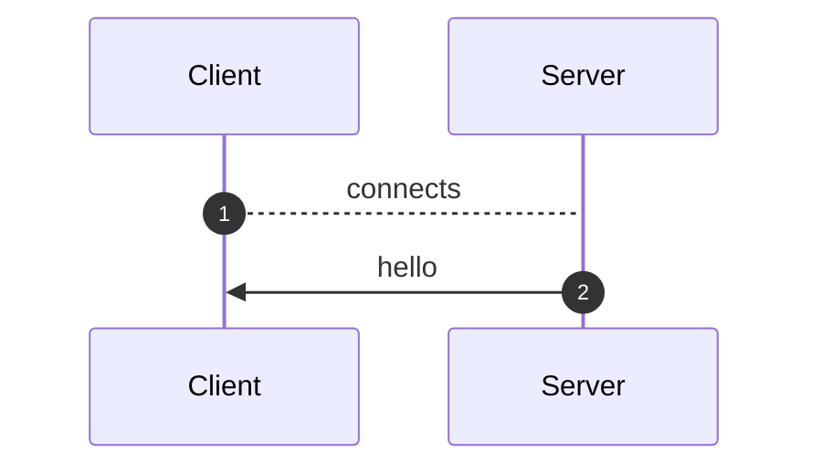
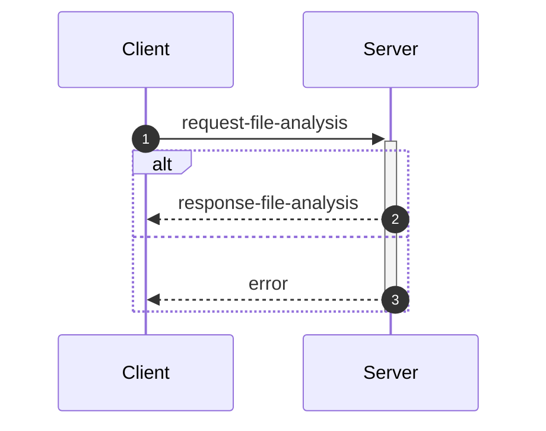
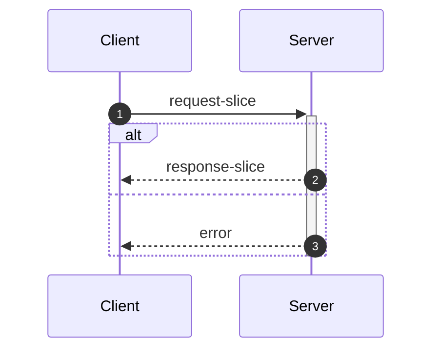
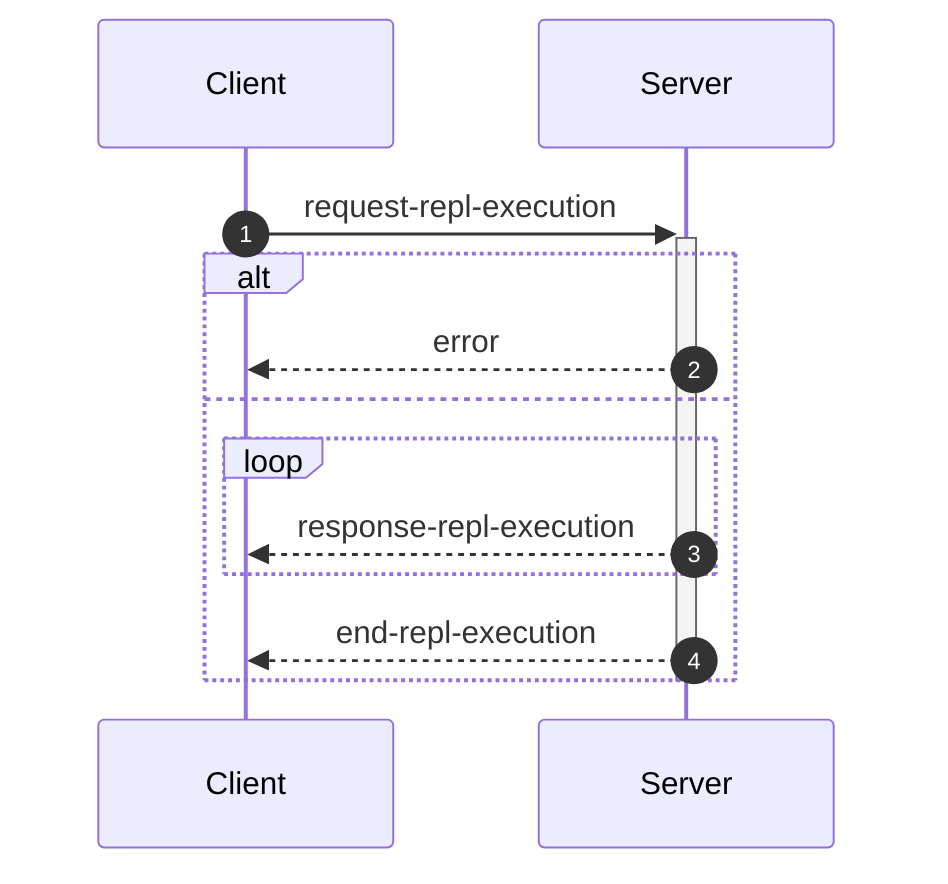

_This document was generated from '[src/documentation/wiki-interface.ts](https://github.com/flowr-analysis/flowr/tree/main//src/documentation/wiki-interface.ts)' on 2026-07-15, 08:16:13 UTC presenting an overview of flowR's interface (v2.12.0, using R v4.5.0). Please do not edit this file/wiki page directly._

Although far from being as detailed as the in-depth explanation of [_flowR_](https://github.com/flowr-analysis/flowr/wiki/core),
this wiki page explains how to interface with _flowR_ in more detail.
In general, command line arguments and other options provide short descriptions on hover over.

* [💻 Using the REPL](#using-the-repl)
* [⚙️ Configuring FlowR](#configuring-flowr)
* [⚒️ Writing Code](#writing-code)
* [💬 Communicating with the Server](#communicating-with-the-server)

<a id='using-the-repl'></a>
## 💻 Using the REPL


> [!NOTE]
> To execute arbitrary R commands with a repl request, _flowR_ has to be started explicitly with <span title="Description (Command Line Argument): Allow to access the underlying R session when using flowR (security warning: this allows the execution of arbitrary R code!)">`--r-session-access`</span>.
> Please be aware that this introduces a security risk and note that this relies on the [`r-shell` engine](https://github.com/flowr-analysis/flowr/wiki/engines) .

Although primarily meant for users to explore,
there is nothing which forbids simply calling _flowR_ as a subprocess to use standard-in, -output, and -error
for communication (although you can access the REPL using the server as well,
with the [REPL Request](#message-request-repl-execution) message).

The read-eval-print loop&nbsp;(REPL) works relatively simple.
You can submit an expression (using <kbd>Enter</kbd>),
which is interpreted as an R&nbsp;expression by default but interpreted as a *command* if it starts with a colon (`:`).
The best command to get started with the REPL is <span title="Description (Repl Command): Show help information (aliases: :h, :?)">`:help`</span>.
Besides, you can leave the REPL either with the command <span title="Description (Repl Command): End the repl (aliases: :q, :exit)">`:quit`</span> or by pressing <kbd>Ctrl</kbd>+<kbd>C</kbd> twice.
When writing a *command*, you may press <kbd>Tab</kbd> to get a list of completions, if available.
Multiple commands can be entered in a single line by separating them with a semicolon (`;`), e.g. `:parse "x<-2"; :df*`.
If a command is given without R code, the REPL will re-use R code given in a previous command.
The prior example will hence return first the parsed AST of the program and then the dataflow graph for `"x <- 2"`.

> [!NOTE]
> If you develop flowR, you may want to launch the repl using the `npm run main-dev` command, this way, you get a non-minified version of flowR with debug information and hot-reloading of source files.

<details>
<summary>Available Commands</summary>

We currently offer the following commands (this with a `[*]` suffix are available with and without the star):


| Command | Description |
| ------- | ----------- |
| **<span title="Description (Repl Command): End the repl (aliases: :q, :exit)">:quit</span>** | End the repl (aliases: **:<span title="Alias of ':quit'. End the repl">q</span>**, **:<span title="Alias of ':quit'. End the repl">exit</span>**) |
| **<span title="Description (Repl Command): Execute the given code as R code. This requires the `--r-session-access` flag to be set and requires the r-shell engine. (aliases: :e, :r)">:execute</span>** | Execute the given code as R code. This requires the `--r-session-access` flag to be set and requires the r-shell engine. (aliases: **:<span title="Alias of ':execute'. Execute the given code as R code. This requires the `--r-session-access` flag to be set and requires the r-shell engine.">e</span>**, **:<span title="Alias of ':execute'. Execute the given code as R code. This requires the `--r-session-access` flag to be set and requires the r-shell engine.">r</span>**) |
| **<span title="Description (Repl Command): Get mermaid code for the control-flow graph of R code (aliases: :cfg, :cf)">:controlflow[*]</span>** | Get mermaid code for the control-flow graph of R code (star: Returns the URL to mermaid.live) (aliases: **:<span title="Alias of ':controlflow'. Get mermaid code for the control-flow graph of R code">cfg</span>**, **:<span title="Alias of ':controlflow'. Get mermaid code for the control-flow graph of R code">cf</span>**) |
| **<span title="Description (Repl Command): Get mermaid code for the control-flow graph with basic blocks (aliases: :cfgb, :cfb)">:controlflowbb[*]</span>** | Get mermaid code for the control-flow graph with basic blocks (star: Returns the URL to mermaid.live) (aliases: **:<span title="Alias of ':controlflowbb'. Get mermaid code for the control-flow graph with basic blocks">cfgb</span>**, **:<span title="Alias of ':controlflowbb'. Get mermaid code for the control-flow graph with basic blocks">cfb</span>**) |
| **<span title="Description (Repl Command): Get mermaid code for the dataflow graph (aliases: :d, :df)">:dataflow[*]</span>** | Get mermaid code for the dataflow graph (star: Returns the URL to mermaid.live) (aliases: **:<span title="Alias of ':dataflow'. Get mermaid code for the dataflow graph">d</span>**, **:<span title="Alias of ':dataflow'. Get mermaid code for the dataflow graph">df</span>**) |
| **<span title="Description (Repl Command): Get mermaid code for the normalized AST of R code (aliases: :n)">:normalize[*]</span>** | Get mermaid code for the normalized AST of R code (star: Returns the URL to mermaid.live) (alias: **:<span title="Alias of ':normalize'. Get mermaid code for the normalized AST of R code">n</span>**) |
| **<span title="Description (Repl Command): Get mermaid code for the simplified dataflow graph (aliases: :ds, :dfs)">:dataflowsimple[*]</span>** | Get mermaid code for the simplified dataflow graph (star: Returns the URL to mermaid.live) (aliases: **:<span title="Alias of ':dataflowsimple'. Get mermaid code for the simplified dataflow graph">ds</span>**, **:<span title="Alias of ':dataflowsimple'. Get mermaid code for the simplified dataflow graph">dfs</span>**) |
| **<span title="Description (Repl Command): Inspect and extend the signature database: `query` (identical to :query @signature), `add <path>` to mount another database/source, `download` to fetch the full-history database. (aliases: :sig)">:signature</span>** | Inspect and extend the signature database: `query` (identical to :query @signature), `add <path>` to mount another database/source, `download` to fetch the full-history database. (alias: **:<span title="Alias of ':signature'. Inspect and extend the signature database: `query` (identical to :query @signature), `add <path>` to mount another database/source, `download` to fetch the full-history database.">sig</span>**) |
| **<span title="Description (Repl Command): Just calculates the DFG, but only prints summary info (aliases: :d#, :df#)">:dataflowsilent</span>** | Just calculates the DFG, but only prints summary info (aliases: **:<span title="Alias of ':dataflowsilent'. Just calculates the DFG, but only prints summary info">d#</span>**, **:<span title="Alias of ':dataflowsilent'. Just calculates the DFG, but only prints summary info">df#</span>**) |
| **<span title="Description (Repl Command): Prints ASCII Art of the parsed, unmodified AST (aliases: :p)">:parse</span>** | Prints ASCII Art of the parsed, unmodified AST (alias: **:<span title="Alias of ':parse'. Prints ASCII Art of the parsed, unmodified AST">p</span>**) |
| **<span title="Description (Repl Command): Prints the version of flowR as well as the current version of R">:version</span>** | Prints the version of flowR as well as the current version of R
| **<span title="Description (Repl Command): Query the given R code (use 'help' for more information)">:query[*]</span>** | Query the given R code (use 'help' for more information) (star: Similar to query, but returns the output in json format.)
| **<span title="Description (Repl Command): Returns an ASCII representation of the dataflow graph (aliases: :df!)">:dataflowascii</span>** | Returns an ASCII representation of the dataflow graph (alias: **:<span title="Alias of ':dataflowascii'. Returns an ASCII representation of the dataflow graph">df!</span>**) |
| **<span title="Description (Repl Command): Returns summarization stats for the normalized AST (aliases: :n#)">:normalize#</span>** | Returns summarization stats for the normalized AST (alias: **:<span title="Alias of ':normalize#'. Returns summarization stats for the normalized AST">n#</span>**) |
| **<span title="Description (Repl Command): Show help information (aliases: :h, :?)">:help</span>** | Show help information (aliases: **:<span title="Alias of ':help'. Show help information">h</span>**, **:<span title="Alias of ':help'. Show help information">?</span>**) |


</details>


> [!TIP]
> 
> As indicated by the examples before, all REPL commands that operate on code keep track of the state.
> Hence, if you run a command like <span title="Description (Repl Command, starred version): Returns the URL to mermaid.live; Base Command: Get mermaid code for the dataflow graph (aliases: :d*, :df*)">`:dataflow*`</span> without providing R code,
> the REPL will re-use the R code provided in a previous command.
> Likewise, doing this will benefit from incrementality!
> If you request the dataflow graph with `:df* x <- 2 * y` and then want to see the parsed AST with `:parse`,
> the REPL will re-use previously obtained information and not re-parse the code again.
> 		


Generally, many commands offer shortcut versions in the REPL. Many queries, for example, offer a shortened format (see the example below).
Of special note, the [Config Query](https://github.com/flowr-analysis/flowr/wiki/query-api#Config-Query)
can be used to also modify the currently active configuration of _flowR_ within the REPL (see the [wiki page](https://github.com/flowr-analysis/flowr/wiki/query-api#Config-Query) for more information).

### Example: Retrieving the Dataflow Graph

To retrieve a URL to the [mermaid](https://mermaid.js.org/) diagram of the dataflow of a given expression,
use <span title="Description (Repl Command, starred version): Returns the URL to mermaid.live; Base Command: Get mermaid code for the dataflow graph (aliases: :d*, :df*)">`:dataflow*`</span> (or <span title="Description (Repl Command): Get mermaid code for the dataflow graph (aliases: :d, :df)">`:dataflow`</span> to get the mermaid code in the cli):


```shell
$ docker run -it --rm eagleoutice/flowr # or npm run flowr 
flowR repl v2.12.0, R grammar v14 (tree-sitter engine)
R> :dataflow* y <- 1 + x
```

<details>
<summary style='color:gray'>Output</summary>


```text
https://mermaid.live/view#base64:eyJjb2RlIjoiZmxvd2NoYXJ0IEJUXG4gICAgMXt7XCJgKiM5MTtSTnVtYmVyIzkzOyogKioxKipcbiAgICAgICoxLjYqICgqKmlkOiAxKiopYFwifX1cbiAgICUlIE5vIGVkZ2VzIGZvdW5kIGZvciAxXG4gICAgMihbXCJgKiM5MTtSU3ltYm9sIzkzOyogKip4KipcbiAgICAgICoxLjEwKiAoKippZDogMioqKWBcIl0pXG4gICAlJSBObyBlZGdlcyBmb3VuZCBmb3IgMlxuICAgIDNbW1wiYCojOTE7UkJpbmFyeU9wIzkzOyogYmFzZSM1ODsjNTg7KiojNDM7KipcbiAgICAgICoxLjYtMTAqICgqKmlkOiAzKiopXG4gICAgYXJnOiAoMSwgMilgXCJdXVxuICAgIGJ1aWx0LWluOl9bXCJgQnVpbHQtSW46XG4jNDM7YFwiXVxuICAgIHN0eWxlIGJ1aWx0LWluOl8gc3Ryb2tlOmdyYXksZmlsbDpncmF5LHN0cm9rZS13aWR0aDoycHgsb3BhY2l0eTouODtcbiAgICAwW1wiYCojOTE7UlN5bWJvbCM5MzsqICoqeSoqXG4gICAgICAqMS4xKiAoKippZDogMCoqLCB2OiBbM10pYFwiXVxuICAgIDRbW1wiYCojOTE7UkJpbmFyeU9wIzkzOyogYmFzZSM1ODsjNTg7KiojNjA7IzQ1OyoqXG4gICAgICAqMS4xLTEwKiAoKippZDogNCoqKVxuICAgIGFyZzogKDAsIDMpYFwiXV1cbiAgICBidWlsdC1pbjpfLVtcImBCdWlsdC1JbjpcbiM2MDsjNDU7YFwiXVxuICAgIHN0eWxlIGJ1aWx0LWluOl8tIHN0cm9rZTpncmF5LGZpbGw6Z3JheSxzdHJva2Utd2lkdGg6MnB4LG9wYWNpdHk6Ljg7XG4gICAgMyAtLT58XCJyZWFkcywgYXJnXCJ8IDFcbiAgICAzIC0tPnxcInJlYWRzLCBhcmdcInwgMlxuICAgIDMgLS4tPnxcInJlYWRzLCBjYWxsc1wifCBidWlsdC1pbjpfXG4gICAgbGlua1N0eWxlIDIgc3Ryb2tlOmdyYXk7XG4gICAgMCAtLT58XCJkZWZpbmVkLWJ5XCJ8IDNcbiAgICAwIC0tPnxcImRlZmluZWQtYnlcInwgNFxuICAgIDQgLS0+fFwicmVhZHMsIGFyZ1wifCAzXG4gICAgNCAtLT58XCJyZXR1cm5zLCBhcmdcInwgMFxuICAgIDQgLS4tPnxcInJlYWRzLCBjYWxsc1wifCBidWlsdC1pbjpfLVxuICAgIGxpbmtTdHlsZSA3IHN0cm9rZTpncmF5OyIsIm1lcm1haWQiOnsiYXV0b1N5bmMiOnRydWV9fQ==
```


Retrieve the dataflow graph of the expression `y <- 1 + x`. It looks like this:


```mermaid
flowchart LR
    1{{"`*#91;RNumber#93;* **1**
      *1.6* (**id: 1**)`"}}
   %% No edges found for 1
    2(["`*#91;RSymbol#93;* **x**
      *1.10* (**id: 2**)`"])
   %% No edges found for 2
    3[["`*#91;RBinaryOp#93;* base#58;#58;**#43;**
      *1.6-10* (**id: 3**)
    arg: (1, 2)`"]]
    built-in:_["`Built-In:
#43;`"]
    style built-in:_ stroke:gray,fill:gray,stroke-width:2px,opacity:.8;
    0["`*#91;RSymbol#93;* **y**
      *1.1* (**id: 0**, v: [3])`"]
    4[["`*#91;RBinaryOp#93;* base#58;#58;**#60;#45;**
      *1.1-10* (**id: 4**)
    arg: (0, 3)`"]]
    built-in:_-["`Built-In:
#60;#45;`"]
    style built-in:_- stroke:gray,fill:gray,stroke-width:2px,opacity:.8;
    3 -->|"reads, arg"| 1
    3 -->|"reads, arg"| 2
    3 -.->|"reads, calls"| built-in:_
    linkStyle 2 stroke:gray;
    0 -->|"defined-by"| 3
    0 -->|"defined-by"| 4
    4 -->|"reads, arg"| 3
    4 -->|"returns, arg"| 0
    4 -.->|"reads, calls"| built-in:_-
    linkStyle 7 stroke:gray;
```

	
<details>

<summary style="color:gray">R Code of the Dataflow Graph</summary>

The analysis required _0.6 ms_ (including parse and normalize, using the [tree-sitter](https://github.com/flowr-analysis/flowr/wiki/Engines) engine) within the generation environment. No [signature database](https://github.com/flowr-analysis/flowr/wiki/Signature-Database) is mounted for these generated graphs, so `library()` calls attach no package exports; base-R names are still qualified via the generated base-package store (e.g. `acf` as `stats::acf`). 
We encountered no unknown side effects during the analysis.


```r
y <- 1 + x
```


</details>


</details>


For small graphs like this, <span title="Description (Repl Command): Returns an ASCII representation of the dataflow graph (aliases: :df!)">`:dataflowascii`</span> also provides an ASCII representation directly in the REPL:


```shell
$ docker run -it --rm eagleoutice/flowr # or npm run flowr 
flowR repl v2.12.0, R grammar v14 (tree-sitter engine)
R> :df! y <- 1 + x
```

<details open>
<summary style='color:gray'>Output</summary>


```text
                        0<1>0
                   ┌────| 1 |
    ┌────────┐     │    0---0
 c<4>c       └──c<3>c
 |<- |  v<0>v┌──| + |
 c---c──| y |┘  c---c   u<2>u
        v---v      └────| x |
                        u---u
Edges:
3 -> 1: reads, arg  3 -> 2: reads, arg
4 -> 3: reads, arg  4 -> 0: returns, arg
0 -> 3: defined-by  0 -> 4: defined-by
```


Retrieve the dataflow graph of the expression `y <- 1 + x` as ASCII art.

</details>


For the slicing with <span title="Description (Repl Command): Static backwards executable slicer for R">`:slicer`</span>, you have access to the same [magic comments](#slice-magic-comments) as with the [slice request](#message-request-slice).
Pass `--inline` to splice resolvable `source()` calls into the reconstruction so the slice is a single self-contained R text (the same as the static slice query's `inlineSources` flag).

### Example: Interfacing with the File System

Many commands that allow for an R-expression (like <span title="Description (Repl Command, starred version): Returns the URL to mermaid.live; Base Command: Get mermaid code for the dataflow graph (aliases: :d*, :df*)">`:dataflow*`</span>) allow for a file as well
if the argument starts with `file://`.
If you are working from the root directory of the _flowR_ repository, the following gives you the parsed AST of the example file using the <span title="Description (Repl Command): Prints ASCII Art of the parsed, unmodified AST (aliases: :p)">`:parse`</span> command:

> **Watch mode**: Replace `file://` with `watch://` to enter watch mode.
> flowR runs the command immediately and then re-runs it every time the file (or any file inside the folder) changes.
> Enter any other command to leave watch mode.
> For example: `:df watch://analysis.R`


```shell
$ docker run -it --rm eagleoutice/flowr # or npm run flowr 
flowR repl v2.12.0, R grammar v14 (tree-sitter engine)
R> :parse file://test/testfiles/example.R
```

<details>
<summary style='color:gray'>Output</summary>


```text
File: test/testfiles/example.R

program
├ binaryoperator
│ ├ identifier "sum" (1:1─4)
│ ├ <- "<-" (1:5─7)
│ ╰ float "0" (1:8─9)
├ binaryoperator
│ ├ identifier "product" (2:1─8)
│ ├ <- "<-" (2:9─11)
│ ╰ float "1" (2:12─13)
├ binaryoperator
│ ├ identifier "w" (3:1─2)
│ ├ <- "<-" (3:3─5)
│ ╰ float "7" (3:6─7)
├ binaryoperator
│ ├ identifier "N" (4:1─2)
│ ├ <- "<-" (4:3─5)
│ ╰ float "10" (4:6─8)
├ forstatement
│ ├ for "for" (6:1─4)
│ ├ ( "(" (6:5─6)
│ ├ identifier "i" (6:6─7)
│ ├ in "in" (6:8─10)
│ ├ binaryoperator
│ │ ├ float "1" (6:11─12)
│ │ ├ : ":" (6:12─13)
│ │ ╰ parenthesizedexpression
│ │   ├ ( "(" (6:13─14)
│ │   ├ binaryoperator
│ │   │ ├ identifier "N" (6:14─15)
│ │   │ ├ - "-" (6:15─16)
│ │   │ ╰ float "1" (6:16─17)
│ │   ╰ ) ")" (6:17─18)
│ ├ ) ")" (6:18─19)
│ ╰ bracedexpression
│   ├ { "{" (6:20─21)
│   ├ binaryoperator
│   │ ├ identifier "sum" (7:3─6)
│   │ ├ <- "<-" (7:7─9)
│   │ ╰ binaryoperator
│   │   ├ binaryoperator
│   │   │ ├ identifier "sum" (7:10─13)
│   │   │ ├ + "+" (7:14─15)
│   │   │ ╰ identifier "i" (7:16─17)
│   │   ├ + "+" (7:18─19)
│   │   ╰ identifier "w" (7:20─21)
│   ├ binaryoperator
│   │ ├ identifier "product" (8:3─10)
│   │ ├ <- "<-" (8:11─13)
│   │ ╰ binaryoperator
│   │   ├ identifier "product" (8:14─21)
│   │   ├  "" (8:22─23)
│   │   ╰ identifier "i" (8:24─25)
│   ╰ } "}" (9:1─2)
├ call
│ ├ identifier "cat" (11:1─4)
│ ╰ arguments
│   ├ ( "(" (11:4─5)
│   ├ argument
│   │ ╰ string
│   │   ├ " "\"" (11:5─6)
│   │   ├ stringcontent "Sum:" (11:6─10)
│   │   ╰ " "\"" (11:10─11)
│   ├ comma "," (11:11─12)
│   ├ argument
│   │ ╰ identifier "sum" (11:13─16)
│   ├ comma "," (11:16─17)
│   ├ argument
│   │ ╰ string
│   │   ├ " "\"" (11:18─19)
│   │   ├ stringcontent
│   │   │ ╰ escapesequence "\\n" (11:19─21)
│   │   ╰ " "\"" (11:21─22)
│   ╰ ) ")" (11:22─23)
╰ call
  ├ identifier "cat" (12:1─4)
  ╰ arguments
    ├ ( "(" (12:4─5)
    ├ argument
    │ ╰ string
    │   ├ " "\"" (12:5─6)
    │   ├ stringcontent "Product:" (12:6─14)
    │   ╰ " "\"" (12:14─15)
    ├ comma "," (12:15─16)
    ├ argument
    │ ╰ identifier "product" (12:17─24)
    ├ comma "," (12:24─25)
    ├ argument
    │ ╰ string
    │   ├ " "\"" (12:26─27)
    │   ├ stringcontent
    │   │ ╰ escapesequence "\\n" (12:27─29)
    │   ╰ " "\"" (12:29─30)
    ╰ ) ")" (12:30─31)
```


Retrieve the parsed AST of the example file.

<details>

<summary>File Content</summary>


```r
sum <- 0
product <- 1
w <- 7
N <- 10

for (i in 1:(N-1)) {
  sum <- sum + i + w
  product <- product * i
}

cat("Sum:", sum, "\n")
cat("Product:", product, "\n")
```


</details>

As _flowR_ directly transforms this AST the output focuses on being human-readable instead of being machine-readable.
		

</details>


### Example: Run a Query

You can run any query supported by _flowR_ using the <span title="Description (Repl Command): Query the given R code (use 'help' for more information)">`:query`</span> command.
For example, to obtain the shapes of all data frames in a given piece of code, you can run:


```shell
$ docker run -it --rm eagleoutice/flowr # or npm run flowr 
flowR repl v2.12.0, R grammar v14 (tree-sitter engine)
R> :query @absint df-shape "x <- data.frame(a = 1:10, b = 1:10)\ny <- x$a"
```

<details open>
<summary style='color:gray'>Output</summary>


```text
Query: absint (1 ms)
   ╰ $12: (colnames: [{"a", "b"}, {}], cols: [2, 2], rows: [10, 10])
   ╰ $0: (colnames: [{"a", "b"}, {}], cols: [2, 2], rows: [10, 10])
All queries together required ≈3 ms (1ms accuracy, total 3 ms)
```


Retrieve the shapes of all data frames in the given code.

</details>


To run the linter on a file, you can use (in this example, we just issue the `dead-code` linter on a small piece of code):


```shell
$ docker run -it --rm eagleoutice/flowr # or npm run flowr 
flowR repl v2.12.0, R grammar v14 (tree-sitter engine)
R> :query @linter rules:dead-code "if(FALSE) x <- 2"
```

<details open>
<summary style='color:gray'>Output</summary>


```text
Query: linter (1 ms)
   ╰ Dead Code (dead-code):
       ╰ certain:
           ╰ Code at 1.11-16
       ╰ Metadata: searchTimeMs: 1, processTimeMs: 0
All queries together required ≈1 ms (1ms accuracy, total 1 ms)
```


Run the linter on the given code, with only the `dead-code` rule enabled.

</details>


For more information on the available queries, please check out the [Query API](https://github.com/flowr-analysis/flowr/wiki/query-api).


<a id='configuring-flowr'></a>
## ⚙️ Configuring FlowR


When running _flowR_, you may want to specify some behaviors with a dedicated configuration file.
By default, flowR looks for a file named `flowr.json` in the current working directory (or any higher directory).
You can also specify a different file with <span title="Description (Command Line Argument): The name of the configuration file to use">`--config-file`</span> or pass the configuration inline using <span title="Description (Command Line Argument): The flowR configuration to use, as a JSON string">`--config-json`</span>.
To inspect the current configuration, you can run flowr with the <span title="Description (Command Line Argument): Run with verbose logging (will be passed to the corresponding script)">`--verbose`</span> flag, or use the `config` [Query](https://github.com/flowr-analysis/flowr/wiki/query-api).
Within the REPL this works by running the following:


```shell
:query @config
```


To work with the <a href="https://github.com/flowr-analysis/flowr/tree/main/src/config.ts#L122"><code><span title="The configuration file format for flowR.">FlowrConfig</span></code></a> you can use the provided helper objects alongside its methods like
<a href="https://github.com/flowr-analysis/flowr/tree/main/src/config.ts#L569"><code><span title="Creates a new flowr config that has the updated values.">FlowrConfig::<b>amend</b></span></code></a>.
The following summarizes the configuration options:

- `ignoreSourceCalls`: If set to `true`, _flowR_ will ignore source calls when analyzing the code, i.e., ignoring the inclusion of other files.
- `semantics`: allows to configure the way _flowR_ handles R, although we currently only support `semantics/environment/overwriteBuiltIns`.
  You may use this to overwrite _flowR_'s handling of built-in function and even completely clear the preset definitions shipped with flowR.
  See [Configure BuiltIn Semantics](#configure-builtin-semantics) for more information.
- `solver`: allows to configure how _flowR_ resolves variables and their values (currently we support: `disabled`, `alias`, `builtin`), as well as if pointer analysis should be active.
- `engines`: allows to configure the engines used by _flowR_ to interact with R code. See the [Engines wiki page](https://github.com/flowr-analysis/flowr/wiki/engines) for more information.
- `defaultEngine`: allows to specify the default engine to use for interacting with R code. If not set, an arbitrary engine from the specified list will be used.
- `abstractInterpretation`: allows to configure how _flowR_ performs abstract interpretation, although we currently only support data frame shape inference through abstract interpretation.
- `defaultPlugins`: allows to configure which plugins to load by default when creating a new <a href="https://github.com/flowr-analysis/flowr/tree/main/src/project/flowr-analyzer.ts#L162"><code><span title="Central class for conducting analyses with FlowR. Use the FlowrAnalyzerBuilder to create a new instance. If you want the original pattern of creating a pipeline and running all steps, you can still do this with FlowrAnalyzer#runFull . To inspect the context of the analyzer, use FlowrAnalyzer#inspectContext (if you are a plugin and need to modify it, use FlowrAnalyzer#context instead).">FlowrAnalyzer</span></code></a> instance.
- `repl.plugins`: allows to configure which plugins to load in the _flowR_ REPL. Use `flowr:default` to reference the plugins specified by `defaultPlugins`.

So you can configure _flowR_ by adding a file like the following:

<details>

<summary>Example Configuration File</summary>


```json
{
  "ignoreSourceCalls": true,
  "semantics": {
    "environment": {
      "overwriteBuiltIns": {
        "definitions": [
          {
            "type": "function",
            "names": [
              "foo"
            ],
            "processor": "builtin:assign",
            "config": {}
          }
        ]
      }
    }
  },
  "defaultPlugins": [
    "file:description",
    "versions:description"
  ],
  "repl": {
    "quickStats": false,
    "dfProcessorHeat": false,
    "hints": true,
    "plugins": [
      "flowr:default"
    ]
  },
  "project": {
    "resolveUnknownPathsOnDisk": true
  },
  "engines": [
    {
      "type": "r-shell"
    }
  ],
  "solver": {
    "variables": "alias",
    "evalStrings": true,
    "trackEnvironments": true,
    "sigdb": {
      "enabled": true,
      "loadProjectDependencies": true,
      "eagerlyLoad": false,
      "eagerlyLoadExports": false,
      "linkBaseR": false,
      "linkDescriptionDependencies": false
    },
    "resolveSource": {
      "dropPaths": "no",
      "ignoreCapitalization": true,
      "inferWorkingDirectory": "active-script",
      "searchPath": []
    },
    "instrument": {},
    "slicer": {
      "threshold": 50
    }
  },
  "abstractInterpretation": {
    "wideningThreshold": 4,
    "dataFrame": {
      "maxColNames": 20,
      "readLoadedData": {
        "readExternalFiles": true,
        "maxReadLines": 1000000
      }
    }
  },
  "gas": {
    "thresholds": {
      "memory": {
        "problematic": 0.7,
        "critical": 0.9
      },
      "timeMs": {
        "problematic": 100000,
        "critical": 120000
      }
    },
    "features": {}
  }
}
```


</details>

<details>
<a id='configure-builtin-semantics'></a>
<summary>Configure Built-In Semantics</summary>


`semantics/environment/overwriteBuiltins` accepts two keys:

- `loadDefaults` (boolean, initially `true`): If set to `true`, the default built-in definitions are loaded before applying the custom definitions. Setting this flag to `false` explicitly disables the loading of the default definitions.
- `definitions` (array, initially empty): Allows to overwrite or define new built-in elements. Each object within must have a `type` which is one of the below. Furthermore, they may define a string array of `names` which specifies the identifiers to bind the definitions to. You may use `assumePrimitive` to specify whether _flowR_ should assume that this is a primitive non-library definition (so you probably just do not want to specify the key).

  | Type            | Description                                                                                                                                                                                                                                                                                              | Example                                                                                                    |
  | --------------- | -------------------------------------------------------------------------------------------------------------------------------------------------------------------------------------------------------------------------------------------------------------------------------------------------------- | ---------------------------------------------------------------------------------------------------------- |
  | `constant`    | Additionally allows for a `value` this should resolve to.                                                                                                                                                                                                                                                | `{ type: 'constant', names: ['NULL', 'NA'],  value: null }`                                                |
  | `function`    | Is a rather flexible way to define and bind built-in functions. For the time, we do not have extensive documentation to cover all the cases, so please either consult the sources with the `default-builtin-config.ts` or open a [new issue](https://github.com/flowr-analysis/flowr/issues/new/choose). | `{ type: 'function', names: ['next'], processor: 'builtin:d', config: { cfg: ExitPointType.Next } }` |
  | `replacement` | A comfortable way to specify replacement functions like `$<-` or `names<-`. `suffixes` describes the... suffixes to attach automatically. | `{ type: 'replacement', suffixes: ['<-', '<<-'], names: ['[', '[['] }` |


</details>

<details>

<summary style='color:gray'>Full Configuration-File Schema</summary>

- _The configuration file format for flowR._ (object)
    - **ignoreSourceCalls** [optional] _Whether source calls should be ignored, causing {@link processSourceCall}'s behavior to be skipped._ (boolean)
    - **semantics** _Configure language semantics and how flowR handles them._ (object)
        - **environment** [optional] _Semantics regarding how to handle the R environment._ (object)
            - **overwriteBuiltIns** [optional] _Do you want to overwrite (parts) of the builtin definition?_ (object)
                - **loadDefaults** [optional] _Should the default configuration still be loaded?_ (boolean)
                - **definitions** [optional] _The definitions to load/overwrite._ (array)
                Valid item types:
                    - (object)
    - **defaultPlugins** [optional] _The default plugins to load when creating a new instance of FlowrAnalyzer_ (array)
    Valid item types:
        - (alternatives)
            - (string)
            - (array)
    - **repl** _Configuration options for the REPL._ (object)
        - **quickStats** [optional] _Whether to show quick stats in the REPL after each evaluation._ (boolean)
        - **dfProcessorHeat** [optional] _This instruments the dataflow processors to count how often each processor is called._ (boolean)
        - **hints** [optional] _Whether to show dim inline hints on the empty prompt (automatically disabled on non-interactive terminals)._ (boolean)
        - **plugins** [optional] _The plugins to load in REPL mode_ (array)
        Valid item types:
            - (alternatives)
                - (string)
                - (array)
    - **project** _Project specific configuration options._ (object)
        - **resolveUnknownPathsOnDisk** [optional] _Whether to resolve unknown paths loaded by the r project disk when trying to source/analyze files._ (boolean)
        - **basePackages** [optional] _The packages considered part of R itself (base and recommended); if unset, flowR uses its built-in list._ (array)
        Valid item types:
            - (string)
    - **engines** _The engine or set of engines to use for interacting with R code. An empty array means all available engines will be used._ (array)
    Valid item types:
        - (alternatives)
            - _The configuration for the tree sitter engine._ (object)
                - **type** [required] _Use the tree sitter engine._ (string)
                    Only allows: 'tree-sitter'
                - **wasmPath** [optional] _The path to the tree-sitter-r WASM binary to use. If this is undefined, this uses the default path._ (string)
                - **treeSitterWasmPath** [optional] _The path to the tree-sitter WASM binary to use. If this is undefined, this uses the default path._ (string)
                - **lax** [optional] _Whether to use the lax parser for parsing R code (allowing for syntax errors). If this is undefined, the strict parser will be used._ (boolean)
            - _The configuration for the R shell engine._ (object)
                - **type** [required] _Use the R shell engine._ (string)
                    Only allows: 'r-shell'
                - **rPath** [optional] _The path to the R executable to use. If this is undefined, this uses the default path._ (string)
    - **defaultEngine** [optional] _The default engine to use for interacting with R code. If this is undefined, an arbitrary engine from the specified list will be used._ (string)
        Only allows: 'tree-sitter', 'r-shell'
    - **solver** _How to resolve constants, constraints, cells, ..._ (object)
        - **variables** _How to resolve variables and their values._ (string)
            Only allows: 'disabled', 'alias', 'builtin'
        - **evalStrings** _Should we include eval(parse(text="...")) calls in the dataflow graph?_ (boolean)
        - **trackEnvironments** [optional] _Track user-created environments (new.env, assign/get/local with envir=, dollar-assign, attach). When false, all envir-style calls fall through conservatively._ (boolean)
        - **sigdb** _Resolving library exports from a signature database._ (object)
            - **enabled** [optional] _Resolve library()/use() exports from a signature database (default true); when false no database is consulted._ (boolean)
            - **loadProjectDependencies** [optional] _Load the project's declared dependencies from its metadata files (DESCRIPTION Imports/Depends, renv.lock, rv.lock) (default true); when false these files are not read for dependencies._ (boolean)
            - **eagerlyLoad** [optional] _Parse the database up front rather than on the first package load (default false, ignored if disabled)._ (boolean)
            - **eagerlyLoadExports** [optional] _Add a vertex for every export on load rather than on demand (default false); keeps the dataflow graph small._ (boolean)
            - **assumedRVersion** [optional] _R version assumed when resolving versioned (base-R) exports: a pin like "4.5" or "auto" to detect the installed R (default "auto")._ (string)
            - **linkBaseR** [optional] _Eagerly attach base-R namespaces so bare base calls resolve without library() (default false)._ (boolean)
            - **linkBaseRCalls** [optional] _Add a lightweight Reads edge from a bare base-R call to its signature-database function vertex (default false; base-R qualification is edge-free otherwise)._ (boolean)
            - **linkPackageCalls** [optional] _Add a lightweight Reads edge from a resolved package call to its signature-database function vertex (default false)._ (boolean)
            - **linkDescriptionDependencies** [optional] _Eagerly attach the namespaces of the project's declared DESCRIPTION dependencies (Imports/Depends) so their exports resolve without an explicit library() (default false)._ (boolean)
            - **warmInBackground** [optional] _Decompress the hot shards (base + most-downloaded) in a background task on startup so the first library() lookup is warm (default false; for long-running servers/REPLs)._ (boolean)
            - **additionalPaths** [optional] _Extra directories or bundle/manifest files searched for signature databases (alongside the shipped default and $FLOWR_SIGDB_DIR); a downloaded full-history bundle placed here is mounted automatically._ (array)
            Valid item types:
                - (string)
            - **downloadRepo** [optional] _GitHub owner/repo the full-history bundle is downloaded from via ":signature download" (default "flowr-analysis/flowr", release tag "sigdb-v<flowR-version>")._ (string)
            - **autoSync** [optional] _On startup, re-download shards whose committed sigdb.remote.json hash no longer matches the cache, in the background (default false; opt-in network sync after a git pull)._ (boolean)
            - **versionSelection** [optional] _When a project constrains a dependency, resolve to the newest (default), oldest, or system-installed version satisfying it; system needs R and falls back to newest. Base-R packages always resolve against the assumed R version._ (string)
                Only allows: 'newest', 'oldest', 'system'
            - **versionOverrides** [optional] _Force an exact version for specific packages (name -> version), overriding both the project constraint and the versionSelection policy (default {})._ (object)
        - **instrument** (object)
            - **dataflowExtractors** [optional] _These keys are only intended for use within code, allowing to instrument the dataflow analyzer!_ (any)
        - **resolveSource** [optional] _If lax source calls are active, flowR searches for sourced files much more freely, based on the configurations you give it. This option is only in effect if `ignoreSourceCalls` is set to false._ (object)
            - **dropPaths** _Allow to drop the first or all parts of the sourced path, if it is relative._ (string)
                Only allows: 'no', 'once', 'all'
            - **ignoreCapitalization** _Search for filenames matching in the lowercase._ (boolean)
            - **inferWorkingDirectory** _Try to infer the working directory from the main or any script to analyze._ (string)
                Only allows: 'no', 'main-script', 'active-script', 'any-script'
            - **searchPath** _Additionally search in these paths._ (array)
            Valid item types:
                - (string)
            - **repeatedSourceLimit** [optional] _How often the same file can be sourced within a single run? Please be aware: in case of cyclic sources this may not reach a fixpoint so give this a sensible limit._ (number)
            - **applyReplacements** _Provide name replacements for loaded files_ (array)
            Valid item types:
                - (object)
        - **slicer** [optional] _The configuration for the slicer._ (object)
            - **threshold** [optional] _The maximum number of iterations to perform on a single function call during slicing._ (number)
            - **autoExtend** [optional] _If set, the slicer will gain an additional post-pass._ (boolean)
    - **abstractInterpretation** _The configuration options for abstract interpretation._ (object)
        - **wideningThreshold** _The threshold for the number of visitations of a node at which widening should be performed to ensure the termination of the fixpoint iteration._ (number)
        - **dataFrame** _The configuration of the shape inference for data frames._ (object)
            - **maxColNames** _The maximum number of columns names to infer for data frames before over-approximating the column names to top._ (number)
            - **readLoadedData** _Configuration options for reading data frame shapes from loaded external data files, such as CSV files._ (object)
                - **readExternalFiles** _Whether data frame shapes should be extracted from loaded external files, such as CSV files._ (boolean)
                - **maxReadLines** _The maximum number of lines to read when extracting data frame shapes from loaded files, such as CSV files._ (number)
    - **gas** [optional] _Resource-usage guard (gas) configuration. All feature factors default to 0 (disabled). See https://github.com/flowr-analysis/flowr/wiki/Core#gas-resource-guard._ (object)
        - **thresholds** [optional] _Shared thresholds for all gas checks (scaled by per-feature factor)._ (object)
            - **memory** [optional] _Heap-usage fraction thresholds (0-1)._ (object)
                - **problematic** [optional] _Heap fraction (0-1) above which Problematic is returned._ (number)
                - **critical** [optional] _Heap fraction (0-1) above which Critical is returned._ (number)
            - **timeMs** [optional] _Elapsed analysis time thresholds in milliseconds._ (object)
                - **problematic** [optional] _Elapsed ms above which Problematic is returned._ (number)
                - **critical** [optional] _Elapsed ms above which Critical is returned._ (number)
        - **features** [optional] _Per-feature sensitivity factors. 0 or absent disables gas checking for that feature. A factor of 2 makes the feature twice as sensitive. Recognised keys: `source`, `side-effect-linking`, `linter`._ (object)
        - **heapProvider** [optional] _Custom heap statistics source (programmatic configs only), overriding the built-in v8/performance.memory detection._ (function)

</details>

	

<a id='writing-code'></a>
## ⚒️ Writing Code

_flowR_ can be used as a [module](https://www.npmjs.com/package/@eagleoutice/flowr) and offers several main classes and interfaces that are interesting for extension writers 
(see the [Visual Studio Code extension](https://marketplace.visualstudio.com/items?itemName=code-inspect.vscode-flowr) or the [Core](https://github.com/flowr-analysis/flowr/wiki/core) wiki page for more information).

### Creating Analyses with _flowR_

Nowadays, instances of the <a href="https://github.com/flowr-analysis/flowr/tree/main/src/project/flowr-analyzer.ts#L162"><code><span title="Central class for conducting analyses with FlowR. Use the FlowrAnalyzerBuilder to create a new instance. If you want the original pattern of creating a pipeline and running all steps, you can still do this with FlowrAnalyzer#runFull . To inspect the context of the analyzer, use FlowrAnalyzer#inspectContext (if you are a plugin and need to modify it, use FlowrAnalyzer#context instead).">FlowrAnalyzer</span></code></a> should be used as central frontend to get analysis results from _flowR_.
For example, a program slice can be created like this:


```ts
const analyzer = await new FlowrAnalyzerBuilder()
    .setEngine('tree-sitter')
    .build();
analyzer.addRequest('x <- 1\ny <- x\nx');
const result = await analyzer.query([
    {
        type:     'static-slice',
        criteria: ['3@x']
    }
]);
//console.log(result['static-slice']);
```


For more information, please have a look at the [Analyzer](https://github.com/flowr-analysis/flowr/wiki/analyzer) wiki page, which explains how to construct and use the <a href="https://github.com/flowr-analysis/flowr/tree/main/src/project/flowr-analyzer.ts#L162"><code><span title="Central class for conducting analyses with FlowR. Use the FlowrAnalyzerBuilder to create a new instance. If you want the original pattern of creating a pipeline and running all steps, you can still do this with FlowrAnalyzer#runFull . To inspect the context of the analyzer, use FlowrAnalyzer#inspectContext (if you are a plugin and need to modify it, use FlowrAnalyzer#context instead).">FlowrAnalyzer</span></code></a> in more detail.
To work with specific perspectives, you can also consult the respective pages like the [Dataflow Graph](https://github.com/flowr-analysis/flowr/wiki/dataflow-graph) or the [Abstract Interpretation](https://github.com/flowr-analysis/flowr/wiki/abstract-interpretation) wiki pages.
### The Pipeline Executor (Low-Level Interface)

Once, in the beginning, _flowR_ was meant to produce a dataflow graph merely to provide *program slices*. 
However, with continuous updates, the [Dataflow Graph](https://github.com/flowr-analysis/flowr/wiki/dataflow-graph) repeatedly proves to be the more interesting part.
With this, we restructured _flowR_'s originally *hardcoded* pipeline to be far more flexible. 
Now, it can be theoretically extended or replaced with arbitrary steps, optional steps, and what we call 'decorations' of these steps. 
In short, a slicing pipeline using the <a href="https://github.com/flowr-analysis/flowr/tree/main/src/core/pipeline-executor.ts#L97"><code><span title="**Please note:** The PipelineExecutor is now considered to be a rather low-level API for flowR. While it still works and is the basis for all other layers, we strongly recommend using the FlowrAnalyzer and its builder to create and use an analyzer instance that is pre-configured for your use-case. The pipeline executor allows to execute arbitrary pipelines in a step-by-step fashion. If you are not...">PipelineExecutor</span></code></a> looks like this:


```ts

const slicer = new PipelineExecutor(DEFAULT_SLICING_PIPELINE, {
  parser:    new RShell(),
  request:   requestFromInput('x <- 1\nx + 1'),
  criterion: ['2@x']
})
const slice = await slicer.allRemainingSteps()
// console.log(slice.reconstruct.code)
```


<details><summary>More Information</summary>


If you compare this, with what you would have done with the old (and removed) `SteppingSlicer`, 
this essentially just requires you to replace the `SteppingSlicer` with the <a href="https://github.com/flowr-analysis/flowr/tree/main/src/core/pipeline-executor.ts#L97"><code><span title="**Please note:** The PipelineExecutor is now considered to be a rather low-level API for flowR. While it still works and is the basis for all other layers, we strongly recommend using the FlowrAnalyzer and its builder to create and use an analyzer instance that is pre-configured for your use-case. The pipeline executor allows to execute arbitrary pipelines in a step-by-step fashion. If you are not...">PipelineExecutor</span></code></a>
and to pass the <a href="https://github.com/flowr-analysis/flowr/tree/main/src/core/steps/pipeline/default-pipelines.ts#L18"><code>DEFAULT_SLICING_PIPELINE</code></a> as the first argument.
The <a href="https://github.com/flowr-analysis/flowr/tree/main/src/core/pipeline-executor.ts#L97"><code><span title="**Please note:** The PipelineExecutor is now considered to be a rather low-level API for flowR. While it still works and is the basis for all other layers, we strongly recommend using the FlowrAnalyzer and its builder to create and use an analyzer instance that is pre-configured for your use-case. The pipeline executor allows to execute arbitrary pipelines in a step-by-step fashion. If you are not...">PipelineExecutor</span></code></a>...

1. Provides structures to investigate the results of all intermediate steps
2. Can be executed step-by-step
3. Can repeat steps (e.g., to calculate multiple slices on the same input)

See the in-code documentation for more information.


</details>

### Using the <a href="https://github.com/flowr-analysis/flowr/tree/main/src/r-bridge/shell.ts#L143"><code><span title="The RShell represents an interactive session with the R interpreter. You can configure it by RShellOptions . At the moment we are using a live R session (and not networking etc.) to communicate with R easily, which allows us to install packages etc. However, this might and probably will change in the future (leaving this as a legacy mode :D)">RShell</span></code></a> to Interact with R

The <a href="https://github.com/flowr-analysis/flowr/tree/main/src/r-bridge/shell.ts#L143"><code><span title="The RShell represents an interactive session with the R interpreter. You can configure it by RShellOptions . At the moment we are using a live R session (and not networking etc.) to communicate with R easily, which allows us to install packages etc. However, this might and probably will change in the future (leaving this as a legacy mode :D)">RShell</span></code></a> class allows interfacing with the `R`&nbsp;ecosystem installed on the host system.
Please have a look at [flowR's Engines](https://github.com/flowr-analysis/flowr/wiki/engines) for more information on alternatives (for example, the <a href="https://github.com/flowr-analysis/flowr/tree/main/src/r-bridge/lang-4.x/tree-sitter/tree-sitter-executor.ts#L18"><code><span title="Synchronous and (way) faster alternative to the RShell using tree-sitter.">TreeSitterExecutor</span></code></a>).


> [!IMPORTANT]
> 
> Each <a href="https://github.com/flowr-analysis/flowr/tree/main/src/r-bridge/shell.ts#L143"><code><span title="The RShell represents an interactive session with the R interpreter. You can configure it by RShellOptions . At the moment we are using a live R session (and not networking etc.) to communicate with R easily, which allows us to install packages etc. However, this might and probably will change in the future (leaving this as a legacy mode :D)">RShell</span></code></a> controls a new instance of the R&nbsp;interpreter, 
> make sure to call <code><a href="https://github.com/flowr-analysis/flowr/tree/main/src/r-bridge/shell.ts#L351"><span title="Close the current R session, makes the object effectively invalid (can no longer be reopened etc.)">RShell::<i>close</i></span></a>()</code> when you are done.


You can start a new "session" simply by constructing a new object with <code>new <a href="https://github.com/flowr-analysis/flowr/tree/main/src/r-bridge/shell.ts#L143"><span title="The RShell represents an interactive session with the R interpreter. You can configure it by RShellOptions . At the moment we are using a live R session (and not networking etc.) to communicate with R easily, which allows us to install packages etc. However, this might and probably will change in the future (leaving this as a legacy mode :D)">RShell</span></a>()</code>.

However, there are several options that may be of interest 
(e.g., to automatically revive the shell in case of errors or to control the name location of the R process on the system).

With a shell object (let's call it `shell`), you can execute R code by using <a href="https://github.com/flowr-analysis/flowr/tree/main/src/r-bridge/shell.ts#L212"><code><span title="sends the given command directly to the current R session will not do anything to alter input markers!">RShell::<i>sendCommand</i></span></code></a>,
for example <code>shell.<a href="https://github.com/flowr-analysis/flowr/tree/main/src/r-bridge/shell.ts#L212"><span title="sends the given command directly to the current R session will not do anything to alter input markers!">sendCommand</span></a>("1 + 1")</code>.
However, this does not return anything, so if you want to collect the output of your command, use
<a href="https://github.com/flowr-analysis/flowr/tree/main/src/r-bridge/shell.ts#L295"><code><span title="Send a command and collect the output">RShell::<i>sendCommandWithOutput</i></span></code></a> instead.


<a id='communicating-with-the-server'></a>
## 💬 Communicating with the Server


As explained in the [Overview](https://github.com/flowr-analysis/flowr/wiki/overview), you can simply run the [TCP](https://de.wikipedia.org/wiki/Transmission_Control_Protocol)&nbsp;server by adding the <span title="Description (Command Line Argument): Do not drop into a repl, but instead start a server on the given port (default: 1042) and listen for messages.">`--server`</span> flag (and, due to the interactive mode, exit with the conventional <kbd>CTRL</kbd>+<kbd>C</kbd>).
Currently, every connection is handled by the same underlying `RShell` - so the server is not designed to handle many clients at a time.
Additionally, the server is not well guarded against attacks (e.g., you can theoretically spawn an arbitrary number of&nbsp;RShell sessions on the target machine).

Every message has to be given in a single line (i.e., without a newline in-between) and end with a newline character. Nevertheless, we will pretty-print example given in the following segments for the ease of reading.


> [!NOTE]
> 
> The default <span title="Description (Command Line Argument): Do not drop into a repl, but instead start a server on the given port (default: 1042) and listen for messages.">`--server`</span> uses a simple [TCP](https://de.wikipedia.org/wiki/Transmission_Control_Protocol)
> connection. If you want _flowR_ to expose a [WebSocket](https://de.wikipedia.org/wiki/WebSocket) server instead, add the <span title="Description (Command Line Argument): If the server flag is set, use websocket for messaging">`--ws`</span> flag (i.e., <span title="Description (Command Line Argument): Do not drop into a repl, but instead start a server on the given port (default: 1042) and listen for messages.">`--server`</span> <span title="Description (Command Line Argument): If the server flag is set, use websocket for messaging">`--ws`</span>) when starting _flowR_ from the command line.


<ul><li>
<a id="message-hello"></a>
<b>Hello</b> Message (<code>hello</code>) 
<details>

<summary style="color:gray"> View Details. <i>The server informs the client about the successful connection and provides Meta-Information.</i> </summary>


```mermaid
sequenceDiagram
    autonumber
    participant Client
    participant Server

    
    Client-->Server: connects
    Server->>Client: hello
	
```


	
After launching _flowR_, for example, with <code>docker run -it --rm eagleoutice/flowr <span title="Description (Command Line Argument): Do not drop into a repl, but instead start a server on the given port (default: 1042) and listen for messages.">-<span/>-server</span></code>&nbsp;(🐳️), simply connecting should present you with a `hello` message, that amongst others should reveal the versions of&nbsp;_flowR_ and&nbsp;R, using the [semver 2.0](https://semver.org/spec/v2.0.0.html) versioning scheme.
The message looks like this:


```json
{
  "type": "hello",
  "clientName": "client-0",
  "versions": {
    "flowr": "2.12.0",
    "r": "4.5.0",
    "engine": "r-shell"
  }
}
```


There are currently a few messages that you can send after the hello message.
If you want to _slice_ a piece of R code you first have to send an [analysis request](#message-request-file-analysis), so that you can send one or multiple slice requests afterward.
Requests for the [REPL](#message-request-repl) are independent of that.
	

<hr>


<details>
<summary style="color:gray">Message schema (<code>hello</code>)</summary>

For the definition of the hello message, please see it's implementation at [`./src/cli/repl/server/messages/message-hello.ts`](https://github.com/flowr-analysis/flowr/tree/main/./src/cli/repl/server/messages/message-hello.ts).

- [required] (object)
    - **type** [required] _The type of the hello message._ (string)
        Only allows: 'hello'
    - **id** [forbidden] _The id of the message is always undefined (as it is the initial message and not requested)._ (any)
    - **clientName** [required] _A unique name that is assigned to each client. It has no semantic meaning and is only used/useful for debugging._ (string)
    - **versions** [required] (object)
        - **flowr** [required] _The version of the flowr server running in semver format._ (string)
        - **r** [required] _The version of the underlying R shell running in semver format._ (string)
        - **engine** [required] _The parser backend that is used to parse the R code._ (string)

</details>


<hr>

</details>
	</li>

<li>
<a id="message-request-file-analysis"></a>
<b>Analysis</b> Message (<code>request-file-analysis</code>) 
<details>

<summary style="color:gray"> View Details. <i>The server builds the dataflow graph for a given input file (or a set of files).</i> </summary>


```mermaid
sequenceDiagram
    autonumber
    participant Client
    participant Server

    
    Client->>+Server: request-file-analysis
    alt
        Server-->>Client: response-file-analysis
    else
        Server-->>Client: error
    end
    deactivate  Server
	
```


	
The request allows the server to analyze a file and prepare it for slicing.
The message can contain a `filetoken`, which is used to identify the file in later slice or query requests (if you do not add one, the request will not be stored and therefore, it is not available for subsequent requests).

> **Please note!**\
> If you want to send and process a lot of analysis requests, but do not want to slice them, please do not pass the `filetoken` field. This will save the server a lot of memory allocation.

Furthermore, the request must contain either a `content` field to directly pass the file's content or a `filepath` field which contains the path to the file (this path must be accessible for the server to be useful).
If you add the `id` field, the answer will use the same `id` so you can match requests and the corresponding answers.
See the implementation of the request-file-analysis message for more information.

You can drop one or more stored file tokens by adding the `invalidateToken` field (a single token or an array of tokens).
The server frees the corresponding analyses _after_ it has answered the request.

> **Tip!**\
> If you only want to drop tokens, you do not need a separate message: send a `request-file-analysis` that contains _just_ the `invalidateToken` field (and no `content` or `filepath`).
> Such a request behaves like an empty file analysis and the server replies with an empty `results` object.
> Because invalidation happens after the response, you may even pass the _current_ `filetoken` in `invalidateToken` to analyze a file once and have the server forget it right after you received the results.


<details>
<summary>Example of the <code>request-file-analysis</code> Message</summary>

_Note:_ even though we pretty-print these messages, they are sent as a single line, ending with a newline.

The following lists all messages that were sent and received in case you want to reproduce the scenario:

<ol>
<li> <code>hello</code> (response)
<details> 

<summary> Show Details </summary>

The first message is always a hello message.


```json
{
  "type": "hello",
  "clientName": "client-0",
  "versions": {
    "flowr": "2.12.0",
    "r": "4.5.0",
    "engine": "r-shell"
  }
}
```


</details>
</li>

<li> <b><code>request-file-analysis</code> (request)</b>
<details open> 

<summary> Show Details </summary>

Let's suppose you simply want to analyze the following script:
 
```r
x <- 1
x + 1
```

 For this, you can send the following request:


```json
{
  "type": "request-file-analysis",
  "id": "1",
  "filetoken": "x",
  "content": "x <- 1\nx + 1"
}
```


</details>
</li>

<li> <code>response-file-analysis</code> (response)
<details> 

<summary> Show Details </summary>


The `results` field of the response effectively contains three keys of importance:

- `parse`: which contains 1:1 the parse result in CSV format that we received from the `RShell` (i.e., the AST produced by the parser of the R interpreter).
- `normalize`: which contains the normalized AST, including ids (see the `info` field and the [Normalized AST](https://github.com/flowr-analysis/flowr/wiki/normalized-ast) wiki page).
- `dataflow`: especially important is the `graph` field which contains the dataflow graph as a set of root vertices (see the [Dataflow Graph](https://github.com/flowr-analysis/flowr/wiki/dataflow-graph) wiki page).
			


_As the code is pretty long, we inhibit pretty printing and syntax highlighting (JSON, hiding built-in):_

```text
{"type":"response-file-analysis","format":"json","id":"1","results":{"parse":{"files":[{"parsed":"[1,1,1,6,7,0,\"expr\",false,\"x <- 1\"],[1,1,1,1,1,3,\"SYMBOL\",true,\"x\"],[1,1,1,1,3,7,\"expr\",false,\"x\"],[1,3,1,4,2,7,\"LEFT_ASSIGN\",true,\"<-\"],[1,6,1,6,4,5,\"NUM_CONST\",true,\"1\"],[1,6,1,6,5,7,\"expr\",false,\"1\"],[2,1,2,5,16,0,\"expr\",false,\"x + 1\"],[2,1,2,1,10,12,\"SYMBOL\",true,\"x\"],[2,1,2,1,12,16,\"expr\",false,\"x\"],[2,3,2,3,11,16,\"'+'\",true,\"+\"],[2,5,2,5,13,14,\"NUM_CONST\",true,\"1\"],[2,5,2,5,14,16,\"expr\",false,\"1\"]","filePath":"/tmp/tmp-9057-VEfez1GeVQ2f-.R"}],".meta":{"timing":2}},"normalize":{"ast":{"type":"RProject","files":[{"root":{"type":"RExpressionList","children":[{"type":"RBinaryOp","location":[1,3,1,4],"lhs":{"type":"RSymbol","location":[1,1,1,1],"content":"x","lexeme":"x","info":{"fullRange":[1,1,1,1],"adToks":[],"id":0,"parent":2,"role":"bin-l","index":0,"nest":0,"file":"/tmp/tmp-9057-VEfez1GeVQ2f-.R"}},"rhs":{"location":[1,6,1,6],"lexeme":"1","info":{"fullRange":[1,6,1,6],"adToks":[],"id":1,"parent":2,"role":"bin-r","index":1,"nest":0,"file":"/tmp/tmp-9057-VEfez1GeVQ2f-.R"},"type":"RNumber","content":{"num":1,"complexNumber":false,"markedAsInt":false}},"operator":"<-","lexeme":"<-","info":{"fullRange":[1,1,1,6],"adToks":[],"id":2,"parent":6,"nest":0,"file":"/tmp/tmp-9057-VEfez1GeVQ2f-.R","index":0,"role":"el-c"}},{"type":"RBinaryOp","location":[2,3,2,3],"lhs":{"type":"RSymbol","location":[2,1,2,1],"content":"x","lexeme":"x","info":{"fullRange":[2,1,2,1],"adToks":[],"id":3,"parent":5,"role":"bin-l","index":0,"nest":0,"file":"/tmp/tmp-9057-VEfez1GeVQ2f-.R"}},"rhs":{"location":[2,5,2,5],"lexeme":"1","info":{"fullRange":[2,5,2,5],"adToks":[],"id":4,"parent":5,"role":"bin-r","index":1,"nest":0,"file":"/tmp/tmp-9057-VEfez1GeVQ2f-.R"},"type":"RNumber","content":{"num":1,"complexNumber":false,"markedAsInt":false}},"operator":"+","lexeme":"+","info":{"fullRange":[2,1,2,5],"adToks":[],"id":5,"parent":6,"nest":0,"file":"/tmp/tmp-9057-VEfez1GeVQ2f-.R","index":1,"role":"el-c"}}],"info":{"adToks":[],"id":6,"nest":0,"file":"/tmp/tmp-9057-VEfez1GeVQ2f-.R","role":"root","index":0}},"filePath":"/tmp/tmp-9057-VEfez1GeVQ2f-.R"}],"info":{"id":7}},".meta":{"timing":0}},"dataflow":{"unknownReferences":[],"in":[{"nodeId":2,"name":"<-","type":2},{"nodeId":5,"name":"+","type":2}],"out":[{"nodeId":0,"name":"x","type":4,"definedAt":2,"value":[1]}],"environment":{"current":{"id":1800,"parent":"<BuiltInEnvironment>","memory":[["x",[{"nodeId":0,"name":"x","type":4,"definedAt":2,"value":[1]}]]],"globalEnv":true},"level":0},"graph":{"rootVertices":[1,0,2,3,4,5],"vertexInformation":[[1,{"tag":"value","id":1}],[0,{"tag":"vdef","id":0,"source":[1]}],[2,{"tag":"fcall","id":2,"name":"<-","onlyBuiltin":true,"args":[{"nodeId":0,"type":32},{"nodeId":1,"type":32}],"origin":["builtin:assign"]}],[3,{"tag":"use","id":3}],[4,{"tag":"value","id":4}],[5,{"tag":"fcall","id":5,"name":"+","onlyBuiltin":true,"args":[{"nodeId":3,"type":32},{"nodeId":4,"type":32}],"origin":["builtin:d"]}]],"edgeInformation":[[2,[[1,{"types":65}],[0,{"types":72}],["built-in:<-",{"types":5}]]],[0,[[1,{"types":2}],[2,{"types":2}]]],[3,[[0,{"types":1}]]],[5,[[3,{"types":65}],[4,{"types":65}],["built-in:+",{"types":5}]]]],"_unknownSideEffects":[]},"entryPoint":2,"exitPoints":[{"type":0,"nodeId":5}],"hooks":[],".meta":{"timing":0}}}}
```


</details>
</li>
</ol>

The complete round-trip took 9.4 ms (including time required to validate the messages, start, and stop the internal mock server).

</details>


You receive an error if, for whatever reason, the analysis fails (e.g., the message or code you sent contained syntax errors).
It contains a human-readable description *why* the analysis failed (see the error message implementation for more details).


<details>
<summary>Example Error Message</summary>

_Note:_ even though we pretty-print these messages, they are sent as a single line, ending with a newline.

The following lists all messages that were sent and received in case you want to reproduce the scenario:

<ol>
<li> <code>hello</code> (response)
<details> 

<summary> Show Details </summary>

The first message is always a hello message.


```json
{
  "type": "hello",
  "clientName": "client-0",
  "versions": {
    "flowr": "2.12.0",
    "r": "4.5.0",
    "engine": "r-shell"
  }
}
```


</details>
</li>

<li> <code>request-file-analysis</code> (request)
<details> 

<summary> Show Details </summary>


```json
{
  "type": "request-file-analysis",
  "id": "1",
  "filename": "sample.R",
  "content": "x <-"
}
```


</details>
</li>

<li> <b><code>error</code> (response)</b>
<details open> 

<summary> Show Details </summary>


```json
{
  "id": "1",
  "type": "error",
  "fatal": false,
  "reason": "Error while analyzing file sample.R: GuardError: unable to parse R code (see the log for more information) for request {\"request\":\"text\",\"content\":\"x <-\"}}\n Report a Bug: https://github.com/flowr-analysis/flowr/issues/new?body=%3C!%2D%2D%20Please%20describe%20your%20issue%20in%20more%20detail%20below!%20%2D%2D%3E%0A%0A%0A%3C!%2D%2D%20Automatically%20generated%20issue%20metadata%2C%20please%20do%20not%20edit%20or%20delete%20content%20below%20this%20line%20%2D%2D%3E%0A%2D%2D%2D%0A%0AflowR%20version%3A%202.12.0%0Anode%20version%3A%20v25.6.1%0Anode%20arch%3A%20x64%0Anode%20platform%3A%20linux%0Amessage%3A%20%60unable%20to%20parse%20R%20code%20%28see%20the%20log%20for%20more%20information%29%20for%20request%20%7B%22request%22%3A%22text%22%2C%22content%22%3A%22x%20%3C%2D%22%7D%7D%60%0Astack%20trace%3A%0A%60%60%60%0A%20%20%20%20at%20guard%20%28%3C%3E%2Fsrc%2Futil%2Fassert.ts%3A128%3A9%29%0A%20%20%20%20at%20guardRetrievedOutput%20%28%3C%3E%2Fsrc%2Fr%2Dbridge%2Fretriever.ts%3A224%3A7%29%0A%20%20%20%20at%20%2Fhome%2Frunner%2Fwork%2Fflowr%2Fflowr%2Fsrc%2Fr%2Dbridge%2Fretriever.ts%3A185%3A4%0A%20%20%20%20at%20processTicksAndRejections%20%28node%3Ainternal%2Fprocess%2Ftask_queues%3A104%3A5%29%0A%20%20%20%20at%20async%20Object.parseRequests%20%5Bas%20processor%5D%20%28%3C%3E%2Fsrc%2Fr%2Dbridge%2Fparser.ts%3A98%3A19%29%0A%20%20%20%20at%20async%20PipelineExecutor.nextStep%20%28%3C%3E%2Fsrc%2Fcore%2Fpipeline%2Dexecutor.ts%3A192%3A25%29%0A%20%20%20%20at%20async%20FlowrAnalyzerCache.runTapeUntil%20%28%3C%3E%2Fsrc%2Fproject%2Fcache%2Fflowr%2Danalyzer%2Dcache.ts%3A101%3A4%29%0A%20%20%20%20at%20async%20FlowRServerConnection.sendFileAnalysisResponse%20%28%3C%3E%2Fsrc%2Fcli%2Frepl%2Fserver%2Fconnection.ts%3A211%3A53%29%0A%60%60%60%0A%0A%2D%2D%2D%0A%09"
}
```


</details>
</li>
</ol>

The complete round-trip took 8.6 ms (including time required to validate the messages, start, and stop the internal mock server).

</details>


&nbsp;

<a id="analysis-include-cfg"></a>
**Including the Control Flow Graph**

While _flowR_ does (for the time being) not use an explicit control flow graph but instead relies on control-dependency edges within the dataflow graph, 
the respective structure can still be exposed using the server (note that, as this feature is not needed within _flowR_, it is tested significantly less - 
so please create a [new issue](https://github.com/flowr-analysis/flowr/issues/new/choose) for any bug you may encounter).
For this, the analysis request may add `cfg: true` to its list of options.


<details>
<summary>Requesting a Control Flow Graph</summary>

_Note:_ even though we pretty-print these messages, they are sent as a single line, ending with a newline.

The following lists all messages that were sent and received in case you want to reproduce the scenario:

<ol>
<li> <code>hello</code> (response)
<details> 

<summary> Show Details </summary>

The first message is always a hello message.


```json
{
  "type": "hello",
  "clientName": "client-0",
  "versions": {
    "flowr": "2.12.0",
    "r": "4.5.0",
    "engine": "r-shell"
  }
}
```


</details>
</li>

<li> <b><code>request-file-analysis</code> (request)</b>
<details open> 

<summary> Show Details </summary>


```json
{
  "type": "request-file-analysis",
  "id": "1",
  "filetoken": "x",
  "content": "if(unknown > 0) { x <- 2 } else { x <- 5 }\nfor(i in 1:x) { print(x); print(i) }",
  "cfg": true
}
```


</details>
</li>

<li> <code>response-file-analysis</code> (response)
<details> 

<summary> Show Details </summary>


The response looks basically the same as a response sent without the `cfg` flag. However, additionally it contains a `cfg` field. 
If you are interested in a visual representation of the control flow graph, see the 
[visualization with mermaid](https://mermaid.live/view#base64:eyJjb2RlIjoiZmxvd2NoYXJ0IEJUXG4gICAgbjMyKFtcImBSRXhwcmVzc2lvbkxpc3QgKDMyKWBcIl0pXG4gICAgbjE1W1wiYFJJZlRoZW5FbHNlICgxNSlcbiMzNDtpZih1bmtub3duICM2MjsgMCkgIzEyMzsgeCAjNjA7IzQ1OyAyICMxMjU7IGVsc2UgIzEyMzsgeCAjNjA7IzQ1OyA1ICMxMjU7IzM0O2BcIl1cbiAgICBuMTUtZVtbMTUtZV1dXG4gICAgbjAoW1wiYFJTeW1ib2wgKDApXG4jMzQ7dW5rbm93biMzNDtgXCJdKVxuICAgIG4xKFtcImBSTnVtYmVyICgxKVxuIzM0OzAjMzQ7YFwiXSlcbiAgICBuMihbXCJgUkJpbmFyeU9wICgyKVxuIzM0O3Vua25vd24gIzYyOyAwIzM0O2BcIl0pXG4gICAgbjItZVtbMi1lXV1cbiAgICBuOChbXCJgUkV4cHJlc3Npb25MaXN0ICg4KWBcIl0pXG4gICAgbjUoW1wiYFJTeW1ib2wgKDUpXG4jMzQ7eCMzNDtgXCJdKVxuICAgIG42KFtcImBSTnVtYmVyICg2KVxuIzM0OzIjMzQ7YFwiXSlcbiAgICBuNyhbXCJgUkJpbmFyeU9wICg3KVxuIzM0O3ggIzYwOyM0NTsgMiMzNDtgXCJdKVxuICAgIG43LWVbWzctZV1dXG4gICAgbjgtZVtbOC1lXV1cbiAgICBuMTQoW1wiYFJFeHByZXNzaW9uTGlzdCAoMTQpYFwiXSlcbiAgICBuMTEoW1wiYFJTeW1ib2wgKDExKVxuIzM0O3gjMzQ7YFwiXSlcbiAgICBuMTIoW1wiYFJOdW1iZXIgKDEyKVxuIzM0OzUjMzQ7YFwiXSlcbiAgICBuMTMoW1wiYFJCaW5hcnlPcCAoMTMpXG4jMzQ7eCAjNjA7IzQ1OyA1IzM0O2BcIl0pXG4gICAgbjEzLWVbWzEzLWVdXVxuICAgIG4xNC1lW1sxNC1lXV1cbiAgICBuMTYoW1wiYFJTeW1ib2wgKDE2KVxuIzM0O2kjMzQ7YFwiXSlcbiAgICBuMzFbXCJgUkZvckxvb3AgKDMxKVxuIzM0O2ZvcihpIGluIDEjNTg7eCkgIzEyMzsgcHJpbnQoeCk7IHByaW50KGkpICMxMjU7IzM0O2BcIl1cbiAgICBuMTcoW1wiYFJOdW1iZXIgKDE3KVxuIzM0OzEjMzQ7YFwiXSlcbiAgICBuMTgoW1wiYFJTeW1ib2wgKDE4KVxuIzM0O3gjMzQ7YFwiXSlcbiAgICBuMTkoW1wiYFJCaW5hcnlPcCAoMTkpXG4jMzQ7MSM1ODt4IzM0O2BcIl0pXG4gICAgbjE5LWVbWzE5LWVdXVxuICAgIG4zMChbXCJgUkV4cHJlc3Npb25MaXN0ICgzMClgXCJdKVxuICAgIG4yMihbXCJgUlN5bWJvbCAoMjIpXG4jMzQ7cHJpbnQoeCkjMzQ7YFwiXSlcbiAgICBuMjVbXCJgUkZ1bmN0aW9uQ2FsbCAoMjUpXG4jMzQ7cHJpbnQoeCkjMzQ7YFwiXVxuICAgIG4yNS1lW1syNS1lXV1cbiAgICBuMjQoW1wiYFJBcmd1bWVudCAoMjQpXG4jMzQ7eCMzNDtgXCJdKVxuICAgIG4yMyhbXCJgUlN5bWJvbCAoMjMpXG4jMzQ7eCMzNDtgXCJdKVxuICAgIG4yNC1lW1syNC1lXV1cbiAgICBuMjYoW1wiYFJTeW1ib2wgKDI2KVxuIzM0O3ByaW50KGkpIzM0O2BcIl0pXG4gICAgbjI5W1wiYFJGdW5jdGlvbkNhbGwgKDI5KVxuIzM0O3ByaW50KGkpIzM0O2BcIl1cbiAgICBuMjktZVtbMjktZV1dXG4gICAgbjI4KFtcImBSQXJndW1lbnQgKDI4KVxuIzM0O2kjMzQ7YFwiXSlcbiAgICBuMjcoW1wiYFJTeW1ib2wgKDI3KVxuIzM0O2kjMzQ7YFwiXSlcbiAgICBuMjgtZVtbMjgtZV1dXG4gICAgbjMwLWVbWzMwLWVdXVxuICAgIG4zMS1lW1szMS1lXV1cbiAgICBuMzItZVtbMzItZV1dXG4gICAgbjE1IC0uLT58XCJGRFwifCBuMzJcbiAgICBuMSAtLi0+fFwiRkRcInwgbjBcbiAgICBuMCAtLi0+fFwiRkRcInwgbjJcbiAgICBuMi1lIC0uLT58XCJGRFwifCBuMVxuICAgIG43IC0uLT58XCJGRFwifCBuOFxuICAgIG42IC0uLT58XCJGRFwifCBuNVxuICAgIG41IC0uLT58XCJGRFwifCBuN1xuICAgIG43LWUgLS4tPnxcIkZEXCJ8IG42XG4gICAgbjgtZSAtLi0+fFwiRkRcInwgbjctZVxuICAgIG4xMyAtLi0+fFwiRkRcInwgbjE0XG4gICAgbjEyIC0uLT58XCJGRFwifCBuMTFcbiAgICBuMTEgLS4tPnxcIkZEXCJ8IG4xM1xuICAgIG4xMy1lIC0uLT58XCJGRFwifCBuMTJcbiAgICBuMTQtZSAtLi0+fFwiRkRcInwgbjEzLWVcbiAgICBuOCAtLT58XCJDRCAoVFJVRSlcInwgbjItZVxuICAgIG4xNCAtLT58XCJDRCAoRkFMU0UpXCJ8IG4yLWVcbiAgICBuMiAtLi0+fFwiRkRcInwgbjE1XG4gICAgbjE1LWUgLS4tPnxcIkZEXCJ8IG44LWVcbiAgICBuMTUtZSAtLi0+fFwiRkRcInwgbjE0LWVcbiAgICBuMzEgLS4tPnxcIkZEXCJ8IG4xNS1lXG4gICAgbjMxIC0uLT58XCJGRFwifCBuMzAtZVxuICAgIG4xOCAtLi0+fFwiRkRcInwgbjE3XG4gICAgbjE3IC0uLT58XCJGRFwifCBuMTlcbiAgICBuMTktZSAtLi0+fFwiRkRcInwgbjE4XG4gICAgbjI1IC0uLT58XCJGRFwifCBuMzBcbiAgICBuMjIgLS4tPnxcIkZEXCJ8IG4yNVxuICAgIG4yMyAtLi0+fFwiRkRcInwgbjI0XG4gICAgbjI0LWUgLS4tPnxcIkZEXCJ8IG4yM1xuICAgIG4yNCAtLi0+fFwiRkRcInwgbjIyXG4gICAgbjI1LWUgLS4tPnxcIkZEXCJ8IG4yNC1lXG4gICAgbjI5IC0uLT58XCJGRFwifCBuMjUtZVxuICAgIG4yNiAtLi0+fFwiRkRcInwgbjI5XG4gICAgbjI3IC0uLT58XCJGRFwifCBuMjhcbiAgICBuMjgtZSAtLi0+fFwiRkRcInwgbjI3XG4gICAgbjI4IC0uLT58XCJGRFwifCBuMjZcbiAgICBuMjktZSAtLi0+fFwiRkRcInwgbjI4LWVcbiAgICBuMzAtZSAtLi0+fFwiRkRcInwgbjI5LWVcbiAgICBuMTkgLS4tPnxcIkZEXCJ8IG4zMVxuICAgIG4xNiAtLi0+fFwiRkRcInwgbjE5LWVcbiAgICBuMzAgLS0+fFwiQ0QgKFRSVUUpXCJ8IG4xNlxuICAgIG4zMS1lIC0tPnxcIkNEIChGQUxTRSlcInwgbjE2XG4gICAgbjMyLWUgLS4tPnxcIkZEXCJ8IG4zMS1lXG4gICAgc3R5bGUgbjMyIHN0cm9rZTpjeWFuLHN0cm9rZS13aWR0aDo2LjVweDsgICAgc3R5bGUgbjMyLWUgc3Ryb2tlOmdyZWVuLHN0cm9rZS13aWR0aDo2LjVweDsiLCJtZXJtYWlkIjp7ImF1dG9TeW5jIjp0cnVlfX0=).
			


_As the code is pretty long, we inhibit pretty printing and syntax highlighting (JSON, hiding built-in):_

```text
{"type":"response-file-analysis","format":"json","id":"1","cfg":{"returns":[],"entryPoints":[32],"exitPoints":["32-e"],"breaks":[],"nexts":[],"graph":{"roots":[32,15,"15-e",0,1,2,"2-e",8,5,6,7,"7-e","8-e",14,11,12,13,"13-e","14-e",16,31,17,18,19,"19-e",30,22,25,"25-e",24,23,"24-e",26,29,"29-e",28,27,"28-e","30-e","31-e","32-e"],"vtxInfos":[[32,[2,32,null,["32-e"]]],[15,[1,15,["2-e"],["15-e"]]],["15-e","15-e"],[0,[2,0]],[1,[2,1]],[2,[2,2,null,["2-e"]]],["2-e","2-e"],[8,[2,8,null,["8-e"]]],[5,[2,5]],[6,[2,6]],[7,[2,7,null,["7-e"]]],["7-e","7-e"],["8-e","8-e"],[14,[2,14,null,["14-e"]]],[11,[2,11]],[12,[2,12]],[13,[2,13,null,["13-e"]]],["13-e","13-e"],["14-e","14-e"],[16,[2,16]],[31,[1,31,[16],["31-e"]]],[17,[2,17]],[18,[2,18]],[19,[2,19,null,["19-e"]]],["19-e","19-e"],[30,[2,30,null,["30-e"]]],[22,[2,22]],[25,[1,25,[22],["25-e"]]],["25-e","25-e"],[24,[2,24,[24],["24-e"]]],[23,[2,23]],["24-e","24-e"],[26,[2,26]],[29,[1,29,[26],["29-e"]]],["29-e","29-e"],[28,[2,28,[28],["28-e"]]],[27,[2,27]],["28-e","28-e"],["30-e","30-e"],["31-e","31-e"],["32-e","32-e"]],"bbChildren":[],"edgeInfos":[[15,[[32,0]]],[1,[[0,0]]],[0,[[2,0]]],["2-e",[[1,0]]],[7,[[8,0]]],[6,[[5,0]]],[5,[[7,0]]],["7-e",[[6,0]]],["8-e",[["7-e",0]]],[13,[[14,0]]],[12,[[11,0]]],[11,[[13,0]]],["13-e",[[12,0]]],["14-e",[["13-e",0]]],[8,[["2-e",[15,"TRUE"]]]],[14,[["2-e",[15,"FALSE"]]]],[2,[[15,0]]],["15-e",[["8-e",0],["14-e",0]]],[31,[["15-e",0],["30-e",0]]],[18,[[17,0]]],[17,[[19,0]]],["19-e",[[18,0]]],[25,[[30,0]]],[22,[[25,0]]],[23,[[24,0]]],["24-e",[[23,0]]],[24,[[22,0]]],["25-e",[["24-e",0]]],[29,[["25-e",0]]],[26,[[29,0]]],[27,[[28,0]]],["28-e",[[27,0]]],[28,[[26,0]]],["29-e",[["28-e",0]]],["30-e",[["29-e",0]]],[19,[[31,0]]],[16,[["19-e",0]]],[30,[[16,[31,"TRUE"]]]],["31-e",[[16,[31,"FALSE"]]]],["32-e",[["31-e",0]]]],"revEdgeInfos":[[32,[[15,0]]],[0,[[1,0]]],[2,[[0,0]]],[1,[["2-e",0]]],[8,[[7,0]]],[5,[[6,0]]],[7,[[5,0]]],[6,[["7-e",0]]],["7-e",[["8-e",0]]],[14,[[13,0]]],[11,[[12,0]]],[13,[[11,0]]],[12,[["13-e",0]]],["13-e",[["14-e",0]]],["2-e",[[8,[15,"TRUE"]],[14,[15,"FALSE"]]]],[15,[[2,0]]],["8-e",[["15-e",0]]],["14-e",[["15-e",0]]],["15-e",[[31,0]]],[17,[[18,0]]],[19,[[17,0]]],[18,[["19-e",0]]],[30,[[25,0]]],[25,[[22,0]]],[24,[[23,0]]],[23,[["24-e",0]]],[22,[[24,0]]],["24-e",[["25-e",0]]],["25-e",[[29,0]]],[29,[[26,0]]],[28,[[27,0]]],[27,[["28-e",0]]],[26,[[28,0]]],["28-e",[["29-e",0]]],["29-e",[["30-e",0]]],[31,[[19,0]]],["19-e",[[16,0]]],[16,[[30,[31,"TRUE"]],["31-e",[31,"FALSE"]]]],["30-e",[[31,0]]],["31-e",[["32-e",0]]]],"_mayBB":false}},"results":{"parse":{"files":[{"parsed":"[1,1,1,42,38,0,\"expr\",false,\"if(unknown > 0) { x <- 2 } else { x <- 5 }\"],[1,1,1,2,1,38,\"IF\",true,\"if\"],[1,3,1,3,2,38,\"'('\",true,\"(\"],[1,4,1,14,9,38,\"expr\",false,\"unknown > 0\"],[1,4,1,10,3,5,\"SYMBOL\",true,\"unknown\"],[1,4,1,10,5,9,\"expr\",false,\"unknown\"],[1,12,1,12,4,9,\"GT\",true,\">\"],[1,14,1,14,6,7,\"NUM_CONST\",true,\"0\"],[1,14,1,14,7,9,\"expr\",false,\"0\"],[1,15,1,15,8,38,\"')'\",true,\")\"],[1,17,1,26,22,38,\"expr\",false,\"{ x <- 2 }\"],[1,17,1,17,12,22,\"'{'\",true,\"{\"],[1,19,1,24,19,22,\"expr\",false,\"x <- 2\"],[1,19,1,19,13,15,\"SYMBOL\",true,\"x\"],[1,19,1,19,15,19,\"expr\",false,\"x\"],[1,21,1,22,14,19,\"LEFT_ASSIGN\",true,\"<-\"],[1,24,1,24,16,17,\"NUM_CONST\",true,\"2\"],[1,24,1,24,17,19,\"expr\",false,\"2\"],[1,26,1,26,18,22,\"'}'\",true,\"}\"],[1,28,1,31,23,38,\"ELSE\",true,\"else\"],[1,33,1,42,35,38,\"expr\",false,\"{ x <- 5 }\"],[1,33,1,33,25,35,\"'{'\",true,\"{\"],[1,35,1,40,32,35,\"expr\",false,\"x <- 5\"],[1,35,1,35,26,28,\"SYMBOL\",true,\"x\"],[1,35,1,35,28,32,\"expr\",false,\"x\"],[1,37,1,38,27,32,\"LEFT_ASSIGN\",true,\"<-\"],[1,40,1,40,29,30,\"NUM_CONST\",true,\"5\"],[1,40,1,40,30,32,\"expr\",false,\"5\"],[1,42,1,42,31,35,\"'}'\",true,\"}\"],[2,1,2,36,84,0,\"expr\",false,\"for(i in 1:x) { print(x); print(i) }\"],[2,1,2,3,41,84,\"FOR\",true,\"for\"],[2,4,2,13,53,84,\"forcond\",false,\"(i in 1:x)\"],[2,4,2,4,42,53,\"'('\",true,\"(\"],[2,5,2,5,43,53,\"SYMBOL\",true,\"i\"],[2,7,2,8,44,53,\"IN\",true,\"in\"],[2,10,2,12,51,53,\"expr\",false,\"1:x\"],[2,10,2,10,45,46,\"NUM_CONST\",true,\"1\"],[2,10,2,10,46,51,\"expr\",false,\"1\"],[2,11,2,11,47,51,\"':'\",true,\":\"],[2,12,2,12,48,50,\"SYMBOL\",true,\"x\"],[2,12,2,12,50,51,\"expr\",false,\"x\"],[2,13,2,13,49,53,\"')'\",true,\")\"],[2,15,2,36,81,84,\"expr\",false,\"{ print(x); print(i) }\"],[2,15,2,15,54,81,\"'{'\",true,\"{\"],[2,17,2,24,64,81,\"expr\",false,\"print(x)\"],[2,17,2,21,55,57,\"SYMBOL_FUNCTION_CALL\",true,\"print\"],[2,17,2,21,57,64,\"expr\",false,\"print\"],[2,22,2,22,56,64,\"'('\",true,\"(\"],[2,23,2,23,58,60,\"SYMBOL\",true,\"x\"],[2,23,2,23,60,64,\"expr\",false,\"x\"],[2,24,2,24,59,64,\"')'\",true,\")\"],[2,25,2,25,65,81,\"';'\",true,\";\"],[2,27,2,34,77,81,\"expr\",false,\"print(i)\"],[2,27,2,31,68,70,\"SYMBOL_FUNCTION_CALL\",true,\"print\"],[2,27,2,31,70,77,\"expr\",false,\"print\"],[2,32,2,32,69,77,\"'('\",true,\"(\"],[2,33,2,33,71,73,\"SYMBOL\",true,\"i\"],[2,33,2,33,73,77,\"expr\",false,\"i\"],[2,34,2,34,72,77,\"')'\",true,\")\"],[2,36,2,36,78,81,\"'}'\",true,\"}\"]","filePath":"/tmp/tmp-9057-E77Tnws7wKoi-.R"}],".meta":{"timing":2}},"normalize":{"ast":{"type":"RProject","files":[{"root":{"type":"RExpressionList","children":[{"type":"RIfThenElse","condition":{"type":"RBinaryOp","location":[1,12,1,12],"lhs":{"type":"RSymbol","location":[1,4,1,10],"content":"unknown","lexeme":"unknown","info":{"fullRange":[1,4,1,10],"adToks":[],"id":0,"parent":2,"role":"bin-l","index":0,"nest":1,"file":"/tmp/tmp-9057-E77Tnws7wKoi-.R"}},"rhs":{"location":[1,14,1,14],"lexeme":"0","info":{"fullRange":[1,14,1,14],"adToks":[],"id":1,"parent":2,"role":"bin-r","index":1,"nest":1,"file":"/tmp/tmp-9057-E77Tnws7wKoi-.R"},"type":"RNumber","content":{"num":0,"complexNumber":false,"markedAsInt":false}},"operator":">","lexeme":">","info":{"fullRange":[1,4,1,14],"adToks":[],"id":2,"parent":15,"nest":1,"file":"/tmp/tmp-9057-E77Tnws7wKoi-.R","role":"if-c"}},"then":{"type":"RExpressionList","children":[{"type":"RBinaryOp","location":[1,21,1,22],"lhs":{"type":"RSymbol","location":[1,19,1,19],"content":"x","lexeme":"x","info":{"fullRange":[1,19,1,19],"adToks":[],"id":5,"parent":7,"role":"bin-l","index":0,"nest":1,"file":"/tmp/tmp-9057-E77Tnws7wKoi-.R"}},"rhs":{"location":[1,24,1,24],"lexeme":"2","info":{"fullRange":[1,24,1,24],"adToks":[],"id":6,"parent":7,"role":"bin-r","index":1,"nest":1,"file":"/tmp/tmp-9057-E77Tnws7wKoi-.R"},"type":"RNumber","content":{"num":2,"complexNumber":false,"markedAsInt":false}},"operator":"<-","lexeme":"<-","info":{"fullRange":[1,19,1,24],"adToks":[],"id":7,"parent":8,"nest":1,"file":"/tmp/tmp-9057-E77Tnws7wKoi-.R","index":0,"role":"el-c"}}],"grouping":[{"type":"RSymbol","location":[1,17,1,17],"content":"{","lexeme":"{","info":{"fullRange":[1,17,1,26],"adToks":[],"id":3,"role":"el-g","index":0,"nest":1,"file":"/tmp/tmp-9057-E77Tnws7wKoi-.R"}},{"type":"RSymbol","location":[1,26,1,26],"content":"}","lexeme":"}","info":{"fullRange":[1,17,1,26],"adToks":[],"id":4,"role":"el-g","index":0,"nest":1,"file":"/tmp/tmp-9057-E77Tnws7wKoi-.R"}}],"info":{"adToks":[],"id":8,"parent":15,"nest":1,"file":"/tmp/tmp-9057-E77Tnws7wKoi-.R","index":1,"role":"if-then"}},"location":[1,1,1,2],"lexeme":"if","info":{"fullRange":[1,1,1,42],"adToks":[],"id":15,"parent":32,"nest":1,"file":"/tmp/tmp-9057-E77Tnws7wKoi-.R","index":0,"role":"el-c"},"otherwise":{"type":"RExpressionList","children":[{"type":"RBinaryOp","location":[1,37,1,38],"lhs":{"type":"RSymbol","location":[1,35,1,35],"content":"x","lexeme":"x","info":{"fullRange":[1,35,1,35],"adToks":[],"id":11,"parent":13,"role":"bin-l","index":0,"nest":1,"file":"/tmp/tmp-9057-E77Tnws7wKoi-.R"}},"rhs":{"location":[1,40,1,40],"lexeme":"5","info":{"fullRange":[1,40,1,40],"adToks":[],"id":12,"parent":13,"role":"bin-r","index":1,"nest":1,"file":"/tmp/tmp-9057-E77Tnws7wKoi-.R"},"type":"RNumber","content":{"num":5,"complexNumber":false,"markedAsInt":false}},"operator":"<-","lexeme":"<-","info":{"fullRange":[1,35,1,40],"adToks":[],"id":13,"parent":14,"nest":1,"file":"/tmp/tmp-9057-E77Tnws7wKoi-.R","index":0,"role":"el-c"}}],"grouping":[{"type":"RSymbol","location":[1,33,1,33],"content":"{","lexeme":"{","info":{"fullRange":[1,33,1,42],"adToks":[],"id":9,"role":"el-g","index":0,"nest":1,"file":"/tmp/tmp-9057-E77Tnws7wKoi-.R"}},{"type":"RSymbol","location":[1,42,1,42],"content":"}","lexeme":"}","info":{"fullRange":[1,33,1,42],"adToks":[],"id":10,"role":"el-g","index":0,"nest":1,"file":"/tmp/tmp-9057-E77Tnws7wKoi-.R"}}],"info":{"adToks":[],"id":14,"parent":15,"nest":1,"file":"/tmp/tmp-9057-E77Tnws7wKoi-.R","index":2,"role":"if-other"}}},{"type":"RForLoop","variable":{"type":"RSymbol","location":[2,5,2,5],"content":"i","lexeme":"i","info":{"adToks":[],"id":16,"parent":31,"role":"for-var","index":0,"nest":1,"file":"/tmp/tmp-9057-E77Tnws7wKoi-.R"}},"vector":{"type":"RBinaryOp","location":[2,11,2,11],"lhs":{"location":[2,10,2,10],"lexeme":"1","info":{"fullRange":[2,10,2,10],"adToks":[],"id":17,"parent":19,"role":"bin-l","index":0,"nest":1,"file":"/tmp/tmp-9057-E77Tnws7wKoi-.R"},"type":"RNumber","content":{"num":1,"complexNumber":false,"markedAsInt":false}},"rhs":{"type":"RSymbol","location":[2,12,2,12],"content":"x","lexeme":"x","info":{"fullRange":[2,12,2,12],"adToks":[],"id":18,"parent":19,"role":"bin-r","index":1,"nest":1,"file":"/tmp/tmp-9057-E77Tnws7wKoi-.R"}},"operator":":","lexeme":":","info":{"fullRange":[2,10,2,12],"adToks":[],"id":19,"parent":31,"nest":1,"file":"/tmp/tmp-9057-E77Tnws7wKoi-.R","index":1,"role":"for-vec"}},"body":{"type":"RExpressionList","children":[{"type":"RFunctionCall","named":true,"location":[2,17,2,21],"lexeme":"print","functionName":{"type":"RSymbol","location":[2,17,2,21],"content":"print","lexeme":"print","info":{"fullRange":[2,17,2,24],"adToks":[],"id":22,"parent":25,"role":"call-name","index":0,"nest":1,"file":"/tmp/tmp-9057-E77Tnws7wKoi-.R"}},"arguments":[{"type":"RArgument","location":[2,23,2,23],"lexeme":"x","value":{"type":"RSymbol","location":[2,23,2,23],"content":"x","lexeme":"x","info":{"fullRange":[2,23,2,23],"adToks":[],"id":23,"parent":24,"role":"arg-v","index":0,"nest":1,"file":"/tmp/tmp-9057-E77Tnws7wKoi-.R"}},"info":{"fullRange":[2,23,2,23],"adToks":[],"id":24,"parent":25,"nest":1,"file":"/tmp/tmp-9057-E77Tnws7wKoi-.R","index":1,"role":"call-arg"}}],"info":{"fullRange":[2,17,2,24],"adToks":[],"id":25,"parent":30,"nest":1,"file":"/tmp/tmp-9057-E77Tnws7wKoi-.R","index":0,"role":"el-c"}},{"type":"RFunctionCall","named":true,"location":[2,27,2,31],"lexeme":"print","functionName":{"type":"RSymbol","location":[2,27,2,31],"content":"print","lexeme":"print","info":{"fullRange":[2,27,2,34],"adToks":[],"id":26,"parent":29,"role":"call-name","index":0,"nest":1,"file":"/tmp/tmp-9057-E77Tnws7wKoi-.R"}},"arguments":[{"type":"RArgument","location":[2,33,2,33],"lexeme":"i","value":{"type":"RSymbol","location":[2,33,2,33],"content":"i","lexeme":"i","info":{"fullRange":[2,33,2,33],"adToks":[],"id":27,"parent":28,"role":"arg-v","index":0,"nest":1,"file":"/tmp/tmp-9057-E77Tnws7wKoi-.R"}},"info":{"fullRange":[2,33,2,33],"adToks":[],"id":28,"parent":29,"nest":1,"file":"/tmp/tmp-9057-E77Tnws7wKoi-.R","index":1,"role":"call-arg"}}],"info":{"fullRange":[2,27,2,34],"adToks":[],"id":29,"parent":30,"nest":1,"file":"/tmp/tmp-9057-E77Tnws7wKoi-.R","index":1,"role":"el-c"}}],"grouping":[{"type":"RSymbol","location":[2,15,2,15],"content":"{","lexeme":"{","info":{"fullRange":[2,15,2,36],"adToks":[],"id":20,"role":"el-g","index":0,"nest":1,"file":"/tmp/tmp-9057-E77Tnws7wKoi-.R"}},{"type":"RSymbol","location":[2,36,2,36],"content":"}","lexeme":"}","info":{"fullRange":[2,15,2,36],"adToks":[],"id":21,"role":"el-g","index":0,"nest":1,"file":"/tmp/tmp-9057-E77Tnws7wKoi-.R"}}],"info":{"adToks":[],"id":30,"parent":31,"nest":1,"file":"/tmp/tmp-9057-E77Tnws7wKoi-.R","index":2,"role":"for-b"}},"lexeme":"for","info":{"fullRange":[2,1,2,36],"adToks":[],"id":31,"parent":32,"nest":1,"file":"/tmp/tmp-9057-E77Tnws7wKoi-.R","index":1,"role":"el-c"},"location":[2,1,2,3]}],"info":{"adToks":[],"id":32,"nest":0,"file":"/tmp/tmp-9057-E77Tnws7wKoi-.R","role":"root","index":0}},"filePath":"/tmp/tmp-9057-E77Tnws7wKoi-.R"}],"info":{"id":33}},".meta":{"timing":1}},"dataflow":{"unknownReferences":[],"in":[{"nodeId":15,"name":"if","type":2},{"nodeId":0,"name":"unknown","type":1},{"nodeId":2,"name":">","type":2},{"nodeId":7,"name":"<-","cds":[{"id":15,"when":true}],"type":2},{"nodeId":13,"name":"<-","cds":[{"id":15,"when":false}],"type":2},{"nodeId":8,"name":"{","cds":[{"id":15,"when":true}],"type":2},{"nodeId":14,"name":"{","cds":[{"id":15,"when":false}],"type":2},{"nodeId":31,"name":"for","type":2},{"nodeId":27,"name":"i","type":4},{"nodeId":19,"name":":","type":2},{"nodeId":25,"name":"print","type":2},{"nodeId":29,"name":"print","type":2}],"out":[{"nodeId":5,"name":"x","type":4,"definedAt":7,"cds":[{"id":15,"when":true}],"value":[6]},{"nodeId":11,"name":"x","type":4,"definedAt":13,"cds":[{"id":15,"when":false}],"value":[12]},{"nodeId":16,"name":"i","type":1}],"environment":{"current":{"id":1873,"parent":"<BuiltInEnvironment>","memory":[["x",[{"nodeId":5,"name":"x","type":4,"definedAt":7,"cds":[{"id":15,"when":true},{"id":15,"when":false}],"value":[6]},{"nodeId":11,"name":"x","type":4,"definedAt":13,"cds":[{"id":15,"when":true},{"id":15,"when":false}],"value":[12]}]],["i",[{"nodeId":16,"name":"i","type":4,"definedAt":31}]]],"globalEnv":true},"level":0},"graph":{"rootVertices":[0,1,2,6,5,7,8,12,11,13,14,15,16,17,18,19,23,25,27,29,30,31],"vertexInformation":[[0,{"tag":"use","id":0}],[1,{"tag":"value","id":1}],[2,{"tag":"fcall","id":2,"name":">","onlyBuiltin":true,"args":[{"nodeId":0,"type":32},{"nodeId":1,"type":32}],"origin":["builtin:d"]}],[6,{"tag":"value","id":6}],[5,{"tag":"vdef","id":5,"cds":[{"id":15,"when":true}],"source":[6]}],[7,{"tag":"fcall","id":7,"name":"<-","onlyBuiltin":true,"cds":[{"id":15,"when":true}],"args":[{"nodeId":5,"type":32},{"nodeId":6,"type":32}],"origin":["builtin:assign"]}],[8,{"tag":"fcall","id":8,"name":"{","onlyBuiltin":true,"cds":[{"id":15,"when":true}],"args":[{"nodeId":7,"type":32}],"origin":["builtin:el"]}],[12,{"tag":"value","id":12}],[11,{"tag":"vdef","id":11,"cds":[{"id":15,"when":false}],"source":[12]}],[13,{"tag":"fcall","id":13,"name":"<-","onlyBuiltin":true,"cds":[{"id":15,"when":false}],"args":[{"nodeId":11,"type":32},{"nodeId":12,"type":32}],"origin":["builtin:assign"]}],[14,{"tag":"fcall","id":14,"name":"{","onlyBuiltin":true,"cds":[{"id":15,"when":false}],"args":[{"nodeId":13,"type":32}],"origin":["builtin:el"]}],[15,{"tag":"fcall","id":15,"name":"if","onlyBuiltin":true,"args":[{"nodeId":2,"type":32},{"nodeId":8,"type":32},{"nodeId":14,"type":32}],"origin":["builtin:ite"]}],[16,{"tag":"vdef","id":16,"source":[19]}],[17,{"tag":"value","id":17}],[18,{"tag":"use","id":18}],[19,{"tag":"fcall","id":19,"name":":","onlyBuiltin":true,"args":[{"nodeId":17,"type":32},{"nodeId":18,"type":32}],"origin":["builtin:d"]}],[23,{"tag":"use","id":23,"cds":[{"id":31,"when":true}]}],[25,{"tag":"fcall","id":25,"name":"print","onlyBuiltin":true,"cds":[{"id":31,"when":true}],"args":[{"nodeId":23,"type":32}],"origin":["builtin:d"]}],[27,{"tag":"use","id":27,"cds":[{"id":31,"when":true}]}],[29,{"tag":"fcall","id":29,"name":"print","onlyBuiltin":true,"cds":[{"id":31,"when":true}],"args":[{"nodeId":27,"type":32}],"origin":["builtin:d"]}],[30,{"tag":"fcall","id":30,"name":"{","onlyBuiltin":true,"cds":[{"id":31,"when":true}],"args":[{"nodeId":25,"type":32},{"nodeId":29,"type":32}],"origin":["builtin:el"]}],[31,{"tag":"fcall","id":31,"name":"for","onlyBuiltin":true,"args":[{"nodeId":16,"type":32},{"nodeId":19,"type":32},{"nodeId":30,"type":32}],"origin":["builtin:fl"]}]],"edgeInformation":[[2,[[0,{"types":65}],[1,{"types":65}],["built-in:>",{"types":5}]]],[7,[[6,{"types":65}],[5,{"types":72}],["built-in:<-",{"types":5}]]],[5,[[6,{"types":2}],[7,{"types":2}]]],[8,[[7,{"types":72}],["built-in:{",{"types":5}]]],[15,[[8,{"types":72}],[14,{"types":72}],[2,{"types":65}],["built-in:if",{"types":5}]]],[13,[[12,{"types":65}],[11,{"types":72}],["built-in:<-",{"types":5}]]],[11,[[12,{"types":2}],[13,{"types":2}]]],[14,[[13,{"types":72}],["built-in:{",{"types":5}]]],[19,[[17,{"types":65}],[18,{"types":65}],["built-in::",{"types":5}]]],[18,[[5,{"types":1}],[11,{"types":1}]]],[25,[[23,{"types":73}],["built-in:print",{"types":5}]]],[23,[[5,{"types":1}],[11,{"types":1}]]],[29,[[27,{"types":73}],["built-in:print",{"types":5}]]],[27,[[16,{"types":1}]]],[30,[[25,{"types":64}],[29,{"types":72}],["built-in:{",{"types":5}]]],[16,[[19,{"types":2}]]],[31,[[16,{"types":64}],[19,{"types":65}],[30,{"types":320}],["built-in:for",{"types":5}]]]],"_unknownSideEffects":[{"id":25,"linkTo":{"type":"link-to-last-call","callName":{}}},{"id":29,"linkTo":{"type":"link-to-last-call","callName":{}}}]},"entryPoint":15,"exitPoints":[{"type":0,"nodeId":31}],"hooks":[],"cfgQuick":{"graph":{"roots":[32,15,"15-e",0,1,2,"2-e",8,5,6,7,"7-e","8-e",14,11,12,13,"13-e","14-e",16,31,17,18,19,"19-e",30,22,25,"25-e",24,23,"24-e",26,29,"29-e",28,27,"28-e","30-e","31-e","32-e"],"vtxInfos":[[32,[2,32,null,["32-e"]]],[15,[1,15,["2-e"],["15-e"]]],["15-e","15-e"],[0,[2,0]],[1,[2,1]],[2,[2,2,null,["2-e"]]],["2-e","2-e"],[8,[2,8,null,["8-e"]]],[5,[2,5]],[6,[2,6]],[7,[2,7,null,["7-e"]]],["7-e","7-e"],["8-e","8-e"],[14,[2,14,null,["14-e"]]],[11,[2,11]],[12,[2,12]],[13,[2,13,null,["13-e"]]],["13-e","13-e"],["14-e","14-e"],[16,[2,16]],[31,[1,31,[16],["31-e"]]],[17,[2,17]],[18,[2,18]],[19,[2,19,null,["19-e"]]],["19-e","19-e"],[30,[2,30,null,["30-e"]]],[22,[2,22]],[25,[1,25,[22],["25-e"]]],["25-e","25-e"],[24,[2,24,[24],["24-e"]]],[23,[2,23]],["24-e","24-e"],[26,[2,26]],[29,[1,29,[26],["29-e"]]],["29-e","29-e"],[28,[2,28,[28],["28-e"]]],[27,[2,27]],["28-e","28-e"],["30-e","30-e"],["31-e","31-e"],["32-e","32-e"]],"bbChildren":[],"edgeInfos":[[15,[[32,0]]],[1,[[0,0]]],[0,[[2,0]]],["2-e",[[1,0]]],[7,[[8,0]]],[6,[[5,0]]],[5,[[7,0]]],["7-e",[[6,0]]],["8-e",[["7-e",0]]],[13,[[14,0]]],[12,[[11,0]]],[11,[[13,0]]],["13-e",[[12,0]]],["14-e",[["13-e",0]]],[8,[["2-e",[15,"TRUE"]]]],[14,[["2-e",[15,"FALSE"]]]],[2,[[15,0]]],["15-e",[["8-e",0],["14-e",0]]],[31,[["15-e",0],["30-e",0]]],[18,[[17,0]]],[17,[[19,0]]],["19-e",[[18,0]]],[25,[[30,0]]],[22,[[25,0]]],[23,[[24,0]]],["24-e",[[23,0]]],[24,[[22,0]]],["25-e",[["24-e",0]]],[29,[["25-e",0]]],[26,[[29,0]]],[27,[[28,0]]],["28-e",[[27,0]]],[28,[[26,0]]],["29-e",[["28-e",0]]],["30-e",[["29-e",0]]],[19,[[31,0]]],[16,[["19-e",0]]],[30,[[16,[31,"TRUE"]]]],["31-e",[[16,[31,"FALSE"]]]],["32-e",[["31-e",0]]]],"revEdgeInfos":[[32,[[15,0]]],[0,[[1,0]]],[2,[[0,0]]],[1,[["2-e",0]]],[8,[[7,0]]],[5,[[6,0]]],[7,[[5,0]]],[6,[["7-e",0]]],["7-e",[["8-e",0]]],[14,[[13,0]]],[11,[[12,0]]],[13,[[11,0]]],[12,[["13-e",0]]],["13-e",[["14-e",0]]],["2-e",[[8,[15,"TRUE"]],[14,[15,"FALSE"]]]],[15,[[2,0]]],["8-e",[["15-e",0]]],["14-e",[["15-e",0]]],["15-e",[[31,0]]],[17,[[18,0]]],[19,[[17,0]]],[18,[["19-e",0]]],[30,[[25,0]]],[25,[[22,0]]],[24,[[23,0]]],[23,[["24-e",0]]],[22,[[24,0]]],["24-e",[["25-e",0]]],["25-e",[[29,0]]],[29,[[26,0]]],[28,[[27,0]]],[27,[["28-e",0]]],[26,[[28,0]]],["28-e",[["29-e",0]]],["29-e",[["30-e",0]]],[31,[[19,0]]],["19-e",[[16,0]]],[16,[[30,[31,"TRUE"]],["31-e",[31,"FALSE"]]]],["30-e",[[31,0]]],["31-e",[["32-e",0]]]],"_mayBB":false},"breaks":[],"nexts":[],"returns":[],"exitPoints":["32-e"],"entryPoints":[32]},".meta":{"timing":1}}}}
```


</details>
</li>
</ol>

The complete round-trip took 8.0 ms (including time required to validate the messages, start, and stop the internal mock server).

</details>


&nbsp;

<a id="analysis-format-n-quads"></a>
**Retrieve the Output as RDF N-Quads**

The default response is formatted as JSON.
However, by specifying `format: "n-quads"`, you can retrieve the individual results (e.g., the [Normalized AST](https://github.com/flowr-analysis/flowr/wiki/normalized-ast)),
as [RDF N-Quads](https://www.w3.org/TR/n-quads/).
This works with and without the control flow graph as described [above](#analysis-include-cfg).


<details>
<summary>Requesting RDF N-Quads</summary>

_Note:_ even though we pretty-print these messages, they are sent as a single line, ending with a newline.

The following lists all messages that were sent and received in case you want to reproduce the scenario:

<ol>
<li> <code>hello</code> (response)
<details> 

<summary> Show Details </summary>

The first message is always a hello message.


```json
{
  "type": "hello",
  "clientName": "client-0",
  "versions": {
    "flowr": "2.12.0",
    "r": "4.5.0",
    "engine": "r-shell"
  }
}
```


</details>
</li>

<li> <b><code>request-file-analysis</code> (request)</b>
<details open> 

<summary> Show Details </summary>


```json
{
  "type": "request-file-analysis",
  "id": "1",
  "filetoken": "x",
  "content": "x <- 1\nx + 1",
  "format": "n-quads",
  "cfg": true
}
```


</details>
</li>

<li> <code>response-file-analysis</code> (response)
<details> 

<summary> Show Details </summary>


Please note, that the base message format is still JSON. Only the individual results get converted. 
While the context is derived from the `filename`, we currently offer no way to customize other parts of the quads 
(please open a [new issue](https://github.com/flowr-analysis/flowr/issues/new/choose) if you require this).

			


_As the code is pretty long, we inhibit pretty printing and syntax highlighting (JSON, hiding built-in):_

```text
{"type":"response-file-analysis","format":"n-quads","id":"1","cfg":"<https://uni-ulm.de/r-ast/unknown/0> <https://uni-ulm.de/r-ast/rootIds> \"6\"^^<http://www.w3.org/2001/XMLSchema#integer> <unknown> .\n<https://uni-ulm.de/r-ast/unknown/0> <https://uni-ulm.de/r-ast/rootIds> \"0\"^^<http://www.w3.org/2001/XMLSchema#integer> <unknown> .\n<https://uni-ulm.de/r-ast/unknown/0> <https://uni-ulm.de/r-ast/rootIds> \"1\"^^<http://www.w3.org/2001/XMLSchema#integer> <unknown> .\n<https://uni-ulm.de/r-ast/unknown/0> <https://uni-ulm.de/r-ast/rootIds> \"2\"^^<http://www.w3.org/2001/XMLSchema#integer> <unknown> .\n<https://uni-ulm.de/r-ast/unknown/0> <https://uni-ulm.de/r-ast/rootIds> \"2-e\" <unknown> .\n<https://uni-ulm.de/r-ast/unknown/0> <https://uni-ulm.de/r-ast/rootIds> \"3\"^^<http://www.w3.org/2001/XMLSchema#integer> <unknown> .\n<https://uni-ulm.de/r-ast/unknown/0> <https://uni-ulm.de/r-ast/rootIds> \"4\"^^<http://www.w3.org/2001/XMLSchema#integer> <unknown> .\n<https://uni-ulm.de/r-ast/unknown/0> <https://uni-ulm.de/r-ast/rootIds> \"5\"^^<http://www.w3.org/2001/XMLSchema#integer> <unknown> .\n<https://uni-ulm.de/r-ast/unknown/0> <https://uni-ulm.de/r-ast/rootIds> \"5-e\" <unknown> .\n<https://uni-ulm.de/r-ast/unknown/0> <https://uni-ulm.de/r-ast/rootIds> \"6-e\" <unknown> .\n<https://uni-ulm.de/r-ast/unknown/0> <https://uni-ulm.de/r-ast/vertices> <https://uni-ulm.de/r-ast/unknown/1> <unknown> .\n<https://uni-ulm.de/r-ast/unknown/1> <https://uni-ulm.de/r-ast/next> <https://uni-ulm.de/r-ast/unknown/2> <unknown> .\n<https://uni-ulm.de/r-ast/unknown/1> <https://uni-ulm.de/r-ast/id> \"6\"^^<http://www.w3.org/2001/XMLSchema#integer> <unknown> .\n<https://uni-ulm.de/r-ast/unknown/0> <https://uni-ulm.de/r-ast/vertices> <https://uni-ulm.de/r-ast/unknown/2> <unknown> .\n<https://uni-ulm.de/r-ast/unknown/2> <https://uni-ulm.de/r-ast/next> <https://uni-ulm.de/r-ast/unknown/3> <unknown> .\n<https://uni-ulm.de/r-ast/unknown/2> <https://uni-ulm.de/r-ast/id> \"0\"^^<http://www.w3.org/2001/XMLSchema#integer> <unknown> .\n<https://uni-ulm.de/r-ast/unknown/0> <https://uni-ulm.de/r-ast/vertices> <https://uni-ulm.de/r-ast/unknown/3> <unknown> .\n<https://uni-ulm.de/r-ast/unknown/3> <https://uni-ulm.de/r-ast/next> <https://uni-ulm.de/r-ast/unknown/4> <unknown> .\n<https://uni-ulm.de/r-ast/unknown/3> <https://uni-ulm.de/r-ast/id> \"1\"^^<http://www.w3.org/2001/XMLSchema#integer> <unknown> .\n<https://uni-ulm.de/r-ast/unknown/0> <https://uni-ulm.de/r-ast/vertices> <https://uni-ulm.de/r-ast/unknown/4> <unknown> .\n<https://uni-ulm.de/r-ast/unknown/4> <https://uni-ulm.de/r-ast/next> <https://uni-ulm.de/r-ast/unknown/5> <unknown> .\n<https://uni-ulm.de/r-ast/unknown/4> <https://uni-ulm.de/r-ast/id> \"2\"^^<http://www.w3.org/2001/XMLSchema#integer> <unknown> .\n<https://uni-ulm.de/r-ast/unknown/0> <https://uni-ulm.de/r-ast/vertices> <https://uni-ulm.de/r-ast/unknown/5> <unknown> .\n<https://uni-ulm.de/r-ast/unknown/5> <https://uni-ulm.de/r-ast/next> <https://uni-ulm.de/r-ast/unknown/6> <unknown> .\n<https://uni-ulm.de/r-ast/unknown/5> <https://uni-ulm.de/r-ast/id> \"2-e\" <unknown> .\n<https://uni-ulm.de/r-ast/unknown/0> <https://uni-ulm.de/r-ast/vertices> <https://uni-ulm.de/r-ast/unknown/6> <unknown> .\n<https://uni-ulm.de/r-ast/unknown/6> <https://uni-ulm.de/r-ast/next> <https://uni-ulm.de/r-ast/unknown/7> <unknown> .\n<https://uni-ulm.de/r-ast/unknown/6> <https://uni-ulm.de/r-ast/id> \"3\"^^<http://www.w3.org/2001/XMLSchema#integer> <unknown> .\n<https://uni-ulm.de/r-ast/unknown/0> <https://uni-ulm.de/r-ast/vertices> <https://uni-ulm.de/r-ast/unknown/7> <unknown> .\n<https://uni-ulm.de/r-ast/unknown/7> <https://uni-ulm.de/r-ast/next> <https://uni-ulm.de/r-ast/unknown/8> <unknown> .\n<https://uni-ulm.de/r-ast/unknown/7> <https://uni-ulm.de/r-ast/id> \"4\"^^<http://www.w3.org/2001/XMLSchema#integer> <unknown> .\n<https://uni-ulm.de/r-ast/unknown/0> <https://uni-ulm.de/r-ast/vertices> <https://uni-ulm.de/r-ast/unknown/8> <unknown> .\n<https://uni-ulm.de/r-ast/unknown/8> <https://uni-ulm.de/r-ast/next> <https://uni-ulm.de/r-ast/unknown/9> <unknown> .\n<https://uni-ulm.de/r-ast/unknown/8> <https://uni-ulm.de/r-ast/id> \"5\"^^<http://www.w3.org/2001/XMLSchema#integer> <unknown> .\n<https://uni-ulm.de/r-ast/unknown/0> <https://uni-ulm.de/r-ast/vertices> <https://uni-ulm.de/r-ast/unknown/9> <unknown> .\n<https://uni-ulm.de/r-ast/unknown/9> <https://uni-ulm.de/r-ast/next> <https://uni-ulm.de/r-ast/unknown/10> <unknown> .\n<https://uni-ulm.de/r-ast/unknown/9> <https://uni-ulm.de/r-ast/id> \"5-e\" <unknown> .\n<https://uni-ulm.de/r-ast/unknown/0> <https://uni-ulm.de/r-ast/vertices> <https://uni-ulm.de/r-ast/unknown/10> <unknown> .\n<https://uni-ulm.de/r-ast/unknown/10> <https://uni-ulm.de/r-ast/id> \"6-e\" <unknown> .\n<https://uni-ulm.de/r-ast/unknown/0> <https://uni-ulm.de/r-ast/edges> <https://uni-ulm.de/r-ast/unknown/11> <unknown> .\n<https://uni-ulm.de/r-ast/unknown/11> <https://uni-ulm.de/r-ast/next> <https://uni-ulm.de/r-ast/unknown/12> <unknown> .\n<https://uni-ulm.de/r-ast/unknown/11> <https://uni-ulm.de/r-ast/from> \"2\"^^<http://www.w3.org/2001/XMLSchema#integer> <unknown> .\n<https://uni-ulm.de/r-ast/unknown/11> <https://uni-ulm.de/r-ast/to> \"6\"^^<http://www.w3.org/2001/XMLSchema#integer> <unknown> .\n<https://uni-ulm.de/r-ast/unknown/11> <https://uni-ulm.de/r-ast/type> \"0\"^^<http://www.w3.org/2001/XMLSchema#integer> <unknown> .\n<https://uni-ulm.de/r-ast/unknown/0> <https://uni-ulm.de/r-ast/edges> <https://uni-ulm.de/r-ast/unknown/12> <unknown> .\n<https://uni-ulm.de/r-ast/unknown/12> <https://uni-ulm.de/r-ast/next> <https://uni-ulm.de/r-ast/unknown/13> <unknown> .\n<https://uni-ulm.de/r-ast/unknown/12> <https://uni-ulm.de/r-ast/from> \"1\"^^<http://www.w3.org/2001/XMLSchema#integer> <unknown> .\n<https://uni-ulm.de/r-ast/unknown/12> <https://uni-ulm.de/r-ast/to> \"0\"^^<http://www.w3.org/2001/XMLSchema#integer> <unknown> .\n<https://uni-ulm.de/r-ast/unknown/12> <https://uni-ulm.de/r-ast/type> \"0\"^^<http://www.w3.org/2001/XMLSchema#integer> <unknown> .\n<https://uni-ulm.de/r-ast/unknown/0> <https://uni-ulm.de/r-ast/edges> <https://uni-ulm.de/r-ast/unknown/13> <unknown> .\n<https://uni-ulm.de/r-ast/unknown/13> <https://uni-ulm.de/r-ast/next> <https://uni-ulm.de/r-ast/unknown/14> <unknown> .\n<https://uni-ulm.de/r-ast/unknown/13> <https://uni-ulm.de/r-ast/from> \"0\"^^<http://www.w3.org/2001/XMLSchema#integer> <unknown> .\n<https://uni-ulm.de/r-ast/unknown/13> <https://uni-ulm.de/r-ast/to> \"2\"^^<http://www.w3.org/2001/XMLSchema#integer> <unknown> .\n<https://uni-ulm.de/r-ast/unknown/13> <https://uni-ulm.de/r-ast/type> \"0\"^^<http://www.w3.org/2001/XMLSchema#integer> <unknown> .\n<https://uni-ulm.de/r-ast/unknown/0> <https://uni-ulm.de/r-ast/edges> <https://uni-ulm.de/r-ast/unknown/14> <unknown> .\n<https://uni-ulm.de/r-ast/unknown/14> <https://uni-ulm.de/r-ast/next> <https://uni-ulm.de/r-ast/unknown/15> <unknown> .\n<https://uni-ulm.de/r-ast/unknown/14> <https://uni-ulm.de/r-ast/from> \"2-e\" <unknown> .\n<https://uni-ulm.de/r-ast/unknown/14> <https://uni-ulm.de/r-ast/to> \"1\"^^<http://www.w3.org/2001/XMLSchema#integer> <unknown> .\n<https://uni-ulm.de/r-ast/unknown/14> <https://uni-ulm.de/r-ast/type> \"0\"^^<http://www.w3.org/2001/XMLSchema#integer> <unknown> .\n<https://uni-ulm.de/r-ast/unknown/0> <https://uni-ulm.de/r-ast/edges> <https://uni-ulm.de/r-ast/unknown/15> <unknown> .\n<https://uni-ulm.de/r-ast/unknown/15> <https://uni-ulm.de/r-ast/next> <https://uni-ulm.de/r-ast/unknown/16> <unknown> .\n<https://uni-ulm.de/r-ast/unknown/15> <https://uni-ulm.de/r-ast/from> \"5\"^^<http://www.w3.org/2001/XMLSchema#integer> <unknown> .\n<https://uni-ulm.de/r-ast/unknown/15> <https://uni-ulm.de/r-ast/to> \"2-e\" <unknown> .\n<https://uni-ulm.de/r-ast/unknown/15> <https://uni-ulm.de/r-ast/type> \"0\"^^<http://www.w3.org/2001/XMLSchema#integer> <unknown> .\n<https://uni-ulm.de/r-ast/unknown/0> <https://uni-ulm.de/r-ast/edges> <https://uni-ulm.de/r-ast/unknown/16> <unknown> .\n<https://uni-ulm.de/r-ast/unknown/16> <https://uni-ulm.de/r-ast/next> <https://uni-ulm.de/r-ast/unknown/17> <unknown> .\n<https://uni-ulm.de/r-ast/unknown/16> <https://uni-ulm.de/r-ast/from> \"4\"^^<http://www.w3.org/2001/XMLSchema#integer> <unknown> .\n<https://uni-ulm.de/r-ast/unknown/16> <https://uni-ulm.de/r-ast/to> \"3\"^^<http://www.w3.org/2001/XMLSchema#integer> <unknown> .\n<https://uni-ulm.de/r-ast/unknown/16> <https://uni-ulm.de/r-ast/type> \"0\"^^<http://www.w3.org/2001/XMLSchema#integer> <unknown> .\n<https://uni-ulm.de/r-ast/unknown/0> <https://uni-ulm.de/r-ast/edges> <https://uni-ulm.de/r-ast/unknown/17> <unknown> .\n<https://uni-ulm.de/r-ast/unknown/17> <https://uni-ulm.de/r-ast/next> <https://uni-ulm.de/r-ast/unknown/18> <unknown> .\n<https://uni-ulm.de/r-ast/unknown/17> <https://uni-ulm.de/r-ast/from> \"3\"^^<http://www.w3.org/2001/XMLSchema#integer> <unknown> .\n<https://uni-ulm.de/r-ast/unknown/17> <https://uni-ulm.de/r-ast/to> \"5\"^^<http://www.w3.org/2001/XMLSchema#integer> <unknown> .\n<https://uni-ulm.de/r-ast/unknown/17> <https://uni-ulm.de/r-ast/type> \"0\"^^<http://www.w3.org/2001/XMLSchema#integer> <unknown> .\n<https://uni-ulm.de/r-ast/unknown/0> <https://uni-ulm.de/r-ast/edges> <https://uni-ulm.de/r-ast/unknown/18> <unknown> .\n<https://uni-ulm.de/r-ast/unknown/18> <https://uni-ulm.de/r-ast/next> <https://uni-ulm.de/r-ast/unknown/19> <unknown> .\n<https://uni-ulm.de/r-ast/unknown/18> <https://uni-ulm.de/r-ast/from> \"5-e\" <unknown> .\n<https://uni-ulm.de/r-ast/unknown/18> <https://uni-ulm.de/r-ast/to> \"4\"^^<http://www.w3.org/2001/XMLSchema#integer> <unknown> .\n<https://uni-ulm.de/r-ast/unknown/18> <https://uni-ulm.de/r-ast/type> \"0\"^^<http://www.w3.org/2001/XMLSchema#integer> <unknown> .\n<https://uni-ulm.de/r-ast/unknown/0> <https://uni-ulm.de/r-ast/edges> <https://uni-ulm.de/r-ast/unknown/19> <unknown> .\n<https://uni-ulm.de/r-ast/unknown/19> <https://uni-ulm.de/r-ast/from> \"6-e\" <unknown> .\n<https://uni-ulm.de/r-ast/unknown/19> <https://uni-ulm.de/r-ast/to> \"5-e\" <unknown> .\n<https://uni-ulm.de/r-ast/unknown/19> <https://uni-ulm.de/r-ast/type> \"0\"^^<http://www.w3.org/2001/XMLSchema#integer> <unknown> .\n<https://uni-ulm.de/r-ast/unknown/0> <https://uni-ulm.de/r-ast/entryPoints> \"6\"^^<http://www.w3.org/2001/XMLSchema#integer> <unknown> .\n<https://uni-ulm.de/r-ast/unknown/0> <https://uni-ulm.de/r-ast/exitPoints> \"6-e\" <unknown> .\n","results":{"parse":"<https://uni-ulm.de/r-ast/unknown/0> <https://uni-ulm.de/r-ast/token> \"exprlist\" <unknown> .\n<https://uni-ulm.de/r-ast/unknown/0> <https://uni-ulm.de/r-ast/text> \"\" <unknown> .\n<https://uni-ulm.de/r-ast/unknown/0> <https://uni-ulm.de/r-ast/id> \"0\"^^<http://www.w3.org/2001/XMLSchema#integer> <unknown> .\n<https://uni-ulm.de/r-ast/unknown/0> <https://uni-ulm.de/r-ast/parent> \"0\"^^<http://www.w3.org/2001/XMLSchema#integer> <unknown> .\n<https://uni-ulm.de/r-ast/unknown/0> <https://uni-ulm.de/r-ast/line1> \"1\"^^<http://www.w3.org/2001/XMLSchema#integer> <unknown> .\n<https://uni-ulm.de/r-ast/unknown/0> <https://uni-ulm.de/r-ast/col1> \"1\"^^<http://www.w3.org/2001/XMLSchema#integer> <unknown> .\n<https://uni-ulm.de/r-ast/unknown/0> <https://uni-ulm.de/r-ast/line2> \"2\"^^<http://www.w3.org/2001/XMLSchema#integer> <unknown> .\n<https://uni-ulm.de/r-ast/unknown/0> <https://uni-ulm.de/r-ast/col2> \"5\"^^<http://www.w3.org/2001/XMLSchema#integer> <unknown> .\n<https://uni-ulm.de/r-ast/unknown/0> <https://uni-ulm.de/r-ast/children> <https://uni-ulm.de/r-ast/unknown/1> <unknown> .\n<https://uni-ulm.de/r-ast/unknown/1> <https://uni-ulm.de/r-ast/next> <https://uni-ulm.de/r-ast/unknown/2> <unknown> .\n<https://uni-ulm.de/r-ast/unknown/1> <https://uni-ulm.de/r-ast/line1> \"1\"^^<http://www.w3.org/2001/XMLSchema#integer> <unknown> .\n<https://uni-ulm.de/r-ast/unknown/1> <https://uni-ulm.de/r-ast/col1> \"1\"^^<http://www.w3.org/2001/XMLSchema#integer> <unknown> .\n<https://uni-ulm.de/r-ast/unknown/1> <https://uni-ulm.de/r-ast/line2> \"1\"^^<http://www.w3.org/2001/XMLSchema#integer> <unknown> .\n<https://uni-ulm.de/r-ast/unknown/1> <https://uni-ulm.de/r-ast/col2> \"6\"^^<http://www.w3.org/2001/XMLSchema#integer> <unknown> .\n<https://uni-ulm.de/r-ast/unknown/1> <https://uni-ulm.de/r-ast/id> \"7\"^^<http://www.w3.org/2001/XMLSchema#integer> <unknown> .\n<https://uni-ulm.de/r-ast/unknown/1> <https://uni-ulm.de/r-ast/parent> \"0\"^^<http://www.w3.org/2001/XMLSchema#integer> <unknown> .\n<https://uni-ulm.de/r-ast/unknown/1> <https://uni-ulm.de/r-ast/token> \"expr\" <unknown> .\n<https://uni-ulm.de/r-ast/unknown/1> <https://uni-ulm.de/r-ast/terminal> \"false\"^^<http://www.w3.org/2001/XMLSchema#boolean> <unknown> .\n<https://uni-ulm.de/r-ast/unknown/1> <https://uni-ulm.de/r-ast/text> \"x <- 1\" <unknown> .\n<https://uni-ulm.de/r-ast/unknown/1> <https://uni-ulm.de/r-ast/children> <https://uni-ulm.de/r-ast/unknown/3> <unknown> .\n<https://uni-ulm.de/r-ast/unknown/3> <https://uni-ulm.de/r-ast/next> <https://uni-ulm.de/r-ast/unknown/4> <unknown> .\n<https://uni-ulm.de/r-ast/unknown/3> <https://uni-ulm.de/r-ast/line1> \"1\"^^<http://www.w3.org/2001/XMLSchema#integer> <unknown> .\n<https://uni-ulm.de/r-ast/unknown/3> <https://uni-ulm.de/r-ast/col1> \"1\"^^<http://www.w3.org/2001/XMLSchema#integer> <unknown> .\n<https://uni-ulm.de/r-ast/unknown/3> <https://uni-ulm.de/r-ast/line2> \"1\"^^<http://www.w3.org/2001/XMLSchema#integer> <unknown> .\n<https://uni-ulm.de/r-ast/unknown/3> <https://uni-ulm.de/r-ast/col2> \"1\"^^<http://www.w3.org/2001/XMLSchema#integer> <unknown> .\n<https://uni-ulm.de/r-ast/unknown/3> <https://uni-ulm.de/r-ast/id> \"3\"^^<http://www.w3.org/2001/XMLSchema#integer> <unknown> .\n<https://uni-ulm.de/r-ast/unknown/3> <https://uni-ulm.de/r-ast/parent> \"7\"^^<http://www.w3.org/2001/XMLSchema#integer> <unknown> .\n<https://uni-ulm.de/r-ast/unknown/3> <https://uni-ulm.de/r-ast/token> \"expr\" <unknown> .\n<https://uni-ulm.de/r-ast/unknown/3> <https://uni-ulm.de/r-ast/terminal> \"false\"^^<http://www.w3.org/2001/XMLSchema#boolean> <unknown> .\n<https://uni-ulm.de/r-ast/unknown/3> <https://uni-ulm.de/r-ast/text> \"x\" <unknown> .\n<https://uni-ulm.de/r-ast/unknown/3> <https://uni-ulm.de/r-ast/children> <https://uni-ulm.de/r-ast/unknown/5> <unknown> .\n<https://uni-ulm.de/r-ast/unknown/5> <https://uni-ulm.de/r-ast/line1> \"1\"^^<http://www.w3.org/2001/XMLSchema#integer> <unknown> .\n<https://uni-ulm.de/r-ast/unknown/5> <https://uni-ulm.de/r-ast/col1> \"1\"^^<http://www.w3.org/2001/XMLSchema#integer> <unknown> .\n<https://uni-ulm.de/r-ast/unknown/5> <https://uni-ulm.de/r-ast/line2> \"1\"^^<http://www.w3.org/2001/XMLSchema#integer> <unknown> .\n<https://uni-ulm.de/r-ast/unknown/5> <https://uni-ulm.de/r-ast/col2> \"1\"^^<http://www.w3.org/2001/XMLSchema#integer> <unknown> .\n<https://uni-ulm.de/r-ast/unknown/5> <https://uni-ulm.de/r-ast/id> \"1\"^^<http://www.w3.org/2001/XMLSchema#integer> <unknown> .\n<https://uni-ulm.de/r-ast/unknown/5> <https://uni-ulm.de/r-ast/parent> \"3\"^^<http://www.w3.org/2001/XMLSchema#integer> <unknown> .\n<https://uni-ulm.de/r-ast/unknown/5> <https://uni-ulm.de/r-ast/token> \"SYMBOL\" <unknown> .\n<https://uni-ulm.de/r-ast/unknown/5> <https://uni-ulm.de/r-ast/terminal> \"true\"^^<http://www.w3.org/2001/XMLSchema#boolean> <unknown> .\n<https://uni-ulm.de/r-ast/unknown/5> <https://uni-ulm.de/r-ast/text> \"x\" <unknown> .\n<https://uni-ulm.de/r-ast/unknown/1> <https://uni-ulm.de/r-ast/children> <https://uni-ulm.de/r-ast/unknown/4> <unknown> .\n<https://uni-ulm.de/r-ast/unknown/4> <https://uni-ulm.de/r-ast/next> <https://uni-ulm.de/r-ast/unknown/6> <unknown> .\n<https://uni-ulm.de/r-ast/unknown/4> <https://uni-ulm.de/r-ast/line1> \"1\"^^<http://www.w3.org/2001/XMLSchema#integer> <unknown> .\n<https://uni-ulm.de/r-ast/unknown/4> <https://uni-ulm.de/r-ast/col1> \"3\"^^<http://www.w3.org/2001/XMLSchema#integer> <unknown> .\n<https://uni-ulm.de/r-ast/unknown/4> <https://uni-ulm.de/r-ast/line2> \"1\"^^<http://www.w3.org/2001/XMLSchema#integer> <unknown> .\n<https://uni-ulm.de/r-ast/unknown/4> <https://uni-ulm.de/r-ast/col2> \"4\"^^<http://www.w3.org/2001/XMLSchema#integer> <unknown> .\n<https://uni-ulm.de/r-ast/unknown/4> <https://uni-ulm.de/r-ast/id> \"2\"^^<http://www.w3.org/2001/XMLSchema#integer> <unknown> .\n<https://uni-ulm.de/r-ast/unknown/4> <https://uni-ulm.de/r-ast/parent> \"7\"^^<http://www.w3.org/2001/XMLSchema#integer> <unknown> .\n<https://uni-ulm.de/r-ast/unknown/4> <https://uni-ulm.de/r-ast/token> \"LEFT_ASSIGN\" <unknown> .\n<https://uni-ulm.de/r-ast/unknown/4> <https://uni-ulm.de/r-ast/terminal> \"true\"^^<http://www.w3.org/2001/XMLSchema#boolean> <unknown> .\n<https://uni-ulm.de/r-ast/unknown/4> <https://uni-ulm.de/r-ast/text> \"<-\" <unknown> .\n<https://uni-ulm.de/r-ast/unknown/1> <https://uni-ulm.de/r-ast/children> <https://uni-ulm.de/r-ast/unknown/6> <unknown> .\n<https://uni-ulm.de/r-ast/unknown/6> <https://uni-ulm.de/r-ast/line1> \"1\"^^<http://www.w3.org/2001/XMLSchema#integer> <unknown> .\n<https://uni-ulm.de/r-ast/unknown/6> <https://uni-ulm.de/r-ast/col1> \"6\"^^<http://www.w3.org/2001/XMLSchema#integer> <unknown> .\n<https://uni-ulm.de/r-ast/unknown/6> <https://uni-ulm.de/r-ast/line2> \"1\"^^<http://www.w3.org/2001/XMLSchema#integer> <unknown> .\n<https://uni-ulm.de/r-ast/unknown/6> <https://uni-ulm.de/r-ast/col2> \"6\"^^<http://www.w3.org/2001/XMLSchema#integer> <unknown> .\n<https://uni-ulm.de/r-ast/unknown/6> <https://uni-ulm.de/r-ast/id> \"5\"^^<http://www.w3.org/2001/XMLSchema#integer> <unknown> .\n<https://uni-ulm.de/r-ast/unknown/6> <https://uni-ulm.de/r-ast/parent> \"7\"^^<http://www.w3.org/2001/XMLSchema#integer> <unknown> .\n<https://uni-ulm.de/r-ast/unknown/6> <https://uni-ulm.de/r-ast/token> \"expr\" <unknown> .\n<https://uni-ulm.de/r-ast/unknown/6> <https://uni-ulm.de/r-ast/terminal> \"false\"^^<http://www.w3.org/2001/XMLSchema#boolean> <unknown> .\n<https://uni-ulm.de/r-ast/unknown/6> <https://uni-ulm.de/r-ast/text> \"1\" <unknown> .\n<https://uni-ulm.de/r-ast/unknown/6> <https://uni-ulm.de/r-ast/children> <https://uni-ulm.de/r-ast/unknown/7> <unknown> .\n<https://uni-ulm.de/r-ast/unknown/7> <https://uni-ulm.de/r-ast/line1> \"1\"^^<http://www.w3.org/2001/XMLSchema#integer> <unknown> .\n<https://uni-ulm.de/r-ast/unknown/7> <https://uni-ulm.de/r-ast/col1> \"6\"^^<http://www.w3.org/2001/XMLSchema#integer> <unknown> .\n<https://uni-ulm.de/r-ast/unknown/7> <https://uni-ulm.de/r-ast/line2> \"1\"^^<http://www.w3.org/2001/XMLSchema#integer> <unknown> .\n<https://uni-ulm.de/r-ast/unknown/7> <https://uni-ulm.de/r-ast/col2> \"6\"^^<http://www.w3.org/2001/XMLSchema#integer> <unknown> .\n<https://uni-ulm.de/r-ast/unknown/7> <https://uni-ulm.de/r-ast/id> \"4\"^^<http://www.w3.org/2001/XMLSchema#integer> <unknown> .\n<https://uni-ulm.de/r-ast/unknown/7> <https://uni-ulm.de/r-ast/parent> \"5\"^^<http://www.w3.org/2001/XMLSchema#integer> <unknown> .\n<https://uni-ulm.de/r-ast/unknown/7> <https://uni-ulm.de/r-ast/token> \"NUM_CONST\" <unknown> .\n<https://uni-ulm.de/r-ast/unknown/7> <https://uni-ulm.de/r-ast/terminal> \"true\"^^<http://www.w3.org/2001/XMLSchema#boolean> <unknown> .\n<https://uni-ulm.de/r-ast/unknown/7> <https://uni-ulm.de/r-ast/text> \"1\" <unknown> .\n<https://uni-ulm.de/r-ast/unknown/0> <https://uni-ulm.de/r-ast/children> <https://uni-ulm.de/r-ast/unknown/2> <unknown> .\n<https://uni-ulm.de/r-ast/unknown/2> <https://uni-ulm.de/r-ast/line1> \"2\"^^<http://www.w3.org/2001/XMLSchema#integer> <unknown> .\n<https://uni-ulm.de/r-ast/unknown/2> <https://uni-ulm.de/r-ast/col1> \"1\"^^<http://www.w3.org/2001/XMLSchema#integer> <unknown> .\n<https://uni-ulm.de/r-ast/unknown/2> <https://uni-ulm.de/r-ast/line2> \"2\"^^<http://www.w3.org/2001/XMLSchema#integer> <unknown> .\n<https://uni-ulm.de/r-ast/unknown/2> <https://uni-ulm.de/r-ast/col2> \"5\"^^<http://www.w3.org/2001/XMLSchema#integer> <unknown> .\n<https://uni-ulm.de/r-ast/unknown/2> <https://uni-ulm.de/r-ast/id> \"16\"^^<http://www.w3.org/2001/XMLSchema#integer> <unknown> .\n<https://uni-ulm.de/r-ast/unknown/2> <https://uni-ulm.de/r-ast/parent> \"0\"^^<http://www.w3.org/2001/XMLSchema#integer> <unknown> .\n<https://uni-ulm.de/r-ast/unknown/2> <https://uni-ulm.de/r-ast/token> \"expr\" <unknown> .\n<https://uni-ulm.de/r-ast/unknown/2> <https://uni-ulm.de/r-ast/terminal> \"false\"^^<http://www.w3.org/2001/XMLSchema#boolean> <unknown> .\n<https://uni-ulm.de/r-ast/unknown/2> <https://uni-ulm.de/r-ast/text> \"x + 1\" <unknown> .\n<https://uni-ulm.de/r-ast/unknown/2> <https://uni-ulm.de/r-ast/children> <https://uni-ulm.de/r-ast/unknown/8> <unknown> .\n<https://uni-ulm.de/r-ast/unknown/8> <https://uni-ulm.de/r-ast/next> <https://uni-ulm.de/r-ast/unknown/9> <unknown> .\n<https://uni-ulm.de/r-ast/unknown/8> <https://uni-ulm.de/r-ast/line1> \"2\"^^<http://www.w3.org/2001/XMLSchema#integer> <unknown> .\n<https://uni-ulm.de/r-ast/unknown/8> <https://uni-ulm.de/r-ast/col1> \"1\"^^<http://www.w3.org/2001/XMLSchema#integer> <unknown> .\n<https://uni-ulm.de/r-ast/unknown/8> <https://uni-ulm.de/r-ast/line2> \"2\"^^<http://www.w3.org/2001/XMLSchema#integer> <unknown> .\n<https://uni-ulm.de/r-ast/unknown/8> <https://uni-ulm.de/r-ast/col2> \"1\"^^<http://www.w3.org/2001/XMLSchema#integer> <unknown> .\n<https://uni-ulm.de/r-ast/unknown/8> <https://uni-ulm.de/r-ast/id> \"12\"^^<http://www.w3.org/2001/XMLSchema#integer> <unknown> .\n<https://uni-ulm.de/r-ast/unknown/8> <https://uni-ulm.de/r-ast/parent> \"16\"^^<http://www.w3.org/2001/XMLSchema#integer> <unknown> .\n<https://uni-ulm.de/r-ast/unknown/8> <https://uni-ulm.de/r-ast/token> \"expr\" <unknown> .\n<https://uni-ulm.de/r-ast/unknown/8> <https://uni-ulm.de/r-ast/terminal> \"false\"^^<http://www.w3.org/2001/XMLSchema#boolean> <unknown> .\n<https://uni-ulm.de/r-ast/unknown/8> <https://uni-ulm.de/r-ast/text> \"x\" <unknown> .\n<https://uni-ulm.de/r-ast/unknown/8> <https://uni-ulm.de/r-ast/children> <https://uni-ulm.de/r-ast/unknown/10> <unknown> .\n<https://uni-ulm.de/r-ast/unknown/10> <https://uni-ulm.de/r-ast/line1> \"2\"^^<http://www.w3.org/2001/XMLSchema#integer> <unknown> .\n<https://uni-ulm.de/r-ast/unknown/10> <https://uni-ulm.de/r-ast/col1> \"1\"^^<http://www.w3.org/2001/XMLSchema#integer> <unknown> .\n<https://uni-ulm.de/r-ast/unknown/10> <https://uni-ulm.de/r-ast/line2> \"2\"^^<http://www.w3.org/2001/XMLSchema#integer> <unknown> .\n<https://uni-ulm.de/r-ast/unknown/10> <https://uni-ulm.de/r-ast/col2> \"1\"^^<http://www.w3.org/2001/XMLSchema#integer> <unknown> .\n<https://uni-ulm.de/r-ast/unknown/10> <https://uni-ulm.de/r-ast/id> \"10\"^^<http://www.w3.org/2001/XMLSchema#integer> <unknown> .\n<https://uni-ulm.de/r-ast/unknown/10> <https://uni-ulm.de/r-ast/parent> \"12\"^^<http://www.w3.org/2001/XMLSchema#integer> <unknown> .\n<https://uni-ulm.de/r-ast/unknown/10> <https://uni-ulm.de/r-ast/token> \"SYMBOL\" <unknown> .\n<https://uni-ulm.de/r-ast/unknown/10> <https://uni-ulm.de/r-ast/terminal> \"true\"^^<http://www.w3.org/2001/XMLSchema#boolean> <unknown> .\n<https://uni-ulm.de/r-ast/unknown/10> <https://uni-ulm.de/r-ast/text> \"x\" <unknown> .\n<https://uni-ulm.de/r-ast/unknown/2> <https://uni-ulm.de/r-ast/children> <https://uni-ulm.de/r-ast/unknown/9> <unknown> .\n<https://uni-ulm.de/r-ast/unknown/9> <https://uni-ulm.de/r-ast/next> <https://uni-ulm.de/r-ast/unknown/11> <unknown> .\n<https://uni-ulm.de/r-ast/unknown/9> <https://uni-ulm.de/r-ast/line1> \"2\"^^<http://www.w3.org/2001/XMLSchema#integer> <unknown> .\n<https://uni-ulm.de/r-ast/unknown/9> <https://uni-ulm.de/r-ast/col1> \"3\"^^<http://www.w3.org/2001/XMLSchema#integer> <unknown> .\n<https://uni-ulm.de/r-ast/unknown/9> <https://uni-ulm.de/r-ast/line2> \"2\"^^<http://www.w3.org/2001/XMLSchema#integer> <unknown> .\n<https://uni-ulm.de/r-ast/unknown/9> <https://uni-ulm.de/r-ast/col2> \"3\"^^<http://www.w3.org/2001/XMLSchema#integer> <unknown> .\n<https://uni-ulm.de/r-ast/unknown/9> <https://uni-ulm.de/r-ast/id> \"11\"^^<http://www.w3.org/2001/XMLSchema#integer> <unknown> .\n<https://uni-ulm.de/r-ast/unknown/9> <https://uni-ulm.de/r-ast/parent> \"16\"^^<http://www.w3.org/2001/XMLSchema#integer> <unknown> .\n<https://uni-ulm.de/r-ast/unknown/9> <https://uni-ulm.de/r-ast/token> \"+\" <unknown> .\n<https://uni-ulm.de/r-ast/unknown/9> <https://uni-ulm.de/r-ast/terminal> \"true\"^^<http://www.w3.org/2001/XMLSchema#boolean> <unknown> .\n<https://uni-ulm.de/r-ast/unknown/9> <https://uni-ulm.de/r-ast/text> \"+\" <unknown> .\n<https://uni-ulm.de/r-ast/unknown/2> <https://uni-ulm.de/r-ast/children> <https://uni-ulm.de/r-ast/unknown/11> <unknown> .\n<https://uni-ulm.de/r-ast/unknown/11> <https://uni-ulm.de/r-ast/line1> \"2\"^^<http://www.w3.org/2001/XMLSchema#integer> <unknown> .\n<https://uni-ulm.de/r-ast/unknown/11> <https://uni-ulm.de/r-ast/col1> \"5\"^^<http://www.w3.org/2001/XMLSchema#integer> <unknown> .\n<https://uni-ulm.de/r-ast/unknown/11> <https://uni-ulm.de/r-ast/line2> \"2\"^^<http://www.w3.org/2001/XMLSchema#integer> <unknown> .\n<https://uni-ulm.de/r-ast/unknown/11> <https://uni-ulm.de/r-ast/col2> \"5\"^^<http://www.w3.org/2001/XMLSchema#integer> <unknown> .\n<https://uni-ulm.de/r-ast/unknown/11> <https://uni-ulm.de/r-ast/id> \"14\"^^<http://www.w3.org/2001/XMLSchema#integer> <unknown> .\n<https://uni-ulm.de/r-ast/unknown/11> <https://uni-ulm.de/r-ast/parent> \"16\"^^<http://www.w3.org/2001/XMLSchema#integer> <unknown> .\n<https://uni-ulm.de/r-ast/unknown/11> <https://uni-ulm.de/r-ast/token> \"expr\" <unknown> .\n<https://uni-ulm.de/r-ast/unknown/11> <https://uni-ulm.de/r-ast/terminal> \"false\"^^<http://www.w3.org/2001/XMLSchema#boolean> <unknown> .\n<https://uni-ulm.de/r-ast/unknown/11> <https://uni-ulm.de/r-ast/text> \"1\" <unknown> .\n<https://uni-ulm.de/r-ast/unknown/11> <https://uni-ulm.de/r-ast/children> <https://uni-ulm.de/r-ast/unknown/12> <unknown> .\n<https://uni-ulm.de/r-ast/unknown/12> <https://uni-ulm.de/r-ast/line1> \"2\"^^<http://www.w3.org/2001/XMLSchema#integer> <unknown> .\n<https://uni-ulm.de/r-ast/unknown/12> <https://uni-ulm.de/r-ast/col1> \"5\"^^<http://www.w3.org/2001/XMLSchema#integer> <unknown> .\n<https://uni-ulm.de/r-ast/unknown/12> <https://uni-ulm.de/r-ast/line2> \"2\"^^<http://www.w3.org/2001/XMLSchema#integer> <unknown> .\n<https://uni-ulm.de/r-ast/unknown/12> <https://uni-ulm.de/r-ast/col2> \"5\"^^<http://www.w3.org/2001/XMLSchema#integer> <unknown> .\n<https://uni-ulm.de/r-ast/unknown/12> <https://uni-ulm.de/r-ast/id> \"13\"^^<http://www.w3.org/2001/XMLSchema#integer> <unknown> .\n<https://uni-ulm.de/r-ast/unknown/12> <https://uni-ulm.de/r-ast/parent> \"14\"^^<http://www.w3.org/2001/XMLSchema#integer> <unknown> .\n<https://uni-ulm.de/r-ast/unknown/12> <https://uni-ulm.de/r-ast/token> \"NUM_CONST\" <unknown> .\n<https://uni-ulm.de/r-ast/unknown/12> <https://uni-ulm.de/r-ast/terminal> \"true\"^^<http://www.w3.org/2001/XMLSchema#boolean> <unknown> .\n<https://uni-ulm.de/r-ast/unknown/12> <https://uni-ulm.de/r-ast/text> \"1\" <unknown> .\n<https://uni-ulm.de/r-ast/unknown/0> <https://uni-ulm.de/r-ast/terminal> \"false\"^^<http://www.w3.org/2001/XMLSchema#boolean> <unknown> .\n","normalize":"<https://uni-ulm.de/r-ast/unknown/0> <https://uni-ulm.de/r-ast/type> \"RExpressionList\" <unknown> .\n<https://uni-ulm.de/r-ast/unknown/0> <https://uni-ulm.de/r-ast/children> <https://uni-ulm.de/r-ast/unknown/1> <unknown> .\n<https://uni-ulm.de/r-ast/unknown/1> <https://uni-ulm.de/r-ast/next> <https://uni-ulm.de/r-ast/unknown/2> <unknown> .\n<https://uni-ulm.de/r-ast/unknown/1> <https://uni-ulm.de/r-ast/type> \"RBinaryOp\" <unknown> .\n<https://uni-ulm.de/r-ast/unknown/1> <https://uni-ulm.de/r-ast/location> \"1\"^^<http://www.w3.org/2001/XMLSchema#integer> <unknown> .\n<https://uni-ulm.de/r-ast/unknown/1> <https://uni-ulm.de/r-ast/location> \"3\"^^<http://www.w3.org/2001/XMLSchema#integer> <unknown> .\n<https://uni-ulm.de/r-ast/unknown/1> <https://uni-ulm.de/r-ast/location> \"1\"^^<http://www.w3.org/2001/XMLSchema#integer> <unknown> .\n<https://uni-ulm.de/r-ast/unknown/1> <https://uni-ulm.de/r-ast/location> \"4\"^^<http://www.w3.org/2001/XMLSchema#integer> <unknown> .\n<https://uni-ulm.de/r-ast/unknown/1> <https://uni-ulm.de/r-ast/lhs> <https://uni-ulm.de/r-ast/unknown/3> <unknown> .\n<https://uni-ulm.de/r-ast/unknown/3> <https://uni-ulm.de/r-ast/type> \"RSymbol\" <unknown> .\n<https://uni-ulm.de/r-ast/unknown/3> <https://uni-ulm.de/r-ast/location> \"1\"^^<http://www.w3.org/2001/XMLSchema#integer> <unknown> .\n<https://uni-ulm.de/r-ast/unknown/3> <https://uni-ulm.de/r-ast/location> \"1\"^^<http://www.w3.org/2001/XMLSchema#integer> <unknown> .\n<https://uni-ulm.de/r-ast/unknown/3> <https://uni-ulm.de/r-ast/location> \"1\"^^<http://www.w3.org/2001/XMLSchema#integer> <unknown> .\n<https://uni-ulm.de/r-ast/unknown/3> <https://uni-ulm.de/r-ast/location> \"1\"^^<http://www.w3.org/2001/XMLSchema#integer> <unknown> .\n<https://uni-ulm.de/r-ast/unknown/3> <https://uni-ulm.de/r-ast/content> \"x\" <unknown> .\n<https://uni-ulm.de/r-ast/unknown/3> <https://uni-ulm.de/r-ast/lexeme> \"x\" <unknown> .\n<https://uni-ulm.de/r-ast/unknown/1> <https://uni-ulm.de/r-ast/rhs> <https://uni-ulm.de/r-ast/unknown/4> <unknown> .\n<https://uni-ulm.de/r-ast/unknown/4> <https://uni-ulm.de/r-ast/location> \"1\"^^<http://www.w3.org/2001/XMLSchema#integer> <unknown> .\n<https://uni-ulm.de/r-ast/unknown/4> <https://uni-ulm.de/r-ast/location> \"6\"^^<http://www.w3.org/2001/XMLSchema#integer> <unknown> .\n<https://uni-ulm.de/r-ast/unknown/4> <https://uni-ulm.de/r-ast/location> \"1\"^^<http://www.w3.org/2001/XMLSchema#integer> <unknown> .\n<https://uni-ulm.de/r-ast/unknown/4> <https://uni-ulm.de/r-ast/location> \"6\"^^<http://www.w3.org/2001/XMLSchema#integer> <unknown> .\n<https://uni-ulm.de/r-ast/unknown/4> <https://uni-ulm.de/r-ast/lexeme> \"1\" <unknown> .\n<https://uni-ulm.de/r-ast/unknown/4> <https://uni-ulm.de/r-ast/type> \"RNumber\" <unknown> .\n<https://uni-ulm.de/r-ast/unknown/4> <https://uni-ulm.de/r-ast/content> <https://uni-ulm.de/r-ast/unknown/5> <unknown> .\n<https://uni-ulm.de/r-ast/unknown/5> <https://uni-ulm.de/r-ast/num> \"1\"^^<http://www.w3.org/2001/XMLSchema#integer> <unknown> .\n<https://uni-ulm.de/r-ast/unknown/1> <https://uni-ulm.de/r-ast/operator> \"<-\" <unknown> .\n<https://uni-ulm.de/r-ast/unknown/1> <https://uni-ulm.de/r-ast/lexeme> \"<-\" <unknown> .\n<https://uni-ulm.de/r-ast/unknown/0> <https://uni-ulm.de/r-ast/children> <https://uni-ulm.de/r-ast/unknown/2> <unknown> .\n<https://uni-ulm.de/r-ast/unknown/2> <https://uni-ulm.de/r-ast/type> \"RBinaryOp\" <unknown> .\n<https://uni-ulm.de/r-ast/unknown/2> <https://uni-ulm.de/r-ast/location> \"2\"^^<http://www.w3.org/2001/XMLSchema#integer> <unknown> .\n<https://uni-ulm.de/r-ast/unknown/2> <https://uni-ulm.de/r-ast/location> \"3\"^^<http://www.w3.org/2001/XMLSchema#integer> <unknown> .\n<https://uni-ulm.de/r-ast/unknown/2> <https://uni-ulm.de/r-ast/location> \"2\"^^<http://www.w3.org/2001/XMLSchema#integer> <unknown> .\n<https://uni-ulm.de/r-ast/unknown/2> <https://uni-ulm.de/r-ast/location> \"3\"^^<http://www.w3.org/2001/XMLSchema#integer> <unknown> .\n<https://uni-ulm.de/r-ast/unknown/2> <https://uni-ulm.de/r-ast/lhs> <https://uni-ulm.de/r-ast/unknown/6> <unknown> .\n<https://uni-ulm.de/r-ast/unknown/6> <https://uni-ulm.de/r-ast/type> \"RSymbol\" <unknown> .\n<https://uni-ulm.de/r-ast/unknown/6> <https://uni-ulm.de/r-ast/location> \"2\"^^<http://www.w3.org/2001/XMLSchema#integer> <unknown> .\n<https://uni-ulm.de/r-ast/unknown/6> <https://uni-ulm.de/r-ast/location> \"1\"^^<http://www.w3.org/2001/XMLSchema#integer> <unknown> .\n<https://uni-ulm.de/r-ast/unknown/6> <https://uni-ulm.de/r-ast/location> \"2\"^^<http://www.w3.org/2001/XMLSchema#integer> <unknown> .\n<https://uni-ulm.de/r-ast/unknown/6> <https://uni-ulm.de/r-ast/location> \"1\"^^<http://www.w3.org/2001/XMLSchema#integer> <unknown> .\n<https://uni-ulm.de/r-ast/unknown/6> <https://uni-ulm.de/r-ast/content> \"x\" <unknown> .\n<https://uni-ulm.de/r-ast/unknown/6> <https://uni-ulm.de/r-ast/lexeme> \"x\" <unknown> .\n<https://uni-ulm.de/r-ast/unknown/2> <https://uni-ulm.de/r-ast/rhs> <https://uni-ulm.de/r-ast/unknown/7> <unknown> .\n<https://uni-ulm.de/r-ast/unknown/7> <https://uni-ulm.de/r-ast/location> \"2\"^^<http://www.w3.org/2001/XMLSchema#integer> <unknown> .\n<https://uni-ulm.de/r-ast/unknown/7> <https://uni-ulm.de/r-ast/location> \"5\"^^<http://www.w3.org/2001/XMLSchema#integer> <unknown> .\n<https://uni-ulm.de/r-ast/unknown/7> <https://uni-ulm.de/r-ast/location> \"2\"^^<http://www.w3.org/2001/XMLSchema#integer> <unknown> .\n<https://uni-ulm.de/r-ast/unknown/7> <https://uni-ulm.de/r-ast/location> \"5\"^^<http://www.w3.org/2001/XMLSchema#integer> <unknown> .\n<https://uni-ulm.de/r-ast/unknown/7> <https://uni-ulm.de/r-ast/lexeme> \"1\" <unknown> .\n<https://uni-ulm.de/r-ast/unknown/7> <https://uni-ulm.de/r-ast/type> \"RNumber\" <unknown> .\n<https://uni-ulm.de/r-ast/unknown/7> <https://uni-ulm.de/r-ast/content> <https://uni-ulm.de/r-ast/unknown/8> <unknown> .\n<https://uni-ulm.de/r-ast/unknown/8> <https://uni-ulm.de/r-ast/num> \"1\"^^<http://www.w3.org/2001/XMLSchema#integer> <unknown> .\n<https://uni-ulm.de/r-ast/unknown/2> <https://uni-ulm.de/r-ast/operator> \"+\" <unknown> .\n<https://uni-ulm.de/r-ast/unknown/2> <https://uni-ulm.de/r-ast/lexeme> \"+\" <unknown> .\n","dataflow":"<https://uni-ulm.de/r-ast/unknown/0> <https://uni-ulm.de/r-ast/rootIds> \"1\"^^<http://www.w3.org/2001/XMLSchema#integer> <unknown> .\n<https://uni-ulm.de/r-ast/unknown/0> <https://uni-ulm.de/r-ast/rootIds> \"0\"^^<http://www.w3.org/2001/XMLSchema#integer> <unknown> .\n<https://uni-ulm.de/r-ast/unknown/0> <https://uni-ulm.de/r-ast/rootIds> \"2\"^^<http://www.w3.org/2001/XMLSchema#integer> <unknown> .\n<https://uni-ulm.de/r-ast/unknown/0> <https://uni-ulm.de/r-ast/rootIds> \"3\"^^<http://www.w3.org/2001/XMLSchema#integer> <unknown> .\n<https://uni-ulm.de/r-ast/unknown/0> <https://uni-ulm.de/r-ast/rootIds> \"4\"^^<http://www.w3.org/2001/XMLSchema#integer> <unknown> .\n<https://uni-ulm.de/r-ast/unknown/0> <https://uni-ulm.de/r-ast/rootIds> \"5\"^^<http://www.w3.org/2001/XMLSchema#integer> <unknown> .\n<https://uni-ulm.de/r-ast/unknown/0> <https://uni-ulm.de/r-ast/vertices> <https://uni-ulm.de/r-ast/unknown/1> <unknown> .\n<https://uni-ulm.de/r-ast/unknown/1> <https://uni-ulm.de/r-ast/next> <https://uni-ulm.de/r-ast/unknown/2> <unknown> .\n<https://uni-ulm.de/r-ast/unknown/1> <https://uni-ulm.de/r-ast/tag> \"value\" <unknown> .\n<https://uni-ulm.de/r-ast/unknown/1> <https://uni-ulm.de/r-ast/id> \"1\"^^<http://www.w3.org/2001/XMLSchema#integer> <unknown> .\n<https://uni-ulm.de/r-ast/unknown/0> <https://uni-ulm.de/r-ast/vertices> <https://uni-ulm.de/r-ast/unknown/2> <unknown> .\n<https://uni-ulm.de/r-ast/unknown/2> <https://uni-ulm.de/r-ast/next> <https://uni-ulm.de/r-ast/unknown/3> <unknown> .\n<https://uni-ulm.de/r-ast/unknown/2> <https://uni-ulm.de/r-ast/tag> \"vdef\" <unknown> .\n<https://uni-ulm.de/r-ast/unknown/2> <https://uni-ulm.de/r-ast/id> \"0\"^^<http://www.w3.org/2001/XMLSchema#integer> <unknown> .\n<https://uni-ulm.de/r-ast/unknown/2> <https://uni-ulm.de/r-ast/source> \"1\"^^<http://www.w3.org/2001/XMLSchema#integer> <unknown> .\n<https://uni-ulm.de/r-ast/unknown/0> <https://uni-ulm.de/r-ast/vertices> <https://uni-ulm.de/r-ast/unknown/3> <unknown> .\n<https://uni-ulm.de/r-ast/unknown/3> <https://uni-ulm.de/r-ast/next> <https://uni-ulm.de/r-ast/unknown/4> <unknown> .\n<https://uni-ulm.de/r-ast/unknown/3> <https://uni-ulm.de/r-ast/tag> \"fcall\" <unknown> .\n<https://uni-ulm.de/r-ast/unknown/3> <https://uni-ulm.de/r-ast/id> \"2\"^^<http://www.w3.org/2001/XMLSchema#integer> <unknown> .\n<https://uni-ulm.de/r-ast/unknown/3> <https://uni-ulm.de/r-ast/name> \"<-\" <unknown> .\n<https://uni-ulm.de/r-ast/unknown/3> <https://uni-ulm.de/r-ast/onlyBuiltin> \"true\"^^<http://www.w3.org/2001/XMLSchema#boolean> <unknown> .\n<https://uni-ulm.de/r-ast/unknown/3> <https://uni-ulm.de/r-ast/args> <https://uni-ulm.de/r-ast/unknown/5> <unknown> .\n<https://uni-ulm.de/r-ast/unknown/5> <https://uni-ulm.de/r-ast/next> <https://uni-ulm.de/r-ast/unknown/6> <unknown> .\n<https://uni-ulm.de/r-ast/unknown/5> <https://uni-ulm.de/r-ast/nodeId> \"0\"^^<http://www.w3.org/2001/XMLSchema#integer> <unknown> .\n<https://uni-ulm.de/r-ast/unknown/5> <https://uni-ulm.de/r-ast/type> \"32\"^^<http://www.w3.org/2001/XMLSchema#integer> <unknown> .\n<https://uni-ulm.de/r-ast/unknown/3> <https://uni-ulm.de/r-ast/args> <https://uni-ulm.de/r-ast/unknown/6> <unknown> .\n<https://uni-ulm.de/r-ast/unknown/6> <https://uni-ulm.de/r-ast/nodeId> \"1\"^^<http://www.w3.org/2001/XMLSchema#integer> <unknown> .\n<https://uni-ulm.de/r-ast/unknown/6> <https://uni-ulm.de/r-ast/type> \"32\"^^<http://www.w3.org/2001/XMLSchema#integer> <unknown> .\n<https://uni-ulm.de/r-ast/unknown/3> <https://uni-ulm.de/r-ast/origin> \"builtin:assign\" <unknown> .\n<https://uni-ulm.de/r-ast/unknown/0> <https://uni-ulm.de/r-ast/vertices> <https://uni-ulm.de/r-ast/unknown/4> <unknown> .\n<https://uni-ulm.de/r-ast/unknown/4> <https://uni-ulm.de/r-ast/next> <https://uni-ulm.de/r-ast/unknown/7> <unknown> .\n<https://uni-ulm.de/r-ast/unknown/4> <https://uni-ulm.de/r-ast/tag> \"use\" <unknown> .\n<https://uni-ulm.de/r-ast/unknown/4> <https://uni-ulm.de/r-ast/id> \"3\"^^<http://www.w3.org/2001/XMLSchema#integer> <unknown> .\n<https://uni-ulm.de/r-ast/unknown/0> <https://uni-ulm.de/r-ast/vertices> <https://uni-ulm.de/r-ast/unknown/7> <unknown> .\n<https://uni-ulm.de/r-ast/unknown/7> <https://uni-ulm.de/r-ast/next> <https://uni-ulm.de/r-ast/unknown/8> <unknown> .\n<https://uni-ulm.de/r-ast/unknown/7> <https://uni-ulm.de/r-ast/tag> \"value\" <unknown> .\n<https://uni-ulm.de/r-ast/unknown/7> <https://uni-ulm.de/r-ast/id> \"4\"^^<http://www.w3.org/2001/XMLSchema#integer> <unknown> .\n<https://uni-ulm.de/r-ast/unknown/0> <https://uni-ulm.de/r-ast/vertices> <https://uni-ulm.de/r-ast/unknown/8> <unknown> .\n<https://uni-ulm.de/r-ast/unknown/8> <https://uni-ulm.de/r-ast/tag> \"fcall\" <unknown> .\n<https://uni-ulm.de/r-ast/unknown/8> <https://uni-ulm.de/r-ast/id> \"5\"^^<http://www.w3.org/2001/XMLSchema#integer> <unknown> .\n<https://uni-ulm.de/r-ast/unknown/8> <https://uni-ulm.de/r-ast/name> \"+\" <unknown> .\n<https://uni-ulm.de/r-ast/unknown/8> <https://uni-ulm.de/r-ast/onlyBuiltin> \"true\"^^<http://www.w3.org/2001/XMLSchema#boolean> <unknown> .\n<https://uni-ulm.de/r-ast/unknown/8> <https://uni-ulm.de/r-ast/args> <https://uni-ulm.de/r-ast/unknown/9> <unknown> .\n<https://uni-ulm.de/r-ast/unknown/9> <https://uni-ulm.de/r-ast/next> <https://uni-ulm.de/r-ast/unknown/10> <unknown> .\n<https://uni-ulm.de/r-ast/unknown/9> <https://uni-ulm.de/r-ast/nodeId> \"3\"^^<http://www.w3.org/2001/XMLSchema#integer> <unknown> .\n<https://uni-ulm.de/r-ast/unknown/9> <https://uni-ulm.de/r-ast/type> \"32\"^^<http://www.w3.org/2001/XMLSchema#integer> <unknown> .\n<https://uni-ulm.de/r-ast/unknown/8> <https://uni-ulm.de/r-ast/args> <https://uni-ulm.de/r-ast/unknown/10> <unknown> .\n<https://uni-ulm.de/r-ast/unknown/10> <https://uni-ulm.de/r-ast/nodeId> \"4\"^^<http://www.w3.org/2001/XMLSchema#integer> <unknown> .\n<https://uni-ulm.de/r-ast/unknown/10> <https://uni-ulm.de/r-ast/type> \"32\"^^<http://www.w3.org/2001/XMLSchema#integer> <unknown> .\n<https://uni-ulm.de/r-ast/unknown/8> <https://uni-ulm.de/r-ast/origin> \"builtin:d\" <unknown> .\n<https://uni-ulm.de/r-ast/unknown/0> <https://uni-ulm.de/r-ast/edges> <https://uni-ulm.de/r-ast/unknown/11> <unknown> .\n<https://uni-ulm.de/r-ast/unknown/11> <https://uni-ulm.de/r-ast/next> <https://uni-ulm.de/r-ast/unknown/12> <unknown> .\n<https://uni-ulm.de/r-ast/unknown/11> <https://uni-ulm.de/r-ast/from> \"2\"^^<http://www.w3.org/2001/XMLSchema#integer> <unknown> .\n<https://uni-ulm.de/r-ast/unknown/11> <https://uni-ulm.de/r-ast/to> \"1\"^^<http://www.w3.org/2001/XMLSchema#integer> <unknown> .\n<https://uni-ulm.de/r-ast/unknown/11> <https://uni-ulm.de/r-ast/type> \"reads\" <unknown> .\n<https://uni-ulm.de/r-ast/unknown/11> <https://uni-ulm.de/r-ast/type> \"arg\" <unknown> .\n<https://uni-ulm.de/r-ast/unknown/0> <https://uni-ulm.de/r-ast/edges> <https://uni-ulm.de/r-ast/unknown/12> <unknown> .\n<https://uni-ulm.de/r-ast/unknown/12> <https://uni-ulm.de/r-ast/next> <https://uni-ulm.de/r-ast/unknown/13> <unknown> .\n<https://uni-ulm.de/r-ast/unknown/12> <https://uni-ulm.de/r-ast/from> \"2\"^^<http://www.w3.org/2001/XMLSchema#integer> <unknown> .\n<https://uni-ulm.de/r-ast/unknown/12> <https://uni-ulm.de/r-ast/to> \"0\"^^<http://www.w3.org/2001/XMLSchema#integer> <unknown> .\n<https://uni-ulm.de/r-ast/unknown/12> <https://uni-ulm.de/r-ast/type> \"returns\" <unknown> .\n<https://uni-ulm.de/r-ast/unknown/12> <https://uni-ulm.de/r-ast/type> \"arg\" <unknown> .\n<https://uni-ulm.de/r-ast/unknown/0> <https://uni-ulm.de/r-ast/edges> <https://uni-ulm.de/r-ast/unknown/13> <unknown> .\n<https://uni-ulm.de/r-ast/unknown/13> <https://uni-ulm.de/r-ast/next> <https://uni-ulm.de/r-ast/unknown/14> <unknown> .\n<https://uni-ulm.de/r-ast/unknown/13> <https://uni-ulm.de/r-ast/from> \"2\"^^<http://www.w3.org/2001/XMLSchema#integer> <unknown> .\n<https://uni-ulm.de/r-ast/unknown/13> <https://uni-ulm.de/r-ast/to> \"built-in:<-\" <unknown> .\n<https://uni-ulm.de/r-ast/unknown/13> <https://uni-ulm.de/r-ast/type> \"reads\" <unknown> .\n<https://uni-ulm.de/r-ast/unknown/13> <https://uni-ulm.de/r-ast/type> \"calls\" <unknown> .\n<https://uni-ulm.de/r-ast/unknown/0> <https://uni-ulm.de/r-ast/edges> <https://uni-ulm.de/r-ast/unknown/14> <unknown> .\n<https://uni-ulm.de/r-ast/unknown/14> <https://uni-ulm.de/r-ast/next> <https://uni-ulm.de/r-ast/unknown/15> <unknown> .\n<https://uni-ulm.de/r-ast/unknown/14> <https://uni-ulm.de/r-ast/from> \"0\"^^<http://www.w3.org/2001/XMLSchema#integer> <unknown> .\n<https://uni-ulm.de/r-ast/unknown/14> <https://uni-ulm.de/r-ast/to> \"1\"^^<http://www.w3.org/2001/XMLSchema#integer> <unknown> .\n<https://uni-ulm.de/r-ast/unknown/14> <https://uni-ulm.de/r-ast/type> \"defined-by\" <unknown> .\n<https://uni-ulm.de/r-ast/unknown/0> <https://uni-ulm.de/r-ast/edges> <https://uni-ulm.de/r-ast/unknown/15> <unknown> .\n<https://uni-ulm.de/r-ast/unknown/15> <https://uni-ulm.de/r-ast/next> <https://uni-ulm.de/r-ast/unknown/16> <unknown> .\n<https://uni-ulm.de/r-ast/unknown/15> <https://uni-ulm.de/r-ast/from> \"0\"^^<http://www.w3.org/2001/XMLSchema#integer> <unknown> .\n<https://uni-ulm.de/r-ast/unknown/15> <https://uni-ulm.de/r-ast/to> \"2\"^^<http://www.w3.org/2001/XMLSchema#integer> <unknown> .\n<https://uni-ulm.de/r-ast/unknown/15> <https://uni-ulm.de/r-ast/type> \"defined-by\" <unknown> .\n<https://uni-ulm.de/r-ast/unknown/0> <https://uni-ulm.de/r-ast/edges> <https://uni-ulm.de/r-ast/unknown/16> <unknown> .\n<https://uni-ulm.de/r-ast/unknown/16> <https://uni-ulm.de/r-ast/next> <https://uni-ulm.de/r-ast/unknown/17> <unknown> .\n<https://uni-ulm.de/r-ast/unknown/16> <https://uni-ulm.de/r-ast/from> \"3\"^^<http://www.w3.org/2001/XMLSchema#integer> <unknown> .\n<https://uni-ulm.de/r-ast/unknown/16> <https://uni-ulm.de/r-ast/to> \"0\"^^<http://www.w3.org/2001/XMLSchema#integer> <unknown> .\n<https://uni-ulm.de/r-ast/unknown/16> <https://uni-ulm.de/r-ast/type> \"reads\" <unknown> .\n<https://uni-ulm.de/r-ast/unknown/0> <https://uni-ulm.de/r-ast/edges> <https://uni-ulm.de/r-ast/unknown/17> <unknown> .\n<https://uni-ulm.de/r-ast/unknown/17> <https://uni-ulm.de/r-ast/next> <https://uni-ulm.de/r-ast/unknown/18> <unknown> .\n<https://uni-ulm.de/r-ast/unknown/17> <https://uni-ulm.de/r-ast/from> \"5\"^^<http://www.w3.org/2001/XMLSchema#integer> <unknown> .\n<https://uni-ulm.de/r-ast/unknown/17> <https://uni-ulm.de/r-ast/to> \"3\"^^<http://www.w3.org/2001/XMLSchema#integer> <unknown> .\n<https://uni-ulm.de/r-ast/unknown/17> <https://uni-ulm.de/r-ast/type> \"reads\" <unknown> .\n<https://uni-ulm.de/r-ast/unknown/17> <https://uni-ulm.de/r-ast/type> \"arg\" <unknown> .\n<https://uni-ulm.de/r-ast/unknown/0> <https://uni-ulm.de/r-ast/edges> <https://uni-ulm.de/r-ast/unknown/18> <unknown> .\n<https://uni-ulm.de/r-ast/unknown/18> <https://uni-ulm.de/r-ast/next> <https://uni-ulm.de/r-ast/unknown/19> <unknown> .\n<https://uni-ulm.de/r-ast/unknown/18> <https://uni-ulm.de/r-ast/from> \"5\"^^<http://www.w3.org/2001/XMLSchema#integer> <unknown> .\n<https://uni-ulm.de/r-ast/unknown/18> <https://uni-ulm.de/r-ast/to> \"4\"^^<http://www.w3.org/2001/XMLSchema#integer> <unknown> .\n<https://uni-ulm.de/r-ast/unknown/18> <https://uni-ulm.de/r-ast/type> \"reads\" <unknown> .\n<https://uni-ulm.de/r-ast/unknown/18> <https://uni-ulm.de/r-ast/type> \"arg\" <unknown> .\n<https://uni-ulm.de/r-ast/unknown/0> <https://uni-ulm.de/r-ast/edges> <https://uni-ulm.de/r-ast/unknown/19> <unknown> .\n<https://uni-ulm.de/r-ast/unknown/19> <https://uni-ulm.de/r-ast/from> \"5\"^^<http://www.w3.org/2001/XMLSchema#integer> <unknown> .\n<https://uni-ulm.de/r-ast/unknown/19> <https://uni-ulm.de/r-ast/to> \"built-in:+\" <unknown> .\n<https://uni-ulm.de/r-ast/unknown/19> <https://uni-ulm.de/r-ast/type> \"reads\" <unknown> .\n<https://uni-ulm.de/r-ast/unknown/19> <https://uni-ulm.de/r-ast/type> \"calls\" <unknown> .\n"}}
```


</details>
</li>
</ol>

The complete round-trip took 5.7 ms (including time required to validate the messages, start, and stop the internal mock server).

</details>


<a id="analysis-format-compact"></a>
**Retrieve the Output in a Compacted Form**

The default response is formatted as JSON. But this can get very big quickly.
By specifying `format: "compact"`, you can retrieve the results heavily compacted (using [lz-string](https://www.npmjs.com/package/lz-string)).
This works with and without the control flow graph as described [above](#analysis-include-cfg).


<details>
<summary>Requesting Compacted Results</summary>

_Note:_ even though we pretty-print these messages, they are sent as a single line, ending with a newline.

The following lists all messages that were sent and received in case you want to reproduce the scenario:

<ol>
<li> <code>hello</code> (response)
<details> 

<summary> Show Details </summary>

The first message is always a hello message.


```json
{
  "type": "hello",
  "clientName": "client-0",
  "versions": {
    "flowr": "2.12.0",
    "r": "4.5.0",
    "engine": "r-shell"
  }
}
```


</details>
</li>

<li> <b><code>request-file-analysis</code> (request)</b>
<details open> 

<summary> Show Details </summary>


```json
{
  "type": "request-file-analysis",
  "id": "1",
  "filetoken": "x",
  "content": "x <- 1\nx + 1",
  "format": "compact",
  "cfg": true
}
```


</details>
</li>

<li> <code>response-file-analysis</code> (response)
<details> 

<summary> Show Details </summary>


Please note, that the base message format is still JSON. Only the individual results are printed as binary objects.
			


_As the code is pretty long, we inhibit pretty printing and syntax highlighting (JSON, hiding built-in):_

```text
{"type":"response-file-analysis","format":"compact","id":"1","cfg":"ᯡ࠳䅬̀坐ᶡ乀஠洢琣℥犸ŜHߐএ妔Ǔ㗠ߙ⣬啕㑡偍ȱ琢᩠ѐې矏ġ巊☼Ćモ<M⥡䊵ᖻ■ƫCଠጮ᧾ၸƸ堠壐ː獞姣柾䀻䨣D帠ڊ℃⃱ヰᚱ砸-幊ᗭャ╥ස܉㑳ᚑ䝂斱㎬❅ⷜ㥀઻㖊⩞斻㇪㦄Დ⹹坲劇ᷲ嶧椑З禲廕ਔ䠠䁠ె均䐠䵁炒稨㋢䈨ᨾੈ䞄猒桦͔愆⭂畳⪭朾ݛᴗ寡歺ỽ烰綑紬簧䧠ӄ䃔ဳ㏝瑨ߠʫ㛛࡬Ꮁะ䖠໚䰠懼瓙⋇ᵨധ渰翿ଛůᑥ眘⦿ࣣ攦䘯ᡊ೛栠㺠஌ሰA㽕ثԑ∢\"籅† ","results":"ᯡࠣ䄬Ԁ朥ᢠ⹰ڀ■㚑䤦檲ⲐŒ≎ĸó⻀ᬵǸ吠拀ຨ㠠禥Ꮚᐰᨀ㢦瀠‣怫₱⧠ᝪ劭᫺⨡䲂ƴŔƄ¤Ȅ„Ƞ峀˙憮牲凃㮓✾㸢䉧溔㤦⫋㗈L⨠ጳ౬怪ဣࠠ吡稠䄽ຠበเβ嫹籡㉮唦㴵᱀૦ᗨˈ඲â፼仂⃎晀吮㥳䰚呕睎⽟аⱊᔁ甥⏈兕ਦᬧ䲛敔Ⲱͳ敫玱畖Դ㎿Ⲏ㔊瀍吮❔ٕ垤柺㹃㻲䒦椾†犍倅㦩嬻䛈声←厯⩔ⵖ䏁᭸崹䰸㥍憅䱩玭፿ᯄ偬ₔଠH₶\"晠ȉᘠ᛬φᥒ3䋢唸᤮䒆焸;䀡ဢᒀ哉ᝠX㈠ຠɱ 待У៲火Ȥ䊡ᙔẶ䀠瘠㦲Ť⬵⨨ˆȌ傚㡦䀠帨㈤ 悶㛄Ӑ¾〫刣䭩⡕倢姠ƒ⟒楇゘⠤Ỗ㷎濟歁旑᣻ơ僶䇌捠㵤䒒䳣ࡰᰠ澯㶞䂎⩒෰࿄挡स㗂ᣆ獵戸፲䉊䘲䧠叕窇∗椠ᇕ冣㙛⻾㞡㢈ᕤ㞼奋攘䛹焀畹෢ጭᑕ嘉₌ద݈䆭ដ䌁⩀扂ⶈnj⏼ն䊱ࡖᰭ×ሥࡠࢅ䃨ᔈ㒄ᴉ㔭ㄣ悰䀀㗐㊏綃ⵀ撹☶摙ᝃ攙჊ᗥᓋᐵ㧉㓀ㄅ痻➋咷⾁⨈ℇ尯∢H㈀㕯㨉㷏⸄㘏⌿梿ఎ絟㠋緈1Ⱝ㊂ˠ䂉ȭಥŘ簴㴰ᒼ䊫 ൐Œ擐䭎教㝋搥ࣆᑅ㓏ᒵ◊䴋⹣㇇ᰪ卍㬋አ毀㖼槎珍⍅䇘Ꮂ獴截稌࠯㓀ᰂⅲ఩䦄刡௨䠭㘝ᐡ▍ᤫᆗ㜯尣⹻˘娊瑏ᘃ㴏㌎冤旌絿ࠇ䁄瀹㔨ឰ惍ਸ䌔砶挬憳䍬縱㊨疺⋴䈻占洀ഀأ၃዁㒕ᤆ搋⎅ƻ⮉㒈挃涐៨㥔℅⍧᪆婇㔋ḇⴽ洐ǯ᣷܅犗໲戣ሌ⯘奻捊䂿㮎⬇⭤捻涺戭凄垳⧆潲´琱ᩔ刵櫆稷歐䃲㌐禸⋌䤻㍲攲ᵠ⻷␖䑈妸繺揸朽筰⿿搏╔ᡤ䍾ᎀ瀎ࣁ剸䂁䊱ˀ宲Ā擵危娿剐捅䞐妰⍌焳㋨綺嬣ࡵᵼ熌笙栣琉ᾲǷ⁳慕盞ୖ◍ஂ焯ଲ犂䩍ᩱ䫒塲ǖṰ⫨⟕筪捑⮹䁐壹灑暺坔䂁孷晚皺䊚䆹䟐癐噦繒嚱凘ᛸ峰媶砂⫝㵶ቃ棛紃擘亅冶Ħ乘坦䅐呈䳶ℳ㒊ᘭ㪸䍲沎Ⓣ඗ᚦ湔囦慘⸹禔䄸⩶呕ᛂ䴕⇂㔟⩼⁉Т䇻.猔㘡厜㚮硔犼š⺅ガ熸ṋ喭垣᥏焢ڤ׆䕭㝚ᅒ櫕囃縜ヵ綉基㾫原૆娻٬簫缟淴嚭籞䢰Ჲē㰷₄Ꮦ㥉㔜䱀瘹㤴ᥲⵅ㐒ᨡأ❴㶌㙖Ԡ㉹ᥠࠒ䵄剪ݱ䞚຾⧅᱖ডᘱᖂó礲͂⑷⪚◔ὧ䃘ȡ甬惬ʀ恪ـᴣℓ瑔㣍屼Ꮲ㈰椰٥摮؀䯁祋擔‿㳲᝱㉈䣇ᷰဪ偟ᰢ㼨ᜁ఩ヺႉ㩒挄㥱ɔ䛄㲩ⶓ噱䭮䆊ᖣ之⊔㝃籡䒀㸬₃࣠匸䆘ࠃ噖掚ᘦ᲏珣஫㣈們ἲ傞Ჱڳ㠤䨣ሠ⚠刦Ұԩ䰺䠺ឳ湗⍲ᓆ㲥╴汯䓤乩噅ᇱᇳ敕旚㸸㊝䘟㙨䓷ඉ↶⦐ײ䪱↜⢄⭐䎔䊭ⵚ䢉申ᨙሂ歎V⢲灼┸漷甓ਖ਼Ꮉ㑖ἡ᥁押ⶪ㒌搴牧Ⲭˉ⊸ᨍኌ怨ᕖい崮曈据㓨䱙㾰ਠ叠捌玚㌄ၠ撴翬̔䢙䦷ŏዳ潍ଁ㦆噿晲㐠䁈改檸净冢筇ୁ⷇ሩ㊲祌哳䱑␧槨嶓䓙䭗ᖵ湤暸哮㳼俅↴方⋫彅㎪㝀⁎≲盩⢺⼩㩶禧Ὂ泜牙⤵䲊◪䋈૬⨵決ᘊ寃᫇獵ᭃ嬭䒀㼬ࢵإ媼喁ᓳ筕劅۷ⴽ呚囌⊳ଅ咵痖局终欌⓷♺吼戡ڿ⬭ĸ◥ፈ䘶挅㵰恄Ϳ㢊泀䶕灱畚᪻槑˓ⲵ恘㒠Ɉ峠毵廪咉张᧛Ǔ㋕፤㙜烉擷䶭ዼ涅固绊氛㷖ᵾ㒢䆍勓Ⰽ⛶Ḟ孺䥈ᨻ㒕⮝晦噩૾洕㧼ᵒ啃म⤊ᙂᖞ㒤塎伍槱䏼㴫呃Ԫ獲✔侇㖂璉件亝擰㷇奛柅⯽♖㽽癀ガ㺦汨౱嵯ᏻ㣃捀櫷扊↸ມ㺩榕翶田床䢅ٿ㫗妅専㌊䣼ᵣ⡕淆喚Ṍ䙯ㄮ罦࿴䘍⪯槱碢̱⸧⒂䛿⮕愂ϑ嗌┴ƒ┵ᵌ㵧࠸♠玷歴䝩氊䛞῅楕㕒Ç梌❐烕î䟉圱䧽⥩ۿ卂㣇ᯖࠉ㓯㾘ǀ⢾勌ᩍ༶–㏲⺳₅ʢ䈥Ŵ⭀䑚ˈ䴥⢲䫩వ䥁乮泯൉斿᪷᧓㢨䢩ର犧∌籮ċಘ找◴夣⤳ीҀ䒩傩 䒩Ἧ夅厄ᅄੂⓨ≠r≠ò≯兀€䒰橠ӡॉᄲヂሶ焠㓙㒰㦈用䠠൨䠠ᵨ䠠ͨ䤔ࢰ6切೴䔅䩿ฑ乕୔玨௖禊櫐ዡ祮Ś䵪槆ᠣ汛ഷ㖗禍槌㣑ॉ̰元ᦰŔ䭭ⓐ⑩↨䣿ෑु媸元Ṷ剄(牄ᆍ㯾䑨㘴犩ྚⵇ梠Ҭ婧⋻ᑼ篎ⲯ毒䟿㉭਌ù墭䥪↴ࠥᱳ亷媒簘暽⥝ṓ毺㗻扄碧l禈غ©ᕁ砱ጫ湙F塞曙㳂玁羌㜀ᮉ竴ㄕ痄㪰͋䣠⠆Ữ甁伥意℗㜽䇜珆㫕஗啗㕪ᦑ睺⛼剻仄余祆搇ƛゾ瑏値奥澢〤屠ᓙ䰄Ꮇథ៉࣎㘨奍ݠ嘆犥ᅁᡈ戕涉㓙৏箫ⱥ䝿⾪㿸盺䔭揇宒㞄糇曙港૴?呬乄僓䒿燦耒⹆䃋樠㛵Ⴠࣱ䔬ǔ਋ㆁμ枉ଽ祿㲖ឃ㇝⵬øᔇ䂈擳朚澹㥆䰅㹕ݹ㯯㵥㐣㺞簿磂ᾄ๞㈫䋼㴢恇副䦙濵纫⏛匾ᴞ簊毌ᜐ恉燺᎘∥弗㒓㰚䃳ᐦ䐟ⷂ⇸沙䝠∙篠㹣烟ᤙ⼺繰ᆰḙ଱繈刟␧翦DŽ疿ㇹ灊Ġ૕ु祰Ǡ෹ᮛ楲䆹疠䈙㴱Ƈ瘿㤺偞㑗瓠夫か䛤䈁⌧ࠠਫ਼䕲ㄥ䁁䇊⃀悦⩲ʋ皕⚱S㺮燱⒧ሮ∛瞠䬧࿴绨ऀ寁偛䅸࢟㼥呃↶䔬⸁倲惹✰噻䊦∊ડ㕙⁢䠨ϗ⫰㟤Ś㟐終屓㢺༏㚤抷∇矰嘙౗䅆ृᑳ籝戕ᄰ墤拼溑৓⤥籀ᄾཚឦ桋㼜㝨含扃摺ඔ⬥瑔㸦଀䘧౎摑ࡈ晤ቊṩட㶧橁«皒㑲ଽ戋牰瞦姾䩫矄ᝤṳ幅ฏລ၌ᄵࢨ略≖冱㈸䣧托Ⅽ૏ᴚ婩ㇰ܈䶹㙊n䈈䊤牙䚙స杧㙙梡ࡠ擥塅Ƶའ減晇Ȇᏸ䇦㻱ላ๛⯦⹊櫰 翱㉅棧࢛ㇹ繈ᲃਨ楤湜冷瑐峧濡ㅅ猤啰䉣熖ಳ㉇纪橦䄬ඡ䀹ၳ䗧⽤桄煊ऑๆⁿত䫘灤俪㈌স屆ṁ৯൩Յ煀䥲畸梦㹌Ȍ䫄䒩⵸䂥䗴ǃ嗰৆䐈湥䥑â䤔⇃䕉䈃੟ࡧ楎燓ຄ弤扎⧂䱴睇ᩆۧㇴ䋄῿㫐࡞㲦滸ী࿐笀ⵆ䥰䵴淧䉉䥜঄缥浉ᓈ䭸穇磳槆丑⛁⼨䥧઴楄䡜㹲癈摄♉楐䴀䏥嵋⦱㈬咛幇槩ଠ檆Ռ椵䅠♰༢⦪ॄ䡅䁏ᤥ䩈尤捅⦔五捅⩓⧱ಫ㦄己兜且絈孎庆䦠ء债糴๰埥筀㤰付岇♖भ䩬厅ῤ㥋୤暇汗娝侈侇杙Ⴔ䙙៻ै㦀ॼ瘒㝛㤮䶬涇捞熱ྔ䱤ཎg亜㪇孉㧻烼圇潑㸻䳴゙୚楞ຜ欇ሳ祐≴疅䩒㤩䳜犅束禠⢜䇅䷿㤿䢠゛彟稚䋌㠅䍔姫䣼娴但姁ࢄ唆ፆ凌䢍งሷ׾䲜䭥罐秘⥢崴″瓛倈崧䵼䘖䛧㒇䝌禀⣜籆⃅਼⪂氶祛׈⤲䌶潆斥℆壔爌⣼䲶䶯׀ⱂ破Ӗ㥢⹲沷䂪䖐⫃㼻䣅▒⫕ᠢ碾◲乛ֵ⼭◰䰂䛄村ै嗒倷界▲㎒䶸撥湌⻒妆⬵姼ⷄ䄷啕楄　澶୍妦⽇㼻⋍㧞჌ᥒ๊榸⧔撸勁㠭प揆磃☜Ⲍ䮷䱻ᗔ⁼䚄棁ᖓ⇪剷੾xܴ羷䍟㦓⒬➑狔禁⦔甆⋚禍⯴挅⫐ㄣ⠬煫祙ၹ同旆ᑧ礣ཕӵ⛚或⢼慵᳏喱㑺䁋ᛀ斾〃ᛷ⛆曯䙀⍊槭⫢䙇ࠤ瘞䥺䅷䋗啯က燶仞槛⤌秈廖痟໚䀶⍊敍⿐䯷㍎痽⿌焵Ệᇠ瀚篵Ὗ䛰測䶻掳䤠泚缻ᇚ䦃䴪嫄竂൷䲫ٕ㥈㖦䬠慔泥朜䉬㉣嬮碎⃚晷磢䵴槆䕪䇇฀梢皷䱩䶶ۆ庂姞摟䛂䥗汇䶜淆祕倲䷜槾ဂ㏾䷟䲆哕⧖⸐ℶ❷烝䵤ⴆ䥶剬ⷊ沀滃࠸⸐ⴶ狔旎⵲୔净⤫㦔洬䦄᧞䩖櫄⌤㗝┯⯦悷䱥涖湡ვ拚廑嘖盒៯䃧䣢揖ᗐ㈁濜噗狌෺櫲滕䣖ᵿ㜔•盆ḋᕀ⌘嗴䪹ࡶ糶捾¤ΐ孕歉ᷥⵂ咪䯀帑੖䧕ೄ㖅栨庖寖祁䇾㗹்䕅濮晲㜣狶䜎䖗佝㖰汸䄕屘㷃氶燖σㅚᏎ愖㯄㵘ގ綗ሠ涵អᾆ⇷嶪『䞗㟒淩Ͼ廁䟑攱Ⲿ君⟈㵛潞峲⿞㵭澪䮕㟑紷汖✖埔綊椙⋨Ⴒᶛ乼縖潑紵䀲᜵⭇䖩泲疗硅㵓没倯ㇱ嶫欘砯翔㉰ᡢ〔傌綀۔຃䦵൮澂瘮Ῐ䏄ᯚ㲕㫋⴨Ẓ䶔䀹̯橁䤯ⱎ䌹桾嚖⢄練ᴁ夭ⵠ糶୪泴㋚Ḇ唱湶悛ඵ檁䛴䯦⌭泮䟶捥⍖㈀မ᫁淀Ჳ㚮╣喒ᡮ挭૙䐜౑奊㮣Μᶭᖯ嗪欑杁咮捹搔ᳶ䊯䲉⍈垑伭忈᷍ᚑ䢬ഽ控榴䈑粝洮⭺丗燙⏁ᬊⰖれƱᬊ࡯ᇅ丒毱䊴⊑ጾ䜶䃗ÎΆᢾ籬六ጥ᫩䣒沝⏍ᓉ潗⪆昭᧡緗勊ᷥ濉繬ⷍ⵷涩揷䪜才᧾翖碎博ᘹ旔泲䣶䄴䮮㪇≓᮹䞬㷗൚榁勯揿捉ῐ曭䛊≅䝪㳭篕劧ᵷ㑮囓渋ᤔ䳮嗶厐濅᧯᪌⧗ṙ刕㪉獋ᦩ嗯Ꮕ䌧攙盭沃珏ὒ奉䇤ϙ᧒塍窇玨ᦨ皋䆐ఃẓ㑌䊁ஏᯩ積㺒王ḙ缤ྫ୨墙璬ഽୢ䤬㹆徣୦䣅牡⦛గⷥ屎⋼変⏅囃ኈ୚ᖅ敍㔺↖⢥䁷汄䡠⣙捌㧏୑व棬ʉ㴾ᚵ嗈⬠ਵ垅畎˙⮧俅煯撜㶑἖橩ᖃJ嫵緯ۜ檦幕彍䵟થ槩僎ⓦ段亀榭㲌吚墍⏌文㌮妥׹櫊⊾ל༅涐ദḀႌ憉䬶ᦨ悏㮫歼夑Ⲏ珚歁䆠຃ഭ⯖䵭窍ᗬⰐἑ渔兢᣹奾㲏ᆑå奁亍ᇅӅ尵梏凖嬹墅纍嶋䷉ឮᶍঌ殎᪍䧁⵩ᯩǤ挫殍ด吽焏叏ᯅ᯵箌᭢㰛཮槌䗌᮰܎ᄎយ珗ⴽ䔬㒌⦇⹑珌ᢕ毓奮咫纀箅幅式㻌椰ά༎岕北幧㔌侂㻯⢝忹ഠ੩䂨ʎဥ筧⻠⓷Ⱞ封ᴤ䠼㴿㇭廵䯎疃筰檣堾愈桟後▣羜孏崣䰿箌様዇␌ᚃ护㶝䦯ཱྀއ塃ᄿ㾗箸㠣夼泷氰㬠䠪㫅䍀ቀ瘎婳沊㓭撸搤祌ᨳ禸垟䙢㫕!⠤翦ᥟ僫ࠄ獞ṙ梬仍⍨奟劦临翡浞⧯㝺⇇⭰>卯曊㎽᳤⋯窞ᐚ⪹穯犚搛թ楮Ჟ悷ở囯曁珋⠠Ⴌ柑堓斾⋨᝖㵖撻紊樠ࠀ؋⒂簷጗䗨À⦠ᰧ᛬⻍†幬廥来妜ᐞࠅ汯憟掜帙杏䒒㦽ଙ拎炜6೵珮▟╦嵺䀠糙㤑ݼጅ૽㬫玗䵣坶劰❾ဤ㝝㽑㣿笝縆儻筼⬉枲㎋浽崆ᇫ㪋䃾捽㟣㡻䢍䞖㝋㣃䬭␶埼㡓亨伆映Ղ师溎灷᢯帑⽖竲篚媵溉஗䫟㳮䑞瘗㫙ヿ湖獗売Л滄瘗䗟熵湁焗䣑䐟滮瘇傝䐛漭य㷝漋濱眯ጒ差ι爯沘ᩍ滍⛤濙䪙ḡ翡⪚␓⿭⛤䕹⯈溵㮯ᑵ㐁ἢ㏂嚛杢᱉疣㺞吟⬥睯៞⽼1毯檌噈瀀ܮ榟ⅰ廇彏ⰤⰈ庩繏ᖙ䯴徤࿭妘䰒↕笧嗞Ⰱ幹尯⺘羡庭羧弳䯬僪⿏㢐㯷劵瞝果㰇ἅ㢠箜㯵喍௳纛`㻽咗縩ߨ姵福䐠䟭䴧泞凟䠑屭牾┘尗廳稫ཧइ䍄㉧䐤䁖㻹緭睠㑴㿝硿㜋᪅㼀ˠ凙埽㹆矍匝堚㻁㶿㬚㣤啦猓ᆒ㟣㖛礿䅷ᷧ䔧篑㢒䀬殓燳⫘群缯㹑ᘹ䁜绻翙ᘝ籪給烮牚ừߗ竟₌瀂囮尻皿棢⩯籿ͼ忷微殩㣸傛㇒䐿慺䀚嫣畋㠘 ䷗䶈泂嫕碸Ρ榯ᐌ㩄O妃㱟璫ᰡ⻻䰌㬬Ĺ婏䷾ǀ栣ᦪཡ䖰ൠ⬞㉊〻笼ț䬀ᚱⶠ抵෹࠲Л犱ಡ䗂瀅䳑ƫ⎽䶈㿹栯᪽塼泀ॏᖡ瀛磩恣Ŧ䁰ࣿ㌢侄た䄌˄▀②ᨧ汎ႇ㺆䫐‛జᔄぞ⃗㴩扰⮡穱搻壏䠪ܹⷀ䪢⼳桟ą斜䛗ᤄ瑊д眹䇂եր撣ኇ⨷事㤭Ի努紦剪灱䈖ݘᶎࢴ㨯劳䖋Ȣௐⶼ䥉䵊ౕ䉴ਘẊ㡣ច߷㾞҂ನ㖦䵢Ⱖ䮪举ቄᨽᧄۥ㤿夾綼䗨㪡㜤ࠀ⢞扥ژậ⥢礭籦9⁅⛑孆㐚ↆÛ傕Ҳ䒃ᱣఖ㵶儚䉹❰㐊ầ娰桵嫞ዔგÔᘩ梬ヮ䥚ব侞媧䘸悥∔卬ቒࣣ䕅㑕䄞斤˿囁ⶦ㬪ᗛň劌ᣠ盢䁶ⱀス∖৸⛁ᥠ父⢎憗մᑰ䪝䜭呞烜䎢ॸ㸁枥໋⢝傀㭑∠纝⴨ɟㄸขદ态੣䄿梌㓀䓢ᚠሁ㜨漳⠹∓ᐒ報娚ċ⢊ᄰςᅹ㖣⴫所䣶摎ྤ㜱丂䤽泏䓂᧣侢ᑢ篓‾䣇Ⳛন亱٧✍ྦྷሞ妗֖㭵⎐Ⲩ䁥╾དࡱ砢ᕎ⒋│䐪᐀斠Ȅ㉉渪‵่⩤d唵ᑮ䔊䝲֊༑■⩒クकဌ值啤䀬㑦凣筃櫲ׂ㪫廠栰撺࿕帺ݥऺ瑷憿⫚ẖ▀䚤༱⢽ॵ瘔㓱兦剨౿兼䞛昸巃㹁戻ᡚഭౠᙑ㓻㢂ಜ癹䍆ᓘ߃癗♇ᡅ恈ᛑ娞ӥЮ佛纰䙥䱸䶤䐔ᶺ棵Ыླྀ⵱䋣⮏瑧䔚䍆ᤠ如★㙉墨揭撌㓖Ⅹ⤱䒁㈩䒲ᑘ歂猯灴㣢⋓ඉઑᒱ攻ғㆨƢᒨ恣ࢮ掳⢶揷৓ɐ╂倁ᆬ繟㢘䯘就嘩Ṏᬹ拠௼⟪毥᜵M熆䟾᪘昂Ṃ㹁罓▥ၞ䬱⏦敂纹冿䗢᭘昔乒睧彰ቈ૔ᰩỦ䧊ɷ㻷ⅎΊ⇢ᶭ磽㢓䋍࿇䷦呄泩籹䑝殞ፉา旆塐䓬椠伅佰屄糂ễগ䝱ᑤ䐲己党ԛԸ䩂⧦穄ጴ把ㅲᅑ᧘䉨汮嫨歔浦炬ࡩḙ夽x䦄✾ᕄ嗉֢㱀⬤搄䱩᫡敆Ⳃ粂Š◹⓯㐀甩䀼㪜ጏ盼佩ⶓ㢺ɑ䤱䐉᪮⻀∠ǧᴳ኱埤⁈᷊㢴犞倫确ጱⰐ㊦㥓尯⁉ͨ⒞繄精犙᫤ǀᢄ堤性՚愈厞懤䝼刳⾨੭㇮ュᖊ⢁红げᔛՒ䱹᫡㳅ᗠ䩼i◦๻ⅳ擶㛡ᣐǻࢲⓜ᫅વB⧋䣅ᆤ歨൩妶ⶎ燷唻䯉戠窱ɿ⤣☝䓴䥲⵨Ǩ㓱痬允啁拹倦4绹ਇ涨䴭㍯污㓸劆䦠ຉෆ⴬⪉⧍▫洆ᛲ㭯泼⁍ҷༀ̉㍥⺴ࢾ槃␽ဧⷳ㜖ᒲЦ⁀ۺő㟇洮㦱戆᎝ሔ允筯൜嬠㍻ݒ忒䷡Ĵ瑣㜔僙乪т畭㥲ഀ౦亊㥉[憵ٮ煨⢦ರᱲ≭捚梜㊂䢢㏐㈳র⚝樈斵Ằ䖌䓩ፄ♥稙۪☹緘䯂暕䈚♕፬懲ᬐ羳䳋⣇҄ᒎ憆纼䊟楂杳ᙔ䙓⃩୛繴ɂ䮆⬾ᴲ產䁏沆○ἴ䏲⃫卋ⲻᢶ惀Ψ◦඼㙹准攣Ꮜ泒瓨孊檚⏀ӐἼ◧涹ᾳ妆䓛ᤌ旓㳨ǣ洜㢥ᅊ⼁㠢㇢ᱠ㧨⊃倘梒䇪筆⳺㊢侢ᾰ䄅瞭缪⪝䬂ጼ椢⧯䥞ᳵ旌໐ຈ唄攭予牀ĺ榖ຓ旓杊硌珳䱵䗞䪱⦰䲆⣹篷ᩬ搂痬㍑๚爩位䧙㹰㮻確฽敎ᄠℒ哫ᩄ㳃₧䴢ʙX➿湹劚䂯ᮙไὬΩ┛․䃽喙啄㞼庆⢀ʺᇜ羄愇ᛱ㳭牷䡞⛬㐆潎Ⱔá攅᥆㘓柴攼᳓኿䷞㱙␄⌢㹽ᨏ擟ᚱ⤣㧮䥔ك呒䌜㥹値㱡窋䡐হᴢ䀤ᩯ䃇絼无⡜㴞仪恷穡嚤ுᒔ戡搳᩽ᒒㄐ䢡㽞∷㬮ን㉄僠ݰ∑䟠ᨧ⁙㖂ݶ㷊ᇡ䃬⑍僷挈╙㔽摋昤乼ఙ䦯䆉਷⧡穨䉎ި嚹ެ拦瀤怴Ȃ࠙䲦⧁䱯ᆂ䖂䮳ઞŢ糡>ၚ䀵ↁ䠉ऴ㒴ㅺ㉶匫䘠ㆪন壘拚峛䝲൥┵溢冂Үᒈ巸ᚫᑆ港⊣ఘᇑ㩥扡ᑷ翍䨅尘厹⾨䛔壚⊤捂ⷑ⍺夵屵౓䕺⋘僂厪禤磅琿ை疩⁅㹆牾ঝ⩲ᙚᚢ獣䮶ᓏԤ䫲⾑㺨ᒷ唨䦆䔣玈市纫咑䥪ዉ㤘侉≥⭲灡榈溝ᗤ內㶪㰠㓙ዋ䣦⣩⧅⼵䠭䥫ڣᘄ塂璜ୌᓇ㘪䪷୐ᶅ㬵⩾兲◕ᑬ嵲廪ڤ擇⋙䰘ᓹ㿅ᣡɻ᰿᧱硼史姄㨧ⳁᣇ䭎⻹㯘冶๼兽▐ɬ岒瓪奍㓅䍷䮌⣜ͥ悶湽瞨ᖆᖺ⍖㏪࿯熮૗䰂⤙⹥⾷䙵政敇ᓔ専䱤䣍˚犰䬉俥☵冦⹰䱶效员庪細⿥ⓗ㋦䪭ډ㚅⁷Ệ祿वស伪椫墬樹ଁ䪖⽩⟐㩷橳▟敬哬囤᧪甲泏䓞⨾⸑ᅀ湶䩼璝ᑪ堒咛࣪棈㋙抱⮞⬵㬵ᙶ煹୚唤垢厒䀽⛍ዘ剀秮健⸹ᡘ㲸㼥ザð䤡⹠咤ᫍ౮଀܁㎢傑怢坖ᕆ͘⸡ᝠ…僖䋃燈䲁㸨昴⾥఩ᣗシᢈᰀ㈡塺Ѳ簶䜿ᣐ爐孭呙偌᫺姼ἳ䗎去ᡅ牼࣍′㬴嵶疐精吢埬ᨰ㻋竒儠檣⪍㋠ჷጮ憄㖔ᓦ哢䬫৊稱∴欯䝭㫰䳴㴭䵠囦戆岆㵽⥤䖳ᨹᒋⰂ㖕䫶甽*ŵ⟺床༐㯊監ⵚ櫀ޕ㇕ॵ㲢浴|ᕀ⏢旁ㅤ盒竹ႛ⿝᱕绷⍲㹌㖵匮媰椋櫠䁍᪬檤䮑ā典᝺戲界ᨾ嚚氢䭎篦۽橾䪱ᄭ廄睷䋉瘇噲؊瘋㟌྾窰Ŀ⬠ᡕ僵签琴㘔ឞ强欫翏ᴼ㫀᫇⤣㚕灕⼯䶒¥堐⪦旀犡䨥ᝂ⪢䵣⹩⌁ᜲ㰬᳕咊ེ䟋墊盞ʟ礐椼ᷕ߶ͼ⍷㗏喦头ࠋᒊແ᫟櫮䀬ိ䧷❺ͮ㘎⁡匈ᐻ簵ূุ‘ဣ䫭⅖䡣䰴焚⥉၂ↀ栦㧜㤇⩄歝⇕楗ὰ丧՗圚垚翊䪊㻙動ᮤↁ僰䝔㳿勓য旙唆砰ᐱ竔㝙᫜欔ጭ㽔烳ో㗁㙉塦犺⒍盐倶൒渡㋍㥇悫ቕ䉅ᝯ溢秈狳嗗栬᪜櫣⽍⃗擰⍱ළ㗞圠౻㖍樭嚭ቺ椻㖅瀠ㄏ⿔派᪅固䦺ᇏᇀ㫏比槃⽭㈠೼Ͷ㖀㜆嫦挊᲎⺪㛄悩ժ⃞槗䳁䏂㥓㕆ඖ峺֏懌ᛅ媈⥻↥㗔䝱孻ࡻ㙑取拺悋㇂曃專珛⡉悕䎳㍗k⡧䦔呚妋ᔡ皥ᬶ泳ゕ㣶罴䵸痿㔹峦建ᠠϐ眚槤֧㔍㛄瑩ޖ樱焘ᨔ缋㇁絏ֈľ洠ٰീᡪ䖜Ф畓哔◁梪稶⋃ㇹ檆㘨⍠洡ⱐ㒜ɐᅸコч灶件傈◁.媔3⅟ၙ祍ᢘ䳄ᆦ⯎໴1桃⽙੣抯ࠡ偭Ć噴։㳴仴ᢦ㨓件੽柔⣲䝯畚㟃倦檋ڊ㇗㛳ᰖ沣㼽捓⡥*巤瘀姎䂛㲮彐⣽猐垻ネ䗗痹ぁ左皻媠㧚ᯔァ婃ⳕ䋜᛽枃ᇺ宊ᷮ盱忆寛安仓漙毝潓㟽媃䏻纄㵢杺௠⳺彨㟞䝈箕檛⹝Ԕ䷷㊹巷恻姛㪛圊柌ℼ箶洝⸍紗困僝ฎ眝坚翺ގ⻏溹愻楛⺹ᘖ寴ᒲ〲前ᐩ㋲㾯畞⤖䊽⽜ᷝ⋖珱έ嵳睆妮䟚羋ᧀ嫅箉䑟➝ℕѲ羑絺֑௜⮱⸊⹉㺏穧嘟㚍㬷⏸箙綃疉奞䟻名忎㺶ᮑ汿㒪嘸ྫ羮磠ා吴䀦核悌璻ࣀПⰉ校翺ù緑矌伾䰠䜎矎㡾穕կ㠐ㄥߵ䀨素牠㤎町〹忘庿孫濟⋝䠗ၟ䃩·㜨㆖姄¬ႚ仅⍌ŀ捺〮ᇷᶇ㵴็叾犚縈り滬穸ᰨᒝៗ䟵⍺ᶥ皍叡噚昈⿇滇稣Ұ搣㏔汒㭵哅䏧䂸厦⠏䏘ᚥ嬇⣟ャ̖㻳Ὡ㷦㟯儞笺嘻ဵ懗篃眨熜攒昃झ派೧嘁符稊忋䆬㭬ᯟ⡃Ĭ䉜䄖㹐ঽ垱瘳ᖥს囕㪺涭ᛍክ寰䤘ͨ睄㦞朧㪍䂃መڑ毧㑃㙂⩟⭤⏾禔㛶挘扂☲䠽ƈ䒨⅑ᠢٕ␨挴䅄ὁ夦䤿梊Ǵ䚺ἀ投¯ㇵ瞂ζ༄㥑烧⌼だ函䟆ᶨ㻑☨汃ℨ䤻䉠䩸狄ਸᇛ戗婶Ὠ涃帮ɐ䄛⏨ಙຑ䣐枊粚爒㖩拇➵ῤ㊥䵕⍝㕝儑琦伽㯅燓࠘᫸狝ຯ䀨ӯ⍖⫂㖊ዸ稥ሩ弉ڔ⋤朳䰭晓⤂䍠⥢㳑䯚璋䂏䇌䜱ᰰ簬ဠज़ラᴾᅒ㄁姅尣稷਀⚅ᔄ湣憵湙ԝ⍞ཿ崑䌻炽劃熦✙Ẅ漥᥯套㞸๱ᗏ幑勇粼櫐⦨ܶᤀ棣㼯⥖磻⍨౒㴧㳲∹㊇潕⟤ḑઐḁ⑓攑汖俊㮑糦撾ઑ燪⚫殤獃瞭ൔ㮃叒䴨怉䋇䕄ῐ䧽筅᝷⣲ⓡ䍞Өⷕౌㄎ䩧സ窄懏❺᳸橳⏖䍐ഔ㻹伦㕂√皹⫖ഓ⤫ᤠ碳࡭㕘䳣⏚佔㚹䵆㺾沁䧒材᭛◓㏆屓ೲ熽侶ぉ䯆䒧ኙᨃ۞榈懓䍭᭔㭯㏍侺㕙姲紹稫妰獀់⯓刬䥟㣻台䳆㉙綆ڸ暗榢㰇ᵼ淓抬坕㔑⒐牎㞩䞩ួ皃⨞書Ỵ楓嫮噞ᔗ吃䵂㲡渇去惛秓匁控࣓䛕䩹ጠ୮佶⧉嵦侹嚗懚替Ὤ糝㩬牐擸୙供檥纆†Ɗ稛⛠ᛢ漓杯坔ᔔୂ䷄㬩簶掿溂㦢㰐娜桥婍灐潮௥俓᫲ଛ⮸嚎᧲☧᳼抳懯籚磦推⺆の笶桸㪉䘓曄⊼ហ円擟अ㍰⽶㩥䱆咽ຏ㨁ᘯṿ㹫⃄擞ٽ皉墖Х奦ⁿ䍰斨懠屟ራӮ廲化猢ⱪ㣹栆ಿ㨦C៤妈㳫且⑒↲ਸ਼⾒㋥䫒ⶭ禟奫ᝯ橂櫓孏嵟挞卢ⱸ㴅出扁䥴ᖯវᄪ翫䱌䵖K縟畊㎵嬇੹妀戈圕ὲ湋悮ǰ❶Ⱉⰴ㞵栚榉傴砬Ŷᅴ笓烃⹔櫫⮎ഋ儵劶兺溆ᗒ埬ᣊ櫝â伨欌災ⷂㅁݷ፾禗技㭙᧛㋠⚕⍇洏⭥ⵌ㑙楷㮿ᖛᇪ圝決橼㏕ໞ⚵洤੾ǫ㕳松䁲痸杜ᶔ撫ው惛ᾅ஺⽱㢕䷶皣嶎䴀㩎婕䴋寗偡E焁伶⹱筲垎Δป圲Ლ祫柎彚竦䰑⿲㐮呗柡Ε抉坥僦桠ᢎ⻴ܖèݍ㡼煖䌍䎞ᨘ㠚専枋ੌ凒ᬒᏠ矡θ՗㽸掕䷊懂Ạҥ䃎ⁱ㓯᮴澑㤙䉖ͻ厙ෝ嚰塚皸罆椋⬀嬠Նîㆶ簌䚌ƕ慕ʼో眮૝✑⮂泝㻑烷筽ඌ䀭㞵嵪柶䶏曓㖋猏┢㟭纜߮Ჾ淁㙗᪚惻⒍ැ䓨䮧ⷻ㍎桛综͌ᵕࡵ墬戻昈峬䉖孝⼋㏥䟗㓼ᮐ☃㛅嵖涨Ⳳ䏙㜑䩱泋䕅䠠憿籡笤戫庆እ⭌Ὗ㝭᯻ⵇ㤅䠆棸Ꮔ巛憱捛㇛ŀ㟋䳂搲痙㋜樫䁽⫝̸歮矓ܷ⸘㞏ࣚᜂ㭾潇㐍嚷㓢䃫币砒ὔ溛∌篓㌬烻疋婌思犬澁◎៽弾竛䨎毕⋢⯂⾏㈾悛氈従㷳Ώ̮簻协簶ぬ㯽㠏㙝喖⾻ંⶴ瞝巆ǡ剹㏜缝箙溰亴v緹ᚖᩐཿ廒潻ⷍ㿞⋯篳沝㭬మ䁟᪽Ϭᝀ؀廞岅䯞ૼ㭂溟㬥爗澽ᾞ巣堐㧦毪樾ᗜ↤݆〗㬺㬀ౚኝ㗂ཋ忶抛瀏㷙ᓬ笡䋐筘ᴷ划ए᷷ط崻䉧嘍矐笜㮧湀盅滷㿸ऌᆱ╄㯆㩧˪癋総㭬ᵠ科⺯⏼䖛䏃瞘㪾羧吼̥᪠⡔ᾇ㻸㈪ᅎ᲻㱝碷ૠ஘௓ಗ欉䞪ẚ㽭擖翿槙揯༉侑旧㏄ᤩ᪩ᒉ䅎ᤳ䰡兞母緙ྨ㨑璧猼俞竹箞痤炳嶯瓁攚ˠ㜺㕈畻ए᳡䏕᪋⿾㇕簮㪻┉Ϟຼ峁皸穚⪗䧼ⰵὺ啂㴽䆦娥\"懡㛚穓უ窖䁂ᚼ⽄痣䈯畚⤟掵໌㭀߇ᆼڞ樌㑫Ḕ狓慗ᘤハ慲牨͞ݐ戠氥ᡒ歛ṽ㧘ㄠݙ縸珻ᎄ㮦繧ሾ䕐槥䝭ὁ㺭劀杛洒琂㚮㥙綻྽甮㨞束᳼绽䋶ᢐė䷨ླྀ姱Ắ䡽㲙嫽❯Ử粣斮奙㔂௓λ彔渷ⱼ泣伡άẴ甝秈ӝ䄂巡果㵬溇ᐿ冐హ᜸Ủ䃫昶ጉ縡緙嗑අ檋㮽⧐稊⟨帘窫毯勸ث䯓✐⬵籧ឌ纳ᑜ䅎ཪ爔泎ࣝ唙禹伥㲉滛㞼৴໸j庈烋滏翗ᶰᑟ浦烠ӷ٘禜ᛴ杨嶱㊫䛎ᑚ欏漓〈癰ⴍ᝼㄄㗯㋉埒翞䳅槓㸼䮺伙㺹恷橽֙嗨垄&繋傪㇛枊೹ک㼮撷売᎔ง޴巊縻䏏ᥞ㔀ᢔ漹㶉თ䱌㟹痶篋発灵簖♝܎氕⹾㲭浛碀対⸕箵嶚烕狮捚㐱噅拥洹渐廿ᖒญ埊ⱖ熳橖仙㔛寁漛㴧㚗懼ᖰ璏垊滔⢈ᝇ汞唓᯾᛬㺙犗䚏ၚᓆ瞽憽岛䷗嵞掟寋濋㲹歗ー睓◺᠙幌玛䧷壾扽ݶ垐忐䴮೼殝燽㠃崆磻揎凛ㄯ篂溔⒣猫ᡞⰭॻ⮐㰤兓緮⥚Ȟ旸堆㯅沠⑟ໞ㔎ྑ示౎ęඡ䄡ᣔᶨ穔ᒯᇽ儖ᷦལ⻲猛䐾䒟叚䟚㉈綃瘘ਓⷄ㑚烔ዎ癳戠梓爐䯍漨姽慛㷿涚Ͼ㟳尦ే淁⊝἟߾ἴ磝簖砣崧䰠俉廔䚧⚾湼Č➨ᙉ㷽檷䟼⎖Г㠚㼼䢇沏刑娋⟃Ữ䭣囍噸撞⏱傎㲦̓渏⢙嬕⮧渼彁癯灟㾍珦䝡⛙祸㮿婛孆⺤持怮支幾椘ఝ㝀㰾犍牆䦜͎䳼怔帑ါ擾῜戋ⓥ㼹繽炎榙䆈៬Ἰ箳沠૟ᔛ級倔䜿Ꮗ奾㩇㘛紟漏㭓筗୞玕᷸⽝㸦甧万居瘏ᶰ㚌ᔋ惧⦥ȅ⾤ᰡ碫穿䂚ฆ➱徻㶻福ᛝѷ尚侳寳䭢㡅撜⻴矢皈砫盏ೝ㜕䰊㯨䲽禩㱤枉㸌矊偈ᕁᇰ粆㬠ⓜ楅㲒琘䨠㾛縂 㼚耓缗篟̐䋮濨亣甈㡟ᄘ东ᑐ㿒墧爨畝ማ簆Ἱ㒃秸෾ㄜ渎࿗嘱繠眿炞嚚椵‘羝粯晞ᵇ湚ீ埱粇耏查級䰍澖⸭㳃䍾憛吓侫抢丷房古ᨗ䠟澤㠳燯䑟㌚嬀緧侁翋稗䛝墮᠒₪綫硯䋞⌂䰒㖂涴樧濷揑⨝婥ベ泍珍嫾⫛帔俕㾥㺍拿掟⸐㰔㻎絻环塟璧縛࿳㻷㨟埿羞ȓ㠌㮖纮燗紾̟Ⰸ⾰绑笯揿澙⨗砂㽞罃皿峟㾚栉⾯砙㵷憯㤜帐俭Ὴષ碏媟䴞栂䔱㻇㄁牟᫝稞ᜐ澧屒㪿嶞星䫡 罋禷濞⋤簓埪⿶岳猿吏伜␈㿞綕糯翟厭⨚ቼ㲃෕㣟屩䷮᐀㟚庫粿犿ゝ᠑忽ᦋ罏疰澨唛㨆徫缓緍溯纜⠔淴翨絿筟濾᠜缉㸠簆禥粲礚䀐⋩俵㶙穃㝩户䊿͆絝䬋洐柫翿䡚侂ಅჁ㰈真恿ᚆⲰȽ㜚⚖⢍⃩ốဴ窶甧殈㛯⓿堠缎倢渙ǵ‷絷病Ð⸻ּ槈䋿你㨽㝞歼堦呕傎僾䇞Æڤ͸ᤠഖ戠㸿㤡ʔഀ″㸎㓴⁣ċ㢩屼ࣨໟ湡䗻រᰣ䖩㠨࿃恆溿Ñ纗経窥皍潨๠偲紣婐泣࠸䁘䮷⼯ࣆʎ秐ী溘༠媡ጅ䰹࠯瀳懴䁰䄌廨ೌڤ獱ୠ㊡ㆡ墽縤堫毁⃩⁺䍼ĺෘ٘฀ᯁ墠䂡㜣攛Ю攈ࡌ篑䄏∢⁏ࣤ刡䩏䒟ち䔢⨺氫傏潭Ớ䄁穑ɼթ炽晠⏠䍆Ⱑ椧叇㬅䡙ᭀ㊋ю㓺墭偫⎰⏝ࡡ粣䨧氮ᐵࡃ⁹⃍ō緖穄ෆ໰㱠帪ঢ䝳㠤ᘥ徶゚¨纸Ϛހନዀ⣀挦ƣ┥淶ళ⻪偳澄٬⤆׳ቘᰀ㰠ⴀὠ䚢㌶啁㡊炂幮䅥㒌ܔࢨᄀ⍝⃡ᶢ尚క䠋忡䦣ݫ䆹䕡櫼௬⵿̀搠㽤㜥⏣ȼౡ忒惜䇋ɘޤ൰῰⸀盡㴬ਗ਼ܓ᐀曺健è⇖棛磀෤ᡜȹ⫚猢஛᳣
䧮ϒе䈌̌Ӝ๤ᔀ㍠柡䞜㰘‖₂猲ば䔮⅞⠥৾ᘄᐰ⯀屁婣Ԧ㑐ှ硍ࡪ弶⇿˹ђヌࣉ഍᳁㏅瀡ഢ磆ぅᮥ䂿㲫ᅵݸৄၰ㎠䛡ⴭ抦戭㠽Ᏹ矀➈湺䋗΂珡Ⳉ㭰濤娰ͨ⥰㨷Ạ⢃惽⇯ʱڌ।Ꮑ䐀撾獝ᢤʕ⤆Ἱ梕僣幁䎖ቮƼஓ岃⒁୵爥ᑗ㨶塏偷僦Ⅳιޯ燰ᘠ⤍ఠ壣㝙さ昶㡀ָ䃱履䈸ߦਢ䔐⥐絁ᓣ儦累∽忺⡵似庐熫ࠅ熌ᕀⳲ6憔穚䤮‵汚Į僁↚䌱к଴᪨㣰䕡䳝笧䴫ㄯ汁ʰ⥙憮ᶪ⌗ᖒরቝḂ㬄殦⭷ᘽ⑈㡧僱慅ʝѪࡏ效㼟ᎁ搬⮥•渳ⵡ⢆烚窆䦕͊擯⛈㓏᥁偑ęߴⰴ䧿柅イ∋ͥؾຐᯐⲧ㮡΢಺Ἡ∺ౚἤ࣯慞⤵惓枢Ꮨ㻨⊁㿣䦦യ฾⡟桳弹Ⅷ㖌ŋ䁴ἤ㬲✌◥ᜉႮ稢䉎䢇儔ᅧ䉇ց඄ẘ㰠焱⣝ᯓ毶䍈盻ࢪ絡愦璚նૂᙘ⚨昱ౣ塤᢫窀潿ࢇࢠʝ䠽嫓砆橄庉ᜱ䨭炦⢨ḵ塀⒐࣡ĩϑг厲ᫎ᠃ᒱㄵ㈸栬䣈㉁b䣰䇈⏋ݱਢẸ㭠殞ⵂ缊⑒ᤷ♱撉䣙≾ȳࠢጐᬈⅠ眱╂⊦∮稽㉏桰䤚ᇚα᪙ਐᾨ≈皰㤘瀠ʥ㵧㕧範䰡ᄑ⏗㎙࡬៘㞨䪱䃂䲧ʨ㘶㱌ᒒ̴刔䀲䝇癛౴㓈汱磂䩣ሠ䐢柩{Ἢ兕⌊䖹ਂᆄ⾨怱峃疥㸨ᔵ䱀亳⣣⃕␊ࠁ玪ቴ㧈卡燉⍦⛆ძ਱ἴ棌椏䅉ѷ㘜᳄
檱⃃嵦伬昶ᡞ⟜梹冼䈼稍౺ᕴⓈ䶲ባ檥弨唶㩕呿䤝↋⊒䗆௪Ᏼ㮈綱媀坧▧㈅ᩚ璖቉冪䌆䟥చᙤ█羱垣⦥欬䨱䱎摸ࣃ娵⌡䕥瘚ᭈ嫺ᓱぴ䝋纩ᔲ䙌䌰ᢪᅀ戹۶๜ầ囨棡埃㭧抨挽憽矒ᣁ⩇⌹⎆柠暬⚸喌㪂壦㊯㔽䩌ಞ᣻繃˭ԦఛՔ㋖᪌⚃烦劭匰㟩ಜ⤙晍≨䕭ࢶ὿宗⎞牂⳦嚨Ծ晖䑨⣦憥⏠ݫ൜氈ቸ僑ዂ㋧⦬䠽ݼ䞴棃ㅫ⌠ܣ௚᳌⼸櫑糂⽧↯町㙉䁡梬籮掫ԝྪᬄѐ㸂ȝ࢙⚪笻㐰Ᵽ悿ᆪ⎥ջദᎌと巑⢂㎦禬笰瑇汯挱刑揝䗳खቴ⁘抑㘄绤厬ܽ:ࡼ壸⇞⋣䒮࿚ዌ⩘珱ᤂ㳤⪬朿䃴梥᣼煹揉䚄ᎉ令⠑ձᜂ㝤䮯總㙈桥㣍兵戶㡡犺᧼㐈籱伃槧⧃ᘲ㙞ᒋㄔ儵䏑䞧෦៼㵨籡Ɫ໥緰唷ṁ屩⤗ㆂ搕䞋ॉ憔㤠䕱秬巧ܩ眱ๅ㱭䣎ㇳ䏋䖋๼橖佸吔䠃ᎈ⪯孇⭵偲⤝味≟䝽ຆᱼ⌘娱繂᭤↬ጽ晈㱼㢲冟扞䝟ড᪶徘牠M瓧ၨº่ʅ䢰ॽ⋠⛿ഢᬼ㸘惜Ḃ䡆☄₰˪㲑墼燰ት熶྾ᯘ〤缁㌃ᇦ垭ᨷ㹒ɡԒॎ揪䜟ແᅮ儤淁⁀勧抯為瞸ᱦ⤚ॹ⌸❿ચၜ⢸䜑㟃獦ⴭ㯤⅘≫佉先䐉䟈䭡Ẅ⥸嘑ృ䱆⨫悿㹖㱰綜ⅻ扬♯ྼ摔㺸斩嶃≄ឬ⬳䙆塴䓭冰掄⠀䢞ቱ䫤夑Ѓ⿥ⱬ伶ǢÝᢠ䧮Ӕ◕ৱ᳜⽤丑㶣م塪䴼॑⼱Ԙ䧴挞᡼㐱ቴ╄䷦#ᱚⶭ᜻湒ኔ䓷रᏐ笯൪ᖑ啄琑ಳ哥䮖缆湆⤳⣶漁緟ԓ燩ᦜ≄媱⢲⁦㒫䢲♌㑣ⓒ农䣆䝴䵱ᩲⲯ┩又䡫䔗䬲楘ʇ⣧兎Ꮰ⛐义ᔢ㲄榩㺃坢➮㧋㰰㎸擭䦧懯䑐䯩Ỳ⃄䋩ᢲ䭅᪪᫧奛扡ራ䦀煇䖈焾暲㎒㪮彜癅桯₰㥗≱攙䧘ዚ⟘侪ᾒ㆛ḪૂÇ⦬刪汆㱩⣐⥔፾❁࢑ᓜ⧤繩澳兆繪ᢹ՛㲒㣔⤽䎜⁵ఢ֕䲄湉網ቆ๭²㱐劂擆ừሩ╼䡅ᥜ〜4缢჆⛁ ╛䁗⭆䧌̷䜄䴙ቪ₸俩瘂罄䪫劰す⊓ᒹǔ厖᯳ࢸ淝䃘擩⌃潅८犽䅔䩩撴⧑ኤ⑪䫙ᕊ⢃㕑㤣ೄ఩䊰噜⊋ᣩন劐❂倅᪪▴罩忼彦刬₳ᙙဨ嘲öጯ䗵ಕᦠଠⳑ奲㾦㥭㒰䕋特哮䤶勵┘䥈朊⧴烱⁲ṇ櫷ڱ留檄礝䒬燎֬䱭ፘἀ䱁ὲ烅㥫㒳敓䲙哠慁剞ₙ卭᫒‸熉恣壇暪⭋⥋䉰䒭㈹厺✚䦹Ổ⥴潉糲墘⥨唷缴媀哆㌖劳Ɵ璊ᵌₔ耞⫝奅᭬悻ᥜಒ哞⤥勮✮䩭扃嗸磑ᇳ゛ᆨ嘨ˢ炝ᤜ搲礞ز乕ᱪ㗔庉⃲珆㭯⺻嵋㩵撽榻勚㭌仯䵄⇈罖⻳ᮣ䖶窸测᩿哋ᅧ參磊中὚⡤䰉ỳₓᨄ估䯬㊒⼦椼剟❖䢚ᵚⷔ䨉໲ᬛᙨބ⅑⻂ӅႲ挹⒁䬕ᖲ⪄䔉ໂⷅ晬ڱ剏穹甊冦䆕䔰代ᵬ⼨絑婓ⅆ溮暿畗ᩯ瓹榨㋢竣ౢᴜ㚬䊉㬄璅磨ㆽ湆ڙ㤝ॳ䍮▱䥊ᦘ⠬咹䨃瀦撦师祎♾Ⱥ樦叆♮䱃ᜦ㤔䤹史䢄⪪⦰卙粞䳀烒㍈߳ੳῚ㱄猹濲༙䥯঻半㒙䳋䨆㌎✠撅ᗙᄹ⸹㥳婆ᱪ纴⍆㪛㓡㻶㳆䟙䨣ሶ㊘䙩睲娋檭瘴ᵔ劌䢋䚱㍝⑹䨓ᖢ⿬簹浓沅˫䖽磱ᚓ哋䤱㉃╴世Ḝ㧺⃩᨝⪇烫㌴慃剦Ⳡ姯㳪敇ભᵴ㑸斉磃粣䅫ಾ歚઄೼䅦卌朙䳳᫦⁌熞竒涇兪㖲⩋嚏Ӷ姛拴⁉䲅ᙀ⃬䕹桓檆惨猴ᭁٽⳂ冊ጆ枢⚞ᣖ㣬戩䰍杦弩ἷ晗㷍Ӹ⦝㉲敮佻ᎆ㠔亹๓枆䏲Ƽ㭚䱴დᦘ䌤撀䡃ᛖ㛸斑㜳ᛄ㻪㦷䑄晴㱛䆆㊡߆䱎ᦺ㬌籉ǒ瞇ᰖඳ硆ౣ䳈㥠㌞ѣ䷅ᳪ㍤捉㩳ᩆ⻬ᪿᕀ窂哔奺㋷䙝䫫᯺㪺঩䵲㤇䱯媸㹈㒎ⴈ姧掂暦俋ⳮヌ矹ྲ㧇⳪⎹孄㚖洑ㅬ玃╥䨣ᎂ┊ⅹଳ乢᧧杍ㅖ⺖䎄娐獲昭俛ᛦ⮌曑熃ଇ旪岴㧺㠲峩煷惨⊩ᅛᰯ仄翑ㅨ✄㨩疸ᑎ๳ತ㨟㊄┴䢳Ჰ᣼上Ӕ䑇巭ᮻ墥Ⴥ⣼嘴䈝昳䭳ᰖ⑬䵹ઓᦇᅗ祋暭ᒜ嬸禷姙嬓⍞ှ⥜我斒༆嗬⎲⁅䉽䳐廱牿䕴㏆⾾ⴘ抙œڡགྷㄳ቟὞㲺允㊙摊䰇᙮⎌浹↓䚹緭垺䙮ṹ㲪秞猣枭ඨ柾よ涩宒溤园޽⭘牦島秹䏻支䲭᜻嚜禙ᛃ★癁稦⽀㺏᩵程琋撳䲏ᛎ⁼䮙ᒒ啹緪澴刿࢞㳳秾қማ伻ⷱ䕜楨懔砇Ϭ喲㕀᪟䳡㥧猝氇䷟ᔜ⯜候䧕稆偭⪈ཕʓ糑祵㎼✱䢯᧎⚜䠥䈳暺IႸ哰㹡做秠ங光Ϗᘡ㻼栉䴒伆泭⪴奆庁偌ս獐᠀曟៾⿄䜙ɩ吴矯疷䃟屡˲ᥨ㊋旰⫠滾㪢榙㊃䧄䫯ㅧ睇䆔᳗楰㊐ᜩ䢿ᒪ␜丱搓Ȇяᾰ჊䲉㲧₌淰ᖻ慆潡✌䚹ⴒ焤珬ၱ╟Ṳ䊤䤨ଝ搸⸏Ἶ㹌䴨ᚒ㐴૫䚳䍌㩾ഐ׏牸柋乧ᕁⰜ忙欫挅௯㡶⥒剔峪ֻ珮ኍ̑዁⮜焙ᢓ濆䑍ⶶདྷ㹫䊱ᇲਢᜬ⊌؂⎢悙傪፦毃箶⅃噿ʲ璹ઘ➻༽ᄁㄔ厙末ስ手㡷Ã䉼䋪䖛掰ᖸ⼘斁⟢窙尫㞇灈㶹བྷᇗ䌓֭㈷昧䳉᩾⟰㊙ᔫ̵可⡲坕关̖䕐ంᝄĸ嬜㫂潔㦪唸埬Ѷ彍Ż⬫秋છ斬⣯ᅑ㑬䏾牳ⰴ俪決⃈憊⊳䔴ଊ᙭╸妦⎂燥䒫᭡䉎ࡻ歘乣˝䘁犔ᓐ⯯ᾑ㩈࿀䩒朴ቍ籼彟慳ᓳ吡礻ʎƜẎⰂਙ晳殣䅍㼩ә典䋨؏猯曘⦶欩ⰲ吠慩ࢵ㾂瞷╞८ከ░䅫晫䳐從㲲睙氫⼴㑋綹ᣊ㺇糬□狉ᓸ⡸偾㎼壙ⓒⰄ㕩ѱ商䦗䴑䖺ૺᙒ⣤嶃䔜罅ɪዅ䥍㪺杔登ᾂ秒䮱ᕤ⼰唡㐂教⤒缄ඪ硲擉⦉㳨惄摴ᐺ⿍ḱ③浅Ⅻ璷癈ر棍庀㴃☌䰍ᓏ仍ᕾ㬱ؙ፫伵淯᩻壘⥣ዸ䔺掀ᚏ丛i⿔嗥砲朅丗湩䣘珇碢䘖ୂឯ䵤庶㨢甙ᦪ憷奋♺⽇䢭ˌ敛੺ᔚ⫔屄㿲䳥ᳪ⤶秂晳ᓗ抍押䖻ࣕᚫ䷐嫗䯬塩㩫儴⑏≾⣙䦊㳪易珃牊⬌媁ⷼ喒〡⌱ൌ๺ᢠ⥳㊫╍䫵ᐸ䷰咑⻲椅丳ᆷ杊䤰礥ㅣ拃爒䰙媌⽼峉⅒槉㑫䦵᥏੾㣇㥮勠▾灋ᖦ䪷ᛩ㊲泅੫掶ᣫ晹㓃煬狏䗭嶛ᕾ⿜嗾⇴徥⮪标濯繰糈♪勤昄珵ᓺ⠬州㓒笙㗪㐵م湱ß㥲㌐ᗳ੊ᑄ⾄弥▜绱㡋塶獉≴䋌֋犭▽୲ᜁ⺢僔㚈榙橒t⣯噱䁖๷勇敳䨯ᓁ⥬嚥Ⳝ翥᭣ఇň䓏徭掿ીᕟ㌰嗟乢呥∪䅚ഔ偦⌷濭缫㥚傍㻓ᤅᝢ⫬䝅㜒╔ᇹɶ秪妲⣀纁狑▄Ž叩⽲巹㯾↵㕋ੵ剅⥿╙憻⃋ᖰ䫹╲૛ᣥ㼪䢵䉊抆杋؆㋚斕哩᡾Ⰼ噹⡊ťჰ⌒决営喲奶䊤ᕢ૧؜珓斩ⵢ幐≊灵筠䁱侒╲䁥ᕠ⬙ᖝ䢭ɲ̦泅㗂ᖵ᳊祷⋎ᑿ彎ᖛ䫗旨䳜圵⨒徱࣊瞘ዋ㉷㶥䔊勔喉ᴒ嗺ం嗑ⱪ勵⡉ᦵⳋ䯪岐♅狀␣䬅兏狪喈⥔᷵⤒䆵⭊捷焭൵缡硢櫬倻䨪圙⭺娾᷊弙構Ꭴํ枼淴㖚櫅嗻⭆榙⣾̴ᒡᖵ⯋捘䟩ܸᓛ榓犸䖅ફង痚岞ഊ恵㯋Ͷᥣॉ硤㕵䫱ዎⵞઉ⢏᷅㏊䳵䫋䑷䂮Ͱۈ傺⫠啀殳௰ᕺ堵Ⱡ䠒ᯊᣵ䉧罇䋄աଆ禚⯻ᐶ炊妢༺罵㊊␣羶㕿ዏॊᆐ敡縊嘥⿆幽Ἲ弅坊䓶壋䵶戫斋᪦䑨欉坥ᝎ䭭㏚⺖૱壷擈嫬⹹㚜㌁ᕮஔ垓⿲寭⫪瓕䗫նˋ⭷竇़-唱䩕埩⧶啳䏲椙㦊ㅴ瓈啸㫃斑櫕嗚毞嘻⣌ƕ⫪䷆䦋㞰巏㍿ᛖᕷ⪸㘂⩞嘥⾖奭㿺劒璋牶嵱‫㖬ᕧ䑟ᕖǣ囦Ⲍ夙◪䋕䮋嚴ው፸ૌᵠ嬓⛱殃嘝⤟濨പ⍢᫲⩶ˋ杰⻓ች䌘痠⩙啇⼖喍⫊刎⭋◵曯孽ኹ⺹㪻᤟䉴䥎ᔎ廄尺漙䢋筵梯⬷橏溯㫙檇㓧垑獟暤㯚䴕㼊漷獉㹳盕ᵹo楧糰䠆ჰ揜ᾙٺᔕ寵猗佼法⥫ૹ嗪歫䠏ⷲẉ怐䘕࢔ᨊ䜆瀧㻃涙嫈㔧⩳唕⤚झ⡉Еڑ㟴忀♀经磌嬇ᔤ歙嚴⮌引㚸-䁲䉉₉妣琱絢㆘ൟ檿啭⤴堉⒚浐␻䜁仲惷ǟ㵈溘චᨾ喨両嵽⯺瑕㬋ヵ໴ჽǚἭ۽䐧֏ᆨ൶䕨ᵢㅅ⹝㌒ᢈ炲懒䠻ۼ╛Ѱ㒕ⰾ囌㟈仱棼屗ᢉ縪懁ॠ䛌ز᫴ℐ氁嵧农ᜭᅹ䂅݌烼ံ示䜛楿䌼唳䪚哥㤚梵昋濷䒊棸䭝⍴䫏䓊ᩝ╸梁冃㔩ⷀ⸅䊱㜣䬁壋䍳䛪䡋敼㛩ٰ␣ユ投爻⿶ୈ惽ㇳ掐䞏ඹ↜㕶灈愳㷐ᑭ柠ᒥ粈㣵䀲㔡截ᓗ䂎㪈歩厸᧰♭ྐፆ㳨ㅸৄͭ㪪ඏ檙囐持垳㜒㷀䊻栄檈擿⧛፪䛧෢᱌ᗪ♗愽⣚猄確অ㪉㫇ໄ卤猇嗬⩬㙰渖卍忆杭䋡嵗嗎澣᧗㴼曁䷉ᮏᆘ梟ᗘ༜磦纻ᕃ翭浰ọͻ櫐丆᫲㒌濹呾㞆曭囔6沊帨畆ʶ灢畎䪟஍ბ囃⌘᷀➻旴ᭉ೰仌厐⛁痂ᮩ䚼滱垃㐆垪ά࠵溊粡כ獺曓㰧摁磔栱叓⋦炠⑺՗㊌ࣷ嫈玘ڳ三泘㒂楅֫㙦屭瑺ᠢㆉ⋵Ở唬ᚷ෩ᰒ堋ⱹ弓⻦侭ٺݖᷭ穼㧌⎁ᚶ⸗᫹㐨䮱埫ⰄÍⓀ浖犈擰曇᎔䩩ⶌ欯噮⹑圅㊆䬕幺዗犊䫹㧂掍✓瑂檛ᇲ流ࣛაń楻ᙔඉ縤㗙ὑܛআ歰㖒濥叫㫆烍涜摃䶉䀬㗓⭺⛕ආ嬅ጺ漵宙ᮠ4㵡೶ԓ㳶䧀ᮎ倸吡᭦㔸洢嗭㔚䥕偻䤣䎊۸槂排㚺⋔婌㖨࢒੫㑊潭智楗㎍嘫䷃䮃ʢ旁∩㙚汍囂ݖ畍哻嗗Ⴅ囵䧆炾嚪ⶸ媴䊀䅕屫ㅟ≬㩊䬥纊坹盂涍㫪䶇正㛾✍噾㏖䟍৻ᓔ䦈盿ൕ孹曨䴻复堟務咍㓖篥埋盔䆍⫾姅㮆皹渃Ꮌ㚎氕力⋢棍䙺䳶ق⳿◐⭴㜟䶄ᮧ㑴洩儋㲖䘍䒺ㅗ殈Ỿ氲箔✖⸇孄㜰ց凋ⴶ䎍℄剖碈櫿ᗌ㎂囘淆᫊㒞渣娧⹶祍࡛੕▏ự姗⎛䛨畞磎㜁櫽壝➖煕࠻慗媈⓵㇍比ᛪᷮ᪨瞁楽帋⋶䧍ර䲕嶌嫺㓅熉✇浏檡㟻ථማⶮ䯍ύ塖椎⻵⏝䞏囅浒尒㑎橲哫㣪፭㥛ڣ➍䇳ැ䵸ےᶵ婟㞊澳君㵆䪽建ࣕ᲏维䧋㡙䄯ඔ㫬瓤樰屳≂椭⇺粔䒈৳晈❧⛏洬嬬ᓺ௝喛⮻ಽ渺傔䮏⻵䷁⍰⻚浘嬮㗺滳弛㹦墒烛䷖勏৴懌ᝨ໾ඕ寯㖚椳咋㪡㠽ほ睕┉㱅㗍牯໇ᷢᯃ䘣䲡ማ⭎懍㝻ࣷግ᫽䯎坢ᛕറ㬒癸梫廇⡆䰍Ⴚᗖ挊㫹毝ޞ⻏䠹㨢眩淋壪ᖮ匽⛛᎖⌌狾ⷘ㶟⺩ᷮᬪ琹漻嬋㊎晽㬻͔㔦ۻ叹㴽ᚽ巒ᣘ皚ⵋ崝㳎䁙នⰶ༉⳻寀杺䛃巜䖔癪淛右☆翎敚㟪弎೰珌瞍嚥巠寚♆滵夗⃮䡝濚ⶕ沏槲௓歴ỵᶙ㋚琢樋忧゘儥㩻儕֍䏿㧟❶溢嵓㨴瓾澂俋㼾焽់ⶴ挋滵ⷘ㞓嚩嵆⪌㕚檳庱⪾栍޺彖㲥㜾篞侒溫֐对皳漹哋㒖䊍緺ⴖ稊⑄ᯔ⾃曞㶬㭄璳榧尛▎峝䒛㲔⼎㮸㣏ṵ曦㶋㯆盳桥倻↺䒍㷚᪤㾏毶炰澟Ἐᵺ㪵圫溇媏㎐㧝揺眔㔡⛾㷛⭥朖嶎笿敟ಝ塛㴎幍ચ䄔䘌篵姗繣⼀絗ᨱ㓁渁式⫮䘽⃚᝗ᘋᗿ矚澙໤浱篎㑭偓庿㾆毝Ҽ䩔㢏䯵৺˞㻹൞窤嘛溫势❮䵭㴚㉕ጉ秵嗖徛ڶ涖礂癡歫庝Ⱦ憝甛ℕ朋ᛴ廙⭹䚱㵝竛皃楫強⏞桝岚彁氉᫶凖㽿㼍渄立畍滇僟Ⲟ断娛柕埨㯾毇㽪㛥組㮷矦浯剏㾞䱴ছ栕Ἂ峰忝坦朕綅竔埭栿呏㔞獝簛丗氋䜃㿓罢ᜍ⷗箃盩淜䄟㣎厵㿚䉗ᐉ´⿋⭦✕紲簟真榷偓⑲Ᲊປ࿇⯫廼㒴傁绒㷳䬰疮泠㊠笡䜝卛䭗故ᐴϕដ༛㴧篺甗歗傟ㅞ䖝›⺕⬋㟹䏁䃥约帔ڈಆ淎䑫⺖䓞⾚競ਉᝠ႓ୢ㻧細殿皱楿奯␖攍Ԛ጖ᐾࡒ㏅㮎䛉嵴㩔ഀᠷ傧ゞ刽䉚⿇ⲏ湨ゅ⸹悥΢ݛ登珛塿㊖澝☧羔怋㻿ႜ⃩᜛Ϫ݌൯栫儗ⶺ筽ἧ䞔䷌㵽ෛ垓亪嵷㩕畚榣兏㿡瘝㓻P嗲ဢ㗀᭥〤䎃䫄ဗ⦰㲟㼡䷝᎛焯ৠ⳴収ც∜䎰簙㐡棓坟㖶祣奀皔⯈໾⿑愌䇈ϋ筌㘙濛啰糮䵣䀛㋖砺᯶籙瞚囮͟㫭ហᷥ奿㧁䮣ᠧ̮稻ϳ梙潿Ȇ㶋狞ᨺǐढਲ抽寺ᙕᘸ渢墍ュ廸浶穆ว汸㪕ໍྰ㶧䟗㘻ᱚ墎Ḻ䇟涵ᇔ෿椓徃❡旝䖊䜮ԋ廽傄䄓憭ͨۨ೹ᇰ桿⎆嘣⁦ฬ‿ౝ䢍羛今᷀䛁㑗湻倨甡巣Ӓ/焉䉚䒗羋憣䐏ہའἇ孁଱俣箦☔榏灕墇⭬懢綋爭癐Ὠポ㜡䨕㱦⴬椺౐㏕䣬懪έ宫㜗毀㍻➱椝穦䟴焾❼炘焒༞␞䃌࿬櫯奈氎疣⬙⸗ⴌ咥Ꮠ⸳憲⏊䠖ຉ淤㿀悡狃᪚ᮕ䔈≐埂憆刓涖۹໸ᴐ㦈簱壣ᘧ⤕瑍㡑߶䣷ȃ⎨嫼ිᲃ嶐涁䚝涻.丽੣㢍殄䇰̦ᮢൃ洨㦗㵾簅ࢻ庭揥穚࿍椒戓䐑䚓瞘ᪧ典ᴣᨣᣒ宷刌晛ᡮ儏漐捊筀དྷᲸ㖯Ⰴᔀ糦㴴筋晔๴翆㛼䶙窃矂᧏屿⑑䧽压ທᠺ㡗毜夔䪆揊ޯ㟤瞌㫀老瓃喻䂬垏塔ᒁ⭨冱涂䝞෱歀㍈礖䡃࢚䠮䴹䷻䯟椉ƣ⍞媪皖ᨨ㔛⥞摃嵦㤭澍ⷶ岙焊滎⌺䆫㓖῭塰戮亍໧Ĭ䢍ౕ௞椅⻔㷁㯙൪ᩰ㷠湱䊃宻窮⤠㉎咁ᚘਁ䏼㮫຾Ἔ㸰晑堳乤ጕ眾䅙࿊䄏܈㶜䙇盐棧存渮紃基綯䔿ご௃ཤ弔絘竦瓎潢㕘檮崳学微笼ⷿ沄箅⑦Ꮘ➈倀䗯屿㥑傃፺⎭┿煑㢉䔆⇜Ї䟁ූḲ㏐救熣㺻ต碽䥐ና㣪凙㶰⛗་滤㷈瑱䤳◦ү眺᫷⟄愞凍㷎穒㒩ᷘ㡿㭶斳㴺፵ੈ䉐䊚ᣴ㳯崡䞖൹᣿厄祩廣燦涖眹⻹毀䓦仰൚䝿砂ᡷ奲ႎ䍽ර⎕ᔻ⓱㒍瞚Ƿ╮䝉ೡᵛ圤柑卣㋧⑭守穙仍棢⧸䎉᫷杏撿䊋Ⓣ䬜浆Ⅾ璽ㅓ䪘唄橪医穊䶵Ḃ㕈笩翃ⅆ滷戋盾敖ө燬卹݄侥ᩏ围築塝㴛呭抺Xኍ焵⨒䷝㮊倉Ẻ㱘渂㤃㆛何ኽ㳵㧝㓯朚ᕥ䠚乔᰺㘴旁䛭᷇嬕⤋ᵞᲗ⎅件揫䛌㛴ḙ忔矾懳े䝭墹懴゛林绛号⟚င櫅ሏ⍆啉ㅇ縕㊺൒梛⮐ᨘ͠柶⁂歿Ỵ眉絳籇↬䏯䅒抐ི槹䕳娱癿滦㓯␖䵃⼚簔✹塒ډ㾋槥掎㫘㘳ᡴば玁絳⼦卯崸䐋㊋宅䇶㎓✡㓙梔㶗㝉䭓潆Ṭ㰼拺暚㽻䧙Ꮅࠎ㒓ᭆ㒟⊹庳⪆仕▾䑗㇄Ⳡ⻂浒✃࿌ᴰ㧑ෞ亍⦆䅬䈽⯼惊䍵⬽㏥嬵䴡“゛⍹䩃ପ䒗梸▷㚚ⴃᆩ䶏✊䲺ᢘ㒀暮劃徧Ử涽潩㒃┟姊⍮枔฼Ừ㦬澑䯃㪆䔗町䝗皕㭨䆰淞㬽喊Ịヘ湹嬣給䟗स▶㷀ᝠ㜉ɩܙ刐ᒏ䈼渁䵳ಇ狭䎎ᝑၣ㽡㨁ɒҹ個橆䀈秙浓唇獬刉繘璎ᄛ䆦嶍暅ྮᤆ㤤狄ồᒇ፶Ჿ⍚悗礂ᇑ㌢⟏൱楶㓬攤↝ᘆ旭ࢸⵙ⺓ᳺ⛕猲穰⎏毨㢰窱戓㒧揬᲻婕ẇ䳤√句گ䵕ᥞ㑴緹縍ᒻ盬洈㋿燌糭囩玀杽䱧ẘ㖛⯹石͆L儺ݟᢏ儒¬⎀ᘽ矏᧲㺼熉喓ࣇ⥬恺煛ғ棭৔ன⚓ಀᯚ㌧㽹䒃䎆匵ࠏ㿽᲍ޔ⧲ப䜻ယ殾㆐緎䂍㈆䞬㼸敒窉䤘᧖ᐔᘥ俩ᡍ嵢榙唫ᚚ繮ᆺ㽘ઓ紗ㆶ୎杉侏ᨱ㢷㴉䉹壆籍咉Ø⿁⌕⇊漘ᙫ඾Ḟ㢢痁䪫䀷㖭ᶉÚᚈ筿䇊䎋宀⷇Ṃア牥皫匶䫭䨻孺办甆䆧㎿♛䶓ᬨ㴄睃៣᜶௯ᱻᡟ珉䳾熤㍯䠉䵟Ṧ㣢競梫瀆䝬⑹佚ঌ㓯䖫ֳ✘Ⲍ権㧯ⓩ洓シ澬≼繞ን䌆䗋୉᠂ⴇ᳉Ҳ粱洓㚧目㴈呙暙ྗᨎ珜柪Ⳉ嬚㟂燅杣䬡繏ቾ㱖ϟ擩ᇜୂᚒ⺣ẩㆼ癅䭝⢧摎穽櫴暁睱ǀ⏦᠎㗢᷺㿻⨉䍣⢷㋮ⱹೝᦜ䃸ᇻ୿ံ⺠庞㶛⥙巳⯻⹎橿㣔㫅攑斵୒ᛊⶪ浶㦤暥喳᱇渖墈フ䦄垓׵䮙ᚂⴗᮯ凿㳹寃甛㱍䩸๘⧺攎✺䮱䛵瑼崑㣄晇➳岽⋭梻䳕礱䓺䗔㍟暞ⱔ廇姤懎媭瑆瞬垾㳖庝ૠ槕䭻晦ⷋẮ㙀瀑縃㓠๎Ἳⓐ劀擻爛ᵃݞⱿ᳥㱒砅吓䁇廬䤻♔暑瞐⼖巢垤⾤夙ゔ氅碫湷壌䦺ཥઍ棸嘉ூ朹⺍ᤛ唋㖵憃癶勎㥺ೞ妇䬅䛞⭠៉瘪封㛞ベ爓䭶晎㮻哘䊒猝⨋⯘末串幍媲絵坝爚瓍㪾᧹֐䌈劫揔嚓㑱ᣖ㸊漹忳ίᡂฅ䍝㊃᎜伈毧ᅮⵢ婖㕓⊮嫍䣶␠፸狩犎ᬗ⧌殐杲侵ᱍ㠊瓑嬫㞆壭䙻㩑撑糲㜐殥稣㚄宅㟴稉瓋䆚壏⾾僒ඍ棣㗑反⠅໎ᤗ垿⚑罫๷䱭㥸᫗ᖓ唜嘊⯺朁〖嵹儂櫑綃泦洆猿橔嶋ᣲ㘟Ⰸᩮ作᣽㼨擵䭝緷✺爾瓘ᆖ嫿▩⮀ݧ⼄妵ㅚ揕䘋㈷巎୿Ỽᖍ⬖؄匶᫿⴮᧕㜂橑䱋捬屗㽹߷䏩⬗溰ጨ寛㗓ᩥ嗚瓕繫ᆶ傏ྊ䇚ᚎ泪ᘊ᷐㙔⿖婢ㅸ紭爍ᴻ㻯䜾Ổ熄匕ㆬ᭮☠澆૙呦查䤻旷┮癸ݟ璆წײ⮂᛻⻪墝㳦熡仫搶⼔̊仐ᆘዬ㧆揥篥⿜廝㯊沕绋੷یӾ䣜᲏ὼ䖰⭌箧䴔填ᜒ槕穳䥗㟏壿廝䎉糠ᗣ殛䞡⽓沽嚨桭䵋磇ᘬ䀺廖ಛ✀昒⯳札ⶹ婄㑌撶圝箷㡯㎯ổ࿌䜅稚䬯垜漾渓㺛⁖楳䎷箔㿢烶஑唋෶殚ࠀ渺妫㙴燾䍳ᛇ榯溍絔冎捶ⷿ殇᠟⽻⢕㵯㝍伻忇柔Ċ㳟璂国䦫ㄳ朕⹙嫞㿆搄ቭ䆆඗⫺兂䡮B₍ోㆈ䪕弋㫪㟍幻擶䑍⪉د殇圞ᄑ宎ࠦ湸Żӯ౤૚没௒竼㝏尧Ṓ涿恣㜂濵弙㇦秗ր䗖瀢㛾ဤᮁ⢚淅孋㚙Խ奛㛖ྰ䷻䗸瞏۾滝旒侁涭宯㛆汽幛㨖憍䟻ᇸ殌Ỹ楳宊⛣ⶠ嬧㟞沽嬛㐮榾充Ꮙ␲⹐ߠʢĭⷢ䕿枖淾妳㒦⸽牛怑碤燸⏘囩༗㓅托癩潝宣㖦礳ᥛ⃫暸槹湇羧ঃᐧ㋤涙抳岇㎕ֽ亀㚖ᔎヿ淝➃伓ᷩ糌瞺⾛懧㧸᡽睛ຶݒ׿ 䨠侀似㮒瘱璣姳ザ檽柦妖䢨熻叕垞⻣᷄㯻戄䟓屗㿄ⓕ彛㵖̎䷾ᯔ੩⼞䣂㭬盦禡俣厮槽䈕喖ຍ盼寙垉໻巫痡甥減塗㓮找㙍Ӥ㤎䏽៲ᶞ朙᧏㭸盢硧忖☟㑧⃛䤖撮恂⏜瞂有晡㬰㎌滃ᭅ㜾槭癛崖߶繕៘⯸刮ᶦ໥㏓涠ᐷ㍾熅潳ⵖⷌㇽ槟ྙ寕㷹恓緫浃岏㰾攊ᾤឹऍ᧺࿒呣漌㷬㯥瘳漇怙佼㝽暛㨖Џ᫾੪䗍單ᶠᵱ砓淵崧㑾燍嗛⚗ᰏᏻ௘ឈ绱橰䱪泐⻎夤↞珍徻燶ḏᅕ帣㐮绩惻箳ᙖ௟彆࣪ᦟⶮ戄怏㬡翑琯缏Ḓᮥ㜮Р㯬С曢ⴭ澙倎⿼™坸Dz烉ऐ๲ਠ㪳„昝廰曗ࠚ䁟租㖂ȖЏ箸ຢ䧀㧠獆㻱ㄧ䀮娍᥸扩Ĝ幾㸑ᮖ㝻漏媿㿞梣䈧⠮⢄␨゙䧒弊Ϟߌ֕Οᓶ㡇岣砛愯䟪击䙹঍弚帞㮼࿰ᵠ㪰穁缰䒧䀯⨾ᪧ埃䓘丶筽ߔ㡇泫᯿㸮礳ഀ̮屏磧ᢖ嚬灺ຉ䅄⎝ࣔ୪㗸悅攛眗吏ⴔ㢟Ϧ㬔ཏܨኃ஦晼毡⻝抌䂯㦨ẻ浓喕䇺巐玅垃䛦木羨⅃巰ǹļ仇潭ガ∄ⷤ抉໇䟙ᆰ祽▅粧墯঍წ໡䤊䁰⦒䟫感⫄㭽䊕Ზ棼䇹ി䷻Ÿ⻁䧓⏦൩ྒṔ㻤䷢ֻ⊜纮忑౞㭞焃䈘Á䞶྽剬㴊⿜䔺ጂఋ猿灘㿑焙ূ揬㐢㔆ὲ┶奕ᚐ[孊◵癙畟净廻ඥ߾省嘼㰌䲄惺璴⎮罶⤡湟䏋斃搛篲㝶᱗Ⱚ嬑潹ᖵ垮㬼砦弥礼໋⫠唠伆䇲抮⫱患䞫䮯牵䅚ʙԐᵼᐎ 乁ἧⰬ䖅⌘㸒枯ᢾᅙಚດᓦ巸⟺ᬱḫ⥄纩磄឵厒洍ǎ⍾燢ᇲ旈䝥໸ᶬ㵐稑繪畇冖␳懊塃夛崨ᰰ⠒Ⱉᷜ㬧㡡碳眔ᠠʽᅘ䃩ᔏ畡慇䝁འ挣⸰࢘禣槧磖┽ग़᷅┅⧫㬆㬸ñ咂㰪塠ᗺ繒狓刏≜篞愍䨘厳❟ྭ᳕䳄疅㯜⧵䅯㞰嵙浵ԅ㈘損⟮乷䪡娱★⏳叕⮮ᜲ㍻懸唋敻䭃ⴛঽ½℞㷞紙䭇环ဏ奛岓ഀ煜㏝⟱代ᶆ䀘犩溈⧇确⊼䱛છ甔ৡ㐃篼之Ḣ㰚夸ཐ㎲ᭊ㢾䅘礨洜㖍ⷄ村༩Ṉ㼴罹曰⮂㫋祙ⳋ皖洗ᵪ⅜⧭倄坧仭㾩糙簫哯抿❞暞ᴏ疍ί⯥氄啐㳳㌁朕嗇噮於৲祳愊つ⬀癁櫡㓋勄٢៰ᰠ䛊ᆌ㔪祾䀲稉ど籞䆏ἅ⾌皮湣犇䵮㶿䭟䥴紃⠫玻林伕ḡ㫜笙縓卵珮漆存ຝ庴堵緭昙磜咮㾢粈䁁眇揧ᚽ屙⚑礗姼ற␨⻤㈊㭢瑥挫潂⽋━嵘ቡ䤫樛掿➧侽嗱㺴筥疒䰷燍巡皥᪙挕ࢪㄫ⟬仛ᱷῢ耙筦䨜湏皼ßজᆦ׷伮恹฿ᱍ《⦄䓓症Ϯ绶෎⦕ᤜ橈櫍សⰊ᲍ᤝ㐘䯪䆷✖✼矺টᴄ◳஧✿ᒋູ⫒媅睚瞛壮禆楚互猓ᨊ䰝材佤弌㣬眹筓枷䃎緍组秂۰⓾㻭㜎ᳱ揱㴴簅擹崋ノㅿ䚾៽ଘ爺ᱱ㍮⿒濼滪糑憫䷇䩖仕狙燔猔ᗶᏨ埥穊工㵌炵氜璳牯⥽┸喐熞৺Ꮗଶૺ弢㿪缵抭扷͆嵾䥟೐䭐㗥ᐅᮈ☵ᷰ㺜㔜簃佷嫎絿櫛ş⯟䫴ৣ⠒ᜌ㑍អ⚦王六海䷎ӛ溗䌑䘂殼᭛⿺༅㧐亾竎䝣ᢺᄣዘ斑ᚄ⭮䘛圱⺊巉㯊絓㽥珷瓏⽼㠎⣖榎痯毬堜㜓矪㳊籄睳寷὎୾㻙৑܀槳Ⱅ䷚买泎㧪瘒ও呗⏏տ竞ᗚ䜏痮ⶵ朮ᚡ岕㳉౭猻瀇ம䕼಻᎓亂憑ᮧ୾᪸ы廨熨拢捗ࠥ䜿沿⏓紛娅ᮼ㝊㝂㕓㦱㛭灻䝗綶᣼䞽ǩ帻时ᰕ័溰ⲃ㹉㕍獰㲓㉎䶾ᕝ㎙⤭⸇珹ߎྫྷ῝㦦皺標盗憎嫾ࣞ恡䮋爸ᯔ㠚併ᶁ㪁㌾罻瑗瀯Œᖼ䎟䜒ⴒᯫ㜧ᙾ廥㭣㖛㟻䳗઎஽⧞台༆䷯ฐ矂Ⱦ庥㵗ዎ䌄獗掚ൿ绉ᕇᨢ᭙᯾㝁瀙嵮宮皽瑿㰣傎堣揘䛮Მᘄ寜埓乗䶗᮶璍綩姇㭎㝏毝瓠熌巺䶫Ե渤嵟汚簽竫䧷⠆╿۟㞔ඡ夘段渀⾠州㴢祲練琇毯ᏼ㽚ޙ众帜寚砃漇嵡㰼籆椥嬗䡏ⁿ䜾ઝἀ緼殣㝎潣巷㩞窢秦烇僎ዼ㪻柸園巼֫୹漛岭Ẳ䞭惛熝◮ํ擙⦚纛捾䮬矢⾮峏㯼㰝筫斻⠇恟白奘༚㸌޺㞯濬⺏Ṿ筽掆䈯椏㽾⿝ཙ憐Ḉ娂杖渨㼿㺖绱洛媭∾㲏୛ⵙԒ⸕Ⰲ࿒湞巀笾瑕斋澥⤅⻍┽従玘ӣ篮矲ߛ嵏㤡筽檵狗泷ᑬ碜᎒܍ᘁ渕ₙ嫆岤实粮羐ⲯ䘏䁟㇝㾕ᶏ᳐扢未㟄㽈籌繘治擗䐾籜㈸ख分市㚭䴱澦庳㳡簭恅䬍皏侪◞㤝䡔揣ᆢ✶Ἰ㵸窑積殿㘯癆䋾䖻㤘伟僽ᛰ俊Ọ崨籭囃㉇帻文繟弴㤒⒋䏦寏௲溠㽤罱稣柹景媎ữ◝୐㼍۱範࿖埮⺿䀆盃⌛幋㬻埼み⧙ܐᴍ寈俯潰㼘祄㶍惇歯ܶ㯼䃘⾟缆㷰క睳瀈㴗㦩牏⾑罯税╴ች硵ᚤ㐎箥睨坆忎㺅㎪滻廷᜖ݾ烘䴓䨖帞ᘅ垧嚮㸟洦綎㕤⊲㰎籬⺞䫥䨝各栆㵙澎㲚䱦磪؇皲澏⍾ớ㮹ⴝ嘝枴ྯ῎忼漙炳搷忯炔坯˛㦖厁焔៮㜽俙幹㢙炓珇紽硿෼獝㦟䚊獡ߩ㝤Ὺ㸞庥㕳瘛䛭ਿ㙞纝嚚欒姩ᯪ⽚ῦ㸨絥畓稁祏ᗏᵼ榝୔㈉䛽䚳ྩ亱㾸绩禃摾媭ᬾ溬䖟够ຌ痰柉⼬応㸻㭥绽猋槗粄䫜᧝師䄶䰇〡ࡓ乜㼪᪞砫榷䤫⺿櫝䒜ྚẄ氞斠ஐὅ嵺縅盉拫䃏ᑾ䋝ඝỽ笂⯭ඣ䮠湅㱘嫥瘅梇濏䃎ß⯙礜昕Ꮶ᠙倞⾓ῧᷕ缋旇䲏烏ㅾ斜଒ฅ毻秗ඐẚ㿦祪爳拷䷗⵾᫝Λ嫒丘௵导漾潫㾊翹㕋糛勏䋿ᕞ䢟玑姆Ⰰ⟓堃䝡䀂碥瞩睷崃絿䇟斝ܜ燔௲小侍忭忾㼩瞔擻嶏˖ෞ䦙⻵Ḙ㯸砚ᯐ⸻ᰮ㨙烛炷繻承㏜域ᄔ希௷搳㟂暆㲏㨙犛沇朏ᇖǍⒺ㫾㸐㐙㠁估⸦㽡㥩箼敥痏㜏㝎秃嬟㜛ጎ珝侬徽㺋㨖穋棭耓矿瓾᪙珳∓篣曷狽弨伖積翻畗嬯焅៿ℛඒ瘜毢ᰘဎ潏㳝巽幺紧篗䂾惿ྙ䈞㶃獷㟞⿿侱㰺稣睫⺧伻ᛏ廿ₙ实搉᯳堂澔存繧㯲繘簃擗姎Ҟ⧻纘渖䔑架䭨᜞Ṕ砡罅碭儌䀾岜ᤙ爜㦙⠀⠈ལ枓㻘筍穇拽䰗岿௭䮛ሑ㘜㣴㮤澪㹌糅㺽緛磹崏⩛嚜Ộ笔琂ᗪฐ澈㘣㳋塣簴拇䴏筟㯜狿ܐ縋柮ឥ㏘ộ㵱籩燌捗线㚮ƞພ䘘ಇ椈ဉᾶᩐ㹹碑㉳瘯奯὞ۭ䔛玐琁ᚍ⟖⾵်㾂依瘃ㅞ╿䢺浞唙∐༊堛༺弩ᬨ稇ⶉ挕ӭ➾盞ᕚ㬟俇䰀䋡⿣‒㲀ҕ縚䣖帏⣿廟掞㺟̄䰸㯕瞙怓崂罢㥣罧Ə桚ౘ䯙䵁墭渰㪟᭽忼屴縖祅筬ᄏ吡ݬ䇓唓ࢊ㗩㢭濵ଣ㿴⿥絭ㄤᢣᮎ嵌澞䶒ୌ弳曞瀜籼ᄹ憀ʧ泒毛䀿㥿➞ᒡ縔ࠍྠ῿徙浼稃ⴓ断⏦ᾄ⧠䜈۷旈Y矪圐帴歆綃⽛੿Ἱ₞䅜₋ਜ㒺䠝ယ䵬㼲㰪彚筇熗氢͟Ӽᯙ䜛Ԝ䁜篔澾厴纛ϐ埱嶯碥束⪉䝱ᛍ㐕栌痏ᨱ㿷嵅罽⏢䏯挿玛ᰜౝ圝㢨㞶〛ᬹ㽬窿䮏⥂牆垙㜔綩᡾࿧䰝⠑　༲༩㽲⎋籗缱ఙဒ⃅圜䣛䥏堓堢椺࠰᛹祟ᖗ笊䑽੟པ唝稝ᨍ甉䯴䑏㼿⒝绻社Ⲝ仭௟焟漝੐❍砞ῲ熘犕ԃ缛篑⊏灟噟嗞ᄞ剥⠔倃‐ᦋ㊑搣䨷縄⪿濇㏅疿ኂⰟ⭇᠟瀏ᾧ梆翶簌稵灹䁙ᖟ椅ཫ䮃堒೘删*⣼∞Ṑ狲䧅歯囊䵲ᬅ㐹᢯稪⑟憡㐀㎘牜氞灍㐩㿿涁䫣ϓ籢㗠ూ໽⑸盠ᰝ杷䝃ア櫙㙃罇⢓⨇ⓐϜᶿ䋅ൠ砝烆瀜瀐⦾翢䀧缏勿置䗲刟繓ൠ㊡瀠ポ梬\"䀢㵬〝懈瀝簜䰑‣Lj䀝炈塐⭸怢毸翡৭夼㎡䛱倜㟤㰝濹瀜瘡“⣀ᠣᵈࠢ怰䐢᷵倰罘䖨ᐢ禤᫰ဣᅠ倢“ᖉ吢ɉ喨埵䰢婐溉摀㍈䮨⑀ᓨᑀ࿔尝堣〝済砢瀠У晁㰢尣˔籩ሢ禠㍈⏁㘤䮨㊡ਢ癈琢㔝㠣簝囡彑稰㔰ኌ◥䨣✈剀㊡兀ؠ⟀⪠㊡ᦠ糀᱔⯀☢昢崉▀㘣⤡☣᥀㊡無㚠砱䇁㘣㨸ⱐآ珈籩㸣樌ᘣⳅ⹠ؔন䄢嘢對䪰樣不∢⪡⭐ᔱ㨢ⰽ䎤ģḢ丢瘣⪡ᘢ™㬩ร丣昢ย䘢帣昢渣ᐐေ⤣㤢ᴸ䘣ᤢ柉㉕縢唢᱔ਣ⎑䨢堣ᐄ㠢绉ㄢ娢㣐ण猰稣䤢ԤԢ椢⸢産夣紣㤣瘢攣椣⸣渣┢㤢昢ᔣ⪡▀ᩨ䴢⏁䔢Ḣ䨢⬣┢ṑ儢ణ砢ᴣ拑⯵崢䤢㠤⤢㌣̣䄣唣㐸⌢ጣ礣⪡Ԣ崉欣㴀✣р㸣眢欐␣瘱ጢ┣ศ暰╨氍碔㼣㭼㴈抰煁灠㫈禠ԥ汈䰁ᙉ渣₣䊤⥡ᙐ杁䁉缢婐杁㎌䴼⢣Ĥ⣈䰘₢䋉患丝Ⴃ䑑ᐐィ㢢瘠ⱑ缣⢢ਁ嚠斁繁旐撢盅㹁㑡Ө㫽継䈝渝珈◈漢໐ᒡ㬱㋰䠉㌐㲣損㜅ㄢ䰑粣⚨嵈⊢㲤㼜㝭ઽᢉ涉ኣ㦈㊈占ᆠ⠡⯠剡ᐜƈ冉东爁㻈〡㵙䥨湹满㷁崐ᶈ⧱晩ኢ後暣儸䝑㥸嚢癈媣煡㪢䏸ڢ祁䯰玙䖡䪣⡁樢洣淉戣⥁䀽⬀嵉⺢ᰑ渣థ䆢Ṑ皢㪢↠窣奠㇀⺢㚢䪣⯠㳠瀝庢簑昽ᷠ倠ᝄ⚡墑⦢㮨綱ܑ妣┍㦢ഁ↣㚣瀡皣ᆣຣ筁ㆣ村溣ࠡঢ∣䦢ằ֣禣䛠綰牤禣䆣㉵恨䃴偨᫱憢ຣٸ亢㱀喢溢ণả↉⠼癰㺢ව咠偨㲈耐‘㎢⏱㼄泐㙁焌採嚢咰䰜Ⓧ䍉綣斣Σᖢ ⺣湠㖢疢䑹Ꭲ玡厢ᤵ⮣客ᮣ怠猉廑䙰玙㑽殣瓍堄㞢❰浰幈pᮣ⪸ᾢδա㉠㾣烌綣▢ᆢᶠᖢㆢ䞢熣➣掣ྈអ攥଱侢殢c徢毬ᙱ㑁ྣ̱䡢䰜徢审䁢侔㡣ᾢ堡徢冩ㄹ羢硢䁢摢憢恢Σ窣ޢᚸぢ探ㄢඣ垰䑣⡣硣呣瞣ᡢ红⾢ᱢ呢㺨䒤ྥ᭠᧩䛵喱予ᶠ愁㧠挠㱹巠ⰸⓠ猣嘡䐣Ⱒ匥≣䧨㺠✉㲣ㅙ᭠婢ʣ᫉ባ忨搠㢠牣䐠੢庡᧥䙢৤㾁⒘榱ᬙ㙣ʰⱑ䩢穣⊢Უ礱㩣䪩冩ᒼṢ䠈昡న扢⹢繢氨٢㑡剣⌡挀氹牢稽⺡ᙣ㧡噢穠岘癢ȱॣ๣簱乣Ṣ䅣咥ᩢᥣ繢ᗨ㹢□ᥣᚢ⺀⠠」摣䕣╢ၨ纣⠨ᕣঈ侣楡啣᡹⹹⹡応Ⓛ揝䠤䵣ᐐqⵢ䒨槑䵢嵢岢畡㵣ᐐ咠岣墐䍢ⵢ岢䋩歁孅碔䯌အ睵᫈箢ၢޢ偣ࠠ獣捘㖣忠ಹ正扥卢㗑Ⳅ㸐ᢣ䍉熢䠡ᨡ䠹䡠ݢ瓨ᝢ杩†䮩㝣䔨‡睢枉‡ఁ圹⎱挸潣क़઱䂢瀠䒣✈㠢渢垡䮢䒁瀠䰑ὣ䁈湸㑀ΰ囀剀䮩モ癈爉ॡ䊱䥩煠㨠⢑⯠炢䞉烢枈剀ャモ঩㠡烢᫱ࣣ巠⵩⣣棣䥡ᬡ䠹ӣ碤㓢囀 Ⓝ㢬愾ᡄ懨懸Ą憘㠣㓨೬慡⒬慶倠\"凘䆁ᚁਬ⒁㊁ᠠ㒁亁畔搬憁⃄䆁㊘犘Ӥ䐠⪘ᑴࢡ娬䲁ʔ斁籢ⶁց䖁㛌斁ᖁŴ皚次棔٬΁涁ᶁ؄欞⍎ᥨⰤ缘冀媖㰴Ⱔ㥄ఀ张䅤垁吆䵴窔⓴ཀᲰ罊䭠㟮Ք䄁抔㈠᭠五ᢨ吤㧀㇪㹄䤁㞁椨ཱྀྞ續琠ԁ㪔僔倠征͊ⒸᲐᰀ洁汼儁㏠㦡攁⤁ᖨ⩤瓎X⌁㤁㍨䲠ᐠ墠㞁◤欁嬁侁敨澁⽠ഁ床ⴁ愁㙀愁ⅰ紁焁ʔ܁㬁⃄ȁ癎弰吤Ǫ懪㛌㈁持唁ڔ☨Ჰ征⸸b企牂ᑆ勀尢㤁ᣔ晲樁墈ޞ⸁䬁䫲㛁⇲滌ᘸ䗊ൄ䗊珐པ䳀允㜼䰁徐㍤咞Ⰱᕁ厐㰴ࠁ௪༌盜從㗖ခ涔ᘸෲ渰ഞ㹄䀁㈰幤᦬㉰䩠ᛰ狰矁㛌倱ዠ࠱㛰㱈庤㹰ጠ͠㭁厁⢈䯐〱㠱ঊ䐴ఱ報䇰ঊ⚘瀁ⰱ⠱籚‱ૠ戱䒼屄㛰搱吱朞䐱址ᨱर榁⣈儖怱਱怴㈱㠠瘱䘞戠瘱㜼瘞帱簱ᦊ憴⨱૰䘱֞稱⠠焱昱ᢨ䰞㸱嫁തı渱㍨糨䀖⋤რ䰴൬റ㗢ɡ嵔㐱狤റ揠䙠惡狸唱ᐮ擘ਁ籚ⵡ㱈ᘔ㪠ްᤱ䣐欱ൄ欱懘兘Ӥကඈ⵾⌠㠠㐀൸䁁㋔ቡ٬က㏔峀Ⳙ凘䏘䵴⼱ἱ熊䌐⽀紱㾔嫘㏔᳘㊘巘籚䐠ࢱ⒄猰璱俐匁椎X沱᪤二嶤⊱ᚁ窔ൠ㡴綨㲱厞筠ὠ䅠ࠠᖔ̠孠砌瘴夡縡奀吐捁両橘傊㚌ԱƤ⊱ᰞ㡴殮㽦အ䬠↱獺澚憴䵠Ȑ犱涨⪱瘴᪱㪱ڱ⚱㽴ᚱ両㤡ⷠັ崀⺱ᠡㆱݠ慨⠂畠⩠䀀䡴䐡熱α*ൠ̠⁎䀀綘䬠殱掱Ệ榱㇊઱㐠禱㨱寠漱弱⍸墱㺀乐潠㊱瘰ῠ撀眜媨䢁惔Ẕ戠ീ㵴㈠ڰ䘁⺌殀⦰⨬孠⪞嬈傠䑁〞ޱᦸ甈⎱汱厱囈箱᮱⚚㸈儐㣀擤攪㛌ቱ㟮㮀牱ٮⱌ喦䷠ᴠ炁厞枱妱䪱佔⺁䧤㔎橱磀኱㺱બ湱㉱Ʊ㍨⤠⋀眱༱憴䡡址幱搤䥴瘴⢱澱૰㥱᨞⏔共兘⃄㕱᭐ᤠ滘Ӥ浱㱈ᠠ䏴〠♱⢁彴漀╴ᦱ±䣀ձᢱ缱乱⏔㵱㪄㵱㕐㛘ᵱ㛌浱㻘ඈ⥱⠠ᥱ↔敱烴ͱ࿄捱༬㍱䁱ऱ侱梱㼱㽱䇔٬睱籢壱Ǥᖎᔞ精佱㱨楱婱⣱ᘸ㱤歄哘X⳱ῂ䬠䅠⳱⦂˱⋱㬴⽱ά㚱䭱ᐁൠ䋱精䅠囤䗀狸㇊嫱ᖎ⭰ ㉖棱尮棙㼨g⁆ࢶ䣓䡙₁悙塍摆罠䢸䒎梭኎椖棎梾棞梥㾟䃁梸1梹㰧ࢲ确棉梻ᠠ?ᜈ棼༈崈羈玟⌈焈椈敐澠ବ㼈䚲㼈嗈⼈匂⸈暟⾈戈碊㈈猈樈䡐璈䱤㸈弲⼈丈毈總ᜈ䟈烪ஸ㿀ๆֈ೬㍶⮰ᬺࠠ㟨͆8繁᰸篼᭼ٜ㸽ᗼሸ帴〸尠⠸瘐㠸嫔ᐸ䳀≘㄀Ơḇ㞨旰ᒁ᷈籜ᨸ嚠焌◸ᘰ秈⨸楜ᧄᗼ⾼┸䊂ጸ攸嶪ظ嘸尠ุ搸忚㸸䔰ℸ焸尠⤸痰ᬈ浐ᬸ翼᧺Ҹ痼ᒠସ孶ᗼⲸ翼۔✸俨眸擶⼸浐㼸寀ⵈ妠⧰㬪ㅐᄸ䠇स溁㤸幜⊸䑘ऒ⇟㖠<ʸ娸篼≠Ჸ䨸䎸劸倸糲☸檸伸吠Ḹ托ݺ⺸嬪㎟Ƹ傸䢸洦㱨䩈ᗼ㎸䖸甸疸禌㡸嶸䒦߲㕔ᇀଟැ秘ɸ䘠ቸ䴐劊ݚ⯀⽚ப⚸牂㏐㝚๸歚⚰͆㝚㏐㈢፨棚྾ពو䩈࿲≸倴ذ糚㦌͸穸窛͸柜ޱɸ柜ᶪஐ毀㙸䭚ྐṸ䂀ݚᴐࢸㅸ烸俪ᤠ㥸惚ペ㦨ೀᣚ໕ⓚ↪ླྀ毜㍸洸䵚᫸姲͸焠㎺⒪㹄Ỹ䁀毀㽸捚㍚ᛊ᭚Ἰ䅸坚Ӹ僸磐᥸䃚⣐ლᕸ䬈ዸ浸嘀刘⇸绸泚༰歸䉸凸墪㹄ঀଋ㈷㙂͸灘晸埀⃸䗸䣸䳸痸櫀ⷸ䱘瓸嬰⳸司糸畸磚㚀ᵸ绘ɸ䑘俸䭸玱⹘敀⧦ᠠᬇ੸呲ᜇ∘⧸櫀Ɂ⹸到Ἰ䔘ⅸ托湸牘䉘浤╸䣚⯸䵸噘䟸楘䈕۸晒ᨹ˶᭸䙸美ࣘ燸栠㕘嗢⁀烸絘暸捘䷸䳘緸出⩘䝘䋸寸佘冊㣘兀Ø禌὘繄㭸祔❸扱⋇㻘烨⑘䃸浘䥸峘棸䋘存擸狘罚㭘珸杘冠䛘䫸缤᧘潸滘濶㇘姲᧘䁘壘翸矸彸媐䵘勘䡈䫘巘典巸䚰⭘櫘䯘竘睘䟘籌⻸䢘俘桚᪘窛᧘幘畲㡘煘䗘捚ᗘ泘奸璘獘䥸粘揸嫘䙘狸婼ᛘ兘䣐ژ䧶㺘槦࿲҇㲯඘߲ʇ㎐墘瑘嵘奸牂᝚ጨ沘彚Ἰ橰緘䤘戠ై䩘喘折䶘篸櫸堠㊢᎘秆ᮘ恘巷⇘匂ᮘ捸憘櫀㧸羘䫘愘櫀ㄘ剘奸礘䲘䱘甘存䕸崘坘晘䪘䬊ម优繘書勂ጘ优敚᷷᝸孶㜘潸䛔ᓘ缘痘䄘浤ೀਘ䭘娘碐䘘湸嘘䊘穘帘涘癘箢ᐘ矘䐀䋚㈤巫⾨㜘悘睸簘悘梘洐徘値战䠤堤䖘䐤磸䒘䭰૘洘尤寘犘嶘瓚ᐘ帤䬘帪ᘤ绸栘捈Ƙ團吘幘縤噸怤䦘焤慸椤哸礤単攤唘䏸珘洤櫀㯘䌤䱤㜘漤䬤傪⊤䆘痘‐⨢ᨠ䛁ᢨツਠ㢰啘澘䂤擰ෘ屘搤禘梤甤璤䯸堀↪ڤ庤付樤歸嶤擺Ề㎤䒚ᮤ䞬$䒤䦤䩘籘吤夤斤丘洤䟸殤溤哘㊤璜⡤暤嘒ᥘ瘛㙂⌒Ⰹ㖄ឤ䏘撘筚ᾤ禤揘弸䴤疤䡤䂖Ѥ矜ɤ䱤婸棘笒ㅤ䓘寀↤瞤瀤䔤䩤椘暸癤毘湤奤䎤濸涚㍤珟㛸䒚❤枤敤浤汘澤妤䒤斘喤捤䱺Ῐ䭤䅘䏟㣤䝤埸牸層倂ɤ稔࢘耘潤攘侤弘惤彤烤偤乤壤炘卸掤孤泤兤偘圤楤槤厛㉤嫤畤碤囤咤令棤斺஘䓤氘亨⋤䑘䳤盞⻘ởɸ䫚ᛯ㆐⫤䱘竤壸淤攘盤峸滤古濤矤眰擤姺⋤忤䦡Ɽ桘倂㧎㯛リᗤ偄䷤拘巤恤䑄揤沨幤懤偲ᩄ䂧⦘ᡤ箘欟㾢㎤瞘剤恄䈘婤䤤僤墤乄攘䰤䍤縀߸交暤猘煄嶦ൄ恘懜∐罖͸䃰弤员冤橤嗸䠤址湄筚⓰桄昘緤繄劘縘粤搘繄ᣄ繤橸曄仸玤僄䮢㻄壄䫤䄤擄旸繸䳄偈䁤糄䐘⋄琤狄婘疤沤紤戤䎈㝄庤䇄䰘䋚ᇄ姲⥄柄䱪⣄孉♄䍄瓄慸泄塄奸䋄歄勄幄揄䅄戟₄䯤䀼ῄ擰籸繄᷐两楨㯅ᵄ槄啤傤坚⮀᳄弸硒᷄䥸筄䣤䋸甐坄佸濸㛄堤❸羟᫂㻄䚄倘玄的䆤溄彤灄刘拸獄䫘䦄璄緄沄疘䬈ᖄ涤塤嚄劄厤䔄珐沢΄姎㴄佤构痤纄沤径筚Ą䔘䲄变䏤斄寐䟸忄巐汄毤斡㴄眊ؠ೰拇∊؄漘愤悤捄䵤䒄焄渘崤嫄晨☺ᛨ䛤琺゠≌ᶄ綤㘄淩̒4惂〴匄缤庄䐄榄䖤伄䫄妐ࠄ䄘⦤䱺⠴爄嶺〴禴⠴畲㈴䧄噸熘熤榘曤各䰴岄櫄䈤䫀㰴欐㢘冊㈴怄垴ᨴ姄4敄祘耄倄浄䞄破垄畤儘笄夘䄴眄噤䖄紘佘䔰ݺ⠄壸机଴唄嵒̴惄扄眤繄Ⲵ磄䃸姄罤堄吴晤絤䂴簤浸䆄䨨㖄粴䱄䴴䡢㺴嫷㝮͸沴庘瑄翤䧸澘渴哄糘漴砤琄䲤拸䯄亴夀⽘妴䆴彄乎➴䦴柸吔˲㞻⋇⻸劘೉ຄ笴䬄䐄坚㰰⁴䒤䰤䱴允᪴瑈䏄䤄冠晰ᨼɝϜᯍΨ⯄嫂㿸桴撴憡㹴汴窤䔄䉴側䞘䵚㻄祴渄犴瞄䠤䵴彤籴䅴搄弴䚴漄炈㩴䂰㪔ᙴ嵌ᓨ⹴祄暤䁴碂↴畄奴䭴媄巷㦴倘吘䊴瘴䓄䐴梄圴冄暸稘䙤牴厴叄䮴射宴媀Ẵ哴垴此兴簘扄濤㽑ʷᰁ᥈㚌⵴拴暸樲ܔቴ嵤棸䥰䜔ⰴ䬈ጲ⼺⥌㑌߸嗴喌⢴㘼㧴佁ᦨ⨔㡁᭶≴ࡔ塴嬴䋴䜴䫘庈援楸甤䉈焴炈㷴䃴硔佀槂޴ྒၴჇ㖤ឰ咨ⲥ㞕ᕑ㷐慔壞ʥᧄ㬠 ʂ╔瘢ࠠൔ嵒ൔ巒͈抐纜㵂ኀ≮᭔最㙊㌈幔剐熤䬬❔籤ἲ⃔嬖ࣔ巿ᣔ嶪⃔睔糸⽔痘䬬ᔀӔ弲˔獔嚢ଘࣺⅤⳜ㌘㳄⯊ᇟៀᓔ垊པ啀ὔ撘䤨⨘㇔槀ጜᛔ竔妜᮰姤᫔疤۔䄌ǀ᭔卧㏔櫣Ḵ㻔䁺⇔敀㧔哰᚟ૈ摸▀௔䔰ڀ䀼႔篔叔孔䗴爡㢔䤬ߔ獔瓔泔悤翔礈悔寔岔䢔缰ᢔ窔憁㯔珒Ẕ擔䊔䇔䳔凔儤䪔䠈摸ゔ栰⢔禌௔協䚔找⫣᠁⟔獪㟔濔耀㦔䃔厔托ඔ繾㞔挘─Ⳝ℔䞬ஔ櫁ঔ俔妔掟⦸傴ㄔ疔嚔禌ກ㦨挔璔䋅─㎔冔埔礔箔仰ᔔ墸䯤ᬔ侔純写Ȕ叔挔比娔䤔䜔殔圔攔婟ᤈ䖔䦘ㅦⴔ窀刔啧␤℔樔䈔传簔絀㬔答抔榔犔演桸䒠倔牘ఔ䚌ീ堬嚬Ⲱ传氬憔耔熔劔帴䪊Ḕ甔䒠簬䐬暀嵒র嵧ᄼʂเ—坔刬怬䨬枔斬ᣠ㠬澔啧┬䶸᭔筌㄂᭶㴬䖘۔⤔嗁ด倬娬弔橨㌬殄ᘬ俒⫣̬䠨癴時㸽㯀Ⴌ粔戬朔爬撘礬呂Ҭ暔搬䧡ࢬ䋣㢬湙㐨寍ř⬬嘔夔䲬簨Წ摸᪬浙ᴔ劬大⚬䍙⣢ᯍ৆Ἂ᢬喬䕐昔咬瘔庬忔瀬䂔剄ᶬ材抬瘬妬渼㾂㗌㤘⌴糤䛚l䎟ᜬ夺ୠ曀窔最ీ稬橨ᠺ㊢㼬禌㱬䰬矤䄬繰ᖴ楐⮬簊Ⴀ碊Ȑ⃔䱬眬媂ౄ扬丬穬嘒¨ㇱࢺլ泱῟ᡬ玟㑠幬獔䅬䠬嗟㕬籤⣴獺᭬祬敔Ɒ㼧⃂᭬彬浬䂟㵬乬摰⍬答獬宬䩈ⱺ⋱⃬䨴樒ì僘煨⻰᳤䩄䳄૬漘䤨❨䇍ᅀর䲰磘᳠䛬䚲۬滂Ṕ潲᧬惲׬罈䷂᧬槬嘇ᓀ整䷬緬疢ٔ䡩㗬亨⯬瓛❰༐ೀ᛬䈲႒⿬䞈ᧂᢒ⁌囘ἲࡌ囬厬႒ᯙ㫨斈懰伐ౌ䇍ۨ䢩ᘪĜ㑌歨眠䦬瞬姺ᢒ≌张粠痔⢈⫝̸Ʋ㸽ቸ䊈ㅌ疢᥌巈Ῥ篬祄ᅌ摌仿ⶨῬ儦ဠ偌妲㬈ൌ勔卌劈Č⍀งވĬ彌將ᭌ橌䂌჌杌淔秈㼀˲ヌ您⡌ᴨ⡌帮ˌ䵌妲ᬨ⋌䚲ᫌ䍌䋶‰Ⲱ㕂୔䫲໌䫶ᤂⱲ⇌廌瀪ᫌ燌叔剌斈纊㠔痌垪ⷌ姂ٌ圀⏌䲠汌䏌紂ƶ⡌繌䂩Պⵢ㏌䩌䓒⩨⭢Œ筀檰懾㿌篌倰㓲ⵢඤ㫌䷡Ⲍ痀㫌姂ബೀ᲌䓌碌璜⪌窌佌侄࿀ⵢ㇌耚㺌姌数熌憌浌俜ᦌ慂Ĕ䆌䖄ଔ圅ᖌ紲ᧂກⶌ厌坪⎌椲㠘㩰㍌孡㞌䣌傌䴀後塌擌媎ᄌ䦡¨姎Ԍ曠棬䬬☟〪ᴌ伨楨㬁౪¨匌省⪠䴌䵡⬌䶚ॄ県縁⣢⸨䕴啄柴∌兂⨌丨曀˜᩺ࡘ曵㼸䀘ⵔ縌刞䀜ޖ㿀ð嫻Ⰼ爐況૘௖៻ࠌ杲⦀᠑ᘄ䀼倐䍆㇂⟙㧆ᠼ䖟ኌ柚ं㐼期⛊⃊൪ྀ䀀㣬瑬啑Ⅼ䆆᰼徠䤌洂ᘼ窛ᶨ尠ᙈ淨匂ļ儼佳㕘穡Ⅲ฾▀ᔼ旀࿈㢀㫘ᬰ㴼泂ବ⤼先瀪ᬼ揨䶸⹠㚬᤼棼༼歉Ἴ場埀┼䏢ㄑ㈰Ϣᴼ唀̼眀㌼掬៰⮰㱠ڨ占㮀ࠞீ୬䎈¼慈圼䚲ᚼ弼呌䉌梼恕᭶⹌冼䙬䕤洐䅚֘᳄ᡁঀ⠄䶼枰璋㸺ᗪྀ᝖ବ⦼䴼撼壸⌠<➼䒼畢྄ۀ㙠ូ熼棨䡼䁼禼畘喼殄ᡊ⬕Ⳙ᳠欘Ѽ洼䶢⏨繈堬■㉼䏢ᗈຠ⌠ᖣⶼ刌匴撸⹼繼枰桬烬檔䦘ॼ䎼皰侼䀼㕼憀ż墪⽬䞰㐼චং⒪୼缪㉀ݼ䫬㽴头⾼疄坼搤ོ斂ၒ᠎̼Ὸ烼孼䝼䆼翵⮶㱌糼炲ὼ簰⿀惼䞼瑌䩕㉘⹼徼曼沲ၼ斠઼䋼耚ۀᇼ狼嶪຤䯤㩈䟸欘᧼牘⹈䧨漰槼综櫨⋨⾣᭶༼䯔࠼䱤⟼峍ἲ⿼攫ᒨ೸㭴ⷀⳳʂぜ䦂ⳳᧂќ斂ᑜ弲౜桜俤㖜ϒᯨ櫬渌屒ੜ摠枲⑸℠⻀ⲭݬ嫮♜恠炀൧⋯⍠䥜箲ᥜ䲪⩊Ὺ㰨⨼濰稼纸瘠ⴀ૚Ἠᒌ亪ᕌ䷢㼤ೀ՜圬ᘖ֌作绤╜悚ईϐᙠ婜䛣㧈ೀᣜ秠敪൜壊ᵜ呬䍜刼䋟Ӛଡ଼推ǀψ࿌䝜兌甼㓜燐䵠丼熈೜絠䌒㭝⟭ᘐ㻌䋤秜昐ᣄ≮㵜擬碊⪪NJˀ砠Ռፙ㣢Ф㪔Ƭ䦘Ⴢל巜結⮰㿜䄄ˬ彈゜䖟㝄⣼㗴ც⋰勜揜摰∼橑⒤晊௜䁺೸屼伔嵬敼䩈㒜䁪ㅔ㧆⺜擺⪒ツ纜㆜疢ᦜ燬峬ᗈᨐ఼孶ග簼狄࿜䩈㶜瘼暌矜ஜ嗷ᦌ煔䲁ƌ煔暟ᙬ壬毺㈨皘ǀ㫸⮰㗀ᛨ䚼涔វ䫜䚲஌穂㥔絀䢲ᨂ〪ᾴ䒀⍀ڜ碛ܜ泘⤟ݺ㳀媜嬐߄㜜窉⍀㺰਄䖌㈜䍛⨜怼揬綛㘜扮᤟؊㍊∜䱤㿨Ⱙᰜ俁ᵒࠜ潂☟㬜䐉ᅼ嬟㐀“獠矩ᔜ䦒¨瀢羰㸜稜瀜糒Ǽ䴲㣦ۀᜲㇰ碈拈濨提ᗐH䗈毨啨翨緀Ɒⓘᛐ˟⋨絨愼䫨桺ᠢ欘ጲूᦐ䌔刢䂲ᷜۀШ巨猢䞬㗈撈垰㿨歈廨筈潰Ḣ糰愼梘ᄢ畨梘የ夢䖀⫨哬䯤ጢ完凜嗜■㌢丟Ɒᚤ罣ۀ㊢䈨樢䷈擊ᜢ恈丢䝈簈嚠䄢傢窼玟ढ狨䒢䔢咢激媢榫ഢ幨崢斠㪢劢滕ौ䛗ජ俀⦲ਢ䇀៨嚢朢昢眢庢弢昢縢悢俀ア䋨梢椢捨䖢揺┢箢囘ᶢ䝈䎢犢峌䇼潚ৼ棄ྐᬢ暢䜢忨羢溢峨红缢冢塢䦢碊ᦢ碢獨喢头㏝⭚ࡨ⹨剢写ⵢ侐ฟⲪ⮢渜粢孢䚢瞢䒈檸皢繢瘢慢偢焸ࡢ愢奢䢨③禢啢皜璢晢传ɢ䍢砰΢坢丟೦ฌ擜羔੢㖸癢佢娢淈䆢嘢䯨僢䯀ㅢ桢硢榢擢敢撢䳢疢团䣐≢勢卢巢䒁ⵢẀ⿬泡জ毅ㆌ寢传໴܌䑬䷢头㟢䇀㯢忢箌毢䡂濢翘涛ݢ䆜㧇⛊ᴠ冊ഞؒ㻂㩼洮⧦Ⲧూ爌媎᷇㿢栢畢攢⹂僟⟀֒েሢ◩㣦⪊ࠢ丩┢啂崜啂䵢Ἠ忌粨洠朌呂㲨䝊ㄘႨ潂⑬⢬拇⽂撍₠䁂䐔䕬⡬᥂Ტ戠Â䖟ᤨᵢԦᗜ䄲ೂ燞᳍⭂烂暈拂峂瀪ツᐠⳂ䯖㓂椓ۂ䪟ᤨ൑⻂畂䴉ᠢ囂燂峍ਠᩂ缸ׂ勂恜壸ㆌ䦀຤棼Ԁ⃢ூ甌櫂缤ᯂ孢߂䖌係珂淨䡬›⣼Ȑࢂ柂繂恂稌ਨ嵂䖌墂䍂䪨纰ೀ㯻ᘖᆂኂ䪂扮≂榤㪂矻ᕺຂ击ޕຂ淘᪂嘠㊂乔暂孂禂ᆂ磂宜秞㖂䋣Ⲁᵢ㩰ઢ爡⎂欮㺤埀ᚂ哌ኂ箂庂概澂罌ᰠᗢᵂ䦂儂碂幂䵂䅂䂤⦂礂弲⎂䢂愂絘▪౾ٺኂ碪ଂ䒂攂咂甂儂笂棞ᴂ嬂猂牯ㅨ࿂梀㞜孶⨂徜䫂撂䣂禨☂洜翂熌娂䫜猎࿀õⱮ܎㰂䔂姂玟᎜禨㈎᠂煂挀栂孵໧ఘഷ㠲砂潉㬪 橨ᒇ⮮ᴼ㦎֒⎕૵㵀珰◰碛㨲孉㑠氲䟌ᘲ爨ਰࣰ䥂堜縲䘐喃ᎀ→࿀ဨ᧎⸐曰┲甲朂倂碊⸲墢ⴲ俀㴲䏩֌氐崲燔㔲傺㾲ᘀ⋸塌ጒ㶌纜⇀²䘠Ⴒ砒ࢲ槂琲瀂䄜䱺ࣼ礘ᒲ尀ಲ旀Ἲෂ絈㢲檄લ䲲缲檄㽬䒲沲村ల䊲斺ኲ䨟ॲ᨟㼺㱄䖲窛㚲礘ᄌṔ䊜ᕬ䒲厲啀ல吲䦲粲嚜渂歬宲唾޲燘⨟ъᶺᶲ箲砳ᗘ᧜䁲䭡㈭⮺౲簾㈭ឲ欹⦲澲抲䉲栕ࡲ稟〒㡲恲帕㺲掲寲ᜨ㠒ヵ┐硲兲筼汰㘲棬暜䕼徲䎈β癝㖤ㅲ啲柸ᖲ桲䋬宲䕲䥲姲⍲埨നӜ囓ᯤ硲䃲熲䩲侲嵲穲檄㉠⣲稈㽀㖲暲杬宲棲䅲罍லᥲ䉲売站⩲擲禲曲峲䋲塲曲櫲穗㽀Ϭ療瓂㡲纲ᵈ串妲䒐嗲姲孲糲䝲乲宲痲祬宲凬籲瓲凬牲盲䓲縔哲掲濲噲䶲秆ὲ彔Ǣ߲瓲橣㲂۲䱒煘㼷ɂ䵲樬滲緲宲汒䁁⡒拲沈ђ晒埬罕⸄Ɍ᪲䊂⅒姇㒲宖ᛲ玞໲恒繌フᄔㅒ敒䇲䯲偲ᥒ捒楅K⑂䟢棼࿢睒曠怜ᡰ䥰䲠ᑂ兀㕘廬䌨ᑈ秄泰Ⲱ珐ࣟ๸擒䉔䢡㫟㷸ᙖآ稈嵰ⲕᡰӒ䛴䢡⛒孲繖㙖㓐峠潒塂䓂䧒姲⸠ᣈ孶◒竈䨊㜄ᣐ䙒⧟ཨ斈䮀⮰ᯐ๰㫈棢熢汬嬰㙐秆ි䶸◒嗒總႒淒烪ດϒ丐㬪㏒垪⯒愔㒀煠ࠐ្楢俒礠ⵐ曈幐炒拇⅐䓈曊Ғ楐插璒窈圀Გ篒嬰ኒ䂢壢檒䵐嵒ຒ撼ᧄຒ嚒求排墒庒緒䆒咒玟ಒ䦒毐᣼禒䖒䥢秢恂礠ῒ帪ஒ掲⚈᎒䗲亨⸲⺒狄㺒子羸碊㞒䰊⾒䊒䄒姢磢䞼沢涂楔ᦈ⡨癢㼒唒䀢絈ⴒ崒疄̒磲Ꮢ熒欒寒徒抒柒斒矒䘼坈ଠ琐傪ᨒ綒澨ल㘠㈒偬凄Բ㼒殒紒箒挒䋟଒瞊ᬒ篐ܒ喒䰒倒尒溈怪攒堒䢆ሪ瀒怒嫬䀪絀⠒筺㐀⒒匒摰Ъ榒縒曈憢朒俒䆆ᨪ䈪澟ᔪ䚒希സ䞺Ⅴఠت穜䨌堼ธ〒瀪䘒株嘒冒杖Ⲓ吪䟒䖸愒園珴̪䜪甪䧡㢪匪䈒䈌笪䲪䬪䛢琌㒪摅⤪確Ḫ䞒䄪惰缪侒帒笒䰪琒堢嫢挪剅،抉ʪ䨪樧സ抪僲吪㖪圪瞺ڪ堪瘒亪渒粒琪搒䢪䔪寀സ瀪᫢沪䛢㖪䶪碧ၪ䎪発༪憒垒丒搪庪琪䆪䪒䰒嫢循桪亀殶な癧᛼稒措焠㸪砪瑪焪笒枪礪䰒囼欜墲j䇬㥪穪䛁♪噪硪厪漪呪殪䱪箪买㱪儒絲敪燼䖌浪斪䦒⪗ࢠ㕪封ᆗᒐ嵪毀☒摪猒繪悪禒兪氪堢䣪庁㹪ê猪彪拪猪僪爡㫪媪巒䍪擪愪瓪汪孪峪憪唂竪紌䫪崪牴ᴲ㈪䭜෪未渪乪暪幪獪䅪䞪炪煪堢欲⤲ڲ㟪䏪爜ਐሒ宨塔緪䛪塪磪䑪枒哪毪䳪䐒䟪糪唂忪撪偲ቊ嗪喛ⴀⴒ灊䯛ي倪揪湪䮪泈溪歪泪籊槪眂樲⼲ӂ䕊湊拖ؠส筛ᵊ偊幊珪䅊濈兊妒届太䉊祊乊俪佪潊稪彪儠曪孞ナ硊䊀⑊嚪皸䱊凪䥊坊奊杪䮎☠䚲ᣊ䨠燔⤪玚㫊壪䓊廪告䇪䳊煊杊刘ឪ䰒夠䫊樠婊䂌㭜斠࣊罖⢌益禲⻊哊優汊筪梪䲌㗊所痊䕪圠㟊淊纜㷊䏊䓪廊皪慊宪䝊媪犒䝪楀柊䚲₊彪䄤ᓠ㿊療⊊惪磊揊只玪弪墊䭪䒊䧪䉪堢檊牊䔕㌠俊冊䛊欞⦊傊擊䯪亊寪燪楊䆊唂冊啺ᖊ彪䏼焠㊊倂ފ疊及䒨睼涠ᒀᐸ䰠⾼梊孊碊䤪纊璊瓚㬼䊘⃼玱ᅈ俊侊垊䳄㌊窊炊哊歼棼焊椊瓊嶊毊寊瞪䞊兀໼歸挊俊結䬊燸☊笊䶊䇢䯊泊煠ᔊ篊䅚ཐ姺ช䶸☊嘊堤᠊渊徊縊懪懊撊吒厊焒尊秆《䶸㽐砊綤㐺怊暊嘒翨䐊债琊檒泐姺᰺吺䖊總㐺澊䈺插刺怺䒊戊慬䠠㨺秆⸺堒巚⢨㢨⒨⯰న॔㫤稬⫰Ϙᔤ䶈Ĩྨી❜緈ኈನ拪澐㷲㜒㣪眖ぜ攜ᘒ檠ᬠ⇰㕠ીɣᑒジԠ犪⅐甠ເऒᤠ㬺撐⚰ᄨ⸠ᬠ઺䔴罀㨨㈀　䀀㡈䄄̰ℨ᳠ᔠ⺺欕ᦚ᪚ᘘ䠐Ẁᒘᆠ㏀縔嵰Ԁ绐㰴䀀⊨⚠ᛰ箺癈ᒰឺ砨ᴼ绤ᔾ㻰ഈᓢⵈ溦ၠ㚠ᖺ嬰Ꭸ䜨᧰偠㡠౺䄸㛈ں桠ᚺ䵠㉺䨠ය䀨͆ࠨκ俀Ꮊ焀䮺䖼栀⾺璈⑐z倐॔ཐᕺ䐨ぺ玢Έ⇀䞨⤠㦺䫀ठ°㲺巀㜷⾀ǰઠ⪠えऀxᚺ人栨ऀ⌠⁺璶㼸ᅰ⃺咐✺䪠ᬠኺ斺壺瀰ᚺ呠⳺唘糺渠㚠⅐棺䎰ऀᧀ૨ၠൠ⅐瑺䫺动ᕠᚺ剺秺烺痆㼸⿐ۺ旺出䫀ೲ丩ඤ焨㲹̆⦹㊜呂楀ᆱ⾀ʤሰ㰴ᏺ䁘Ò材⫀ᇨ挐ເ㌐ڌᬐ㧀ဠ  "}
```


</details>
</li>
</ol>

The complete round-trip took 48.3 ms (including time required to validate the messages, start, and stop the internal mock server).

</details>

	

<hr>

<details>
<summary style="color:gray">Message schema (<code>request-file-analysis</code>)</summary>

For the definition of the hello message, please see it's implementation at [`./src/cli/repl/server/messages/message-analysis.ts`](https://github.com/flowr-analysis/flowr/tree/main/./src/cli/repl/server/messages/message-analysis.ts).

- (object)
    - **type** [required] _The type of the message._ (string)
        Only allows: 'request-file-analysis'
    - **id** [optional] _You may pass an id to link requests with responses (they get the same id)._ (string)
    - **filetoken** [optional] _A unique token to identify the file for subsequent requests. Only use this if you plan to send more queries!_ (string)
    - **filename** [optional] _A human-readable name of the file, only for debugging purposes._ (string)
    - **content** [optional] _The content of the file or an R expression (either give this or the filepath)._ (string)
    - **filepath** [optional] _The path to the file(s) on the local machine (either give this or the content)._ (alternatives)
        - (string)
        - (array)
        Valid item types:
            - (string)
    - **cfg** [optional] _If you want to extract the control flow information of the file._ (boolean)
    - **format** [optional] _The format of the results, if missing we assume json._ (string)
        Only allows: 'json', 'n-quads', 'compact'
    - **invalidateToken** [optional] _One or more file tokens to drop from the server store after this request has been answered._ (alternatives)
        - (string)
        - (array)
        Valid item types:
            - (string)

</details>

<details>
<summary style="color:gray">Message schema (<code>response-file-analysis</code>)</summary>

For the definition of the hello message, please see it's implementation at [`./src/cli/repl/server/messages/message-analysis.ts`](https://github.com/flowr-analysis/flowr/tree/main/./src/cli/repl/server/messages/message-analysis.ts).

- [required] _The response to a file analysis request (based on the `format` field)._ (alternatives)
    - _The response in JSON format._ (object)
        - **type** [required] _The type of the message._ (string)
            Only allows: 'response-file-analysis'
        - **id** [optional] _The id of the message, if you passed one in the request._ (string)
        - **format** [required] _The format of the results in json format._ (string)
            Only allows: 'json'
        - **results** [required] _The results of the analysis (one field per step)._ (object)
        - **cfg** [optional] _The control flow information of the file, only present if requested._ (object)
    - _The response as n-quads._ (object)
        - **type** [required] _The type of the message._ (string)
            Only allows: 'response-file-analysis'
        - **id** [optional] _The id of the message, if you passed one in the request._ (string)
        - **format** [required] _The format of the results in n-quads format._ (string)
            Only allows: 'n-quads'
        - **results** [required] _The results of the analysis (one field per step). Quads are presented as string._ (object)
        - **cfg** [optional] _The control flow information of the file, only present if requested._ (string)
    - (object)
        - **type** [required] _The type of the message._ (string)
            Only allows: 'response-file-analysis'
        - **id** [optional] _The id of the message, if you passed one in the request._ (string)
        - **format** [required] _The format of the results in bson format._ (string)
            Only allows: 'bson'
        - **results** [required] _The results of the analysis (one field per step)._ (string)
        - **cfg** [optional] _The control flow information of the file, only present if requested._ (string)

</details>


<hr>

</details>
	</li>

<li>
<a id="message-request-slice"></a>
<b>Slice</b> Message (<code>request-slice</code>) 
<details>

<summary style="color:gray"> View Details. <i>(<a href="https://github.com/flowr-analysis/flowr/wiki/Query%20API">deprecated</a>) The server slices a file based on the given criteria.</i> </summary>


```mermaid
sequenceDiagram
    autonumber
    participant Client
    participant Server

    
    Client->>+Server: request-slice

    alt
        Server-->>Client: response-slice
    else
        Server-->>Client: error
    end
    deactivate  Server
	
```


**We deprecated the slice request in favor of the `static-slice` [Query](https://github.com/flowr-analysis/flowr/wiki/query-api).**

To slice, you have to send a file analysis request first. The `filetoken` you assign is of use here as you can re-use it to repeatedly slice the same file.
Besides that, you only need to add an array of slicing criteria, using one of the formats described on the [terminology wiki page](https://github.com/flowr-analysis/flowr/wiki/Terminology#slicing-criterion) 
(however, instead of using `;`, you can simply pass separate array elements).
See the implementation of the request-slice message for more information.

Additionally, you may pass `"noMagicComments": true` to disable the automatic selection of elements based on magic comments (see below).


<details>
<summary>Example of the <code>request-slice</code> Message</summary>

_Note:_ even though we pretty-print these messages, they are sent as a single line, ending with a newline.

The following lists all messages that were sent and received in case you want to reproduce the scenario:

<ol>
<li> <code>hello</code> (response)
<details> 

<summary> Show Details </summary>

The first message is always a hello message.


```json
{
  "type": "hello",
  "clientName": "client-0",
  "versions": {
    "flowr": "2.12.0",
    "r": "4.5.0",
    "engine": "r-shell"
  }
}
```


</details>
</li>

<li> <code>request-file-analysis</code> (request)
<details> 

<summary> Show Details </summary>

Let's assume you want to slice the following script:

```r
x <- 1
x + 1
```


For this we first request the analysis, using a `filetoken` of `x` to slice the file in the next request.


```json
{
  "type": "request-file-analysis",
  "id": "1",
  "filetoken": "x",
  "content": "x <- 1\nx + 1"
}
```


</details>
</li>

<li> <code>response-file-analysis</code> (response)
<details> 

<summary> Show Details </summary>


See [above](#message-request-file-analysis) for the general structure of the response.
			


_As the code is pretty long, we inhibit pretty printing and syntax highlighting (JSON, hiding built-in):_

```text
{"type":"response-file-analysis","format":"json","id":"1","results":{"parse":{"files":[{"parsed":"[1,1,1,6,7,0,\"expr\",false,\"x <- 1\"],[1,1,1,1,1,3,\"SYMBOL\",true,\"x\"],[1,1,1,1,3,7,\"expr\",false,\"x\"],[1,3,1,4,2,7,\"LEFT_ASSIGN\",true,\"<-\"],[1,6,1,6,4,5,\"NUM_CONST\",true,\"1\"],[1,6,1,6,5,7,\"expr\",false,\"1\"],[2,1,2,5,16,0,\"expr\",false,\"x + 1\"],[2,1,2,1,10,12,\"SYMBOL\",true,\"x\"],[2,1,2,1,12,16,\"expr\",false,\"x\"],[2,3,2,3,11,16,\"'+'\",true,\"+\"],[2,5,2,5,13,14,\"NUM_CONST\",true,\"1\"],[2,5,2,5,14,16,\"expr\",false,\"1\"]","filePath":"/tmp/tmp-9057-3KIcQVoiM5kQ-.R"}],".meta":{"timing":1}},"normalize":{"ast":{"type":"RProject","files":[{"root":{"type":"RExpressionList","children":[{"type":"RBinaryOp","location":[1,3,1,4],"lhs":{"type":"RSymbol","location":[1,1,1,1],"content":"x","lexeme":"x","info":{"fullRange":[1,1,1,1],"adToks":[],"id":0,"parent":2,"role":"bin-l","index":0,"nest":0,"file":"/tmp/tmp-9057-3KIcQVoiM5kQ-.R"}},"rhs":{"location":[1,6,1,6],"lexeme":"1","info":{"fullRange":[1,6,1,6],"adToks":[],"id":1,"parent":2,"role":"bin-r","index":1,"nest":0,"file":"/tmp/tmp-9057-3KIcQVoiM5kQ-.R"},"type":"RNumber","content":{"num":1,"complexNumber":false,"markedAsInt":false}},"operator":"<-","lexeme":"<-","info":{"fullRange":[1,1,1,6],"adToks":[],"id":2,"parent":6,"nest":0,"file":"/tmp/tmp-9057-3KIcQVoiM5kQ-.R","index":0,"role":"el-c"}},{"type":"RBinaryOp","location":[2,3,2,3],"lhs":{"type":"RSymbol","location":[2,1,2,1],"content":"x","lexeme":"x","info":{"fullRange":[2,1,2,1],"adToks":[],"id":3,"parent":5,"role":"bin-l","index":0,"nest":0,"file":"/tmp/tmp-9057-3KIcQVoiM5kQ-.R"}},"rhs":{"location":[2,5,2,5],"lexeme":"1","info":{"fullRange":[2,5,2,5],"adToks":[],"id":4,"parent":5,"role":"bin-r","index":1,"nest":0,"file":"/tmp/tmp-9057-3KIcQVoiM5kQ-.R"},"type":"RNumber","content":{"num":1,"complexNumber":false,"markedAsInt":false}},"operator":"+","lexeme":"+","info":{"fullRange":[2,1,2,5],"adToks":[],"id":5,"parent":6,"nest":0,"file":"/tmp/tmp-9057-3KIcQVoiM5kQ-.R","index":1,"role":"el-c"}}],"info":{"adToks":[],"id":6,"nest":0,"file":"/tmp/tmp-9057-3KIcQVoiM5kQ-.R","role":"root","index":0}},"filePath":"/tmp/tmp-9057-3KIcQVoiM5kQ-.R"}],"info":{"id":7}},".meta":{"timing":0}},"dataflow":{"unknownReferences":[],"in":[{"nodeId":2,"name":"<-","type":2},{"nodeId":5,"name":"+","type":2}],"out":[{"nodeId":0,"name":"x","type":4,"definedAt":2,"value":[1]}],"environment":{"current":{"id":1894,"parent":"<BuiltInEnvironment>","memory":[["x",[{"nodeId":0,"name":"x","type":4,"definedAt":2,"value":[1]}]]],"globalEnv":true},"level":0},"graph":{"rootVertices":[1,0,2,3,4,5],"vertexInformation":[[1,{"tag":"value","id":1}],[0,{"tag":"vdef","id":0,"source":[1]}],[2,{"tag":"fcall","id":2,"name":"<-","onlyBuiltin":true,"args":[{"nodeId":0,"type":32},{"nodeId":1,"type":32}],"origin":["builtin:assign"]}],[3,{"tag":"use","id":3}],[4,{"tag":"value","id":4}],[5,{"tag":"fcall","id":5,"name":"+","onlyBuiltin":true,"args":[{"nodeId":3,"type":32},{"nodeId":4,"type":32}],"origin":["builtin:d"]}]],"edgeInformation":[[2,[[1,{"types":65}],[0,{"types":72}],["built-in:<-",{"types":5}]]],[0,[[1,{"types":2}],[2,{"types":2}]]],[3,[[0,{"types":1}]]],[5,[[3,{"types":65}],[4,{"types":65}],["built-in:+",{"types":5}]]]],"_unknownSideEffects":[]},"entryPoint":2,"exitPoints":[{"type":0,"nodeId":5}],"hooks":[],".meta":{"timing":1}}}}
```


</details>
</li>

<li> <b><code>request-slice</code> (request)</b>
<details open> 

<summary> Show Details </summary>

Of course, the second slice criterion `2:1` is redundant for the input, as they refer to the same variable. It is only for demonstration purposes.


```json
{
  "type": "request-slice",
  "id": "2",
  "filetoken": "x",
  "criterion": [
    "2@x",
    "2:1"
  ]
}
```


</details>
</li>

<li> <code>response-slice</code> (response)
<details> 

<summary> Show Details </summary>


The `results` field of the response contains two keys of importance:

- `slice`: which contains the result of the slicing (e.g., the ids included in the slice in `result`).
- `reconstruct`: contains the reconstructed code, as well as additional meta information. 
                   The automatically selected lines correspond to additional filters (e.g., magic comments) which force the unconditiojnal inclusion of certain elements.


```json
{
  "type": "response-slice",
  "id": "2",
  "results": {}
}
```


</details>
</li>
</ol>

The complete round-trip took 7.2 ms (including time required to validate the messages, start, and stop the internal mock server).

</details>


The semantics of the error message are similar. If, for example, the slicing criterion is invalid or the `filetoken` is unknown, _flowR_ will respond with an error.

&nbsp;

<a id="slice-magic-comments"></a>
**Magic Comments**


Within a document that is to be sliced, you can use magic comments to influence the slicing process:

- `# flowr@include_next_line` will cause the next line to be included, independent of if it is important for the slice.
- `# flowr@include_this_line` will cause the current line to be included, independent of if it is important for the slice.
- `# flowr@include_start` and `# flowr@include_end` will cause the lines between them to be included, independent of if they are important for the slice. These magic comments can be nested but should appear on a separate line.

	

<hr>

<details>
<summary style="color:gray">Message schema (<code>request-slice</code>)</summary>

For the definition of the hello message, please see it's implementation at [`./src/cli/repl/server/messages/message-slice.ts`](https://github.com/flowr-analysis/flowr/tree/main/./src/cli/repl/server/messages/message-slice.ts).

- (object)
    - **type** [required] _The type of the message._ (string)
        Only allows: 'request-slice'
    - **id** [optional] _The id of the message, if you passed one in the request._ (string)
    - **filetoken** [required] _The filetoken of the file to slice must be the same as with the analysis request._ (string)
    - **criterion** [required] _The slicing criteria to use._ (array)
    Valid item types:
        - (string)
    - **direction** _The direction to slice in. Defaults to backward slicing if unset._ (string)
        Only allows: 'backward', 'forward'

</details>

<details>
<summary style="color:gray">Message schema (<code>response-slice</code>)</summary>

For the definition of the hello message, please see it's implementation at [`./src/cli/repl/server/messages/message-slice.ts`](https://github.com/flowr-analysis/flowr/tree/main/./src/cli/repl/server/messages/message-slice.ts).

- _The response to a slice request._ (object)
    - **type** [required] _The type of the message._ (string)
        Only allows: 'response-slice'
    - **id** [optional] _The id of the message, if you passed one in the request._ (string)
    - **results** [required] _The results of the slice (one field per step slicing step)._ (object)

</details>


<hr>

</details>
	</li>

<li>
<a id="message-request-repl-execution"></a>
<b>REPL</b> Message (<code>request-repl-execution</code>) 
<details>

<summary style="color:gray"> View Details. <i>Access the read evaluate print loop of flowR.</i> </summary>


```mermaid
sequenceDiagram
    autonumber
    participant Client
    participant Server

    
    Client->>+Server: request-repl-execution

    alt
        Server-->>Client: error
    else

    loop
        Server-->>Client: response-repl-execution
    end
        Server-->>Client: end-repl-execution

    end

    deactivate  Server
	
```


> [!WARNING]
> To execute arbitrary R commands with a request, the server has to be started explicitly with <span title="Description (Command Line Argument): Allow to access the underlying R session when using flowR (security warning: this allows the execution of arbitrary R code!)">`--r-session-access`</span>.
> Please be aware that this introduces a security risk.


The REPL execution message allows to send a REPL command to receive its output. 
For more on the REPL, see the [introduction](https://github.com/flowr-analysis/flowr/wiki/overview#the-read-eval-print-loop-repl), or the [description below](#using-the-repl).
You only have to pass the command you want to execute in the `expression` field. 
Furthermore, you can set the `ansi` field to `true` if you are interested in output formatted using [ANSI escape codes](https://en.wikipedia.org/wiki/ANSI_escape_code).
We strongly recommend you to make use of the `id` field to link answers with requests as you can theoretically request the execution of multiple scripts at the same time, which then happens in parallel.

> [!WARNING]
> There is currently no automatic sandboxing or safeguarding against such requests. They simply execute the respective&nbsp;R code on your machine. 
> Please be very careful (and do not use <span title="Description (Command Line Argument): Allow to access the underlying R session when using flowR (security warning: this allows the execution of arbitrary R code!)">`--r-session-access`</span> if you are unsure).


The answer on such a request is different from the other messages as the `response-repl-execution` message may be sent multiple times. 
This allows to better handle requests that require more time but already output intermediate results.
You can detect the end of the execution by receiving the `end-repl-execution` message.

The semantics of the error message are similar to that of the other messages.

<details>
<summary>Example of the <code>request-slice</code> Message</summary>

_Note:_ even though we pretty-print these messages, they are sent as a single line, ending with a newline.

The following lists all messages that were sent and received in case you want to reproduce the scenario:

<ol>
<li> <code>hello</code> (response)
<details> 

<summary> Show Details </summary>

The first message is always a hello message.


```json
{
  "type": "hello",
  "clientName": "client-0",
  "versions": {
    "flowr": "2.12.0",
    "r": "4.5.0",
    "engine": "r-shell"
  }
}
```


</details>
</li>

<li> <b><code>request-repl-execution</code> (request)</b>
<details open> 

<summary> Show Details </summary>


```json
{
  "type": "request-repl-execution",
  "id": "1",
  "expression": ":help"
}
```


</details>
</li>

<li> <code>response-repl-execution</code> (response)
<details> 

<summary> Show Details </summary>


The `stream` field (either `stdout` or `stderr`) informs you of the output's origin: either the standard output or the standard error channel. After this message follows the end marker.


<details>
<summary>Pretty-Printed Result</summary>


```text

If enabled ('--r-session-access' and if using the 'r-shell' engine), you can just enter R expressions which get evaluated right away:
R> 1 + 1
[1] 2

Besides that, you can use the following commands. The scripts can accept further arguments. In general, those ending with [*] may be called with and without the star. 
There are the following basic commands:
  :controlflow[*]     Get mermaid code for the control-flow graph of R code (star: Returns the URL to mermaid.live) (aliases: :cfg, :cf)
     variants: :controlflowbb[*] (:cfgb, :cfb)
  :dataflow[*]        Get mermaid code for the dataflow graph (star: Returns the URL to mermaid.live) (aliases: :d, :df)
     variants: :dataflowascii (:df!), :dataflowsilent (:d#, :df#), :dataflowsimple[*] (:ds, :dfs)
  :execute            Execute the given code as R code. This requires the `--r-session-access` flag to be set and requires the r-shell engine. (aliases: :e, :r)
  :help               Show help information (aliases: :h, :?)
  :normalize[*]       Get mermaid code for the normalized AST of R code (star: Returns the URL to mermaid.live) (alias: :n)
     variants: :normalize# (:n#)
  :parse              Prints ASCII Art of the parsed, unmodified AST (alias: :p)
  :query[*]           Query the given R code (use 'help' for more information) (star: Similar to query, but returns the output in json format.)
  :quit               End the repl (aliases: :q, :exit)
  :signature          Inspect and extend the signature database: `query` (identical to :query @signature), `add <path>` to mount another database/source, `download` to fetch the full-history database. (alias: :sig)
  :version            Prints the version of flowR as well as the current version of R

Furthermore, you can directly call the following scripts which accept arguments. If you are unsure, try to add --help after the command.
  :benchmark          Benchmark the static backwards slicer
  :export-quads       Export quads of the normalized AST of a given R code file
  :slicer             Static backwards executable slicer for R
  :summarizer         Summarize the results of the benchmark

You can combine commands by separating them with a semicolon ;.

Commands that accept a file path support two path prefixes:
  file://<path>   run the command once on the given file or folder
  watch://<path>  re-run the command whenever the file (or any file in the folder) changes
                     Press Ctrl+C or enter any other command to leave watch mode.

You are running flowR v2.12.0 (use :version for details). Check for newer releases and per-install upgrade steps (Docker, npm, source) at:
  https://github.com/flowr-analysis/flowr/releases
```


</details>
				


```json
{
  "type": "response-repl-execution",
  "id": "1",
  "result": "\nIf enabled ('--r-session-access' and if using the 'r-shell' engine), you can just enter R expressions which get evaluated right away:\nR> 1 + 1\n[1] 2\n\nBesides that, you can use the following commands. The scripts can accept further arguments. In general, those ending with [*] may be called with and without the star. \nThere are the following basic commands:\n  :controlflow[*]     Get mermaid code for the control-flow graph of R code (star: Returns the URL to mermaid.live) (aliases: :cfg, :cf)\n     variants: :controlflowbb[*] (:cfgb, :cfb)\n  :dataflow[*]        Get mermaid code for the dataflow graph (star: Returns the URL to mermaid.live) (aliases: :d, :df)\n     variants: :dataflowascii (:df!), :dataflowsilent (:d#, :df#), :dataflowsimple[*] (:ds, :dfs)\n  :execute            Execute the given code as R code. This requires the `--r-session-access` flag to be set and requires the r-shell engine. (aliases: :e, :r)\n  :help               Show help information (aliases: :h, :?)\n  :normalize[*]       Get mermaid code for the normalized AST of R code (star: Returns the URL to mermaid.live) (alias: :n)\n     variants: :normalize# (:n#)\n  :parse              Prints ASCII Art of the parsed, unmodified AST (alias: :p)\n  :query[*]           Query the given R code (use 'help' for more information) (star: Similar to query, but returns the output in json format.)\n  :quit               End the repl (aliases: :q, :exit)\n  :signature          Inspect and extend the signature database: `query` (identical to :query @signature), `add <path>` to mount another database/source, `download` to fetch the full-history database. (alias: :sig)\n  :version            Prints the version of flowR as well as the current version of R\n\nFurthermore, you can directly call the following scripts which accept arguments. If you are unsure, try to add --help after the command.\n  :benchmark          Benchmark the static backwards slicer\n  :export-quads       Export quads of the normalized AST of a given R code file\n  :slicer             Static backwards executable slicer for R\n  :summarizer         Summarize the results of the benchmark\n\nYou can combine commands by separating them with a semicolon ;.\n\nCommands that accept a file path support two path prefixes:\n  file://<path>   run the command once on the given file or folder\n  watch://<path>  re-run the command whenever the file (or any file in the folder) changes\n                     Press Ctrl+C or enter any other command to leave watch mode.\n\nYou are running flowR v2.12.0 (use :version for details). Check for newer releases and per-install upgrade steps (Docker, npm, source) at:\n  https://github.com/flowr-analysis/flowr/releases\n",
  "stream": "stdout"
}
```


</details>
</li>

<li> <code>end-repl-execution</code> (response)
<details> 

<summary> Show Details </summary>


```json
{
  "type": "end-repl-execution",
  "id": "1"
}
```


</details>
</li>
</ol>

The complete round-trip took 1.8 ms (including time required to validate the messages, start, and stop the internal mock server).

</details>

	

<hr>

<details>
<summary style="color:gray">Message schema (<code>request-repl-execution</code>)</summary>

For the definition of the hello message, please see it's implementation at [`./src/cli/repl/server/messages/message-repl.ts`](https://github.com/flowr-analysis/flowr/tree/main/./src/cli/repl/server/messages/message-repl.ts).

- (object)
    - **type** [required] _The type of the message._ (string)
        Only allows: 'request-repl-execution'
    - **id** [optional] _The id of the message, will be the same for the request._ (string)
    - **ansi** [optional] _Should ansi formatting be enabled for the response? Is `false` by default._ (boolean)
    - **expression** [required] _The expression to execute._ (string)

</details>

<details>
<summary style="color:gray">Message schema (<code>response-repl-execution</code>)</summary>

For the definition of the hello message, please see it's implementation at [`./src/cli/repl/server/messages/message-repl.ts`](https://github.com/flowr-analysis/flowr/tree/main/./src/cli/repl/server/messages/message-repl.ts).

- (object)
    - **type** [required] _The type of the message._ (string)
        Only allows: 'response-repl-execution'
    - **id** [optional] _The id of the message, will be the same for the request._ (string)
    - **stream** [required] _The stream the message is from._ (string)
        Only allows: 'stdout', 'stderr'
    - **result** [required] _The output of the execution._ (string)

</details>

<details>
<summary style="color:gray">Message schema (<code>end-repl-execution</code>)</summary>

For the definition of the hello message, please see it's implementation at [`./src/cli/repl/server/messages/message-repl.ts`](https://github.com/flowr-analysis/flowr/tree/main/./src/cli/repl/server/messages/message-repl.ts).

- (object)
    - **type** [required] _The type of the message._ (string)
        Only allows: 'end-repl-execution'
    - **id** [optional] _The id of the message, will be the same for the request._ (string)

</details>


<hr>

</details>
	</li>

<li>
<a id="message-request-query"></a>
<b>Query</b> Message (<code>request-query</code>) 
<details>

<summary style="color:gray"> View Details. <i>Query an analysis result for specific information.</i> </summary>


```mermaid
sequenceDiagram
    autonumber
    participant Client
    participant Server

    
    Client->>+Server: request-query

    alt
        Server-->>Client: response-query
    else
        Server-->>Client: error
    end
    deactivate  Server
	
```


To send queries, you have to send an [analysis request](#message-request-file-analysis) first. The `filetoken` you assign is of use here as you can re-use it to repeatedly query the same file.
This message provides direct access to _flowR_'s Query API. Please consult the [Query API documentation](https://github.com/flowr-analysis/flowr/wiki/query-api) for more information.


<details>
<summary>Example of the <code>request-query</code> Message</summary>

_Note:_ even though we pretty-print these messages, they are sent as a single line, ending with a newline.

The following lists all messages that were sent and received in case you want to reproduce the scenario:

<ol>
<li> <code>hello</code> (response)
<details> 

<summary> Show Details </summary>

The first message is always a hello message.


```json
{
  "type": "hello",
  "clientName": "client-0",
  "versions": {
    "flowr": "2.12.0",
    "r": "4.5.0",
    "engine": "r-shell"
  }
}
```


</details>
</li>

<li> <code>request-file-analysis</code> (request)
<details> 

<summary> Show Details </summary>

Let's assume you want to query the following script:

```r
library(ggplot)
library(dplyr)
library(readr)

# read data with read_csv
data <- read_csv('data.csv')
data2 <- read_csv('data2.csv')

m <- mean(data$x) 
print(m)

data %>%
	ggplot(aes(x = x, y = y)) +
	geom_point()
	
plot(data2$x, data2$y)
points(data2$x, data2$y)
	
print(mean(data2$k))
```
.

For this we first request the analysis, using a dummy `filetoken` of `x` to slice the file in the next request.


```json
{
  "type": "request-file-analysis",
  "id": "1",
  "filetoken": "x",
  "content": "library(ggplot)\nlibrary(dplyr)\nlibrary(readr)\n\n# read data with read_csv\ndata <- read_csv('data.csv')\ndata2 <- read_csv('data2.csv')\n\nm <- mean(data$x) \nprint(m)\n\ndata %>%\n\tggplot(aes(x = x, y = y)) +\n\tgeom_point()\n\t\nplot(data2$x, data2$y)\npoints(data2$x, data2$y)\n\t\nprint(mean(data2$k))"
}
```


</details>
</li>

<li> <code>response-file-analysis</code> (response)
<details> 

<summary> Show Details </summary>


See [above](#message-request-file-analysis) for the general structure of the response.
			


_As the code is pretty long, we inhibit pretty printing and syntax highlighting (JSON, hiding built-in):_

```text
{"type":"response-file-analysis","format":"json","id":"1","results":{"parse":{"files":[{"parsed":"[1,1,1,15,10,0,\"expr\",false,\"library(ggplot)\"],[1,1,1,7,1,3,\"SYMBOL_FUNCTION_CALL\",true,\"library\"],[1,1,1,7,3,10,\"expr\",false,\"library\"],[1,8,1,8,2,10,\"'('\",true,\"(\"],[1,9,1,14,4,6,\"SYMBOL\",true,\"ggplot\"],[1,9,1,14,6,10,\"expr\",false,\"ggplot\"],[1,15,1,15,5,10,\"')'\",true,\")\"],[2,1,2,14,23,0,\"expr\",false,\"library(dplyr)\"],[2,1,2,7,14,16,\"SYMBOL_FUNCTION_CALL\",true,\"library\"],[2,1,2,7,16,23,\"expr\",false,\"library\"],[2,8,2,8,15,23,\"'('\",true,\"(\"],[2,9,2,13,17,19,\"SYMBOL\",true,\"dplyr\"],[2,9,2,13,19,23,\"expr\",false,\"dplyr\"],[2,14,2,14,18,23,\"')'\",true,\")\"],[3,1,3,14,36,0,\"expr\",false,\"library(readr)\"],[3,1,3,7,27,29,\"SYMBOL_FUNCTION_CALL\",true,\"library\"],[3,1,3,7,29,36,\"expr\",false,\"library\"],[3,8,3,8,28,36,\"'('\",true,\"(\"],[3,9,3,13,30,32,\"SYMBOL\",true,\"readr\"],[3,9,3,13,32,36,\"expr\",false,\"readr\"],[3,14,3,14,31,36,\"')'\",true,\")\"],[5,1,5,25,42,-59,\"COMMENT\",true,\"# read data with read_csv\"],[6,1,6,28,59,0,\"expr\",false,\"data <- read_csv('data.csv')\"],[6,1,6,4,45,47,\"SYMBOL\",true,\"data\"],[6,1,6,4,47,59,\"expr\",false,\"data\"],[6,6,6,7,46,59,\"LEFT_ASSIGN\",true,\"<-\"],[6,9,6,28,57,59,\"expr\",false,\"read_csv('data.csv')\"],[6,9,6,16,48,50,\"SYMBOL_FUNCTION_CALL\",true,\"read_csv\"],[6,9,6,16,50,57,\"expr\",false,\"read_csv\"],[6,17,6,17,49,57,\"'('\",true,\"(\"],[6,18,6,27,51,53,\"STR_CONST\",true,\"'data.csv'\"],[6,18,6,27,53,57,\"expr\",false,\"'data.csv'\"],[6,28,6,28,52,57,\"')'\",true,\")\"],[7,1,7,30,76,0,\"expr\",false,\"data2 <- read_csv('data2.csv')\"],[7,1,7,5,62,64,\"SYMBOL\",true,\"data2\"],[7,1,7,5,64,76,\"expr\",false,\"data2\"],[7,7,7,8,63,76,\"LEFT_ASSIGN\",true,\"<-\"],[7,10,7,30,74,76,\"expr\",false,\"read_csv('data2.csv')\"],[7,10,7,17,65,67,\"SYMBOL_FUNCTION_CALL\",true,\"read_csv\"],[7,10,7,17,67,74,\"expr\",false,\"read_csv\"],[7,18,7,18,66,74,\"'('\",true,\"(\"],[7,19,7,29,68,70,\"STR_CONST\",true,\"'data2.csv'\"],[7,19,7,29,70,74,\"expr\",false,\"'data2.csv'\"],[7,30,7,30,69,74,\"')'\",true,\")\"],[9,1,9,17,98,0,\"expr\",false,\"m <- mean(data$x)\"],[9,1,9,1,81,83,\"SYMBOL\",true,\"m\"],[9,1,9,1,83,98,\"expr\",false,\"m\"],[9,3,9,4,82,98,\"LEFT_ASSIGN\",true,\"<-\"],[9,6,9,17,96,98,\"expr\",false,\"mean(data$x)\"],[9,6,9,9,84,86,\"SYMBOL_FUNCTION_CALL\",true,\"mean\"],[9,6,9,9,86,96,\"expr\",false,\"mean\"],[9,10,9,10,85,96,\"'('\",true,\"(\"],[9,11,9,16,91,96,\"expr\",false,\"data$x\"],[9,11,9,14,87,89,\"SYMBOL\",true,\"data\"],[9,11,9,14,89,91,\"expr\",false,\"data\"],[9,15,9,15,88,91,\"'$'\",true,\"$\"],[9,16,9,16,90,91,\"SYMBOL\",true,\"x\"],[9,17,9,17,92,96,\"')'\",true,\")\"],[10,1,10,8,110,0,\"expr\",false,\"print(m)\"],[10,1,10,5,101,103,\"SYMBOL_FUNCTION_CALL\",true,\"print\"],[10,1,10,5,103,110,\"expr\",false,\"print\"],[10,6,10,6,102,110,\"'('\",true,\"(\"],[10,7,10,7,104,106,\"SYMBOL\",true,\"m\"],[10,7,10,7,106,110,\"expr\",false,\"m\"],[10,8,10,8,105,110,\"')'\",true,\")\"],[12,1,14,20,158,0,\"expr\",false,\"data %>%\\n\\tggplot(aes(x = x, y = y)) +\\n\\tgeom_point()\"],[12,1,13,33,149,158,\"expr\",false,\"data %>%\\n\\tggplot(aes(x = x, y = y))\"],[12,1,12,4,116,118,\"SYMBOL\",true,\"data\"],[12,1,12,4,118,149,\"expr\",false,\"data\"],[12,6,12,8,117,149,\"SPECIAL\",true,\"%>%\"],[13,9,13,33,147,149,\"expr\",false,\"ggplot(aes(x = x, y = y))\"],[13,9,13,14,120,122,\"SYMBOL_FUNCTION_CALL\",true,\"ggplot\"],[13,9,13,14,122,147,\"expr\",false,\"ggplot\"],[13,15,13,15,121,147,\"'('\",true,\"(\"],[13,16,13,32,142,147,\"expr\",false,\"aes(x = x, y = y)\"],[13,16,13,18,123,125,\"SYMBOL_FUNCTION_CALL\",true,\"aes\"],[13,16,13,18,125,142,\"expr\",false,\"aes\"],[13,19,13,19,124,142,\"'('\",true,\"(\"],[13,20,13,20,126,142,\"SYMBOL_SUB\",true,\"x\"],[13,22,13,22,127,142,\"EQ_SUB\",true,\"=\"],[13,24,13,24,128,130,\"SYMBOL\",true,\"x\"],[13,24,13,24,130,142,\"expr\",false,\"x\"],[13,25,13,25,129,142,\"','\",true,\",\"],[13,27,13,27,134,142,\"SYMBOL_SUB\",true,\"y\"],[13,29,13,29,135,142,\"EQ_SUB\",true,\"=\"],[13,31,13,31,136,138,\"SYMBOL\",true,\"y\"],[13,31,13,31,138,142,\"expr\",false,\"y\"],[13,32,13,32,137,142,\"')'\",true,\")\"],[13,33,13,33,143,147,\"')'\",true,\")\"],[13,35,13,35,148,158,\"'+'\",true,\"+\"],[14,9,14,20,156,158,\"expr\",false,\"geom_point()\"],[14,9,14,18,151,153,\"SYMBOL_FUNCTION_CALL\",true,\"geom_point\"],[14,9,14,18,153,156,\"expr\",false,\"geom_point\"],[14,19,14,19,152,156,\"'('\",true,\"(\"],[14,20,14,20,154,156,\"')'\",true,\")\"],[16,1,16,22,184,0,\"expr\",false,\"plot(data2$x, data2$y)\"],[16,1,16,4,163,165,\"SYMBOL_FUNCTION_CALL\",true,\"plot\"],[16,1,16,4,165,184,\"expr\",false,\"plot\"],[16,5,16,5,164,184,\"'('\",true,\"(\"],[16,6,16,12,170,184,\"expr\",false,\"data2$x\"],[16,6,16,10,166,168,\"SYMBOL\",true,\"data2\"],[16,6,16,10,168,170,\"expr\",false,\"data2\"],[16,11,16,11,167,170,\"'$'\",true,\"$\"],[16,12,16,12,169,170,\"SYMBOL\",true,\"x\"],[16,13,16,13,171,184,\"','\",true,\",\"],[16,15,16,21,179,184,\"expr\",false,\"data2$y\"],[16,15,16,19,175,177,\"SYMBOL\",true,\"data2\"],[16,15,16,19,177,179,\"expr\",false,\"data2\"],[16,20,16,20,176,179,\"'$'\",true,\"$\"],[16,21,16,21,178,179,\"SYMBOL\",true,\"y\"],[16,22,16,22,180,184,\"')'\",true,\")\"],[17,1,17,24,209,0,\"expr\",false,\"points(data2$x, data2$y)\"],[17,1,17,6,188,190,\"SYMBOL_FUNCTION_CALL\",true,\"points\"],[17,1,17,6,190,209,\"expr\",false,\"points\"],[17,7,17,7,189,209,\"'('\",true,\"(\"],[17,8,17,14,195,209,\"expr\",false,\"data2$x\"],[17,8,17,12,191,193,\"SYMBOL\",true,\"data2\"],[17,8,17,12,193,195,\"expr\",false,\"data2\"],[17,13,17,13,192,195,\"'$'\",true,\"$\"],[17,14,17,14,194,195,\"SYMBOL\",true,\"x\"],[17,15,17,15,196,209,\"','\",true,\",\"],[17,17,17,23,204,209,\"expr\",false,\"data2$y\"],[17,17,17,21,200,202,\"SYMBOL\",true,\"data2\"],[17,17,17,21,202,204,\"expr\",false,\"data2\"],[17,22,17,22,201,204,\"'$'\",true,\"$\"],[17,23,17,23,203,204,\"SYMBOL\",true,\"y\"],[17,24,17,24,205,209,\"')'\",true,\")\"],[19,1,19,20,235,0,\"expr\",false,\"print(mean(data2$k))\"],[19,1,19,5,215,217,\"SYMBOL_FUNCTION_CALL\",true,\"print\"],[19,1,19,5,217,235,\"expr\",false,\"print\"],[19,6,19,6,216,235,\"'('\",true,\"(\"],[19,7,19,19,230,235,\"expr\",false,\"mean(data2$k)\"],[19,7,19,10,218,220,\"SYMBOL_FUNCTION_CALL\",true,\"mean\"],[19,7,19,10,220,230,\"expr\",false,\"mean\"],[19,11,19,11,219,230,\"'('\",true,\"(\"],[19,12,19,18,225,230,\"expr\",false,\"data2$k\"],[19,12,19,16,221,223,\"SYMBOL\",true,\"data2\"],[19,12,19,16,223,225,\"expr\",false,\"data2\"],[19,17,19,17,222,225,\"'$'\",true,\"$\"],[19,18,19,18,224,225,\"SYMBOL\",true,\"k\"],[19,19,19,19,226,230,\"')'\",true,\")\"],[19,20,19,20,231,235,\"')'\",true,\")\"]","filePath":"/tmp/tmp-9057-mPsVcuVR1pru-.R"}],".meta":{"timing":4}},"normalize":{"ast":{"type":"RProject","files":[{"root":{"type":"RExpressionList","children":[{"type":"RFunctionCall","named":true,"location":[1,1,1,7],"lexeme":"library","functionName":{"type":"RSymbol","location":[1,1,1,7],"content":"library","lexeme":"library","info":{"fullRange":[1,1,1,15],"adToks":[],"id":0,"parent":3,"role":"call-name","index":0,"nest":0,"file":"/tmp/tmp-9057-mPsVcuVR1pru-.R"}},"arguments":[{"type":"RArgument","location":[1,9,1,14],"lexeme":"ggplot","value":{"type":"RSymbol","location":[1,9,1,14],"content":"ggplot","lexeme":"ggplot","info":{"fullRange":[1,9,1,14],"adToks":[],"id":1,"parent":2,"role":"arg-v","index":0,"nest":0,"file":"/tmp/tmp-9057-mPsVcuVR1pru-.R"}},"info":{"fullRange":[1,9,1,14],"adToks":[],"id":2,"parent":3,"nest":0,"file":"/tmp/tmp-9057-mPsVcuVR1pru-.R","index":1,"role":"call-arg"}}],"info":{"fullRange":[1,1,1,15],"adToks":[],"id":3,"parent":90,"nest":0,"file":"/tmp/tmp-9057-mPsVcuVR1pru-.R","index":0,"role":"el-c"}},{"type":"RFunctionCall","named":true,"location":[2,1,2,7],"lexeme":"library","functionName":{"type":"RSymbol","location":[2,1,2,7],"content":"library","lexeme":"library","info":{"fullRange":[2,1,2,14],"adToks":[],"id":4,"parent":7,"role":"call-name","index":0,"nest":0,"file":"/tmp/tmp-9057-mPsVcuVR1pru-.R"}},"arguments":[{"type":"RArgument","location":[2,9,2,13],"lexeme":"dplyr","value":{"type":"RSymbol","location":[2,9,2,13],"content":"dplyr","lexeme":"dplyr","info":{"fullRange":[2,9,2,13],"adToks":[],"id":5,"parent":6,"role":"arg-v","index":0,"nest":0,"file":"/tmp/tmp-9057-mPsVcuVR1pru-.R"}},"info":{"fullRange":[2,9,2,13],"adToks":[],"id":6,"parent":7,"nest":0,"file":"/tmp/tmp-9057-mPsVcuVR1pru-.R","index":1,"role":"call-arg"}}],"info":{"fullRange":[2,1,2,14],"adToks":[],"id":7,"parent":90,"nest":0,"file":"/tmp/tmp-9057-mPsVcuVR1pru-.R","index":1,"role":"el-c"}},{"type":"RFunctionCall","named":true,"location":[3,1,3,7],"lexeme":"library","functionName":{"type":"RSymbol","location":[3,1,3,7],"content":"library","lexeme":"library","info":{"fullRange":[3,1,3,14],"adToks":[],"id":8,"parent":11,"role":"call-name","index":0,"nest":0,"file":"/tmp/tmp-9057-mPsVcuVR1pru-.R"}},"arguments":[{"type":"RArgument","location":[3,9,3,13],"lexeme":"readr","value":{"type":"RSymbol","location":[3,9,3,13],"content":"readr","lexeme":"readr","info":{"fullRange":[3,9,3,13],"adToks":[],"id":9,"parent":10,"role":"arg-v","index":0,"nest":0,"file":"/tmp/tmp-9057-mPsVcuVR1pru-.R"}},"info":{"fullRange":[3,9,3,13],"adToks":[],"id":10,"parent":11,"nest":0,"file":"/tmp/tmp-9057-mPsVcuVR1pru-.R","index":1,"role":"call-arg"}}],"info":{"fullRange":[3,1,3,14],"adToks":[],"id":11,"parent":90,"nest":0,"file":"/tmp/tmp-9057-mPsVcuVR1pru-.R","index":2,"role":"el-c"}},{"type":"RBinaryOp","location":[6,6,6,7],"lhs":{"type":"RSymbol","location":[6,1,6,4],"content":"data","lexeme":"data","info":{"fullRange":[6,1,6,4],"adToks":[],"id":12,"parent":17,"role":"bin-l","index":0,"nest":0,"file":"/tmp/tmp-9057-mPsVcuVR1pru-.R"}},"rhs":{"type":"RFunctionCall","named":true,"location":[6,9,6,16],"lexeme":"read_csv","functionName":{"type":"RSymbol","location":[6,9,6,16],"content":"read_csv","lexeme":"read_csv","info":{"fullRange":[6,9,6,28],"adToks":[],"id":13,"parent":16,"role":"call-name","index":0,"nest":0,"file":"/tmp/tmp-9057-mPsVcuVR1pru-.R"}},"arguments":[{"type":"RArgument","location":[6,18,6,27],"lexeme":"'data.csv'","value":{"type":"RString","location":[6,18,6,27],"content":{"str":"data.csv","quotes":"'"},"lexeme":"'data.csv'","info":{"fullRange":[6,18,6,27],"adToks":[],"id":14,"parent":15,"role":"arg-v","index":0,"nest":0,"file":"/tmp/tmp-9057-mPsVcuVR1pru-.R"}},"info":{"fullRange":[6,18,6,27],"adToks":[],"id":15,"parent":16,"nest":0,"file":"/tmp/tmp-9057-mPsVcuVR1pru-.R","index":1,"role":"call-arg"}}],"info":{"fullRange":[6,9,6,28],"adToks":[],"id":16,"parent":17,"nest":0,"file":"/tmp/tmp-9057-mPsVcuVR1pru-.R","index":1,"role":"bin-r"}},"operator":"<-","lexeme":"<-","info":{"fullRange":[6,1,6,28],"adToks":[{"type":"RComment","location":[5,1,5,25],"lexeme":"# read data with read_csv","info":{"fullRange":[6,1,6,28],"adToks":[]}}],"id":17,"parent":90,"nest":0,"file":"/tmp/tmp-9057-mPsVcuVR1pru-.R","index":3,"role":"el-c"}},{"type":"RBinaryOp","location":[7,7,7,8],"lhs":{"type":"RSymbol","location":[7,1,7,5],"content":"data2","lexeme":"data2","info":{"fullRange":[7,1,7,5],"adToks":[],"id":18,"parent":23,"role":"bin-l","index":0,"nest":0,"file":"/tmp/tmp-9057-mPsVcuVR1pru-.R"}},"rhs":{"type":"RFunctionCall","named":true,"location":[7,10,7,17],"lexeme":"read_csv","functionName":{"type":"RSymbol","location":[7,10,7,17],"content":"read_csv","lexeme":"read_csv","info":{"fullRange":[7,10,7,30],"adToks":[],"id":19,"parent":22,"role":"call-name","index":0,"nest":0,"file":"/tmp/tmp-9057-mPsVcuVR1pru-.R"}},"arguments":[{"type":"RArgument","location":[7,19,7,29],"lexeme":"'data2.csv'","value":{"type":"RString","location":[7,19,7,29],"content":{"str":"data2.csv","quotes":"'"},"lexeme":"'data2.csv'","info":{"fullRange":[7,19,7,29],"adToks":[],"id":20,"parent":21,"role":"arg-v","index":0,"nest":0,"file":"/tmp/tmp-9057-mPsVcuVR1pru-.R"}},"info":{"fullRange":[7,19,7,29],"adToks":[],"id":21,"parent":22,"nest":0,"file":"/tmp/tmp-9057-mPsVcuVR1pru-.R","index":1,"role":"call-arg"}}],"info":{"fullRange":[7,10,7,30],"adToks":[],"id":22,"parent":23,"nest":0,"file":"/tmp/tmp-9057-mPsVcuVR1pru-.R","index":1,"role":"bin-r"}},"operator":"<-","lexeme":"<-","info":{"fullRange":[7,1,7,30],"adToks":[],"id":23,"parent":90,"nest":0,"file":"/tmp/tmp-9057-mPsVcuVR1pru-.R","index":4,"role":"el-c"}},{"type":"RBinaryOp","location":[9,3,9,4],"lhs":{"type":"RSymbol","location":[9,1,9,1],"content":"m","lexeme":"m","info":{"fullRange":[9,1,9,1],"adToks":[],"id":24,"parent":32,"role":"bin-l","index":0,"nest":0,"file":"/tmp/tmp-9057-mPsVcuVR1pru-.R"}},"rhs":{"type":"RFunctionCall","named":true,"location":[9,6,9,9],"lexeme":"mean","functionName":{"type":"RSymbol","location":[9,6,9,9],"content":"mean","lexeme":"mean","info":{"fullRange":[9,6,9,17],"adToks":[],"id":25,"parent":31,"role":"call-name","index":0,"nest":0,"file":"/tmp/tmp-9057-mPsVcuVR1pru-.R"}},"arguments":[{"type":"RArgument","location":[9,11,9,16],"lexeme":"data$x","value":{"type":"RAccess","location":[9,15,9,15],"lexeme":"$","accessed":{"type":"RSymbol","location":[9,11,9,14],"content":"data","lexeme":"data","info":{"fullRange":[9,11,9,14],"adToks":[],"id":26,"parent":29,"role":"acc","index":0,"nest":0,"file":"/tmp/tmp-9057-mPsVcuVR1pru-.R"}},"operator":"$","access":[{"type":"RArgument","location":[9,16,9,16],"lexeme":"x","value":{"type":"RSymbol","location":[9,16,9,16],"content":"x","lexeme":"x","info":{"fullRange":[9,11,9,16],"adToks":[],"id":27,"parent":28,"role":"arg-v","index":0,"nest":0,"file":"/tmp/tmp-9057-mPsVcuVR1pru-.R"}},"info":{"fullRange":[9,16,9,16],"adToks":[],"id":28,"parent":29,"nest":0,"file":"/tmp/tmp-9057-mPsVcuVR1pru-.R","index":1,"role":"idx-acc"}}],"info":{"fullRange":[9,11,9,16],"adToks":[],"id":29,"parent":30,"nest":0,"file":"/tmp/tmp-9057-mPsVcuVR1pru-.R","index":0,"role":"arg-v"}},"info":{"fullRange":[9,11,9,16],"adToks":[],"id":30,"parent":31,"nest":0,"file":"/tmp/tmp-9057-mPsVcuVR1pru-.R","index":1,"role":"call-arg"}}],"info":{"fullRange":[9,6,9,17],"adToks":[],"id":31,"parent":32,"nest":0,"file":"/tmp/tmp-9057-mPsVcuVR1pru-.R","index":1,"role":"bin-r"}},"operator":"<-","lexeme":"<-","info":{"fullRange":[9,1,9,17],"adToks":[],"id":32,"parent":90,"nest":0,"file":"/tmp/tmp-9057-mPsVcuVR1pru-.R","index":5,"role":"el-c"}},{"type":"RFunctionCall","named":true,"location":[10,1,10,5],"lexeme":"print","functionName":{"type":"RSymbol","location":[10,1,10,5],"content":"print","lexeme":"print","info":{"fullRange":[10,1,10,8],"adToks":[],"id":33,"parent":36,"role":"call-name","index":0,"nest":0,"file":"/tmp/tmp-9057-mPsVcuVR1pru-.R"}},"arguments":[{"type":"RArgument","location":[10,7,10,7],"lexeme":"m","value":{"type":"RSymbol","location":[10,7,10,7],"content":"m","lexeme":"m","info":{"fullRange":[10,7,10,7],"adToks":[],"id":34,"parent":35,"role":"arg-v","index":0,"nest":0,"file":"/tmp/tmp-9057-mPsVcuVR1pru-.R"}},"info":{"fullRange":[10,7,10,7],"adToks":[],"id":35,"parent":36,"nest":0,"file":"/tmp/tmp-9057-mPsVcuVR1pru-.R","index":1,"role":"call-arg"}}],"info":{"fullRange":[10,1,10,8],"adToks":[],"id":36,"parent":90,"nest":0,"file":"/tmp/tmp-9057-mPsVcuVR1pru-.R","index":6,"role":"el-c"}},{"type":"RBinaryOp","location":[13,35,13,35],"lhs":{"type":"RFunctionCall","named":true,"infixSpecial":true,"lexeme":"data %>%\n\tggplot(aes(x = x, y = y))","location":[12,6,12,8],"functionName":{"type":"RSymbol","location":[12,6,12,8],"lexeme":"%>%","content":"%>%","info":{"id":37,"parent":52,"role":"call-name","index":0,"nest":0,"file":"/tmp/tmp-9057-mPsVcuVR1pru-.R"}},"arguments":[{"type":"RArgument","location":[12,1,12,4],"value":{"type":"RSymbol","location":[12,1,12,4],"content":"data","lexeme":"data","info":{"fullRange":[12,1,12,4],"adToks":[],"id":38,"parent":39,"role":"arg-v","index":0,"nest":0,"file":"/tmp/tmp-9057-mPsVcuVR1pru-.R"}},"lexeme":"data","info":{"id":39,"parent":52,"nest":0,"file":"/tmp/tmp-9057-mPsVcuVR1pru-.R","index":1,"role":"call-arg"}},{"type":"RArgument","location":[13,9,13,14],"value":{"type":"RFunctionCall","named":true,"location":[13,9,13,14],"lexeme":"ggplot","functionName":{"type":"RSymbol","location":[13,9,13,14],"content":"ggplot","lexeme":"ggplot","info":{"fullRange":[13,9,13,33],"adToks":[],"id":40,"parent":50,"role":"call-name","index":0,"nest":0,"file":"/tmp/tmp-9057-mPsVcuVR1pru-.R"}},"arguments":[{"type":"RArgument","location":[13,16,13,32],"lexeme":"aes(x = x, y = y)","value":{"type":"RFunctionCall","named":true,"location":[13,16,13,18],"lexeme":"aes","functionName":{"type":"RSymbol","location":[13,16,13,18],"content":"aes","lexeme":"aes","info":{"fullRange":[13,16,13,32],"adToks":[],"id":41,"parent":48,"role":"call-name","index":0,"nest":0,"file":"/tmp/tmp-9057-mPsVcuVR1pru-.R"}},"arguments":[{"type":"RArgument","location":[13,20,13,20],"lexeme":"x","name":{"type":"RSymbol","location":[13,20,13,20],"content":"x","lexeme":"x","info":{"fullRange":[13,20,13,20],"adToks":[],"id":42,"parent":44,"role":"arg-n","index":0,"nest":0,"file":"/tmp/tmp-9057-mPsVcuVR1pru-.R"}},"value":{"type":"RSymbol","location":[13,24,13,24],"content":"x","lexeme":"x","info":{"fullRange":[13,24,13,24],"adToks":[],"id":43,"parent":44,"role":"arg-v","index":1,"nest":0,"file":"/tmp/tmp-9057-mPsVcuVR1pru-.R"}},"info":{"fullRange":[13,20,13,20],"adToks":[],"id":44,"parent":48,"nest":0,"file":"/tmp/tmp-9057-mPsVcuVR1pru-.R","index":1,"role":"call-arg"}},{"type":"RArgument","location":[13,27,13,27],"lexeme":"y","name":{"type":"RSymbol","location":[13,27,13,27],"content":"y","lexeme":"y","info":{"fullRange":[13,27,13,27],"adToks":[],"id":45,"parent":47,"role":"arg-n","index":0,"nest":0,"file":"/tmp/tmp-9057-mPsVcuVR1pru-.R"}},"value":{"type":"RSymbol","location":[13,31,13,31],"content":"y","lexeme":"y","info":{"fullRange":[13,31,13,31],"adToks":[],"id":46,"parent":47,"role":"arg-v","index":1,"nest":0,"file":"/tmp/tmp-9057-mPsVcuVR1pru-.R"}},"info":{"fullRange":[13,27,13,27],"adToks":[],"id":47,"parent":48,"nest":0,"file":"/tmp/tmp-9057-mPsVcuVR1pru-.R","index":2,"role":"call-arg"}}],"info":{"fullRange":[13,16,13,32],"adToks":[],"id":48,"parent":49,"nest":0,"file":"/tmp/tmp-9057-mPsVcuVR1pru-.R","index":0,"role":"arg-v"}},"info":{"fullRange":[13,16,13,32],"adToks":[],"id":49,"parent":50,"nest":0,"file":"/tmp/tmp-9057-mPsVcuVR1pru-.R","index":1,"role":"call-arg"}}],"info":{"fullRange":[13,9,13,33],"adToks":[],"id":50,"parent":51,"nest":0,"file":"/tmp/tmp-9057-mPsVcuVR1pru-.R","index":0,"role":"arg-v"}},"lexeme":"ggplot","info":{"id":51,"parent":52,"nest":0,"file":"/tmp/tmp-9057-mPsVcuVR1pru-.R","index":2,"role":"call-arg"}}],"info":{"adToks":[],"id":52,"parent":55,"nest":0,"file":"/tmp/tmp-9057-mPsVcuVR1pru-.R","role":"bin-l"}},"rhs":{"type":"RFunctionCall","named":true,"location":[14,9,14,18],"lexeme":"geom_point","functionName":{"type":"RSymbol","location":[14,9,14,18],"content":"geom_point","lexeme":"geom_point","info":{"fullRange":[14,9,14,20],"adToks":[],"id":53,"parent":54,"role":"call-name","index":0,"nest":0,"file":"/tmp/tmp-9057-mPsVcuVR1pru-.R"}},"arguments":[],"info":{"fullRange":[14,9,14,20],"adToks":[],"id":54,"parent":55,"nest":0,"file":"/tmp/tmp-9057-mPsVcuVR1pru-.R","index":1,"role":"bin-r"}},"operator":"+","lexeme":"+","info":{"fullRange":[12,1,14,20],"adToks":[],"id":55,"parent":90,"nest":0,"file":"/tmp/tmp-9057-mPsVcuVR1pru-.R","index":7,"role":"el-c"}},{"type":"RFunctionCall","named":true,"location":[16,1,16,4],"lexeme":"plot","functionName":{"type":"RSymbol","location":[16,1,16,4],"content":"plot","lexeme":"plot","info":{"fullRange":[16,1,16,22],"adToks":[],"id":56,"parent":67,"role":"call-name","index":0,"nest":0,"file":"/tmp/tmp-9057-mPsVcuVR1pru-.R"}},"arguments":[{"type":"RArgument","location":[16,6,16,12],"lexeme":"data2$x","value":{"type":"RAccess","location":[16,11,16,11],"lexeme":"$","accessed":{"type":"RSymbol","location":[16,6,16,10],"content":"data2","lexeme":"data2","info":{"fullRange":[16,6,16,10],"adToks":[],"id":57,"parent":60,"role":"acc","index":0,"nest":0,"file":"/tmp/tmp-9057-mPsVcuVR1pru-.R"}},"operator":"$","access":[{"type":"RArgument","location":[16,12,16,12],"lexeme":"x","value":{"type":"RSymbol","location":[16,12,16,12],"content":"x","lexeme":"x","info":{"fullRange":[16,6,16,12],"adToks":[],"id":58,"parent":59,"role":"arg-v","index":0,"nest":0,"file":"/tmp/tmp-9057-mPsVcuVR1pru-.R"}},"info":{"fullRange":[16,12,16,12],"adToks":[],"id":59,"parent":60,"nest":0,"file":"/tmp/tmp-9057-mPsVcuVR1pru-.R","index":1,"role":"idx-acc"}}],"info":{"fullRange":[16,6,16,12],"adToks":[],"id":60,"parent":61,"nest":0,"file":"/tmp/tmp-9057-mPsVcuVR1pru-.R","index":0,"role":"arg-v"}},"info":{"fullRange":[16,6,16,12],"adToks":[],"id":61,"parent":67,"nest":0,"file":"/tmp/tmp-9057-mPsVcuVR1pru-.R","index":1,"role":"call-arg"}},{"type":"RArgument","location":[16,15,16,21],"lexeme":"data2$y","value":{"type":"RAccess","location":[16,20,16,20],"lexeme":"$","accessed":{"type":"RSymbol","location":[16,15,16,19],"content":"data2","lexeme":"data2","info":{"fullRange":[16,15,16,19],"adToks":[],"id":62,"parent":65,"role":"acc","index":0,"nest":0,"file":"/tmp/tmp-9057-mPsVcuVR1pru-.R"}},"operator":"$","access":[{"type":"RArgument","location":[16,21,16,21],"lexeme":"y","value":{"type":"RSymbol","location":[16,21,16,21],"content":"y","lexeme":"y","info":{"fullRange":[16,15,16,21],"adToks":[],"id":63,"parent":64,"role":"arg-v","index":0,"nest":0,"file":"/tmp/tmp-9057-mPsVcuVR1pru-.R"}},"info":{"fullRange":[16,21,16,21],"adToks":[],"id":64,"parent":65,"nest":0,"file":"/tmp/tmp-9057-mPsVcuVR1pru-.R","index":1,"role":"idx-acc"}}],"info":{"fullRange":[16,15,16,21],"adToks":[],"id":65,"parent":66,"nest":0,"file":"/tmp/tmp-9057-mPsVcuVR1pru-.R","index":0,"role":"arg-v"}},"info":{"fullRange":[16,15,16,21],"adToks":[],"id":66,"parent":67,"nest":0,"file":"/tmp/tmp-9057-mPsVcuVR1pru-.R","index":2,"role":"call-arg"}}],"info":{"fullRange":[16,1,16,22],"adToks":[],"id":67,"parent":90,"nest":0,"file":"/tmp/tmp-9057-mPsVcuVR1pru-.R","index":8,"role":"el-c"}},{"type":"RFunctionCall","named":true,"location":[17,1,17,6],"lexeme":"points","functionName":{"type":"RSymbol","location":[17,1,17,6],"content":"points","lexeme":"points","info":{"fullRange":[17,1,17,24],"adToks":[],"id":68,"parent":79,"role":"call-name","index":0,"nest":0,"file":"/tmp/tmp-9057-mPsVcuVR1pru-.R"}},"arguments":[{"type":"RArgument","location":[17,8,17,14],"lexeme":"data2$x","value":{"type":"RAccess","location":[17,13,17,13],"lexeme":"$","accessed":{"type":"RSymbol","location":[17,8,17,12],"content":"data2","lexeme":"data2","info":{"fullRange":[17,8,17,12],"adToks":[],"id":69,"parent":72,"role":"acc","index":0,"nest":0,"file":"/tmp/tmp-9057-mPsVcuVR1pru-.R"}},"operator":"$","access":[{"type":"RArgument","location":[17,14,17,14],"lexeme":"x","value":{"type":"RSymbol","location":[17,14,17,14],"content":"x","lexeme":"x","info":{"fullRange":[17,8,17,14],"adToks":[],"id":70,"parent":71,"role":"arg-v","index":0,"nest":0,"file":"/tmp/tmp-9057-mPsVcuVR1pru-.R"}},"info":{"fullRange":[17,14,17,14],"adToks":[],"id":71,"parent":72,"nest":0,"file":"/tmp/tmp-9057-mPsVcuVR1pru-.R","index":1,"role":"idx-acc"}}],"info":{"fullRange":[17,8,17,14],"adToks":[],"id":72,"parent":73,"nest":0,"file":"/tmp/tmp-9057-mPsVcuVR1pru-.R","index":0,"role":"arg-v"}},"info":{"fullRange":[17,8,17,14],"adToks":[],"id":73,"parent":79,"nest":0,"file":"/tmp/tmp-9057-mPsVcuVR1pru-.R","index":1,"role":"call-arg"}},{"type":"RArgument","location":[17,17,17,23],"lexeme":"data2$y","value":{"type":"RAccess","location":[17,22,17,22],"lexeme":"$","accessed":{"type":"RSymbol","location":[17,17,17,21],"content":"data2","lexeme":"data2","info":{"fullRange":[17,17,17,21],"adToks":[],"id":74,"parent":77,"role":"acc","index":0,"nest":0,"file":"/tmp/tmp-9057-mPsVcuVR1pru-.R"}},"operator":"$","access":[{"type":"RArgument","location":[17,23,17,23],"lexeme":"y","value":{"type":"RSymbol","location":[17,23,17,23],"content":"y","lexeme":"y","info":{"fullRange":[17,17,17,23],"adToks":[],"id":75,"parent":76,"role":"arg-v","index":0,"nest":0,"file":"/tmp/tmp-9057-mPsVcuVR1pru-.R"}},"info":{"fullRange":[17,23,17,23],"adToks":[],"id":76,"parent":77,"nest":0,"file":"/tmp/tmp-9057-mPsVcuVR1pru-.R","index":1,"role":"idx-acc"}}],"info":{"fullRange":[17,17,17,23],"adToks":[],"id":77,"parent":78,"nest":0,"file":"/tmp/tmp-9057-mPsVcuVR1pru-.R","index":0,"role":"arg-v"}},"info":{"fullRange":[17,17,17,23],"adToks":[],"id":78,"parent":79,"nest":0,"file":"/tmp/tmp-9057-mPsVcuVR1pru-.R","index":2,"role":"call-arg"}}],"info":{"fullRange":[17,1,17,24],"adToks":[],"id":79,"parent":90,"nest":0,"file":"/tmp/tmp-9057-mPsVcuVR1pru-.R","index":9,"role":"el-c"}},{"type":"RFunctionCall","named":true,"location":[19,1,19,5],"lexeme":"print","functionName":{"type":"RSymbol","location":[19,1,19,5],"content":"print","lexeme":"print","info":{"fullRange":[19,1,19,20],"adToks":[],"id":80,"parent":89,"role":"call-name","index":0,"nest":0,"file":"/tmp/tmp-9057-mPsVcuVR1pru-.R"}},"arguments":[{"type":"RArgument","location":[19,7,19,19],"lexeme":"mean(data2$k)","value":{"type":"RFunctionCall","named":true,"location":[19,7,19,10],"lexeme":"mean","functionName":{"type":"RSymbol","location":[19,7,19,10],"content":"mean","lexeme":"mean","info":{"fullRange":[19,7,19,19],"adToks":[],"id":81,"parent":87,"role":"call-name","index":0,"nest":0,"file":"/tmp/tmp-9057-mPsVcuVR1pru-.R"}},"arguments":[{"type":"RArgument","location":[19,12,19,18],"lexeme":"data2$k","value":{"type":"RAccess","location":[19,17,19,17],"lexeme":"$","accessed":{"type":"RSymbol","location":[19,12,19,16],"content":"data2","lexeme":"data2","info":{"fullRange":[19,12,19,16],"adToks":[],"id":82,"parent":85,"role":"acc","index":0,"nest":0,"file":"/tmp/tmp-9057-mPsVcuVR1pru-.R"}},"operator":"$","access":[{"type":"RArgument","location":[19,18,19,18],"lexeme":"k","value":{"type":"RSymbol","location":[19,18,19,18],"content":"k","lexeme":"k","info":{"fullRange":[19,12,19,18],"adToks":[],"id":83,"parent":84,"role":"arg-v","index":0,"nest":0,"file":"/tmp/tmp-9057-mPsVcuVR1pru-.R"}},"info":{"fullRange":[19,18,19,18],"adToks":[],"id":84,"parent":85,"nest":0,"file":"/tmp/tmp-9057-mPsVcuVR1pru-.R","index":1,"role":"idx-acc"}}],"info":{"fullRange":[19,12,19,18],"adToks":[],"id":85,"parent":86,"nest":0,"file":"/tmp/tmp-9057-mPsVcuVR1pru-.R","index":0,"role":"arg-v"}},"info":{"fullRange":[19,12,19,18],"adToks":[],"id":86,"parent":87,"nest":0,"file":"/tmp/tmp-9057-mPsVcuVR1pru-.R","index":1,"role":"call-arg"}}],"info":{"fullRange":[19,7,19,19],"adToks":[],"id":87,"parent":88,"nest":0,"file":"/tmp/tmp-9057-mPsVcuVR1pru-.R","index":0,"role":"arg-v"}},"info":{"fullRange":[19,7,19,19],"adToks":[],"id":88,"parent":89,"nest":0,"file":"/tmp/tmp-9057-mPsVcuVR1pru-.R","index":1,"role":"call-arg"}}],"info":{"fullRange":[19,1,19,20],"adToks":[],"id":89,"parent":90,"nest":0,"file":"/tmp/tmp-9057-mPsVcuVR1pru-.R","index":10,"role":"el-c"}}],"info":{"adToks":[],"id":90,"nest":0,"file":"/tmp/tmp-9057-mPsVcuVR1pru-.R","role":"root","index":0}},"filePath":"/tmp/tmp-9057-mPsVcuVR1pru-.R"}],"info":{"id":91}},".meta":{"timing":0}},"dataflow":{"unknownReferences":[],"in":[{"nodeId":3,"name":"library","type":2},{"nodeId":7,"name":"library","type":2},{"nodeId":11,"name":"library","type":2},{"nodeId":17,"name":"<-","type":2},{"nodeId":23,"name":"<-","type":2},{"nodeId":32,"name":"<-","type":2},{"nodeId":16,"name":"read_csv","type":2},{"nodeId":22,"name":"read_csv","type":2},{"nodeId":29,"name":"$","type":2},{"nodeId":60,"name":"$","type":2},{"nodeId":65,"name":"$","type":2},{"nodeId":72,"name":"$","type":2},{"nodeId":77,"name":"$","type":2},{"nodeId":85,"name":"$","type":2},{"nodeId":31,"name":"mean","type":2},{"nodeId":87,"name":"mean","type":2},{"nodeId":36,"name":"print","type":2},{"nodeId":89,"name":"print","type":2},{"nodeId":43,"name":"x","type":1},{"nodeId":46,"name":"y","type":1},{"nodeId":48,"name":"aes","type":2},{"nodeId":50,"name":"ggplot","type":2},{"nodeId":52,"name":"%>%","type":2},{"nodeId":54,"name":"geom_point","type":2},{"nodeId":55,"name":"+","type":2},{"nodeId":67,"name":"plot","type":2},{"nodeId":79,"name":"points","type":2}],"out":[{"nodeId":12,"name":"data","type":1,"definedAt":17,"value":[]},{"nodeId":18,"name":"data2","type":1,"definedAt":23,"value":[]},{"nodeId":24,"name":"m","type":1,"definedAt":32,"value":[31]}],"environment":{"current":{"id":1944,"parent":{"id":1914,"parent":{"id":1909,"parent":{"id":1904,"parent":"<BuiltInEnvironment>","memory":[[" library-load",[{"name":[" library-load","ggplot",false],"type":2,"nodeId":3,"definedAt":3}]]],"n":"ggplot","t":"lns"},"memory":[[" library-load",[{"name":[" library-load","dplyr",false],"type":2,"nodeId":7,"definedAt":7}]]],"n":"dplyr","t":"lns"},"memory":[[" library-load",[{"name":[" library-load","readr",false],"type":2,"nodeId":11,"definedAt":11}]]],"n":"readr","t":"lns"},"memory":[["data",[{"nodeId":12,"name":"data","type":1,"definedAt":17,"value":[]}]],["data2",[{"nodeId":18,"name":"data2","type":1,"definedAt":23,"value":[]}]],["m",[{"nodeId":24,"name":"m","type":1,"definedAt":32,"value":[31]}]]],"globalEnv":true},"level":0},"graph":{"rootVertices":[1,3,5,7,9,11,14,16,12,17,20,22,18,23,26,27,29,31,24,32,34,36,38,43,44,46,47,48,50,52,54,55,57,58,60,62,63,65,67,69,70,72,74,75,77,79,82,83,85,87,89],"vertexInformation":[[1,{"tag":"value","id":1}],[3,{"tag":"fcall","id":3,"name":"library","onlyBuiltin":true,"args":[{"nodeId":1,"type":32}],"origin":["builtin:lib"]}],[5,{"tag":"value","id":5}],[7,{"tag":"fcall","id":7,"name":"library","onlyBuiltin":true,"args":[{"nodeId":5,"type":32}],"origin":["builtin:lib"]}],[9,{"tag":"value","id":9}],[11,{"tag":"fcall","id":11,"name":"library","onlyBuiltin":true,"args":[{"nodeId":9,"type":32}],"origin":["builtin:lib"]}],[14,{"tag":"value","id":14}],[16,{"tag":"fcall","id":16,"environment":{"current":{"id":1922,"parent":{"id":1921,"parent":{"id":1920,"parent":{"id":1919,"parent":"<BuiltInEnvironment>","memory":[[" library-load",[{"name":[" library-load","ggplot",false],"type":2,"nodeId":3,"definedAt":3}]]],"n":"ggplot","t":"lns"},"memory":[[" library-load",[{"name":[" library-load","dplyr",false],"type":2,"nodeId":7,"definedAt":7}]]],"n":"dplyr","t":"lns"},"memory":[[" library-load",[{"name":[" library-load","readr",false],"type":2,"nodeId":11,"definedAt":11}]]],"n":"readr","t":"lns"},"memory":[],"globalEnv":true},"level":0},"name":"read_csv","onlyBuiltin":false,"args":[{"nodeId":14,"type":32}],"origin":["function"]}],[12,{"tag":"vdef","id":12,"source":[16]}],[17,{"tag":"fcall","id":17,"name":"<-","onlyBuiltin":true,"args":[{"nodeId":12,"type":32},{"nodeId":16,"type":32}],"origin":["builtin:assign"]}],[20,{"tag":"value","id":20}],[22,{"tag":"fcall","id":22,"environment":{"current":{"id":1932,"parent":{"id":1931,"parent":{"id":1930,"parent":{"id":1929,"parent":"<BuiltInEnvironment>","memory":[[" library-load",[{"name":[" library-load","ggplot",false],"type":2,"nodeId":3,"definedAt":3}]]],"n":"ggplot","t":"lns"},"memory":[[" library-load",[{"name":[" library-load","dplyr",false],"type":2,"nodeId":7,"definedAt":7}]]],"n":"dplyr","t":"lns"},"memory":[[" library-load",[{"name":[" library-load","readr",false],"type":2,"nodeId":11,"definedAt":11}]]],"n":"readr","t":"lns"},"memory":[["data",[{"nodeId":12,"name":"data","type":1,"definedAt":17,"value":[]}]]],"globalEnv":true},"level":0},"name":"read_csv","onlyBuiltin":false,"args":[{"nodeId":20,"type":32}],"origin":["function"]}],[18,{"tag":"vdef","id":18,"source":[22]}],[23,{"tag":"fcall","id":23,"name":"<-","onlyBuiltin":true,"args":[{"nodeId":18,"type":32},{"nodeId":22,"type":32}],"origin":["builtin:assign"]}],[26,{"tag":"use","id":26}],[27,{"tag":"value","id":27}],[29,{"tag":"fcall","id":29,"name":"$","onlyBuiltin":true,"args":[{"nodeId":26,"type":32},{"nodeId":27,"type":32}],"origin":["builtin:acc"]}],[31,{"tag":"fcall","id":31,"name":"mean","onlyBuiltin":true,"args":[{"nodeId":29,"type":32}],"origin":["builtin:d"]}],[24,{"tag":"vdef","id":24,"source":[31]}],[32,{"tag":"fcall","id":32,"name":"<-","onlyBuiltin":true,"args":[{"nodeId":24,"type":32},{"nodeId":31,"type":32}],"origin":["builtin:assign"]}],[34,{"tag":"use","id":34}],[36,{"tag":"fcall","id":36,"name":"print","onlyBuiltin":true,"args":[{"nodeId":34,"type":32}],"origin":["builtin:d"]}],[38,{"tag":"use","id":38}],[43,{"tag":"use","id":43}],[44,{"tag":"use","id":44}],[46,{"tag":"use","id":46}],[47,{"tag":"use","id":47}],[48,{"tag":"fcall","id":48,"name":"aes","onlyBuiltin":true,"args":[{"nodeId":44,"valueId":43,"name":"x","type":32},{"nodeId":47,"valueId":46,"name":"y","type":32}],"origin":["builtin:d"]}],[50,{"tag":"fcall","id":50,"name":"ggplot","onlyBuiltin":true,"args":[{"nodeId":38,"type":2},{"nodeId":48,"type":32}],"origin":["builtin:d"]}],[52,{"tag":"fcall","id":52,"name":"%>%","onlyBuiltin":true,"args":[{"nodeId":38,"type":32},{"nodeId":50,"type":32}],"origin":["builtin:pipe"]}],[54,{"tag":"fcall","id":54,"name":"geom_point","onlyBuiltin":true,"args":[],"origin":["builtin:d"]}],[55,{"tag":"fcall","id":55,"name":"+","onlyBuiltin":true,"args":[{"nodeId":52,"type":32},{"nodeId":54,"type":32}],"origin":["builtin:d"]}],[57,{"tag":"use","id":57}],[58,{"tag":"value","id":58}],[60,{"tag":"fcall","id":60,"name":"$","onlyBuiltin":true,"args":[{"nodeId":57,"type":32},{"nodeId":58,"type":32}],"origin":["builtin:acc"]}],[62,{"tag":"use","id":62}],[63,{"tag":"value","id":63}],[65,{"tag":"fcall","id":65,"name":"$","onlyBuiltin":true,"args":[{"nodeId":62,"type":32},{"nodeId":63,"type":32}],"origin":["builtin:acc"]}],[67,{"tag":"fcall","id":67,"name":"plot","onlyBuiltin":true,"args":[{"nodeId":60,"type":32},{"nodeId":65,"type":32}],"origin":["builtin:d"]}],[69,{"tag":"use","id":69}],[70,{"tag":"value","id":70}],[72,{"tag":"fcall","id":72,"name":"$","onlyBuiltin":true,"args":[{"nodeId":69,"type":32},{"nodeId":70,"type":32}],"origin":["builtin:acc"]}],[74,{"tag":"use","id":74}],[75,{"tag":"value","id":75}],[77,{"tag":"fcall","id":77,"name":"$","onlyBuiltin":true,"args":[{"nodeId":74,"type":32},{"nodeId":75,"type":32}],"origin":["builtin:acc"]}],[79,{"tag":"fcall","id":79,"name":"points","onlyBuiltin":true,"args":[{"nodeId":72,"type":32},{"nodeId":77,"type":32}],"origin":["builtin:d"]}],[82,{"tag":"use","id":82}],[83,{"tag":"value","id":83}],[85,{"tag":"fcall","id":85,"name":"$","onlyBuiltin":true,"args":[{"nodeId":82,"type":32},{"nodeId":83,"type":32}],"origin":["builtin:acc"]}],[87,{"tag":"fcall","id":87,"name":"mean","onlyBuiltin":true,"args":[{"nodeId":85,"type":32}],"origin":["builtin:d"]}],[89,{"tag":"fcall","id":89,"name":"print","onlyBuiltin":true,"args":[{"nodeId":87,"type":32}],"origin":["builtin:d"]}]],"edgeInformation":[[3,[[1,{"types":64}],["built-in:library",{"types":5}]]],[7,[[5,{"types":64}],["built-in:library",{"types":5}]]],[11,[[9,{"types":64}],["built-in:library",{"types":5}]]],[16,[[14,{"types":64}]]],[17,[[16,{"types":65}],[12,{"types":72}],["built-in:<-",{"types":5}]]],[12,[[16,{"types":2}],[17,{"types":2}]]],[22,[[20,{"types":64}]]],[23,[[22,{"types":65}],[18,{"types":72}],["built-in:<-",{"types":5}]]],[18,[[22,{"types":2}],[23,{"types":2}]]],[26,[[12,{"types":1}]]],[29,[[26,{"types":73}],[27,{"types":65}],["built-in:$",{"types":5}]]],[31,[[29,{"types":65}],["built-in:mean",{"types":5}]]],[32,[[31,{"types":65}],[24,{"types":72}],["built-in:<-",{"types":5}]]],[24,[[31,{"types":2}],[32,{"types":2}]]],[36,[[34,{"types":73}],["built-in:print",{"types":5}]]],[34,[[24,{"types":1}]]],[38,[[12,{"types":1}]]],[52,[[38,{"types":64}],[50,{"types":72}],["built-in:%>%",{"types":5}]]],[44,[[43,{"types":1}]]],[48,[[44,{"types":321}],[47,{"types":321}],[43,{"types":256}],[46,{"types":256}],["built-in:aes",{"types":5}]]],[47,[[46,{"types":1}]]],[50,[[48,{"types":65}],[38,{"types":65}],["built-in:ggplot",{"types":5}]]],[55,[[52,{"types":65}],[54,{"types":65}],["built-in:+",{"types":5}]]],[54,[["built-in:geom_point",{"types":5}],[50,{"types":1}]]],[57,[[18,{"types":1}]]],[60,[[57,{"types":73}],[58,{"types":65}],["built-in:$",{"types":5}]]],[67,[[60,{"types":65}],[65,{"types":65}],["built-in:plot",{"types":5}]]],[62,[[18,{"types":1}]]],[65,[[62,{"types":73}],[63,{"types":65}],["built-in:$",{"types":5}]]],[69,[[18,{"types":1}]]],[72,[[69,{"types":73}],[70,{"types":65}],["built-in:$",{"types":5}]]],[79,[[72,{"types":65}],[77,{"types":65}],["built-in:points",{"types":5}],[67,{"types":1}]]],[74,[[18,{"types":1}]]],[77,[[74,{"types":73}],[75,{"types":65}],["built-in:$",{"types":5}]]],[82,[[18,{"types":1}]]],[85,[[82,{"types":73}],[83,{"types":65}],["built-in:$",{"types":5}]]],[87,[[85,{"types":65}],["built-in:mean",{"types":5}]]],[89,[[87,{"types":73}],["built-in:print",{"types":5}]]]],"_unknownSideEffects":[3,7,11,{"id":36,"linkTo":{"type":"link-to-last-call","callName":{}}},{"id":50,"linkTo":{"type":"link-to-last-call","callName":{}}},{"id":67,"linkTo":{"type":"link-to-last-call","callName":{}}},{"id":89,"linkTo":{"type":"link-to-last-call","callName":{}}}]},"entryPoint":3,"exitPoints":[{"type":0,"nodeId":89}],"hooks":[],"cfgQuick":{"graph":{"roots":[90,0,3,"3-e",2,1,"2-e",4,7,"7-e",6,5,"6-e",8,11,"11-e",10,9,"10-e",12,13,16,"16-e",15,14,"15-e",17,"17-e",18,19,22,"22-e",21,20,"21-e",23,"23-e",24,25,31,"31-e",30,26,29,28,27,"28-e","29-e","30-e",32,"32-e",33,36,"36-e",35,34,"35-e",37,52,"52-e",39,38,"39-e",51,40,50,"50-e",49,41,48,"48-e",44,42,43,"44-e",47,45,46,"47-e","49-e","51-e",53,54,"54-e",55,"55-e",56,67,"67-e",61,57,60,59,58,"59-e","60-e","61-e",66,62,65,64,63,"64-e","65-e","66-e",68,79,"79-e",73,69,72,71,70,"71-e","72-e","73-e",78,74,77,76,75,"76-e","77-e","78-e",80,89,"89-e",88,81,87,"87-e",86,82,85,84,83,"84-e","85-e","86-e","88-e","90-e"],"vtxInfos":[[90,[2,90,null,["90-e"]]],[0,[2,0]],[3,[1,3,[0],["3-e"]]],["3-e","3-e"],[2,[2,2,[2],["2-e"]]],[1,[2,1]],["2-e","2-e"],[4,[2,4]],[7,[1,7,[4],["7-e"]]],["7-e","7-e"],[6,[2,6,[6],["6-e"]]],[5,[2,5]],["6-e","6-e"],[8,[2,8]],[11,[1,11,[8],["11-e"]]],["11-e","11-e"],[10,[2,10,[10],["10-e"]]],[9,[2,9]],["10-e","10-e"],[12,[2,12]],[13,[2,13]],[16,[2,16,[13],["16-e"]]],["16-e","16-e"],[15,[2,15,[15],["15-e"]]],[14,[2,14]],["15-e","15-e"],[17,[2,17,null,["17-e"]]],["17-e","17-e"],[18,[2,18]],[19,[2,19]],[22,[2,22,[19],["22-e"]]],["22-e","22-e"],[21,[2,21,[21],["21-e"]]],[20,[2,20]],["21-e","21-e"],[23,[2,23,null,["23-e"]]],["23-e","23-e"],[24,[2,24]],[25,[2,25]],[31,[2,31,[25],["31-e"]]],["31-e","31-e"],[30,[2,30,[30],["30-e"]]],[26,[2,26]],[29,[2,29,[26],["29-e"]]],[28,[2,28,[28],["28-e"]]],[27,[2,27]],["28-e","28-e"],["29-e","29-e"],["30-e","30-e"],[32,[2,32,null,["32-e"]]],["32-e","32-e"],[33,[2,33]],[36,[1,36,[33],["36-e"]]],["36-e","36-e"],[35,[2,35,[35],["35-e"]]],[34,[2,34]],["35-e","35-e"],[37,[2,37]],[52,[2,52,[37],["52-e"]]],["52-e","52-e"],[39,[2,39,[39],["39-e"]]],[38,[2,38]],["39-e","39-e"],[51,[2,51,[51],["51-e"]]],[40,[2,40]],[50,[2,50,[40],["50-e"]]],["50-e","50-e"],[49,[2,49,[49],["49-e"]]],[41,[2,41]],[48,[2,48,[41],["48-e"]]],["48-e","48-e"],[44,[2,44,[42],["44-e"]]],[42,[2,42]],[43,[2,43]],["44-e","44-e"],[47,[2,47,[45],["47-e"]]],[45,[2,45]],[46,[2,46]],["47-e","47-e"],["49-e","49-e"],["51-e","51-e"],[53,[2,53]],[54,[2,54,[53],["54-e"]]],["54-e","54-e"],[55,[2,55,null,["55-e"]]],["55-e","55-e"],[56,[2,56]],[67,[1,67,[56],["67-e"]]],["67-e","67-e"],[61,[2,61,[61],["61-e"]]],[57,[2,57]],[60,[2,60,[57],["60-e"]]],[59,[2,59,[59],["59-e"]]],[58,[2,58]],["59-e","59-e"],["60-e","60-e"],["61-e","61-e"],[66,[2,66,[66],["66-e"]]],[62,[2,62]],[65,[2,65,[62],["65-e"]]],[64,[2,64,[64],["64-e"]]],[63,[2,63]],["64-e","64-e"],["65-e","65-e"],["66-e","66-e"],[68,[2,68]],[79,[1,79,[68],["79-e"]]],["79-e","79-e"],[73,[2,73,[73],["73-e"]]],[69,[2,69]],[72,[2,72,[69],["72-e"]]],[71,[2,71,[71],["71-e"]]],[70,[2,70]],["71-e","71-e"],["72-e","72-e"],["73-e","73-e"],[78,[2,78,[78],["78-e"]]],[74,[2,74]],[77,[2,77,[74],["77-e"]]],[76,[2,76,[76],["76-e"]]],[75,[2,75]],["76-e","76-e"],["77-e","77-e"],["78-e","78-e"],[80,[2,80]],[89,[1,89,[80],["89-e"]]],["89-e","89-e"],[88,[2,88,[88],["88-e"]]],[81,[2,81]],[87,[2,87,[81],["87-e"]]],["87-e","87-e"],[86,[2,86,[86],["86-e"]]],[82,[2,82]],[85,[2,85,[82],["85-e"]]],[84,[2,84,[84],["84-e"]]],[83,[2,83]],["84-e","84-e"],["85-e","85-e"],["86-e","86-e"],["88-e","88-e"],["90-e","90-e"]],"bbChildren":[],"edgeInfos":[[3,[[90,0]]],[0,[[3,0]]],[1,[[2,0]]],["2-e",[[1,0]]],[2,[[0,0]]],["3-e",[["2-e",0]]],[7,[["3-e",0]]],[4,[[7,0]]],[5,[[6,0]]],["6-e",[[5,0]]],[6,[[4,0]]],["7-e",[["6-e",0]]],[11,[["7-e",0]]],[8,[[11,0]]],[9,[[10,0]]],["10-e",[[9,0]]],[10,[[8,0]]],["11-e",[["10-e",0]]],[17,[["11-e",0]]],[13,[[16,0]]],[14,[[15,0]]],["15-e",[[14,0]]],[15,[[13,0]]],["16-e",[["15-e",0]]],[16,[[12,0]]],[12,[[17,0]]],["17-e",[["16-e",0]]],[23,[["17-e",0]]],[19,[[22,0]]],[20,[[21,0]]],["21-e",[[20,0]]],[21,[[19,0]]],["22-e",[["21-e",0]]],[22,[[18,0]]],[18,[[23,0]]],["23-e",[["22-e",0]]],[32,[["23-e",0]]],[25,[[31,0]]],[26,[[29,0]]],[27,[[28,0]]],["28-e",[[27,0]]],[28,[[26,0]]],["29-e",[["28-e",0]]],[29,[[30,0]]],["30-e",[["29-e",0]]],[30,[[25,0]]],["31-e",[["30-e",0]]],[31,[[24,0]]],[24,[[32,0]]],["32-e",[["31-e",0]]],[36,[["32-e",0]]],[33,[[36,0]]],[34,[[35,0]]],["35-e",[[34,0]]],[35,[[33,0]]],["36-e",[["35-e",0]]],[55,[["36-e",0]]],[37,[[52,0]]],[38,[[39,0]]],["39-e",[[38,0]]],[39,[[37,0]]],[40,[[50,0]]],[41,[[48,0]]],[42,[[44,0]]],[43,[[42,0]]],["44-e",[[43,0]]],[44,[[41,0]]],[45,[[47,0]]],[46,[[45,0]]],["47-e",[[46,0]]],[47,[["44-e",0]]],["48-e",[["47-e",0]]],[48,[[49,0]]],["49-e",[["48-e",0]]],[49,[[40,0]]],["50-e",[["49-e",0]]],[50,[[51,0]]],["51-e",[["50-e",0]]],[51,[["39-e",0]]],["52-e",[["51-e",0]]],[53,[[54,0]]],["54-e",[[53,0]]],[54,[["52-e",0]]],[52,[[55,0]]],["55-e",[["54-e",0]]],[67,[["55-e",0]]],[56,[[67,0]]],[57,[[60,0]]],[58,[[59,0]]],["59-e",[[58,0]]],[59,[[57,0]]],["60-e",[["59-e",0]]],[60,[[61,0]]],["61-e",[["60-e",0]]],[61,[[56,0]]],[62,[[65,0]]],[63,[[64,0]]],["64-e",[[63,0]]],[64,[[62,0]]],["65-e",[["64-e",0]]],[65,[[66,0]]],["66-e",[["65-e",0]]],[66,[["61-e",0]]],["67-e",[["66-e",0]]],[79,[["67-e",0]]],[68,[[79,0]]],[69,[[72,0]]],[70,[[71,0]]],["71-e",[[70,0]]],[71,[[69,0]]],["72-e",[["71-e",0]]],[72,[[73,0]]],["73-e",[["72-e",0]]],[73,[[68,0]]],[74,[[77,0]]],[75,[[76,0]]],["76-e",[[75,0]]],[76,[[74,0]]],["77-e",[["76-e",0]]],[77,[[78,0]]],["78-e",[["77-e",0]]],[78,[["73-e",0]]],["79-e",[["78-e",0]]],[89,[["79-e",0]]],[80,[[89,0]]],[81,[[87,0]]],[82,[[85,0]]],[83,[[84,0]]],["84-e",[[83,0]]],[84,[[82,0]]],["85-e",[["84-e",0]]],[85,[[86,0]]],["86-e",[["85-e",0]]],[86,[[81,0]]],["87-e",[["86-e",0]]],[87,[[88,0]]],["88-e",[["87-e",0]]],[88,[[80,0]]],["89-e",[["88-e",0]]],["90-e",[["89-e",0]]]],"revEdgeInfos":[[90,[[3,0]]],[3,[[0,0]]],[2,[[1,0]]],[1,[["2-e",0]]],[0,[[2,0]]],["2-e",[["3-e",0]]],["3-e",[[7,0]]],[7,[[4,0]]],[6,[[5,0]]],[5,[["6-e",0]]],[4,[[6,0]]],["6-e",[["7-e",0]]],["7-e",[[11,0]]],[11,[[8,0]]],[10,[[9,0]]],[9,[["10-e",0]]],[8,[[10,0]]],["10-e",[["11-e",0]]],["11-e",[[17,0]]],[16,[[13,0]]],[15,[[14,0]]],[14,[["15-e",0]]],[13,[[15,0]]],["15-e",[["16-e",0]]],[12,[[16,0]]],[17,[[12,0]]],["16-e",[["17-e",0]]],["17-e",[[23,0]]],[22,[[19,0]]],[21,[[20,0]]],[20,[["21-e",0]]],[19,[[21,0]]],["21-e",[["22-e",0]]],[18,[[22,0]]],[23,[[18,0]]],["22-e",[["23-e",0]]],["23-e",[[32,0]]],[31,[[25,0]]],[29,[[26,0]]],[28,[[27,0]]],[27,[["28-e",0]]],[26,[[28,0]]],["28-e",[["29-e",0]]],[30,[[29,0]]],["29-e",[["30-e",0]]],[25,[[30,0]]],["30-e",[["31-e",0]]],[24,[[31,0]]],[32,[[24,0]]],["31-e",[["32-e",0]]],["32-e",[[36,0]]],[36,[[33,0]]],[35,[[34,0]]],[34,[["35-e",0]]],[33,[[35,0]]],["35-e",[["36-e",0]]],["36-e",[[55,0]]],[52,[[37,0]]],[39,[[38,0]]],[38,[["39-e",0]]],[37,[[39,0]]],[50,[[40,0]]],[48,[[41,0]]],[44,[[42,0]]],[42,[[43,0]]],[43,[["44-e",0]]],[41,[[44,0]]],[47,[[45,0]]],[45,[[46,0]]],[46,[["47-e",0]]],["44-e",[[47,0]]],["47-e",[["48-e",0]]],[49,[[48,0]]],["48-e",[["49-e",0]]],[40,[[49,0]]],["49-e",[["50-e",0]]],[51,[[50,0]]],["50-e",[["51-e",0]]],["39-e",[[51,0]]],["51-e",[["52-e",0]]],[54,[[53,0]]],[53,[["54-e",0]]],["52-e",[[54,0]]],[55,[[52,0]]],["54-e",[["55-e",0]]],["55-e",[[67,0]]],[67,[[56,0]]],[60,[[57,0]]],[59,[[58,0]]],[58,[["59-e",0]]],[57,[[59,0]]],["59-e",[["60-e",0]]],[61,[[60,0]]],["60-e",[["61-e",0]]],[56,[[61,0]]],[65,[[62,0]]],[64,[[63,0]]],[63,[["64-e",0]]],[62,[[64,0]]],["64-e",[["65-e",0]]],[66,[[65,0]]],["65-e",[["66-e",0]]],["61-e",[[66,0]]],["66-e",[["67-e",0]]],["67-e",[[79,0]]],[79,[[68,0]]],[72,[[69,0]]],[71,[[70,0]]],[70,[["71-e",0]]],[69,[[71,0]]],["71-e",[["72-e",0]]],[73,[[72,0]]],["72-e",[["73-e",0]]],[68,[[73,0]]],[77,[[74,0]]],[76,[[75,0]]],[75,[["76-e",0]]],[74,[[76,0]]],["76-e",[["77-e",0]]],[78,[[77,0]]],["77-e",[["78-e",0]]],["73-e",[[78,0]]],["78-e",[["79-e",0]]],["79-e",[[89,0]]],[89,[[80,0]]],[87,[[81,0]]],[85,[[82,0]]],[84,[[83,0]]],[83,[["84-e",0]]],[82,[[84,0]]],["84-e",[["85-e",0]]],[86,[[85,0]]],["85-e",[["86-e",0]]],[81,[[86,0]]],["86-e",[["87-e",0]]],[88,[[87,0]]],["87-e",[["88-e",0]]],[80,[[88,0]]],["88-e",[["89-e",0]]],["89-e",[["90-e",0]]]],"_mayBB":false},"breaks":[],"nexts":[],"returns":[],"exitPoints":["90-e"],"entryPoints":[90]},".meta":{"timing":4}}}}
```


</details>
</li>

<li> <b><code>request-query</code> (request)</b>
<details open> 

<summary> Show Details </summary>


```json
{
  "type": "request-query",
  "id": "2",
  "filetoken": "x",
  "query": [
    {
      "type": "compound",
      "query": "call-context",
      "commonArguments": {
        "kind": "visualize",
        "subkind": "text",
        "callTargets": "global"
      },
      "arguments": [
        {
          "callName": "^mean$"
        },
        {
          "callName": "^print$",
          "callTargets": "local"
        }
      ]
    }
  ]
}
```


</details>
</li>

<li> <code>response-query</code> (response)
<details> 

<summary> Show Details </summary>


```json
{
  "type": "response-query",
  "id": "2",
  "results": {
    "call-context": {
      ".meta": {
        "timing": 0
      },
      "kinds": {
        "visualize": {
          "subkinds": {
            "text": [
              {
                "id": 31,
                "name": "mean",
                "calls": [
                  "built-in"
                ]
              },
              {
                "id": 87,
                "name": "mean",
                "calls": [
                  "built-in"
                ]
              }
            ]
          }
        }
      }
    },
    ".meta": {
      "timing": 0
    }
  }
}
```


</details>
</li>
</ol>

The complete round-trip took 22.4 ms (including time required to validate the messages, start, and stop the internal mock server).

</details>


	

<hr>

<details>
<summary style="color:gray">Message schema (<code>request-query</code>)</summary>

For the definition of the hello message, please see it's implementation at [`./src/cli/repl/server/messages/message-query.ts`](https://github.com/flowr-analysis/flowr/tree/main/./src/cli/repl/server/messages/message-query.ts).

- _Request a query to be run on the file analysis information._ (object)
    - **type** [required] _The type of the message._ (string)
        Only allows: 'request-query'
    - **id** [optional] _If you give the id, the response will be sent to the client with the same id._ (string)
    - **filetoken** [required] _The filetoken of the file/data retrieved from the analysis request._ (string)
    - **query** [required] _The query to run on the file analysis information._ (array)
    Valid item types:
        - _A virtual or an active query!_ (alternatives)
            - _Supported queries_ (alternatives)
                - _Call context query used to find calls in the dataflow graph_ (object)
                    - **type** [required] _The type of the query._ (string)
                        Only allows: 'call-context'
                    - **callName** [required] _Regex regarding the function name!_ (string)
                    - **callNameExact** [optional] _Should we automatically add the `^` and `$` anchors to the regex to make it an exact match?_ (boolean)
                    - **kind** [optional] _The kind of the call, this can be used to group calls together (e.g., linking `plot` to `visualize`). Defaults to `.`_ (string)
                    - **subkind** [optional] _The subkind of the call, this can be used to uniquely identify the respective call type when grouping the output (e.g., the normalized name, linking `ggplot` to `plot`). Defaults to `.`_ (string)
                    - **callTargets** [optional] _Call targets the function may have. This defaults to `any`. Request this specifically to gain all call targets we can resolve._ (string)
                        Only allows: 'global', 'must-include-global', 'local', 'must-include-local', 'any'
                    - **callTargetNamespace** [optional] _Only keep calls that resolve to (or are explicitly qualified with) this package (e.g. `bar` to find `bar::foo`)._ (string)
                    - **ignoreParameterValues** [optional] _Should we ignore default values for parameters in the results?_ (boolean)
                    - **includeAliases** [optional] _Consider a case like `f <- function_of_interest`, do you want uses of `f` to be included in the results?_ (boolean)
                    - **fileFilter** [optional] _Filter that, when set, a node's file attribute must match to be considered_ (object)
                        - **fileFilter** [required] _Regex that a node's file attribute must match to be considered_ (string)
                        - **includeUndefinedFiles** [optional] _If `fileFilter` is set, but a nodes `file` attribute is `undefined`, should we include it in the results? Defaults to `true`._ (boolean)
                    - **linkTo** [optional] _Links the current call to the last call of the given kind. This way, you can link a call like `points` to the latest graphics plot etc._ (alternatives)
                        - (alternatives)
                            - _Links the current call to the last call of the given kind. This way, you can link a call like `points` to the latest graphics plot etc._ (object)
                                - **type** [required] _The type of the linkTo sub-query._ (string)
                                    Only allows: 'link-to-last-call'
                                - **callName** [required] _Test regarding the function name of the last call. Similar to `callName`, strings are interpreted as a regular expression, and string arrays are checked for containment._ (alternatives)
                                    - (string)
                                    - (array)
                                    Valid item types:
                                        - (string)
                                - **ignoreIf** [optional] _Should we ignore this (source) call? Currently, there is no well working serialization for this._ (function)
                                - **cascadeIf** [optional] _Should we continue searching after the link was created? Currently, there is no well working serialization for this._ (function)
                                - **attachLinkInfo** [optional] _Additional information to attach to the link._ (object)
                            - _Allows to link nested calls to their parent calls. This way, you can link an `assert_equal` call to the parent `test_that` call etc._ (object)
                                - **type** [required] _The type of the linkTo sub-query._ (string)
                                    Only allows: 'link-to-nested-call'
                                - **callName** [required] _Test regarding the function name of the last call. Similar to `callName`, strings are interpreted as a regular expression, and string arrays are checked for containment._ (alternatives)
                                    - (string)
                                    - (array)
                                    Valid item types:
                                        - (string)
                                - **ignoreIf** [optional] _Should we ignore this (source) call? Currently, there is no well working serialization for this._ (function)
                                - **attachLinkInfo** [optional] _Additional information to attach to the link._ (object)
                        - (array)
                        Valid item types:
                            - (alternatives)
                                - _Links the current call to the last call of the given kind. This way, you can link a call like `points` to the latest graphics plot etc._ (object)
                                    - **type** [required] _The type of the linkTo sub-query._ (string)
                                        Only allows: 'link-to-last-call'
                                    - **callName** [required] _Test regarding the function name of the last call. Similar to `callName`, strings are interpreted as a regular expression, and string arrays are checked for containment._ (alternatives)
                                        - (string)
                                        - (array)
                                        Valid item types:
                                            - (string)
                                    - **ignoreIf** [optional] _Should we ignore this (source) call? Currently, there is no well working serialization for this._ (function)
                                    - **cascadeIf** [optional] _Should we continue searching after the link was created? Currently, there is no well working serialization for this._ (function)
                                    - **attachLinkInfo** [optional] _Additional information to attach to the link._ (object)
                                - _Allows to link nested calls to their parent calls. This way, you can link an `assert_equal` call to the parent `test_that` call etc._ (object)
                                    - **type** [required] _The type of the linkTo sub-query._ (string)
                                        Only allows: 'link-to-nested-call'
                                    - **callName** [required] _Test regarding the function name of the last call. Similar to `callName`, strings are interpreted as a regular expression, and string arrays are checked for containment._ (alternatives)
                                        - (string)
                                        - (array)
                                        Valid item types:
                                            - (string)
                                    - **ignoreIf** [optional] _Should we ignore this (source) call? Currently, there is no well working serialization for this._ (function)
                                    - **attachLinkInfo** [optional] _Additional information to attach to the link._ (object)
                - _The config query retrieves the current configuration of the flowR instance and optionally also updates it._ (object)
                    - **type** [required] _The type of the query._ (string)
                        Only allows: 'config'
                    - **update** [optional] _An optional partial configuration to update the current configuration with before returning it. Only the provided fields will be updated, all other fields will remain unchanged._ (object)
                    - **inspect** [optional] _An optional `.`-separated path (as a string array) to read a single configuration value instead of returning the whole configuration._ (array)
                    Valid item types:
                        - (string)
                - _The control flow query provides the control flow graph of the analysis, optionally simplified._ (object)
                    - **type** [required] _The type of the query._ (string)
                        Only allows: 'control-flow'
                    - **config** [optional] _Optional configuration for the control flow query._ (object)
                        - **simplificationPasses** _The simplification passes to apply to the control flow graph. If unset, the default simplification order will be used._ (array)
                        Valid item types:
                            - (string)
                                Only allows: 'unique-cf-sets', 'analyze-dead-code', 'remove-dead-code', 'to-basic-blocks'
                - _A query to compute the Call Graph of the analyzed project._ (object)
                    - **type** [required] _The type of the query._ (string)
                        Only allows: 'call-graph'
                - _The dataflow query simply returns the dataflow graph, there is no need to pass it multiple times!_ (object)
                    - **type** [required] _The type of the query._ (string)
                        Only allows: 'dataflow'
                - _Either returns all function definitions alongside whether they are recursive, or just those matching the filters._ (object)
                    - **type** [required] _The type of the query._ (string)
                        Only allows: 'does-call'
                    - **queryId** [optional] _An optional unique identifier for this query, to identify it in the output._ (string)
                    - **call** _The function from which calls are being made. This is a slicing criterion that resolves to a function definition node._ (string)
                    - **calls** [required] _The constraints on which functions are being called. This can be a combination of name-based or id-based constraints, combined with logical operators (and, or, one-of)._ (object)
                - _The dataflow-lens query returns a simplified view on the dataflow graph_ (object)
                    - **type** [required] _The type of the query._ (string)
                        Only allows: 'dataflow-lens'
                - _The abstract interpretation query retrieves inferred abstract values_ (object)
                    - **type** [required] _The type of the query._ (string)
                        Only allows: 'absint'
                    - **inference** [required] _The type of abstract interpretation inference._ (string)
                        Only allows: 'df-shape'
                    - **criteria** [optional] _The slicing criteria of the nodes to get the inferred abstract values for._ (array)
                    Valid item types:
                        - (string)
                - _The file query finds files in the project based on their roles and path patterns._ (object)
                    - **type** [required] _The type of the query._ (string)
                        Only allows: 'files'
                    - **roles** [optional] _Optional roles of the files to query. If not provided, all roles are considered._ (array)
                    Valid item types:
                        - (string)
                            Only allows: 'description', 'namespace', 'news', 'vignette', 'test', 'install', 'data', 'license', 'virtual-env', 'source', 'other'
                    - **matchesPathRegex** [optional] _An optional regular expression to match the file paths against._ (string)
                - _The id map query retrieves the id map from the normalized AST._ (object)
                    - **type** [required] _The type of the query._ (string)
                        Only allows: 'id-map'
                - _The normalized AST query simply returns the normalized AST, there is no need to pass it multiple times!_ (object)
                    - **type** [required] _The type of the query._ (string)
                        Only allows: 'normalized-ast'
                - _The cluster query calculates and returns all clusters in the dataflow graph._ (object)
                    - **type** [required] _The type of the query._ (string)
                        Only allows: 'dataflow-cluster'
                - _Slice query used to slice the dataflow graph_ (object)
                    - **type** [required] _The type of the query._ (string)
                        Only allows: 'static-slice'
                    - **criteria** [required] _The slicing criteria to use._ (array)
                    Valid item types:
                        - (string)
                    - **noReconstruction** [optional] _Do not reconstruct the slice into readable code._ (boolean)
                    - **noMagicComments** [optional] _Should the magic comments (force-including lines within the slice) be ignored?_ (boolean)
                    - **direction** [optional] _The direction to slice in. Defaults to backward slicing if unset._ (string)
                        Only allows: 'backward', 'forward'
                    - **inlineSources** [optional] _Inline resolvable source() calls into the reconstruction so the result is a single self-contained R text._ (boolean)
                    - **includeCallees** [optional] _If set (and slicing backward), continue the slice past a function-definition boundary, also including the definition's binding and call sites._ (boolean)
                - _Provenance query definition_ (object)
                    - **type** [required] _The type of the query._ (string)
                        Only allows: 'provenance'
                    - **criterion** [required] _The slicing criterion to use._ (string)
                    - **restrictFdef** [required] _Whether to stop on fdef boundaries._ (boolean)
                - _Input Sources query definition_ (object)
                    - **type** [required] _The type of the query._ (string)
                        Only allows: 'input-sources'
                    - **criterion** [required] _The slicing criterion or array of criteria to use._ (alternatives)
                        - (string)
                        - (array)
                        Valid item types:
                            - (string)
                    - **config** [optional] (object)
                        - **pure** [optional] _Deterministic/pure functions: functions that preserve constantness of their inputs (e.g., arithmetic, parse)._ (array)
                        Valid item types:
                            - (string)
                        - **file** [optional] _Functions that read from the filesystem and produce data (e.g., read.csv, readRDS)._ (array)
                        Valid item types:
                            - (string)
                        - **tempfile** [optional] _Functions that produce temporary file paths (sub-type of File; e.g., tempfile, tempdir)._ (array)
                        Valid item types:
                            - (string)
                        - **net** [optional] _Functions that fetch data from the network (e.g., download.file, url connections)._ (array)
                        Valid item types:
                            - (string)
                        - **rand** [optional] _Functions that produce randomness (e.g., runif, rnorm)._ (array)
                        Valid item types:
                            - (string)
                        - **system** [optional] _Functions that execute system commands (e.g., system, system2, shell, pipe)._ (array)
                        Valid item types:
                            - (string)
                        - **ffi** [optional] _Functions that call native code via the R FFI (.C, .Call, .Fortran, .External, dyn.load)._ (array)
                        Valid item types:
                            - (string)
                        - **lang** [optional] _Functions that produce language objects (e.g., substitute, quote, bquote, expression)._ (array)
                        Valid item types:
                            - (string)
                        - **options** [optional] _Functions that access or set global options (e.g., options, getOption)._ (array)
                        Valid item types:
                            - (string)
                        - **user** [optional] _Functions that read interactive user input (e.g., file.choose, readline, menu, askYesNo)._ (array)
                        Valid item types:
                            - (string)
                - _The dependencies query retrieves and returns the set of all dependencies in the dataflow graph, which includes libraries, sourced files, read data, and written data._ (object)
                    - **type** [required] _The type of the query._ (string)
                        Only allows: 'dependencies'
                    - **ignoreDefaultFunctions** [optional] _Should the set of functions that are detected by default be ignored/skipped? Defaults to false._ (boolean)
                    - **libraryFunctions** [optional] _The set of library functions to search for._ (array)
                    Valid item types:
                        - (object)
                            - **name** [required] _The name of the library function._ (string)
                            - **package** [optional] _The package name of the library function_ (string)
                            - **argIdx** [optional] _The index of the argument that contains the library name._ (number)
                            - **argName** [optional] _The name of the argument that contains the library name._ (string)
                    - **sourceFunctions** [optional] _The set of source functions to search for._ (array)
                    Valid item types:
                        - (object)
                            - **name** [required] _The name of the library function._ (string)
                            - **package** [optional] _The package name of the library function_ (string)
                            - **argIdx** [optional] _The index of the argument that contains the library name._ (number)
                            - **argName** [optional] _The name of the argument that contains the library name._ (string)
                    - **readFunctions** [optional] _The set of read functions to search for._ (array)
                    Valid item types:
                        - (object)
                            - **name** [required] _The name of the library function._ (string)
                            - **package** [optional] _The package name of the library function_ (string)
                            - **argIdx** [optional] _The index of the argument that contains the library name._ (number)
                            - **argName** [optional] _The name of the argument that contains the library name._ (string)
                    - **writeFunctions** [optional] _The set of write functions to search for._ (array)
                    Valid item types:
                        - (object)
                            - **name** [required] _The name of the library function._ (string)
                            - **package** [optional] _The package name of the library function_ (string)
                            - **argIdx** [optional] _The index of the argument that contains the library name._ (number)
                            - **argName** [optional] _The name of the argument that contains the library name._ (string)
                    - **visualizeFunctions** [optional] _The set of visualize functions to search for._ (array)
                    Valid item types:
                        - (object)
                            - **name** [required] _The name of the library function._ (string)
                            - **package** [optional] _The package name of the library function_ (string)
                            - **argIdx** [optional] _The index of the argument that contains the library name._ (number)
                            - **argName** [optional] _The name of the argument that contains the library name._ (string)
                    - **testFunctions** [optional] _The set of test functions to search for._ (array)
                    Valid item types:
                        - (object)
                            - **name** [required] _The name of the library function._ (string)
                            - **package** [optional] _The package name of the library function_ (string)
                            - **argIdx** [optional] _The index of the argument that contains the library name._ (number)
                            - **argName** [optional] _The name of the argument that contains the library name._ (string)
                    - **enabledCategories** [optional] _A set of flags that determines what types of dependencies are searched for. If unset, all dependency types are searched for._ (array)
                    Valid item types:
                        - (string)
                    - **additionalCategories** [optional] _A set of additional, user-supplied dependency categories, whose results will be included in the query return value._ (object)
                        Only allows: '[object Object]'
                - _The location map query retrieves the location of every id in the ast._ (object)
                    - **type** [required] _The type of the query._ (string)
                        Only allows: 'location-map'
                    - **ids** [optional] _Optional list of ids to filter the results by._ (array)
                    Valid item types:
                        - (string)
                - _The search query searches the normalized AST and dataflow graph for nodes that match the given search query._ (object)
                    - **type** [required] _The type of the query._ (string)
                        Only allows: 'search'
                    - **search** [required] _The search query to execute._ (object)
                - _Happens-Before tracks whether a always happens before b._ (object)
                    - **type** [required] _The type of the query._ (string)
                        Only allows: 'happens-before'
                    - **a** [required] _The first slicing criterion._ (string)
                    - **b** [required] _The second slicing criterion._ (string)
                - _Query to inspect which functions throw exceptions._ (object)
                    - **type** [required] _The type of the query._ (string)
                        Only allows: 'inspect-exception'
                    - **filter** [optional] _If given, only function definitions that match one of the given slicing criteria are considered. Each criterion can be either `line:column`, `line@variable-name`, or `$id`, where the latter directly specifies the node id of the function definition to be considered._ (array)
                    Valid item types:
                        - [required] (string)
                - _Either returns all function definitions alongside whether they are higher-order functions, or just those matching the filters._ (object)
                    - **type** [required] _The type of the query._ (string)
                        Only allows: 'inspect-higher-order'
                    - **filter** [optional] _If given, only function definitions that match one of the given slicing criteria are considered. Each criterion can be either `line:column`, `line@variable-name`, or `$id`, where the latter directly specifies the node id of the function definition to be considered._ (array)
                    Valid item types:
                        - [required] (string)
                - _Either returns all function definitions alongside whether they are recursive, or just those matching the filters._ (object)
                    - **type** [required] _The type of the query._ (string)
                        Only allows: 'inspect-recursion'
                    - **filter** [optional] _If given, only function definitions that match one of the given slicing criteria are considered. Each criterion can be either `line:column`, `line@variable-name`, or `$id`, where the latter directly specifies the node id of the function definition to be considered._ (array)
                    Valid item types:
                        - [required] (string)
                - _The resolve value query used to get definitions of an identifier_ (object)
                    - **type** [required] _The type of the query._ (string)
                        Only allows: 'resolve-value'
                    - **criteria** [required] _The slicing criteria to use._ (array)
                    Valid item types:
                        - (string)
                - _The project query provides information on the analyzed project._ (object)
                    - **type** [required] _The type of the query._ (string)
                        Only allows: 'project'
                    - **withDf** [optional] _Whether to include Dataflow information in the result._ (boolean)
                - _Inspects the loaded signature database(s): loaded databases, a package, a function, or wildcard matches._ (object)
                    - **type** [required] _The type of the query._ (string)
                        Only allows: 'signature'
                    - **package** [optional] _The package to inspect (glob wildcards allowed); omit for a summary of the loaded databases._ (string)
                    - **function** [optional] _A function/symbol to inspect (glob wildcards allowed)._ (string)
                    - **version** [optional] _A version spec: an exact version, a glob (3.*), or a semver range (>=3.0.0, 3.x)._ (string)
                - _The resolve value query used to get definitions of an identifier_ (object)
                    - **type** [required] _The type of the query._ (string)
                        Only allows: 'origin'
                    - **criterion** [required] _The slicing criteria to use_ (string)
                - _The linter query lints for the given set of rules and returns the result._ (object)
                    - **type** [required] _The type of the query._ (string)
                        Only allows: 'linter'
                    - **rules** _The rules to lint for. If unset, all rules will be included._ (array)
                    Valid item types:
                        - (string)
                            Only allows: 'deprecated-functions', 'file-path-validity', 'seeded-randomness', 'absolute-file-paths', 'unused-definitions', 'naming-convention', 'network-functions', 'dataframe-access-validation', 'dead-code', 'useless-loop', 'problematic-inputs', 'stop-call', 'roxygen-arguments', 'software-has-license', 'software-has-tests', 'no-leaked-credentials', 'undefined-symbol'
                        - (object)
                            - **name** [required] (string)
                                Only allows: 'deprecated-functions', 'file-path-validity', 'seeded-randomness', 'absolute-file-paths', 'unused-definitions', 'naming-convention', 'network-functions', 'dataframe-access-validation', 'dead-code', 'useless-loop', 'problematic-inputs', 'stop-call', 'roxygen-arguments', 'software-has-license', 'software-has-tests', 'no-leaked-credentials', 'undefined-symbol'
                            - **config** (object)
                - _Dice query: selects only paths from the given start nodes that reach the given end nodes._ (object)
                    - **type** [required] _The type of the query._ (string)
                        Only allows: 'dice'
                    - **from** [required] _Slicing criteria for the start of the dice (forward slice seeds)._ (array)
                    Valid item types:
                        - (string)
                    - **to** [required] _Slicing criteria for the end of the dice (backward slice seeds)._ (array)
                    Valid item types:
                        - (string)
                    - **noReconstruction** [optional] _Do not reconstruct the dice into readable code._ (boolean)
                    - **noMagicComments** [optional] _Should the magic comments be ignored?_ (boolean)
            - _Virtual queries (used for structure)_ (alternatives)
                - _Compound query used to combine queries of the same type_ (object)
                    - **type** [required] _The type of the query._ (string)
                        Only allows: 'compound'
                    - **query** [required] _The query to run on the file analysis information._ (string)
                    - **commonArguments** [required] _Common arguments for all queries._ (object)
                    - **arguments** [required] _Arguments for each query._ (array)
                    Valid item types:
                        - (object)

</details>

<details>
<summary style="color:gray">Message schema (<code>response-query</code>)</summary>

For the definition of the hello message, please see it's implementation at [`./src/cli/repl/server/messages/message-query.ts`](https://github.com/flowr-analysis/flowr/tree/main/./src/cli/repl/server/messages/message-query.ts).

- _The response to a query request._ (object)
    - **type** [required] (string)
        Only allows: 'response-query'
    - **id** [optional] _The id of the message, will be the same for the request._ (string)
    - **results** [required] _The results of the query._ (object)

</details>


<hr>

</details>
	</li>

</ul>

### 📡 Ways of Connecting

If you are interested in clients that communicate with _flowR_, please check out the [R adapter](https://github.com/flowr-analysis/flowr-r-adapter)
as well as the [Visual Studio Code extension](https://github.com/flowr-analysis/vscode-flowr).

<ol>

<li>
<a id="using-netcat-without-websocket"></a>Using Netcat

<details>

<summary>Without Websocket</summary>

Suppose, you want to launch the server using a docker container. Then, start the server by (forwarding the internal default port):


```shell
docker run -p1042:1042 -it --rm eagleoutice/flowr --server
```


Now, using a tool like [_netcat_](https://linux.die.net/man/1/nc) to connect:


```shell
nc 127.0.0.1 1042
```


Within the started session, type the following message (as a single line) and press enter to see the response:


```json
{"type":"request-file-analysis","content":"x <- 1","id":"1"}
```


</details>
</li>

<li> Using Python
<details>
<summary>Without Websocket</summary>

In Python, a similar process would look like this. After starting the server as with using [netcat](#using-netcat-without-websocket), you can use the following script to connect:


```python

import socket

with socket.socket(socket.AF_INET, socket.SOCK_STREAM) as s:
    s.connect(('127.0.0.1', 1042))
    print(s.recv(4096))  # for the hello message

    s.send(b'{"type":"request-file-analysis","content":"x <- 1","id":"1"}\n')

    print(s.recv(65536))  # for the response (please use a more sophisticated mechanism)
```


</details>
</li>

</ol>


