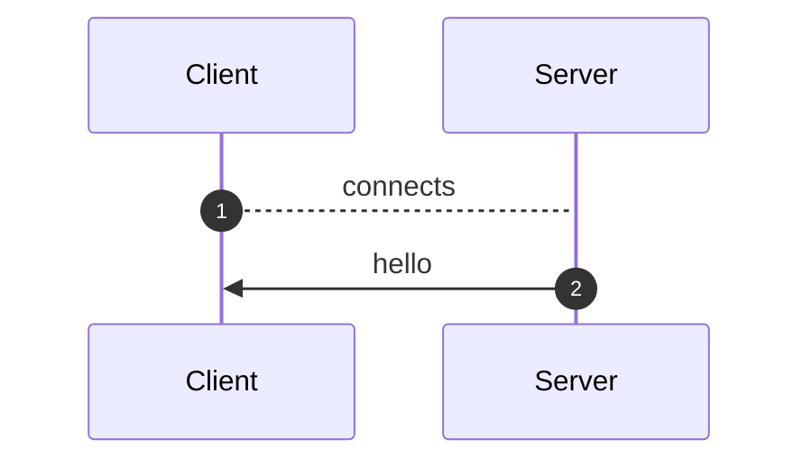
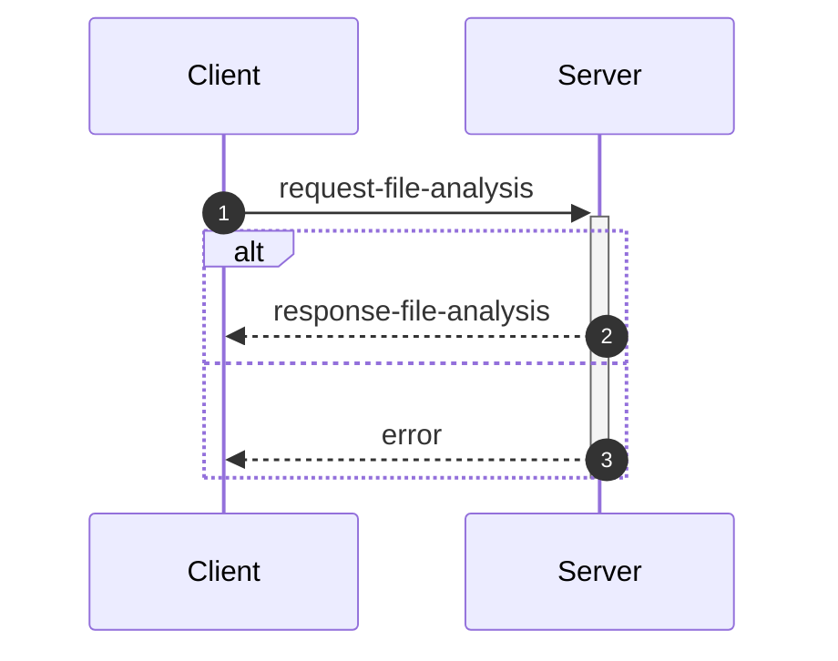
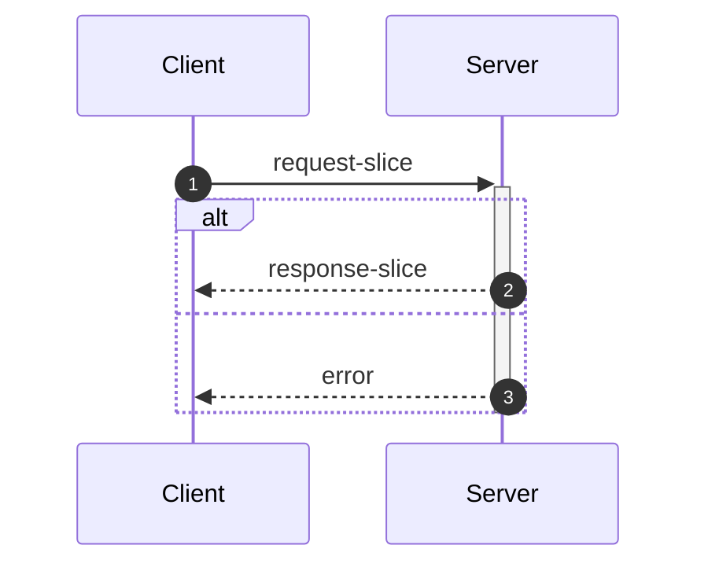
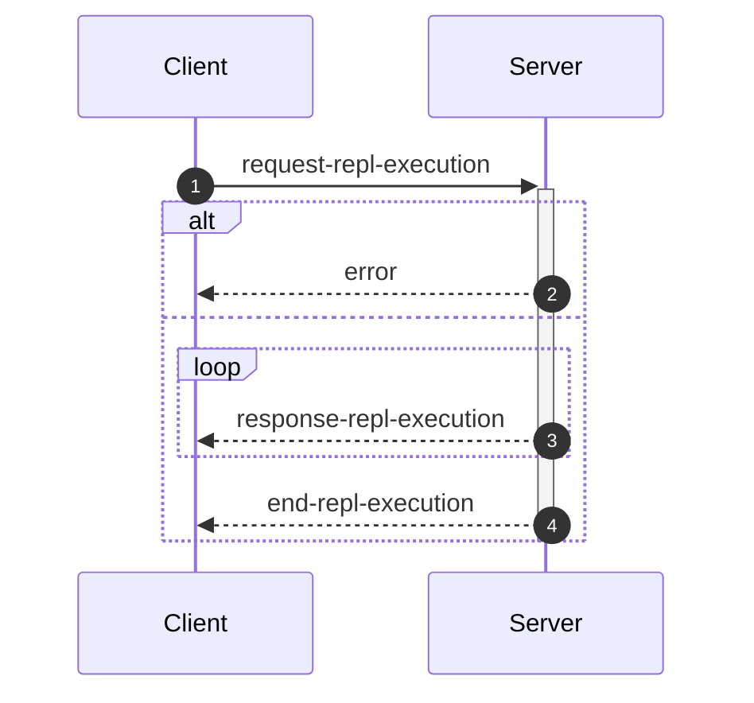

_This document was generated from '[src/documentation/wiki-interface.ts](https://github.com/flowr-analysis/flowr/tree/main//src/documentation/wiki-interface.ts)' on 2026-07-06, 08:32:09 UTC presenting an overview of flowR's interface (v2.10.10, using R v4.6.0). Please do not edit this file/wiki page directly._

Although far from being as detailed as the in-depth explanation of [_flowR_](https://github.com/flowr-analysis/flowr/wiki/core),
this wiki page explains how to interface with _flowR_ in more detail.
In general, command line arguments and other options provide short descriptions on hover over.

* [💻 Using the REPL](#using-the-repl)
* [⚙️ Configuring FlowR](#configuring-flowr)
* [⚒️ Writing Code](#writing-code)
* [💬 Communicating with the Server](#communicating-with-the-server)

<a id='using-the-repl'></a>
## 💻 Using the REPL


> [!NOTE]
> To execute arbitrary R commands with a repl request, _flowR_ has to be started explicitly with <span title="Description (Command Line Argument): Allow to access the underlying R session when using flowR (security warning: this allows the execution of arbitrary R code!)">`--r-session-access`</span>.
> Please be aware that this introduces a security risk and note that this relies on the [`r-shell` engine](https://github.com/flowr-analysis/flowr/wiki/engines) .

Although primarily meant for users to explore,
there is nothing which forbids simply calling _flowR_ as a subprocess to use standard-in, -output, and -error
for communication (although you can access the REPL using the server as well,
with the [REPL Request](#message-request-repl-execution) message).

The read-eval-print loop&nbsp;(REPL) works relatively simple.
You can submit an expression (using <kbd>Enter</kbd>),
which is interpreted as an R&nbsp;expression by default but interpreted as a *command* if it starts with a colon (`:`).
The best command to get started with the REPL is <span title="Description (Repl Command): Show help information (aliases: :h, :?)">`:help`</span>.
Besides, you can leave the REPL either with the command <span title="Description (Repl Command): End the repl (aliases: :q, :exit)">`:quit`</span> or by pressing <kbd>Ctrl</kbd>+<kbd>C</kbd> twice.
When writing a *command*, you may press <kbd>Tab</kbd> to get a list of completions, if available.
Multiple commands can be entered in a single line by separating them with a semicolon (`;`), e.g. `:parse "x<-2"; :df*`.
If a command is given without R code, the REPL will re-use R code given in a previous command.
The prior example will hence return first the parsed AST of the program and then the dataflow graph for `"x <- 2"`.

> [!NOTE]
> If you develop flowR, you may want to launch the repl using the `npm run main-dev` command, this way, you get a non-minified version of flowR with debug information and hot-reloading of source files.

<details>
<summary>Available Commands</summary>

We currently offer the following commands (this with a `[*]` suffix are available with and without the star):


| Command | Description |
| ------- | ----------- |
| **<span title="Description (Repl Command): End the repl (aliases: :q, :exit)">:quit</span>** | End the repl (aliases: **:<span title="Alias of ':quit'. End the repl">q</span>**, **:<span title="Alias of ':quit'. End the repl">exit</span>**) |
| **<span title="Description (Repl Command): Execute the given code as R code. This requires the `--r-session-access` flag to be set and requires the r-shell engine. (aliases: :e, :r)">:execute</span>** | Execute the given code as R code. This requires the `--r-session-access` flag to be set and requires the r-shell engine. (aliases: **:<span title="Alias of ':execute'. Execute the given code as R code. This requires the `--r-session-access` flag to be set and requires the r-shell engine.">e</span>**, **:<span title="Alias of ':execute'. Execute the given code as R code. This requires the `--r-session-access` flag to be set and requires the r-shell engine.">r</span>**) |
| **<span title="Description (Repl Command): Get mermaid code for the control-flow graph of R code (aliases: :cfg, :cf)">:controlflow[*]</span>** | Get mermaid code for the control-flow graph of R code (star: Returns the URL to mermaid.live) (aliases: **:<span title="Alias of ':controlflow'. Get mermaid code for the control-flow graph of R code">cfg</span>**, **:<span title="Alias of ':controlflow'. Get mermaid code for the control-flow graph of R code">cf</span>**) |
| **<span title="Description (Repl Command): Get mermaid code for the control-flow graph with basic blocks (aliases: :cfgb, :cfb)">:controlflowbb[*]</span>** | Get mermaid code for the control-flow graph with basic blocks (star: Returns the URL to mermaid.live) (aliases: **:<span title="Alias of ':controlflowbb'. Get mermaid code for the control-flow graph with basic blocks">cfgb</span>**, **:<span title="Alias of ':controlflowbb'. Get mermaid code for the control-flow graph with basic blocks">cfb</span>**) |
| **<span title="Description (Repl Command): Get mermaid code for the dataflow graph (aliases: :d, :df)">:dataflow[*]</span>** | Get mermaid code for the dataflow graph (star: Returns the URL to mermaid.live) (aliases: **:<span title="Alias of ':dataflow'. Get mermaid code for the dataflow graph">d</span>**, **:<span title="Alias of ':dataflow'. Get mermaid code for the dataflow graph">df</span>**) |
| **<span title="Description (Repl Command): Get mermaid code for the normalized AST of R code (aliases: :n)">:normalize[*]</span>** | Get mermaid code for the normalized AST of R code (star: Returns the URL to mermaid.live) (alias: **:<span title="Alias of ':normalize'. Get mermaid code for the normalized AST of R code">n</span>**) |
| **<span title="Description (Repl Command): Get mermaid code for the simplified dataflow graph (aliases: :ds, :dfs)">:dataflowsimple[*]</span>** | Get mermaid code for the simplified dataflow graph (star: Returns the URL to mermaid.live) (aliases: **:<span title="Alias of ':dataflowsimple'. Get mermaid code for the simplified dataflow graph">ds</span>**, **:<span title="Alias of ':dataflowsimple'. Get mermaid code for the simplified dataflow graph">dfs</span>**) |
| **<span title="Description (Repl Command): Just calculates the DFG, but only prints summary info (aliases: :d#, :df#)">:dataflowsilent</span>** | Just calculates the DFG, but only prints summary info (aliases: **:<span title="Alias of ':dataflowsilent'. Just calculates the DFG, but only prints summary info">d#</span>**, **:<span title="Alias of ':dataflowsilent'. Just calculates the DFG, but only prints summary info">df#</span>**) |
| **<span title="Description (Repl Command): Prints ASCII Art of the parsed, unmodified AST (aliases: :p)">:parse</span>** | Prints ASCII Art of the parsed, unmodified AST (alias: **:<span title="Alias of ':parse'. Prints ASCII Art of the parsed, unmodified AST">p</span>**) |
| **<span title="Description (Repl Command): Prints the version of flowR as well as the current version of R">:version</span>** | Prints the version of flowR as well as the current version of R
| **<span title="Description (Repl Command): Query the given R code (use 'help' for more information)">:query[*]</span>** | Query the given R code (use 'help' for more information) (star: Similar to query, but returns the output in json format.)
| **<span title="Description (Repl Command): Returns an ASCII representation of the dataflow graph (aliases: :df!)">:dataflowascii</span>** | Returns an ASCII representation of the dataflow graph (alias: **:<span title="Alias of ':dataflowascii'. Returns an ASCII representation of the dataflow graph">df!</span>**) |
| **<span title="Description (Repl Command): Returns summarization stats for the normalized AST (aliases: :n#)">:normalize#</span>** | Returns summarization stats for the normalized AST (alias: **:<span title="Alias of ':normalize#'. Returns summarization stats for the normalized AST">n#</span>**) |
| **<span title="Description (Repl Command): Show help information (aliases: :h, :?)">:help</span>** | Show help information (aliases: **:<span title="Alias of ':help'. Show help information">h</span>**, **:<span title="Alias of ':help'. Show help information">?</span>**) |


</details>


> [!TIP]
> 
> As indicated by the examples before, all REPL commands that operate on code keep track of the state.
> Hence, if you run a command like <span title="Description (Repl Command, starred version): Returns the URL to mermaid.live; Base Command: Get mermaid code for the dataflow graph (aliases: :d*, :df*)">`:dataflow*`</span> without providing R code,
> the REPL will re-use the R code provided in a previous command.
> Likewise, doing this will benefit from incrementality!
> If you request the dataflow graph with `:df* x <- 2 * y` and then want to see the parsed AST with `:parse`,
> the REPL will re-use previously obtained information and not re-parse the code again.
> 		


Generally, many commands offer shortcut versions in the REPL. Many queries, for example, offer a shortened format (see the example below).
Of special note, the [Config Query](https://github.com/flowr-analysis/flowr/wiki/query-api#Config-Query)
can be used to also modify the currently active configuration of _flowR_ within the REPL (see the [wiki page](https://github.com/flowr-analysis/flowr/wiki/query-api#Config-Query) for more information).

### Example: Retrieving the Dataflow Graph

To retrieve a URL to the [mermaid](https://mermaid.js.org/) diagram of the dataflow of a given expression,
use <span title="Description (Repl Command, starred version): Returns the URL to mermaid.live; Base Command: Get mermaid code for the dataflow graph (aliases: :d*, :df*)">`:dataflow*`</span> (or <span title="Description (Repl Command): Get mermaid code for the dataflow graph (aliases: :d, :df)">`:dataflow`</span> to get the mermaid code in the cli):


```shell
$ docker run -it --rm eagleoutice/flowr # or npm run flowr 
flowR repl v2.10.10, R grammar v14 (tree-sitter engine, pkg-db: latest/2026-05-23)
R> :dataflow* y <- 1 + x
```

<details>
<summary style='color:gray'>Output</summary>


```text
https://mermaid.live/view#base64:eyJjb2RlIjoiZmxvd2NoYXJ0IEJUXG4gICAgMXt7XCJgIzkxO1JOdW1iZXIjOTM7IDFcbiAgICAgICgxKVxuICAgICAgKjEuNipgXCJ9fVxuICAgJSUgTm8gZWRnZXMgZm91bmQgZm9yIDFcbiAgICAyKFtcImAjOTE7UlN5bWJvbCM5MzsgeFxuICAgICAgKDIpXG4gICAgICAqMS4xMCpgXCJdKVxuICAgJSUgTm8gZWRnZXMgZm91bmQgZm9yIDJcbiAgICAzW1tcImAjOTE7UkJpbmFyeU9wIzkzOyAjNDM7XG4gICAgICAoMylcbiAgICAgICoxLjYtMTAqXG4gICAgKDEsIDIpYFwiXV1cbiAgICBidWlsdC1pbjpfW1wiYEJ1aWx0LUluOlxuIzQzO2BcIl1cbiAgICBzdHlsZSBidWlsdC1pbjpfIHN0cm9rZTpncmF5LGZpbGw6Z3JheSxzdHJva2Utd2lkdGg6MnB4LG9wYWNpdHk6Ljg7XG4gICAgMFtcImAjOTE7UlN5bWJvbCM5MzsgeVxuICAgICAgKDAsIHNvdXJjZXM6IFszXSlcbiAgICAgICoxLjEqYFwiXVxuICAgIDRbW1wiYCM5MTtSQmluYXJ5T3AjOTM7ICM2MDsjNDU7XG4gICAgICAoNClcbiAgICAgICoxLjEtMTAqXG4gICAgKDAsIDMpYFwiXV1cbiAgICBidWlsdC1pbjpfLVtcImBCdWlsdC1JbjpcbiM2MDsjNDU7YFwiXVxuICAgIHN0eWxlIGJ1aWx0LWluOl8tIHN0cm9rZTpncmF5LGZpbGw6Z3JheSxzdHJva2Utd2lkdGg6MnB4LG9wYWNpdHk6Ljg7XG4gICAgMyAtLT58XCJyZWFkcywgYXJndW1lbnRcInwgMVxuICAgIDMgLS0+fFwicmVhZHMsIGFyZ3VtZW50XCJ8IDJcbiAgICAzIC0uLT58XCJyZWFkcywgY2FsbHNcInwgYnVpbHQtaW46X1xuICAgIGxpbmtTdHlsZSAyIHN0cm9rZTpncmF5O1xuICAgIDAgLS0+fFwiZGVmaW5lZC1ieVwifCAzXG4gICAgMCAtLT58XCJkZWZpbmVkLWJ5XCJ8IDRcbiAgICA0IC0tPnxcInJlYWRzLCBhcmd1bWVudFwifCAzXG4gICAgNCAtLT58XCJyZXR1cm5zLCBhcmd1bWVudFwifCAwXG4gICAgNCAtLi0+fFwicmVhZHMsIGNhbGxzXCJ8IGJ1aWx0LWluOl8tXG4gICAgbGlua1N0eWxlIDcgc3Ryb2tlOmdyYXk7IiwibWVybWFpZCI6eyJhdXRvU3luYyI6dHJ1ZX19
```


Retrieve the dataflow graph of the expression `y <- 1 + x`. It looks like this:


```mermaid
flowchart LR
    1{{"`#91;RNumber#93; 1
      (1)
      *1.6*`"}}
   %% No edges found for 1
    2(["`#91;RSymbol#93; x
      (2)
      *1.10*`"])
   %% No edges found for 2
    3[["`#91;RBinaryOp#93; #43;
      (3)
      *1.6-10*
    (1, 2)`"]]
    built-in:_["`Built-In:
#43;`"]
    style built-in:_ stroke:gray,fill:gray,stroke-width:2px,opacity:.8;
    0["`#91;RSymbol#93; y
      (0, sources: [3])
      *1.1*`"]
    4[["`#91;RBinaryOp#93; #60;#45;
      (4)
      *1.1-10*
    (0, 3)`"]]
    built-in:_-["`Built-In:
#60;#45;`"]
    style built-in:_- stroke:gray,fill:gray,stroke-width:2px,opacity:.8;
    3 -->|"reads, argument"| 1
    3 -->|"reads, argument"| 2
    3 -.->|"reads, calls"| built-in:_
    linkStyle 2 stroke:gray;
    0 -->|"defined-by"| 3
    0 -->|"defined-by"| 4
    4 -->|"reads, argument"| 3
    4 -->|"returns, argument"| 0
    4 -.->|"reads, calls"| built-in:_-
    linkStyle 7 stroke:gray;
```

	
<details>

<summary style="color:gray">R Code of the Dataflow Graph</summary>

The analysis required _0.6 ms_ (including parse and normalize, using the [tree-sitter](https://github.com/flowr-analysis/flowr/wiki/Engines) engine) within the generation environment. 
We encountered no unknown side effects during the analysis.


```r
y <- 1 + x
```


</details>


</details>


For small graphs like this, <span title="Description (Repl Command): Returns an ASCII representation of the dataflow graph (aliases: :df!)">`:dataflowascii`</span> also provides an ASCII representation directly in the REPL:


```shell
$ docker run -it --rm eagleoutice/flowr # or npm run flowr 
flowR repl v2.10.10, R grammar v14 (tree-sitter engine, pkg-db: latest/2026-05-23)
R> :df! y <- 1 + x
```

<details open>
<summary style='color:gray'>Output</summary>


```text
                        0<1>0
                   ┌────| 1 |
    ┌────────┐     │    0---0
 c<4>c       └──c<3>c
 |<- |  v<0>v┌──| + |
 c---c──| y |┘  c---c   u<2>u
        v---v      └────| x |
                        u---u
Edges:
3 -> 1: reads, argument  3 -> 2: reads, argument
4 -> 3: reads, argument  4 -> 0: returns, argument
0 -> 3: defined-by       0 -> 4: defined-by
```


Retrieve the dataflow graph of the expression `y <- 1 + x` as ASCII art.

</details>


For the slicing with <span title="Description (Repl Command): Static backwards executable slicer for R">`:slicer`</span>, you have access to the same [magic comments](#slice-magic-comments) as with the [slice request](#message-request-slice).

### Example: Interfacing with the File System

Many commands that allow for an R-expression (like <span title="Description (Repl Command, starred version): Returns the URL to mermaid.live; Base Command: Get mermaid code for the dataflow graph (aliases: :d*, :df*)">`:dataflow*`</span>) allow for a file as well
if the argument starts with `file://`.
If you are working from the root directory of the _flowR_ repository, the following gives you the parsed AST of the example file using the <span title="Description (Repl Command): Prints ASCII Art of the parsed, unmodified AST (aliases: :p)">`:parse`</span> command:

> **Watch mode**: Replace `file://` with `watch://` to enter watch mode.
> flowR runs the command immediately and then re-runs it every time the file (or any file inside the folder) changes.
> Enter any other command to leave watch mode.
> For example: `:df watch://analysis.R`


```shell
$ docker run -it --rm eagleoutice/flowr # or npm run flowr 
flowR repl v2.10.10, R grammar v14 (tree-sitter engine, pkg-db: latest/2026-05-23)
R> :parse file://test/testfiles/example.R
```

<details>
<summary style='color:gray'>Output</summary>


```text
File: test/testfiles/example.R

program
├ binaryoperator
│ ├ identifier "sum" (1:1─4)
│ ├ <- "<-" (1:5─7)
│ ╰ float "0" (1:8─9)
├ binaryoperator
│ ├ identifier "product" (2:1─8)
│ ├ <- "<-" (2:9─11)
│ ╰ float "1" (2:12─13)
├ binaryoperator
│ ├ identifier "w" (3:1─2)
│ ├ <- "<-" (3:3─5)
│ ╰ float "7" (3:6─7)
├ binaryoperator
│ ├ identifier "N" (4:1─2)
│ ├ <- "<-" (4:3─5)
│ ╰ float "10" (4:6─8)
├ forstatement
│ ├ for "for" (6:1─4)
│ ├ ( "(" (6:5─6)
│ ├ identifier "i" (6:6─7)
│ ├ in "in" (6:8─10)
│ ├ binaryoperator
│ │ ├ float "1" (6:11─12)
│ │ ├ : ":" (6:12─13)
│ │ ╰ parenthesizedexpression
│ │   ├ ( "(" (6:13─14)
│ │   ├ binaryoperator
│ │   │ ├ identifier "N" (6:14─15)
│ │   │ ├ - "-" (6:15─16)
│ │   │ ╰ float "1" (6:16─17)
│ │   ╰ ) ")" (6:17─18)
│ ├ ) ")" (6:18─19)
│ ╰ bracedexpression
│   ├ { "{" (6:20─21)
│   ├ binaryoperator
│   │ ├ identifier "sum" (7:3─6)
│   │ ├ <- "<-" (7:7─9)
│   │ ╰ binaryoperator
│   │   ├ binaryoperator
│   │   │ ├ identifier "sum" (7:10─13)
│   │   │ ├ + "+" (7:14─15)
│   │   │ ╰ identifier "i" (7:16─17)
│   │   ├ + "+" (7:18─19)
│   │   ╰ identifier "w" (7:20─21)
│   ├ binaryoperator
│   │ ├ identifier "product" (8:3─10)
│   │ ├ <- "<-" (8:11─13)
│   │ ╰ binaryoperator
│   │   ├ identifier "product" (8:14─21)
│   │   ├  "" (8:22─23)
│   │   ╰ identifier "i" (8:24─25)
│   ╰ } "}" (9:1─2)
├ call
│ ├ identifier "cat" (11:1─4)
│ ╰ arguments
│   ├ ( "(" (11:4─5)
│   ├ argument
│   │ ╰ string
│   │   ├ " "\"" (11:5─6)
│   │   ├ stringcontent "Sum:" (11:6─10)
│   │   ╰ " "\"" (11:10─11)
│   ├ comma "," (11:11─12)
│   ├ argument
│   │ ╰ identifier "sum" (11:13─16)
│   ├ comma "," (11:16─17)
│   ├ argument
│   │ ╰ string
│   │   ├ " "\"" (11:18─19)
│   │   ├ stringcontent
│   │   │ ╰ escapesequence "\\n" (11:19─21)
│   │   ╰ " "\"" (11:21─22)
│   ╰ ) ")" (11:22─23)
╰ call
  ├ identifier "cat" (12:1─4)
  ╰ arguments
    ├ ( "(" (12:4─5)
    ├ argument
    │ ╰ string
    │   ├ " "\"" (12:5─6)
    │   ├ stringcontent "Product:" (12:6─14)
    │   ╰ " "\"" (12:14─15)
    ├ comma "," (12:15─16)
    ├ argument
    │ ╰ identifier "product" (12:17─24)
    ├ comma "," (12:24─25)
    ├ argument
    │ ╰ string
    │   ├ " "\"" (12:26─27)
    │   ├ stringcontent
    │   │ ╰ escapesequence "\\n" (12:27─29)
    │   ╰ " "\"" (12:29─30)
    ╰ ) ")" (12:30─31)
```


Retrieve the parsed AST of the example file.

<details>

<summary>File Content</summary>


```r
sum <- 0
product <- 1
w <- 7
N <- 10

for (i in 1:(N-1)) {
  sum <- sum + i + w
  product <- product * i
}

cat("Sum:", sum, "\n")
cat("Product:", product, "\n")
```


</details>

As _flowR_ directly transforms this AST the output focuses on being human-readable instead of being machine-readable.
		

</details>


### Example: Run a Query

You can run any query supported by _flowR_ using the <span title="Description (Repl Command): Query the given R code (use 'help' for more information)">`:query`</span> command.
For example, to obtain the shapes of all data frames in a given piece of code, you can run:


```shell
$ docker run -it --rm eagleoutice/flowr # or npm run flowr 
flowR repl v2.10.10, R grammar v14 (tree-sitter engine, pkg-db: latest/2026-05-23)
R> :query @df-shape "x <- data.frame(a = 1:10, b = 1:10)\ny <- x$a"
```

<details open>
<summary style='color:gray'>Output</summary>


```text
Query: df-shape (1 ms)
   ╰ 12: (colnames: [{"a", "b"}, {}], cols: [2, 2], rows: [10, 10])
   ╰ 0: (colnames: [{"a", "b"}, {}], cols: [2, 2], rows: [10, 10])
All queries together required ≈2 ms (1ms accuracy, total 2 ms)
```


Retrieve the shapes of all data frames in the given code.

</details>


To run the linter on a file, you can use (in this example, we just issue the `dead-code` linter on a small piece of code):


```shell
$ docker run -it --rm eagleoutice/flowr # or npm run flowr 
flowR repl v2.10.10, R grammar v14 (tree-sitter engine, pkg-db: latest/2026-05-23)
R> :query @linter rules:dead-code "if(FALSE) x <- 2"
```

<details open>
<summary style='color:gray'>Output</summary>


```text
Query: linter (1 ms)
   ╰ Dead Code (dead-code):
       ╰ certain:
           ╰ Code at 1.11-16
       ╰ Metadata: searchTimeMs: 0, processTimeMs: 1
All queries together required ≈1 ms (1ms accuracy, total 2 ms)
```


Run the linter on the given code, with only the `dead-code` rule enabled.

</details>


For more information on the available queries, please check out the [Query API](https://github.com/flowr-analysis/flowr/wiki/query-api).


<a id='configuring-flowr'></a>
## ⚙️ Configuring FlowR


When running _flowR_, you may want to specify some behaviors with a dedicated configuration file.
By default, flowR looks for a file named `flowr.json` in the current working directory (or any higher directory).
You can also specify a different file with <span title="Description (Command Line Argument): The name of the configuration file to use">`--config-file`</span> or pass the configuration inline using <span title="Description (Command Line Argument): The flowR configuration to use, as a JSON string">`--config-json`</span>.
To inspect the current configuration, you can run flowr with the <span title="Description (Command Line Argument): Run with verbose logging (will be passed to the corresponding script)">`--verbose`</span> flag, or use the `config` [Query](https://github.com/flowr-analysis/flowr/wiki/query-api).
Within the REPL this works by running the following:


```shell
:query @config
```


To work with the <a href="https://github.com/flowr-analysis/flowr/tree/main/src/config.ts#L109"><code><span title="The configuration file format for flowR.">FlowrConfig</span></code></a> you can use the provided helper objects alongside its methods like
<a href="https://github.com/flowr-analysis/flowr/tree/main/src/config.ts#L479"><code><span title="Creates a new flowr config that has the updated values.">FlowrConfig::<b>amend</b></span></code></a>.
The following summarizes the configuration options:

- `ignoreSourceCalls`: If set to `true`, _flowR_ will ignore source calls when analyzing the code, i.e., ignoring the inclusion of other files.
- `semantics`: allows to configure the way _flowR_ handles R, although we currently only support `semantics/environment/overwriteBuiltIns`.
  You may use this to overwrite _flowR_'s handling of built-in function and even completely clear the preset definitions shipped with flowR.
  See [Configure BuiltIn Semantics](#configure-builtin-semantics) for more information.
- `solver`: allows to configure how _flowR_ resolves variables and their values (currently we support: `disabled`, `alias`, `builtin`), as well as if pointer analysis should be active.
- `engines`: allows to configure the engines used by _flowR_ to interact with R code. See the [Engines wiki page](https://github.com/flowr-analysis/flowr/wiki/engines) for more information.
- `defaultEngine`: allows to specify the default engine to use for interacting with R code. If not set, an arbitrary engine from the specified list will be used.
- `abstractInterpretation`: allows to configure how _flowR_ performs abstract interpretation, although we currently only support data frame shape inference through abstract interpretation.
- `defaultPlugins`: allows to configure which plugins to load by default when creating a new <a href="https://github.com/flowr-analysis/flowr/tree/main/src/project/flowr-analyzer.ts#L162"><code><span title="Central class for conducting analyses with FlowR. Use the FlowrAnalyzerBuilder to create a new instance. If you want the original pattern of creating a pipeline and running all steps, you can still do this with FlowrAnalyzer#runFull . To inspect the context of the analyzer, use FlowrAnalyzer#inspectContext (if you are a plugin and need to modify it, use FlowrAnalyzer#context instead).">FlowrAnalyzer</span></code></a> instance.
- `repl.plugins`: allows to configure which plugins to load in the _flowR_ REPL. Use `flowr:default` to reference the plugins specified by `defaultPlugins`.

So you can configure _flowR_ by adding a file like the following:

<details>

<summary>Example Configuration File</summary>


```json
{
  "ignoreSourceCalls": true,
  "semantics": {
    "environment": {
      "overwriteBuiltIns": {
        "definitions": [
          {
            "type": "function",
            "names": [
              "foo"
            ],
            "processor": "builtin:assign",
            "config": {}
          }
        ]
      }
    }
  },
  "defaultPlugins": [
    "file:description",
    "versions:description"
  ],
  "repl": {
    "quickStats": false,
    "dfProcessorHeat": false,
    "plugins": [
      "flowr:default"
    ]
  },
  "project": {
    "resolveUnknownPathsOnDisk": true
  },
  "engines": [
    {
      "type": "r-shell"
    }
  ],
  "solver": {
    "variables": "alias",
    "evalStrings": true,
    "trackEnvironments": true,
    "eagerlyLoadPackages": false,
    "eagerlyLoadPackageDatabase": false,
    "resolveSource": {
      "dropPaths": "no",
      "ignoreCapitalization": true,
      "inferWorkingDirectory": "active-script",
      "searchPath": []
    },
    "instrument": {},
    "slicer": {
      "threshold": 50
    }
  },
  "abstractInterpretation": {
    "wideningThreshold": 4,
    "dataFrame": {
      "maxColNames": 20,
      "readLoadedData": {
        "readExternalFiles": true,
        "maxReadLines": 1000000
      }
    }
  },
  "gas": {
    "thresholds": {
      "memory": {
        "problematic": 0.7,
        "critical": 0.9
      },
      "timeMs": {
        "problematic": 100000,
        "critical": 120000
      }
    },
    "features": {}
  }
}
```


</details>

<details>
<a id='configure-builtin-semantics'></a>
<summary>Configure Built-In Semantics</summary>


`semantics/environment/overwriteBuiltins` accepts two keys:

- `loadDefaults` (boolean, initially `true`): If set to `true`, the default built-in definitions are loaded before applying the custom definitions. Setting this flag to `false` explicitly disables the loading of the default definitions.
- `definitions` (array, initially empty): Allows to overwrite or define new built-in elements. Each object within must have a `type` which is one of the below. Furthermore, they may define a string array of `names` which specifies the identifiers to bind the definitions to. You may use `assumePrimitive` to specify whether _flowR_ should assume that this is a primitive non-library definition (so you probably just do not want to specify the key).

  | Type            | Description                                                                                                                                                                                                                                                                                              | Example                                                                                                    |
  | --------------- | -------------------------------------------------------------------------------------------------------------------------------------------------------------------------------------------------------------------------------------------------------------------------------------------------------- | ---------------------------------------------------------------------------------------------------------- |
  | `constant`    | Additionally allows for a `value` this should resolve to.                                                                                                                                                                                                                                                | `{ type: 'constant', names: ['NULL', 'NA'],  value: null }`                                                |
  | `function`    | Is a rather flexible way to define and bind built-in functions. For the time, we do not have extensive documentation to cover all the cases, so please either consult the sources with the `default-builtin-config.ts` or open a [new issue](https://github.com/flowr-analysis/flowr/issues/new/choose). | `{ type: 'function', names: ['next'], processor: 'builtin:d', config: { cfg: ExitPointType.Next } }` |
  | `replacement` | A comfortable way to specify replacement functions like `$<-` or `names<-`. `suffixes` describes the... suffixes to attach automatically. | `{ type: 'replacement', suffixes: ['<-', '<<-'], names: ['[', '[['] }` |


</details>

<details>

<summary style='color:gray'>Full Configuration-File Schema</summary>

- _The configuration file format for flowR._ (object)
    - **ignoreSourceCalls** [optional] _Whether source calls should be ignored, causing {@link processSourceCall}'s behavior to be skipped._ (boolean)
    - **semantics** _Configure language semantics and how flowR handles them._ (object)
        - **environment** [optional] _Semantics regarding how to handle the R environment._ (object)
            - **overwriteBuiltIns** [optional] _Do you want to overwrite (parts) of the builtin definition?_ (object)
                - **loadDefaults** [optional] _Should the default configuration still be loaded?_ (boolean)
                - **definitions** [optional] _The definitions to load/overwrite._ (array)
                Valid item types:
                    - (object)
    - **defaultPlugins** [optional] _The default plugins to load when creating a new instance of FlowrAnalyzer_ (array)
    Valid item types:
        - (alternatives)
            - (string)
            - (array)
    - **repl** _Configuration options for the REPL._ (object)
        - **quickStats** [optional] _Whether to show quick stats in the REPL after each evaluation._ (boolean)
        - **dfProcessorHeat** [optional] _This instruments the dataflow processors to count how often each processor is called._ (boolean)
        - **plugins** [optional] _The plugins to load in REPL mode_ (array)
        Valid item types:
            - (alternatives)
                - (string)
                - (array)
    - **project** _Project specific configuration options._ (object)
        - **resolveUnknownPathsOnDisk** [optional] _Whether to resolve unknown paths loaded by the r project disk when trying to source/analyze files._ (boolean)
    - **engines** _The engine or set of engines to use for interacting with R code. An empty array means all available engines will be used._ (array)
    Valid item types:
        - (alternatives)
            - _The configuration for the tree sitter engine._ (object)
                - **type** [required] _Use the tree sitter engine._ (string)
                    Only allows: 'tree-sitter'
                - **wasmPath** [optional] _The path to the tree-sitter-r WASM binary to use. If this is undefined, this uses the default path._ (string)
                - **treeSitterWasmPath** [optional] _The path to the tree-sitter WASM binary to use. If this is undefined, this uses the default path._ (string)
                - **lax** [optional] _Whether to use the lax parser for parsing R code (allowing for syntax errors). If this is undefined, the strict parser will be used._ (boolean)
            - _The configuration for the R shell engine._ (object)
                - **type** [required] _Use the R shell engine._ (string)
                    Only allows: 'r-shell'
                - **rPath** [optional] _The path to the R executable to use. If this is undefined, this uses the default path._ (string)
    - **defaultEngine** [optional] _The default engine to use for interacting with R code. If this is undefined, an arbitrary engine from the specified list will be used._ (string)
        Only allows: 'tree-sitter', 'r-shell'
    - **solver** _How to resolve constants, constraints, cells, ..._ (object)
        - **variables** _How to resolve variables and their values._ (string)
            Only allows: 'disabled', 'alias', 'builtin'
        - **evalStrings** _Should we include eval(parse(text="...")) calls in the dataflow graph?_ (boolean)
        - **trackEnvironments** [optional] _Track user-created environments (new.env, assign/get/local with envir=, dollar-assign, attach). When false, all envir-style calls fall through conservatively._ (boolean)
        - **eagerlyLoadPackages** [optional] _Create a built-in vertex for every export when a package is loaded. When false (default), export vertices are created on demand as calls resolve to them, keeping the dataflow graph small._ (boolean)
        - **eagerlyLoadPackageDatabase** [optional] _Mount the package database up front instead of lazily on the first package load. When false (default), it is parsed only when a library()/use() call first needs it._ (boolean)
        - **instrument** (object)
            - **dataflowExtractors** [optional] _These keys are only intended for use within code, allowing to instrument the dataflow analyzer!_ (any)
        - **resolveSource** [optional] _If lax source calls are active, flowR searches for sourced files much more freely, based on the configurations you give it. This option is only in effect if `ignoreSourceCalls` is set to false._ (object)
            - **dropPaths** _Allow to drop the first or all parts of the sourced path, if it is relative._ (string)
                Only allows: 'no', 'once', 'all'
            - **ignoreCapitalization** _Search for filenames matching in the lowercase._ (boolean)
            - **inferWorkingDirectory** _Try to infer the working directory from the main or any script to analyze._ (string)
                Only allows: 'no', 'main-script', 'active-script', 'any-script'
            - **searchPath** _Additionally search in these paths._ (array)
            Valid item types:
                - (string)
            - **repeatedSourceLimit** [optional] _How often the same file can be sourced within a single run? Please be aware: in case of cyclic sources this may not reach a fixpoint so give this a sensible limit._ (number)
            - **applyReplacements** _Provide name replacements for loaded files_ (array)
            Valid item types:
                - (object)
        - **slicer** [optional] _The configuration for the slicer._ (object)
            - **threshold** [optional] _The maximum number of iterations to perform on a single function call during slicing._ (number)
            - **autoExtend** [optional] _If set, the slicer will gain an additional post-pass._ (boolean)
    - **abstractInterpretation** _The configuration options for abstract interpretation._ (object)
        - **wideningThreshold** _The threshold for the number of visitations of a node at which widening should be performed to ensure the termination of the fixpoint iteration._ (number)
        - **dataFrame** _The configuration of the shape inference for data frames._ (object)
            - **maxColNames** _The maximum number of columns names to infer for data frames before over-approximating the column names to top._ (number)
            - **readLoadedData** _Configuration options for reading data frame shapes from loaded external data files, such as CSV files._ (object)
                - **readExternalFiles** _Whether data frame shapes should be extracted from loaded external files, such as CSV files._ (boolean)
                - **maxReadLines** _The maximum number of lines to read when extracting data frame shapes from loaded files, such as CSV files._ (number)
    - **gas** [optional] _Resource-usage guard (gas) configuration. All feature factors default to 0 (disabled). See https://github.com/flowr-analysis/flowr/wiki/Core#gas-resource-guard._ (object)
        - **thresholds** [optional] _Shared thresholds for all gas checks (scaled by per-feature factor)._ (object)
            - **memory** [optional] _Heap-usage fraction thresholds (0-1)._ (object)
                - **problematic** [optional] _Heap fraction (0-1) above which Problematic is returned._ (number)
                - **critical** [optional] _Heap fraction (0-1) above which Critical is returned._ (number)
            - **timeMs** [optional] _Elapsed analysis time thresholds in milliseconds._ (object)
                - **problematic** [optional] _Elapsed ms above which Problematic is returned._ (number)
                - **critical** [optional] _Elapsed ms above which Critical is returned._ (number)
        - **features** [optional] _Per-feature sensitivity factors. 0 or absent disables gas checking for that feature. A factor of 2 makes the feature twice as sensitive. Recognised keys: `source`, `side-effect-linking`, `linter`._ (object)
        - **heapProvider** [optional] _Custom heap statistics source (programmatic configs only), overriding the built-in v8/performance.memory detection._ (function)

</details>

	

<a id='writing-code'></a>
## ⚒️ Writing Code

_flowR_ can be used as a [module](https://www.npmjs.com/package/@eagleoutice/flowr) and offers several main classes and interfaces that are interesting for extension writers 
(see the [Visual Studio Code extension](https://marketplace.visualstudio.com/items?itemName=code-inspect.vscode-flowr) or the [Core](https://github.com/flowr-analysis/flowr/wiki/core) wiki page for more information).

### Creating Analyses with _flowR_

Nowadays, instances of the <a href="https://github.com/flowr-analysis/flowr/tree/main/src/project/flowr-analyzer.ts#L162"><code><span title="Central class for conducting analyses with FlowR. Use the FlowrAnalyzerBuilder to create a new instance. If you want the original pattern of creating a pipeline and running all steps, you can still do this with FlowrAnalyzer#runFull . To inspect the context of the analyzer, use FlowrAnalyzer#inspectContext (if you are a plugin and need to modify it, use FlowrAnalyzer#context instead).">FlowrAnalyzer</span></code></a> should be used as central frontend to get analysis results from _flowR_.
For example, a program slice can be created like this:


```ts
const analyzer = await new FlowrAnalyzerBuilder()
    .setEngine('tree-sitter')
    .build();
analyzer.addRequest('x <- 1\ny <- x\nx');
const result = await analyzer.query([
    {
        type:     'static-slice',
        criteria: ['3@x']
    }
]);
//console.log(result['static-slice']);
```


For more information, please have a look at the [Analyzer](https://github.com/flowr-analysis/flowr/wiki/analyzer) wiki page, which explains how to construct and use the <a href="https://github.com/flowr-analysis/flowr/tree/main/src/project/flowr-analyzer.ts#L162"><code><span title="Central class for conducting analyses with FlowR. Use the FlowrAnalyzerBuilder to create a new instance. If you want the original pattern of creating a pipeline and running all steps, you can still do this with FlowrAnalyzer#runFull . To inspect the context of the analyzer, use FlowrAnalyzer#inspectContext (if you are a plugin and need to modify it, use FlowrAnalyzer#context instead).">FlowrAnalyzer</span></code></a> in more detail.
To work with specific perspectives, you can also consult the respective pages like the [Dataflow Graph](https://github.com/flowr-analysis/flowr/wiki/dataflow-graph) or the [Abstract Interpretation](https://github.com/flowr-analysis/flowr/wiki/abstract-interpretation) wiki pages.
### The Pipeline Executor (Low-Level Interface)

Once, in the beginning, _flowR_ was meant to produce a dataflow graph merely to provide *program slices*. 
However, with continuous updates, the [Dataflow Graph](https://github.com/flowr-analysis/flowr/wiki/dataflow-graph) repeatedly proves to be the more interesting part.
With this, we restructured _flowR_'s originally *hardcoded* pipeline to be far more flexible. 
Now, it can be theoretically extended or replaced with arbitrary steps, optional steps, and what we call 'decorations' of these steps. 
In short, a slicing pipeline using the <a href="https://github.com/flowr-analysis/flowr/tree/main/src/core/pipeline-executor.ts#L97"><code><span title="**Please note:** The PipelineExecutor is now considered to be a rather low-level API for flowR. While it still works and is the basis for all other layers, we strongly recommend using the FlowrAnalyzer and its builder to create and use an analyzer instance that is pre-configured for your use-case. The pipeline executor allows to execute arbitrary pipelines in a step-by-step fashion. If you are not...">PipelineExecutor</span></code></a> looks like this:


```ts

const slicer = new PipelineExecutor(DEFAULT_SLICING_PIPELINE, {
  parser:    new RShell(),
  request:   requestFromInput('x <- 1\nx + 1'),
  criterion: ['2@x']
})
const slice = await slicer.allRemainingSteps()
// console.log(slice.reconstruct.code)
```


<details><summary>More Information</summary>


If you compare this, with what you would have done with the old (and removed) `SteppingSlicer`, 
this essentially just requires you to replace the `SteppingSlicer` with the <a href="https://github.com/flowr-analysis/flowr/tree/main/src/core/pipeline-executor.ts#L97"><code><span title="**Please note:** The PipelineExecutor is now considered to be a rather low-level API for flowR. While it still works and is the basis for all other layers, we strongly recommend using the FlowrAnalyzer and its builder to create and use an analyzer instance that is pre-configured for your use-case. The pipeline executor allows to execute arbitrary pipelines in a step-by-step fashion. If you are not...">PipelineExecutor</span></code></a>
and to pass the <a href="https://github.com/flowr-analysis/flowr/tree/main/src/core/steps/pipeline/default-pipelines.ts#L18"><code>DEFAULT_SLICING_PIPELINE</code></a> as the first argument.
The <a href="https://github.com/flowr-analysis/flowr/tree/main/src/core/pipeline-executor.ts#L97"><code><span title="**Please note:** The PipelineExecutor is now considered to be a rather low-level API for flowR. While it still works and is the basis for all other layers, we strongly recommend using the FlowrAnalyzer and its builder to create and use an analyzer instance that is pre-configured for your use-case. The pipeline executor allows to execute arbitrary pipelines in a step-by-step fashion. If you are not...">PipelineExecutor</span></code></a>...

1. Provides structures to investigate the results of all intermediate steps
2. Can be executed step-by-step
3. Can repeat steps (e.g., to calculate multiple slices on the same input)

See the in-code documentation for more information.


</details>

### Using the <a href="https://github.com/flowr-analysis/flowr/tree/main/src/r-bridge/shell.ts#L143"><code><span title="The RShell represents an interactive session with the R interpreter. You can configure it by RShellOptions . At the moment we are using a live R session (and not networking etc.) to communicate with R easily, which allows us to install packages etc. However, this might and probably will change in the future (leaving this as a legacy mode :D)">RShell</span></code></a> to Interact with R

The <a href="https://github.com/flowr-analysis/flowr/tree/main/src/r-bridge/shell.ts#L143"><code><span title="The RShell represents an interactive session with the R interpreter. You can configure it by RShellOptions . At the moment we are using a live R session (and not networking etc.) to communicate with R easily, which allows us to install packages etc. However, this might and probably will change in the future (leaving this as a legacy mode :D)">RShell</span></code></a> class allows interfacing with the `R`&nbsp;ecosystem installed on the host system.
Please have a look at [flowR's Engines](https://github.com/flowr-analysis/flowr/wiki/engines) for more information on alternatives (for example, the <a href="https://github.com/flowr-analysis/flowr/tree/main/src/r-bridge/lang-4.x/tree-sitter/tree-sitter-executor.ts#L18"><code><span title="Synchronous and (way) faster alternative to the RShell using tree-sitter.">TreeSitterExecutor</span></code></a>).


> [!IMPORTANT]
> 
> Each <a href="https://github.com/flowr-analysis/flowr/tree/main/src/r-bridge/shell.ts#L143"><code><span title="The RShell represents an interactive session with the R interpreter. You can configure it by RShellOptions . At the moment we are using a live R session (and not networking etc.) to communicate with R easily, which allows us to install packages etc. However, this might and probably will change in the future (leaving this as a legacy mode :D)">RShell</span></code></a> controls a new instance of the R&nbsp;interpreter, 
> make sure to call <code><a href="https://github.com/flowr-analysis/flowr/tree/main/src/r-bridge/shell.ts#L333"><span title="Close the current R session, makes the object effectively invalid (can no longer be reopened etc.)">RShell::<i>close</i></span></a>()</code> when you are done.


You can start a new "session" simply by constructing a new object with <code>new <a href="https://github.com/flowr-analysis/flowr/tree/main/src/r-bridge/shell.ts#L143"><span title="The RShell represents an interactive session with the R interpreter. You can configure it by RShellOptions . At the moment we are using a live R session (and not networking etc.) to communicate with R easily, which allows us to install packages etc. However, this might and probably will change in the future (leaving this as a legacy mode :D)">RShell</span></a>()</code>.

However, there are several options that may be of interest 
(e.g., to automatically revive the shell in case of errors or to control the name location of the R process on the system).

With a shell object (let's call it `shell`), you can execute R code by using <a href="https://github.com/flowr-analysis/flowr/tree/main/src/r-bridge/shell.ts#L211"><code><span title="sends the given command directly to the current R session will not do anything to alter input markers!">RShell::<i>sendCommand</i></span></code></a>,
for example <code>shell.<a href="https://github.com/flowr-analysis/flowr/tree/main/src/r-bridge/shell.ts#L211"><span title="sends the given command directly to the current R session will not do anything to alter input markers!">sendCommand</span></a>("1 + 1")</code>.
However, this does not return anything, so if you want to collect the output of your command, use
<a href="https://github.com/flowr-analysis/flowr/tree/main/src/r-bridge/shell.ts#L277"><code><span title="Send a command and collect the output">RShell::<i>sendCommandWithOutput</i></span></code></a> instead.


<a id='communicating-with-the-server'></a>
## 💬 Communicating with the Server


As explained in the [Overview](https://github.com/flowr-analysis/flowr/wiki/overview), you can simply run the [TCP](https://de.wikipedia.org/wiki/Transmission_Control_Protocol)&nbsp;server by adding the <span title="Description (Command Line Argument): Do not drop into a repl, but instead start a server on the given port (default: 1042) and listen for messages.">`--server`</span> flag (and, due to the interactive mode, exit with the conventional <kbd>CTRL</kbd>+<kbd>C</kbd>).
Currently, every connection is handled by the same underlying `RShell` - so the server is not designed to handle many clients at a time.
Additionally, the server is not well guarded against attacks (e.g., you can theoretically spawn an arbitrary number of&nbsp;RShell sessions on the target machine).

Every message has to be given in a single line (i.e., without a newline in-between) and end with a newline character. Nevertheless, we will pretty-print example given in the following segments for the ease of reading.


> [!NOTE]
> 
> The default <span title="Description (Command Line Argument): Do not drop into a repl, but instead start a server on the given port (default: 1042) and listen for messages.">`--server`</span> uses a simple [TCP](https://de.wikipedia.org/wiki/Transmission_Control_Protocol)
> connection. If you want _flowR_ to expose a [WebSocket](https://de.wikipedia.org/wiki/WebSocket) server instead, add the <span title="Description (Command Line Argument): If the server flag is set, use websocket for messaging">`--ws`</span> flag (i.e., <span title="Description (Command Line Argument): Do not drop into a repl, but instead start a server on the given port (default: 1042) and listen for messages.">`--server`</span> <span title="Description (Command Line Argument): If the server flag is set, use websocket for messaging">`--ws`</span>) when starting _flowR_ from the command line.


<ul><li>
<a id="message-hello"></a>
<b>Hello</b> Message (<code>hello</code>) 
<details>

<summary style="color:gray"> View Details. <i>The server informs the client about the successful connection and provides Meta-Information.</i> </summary>


```mermaid
sequenceDiagram
    autonumber
    participant Client
    participant Server

    
    Client-->Server: connects
    Server->>Client: hello
	
```


	
After launching _flowR_, for example, with <code>docker run -it --rm eagleoutice/flowr <span title="Description (Command Line Argument): Do not drop into a repl, but instead start a server on the given port (default: 1042) and listen for messages.">-<span/>-server</span></code>&nbsp;(🐳️), simply connecting should present you with a `hello` message, that amongst others should reveal the versions of&nbsp;_flowR_ and&nbsp;R, using the [semver 2.0](https://semver.org/spec/v2.0.0.html) versioning scheme.
The message looks like this:


```json
{
  "type": "hello",
  "clientName": "client-0",
  "versions": {
    "flowr": "2.10.10",
    "r": "4.6.0",
    "engine": "r-shell"
  }
}
```


There are currently a few messages that you can send after the hello message.
If you want to _slice_ a piece of R code you first have to send an [analysis request](#message-request-file-analysis), so that you can send one or multiple slice requests afterward.
Requests for the [REPL](#message-request-repl) are independent of that.
	

<hr>


<details>
<summary style="color:gray">Message schema (<code>hello</code>)</summary>

For the definition of the hello message, please see it's implementation at [`./src/cli/repl/server/messages/message-hello.ts`](https://github.com/flowr-analysis/flowr/tree/main/./src/cli/repl/server/messages/message-hello.ts).

- [required] (object)
    - **type** [required] _The type of the hello message._ (string)
        Only allows: 'hello'
    - **id** [forbidden] _The id of the message is always undefined (as it is the initial message and not requested)._ (any)
    - **clientName** [required] _A unique name that is assigned to each client. It has no semantic meaning and is only used/useful for debugging._ (string)
    - **versions** [required] (object)
        - **flowr** [required] _The version of the flowr server running in semver format._ (string)
        - **r** [required] _The version of the underlying R shell running in semver format._ (string)
        - **engine** [required] _The parser backend that is used to parse the R code._ (string)

</details>


<hr>

</details>
	</li>

<li>
<a id="message-request-file-analysis"></a>
<b>Analysis</b> Message (<code>request-file-analysis</code>) 
<details>

<summary style="color:gray"> View Details. <i>The server builds the dataflow graph for a given input file (or a set of files).</i> </summary>


```mermaid
sequenceDiagram
    autonumber
    participant Client
    participant Server

    
    Client->>+Server: request-file-analysis
    alt
        Server-->>Client: response-file-analysis
    else
        Server-->>Client: error
    end
    deactivate  Server
	
```


	
The request allows the server to analyze a file and prepare it for slicing.
The message can contain a `filetoken`, which is used to identify the file in later slice or query requests (if you do not add one, the request will not be stored and therefore, it is not available for subsequent requests).

> **Please note!**\
> If you want to send and process a lot of analysis requests, but do not want to slice them, please do not pass the `filetoken` field. This will save the server a lot of memory allocation.

Furthermore, the request must contain either a `content` field to directly pass the file's content or a `filepath` field which contains the path to the file (this path must be accessible for the server to be useful).
If you add the `id` field, the answer will use the same `id` so you can match requests and the corresponding answers.
See the implementation of the request-file-analysis message for more information.

You can drop one or more stored file tokens by adding the `invalidateToken` field (a single token or an array of tokens).
The server frees the corresponding analyses _after_ it has answered the request.

> **Tip!**\
> If you only want to drop tokens, you do not need a separate message: send a `request-file-analysis` that contains _just_ the `invalidateToken` field (and no `content` or `filepath`).
> Such a request behaves like an empty file analysis and the server replies with an empty `results` object.
> Because invalidation happens after the response, you may even pass the _current_ `filetoken` in `invalidateToken` to analyze a file once and have the server forget it right after you received the results.


<details>
<summary>Example of the <code>request-file-analysis</code> Message</summary>

_Note:_ even though we pretty-print these messages, they are sent as a single line, ending with a newline.

The following lists all messages that were sent and received in case you want to reproduce the scenario:

<ol>
<li> <code>hello</code> (response)
<details> 

<summary> Show Details </summary>

The first message is always a hello message.


```json
{
  "type": "hello",
  "clientName": "client-0",
  "versions": {
    "flowr": "2.10.10",
    "r": "4.6.0",
    "engine": "r-shell"
  }
}
```


</details>
</li>

<li> <b><code>request-file-analysis</code> (request)</b>
<details open> 

<summary> Show Details </summary>

Let's suppose you simply want to analyze the following script:
 
```r
x <- 1
x + 1
```

 For this, you can send the following request:


```json
{
  "type": "request-file-analysis",
  "id": "1",
  "filetoken": "x",
  "content": "x <- 1\nx + 1"
}
```


</details>
</li>

<li> <code>response-file-analysis</code> (response)
<details> 

<summary> Show Details </summary>


The `results` field of the response effectively contains three keys of importance:

- `parse`: which contains 1:1 the parse result in CSV format that we received from the `RShell` (i.e., the AST produced by the parser of the R interpreter).
- `normalize`: which contains the normalized AST, including ids (see the `info` field and the [Normalized AST](https://github.com/flowr-analysis/flowr/wiki/normalized-ast) wiki page).
- `dataflow`: especially important is the `graph` field which contains the dataflow graph as a set of root vertices (see the [Dataflow Graph](https://github.com/flowr-analysis/flowr/wiki/dataflow-graph) wiki page).
			


_As the code is pretty long, we inhibit pretty printing and syntax highlighting (JSON, hiding built-in):_

```text
{"type":"response-file-analysis","format":"json","id":"1","results":{"parse":{"files":[{"parsed":"[1,1,1,6,7,0,\"expr\",false,\"x <- 1\"],[1,1,1,1,1,3,\"SYMBOL\",true,\"x\"],[1,1,1,1,3,7,\"expr\",false,\"x\"],[1,3,1,4,2,7,\"LEFT_ASSIGN\",true,\"<-\"],[1,6,1,6,4,5,\"NUM_CONST\",true,\"1\"],[1,6,1,6,5,7,\"expr\",false,\"1\"],[2,1,2,5,16,0,\"expr\",false,\"x + 1\"],[2,1,2,1,10,12,\"SYMBOL\",true,\"x\"],[2,1,2,1,12,16,\"expr\",false,\"x\"],[2,3,2,3,11,16,\"'+'\",true,\"+\"],[2,5,2,5,13,14,\"NUM_CONST\",true,\"1\"],[2,5,2,5,14,16,\"expr\",false,\"1\"]","filePath":"/tmp/tmp-388014-fvTjEbkWVGDM-.R"}],".meta":{"timing":2}},"normalize":{"ast":{"type":"RProject","files":[{"root":{"type":"RExpressionList","children":[{"type":"RBinaryOp","location":[1,3,1,4],"lhs":{"type":"RSymbol","location":[1,1,1,1],"content":"x","lexeme":"x","info":{"fullRange":[1,1,1,1],"adToks":[],"id":0,"parent":2,"role":"bin-l","index":0,"nest":0,"file":"/tmp/tmp-388014-fvTjEbkWVGDM-.R"}},"rhs":{"location":[1,6,1,6],"lexeme":"1","info":{"fullRange":[1,6,1,6],"adToks":[],"id":1,"parent":2,"role":"bin-r","index":1,"nest":0,"file":"/tmp/tmp-388014-fvTjEbkWVGDM-.R"},"type":"RNumber","content":{"num":1,"complexNumber":false,"markedAsInt":false}},"operator":"<-","lexeme":"<-","info":{"fullRange":[1,1,1,6],"adToks":[],"id":2,"parent":6,"nest":0,"file":"/tmp/tmp-388014-fvTjEbkWVGDM-.R","index":0,"role":"el-c"}},{"type":"RBinaryOp","location":[2,3,2,3],"lhs":{"type":"RSymbol","location":[2,1,2,1],"content":"x","lexeme":"x","info":{"fullRange":[2,1,2,1],"adToks":[],"id":3,"parent":5,"role":"bin-l","index":0,"nest":0,"file":"/tmp/tmp-388014-fvTjEbkWVGDM-.R"}},"rhs":{"location":[2,5,2,5],"lexeme":"1","info":{"fullRange":[2,5,2,5],"adToks":[],"id":4,"parent":5,"role":"bin-r","index":1,"nest":0,"file":"/tmp/tmp-388014-fvTjEbkWVGDM-.R"},"type":"RNumber","content":{"num":1,"complexNumber":false,"markedAsInt":false}},"operator":"+","lexeme":"+","info":{"fullRange":[2,1,2,5],"adToks":[],"id":5,"parent":6,"nest":0,"file":"/tmp/tmp-388014-fvTjEbkWVGDM-.R","index":1,"role":"el-c"}}],"info":{"adToks":[],"id":6,"nest":0,"file":"/tmp/tmp-388014-fvTjEbkWVGDM-.R","role":"root","index":0}},"filePath":"/tmp/tmp-388014-fvTjEbkWVGDM-.R"}],"info":{"id":7}},".meta":{"timing":0}},"dataflow":{"unknownReferences":[],"in":[{"nodeId":2,"name":"<-","type":2},{"nodeId":5,"name":"+","type":2}],"out":[{"nodeId":0,"name":"x","type":4,"definedAt":2,"value":[1]}],"environment":{"current":{"id":4286,"parent":"<BuiltInEnvironment>","memory":[["x",[{"nodeId":0,"name":"x","type":4,"definedAt":2,"value":[1]}]]],"globalEnv":true},"level":0},"graph":{"rootVertices":[1,0,2,3,4,5],"vertexInformation":[[1,{"tag":"value","id":1}],[0,{"tag":"vdef","id":0,"source":[1]}],[2,{"tag":"fcall","id":2,"name":"<-","onlyBuiltin":true,"args":[{"nodeId":0,"type":32},{"nodeId":1,"type":32}],"origin":["builtin:assign"]}],[3,{"tag":"use","id":3}],[4,{"tag":"value","id":4}],[5,{"tag":"fcall","id":5,"name":"+","onlyBuiltin":true,"args":[{"nodeId":3,"type":32},{"nodeId":4,"type":32}],"origin":["builtin:d"]}]],"edgeInformation":[[2,[[1,{"types":65}],[0,{"types":72}],["built-in:<-",{"types":5}]]],[0,[[1,{"types":2}],[2,{"types":2}]]],[3,[[0,{"types":1}]]],[5,[[3,{"types":65}],[4,{"types":65}],["built-in:+",{"types":5}]]]],"_unknownSideEffects":[]},"entryPoint":2,"exitPoints":[{"type":0,"nodeId":5}],"hooks":[],".meta":{"timing":1}}}}
```


</details>
</li>
</ol>

The complete round-trip took 7.7 ms (including time required to validate the messages, start, and stop the internal mock server).

</details>


You receive an error if, for whatever reason, the analysis fails (e.g., the message or code you sent contained syntax errors).
It contains a human-readable description *why* the analysis failed (see the error message implementation for more details).


<details>
<summary>Example Error Message</summary>

_Note:_ even though we pretty-print these messages, they are sent as a single line, ending with a newline.

The following lists all messages that were sent and received in case you want to reproduce the scenario:

<ol>
<li> <code>hello</code> (response)
<details> 

<summary> Show Details </summary>

The first message is always a hello message.


```json
{
  "type": "hello",
  "clientName": "client-0",
  "versions": {
    "flowr": "2.10.10",
    "r": "4.6.0",
    "engine": "r-shell"
  }
}
```


</details>
</li>

<li> <code>request-file-analysis</code> (request)
<details> 

<summary> Show Details </summary>


```json
{
  "type": "request-file-analysis",
  "id": "1",
  "filename": "sample.R",
  "content": "x <-"
}
```


</details>
</li>

<li> <b><code>error</code> (response)</b>
<details open> 

<summary> Show Details </summary>


```json
{
  "id": "1",
  "type": "error",
  "fatal": false,
  "reason": "Error while analyzing file sample.R: GuardError: unable to parse R code (see the log for more information) for request {\"request\":\"text\",\"content\":\"x <-\"}}\n Report a Bug: https://github.com/flowr-analysis/flowr/issues/new?body=%3C!%2D%2D%20Please%20describe%20your%20issue%20in%20more%20detail%20below!%20%2D%2D%3E%0A%0A%0A%3C!%2D%2D%20Automatically%20generated%20issue%20metadata%2C%20please%20do%20not%20edit%20or%20delete%20content%20below%20this%20line%20%2D%2D%3E%0A%2D%2D%2D%0A%0AflowR%20version%3A%202.10.10%0Anode%20version%3A%20v22.13.1%0Anode%20arch%3A%20x64%0Anode%20platform%3A%20linux%0Amessage%3A%20%60unable%20to%20parse%20R%20code%20%28see%20the%20log%20for%20more%20information%29%20for%20request%20%7B%22request%22%3A%22text%22%2C%22content%22%3A%22x%20%3C%2D%22%7D%7D%60%0Astack%20trace%3A%0A%60%60%60%0A%20%20%20%20at%20guard%20%28%3C%3E%2Fsrc%2Futil%2Fassert.ts%3A128%3A9%29%0A%20%20%20%20at%20guardRetrievedOutput%20%28%3C%3E%2Fsrc%2Fr%2Dbridge%2Fretriever.ts%3A221%3A7%29%0A%20%20%20%20at%20%2Fhome%2Fhappy%2Dfeet%2Fgit%2Fphd%2Fflowr%2Dfield%2Fflowr%2Fsrc%2Fr%2Dbridge%2Fretriever.ts%3A182%3A4%0A%20%20%20%20at%20processTicksAndRejections%20%28node%3Ainternal%2Fprocess%2Ftask_queues%3A105%3A5%29%0A%20%20%20%20at%20async%20Object.parseRequests%20%5Bas%20processor%5D%20%28%3C%3E%2Fsrc%2Fr%2Dbridge%2Fparser.ts%3A96%3A19%29%0A%20%20%20%20at%20async%20PipelineExecutor.nextStep%20%28%3C%3E%2Fsrc%2Fcore%2Fpipeline%2Dexecutor.ts%3A192%3A25%29%0A%20%20%20%20at%20async%20FlowrAnalyzerCache.runTapeUntil%20%28%3C%3E%2Fsrc%2Fproject%2Fcache%2Fflowr%2Danalyzer%2Dcache.ts%3A101%3A4%29%0A%20%20%20%20at%20async%20FlowRServerConnection.sendFileAnalysisResponse%20%28%3C%3E%2Fsrc%2Fcli%2Frepl%2Fserver%2Fconnection.ts%3A198%3A52%29%0A%60%60%60%0A%0A%2D%2D%2D%0A%09"
}
```


</details>
</li>
</ol>

The complete round-trip took 5.4 ms (including time required to validate the messages, start, and stop the internal mock server).

</details>


&nbsp;

<a id="analysis-include-cfg"></a>
**Including the Control Flow Graph**

While _flowR_ does (for the time being) not use an explicit control flow graph but instead relies on control-dependency edges within the dataflow graph, 
the respective structure can still be exposed using the server (note that, as this feature is not needed within _flowR_, it is tested significantly less - 
so please create a [new issue](https://github.com/flowr-analysis/flowr/issues/new/choose) for any bug you may encounter).
For this, the analysis request may add `cfg: true` to its list of options.


<details>
<summary>Requesting a Control Flow Graph</summary>

_Note:_ even though we pretty-print these messages, they are sent as a single line, ending with a newline.

The following lists all messages that were sent and received in case you want to reproduce the scenario:

<ol>
<li> <code>hello</code> (response)
<details> 

<summary> Show Details </summary>

The first message is always a hello message.


```json
{
  "type": "hello",
  "clientName": "client-0",
  "versions": {
    "flowr": "2.10.10",
    "r": "4.6.0",
    "engine": "r-shell"
  }
}
```


</details>
</li>

<li> <b><code>request-file-analysis</code> (request)</b>
<details open> 

<summary> Show Details </summary>


```json
{
  "type": "request-file-analysis",
  "id": "1",
  "filetoken": "x",
  "content": "if(unknown > 0) { x <- 2 } else { x <- 5 }\nfor(i in 1:x) { print(x); print(i) }",
  "cfg": true
}
```


</details>
</li>

<li> <code>response-file-analysis</code> (response)
<details> 

<summary> Show Details </summary>


The response looks basically the same as a response sent without the `cfg` flag. However, additionally it contains a `cfg` field. 
If you are interested in a visual representation of the control flow graph, see the 
[visualization with mermaid](https://mermaid.live/view#base64:eyJjb2RlIjoiZmxvd2NoYXJ0IEJUXG4gICAgbjMyKFtcImBSRXhwcmVzc2lvbkxpc3QgKDMyKWBcIl0pXG4gICAgbjE1W1wiYFJJZlRoZW5FbHNlICgxNSlcbiMzNDtpZih1bmtub3duICM2MjsgMCkgIzEyMzsgeCAjNjA7IzQ1OyAyICMxMjU7IGVsc2UgIzEyMzsgeCAjNjA7IzQ1OyA1ICMxMjU7IzM0O2BcIl1cbiAgICBuMTUtZVtbMTUtZV1dXG4gICAgbjAoW1wiYFJTeW1ib2wgKDApXG4jMzQ7dW5rbm93biMzNDtgXCJdKVxuICAgIG4xKFtcImBSTnVtYmVyICgxKVxuIzM0OzAjMzQ7YFwiXSlcbiAgICBuMihbXCJgUkJpbmFyeU9wICgyKVxuIzM0O3Vua25vd24gIzYyOyAwIzM0O2BcIl0pXG4gICAgbjItZVtbMi1lXV1cbiAgICBuOChbXCJgUkV4cHJlc3Npb25MaXN0ICg4KWBcIl0pXG4gICAgbjUoW1wiYFJTeW1ib2wgKDUpXG4jMzQ7eCMzNDtgXCJdKVxuICAgIG42KFtcImBSTnVtYmVyICg2KVxuIzM0OzIjMzQ7YFwiXSlcbiAgICBuNyhbXCJgUkJpbmFyeU9wICg3KVxuIzM0O3ggIzYwOyM0NTsgMiMzNDtgXCJdKVxuICAgIG43LWVbWzctZV1dXG4gICAgbjgtZVtbOC1lXV1cbiAgICBuMTQoW1wiYFJFeHByZXNzaW9uTGlzdCAoMTQpYFwiXSlcbiAgICBuMTEoW1wiYFJTeW1ib2wgKDExKVxuIzM0O3gjMzQ7YFwiXSlcbiAgICBuMTIoW1wiYFJOdW1iZXIgKDEyKVxuIzM0OzUjMzQ7YFwiXSlcbiAgICBuMTMoW1wiYFJCaW5hcnlPcCAoMTMpXG4jMzQ7eCAjNjA7IzQ1OyA1IzM0O2BcIl0pXG4gICAgbjEzLWVbWzEzLWVdXVxuICAgIG4xNC1lW1sxNC1lXV1cbiAgICBuMTYoW1wiYFJTeW1ib2wgKDE2KVxuIzM0O2kjMzQ7YFwiXSlcbiAgICBuMzFbXCJgUkZvckxvb3AgKDMxKVxuIzM0O2ZvcihpIGluIDEjNTg7eCkgIzEyMzsgcHJpbnQoeCk7IHByaW50KGkpICMxMjU7IzM0O2BcIl1cbiAgICBuMTcoW1wiYFJOdW1iZXIgKDE3KVxuIzM0OzEjMzQ7YFwiXSlcbiAgICBuMTgoW1wiYFJTeW1ib2wgKDE4KVxuIzM0O3gjMzQ7YFwiXSlcbiAgICBuMTkoW1wiYFJCaW5hcnlPcCAoMTkpXG4jMzQ7MSM1ODt4IzM0O2BcIl0pXG4gICAgbjE5LWVbWzE5LWVdXVxuICAgIG4zMChbXCJgUkV4cHJlc3Npb25MaXN0ICgzMClgXCJdKVxuICAgIG4yMihbXCJgUlN5bWJvbCAoMjIpXG4jMzQ7cHJpbnQoeCkjMzQ7YFwiXSlcbiAgICBuMjVbXCJgUkZ1bmN0aW9uQ2FsbCAoMjUpXG4jMzQ7cHJpbnQoeCkjMzQ7YFwiXVxuICAgIG4yNS1lW1syNS1lXV1cbiAgICBuMjQoW1wiYFJBcmd1bWVudCAoMjQpXG4jMzQ7eCMzNDtgXCJdKVxuICAgIG4yMyhbXCJgUlN5bWJvbCAoMjMpXG4jMzQ7eCMzNDtgXCJdKVxuICAgIG4yNC1lW1syNC1lXV1cbiAgICBuMjYoW1wiYFJTeW1ib2wgKDI2KVxuIzM0O3ByaW50KGkpIzM0O2BcIl0pXG4gICAgbjI5W1wiYFJGdW5jdGlvbkNhbGwgKDI5KVxuIzM0O3ByaW50KGkpIzM0O2BcIl1cbiAgICBuMjktZVtbMjktZV1dXG4gICAgbjI4KFtcImBSQXJndW1lbnQgKDI4KVxuIzM0O2kjMzQ7YFwiXSlcbiAgICBuMjcoW1wiYFJTeW1ib2wgKDI3KVxuIzM0O2kjMzQ7YFwiXSlcbiAgICBuMjgtZVtbMjgtZV1dXG4gICAgbjMwLWVbWzMwLWVdXVxuICAgIG4zMS1lW1szMS1lXV1cbiAgICBuMzItZVtbMzItZV1dXG4gICAgbjE1IC0uLT58XCJGRFwifCBuMzJcbiAgICBuMSAtLi0+fFwiRkRcInwgbjBcbiAgICBuMCAtLi0+fFwiRkRcInwgbjJcbiAgICBuMi1lIC0uLT58XCJGRFwifCBuMVxuICAgIG43IC0uLT58XCJGRFwifCBuOFxuICAgIG42IC0uLT58XCJGRFwifCBuNVxuICAgIG41IC0uLT58XCJGRFwifCBuN1xuICAgIG43LWUgLS4tPnxcIkZEXCJ8IG42XG4gICAgbjgtZSAtLi0+fFwiRkRcInwgbjctZVxuICAgIG4xMyAtLi0+fFwiRkRcInwgbjE0XG4gICAgbjEyIC0uLT58XCJGRFwifCBuMTFcbiAgICBuMTEgLS4tPnxcIkZEXCJ8IG4xM1xuICAgIG4xMy1lIC0uLT58XCJGRFwifCBuMTJcbiAgICBuMTQtZSAtLi0+fFwiRkRcInwgbjEzLWVcbiAgICBuOCAtLT58XCJDRCAoVFJVRSlcInwgbjItZVxuICAgIG4xNCAtLT58XCJDRCAoRkFMU0UpXCJ8IG4yLWVcbiAgICBuMiAtLi0+fFwiRkRcInwgbjE1XG4gICAgbjE1LWUgLS4tPnxcIkZEXCJ8IG44LWVcbiAgICBuMTUtZSAtLi0+fFwiRkRcInwgbjE0LWVcbiAgICBuMzEgLS4tPnxcIkZEXCJ8IG4xNS1lXG4gICAgbjMxIC0uLT58XCJGRFwifCBuMzAtZVxuICAgIG4xOCAtLi0+fFwiRkRcInwgbjE3XG4gICAgbjE3IC0uLT58XCJGRFwifCBuMTlcbiAgICBuMTktZSAtLi0+fFwiRkRcInwgbjE4XG4gICAgbjI1IC0uLT58XCJGRFwifCBuMzBcbiAgICBuMjIgLS4tPnxcIkZEXCJ8IG4yNVxuICAgIG4yMyAtLi0+fFwiRkRcInwgbjI0XG4gICAgbjI0LWUgLS4tPnxcIkZEXCJ8IG4yM1xuICAgIG4yNCAtLi0+fFwiRkRcInwgbjIyXG4gICAgbjI1LWUgLS4tPnxcIkZEXCJ8IG4yNC1lXG4gICAgbjI5IC0uLT58XCJGRFwifCBuMjUtZVxuICAgIG4yNiAtLi0+fFwiRkRcInwgbjI5XG4gICAgbjI3IC0uLT58XCJGRFwifCBuMjhcbiAgICBuMjgtZSAtLi0+fFwiRkRcInwgbjI3XG4gICAgbjI4IC0uLT58XCJGRFwifCBuMjZcbiAgICBuMjktZSAtLi0+fFwiRkRcInwgbjI4LWVcbiAgICBuMzAtZSAtLi0+fFwiRkRcInwgbjI5LWVcbiAgICBuMTkgLS4tPnxcIkZEXCJ8IG4zMVxuICAgIG4xNiAtLi0+fFwiRkRcInwgbjE5LWVcbiAgICBuMzAgLS0+fFwiQ0QgKFRSVUUpXCJ8IG4xNlxuICAgIG4zMS1lIC0tPnxcIkNEIChGQUxTRSlcInwgbjE2XG4gICAgbjMyLWUgLS4tPnxcIkZEXCJ8IG4zMS1lXG4gICAgc3R5bGUgbjMyIHN0cm9rZTpjeWFuLHN0cm9rZS13aWR0aDo2LjVweDsgICAgc3R5bGUgbjMyLWUgc3Ryb2tlOmdyZWVuLHN0cm9rZS13aWR0aDo2LjVweDsiLCJtZXJtYWlkIjp7ImF1dG9TeW5jIjp0cnVlfX0=).
			


_As the code is pretty long, we inhibit pretty printing and syntax highlighting (JSON, hiding built-in):_

```text
{"type":"response-file-analysis","format":"json","id":"1","cfg":{"returns":[],"entryPoints":[32],"exitPoints":["32-e"],"breaks":[],"nexts":[],"graph":{"roots":[32,15,"15-e",0,1,2,"2-e",8,5,6,7,"7-e","8-e",14,11,12,13,"13-e","14-e",16,31,17,18,19,"19-e",30,22,25,"25-e",24,23,"24-e",26,29,"29-e",28,27,"28-e","30-e","31-e","32-e"],"vtxInfos":[[32,[2,32,null,["32-e"]]],[15,[1,15,["2-e"],["15-e"]]],["15-e","15-e"],[0,[2,0]],[1,[2,1]],[2,[2,2,null,["2-e"]]],["2-e","2-e"],[8,[2,8,null,["8-e"]]],[5,[2,5]],[6,[2,6]],[7,[2,7,null,["7-e"]]],["7-e","7-e"],["8-e","8-e"],[14,[2,14,null,["14-e"]]],[11,[2,11]],[12,[2,12]],[13,[2,13,null,["13-e"]]],["13-e","13-e"],["14-e","14-e"],[16,[2,16]],[31,[1,31,[16],["31-e"]]],[17,[2,17]],[18,[2,18]],[19,[2,19,null,["19-e"]]],["19-e","19-e"],[30,[2,30,null,["30-e"]]],[22,[2,22]],[25,[1,25,[22],["25-e"]]],["25-e","25-e"],[24,[2,24,[24],["24-e"]]],[23,[2,23]],["24-e","24-e"],[26,[2,26]],[29,[1,29,[26],["29-e"]]],["29-e","29-e"],[28,[2,28,[28],["28-e"]]],[27,[2,27]],["28-e","28-e"],["30-e","30-e"],["31-e","31-e"],["32-e","32-e"]],"bbChildren":[],"edgeInfos":[[15,[[32,0]]],[1,[[0,0]]],[0,[[2,0]]],["2-e",[[1,0]]],[7,[[8,0]]],[6,[[5,0]]],[5,[[7,0]]],["7-e",[[6,0]]],["8-e",[["7-e",0]]],[13,[[14,0]]],[12,[[11,0]]],[11,[[13,0]]],["13-e",[[12,0]]],["14-e",[["13-e",0]]],[8,[["2-e",[15,"TRUE"]]]],[14,[["2-e",[15,"FALSE"]]]],[2,[[15,0]]],["15-e",[["8-e",0],["14-e",0]]],[31,[["15-e",0],["30-e",0]]],[18,[[17,0]]],[17,[[19,0]]],["19-e",[[18,0]]],[25,[[30,0]]],[22,[[25,0]]],[23,[[24,0]]],["24-e",[[23,0]]],[24,[[22,0]]],["25-e",[["24-e",0]]],[29,[["25-e",0]]],[26,[[29,0]]],[27,[[28,0]]],["28-e",[[27,0]]],[28,[[26,0]]],["29-e",[["28-e",0]]],["30-e",[["29-e",0]]],[19,[[31,0]]],[16,[["19-e",0]]],[30,[[16,[31,"TRUE"]]]],["31-e",[[16,[31,"FALSE"]]]],["32-e",[["31-e",0]]]],"revEdgeInfos":[[32,[[15,0]]],[0,[[1,0]]],[2,[[0,0]]],[1,[["2-e",0]]],[8,[[7,0]]],[5,[[6,0]]],[7,[[5,0]]],[6,[["7-e",0]]],["7-e",[["8-e",0]]],[14,[[13,0]]],[11,[[12,0]]],[13,[[11,0]]],[12,[["13-e",0]]],["13-e",[["14-e",0]]],["2-e",[[8,[15,"TRUE"]],[14,[15,"FALSE"]]]],[15,[[2,0]]],["8-e",[["15-e",0]]],["14-e",[["15-e",0]]],["15-e",[[31,0]]],[17,[[18,0]]],[19,[[17,0]]],[18,[["19-e",0]]],[30,[[25,0]]],[25,[[22,0]]],[24,[[23,0]]],[23,[["24-e",0]]],[22,[[24,0]]],["24-e",[["25-e",0]]],["25-e",[[29,0]]],[29,[[26,0]]],[28,[[27,0]]],[27,[["28-e",0]]],[26,[[28,0]]],["28-e",[["29-e",0]]],["29-e",[["30-e",0]]],[31,[[19,0]]],["19-e",[[16,0]]],[16,[[30,[31,"TRUE"]],["31-e",[31,"FALSE"]]]],["30-e",[[31,0]]],["31-e",[["32-e",0]]]],"_mayBB":false}},"results":{"parse":{"files":[{"parsed":"[1,1,1,42,38,0,\"expr\",false,\"if(unknown > 0) { x <- 2 } else { x <- 5 }\"],[1,1,1,2,1,38,\"IF\",true,\"if\"],[1,3,1,3,2,38,\"'('\",true,\"(\"],[1,4,1,14,9,38,\"expr\",false,\"unknown > 0\"],[1,4,1,10,3,5,\"SYMBOL\",true,\"unknown\"],[1,4,1,10,5,9,\"expr\",false,\"unknown\"],[1,12,1,12,4,9,\"GT\",true,\">\"],[1,14,1,14,6,7,\"NUM_CONST\",true,\"0\"],[1,14,1,14,7,9,\"expr\",false,\"0\"],[1,15,1,15,8,38,\"')'\",true,\")\"],[1,17,1,26,22,38,\"expr\",false,\"{ x <- 2 }\"],[1,17,1,17,12,22,\"'{'\",true,\"{\"],[1,19,1,24,19,22,\"expr\",false,\"x <- 2\"],[1,19,1,19,13,15,\"SYMBOL\",true,\"x\"],[1,19,1,19,15,19,\"expr\",false,\"x\"],[1,21,1,22,14,19,\"LEFT_ASSIGN\",true,\"<-\"],[1,24,1,24,16,17,\"NUM_CONST\",true,\"2\"],[1,24,1,24,17,19,\"expr\",false,\"2\"],[1,26,1,26,18,22,\"'}'\",true,\"}\"],[1,28,1,31,23,38,\"ELSE\",true,\"else\"],[1,33,1,42,35,38,\"expr\",false,\"{ x <- 5 }\"],[1,33,1,33,25,35,\"'{'\",true,\"{\"],[1,35,1,40,32,35,\"expr\",false,\"x <- 5\"],[1,35,1,35,26,28,\"SYMBOL\",true,\"x\"],[1,35,1,35,28,32,\"expr\",false,\"x\"],[1,37,1,38,27,32,\"LEFT_ASSIGN\",true,\"<-\"],[1,40,1,40,29,30,\"NUM_CONST\",true,\"5\"],[1,40,1,40,30,32,\"expr\",false,\"5\"],[1,42,1,42,31,35,\"'}'\",true,\"}\"],[2,1,2,36,84,0,\"expr\",false,\"for(i in 1:x) { print(x); print(i) }\"],[2,1,2,3,41,84,\"FOR\",true,\"for\"],[2,4,2,13,53,84,\"forcond\",false,\"(i in 1:x)\"],[2,4,2,4,42,53,\"'('\",true,\"(\"],[2,5,2,5,43,53,\"SYMBOL\",true,\"i\"],[2,7,2,8,44,53,\"IN\",true,\"in\"],[2,10,2,12,51,53,\"expr\",false,\"1:x\"],[2,10,2,10,45,46,\"NUM_CONST\",true,\"1\"],[2,10,2,10,46,51,\"expr\",false,\"1\"],[2,11,2,11,47,51,\"':'\",true,\":\"],[2,12,2,12,48,50,\"SYMBOL\",true,\"x\"],[2,12,2,12,50,51,\"expr\",false,\"x\"],[2,13,2,13,49,53,\"')'\",true,\")\"],[2,15,2,36,81,84,\"expr\",false,\"{ print(x); print(i) }\"],[2,15,2,15,54,81,\"'{'\",true,\"{\"],[2,17,2,24,64,81,\"expr\",false,\"print(x)\"],[2,17,2,21,55,57,\"SYMBOL_FUNCTION_CALL\",true,\"print\"],[2,17,2,21,57,64,\"expr\",false,\"print\"],[2,22,2,22,56,64,\"'('\",true,\"(\"],[2,23,2,23,58,60,\"SYMBOL\",true,\"x\"],[2,23,2,23,60,64,\"expr\",false,\"x\"],[2,24,2,24,59,64,\"')'\",true,\")\"],[2,25,2,25,65,81,\"';'\",true,\";\"],[2,27,2,34,77,81,\"expr\",false,\"print(i)\"],[2,27,2,31,68,70,\"SYMBOL_FUNCTION_CALL\",true,\"print\"],[2,27,2,31,70,77,\"expr\",false,\"print\"],[2,32,2,32,69,77,\"'('\",true,\"(\"],[2,33,2,33,71,73,\"SYMBOL\",true,\"i\"],[2,33,2,33,73,77,\"expr\",false,\"i\"],[2,34,2,34,72,77,\"')'\",true,\")\"],[2,36,2,36,78,81,\"'}'\",true,\"}\"]","filePath":"/tmp/tmp-388014-b51CEBleNy5q-.R"}],".meta":{"timing":2}},"normalize":{"ast":{"type":"RProject","files":[{"root":{"type":"RExpressionList","children":[{"type":"RIfThenElse","condition":{"type":"RBinaryOp","location":[1,12,1,12],"lhs":{"type":"RSymbol","location":[1,4,1,10],"content":"unknown","lexeme":"unknown","info":{"fullRange":[1,4,1,10],"adToks":[],"id":0,"parent":2,"role":"bin-l","index":0,"nest":1,"file":"/tmp/tmp-388014-b51CEBleNy5q-.R"}},"rhs":{"location":[1,14,1,14],"lexeme":"0","info":{"fullRange":[1,14,1,14],"adToks":[],"id":1,"parent":2,"role":"bin-r","index":1,"nest":1,"file":"/tmp/tmp-388014-b51CEBleNy5q-.R"},"type":"RNumber","content":{"num":0,"complexNumber":false,"markedAsInt":false}},"operator":">","lexeme":">","info":{"fullRange":[1,4,1,14],"adToks":[],"id":2,"parent":15,"nest":1,"file":"/tmp/tmp-388014-b51CEBleNy5q-.R","role":"if-c"}},"then":{"type":"RExpressionList","children":[{"type":"RBinaryOp","location":[1,21,1,22],"lhs":{"type":"RSymbol","location":[1,19,1,19],"content":"x","lexeme":"x","info":{"fullRange":[1,19,1,19],"adToks":[],"id":5,"parent":7,"role":"bin-l","index":0,"nest":1,"file":"/tmp/tmp-388014-b51CEBleNy5q-.R"}},"rhs":{"location":[1,24,1,24],"lexeme":"2","info":{"fullRange":[1,24,1,24],"adToks":[],"id":6,"parent":7,"role":"bin-r","index":1,"nest":1,"file":"/tmp/tmp-388014-b51CEBleNy5q-.R"},"type":"RNumber","content":{"num":2,"complexNumber":false,"markedAsInt":false}},"operator":"<-","lexeme":"<-","info":{"fullRange":[1,19,1,24],"adToks":[],"id":7,"parent":8,"nest":1,"file":"/tmp/tmp-388014-b51CEBleNy5q-.R","index":0,"role":"el-c"}}],"grouping":[{"type":"RSymbol","location":[1,17,1,17],"content":"{","lexeme":"{","info":{"fullRange":[1,17,1,26],"adToks":[],"id":3,"role":"el-g","index":0,"nest":1,"file":"/tmp/tmp-388014-b51CEBleNy5q-.R"}},{"type":"RSymbol","location":[1,26,1,26],"content":"}","lexeme":"}","info":{"fullRange":[1,17,1,26],"adToks":[],"id":4,"role":"el-g","index":0,"nest":1,"file":"/tmp/tmp-388014-b51CEBleNy5q-.R"}}],"info":{"adToks":[],"id":8,"parent":15,"nest":1,"file":"/tmp/tmp-388014-b51CEBleNy5q-.R","index":1,"role":"if-then"}},"location":[1,1,1,2],"lexeme":"if","info":{"fullRange":[1,1,1,42],"adToks":[],"id":15,"parent":32,"nest":1,"file":"/tmp/tmp-388014-b51CEBleNy5q-.R","index":0,"role":"el-c"},"otherwise":{"type":"RExpressionList","children":[{"type":"RBinaryOp","location":[1,37,1,38],"lhs":{"type":"RSymbol","location":[1,35,1,35],"content":"x","lexeme":"x","info":{"fullRange":[1,35,1,35],"adToks":[],"id":11,"parent":13,"role":"bin-l","index":0,"nest":1,"file":"/tmp/tmp-388014-b51CEBleNy5q-.R"}},"rhs":{"location":[1,40,1,40],"lexeme":"5","info":{"fullRange":[1,40,1,40],"adToks":[],"id":12,"parent":13,"role":"bin-r","index":1,"nest":1,"file":"/tmp/tmp-388014-b51CEBleNy5q-.R"},"type":"RNumber","content":{"num":5,"complexNumber":false,"markedAsInt":false}},"operator":"<-","lexeme":"<-","info":{"fullRange":[1,35,1,40],"adToks":[],"id":13,"parent":14,"nest":1,"file":"/tmp/tmp-388014-b51CEBleNy5q-.R","index":0,"role":"el-c"}}],"grouping":[{"type":"RSymbol","location":[1,33,1,33],"content":"{","lexeme":"{","info":{"fullRange":[1,33,1,42],"adToks":[],"id":9,"role":"el-g","index":0,"nest":1,"file":"/tmp/tmp-388014-b51CEBleNy5q-.R"}},{"type":"RSymbol","location":[1,42,1,42],"content":"}","lexeme":"}","info":{"fullRange":[1,33,1,42],"adToks":[],"id":10,"role":"el-g","index":0,"nest":1,"file":"/tmp/tmp-388014-b51CEBleNy5q-.R"}}],"info":{"adToks":[],"id":14,"parent":15,"nest":1,"file":"/tmp/tmp-388014-b51CEBleNy5q-.R","index":2,"role":"if-other"}}},{"type":"RForLoop","variable":{"type":"RSymbol","location":[2,5,2,5],"content":"i","lexeme":"i","info":{"adToks":[],"id":16,"parent":31,"role":"for-var","index":0,"nest":1,"file":"/tmp/tmp-388014-b51CEBleNy5q-.R"}},"vector":{"type":"RBinaryOp","location":[2,11,2,11],"lhs":{"location":[2,10,2,10],"lexeme":"1","info":{"fullRange":[2,10,2,10],"adToks":[],"id":17,"parent":19,"role":"bin-l","index":0,"nest":1,"file":"/tmp/tmp-388014-b51CEBleNy5q-.R"},"type":"RNumber","content":{"num":1,"complexNumber":false,"markedAsInt":false}},"rhs":{"type":"RSymbol","location":[2,12,2,12],"content":"x","lexeme":"x","info":{"fullRange":[2,12,2,12],"adToks":[],"id":18,"parent":19,"role":"bin-r","index":1,"nest":1,"file":"/tmp/tmp-388014-b51CEBleNy5q-.R"}},"operator":":","lexeme":":","info":{"fullRange":[2,10,2,12],"adToks":[],"id":19,"parent":31,"nest":1,"file":"/tmp/tmp-388014-b51CEBleNy5q-.R","index":1,"role":"for-vec"}},"body":{"type":"RExpressionList","children":[{"type":"RFunctionCall","named":true,"location":[2,17,2,21],"lexeme":"print","functionName":{"type":"RSymbol","location":[2,17,2,21],"content":"print","lexeme":"print","info":{"fullRange":[2,17,2,24],"adToks":[],"id":22,"parent":25,"role":"call-name","index":0,"nest":1,"file":"/tmp/tmp-388014-b51CEBleNy5q-.R"}},"arguments":[{"type":"RArgument","location":[2,23,2,23],"lexeme":"x","value":{"type":"RSymbol","location":[2,23,2,23],"content":"x","lexeme":"x","info":{"fullRange":[2,23,2,23],"adToks":[],"id":23,"parent":24,"role":"arg-v","index":0,"nest":1,"file":"/tmp/tmp-388014-b51CEBleNy5q-.R"}},"info":{"fullRange":[2,23,2,23],"adToks":[],"id":24,"parent":25,"nest":1,"file":"/tmp/tmp-388014-b51CEBleNy5q-.R","index":1,"role":"call-arg"}}],"info":{"fullRange":[2,17,2,24],"adToks":[],"id":25,"parent":30,"nest":1,"file":"/tmp/tmp-388014-b51CEBleNy5q-.R","index":0,"role":"el-c"}},{"type":"RFunctionCall","named":true,"location":[2,27,2,31],"lexeme":"print","functionName":{"type":"RSymbol","location":[2,27,2,31],"content":"print","lexeme":"print","info":{"fullRange":[2,27,2,34],"adToks":[],"id":26,"parent":29,"role":"call-name","index":0,"nest":1,"file":"/tmp/tmp-388014-b51CEBleNy5q-.R"}},"arguments":[{"type":"RArgument","location":[2,33,2,33],"lexeme":"i","value":{"type":"RSymbol","location":[2,33,2,33],"content":"i","lexeme":"i","info":{"fullRange":[2,33,2,33],"adToks":[],"id":27,"parent":28,"role":"arg-v","index":0,"nest":1,"file":"/tmp/tmp-388014-b51CEBleNy5q-.R"}},"info":{"fullRange":[2,33,2,33],"adToks":[],"id":28,"parent":29,"nest":1,"file":"/tmp/tmp-388014-b51CEBleNy5q-.R","index":1,"role":"call-arg"}}],"info":{"fullRange":[2,27,2,34],"adToks":[],"id":29,"parent":30,"nest":1,"file":"/tmp/tmp-388014-b51CEBleNy5q-.R","index":1,"role":"el-c"}}],"grouping":[{"type":"RSymbol","location":[2,15,2,15],"content":"{","lexeme":"{","info":{"fullRange":[2,15,2,36],"adToks":[],"id":20,"role":"el-g","index":0,"nest":1,"file":"/tmp/tmp-388014-b51CEBleNy5q-.R"}},{"type":"RSymbol","location":[2,36,2,36],"content":"}","lexeme":"}","info":{"fullRange":[2,15,2,36],"adToks":[],"id":21,"role":"el-g","index":0,"nest":1,"file":"/tmp/tmp-388014-b51CEBleNy5q-.R"}}],"info":{"adToks":[],"id":30,"parent":31,"nest":1,"file":"/tmp/tmp-388014-b51CEBleNy5q-.R","index":2,"role":"for-b"}},"lexeme":"for","info":{"fullRange":[2,1,2,36],"adToks":[],"id":31,"parent":32,"nest":1,"file":"/tmp/tmp-388014-b51CEBleNy5q-.R","index":1,"role":"el-c"},"location":[2,1,2,3]}],"info":{"adToks":[],"id":32,"nest":0,"file":"/tmp/tmp-388014-b51CEBleNy5q-.R","role":"root","index":0}},"filePath":"/tmp/tmp-388014-b51CEBleNy5q-.R"}],"info":{"id":33}},".meta":{"timing":1}},"dataflow":{"unknownReferences":[],"in":[{"nodeId":15,"name":"if","type":2},{"nodeId":0,"name":"unknown","type":1},{"nodeId":2,"name":">","type":2},{"nodeId":7,"name":"<-","cds":[{"id":15,"when":true}],"type":2},{"nodeId":13,"name":"<-","cds":[{"id":15,"when":false}],"type":2},{"nodeId":8,"name":"{","cds":[{"id":15,"when":true}],"type":2},{"nodeId":14,"name":"{","cds":[{"id":15,"when":false}],"type":2},{"nodeId":31,"name":"for","type":2},{"nodeId":27,"name":"i","type":4},{"nodeId":19,"name":":","type":2},{"nodeId":25,"name":"print","type":2},{"nodeId":29,"name":"print","type":2}],"out":[{"nodeId":5,"name":"x","type":4,"definedAt":7,"cds":[{"id":15,"when":true}],"value":[6]},{"nodeId":11,"name":"x","type":4,"definedAt":13,"cds":[{"id":15,"when":false}],"value":[12]},{"nodeId":16,"name":"i","type":1}],"environment":{"current":{"id":4359,"parent":"<BuiltInEnvironment>","memory":[["x",[{"nodeId":5,"name":"x","type":4,"definedAt":7,"cds":[{"id":15,"when":true},{"id":15,"when":false}],"value":[6]},{"nodeId":11,"name":"x","type":4,"definedAt":13,"cds":[{"id":15,"when":true},{"id":15,"when":false}],"value":[12]}]],["i",[{"nodeId":16,"name":"i","type":4,"definedAt":31}]]],"globalEnv":true},"level":0},"graph":{"rootVertices":[0,1,2,6,5,7,8,12,11,13,14,15,16,17,18,19,23,25,27,29,30,31],"vertexInformation":[[0,{"tag":"use","id":0}],[1,{"tag":"value","id":1}],[2,{"tag":"fcall","id":2,"name":">","onlyBuiltin":true,"args":[{"nodeId":0,"type":32},{"nodeId":1,"type":32}],"origin":["builtin:d"]}],[6,{"tag":"value","id":6}],[5,{"tag":"vdef","id":5,"cds":[{"id":15,"when":true}],"source":[6]}],[7,{"tag":"fcall","id":7,"name":"<-","onlyBuiltin":true,"cds":[{"id":15,"when":true}],"args":[{"nodeId":5,"type":32},{"nodeId":6,"type":32}],"origin":["builtin:assign"]}],[8,{"tag":"fcall","id":8,"name":"{","onlyBuiltin":true,"cds":[{"id":15,"when":true}],"args":[{"nodeId":7,"type":32}],"origin":["builtin:el"]}],[12,{"tag":"value","id":12}],[11,{"tag":"vdef","id":11,"cds":[{"id":15,"when":false}],"source":[12]}],[13,{"tag":"fcall","id":13,"name":"<-","onlyBuiltin":true,"cds":[{"id":15,"when":false}],"args":[{"nodeId":11,"type":32},{"nodeId":12,"type":32}],"origin":["builtin:assign"]}],[14,{"tag":"fcall","id":14,"name":"{","onlyBuiltin":true,"cds":[{"id":15,"when":false}],"args":[{"nodeId":13,"type":32}],"origin":["builtin:el"]}],[15,{"tag":"fcall","id":15,"name":"if","onlyBuiltin":true,"args":[{"nodeId":2,"type":32},{"nodeId":8,"type":32},{"nodeId":14,"type":32}],"origin":["builtin:ite"]}],[16,{"tag":"vdef","id":16,"source":[19]}],[17,{"tag":"value","id":17}],[18,{"tag":"use","id":18}],[19,{"tag":"fcall","id":19,"name":":","onlyBuiltin":true,"args":[{"nodeId":17,"type":32},{"nodeId":18,"type":32}],"origin":["builtin:d"]}],[23,{"tag":"use","id":23,"cds":[{"id":31,"when":true}]}],[25,{"tag":"fcall","id":25,"name":"print","onlyBuiltin":true,"cds":[{"id":31,"when":true}],"args":[{"nodeId":23,"type":32}],"origin":["builtin:d"]}],[27,{"tag":"use","id":27,"cds":[{"id":31,"when":true}]}],[29,{"tag":"fcall","id":29,"name":"print","onlyBuiltin":true,"cds":[{"id":31,"when":true}],"args":[{"nodeId":27,"type":32}],"origin":["builtin:d"]}],[30,{"tag":"fcall","id":30,"name":"{","onlyBuiltin":true,"cds":[{"id":31,"when":true}],"args":[{"nodeId":25,"type":32},{"nodeId":29,"type":32}],"origin":["builtin:el"]}],[31,{"tag":"fcall","id":31,"name":"for","onlyBuiltin":true,"args":[{"nodeId":16,"type":32},{"nodeId":19,"type":32},{"nodeId":30,"type":32}],"origin":["builtin:fl"]}]],"edgeInformation":[[2,[[0,{"types":65}],[1,{"types":65}],["built-in:>",{"types":5}]]],[7,[[6,{"types":65}],[5,{"types":72}],["built-in:<-",{"types":5}]]],[5,[[6,{"types":2}],[7,{"types":2}]]],[8,[[7,{"types":72}],["built-in:{",{"types":5}]]],[15,[[8,{"types":72}],[14,{"types":72}],[2,{"types":65}],["built-in:if",{"types":5}]]],[13,[[12,{"types":65}],[11,{"types":72}],["built-in:<-",{"types":5}]]],[11,[[12,{"types":2}],[13,{"types":2}]]],[14,[[13,{"types":72}],["built-in:{",{"types":5}]]],[19,[[17,{"types":65}],[18,{"types":65}],["built-in::",{"types":5}]]],[18,[[5,{"types":1}],[11,{"types":1}]]],[25,[[23,{"types":73}],["built-in:print",{"types":5}]]],[23,[[5,{"types":1}],[11,{"types":1}]]],[29,[[27,{"types":73}],["built-in:print",{"types":5}]]],[27,[[16,{"types":1}]]],[30,[[25,{"types":64}],[29,{"types":72}],["built-in:{",{"types":5}]]],[16,[[19,{"types":2}]]],[31,[[16,{"types":64}],[19,{"types":65}],[30,{"types":320}],["built-in:for",{"types":5}]]]],"_unknownSideEffects":[{"id":25,"linkTo":{"type":"link-to-last-call","callName":{}}},{"id":29,"linkTo":{"type":"link-to-last-call","callName":{}}}]},"entryPoint":15,"exitPoints":[{"type":0,"nodeId":31}],"hooks":[],"cfgQuick":{"graph":{"roots":[32,15,"15-e",0,1,2,"2-e",8,5,6,7,"7-e","8-e",14,11,12,13,"13-e","14-e",16,31,17,18,19,"19-e",30,22,25,"25-e",24,23,"24-e",26,29,"29-e",28,27,"28-e","30-e","31-e","32-e"],"vtxInfos":[[32,[2,32,null,["32-e"]]],[15,[1,15,["2-e"],["15-e"]]],["15-e","15-e"],[0,[2,0]],[1,[2,1]],[2,[2,2,null,["2-e"]]],["2-e","2-e"],[8,[2,8,null,["8-e"]]],[5,[2,5]],[6,[2,6]],[7,[2,7,null,["7-e"]]],["7-e","7-e"],["8-e","8-e"],[14,[2,14,null,["14-e"]]],[11,[2,11]],[12,[2,12]],[13,[2,13,null,["13-e"]]],["13-e","13-e"],["14-e","14-e"],[16,[2,16]],[31,[1,31,[16],["31-e"]]],[17,[2,17]],[18,[2,18]],[19,[2,19,null,["19-e"]]],["19-e","19-e"],[30,[2,30,null,["30-e"]]],[22,[2,22]],[25,[1,25,[22],["25-e"]]],["25-e","25-e"],[24,[2,24,[24],["24-e"]]],[23,[2,23]],["24-e","24-e"],[26,[2,26]],[29,[1,29,[26],["29-e"]]],["29-e","29-e"],[28,[2,28,[28],["28-e"]]],[27,[2,27]],["28-e","28-e"],["30-e","30-e"],["31-e","31-e"],["32-e","32-e"]],"bbChildren":[],"edgeInfos":[[15,[[32,0]]],[1,[[0,0]]],[0,[[2,0]]],["2-e",[[1,0]]],[7,[[8,0]]],[6,[[5,0]]],[5,[[7,0]]],["7-e",[[6,0]]],["8-e",[["7-e",0]]],[13,[[14,0]]],[12,[[11,0]]],[11,[[13,0]]],["13-e",[[12,0]]],["14-e",[["13-e",0]]],[8,[["2-e",[15,"TRUE"]]]],[14,[["2-e",[15,"FALSE"]]]],[2,[[15,0]]],["15-e",[["8-e",0],["14-e",0]]],[31,[["15-e",0],["30-e",0]]],[18,[[17,0]]],[17,[[19,0]]],["19-e",[[18,0]]],[25,[[30,0]]],[22,[[25,0]]],[23,[[24,0]]],["24-e",[[23,0]]],[24,[[22,0]]],["25-e",[["24-e",0]]],[29,[["25-e",0]]],[26,[[29,0]]],[27,[[28,0]]],["28-e",[[27,0]]],[28,[[26,0]]],["29-e",[["28-e",0]]],["30-e",[["29-e",0]]],[19,[[31,0]]],[16,[["19-e",0]]],[30,[[16,[31,"TRUE"]]]],["31-e",[[16,[31,"FALSE"]]]],["32-e",[["31-e",0]]]],"revEdgeInfos":[[32,[[15,0]]],[0,[[1,0]]],[2,[[0,0]]],[1,[["2-e",0]]],[8,[[7,0]]],[5,[[6,0]]],[7,[[5,0]]],[6,[["7-e",0]]],["7-e",[["8-e",0]]],[14,[[13,0]]],[11,[[12,0]]],[13,[[11,0]]],[12,[["13-e",0]]],["13-e",[["14-e",0]]],["2-e",[[8,[15,"TRUE"]],[14,[15,"FALSE"]]]],[15,[[2,0]]],["8-e",[["15-e",0]]],["14-e",[["15-e",0]]],["15-e",[[31,0]]],[17,[[18,0]]],[19,[[17,0]]],[18,[["19-e",0]]],[30,[[25,0]]],[25,[[22,0]]],[24,[[23,0]]],[23,[["24-e",0]]],[22,[[24,0]]],["24-e",[["25-e",0]]],["25-e",[[29,0]]],[29,[[26,0]]],[28,[[27,0]]],[27,[["28-e",0]]],[26,[[28,0]]],["28-e",[["29-e",0]]],["29-e",[["30-e",0]]],[31,[[19,0]]],["19-e",[[16,0]]],[16,[[30,[31,"TRUE"]],["31-e",[31,"FALSE"]]]],["30-e",[[31,0]]],["31-e",[["32-e",0]]]],"_mayBB":false},"breaks":[],"nexts":[],"returns":[],"exitPoints":["32-e"],"entryPoints":[32]},".meta":{"timing":1}}}}
```


</details>
</li>
</ol>

The complete round-trip took 7.3 ms (including time required to validate the messages, start, and stop the internal mock server).

</details>


&nbsp;

<a id="analysis-format-n-quads"></a>
**Retrieve the Output as RDF N-Quads**

The default response is formatted as JSON.
However, by specifying `format: "n-quads"`, you can retrieve the individual results (e.g., the [Normalized AST](https://github.com/flowr-analysis/flowr/wiki/normalized-ast)),
as [RDF N-Quads](https://www.w3.org/TR/n-quads/).
This works with and without the control flow graph as described [above](#analysis-include-cfg).


<details>
<summary>Requesting RDF N-Quads</summary>

_Note:_ even though we pretty-print these messages, they are sent as a single line, ending with a newline.

The following lists all messages that were sent and received in case you want to reproduce the scenario:

<ol>
<li> <code>hello</code> (response)
<details> 

<summary> Show Details </summary>

The first message is always a hello message.


```json
{
  "type": "hello",
  "clientName": "client-0",
  "versions": {
    "flowr": "2.10.10",
    "r": "4.6.0",
    "engine": "r-shell"
  }
}
```


</details>
</li>

<li> <b><code>request-file-analysis</code> (request)</b>
<details open> 

<summary> Show Details </summary>


```json
{
  "type": "request-file-analysis",
  "id": "1",
  "filetoken": "x",
  "content": "x <- 1\nx + 1",
  "format": "n-quads",
  "cfg": true
}
```


</details>
</li>

<li> <code>response-file-analysis</code> (response)
<details> 

<summary> Show Details </summary>


Please note, that the base message format is still JSON. Only the individual results get converted. 
While the context is derived from the `filename`, we currently offer no way to customize other parts of the quads 
(please open a [new issue](https://github.com/flowr-analysis/flowr/issues/new/choose) if you require this).

			


_As the code is pretty long, we inhibit pretty printing and syntax highlighting (JSON, hiding built-in):_

```text
{"type":"response-file-analysis","format":"n-quads","id":"1","cfg":"<https://uni-ulm.de/r-ast/unknown/0> <https://uni-ulm.de/r-ast/rootIds> \"6\"^^<http://www.w3.org/2001/XMLSchema#integer> <unknown> .\n<https://uni-ulm.de/r-ast/unknown/0> <https://uni-ulm.de/r-ast/rootIds> \"0\"^^<http://www.w3.org/2001/XMLSchema#integer> <unknown> .\n<https://uni-ulm.de/r-ast/unknown/0> <https://uni-ulm.de/r-ast/rootIds> \"1\"^^<http://www.w3.org/2001/XMLSchema#integer> <unknown> .\n<https://uni-ulm.de/r-ast/unknown/0> <https://uni-ulm.de/r-ast/rootIds> \"2\"^^<http://www.w3.org/2001/XMLSchema#integer> <unknown> .\n<https://uni-ulm.de/r-ast/unknown/0> <https://uni-ulm.de/r-ast/rootIds> \"2-e\" <unknown> .\n<https://uni-ulm.de/r-ast/unknown/0> <https://uni-ulm.de/r-ast/rootIds> \"3\"^^<http://www.w3.org/2001/XMLSchema#integer> <unknown> .\n<https://uni-ulm.de/r-ast/unknown/0> <https://uni-ulm.de/r-ast/rootIds> \"4\"^^<http://www.w3.org/2001/XMLSchema#integer> <unknown> .\n<https://uni-ulm.de/r-ast/unknown/0> <https://uni-ulm.de/r-ast/rootIds> \"5\"^^<http://www.w3.org/2001/XMLSchema#integer> <unknown> .\n<https://uni-ulm.de/r-ast/unknown/0> <https://uni-ulm.de/r-ast/rootIds> \"5-e\" <unknown> .\n<https://uni-ulm.de/r-ast/unknown/0> <https://uni-ulm.de/r-ast/rootIds> \"6-e\" <unknown> .\n<https://uni-ulm.de/r-ast/unknown/0> <https://uni-ulm.de/r-ast/vertices> <https://uni-ulm.de/r-ast/unknown/1> <unknown> .\n<https://uni-ulm.de/r-ast/unknown/1> <https://uni-ulm.de/r-ast/next> <https://uni-ulm.de/r-ast/unknown/2> <unknown> .\n<https://uni-ulm.de/r-ast/unknown/1> <https://uni-ulm.de/r-ast/id> \"6\"^^<http://www.w3.org/2001/XMLSchema#integer> <unknown> .\n<https://uni-ulm.de/r-ast/unknown/0> <https://uni-ulm.de/r-ast/vertices> <https://uni-ulm.de/r-ast/unknown/2> <unknown> .\n<https://uni-ulm.de/r-ast/unknown/2> <https://uni-ulm.de/r-ast/next> <https://uni-ulm.de/r-ast/unknown/3> <unknown> .\n<https://uni-ulm.de/r-ast/unknown/2> <https://uni-ulm.de/r-ast/id> \"0\"^^<http://www.w3.org/2001/XMLSchema#integer> <unknown> .\n<https://uni-ulm.de/r-ast/unknown/0> <https://uni-ulm.de/r-ast/vertices> <https://uni-ulm.de/r-ast/unknown/3> <unknown> .\n<https://uni-ulm.de/r-ast/unknown/3> <https://uni-ulm.de/r-ast/next> <https://uni-ulm.de/r-ast/unknown/4> <unknown> .\n<https://uni-ulm.de/r-ast/unknown/3> <https://uni-ulm.de/r-ast/id> \"1\"^^<http://www.w3.org/2001/XMLSchema#integer> <unknown> .\n<https://uni-ulm.de/r-ast/unknown/0> <https://uni-ulm.de/r-ast/vertices> <https://uni-ulm.de/r-ast/unknown/4> <unknown> .\n<https://uni-ulm.de/r-ast/unknown/4> <https://uni-ulm.de/r-ast/next> <https://uni-ulm.de/r-ast/unknown/5> <unknown> .\n<https://uni-ulm.de/r-ast/unknown/4> <https://uni-ulm.de/r-ast/id> \"2\"^^<http://www.w3.org/2001/XMLSchema#integer> <unknown> .\n<https://uni-ulm.de/r-ast/unknown/0> <https://uni-ulm.de/r-ast/vertices> <https://uni-ulm.de/r-ast/unknown/5> <unknown> .\n<https://uni-ulm.de/r-ast/unknown/5> <https://uni-ulm.de/r-ast/next> <https://uni-ulm.de/r-ast/unknown/6> <unknown> .\n<https://uni-ulm.de/r-ast/unknown/5> <https://uni-ulm.de/r-ast/id> \"2-e\" <unknown> .\n<https://uni-ulm.de/r-ast/unknown/0> <https://uni-ulm.de/r-ast/vertices> <https://uni-ulm.de/r-ast/unknown/6> <unknown> .\n<https://uni-ulm.de/r-ast/unknown/6> <https://uni-ulm.de/r-ast/next> <https://uni-ulm.de/r-ast/unknown/7> <unknown> .\n<https://uni-ulm.de/r-ast/unknown/6> <https://uni-ulm.de/r-ast/id> \"3\"^^<http://www.w3.org/2001/XMLSchema#integer> <unknown> .\n<https://uni-ulm.de/r-ast/unknown/0> <https://uni-ulm.de/r-ast/vertices> <https://uni-ulm.de/r-ast/unknown/7> <unknown> .\n<https://uni-ulm.de/r-ast/unknown/7> <https://uni-ulm.de/r-ast/next> <https://uni-ulm.de/r-ast/unknown/8> <unknown> .\n<https://uni-ulm.de/r-ast/unknown/7> <https://uni-ulm.de/r-ast/id> \"4\"^^<http://www.w3.org/2001/XMLSchema#integer> <unknown> .\n<https://uni-ulm.de/r-ast/unknown/0> <https://uni-ulm.de/r-ast/vertices> <https://uni-ulm.de/r-ast/unknown/8> <unknown> .\n<https://uni-ulm.de/r-ast/unknown/8> <https://uni-ulm.de/r-ast/next> <https://uni-ulm.de/r-ast/unknown/9> <unknown> .\n<https://uni-ulm.de/r-ast/unknown/8> <https://uni-ulm.de/r-ast/id> \"5\"^^<http://www.w3.org/2001/XMLSchema#integer> <unknown> .\n<https://uni-ulm.de/r-ast/unknown/0> <https://uni-ulm.de/r-ast/vertices> <https://uni-ulm.de/r-ast/unknown/9> <unknown> .\n<https://uni-ulm.de/r-ast/unknown/9> <https://uni-ulm.de/r-ast/next> <https://uni-ulm.de/r-ast/unknown/10> <unknown> .\n<https://uni-ulm.de/r-ast/unknown/9> <https://uni-ulm.de/r-ast/id> \"5-e\" <unknown> .\n<https://uni-ulm.de/r-ast/unknown/0> <https://uni-ulm.de/r-ast/vertices> <https://uni-ulm.de/r-ast/unknown/10> <unknown> .\n<https://uni-ulm.de/r-ast/unknown/10> <https://uni-ulm.de/r-ast/id> \"6-e\" <unknown> .\n<https://uni-ulm.de/r-ast/unknown/0> <https://uni-ulm.de/r-ast/edges> <https://uni-ulm.de/r-ast/unknown/11> <unknown> .\n<https://uni-ulm.de/r-ast/unknown/11> <https://uni-ulm.de/r-ast/next> <https://uni-ulm.de/r-ast/unknown/12> <unknown> .\n<https://uni-ulm.de/r-ast/unknown/11> <https://uni-ulm.de/r-ast/from> \"2\"^^<http://www.w3.org/2001/XMLSchema#integer> <unknown> .\n<https://uni-ulm.de/r-ast/unknown/11> <https://uni-ulm.de/r-ast/to> \"6\"^^<http://www.w3.org/2001/XMLSchema#integer> <unknown> .\n<https://uni-ulm.de/r-ast/unknown/11> <https://uni-ulm.de/r-ast/type> \"0\"^^<http://www.w3.org/2001/XMLSchema#integer> <unknown> .\n<https://uni-ulm.de/r-ast/unknown/0> <https://uni-ulm.de/r-ast/edges> <https://uni-ulm.de/r-ast/unknown/12> <unknown> .\n<https://uni-ulm.de/r-ast/unknown/12> <https://uni-ulm.de/r-ast/next> <https://uni-ulm.de/r-ast/unknown/13> <unknown> .\n<https://uni-ulm.de/r-ast/unknown/12> <https://uni-ulm.de/r-ast/from> \"1\"^^<http://www.w3.org/2001/XMLSchema#integer> <unknown> .\n<https://uni-ulm.de/r-ast/unknown/12> <https://uni-ulm.de/r-ast/to> \"0\"^^<http://www.w3.org/2001/XMLSchema#integer> <unknown> .\n<https://uni-ulm.de/r-ast/unknown/12> <https://uni-ulm.de/r-ast/type> \"0\"^^<http://www.w3.org/2001/XMLSchema#integer> <unknown> .\n<https://uni-ulm.de/r-ast/unknown/0> <https://uni-ulm.de/r-ast/edges> <https://uni-ulm.de/r-ast/unknown/13> <unknown> .\n<https://uni-ulm.de/r-ast/unknown/13> <https://uni-ulm.de/r-ast/next> <https://uni-ulm.de/r-ast/unknown/14> <unknown> .\n<https://uni-ulm.de/r-ast/unknown/13> <https://uni-ulm.de/r-ast/from> \"0\"^^<http://www.w3.org/2001/XMLSchema#integer> <unknown> .\n<https://uni-ulm.de/r-ast/unknown/13> <https://uni-ulm.de/r-ast/to> \"2\"^^<http://www.w3.org/2001/XMLSchema#integer> <unknown> .\n<https://uni-ulm.de/r-ast/unknown/13> <https://uni-ulm.de/r-ast/type> \"0\"^^<http://www.w3.org/2001/XMLSchema#integer> <unknown> .\n<https://uni-ulm.de/r-ast/unknown/0> <https://uni-ulm.de/r-ast/edges> <https://uni-ulm.de/r-ast/unknown/14> <unknown> .\n<https://uni-ulm.de/r-ast/unknown/14> <https://uni-ulm.de/r-ast/next> <https://uni-ulm.de/r-ast/unknown/15> <unknown> .\n<https://uni-ulm.de/r-ast/unknown/14> <https://uni-ulm.de/r-ast/from> \"2-e\" <unknown> .\n<https://uni-ulm.de/r-ast/unknown/14> <https://uni-ulm.de/r-ast/to> \"1\"^^<http://www.w3.org/2001/XMLSchema#integer> <unknown> .\n<https://uni-ulm.de/r-ast/unknown/14> <https://uni-ulm.de/r-ast/type> \"0\"^^<http://www.w3.org/2001/XMLSchema#integer> <unknown> .\n<https://uni-ulm.de/r-ast/unknown/0> <https://uni-ulm.de/r-ast/edges> <https://uni-ulm.de/r-ast/unknown/15> <unknown> .\n<https://uni-ulm.de/r-ast/unknown/15> <https://uni-ulm.de/r-ast/next> <https://uni-ulm.de/r-ast/unknown/16> <unknown> .\n<https://uni-ulm.de/r-ast/unknown/15> <https://uni-ulm.de/r-ast/from> \"5\"^^<http://www.w3.org/2001/XMLSchema#integer> <unknown> .\n<https://uni-ulm.de/r-ast/unknown/15> <https://uni-ulm.de/r-ast/to> \"2-e\" <unknown> .\n<https://uni-ulm.de/r-ast/unknown/15> <https://uni-ulm.de/r-ast/type> \"0\"^^<http://www.w3.org/2001/XMLSchema#integer> <unknown> .\n<https://uni-ulm.de/r-ast/unknown/0> <https://uni-ulm.de/r-ast/edges> <https://uni-ulm.de/r-ast/unknown/16> <unknown> .\n<https://uni-ulm.de/r-ast/unknown/16> <https://uni-ulm.de/r-ast/next> <https://uni-ulm.de/r-ast/unknown/17> <unknown> .\n<https://uni-ulm.de/r-ast/unknown/16> <https://uni-ulm.de/r-ast/from> \"4\"^^<http://www.w3.org/2001/XMLSchema#integer> <unknown> .\n<https://uni-ulm.de/r-ast/unknown/16> <https://uni-ulm.de/r-ast/to> \"3\"^^<http://www.w3.org/2001/XMLSchema#integer> <unknown> .\n<https://uni-ulm.de/r-ast/unknown/16> <https://uni-ulm.de/r-ast/type> \"0\"^^<http://www.w3.org/2001/XMLSchema#integer> <unknown> .\n<https://uni-ulm.de/r-ast/unknown/0> <https://uni-ulm.de/r-ast/edges> <https://uni-ulm.de/r-ast/unknown/17> <unknown> .\n<https://uni-ulm.de/r-ast/unknown/17> <https://uni-ulm.de/r-ast/next> <https://uni-ulm.de/r-ast/unknown/18> <unknown> .\n<https://uni-ulm.de/r-ast/unknown/17> <https://uni-ulm.de/r-ast/from> \"3\"^^<http://www.w3.org/2001/XMLSchema#integer> <unknown> .\n<https://uni-ulm.de/r-ast/unknown/17> <https://uni-ulm.de/r-ast/to> \"5\"^^<http://www.w3.org/2001/XMLSchema#integer> <unknown> .\n<https://uni-ulm.de/r-ast/unknown/17> <https://uni-ulm.de/r-ast/type> \"0\"^^<http://www.w3.org/2001/XMLSchema#integer> <unknown> .\n<https://uni-ulm.de/r-ast/unknown/0> <https://uni-ulm.de/r-ast/edges> <https://uni-ulm.de/r-ast/unknown/18> <unknown> .\n<https://uni-ulm.de/r-ast/unknown/18> <https://uni-ulm.de/r-ast/next> <https://uni-ulm.de/r-ast/unknown/19> <unknown> .\n<https://uni-ulm.de/r-ast/unknown/18> <https://uni-ulm.de/r-ast/from> \"5-e\" <unknown> .\n<https://uni-ulm.de/r-ast/unknown/18> <https://uni-ulm.de/r-ast/to> \"4\"^^<http://www.w3.org/2001/XMLSchema#integer> <unknown> .\n<https://uni-ulm.de/r-ast/unknown/18> <https://uni-ulm.de/r-ast/type> \"0\"^^<http://www.w3.org/2001/XMLSchema#integer> <unknown> .\n<https://uni-ulm.de/r-ast/unknown/0> <https://uni-ulm.de/r-ast/edges> <https://uni-ulm.de/r-ast/unknown/19> <unknown> .\n<https://uni-ulm.de/r-ast/unknown/19> <https://uni-ulm.de/r-ast/from> \"6-e\" <unknown> .\n<https://uni-ulm.de/r-ast/unknown/19> <https://uni-ulm.de/r-ast/to> \"5-e\" <unknown> .\n<https://uni-ulm.de/r-ast/unknown/19> <https://uni-ulm.de/r-ast/type> \"0\"^^<http://www.w3.org/2001/XMLSchema#integer> <unknown> .\n<https://uni-ulm.de/r-ast/unknown/0> <https://uni-ulm.de/r-ast/entryPoints> \"6\"^^<http://www.w3.org/2001/XMLSchema#integer> <unknown> .\n<https://uni-ulm.de/r-ast/unknown/0> <https://uni-ulm.de/r-ast/exitPoints> \"6-e\" <unknown> .\n","results":{"parse":"<https://uni-ulm.de/r-ast/unknown/0> <https://uni-ulm.de/r-ast/token> \"exprlist\" <unknown> .\n<https://uni-ulm.de/r-ast/unknown/0> <https://uni-ulm.de/r-ast/text> \"\" <unknown> .\n<https://uni-ulm.de/r-ast/unknown/0> <https://uni-ulm.de/r-ast/id> \"0\"^^<http://www.w3.org/2001/XMLSchema#integer> <unknown> .\n<https://uni-ulm.de/r-ast/unknown/0> <https://uni-ulm.de/r-ast/parent> \"0\"^^<http://www.w3.org/2001/XMLSchema#integer> <unknown> .\n<https://uni-ulm.de/r-ast/unknown/0> <https://uni-ulm.de/r-ast/line1> \"1\"^^<http://www.w3.org/2001/XMLSchema#integer> <unknown> .\n<https://uni-ulm.de/r-ast/unknown/0> <https://uni-ulm.de/r-ast/col1> \"1\"^^<http://www.w3.org/2001/XMLSchema#integer> <unknown> .\n<https://uni-ulm.de/r-ast/unknown/0> <https://uni-ulm.de/r-ast/line2> \"2\"^^<http://www.w3.org/2001/XMLSchema#integer> <unknown> .\n<https://uni-ulm.de/r-ast/unknown/0> <https://uni-ulm.de/r-ast/col2> \"5\"^^<http://www.w3.org/2001/XMLSchema#integer> <unknown> .\n<https://uni-ulm.de/r-ast/unknown/0> <https://uni-ulm.de/r-ast/children> <https://uni-ulm.de/r-ast/unknown/1> <unknown> .\n<https://uni-ulm.de/r-ast/unknown/1> <https://uni-ulm.de/r-ast/next> <https://uni-ulm.de/r-ast/unknown/2> <unknown> .\n<https://uni-ulm.de/r-ast/unknown/1> <https://uni-ulm.de/r-ast/line1> \"1\"^^<http://www.w3.org/2001/XMLSchema#integer> <unknown> .\n<https://uni-ulm.de/r-ast/unknown/1> <https://uni-ulm.de/r-ast/col1> \"1\"^^<http://www.w3.org/2001/XMLSchema#integer> <unknown> .\n<https://uni-ulm.de/r-ast/unknown/1> <https://uni-ulm.de/r-ast/line2> \"1\"^^<http://www.w3.org/2001/XMLSchema#integer> <unknown> .\n<https://uni-ulm.de/r-ast/unknown/1> <https://uni-ulm.de/r-ast/col2> \"6\"^^<http://www.w3.org/2001/XMLSchema#integer> <unknown> .\n<https://uni-ulm.de/r-ast/unknown/1> <https://uni-ulm.de/r-ast/id> \"7\"^^<http://www.w3.org/2001/XMLSchema#integer> <unknown> .\n<https://uni-ulm.de/r-ast/unknown/1> <https://uni-ulm.de/r-ast/parent> \"0\"^^<http://www.w3.org/2001/XMLSchema#integer> <unknown> .\n<https://uni-ulm.de/r-ast/unknown/1> <https://uni-ulm.de/r-ast/token> \"expr\" <unknown> .\n<https://uni-ulm.de/r-ast/unknown/1> <https://uni-ulm.de/r-ast/terminal> \"false\"^^<http://www.w3.org/2001/XMLSchema#boolean> <unknown> .\n<https://uni-ulm.de/r-ast/unknown/1> <https://uni-ulm.de/r-ast/text> \"x <- 1\" <unknown> .\n<https://uni-ulm.de/r-ast/unknown/1> <https://uni-ulm.de/r-ast/children> <https://uni-ulm.de/r-ast/unknown/3> <unknown> .\n<https://uni-ulm.de/r-ast/unknown/3> <https://uni-ulm.de/r-ast/next> <https://uni-ulm.de/r-ast/unknown/4> <unknown> .\n<https://uni-ulm.de/r-ast/unknown/3> <https://uni-ulm.de/r-ast/line1> \"1\"^^<http://www.w3.org/2001/XMLSchema#integer> <unknown> .\n<https://uni-ulm.de/r-ast/unknown/3> <https://uni-ulm.de/r-ast/col1> \"1\"^^<http://www.w3.org/2001/XMLSchema#integer> <unknown> .\n<https://uni-ulm.de/r-ast/unknown/3> <https://uni-ulm.de/r-ast/line2> \"1\"^^<http://www.w3.org/2001/XMLSchema#integer> <unknown> .\n<https://uni-ulm.de/r-ast/unknown/3> <https://uni-ulm.de/r-ast/col2> \"1\"^^<http://www.w3.org/2001/XMLSchema#integer> <unknown> .\n<https://uni-ulm.de/r-ast/unknown/3> <https://uni-ulm.de/r-ast/id> \"3\"^^<http://www.w3.org/2001/XMLSchema#integer> <unknown> .\n<https://uni-ulm.de/r-ast/unknown/3> <https://uni-ulm.de/r-ast/parent> \"7\"^^<http://www.w3.org/2001/XMLSchema#integer> <unknown> .\n<https://uni-ulm.de/r-ast/unknown/3> <https://uni-ulm.de/r-ast/token> \"expr\" <unknown> .\n<https://uni-ulm.de/r-ast/unknown/3> <https://uni-ulm.de/r-ast/terminal> \"false\"^^<http://www.w3.org/2001/XMLSchema#boolean> <unknown> .\n<https://uni-ulm.de/r-ast/unknown/3> <https://uni-ulm.de/r-ast/text> \"x\" <unknown> .\n<https://uni-ulm.de/r-ast/unknown/3> <https://uni-ulm.de/r-ast/children> <https://uni-ulm.de/r-ast/unknown/5> <unknown> .\n<https://uni-ulm.de/r-ast/unknown/5> <https://uni-ulm.de/r-ast/line1> \"1\"^^<http://www.w3.org/2001/XMLSchema#integer> <unknown> .\n<https://uni-ulm.de/r-ast/unknown/5> <https://uni-ulm.de/r-ast/col1> \"1\"^^<http://www.w3.org/2001/XMLSchema#integer> <unknown> .\n<https://uni-ulm.de/r-ast/unknown/5> <https://uni-ulm.de/r-ast/line2> \"1\"^^<http://www.w3.org/2001/XMLSchema#integer> <unknown> .\n<https://uni-ulm.de/r-ast/unknown/5> <https://uni-ulm.de/r-ast/col2> \"1\"^^<http://www.w3.org/2001/XMLSchema#integer> <unknown> .\n<https://uni-ulm.de/r-ast/unknown/5> <https://uni-ulm.de/r-ast/id> \"1\"^^<http://www.w3.org/2001/XMLSchema#integer> <unknown> .\n<https://uni-ulm.de/r-ast/unknown/5> <https://uni-ulm.de/r-ast/parent> \"3\"^^<http://www.w3.org/2001/XMLSchema#integer> <unknown> .\n<https://uni-ulm.de/r-ast/unknown/5> <https://uni-ulm.de/r-ast/token> \"SYMBOL\" <unknown> .\n<https://uni-ulm.de/r-ast/unknown/5> <https://uni-ulm.de/r-ast/terminal> \"true\"^^<http://www.w3.org/2001/XMLSchema#boolean> <unknown> .\n<https://uni-ulm.de/r-ast/unknown/5> <https://uni-ulm.de/r-ast/text> \"x\" <unknown> .\n<https://uni-ulm.de/r-ast/unknown/1> <https://uni-ulm.de/r-ast/children> <https://uni-ulm.de/r-ast/unknown/4> <unknown> .\n<https://uni-ulm.de/r-ast/unknown/4> <https://uni-ulm.de/r-ast/next> <https://uni-ulm.de/r-ast/unknown/6> <unknown> .\n<https://uni-ulm.de/r-ast/unknown/4> <https://uni-ulm.de/r-ast/line1> \"1\"^^<http://www.w3.org/2001/XMLSchema#integer> <unknown> .\n<https://uni-ulm.de/r-ast/unknown/4> <https://uni-ulm.de/r-ast/col1> \"3\"^^<http://www.w3.org/2001/XMLSchema#integer> <unknown> .\n<https://uni-ulm.de/r-ast/unknown/4> <https://uni-ulm.de/r-ast/line2> \"1\"^^<http://www.w3.org/2001/XMLSchema#integer> <unknown> .\n<https://uni-ulm.de/r-ast/unknown/4> <https://uni-ulm.de/r-ast/col2> \"4\"^^<http://www.w3.org/2001/XMLSchema#integer> <unknown> .\n<https://uni-ulm.de/r-ast/unknown/4> <https://uni-ulm.de/r-ast/id> \"2\"^^<http://www.w3.org/2001/XMLSchema#integer> <unknown> .\n<https://uni-ulm.de/r-ast/unknown/4> <https://uni-ulm.de/r-ast/parent> \"7\"^^<http://www.w3.org/2001/XMLSchema#integer> <unknown> .\n<https://uni-ulm.de/r-ast/unknown/4> <https://uni-ulm.de/r-ast/token> \"LEFT_ASSIGN\" <unknown> .\n<https://uni-ulm.de/r-ast/unknown/4> <https://uni-ulm.de/r-ast/terminal> \"true\"^^<http://www.w3.org/2001/XMLSchema#boolean> <unknown> .\n<https://uni-ulm.de/r-ast/unknown/4> <https://uni-ulm.de/r-ast/text> \"<-\" <unknown> .\n<https://uni-ulm.de/r-ast/unknown/1> <https://uni-ulm.de/r-ast/children> <https://uni-ulm.de/r-ast/unknown/6> <unknown> .\n<https://uni-ulm.de/r-ast/unknown/6> <https://uni-ulm.de/r-ast/line1> \"1\"^^<http://www.w3.org/2001/XMLSchema#integer> <unknown> .\n<https://uni-ulm.de/r-ast/unknown/6> <https://uni-ulm.de/r-ast/col1> \"6\"^^<http://www.w3.org/2001/XMLSchema#integer> <unknown> .\n<https://uni-ulm.de/r-ast/unknown/6> <https://uni-ulm.de/r-ast/line2> \"1\"^^<http://www.w3.org/2001/XMLSchema#integer> <unknown> .\n<https://uni-ulm.de/r-ast/unknown/6> <https://uni-ulm.de/r-ast/col2> \"6\"^^<http://www.w3.org/2001/XMLSchema#integer> <unknown> .\n<https://uni-ulm.de/r-ast/unknown/6> <https://uni-ulm.de/r-ast/id> \"5\"^^<http://www.w3.org/2001/XMLSchema#integer> <unknown> .\n<https://uni-ulm.de/r-ast/unknown/6> <https://uni-ulm.de/r-ast/parent> \"7\"^^<http://www.w3.org/2001/XMLSchema#integer> <unknown> .\n<https://uni-ulm.de/r-ast/unknown/6> <https://uni-ulm.de/r-ast/token> \"expr\" <unknown> .\n<https://uni-ulm.de/r-ast/unknown/6> <https://uni-ulm.de/r-ast/terminal> \"false\"^^<http://www.w3.org/2001/XMLSchema#boolean> <unknown> .\n<https://uni-ulm.de/r-ast/unknown/6> <https://uni-ulm.de/r-ast/text> \"1\" <unknown> .\n<https://uni-ulm.de/r-ast/unknown/6> <https://uni-ulm.de/r-ast/children> <https://uni-ulm.de/r-ast/unknown/7> <unknown> .\n<https://uni-ulm.de/r-ast/unknown/7> <https://uni-ulm.de/r-ast/line1> \"1\"^^<http://www.w3.org/2001/XMLSchema#integer> <unknown> .\n<https://uni-ulm.de/r-ast/unknown/7> <https://uni-ulm.de/r-ast/col1> \"6\"^^<http://www.w3.org/2001/XMLSchema#integer> <unknown> .\n<https://uni-ulm.de/r-ast/unknown/7> <https://uni-ulm.de/r-ast/line2> \"1\"^^<http://www.w3.org/2001/XMLSchema#integer> <unknown> .\n<https://uni-ulm.de/r-ast/unknown/7> <https://uni-ulm.de/r-ast/col2> \"6\"^^<http://www.w3.org/2001/XMLSchema#integer> <unknown> .\n<https://uni-ulm.de/r-ast/unknown/7> <https://uni-ulm.de/r-ast/id> \"4\"^^<http://www.w3.org/2001/XMLSchema#integer> <unknown> .\n<https://uni-ulm.de/r-ast/unknown/7> <https://uni-ulm.de/r-ast/parent> \"5\"^^<http://www.w3.org/2001/XMLSchema#integer> <unknown> .\n<https://uni-ulm.de/r-ast/unknown/7> <https://uni-ulm.de/r-ast/token> \"NUM_CONST\" <unknown> .\n<https://uni-ulm.de/r-ast/unknown/7> <https://uni-ulm.de/r-ast/terminal> \"true\"^^<http://www.w3.org/2001/XMLSchema#boolean> <unknown> .\n<https://uni-ulm.de/r-ast/unknown/7> <https://uni-ulm.de/r-ast/text> \"1\" <unknown> .\n<https://uni-ulm.de/r-ast/unknown/0> <https://uni-ulm.de/r-ast/children> <https://uni-ulm.de/r-ast/unknown/2> <unknown> .\n<https://uni-ulm.de/r-ast/unknown/2> <https://uni-ulm.de/r-ast/line1> \"2\"^^<http://www.w3.org/2001/XMLSchema#integer> <unknown> .\n<https://uni-ulm.de/r-ast/unknown/2> <https://uni-ulm.de/r-ast/col1> \"1\"^^<http://www.w3.org/2001/XMLSchema#integer> <unknown> .\n<https://uni-ulm.de/r-ast/unknown/2> <https://uni-ulm.de/r-ast/line2> \"2\"^^<http://www.w3.org/2001/XMLSchema#integer> <unknown> .\n<https://uni-ulm.de/r-ast/unknown/2> <https://uni-ulm.de/r-ast/col2> \"5\"^^<http://www.w3.org/2001/XMLSchema#integer> <unknown> .\n<https://uni-ulm.de/r-ast/unknown/2> <https://uni-ulm.de/r-ast/id> \"16\"^^<http://www.w3.org/2001/XMLSchema#integer> <unknown> .\n<https://uni-ulm.de/r-ast/unknown/2> <https://uni-ulm.de/r-ast/parent> \"0\"^^<http://www.w3.org/2001/XMLSchema#integer> <unknown> .\n<https://uni-ulm.de/r-ast/unknown/2> <https://uni-ulm.de/r-ast/token> \"expr\" <unknown> .\n<https://uni-ulm.de/r-ast/unknown/2> <https://uni-ulm.de/r-ast/terminal> \"false\"^^<http://www.w3.org/2001/XMLSchema#boolean> <unknown> .\n<https://uni-ulm.de/r-ast/unknown/2> <https://uni-ulm.de/r-ast/text> \"x + 1\" <unknown> .\n<https://uni-ulm.de/r-ast/unknown/2> <https://uni-ulm.de/r-ast/children> <https://uni-ulm.de/r-ast/unknown/8> <unknown> .\n<https://uni-ulm.de/r-ast/unknown/8> <https://uni-ulm.de/r-ast/next> <https://uni-ulm.de/r-ast/unknown/9> <unknown> .\n<https://uni-ulm.de/r-ast/unknown/8> <https://uni-ulm.de/r-ast/line1> \"2\"^^<http://www.w3.org/2001/XMLSchema#integer> <unknown> .\n<https://uni-ulm.de/r-ast/unknown/8> <https://uni-ulm.de/r-ast/col1> \"1\"^^<http://www.w3.org/2001/XMLSchema#integer> <unknown> .\n<https://uni-ulm.de/r-ast/unknown/8> <https://uni-ulm.de/r-ast/line2> \"2\"^^<http://www.w3.org/2001/XMLSchema#integer> <unknown> .\n<https://uni-ulm.de/r-ast/unknown/8> <https://uni-ulm.de/r-ast/col2> \"1\"^^<http://www.w3.org/2001/XMLSchema#integer> <unknown> .\n<https://uni-ulm.de/r-ast/unknown/8> <https://uni-ulm.de/r-ast/id> \"12\"^^<http://www.w3.org/2001/XMLSchema#integer> <unknown> .\n<https://uni-ulm.de/r-ast/unknown/8> <https://uni-ulm.de/r-ast/parent> \"16\"^^<http://www.w3.org/2001/XMLSchema#integer> <unknown> .\n<https://uni-ulm.de/r-ast/unknown/8> <https://uni-ulm.de/r-ast/token> \"expr\" <unknown> .\n<https://uni-ulm.de/r-ast/unknown/8> <https://uni-ulm.de/r-ast/terminal> \"false\"^^<http://www.w3.org/2001/XMLSchema#boolean> <unknown> .\n<https://uni-ulm.de/r-ast/unknown/8> <https://uni-ulm.de/r-ast/text> \"x\" <unknown> .\n<https://uni-ulm.de/r-ast/unknown/8> <https://uni-ulm.de/r-ast/children> <https://uni-ulm.de/r-ast/unknown/10> <unknown> .\n<https://uni-ulm.de/r-ast/unknown/10> <https://uni-ulm.de/r-ast/line1> \"2\"^^<http://www.w3.org/2001/XMLSchema#integer> <unknown> .\n<https://uni-ulm.de/r-ast/unknown/10> <https://uni-ulm.de/r-ast/col1> \"1\"^^<http://www.w3.org/2001/XMLSchema#integer> <unknown> .\n<https://uni-ulm.de/r-ast/unknown/10> <https://uni-ulm.de/r-ast/line2> \"2\"^^<http://www.w3.org/2001/XMLSchema#integer> <unknown> .\n<https://uni-ulm.de/r-ast/unknown/10> <https://uni-ulm.de/r-ast/col2> \"1\"^^<http://www.w3.org/2001/XMLSchema#integer> <unknown> .\n<https://uni-ulm.de/r-ast/unknown/10> <https://uni-ulm.de/r-ast/id> \"10\"^^<http://www.w3.org/2001/XMLSchema#integer> <unknown> .\n<https://uni-ulm.de/r-ast/unknown/10> <https://uni-ulm.de/r-ast/parent> \"12\"^^<http://www.w3.org/2001/XMLSchema#integer> <unknown> .\n<https://uni-ulm.de/r-ast/unknown/10> <https://uni-ulm.de/r-ast/token> \"SYMBOL\" <unknown> .\n<https://uni-ulm.de/r-ast/unknown/10> <https://uni-ulm.de/r-ast/terminal> \"true\"^^<http://www.w3.org/2001/XMLSchema#boolean> <unknown> .\n<https://uni-ulm.de/r-ast/unknown/10> <https://uni-ulm.de/r-ast/text> \"x\" <unknown> .\n<https://uni-ulm.de/r-ast/unknown/2> <https://uni-ulm.de/r-ast/children> <https://uni-ulm.de/r-ast/unknown/9> <unknown> .\n<https://uni-ulm.de/r-ast/unknown/9> <https://uni-ulm.de/r-ast/next> <https://uni-ulm.de/r-ast/unknown/11> <unknown> .\n<https://uni-ulm.de/r-ast/unknown/9> <https://uni-ulm.de/r-ast/line1> \"2\"^^<http://www.w3.org/2001/XMLSchema#integer> <unknown> .\n<https://uni-ulm.de/r-ast/unknown/9> <https://uni-ulm.de/r-ast/col1> \"3\"^^<http://www.w3.org/2001/XMLSchema#integer> <unknown> .\n<https://uni-ulm.de/r-ast/unknown/9> <https://uni-ulm.de/r-ast/line2> \"2\"^^<http://www.w3.org/2001/XMLSchema#integer> <unknown> .\n<https://uni-ulm.de/r-ast/unknown/9> <https://uni-ulm.de/r-ast/col2> \"3\"^^<http://www.w3.org/2001/XMLSchema#integer> <unknown> .\n<https://uni-ulm.de/r-ast/unknown/9> <https://uni-ulm.de/r-ast/id> \"11\"^^<http://www.w3.org/2001/XMLSchema#integer> <unknown> .\n<https://uni-ulm.de/r-ast/unknown/9> <https://uni-ulm.de/r-ast/parent> \"16\"^^<http://www.w3.org/2001/XMLSchema#integer> <unknown> .\n<https://uni-ulm.de/r-ast/unknown/9> <https://uni-ulm.de/r-ast/token> \"+\" <unknown> .\n<https://uni-ulm.de/r-ast/unknown/9> <https://uni-ulm.de/r-ast/terminal> \"true\"^^<http://www.w3.org/2001/XMLSchema#boolean> <unknown> .\n<https://uni-ulm.de/r-ast/unknown/9> <https://uni-ulm.de/r-ast/text> \"+\" <unknown> .\n<https://uni-ulm.de/r-ast/unknown/2> <https://uni-ulm.de/r-ast/children> <https://uni-ulm.de/r-ast/unknown/11> <unknown> .\n<https://uni-ulm.de/r-ast/unknown/11> <https://uni-ulm.de/r-ast/line1> \"2\"^^<http://www.w3.org/2001/XMLSchema#integer> <unknown> .\n<https://uni-ulm.de/r-ast/unknown/11> <https://uni-ulm.de/r-ast/col1> \"5\"^^<http://www.w3.org/2001/XMLSchema#integer> <unknown> .\n<https://uni-ulm.de/r-ast/unknown/11> <https://uni-ulm.de/r-ast/line2> \"2\"^^<http://www.w3.org/2001/XMLSchema#integer> <unknown> .\n<https://uni-ulm.de/r-ast/unknown/11> <https://uni-ulm.de/r-ast/col2> \"5\"^^<http://www.w3.org/2001/XMLSchema#integer> <unknown> .\n<https://uni-ulm.de/r-ast/unknown/11> <https://uni-ulm.de/r-ast/id> \"14\"^^<http://www.w3.org/2001/XMLSchema#integer> <unknown> .\n<https://uni-ulm.de/r-ast/unknown/11> <https://uni-ulm.de/r-ast/parent> \"16\"^^<http://www.w3.org/2001/XMLSchema#integer> <unknown> .\n<https://uni-ulm.de/r-ast/unknown/11> <https://uni-ulm.de/r-ast/token> \"expr\" <unknown> .\n<https://uni-ulm.de/r-ast/unknown/11> <https://uni-ulm.de/r-ast/terminal> \"false\"^^<http://www.w3.org/2001/XMLSchema#boolean> <unknown> .\n<https://uni-ulm.de/r-ast/unknown/11> <https://uni-ulm.de/r-ast/text> \"1\" <unknown> .\n<https://uni-ulm.de/r-ast/unknown/11> <https://uni-ulm.de/r-ast/children> <https://uni-ulm.de/r-ast/unknown/12> <unknown> .\n<https://uni-ulm.de/r-ast/unknown/12> <https://uni-ulm.de/r-ast/line1> \"2\"^^<http://www.w3.org/2001/XMLSchema#integer> <unknown> .\n<https://uni-ulm.de/r-ast/unknown/12> <https://uni-ulm.de/r-ast/col1> \"5\"^^<http://www.w3.org/2001/XMLSchema#integer> <unknown> .\n<https://uni-ulm.de/r-ast/unknown/12> <https://uni-ulm.de/r-ast/line2> \"2\"^^<http://www.w3.org/2001/XMLSchema#integer> <unknown> .\n<https://uni-ulm.de/r-ast/unknown/12> <https://uni-ulm.de/r-ast/col2> \"5\"^^<http://www.w3.org/2001/XMLSchema#integer> <unknown> .\n<https://uni-ulm.de/r-ast/unknown/12> <https://uni-ulm.de/r-ast/id> \"13\"^^<http://www.w3.org/2001/XMLSchema#integer> <unknown> .\n<https://uni-ulm.de/r-ast/unknown/12> <https://uni-ulm.de/r-ast/parent> \"14\"^^<http://www.w3.org/2001/XMLSchema#integer> <unknown> .\n<https://uni-ulm.de/r-ast/unknown/12> <https://uni-ulm.de/r-ast/token> \"NUM_CONST\" <unknown> .\n<https://uni-ulm.de/r-ast/unknown/12> <https://uni-ulm.de/r-ast/terminal> \"true\"^^<http://www.w3.org/2001/XMLSchema#boolean> <unknown> .\n<https://uni-ulm.de/r-ast/unknown/12> <https://uni-ulm.de/r-ast/text> \"1\" <unknown> .\n<https://uni-ulm.de/r-ast/unknown/0> <https://uni-ulm.de/r-ast/terminal> \"false\"^^<http://www.w3.org/2001/XMLSchema#boolean> <unknown> .\n","normalize":"<https://uni-ulm.de/r-ast/unknown/0> <https://uni-ulm.de/r-ast/type> \"RExpressionList\" <unknown> .\n<https://uni-ulm.de/r-ast/unknown/0> <https://uni-ulm.de/r-ast/children> <https://uni-ulm.de/r-ast/unknown/1> <unknown> .\n<https://uni-ulm.de/r-ast/unknown/1> <https://uni-ulm.de/r-ast/next> <https://uni-ulm.de/r-ast/unknown/2> <unknown> .\n<https://uni-ulm.de/r-ast/unknown/1> <https://uni-ulm.de/r-ast/type> \"RBinaryOp\" <unknown> .\n<https://uni-ulm.de/r-ast/unknown/1> <https://uni-ulm.de/r-ast/location> \"1\"^^<http://www.w3.org/2001/XMLSchema#integer> <unknown> .\n<https://uni-ulm.de/r-ast/unknown/1> <https://uni-ulm.de/r-ast/location> \"3\"^^<http://www.w3.org/2001/XMLSchema#integer> <unknown> .\n<https://uni-ulm.de/r-ast/unknown/1> <https://uni-ulm.de/r-ast/location> \"1\"^^<http://www.w3.org/2001/XMLSchema#integer> <unknown> .\n<https://uni-ulm.de/r-ast/unknown/1> <https://uni-ulm.de/r-ast/location> \"4\"^^<http://www.w3.org/2001/XMLSchema#integer> <unknown> .\n<https://uni-ulm.de/r-ast/unknown/1> <https://uni-ulm.de/r-ast/lhs> <https://uni-ulm.de/r-ast/unknown/3> <unknown> .\n<https://uni-ulm.de/r-ast/unknown/3> <https://uni-ulm.de/r-ast/type> \"RSymbol\" <unknown> .\n<https://uni-ulm.de/r-ast/unknown/3> <https://uni-ulm.de/r-ast/location> \"1\"^^<http://www.w3.org/2001/XMLSchema#integer> <unknown> .\n<https://uni-ulm.de/r-ast/unknown/3> <https://uni-ulm.de/r-ast/location> \"1\"^^<http://www.w3.org/2001/XMLSchema#integer> <unknown> .\n<https://uni-ulm.de/r-ast/unknown/3> <https://uni-ulm.de/r-ast/location> \"1\"^^<http://www.w3.org/2001/XMLSchema#integer> <unknown> .\n<https://uni-ulm.de/r-ast/unknown/3> <https://uni-ulm.de/r-ast/location> \"1\"^^<http://www.w3.org/2001/XMLSchema#integer> <unknown> .\n<https://uni-ulm.de/r-ast/unknown/3> <https://uni-ulm.de/r-ast/content> \"x\" <unknown> .\n<https://uni-ulm.de/r-ast/unknown/3> <https://uni-ulm.de/r-ast/lexeme> \"x\" <unknown> .\n<https://uni-ulm.de/r-ast/unknown/1> <https://uni-ulm.de/r-ast/rhs> <https://uni-ulm.de/r-ast/unknown/4> <unknown> .\n<https://uni-ulm.de/r-ast/unknown/4> <https://uni-ulm.de/r-ast/location> \"1\"^^<http://www.w3.org/2001/XMLSchema#integer> <unknown> .\n<https://uni-ulm.de/r-ast/unknown/4> <https://uni-ulm.de/r-ast/location> \"6\"^^<http://www.w3.org/2001/XMLSchema#integer> <unknown> .\n<https://uni-ulm.de/r-ast/unknown/4> <https://uni-ulm.de/r-ast/location> \"1\"^^<http://www.w3.org/2001/XMLSchema#integer> <unknown> .\n<https://uni-ulm.de/r-ast/unknown/4> <https://uni-ulm.de/r-ast/location> \"6\"^^<http://www.w3.org/2001/XMLSchema#integer> <unknown> .\n<https://uni-ulm.de/r-ast/unknown/4> <https://uni-ulm.de/r-ast/lexeme> \"1\" <unknown> .\n<https://uni-ulm.de/r-ast/unknown/4> <https://uni-ulm.de/r-ast/type> \"RNumber\" <unknown> .\n<https://uni-ulm.de/r-ast/unknown/4> <https://uni-ulm.de/r-ast/content> <https://uni-ulm.de/r-ast/unknown/5> <unknown> .\n<https://uni-ulm.de/r-ast/unknown/5> <https://uni-ulm.de/r-ast/num> \"1\"^^<http://www.w3.org/2001/XMLSchema#integer> <unknown> .\n<https://uni-ulm.de/r-ast/unknown/1> <https://uni-ulm.de/r-ast/operator> \"<-\" <unknown> .\n<https://uni-ulm.de/r-ast/unknown/1> <https://uni-ulm.de/r-ast/lexeme> \"<-\" <unknown> .\n<https://uni-ulm.de/r-ast/unknown/0> <https://uni-ulm.de/r-ast/children> <https://uni-ulm.de/r-ast/unknown/2> <unknown> .\n<https://uni-ulm.de/r-ast/unknown/2> <https://uni-ulm.de/r-ast/type> \"RBinaryOp\" <unknown> .\n<https://uni-ulm.de/r-ast/unknown/2> <https://uni-ulm.de/r-ast/location> \"2\"^^<http://www.w3.org/2001/XMLSchema#integer> <unknown> .\n<https://uni-ulm.de/r-ast/unknown/2> <https://uni-ulm.de/r-ast/location> \"3\"^^<http://www.w3.org/2001/XMLSchema#integer> <unknown> .\n<https://uni-ulm.de/r-ast/unknown/2> <https://uni-ulm.de/r-ast/location> \"2\"^^<http://www.w3.org/2001/XMLSchema#integer> <unknown> .\n<https://uni-ulm.de/r-ast/unknown/2> <https://uni-ulm.de/r-ast/location> \"3\"^^<http://www.w3.org/2001/XMLSchema#integer> <unknown> .\n<https://uni-ulm.de/r-ast/unknown/2> <https://uni-ulm.de/r-ast/lhs> <https://uni-ulm.de/r-ast/unknown/6> <unknown> .\n<https://uni-ulm.de/r-ast/unknown/6> <https://uni-ulm.de/r-ast/type> \"RSymbol\" <unknown> .\n<https://uni-ulm.de/r-ast/unknown/6> <https://uni-ulm.de/r-ast/location> \"2\"^^<http://www.w3.org/2001/XMLSchema#integer> <unknown> .\n<https://uni-ulm.de/r-ast/unknown/6> <https://uni-ulm.de/r-ast/location> \"1\"^^<http://www.w3.org/2001/XMLSchema#integer> <unknown> .\n<https://uni-ulm.de/r-ast/unknown/6> <https://uni-ulm.de/r-ast/location> \"2\"^^<http://www.w3.org/2001/XMLSchema#integer> <unknown> .\n<https://uni-ulm.de/r-ast/unknown/6> <https://uni-ulm.de/r-ast/location> \"1\"^^<http://www.w3.org/2001/XMLSchema#integer> <unknown> .\n<https://uni-ulm.de/r-ast/unknown/6> <https://uni-ulm.de/r-ast/content> \"x\" <unknown> .\n<https://uni-ulm.de/r-ast/unknown/6> <https://uni-ulm.de/r-ast/lexeme> \"x\" <unknown> .\n<https://uni-ulm.de/r-ast/unknown/2> <https://uni-ulm.de/r-ast/rhs> <https://uni-ulm.de/r-ast/unknown/7> <unknown> .\n<https://uni-ulm.de/r-ast/unknown/7> <https://uni-ulm.de/r-ast/location> \"2\"^^<http://www.w3.org/2001/XMLSchema#integer> <unknown> .\n<https://uni-ulm.de/r-ast/unknown/7> <https://uni-ulm.de/r-ast/location> \"5\"^^<http://www.w3.org/2001/XMLSchema#integer> <unknown> .\n<https://uni-ulm.de/r-ast/unknown/7> <https://uni-ulm.de/r-ast/location> \"2\"^^<http://www.w3.org/2001/XMLSchema#integer> <unknown> .\n<https://uni-ulm.de/r-ast/unknown/7> <https://uni-ulm.de/r-ast/location> \"5\"^^<http://www.w3.org/2001/XMLSchema#integer> <unknown> .\n<https://uni-ulm.de/r-ast/unknown/7> <https://uni-ulm.de/r-ast/lexeme> \"1\" <unknown> .\n<https://uni-ulm.de/r-ast/unknown/7> <https://uni-ulm.de/r-ast/type> \"RNumber\" <unknown> .\n<https://uni-ulm.de/r-ast/unknown/7> <https://uni-ulm.de/r-ast/content> <https://uni-ulm.de/r-ast/unknown/8> <unknown> .\n<https://uni-ulm.de/r-ast/unknown/8> <https://uni-ulm.de/r-ast/num> \"1\"^^<http://www.w3.org/2001/XMLSchema#integer> <unknown> .\n<https://uni-ulm.de/r-ast/unknown/2> <https://uni-ulm.de/r-ast/operator> \"+\" <unknown> .\n<https://uni-ulm.de/r-ast/unknown/2> <https://uni-ulm.de/r-ast/lexeme> \"+\" <unknown> .\n","dataflow":"<https://uni-ulm.de/r-ast/unknown/0> <https://uni-ulm.de/r-ast/rootIds> \"1\"^^<http://www.w3.org/2001/XMLSchema#integer> <unknown> .\n<https://uni-ulm.de/r-ast/unknown/0> <https://uni-ulm.de/r-ast/rootIds> \"0\"^^<http://www.w3.org/2001/XMLSchema#integer> <unknown> .\n<https://uni-ulm.de/r-ast/unknown/0> <https://uni-ulm.de/r-ast/rootIds> \"2\"^^<http://www.w3.org/2001/XMLSchema#integer> <unknown> .\n<https://uni-ulm.de/r-ast/unknown/0> <https://uni-ulm.de/r-ast/rootIds> \"3\"^^<http://www.w3.org/2001/XMLSchema#integer> <unknown> .\n<https://uni-ulm.de/r-ast/unknown/0> <https://uni-ulm.de/r-ast/rootIds> \"4\"^^<http://www.w3.org/2001/XMLSchema#integer> <unknown> .\n<https://uni-ulm.de/r-ast/unknown/0> <https://uni-ulm.de/r-ast/rootIds> \"5\"^^<http://www.w3.org/2001/XMLSchema#integer> <unknown> .\n<https://uni-ulm.de/r-ast/unknown/0> <https://uni-ulm.de/r-ast/vertices> <https://uni-ulm.de/r-ast/unknown/1> <unknown> .\n<https://uni-ulm.de/r-ast/unknown/1> <https://uni-ulm.de/r-ast/next> <https://uni-ulm.de/r-ast/unknown/2> <unknown> .\n<https://uni-ulm.de/r-ast/unknown/1> <https://uni-ulm.de/r-ast/tag> \"value\" <unknown> .\n<https://uni-ulm.de/r-ast/unknown/1> <https://uni-ulm.de/r-ast/id> \"1\"^^<http://www.w3.org/2001/XMLSchema#integer> <unknown> .\n<https://uni-ulm.de/r-ast/unknown/0> <https://uni-ulm.de/r-ast/vertices> <https://uni-ulm.de/r-ast/unknown/2> <unknown> .\n<https://uni-ulm.de/r-ast/unknown/2> <https://uni-ulm.de/r-ast/next> <https://uni-ulm.de/r-ast/unknown/3> <unknown> .\n<https://uni-ulm.de/r-ast/unknown/2> <https://uni-ulm.de/r-ast/tag> \"vdef\" <unknown> .\n<https://uni-ulm.de/r-ast/unknown/2> <https://uni-ulm.de/r-ast/id> \"0\"^^<http://www.w3.org/2001/XMLSchema#integer> <unknown> .\n<https://uni-ulm.de/r-ast/unknown/2> <https://uni-ulm.de/r-ast/source> \"1\"^^<http://www.w3.org/2001/XMLSchema#integer> <unknown> .\n<https://uni-ulm.de/r-ast/unknown/0> <https://uni-ulm.de/r-ast/vertices> <https://uni-ulm.de/r-ast/unknown/3> <unknown> .\n<https://uni-ulm.de/r-ast/unknown/3> <https://uni-ulm.de/r-ast/next> <https://uni-ulm.de/r-ast/unknown/4> <unknown> .\n<https://uni-ulm.de/r-ast/unknown/3> <https://uni-ulm.de/r-ast/tag> \"fcall\" <unknown> .\n<https://uni-ulm.de/r-ast/unknown/3> <https://uni-ulm.de/r-ast/id> \"2\"^^<http://www.w3.org/2001/XMLSchema#integer> <unknown> .\n<https://uni-ulm.de/r-ast/unknown/3> <https://uni-ulm.de/r-ast/name> \"<-\" <unknown> .\n<https://uni-ulm.de/r-ast/unknown/3> <https://uni-ulm.de/r-ast/onlyBuiltin> \"true\"^^<http://www.w3.org/2001/XMLSchema#boolean> <unknown> .\n<https://uni-ulm.de/r-ast/unknown/3> <https://uni-ulm.de/r-ast/args> <https://uni-ulm.de/r-ast/unknown/5> <unknown> .\n<https://uni-ulm.de/r-ast/unknown/5> <https://uni-ulm.de/r-ast/next> <https://uni-ulm.de/r-ast/unknown/6> <unknown> .\n<https://uni-ulm.de/r-ast/unknown/5> <https://uni-ulm.de/r-ast/nodeId> \"0\"^^<http://www.w3.org/2001/XMLSchema#integer> <unknown> .\n<https://uni-ulm.de/r-ast/unknown/5> <https://uni-ulm.de/r-ast/type> \"32\"^^<http://www.w3.org/2001/XMLSchema#integer> <unknown> .\n<https://uni-ulm.de/r-ast/unknown/3> <https://uni-ulm.de/r-ast/args> <https://uni-ulm.de/r-ast/unknown/6> <unknown> .\n<https://uni-ulm.de/r-ast/unknown/6> <https://uni-ulm.de/r-ast/nodeId> \"1\"^^<http://www.w3.org/2001/XMLSchema#integer> <unknown> .\n<https://uni-ulm.de/r-ast/unknown/6> <https://uni-ulm.de/r-ast/type> \"32\"^^<http://www.w3.org/2001/XMLSchema#integer> <unknown> .\n<https://uni-ulm.de/r-ast/unknown/3> <https://uni-ulm.de/r-ast/origin> \"builtin:assign\" <unknown> .\n<https://uni-ulm.de/r-ast/unknown/0> <https://uni-ulm.de/r-ast/vertices> <https://uni-ulm.de/r-ast/unknown/4> <unknown> .\n<https://uni-ulm.de/r-ast/unknown/4> <https://uni-ulm.de/r-ast/next> <https://uni-ulm.de/r-ast/unknown/7> <unknown> .\n<https://uni-ulm.de/r-ast/unknown/4> <https://uni-ulm.de/r-ast/tag> \"use\" <unknown> .\n<https://uni-ulm.de/r-ast/unknown/4> <https://uni-ulm.de/r-ast/id> \"3\"^^<http://www.w3.org/2001/XMLSchema#integer> <unknown> .\n<https://uni-ulm.de/r-ast/unknown/0> <https://uni-ulm.de/r-ast/vertices> <https://uni-ulm.de/r-ast/unknown/7> <unknown> .\n<https://uni-ulm.de/r-ast/unknown/7> <https://uni-ulm.de/r-ast/next> <https://uni-ulm.de/r-ast/unknown/8> <unknown> .\n<https://uni-ulm.de/r-ast/unknown/7> <https://uni-ulm.de/r-ast/tag> \"value\" <unknown> .\n<https://uni-ulm.de/r-ast/unknown/7> <https://uni-ulm.de/r-ast/id> \"4\"^^<http://www.w3.org/2001/XMLSchema#integer> <unknown> .\n<https://uni-ulm.de/r-ast/unknown/0> <https://uni-ulm.de/r-ast/vertices> <https://uni-ulm.de/r-ast/unknown/8> <unknown> .\n<https://uni-ulm.de/r-ast/unknown/8> <https://uni-ulm.de/r-ast/tag> \"fcall\" <unknown> .\n<https://uni-ulm.de/r-ast/unknown/8> <https://uni-ulm.de/r-ast/id> \"5\"^^<http://www.w3.org/2001/XMLSchema#integer> <unknown> .\n<https://uni-ulm.de/r-ast/unknown/8> <https://uni-ulm.de/r-ast/name> \"+\" <unknown> .\n<https://uni-ulm.de/r-ast/unknown/8> <https://uni-ulm.de/r-ast/onlyBuiltin> \"true\"^^<http://www.w3.org/2001/XMLSchema#boolean> <unknown> .\n<https://uni-ulm.de/r-ast/unknown/8> <https://uni-ulm.de/r-ast/args> <https://uni-ulm.de/r-ast/unknown/9> <unknown> .\n<https://uni-ulm.de/r-ast/unknown/9> <https://uni-ulm.de/r-ast/next> <https://uni-ulm.de/r-ast/unknown/10> <unknown> .\n<https://uni-ulm.de/r-ast/unknown/9> <https://uni-ulm.de/r-ast/nodeId> \"3\"^^<http://www.w3.org/2001/XMLSchema#integer> <unknown> .\n<https://uni-ulm.de/r-ast/unknown/9> <https://uni-ulm.de/r-ast/type> \"32\"^^<http://www.w3.org/2001/XMLSchema#integer> <unknown> .\n<https://uni-ulm.de/r-ast/unknown/8> <https://uni-ulm.de/r-ast/args> <https://uni-ulm.de/r-ast/unknown/10> <unknown> .\n<https://uni-ulm.de/r-ast/unknown/10> <https://uni-ulm.de/r-ast/nodeId> \"4\"^^<http://www.w3.org/2001/XMLSchema#integer> <unknown> .\n<https://uni-ulm.de/r-ast/unknown/10> <https://uni-ulm.de/r-ast/type> \"32\"^^<http://www.w3.org/2001/XMLSchema#integer> <unknown> .\n<https://uni-ulm.de/r-ast/unknown/8> <https://uni-ulm.de/r-ast/origin> \"builtin:d\" <unknown> .\n<https://uni-ulm.de/r-ast/unknown/0> <https://uni-ulm.de/r-ast/edges> <https://uni-ulm.de/r-ast/unknown/11> <unknown> .\n<https://uni-ulm.de/r-ast/unknown/11> <https://uni-ulm.de/r-ast/next> <https://uni-ulm.de/r-ast/unknown/12> <unknown> .\n<https://uni-ulm.de/r-ast/unknown/11> <https://uni-ulm.de/r-ast/from> \"2\"^^<http://www.w3.org/2001/XMLSchema#integer> <unknown> .\n<https://uni-ulm.de/r-ast/unknown/11> <https://uni-ulm.de/r-ast/to> \"1\"^^<http://www.w3.org/2001/XMLSchema#integer> <unknown> .\n<https://uni-ulm.de/r-ast/unknown/11> <https://uni-ulm.de/r-ast/type> \"reads\" <unknown> .\n<https://uni-ulm.de/r-ast/unknown/11> <https://uni-ulm.de/r-ast/type> \"argument\" <unknown> .\n<https://uni-ulm.de/r-ast/unknown/0> <https://uni-ulm.de/r-ast/edges> <https://uni-ulm.de/r-ast/unknown/12> <unknown> .\n<https://uni-ulm.de/r-ast/unknown/12> <https://uni-ulm.de/r-ast/next> <https://uni-ulm.de/r-ast/unknown/13> <unknown> .\n<https://uni-ulm.de/r-ast/unknown/12> <https://uni-ulm.de/r-ast/from> \"2\"^^<http://www.w3.org/2001/XMLSchema#integer> <unknown> .\n<https://uni-ulm.de/r-ast/unknown/12> <https://uni-ulm.de/r-ast/to> \"0\"^^<http://www.w3.org/2001/XMLSchema#integer> <unknown> .\n<https://uni-ulm.de/r-ast/unknown/12> <https://uni-ulm.de/r-ast/type> \"returns\" <unknown> .\n<https://uni-ulm.de/r-ast/unknown/12> <https://uni-ulm.de/r-ast/type> \"argument\" <unknown> .\n<https://uni-ulm.de/r-ast/unknown/0> <https://uni-ulm.de/r-ast/edges> <https://uni-ulm.de/r-ast/unknown/13> <unknown> .\n<https://uni-ulm.de/r-ast/unknown/13> <https://uni-ulm.de/r-ast/next> <https://uni-ulm.de/r-ast/unknown/14> <unknown> .\n<https://uni-ulm.de/r-ast/unknown/13> <https://uni-ulm.de/r-ast/from> \"2\"^^<http://www.w3.org/2001/XMLSchema#integer> <unknown> .\n<https://uni-ulm.de/r-ast/unknown/13> <https://uni-ulm.de/r-ast/to> \"built-in:<-\" <unknown> .\n<https://uni-ulm.de/r-ast/unknown/13> <https://uni-ulm.de/r-ast/type> \"reads\" <unknown> .\n<https://uni-ulm.de/r-ast/unknown/13> <https://uni-ulm.de/r-ast/type> \"calls\" <unknown> .\n<https://uni-ulm.de/r-ast/unknown/0> <https://uni-ulm.de/r-ast/edges> <https://uni-ulm.de/r-ast/unknown/14> <unknown> .\n<https://uni-ulm.de/r-ast/unknown/14> <https://uni-ulm.de/r-ast/next> <https://uni-ulm.de/r-ast/unknown/15> <unknown> .\n<https://uni-ulm.de/r-ast/unknown/14> <https://uni-ulm.de/r-ast/from> \"0\"^^<http://www.w3.org/2001/XMLSchema#integer> <unknown> .\n<https://uni-ulm.de/r-ast/unknown/14> <https://uni-ulm.de/r-ast/to> \"1\"^^<http://www.w3.org/2001/XMLSchema#integer> <unknown> .\n<https://uni-ulm.de/r-ast/unknown/14> <https://uni-ulm.de/r-ast/type> \"defined-by\" <unknown> .\n<https://uni-ulm.de/r-ast/unknown/0> <https://uni-ulm.de/r-ast/edges> <https://uni-ulm.de/r-ast/unknown/15> <unknown> .\n<https://uni-ulm.de/r-ast/unknown/15> <https://uni-ulm.de/r-ast/next> <https://uni-ulm.de/r-ast/unknown/16> <unknown> .\n<https://uni-ulm.de/r-ast/unknown/15> <https://uni-ulm.de/r-ast/from> \"0\"^^<http://www.w3.org/2001/XMLSchema#integer> <unknown> .\n<https://uni-ulm.de/r-ast/unknown/15> <https://uni-ulm.de/r-ast/to> \"2\"^^<http://www.w3.org/2001/XMLSchema#integer> <unknown> .\n<https://uni-ulm.de/r-ast/unknown/15> <https://uni-ulm.de/r-ast/type> \"defined-by\" <unknown> .\n<https://uni-ulm.de/r-ast/unknown/0> <https://uni-ulm.de/r-ast/edges> <https://uni-ulm.de/r-ast/unknown/16> <unknown> .\n<https://uni-ulm.de/r-ast/unknown/16> <https://uni-ulm.de/r-ast/next> <https://uni-ulm.de/r-ast/unknown/17> <unknown> .\n<https://uni-ulm.de/r-ast/unknown/16> <https://uni-ulm.de/r-ast/from> \"3\"^^<http://www.w3.org/2001/XMLSchema#integer> <unknown> .\n<https://uni-ulm.de/r-ast/unknown/16> <https://uni-ulm.de/r-ast/to> \"0\"^^<http://www.w3.org/2001/XMLSchema#integer> <unknown> .\n<https://uni-ulm.de/r-ast/unknown/16> <https://uni-ulm.de/r-ast/type> \"reads\" <unknown> .\n<https://uni-ulm.de/r-ast/unknown/0> <https://uni-ulm.de/r-ast/edges> <https://uni-ulm.de/r-ast/unknown/17> <unknown> .\n<https://uni-ulm.de/r-ast/unknown/17> <https://uni-ulm.de/r-ast/next> <https://uni-ulm.de/r-ast/unknown/18> <unknown> .\n<https://uni-ulm.de/r-ast/unknown/17> <https://uni-ulm.de/r-ast/from> \"5\"^^<http://www.w3.org/2001/XMLSchema#integer> <unknown> .\n<https://uni-ulm.de/r-ast/unknown/17> <https://uni-ulm.de/r-ast/to> \"3\"^^<http://www.w3.org/2001/XMLSchema#integer> <unknown> .\n<https://uni-ulm.de/r-ast/unknown/17> <https://uni-ulm.de/r-ast/type> \"reads\" <unknown> .\n<https://uni-ulm.de/r-ast/unknown/17> <https://uni-ulm.de/r-ast/type> \"argument\" <unknown> .\n<https://uni-ulm.de/r-ast/unknown/0> <https://uni-ulm.de/r-ast/edges> <https://uni-ulm.de/r-ast/unknown/18> <unknown> .\n<https://uni-ulm.de/r-ast/unknown/18> <https://uni-ulm.de/r-ast/next> <https://uni-ulm.de/r-ast/unknown/19> <unknown> .\n<https://uni-ulm.de/r-ast/unknown/18> <https://uni-ulm.de/r-ast/from> \"5\"^^<http://www.w3.org/2001/XMLSchema#integer> <unknown> .\n<https://uni-ulm.de/r-ast/unknown/18> <https://uni-ulm.de/r-ast/to> \"4\"^^<http://www.w3.org/2001/XMLSchema#integer> <unknown> .\n<https://uni-ulm.de/r-ast/unknown/18> <https://uni-ulm.de/r-ast/type> \"reads\" <unknown> .\n<https://uni-ulm.de/r-ast/unknown/18> <https://uni-ulm.de/r-ast/type> \"argument\" <unknown> .\n<https://uni-ulm.de/r-ast/unknown/0> <https://uni-ulm.de/r-ast/edges> <https://uni-ulm.de/r-ast/unknown/19> <unknown> .\n<https://uni-ulm.de/r-ast/unknown/19> <https://uni-ulm.de/r-ast/from> \"5\"^^<http://www.w3.org/2001/XMLSchema#integer> <unknown> .\n<https://uni-ulm.de/r-ast/unknown/19> <https://uni-ulm.de/r-ast/to> \"built-in:+\" <unknown> .\n<https://uni-ulm.de/r-ast/unknown/19> <https://uni-ulm.de/r-ast/type> \"reads\" <unknown> .\n<https://uni-ulm.de/r-ast/unknown/19> <https://uni-ulm.de/r-ast/type> \"calls\" <unknown> .\n"}}
```


</details>
</li>
</ol>

The complete round-trip took 4.9 ms (including time required to validate the messages, start, and stop the internal mock server).

</details>


<a id="analysis-format-compact"></a>
**Retrieve the Output in a Compacted Form**

The default response is formatted as JSON. But this can get very big quickly.
By specifying `format: "compact"`, you can retrieve the results heavily compacted (using [lz-string](https://www.npmjs.com/package/lz-string)).
This works with and without the control flow graph as described [above](#analysis-include-cfg).


<details>
<summary>Requesting Compacted Results</summary>

_Note:_ even though we pretty-print these messages, they are sent as a single line, ending with a newline.

The following lists all messages that were sent and received in case you want to reproduce the scenario:

<ol>
<li> <code>hello</code> (response)
<details> 

<summary> Show Details </summary>

The first message is always a hello message.


```json
{
  "type": "hello",
  "clientName": "client-0",
  "versions": {
    "flowr": "2.10.10",
    "r": "4.6.0",
    "engine": "r-shell"
  }
}
```


</details>
</li>

<li> <b><code>request-file-analysis</code> (request)</b>
<details open> 

<summary> Show Details </summary>


```json
{
  "type": "request-file-analysis",
  "id": "1",
  "filetoken": "x",
  "content": "x <- 1\nx + 1",
  "format": "compact",
  "cfg": true
}
```


</details>
</li>

<li> <code>response-file-analysis</code> (response)
<details> 

<summary> Show Details </summary>


Please note, that the base message format is still JSON. Only the individual results are printed as binary objects.
			


_As the code is pretty long, we inhibit pretty printing and syntax highlighting (JSON, hiding built-in):_

```text
{"type":"response-file-analysis","format":"compact","id":"1","cfg":"ᯡ࠳䅬̀坐ᶡ乀஠洢琣℥犸ŜHߐএ妔Ǔ㗠ߙ⣬啕㑡偍ȱ琢᩠ѐې矏ġ巊☼Ćモ<M⥡䊵ᖻ■ƫCଠጮ᧾ၸƸ堠壐ː獞姣柾䀻䨣D帠ڊ℃⃱ヰᚱ砸-幊ᗭャ╥ස܉㑳ᚑ䝂斱㎬❅ⷜ㥀઻㖊⩞斻㇪㦄Დ⹹坲劇ᷲ嶧椑З禲廕ਔ䠠䁠ె均䐠䵁炒稨㋢䈨ᨾੈ䞄猒桦͔愆⭂畳⪭朾ݛᴗ寡歺ỽ烰綑紬簧䧠ӄ䃔ဳ㏝瑨ߠʫ㛛࡬Ꮁะ䖠໚䰠懼瓙⋇ᵨധ渰翿ଛůᑥ眘⦿ࣣ攦䘯ᡊ೛栠㺠஌ሰA㽕ثԑ∢\"籅† ","results":"ᯡࠣ䄬Ԁ朥ᢠ⹰ڀ■㚑䤦檲ⲐŒ≎ĸó⻀ᬵǸ吠拀ຨ㠠禥Ꮚᐰᨀ㢦瀠‣怫₱⧠ᝪ劭᫺⨡䲂ƴŔƄ¤Ȅ„Ƞ峀˙憮牲凃㮓✾㸢䉧溔㤦⫋㗈L⨠ጳ౬怪ဣࠠ吡稠䄽ຠበเβ嫹籡㉮唦㴵᱀૦ᗨˈ඲â፼仂⃎晀吮㥳䰚呕睎⽟аⱊᔁ甥⏈兕ਦᬧ䲛敔Ⲱͳ敫玱畖Դ㎿Ⲏ㔊瀍吮❔ٕ垤柺㹃㻲䒦椾†犍倅㦩嬻䛈声←厯⩔ⵖ䏁᭸崹䰸㥍憅䱩玭፿ᯄ偬ₔଠH₶\"晠ȉᘠ᛬φᥒ⚠ă㉸ੈ⍆搠㬠ᣠͳ爠┠ᷠѱ䅉扑̀ĉ⊰+癰䀪絎Ӑ⁨⠲捣榈ὀݒ⅔ᕪ啡ę]䨯✨栠௡٠䀰ల援䂶3昣㩠冉ᔥ娠⭘}睺┌༪Ƨ㜏㷿瘦摱㙆ᮀごᛷ斸桏⢰ᙳᢂਧȒ৿⁔ສ䚃㨧璸恂⌫㐪ᓜ竘䌤橰嵱䉲㡴滑䴈缚․㗔ㄍ枛忭灎ഽ⠷玶ᖅἳ孜ᰫ⭃㡤燅ה絈ඣâ䔰⧍浰崊䐸䑪洠㗈箧⫰剂ۧðᮒⁱУٸದ仦䙧件壶ၜठƜ嬡☠⹕刬䦲懌䎲牜徶ં䩱䪒其⪶嫲䁃䟰白䃶⺝䋇偣徔ẨР假侳ḷ䬑店䓰㻬㿆㻏䐒繟倖傠㋓牉启š䨫牒ਦ焨㤔⁒┮ᜟ噔恡妶慌嶴狼垴ੂ䉶䫒干⫊嫳✕坁塓丧⧶䎗䧠㷳犎⤡䤻冲惼ᗯ㨊ㄥ㴖Ф㩰ḑ჉ؤ攒⤦䖴␥媡䨠化䲥䢛宠ṡ䃋䅜㴗㪷嬕弗䖗⣂㫱㺏吓恲␮媤៨ざ唪Ω∨燦㣭戆₪姤㛫ᄮⳌ榝Ⱛ乡丠恒u⩶彷฼⇒㙰ד㛶亪⻝圢粧።๔ⲗ♻㊑亓䆗兝传ᴓᶔ滞㞐ᶌ⡖ẅ㞬嘜⛊৯㜃⺭㱩㖝䷌⃺᙭祕Ẉീթ䄺ㄯ楝⽯↦㌬㋣⳯憶⢩姄㻨其䰬巀ᄈ㇧∴Ⳍ⣏ㆼ㮯緈ြय庺ಂ㧌䦐〗Ґ界
楬䇰㏩Đ㴹槝⌸憣⬯掘⋬ᇶ⒫娄㇭囷㡗׳䏩ᜏ⑽Ğ㺴վ㛱՜ú᭱㎆媑ⅎၩ╉✉⊺放㝌䕀ᮄᗥⲠޟ⋏㏵㎹̫޿Μ痈୨ļ畂篍榈㿊᧪木ᎊ粉፺窎䮜嚎楴↋ၫ▋ⵟ峉穭≯䟲瀕⠒笺⍣㭝⮃㢼歳㥳ᝨ楑䙥擙〹⹗ቴ圹ᦀҌᐊ抍ᏺ浵ݞ堒€͌櫺坵⚦壳ᬟ䍎ဴ䈡‽山穖ྷ㺖屳ઐԠ祵䁷䙰泉嚖䄬撟含爰ᦺ䫎姚ѧⴻ◔瀇簨瀝䳤ᶠ␨埆⣸ઇ悐ಡ㧃ş⑩乩¥䄫倪૛ʶ娠Ζ࡛ż䔨䅵䉢栬ᤙ୲䶨*ජ䁙ᅬ倮庨਱ᨱ䅠奘㡳㧭㔁塬Ӑᓋ࢜䉢䠹ࢂ䭳楝刚ḥ怰߈㌦〳ઢ㡑Ĉ༦ῑ剅༁࣑র捨䂊ᇃ⑜䋽Ύ⽕劀帥⣚䝱≭Ჾ䂡檫紀ࠚ⃈䒀▥ᣞ❑朱冊䐱⩕ᅔ⎋⻎䝺㸨ᣂฑጶ㇙ल噃Hㄢ汦ϸ䀨㸨䶑眻梈Ḃ羹ജ⁄劄▤䪠䔄䙔ⷤተರ兞ʔ⽤ࢁ䕄羬ԓ൨窳牭ዳ楓Ꮢ㝇墪䛄䃬㒯ᘹ撄⦾ᄣ╛半⡅♣◠ჭ⩥ܩ⦹Ⳣ౒婓㖂␣抁ۄᆨ哾䯹㠠㥤䙢᥆搘岇牭旼痃㤘ى⼳焼Ⲃ㵊厲ᾄ〫⓴擯甀匠僈㧱ᜈ❌狚々⺀ᙢ瑏崋੠ㆳ㒙ᤂ单ઘຆ㹧䟸勭紒乩㖱׶攪ӛ㎖∶⥔`㒅䳶仱硿切ᦒᓏ厲ᓑᥫ᝔穌㳬⺙汱ᦕῪ㥰⬩ↄ䦚Ղ佋拦⺵ⷤᖀ嫂့ჹ㤄㩢⑼䫮峍⸵冶ᔮ៹᫛⩞⹴䩹᠜櫯ᤃ⣵խ䠽䜂ᠲ⏄╢慲’杬ⓥ⠥₲疎屁Ễ檾⻧䖞⒦淇㬐滕⾸太幪䇑ƃ㹕⑽ᛴ䋂ᢗ෨㲳°ଜৈ犂⽵㦁喸溏曢湍㠠䵀ē⛊ᯭ╤殜6囂ᜆ⢍⳸䷤宊敞殚⏕怷㞀㶏܇⯭砪ⵞ廲煓䬱㕔ᵸ癖玌䚼亭䜾帝归䧞⮶さ垌瘖璨櫤䔴㪫࡚幺䯟樭┖穵瓾䒉䣢䆙䜺緗偛彔䮧㤵ɯ瞆䪬⑛殥૲嵃嚃悄㋽ᙥ㽥嗡䈌຿䰣Ṿ̺弱⤬悔᠕䮄౞绎狔槣㱛絭冪໿ࢗ⋷䤞ิ戊໊権ٛ㷸ㄧ㻊أ㖖窜⏞䴽࡚ᥱŗ緩岚粌戤捴努Ƒ挍ᴅ渃ᡔ঒㡆壍婠ᵯ䓱痺值ₕᣵᤣ厤㷧䒒宿ⳤ䳯ࢉ姉披⧓祛卌㖆䅉杠簡倢业䤽㇤̠潟І䃉岢䃊\"㡂ມ⩆䅴ᭀ䗦«墅厡㓦梀ࠜ浌㕼≄≥䑱⇰ὓ捯商䅗᠒烎Ӫ䗄䠢ᡂ⊈≠B≩⎂㈡夨䠠ɨ䥒ࢰ4䢰T䢲ⱨ8ᅂ媰Ő≪⑤䥈䒿屠࣏⴪෴ᅂੂ†畂†ൂ⏰≠z澰獊ᅶօ㝰耔厊乀׺喭⫠䬦啘ช浗杌泎ၓ滝畸穷ौ≪⃶䂡ㆨ䣭᫳⤼ल㢂ኗ枌≡㜖ᑩ枣咩\"Ჩ੹式儲ට峂ⓞ歫穀Ӄ嚹楮扶继䬃光巩ᯛ᪛¾ッ牲䠵ȣ❔猵䖾䆣ᮇ⩩柼耗綎碩ṁ怯ὺƦ䁂╨㸤ⓒ繮‿埏䂍⽜峸⑞ⷘߺ槝ಳ㮈廄º橑⨞☫䝚琉㻛य़卜喏䌇乕⧼Მ濒䥽ᆧ⮗ᱼଶ噏繹塅橾汐㳫琥ᚙ㰀䰤地ˎ欅ѕ挠嘊⎋䶦ᚋ⇰㶕就⑨☺ᤃ⣻ⵎ⌻䈄ᭉ㍗堇侾ᚗㅳ㡙緽淾䲁媍篣惵'灳Ꭶ撜狆ڛ廍䞩偁笠Ւ槁纏坝篽燊⇬柔䉁篲乞矝瓘༒琦ἳ睾灞倍痜ᵠ㬹侞〞絋㯓ღ扞㰉ٴ㬜崚မ瘘檠˃᾵硥ȓ政籟小⣛炵‛⟹纎㑠࠘㕦䢿烟㬙䱺ȟ甿‧濤(ഠ晻䁚ĺ倠Ậͷ栆瀭悂̏扆ဢႚΎ悆尯㾿紷毾堯离籠ᗞ␮‰Вⓡ瓐㎣峳⧡൰A༣怉㼣ᨨ㢣䠺⃑Ѱㆽ∹猠Бљ♂ਅʧ䑍䅈൰䠣ၳXџ㾸ᑃ⨠؄ᢂ䋷瀆挩徠ϴᩡପ㾦Ϟ憁ĩᡧ嵖佡簪綽渘ᴁ昷昵䏧抡⼪灾䏠ᠱ൰?ᓢн笨䗈㿣␳उԐ⇴ᄱ啉ɤ⏢چ䣸䟐㇤夸䣃笔䵃愼烚޿巣紃敐䞘▢␵半䔤◝纏⣴䒴↔渼იԤ䩡唻烶פ⭭崰梹秽傂ᫀrᣧ剂冉傸斥穇ᄶ喸嶦⡇䫓༸䵂♅懷➈劦㩑ƒࣸ峦橎帧೸繧糴熾㌸尚㙔兿痸䗤湈焲૳㗥乀纭༠寥⹘棗ஈ奤㩂營ຘ疦幘৫র櫧Ń⨼⋸寀癌戀ඤ侦濥熕癤䟧ـ昼⃵▃皮焬༠幄䅟冕癄䑅቗勤䣵㰡㇮ড․䏧䁖䥄䡸䪨奂䤥୑ୄ楎8癨ᘣ⬾䥫矘扇㻶䤢䫌⭄偂⦢䨸堧䕏䦲仌⽇祘ℙ䒧Ň䩇纉傴竆䴺⧄௴䞀൓䨞㙔䛆㳶䤪䂉ᓤ畁櫶䷔癤敏䥖䵪ᧇᥕ槖䣵㷀Ⴓ摺䰤砦絘幈䰐孆㊪ž侴綥滸ᨊ⃵ী怦惲瀬升㻱᧩䱔嚸㍖溸䡴巸獓暰̔ᡚ卌⦗㙌圁㍎庵䬧㧧䁖奥䴔ᜀ堮槪୭ⶆ孙槄ഌ璄噃姭䮠⮄㕰⡊厌廦䝎⻽䫳┅▯ᥑ䡓ⴅⵃ๰Ƭᦅ≎癐ż焐橍ल勼欅筒৚仼枹㧭看䣨佋佚夲凜䟇㻦秘䷔㘐䇲秳࢕ᢂ彖稙ጜ熑དྷ䦆ᐜ椠㕼糖䏪ツᅃ㤦㌢䐶䍞ㅈජ崄浿ᥐ⤌Ṱ㕵粸^㤇糫ԸǢ甅毿֤⿌矸䣀楔䴿ὁ倹朏俔潪猤桔⺓㰷๟㧴ⷂ䀵㥈ቬ⦂枻ᄰ⣘⼠悶嚨䔲唲眷糲╯㗔⛇織⧰⨅ހ痷㧀䯏વⓜƺⶲ䧀⠫娔⾌䏈哟╟䲑঵㭌䕬玲榶瓂ტ⼛ષ泜☙ኒ嚶᳎☖⧄䁲⃑䨅䡓ኇᇭ䖛俩⁷峓㤡▗ⷩՐ斛૴㣘峑挑⨴喴׺ᗌ癔ε滨桉⭲楄╧ᘁ⠷♶巢ß▪羺ᴴ亙⼬啵૑溅ⴓ㢁倥盥烊砧᫕啲懊䨦㫍⩤䌔Ղ瑓燿㐊凐䝍搾⍠ᢷ嫛眆抺墷˝┲垺吣⛞喉啺竴㕳株䊵㍋竗斪⫝̸媊盟㖢卒䗉仅⨧⤬紇筁櫷⠵㽴盆Ž䦹㿄ᓐ䦯䮚䛩ᩲ畊ᗺ念滅ԫ仜濶ټ㕛ᗉ⻴哚㗢˪䆺懎☐涢ዷ狟የ楔⩔㛑疏⮦垃朵甪䋺䳵㻛⥦⸉⻶䧀ാ䎚䵔὎直沺嫶嚸䶮䛐ᨣ䫜䶡䨚曀⤭㗵⸈笶㇍甼氶湕⧌ⴢ欆娅廄籚䁴ਠ犰硧⼚南旔籪楶嶄竔䇛⡶䐣㗏滉⼦䋂ෘ洽皦䪫⾭8烁᫔⧏㇖濖滗ׄᖮᆖ䏖䷍᩾桠ۈ㙨䂦璖潕滰Ḑخ穗䍜ᵱ䘾㷷ཁ橑汗㞷✾‹䨆媄⋕᷺䗆劇㏎᷀梚挷ፍ᷌烄ᒘ䏓ᴢ睎瑙⏅ļ棎俔緦嶾㜴ᦀ⯖㖗㎎瓶每⵺㜎掗提աှ畀盏䤄甎剔⟖䶗䅷ᄔ磑“洓⃄䴪㲵瀒犵⬭㷝澖狶峛㸋檎潪埊㰺凤ກả㵪⭭ؔ怷ᣫ䑪䗉濁絉⡾羸忉瓀⡚䐵⟇䩢я㝵矃ථအ斡惝縀ଡ䘷ⷖᑥ䗬⧅翍弐ᵂ徕毨椗浂搯㻣̨᭔ۈⷙ⶞牡䏊ࢇⷔ歁䧗ゎ皴᫖硫䗖ⷷ楚玖㧈ⷈ俾剴旔仴Ỏ欮㳠⡊⎜䚖㟍ᨢᾢⵕ䒟禬桓⒬䃖Ͱб扔祡␂᪞䪨咊⏧樢抬࢐桪᭭ㄡ璍⏇ቑ嚭ɰ挶愼境৤䏝ᐄ㖮槞揖䙇᦭㉡捃䣼ⰲ沌抢䟚ㆮ粍൜ᨅn㳢掸ნ炬濔䎦䜩䔬抐媲歑ᡬኙ稗恩匬㽊䧮ᶩ熯ⲇᏎᯩ䩮悇᏾ᨩ㹭傅㘉ᶑ汮ッ¾䂩孩⃙䏝ဴᵯ濂⎍ᯇ↔Ꮕ厽ᴓᆀ䧟䔚ᱮ絕ژ挣ứ≭ɢ㍣ᷤ淫࠯㕐̕⥮ဿ㈫ᠴዮ槍㎫ᥗ㚤䐻䆫滹䛬⽸卦滖୷ڎ掇ᩔ༇œ᨟恴㧯ް㖶غ噇ʚ猷ᣵᠣ࠮䖱ẉ妨纕䔵Ῡ၌⇪†痁Ⱁ底՜匥䛋䌰ᤒⲉ徵⊗动峹ⵔㆇ⹆䂥尡↞ᣡഺ前୑Пᳩ恎䵎嵝䫅湎↚㖤夺䖆⣖Ђ䞢㎬᪛≭ᣅ䤗妜⣘焥掩妘尼弥絏ↀ琞㘵焢䖛珖䌔ఠԭ㖀ݮ䩏໇䬡㞵毭ᖍJ巆堡㖑⯪帾ᵏ熁䭐嬦䞆ඇ⮚壵㜠Cጬ⭑㷍ၘ捎姥幌ং步溕䀤㕪Ь䂠㹇䦉歡ိ揃痰⬶圭傍䖌欲婅巸掍壿Ẻ圃㧍Ⰺ桓⁸奭䎁䥠亏厎᭾岵䎅厑Ҹ⢠ᴪ洹ႀ岕敕䱫壵巍濬⒊宁䆍欶䶄宩妱箌殞ௐ᩹牍㦕ଠ市䤪哎獒䲽熏䶔専䶽翎ᤲ玆ᚼଏಝ㰚眍紎箇䩻堲洵纓᭮溲刎槀案̍柎瞉䬦㓝粸㕷㘴̂㶍癙篏廅嚸㾎㬩寝佈羃⬖溠▢⧭簞㘣欅䄋箕璣栾羑䰏᭭᰾⧠䐘奆尠沄ᬭ彑稼傥捱奱Ȱ䡣ݎ᧽怍ᄔ䎘㳣䂶⬺砣ṃ䍎垈ዶɺķ旞ᮎ澁䠬⵵䠔㤃䅏嬢䠦䖞̍滯䠌㽖朾㳧ᑅ争ᶌ嚖➊唍囮ݞ⟍嫂᪽䆏㮉剳泪ޜሰŔী唜ࠀ੓䦽殆ޗ乓榽䂢枂㩦涼ഖ劦䉓尣ሷୡ座૭崈Ⓘ㧪ᠢ矛䟱沔㾽㴈ᝨ牓瓴ᇧ➩欫䞼⌌㷐ᰓ䞼⬢x㥝梔೵៩ݫ䄿➔䇙㿫呿㇀⣑䀝媋ଇᒷ惵⫎䞝⯁屠ⷬ䌅ĥ溃ⱍ卻桛⻪㉘嚈ᬾ∪愼㴷坳᩾棾煏埸㯸䏁㚈ᕡᷳ斮悋ᓔ攅殥䞃⭋㨌τ¬冠ᵠ澮粜䇰　᭪篑洼∻ा棏敨ᐢፌ䃢Ɇ䨥㜟᡽ᤋ旌ᵭ瞜䇠⥵䀪ળ溻敵ΐང䤾༠䰥đ۞㒁ảಸኧ䱞Զ䴗㥔⓴䖤đψ㛊櫔ཉ猻䒍䈃⫒瀧䅝䴛盄笧汤∛䁨綧浐はጔ祧侁刃ཛ䛧湜偊倄繄͟䃟㎑㸉⽝ᑩ眘稧噽⯙┲缧䳑樚༬羧亳ᨑ⿌翬㭞ᡳ佘秶ᚹ檌倓漉焔绶⽔䶷䕞㝜瀈淇䭝我䑊竴ⷞ刁眼筀᝞瘎幐˗䋼ᵔ濐ᭁǟᤑ!织痟昉濪禙Ҝ㘅潺算仟䍄ᾜ稗潩ᐌ⿐᭐㧜嚓ᾡ秇碝嘎濝䂗尣␏䢺礚㯟䍇῁糜ਫ਼؛歝᭑㖜ਃ⩚˯灟䁍忙笯熒∀徬絎㒊䰜徸糏䨥㰆弢箼Οข㽍綡僃尊⽂ᢕ⌟㰏ᕖ耏撝ࠋ㽑罧岜㢬㿄୿攝氚㾮㨅ਟ栐柙耋笞真Ῠ籏筰砉翮翿䖜ᐅǾ穗挕縜ቚ䋿懿㟹-ߣ㽧粵璂ဘ喙怆柌㺿箓橡⠣䨕翺▟綊⑨ঞۙ㎉䌵开ܗ惏Ⱒ倪䟷㽒縀ി䰞刪〽濍㺥玿汏ⰹ栩⢦ẗ⑶ㆀ◎㼩䂭呋ӟ㬄ըझ槡巪[尾甼ϰ毡य寁滗掄檗ȱㄠ巺ᡱ怷℠ªᰀ搮Ƭ࣭䣍ഗঁ侐亰Ĭ兲捺已圻堺朮ㄎ㤧淺៝䃡史填˜ঠྡ䩠зᨹ烢נگᢣ㨪䎳梉ή现㴎⠁ᐳ瑖䓊༘ܺڣ㚢桋栽Ʉ଒ὡݓ䟤゚ڶ׸ᬃජ嘨檼⢈ˆ卅妞㑹䱫䡴ęծ淧ᜣอᑙ愞Ϩర⏡ᄦἁ扏䆛㰘ᒗⲢ析⡄ჷ䳢೺Ɂ甦㐶榠⒤槃≐䆢氵⑂⨲䋪଻媁᱈爷䡰㻳ޣ愀厢⸫㡁ⱻ峜ര⨎Ҧ娰㯛∗愤ᗰ旽㴫欭⃈䌦໰⒁㴧⼮ᡪ∁䭌ᶈ⣀ણ泦㽥疶࠮囘஘猍碕廋ݴỐ嵣渪汛惽䋱劰㄁Ꮪ㨸偯ⅷΩƐ瑣ㄮ౅僑䎲೔ᩚ㾧椣Nᘷ祵歼៣㑅昺㠨႞ਅᣰ≥倢⑷ຼТᯠ浢‑ଽѰ⊖ຈ≡䱦⤽⑸渴䔶ը䐱彐瘾垕崺燣䁌䅧䈀梖慭ިᄨ孢㈪᱆ऎ䎴உ῁䮤戴ᢜ⇃ՄỤϢ䢇<⣪尽⊥ᥐ⋪Ժ⎰㻦䙸ຈ䵝ካɍ䣹∮ྴ㨱礦愼咘↨䕼ᜰ䷣फ屝ࣩ䊣Ӕ㫱䩚穨ಞ຾㎐Ѻ᪣▶N瘨拁⁑ɱᙧ┲梄ᅮ䜼ᬈ姢ࢬ䑉ࢭ⏝ກ᭱㝢男⍘䂱䑆ᢈ潨熪䙌嶀洪༽儠ࣻ䈍3⇀Jׄ✨Ъ㏹䱶拶䛔ॺ㘀㬸Ῑ吺䉞朤㌵皡䚯䁙ᕋމ䪤笊掁橋Ҍሂ᳽ઍけオ2ৃ෌⍶痦㜸䲇䆖䓪ᶢ㻩ᘢ┾ၞ₺װ㋈廲Ⱐஷъᇴ梌㘀䛥也゠䉚ঔ⥱䳥䠡璚凷ۂၸ憢ଶサ䉝揫಍吩羈匀䮰㻉㰎ᣰ侢笭㇢䡓扏૜㔠ᯥ漷簣煼燑挘䕑⦬ё⣳䐁ਜ㭑佤儷塺ᅚ䒂ៈ尳恮䳦ԟⶍ؀ñᖺ未扩兖䕆ᢤ婕䡭Ṇ“捏ࢰ㬑堂漻䗝燊܁ᴘ窱⾬ᅃ礀䉨䥰㠑摦㔻㡦ė۱ᱸ䜳ᚪሳ圧⢔伴₦擡╤ᒖ戻㥕捋□♯䅊⣾ፄழ⢩俥ᒲ呪䧙䐡ᰈ䴳纫ဪ撻ሸ䱠៩ᕳ㬄ᷕ碀⮪Ȅ⺲播橴ᒫ灂䡔㫾学头㱿䆮䕙ᣄ档⑨焭攟拈䰢⊁恅ፃ扌⥰ɥ᰸睄ㅮ㣮ᒳ␝㚠቉癆檿੦纩❆ᒤ䨃⡮फ़㡱Ꮥˢ㳪楅〫ቡম⑉ነ䙳䩯ᅏ磏≜䣲⿱恅屢⪜⨚✔䝔溳╴堮咸掘㕊⧉ṇ䄼㲍搢┩Ấ煁ᡨ䥛Ӊ኿ည぀䇆劼ᩦㆹ⛊Ꮈ乲媬祐壍ኧआ哉䗅䱡穱䧐ᦶা૭罨灏允Ȱ䷺╉矤ᔼ犈槎➭᫄広呭㵛撮Ⴁ䯲Ⰾ庲决Ⓨ㱡碶⑗⻽䵯奂ೈ⏳ଜ㼉泆⚻䩫楠☊ᮬ婒㻕煻೔ᶞ熊剾氦侎¢࣬栚஄戂⦪ൊഔ匁଺₁৆⢼窔楾✡᧬溁峯祚Ⲷ㋍ၱᥐ䩠琯≁橋ᣠӌ啁⫮৤ᦍ刯੪⾹ᯄֲᩰ姐撫Ἤ哳ᩮ⍄m㏠囶⵹ჩ㺻抶奊晛Ἱᬃᮡ㹳疍抺眒ᰦ嘰禸㙾戒Ⓕប烒檬孒䲩㊱丢㿹澅榸澰┑昧ḓⵘ㖫㍛᝘ⷳ䨮◉ݦ↼璀妎䘔Ṭ壓橮存Ԍ傫⑮㣾⬆圾ॎ沚ʲۤ䛲’㝑唜㊖俔⇩掆஺㚑㨇ףἄ璒ᗫ橑崆狘䭊⡄爆纾ॗ!䃗ᰌ棃珪浓岣㌓䨎⃙ኄ岾瑰祯➷ፔ廂⯨ⵝഇⰷ今⢖争䨅扦奷曏ᅰ䅓惫㹘䴂ኁ䷾⋹戇䖺ẑㅾ䍊樔樒೫罖㳺䧇ܴᶉ★癊Ɲ禼ٟ᷼兒榭㽌洗獃䴞ℙ䦅电ũ稔晀ঢ䘓慂奂㳓ᐁგ㑱ȴ㮰繷㧩❟Ⴂ瑒䡉ᝏ㲪㋟䱞㣑㈶➼癠⧩䈰娳㊁恌杚⼣ಘ⽁☥䨵ඵ庂ԣ斆ሜ缒㺩䝚䲶ତ⮁‥ี嚼Ū䑠斐唴䏉橊ࣄ೸ૈ⴮⿙焇䶲䆔䘙䕳ᾴ廃婌⣛ˋ஢信⫐ᦅ紡兪朒栚ǂ䉲≉ݟ䳣୩䢮㈉䘵偻๾凎ᕘ喢劒Ũ㣅䳎ઠ皑㗙摛屿噸ᦐᝰ嚴羓循敁䋒犄⼞⢑ಓ屾慾◊ᒠƮٙ㱎ੇĄᵪ⧱Ⲝ傅沴繡䗻旟ὢ咪Ŏ擙䋼䫊⻑㱅ኴ嚻Ʃ◑ᑠ儧ⅫᏬⓎ匄䨺⼱㵅߄⢶剻☈᜶ῲ填䜔ⳏʰ੸䠹⾥ᘙᚾ妕┷䊘徼䰓㑈䣌䒶䫒⭑㙥ଷ㒳奷◦碑ᴲ氭厥瀨ὧ䭃㍾⥅紷㱸楽֣暼孒秪㥈㦹ే䰜䦙⹺ᠢ㬦⦙䥂䘌⽳ы㭌唿㋭献⩎⪅包繸䙼䕣䛢偈䀓塎拗匚ฅ㋍䜵䘆㙴⡰␪ᆛ浕㐫㩌⋞˴䪬⹡㿥㎴ㅹ㦛楤坲哒挕ᓎዀ䫺䦟䷵俩將ᖇ牧䘋昳ኲ淳㹎ᣙ䬔⬒䩌⢑ŵ䀪ᖛժ哹ᨥ㟒枠怸䁨⮨⺥㿬㏢塥啮嘐囀ݪ擊懮䫉䪹䨱侵⸉䁶൵Q嗘垤夊珊䕌ٞ㲫⋭କ㮩煷橹禄斄暄坊禪ૌ˓檵㧸ⲭ㓱擡ᗏ㑝ၷ䌊ূ䢂暨硑᫚䶓䢵⊅⎶兲ඍ喁基峬₃槊⛆峥瑫⡭ⳕť捿䄤w䄰僩㻊ඳᩎ媦櫓⠭㟙⾷๱䦏攥呼帺熋ⷌ㼾嬟৫⫫ᢕ℣孳⵵儨∑⸊涋堦兣嬑䬣ⷭ㡕㻵ⶾ楤㗣埮怄悂珎⻋ഈö犥⋅ݨ產朿嘏ᚨ岪婪ᯉᣕ匟䯗⺆ႊ⯵➸䀻疟㪛Ꮘ㔁㫊㛜窶䶳̇ڵ᪵瑻㵭Ո呞孊羊Î㌣㡿橽⹗䄭ၔ㵹⑞椭䓆堫㨺ᒤ懌⪻櫜⬍⡕㼴浵嶜散䔥憦紂ῌ凗۸沉ᐫԨ翴䕈Ηኬ㘋䪊浫㳬ᇌ⌕橨洶㑕ǵ୴ఱ㐦ᅁ壝⢺䲊ᓐ䊼刏՝⽵噕ɣᎇᡛ㡰怊權䒋燆⫲ᩧ䦝⡐敕擾ᶘȦ㔩บ硩ᖥ拧ᡉ戠∯䋭槧䅵玾ᦊ㐱傒搻矏燊᳆௨氥⻭⭖᳴㎗泞㟿ⶆ勽慅两擨Ꮎ⿖㞑ᩦ楾卧斺㕡分横獊ӊ犨婗ௌ嶥烗ⲹ୴⪗䍑巫፽䥵Ǐ㌘婀梅⫵暶ὲ敽啖撵嗪敵关狅≺࣒䕅㳅皇㻦殉⴨垵另帋೎嗆ے᫲樼⟍䛗䁁ᮊ旬ߖ潆䀺嶈噮㚵樲渃⥍浔ӻ;䶄ɠݢ⹙凎ⷓՌ儇Ǟ⹅ݰ㜠㗇฀㐭圆僺㽉嗐⛘᪣Û┍戃塲筱╠撥吿៻纎廌㋵嬦櫋㼍ᇖ瓽玓ᣟ㓋‶巹ᄉ姁䚮惆琹㦲捥᳼ᆟⷎ㙵叜烺㪊秌㛠⭃໖ᨽÈ凲廍攇愇▦偨堣Ἱ瘵婊檵⬽႔燸আᖠ坳幮寺䩏㏖仚帉٨ٰǙЀ摟ᶬ叆ဖ眺ᤈ㏉勆㭖活㖽暃װ᝸崿噋婎吳慄婀⥶㍚櫮⏒䅥㗷❭涸睫奂䏺宏πᤝ㬙皭⫽甘㗸ᒈブ䃀ࡸəᔋ੓䋐憽歠ᗽ籔ǿ➅喬皻娮湛猌寃滇㩽橇⸶ޖ㷹ཬ症㢆全ड⊢⻘䀻Æ}㋠ԕ፵屑I眆ھ䚛挎ݒ⺠穭楙⳽㦕女嶒ヹ痴殾纛㾧⟟㎝欥௏⥝㴖叼潹䷕ቺᲵ㳺Ⲍⷛ᭡␛汗㓝ἶϱ⾐㵌睷呚犁␍㟞㼈咛楱೜秆仴䞗沋眕嚊穚䣍巘ເ箹浫㑝㈣㟹᭶綻䟏垂浩厭縰嚲આ畯➝⹔䯿徑巿ᔿ孎塚礎㌮纳⪎ⱙ娝俕⣶\"僮⨣ᨡ砦搏㿊⻯竇湟㨕க䠣䎀㚀ཙ√樦ᇖ䂉瘰决 洍ᐉ灙〦σᑫ嬡妛瀽盒庿筯櫪㢣య塱䀣Ͷ䩤ᄞ王抳り眓⪓⽻㫵瀔䏻Ὠ䵼ภ㺉ࢦ㠉⢽ᬵ੗歅⻑⤬忽㮘緽嘆姚洦䈻ှ↫篤爀ᩣयᆢ抅儤ຏ咻Ƨʭႍ狟㪭殠柕榴ѓᾀ痪⊸㾡咚槄ᥙ戏䶃漗⧀㻑巹ᱷ帏䎘㌡絋嘹⢆䇡ؼ᧻㏣¬籓⍴⎡෵沈㨓෌࿗⺧⠭¾䅣ḭ坷愖ᶖಿ廁䜱椺⒅懔䜲ᦋ㽱播ૺᑴᓠ斡喱扻溈淓望ޤ槻ⲕ圕瑜㏛Ϊ㙀ױ眦簎Ғ䆻۱⽗㠝⃡穚ᄘȳດ㊈◃攑⳺㇞㳨ᮟゃਗ䯽℔縙౤㇤⋦凊⣗㇯᦬疷Ȏ⛡㲈⃹䑧ൖ᪑偦ᛋⲊ䇻޺᫸痃ᶬ䴬㤖ᬟ懃⻢旦✸粐熳⁗΁ᯃ∔祬㎠᏷瓼㯡捧簼㲉Ǒ䛨Ԥ绰灯粰䔀፥᜹漠⟁禢ʕᇾ䧱ᷙᰵ㹢㉐ᤍ揪ཡ墡歋嬹/৬✩᫰惬橬फ़⤑亼摶ถ寛䲺嘵䧟宝潀疃副ዺㅥᏯ൲㊈୆憦犋燱❙ἴ樽⁚ヲ妦Ი㝌㇜彇䒊㒅ᛸ✈ṉ⼭ʴ᬴ϖᐜᑚ䧲浦斉㧂䇛䞦῭⫝䩯൒⤏ⓖ䴡橂㥼ں泌抛㒂牄泳啭㓽Ӧ卢䳻Ἁ珆璹犰ᨗ懪῍㰦ᝯ䥴廒ԍ㒬冁潆Ⓕ⪗槡✊渢≓㣮㧷䖌㍬䷍⃓㐡㊋塁㇜杙掁ቘ挔啔䳯叙ೢ䀉瀳❭ᚐ姌尖᥌惓䤂䃋⅓僕妖ರᐰ冻噅n柛ᢠ៓嵻穕瓵㍙೫孹媆窬຅梁杧ἳ⃵⇯ᕲ᳿㍥៮㗹嬆䈒溘㦨⟒᪤曓㽮杜Ȿ獛候ẙ垁Ẃ庄㧵౶㗜悄႐祒处獧佮㊙憊㛬㺕⌯檟“䏓׭坜䠹ў曨㇋␇⁸ẁ凛嫟榼氓恆⃕Ჿ珋䴖㔥怶嶺᫮.᪄᧷ン庱睕䋮୆丕兙摇へ₏ᇭ☪Ṅ࢓≏᝕ƽ୪宁㹱弇璡皃㧼ᛯ⸤浔㙌㣖ᴜ㏮㙸㓁犇䞽⚁י暧ᾂ經ō㍚畴䰜⻑ヅ犊྾⦚ו寿ᮢ琓⅗㽖包玊ⲁ㲰㒶侽溙△ᙋửㄓੌ㙞┉獣䘑㞙暭汈㦄旣ឬ媢淽ᝌ㳒紅㐄⸿奥簶㩼↌昏ូ太湼䍎媁佚娇ത䟙呶犗⦈໩窌嫂滓䥌ᝐ䬁橈⺅ㆲ≷ٹ㊔斥未壒珕൏Ⳑ礖䭯㖰ߙ䥶㥺皐喤摓ჼ㿓ൻ党ʇ叢⾺㿩竇扺֏⤖噺帬浔䇌䡮⣡嘭ု啱廤፿䤵⛔㩇 㷉⏄檉槝⑽ᾤ矆厺榏嘊噘䖺柁緶洩᫹牄䖶ῷ㧶䨅ᖙዅ圤䭢⑩౅䒳橥咯䘁ၔ盷᩸֊嘍宺૚秓㱷绚朴䏶ң㎕唪睼ᵑ瘃厾彺瘋㻅㛖糥⭃ེ㱉絀惸绝ලٷ偑ઋ䠗糥ಜ殑㙍㛴緶ᵨ帤瓜晖徚欉俏ᇕ㓺䎴丳㞉妩䳻嗻෗㩑年扵䢌ộ橳残⵳㼭曶ὺ⎟旴圢忺矰ຌ嗽䛳治ኒ㐿ᘠ䉤棻䷇玙彆毉煅ד䉨寔涫㊵敶筽綕₥㚼嬇⳻㤸2櫉ᅋᠺঀ⥂㹹玔䷈㠙妦灻䥅廓ኞ实⸻㊭捗䊿宑渖ણ彷☺渡ତྐྵ⪱澣㋰䛖⭼厓涤㝥帖綃⎍὾䬑ㇱ瀍哂皖䖳丯栳ℿ厀⃛⌎狀䴋琑潣㫕盖䧻殎Ⓥ៥彮盍ॏହ㮁㮯棱婽猀狑➲•瑫導抰惘ᛕ櫳䡎渓ㅭ汖㫿ᵆ䶦皀媎翻炯՞漟㯕武偽嬖䖳‫㤐ᚺ琫ᙍ㪯ॕ⻻孕泝㯍崗坯ᖑ㶦㞷姖ℛᚍɠ综曡橉欽෦⟺侃淓勝峚㺛氍緛㻫⍖晶ऽ㬫⁛梞3⃕珦掣䷪㙣ǧ笳溋き涖㿾➇淦眠㵰漛˄ႝ尮㯸ᕠ碣仴汅૭溢柨㪖絻搼Ꮭỽ㮷淳㎝丯䁟⚌䐞ⴿ婾嶧ᘖ涵᱌灍璋៣稝ㇽ㕟㔅埋屮紧笍⿜䫺㭫滐獬傮⸈细Eຘ㥉⫑㞔㒖ⲕߗ⻰煃紮剜㄀淙ຠ㪘恓ಒ㒑綖䝩無憮᷁㎒椞掤檰㬱治㨿㿝✗尟滨羑粯晞ń劧ຢ偉㧧姚煆叆⁐◛埇ᐠ党塄⏞ᐔ㵞牧⼽翓ᇡ緸ᶤッ熃ㅟ䔃ᄐག㪂㘦͡Ⅽኌݝິ瘍兖䟹ᎍ揷㛟孡浇䒎受燹䟴⹲㕳祯ᱚ甉碾ྌĽ伫坭ɠᨋ䝈⟘炃枯䋾ᤕ叫♸㠩潱冿粺᧢㉴濒㛓溮ჾ┑吓瞇弑捇ပ暝䧢查䟍㲩啗䱨曯㷱≘䬹愉䨍㗛娏筍ᶀ窃糮ᵞખ现⩸倁䂪അڝഋ⛚姼繃䩯ٞ㔅᷷仺㾙獛⇥Ɵ坛涟ᶷ⛔䧶獾塂䡣嚊㵔沛彣㚘秼ᬷ瀌瓣噯ᬸ紞嚬⽱㩚猻੾仚媓ᮎ璓⽫曮燻挕χ乐㨑獇㞿ຖ☐ব弃㧣罏㩤᲎‹ㄙ↜喡壎穚ᗿᴻ䍿ɥ漚畟ഁ吜⺇庙爷،䦛㌋㭣䔩ً峏☪粆Ⱁ々㤵汷ᕃሡ࠰䛦࿲㲋䗎囙̂㏐⻆㱅絇承㦚☌ហ嘊矮総侺ᬜ氃⅍㫖盄὿称㖢⡡禦瑺ࠁ߾挑᧯睵㢁梷ጿ↓旷埬捦焻䁗慊朖ᯓ⼙桔᛻⥽䎔ⷼ㟄ⴂ碻孎ӛ洍毴溮㴕滫潿ඖ⸇߅崃¹㇎ၚ䜋尗眲㯺㥷޿⮖嗧ᜧᲤ㙩婶䷜朗寐ဖᦽ珃捾核柛Ꭻ幠ṽ傶ঢ়㌝淆俆㥭皇傮ᮓ嘓㞂嵎疝ࠊ懝ἇ巸ೣ㩵并ᠡ暳渞垁䏿ℛ羏揿唈㰍濹㺱緷㓾ྟ欉柦廾猛父ǝ䬙簛湂廝磷Ⴔᶒ巸埐㽞㛍庮Ῑℋ箺濵㳡獷ཿ㖐Ў坐㹤怈᰿柘ላ䳟‽㴍汷⺒㒐夑埴㴈粧囯⢘礇㯷⹾㻣瀗屝◖ฝ࿷ⲱ畧偗ᒛ珃摐怴㊼嚯ㅼ䔟㑋矬庨硛娾柸戔㯿渻㬃擻ヽ┖Ᏼ墀㽄ে䐎䊝樌䏍ẜ煍磷㵟•ἑ᮵嶎磇䤎㿟圀篕ᾰ᧸泯⍝暾廼瞲㷙熇䆏䤣൬֠⼋ଭ翯䝼喜Ḓ㞕怎煛擗檞ᬄ᠄✂禊䘊桝䖓␉俉㱑煽斆嗟∎枹仁㵳犗⏿➑䯿ཚ㵶ႇ䡫࿛珊埗澑㺃犇噞殞揠ݘ㴵瞧爎㖜ሏ㈌ૣ㫋惯恛撣䙜ྜ瘭竻嵾㦝娂ា徜㱋晏杝⥜㗸濣䀑穗窚䎟牅៱弉Ⴓ箏僞㾕ᯱ䞛尵礇筿岚⸎䥵徲ʼn㟯ኴՁ㬚⿻㿽矧挾Ⳙ㘙毆彐紅焇叟朗ӫ侂巽疃亾䄘♀栂ྠ䄻羽簾䰺篼倗᱉窳漏ᆙḚឿ嘶纭昿㥏ฉ䠔ߠ‹瘍畾ʶ䥟㟤㿡㹧暏⹾㤖㰌⿉㲳炷嵞侭稄ጀ溩禇碯㢝ኞ篮杪㿹男䃆᧺伜ㇲἼⶇ憿⻝䤚柡侍㗈ᑯ䳟ᥰ丆柄㻸磵痏檝缕哸㠒糅⏇盟㺙❀᠎ᚑᣘ栯⾆θ堗Ὡ崽犯䜾玟␟知怕㭗筯佞斜砏侎๴㾭哦盚㢁⯷篒穷粿ᖝㄖ埽忦沃簏朳夜⽬ᯯ䀕簑垏煾䘵䰓家羥綏敞㾛␂ᾧ㺏㰑䬏伸㸗⦭硤粲ម࿛ᴘ༁ྶ῟㿫盿忟渙埽坅紛叇禟☘ᨖ໤㯎㯸䱗漞䨛』―綧磿溟丛଀䀑㾲?毟㓜涒ԑ垴䅸畿簏犚ဏ᠃帻积灿拟ؙ‐῎糯煷囿䤢ĥ◧廯翹႟䛝氕怈罛糗ㇷ䥾紏‍寚῏缧攠撡䇔俬ÿ經㕯捣嵟⹾槝⬚朓ဋ忹翞罞㬟粟磫ㇳ朠␻㡞垄䔙涶⭃㿣瞽缻㸯簥祟睛晋崠刔䐣⠤ക耉㿰f睪癡籽㭕眠ᕯ屟ᐡȣטဪ‌䁔翂྄䁄䃐ͺ瘏瀆࿏㝾⭼尦〡瀹䁇俆缼İ̿穝嗇慏凥Ⴁ渢␣怐∈ၘ䁐䄇扁屴↦獺䷮ᣛ☞ᴣ㎣垕ྉ巤漨⻁糄؀র᤿䱷ơ伌㪙氩⩪㿿羺ĀⱠɰ篏痟江弟□廌䰦搯珊抱ƒ瘮Īᓝ秠痕悧䱀墡⮝昧㼗༅ごㆤ缺廱χ祹ኄ棛勐⥪̌䔛ᗃ牮滦ၦ㽘䆃岦᩠࿠ူ⽀癡殔䠚⨨ᐾ߫㡟权㼘Ɑ稰࢈ᡰ㐠暞稣娚ር⎃㙺ᮻ℉繅䨋䪦癕潉匟዆眢䲚㰪怽灒⁣Ò䇶̓窬ໃ⏇佳⨞ᕀ炙ᐐ水䏲ほ澉䈂ˠѸྸᵀ⥀䴶㤝䚣ग㠁㡓₃彞㩫Ჳ祌疳旯往污જ崤ራ砾⡆恽愍㣪ʞࠀ敟欳䢿၁ஜ⼥ਫ㰴㡛傇惥䇩ʡ⇉搘ᜨ㽋⨞䏌䶹਑∾⳩炕㽰⸧͚٢घኹ忠矡嫹ᓚ儮倎䑖吡佣嚈䍉㯔୐ᄨ㹀楡Ꭳ㴧歖ᬅ⑌䡭჎纨⃁篁叭䖇䓠塁ຣ䔤唐ⰺ㡒䧟㽎ⅷ㲙ч瞲ฌ嵠梡⢜ܙ攪⠺ц德䂩Ź縑֩㑄ᓐ⧿ು嘰䪧綒 呑惘缂㵏磩畿潷䁰嵁ᄜತⵑ਼摀㖽坰ṧ縔窿煁ཟ侠俞ㅽẦ㌒倸࿴悒彚Ƙ䌹Ԕ࠮柰㣷῁㋜䠛⌫ޅ偘殴ㅲⅩ粳҂૔ᥗ塐埾ኢລᤨ䘲摔垯塺僳絳Ѳൟ挶䢿㦁ᕣ墦師娽䱇喡჏䅚䎅㩥嚿湸㊰焖㑢ᶥ⬪㬃䑈⡣佼懘ᶽ֪狾晨⏐敁漌ㅲ〗㞆⻶䢆ㄅἝ䏣خణ汘⊐䉁槢埛䉦䜍翰侴὘ś䍑׏畴ፐ㵰篡ャ傦䔮અ屘侳ὡ䇻䉩穵看氻䃰孞䟢ਤ䐮⨰㱚桱烾戔䌋کㄜ湟䴀䣞ᚄ侤䴨∾柭⁸࣪庎⇙懑掇挤⌉ⴁ愜↧洯嘵呑墌ე穓䄰䗄ࡢᜤ⃯ఐ㨱ⵒ矔؆櫬柀偂ᆮ淳Ӱഛ潘㾿㨁❣䮧Ԑ儼ၸᶱ罢ᇌ␃ۻᇴ஘䃷㡡Ậ⽐䶕䐋塞࿕ㄐ⇕䎥Ю৩棊䞨傱ᤝ暲撫焵㒶⒍⽻爴䄒玕牢᭠⭐撱䗣剧燱⤹剟擀䤞康旴䑺犴ᜎ偨䖱ॣ呥̮ℳ剁㡣ࣜ慔斄䓹േ૊䷨傎⥣䟊漳笃䙫摿ၑ㺿䉓љூ᪯佨䧮᥃晥Δ尴兺撌⢻䆢⌢凥Дਖ਼劐䌞嵩㉤劮㘮䩋⒍ࣞ㸱⎼䕎ສᮘ䝈滰㳃䙧㊫㤪䩏ᒏ䤚䢼昍宋劈᱓吕ⲱ㏘䎚斱Գ≛f僓愭䊁ӱ㐲ᇴ⧈朮懃൤ᖷ唳㯪撌䤉函␌䞉༪ᷟ剈潎坃橥暬社婋๝⢵Ⴖ⋴䘙๔঄㺈䷁㧣էᚮᔿ剕竀⣃冻∮䘒Ȓᚄ⿨忞Ã晧Ắ瘶௰⢏烽ᄷ⋂䐹කᴿ䲈宱柃畦⾐攽瑜⥌䣰㈙⎚䚾৬ዔ⍗ࢺ䢂毚Ư⤵ٞ味傆ᑏ⎏ࢃ੐៨㪠䋱˂␚簨റ㱆泀䢼ㅈ揑䐱ⓦὴ㣰簁帣⑥ᬄष♃ₔ᣹䆝⌁䔝ൺᐜ全珞柢啧咩㌺ၞ咙⣔冻˅㭅৊᮴⎿ࢱ枣徤欩ℷ籚妠ऍⅺ䵅䟲׊᜴⢧㕱ඃ勥ክ䴿撫梃ᣱ⊢⍡磝疶ᖨ⟐䋑䝃瑤䦬ㄺ⩚矁墽໗⌽䝝猂ᳬ㷿ೱ䆃ủຯ䬾ቑⲗ棛ㅎ⊙䞛௴ጏ學梑Ąừ䉤ष琵⑤壹ᆑ抬䜛ଲᨔ≨厱ℂ╥纭幄乌䟅ᤄ䃙挼⭉ིᩌ⚟ᝁ緃紉▨唴㩎摩棐冇⎐֓ࡦᙠᵸ浱ᯃ煤疫㜱ⶱ璅㣽㇛⇥䚅ࣝ≼⫘社ᶢƥ吓圸婁岑ᤔᆣ⍉᫗ຌ׌㱅̑缃竤䮮老尷椳き怵Ი夯୊ᇜ㰪⒄渃熣庨Ḋ㩈䲑愘ㅢ类䞅౞ᗜ䀘༑紂瀦㞮Ἰ繞ᡝ⢨ሜ手䖟ଢ᚜ⲿᔑ䰂傦㎬崸䙝⒏礚㈙所⛓श᪠⯸奱㠲⧥⶯笳㙈周ӿ具≫䙀䦖ᑠ㥎಑䍂撘ޯ̹岠䊜䃑燦Б䙯ె᐀⬘厑ᰂᱠ䲭⠵ʼn䊝⣈怺㡋䗐䮐Ṝ㠠唩ᢃ↦㦯₽晁沇Ԝ煂ብ䜾晁ဵ༘孑Ꮳ籅傩⬱䉈㒔䒡ㄧ掫䛾ᙻ汻傘挴姃殛䜒₱穖桠㢬燓捩䐵ᇱមཤ䯑ള滦撫筥䙙ွ䔟焻紮ہလᯕ啸助畃ไ咕墳⊵洺䒭ᆲ粨✻௸䣢⡄礩㲃Ʀ硯㌻ٞ⊛䓥ਓ捨⒡੾᲏ౄ棞ੜ㷥夅櫥社ʎ侚ᲀ’⠈佞ὼ⠤曁Բ珧Քव䥀剮㝴䧒⏊▜䄶ቜ㻤棑ᤲ⹅ᖩ涍竰҂━熝抚筏എ᰾ᐘ檡瀂১䁩ಷ繈剠ԊওΠⒸ俖ᶼい天纂㹇䙬Ⴙɒɮ梥㸵扴䇔䷤ᬂ㥸籩લ擦ʯ朻奉副㼰䤪⎚☌䰌ᮌ㺄炑ނ慰呭眰ॆᯄ㝼䨏Ꮻ㩊盓恬⾤䇩亲ዹᰔ碶⩛ᯓ磐⥻ጙ̤䦊ᴹ䅈呉ࢳ㕚繮䒻ᅀ੷歀⧽ፊ☥३ᅆ䬴䷡䟥㯧ฒ叏㲪㊓䔝䤽ዱ❗㙙ᰤ弴朮ᩲ疓僲樢ˤ疣ᢸ⦒హ⒙慁೪㜄埱挳敆䱫橅␸吳ᔕ焞┥♒䴅ỜẴ僉ḃ籥瞭璦ᕃ本唎⨉搎☒䡹჎嶴簡䴐⬊㕪⪵ᕑ䩮⩗ᲇ೔▸䁵ᒅ声ᇉ敲䙆啪Ჿ敘墹哣⦮䅞᥈傕ᆊ⧴䂴䵳哦⤥䪸╙均哱磾勍⛀佚ᡂ㧘慦署⚢ͭ઱൐᪞咲ᇌ剕お䨭ᓔ㇘梉稳㺣奩甉䵎᪇个㪖浕┩ࠗ棁勸䆩ం㑅晫⪸祐હ哢楹劥⛶䧭ᘇᧈ䊺㥳⛄୩攢圶屿壔燶勰⑜䫮ᇊ㻔䞉㫳೅᭨窴ᕄ籜⡁㪺升♷烖ᢘ㕘憩想⧇筭±僦㪔V繎剗╮䧭᫳Ệ㫴亍᫇睬惨媫媂瓒槓ዪ⛺併ᐸ೴䨉峡୰䏖ẹ榻㔩➟⦤ႊ獮䨵ᔸ䓎Ꭹ㕣浆έ⺱䅎穧璲參┞䡩ؚ❔䶠Ᾰ䨋㽬㊷́ⵗ撠縳換╎䥭፜㋔䄉偒䋇შ↹͉ڜೊ摙匑ᇴ攳䒚⡴礹廱䧇➭傶䵏㿚甊᤼㖈攱䤓䍦㑮⎉䫡䷄ᛵ窳ⵇ䙽ೲ䨝⎠攨仍Ỻ⸠㽩掘ʆ⓯ຸ敔˂ಯᰪ㐟✾ణᯪ✔喉䇳犄岆㺴ᕁ♮㓧ɈËᅱ䲅ᢆ㣬䥉R擅é憶嵜᪔咻f㎊♏⍕ᚆ⮨姉ⓨᮨ狃㕥ᗽ暈ॏᥠ᧘⒘ࣣᦚ⎸屩⺲Ṇ㪔檱獄䉟䲱椾㧂曥伞䴕劆➶䱄⦄Ⳮ⦵㍝⚘Ⲥ䧢䳯寅互暶㚆Ⱜ㌣⦇䆑⦳籅⩿㒻᥀㊊嫄瓜檳䥌睲煡ƒ睔慂歚䛙甄ढ़厷➁䣳ᮦ⻌珶໒ࣙᑳᾌ᭜ᣃ煀糼ņ摵他ᖦ↬梹ン戠曨绍ᭋ两泃ోᧆ暸挋᩺Ⓞ禉毲㦅⥪ὀ⊤Ꮂ䖍姁㖊√ƻዓᬌ竹姒⡇曨嚿歖晹ᰵ娌ᔎ擛䖡䶖㎌哎ΐ⤊≯↱㵟㙵璱ᥕ㋤杓ࠛ᧣䨼䵄䊈ẑ⌳㋬‪䡒‧焨棌䗣䮖᢮㤼橙ᔝƅ☮ֲݔᙻ䓃妖匵⢃䡧ᰘᬼ少㒒⩛䧨ᢥ䝒䠪ᴊ㥤梧ゃ伀΅䇀䅉暣㱱姩࠱杏⸶ᜪ漜䈩映䡛ᘮ☌浹س㴇⼧现⥌㒔岰⡣ʘ㩊昰ȇᏦ㷀Ø⾠矗䤤ヲ≯ᐵ㥸Ƴ碋䬓䢃ᮐ㦦㲒笤䗩䲴❐物᳻楍扑柋争ʎ㭼䤦禓⬅෮㮳䨴湮峋␸玓˚ɒ枘᧝๒羒⺠㴄㨤༷๥ӈ䥶琞➲俆挫嵔䇙磓戅Ϫ䞾睐湠㲨秡爱勣䤗Ỏ㽰憬ⱍ䚄㖴㮲㭨幱ゆᜆ㎖朴䴷ᨮ⁤拹攓昄㬤垲⽉暙制秒䎫杷侖ᗾ㧄ࣱօ椄௩᷀ὂ㑷⣺秳ᐃ杹䢷ᄮ⑭㾙ۃ审߭厲ὃ堸糅秼易昻侇ᔜǰ㜀潒⛄秨箳彐㝞粠契犡枕䳣ὦ㨌巙䵓琇࿫玻彋⼳妘優狘ڿ䨒഼㾵ٙ愠䆐䝔䞲མ㺁峟禬凳攠⣫᥶㟔䢉✒䲅◨箺ÀƎ㴇⥤ᶟ撀ࠟḡ⽜歙䠒㌄巬䐆⽇Ũᑜע≍暩૟ሶ㙄煙瑲ᆆ⩯㾼⃞⒓ቚ׾獽昛䤗ᶾ⽎ℹȪ娅叩↴ፌ⺃㴐㥫㉳栓刀塦▜眥䄓㰵㟨秮杖䈾㍂惝䵣昰⤢杢᠐ʥ宑ᐆ䥫岽⭖㹰䌗禒૴ᓠѰ岄㽢檥挓਷⑎␭性翁傘楍厝✨⻐傈ᕺ␥㧒㠆໮偻䭌䱦᳇ז୓撙昐坣ࠜ䟙⣥乢ぎ᪷块⤽Ჴႁଠᓳ䳰妆㭢䰥䄫丄䉈᢫ࣙƟ䋗ㄹ੓晸Ⱡ庴イእါ栵䁉⤨⣁癯ⳇ夾୉⚳俧⚡⌢奥࿣⫋橍ᑼ㐰内䋇㤡㦄朠⭷ᩞ⯂枉秲徧ǯ垳㝐੭⌛㨐ଭ暔ⳓ╆≭̙ᦫⰵ♈垵睋⺞ʩㅽ琕߰Ⰰ僾ⱌ枥插㿨㙉ⱳ睁䆘剣䖺玮ᙌ⾧Ὦ㊼捙帪㴶㇩山惆庀拰元ୈ᛻䯸孱㘕㑥䱙༵湏ࡵ㣟ܿ护᤽ଚᕋ䷷ᖒㆢ欙ඓ悷㙍౱╟掼粧㧰䮺⋢⥐助㙼䰠⽉堵ᙋ⾲僞ⅱ䊴攋ੑᐸ⽐凁☂佱ᢲ牅⡏౿㽙঎ክ㧄䯴ᖄⴈ哩ゲ日ᄫȆᩉ㊿ホ亇畐祼䫺ᒞࡨ妶⥂䬉ᒪ瀶涰ੴ午⦁僴֌૳枒⤄塾⤂毙ゃႶ乎䉹壙䆖灼ㆨ厥本⻗ἑⲂ扅㴪媶啍橲擙㆙拕┼䩉敃䲇ᜱ≂䛅䷨㼴᧯ѷӘ楢጖了䬭柺⹧ᔉ⭂翅䝫ᤶⱍ䡶チⅹᩣ稜䮴ᗒⰅਉ㪲䟥婪Ά♉䡷李ᥳ瓗科䩃ᔸ⮆䎩ⵒ䳙䃫眷姪ᙺ烑皛䌑㦗牳ᕪ⹰婹㧂涅僫禶㷯扸マᦝ拶╙䫻ᖶⳈ兹⁢溥咪ಷ᩠晵㓏ঐ狐斜犛摘Ꮠ埦⾲炥皓Ꮇ㔥↼ⵁ㪙ˢ㥾䬳柆瀼偹␴̅獓疷㟨乵⽊㥧጖כ䯇ᓄ㖼嵉⽎ህ䗪শ全湿緪ⷐ䋳敗䬗ᖆ⢰嚷ᘒ徙攪䪷ୋ玻糛妕紁ᦝ䫋ᛝ䮼怙㙲噥皒䪷䝉䮷ೇ䥬狶刀⬀嚖⡥Ἳ劤岙⩫瞷ᢔ湹ᓙըᒘᕰ⯳ᛁ⹴嶉㨜娙⊫㴶寮㒮⋋繽犤祘⬿ᒻ㘰勉␜弙㩋梴᥏樻⋙ឬ㢥禤⯻ᘔ⠲堥⊢抅፪㺵㝎㙼ዟ㥵૦╄⭌᝸⥣ᴁ㴒瓶伒ἆᓊ⟌勞䕬糰ᖲ犋ᘻ䣲嗘୪朵ª伷㔣硹ポ䆀糹㉼୳昧仒偑㒢峑䍫吇㋬籱ᣟ╽䪯ᰮ⫒ᕹ⼿ណ塂必殪ຶ៬画捂祲૗▯જ呴⨢忡㞂犅お兴䋉䕰Ӂ煪⬟ᕇ䫵楓䱑䰑异勚མ㤇㓋㥸䫏▓猌啥⩬咫倻䎵㬃▥惫垷寬兾䫙๹猂啖厔啂⵬勵㜂堅⃫䅶嫋畻˄੅⫻ᖒ䎊嘅⤲囙ⱪ矅┒硷忬啶䫝乱⫫։⎬喭⭺堁㙊梵汊嫘樐⸌დ㕫䊹ᔥ抌ᔤ⾄䃞㒊煅䇪፷扈剷祋գ૝唺粦䙽⺇቙⍼䫵⛫氵⻎䙼糍Ẃ檱╰ச摍䢴崠㺲垵寊⠷ឪ幵竏䖙勦啥嵎䨩⻂墭㸐稙䂒㱆ド⊴竍垫欙熇஫敃⶟Ὁ⮪獨⊋棵浈ൻ㣓╶櫑唭⪴喍⪺圑⚊䐅❜༛ш㍻⛘疛狠◟੢噓⽚娅ⴟ॥㯭᥷湏摺䫈ൻ䌀ᔩ⭭ᙩⲶ幍ⵊ拕ฒŴ⻈扴坙喇⋭㗻⯆圍⯦尪₺䛕互ὶ光᭷䣔ⶃ⫾秭Ⱂᗕⷶ勭㽺竞䎋㐴၌孷㛙⵻嫁啭䰇ᚐ⻚巙⳪筵ᴫᵶ絏筿磄畯嫲ᥭ䯌ᙶ˟⎲Ⲋ璕籹㔁ᝏ᫊磈榋᫦ᘌ櫵䔘⨥ࢽ⢠ᙥԋㇷ㽈ṻ䃇⦜䢕┩効䕐⵸噽ず牥绫獷ᑏ偳執䶘櫆畇䭤ᔹ⯆堍㎲婼溋䧷࿔剳䛇▛䫚◽⭯ᘗ⸒函㳪僕䏋拙ܗ礢粫亄⪯㦉␝䬺ǐࣝ㛚磅笋惷㫍⽹尽㶆竊嘛氇咏⣯੥㔺仕㇋ⱴ痎㍶仑涃Ïԥ⓮᛿⥚厝㳺厅亪ᓷ㷑⍱坛綒᫛痎⩚咯⻌勥⿂耕ኊヴㅈ䃽罝⵹᫈㕺母ᘣ⿚岪⵬瀭勊嵷׍ㅸ嫍絲ܗ嗋⫬埍⼎嚴ぺ羕╽壵傊ݲljᕪ竢൬橮咰梾彵㵂嶀⮋䞷湍Ѻ懝涔嬒旒檉៫⢎吵♂圭㻊啶㢌ئ懖禈ዴ㖑䪩ᘝ⭘孃⮚役愋ቶ壌⣵⫍⎇㋏娐殪ᒀⵁ厍ⷺ䔕箋矶燊㭱䕛憋嫝൦ᩝ啸洎卝㳜樕䘋ⅶ䚬ॸ燃ṓ䜅祜᪛ᘐ橬偃㞚嘭Њ௷岍╻䇍捱䊿ᗣ⮛᩶ܪ⢏垲猕挊⃃✦䓷噥ͥی娈ᬜ㕞⾟ᒳ㌮␭咳套ኍ䃼ᛀ啧䚻ᗽ橪㕫⵩包㈊焕఺⇷⫈䣲৅嵥⛬嗲ᬟ嚨滞帣㑦怭᪺╶㊎ㅰ彝涎ۜ▍⫺㠊฼尝㲆枅㏲啖坈㭺㇑綞拒㤨橆㗅⳱偩㹒猭愻ൗ䗏卲懇㎊嫅ව檗善歨巓㯪動Ꮛ扔⺌ᳶ᧙剅ဧ㒽᭱呜歁咪ⵆ壅攻呕䫋ᱲ秃疞僿䵻ᰙ坃东埓⠲䡵J幕拉汿懂▀䛞㘎䨠啼滆偱⥠孭箻བྷ㯌瑻秘捰ۊඕ᭴㘔⻥囓ザ䔨䭋奵埊Ӵ廖ટ崒ⶡ᫯嘫䨙ႉ⺆䦭媻絔້勳⫂䮝᛿ᗔ嫢㑿ⶴ၅⨆䃍ቊ㣖窈擻ן捸ڹൂ宩㝪棹咴⬒坍␊捷塊⫾㻔⭰竞䴲孮㒞⮾庱家啵啺瓖㟋⋱瓗經⑲新媖呌沔ᩝ⁆幅㫪ⷶ㩌ٱ㛖捪䬏㺺䮔㖠〘喋⽺䷍⥃彖Ⲏ競Ⴤ疍媰╭䫲䐾∕ᦙ㚦咍⎻㠅㺌惻Ỏᮑ笞㫇䣩㓵⤥平㭊䑍妺箇暍㋽嗀㍻ʼ涰⬭㚶氄໱㰊碙曋娇掎呶旃䶔勩痎䈙㓱ⴟጵ幦䙅Ṋ⥕᳉ᚷ⽅䭶囙喲娷攖漮ᔣ✊复㛻ᢷ䯋䓽◘浠峝☈⮃杴泵幋㢖仍奊曶ឍ᭳ᷝ嶀㳗缙⫳显樉四⼶掍ⴊ઴ྎ怈㗘箇缨浈娰呥⾽墎ⵈ溍㻺⮷玌໾巗ը盺ඨ婻嗞沢偣⻺䛵䤻伴㾊౼旗୽㪵ඐ孮唬氣帧⣚䞼粪櫕⦋噌Ⴭޑ圕⷇孈㛡汭彳㬮彍⫋䒗疉᫽盏亚༆嘌珈璊濣川⸮怍Һ竖࿍懾໊䝮༅㥟ૢᗱ津巈ᖦ崽㱛楗侊᛾旌獠亩ൢ㪱㞼涃奫㾶绁㑪䋖ᔌ玾㝂繶᫵洬㭞㠂澣弝⁼挦❻嚶態峷⇕ⵒ伒㗶ᮝ㐶樽尛㎖凙⌓噗ڎ瞴懓綕劥䖳᫝枔⸳刓㤆匽㭛ⱷ崍䫻ᑁㅢ䪡⑖⠬厗⻐内Ỗ斅䉛ት⌏׿仌᝾䪁摱殰睕Ⱳ巳⫮砍党ᯗஈ᥾䯊喆⻆嗆嬘皂氈呇㭎䰽䙚熖甈嗵揗㮕໫՘ሎᓕ漓只⠖匵煛܅嬉ᵳ䄠䍬㫄痭⫲䘭毮彧⑮䄽ᵛ䲔㴁෻仐剣ڼ疥樴瑺⸗ሇ⛲姙ᣚ⁶欎䷿㏅㝻岭ඎ㭫嗛䵕心㳶榽垺䳕㾎嗽参箋欈ථ㬬璬榓參⮖䂕㏚㻕玈໽㯗枖漟Ḁᩣ㙝氞帻☎喥㥚ۗ揋ϴ㻝坵⳩巗㪭吵溳勽㫢卽坛⣵୏᧶㗚ྔʺ嵳㬞痃注傗㼾湥䩚◷⯏淶᫝亝˕ᶸ檢暉梻厯⸾䯕ᙚ唕࣍ᏼ㣛२Ừ㶢㌟ᒷ⬓啷ⱶ湽孛禗緌ױ揗佺嬛ⷒ䊵曮汢匛㙪䪽᷻掔紈⛻䟘⾎滝涤竅皓䪐ሯ㖪嚍⻻灗徏⧻⟚ݠ廸㶂㪻㑃⠣婭㹾獨ᡋ⤔㗯毹ࣁ椢糃㵔簑旳湷僻⋾昍ᯋ圔➍㷿㟗⽿⋖疇㭣疃椦勏ㆾ䖭ᯋ戕ᴋ淳埐ᖍ廗崸穞癡浮帗⩞保㯛灕䏌ϰ珒ᶇợ敾䅉唓槼呸ᢺ䙕絪ᡶ㸈痸់垅庶ᵐ᭹瞷楏帍哶囥ㄚ䞖㜋䭽俞ྋ滮絡㬖畳⬥岮Ⳏ䇝硻༶⬌緵Ὄ潣Ở絬筇璥Ⱨ厏⟊摝琊᧕䗱⫶坧彬ᛜ巽㰂攏潍塎剆癍ચ紅এ珶㷜澞绦縞檩㖫椥+⧒痭曋〕ᘋ埳㿈⽡缌䘃䃤㠌楣廏♊䙝䪻樖ߊ槳篕⽯绶ᕭ᭷瓠ᶉ哹ⴒ姍㇊䠮ⶉ俵僓羜绻緞筟ៗ䳧劕㔡掅⌚㌇>睾杔đ庯㷆篏疀἟垟㲊氣Ěబ္϶䩚ឝ拖Ω㩟瓣淀ヿ✡槵瘦楶㠹◲ῒ❬勪淪䐘疤⮗嵿▖産ࠦ娗〹柷曚⃹㛔嗷ᬿ㠎漰㡢ଟⷨ嫻શ敍桜䵢ή⋸嵰ࠈ࿐⼄咀旖皣ሡ嘬䄍筱῁ݸ䋋紪ߝ畈‏崀渒欝䘻ؕᐍϴ矅楠⪌畒޷㙿䫛坟✎䌝ᤛ♷縏擾勓℆综϶氒垅⼁庠煂昣⢦Ḯ᠈㓼䢝䍺⪲䷃ᨽ砊৩匳ㄦ橕㊧㷖⠼宻⿇䄖⇚Мܕ瘴氙垏◁桽㮪ᄕ吉呖⃂ჭƦ䎜޴ຣ毯嫟リ怣␧␭᰸䱔囕愝ạ䎹檦ཬ᱙啵⦁塵๫࠴ಏ羻志掔∇畡宬຦洶凩㶼劽㈦紅光ᡛ泗彮↸䐃⩎๟泤凯㿡来⪧ㅖ昌懺矅儗Ȍ㸓ࠖ埰ᦘ㘐梞呭岺䕗烏ᷳ⏂㦅京䏂䫒๠ắ埐槞䏽嘚ᇷ⟌R⧝ྖ㚺喈۠ౝ〈㜨瞁䵒๺ቖᶍ⿾䒈䄓戋☃箽癑⍘嵟✱樭㦧碬游≜俅㽳Ƕᕈ穡砄⸚嵨箲୥ᇭ䡗椿㳻ґ℃⇁䏼䟾嚱泖圭㿡炅㠛哷㘿ॼ撐䣤亦㨝⭧瘀倐㶁╖䑝ᓻᜬ粊⩖ᒓ愖凳摥㫳㘾⒩嵏∱䳙⭧弮␏㡔㒗ჩ戍㵍笗㙸⺀廋Ⲋ䟃ٺ梄㔏䡘撔⤀懯Ͼ䛒ᒦẜ䏤⸠≠ᴭ简抖Dž尪ᤗkQ䠕࿥⯿夈搧ᲃ䣧冮㢓ءಁᣲㆹᰧ䃫掄Ϭ挸減ʨ䷤▮缦♛ᢋ潹䈘⎫Ძ๶ᵌ㎸槑尠⫧䐣監䳡ⲝ壾㍣塑᳻ಖ‌㊸稶代敧㥚ܻ癚沇声燢捓䛶㮶Ṍ㇓囑䣃ݦ䆯Ք嘯ᲄ⩧畭捫䝅⚛ᘔ䐟噭ؽᷤ䟥吮堧㰧椒狈ᶝۼ࿶ᡄ㱸嘘稃揧᱙Ἲṙ㲟䌹燠䅡磿೘௔㪀殎禣⵭㾭Ȫ⣂ʓ礁燎惋䢷⡅ⅹ䜘権休㐠॰䜿䉶曏焐৏挨⚀佗⻡⼤搮㘳ࡇᆳЪᔤ緕▘ɗ搈h乊ᶺ庸湙᠃䩆䴵䂿兕暵ୡ燂ᐇ憡㧛僂㒫怑嗣㓧殬涶煙抃窰䨁䅊ჿ຦㌸ᴹ≩叆矠ጥԻ呓碉䤍ঢ়≒⚂焊㊂㢘物紺㙆樥祂wʋ礞䧛唪⠝෶ᰢヸ爑决恙僷ჶ奒཈盁燉Ꮬ䞳䦞ᾲ㏰秪妳嗧瞯䜻䌆犅ゆ䧂ᎋϢ⇞᳛⺈㩩堃テ嘕䈻穛㲀᣺熥䎴䵢䷮֔ᮤ牉䩳⊺澮፵๣粍攌ṫỒߢඝ沨㳄恩崳❇祮弻敓䪑擱ਆֈ猬举Ὴ㴾㷾浣⽇甮䪼╜ᓭ礓⧊卭⛕斀ⱓ䥻㍑咖懆ᆯ⢻⅟䛘⦽灛℃⠜䣭᤺㹝ᚉ凰㹱兺ৰ儆᪅㓫яℋ♰俎⣮庤暫˳Ṃ㶢嚹浖㭏૆槺ょ⟠㉽䰦䖔甉䡁绘཯猤∽䫥㣧⧠捽⚍䬽᥺㈨␕⿳毆䂥ᚻ䙚㪙擰∋摏⚢䟙ᶊ㯰磉幃⿇ݮ⥔͖ڀᔅ樅号➢䳣⊦㲷⑮୰ෆᣮ亹⥧䚊磪㬐Б⚜䳉᫮掬碹䱼䈽慈冽㵛⚜圯ݹ悱䦉慥垆㼚䐉劳䒆卬涳㍗璾䴍敘摜ᶬ犧㊭曝ۻ׽ᬛ浮禸╔䚒硴妧㘽狆ᭋ᳻渲Ꮰ☃Ⰸ⭑㖾㍉滧䴝凪㎅✕਋ᶞ䧣䳹堔堸竭吭ᶲ檤磳⸻㐗㲎㊳ᠾ宨漑䖳ߦ䎩ᶻ孕◽䊯娝灝ׯ匐Ϝۀ╜傜➇懮碸ᩓ⊄洑ㅨ玐牍䲧Ṏ࿮兙䊄儰珉⎐杚㹏㔚㬇嗮欚އḶ㬿䣙殔䃙㶻䋋ᅝ笸㙥㦩匧⠙伡ᇎ㵘ᚂ哌猇䷭擯䖷ᰤ⪞㓁⨀吨凁⨷ᭌ湉禳殦哭ܷ㦵溎⦘┩琝晛䳯犬匄濴僉䩠㍖䲾ཝ犓洏䨑᧫杓ក单ዜ溙传堀⃁䌱ᦱ玨糲梄䃇枓䱟ⷕ嵹⳴䘓ᐆ㒓壭樍怸糵禺᱙势䊅摾㚊㰙嶓紇晗³罜纇⩰唟玛叉棫溝囪⡴焱摇۬½བྷຜ㳫甔呏栀⹇沰槊㾶᱘㐇䤢灸Ð㛈ˠ咼୐Đⶠ岅ᡢ澔炠؆ჭ㬆ẻↈ䋹䚺Ֆ昏═壡㓢杔愠䕓㗓ე⃗抌㣸稍玬劘ⳟᨁ㎺㒜ㄉ簶剏揦ヘ始煾೦⧒ᙻ䲩⓵ዂ溙従校戅吨䉱⻔⢬稍௎䆔⿨寞㬖ュ嫴挷ᛙ拯珁䪇⌕䖼榯枘ⵘ庮㪸桥䨫ᄷ柭徺ⴣㆉ挃䘏ᄇᠡ䤙䳵ᔸὐ⋲擯嶸卙庘⋶䴓猡ᙐゼ⼳䈲慅䖝䴶㱤〖䙾獃ጉ䖠涸ᯒ⺿Ǒ㌓ᝰຉ炇積癀㪹歚ऐ᫄జ⟞传峵ᇄ澙捫ᵆ*㕯
屪䠽ҟₐ#❦涊᠜洠❫㋡⮱紥瓙ൂዻ妦⍃朊⹋ᮁ㻲梅盀ᆶ㵍穹壑榉㌗◑䯋᠜ⶤ屩ぢ泐⦙悶䋆䉻娧妛崤ຯᐝ宇瑃ᡶー璥燫咶庣癹㕪嚄ª◽䬵箾⸘ỡ㟆⣄㸫窑⹎䜼ᩑ熎ጏ㍟䮴ᚴ攴䌞ㅋ䅺໓⎷ೆ൶ᜤ㨷ጕ磩▟暁⽂妞㢪瘵䜁媰㗄斀泫憔⧇ぷ㐄᬴䴻ᦩ㈪楥扼ɷ䗯Ⓚᚻ▎㴄~粏ڀ⹆䳵ᳪ橒⁋呇痬ஸ㓔ᕓ䫾✇᤼坣䵣⎉㯼滥熫帶婎Ȿ੽⦆⵻䘀Ⱅ᠎⹒䦵㏂棅擋噆℔䪍绍❠乊↺嗚垎␊姞䀋㔵份ᵷ咛൹狸㖊欝㖃䎜猥⻒嫎㬉㥢友ᑶ瑇意㎾疊喗嗱⯀䚩೨⺞㷟⛊耓湷筮}ヒ撏ყ粽᧭ᯒ呠奈㳲ሙ䠓 瑌师⍲䶚糠䖸玳✙Ⳋᾡ喺琥厽絢䗎欂⛟Ẃ儌傣琁圓估媭ぺ神䶋⃛罕獎ၒԥ⭂㽓䍒獛ⳕ᱊㬴縹䟓搷䫌๋㫞ƶ擼拑気⅂㕳樟枊罵稝㚛⼄∣仝⑾欍㗻玙᠊㖓歇勚棵笋◊紆板滐✩ჿᐮୁ囄璐嵕㡻⮙知ዻ᳗⽹ᵲ⧐䴻㘟Ϯ䜪⶷椇ᨚ朕䶽⩶ჵ渹擛疜烮△ᵇ囋《༣㇚泵柋ᷛⱵ⃹㛜椼۩仇㥷⵨䲚涕㼣㔭媢ȇೕ޼ໝঘ㫼昈欼䝧旁嶈㨎㲭槍抶嗍䷉结䶑⬌㦱毫᪎哱峷坦杰㋽嵝ཏ穻䯾埄猘▯⮬㌀潺⠳㢲抭墻㒷ᅖ彾婒Ԧ✔෻毑ᘿ擑澳㢚晼䲻᧶䞖坻櫛᎝㞜䢍᯶嘴渞広㝱㇚嚻і༯案᧟㖌笑࣭扅緰汤࿷ᠺ澴ᘠ筗⇭ӽ䁱㖜䭻䷅倾㞯畩渓ㄆ窖俋ⅻ犓絼秖ۏས岿⭠䟽ⲹ洫㹷㔺汻ٖ䃍᣾ᇘ涝⾌ⶲ氁㙹⽮潹㗲璅磫⣲憏Ю೙妘圄旒⮒晉ⴱ寙㩚犖拫䋖⭌♽滰⮙㋶时密嬨ⶽ樋㰚珎䦻篶㝵竿䟰↜䋶⪺喌㝏⿥䨣㿶绞惻敗ࠖ⛽䷜綛ᕭඳᷤ圩ⷍ泻㩪渆祋媷湌ᛸǐ௑䬆廭䖬坪疑滓ペ楍䛙瑛垎⋹ᳶ埓冝涫ᮠ箺⋝徽ㄊ晼䮫䗶⃀屻䷕翟笗⬖㤠瘾ธ増廻ⵕ祫㕋Ꮦ䁽◓斒᫳竬宽ૣⴢᱭ㈯⍡哻漊夎書⏑ඞ嬒ᶦ孊ݸ㗑彰〠簕朻㏷Ⲑ㖩磐㖂⍭᷍₝嚂䲻潾㨔眅纋抖㇎᧻变⢛ᕯᶶ㧡笑ᕡ嵋ウ缽嶋ᘶ䔌壽㷶箎ÿ⌄᮰睈洁巃㓎砓㣛䷷曏⋸緖⎙⼛෵㬠Ⱪ痩姷㾙寕凛㘓撍೸ෑ䮋伍༃㰆涱ຑ潗㳎擮癛✧濷棿䫛懑䛾㖲୼矽溑孛㇦擅懛㇖硍绽ߘ箏杺弖㥃㙻哧弻㊦挕添絣⪏嗹䇜᎚ᛪ㷇氙穞涐壍㻶拍櫫㗚؍ૺ៘ޗ䃱渎嗌⩫法媭ᢦ泍䛫化嶌䏹回ྙ嫺㷥ᯠ瞥埓亍ㄐ愙涻䩃穀ሶ䷗攰㼗è篟㫵瓞嬿㉀⛵咽ᨗ沨䏻ᛛ厙㼅帙寶矅澭⵿㛆耍瞫⠇旍׹䉹喑曠䢥禊囅⷏娧㥾牾橅搗㯗俺櫑⒏এ添審圗汯娢㑐珂塛矗⿯ྺ燒羍漈丗箷癋沏嵓㡺搣綛ࢗ淌Ỻ绖ន漗䜏㯜垝溏徇᭎榡稧⿖এ䝸䇟ᎷȈϿ䐕㝗滑⸍ㅦ沣抛⤱᥎ឺ䫻ᑋ堵ί箶♨Ṳᯜ٢ʭ紧㘮ḕ་滕箋徎痘ࠅ皨ẓ庀瞩㤕漧⁦戽坽ốⶁ绩緶楧琀㛨㲀瘌戣犝┯Ȏ汻哫ᖁ⭢᫩ݚ㟖澐㠰燾磭砧⇗䨕瑜᧟⾂懭䶰笼࿈ῆ姄㳁⻣犧㯷ஏ䛎㢜Ν✋Ѐ箧砐ᶖ娠瞩ⲣ愧仇☽屜瑴ऎᜎϳⷋ睪澏幐疎碣檧曫導䛾⿝इ䛪巩᯺吂῏屨皁祃䙧㶖夾ₗ㾼⤅㼁⏡݁༒ᷘ㴧ㅱ簽䙧䢺㘎㫹ᗚ㞁弓⸆䝵㜖泵塛㓊瑃䀻Ḓ䶌㫼嗚璉刐掭将㞘ᲃ櫓ァ涙䄻ᦷލ穚埘㯌你䎼定㞏ࡋ屟㷥㡕犛⢖⸽ᓾᷖ⋘嫮㷸毳射溵嵯㢡樶扛䊖䭕቙㷝侎⻾ክᭁ監⾧孧㎱欝拧漖倇๘㯓ᝃ༛痃毇㟣洍忸痾氱塇伮䐴⻼⯚澕缅㘀䞜枤ῼ㱅寜綱婇槺傾䫺䊙⤙ਊϴ⟂཮汨㶤簁紕䌧㏚ḽ煘珐┟ᇣ措❠䞼ᶐ㥸牎愳瓧焯Ἵ䁞咘㤔⇤揉ߛ对‒㳔㞞氕窧橯䛯⿻ɖᔁ烲䐉᭷㝹ᵘᷗ㘳⣣嗧死Ḏ╟㾹箟䨔ᐕ給ୖᵟ嶴᏶挾彻乮䈾楛ҝ㓖ỳ揣✩矏㦉媗ᔻ廳椙灯堍⳸㪞㧥㇣叆囱㍕棞Ͱᰀ䆃㍶㇍笉絙୼析㳼䇖㰒晅ᾜ㴺氉湰ᢇ㛼䆿损窘從滒だ䛞ഥઆ㼴祪笝旂ᳮ㜈㍛疣⩸屋⭆岎ძᾮ㌈甹盍泫湮罂䎸ㆍ笲姠۫͝⓬᭜傊ⴁ䤳䵇۷婫㭟深絣娛䌧䫩䧉ஶ㧙湙欠❶䯚猼㞻嗒䔙䰨䒎㡓侦堹ᚼ籥倃 䃮翇⸀ᅭ᰼碧瑎䃞䙔榒㩼繑味й珼垼㌁⽬沶嬧ⴸ㯺⠿᳟停璙秎⠈可ĉ⩘库籵稚玳琠⺆欚͈戹湰ლく䦡倐䆓➽稏る峷䘲Ḟ㱈攥笸氷ᖔ桼惙尳⣻ؗ喔៘㙂ਾ㡢瘙椫湧ᑎᔹ烘璇䌀ᴢ⸢஋⤮⽦ⷫ䋶★硜硏䞼抣ᆕ礁姪䒆ᜬ⼋ᆥ憫䳘埄ἷ噏㑿崇Ồ喵䉛囇᭵㤈嶖ʲ祸ණ啂࿯ࡿ橗ẞ㔑扎⸥᝵Ф彥杋䱅泤㚷⃹㩾䊇⇣匚◰㺂Მ⡬幹㮢狅撫䨇⹎᩿筚榭㌂旲䰋℄㤰珐垒箅楫娼ቘ伈⑨㢔䦽ݐⰅ៤⹘廦ݲ皉痫嶘歎ᅽ㳙廡⎷昘⯋沾〠qІ斟ほ䃀ᄦ⋎碯䈊ᗪ爚孋沴១ঽ巰瘩⬕࣎湈床⿴欀ֱଘ佾ⷀ嫎笫इïⁿ播⯴枢砙⮊ܴ݁懢僷䉎ൾ䣚睌欐偋⯯㲃⻦燇☺疉᭰ˀ砡ሬ▩ⶖ嬜㘊ὦ坩ᗆ巸ֺ翙ᎋ瘶柬⨓㥆ᶘ羅≌炂µ晐氹䛚礅㎡ӷ❎卼嫟٠笌㜧殭⨮䂫桞ね⑾嫾㏷乏⽼曟ٮ䵠෹毘土〖㎿⊱ൻƤ᫥棪㑃懛䟣➨෬⯆垏⹰ፃ㿁ભ痦๗糠爓ᵧᎆ睡⠩ᯠ㝛⽆広㦺稛㐗ᥗ⯥淂剠ᠫ㴽⠢偌悊冞᡺䁴ӭ斻澂䛐峼秞ᒠ吾ၝ倫揧⁕ȫ㫁ูẻ廢䢏槃䧖㪮會搾⪵䲌漳ཋ㥒㔕犻䯷檎ݾ槛∃ᜓ哃᯴䃬溥嵋㵈₭{䧗庎᪣秞ᮚ㜕䷨寵擒㖗≫㹦⻺᳻擵㦎櫼㧜൓䴱噉ᮠ眴濗笍㬹⿕渠㫀᳝۾州宖㜝ⷥ寃㜲澃廓㯖璽懻澂➎拼揘㮞眖淸湒㞾ㆥ庫㦖穭獛䦗愎ယ䏛婎༒᷶瞈睶濳岊Ԗ禍绻䷗̎෽寛ឞᜣ巵榉㝽滿勀ᜠ䑽移磘琈ཀ⎿ྗ侰⠦␤ၤо㭽扬䀯ᑻ崗䶍楣㇜侟䜜㷸簁ę䙇崏㦶澠䩋ⴗ㗽᫸៛䆰㖵㤪篋拒ᇣᐂ柾碸械ຠ孠䶂≠いम緦}瞵妘淶ែҵ堓暷୰翿⒁犧缆䤻ᚋቆ㴞呠粎䲧䛛碄ᠠぞ毃䮘䈅唴㱙䱵׀Ⳛ塓ݨ䖁㹷穥⸫İ挠ᐥA砹္烜࣠җ⴫ᰵῐ筰䁳炘篧罱䐒杦ླྀ擒䀥ँ獯ʧ剰樾嚉梘咭撲ᦩひ࿘ၑ帍㩜⢕瑊クှ奤㢙浦暇緦噎㣂濡焐竁瘸ڧ幰Ᏸ䉝㢞オማ䉘䟐瞲ΰ჈籜䕤ӟᧀ㠎䯲ᒝ紆䀬翍䟎ጤ⠼㻈缁缠ឧ暯績⭂璜䛠㈈ⱌՠ㐲ӄ㹘䈥挃糧猨ɉٿᎶ㤖㈏↵ဧ౧刲㽻東矣硍¯㄰㹜䒜Ἧ爊㗩䟖岴䂲㳜ᜢ䔳濴箬䰄奡䅿ṗ翖粥⟗ࡵ᾵梏慩稃浇瞯ڄ穜䢞攔㈚巾⟃⒱䵊㴟琟帠ᆑⲲ⫃㕞⫟痾⨌_⟅僥∔法槉畓滇幩妾ᬾڜ㔞爃␇くཚỺ㼘紉窙灇紀悾ᛀ皼ⴙ⬆㏶帡俪瓠̬祉窓窇嘠䮾፟火ഗ劑琖炅⑛楘㶼箙狓琇刔疿ᑞ劝儚樍咛⟟ཽό਼翶旆ἇ勯ா὞俅坣㨍䈨枿৏ᾶ㹼穥筧ᜋ沷㒭㭣䈁቉氡ว࠼‮▫䐕ᙰ⮽章⇜俘篬ছ嗫娲磄߁㩬幻僳扅炅璷壠牿䐢⦙稩叢就佂․ᆾ煈䄂ੋ笐ᣜ烨㓟ᦜཨἄ»ា⾬弝Ǫ糄ڀ๪⭏啾㗰㖟ᑉ恳䯩៱䂪焜ࡲ礆㼈ၷ楏慾٠㹐Ꮱᘔ熫㸹⽪彫̊繜ⷋ爧䯏欿㋜疜欞成ᘪy叿ᾈ倦繑䪓桗攒ᐿᆹ䎛梏⦣搦揦⡪Ẻ烦絼䐟幗洔簉㇜厘判␩ᯫ汴濶ẓ㺆羌習ᗽ㬲拾橜㚞̝刕㨺癒潾‬㺠䃡⭻碓妏ᇨ᳸嚁℠缆伧⠓⃠⑛㵄屼䝍嘦⠠㞕䏟ⴂتḝ䋈:⓾效撋ᆽ窦㣰ሗ㠠埼䒵ޒ᜚硓䙔傻0㿮硺篛捴ન㞕ߟ⸇煂䨰捔ᙄ做ř债∳ܠᠩ㈏瘴⩀ྜἒ妷Q瞭糇徫䎺擝綛焘ᬗ拤濞㢔ȑ唠)࡞ᠿ᪙῟侞怣縄惁砻瞚䑀粞匣燊 °㺔ᾰ㹯া缝猠ଗ尿๏䁪ㄘ绎䐆ौስ䲨Ʊ᐀ᘖ秴怗儂䩟᱘ᤛሞ␊⯅࿊Ἧ磟暓㡣籸䶯挿♞⦐䋞㺝笫䔳窉ダ⟐⦑‮䔜០ⰲ楟Մ㠂㙌呻搹⑅⧶䃦ⶨᝳ皬䲠᷀Ụ䖑攛噧᜖䔲桦䥅㊬糩紒暇繯滼䕞㺣ᔘ梋樭⟻硒㡙暔粑dz箽素㺿悐嫱൹ᔙ琘柷࣬䁈Ƃι祹䐷摏喿ત㚟崣娘⣡栓侭὎㹊䎠䗳瑘屏禿࿵榜䴟ҫ⊯ቼ㫉⻙㸢繖ᖄ⨠ᙏ䩄䌹䯘ጘ梈⠫⟤埭䃉㼋戵磫犊俰ᩏ瘴䶟㌙ర且⣍㔃ೝ㽼ざ䶡䂙杈ŏ櫎咨䜜㶐䊴䅐瀐磎ᢆ籒羱俄溤ಷẬ夦䑤禖ḑ戺瀅徃㧖簥㶡䱇ᦴ╀ৰ㷂枚䬈㰔堩瀚椀秮凊䅐ߨᛷ眿ⵐស༛嚦捕挫濋忔㌆㏚㓌ؗ洏璅㷟揁弜冽㞼፝㒛徯㻟ỽ礒य籷叿㉨䮝缙А㐁⯽汀䀟㻘䘕㳧瓍巋焠Პ㔓䈝皧ࠚᘓл咢偩纞㯐ูᬿ䩟㇙㔟㭦帚ʬᡅ擁ᾗㆵ匍᪊⋯橇ؗ㡤ज╠琔ર桏῟Ὄ罜恰稯䅏掷䬲㪠彁⨛弒䂪》䘩㿉ि惌戡ǟả冠㠠⨉䪖垫爿俩⡧砿吪䄸∯䏱ˁᛟᶟⲇ瘙ନ㠌䁗䊖੆ࢁዔ⚬墠˿續利漟㴜⭫琚搗忷咛嘚犀擦ᤧ槑㛀䘘歱⵽ᐘ琯样Ⱘ»䐬ήᏔ⶗»䉗祀椐⮣䎟಻缨㾡瞔帹万繺禀ᆞ㾓−᫨␚㨡Ⱂ㟭╫檥千絁ᬄ⽏槸㲘礟ਟᐝ㉊倛 ᰍ悹罩㾇突稵ዟ妟⻂媡⤠䂮硼楐翕ֻ犧㎊PӒ戤๒稟ఞࣛ堙《ῳ䀋屶羕籱䥹痛皬㬟䄱㾡㒦℠畧ⱘᕶࣂ㧽¿禟䑘䴄୴〈仡ᙤॏ㐣稛ተ䁐弆幸繟稓᤟䩠ਞ㮾ᘞ䀞㍎㪸ㆶ垀⌞㞔р瀡䓀⠡殘箈擠㠠⠎Ⱎѐ⿮␞ܞ椞禞烨ᠡ礐㠡㷴圸尡ࠡⓀ秴咨勀疞ඞ巘䘎ཀሡ橈И渞㯠涞帞廰稡䊠恄⤠‰瘴ม堐堸ᤠᢨᖸ㸡炘䐾⃸ᐡϤ挀䰤ߘᴈ朞糤㹠☡ᮞ縞氡㵤䄡罄䄡捐エ縡⥼㸡Ҩธ模⠠娡晈嘡Ꮾ愡〠儡㯘無焞ᓠء夡殞㶞ԡ箞เⴡ丼䜡൰ ㈷À籗Öᜨ‡ₘ㽏术睱‱恍墔ᩧᜥ㽲ѯù༧⡯÷¯Ï¿ò㾟à䄀䃢ἴҗ¨䃾䢗­⠠?♠傜㙠池澠䨇ɠ䰠ၠ哄⸏㢄Ṡ婠妨Ṡ噠湠繠籠䏨`煠剠奠䨤๠敠偨๠噠䚠璅♠皠滼⁸₀㎒⾈†益ް㣢ࠠ⡈Ể⽠朮㓠磤ᡤῤ㒅ᣤ㳠硜à尠რ氐࣠忄㣠䋀㙘ऀƠὫ㛟ⷰ㼮㉠椤ዠ姤᡼̷㖠९᧠嗤㼤㋠寚ᣤᷠ姤ܜ⫠章尠⛠壠恊໠唰Ỡ䇠爠劮ৠ儂⏠締䠊぀擤㣤ᒠ㷠䫬ᣤ⑀珠罠滌᫠弟ߠ吠㛠皏ẟᦠ◰㗼㔰ఠ㻠䓫⇠䁀抠槠汀楼◠孿ኪీ狠磤≠ᑀ哎ᣤ㕀局䕢⯠剀崀ᛠ埠癘㸯ـ嗼᠇㙀湀矉㹀巰❲㶠䪨ᵀ䡀䗠剾᥀瘪ࣀ础氬ҌÄী㏅᭟㖔ᓯؠ㳀煿㎂ۀᮂⵜ➂ႀ㞂ᜐ㲸ฟĂ㆜ᤠᾂՐ㔴㤂⼈│►ംṜ㋀櫀䌂⩏९Ⳁ䫀䃷નⳀ叄૬ᯀ䤥✢㑿ஂ⛀糜㛀燀爀Ề羂ঐᇀ䜰ী椂ήԂೆ຀᠟Ŵႌ㓨ᅀ੏ጂ㖯⟀度Ⳁ焠ू㩎ᓯ⚀碇⠠࿀䛀䢀穐᨟គႀ䕐ᾂǀ梀廂Ҁ瓐ᤂ኷᝗◀綺ᲀ旘ʀ満劀淯⪀殀嚀翼Ὀů㚀澀瑳㯀ƀ瞂▀熀疀妀澂㻀箂ᖀ熂඀姀綀箈⎀沀燯⯀䊀榀ᓐ㊀䓀硪Ⳁ笀冄ᥫᴍᶂᠠ౓൪㄀寖㿀䉜០兔㦀唀囀愂០䤂ⶀ咀䗀䲀痀䆌Ḻ✀䥯ሀ歫⾚Ꮐ巀嬢　庀䟀ॿۀᨀ䄂ঀ什嘀攀冀嚰ᢀ焂໐㴀璀唂㌀碄᠀淀婔ࠀ疯⨰峀䯀砠᪀䗂Ḱ䵜⨀琰䂀碀搰尰椀䰰疀䐀䈰琀到氀侄İ僯π昰帰矬ڀ嚀澦㬰怰儰䔰䤰䠰溿ր甀泐ᔰ簰嶀戰嗀溤ਰ地简猰缊㒰嬰嬀往朰抰愀纀瀰䋀⠰椐㖀夰悰渀氰崀墰洰䒰玀推ᘰ漀緀䪀岰䪰疂ẫȀ䛌Ҍ㕝਀窰忀堰礀仐ˀ㣏Ⴐ攰洀瓏ᐰ漰戠㐢គ㔰憰䎀䰀撰崂ᠠئذ羲ΰ䶰瘰皀䬋㏀嫀狂ऀ垰弰滀澂➰庰疀澰礰婰䁰䢰槀䡰挀塰䦰䗈ΰ籰䖰圀燜հ剰翼ଋ㯀哎հ叄㗜㄀䮰嚰洀傀晰焰帀垂⹰溰稀恰什灰吀桰崰硰椤㍰榢㑰畎⑰技絰幼ܰ䟀傌ଋᮀ愰现佰砰悀箰噰稀纰罰一惰慰撀秀声熰䬀汰૰拰稰䞀䱰嗰宀䋰禰狰峰禰歰䛰羰困碀坰䛀⻰懀买䂰懰䄂ჰ燀䣰槰䥰磰奰欀䯰劰匰新泰䬋⼀毘Шⴴ⹏སʨ↬ਠඟᶐ㯰繰柰憀炀羰纰桐䌀䗰穐䩐䲰屐笪ᥐ晐罬㕐橐粧∠⇀㉐䵐竰竀橰渀幐滀瘀佰児械棰砀⡼㍐䫘೰筿ᵐ浐紂⾼㈀癐子筰夀杰䁐佐燰搀塐䗰宼㻘࣐努᫐磐娰氲0牰俀㭐稀材䔀幰癰洀煐䐀⫐廐啰䥯᫐籰碷ᓯ⍰匷⌰䊿๐䝐宰䅐繰潐兰罐嗐䊀䭰䛐䒿⬰琲ក䋀嶰卼᷐嫰寰䳐曰䟐睐慐勐䴰呐⡼⢐䕐異挔⒐瞀䢐哯Ᏸ䅿ༀ䱐毐䲐䟰岐徰埐抐煰忐亐䱐悐硪᷐扐皐䠶㧘ᯚ᷐朂⬓㟀寐凐䦐槐廰禐濐䪐哯⮐媐淐泀愐渦Ӑ哎㌦ᕫᑿސ殰糐某姐儂ư徐䨤┐竐淰䠊⬐歘ა涰篣㶰眐绐節⇐洐挐矰䞰拐侰䋐羰灐碀䗐歰⵴㼐䷐檀缐侀嚏͎ʀ氐璐䩰泐樟ߐ澂ᚏʐ洀嚏㴐凰秐彐塐䛀ጀ細嚸Ⳁ䠐䶐䵰簐窀僐娞㝿ᱴረ䠐憐堐沐崐怐爟῰怨睼㲐繰瘐尰俐砨䋀␨䓰琨娨焐ᰨ睊㔨䬔న䨨䅖⌨䈐激嘨䨐箰耐妐縨昐儨澐䫐䵟ନ搐潷ନ侀䢿㏰絨ᜩ㮐冐湐瀐䐨稐挐䪌ℨ渀焨匐夨兿⥐翐欴⴨䡜⏐䡡⅊ِ婱㢨印刨䢿⠐䇐砐穰樐宀(抨漨䪨缨䌀䛀ڨ縐憨撨儐吐宨撿ჿᯀ悿㢐棂⬐箨歐昨熐瘨粨涨埠动榐䎨栨椨厨䋀ந䬐澨䞨䢨嚨殔゠এᓎ⹢ؠᴉ㔐䲨篐崐犨侐汨䧰籨䔨煨ᵂᾟ㹐䨤㙨俚ຨ砤⵨罬⍨玐獨禨成斨䘀榀綨煨挐渐簐╢༢ᕨ䙰兼⭨絨炿⍨矬㍨嬢⭨䘨䇐暰峐挐亰恐䴀潨堨奨楰竀╨䏼㇀䯼྄⣨笐璊Ө歌٨伐孋፼⵨掰瓐䡨沨塨娐䑨彰睨偐推碰厀曨縯შ矰羔২䩨䠊ר疂⎐崫⋀䍴Đ厐孨嬨桨䜨瀨帨櫨屨䯨沀澂ૌ㤀⚨䡈拴ᣨ癴ʀ椐氬ᘰ愐犰䩈欨缰䑈昀揨䫨縀嫨屈筬Ɉ丨װ癈案婈皌ऐ秘ྀ䈰ૌᐯ⌓ڀ亘ųᗨ䖨笨埠樐獈唐ᘐ疀罈夔ᅨ叨䥨狐籨买ㆼࠁහᆥឨ⑐旰亀䝈俨啐殀狈剐宨烈疢ረ囈灨睈慈坨禀囈惈洀囈呈䦐⪨彨箈ᓈ傰㐆Ⳉ嘓የˈ嵐䚱ୈ䫈努㏈姈䳀嗰么珰䬋่塈憀䇈什樐濰䥈䏨秈穐◈奈冰厀效剈䷀忈浈䇨篈矈捈䇿〾ϓ⣂㍈о㹈刐䝰挐枬ῼ⣈墈烰濼㒈块㹬⯢ⅆ㍈ⱼ⦯ڈ灘⁜㪐羸㚈帎ฆᢨș⌓ी㯳㖿ഐ纈埠懔ㅈ炰洀䋀໠汈漈㮓Ɉ甂ްἂװ垈䢄୿ᎈ听㮈六ᴈ獨ఄጨ匈羨⳨㬈溈䝨材䄈䒈瞰挐䤈禈箈Ԉ䐨唈智ˈ欈䩙㈨ⱘḀ୴Ṱ㖯จ伈峬☨ī୴⭈桷࣮ᖀṨࠈ䁏ྈ繨析槈慫∈旐㧐䫄⥨䲈ↈ䋈岰 䐯ⶔ̈䥯᰸唫⠈丆㉑➶ظ替ӏᘸ玶㉑ۈ㬠 ૬ℸ旴ࠠस羲स揆ሠ傜∠䗫ࡒⴸ哂ݜㅠ栈娏ㆀ碄̸壼ܸ翌ܸ寚㔀༸䈠䜕ᜀ¢㌸啀⬸樟㯷㼸峗Ἰ悸篑ঔ㷖㈨૿͐应ঝ⎢ᴸ䵪̸炸囸ସ洐䴨ᩜᢸ恰ȯᲸ䭴ʸ䋷ᆸ檸圱ᖀ∠䒓ὀᖸ䵜ڸ嵢ࢸ敀㺸䙐㬷⅀嚸▸䜕㙘▯९޸稀ⱗ∠暈廤⾸促㶸捂⯬ᚸ梸洐殸僀圠ම䜕⹘ᐠ㞸疯へ枸ⶸ䋆➸嶸䲸暸皸䝰瑸嬠䨤ⶸ堰ቸ羲ᖸ唸恸䐼㱸硜⡸匸䑸厸呸䎷⁀氼╸䖯₰९x嗄ᔀ๒❸晸删癸摸湸䍸宸柜㝸典歸疯⪮ᷳ⼮㙂᝸瓸佸傸䎸浸玸䀰Ṹ畟ೄᔀɸ煸䪮㫸枸Ϊ㝸滓⿼ࣸ䜜㕸䰮⋸絸呷ჸ䓈⻸側≸壸羲ᗸ仸䇸泸绸䓸䡸噸䋸乸峐䫸桠箸揸䛸淸䠊ᗸ伮᥏ᯚじ䂸潸篸罸柸惸䱸桘䷸䇄㉸住んἠ㥸砤เ⯸硘塸掸勸䇰㑘繸椤ᩘ垸翸翓ᣠ㪮ܕᘓㄬᓎ∠祘䮥ᇸ寸晘槸䃸秸䱸啘厘᱘喯ॸ奘䎨⯴㕘抸濉⟀མ啸嵘䵸䟸倐儷⪷Ṙ珿᳈䧔᭘䥯㽘坘䇿ᆥ༁ゟ㘁⽛ⵘ䙘烘摘棘埸榯⋘絞⣸籘糳⻘卞㝘䃊Ţ⌓㽘様廏㴸僘䧸䣘峰㛘溟ݙĿ୸䇘䁓ᆥ◘缬㏼⧨瘯⠯៘摷㣘䨇㩗ᚤᱸ删崗⍸䓈࣢ئ೘疯⒘仸兰⁈羨偸粘翘䡠撱㗼㘐̸墘䗸繨㼀⋴㒘巸犘慂㺎㎐咨㆘缇⹘悘盗౰ژ䲸嚘䱸䕂ᦘ嵈祂⦘撎ᆘ䉰႙⍡⊘羸Θ箘哐節៸媘堇඘梘牑㚘嚷஘亙ᬐ沰䠊྘攘䬔⌀ᢐ漐卼⇰㜰瀰䴨᚟Ქᅀ᥏㝏⋘⺗ଘ絟̘殔ᨸ寚ȸ浔⨘筠戠⨘乢⠈盩ᙨ丘匍ܬ׈ȸ䋞⮬㐘嘫཰㣀ɨ羈㮏☼᠘䧘ー㸼‘壼․笘殏㣀⺾㞟㪟܈峴☼Ф岥ྟៀ哿ഄⰤ媟ṗ㺘䠊㸼ᰤ䩗㹞㘎⢈⃄㋬঎Ḥ笘彿ᄤ缈᳗㳀岈⫙ᚈ൲᫷㠘哎ᅈㄤ瘸嗷㮨⌤咸䬤甤痓⍀ཫᴤ剗ᜤ士㼈ーȀ≈欤婟ƸႤ眤䧬ۚူ㲰ဤ澦㒤嗂⌤烼¨Ⲥ妢㲤値矬᪤儬ᦽᓎ㊤嚤矩ਰ暤礬ؘ溤礬ⱗ㰤吤䆢ࡘ搤囜▤匤汸禤䶤唬⢤佈⨤眀Ƣㅔ⮤擎㒅⻴➤䋎໘怘瘤榢᳗ྤ疤两䛚㳌ˀ㠬Ⲥ䦖᯴ᑤ护慼⩸Ѥ層夤玤嗌Ɽ淀㪤儌῀᯴Ấ坸乤冤嶤檮㹤厤䆟⩩㙤旔㯑㥤庤䩘磄ᕤ仔͍ȯᵤ啬ਯ፤瞈´㟐༤瀓ݤ耘䉤嶘⒆ࢤ楤玹㝤紘䰀⹟⣤婗ᖘ䵟ṟȘ棤䕷᪡㴲૬ί㵨㑮֗ᒡ㶠檢ṟ㋤䉮ܐ曤尲໴௸ᇿᒖǤ氯⽤帄㇤爯⩤援㧤丆〔ᓎޢ⤸緤昆బ㦺Ộ㻲ⶺ⯤稨槤傀Ṅᯤ欯₀ဨ歌ᦀ⚩⌓㞔ᔱ៤夠⡄毫ប၄圱ೌභㄛᓎ᱄䉒ܿ⚰⦜ᳰㄘ圀ᶘ䓘䉷٤庂᳗ቄ溢ۈⳟᰠ〟†䣷ὅㅄ楄匟Ỉ節૖˴㱆ᖀ㵄痀ᲈ⒀⇘ܰୄ簖⺗╄欟᣼㝄栠䛈⹠຦ᕄ祄歱⃄抃ツ繈嵄歔̈́䨰㓄獄甀⭄伀݄犔῰ް㱠ୟ፠ހ޹ᨠ櫸椤ᣄ借ང䘘组䓄堤溉Ⳅ戉ဘ砤哄戉ˆ儂᎘㆙㾖⦀ᕨ䏄䶔ᘞ⏼Ⲁ㫘ุ䫄㷬Ⱔ痄拴ຠ⌠९☤忄熟㙠⍄峄䖟■ᢄ秄宐䡒ƀ巄䧔⶜൶㫘⺗᪔㒄卄汰⬟┟⟄ᒄ碄尉㡨„捵⏄堈偈媈ↄ䯄䭏㶷ፘ癄䓈㦄冀ㆄ搗₄疯ᶄ侈㋏Ⱜˀ⢀ₓ⋫ႜބ嫴෬㞄唗⩄椢㩄䢘晄椘噀瘠ᴀ✂Ҩ⡤晜Ԥ篈℟⼈➄羄堲⮬⾄垄异㏈㯐ۗ⌘姨棂ˀ㜄䊗᳜Ģᩄ䙐ل猏㤄着攄䘠㔄彀⟈⁤伀㴄庙ਤȄ朿൙㟗∄濦២᫈⼙ఐ⽘彅ₔ〄惀⨹㨄噄䨇≜⤢ۢ㠠ᢀ₀ⓞῴⲺ㐆Ϙ兼᠙ဴ桟⨀ް⨴䙸ҿ਴琐〴桬୿ᖷĴ眯⤄䘄竜⪘朜ᚘ僰焜ᄯ㄂㫘๘疄滄宷ᄴ绂⭿९᳀ㅜჿᩫ᣿㙧㡄毶᜴峿ᒻⰬચ㟂૬ゴ嵷բሴ嚸ᢴ泗◤潨㒴丰兤勔ظ悮๤嘸䜜Ę炘参㷿⦘ὀᇸްⷀᾟ౸抴呑ؘ熴縸嬂ဃҬ᣼ᰋ㢳⍀ኄ圳ᶴ崴翢㸯ൢℯᡸ到㢄À⎴禖⍀↰⌈礴㞴栃⾴灄砈戠⑈૾ܜᵂ⮴䛢ᤐਤ㡴塄灴䰂㾲㱴噟ṟ឴枘匘䁨婴䜌⫤燡౸彷㩴燐≴羴疴ఀⅴ潄■६۷╴啬⛟⌠䶠弟Ȝ㑰Ꮀ֠映原㍴旰䉰㋘⇐ಟ⮟ʟॄ䞟።ᆴ盀㹬ה῟ㆱࣴ公಑㛀৿㌟■⳴垏㵴猠淟ߐ⏐⿀⭴皫ᘠ䝴揀᝴粘ུ璠沟ᮟô斀ટ඄償㳴獤沴秷״孤䕴䉰㵐棷■㷴䷿ዴ粠却嫴䘠更筴嫴仴䥄廴仄岨ὴ箟৴枟᧴推᪔㏴屨྿㒟㣸盀㏴巴撹Ĥ念᱔扔䯴疠狴䊠䝴柴期ð㛴䐠⻴忀㻴痼⇴罴功ࡔ僴塔䧯੔忀৘ᣴ䱔䓴叴橔䕴翀喱㦵ނ⋴穔寴澰ᙔ䛴乔寀Ṕ䅔兔堇॔灔壪ヴ穦⳰ᑔ濟㵔䪮᭔泰㍔䄢ቔ䴧᳔传ཤ旟⯴涠篴戟⽔掟⹔俴織忴慔䁔䮟Ჟ⥔惴址挴砟㳜ⵔ瑔坂ⱔ䓔櫔熟ゼ㏋᷷㻙༐௸⪰䲠岠曔睔䟴仔围绔惔燔旰槔棔槴旔凷༱ᗠ哔凔㣴泔咔桃㥤纀ɨ䒖㐤朄ኔ彀ઔ䗬Ӥ䢗╔筄ڔ嚔筼ᘴ猑Ɣ传៬ᙈ硳⌓᢫⹴皞౸疔剼㓴㚄矸ҫ८᢫ᷖ㖔䜜ၗ೏㖔兦⺲⟏ஔ䲑③๒ᄔ五斗Ẕ淒औ殬Ȭɘ⯴şゟşඔ礎౸柀̔灤玢ᵟۈ㘐㯘૬᜔䧔➔擤拟▍।熔燜⼔僕Ĉ琠䟛բប䨤ؔ嚤ᆎ᎔䴬⠸氬↬ᐠỴਂ䀄歱Ⱄ簔绲⨹ด椤㠔猶ᢥ㹄崨န灝⵨Ⱄ彈ࠔ喷ᴨᐬ瀔硜䀔宷Ⱜ倬禹ਠ␔䆸␬䨬圱─᯴⦀㩐傜ฬ廴╀㸬椔嫤礔愬帬畄殬Ԭ焬匟✔䏿औ伔䌬榞⤬年礔瘐ע᣼ܬ儔栴↰ˀ⼃ᠲІἬ䂬怔䈔椤ᲀ㼬它᣼Ҭ䢬守嘠⒬眔巤炬瀈䵘絷᢬嚸ಬ䪬機⃤䇊㊬糘硨Ҭ䗺ϴ彅↬噰ᙐ節∬嶘⦬堠ⵏਔ挔㖬䓝Ҭ本䖿㲬玬挔捁౸厬攔峗ឬ枞⦿㲬桜⋖஬尠❘\\ၬ箬亁➬弬恬暬ྫྷ瑬塬䇛Ƅ祤碀㊴哎ℬ䩬头䈬窬嶘㩬嘸峗⹬晬䉦Ԕ኉❖≦६䑬楆㗼⒴彤奬暉Ꮀᨷ९ᅦ኉ຉ⦔㸫⭬䕬傊ᕬ䖘矸彤呹՚ࣆ↦⍬彬度㿒ᮏᓎ⣬枏ݬ笊ᝬ䌴佬䒘篰⓬䳉ᕀᚏಘ䋬度㳿῀㧔῀నዖ㣿㎀᛬们欬涔堇㕬畘Ử滰Ǭ䶺ؘ䛬旬擸燀⃴㘀㤨䶈箼൤墔⿼ເ⏬熈㰀௬噬溔䨇⧬繨㷬䟬䘠Ꮼ祼࿬痀ᯢⷐ篬珼⡌矬榺㽬㑌䉄匷≌怰傘䁌礘䏬婔᝷㶜ᑌ晌䉌晌枼⠈暄ঘ䅌癔ᕀㅌ哬吺೬䂘峬恌䩌慌祌淘㙌佷ഘ経奌䏭㚭⮼ᭌ䷖㷹⾼㝌䏖㷹╌縊㕌䡠時⥌佌卌繌㝷ნ㾲၌珼͌擹២Ō䂌ࢨ㥼ẉſ㵌䫌䶠ᫌ翞ᩌ睬壌灌椆■⫌䉰ㄐ㍌䳌歌狌䭴ৌ五ዌ懌欨⼄俘繂Ō䏌濬夔翬绌䨤᳌䳙⯌匈न㓌稬玘䯌扸繌懌奌氲㽌富夬䟌泬䇌糌碌忌䂌湌墌禔乿㵌勬ᘯ⯔珌懌䚌和嬬䲌䵌岌䷃नੴ㧌悌皌糌溌巌糌缘䥌懌涌僌已࣌碘嵌䅌䎌妌犌䶌战疌尵ⵘ᱋㉌䅌沕ᨎ㼔忬䱰㩌䗈㟌䄵ᾌ枖ތ疯┌掐氠ᗓ㡨ĹᜀἫᡌ籌寚ଌ䞼៬硌掌楒㎌夘䗈ᜌ嬌屌亓ⴌ羲㈌伌籌俄⚔妔媔䆸㊔希䈬破⇏㿏ಠᐌ捰ᬘ住ฟㄠ⣘矓≘硐 ✨「砸噊طᮊᤊୠ䟀⎹⑰〼嚰ㄨ娐㙶м斠嬠溗␌檔壼㨼檌浨⸠㤠哎⸼營⑴糬฿ӌ㒠䈉Ơ眀⮀࿐㠬ῐဨ⿴睴䁔縏ဿ⧟Ⱜ⸼帼璅ᬼ愼滼᫬़尐㗼㤼吤唼买഼繰ᴼ䇔䌼䮌夠Џኪ✼枸ᰏ㬼挓㲼圼䕢༼堏⤼缼废ᛜႼ濐㹰㇟㴼翴撼䜰‿㾲ኼ岼沼刏㦼玴䰀⼼䗔䱰¼嚼癰ຼ䜰㜠呼႔憼礠㒼瘪㲼䬼硨㡬ʼ桴徼犼浂ㄼ媼弼堇㶼攼掼䢼玼庼碼䆼戌䪨㹬᳗⁼枸ᾼ羼榄䏈᩼偼䡒⪼琿ⶼ捰⚼摼甼喏஼䮟ᮼ䉼璈߼ᶬ羸ᙼ桬㱬㞈㩼垘䝒㵼瘠┠䪼䡼幼楟Ѽ粰㚼瑼煠ⱼ祼䱸牬᭤䘘烼歼传縪୼䰠⥼䮪ᓼ楼喼焠඼坼慼佼呼䥼墼惼礔壼啼嬴峼侼䱔ߔ啂ʸ瓼嫟㧿⇼䢨༑᭼灼疼桼繼嵔ἴμ煼洼䃼懔僔䒔晔㧼燼壼㏔凼旼䓼䇼杔׼歼捼晴䱊⟼旼嗼乼䝼紌᤼䫼斠⽼竼䯼䒼䕼俼停仼纏㡜灜翼恔ߔ䡜弄塜疠⑜䵪⹼䱜䚼䏼兼炼䥼剜籼猔䟔矼湜癜䟀⹜幜双嗤慜兜俀ड़窼硼屜䉜洼䛼毼挼砜ᵜ䘘珔䮼浬㵬ଡ଼嚌秺❬ݜ節᝜塼䨇㝼籜嫼珼殼惜憼碳Ὤؘ䐉㻼囜擜哜幏⽬ǜ發煜瑜睜勜潜櫜梼畜凔曜䑯㵬㖴泜廜槖㶻ৼ勖⊕ࢠ᳜技㧜拜嶼嗜叼溼竜牜繴柜穜潷ᢜ䯜偻㓼懜佦㒜糼儼䷼杼汜祜櫼悜玼䃜䢜礔璜絟⒜䯜慬ͼ槼恟㙬ↈ㟜圢ኜ楜作檜䫜窜罼炜䵜礔䆜亓᳗᎜篜橬⵼沃ᩬͼ妜䋜巼狜彜䷜綜巜䕼殜滿জ瞜捜枬੼圳ᴀ㔜䋼勼䪜崠䕜厼嶜奼䛜䕼唜旴京礳ⴜ榜攜漜䔜湳ؠޜ紜淼狼疜䄜䚜淜导浌䡯Ȝ玜嗴殳㈜榜䯜䏷Ⲝ䍐尜槜杜濜徜䂜敜嫜嬜嚜篼推߷ؘ栜枸ᰜ簜濉␢堜糜倜稜匜媜耜愜怢䎜瀢璌Шⶬ䥯ఢ䏸䎤眀ᐢ彅⾤侜簢挜䔼刢䬜暜娢渜琔ⴄ冔侸洢䯜儢䄢歱ጢ氢俜䖜䗜翜䘜痜嘜儜东渗ⴢ壼⬢䷤俷ៜ农枈瑗㯜幷ܢ応䅼眢涜攢焜枬撢璬撢䯜硗ៜ猢璆ڢ䲜嬢禜拼娜椢悼伢煠⊢缢戴ઢ䘘亢磜䳀欟ᚢ嶂 䐨ㄢ䲢巼瞰〒㛌䷴䢺₄岢戢䶜爢䱼弢僜擰懄狸ᎄ䱰嶢捜探焠೼印嶢玢䆢犜真㯼㉀㒀㣠䰠㞢緼澢昜榢瘜偢琨䡢䂄揀屢捜䠿㶢䛌⥢庢澜䈟ジ㾜䦢妢幢恊ሿ㬪բ枸⥢奢卼᭢敢䤢䝴浢䊢絢箼卢努❢枸⨿㭢棂⣢坢䮢畢圢噢嵢湢箼焿㬪Ӣ䣢䱢璅⣢籢䌜佢怜䔢罢戌䠠⋢努㫢䓼氂㲨⊨㊨⟰⨨ᠤṐ楘㚨៘జ✈┨ᡨ㫀ᐄ䟈ᚈ⅀偻޴牷㞼❜緒Ⴠⲏ౜檠ᬠ⧰㕠㫀ᘚ㪌Ჸ㿷Ĝᰏ㔠㻀ᆼᤠϢ䊐㚰ଐ⸠ᬠⱂ成ᎈ㸨਀ 0☟➢⏢峠ᔠᩂ䵶Ẃᜨㄨ倨㺀ઘᆠ₯㤴瑿◢䘤0㚨⚠Ώ᧐ؤರ⍂栨㫀㷀⤘♴㒌㕂匔ᆟᔨၠ㚠ᅂ䜰ዟᜨ׀ၠ㡠ࣂ唸ࣈ≂桠㉂䵠㓂䨠ू吨ỂᰨՂ忀ᕂ䙯ൂ呏ୂ䋈ⱐ㭂堨ᠤა⇂杂嫴㯦ࠢ彂椠⃂竀ठႰт俷ᑂ䧰ઠ⪠ⱈ⤀౸㉂橂瀨⤀Ἠ㉂矸⥰ᯂ抐Ꮲ䪠ᬠ㑂慂矂䈨ł悂䁰炂渠㚠ᰏែ现⤀ԠⲂ䵠ᰏヂ䒂亨ᕠ㉂哂暂䟂塺Ƹ࢐㒂皂仨㑔Ӡ瘐㇡Ð桘㲰⻰⥀ുŰ棠୴ᶂ槶ᾀ̈㈰ؤং员ఌ罐ۀ᤟⼐㻀㼐ฏં旀ဠ  "}
```


</details>
</li>
</ol>

The complete round-trip took 33.2 ms (including time required to validate the messages, start, and stop the internal mock server).

</details>

	

<hr>

<details>
<summary style="color:gray">Message schema (<code>request-file-analysis</code>)</summary>

For the definition of the hello message, please see it's implementation at [`./src/cli/repl/server/messages/message-analysis.ts`](https://github.com/flowr-analysis/flowr/tree/main/./src/cli/repl/server/messages/message-analysis.ts).

- (object)
    - **type** [required] _The type of the message._ (string)
        Only allows: 'request-file-analysis'
    - **id** [optional] _You may pass an id to link requests with responses (they get the same id)._ (string)
    - **filetoken** [optional] _A unique token to identify the file for subsequent requests. Only use this if you plan to send more queries!_ (string)
    - **filename** [optional] _A human-readable name of the file, only for debugging purposes._ (string)
    - **content** [optional] _The content of the file or an R expression (either give this or the filepath)._ (string)
    - **filepath** [optional] _The path to the file(s) on the local machine (either give this or the content)._ (alternatives)
        - (string)
        - (array)
        Valid item types:
            - (string)
    - **cfg** [optional] _If you want to extract the control flow information of the file._ (boolean)
    - **format** [optional] _The format of the results, if missing we assume json._ (string)
        Only allows: 'json', 'n-quads', 'compact'
    - **invalidateToken** [optional] _One or more file tokens to drop from the server store after this request has been answered._ (alternatives)
        - (string)
        - (array)
        Valid item types:
            - (string)

</details>

<details>
<summary style="color:gray">Message schema (<code>response-file-analysis</code>)</summary>

For the definition of the hello message, please see it's implementation at [`./src/cli/repl/server/messages/message-analysis.ts`](https://github.com/flowr-analysis/flowr/tree/main/./src/cli/repl/server/messages/message-analysis.ts).

- [required] _The response to a file analysis request (based on the `format` field)._ (alternatives)
    - _The response in JSON format._ (object)
        - **type** [required] _The type of the message._ (string)
            Only allows: 'response-file-analysis'
        - **id** [optional] _The id of the message, if you passed one in the request._ (string)
        - **format** [required] _The format of the results in json format._ (string)
            Only allows: 'json'
        - **results** [required] _The results of the analysis (one field per step)._ (object)
        - **cfg** [optional] _The control flow information of the file, only present if requested._ (object)
    - _The response as n-quads._ (object)
        - **type** [required] _The type of the message._ (string)
            Only allows: 'response-file-analysis'
        - **id** [optional] _The id of the message, if you passed one in the request._ (string)
        - **format** [required] _The format of the results in n-quads format._ (string)
            Only allows: 'n-quads'
        - **results** [required] _The results of the analysis (one field per step). Quads are presented as string._ (object)
        - **cfg** [optional] _The control flow information of the file, only present if requested._ (string)
    - (object)
        - **type** [required] _The type of the message._ (string)
            Only allows: 'response-file-analysis'
        - **id** [optional] _The id of the message, if you passed one in the request._ (string)
        - **format** [required] _The format of the results in bson format._ (string)
            Only allows: 'bson'
        - **results** [required] _The results of the analysis (one field per step)._ (string)
        - **cfg** [optional] _The control flow information of the file, only present if requested._ (string)

</details>


<hr>

</details>
	</li>

<li>
<a id="message-request-slice"></a>
<b>Slice</b> Message (<code>request-slice</code>) 
<details>

<summary style="color:gray"> View Details. <i>(<a href="https://github.com/flowr-analysis/flowr/wiki/Query%20API">deprecated</a>) The server slices a file based on the given criteria.</i> </summary>


```mermaid
sequenceDiagram
    autonumber
    participant Client
    participant Server

    
    Client->>+Server: request-slice

    alt
        Server-->>Client: response-slice
    else
        Server-->>Client: error
    end
    deactivate  Server
	
```


**We deprecated the slice request in favor of the `static-slice` [Query](https://github.com/flowr-analysis/flowr/wiki/query-api).**

To slice, you have to send a file analysis request first. The `filetoken` you assign is of use here as you can re-use it to repeatedly slice the same file.
Besides that, you only need to add an array of slicing criteria, using one of the formats described on the [terminology wiki page](https://github.com/flowr-analysis/flowr/wiki/Terminology#slicing-criterion) 
(however, instead of using `;`, you can simply pass separate array elements).
See the implementation of the request-slice message for more information.

Additionally, you may pass `"noMagicComments": true` to disable the automatic selection of elements based on magic comments (see below).


<details>
<summary>Example of the <code>request-slice</code> Message</summary>

_Note:_ even though we pretty-print these messages, they are sent as a single line, ending with a newline.

The following lists all messages that were sent and received in case you want to reproduce the scenario:

<ol>
<li> <code>hello</code> (response)
<details> 

<summary> Show Details </summary>

The first message is always a hello message.


```json
{
  "type": "hello",
  "clientName": "client-0",
  "versions": {
    "flowr": "2.10.10",
    "r": "4.6.0",
    "engine": "r-shell"
  }
}
```


</details>
</li>

<li> <code>request-file-analysis</code> (request)
<details> 

<summary> Show Details </summary>

Let's assume you want to slice the following script:

```r
x <- 1
x + 1
```


For this we first request the analysis, using a `filetoken` of `x` to slice the file in the next request.


```json
{
  "type": "request-file-analysis",
  "id": "1",
  "filetoken": "x",
  "content": "x <- 1\nx + 1"
}
```


</details>
</li>

<li> <code>response-file-analysis</code> (response)
<details> 

<summary> Show Details </summary>


See [above](#message-request-file-analysis) for the general structure of the response.
			


_As the code is pretty long, we inhibit pretty printing and syntax highlighting (JSON, hiding built-in):_

```text
{"type":"response-file-analysis","format":"json","id":"1","results":{"parse":{"files":[{"parsed":"[1,1,1,6,7,0,\"expr\",false,\"x <- 1\"],[1,1,1,1,1,3,\"SYMBOL\",true,\"x\"],[1,1,1,1,3,7,\"expr\",false,\"x\"],[1,3,1,4,2,7,\"LEFT_ASSIGN\",true,\"<-\"],[1,6,1,6,4,5,\"NUM_CONST\",true,\"1\"],[1,6,1,6,5,7,\"expr\",false,\"1\"],[2,1,2,5,16,0,\"expr\",false,\"x + 1\"],[2,1,2,1,10,12,\"SYMBOL\",true,\"x\"],[2,1,2,1,12,16,\"expr\",false,\"x\"],[2,3,2,3,11,16,\"'+'\",true,\"+\"],[2,5,2,5,13,14,\"NUM_CONST\",true,\"1\"],[2,5,2,5,14,16,\"expr\",false,\"1\"]","filePath":"/tmp/tmp-388014-u4YLPrBrM7Wl-.R"}],".meta":{"timing":4}},"normalize":{"ast":{"type":"RProject","files":[{"root":{"type":"RExpressionList","children":[{"type":"RBinaryOp","location":[1,3,1,4],"lhs":{"type":"RSymbol","location":[1,1,1,1],"content":"x","lexeme":"x","info":{"fullRange":[1,1,1,1],"adToks":[],"id":0,"parent":2,"role":"bin-l","index":0,"nest":0,"file":"/tmp/tmp-388014-u4YLPrBrM7Wl-.R"}},"rhs":{"location":[1,6,1,6],"lexeme":"1","info":{"fullRange":[1,6,1,6],"adToks":[],"id":1,"parent":2,"role":"bin-r","index":1,"nest":0,"file":"/tmp/tmp-388014-u4YLPrBrM7Wl-.R"},"type":"RNumber","content":{"num":1,"complexNumber":false,"markedAsInt":false}},"operator":"<-","lexeme":"<-","info":{"fullRange":[1,1,1,6],"adToks":[],"id":2,"parent":6,"nest":0,"file":"/tmp/tmp-388014-u4YLPrBrM7Wl-.R","index":0,"role":"el-c"}},{"type":"RBinaryOp","location":[2,3,2,3],"lhs":{"type":"RSymbol","location":[2,1,2,1],"content":"x","lexeme":"x","info":{"fullRange":[2,1,2,1],"adToks":[],"id":3,"parent":5,"role":"bin-l","index":0,"nest":0,"file":"/tmp/tmp-388014-u4YLPrBrM7Wl-.R"}},"rhs":{"location":[2,5,2,5],"lexeme":"1","info":{"fullRange":[2,5,2,5],"adToks":[],"id":4,"parent":5,"role":"bin-r","index":1,"nest":0,"file":"/tmp/tmp-388014-u4YLPrBrM7Wl-.R"},"type":"RNumber","content":{"num":1,"complexNumber":false,"markedAsInt":false}},"operator":"+","lexeme":"+","info":{"fullRange":[2,1,2,5],"adToks":[],"id":5,"parent":6,"nest":0,"file":"/tmp/tmp-388014-u4YLPrBrM7Wl-.R","index":1,"role":"el-c"}}],"info":{"adToks":[],"id":6,"nest":0,"file":"/tmp/tmp-388014-u4YLPrBrM7Wl-.R","role":"root","index":0}},"filePath":"/tmp/tmp-388014-u4YLPrBrM7Wl-.R"}],"info":{"id":7}},".meta":{"timing":0}},"dataflow":{"unknownReferences":[],"in":[{"nodeId":2,"name":"<-","type":2},{"nodeId":5,"name":"+","type":2}],"out":[{"nodeId":0,"name":"x","type":4,"definedAt":2,"value":[1]}],"environment":{"current":{"id":4380,"parent":"<BuiltInEnvironment>","memory":[["x",[{"nodeId":0,"name":"x","type":4,"definedAt":2,"value":[1]}]]],"globalEnv":true},"level":0},"graph":{"rootVertices":[1,0,2,3,4,5],"vertexInformation":[[1,{"tag":"value","id":1}],[0,{"tag":"vdef","id":0,"source":[1]}],[2,{"tag":"fcall","id":2,"name":"<-","onlyBuiltin":true,"args":[{"nodeId":0,"type":32},{"nodeId":1,"type":32}],"origin":["builtin:assign"]}],[3,{"tag":"use","id":3}],[4,{"tag":"value","id":4}],[5,{"tag":"fcall","id":5,"name":"+","onlyBuiltin":true,"args":[{"nodeId":3,"type":32},{"nodeId":4,"type":32}],"origin":["builtin:d"]}]],"edgeInformation":[[2,[[1,{"types":65}],[0,{"types":72}],["built-in:<-",{"types":5}]]],[0,[[1,{"types":2}],[2,{"types":2}]]],[3,[[0,{"types":1}]]],[5,[[3,{"types":65}],[4,{"types":65}],["built-in:+",{"types":5}]]]],"_unknownSideEffects":[]},"entryPoint":2,"exitPoints":[{"type":0,"nodeId":5}],"hooks":[],".meta":{"timing":0}}}}
```


</details>
</li>

<li> <b><code>request-slice</code> (request)</b>
<details open> 

<summary> Show Details </summary>

Of course, the second slice criterion `2:1` is redundant for the input, as they refer to the same variable. It is only for demonstration purposes.


```json
{
  "type": "request-slice",
  "id": "2",
  "filetoken": "x",
  "criterion": [
    "2@x",
    "2:1"
  ]
}
```


</details>
</li>

<li> <code>response-slice</code> (response)
<details> 

<summary> Show Details </summary>


The `results` field of the response contains two keys of importance:

- `slice`: which contains the result of the slicing (e.g., the ids included in the slice in `result`).
- `reconstruct`: contains the reconstructed code, as well as additional meta information. 
                   The automatically selected lines correspond to additional filters (e.g., magic comments) which force the unconditiojnal inclusion of certain elements.


```json
{
  "type": "response-slice",
  "id": "2",
  "results": {}
}
```


</details>
</li>
</ol>

The complete round-trip took 8.1 ms (including time required to validate the messages, start, and stop the internal mock server).

</details>


The semantics of the error message are similar. If, for example, the slicing criterion is invalid or the `filetoken` is unknown, _flowR_ will respond with an error.

&nbsp;

<a id="slice-magic-comments"></a>
**Magic Comments**


Within a document that is to be sliced, you can use magic comments to influence the slicing process:

- `# flowr@include_next_line` will cause the next line to be included, independent of if it is important for the slice.
- `# flowr@include_this_line` will cause the current line to be included, independent of if it is important for the slice.
- `# flowr@include_start` and `# flowr@include_end` will cause the lines between them to be included, independent of if they are important for the slice. These magic comments can be nested but should appear on a separate line.

	

<hr>

<details>
<summary style="color:gray">Message schema (<code>request-slice</code>)</summary>

For the definition of the hello message, please see it's implementation at [`./src/cli/repl/server/messages/message-slice.ts`](https://github.com/flowr-analysis/flowr/tree/main/./src/cli/repl/server/messages/message-slice.ts).

- (object)
    - **type** [required] _The type of the message._ (string)
        Only allows: 'request-slice'
    - **id** [optional] _The id of the message, if you passed one in the request._ (string)
    - **filetoken** [required] _The filetoken of the file to slice must be the same as with the analysis request._ (string)
    - **criterion** [required] _The slicing criteria to use._ (array)
    Valid item types:
        - (string)
    - **direction** _The direction to slice in. Defaults to backward slicing if unset._ (string)
        Only allows: 'backward', 'forward'

</details>

<details>
<summary style="color:gray">Message schema (<code>response-slice</code>)</summary>

For the definition of the hello message, please see it's implementation at [`./src/cli/repl/server/messages/message-slice.ts`](https://github.com/flowr-analysis/flowr/tree/main/./src/cli/repl/server/messages/message-slice.ts).

- _The response to a slice request._ (object)
    - **type** [required] _The type of the message._ (string)
        Only allows: 'response-slice'
    - **id** [optional] _The id of the message, if you passed one in the request._ (string)
    - **results** [required] _The results of the slice (one field per step slicing step)._ (object)

</details>


<hr>

</details>
	</li>

<li>
<a id="message-request-repl-execution"></a>
<b>REPL</b> Message (<code>request-repl-execution</code>) 
<details>

<summary style="color:gray"> View Details. <i>Access the read evaluate print loop of flowR.</i> </summary>


```mermaid
sequenceDiagram
    autonumber
    participant Client
    participant Server

    
    Client->>+Server: request-repl-execution

    alt
        Server-->>Client: error
    else

    loop
        Server-->>Client: response-repl-execution
    end
        Server-->>Client: end-repl-execution

    end

    deactivate  Server
	
```


> [!WARNING]
> To execute arbitrary R commands with a request, the server has to be started explicitly with <span title="Description (Command Line Argument): Allow to access the underlying R session when using flowR (security warning: this allows the execution of arbitrary R code!)">`--r-session-access`</span>.
> Please be aware that this introduces a security risk.


The REPL execution message allows to send a REPL command to receive its output. 
For more on the REPL, see the [introduction](https://github.com/flowr-analysis/flowr/wiki/overview#the-read-eval-print-loop-repl), or the [description below](#using-the-repl).
You only have to pass the command you want to execute in the `expression` field. 
Furthermore, you can set the `ansi` field to `true` if you are interested in output formatted using [ANSI escape codes](https://en.wikipedia.org/wiki/ANSI_escape_code).
We strongly recommend you to make use of the `id` field to link answers with requests as you can theoretically request the execution of multiple scripts at the same time, which then happens in parallel.

> [!WARNING]
> There is currently no automatic sandboxing or safeguarding against such requests. They simply execute the respective&nbsp;R code on your machine. 
> Please be very careful (and do not use <span title="Description (Command Line Argument): Allow to access the underlying R session when using flowR (security warning: this allows the execution of arbitrary R code!)">`--r-session-access`</span> if you are unsure).


The answer on such a request is different from the other messages as the `response-repl-execution` message may be sent multiple times. 
This allows to better handle requests that require more time but already output intermediate results.
You can detect the end of the execution by receiving the `end-repl-execution` message.

The semantics of the error message are similar to that of the other messages.

<details>
<summary>Example of the <code>request-slice</code> Message</summary>

_Note:_ even though we pretty-print these messages, they are sent as a single line, ending with a newline.

The following lists all messages that were sent and received in case you want to reproduce the scenario:

<ol>
<li> <code>hello</code> (response)
<details> 

<summary> Show Details </summary>

The first message is always a hello message.


```json
{
  "type": "hello",
  "clientName": "client-0",
  "versions": {
    "flowr": "2.10.10",
    "r": "4.6.0",
    "engine": "r-shell"
  }
}
```


</details>
</li>

<li> <b><code>request-repl-execution</code> (request)</b>
<details open> 

<summary> Show Details </summary>


```json
{
  "type": "request-repl-execution",
  "id": "1",
  "expression": ":help"
}
```


</details>
</li>

<li> <code>response-repl-execution</code> (response)
<details> 

<summary> Show Details </summary>


The `stream` field (either `stdout` or `stderr`) informs you of the output's origin: either the standard output or the standard error channel. After this message follows the end marker.


<details>
<summary>Pretty-Printed Result</summary>


```text

If enabled ('--r-session-access' and if using the 'r-shell' engine), you can just enter R expressions which get evaluated right away:
R> 1 + 1
[1] 2

Besides that, you can use the following commands. The scripts can accept further arguments. In general, those ending with [*] may be called with and without the star. 
There are the following basic commands:
  :controlflow[*]     Get mermaid code for the control-flow graph of R code (star: Returns the URL to mermaid.live) (aliases: :cfg, :cf)
  :controlflowbb[*]   Get mermaid code for the control-flow graph with basic blocks (star: Returns the URL to mermaid.live) (aliases: :cfgb, :cfb)
  :dataflow[*]        Get mermaid code for the dataflow graph (star: Returns the URL to mermaid.live) (aliases: :d, :df)
  :dataflowascii      Returns an ASCII representation of the dataflow graph (alias: :df!)
  :dataflowsilent     Just calculates the DFG, but only prints summary info (aliases: :d#, :df#)
  :dataflowsimple[*]  Get mermaid code for the simplified dataflow graph (star: Returns the URL to mermaid.live) (aliases: :ds, :dfs)
  :execute            Execute the given code as R code. This requires the `--r-session-access` flag to be set and requires the r-shell engine. (aliases: :e, :r)
  :help               Show help information (aliases: :h, :?)
  :normalize#         Returns summarization stats for the normalized AST (alias: :n#)
  :normalize[*]       Get mermaid code for the normalized AST of R code (star: Returns the URL to mermaid.live) (alias: :n)
  :parse              Prints ASCII Art of the parsed, unmodified AST (alias: :p)
  :query[*]           Query the given R code (use 'help' for more information) (star: Similar to query, but returns the output in json format.)
  :quit               End the repl (aliases: :q, :exit)
  :version            Prints the version of flowR as well as the current version of R

Furthermore, you can directly call the following scripts which accept arguments. If you are unsure, try to add --help after the command.
  :benchmark          Benchmark the static backwards slicer
  :export-quads       Export quads of the normalized AST of a given R code file
  :slicer             Static backwards executable slicer for R
  :summarizer         Summarize the results of the benchmark

You can combine commands by separating them with a semicolon ;.

Commands that accept a file path support two path prefixes:
  file://<path>   run the command once on the given file or folder
  watch://<path>  re-run the command whenever the file (or any file in the folder) changes
                     Press Ctrl+C or enter any other command to leave watch mode.
```


</details>
				


```json
{
  "type": "response-repl-execution",
  "id": "1",
  "result": "\nIf enabled ('--r-session-access' and if using the 'r-shell' engine), you can just enter R expressions which get evaluated right away:\nR> 1 + 1\n[1] 2\n\nBesides that, you can use the following commands. The scripts can accept further arguments. In general, those ending with [*] may be called with and without the star. \nThere are the following basic commands:\n  :controlflow[*]     Get mermaid code for the control-flow graph of R code (star: Returns the URL to mermaid.live) (aliases: :cfg, :cf)\n  :controlflowbb[*]   Get mermaid code for the control-flow graph with basic blocks (star: Returns the URL to mermaid.live) (aliases: :cfgb, :cfb)\n  :dataflow[*]        Get mermaid code for the dataflow graph (star: Returns the URL to mermaid.live) (aliases: :d, :df)\n  :dataflowascii      Returns an ASCII representation of the dataflow graph (alias: :df!)\n  :dataflowsilent     Just calculates the DFG, but only prints summary info (aliases: :d#, :df#)\n  :dataflowsimple[*]  Get mermaid code for the simplified dataflow graph (star: Returns the URL to mermaid.live) (aliases: :ds, :dfs)\n  :execute            Execute the given code as R code. This requires the `--r-session-access` flag to be set and requires the r-shell engine. (aliases: :e, :r)\n  :help               Show help information (aliases: :h, :?)\n  :normalize#         Returns summarization stats for the normalized AST (alias: :n#)\n  :normalize[*]       Get mermaid code for the normalized AST of R code (star: Returns the URL to mermaid.live) (alias: :n)\n  :parse              Prints ASCII Art of the parsed, unmodified AST (alias: :p)\n  :query[*]           Query the given R code (use 'help' for more information) (star: Similar to query, but returns the output in json format.)\n  :quit               End the repl (aliases: :q, :exit)\n  :version            Prints the version of flowR as well as the current version of R\n\nFurthermore, you can directly call the following scripts which accept arguments. If you are unsure, try to add --help after the command.\n  :benchmark          Benchmark the static backwards slicer\n  :export-quads       Export quads of the normalized AST of a given R code file\n  :slicer             Static backwards executable slicer for R\n  :summarizer         Summarize the results of the benchmark\n\nYou can combine commands by separating them with a semicolon ;.\n\nCommands that accept a file path support two path prefixes:\n  file://<path>   run the command once on the given file or folder\n  watch://<path>  re-run the command whenever the file (or any file in the folder) changes\n                     Press Ctrl+C or enter any other command to leave watch mode.\n",
  "stream": "stdout"
}
```


</details>
</li>

<li> <code>end-repl-execution</code> (response)
<details> 

<summary> Show Details </summary>


```json
{
  "type": "end-repl-execution",
  "id": "1"
}
```


</details>
</li>
</ol>

The complete round-trip took 0.9 ms (including time required to validate the messages, start, and stop the internal mock server).

</details>

	

<hr>

<details>
<summary style="color:gray">Message schema (<code>request-repl-execution</code>)</summary>

For the definition of the hello message, please see it's implementation at [`./src/cli/repl/server/messages/message-repl.ts`](https://github.com/flowr-analysis/flowr/tree/main/./src/cli/repl/server/messages/message-repl.ts).

- (object)
    - **type** [required] _The type of the message._ (string)
        Only allows: 'request-repl-execution'
    - **id** [optional] _The id of the message, will be the same for the request._ (string)
    - **ansi** [optional] _Should ansi formatting be enabled for the response? Is `false` by default._ (boolean)
    - **expression** [required] _The expression to execute._ (string)

</details>

<details>
<summary style="color:gray">Message schema (<code>response-repl-execution</code>)</summary>

For the definition of the hello message, please see it's implementation at [`./src/cli/repl/server/messages/message-repl.ts`](https://github.com/flowr-analysis/flowr/tree/main/./src/cli/repl/server/messages/message-repl.ts).

- (object)
    - **type** [required] _The type of the message._ (string)
        Only allows: 'response-repl-execution'
    - **id** [optional] _The id of the message, will be the same for the request._ (string)
    - **stream** [required] _The stream the message is from._ (string)
        Only allows: 'stdout', 'stderr'
    - **result** [required] _The output of the execution._ (string)

</details>

<details>
<summary style="color:gray">Message schema (<code>end-repl-execution</code>)</summary>

For the definition of the hello message, please see it's implementation at [`./src/cli/repl/server/messages/message-repl.ts`](https://github.com/flowr-analysis/flowr/tree/main/./src/cli/repl/server/messages/message-repl.ts).

- (object)
    - **type** [required] _The type of the message._ (string)
        Only allows: 'end-repl-execution'
    - **id** [optional] _The id of the message, will be the same for the request._ (string)

</details>


<hr>

</details>
	</li>

<li>
<a id="message-request-query"></a>
<b>Query</b> Message (<code>request-query</code>) 
<details>

<summary style="color:gray"> View Details. <i>Query an analysis result for specific information.</i> </summary>


```mermaid
sequenceDiagram
    autonumber
    participant Client
    participant Server

    
    Client->>+Server: request-query

    alt
        Server-->>Client: response-query
    else
        Server-->>Client: error
    end
    deactivate  Server
	
```


To send queries, you have to send an [analysis request](#message-request-file-analysis) first. The `filetoken` you assign is of use here as you can re-use it to repeatedly query the same file.
This message provides direct access to _flowR_'s Query API. Please consult the [Query API documentation](https://github.com/flowr-analysis/flowr/wiki/query-api) for more information.


<details>
<summary>Example of the <code>request-query</code> Message</summary>

_Note:_ even though we pretty-print these messages, they are sent as a single line, ending with a newline.

The following lists all messages that were sent and received in case you want to reproduce the scenario:

<ol>
<li> <code>hello</code> (response)
<details> 

<summary> Show Details </summary>

The first message is always a hello message.


```json
{
  "type": "hello",
  "clientName": "client-0",
  "versions": {
    "flowr": "2.10.10",
    "r": "4.6.0",
    "engine": "r-shell"
  }
}
```


</details>
</li>

<li> <code>request-file-analysis</code> (request)
<details> 

<summary> Show Details </summary>

Let's assume you want to query the following script:

```r
library(ggplot)
library(dplyr)
library(readr)

# read data with read_csv
data <- read_csv('data.csv')
data2 <- read_csv('data2.csv')

m <- mean(data$x) 
print(m)

data %>%
	ggplot(aes(x = x, y = y)) +
	geom_point()
	
plot(data2$x, data2$y)
points(data2$x, data2$y)
	
print(mean(data2$k))
```
.

For this we first request the analysis, using a dummy `filetoken` of `x` to slice the file in the next request.


```json
{
  "type": "request-file-analysis",
  "id": "1",
  "filetoken": "x",
  "content": "library(ggplot)\nlibrary(dplyr)\nlibrary(readr)\n\n# read data with read_csv\ndata <- read_csv('data.csv')\ndata2 <- read_csv('data2.csv')\n\nm <- mean(data$x) \nprint(m)\n\ndata %>%\n\tggplot(aes(x = x, y = y)) +\n\tgeom_point()\n\t\nplot(data2$x, data2$y)\npoints(data2$x, data2$y)\n\t\nprint(mean(data2$k))"
}
```


</details>
</li>

<li> <code>response-file-analysis</code> (response)
<details> 

<summary> Show Details </summary>


See [above](#message-request-file-analysis) for the general structure of the response.
			


_As the code is pretty long, we inhibit pretty printing and syntax highlighting (JSON, hiding built-in):_

```text
{"type":"response-file-analysis","format":"json","id":"1","results":{"parse":{"files":[{"parsed":"[1,1,1,15,10,0,\"expr\",false,\"library(ggplot)\"],[1,1,1,7,1,3,\"SYMBOL_FUNCTION_CALL\",true,\"library\"],[1,1,1,7,3,10,\"expr\",false,\"library\"],[1,8,1,8,2,10,\"'('\",true,\"(\"],[1,9,1,14,4,6,\"SYMBOL\",true,\"ggplot\"],[1,9,1,14,6,10,\"expr\",false,\"ggplot\"],[1,15,1,15,5,10,\"')'\",true,\")\"],[2,1,2,14,23,0,\"expr\",false,\"library(dplyr)\"],[2,1,2,7,14,16,\"SYMBOL_FUNCTION_CALL\",true,\"library\"],[2,1,2,7,16,23,\"expr\",false,\"library\"],[2,8,2,8,15,23,\"'('\",true,\"(\"],[2,9,2,13,17,19,\"SYMBOL\",true,\"dplyr\"],[2,9,2,13,19,23,\"expr\",false,\"dplyr\"],[2,14,2,14,18,23,\"')'\",true,\")\"],[3,1,3,14,36,0,\"expr\",false,\"library(readr)\"],[3,1,3,7,27,29,\"SYMBOL_FUNCTION_CALL\",true,\"library\"],[3,1,3,7,29,36,\"expr\",false,\"library\"],[3,8,3,8,28,36,\"'('\",true,\"(\"],[3,9,3,13,30,32,\"SYMBOL\",true,\"readr\"],[3,9,3,13,32,36,\"expr\",false,\"readr\"],[3,14,3,14,31,36,\"')'\",true,\")\"],[5,1,5,25,42,-59,\"COMMENT\",true,\"# read data with read_csv\"],[6,1,6,28,59,0,\"expr\",false,\"data <- read_csv('data.csv')\"],[6,1,6,4,45,47,\"SYMBOL\",true,\"data\"],[6,1,6,4,47,59,\"expr\",false,\"data\"],[6,6,6,7,46,59,\"LEFT_ASSIGN\",true,\"<-\"],[6,9,6,28,57,59,\"expr\",false,\"read_csv('data.csv')\"],[6,9,6,16,48,50,\"SYMBOL_FUNCTION_CALL\",true,\"read_csv\"],[6,9,6,16,50,57,\"expr\",false,\"read_csv\"],[6,17,6,17,49,57,\"'('\",true,\"(\"],[6,18,6,27,51,53,\"STR_CONST\",true,\"'data.csv'\"],[6,18,6,27,53,57,\"expr\",false,\"'data.csv'\"],[6,28,6,28,52,57,\"')'\",true,\")\"],[7,1,7,30,76,0,\"expr\",false,\"data2 <- read_csv('data2.csv')\"],[7,1,7,5,62,64,\"SYMBOL\",true,\"data2\"],[7,1,7,5,64,76,\"expr\",false,\"data2\"],[7,7,7,8,63,76,\"LEFT_ASSIGN\",true,\"<-\"],[7,10,7,30,74,76,\"expr\",false,\"read_csv('data2.csv')\"],[7,10,7,17,65,67,\"SYMBOL_FUNCTION_CALL\",true,\"read_csv\"],[7,10,7,17,67,74,\"expr\",false,\"read_csv\"],[7,18,7,18,66,74,\"'('\",true,\"(\"],[7,19,7,29,68,70,\"STR_CONST\",true,\"'data2.csv'\"],[7,19,7,29,70,74,\"expr\",false,\"'data2.csv'\"],[7,30,7,30,69,74,\"')'\",true,\")\"],[9,1,9,17,98,0,\"expr\",false,\"m <- mean(data$x)\"],[9,1,9,1,81,83,\"SYMBOL\",true,\"m\"],[9,1,9,1,83,98,\"expr\",false,\"m\"],[9,3,9,4,82,98,\"LEFT_ASSIGN\",true,\"<-\"],[9,6,9,17,96,98,\"expr\",false,\"mean(data$x)\"],[9,6,9,9,84,86,\"SYMBOL_FUNCTION_CALL\",true,\"mean\"],[9,6,9,9,86,96,\"expr\",false,\"mean\"],[9,10,9,10,85,96,\"'('\",true,\"(\"],[9,11,9,16,91,96,\"expr\",false,\"data$x\"],[9,11,9,14,87,89,\"SYMBOL\",true,\"data\"],[9,11,9,14,89,91,\"expr\",false,\"data\"],[9,15,9,15,88,91,\"'$'\",true,\"$\"],[9,16,9,16,90,91,\"SYMBOL\",true,\"x\"],[9,17,9,17,92,96,\"')'\",true,\")\"],[10,1,10,8,110,0,\"expr\",false,\"print(m)\"],[10,1,10,5,101,103,\"SYMBOL_FUNCTION_CALL\",true,\"print\"],[10,1,10,5,103,110,\"expr\",false,\"print\"],[10,6,10,6,102,110,\"'('\",true,\"(\"],[10,7,10,7,104,106,\"SYMBOL\",true,\"m\"],[10,7,10,7,106,110,\"expr\",false,\"m\"],[10,8,10,8,105,110,\"')'\",true,\")\"],[12,1,14,20,158,0,\"expr\",false,\"data %>%\\n\\tggplot(aes(x = x, y = y)) +\\n\\tgeom_point()\"],[12,1,13,33,149,158,\"expr\",false,\"data %>%\\n\\tggplot(aes(x = x, y = y))\"],[12,1,12,4,116,118,\"SYMBOL\",true,\"data\"],[12,1,12,4,118,149,\"expr\",false,\"data\"],[12,6,12,8,117,149,\"SPECIAL\",true,\"%>%\"],[13,9,13,33,147,149,\"expr\",false,\"ggplot(aes(x = x, y = y))\"],[13,9,13,14,120,122,\"SYMBOL_FUNCTION_CALL\",true,\"ggplot\"],[13,9,13,14,122,147,\"expr\",false,\"ggplot\"],[13,15,13,15,121,147,\"'('\",true,\"(\"],[13,16,13,32,142,147,\"expr\",false,\"aes(x = x, y = y)\"],[13,16,13,18,123,125,\"SYMBOL_FUNCTION_CALL\",true,\"aes\"],[13,16,13,18,125,142,\"expr\",false,\"aes\"],[13,19,13,19,124,142,\"'('\",true,\"(\"],[13,20,13,20,126,142,\"SYMBOL_SUB\",true,\"x\"],[13,22,13,22,127,142,\"EQ_SUB\",true,\"=\"],[13,24,13,24,128,130,\"SYMBOL\",true,\"x\"],[13,24,13,24,130,142,\"expr\",false,\"x\"],[13,25,13,25,129,142,\"','\",true,\",\"],[13,27,13,27,134,142,\"SYMBOL_SUB\",true,\"y\"],[13,29,13,29,135,142,\"EQ_SUB\",true,\"=\"],[13,31,13,31,136,138,\"SYMBOL\",true,\"y\"],[13,31,13,31,138,142,\"expr\",false,\"y\"],[13,32,13,32,137,142,\"')'\",true,\")\"],[13,33,13,33,143,147,\"')'\",true,\")\"],[13,35,13,35,148,158,\"'+'\",true,\"+\"],[14,9,14,20,156,158,\"expr\",false,\"geom_point()\"],[14,9,14,18,151,153,\"SYMBOL_FUNCTION_CALL\",true,\"geom_point\"],[14,9,14,18,153,156,\"expr\",false,\"geom_point\"],[14,19,14,19,152,156,\"'('\",true,\"(\"],[14,20,14,20,154,156,\"')'\",true,\")\"],[16,1,16,22,184,0,\"expr\",false,\"plot(data2$x, data2$y)\"],[16,1,16,4,163,165,\"SYMBOL_FUNCTION_CALL\",true,\"plot\"],[16,1,16,4,165,184,\"expr\",false,\"plot\"],[16,5,16,5,164,184,\"'('\",true,\"(\"],[16,6,16,12,170,184,\"expr\",false,\"data2$x\"],[16,6,16,10,166,168,\"SYMBOL\",true,\"data2\"],[16,6,16,10,168,170,\"expr\",false,\"data2\"],[16,11,16,11,167,170,\"'$'\",true,\"$\"],[16,12,16,12,169,170,\"SYMBOL\",true,\"x\"],[16,13,16,13,171,184,\"','\",true,\",\"],[16,15,16,21,179,184,\"expr\",false,\"data2$y\"],[16,15,16,19,175,177,\"SYMBOL\",true,\"data2\"],[16,15,16,19,177,179,\"expr\",false,\"data2\"],[16,20,16,20,176,179,\"'$'\",true,\"$\"],[16,21,16,21,178,179,\"SYMBOL\",true,\"y\"],[16,22,16,22,180,184,\"')'\",true,\")\"],[17,1,17,24,209,0,\"expr\",false,\"points(data2$x, data2$y)\"],[17,1,17,6,188,190,\"SYMBOL_FUNCTION_CALL\",true,\"points\"],[17,1,17,6,190,209,\"expr\",false,\"points\"],[17,7,17,7,189,209,\"'('\",true,\"(\"],[17,8,17,14,195,209,\"expr\",false,\"data2$x\"],[17,8,17,12,191,193,\"SYMBOL\",true,\"data2\"],[17,8,17,12,193,195,\"expr\",false,\"data2\"],[17,13,17,13,192,195,\"'$'\",true,\"$\"],[17,14,17,14,194,195,\"SYMBOL\",true,\"x\"],[17,15,17,15,196,209,\"','\",true,\",\"],[17,17,17,23,204,209,\"expr\",false,\"data2$y\"],[17,17,17,21,200,202,\"SYMBOL\",true,\"data2\"],[17,17,17,21,202,204,\"expr\",false,\"data2\"],[17,22,17,22,201,204,\"'$'\",true,\"$\"],[17,23,17,23,203,204,\"SYMBOL\",true,\"y\"],[17,24,17,24,205,209,\"')'\",true,\")\"],[19,1,19,20,235,0,\"expr\",false,\"print(mean(data2$k))\"],[19,1,19,5,215,217,\"SYMBOL_FUNCTION_CALL\",true,\"print\"],[19,1,19,5,217,235,\"expr\",false,\"print\"],[19,6,19,6,216,235,\"'('\",true,\"(\"],[19,7,19,19,230,235,\"expr\",false,\"mean(data2$k)\"],[19,7,19,10,218,220,\"SYMBOL_FUNCTION_CALL\",true,\"mean\"],[19,7,19,10,220,230,\"expr\",false,\"mean\"],[19,11,19,11,219,230,\"'('\",true,\"(\"],[19,12,19,18,225,230,\"expr\",false,\"data2$k\"],[19,12,19,16,221,223,\"SYMBOL\",true,\"data2\"],[19,12,19,16,223,225,\"expr\",false,\"data2\"],[19,17,19,17,222,225,\"'$'\",true,\"$\"],[19,18,19,18,224,225,\"SYMBOL\",true,\"k\"],[19,19,19,19,226,230,\"')'\",true,\")\"],[19,20,19,20,231,235,\"')'\",true,\")\"]","filePath":"/tmp/tmp-388014-c9M2PpxCXmwC-.R"}],".meta":{"timing":3}},"normalize":{"ast":{"type":"RProject","files":[{"root":{"type":"RExpressionList","children":[{"type":"RFunctionCall","named":true,"location":[1,1,1,7],"lexeme":"library","functionName":{"type":"RSymbol","location":[1,1,1,7],"content":"library","lexeme":"library","info":{"fullRange":[1,1,1,15],"adToks":[],"id":0,"parent":3,"role":"call-name","index":0,"nest":0,"file":"/tmp/tmp-388014-c9M2PpxCXmwC-.R"}},"arguments":[{"type":"RArgument","location":[1,9,1,14],"lexeme":"ggplot","value":{"type":"RSymbol","location":[1,9,1,14],"content":"ggplot","lexeme":"ggplot","info":{"fullRange":[1,9,1,14],"adToks":[],"id":1,"parent":2,"role":"arg-v","index":0,"nest":0,"file":"/tmp/tmp-388014-c9M2PpxCXmwC-.R"}},"info":{"fullRange":[1,9,1,14],"adToks":[],"id":2,"parent":3,"nest":0,"file":"/tmp/tmp-388014-c9M2PpxCXmwC-.R","index":1,"role":"call-arg"}}],"info":{"fullRange":[1,1,1,15],"adToks":[],"id":3,"parent":90,"nest":0,"file":"/tmp/tmp-388014-c9M2PpxCXmwC-.R","index":0,"role":"el-c"}},{"type":"RFunctionCall","named":true,"location":[2,1,2,7],"lexeme":"library","functionName":{"type":"RSymbol","location":[2,1,2,7],"content":"library","lexeme":"library","info":{"fullRange":[2,1,2,14],"adToks":[],"id":4,"parent":7,"role":"call-name","index":0,"nest":0,"file":"/tmp/tmp-388014-c9M2PpxCXmwC-.R"}},"arguments":[{"type":"RArgument","location":[2,9,2,13],"lexeme":"dplyr","value":{"type":"RSymbol","location":[2,9,2,13],"content":"dplyr","lexeme":"dplyr","info":{"fullRange":[2,9,2,13],"adToks":[],"id":5,"parent":6,"role":"arg-v","index":0,"nest":0,"file":"/tmp/tmp-388014-c9M2PpxCXmwC-.R"}},"info":{"fullRange":[2,9,2,13],"adToks":[],"id":6,"parent":7,"nest":0,"file":"/tmp/tmp-388014-c9M2PpxCXmwC-.R","index":1,"role":"call-arg"}}],"info":{"fullRange":[2,1,2,14],"adToks":[],"id":7,"parent":90,"nest":0,"file":"/tmp/tmp-388014-c9M2PpxCXmwC-.R","index":1,"role":"el-c"}},{"type":"RFunctionCall","named":true,"location":[3,1,3,7],"lexeme":"library","functionName":{"type":"RSymbol","location":[3,1,3,7],"content":"library","lexeme":"library","info":{"fullRange":[3,1,3,14],"adToks":[],"id":8,"parent":11,"role":"call-name","index":0,"nest":0,"file":"/tmp/tmp-388014-c9M2PpxCXmwC-.R"}},"arguments":[{"type":"RArgument","location":[3,9,3,13],"lexeme":"readr","value":{"type":"RSymbol","location":[3,9,3,13],"content":"readr","lexeme":"readr","info":{"fullRange":[3,9,3,13],"adToks":[],"id":9,"parent":10,"role":"arg-v","index":0,"nest":0,"file":"/tmp/tmp-388014-c9M2PpxCXmwC-.R"}},"info":{"fullRange":[3,9,3,13],"adToks":[],"id":10,"parent":11,"nest":0,"file":"/tmp/tmp-388014-c9M2PpxCXmwC-.R","index":1,"role":"call-arg"}}],"info":{"fullRange":[3,1,3,14],"adToks":[],"id":11,"parent":90,"nest":0,"file":"/tmp/tmp-388014-c9M2PpxCXmwC-.R","index":2,"role":"el-c"}},{"type":"RBinaryOp","location":[6,6,6,7],"lhs":{"type":"RSymbol","location":[6,1,6,4],"content":"data","lexeme":"data","info":{"fullRange":[6,1,6,4],"adToks":[],"id":12,"parent":17,"role":"bin-l","index":0,"nest":0,"file":"/tmp/tmp-388014-c9M2PpxCXmwC-.R"}},"rhs":{"type":"RFunctionCall","named":true,"location":[6,9,6,16],"lexeme":"read_csv","functionName":{"type":"RSymbol","location":[6,9,6,16],"content":"read_csv","lexeme":"read_csv","info":{"fullRange":[6,9,6,28],"adToks":[],"id":13,"parent":16,"role":"call-name","index":0,"nest":0,"file":"/tmp/tmp-388014-c9M2PpxCXmwC-.R"}},"arguments":[{"type":"RArgument","location":[6,18,6,27],"lexeme":"'data.csv'","value":{"type":"RString","location":[6,18,6,27],"content":{"str":"data.csv","quotes":"'"},"lexeme":"'data.csv'","info":{"fullRange":[6,18,6,27],"adToks":[],"id":14,"parent":15,"role":"arg-v","index":0,"nest":0,"file":"/tmp/tmp-388014-c9M2PpxCXmwC-.R"}},"info":{"fullRange":[6,18,6,27],"adToks":[],"id":15,"parent":16,"nest":0,"file":"/tmp/tmp-388014-c9M2PpxCXmwC-.R","index":1,"role":"call-arg"}}],"info":{"fullRange":[6,9,6,28],"adToks":[],"id":16,"parent":17,"nest":0,"file":"/tmp/tmp-388014-c9M2PpxCXmwC-.R","index":1,"role":"bin-r"}},"operator":"<-","lexeme":"<-","info":{"fullRange":[6,1,6,28],"adToks":[{"type":"RComment","location":[5,1,5,25],"lexeme":"# read data with read_csv","info":{"fullRange":[6,1,6,28],"adToks":[]}}],"id":17,"parent":90,"nest":0,"file":"/tmp/tmp-388014-c9M2PpxCXmwC-.R","index":3,"role":"el-c"}},{"type":"RBinaryOp","location":[7,7,7,8],"lhs":{"type":"RSymbol","location":[7,1,7,5],"content":"data2","lexeme":"data2","info":{"fullRange":[7,1,7,5],"adToks":[],"id":18,"parent":23,"role":"bin-l","index":0,"nest":0,"file":"/tmp/tmp-388014-c9M2PpxCXmwC-.R"}},"rhs":{"type":"RFunctionCall","named":true,"location":[7,10,7,17],"lexeme":"read_csv","functionName":{"type":"RSymbol","location":[7,10,7,17],"content":"read_csv","lexeme":"read_csv","info":{"fullRange":[7,10,7,30],"adToks":[],"id":19,"parent":22,"role":"call-name","index":0,"nest":0,"file":"/tmp/tmp-388014-c9M2PpxCXmwC-.R"}},"arguments":[{"type":"RArgument","location":[7,19,7,29],"lexeme":"'data2.csv'","value":{"type":"RString","location":[7,19,7,29],"content":{"str":"data2.csv","quotes":"'"},"lexeme":"'data2.csv'","info":{"fullRange":[7,19,7,29],"adToks":[],"id":20,"parent":21,"role":"arg-v","index":0,"nest":0,"file":"/tmp/tmp-388014-c9M2PpxCXmwC-.R"}},"info":{"fullRange":[7,19,7,29],"adToks":[],"id":21,"parent":22,"nest":0,"file":"/tmp/tmp-388014-c9M2PpxCXmwC-.R","index":1,"role":"call-arg"}}],"info":{"fullRange":[7,10,7,30],"adToks":[],"id":22,"parent":23,"nest":0,"file":"/tmp/tmp-388014-c9M2PpxCXmwC-.R","index":1,"role":"bin-r"}},"operator":"<-","lexeme":"<-","info":{"fullRange":[7,1,7,30],"adToks":[],"id":23,"parent":90,"nest":0,"file":"/tmp/tmp-388014-c9M2PpxCXmwC-.R","index":4,"role":"el-c"}},{"type":"RBinaryOp","location":[9,3,9,4],"lhs":{"type":"RSymbol","location":[9,1,9,1],"content":"m","lexeme":"m","info":{"fullRange":[9,1,9,1],"adToks":[],"id":24,"parent":32,"role":"bin-l","index":0,"nest":0,"file":"/tmp/tmp-388014-c9M2PpxCXmwC-.R"}},"rhs":{"type":"RFunctionCall","named":true,"location":[9,6,9,9],"lexeme":"mean","functionName":{"type":"RSymbol","location":[9,6,9,9],"content":"mean","lexeme":"mean","info":{"fullRange":[9,6,9,17],"adToks":[],"id":25,"parent":31,"role":"call-name","index":0,"nest":0,"file":"/tmp/tmp-388014-c9M2PpxCXmwC-.R"}},"arguments":[{"type":"RArgument","location":[9,11,9,16],"lexeme":"data$x","value":{"type":"RAccess","location":[9,15,9,15],"lexeme":"$","accessed":{"type":"RSymbol","location":[9,11,9,14],"content":"data","lexeme":"data","info":{"fullRange":[9,11,9,14],"adToks":[],"id":26,"parent":29,"role":"acc","index":0,"nest":0,"file":"/tmp/tmp-388014-c9M2PpxCXmwC-.R"}},"operator":"$","access":[{"type":"RArgument","location":[9,16,9,16],"lexeme":"x","value":{"type":"RSymbol","location":[9,16,9,16],"content":"x","lexeme":"x","info":{"fullRange":[9,11,9,16],"adToks":[],"id":27,"parent":28,"role":"arg-v","index":0,"nest":0,"file":"/tmp/tmp-388014-c9M2PpxCXmwC-.R"}},"info":{"fullRange":[9,16,9,16],"adToks":[],"id":28,"parent":29,"nest":0,"file":"/tmp/tmp-388014-c9M2PpxCXmwC-.R","index":1,"role":"idx-acc"}}],"info":{"fullRange":[9,11,9,16],"adToks":[],"id":29,"parent":30,"nest":0,"file":"/tmp/tmp-388014-c9M2PpxCXmwC-.R","index":0,"role":"arg-v"}},"info":{"fullRange":[9,11,9,16],"adToks":[],"id":30,"parent":31,"nest":0,"file":"/tmp/tmp-388014-c9M2PpxCXmwC-.R","index":1,"role":"call-arg"}}],"info":{"fullRange":[9,6,9,17],"adToks":[],"id":31,"parent":32,"nest":0,"file":"/tmp/tmp-388014-c9M2PpxCXmwC-.R","index":1,"role":"bin-r"}},"operator":"<-","lexeme":"<-","info":{"fullRange":[9,1,9,17],"adToks":[],"id":32,"parent":90,"nest":0,"file":"/tmp/tmp-388014-c9M2PpxCXmwC-.R","index":5,"role":"el-c"}},{"type":"RFunctionCall","named":true,"location":[10,1,10,5],"lexeme":"print","functionName":{"type":"RSymbol","location":[10,1,10,5],"content":"print","lexeme":"print","info":{"fullRange":[10,1,10,8],"adToks":[],"id":33,"parent":36,"role":"call-name","index":0,"nest":0,"file":"/tmp/tmp-388014-c9M2PpxCXmwC-.R"}},"arguments":[{"type":"RArgument","location":[10,7,10,7],"lexeme":"m","value":{"type":"RSymbol","location":[10,7,10,7],"content":"m","lexeme":"m","info":{"fullRange":[10,7,10,7],"adToks":[],"id":34,"parent":35,"role":"arg-v","index":0,"nest":0,"file":"/tmp/tmp-388014-c9M2PpxCXmwC-.R"}},"info":{"fullRange":[10,7,10,7],"adToks":[],"id":35,"parent":36,"nest":0,"file":"/tmp/tmp-388014-c9M2PpxCXmwC-.R","index":1,"role":"call-arg"}}],"info":{"fullRange":[10,1,10,8],"adToks":[],"id":36,"parent":90,"nest":0,"file":"/tmp/tmp-388014-c9M2PpxCXmwC-.R","index":6,"role":"el-c"}},{"type":"RBinaryOp","location":[13,35,13,35],"lhs":{"type":"RFunctionCall","named":true,"infixSpecial":true,"lexeme":"data %>%\n\tggplot(aes(x = x, y = y))","location":[12,6,12,8],"functionName":{"type":"RSymbol","location":[12,6,12,8],"lexeme":"%>%","content":"%>%","info":{"id":37,"parent":52,"role":"call-name","index":0,"nest":0,"file":"/tmp/tmp-388014-c9M2PpxCXmwC-.R"}},"arguments":[{"type":"RArgument","location":[12,1,12,4],"value":{"type":"RSymbol","location":[12,1,12,4],"content":"data","lexeme":"data","info":{"fullRange":[12,1,12,4],"adToks":[],"id":38,"parent":39,"role":"arg-v","index":0,"nest":0,"file":"/tmp/tmp-388014-c9M2PpxCXmwC-.R"}},"lexeme":"data","info":{"id":39,"parent":52,"nest":0,"file":"/tmp/tmp-388014-c9M2PpxCXmwC-.R","index":1,"role":"call-arg"}},{"type":"RArgument","location":[13,9,13,14],"value":{"type":"RFunctionCall","named":true,"location":[13,9,13,14],"lexeme":"ggplot","functionName":{"type":"RSymbol","location":[13,9,13,14],"content":"ggplot","lexeme":"ggplot","info":{"fullRange":[13,9,13,33],"adToks":[],"id":40,"parent":50,"role":"call-name","index":0,"nest":0,"file":"/tmp/tmp-388014-c9M2PpxCXmwC-.R"}},"arguments":[{"type":"RArgument","location":[13,16,13,32],"lexeme":"aes(x = x, y = y)","value":{"type":"RFunctionCall","named":true,"location":[13,16,13,18],"lexeme":"aes","functionName":{"type":"RSymbol","location":[13,16,13,18],"content":"aes","lexeme":"aes","info":{"fullRange":[13,16,13,32],"adToks":[],"id":41,"parent":48,"role":"call-name","index":0,"nest":0,"file":"/tmp/tmp-388014-c9M2PpxCXmwC-.R"}},"arguments":[{"type":"RArgument","location":[13,20,13,20],"lexeme":"x","name":{"type":"RSymbol","location":[13,20,13,20],"content":"x","lexeme":"x","info":{"fullRange":[13,20,13,20],"adToks":[],"id":42,"parent":44,"role":"arg-n","index":0,"nest":0,"file":"/tmp/tmp-388014-c9M2PpxCXmwC-.R"}},"value":{"type":"RSymbol","location":[13,24,13,24],"content":"x","lexeme":"x","info":{"fullRange":[13,24,13,24],"adToks":[],"id":43,"parent":44,"role":"arg-v","index":1,"nest":0,"file":"/tmp/tmp-388014-c9M2PpxCXmwC-.R"}},"info":{"fullRange":[13,20,13,20],"adToks":[],"id":44,"parent":48,"nest":0,"file":"/tmp/tmp-388014-c9M2PpxCXmwC-.R","index":1,"role":"call-arg"}},{"type":"RArgument","location":[13,27,13,27],"lexeme":"y","name":{"type":"RSymbol","location":[13,27,13,27],"content":"y","lexeme":"y","info":{"fullRange":[13,27,13,27],"adToks":[],"id":45,"parent":47,"role":"arg-n","index":0,"nest":0,"file":"/tmp/tmp-388014-c9M2PpxCXmwC-.R"}},"value":{"type":"RSymbol","location":[13,31,13,31],"content":"y","lexeme":"y","info":{"fullRange":[13,31,13,31],"adToks":[],"id":46,"parent":47,"role":"arg-v","index":1,"nest":0,"file":"/tmp/tmp-388014-c9M2PpxCXmwC-.R"}},"info":{"fullRange":[13,27,13,27],"adToks":[],"id":47,"parent":48,"nest":0,"file":"/tmp/tmp-388014-c9M2PpxCXmwC-.R","index":2,"role":"call-arg"}}],"info":{"fullRange":[13,16,13,32],"adToks":[],"id":48,"parent":49,"nest":0,"file":"/tmp/tmp-388014-c9M2PpxCXmwC-.R","index":0,"role":"arg-v"}},"info":{"fullRange":[13,16,13,32],"adToks":[],"id":49,"parent":50,"nest":0,"file":"/tmp/tmp-388014-c9M2PpxCXmwC-.R","index":1,"role":"call-arg"}}],"info":{"fullRange":[13,9,13,33],"adToks":[],"id":50,"parent":51,"nest":0,"file":"/tmp/tmp-388014-c9M2PpxCXmwC-.R","index":0,"role":"arg-v"}},"lexeme":"ggplot","info":{"id":51,"parent":52,"nest":0,"file":"/tmp/tmp-388014-c9M2PpxCXmwC-.R","index":2,"role":"call-arg"}}],"info":{"adToks":[],"id":52,"parent":55,"nest":0,"file":"/tmp/tmp-388014-c9M2PpxCXmwC-.R","role":"bin-l"}},"rhs":{"type":"RFunctionCall","named":true,"location":[14,9,14,18],"lexeme":"geom_point","functionName":{"type":"RSymbol","location":[14,9,14,18],"content":"geom_point","lexeme":"geom_point","info":{"fullRange":[14,9,14,20],"adToks":[],"id":53,"parent":54,"role":"call-name","index":0,"nest":0,"file":"/tmp/tmp-388014-c9M2PpxCXmwC-.R"}},"arguments":[],"info":{"fullRange":[14,9,14,20],"adToks":[],"id":54,"parent":55,"nest":0,"file":"/tmp/tmp-388014-c9M2PpxCXmwC-.R","index":1,"role":"bin-r"}},"operator":"+","lexeme":"+","info":{"fullRange":[12,1,14,20],"adToks":[],"id":55,"parent":90,"nest":0,"file":"/tmp/tmp-388014-c9M2PpxCXmwC-.R","index":7,"role":"el-c"}},{"type":"RFunctionCall","named":true,"location":[16,1,16,4],"lexeme":"plot","functionName":{"type":"RSymbol","location":[16,1,16,4],"content":"plot","lexeme":"plot","info":{"fullRange":[16,1,16,22],"adToks":[],"id":56,"parent":67,"role":"call-name","index":0,"nest":0,"file":"/tmp/tmp-388014-c9M2PpxCXmwC-.R"}},"arguments":[{"type":"RArgument","location":[16,6,16,12],"lexeme":"data2$x","value":{"type":"RAccess","location":[16,11,16,11],"lexeme":"$","accessed":{"type":"RSymbol","location":[16,6,16,10],"content":"data2","lexeme":"data2","info":{"fullRange":[16,6,16,10],"adToks":[],"id":57,"parent":60,"role":"acc","index":0,"nest":0,"file":"/tmp/tmp-388014-c9M2PpxCXmwC-.R"}},"operator":"$","access":[{"type":"RArgument","location":[16,12,16,12],"lexeme":"x","value":{"type":"RSymbol","location":[16,12,16,12],"content":"x","lexeme":"x","info":{"fullRange":[16,6,16,12],"adToks":[],"id":58,"parent":59,"role":"arg-v","index":0,"nest":0,"file":"/tmp/tmp-388014-c9M2PpxCXmwC-.R"}},"info":{"fullRange":[16,12,16,12],"adToks":[],"id":59,"parent":60,"nest":0,"file":"/tmp/tmp-388014-c9M2PpxCXmwC-.R","index":1,"role":"idx-acc"}}],"info":{"fullRange":[16,6,16,12],"adToks":[],"id":60,"parent":61,"nest":0,"file":"/tmp/tmp-388014-c9M2PpxCXmwC-.R","index":0,"role":"arg-v"}},"info":{"fullRange":[16,6,16,12],"adToks":[],"id":61,"parent":67,"nest":0,"file":"/tmp/tmp-388014-c9M2PpxCXmwC-.R","index":1,"role":"call-arg"}},{"type":"RArgument","location":[16,15,16,21],"lexeme":"data2$y","value":{"type":"RAccess","location":[16,20,16,20],"lexeme":"$","accessed":{"type":"RSymbol","location":[16,15,16,19],"content":"data2","lexeme":"data2","info":{"fullRange":[16,15,16,19],"adToks":[],"id":62,"parent":65,"role":"acc","index":0,"nest":0,"file":"/tmp/tmp-388014-c9M2PpxCXmwC-.R"}},"operator":"$","access":[{"type":"RArgument","location":[16,21,16,21],"lexeme":"y","value":{"type":"RSymbol","location":[16,21,16,21],"content":"y","lexeme":"y","info":{"fullRange":[16,15,16,21],"adToks":[],"id":63,"parent":64,"role":"arg-v","index":0,"nest":0,"file":"/tmp/tmp-388014-c9M2PpxCXmwC-.R"}},"info":{"fullRange":[16,21,16,21],"adToks":[],"id":64,"parent":65,"nest":0,"file":"/tmp/tmp-388014-c9M2PpxCXmwC-.R","index":1,"role":"idx-acc"}}],"info":{"fullRange":[16,15,16,21],"adToks":[],"id":65,"parent":66,"nest":0,"file":"/tmp/tmp-388014-c9M2PpxCXmwC-.R","index":0,"role":"arg-v"}},"info":{"fullRange":[16,15,16,21],"adToks":[],"id":66,"parent":67,"nest":0,"file":"/tmp/tmp-388014-c9M2PpxCXmwC-.R","index":2,"role":"call-arg"}}],"info":{"fullRange":[16,1,16,22],"adToks":[],"id":67,"parent":90,"nest":0,"file":"/tmp/tmp-388014-c9M2PpxCXmwC-.R","index":8,"role":"el-c"}},{"type":"RFunctionCall","named":true,"location":[17,1,17,6],"lexeme":"points","functionName":{"type":"RSymbol","location":[17,1,17,6],"content":"points","lexeme":"points","info":{"fullRange":[17,1,17,24],"adToks":[],"id":68,"parent":79,"role":"call-name","index":0,"nest":0,"file":"/tmp/tmp-388014-c9M2PpxCXmwC-.R"}},"arguments":[{"type":"RArgument","location":[17,8,17,14],"lexeme":"data2$x","value":{"type":"RAccess","location":[17,13,17,13],"lexeme":"$","accessed":{"type":"RSymbol","location":[17,8,17,12],"content":"data2","lexeme":"data2","info":{"fullRange":[17,8,17,12],"adToks":[],"id":69,"parent":72,"role":"acc","index":0,"nest":0,"file":"/tmp/tmp-388014-c9M2PpxCXmwC-.R"}},"operator":"$","access":[{"type":"RArgument","location":[17,14,17,14],"lexeme":"x","value":{"type":"RSymbol","location":[17,14,17,14],"content":"x","lexeme":"x","info":{"fullRange":[17,8,17,14],"adToks":[],"id":70,"parent":71,"role":"arg-v","index":0,"nest":0,"file":"/tmp/tmp-388014-c9M2PpxCXmwC-.R"}},"info":{"fullRange":[17,14,17,14],"adToks":[],"id":71,"parent":72,"nest":0,"file":"/tmp/tmp-388014-c9M2PpxCXmwC-.R","index":1,"role":"idx-acc"}}],"info":{"fullRange":[17,8,17,14],"adToks":[],"id":72,"parent":73,"nest":0,"file":"/tmp/tmp-388014-c9M2PpxCXmwC-.R","index":0,"role":"arg-v"}},"info":{"fullRange":[17,8,17,14],"adToks":[],"id":73,"parent":79,"nest":0,"file":"/tmp/tmp-388014-c9M2PpxCXmwC-.R","index":1,"role":"call-arg"}},{"type":"RArgument","location":[17,17,17,23],"lexeme":"data2$y","value":{"type":"RAccess","location":[17,22,17,22],"lexeme":"$","accessed":{"type":"RSymbol","location":[17,17,17,21],"content":"data2","lexeme":"data2","info":{"fullRange":[17,17,17,21],"adToks":[],"id":74,"parent":77,"role":"acc","index":0,"nest":0,"file":"/tmp/tmp-388014-c9M2PpxCXmwC-.R"}},"operator":"$","access":[{"type":"RArgument","location":[17,23,17,23],"lexeme":"y","value":{"type":"RSymbol","location":[17,23,17,23],"content":"y","lexeme":"y","info":{"fullRange":[17,17,17,23],"adToks":[],"id":75,"parent":76,"role":"arg-v","index":0,"nest":0,"file":"/tmp/tmp-388014-c9M2PpxCXmwC-.R"}},"info":{"fullRange":[17,23,17,23],"adToks":[],"id":76,"parent":77,"nest":0,"file":"/tmp/tmp-388014-c9M2PpxCXmwC-.R","index":1,"role":"idx-acc"}}],"info":{"fullRange":[17,17,17,23],"adToks":[],"id":77,"parent":78,"nest":0,"file":"/tmp/tmp-388014-c9M2PpxCXmwC-.R","index":0,"role":"arg-v"}},"info":{"fullRange":[17,17,17,23],"adToks":[],"id":78,"parent":79,"nest":0,"file":"/tmp/tmp-388014-c9M2PpxCXmwC-.R","index":2,"role":"call-arg"}}],"info":{"fullRange":[17,1,17,24],"adToks":[],"id":79,"parent":90,"nest":0,"file":"/tmp/tmp-388014-c9M2PpxCXmwC-.R","index":9,"role":"el-c"}},{"type":"RFunctionCall","named":true,"location":[19,1,19,5],"lexeme":"print","functionName":{"type":"RSymbol","location":[19,1,19,5],"content":"print","lexeme":"print","info":{"fullRange":[19,1,19,20],"adToks":[],"id":80,"parent":89,"role":"call-name","index":0,"nest":0,"file":"/tmp/tmp-388014-c9M2PpxCXmwC-.R"}},"arguments":[{"type":"RArgument","location":[19,7,19,19],"lexeme":"mean(data2$k)","value":{"type":"RFunctionCall","named":true,"location":[19,7,19,10],"lexeme":"mean","functionName":{"type":"RSymbol","location":[19,7,19,10],"content":"mean","lexeme":"mean","info":{"fullRange":[19,7,19,19],"adToks":[],"id":81,"parent":87,"role":"call-name","index":0,"nest":0,"file":"/tmp/tmp-388014-c9M2PpxCXmwC-.R"}},"arguments":[{"type":"RArgument","location":[19,12,19,18],"lexeme":"data2$k","value":{"type":"RAccess","location":[19,17,19,17],"lexeme":"$","accessed":{"type":"RSymbol","location":[19,12,19,16],"content":"data2","lexeme":"data2","info":{"fullRange":[19,12,19,16],"adToks":[],"id":82,"parent":85,"role":"acc","index":0,"nest":0,"file":"/tmp/tmp-388014-c9M2PpxCXmwC-.R"}},"operator":"$","access":[{"type":"RArgument","location":[19,18,19,18],"lexeme":"k","value":{"type":"RSymbol","location":[19,18,19,18],"content":"k","lexeme":"k","info":{"fullRange":[19,12,19,18],"adToks":[],"id":83,"parent":84,"role":"arg-v","index":0,"nest":0,"file":"/tmp/tmp-388014-c9M2PpxCXmwC-.R"}},"info":{"fullRange":[19,18,19,18],"adToks":[],"id":84,"parent":85,"nest":0,"file":"/tmp/tmp-388014-c9M2PpxCXmwC-.R","index":1,"role":"idx-acc"}}],"info":{"fullRange":[19,12,19,18],"adToks":[],"id":85,"parent":86,"nest":0,"file":"/tmp/tmp-388014-c9M2PpxCXmwC-.R","index":0,"role":"arg-v"}},"info":{"fullRange":[19,12,19,18],"adToks":[],"id":86,"parent":87,"nest":0,"file":"/tmp/tmp-388014-c9M2PpxCXmwC-.R","index":1,"role":"call-arg"}}],"info":{"fullRange":[19,7,19,19],"adToks":[],"id":87,"parent":88,"nest":0,"file":"/tmp/tmp-388014-c9M2PpxCXmwC-.R","index":0,"role":"arg-v"}},"info":{"fullRange":[19,7,19,19],"adToks":[],"id":88,"parent":89,"nest":0,"file":"/tmp/tmp-388014-c9M2PpxCXmwC-.R","index":1,"role":"call-arg"}}],"info":{"fullRange":[19,1,19,20],"adToks":[],"id":89,"parent":90,"nest":0,"file":"/tmp/tmp-388014-c9M2PpxCXmwC-.R","index":10,"role":"el-c"}}],"info":{"adToks":[],"id":90,"nest":0,"file":"/tmp/tmp-388014-c9M2PpxCXmwC-.R","role":"root","index":0}},"filePath":"/tmp/tmp-388014-c9M2PpxCXmwC-.R"}],"info":{"id":91}},".meta":{"timing":1}},"dataflow":{"unknownReferences":[],"in":[{"nodeId":3,"name":"library","type":2},{"nodeId":7,"name":"library","type":2},{"nodeId":11,"name":"library","type":2},{"nodeId":17,"name":"<-","type":2},{"nodeId":23,"name":"<-","type":2},{"nodeId":32,"name":"<-","type":2},{"nodeId":16,"name":"read_csv","type":2},{"nodeId":22,"name":"read_csv","type":2},{"nodeId":29,"name":"$","type":2},{"nodeId":60,"name":"$","type":2},{"nodeId":65,"name":"$","type":2},{"nodeId":72,"name":"$","type":2},{"nodeId":77,"name":"$","type":2},{"nodeId":85,"name":"$","type":2},{"nodeId":31,"name":"mean","type":2},{"nodeId":87,"name":"mean","type":2},{"nodeId":36,"name":"print","type":2},{"nodeId":89,"name":"print","type":2},{"nodeId":43,"name":"x","type":1},{"nodeId":46,"name":"y","type":1},{"nodeId":48,"name":"aes","type":2},{"nodeId":50,"name":"ggplot","type":2},{"nodeId":54,"name":"geom_point","type":2},{"nodeId":55,"name":"+","type":2},{"nodeId":67,"name":"plot","type":2},{"nodeId":79,"name":"points","type":2}],"out":[{"nodeId":12,"name":"data","type":1,"definedAt":17,"value":[16]},{"nodeId":18,"name":"data2","type":1,"definedAt":23,"value":[22]},{"nodeId":24,"name":"m","type":1,"definedAt":32,"value":[31]}],"environment":{"current":{"id":4828,"parent":{"id":4784,"parent":{"id":4680,"parent":{"id":4676,"parent":{"id":4391,"parent":"<BuiltInEnvironment>","memory":[],"n":"dplyr","t":"imp"},"memory":[["%>%",[{"name":["%>%","dplyr",false],"type":2,"nodeId":"built-in:dplyr:%>%","definedAt":7}]],[".data",[{"name":[".data","dplyr",false],"type":2,"nodeId":"built-in:dplyr:.data","definedAt":7}]],["across",[{"name":["across","dplyr",false],"type":2,"nodeId":"built-in:dplyr:across","definedAt":7}]],["add_count",[{"name":["add_count","dplyr",false],"type":2,"nodeId":"built-in:dplyr:add_count","definedAt":7}]],["add_count_",[{"name":["add_count_","dplyr",false],"type":2,"nodeId":"built-in:dplyr:add_count_","definedAt":7}]],["add_row",[{"name":["add_row","dplyr",false],"type":2,"nodeId":"built-in:dplyr:add_row","definedAt":7}]],["add_rownames",[{"name":["add_rownames","dplyr",false],"type":2,"nodeId":"built-in:dplyr:add_rownames","definedAt":7}]],["add_tally",[{"name":["add_tally","dplyr",false],"type":2,"nodeId":"built-in:dplyr:add_tally","definedAt":7}]],["add_tally_",[{"name":["add_tally_","dplyr",false],"type":2,"nodeId":"built-in:dplyr:add_tally_","definedAt":7}]],["all_equal",[{"name":["all_equal","dplyr",false],"type":2,"nodeId":"built-in:dplyr:all_equal","definedAt":7}]],["all_of",[{"name":["all_of","dplyr",false],"type":2,"nodeId":"built-in:dplyr:all_of","definedAt":7}]],["all_vars",[{"name":["all_vars","dplyr",false],"type":2,"nodeId":"built-in:dplyr:all_vars","definedAt":7}]],["anti_join",[{"name":["anti_join","dplyr",false],"type":2,"nodeId":"built-in:dplyr:anti_join","definedAt":7}]],["any_of",[{"name":["any_of","dplyr",false],"type":2,"nodeId":"built-in:dplyr:any_of","definedAt":7}]],["any_vars",[{"name":["any_vars","dplyr",false],"type":2,"nodeId":"built-in:dplyr:any_vars","definedAt":7}]],["arrange",[{"name":["arrange","dplyr",false],"type":2,"nodeId":"built-in:dplyr:arrange","definedAt":7}]],["arrange_",[{"name":["arrange_","dplyr",false],"type":2,"nodeId":"built-in:dplyr:arrange_","definedAt":7}]],["arrange_all",[{"name":["arrange_all","dplyr",false],"type":2,"nodeId":"built-in:dplyr:arrange_all","definedAt":7}]],["arrange_at",[{"name":["arrange_at","dplyr",false],"type":2,"nodeId":"built-in:dplyr:arrange_at","definedAt":7}]],["arrange_if",[{"name":["arrange_if","dplyr",false],"type":2,"nodeId":"built-in:dplyr:arrange_if","definedAt":7}]],["as.tbl",[{"name":["as.tbl","dplyr",false],"type":2,"nodeId":"built-in:dplyr:as.tbl","definedAt":7}]],["as_data_frame",[{"name":["as_data_frame","dplyr",false],"type":2,"nodeId":"built-in:dplyr:as_data_frame","definedAt":7}]],["as_label",[{"name":["as_label","dplyr",false],"type":2,"nodeId":"built-in:dplyr:as_label","definedAt":7}]],["as_tibble",[{"name":["as_tibble","dplyr",false],"type":2,"nodeId":"built-in:dplyr:as_tibble","definedAt":7}]],["auto_copy",[{"name":["auto_copy","dplyr",false],"type":2,"nodeId":"built-in:dplyr:auto_copy","definedAt":7}]],["between",[{"name":["between","dplyr",false],"type":2,"nodeId":"built-in:dplyr:between","definedAt":7}]],["bind_cols",[{"name":["bind_cols","dplyr",false],"type":2,"nodeId":"built-in:dplyr:bind_cols","definedAt":7}]],["bind_rows",[{"name":["bind_rows","dplyr",false],"type":2,"nodeId":"built-in:dplyr:bind_rows","definedAt":7}]],["c_across",[{"name":["c_across","dplyr",false],"type":2,"nodeId":"built-in:dplyr:c_across","definedAt":7}]],["case_match",[{"name":["case_match","dplyr",false],"type":2,"nodeId":"built-in:dplyr:case_match","definedAt":7}]],["case_when",[{"name":["case_when","dplyr",false],"type":2,"nodeId":"built-in:dplyr:case_when","definedAt":7}]],["check_dbplyr",[{"name":["check_dbplyr","dplyr",false],"type":2,"nodeId":"built-in:dplyr:check_dbplyr","definedAt":7}]],["coalesce",[{"name":["coalesce","dplyr",false],"type":2,"nodeId":"built-in:dplyr:coalesce","definedAt":7}]],["collapse",[{"name":["collapse","dplyr",false],"type":2,"nodeId":"built-in:dplyr:collapse","definedAt":7}]],["collect",[{"name":["collect","dplyr",false],"type":2,"nodeId":"built-in:dplyr:collect","definedAt":7}]],["combine",[{"name":["combine","dplyr",false],"type":2,"nodeId":"built-in:dplyr:combine","definedAt":7}]],["common_by",[{"name":["common_by","dplyr",false],"type":2,"nodeId":"built-in:dplyr:common_by","definedAt":7}]],["compute",[{"name":["compute","dplyr",false],"type":2,"nodeId":"built-in:dplyr:compute","definedAt":7}]],["consecutive_id",[{"name":["consecutive_id","dplyr",false],"type":2,"nodeId":"built-in:dplyr:consecutive_id","definedAt":7}]],["contains",[{"name":["contains","dplyr",false],"type":2,"nodeId":"built-in:dplyr:contains","definedAt":7}]],["copy_to",[{"name":["copy_to","dplyr",false],"type":2,"nodeId":"built-in:dplyr:copy_to","definedAt":7}]],["count",[{"name":["count","dplyr",false],"type":2,"nodeId":"built-in:dplyr:count","definedAt":7}]],["count_",[{"name":["count_","dplyr",false],"type":2,"nodeId":"built-in:dplyr:count_","definedAt":7}]],["cross_join",[{"name":["cross_join","dplyr",false],"type":2,"nodeId":"built-in:dplyr:cross_join","definedAt":7}]],["cumall",[{"name":["cumall","dplyr",false],"type":2,"nodeId":"built-in:dplyr:cumall","definedAt":7}]],["cumany",[{"name":["cumany","dplyr",false],"type":2,"nodeId":"built-in:dplyr:cumany","definedAt":7}]],["cume_dist",[{"name":["cume_dist","dplyr",false],"type":2,"nodeId":"built-in:dplyr:cume_dist","definedAt":7}]],["cummean",[{"name":["cummean","dplyr",false],"type":2,"nodeId":"built-in:dplyr:cummean","definedAt":7}]],["cur_column",[{"name":["cur_column","dplyr",false],"type":2,"nodeId":"built-in:dplyr:cur_column","definedAt":7}]],["cur_data",[{"name":["cur_data","dplyr",false],"type":2,"nodeId":"built-in:dplyr:cur_data","definedAt":7}]],["cur_data_all",[{"name":["cur_data_all","dplyr",false],"type":2,"nodeId":"built-in:dplyr:cur_data_all","definedAt":7}]],["cur_group",[{"name":["cur_group","dplyr",false],"type":2,"nodeId":"built-in:dplyr:cur_group","definedAt":7}]],["cur_group_id",[{"name":["cur_group_id","dplyr",false],"type":2,"nodeId":"built-in:dplyr:cur_group_id","definedAt":7}]],["cur_group_rows",[{"name":["cur_group_rows","dplyr",false],"type":2,"nodeId":"built-in:dplyr:cur_group_rows","definedAt":7}]],["data_frame",[{"name":["data_frame","dplyr",false],"type":2,"nodeId":"built-in:dplyr:data_frame","definedAt":7}]],["db_analyze",[{"name":["db_analyze","dplyr",false],"type":2,"nodeId":"built-in:dplyr:db_analyze","definedAt":7}]],["db_begin",[{"name":["db_begin","dplyr",false],"type":2,"nodeId":"built-in:dplyr:db_begin","definedAt":7}]],["db_commit",[{"name":["db_commit","dplyr",false],"type":2,"nodeId":"built-in:dplyr:db_commit","definedAt":7}]],["db_create_index",[{"name":["db_create_index","dplyr",false],"type":2,"nodeId":"built-in:dplyr:db_create_index","definedAt":7}]],["db_create_indexes",[{"name":["db_create_indexes","dplyr",false],"type":2,"nodeId":"built-in:dplyr:db_create_indexes","definedAt":7}]],["db_create_table",[{"name":["db_create_table","dplyr",false],"type":2,"nodeId":"built-in:dplyr:db_create_table","definedAt":7}]],["db_data_type",[{"name":["db_data_type","dplyr",false],"type":2,"nodeId":"built-in:dplyr:db_data_type","definedAt":7}]],["db_desc",[{"name":["db_desc","dplyr",false],"type":2,"nodeId":"built-in:dplyr:db_desc","definedAt":7}]],["db_drop_table",[{"name":["db_drop_table","dplyr",false],"type":2,"nodeId":"built-in:dplyr:db_drop_table","definedAt":7}]],["db_explain",[{"name":["db_explain","dplyr",false],"type":2,"nodeId":"built-in:dplyr:db_explain","definedAt":7}]],["db_has_table",[{"name":["db_has_table","dplyr",false],"type":2,"nodeId":"built-in:dplyr:db_has_table","definedAt":7}]],["db_insert_into",[{"name":["db_insert_into","dplyr",false],"type":2,"nodeId":"built-in:dplyr:db_insert_into","definedAt":7}]],["db_list_tables",[{"name":["db_list_tables","dplyr",false],"type":2,"nodeId":"built-in:dplyr:db_list_tables","definedAt":7}]],["db_query_fields",[{"name":["db_query_fields","dplyr",false],"type":2,"nodeId":"built-in:dplyr:db_query_fields","definedAt":7}]],["db_query_rows",[{"name":["db_query_rows","dplyr",false],"type":2,"nodeId":"built-in:dplyr:db_query_rows","definedAt":7}]],["db_rollback",[{"name":["db_rollback","dplyr",false],"type":2,"nodeId":"built-in:dplyr:db_rollback","definedAt":7}]],["db_save_query",[{"name":["db_save_query","dplyr",false],"type":2,"nodeId":"built-in:dplyr:db_save_query","definedAt":7}]],["db_write_table",[{"name":["db_write_table","dplyr",false],"type":2,"nodeId":"built-in:dplyr:db_write_table","definedAt":7}]],["dense_rank",[{"name":["dense_rank","dplyr",false],"type":2,"nodeId":"built-in:dplyr:dense_rank","definedAt":7}]],["desc",[{"name":["desc","dplyr",false],"type":2,"nodeId":"built-in:dplyr:desc","definedAt":7}]],["dim_desc",[{"name":["dim_desc","dplyr",false],"type":2,"nodeId":"built-in:dplyr:dim_desc","definedAt":7}]],["distinct",[{"name":["distinct","dplyr",false],"type":2,"nodeId":"built-in:dplyr:distinct","definedAt":7}]],["distinct_",[{"name":["distinct_","dplyr",false],"type":2,"nodeId":"built-in:dplyr:distinct_","definedAt":7}]],["distinct_all",[{"name":["distinct_all","dplyr",false],"type":2,"nodeId":"built-in:dplyr:distinct_all","definedAt":7}]],["distinct_at",[{"name":["distinct_at","dplyr",false],"type":2,"nodeId":"built-in:dplyr:distinct_at","definedAt":7}]],["distinct_if",[{"name":["distinct_if","dplyr",false],"type":2,"nodeId":"built-in:dplyr:distinct_if","definedAt":7}]],["distinct_prepare",[{"name":["distinct_prepare","dplyr",false],"type":2,"nodeId":"built-in:dplyr:distinct_prepare","definedAt":7}]],["do",[{"name":["do","dplyr",false],"type":2,"nodeId":"built-in:dplyr:do","definedAt":7}]],["do_",[{"name":["do_","dplyr",false],"type":2,"nodeId":"built-in:dplyr:do_","definedAt":7}]],["dplyr_col_modify",[{"name":["dplyr_col_modify","dplyr",false],"type":2,"nodeId":"built-in:dplyr:dplyr_col_modify","definedAt":7}]],["dplyr_reconstruct",[{"name":["dplyr_reconstruct","dplyr",false],"type":2,"nodeId":"built-in:dplyr:dplyr_reconstruct","definedAt":7}]],["dplyr_row_slice",[{"name":["dplyr_row_slice","dplyr",false],"type":2,"nodeId":"built-in:dplyr:dplyr_row_slice","definedAt":7}]],["ends_with",[{"name":["ends_with","dplyr",false],"type":2,"nodeId":"built-in:dplyr:ends_with","definedAt":7}]],["enexpr",[{"name":["enexpr","dplyr",false],"type":2,"nodeId":"built-in:dplyr:enexpr","definedAt":7}]],["enexprs",[{"name":["enexprs","dplyr",false],"type":2,"nodeId":"built-in:dplyr:enexprs","definedAt":7}]],["enquo",[{"name":["enquo","dplyr",false],"type":2,"nodeId":"built-in:dplyr:enquo","definedAt":7}]],["enquos",[{"name":["enquos","dplyr",false],"type":2,"nodeId":"built-in:dplyr:enquos","definedAt":7}]],["ensym",[{"name":["ensym","dplyr",false],"type":2,"nodeId":"built-in:dplyr:ensym","definedAt":7}]],["ensyms",[{"name":["ensyms","dplyr",false],"type":2,"nodeId":"built-in:dplyr:ensyms","definedAt":7}]],["everything",[{"name":["everything","dplyr",false],"type":2,"nodeId":"built-in:dplyr:everything","definedAt":7}]],["explain",[{"name":["explain","dplyr",false],"type":2,"nodeId":"built-in:dplyr:explain","definedAt":7}]],["expr",[{"name":["expr","dplyr",false],"type":2,"nodeId":"built-in:dplyr:expr","definedAt":7}]],["filter",[{"name":["filter","dplyr",false],"type":2,"nodeId":"built-in:dplyr:filter","definedAt":7}]],["filter_",[{"name":["filter_","dplyr",false],"type":2,"nodeId":"built-in:dplyr:filter_","definedAt":7}]],["filter_all",[{"name":["filter_all","dplyr",false],"type":2,"nodeId":"built-in:dplyr:filter_all","definedAt":7}]],["filter_at",[{"name":["filter_at","dplyr",false],"type":2,"nodeId":"built-in:dplyr:filter_at","definedAt":7}]],["filter_if",[{"name":["filter_if","dplyr",false],"type":2,"nodeId":"built-in:dplyr:filter_if","definedAt":7}]],["filter_out",[{"name":["filter_out","dplyr",false],"type":2,"nodeId":"built-in:dplyr:filter_out","definedAt":7}]],["first",[{"name":["first","dplyr",false],"type":2,"nodeId":"built-in:dplyr:first","definedAt":7}]],["full_join",[{"name":["full_join","dplyr",false],"type":2,"nodeId":"built-in:dplyr:full_join","definedAt":7}]],["funs",[{"name":["funs","dplyr",false],"type":2,"nodeId":"built-in:dplyr:funs","definedAt":7}]],["funs_",[{"name":["funs_","dplyr",false],"type":2,"nodeId":"built-in:dplyr:funs_","definedAt":7}]],["glimpse",[{"name":["glimpse","dplyr",false],"type":2,"nodeId":"built-in:dplyr:glimpse","definedAt":7}]],["group_by",[{"name":["group_by","dplyr",false],"type":2,"nodeId":"built-in:dplyr:group_by","definedAt":7}]],["group_by_",[{"name":["group_by_","dplyr",false],"type":2,"nodeId":"built-in:dplyr:group_by_","definedAt":7}]],["group_by_all",[{"name":["group_by_all","dplyr",false],"type":2,"nodeId":"built-in:dplyr:group_by_all","definedAt":7}]],["group_by_at",[{"name":["group_by_at","dplyr",false],"type":2,"nodeId":"built-in:dplyr:group_by_at","definedAt":7}]],["group_by_drop_default",[{"name":["group_by_drop_default","dplyr",false],"type":2,"nodeId":"built-in:dplyr:group_by_drop_default","definedAt":7}]],["group_by_if",[{"name":["group_by_if","dplyr",false],"type":2,"nodeId":"built-in:dplyr:group_by_if","definedAt":7}]],["group_by_prepare",[{"name":["group_by_prepare","dplyr",false],"type":2,"nodeId":"built-in:dplyr:group_by_prepare","definedAt":7}]],["group_cols",[{"name":["group_cols","dplyr",false],"type":2,"nodeId":"built-in:dplyr:group_cols","definedAt":7}]],["group_data",[{"name":["group_data","dplyr",false],"type":2,"nodeId":"built-in:dplyr:group_data","definedAt":7}]],["group_indices",[{"name":["group_indices","dplyr",false],"type":2,"nodeId":"built-in:dplyr:group_indices","definedAt":7}]],["group_indices_",[{"name":["group_indices_","dplyr",false],"type":2,"nodeId":"built-in:dplyr:group_indices_","definedAt":7}]],["group_keys",[{"name":["group_keys","dplyr",false],"type":2,"nodeId":"built-in:dplyr:group_keys","definedAt":7}]],["group_map",[{"name":["group_map","dplyr",false],"type":2,"nodeId":"built-in:dplyr:group_map","definedAt":7}]],["group_modify",[{"name":["group_modify","dplyr",false],"type":2,"nodeId":"built-in:dplyr:group_modify","definedAt":7}]],["group_nest",[{"name":["group_nest","dplyr",false],"type":2,"nodeId":"built-in:dplyr:group_nest","definedAt":7}]],["group_rows",[{"name":["group_rows","dplyr",false],"type":2,"nodeId":"built-in:dplyr:group_rows","definedAt":7}]],["group_size",[{"name":["group_size","dplyr",false],"type":2,"nodeId":"built-in:dplyr:group_size","definedAt":7}]],["group_split",[{"name":["group_split","dplyr",false],"type":2,"nodeId":"built-in:dplyr:group_split","definedAt":7}]],["group_trim",[{"name":["group_trim","dplyr",false],"type":2,"nodeId":"built-in:dplyr:group_trim","definedAt":7}]],["group_vars",[{"name":["group_vars","dplyr",false],"type":2,"nodeId":"built-in:dplyr:group_vars","definedAt":7}]],["group_walk",[{"name":["group_walk","dplyr",false],"type":2,"nodeId":"built-in:dplyr:group_walk","definedAt":7}]],["grouped_df",[{"name":["grouped_df","dplyr",false],"type":2,"nodeId":"built-in:dplyr:grouped_df","definedAt":7}]],["groups",[{"name":["groups","dplyr",false],"type":2,"nodeId":"built-in:dplyr:groups","definedAt":7}]],["ident",[{"name":["ident","dplyr",false],"type":2,"nodeId":"built-in:dplyr:ident","definedAt":7}]],["if_all",[{"name":["if_all","dplyr",false],"type":2,"nodeId":"built-in:dplyr:if_all","definedAt":7}]],["if_any",[{"name":["if_any","dplyr",false],"type":2,"nodeId":"built-in:dplyr:if_any","definedAt":7}]],["if_else",[{"name":["if_else","dplyr",false],"type":2,"nodeId":"built-in:dplyr:if_else","definedAt":7}]],["inner_join",[{"name":["inner_join","dplyr",false],"type":2,"nodeId":"built-in:dplyr:inner_join","definedAt":7}]],["intersect",[{"name":["intersect","dplyr",false],"type":2,"nodeId":"built-in:dplyr:intersect","definedAt":7}]],["is.grouped_df",[{"name":["is.grouped_df","dplyr",false],"type":2,"nodeId":"built-in:dplyr:is.grouped_df","definedAt":7}]],["is.src",[{"name":["is.src","dplyr",false],"type":2,"nodeId":"built-in:dplyr:is.src","definedAt":7}]],["is.tbl",[{"name":["is.tbl","dplyr",false],"type":2,"nodeId":"built-in:dplyr:is.tbl","definedAt":7}]],["is_grouped_df",[{"name":["is_grouped_df","dplyr",false],"type":2,"nodeId":"built-in:dplyr:is_grouped_df","definedAt":7}]],["join_by",[{"name":["join_by","dplyr",false],"type":2,"nodeId":"built-in:dplyr:join_by","definedAt":7}]],["lag",[{"name":["lag","dplyr",false],"type":2,"nodeId":"built-in:dplyr:lag","definedAt":7}]],["last",[{"name":["last","dplyr",false],"type":2,"nodeId":"built-in:dplyr:last","definedAt":7}]],["last_col",[{"name":["last_col","dplyr",false],"type":2,"nodeId":"built-in:dplyr:last_col","definedAt":7}]],["last_dplyr_warnings",[{"name":["last_dplyr_warnings","dplyr",false],"type":2,"nodeId":"built-in:dplyr:last_dplyr_warnings","definedAt":7}]],["lead",[{"name":["lead","dplyr",false],"type":2,"nodeId":"built-in:dplyr:lead","definedAt":7}]],["left_join",[{"name":["left_join","dplyr",false],"type":2,"nodeId":"built-in:dplyr:left_join","definedAt":7}]],["lst",[{"name":["lst","dplyr",false],"type":2,"nodeId":"built-in:dplyr:lst","definedAt":7}]],["make_tbl",[{"name":["make_tbl","dplyr",false],"type":2,"nodeId":"built-in:dplyr:make_tbl","definedAt":7}]],["matches",[{"name":["matches","dplyr",false],"type":2,"nodeId":"built-in:dplyr:matches","definedAt":7}]],["min_rank",[{"name":["min_rank","dplyr",false],"type":2,"nodeId":"built-in:dplyr:min_rank","definedAt":7}]],["mutate",[{"name":["mutate","dplyr",false],"type":2,"nodeId":"built-in:dplyr:mutate","definedAt":7}]],["mutate_",[{"name":["mutate_","dplyr",false],"type":2,"nodeId":"built-in:dplyr:mutate_","definedAt":7}]],["mutate_all",[{"name":["mutate_all","dplyr",false],"type":2,"nodeId":"built-in:dplyr:mutate_all","definedAt":7}]],["mutate_at",[{"name":["mutate_at","dplyr",false],"type":2,"nodeId":"built-in:dplyr:mutate_at","definedAt":7}]],["mutate_each",[{"name":["mutate_each","dplyr",false],"type":2,"nodeId":"built-in:dplyr:mutate_each","definedAt":7}]],["mutate_each_",[{"name":["mutate_each_","dplyr",false],"type":2,"nodeId":"built-in:dplyr:mutate_each_","definedAt":7}]],["mutate_if",[{"name":["mutate_if","dplyr",false],"type":2,"nodeId":"built-in:dplyr:mutate_if","definedAt":7}]],["n",[{"name":["n","dplyr",false],"type":2,"nodeId":"built-in:dplyr:n","definedAt":7}]],["n_distinct",[{"name":["n_distinct","dplyr",false],"type":2,"nodeId":"built-in:dplyr:n_distinct","definedAt":7}]],["n_groups",[{"name":["n_groups","dplyr",false],"type":2,"nodeId":"built-in:dplyr:n_groups","definedAt":7}]],["na_if",[{"name":["na_if","dplyr",false],"type":2,"nodeId":"built-in:dplyr:na_if","definedAt":7}]],["near",[{"name":["near","dplyr",false],"type":2,"nodeId":"built-in:dplyr:near","definedAt":7}]],["nest_by",[{"name":["nest_by","dplyr",false],"type":2,"nodeId":"built-in:dplyr:nest_by","definedAt":7}]],["nest_join",[{"name":["nest_join","dplyr",false],"type":2,"nodeId":"built-in:dplyr:nest_join","definedAt":7}]],["new_grouped_df",[{"name":["new_grouped_df","dplyr",false],"type":2,"nodeId":"built-in:dplyr:new_grouped_df","definedAt":7}]],["new_rowwise_df",[{"name":["new_rowwise_df","dplyr",false],"type":2,"nodeId":"built-in:dplyr:new_rowwise_df","definedAt":7}]],["nth",[{"name":["nth","dplyr",false],"type":2,"nodeId":"built-in:dplyr:nth","definedAt":7}]],["ntile",[{"name":["ntile","dplyr",false],"type":2,"nodeId":"built-in:dplyr:ntile","definedAt":7}]],["num_range",[{"name":["num_range","dplyr",false],"type":2,"nodeId":"built-in:dplyr:num_range","definedAt":7}]],["one_of",[{"name":["one_of","dplyr",false],"type":2,"nodeId":"built-in:dplyr:one_of","definedAt":7}]],["order_by",[{"name":["order_by","dplyr",false],"type":2,"nodeId":"built-in:dplyr:order_by","definedAt":7}]],["percent_rank",[{"name":["percent_rank","dplyr",false],"type":2,"nodeId":"built-in:dplyr:percent_rank","definedAt":7}]],["pick",[{"name":["pick","dplyr",false],"type":2,"nodeId":"built-in:dplyr:pick","definedAt":7}]],["progress_estimated",[{"name":["progress_estimated","dplyr",false],"type":2,"nodeId":"built-in:dplyr:progress_estimated","definedAt":7}]],["pull",[{"name":["pull","dplyr",false],"type":2,"nodeId":"built-in:dplyr:pull","definedAt":7}]],["quo",[{"name":["quo","dplyr",false],"type":2,"nodeId":"built-in:dplyr:quo","definedAt":7}]],["quo_name",[{"name":["quo_name","dplyr",false],"type":2,"nodeId":"built-in:dplyr:quo_name","definedAt":7}]],["quos",[{"name":["quos","dplyr",false],"type":2,"nodeId":"built-in:dplyr:quos","definedAt":7}]],["recode",[{"name":["recode","dplyr",false],"type":2,"nodeId":"built-in:dplyr:recode","definedAt":7}]],["recode_factor",[{"name":["recode_factor","dplyr",false],"type":2,"nodeId":"built-in:dplyr:recode_factor","definedAt":7}]],["recode_values",[{"name":["recode_values","dplyr",false],"type":2,"nodeId":"built-in:dplyr:recode_values","definedAt":7}]],["reframe",[{"name":["reframe","dplyr",false],"type":2,"nodeId":"built-in:dplyr:reframe","definedAt":7}]],["relocate",[{"name":["relocate","dplyr",false],"type":2,"nodeId":"built-in:dplyr:relocate","definedAt":7}]],["rename",[{"name":["rename","dplyr",false],"type":2,"nodeId":"built-in:dplyr:rename","definedAt":7}]],["rename_",[{"name":["rename_","dplyr",false],"type":2,"nodeId":"built-in:dplyr:rename_","definedAt":7}]],["rename_all",[{"name":["rename_all","dplyr",false],"type":2,"nodeId":"built-in:dplyr:rename_all","definedAt":7}]],["rename_at",[{"name":["rename_at","dplyr",false],"type":2,"nodeId":"built-in:dplyr:rename_at","definedAt":7}]],["rename_if",[{"name":["rename_if","dplyr",false],"type":2,"nodeId":"built-in:dplyr:rename_if","definedAt":7}]],["rename_with",[{"name":["rename_with","dplyr",false],"type":2,"nodeId":"built-in:dplyr:rename_with","definedAt":7}]],["replace_values",[{"name":["replace_values","dplyr",false],"type":2,"nodeId":"built-in:dplyr:replace_values","definedAt":7}]],["replace_when",[{"name":["replace_when","dplyr",false],"type":2,"nodeId":"built-in:dplyr:replace_when","definedAt":7}]],["right_join",[{"name":["right_join","dplyr",false],"type":2,"nodeId":"built-in:dplyr:right_join","definedAt":7}]],["row_number",[{"name":["row_number","dplyr",false],"type":2,"nodeId":"built-in:dplyr:row_number","definedAt":7}]],["rows_append",[{"name":["rows_append","dplyr",false],"type":2,"nodeId":"built-in:dplyr:rows_append","definedAt":7}]],["rows_delete",[{"name":["rows_delete","dplyr",false],"type":2,"nodeId":"built-in:dplyr:rows_delete","definedAt":7}]],["rows_insert",[{"name":["rows_insert","dplyr",false],"type":2,"nodeId":"built-in:dplyr:rows_insert","definedAt":7}]],["rows_patch",[{"name":["rows_patch","dplyr",false],"type":2,"nodeId":"built-in:dplyr:rows_patch","definedAt":7}]],["rows_update",[{"name":["rows_update","dplyr",false],"type":2,"nodeId":"built-in:dplyr:rows_update","definedAt":7}]],["rows_upsert",[{"name":["rows_upsert","dplyr",false],"type":2,"nodeId":"built-in:dplyr:rows_upsert","definedAt":7}]],["rowwise",[{"name":["rowwise","dplyr",false],"type":2,"nodeId":"built-in:dplyr:rowwise","definedAt":7}]],["same_src",[{"name":["same_src","dplyr",false],"type":2,"nodeId":"built-in:dplyr:same_src","definedAt":7}]],["sample_frac",[{"name":["sample_frac","dplyr",false],"type":2,"nodeId":"built-in:dplyr:sample_frac","definedAt":7}]],["sample_n",[{"name":["sample_n","dplyr",false],"type":2,"nodeId":"built-in:dplyr:sample_n","definedAt":7}]],["select",[{"name":["select","dplyr",false],"type":2,"nodeId":"built-in:dplyr:select","definedAt":7}]],["select_",[{"name":["select_","dplyr",false],"type":2,"nodeId":"built-in:dplyr:select_","definedAt":7}]],["select_all",[{"name":["select_all","dplyr",false],"type":2,"nodeId":"built-in:dplyr:select_all","definedAt":7}]],["select_at",[{"name":["select_at","dplyr",false],"type":2,"nodeId":"built-in:dplyr:select_at","definedAt":7}]],["select_if",[{"name":["select_if","dplyr",false],"type":2,"nodeId":"built-in:dplyr:select_if","definedAt":7}]],["semi_join",[{"name":["semi_join","dplyr",false],"type":2,"nodeId":"built-in:dplyr:semi_join","definedAt":7}]],["setdiff",[{"name":["setdiff","dplyr",false],"type":2,"nodeId":"built-in:dplyr:setdiff","definedAt":7}]],["setequal",[{"name":["setequal","dplyr",false],"type":2,"nodeId":"built-in:dplyr:setequal","definedAt":7}]],["show_query",[{"name":["show_query","dplyr",false],"type":2,"nodeId":"built-in:dplyr:show_query","definedAt":7}]],["slice",[{"name":["slice","dplyr",false],"type":2,"nodeId":"built-in:dplyr:slice","definedAt":7}]],["slice_",[{"name":["slice_","dplyr",false],"type":2,"nodeId":"built-in:dplyr:slice_","definedAt":7}]],["slice_head",[{"name":["slice_head","dplyr",false],"type":2,"nodeId":"built-in:dplyr:slice_head","definedAt":7}]],["slice_max",[{"name":["slice_max","dplyr",false],"type":2,"nodeId":"built-in:dplyr:slice_max","definedAt":7}]],["slice_min",[{"name":["slice_min","dplyr",false],"type":2,"nodeId":"built-in:dplyr:slice_min","definedAt":7}]],["slice_sample",[{"name":["slice_sample","dplyr",false],"type":2,"nodeId":"built-in:dplyr:slice_sample","definedAt":7}]],["slice_tail",[{"name":["slice_tail","dplyr",false],"type":2,"nodeId":"built-in:dplyr:slice_tail","definedAt":7}]],["sql",[{"name":["sql","dplyr",false],"type":2,"nodeId":"built-in:dplyr:sql","definedAt":7}]],["sql_escape_ident",[{"name":["sql_escape_ident","dplyr",false],"type":2,"nodeId":"built-in:dplyr:sql_escape_ident","definedAt":7}]],["sql_escape_string",[{"name":["sql_escape_string","dplyr",false],"type":2,"nodeId":"built-in:dplyr:sql_escape_string","definedAt":7}]],["sql_join",[{"name":["sql_join","dplyr",false],"type":2,"nodeId":"built-in:dplyr:sql_join","definedAt":7}]],["sql_select",[{"name":["sql_select","dplyr",false],"type":2,"nodeId":"built-in:dplyr:sql_select","definedAt":7}]],["sql_semi_join",[{"name":["sql_semi_join","dplyr",false],"type":2,"nodeId":"built-in:dplyr:sql_semi_join","definedAt":7}]],["sql_set_op",[{"name":["sql_set_op","dplyr",false],"type":2,"nodeId":"built-in:dplyr:sql_set_op","definedAt":7}]],["sql_subquery",[{"name":["sql_subquery","dplyr",false],"type":2,"nodeId":"built-in:dplyr:sql_subquery","definedAt":7}]],["sql_translate_env",[{"name":["sql_translate_env","dplyr",false],"type":2,"nodeId":"built-in:dplyr:sql_translate_env","definedAt":7}]],["src",[{"name":["src","dplyr",false],"type":2,"nodeId":"built-in:dplyr:src","definedAt":7}]],["src_df",[{"name":["src_df","dplyr",false],"type":2,"nodeId":"built-in:dplyr:src_df","definedAt":7}]],["src_local",[{"name":["src_local","dplyr",false],"type":2,"nodeId":"built-in:dplyr:src_local","definedAt":7}]],["src_mysql",[{"name":["src_mysql","dplyr",false],"type":2,"nodeId":"built-in:dplyr:src_mysql","definedAt":7}]],["src_postgres",[{"name":["src_postgres","dplyr",false],"type":2,"nodeId":"built-in:dplyr:src_postgres","definedAt":7}]],["src_sqlite",[{"name":["src_sqlite","dplyr",false],"type":2,"nodeId":"built-in:dplyr:src_sqlite","definedAt":7}]],["src_tbls",[{"name":["src_tbls","dplyr",false],"type":2,"nodeId":"built-in:dplyr:src_tbls","definedAt":7}]],["starts_with",[{"name":["starts_with","dplyr",false],"type":2,"nodeId":"built-in:dplyr:starts_with","definedAt":7}]],["summarise",[{"name":["summarise","dplyr",false],"type":2,"nodeId":"built-in:dplyr:summarise","definedAt":7}]],["summarise_",[{"name":["summarise_","dplyr",false],"type":2,"nodeId":"built-in:dplyr:summarise_","definedAt":7}]],["summarise_all",[{"name":["summarise_all","dplyr",false],"type":2,"nodeId":"built-in:dplyr:summarise_all","definedAt":7}]],["summarise_at",[{"name":["summarise_at","dplyr",false],"type":2,"nodeId":"built-in:dplyr:summarise_at","definedAt":7}]],["summarise_each",[{"name":["summarise_each","dplyr",false],"type":2,"nodeId":"built-in:dplyr:summarise_each","definedAt":7}]],["summarise_each_",[{"name":["summarise_each_","dplyr",false],"type":2,"nodeId":"built-in:dplyr:summarise_each_","definedAt":7}]],["summarise_if",[{"name":["summarise_if","dplyr",false],"type":2,"nodeId":"built-in:dplyr:summarise_if","definedAt":7}]],["summarize",[{"name":["summarize","dplyr",false],"type":2,"nodeId":"built-in:dplyr:summarize","definedAt":7}]],["summarize_",[{"name":["summarize_","dplyr",false],"type":2,"nodeId":"built-in:dplyr:summarize_","definedAt":7}]],["summarize_all",[{"name":["summarize_all","dplyr",false],"type":2,"nodeId":"built-in:dplyr:summarize_all","definedAt":7}]],["summarize_at",[{"name":["summarize_at","dplyr",false],"type":2,"nodeId":"built-in:dplyr:summarize_at","definedAt":7}]],["summarize_each",[{"name":["summarize_each","dplyr",false],"type":2,"nodeId":"built-in:dplyr:summarize_each","definedAt":7}]],["summarize_each_",[{"name":["summarize_each_","dplyr",false],"type":2,"nodeId":"built-in:dplyr:summarize_each_","definedAt":7}]],["summarize_if",[{"name":["summarize_if","dplyr",false],"type":2,"nodeId":"built-in:dplyr:summarize_if","definedAt":7}]],["sym",[{"name":["sym","dplyr",false],"type":2,"nodeId":"built-in:dplyr:sym","definedAt":7}]],["symdiff",[{"name":["symdiff","dplyr",false],"type":2,"nodeId":"built-in:dplyr:symdiff","definedAt":7}]],["syms",[{"name":["syms","dplyr",false],"type":2,"nodeId":"built-in:dplyr:syms","definedAt":7}]],["tally",[{"name":["tally","dplyr",false],"type":2,"nodeId":"built-in:dplyr:tally","definedAt":7}]],["tally_",[{"name":["tally_","dplyr",false],"type":2,"nodeId":"built-in:dplyr:tally_","definedAt":7}]],["tbl",[{"name":["tbl","dplyr",false],"type":2,"nodeId":"built-in:dplyr:tbl","definedAt":7}]],["tbl_df",[{"name":["tbl_df","dplyr",false],"type":2,"nodeId":"built-in:dplyr:tbl_df","definedAt":7}]],["tbl_nongroup_vars",[{"name":["tbl_nongroup_vars","dplyr",false],"type":2,"nodeId":"built-in:dplyr:tbl_nongroup_vars","definedAt":7}]],["tbl_ptype",[{"name":["tbl_ptype","dplyr",false],"type":2,"nodeId":"built-in:dplyr:tbl_ptype","definedAt":7}]],["tbl_vars",[{"name":["tbl_vars","dplyr",false],"type":2,"nodeId":"built-in:dplyr:tbl_vars","definedAt":7}]],["tibble",[{"name":["tibble","dplyr",false],"type":2,"nodeId":"built-in:dplyr:tibble","definedAt":7}]],["top_frac",[{"name":["top_frac","dplyr",false],"type":2,"nodeId":"built-in:dplyr:top_frac","definedAt":7}]],["top_n",[{"name":["top_n","dplyr",false],"type":2,"nodeId":"built-in:dplyr:top_n","definedAt":7}]],["transmute",[{"name":["transmute","dplyr",false],"type":2,"nodeId":"built-in:dplyr:transmute","definedAt":7}]],["transmute_",[{"name":["transmute_","dplyr",false],"type":2,"nodeId":"built-in:dplyr:transmute_","definedAt":7}]],["transmute_all",[{"name":["transmute_all","dplyr",false],"type":2,"nodeId":"built-in:dplyr:transmute_all","definedAt":7}]],["transmute_at",[{"name":["transmute_at","dplyr",false],"type":2,"nodeId":"built-in:dplyr:transmute_at","definedAt":7}]],["transmute_if",[{"name":["transmute_if","dplyr",false],"type":2,"nodeId":"built-in:dplyr:transmute_if","definedAt":7}]],["tribble",[{"name":["tribble","dplyr",false],"type":2,"nodeId":"built-in:dplyr:tribble","definedAt":7}]],["type_sum",[{"name":["type_sum","dplyr",false],"type":2,"nodeId":"built-in:dplyr:type_sum","definedAt":7}]],["ungroup",[{"name":["ungroup","dplyr",false],"type":2,"nodeId":"built-in:dplyr:ungroup","definedAt":7}]],["union",[{"name":["union","dplyr",false],"type":2,"nodeId":"built-in:dplyr:union","definedAt":7}]],["union_all",[{"name":["union_all","dplyr",false],"type":2,"nodeId":"built-in:dplyr:union_all","definedAt":7}]],["validate_grouped_df",[{"name":["validate_grouped_df","dplyr",false],"type":2,"nodeId":"built-in:dplyr:validate_grouped_df","definedAt":7}]],["validate_rowwise_df",[{"name":["validate_rowwise_df","dplyr",false],"type":2,"nodeId":"built-in:dplyr:validate_rowwise_df","definedAt":7}]],["vars",[{"name":["vars","dplyr",false],"type":2,"nodeId":"built-in:dplyr:vars","definedAt":7}]],["when_all",[{"name":["when_all","dplyr",false],"type":2,"nodeId":"built-in:dplyr:when_all","definedAt":7}]],["when_any",[{"name":["when_any","dplyr",false],"type":2,"nodeId":"built-in:dplyr:when_any","definedAt":7}]],["where",[{"name":["where","dplyr",false],"type":2,"nodeId":"built-in:dplyr:where","definedAt":7}]],["with_groups",[{"name":["with_groups","dplyr",false],"type":2,"nodeId":"built-in:dplyr:with_groups","definedAt":7}]],["with_order",[{"name":["with_order","dplyr",false],"type":2,"nodeId":"built-in:dplyr:with_order","definedAt":7}]],["wrap_dbplyr_obj",[{"name":["wrap_dbplyr_obj","dplyr",false],"type":2,"nodeId":"built-in:dplyr:wrap_dbplyr_obj","definedAt":7}]]],"n":"dplyr","t":"ns"},"memory":[],"n":"readr","t":"imp"},"memory":[["AccumulateCallback",[{"name":["AccumulateCallback","readr",false],"type":2,"nodeId":"built-in:readr:AccumulateCallback","definedAt":11}]],["ChunkCallback",[{"name":["ChunkCallback","readr",false],"type":2,"nodeId":"built-in:readr:ChunkCallback","definedAt":11}]],["DataFrameCallback",[{"name":["DataFrameCallback","readr",false],"type":2,"nodeId":"built-in:readr:DataFrameCallback","definedAt":11}]],["ListCallback",[{"name":["ListCallback","readr",false],"type":2,"nodeId":"built-in:readr:ListCallback","definedAt":11}]],["SideEffectChunkCallback",[{"name":["SideEffectChunkCallback","readr",false],"type":2,"nodeId":"built-in:readr:SideEffectChunkCallback","definedAt":11}]],["as.col_spec",[{"name":["as.col_spec","readr",false],"type":2,"nodeId":"built-in:readr:as.col_spec","definedAt":11}]],["clipboard",[{"name":["clipboard","readr",false],"type":2,"nodeId":"built-in:readr:clipboard","definedAt":11}]],["col_character",[{"name":["col_character","readr",false],"type":2,"nodeId":"built-in:readr:col_character","definedAt":11}]],["col_date",[{"name":["col_date","readr",false],"type":2,"nodeId":"built-in:readr:col_date","definedAt":11}]],["col_datetime",[{"name":["col_datetime","readr",false],"type":2,"nodeId":"built-in:readr:col_datetime","definedAt":11}]],["col_double",[{"name":["col_double","readr",false],"type":2,"nodeId":"built-in:readr:col_double","definedAt":11}]],["col_factor",[{"name":["col_factor","readr",false],"type":2,"nodeId":"built-in:readr:col_factor","definedAt":11}]],["col_guess",[{"name":["col_guess","readr",false],"type":2,"nodeId":"built-in:readr:col_guess","definedAt":11}]],["col_integer",[{"name":["col_integer","readr",false],"type":2,"nodeId":"built-in:readr:col_integer","definedAt":11}]],["col_logical",[{"name":["col_logical","readr",false],"type":2,"nodeId":"built-in:readr:col_logical","definedAt":11}]],["col_number",[{"name":["col_number","readr",false],"type":2,"nodeId":"built-in:readr:col_number","definedAt":11}]],["col_skip",[{"name":["col_skip","readr",false],"type":2,"nodeId":"built-in:readr:col_skip","definedAt":11}]],["col_time",[{"name":["col_time","readr",false],"type":2,"nodeId":"built-in:readr:col_time","definedAt":11}]],["cols",[{"name":["cols","readr",false],"type":2,"nodeId":"built-in:readr:cols","definedAt":11}]],["cols_condense",[{"name":["cols_condense","readr",false],"type":2,"nodeId":"built-in:readr:cols_condense","definedAt":11}]],["cols_only",[{"name":["cols_only","readr",false],"type":2,"nodeId":"built-in:readr:cols_only","definedAt":11}]],["count_fields",[{"name":["count_fields","readr",false],"type":2,"nodeId":"built-in:readr:count_fields","definedAt":11}]],["datasource",[{"name":["datasource","readr",false],"type":2,"nodeId":"built-in:readr:datasource","definedAt":11}]],["date_names",[{"name":["date_names","readr",false],"type":2,"nodeId":"built-in:readr:date_names","definedAt":11}]],["date_names_lang",[{"name":["date_names_lang","readr",false],"type":2,"nodeId":"built-in:readr:date_names_lang","definedAt":11}]],["date_names_langs",[{"name":["date_names_langs","readr",false],"type":2,"nodeId":"built-in:readr:date_names_langs","definedAt":11}]],["default_locale",[{"name":["default_locale","readr",false],"type":2,"nodeId":"built-in:readr:default_locale","definedAt":11}]],["edition_get",[{"name":["edition_get","readr",false],"type":2,"nodeId":"built-in:readr:edition_get","definedAt":11}]],["format_csv",[{"name":["format_csv","readr",false],"type":2,"nodeId":"built-in:readr:format_csv","definedAt":11}]],["format_csv2",[{"name":["format_csv2","readr",false],"type":2,"nodeId":"built-in:readr:format_csv2","definedAt":11}]],["format_delim",[{"name":["format_delim","readr",false],"type":2,"nodeId":"built-in:readr:format_delim","definedAt":11}]],["format_tsv",[{"name":["format_tsv","readr",false],"type":2,"nodeId":"built-in:readr:format_tsv","definedAt":11}]],["fwf_cols",[{"name":["fwf_cols","readr",false],"type":2,"nodeId":"built-in:readr:fwf_cols","definedAt":11}]],["fwf_empty",[{"name":["fwf_empty","readr",false],"type":2,"nodeId":"built-in:readr:fwf_empty","definedAt":11}]],["fwf_positions",[{"name":["fwf_positions","readr",false],"type":2,"nodeId":"built-in:readr:fwf_positions","definedAt":11}]],["fwf_widths",[{"name":["fwf_widths","readr",false],"type":2,"nodeId":"built-in:readr:fwf_widths","definedAt":11}]],["guess_encoding",[{"name":["guess_encoding","readr",false],"type":2,"nodeId":"built-in:readr:guess_encoding","definedAt":11}]],["guess_parser",[{"name":["guess_parser","readr",false],"type":2,"nodeId":"built-in:readr:guess_parser","definedAt":11}]],["local_edition",[{"name":["local_edition","readr",false],"type":2,"nodeId":"built-in:readr:local_edition","definedAt":11}]],["locale",[{"name":["locale","readr",false],"type":2,"nodeId":"built-in:readr:locale","definedAt":11}]],["output_column",[{"name":["output_column","readr",false],"type":2,"nodeId":"built-in:readr:output_column","definedAt":11}]],["parse_character",[{"name":["parse_character","readr",false],"type":2,"nodeId":"built-in:readr:parse_character","definedAt":11}]],["parse_date",[{"name":["parse_date","readr",false],"type":2,"nodeId":"built-in:readr:parse_date","definedAt":11}]],["parse_datetime",[{"name":["parse_datetime","readr",false],"type":2,"nodeId":"built-in:readr:parse_datetime","definedAt":11}]],["parse_double",[{"name":["parse_double","readr",false],"type":2,"nodeId":"built-in:readr:parse_double","definedAt":11}]],["parse_factor",[{"name":["parse_factor","readr",false],"type":2,"nodeId":"built-in:readr:parse_factor","definedAt":11}]],["parse_guess",[{"name":["parse_guess","readr",false],"type":2,"nodeId":"built-in:readr:parse_guess","definedAt":11}]],["parse_integer",[{"name":["parse_integer","readr",false],"type":2,"nodeId":"built-in:readr:parse_integer","definedAt":11}]],["parse_logical",[{"name":["parse_logical","readr",false],"type":2,"nodeId":"built-in:readr:parse_logical","definedAt":11}]],["parse_number",[{"name":["parse_number","readr",false],"type":2,"nodeId":"built-in:readr:parse_number","definedAt":11}]],["parse_time",[{"name":["parse_time","readr",false],"type":2,"nodeId":"built-in:readr:parse_time","definedAt":11}]],["parse_vector",[{"name":["parse_vector","readr",false],"type":2,"nodeId":"built-in:readr:parse_vector","definedAt":11}]],["problems",[{"name":["problems","readr",false],"type":2,"nodeId":"built-in:readr:problems","definedAt":11}]],["read_builtin",[{"name":["read_builtin","readr",false],"type":2,"nodeId":"built-in:readr:read_builtin","definedAt":11}]],["read_csv",[{"name":["read_csv","readr",false],"type":2,"nodeId":"built-in:readr:read_csv","definedAt":11}]],["read_csv2",[{"name":["read_csv2","readr",false],"type":2,"nodeId":"built-in:readr:read_csv2","definedAt":11}]],["read_csv2_chunked",[{"name":["read_csv2_chunked","readr",false],"type":2,"nodeId":"built-in:readr:read_csv2_chunked","definedAt":11}]],["read_csv_chunked",[{"name":["read_csv_chunked","readr",false],"type":2,"nodeId":"built-in:readr:read_csv_chunked","definedAt":11}]],["read_delim",[{"name":["read_delim","readr",false],"type":2,"nodeId":"built-in:readr:read_delim","definedAt":11}]],["read_delim_chunked",[{"name":["read_delim_chunked","readr",false],"type":2,"nodeId":"built-in:readr:read_delim_chunked","definedAt":11}]],["read_file",[{"name":["read_file","readr",false],"type":2,"nodeId":"built-in:readr:read_file","definedAt":11}]],["read_file_raw",[{"name":["read_file_raw","readr",false],"type":2,"nodeId":"built-in:readr:read_file_raw","definedAt":11}]],["read_fwf",[{"name":["read_fwf","readr",false],"type":2,"nodeId":"built-in:readr:read_fwf","definedAt":11}]],["read_lines",[{"name":["read_lines","readr",false],"type":2,"nodeId":"built-in:readr:read_lines","definedAt":11}]],["read_lines_chunked",[{"name":["read_lines_chunked","readr",false],"type":2,"nodeId":"built-in:readr:read_lines_chunked","definedAt":11}]],["read_lines_raw",[{"name":["read_lines_raw","readr",false],"type":2,"nodeId":"built-in:readr:read_lines_raw","definedAt":11}]],["read_lines_raw_chunked",[{"name":["read_lines_raw_chunked","readr",false],"type":2,"nodeId":"built-in:readr:read_lines_raw_chunked","definedAt":11}]],["read_log",[{"name":["read_log","readr",false],"type":2,"nodeId":"built-in:readr:read_log","definedAt":11}]],["read_rds",[{"name":["read_rds","readr",false],"type":2,"nodeId":"built-in:readr:read_rds","definedAt":11}]],["read_table",[{"name":["read_table","readr",false],"type":2,"nodeId":"built-in:readr:read_table","definedAt":11}]],["read_tsv",[{"name":["read_tsv","readr",false],"type":2,"nodeId":"built-in:readr:read_tsv","definedAt":11}]],["read_tsv_chunked",[{"name":["read_tsv_chunked","readr",false],"type":2,"nodeId":"built-in:readr:read_tsv_chunked","definedAt":11}]],["readr_example",[{"name":["readr_example","readr",false],"type":2,"nodeId":"built-in:readr:readr_example","definedAt":11}]],["readr_threads",[{"name":["readr_threads","readr",false],"type":2,"nodeId":"built-in:readr:readr_threads","definedAt":11}]],["should_read_lazy",[{"name":["should_read_lazy","readr",false],"type":2,"nodeId":"built-in:readr:should_read_lazy","definedAt":11}]],["should_show_types",[{"name":["should_show_types","readr",false],"type":2,"nodeId":"built-in:readr:should_show_types","definedAt":11}]],["show_progress",[{"name":["show_progress","readr",false],"type":2,"nodeId":"built-in:readr:show_progress","definedAt":11}]],["spec",[{"name":["spec","readr",false],"type":2,"nodeId":"built-in:readr:spec","definedAt":11}]],["spec_csv",[{"name":["spec_csv","readr",false],"type":2,"nodeId":"built-in:readr:spec_csv","definedAt":11}]],["spec_csv2",[{"name":["spec_csv2","readr",false],"type":2,"nodeId":"built-in:readr:spec_csv2","definedAt":11}]],["spec_delim",[{"name":["spec_delim","readr",false],"type":2,"nodeId":"built-in:readr:spec_delim","definedAt":11}]],["spec_table",[{"name":["spec_table","readr",false],"type":2,"nodeId":"built-in:readr:spec_table","definedAt":11}]],["spec_tsv",[{"name":["spec_tsv","readr",false],"type":2,"nodeId":"built-in:readr:spec_tsv","definedAt":11}]],["stop_for_problems",[{"name":["stop_for_problems","readr",false],"type":2,"nodeId":"built-in:readr:stop_for_problems","definedAt":11}]],["tokenize",[{"name":["tokenize","readr",false],"type":2,"nodeId":"built-in:readr:tokenize","definedAt":11}]],["tokenizer_csv",[{"name":["tokenizer_csv","readr",false],"type":2,"nodeId":"built-in:readr:tokenizer_csv","definedAt":11}]],["tokenizer_delim",[{"name":["tokenizer_delim","readr",false],"type":2,"nodeId":"built-in:readr:tokenizer_delim","definedAt":11}]],["tokenizer_fwf",[{"name":["tokenizer_fwf","readr",false],"type":2,"nodeId":"built-in:readr:tokenizer_fwf","definedAt":11}]],["tokenizer_line",[{"name":["tokenizer_line","readr",false],"type":2,"nodeId":"built-in:readr:tokenizer_line","definedAt":11}]],["tokenizer_log",[{"name":["tokenizer_log","readr",false],"type":2,"nodeId":"built-in:readr:tokenizer_log","definedAt":11}]],["tokenizer_tsv",[{"name":["tokenizer_tsv","readr",false],"type":2,"nodeId":"built-in:readr:tokenizer_tsv","definedAt":11}]],["tokenizer_ws",[{"name":["tokenizer_ws","readr",false],"type":2,"nodeId":"built-in:readr:tokenizer_ws","definedAt":11}]],["type_convert",[{"name":["type_convert","readr",false],"type":2,"nodeId":"built-in:readr:type_convert","definedAt":11}]],["with_edition",[{"name":["with_edition","readr",false],"type":2,"nodeId":"built-in:readr:with_edition","definedAt":11}]],["write_csv",[{"name":["write_csv","readr",false],"type":2,"nodeId":"built-in:readr:write_csv","definedAt":11}]],["write_csv2",[{"name":["write_csv2","readr",false],"type":2,"nodeId":"built-in:readr:write_csv2","definedAt":11}]],["write_delim",[{"name":["write_delim","readr",false],"type":2,"nodeId":"built-in:readr:write_delim","definedAt":11}]],["write_excel_csv",[{"name":["write_excel_csv","readr",false],"type":2,"nodeId":"built-in:readr:write_excel_csv","definedAt":11}]],["write_excel_csv2",[{"name":["write_excel_csv2","readr",false],"type":2,"nodeId":"built-in:readr:write_excel_csv2","definedAt":11}]],["write_file",[{"name":["write_file","readr",false],"type":2,"nodeId":"built-in:readr:write_file","definedAt":11}]],["write_lines",[{"name":["write_lines","readr",false],"type":2,"nodeId":"built-in:readr:write_lines","definedAt":11}]],["write_rds",[{"name":["write_rds","readr",false],"type":2,"nodeId":"built-in:readr:write_rds","definedAt":11}]],["write_tsv",[{"name":["write_tsv","readr",false],"type":2,"nodeId":"built-in:readr:write_tsv","definedAt":11}]]],"n":"readr","t":"ns"},"memory":[["data",[{"nodeId":12,"name":"data","type":1,"definedAt":17,"value":[16]}]],["data2",[{"nodeId":18,"name":"data2","type":1,"definedAt":23,"value":[22]}]],["m",[{"nodeId":24,"name":"m","type":1,"definedAt":32,"value":[31]}]]],"globalEnv":true},"level":0},"graph":{"rootVertices":[1,3,5,7,9,11,14,16,"built-in:readr:read_csv",12,17,20,22,18,23,26,27,29,31,24,32,34,36,38,43,44,46,47,48,50,52,"built-in:dplyr:%>%",54,55,57,58,60,62,63,65,67,69,70,72,74,75,77,79,82,83,85,87,89],"vertexInformation":[[1,{"tag":"value","id":1}],[3,{"tag":"fcall","id":3,"name":"library","onlyBuiltin":true,"args":[{"nodeId":1,"type":32}],"origin":["builtin:lib"]}],[5,{"tag":"value","id":5}],[7,{"tag":"fcall","id":7,"name":"library","onlyBuiltin":true,"args":[{"nodeId":5,"type":32}],"origin":["builtin:lib"]}],[9,{"tag":"value","id":9}],[11,{"tag":"fcall","id":11,"name":"library","onlyBuiltin":true,"args":[{"nodeId":9,"type":32}],"origin":["builtin:lib"]}],[14,{"tag":"value","id":14}],[16,{"tag":"fcall","id":16,"environment":{"current":{"id":4793,"parent":{"id":4792,"parent":{"id":4791,"parent":{"id":4790,"parent":{"id":4789,"parent":"<BuiltInEnvironment>","memory":[],"n":"dplyr","t":"imp"},"memory":[["%>%",[{"name":["%>%","dplyr",false],"type":2,"nodeId":"built-in:dplyr:%>%","definedAt":7}]],[".data",[{"name":[".data","dplyr",false],"type":2,"nodeId":"built-in:dplyr:.data","definedAt":7}]],["across",[{"name":["across","dplyr",false],"type":2,"nodeId":"built-in:dplyr:across","definedAt":7}]],["add_count",[{"name":["add_count","dplyr",false],"type":2,"nodeId":"built-in:dplyr:add_count","definedAt":7}]],["add_count_",[{"name":["add_count_","dplyr",false],"type":2,"nodeId":"built-in:dplyr:add_count_","definedAt":7}]],["add_row",[{"name":["add_row","dplyr",false],"type":2,"nodeId":"built-in:dplyr:add_row","definedAt":7}]],["add_rownames",[{"name":["add_rownames","dplyr",false],"type":2,"nodeId":"built-in:dplyr:add_rownames","definedAt":7}]],["add_tally",[{"name":["add_tally","dplyr",false],"type":2,"nodeId":"built-in:dplyr:add_tally","definedAt":7}]],["add_tally_",[{"name":["add_tally_","dplyr",false],"type":2,"nodeId":"built-in:dplyr:add_tally_","definedAt":7}]],["all_equal",[{"name":["all_equal","dplyr",false],"type":2,"nodeId":"built-in:dplyr:all_equal","definedAt":7}]],["all_of",[{"name":["all_of","dplyr",false],"type":2,"nodeId":"built-in:dplyr:all_of","definedAt":7}]],["all_vars",[{"name":["all_vars","dplyr",false],"type":2,"nodeId":"built-in:dplyr:all_vars","definedAt":7}]],["anti_join",[{"name":["anti_join","dplyr",false],"type":2,"nodeId":"built-in:dplyr:anti_join","definedAt":7}]],["any_of",[{"name":["any_of","dplyr",false],"type":2,"nodeId":"built-in:dplyr:any_of","definedAt":7}]],["any_vars",[{"name":["any_vars","dplyr",false],"type":2,"nodeId":"built-in:dplyr:any_vars","definedAt":7}]],["arrange",[{"name":["arrange","dplyr",false],"type":2,"nodeId":"built-in:dplyr:arrange","definedAt":7}]],["arrange_",[{"name":["arrange_","dplyr",false],"type":2,"nodeId":"built-in:dplyr:arrange_","definedAt":7}]],["arrange_all",[{"name":["arrange_all","dplyr",false],"type":2,"nodeId":"built-in:dplyr:arrange_all","definedAt":7}]],["arrange_at",[{"name":["arrange_at","dplyr",false],"type":2,"nodeId":"built-in:dplyr:arrange_at","definedAt":7}]],["arrange_if",[{"name":["arrange_if","dplyr",false],"type":2,"nodeId":"built-in:dplyr:arrange_if","definedAt":7}]],["as.tbl",[{"name":["as.tbl","dplyr",false],"type":2,"nodeId":"built-in:dplyr:as.tbl","definedAt":7}]],["as_data_frame",[{"name":["as_data_frame","dplyr",false],"type":2,"nodeId":"built-in:dplyr:as_data_frame","definedAt":7}]],["as_label",[{"name":["as_label","dplyr",false],"type":2,"nodeId":"built-in:dplyr:as_label","definedAt":7}]],["as_tibble",[{"name":["as_tibble","dplyr",false],"type":2,"nodeId":"built-in:dplyr:as_tibble","definedAt":7}]],["auto_copy",[{"name":["auto_copy","dplyr",false],"type":2,"nodeId":"built-in:dplyr:auto_copy","definedAt":7}]],["between",[{"name":["between","dplyr",false],"type":2,"nodeId":"built-in:dplyr:between","definedAt":7}]],["bind_cols",[{"name":["bind_cols","dplyr",false],"type":2,"nodeId":"built-in:dplyr:bind_cols","definedAt":7}]],["bind_rows",[{"name":["bind_rows","dplyr",false],"type":2,"nodeId":"built-in:dplyr:bind_rows","definedAt":7}]],["c_across",[{"name":["c_across","dplyr",false],"type":2,"nodeId":"built-in:dplyr:c_across","definedAt":7}]],["case_match",[{"name":["case_match","dplyr",false],"type":2,"nodeId":"built-in:dplyr:case_match","definedAt":7}]],["case_when",[{"name":["case_when","dplyr",false],"type":2,"nodeId":"built-in:dplyr:case_when","definedAt":7}]],["check_dbplyr",[{"name":["check_dbplyr","dplyr",false],"type":2,"nodeId":"built-in:dplyr:check_dbplyr","definedAt":7}]],["coalesce",[{"name":["coalesce","dplyr",false],"type":2,"nodeId":"built-in:dplyr:coalesce","definedAt":7}]],["collapse",[{"name":["collapse","dplyr",false],"type":2,"nodeId":"built-in:dplyr:collapse","definedAt":7}]],["collect",[{"name":["collect","dplyr",false],"type":2,"nodeId":"built-in:dplyr:collect","definedAt":7}]],["combine",[{"name":["combine","dplyr",false],"type":2,"nodeId":"built-in:dplyr:combine","definedAt":7}]],["common_by",[{"name":["common_by","dplyr",false],"type":2,"nodeId":"built-in:dplyr:common_by","definedAt":7}]],["compute",[{"name":["compute","dplyr",false],"type":2,"nodeId":"built-in:dplyr:compute","definedAt":7}]],["consecutive_id",[{"name":["consecutive_id","dplyr",false],"type":2,"nodeId":"built-in:dplyr:consecutive_id","definedAt":7}]],["contains",[{"name":["contains","dplyr",false],"type":2,"nodeId":"built-in:dplyr:contains","definedAt":7}]],["copy_to",[{"name":["copy_to","dplyr",false],"type":2,"nodeId":"built-in:dplyr:copy_to","definedAt":7}]],["count",[{"name":["count","dplyr",false],"type":2,"nodeId":"built-in:dplyr:count","definedAt":7}]],["count_",[{"name":["count_","dplyr",false],"type":2,"nodeId":"built-in:dplyr:count_","definedAt":7}]],["cross_join",[{"name":["cross_join","dplyr",false],"type":2,"nodeId":"built-in:dplyr:cross_join","definedAt":7}]],["cumall",[{"name":["cumall","dplyr",false],"type":2,"nodeId":"built-in:dplyr:cumall","definedAt":7}]],["cumany",[{"name":["cumany","dplyr",false],"type":2,"nodeId":"built-in:dplyr:cumany","definedAt":7}]],["cume_dist",[{"name":["cume_dist","dplyr",false],"type":2,"nodeId":"built-in:dplyr:cume_dist","definedAt":7}]],["cummean",[{"name":["cummean","dplyr",false],"type":2,"nodeId":"built-in:dplyr:cummean","definedAt":7}]],["cur_column",[{"name":["cur_column","dplyr",false],"type":2,"nodeId":"built-in:dplyr:cur_column","definedAt":7}]],["cur_data",[{"name":["cur_data","dplyr",false],"type":2,"nodeId":"built-in:dplyr:cur_data","definedAt":7}]],["cur_data_all",[{"name":["cur_data_all","dplyr",false],"type":2,"nodeId":"built-in:dplyr:cur_data_all","definedAt":7}]],["cur_group",[{"name":["cur_group","dplyr",false],"type":2,"nodeId":"built-in:dplyr:cur_group","definedAt":7}]],["cur_group_id",[{"name":["cur_group_id","dplyr",false],"type":2,"nodeId":"built-in:dplyr:cur_group_id","definedAt":7}]],["cur_group_rows",[{"name":["cur_group_rows","dplyr",false],"type":2,"nodeId":"built-in:dplyr:cur_group_rows","definedAt":7}]],["data_frame",[{"name":["data_frame","dplyr",false],"type":2,"nodeId":"built-in:dplyr:data_frame","definedAt":7}]],["db_analyze",[{"name":["db_analyze","dplyr",false],"type":2,"nodeId":"built-in:dplyr:db_analyze","definedAt":7}]],["db_begin",[{"name":["db_begin","dplyr",false],"type":2,"nodeId":"built-in:dplyr:db_begin","definedAt":7}]],["db_commit",[{"name":["db_commit","dplyr",false],"type":2,"nodeId":"built-in:dplyr:db_commit","definedAt":7}]],["db_create_index",[{"name":["db_create_index","dplyr",false],"type":2,"nodeId":"built-in:dplyr:db_create_index","definedAt":7}]],["db_create_indexes",[{"name":["db_create_indexes","dplyr",false],"type":2,"nodeId":"built-in:dplyr:db_create_indexes","definedAt":7}]],["db_create_table",[{"name":["db_create_table","dplyr",false],"type":2,"nodeId":"built-in:dplyr:db_create_table","definedAt":7}]],["db_data_type",[{"name":["db_data_type","dplyr",false],"type":2,"nodeId":"built-in:dplyr:db_data_type","definedAt":7}]],["db_desc",[{"name":["db_desc","dplyr",false],"type":2,"nodeId":"built-in:dplyr:db_desc","definedAt":7}]],["db_drop_table",[{"name":["db_drop_table","dplyr",false],"type":2,"nodeId":"built-in:dplyr:db_drop_table","definedAt":7}]],["db_explain",[{"name":["db_explain","dplyr",false],"type":2,"nodeId":"built-in:dplyr:db_explain","definedAt":7}]],["db_has_table",[{"name":["db_has_table","dplyr",false],"type":2,"nodeId":"built-in:dplyr:db_has_table","definedAt":7}]],["db_insert_into",[{"name":["db_insert_into","dplyr",false],"type":2,"nodeId":"built-in:dplyr:db_insert_into","definedAt":7}]],["db_list_tables",[{"name":["db_list_tables","dplyr",false],"type":2,"nodeId":"built-in:dplyr:db_list_tables","definedAt":7}]],["db_query_fields",[{"name":["db_query_fields","dplyr",false],"type":2,"nodeId":"built-in:dplyr:db_query_fields","definedAt":7}]],["db_query_rows",[{"name":["db_query_rows","dplyr",false],"type":2,"nodeId":"built-in:dplyr:db_query_rows","definedAt":7}]],["db_rollback",[{"name":["db_rollback","dplyr",false],"type":2,"nodeId":"built-in:dplyr:db_rollback","definedAt":7}]],["db_save_query",[{"name":["db_save_query","dplyr",false],"type":2,"nodeId":"built-in:dplyr:db_save_query","definedAt":7}]],["db_write_table",[{"name":["db_write_table","dplyr",false],"type":2,"nodeId":"built-in:dplyr:db_write_table","definedAt":7}]],["dense_rank",[{"name":["dense_rank","dplyr",false],"type":2,"nodeId":"built-in:dplyr:dense_rank","definedAt":7}]],["desc",[{"name":["desc","dplyr",false],"type":2,"nodeId":"built-in:dplyr:desc","definedAt":7}]],["dim_desc",[{"name":["dim_desc","dplyr",false],"type":2,"nodeId":"built-in:dplyr:dim_desc","definedAt":7}]],["distinct",[{"name":["distinct","dplyr",false],"type":2,"nodeId":"built-in:dplyr:distinct","definedAt":7}]],["distinct_",[{"name":["distinct_","dplyr",false],"type":2,"nodeId":"built-in:dplyr:distinct_","definedAt":7}]],["distinct_all",[{"name":["distinct_all","dplyr",false],"type":2,"nodeId":"built-in:dplyr:distinct_all","definedAt":7}]],["distinct_at",[{"name":["distinct_at","dplyr",false],"type":2,"nodeId":"built-in:dplyr:distinct_at","definedAt":7}]],["distinct_if",[{"name":["distinct_if","dplyr",false],"type":2,"nodeId":"built-in:dplyr:distinct_if","definedAt":7}]],["distinct_prepare",[{"name":["distinct_prepare","dplyr",false],"type":2,"nodeId":"built-in:dplyr:distinct_prepare","definedAt":7}]],["do",[{"name":["do","dplyr",false],"type":2,"nodeId":"built-in:dplyr:do","definedAt":7}]],["do_",[{"name":["do_","dplyr",false],"type":2,"nodeId":"built-in:dplyr:do_","definedAt":7}]],["dplyr_col_modify",[{"name":["dplyr_col_modify","dplyr",false],"type":2,"nodeId":"built-in:dplyr:dplyr_col_modify","definedAt":7}]],["dplyr_reconstruct",[{"name":["dplyr_reconstruct","dplyr",false],"type":2,"nodeId":"built-in:dplyr:dplyr_reconstruct","definedAt":7}]],["dplyr_row_slice",[{"name":["dplyr_row_slice","dplyr",false],"type":2,"nodeId":"built-in:dplyr:dplyr_row_slice","definedAt":7}]],["ends_with",[{"name":["ends_with","dplyr",false],"type":2,"nodeId":"built-in:dplyr:ends_with","definedAt":7}]],["enexpr",[{"name":["enexpr","dplyr",false],"type":2,"nodeId":"built-in:dplyr:enexpr","definedAt":7}]],["enexprs",[{"name":["enexprs","dplyr",false],"type":2,"nodeId":"built-in:dplyr:enexprs","definedAt":7}]],["enquo",[{"name":["enquo","dplyr",false],"type":2,"nodeId":"built-in:dplyr:enquo","definedAt":7}]],["enquos",[{"name":["enquos","dplyr",false],"type":2,"nodeId":"built-in:dplyr:enquos","definedAt":7}]],["ensym",[{"name":["ensym","dplyr",false],"type":2,"nodeId":"built-in:dplyr:ensym","definedAt":7}]],["ensyms",[{"name":["ensyms","dplyr",false],"type":2,"nodeId":"built-in:dplyr:ensyms","definedAt":7}]],["everything",[{"name":["everything","dplyr",false],"type":2,"nodeId":"built-in:dplyr:everything","definedAt":7}]],["explain",[{"name":["explain","dplyr",false],"type":2,"nodeId":"built-in:dplyr:explain","definedAt":7}]],["expr",[{"name":["expr","dplyr",false],"type":2,"nodeId":"built-in:dplyr:expr","definedAt":7}]],["filter",[{"name":["filter","dplyr",false],"type":2,"nodeId":"built-in:dplyr:filter","definedAt":7}]],["filter_",[{"name":["filter_","dplyr",false],"type":2,"nodeId":"built-in:dplyr:filter_","definedAt":7}]],["filter_all",[{"name":["filter_all","dplyr",false],"type":2,"nodeId":"built-in:dplyr:filter_all","definedAt":7}]],["filter_at",[{"name":["filter_at","dplyr",false],"type":2,"nodeId":"built-in:dplyr:filter_at","definedAt":7}]],["filter_if",[{"name":["filter_if","dplyr",false],"type":2,"nodeId":"built-in:dplyr:filter_if","definedAt":7}]],["filter_out",[{"name":["filter_out","dplyr",false],"type":2,"nodeId":"built-in:dplyr:filter_out","definedAt":7}]],["first",[{"name":["first","dplyr",false],"type":2,"nodeId":"built-in:dplyr:first","definedAt":7}]],["full_join",[{"name":["full_join","dplyr",false],"type":2,"nodeId":"built-in:dplyr:full_join","definedAt":7}]],["funs",[{"name":["funs","dplyr",false],"type":2,"nodeId":"built-in:dplyr:funs","definedAt":7}]],["funs_",[{"name":["funs_","dplyr",false],"type":2,"nodeId":"built-in:dplyr:funs_","definedAt":7}]],["glimpse",[{"name":["glimpse","dplyr",false],"type":2,"nodeId":"built-in:dplyr:glimpse","definedAt":7}]],["group_by",[{"name":["group_by","dplyr",false],"type":2,"nodeId":"built-in:dplyr:group_by","definedAt":7}]],["group_by_",[{"name":["group_by_","dplyr",false],"type":2,"nodeId":"built-in:dplyr:group_by_","definedAt":7}]],["group_by_all",[{"name":["group_by_all","dplyr",false],"type":2,"nodeId":"built-in:dplyr:group_by_all","definedAt":7}]],["group_by_at",[{"name":["group_by_at","dplyr",false],"type":2,"nodeId":"built-in:dplyr:group_by_at","definedAt":7}]],["group_by_drop_default",[{"name":["group_by_drop_default","dplyr",false],"type":2,"nodeId":"built-in:dplyr:group_by_drop_default","definedAt":7}]],["group_by_if",[{"name":["group_by_if","dplyr",false],"type":2,"nodeId":"built-in:dplyr:group_by_if","definedAt":7}]],["group_by_prepare",[{"name":["group_by_prepare","dplyr",false],"type":2,"nodeId":"built-in:dplyr:group_by_prepare","definedAt":7}]],["group_cols",[{"name":["group_cols","dplyr",false],"type":2,"nodeId":"built-in:dplyr:group_cols","definedAt":7}]],["group_data",[{"name":["group_data","dplyr",false],"type":2,"nodeId":"built-in:dplyr:group_data","definedAt":7}]],["group_indices",[{"name":["group_indices","dplyr",false],"type":2,"nodeId":"built-in:dplyr:group_indices","definedAt":7}]],["group_indices_",[{"name":["group_indices_","dplyr",false],"type":2,"nodeId":"built-in:dplyr:group_indices_","definedAt":7}]],["group_keys",[{"name":["group_keys","dplyr",false],"type":2,"nodeId":"built-in:dplyr:group_keys","definedAt":7}]],["group_map",[{"name":["group_map","dplyr",false],"type":2,"nodeId":"built-in:dplyr:group_map","definedAt":7}]],["group_modify",[{"name":["group_modify","dplyr",false],"type":2,"nodeId":"built-in:dplyr:group_modify","definedAt":7}]],["group_nest",[{"name":["group_nest","dplyr",false],"type":2,"nodeId":"built-in:dplyr:group_nest","definedAt":7}]],["group_rows",[{"name":["group_rows","dplyr",false],"type":2,"nodeId":"built-in:dplyr:group_rows","definedAt":7}]],["group_size",[{"name":["group_size","dplyr",false],"type":2,"nodeId":"built-in:dplyr:group_size","definedAt":7}]],["group_split",[{"name":["group_split","dplyr",false],"type":2,"nodeId":"built-in:dplyr:group_split","definedAt":7}]],["group_trim",[{"name":["group_trim","dplyr",false],"type":2,"nodeId":"built-in:dplyr:group_trim","definedAt":7}]],["group_vars",[{"name":["group_vars","dplyr",false],"type":2,"nodeId":"built-in:dplyr:group_vars","definedAt":7}]],["group_walk",[{"name":["group_walk","dplyr",false],"type":2,"nodeId":"built-in:dplyr:group_walk","definedAt":7}]],["grouped_df",[{"name":["grouped_df","dplyr",false],"type":2,"nodeId":"built-in:dplyr:grouped_df","definedAt":7}]],["groups",[{"name":["groups","dplyr",false],"type":2,"nodeId":"built-in:dplyr:groups","definedAt":7}]],["ident",[{"name":["ident","dplyr",false],"type":2,"nodeId":"built-in:dplyr:ident","definedAt":7}]],["if_all",[{"name":["if_all","dplyr",false],"type":2,"nodeId":"built-in:dplyr:if_all","definedAt":7}]],["if_any",[{"name":["if_any","dplyr",false],"type":2,"nodeId":"built-in:dplyr:if_any","definedAt":7}]],["if_else",[{"name":["if_else","dplyr",false],"type":2,"nodeId":"built-in:dplyr:if_else","definedAt":7}]],["inner_join",[{"name":["inner_join","dplyr",false],"type":2,"nodeId":"built-in:dplyr:inner_join","definedAt":7}]],["intersect",[{"name":["intersect","dplyr",false],"type":2,"nodeId":"built-in:dplyr:intersect","definedAt":7}]],["is.grouped_df",[{"name":["is.grouped_df","dplyr",false],"type":2,"nodeId":"built-in:dplyr:is.grouped_df","definedAt":7}]],["is.src",[{"name":["is.src","dplyr",false],"type":2,"nodeId":"built-in:dplyr:is.src","definedAt":7}]],["is.tbl",[{"name":["is.tbl","dplyr",false],"type":2,"nodeId":"built-in:dplyr:is.tbl","definedAt":7}]],["is_grouped_df",[{"name":["is_grouped_df","dplyr",false],"type":2,"nodeId":"built-in:dplyr:is_grouped_df","definedAt":7}]],["join_by",[{"name":["join_by","dplyr",false],"type":2,"nodeId":"built-in:dplyr:join_by","definedAt":7}]],["lag",[{"name":["lag","dplyr",false],"type":2,"nodeId":"built-in:dplyr:lag","definedAt":7}]],["last",[{"name":["last","dplyr",false],"type":2,"nodeId":"built-in:dplyr:last","definedAt":7}]],["last_col",[{"name":["last_col","dplyr",false],"type":2,"nodeId":"built-in:dplyr:last_col","definedAt":7}]],["last_dplyr_warnings",[{"name":["last_dplyr_warnings","dplyr",false],"type":2,"nodeId":"built-in:dplyr:last_dplyr_warnings","definedAt":7}]],["lead",[{"name":["lead","dplyr",false],"type":2,"nodeId":"built-in:dplyr:lead","definedAt":7}]],["left_join",[{"name":["left_join","dplyr",false],"type":2,"nodeId":"built-in:dplyr:left_join","definedAt":7}]],["lst",[{"name":["lst","dplyr",false],"type":2,"nodeId":"built-in:dplyr:lst","definedAt":7}]],["make_tbl",[{"name":["make_tbl","dplyr",false],"type":2,"nodeId":"built-in:dplyr:make_tbl","definedAt":7}]],["matches",[{"name":["matches","dplyr",false],"type":2,"nodeId":"built-in:dplyr:matches","definedAt":7}]],["min_rank",[{"name":["min_rank","dplyr",false],"type":2,"nodeId":"built-in:dplyr:min_rank","definedAt":7}]],["mutate",[{"name":["mutate","dplyr",false],"type":2,"nodeId":"built-in:dplyr:mutate","definedAt":7}]],["mutate_",[{"name":["mutate_","dplyr",false],"type":2,"nodeId":"built-in:dplyr:mutate_","definedAt":7}]],["mutate_all",[{"name":["mutate_all","dplyr",false],"type":2,"nodeId":"built-in:dplyr:mutate_all","definedAt":7}]],["mutate_at",[{"name":["mutate_at","dplyr",false],"type":2,"nodeId":"built-in:dplyr:mutate_at","definedAt":7}]],["mutate_each",[{"name":["mutate_each","dplyr",false],"type":2,"nodeId":"built-in:dplyr:mutate_each","definedAt":7}]],["mutate_each_",[{"name":["mutate_each_","dplyr",false],"type":2,"nodeId":"built-in:dplyr:mutate_each_","definedAt":7}]],["mutate_if",[{"name":["mutate_if","dplyr",false],"type":2,"nodeId":"built-in:dplyr:mutate_if","definedAt":7}]],["n",[{"name":["n","dplyr",false],"type":2,"nodeId":"built-in:dplyr:n","definedAt":7}]],["n_distinct",[{"name":["n_distinct","dplyr",false],"type":2,"nodeId":"built-in:dplyr:n_distinct","definedAt":7}]],["n_groups",[{"name":["n_groups","dplyr",false],"type":2,"nodeId":"built-in:dplyr:n_groups","definedAt":7}]],["na_if",[{"name":["na_if","dplyr",false],"type":2,"nodeId":"built-in:dplyr:na_if","definedAt":7}]],["near",[{"name":["near","dplyr",false],"type":2,"nodeId":"built-in:dplyr:near","definedAt":7}]],["nest_by",[{"name":["nest_by","dplyr",false],"type":2,"nodeId":"built-in:dplyr:nest_by","definedAt":7}]],["nest_join",[{"name":["nest_join","dplyr",false],"type":2,"nodeId":"built-in:dplyr:nest_join","definedAt":7}]],["new_grouped_df",[{"name":["new_grouped_df","dplyr",false],"type":2,"nodeId":"built-in:dplyr:new_grouped_df","definedAt":7}]],["new_rowwise_df",[{"name":["new_rowwise_df","dplyr",false],"type":2,"nodeId":"built-in:dplyr:new_rowwise_df","definedAt":7}]],["nth",[{"name":["nth","dplyr",false],"type":2,"nodeId":"built-in:dplyr:nth","definedAt":7}]],["ntile",[{"name":["ntile","dplyr",false],"type":2,"nodeId":"built-in:dplyr:ntile","definedAt":7}]],["num_range",[{"name":["num_range","dplyr",false],"type":2,"nodeId":"built-in:dplyr:num_range","definedAt":7}]],["one_of",[{"name":["one_of","dplyr",false],"type":2,"nodeId":"built-in:dplyr:one_of","definedAt":7}]],["order_by",[{"name":["order_by","dplyr",false],"type":2,"nodeId":"built-in:dplyr:order_by","definedAt":7}]],["percent_rank",[{"name":["percent_rank","dplyr",false],"type":2,"nodeId":"built-in:dplyr:percent_rank","definedAt":7}]],["pick",[{"name":["pick","dplyr",false],"type":2,"nodeId":"built-in:dplyr:pick","definedAt":7}]],["progress_estimated",[{"name":["progress_estimated","dplyr",false],"type":2,"nodeId":"built-in:dplyr:progress_estimated","definedAt":7}]],["pull",[{"name":["pull","dplyr",false],"type":2,"nodeId":"built-in:dplyr:pull","definedAt":7}]],["quo",[{"name":["quo","dplyr",false],"type":2,"nodeId":"built-in:dplyr:quo","definedAt":7}]],["quo_name",[{"name":["quo_name","dplyr",false],"type":2,"nodeId":"built-in:dplyr:quo_name","definedAt":7}]],["quos",[{"name":["quos","dplyr",false],"type":2,"nodeId":"built-in:dplyr:quos","definedAt":7}]],["recode",[{"name":["recode","dplyr",false],"type":2,"nodeId":"built-in:dplyr:recode","definedAt":7}]],["recode_factor",[{"name":["recode_factor","dplyr",false],"type":2,"nodeId":"built-in:dplyr:recode_factor","definedAt":7}]],["recode_values",[{"name":["recode_values","dplyr",false],"type":2,"nodeId":"built-in:dplyr:recode_values","definedAt":7}]],["reframe",[{"name":["reframe","dplyr",false],"type":2,"nodeId":"built-in:dplyr:reframe","definedAt":7}]],["relocate",[{"name":["relocate","dplyr",false],"type":2,"nodeId":"built-in:dplyr:relocate","definedAt":7}]],["rename",[{"name":["rename","dplyr",false],"type":2,"nodeId":"built-in:dplyr:rename","definedAt":7}]],["rename_",[{"name":["rename_","dplyr",false],"type":2,"nodeId":"built-in:dplyr:rename_","definedAt":7}]],["rename_all",[{"name":["rename_all","dplyr",false],"type":2,"nodeId":"built-in:dplyr:rename_all","definedAt":7}]],["rename_at",[{"name":["rename_at","dplyr",false],"type":2,"nodeId":"built-in:dplyr:rename_at","definedAt":7}]],["rename_if",[{"name":["rename_if","dplyr",false],"type":2,"nodeId":"built-in:dplyr:rename_if","definedAt":7}]],["rename_with",[{"name":["rename_with","dplyr",false],"type":2,"nodeId":"built-in:dplyr:rename_with","definedAt":7}]],["replace_values",[{"name":["replace_values","dplyr",false],"type":2,"nodeId":"built-in:dplyr:replace_values","definedAt":7}]],["replace_when",[{"name":["replace_when","dplyr",false],"type":2,"nodeId":"built-in:dplyr:replace_when","definedAt":7}]],["right_join",[{"name":["right_join","dplyr",false],"type":2,"nodeId":"built-in:dplyr:right_join","definedAt":7}]],["row_number",[{"name":["row_number","dplyr",false],"type":2,"nodeId":"built-in:dplyr:row_number","definedAt":7}]],["rows_append",[{"name":["rows_append","dplyr",false],"type":2,"nodeId":"built-in:dplyr:rows_append","definedAt":7}]],["rows_delete",[{"name":["rows_delete","dplyr",false],"type":2,"nodeId":"built-in:dplyr:rows_delete","definedAt":7}]],["rows_insert",[{"name":["rows_insert","dplyr",false],"type":2,"nodeId":"built-in:dplyr:rows_insert","definedAt":7}]],["rows_patch",[{"name":["rows_patch","dplyr",false],"type":2,"nodeId":"built-in:dplyr:rows_patch","definedAt":7}]],["rows_update",[{"name":["rows_update","dplyr",false],"type":2,"nodeId":"built-in:dplyr:rows_update","definedAt":7}]],["rows_upsert",[{"name":["rows_upsert","dplyr",false],"type":2,"nodeId":"built-in:dplyr:rows_upsert","definedAt":7}]],["rowwise",[{"name":["rowwise","dplyr",false],"type":2,"nodeId":"built-in:dplyr:rowwise","definedAt":7}]],["same_src",[{"name":["same_src","dplyr",false],"type":2,"nodeId":"built-in:dplyr:same_src","definedAt":7}]],["sample_frac",[{"name":["sample_frac","dplyr",false],"type":2,"nodeId":"built-in:dplyr:sample_frac","definedAt":7}]],["sample_n",[{"name":["sample_n","dplyr",false],"type":2,"nodeId":"built-in:dplyr:sample_n","definedAt":7}]],["select",[{"name":["select","dplyr",false],"type":2,"nodeId":"built-in:dplyr:select","definedAt":7}]],["select_",[{"name":["select_","dplyr",false],"type":2,"nodeId":"built-in:dplyr:select_","definedAt":7}]],["select_all",[{"name":["select_all","dplyr",false],"type":2,"nodeId":"built-in:dplyr:select_all","definedAt":7}]],["select_at",[{"name":["select_at","dplyr",false],"type":2,"nodeId":"built-in:dplyr:select_at","definedAt":7}]],["select_if",[{"name":["select_if","dplyr",false],"type":2,"nodeId":"built-in:dplyr:select_if","definedAt":7}]],["semi_join",[{"name":["semi_join","dplyr",false],"type":2,"nodeId":"built-in:dplyr:semi_join","definedAt":7}]],["setdiff",[{"name":["setdiff","dplyr",false],"type":2,"nodeId":"built-in:dplyr:setdiff","definedAt":7}]],["setequal",[{"name":["setequal","dplyr",false],"type":2,"nodeId":"built-in:dplyr:setequal","definedAt":7}]],["show_query",[{"name":["show_query","dplyr",false],"type":2,"nodeId":"built-in:dplyr:show_query","definedAt":7}]],["slice",[{"name":["slice","dplyr",false],"type":2,"nodeId":"built-in:dplyr:slice","definedAt":7}]],["slice_",[{"name":["slice_","dplyr",false],"type":2,"nodeId":"built-in:dplyr:slice_","definedAt":7}]],["slice_head",[{"name":["slice_head","dplyr",false],"type":2,"nodeId":"built-in:dplyr:slice_head","definedAt":7}]],["slice_max",[{"name":["slice_max","dplyr",false],"type":2,"nodeId":"built-in:dplyr:slice_max","definedAt":7}]],["slice_min",[{"name":["slice_min","dplyr",false],"type":2,"nodeId":"built-in:dplyr:slice_min","definedAt":7}]],["slice_sample",[{"name":["slice_sample","dplyr",false],"type":2,"nodeId":"built-in:dplyr:slice_sample","definedAt":7}]],["slice_tail",[{"name":["slice_tail","dplyr",false],"type":2,"nodeId":"built-in:dplyr:slice_tail","definedAt":7}]],["sql",[{"name":["sql","dplyr",false],"type":2,"nodeId":"built-in:dplyr:sql","definedAt":7}]],["sql_escape_ident",[{"name":["sql_escape_ident","dplyr",false],"type":2,"nodeId":"built-in:dplyr:sql_escape_ident","definedAt":7}]],["sql_escape_string",[{"name":["sql_escape_string","dplyr",false],"type":2,"nodeId":"built-in:dplyr:sql_escape_string","definedAt":7}]],["sql_join",[{"name":["sql_join","dplyr",false],"type":2,"nodeId":"built-in:dplyr:sql_join","definedAt":7}]],["sql_select",[{"name":["sql_select","dplyr",false],"type":2,"nodeId":"built-in:dplyr:sql_select","definedAt":7}]],["sql_semi_join",[{"name":["sql_semi_join","dplyr",false],"type":2,"nodeId":"built-in:dplyr:sql_semi_join","definedAt":7}]],["sql_set_op",[{"name":["sql_set_op","dplyr",false],"type":2,"nodeId":"built-in:dplyr:sql_set_op","definedAt":7}]],["sql_subquery",[{"name":["sql_subquery","dplyr",false],"type":2,"nodeId":"built-in:dplyr:sql_subquery","definedAt":7}]],["sql_translate_env",[{"name":["sql_translate_env","dplyr",false],"type":2,"nodeId":"built-in:dplyr:sql_translate_env","definedAt":7}]],["src",[{"name":["src","dplyr",false],"type":2,"nodeId":"built-in:dplyr:src","definedAt":7}]],["src_df",[{"name":["src_df","dplyr",false],"type":2,"nodeId":"built-in:dplyr:src_df","definedAt":7}]],["src_local",[{"name":["src_local","dplyr",false],"type":2,"nodeId":"built-in:dplyr:src_local","definedAt":7}]],["src_mysql",[{"name":["src_mysql","dplyr",false],"type":2,"nodeId":"built-in:dplyr:src_mysql","definedAt":7}]],["src_postgres",[{"name":["src_postgres","dplyr",false],"type":2,"nodeId":"built-in:dplyr:src_postgres","definedAt":7}]],["src_sqlite",[{"name":["src_sqlite","dplyr",false],"type":2,"nodeId":"built-in:dplyr:src_sqlite","definedAt":7}]],["src_tbls",[{"name":["src_tbls","dplyr",false],"type":2,"nodeId":"built-in:dplyr:src_tbls","definedAt":7}]],["starts_with",[{"name":["starts_with","dplyr",false],"type":2,"nodeId":"built-in:dplyr:starts_with","definedAt":7}]],["summarise",[{"name":["summarise","dplyr",false],"type":2,"nodeId":"built-in:dplyr:summarise","definedAt":7}]],["summarise_",[{"name":["summarise_","dplyr",false],"type":2,"nodeId":"built-in:dplyr:summarise_","definedAt":7}]],["summarise_all",[{"name":["summarise_all","dplyr",false],"type":2,"nodeId":"built-in:dplyr:summarise_all","definedAt":7}]],["summarise_at",[{"name":["summarise_at","dplyr",false],"type":2,"nodeId":"built-in:dplyr:summarise_at","definedAt":7}]],["summarise_each",[{"name":["summarise_each","dplyr",false],"type":2,"nodeId":"built-in:dplyr:summarise_each","definedAt":7}]],["summarise_each_",[{"name":["summarise_each_","dplyr",false],"type":2,"nodeId":"built-in:dplyr:summarise_each_","definedAt":7}]],["summarise_if",[{"name":["summarise_if","dplyr",false],"type":2,"nodeId":"built-in:dplyr:summarise_if","definedAt":7}]],["summarize",[{"name":["summarize","dplyr",false],"type":2,"nodeId":"built-in:dplyr:summarize","definedAt":7}]],["summarize_",[{"name":["summarize_","dplyr",false],"type":2,"nodeId":"built-in:dplyr:summarize_","definedAt":7}]],["summarize_all",[{"name":["summarize_all","dplyr",false],"type":2,"nodeId":"built-in:dplyr:summarize_all","definedAt":7}]],["summarize_at",[{"name":["summarize_at","dplyr",false],"type":2,"nodeId":"built-in:dplyr:summarize_at","definedAt":7}]],["summarize_each",[{"name":["summarize_each","dplyr",false],"type":2,"nodeId":"built-in:dplyr:summarize_each","definedAt":7}]],["summarize_each_",[{"name":["summarize_each_","dplyr",false],"type":2,"nodeId":"built-in:dplyr:summarize_each_","definedAt":7}]],["summarize_if",[{"name":["summarize_if","dplyr",false],"type":2,"nodeId":"built-in:dplyr:summarize_if","definedAt":7}]],["sym",[{"name":["sym","dplyr",false],"type":2,"nodeId":"built-in:dplyr:sym","definedAt":7}]],["symdiff",[{"name":["symdiff","dplyr",false],"type":2,"nodeId":"built-in:dplyr:symdiff","definedAt":7}]],["syms",[{"name":["syms","dplyr",false],"type":2,"nodeId":"built-in:dplyr:syms","definedAt":7}]],["tally",[{"name":["tally","dplyr",false],"type":2,"nodeId":"built-in:dplyr:tally","definedAt":7}]],["tally_",[{"name":["tally_","dplyr",false],"type":2,"nodeId":"built-in:dplyr:tally_","definedAt":7}]],["tbl",[{"name":["tbl","dplyr",false],"type":2,"nodeId":"built-in:dplyr:tbl","definedAt":7}]],["tbl_df",[{"name":["tbl_df","dplyr",false],"type":2,"nodeId":"built-in:dplyr:tbl_df","definedAt":7}]],["tbl_nongroup_vars",[{"name":["tbl_nongroup_vars","dplyr",false],"type":2,"nodeId":"built-in:dplyr:tbl_nongroup_vars","definedAt":7}]],["tbl_ptype",[{"name":["tbl_ptype","dplyr",false],"type":2,"nodeId":"built-in:dplyr:tbl_ptype","definedAt":7}]],["tbl_vars",[{"name":["tbl_vars","dplyr",false],"type":2,"nodeId":"built-in:dplyr:tbl_vars","definedAt":7}]],["tibble",[{"name":["tibble","dplyr",false],"type":2,"nodeId":"built-in:dplyr:tibble","definedAt":7}]],["top_frac",[{"name":["top_frac","dplyr",false],"type":2,"nodeId":"built-in:dplyr:top_frac","definedAt":7}]],["top_n",[{"name":["top_n","dplyr",false],"type":2,"nodeId":"built-in:dplyr:top_n","definedAt":7}]],["transmute",[{"name":["transmute","dplyr",false],"type":2,"nodeId":"built-in:dplyr:transmute","definedAt":7}]],["transmute_",[{"name":["transmute_","dplyr",false],"type":2,"nodeId":"built-in:dplyr:transmute_","definedAt":7}]],["transmute_all",[{"name":["transmute_all","dplyr",false],"type":2,"nodeId":"built-in:dplyr:transmute_all","definedAt":7}]],["transmute_at",[{"name":["transmute_at","dplyr",false],"type":2,"nodeId":"built-in:dplyr:transmute_at","definedAt":7}]],["transmute_if",[{"name":["transmute_if","dplyr",false],"type":2,"nodeId":"built-in:dplyr:transmute_if","definedAt":7}]],["tribble",[{"name":["tribble","dplyr",false],"type":2,"nodeId":"built-in:dplyr:tribble","definedAt":7}]],["type_sum",[{"name":["type_sum","dplyr",false],"type":2,"nodeId":"built-in:dplyr:type_sum","definedAt":7}]],["ungroup",[{"name":["ungroup","dplyr",false],"type":2,"nodeId":"built-in:dplyr:ungroup","definedAt":7}]],["union",[{"name":["union","dplyr",false],"type":2,"nodeId":"built-in:dplyr:union","definedAt":7}]],["union_all",[{"name":["union_all","dplyr",false],"type":2,"nodeId":"built-in:dplyr:union_all","definedAt":7}]],["validate_grouped_df",[{"name":["validate_grouped_df","dplyr",false],"type":2,"nodeId":"built-in:dplyr:validate_grouped_df","definedAt":7}]],["validate_rowwise_df",[{"name":["validate_rowwise_df","dplyr",false],"type":2,"nodeId":"built-in:dplyr:validate_rowwise_df","definedAt":7}]],["vars",[{"name":["vars","dplyr",false],"type":2,"nodeId":"built-in:dplyr:vars","definedAt":7}]],["when_all",[{"name":["when_all","dplyr",false],"type":2,"nodeId":"built-in:dplyr:when_all","definedAt":7}]],["when_any",[{"name":["when_any","dplyr",false],"type":2,"nodeId":"built-in:dplyr:when_any","definedAt":7}]],["where",[{"name":["where","dplyr",false],"type":2,"nodeId":"built-in:dplyr:where","definedAt":7}]],["with_groups",[{"name":["with_groups","dplyr",false],"type":2,"nodeId":"built-in:dplyr:with_groups","definedAt":7}]],["with_order",[{"name":["with_order","dplyr",false],"type":2,"nodeId":"built-in:dplyr:with_order","definedAt":7}]],["wrap_dbplyr_obj",[{"name":["wrap_dbplyr_obj","dplyr",false],"type":2,"nodeId":"built-in:dplyr:wrap_dbplyr_obj","definedAt":7}]]],"n":"dplyr","t":"ns"},"memory":[],"n":"readr","t":"imp"},"memory":[["AccumulateCallback",[{"name":["AccumulateCallback","readr",false],"type":2,"nodeId":"built-in:readr:AccumulateCallback","definedAt":11}]],["ChunkCallback",[{"name":["ChunkCallback","readr",false],"type":2,"nodeId":"built-in:readr:ChunkCallback","definedAt":11}]],["DataFrameCallback",[{"name":["DataFrameCallback","readr",false],"type":2,"nodeId":"built-in:readr:DataFrameCallback","definedAt":11}]],["ListCallback",[{"name":["ListCallback","readr",false],"type":2,"nodeId":"built-in:readr:ListCallback","definedAt":11}]],["SideEffectChunkCallback",[{"name":["SideEffectChunkCallback","readr",false],"type":2,"nodeId":"built-in:readr:SideEffectChunkCallback","definedAt":11}]],["as.col_spec",[{"name":["as.col_spec","readr",false],"type":2,"nodeId":"built-in:readr:as.col_spec","definedAt":11}]],["clipboard",[{"name":["clipboard","readr",false],"type":2,"nodeId":"built-in:readr:clipboard","definedAt":11}]],["col_character",[{"name":["col_character","readr",false],"type":2,"nodeId":"built-in:readr:col_character","definedAt":11}]],["col_date",[{"name":["col_date","readr",false],"type":2,"nodeId":"built-in:readr:col_date","definedAt":11}]],["col_datetime",[{"name":["col_datetime","readr",false],"type":2,"nodeId":"built-in:readr:col_datetime","definedAt":11}]],["col_double",[{"name":["col_double","readr",false],"type":2,"nodeId":"built-in:readr:col_double","definedAt":11}]],["col_factor",[{"name":["col_factor","readr",false],"type":2,"nodeId":"built-in:readr:col_factor","definedAt":11}]],["col_guess",[{"name":["col_guess","readr",false],"type":2,"nodeId":"built-in:readr:col_guess","definedAt":11}]],["col_integer",[{"name":["col_integer","readr",false],"type":2,"nodeId":"built-in:readr:col_integer","definedAt":11}]],["col_logical",[{"name":["col_logical","readr",false],"type":2,"nodeId":"built-in:readr:col_logical","definedAt":11}]],["col_number",[{"name":["col_number","readr",false],"type":2,"nodeId":"built-in:readr:col_number","definedAt":11}]],["col_skip",[{"name":["col_skip","readr",false],"type":2,"nodeId":"built-in:readr:col_skip","definedAt":11}]],["col_time",[{"name":["col_time","readr",false],"type":2,"nodeId":"built-in:readr:col_time","definedAt":11}]],["cols",[{"name":["cols","readr",false],"type":2,"nodeId":"built-in:readr:cols","definedAt":11}]],["cols_condense",[{"name":["cols_condense","readr",false],"type":2,"nodeId":"built-in:readr:cols_condense","definedAt":11}]],["cols_only",[{"name":["cols_only","readr",false],"type":2,"nodeId":"built-in:readr:cols_only","definedAt":11}]],["count_fields",[{"name":["count_fields","readr",false],"type":2,"nodeId":"built-in:readr:count_fields","definedAt":11}]],["datasource",[{"name":["datasource","readr",false],"type":2,"nodeId":"built-in:readr:datasource","definedAt":11}]],["date_names",[{"name":["date_names","readr",false],"type":2,"nodeId":"built-in:readr:date_names","definedAt":11}]],["date_names_lang",[{"name":["date_names_lang","readr",false],"type":2,"nodeId":"built-in:readr:date_names_lang","definedAt":11}]],["date_names_langs",[{"name":["date_names_langs","readr",false],"type":2,"nodeId":"built-in:readr:date_names_langs","definedAt":11}]],["default_locale",[{"name":["default_locale","readr",false],"type":2,"nodeId":"built-in:readr:default_locale","definedAt":11}]],["edition_get",[{"name":["edition_get","readr",false],"type":2,"nodeId":"built-in:readr:edition_get","definedAt":11}]],["format_csv",[{"name":["format_csv","readr",false],"type":2,"nodeId":"built-in:readr:format_csv","definedAt":11}]],["format_csv2",[{"name":["format_csv2","readr",false],"type":2,"nodeId":"built-in:readr:format_csv2","definedAt":11}]],["format_delim",[{"name":["format_delim","readr",false],"type":2,"nodeId":"built-in:readr:format_delim","definedAt":11}]],["format_tsv",[{"name":["format_tsv","readr",false],"type":2,"nodeId":"built-in:readr:format_tsv","definedAt":11}]],["fwf_cols",[{"name":["fwf_cols","readr",false],"type":2,"nodeId":"built-in:readr:fwf_cols","definedAt":11}]],["fwf_empty",[{"name":["fwf_empty","readr",false],"type":2,"nodeId":"built-in:readr:fwf_empty","definedAt":11}]],["fwf_positions",[{"name":["fwf_positions","readr",false],"type":2,"nodeId":"built-in:readr:fwf_positions","definedAt":11}]],["fwf_widths",[{"name":["fwf_widths","readr",false],"type":2,"nodeId":"built-in:readr:fwf_widths","definedAt":11}]],["guess_encoding",[{"name":["guess_encoding","readr",false],"type":2,"nodeId":"built-in:readr:guess_encoding","definedAt":11}]],["guess_parser",[{"name":["guess_parser","readr",false],"type":2,"nodeId":"built-in:readr:guess_parser","definedAt":11}]],["local_edition",[{"name":["local_edition","readr",false],"type":2,"nodeId":"built-in:readr:local_edition","definedAt":11}]],["locale",[{"name":["locale","readr",false],"type":2,"nodeId":"built-in:readr:locale","definedAt":11}]],["output_column",[{"name":["output_column","readr",false],"type":2,"nodeId":"built-in:readr:output_column","definedAt":11}]],["parse_character",[{"name":["parse_character","readr",false],"type":2,"nodeId":"built-in:readr:parse_character","definedAt":11}]],["parse_date",[{"name":["parse_date","readr",false],"type":2,"nodeId":"built-in:readr:parse_date","definedAt":11}]],["parse_datetime",[{"name":["parse_datetime","readr",false],"type":2,"nodeId":"built-in:readr:parse_datetime","definedAt":11}]],["parse_double",[{"name":["parse_double","readr",false],"type":2,"nodeId":"built-in:readr:parse_double","definedAt":11}]],["parse_factor",[{"name":["parse_factor","readr",false],"type":2,"nodeId":"built-in:readr:parse_factor","definedAt":11}]],["parse_guess",[{"name":["parse_guess","readr",false],"type":2,"nodeId":"built-in:readr:parse_guess","definedAt":11}]],["parse_integer",[{"name":["parse_integer","readr",false],"type":2,"nodeId":"built-in:readr:parse_integer","definedAt":11}]],["parse_logical",[{"name":["parse_logical","readr",false],"type":2,"nodeId":"built-in:readr:parse_logical","definedAt":11}]],["parse_number",[{"name":["parse_number","readr",false],"type":2,"nodeId":"built-in:readr:parse_number","definedAt":11}]],["parse_time",[{"name":["parse_time","readr",false],"type":2,"nodeId":"built-in:readr:parse_time","definedAt":11}]],["parse_vector",[{"name":["parse_vector","readr",false],"type":2,"nodeId":"built-in:readr:parse_vector","definedAt":11}]],["problems",[{"name":["problems","readr",false],"type":2,"nodeId":"built-in:readr:problems","definedAt":11}]],["read_builtin",[{"name":["read_builtin","readr",false],"type":2,"nodeId":"built-in:readr:read_builtin","definedAt":11}]],["read_csv",[{"name":["read_csv","readr",false],"type":2,"nodeId":"built-in:readr:read_csv","definedAt":11}]],["read_csv2",[{"name":["read_csv2","readr",false],"type":2,"nodeId":"built-in:readr:read_csv2","definedAt":11}]],["read_csv2_chunked",[{"name":["read_csv2_chunked","readr",false],"type":2,"nodeId":"built-in:readr:read_csv2_chunked","definedAt":11}]],["read_csv_chunked",[{"name":["read_csv_chunked","readr",false],"type":2,"nodeId":"built-in:readr:read_csv_chunked","definedAt":11}]],["read_delim",[{"name":["read_delim","readr",false],"type":2,"nodeId":"built-in:readr:read_delim","definedAt":11}]],["read_delim_chunked",[{"name":["read_delim_chunked","readr",false],"type":2,"nodeId":"built-in:readr:read_delim_chunked","definedAt":11}]],["read_file",[{"name":["read_file","readr",false],"type":2,"nodeId":"built-in:readr:read_file","definedAt":11}]],["read_file_raw",[{"name":["read_file_raw","readr",false],"type":2,"nodeId":"built-in:readr:read_file_raw","definedAt":11}]],["read_fwf",[{"name":["read_fwf","readr",false],"type":2,"nodeId":"built-in:readr:read_fwf","definedAt":11}]],["read_lines",[{"name":["read_lines","readr",false],"type":2,"nodeId":"built-in:readr:read_lines","definedAt":11}]],["read_lines_chunked",[{"name":["read_lines_chunked","readr",false],"type":2,"nodeId":"built-in:readr:read_lines_chunked","definedAt":11}]],["read_lines_raw",[{"name":["read_lines_raw","readr",false],"type":2,"nodeId":"built-in:readr:read_lines_raw","definedAt":11}]],["read_lines_raw_chunked",[{"name":["read_lines_raw_chunked","readr",false],"type":2,"nodeId":"built-in:readr:read_lines_raw_chunked","definedAt":11}]],["read_log",[{"name":["read_log","readr",false],"type":2,"nodeId":"built-in:readr:read_log","definedAt":11}]],["read_rds",[{"name":["read_rds","readr",false],"type":2,"nodeId":"built-in:readr:read_rds","definedAt":11}]],["read_table",[{"name":["read_table","readr",false],"type":2,"nodeId":"built-in:readr:read_table","definedAt":11}]],["read_tsv",[{"name":["read_tsv","readr",false],"type":2,"nodeId":"built-in:readr:read_tsv","definedAt":11}]],["read_tsv_chunked",[{"name":["read_tsv_chunked","readr",false],"type":2,"nodeId":"built-in:readr:read_tsv_chunked","definedAt":11}]],["readr_example",[{"name":["readr_example","readr",false],"type":2,"nodeId":"built-in:readr:readr_example","definedAt":11}]],["readr_threads",[{"name":["readr_threads","readr",false],"type":2,"nodeId":"built-in:readr:readr_threads","definedAt":11}]],["should_read_lazy",[{"name":["should_read_lazy","readr",false],"type":2,"nodeId":"built-in:readr:should_read_lazy","definedAt":11}]],["should_show_types",[{"name":["should_show_types","readr",false],"type":2,"nodeId":"built-in:readr:should_show_types","definedAt":11}]],["show_progress",[{"name":["show_progress","readr",false],"type":2,"nodeId":"built-in:readr:show_progress","definedAt":11}]],["spec",[{"name":["spec","readr",false],"type":2,"nodeId":"built-in:readr:spec","definedAt":11}]],["spec_csv",[{"name":["spec_csv","readr",false],"type":2,"nodeId":"built-in:readr:spec_csv","definedAt":11}]],["spec_csv2",[{"name":["spec_csv2","readr",false],"type":2,"nodeId":"built-in:readr:spec_csv2","definedAt":11}]],["spec_delim",[{"name":["spec_delim","readr",false],"type":2,"nodeId":"built-in:readr:spec_delim","definedAt":11}]],["spec_table",[{"name":["spec_table","readr",false],"type":2,"nodeId":"built-in:readr:spec_table","definedAt":11}]],["spec_tsv",[{"name":["spec_tsv","readr",false],"type":2,"nodeId":"built-in:readr:spec_tsv","definedAt":11}]],["stop_for_problems",[{"name":["stop_for_problems","readr",false],"type":2,"nodeId":"built-in:readr:stop_for_problems","definedAt":11}]],["tokenize",[{"name":["tokenize","readr",false],"type":2,"nodeId":"built-in:readr:tokenize","definedAt":11}]],["tokenizer_csv",[{"name":["tokenizer_csv","readr",false],"type":2,"nodeId":"built-in:readr:tokenizer_csv","definedAt":11}]],["tokenizer_delim",[{"name":["tokenizer_delim","readr",false],"type":2,"nodeId":"built-in:readr:tokenizer_delim","definedAt":11}]],["tokenizer_fwf",[{"name":["tokenizer_fwf","readr",false],"type":2,"nodeId":"built-in:readr:tokenizer_fwf","definedAt":11}]],["tokenizer_line",[{"name":["tokenizer_line","readr",false],"type":2,"nodeId":"built-in:readr:tokenizer_line","definedAt":11}]],["tokenizer_log",[{"name":["tokenizer_log","readr",false],"type":2,"nodeId":"built-in:readr:tokenizer_log","definedAt":11}]],["tokenizer_tsv",[{"name":["tokenizer_tsv","readr",false],"type":2,"nodeId":"built-in:readr:tokenizer_tsv","definedAt":11}]],["tokenizer_ws",[{"name":["tokenizer_ws","readr",false],"type":2,"nodeId":"built-in:readr:tokenizer_ws","definedAt":11}]],["type_convert",[{"name":["type_convert","readr",false],"type":2,"nodeId":"built-in:readr:type_convert","definedAt":11}]],["with_edition",[{"name":["with_edition","readr",false],"type":2,"nodeId":"built-in:readr:with_edition","definedAt":11}]],["write_csv",[{"name":["write_csv","readr",false],"type":2,"nodeId":"built-in:readr:write_csv","definedAt":11}]],["write_csv2",[{"name":["write_csv2","readr",false],"type":2,"nodeId":"built-in:readr:write_csv2","definedAt":11}]],["write_delim",[{"name":["write_delim","readr",false],"type":2,"nodeId":"built-in:readr:write_delim","definedAt":11}]],["write_excel_csv",[{"name":["write_excel_csv","readr",false],"type":2,"nodeId":"built-in:readr:write_excel_csv","definedAt":11}]],["write_excel_csv2",[{"name":["write_excel_csv2","readr",false],"type":2,"nodeId":"built-in:readr:write_excel_csv2","definedAt":11}]],["write_file",[{"name":["write_file","readr",false],"type":2,"nodeId":"built-in:readr:write_file","definedAt":11}]],["write_lines",[{"name":["write_lines","readr",false],"type":2,"nodeId":"built-in:readr:write_lines","definedAt":11}]],["write_rds",[{"name":["write_rds","readr",false],"type":2,"nodeId":"built-in:readr:write_rds","definedAt":11}]],["write_tsv",[{"name":["write_tsv","readr",false],"type":2,"nodeId":"built-in:readr:write_tsv","definedAt":11}]]],"n":"readr","t":"ns"},"memory":[],"globalEnv":true},"level":0},"name":"read_csv","onlyBuiltin":false,"args":[{"nodeId":14,"type":32}],"origin":["function"]}],["built-in:readr:read_csv",{"tag":"fdef","id":"built-in:readr:read_csv","environment":{"current":{"id":4799,"parent":{"id":4798,"parent":{"id":4797,"parent":{"id":4796,"parent":{"id":4795,"parent":"<BuiltInEnvironment>","memory":[],"n":"dplyr","t":"imp"},"memory":[["%>%",[{"name":["%>%","dplyr",false],"type":2,"nodeId":"built-in:dplyr:%>%","definedAt":7}]],[".data",[{"name":[".data","dplyr",false],"type":2,"nodeId":"built-in:dplyr:.data","definedAt":7}]],["across",[{"name":["across","dplyr",false],"type":2,"nodeId":"built-in:dplyr:across","definedAt":7}]],["add_count",[{"name":["add_count","dplyr",false],"type":2,"nodeId":"built-in:dplyr:add_count","definedAt":7}]],["add_count_",[{"name":["add_count_","dplyr",false],"type":2,"nodeId":"built-in:dplyr:add_count_","definedAt":7}]],["add_row",[{"name":["add_row","dplyr",false],"type":2,"nodeId":"built-in:dplyr:add_row","definedAt":7}]],["add_rownames",[{"name":["add_rownames","dplyr",false],"type":2,"nodeId":"built-in:dplyr:add_rownames","definedAt":7}]],["add_tally",[{"name":["add_tally","dplyr",false],"type":2,"nodeId":"built-in:dplyr:add_tally","definedAt":7}]],["add_tally_",[{"name":["add_tally_","dplyr",false],"type":2,"nodeId":"built-in:dplyr:add_tally_","definedAt":7}]],["all_equal",[{"name":["all_equal","dplyr",false],"type":2,"nodeId":"built-in:dplyr:all_equal","definedAt":7}]],["all_of",[{"name":["all_of","dplyr",false],"type":2,"nodeId":"built-in:dplyr:all_of","definedAt":7}]],["all_vars",[{"name":["all_vars","dplyr",false],"type":2,"nodeId":"built-in:dplyr:all_vars","definedAt":7}]],["anti_join",[{"name":["anti_join","dplyr",false],"type":2,"nodeId":"built-in:dplyr:anti_join","definedAt":7}]],["any_of",[{"name":["any_of","dplyr",false],"type":2,"nodeId":"built-in:dplyr:any_of","definedAt":7}]],["any_vars",[{"name":["any_vars","dplyr",false],"type":2,"nodeId":"built-in:dplyr:any_vars","definedAt":7}]],["arrange",[{"name":["arrange","dplyr",false],"type":2,"nodeId":"built-in:dplyr:arrange","definedAt":7}]],["arrange_",[{"name":["arrange_","dplyr",false],"type":2,"nodeId":"built-in:dplyr:arrange_","definedAt":7}]],["arrange_all",[{"name":["arrange_all","dplyr",false],"type":2,"nodeId":"built-in:dplyr:arrange_all","definedAt":7}]],["arrange_at",[{"name":["arrange_at","dplyr",false],"type":2,"nodeId":"built-in:dplyr:arrange_at","definedAt":7}]],["arrange_if",[{"name":["arrange_if","dplyr",false],"type":2,"nodeId":"built-in:dplyr:arrange_if","definedAt":7}]],["as.tbl",[{"name":["as.tbl","dplyr",false],"type":2,"nodeId":"built-in:dplyr:as.tbl","definedAt":7}]],["as_data_frame",[{"name":["as_data_frame","dplyr",false],"type":2,"nodeId":"built-in:dplyr:as_data_frame","definedAt":7}]],["as_label",[{"name":["as_label","dplyr",false],"type":2,"nodeId":"built-in:dplyr:as_label","definedAt":7}]],["as_tibble",[{"name":["as_tibble","dplyr",false],"type":2,"nodeId":"built-in:dplyr:as_tibble","definedAt":7}]],["auto_copy",[{"name":["auto_copy","dplyr",false],"type":2,"nodeId":"built-in:dplyr:auto_copy","definedAt":7}]],["between",[{"name":["between","dplyr",false],"type":2,"nodeId":"built-in:dplyr:between","definedAt":7}]],["bind_cols",[{"name":["bind_cols","dplyr",false],"type":2,"nodeId":"built-in:dplyr:bind_cols","definedAt":7}]],["bind_rows",[{"name":["bind_rows","dplyr",false],"type":2,"nodeId":"built-in:dplyr:bind_rows","definedAt":7}]],["c_across",[{"name":["c_across","dplyr",false],"type":2,"nodeId":"built-in:dplyr:c_across","definedAt":7}]],["case_match",[{"name":["case_match","dplyr",false],"type":2,"nodeId":"built-in:dplyr:case_match","definedAt":7}]],["case_when",[{"name":["case_when","dplyr",false],"type":2,"nodeId":"built-in:dplyr:case_when","definedAt":7}]],["check_dbplyr",[{"name":["check_dbplyr","dplyr",false],"type":2,"nodeId":"built-in:dplyr:check_dbplyr","definedAt":7}]],["coalesce",[{"name":["coalesce","dplyr",false],"type":2,"nodeId":"built-in:dplyr:coalesce","definedAt":7}]],["collapse",[{"name":["collapse","dplyr",false],"type":2,"nodeId":"built-in:dplyr:collapse","definedAt":7}]],["collect",[{"name":["collect","dplyr",false],"type":2,"nodeId":"built-in:dplyr:collect","definedAt":7}]],["combine",[{"name":["combine","dplyr",false],"type":2,"nodeId":"built-in:dplyr:combine","definedAt":7}]],["common_by",[{"name":["common_by","dplyr",false],"type":2,"nodeId":"built-in:dplyr:common_by","definedAt":7}]],["compute",[{"name":["compute","dplyr",false],"type":2,"nodeId":"built-in:dplyr:compute","definedAt":7}]],["consecutive_id",[{"name":["consecutive_id","dplyr",false],"type":2,"nodeId":"built-in:dplyr:consecutive_id","definedAt":7}]],["contains",[{"name":["contains","dplyr",false],"type":2,"nodeId":"built-in:dplyr:contains","definedAt":7}]],["copy_to",[{"name":["copy_to","dplyr",false],"type":2,"nodeId":"built-in:dplyr:copy_to","definedAt":7}]],["count",[{"name":["count","dplyr",false],"type":2,"nodeId":"built-in:dplyr:count","definedAt":7}]],["count_",[{"name":["count_","dplyr",false],"type":2,"nodeId":"built-in:dplyr:count_","definedAt":7}]],["cross_join",[{"name":["cross_join","dplyr",false],"type":2,"nodeId":"built-in:dplyr:cross_join","definedAt":7}]],["cumall",[{"name":["cumall","dplyr",false],"type":2,"nodeId":"built-in:dplyr:cumall","definedAt":7}]],["cumany",[{"name":["cumany","dplyr",false],"type":2,"nodeId":"built-in:dplyr:cumany","definedAt":7}]],["cume_dist",[{"name":["cume_dist","dplyr",false],"type":2,"nodeId":"built-in:dplyr:cume_dist","definedAt":7}]],["cummean",[{"name":["cummean","dplyr",false],"type":2,"nodeId":"built-in:dplyr:cummean","definedAt":7}]],["cur_column",[{"name":["cur_column","dplyr",false],"type":2,"nodeId":"built-in:dplyr:cur_column","definedAt":7}]],["cur_data",[{"name":["cur_data","dplyr",false],"type":2,"nodeId":"built-in:dplyr:cur_data","definedAt":7}]],["cur_data_all",[{"name":["cur_data_all","dplyr",false],"type":2,"nodeId":"built-in:dplyr:cur_data_all","definedAt":7}]],["cur_group",[{"name":["cur_group","dplyr",false],"type":2,"nodeId":"built-in:dplyr:cur_group","definedAt":7}]],["cur_group_id",[{"name":["cur_group_id","dplyr",false],"type":2,"nodeId":"built-in:dplyr:cur_group_id","definedAt":7}]],["cur_group_rows",[{"name":["cur_group_rows","dplyr",false],"type":2,"nodeId":"built-in:dplyr:cur_group_rows","definedAt":7}]],["data_frame",[{"name":["data_frame","dplyr",false],"type":2,"nodeId":"built-in:dplyr:data_frame","definedAt":7}]],["db_analyze",[{"name":["db_analyze","dplyr",false],"type":2,"nodeId":"built-in:dplyr:db_analyze","definedAt":7}]],["db_begin",[{"name":["db_begin","dplyr",false],"type":2,"nodeId":"built-in:dplyr:db_begin","definedAt":7}]],["db_commit",[{"name":["db_commit","dplyr",false],"type":2,"nodeId":"built-in:dplyr:db_commit","definedAt":7}]],["db_create_index",[{"name":["db_create_index","dplyr",false],"type":2,"nodeId":"built-in:dplyr:db_create_index","definedAt":7}]],["db_create_indexes",[{"name":["db_create_indexes","dplyr",false],"type":2,"nodeId":"built-in:dplyr:db_create_indexes","definedAt":7}]],["db_create_table",[{"name":["db_create_table","dplyr",false],"type":2,"nodeId":"built-in:dplyr:db_create_table","definedAt":7}]],["db_data_type",[{"name":["db_data_type","dplyr",false],"type":2,"nodeId":"built-in:dplyr:db_data_type","definedAt":7}]],["db_desc",[{"name":["db_desc","dplyr",false],"type":2,"nodeId":"built-in:dplyr:db_desc","definedAt":7}]],["db_drop_table",[{"name":["db_drop_table","dplyr",false],"type":2,"nodeId":"built-in:dplyr:db_drop_table","definedAt":7}]],["db_explain",[{"name":["db_explain","dplyr",false],"type":2,"nodeId":"built-in:dplyr:db_explain","definedAt":7}]],["db_has_table",[{"name":["db_has_table","dplyr",false],"type":2,"nodeId":"built-in:dplyr:db_has_table","definedAt":7}]],["db_insert_into",[{"name":["db_insert_into","dplyr",false],"type":2,"nodeId":"built-in:dplyr:db_insert_into","definedAt":7}]],["db_list_tables",[{"name":["db_list_tables","dplyr",false],"type":2,"nodeId":"built-in:dplyr:db_list_tables","definedAt":7}]],["db_query_fields",[{"name":["db_query_fields","dplyr",false],"type":2,"nodeId":"built-in:dplyr:db_query_fields","definedAt":7}]],["db_query_rows",[{"name":["db_query_rows","dplyr",false],"type":2,"nodeId":"built-in:dplyr:db_query_rows","definedAt":7}]],["db_rollback",[{"name":["db_rollback","dplyr",false],"type":2,"nodeId":"built-in:dplyr:db_rollback","definedAt":7}]],["db_save_query",[{"name":["db_save_query","dplyr",false],"type":2,"nodeId":"built-in:dplyr:db_save_query","definedAt":7}]],["db_write_table",[{"name":["db_write_table","dplyr",false],"type":2,"nodeId":"built-in:dplyr:db_write_table","definedAt":7}]],["dense_rank",[{"name":["dense_rank","dplyr",false],"type":2,"nodeId":"built-in:dplyr:dense_rank","definedAt":7}]],["desc",[{"name":["desc","dplyr",false],"type":2,"nodeId":"built-in:dplyr:desc","definedAt":7}]],["dim_desc",[{"name":["dim_desc","dplyr",false],"type":2,"nodeId":"built-in:dplyr:dim_desc","definedAt":7}]],["distinct",[{"name":["distinct","dplyr",false],"type":2,"nodeId":"built-in:dplyr:distinct","definedAt":7}]],["distinct_",[{"name":["distinct_","dplyr",false],"type":2,"nodeId":"built-in:dplyr:distinct_","definedAt":7}]],["distinct_all",[{"name":["distinct_all","dplyr",false],"type":2,"nodeId":"built-in:dplyr:distinct_all","definedAt":7}]],["distinct_at",[{"name":["distinct_at","dplyr",false],"type":2,"nodeId":"built-in:dplyr:distinct_at","definedAt":7}]],["distinct_if",[{"name":["distinct_if","dplyr",false],"type":2,"nodeId":"built-in:dplyr:distinct_if","definedAt":7}]],["distinct_prepare",[{"name":["distinct_prepare","dplyr",false],"type":2,"nodeId":"built-in:dplyr:distinct_prepare","definedAt":7}]],["do",[{"name":["do","dplyr",false],"type":2,"nodeId":"built-in:dplyr:do","definedAt":7}]],["do_",[{"name":["do_","dplyr",false],"type":2,"nodeId":"built-in:dplyr:do_","definedAt":7}]],["dplyr_col_modify",[{"name":["dplyr_col_modify","dplyr",false],"type":2,"nodeId":"built-in:dplyr:dplyr_col_modify","definedAt":7}]],["dplyr_reconstruct",[{"name":["dplyr_reconstruct","dplyr",false],"type":2,"nodeId":"built-in:dplyr:dplyr_reconstruct","definedAt":7}]],["dplyr_row_slice",[{"name":["dplyr_row_slice","dplyr",false],"type":2,"nodeId":"built-in:dplyr:dplyr_row_slice","definedAt":7}]],["ends_with",[{"name":["ends_with","dplyr",false],"type":2,"nodeId":"built-in:dplyr:ends_with","definedAt":7}]],["enexpr",[{"name":["enexpr","dplyr",false],"type":2,"nodeId":"built-in:dplyr:enexpr","definedAt":7}]],["enexprs",[{"name":["enexprs","dplyr",false],"type":2,"nodeId":"built-in:dplyr:enexprs","definedAt":7}]],["enquo",[{"name":["enquo","dplyr",false],"type":2,"nodeId":"built-in:dplyr:enquo","definedAt":7}]],["enquos",[{"name":["enquos","dplyr",false],"type":2,"nodeId":"built-in:dplyr:enquos","definedAt":7}]],["ensym",[{"name":["ensym","dplyr",false],"type":2,"nodeId":"built-in:dplyr:ensym","definedAt":7}]],["ensyms",[{"name":["ensyms","dplyr",false],"type":2,"nodeId":"built-in:dplyr:ensyms","definedAt":7}]],["everything",[{"name":["everything","dplyr",false],"type":2,"nodeId":"built-in:dplyr:everything","definedAt":7}]],["explain",[{"name":["explain","dplyr",false],"type":2,"nodeId":"built-in:dplyr:explain","definedAt":7}]],["expr",[{"name":["expr","dplyr",false],"type":2,"nodeId":"built-in:dplyr:expr","definedAt":7}]],["filter",[{"name":["filter","dplyr",false],"type":2,"nodeId":"built-in:dplyr:filter","definedAt":7}]],["filter_",[{"name":["filter_","dplyr",false],"type":2,"nodeId":"built-in:dplyr:filter_","definedAt":7}]],["filter_all",[{"name":["filter_all","dplyr",false],"type":2,"nodeId":"built-in:dplyr:filter_all","definedAt":7}]],["filter_at",[{"name":["filter_at","dplyr",false],"type":2,"nodeId":"built-in:dplyr:filter_at","definedAt":7}]],["filter_if",[{"name":["filter_if","dplyr",false],"type":2,"nodeId":"built-in:dplyr:filter_if","definedAt":7}]],["filter_out",[{"name":["filter_out","dplyr",false],"type":2,"nodeId":"built-in:dplyr:filter_out","definedAt":7}]],["first",[{"name":["first","dplyr",false],"type":2,"nodeId":"built-in:dplyr:first","definedAt":7}]],["full_join",[{"name":["full_join","dplyr",false],"type":2,"nodeId":"built-in:dplyr:full_join","definedAt":7}]],["funs",[{"name":["funs","dplyr",false],"type":2,"nodeId":"built-in:dplyr:funs","definedAt":7}]],["funs_",[{"name":["funs_","dplyr",false],"type":2,"nodeId":"built-in:dplyr:funs_","definedAt":7}]],["glimpse",[{"name":["glimpse","dplyr",false],"type":2,"nodeId":"built-in:dplyr:glimpse","definedAt":7}]],["group_by",[{"name":["group_by","dplyr",false],"type":2,"nodeId":"built-in:dplyr:group_by","definedAt":7}]],["group_by_",[{"name":["group_by_","dplyr",false],"type":2,"nodeId":"built-in:dplyr:group_by_","definedAt":7}]],["group_by_all",[{"name":["group_by_all","dplyr",false],"type":2,"nodeId":"built-in:dplyr:group_by_all","definedAt":7}]],["group_by_at",[{"name":["group_by_at","dplyr",false],"type":2,"nodeId":"built-in:dplyr:group_by_at","definedAt":7}]],["group_by_drop_default",[{"name":["group_by_drop_default","dplyr",false],"type":2,"nodeId":"built-in:dplyr:group_by_drop_default","definedAt":7}]],["group_by_if",[{"name":["group_by_if","dplyr",false],"type":2,"nodeId":"built-in:dplyr:group_by_if","definedAt":7}]],["group_by_prepare",[{"name":["group_by_prepare","dplyr",false],"type":2,"nodeId":"built-in:dplyr:group_by_prepare","definedAt":7}]],["group_cols",[{"name":["group_cols","dplyr",false],"type":2,"nodeId":"built-in:dplyr:group_cols","definedAt":7}]],["group_data",[{"name":["group_data","dplyr",false],"type":2,"nodeId":"built-in:dplyr:group_data","definedAt":7}]],["group_indices",[{"name":["group_indices","dplyr",false],"type":2,"nodeId":"built-in:dplyr:group_indices","definedAt":7}]],["group_indices_",[{"name":["group_indices_","dplyr",false],"type":2,"nodeId":"built-in:dplyr:group_indices_","definedAt":7}]],["group_keys",[{"name":["group_keys","dplyr",false],"type":2,"nodeId":"built-in:dplyr:group_keys","definedAt":7}]],["group_map",[{"name":["group_map","dplyr",false],"type":2,"nodeId":"built-in:dplyr:group_map","definedAt":7}]],["group_modify",[{"name":["group_modify","dplyr",false],"type":2,"nodeId":"built-in:dplyr:group_modify","definedAt":7}]],["group_nest",[{"name":["group_nest","dplyr",false],"type":2,"nodeId":"built-in:dplyr:group_nest","definedAt":7}]],["group_rows",[{"name":["group_rows","dplyr",false],"type":2,"nodeId":"built-in:dplyr:group_rows","definedAt":7}]],["group_size",[{"name":["group_size","dplyr",false],"type":2,"nodeId":"built-in:dplyr:group_size","definedAt":7}]],["group_split",[{"name":["group_split","dplyr",false],"type":2,"nodeId":"built-in:dplyr:group_split","definedAt":7}]],["group_trim",[{"name":["group_trim","dplyr",false],"type":2,"nodeId":"built-in:dplyr:group_trim","definedAt":7}]],["group_vars",[{"name":["group_vars","dplyr",false],"type":2,"nodeId":"built-in:dplyr:group_vars","definedAt":7}]],["group_walk",[{"name":["group_walk","dplyr",false],"type":2,"nodeId":"built-in:dplyr:group_walk","definedAt":7}]],["grouped_df",[{"name":["grouped_df","dplyr",false],"type":2,"nodeId":"built-in:dplyr:grouped_df","definedAt":7}]],["groups",[{"name":["groups","dplyr",false],"type":2,"nodeId":"built-in:dplyr:groups","definedAt":7}]],["ident",[{"name":["ident","dplyr",false],"type":2,"nodeId":"built-in:dplyr:ident","definedAt":7}]],["if_all",[{"name":["if_all","dplyr",false],"type":2,"nodeId":"built-in:dplyr:if_all","definedAt":7}]],["if_any",[{"name":["if_any","dplyr",false],"type":2,"nodeId":"built-in:dplyr:if_any","definedAt":7}]],["if_else",[{"name":["if_else","dplyr",false],"type":2,"nodeId":"built-in:dplyr:if_else","definedAt":7}]],["inner_join",[{"name":["inner_join","dplyr",false],"type":2,"nodeId":"built-in:dplyr:inner_join","definedAt":7}]],["intersect",[{"name":["intersect","dplyr",false],"type":2,"nodeId":"built-in:dplyr:intersect","definedAt":7}]],["is.grouped_df",[{"name":["is.grouped_df","dplyr",false],"type":2,"nodeId":"built-in:dplyr:is.grouped_df","definedAt":7}]],["is.src",[{"name":["is.src","dplyr",false],"type":2,"nodeId":"built-in:dplyr:is.src","definedAt":7}]],["is.tbl",[{"name":["is.tbl","dplyr",false],"type":2,"nodeId":"built-in:dplyr:is.tbl","definedAt":7}]],["is_grouped_df",[{"name":["is_grouped_df","dplyr",false],"type":2,"nodeId":"built-in:dplyr:is_grouped_df","definedAt":7}]],["join_by",[{"name":["join_by","dplyr",false],"type":2,"nodeId":"built-in:dplyr:join_by","definedAt":7}]],["lag",[{"name":["lag","dplyr",false],"type":2,"nodeId":"built-in:dplyr:lag","definedAt":7}]],["last",[{"name":["last","dplyr",false],"type":2,"nodeId":"built-in:dplyr:last","definedAt":7}]],["last_col",[{"name":["last_col","dplyr",false],"type":2,"nodeId":"built-in:dplyr:last_col","definedAt":7}]],["last_dplyr_warnings",[{"name":["last_dplyr_warnings","dplyr",false],"type":2,"nodeId":"built-in:dplyr:last_dplyr_warnings","definedAt":7}]],["lead",[{"name":["lead","dplyr",false],"type":2,"nodeId":"built-in:dplyr:lead","definedAt":7}]],["left_join",[{"name":["left_join","dplyr",false],"type":2,"nodeId":"built-in:dplyr:left_join","definedAt":7}]],["lst",[{"name":["lst","dplyr",false],"type":2,"nodeId":"built-in:dplyr:lst","definedAt":7}]],["make_tbl",[{"name":["make_tbl","dplyr",false],"type":2,"nodeId":"built-in:dplyr:make_tbl","definedAt":7}]],["matches",[{"name":["matches","dplyr",false],"type":2,"nodeId":"built-in:dplyr:matches","definedAt":7}]],["min_rank",[{"name":["min_rank","dplyr",false],"type":2,"nodeId":"built-in:dplyr:min_rank","definedAt":7}]],["mutate",[{"name":["mutate","dplyr",false],"type":2,"nodeId":"built-in:dplyr:mutate","definedAt":7}]],["mutate_",[{"name":["mutate_","dplyr",false],"type":2,"nodeId":"built-in:dplyr:mutate_","definedAt":7}]],["mutate_all",[{"name":["mutate_all","dplyr",false],"type":2,"nodeId":"built-in:dplyr:mutate_all","definedAt":7}]],["mutate_at",[{"name":["mutate_at","dplyr",false],"type":2,"nodeId":"built-in:dplyr:mutate_at","definedAt":7}]],["mutate_each",[{"name":["mutate_each","dplyr",false],"type":2,"nodeId":"built-in:dplyr:mutate_each","definedAt":7}]],["mutate_each_",[{"name":["mutate_each_","dplyr",false],"type":2,"nodeId":"built-in:dplyr:mutate_each_","definedAt":7}]],["mutate_if",[{"name":["mutate_if","dplyr",false],"type":2,"nodeId":"built-in:dplyr:mutate_if","definedAt":7}]],["n",[{"name":["n","dplyr",false],"type":2,"nodeId":"built-in:dplyr:n","definedAt":7}]],["n_distinct",[{"name":["n_distinct","dplyr",false],"type":2,"nodeId":"built-in:dplyr:n_distinct","definedAt":7}]],["n_groups",[{"name":["n_groups","dplyr",false],"type":2,"nodeId":"built-in:dplyr:n_groups","definedAt":7}]],["na_if",[{"name":["na_if","dplyr",false],"type":2,"nodeId":"built-in:dplyr:na_if","definedAt":7}]],["near",[{"name":["near","dplyr",false],"type":2,"nodeId":"built-in:dplyr:near","definedAt":7}]],["nest_by",[{"name":["nest_by","dplyr",false],"type":2,"nodeId":"built-in:dplyr:nest_by","definedAt":7}]],["nest_join",[{"name":["nest_join","dplyr",false],"type":2,"nodeId":"built-in:dplyr:nest_join","definedAt":7}]],["new_grouped_df",[{"name":["new_grouped_df","dplyr",false],"type":2,"nodeId":"built-in:dplyr:new_grouped_df","definedAt":7}]],["new_rowwise_df",[{"name":["new_rowwise_df","dplyr",false],"type":2,"nodeId":"built-in:dplyr:new_rowwise_df","definedAt":7}]],["nth",[{"name":["nth","dplyr",false],"type":2,"nodeId":"built-in:dplyr:nth","definedAt":7}]],["ntile",[{"name":["ntile","dplyr",false],"type":2,"nodeId":"built-in:dplyr:ntile","definedAt":7}]],["num_range",[{"name":["num_range","dplyr",false],"type":2,"nodeId":"built-in:dplyr:num_range","definedAt":7}]],["one_of",[{"name":["one_of","dplyr",false],"type":2,"nodeId":"built-in:dplyr:one_of","definedAt":7}]],["order_by",[{"name":["order_by","dplyr",false],"type":2,"nodeId":"built-in:dplyr:order_by","definedAt":7}]],["percent_rank",[{"name":["percent_rank","dplyr",false],"type":2,"nodeId":"built-in:dplyr:percent_rank","definedAt":7}]],["pick",[{"name":["pick","dplyr",false],"type":2,"nodeId":"built-in:dplyr:pick","definedAt":7}]],["progress_estimated",[{"name":["progress_estimated","dplyr",false],"type":2,"nodeId":"built-in:dplyr:progress_estimated","definedAt":7}]],["pull",[{"name":["pull","dplyr",false],"type":2,"nodeId":"built-in:dplyr:pull","definedAt":7}]],["quo",[{"name":["quo","dplyr",false],"type":2,"nodeId":"built-in:dplyr:quo","definedAt":7}]],["quo_name",[{"name":["quo_name","dplyr",false],"type":2,"nodeId":"built-in:dplyr:quo_name","definedAt":7}]],["quos",[{"name":["quos","dplyr",false],"type":2,"nodeId":"built-in:dplyr:quos","definedAt":7}]],["recode",[{"name":["recode","dplyr",false],"type":2,"nodeId":"built-in:dplyr:recode","definedAt":7}]],["recode_factor",[{"name":["recode_factor","dplyr",false],"type":2,"nodeId":"built-in:dplyr:recode_factor","definedAt":7}]],["recode_values",[{"name":["recode_values","dplyr",false],"type":2,"nodeId":"built-in:dplyr:recode_values","definedAt":7}]],["reframe",[{"name":["reframe","dplyr",false],"type":2,"nodeId":"built-in:dplyr:reframe","definedAt":7}]],["relocate",[{"name":["relocate","dplyr",false],"type":2,"nodeId":"built-in:dplyr:relocate","definedAt":7}]],["rename",[{"name":["rename","dplyr",false],"type":2,"nodeId":"built-in:dplyr:rename","definedAt":7}]],["rename_",[{"name":["rename_","dplyr",false],"type":2,"nodeId":"built-in:dplyr:rename_","definedAt":7}]],["rename_all",[{"name":["rename_all","dplyr",false],"type":2,"nodeId":"built-in:dplyr:rename_all","definedAt":7}]],["rename_at",[{"name":["rename_at","dplyr",false],"type":2,"nodeId":"built-in:dplyr:rename_at","definedAt":7}]],["rename_if",[{"name":["rename_if","dplyr",false],"type":2,"nodeId":"built-in:dplyr:rename_if","definedAt":7}]],["rename_with",[{"name":["rename_with","dplyr",false],"type":2,"nodeId":"built-in:dplyr:rename_with","definedAt":7}]],["replace_values",[{"name":["replace_values","dplyr",false],"type":2,"nodeId":"built-in:dplyr:replace_values","definedAt":7}]],["replace_when",[{"name":["replace_when","dplyr",false],"type":2,"nodeId":"built-in:dplyr:replace_when","definedAt":7}]],["right_join",[{"name":["right_join","dplyr",false],"type":2,"nodeId":"built-in:dplyr:right_join","definedAt":7}]],["row_number",[{"name":["row_number","dplyr",false],"type":2,"nodeId":"built-in:dplyr:row_number","definedAt":7}]],["rows_append",[{"name":["rows_append","dplyr",false],"type":2,"nodeId":"built-in:dplyr:rows_append","definedAt":7}]],["rows_delete",[{"name":["rows_delete","dplyr",false],"type":2,"nodeId":"built-in:dplyr:rows_delete","definedAt":7}]],["rows_insert",[{"name":["rows_insert","dplyr",false],"type":2,"nodeId":"built-in:dplyr:rows_insert","definedAt":7}]],["rows_patch",[{"name":["rows_patch","dplyr",false],"type":2,"nodeId":"built-in:dplyr:rows_patch","definedAt":7}]],["rows_update",[{"name":["rows_update","dplyr",false],"type":2,"nodeId":"built-in:dplyr:rows_update","definedAt":7}]],["rows_upsert",[{"name":["rows_upsert","dplyr",false],"type":2,"nodeId":"built-in:dplyr:rows_upsert","definedAt":7}]],["rowwise",[{"name":["rowwise","dplyr",false],"type":2,"nodeId":"built-in:dplyr:rowwise","definedAt":7}]],["same_src",[{"name":["same_src","dplyr",false],"type":2,"nodeId":"built-in:dplyr:same_src","definedAt":7}]],["sample_frac",[{"name":["sample_frac","dplyr",false],"type":2,"nodeId":"built-in:dplyr:sample_frac","definedAt":7}]],["sample_n",[{"name":["sample_n","dplyr",false],"type":2,"nodeId":"built-in:dplyr:sample_n","definedAt":7}]],["select",[{"name":["select","dplyr",false],"type":2,"nodeId":"built-in:dplyr:select","definedAt":7}]],["select_",[{"name":["select_","dplyr",false],"type":2,"nodeId":"built-in:dplyr:select_","definedAt":7}]],["select_all",[{"name":["select_all","dplyr",false],"type":2,"nodeId":"built-in:dplyr:select_all","definedAt":7}]],["select_at",[{"name":["select_at","dplyr",false],"type":2,"nodeId":"built-in:dplyr:select_at","definedAt":7}]],["select_if",[{"name":["select_if","dplyr",false],"type":2,"nodeId":"built-in:dplyr:select_if","definedAt":7}]],["semi_join",[{"name":["semi_join","dplyr",false],"type":2,"nodeId":"built-in:dplyr:semi_join","definedAt":7}]],["setdiff",[{"name":["setdiff","dplyr",false],"type":2,"nodeId":"built-in:dplyr:setdiff","definedAt":7}]],["setequal",[{"name":["setequal","dplyr",false],"type":2,"nodeId":"built-in:dplyr:setequal","definedAt":7}]],["show_query",[{"name":["show_query","dplyr",false],"type":2,"nodeId":"built-in:dplyr:show_query","definedAt":7}]],["slice",[{"name":["slice","dplyr",false],"type":2,"nodeId":"built-in:dplyr:slice","definedAt":7}]],["slice_",[{"name":["slice_","dplyr",false],"type":2,"nodeId":"built-in:dplyr:slice_","definedAt":7}]],["slice_head",[{"name":["slice_head","dplyr",false],"type":2,"nodeId":"built-in:dplyr:slice_head","definedAt":7}]],["slice_max",[{"name":["slice_max","dplyr",false],"type":2,"nodeId":"built-in:dplyr:slice_max","definedAt":7}]],["slice_min",[{"name":["slice_min","dplyr",false],"type":2,"nodeId":"built-in:dplyr:slice_min","definedAt":7}]],["slice_sample",[{"name":["slice_sample","dplyr",false],"type":2,"nodeId":"built-in:dplyr:slice_sample","definedAt":7}]],["slice_tail",[{"name":["slice_tail","dplyr",false],"type":2,"nodeId":"built-in:dplyr:slice_tail","definedAt":7}]],["sql",[{"name":["sql","dplyr",false],"type":2,"nodeId":"built-in:dplyr:sql","definedAt":7}]],["sql_escape_ident",[{"name":["sql_escape_ident","dplyr",false],"type":2,"nodeId":"built-in:dplyr:sql_escape_ident","definedAt":7}]],["sql_escape_string",[{"name":["sql_escape_string","dplyr",false],"type":2,"nodeId":"built-in:dplyr:sql_escape_string","definedAt":7}]],["sql_join",[{"name":["sql_join","dplyr",false],"type":2,"nodeId":"built-in:dplyr:sql_join","definedAt":7}]],["sql_select",[{"name":["sql_select","dplyr",false],"type":2,"nodeId":"built-in:dplyr:sql_select","definedAt":7}]],["sql_semi_join",[{"name":["sql_semi_join","dplyr",false],"type":2,"nodeId":"built-in:dplyr:sql_semi_join","definedAt":7}]],["sql_set_op",[{"name":["sql_set_op","dplyr",false],"type":2,"nodeId":"built-in:dplyr:sql_set_op","definedAt":7}]],["sql_subquery",[{"name":["sql_subquery","dplyr",false],"type":2,"nodeId":"built-in:dplyr:sql_subquery","definedAt":7}]],["sql_translate_env",[{"name":["sql_translate_env","dplyr",false],"type":2,"nodeId":"built-in:dplyr:sql_translate_env","definedAt":7}]],["src",[{"name":["src","dplyr",false],"type":2,"nodeId":"built-in:dplyr:src","definedAt":7}]],["src_df",[{"name":["src_df","dplyr",false],"type":2,"nodeId":"built-in:dplyr:src_df","definedAt":7}]],["src_local",[{"name":["src_local","dplyr",false],"type":2,"nodeId":"built-in:dplyr:src_local","definedAt":7}]],["src_mysql",[{"name":["src_mysql","dplyr",false],"type":2,"nodeId":"built-in:dplyr:src_mysql","definedAt":7}]],["src_postgres",[{"name":["src_postgres","dplyr",false],"type":2,"nodeId":"built-in:dplyr:src_postgres","definedAt":7}]],["src_sqlite",[{"name":["src_sqlite","dplyr",false],"type":2,"nodeId":"built-in:dplyr:src_sqlite","definedAt":7}]],["src_tbls",[{"name":["src_tbls","dplyr",false],"type":2,"nodeId":"built-in:dplyr:src_tbls","definedAt":7}]],["starts_with",[{"name":["starts_with","dplyr",false],"type":2,"nodeId":"built-in:dplyr:starts_with","definedAt":7}]],["summarise",[{"name":["summarise","dplyr",false],"type":2,"nodeId":"built-in:dplyr:summarise","definedAt":7}]],["summarise_",[{"name":["summarise_","dplyr",false],"type":2,"nodeId":"built-in:dplyr:summarise_","definedAt":7}]],["summarise_all",[{"name":["summarise_all","dplyr",false],"type":2,"nodeId":"built-in:dplyr:summarise_all","definedAt":7}]],["summarise_at",[{"name":["summarise_at","dplyr",false],"type":2,"nodeId":"built-in:dplyr:summarise_at","definedAt":7}]],["summarise_each",[{"name":["summarise_each","dplyr",false],"type":2,"nodeId":"built-in:dplyr:summarise_each","definedAt":7}]],["summarise_each_",[{"name":["summarise_each_","dplyr",false],"type":2,"nodeId":"built-in:dplyr:summarise_each_","definedAt":7}]],["summarise_if",[{"name":["summarise_if","dplyr",false],"type":2,"nodeId":"built-in:dplyr:summarise_if","definedAt":7}]],["summarize",[{"name":["summarize","dplyr",false],"type":2,"nodeId":"built-in:dplyr:summarize","definedAt":7}]],["summarize_",[{"name":["summarize_","dplyr",false],"type":2,"nodeId":"built-in:dplyr:summarize_","definedAt":7}]],["summarize_all",[{"name":["summarize_all","dplyr",false],"type":2,"nodeId":"built-in:dplyr:summarize_all","definedAt":7}]],["summarize_at",[{"name":["summarize_at","dplyr",false],"type":2,"nodeId":"built-in:dplyr:summarize_at","definedAt":7}]],["summarize_each",[{"name":["summarize_each","dplyr",false],"type":2,"nodeId":"built-in:dplyr:summarize_each","definedAt":7}]],["summarize_each_",[{"name":["summarize_each_","dplyr",false],"type":2,"nodeId":"built-in:dplyr:summarize_each_","definedAt":7}]],["summarize_if",[{"name":["summarize_if","dplyr",false],"type":2,"nodeId":"built-in:dplyr:summarize_if","definedAt":7}]],["sym",[{"name":["sym","dplyr",false],"type":2,"nodeId":"built-in:dplyr:sym","definedAt":7}]],["symdiff",[{"name":["symdiff","dplyr",false],"type":2,"nodeId":"built-in:dplyr:symdiff","definedAt":7}]],["syms",[{"name":["syms","dplyr",false],"type":2,"nodeId":"built-in:dplyr:syms","definedAt":7}]],["tally",[{"name":["tally","dplyr",false],"type":2,"nodeId":"built-in:dplyr:tally","definedAt":7}]],["tally_",[{"name":["tally_","dplyr",false],"type":2,"nodeId":"built-in:dplyr:tally_","definedAt":7}]],["tbl",[{"name":["tbl","dplyr",false],"type":2,"nodeId":"built-in:dplyr:tbl","definedAt":7}]],["tbl_df",[{"name":["tbl_df","dplyr",false],"type":2,"nodeId":"built-in:dplyr:tbl_df","definedAt":7}]],["tbl_nongroup_vars",[{"name":["tbl_nongroup_vars","dplyr",false],"type":2,"nodeId":"built-in:dplyr:tbl_nongroup_vars","definedAt":7}]],["tbl_ptype",[{"name":["tbl_ptype","dplyr",false],"type":2,"nodeId":"built-in:dplyr:tbl_ptype","definedAt":7}]],["tbl_vars",[{"name":["tbl_vars","dplyr",false],"type":2,"nodeId":"built-in:dplyr:tbl_vars","definedAt":7}]],["tibble",[{"name":["tibble","dplyr",false],"type":2,"nodeId":"built-in:dplyr:tibble","definedAt":7}]],["top_frac",[{"name":["top_frac","dplyr",false],"type":2,"nodeId":"built-in:dplyr:top_frac","definedAt":7}]],["top_n",[{"name":["top_n","dplyr",false],"type":2,"nodeId":"built-in:dplyr:top_n","definedAt":7}]],["transmute",[{"name":["transmute","dplyr",false],"type":2,"nodeId":"built-in:dplyr:transmute","definedAt":7}]],["transmute_",[{"name":["transmute_","dplyr",false],"type":2,"nodeId":"built-in:dplyr:transmute_","definedAt":7}]],["transmute_all",[{"name":["transmute_all","dplyr",false],"type":2,"nodeId":"built-in:dplyr:transmute_all","definedAt":7}]],["transmute_at",[{"name":["transmute_at","dplyr",false],"type":2,"nodeId":"built-in:dplyr:transmute_at","definedAt":7}]],["transmute_if",[{"name":["transmute_if","dplyr",false],"type":2,"nodeId":"built-in:dplyr:transmute_if","definedAt":7}]],["tribble",[{"name":["tribble","dplyr",false],"type":2,"nodeId":"built-in:dplyr:tribble","definedAt":7}]],["type_sum",[{"name":["type_sum","dplyr",false],"type":2,"nodeId":"built-in:dplyr:type_sum","definedAt":7}]],["ungroup",[{"name":["ungroup","dplyr",false],"type":2,"nodeId":"built-in:dplyr:ungroup","definedAt":7}]],["union",[{"name":["union","dplyr",false],"type":2,"nodeId":"built-in:dplyr:union","definedAt":7}]],["union_all",[{"name":["union_all","dplyr",false],"type":2,"nodeId":"built-in:dplyr:union_all","definedAt":7}]],["validate_grouped_df",[{"name":["validate_grouped_df","dplyr",false],"type":2,"nodeId":"built-in:dplyr:validate_grouped_df","definedAt":7}]],["validate_rowwise_df",[{"name":["validate_rowwise_df","dplyr",false],"type":2,"nodeId":"built-in:dplyr:validate_rowwise_df","definedAt":7}]],["vars",[{"name":["vars","dplyr",false],"type":2,"nodeId":"built-in:dplyr:vars","definedAt":7}]],["when_all",[{"name":["when_all","dplyr",false],"type":2,"nodeId":"built-in:dplyr:when_all","definedAt":7}]],["when_any",[{"name":["when_any","dplyr",false],"type":2,"nodeId":"built-in:dplyr:when_any","definedAt":7}]],["where",[{"name":["where","dplyr",false],"type":2,"nodeId":"built-in:dplyr:where","definedAt":7}]],["with_groups",[{"name":["with_groups","dplyr",false],"type":2,"nodeId":"built-in:dplyr:with_groups","definedAt":7}]],["with_order",[{"name":["with_order","dplyr",false],"type":2,"nodeId":"built-in:dplyr:with_order","definedAt":7}]],["wrap_dbplyr_obj",[{"name":["wrap_dbplyr_obj","dplyr",false],"type":2,"nodeId":"built-in:dplyr:wrap_dbplyr_obj","definedAt":7}]]],"n":"dplyr","t":"ns"},"memory":[],"n":"readr","t":"imp"},"memory":[["AccumulateCallback",[{"name":["AccumulateCallback","readr",false],"type":2,"nodeId":"built-in:readr:AccumulateCallback","definedAt":11}]],["ChunkCallback",[{"name":["ChunkCallback","readr",false],"type":2,"nodeId":"built-in:readr:ChunkCallback","definedAt":11}]],["DataFrameCallback",[{"name":["DataFrameCallback","readr",false],"type":2,"nodeId":"built-in:readr:DataFrameCallback","definedAt":11}]],["ListCallback",[{"name":["ListCallback","readr",false],"type":2,"nodeId":"built-in:readr:ListCallback","definedAt":11}]],["SideEffectChunkCallback",[{"name":["SideEffectChunkCallback","readr",false],"type":2,"nodeId":"built-in:readr:SideEffectChunkCallback","definedAt":11}]],["as.col_spec",[{"name":["as.col_spec","readr",false],"type":2,"nodeId":"built-in:readr:as.col_spec","definedAt":11}]],["clipboard",[{"name":["clipboard","readr",false],"type":2,"nodeId":"built-in:readr:clipboard","definedAt":11}]],["col_character",[{"name":["col_character","readr",false],"type":2,"nodeId":"built-in:readr:col_character","definedAt":11}]],["col_date",[{"name":["col_date","readr",false],"type":2,"nodeId":"built-in:readr:col_date","definedAt":11}]],["col_datetime",[{"name":["col_datetime","readr",false],"type":2,"nodeId":"built-in:readr:col_datetime","definedAt":11}]],["col_double",[{"name":["col_double","readr",false],"type":2,"nodeId":"built-in:readr:col_double","definedAt":11}]],["col_factor",[{"name":["col_factor","readr",false],"type":2,"nodeId":"built-in:readr:col_factor","definedAt":11}]],["col_guess",[{"name":["col_guess","readr",false],"type":2,"nodeId":"built-in:readr:col_guess","definedAt":11}]],["col_integer",[{"name":["col_integer","readr",false],"type":2,"nodeId":"built-in:readr:col_integer","definedAt":11}]],["col_logical",[{"name":["col_logical","readr",false],"type":2,"nodeId":"built-in:readr:col_logical","definedAt":11}]],["col_number",[{"name":["col_number","readr",false],"type":2,"nodeId":"built-in:readr:col_number","definedAt":11}]],["col_skip",[{"name":["col_skip","readr",false],"type":2,"nodeId":"built-in:readr:col_skip","definedAt":11}]],["col_time",[{"name":["col_time","readr",false],"type":2,"nodeId":"built-in:readr:col_time","definedAt":11}]],["cols",[{"name":["cols","readr",false],"type":2,"nodeId":"built-in:readr:cols","definedAt":11}]],["cols_condense",[{"name":["cols_condense","readr",false],"type":2,"nodeId":"built-in:readr:cols_condense","definedAt":11}]],["cols_only",[{"name":["cols_only","readr",false],"type":2,"nodeId":"built-in:readr:cols_only","definedAt":11}]],["count_fields",[{"name":["count_fields","readr",false],"type":2,"nodeId":"built-in:readr:count_fields","definedAt":11}]],["datasource",[{"name":["datasource","readr",false],"type":2,"nodeId":"built-in:readr:datasource","definedAt":11}]],["date_names",[{"name":["date_names","readr",false],"type":2,"nodeId":"built-in:readr:date_names","definedAt":11}]],["date_names_lang",[{"name":["date_names_lang","readr",false],"type":2,"nodeId":"built-in:readr:date_names_lang","definedAt":11}]],["date_names_langs",[{"name":["date_names_langs","readr",false],"type":2,"nodeId":"built-in:readr:date_names_langs","definedAt":11}]],["default_locale",[{"name":["default_locale","readr",false],"type":2,"nodeId":"built-in:readr:default_locale","definedAt":11}]],["edition_get",[{"name":["edition_get","readr",false],"type":2,"nodeId":"built-in:readr:edition_get","definedAt":11}]],["format_csv",[{"name":["format_csv","readr",false],"type":2,"nodeId":"built-in:readr:format_csv","definedAt":11}]],["format_csv2",[{"name":["format_csv2","readr",false],"type":2,"nodeId":"built-in:readr:format_csv2","definedAt":11}]],["format_delim",[{"name":["format_delim","readr",false],"type":2,"nodeId":"built-in:readr:format_delim","definedAt":11}]],["format_tsv",[{"name":["format_tsv","readr",false],"type":2,"nodeId":"built-in:readr:format_tsv","definedAt":11}]],["fwf_cols",[{"name":["fwf_cols","readr",false],"type":2,"nodeId":"built-in:readr:fwf_cols","definedAt":11}]],["fwf_empty",[{"name":["fwf_empty","readr",false],"type":2,"nodeId":"built-in:readr:fwf_empty","definedAt":11}]],["fwf_positions",[{"name":["fwf_positions","readr",false],"type":2,"nodeId":"built-in:readr:fwf_positions","definedAt":11}]],["fwf_widths",[{"name":["fwf_widths","readr",false],"type":2,"nodeId":"built-in:readr:fwf_widths","definedAt":11}]],["guess_encoding",[{"name":["guess_encoding","readr",false],"type":2,"nodeId":"built-in:readr:guess_encoding","definedAt":11}]],["guess_parser",[{"name":["guess_parser","readr",false],"type":2,"nodeId":"built-in:readr:guess_parser","definedAt":11}]],["local_edition",[{"name":["local_edition","readr",false],"type":2,"nodeId":"built-in:readr:local_edition","definedAt":11}]],["locale",[{"name":["locale","readr",false],"type":2,"nodeId":"built-in:readr:locale","definedAt":11}]],["output_column",[{"name":["output_column","readr",false],"type":2,"nodeId":"built-in:readr:output_column","definedAt":11}]],["parse_character",[{"name":["parse_character","readr",false],"type":2,"nodeId":"built-in:readr:parse_character","definedAt":11}]],["parse_date",[{"name":["parse_date","readr",false],"type":2,"nodeId":"built-in:readr:parse_date","definedAt":11}]],["parse_datetime",[{"name":["parse_datetime","readr",false],"type":2,"nodeId":"built-in:readr:parse_datetime","definedAt":11}]],["parse_double",[{"name":["parse_double","readr",false],"type":2,"nodeId":"built-in:readr:parse_double","definedAt":11}]],["parse_factor",[{"name":["parse_factor","readr",false],"type":2,"nodeId":"built-in:readr:parse_factor","definedAt":11}]],["parse_guess",[{"name":["parse_guess","readr",false],"type":2,"nodeId":"built-in:readr:parse_guess","definedAt":11}]],["parse_integer",[{"name":["parse_integer","readr",false],"type":2,"nodeId":"built-in:readr:parse_integer","definedAt":11}]],["parse_logical",[{"name":["parse_logical","readr",false],"type":2,"nodeId":"built-in:readr:parse_logical","definedAt":11}]],["parse_number",[{"name":["parse_number","readr",false],"type":2,"nodeId":"built-in:readr:parse_number","definedAt":11}]],["parse_time",[{"name":["parse_time","readr",false],"type":2,"nodeId":"built-in:readr:parse_time","definedAt":11}]],["parse_vector",[{"name":["parse_vector","readr",false],"type":2,"nodeId":"built-in:readr:parse_vector","definedAt":11}]],["problems",[{"name":["problems","readr",false],"type":2,"nodeId":"built-in:readr:problems","definedAt":11}]],["read_builtin",[{"name":["read_builtin","readr",false],"type":2,"nodeId":"built-in:readr:read_builtin","definedAt":11}]],["read_csv",[{"name":["read_csv","readr",false],"type":2,"nodeId":"built-in:readr:read_csv","definedAt":11}]],["read_csv2",[{"name":["read_csv2","readr",false],"type":2,"nodeId":"built-in:readr:read_csv2","definedAt":11}]],["read_csv2_chunked",[{"name":["read_csv2_chunked","readr",false],"type":2,"nodeId":"built-in:readr:read_csv2_chunked","definedAt":11}]],["read_csv_chunked",[{"name":["read_csv_chunked","readr",false],"type":2,"nodeId":"built-in:readr:read_csv_chunked","definedAt":11}]],["read_delim",[{"name":["read_delim","readr",false],"type":2,"nodeId":"built-in:readr:read_delim","definedAt":11}]],["read_delim_chunked",[{"name":["read_delim_chunked","readr",false],"type":2,"nodeId":"built-in:readr:read_delim_chunked","definedAt":11}]],["read_file",[{"name":["read_file","readr",false],"type":2,"nodeId":"built-in:readr:read_file","definedAt":11}]],["read_file_raw",[{"name":["read_file_raw","readr",false],"type":2,"nodeId":"built-in:readr:read_file_raw","definedAt":11}]],["read_fwf",[{"name":["read_fwf","readr",false],"type":2,"nodeId":"built-in:readr:read_fwf","definedAt":11}]],["read_lines",[{"name":["read_lines","readr",false],"type":2,"nodeId":"built-in:readr:read_lines","definedAt":11}]],["read_lines_chunked",[{"name":["read_lines_chunked","readr",false],"type":2,"nodeId":"built-in:readr:read_lines_chunked","definedAt":11}]],["read_lines_raw",[{"name":["read_lines_raw","readr",false],"type":2,"nodeId":"built-in:readr:read_lines_raw","definedAt":11}]],["read_lines_raw_chunked",[{"name":["read_lines_raw_chunked","readr",false],"type":2,"nodeId":"built-in:readr:read_lines_raw_chunked","definedAt":11}]],["read_log",[{"name":["read_log","readr",false],"type":2,"nodeId":"built-in:readr:read_log","definedAt":11}]],["read_rds",[{"name":["read_rds","readr",false],"type":2,"nodeId":"built-in:readr:read_rds","definedAt":11}]],["read_table",[{"name":["read_table","readr",false],"type":2,"nodeId":"built-in:readr:read_table","definedAt":11}]],["read_tsv",[{"name":["read_tsv","readr",false],"type":2,"nodeId":"built-in:readr:read_tsv","definedAt":11}]],["read_tsv_chunked",[{"name":["read_tsv_chunked","readr",false],"type":2,"nodeId":"built-in:readr:read_tsv_chunked","definedAt":11}]],["readr_example",[{"name":["readr_example","readr",false],"type":2,"nodeId":"built-in:readr:readr_example","definedAt":11}]],["readr_threads",[{"name":["readr_threads","readr",false],"type":2,"nodeId":"built-in:readr:readr_threads","definedAt":11}]],["should_read_lazy",[{"name":["should_read_lazy","readr",false],"type":2,"nodeId":"built-in:readr:should_read_lazy","definedAt":11}]],["should_show_types",[{"name":["should_show_types","readr",false],"type":2,"nodeId":"built-in:readr:should_show_types","definedAt":11}]],["show_progress",[{"name":["show_progress","readr",false],"type":2,"nodeId":"built-in:readr:show_progress","definedAt":11}]],["spec",[{"name":["spec","readr",false],"type":2,"nodeId":"built-in:readr:spec","definedAt":11}]],["spec_csv",[{"name":["spec_csv","readr",false],"type":2,"nodeId":"built-in:readr:spec_csv","definedAt":11}]],["spec_csv2",[{"name":["spec_csv2","readr",false],"type":2,"nodeId":"built-in:readr:spec_csv2","definedAt":11}]],["spec_delim",[{"name":["spec_delim","readr",false],"type":2,"nodeId":"built-in:readr:spec_delim","definedAt":11}]],["spec_table",[{"name":["spec_table","readr",false],"type":2,"nodeId":"built-in:readr:spec_table","definedAt":11}]],["spec_tsv",[{"name":["spec_tsv","readr",false],"type":2,"nodeId":"built-in:readr:spec_tsv","definedAt":11}]],["stop_for_problems",[{"name":["stop_for_problems","readr",false],"type":2,"nodeId":"built-in:readr:stop_for_problems","definedAt":11}]],["tokenize",[{"name":["tokenize","readr",false],"type":2,"nodeId":"built-in:readr:tokenize","definedAt":11}]],["tokenizer_csv",[{"name":["tokenizer_csv","readr",false],"type":2,"nodeId":"built-in:readr:tokenizer_csv","definedAt":11}]],["tokenizer_delim",[{"name":["tokenizer_delim","readr",false],"type":2,"nodeId":"built-in:readr:tokenizer_delim","definedAt":11}]],["tokenizer_fwf",[{"name":["tokenizer_fwf","readr",false],"type":2,"nodeId":"built-in:readr:tokenizer_fwf","definedAt":11}]],["tokenizer_line",[{"name":["tokenizer_line","readr",false],"type":2,"nodeId":"built-in:readr:tokenizer_line","definedAt":11}]],["tokenizer_log",[{"name":["tokenizer_log","readr",false],"type":2,"nodeId":"built-in:readr:tokenizer_log","definedAt":11}]],["tokenizer_tsv",[{"name":["tokenizer_tsv","readr",false],"type":2,"nodeId":"built-in:readr:tokenizer_tsv","definedAt":11}]],["tokenizer_ws",[{"name":["tokenizer_ws","readr",false],"type":2,"nodeId":"built-in:readr:tokenizer_ws","definedAt":11}]],["type_convert",[{"name":["type_convert","readr",false],"type":2,"nodeId":"built-in:readr:type_convert","definedAt":11}]],["with_edition",[{"name":["with_edition","readr",false],"type":2,"nodeId":"built-in:readr:with_edition","definedAt":11}]],["write_csv",[{"name":["write_csv","readr",false],"type":2,"nodeId":"built-in:readr:write_csv","definedAt":11}]],["write_csv2",[{"name":["write_csv2","readr",false],"type":2,"nodeId":"built-in:readr:write_csv2","definedAt":11}]],["write_delim",[{"name":["write_delim","readr",false],"type":2,"nodeId":"built-in:readr:write_delim","definedAt":11}]],["write_excel_csv",[{"name":["write_excel_csv","readr",false],"type":2,"nodeId":"built-in:readr:write_excel_csv","definedAt":11}]],["write_excel_csv2",[{"name":["write_excel_csv2","readr",false],"type":2,"nodeId":"built-in:readr:write_excel_csv2","definedAt":11}]],["write_file",[{"name":["write_file","readr",false],"type":2,"nodeId":"built-in:readr:write_file","definedAt":11}]],["write_lines",[{"name":["write_lines","readr",false],"type":2,"nodeId":"built-in:readr:write_lines","definedAt":11}]],["write_rds",[{"name":["write_rds","readr",false],"type":2,"nodeId":"built-in:readr:write_rds","definedAt":11}]],["write_tsv",[{"name":["write_tsv","readr",false],"type":2,"nodeId":"built-in:readr:write_tsv","definedAt":11}]]],"n":"readr","t":"ns"},"memory":[],"globalEnv":true},"level":0},"params":{},"subflow":{"graph":[],"unknownReferences":[],"in":[],"out":[],"environment":{"level":0,"current":{"id":4785,"parent":{"id":4784,"parent":{"id":4680,"parent":{"id":4676,"parent":{"id":4391,"parent":"<BuiltInEnvironment>","memory":[],"n":"dplyr","t":"imp"},"memory":[["%>%",[{"name":["%>%","dplyr",false],"type":2,"nodeId":"built-in:dplyr:%>%","definedAt":7}]],[".data",[{"name":[".data","dplyr",false],"type":2,"nodeId":"built-in:dplyr:.data","definedAt":7}]],["across",[{"name":["across","dplyr",false],"type":2,"nodeId":"built-in:dplyr:across","definedAt":7}]],["add_count",[{"name":["add_count","dplyr",false],"type":2,"nodeId":"built-in:dplyr:add_count","definedAt":7}]],["add_count_",[{"name":["add_count_","dplyr",false],"type":2,"nodeId":"built-in:dplyr:add_count_","definedAt":7}]],["add_row",[{"name":["add_row","dplyr",false],"type":2,"nodeId":"built-in:dplyr:add_row","definedAt":7}]],["add_rownames",[{"name":["add_rownames","dplyr",false],"type":2,"nodeId":"built-in:dplyr:add_rownames","definedAt":7}]],["add_tally",[{"name":["add_tally","dplyr",false],"type":2,"nodeId":"built-in:dplyr:add_tally","definedAt":7}]],["add_tally_",[{"name":["add_tally_","dplyr",false],"type":2,"nodeId":"built-in:dplyr:add_tally_","definedAt":7}]],["all_equal",[{"name":["all_equal","dplyr",false],"type":2,"nodeId":"built-in:dplyr:all_equal","definedAt":7}]],["all_of",[{"name":["all_of","dplyr",false],"type":2,"nodeId":"built-in:dplyr:all_of","definedAt":7}]],["all_vars",[{"name":["all_vars","dplyr",false],"type":2,"nodeId":"built-in:dplyr:all_vars","definedAt":7}]],["anti_join",[{"name":["anti_join","dplyr",false],"type":2,"nodeId":"built-in:dplyr:anti_join","definedAt":7}]],["any_of",[{"name":["any_of","dplyr",false],"type":2,"nodeId":"built-in:dplyr:any_of","definedAt":7}]],["any_vars",[{"name":["any_vars","dplyr",false],"type":2,"nodeId":"built-in:dplyr:any_vars","definedAt":7}]],["arrange",[{"name":["arrange","dplyr",false],"type":2,"nodeId":"built-in:dplyr:arrange","definedAt":7}]],["arrange_",[{"name":["arrange_","dplyr",false],"type":2,"nodeId":"built-in:dplyr:arrange_","definedAt":7}]],["arrange_all",[{"name":["arrange_all","dplyr",false],"type":2,"nodeId":"built-in:dplyr:arrange_all","definedAt":7}]],["arrange_at",[{"name":["arrange_at","dplyr",false],"type":2,"nodeId":"built-in:dplyr:arrange_at","definedAt":7}]],["arrange_if",[{"name":["arrange_if","dplyr",false],"type":2,"nodeId":"built-in:dplyr:arrange_if","definedAt":7}]],["as.tbl",[{"name":["as.tbl","dplyr",false],"type":2,"nodeId":"built-in:dplyr:as.tbl","definedAt":7}]],["as_data_frame",[{"name":["as_data_frame","dplyr",false],"type":2,"nodeId":"built-in:dplyr:as_data_frame","definedAt":7}]],["as_label",[{"name":["as_label","dplyr",false],"type":2,"nodeId":"built-in:dplyr:as_label","definedAt":7}]],["as_tibble",[{"name":["as_tibble","dplyr",false],"type":2,"nodeId":"built-in:dplyr:as_tibble","definedAt":7}]],["auto_copy",[{"name":["auto_copy","dplyr",false],"type":2,"nodeId":"built-in:dplyr:auto_copy","definedAt":7}]],["between",[{"name":["between","dplyr",false],"type":2,"nodeId":"built-in:dplyr:between","definedAt":7}]],["bind_cols",[{"name":["bind_cols","dplyr",false],"type":2,"nodeId":"built-in:dplyr:bind_cols","definedAt":7}]],["bind_rows",[{"name":["bind_rows","dplyr",false],"type":2,"nodeId":"built-in:dplyr:bind_rows","definedAt":7}]],["c_across",[{"name":["c_across","dplyr",false],"type":2,"nodeId":"built-in:dplyr:c_across","definedAt":7}]],["case_match",[{"name":["case_match","dplyr",false],"type":2,"nodeId":"built-in:dplyr:case_match","definedAt":7}]],["case_when",[{"name":["case_when","dplyr",false],"type":2,"nodeId":"built-in:dplyr:case_when","definedAt":7}]],["check_dbplyr",[{"name":["check_dbplyr","dplyr",false],"type":2,"nodeId":"built-in:dplyr:check_dbplyr","definedAt":7}]],["coalesce",[{"name":["coalesce","dplyr",false],"type":2,"nodeId":"built-in:dplyr:coalesce","definedAt":7}]],["collapse",[{"name":["collapse","dplyr",false],"type":2,"nodeId":"built-in:dplyr:collapse","definedAt":7}]],["collect",[{"name":["collect","dplyr",false],"type":2,"nodeId":"built-in:dplyr:collect","definedAt":7}]],["combine",[{"name":["combine","dplyr",false],"type":2,"nodeId":"built-in:dplyr:combine","definedAt":7}]],["common_by",[{"name":["common_by","dplyr",false],"type":2,"nodeId":"built-in:dplyr:common_by","definedAt":7}]],["compute",[{"name":["compute","dplyr",false],"type":2,"nodeId":"built-in:dplyr:compute","definedAt":7}]],["consecutive_id",[{"name":["consecutive_id","dplyr",false],"type":2,"nodeId":"built-in:dplyr:consecutive_id","definedAt":7}]],["contains",[{"name":["contains","dplyr",false],"type":2,"nodeId":"built-in:dplyr:contains","definedAt":7}]],["copy_to",[{"name":["copy_to","dplyr",false],"type":2,"nodeId":"built-in:dplyr:copy_to","definedAt":7}]],["count",[{"name":["count","dplyr",false],"type":2,"nodeId":"built-in:dplyr:count","definedAt":7}]],["count_",[{"name":["count_","dplyr",false],"type":2,"nodeId":"built-in:dplyr:count_","definedAt":7}]],["cross_join",[{"name":["cross_join","dplyr",false],"type":2,"nodeId":"built-in:dplyr:cross_join","definedAt":7}]],["cumall",[{"name":["cumall","dplyr",false],"type":2,"nodeId":"built-in:dplyr:cumall","definedAt":7}]],["cumany",[{"name":["cumany","dplyr",false],"type":2,"nodeId":"built-in:dplyr:cumany","definedAt":7}]],["cume_dist",[{"name":["cume_dist","dplyr",false],"type":2,"nodeId":"built-in:dplyr:cume_dist","definedAt":7}]],["cummean",[{"name":["cummean","dplyr",false],"type":2,"nodeId":"built-in:dplyr:cummean","definedAt":7}]],["cur_column",[{"name":["cur_column","dplyr",false],"type":2,"nodeId":"built-in:dplyr:cur_column","definedAt":7}]],["cur_data",[{"name":["cur_data","dplyr",false],"type":2,"nodeId":"built-in:dplyr:cur_data","definedAt":7}]],["cur_data_all",[{"name":["cur_data_all","dplyr",false],"type":2,"nodeId":"built-in:dplyr:cur_data_all","definedAt":7}]],["cur_group",[{"name":["cur_group","dplyr",false],"type":2,"nodeId":"built-in:dplyr:cur_group","definedAt":7}]],["cur_group_id",[{"name":["cur_group_id","dplyr",false],"type":2,"nodeId":"built-in:dplyr:cur_group_id","definedAt":7}]],["cur_group_rows",[{"name":["cur_group_rows","dplyr",false],"type":2,"nodeId":"built-in:dplyr:cur_group_rows","definedAt":7}]],["data_frame",[{"name":["data_frame","dplyr",false],"type":2,"nodeId":"built-in:dplyr:data_frame","definedAt":7}]],["db_analyze",[{"name":["db_analyze","dplyr",false],"type":2,"nodeId":"built-in:dplyr:db_analyze","definedAt":7}]],["db_begin",[{"name":["db_begin","dplyr",false],"type":2,"nodeId":"built-in:dplyr:db_begin","definedAt":7}]],["db_commit",[{"name":["db_commit","dplyr",false],"type":2,"nodeId":"built-in:dplyr:db_commit","definedAt":7}]],["db_create_index",[{"name":["db_create_index","dplyr",false],"type":2,"nodeId":"built-in:dplyr:db_create_index","definedAt":7}]],["db_create_indexes",[{"name":["db_create_indexes","dplyr",false],"type":2,"nodeId":"built-in:dplyr:db_create_indexes","definedAt":7}]],["db_create_table",[{"name":["db_create_table","dplyr",false],"type":2,"nodeId":"built-in:dplyr:db_create_table","definedAt":7}]],["db_data_type",[{"name":["db_data_type","dplyr",false],"type":2,"nodeId":"built-in:dplyr:db_data_type","definedAt":7}]],["db_desc",[{"name":["db_desc","dplyr",false],"type":2,"nodeId":"built-in:dplyr:db_desc","definedAt":7}]],["db_drop_table",[{"name":["db_drop_table","dplyr",false],"type":2,"nodeId":"built-in:dplyr:db_drop_table","definedAt":7}]],["db_explain",[{"name":["db_explain","dplyr",false],"type":2,"nodeId":"built-in:dplyr:db_explain","definedAt":7}]],["db_has_table",[{"name":["db_has_table","dplyr",false],"type":2,"nodeId":"built-in:dplyr:db_has_table","definedAt":7}]],["db_insert_into",[{"name":["db_insert_into","dplyr",false],"type":2,"nodeId":"built-in:dplyr:db_insert_into","definedAt":7}]],["db_list_tables",[{"name":["db_list_tables","dplyr",false],"type":2,"nodeId":"built-in:dplyr:db_list_tables","definedAt":7}]],["db_query_fields",[{"name":["db_query_fields","dplyr",false],"type":2,"nodeId":"built-in:dplyr:db_query_fields","definedAt":7}]],["db_query_rows",[{"name":["db_query_rows","dplyr",false],"type":2,"nodeId":"built-in:dplyr:db_query_rows","definedAt":7}]],["db_rollback",[{"name":["db_rollback","dplyr",false],"type":2,"nodeId":"built-in:dplyr:db_rollback","definedAt":7}]],["db_save_query",[{"name":["db_save_query","dplyr",false],"type":2,"nodeId":"built-in:dplyr:db_save_query","definedAt":7}]],["db_write_table",[{"name":["db_write_table","dplyr",false],"type":2,"nodeId":"built-in:dplyr:db_write_table","definedAt":7}]],["dense_rank",[{"name":["dense_rank","dplyr",false],"type":2,"nodeId":"built-in:dplyr:dense_rank","definedAt":7}]],["desc",[{"name":["desc","dplyr",false],"type":2,"nodeId":"built-in:dplyr:desc","definedAt":7}]],["dim_desc",[{"name":["dim_desc","dplyr",false],"type":2,"nodeId":"built-in:dplyr:dim_desc","definedAt":7}]],["distinct",[{"name":["distinct","dplyr",false],"type":2,"nodeId":"built-in:dplyr:distinct","definedAt":7}]],["distinct_",[{"name":["distinct_","dplyr",false],"type":2,"nodeId":"built-in:dplyr:distinct_","definedAt":7}]],["distinct_all",[{"name":["distinct_all","dplyr",false],"type":2,"nodeId":"built-in:dplyr:distinct_all","definedAt":7}]],["distinct_at",[{"name":["distinct_at","dplyr",false],"type":2,"nodeId":"built-in:dplyr:distinct_at","definedAt":7}]],["distinct_if",[{"name":["distinct_if","dplyr",false],"type":2,"nodeId":"built-in:dplyr:distinct_if","definedAt":7}]],["distinct_prepare",[{"name":["distinct_prepare","dplyr",false],"type":2,"nodeId":"built-in:dplyr:distinct_prepare","definedAt":7}]],["do",[{"name":["do","dplyr",false],"type":2,"nodeId":"built-in:dplyr:do","definedAt":7}]],["do_",[{"name":["do_","dplyr",false],"type":2,"nodeId":"built-in:dplyr:do_","definedAt":7}]],["dplyr_col_modify",[{"name":["dplyr_col_modify","dplyr",false],"type":2,"nodeId":"built-in:dplyr:dplyr_col_modify","definedAt":7}]],["dplyr_reconstruct",[{"name":["dplyr_reconstruct","dplyr",false],"type":2,"nodeId":"built-in:dplyr:dplyr_reconstruct","definedAt":7}]],["dplyr_row_slice",[{"name":["dplyr_row_slice","dplyr",false],"type":2,"nodeId":"built-in:dplyr:dplyr_row_slice","definedAt":7}]],["ends_with",[{"name":["ends_with","dplyr",false],"type":2,"nodeId":"built-in:dplyr:ends_with","definedAt":7}]],["enexpr",[{"name":["enexpr","dplyr",false],"type":2,"nodeId":"built-in:dplyr:enexpr","definedAt":7}]],["enexprs",[{"name":["enexprs","dplyr",false],"type":2,"nodeId":"built-in:dplyr:enexprs","definedAt":7}]],["enquo",[{"name":["enquo","dplyr",false],"type":2,"nodeId":"built-in:dplyr:enquo","definedAt":7}]],["enquos",[{"name":["enquos","dplyr",false],"type":2,"nodeId":"built-in:dplyr:enquos","definedAt":7}]],["ensym",[{"name":["ensym","dplyr",false],"type":2,"nodeId":"built-in:dplyr:ensym","definedAt":7}]],["ensyms",[{"name":["ensyms","dplyr",false],"type":2,"nodeId":"built-in:dplyr:ensyms","definedAt":7}]],["everything",[{"name":["everything","dplyr",false],"type":2,"nodeId":"built-in:dplyr:everything","definedAt":7}]],["explain",[{"name":["explain","dplyr",false],"type":2,"nodeId":"built-in:dplyr:explain","definedAt":7}]],["expr",[{"name":["expr","dplyr",false],"type":2,"nodeId":"built-in:dplyr:expr","definedAt":7}]],["filter",[{"name":["filter","dplyr",false],"type":2,"nodeId":"built-in:dplyr:filter","definedAt":7}]],["filter_",[{"name":["filter_","dplyr",false],"type":2,"nodeId":"built-in:dplyr:filter_","definedAt":7}]],["filter_all",[{"name":["filter_all","dplyr",false],"type":2,"nodeId":"built-in:dplyr:filter_all","definedAt":7}]],["filter_at",[{"name":["filter_at","dplyr",false],"type":2,"nodeId":"built-in:dplyr:filter_at","definedAt":7}]],["filter_if",[{"name":["filter_if","dplyr",false],"type":2,"nodeId":"built-in:dplyr:filter_if","definedAt":7}]],["filter_out",[{"name":["filter_out","dplyr",false],"type":2,"nodeId":"built-in:dplyr:filter_out","definedAt":7}]],["first",[{"name":["first","dplyr",false],"type":2,"nodeId":"built-in:dplyr:first","definedAt":7}]],["full_join",[{"name":["full_join","dplyr",false],"type":2,"nodeId":"built-in:dplyr:full_join","definedAt":7}]],["funs",[{"name":["funs","dplyr",false],"type":2,"nodeId":"built-in:dplyr:funs","definedAt":7}]],["funs_",[{"name":["funs_","dplyr",false],"type":2,"nodeId":"built-in:dplyr:funs_","definedAt":7}]],["glimpse",[{"name":["glimpse","dplyr",false],"type":2,"nodeId":"built-in:dplyr:glimpse","definedAt":7}]],["group_by",[{"name":["group_by","dplyr",false],"type":2,"nodeId":"built-in:dplyr:group_by","definedAt":7}]],["group_by_",[{"name":["group_by_","dplyr",false],"type":2,"nodeId":"built-in:dplyr:group_by_","definedAt":7}]],["group_by_all",[{"name":["group_by_all","dplyr",false],"type":2,"nodeId":"built-in:dplyr:group_by_all","definedAt":7}]],["group_by_at",[{"name":["group_by_at","dplyr",false],"type":2,"nodeId":"built-in:dplyr:group_by_at","definedAt":7}]],["group_by_drop_default",[{"name":["group_by_drop_default","dplyr",false],"type":2,"nodeId":"built-in:dplyr:group_by_drop_default","definedAt":7}]],["group_by_if",[{"name":["group_by_if","dplyr",false],"type":2,"nodeId":"built-in:dplyr:group_by_if","definedAt":7}]],["group_by_prepare",[{"name":["group_by_prepare","dplyr",false],"type":2,"nodeId":"built-in:dplyr:group_by_prepare","definedAt":7}]],["group_cols",[{"name":["group_cols","dplyr",false],"type":2,"nodeId":"built-in:dplyr:group_cols","definedAt":7}]],["group_data",[{"name":["group_data","dplyr",false],"type":2,"nodeId":"built-in:dplyr:group_data","definedAt":7}]],["group_indices",[{"name":["group_indices","dplyr",false],"type":2,"nodeId":"built-in:dplyr:group_indices","definedAt":7}]],["group_indices_",[{"name":["group_indices_","dplyr",false],"type":2,"nodeId":"built-in:dplyr:group_indices_","definedAt":7}]],["group_keys",[{"name":["group_keys","dplyr",false],"type":2,"nodeId":"built-in:dplyr:group_keys","definedAt":7}]],["group_map",[{"name":["group_map","dplyr",false],"type":2,"nodeId":"built-in:dplyr:group_map","definedAt":7}]],["group_modify",[{"name":["group_modify","dplyr",false],"type":2,"nodeId":"built-in:dplyr:group_modify","definedAt":7}]],["group_nest",[{"name":["group_nest","dplyr",false],"type":2,"nodeId":"built-in:dplyr:group_nest","definedAt":7}]],["group_rows",[{"name":["group_rows","dplyr",false],"type":2,"nodeId":"built-in:dplyr:group_rows","definedAt":7}]],["group_size",[{"name":["group_size","dplyr",false],"type":2,"nodeId":"built-in:dplyr:group_size","definedAt":7}]],["group_split",[{"name":["group_split","dplyr",false],"type":2,"nodeId":"built-in:dplyr:group_split","definedAt":7}]],["group_trim",[{"name":["group_trim","dplyr",false],"type":2,"nodeId":"built-in:dplyr:group_trim","definedAt":7}]],["group_vars",[{"name":["group_vars","dplyr",false],"type":2,"nodeId":"built-in:dplyr:group_vars","definedAt":7}]],["group_walk",[{"name":["group_walk","dplyr",false],"type":2,"nodeId":"built-in:dplyr:group_walk","definedAt":7}]],["grouped_df",[{"name":["grouped_df","dplyr",false],"type":2,"nodeId":"built-in:dplyr:grouped_df","definedAt":7}]],["groups",[{"name":["groups","dplyr",false],"type":2,"nodeId":"built-in:dplyr:groups","definedAt":7}]],["ident",[{"name":["ident","dplyr",false],"type":2,"nodeId":"built-in:dplyr:ident","definedAt":7}]],["if_all",[{"name":["if_all","dplyr",false],"type":2,"nodeId":"built-in:dplyr:if_all","definedAt":7}]],["if_any",[{"name":["if_any","dplyr",false],"type":2,"nodeId":"built-in:dplyr:if_any","definedAt":7}]],["if_else",[{"name":["if_else","dplyr",false],"type":2,"nodeId":"built-in:dplyr:if_else","definedAt":7}]],["inner_join",[{"name":["inner_join","dplyr",false],"type":2,"nodeId":"built-in:dplyr:inner_join","definedAt":7}]],["intersect",[{"name":["intersect","dplyr",false],"type":2,"nodeId":"built-in:dplyr:intersect","definedAt":7}]],["is.grouped_df",[{"name":["is.grouped_df","dplyr",false],"type":2,"nodeId":"built-in:dplyr:is.grouped_df","definedAt":7}]],["is.src",[{"name":["is.src","dplyr",false],"type":2,"nodeId":"built-in:dplyr:is.src","definedAt":7}]],["is.tbl",[{"name":["is.tbl","dplyr",false],"type":2,"nodeId":"built-in:dplyr:is.tbl","definedAt":7}]],["is_grouped_df",[{"name":["is_grouped_df","dplyr",false],"type":2,"nodeId":"built-in:dplyr:is_grouped_df","definedAt":7}]],["join_by",[{"name":["join_by","dplyr",false],"type":2,"nodeId":"built-in:dplyr:join_by","definedAt":7}]],["lag",[{"name":["lag","dplyr",false],"type":2,"nodeId":"built-in:dplyr:lag","definedAt":7}]],["last",[{"name":["last","dplyr",false],"type":2,"nodeId":"built-in:dplyr:last","definedAt":7}]],["last_col",[{"name":["last_col","dplyr",false],"type":2,"nodeId":"built-in:dplyr:last_col","definedAt":7}]],["last_dplyr_warnings",[{"name":["last_dplyr_warnings","dplyr",false],"type":2,"nodeId":"built-in:dplyr:last_dplyr_warnings","definedAt":7}]],["lead",[{"name":["lead","dplyr",false],"type":2,"nodeId":"built-in:dplyr:lead","definedAt":7}]],["left_join",[{"name":["left_join","dplyr",false],"type":2,"nodeId":"built-in:dplyr:left_join","definedAt":7}]],["lst",[{"name":["lst","dplyr",false],"type":2,"nodeId":"built-in:dplyr:lst","definedAt":7}]],["make_tbl",[{"name":["make_tbl","dplyr",false],"type":2,"nodeId":"built-in:dplyr:make_tbl","definedAt":7}]],["matches",[{"name":["matches","dplyr",false],"type":2,"nodeId":"built-in:dplyr:matches","definedAt":7}]],["min_rank",[{"name":["min_rank","dplyr",false],"type":2,"nodeId":"built-in:dplyr:min_rank","definedAt":7}]],["mutate",[{"name":["mutate","dplyr",false],"type":2,"nodeId":"built-in:dplyr:mutate","definedAt":7}]],["mutate_",[{"name":["mutate_","dplyr",false],"type":2,"nodeId":"built-in:dplyr:mutate_","definedAt":7}]],["mutate_all",[{"name":["mutate_all","dplyr",false],"type":2,"nodeId":"built-in:dplyr:mutate_all","definedAt":7}]],["mutate_at",[{"name":["mutate_at","dplyr",false],"type":2,"nodeId":"built-in:dplyr:mutate_at","definedAt":7}]],["mutate_each",[{"name":["mutate_each","dplyr",false],"type":2,"nodeId":"built-in:dplyr:mutate_each","definedAt":7}]],["mutate_each_",[{"name":["mutate_each_","dplyr",false],"type":2,"nodeId":"built-in:dplyr:mutate_each_","definedAt":7}]],["mutate_if",[{"name":["mutate_if","dplyr",false],"type":2,"nodeId":"built-in:dplyr:mutate_if","definedAt":7}]],["n",[{"name":["n","dplyr",false],"type":2,"nodeId":"built-in:dplyr:n","definedAt":7}]],["n_distinct",[{"name":["n_distinct","dplyr",false],"type":2,"nodeId":"built-in:dplyr:n_distinct","definedAt":7}]],["n_groups",[{"name":["n_groups","dplyr",false],"type":2,"nodeId":"built-in:dplyr:n_groups","definedAt":7}]],["na_if",[{"name":["na_if","dplyr",false],"type":2,"nodeId":"built-in:dplyr:na_if","definedAt":7}]],["near",[{"name":["near","dplyr",false],"type":2,"nodeId":"built-in:dplyr:near","definedAt":7}]],["nest_by",[{"name":["nest_by","dplyr",false],"type":2,"nodeId":"built-in:dplyr:nest_by","definedAt":7}]],["nest_join",[{"name":["nest_join","dplyr",false],"type":2,"nodeId":"built-in:dplyr:nest_join","definedAt":7}]],["new_grouped_df",[{"name":["new_grouped_df","dplyr",false],"type":2,"nodeId":"built-in:dplyr:new_grouped_df","definedAt":7}]],["new_rowwise_df",[{"name":["new_rowwise_df","dplyr",false],"type":2,"nodeId":"built-in:dplyr:new_rowwise_df","definedAt":7}]],["nth",[{"name":["nth","dplyr",false],"type":2,"nodeId":"built-in:dplyr:nth","definedAt":7}]],["ntile",[{"name":["ntile","dplyr",false],"type":2,"nodeId":"built-in:dplyr:ntile","definedAt":7}]],["num_range",[{"name":["num_range","dplyr",false],"type":2,"nodeId":"built-in:dplyr:num_range","definedAt":7}]],["one_of",[{"name":["one_of","dplyr",false],"type":2,"nodeId":"built-in:dplyr:one_of","definedAt":7}]],["order_by",[{"name":["order_by","dplyr",false],"type":2,"nodeId":"built-in:dplyr:order_by","definedAt":7}]],["percent_rank",[{"name":["percent_rank","dplyr",false],"type":2,"nodeId":"built-in:dplyr:percent_rank","definedAt":7}]],["pick",[{"name":["pick","dplyr",false],"type":2,"nodeId":"built-in:dplyr:pick","definedAt":7}]],["progress_estimated",[{"name":["progress_estimated","dplyr",false],"type":2,"nodeId":"built-in:dplyr:progress_estimated","definedAt":7}]],["pull",[{"name":["pull","dplyr",false],"type":2,"nodeId":"built-in:dplyr:pull","definedAt":7}]],["quo",[{"name":["quo","dplyr",false],"type":2,"nodeId":"built-in:dplyr:quo","definedAt":7}]],["quo_name",[{"name":["quo_name","dplyr",false],"type":2,"nodeId":"built-in:dplyr:quo_name","definedAt":7}]],["quos",[{"name":["quos","dplyr",false],"type":2,"nodeId":"built-in:dplyr:quos","definedAt":7}]],["recode",[{"name":["recode","dplyr",false],"type":2,"nodeId":"built-in:dplyr:recode","definedAt":7}]],["recode_factor",[{"name":["recode_factor","dplyr",false],"type":2,"nodeId":"built-in:dplyr:recode_factor","definedAt":7}]],["recode_values",[{"name":["recode_values","dplyr",false],"type":2,"nodeId":"built-in:dplyr:recode_values","definedAt":7}]],["reframe",[{"name":["reframe","dplyr",false],"type":2,"nodeId":"built-in:dplyr:reframe","definedAt":7}]],["relocate",[{"name":["relocate","dplyr",false],"type":2,"nodeId":"built-in:dplyr:relocate","definedAt":7}]],["rename",[{"name":["rename","dplyr",false],"type":2,"nodeId":"built-in:dplyr:rename","definedAt":7}]],["rename_",[{"name":["rename_","dplyr",false],"type":2,"nodeId":"built-in:dplyr:rename_","definedAt":7}]],["rename_all",[{"name":["rename_all","dplyr",false],"type":2,"nodeId":"built-in:dplyr:rename_all","definedAt":7}]],["rename_at",[{"name":["rename_at","dplyr",false],"type":2,"nodeId":"built-in:dplyr:rename_at","definedAt":7}]],["rename_if",[{"name":["rename_if","dplyr",false],"type":2,"nodeId":"built-in:dplyr:rename_if","definedAt":7}]],["rename_with",[{"name":["rename_with","dplyr",false],"type":2,"nodeId":"built-in:dplyr:rename_with","definedAt":7}]],["replace_values",[{"name":["replace_values","dplyr",false],"type":2,"nodeId":"built-in:dplyr:replace_values","definedAt":7}]],["replace_when",[{"name":["replace_when","dplyr",false],"type":2,"nodeId":"built-in:dplyr:replace_when","definedAt":7}]],["right_join",[{"name":["right_join","dplyr",false],"type":2,"nodeId":"built-in:dplyr:right_join","definedAt":7}]],["row_number",[{"name":["row_number","dplyr",false],"type":2,"nodeId":"built-in:dplyr:row_number","definedAt":7}]],["rows_append",[{"name":["rows_append","dplyr",false],"type":2,"nodeId":"built-in:dplyr:rows_append","definedAt":7}]],["rows_delete",[{"name":["rows_delete","dplyr",false],"type":2,"nodeId":"built-in:dplyr:rows_delete","definedAt":7}]],["rows_insert",[{"name":["rows_insert","dplyr",false],"type":2,"nodeId":"built-in:dplyr:rows_insert","definedAt":7}]],["rows_patch",[{"name":["rows_patch","dplyr",false],"type":2,"nodeId":"built-in:dplyr:rows_patch","definedAt":7}]],["rows_update",[{"name":["rows_update","dplyr",false],"type":2,"nodeId":"built-in:dplyr:rows_update","definedAt":7}]],["rows_upsert",[{"name":["rows_upsert","dplyr",false],"type":2,"nodeId":"built-in:dplyr:rows_upsert","definedAt":7}]],["rowwise",[{"name":["rowwise","dplyr",false],"type":2,"nodeId":"built-in:dplyr:rowwise","definedAt":7}]],["same_src",[{"name":["same_src","dplyr",false],"type":2,"nodeId":"built-in:dplyr:same_src","definedAt":7}]],["sample_frac",[{"name":["sample_frac","dplyr",false],"type":2,"nodeId":"built-in:dplyr:sample_frac","definedAt":7}]],["sample_n",[{"name":["sample_n","dplyr",false],"type":2,"nodeId":"built-in:dplyr:sample_n","definedAt":7}]],["select",[{"name":["select","dplyr",false],"type":2,"nodeId":"built-in:dplyr:select","definedAt":7}]],["select_",[{"name":["select_","dplyr",false],"type":2,"nodeId":"built-in:dplyr:select_","definedAt":7}]],["select_all",[{"name":["select_all","dplyr",false],"type":2,"nodeId":"built-in:dplyr:select_all","definedAt":7}]],["select_at",[{"name":["select_at","dplyr",false],"type":2,"nodeId":"built-in:dplyr:select_at","definedAt":7}]],["select_if",[{"name":["select_if","dplyr",false],"type":2,"nodeId":"built-in:dplyr:select_if","definedAt":7}]],["semi_join",[{"name":["semi_join","dplyr",false],"type":2,"nodeId":"built-in:dplyr:semi_join","definedAt":7}]],["setdiff",[{"name":["setdiff","dplyr",false],"type":2,"nodeId":"built-in:dplyr:setdiff","definedAt":7}]],["setequal",[{"name":["setequal","dplyr",false],"type":2,"nodeId":"built-in:dplyr:setequal","definedAt":7}]],["show_query",[{"name":["show_query","dplyr",false],"type":2,"nodeId":"built-in:dplyr:show_query","definedAt":7}]],["slice",[{"name":["slice","dplyr",false],"type":2,"nodeId":"built-in:dplyr:slice","definedAt":7}]],["slice_",[{"name":["slice_","dplyr",false],"type":2,"nodeId":"built-in:dplyr:slice_","definedAt":7}]],["slice_head",[{"name":["slice_head","dplyr",false],"type":2,"nodeId":"built-in:dplyr:slice_head","definedAt":7}]],["slice_max",[{"name":["slice_max","dplyr",false],"type":2,"nodeId":"built-in:dplyr:slice_max","definedAt":7}]],["slice_min",[{"name":["slice_min","dplyr",false],"type":2,"nodeId":"built-in:dplyr:slice_min","definedAt":7}]],["slice_sample",[{"name":["slice_sample","dplyr",false],"type":2,"nodeId":"built-in:dplyr:slice_sample","definedAt":7}]],["slice_tail",[{"name":["slice_tail","dplyr",false],"type":2,"nodeId":"built-in:dplyr:slice_tail","definedAt":7}]],["sql",[{"name":["sql","dplyr",false],"type":2,"nodeId":"built-in:dplyr:sql","definedAt":7}]],["sql_escape_ident",[{"name":["sql_escape_ident","dplyr",false],"type":2,"nodeId":"built-in:dplyr:sql_escape_ident","definedAt":7}]],["sql_escape_string",[{"name":["sql_escape_string","dplyr",false],"type":2,"nodeId":"built-in:dplyr:sql_escape_string","definedAt":7}]],["sql_join",[{"name":["sql_join","dplyr",false],"type":2,"nodeId":"built-in:dplyr:sql_join","definedAt":7}]],["sql_select",[{"name":["sql_select","dplyr",false],"type":2,"nodeId":"built-in:dplyr:sql_select","definedAt":7}]],["sql_semi_join",[{"name":["sql_semi_join","dplyr",false],"type":2,"nodeId":"built-in:dplyr:sql_semi_join","definedAt":7}]],["sql_set_op",[{"name":["sql_set_op","dplyr",false],"type":2,"nodeId":"built-in:dplyr:sql_set_op","definedAt":7}]],["sql_subquery",[{"name":["sql_subquery","dplyr",false],"type":2,"nodeId":"built-in:dplyr:sql_subquery","definedAt":7}]],["sql_translate_env",[{"name":["sql_translate_env","dplyr",false],"type":2,"nodeId":"built-in:dplyr:sql_translate_env","definedAt":7}]],["src",[{"name":["src","dplyr",false],"type":2,"nodeId":"built-in:dplyr:src","definedAt":7}]],["src_df",[{"name":["src_df","dplyr",false],"type":2,"nodeId":"built-in:dplyr:src_df","definedAt":7}]],["src_local",[{"name":["src_local","dplyr",false],"type":2,"nodeId":"built-in:dplyr:src_local","definedAt":7}]],["src_mysql",[{"name":["src_mysql","dplyr",false],"type":2,"nodeId":"built-in:dplyr:src_mysql","definedAt":7}]],["src_postgres",[{"name":["src_postgres","dplyr",false],"type":2,"nodeId":"built-in:dplyr:src_postgres","definedAt":7}]],["src_sqlite",[{"name":["src_sqlite","dplyr",false],"type":2,"nodeId":"built-in:dplyr:src_sqlite","definedAt":7}]],["src_tbls",[{"name":["src_tbls","dplyr",false],"type":2,"nodeId":"built-in:dplyr:src_tbls","definedAt":7}]],["starts_with",[{"name":["starts_with","dplyr",false],"type":2,"nodeId":"built-in:dplyr:starts_with","definedAt":7}]],["summarise",[{"name":["summarise","dplyr",false],"type":2,"nodeId":"built-in:dplyr:summarise","definedAt":7}]],["summarise_",[{"name":["summarise_","dplyr",false],"type":2,"nodeId":"built-in:dplyr:summarise_","definedAt":7}]],["summarise_all",[{"name":["summarise_all","dplyr",false],"type":2,"nodeId":"built-in:dplyr:summarise_all","definedAt":7}]],["summarise_at",[{"name":["summarise_at","dplyr",false],"type":2,"nodeId":"built-in:dplyr:summarise_at","definedAt":7}]],["summarise_each",[{"name":["summarise_each","dplyr",false],"type":2,"nodeId":"built-in:dplyr:summarise_each","definedAt":7}]],["summarise_each_",[{"name":["summarise_each_","dplyr",false],"type":2,"nodeId":"built-in:dplyr:summarise_each_","definedAt":7}]],["summarise_if",[{"name":["summarise_if","dplyr",false],"type":2,"nodeId":"built-in:dplyr:summarise_if","definedAt":7}]],["summarize",[{"name":["summarize","dplyr",false],"type":2,"nodeId":"built-in:dplyr:summarize","definedAt":7}]],["summarize_",[{"name":["summarize_","dplyr",false],"type":2,"nodeId":"built-in:dplyr:summarize_","definedAt":7}]],["summarize_all",[{"name":["summarize_all","dplyr",false],"type":2,"nodeId":"built-in:dplyr:summarize_all","definedAt":7}]],["summarize_at",[{"name":["summarize_at","dplyr",false],"type":2,"nodeId":"built-in:dplyr:summarize_at","definedAt":7}]],["summarize_each",[{"name":["summarize_each","dplyr",false],"type":2,"nodeId":"built-in:dplyr:summarize_each","definedAt":7}]],["summarize_each_",[{"name":["summarize_each_","dplyr",false],"type":2,"nodeId":"built-in:dplyr:summarize_each_","definedAt":7}]],["summarize_if",[{"name":["summarize_if","dplyr",false],"type":2,"nodeId":"built-in:dplyr:summarize_if","definedAt":7}]],["sym",[{"name":["sym","dplyr",false],"type":2,"nodeId":"built-in:dplyr:sym","definedAt":7}]],["symdiff",[{"name":["symdiff","dplyr",false],"type":2,"nodeId":"built-in:dplyr:symdiff","definedAt":7}]],["syms",[{"name":["syms","dplyr",false],"type":2,"nodeId":"built-in:dplyr:syms","definedAt":7}]],["tally",[{"name":["tally","dplyr",false],"type":2,"nodeId":"built-in:dplyr:tally","definedAt":7}]],["tally_",[{"name":["tally_","dplyr",false],"type":2,"nodeId":"built-in:dplyr:tally_","definedAt":7}]],["tbl",[{"name":["tbl","dplyr",false],"type":2,"nodeId":"built-in:dplyr:tbl","definedAt":7}]],["tbl_df",[{"name":["tbl_df","dplyr",false],"type":2,"nodeId":"built-in:dplyr:tbl_df","definedAt":7}]],["tbl_nongroup_vars",[{"name":["tbl_nongroup_vars","dplyr",false],"type":2,"nodeId":"built-in:dplyr:tbl_nongroup_vars","definedAt":7}]],["tbl_ptype",[{"name":["tbl_ptype","dplyr",false],"type":2,"nodeId":"built-in:dplyr:tbl_ptype","definedAt":7}]],["tbl_vars",[{"name":["tbl_vars","dplyr",false],"type":2,"nodeId":"built-in:dplyr:tbl_vars","definedAt":7}]],["tibble",[{"name":["tibble","dplyr",false],"type":2,"nodeId":"built-in:dplyr:tibble","definedAt":7}]],["top_frac",[{"name":["top_frac","dplyr",false],"type":2,"nodeId":"built-in:dplyr:top_frac","definedAt":7}]],["top_n",[{"name":["top_n","dplyr",false],"type":2,"nodeId":"built-in:dplyr:top_n","definedAt":7}]],["transmute",[{"name":["transmute","dplyr",false],"type":2,"nodeId":"built-in:dplyr:transmute","definedAt":7}]],["transmute_",[{"name":["transmute_","dplyr",false],"type":2,"nodeId":"built-in:dplyr:transmute_","definedAt":7}]],["transmute_all",[{"name":["transmute_all","dplyr",false],"type":2,"nodeId":"built-in:dplyr:transmute_all","definedAt":7}]],["transmute_at",[{"name":["transmute_at","dplyr",false],"type":2,"nodeId":"built-in:dplyr:transmute_at","definedAt":7}]],["transmute_if",[{"name":["transmute_if","dplyr",false],"type":2,"nodeId":"built-in:dplyr:transmute_if","definedAt":7}]],["tribble",[{"name":["tribble","dplyr",false],"type":2,"nodeId":"built-in:dplyr:tribble","definedAt":7}]],["type_sum",[{"name":["type_sum","dplyr",false],"type":2,"nodeId":"built-in:dplyr:type_sum","definedAt":7}]],["ungroup",[{"name":["ungroup","dplyr",false],"type":2,"nodeId":"built-in:dplyr:ungroup","definedAt":7}]],["union",[{"name":["union","dplyr",false],"type":2,"nodeId":"built-in:dplyr:union","definedAt":7}]],["union_all",[{"name":["union_all","dplyr",false],"type":2,"nodeId":"built-in:dplyr:union_all","definedAt":7}]],["validate_grouped_df",[{"name":["validate_grouped_df","dplyr",false],"type":2,"nodeId":"built-in:dplyr:validate_grouped_df","definedAt":7}]],["validate_rowwise_df",[{"name":["validate_rowwise_df","dplyr",false],"type":2,"nodeId":"built-in:dplyr:validate_rowwise_df","definedAt":7}]],["vars",[{"name":["vars","dplyr",false],"type":2,"nodeId":"built-in:dplyr:vars","definedAt":7}]],["when_all",[{"name":["when_all","dplyr",false],"type":2,"nodeId":"built-in:dplyr:when_all","definedAt":7}]],["when_any",[{"name":["when_any","dplyr",false],"type":2,"nodeId":"built-in:dplyr:when_any","definedAt":7}]],["where",[{"name":["where","dplyr",false],"type":2,"nodeId":"built-in:dplyr:where","definedAt":7}]],["with_groups",[{"name":["with_groups","dplyr",false],"type":2,"nodeId":"built-in:dplyr:with_groups","definedAt":7}]],["with_order",[{"name":["with_order","dplyr",false],"type":2,"nodeId":"built-in:dplyr:with_order","definedAt":7}]],["wrap_dbplyr_obj",[{"name":["wrap_dbplyr_obj","dplyr",false],"type":2,"nodeId":"built-in:dplyr:wrap_dbplyr_obj","definedAt":7}]]],"n":"dplyr","t":"ns"},"memory":[],"n":"readr","t":"imp"},"memory":[["AccumulateCallback",[{"name":["AccumulateCallback","readr",false],"type":2,"nodeId":"built-in:readr:AccumulateCallback","definedAt":11}]],["ChunkCallback",[{"name":["ChunkCallback","readr",false],"type":2,"nodeId":"built-in:readr:ChunkCallback","definedAt":11}]],["DataFrameCallback",[{"name":["DataFrameCallback","readr",false],"type":2,"nodeId":"built-in:readr:DataFrameCallback","definedAt":11}]],["ListCallback",[{"name":["ListCallback","readr",false],"type":2,"nodeId":"built-in:readr:ListCallback","definedAt":11}]],["SideEffectChunkCallback",[{"name":["SideEffectChunkCallback","readr",false],"type":2,"nodeId":"built-in:readr:SideEffectChunkCallback","definedAt":11}]],["as.col_spec",[{"name":["as.col_spec","readr",false],"type":2,"nodeId":"built-in:readr:as.col_spec","definedAt":11}]],["clipboard",[{"name":["clipboard","readr",false],"type":2,"nodeId":"built-in:readr:clipboard","definedAt":11}]],["col_character",[{"name":["col_character","readr",false],"type":2,"nodeId":"built-in:readr:col_character","definedAt":11}]],["col_date",[{"name":["col_date","readr",false],"type":2,"nodeId":"built-in:readr:col_date","definedAt":11}]],["col_datetime",[{"name":["col_datetime","readr",false],"type":2,"nodeId":"built-in:readr:col_datetime","definedAt":11}]],["col_double",[{"name":["col_double","readr",false],"type":2,"nodeId":"built-in:readr:col_double","definedAt":11}]],["col_factor",[{"name":["col_factor","readr",false],"type":2,"nodeId":"built-in:readr:col_factor","definedAt":11}]],["col_guess",[{"name":["col_guess","readr",false],"type":2,"nodeId":"built-in:readr:col_guess","definedAt":11}]],["col_integer",[{"name":["col_integer","readr",false],"type":2,"nodeId":"built-in:readr:col_integer","definedAt":11}]],["col_logical",[{"name":["col_logical","readr",false],"type":2,"nodeId":"built-in:readr:col_logical","definedAt":11}]],["col_number",[{"name":["col_number","readr",false],"type":2,"nodeId":"built-in:readr:col_number","definedAt":11}]],["col_skip",[{"name":["col_skip","readr",false],"type":2,"nodeId":"built-in:readr:col_skip","definedAt":11}]],["col_time",[{"name":["col_time","readr",false],"type":2,"nodeId":"built-in:readr:col_time","definedAt":11}]],["cols",[{"name":["cols","readr",false],"type":2,"nodeId":"built-in:readr:cols","definedAt":11}]],["cols_condense",[{"name":["cols_condense","readr",false],"type":2,"nodeId":"built-in:readr:cols_condense","definedAt":11}]],["cols_only",[{"name":["cols_only","readr",false],"type":2,"nodeId":"built-in:readr:cols_only","definedAt":11}]],["count_fields",[{"name":["count_fields","readr",false],"type":2,"nodeId":"built-in:readr:count_fields","definedAt":11}]],["datasource",[{"name":["datasource","readr",false],"type":2,"nodeId":"built-in:readr:datasource","definedAt":11}]],["date_names",[{"name":["date_names","readr",false],"type":2,"nodeId":"built-in:readr:date_names","definedAt":11}]],["date_names_lang",[{"name":["date_names_lang","readr",false],"type":2,"nodeId":"built-in:readr:date_names_lang","definedAt":11}]],["date_names_langs",[{"name":["date_names_langs","readr",false],"type":2,"nodeId":"built-in:readr:date_names_langs","definedAt":11}]],["default_locale",[{"name":["default_locale","readr",false],"type":2,"nodeId":"built-in:readr:default_locale","definedAt":11}]],["edition_get",[{"name":["edition_get","readr",false],"type":2,"nodeId":"built-in:readr:edition_get","definedAt":11}]],["format_csv",[{"name":["format_csv","readr",false],"type":2,"nodeId":"built-in:readr:format_csv","definedAt":11}]],["format_csv2",[{"name":["format_csv2","readr",false],"type":2,"nodeId":"built-in:readr:format_csv2","definedAt":11}]],["format_delim",[{"name":["format_delim","readr",false],"type":2,"nodeId":"built-in:readr:format_delim","definedAt":11}]],["format_tsv",[{"name":["format_tsv","readr",false],"type":2,"nodeId":"built-in:readr:format_tsv","definedAt":11}]],["fwf_cols",[{"name":["fwf_cols","readr",false],"type":2,"nodeId":"built-in:readr:fwf_cols","definedAt":11}]],["fwf_empty",[{"name":["fwf_empty","readr",false],"type":2,"nodeId":"built-in:readr:fwf_empty","definedAt":11}]],["fwf_positions",[{"name":["fwf_positions","readr",false],"type":2,"nodeId":"built-in:readr:fwf_positions","definedAt":11}]],["fwf_widths",[{"name":["fwf_widths","readr",false],"type":2,"nodeId":"built-in:readr:fwf_widths","definedAt":11}]],["guess_encoding",[{"name":["guess_encoding","readr",false],"type":2,"nodeId":"built-in:readr:guess_encoding","definedAt":11}]],["guess_parser",[{"name":["guess_parser","readr",false],"type":2,"nodeId":"built-in:readr:guess_parser","definedAt":11}]],["local_edition",[{"name":["local_edition","readr",false],"type":2,"nodeId":"built-in:readr:local_edition","definedAt":11}]],["locale",[{"name":["locale","readr",false],"type":2,"nodeId":"built-in:readr:locale","definedAt":11}]],["output_column",[{"name":["output_column","readr",false],"type":2,"nodeId":"built-in:readr:output_column","definedAt":11}]],["parse_character",[{"name":["parse_character","readr",false],"type":2,"nodeId":"built-in:readr:parse_character","definedAt":11}]],["parse_date",[{"name":["parse_date","readr",false],"type":2,"nodeId":"built-in:readr:parse_date","definedAt":11}]],["parse_datetime",[{"name":["parse_datetime","readr",false],"type":2,"nodeId":"built-in:readr:parse_datetime","definedAt":11}]],["parse_double",[{"name":["parse_double","readr",false],"type":2,"nodeId":"built-in:readr:parse_double","definedAt":11}]],["parse_factor",[{"name":["parse_factor","readr",false],"type":2,"nodeId":"built-in:readr:parse_factor","definedAt":11}]],["parse_guess",[{"name":["parse_guess","readr",false],"type":2,"nodeId":"built-in:readr:parse_guess","definedAt":11}]],["parse_integer",[{"name":["parse_integer","readr",false],"type":2,"nodeId":"built-in:readr:parse_integer","definedAt":11}]],["parse_logical",[{"name":["parse_logical","readr",false],"type":2,"nodeId":"built-in:readr:parse_logical","definedAt":11}]],["parse_number",[{"name":["parse_number","readr",false],"type":2,"nodeId":"built-in:readr:parse_number","definedAt":11}]],["parse_time",[{"name":["parse_time","readr",false],"type":2,"nodeId":"built-in:readr:parse_time","definedAt":11}]],["parse_vector",[{"name":["parse_vector","readr",false],"type":2,"nodeId":"built-in:readr:parse_vector","definedAt":11}]],["problems",[{"name":["problems","readr",false],"type":2,"nodeId":"built-in:readr:problems","definedAt":11}]],["read_builtin",[{"name":["read_builtin","readr",false],"type":2,"nodeId":"built-in:readr:read_builtin","definedAt":11}]],["read_csv",[{"name":["read_csv","readr",false],"type":2,"nodeId":"built-in:readr:read_csv","definedAt":11}]],["read_csv2",[{"name":["read_csv2","readr",false],"type":2,"nodeId":"built-in:readr:read_csv2","definedAt":11}]],["read_csv2_chunked",[{"name":["read_csv2_chunked","readr",false],"type":2,"nodeId":"built-in:readr:read_csv2_chunked","definedAt":11}]],["read_csv_chunked",[{"name":["read_csv_chunked","readr",false],"type":2,"nodeId":"built-in:readr:read_csv_chunked","definedAt":11}]],["read_delim",[{"name":["read_delim","readr",false],"type":2,"nodeId":"built-in:readr:read_delim","definedAt":11}]],["read_delim_chunked",[{"name":["read_delim_chunked","readr",false],"type":2,"nodeId":"built-in:readr:read_delim_chunked","definedAt":11}]],["read_file",[{"name":["read_file","readr",false],"type":2,"nodeId":"built-in:readr:read_file","definedAt":11}]],["read_file_raw",[{"name":["read_file_raw","readr",false],"type":2,"nodeId":"built-in:readr:read_file_raw","definedAt":11}]],["read_fwf",[{"name":["read_fwf","readr",false],"type":2,"nodeId":"built-in:readr:read_fwf","definedAt":11}]],["read_lines",[{"name":["read_lines","readr",false],"type":2,"nodeId":"built-in:readr:read_lines","definedAt":11}]],["read_lines_chunked",[{"name":["read_lines_chunked","readr",false],"type":2,"nodeId":"built-in:readr:read_lines_chunked","definedAt":11}]],["read_lines_raw",[{"name":["read_lines_raw","readr",false],"type":2,"nodeId":"built-in:readr:read_lines_raw","definedAt":11}]],["read_lines_raw_chunked",[{"name":["read_lines_raw_chunked","readr",false],"type":2,"nodeId":"built-in:readr:read_lines_raw_chunked","definedAt":11}]],["read_log",[{"name":["read_log","readr",false],"type":2,"nodeId":"built-in:readr:read_log","definedAt":11}]],["read_rds",[{"name":["read_rds","readr",false],"type":2,"nodeId":"built-in:readr:read_rds","definedAt":11}]],["read_table",[{"name":["read_table","readr",false],"type":2,"nodeId":"built-in:readr:read_table","definedAt":11}]],["read_tsv",[{"name":["read_tsv","readr",false],"type":2,"nodeId":"built-in:readr:read_tsv","definedAt":11}]],["read_tsv_chunked",[{"name":["read_tsv_chunked","readr",false],"type":2,"nodeId":"built-in:readr:read_tsv_chunked","definedAt":11}]],["readr_example",[{"name":["readr_example","readr",false],"type":2,"nodeId":"built-in:readr:readr_example","definedAt":11}]],["readr_threads",[{"name":["readr_threads","readr",false],"type":2,"nodeId":"built-in:readr:readr_threads","definedAt":11}]],["should_read_lazy",[{"name":["should_read_lazy","readr",false],"type":2,"nodeId":"built-in:readr:should_read_lazy","definedAt":11}]],["should_show_types",[{"name":["should_show_types","readr",false],"type":2,"nodeId":"built-in:readr:should_show_types","definedAt":11}]],["show_progress",[{"name":["show_progress","readr",false],"type":2,"nodeId":"built-in:readr:show_progress","definedAt":11}]],["spec",[{"name":["spec","readr",false],"type":2,"nodeId":"built-in:readr:spec","definedAt":11}]],["spec_csv",[{"name":["spec_csv","readr",false],"type":2,"nodeId":"built-in:readr:spec_csv","definedAt":11}]],["spec_csv2",[{"name":["spec_csv2","readr",false],"type":2,"nodeId":"built-in:readr:spec_csv2","definedAt":11}]],["spec_delim",[{"name":["spec_delim","readr",false],"type":2,"nodeId":"built-in:readr:spec_delim","definedAt":11}]],["spec_table",[{"name":["spec_table","readr",false],"type":2,"nodeId":"built-in:readr:spec_table","definedAt":11}]],["spec_tsv",[{"name":["spec_tsv","readr",false],"type":2,"nodeId":"built-in:readr:spec_tsv","definedAt":11}]],["stop_for_problems",[{"name":["stop_for_problems","readr",false],"type":2,"nodeId":"built-in:readr:stop_for_problems","definedAt":11}]],["tokenize",[{"name":["tokenize","readr",false],"type":2,"nodeId":"built-in:readr:tokenize","definedAt":11}]],["tokenizer_csv",[{"name":["tokenizer_csv","readr",false],"type":2,"nodeId":"built-in:readr:tokenizer_csv","definedAt":11}]],["tokenizer_delim",[{"name":["tokenizer_delim","readr",false],"type":2,"nodeId":"built-in:readr:tokenizer_delim","definedAt":11}]],["tokenizer_fwf",[{"name":["tokenizer_fwf","readr",false],"type":2,"nodeId":"built-in:readr:tokenizer_fwf","definedAt":11}]],["tokenizer_line",[{"name":["tokenizer_line","readr",false],"type":2,"nodeId":"built-in:readr:tokenizer_line","definedAt":11}]],["tokenizer_log",[{"name":["tokenizer_log","readr",false],"type":2,"nodeId":"built-in:readr:tokenizer_log","definedAt":11}]],["tokenizer_tsv",[{"name":["tokenizer_tsv","readr",false],"type":2,"nodeId":"built-in:readr:tokenizer_tsv","definedAt":11}]],["tokenizer_ws",[{"name":["tokenizer_ws","readr",false],"type":2,"nodeId":"built-in:readr:tokenizer_ws","definedAt":11}]],["type_convert",[{"name":["type_convert","readr",false],"type":2,"nodeId":"built-in:readr:type_convert","definedAt":11}]],["with_edition",[{"name":["with_edition","readr",false],"type":2,"nodeId":"built-in:readr:with_edition","definedAt":11}]],["write_csv",[{"name":["write_csv","readr",false],"type":2,"nodeId":"built-in:readr:write_csv","definedAt":11}]],["write_csv2",[{"name":["write_csv2","readr",false],"type":2,"nodeId":"built-in:readr:write_csv2","definedAt":11}]],["write_delim",[{"name":["write_delim","readr",false],"type":2,"nodeId":"built-in:readr:write_delim","definedAt":11}]],["write_excel_csv",[{"name":["write_excel_csv","readr",false],"type":2,"nodeId":"built-in:readr:write_excel_csv","definedAt":11}]],["write_excel_csv2",[{"name":["write_excel_csv2","readr",false],"type":2,"nodeId":"built-in:readr:write_excel_csv2","definedAt":11}]],["write_file",[{"name":["write_file","readr",false],"type":2,"nodeId":"built-in:readr:write_file","definedAt":11}]],["write_lines",[{"name":["write_lines","readr",false],"type":2,"nodeId":"built-in:readr:write_lines","definedAt":11}]],["write_rds",[{"name":["write_rds","readr",false],"type":2,"nodeId":"built-in:readr:write_rds","definedAt":11}]],["write_tsv",[{"name":["write_tsv","readr",false],"type":2,"nodeId":"built-in:readr:write_tsv","definedAt":11}]]],"n":"readr","t":"ns"},"memory":[],"globalEnv":true}},"entryPoint":"built-in:readr:read_csv","hooks":[]},"exitPoints":[]}],[12,{"tag":"vdef","id":12,"source":[16]}],[17,{"tag":"fcall","id":17,"name":"<-","onlyBuiltin":true,"args":[{"nodeId":12,"type":32},{"nodeId":16,"type":32}],"origin":["builtin:assign"]}],[20,{"tag":"value","id":20}],[22,{"tag":"fcall","id":22,"environment":{"current":{"id":4810,"parent":{"id":4809,"parent":{"id":4808,"parent":{"id":4807,"parent":{"id":4806,"parent":"<BuiltInEnvironment>","memory":[],"n":"dplyr","t":"imp"},"memory":[["%>%",[{"name":["%>%","dplyr",false],"type":2,"nodeId":"built-in:dplyr:%>%","definedAt":7}]],[".data",[{"name":[".data","dplyr",false],"type":2,"nodeId":"built-in:dplyr:.data","definedAt":7}]],["across",[{"name":["across","dplyr",false],"type":2,"nodeId":"built-in:dplyr:across","definedAt":7}]],["add_count",[{"name":["add_count","dplyr",false],"type":2,"nodeId":"built-in:dplyr:add_count","definedAt":7}]],["add_count_",[{"name":["add_count_","dplyr",false],"type":2,"nodeId":"built-in:dplyr:add_count_","definedAt":7}]],["add_row",[{"name":["add_row","dplyr",false],"type":2,"nodeId":"built-in:dplyr:add_row","definedAt":7}]],["add_rownames",[{"name":["add_rownames","dplyr",false],"type":2,"nodeId":"built-in:dplyr:add_rownames","definedAt":7}]],["add_tally",[{"name":["add_tally","dplyr",false],"type":2,"nodeId":"built-in:dplyr:add_tally","definedAt":7}]],["add_tally_",[{"name":["add_tally_","dplyr",false],"type":2,"nodeId":"built-in:dplyr:add_tally_","definedAt":7}]],["all_equal",[{"name":["all_equal","dplyr",false],"type":2,"nodeId":"built-in:dplyr:all_equal","definedAt":7}]],["all_of",[{"name":["all_of","dplyr",false],"type":2,"nodeId":"built-in:dplyr:all_of","definedAt":7}]],["all_vars",[{"name":["all_vars","dplyr",false],"type":2,"nodeId":"built-in:dplyr:all_vars","definedAt":7}]],["anti_join",[{"name":["anti_join","dplyr",false],"type":2,"nodeId":"built-in:dplyr:anti_join","definedAt":7}]],["any_of",[{"name":["any_of","dplyr",false],"type":2,"nodeId":"built-in:dplyr:any_of","definedAt":7}]],["any_vars",[{"name":["any_vars","dplyr",false],"type":2,"nodeId":"built-in:dplyr:any_vars","definedAt":7}]],["arrange",[{"name":["arrange","dplyr",false],"type":2,"nodeId":"built-in:dplyr:arrange","definedAt":7}]],["arrange_",[{"name":["arrange_","dplyr",false],"type":2,"nodeId":"built-in:dplyr:arrange_","definedAt":7}]],["arrange_all",[{"name":["arrange_all","dplyr",false],"type":2,"nodeId":"built-in:dplyr:arrange_all","definedAt":7}]],["arrange_at",[{"name":["arrange_at","dplyr",false],"type":2,"nodeId":"built-in:dplyr:arrange_at","definedAt":7}]],["arrange_if",[{"name":["arrange_if","dplyr",false],"type":2,"nodeId":"built-in:dplyr:arrange_if","definedAt":7}]],["as.tbl",[{"name":["as.tbl","dplyr",false],"type":2,"nodeId":"built-in:dplyr:as.tbl","definedAt":7}]],["as_data_frame",[{"name":["as_data_frame","dplyr",false],"type":2,"nodeId":"built-in:dplyr:as_data_frame","definedAt":7}]],["as_label",[{"name":["as_label","dplyr",false],"type":2,"nodeId":"built-in:dplyr:as_label","definedAt":7}]],["as_tibble",[{"name":["as_tibble","dplyr",false],"type":2,"nodeId":"built-in:dplyr:as_tibble","definedAt":7}]],["auto_copy",[{"name":["auto_copy","dplyr",false],"type":2,"nodeId":"built-in:dplyr:auto_copy","definedAt":7}]],["between",[{"name":["between","dplyr",false],"type":2,"nodeId":"built-in:dplyr:between","definedAt":7}]],["bind_cols",[{"name":["bind_cols","dplyr",false],"type":2,"nodeId":"built-in:dplyr:bind_cols","definedAt":7}]],["bind_rows",[{"name":["bind_rows","dplyr",false],"type":2,"nodeId":"built-in:dplyr:bind_rows","definedAt":7}]],["c_across",[{"name":["c_across","dplyr",false],"type":2,"nodeId":"built-in:dplyr:c_across","definedAt":7}]],["case_match",[{"name":["case_match","dplyr",false],"type":2,"nodeId":"built-in:dplyr:case_match","definedAt":7}]],["case_when",[{"name":["case_when","dplyr",false],"type":2,"nodeId":"built-in:dplyr:case_when","definedAt":7}]],["check_dbplyr",[{"name":["check_dbplyr","dplyr",false],"type":2,"nodeId":"built-in:dplyr:check_dbplyr","definedAt":7}]],["coalesce",[{"name":["coalesce","dplyr",false],"type":2,"nodeId":"built-in:dplyr:coalesce","definedAt":7}]],["collapse",[{"name":["collapse","dplyr",false],"type":2,"nodeId":"built-in:dplyr:collapse","definedAt":7}]],["collect",[{"name":["collect","dplyr",false],"type":2,"nodeId":"built-in:dplyr:collect","definedAt":7}]],["combine",[{"name":["combine","dplyr",false],"type":2,"nodeId":"built-in:dplyr:combine","definedAt":7}]],["common_by",[{"name":["common_by","dplyr",false],"type":2,"nodeId":"built-in:dplyr:common_by","definedAt":7}]],["compute",[{"name":["compute","dplyr",false],"type":2,"nodeId":"built-in:dplyr:compute","definedAt":7}]],["consecutive_id",[{"name":["consecutive_id","dplyr",false],"type":2,"nodeId":"built-in:dplyr:consecutive_id","definedAt":7}]],["contains",[{"name":["contains","dplyr",false],"type":2,"nodeId":"built-in:dplyr:contains","definedAt":7}]],["copy_to",[{"name":["copy_to","dplyr",false],"type":2,"nodeId":"built-in:dplyr:copy_to","definedAt":7}]],["count",[{"name":["count","dplyr",false],"type":2,"nodeId":"built-in:dplyr:count","definedAt":7}]],["count_",[{"name":["count_","dplyr",false],"type":2,"nodeId":"built-in:dplyr:count_","definedAt":7}]],["cross_join",[{"name":["cross_join","dplyr",false],"type":2,"nodeId":"built-in:dplyr:cross_join","definedAt":7}]],["cumall",[{"name":["cumall","dplyr",false],"type":2,"nodeId":"built-in:dplyr:cumall","definedAt":7}]],["cumany",[{"name":["cumany","dplyr",false],"type":2,"nodeId":"built-in:dplyr:cumany","definedAt":7}]],["cume_dist",[{"name":["cume_dist","dplyr",false],"type":2,"nodeId":"built-in:dplyr:cume_dist","definedAt":7}]],["cummean",[{"name":["cummean","dplyr",false],"type":2,"nodeId":"built-in:dplyr:cummean","definedAt":7}]],["cur_column",[{"name":["cur_column","dplyr",false],"type":2,"nodeId":"built-in:dplyr:cur_column","definedAt":7}]],["cur_data",[{"name":["cur_data","dplyr",false],"type":2,"nodeId":"built-in:dplyr:cur_data","definedAt":7}]],["cur_data_all",[{"name":["cur_data_all","dplyr",false],"type":2,"nodeId":"built-in:dplyr:cur_data_all","definedAt":7}]],["cur_group",[{"name":["cur_group","dplyr",false],"type":2,"nodeId":"built-in:dplyr:cur_group","definedAt":7}]],["cur_group_id",[{"name":["cur_group_id","dplyr",false],"type":2,"nodeId":"built-in:dplyr:cur_group_id","definedAt":7}]],["cur_group_rows",[{"name":["cur_group_rows","dplyr",false],"type":2,"nodeId":"built-in:dplyr:cur_group_rows","definedAt":7}]],["data_frame",[{"name":["data_frame","dplyr",false],"type":2,"nodeId":"built-in:dplyr:data_frame","definedAt":7}]],["db_analyze",[{"name":["db_analyze","dplyr",false],"type":2,"nodeId":"built-in:dplyr:db_analyze","definedAt":7}]],["db_begin",[{"name":["db_begin","dplyr",false],"type":2,"nodeId":"built-in:dplyr:db_begin","definedAt":7}]],["db_commit",[{"name":["db_commit","dplyr",false],"type":2,"nodeId":"built-in:dplyr:db_commit","definedAt":7}]],["db_create_index",[{"name":["db_create_index","dplyr",false],"type":2,"nodeId":"built-in:dplyr:db_create_index","definedAt":7}]],["db_create_indexes",[{"name":["db_create_indexes","dplyr",false],"type":2,"nodeId":"built-in:dplyr:db_create_indexes","definedAt":7}]],["db_create_table",[{"name":["db_create_table","dplyr",false],"type":2,"nodeId":"built-in:dplyr:db_create_table","definedAt":7}]],["db_data_type",[{"name":["db_data_type","dplyr",false],"type":2,"nodeId":"built-in:dplyr:db_data_type","definedAt":7}]],["db_desc",[{"name":["db_desc","dplyr",false],"type":2,"nodeId":"built-in:dplyr:db_desc","definedAt":7}]],["db_drop_table",[{"name":["db_drop_table","dplyr",false],"type":2,"nodeId":"built-in:dplyr:db_drop_table","definedAt":7}]],["db_explain",[{"name":["db_explain","dplyr",false],"type":2,"nodeId":"built-in:dplyr:db_explain","definedAt":7}]],["db_has_table",[{"name":["db_has_table","dplyr",false],"type":2,"nodeId":"built-in:dplyr:db_has_table","definedAt":7}]],["db_insert_into",[{"name":["db_insert_into","dplyr",false],"type":2,"nodeId":"built-in:dplyr:db_insert_into","definedAt":7}]],["db_list_tables",[{"name":["db_list_tables","dplyr",false],"type":2,"nodeId":"built-in:dplyr:db_list_tables","definedAt":7}]],["db_query_fields",[{"name":["db_query_fields","dplyr",false],"type":2,"nodeId":"built-in:dplyr:db_query_fields","definedAt":7}]],["db_query_rows",[{"name":["db_query_rows","dplyr",false],"type":2,"nodeId":"built-in:dplyr:db_query_rows","definedAt":7}]],["db_rollback",[{"name":["db_rollback","dplyr",false],"type":2,"nodeId":"built-in:dplyr:db_rollback","definedAt":7}]],["db_save_query",[{"name":["db_save_query","dplyr",false],"type":2,"nodeId":"built-in:dplyr:db_save_query","definedAt":7}]],["db_write_table",[{"name":["db_write_table","dplyr",false],"type":2,"nodeId":"built-in:dplyr:db_write_table","definedAt":7}]],["dense_rank",[{"name":["dense_rank","dplyr",false],"type":2,"nodeId":"built-in:dplyr:dense_rank","definedAt":7}]],["desc",[{"name":["desc","dplyr",false],"type":2,"nodeId":"built-in:dplyr:desc","definedAt":7}]],["dim_desc",[{"name":["dim_desc","dplyr",false],"type":2,"nodeId":"built-in:dplyr:dim_desc","definedAt":7}]],["distinct",[{"name":["distinct","dplyr",false],"type":2,"nodeId":"built-in:dplyr:distinct","definedAt":7}]],["distinct_",[{"name":["distinct_","dplyr",false],"type":2,"nodeId":"built-in:dplyr:distinct_","definedAt":7}]],["distinct_all",[{"name":["distinct_all","dplyr",false],"type":2,"nodeId":"built-in:dplyr:distinct_all","definedAt":7}]],["distinct_at",[{"name":["distinct_at","dplyr",false],"type":2,"nodeId":"built-in:dplyr:distinct_at","definedAt":7}]],["distinct_if",[{"name":["distinct_if","dplyr",false],"type":2,"nodeId":"built-in:dplyr:distinct_if","definedAt":7}]],["distinct_prepare",[{"name":["distinct_prepare","dplyr",false],"type":2,"nodeId":"built-in:dplyr:distinct_prepare","definedAt":7}]],["do",[{"name":["do","dplyr",false],"type":2,"nodeId":"built-in:dplyr:do","definedAt":7}]],["do_",[{"name":["do_","dplyr",false],"type":2,"nodeId":"built-in:dplyr:do_","definedAt":7}]],["dplyr_col_modify",[{"name":["dplyr_col_modify","dplyr",false],"type":2,"nodeId":"built-in:dplyr:dplyr_col_modify","definedAt":7}]],["dplyr_reconstruct",[{"name":["dplyr_reconstruct","dplyr",false],"type":2,"nodeId":"built-in:dplyr:dplyr_reconstruct","definedAt":7}]],["dplyr_row_slice",[{"name":["dplyr_row_slice","dplyr",false],"type":2,"nodeId":"built-in:dplyr:dplyr_row_slice","definedAt":7}]],["ends_with",[{"name":["ends_with","dplyr",false],"type":2,"nodeId":"built-in:dplyr:ends_with","definedAt":7}]],["enexpr",[{"name":["enexpr","dplyr",false],"type":2,"nodeId":"built-in:dplyr:enexpr","definedAt":7}]],["enexprs",[{"name":["enexprs","dplyr",false],"type":2,"nodeId":"built-in:dplyr:enexprs","definedAt":7}]],["enquo",[{"name":["enquo","dplyr",false],"type":2,"nodeId":"built-in:dplyr:enquo","definedAt":7}]],["enquos",[{"name":["enquos","dplyr",false],"type":2,"nodeId":"built-in:dplyr:enquos","definedAt":7}]],["ensym",[{"name":["ensym","dplyr",false],"type":2,"nodeId":"built-in:dplyr:ensym","definedAt":7}]],["ensyms",[{"name":["ensyms","dplyr",false],"type":2,"nodeId":"built-in:dplyr:ensyms","definedAt":7}]],["everything",[{"name":["everything","dplyr",false],"type":2,"nodeId":"built-in:dplyr:everything","definedAt":7}]],["explain",[{"name":["explain","dplyr",false],"type":2,"nodeId":"built-in:dplyr:explain","definedAt":7}]],["expr",[{"name":["expr","dplyr",false],"type":2,"nodeId":"built-in:dplyr:expr","definedAt":7}]],["filter",[{"name":["filter","dplyr",false],"type":2,"nodeId":"built-in:dplyr:filter","definedAt":7}]],["filter_",[{"name":["filter_","dplyr",false],"type":2,"nodeId":"built-in:dplyr:filter_","definedAt":7}]],["filter_all",[{"name":["filter_all","dplyr",false],"type":2,"nodeId":"built-in:dplyr:filter_all","definedAt":7}]],["filter_at",[{"name":["filter_at","dplyr",false],"type":2,"nodeId":"built-in:dplyr:filter_at","definedAt":7}]],["filter_if",[{"name":["filter_if","dplyr",false],"type":2,"nodeId":"built-in:dplyr:filter_if","definedAt":7}]],["filter_out",[{"name":["filter_out","dplyr",false],"type":2,"nodeId":"built-in:dplyr:filter_out","definedAt":7}]],["first",[{"name":["first","dplyr",false],"type":2,"nodeId":"built-in:dplyr:first","definedAt":7}]],["full_join",[{"name":["full_join","dplyr",false],"type":2,"nodeId":"built-in:dplyr:full_join","definedAt":7}]],["funs",[{"name":["funs","dplyr",false],"type":2,"nodeId":"built-in:dplyr:funs","definedAt":7}]],["funs_",[{"name":["funs_","dplyr",false],"type":2,"nodeId":"built-in:dplyr:funs_","definedAt":7}]],["glimpse",[{"name":["glimpse","dplyr",false],"type":2,"nodeId":"built-in:dplyr:glimpse","definedAt":7}]],["group_by",[{"name":["group_by","dplyr",false],"type":2,"nodeId":"built-in:dplyr:group_by","definedAt":7}]],["group_by_",[{"name":["group_by_","dplyr",false],"type":2,"nodeId":"built-in:dplyr:group_by_","definedAt":7}]],["group_by_all",[{"name":["group_by_all","dplyr",false],"type":2,"nodeId":"built-in:dplyr:group_by_all","definedAt":7}]],["group_by_at",[{"name":["group_by_at","dplyr",false],"type":2,"nodeId":"built-in:dplyr:group_by_at","definedAt":7}]],["group_by_drop_default",[{"name":["group_by_drop_default","dplyr",false],"type":2,"nodeId":"built-in:dplyr:group_by_drop_default","definedAt":7}]],["group_by_if",[{"name":["group_by_if","dplyr",false],"type":2,"nodeId":"built-in:dplyr:group_by_if","definedAt":7}]],["group_by_prepare",[{"name":["group_by_prepare","dplyr",false],"type":2,"nodeId":"built-in:dplyr:group_by_prepare","definedAt":7}]],["group_cols",[{"name":["group_cols","dplyr",false],"type":2,"nodeId":"built-in:dplyr:group_cols","definedAt":7}]],["group_data",[{"name":["group_data","dplyr",false],"type":2,"nodeId":"built-in:dplyr:group_data","definedAt":7}]],["group_indices",[{"name":["group_indices","dplyr",false],"type":2,"nodeId":"built-in:dplyr:group_indices","definedAt":7}]],["group_indices_",[{"name":["group_indices_","dplyr",false],"type":2,"nodeId":"built-in:dplyr:group_indices_","definedAt":7}]],["group_keys",[{"name":["group_keys","dplyr",false],"type":2,"nodeId":"built-in:dplyr:group_keys","definedAt":7}]],["group_map",[{"name":["group_map","dplyr",false],"type":2,"nodeId":"built-in:dplyr:group_map","definedAt":7}]],["group_modify",[{"name":["group_modify","dplyr",false],"type":2,"nodeId":"built-in:dplyr:group_modify","definedAt":7}]],["group_nest",[{"name":["group_nest","dplyr",false],"type":2,"nodeId":"built-in:dplyr:group_nest","definedAt":7}]],["group_rows",[{"name":["group_rows","dplyr",false],"type":2,"nodeId":"built-in:dplyr:group_rows","definedAt":7}]],["group_size",[{"name":["group_size","dplyr",false],"type":2,"nodeId":"built-in:dplyr:group_size","definedAt":7}]],["group_split",[{"name":["group_split","dplyr",false],"type":2,"nodeId":"built-in:dplyr:group_split","definedAt":7}]],["group_trim",[{"name":["group_trim","dplyr",false],"type":2,"nodeId":"built-in:dplyr:group_trim","definedAt":7}]],["group_vars",[{"name":["group_vars","dplyr",false],"type":2,"nodeId":"built-in:dplyr:group_vars","definedAt":7}]],["group_walk",[{"name":["group_walk","dplyr",false],"type":2,"nodeId":"built-in:dplyr:group_walk","definedAt":7}]],["grouped_df",[{"name":["grouped_df","dplyr",false],"type":2,"nodeId":"built-in:dplyr:grouped_df","definedAt":7}]],["groups",[{"name":["groups","dplyr",false],"type":2,"nodeId":"built-in:dplyr:groups","definedAt":7}]],["ident",[{"name":["ident","dplyr",false],"type":2,"nodeId":"built-in:dplyr:ident","definedAt":7}]],["if_all",[{"name":["if_all","dplyr",false],"type":2,"nodeId":"built-in:dplyr:if_all","definedAt":7}]],["if_any",[{"name":["if_any","dplyr",false],"type":2,"nodeId":"built-in:dplyr:if_any","definedAt":7}]],["if_else",[{"name":["if_else","dplyr",false],"type":2,"nodeId":"built-in:dplyr:if_else","definedAt":7}]],["inner_join",[{"name":["inner_join","dplyr",false],"type":2,"nodeId":"built-in:dplyr:inner_join","definedAt":7}]],["intersect",[{"name":["intersect","dplyr",false],"type":2,"nodeId":"built-in:dplyr:intersect","definedAt":7}]],["is.grouped_df",[{"name":["is.grouped_df","dplyr",false],"type":2,"nodeId":"built-in:dplyr:is.grouped_df","definedAt":7}]],["is.src",[{"name":["is.src","dplyr",false],"type":2,"nodeId":"built-in:dplyr:is.src","definedAt":7}]],["is.tbl",[{"name":["is.tbl","dplyr",false],"type":2,"nodeId":"built-in:dplyr:is.tbl","definedAt":7}]],["is_grouped_df",[{"name":["is_grouped_df","dplyr",false],"type":2,"nodeId":"built-in:dplyr:is_grouped_df","definedAt":7}]],["join_by",[{"name":["join_by","dplyr",false],"type":2,"nodeId":"built-in:dplyr:join_by","definedAt":7}]],["lag",[{"name":["lag","dplyr",false],"type":2,"nodeId":"built-in:dplyr:lag","definedAt":7}]],["last",[{"name":["last","dplyr",false],"type":2,"nodeId":"built-in:dplyr:last","definedAt":7}]],["last_col",[{"name":["last_col","dplyr",false],"type":2,"nodeId":"built-in:dplyr:last_col","definedAt":7}]],["last_dplyr_warnings",[{"name":["last_dplyr_warnings","dplyr",false],"type":2,"nodeId":"built-in:dplyr:last_dplyr_warnings","definedAt":7}]],["lead",[{"name":["lead","dplyr",false],"type":2,"nodeId":"built-in:dplyr:lead","definedAt":7}]],["left_join",[{"name":["left_join","dplyr",false],"type":2,"nodeId":"built-in:dplyr:left_join","definedAt":7}]],["lst",[{"name":["lst","dplyr",false],"type":2,"nodeId":"built-in:dplyr:lst","definedAt":7}]],["make_tbl",[{"name":["make_tbl","dplyr",false],"type":2,"nodeId":"built-in:dplyr:make_tbl","definedAt":7}]],["matches",[{"name":["matches","dplyr",false],"type":2,"nodeId":"built-in:dplyr:matches","definedAt":7}]],["min_rank",[{"name":["min_rank","dplyr",false],"type":2,"nodeId":"built-in:dplyr:min_rank","definedAt":7}]],["mutate",[{"name":["mutate","dplyr",false],"type":2,"nodeId":"built-in:dplyr:mutate","definedAt":7}]],["mutate_",[{"name":["mutate_","dplyr",false],"type":2,"nodeId":"built-in:dplyr:mutate_","definedAt":7}]],["mutate_all",[{"name":["mutate_all","dplyr",false],"type":2,"nodeId":"built-in:dplyr:mutate_all","definedAt":7}]],["mutate_at",[{"name":["mutate_at","dplyr",false],"type":2,"nodeId":"built-in:dplyr:mutate_at","definedAt":7}]],["mutate_each",[{"name":["mutate_each","dplyr",false],"type":2,"nodeId":"built-in:dplyr:mutate_each","definedAt":7}]],["mutate_each_",[{"name":["mutate_each_","dplyr",false],"type":2,"nodeId":"built-in:dplyr:mutate_each_","definedAt":7}]],["mutate_if",[{"name":["mutate_if","dplyr",false],"type":2,"nodeId":"built-in:dplyr:mutate_if","definedAt":7}]],["n",[{"name":["n","dplyr",false],"type":2,"nodeId":"built-in:dplyr:n","definedAt":7}]],["n_distinct",[{"name":["n_distinct","dplyr",false],"type":2,"nodeId":"built-in:dplyr:n_distinct","definedAt":7}]],["n_groups",[{"name":["n_groups","dplyr",false],"type":2,"nodeId":"built-in:dplyr:n_groups","definedAt":7}]],["na_if",[{"name":["na_if","dplyr",false],"type":2,"nodeId":"built-in:dplyr:na_if","definedAt":7}]],["near",[{"name":["near","dplyr",false],"type":2,"nodeId":"built-in:dplyr:near","definedAt":7}]],["nest_by",[{"name":["nest_by","dplyr",false],"type":2,"nodeId":"built-in:dplyr:nest_by","definedAt":7}]],["nest_join",[{"name":["nest_join","dplyr",false],"type":2,"nodeId":"built-in:dplyr:nest_join","definedAt":7}]],["new_grouped_df",[{"name":["new_grouped_df","dplyr",false],"type":2,"nodeId":"built-in:dplyr:new_grouped_df","definedAt":7}]],["new_rowwise_df",[{"name":["new_rowwise_df","dplyr",false],"type":2,"nodeId":"built-in:dplyr:new_rowwise_df","definedAt":7}]],["nth",[{"name":["nth","dplyr",false],"type":2,"nodeId":"built-in:dplyr:nth","definedAt":7}]],["ntile",[{"name":["ntile","dplyr",false],"type":2,"nodeId":"built-in:dplyr:ntile","definedAt":7}]],["num_range",[{"name":["num_range","dplyr",false],"type":2,"nodeId":"built-in:dplyr:num_range","definedAt":7}]],["one_of",[{"name":["one_of","dplyr",false],"type":2,"nodeId":"built-in:dplyr:one_of","definedAt":7}]],["order_by",[{"name":["order_by","dplyr",false],"type":2,"nodeId":"built-in:dplyr:order_by","definedAt":7}]],["percent_rank",[{"name":["percent_rank","dplyr",false],"type":2,"nodeId":"built-in:dplyr:percent_rank","definedAt":7}]],["pick",[{"name":["pick","dplyr",false],"type":2,"nodeId":"built-in:dplyr:pick","definedAt":7}]],["progress_estimated",[{"name":["progress_estimated","dplyr",false],"type":2,"nodeId":"built-in:dplyr:progress_estimated","definedAt":7}]],["pull",[{"name":["pull","dplyr",false],"type":2,"nodeId":"built-in:dplyr:pull","definedAt":7}]],["quo",[{"name":["quo","dplyr",false],"type":2,"nodeId":"built-in:dplyr:quo","definedAt":7}]],["quo_name",[{"name":["quo_name","dplyr",false],"type":2,"nodeId":"built-in:dplyr:quo_name","definedAt":7}]],["quos",[{"name":["quos","dplyr",false],"type":2,"nodeId":"built-in:dplyr:quos","definedAt":7}]],["recode",[{"name":["recode","dplyr",false],"type":2,"nodeId":"built-in:dplyr:recode","definedAt":7}]],["recode_factor",[{"name":["recode_factor","dplyr",false],"type":2,"nodeId":"built-in:dplyr:recode_factor","definedAt":7}]],["recode_values",[{"name":["recode_values","dplyr",false],"type":2,"nodeId":"built-in:dplyr:recode_values","definedAt":7}]],["reframe",[{"name":["reframe","dplyr",false],"type":2,"nodeId":"built-in:dplyr:reframe","definedAt":7}]],["relocate",[{"name":["relocate","dplyr",false],"type":2,"nodeId":"built-in:dplyr:relocate","definedAt":7}]],["rename",[{"name":["rename","dplyr",false],"type":2,"nodeId":"built-in:dplyr:rename","definedAt":7}]],["rename_",[{"name":["rename_","dplyr",false],"type":2,"nodeId":"built-in:dplyr:rename_","definedAt":7}]],["rename_all",[{"name":["rename_all","dplyr",false],"type":2,"nodeId":"built-in:dplyr:rename_all","definedAt":7}]],["rename_at",[{"name":["rename_at","dplyr",false],"type":2,"nodeId":"built-in:dplyr:rename_at","definedAt":7}]],["rename_if",[{"name":["rename_if","dplyr",false],"type":2,"nodeId":"built-in:dplyr:rename_if","definedAt":7}]],["rename_with",[{"name":["rename_with","dplyr",false],"type":2,"nodeId":"built-in:dplyr:rename_with","definedAt":7}]],["replace_values",[{"name":["replace_values","dplyr",false],"type":2,"nodeId":"built-in:dplyr:replace_values","definedAt":7}]],["replace_when",[{"name":["replace_when","dplyr",false],"type":2,"nodeId":"built-in:dplyr:replace_when","definedAt":7}]],["right_join",[{"name":["right_join","dplyr",false],"type":2,"nodeId":"built-in:dplyr:right_join","definedAt":7}]],["row_number",[{"name":["row_number","dplyr",false],"type":2,"nodeId":"built-in:dplyr:row_number","definedAt":7}]],["rows_append",[{"name":["rows_append","dplyr",false],"type":2,"nodeId":"built-in:dplyr:rows_append","definedAt":7}]],["rows_delete",[{"name":["rows_delete","dplyr",false],"type":2,"nodeId":"built-in:dplyr:rows_delete","definedAt":7}]],["rows_insert",[{"name":["rows_insert","dplyr",false],"type":2,"nodeId":"built-in:dplyr:rows_insert","definedAt":7}]],["rows_patch",[{"name":["rows_patch","dplyr",false],"type":2,"nodeId":"built-in:dplyr:rows_patch","definedAt":7}]],["rows_update",[{"name":["rows_update","dplyr",false],"type":2,"nodeId":"built-in:dplyr:rows_update","definedAt":7}]],["rows_upsert",[{"name":["rows_upsert","dplyr",false],"type":2,"nodeId":"built-in:dplyr:rows_upsert","definedAt":7}]],["rowwise",[{"name":["rowwise","dplyr",false],"type":2,"nodeId":"built-in:dplyr:rowwise","definedAt":7}]],["same_src",[{"name":["same_src","dplyr",false],"type":2,"nodeId":"built-in:dplyr:same_src","definedAt":7}]],["sample_frac",[{"name":["sample_frac","dplyr",false],"type":2,"nodeId":"built-in:dplyr:sample_frac","definedAt":7}]],["sample_n",[{"name":["sample_n","dplyr",false],"type":2,"nodeId":"built-in:dplyr:sample_n","definedAt":7}]],["select",[{"name":["select","dplyr",false],"type":2,"nodeId":"built-in:dplyr:select","definedAt":7}]],["select_",[{"name":["select_","dplyr",false],"type":2,"nodeId":"built-in:dplyr:select_","definedAt":7}]],["select_all",[{"name":["select_all","dplyr",false],"type":2,"nodeId":"built-in:dplyr:select_all","definedAt":7}]],["select_at",[{"name":["select_at","dplyr",false],"type":2,"nodeId":"built-in:dplyr:select_at","definedAt":7}]],["select_if",[{"name":["select_if","dplyr",false],"type":2,"nodeId":"built-in:dplyr:select_if","definedAt":7}]],["semi_join",[{"name":["semi_join","dplyr",false],"type":2,"nodeId":"built-in:dplyr:semi_join","definedAt":7}]],["setdiff",[{"name":["setdiff","dplyr",false],"type":2,"nodeId":"built-in:dplyr:setdiff","definedAt":7}]],["setequal",[{"name":["setequal","dplyr",false],"type":2,"nodeId":"built-in:dplyr:setequal","definedAt":7}]],["show_query",[{"name":["show_query","dplyr",false],"type":2,"nodeId":"built-in:dplyr:show_query","definedAt":7}]],["slice",[{"name":["slice","dplyr",false],"type":2,"nodeId":"built-in:dplyr:slice","definedAt":7}]],["slice_",[{"name":["slice_","dplyr",false],"type":2,"nodeId":"built-in:dplyr:slice_","definedAt":7}]],["slice_head",[{"name":["slice_head","dplyr",false],"type":2,"nodeId":"built-in:dplyr:slice_head","definedAt":7}]],["slice_max",[{"name":["slice_max","dplyr",false],"type":2,"nodeId":"built-in:dplyr:slice_max","definedAt":7}]],["slice_min",[{"name":["slice_min","dplyr",false],"type":2,"nodeId":"built-in:dplyr:slice_min","definedAt":7}]],["slice_sample",[{"name":["slice_sample","dplyr",false],"type":2,"nodeId":"built-in:dplyr:slice_sample","definedAt":7}]],["slice_tail",[{"name":["slice_tail","dplyr",false],"type":2,"nodeId":"built-in:dplyr:slice_tail","definedAt":7}]],["sql",[{"name":["sql","dplyr",false],"type":2,"nodeId":"built-in:dplyr:sql","definedAt":7}]],["sql_escape_ident",[{"name":["sql_escape_ident","dplyr",false],"type":2,"nodeId":"built-in:dplyr:sql_escape_ident","definedAt":7}]],["sql_escape_string",[{"name":["sql_escape_string","dplyr",false],"type":2,"nodeId":"built-in:dplyr:sql_escape_string","definedAt":7}]],["sql_join",[{"name":["sql_join","dplyr",false],"type":2,"nodeId":"built-in:dplyr:sql_join","definedAt":7}]],["sql_select",[{"name":["sql_select","dplyr",false],"type":2,"nodeId":"built-in:dplyr:sql_select","definedAt":7}]],["sql_semi_join",[{"name":["sql_semi_join","dplyr",false],"type":2,"nodeId":"built-in:dplyr:sql_semi_join","definedAt":7}]],["sql_set_op",[{"name":["sql_set_op","dplyr",false],"type":2,"nodeId":"built-in:dplyr:sql_set_op","definedAt":7}]],["sql_subquery",[{"name":["sql_subquery","dplyr",false],"type":2,"nodeId":"built-in:dplyr:sql_subquery","definedAt":7}]],["sql_translate_env",[{"name":["sql_translate_env","dplyr",false],"type":2,"nodeId":"built-in:dplyr:sql_translate_env","definedAt":7}]],["src",[{"name":["src","dplyr",false],"type":2,"nodeId":"built-in:dplyr:src","definedAt":7}]],["src_df",[{"name":["src_df","dplyr",false],"type":2,"nodeId":"built-in:dplyr:src_df","definedAt":7}]],["src_local",[{"name":["src_local","dplyr",false],"type":2,"nodeId":"built-in:dplyr:src_local","definedAt":7}]],["src_mysql",[{"name":["src_mysql","dplyr",false],"type":2,"nodeId":"built-in:dplyr:src_mysql","definedAt":7}]],["src_postgres",[{"name":["src_postgres","dplyr",false],"type":2,"nodeId":"built-in:dplyr:src_postgres","definedAt":7}]],["src_sqlite",[{"name":["src_sqlite","dplyr",false],"type":2,"nodeId":"built-in:dplyr:src_sqlite","definedAt":7}]],["src_tbls",[{"name":["src_tbls","dplyr",false],"type":2,"nodeId":"built-in:dplyr:src_tbls","definedAt":7}]],["starts_with",[{"name":["starts_with","dplyr",false],"type":2,"nodeId":"built-in:dplyr:starts_with","definedAt":7}]],["summarise",[{"name":["summarise","dplyr",false],"type":2,"nodeId":"built-in:dplyr:summarise","definedAt":7}]],["summarise_",[{"name":["summarise_","dplyr",false],"type":2,"nodeId":"built-in:dplyr:summarise_","definedAt":7}]],["summarise_all",[{"name":["summarise_all","dplyr",false],"type":2,"nodeId":"built-in:dplyr:summarise_all","definedAt":7}]],["summarise_at",[{"name":["summarise_at","dplyr",false],"type":2,"nodeId":"built-in:dplyr:summarise_at","definedAt":7}]],["summarise_each",[{"name":["summarise_each","dplyr",false],"type":2,"nodeId":"built-in:dplyr:summarise_each","definedAt":7}]],["summarise_each_",[{"name":["summarise_each_","dplyr",false],"type":2,"nodeId":"built-in:dplyr:summarise_each_","definedAt":7}]],["summarise_if",[{"name":["summarise_if","dplyr",false],"type":2,"nodeId":"built-in:dplyr:summarise_if","definedAt":7}]],["summarize",[{"name":["summarize","dplyr",false],"type":2,"nodeId":"built-in:dplyr:summarize","definedAt":7}]],["summarize_",[{"name":["summarize_","dplyr",false],"type":2,"nodeId":"built-in:dplyr:summarize_","definedAt":7}]],["summarize_all",[{"name":["summarize_all","dplyr",false],"type":2,"nodeId":"built-in:dplyr:summarize_all","definedAt":7}]],["summarize_at",[{"name":["summarize_at","dplyr",false],"type":2,"nodeId":"built-in:dplyr:summarize_at","definedAt":7}]],["summarize_each",[{"name":["summarize_each","dplyr",false],"type":2,"nodeId":"built-in:dplyr:summarize_each","definedAt":7}]],["summarize_each_",[{"name":["summarize_each_","dplyr",false],"type":2,"nodeId":"built-in:dplyr:summarize_each_","definedAt":7}]],["summarize_if",[{"name":["summarize_if","dplyr",false],"type":2,"nodeId":"built-in:dplyr:summarize_if","definedAt":7}]],["sym",[{"name":["sym","dplyr",false],"type":2,"nodeId":"built-in:dplyr:sym","definedAt":7}]],["symdiff",[{"name":["symdiff","dplyr",false],"type":2,"nodeId":"built-in:dplyr:symdiff","definedAt":7}]],["syms",[{"name":["syms","dplyr",false],"type":2,"nodeId":"built-in:dplyr:syms","definedAt":7}]],["tally",[{"name":["tally","dplyr",false],"type":2,"nodeId":"built-in:dplyr:tally","definedAt":7}]],["tally_",[{"name":["tally_","dplyr",false],"type":2,"nodeId":"built-in:dplyr:tally_","definedAt":7}]],["tbl",[{"name":["tbl","dplyr",false],"type":2,"nodeId":"built-in:dplyr:tbl","definedAt":7}]],["tbl_df",[{"name":["tbl_df","dplyr",false],"type":2,"nodeId":"built-in:dplyr:tbl_df","definedAt":7}]],["tbl_nongroup_vars",[{"name":["tbl_nongroup_vars","dplyr",false],"type":2,"nodeId":"built-in:dplyr:tbl_nongroup_vars","definedAt":7}]],["tbl_ptype",[{"name":["tbl_ptype","dplyr",false],"type":2,"nodeId":"built-in:dplyr:tbl_ptype","definedAt":7}]],["tbl_vars",[{"name":["tbl_vars","dplyr",false],"type":2,"nodeId":"built-in:dplyr:tbl_vars","definedAt":7}]],["tibble",[{"name":["tibble","dplyr",false],"type":2,"nodeId":"built-in:dplyr:tibble","definedAt":7}]],["top_frac",[{"name":["top_frac","dplyr",false],"type":2,"nodeId":"built-in:dplyr:top_frac","definedAt":7}]],["top_n",[{"name":["top_n","dplyr",false],"type":2,"nodeId":"built-in:dplyr:top_n","definedAt":7}]],["transmute",[{"name":["transmute","dplyr",false],"type":2,"nodeId":"built-in:dplyr:transmute","definedAt":7}]],["transmute_",[{"name":["transmute_","dplyr",false],"type":2,"nodeId":"built-in:dplyr:transmute_","definedAt":7}]],["transmute_all",[{"name":["transmute_all","dplyr",false],"type":2,"nodeId":"built-in:dplyr:transmute_all","definedAt":7}]],["transmute_at",[{"name":["transmute_at","dplyr",false],"type":2,"nodeId":"built-in:dplyr:transmute_at","definedAt":7}]],["transmute_if",[{"name":["transmute_if","dplyr",false],"type":2,"nodeId":"built-in:dplyr:transmute_if","definedAt":7}]],["tribble",[{"name":["tribble","dplyr",false],"type":2,"nodeId":"built-in:dplyr:tribble","definedAt":7}]],["type_sum",[{"name":["type_sum","dplyr",false],"type":2,"nodeId":"built-in:dplyr:type_sum","definedAt":7}]],["ungroup",[{"name":["ungroup","dplyr",false],"type":2,"nodeId":"built-in:dplyr:ungroup","definedAt":7}]],["union",[{"name":["union","dplyr",false],"type":2,"nodeId":"built-in:dplyr:union","definedAt":7}]],["union_all",[{"name":["union_all","dplyr",false],"type":2,"nodeId":"built-in:dplyr:union_all","definedAt":7}]],["validate_grouped_df",[{"name":["validate_grouped_df","dplyr",false],"type":2,"nodeId":"built-in:dplyr:validate_grouped_df","definedAt":7}]],["validate_rowwise_df",[{"name":["validate_rowwise_df","dplyr",false],"type":2,"nodeId":"built-in:dplyr:validate_rowwise_df","definedAt":7}]],["vars",[{"name":["vars","dplyr",false],"type":2,"nodeId":"built-in:dplyr:vars","definedAt":7}]],["when_all",[{"name":["when_all","dplyr",false],"type":2,"nodeId":"built-in:dplyr:when_all","definedAt":7}]],["when_any",[{"name":["when_any","dplyr",false],"type":2,"nodeId":"built-in:dplyr:when_any","definedAt":7}]],["where",[{"name":["where","dplyr",false],"type":2,"nodeId":"built-in:dplyr:where","definedAt":7}]],["with_groups",[{"name":["with_groups","dplyr",false],"type":2,"nodeId":"built-in:dplyr:with_groups","definedAt":7}]],["with_order",[{"name":["with_order","dplyr",false],"type":2,"nodeId":"built-in:dplyr:with_order","definedAt":7}]],["wrap_dbplyr_obj",[{"name":["wrap_dbplyr_obj","dplyr",false],"type":2,"nodeId":"built-in:dplyr:wrap_dbplyr_obj","definedAt":7}]]],"n":"dplyr","t":"ns"},"memory":[],"n":"readr","t":"imp"},"memory":[["AccumulateCallback",[{"name":["AccumulateCallback","readr",false],"type":2,"nodeId":"built-in:readr:AccumulateCallback","definedAt":11}]],["ChunkCallback",[{"name":["ChunkCallback","readr",false],"type":2,"nodeId":"built-in:readr:ChunkCallback","definedAt":11}]],["DataFrameCallback",[{"name":["DataFrameCallback","readr",false],"type":2,"nodeId":"built-in:readr:DataFrameCallback","definedAt":11}]],["ListCallback",[{"name":["ListCallback","readr",false],"type":2,"nodeId":"built-in:readr:ListCallback","definedAt":11}]],["SideEffectChunkCallback",[{"name":["SideEffectChunkCallback","readr",false],"type":2,"nodeId":"built-in:readr:SideEffectChunkCallback","definedAt":11}]],["as.col_spec",[{"name":["as.col_spec","readr",false],"type":2,"nodeId":"built-in:readr:as.col_spec","definedAt":11}]],["clipboard",[{"name":["clipboard","readr",false],"type":2,"nodeId":"built-in:readr:clipboard","definedAt":11}]],["col_character",[{"name":["col_character","readr",false],"type":2,"nodeId":"built-in:readr:col_character","definedAt":11}]],["col_date",[{"name":["col_date","readr",false],"type":2,"nodeId":"built-in:readr:col_date","definedAt":11}]],["col_datetime",[{"name":["col_datetime","readr",false],"type":2,"nodeId":"built-in:readr:col_datetime","definedAt":11}]],["col_double",[{"name":["col_double","readr",false],"type":2,"nodeId":"built-in:readr:col_double","definedAt":11}]],["col_factor",[{"name":["col_factor","readr",false],"type":2,"nodeId":"built-in:readr:col_factor","definedAt":11}]],["col_guess",[{"name":["col_guess","readr",false],"type":2,"nodeId":"built-in:readr:col_guess","definedAt":11}]],["col_integer",[{"name":["col_integer","readr",false],"type":2,"nodeId":"built-in:readr:col_integer","definedAt":11}]],["col_logical",[{"name":["col_logical","readr",false],"type":2,"nodeId":"built-in:readr:col_logical","definedAt":11}]],["col_number",[{"name":["col_number","readr",false],"type":2,"nodeId":"built-in:readr:col_number","definedAt":11}]],["col_skip",[{"name":["col_skip","readr",false],"type":2,"nodeId":"built-in:readr:col_skip","definedAt":11}]],["col_time",[{"name":["col_time","readr",false],"type":2,"nodeId":"built-in:readr:col_time","definedAt":11}]],["cols",[{"name":["cols","readr",false],"type":2,"nodeId":"built-in:readr:cols","definedAt":11}]],["cols_condense",[{"name":["cols_condense","readr",false],"type":2,"nodeId":"built-in:readr:cols_condense","definedAt":11}]],["cols_only",[{"name":["cols_only","readr",false],"type":2,"nodeId":"built-in:readr:cols_only","definedAt":11}]],["count_fields",[{"name":["count_fields","readr",false],"type":2,"nodeId":"built-in:readr:count_fields","definedAt":11}]],["datasource",[{"name":["datasource","readr",false],"type":2,"nodeId":"built-in:readr:datasource","definedAt":11}]],["date_names",[{"name":["date_names","readr",false],"type":2,"nodeId":"built-in:readr:date_names","definedAt":11}]],["date_names_lang",[{"name":["date_names_lang","readr",false],"type":2,"nodeId":"built-in:readr:date_names_lang","definedAt":11}]],["date_names_langs",[{"name":["date_names_langs","readr",false],"type":2,"nodeId":"built-in:readr:date_names_langs","definedAt":11}]],["default_locale",[{"name":["default_locale","readr",false],"type":2,"nodeId":"built-in:readr:default_locale","definedAt":11}]],["edition_get",[{"name":["edition_get","readr",false],"type":2,"nodeId":"built-in:readr:edition_get","definedAt":11}]],["format_csv",[{"name":["format_csv","readr",false],"type":2,"nodeId":"built-in:readr:format_csv","definedAt":11}]],["format_csv2",[{"name":["format_csv2","readr",false],"type":2,"nodeId":"built-in:readr:format_csv2","definedAt":11}]],["format_delim",[{"name":["format_delim","readr",false],"type":2,"nodeId":"built-in:readr:format_delim","definedAt":11}]],["format_tsv",[{"name":["format_tsv","readr",false],"type":2,"nodeId":"built-in:readr:format_tsv","definedAt":11}]],["fwf_cols",[{"name":["fwf_cols","readr",false],"type":2,"nodeId":"built-in:readr:fwf_cols","definedAt":11}]],["fwf_empty",[{"name":["fwf_empty","readr",false],"type":2,"nodeId":"built-in:readr:fwf_empty","definedAt":11}]],["fwf_positions",[{"name":["fwf_positions","readr",false],"type":2,"nodeId":"built-in:readr:fwf_positions","definedAt":11}]],["fwf_widths",[{"name":["fwf_widths","readr",false],"type":2,"nodeId":"built-in:readr:fwf_widths","definedAt":11}]],["guess_encoding",[{"name":["guess_encoding","readr",false],"type":2,"nodeId":"built-in:readr:guess_encoding","definedAt":11}]],["guess_parser",[{"name":["guess_parser","readr",false],"type":2,"nodeId":"built-in:readr:guess_parser","definedAt":11}]],["local_edition",[{"name":["local_edition","readr",false],"type":2,"nodeId":"built-in:readr:local_edition","definedAt":11}]],["locale",[{"name":["locale","readr",false],"type":2,"nodeId":"built-in:readr:locale","definedAt":11}]],["output_column",[{"name":["output_column","readr",false],"type":2,"nodeId":"built-in:readr:output_column","definedAt":11}]],["parse_character",[{"name":["parse_character","readr",false],"type":2,"nodeId":"built-in:readr:parse_character","definedAt":11}]],["parse_date",[{"name":["parse_date","readr",false],"type":2,"nodeId":"built-in:readr:parse_date","definedAt":11}]],["parse_datetime",[{"name":["parse_datetime","readr",false],"type":2,"nodeId":"built-in:readr:parse_datetime","definedAt":11}]],["parse_double",[{"name":["parse_double","readr",false],"type":2,"nodeId":"built-in:readr:parse_double","definedAt":11}]],["parse_factor",[{"name":["parse_factor","readr",false],"type":2,"nodeId":"built-in:readr:parse_factor","definedAt":11}]],["parse_guess",[{"name":["parse_guess","readr",false],"type":2,"nodeId":"built-in:readr:parse_guess","definedAt":11}]],["parse_integer",[{"name":["parse_integer","readr",false],"type":2,"nodeId":"built-in:readr:parse_integer","definedAt":11}]],["parse_logical",[{"name":["parse_logical","readr",false],"type":2,"nodeId":"built-in:readr:parse_logical","definedAt":11}]],["parse_number",[{"name":["parse_number","readr",false],"type":2,"nodeId":"built-in:readr:parse_number","definedAt":11}]],["parse_time",[{"name":["parse_time","readr",false],"type":2,"nodeId":"built-in:readr:parse_time","definedAt":11}]],["parse_vector",[{"name":["parse_vector","readr",false],"type":2,"nodeId":"built-in:readr:parse_vector","definedAt":11}]],["problems",[{"name":["problems","readr",false],"type":2,"nodeId":"built-in:readr:problems","definedAt":11}]],["read_builtin",[{"name":["read_builtin","readr",false],"type":2,"nodeId":"built-in:readr:read_builtin","definedAt":11}]],["read_csv",[{"name":["read_csv","readr",false],"type":2,"nodeId":"built-in:readr:read_csv","definedAt":11}]],["read_csv2",[{"name":["read_csv2","readr",false],"type":2,"nodeId":"built-in:readr:read_csv2","definedAt":11}]],["read_csv2_chunked",[{"name":["read_csv2_chunked","readr",false],"type":2,"nodeId":"built-in:readr:read_csv2_chunked","definedAt":11}]],["read_csv_chunked",[{"name":["read_csv_chunked","readr",false],"type":2,"nodeId":"built-in:readr:read_csv_chunked","definedAt":11}]],["read_delim",[{"name":["read_delim","readr",false],"type":2,"nodeId":"built-in:readr:read_delim","definedAt":11}]],["read_delim_chunked",[{"name":["read_delim_chunked","readr",false],"type":2,"nodeId":"built-in:readr:read_delim_chunked","definedAt":11}]],["read_file",[{"name":["read_file","readr",false],"type":2,"nodeId":"built-in:readr:read_file","definedAt":11}]],["read_file_raw",[{"name":["read_file_raw","readr",false],"type":2,"nodeId":"built-in:readr:read_file_raw","definedAt":11}]],["read_fwf",[{"name":["read_fwf","readr",false],"type":2,"nodeId":"built-in:readr:read_fwf","definedAt":11}]],["read_lines",[{"name":["read_lines","readr",false],"type":2,"nodeId":"built-in:readr:read_lines","definedAt":11}]],["read_lines_chunked",[{"name":["read_lines_chunked","readr",false],"type":2,"nodeId":"built-in:readr:read_lines_chunked","definedAt":11}]],["read_lines_raw",[{"name":["read_lines_raw","readr",false],"type":2,"nodeId":"built-in:readr:read_lines_raw","definedAt":11}]],["read_lines_raw_chunked",[{"name":["read_lines_raw_chunked","readr",false],"type":2,"nodeId":"built-in:readr:read_lines_raw_chunked","definedAt":11}]],["read_log",[{"name":["read_log","readr",false],"type":2,"nodeId":"built-in:readr:read_log","definedAt":11}]],["read_rds",[{"name":["read_rds","readr",false],"type":2,"nodeId":"built-in:readr:read_rds","definedAt":11}]],["read_table",[{"name":["read_table","readr",false],"type":2,"nodeId":"built-in:readr:read_table","definedAt":11}]],["read_tsv",[{"name":["read_tsv","readr",false],"type":2,"nodeId":"built-in:readr:read_tsv","definedAt":11}]],["read_tsv_chunked",[{"name":["read_tsv_chunked","readr",false],"type":2,"nodeId":"built-in:readr:read_tsv_chunked","definedAt":11}]],["readr_example",[{"name":["readr_example","readr",false],"type":2,"nodeId":"built-in:readr:readr_example","definedAt":11}]],["readr_threads",[{"name":["readr_threads","readr",false],"type":2,"nodeId":"built-in:readr:readr_threads","definedAt":11}]],["should_read_lazy",[{"name":["should_read_lazy","readr",false],"type":2,"nodeId":"built-in:readr:should_read_lazy","definedAt":11}]],["should_show_types",[{"name":["should_show_types","readr",false],"type":2,"nodeId":"built-in:readr:should_show_types","definedAt":11}]],["show_progress",[{"name":["show_progress","readr",false],"type":2,"nodeId":"built-in:readr:show_progress","definedAt":11}]],["spec",[{"name":["spec","readr",false],"type":2,"nodeId":"built-in:readr:spec","definedAt":11}]],["spec_csv",[{"name":["spec_csv","readr",false],"type":2,"nodeId":"built-in:readr:spec_csv","definedAt":11}]],["spec_csv2",[{"name":["spec_csv2","readr",false],"type":2,"nodeId":"built-in:readr:spec_csv2","definedAt":11}]],["spec_delim",[{"name":["spec_delim","readr",false],"type":2,"nodeId":"built-in:readr:spec_delim","definedAt":11}]],["spec_table",[{"name":["spec_table","readr",false],"type":2,"nodeId":"built-in:readr:spec_table","definedAt":11}]],["spec_tsv",[{"name":["spec_tsv","readr",false],"type":2,"nodeId":"built-in:readr:spec_tsv","definedAt":11}]],["stop_for_problems",[{"name":["stop_for_problems","readr",false],"type":2,"nodeId":"built-in:readr:stop_for_problems","definedAt":11}]],["tokenize",[{"name":["tokenize","readr",false],"type":2,"nodeId":"built-in:readr:tokenize","definedAt":11}]],["tokenizer_csv",[{"name":["tokenizer_csv","readr",false],"type":2,"nodeId":"built-in:readr:tokenizer_csv","definedAt":11}]],["tokenizer_delim",[{"name":["tokenizer_delim","readr",false],"type":2,"nodeId":"built-in:readr:tokenizer_delim","definedAt":11}]],["tokenizer_fwf",[{"name":["tokenizer_fwf","readr",false],"type":2,"nodeId":"built-in:readr:tokenizer_fwf","definedAt":11}]],["tokenizer_line",[{"name":["tokenizer_line","readr",false],"type":2,"nodeId":"built-in:readr:tokenizer_line","definedAt":11}]],["tokenizer_log",[{"name":["tokenizer_log","readr",false],"type":2,"nodeId":"built-in:readr:tokenizer_log","definedAt":11}]],["tokenizer_tsv",[{"name":["tokenizer_tsv","readr",false],"type":2,"nodeId":"built-in:readr:tokenizer_tsv","definedAt":11}]],["tokenizer_ws",[{"name":["tokenizer_ws","readr",false],"type":2,"nodeId":"built-in:readr:tokenizer_ws","definedAt":11}]],["type_convert",[{"name":["type_convert","readr",false],"type":2,"nodeId":"built-in:readr:type_convert","definedAt":11}]],["with_edition",[{"name":["with_edition","readr",false],"type":2,"nodeId":"built-in:readr:with_edition","definedAt":11}]],["write_csv",[{"name":["write_csv","readr",false],"type":2,"nodeId":"built-in:readr:write_csv","definedAt":11}]],["write_csv2",[{"name":["write_csv2","readr",false],"type":2,"nodeId":"built-in:readr:write_csv2","definedAt":11}]],["write_delim",[{"name":["write_delim","readr",false],"type":2,"nodeId":"built-in:readr:write_delim","definedAt":11}]],["write_excel_csv",[{"name":["write_excel_csv","readr",false],"type":2,"nodeId":"built-in:readr:write_excel_csv","definedAt":11}]],["write_excel_csv2",[{"name":["write_excel_csv2","readr",false],"type":2,"nodeId":"built-in:readr:write_excel_csv2","definedAt":11}]],["write_file",[{"name":["write_file","readr",false],"type":2,"nodeId":"built-in:readr:write_file","definedAt":11}]],["write_lines",[{"name":["write_lines","readr",false],"type":2,"nodeId":"built-in:readr:write_lines","definedAt":11}]],["write_rds",[{"name":["write_rds","readr",false],"type":2,"nodeId":"built-in:readr:write_rds","definedAt":11}]],["write_tsv",[{"name":["write_tsv","readr",false],"type":2,"nodeId":"built-in:readr:write_tsv","definedAt":11}]]],"n":"readr","t":"ns"},"memory":[["data",[{"nodeId":12,"name":"data","type":1,"definedAt":17,"value":[16]}]]],"globalEnv":true},"level":0},"name":"read_csv","onlyBuiltin":false,"args":[{"nodeId":20,"type":32}],"origin":["function"]}],[18,{"tag":"vdef","id":18,"source":[22]}],[23,{"tag":"fcall","id":23,"name":"<-","onlyBuiltin":true,"args":[{"nodeId":18,"type":32},{"nodeId":22,"type":32}],"origin":["builtin:assign"]}],[26,{"tag":"use","id":26}],[27,{"tag":"value","id":27}],[29,{"tag":"fcall","id":29,"name":"$","onlyBuiltin":true,"args":[{"nodeId":26,"type":32},{"nodeId":27,"type":32}],"origin":["builtin:acc"]}],[31,{"tag":"fcall","id":31,"name":"mean","onlyBuiltin":true,"args":[{"nodeId":29,"type":32}],"origin":["builtin:d"]}],[24,{"tag":"vdef","id":24,"source":[31]}],[32,{"tag":"fcall","id":32,"name":"<-","onlyBuiltin":true,"args":[{"nodeId":24,"type":32},{"nodeId":31,"type":32}],"origin":["builtin:assign"]}],[34,{"tag":"use","id":34}],[36,{"tag":"fcall","id":36,"name":"print","onlyBuiltin":true,"args":[{"nodeId":34,"type":32}],"origin":["builtin:d"]}],[38,{"tag":"use","id":38}],[43,{"tag":"use","id":43}],[44,{"tag":"use","id":44}],[46,{"tag":"use","id":46}],[47,{"tag":"use","id":47}],[48,{"tag":"fcall","id":48,"environment":{"current":{"id":4848,"parent":{"id":4847,"parent":{"id":4846,"parent":{"id":4845,"parent":{"id":4844,"parent":"<BuiltInEnvironment>","memory":[],"n":"dplyr","t":"imp"},"memory":[["%>%",[{"name":["%>%","dplyr",false],"type":2,"nodeId":"built-in:dplyr:%>%","definedAt":7}]],[".data",[{"name":[".data","dplyr",false],"type":2,"nodeId":"built-in:dplyr:.data","definedAt":7}]],["across",[{"name":["across","dplyr",false],"type":2,"nodeId":"built-in:dplyr:across","definedAt":7}]],["add_count",[{"name":["add_count","dplyr",false],"type":2,"nodeId":"built-in:dplyr:add_count","definedAt":7}]],["add_count_",[{"name":["add_count_","dplyr",false],"type":2,"nodeId":"built-in:dplyr:add_count_","definedAt":7}]],["add_row",[{"name":["add_row","dplyr",false],"type":2,"nodeId":"built-in:dplyr:add_row","definedAt":7}]],["add_rownames",[{"name":["add_rownames","dplyr",false],"type":2,"nodeId":"built-in:dplyr:add_rownames","definedAt":7}]],["add_tally",[{"name":["add_tally","dplyr",false],"type":2,"nodeId":"built-in:dplyr:add_tally","definedAt":7}]],["add_tally_",[{"name":["add_tally_","dplyr",false],"type":2,"nodeId":"built-in:dplyr:add_tally_","definedAt":7}]],["all_equal",[{"name":["all_equal","dplyr",false],"type":2,"nodeId":"built-in:dplyr:all_equal","definedAt":7}]],["all_of",[{"name":["all_of","dplyr",false],"type":2,"nodeId":"built-in:dplyr:all_of","definedAt":7}]],["all_vars",[{"name":["all_vars","dplyr",false],"type":2,"nodeId":"built-in:dplyr:all_vars","definedAt":7}]],["anti_join",[{"name":["anti_join","dplyr",false],"type":2,"nodeId":"built-in:dplyr:anti_join","definedAt":7}]],["any_of",[{"name":["any_of","dplyr",false],"type":2,"nodeId":"built-in:dplyr:any_of","definedAt":7}]],["any_vars",[{"name":["any_vars","dplyr",false],"type":2,"nodeId":"built-in:dplyr:any_vars","definedAt":7}]],["arrange",[{"name":["arrange","dplyr",false],"type":2,"nodeId":"built-in:dplyr:arrange","definedAt":7}]],["arrange_",[{"name":["arrange_","dplyr",false],"type":2,"nodeId":"built-in:dplyr:arrange_","definedAt":7}]],["arrange_all",[{"name":["arrange_all","dplyr",false],"type":2,"nodeId":"built-in:dplyr:arrange_all","definedAt":7}]],["arrange_at",[{"name":["arrange_at","dplyr",false],"type":2,"nodeId":"built-in:dplyr:arrange_at","definedAt":7}]],["arrange_if",[{"name":["arrange_if","dplyr",false],"type":2,"nodeId":"built-in:dplyr:arrange_if","definedAt":7}]],["as.tbl",[{"name":["as.tbl","dplyr",false],"type":2,"nodeId":"built-in:dplyr:as.tbl","definedAt":7}]],["as_data_frame",[{"name":["as_data_frame","dplyr",false],"type":2,"nodeId":"built-in:dplyr:as_data_frame","definedAt":7}]],["as_label",[{"name":["as_label","dplyr",false],"type":2,"nodeId":"built-in:dplyr:as_label","definedAt":7}]],["as_tibble",[{"name":["as_tibble","dplyr",false],"type":2,"nodeId":"built-in:dplyr:as_tibble","definedAt":7}]],["auto_copy",[{"name":["auto_copy","dplyr",false],"type":2,"nodeId":"built-in:dplyr:auto_copy","definedAt":7}]],["between",[{"name":["between","dplyr",false],"type":2,"nodeId":"built-in:dplyr:between","definedAt":7}]],["bind_cols",[{"name":["bind_cols","dplyr",false],"type":2,"nodeId":"built-in:dplyr:bind_cols","definedAt":7}]],["bind_rows",[{"name":["bind_rows","dplyr",false],"type":2,"nodeId":"built-in:dplyr:bind_rows","definedAt":7}]],["c_across",[{"name":["c_across","dplyr",false],"type":2,"nodeId":"built-in:dplyr:c_across","definedAt":7}]],["case_match",[{"name":["case_match","dplyr",false],"type":2,"nodeId":"built-in:dplyr:case_match","definedAt":7}]],["case_when",[{"name":["case_when","dplyr",false],"type":2,"nodeId":"built-in:dplyr:case_when","definedAt":7}]],["check_dbplyr",[{"name":["check_dbplyr","dplyr",false],"type":2,"nodeId":"built-in:dplyr:check_dbplyr","definedAt":7}]],["coalesce",[{"name":["coalesce","dplyr",false],"type":2,"nodeId":"built-in:dplyr:coalesce","definedAt":7}]],["collapse",[{"name":["collapse","dplyr",false],"type":2,"nodeId":"built-in:dplyr:collapse","definedAt":7}]],["collect",[{"name":["collect","dplyr",false],"type":2,"nodeId":"built-in:dplyr:collect","definedAt":7}]],["combine",[{"name":["combine","dplyr",false],"type":2,"nodeId":"built-in:dplyr:combine","definedAt":7}]],["common_by",[{"name":["common_by","dplyr",false],"type":2,"nodeId":"built-in:dplyr:common_by","definedAt":7}]],["compute",[{"name":["compute","dplyr",false],"type":2,"nodeId":"built-in:dplyr:compute","definedAt":7}]],["consecutive_id",[{"name":["consecutive_id","dplyr",false],"type":2,"nodeId":"built-in:dplyr:consecutive_id","definedAt":7}]],["contains",[{"name":["contains","dplyr",false],"type":2,"nodeId":"built-in:dplyr:contains","definedAt":7}]],["copy_to",[{"name":["copy_to","dplyr",false],"type":2,"nodeId":"built-in:dplyr:copy_to","definedAt":7}]],["count",[{"name":["count","dplyr",false],"type":2,"nodeId":"built-in:dplyr:count","definedAt":7}]],["count_",[{"name":["count_","dplyr",false],"type":2,"nodeId":"built-in:dplyr:count_","definedAt":7}]],["cross_join",[{"name":["cross_join","dplyr",false],"type":2,"nodeId":"built-in:dplyr:cross_join","definedAt":7}]],["cumall",[{"name":["cumall","dplyr",false],"type":2,"nodeId":"built-in:dplyr:cumall","definedAt":7}]],["cumany",[{"name":["cumany","dplyr",false],"type":2,"nodeId":"built-in:dplyr:cumany","definedAt":7}]],["cume_dist",[{"name":["cume_dist","dplyr",false],"type":2,"nodeId":"built-in:dplyr:cume_dist","definedAt":7}]],["cummean",[{"name":["cummean","dplyr",false],"type":2,"nodeId":"built-in:dplyr:cummean","definedAt":7}]],["cur_column",[{"name":["cur_column","dplyr",false],"type":2,"nodeId":"built-in:dplyr:cur_column","definedAt":7}]],["cur_data",[{"name":["cur_data","dplyr",false],"type":2,"nodeId":"built-in:dplyr:cur_data","definedAt":7}]],["cur_data_all",[{"name":["cur_data_all","dplyr",false],"type":2,"nodeId":"built-in:dplyr:cur_data_all","definedAt":7}]],["cur_group",[{"name":["cur_group","dplyr",false],"type":2,"nodeId":"built-in:dplyr:cur_group","definedAt":7}]],["cur_group_id",[{"name":["cur_group_id","dplyr",false],"type":2,"nodeId":"built-in:dplyr:cur_group_id","definedAt":7}]],["cur_group_rows",[{"name":["cur_group_rows","dplyr",false],"type":2,"nodeId":"built-in:dplyr:cur_group_rows","definedAt":7}]],["data_frame",[{"name":["data_frame","dplyr",false],"type":2,"nodeId":"built-in:dplyr:data_frame","definedAt":7}]],["db_analyze",[{"name":["db_analyze","dplyr",false],"type":2,"nodeId":"built-in:dplyr:db_analyze","definedAt":7}]],["db_begin",[{"name":["db_begin","dplyr",false],"type":2,"nodeId":"built-in:dplyr:db_begin","definedAt":7}]],["db_commit",[{"name":["db_commit","dplyr",false],"type":2,"nodeId":"built-in:dplyr:db_commit","definedAt":7}]],["db_create_index",[{"name":["db_create_index","dplyr",false],"type":2,"nodeId":"built-in:dplyr:db_create_index","definedAt":7}]],["db_create_indexes",[{"name":["db_create_indexes","dplyr",false],"type":2,"nodeId":"built-in:dplyr:db_create_indexes","definedAt":7}]],["db_create_table",[{"name":["db_create_table","dplyr",false],"type":2,"nodeId":"built-in:dplyr:db_create_table","definedAt":7}]],["db_data_type",[{"name":["db_data_type","dplyr",false],"type":2,"nodeId":"built-in:dplyr:db_data_type","definedAt":7}]],["db_desc",[{"name":["db_desc","dplyr",false],"type":2,"nodeId":"built-in:dplyr:db_desc","definedAt":7}]],["db_drop_table",[{"name":["db_drop_table","dplyr",false],"type":2,"nodeId":"built-in:dplyr:db_drop_table","definedAt":7}]],["db_explain",[{"name":["db_explain","dplyr",false],"type":2,"nodeId":"built-in:dplyr:db_explain","definedAt":7}]],["db_has_table",[{"name":["db_has_table","dplyr",false],"type":2,"nodeId":"built-in:dplyr:db_has_table","definedAt":7}]],["db_insert_into",[{"name":["db_insert_into","dplyr",false],"type":2,"nodeId":"built-in:dplyr:db_insert_into","definedAt":7}]],["db_list_tables",[{"name":["db_list_tables","dplyr",false],"type":2,"nodeId":"built-in:dplyr:db_list_tables","definedAt":7}]],["db_query_fields",[{"name":["db_query_fields","dplyr",false],"type":2,"nodeId":"built-in:dplyr:db_query_fields","definedAt":7}]],["db_query_rows",[{"name":["db_query_rows","dplyr",false],"type":2,"nodeId":"built-in:dplyr:db_query_rows","definedAt":7}]],["db_rollback",[{"name":["db_rollback","dplyr",false],"type":2,"nodeId":"built-in:dplyr:db_rollback","definedAt":7}]],["db_save_query",[{"name":["db_save_query","dplyr",false],"type":2,"nodeId":"built-in:dplyr:db_save_query","definedAt":7}]],["db_write_table",[{"name":["db_write_table","dplyr",false],"type":2,"nodeId":"built-in:dplyr:db_write_table","definedAt":7}]],["dense_rank",[{"name":["dense_rank","dplyr",false],"type":2,"nodeId":"built-in:dplyr:dense_rank","definedAt":7}]],["desc",[{"name":["desc","dplyr",false],"type":2,"nodeId":"built-in:dplyr:desc","definedAt":7}]],["dim_desc",[{"name":["dim_desc","dplyr",false],"type":2,"nodeId":"built-in:dplyr:dim_desc","definedAt":7}]],["distinct",[{"name":["distinct","dplyr",false],"type":2,"nodeId":"built-in:dplyr:distinct","definedAt":7}]],["distinct_",[{"name":["distinct_","dplyr",false],"type":2,"nodeId":"built-in:dplyr:distinct_","definedAt":7}]],["distinct_all",[{"name":["distinct_all","dplyr",false],"type":2,"nodeId":"built-in:dplyr:distinct_all","definedAt":7}]],["distinct_at",[{"name":["distinct_at","dplyr",false],"type":2,"nodeId":"built-in:dplyr:distinct_at","definedAt":7}]],["distinct_if",[{"name":["distinct_if","dplyr",false],"type":2,"nodeId":"built-in:dplyr:distinct_if","definedAt":7}]],["distinct_prepare",[{"name":["distinct_prepare","dplyr",false],"type":2,"nodeId":"built-in:dplyr:distinct_prepare","definedAt":7}]],["do",[{"name":["do","dplyr",false],"type":2,"nodeId":"built-in:dplyr:do","definedAt":7}]],["do_",[{"name":["do_","dplyr",false],"type":2,"nodeId":"built-in:dplyr:do_","definedAt":7}]],["dplyr_col_modify",[{"name":["dplyr_col_modify","dplyr",false],"type":2,"nodeId":"built-in:dplyr:dplyr_col_modify","definedAt":7}]],["dplyr_reconstruct",[{"name":["dplyr_reconstruct","dplyr",false],"type":2,"nodeId":"built-in:dplyr:dplyr_reconstruct","definedAt":7}]],["dplyr_row_slice",[{"name":["dplyr_row_slice","dplyr",false],"type":2,"nodeId":"built-in:dplyr:dplyr_row_slice","definedAt":7}]],["ends_with",[{"name":["ends_with","dplyr",false],"type":2,"nodeId":"built-in:dplyr:ends_with","definedAt":7}]],["enexpr",[{"name":["enexpr","dplyr",false],"type":2,"nodeId":"built-in:dplyr:enexpr","definedAt":7}]],["enexprs",[{"name":["enexprs","dplyr",false],"type":2,"nodeId":"built-in:dplyr:enexprs","definedAt":7}]],["enquo",[{"name":["enquo","dplyr",false],"type":2,"nodeId":"built-in:dplyr:enquo","definedAt":7}]],["enquos",[{"name":["enquos","dplyr",false],"type":2,"nodeId":"built-in:dplyr:enquos","definedAt":7}]],["ensym",[{"name":["ensym","dplyr",false],"type":2,"nodeId":"built-in:dplyr:ensym","definedAt":7}]],["ensyms",[{"name":["ensyms","dplyr",false],"type":2,"nodeId":"built-in:dplyr:ensyms","definedAt":7}]],["everything",[{"name":["everything","dplyr",false],"type":2,"nodeId":"built-in:dplyr:everything","definedAt":7}]],["explain",[{"name":["explain","dplyr",false],"type":2,"nodeId":"built-in:dplyr:explain","definedAt":7}]],["expr",[{"name":["expr","dplyr",false],"type":2,"nodeId":"built-in:dplyr:expr","definedAt":7}]],["filter",[{"name":["filter","dplyr",false],"type":2,"nodeId":"built-in:dplyr:filter","definedAt":7}]],["filter_",[{"name":["filter_","dplyr",false],"type":2,"nodeId":"built-in:dplyr:filter_","definedAt":7}]],["filter_all",[{"name":["filter_all","dplyr",false],"type":2,"nodeId":"built-in:dplyr:filter_all","definedAt":7}]],["filter_at",[{"name":["filter_at","dplyr",false],"type":2,"nodeId":"built-in:dplyr:filter_at","definedAt":7}]],["filter_if",[{"name":["filter_if","dplyr",false],"type":2,"nodeId":"built-in:dplyr:filter_if","definedAt":7}]],["filter_out",[{"name":["filter_out","dplyr",false],"type":2,"nodeId":"built-in:dplyr:filter_out","definedAt":7}]],["first",[{"name":["first","dplyr",false],"type":2,"nodeId":"built-in:dplyr:first","definedAt":7}]],["full_join",[{"name":["full_join","dplyr",false],"type":2,"nodeId":"built-in:dplyr:full_join","definedAt":7}]],["funs",[{"name":["funs","dplyr",false],"type":2,"nodeId":"built-in:dplyr:funs","definedAt":7}]],["funs_",[{"name":["funs_","dplyr",false],"type":2,"nodeId":"built-in:dplyr:funs_","definedAt":7}]],["glimpse",[{"name":["glimpse","dplyr",false],"type":2,"nodeId":"built-in:dplyr:glimpse","definedAt":7}]],["group_by",[{"name":["group_by","dplyr",false],"type":2,"nodeId":"built-in:dplyr:group_by","definedAt":7}]],["group_by_",[{"name":["group_by_","dplyr",false],"type":2,"nodeId":"built-in:dplyr:group_by_","definedAt":7}]],["group_by_all",[{"name":["group_by_all","dplyr",false],"type":2,"nodeId":"built-in:dplyr:group_by_all","definedAt":7}]],["group_by_at",[{"name":["group_by_at","dplyr",false],"type":2,"nodeId":"built-in:dplyr:group_by_at","definedAt":7}]],["group_by_drop_default",[{"name":["group_by_drop_default","dplyr",false],"type":2,"nodeId":"built-in:dplyr:group_by_drop_default","definedAt":7}]],["group_by_if",[{"name":["group_by_if","dplyr",false],"type":2,"nodeId":"built-in:dplyr:group_by_if","definedAt":7}]],["group_by_prepare",[{"name":["group_by_prepare","dplyr",false],"type":2,"nodeId":"built-in:dplyr:group_by_prepare","definedAt":7}]],["group_cols",[{"name":["group_cols","dplyr",false],"type":2,"nodeId":"built-in:dplyr:group_cols","definedAt":7}]],["group_data",[{"name":["group_data","dplyr",false],"type":2,"nodeId":"built-in:dplyr:group_data","definedAt":7}]],["group_indices",[{"name":["group_indices","dplyr",false],"type":2,"nodeId":"built-in:dplyr:group_indices","definedAt":7}]],["group_indices_",[{"name":["group_indices_","dplyr",false],"type":2,"nodeId":"built-in:dplyr:group_indices_","definedAt":7}]],["group_keys",[{"name":["group_keys","dplyr",false],"type":2,"nodeId":"built-in:dplyr:group_keys","definedAt":7}]],["group_map",[{"name":["group_map","dplyr",false],"type":2,"nodeId":"built-in:dplyr:group_map","definedAt":7}]],["group_modify",[{"name":["group_modify","dplyr",false],"type":2,"nodeId":"built-in:dplyr:group_modify","definedAt":7}]],["group_nest",[{"name":["group_nest","dplyr",false],"type":2,"nodeId":"built-in:dplyr:group_nest","definedAt":7}]],["group_rows",[{"name":["group_rows","dplyr",false],"type":2,"nodeId":"built-in:dplyr:group_rows","definedAt":7}]],["group_size",[{"name":["group_size","dplyr",false],"type":2,"nodeId":"built-in:dplyr:group_size","definedAt":7}]],["group_split",[{"name":["group_split","dplyr",false],"type":2,"nodeId":"built-in:dplyr:group_split","definedAt":7}]],["group_trim",[{"name":["group_trim","dplyr",false],"type":2,"nodeId":"built-in:dplyr:group_trim","definedAt":7}]],["group_vars",[{"name":["group_vars","dplyr",false],"type":2,"nodeId":"built-in:dplyr:group_vars","definedAt":7}]],["group_walk",[{"name":["group_walk","dplyr",false],"type":2,"nodeId":"built-in:dplyr:group_walk","definedAt":7}]],["grouped_df",[{"name":["grouped_df","dplyr",false],"type":2,"nodeId":"built-in:dplyr:grouped_df","definedAt":7}]],["groups",[{"name":["groups","dplyr",false],"type":2,"nodeId":"built-in:dplyr:groups","definedAt":7}]],["ident",[{"name":["ident","dplyr",false],"type":2,"nodeId":"built-in:dplyr:ident","definedAt":7}]],["if_all",[{"name":["if_all","dplyr",false],"type":2,"nodeId":"built-in:dplyr:if_all","definedAt":7}]],["if_any",[{"name":["if_any","dplyr",false],"type":2,"nodeId":"built-in:dplyr:if_any","definedAt":7}]],["if_else",[{"name":["if_else","dplyr",false],"type":2,"nodeId":"built-in:dplyr:if_else","definedAt":7}]],["inner_join",[{"name":["inner_join","dplyr",false],"type":2,"nodeId":"built-in:dplyr:inner_join","definedAt":7}]],["intersect",[{"name":["intersect","dplyr",false],"type":2,"nodeId":"built-in:dplyr:intersect","definedAt":7}]],["is.grouped_df",[{"name":["is.grouped_df","dplyr",false],"type":2,"nodeId":"built-in:dplyr:is.grouped_df","definedAt":7}]],["is.src",[{"name":["is.src","dplyr",false],"type":2,"nodeId":"built-in:dplyr:is.src","definedAt":7}]],["is.tbl",[{"name":["is.tbl","dplyr",false],"type":2,"nodeId":"built-in:dplyr:is.tbl","definedAt":7}]],["is_grouped_df",[{"name":["is_grouped_df","dplyr",false],"type":2,"nodeId":"built-in:dplyr:is_grouped_df","definedAt":7}]],["join_by",[{"name":["join_by","dplyr",false],"type":2,"nodeId":"built-in:dplyr:join_by","definedAt":7}]],["lag",[{"name":["lag","dplyr",false],"type":2,"nodeId":"built-in:dplyr:lag","definedAt":7}]],["last",[{"name":["last","dplyr",false],"type":2,"nodeId":"built-in:dplyr:last","definedAt":7}]],["last_col",[{"name":["last_col","dplyr",false],"type":2,"nodeId":"built-in:dplyr:last_col","definedAt":7}]],["last_dplyr_warnings",[{"name":["last_dplyr_warnings","dplyr",false],"type":2,"nodeId":"built-in:dplyr:last_dplyr_warnings","definedAt":7}]],["lead",[{"name":["lead","dplyr",false],"type":2,"nodeId":"built-in:dplyr:lead","definedAt":7}]],["left_join",[{"name":["left_join","dplyr",false],"type":2,"nodeId":"built-in:dplyr:left_join","definedAt":7}]],["lst",[{"name":["lst","dplyr",false],"type":2,"nodeId":"built-in:dplyr:lst","definedAt":7}]],["make_tbl",[{"name":["make_tbl","dplyr",false],"type":2,"nodeId":"built-in:dplyr:make_tbl","definedAt":7}]],["matches",[{"name":["matches","dplyr",false],"type":2,"nodeId":"built-in:dplyr:matches","definedAt":7}]],["min_rank",[{"name":["min_rank","dplyr",false],"type":2,"nodeId":"built-in:dplyr:min_rank","definedAt":7}]],["mutate",[{"name":["mutate","dplyr",false],"type":2,"nodeId":"built-in:dplyr:mutate","definedAt":7}]],["mutate_",[{"name":["mutate_","dplyr",false],"type":2,"nodeId":"built-in:dplyr:mutate_","definedAt":7}]],["mutate_all",[{"name":["mutate_all","dplyr",false],"type":2,"nodeId":"built-in:dplyr:mutate_all","definedAt":7}]],["mutate_at",[{"name":["mutate_at","dplyr",false],"type":2,"nodeId":"built-in:dplyr:mutate_at","definedAt":7}]],["mutate_each",[{"name":["mutate_each","dplyr",false],"type":2,"nodeId":"built-in:dplyr:mutate_each","definedAt":7}]],["mutate_each_",[{"name":["mutate_each_","dplyr",false],"type":2,"nodeId":"built-in:dplyr:mutate_each_","definedAt":7}]],["mutate_if",[{"name":["mutate_if","dplyr",false],"type":2,"nodeId":"built-in:dplyr:mutate_if","definedAt":7}]],["n",[{"name":["n","dplyr",false],"type":2,"nodeId":"built-in:dplyr:n","definedAt":7}]],["n_distinct",[{"name":["n_distinct","dplyr",false],"type":2,"nodeId":"built-in:dplyr:n_distinct","definedAt":7}]],["n_groups",[{"name":["n_groups","dplyr",false],"type":2,"nodeId":"built-in:dplyr:n_groups","definedAt":7}]],["na_if",[{"name":["na_if","dplyr",false],"type":2,"nodeId":"built-in:dplyr:na_if","definedAt":7}]],["near",[{"name":["near","dplyr",false],"type":2,"nodeId":"built-in:dplyr:near","definedAt":7}]],["nest_by",[{"name":["nest_by","dplyr",false],"type":2,"nodeId":"built-in:dplyr:nest_by","definedAt":7}]],["nest_join",[{"name":["nest_join","dplyr",false],"type":2,"nodeId":"built-in:dplyr:nest_join","definedAt":7}]],["new_grouped_df",[{"name":["new_grouped_df","dplyr",false],"type":2,"nodeId":"built-in:dplyr:new_grouped_df","definedAt":7}]],["new_rowwise_df",[{"name":["new_rowwise_df","dplyr",false],"type":2,"nodeId":"built-in:dplyr:new_rowwise_df","definedAt":7}]],["nth",[{"name":["nth","dplyr",false],"type":2,"nodeId":"built-in:dplyr:nth","definedAt":7}]],["ntile",[{"name":["ntile","dplyr",false],"type":2,"nodeId":"built-in:dplyr:ntile","definedAt":7}]],["num_range",[{"name":["num_range","dplyr",false],"type":2,"nodeId":"built-in:dplyr:num_range","definedAt":7}]],["one_of",[{"name":["one_of","dplyr",false],"type":2,"nodeId":"built-in:dplyr:one_of","definedAt":7}]],["order_by",[{"name":["order_by","dplyr",false],"type":2,"nodeId":"built-in:dplyr:order_by","definedAt":7}]],["percent_rank",[{"name":["percent_rank","dplyr",false],"type":2,"nodeId":"built-in:dplyr:percent_rank","definedAt":7}]],["pick",[{"name":["pick","dplyr",false],"type":2,"nodeId":"built-in:dplyr:pick","definedAt":7}]],["progress_estimated",[{"name":["progress_estimated","dplyr",false],"type":2,"nodeId":"built-in:dplyr:progress_estimated","definedAt":7}]],["pull",[{"name":["pull","dplyr",false],"type":2,"nodeId":"built-in:dplyr:pull","definedAt":7}]],["quo",[{"name":["quo","dplyr",false],"type":2,"nodeId":"built-in:dplyr:quo","definedAt":7}]],["quo_name",[{"name":["quo_name","dplyr",false],"type":2,"nodeId":"built-in:dplyr:quo_name","definedAt":7}]],["quos",[{"name":["quos","dplyr",false],"type":2,"nodeId":"built-in:dplyr:quos","definedAt":7}]],["recode",[{"name":["recode","dplyr",false],"type":2,"nodeId":"built-in:dplyr:recode","definedAt":7}]],["recode_factor",[{"name":["recode_factor","dplyr",false],"type":2,"nodeId":"built-in:dplyr:recode_factor","definedAt":7}]],["recode_values",[{"name":["recode_values","dplyr",false],"type":2,"nodeId":"built-in:dplyr:recode_values","definedAt":7}]],["reframe",[{"name":["reframe","dplyr",false],"type":2,"nodeId":"built-in:dplyr:reframe","definedAt":7}]],["relocate",[{"name":["relocate","dplyr",false],"type":2,"nodeId":"built-in:dplyr:relocate","definedAt":7}]],["rename",[{"name":["rename","dplyr",false],"type":2,"nodeId":"built-in:dplyr:rename","definedAt":7}]],["rename_",[{"name":["rename_","dplyr",false],"type":2,"nodeId":"built-in:dplyr:rename_","definedAt":7}]],["rename_all",[{"name":["rename_all","dplyr",false],"type":2,"nodeId":"built-in:dplyr:rename_all","definedAt":7}]],["rename_at",[{"name":["rename_at","dplyr",false],"type":2,"nodeId":"built-in:dplyr:rename_at","definedAt":7}]],["rename_if",[{"name":["rename_if","dplyr",false],"type":2,"nodeId":"built-in:dplyr:rename_if","definedAt":7}]],["rename_with",[{"name":["rename_with","dplyr",false],"type":2,"nodeId":"built-in:dplyr:rename_with","definedAt":7}]],["replace_values",[{"name":["replace_values","dplyr",false],"type":2,"nodeId":"built-in:dplyr:replace_values","definedAt":7}]],["replace_when",[{"name":["replace_when","dplyr",false],"type":2,"nodeId":"built-in:dplyr:replace_when","definedAt":7}]],["right_join",[{"name":["right_join","dplyr",false],"type":2,"nodeId":"built-in:dplyr:right_join","definedAt":7}]],["row_number",[{"name":["row_number","dplyr",false],"type":2,"nodeId":"built-in:dplyr:row_number","definedAt":7}]],["rows_append",[{"name":["rows_append","dplyr",false],"type":2,"nodeId":"built-in:dplyr:rows_append","definedAt":7}]],["rows_delete",[{"name":["rows_delete","dplyr",false],"type":2,"nodeId":"built-in:dplyr:rows_delete","definedAt":7}]],["rows_insert",[{"name":["rows_insert","dplyr",false],"type":2,"nodeId":"built-in:dplyr:rows_insert","definedAt":7}]],["rows_patch",[{"name":["rows_patch","dplyr",false],"type":2,"nodeId":"built-in:dplyr:rows_patch","definedAt":7}]],["rows_update",[{"name":["rows_update","dplyr",false],"type":2,"nodeId":"built-in:dplyr:rows_update","definedAt":7}]],["rows_upsert",[{"name":["rows_upsert","dplyr",false],"type":2,"nodeId":"built-in:dplyr:rows_upsert","definedAt":7}]],["rowwise",[{"name":["rowwise","dplyr",false],"type":2,"nodeId":"built-in:dplyr:rowwise","definedAt":7}]],["same_src",[{"name":["same_src","dplyr",false],"type":2,"nodeId":"built-in:dplyr:same_src","definedAt":7}]],["sample_frac",[{"name":["sample_frac","dplyr",false],"type":2,"nodeId":"built-in:dplyr:sample_frac","definedAt":7}]],["sample_n",[{"name":["sample_n","dplyr",false],"type":2,"nodeId":"built-in:dplyr:sample_n","definedAt":7}]],["select",[{"name":["select","dplyr",false],"type":2,"nodeId":"built-in:dplyr:select","definedAt":7}]],["select_",[{"name":["select_","dplyr",false],"type":2,"nodeId":"built-in:dplyr:select_","definedAt":7}]],["select_all",[{"name":["select_all","dplyr",false],"type":2,"nodeId":"built-in:dplyr:select_all","definedAt":7}]],["select_at",[{"name":["select_at","dplyr",false],"type":2,"nodeId":"built-in:dplyr:select_at","definedAt":7}]],["select_if",[{"name":["select_if","dplyr",false],"type":2,"nodeId":"built-in:dplyr:select_if","definedAt":7}]],["semi_join",[{"name":["semi_join","dplyr",false],"type":2,"nodeId":"built-in:dplyr:semi_join","definedAt":7}]],["setdiff",[{"name":["setdiff","dplyr",false],"type":2,"nodeId":"built-in:dplyr:setdiff","definedAt":7}]],["setequal",[{"name":["setequal","dplyr",false],"type":2,"nodeId":"built-in:dplyr:setequal","definedAt":7}]],["show_query",[{"name":["show_query","dplyr",false],"type":2,"nodeId":"built-in:dplyr:show_query","definedAt":7}]],["slice",[{"name":["slice","dplyr",false],"type":2,"nodeId":"built-in:dplyr:slice","definedAt":7}]],["slice_",[{"name":["slice_","dplyr",false],"type":2,"nodeId":"built-in:dplyr:slice_","definedAt":7}]],["slice_head",[{"name":["slice_head","dplyr",false],"type":2,"nodeId":"built-in:dplyr:slice_head","definedAt":7}]],["slice_max",[{"name":["slice_max","dplyr",false],"type":2,"nodeId":"built-in:dplyr:slice_max","definedAt":7}]],["slice_min",[{"name":["slice_min","dplyr",false],"type":2,"nodeId":"built-in:dplyr:slice_min","definedAt":7}]],["slice_sample",[{"name":["slice_sample","dplyr",false],"type":2,"nodeId":"built-in:dplyr:slice_sample","definedAt":7}]],["slice_tail",[{"name":["slice_tail","dplyr",false],"type":2,"nodeId":"built-in:dplyr:slice_tail","definedAt":7}]],["sql",[{"name":["sql","dplyr",false],"type":2,"nodeId":"built-in:dplyr:sql","definedAt":7}]],["sql_escape_ident",[{"name":["sql_escape_ident","dplyr",false],"type":2,"nodeId":"built-in:dplyr:sql_escape_ident","definedAt":7}]],["sql_escape_string",[{"name":["sql_escape_string","dplyr",false],"type":2,"nodeId":"built-in:dplyr:sql_escape_string","definedAt":7}]],["sql_join",[{"name":["sql_join","dplyr",false],"type":2,"nodeId":"built-in:dplyr:sql_join","definedAt":7}]],["sql_select",[{"name":["sql_select","dplyr",false],"type":2,"nodeId":"built-in:dplyr:sql_select","definedAt":7}]],["sql_semi_join",[{"name":["sql_semi_join","dplyr",false],"type":2,"nodeId":"built-in:dplyr:sql_semi_join","definedAt":7}]],["sql_set_op",[{"name":["sql_set_op","dplyr",false],"type":2,"nodeId":"built-in:dplyr:sql_set_op","definedAt":7}]],["sql_subquery",[{"name":["sql_subquery","dplyr",false],"type":2,"nodeId":"built-in:dplyr:sql_subquery","definedAt":7}]],["sql_translate_env",[{"name":["sql_translate_env","dplyr",false],"type":2,"nodeId":"built-in:dplyr:sql_translate_env","definedAt":7}]],["src",[{"name":["src","dplyr",false],"type":2,"nodeId":"built-in:dplyr:src","definedAt":7}]],["src_df",[{"name":["src_df","dplyr",false],"type":2,"nodeId":"built-in:dplyr:src_df","definedAt":7}]],["src_local",[{"name":["src_local","dplyr",false],"type":2,"nodeId":"built-in:dplyr:src_local","definedAt":7}]],["src_mysql",[{"name":["src_mysql","dplyr",false],"type":2,"nodeId":"built-in:dplyr:src_mysql","definedAt":7}]],["src_postgres",[{"name":["src_postgres","dplyr",false],"type":2,"nodeId":"built-in:dplyr:src_postgres","definedAt":7}]],["src_sqlite",[{"name":["src_sqlite","dplyr",false],"type":2,"nodeId":"built-in:dplyr:src_sqlite","definedAt":7}]],["src_tbls",[{"name":["src_tbls","dplyr",false],"type":2,"nodeId":"built-in:dplyr:src_tbls","definedAt":7}]],["starts_with",[{"name":["starts_with","dplyr",false],"type":2,"nodeId":"built-in:dplyr:starts_with","definedAt":7}]],["summarise",[{"name":["summarise","dplyr",false],"type":2,"nodeId":"built-in:dplyr:summarise","definedAt":7}]],["summarise_",[{"name":["summarise_","dplyr",false],"type":2,"nodeId":"built-in:dplyr:summarise_","definedAt":7}]],["summarise_all",[{"name":["summarise_all","dplyr",false],"type":2,"nodeId":"built-in:dplyr:summarise_all","definedAt":7}]],["summarise_at",[{"name":["summarise_at","dplyr",false],"type":2,"nodeId":"built-in:dplyr:summarise_at","definedAt":7}]],["summarise_each",[{"name":["summarise_each","dplyr",false],"type":2,"nodeId":"built-in:dplyr:summarise_each","definedAt":7}]],["summarise_each_",[{"name":["summarise_each_","dplyr",false],"type":2,"nodeId":"built-in:dplyr:summarise_each_","definedAt":7}]],["summarise_if",[{"name":["summarise_if","dplyr",false],"type":2,"nodeId":"built-in:dplyr:summarise_if","definedAt":7}]],["summarize",[{"name":["summarize","dplyr",false],"type":2,"nodeId":"built-in:dplyr:summarize","definedAt":7}]],["summarize_",[{"name":["summarize_","dplyr",false],"type":2,"nodeId":"built-in:dplyr:summarize_","definedAt":7}]],["summarize_all",[{"name":["summarize_all","dplyr",false],"type":2,"nodeId":"built-in:dplyr:summarize_all","definedAt":7}]],["summarize_at",[{"name":["summarize_at","dplyr",false],"type":2,"nodeId":"built-in:dplyr:summarize_at","definedAt":7}]],["summarize_each",[{"name":["summarize_each","dplyr",false],"type":2,"nodeId":"built-in:dplyr:summarize_each","definedAt":7}]],["summarize_each_",[{"name":["summarize_each_","dplyr",false],"type":2,"nodeId":"built-in:dplyr:summarize_each_","definedAt":7}]],["summarize_if",[{"name":["summarize_if","dplyr",false],"type":2,"nodeId":"built-in:dplyr:summarize_if","definedAt":7}]],["sym",[{"name":["sym","dplyr",false],"type":2,"nodeId":"built-in:dplyr:sym","definedAt":7}]],["symdiff",[{"name":["symdiff","dplyr",false],"type":2,"nodeId":"built-in:dplyr:symdiff","definedAt":7}]],["syms",[{"name":["syms","dplyr",false],"type":2,"nodeId":"built-in:dplyr:syms","definedAt":7}]],["tally",[{"name":["tally","dplyr",false],"type":2,"nodeId":"built-in:dplyr:tally","definedAt":7}]],["tally_",[{"name":["tally_","dplyr",false],"type":2,"nodeId":"built-in:dplyr:tally_","definedAt":7}]],["tbl",[{"name":["tbl","dplyr",false],"type":2,"nodeId":"built-in:dplyr:tbl","definedAt":7}]],["tbl_df",[{"name":["tbl_df","dplyr",false],"type":2,"nodeId":"built-in:dplyr:tbl_df","definedAt":7}]],["tbl_nongroup_vars",[{"name":["tbl_nongroup_vars","dplyr",false],"type":2,"nodeId":"built-in:dplyr:tbl_nongroup_vars","definedAt":7}]],["tbl_ptype",[{"name":["tbl_ptype","dplyr",false],"type":2,"nodeId":"built-in:dplyr:tbl_ptype","definedAt":7}]],["tbl_vars",[{"name":["tbl_vars","dplyr",false],"type":2,"nodeId":"built-in:dplyr:tbl_vars","definedAt":7}]],["tibble",[{"name":["tibble","dplyr",false],"type":2,"nodeId":"built-in:dplyr:tibble","definedAt":7}]],["top_frac",[{"name":["top_frac","dplyr",false],"type":2,"nodeId":"built-in:dplyr:top_frac","definedAt":7}]],["top_n",[{"name":["top_n","dplyr",false],"type":2,"nodeId":"built-in:dplyr:top_n","definedAt":7}]],["transmute",[{"name":["transmute","dplyr",false],"type":2,"nodeId":"built-in:dplyr:transmute","definedAt":7}]],["transmute_",[{"name":["transmute_","dplyr",false],"type":2,"nodeId":"built-in:dplyr:transmute_","definedAt":7}]],["transmute_all",[{"name":["transmute_all","dplyr",false],"type":2,"nodeId":"built-in:dplyr:transmute_all","definedAt":7}]],["transmute_at",[{"name":["transmute_at","dplyr",false],"type":2,"nodeId":"built-in:dplyr:transmute_at","definedAt":7}]],["transmute_if",[{"name":["transmute_if","dplyr",false],"type":2,"nodeId":"built-in:dplyr:transmute_if","definedAt":7}]],["tribble",[{"name":["tribble","dplyr",false],"type":2,"nodeId":"built-in:dplyr:tribble","definedAt":7}]],["type_sum",[{"name":["type_sum","dplyr",false],"type":2,"nodeId":"built-in:dplyr:type_sum","definedAt":7}]],["ungroup",[{"name":["ungroup","dplyr",false],"type":2,"nodeId":"built-in:dplyr:ungroup","definedAt":7}]],["union",[{"name":["union","dplyr",false],"type":2,"nodeId":"built-in:dplyr:union","definedAt":7}]],["union_all",[{"name":["union_all","dplyr",false],"type":2,"nodeId":"built-in:dplyr:union_all","definedAt":7}]],["validate_grouped_df",[{"name":["validate_grouped_df","dplyr",false],"type":2,"nodeId":"built-in:dplyr:validate_grouped_df","definedAt":7}]],["validate_rowwise_df",[{"name":["validate_rowwise_df","dplyr",false],"type":2,"nodeId":"built-in:dplyr:validate_rowwise_df","definedAt":7}]],["vars",[{"name":["vars","dplyr",false],"type":2,"nodeId":"built-in:dplyr:vars","definedAt":7}]],["when_all",[{"name":["when_all","dplyr",false],"type":2,"nodeId":"built-in:dplyr:when_all","definedAt":7}]],["when_any",[{"name":["when_any","dplyr",false],"type":2,"nodeId":"built-in:dplyr:when_any","definedAt":7}]],["where",[{"name":["where","dplyr",false],"type":2,"nodeId":"built-in:dplyr:where","definedAt":7}]],["with_groups",[{"name":["with_groups","dplyr",false],"type":2,"nodeId":"built-in:dplyr:with_groups","definedAt":7}]],["with_order",[{"name":["with_order","dplyr",false],"type":2,"nodeId":"built-in:dplyr:with_order","definedAt":7}]],["wrap_dbplyr_obj",[{"name":["wrap_dbplyr_obj","dplyr",false],"type":2,"nodeId":"built-in:dplyr:wrap_dbplyr_obj","definedAt":7}]]],"n":"dplyr","t":"ns"},"memory":[],"n":"readr","t":"imp"},"memory":[["AccumulateCallback",[{"name":["AccumulateCallback","readr",false],"type":2,"nodeId":"built-in:readr:AccumulateCallback","definedAt":11}]],["ChunkCallback",[{"name":["ChunkCallback","readr",false],"type":2,"nodeId":"built-in:readr:ChunkCallback","definedAt":11}]],["DataFrameCallback",[{"name":["DataFrameCallback","readr",false],"type":2,"nodeId":"built-in:readr:DataFrameCallback","definedAt":11}]],["ListCallback",[{"name":["ListCallback","readr",false],"type":2,"nodeId":"built-in:readr:ListCallback","definedAt":11}]],["SideEffectChunkCallback",[{"name":["SideEffectChunkCallback","readr",false],"type":2,"nodeId":"built-in:readr:SideEffectChunkCallback","definedAt":11}]],["as.col_spec",[{"name":["as.col_spec","readr",false],"type":2,"nodeId":"built-in:readr:as.col_spec","definedAt":11}]],["clipboard",[{"name":["clipboard","readr",false],"type":2,"nodeId":"built-in:readr:clipboard","definedAt":11}]],["col_character",[{"name":["col_character","readr",false],"type":2,"nodeId":"built-in:readr:col_character","definedAt":11}]],["col_date",[{"name":["col_date","readr",false],"type":2,"nodeId":"built-in:readr:col_date","definedAt":11}]],["col_datetime",[{"name":["col_datetime","readr",false],"type":2,"nodeId":"built-in:readr:col_datetime","definedAt":11}]],["col_double",[{"name":["col_double","readr",false],"type":2,"nodeId":"built-in:readr:col_double","definedAt":11}]],["col_factor",[{"name":["col_factor","readr",false],"type":2,"nodeId":"built-in:readr:col_factor","definedAt":11}]],["col_guess",[{"name":["col_guess","readr",false],"type":2,"nodeId":"built-in:readr:col_guess","definedAt":11}]],["col_integer",[{"name":["col_integer","readr",false],"type":2,"nodeId":"built-in:readr:col_integer","definedAt":11}]],["col_logical",[{"name":["col_logical","readr",false],"type":2,"nodeId":"built-in:readr:col_logical","definedAt":11}]],["col_number",[{"name":["col_number","readr",false],"type":2,"nodeId":"built-in:readr:col_number","definedAt":11}]],["col_skip",[{"name":["col_skip","readr",false],"type":2,"nodeId":"built-in:readr:col_skip","definedAt":11}]],["col_time",[{"name":["col_time","readr",false],"type":2,"nodeId":"built-in:readr:col_time","definedAt":11}]],["cols",[{"name":["cols","readr",false],"type":2,"nodeId":"built-in:readr:cols","definedAt":11}]],["cols_condense",[{"name":["cols_condense","readr",false],"type":2,"nodeId":"built-in:readr:cols_condense","definedAt":11}]],["cols_only",[{"name":["cols_only","readr",false],"type":2,"nodeId":"built-in:readr:cols_only","definedAt":11}]],["count_fields",[{"name":["count_fields","readr",false],"type":2,"nodeId":"built-in:readr:count_fields","definedAt":11}]],["datasource",[{"name":["datasource","readr",false],"type":2,"nodeId":"built-in:readr:datasource","definedAt":11}]],["date_names",[{"name":["date_names","readr",false],"type":2,"nodeId":"built-in:readr:date_names","definedAt":11}]],["date_names_lang",[{"name":["date_names_lang","readr",false],"type":2,"nodeId":"built-in:readr:date_names_lang","definedAt":11}]],["date_names_langs",[{"name":["date_names_langs","readr",false],"type":2,"nodeId":"built-in:readr:date_names_langs","definedAt":11}]],["default_locale",[{"name":["default_locale","readr",false],"type":2,"nodeId":"built-in:readr:default_locale","definedAt":11}]],["edition_get",[{"name":["edition_get","readr",false],"type":2,"nodeId":"built-in:readr:edition_get","definedAt":11}]],["format_csv",[{"name":["format_csv","readr",false],"type":2,"nodeId":"built-in:readr:format_csv","definedAt":11}]],["format_csv2",[{"name":["format_csv2","readr",false],"type":2,"nodeId":"built-in:readr:format_csv2","definedAt":11}]],["format_delim",[{"name":["format_delim","readr",false],"type":2,"nodeId":"built-in:readr:format_delim","definedAt":11}]],["format_tsv",[{"name":["format_tsv","readr",false],"type":2,"nodeId":"built-in:readr:format_tsv","definedAt":11}]],["fwf_cols",[{"name":["fwf_cols","readr",false],"type":2,"nodeId":"built-in:readr:fwf_cols","definedAt":11}]],["fwf_empty",[{"name":["fwf_empty","readr",false],"type":2,"nodeId":"built-in:readr:fwf_empty","definedAt":11}]],["fwf_positions",[{"name":["fwf_positions","readr",false],"type":2,"nodeId":"built-in:readr:fwf_positions","definedAt":11}]],["fwf_widths",[{"name":["fwf_widths","readr",false],"type":2,"nodeId":"built-in:readr:fwf_widths","definedAt":11}]],["guess_encoding",[{"name":["guess_encoding","readr",false],"type":2,"nodeId":"built-in:readr:guess_encoding","definedAt":11}]],["guess_parser",[{"name":["guess_parser","readr",false],"type":2,"nodeId":"built-in:readr:guess_parser","definedAt":11}]],["local_edition",[{"name":["local_edition","readr",false],"type":2,"nodeId":"built-in:readr:local_edition","definedAt":11}]],["locale",[{"name":["locale","readr",false],"type":2,"nodeId":"built-in:readr:locale","definedAt":11}]],["output_column",[{"name":["output_column","readr",false],"type":2,"nodeId":"built-in:readr:output_column","definedAt":11}]],["parse_character",[{"name":["parse_character","readr",false],"type":2,"nodeId":"built-in:readr:parse_character","definedAt":11}]],["parse_date",[{"name":["parse_date","readr",false],"type":2,"nodeId":"built-in:readr:parse_date","definedAt":11}]],["parse_datetime",[{"name":["parse_datetime","readr",false],"type":2,"nodeId":"built-in:readr:parse_datetime","definedAt":11}]],["parse_double",[{"name":["parse_double","readr",false],"type":2,"nodeId":"built-in:readr:parse_double","definedAt":11}]],["parse_factor",[{"name":["parse_factor","readr",false],"type":2,"nodeId":"built-in:readr:parse_factor","definedAt":11}]],["parse_guess",[{"name":["parse_guess","readr",false],"type":2,"nodeId":"built-in:readr:parse_guess","definedAt":11}]],["parse_integer",[{"name":["parse_integer","readr",false],"type":2,"nodeId":"built-in:readr:parse_integer","definedAt":11}]],["parse_logical",[{"name":["parse_logical","readr",false],"type":2,"nodeId":"built-in:readr:parse_logical","definedAt":11}]],["parse_number",[{"name":["parse_number","readr",false],"type":2,"nodeId":"built-in:readr:parse_number","definedAt":11}]],["parse_time",[{"name":["parse_time","readr",false],"type":2,"nodeId":"built-in:readr:parse_time","definedAt":11}]],["parse_vector",[{"name":["parse_vector","readr",false],"type":2,"nodeId":"built-in:readr:parse_vector","definedAt":11}]],["problems",[{"name":["problems","readr",false],"type":2,"nodeId":"built-in:readr:problems","definedAt":11}]],["read_builtin",[{"name":["read_builtin","readr",false],"type":2,"nodeId":"built-in:readr:read_builtin","definedAt":11}]],["read_csv",[{"name":["read_csv","readr",false],"type":2,"nodeId":"built-in:readr:read_csv","definedAt":11}]],["read_csv2",[{"name":["read_csv2","readr",false],"type":2,"nodeId":"built-in:readr:read_csv2","definedAt":11}]],["read_csv2_chunked",[{"name":["read_csv2_chunked","readr",false],"type":2,"nodeId":"built-in:readr:read_csv2_chunked","definedAt":11}]],["read_csv_chunked",[{"name":["read_csv_chunked","readr",false],"type":2,"nodeId":"built-in:readr:read_csv_chunked","definedAt":11}]],["read_delim",[{"name":["read_delim","readr",false],"type":2,"nodeId":"built-in:readr:read_delim","definedAt":11}]],["read_delim_chunked",[{"name":["read_delim_chunked","readr",false],"type":2,"nodeId":"built-in:readr:read_delim_chunked","definedAt":11}]],["read_file",[{"name":["read_file","readr",false],"type":2,"nodeId":"built-in:readr:read_file","definedAt":11}]],["read_file_raw",[{"name":["read_file_raw","readr",false],"type":2,"nodeId":"built-in:readr:read_file_raw","definedAt":11}]],["read_fwf",[{"name":["read_fwf","readr",false],"type":2,"nodeId":"built-in:readr:read_fwf","definedAt":11}]],["read_lines",[{"name":["read_lines","readr",false],"type":2,"nodeId":"built-in:readr:read_lines","definedAt":11}]],["read_lines_chunked",[{"name":["read_lines_chunked","readr",false],"type":2,"nodeId":"built-in:readr:read_lines_chunked","definedAt":11}]],["read_lines_raw",[{"name":["read_lines_raw","readr",false],"type":2,"nodeId":"built-in:readr:read_lines_raw","definedAt":11}]],["read_lines_raw_chunked",[{"name":["read_lines_raw_chunked","readr",false],"type":2,"nodeId":"built-in:readr:read_lines_raw_chunked","definedAt":11}]],["read_log",[{"name":["read_log","readr",false],"type":2,"nodeId":"built-in:readr:read_log","definedAt":11}]],["read_rds",[{"name":["read_rds","readr",false],"type":2,"nodeId":"built-in:readr:read_rds","definedAt":11}]],["read_table",[{"name":["read_table","readr",false],"type":2,"nodeId":"built-in:readr:read_table","definedAt":11}]],["read_tsv",[{"name":["read_tsv","readr",false],"type":2,"nodeId":"built-in:readr:read_tsv","definedAt":11}]],["read_tsv_chunked",[{"name":["read_tsv_chunked","readr",false],"type":2,"nodeId":"built-in:readr:read_tsv_chunked","definedAt":11}]],["readr_example",[{"name":["readr_example","readr",false],"type":2,"nodeId":"built-in:readr:readr_example","definedAt":11}]],["readr_threads",[{"name":["readr_threads","readr",false],"type":2,"nodeId":"built-in:readr:readr_threads","definedAt":11}]],["should_read_lazy",[{"name":["should_read_lazy","readr",false],"type":2,"nodeId":"built-in:readr:should_read_lazy","definedAt":11}]],["should_show_types",[{"name":["should_show_types","readr",false],"type":2,"nodeId":"built-in:readr:should_show_types","definedAt":11}]],["show_progress",[{"name":["show_progress","readr",false],"type":2,"nodeId":"built-in:readr:show_progress","definedAt":11}]],["spec",[{"name":["spec","readr",false],"type":2,"nodeId":"built-in:readr:spec","definedAt":11}]],["spec_csv",[{"name":["spec_csv","readr",false],"type":2,"nodeId":"built-in:readr:spec_csv","definedAt":11}]],["spec_csv2",[{"name":["spec_csv2","readr",false],"type":2,"nodeId":"built-in:readr:spec_csv2","definedAt":11}]],["spec_delim",[{"name":["spec_delim","readr",false],"type":2,"nodeId":"built-in:readr:spec_delim","definedAt":11}]],["spec_table",[{"name":["spec_table","readr",false],"type":2,"nodeId":"built-in:readr:spec_table","definedAt":11}]],["spec_tsv",[{"name":["spec_tsv","readr",false],"type":2,"nodeId":"built-in:readr:spec_tsv","definedAt":11}]],["stop_for_problems",[{"name":["stop_for_problems","readr",false],"type":2,"nodeId":"built-in:readr:stop_for_problems","definedAt":11}]],["tokenize",[{"name":["tokenize","readr",false],"type":2,"nodeId":"built-in:readr:tokenize","definedAt":11}]],["tokenizer_csv",[{"name":["tokenizer_csv","readr",false],"type":2,"nodeId":"built-in:readr:tokenizer_csv","definedAt":11}]],["tokenizer_delim",[{"name":["tokenizer_delim","readr",false],"type":2,"nodeId":"built-in:readr:tokenizer_delim","definedAt":11}]],["tokenizer_fwf",[{"name":["tokenizer_fwf","readr",false],"type":2,"nodeId":"built-in:readr:tokenizer_fwf","definedAt":11}]],["tokenizer_line",[{"name":["tokenizer_line","readr",false],"type":2,"nodeId":"built-in:readr:tokenizer_line","definedAt":11}]],["tokenizer_log",[{"name":["tokenizer_log","readr",false],"type":2,"nodeId":"built-in:readr:tokenizer_log","definedAt":11}]],["tokenizer_tsv",[{"name":["tokenizer_tsv","readr",false],"type":2,"nodeId":"built-in:readr:tokenizer_tsv","definedAt":11}]],["tokenizer_ws",[{"name":["tokenizer_ws","readr",false],"type":2,"nodeId":"built-in:readr:tokenizer_ws","definedAt":11}]],["type_convert",[{"name":["type_convert","readr",false],"type":2,"nodeId":"built-in:readr:type_convert","definedAt":11}]],["with_edition",[{"name":["with_edition","readr",false],"type":2,"nodeId":"built-in:readr:with_edition","definedAt":11}]],["write_csv",[{"name":["write_csv","readr",false],"type":2,"nodeId":"built-in:readr:write_csv","definedAt":11}]],["write_csv2",[{"name":["write_csv2","readr",false],"type":2,"nodeId":"built-in:readr:write_csv2","definedAt":11}]],["write_delim",[{"name":["write_delim","readr",false],"type":2,"nodeId":"built-in:readr:write_delim","definedAt":11}]],["write_excel_csv",[{"name":["write_excel_csv","readr",false],"type":2,"nodeId":"built-in:readr:write_excel_csv","definedAt":11}]],["write_excel_csv2",[{"name":["write_excel_csv2","readr",false],"type":2,"nodeId":"built-in:readr:write_excel_csv2","definedAt":11}]],["write_file",[{"name":["write_file","readr",false],"type":2,"nodeId":"built-in:readr:write_file","definedAt":11}]],["write_lines",[{"name":["write_lines","readr",false],"type":2,"nodeId":"built-in:readr:write_lines","definedAt":11}]],["write_rds",[{"name":["write_rds","readr",false],"type":2,"nodeId":"built-in:readr:write_rds","definedAt":11}]],["write_tsv",[{"name":["write_tsv","readr",false],"type":2,"nodeId":"built-in:readr:write_tsv","definedAt":11}]]],"n":"readr","t":"ns"},"memory":[["data",[{"nodeId":12,"name":"data","type":1,"definedAt":17,"value":[16]}]],["data2",[{"nodeId":18,"name":"data2","type":1,"definedAt":23,"value":[22]}]],["m",[{"nodeId":24,"name":"m","type":1,"definedAt":32,"value":[31]}]]],"globalEnv":true},"level":0},"name":"aes","onlyBuiltin":false,"args":[{"nodeId":44,"valueId":43,"name":"x","type":32},{"nodeId":47,"valueId":46,"name":"y","type":32}],"origin":["function"]}],[50,{"tag":"fcall","id":50,"name":"ggplot","onlyBuiltin":true,"args":[{"nodeId":48,"type":32}],"origin":["builtin:d"]}],[52,{"tag":"fcall","id":52,"environment":{"current":{"id":4855,"parent":{"id":4854,"parent":{"id":4853,"parent":{"id":4852,"parent":{"id":4851,"parent":"<BuiltInEnvironment>","memory":[],"n":"dplyr","t":"imp"},"memory":[["%>%",[{"name":["%>%","dplyr",false],"type":2,"nodeId":"built-in:dplyr:%>%","definedAt":7}]],[".data",[{"name":[".data","dplyr",false],"type":2,"nodeId":"built-in:dplyr:.data","definedAt":7}]],["across",[{"name":["across","dplyr",false],"type":2,"nodeId":"built-in:dplyr:across","definedAt":7}]],["add_count",[{"name":["add_count","dplyr",false],"type":2,"nodeId":"built-in:dplyr:add_count","definedAt":7}]],["add_count_",[{"name":["add_count_","dplyr",false],"type":2,"nodeId":"built-in:dplyr:add_count_","definedAt":7}]],["add_row",[{"name":["add_row","dplyr",false],"type":2,"nodeId":"built-in:dplyr:add_row","definedAt":7}]],["add_rownames",[{"name":["add_rownames","dplyr",false],"type":2,"nodeId":"built-in:dplyr:add_rownames","definedAt":7}]],["add_tally",[{"name":["add_tally","dplyr",false],"type":2,"nodeId":"built-in:dplyr:add_tally","definedAt":7}]],["add_tally_",[{"name":["add_tally_","dplyr",false],"type":2,"nodeId":"built-in:dplyr:add_tally_","definedAt":7}]],["all_equal",[{"name":["all_equal","dplyr",false],"type":2,"nodeId":"built-in:dplyr:all_equal","definedAt":7}]],["all_of",[{"name":["all_of","dplyr",false],"type":2,"nodeId":"built-in:dplyr:all_of","definedAt":7}]],["all_vars",[{"name":["all_vars","dplyr",false],"type":2,"nodeId":"built-in:dplyr:all_vars","definedAt":7}]],["anti_join",[{"name":["anti_join","dplyr",false],"type":2,"nodeId":"built-in:dplyr:anti_join","definedAt":7}]],["any_of",[{"name":["any_of","dplyr",false],"type":2,"nodeId":"built-in:dplyr:any_of","definedAt":7}]],["any_vars",[{"name":["any_vars","dplyr",false],"type":2,"nodeId":"built-in:dplyr:any_vars","definedAt":7}]],["arrange",[{"name":["arrange","dplyr",false],"type":2,"nodeId":"built-in:dplyr:arrange","definedAt":7}]],["arrange_",[{"name":["arrange_","dplyr",false],"type":2,"nodeId":"built-in:dplyr:arrange_","definedAt":7}]],["arrange_all",[{"name":["arrange_all","dplyr",false],"type":2,"nodeId":"built-in:dplyr:arrange_all","definedAt":7}]],["arrange_at",[{"name":["arrange_at","dplyr",false],"type":2,"nodeId":"built-in:dplyr:arrange_at","definedAt":7}]],["arrange_if",[{"name":["arrange_if","dplyr",false],"type":2,"nodeId":"built-in:dplyr:arrange_if","definedAt":7}]],["as.tbl",[{"name":["as.tbl","dplyr",false],"type":2,"nodeId":"built-in:dplyr:as.tbl","definedAt":7}]],["as_data_frame",[{"name":["as_data_frame","dplyr",false],"type":2,"nodeId":"built-in:dplyr:as_data_frame","definedAt":7}]],["as_label",[{"name":["as_label","dplyr",false],"type":2,"nodeId":"built-in:dplyr:as_label","definedAt":7}]],["as_tibble",[{"name":["as_tibble","dplyr",false],"type":2,"nodeId":"built-in:dplyr:as_tibble","definedAt":7}]],["auto_copy",[{"name":["auto_copy","dplyr",false],"type":2,"nodeId":"built-in:dplyr:auto_copy","definedAt":7}]],["between",[{"name":["between","dplyr",false],"type":2,"nodeId":"built-in:dplyr:between","definedAt":7}]],["bind_cols",[{"name":["bind_cols","dplyr",false],"type":2,"nodeId":"built-in:dplyr:bind_cols","definedAt":7}]],["bind_rows",[{"name":["bind_rows","dplyr",false],"type":2,"nodeId":"built-in:dplyr:bind_rows","definedAt":7}]],["c_across",[{"name":["c_across","dplyr",false],"type":2,"nodeId":"built-in:dplyr:c_across","definedAt":7}]],["case_match",[{"name":["case_match","dplyr",false],"type":2,"nodeId":"built-in:dplyr:case_match","definedAt":7}]],["case_when",[{"name":["case_when","dplyr",false],"type":2,"nodeId":"built-in:dplyr:case_when","definedAt":7}]],["check_dbplyr",[{"name":["check_dbplyr","dplyr",false],"type":2,"nodeId":"built-in:dplyr:check_dbplyr","definedAt":7}]],["coalesce",[{"name":["coalesce","dplyr",false],"type":2,"nodeId":"built-in:dplyr:coalesce","definedAt":7}]],["collapse",[{"name":["collapse","dplyr",false],"type":2,"nodeId":"built-in:dplyr:collapse","definedAt":7}]],["collect",[{"name":["collect","dplyr",false],"type":2,"nodeId":"built-in:dplyr:collect","definedAt":7}]],["combine",[{"name":["combine","dplyr",false],"type":2,"nodeId":"built-in:dplyr:combine","definedAt":7}]],["common_by",[{"name":["common_by","dplyr",false],"type":2,"nodeId":"built-in:dplyr:common_by","definedAt":7}]],["compute",[{"name":["compute","dplyr",false],"type":2,"nodeId":"built-in:dplyr:compute","definedAt":7}]],["consecutive_id",[{"name":["consecutive_id","dplyr",false],"type":2,"nodeId":"built-in:dplyr:consecutive_id","definedAt":7}]],["contains",[{"name":["contains","dplyr",false],"type":2,"nodeId":"built-in:dplyr:contains","definedAt":7}]],["copy_to",[{"name":["copy_to","dplyr",false],"type":2,"nodeId":"built-in:dplyr:copy_to","definedAt":7}]],["count",[{"name":["count","dplyr",false],"type":2,"nodeId":"built-in:dplyr:count","definedAt":7}]],["count_",[{"name":["count_","dplyr",false],"type":2,"nodeId":"built-in:dplyr:count_","definedAt":7}]],["cross_join",[{"name":["cross_join","dplyr",false],"type":2,"nodeId":"built-in:dplyr:cross_join","definedAt":7}]],["cumall",[{"name":["cumall","dplyr",false],"type":2,"nodeId":"built-in:dplyr:cumall","definedAt":7}]],["cumany",[{"name":["cumany","dplyr",false],"type":2,"nodeId":"built-in:dplyr:cumany","definedAt":7}]],["cume_dist",[{"name":["cume_dist","dplyr",false],"type":2,"nodeId":"built-in:dplyr:cume_dist","definedAt":7}]],["cummean",[{"name":["cummean","dplyr",false],"type":2,"nodeId":"built-in:dplyr:cummean","definedAt":7}]],["cur_column",[{"name":["cur_column","dplyr",false],"type":2,"nodeId":"built-in:dplyr:cur_column","definedAt":7}]],["cur_data",[{"name":["cur_data","dplyr",false],"type":2,"nodeId":"built-in:dplyr:cur_data","definedAt":7}]],["cur_data_all",[{"name":["cur_data_all","dplyr",false],"type":2,"nodeId":"built-in:dplyr:cur_data_all","definedAt":7}]],["cur_group",[{"name":["cur_group","dplyr",false],"type":2,"nodeId":"built-in:dplyr:cur_group","definedAt":7}]],["cur_group_id",[{"name":["cur_group_id","dplyr",false],"type":2,"nodeId":"built-in:dplyr:cur_group_id","definedAt":7}]],["cur_group_rows",[{"name":["cur_group_rows","dplyr",false],"type":2,"nodeId":"built-in:dplyr:cur_group_rows","definedAt":7}]],["data_frame",[{"name":["data_frame","dplyr",false],"type":2,"nodeId":"built-in:dplyr:data_frame","definedAt":7}]],["db_analyze",[{"name":["db_analyze","dplyr",false],"type":2,"nodeId":"built-in:dplyr:db_analyze","definedAt":7}]],["db_begin",[{"name":["db_begin","dplyr",false],"type":2,"nodeId":"built-in:dplyr:db_begin","definedAt":7}]],["db_commit",[{"name":["db_commit","dplyr",false],"type":2,"nodeId":"built-in:dplyr:db_commit","definedAt":7}]],["db_create_index",[{"name":["db_create_index","dplyr",false],"type":2,"nodeId":"built-in:dplyr:db_create_index","definedAt":7}]],["db_create_indexes",[{"name":["db_create_indexes","dplyr",false],"type":2,"nodeId":"built-in:dplyr:db_create_indexes","definedAt":7}]],["db_create_table",[{"name":["db_create_table","dplyr",false],"type":2,"nodeId":"built-in:dplyr:db_create_table","definedAt":7}]],["db_data_type",[{"name":["db_data_type","dplyr",false],"type":2,"nodeId":"built-in:dplyr:db_data_type","definedAt":7}]],["db_desc",[{"name":["db_desc","dplyr",false],"type":2,"nodeId":"built-in:dplyr:db_desc","definedAt":7}]],["db_drop_table",[{"name":["db_drop_table","dplyr",false],"type":2,"nodeId":"built-in:dplyr:db_drop_table","definedAt":7}]],["db_explain",[{"name":["db_explain","dplyr",false],"type":2,"nodeId":"built-in:dplyr:db_explain","definedAt":7}]],["db_has_table",[{"name":["db_has_table","dplyr",false],"type":2,"nodeId":"built-in:dplyr:db_has_table","definedAt":7}]],["db_insert_into",[{"name":["db_insert_into","dplyr",false],"type":2,"nodeId":"built-in:dplyr:db_insert_into","definedAt":7}]],["db_list_tables",[{"name":["db_list_tables","dplyr",false],"type":2,"nodeId":"built-in:dplyr:db_list_tables","definedAt":7}]],["db_query_fields",[{"name":["db_query_fields","dplyr",false],"type":2,"nodeId":"built-in:dplyr:db_query_fields","definedAt":7}]],["db_query_rows",[{"name":["db_query_rows","dplyr",false],"type":2,"nodeId":"built-in:dplyr:db_query_rows","definedAt":7}]],["db_rollback",[{"name":["db_rollback","dplyr",false],"type":2,"nodeId":"built-in:dplyr:db_rollback","definedAt":7}]],["db_save_query",[{"name":["db_save_query","dplyr",false],"type":2,"nodeId":"built-in:dplyr:db_save_query","definedAt":7}]],["db_write_table",[{"name":["db_write_table","dplyr",false],"type":2,"nodeId":"built-in:dplyr:db_write_table","definedAt":7}]],["dense_rank",[{"name":["dense_rank","dplyr",false],"type":2,"nodeId":"built-in:dplyr:dense_rank","definedAt":7}]],["desc",[{"name":["desc","dplyr",false],"type":2,"nodeId":"built-in:dplyr:desc","definedAt":7}]],["dim_desc",[{"name":["dim_desc","dplyr",false],"type":2,"nodeId":"built-in:dplyr:dim_desc","definedAt":7}]],["distinct",[{"name":["distinct","dplyr",false],"type":2,"nodeId":"built-in:dplyr:distinct","definedAt":7}]],["distinct_",[{"name":["distinct_","dplyr",false],"type":2,"nodeId":"built-in:dplyr:distinct_","definedAt":7}]],["distinct_all",[{"name":["distinct_all","dplyr",false],"type":2,"nodeId":"built-in:dplyr:distinct_all","definedAt":7}]],["distinct_at",[{"name":["distinct_at","dplyr",false],"type":2,"nodeId":"built-in:dplyr:distinct_at","definedAt":7}]],["distinct_if",[{"name":["distinct_if","dplyr",false],"type":2,"nodeId":"built-in:dplyr:distinct_if","definedAt":7}]],["distinct_prepare",[{"name":["distinct_prepare","dplyr",false],"type":2,"nodeId":"built-in:dplyr:distinct_prepare","definedAt":7}]],["do",[{"name":["do","dplyr",false],"type":2,"nodeId":"built-in:dplyr:do","definedAt":7}]],["do_",[{"name":["do_","dplyr",false],"type":2,"nodeId":"built-in:dplyr:do_","definedAt":7}]],["dplyr_col_modify",[{"name":["dplyr_col_modify","dplyr",false],"type":2,"nodeId":"built-in:dplyr:dplyr_col_modify","definedAt":7}]],["dplyr_reconstruct",[{"name":["dplyr_reconstruct","dplyr",false],"type":2,"nodeId":"built-in:dplyr:dplyr_reconstruct","definedAt":7}]],["dplyr_row_slice",[{"name":["dplyr_row_slice","dplyr",false],"type":2,"nodeId":"built-in:dplyr:dplyr_row_slice","definedAt":7}]],["ends_with",[{"name":["ends_with","dplyr",false],"type":2,"nodeId":"built-in:dplyr:ends_with","definedAt":7}]],["enexpr",[{"name":["enexpr","dplyr",false],"type":2,"nodeId":"built-in:dplyr:enexpr","definedAt":7}]],["enexprs",[{"name":["enexprs","dplyr",false],"type":2,"nodeId":"built-in:dplyr:enexprs","definedAt":7}]],["enquo",[{"name":["enquo","dplyr",false],"type":2,"nodeId":"built-in:dplyr:enquo","definedAt":7}]],["enquos",[{"name":["enquos","dplyr",false],"type":2,"nodeId":"built-in:dplyr:enquos","definedAt":7}]],["ensym",[{"name":["ensym","dplyr",false],"type":2,"nodeId":"built-in:dplyr:ensym","definedAt":7}]],["ensyms",[{"name":["ensyms","dplyr",false],"type":2,"nodeId":"built-in:dplyr:ensyms","definedAt":7}]],["everything",[{"name":["everything","dplyr",false],"type":2,"nodeId":"built-in:dplyr:everything","definedAt":7}]],["explain",[{"name":["explain","dplyr",false],"type":2,"nodeId":"built-in:dplyr:explain","definedAt":7}]],["expr",[{"name":["expr","dplyr",false],"type":2,"nodeId":"built-in:dplyr:expr","definedAt":7}]],["filter",[{"name":["filter","dplyr",false],"type":2,"nodeId":"built-in:dplyr:filter","definedAt":7}]],["filter_",[{"name":["filter_","dplyr",false],"type":2,"nodeId":"built-in:dplyr:filter_","definedAt":7}]],["filter_all",[{"name":["filter_all","dplyr",false],"type":2,"nodeId":"built-in:dplyr:filter_all","definedAt":7}]],["filter_at",[{"name":["filter_at","dplyr",false],"type":2,"nodeId":"built-in:dplyr:filter_at","definedAt":7}]],["filter_if",[{"name":["filter_if","dplyr",false],"type":2,"nodeId":"built-in:dplyr:filter_if","definedAt":7}]],["filter_out",[{"name":["filter_out","dplyr",false],"type":2,"nodeId":"built-in:dplyr:filter_out","definedAt":7}]],["first",[{"name":["first","dplyr",false],"type":2,"nodeId":"built-in:dplyr:first","definedAt":7}]],["full_join",[{"name":["full_join","dplyr",false],"type":2,"nodeId":"built-in:dplyr:full_join","definedAt":7}]],["funs",[{"name":["funs","dplyr",false],"type":2,"nodeId":"built-in:dplyr:funs","definedAt":7}]],["funs_",[{"name":["funs_","dplyr",false],"type":2,"nodeId":"built-in:dplyr:funs_","definedAt":7}]],["glimpse",[{"name":["glimpse","dplyr",false],"type":2,"nodeId":"built-in:dplyr:glimpse","definedAt":7}]],["group_by",[{"name":["group_by","dplyr",false],"type":2,"nodeId":"built-in:dplyr:group_by","definedAt":7}]],["group_by_",[{"name":["group_by_","dplyr",false],"type":2,"nodeId":"built-in:dplyr:group_by_","definedAt":7}]],["group_by_all",[{"name":["group_by_all","dplyr",false],"type":2,"nodeId":"built-in:dplyr:group_by_all","definedAt":7}]],["group_by_at",[{"name":["group_by_at","dplyr",false],"type":2,"nodeId":"built-in:dplyr:group_by_at","definedAt":7}]],["group_by_drop_default",[{"name":["group_by_drop_default","dplyr",false],"type":2,"nodeId":"built-in:dplyr:group_by_drop_default","definedAt":7}]],["group_by_if",[{"name":["group_by_if","dplyr",false],"type":2,"nodeId":"built-in:dplyr:group_by_if","definedAt":7}]],["group_by_prepare",[{"name":["group_by_prepare","dplyr",false],"type":2,"nodeId":"built-in:dplyr:group_by_prepare","definedAt":7}]],["group_cols",[{"name":["group_cols","dplyr",false],"type":2,"nodeId":"built-in:dplyr:group_cols","definedAt":7}]],["group_data",[{"name":["group_data","dplyr",false],"type":2,"nodeId":"built-in:dplyr:group_data","definedAt":7}]],["group_indices",[{"name":["group_indices","dplyr",false],"type":2,"nodeId":"built-in:dplyr:group_indices","definedAt":7}]],["group_indices_",[{"name":["group_indices_","dplyr",false],"type":2,"nodeId":"built-in:dplyr:group_indices_","definedAt":7}]],["group_keys",[{"name":["group_keys","dplyr",false],"type":2,"nodeId":"built-in:dplyr:group_keys","definedAt":7}]],["group_map",[{"name":["group_map","dplyr",false],"type":2,"nodeId":"built-in:dplyr:group_map","definedAt":7}]],["group_modify",[{"name":["group_modify","dplyr",false],"type":2,"nodeId":"built-in:dplyr:group_modify","definedAt":7}]],["group_nest",[{"name":["group_nest","dplyr",false],"type":2,"nodeId":"built-in:dplyr:group_nest","definedAt":7}]],["group_rows",[{"name":["group_rows","dplyr",false],"type":2,"nodeId":"built-in:dplyr:group_rows","definedAt":7}]],["group_size",[{"name":["group_size","dplyr",false],"type":2,"nodeId":"built-in:dplyr:group_size","definedAt":7}]],["group_split",[{"name":["group_split","dplyr",false],"type":2,"nodeId":"built-in:dplyr:group_split","definedAt":7}]],["group_trim",[{"name":["group_trim","dplyr",false],"type":2,"nodeId":"built-in:dplyr:group_trim","definedAt":7}]],["group_vars",[{"name":["group_vars","dplyr",false],"type":2,"nodeId":"built-in:dplyr:group_vars","definedAt":7}]],["group_walk",[{"name":["group_walk","dplyr",false],"type":2,"nodeId":"built-in:dplyr:group_walk","definedAt":7}]],["grouped_df",[{"name":["grouped_df","dplyr",false],"type":2,"nodeId":"built-in:dplyr:grouped_df","definedAt":7}]],["groups",[{"name":["groups","dplyr",false],"type":2,"nodeId":"built-in:dplyr:groups","definedAt":7}]],["ident",[{"name":["ident","dplyr",false],"type":2,"nodeId":"built-in:dplyr:ident","definedAt":7}]],["if_all",[{"name":["if_all","dplyr",false],"type":2,"nodeId":"built-in:dplyr:if_all","definedAt":7}]],["if_any",[{"name":["if_any","dplyr",false],"type":2,"nodeId":"built-in:dplyr:if_any","definedAt":7}]],["if_else",[{"name":["if_else","dplyr",false],"type":2,"nodeId":"built-in:dplyr:if_else","definedAt":7}]],["inner_join",[{"name":["inner_join","dplyr",false],"type":2,"nodeId":"built-in:dplyr:inner_join","definedAt":7}]],["intersect",[{"name":["intersect","dplyr",false],"type":2,"nodeId":"built-in:dplyr:intersect","definedAt":7}]],["is.grouped_df",[{"name":["is.grouped_df","dplyr",false],"type":2,"nodeId":"built-in:dplyr:is.grouped_df","definedAt":7}]],["is.src",[{"name":["is.src","dplyr",false],"type":2,"nodeId":"built-in:dplyr:is.src","definedAt":7}]],["is.tbl",[{"name":["is.tbl","dplyr",false],"type":2,"nodeId":"built-in:dplyr:is.tbl","definedAt":7}]],["is_grouped_df",[{"name":["is_grouped_df","dplyr",false],"type":2,"nodeId":"built-in:dplyr:is_grouped_df","definedAt":7}]],["join_by",[{"name":["join_by","dplyr",false],"type":2,"nodeId":"built-in:dplyr:join_by","definedAt":7}]],["lag",[{"name":["lag","dplyr",false],"type":2,"nodeId":"built-in:dplyr:lag","definedAt":7}]],["last",[{"name":["last","dplyr",false],"type":2,"nodeId":"built-in:dplyr:last","definedAt":7}]],["last_col",[{"name":["last_col","dplyr",false],"type":2,"nodeId":"built-in:dplyr:last_col","definedAt":7}]],["last_dplyr_warnings",[{"name":["last_dplyr_warnings","dplyr",false],"type":2,"nodeId":"built-in:dplyr:last_dplyr_warnings","definedAt":7}]],["lead",[{"name":["lead","dplyr",false],"type":2,"nodeId":"built-in:dplyr:lead","definedAt":7}]],["left_join",[{"name":["left_join","dplyr",false],"type":2,"nodeId":"built-in:dplyr:left_join","definedAt":7}]],["lst",[{"name":["lst","dplyr",false],"type":2,"nodeId":"built-in:dplyr:lst","definedAt":7}]],["make_tbl",[{"name":["make_tbl","dplyr",false],"type":2,"nodeId":"built-in:dplyr:make_tbl","definedAt":7}]],["matches",[{"name":["matches","dplyr",false],"type":2,"nodeId":"built-in:dplyr:matches","definedAt":7}]],["min_rank",[{"name":["min_rank","dplyr",false],"type":2,"nodeId":"built-in:dplyr:min_rank","definedAt":7}]],["mutate",[{"name":["mutate","dplyr",false],"type":2,"nodeId":"built-in:dplyr:mutate","definedAt":7}]],["mutate_",[{"name":["mutate_","dplyr",false],"type":2,"nodeId":"built-in:dplyr:mutate_","definedAt":7}]],["mutate_all",[{"name":["mutate_all","dplyr",false],"type":2,"nodeId":"built-in:dplyr:mutate_all","definedAt":7}]],["mutate_at",[{"name":["mutate_at","dplyr",false],"type":2,"nodeId":"built-in:dplyr:mutate_at","definedAt":7}]],["mutate_each",[{"name":["mutate_each","dplyr",false],"type":2,"nodeId":"built-in:dplyr:mutate_each","definedAt":7}]],["mutate_each_",[{"name":["mutate_each_","dplyr",false],"type":2,"nodeId":"built-in:dplyr:mutate_each_","definedAt":7}]],["mutate_if",[{"name":["mutate_if","dplyr",false],"type":2,"nodeId":"built-in:dplyr:mutate_if","definedAt":7}]],["n",[{"name":["n","dplyr",false],"type":2,"nodeId":"built-in:dplyr:n","definedAt":7}]],["n_distinct",[{"name":["n_distinct","dplyr",false],"type":2,"nodeId":"built-in:dplyr:n_distinct","definedAt":7}]],["n_groups",[{"name":["n_groups","dplyr",false],"type":2,"nodeId":"built-in:dplyr:n_groups","definedAt":7}]],["na_if",[{"name":["na_if","dplyr",false],"type":2,"nodeId":"built-in:dplyr:na_if","definedAt":7}]],["near",[{"name":["near","dplyr",false],"type":2,"nodeId":"built-in:dplyr:near","definedAt":7}]],["nest_by",[{"name":["nest_by","dplyr",false],"type":2,"nodeId":"built-in:dplyr:nest_by","definedAt":7}]],["nest_join",[{"name":["nest_join","dplyr",false],"type":2,"nodeId":"built-in:dplyr:nest_join","definedAt":7}]],["new_grouped_df",[{"name":["new_grouped_df","dplyr",false],"type":2,"nodeId":"built-in:dplyr:new_grouped_df","definedAt":7}]],["new_rowwise_df",[{"name":["new_rowwise_df","dplyr",false],"type":2,"nodeId":"built-in:dplyr:new_rowwise_df","definedAt":7}]],["nth",[{"name":["nth","dplyr",false],"type":2,"nodeId":"built-in:dplyr:nth","definedAt":7}]],["ntile",[{"name":["ntile","dplyr",false],"type":2,"nodeId":"built-in:dplyr:ntile","definedAt":7}]],["num_range",[{"name":["num_range","dplyr",false],"type":2,"nodeId":"built-in:dplyr:num_range","definedAt":7}]],["one_of",[{"name":["one_of","dplyr",false],"type":2,"nodeId":"built-in:dplyr:one_of","definedAt":7}]],["order_by",[{"name":["order_by","dplyr",false],"type":2,"nodeId":"built-in:dplyr:order_by","definedAt":7}]],["percent_rank",[{"name":["percent_rank","dplyr",false],"type":2,"nodeId":"built-in:dplyr:percent_rank","definedAt":7}]],["pick",[{"name":["pick","dplyr",false],"type":2,"nodeId":"built-in:dplyr:pick","definedAt":7}]],["progress_estimated",[{"name":["progress_estimated","dplyr",false],"type":2,"nodeId":"built-in:dplyr:progress_estimated","definedAt":7}]],["pull",[{"name":["pull","dplyr",false],"type":2,"nodeId":"built-in:dplyr:pull","definedAt":7}]],["quo",[{"name":["quo","dplyr",false],"type":2,"nodeId":"built-in:dplyr:quo","definedAt":7}]],["quo_name",[{"name":["quo_name","dplyr",false],"type":2,"nodeId":"built-in:dplyr:quo_name","definedAt":7}]],["quos",[{"name":["quos","dplyr",false],"type":2,"nodeId":"built-in:dplyr:quos","definedAt":7}]],["recode",[{"name":["recode","dplyr",false],"type":2,"nodeId":"built-in:dplyr:recode","definedAt":7}]],["recode_factor",[{"name":["recode_factor","dplyr",false],"type":2,"nodeId":"built-in:dplyr:recode_factor","definedAt":7}]],["recode_values",[{"name":["recode_values","dplyr",false],"type":2,"nodeId":"built-in:dplyr:recode_values","definedAt":7}]],["reframe",[{"name":["reframe","dplyr",false],"type":2,"nodeId":"built-in:dplyr:reframe","definedAt":7}]],["relocate",[{"name":["relocate","dplyr",false],"type":2,"nodeId":"built-in:dplyr:relocate","definedAt":7}]],["rename",[{"name":["rename","dplyr",false],"type":2,"nodeId":"built-in:dplyr:rename","definedAt":7}]],["rename_",[{"name":["rename_","dplyr",false],"type":2,"nodeId":"built-in:dplyr:rename_","definedAt":7}]],["rename_all",[{"name":["rename_all","dplyr",false],"type":2,"nodeId":"built-in:dplyr:rename_all","definedAt":7}]],["rename_at",[{"name":["rename_at","dplyr",false],"type":2,"nodeId":"built-in:dplyr:rename_at","definedAt":7}]],["rename_if",[{"name":["rename_if","dplyr",false],"type":2,"nodeId":"built-in:dplyr:rename_if","definedAt":7}]],["rename_with",[{"name":["rename_with","dplyr",false],"type":2,"nodeId":"built-in:dplyr:rename_with","definedAt":7}]],["replace_values",[{"name":["replace_values","dplyr",false],"type":2,"nodeId":"built-in:dplyr:replace_values","definedAt":7}]],["replace_when",[{"name":["replace_when","dplyr",false],"type":2,"nodeId":"built-in:dplyr:replace_when","definedAt":7}]],["right_join",[{"name":["right_join","dplyr",false],"type":2,"nodeId":"built-in:dplyr:right_join","definedAt":7}]],["row_number",[{"name":["row_number","dplyr",false],"type":2,"nodeId":"built-in:dplyr:row_number","definedAt":7}]],["rows_append",[{"name":["rows_append","dplyr",false],"type":2,"nodeId":"built-in:dplyr:rows_append","definedAt":7}]],["rows_delete",[{"name":["rows_delete","dplyr",false],"type":2,"nodeId":"built-in:dplyr:rows_delete","definedAt":7}]],["rows_insert",[{"name":["rows_insert","dplyr",false],"type":2,"nodeId":"built-in:dplyr:rows_insert","definedAt":7}]],["rows_patch",[{"name":["rows_patch","dplyr",false],"type":2,"nodeId":"built-in:dplyr:rows_patch","definedAt":7}]],["rows_update",[{"name":["rows_update","dplyr",false],"type":2,"nodeId":"built-in:dplyr:rows_update","definedAt":7}]],["rows_upsert",[{"name":["rows_upsert","dplyr",false],"type":2,"nodeId":"built-in:dplyr:rows_upsert","definedAt":7}]],["rowwise",[{"name":["rowwise","dplyr",false],"type":2,"nodeId":"built-in:dplyr:rowwise","definedAt":7}]],["same_src",[{"name":["same_src","dplyr",false],"type":2,"nodeId":"built-in:dplyr:same_src","definedAt":7}]],["sample_frac",[{"name":["sample_frac","dplyr",false],"type":2,"nodeId":"built-in:dplyr:sample_frac","definedAt":7}]],["sample_n",[{"name":["sample_n","dplyr",false],"type":2,"nodeId":"built-in:dplyr:sample_n","definedAt":7}]],["select",[{"name":["select","dplyr",false],"type":2,"nodeId":"built-in:dplyr:select","definedAt":7}]],["select_",[{"name":["select_","dplyr",false],"type":2,"nodeId":"built-in:dplyr:select_","definedAt":7}]],["select_all",[{"name":["select_all","dplyr",false],"type":2,"nodeId":"built-in:dplyr:select_all","definedAt":7}]],["select_at",[{"name":["select_at","dplyr",false],"type":2,"nodeId":"built-in:dplyr:select_at","definedAt":7}]],["select_if",[{"name":["select_if","dplyr",false],"type":2,"nodeId":"built-in:dplyr:select_if","definedAt":7}]],["semi_join",[{"name":["semi_join","dplyr",false],"type":2,"nodeId":"built-in:dplyr:semi_join","definedAt":7}]],["setdiff",[{"name":["setdiff","dplyr",false],"type":2,"nodeId":"built-in:dplyr:setdiff","definedAt":7}]],["setequal",[{"name":["setequal","dplyr",false],"type":2,"nodeId":"built-in:dplyr:setequal","definedAt":7}]],["show_query",[{"name":["show_query","dplyr",false],"type":2,"nodeId":"built-in:dplyr:show_query","definedAt":7}]],["slice",[{"name":["slice","dplyr",false],"type":2,"nodeId":"built-in:dplyr:slice","definedAt":7}]],["slice_",[{"name":["slice_","dplyr",false],"type":2,"nodeId":"built-in:dplyr:slice_","definedAt":7}]],["slice_head",[{"name":["slice_head","dplyr",false],"type":2,"nodeId":"built-in:dplyr:slice_head","definedAt":7}]],["slice_max",[{"name":["slice_max","dplyr",false],"type":2,"nodeId":"built-in:dplyr:slice_max","definedAt":7}]],["slice_min",[{"name":["slice_min","dplyr",false],"type":2,"nodeId":"built-in:dplyr:slice_min","definedAt":7}]],["slice_sample",[{"name":["slice_sample","dplyr",false],"type":2,"nodeId":"built-in:dplyr:slice_sample","definedAt":7}]],["slice_tail",[{"name":["slice_tail","dplyr",false],"type":2,"nodeId":"built-in:dplyr:slice_tail","definedAt":7}]],["sql",[{"name":["sql","dplyr",false],"type":2,"nodeId":"built-in:dplyr:sql","definedAt":7}]],["sql_escape_ident",[{"name":["sql_escape_ident","dplyr",false],"type":2,"nodeId":"built-in:dplyr:sql_escape_ident","definedAt":7}]],["sql_escape_string",[{"name":["sql_escape_string","dplyr",false],"type":2,"nodeId":"built-in:dplyr:sql_escape_string","definedAt":7}]],["sql_join",[{"name":["sql_join","dplyr",false],"type":2,"nodeId":"built-in:dplyr:sql_join","definedAt":7}]],["sql_select",[{"name":["sql_select","dplyr",false],"type":2,"nodeId":"built-in:dplyr:sql_select","definedAt":7}]],["sql_semi_join",[{"name":["sql_semi_join","dplyr",false],"type":2,"nodeId":"built-in:dplyr:sql_semi_join","definedAt":7}]],["sql_set_op",[{"name":["sql_set_op","dplyr",false],"type":2,"nodeId":"built-in:dplyr:sql_set_op","definedAt":7}]],["sql_subquery",[{"name":["sql_subquery","dplyr",false],"type":2,"nodeId":"built-in:dplyr:sql_subquery","definedAt":7}]],["sql_translate_env",[{"name":["sql_translate_env","dplyr",false],"type":2,"nodeId":"built-in:dplyr:sql_translate_env","definedAt":7}]],["src",[{"name":["src","dplyr",false],"type":2,"nodeId":"built-in:dplyr:src","definedAt":7}]],["src_df",[{"name":["src_df","dplyr",false],"type":2,"nodeId":"built-in:dplyr:src_df","definedAt":7}]],["src_local",[{"name":["src_local","dplyr",false],"type":2,"nodeId":"built-in:dplyr:src_local","definedAt":7}]],["src_mysql",[{"name":["src_mysql","dplyr",false],"type":2,"nodeId":"built-in:dplyr:src_mysql","definedAt":7}]],["src_postgres",[{"name":["src_postgres","dplyr",false],"type":2,"nodeId":"built-in:dplyr:src_postgres","definedAt":7}]],["src_sqlite",[{"name":["src_sqlite","dplyr",false],"type":2,"nodeId":"built-in:dplyr:src_sqlite","definedAt":7}]],["src_tbls",[{"name":["src_tbls","dplyr",false],"type":2,"nodeId":"built-in:dplyr:src_tbls","definedAt":7}]],["starts_with",[{"name":["starts_with","dplyr",false],"type":2,"nodeId":"built-in:dplyr:starts_with","definedAt":7}]],["summarise",[{"name":["summarise","dplyr",false],"type":2,"nodeId":"built-in:dplyr:summarise","definedAt":7}]],["summarise_",[{"name":["summarise_","dplyr",false],"type":2,"nodeId":"built-in:dplyr:summarise_","definedAt":7}]],["summarise_all",[{"name":["summarise_all","dplyr",false],"type":2,"nodeId":"built-in:dplyr:summarise_all","definedAt":7}]],["summarise_at",[{"name":["summarise_at","dplyr",false],"type":2,"nodeId":"built-in:dplyr:summarise_at","definedAt":7}]],["summarise_each",[{"name":["summarise_each","dplyr",false],"type":2,"nodeId":"built-in:dplyr:summarise_each","definedAt":7}]],["summarise_each_",[{"name":["summarise_each_","dplyr",false],"type":2,"nodeId":"built-in:dplyr:summarise_each_","definedAt":7}]],["summarise_if",[{"name":["summarise_if","dplyr",false],"type":2,"nodeId":"built-in:dplyr:summarise_if","definedAt":7}]],["summarize",[{"name":["summarize","dplyr",false],"type":2,"nodeId":"built-in:dplyr:summarize","definedAt":7}]],["summarize_",[{"name":["summarize_","dplyr",false],"type":2,"nodeId":"built-in:dplyr:summarize_","definedAt":7}]],["summarize_all",[{"name":["summarize_all","dplyr",false],"type":2,"nodeId":"built-in:dplyr:summarize_all","definedAt":7}]],["summarize_at",[{"name":["summarize_at","dplyr",false],"type":2,"nodeId":"built-in:dplyr:summarize_at","definedAt":7}]],["summarize_each",[{"name":["summarize_each","dplyr",false],"type":2,"nodeId":"built-in:dplyr:summarize_each","definedAt":7}]],["summarize_each_",[{"name":["summarize_each_","dplyr",false],"type":2,"nodeId":"built-in:dplyr:summarize_each_","definedAt":7}]],["summarize_if",[{"name":["summarize_if","dplyr",false],"type":2,"nodeId":"built-in:dplyr:summarize_if","definedAt":7}]],["sym",[{"name":["sym","dplyr",false],"type":2,"nodeId":"built-in:dplyr:sym","definedAt":7}]],["symdiff",[{"name":["symdiff","dplyr",false],"type":2,"nodeId":"built-in:dplyr:symdiff","definedAt":7}]],["syms",[{"name":["syms","dplyr",false],"type":2,"nodeId":"built-in:dplyr:syms","definedAt":7}]],["tally",[{"name":["tally","dplyr",false],"type":2,"nodeId":"built-in:dplyr:tally","definedAt":7}]],["tally_",[{"name":["tally_","dplyr",false],"type":2,"nodeId":"built-in:dplyr:tally_","definedAt":7}]],["tbl",[{"name":["tbl","dplyr",false],"type":2,"nodeId":"built-in:dplyr:tbl","definedAt":7}]],["tbl_df",[{"name":["tbl_df","dplyr",false],"type":2,"nodeId":"built-in:dplyr:tbl_df","definedAt":7}]],["tbl_nongroup_vars",[{"name":["tbl_nongroup_vars","dplyr",false],"type":2,"nodeId":"built-in:dplyr:tbl_nongroup_vars","definedAt":7}]],["tbl_ptype",[{"name":["tbl_ptype","dplyr",false],"type":2,"nodeId":"built-in:dplyr:tbl_ptype","definedAt":7}]],["tbl_vars",[{"name":["tbl_vars","dplyr",false],"type":2,"nodeId":"built-in:dplyr:tbl_vars","definedAt":7}]],["tibble",[{"name":["tibble","dplyr",false],"type":2,"nodeId":"built-in:dplyr:tibble","definedAt":7}]],["top_frac",[{"name":["top_frac","dplyr",false],"type":2,"nodeId":"built-in:dplyr:top_frac","definedAt":7}]],["top_n",[{"name":["top_n","dplyr",false],"type":2,"nodeId":"built-in:dplyr:top_n","definedAt":7}]],["transmute",[{"name":["transmute","dplyr",false],"type":2,"nodeId":"built-in:dplyr:transmute","definedAt":7}]],["transmute_",[{"name":["transmute_","dplyr",false],"type":2,"nodeId":"built-in:dplyr:transmute_","definedAt":7}]],["transmute_all",[{"name":["transmute_all","dplyr",false],"type":2,"nodeId":"built-in:dplyr:transmute_all","definedAt":7}]],["transmute_at",[{"name":["transmute_at","dplyr",false],"type":2,"nodeId":"built-in:dplyr:transmute_at","definedAt":7}]],["transmute_if",[{"name":["transmute_if","dplyr",false],"type":2,"nodeId":"built-in:dplyr:transmute_if","definedAt":7}]],["tribble",[{"name":["tribble","dplyr",false],"type":2,"nodeId":"built-in:dplyr:tribble","definedAt":7}]],["type_sum",[{"name":["type_sum","dplyr",false],"type":2,"nodeId":"built-in:dplyr:type_sum","definedAt":7}]],["ungroup",[{"name":["ungroup","dplyr",false],"type":2,"nodeId":"built-in:dplyr:ungroup","definedAt":7}]],["union",[{"name":["union","dplyr",false],"type":2,"nodeId":"built-in:dplyr:union","definedAt":7}]],["union_all",[{"name":["union_all","dplyr",false],"type":2,"nodeId":"built-in:dplyr:union_all","definedAt":7}]],["validate_grouped_df",[{"name":["validate_grouped_df","dplyr",false],"type":2,"nodeId":"built-in:dplyr:validate_grouped_df","definedAt":7}]],["validate_rowwise_df",[{"name":["validate_rowwise_df","dplyr",false],"type":2,"nodeId":"built-in:dplyr:validate_rowwise_df","definedAt":7}]],["vars",[{"name":["vars","dplyr",false],"type":2,"nodeId":"built-in:dplyr:vars","definedAt":7}]],["when_all",[{"name":["when_all","dplyr",false],"type":2,"nodeId":"built-in:dplyr:when_all","definedAt":7}]],["when_any",[{"name":["when_any","dplyr",false],"type":2,"nodeId":"built-in:dplyr:when_any","definedAt":7}]],["where",[{"name":["where","dplyr",false],"type":2,"nodeId":"built-in:dplyr:where","definedAt":7}]],["with_groups",[{"name":["with_groups","dplyr",false],"type":2,"nodeId":"built-in:dplyr:with_groups","definedAt":7}]],["with_order",[{"name":["with_order","dplyr",false],"type":2,"nodeId":"built-in:dplyr:with_order","definedAt":7}]],["wrap_dbplyr_obj",[{"name":["wrap_dbplyr_obj","dplyr",false],"type":2,"nodeId":"built-in:dplyr:wrap_dbplyr_obj","definedAt":7}]]],"n":"dplyr","t":"ns"},"memory":[],"n":"readr","t":"imp"},"memory":[["AccumulateCallback",[{"name":["AccumulateCallback","readr",false],"type":2,"nodeId":"built-in:readr:AccumulateCallback","definedAt":11}]],["ChunkCallback",[{"name":["ChunkCallback","readr",false],"type":2,"nodeId":"built-in:readr:ChunkCallback","definedAt":11}]],["DataFrameCallback",[{"name":["DataFrameCallback","readr",false],"type":2,"nodeId":"built-in:readr:DataFrameCallback","definedAt":11}]],["ListCallback",[{"name":["ListCallback","readr",false],"type":2,"nodeId":"built-in:readr:ListCallback","definedAt":11}]],["SideEffectChunkCallback",[{"name":["SideEffectChunkCallback","readr",false],"type":2,"nodeId":"built-in:readr:SideEffectChunkCallback","definedAt":11}]],["as.col_spec",[{"name":["as.col_spec","readr",false],"type":2,"nodeId":"built-in:readr:as.col_spec","definedAt":11}]],["clipboard",[{"name":["clipboard","readr",false],"type":2,"nodeId":"built-in:readr:clipboard","definedAt":11}]],["col_character",[{"name":["col_character","readr",false],"type":2,"nodeId":"built-in:readr:col_character","definedAt":11}]],["col_date",[{"name":["col_date","readr",false],"type":2,"nodeId":"built-in:readr:col_date","definedAt":11}]],["col_datetime",[{"name":["col_datetime","readr",false],"type":2,"nodeId":"built-in:readr:col_datetime","definedAt":11}]],["col_double",[{"name":["col_double","readr",false],"type":2,"nodeId":"built-in:readr:col_double","definedAt":11}]],["col_factor",[{"name":["col_factor","readr",false],"type":2,"nodeId":"built-in:readr:col_factor","definedAt":11}]],["col_guess",[{"name":["col_guess","readr",false],"type":2,"nodeId":"built-in:readr:col_guess","definedAt":11}]],["col_integer",[{"name":["col_integer","readr",false],"type":2,"nodeId":"built-in:readr:col_integer","definedAt":11}]],["col_logical",[{"name":["col_logical","readr",false],"type":2,"nodeId":"built-in:readr:col_logical","definedAt":11}]],["col_number",[{"name":["col_number","readr",false],"type":2,"nodeId":"built-in:readr:col_number","definedAt":11}]],["col_skip",[{"name":["col_skip","readr",false],"type":2,"nodeId":"built-in:readr:col_skip","definedAt":11}]],["col_time",[{"name":["col_time","readr",false],"type":2,"nodeId":"built-in:readr:col_time","definedAt":11}]],["cols",[{"name":["cols","readr",false],"type":2,"nodeId":"built-in:readr:cols","definedAt":11}]],["cols_condense",[{"name":["cols_condense","readr",false],"type":2,"nodeId":"built-in:readr:cols_condense","definedAt":11}]],["cols_only",[{"name":["cols_only","readr",false],"type":2,"nodeId":"built-in:readr:cols_only","definedAt":11}]],["count_fields",[{"name":["count_fields","readr",false],"type":2,"nodeId":"built-in:readr:count_fields","definedAt":11}]],["datasource",[{"name":["datasource","readr",false],"type":2,"nodeId":"built-in:readr:datasource","definedAt":11}]],["date_names",[{"name":["date_names","readr",false],"type":2,"nodeId":"built-in:readr:date_names","definedAt":11}]],["date_names_lang",[{"name":["date_names_lang","readr",false],"type":2,"nodeId":"built-in:readr:date_names_lang","definedAt":11}]],["date_names_langs",[{"name":["date_names_langs","readr",false],"type":2,"nodeId":"built-in:readr:date_names_langs","definedAt":11}]],["default_locale",[{"name":["default_locale","readr",false],"type":2,"nodeId":"built-in:readr:default_locale","definedAt":11}]],["edition_get",[{"name":["edition_get","readr",false],"type":2,"nodeId":"built-in:readr:edition_get","definedAt":11}]],["format_csv",[{"name":["format_csv","readr",false],"type":2,"nodeId":"built-in:readr:format_csv","definedAt":11}]],["format_csv2",[{"name":["format_csv2","readr",false],"type":2,"nodeId":"built-in:readr:format_csv2","definedAt":11}]],["format_delim",[{"name":["format_delim","readr",false],"type":2,"nodeId":"built-in:readr:format_delim","definedAt":11}]],["format_tsv",[{"name":["format_tsv","readr",false],"type":2,"nodeId":"built-in:readr:format_tsv","definedAt":11}]],["fwf_cols",[{"name":["fwf_cols","readr",false],"type":2,"nodeId":"built-in:readr:fwf_cols","definedAt":11}]],["fwf_empty",[{"name":["fwf_empty","readr",false],"type":2,"nodeId":"built-in:readr:fwf_empty","definedAt":11}]],["fwf_positions",[{"name":["fwf_positions","readr",false],"type":2,"nodeId":"built-in:readr:fwf_positions","definedAt":11}]],["fwf_widths",[{"name":["fwf_widths","readr",false],"type":2,"nodeId":"built-in:readr:fwf_widths","definedAt":11}]],["guess_encoding",[{"name":["guess_encoding","readr",false],"type":2,"nodeId":"built-in:readr:guess_encoding","definedAt":11}]],["guess_parser",[{"name":["guess_parser","readr",false],"type":2,"nodeId":"built-in:readr:guess_parser","definedAt":11}]],["local_edition",[{"name":["local_edition","readr",false],"type":2,"nodeId":"built-in:readr:local_edition","definedAt":11}]],["locale",[{"name":["locale","readr",false],"type":2,"nodeId":"built-in:readr:locale","definedAt":11}]],["output_column",[{"name":["output_column","readr",false],"type":2,"nodeId":"built-in:readr:output_column","definedAt":11}]],["parse_character",[{"name":["parse_character","readr",false],"type":2,"nodeId":"built-in:readr:parse_character","definedAt":11}]],["parse_date",[{"name":["parse_date","readr",false],"type":2,"nodeId":"built-in:readr:parse_date","definedAt":11}]],["parse_datetime",[{"name":["parse_datetime","readr",false],"type":2,"nodeId":"built-in:readr:parse_datetime","definedAt":11}]],["parse_double",[{"name":["parse_double","readr",false],"type":2,"nodeId":"built-in:readr:parse_double","definedAt":11}]],["parse_factor",[{"name":["parse_factor","readr",false],"type":2,"nodeId":"built-in:readr:parse_factor","definedAt":11}]],["parse_guess",[{"name":["parse_guess","readr",false],"type":2,"nodeId":"built-in:readr:parse_guess","definedAt":11}]],["parse_integer",[{"name":["parse_integer","readr",false],"type":2,"nodeId":"built-in:readr:parse_integer","definedAt":11}]],["parse_logical",[{"name":["parse_logical","readr",false],"type":2,"nodeId":"built-in:readr:parse_logical","definedAt":11}]],["parse_number",[{"name":["parse_number","readr",false],"type":2,"nodeId":"built-in:readr:parse_number","definedAt":11}]],["parse_time",[{"name":["parse_time","readr",false],"type":2,"nodeId":"built-in:readr:parse_time","definedAt":11}]],["parse_vector",[{"name":["parse_vector","readr",false],"type":2,"nodeId":"built-in:readr:parse_vector","definedAt":11}]],["problems",[{"name":["problems","readr",false],"type":2,"nodeId":"built-in:readr:problems","definedAt":11}]],["read_builtin",[{"name":["read_builtin","readr",false],"type":2,"nodeId":"built-in:readr:read_builtin","definedAt":11}]],["read_csv",[{"name":["read_csv","readr",false],"type":2,"nodeId":"built-in:readr:read_csv","definedAt":11}]],["read_csv2",[{"name":["read_csv2","readr",false],"type":2,"nodeId":"built-in:readr:read_csv2","definedAt":11}]],["read_csv2_chunked",[{"name":["read_csv2_chunked","readr",false],"type":2,"nodeId":"built-in:readr:read_csv2_chunked","definedAt":11}]],["read_csv_chunked",[{"name":["read_csv_chunked","readr",false],"type":2,"nodeId":"built-in:readr:read_csv_chunked","definedAt":11}]],["read_delim",[{"name":["read_delim","readr",false],"type":2,"nodeId":"built-in:readr:read_delim","definedAt":11}]],["read_delim_chunked",[{"name":["read_delim_chunked","readr",false],"type":2,"nodeId":"built-in:readr:read_delim_chunked","definedAt":11}]],["read_file",[{"name":["read_file","readr",false],"type":2,"nodeId":"built-in:readr:read_file","definedAt":11}]],["read_file_raw",[{"name":["read_file_raw","readr",false],"type":2,"nodeId":"built-in:readr:read_file_raw","definedAt":11}]],["read_fwf",[{"name":["read_fwf","readr",false],"type":2,"nodeId":"built-in:readr:read_fwf","definedAt":11}]],["read_lines",[{"name":["read_lines","readr",false],"type":2,"nodeId":"built-in:readr:read_lines","definedAt":11}]],["read_lines_chunked",[{"name":["read_lines_chunked","readr",false],"type":2,"nodeId":"built-in:readr:read_lines_chunked","definedAt":11}]],["read_lines_raw",[{"name":["read_lines_raw","readr",false],"type":2,"nodeId":"built-in:readr:read_lines_raw","definedAt":11}]],["read_lines_raw_chunked",[{"name":["read_lines_raw_chunked","readr",false],"type":2,"nodeId":"built-in:readr:read_lines_raw_chunked","definedAt":11}]],["read_log",[{"name":["read_log","readr",false],"type":2,"nodeId":"built-in:readr:read_log","definedAt":11}]],["read_rds",[{"name":["read_rds","readr",false],"type":2,"nodeId":"built-in:readr:read_rds","definedAt":11}]],["read_table",[{"name":["read_table","readr",false],"type":2,"nodeId":"built-in:readr:read_table","definedAt":11}]],["read_tsv",[{"name":["read_tsv","readr",false],"type":2,"nodeId":"built-in:readr:read_tsv","definedAt":11}]],["read_tsv_chunked",[{"name":["read_tsv_chunked","readr",false],"type":2,"nodeId":"built-in:readr:read_tsv_chunked","definedAt":11}]],["readr_example",[{"name":["readr_example","readr",false],"type":2,"nodeId":"built-in:readr:readr_example","definedAt":11}]],["readr_threads",[{"name":["readr_threads","readr",false],"type":2,"nodeId":"built-in:readr:readr_threads","definedAt":11}]],["should_read_lazy",[{"name":["should_read_lazy","readr",false],"type":2,"nodeId":"built-in:readr:should_read_lazy","definedAt":11}]],["should_show_types",[{"name":["should_show_types","readr",false],"type":2,"nodeId":"built-in:readr:should_show_types","definedAt":11}]],["show_progress",[{"name":["show_progress","readr",false],"type":2,"nodeId":"built-in:readr:show_progress","definedAt":11}]],["spec",[{"name":["spec","readr",false],"type":2,"nodeId":"built-in:readr:spec","definedAt":11}]],["spec_csv",[{"name":["spec_csv","readr",false],"type":2,"nodeId":"built-in:readr:spec_csv","definedAt":11}]],["spec_csv2",[{"name":["spec_csv2","readr",false],"type":2,"nodeId":"built-in:readr:spec_csv2","definedAt":11}]],["spec_delim",[{"name":["spec_delim","readr",false],"type":2,"nodeId":"built-in:readr:spec_delim","definedAt":11}]],["spec_table",[{"name":["spec_table","readr",false],"type":2,"nodeId":"built-in:readr:spec_table","definedAt":11}]],["spec_tsv",[{"name":["spec_tsv","readr",false],"type":2,"nodeId":"built-in:readr:spec_tsv","definedAt":11}]],["stop_for_problems",[{"name":["stop_for_problems","readr",false],"type":2,"nodeId":"built-in:readr:stop_for_problems","definedAt":11}]],["tokenize",[{"name":["tokenize","readr",false],"type":2,"nodeId":"built-in:readr:tokenize","definedAt":11}]],["tokenizer_csv",[{"name":["tokenizer_csv","readr",false],"type":2,"nodeId":"built-in:readr:tokenizer_csv","definedAt":11}]],["tokenizer_delim",[{"name":["tokenizer_delim","readr",false],"type":2,"nodeId":"built-in:readr:tokenizer_delim","definedAt":11}]],["tokenizer_fwf",[{"name":["tokenizer_fwf","readr",false],"type":2,"nodeId":"built-in:readr:tokenizer_fwf","definedAt":11}]],["tokenizer_line",[{"name":["tokenizer_line","readr",false],"type":2,"nodeId":"built-in:readr:tokenizer_line","definedAt":11}]],["tokenizer_log",[{"name":["tokenizer_log","readr",false],"type":2,"nodeId":"built-in:readr:tokenizer_log","definedAt":11}]],["tokenizer_tsv",[{"name":["tokenizer_tsv","readr",false],"type":2,"nodeId":"built-in:readr:tokenizer_tsv","definedAt":11}]],["tokenizer_ws",[{"name":["tokenizer_ws","readr",false],"type":2,"nodeId":"built-in:readr:tokenizer_ws","definedAt":11}]],["type_convert",[{"name":["type_convert","readr",false],"type":2,"nodeId":"built-in:readr:type_convert","definedAt":11}]],["with_edition",[{"name":["with_edition","readr",false],"type":2,"nodeId":"built-in:readr:with_edition","definedAt":11}]],["write_csv",[{"name":["write_csv","readr",false],"type":2,"nodeId":"built-in:readr:write_csv","definedAt":11}]],["write_csv2",[{"name":["write_csv2","readr",false],"type":2,"nodeId":"built-in:readr:write_csv2","definedAt":11}]],["write_delim",[{"name":["write_delim","readr",false],"type":2,"nodeId":"built-in:readr:write_delim","definedAt":11}]],["write_excel_csv",[{"name":["write_excel_csv","readr",false],"type":2,"nodeId":"built-in:readr:write_excel_csv","definedAt":11}]],["write_excel_csv2",[{"name":["write_excel_csv2","readr",false],"type":2,"nodeId":"built-in:readr:write_excel_csv2","definedAt":11}]],["write_file",[{"name":["write_file","readr",false],"type":2,"nodeId":"built-in:readr:write_file","definedAt":11}]],["write_lines",[{"name":["write_lines","readr",false],"type":2,"nodeId":"built-in:readr:write_lines","definedAt":11}]],["write_rds",[{"name":["write_rds","readr",false],"type":2,"nodeId":"built-in:readr:write_rds","definedAt":11}]],["write_tsv",[{"name":["write_tsv","readr",false],"type":2,"nodeId":"built-in:readr:write_tsv","definedAt":11}]]],"n":"readr","t":"ns"},"memory":[["data",[{"nodeId":12,"name":"data","type":1,"definedAt":17,"value":[16]}]],["data2",[{"nodeId":18,"name":"data2","type":1,"definedAt":23,"value":[22]}]],["m",[{"nodeId":24,"name":"m","type":1,"definedAt":32,"value":[31]}]]],"globalEnv":true},"level":0},"name":"%>%","onlyBuiltin":false,"args":[{"nodeId":38,"type":32},{"nodeId":50,"type":32}],"origin":["function"]}],["built-in:dplyr:%>%",{"tag":"fdef","id":"built-in:dplyr:%>%","environment":{"current":{"id":4861,"parent":{"id":4860,"parent":{"id":4859,"parent":{"id":4858,"parent":{"id":4857,"parent":"<BuiltInEnvironment>","memory":[],"n":"dplyr","t":"imp"},"memory":[["%>%",[{"name":["%>%","dplyr",false],"type":2,"nodeId":"built-in:dplyr:%>%","definedAt":7}]],[".data",[{"name":[".data","dplyr",false],"type":2,"nodeId":"built-in:dplyr:.data","definedAt":7}]],["across",[{"name":["across","dplyr",false],"type":2,"nodeId":"built-in:dplyr:across","definedAt":7}]],["add_count",[{"name":["add_count","dplyr",false],"type":2,"nodeId":"built-in:dplyr:add_count","definedAt":7}]],["add_count_",[{"name":["add_count_","dplyr",false],"type":2,"nodeId":"built-in:dplyr:add_count_","definedAt":7}]],["add_row",[{"name":["add_row","dplyr",false],"type":2,"nodeId":"built-in:dplyr:add_row","definedAt":7}]],["add_rownames",[{"name":["add_rownames","dplyr",false],"type":2,"nodeId":"built-in:dplyr:add_rownames","definedAt":7}]],["add_tally",[{"name":["add_tally","dplyr",false],"type":2,"nodeId":"built-in:dplyr:add_tally","definedAt":7}]],["add_tally_",[{"name":["add_tally_","dplyr",false],"type":2,"nodeId":"built-in:dplyr:add_tally_","definedAt":7}]],["all_equal",[{"name":["all_equal","dplyr",false],"type":2,"nodeId":"built-in:dplyr:all_equal","definedAt":7}]],["all_of",[{"name":["all_of","dplyr",false],"type":2,"nodeId":"built-in:dplyr:all_of","definedAt":7}]],["all_vars",[{"name":["all_vars","dplyr",false],"type":2,"nodeId":"built-in:dplyr:all_vars","definedAt":7}]],["anti_join",[{"name":["anti_join","dplyr",false],"type":2,"nodeId":"built-in:dplyr:anti_join","definedAt":7}]],["any_of",[{"name":["any_of","dplyr",false],"type":2,"nodeId":"built-in:dplyr:any_of","definedAt":7}]],["any_vars",[{"name":["any_vars","dplyr",false],"type":2,"nodeId":"built-in:dplyr:any_vars","definedAt":7}]],["arrange",[{"name":["arrange","dplyr",false],"type":2,"nodeId":"built-in:dplyr:arrange","definedAt":7}]],["arrange_",[{"name":["arrange_","dplyr",false],"type":2,"nodeId":"built-in:dplyr:arrange_","definedAt":7}]],["arrange_all",[{"name":["arrange_all","dplyr",false],"type":2,"nodeId":"built-in:dplyr:arrange_all","definedAt":7}]],["arrange_at",[{"name":["arrange_at","dplyr",false],"type":2,"nodeId":"built-in:dplyr:arrange_at","definedAt":7}]],["arrange_if",[{"name":["arrange_if","dplyr",false],"type":2,"nodeId":"built-in:dplyr:arrange_if","definedAt":7}]],["as.tbl",[{"name":["as.tbl","dplyr",false],"type":2,"nodeId":"built-in:dplyr:as.tbl","definedAt":7}]],["as_data_frame",[{"name":["as_data_frame","dplyr",false],"type":2,"nodeId":"built-in:dplyr:as_data_frame","definedAt":7}]],["as_label",[{"name":["as_label","dplyr",false],"type":2,"nodeId":"built-in:dplyr:as_label","definedAt":7}]],["as_tibble",[{"name":["as_tibble","dplyr",false],"type":2,"nodeId":"built-in:dplyr:as_tibble","definedAt":7}]],["auto_copy",[{"name":["auto_copy","dplyr",false],"type":2,"nodeId":"built-in:dplyr:auto_copy","definedAt":7}]],["between",[{"name":["between","dplyr",false],"type":2,"nodeId":"built-in:dplyr:between","definedAt":7}]],["bind_cols",[{"name":["bind_cols","dplyr",false],"type":2,"nodeId":"built-in:dplyr:bind_cols","definedAt":7}]],["bind_rows",[{"name":["bind_rows","dplyr",false],"type":2,"nodeId":"built-in:dplyr:bind_rows","definedAt":7}]],["c_across",[{"name":["c_across","dplyr",false],"type":2,"nodeId":"built-in:dplyr:c_across","definedAt":7}]],["case_match",[{"name":["case_match","dplyr",false],"type":2,"nodeId":"built-in:dplyr:case_match","definedAt":7}]],["case_when",[{"name":["case_when","dplyr",false],"type":2,"nodeId":"built-in:dplyr:case_when","definedAt":7}]],["check_dbplyr",[{"name":["check_dbplyr","dplyr",false],"type":2,"nodeId":"built-in:dplyr:check_dbplyr","definedAt":7}]],["coalesce",[{"name":["coalesce","dplyr",false],"type":2,"nodeId":"built-in:dplyr:coalesce","definedAt":7}]],["collapse",[{"name":["collapse","dplyr",false],"type":2,"nodeId":"built-in:dplyr:collapse","definedAt":7}]],["collect",[{"name":["collect","dplyr",false],"type":2,"nodeId":"built-in:dplyr:collect","definedAt":7}]],["combine",[{"name":["combine","dplyr",false],"type":2,"nodeId":"built-in:dplyr:combine","definedAt":7}]],["common_by",[{"name":["common_by","dplyr",false],"type":2,"nodeId":"built-in:dplyr:common_by","definedAt":7}]],["compute",[{"name":["compute","dplyr",false],"type":2,"nodeId":"built-in:dplyr:compute","definedAt":7}]],["consecutive_id",[{"name":["consecutive_id","dplyr",false],"type":2,"nodeId":"built-in:dplyr:consecutive_id","definedAt":7}]],["contains",[{"name":["contains","dplyr",false],"type":2,"nodeId":"built-in:dplyr:contains","definedAt":7}]],["copy_to",[{"name":["copy_to","dplyr",false],"type":2,"nodeId":"built-in:dplyr:copy_to","definedAt":7}]],["count",[{"name":["count","dplyr",false],"type":2,"nodeId":"built-in:dplyr:count","definedAt":7}]],["count_",[{"name":["count_","dplyr",false],"type":2,"nodeId":"built-in:dplyr:count_","definedAt":7}]],["cross_join",[{"name":["cross_join","dplyr",false],"type":2,"nodeId":"built-in:dplyr:cross_join","definedAt":7}]],["cumall",[{"name":["cumall","dplyr",false],"type":2,"nodeId":"built-in:dplyr:cumall","definedAt":7}]],["cumany",[{"name":["cumany","dplyr",false],"type":2,"nodeId":"built-in:dplyr:cumany","definedAt":7}]],["cume_dist",[{"name":["cume_dist","dplyr",false],"type":2,"nodeId":"built-in:dplyr:cume_dist","definedAt":7}]],["cummean",[{"name":["cummean","dplyr",false],"type":2,"nodeId":"built-in:dplyr:cummean","definedAt":7}]],["cur_column",[{"name":["cur_column","dplyr",false],"type":2,"nodeId":"built-in:dplyr:cur_column","definedAt":7}]],["cur_data",[{"name":["cur_data","dplyr",false],"type":2,"nodeId":"built-in:dplyr:cur_data","definedAt":7}]],["cur_data_all",[{"name":["cur_data_all","dplyr",false],"type":2,"nodeId":"built-in:dplyr:cur_data_all","definedAt":7}]],["cur_group",[{"name":["cur_group","dplyr",false],"type":2,"nodeId":"built-in:dplyr:cur_group","definedAt":7}]],["cur_group_id",[{"name":["cur_group_id","dplyr",false],"type":2,"nodeId":"built-in:dplyr:cur_group_id","definedAt":7}]],["cur_group_rows",[{"name":["cur_group_rows","dplyr",false],"type":2,"nodeId":"built-in:dplyr:cur_group_rows","definedAt":7}]],["data_frame",[{"name":["data_frame","dplyr",false],"type":2,"nodeId":"built-in:dplyr:data_frame","definedAt":7}]],["db_analyze",[{"name":["db_analyze","dplyr",false],"type":2,"nodeId":"built-in:dplyr:db_analyze","definedAt":7}]],["db_begin",[{"name":["db_begin","dplyr",false],"type":2,"nodeId":"built-in:dplyr:db_begin","definedAt":7}]],["db_commit",[{"name":["db_commit","dplyr",false],"type":2,"nodeId":"built-in:dplyr:db_commit","definedAt":7}]],["db_create_index",[{"name":["db_create_index","dplyr",false],"type":2,"nodeId":"built-in:dplyr:db_create_index","definedAt":7}]],["db_create_indexes",[{"name":["db_create_indexes","dplyr",false],"type":2,"nodeId":"built-in:dplyr:db_create_indexes","definedAt":7}]],["db_create_table",[{"name":["db_create_table","dplyr",false],"type":2,"nodeId":"built-in:dplyr:db_create_table","definedAt":7}]],["db_data_type",[{"name":["db_data_type","dplyr",false],"type":2,"nodeId":"built-in:dplyr:db_data_type","definedAt":7}]],["db_desc",[{"name":["db_desc","dplyr",false],"type":2,"nodeId":"built-in:dplyr:db_desc","definedAt":7}]],["db_drop_table",[{"name":["db_drop_table","dplyr",false],"type":2,"nodeId":"built-in:dplyr:db_drop_table","definedAt":7}]],["db_explain",[{"name":["db_explain","dplyr",false],"type":2,"nodeId":"built-in:dplyr:db_explain","definedAt":7}]],["db_has_table",[{"name":["db_has_table","dplyr",false],"type":2,"nodeId":"built-in:dplyr:db_has_table","definedAt":7}]],["db_insert_into",[{"name":["db_insert_into","dplyr",false],"type":2,"nodeId":"built-in:dplyr:db_insert_into","definedAt":7}]],["db_list_tables",[{"name":["db_list_tables","dplyr",false],"type":2,"nodeId":"built-in:dplyr:db_list_tables","definedAt":7}]],["db_query_fields",[{"name":["db_query_fields","dplyr",false],"type":2,"nodeId":"built-in:dplyr:db_query_fields","definedAt":7}]],["db_query_rows",[{"name":["db_query_rows","dplyr",false],"type":2,"nodeId":"built-in:dplyr:db_query_rows","definedAt":7}]],["db_rollback",[{"name":["db_rollback","dplyr",false],"type":2,"nodeId":"built-in:dplyr:db_rollback","definedAt":7}]],["db_save_query",[{"name":["db_save_query","dplyr",false],"type":2,"nodeId":"built-in:dplyr:db_save_query","definedAt":7}]],["db_write_table",[{"name":["db_write_table","dplyr",false],"type":2,"nodeId":"built-in:dplyr:db_write_table","definedAt":7}]],["dense_rank",[{"name":["dense_rank","dplyr",false],"type":2,"nodeId":"built-in:dplyr:dense_rank","definedAt":7}]],["desc",[{"name":["desc","dplyr",false],"type":2,"nodeId":"built-in:dplyr:desc","definedAt":7}]],["dim_desc",[{"name":["dim_desc","dplyr",false],"type":2,"nodeId":"built-in:dplyr:dim_desc","definedAt":7}]],["distinct",[{"name":["distinct","dplyr",false],"type":2,"nodeId":"built-in:dplyr:distinct","definedAt":7}]],["distinct_",[{"name":["distinct_","dplyr",false],"type":2,"nodeId":"built-in:dplyr:distinct_","definedAt":7}]],["distinct_all",[{"name":["distinct_all","dplyr",false],"type":2,"nodeId":"built-in:dplyr:distinct_all","definedAt":7}]],["distinct_at",[{"name":["distinct_at","dplyr",false],"type":2,"nodeId":"built-in:dplyr:distinct_at","definedAt":7}]],["distinct_if",[{"name":["distinct_if","dplyr",false],"type":2,"nodeId":"built-in:dplyr:distinct_if","definedAt":7}]],["distinct_prepare",[{"name":["distinct_prepare","dplyr",false],"type":2,"nodeId":"built-in:dplyr:distinct_prepare","definedAt":7}]],["do",[{"name":["do","dplyr",false],"type":2,"nodeId":"built-in:dplyr:do","definedAt":7}]],["do_",[{"name":["do_","dplyr",false],"type":2,"nodeId":"built-in:dplyr:do_","definedAt":7}]],["dplyr_col_modify",[{"name":["dplyr_col_modify","dplyr",false],"type":2,"nodeId":"built-in:dplyr:dplyr_col_modify","definedAt":7}]],["dplyr_reconstruct",[{"name":["dplyr_reconstruct","dplyr",false],"type":2,"nodeId":"built-in:dplyr:dplyr_reconstruct","definedAt":7}]],["dplyr_row_slice",[{"name":["dplyr_row_slice","dplyr",false],"type":2,"nodeId":"built-in:dplyr:dplyr_row_slice","definedAt":7}]],["ends_with",[{"name":["ends_with","dplyr",false],"type":2,"nodeId":"built-in:dplyr:ends_with","definedAt":7}]],["enexpr",[{"name":["enexpr","dplyr",false],"type":2,"nodeId":"built-in:dplyr:enexpr","definedAt":7}]],["enexprs",[{"name":["enexprs","dplyr",false],"type":2,"nodeId":"built-in:dplyr:enexprs","definedAt":7}]],["enquo",[{"name":["enquo","dplyr",false],"type":2,"nodeId":"built-in:dplyr:enquo","definedAt":7}]],["enquos",[{"name":["enquos","dplyr",false],"type":2,"nodeId":"built-in:dplyr:enquos","definedAt":7}]],["ensym",[{"name":["ensym","dplyr",false],"type":2,"nodeId":"built-in:dplyr:ensym","definedAt":7}]],["ensyms",[{"name":["ensyms","dplyr",false],"type":2,"nodeId":"built-in:dplyr:ensyms","definedAt":7}]],["everything",[{"name":["everything","dplyr",false],"type":2,"nodeId":"built-in:dplyr:everything","definedAt":7}]],["explain",[{"name":["explain","dplyr",false],"type":2,"nodeId":"built-in:dplyr:explain","definedAt":7}]],["expr",[{"name":["expr","dplyr",false],"type":2,"nodeId":"built-in:dplyr:expr","definedAt":7}]],["filter",[{"name":["filter","dplyr",false],"type":2,"nodeId":"built-in:dplyr:filter","definedAt":7}]],["filter_",[{"name":["filter_","dplyr",false],"type":2,"nodeId":"built-in:dplyr:filter_","definedAt":7}]],["filter_all",[{"name":["filter_all","dplyr",false],"type":2,"nodeId":"built-in:dplyr:filter_all","definedAt":7}]],["filter_at",[{"name":["filter_at","dplyr",false],"type":2,"nodeId":"built-in:dplyr:filter_at","definedAt":7}]],["filter_if",[{"name":["filter_if","dplyr",false],"type":2,"nodeId":"built-in:dplyr:filter_if","definedAt":7}]],["filter_out",[{"name":["filter_out","dplyr",false],"type":2,"nodeId":"built-in:dplyr:filter_out","definedAt":7}]],["first",[{"name":["first","dplyr",false],"type":2,"nodeId":"built-in:dplyr:first","definedAt":7}]],["full_join",[{"name":["full_join","dplyr",false],"type":2,"nodeId":"built-in:dplyr:full_join","definedAt":7}]],["funs",[{"name":["funs","dplyr",false],"type":2,"nodeId":"built-in:dplyr:funs","definedAt":7}]],["funs_",[{"name":["funs_","dplyr",false],"type":2,"nodeId":"built-in:dplyr:funs_","definedAt":7}]],["glimpse",[{"name":["glimpse","dplyr",false],"type":2,"nodeId":"built-in:dplyr:glimpse","definedAt":7}]],["group_by",[{"name":["group_by","dplyr",false],"type":2,"nodeId":"built-in:dplyr:group_by","definedAt":7}]],["group_by_",[{"name":["group_by_","dplyr",false],"type":2,"nodeId":"built-in:dplyr:group_by_","definedAt":7}]],["group_by_all",[{"name":["group_by_all","dplyr",false],"type":2,"nodeId":"built-in:dplyr:group_by_all","definedAt":7}]],["group_by_at",[{"name":["group_by_at","dplyr",false],"type":2,"nodeId":"built-in:dplyr:group_by_at","definedAt":7}]],["group_by_drop_default",[{"name":["group_by_drop_default","dplyr",false],"type":2,"nodeId":"built-in:dplyr:group_by_drop_default","definedAt":7}]],["group_by_if",[{"name":["group_by_if","dplyr",false],"type":2,"nodeId":"built-in:dplyr:group_by_if","definedAt":7}]],["group_by_prepare",[{"name":["group_by_prepare","dplyr",false],"type":2,"nodeId":"built-in:dplyr:group_by_prepare","definedAt":7}]],["group_cols",[{"name":["group_cols","dplyr",false],"type":2,"nodeId":"built-in:dplyr:group_cols","definedAt":7}]],["group_data",[{"name":["group_data","dplyr",false],"type":2,"nodeId":"built-in:dplyr:group_data","definedAt":7}]],["group_indices",[{"name":["group_indices","dplyr",false],"type":2,"nodeId":"built-in:dplyr:group_indices","definedAt":7}]],["group_indices_",[{"name":["group_indices_","dplyr",false],"type":2,"nodeId":"built-in:dplyr:group_indices_","definedAt":7}]],["group_keys",[{"name":["group_keys","dplyr",false],"type":2,"nodeId":"built-in:dplyr:group_keys","definedAt":7}]],["group_map",[{"name":["group_map","dplyr",false],"type":2,"nodeId":"built-in:dplyr:group_map","definedAt":7}]],["group_modify",[{"name":["group_modify","dplyr",false],"type":2,"nodeId":"built-in:dplyr:group_modify","definedAt":7}]],["group_nest",[{"name":["group_nest","dplyr",false],"type":2,"nodeId":"built-in:dplyr:group_nest","definedAt":7}]],["group_rows",[{"name":["group_rows","dplyr",false],"type":2,"nodeId":"built-in:dplyr:group_rows","definedAt":7}]],["group_size",[{"name":["group_size","dplyr",false],"type":2,"nodeId":"built-in:dplyr:group_size","definedAt":7}]],["group_split",[{"name":["group_split","dplyr",false],"type":2,"nodeId":"built-in:dplyr:group_split","definedAt":7}]],["group_trim",[{"name":["group_trim","dplyr",false],"type":2,"nodeId":"built-in:dplyr:group_trim","definedAt":7}]],["group_vars",[{"name":["group_vars","dplyr",false],"type":2,"nodeId":"built-in:dplyr:group_vars","definedAt":7}]],["group_walk",[{"name":["group_walk","dplyr",false],"type":2,"nodeId":"built-in:dplyr:group_walk","definedAt":7}]],["grouped_df",[{"name":["grouped_df","dplyr",false],"type":2,"nodeId":"built-in:dplyr:grouped_df","definedAt":7}]],["groups",[{"name":["groups","dplyr",false],"type":2,"nodeId":"built-in:dplyr:groups","definedAt":7}]],["ident",[{"name":["ident","dplyr",false],"type":2,"nodeId":"built-in:dplyr:ident","definedAt":7}]],["if_all",[{"name":["if_all","dplyr",false],"type":2,"nodeId":"built-in:dplyr:if_all","definedAt":7}]],["if_any",[{"name":["if_any","dplyr",false],"type":2,"nodeId":"built-in:dplyr:if_any","definedAt":7}]],["if_else",[{"name":["if_else","dplyr",false],"type":2,"nodeId":"built-in:dplyr:if_else","definedAt":7}]],["inner_join",[{"name":["inner_join","dplyr",false],"type":2,"nodeId":"built-in:dplyr:inner_join","definedAt":7}]],["intersect",[{"name":["intersect","dplyr",false],"type":2,"nodeId":"built-in:dplyr:intersect","definedAt":7}]],["is.grouped_df",[{"name":["is.grouped_df","dplyr",false],"type":2,"nodeId":"built-in:dplyr:is.grouped_df","definedAt":7}]],["is.src",[{"name":["is.src","dplyr",false],"type":2,"nodeId":"built-in:dplyr:is.src","definedAt":7}]],["is.tbl",[{"name":["is.tbl","dplyr",false],"type":2,"nodeId":"built-in:dplyr:is.tbl","definedAt":7}]],["is_grouped_df",[{"name":["is_grouped_df","dplyr",false],"type":2,"nodeId":"built-in:dplyr:is_grouped_df","definedAt":7}]],["join_by",[{"name":["join_by","dplyr",false],"type":2,"nodeId":"built-in:dplyr:join_by","definedAt":7}]],["lag",[{"name":["lag","dplyr",false],"type":2,"nodeId":"built-in:dplyr:lag","definedAt":7}]],["last",[{"name":["last","dplyr",false],"type":2,"nodeId":"built-in:dplyr:last","definedAt":7}]],["last_col",[{"name":["last_col","dplyr",false],"type":2,"nodeId":"built-in:dplyr:last_col","definedAt":7}]],["last_dplyr_warnings",[{"name":["last_dplyr_warnings","dplyr",false],"type":2,"nodeId":"built-in:dplyr:last_dplyr_warnings","definedAt":7}]],["lead",[{"name":["lead","dplyr",false],"type":2,"nodeId":"built-in:dplyr:lead","definedAt":7}]],["left_join",[{"name":["left_join","dplyr",false],"type":2,"nodeId":"built-in:dplyr:left_join","definedAt":7}]],["lst",[{"name":["lst","dplyr",false],"type":2,"nodeId":"built-in:dplyr:lst","definedAt":7}]],["make_tbl",[{"name":["make_tbl","dplyr",false],"type":2,"nodeId":"built-in:dplyr:make_tbl","definedAt":7}]],["matches",[{"name":["matches","dplyr",false],"type":2,"nodeId":"built-in:dplyr:matches","definedAt":7}]],["min_rank",[{"name":["min_rank","dplyr",false],"type":2,"nodeId":"built-in:dplyr:min_rank","definedAt":7}]],["mutate",[{"name":["mutate","dplyr",false],"type":2,"nodeId":"built-in:dplyr:mutate","definedAt":7}]],["mutate_",[{"name":["mutate_","dplyr",false],"type":2,"nodeId":"built-in:dplyr:mutate_","definedAt":7}]],["mutate_all",[{"name":["mutate_all","dplyr",false],"type":2,"nodeId":"built-in:dplyr:mutate_all","definedAt":7}]],["mutate_at",[{"name":["mutate_at","dplyr",false],"type":2,"nodeId":"built-in:dplyr:mutate_at","definedAt":7}]],["mutate_each",[{"name":["mutate_each","dplyr",false],"type":2,"nodeId":"built-in:dplyr:mutate_each","definedAt":7}]],["mutate_each_",[{"name":["mutate_each_","dplyr",false],"type":2,"nodeId":"built-in:dplyr:mutate_each_","definedAt":7}]],["mutate_if",[{"name":["mutate_if","dplyr",false],"type":2,"nodeId":"built-in:dplyr:mutate_if","definedAt":7}]],["n",[{"name":["n","dplyr",false],"type":2,"nodeId":"built-in:dplyr:n","definedAt":7}]],["n_distinct",[{"name":["n_distinct","dplyr",false],"type":2,"nodeId":"built-in:dplyr:n_distinct","definedAt":7}]],["n_groups",[{"name":["n_groups","dplyr",false],"type":2,"nodeId":"built-in:dplyr:n_groups","definedAt":7}]],["na_if",[{"name":["na_if","dplyr",false],"type":2,"nodeId":"built-in:dplyr:na_if","definedAt":7}]],["near",[{"name":["near","dplyr",false],"type":2,"nodeId":"built-in:dplyr:near","definedAt":7}]],["nest_by",[{"name":["nest_by","dplyr",false],"type":2,"nodeId":"built-in:dplyr:nest_by","definedAt":7}]],["nest_join",[{"name":["nest_join","dplyr",false],"type":2,"nodeId":"built-in:dplyr:nest_join","definedAt":7}]],["new_grouped_df",[{"name":["new_grouped_df","dplyr",false],"type":2,"nodeId":"built-in:dplyr:new_grouped_df","definedAt":7}]],["new_rowwise_df",[{"name":["new_rowwise_df","dplyr",false],"type":2,"nodeId":"built-in:dplyr:new_rowwise_df","definedAt":7}]],["nth",[{"name":["nth","dplyr",false],"type":2,"nodeId":"built-in:dplyr:nth","definedAt":7}]],["ntile",[{"name":["ntile","dplyr",false],"type":2,"nodeId":"built-in:dplyr:ntile","definedAt":7}]],["num_range",[{"name":["num_range","dplyr",false],"type":2,"nodeId":"built-in:dplyr:num_range","definedAt":7}]],["one_of",[{"name":["one_of","dplyr",false],"type":2,"nodeId":"built-in:dplyr:one_of","definedAt":7}]],["order_by",[{"name":["order_by","dplyr",false],"type":2,"nodeId":"built-in:dplyr:order_by","definedAt":7}]],["percent_rank",[{"name":["percent_rank","dplyr",false],"type":2,"nodeId":"built-in:dplyr:percent_rank","definedAt":7}]],["pick",[{"name":["pick","dplyr",false],"type":2,"nodeId":"built-in:dplyr:pick","definedAt":7}]],["progress_estimated",[{"name":["progress_estimated","dplyr",false],"type":2,"nodeId":"built-in:dplyr:progress_estimated","definedAt":7}]],["pull",[{"name":["pull","dplyr",false],"type":2,"nodeId":"built-in:dplyr:pull","definedAt":7}]],["quo",[{"name":["quo","dplyr",false],"type":2,"nodeId":"built-in:dplyr:quo","definedAt":7}]],["quo_name",[{"name":["quo_name","dplyr",false],"type":2,"nodeId":"built-in:dplyr:quo_name","definedAt":7}]],["quos",[{"name":["quos","dplyr",false],"type":2,"nodeId":"built-in:dplyr:quos","definedAt":7}]],["recode",[{"name":["recode","dplyr",false],"type":2,"nodeId":"built-in:dplyr:recode","definedAt":7}]],["recode_factor",[{"name":["recode_factor","dplyr",false],"type":2,"nodeId":"built-in:dplyr:recode_factor","definedAt":7}]],["recode_values",[{"name":["recode_values","dplyr",false],"type":2,"nodeId":"built-in:dplyr:recode_values","definedAt":7}]],["reframe",[{"name":["reframe","dplyr",false],"type":2,"nodeId":"built-in:dplyr:reframe","definedAt":7}]],["relocate",[{"name":["relocate","dplyr",false],"type":2,"nodeId":"built-in:dplyr:relocate","definedAt":7}]],["rename",[{"name":["rename","dplyr",false],"type":2,"nodeId":"built-in:dplyr:rename","definedAt":7}]],["rename_",[{"name":["rename_","dplyr",false],"type":2,"nodeId":"built-in:dplyr:rename_","definedAt":7}]],["rename_all",[{"name":["rename_all","dplyr",false],"type":2,"nodeId":"built-in:dplyr:rename_all","definedAt":7}]],["rename_at",[{"name":["rename_at","dplyr",false],"type":2,"nodeId":"built-in:dplyr:rename_at","definedAt":7}]],["rename_if",[{"name":["rename_if","dplyr",false],"type":2,"nodeId":"built-in:dplyr:rename_if","definedAt":7}]],["rename_with",[{"name":["rename_with","dplyr",false],"type":2,"nodeId":"built-in:dplyr:rename_with","definedAt":7}]],["replace_values",[{"name":["replace_values","dplyr",false],"type":2,"nodeId":"built-in:dplyr:replace_values","definedAt":7}]],["replace_when",[{"name":["replace_when","dplyr",false],"type":2,"nodeId":"built-in:dplyr:replace_when","definedAt":7}]],["right_join",[{"name":["right_join","dplyr",false],"type":2,"nodeId":"built-in:dplyr:right_join","definedAt":7}]],["row_number",[{"name":["row_number","dplyr",false],"type":2,"nodeId":"built-in:dplyr:row_number","definedAt":7}]],["rows_append",[{"name":["rows_append","dplyr",false],"type":2,"nodeId":"built-in:dplyr:rows_append","definedAt":7}]],["rows_delete",[{"name":["rows_delete","dplyr",false],"type":2,"nodeId":"built-in:dplyr:rows_delete","definedAt":7}]],["rows_insert",[{"name":["rows_insert","dplyr",false],"type":2,"nodeId":"built-in:dplyr:rows_insert","definedAt":7}]],["rows_patch",[{"name":["rows_patch","dplyr",false],"type":2,"nodeId":"built-in:dplyr:rows_patch","definedAt":7}]],["rows_update",[{"name":["rows_update","dplyr",false],"type":2,"nodeId":"built-in:dplyr:rows_update","definedAt":7}]],["rows_upsert",[{"name":["rows_upsert","dplyr",false],"type":2,"nodeId":"built-in:dplyr:rows_upsert","definedAt":7}]],["rowwise",[{"name":["rowwise","dplyr",false],"type":2,"nodeId":"built-in:dplyr:rowwise","definedAt":7}]],["same_src",[{"name":["same_src","dplyr",false],"type":2,"nodeId":"built-in:dplyr:same_src","definedAt":7}]],["sample_frac",[{"name":["sample_frac","dplyr",false],"type":2,"nodeId":"built-in:dplyr:sample_frac","definedAt":7}]],["sample_n",[{"name":["sample_n","dplyr",false],"type":2,"nodeId":"built-in:dplyr:sample_n","definedAt":7}]],["select",[{"name":["select","dplyr",false],"type":2,"nodeId":"built-in:dplyr:select","definedAt":7}]],["select_",[{"name":["select_","dplyr",false],"type":2,"nodeId":"built-in:dplyr:select_","definedAt":7}]],["select_all",[{"name":["select_all","dplyr",false],"type":2,"nodeId":"built-in:dplyr:select_all","definedAt":7}]],["select_at",[{"name":["select_at","dplyr",false],"type":2,"nodeId":"built-in:dplyr:select_at","definedAt":7}]],["select_if",[{"name":["select_if","dplyr",false],"type":2,"nodeId":"built-in:dplyr:select_if","definedAt":7}]],["semi_join",[{"name":["semi_join","dplyr",false],"type":2,"nodeId":"built-in:dplyr:semi_join","definedAt":7}]],["setdiff",[{"name":["setdiff","dplyr",false],"type":2,"nodeId":"built-in:dplyr:setdiff","definedAt":7}]],["setequal",[{"name":["setequal","dplyr",false],"type":2,"nodeId":"built-in:dplyr:setequal","definedAt":7}]],["show_query",[{"name":["show_query","dplyr",false],"type":2,"nodeId":"built-in:dplyr:show_query","definedAt":7}]],["slice",[{"name":["slice","dplyr",false],"type":2,"nodeId":"built-in:dplyr:slice","definedAt":7}]],["slice_",[{"name":["slice_","dplyr",false],"type":2,"nodeId":"built-in:dplyr:slice_","definedAt":7}]],["slice_head",[{"name":["slice_head","dplyr",false],"type":2,"nodeId":"built-in:dplyr:slice_head","definedAt":7}]],["slice_max",[{"name":["slice_max","dplyr",false],"type":2,"nodeId":"built-in:dplyr:slice_max","definedAt":7}]],["slice_min",[{"name":["slice_min","dplyr",false],"type":2,"nodeId":"built-in:dplyr:slice_min","definedAt":7}]],["slice_sample",[{"name":["slice_sample","dplyr",false],"type":2,"nodeId":"built-in:dplyr:slice_sample","definedAt":7}]],["slice_tail",[{"name":["slice_tail","dplyr",false],"type":2,"nodeId":"built-in:dplyr:slice_tail","definedAt":7}]],["sql",[{"name":["sql","dplyr",false],"type":2,"nodeId":"built-in:dplyr:sql","definedAt":7}]],["sql_escape_ident",[{"name":["sql_escape_ident","dplyr",false],"type":2,"nodeId":"built-in:dplyr:sql_escape_ident","definedAt":7}]],["sql_escape_string",[{"name":["sql_escape_string","dplyr",false],"type":2,"nodeId":"built-in:dplyr:sql_escape_string","definedAt":7}]],["sql_join",[{"name":["sql_join","dplyr",false],"type":2,"nodeId":"built-in:dplyr:sql_join","definedAt":7}]],["sql_select",[{"name":["sql_select","dplyr",false],"type":2,"nodeId":"built-in:dplyr:sql_select","definedAt":7}]],["sql_semi_join",[{"name":["sql_semi_join","dplyr",false],"type":2,"nodeId":"built-in:dplyr:sql_semi_join","definedAt":7}]],["sql_set_op",[{"name":["sql_set_op","dplyr",false],"type":2,"nodeId":"built-in:dplyr:sql_set_op","definedAt":7}]],["sql_subquery",[{"name":["sql_subquery","dplyr",false],"type":2,"nodeId":"built-in:dplyr:sql_subquery","definedAt":7}]],["sql_translate_env",[{"name":["sql_translate_env","dplyr",false],"type":2,"nodeId":"built-in:dplyr:sql_translate_env","definedAt":7}]],["src",[{"name":["src","dplyr",false],"type":2,"nodeId":"built-in:dplyr:src","definedAt":7}]],["src_df",[{"name":["src_df","dplyr",false],"type":2,"nodeId":"built-in:dplyr:src_df","definedAt":7}]],["src_local",[{"name":["src_local","dplyr",false],"type":2,"nodeId":"built-in:dplyr:src_local","definedAt":7}]],["src_mysql",[{"name":["src_mysql","dplyr",false],"type":2,"nodeId":"built-in:dplyr:src_mysql","definedAt":7}]],["src_postgres",[{"name":["src_postgres","dplyr",false],"type":2,"nodeId":"built-in:dplyr:src_postgres","definedAt":7}]],["src_sqlite",[{"name":["src_sqlite","dplyr",false],"type":2,"nodeId":"built-in:dplyr:src_sqlite","definedAt":7}]],["src_tbls",[{"name":["src_tbls","dplyr",false],"type":2,"nodeId":"built-in:dplyr:src_tbls","definedAt":7}]],["starts_with",[{"name":["starts_with","dplyr",false],"type":2,"nodeId":"built-in:dplyr:starts_with","definedAt":7}]],["summarise",[{"name":["summarise","dplyr",false],"type":2,"nodeId":"built-in:dplyr:summarise","definedAt":7}]],["summarise_",[{"name":["summarise_","dplyr",false],"type":2,"nodeId":"built-in:dplyr:summarise_","definedAt":7}]],["summarise_all",[{"name":["summarise_all","dplyr",false],"type":2,"nodeId":"built-in:dplyr:summarise_all","definedAt":7}]],["summarise_at",[{"name":["summarise_at","dplyr",false],"type":2,"nodeId":"built-in:dplyr:summarise_at","definedAt":7}]],["summarise_each",[{"name":["summarise_each","dplyr",false],"type":2,"nodeId":"built-in:dplyr:summarise_each","definedAt":7}]],["summarise_each_",[{"name":["summarise_each_","dplyr",false],"type":2,"nodeId":"built-in:dplyr:summarise_each_","definedAt":7}]],["summarise_if",[{"name":["summarise_if","dplyr",false],"type":2,"nodeId":"built-in:dplyr:summarise_if","definedAt":7}]],["summarize",[{"name":["summarize","dplyr",false],"type":2,"nodeId":"built-in:dplyr:summarize","definedAt":7}]],["summarize_",[{"name":["summarize_","dplyr",false],"type":2,"nodeId":"built-in:dplyr:summarize_","definedAt":7}]],["summarize_all",[{"name":["summarize_all","dplyr",false],"type":2,"nodeId":"built-in:dplyr:summarize_all","definedAt":7}]],["summarize_at",[{"name":["summarize_at","dplyr",false],"type":2,"nodeId":"built-in:dplyr:summarize_at","definedAt":7}]],["summarize_each",[{"name":["summarize_each","dplyr",false],"type":2,"nodeId":"built-in:dplyr:summarize_each","definedAt":7}]],["summarize_each_",[{"name":["summarize_each_","dplyr",false],"type":2,"nodeId":"built-in:dplyr:summarize_each_","definedAt":7}]],["summarize_if",[{"name":["summarize_if","dplyr",false],"type":2,"nodeId":"built-in:dplyr:summarize_if","definedAt":7}]],["sym",[{"name":["sym","dplyr",false],"type":2,"nodeId":"built-in:dplyr:sym","definedAt":7}]],["symdiff",[{"name":["symdiff","dplyr",false],"type":2,"nodeId":"built-in:dplyr:symdiff","definedAt":7}]],["syms",[{"name":["syms","dplyr",false],"type":2,"nodeId":"built-in:dplyr:syms","definedAt":7}]],["tally",[{"name":["tally","dplyr",false],"type":2,"nodeId":"built-in:dplyr:tally","definedAt":7}]],["tally_",[{"name":["tally_","dplyr",false],"type":2,"nodeId":"built-in:dplyr:tally_","definedAt":7}]],["tbl",[{"name":["tbl","dplyr",false],"type":2,"nodeId":"built-in:dplyr:tbl","definedAt":7}]],["tbl_df",[{"name":["tbl_df","dplyr",false],"type":2,"nodeId":"built-in:dplyr:tbl_df","definedAt":7}]],["tbl_nongroup_vars",[{"name":["tbl_nongroup_vars","dplyr",false],"type":2,"nodeId":"built-in:dplyr:tbl_nongroup_vars","definedAt":7}]],["tbl_ptype",[{"name":["tbl_ptype","dplyr",false],"type":2,"nodeId":"built-in:dplyr:tbl_ptype","definedAt":7}]],["tbl_vars",[{"name":["tbl_vars","dplyr",false],"type":2,"nodeId":"built-in:dplyr:tbl_vars","definedAt":7}]],["tibble",[{"name":["tibble","dplyr",false],"type":2,"nodeId":"built-in:dplyr:tibble","definedAt":7}]],["top_frac",[{"name":["top_frac","dplyr",false],"type":2,"nodeId":"built-in:dplyr:top_frac","definedAt":7}]],["top_n",[{"name":["top_n","dplyr",false],"type":2,"nodeId":"built-in:dplyr:top_n","definedAt":7}]],["transmute",[{"name":["transmute","dplyr",false],"type":2,"nodeId":"built-in:dplyr:transmute","definedAt":7}]],["transmute_",[{"name":["transmute_","dplyr",false],"type":2,"nodeId":"built-in:dplyr:transmute_","definedAt":7}]],["transmute_all",[{"name":["transmute_all","dplyr",false],"type":2,"nodeId":"built-in:dplyr:transmute_all","definedAt":7}]],["transmute_at",[{"name":["transmute_at","dplyr",false],"type":2,"nodeId":"built-in:dplyr:transmute_at","definedAt":7}]],["transmute_if",[{"name":["transmute_if","dplyr",false],"type":2,"nodeId":"built-in:dplyr:transmute_if","definedAt":7}]],["tribble",[{"name":["tribble","dplyr",false],"type":2,"nodeId":"built-in:dplyr:tribble","definedAt":7}]],["type_sum",[{"name":["type_sum","dplyr",false],"type":2,"nodeId":"built-in:dplyr:type_sum","definedAt":7}]],["ungroup",[{"name":["ungroup","dplyr",false],"type":2,"nodeId":"built-in:dplyr:ungroup","definedAt":7}]],["union",[{"name":["union","dplyr",false],"type":2,"nodeId":"built-in:dplyr:union","definedAt":7}]],["union_all",[{"name":["union_all","dplyr",false],"type":2,"nodeId":"built-in:dplyr:union_all","definedAt":7}]],["validate_grouped_df",[{"name":["validate_grouped_df","dplyr",false],"type":2,"nodeId":"built-in:dplyr:validate_grouped_df","definedAt":7}]],["validate_rowwise_df",[{"name":["validate_rowwise_df","dplyr",false],"type":2,"nodeId":"built-in:dplyr:validate_rowwise_df","definedAt":7}]],["vars",[{"name":["vars","dplyr",false],"type":2,"nodeId":"built-in:dplyr:vars","definedAt":7}]],["when_all",[{"name":["when_all","dplyr",false],"type":2,"nodeId":"built-in:dplyr:when_all","definedAt":7}]],["when_any",[{"name":["when_any","dplyr",false],"type":2,"nodeId":"built-in:dplyr:when_any","definedAt":7}]],["where",[{"name":["where","dplyr",false],"type":2,"nodeId":"built-in:dplyr:where","definedAt":7}]],["with_groups",[{"name":["with_groups","dplyr",false],"type":2,"nodeId":"built-in:dplyr:with_groups","definedAt":7}]],["with_order",[{"name":["with_order","dplyr",false],"type":2,"nodeId":"built-in:dplyr:with_order","definedAt":7}]],["wrap_dbplyr_obj",[{"name":["wrap_dbplyr_obj","dplyr",false],"type":2,"nodeId":"built-in:dplyr:wrap_dbplyr_obj","definedAt":7}]]],"n":"dplyr","t":"ns"},"memory":[],"n":"readr","t":"imp"},"memory":[["AccumulateCallback",[{"name":["AccumulateCallback","readr",false],"type":2,"nodeId":"built-in:readr:AccumulateCallback","definedAt":11}]],["ChunkCallback",[{"name":["ChunkCallback","readr",false],"type":2,"nodeId":"built-in:readr:ChunkCallback","definedAt":11}]],["DataFrameCallback",[{"name":["DataFrameCallback","readr",false],"type":2,"nodeId":"built-in:readr:DataFrameCallback","definedAt":11}]],["ListCallback",[{"name":["ListCallback","readr",false],"type":2,"nodeId":"built-in:readr:ListCallback","definedAt":11}]],["SideEffectChunkCallback",[{"name":["SideEffectChunkCallback","readr",false],"type":2,"nodeId":"built-in:readr:SideEffectChunkCallback","definedAt":11}]],["as.col_spec",[{"name":["as.col_spec","readr",false],"type":2,"nodeId":"built-in:readr:as.col_spec","definedAt":11}]],["clipboard",[{"name":["clipboard","readr",false],"type":2,"nodeId":"built-in:readr:clipboard","definedAt":11}]],["col_character",[{"name":["col_character","readr",false],"type":2,"nodeId":"built-in:readr:col_character","definedAt":11}]],["col_date",[{"name":["col_date","readr",false],"type":2,"nodeId":"built-in:readr:col_date","definedAt":11}]],["col_datetime",[{"name":["col_datetime","readr",false],"type":2,"nodeId":"built-in:readr:col_datetime","definedAt":11}]],["col_double",[{"name":["col_double","readr",false],"type":2,"nodeId":"built-in:readr:col_double","definedAt":11}]],["col_factor",[{"name":["col_factor","readr",false],"type":2,"nodeId":"built-in:readr:col_factor","definedAt":11}]],["col_guess",[{"name":["col_guess","readr",false],"type":2,"nodeId":"built-in:readr:col_guess","definedAt":11}]],["col_integer",[{"name":["col_integer","readr",false],"type":2,"nodeId":"built-in:readr:col_integer","definedAt":11}]],["col_logical",[{"name":["col_logical","readr",false],"type":2,"nodeId":"built-in:readr:col_logical","definedAt":11}]],["col_number",[{"name":["col_number","readr",false],"type":2,"nodeId":"built-in:readr:col_number","definedAt":11}]],["col_skip",[{"name":["col_skip","readr",false],"type":2,"nodeId":"built-in:readr:col_skip","definedAt":11}]],["col_time",[{"name":["col_time","readr",false],"type":2,"nodeId":"built-in:readr:col_time","definedAt":11}]],["cols",[{"name":["cols","readr",false],"type":2,"nodeId":"built-in:readr:cols","definedAt":11}]],["cols_condense",[{"name":["cols_condense","readr",false],"type":2,"nodeId":"built-in:readr:cols_condense","definedAt":11}]],["cols_only",[{"name":["cols_only","readr",false],"type":2,"nodeId":"built-in:readr:cols_only","definedAt":11}]],["count_fields",[{"name":["count_fields","readr",false],"type":2,"nodeId":"built-in:readr:count_fields","definedAt":11}]],["datasource",[{"name":["datasource","readr",false],"type":2,"nodeId":"built-in:readr:datasource","definedAt":11}]],["date_names",[{"name":["date_names","readr",false],"type":2,"nodeId":"built-in:readr:date_names","definedAt":11}]],["date_names_lang",[{"name":["date_names_lang","readr",false],"type":2,"nodeId":"built-in:readr:date_names_lang","definedAt":11}]],["date_names_langs",[{"name":["date_names_langs","readr",false],"type":2,"nodeId":"built-in:readr:date_names_langs","definedAt":11}]],["default_locale",[{"name":["default_locale","readr",false],"type":2,"nodeId":"built-in:readr:default_locale","definedAt":11}]],["edition_get",[{"name":["edition_get","readr",false],"type":2,"nodeId":"built-in:readr:edition_get","definedAt":11}]],["format_csv",[{"name":["format_csv","readr",false],"type":2,"nodeId":"built-in:readr:format_csv","definedAt":11}]],["format_csv2",[{"name":["format_csv2","readr",false],"type":2,"nodeId":"built-in:readr:format_csv2","definedAt":11}]],["format_delim",[{"name":["format_delim","readr",false],"type":2,"nodeId":"built-in:readr:format_delim","definedAt":11}]],["format_tsv",[{"name":["format_tsv","readr",false],"type":2,"nodeId":"built-in:readr:format_tsv","definedAt":11}]],["fwf_cols",[{"name":["fwf_cols","readr",false],"type":2,"nodeId":"built-in:readr:fwf_cols","definedAt":11}]],["fwf_empty",[{"name":["fwf_empty","readr",false],"type":2,"nodeId":"built-in:readr:fwf_empty","definedAt":11}]],["fwf_positions",[{"name":["fwf_positions","readr",false],"type":2,"nodeId":"built-in:readr:fwf_positions","definedAt":11}]],["fwf_widths",[{"name":["fwf_widths","readr",false],"type":2,"nodeId":"built-in:readr:fwf_widths","definedAt":11}]],["guess_encoding",[{"name":["guess_encoding","readr",false],"type":2,"nodeId":"built-in:readr:guess_encoding","definedAt":11}]],["guess_parser",[{"name":["guess_parser","readr",false],"type":2,"nodeId":"built-in:readr:guess_parser","definedAt":11}]],["local_edition",[{"name":["local_edition","readr",false],"type":2,"nodeId":"built-in:readr:local_edition","definedAt":11}]],["locale",[{"name":["locale","readr",false],"type":2,"nodeId":"built-in:readr:locale","definedAt":11}]],["output_column",[{"name":["output_column","readr",false],"type":2,"nodeId":"built-in:readr:output_column","definedAt":11}]],["parse_character",[{"name":["parse_character","readr",false],"type":2,"nodeId":"built-in:readr:parse_character","definedAt":11}]],["parse_date",[{"name":["parse_date","readr",false],"type":2,"nodeId":"built-in:readr:parse_date","definedAt":11}]],["parse_datetime",[{"name":["parse_datetime","readr",false],"type":2,"nodeId":"built-in:readr:parse_datetime","definedAt":11}]],["parse_double",[{"name":["parse_double","readr",false],"type":2,"nodeId":"built-in:readr:parse_double","definedAt":11}]],["parse_factor",[{"name":["parse_factor","readr",false],"type":2,"nodeId":"built-in:readr:parse_factor","definedAt":11}]],["parse_guess",[{"name":["parse_guess","readr",false],"type":2,"nodeId":"built-in:readr:parse_guess","definedAt":11}]],["parse_integer",[{"name":["parse_integer","readr",false],"type":2,"nodeId":"built-in:readr:parse_integer","definedAt":11}]],["parse_logical",[{"name":["parse_logical","readr",false],"type":2,"nodeId":"built-in:readr:parse_logical","definedAt":11}]],["parse_number",[{"name":["parse_number","readr",false],"type":2,"nodeId":"built-in:readr:parse_number","definedAt":11}]],["parse_time",[{"name":["parse_time","readr",false],"type":2,"nodeId":"built-in:readr:parse_time","definedAt":11}]],["parse_vector",[{"name":["parse_vector","readr",false],"type":2,"nodeId":"built-in:readr:parse_vector","definedAt":11}]],["problems",[{"name":["problems","readr",false],"type":2,"nodeId":"built-in:readr:problems","definedAt":11}]],["read_builtin",[{"name":["read_builtin","readr",false],"type":2,"nodeId":"built-in:readr:read_builtin","definedAt":11}]],["read_csv",[{"name":["read_csv","readr",false],"type":2,"nodeId":"built-in:readr:read_csv","definedAt":11}]],["read_csv2",[{"name":["read_csv2","readr",false],"type":2,"nodeId":"built-in:readr:read_csv2","definedAt":11}]],["read_csv2_chunked",[{"name":["read_csv2_chunked","readr",false],"type":2,"nodeId":"built-in:readr:read_csv2_chunked","definedAt":11}]],["read_csv_chunked",[{"name":["read_csv_chunked","readr",false],"type":2,"nodeId":"built-in:readr:read_csv_chunked","definedAt":11}]],["read_delim",[{"name":["read_delim","readr",false],"type":2,"nodeId":"built-in:readr:read_delim","definedAt":11}]],["read_delim_chunked",[{"name":["read_delim_chunked","readr",false],"type":2,"nodeId":"built-in:readr:read_delim_chunked","definedAt":11}]],["read_file",[{"name":["read_file","readr",false],"type":2,"nodeId":"built-in:readr:read_file","definedAt":11}]],["read_file_raw",[{"name":["read_file_raw","readr",false],"type":2,"nodeId":"built-in:readr:read_file_raw","definedAt":11}]],["read_fwf",[{"name":["read_fwf","readr",false],"type":2,"nodeId":"built-in:readr:read_fwf","definedAt":11}]],["read_lines",[{"name":["read_lines","readr",false],"type":2,"nodeId":"built-in:readr:read_lines","definedAt":11}]],["read_lines_chunked",[{"name":["read_lines_chunked","readr",false],"type":2,"nodeId":"built-in:readr:read_lines_chunked","definedAt":11}]],["read_lines_raw",[{"name":["read_lines_raw","readr",false],"type":2,"nodeId":"built-in:readr:read_lines_raw","definedAt":11}]],["read_lines_raw_chunked",[{"name":["read_lines_raw_chunked","readr",false],"type":2,"nodeId":"built-in:readr:read_lines_raw_chunked","definedAt":11}]],["read_log",[{"name":["read_log","readr",false],"type":2,"nodeId":"built-in:readr:read_log","definedAt":11}]],["read_rds",[{"name":["read_rds","readr",false],"type":2,"nodeId":"built-in:readr:read_rds","definedAt":11}]],["read_table",[{"name":["read_table","readr",false],"type":2,"nodeId":"built-in:readr:read_table","definedAt":11}]],["read_tsv",[{"name":["read_tsv","readr",false],"type":2,"nodeId":"built-in:readr:read_tsv","definedAt":11}]],["read_tsv_chunked",[{"name":["read_tsv_chunked","readr",false],"type":2,"nodeId":"built-in:readr:read_tsv_chunked","definedAt":11}]],["readr_example",[{"name":["readr_example","readr",false],"type":2,"nodeId":"built-in:readr:readr_example","definedAt":11}]],["readr_threads",[{"name":["readr_threads","readr",false],"type":2,"nodeId":"built-in:readr:readr_threads","definedAt":11}]],["should_read_lazy",[{"name":["should_read_lazy","readr",false],"type":2,"nodeId":"built-in:readr:should_read_lazy","definedAt":11}]],["should_show_types",[{"name":["should_show_types","readr",false],"type":2,"nodeId":"built-in:readr:should_show_types","definedAt":11}]],["show_progress",[{"name":["show_progress","readr",false],"type":2,"nodeId":"built-in:readr:show_progress","definedAt":11}]],["spec",[{"name":["spec","readr",false],"type":2,"nodeId":"built-in:readr:spec","definedAt":11}]],["spec_csv",[{"name":["spec_csv","readr",false],"type":2,"nodeId":"built-in:readr:spec_csv","definedAt":11}]],["spec_csv2",[{"name":["spec_csv2","readr",false],"type":2,"nodeId":"built-in:readr:spec_csv2","definedAt":11}]],["spec_delim",[{"name":["spec_delim","readr",false],"type":2,"nodeId":"built-in:readr:spec_delim","definedAt":11}]],["spec_table",[{"name":["spec_table","readr",false],"type":2,"nodeId":"built-in:readr:spec_table","definedAt":11}]],["spec_tsv",[{"name":["spec_tsv","readr",false],"type":2,"nodeId":"built-in:readr:spec_tsv","definedAt":11}]],["stop_for_problems",[{"name":["stop_for_problems","readr",false],"type":2,"nodeId":"built-in:readr:stop_for_problems","definedAt":11}]],["tokenize",[{"name":["tokenize","readr",false],"type":2,"nodeId":"built-in:readr:tokenize","definedAt":11}]],["tokenizer_csv",[{"name":["tokenizer_csv","readr",false],"type":2,"nodeId":"built-in:readr:tokenizer_csv","definedAt":11}]],["tokenizer_delim",[{"name":["tokenizer_delim","readr",false],"type":2,"nodeId":"built-in:readr:tokenizer_delim","definedAt":11}]],["tokenizer_fwf",[{"name":["tokenizer_fwf","readr",false],"type":2,"nodeId":"built-in:readr:tokenizer_fwf","definedAt":11}]],["tokenizer_line",[{"name":["tokenizer_line","readr",false],"type":2,"nodeId":"built-in:readr:tokenizer_line","definedAt":11}]],["tokenizer_log",[{"name":["tokenizer_log","readr",false],"type":2,"nodeId":"built-in:readr:tokenizer_log","definedAt":11}]],["tokenizer_tsv",[{"name":["tokenizer_tsv","readr",false],"type":2,"nodeId":"built-in:readr:tokenizer_tsv","definedAt":11}]],["tokenizer_ws",[{"name":["tokenizer_ws","readr",false],"type":2,"nodeId":"built-in:readr:tokenizer_ws","definedAt":11}]],["type_convert",[{"name":["type_convert","readr",false],"type":2,"nodeId":"built-in:readr:type_convert","definedAt":11}]],["with_edition",[{"name":["with_edition","readr",false],"type":2,"nodeId":"built-in:readr:with_edition","definedAt":11}]],["write_csv",[{"name":["write_csv","readr",false],"type":2,"nodeId":"built-in:readr:write_csv","definedAt":11}]],["write_csv2",[{"name":["write_csv2","readr",false],"type":2,"nodeId":"built-in:readr:write_csv2","definedAt":11}]],["write_delim",[{"name":["write_delim","readr",false],"type":2,"nodeId":"built-in:readr:write_delim","definedAt":11}]],["write_excel_csv",[{"name":["write_excel_csv","readr",false],"type":2,"nodeId":"built-in:readr:write_excel_csv","definedAt":11}]],["write_excel_csv2",[{"name":["write_excel_csv2","readr",false],"type":2,"nodeId":"built-in:readr:write_excel_csv2","definedAt":11}]],["write_file",[{"name":["write_file","readr",false],"type":2,"nodeId":"built-in:readr:write_file","definedAt":11}]],["write_lines",[{"name":["write_lines","readr",false],"type":2,"nodeId":"built-in:readr:write_lines","definedAt":11}]],["write_rds",[{"name":["write_rds","readr",false],"type":2,"nodeId":"built-in:readr:write_rds","definedAt":11}]],["write_tsv",[{"name":["write_tsv","readr",false],"type":2,"nodeId":"built-in:readr:write_tsv","definedAt":11}]]],"n":"readr","t":"ns"},"memory":[["data",[{"nodeId":12,"name":"data","type":1,"definedAt":17,"value":[16]}]],["data2",[{"nodeId":18,"name":"data2","type":1,"definedAt":23,"value":[22]}]],["m",[{"nodeId":24,"name":"m","type":1,"definedAt":32,"value":[31]}]]],"globalEnv":true},"level":0},"params":{},"subflow":{"graph":[],"unknownReferences":[],"in":[],"out":[],"environment":{"current":{"id":4828,"parent":{"id":4784,"parent":{"id":4680,"parent":{"id":4676,"parent":{"id":4391,"parent":"<BuiltInEnvironment>","memory":[],"n":"dplyr","t":"imp"},"memory":[["%>%",[{"name":["%>%","dplyr",false],"type":2,"nodeId":"built-in:dplyr:%>%","definedAt":7}]],[".data",[{"name":[".data","dplyr",false],"type":2,"nodeId":"built-in:dplyr:.data","definedAt":7}]],["across",[{"name":["across","dplyr",false],"type":2,"nodeId":"built-in:dplyr:across","definedAt":7}]],["add_count",[{"name":["add_count","dplyr",false],"type":2,"nodeId":"built-in:dplyr:add_count","definedAt":7}]],["add_count_",[{"name":["add_count_","dplyr",false],"type":2,"nodeId":"built-in:dplyr:add_count_","definedAt":7}]],["add_row",[{"name":["add_row","dplyr",false],"type":2,"nodeId":"built-in:dplyr:add_row","definedAt":7}]],["add_rownames",[{"name":["add_rownames","dplyr",false],"type":2,"nodeId":"built-in:dplyr:add_rownames","definedAt":7}]],["add_tally",[{"name":["add_tally","dplyr",false],"type":2,"nodeId":"built-in:dplyr:add_tally","definedAt":7}]],["add_tally_",[{"name":["add_tally_","dplyr",false],"type":2,"nodeId":"built-in:dplyr:add_tally_","definedAt":7}]],["all_equal",[{"name":["all_equal","dplyr",false],"type":2,"nodeId":"built-in:dplyr:all_equal","definedAt":7}]],["all_of",[{"name":["all_of","dplyr",false],"type":2,"nodeId":"built-in:dplyr:all_of","definedAt":7}]],["all_vars",[{"name":["all_vars","dplyr",false],"type":2,"nodeId":"built-in:dplyr:all_vars","definedAt":7}]],["anti_join",[{"name":["anti_join","dplyr",false],"type":2,"nodeId":"built-in:dplyr:anti_join","definedAt":7}]],["any_of",[{"name":["any_of","dplyr",false],"type":2,"nodeId":"built-in:dplyr:any_of","definedAt":7}]],["any_vars",[{"name":["any_vars","dplyr",false],"type":2,"nodeId":"built-in:dplyr:any_vars","definedAt":7}]],["arrange",[{"name":["arrange","dplyr",false],"type":2,"nodeId":"built-in:dplyr:arrange","definedAt":7}]],["arrange_",[{"name":["arrange_","dplyr",false],"type":2,"nodeId":"built-in:dplyr:arrange_","definedAt":7}]],["arrange_all",[{"name":["arrange_all","dplyr",false],"type":2,"nodeId":"built-in:dplyr:arrange_all","definedAt":7}]],["arrange_at",[{"name":["arrange_at","dplyr",false],"type":2,"nodeId":"built-in:dplyr:arrange_at","definedAt":7}]],["arrange_if",[{"name":["arrange_if","dplyr",false],"type":2,"nodeId":"built-in:dplyr:arrange_if","definedAt":7}]],["as.tbl",[{"name":["as.tbl","dplyr",false],"type":2,"nodeId":"built-in:dplyr:as.tbl","definedAt":7}]],["as_data_frame",[{"name":["as_data_frame","dplyr",false],"type":2,"nodeId":"built-in:dplyr:as_data_frame","definedAt":7}]],["as_label",[{"name":["as_label","dplyr",false],"type":2,"nodeId":"built-in:dplyr:as_label","definedAt":7}]],["as_tibble",[{"name":["as_tibble","dplyr",false],"type":2,"nodeId":"built-in:dplyr:as_tibble","definedAt":7}]],["auto_copy",[{"name":["auto_copy","dplyr",false],"type":2,"nodeId":"built-in:dplyr:auto_copy","definedAt":7}]],["between",[{"name":["between","dplyr",false],"type":2,"nodeId":"built-in:dplyr:between","definedAt":7}]],["bind_cols",[{"name":["bind_cols","dplyr",false],"type":2,"nodeId":"built-in:dplyr:bind_cols","definedAt":7}]],["bind_rows",[{"name":["bind_rows","dplyr",false],"type":2,"nodeId":"built-in:dplyr:bind_rows","definedAt":7}]],["c_across",[{"name":["c_across","dplyr",false],"type":2,"nodeId":"built-in:dplyr:c_across","definedAt":7}]],["case_match",[{"name":["case_match","dplyr",false],"type":2,"nodeId":"built-in:dplyr:case_match","definedAt":7}]],["case_when",[{"name":["case_when","dplyr",false],"type":2,"nodeId":"built-in:dplyr:case_when","definedAt":7}]],["check_dbplyr",[{"name":["check_dbplyr","dplyr",false],"type":2,"nodeId":"built-in:dplyr:check_dbplyr","definedAt":7}]],["coalesce",[{"name":["coalesce","dplyr",false],"type":2,"nodeId":"built-in:dplyr:coalesce","definedAt":7}]],["collapse",[{"name":["collapse","dplyr",false],"type":2,"nodeId":"built-in:dplyr:collapse","definedAt":7}]],["collect",[{"name":["collect","dplyr",false],"type":2,"nodeId":"built-in:dplyr:collect","definedAt":7}]],["combine",[{"name":["combine","dplyr",false],"type":2,"nodeId":"built-in:dplyr:combine","definedAt":7}]],["common_by",[{"name":["common_by","dplyr",false],"type":2,"nodeId":"built-in:dplyr:common_by","definedAt":7}]],["compute",[{"name":["compute","dplyr",false],"type":2,"nodeId":"built-in:dplyr:compute","definedAt":7}]],["consecutive_id",[{"name":["consecutive_id","dplyr",false],"type":2,"nodeId":"built-in:dplyr:consecutive_id","definedAt":7}]],["contains",[{"name":["contains","dplyr",false],"type":2,"nodeId":"built-in:dplyr:contains","definedAt":7}]],["copy_to",[{"name":["copy_to","dplyr",false],"type":2,"nodeId":"built-in:dplyr:copy_to","definedAt":7}]],["count",[{"name":["count","dplyr",false],"type":2,"nodeId":"built-in:dplyr:count","definedAt":7}]],["count_",[{"name":["count_","dplyr",false],"type":2,"nodeId":"built-in:dplyr:count_","definedAt":7}]],["cross_join",[{"name":["cross_join","dplyr",false],"type":2,"nodeId":"built-in:dplyr:cross_join","definedAt":7}]],["cumall",[{"name":["cumall","dplyr",false],"type":2,"nodeId":"built-in:dplyr:cumall","definedAt":7}]],["cumany",[{"name":["cumany","dplyr",false],"type":2,"nodeId":"built-in:dplyr:cumany","definedAt":7}]],["cume_dist",[{"name":["cume_dist","dplyr",false],"type":2,"nodeId":"built-in:dplyr:cume_dist","definedAt":7}]],["cummean",[{"name":["cummean","dplyr",false],"type":2,"nodeId":"built-in:dplyr:cummean","definedAt":7}]],["cur_column",[{"name":["cur_column","dplyr",false],"type":2,"nodeId":"built-in:dplyr:cur_column","definedAt":7}]],["cur_data",[{"name":["cur_data","dplyr",false],"type":2,"nodeId":"built-in:dplyr:cur_data","definedAt":7}]],["cur_data_all",[{"name":["cur_data_all","dplyr",false],"type":2,"nodeId":"built-in:dplyr:cur_data_all","definedAt":7}]],["cur_group",[{"name":["cur_group","dplyr",false],"type":2,"nodeId":"built-in:dplyr:cur_group","definedAt":7}]],["cur_group_id",[{"name":["cur_group_id","dplyr",false],"type":2,"nodeId":"built-in:dplyr:cur_group_id","definedAt":7}]],["cur_group_rows",[{"name":["cur_group_rows","dplyr",false],"type":2,"nodeId":"built-in:dplyr:cur_group_rows","definedAt":7}]],["data_frame",[{"name":["data_frame","dplyr",false],"type":2,"nodeId":"built-in:dplyr:data_frame","definedAt":7}]],["db_analyze",[{"name":["db_analyze","dplyr",false],"type":2,"nodeId":"built-in:dplyr:db_analyze","definedAt":7}]],["db_begin",[{"name":["db_begin","dplyr",false],"type":2,"nodeId":"built-in:dplyr:db_begin","definedAt":7}]],["db_commit",[{"name":["db_commit","dplyr",false],"type":2,"nodeId":"built-in:dplyr:db_commit","definedAt":7}]],["db_create_index",[{"name":["db_create_index","dplyr",false],"type":2,"nodeId":"built-in:dplyr:db_create_index","definedAt":7}]],["db_create_indexes",[{"name":["db_create_indexes","dplyr",false],"type":2,"nodeId":"built-in:dplyr:db_create_indexes","definedAt":7}]],["db_create_table",[{"name":["db_create_table","dplyr",false],"type":2,"nodeId":"built-in:dplyr:db_create_table","definedAt":7}]],["db_data_type",[{"name":["db_data_type","dplyr",false],"type":2,"nodeId":"built-in:dplyr:db_data_type","definedAt":7}]],["db_desc",[{"name":["db_desc","dplyr",false],"type":2,"nodeId":"built-in:dplyr:db_desc","definedAt":7}]],["db_drop_table",[{"name":["db_drop_table","dplyr",false],"type":2,"nodeId":"built-in:dplyr:db_drop_table","definedAt":7}]],["db_explain",[{"name":["db_explain","dplyr",false],"type":2,"nodeId":"built-in:dplyr:db_explain","definedAt":7}]],["db_has_table",[{"name":["db_has_table","dplyr",false],"type":2,"nodeId":"built-in:dplyr:db_has_table","definedAt":7}]],["db_insert_into",[{"name":["db_insert_into","dplyr",false],"type":2,"nodeId":"built-in:dplyr:db_insert_into","definedAt":7}]],["db_list_tables",[{"name":["db_list_tables","dplyr",false],"type":2,"nodeId":"built-in:dplyr:db_list_tables","definedAt":7}]],["db_query_fields",[{"name":["db_query_fields","dplyr",false],"type":2,"nodeId":"built-in:dplyr:db_query_fields","definedAt":7}]],["db_query_rows",[{"name":["db_query_rows","dplyr",false],"type":2,"nodeId":"built-in:dplyr:db_query_rows","definedAt":7}]],["db_rollback",[{"name":["db_rollback","dplyr",false],"type":2,"nodeId":"built-in:dplyr:db_rollback","definedAt":7}]],["db_save_query",[{"name":["db_save_query","dplyr",false],"type":2,"nodeId":"built-in:dplyr:db_save_query","definedAt":7}]],["db_write_table",[{"name":["db_write_table","dplyr",false],"type":2,"nodeId":"built-in:dplyr:db_write_table","definedAt":7}]],["dense_rank",[{"name":["dense_rank","dplyr",false],"type":2,"nodeId":"built-in:dplyr:dense_rank","definedAt":7}]],["desc",[{"name":["desc","dplyr",false],"type":2,"nodeId":"built-in:dplyr:desc","definedAt":7}]],["dim_desc",[{"name":["dim_desc","dplyr",false],"type":2,"nodeId":"built-in:dplyr:dim_desc","definedAt":7}]],["distinct",[{"name":["distinct","dplyr",false],"type":2,"nodeId":"built-in:dplyr:distinct","definedAt":7}]],["distinct_",[{"name":["distinct_","dplyr",false],"type":2,"nodeId":"built-in:dplyr:distinct_","definedAt":7}]],["distinct_all",[{"name":["distinct_all","dplyr",false],"type":2,"nodeId":"built-in:dplyr:distinct_all","definedAt":7}]],["distinct_at",[{"name":["distinct_at","dplyr",false],"type":2,"nodeId":"built-in:dplyr:distinct_at","definedAt":7}]],["distinct_if",[{"name":["distinct_if","dplyr",false],"type":2,"nodeId":"built-in:dplyr:distinct_if","definedAt":7}]],["distinct_prepare",[{"name":["distinct_prepare","dplyr",false],"type":2,"nodeId":"built-in:dplyr:distinct_prepare","definedAt":7}]],["do",[{"name":["do","dplyr",false],"type":2,"nodeId":"built-in:dplyr:do","definedAt":7}]],["do_",[{"name":["do_","dplyr",false],"type":2,"nodeId":"built-in:dplyr:do_","definedAt":7}]],["dplyr_col_modify",[{"name":["dplyr_col_modify","dplyr",false],"type":2,"nodeId":"built-in:dplyr:dplyr_col_modify","definedAt":7}]],["dplyr_reconstruct",[{"name":["dplyr_reconstruct","dplyr",false],"type":2,"nodeId":"built-in:dplyr:dplyr_reconstruct","definedAt":7}]],["dplyr_row_slice",[{"name":["dplyr_row_slice","dplyr",false],"type":2,"nodeId":"built-in:dplyr:dplyr_row_slice","definedAt":7}]],["ends_with",[{"name":["ends_with","dplyr",false],"type":2,"nodeId":"built-in:dplyr:ends_with","definedAt":7}]],["enexpr",[{"name":["enexpr","dplyr",false],"type":2,"nodeId":"built-in:dplyr:enexpr","definedAt":7}]],["enexprs",[{"name":["enexprs","dplyr",false],"type":2,"nodeId":"built-in:dplyr:enexprs","definedAt":7}]],["enquo",[{"name":["enquo","dplyr",false],"type":2,"nodeId":"built-in:dplyr:enquo","definedAt":7}]],["enquos",[{"name":["enquos","dplyr",false],"type":2,"nodeId":"built-in:dplyr:enquos","definedAt":7}]],["ensym",[{"name":["ensym","dplyr",false],"type":2,"nodeId":"built-in:dplyr:ensym","definedAt":7}]],["ensyms",[{"name":["ensyms","dplyr",false],"type":2,"nodeId":"built-in:dplyr:ensyms","definedAt":7}]],["everything",[{"name":["everything","dplyr",false],"type":2,"nodeId":"built-in:dplyr:everything","definedAt":7}]],["explain",[{"name":["explain","dplyr",false],"type":2,"nodeId":"built-in:dplyr:explain","definedAt":7}]],["expr",[{"name":["expr","dplyr",false],"type":2,"nodeId":"built-in:dplyr:expr","definedAt":7}]],["filter",[{"name":["filter","dplyr",false],"type":2,"nodeId":"built-in:dplyr:filter","definedAt":7}]],["filter_",[{"name":["filter_","dplyr",false],"type":2,"nodeId":"built-in:dplyr:filter_","definedAt":7}]],["filter_all",[{"name":["filter_all","dplyr",false],"type":2,"nodeId":"built-in:dplyr:filter_all","definedAt":7}]],["filter_at",[{"name":["filter_at","dplyr",false],"type":2,"nodeId":"built-in:dplyr:filter_at","definedAt":7}]],["filter_if",[{"name":["filter_if","dplyr",false],"type":2,"nodeId":"built-in:dplyr:filter_if","definedAt":7}]],["filter_out",[{"name":["filter_out","dplyr",false],"type":2,"nodeId":"built-in:dplyr:filter_out","definedAt":7}]],["first",[{"name":["first","dplyr",false],"type":2,"nodeId":"built-in:dplyr:first","definedAt":7}]],["full_join",[{"name":["full_join","dplyr",false],"type":2,"nodeId":"built-in:dplyr:full_join","definedAt":7}]],["funs",[{"name":["funs","dplyr",false],"type":2,"nodeId":"built-in:dplyr:funs","definedAt":7}]],["funs_",[{"name":["funs_","dplyr",false],"type":2,"nodeId":"built-in:dplyr:funs_","definedAt":7}]],["glimpse",[{"name":["glimpse","dplyr",false],"type":2,"nodeId":"built-in:dplyr:glimpse","definedAt":7}]],["group_by",[{"name":["group_by","dplyr",false],"type":2,"nodeId":"built-in:dplyr:group_by","definedAt":7}]],["group_by_",[{"name":["group_by_","dplyr",false],"type":2,"nodeId":"built-in:dplyr:group_by_","definedAt":7}]],["group_by_all",[{"name":["group_by_all","dplyr",false],"type":2,"nodeId":"built-in:dplyr:group_by_all","definedAt":7}]],["group_by_at",[{"name":["group_by_at","dplyr",false],"type":2,"nodeId":"built-in:dplyr:group_by_at","definedAt":7}]],["group_by_drop_default",[{"name":["group_by_drop_default","dplyr",false],"type":2,"nodeId":"built-in:dplyr:group_by_drop_default","definedAt":7}]],["group_by_if",[{"name":["group_by_if","dplyr",false],"type":2,"nodeId":"built-in:dplyr:group_by_if","definedAt":7}]],["group_by_prepare",[{"name":["group_by_prepare","dplyr",false],"type":2,"nodeId":"built-in:dplyr:group_by_prepare","definedAt":7}]],["group_cols",[{"name":["group_cols","dplyr",false],"type":2,"nodeId":"built-in:dplyr:group_cols","definedAt":7}]],["group_data",[{"name":["group_data","dplyr",false],"type":2,"nodeId":"built-in:dplyr:group_data","definedAt":7}]],["group_indices",[{"name":["group_indices","dplyr",false],"type":2,"nodeId":"built-in:dplyr:group_indices","definedAt":7}]],["group_indices_",[{"name":["group_indices_","dplyr",false],"type":2,"nodeId":"built-in:dplyr:group_indices_","definedAt":7}]],["group_keys",[{"name":["group_keys","dplyr",false],"type":2,"nodeId":"built-in:dplyr:group_keys","definedAt":7}]],["group_map",[{"name":["group_map","dplyr",false],"type":2,"nodeId":"built-in:dplyr:group_map","definedAt":7}]],["group_modify",[{"name":["group_modify","dplyr",false],"type":2,"nodeId":"built-in:dplyr:group_modify","definedAt":7}]],["group_nest",[{"name":["group_nest","dplyr",false],"type":2,"nodeId":"built-in:dplyr:group_nest","definedAt":7}]],["group_rows",[{"name":["group_rows","dplyr",false],"type":2,"nodeId":"built-in:dplyr:group_rows","definedAt":7}]],["group_size",[{"name":["group_size","dplyr",false],"type":2,"nodeId":"built-in:dplyr:group_size","definedAt":7}]],["group_split",[{"name":["group_split","dplyr",false],"type":2,"nodeId":"built-in:dplyr:group_split","definedAt":7}]],["group_trim",[{"name":["group_trim","dplyr",false],"type":2,"nodeId":"built-in:dplyr:group_trim","definedAt":7}]],["group_vars",[{"name":["group_vars","dplyr",false],"type":2,"nodeId":"built-in:dplyr:group_vars","definedAt":7}]],["group_walk",[{"name":["group_walk","dplyr",false],"type":2,"nodeId":"built-in:dplyr:group_walk","definedAt":7}]],["grouped_df",[{"name":["grouped_df","dplyr",false],"type":2,"nodeId":"built-in:dplyr:grouped_df","definedAt":7}]],["groups",[{"name":["groups","dplyr",false],"type":2,"nodeId":"built-in:dplyr:groups","definedAt":7}]],["ident",[{"name":["ident","dplyr",false],"type":2,"nodeId":"built-in:dplyr:ident","definedAt":7}]],["if_all",[{"name":["if_all","dplyr",false],"type":2,"nodeId":"built-in:dplyr:if_all","definedAt":7}]],["if_any",[{"name":["if_any","dplyr",false],"type":2,"nodeId":"built-in:dplyr:if_any","definedAt":7}]],["if_else",[{"name":["if_else","dplyr",false],"type":2,"nodeId":"built-in:dplyr:if_else","definedAt":7}]],["inner_join",[{"name":["inner_join","dplyr",false],"type":2,"nodeId":"built-in:dplyr:inner_join","definedAt":7}]],["intersect",[{"name":["intersect","dplyr",false],"type":2,"nodeId":"built-in:dplyr:intersect","definedAt":7}]],["is.grouped_df",[{"name":["is.grouped_df","dplyr",false],"type":2,"nodeId":"built-in:dplyr:is.grouped_df","definedAt":7}]],["is.src",[{"name":["is.src","dplyr",false],"type":2,"nodeId":"built-in:dplyr:is.src","definedAt":7}]],["is.tbl",[{"name":["is.tbl","dplyr",false],"type":2,"nodeId":"built-in:dplyr:is.tbl","definedAt":7}]],["is_grouped_df",[{"name":["is_grouped_df","dplyr",false],"type":2,"nodeId":"built-in:dplyr:is_grouped_df","definedAt":7}]],["join_by",[{"name":["join_by","dplyr",false],"type":2,"nodeId":"built-in:dplyr:join_by","definedAt":7}]],["lag",[{"name":["lag","dplyr",false],"type":2,"nodeId":"built-in:dplyr:lag","definedAt":7}]],["last",[{"name":["last","dplyr",false],"type":2,"nodeId":"built-in:dplyr:last","definedAt":7}]],["last_col",[{"name":["last_col","dplyr",false],"type":2,"nodeId":"built-in:dplyr:last_col","definedAt":7}]],["last_dplyr_warnings",[{"name":["last_dplyr_warnings","dplyr",false],"type":2,"nodeId":"built-in:dplyr:last_dplyr_warnings","definedAt":7}]],["lead",[{"name":["lead","dplyr",false],"type":2,"nodeId":"built-in:dplyr:lead","definedAt":7}]],["left_join",[{"name":["left_join","dplyr",false],"type":2,"nodeId":"built-in:dplyr:left_join","definedAt":7}]],["lst",[{"name":["lst","dplyr",false],"type":2,"nodeId":"built-in:dplyr:lst","definedAt":7}]],["make_tbl",[{"name":["make_tbl","dplyr",false],"type":2,"nodeId":"built-in:dplyr:make_tbl","definedAt":7}]],["matches",[{"name":["matches","dplyr",false],"type":2,"nodeId":"built-in:dplyr:matches","definedAt":7}]],["min_rank",[{"name":["min_rank","dplyr",false],"type":2,"nodeId":"built-in:dplyr:min_rank","definedAt":7}]],["mutate",[{"name":["mutate","dplyr",false],"type":2,"nodeId":"built-in:dplyr:mutate","definedAt":7}]],["mutate_",[{"name":["mutate_","dplyr",false],"type":2,"nodeId":"built-in:dplyr:mutate_","definedAt":7}]],["mutate_all",[{"name":["mutate_all","dplyr",false],"type":2,"nodeId":"built-in:dplyr:mutate_all","definedAt":7}]],["mutate_at",[{"name":["mutate_at","dplyr",false],"type":2,"nodeId":"built-in:dplyr:mutate_at","definedAt":7}]],["mutate_each",[{"name":["mutate_each","dplyr",false],"type":2,"nodeId":"built-in:dplyr:mutate_each","definedAt":7}]],["mutate_each_",[{"name":["mutate_each_","dplyr",false],"type":2,"nodeId":"built-in:dplyr:mutate_each_","definedAt":7}]],["mutate_if",[{"name":["mutate_if","dplyr",false],"type":2,"nodeId":"built-in:dplyr:mutate_if","definedAt":7}]],["n",[{"name":["n","dplyr",false],"type":2,"nodeId":"built-in:dplyr:n","definedAt":7}]],["n_distinct",[{"name":["n_distinct","dplyr",false],"type":2,"nodeId":"built-in:dplyr:n_distinct","definedAt":7}]],["n_groups",[{"name":["n_groups","dplyr",false],"type":2,"nodeId":"built-in:dplyr:n_groups","definedAt":7}]],["na_if",[{"name":["na_if","dplyr",false],"type":2,"nodeId":"built-in:dplyr:na_if","definedAt":7}]],["near",[{"name":["near","dplyr",false],"type":2,"nodeId":"built-in:dplyr:near","definedAt":7}]],["nest_by",[{"name":["nest_by","dplyr",false],"type":2,"nodeId":"built-in:dplyr:nest_by","definedAt":7}]],["nest_join",[{"name":["nest_join","dplyr",false],"type":2,"nodeId":"built-in:dplyr:nest_join","definedAt":7}]],["new_grouped_df",[{"name":["new_grouped_df","dplyr",false],"type":2,"nodeId":"built-in:dplyr:new_grouped_df","definedAt":7}]],["new_rowwise_df",[{"name":["new_rowwise_df","dplyr",false],"type":2,"nodeId":"built-in:dplyr:new_rowwise_df","definedAt":7}]],["nth",[{"name":["nth","dplyr",false],"type":2,"nodeId":"built-in:dplyr:nth","definedAt":7}]],["ntile",[{"name":["ntile","dplyr",false],"type":2,"nodeId":"built-in:dplyr:ntile","definedAt":7}]],["num_range",[{"name":["num_range","dplyr",false],"type":2,"nodeId":"built-in:dplyr:num_range","definedAt":7}]],["one_of",[{"name":["one_of","dplyr",false],"type":2,"nodeId":"built-in:dplyr:one_of","definedAt":7}]],["order_by",[{"name":["order_by","dplyr",false],"type":2,"nodeId":"built-in:dplyr:order_by","definedAt":7}]],["percent_rank",[{"name":["percent_rank","dplyr",false],"type":2,"nodeId":"built-in:dplyr:percent_rank","definedAt":7}]],["pick",[{"name":["pick","dplyr",false],"type":2,"nodeId":"built-in:dplyr:pick","definedAt":7}]],["progress_estimated",[{"name":["progress_estimated","dplyr",false],"type":2,"nodeId":"built-in:dplyr:progress_estimated","definedAt":7}]],["pull",[{"name":["pull","dplyr",false],"type":2,"nodeId":"built-in:dplyr:pull","definedAt":7}]],["quo",[{"name":["quo","dplyr",false],"type":2,"nodeId":"built-in:dplyr:quo","definedAt":7}]],["quo_name",[{"name":["quo_name","dplyr",false],"type":2,"nodeId":"built-in:dplyr:quo_name","definedAt":7}]],["quos",[{"name":["quos","dplyr",false],"type":2,"nodeId":"built-in:dplyr:quos","definedAt":7}]],["recode",[{"name":["recode","dplyr",false],"type":2,"nodeId":"built-in:dplyr:recode","definedAt":7}]],["recode_factor",[{"name":["recode_factor","dplyr",false],"type":2,"nodeId":"built-in:dplyr:recode_factor","definedAt":7}]],["recode_values",[{"name":["recode_values","dplyr",false],"type":2,"nodeId":"built-in:dplyr:recode_values","definedAt":7}]],["reframe",[{"name":["reframe","dplyr",false],"type":2,"nodeId":"built-in:dplyr:reframe","definedAt":7}]],["relocate",[{"name":["relocate","dplyr",false],"type":2,"nodeId":"built-in:dplyr:relocate","definedAt":7}]],["rename",[{"name":["rename","dplyr",false],"type":2,"nodeId":"built-in:dplyr:rename","definedAt":7}]],["rename_",[{"name":["rename_","dplyr",false],"type":2,"nodeId":"built-in:dplyr:rename_","definedAt":7}]],["rename_all",[{"name":["rename_all","dplyr",false],"type":2,"nodeId":"built-in:dplyr:rename_all","definedAt":7}]],["rename_at",[{"name":["rename_at","dplyr",false],"type":2,"nodeId":"built-in:dplyr:rename_at","definedAt":7}]],["rename_if",[{"name":["rename_if","dplyr",false],"type":2,"nodeId":"built-in:dplyr:rename_if","definedAt":7}]],["rename_with",[{"name":["rename_with","dplyr",false],"type":2,"nodeId":"built-in:dplyr:rename_with","definedAt":7}]],["replace_values",[{"name":["replace_values","dplyr",false],"type":2,"nodeId":"built-in:dplyr:replace_values","definedAt":7}]],["replace_when",[{"name":["replace_when","dplyr",false],"type":2,"nodeId":"built-in:dplyr:replace_when","definedAt":7}]],["right_join",[{"name":["right_join","dplyr",false],"type":2,"nodeId":"built-in:dplyr:right_join","definedAt":7}]],["row_number",[{"name":["row_number","dplyr",false],"type":2,"nodeId":"built-in:dplyr:row_number","definedAt":7}]],["rows_append",[{"name":["rows_append","dplyr",false],"type":2,"nodeId":"built-in:dplyr:rows_append","definedAt":7}]],["rows_delete",[{"name":["rows_delete","dplyr",false],"type":2,"nodeId":"built-in:dplyr:rows_delete","definedAt":7}]],["rows_insert",[{"name":["rows_insert","dplyr",false],"type":2,"nodeId":"built-in:dplyr:rows_insert","definedAt":7}]],["rows_patch",[{"name":["rows_patch","dplyr",false],"type":2,"nodeId":"built-in:dplyr:rows_patch","definedAt":7}]],["rows_update",[{"name":["rows_update","dplyr",false],"type":2,"nodeId":"built-in:dplyr:rows_update","definedAt":7}]],["rows_upsert",[{"name":["rows_upsert","dplyr",false],"type":2,"nodeId":"built-in:dplyr:rows_upsert","definedAt":7}]],["rowwise",[{"name":["rowwise","dplyr",false],"type":2,"nodeId":"built-in:dplyr:rowwise","definedAt":7}]],["same_src",[{"name":["same_src","dplyr",false],"type":2,"nodeId":"built-in:dplyr:same_src","definedAt":7}]],["sample_frac",[{"name":["sample_frac","dplyr",false],"type":2,"nodeId":"built-in:dplyr:sample_frac","definedAt":7}]],["sample_n",[{"name":["sample_n","dplyr",false],"type":2,"nodeId":"built-in:dplyr:sample_n","definedAt":7}]],["select",[{"name":["select","dplyr",false],"type":2,"nodeId":"built-in:dplyr:select","definedAt":7}]],["select_",[{"name":["select_","dplyr",false],"type":2,"nodeId":"built-in:dplyr:select_","definedAt":7}]],["select_all",[{"name":["select_all","dplyr",false],"type":2,"nodeId":"built-in:dplyr:select_all","definedAt":7}]],["select_at",[{"name":["select_at","dplyr",false],"type":2,"nodeId":"built-in:dplyr:select_at","definedAt":7}]],["select_if",[{"name":["select_if","dplyr",false],"type":2,"nodeId":"built-in:dplyr:select_if","definedAt":7}]],["semi_join",[{"name":["semi_join","dplyr",false],"type":2,"nodeId":"built-in:dplyr:semi_join","definedAt":7}]],["setdiff",[{"name":["setdiff","dplyr",false],"type":2,"nodeId":"built-in:dplyr:setdiff","definedAt":7}]],["setequal",[{"name":["setequal","dplyr",false],"type":2,"nodeId":"built-in:dplyr:setequal","definedAt":7}]],["show_query",[{"name":["show_query","dplyr",false],"type":2,"nodeId":"built-in:dplyr:show_query","definedAt":7}]],["slice",[{"name":["slice","dplyr",false],"type":2,"nodeId":"built-in:dplyr:slice","definedAt":7}]],["slice_",[{"name":["slice_","dplyr",false],"type":2,"nodeId":"built-in:dplyr:slice_","definedAt":7}]],["slice_head",[{"name":["slice_head","dplyr",false],"type":2,"nodeId":"built-in:dplyr:slice_head","definedAt":7}]],["slice_max",[{"name":["slice_max","dplyr",false],"type":2,"nodeId":"built-in:dplyr:slice_max","definedAt":7}]],["slice_min",[{"name":["slice_min","dplyr",false],"type":2,"nodeId":"built-in:dplyr:slice_min","definedAt":7}]],["slice_sample",[{"name":["slice_sample","dplyr",false],"type":2,"nodeId":"built-in:dplyr:slice_sample","definedAt":7}]],["slice_tail",[{"name":["slice_tail","dplyr",false],"type":2,"nodeId":"built-in:dplyr:slice_tail","definedAt":7}]],["sql",[{"name":["sql","dplyr",false],"type":2,"nodeId":"built-in:dplyr:sql","definedAt":7}]],["sql_escape_ident",[{"name":["sql_escape_ident","dplyr",false],"type":2,"nodeId":"built-in:dplyr:sql_escape_ident","definedAt":7}]],["sql_escape_string",[{"name":["sql_escape_string","dplyr",false],"type":2,"nodeId":"built-in:dplyr:sql_escape_string","definedAt":7}]],["sql_join",[{"name":["sql_join","dplyr",false],"type":2,"nodeId":"built-in:dplyr:sql_join","definedAt":7}]],["sql_select",[{"name":["sql_select","dplyr",false],"type":2,"nodeId":"built-in:dplyr:sql_select","definedAt":7}]],["sql_semi_join",[{"name":["sql_semi_join","dplyr",false],"type":2,"nodeId":"built-in:dplyr:sql_semi_join","definedAt":7}]],["sql_set_op",[{"name":["sql_set_op","dplyr",false],"type":2,"nodeId":"built-in:dplyr:sql_set_op","definedAt":7}]],["sql_subquery",[{"name":["sql_subquery","dplyr",false],"type":2,"nodeId":"built-in:dplyr:sql_subquery","definedAt":7}]],["sql_translate_env",[{"name":["sql_translate_env","dplyr",false],"type":2,"nodeId":"built-in:dplyr:sql_translate_env","definedAt":7}]],["src",[{"name":["src","dplyr",false],"type":2,"nodeId":"built-in:dplyr:src","definedAt":7}]],["src_df",[{"name":["src_df","dplyr",false],"type":2,"nodeId":"built-in:dplyr:src_df","definedAt":7}]],["src_local",[{"name":["src_local","dplyr",false],"type":2,"nodeId":"built-in:dplyr:src_local","definedAt":7}]],["src_mysql",[{"name":["src_mysql","dplyr",false],"type":2,"nodeId":"built-in:dplyr:src_mysql","definedAt":7}]],["src_postgres",[{"name":["src_postgres","dplyr",false],"type":2,"nodeId":"built-in:dplyr:src_postgres","definedAt":7}]],["src_sqlite",[{"name":["src_sqlite","dplyr",false],"type":2,"nodeId":"built-in:dplyr:src_sqlite","definedAt":7}]],["src_tbls",[{"name":["src_tbls","dplyr",false],"type":2,"nodeId":"built-in:dplyr:src_tbls","definedAt":7}]],["starts_with",[{"name":["starts_with","dplyr",false],"type":2,"nodeId":"built-in:dplyr:starts_with","definedAt":7}]],["summarise",[{"name":["summarise","dplyr",false],"type":2,"nodeId":"built-in:dplyr:summarise","definedAt":7}]],["summarise_",[{"name":["summarise_","dplyr",false],"type":2,"nodeId":"built-in:dplyr:summarise_","definedAt":7}]],["summarise_all",[{"name":["summarise_all","dplyr",false],"type":2,"nodeId":"built-in:dplyr:summarise_all","definedAt":7}]],["summarise_at",[{"name":["summarise_at","dplyr",false],"type":2,"nodeId":"built-in:dplyr:summarise_at","definedAt":7}]],["summarise_each",[{"name":["summarise_each","dplyr",false],"type":2,"nodeId":"built-in:dplyr:summarise_each","definedAt":7}]],["summarise_each_",[{"name":["summarise_each_","dplyr",false],"type":2,"nodeId":"built-in:dplyr:summarise_each_","definedAt":7}]],["summarise_if",[{"name":["summarise_if","dplyr",false],"type":2,"nodeId":"built-in:dplyr:summarise_if","definedAt":7}]],["summarize",[{"name":["summarize","dplyr",false],"type":2,"nodeId":"built-in:dplyr:summarize","definedAt":7}]],["summarize_",[{"name":["summarize_","dplyr",false],"type":2,"nodeId":"built-in:dplyr:summarize_","definedAt":7}]],["summarize_all",[{"name":["summarize_all","dplyr",false],"type":2,"nodeId":"built-in:dplyr:summarize_all","definedAt":7}]],["summarize_at",[{"name":["summarize_at","dplyr",false],"type":2,"nodeId":"built-in:dplyr:summarize_at","definedAt":7}]],["summarize_each",[{"name":["summarize_each","dplyr",false],"type":2,"nodeId":"built-in:dplyr:summarize_each","definedAt":7}]],["summarize_each_",[{"name":["summarize_each_","dplyr",false],"type":2,"nodeId":"built-in:dplyr:summarize_each_","definedAt":7}]],["summarize_if",[{"name":["summarize_if","dplyr",false],"type":2,"nodeId":"built-in:dplyr:summarize_if","definedAt":7}]],["sym",[{"name":["sym","dplyr",false],"type":2,"nodeId":"built-in:dplyr:sym","definedAt":7}]],["symdiff",[{"name":["symdiff","dplyr",false],"type":2,"nodeId":"built-in:dplyr:symdiff","definedAt":7}]],["syms",[{"name":["syms","dplyr",false],"type":2,"nodeId":"built-in:dplyr:syms","definedAt":7}]],["tally",[{"name":["tally","dplyr",false],"type":2,"nodeId":"built-in:dplyr:tally","definedAt":7}]],["tally_",[{"name":["tally_","dplyr",false],"type":2,"nodeId":"built-in:dplyr:tally_","definedAt":7}]],["tbl",[{"name":["tbl","dplyr",false],"type":2,"nodeId":"built-in:dplyr:tbl","definedAt":7}]],["tbl_df",[{"name":["tbl_df","dplyr",false],"type":2,"nodeId":"built-in:dplyr:tbl_df","definedAt":7}]],["tbl_nongroup_vars",[{"name":["tbl_nongroup_vars","dplyr",false],"type":2,"nodeId":"built-in:dplyr:tbl_nongroup_vars","definedAt":7}]],["tbl_ptype",[{"name":["tbl_ptype","dplyr",false],"type":2,"nodeId":"built-in:dplyr:tbl_ptype","definedAt":7}]],["tbl_vars",[{"name":["tbl_vars","dplyr",false],"type":2,"nodeId":"built-in:dplyr:tbl_vars","definedAt":7}]],["tibble",[{"name":["tibble","dplyr",false],"type":2,"nodeId":"built-in:dplyr:tibble","definedAt":7}]],["top_frac",[{"name":["top_frac","dplyr",false],"type":2,"nodeId":"built-in:dplyr:top_frac","definedAt":7}]],["top_n",[{"name":["top_n","dplyr",false],"type":2,"nodeId":"built-in:dplyr:top_n","definedAt":7}]],["transmute",[{"name":["transmute","dplyr",false],"type":2,"nodeId":"built-in:dplyr:transmute","definedAt":7}]],["transmute_",[{"name":["transmute_","dplyr",false],"type":2,"nodeId":"built-in:dplyr:transmute_","definedAt":7}]],["transmute_all",[{"name":["transmute_all","dplyr",false],"type":2,"nodeId":"built-in:dplyr:transmute_all","definedAt":7}]],["transmute_at",[{"name":["transmute_at","dplyr",false],"type":2,"nodeId":"built-in:dplyr:transmute_at","definedAt":7}]],["transmute_if",[{"name":["transmute_if","dplyr",false],"type":2,"nodeId":"built-in:dplyr:transmute_if","definedAt":7}]],["tribble",[{"name":["tribble","dplyr",false],"type":2,"nodeId":"built-in:dplyr:tribble","definedAt":7}]],["type_sum",[{"name":["type_sum","dplyr",false],"type":2,"nodeId":"built-in:dplyr:type_sum","definedAt":7}]],["ungroup",[{"name":["ungroup","dplyr",false],"type":2,"nodeId":"built-in:dplyr:ungroup","definedAt":7}]],["union",[{"name":["union","dplyr",false],"type":2,"nodeId":"built-in:dplyr:union","definedAt":7}]],["union_all",[{"name":["union_all","dplyr",false],"type":2,"nodeId":"built-in:dplyr:union_all","definedAt":7}]],["validate_grouped_df",[{"name":["validate_grouped_df","dplyr",false],"type":2,"nodeId":"built-in:dplyr:validate_grouped_df","definedAt":7}]],["validate_rowwise_df",[{"name":["validate_rowwise_df","dplyr",false],"type":2,"nodeId":"built-in:dplyr:validate_rowwise_df","definedAt":7}]],["vars",[{"name":["vars","dplyr",false],"type":2,"nodeId":"built-in:dplyr:vars","definedAt":7}]],["when_all",[{"name":["when_all","dplyr",false],"type":2,"nodeId":"built-in:dplyr:when_all","definedAt":7}]],["when_any",[{"name":["when_any","dplyr",false],"type":2,"nodeId":"built-in:dplyr:when_any","definedAt":7}]],["where",[{"name":["where","dplyr",false],"type":2,"nodeId":"built-in:dplyr:where","definedAt":7}]],["with_groups",[{"name":["with_groups","dplyr",false],"type":2,"nodeId":"built-in:dplyr:with_groups","definedAt":7}]],["with_order",[{"name":["with_order","dplyr",false],"type":2,"nodeId":"built-in:dplyr:with_order","definedAt":7}]],["wrap_dbplyr_obj",[{"name":["wrap_dbplyr_obj","dplyr",false],"type":2,"nodeId":"built-in:dplyr:wrap_dbplyr_obj","definedAt":7}]]],"n":"dplyr","t":"ns"},"memory":[],"n":"readr","t":"imp"},"memory":[["AccumulateCallback",[{"name":["AccumulateCallback","readr",false],"type":2,"nodeId":"built-in:readr:AccumulateCallback","definedAt":11}]],["ChunkCallback",[{"name":["ChunkCallback","readr",false],"type":2,"nodeId":"built-in:readr:ChunkCallback","definedAt":11}]],["DataFrameCallback",[{"name":["DataFrameCallback","readr",false],"type":2,"nodeId":"built-in:readr:DataFrameCallback","definedAt":11}]],["ListCallback",[{"name":["ListCallback","readr",false],"type":2,"nodeId":"built-in:readr:ListCallback","definedAt":11}]],["SideEffectChunkCallback",[{"name":["SideEffectChunkCallback","readr",false],"type":2,"nodeId":"built-in:readr:SideEffectChunkCallback","definedAt":11}]],["as.col_spec",[{"name":["as.col_spec","readr",false],"type":2,"nodeId":"built-in:readr:as.col_spec","definedAt":11}]],["clipboard",[{"name":["clipboard","readr",false],"type":2,"nodeId":"built-in:readr:clipboard","definedAt":11}]],["col_character",[{"name":["col_character","readr",false],"type":2,"nodeId":"built-in:readr:col_character","definedAt":11}]],["col_date",[{"name":["col_date","readr",false],"type":2,"nodeId":"built-in:readr:col_date","definedAt":11}]],["col_datetime",[{"name":["col_datetime","readr",false],"type":2,"nodeId":"built-in:readr:col_datetime","definedAt":11}]],["col_double",[{"name":["col_double","readr",false],"type":2,"nodeId":"built-in:readr:col_double","definedAt":11}]],["col_factor",[{"name":["col_factor","readr",false],"type":2,"nodeId":"built-in:readr:col_factor","definedAt":11}]],["col_guess",[{"name":["col_guess","readr",false],"type":2,"nodeId":"built-in:readr:col_guess","definedAt":11}]],["col_integer",[{"name":["col_integer","readr",false],"type":2,"nodeId":"built-in:readr:col_integer","definedAt":11}]],["col_logical",[{"name":["col_logical","readr",false],"type":2,"nodeId":"built-in:readr:col_logical","definedAt":11}]],["col_number",[{"name":["col_number","readr",false],"type":2,"nodeId":"built-in:readr:col_number","definedAt":11}]],["col_skip",[{"name":["col_skip","readr",false],"type":2,"nodeId":"built-in:readr:col_skip","definedAt":11}]],["col_time",[{"name":["col_time","readr",false],"type":2,"nodeId":"built-in:readr:col_time","definedAt":11}]],["cols",[{"name":["cols","readr",false],"type":2,"nodeId":"built-in:readr:cols","definedAt":11}]],["cols_condense",[{"name":["cols_condense","readr",false],"type":2,"nodeId":"built-in:readr:cols_condense","definedAt":11}]],["cols_only",[{"name":["cols_only","readr",false],"type":2,"nodeId":"built-in:readr:cols_only","definedAt":11}]],["count_fields",[{"name":["count_fields","readr",false],"type":2,"nodeId":"built-in:readr:count_fields","definedAt":11}]],["datasource",[{"name":["datasource","readr",false],"type":2,"nodeId":"built-in:readr:datasource","definedAt":11}]],["date_names",[{"name":["date_names","readr",false],"type":2,"nodeId":"built-in:readr:date_names","definedAt":11}]],["date_names_lang",[{"name":["date_names_lang","readr",false],"type":2,"nodeId":"built-in:readr:date_names_lang","definedAt":11}]],["date_names_langs",[{"name":["date_names_langs","readr",false],"type":2,"nodeId":"built-in:readr:date_names_langs","definedAt":11}]],["default_locale",[{"name":["default_locale","readr",false],"type":2,"nodeId":"built-in:readr:default_locale","definedAt":11}]],["edition_get",[{"name":["edition_get","readr",false],"type":2,"nodeId":"built-in:readr:edition_get","definedAt":11}]],["format_csv",[{"name":["format_csv","readr",false],"type":2,"nodeId":"built-in:readr:format_csv","definedAt":11}]],["format_csv2",[{"name":["format_csv2","readr",false],"type":2,"nodeId":"built-in:readr:format_csv2","definedAt":11}]],["format_delim",[{"name":["format_delim","readr",false],"type":2,"nodeId":"built-in:readr:format_delim","definedAt":11}]],["format_tsv",[{"name":["format_tsv","readr",false],"type":2,"nodeId":"built-in:readr:format_tsv","definedAt":11}]],["fwf_cols",[{"name":["fwf_cols","readr",false],"type":2,"nodeId":"built-in:readr:fwf_cols","definedAt":11}]],["fwf_empty",[{"name":["fwf_empty","readr",false],"type":2,"nodeId":"built-in:readr:fwf_empty","definedAt":11}]],["fwf_positions",[{"name":["fwf_positions","readr",false],"type":2,"nodeId":"built-in:readr:fwf_positions","definedAt":11}]],["fwf_widths",[{"name":["fwf_widths","readr",false],"type":2,"nodeId":"built-in:readr:fwf_widths","definedAt":11}]],["guess_encoding",[{"name":["guess_encoding","readr",false],"type":2,"nodeId":"built-in:readr:guess_encoding","definedAt":11}]],["guess_parser",[{"name":["guess_parser","readr",false],"type":2,"nodeId":"built-in:readr:guess_parser","definedAt":11}]],["local_edition",[{"name":["local_edition","readr",false],"type":2,"nodeId":"built-in:readr:local_edition","definedAt":11}]],["locale",[{"name":["locale","readr",false],"type":2,"nodeId":"built-in:readr:locale","definedAt":11}]],["output_column",[{"name":["output_column","readr",false],"type":2,"nodeId":"built-in:readr:output_column","definedAt":11}]],["parse_character",[{"name":["parse_character","readr",false],"type":2,"nodeId":"built-in:readr:parse_character","definedAt":11}]],["parse_date",[{"name":["parse_date","readr",false],"type":2,"nodeId":"built-in:readr:parse_date","definedAt":11}]],["parse_datetime",[{"name":["parse_datetime","readr",false],"type":2,"nodeId":"built-in:readr:parse_datetime","definedAt":11}]],["parse_double",[{"name":["parse_double","readr",false],"type":2,"nodeId":"built-in:readr:parse_double","definedAt":11}]],["parse_factor",[{"name":["parse_factor","readr",false],"type":2,"nodeId":"built-in:readr:parse_factor","definedAt":11}]],["parse_guess",[{"name":["parse_guess","readr",false],"type":2,"nodeId":"built-in:readr:parse_guess","definedAt":11}]],["parse_integer",[{"name":["parse_integer","readr",false],"type":2,"nodeId":"built-in:readr:parse_integer","definedAt":11}]],["parse_logical",[{"name":["parse_logical","readr",false],"type":2,"nodeId":"built-in:readr:parse_logical","definedAt":11}]],["parse_number",[{"name":["parse_number","readr",false],"type":2,"nodeId":"built-in:readr:parse_number","definedAt":11}]],["parse_time",[{"name":["parse_time","readr",false],"type":2,"nodeId":"built-in:readr:parse_time","definedAt":11}]],["parse_vector",[{"name":["parse_vector","readr",false],"type":2,"nodeId":"built-in:readr:parse_vector","definedAt":11}]],["problems",[{"name":["problems","readr",false],"type":2,"nodeId":"built-in:readr:problems","definedAt":11}]],["read_builtin",[{"name":["read_builtin","readr",false],"type":2,"nodeId":"built-in:readr:read_builtin","definedAt":11}]],["read_csv",[{"name":["read_csv","readr",false],"type":2,"nodeId":"built-in:readr:read_csv","definedAt":11}]],["read_csv2",[{"name":["read_csv2","readr",false],"type":2,"nodeId":"built-in:readr:read_csv2","definedAt":11}]],["read_csv2_chunked",[{"name":["read_csv2_chunked","readr",false],"type":2,"nodeId":"built-in:readr:read_csv2_chunked","definedAt":11}]],["read_csv_chunked",[{"name":["read_csv_chunked","readr",false],"type":2,"nodeId":"built-in:readr:read_csv_chunked","definedAt":11}]],["read_delim",[{"name":["read_delim","readr",false],"type":2,"nodeId":"built-in:readr:read_delim","definedAt":11}]],["read_delim_chunked",[{"name":["read_delim_chunked","readr",false],"type":2,"nodeId":"built-in:readr:read_delim_chunked","definedAt":11}]],["read_file",[{"name":["read_file","readr",false],"type":2,"nodeId":"built-in:readr:read_file","definedAt":11}]],["read_file_raw",[{"name":["read_file_raw","readr",false],"type":2,"nodeId":"built-in:readr:read_file_raw","definedAt":11}]],["read_fwf",[{"name":["read_fwf","readr",false],"type":2,"nodeId":"built-in:readr:read_fwf","definedAt":11}]],["read_lines",[{"name":["read_lines","readr",false],"type":2,"nodeId":"built-in:readr:read_lines","definedAt":11}]],["read_lines_chunked",[{"name":["read_lines_chunked","readr",false],"type":2,"nodeId":"built-in:readr:read_lines_chunked","definedAt":11}]],["read_lines_raw",[{"name":["read_lines_raw","readr",false],"type":2,"nodeId":"built-in:readr:read_lines_raw","definedAt":11}]],["read_lines_raw_chunked",[{"name":["read_lines_raw_chunked","readr",false],"type":2,"nodeId":"built-in:readr:read_lines_raw_chunked","definedAt":11}]],["read_log",[{"name":["read_log","readr",false],"type":2,"nodeId":"built-in:readr:read_log","definedAt":11}]],["read_rds",[{"name":["read_rds","readr",false],"type":2,"nodeId":"built-in:readr:read_rds","definedAt":11}]],["read_table",[{"name":["read_table","readr",false],"type":2,"nodeId":"built-in:readr:read_table","definedAt":11}]],["read_tsv",[{"name":["read_tsv","readr",false],"type":2,"nodeId":"built-in:readr:read_tsv","definedAt":11}]],["read_tsv_chunked",[{"name":["read_tsv_chunked","readr",false],"type":2,"nodeId":"built-in:readr:read_tsv_chunked","definedAt":11}]],["readr_example",[{"name":["readr_example","readr",false],"type":2,"nodeId":"built-in:readr:readr_example","definedAt":11}]],["readr_threads",[{"name":["readr_threads","readr",false],"type":2,"nodeId":"built-in:readr:readr_threads","definedAt":11}]],["should_read_lazy",[{"name":["should_read_lazy","readr",false],"type":2,"nodeId":"built-in:readr:should_read_lazy","definedAt":11}]],["should_show_types",[{"name":["should_show_types","readr",false],"type":2,"nodeId":"built-in:readr:should_show_types","definedAt":11}]],["show_progress",[{"name":["show_progress","readr",false],"type":2,"nodeId":"built-in:readr:show_progress","definedAt":11}]],["spec",[{"name":["spec","readr",false],"type":2,"nodeId":"built-in:readr:spec","definedAt":11}]],["spec_csv",[{"name":["spec_csv","readr",false],"type":2,"nodeId":"built-in:readr:spec_csv","definedAt":11}]],["spec_csv2",[{"name":["spec_csv2","readr",false],"type":2,"nodeId":"built-in:readr:spec_csv2","definedAt":11}]],["spec_delim",[{"name":["spec_delim","readr",false],"type":2,"nodeId":"built-in:readr:spec_delim","definedAt":11}]],["spec_table",[{"name":["spec_table","readr",false],"type":2,"nodeId":"built-in:readr:spec_table","definedAt":11}]],["spec_tsv",[{"name":["spec_tsv","readr",false],"type":2,"nodeId":"built-in:readr:spec_tsv","definedAt":11}]],["stop_for_problems",[{"name":["stop_for_problems","readr",false],"type":2,"nodeId":"built-in:readr:stop_for_problems","definedAt":11}]],["tokenize",[{"name":["tokenize","readr",false],"type":2,"nodeId":"built-in:readr:tokenize","definedAt":11}]],["tokenizer_csv",[{"name":["tokenizer_csv","readr",false],"type":2,"nodeId":"built-in:readr:tokenizer_csv","definedAt":11}]],["tokenizer_delim",[{"name":["tokenizer_delim","readr",false],"type":2,"nodeId":"built-in:readr:tokenizer_delim","definedAt":11}]],["tokenizer_fwf",[{"name":["tokenizer_fwf","readr",false],"type":2,"nodeId":"built-in:readr:tokenizer_fwf","definedAt":11}]],["tokenizer_line",[{"name":["tokenizer_line","readr",false],"type":2,"nodeId":"built-in:readr:tokenizer_line","definedAt":11}]],["tokenizer_log",[{"name":["tokenizer_log","readr",false],"type":2,"nodeId":"built-in:readr:tokenizer_log","definedAt":11}]],["tokenizer_tsv",[{"name":["tokenizer_tsv","readr",false],"type":2,"nodeId":"built-in:readr:tokenizer_tsv","definedAt":11}]],["tokenizer_ws",[{"name":["tokenizer_ws","readr",false],"type":2,"nodeId":"built-in:readr:tokenizer_ws","definedAt":11}]],["type_convert",[{"name":["type_convert","readr",false],"type":2,"nodeId":"built-in:readr:type_convert","definedAt":11}]],["with_edition",[{"name":["with_edition","readr",false],"type":2,"nodeId":"built-in:readr:with_edition","definedAt":11}]],["write_csv",[{"name":["write_csv","readr",false],"type":2,"nodeId":"built-in:readr:write_csv","definedAt":11}]],["write_csv2",[{"name":["write_csv2","readr",false],"type":2,"nodeId":"built-in:readr:write_csv2","definedAt":11}]],["write_delim",[{"name":["write_delim","readr",false],"type":2,"nodeId":"built-in:readr:write_delim","definedAt":11}]],["write_excel_csv",[{"name":["write_excel_csv","readr",false],"type":2,"nodeId":"built-in:readr:write_excel_csv","definedAt":11}]],["write_excel_csv2",[{"name":["write_excel_csv2","readr",false],"type":2,"nodeId":"built-in:readr:write_excel_csv2","definedAt":11}]],["write_file",[{"name":["write_file","readr",false],"type":2,"nodeId":"built-in:readr:write_file","definedAt":11}]],["write_lines",[{"name":["write_lines","readr",false],"type":2,"nodeId":"built-in:readr:write_lines","definedAt":11}]],["write_rds",[{"name":["write_rds","readr",false],"type":2,"nodeId":"built-in:readr:write_rds","definedAt":11}]],["write_tsv",[{"name":["write_tsv","readr",false],"type":2,"nodeId":"built-in:readr:write_tsv","definedAt":11}]]],"n":"readr","t":"ns"},"memory":[["data",[{"nodeId":12,"name":"data","type":1,"definedAt":17,"value":[16]}]],["data2",[{"nodeId":18,"name":"data2","type":1,"definedAt":23,"value":[22]}]],["m",[{"nodeId":24,"name":"m","type":1,"definedAt":32,"value":[31]}]]],"globalEnv":true},"level":0},"entryPoint":"built-in:dplyr:%>%","hooks":[]},"exitPoints":[]}],[54,{"tag":"fcall","id":54,"name":"geom_point","onlyBuiltin":true,"args":[],"origin":["builtin:d"]}],[55,{"tag":"fcall","id":55,"name":"+","onlyBuiltin":true,"args":[{"nodeId":52,"type":32},{"nodeId":54,"type":32}],"origin":["builtin:d"]}],[57,{"tag":"use","id":57}],[58,{"tag":"value","id":58}],[60,{"tag":"fcall","id":60,"name":"$","onlyBuiltin":true,"args":[{"nodeId":57,"type":32},{"nodeId":58,"type":32}],"origin":["builtin:acc"]}],[62,{"tag":"use","id":62}],[63,{"tag":"value","id":63}],[65,{"tag":"fcall","id":65,"name":"$","onlyBuiltin":true,"args":[{"nodeId":62,"type":32},{"nodeId":63,"type":32}],"origin":["builtin:acc"]}],[67,{"tag":"fcall","id":67,"name":"plot","onlyBuiltin":true,"args":[{"nodeId":60,"type":32},{"nodeId":65,"type":32}],"origin":["builtin:d"]}],[69,{"tag":"use","id":69}],[70,{"tag":"value","id":70}],[72,{"tag":"fcall","id":72,"name":"$","onlyBuiltin":true,"args":[{"nodeId":69,"type":32},{"nodeId":70,"type":32}],"origin":["builtin:acc"]}],[74,{"tag":"use","id":74}],[75,{"tag":"value","id":75}],[77,{"tag":"fcall","id":77,"name":"$","onlyBuiltin":true,"args":[{"nodeId":74,"type":32},{"nodeId":75,"type":32}],"origin":["builtin:acc"]}],[79,{"tag":"fcall","id":79,"name":"points","onlyBuiltin":true,"args":[{"nodeId":72,"type":32},{"nodeId":77,"type":32}],"origin":["builtin:d"]}],[82,{"tag":"use","id":82}],[83,{"tag":"value","id":83}],[85,{"tag":"fcall","id":85,"name":"$","onlyBuiltin":true,"args":[{"nodeId":82,"type":32},{"nodeId":83,"type":32}],"origin":["builtin:acc"]}],[87,{"tag":"fcall","id":87,"name":"mean","onlyBuiltin":true,"args":[{"nodeId":85,"type":32}],"origin":["builtin:d"]}],[89,{"tag":"fcall","id":89,"name":"print","onlyBuiltin":true,"args":[{"nodeId":87,"type":32}],"origin":["builtin:d"]}]],"edgeInformation":[[3,[[1,{"types":64}],["built-in:library",{"types":5}]]],[7,[[5,{"types":64}],["built-in:library",{"types":5}]]],[11,[[9,{"types":64}],["built-in:library",{"types":5}]]],[16,[[14,{"types":64}],["built-in:readr:read_csv",{"types":5}]]],["built-in:readr:read_csv",[[11,{"types":5}]]],[17,[[16,{"types":65}],[12,{"types":72}],["built-in:<-",{"types":5}]]],[12,[[16,{"types":2}],[17,{"types":2}]]],[22,[[20,{"types":64}],["built-in:readr:read_csv",{"types":5}]]],[23,[[22,{"types":65}],[18,{"types":72}],["built-in:<-",{"types":5}]]],[18,[[22,{"types":2}],[23,{"types":2}]]],[26,[[12,{"types":1}]]],[29,[[26,{"types":73}],[27,{"types":65}],["built-in:$",{"types":5}]]],[31,[[29,{"types":65}],["built-in:mean",{"types":5}]]],[32,[[31,{"types":65}],[24,{"types":72}],["built-in:<-",{"types":5}]]],[24,[[31,{"types":2}],[32,{"types":2}]]],[36,[[34,{"types":73}],["built-in:print",{"types":5}]]],[34,[[24,{"types":1}]]],[38,[[12,{"types":1}]]],[52,[[38,{"types":64}],[50,{"types":64}],["built-in:dplyr:%>%",{"types":5}]]],[44,[[43,{"types":1}]]],[48,[[43,{"types":1}],[44,{"types":64}],[46,{"types":1}],[47,{"types":64}]]],[47,[[46,{"types":1}]]],[50,[[48,{"types":65}],["built-in:ggplot",{"types":5}]]],["built-in:dplyr:%>%",[[7,{"types":5}]]],[55,[[52,{"types":65}],[54,{"types":65}],["built-in:+",{"types":5}]]],[54,[["built-in:geom_point",{"types":5}],[50,{"types":1}]]],[57,[[18,{"types":1}]]],[60,[[57,{"types":73}],[58,{"types":65}],["built-in:$",{"types":5}]]],[67,[[60,{"types":65}],[65,{"types":65}],["built-in:plot",{"types":5}]]],[62,[[18,{"types":1}]]],[65,[[62,{"types":73}],[63,{"types":65}],["built-in:$",{"types":5}]]],[69,[[18,{"types":1}]]],[72,[[69,{"types":73}],[70,{"types":65}],["built-in:$",{"types":5}]]],[79,[[72,{"types":65}],[77,{"types":65}],["built-in:points",{"types":5}],[67,{"types":1}]]],[74,[[18,{"types":1}]]],[77,[[74,{"types":73}],[75,{"types":65}],["built-in:$",{"types":5}]]],[82,[[18,{"types":1}]]],[85,[[82,{"types":73}],[83,{"types":65}],["built-in:$",{"types":5}]]],[87,[[85,{"types":65}],["built-in:mean",{"types":5}]]],[89,[[87,{"types":73}],["built-in:print",{"types":5}]]]],"_unknownSideEffects":[3,{"id":36,"linkTo":{"type":"link-to-last-call","callName":{}}},{"id":50,"linkTo":{"type":"link-to-last-call","callName":{}}},{"id":67,"linkTo":{"type":"link-to-last-call","callName":{}}},{"id":89,"linkTo":{"type":"link-to-last-call","callName":{}}}]},"entryPoint":3,"exitPoints":[{"type":0,"nodeId":89}],"hooks":[],"cfgQuick":{"graph":{"roots":[90,0,3,"3-e",2,1,"2-e",4,7,"7-e",6,5,"6-e",8,11,"11-e",10,9,"10-e",12,13,16,"16-e",15,14,"15-e",17,"17-e",18,19,22,"22-e",21,20,"21-e",23,"23-e",24,25,31,"31-e",30,26,29,28,27,"28-e","29-e","30-e",32,"32-e",33,36,"36-e",35,34,"35-e",37,52,"52-e",39,38,"39-e",51,40,50,"50-e",49,41,48,"48-e",44,42,43,"44-e",47,45,46,"47-e","49-e","51-e",53,54,"54-e",55,"55-e",56,67,"67-e",61,57,60,59,58,"59-e","60-e","61-e",66,62,65,64,63,"64-e","65-e","66-e",68,79,"79-e",73,69,72,71,70,"71-e","72-e","73-e",78,74,77,76,75,"76-e","77-e","78-e",80,89,"89-e",88,81,87,"87-e",86,82,85,84,83,"84-e","85-e","86-e","88-e","90-e"],"vtxInfos":[[90,[2,90,null,["90-e"]]],[0,[2,0]],[3,[1,3,[0],["3-e"]]],["3-e","3-e"],[2,[2,2,[2],["2-e"]]],[1,[2,1]],["2-e","2-e"],[4,[2,4]],[7,[1,7,[4],["7-e"]]],["7-e","7-e"],[6,[2,6,[6],["6-e"]]],[5,[2,5]],["6-e","6-e"],[8,[2,8]],[11,[1,11,[8],["11-e"]]],["11-e","11-e"],[10,[2,10,[10],["10-e"]]],[9,[2,9]],["10-e","10-e"],[12,[2,12]],[13,[2,13]],[16,[2,16,[13],["16-e"]]],["16-e","16-e"],[15,[2,15,[15],["15-e"]]],[14,[2,14]],["15-e","15-e"],[17,[2,17,null,["17-e"]]],["17-e","17-e"],[18,[2,18]],[19,[2,19]],[22,[2,22,[19],["22-e"]]],["22-e","22-e"],[21,[2,21,[21],["21-e"]]],[20,[2,20]],["21-e","21-e"],[23,[2,23,null,["23-e"]]],["23-e","23-e"],[24,[2,24]],[25,[2,25]],[31,[2,31,[25],["31-e"]]],["31-e","31-e"],[30,[2,30,[30],["30-e"]]],[26,[2,26]],[29,[2,29,[26],["29-e"]]],[28,[2,28,[28],["28-e"]]],[27,[2,27]],["28-e","28-e"],["29-e","29-e"],["30-e","30-e"],[32,[2,32,null,["32-e"]]],["32-e","32-e"],[33,[2,33]],[36,[1,36,[33],["36-e"]]],["36-e","36-e"],[35,[2,35,[35],["35-e"]]],[34,[2,34]],["35-e","35-e"],[37,[2,37]],[52,[2,52,[37],["52-e"]]],["52-e","52-e"],[39,[2,39,[39],["39-e"]]],[38,[2,38]],["39-e","39-e"],[51,[2,51,[51],["51-e"]]],[40,[2,40]],[50,[2,50,[40],["50-e"]]],["50-e","50-e"],[49,[2,49,[49],["49-e"]]],[41,[2,41]],[48,[2,48,[41],["48-e"]]],["48-e","48-e"],[44,[2,44,[42],["44-e"]]],[42,[2,42]],[43,[2,43]],["44-e","44-e"],[47,[2,47,[45],["47-e"]]],[45,[2,45]],[46,[2,46]],["47-e","47-e"],["49-e","49-e"],["51-e","51-e"],[53,[2,53]],[54,[2,54,[53],["54-e"]]],["54-e","54-e"],[55,[2,55,null,["55-e"]]],["55-e","55-e"],[56,[2,56]],[67,[1,67,[56],["67-e"]]],["67-e","67-e"],[61,[2,61,[61],["61-e"]]],[57,[2,57]],[60,[2,60,[57],["60-e"]]],[59,[2,59,[59],["59-e"]]],[58,[2,58]],["59-e","59-e"],["60-e","60-e"],["61-e","61-e"],[66,[2,66,[66],["66-e"]]],[62,[2,62]],[65,[2,65,[62],["65-e"]]],[64,[2,64,[64],["64-e"]]],[63,[2,63]],["64-e","64-e"],["65-e","65-e"],["66-e","66-e"],[68,[2,68]],[79,[1,79,[68],["79-e"]]],["79-e","79-e"],[73,[2,73,[73],["73-e"]]],[69,[2,69]],[72,[2,72,[69],["72-e"]]],[71,[2,71,[71],["71-e"]]],[70,[2,70]],["71-e","71-e"],["72-e","72-e"],["73-e","73-e"],[78,[2,78,[78],["78-e"]]],[74,[2,74]],[77,[2,77,[74],["77-e"]]],[76,[2,76,[76],["76-e"]]],[75,[2,75]],["76-e","76-e"],["77-e","77-e"],["78-e","78-e"],[80,[2,80]],[89,[1,89,[80],["89-e"]]],["89-e","89-e"],[88,[2,88,[88],["88-e"]]],[81,[2,81]],[87,[2,87,[81],["87-e"]]],["87-e","87-e"],[86,[2,86,[86],["86-e"]]],[82,[2,82]],[85,[2,85,[82],["85-e"]]],[84,[2,84,[84],["84-e"]]],[83,[2,83]],["84-e","84-e"],["85-e","85-e"],["86-e","86-e"],["88-e","88-e"],["90-e","90-e"]],"bbChildren":[],"edgeInfos":[[3,[[90,0]]],[0,[[3,0]]],[1,[[2,0]]],["2-e",[[1,0]]],[2,[[0,0]]],["3-e",[["2-e",0]]],[7,[["3-e",0]]],[4,[[7,0]]],[5,[[6,0]]],["6-e",[[5,0]]],[6,[[4,0]]],["7-e",[["6-e",0]]],[11,[["7-e",0]]],[8,[[11,0]]],[9,[[10,0]]],["10-e",[[9,0]]],[10,[[8,0]]],["11-e",[["10-e",0]]],[17,[["11-e",0]]],[13,[[16,0]]],[14,[[15,0]]],["15-e",[[14,0]]],[15,[[13,0]]],["16-e",[["15-e",0]]],[16,[[12,0]]],[12,[[17,0]]],["17-e",[["16-e",0]]],[23,[["17-e",0]]],[19,[[22,0]]],[20,[[21,0]]],["21-e",[[20,0]]],[21,[[19,0]]],["22-e",[["21-e",0]]],[22,[[18,0]]],[18,[[23,0]]],["23-e",[["22-e",0]]],[32,[["23-e",0]]],[25,[[31,0]]],[26,[[29,0]]],[27,[[28,0]]],["28-e",[[27,0]]],[28,[[26,0]]],["29-e",[["28-e",0]]],[29,[[30,0]]],["30-e",[["29-e",0]]],[30,[[25,0]]],["31-e",[["30-e",0]]],[31,[[24,0]]],[24,[[32,0]]],["32-e",[["31-e",0]]],[36,[["32-e",0]]],[33,[[36,0]]],[34,[[35,0]]],["35-e",[[34,0]]],[35,[[33,0]]],["36-e",[["35-e",0]]],[55,[["36-e",0]]],[37,[[52,0]]],[38,[[39,0]]],["39-e",[[38,0]]],[39,[[37,0]]],[40,[[50,0]]],[41,[[48,0]]],[42,[[44,0]]],[43,[[42,0]]],["44-e",[[43,0]]],[44,[[41,0]]],[45,[[47,0]]],[46,[[45,0]]],["47-e",[[46,0]]],[47,[["44-e",0]]],["48-e",[["47-e",0]]],[48,[[49,0]]],["49-e",[["48-e",0]]],[49,[[40,0]]],["50-e",[["49-e",0]]],[50,[[51,0]]],["51-e",[["50-e",0]]],[51,[["39-e",0]]],["52-e",[["51-e",0]]],[53,[[54,0]]],["54-e",[[53,0]]],[54,[["52-e",0]]],[52,[[55,0]]],["55-e",[["54-e",0]]],[67,[["55-e",0]]],[56,[[67,0]]],[57,[[60,0]]],[58,[[59,0]]],["59-e",[[58,0]]],[59,[[57,0]]],["60-e",[["59-e",0]]],[60,[[61,0]]],["61-e",[["60-e",0]]],[61,[[56,0]]],[62,[[65,0]]],[63,[[64,0]]],["64-e",[[63,0]]],[64,[[62,0]]],["65-e",[["64-e",0]]],[65,[[66,0]]],["66-e",[["65-e",0]]],[66,[["61-e",0]]],["67-e",[["66-e",0]]],[79,[["67-e",0]]],[68,[[79,0]]],[69,[[72,0]]],[70,[[71,0]]],["71-e",[[70,0]]],[71,[[69,0]]],["72-e",[["71-e",0]]],[72,[[73,0]]],["73-e",[["72-e",0]]],[73,[[68,0]]],[74,[[77,0]]],[75,[[76,0]]],["76-e",[[75,0]]],[76,[[74,0]]],["77-e",[["76-e",0]]],[77,[[78,0]]],["78-e",[["77-e",0]]],[78,[["73-e",0]]],["79-e",[["78-e",0]]],[89,[["79-e",0]]],[80,[[89,0]]],[81,[[87,0]]],[82,[[85,0]]],[83,[[84,0]]],["84-e",[[83,0]]],[84,[[82,0]]],["85-e",[["84-e",0]]],[85,[[86,0]]],["86-e",[["85-e",0]]],[86,[[81,0]]],["87-e",[["86-e",0]]],[87,[[88,0]]],["88-e",[["87-e",0]]],[88,[[80,0]]],["89-e",[["88-e",0]]],["90-e",[["89-e",0]]]],"revEdgeInfos":[[90,[[3,0]]],[3,[[0,0]]],[2,[[1,0]]],[1,[["2-e",0]]],[0,[[2,0]]],["2-e",[["3-e",0]]],["3-e",[[7,0]]],[7,[[4,0]]],[6,[[5,0]]],[5,[["6-e",0]]],[4,[[6,0]]],["6-e",[["7-e",0]]],["7-e",[[11,0]]],[11,[[8,0]]],[10,[[9,0]]],[9,[["10-e",0]]],[8,[[10,0]]],["10-e",[["11-e",0]]],["11-e",[[17,0]]],[16,[[13,0]]],[15,[[14,0]]],[14,[["15-e",0]]],[13,[[15,0]]],["15-e",[["16-e",0]]],[12,[[16,0]]],[17,[[12,0]]],["16-e",[["17-e",0]]],["17-e",[[23,0]]],[22,[[19,0]]],[21,[[20,0]]],[20,[["21-e",0]]],[19,[[21,0]]],["21-e",[["22-e",0]]],[18,[[22,0]]],[23,[[18,0]]],["22-e",[["23-e",0]]],["23-e",[[32,0]]],[31,[[25,0]]],[29,[[26,0]]],[28,[[27,0]]],[27,[["28-e",0]]],[26,[[28,0]]],["28-e",[["29-e",0]]],[30,[[29,0]]],["29-e",[["30-e",0]]],[25,[[30,0]]],["30-e",[["31-e",0]]],[24,[[31,0]]],[32,[[24,0]]],["31-e",[["32-e",0]]],["32-e",[[36,0]]],[36,[[33,0]]],[35,[[34,0]]],[34,[["35-e",0]]],[33,[[35,0]]],["35-e",[["36-e",0]]],["36-e",[[55,0]]],[52,[[37,0]]],[39,[[38,0]]],[38,[["39-e",0]]],[37,[[39,0]]],[50,[[40,0]]],[48,[[41,0]]],[44,[[42,0]]],[42,[[43,0]]],[43,[["44-e",0]]],[41,[[44,0]]],[47,[[45,0]]],[45,[[46,0]]],[46,[["47-e",0]]],["44-e",[[47,0]]],["47-e",[["48-e",0]]],[49,[[48,0]]],["48-e",[["49-e",0]]],[40,[[49,0]]],["49-e",[["50-e",0]]],[51,[[50,0]]],["50-e",[["51-e",0]]],["39-e",[[51,0]]],["51-e",[["52-e",0]]],[54,[[53,0]]],[53,[["54-e",0]]],["52-e",[[54,0]]],[55,[[52,0]]],["54-e",[["55-e",0]]],["55-e",[[67,0]]],[67,[[56,0]]],[60,[[57,0]]],[59,[[58,0]]],[58,[["59-e",0]]],[57,[[59,0]]],["59-e",[["60-e",0]]],[61,[[60,0]]],["60-e",[["61-e",0]]],[56,[[61,0]]],[65,[[62,0]]],[64,[[63,0]]],[63,[["64-e",0]]],[62,[[64,0]]],["64-e",[["65-e",0]]],[66,[[65,0]]],["65-e",[["66-e",0]]],["61-e",[[66,0]]],["66-e",[["67-e",0]]],["67-e",[[79,0]]],[79,[[68,0]]],[72,[[69,0]]],[71,[[70,0]]],[70,[["71-e",0]]],[69,[[71,0]]],["71-e",[["72-e",0]]],[73,[[72,0]]],["72-e",[["73-e",0]]],[68,[[73,0]]],[77,[[74,0]]],[76,[[75,0]]],[75,[["76-e",0]]],[74,[[76,0]]],["76-e",[["77-e",0]]],[78,[[77,0]]],["77-e",[["78-e",0]]],["73-e",[[78,0]]],["78-e",[["79-e",0]]],["79-e",[[89,0]]],[89,[[80,0]]],[87,[[81,0]]],[85,[[82,0]]],[84,[[83,0]]],[83,[["84-e",0]]],[82,[[84,0]]],["84-e",[["85-e",0]]],[86,[[85,0]]],["85-e",[["86-e",0]]],[81,[[86,0]]],["86-e",[["87-e",0]]],[88,[[87,0]]],["87-e",[["88-e",0]]],[80,[[88,0]]],["88-e",[["89-e",0]]],["89-e",[["90-e",0]]]],"_mayBB":false},"breaks":[],"nexts":[],"returns":[],"exitPoints":["90-e"],"entryPoints":[90]},".meta":{"timing":7}}}}
```


</details>
</li>

<li> <b><code>request-query</code> (request)</b>
<details open> 

<summary> Show Details </summary>


```json
{
  "type": "request-query",
  "id": "2",
  "filetoken": "x",
  "query": [
    {
      "type": "compound",
      "query": "call-context",
      "commonArguments": {
        "kind": "visualize",
        "subkind": "text",
        "callTargets": "global"
      },
      "arguments": [
        {
          "callName": "^mean$"
        },
        {
          "callName": "^print$",
          "callTargets": "local"
        }
      ]
    }
  ]
}
```


</details>
</li>

<li> <code>response-query</code> (response)
<details> 

<summary> Show Details </summary>


```json
{
  "type": "response-query",
  "id": "2",
  "results": {
    "call-context": {
      ".meta": {
        "timing": 0
      },
      "kinds": {
        "visualize": {
          "subkinds": {
            "text": [
              {
                "id": 31,
                "name": "mean",
                "calls": [
                  "built-in"
                ]
              },
              {
                "id": 87,
                "name": "mean",
                "calls": [
                  "built-in"
                ]
              }
            ]
          }
        }
      }
    },
    ".meta": {
      "timing": 1
    }
  }
}
```


</details>
</li>
</ol>

The complete round-trip took 36.7 ms (including time required to validate the messages, start, and stop the internal mock server).

</details>


	

<hr>

<details>
<summary style="color:gray">Message schema (<code>request-query</code>)</summary>

For the definition of the hello message, please see it's implementation at [`./src/cli/repl/server/messages/message-query.ts`](https://github.com/flowr-analysis/flowr/tree/main/./src/cli/repl/server/messages/message-query.ts).

- _Request a query to be run on the file analysis information._ (object)
    - **type** [required] _The type of the message._ (string)
        Only allows: 'request-query'
    - **id** [optional] _If you give the id, the response will be sent to the client with the same id._ (string)
    - **filetoken** [required] _The filetoken of the file/data retrieved from the analysis request._ (string)
    - **query** [required] _The query to run on the file analysis information._ (array)
    Valid item types:
        - _A virtual or an active query!_ (alternatives)
            - _Supported queries_ (alternatives)
                - _Call context query used to find calls in the dataflow graph_ (object)
                    - **type** [required] _The type of the query._ (string)
                        Only allows: 'call-context'
                    - **callName** [required] _Regex regarding the function name!_ (string)
                    - **callNameExact** [optional] _Should we automatically add the `^` and `$` anchors to the regex to make it an exact match?_ (boolean)
                    - **kind** [optional] _The kind of the call, this can be used to group calls together (e.g., linking `plot` to `visualize`). Defaults to `.`_ (string)
                    - **subkind** [optional] _The subkind of the call, this can be used to uniquely identify the respective call type when grouping the output (e.g., the normalized name, linking `ggplot` to `plot`). Defaults to `.`_ (string)
                    - **callTargets** [optional] _Call targets the function may have. This defaults to `any`. Request this specifically to gain all call targets we can resolve._ (string)
                        Only allows: 'global', 'must-include-global', 'local', 'must-include-local', 'any'
                    - **callTargetNamespace** [optional] _Only keep calls that resolve to (or are explicitly qualified with) this package (e.g. `bar` to find `bar::foo`)._ (string)
                    - **ignoreParameterValues** [optional] _Should we ignore default values for parameters in the results?_ (boolean)
                    - **includeAliases** [optional] _Consider a case like `f <- function_of_interest`, do you want uses of `f` to be included in the results?_ (boolean)
                    - **fileFilter** [optional] _Filter that, when set, a node's file attribute must match to be considered_ (object)
                        - **fileFilter** [required] _Regex that a node's file attribute must match to be considered_ (string)
                        - **includeUndefinedFiles** [optional] _If `fileFilter` is set, but a nodes `file` attribute is `undefined`, should we include it in the results? Defaults to `true`._ (boolean)
                    - **linkTo** [optional] _Links the current call to the last call of the given kind. This way, you can link a call like `points` to the latest graphics plot etc._ (alternatives)
                        - (alternatives)
                            - _Links the current call to the last call of the given kind. This way, you can link a call like `points` to the latest graphics plot etc._ (object)
                                - **type** [required] _The type of the linkTo sub-query._ (string)
                                    Only allows: 'link-to-last-call'
                                - **callName** [required] _Test regarding the function name of the last call. Similar to `callName`, strings are interpreted as a regular expression, and string arrays are checked for containment._ (alternatives)
                                    - (string)
                                    - (array)
                                    Valid item types:
                                        - (string)
                                - **ignoreIf** [optional] _Should we ignore this (source) call? Currently, there is no well working serialization for this._ (function)
                                - **cascadeIf** [optional] _Should we continue searching after the link was created? Currently, there is no well working serialization for this._ (function)
                                - **attachLinkInfo** [optional] _Additional information to attach to the link._ (object)
                            - _Allows to link nested calls to their parent calls. This way, you can link an `assert_equal` call to the parent `test_that` call etc._ (object)
                                - **type** [required] _The type of the linkTo sub-query._ (string)
                                    Only allows: 'link-to-nested-call'
                                - **callName** [required] _Test regarding the function name of the last call. Similar to `callName`, strings are interpreted as a regular expression, and string arrays are checked for containment._ (alternatives)
                                    - (string)
                                    - (array)
                                    Valid item types:
                                        - (string)
                                - **ignoreIf** [optional] _Should we ignore this (source) call? Currently, there is no well working serialization for this._ (function)
                                - **attachLinkInfo** [optional] _Additional information to attach to the link._ (object)
                        - (array)
                        Valid item types:
                            - (alternatives)
                                - _Links the current call to the last call of the given kind. This way, you can link a call like `points` to the latest graphics plot etc._ (object)
                                    - **type** [required] _The type of the linkTo sub-query._ (string)
                                        Only allows: 'link-to-last-call'
                                    - **callName** [required] _Test regarding the function name of the last call. Similar to `callName`, strings are interpreted as a regular expression, and string arrays are checked for containment._ (alternatives)
                                        - (string)
                                        - (array)
                                        Valid item types:
                                            - (string)
                                    - **ignoreIf** [optional] _Should we ignore this (source) call? Currently, there is no well working serialization for this._ (function)
                                    - **cascadeIf** [optional] _Should we continue searching after the link was created? Currently, there is no well working serialization for this._ (function)
                                    - **attachLinkInfo** [optional] _Additional information to attach to the link._ (object)
                                - _Allows to link nested calls to their parent calls. This way, you can link an `assert_equal` call to the parent `test_that` call etc._ (object)
                                    - **type** [required] _The type of the linkTo sub-query._ (string)
                                        Only allows: 'link-to-nested-call'
                                    - **callName** [required] _Test regarding the function name of the last call. Similar to `callName`, strings are interpreted as a regular expression, and string arrays are checked for containment._ (alternatives)
                                        - (string)
                                        - (array)
                                        Valid item types:
                                            - (string)
                                    - **ignoreIf** [optional] _Should we ignore this (source) call? Currently, there is no well working serialization for this._ (function)
                                    - **attachLinkInfo** [optional] _Additional information to attach to the link._ (object)
                - _The config query retrieves the current configuration of the flowR instance and optionally also updates it._ (object)
                    - **type** [required] _The type of the query._ (string)
                        Only allows: 'config'
                    - **update** [optional] _An optional partial configuration to update the current configuration with before returning it. Only the provided fields will be updated, all other fields will remain unchanged._ (object)
                - _The control flow query provides the control flow graph of the analysis, optionally simplified._ (object)
                    - **type** [required] _The type of the query._ (string)
                        Only allows: 'control-flow'
                    - **config** [optional] _Optional configuration for the control flow query._ (object)
                        - **simplificationPasses** _The simplification passes to apply to the control flow graph. If unset, the default simplification order will be used._ (array)
                        Valid item types:
                            - (string)
                                Only allows: 'unique-cf-sets', 'analyze-dead-code', 'remove-dead-code', 'to-basic-blocks'
                - _A query to compute the Call Graph of the analyzed project._ (object)
                    - **type** [required] _The type of the query._ (string)
                        Only allows: 'call-graph'
                - _The dataflow query simply returns the dataflow graph, there is no need to pass it multiple times!_ (object)
                    - **type** [required] _The type of the query._ (string)
                        Only allows: 'dataflow'
                - _Either returns all function definitions alongside whether they are recursive, or just those matching the filters._ (object)
                    - **type** [required] _The type of the query._ (string)
                        Only allows: 'does-call'
                    - **queryId** [optional] _An optional unique identifier for this query, to identify it in the output._ (string)
                    - **call** _The function from which calls are being made. This is a slicing criterion that resolves to a function definition node._ (string)
                    - **calls** [required] _The constraints on which functions are being called. This can be a combination of name-based or id-based constraints, combined with logical operators (and, or, one-of)._ (object)
                - _The dataflow-lens query returns a simplified view on the dataflow graph_ (object)
                    - **type** [required] _The type of the query._ (string)
                        Only allows: 'dataflow-lens'
                - _The df-shape query retrieves information on the shape of dataframes_ (object)
                    - **type** [required] _The type of the query._ (string)
                        Only allows: 'df-shape'
                    - **criterion** [optional] _The slicing criterion of the node to get the dataframe shape for._ (string)
                - _The file query finds files in the project based on their roles and path patterns._ (object)
                    - **type** [required] _The type of the query._ (string)
                        Only allows: 'files'
                    - **roles** [optional] _Optional roles of the files to query. If not provided, all roles are considered._ (array)
                    Valid item types:
                        - (string)
                            Only allows: 'description', 'namespace', 'news', 'vignette', 'test', 'data', 'license', 'virtual-env', 'source', 'other'
                    - **matchesPathRegex** [optional] _An optional regular expression to match the file paths against._ (string)
                - _The id map query retrieves the id map from the normalized AST._ (object)
                    - **type** [required] _The type of the query._ (string)
                        Only allows: 'id-map'
                - _The normalized AST query simply returns the normalized AST, there is no need to pass it multiple times!_ (object)
                    - **type** [required] _The type of the query._ (string)
                        Only allows: 'normalized-ast'
                - _The cluster query calculates and returns all clusters in the dataflow graph._ (object)
                    - **type** [required] _The type of the query._ (string)
                        Only allows: 'dataflow-cluster'
                - _Slice query used to slice the dataflow graph_ (object)
                    - **type** [required] _The type of the query._ (string)
                        Only allows: 'static-slice'
                    - **criteria** [required] _The slicing criteria to use._ (array)
                    Valid item types:
                        - (string)
                    - **noReconstruction** [optional] _Do not reconstruct the slice into readable code._ (boolean)
                    - **noMagicComments** [optional] _Should the magic comments (force-including lines within the slice) be ignored?_ (boolean)
                    - **direction** [optional] _The direction to slice in. Defaults to backward slicing if unset._ (string)
                        Only allows: 'backward', 'forward'
                - _Provenance query definition_ (object)
                    - **type** [required] _The type of the query._ (string)
                        Only allows: 'provenance'
                    - **criterion** [required] _The slicing criterion to use._ (string)
                    - **restrictFdef** [required] _Whether to stop on fdef boundaries._ (boolean)
                - _Input Sources query definition_ (object)
                    - **type** [required] _The type of the query._ (string)
                        Only allows: 'input-sources'
                    - **criterion** [required] _The slicing criterion or array of criteria to use._ (alternatives)
                        - (string)
                        - (array)
                        Valid item types:
                            - (string)
                    - **config** [optional] (object)
                        - **pure** [optional] _Deterministic/pure functions: functions that preserve constantness of their inputs (e.g., arithmetic, parse)._ (array)
                        Valid item types:
                            - (string)
                        - **file** [optional] _Functions that read from the filesystem and produce data (e.g., read.csv, readRDS)._ (array)
                        Valid item types:
                            - (string)
                        - **tempfile** [optional] _Functions that produce temporary file paths (sub-type of File; e.g., tempfile, tempdir)._ (array)
                        Valid item types:
                            - (string)
                        - **net** [optional] _Functions that fetch data from the network (e.g., download.file, url connections)._ (array)
                        Valid item types:
                            - (string)
                        - **rand** [optional] _Functions that produce randomness (e.g., runif, rnorm)._ (array)
                        Valid item types:
                            - (string)
                        - **system** [optional] _Functions that execute system commands (e.g., system, system2, shell, pipe)._ (array)
                        Valid item types:
                            - (string)
                        - **ffi** [optional] _Functions that call native code via the R FFI (.C, .Call, .Fortran, .External, dyn.load)._ (array)
                        Valid item types:
                            - (string)
                        - **lang** [optional] _Functions that produce language objects (e.g., substitute, quote, bquote, expression)._ (array)
                        Valid item types:
                            - (string)
                        - **options** [optional] _Functions that access or set global options (e.g., options, getOption)._ (array)
                        Valid item types:
                            - (string)
                        - **user** [optional] _Functions that read interactive user input (e.g., file.choose, readline, menu, askYesNo)._ (array)
                        Valid item types:
                            - (string)
                - _The dependencies query retrieves and returns the set of all dependencies in the dataflow graph, which includes libraries, sourced files, read data, and written data._ (object)
                    - **type** [required] _The type of the query._ (string)
                        Only allows: 'dependencies'
                    - **ignoreDefaultFunctions** [optional] _Should the set of functions that are detected by default be ignored/skipped? Defaults to false._ (boolean)
                    - **libraryFunctions** [optional] _The set of library functions to search for._ (array)
                    Valid item types:
                        - (object)
                            - **name** [required] _The name of the library function._ (string)
                            - **package** [optional] _The package name of the library function_ (string)
                            - **argIdx** [optional] _The index of the argument that contains the library name._ (number)
                            - **argName** [optional] _The name of the argument that contains the library name._ (string)
                    - **sourceFunctions** [optional] _The set of source functions to search for._ (array)
                    Valid item types:
                        - (object)
                            - **name** [required] _The name of the library function._ (string)
                            - **package** [optional] _The package name of the library function_ (string)
                            - **argIdx** [optional] _The index of the argument that contains the library name._ (number)
                            - **argName** [optional] _The name of the argument that contains the library name._ (string)
                    - **readFunctions** [optional] _The set of read functions to search for._ (array)
                    Valid item types:
                        - (object)
                            - **name** [required] _The name of the library function._ (string)
                            - **package** [optional] _The package name of the library function_ (string)
                            - **argIdx** [optional] _The index of the argument that contains the library name._ (number)
                            - **argName** [optional] _The name of the argument that contains the library name._ (string)
                    - **writeFunctions** [optional] _The set of write functions to search for._ (array)
                    Valid item types:
                        - (object)
                            - **name** [required] _The name of the library function._ (string)
                            - **package** [optional] _The package name of the library function_ (string)
                            - **argIdx** [optional] _The index of the argument that contains the library name._ (number)
                            - **argName** [optional] _The name of the argument that contains the library name._ (string)
                    - **visualizeFunctions** [optional] _The set of visualize functions to search for._ (array)
                    Valid item types:
                        - (object)
                            - **name** [required] _The name of the library function._ (string)
                            - **package** [optional] _The package name of the library function_ (string)
                            - **argIdx** [optional] _The index of the argument that contains the library name._ (number)
                            - **argName** [optional] _The name of the argument that contains the library name._ (string)
                    - **testFunctions** [optional] _The set of test functions to search for._ (array)
                    Valid item types:
                        - (object)
                            - **name** [required] _The name of the library function._ (string)
                            - **package** [optional] _The package name of the library function_ (string)
                            - **argIdx** [optional] _The index of the argument that contains the library name._ (number)
                            - **argName** [optional] _The name of the argument that contains the library name._ (string)
                    - **enabledCategories** [optional] _A set of flags that determines what types of dependencies are searched for. If unset, all dependency types are searched for._ (array)
                    Valid item types:
                        - (string)
                    - **additionalCategories** [optional] _A set of additional, user-supplied dependency categories, whose results will be included in the query return value._ (object)
                        Only allows: '[object Object]'
                - _The location map query retrieves the location of every id in the ast._ (object)
                    - **type** [required] _The type of the query._ (string)
                        Only allows: 'location-map'
                    - **ids** [optional] _Optional list of ids to filter the results by._ (array)
                    Valid item types:
                        - (string)
                - _The search query searches the normalized AST and dataflow graph for nodes that match the given search query._ (object)
                    - **type** [required] _The type of the query._ (string)
                        Only allows: 'search'
                    - **search** [required] _The search query to execute._ (object)
                - _Happens-Before tracks whether a always happens before b._ (object)
                    - **type** [required] _The type of the query._ (string)
                        Only allows: 'happens-before'
                    - **a** [required] _The first slicing criterion._ (string)
                    - **b** [required] _The second slicing criterion._ (string)
                - _Query to inspect which functions throw exceptions._ (object)
                    - **type** [required] _The type of the query._ (string)
                        Only allows: 'inspect-exception'
                    - **filter** [optional] _If given, only function definitions that match one of the given slicing criteria are considered. Each criterion can be either `line:column`, `line@variable-name`, or `$id`, where the latter directly specifies the node id of the function definition to be considered._ (array)
                    Valid item types:
                        - [required] (string)
                - _Either returns all function definitions alongside whether they are higher-order functions, or just those matching the filters._ (object)
                    - **type** [required] _The type of the query._ (string)
                        Only allows: 'inspect-higher-order'
                    - **filter** [optional] _If given, only function definitions that match one of the given slicing criteria are considered. Each criterion can be either `line:column`, `line@variable-name`, or `$id`, where the latter directly specifies the node id of the function definition to be considered._ (array)
                    Valid item types:
                        - [required] (string)
                - _Either returns all function definitions alongside whether they are recursive, or just those matching the filters._ (object)
                    - **type** [required] _The type of the query._ (string)
                        Only allows: 'inspect-recursion'
                    - **filter** [optional] _If given, only function definitions that match one of the given slicing criteria are considered. Each criterion can be either `line:column`, `line@variable-name`, or `$id`, where the latter directly specifies the node id of the function definition to be considered._ (array)
                    Valid item types:
                        - [required] (string)
                - _The resolve value query used to get definitions of an identifier_ (object)
                    - **type** [required] _The type of the query._ (string)
                        Only allows: 'resolve-value'
                    - **criteria** [required] _The slicing criteria to use._ (array)
                    Valid item types:
                        - (string)
                - _The project query provides information on the analyzed project._ (object)
                    - **type** [required] _The type of the query._ (string)
                        Only allows: 'project'
                    - **withDf** [optional] _Whether to include Dataflow information in the result._ (boolean)
                - _The resolve value query used to get definitions of an identifier_ (object)
                    - **type** [required] _The type of the query._ (string)
                        Only allows: 'origin'
                    - **criterion** [required] _The slicing criteria to use_ (string)
                - _The linter query lints for the given set of rules and returns the result._ (object)
                    - **type** [required] _The type of the query._ (string)
                        Only allows: 'linter'
                    - **rules** _The rules to lint for. If unset, all rules will be included._ (array)
                    Valid item types:
                        - (string)
                            Only allows: 'deprecated-functions', 'file-path-validity', 'seeded-randomness', 'absolute-file-paths', 'unused-definitions', 'naming-convention', 'network-functions', 'dataframe-access-validation', 'dead-code', 'useless-loop', 'problematic-inputs', 'stop-call', 'roxygen-arguments', 'software-has-license', 'software-has-tests', 'no-leaked-credentials', 'undefined-symbol'
                        - (object)
                            - **name** [required] (string)
                                Only allows: 'deprecated-functions', 'file-path-validity', 'seeded-randomness', 'absolute-file-paths', 'unused-definitions', 'naming-convention', 'network-functions', 'dataframe-access-validation', 'dead-code', 'useless-loop', 'problematic-inputs', 'stop-call', 'roxygen-arguments', 'software-has-license', 'software-has-tests', 'no-leaked-credentials', 'undefined-symbol'
                            - **config** (object)
                - _Dice query: selects only paths from the given start nodes that reach the given end nodes._ (object)
                    - **type** [required] _The type of the query._ (string)
                        Only allows: 'dice'
                    - **from** [required] _Slicing criteria for the start of the dice (forward slice seeds)._ (array)
                    Valid item types:
                        - (string)
                    - **to** [required] _Slicing criteria for the end of the dice (backward slice seeds)._ (array)
                    Valid item types:
                        - (string)
                    - **noReconstruction** [optional] _Do not reconstruct the dice into readable code._ (boolean)
                    - **noMagicComments** [optional] _Should the magic comments be ignored?_ (boolean)
            - _Virtual queries (used for structure)_ (alternatives)
                - _Compound query used to combine queries of the same type_ (object)
                    - **type** [required] _The type of the query._ (string)
                        Only allows: 'compound'
                    - **query** [required] _The query to run on the file analysis information._ (string)
                    - **commonArguments** [required] _Common arguments for all queries._ (object)
                    - **arguments** [required] _Arguments for each query._ (array)
                    Valid item types:
                        - (object)

</details>

<details>
<summary style="color:gray">Message schema (<code>response-query</code>)</summary>

For the definition of the hello message, please see it's implementation at [`./src/cli/repl/server/messages/message-query.ts`](https://github.com/flowr-analysis/flowr/tree/main/./src/cli/repl/server/messages/message-query.ts).

- _The response to a query request._ (object)
    - **type** [required] (string)
        Only allows: 'response-query'
    - **id** [optional] _The id of the message, will be the same for the request._ (string)
    - **results** [required] _The results of the query._ (object)

</details>


<hr>

</details>
	</li>

</ul>

### 📡 Ways of Connecting

If you are interested in clients that communicate with _flowR_, please check out the [R adapter](https://github.com/flowr-analysis/flowr-r-adapter)
as well as the [Visual Studio Code extension](https://github.com/flowr-analysis/vscode-flowr).

<ol>

<li>
<a id="using-netcat-without-websocket"></a>Using Netcat

<details>

<summary>Without Websocket</summary>

Suppose, you want to launch the server using a docker container. Then, start the server by (forwarding the internal default port):


```shell
docker run -p1042:1042 -it --rm eagleoutice/flowr --server
```


Now, using a tool like [_netcat_](https://linux.die.net/man/1/nc) to connect:


```shell
nc 127.0.0.1 1042
```


Within the started session, type the following message (as a single line) and press enter to see the response:


```json
{"type":"request-file-analysis","content":"x <- 1","id":"1"}
```


</details>
</li>

<li> Using Python
<details>
<summary>Without Websocket</summary>

In Python, a similar process would look like this. After starting the server as with using [netcat](#using-netcat-without-websocket), you can use the following script to connect:


```python

import socket

with socket.socket(socket.AF_INET, socket.SOCK_STREAM) as s:
    s.connect(('127.0.0.1', 1042))
    print(s.recv(4096))  # for the hello message

    s.send(b'{"type":"request-file-analysis","content":"x <- 1","id":"1"}\n')

    print(s.recv(65536))  # for the response (please use a more sophisticated mechanism)
```


</details>
</li>

</ol>


