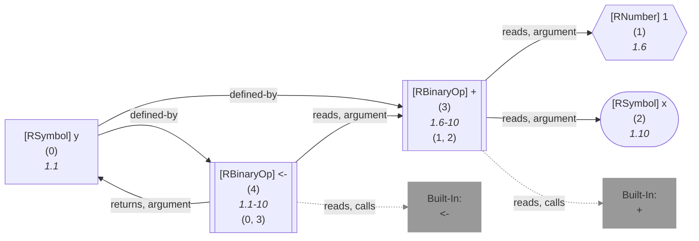
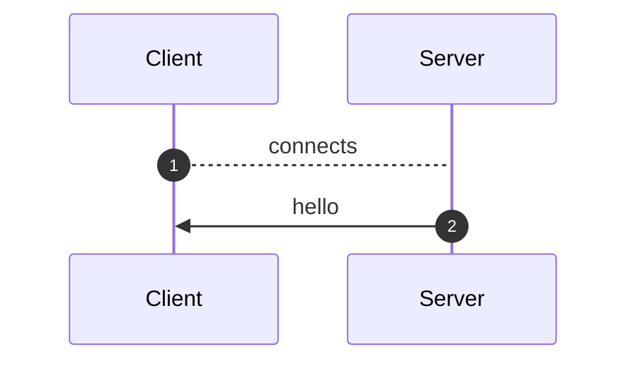
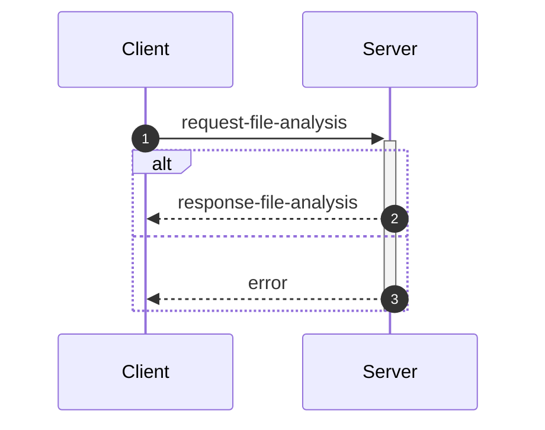
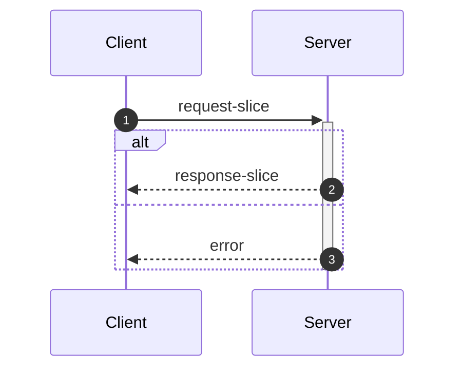
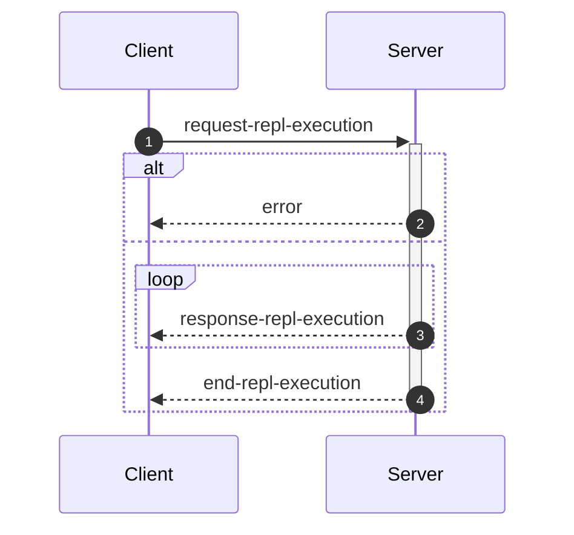

_This document was generated from '[src/documentation/wiki-interface.ts](https://github.com/flowr-analysis/flowr/tree/main//src/documentation/wiki-interface.ts)' on 2026-03-17, 20:20:52 UTC presenting an overview of flowR's interface (v2.9.13, using R v4.5.2). Please do not edit this file/wiki page directly._

Although far from being as detailed as the in-depth explanation of [_flowR_](https://github.com/flowr-analysis/flowr/wiki/core),
this wiki page explains how to interface with _flowR_ in more detail.
In general, command line arguments and other options provide short descriptions on hover over.

* [💻 Using the REPL](#using-the-repl)
* [⚙️ Configuring FlowR](#configuring-flowr)
* [⚒️ Writing Code](#writing-code)
* [💬 Communicating with the Server](#communicating-with-the-server)

<a id='using-the-repl'></a>
## 💻 Using the REPL


> [!NOTE]
> To execute arbitrary R commands with a repl request, _flowR_ has to be started explicitly with <span title="Description (Command Line Argument): Allow to access the underlying R session when using flowR (security warning: this allows the execution of arbitrary R code!)">`--r-session-access`</span>.
> Please be aware that this introduces a security risk and note that this relies on the [`r-shell` engine](https://github.com/flowr-analysis/flowr/wiki/engines) .

Although primarily meant for users to explore, 
there is nothing which forbids simply calling _flowR_ as a subprocess to use standard-in, -output, and -error 
for communication (although you can access the REPL using the server as well, 
with the [REPL Request](#message-request-repl-execution) message).

The read-eval-print loop&nbsp;(REPL) works relatively simple.
You can submit an expression (using <kbd>Enter</kbd>),
which is interpreted as an R&nbsp;expression by default but interpreted as a *command* if it starts with a colon (`:`).
The best command to get started with the REPL is <span title="Description (Repl Command): Show help information (aliases: :h, :?)">`:help`</span>.
Besides, you can leave the REPL either with the command <span title="Description (Repl Command): End the repl (aliases: :q, :exit)">`:quit`</span> or by pressing <kbd>Ctrl</kbd>+<kbd>C</kbd> twice.
When writing a *command*, you may press <kbd>Tab</kbd> to get a list of completions, if available.
Multiple commands can be entered in a single line by separating them with a semicolon (`;`), e.g. `:parse "x<-2"; :df*`.
If a command is given without R code, the REPL will re-use R code given in a previous command. 
The prior example will hence return first the parsed AST of the program and then the dataflow graph for `"x <- 2"`.

> [!NOTE]
> If you develop flowR, you may want to launch the repl using the `npm run main-dev` command, this way, you get a non-minified version of flowR with debug information and hot-reloading of source files.

<details>
<summary>Available Commands</summary>

We currently offer the following commands (this with a `[*]` suffix are available with and without the star):


| Command | Description |
| ------- | ----------- |
| **<span title="Description (Repl Command): End the repl (aliases: :q, :exit)">:quit</span>** | End the repl (aliases: **:<span title="Alias of ':quit'. End the repl">q</span>**, **:<span title="Alias of ':quit'. End the repl">exit</span>**) |
| **<span title="Description (Repl Command): Execute the given code as R code. This requires the `--r-session-access` flag to be set and requires the r-shell engine. (aliases: :e, :r)">:execute</span>** | Execute the given code as R code. This requires the `--r-session-access` flag to be set and requires the r-shell engine. (aliases: **:<span title="Alias of ':execute'. Execute the given code as R code. This requires the `--r-session-access` flag to be set and requires the r-shell engine.">e</span>**, **:<span title="Alias of ':execute'. Execute the given code as R code. This requires the `--r-session-access` flag to be set and requires the r-shell engine.">r</span>**) |
| **<span title="Description (Repl Command): Get mermaid code for the control-flow graph of R code, start with 'file://' to indicate a file (aliases: :cfg, :cf)">:controlflow[*]</span>** | Get mermaid code for the control-flow graph of R code, start with 'file://' to indicate a file (star: Returns the URL to mermaid.live) (aliases: **:<span title="Alias of ':controlflow'. Get mermaid code for the control-flow graph of R code, start with 'file://' to indicate a file">cfg</span>**, **:<span title="Alias of ':controlflow'. Get mermaid code for the control-flow graph of R code, start with 'file://' to indicate a file">cf</span>**) |
| **<span title="Description (Repl Command): Get mermaid code for the control-flow graph with basic blocks, start with 'file://' to indicate a file (aliases: :cfgb, :cfb)">:controlflowbb[*]</span>** | Get mermaid code for the control-flow graph with basic blocks, start with 'file://' to indicate a file (star: Returns the URL to mermaid.live) (aliases: **:<span title="Alias of ':controlflowbb'. Get mermaid code for the control-flow graph with basic blocks, start with 'file://' to indicate a file">cfgb</span>**, **:<span title="Alias of ':controlflowbb'. Get mermaid code for the control-flow graph with basic blocks, start with 'file://' to indicate a file">cfb</span>**) |
| **<span title="Description (Repl Command): Get mermaid code for the dataflow graph, start with 'file://' to indicate a file (aliases: :d, :df)">:dataflow[*]</span>** | Get mermaid code for the dataflow graph, start with 'file://' to indicate a file (star: Returns the URL to mermaid.live) (aliases: **:<span title="Alias of ':dataflow'. Get mermaid code for the dataflow graph, start with 'file://' to indicate a file">d</span>**, **:<span title="Alias of ':dataflow'. Get mermaid code for the dataflow graph, start with 'file://' to indicate a file">df</span>**) |
| **<span title="Description (Repl Command): Get mermaid code for the normalized AST of R code, start with 'file://' to indicate a file (aliases: :n)">:normalize[*]</span>** | Get mermaid code for the normalized AST of R code, start with 'file://' to indicate a file (star: Returns the URL to mermaid.live) (alias: **:<span title="Alias of ':normalize'. Get mermaid code for the normalized AST of R code, start with 'file://' to indicate a file">n</span>**) |
| **<span title="Description (Repl Command): Get mermaid code for the simplified dataflow graph, start with 'file://' to indicate a file (aliases: :ds, :dfs)">:dataflowsimple[*]</span>** | Get mermaid code for the simplified dataflow graph, start with 'file://' to indicate a file (star: Returns the URL to mermaid.live) (aliases: **:<span title="Alias of ':dataflowsimple'. Get mermaid code for the simplified dataflow graph, start with 'file://' to indicate a file">ds</span>**, **:<span title="Alias of ':dataflowsimple'. Get mermaid code for the simplified dataflow graph, start with 'file://' to indicate a file">dfs</span>**) |
| **<span title="Description (Repl Command): Just calculates the DFG, but only prints summary info (aliases: :d#, :df#)">:dataflowsilent</span>** | Just calculates the DFG, but only prints summary info (aliases: **:<span title="Alias of ':dataflowsilent'. Just calculates the DFG, but only prints summary info">d#</span>**, **:<span title="Alias of ':dataflowsilent'. Just calculates the DFG, but only prints summary info">df#</span>**) |
| **<span title="Description (Repl Command): Prints ASCII Art of the parsed, unmodified AST, start with 'file://' to indicate a file (aliases: :p)">:parse</span>** | Prints ASCII Art of the parsed, unmodified AST, start with 'file://' to indicate a file (alias: **:<span title="Alias of ':parse'. Prints ASCII Art of the parsed, unmodified AST, start with 'file://' to indicate a file">p</span>**) |
| **<span title="Description (Repl Command): Prints the version of flowR as well as the current version of R">:version</span>** | Prints the version of flowR as well as the current version of R
| **<span title="Description (Repl Command): Query the given R code, start with 'file://' to indicate a file. The query is to be a valid query in json format (use 'help' to get more information).">:query[*]</span>** | Query the given R code, start with 'file://' to indicate a file. The query is to be a valid query in json format (use 'help' to get more information). (star: Similar to query, but returns the output in json format.)
| **<span title="Description (Repl Command): Returns an ASCII representation of the dataflow graph (aliases: :df!)">:dataflowascii</span>** | Returns an ASCII representation of the dataflow graph (alias: **:<span title="Alias of ':dataflowascii'. Returns an ASCII representation of the dataflow graph">df!</span>**) |
| **<span title="Description (Repl Command): Returns summarization stats for the normalized AST (aliases: :n#)">:normalize#</span>** | Returns summarization stats for the normalized AST (alias: **:<span title="Alias of ':normalize#'. Returns summarization stats for the normalized AST">n#</span>**) |
| **<span title="Description (Repl Command): Show help information (aliases: :h, :?)">:help</span>** | Show help information (aliases: **:<span title="Alias of ':help'. Show help information">h</span>**, **:<span title="Alias of ':help'. Show help information">?</span>**) |


</details>


> [!TIP]
> 
> As indicated by the examples before, all REPL commands that operate on code keep track of the state.
> Hence, if you run a command like <span title="Description (Repl Command, starred version): Returns the URL to mermaid.live; Base Command: Get mermaid code for the dataflow graph, start with 'file://' to indicate a file (aliases: :d*, :df*)">`:dataflow*`</span> without providing R code,
> the REPL will re-use the R code provided in a previous command.
> Likewise, doing this will benefit from incrementality!
> If you request the dataflow graph with `:df* x <- 2 * y` and then want to see the parsed AST with `:parse`,
> the REPL will re-use previously obtained information and not re-parse the code again.
> 		


Generally, many commands offer shortcut versions in the REPL. Many queries, for example, offer a shortened format (see the example below).
Of special note, the [Config Query](https://github.com/flowr-analysis/flowr/wiki/query-api#Config-Query)
can be used to also modify the currently active configuration of _flowR_ within the REPL (see the [wiki page](https://github.com/flowr-analysis/flowr/wiki/query-api#Config-Query) for more information).

### Example: Retrieving the Dataflow Graph

To retrieve a URL to the [mermaid](https://mermaid.js.org/) diagram of the dataflow of a given expression, 
use <span title="Description (Repl Command, starred version): Returns the URL to mermaid.live; Base Command: Get mermaid code for the dataflow graph, start with 'file://' to indicate a file (aliases: :d*, :df*)">`:dataflow*`</span> (or <span title="Description (Repl Command): Get mermaid code for the dataflow graph, start with 'file://' to indicate a file (aliases: :d, :df)">`:dataflow`</span> to get the mermaid code in the cli):


```shell
$ docker run -it --rm eagleoutice/flowr # or npm run flowr 
flowR repl using flowR v2.9.13, R grammar v14 (tree-sitter engine)
R> :dataflow* y <- 1 + x
```

<details>
<summary style='color:gray'>Output</summary>


```text
https://mermaid.live/view#base64:eyJjb2RlIjoiZmxvd2NoYXJ0IEJUXG4gICAgMXt7XCJgIzkxO1JOdW1iZXIjOTM7IDFcbiAgICAgICgxKVxuICAgICAgKjEuNipgXCJ9fVxuICAgJSUgTm8gZWRnZXMgZm91bmQgZm9yIDFcbiAgICAyKFtcImAjOTE7UlN5bWJvbCM5MzsgeFxuICAgICAgKDIpXG4gICAgICAqMS4xMCpgXCJdKVxuICAgJSUgTm8gZWRnZXMgZm91bmQgZm9yIDJcbiAgICAzW1tcImAjOTE7UkJpbmFyeU9wIzkzOyAjNDM7XG4gICAgICAoMylcbiAgICAgICoxLjYtMTAqXG4gICAgKDEsIDIpYFwiXV1cbiAgICBidWlsdC1pbjpfW1wiYEJ1aWx0LUluOlxuIzQzO2BcIl1cbiAgICBzdHlsZSBidWlsdC1pbjpfIHN0cm9rZTpncmF5LGZpbGw6Z3JheSxzdHJva2Utd2lkdGg6MnB4LG9wYWNpdHk6Ljg7XG4gICAgMFtcImAjOTE7UlN5bWJvbCM5MzsgeVxuICAgICAgKDApXG4gICAgICAqMS4xKmBcIl1cbiAgICA0W1tcImAjOTE7UkJpbmFyeU9wIzkzOyAjNjA7IzQ1O1xuICAgICAgKDQpXG4gICAgICAqMS4xLTEwKlxuICAgICgwLCAzKWBcIl1dXG4gICAgYnVpbHQtaW46Xy1bXCJgQnVpbHQtSW46XG4jNjA7IzQ1O2BcIl1cbiAgICBzdHlsZSBidWlsdC1pbjpfLSBzdHJva2U6Z3JheSxmaWxsOmdyYXksc3Ryb2tlLXdpZHRoOjJweCxvcGFjaXR5Oi44O1xuICAgIDMgLS0+fFwicmVhZHMsIGFyZ3VtZW50XCJ8IDFcbiAgICAzIC0tPnxcInJlYWRzLCBhcmd1bWVudFwifCAyXG4gICAgMyAtLi0+fFwicmVhZHMsIGNhbGxzXCJ8IGJ1aWx0LWluOl9cbiAgICBsaW5rU3R5bGUgMiBzdHJva2U6Z3JheTtcbiAgICAwIC0tPnxcImRlZmluZWQtYnlcInwgM1xuICAgIDAgLS0+fFwiZGVmaW5lZC1ieVwifCA0XG4gICAgNCAtLT58XCJyZWFkcywgYXJndW1lbnRcInwgM1xuICAgIDQgLS0+fFwicmV0dXJucywgYXJndW1lbnRcInwgMFxuICAgIDQgLS4tPnxcInJlYWRzLCBjYWxsc1wifCBidWlsdC1pbjpfLVxuICAgIGxpbmtTdHlsZSA3IHN0cm9rZTpncmF5OyIsIm1lcm1haWQiOnsiYXV0b1N5bmMiOnRydWV9fQ==
Copied mermaid url to clipboard (dataflow: 0ms).
```


Retrieve the dataflow graph of the expression `y <- 1 + x`. It looks like this:



```mermaid
flowchart LR
    1{{"`#91;RNumber#93; 1
      (1)
      *1.6*`"}}
   %% No edges found for 1
    2(["`#91;RSymbol#93; x
      (2)
      *1.10*`"])
   %% No edges found for 2
    3[["`#91;RBinaryOp#93; #43;
      (3)
      *1.6-10*
    (1, 2)`"]]
    built-in:_["`Built-In:
#43;`"]
    style built-in:_ stroke:gray,fill:gray,stroke-width:2px,opacity:.8;
    0["`#91;RSymbol#93; y
      (0)
      *1.1*`"]
    4[["`#91;RBinaryOp#93; #60;#45;
      (4)
      *1.1-10*
    (0, 3)`"]]
    built-in:_-["`Built-In:
#60;#45;`"]
    style built-in:_- stroke:gray,fill:gray,stroke-width:2px,opacity:.8;
    3 -->|"reads, argument"| 1
    3 -->|"reads, argument"| 2
    3 -.->|"reads, calls"| built-in:_
    linkStyle 2 stroke:gray;
    0 -->|"defined-by"| 3
    0 -->|"defined-by"| 4
    4 -->|"reads, argument"| 3
    4 -->|"returns, argument"| 0
    4 -.->|"reads, calls"| built-in:_-
    linkStyle 7 stroke:gray;
```

	
<details>

<summary style="color:gray">R Code of the Dataflow Graph</summary>

The analysis required _0.3 ms_ (including parse and normalize, using the [tree-sitter](https://github.com/flowr-analysis/flowr/wiki/Engines) engine) within the generation environment. 
We encountered no unknown side effects during the analysis.


```r
y <- 1 + x
```


</details>


</details>


For small graphs like this, <span title="Description (Repl Command): Returns an ASCII representation of the dataflow graph (aliases: :df!)">`:dataflowascii`</span> also provides an ASCII representation directly in the REPL:


```shell
$ docker run -it --rm eagleoutice/flowr # or npm run flowr 
flowR repl using flowR v2.9.13, R grammar v14 (tree-sitter engine)
R> :df! y <- 1 + x
```

<details open>
<summary style='color:gray'>Output</summary>


```text
                        0<1>0
                   ┌────| 1 |
    ┌────────┐     │    0---0
 c<4>c       └──c<3>c
 |<- |  v<0>v┌──| + |
 c---c──| y |┘  c---c   u<2>u
        v---v      └────| x |
                        u---u
Edges:
3 -> 1: reads, argument  3 -> 2: reads, argument
4 -> 3: reads, argument  4 -> 0: returns, argument
0 -> 3: defined-by       0 -> 4: defined-by
```


Retrieve the dataflow graph of the expression `y <- 1 + x` as ASCII art.

</details>


For the slicing with <span title="Description (Repl Command): Static backwards executable slicer for R">`:slicer`</span>, you have access to the same [magic comments](#slice-magic-comments) as with the [slice request](#message-request-slice).

### Example: Interfacing with the File System

Many commands that allow for an R-expression (like <span title="Description (Repl Command, starred version): Returns the URL to mermaid.live; Base Command: Get mermaid code for the dataflow graph, start with 'file://' to indicate a file (aliases: :d*, :df*)">`:dataflow*`</span>) allow for a file as well 
if the argument starts with `file://`. 
If you are working from the root directory of the _flowR_ repository, the following gives you the parsed AST of the example file using the <span title="Description (Repl Command): Prints ASCII Art of the parsed, unmodified AST, start with 'file://' to indicate a file (aliases: :p)">`:parse`</span> command:


```shell
$ docker run -it --rm eagleoutice/flowr # or npm run flowr 
flowR repl using flowR v2.9.13, R grammar v14 (tree-sitter engine)
R> :parse file://test/testfiles/example.R
```

<details>
<summary style='color:gray'>Output</summary>


```text
File: test/testfiles/example.R

program
├ binaryoperator
│ ├ identifier "sum" (1:1─4)
│ ├ <- "<-" (1:5─7)
│ ╰ float "0" (1:8─9)
├ binaryoperator
│ ├ identifier "product" (2:1─8)
│ ├ <- "<-" (2:9─11)
│ ╰ float "1" (2:12─13)
├ binaryoperator
│ ├ identifier "w" (3:1─2)
│ ├ <- "<-" (3:3─5)
│ ╰ float "7" (3:6─7)
├ binaryoperator
│ ├ identifier "N" (4:1─2)
│ ├ <- "<-" (4:3─5)
│ ╰ float "10" (4:6─8)
├ forstatement
│ ├ for "for" (6:1─4)
│ ├ ( "(" (6:5─6)
│ ├ identifier "i" (6:6─7)
│ ├ in "in" (6:8─10)
│ ├ binaryoperator
│ │ ├ float "1" (6:11─12)
│ │ ├ : ":" (6:12─13)
│ │ ╰ parenthesizedexpression
│ │   ├ ( "(" (6:13─14)
│ │   ├ binaryoperator
│ │   │ ├ identifier "N" (6:14─15)
│ │   │ ├ - "-" (6:15─16)
│ │   │ ╰ float "1" (6:16─17)
│ │   ╰ ) ")" (6:17─18)
│ ├ ) ")" (6:18─19)
│ ╰ bracedexpression
│   ├ { "{" (6:20─21)
│   ├ binaryoperator
│   │ ├ identifier "sum" (7:3─6)
│   │ ├ <- "<-" (7:7─9)
│   │ ╰ binaryoperator
│   │   ├ binaryoperator
│   │   │ ├ identifier "sum" (7:10─13)
│   │   │ ├ + "+" (7:14─15)
│   │   │ ╰ identifier "i" (7:16─17)
│   │   ├ + "+" (7:18─19)
│   │   ╰ identifier "w" (7:20─21)
│   ├ binaryoperator
│   │ ├ identifier "product" (8:3─10)
│   │ ├ <- "<-" (8:11─13)
│   │ ╰ binaryoperator
│   │   ├ identifier "product" (8:14─21)
│   │   ├  "" (8:22─23)
│   │   ╰ identifier "i" (8:24─25)
│   ╰ } "}" (9:1─2)
├ call
│ ├ identifier "cat" (11:1─4)
│ ╰ arguments
│   ├ ( "(" (11:4─5)
│   ├ argument
│   │ ╰ string
│   │   ├ " "\"" (11:5─6)
│   │   ├ stringcontent "Sum:" (11:6─10)
│   │   ╰ " "\"" (11:10─11)
│   ├ comma "," (11:11─12)
│   ├ argument
│   │ ╰ identifier "sum" (11:13─16)
│   ├ comma "," (11:16─17)
│   ├ argument
│   │ ╰ string
│   │   ├ " "\"" (11:18─19)
│   │   ├ stringcontent
│   │   │ ╰ escapesequence "\\n" (11:19─21)
│   │   ╰ " "\"" (11:21─22)
│   ╰ ) ")" (11:22─23)
╰ call
  ├ identifier "cat" (12:1─4)
  ╰ arguments
    ├ ( "(" (12:4─5)
    ├ argument
    │ ╰ string
    │   ├ " "\"" (12:5─6)
    │   ├ stringcontent "Product:" (12:6─14)
    │   ╰ " "\"" (12:14─15)
    ├ comma "," (12:15─16)
    ├ argument
    │ ╰ identifier "product" (12:17─24)
    ├ comma "," (12:24─25)
    ├ argument
    │ ╰ string
    │   ├ " "\"" (12:26─27)
    │   ├ stringcontent
    │   │ ╰ escapesequence "\\n" (12:27─29)
    │   ╰ " "\"" (12:29─30)
    ╰ ) ")" (12:30─31)
```


Retrieve the parsed AST of the example file.

<details>

<summary>File Content</summary>


```r
sum <- 0
product <- 1
w <- 7
N <- 10

for (i in 1:(N-1)) {
  sum <- sum + i + w
  product <- product * i
}

cat("Sum:", sum, "\n")
cat("Product:", product, "\n")
```


</details>

As _flowR_ directly transforms this AST the output focuses on being human-readable instead of being machine-readable. 
		

</details>


### Example: Run a Query

You can run any query supported by _flowR_ using the <span title="Description (Repl Command): Query the given R code, start with 'file://' to indicate a file. The query is to be a valid query in json format (use 'help' to get more information).">`:query`</span> command.
For example, to obtain the shapes of all data frames in a given piece of code, you can run:


```shell
$ docker run -it --rm eagleoutice/flowr # or npm run flowr 
flowR repl using flowR v2.9.13, R grammar v14 (tree-sitter engine)
R> :query @df-shape "x <- data.frame(a = 1:10, b = 1:10)\ny <- x$a"
```

<details open>
<summary style='color:gray'>Output</summary>


```text
Query: df-shape (1 ms)
   ╰ 12: (colnames: [{"a", "b"}, {}], cols: [2, 2], rows: [10, 10])
   ╰ 0: (colnames: [{"a", "b"}, {}], cols: [2, 2], rows: [10, 10])
All queries together required ≈1 ms (1ms accuracy, total 1 ms)
```


Retrieve the shapes of all data frames in the given code.

</details>


To run the linter on a file, you can use (in this example, we just issue the `dead-code` linter on a small piece of code):


```shell
$ docker run -it --rm eagleoutice/flowr # or npm run flowr 
flowR repl using flowR v2.9.13, R grammar v14 (tree-sitter engine)
R> :query @linter rules:dead-code "if(FALSE) x <- 2"
```

<details open>
<summary style='color:gray'>Output</summary>


```text
Query: linter (1 ms)
   ╰ Dead Code (dead-code):
       ╰ certain:
           ╰ Code at 1.11-16
       ╰ Metadata: consideredNodes: 7, searchTimeMs: 1, processTimeMs: 0
All queries together required ≈1 ms (1ms accuracy, total 1 ms)
```


Run the linter on the given code, with only the `dead-code` rule enabled.

</details>


For more information on the available queries, please check out the [Query API](https://github.com/flowr-analysis/flowr/wiki/query-api).


<a id='configuring-flowr'></a>
## ⚙️ Configuring FlowR


When running _flowR_, you may want to specify some behaviors with a dedicated configuration file. 
By default, flowR looks for a file named `flowr.json` in the current working directory (or any higher directory). 
You can also specify a different file with <span title="Description (Command Line Argument): The name of the configuration file to use">`--config-file`</span> or pass the configuration inline using <span title="Description (Command Line Argument): The flowR configuration to use, as a JSON string">`--config-json`</span>.
To inspect the current configuration, you can run flowr with the <span title="Description (Command Line Argument): Run with verbose logging (will be passed to the corresponding script)">`--verbose`</span> flag, or use the `config` [Query](https://github.com/flowr-analysis/flowr/wiki/Query%20API).
Within the REPL this works by running the following:


```shell
:query @config
```


To work with the <a href="https://github.com/flowr-analysis/flowr/tree/main//src/config.ts#L104"><code><span title="The configuration file format for flowR.">FlowrConfig</span></code></a> you can use the provided helper objects alongside its methods like
<a href="https://github.com/flowr-analysis/flowr/tree/main//src/config.ts#L386"><code><span title="Creates a new flowr config that has the updated values.">FlowrConfig::<b>amend</b></span></code></a>.
The following summarizes the configuration options:

- `ignoreSourceCalls`: If set to `true`, _flowR_ will ignore source calls when analyzing the code, i.e., ignoring the inclusion of other files.
- `semantics`: allows to configure the way _flowR_ handles R, although we currently only support `semantics/environment/overwriteBuiltIns`. 
  You may use this to overwrite _flowR_'s handling of built-in function and even completely clear the preset definitions shipped with flowR. 
  See [Configure BuiltIn Semantics](#configure-builtin-semantics) for more information.
- `solver`: allows to configure how _flowR_ resolves variables and their values (currently we support: `disabled`, `alias`, `builtin`), as well as if pointer analysis should be active.
- `engines`: allows to configure the engines used by _flowR_ to interact with R code. See the [Engines wiki page](https://github.com/flowr-analysis/flowr/wiki/Engines) for more information.
- `defaultEngine`: allows to specify the default engine to use for interacting with R code. If not set, an arbitrary engine from the specified list will be used.
- `abstractInterpretation`: allows to configure how _flowR_ performs abstract interpretation, although we currently only support data frame shape inference through abstract interpretation.

So you can configure _flowR_ by adding a file like the following:

<details>

<summary>Example Configuration File</summary>


```json
{
  "ignoreSourceCalls": true,
  "semantics": {
    "environment": {
      "overwriteBuiltIns": {
        "definitions": [
          {
            "type": "function",
            "names": [
              "foo"
            ],
            "processor": "builtin:assignment",
            "config": {}
          }
        ]
      }
    }
  },
  "repl": {
    "quickStats": false,
    "dfProcessorHeat": false
  },
  "project": {
    "resolveUnknownPathsOnDisk": true
  },
  "engines": [
    {
      "type": "r-shell"
    }
  ],
  "solver": {
    "variables": "alias",
    "evalStrings": true,
    "resolveSource": {
      "dropPaths": "no",
      "ignoreCapitalization": true,
      "inferWorkingDirectory": "active-script",
      "searchPath": []
    },
    "instrument": {},
    "slicer": {
      "threshold": 50
    }
  },
  "abstractInterpretation": {
    "wideningThreshold": 4,
    "dataFrame": {
      "maxColNames": 20,
      "readLoadedData": {
        "readExternalFiles": true,
        "maxReadLines": 1000000
      }
    }
  }
}
```


</details>

<details> 
<a id='configure-builtin-semantics'></a>
<summary>Configure Built-In Semantics</summary> 


`semantics/environment/overwriteBuiltins` accepts two keys:

- `loadDefaults` (boolean, initially `true`): If set to `true`, the default built-in definitions are loaded before applying the custom definitions. Setting this flag to `false` explicitly disables the loading of the default definitions.
- `definitions` (array, initially empty): Allows to overwrite or define new built-in elements. Each object within must have a `type` which is one of the below. Furthermore, they may define a string array of `names` which specifies the identifiers to bind the definitions to. You may use `assumePrimitive` to specify whether _flowR_ should assume that this is a primitive non-library definition (so you probably just do not want to specify the key).

  | Type            | Description                                                                                                                                                                                                                                                                                              | Example                                                                                                    |
  | --------------- | -------------------------------------------------------------------------------------------------------------------------------------------------------------------------------------------------------------------------------------------------------------------------------------------------------- | ---------------------------------------------------------------------------------------------------------- |
  | `constant`    | Additionally allows for a `value` this should resolve to.                                                                                                                                                                                                                                                | `{ type: 'constant', names: ['NULL', 'NA'],  value: null }`                                                |
  | `function`    | Is a rather flexible way to define and bind built-in functions. For the time, we do not have extensive documentation to cover all the cases, so please either consult the sources with the `default-builtin-config.ts` or open a [new issue](https://github.com/flowr-analysis/flowr/issues/new/choose). | `{ type: 'function', names: ['next'], processor: 'builtin:default', config: { cfg: ExitPointType.Next } }` |
  | `replacement` | A comfortable way to specify replacement functions like `$<-` or `names<-`. `suffixes` describes the... suffixes to attach automatically. | `{ type: 'replacement', suffixes: ['<-', '<<-'], names: ['[', '[['] }` |


</details>

<details>

<summary style='color:gray'>Full Configuration-File Schema</summary>

- _The configuration file format for flowR._ (object)
    - **ignoreSourceCalls** [optional] _Whether source calls should be ignored, causing {@link processSourceCall}'s behavior to be skipped._ (boolean)
    - **semantics** _Configure language semantics and how flowR handles them._ (object)
        - **environment** [optional] _Semantics regarding how to handle the R environment._ (object)
            - **overwriteBuiltIns** [optional] _Do you want to overwrite (parts) of the builtin definition?_ (object)
                - **loadDefaults** [optional] _Should the default configuration still be loaded?_ (boolean)
                - **definitions** [optional] _The definitions to load/overwrite._ (array)
                Valid item types:
                    - (object)
    - **repl** _Configuration options for the REPL._ (object)
        - **quickStats** [optional] _Whether to show quick stats in the REPL after each evaluation._ (boolean)
        - **dfProcessorHeat** [optional] _This instruments the dataflow processors to count how often each processor is called._ (boolean)
    - **project** _Project specific configuration options._ (object)
        - **resolveUnknownPathsOnDisk** [optional] _Whether to resolve unknown paths loaded by the r project disk when trying to source/analyze files._ (boolean)
    - **engines** _The engine or set of engines to use for interacting with R code. An empty array means all available engines will be used._ (array)
    Valid item types:
        - (alternatives)
            - _The configuration for the tree sitter engine._ (object)
                - **type** [required] _Use the tree sitter engine._ (string)
                    Only allows: 'tree-sitter'
                - **wasmPath** [optional] _The path to the tree-sitter-r WASM binary to use. If this is undefined, this uses the default path._ (string)
                - **treeSitterWasmPath** [optional] _The path to the tree-sitter WASM binary to use. If this is undefined, this uses the default path._ (string)
                - **lax** [optional] _Whether to use the lax parser for parsing R code (allowing for syntax errors). If this is undefined, the strict parser will be used._ (boolean)
            - _The configuration for the R shell engine._ (object)
                - **type** [required] _Use the R shell engine._ (string)
                    Only allows: 'r-shell'
                - **rPath** [optional] _The path to the R executable to use. If this is undefined, this uses the default path._ (string)
    - **defaultEngine** [optional] _The default engine to use for interacting with R code. If this is undefined, an arbitrary engine from the specified list will be used._ (string)
        Only allows: 'tree-sitter', 'r-shell'
    - **solver** _How to resolve constants, constraints, cells, ..._ (object)
        - **variables** _How to resolve variables and their values._ (string)
            Only allows: 'disabled', 'alias', 'builtin'
        - **evalStrings** _Should we include eval(parse(text="...")) calls in the dataflow graph?_ (boolean)
        - **instrument** (object)
            - **dataflowExtractors** [optional] _These keys are only intended for use within code, allowing to instrument the dataflow analyzer!_ (any)
        - **resolveSource** [optional] _If lax source calls are active, flowR searches for sourced files much more freely, based on the configurations you give it. This option is only in effect if `ignoreSourceCalls` is set to false._ (object)
            - **dropPaths** _Allow to drop the first or all parts of the sourced path, if it is relative._ (string)
                Only allows: 'no', 'once', 'all'
            - **ignoreCapitalization** _Search for filenames matching in the lowercase._ (boolean)
            - **inferWorkingDirectory** _Try to infer the working directory from the main or any script to analyze._ (string)
                Only allows: 'no', 'main-script', 'active-script', 'any-script'
            - **searchPath** _Additionally search in these paths._ (array)
            Valid item types:
                - (string)
            - **repeatedSourceLimit** [optional] _How often the same file can be sourced within a single run? Please be aware: in case of cyclic sources this may not reach a fixpoint so give this a sensible limit._ (number)
            - **applyReplacements** _Provide name replacements for loaded files_ (array)
            Valid item types:
                - (object)
        - **slicer** [optional] _The configuration for the slicer._ (object)
            - **threshold** [optional] _The maximum number of iterations to perform on a single function call during slicing._ (number)
    - **abstractInterpretation** _The configuration options for abstract interpretation._ (object)
        - **wideningThreshold** _The threshold for the number of visitations of a node at which widening should be performed to ensure the termination of the fixpoint iteration._ (number)
        - **dataFrame** _The configuration of the shape inference for data frames._ (object)
            - **maxColNames** _The maximum number of columns names to infer for data frames before over-approximating the column names to top._ (number)
            - **readLoadedData** _Configuration options for reading data frame shapes from loaded external data files, such as CSV files._ (object)
                - **readExternalFiles** _Whether data frame shapes should be extracted from loaded external files, such as CSV files._ (boolean)
                - **maxReadLines** _The maximum number of lines to read when extracting data frame shapes from loaded files, such as CSV files._ (number)

</details>

	

<a id='writing-code'></a>
## ⚒️ Writing Code

_flowR_ can be used as a [module](https://www.npmjs.com/package/@eagleoutice/flowr) and offers several main classes and interfaces that are interesting for extension writers 
(see the [Visual Studio Code extension](https://marketplace.visualstudio.com/items?itemName=code-inspect.vscode-flowr) or the [Core](https://github.com/flowr-analysis/flowr/wiki/core) wiki page for more information).

### Creating Analyses with _flowR_

Nowadays, instances of the <a href="https://github.com/flowr-analysis/flowr/tree/main//src/project/flowr-analyzer.ts#L162"><code><span title="Central class for conducting analyses with FlowR. Use the FlowrAnalyzerBuilder to create a new instance. If you want the original pattern of creating a pipeline and running all steps, you can still do this with FlowrAnalyzer#runFull . To inspect the context of the analyzer, use FlowrAnalyzer#inspectContext (if you are a plugin and need to modify it, use FlowrAnalyzer#context instead).">FlowrAnalyzer</span></code></a> should be used as central frontend to get analysis results from _flowR_.
For example, a program slice can be created like this:


```ts
const analyzer = await new FlowrAnalyzerBuilder()
    .setEngine('tree-sitter')
    .build();
analyzer.addRequest('x <- 1\ny <- x\nx');
const result = await analyzer.query([
    {
        type:     'static-slice',
        criteria: ['3@x']
    }
]);
//console.log(result['static-slice']);
```


For more information, please have a look at the [Analyzer](https://github.com/flowr-analysis/flowr/wiki/analyzer) wiki page, which explains how to construct and use the <a href="https://github.com/flowr-analysis/flowr/tree/main//src/project/flowr-analyzer.ts#L162"><code><span title="Central class for conducting analyses with FlowR. Use the FlowrAnalyzerBuilder to create a new instance. If you want the original pattern of creating a pipeline and running all steps, you can still do this with FlowrAnalyzer#runFull . To inspect the context of the analyzer, use FlowrAnalyzer#inspectContext (if you are a plugin and need to modify it, use FlowrAnalyzer#context instead).">FlowrAnalyzer</span></code></a> in more detail.
To work with specific perspectives, you can also consult the respective pages like the [Dataflow Graph](https://github.com/flowr-analysis/flowr/wiki/dataflow-graph) or the [Abstract Interpretation](https://github.com/flowr-analysis/flowr/wiki/abstract-interpretation) wiki pages.
        
### The Pipeline Executor (Low-Level Interface)

Once, in the beginning, _flowR_ was meant to produce a dataflow graph merely to provide *program slices*. 
However, with continuous updates, the [Dataflow Graph](https://github.com/flowr-analysis/flowr/wiki/dataflow-graph) repeatedly proves to be the more interesting part.
With this, we restructured _flowR_'s originally *hardcoded* pipeline to be far more flexible. 
Now, it can be theoretically extended or replaced with arbitrary steps, optional steps, and what we call 'decorations' of these steps. 
In short, a slicing pipeline using the <a href="https://github.com/flowr-analysis/flowr/tree/main//src/core/pipeline-executor.ts#L97"><code><span title="**Please note:** The PipelineExecutor is now considered to be a rather low-level API for flowR. While it still works and is the basis for all other layers, we strongly recommend using the FlowrAnalyzer and its builder to create and use an analyzer instance that is pre-configured for your use-case. The pipeline executor allows to execute arbitrary pipelines in a step-by-step fashion. If you are not...">PipelineExecutor</span></code></a> looks like this:


```ts

const slicer = new PipelineExecutor(DEFAULT_SLICING_PIPELINE, {
  parser:    new RShell(),
  request:   requestFromInput('x <- 1\nx + 1'),
  criterion: ['2@x']
})
const slice = await slicer.allRemainingSteps()
// console.log(slice.reconstruct.code)
```


<details><summary>More Information</summary>


If you compare this, with what you would have done with the old (and removed) `SteppingSlicer`, 
this essentially just requires you to replace the `SteppingSlicer` with the <a href="https://github.com/flowr-analysis/flowr/tree/main//src/core/pipeline-executor.ts#L97"><code><span title="**Please note:** The PipelineExecutor is now considered to be a rather low-level API for flowR. While it still works and is the basis for all other layers, we strongly recommend using the FlowrAnalyzer and its builder to create and use an analyzer instance that is pre-configured for your use-case. The pipeline executor allows to execute arbitrary pipelines in a step-by-step fashion. If you are not...">PipelineExecutor</span></code></a>
and to pass the <a href="https://github.com/flowr-analysis/flowr/tree/main//src/core/steps/pipeline/default-pipelines.ts#L18"><code>DEFAULT_SLICING_PIPELINE</code></a> as the first argument.
The <a href="https://github.com/flowr-analysis/flowr/tree/main//src/core/pipeline-executor.ts#L97"><code><span title="**Please note:** The PipelineExecutor is now considered to be a rather low-level API for flowR. While it still works and is the basis for all other layers, we strongly recommend using the FlowrAnalyzer and its builder to create and use an analyzer instance that is pre-configured for your use-case. The pipeline executor allows to execute arbitrary pipelines in a step-by-step fashion. If you are not...">PipelineExecutor</span></code></a>...

1. Provides structures to investigate the results of all intermediate steps
2. Can be executed step-by-step
3. Can repeat steps (e.g., to calculate multiple slices on the same input)

See the in-code documentation for more information.

	

</details>
    

### Using the <a href="https://github.com/flowr-analysis/flowr/tree/main//src/r-bridge/shell.ts#L143"><code><span title="The RShell represents an interactive session with the R interpreter. You can configure it by RShellOptions . At the moment we are using a live R session (and not networking etc.) to communicate with R easily, which allows us to install packages etc. However, this might and probably will change in the future (leaving this as a legacy mode :D)">RShell</span></code></a> to Interact with R

The <a href="https://github.com/flowr-analysis/flowr/tree/main//src/r-bridge/shell.ts#L143"><code><span title="The RShell represents an interactive session with the R interpreter. You can configure it by RShellOptions . At the moment we are using a live R session (and not networking etc.) to communicate with R easily, which allows us to install packages etc. However, this might and probably will change in the future (leaving this as a legacy mode :D)">RShell</span></code></a> class allows interfacing with the `R`&nbsp;ecosystem installed on the host system.
Please have a look at [flowR's Engines](https://github.com/flowr-analysis/flowr/wiki/engines) for more information on alternatives (for example, the <a href="https://github.com/flowr-analysis/flowr/tree/main//src/r-bridge/lang-4.x/tree-sitter/tree-sitter-executor.ts#L18"><code><span title="Synchronous and (way) faster alternative to the RShell using tree-sitter.">TreeSitterExecutor</span></code></a>).


> [!IMPORTANT]
> 
> Each <a href="https://github.com/flowr-analysis/flowr/tree/main//src/r-bridge/shell.ts#L143"><code><span title="The RShell represents an interactive session with the R interpreter. You can configure it by RShellOptions . At the moment we are using a live R session (and not networking etc.) to communicate with R easily, which allows us to install packages etc. However, this might and probably will change in the future (leaving this as a legacy mode :D)">RShell</span></code></a> controls a new instance of the R&nbsp;interpreter, 
> make sure to call <code><a href="https://github.com/flowr-analysis/flowr/tree/main//src/r-bridge/shell.ts#L317"><span title="Close the current R session, makes the object effectively invalid (can no longer be reopened etc.)">RShell::<i>close</i></span></a>()</code> when you are done.


You can start a new "session" simply by constructing a new object with <code>new <a href="https://github.com/flowr-analysis/flowr/tree/main//src/r-bridge/shell.ts#L143"><span title="The RShell represents an interactive session with the R interpreter. You can configure it by RShellOptions . At the moment we are using a live R session (and not networking etc.) to communicate with R easily, which allows us to install packages etc. However, this might and probably will change in the future (leaving this as a legacy mode :D)">RShell</span></a>()</code>.

However, there are several options that may be of interest 
(e.g., to automatically revive the shell in case of errors or to control the name location of the R process on the system).

With a shell object (let's call it `shell`), you can execute R code by using <a href="https://github.com/flowr-analysis/flowr/tree/main//src/r-bridge/shell.ts#L195"><code><span title="sends the given command directly to the current R session will not do anything to alter input markers!">RShell::<i>sendCommand</i></span></code></a>, 
for example <code>shell.<a href="https://github.com/flowr-analysis/flowr/tree/main//src/r-bridge/shell.ts#L195"><span title="sends the given command directly to the current R session will not do anything to alter input markers!">sendCommand</span></a>("1 + 1")</code>. 
However, this does not return anything, so if you want to collect the output of your command, use
<a href="https://github.com/flowr-analysis/flowr/tree/main//src/r-bridge/shell.ts#L261"><code><span title="Send a command and collect the output">RShell::<i>sendCommandWithOutput</i></span></code></a> instead.

Besides that, the command <a href="https://github.com/flowr-analysis/flowr/tree/main//src/r-bridge/shell.ts#L233"><code>RShell::<b>tryToInjectHomeLibPath</b></code></a> may be of interest, as it enables all libraries available on the host system.


### Generate Statistics (No longer a Focus of flowR)


<details>

<summary>Adding a New Feature to Extract</summary>

In this example, we construct a new feature to extract, with the name "*example*".
Whenever this name appears, you may substitute this with whatever name fits your feature best (as long as the name is unique).

1. **Create a new file in `src/statistics/features/supported`**\
   Create the file `example.ts`, and add its export to the `index.ts` file in the same directory (if not done automatically).

2. **Create the basic structure**\
   To get a better feel of what a feature must have, let's look
   at the basic structure (of course, due to TypeScript syntax,
   there are other ways to achieve the same goal):

   ```ts
   const initialExampleInfo = {
       /* whatever start value is good for you */
       someCounter: 0
   }

   export type ExampleInfo = Writable<typeof initialExampleInfo>

   export const example: Feature<ExampleInfo> = {
    name:        'Example Feature',
    description: 'A longer example description',

    process(existing: ExampleInfo, input: FeatureProcessorInput): ExampleInfo {
      /* perform analysis on the input */
      return existing
    },

    initialValue: initialExampleInfo
   }
   ```

   The `initialExampleInfo` type holds the initial values for each counter that you want to maintain during the feature extraction (they will usually be initialized with 0). The resulting `ExampleInfo` type holds the structure of the data that is to be counted. Due to the vast amount of data processed, information like the name and location of a function call is not stored here, but instead written to disk (see below).

   Every new feature must be of the `Feature<Info>` type, with `Info` referring to a `FeatureInfo` (like `ExampleInfo` in this example). Next to a `name` and a `description`, each Feature must provide:

   - a processor that extracts the information from the input, adding it to the existing information.
   - a function returning the initial value of the information (in this case, `initialExampleInfo`).

3. **Add it to the feature-mapping**\
   Now, in the `feature.ts` file in `src/statistics/features`, add your feature to the `ALL_FEATURES` object.

Now, we want to extract something. For the *example* feature created in the previous steps, we choose to count the amount of `COMMENT` tokens.
So we define a corresponding [XPath](https://developer.mozilla.org/en-US/docs/Web/XPath) query:

```ts
const commentQuery: Query = xpath.parse('//COMMENT')
```

Within our feature's `process` function, running the query is as simple as:

```ts
const comments = commentQuery.select({ node: input.parsedRAst })
```

Now we could do a lot of further processing, but for simplicity, we only record every comment found this way:

```ts
appendStatisticsFile(example.name, 'comments', comments, input.filepath)
```

We use `example.name` to avoid duplication with the name that we’ve assigned to the feature. It corresponds to the name of the folder in the statistics output.
`'comments'` refers to a freely chosen (but unique) name, that will be used as the name for the output file within the folder. The `comments` variable holds the result of the query, which is an array of nodes. Finally, we pass the `filepath` of the file that was analyzed (if known), so that it can be added to the statistics file (as additional information).

</details>
	

<a id='communicating-with-the-server'></a>
## 💬 Communicating with the Server


As explained in the [Overview](https://github.com/flowr-analysis/flowr/wiki/Overview), you can simply run the [TCP](https://de.wikipedia.org/wiki/Transmission_Control_Protocol)&nbsp;server by adding the <span title="Description (Command Line Argument): Do not drop into a repl, but instead start a server on the given port (default: 1042) and listen for messages.">`--server`</span> flag (and, due to the interactive mode, exit with the conventional <kbd>CTRL</kbd>+<kbd>C</kbd>).
Currently, every connection is handled by the same underlying `RShell` - so the server is not designed to handle many clients at a time.
Additionally, the server is not well guarded against attacks (e.g., you can theoretically spawn an arbitrary number of&nbsp;RShell sessions on the target machine).

Every message has to be given in a single line (i.e., without a newline in-between) and end with a newline character. Nevertheless, we will pretty-print example given in the following segments for the ease of reading.


> [!NOTE]
> 
> The default <span title="Description (Command Line Argument): Do not drop into a repl, but instead start a server on the given port (default: 1042) and listen for messages.">`--server`</span> uses a simple [TCP](https://de.wikipedia.org/wiki/Transmission_Control_Protocol)
> connection. If you want _flowR_ to expose a [WebSocket](https://de.wikipedia.org/wiki/WebSocket) server instead, add the <span title="Description (Command Line Argument): If the server flag is set, use websocket for messaging">`--ws`</span> flag (i.e., <span title="Description (Command Line Argument): Do not drop into a repl, but instead start a server on the given port (default: 1042) and listen for messages.">`--server`</span> <span title="Description (Command Line Argument): If the server flag is set, use websocket for messaging">`--ws`</span>) when starting _flowR_ from the command line.
> 			


<ul><li>
<a id="message-hello"></a>
<b>Hello</b> Message (<code>hello</code>) 
<details>

<summary style="color:gray"> View Details. <i>The server informs the client about the successful connection and provides Meta-Information.</i> </summary>


```mermaid
sequenceDiagram
    autonumber
    participant Client
    participant Server

    
    Client-->Server: connects
    Server->>Client: hello
	
```


	
After launching _flowR_, for example, with <code>docker run -it --rm eagleoutice/flowr <span title="Description (Command Line Argument): Do not drop into a repl, but instead start a server on the given port (default: 1042) and listen for messages.">-<span/>-server</span></code>&nbsp;(🐳️), simply connecting should present you with a `hello` message, that amongst others should reveal the versions of&nbsp;_flowR_ and&nbsp;R, using the [semver 2.0](https://semver.org/spec/v2.0.0.html) versioning scheme.
The message looks like this:


```json
{
  "type": "hello",
  "clientName": "client-0",
  "versions": {
    "flowr": "2.9.13",
    "r": "4.5.2",
    "engine": "r-shell"
  }
}
```


There are currently a few messages that you can send after the hello message.
If you want to _slice_ a piece of R code you first have to send an [analysis request](#message-request-file-analysis), so that you can send one or multiple slice requests afterward.
Requests for the [REPL](#message-request-repl) are independent of that.
	

<hr>


<details>
<summary style="color:gray">Message schema (<code>hello</code>)</summary>

For the definition of the hello message, please see it's implementation at [`./src/cli/repl/server/messages/message-hello.ts`](https://github.com/flowr-analysis/flowr/tree/main/./src/cli/repl/server/messages/message-hello.ts).

- [required] (object)
    - **type** [required] _The type of the hello message._ (string)
        Only allows: 'hello'
    - **id** [forbidden] _The id of the message is always undefined (as it is the initial message and not requested)._ (any)
    - **clientName** [required] _A unique name that is assigned to each client. It has no semantic meaning and is only used/useful for debugging._ (string)
    - **versions** [required] (object)
        - **flowr** [required] _The version of the flowr server running in semver format._ (string)
        - **r** [required] _The version of the underlying R shell running in semver format._ (string)
        - **engine** [required] _The parser backend that is used to parse the R code._ (string)

</details>


<hr>

</details>
	</li>

<li>
<a id="message-request-file-analysis"></a>
<b>Analysis</b> Message (<code>request-file-analysis</code>) 
<details>

<summary style="color:gray"> View Details. <i>The server builds the dataflow graph for a given input file (or a set of files).</i> </summary>


```mermaid
sequenceDiagram
    autonumber
    participant Client
    participant Server

    
    Client->>+Server: request-file-analysis
    alt
        Server-->>Client: response-file-analysis
    else
        Server-->>Client: error
    end
    deactivate  Server
	
```


	
The request allows the server to analyze a file and prepare it for slicing.
The message can contain a `filetoken`, which is used to identify the file in later slice or query requests (if you do not add one, the request will not be stored and therefore, it is not available for subsequent requests).

> **Please note!**\
> If you want to send and process a lot of analysis requests, but do not want to slice them, please do not pass the `filetoken` field. This will save the server a lot of memory allocation.

Furthermore, the request must contain either a `content` field to directly pass the file's content or a `filepath` field which contains the path to the file (this path must be accessible for the server to be useful).
If you add the `id` field, the answer will use the same `id` so you can match requests and the corresponding answers.
See the implementation of the request-file-analysis message for more information.


<details>
<summary>Example of the <code>request-file-analysis</code> Message</summary>

_Note:_ even though we pretty-print these messages, they are sent as a single line, ending with a newline.

The following lists all messages that were sent and received in case you want to reproduce the scenario:

<ol>
<li> <code>hello</code> (response)
<details> 

<summary> Show Details </summary>

The first message is always a hello message.


```json
{
  "type": "hello",
  "clientName": "client-0",
  "versions": {
    "flowr": "2.9.13",
    "r": "4.5.2",
    "engine": "r-shell"
  }
}
```


</details>
</li>

<li> <b><code>request-file-analysis</code> (request)</b>
<details open> 

<summary> Show Details </summary>

Let's suppose you simply want to analyze the following script:
 
```r
x <- 1
x + 1
```

 For this, you can send the following request:


```json
{
  "type": "request-file-analysis",
  "id": "1",
  "filetoken": "x",
  "content": "x <- 1\nx + 1"
}
```


</details>
</li>

<li> <code>response-file-analysis</code> (response)
<details> 

<summary> Show Details </summary>


The `results` field of the response effectively contains three keys of importance:

- `parse`: which contains 1:1 the parse result in CSV format that we received from the `RShell` (i.e., the AST produced by the parser of the R interpreter).
- `normalize`: which contains the normalized AST, including ids (see the `info` field and the [Normalized AST](https://github.com/flowr-analysis/flowr/wiki/Normalized%20AST) wiki page).
- `dataflow`: especially important is the `graph` field which contains the dataflow graph as a set of root vertices (see the [Dataflow Graph](https://github.com/flowr-analysis/flowr/wiki/Dataflow%20Graph) wiki page).
			


_As the code is pretty long, we inhibit pretty printing and syntax highlighting (JSON, hiding built-in):_

```text
{"type":"response-file-analysis","format":"json","id":"1","results":{"parse":{"files":[{"parsed":"[1,1,1,6,7,0,\"expr\",false,\"x <- 1\"],[1,1,1,1,1,3,\"SYMBOL\",true,\"x\"],[1,1,1,1,3,7,\"expr\",false,\"x\"],[1,3,1,4,2,7,\"LEFT_ASSIGN\",true,\"<-\"],[1,6,1,6,4,5,\"NUM_CONST\",true,\"1\"],[1,6,1,6,5,7,\"expr\",false,\"1\"],[2,1,2,5,16,0,\"expr\",false,\"x + 1\"],[2,1,2,1,10,12,\"SYMBOL\",true,\"x\"],[2,1,2,1,12,16,\"expr\",false,\"x\"],[2,3,2,3,11,16,\"'+'\",true,\"+\"],[2,5,2,5,13,14,\"NUM_CONST\",true,\"1\"],[2,5,2,5,14,16,\"expr\",false,\"1\"]","filePath":"/private/var/folders/93/163001ln55l18fvhkw_5bkk40000gn/T/tmp-54090-xf5FcWgyS8D6-.R"}],".meta":{"timing":1}},"normalize":{"ast":{"type":"RProject","files":[{"root":{"type":"RExpressionList","children":[{"type":"RBinaryOp","location":[1,3,1,4],"lhs":{"type":"RSymbol","location":[1,1,1,1],"content":"x","lexeme":"x","info":{"fullRange":[1,1,1,1],"adToks":[],"id":0,"parent":2,"role":"bin-l","index":0,"nesting":0,"file":"/private/var/folders/93/163001ln55l18fvhkw_5bkk40000gn/T/tmp-54090-xf5FcWgyS8D6-.R"}},"rhs":{"location":[1,6,1,6],"lexeme":"1","info":{"fullRange":[1,6,1,6],"adToks":[],"id":1,"parent":2,"role":"bin-r","index":1,"nesting":0,"file":"/private/var/folders/93/163001ln55l18fvhkw_5bkk40000gn/T/tmp-54090-xf5FcWgyS8D6-.R"},"type":"RNumber","content":{"num":1,"complexNumber":false,"markedAsInt":false}},"operator":"<-","lexeme":"<-","info":{"fullRange":[1,1,1,6],"adToks":[],"id":2,"parent":6,"nesting":0,"file":"/private/var/folders/93/163001ln55l18fvhkw_5bkk40000gn/T/tmp-54090-xf5FcWgyS8D6-.R","index":0,"role":"el-c"}},{"type":"RBinaryOp","location":[2,3,2,3],"lhs":{"type":"RSymbol","location":[2,1,2,1],"content":"x","lexeme":"x","info":{"fullRange":[2,1,2,1],"adToks":[],"id":3,"parent":5,"role":"bin-l","index":0,"nesting":0,"file":"/private/var/folders/93/163001ln55l18fvhkw_5bkk40000gn/T/tmp-54090-xf5FcWgyS8D6-.R"}},"rhs":{"location":[2,5,2,5],"lexeme":"1","info":{"fullRange":[2,5,2,5],"adToks":[],"id":4,"parent":5,"role":"bin-r","index":1,"nesting":0,"file":"/private/var/folders/93/163001ln55l18fvhkw_5bkk40000gn/T/tmp-54090-xf5FcWgyS8D6-.R"},"type":"RNumber","content":{"num":1,"complexNumber":false,"markedAsInt":false}},"operator":"+","lexeme":"+","info":{"fullRange":[2,1,2,5],"adToks":[],"id":5,"parent":6,"nesting":0,"file":"/private/var/folders/93/163001ln55l18fvhkw_5bkk40000gn/T/tmp-54090-xf5FcWgyS8D6-.R","index":1,"role":"el-c"}}],"info":{"adToks":[],"id":6,"nesting":0,"file":"/private/var/folders/93/163001ln55l18fvhkw_5bkk40000gn/T/tmp-54090-xf5FcWgyS8D6-.R","role":"root","index":0}},"filePath":"/private/var/folders/93/163001ln55l18fvhkw_5bkk40000gn/T/tmp-54090-xf5FcWgyS8D6-.R"}],"info":{"id":7}},".meta":{"timing":0}},"dataflow":{"unknownReferences":[],"in":[{"nodeId":2,"name":"<-","type":2},{"nodeId":5,"name":"+","type":2}],"out":[{"nodeId":0,"name":"x","type":4,"definedAt":2,"value":[1]}],"environment":{"current":{"id":2431,"parent":"<BuiltInEnvironment>","memory":[["x",[{"nodeId":0,"name":"x","type":4,"definedAt":2,"value":[1]}]]]},"level":0},"graph":{"rootVertices":[1,0,2,3,4,5],"vertexInformation":[[1,{"tag":"value","id":1}],[0,{"tag":"vdef","id":0}],[2,{"tag":"fcall","id":2,"name":"<-","onlyBuiltin":true,"args":[{"nodeId":0,"type":32},{"nodeId":1,"type":32}],"origin":["builtin:assignment"]}],[3,{"tag":"use","id":3}],[4,{"tag":"value","id":4}],[5,{"tag":"fcall","id":5,"name":"+","onlyBuiltin":true,"args":[{"nodeId":3,"type":32},{"nodeId":4,"type":32}],"origin":["builtin:default"]}]],"edgeInformation":[[2,[[1,{"types":65}],[0,{"types":72}],["built-in:<-",{"types":5}]]],[0,[[1,{"types":2}],[2,{"types":2}]]],[3,[[0,{"types":1}]]],[5,[[3,{"types":65}],[4,{"types":65}],["built-in:+",{"types":5}]]]],"_unknownSideEffects":[]},"entryPoint":2,"exitPoints":[{"type":0,"nodeId":5}],"hooks":[],".meta":{"timing":0}}}}
```


</details>
</li>
</ol>

The complete round-trip took 4.7 ms (including time required to validate the messages, start, and stop the internal mock server).

</details>


You receive an error if, for whatever reason, the analysis fails (e.g., the message or code you sent contained syntax errors).
It contains a human-readable description *why* the analysis failed (see the error message implementation for more details).


<details>
<summary>Example Error Message</summary>

_Note:_ even though we pretty-print these messages, they are sent as a single line, ending with a newline.

The following lists all messages that were sent and received in case you want to reproduce the scenario:

<ol>
<li> <code>hello</code> (response)
<details> 

<summary> Show Details </summary>

The first message is always a hello message.


```json
{
  "type": "hello",
  "clientName": "client-0",
  "versions": {
    "flowr": "2.9.13",
    "r": "4.5.2",
    "engine": "r-shell"
  }
}
```


</details>
</li>

<li> <code>request-file-analysis</code> (request)
<details> 

<summary> Show Details </summary>


```json
{
  "type": "request-file-analysis",
  "id": "1",
  "filename": "sample.R",
  "content": "x <-"
}
```


</details>
</li>

<li> <b><code>error</code> (response)</b>
<details open> 

<summary> Show Details </summary>


```json
{
  "id": "1",
  "type": "error",
  "fatal": false,
  "reason": "Error while analyzing file sample.R: GuardError: unable to parse R code (see the log for more information) for request {\"request\":\"text\",\"content\":\"x <-\"}}\n Report a Bug: https://github.com/flowr-analysis/flowr/issues/new?body=%3C!%2D%2D%20Please%20describe%20your%20issue%20in%20more%20detail%20below!%20%2D%2D%3E%0A%0A%0A%3C!%2D%2D%20Automatically%20generated%20issue%20metadata%2C%20please%20do%20not%20edit%20or%20delete%20content%20below%20this%20line%20%2D%2D%3E%0A%2D%2D%2D%0A%0AflowR%20version%3A%202.9.13%0Anode%20version%3A%20v24.10.0%0Anode%20arch%3A%20arm64%0Anode%20platform%3A%20darwin%0Amessage%3A%20%60unable%20to%20parse%20R%20code%20%28see%20the%20log%20for%20more%20information%29%20for%20request%20%7B%22request%22%3A%22text%22%2C%22content%22%3A%22x%20%3C%2D%22%7D%7D%60%0Astack%20trace%3A%0A%60%60%60%0A%20%20%20%20at%20guard%20%28%3C%3E%2Fsrc%2Futil%2Fassert.ts%3A128%3A9%29%0A%20%20%20%20at%20guardRetrievedOutput%20%28%3C%3E%2Fsrc%2Fr%2Dbridge%2Fretriever.ts%3A221%3A7%29%0A%20%20%20%20at%20%2FUsers%2Fnaomipanda%2FLibrary%2FMobile%20Documents%2Fcom~apple~CloudDocs%2FUni%2FFlowr%2Fflowr%2Fsrc%2Fr%2Dbridge%2Fretriever.ts%3A182%3A4%0A%20%20%20%20at%20processTicksAndRejections%20%28node%3Ainternal%2Fprocess%2Ftask_queues%3A105%3A5%29%0A%20%20%20%20at%20async%20Object.parseRequests%20%5Bas%20processor%5D%20%28%3C%3E%2Fsrc%2Fr%2Dbridge%2Fparser.ts%3A104%3A19%29%0A%20%20%20%20at%20async%20PipelineExecutor.nextStep%20%28%3C%3E%2Fsrc%2Fcore%2Fpipeline%2Dexecutor.ts%3A192%3A25%29%0A%20%20%20%20at%20async%20FlowrAnalyzerCache.runTapeUntil%20%28%3C%3E%2Fsrc%2Fproject%2Fcache%2Fflowr%2Danalyzer%2Dcache.ts%3A93%3A4%29%0A%20%20%20%20at%20async%20FlowRServerConnection.sendFileAnalysisResponse%20%28%3C%3E%2Fsrc%2Fcli%2Frepl%2Fserver%2Fconnection.ts%3A163%3A52%29%0A%60%60%60%0A%0A%2D%2D%2D%0A%09"
}
```


</details>
</li>
</ol>

The complete round-trip took 4.2 ms (including time required to validate the messages, start, and stop the internal mock server).

</details>


&nbsp;

<a id="analysis-include-cfg"></a>
**Including the Control Flow Graph**

While _flowR_ does (for the time being) not use an explicit control flow graph but instead relies on control-dependency edges within the dataflow graph, 
the respective structure can still be exposed using the server (note that, as this feature is not needed within _flowR_, it is tested significantly less - 
so please create a [new issue](https://github.com/flowr-analysis/flowr/issues/new/choose) for any bug you may encounter).
For this, the analysis request may add `cfg: true` to its list of options.


<details>
<summary>Requesting a Control Flow Graph</summary>

_Note:_ even though we pretty-print these messages, they are sent as a single line, ending with a newline.

The following lists all messages that were sent and received in case you want to reproduce the scenario:

<ol>
<li> <code>hello</code> (response)
<details> 

<summary> Show Details </summary>

The first message is always a hello message.


```json
{
  "type": "hello",
  "clientName": "client-0",
  "versions": {
    "flowr": "2.9.13",
    "r": "4.5.2",
    "engine": "r-shell"
  }
}
```


</details>
</li>

<li> <b><code>request-file-analysis</code> (request)</b>
<details open> 

<summary> Show Details </summary>


```json
{
  "type": "request-file-analysis",
  "id": "1",
  "filetoken": "x",
  "content": "if(unknown > 0) { x <- 2 } else { x <- 5 }\nfor(i in 1:x) { print(x); print(i) }",
  "cfg": true
}
```


</details>
</li>

<li> <code>response-file-analysis</code> (response)
<details> 

<summary> Show Details </summary>


The response looks basically the same as a response sent without the `cfg` flag. However, additionally it contains a `cfg` field. 
If you are interested in a visual representation of the control flow graph, see the 
[visualization with mermaid](https://mermaid.live/view#base64:eyJjb2RlIjoiZmxvd2NoYXJ0IEJUXG4gICAgbjMyKFtcImBSRXhwcmVzc2lvbkxpc3QgKDMyKWBcIl0pXG4gICAgbjE1W1wiYFJJZlRoZW5FbHNlICgxNSlcbiMzNDtpZih1bmtub3duICM2MjsgMCkgIzEyMzsgeCAjNjA7IzQ1OyAyICMxMjU7IGVsc2UgIzEyMzsgeCAjNjA7IzQ1OyA1ICMxMjU7IzM0O2BcIl1cbiAgICBuMTUtZVtbMTUtZV1dXG4gICAgbjAoW1wiYFJTeW1ib2wgKDApXG4jMzQ7dW5rbm93biMzNDtgXCJdKVxuICAgIG4xKFtcImBSTnVtYmVyICgxKVxuIzM0OzAjMzQ7YFwiXSlcbiAgICBuMihbXCJgUkJpbmFyeU9wICgyKVxuIzM0O3Vua25vd24gIzYyOyAwIzM0O2BcIl0pXG4gICAgbjItZVtbMi1lXV1cbiAgICBuOChbXCJgUkV4cHJlc3Npb25MaXN0ICg4KWBcIl0pXG4gICAgbjUoW1wiYFJTeW1ib2wgKDUpXG4jMzQ7eCMzNDtgXCJdKVxuICAgIG42KFtcImBSTnVtYmVyICg2KVxuIzM0OzIjMzQ7YFwiXSlcbiAgICBuNyhbXCJgUkJpbmFyeU9wICg3KVxuIzM0O3ggIzYwOyM0NTsgMiMzNDtgXCJdKVxuICAgIG43LWVbWzctZV1dXG4gICAgbjgtZVtbOC1lXV1cbiAgICBuMTQoW1wiYFJFeHByZXNzaW9uTGlzdCAoMTQpYFwiXSlcbiAgICBuMTEoW1wiYFJTeW1ib2wgKDExKVxuIzM0O3gjMzQ7YFwiXSlcbiAgICBuMTIoW1wiYFJOdW1iZXIgKDEyKVxuIzM0OzUjMzQ7YFwiXSlcbiAgICBuMTMoW1wiYFJCaW5hcnlPcCAoMTMpXG4jMzQ7eCAjNjA7IzQ1OyA1IzM0O2BcIl0pXG4gICAgbjEzLWVbWzEzLWVdXVxuICAgIG4xNC1lW1sxNC1lXV1cbiAgICBuMTYoW1wiYFJTeW1ib2wgKDE2KVxuIzM0O2kjMzQ7YFwiXSlcbiAgICBuMzFbXCJgUkZvckxvb3AgKDMxKVxuIzM0O2ZvcihpIGluIDEjNTg7eCkgIzEyMzsgcHJpbnQoeCk7IHByaW50KGkpICMxMjU7IzM0O2BcIl1cbiAgICBuMTcoW1wiYFJOdW1iZXIgKDE3KVxuIzM0OzEjMzQ7YFwiXSlcbiAgICBuMTgoW1wiYFJTeW1ib2wgKDE4KVxuIzM0O3gjMzQ7YFwiXSlcbiAgICBuMTkoW1wiYFJCaW5hcnlPcCAoMTkpXG4jMzQ7MSM1ODt4IzM0O2BcIl0pXG4gICAgbjE5LWVbWzE5LWVdXVxuICAgIG4zMChbXCJgUkV4cHJlc3Npb25MaXN0ICgzMClgXCJdKVxuICAgIG4yMihbXCJgUlN5bWJvbCAoMjIpXG4jMzQ7cHJpbnQoeCkjMzQ7YFwiXSlcbiAgICBuMjVbXCJgUkZ1bmN0aW9uQ2FsbCAoMjUpXG4jMzQ7cHJpbnQoeCkjMzQ7YFwiXVxuICAgIG4yNS1lW1syNS1lXV1cbiAgICBuMjQoW1wiYFJBcmd1bWVudCAoMjQpXG4jMzQ7eCMzNDtgXCJdKVxuICAgIG4yMyhbXCJgUlN5bWJvbCAoMjMpXG4jMzQ7eCMzNDtgXCJdKVxuICAgIG4yNC1lW1syNC1lXV1cbiAgICBuMjYoW1wiYFJTeW1ib2wgKDI2KVxuIzM0O3ByaW50KGkpIzM0O2BcIl0pXG4gICAgbjI5W1wiYFJGdW5jdGlvbkNhbGwgKDI5KVxuIzM0O3ByaW50KGkpIzM0O2BcIl1cbiAgICBuMjktZVtbMjktZV1dXG4gICAgbjI4KFtcImBSQXJndW1lbnQgKDI4KVxuIzM0O2kjMzQ7YFwiXSlcbiAgICBuMjcoW1wiYFJTeW1ib2wgKDI3KVxuIzM0O2kjMzQ7YFwiXSlcbiAgICBuMjgtZVtbMjgtZV1dXG4gICAgbjMwLWVbWzMwLWVdXVxuICAgIG4zMS1lW1szMS1lXV1cbiAgICBuMzItZVtbMzItZV1dXG4gICAgbjE1IC0uLT58XCJGRFwifCBuMzJcbiAgICBuMSAtLi0+fFwiRkRcInwgbjBcbiAgICBuMCAtLi0+fFwiRkRcInwgbjJcbiAgICBuMi1lIC0uLT58XCJGRFwifCBuMVxuICAgIG43IC0uLT58XCJGRFwifCBuOFxuICAgIG42IC0uLT58XCJGRFwifCBuNVxuICAgIG41IC0uLT58XCJGRFwifCBuN1xuICAgIG43LWUgLS4tPnxcIkZEXCJ8IG42XG4gICAgbjgtZSAtLi0+fFwiRkRcInwgbjctZVxuICAgIG4xMyAtLi0+fFwiRkRcInwgbjE0XG4gICAgbjEyIC0uLT58XCJGRFwifCBuMTFcbiAgICBuMTEgLS4tPnxcIkZEXCJ8IG4xM1xuICAgIG4xMy1lIC0uLT58XCJGRFwifCBuMTJcbiAgICBuMTQtZSAtLi0+fFwiRkRcInwgbjEzLWVcbiAgICBuOCAtLT58XCJDRCAoVFJVRSlcInwgbjItZVxuICAgIG4xNCAtLT58XCJDRCAoRkFMU0UpXCJ8IG4yLWVcbiAgICBuMiAtLi0+fFwiRkRcInwgbjE1XG4gICAgbjE1LWUgLS4tPnxcIkZEXCJ8IG44LWVcbiAgICBuMTUtZSAtLi0+fFwiRkRcInwgbjE0LWVcbiAgICBuMzEgLS4tPnxcIkZEXCJ8IG4xNS1lXG4gICAgbjMxIC0uLT58XCJGRFwifCBuMzAtZVxuICAgIG4xOCAtLi0+fFwiRkRcInwgbjE3XG4gICAgbjE3IC0uLT58XCJGRFwifCBuMTlcbiAgICBuMTktZSAtLi0+fFwiRkRcInwgbjE4XG4gICAgbjI1IC0uLT58XCJGRFwifCBuMzBcbiAgICBuMjIgLS4tPnxcIkZEXCJ8IG4yNVxuICAgIG4yMyAtLi0+fFwiRkRcInwgbjI0XG4gICAgbjI0LWUgLS4tPnxcIkZEXCJ8IG4yM1xuICAgIG4yNCAtLi0+fFwiRkRcInwgbjIyXG4gICAgbjI1LWUgLS4tPnxcIkZEXCJ8IG4yNC1lXG4gICAgbjI5IC0uLT58XCJGRFwifCBuMjUtZVxuICAgIG4yNiAtLi0+fFwiRkRcInwgbjI5XG4gICAgbjI3IC0uLT58XCJGRFwifCBuMjhcbiAgICBuMjgtZSAtLi0+fFwiRkRcInwgbjI3XG4gICAgbjI4IC0uLT58XCJGRFwifCBuMjZcbiAgICBuMjktZSAtLi0+fFwiRkRcInwgbjI4LWVcbiAgICBuMzAtZSAtLi0+fFwiRkRcInwgbjI5LWVcbiAgICBuMTkgLS4tPnxcIkZEXCJ8IG4zMVxuICAgIG4xNiAtLi0+fFwiRkRcInwgbjE5LWVcbiAgICBuMzAgLS0+fFwiQ0QgKFRSVUUpXCJ8IG4xNlxuICAgIG4zMS1lIC0tPnxcIkNEIChGQUxTRSlcInwgbjE2XG4gICAgbjMyLWUgLS4tPnxcIkZEXCJ8IG4zMS1lXG4gICAgc3R5bGUgbjMyIHN0cm9rZTpjeWFuLHN0cm9rZS13aWR0aDo2LjVweDsgICAgc3R5bGUgbjMyLWUgc3Ryb2tlOmdyZWVuLHN0cm9rZS13aWR0aDo2LjVweDsiLCJtZXJtYWlkIjp7ImF1dG9TeW5jIjp0cnVlfX0=).
			


_As the code is pretty long, we inhibit pretty printing and syntax highlighting (JSON, hiding built-in):_

```text
{"type":"response-file-analysis","format":"json","id":"1","cfg":{"returns":[],"entryPoints":[32],"exitPoints":["32-e"],"breaks":[],"nexts":[],"graph":{"roots":[32,15,"15-e",0,1,2,"2-e",8,5,6,7,"7-e","8-e",14,11,12,13,"13-e","14-e",16,31,17,18,19,"19-e",30,22,25,"25-e",24,23,"24-e",26,29,"29-e",28,27,"28-e","30-e","31-e","32-e"],"vtxInfos":[[32,[2,32,null,["32-e"]]],[15,[1,15,["2-e"],["15-e"]]],["15-e","15-e"],[0,[2,0]],[1,[2,1]],[2,[2,2,null,["2-e"]]],["2-e","2-e"],[8,[2,8,null,["8-e"]]],[5,[2,5]],[6,[2,6]],[7,[2,7,null,["7-e"]]],["7-e","7-e"],["8-e","8-e"],[14,[2,14,null,["14-e"]]],[11,[2,11]],[12,[2,12]],[13,[2,13,null,["13-e"]]],["13-e","13-e"],["14-e","14-e"],[16,[2,16]],[31,[1,31,[16],["31-e"]]],[17,[2,17]],[18,[2,18]],[19,[2,19,null,["19-e"]]],["19-e","19-e"],[30,[2,30,null,["30-e"]]],[22,[2,22]],[25,[1,25,[22],["25-e"]]],["25-e","25-e"],[24,[2,24,[24],["24-e"]]],[23,[2,23]],["24-e","24-e"],[26,[2,26]],[29,[1,29,[26],["29-e"]]],["29-e","29-e"],[28,[2,28,[28],["28-e"]]],[27,[2,27]],["28-e","28-e"],["30-e","30-e"],["31-e","31-e"],["32-e","32-e"]],"bbChildren":[],"edgeInfos":[[15,[[32,0]]],[1,[[0,0]]],[0,[[2,0]]],["2-e",[[1,0]]],[7,[[8,0]]],[6,[[5,0]]],[5,[[7,0]]],["7-e",[[6,0]]],["8-e",[["7-e",0]]],[13,[[14,0]]],[12,[[11,0]]],[11,[[13,0]]],["13-e",[[12,0]]],["14-e",[["13-e",0]]],[8,[["2-e",[15,"TRUE"]]]],[14,[["2-e",[15,"FALSE"]]]],[2,[[15,0]]],["15-e",[["8-e",0],["14-e",0]]],[31,[["15-e",0],["30-e",0]]],[18,[[17,0]]],[17,[[19,0]]],["19-e",[[18,0]]],[25,[[30,0]]],[22,[[25,0]]],[23,[[24,0]]],["24-e",[[23,0]]],[24,[[22,0]]],["25-e",[["24-e",0]]],[29,[["25-e",0]]],[26,[[29,0]]],[27,[[28,0]]],["28-e",[[27,0]]],[28,[[26,0]]],["29-e",[["28-e",0]]],["30-e",[["29-e",0]]],[19,[[31,0]]],[16,[["19-e",0]]],[30,[[16,[31,"TRUE"]]]],["31-e",[[16,[31,"FALSE"]]]],["32-e",[["31-e",0]]]],"revEdgeInfos":[[32,[[15,0]]],[0,[[1,0]]],[2,[[0,0]]],[1,[["2-e",0]]],[8,[[7,0]]],[5,[[6,0]]],[7,[[5,0]]],[6,[["7-e",0]]],["7-e",[["8-e",0]]],[14,[[13,0]]],[11,[[12,0]]],[13,[[11,0]]],[12,[["13-e",0]]],["13-e",[["14-e",0]]],["2-e",[[8,[15,"TRUE"]],[14,[15,"FALSE"]]]],[15,[[2,0]]],["8-e",[["15-e",0]]],["14-e",[["15-e",0]]],["15-e",[[31,0]]],[17,[[18,0]]],[19,[[17,0]]],[18,[["19-e",0]]],[30,[[25,0]]],[25,[[22,0]]],[24,[[23,0]]],[23,[["24-e",0]]],[22,[[24,0]]],["24-e",[["25-e",0]]],["25-e",[[29,0]]],[29,[[26,0]]],[28,[[27,0]]],[27,[["28-e",0]]],[26,[[28,0]]],["28-e",[["29-e",0]]],["29-e",[["30-e",0]]],[31,[[19,0]]],["19-e",[[16,0]]],[16,[[30,[31,"TRUE"]],["31-e",[31,"FALSE"]]]],["30-e",[[31,0]]],["31-e",[["32-e",0]]]],"_mayBB":false}},"results":{"parse":{"files":[{"parsed":"[1,1,1,42,38,0,\"expr\",false,\"if(unknown > 0) { x <- 2 } else { x <- 5 }\"],[1,1,1,2,1,38,\"IF\",true,\"if\"],[1,3,1,3,2,38,\"'('\",true,\"(\"],[1,4,1,14,9,38,\"expr\",false,\"unknown > 0\"],[1,4,1,10,3,5,\"SYMBOL\",true,\"unknown\"],[1,4,1,10,5,9,\"expr\",false,\"unknown\"],[1,12,1,12,4,9,\"GT\",true,\">\"],[1,14,1,14,6,7,\"NUM_CONST\",true,\"0\"],[1,14,1,14,7,9,\"expr\",false,\"0\"],[1,15,1,15,8,38,\"')'\",true,\")\"],[1,17,1,26,22,38,\"expr\",false,\"{ x <- 2 }\"],[1,17,1,17,12,22,\"'{'\",true,\"{\"],[1,19,1,24,19,22,\"expr\",false,\"x <- 2\"],[1,19,1,19,13,15,\"SYMBOL\",true,\"x\"],[1,19,1,19,15,19,\"expr\",false,\"x\"],[1,21,1,22,14,19,\"LEFT_ASSIGN\",true,\"<-\"],[1,24,1,24,16,17,\"NUM_CONST\",true,\"2\"],[1,24,1,24,17,19,\"expr\",false,\"2\"],[1,26,1,26,18,22,\"'}'\",true,\"}\"],[1,28,1,31,23,38,\"ELSE\",true,\"else\"],[1,33,1,42,35,38,\"expr\",false,\"{ x <- 5 }\"],[1,33,1,33,25,35,\"'{'\",true,\"{\"],[1,35,1,40,32,35,\"expr\",false,\"x <- 5\"],[1,35,1,35,26,28,\"SYMBOL\",true,\"x\"],[1,35,1,35,28,32,\"expr\",false,\"x\"],[1,37,1,38,27,32,\"LEFT_ASSIGN\",true,\"<-\"],[1,40,1,40,29,30,\"NUM_CONST\",true,\"5\"],[1,40,1,40,30,32,\"expr\",false,\"5\"],[1,42,1,42,31,35,\"'}'\",true,\"}\"],[2,1,2,36,84,0,\"expr\",false,\"for(i in 1:x) { print(x); print(i) }\"],[2,1,2,3,41,84,\"FOR\",true,\"for\"],[2,4,2,13,53,84,\"forcond\",false,\"(i in 1:x)\"],[2,4,2,4,42,53,\"'('\",true,\"(\"],[2,5,2,5,43,53,\"SYMBOL\",true,\"i\"],[2,7,2,8,44,53,\"IN\",true,\"in\"],[2,10,2,12,51,53,\"expr\",false,\"1:x\"],[2,10,2,10,45,46,\"NUM_CONST\",true,\"1\"],[2,10,2,10,46,51,\"expr\",false,\"1\"],[2,11,2,11,47,51,\"':'\",true,\":\"],[2,12,2,12,48,50,\"SYMBOL\",true,\"x\"],[2,12,2,12,50,51,\"expr\",false,\"x\"],[2,13,2,13,49,53,\"')'\",true,\")\"],[2,15,2,36,81,84,\"expr\",false,\"{ print(x); print(i) }\"],[2,15,2,15,54,81,\"'{'\",true,\"{\"],[2,17,2,24,64,81,\"expr\",false,\"print(x)\"],[2,17,2,21,55,57,\"SYMBOL_FUNCTION_CALL\",true,\"print\"],[2,17,2,21,57,64,\"expr\",false,\"print\"],[2,22,2,22,56,64,\"'('\",true,\"(\"],[2,23,2,23,58,60,\"SYMBOL\",true,\"x\"],[2,23,2,23,60,64,\"expr\",false,\"x\"],[2,24,2,24,59,64,\"')'\",true,\")\"],[2,25,2,25,65,81,\"';'\",true,\";\"],[2,27,2,34,77,81,\"expr\",false,\"print(i)\"],[2,27,2,31,68,70,\"SYMBOL_FUNCTION_CALL\",true,\"print\"],[2,27,2,31,70,77,\"expr\",false,\"print\"],[2,32,2,32,69,77,\"'('\",true,\"(\"],[2,33,2,33,71,73,\"SYMBOL\",true,\"i\"],[2,33,2,33,73,77,\"expr\",false,\"i\"],[2,34,2,34,72,77,\"')'\",true,\")\"],[2,36,2,36,78,81,\"'}'\",true,\"}\"]","filePath":"/private/var/folders/93/163001ln55l18fvhkw_5bkk40000gn/T/tmp-54090-tU5XU4KhA52a-.R"}],".meta":{"timing":1}},"normalize":{"ast":{"type":"RProject","files":[{"root":{"type":"RExpressionList","children":[{"type":"RIfThenElse","condition":{"type":"RBinaryOp","location":[1,12,1,12],"lhs":{"type":"RSymbol","location":[1,4,1,10],"content":"unknown","lexeme":"unknown","info":{"fullRange":[1,4,1,10],"adToks":[],"id":0,"parent":2,"role":"bin-l","index":0,"nesting":1,"file":"/private/var/folders/93/163001ln55l18fvhkw_5bkk40000gn/T/tmp-54090-tU5XU4KhA52a-.R"}},"rhs":{"location":[1,14,1,14],"lexeme":"0","info":{"fullRange":[1,14,1,14],"adToks":[],"id":1,"parent":2,"role":"bin-r","index":1,"nesting":1,"file":"/private/var/folders/93/163001ln55l18fvhkw_5bkk40000gn/T/tmp-54090-tU5XU4KhA52a-.R"},"type":"RNumber","content":{"num":0,"complexNumber":false,"markedAsInt":false}},"operator":">","lexeme":">","info":{"fullRange":[1,4,1,14],"adToks":[],"id":2,"parent":15,"nesting":1,"file":"/private/var/folders/93/163001ln55l18fvhkw_5bkk40000gn/T/tmp-54090-tU5XU4KhA52a-.R","role":"if-c"}},"then":{"type":"RExpressionList","children":[{"type":"RBinaryOp","location":[1,21,1,22],"lhs":{"type":"RSymbol","location":[1,19,1,19],"content":"x","lexeme":"x","info":{"fullRange":[1,19,1,19],"adToks":[],"id":5,"parent":7,"role":"bin-l","index":0,"nesting":1,"file":"/private/var/folders/93/163001ln55l18fvhkw_5bkk40000gn/T/tmp-54090-tU5XU4KhA52a-.R"}},"rhs":{"location":[1,24,1,24],"lexeme":"2","info":{"fullRange":[1,24,1,24],"adToks":[],"id":6,"parent":7,"role":"bin-r","index":1,"nesting":1,"file":"/private/var/folders/93/163001ln55l18fvhkw_5bkk40000gn/T/tmp-54090-tU5XU4KhA52a-.R"},"type":"RNumber","content":{"num":2,"complexNumber":false,"markedAsInt":false}},"operator":"<-","lexeme":"<-","info":{"fullRange":[1,19,1,24],"adToks":[],"id":7,"parent":8,"nesting":1,"file":"/private/var/folders/93/163001ln55l18fvhkw_5bkk40000gn/T/tmp-54090-tU5XU4KhA52a-.R","index":0,"role":"el-c"}}],"grouping":[{"type":"RSymbol","location":[1,17,1,17],"content":"{","lexeme":"{","info":{"fullRange":[1,17,1,26],"adToks":[],"id":3,"role":"el-g","index":0,"nesting":1,"file":"/private/var/folders/93/163001ln55l18fvhkw_5bkk40000gn/T/tmp-54090-tU5XU4KhA52a-.R"}},{"type":"RSymbol","location":[1,26,1,26],"content":"}","lexeme":"}","info":{"fullRange":[1,17,1,26],"adToks":[],"id":4,"role":"el-g","index":0,"nesting":1,"file":"/private/var/folders/93/163001ln55l18fvhkw_5bkk40000gn/T/tmp-54090-tU5XU4KhA52a-.R"}}],"info":{"adToks":[],"id":8,"parent":15,"nesting":1,"file":"/private/var/folders/93/163001ln55l18fvhkw_5bkk40000gn/T/tmp-54090-tU5XU4KhA52a-.R","index":1,"role":"if-then"}},"location":[1,1,1,2],"lexeme":"if","info":{"fullRange":[1,1,1,42],"adToks":[],"id":15,"parent":32,"nesting":1,"file":"/private/var/folders/93/163001ln55l18fvhkw_5bkk40000gn/T/tmp-54090-tU5XU4KhA52a-.R","index":0,"role":"el-c"},"otherwise":{"type":"RExpressionList","children":[{"type":"RBinaryOp","location":[1,37,1,38],"lhs":{"type":"RSymbol","location":[1,35,1,35],"content":"x","lexeme":"x","info":{"fullRange":[1,35,1,35],"adToks":[],"id":11,"parent":13,"role":"bin-l","index":0,"nesting":1,"file":"/private/var/folders/93/163001ln55l18fvhkw_5bkk40000gn/T/tmp-54090-tU5XU4KhA52a-.R"}},"rhs":{"location":[1,40,1,40],"lexeme":"5","info":{"fullRange":[1,40,1,40],"adToks":[],"id":12,"parent":13,"role":"bin-r","index":1,"nesting":1,"file":"/private/var/folders/93/163001ln55l18fvhkw_5bkk40000gn/T/tmp-54090-tU5XU4KhA52a-.R"},"type":"RNumber","content":{"num":5,"complexNumber":false,"markedAsInt":false}},"operator":"<-","lexeme":"<-","info":{"fullRange":[1,35,1,40],"adToks":[],"id":13,"parent":14,"nesting":1,"file":"/private/var/folders/93/163001ln55l18fvhkw_5bkk40000gn/T/tmp-54090-tU5XU4KhA52a-.R","index":0,"role":"el-c"}}],"grouping":[{"type":"RSymbol","location":[1,33,1,33],"content":"{","lexeme":"{","info":{"fullRange":[1,33,1,42],"adToks":[],"id":9,"role":"el-g","index":0,"nesting":1,"file":"/private/var/folders/93/163001ln55l18fvhkw_5bkk40000gn/T/tmp-54090-tU5XU4KhA52a-.R"}},{"type":"RSymbol","location":[1,42,1,42],"content":"}","lexeme":"}","info":{"fullRange":[1,33,1,42],"adToks":[],"id":10,"role":"el-g","index":0,"nesting":1,"file":"/private/var/folders/93/163001ln55l18fvhkw_5bkk40000gn/T/tmp-54090-tU5XU4KhA52a-.R"}}],"info":{"adToks":[],"id":14,"parent":15,"nesting":1,"file":"/private/var/folders/93/163001ln55l18fvhkw_5bkk40000gn/T/tmp-54090-tU5XU4KhA52a-.R","index":2,"role":"if-other"}}},{"type":"RForLoop","variable":{"type":"RSymbol","location":[2,5,2,5],"content":"i","lexeme":"i","info":{"adToks":[],"id":16,"parent":31,"role":"for-var","index":0,"nesting":1,"file":"/private/var/folders/93/163001ln55l18fvhkw_5bkk40000gn/T/tmp-54090-tU5XU4KhA52a-.R"}},"vector":{"type":"RBinaryOp","location":[2,11,2,11],"lhs":{"location":[2,10,2,10],"lexeme":"1","info":{"fullRange":[2,10,2,10],"adToks":[],"id":17,"parent":19,"role":"bin-l","index":0,"nesting":1,"file":"/private/var/folders/93/163001ln55l18fvhkw_5bkk40000gn/T/tmp-54090-tU5XU4KhA52a-.R"},"type":"RNumber","content":{"num":1,"complexNumber":false,"markedAsInt":false}},"rhs":{"type":"RSymbol","location":[2,12,2,12],"content":"x","lexeme":"x","info":{"fullRange":[2,12,2,12],"adToks":[],"id":18,"parent":19,"role":"bin-r","index":1,"nesting":1,"file":"/private/var/folders/93/163001ln55l18fvhkw_5bkk40000gn/T/tmp-54090-tU5XU4KhA52a-.R"}},"operator":":","lexeme":":","info":{"fullRange":[2,10,2,12],"adToks":[],"id":19,"parent":31,"nesting":1,"file":"/private/var/folders/93/163001ln55l18fvhkw_5bkk40000gn/T/tmp-54090-tU5XU4KhA52a-.R","index":1,"role":"for-vec"}},"body":{"type":"RExpressionList","children":[{"type":"RFunctionCall","named":true,"location":[2,17,2,21],"lexeme":"print","functionName":{"type":"RSymbol","location":[2,17,2,21],"content":"print","lexeme":"print","info":{"fullRange":[2,17,2,24],"adToks":[],"id":22,"parent":25,"role":"call-name","index":0,"nesting":1,"file":"/private/var/folders/93/163001ln55l18fvhkw_5bkk40000gn/T/tmp-54090-tU5XU4KhA52a-.R"}},"arguments":[{"type":"RArgument","location":[2,23,2,23],"lexeme":"x","value":{"type":"RSymbol","location":[2,23,2,23],"content":"x","lexeme":"x","info":{"fullRange":[2,23,2,23],"adToks":[],"id":23,"parent":24,"role":"arg-v","index":0,"nesting":1,"file":"/private/var/folders/93/163001ln55l18fvhkw_5bkk40000gn/T/tmp-54090-tU5XU4KhA52a-.R"}},"info":{"fullRange":[2,23,2,23],"adToks":[],"id":24,"parent":25,"nesting":1,"file":"/private/var/folders/93/163001ln55l18fvhkw_5bkk40000gn/T/tmp-54090-tU5XU4KhA52a-.R","index":1,"role":"call-arg"}}],"info":{"fullRange":[2,17,2,24],"adToks":[],"id":25,"parent":30,"nesting":1,"file":"/private/var/folders/93/163001ln55l18fvhkw_5bkk40000gn/T/tmp-54090-tU5XU4KhA52a-.R","index":0,"role":"el-c"}},{"type":"RFunctionCall","named":true,"location":[2,27,2,31],"lexeme":"print","functionName":{"type":"RSymbol","location":[2,27,2,31],"content":"print","lexeme":"print","info":{"fullRange":[2,27,2,34],"adToks":[],"id":26,"parent":29,"role":"call-name","index":0,"nesting":1,"file":"/private/var/folders/93/163001ln55l18fvhkw_5bkk40000gn/T/tmp-54090-tU5XU4KhA52a-.R"}},"arguments":[{"type":"RArgument","location":[2,33,2,33],"lexeme":"i","value":{"type":"RSymbol","location":[2,33,2,33],"content":"i","lexeme":"i","info":{"fullRange":[2,33,2,33],"adToks":[],"id":27,"parent":28,"role":"arg-v","index":0,"nesting":1,"file":"/private/var/folders/93/163001ln55l18fvhkw_5bkk40000gn/T/tmp-54090-tU5XU4KhA52a-.R"}},"info":{"fullRange":[2,33,2,33],"adToks":[],"id":28,"parent":29,"nesting":1,"file":"/private/var/folders/93/163001ln55l18fvhkw_5bkk40000gn/T/tmp-54090-tU5XU4KhA52a-.R","index":1,"role":"call-arg"}}],"info":{"fullRange":[2,27,2,34],"adToks":[],"id":29,"parent":30,"nesting":1,"file":"/private/var/folders/93/163001ln55l18fvhkw_5bkk40000gn/T/tmp-54090-tU5XU4KhA52a-.R","index":1,"role":"el-c"}}],"grouping":[{"type":"RSymbol","location":[2,15,2,15],"content":"{","lexeme":"{","info":{"fullRange":[2,15,2,36],"adToks":[],"id":20,"role":"el-g","index":0,"nesting":1,"file":"/private/var/folders/93/163001ln55l18fvhkw_5bkk40000gn/T/tmp-54090-tU5XU4KhA52a-.R"}},{"type":"RSymbol","location":[2,36,2,36],"content":"}","lexeme":"}","info":{"fullRange":[2,15,2,36],"adToks":[],"id":21,"role":"el-g","index":0,"nesting":1,"file":"/private/var/folders/93/163001ln55l18fvhkw_5bkk40000gn/T/tmp-54090-tU5XU4KhA52a-.R"}}],"info":{"adToks":[],"id":30,"parent":31,"nesting":1,"file":"/private/var/folders/93/163001ln55l18fvhkw_5bkk40000gn/T/tmp-54090-tU5XU4KhA52a-.R","index":2,"role":"for-b"}},"lexeme":"for","info":{"fullRange":[2,1,2,36],"adToks":[],"id":31,"parent":32,"nesting":1,"file":"/private/var/folders/93/163001ln55l18fvhkw_5bkk40000gn/T/tmp-54090-tU5XU4KhA52a-.R","index":1,"role":"el-c"},"location":[2,1,2,3]}],"info":{"adToks":[],"id":32,"nesting":0,"file":"/private/var/folders/93/163001ln55l18fvhkw_5bkk40000gn/T/tmp-54090-tU5XU4KhA52a-.R","role":"root","index":0}},"filePath":"/private/var/folders/93/163001ln55l18fvhkw_5bkk40000gn/T/tmp-54090-tU5XU4KhA52a-.R"}],"info":{"id":33}},".meta":{"timing":0}},"dataflow":{"unknownReferences":[],"in":[{"nodeId":15,"name":"if","type":2},{"nodeId":0,"name":"unknown","type":1},{"nodeId":2,"name":">","type":2},{"nodeId":7,"name":"<-","cds":[{"id":15,"when":true}],"type":2},{"nodeId":13,"name":"<-","cds":[{"id":15,"when":false}],"type":2},{"nodeId":8,"name":"{","cds":[{"id":15,"when":true}],"type":2},{"nodeId":14,"name":"{","cds":[{"id":15,"when":false}],"type":2},{"nodeId":31,"name":"for","type":2},{"nodeId":27,"name":"i","type":4},{"nodeId":19,"name":":","type":2},{"nodeId":25,"name":"print","type":2},{"nodeId":29,"name":"print","type":2}],"out":[{"nodeId":5,"name":"x","type":4,"definedAt":7,"cds":[{"id":15,"when":true}],"value":[6]},{"nodeId":11,"name":"x","type":4,"definedAt":13,"cds":[{"id":15,"when":true},{"id":15,"when":false}],"value":[12]},{"nodeId":16,"name":"i","type":1}],"environment":{"current":{"id":2517,"parent":"<BuiltInEnvironment>","memory":[["x",[{"nodeId":5,"name":"x","type":4,"definedAt":7,"cds":[{"id":15,"when":true},{"id":15,"when":false}],"value":[6]},{"nodeId":11,"name":"x","type":4,"definedAt":13,"cds":[{"id":15,"when":true},{"id":15,"when":false}],"value":[12]}]],["i",[{"nodeId":16,"name":"i","type":4,"definedAt":31}]]]},"level":0},"graph":{"rootVertices":[0,1,2,6,5,7,8,12,11,13,14,15,16,17,18,19,23,25,27,29,30,31],"vertexInformation":[[0,{"tag":"use","id":0}],[1,{"tag":"value","id":1}],[2,{"tag":"fcall","id":2,"name":">","onlyBuiltin":true,"args":[{"nodeId":0,"type":32},{"nodeId":1,"type":32}],"origin":["builtin:default"]}],[6,{"tag":"value","id":6}],[5,{"tag":"vdef","id":5,"cds":[{"id":15,"when":true}]}],[7,{"tag":"fcall","id":7,"name":"<-","onlyBuiltin":true,"cds":[{"id":15,"when":true}],"args":[{"nodeId":5,"type":32},{"nodeId":6,"type":32}],"origin":["builtin:assignment"]}],[8,{"tag":"fcall","id":8,"name":"{","onlyBuiltin":true,"cds":[{"id":15,"when":true}],"args":[{"nodeId":7,"type":32}],"origin":["builtin:expression-list"]}],[12,{"tag":"value","id":12}],[11,{"tag":"vdef","id":11,"cds":[{"id":15,"when":false}]}],[13,{"tag":"fcall","id":13,"name":"<-","onlyBuiltin":true,"cds":[{"id":15,"when":false}],"args":[{"nodeId":11,"type":32},{"nodeId":12,"type":32}],"origin":["builtin:assignment"]}],[14,{"tag":"fcall","id":14,"name":"{","onlyBuiltin":true,"cds":[{"id":15,"when":false}],"args":[{"nodeId":13,"type":32}],"origin":["builtin:expression-list"]}],[15,{"tag":"fcall","id":15,"name":"if","onlyBuiltin":true,"args":[{"nodeId":2,"type":32},{"nodeId":8,"type":32},{"nodeId":14,"type":32}],"origin":["builtin:if-then-else"]}],[16,{"tag":"vdef","id":16}],[17,{"tag":"value","id":17}],[18,{"tag":"use","id":18}],[19,{"tag":"fcall","id":19,"name":":","onlyBuiltin":true,"args":[{"nodeId":17,"type":32},{"nodeId":18,"type":32}],"origin":["builtin:default"]}],[23,{"tag":"use","id":23,"cds":[{"id":31,"when":true}]}],[25,{"tag":"fcall","id":25,"name":"print","onlyBuiltin":true,"cds":[{"id":31,"when":true}],"args":[{"nodeId":23,"type":32}],"origin":["builtin:default"]}],[27,{"tag":"use","id":27,"cds":[{"id":31,"when":true}]}],[29,{"tag":"fcall","id":29,"name":"print","onlyBuiltin":true,"cds":[{"id":31,"when":true}],"args":[{"nodeId":27,"type":32}],"origin":["builtin:default"]}],[30,{"tag":"fcall","id":30,"name":"{","onlyBuiltin":true,"cds":[{"id":31,"when":true}],"args":[{"nodeId":25,"type":32},{"nodeId":29,"type":32}],"origin":["builtin:expression-list"]}],[31,{"tag":"fcall","id":31,"name":"for","onlyBuiltin":true,"args":[{"nodeId":16,"type":32},{"nodeId":19,"type":32},{"nodeId":30,"type":32}],"origin":["builtin:for-loop"]}]],"edgeInformation":[[2,[[0,{"types":65}],[1,{"types":65}],["built-in:>",{"types":5}]]],[7,[[6,{"types":65}],[5,{"types":72}],["built-in:<-",{"types":5}]]],[5,[[6,{"types":2}],[7,{"types":2}]]],[8,[[7,{"types":72}],["built-in:{",{"types":5}]]],[15,[[8,{"types":72}],[14,{"types":72}],[2,{"types":65}],["built-in:if",{"types":5}]]],[13,[[12,{"types":65}],[11,{"types":72}],["built-in:<-",{"types":5}]]],[11,[[12,{"types":2}],[13,{"types":2}]]],[14,[[13,{"types":72}],["built-in:{",{"types":5}]]],[19,[[17,{"types":65}],[18,{"types":65}],["built-in::",{"types":5}]]],[18,[[5,{"types":1}],[11,{"types":1}]]],[25,[[23,{"types":73}],["built-in:print",{"types":5}]]],[23,[[5,{"types":1}],[11,{"types":1}]]],[29,[[27,{"types":73}],["built-in:print",{"types":5}]]],[27,[[16,{"types":1}]]],[30,[[25,{"types":64}],[29,{"types":72}],["built-in:{",{"types":5}]]],[16,[[19,{"types":2}]]],[31,[[16,{"types":64}],[19,{"types":65}],[30,{"types":320}],["built-in:for",{"types":5}]]]],"_unknownSideEffects":[{"id":25,"linkTo":{"type":"link-to-last-call","callName":{}}},{"id":29,"linkTo":{"type":"link-to-last-call","callName":{}}}]},"entryPoint":15,"exitPoints":[{"type":0,"nodeId":31}],"hooks":[],"cfgQuick":{"graph":{"roots":[32,15,"15-e",0,1,2,"2-e",8,5,6,7,"7-e","8-e",14,11,12,13,"13-e","14-e",16,31,17,18,19,"19-e",30,22,25,"25-e",24,23,"24-e",26,29,"29-e",28,27,"28-e","30-e","31-e","32-e"],"vtxInfos":[[32,[2,32,null,["32-e"]]],[15,[1,15,["2-e"],["15-e"]]],["15-e","15-e"],[0,[2,0]],[1,[2,1]],[2,[2,2,null,["2-e"]]],["2-e","2-e"],[8,[2,8,null,["8-e"]]],[5,[2,5]],[6,[2,6]],[7,[2,7,null,["7-e"]]],["7-e","7-e"],["8-e","8-e"],[14,[2,14,null,["14-e"]]],[11,[2,11]],[12,[2,12]],[13,[2,13,null,["13-e"]]],["13-e","13-e"],["14-e","14-e"],[16,[2,16]],[31,[1,31,[16],["31-e"]]],[17,[2,17]],[18,[2,18]],[19,[2,19,null,["19-e"]]],["19-e","19-e"],[30,[2,30,null,["30-e"]]],[22,[2,22]],[25,[1,25,[22],["25-e"]]],["25-e","25-e"],[24,[2,24,[24],["24-e"]]],[23,[2,23]],["24-e","24-e"],[26,[2,26]],[29,[1,29,[26],["29-e"]]],["29-e","29-e"],[28,[2,28,[28],["28-e"]]],[27,[2,27]],["28-e","28-e"],["30-e","30-e"],["31-e","31-e"],["32-e","32-e"]],"bbChildren":[],"edgeInfos":[[15,[[32,0]]],[1,[[0,0]]],[0,[[2,0]]],["2-e",[[1,0]]],[7,[[8,0]]],[6,[[5,0]]],[5,[[7,0]]],["7-e",[[6,0]]],["8-e",[["7-e",0]]],[13,[[14,0]]],[12,[[11,0]]],[11,[[13,0]]],["13-e",[[12,0]]],["14-e",[["13-e",0]]],[8,[["2-e",[15,"TRUE"]]]],[14,[["2-e",[15,"FALSE"]]]],[2,[[15,0]]],["15-e",[["8-e",0],["14-e",0]]],[31,[["15-e",0],["30-e",0]]],[18,[[17,0]]],[17,[[19,0]]],["19-e",[[18,0]]],[25,[[30,0]]],[22,[[25,0]]],[23,[[24,0]]],["24-e",[[23,0]]],[24,[[22,0]]],["25-e",[["24-e",0]]],[29,[["25-e",0]]],[26,[[29,0]]],[27,[[28,0]]],["28-e",[[27,0]]],[28,[[26,0]]],["29-e",[["28-e",0]]],["30-e",[["29-e",0]]],[19,[[31,0]]],[16,[["19-e",0]]],[30,[[16,[31,"TRUE"]]]],["31-e",[[16,[31,"FALSE"]]]],["32-e",[["31-e",0]]]],"revEdgeInfos":[[32,[[15,0]]],[0,[[1,0]]],[2,[[0,0]]],[1,[["2-e",0]]],[8,[[7,0]]],[5,[[6,0]]],[7,[[5,0]]],[6,[["7-e",0]]],["7-e",[["8-e",0]]],[14,[[13,0]]],[11,[[12,0]]],[13,[[11,0]]],[12,[["13-e",0]]],["13-e",[["14-e",0]]],["2-e",[[8,[15,"TRUE"]],[14,[15,"FALSE"]]]],[15,[[2,0]]],["8-e",[["15-e",0]]],["14-e",[["15-e",0]]],["15-e",[[31,0]]],[17,[[18,0]]],[19,[[17,0]]],[18,[["19-e",0]]],[30,[[25,0]]],[25,[[22,0]]],[24,[[23,0]]],[23,[["24-e",0]]],[22,[[24,0]]],["24-e",[["25-e",0]]],["25-e",[[29,0]]],[29,[[26,0]]],[28,[[27,0]]],[27,[["28-e",0]]],[26,[[28,0]]],["28-e",[["29-e",0]]],["29-e",[["30-e",0]]],[31,[[19,0]]],["19-e",[[16,0]]],[16,[[30,[31,"TRUE"]],["31-e",[31,"FALSE"]]]],["30-e",[[31,0]]],["31-e",[["32-e",0]]]],"_mayBB":false},"breaks":[],"nexts":[],"returns":[],"exitPoints":["32-e"],"entryPoints":[32]},".meta":{"timing":1}}}}
```


</details>
</li>
</ol>

The complete round-trip took 4.3 ms (including time required to validate the messages, start, and stop the internal mock server).

</details>


&nbsp;

<a id="analysis-format-n-quads"></a>
**Retrieve the Output as RDF N-Quads**

The default response is formatted as JSON.
However, by specifying `format: "n-quads"`, you can retrieve the individual results (e.g., the [Normalized AST](https://github.com/flowr-analysis/flowr/wiki/Normalized%20AST)),
as [RDF N-Quads](https://www.w3.org/TR/n-quads/).
This works with and without the control flow graph as described [above](#analysis-include-cfg).


<details>
<summary>Requesting RDF N-Quads</summary>

_Note:_ even though we pretty-print these messages, they are sent as a single line, ending with a newline.

The following lists all messages that were sent and received in case you want to reproduce the scenario:

<ol>
<li> <code>hello</code> (response)
<details> 

<summary> Show Details </summary>

The first message is always a hello message.


```json
{
  "type": "hello",
  "clientName": "client-0",
  "versions": {
    "flowr": "2.9.13",
    "r": "4.5.2",
    "engine": "r-shell"
  }
}
```


</details>
</li>

<li> <b><code>request-file-analysis</code> (request)</b>
<details open> 

<summary> Show Details </summary>


```json
{
  "type": "request-file-analysis",
  "id": "1",
  "filetoken": "x",
  "content": "x <- 1\nx + 1",
  "format": "n-quads",
  "cfg": true
}
```


</details>
</li>

<li> <code>response-file-analysis</code> (response)
<details> 

<summary> Show Details </summary>


Please note, that the base message format is still JSON. Only the individual results get converted. 
While the context is derived from the `filename`, we currently offer no way to customize other parts of the quads 
(please open a [new issue](https://github.com/flowr-analysis/flowr/issues/new/choose) if you require this).

			


_As the code is pretty long, we inhibit pretty printing and syntax highlighting (JSON, hiding built-in):_

```text
{"type":"response-file-analysis","format":"n-quads","id":"1","cfg":"<https://uni-ulm.de/r-ast/unknown/0> <https://uni-ulm.de/r-ast/rootIds> \"6\"^^<http://www.w3.org/2001/XMLSchema#integer> <unknown> .\n<https://uni-ulm.de/r-ast/unknown/0> <https://uni-ulm.de/r-ast/rootIds> \"0\"^^<http://www.w3.org/2001/XMLSchema#integer> <unknown> .\n<https://uni-ulm.de/r-ast/unknown/0> <https://uni-ulm.de/r-ast/rootIds> \"1\"^^<http://www.w3.org/2001/XMLSchema#integer> <unknown> .\n<https://uni-ulm.de/r-ast/unknown/0> <https://uni-ulm.de/r-ast/rootIds> \"2\"^^<http://www.w3.org/2001/XMLSchema#integer> <unknown> .\n<https://uni-ulm.de/r-ast/unknown/0> <https://uni-ulm.de/r-ast/rootIds> \"2-e\" <unknown> .\n<https://uni-ulm.de/r-ast/unknown/0> <https://uni-ulm.de/r-ast/rootIds> \"3\"^^<http://www.w3.org/2001/XMLSchema#integer> <unknown> .\n<https://uni-ulm.de/r-ast/unknown/0> <https://uni-ulm.de/r-ast/rootIds> \"4\"^^<http://www.w3.org/2001/XMLSchema#integer> <unknown> .\n<https://uni-ulm.de/r-ast/unknown/0> <https://uni-ulm.de/r-ast/rootIds> \"5\"^^<http://www.w3.org/2001/XMLSchema#integer> <unknown> .\n<https://uni-ulm.de/r-ast/unknown/0> <https://uni-ulm.de/r-ast/rootIds> \"5-e\" <unknown> .\n<https://uni-ulm.de/r-ast/unknown/0> <https://uni-ulm.de/r-ast/rootIds> \"6-e\" <unknown> .\n<https://uni-ulm.de/r-ast/unknown/0> <https://uni-ulm.de/r-ast/vertices> <https://uni-ulm.de/r-ast/unknown/1> <unknown> .\n<https://uni-ulm.de/r-ast/unknown/1> <https://uni-ulm.de/r-ast/next> <https://uni-ulm.de/r-ast/unknown/2> <unknown> .\n<https://uni-ulm.de/r-ast/unknown/1> <https://uni-ulm.de/r-ast/id> \"6\"^^<http://www.w3.org/2001/XMLSchema#integer> <unknown> .\n<https://uni-ulm.de/r-ast/unknown/0> <https://uni-ulm.de/r-ast/vertices> <https://uni-ulm.de/r-ast/unknown/2> <unknown> .\n<https://uni-ulm.de/r-ast/unknown/2> <https://uni-ulm.de/r-ast/next> <https://uni-ulm.de/r-ast/unknown/3> <unknown> .\n<https://uni-ulm.de/r-ast/unknown/2> <https://uni-ulm.de/r-ast/id> \"0\"^^<http://www.w3.org/2001/XMLSchema#integer> <unknown> .\n<https://uni-ulm.de/r-ast/unknown/0> <https://uni-ulm.de/r-ast/vertices> <https://uni-ulm.de/r-ast/unknown/3> <unknown> .\n<https://uni-ulm.de/r-ast/unknown/3> <https://uni-ulm.de/r-ast/next> <https://uni-ulm.de/r-ast/unknown/4> <unknown> .\n<https://uni-ulm.de/r-ast/unknown/3> <https://uni-ulm.de/r-ast/id> \"1\"^^<http://www.w3.org/2001/XMLSchema#integer> <unknown> .\n<https://uni-ulm.de/r-ast/unknown/0> <https://uni-ulm.de/r-ast/vertices> <https://uni-ulm.de/r-ast/unknown/4> <unknown> .\n<https://uni-ulm.de/r-ast/unknown/4> <https://uni-ulm.de/r-ast/next> <https://uni-ulm.de/r-ast/unknown/5> <unknown> .\n<https://uni-ulm.de/r-ast/unknown/4> <https://uni-ulm.de/r-ast/id> \"2\"^^<http://www.w3.org/2001/XMLSchema#integer> <unknown> .\n<https://uni-ulm.de/r-ast/unknown/0> <https://uni-ulm.de/r-ast/vertices> <https://uni-ulm.de/r-ast/unknown/5> <unknown> .\n<https://uni-ulm.de/r-ast/unknown/5> <https://uni-ulm.de/r-ast/next> <https://uni-ulm.de/r-ast/unknown/6> <unknown> .\n<https://uni-ulm.de/r-ast/unknown/5> <https://uni-ulm.de/r-ast/id> \"2-e\" <unknown> .\n<https://uni-ulm.de/r-ast/unknown/0> <https://uni-ulm.de/r-ast/vertices> <https://uni-ulm.de/r-ast/unknown/6> <unknown> .\n<https://uni-ulm.de/r-ast/unknown/6> <https://uni-ulm.de/r-ast/next> <https://uni-ulm.de/r-ast/unknown/7> <unknown> .\n<https://uni-ulm.de/r-ast/unknown/6> <https://uni-ulm.de/r-ast/id> \"3\"^^<http://www.w3.org/2001/XMLSchema#integer> <unknown> .\n<https://uni-ulm.de/r-ast/unknown/0> <https://uni-ulm.de/r-ast/vertices> <https://uni-ulm.de/r-ast/unknown/7> <unknown> .\n<https://uni-ulm.de/r-ast/unknown/7> <https://uni-ulm.de/r-ast/next> <https://uni-ulm.de/r-ast/unknown/8> <unknown> .\n<https://uni-ulm.de/r-ast/unknown/7> <https://uni-ulm.de/r-ast/id> \"4\"^^<http://www.w3.org/2001/XMLSchema#integer> <unknown> .\n<https://uni-ulm.de/r-ast/unknown/0> <https://uni-ulm.de/r-ast/vertices> <https://uni-ulm.de/r-ast/unknown/8> <unknown> .\n<https://uni-ulm.de/r-ast/unknown/8> <https://uni-ulm.de/r-ast/next> <https://uni-ulm.de/r-ast/unknown/9> <unknown> .\n<https://uni-ulm.de/r-ast/unknown/8> <https://uni-ulm.de/r-ast/id> \"5\"^^<http://www.w3.org/2001/XMLSchema#integer> <unknown> .\n<https://uni-ulm.de/r-ast/unknown/0> <https://uni-ulm.de/r-ast/vertices> <https://uni-ulm.de/r-ast/unknown/9> <unknown> .\n<https://uni-ulm.de/r-ast/unknown/9> <https://uni-ulm.de/r-ast/next> <https://uni-ulm.de/r-ast/unknown/10> <unknown> .\n<https://uni-ulm.de/r-ast/unknown/9> <https://uni-ulm.de/r-ast/id> \"5-e\" <unknown> .\n<https://uni-ulm.de/r-ast/unknown/0> <https://uni-ulm.de/r-ast/vertices> <https://uni-ulm.de/r-ast/unknown/10> <unknown> .\n<https://uni-ulm.de/r-ast/unknown/10> <https://uni-ulm.de/r-ast/id> \"6-e\" <unknown> .\n<https://uni-ulm.de/r-ast/unknown/0> <https://uni-ulm.de/r-ast/edges> <https://uni-ulm.de/r-ast/unknown/11> <unknown> .\n<https://uni-ulm.de/r-ast/unknown/11> <https://uni-ulm.de/r-ast/next> <https://uni-ulm.de/r-ast/unknown/12> <unknown> .\n<https://uni-ulm.de/r-ast/unknown/11> <https://uni-ulm.de/r-ast/from> \"2\"^^<http://www.w3.org/2001/XMLSchema#integer> <unknown> .\n<https://uni-ulm.de/r-ast/unknown/11> <https://uni-ulm.de/r-ast/to> \"6\"^^<http://www.w3.org/2001/XMLSchema#integer> <unknown> .\n<https://uni-ulm.de/r-ast/unknown/11> <https://uni-ulm.de/r-ast/type> \"0\"^^<http://www.w3.org/2001/XMLSchema#integer> <unknown> .\n<https://uni-ulm.de/r-ast/unknown/0> <https://uni-ulm.de/r-ast/edges> <https://uni-ulm.de/r-ast/unknown/12> <unknown> .\n<https://uni-ulm.de/r-ast/unknown/12> <https://uni-ulm.de/r-ast/next> <https://uni-ulm.de/r-ast/unknown/13> <unknown> .\n<https://uni-ulm.de/r-ast/unknown/12> <https://uni-ulm.de/r-ast/from> \"1\"^^<http://www.w3.org/2001/XMLSchema#integer> <unknown> .\n<https://uni-ulm.de/r-ast/unknown/12> <https://uni-ulm.de/r-ast/to> \"0\"^^<http://www.w3.org/2001/XMLSchema#integer> <unknown> .\n<https://uni-ulm.de/r-ast/unknown/12> <https://uni-ulm.de/r-ast/type> \"0\"^^<http://www.w3.org/2001/XMLSchema#integer> <unknown> .\n<https://uni-ulm.de/r-ast/unknown/0> <https://uni-ulm.de/r-ast/edges> <https://uni-ulm.de/r-ast/unknown/13> <unknown> .\n<https://uni-ulm.de/r-ast/unknown/13> <https://uni-ulm.de/r-ast/next> <https://uni-ulm.de/r-ast/unknown/14> <unknown> .\n<https://uni-ulm.de/r-ast/unknown/13> <https://uni-ulm.de/r-ast/from> \"0\"^^<http://www.w3.org/2001/XMLSchema#integer> <unknown> .\n<https://uni-ulm.de/r-ast/unknown/13> <https://uni-ulm.de/r-ast/to> \"2\"^^<http://www.w3.org/2001/XMLSchema#integer> <unknown> .\n<https://uni-ulm.de/r-ast/unknown/13> <https://uni-ulm.de/r-ast/type> \"0\"^^<http://www.w3.org/2001/XMLSchema#integer> <unknown> .\n<https://uni-ulm.de/r-ast/unknown/0> <https://uni-ulm.de/r-ast/edges> <https://uni-ulm.de/r-ast/unknown/14> <unknown> .\n<https://uni-ulm.de/r-ast/unknown/14> <https://uni-ulm.de/r-ast/next> <https://uni-ulm.de/r-ast/unknown/15> <unknown> .\n<https://uni-ulm.de/r-ast/unknown/14> <https://uni-ulm.de/r-ast/from> \"2-e\" <unknown> .\n<https://uni-ulm.de/r-ast/unknown/14> <https://uni-ulm.de/r-ast/to> \"1\"^^<http://www.w3.org/2001/XMLSchema#integer> <unknown> .\n<https://uni-ulm.de/r-ast/unknown/14> <https://uni-ulm.de/r-ast/type> \"0\"^^<http://www.w3.org/2001/XMLSchema#integer> <unknown> .\n<https://uni-ulm.de/r-ast/unknown/0> <https://uni-ulm.de/r-ast/edges> <https://uni-ulm.de/r-ast/unknown/15> <unknown> .\n<https://uni-ulm.de/r-ast/unknown/15> <https://uni-ulm.de/r-ast/next> <https://uni-ulm.de/r-ast/unknown/16> <unknown> .\n<https://uni-ulm.de/r-ast/unknown/15> <https://uni-ulm.de/r-ast/from> \"5\"^^<http://www.w3.org/2001/XMLSchema#integer> <unknown> .\n<https://uni-ulm.de/r-ast/unknown/15> <https://uni-ulm.de/r-ast/to> \"2-e\" <unknown> .\n<https://uni-ulm.de/r-ast/unknown/15> <https://uni-ulm.de/r-ast/type> \"0\"^^<http://www.w3.org/2001/XMLSchema#integer> <unknown> .\n<https://uni-ulm.de/r-ast/unknown/0> <https://uni-ulm.de/r-ast/edges> <https://uni-ulm.de/r-ast/unknown/16> <unknown> .\n<https://uni-ulm.de/r-ast/unknown/16> <https://uni-ulm.de/r-ast/next> <https://uni-ulm.de/r-ast/unknown/17> <unknown> .\n<https://uni-ulm.de/r-ast/unknown/16> <https://uni-ulm.de/r-ast/from> \"4\"^^<http://www.w3.org/2001/XMLSchema#integer> <unknown> .\n<https://uni-ulm.de/r-ast/unknown/16> <https://uni-ulm.de/r-ast/to> \"3\"^^<http://www.w3.org/2001/XMLSchema#integer> <unknown> .\n<https://uni-ulm.de/r-ast/unknown/16> <https://uni-ulm.de/r-ast/type> \"0\"^^<http://www.w3.org/2001/XMLSchema#integer> <unknown> .\n<https://uni-ulm.de/r-ast/unknown/0> <https://uni-ulm.de/r-ast/edges> <https://uni-ulm.de/r-ast/unknown/17> <unknown> .\n<https://uni-ulm.de/r-ast/unknown/17> <https://uni-ulm.de/r-ast/next> <https://uni-ulm.de/r-ast/unknown/18> <unknown> .\n<https://uni-ulm.de/r-ast/unknown/17> <https://uni-ulm.de/r-ast/from> \"3\"^^<http://www.w3.org/2001/XMLSchema#integer> <unknown> .\n<https://uni-ulm.de/r-ast/unknown/17> <https://uni-ulm.de/r-ast/to> \"5\"^^<http://www.w3.org/2001/XMLSchema#integer> <unknown> .\n<https://uni-ulm.de/r-ast/unknown/17> <https://uni-ulm.de/r-ast/type> \"0\"^^<http://www.w3.org/2001/XMLSchema#integer> <unknown> .\n<https://uni-ulm.de/r-ast/unknown/0> <https://uni-ulm.de/r-ast/edges> <https://uni-ulm.de/r-ast/unknown/18> <unknown> .\n<https://uni-ulm.de/r-ast/unknown/18> <https://uni-ulm.de/r-ast/next> <https://uni-ulm.de/r-ast/unknown/19> <unknown> .\n<https://uni-ulm.de/r-ast/unknown/18> <https://uni-ulm.de/r-ast/from> \"5-e\" <unknown> .\n<https://uni-ulm.de/r-ast/unknown/18> <https://uni-ulm.de/r-ast/to> \"4\"^^<http://www.w3.org/2001/XMLSchema#integer> <unknown> .\n<https://uni-ulm.de/r-ast/unknown/18> <https://uni-ulm.de/r-ast/type> \"0\"^^<http://www.w3.org/2001/XMLSchema#integer> <unknown> .\n<https://uni-ulm.de/r-ast/unknown/0> <https://uni-ulm.de/r-ast/edges> <https://uni-ulm.de/r-ast/unknown/19> <unknown> .\n<https://uni-ulm.de/r-ast/unknown/19> <https://uni-ulm.de/r-ast/from> \"6-e\" <unknown> .\n<https://uni-ulm.de/r-ast/unknown/19> <https://uni-ulm.de/r-ast/to> \"5-e\" <unknown> .\n<https://uni-ulm.de/r-ast/unknown/19> <https://uni-ulm.de/r-ast/type> \"0\"^^<http://www.w3.org/2001/XMLSchema#integer> <unknown> .\n<https://uni-ulm.de/r-ast/unknown/0> <https://uni-ulm.de/r-ast/entryPoints> \"6\"^^<http://www.w3.org/2001/XMLSchema#integer> <unknown> .\n<https://uni-ulm.de/r-ast/unknown/0> <https://uni-ulm.de/r-ast/exitPoints> \"6-e\" <unknown> .\n","results":{"parse":"<https://uni-ulm.de/r-ast/unknown/0> <https://uni-ulm.de/r-ast/token> \"exprlist\" <unknown> .\n<https://uni-ulm.de/r-ast/unknown/0> <https://uni-ulm.de/r-ast/text> \"\" <unknown> .\n<https://uni-ulm.de/r-ast/unknown/0> <https://uni-ulm.de/r-ast/id> \"0\"^^<http://www.w3.org/2001/XMLSchema#integer> <unknown> .\n<https://uni-ulm.de/r-ast/unknown/0> <https://uni-ulm.de/r-ast/parent> \"0\"^^<http://www.w3.org/2001/XMLSchema#integer> <unknown> .\n<https://uni-ulm.de/r-ast/unknown/0> <https://uni-ulm.de/r-ast/line1> \"1\"^^<http://www.w3.org/2001/XMLSchema#integer> <unknown> .\n<https://uni-ulm.de/r-ast/unknown/0> <https://uni-ulm.de/r-ast/col1> \"1\"^^<http://www.w3.org/2001/XMLSchema#integer> <unknown> .\n<https://uni-ulm.de/r-ast/unknown/0> <https://uni-ulm.de/r-ast/line2> \"2\"^^<http://www.w3.org/2001/XMLSchema#integer> <unknown> .\n<https://uni-ulm.de/r-ast/unknown/0> <https://uni-ulm.de/r-ast/col2> \"5\"^^<http://www.w3.org/2001/XMLSchema#integer> <unknown> .\n<https://uni-ulm.de/r-ast/unknown/0> <https://uni-ulm.de/r-ast/children> <https://uni-ulm.de/r-ast/unknown/1> <unknown> .\n<https://uni-ulm.de/r-ast/unknown/1> <https://uni-ulm.de/r-ast/next> <https://uni-ulm.de/r-ast/unknown/2> <unknown> .\n<https://uni-ulm.de/r-ast/unknown/1> <https://uni-ulm.de/r-ast/line1> \"1\"^^<http://www.w3.org/2001/XMLSchema#integer> <unknown> .\n<https://uni-ulm.de/r-ast/unknown/1> <https://uni-ulm.de/r-ast/col1> \"1\"^^<http://www.w3.org/2001/XMLSchema#integer> <unknown> .\n<https://uni-ulm.de/r-ast/unknown/1> <https://uni-ulm.de/r-ast/line2> \"1\"^^<http://www.w3.org/2001/XMLSchema#integer> <unknown> .\n<https://uni-ulm.de/r-ast/unknown/1> <https://uni-ulm.de/r-ast/col2> \"6\"^^<http://www.w3.org/2001/XMLSchema#integer> <unknown> .\n<https://uni-ulm.de/r-ast/unknown/1> <https://uni-ulm.de/r-ast/id> \"7\"^^<http://www.w3.org/2001/XMLSchema#integer> <unknown> .\n<https://uni-ulm.de/r-ast/unknown/1> <https://uni-ulm.de/r-ast/parent> \"0\"^^<http://www.w3.org/2001/XMLSchema#integer> <unknown> .\n<https://uni-ulm.de/r-ast/unknown/1> <https://uni-ulm.de/r-ast/token> \"expr\" <unknown> .\n<https://uni-ulm.de/r-ast/unknown/1> <https://uni-ulm.de/r-ast/terminal> \"false\"^^<http://www.w3.org/2001/XMLSchema#boolean> <unknown> .\n<https://uni-ulm.de/r-ast/unknown/1> <https://uni-ulm.de/r-ast/text> \"x <- 1\" <unknown> .\n<https://uni-ulm.de/r-ast/unknown/1> <https://uni-ulm.de/r-ast/children> <https://uni-ulm.de/r-ast/unknown/3> <unknown> .\n<https://uni-ulm.de/r-ast/unknown/3> <https://uni-ulm.de/r-ast/next> <https://uni-ulm.de/r-ast/unknown/4> <unknown> .\n<https://uni-ulm.de/r-ast/unknown/3> <https://uni-ulm.de/r-ast/line1> \"1\"^^<http://www.w3.org/2001/XMLSchema#integer> <unknown> .\n<https://uni-ulm.de/r-ast/unknown/3> <https://uni-ulm.de/r-ast/col1> \"1\"^^<http://www.w3.org/2001/XMLSchema#integer> <unknown> .\n<https://uni-ulm.de/r-ast/unknown/3> <https://uni-ulm.de/r-ast/line2> \"1\"^^<http://www.w3.org/2001/XMLSchema#integer> <unknown> .\n<https://uni-ulm.de/r-ast/unknown/3> <https://uni-ulm.de/r-ast/col2> \"1\"^^<http://www.w3.org/2001/XMLSchema#integer> <unknown> .\n<https://uni-ulm.de/r-ast/unknown/3> <https://uni-ulm.de/r-ast/id> \"3\"^^<http://www.w3.org/2001/XMLSchema#integer> <unknown> .\n<https://uni-ulm.de/r-ast/unknown/3> <https://uni-ulm.de/r-ast/parent> \"7\"^^<http://www.w3.org/2001/XMLSchema#integer> <unknown> .\n<https://uni-ulm.de/r-ast/unknown/3> <https://uni-ulm.de/r-ast/token> \"expr\" <unknown> .\n<https://uni-ulm.de/r-ast/unknown/3> <https://uni-ulm.de/r-ast/terminal> \"false\"^^<http://www.w3.org/2001/XMLSchema#boolean> <unknown> .\n<https://uni-ulm.de/r-ast/unknown/3> <https://uni-ulm.de/r-ast/text> \"x\" <unknown> .\n<https://uni-ulm.de/r-ast/unknown/3> <https://uni-ulm.de/r-ast/children> <https://uni-ulm.de/r-ast/unknown/5> <unknown> .\n<https://uni-ulm.de/r-ast/unknown/5> <https://uni-ulm.de/r-ast/line1> \"1\"^^<http://www.w3.org/2001/XMLSchema#integer> <unknown> .\n<https://uni-ulm.de/r-ast/unknown/5> <https://uni-ulm.de/r-ast/col1> \"1\"^^<http://www.w3.org/2001/XMLSchema#integer> <unknown> .\n<https://uni-ulm.de/r-ast/unknown/5> <https://uni-ulm.de/r-ast/line2> \"1\"^^<http://www.w3.org/2001/XMLSchema#integer> <unknown> .\n<https://uni-ulm.de/r-ast/unknown/5> <https://uni-ulm.de/r-ast/col2> \"1\"^^<http://www.w3.org/2001/XMLSchema#integer> <unknown> .\n<https://uni-ulm.de/r-ast/unknown/5> <https://uni-ulm.de/r-ast/id> \"1\"^^<http://www.w3.org/2001/XMLSchema#integer> <unknown> .\n<https://uni-ulm.de/r-ast/unknown/5> <https://uni-ulm.de/r-ast/parent> \"3\"^^<http://www.w3.org/2001/XMLSchema#integer> <unknown> .\n<https://uni-ulm.de/r-ast/unknown/5> <https://uni-ulm.de/r-ast/token> \"SYMBOL\" <unknown> .\n<https://uni-ulm.de/r-ast/unknown/5> <https://uni-ulm.de/r-ast/terminal> \"true\"^^<http://www.w3.org/2001/XMLSchema#boolean> <unknown> .\n<https://uni-ulm.de/r-ast/unknown/5> <https://uni-ulm.de/r-ast/text> \"x\" <unknown> .\n<https://uni-ulm.de/r-ast/unknown/1> <https://uni-ulm.de/r-ast/children> <https://uni-ulm.de/r-ast/unknown/4> <unknown> .\n<https://uni-ulm.de/r-ast/unknown/4> <https://uni-ulm.de/r-ast/next> <https://uni-ulm.de/r-ast/unknown/6> <unknown> .\n<https://uni-ulm.de/r-ast/unknown/4> <https://uni-ulm.de/r-ast/line1> \"1\"^^<http://www.w3.org/2001/XMLSchema#integer> <unknown> .\n<https://uni-ulm.de/r-ast/unknown/4> <https://uni-ulm.de/r-ast/col1> \"3\"^^<http://www.w3.org/2001/XMLSchema#integer> <unknown> .\n<https://uni-ulm.de/r-ast/unknown/4> <https://uni-ulm.de/r-ast/line2> \"1\"^^<http://www.w3.org/2001/XMLSchema#integer> <unknown> .\n<https://uni-ulm.de/r-ast/unknown/4> <https://uni-ulm.de/r-ast/col2> \"4\"^^<http://www.w3.org/2001/XMLSchema#integer> <unknown> .\n<https://uni-ulm.de/r-ast/unknown/4> <https://uni-ulm.de/r-ast/id> \"2\"^^<http://www.w3.org/2001/XMLSchema#integer> <unknown> .\n<https://uni-ulm.de/r-ast/unknown/4> <https://uni-ulm.de/r-ast/parent> \"7\"^^<http://www.w3.org/2001/XMLSchema#integer> <unknown> .\n<https://uni-ulm.de/r-ast/unknown/4> <https://uni-ulm.de/r-ast/token> \"LEFT_ASSIGN\" <unknown> .\n<https://uni-ulm.de/r-ast/unknown/4> <https://uni-ulm.de/r-ast/terminal> \"true\"^^<http://www.w3.org/2001/XMLSchema#boolean> <unknown> .\n<https://uni-ulm.de/r-ast/unknown/4> <https://uni-ulm.de/r-ast/text> \"<-\" <unknown> .\n<https://uni-ulm.de/r-ast/unknown/1> <https://uni-ulm.de/r-ast/children> <https://uni-ulm.de/r-ast/unknown/6> <unknown> .\n<https://uni-ulm.de/r-ast/unknown/6> <https://uni-ulm.de/r-ast/line1> \"1\"^^<http://www.w3.org/2001/XMLSchema#integer> <unknown> .\n<https://uni-ulm.de/r-ast/unknown/6> <https://uni-ulm.de/r-ast/col1> \"6\"^^<http://www.w3.org/2001/XMLSchema#integer> <unknown> .\n<https://uni-ulm.de/r-ast/unknown/6> <https://uni-ulm.de/r-ast/line2> \"1\"^^<http://www.w3.org/2001/XMLSchema#integer> <unknown> .\n<https://uni-ulm.de/r-ast/unknown/6> <https://uni-ulm.de/r-ast/col2> \"6\"^^<http://www.w3.org/2001/XMLSchema#integer> <unknown> .\n<https://uni-ulm.de/r-ast/unknown/6> <https://uni-ulm.de/r-ast/id> \"5\"^^<http://www.w3.org/2001/XMLSchema#integer> <unknown> .\n<https://uni-ulm.de/r-ast/unknown/6> <https://uni-ulm.de/r-ast/parent> \"7\"^^<http://www.w3.org/2001/XMLSchema#integer> <unknown> .\n<https://uni-ulm.de/r-ast/unknown/6> <https://uni-ulm.de/r-ast/token> \"expr\" <unknown> .\n<https://uni-ulm.de/r-ast/unknown/6> <https://uni-ulm.de/r-ast/terminal> \"false\"^^<http://www.w3.org/2001/XMLSchema#boolean> <unknown> .\n<https://uni-ulm.de/r-ast/unknown/6> <https://uni-ulm.de/r-ast/text> \"1\" <unknown> .\n<https://uni-ulm.de/r-ast/unknown/6> <https://uni-ulm.de/r-ast/children> <https://uni-ulm.de/r-ast/unknown/7> <unknown> .\n<https://uni-ulm.de/r-ast/unknown/7> <https://uni-ulm.de/r-ast/line1> \"1\"^^<http://www.w3.org/2001/XMLSchema#integer> <unknown> .\n<https://uni-ulm.de/r-ast/unknown/7> <https://uni-ulm.de/r-ast/col1> \"6\"^^<http://www.w3.org/2001/XMLSchema#integer> <unknown> .\n<https://uni-ulm.de/r-ast/unknown/7> <https://uni-ulm.de/r-ast/line2> \"1\"^^<http://www.w3.org/2001/XMLSchema#integer> <unknown> .\n<https://uni-ulm.de/r-ast/unknown/7> <https://uni-ulm.de/r-ast/col2> \"6\"^^<http://www.w3.org/2001/XMLSchema#integer> <unknown> .\n<https://uni-ulm.de/r-ast/unknown/7> <https://uni-ulm.de/r-ast/id> \"4\"^^<http://www.w3.org/2001/XMLSchema#integer> <unknown> .\n<https://uni-ulm.de/r-ast/unknown/7> <https://uni-ulm.de/r-ast/parent> \"5\"^^<http://www.w3.org/2001/XMLSchema#integer> <unknown> .\n<https://uni-ulm.de/r-ast/unknown/7> <https://uni-ulm.de/r-ast/token> \"NUM_CONST\" <unknown> .\n<https://uni-ulm.de/r-ast/unknown/7> <https://uni-ulm.de/r-ast/terminal> \"true\"^^<http://www.w3.org/2001/XMLSchema#boolean> <unknown> .\n<https://uni-ulm.de/r-ast/unknown/7> <https://uni-ulm.de/r-ast/text> \"1\" <unknown> .\n<https://uni-ulm.de/r-ast/unknown/0> <https://uni-ulm.de/r-ast/children> <https://uni-ulm.de/r-ast/unknown/2> <unknown> .\n<https://uni-ulm.de/r-ast/unknown/2> <https://uni-ulm.de/r-ast/line1> \"2\"^^<http://www.w3.org/2001/XMLSchema#integer> <unknown> .\n<https://uni-ulm.de/r-ast/unknown/2> <https://uni-ulm.de/r-ast/col1> \"1\"^^<http://www.w3.org/2001/XMLSchema#integer> <unknown> .\n<https://uni-ulm.de/r-ast/unknown/2> <https://uni-ulm.de/r-ast/line2> \"2\"^^<http://www.w3.org/2001/XMLSchema#integer> <unknown> .\n<https://uni-ulm.de/r-ast/unknown/2> <https://uni-ulm.de/r-ast/col2> \"5\"^^<http://www.w3.org/2001/XMLSchema#integer> <unknown> .\n<https://uni-ulm.de/r-ast/unknown/2> <https://uni-ulm.de/r-ast/id> \"16\"^^<http://www.w3.org/2001/XMLSchema#integer> <unknown> .\n<https://uni-ulm.de/r-ast/unknown/2> <https://uni-ulm.de/r-ast/parent> \"0\"^^<http://www.w3.org/2001/XMLSchema#integer> <unknown> .\n<https://uni-ulm.de/r-ast/unknown/2> <https://uni-ulm.de/r-ast/token> \"expr\" <unknown> .\n<https://uni-ulm.de/r-ast/unknown/2> <https://uni-ulm.de/r-ast/terminal> \"false\"^^<http://www.w3.org/2001/XMLSchema#boolean> <unknown> .\n<https://uni-ulm.de/r-ast/unknown/2> <https://uni-ulm.de/r-ast/text> \"x + 1\" <unknown> .\n<https://uni-ulm.de/r-ast/unknown/2> <https://uni-ulm.de/r-ast/children> <https://uni-ulm.de/r-ast/unknown/8> <unknown> .\n<https://uni-ulm.de/r-ast/unknown/8> <https://uni-ulm.de/r-ast/next> <https://uni-ulm.de/r-ast/unknown/9> <unknown> .\n<https://uni-ulm.de/r-ast/unknown/8> <https://uni-ulm.de/r-ast/line1> \"2\"^^<http://www.w3.org/2001/XMLSchema#integer> <unknown> .\n<https://uni-ulm.de/r-ast/unknown/8> <https://uni-ulm.de/r-ast/col1> \"1\"^^<http://www.w3.org/2001/XMLSchema#integer> <unknown> .\n<https://uni-ulm.de/r-ast/unknown/8> <https://uni-ulm.de/r-ast/line2> \"2\"^^<http://www.w3.org/2001/XMLSchema#integer> <unknown> .\n<https://uni-ulm.de/r-ast/unknown/8> <https://uni-ulm.de/r-ast/col2> \"1\"^^<http://www.w3.org/2001/XMLSchema#integer> <unknown> .\n<https://uni-ulm.de/r-ast/unknown/8> <https://uni-ulm.de/r-ast/id> \"12\"^^<http://www.w3.org/2001/XMLSchema#integer> <unknown> .\n<https://uni-ulm.de/r-ast/unknown/8> <https://uni-ulm.de/r-ast/parent> \"16\"^^<http://www.w3.org/2001/XMLSchema#integer> <unknown> .\n<https://uni-ulm.de/r-ast/unknown/8> <https://uni-ulm.de/r-ast/token> \"expr\" <unknown> .\n<https://uni-ulm.de/r-ast/unknown/8> <https://uni-ulm.de/r-ast/terminal> \"false\"^^<http://www.w3.org/2001/XMLSchema#boolean> <unknown> .\n<https://uni-ulm.de/r-ast/unknown/8> <https://uni-ulm.de/r-ast/text> \"x\" <unknown> .\n<https://uni-ulm.de/r-ast/unknown/8> <https://uni-ulm.de/r-ast/children> <https://uni-ulm.de/r-ast/unknown/10> <unknown> .\n<https://uni-ulm.de/r-ast/unknown/10> <https://uni-ulm.de/r-ast/line1> \"2\"^^<http://www.w3.org/2001/XMLSchema#integer> <unknown> .\n<https://uni-ulm.de/r-ast/unknown/10> <https://uni-ulm.de/r-ast/col1> \"1\"^^<http://www.w3.org/2001/XMLSchema#integer> <unknown> .\n<https://uni-ulm.de/r-ast/unknown/10> <https://uni-ulm.de/r-ast/line2> \"2\"^^<http://www.w3.org/2001/XMLSchema#integer> <unknown> .\n<https://uni-ulm.de/r-ast/unknown/10> <https://uni-ulm.de/r-ast/col2> \"1\"^^<http://www.w3.org/2001/XMLSchema#integer> <unknown> .\n<https://uni-ulm.de/r-ast/unknown/10> <https://uni-ulm.de/r-ast/id> \"10\"^^<http://www.w3.org/2001/XMLSchema#integer> <unknown> .\n<https://uni-ulm.de/r-ast/unknown/10> <https://uni-ulm.de/r-ast/parent> \"12\"^^<http://www.w3.org/2001/XMLSchema#integer> <unknown> .\n<https://uni-ulm.de/r-ast/unknown/10> <https://uni-ulm.de/r-ast/token> \"SYMBOL\" <unknown> .\n<https://uni-ulm.de/r-ast/unknown/10> <https://uni-ulm.de/r-ast/terminal> \"true\"^^<http://www.w3.org/2001/XMLSchema#boolean> <unknown> .\n<https://uni-ulm.de/r-ast/unknown/10> <https://uni-ulm.de/r-ast/text> \"x\" <unknown> .\n<https://uni-ulm.de/r-ast/unknown/2> <https://uni-ulm.de/r-ast/children> <https://uni-ulm.de/r-ast/unknown/9> <unknown> .\n<https://uni-ulm.de/r-ast/unknown/9> <https://uni-ulm.de/r-ast/next> <https://uni-ulm.de/r-ast/unknown/11> <unknown> .\n<https://uni-ulm.de/r-ast/unknown/9> <https://uni-ulm.de/r-ast/line1> \"2\"^^<http://www.w3.org/2001/XMLSchema#integer> <unknown> .\n<https://uni-ulm.de/r-ast/unknown/9> <https://uni-ulm.de/r-ast/col1> \"3\"^^<http://www.w3.org/2001/XMLSchema#integer> <unknown> .\n<https://uni-ulm.de/r-ast/unknown/9> <https://uni-ulm.de/r-ast/line2> \"2\"^^<http://www.w3.org/2001/XMLSchema#integer> <unknown> .\n<https://uni-ulm.de/r-ast/unknown/9> <https://uni-ulm.de/r-ast/col2> \"3\"^^<http://www.w3.org/2001/XMLSchema#integer> <unknown> .\n<https://uni-ulm.de/r-ast/unknown/9> <https://uni-ulm.de/r-ast/id> \"11\"^^<http://www.w3.org/2001/XMLSchema#integer> <unknown> .\n<https://uni-ulm.de/r-ast/unknown/9> <https://uni-ulm.de/r-ast/parent> \"16\"^^<http://www.w3.org/2001/XMLSchema#integer> <unknown> .\n<https://uni-ulm.de/r-ast/unknown/9> <https://uni-ulm.de/r-ast/token> \"+\" <unknown> .\n<https://uni-ulm.de/r-ast/unknown/9> <https://uni-ulm.de/r-ast/terminal> \"true\"^^<http://www.w3.org/2001/XMLSchema#boolean> <unknown> .\n<https://uni-ulm.de/r-ast/unknown/9> <https://uni-ulm.de/r-ast/text> \"+\" <unknown> .\n<https://uni-ulm.de/r-ast/unknown/2> <https://uni-ulm.de/r-ast/children> <https://uni-ulm.de/r-ast/unknown/11> <unknown> .\n<https://uni-ulm.de/r-ast/unknown/11> <https://uni-ulm.de/r-ast/line1> \"2\"^^<http://www.w3.org/2001/XMLSchema#integer> <unknown> .\n<https://uni-ulm.de/r-ast/unknown/11> <https://uni-ulm.de/r-ast/col1> \"5\"^^<http://www.w3.org/2001/XMLSchema#integer> <unknown> .\n<https://uni-ulm.de/r-ast/unknown/11> <https://uni-ulm.de/r-ast/line2> \"2\"^^<http://www.w3.org/2001/XMLSchema#integer> <unknown> .\n<https://uni-ulm.de/r-ast/unknown/11> <https://uni-ulm.de/r-ast/col2> \"5\"^^<http://www.w3.org/2001/XMLSchema#integer> <unknown> .\n<https://uni-ulm.de/r-ast/unknown/11> <https://uni-ulm.de/r-ast/id> \"14\"^^<http://www.w3.org/2001/XMLSchema#integer> <unknown> .\n<https://uni-ulm.de/r-ast/unknown/11> <https://uni-ulm.de/r-ast/parent> \"16\"^^<http://www.w3.org/2001/XMLSchema#integer> <unknown> .\n<https://uni-ulm.de/r-ast/unknown/11> <https://uni-ulm.de/r-ast/token> \"expr\" <unknown> .\n<https://uni-ulm.de/r-ast/unknown/11> <https://uni-ulm.de/r-ast/terminal> \"false\"^^<http://www.w3.org/2001/XMLSchema#boolean> <unknown> .\n<https://uni-ulm.de/r-ast/unknown/11> <https://uni-ulm.de/r-ast/text> \"1\" <unknown> .\n<https://uni-ulm.de/r-ast/unknown/11> <https://uni-ulm.de/r-ast/children> <https://uni-ulm.de/r-ast/unknown/12> <unknown> .\n<https://uni-ulm.de/r-ast/unknown/12> <https://uni-ulm.de/r-ast/line1> \"2\"^^<http://www.w3.org/2001/XMLSchema#integer> <unknown> .\n<https://uni-ulm.de/r-ast/unknown/12> <https://uni-ulm.de/r-ast/col1> \"5\"^^<http://www.w3.org/2001/XMLSchema#integer> <unknown> .\n<https://uni-ulm.de/r-ast/unknown/12> <https://uni-ulm.de/r-ast/line2> \"2\"^^<http://www.w3.org/2001/XMLSchema#integer> <unknown> .\n<https://uni-ulm.de/r-ast/unknown/12> <https://uni-ulm.de/r-ast/col2> \"5\"^^<http://www.w3.org/2001/XMLSchema#integer> <unknown> .\n<https://uni-ulm.de/r-ast/unknown/12> <https://uni-ulm.de/r-ast/id> \"13\"^^<http://www.w3.org/2001/XMLSchema#integer> <unknown> .\n<https://uni-ulm.de/r-ast/unknown/12> <https://uni-ulm.de/r-ast/parent> \"14\"^^<http://www.w3.org/2001/XMLSchema#integer> <unknown> .\n<https://uni-ulm.de/r-ast/unknown/12> <https://uni-ulm.de/r-ast/token> \"NUM_CONST\" <unknown> .\n<https://uni-ulm.de/r-ast/unknown/12> <https://uni-ulm.de/r-ast/terminal> \"true\"^^<http://www.w3.org/2001/XMLSchema#boolean> <unknown> .\n<https://uni-ulm.de/r-ast/unknown/12> <https://uni-ulm.de/r-ast/text> \"1\" <unknown> .\n<https://uni-ulm.de/r-ast/unknown/0> <https://uni-ulm.de/r-ast/terminal> \"false\"^^<http://www.w3.org/2001/XMLSchema#boolean> <unknown> .\n","normalize":"<https://uni-ulm.de/r-ast/unknown/0> <https://uni-ulm.de/r-ast/type> \"RExpressionList\" <unknown> .\n<https://uni-ulm.de/r-ast/unknown/0> <https://uni-ulm.de/r-ast/children> <https://uni-ulm.de/r-ast/unknown/1> <unknown> .\n<https://uni-ulm.de/r-ast/unknown/1> <https://uni-ulm.de/r-ast/next> <https://uni-ulm.de/r-ast/unknown/2> <unknown> .\n<https://uni-ulm.de/r-ast/unknown/1> <https://uni-ulm.de/r-ast/type> \"RBinaryOp\" <unknown> .\n<https://uni-ulm.de/r-ast/unknown/1> <https://uni-ulm.de/r-ast/location> \"1\"^^<http://www.w3.org/2001/XMLSchema#integer> <unknown> .\n<https://uni-ulm.de/r-ast/unknown/1> <https://uni-ulm.de/r-ast/location> \"3\"^^<http://www.w3.org/2001/XMLSchema#integer> <unknown> .\n<https://uni-ulm.de/r-ast/unknown/1> <https://uni-ulm.de/r-ast/location> \"1\"^^<http://www.w3.org/2001/XMLSchema#integer> <unknown> .\n<https://uni-ulm.de/r-ast/unknown/1> <https://uni-ulm.de/r-ast/location> \"4\"^^<http://www.w3.org/2001/XMLSchema#integer> <unknown> .\n<https://uni-ulm.de/r-ast/unknown/1> <https://uni-ulm.de/r-ast/lhs> <https://uni-ulm.de/r-ast/unknown/3> <unknown> .\n<https://uni-ulm.de/r-ast/unknown/3> <https://uni-ulm.de/r-ast/type> \"RSymbol\" <unknown> .\n<https://uni-ulm.de/r-ast/unknown/3> <https://uni-ulm.de/r-ast/location> \"1\"^^<http://www.w3.org/2001/XMLSchema#integer> <unknown> .\n<https://uni-ulm.de/r-ast/unknown/3> <https://uni-ulm.de/r-ast/location> \"1\"^^<http://www.w3.org/2001/XMLSchema#integer> <unknown> .\n<https://uni-ulm.de/r-ast/unknown/3> <https://uni-ulm.de/r-ast/location> \"1\"^^<http://www.w3.org/2001/XMLSchema#integer> <unknown> .\n<https://uni-ulm.de/r-ast/unknown/3> <https://uni-ulm.de/r-ast/location> \"1\"^^<http://www.w3.org/2001/XMLSchema#integer> <unknown> .\n<https://uni-ulm.de/r-ast/unknown/3> <https://uni-ulm.de/r-ast/content> \"x\" <unknown> .\n<https://uni-ulm.de/r-ast/unknown/3> <https://uni-ulm.de/r-ast/lexeme> \"x\" <unknown> .\n<https://uni-ulm.de/r-ast/unknown/1> <https://uni-ulm.de/r-ast/rhs> <https://uni-ulm.de/r-ast/unknown/4> <unknown> .\n<https://uni-ulm.de/r-ast/unknown/4> <https://uni-ulm.de/r-ast/location> \"1\"^^<http://www.w3.org/2001/XMLSchema#integer> <unknown> .\n<https://uni-ulm.de/r-ast/unknown/4> <https://uni-ulm.de/r-ast/location> \"6\"^^<http://www.w3.org/2001/XMLSchema#integer> <unknown> .\n<https://uni-ulm.de/r-ast/unknown/4> <https://uni-ulm.de/r-ast/location> \"1\"^^<http://www.w3.org/2001/XMLSchema#integer> <unknown> .\n<https://uni-ulm.de/r-ast/unknown/4> <https://uni-ulm.de/r-ast/location> \"6\"^^<http://www.w3.org/2001/XMLSchema#integer> <unknown> .\n<https://uni-ulm.de/r-ast/unknown/4> <https://uni-ulm.de/r-ast/lexeme> \"1\" <unknown> .\n<https://uni-ulm.de/r-ast/unknown/4> <https://uni-ulm.de/r-ast/type> \"RNumber\" <unknown> .\n<https://uni-ulm.de/r-ast/unknown/4> <https://uni-ulm.de/r-ast/content> <https://uni-ulm.de/r-ast/unknown/5> <unknown> .\n<https://uni-ulm.de/r-ast/unknown/5> <https://uni-ulm.de/r-ast/num> \"1\"^^<http://www.w3.org/2001/XMLSchema#integer> <unknown> .\n<https://uni-ulm.de/r-ast/unknown/1> <https://uni-ulm.de/r-ast/operator> \"<-\" <unknown> .\n<https://uni-ulm.de/r-ast/unknown/1> <https://uni-ulm.de/r-ast/lexeme> \"<-\" <unknown> .\n<https://uni-ulm.de/r-ast/unknown/0> <https://uni-ulm.de/r-ast/children> <https://uni-ulm.de/r-ast/unknown/2> <unknown> .\n<https://uni-ulm.de/r-ast/unknown/2> <https://uni-ulm.de/r-ast/type> \"RBinaryOp\" <unknown> .\n<https://uni-ulm.de/r-ast/unknown/2> <https://uni-ulm.de/r-ast/location> \"2\"^^<http://www.w3.org/2001/XMLSchema#integer> <unknown> .\n<https://uni-ulm.de/r-ast/unknown/2> <https://uni-ulm.de/r-ast/location> \"3\"^^<http://www.w3.org/2001/XMLSchema#integer> <unknown> .\n<https://uni-ulm.de/r-ast/unknown/2> <https://uni-ulm.de/r-ast/location> \"2\"^^<http://www.w3.org/2001/XMLSchema#integer> <unknown> .\n<https://uni-ulm.de/r-ast/unknown/2> <https://uni-ulm.de/r-ast/location> \"3\"^^<http://www.w3.org/2001/XMLSchema#integer> <unknown> .\n<https://uni-ulm.de/r-ast/unknown/2> <https://uni-ulm.de/r-ast/lhs> <https://uni-ulm.de/r-ast/unknown/6> <unknown> .\n<https://uni-ulm.de/r-ast/unknown/6> <https://uni-ulm.de/r-ast/type> \"RSymbol\" <unknown> .\n<https://uni-ulm.de/r-ast/unknown/6> <https://uni-ulm.de/r-ast/location> \"2\"^^<http://www.w3.org/2001/XMLSchema#integer> <unknown> .\n<https://uni-ulm.de/r-ast/unknown/6> <https://uni-ulm.de/r-ast/location> \"1\"^^<http://www.w3.org/2001/XMLSchema#integer> <unknown> .\n<https://uni-ulm.de/r-ast/unknown/6> <https://uni-ulm.de/r-ast/location> \"2\"^^<http://www.w3.org/2001/XMLSchema#integer> <unknown> .\n<https://uni-ulm.de/r-ast/unknown/6> <https://uni-ulm.de/r-ast/location> \"1\"^^<http://www.w3.org/2001/XMLSchema#integer> <unknown> .\n<https://uni-ulm.de/r-ast/unknown/6> <https://uni-ulm.de/r-ast/content> \"x\" <unknown> .\n<https://uni-ulm.de/r-ast/unknown/6> <https://uni-ulm.de/r-ast/lexeme> \"x\" <unknown> .\n<https://uni-ulm.de/r-ast/unknown/2> <https://uni-ulm.de/r-ast/rhs> <https://uni-ulm.de/r-ast/unknown/7> <unknown> .\n<https://uni-ulm.de/r-ast/unknown/7> <https://uni-ulm.de/r-ast/location> \"2\"^^<http://www.w3.org/2001/XMLSchema#integer> <unknown> .\n<https://uni-ulm.de/r-ast/unknown/7> <https://uni-ulm.de/r-ast/location> \"5\"^^<http://www.w3.org/2001/XMLSchema#integer> <unknown> .\n<https://uni-ulm.de/r-ast/unknown/7> <https://uni-ulm.de/r-ast/location> \"2\"^^<http://www.w3.org/2001/XMLSchema#integer> <unknown> .\n<https://uni-ulm.de/r-ast/unknown/7> <https://uni-ulm.de/r-ast/location> \"5\"^^<http://www.w3.org/2001/XMLSchema#integer> <unknown> .\n<https://uni-ulm.de/r-ast/unknown/7> <https://uni-ulm.de/r-ast/lexeme> \"1\" <unknown> .\n<https://uni-ulm.de/r-ast/unknown/7> <https://uni-ulm.de/r-ast/type> \"RNumber\" <unknown> .\n<https://uni-ulm.de/r-ast/unknown/7> <https://uni-ulm.de/r-ast/content> <https://uni-ulm.de/r-ast/unknown/8> <unknown> .\n<https://uni-ulm.de/r-ast/unknown/8> <https://uni-ulm.de/r-ast/num> \"1\"^^<http://www.w3.org/2001/XMLSchema#integer> <unknown> .\n<https://uni-ulm.de/r-ast/unknown/2> <https://uni-ulm.de/r-ast/operator> \"+\" <unknown> .\n<https://uni-ulm.de/r-ast/unknown/2> <https://uni-ulm.de/r-ast/lexeme> \"+\" <unknown> .\n","dataflow":"<https://uni-ulm.de/r-ast/unknown/0> <https://uni-ulm.de/r-ast/rootIds> \"1\"^^<http://www.w3.org/2001/XMLSchema#integer> <unknown> .\n<https://uni-ulm.de/r-ast/unknown/0> <https://uni-ulm.de/r-ast/rootIds> \"0\"^^<http://www.w3.org/2001/XMLSchema#integer> <unknown> .\n<https://uni-ulm.de/r-ast/unknown/0> <https://uni-ulm.de/r-ast/rootIds> \"2\"^^<http://www.w3.org/2001/XMLSchema#integer> <unknown> .\n<https://uni-ulm.de/r-ast/unknown/0> <https://uni-ulm.de/r-ast/rootIds> \"3\"^^<http://www.w3.org/2001/XMLSchema#integer> <unknown> .\n<https://uni-ulm.de/r-ast/unknown/0> <https://uni-ulm.de/r-ast/rootIds> \"4\"^^<http://www.w3.org/2001/XMLSchema#integer> <unknown> .\n<https://uni-ulm.de/r-ast/unknown/0> <https://uni-ulm.de/r-ast/rootIds> \"5\"^^<http://www.w3.org/2001/XMLSchema#integer> <unknown> .\n<https://uni-ulm.de/r-ast/unknown/0> <https://uni-ulm.de/r-ast/vertices> <https://uni-ulm.de/r-ast/unknown/1> <unknown> .\n<https://uni-ulm.de/r-ast/unknown/1> <https://uni-ulm.de/r-ast/next> <https://uni-ulm.de/r-ast/unknown/2> <unknown> .\n<https://uni-ulm.de/r-ast/unknown/1> <https://uni-ulm.de/r-ast/tag> \"value\" <unknown> .\n<https://uni-ulm.de/r-ast/unknown/1> <https://uni-ulm.de/r-ast/id> \"1\"^^<http://www.w3.org/2001/XMLSchema#integer> <unknown> .\n<https://uni-ulm.de/r-ast/unknown/0> <https://uni-ulm.de/r-ast/vertices> <https://uni-ulm.de/r-ast/unknown/2> <unknown> .\n<https://uni-ulm.de/r-ast/unknown/2> <https://uni-ulm.de/r-ast/next> <https://uni-ulm.de/r-ast/unknown/3> <unknown> .\n<https://uni-ulm.de/r-ast/unknown/2> <https://uni-ulm.de/r-ast/tag> \"vdef\" <unknown> .\n<https://uni-ulm.de/r-ast/unknown/2> <https://uni-ulm.de/r-ast/id> \"0\"^^<http://www.w3.org/2001/XMLSchema#integer> <unknown> .\n<https://uni-ulm.de/r-ast/unknown/0> <https://uni-ulm.de/r-ast/vertices> <https://uni-ulm.de/r-ast/unknown/3> <unknown> .\n<https://uni-ulm.de/r-ast/unknown/3> <https://uni-ulm.de/r-ast/next> <https://uni-ulm.de/r-ast/unknown/4> <unknown> .\n<https://uni-ulm.de/r-ast/unknown/3> <https://uni-ulm.de/r-ast/tag> \"fcall\" <unknown> .\n<https://uni-ulm.de/r-ast/unknown/3> <https://uni-ulm.de/r-ast/id> \"2\"^^<http://www.w3.org/2001/XMLSchema#integer> <unknown> .\n<https://uni-ulm.de/r-ast/unknown/3> <https://uni-ulm.de/r-ast/name> \"<-\" <unknown> .\n<https://uni-ulm.de/r-ast/unknown/3> <https://uni-ulm.de/r-ast/onlyBuiltin> \"true\"^^<http://www.w3.org/2001/XMLSchema#boolean> <unknown> .\n<https://uni-ulm.de/r-ast/unknown/3> <https://uni-ulm.de/r-ast/args> <https://uni-ulm.de/r-ast/unknown/5> <unknown> .\n<https://uni-ulm.de/r-ast/unknown/5> <https://uni-ulm.de/r-ast/next> <https://uni-ulm.de/r-ast/unknown/6> <unknown> .\n<https://uni-ulm.de/r-ast/unknown/5> <https://uni-ulm.de/r-ast/nodeId> \"0\"^^<http://www.w3.org/2001/XMLSchema#integer> <unknown> .\n<https://uni-ulm.de/r-ast/unknown/5> <https://uni-ulm.de/r-ast/type> \"32\"^^<http://www.w3.org/2001/XMLSchema#integer> <unknown> .\n<https://uni-ulm.de/r-ast/unknown/3> <https://uni-ulm.de/r-ast/args> <https://uni-ulm.de/r-ast/unknown/6> <unknown> .\n<https://uni-ulm.de/r-ast/unknown/6> <https://uni-ulm.de/r-ast/nodeId> \"1\"^^<http://www.w3.org/2001/XMLSchema#integer> <unknown> .\n<https://uni-ulm.de/r-ast/unknown/6> <https://uni-ulm.de/r-ast/type> \"32\"^^<http://www.w3.org/2001/XMLSchema#integer> <unknown> .\n<https://uni-ulm.de/r-ast/unknown/3> <https://uni-ulm.de/r-ast/origin> \"builtin:assignment\" <unknown> .\n<https://uni-ulm.de/r-ast/unknown/0> <https://uni-ulm.de/r-ast/vertices> <https://uni-ulm.de/r-ast/unknown/4> <unknown> .\n<https://uni-ulm.de/r-ast/unknown/4> <https://uni-ulm.de/r-ast/next> <https://uni-ulm.de/r-ast/unknown/7> <unknown> .\n<https://uni-ulm.de/r-ast/unknown/4> <https://uni-ulm.de/r-ast/tag> \"use\" <unknown> .\n<https://uni-ulm.de/r-ast/unknown/4> <https://uni-ulm.de/r-ast/id> \"3\"^^<http://www.w3.org/2001/XMLSchema#integer> <unknown> .\n<https://uni-ulm.de/r-ast/unknown/0> <https://uni-ulm.de/r-ast/vertices> <https://uni-ulm.de/r-ast/unknown/7> <unknown> .\n<https://uni-ulm.de/r-ast/unknown/7> <https://uni-ulm.de/r-ast/next> <https://uni-ulm.de/r-ast/unknown/8> <unknown> .\n<https://uni-ulm.de/r-ast/unknown/7> <https://uni-ulm.de/r-ast/tag> \"value\" <unknown> .\n<https://uni-ulm.de/r-ast/unknown/7> <https://uni-ulm.de/r-ast/id> \"4\"^^<http://www.w3.org/2001/XMLSchema#integer> <unknown> .\n<https://uni-ulm.de/r-ast/unknown/0> <https://uni-ulm.de/r-ast/vertices> <https://uni-ulm.de/r-ast/unknown/8> <unknown> .\n<https://uni-ulm.de/r-ast/unknown/8> <https://uni-ulm.de/r-ast/tag> \"fcall\" <unknown> .\n<https://uni-ulm.de/r-ast/unknown/8> <https://uni-ulm.de/r-ast/id> \"5\"^^<http://www.w3.org/2001/XMLSchema#integer> <unknown> .\n<https://uni-ulm.de/r-ast/unknown/8> <https://uni-ulm.de/r-ast/name> \"+\" <unknown> .\n<https://uni-ulm.de/r-ast/unknown/8> <https://uni-ulm.de/r-ast/onlyBuiltin> \"true\"^^<http://www.w3.org/2001/XMLSchema#boolean> <unknown> .\n<https://uni-ulm.de/r-ast/unknown/8> <https://uni-ulm.de/r-ast/args> <https://uni-ulm.de/r-ast/unknown/9> <unknown> .\n<https://uni-ulm.de/r-ast/unknown/9> <https://uni-ulm.de/r-ast/next> <https://uni-ulm.de/r-ast/unknown/10> <unknown> .\n<https://uni-ulm.de/r-ast/unknown/9> <https://uni-ulm.de/r-ast/nodeId> \"3\"^^<http://www.w3.org/2001/XMLSchema#integer> <unknown> .\n<https://uni-ulm.de/r-ast/unknown/9> <https://uni-ulm.de/r-ast/type> \"32\"^^<http://www.w3.org/2001/XMLSchema#integer> <unknown> .\n<https://uni-ulm.de/r-ast/unknown/8> <https://uni-ulm.de/r-ast/args> <https://uni-ulm.de/r-ast/unknown/10> <unknown> .\n<https://uni-ulm.de/r-ast/unknown/10> <https://uni-ulm.de/r-ast/nodeId> \"4\"^^<http://www.w3.org/2001/XMLSchema#integer> <unknown> .\n<https://uni-ulm.de/r-ast/unknown/10> <https://uni-ulm.de/r-ast/type> \"32\"^^<http://www.w3.org/2001/XMLSchema#integer> <unknown> .\n<https://uni-ulm.de/r-ast/unknown/8> <https://uni-ulm.de/r-ast/origin> \"builtin:default\" <unknown> .\n<https://uni-ulm.de/r-ast/unknown/0> <https://uni-ulm.de/r-ast/edges> <https://uni-ulm.de/r-ast/unknown/11> <unknown> .\n<https://uni-ulm.de/r-ast/unknown/11> <https://uni-ulm.de/r-ast/next> <https://uni-ulm.de/r-ast/unknown/12> <unknown> .\n<https://uni-ulm.de/r-ast/unknown/11> <https://uni-ulm.de/r-ast/from> \"2\"^^<http://www.w3.org/2001/XMLSchema#integer> <unknown> .\n<https://uni-ulm.de/r-ast/unknown/11> <https://uni-ulm.de/r-ast/to> \"1\"^^<http://www.w3.org/2001/XMLSchema#integer> <unknown> .\n<https://uni-ulm.de/r-ast/unknown/11> <https://uni-ulm.de/r-ast/type> \"reads\" <unknown> .\n<https://uni-ulm.de/r-ast/unknown/11> <https://uni-ulm.de/r-ast/type> \"argument\" <unknown> .\n<https://uni-ulm.de/r-ast/unknown/0> <https://uni-ulm.de/r-ast/edges> <https://uni-ulm.de/r-ast/unknown/12> <unknown> .\n<https://uni-ulm.de/r-ast/unknown/12> <https://uni-ulm.de/r-ast/next> <https://uni-ulm.de/r-ast/unknown/13> <unknown> .\n<https://uni-ulm.de/r-ast/unknown/12> <https://uni-ulm.de/r-ast/from> \"2\"^^<http://www.w3.org/2001/XMLSchema#integer> <unknown> .\n<https://uni-ulm.de/r-ast/unknown/12> <https://uni-ulm.de/r-ast/to> \"0\"^^<http://www.w3.org/2001/XMLSchema#integer> <unknown> .\n<https://uni-ulm.de/r-ast/unknown/12> <https://uni-ulm.de/r-ast/type> \"returns\" <unknown> .\n<https://uni-ulm.de/r-ast/unknown/12> <https://uni-ulm.de/r-ast/type> \"argument\" <unknown> .\n<https://uni-ulm.de/r-ast/unknown/0> <https://uni-ulm.de/r-ast/edges> <https://uni-ulm.de/r-ast/unknown/13> <unknown> .\n<https://uni-ulm.de/r-ast/unknown/13> <https://uni-ulm.de/r-ast/next> <https://uni-ulm.de/r-ast/unknown/14> <unknown> .\n<https://uni-ulm.de/r-ast/unknown/13> <https://uni-ulm.de/r-ast/from> \"2\"^^<http://www.w3.org/2001/XMLSchema#integer> <unknown> .\n<https://uni-ulm.de/r-ast/unknown/13> <https://uni-ulm.de/r-ast/to> \"built-in:<-\" <unknown> .\n<https://uni-ulm.de/r-ast/unknown/13> <https://uni-ulm.de/r-ast/type> \"reads\" <unknown> .\n<https://uni-ulm.de/r-ast/unknown/13> <https://uni-ulm.de/r-ast/type> \"calls\" <unknown> .\n<https://uni-ulm.de/r-ast/unknown/0> <https://uni-ulm.de/r-ast/edges> <https://uni-ulm.de/r-ast/unknown/14> <unknown> .\n<https://uni-ulm.de/r-ast/unknown/14> <https://uni-ulm.de/r-ast/next> <https://uni-ulm.de/r-ast/unknown/15> <unknown> .\n<https://uni-ulm.de/r-ast/unknown/14> <https://uni-ulm.de/r-ast/from> \"0\"^^<http://www.w3.org/2001/XMLSchema#integer> <unknown> .\n<https://uni-ulm.de/r-ast/unknown/14> <https://uni-ulm.de/r-ast/to> \"1\"^^<http://www.w3.org/2001/XMLSchema#integer> <unknown> .\n<https://uni-ulm.de/r-ast/unknown/14> <https://uni-ulm.de/r-ast/type> \"defined-by\" <unknown> .\n<https://uni-ulm.de/r-ast/unknown/0> <https://uni-ulm.de/r-ast/edges> <https://uni-ulm.de/r-ast/unknown/15> <unknown> .\n<https://uni-ulm.de/r-ast/unknown/15> <https://uni-ulm.de/r-ast/next> <https://uni-ulm.de/r-ast/unknown/16> <unknown> .\n<https://uni-ulm.de/r-ast/unknown/15> <https://uni-ulm.de/r-ast/from> \"0\"^^<http://www.w3.org/2001/XMLSchema#integer> <unknown> .\n<https://uni-ulm.de/r-ast/unknown/15> <https://uni-ulm.de/r-ast/to> \"2\"^^<http://www.w3.org/2001/XMLSchema#integer> <unknown> .\n<https://uni-ulm.de/r-ast/unknown/15> <https://uni-ulm.de/r-ast/type> \"defined-by\" <unknown> .\n<https://uni-ulm.de/r-ast/unknown/0> <https://uni-ulm.de/r-ast/edges> <https://uni-ulm.de/r-ast/unknown/16> <unknown> .\n<https://uni-ulm.de/r-ast/unknown/16> <https://uni-ulm.de/r-ast/next> <https://uni-ulm.de/r-ast/unknown/17> <unknown> .\n<https://uni-ulm.de/r-ast/unknown/16> <https://uni-ulm.de/r-ast/from> \"3\"^^<http://www.w3.org/2001/XMLSchema#integer> <unknown> .\n<https://uni-ulm.de/r-ast/unknown/16> <https://uni-ulm.de/r-ast/to> \"0\"^^<http://www.w3.org/2001/XMLSchema#integer> <unknown> .\n<https://uni-ulm.de/r-ast/unknown/16> <https://uni-ulm.de/r-ast/type> \"reads\" <unknown> .\n<https://uni-ulm.de/r-ast/unknown/0> <https://uni-ulm.de/r-ast/edges> <https://uni-ulm.de/r-ast/unknown/17> <unknown> .\n<https://uni-ulm.de/r-ast/unknown/17> <https://uni-ulm.de/r-ast/next> <https://uni-ulm.de/r-ast/unknown/18> <unknown> .\n<https://uni-ulm.de/r-ast/unknown/17> <https://uni-ulm.de/r-ast/from> \"5\"^^<http://www.w3.org/2001/XMLSchema#integer> <unknown> .\n<https://uni-ulm.de/r-ast/unknown/17> <https://uni-ulm.de/r-ast/to> \"3\"^^<http://www.w3.org/2001/XMLSchema#integer> <unknown> .\n<https://uni-ulm.de/r-ast/unknown/17> <https://uni-ulm.de/r-ast/type> \"reads\" <unknown> .\n<https://uni-ulm.de/r-ast/unknown/17> <https://uni-ulm.de/r-ast/type> \"argument\" <unknown> .\n<https://uni-ulm.de/r-ast/unknown/0> <https://uni-ulm.de/r-ast/edges> <https://uni-ulm.de/r-ast/unknown/18> <unknown> .\n<https://uni-ulm.de/r-ast/unknown/18> <https://uni-ulm.de/r-ast/next> <https://uni-ulm.de/r-ast/unknown/19> <unknown> .\n<https://uni-ulm.de/r-ast/unknown/18> <https://uni-ulm.de/r-ast/from> \"5\"^^<http://www.w3.org/2001/XMLSchema#integer> <unknown> .\n<https://uni-ulm.de/r-ast/unknown/18> <https://uni-ulm.de/r-ast/to> \"4\"^^<http://www.w3.org/2001/XMLSchema#integer> <unknown> .\n<https://uni-ulm.de/r-ast/unknown/18> <https://uni-ulm.de/r-ast/type> \"reads\" <unknown> .\n<https://uni-ulm.de/r-ast/unknown/18> <https://uni-ulm.de/r-ast/type> \"argument\" <unknown> .\n<https://uni-ulm.de/r-ast/unknown/0> <https://uni-ulm.de/r-ast/edges> <https://uni-ulm.de/r-ast/unknown/19> <unknown> .\n<https://uni-ulm.de/r-ast/unknown/19> <https://uni-ulm.de/r-ast/from> \"5\"^^<http://www.w3.org/2001/XMLSchema#integer> <unknown> .\n<https://uni-ulm.de/r-ast/unknown/19> <https://uni-ulm.de/r-ast/to> \"built-in:+\" <unknown> .\n<https://uni-ulm.de/r-ast/unknown/19> <https://uni-ulm.de/r-ast/type> \"reads\" <unknown> .\n<https://uni-ulm.de/r-ast/unknown/19> <https://uni-ulm.de/r-ast/type> \"calls\" <unknown> .\n"}}
```


</details>
</li>
</ol>

The complete round-trip took 3.5 ms (including time required to validate the messages, start, and stop the internal mock server).

</details>


<a id="analysis-format-compact"></a>
**Retrieve the Output in a Compacted Form**

The default response is formatted as JSON. But this can get very big quickly.
By specifying `format: "compact"`, you can retrieve the results heavily compacted (using [lz-string](https://www.npmjs.com/package/lz-string)).
This works with and without the control flow graph as described [above](#analysis-include-cfg).


<details>
<summary>Requesting Compacted Results</summary>

_Note:_ even though we pretty-print these messages, they are sent as a single line, ending with a newline.

The following lists all messages that were sent and received in case you want to reproduce the scenario:

<ol>
<li> <code>hello</code> (response)
<details> 

<summary> Show Details </summary>

The first message is always a hello message.


```json
{
  "type": "hello",
  "clientName": "client-0",
  "versions": {
    "flowr": "2.9.13",
    "r": "4.5.2",
    "engine": "r-shell"
  }
}
```


</details>
</li>

<li> <b><code>request-file-analysis</code> (request)</b>
<details open> 

<summary> Show Details </summary>


```json
{
  "type": "request-file-analysis",
  "id": "1",
  "filetoken": "x",
  "content": "x <- 1\nx + 1",
  "format": "compact",
  "cfg": true
}
```


</details>
</li>

<li> <code>response-file-analysis</code> (response)
<details> 

<summary> Show Details </summary>


Please note, that the base message format is still JSON. Only the individual results are printed as binary objects.
			


_As the code is pretty long, we inhibit pretty printing and syntax highlighting (JSON, hiding built-in):_

```text
{"type":"response-file-analysis","format":"compact","id":"1","cfg":"ᯡ࠳䅬̀坐ᶡ乀஠洢琣℥犸ŜHߐএ妔Ǔ㗠ߙ⣬啕㑡偍ȱ琢᩠ѐې矏ġ巊☼Ćモ<M⥡䊵ᖻ■ƫCଠጮ᧾ၸƸ堠壐ː獞姣柾䀻䨣D帠ڊ℃⃱ヰᚱ砸-幊ᗭャ╥ස܉㑳ᚑ䝂斱㎬❅ⷜ㥀઻㖊⩞斻㇪㦄Დ⹹坲劇ᷲ嶧椑З禲廕ਔ䠠䁠ె均䐠䵁炒稨㋢䈨ᨾੈ䞄猒桦͔愆⭂畳⪭朾ݛᴗ寡歺ỽ烰綑紬簧䧠ӄ䃔ဳ㏝瑨ߠʫ㛛࡬Ꮁะ䖠໚䰠懼瓙⋇ᵨധ渰翿ଛůᑥ眘⦿ࣣ攦䘯ᡊ೛栠㺠஌ሰA㽕ثԑ∢\"籅† ","results":"ᯡࠣ䄬Ԁ朥ᢠ⹰ڀ■㚑䤦檲ⲐŒ≎ĸó⻀ᬵǸ吠拀ຨ㠠禥Ꮚᐰᨀ㢦瀠‣怫₱⧠ᝪ劭᫺⨡䲂ƴŔƄ¤Ȅ„Ƞ峀˙憮牲凃㮓✾㸢䉧溔㤦⫋㗈L⨠ጳ౬怪ဣࠠ吡稠䄽ຠበเβ嫹籡㉮唦㴵᱀૦ᗨˈ඲â፼仂⃎晀吮㥳䰚呕睎⽟аⱊᔁ甥⏈兕ਦᬧ䲛敔Ⲱͳ敫玱畖Դ㎿Ⲏ㔊瀍吮❔ٕ垤柺㹃㻲䒦椾†犍倅㦩嬻䛈声←厯⩔ⵖ䏁᭸崹䰸㥍憅䱩玭፿ᯄ偬ₔଠH₶\"晠Ȉ籔&烅恔半DŽ倠㶦ౣ䆀᩠৩僳䭭֢恰ᠠ໪勈〴#䊠㍉U䀮癩⨠ᇊ嫍ץ煠຅ᓳऺ㋠˹䁒ᕠ栴塒ᰭ4⢈㱠̕⫀ࢮ䦁䠠㨠।\"綴ဠ㦋䅌࠲ਤ声䭺Պ᪰ᙈ㨺偠⦇ᔤ室㐧傦⁠ࠬই䙠䬠ਆ¶⁀璵ʒKᰠٔ埓ኖޥ{亅㩽堋㈰㬳ැᠺ৪䫬㐥㑨睉䱑ԣ䃅缕㝸㚣〉㴡噬〱ᆤ牛ઌ痜↢㕈ℸ慉ᰨ篟ດᬅ巎狯௵睛恎ڠ䘽五墻増ࢇ䞣䃱䲦灤䕒牵䔡堸̢ذᕑᛊנ䘰ᢤⒼ啱㻘ɓ⃄ᄣ㄀ᨠ䅨ੁM䬣ჺ䕑䠸ᄪ䫜䄪凹䩶悩啗♝匠㚔䨤㋬営䀼宵猜䡱ઔ౰䫲噷䩪䕰橺坷檦䖡᪆䋶嫖廴㫮嗷㩾䟳窡䑔曹䨦㹵崔庩䀭帵Ấ㹐⸬⁀ʤ燨㓕∈㌮憠ゆ秹䂪ᅄ⼧ᆴ㪡儻䩶ฬ⦨㛌⩱䡰Ꭾ煨᥏焵䕓⛜㢵৔庲㌀㩯㉼䞳牐ၶૂ屴䩒乴⫪䵴橚佰᪦僯᩶䛳婌Dz㩎䷴竾執竡䱖曃侕摖ఓ狫䰫凅䩷ⶥ㭕Ƕ䬦炋⎋斨ᘇ塀Ò䃊䒥⑐ፃ╨ଈ㥀Ꮇ噰ʳ暄ᙦ䇼ᘨ㜟㭒↼䔫ℸ⬪ᩘ⠫儘ギᇄㅏ凹傡洬ݐ৅㡨嗬㿯ল㛋㋒㇈⧍㥯㖊⯌槝❨บ㢎ᦃ⳪䶶㚉夫⑕ͼ➥掹ⲣ䀸٠皁䭐⚏忯溧䨦ệ孕㨟䜕恿ᄄ梯姭㺃䩸繿䠐⮟差⬧ẁǻ☏礨ⅽ礭䫹€戻װ朩ᯠ♌␑㜑⎨᭡╛⛄ㇼ䭋ㄼ➸ᘅ㣌অ㪭癵≩啌䒸㘒㧌⦍㕬町⟎樝⽪ෆ䒉ᨃ㊈奓㫯䶖ⱼ㦺琤⭦漠䊫߬Ξ⁊؀摌䐁☸㝣ᴰ⎑㤽δ㱃笶恘ఞ㭍昙⾼⁥㬺ਅ㙘Ᏽ⩪➒⧉㕪╨瘊㯊榝㝬෦䃞㏆⊏᧳⫫䷖ㆊ晛孼㚇㭴涧㳾ເྌ娧␢ᶀԈ忆橽⛦晻埚戨端ⱘ潡絞侰纥梠㛠̀㍀ᐳ曡⪠巹涛䆁ؠ祃ɶང.璁㚸椼㣹㵊喛揚磩㊒潔瓆ഏ廔掽䟱䳯咈⾩㭿ݐ坥匮㨌䪳旡䋴ⵓᲩ┶ֶߒྛ㓂䨸廱扅磤ĩ䅙櫉ᣇ㜗❝燆洄㸬澼䙷䎫䬛姙㧿㝔ܭ఼滯㛜揤ᦡ綛Ჱ⤼㤳⊔ロ睆ḅ⚹悜瓷ᱯ䃨硱㫓⦑彮㓎烩䄽樠ᑩĸḉ⌬㇦ं⚊஑泬‴䄠⠼秵ૐ水勊⺇⩉∬㠢䂜䧘ᶯ壝䞻㝎㌒♤儦ኴࠪ湀検▢ᇥ䝒㤧♱‘瓶烡ƿ∩ሔ㘸㨐҅䚎ᩬ淒ስ剠刋攈࿥ၝᗓর〽䈡⊣䳭悄㐢汲䴸ᛴ[ۡ⁊⪟ኯ兊䓰徎⅏ኳ敻⢌ጢⱓ櫤ᓀ㉄٤母ಶ䞸㖯ƐУ樹䆸ӢⳭ䱠㨭妕ኸིԞ‴搪㉀Ɋ⋣丰Ꮈ䂛⺤籷刻ࢵज़◠❩㆟䣠罠◔常䄾୲ᤴ◖寂繬拝䵨ᱼ旌啉ӛ䩩㤄䬥ᒀᕍ㝼䒵新斴∡㣅䰑㱶ᕸ㉈❍搨רṳᦈ冫㭛હ⼵奡唲ᇫዹ⾵᩽㖜⩒⫂橕⫶൧ᓈᝎ␴朢ᢅéҋ⣟䩠ޅ㆞旚壈䫿⭪㠠ൡ啊盒ఽⲢᖌ㠚彄✅ⲅ⨊ᖺ区绞᫓❵疊⍄܆ࡤ楥䦊ก告⋒櫕㳖⭦Ά淉䪴槬橶䵍圠嗎䩽㝕喞㗒很໏⮥瓿繇⵻㳄夋ぷ䵾㕖䲉亾ލ剹涴巺૜寷㮣㎝ᜮ竎䜉洄揁巅帋叒䧀ȡ㬩㓈㴊⁥歕䣲帎峻䤥㨏㈖ͭ喎刧嫽槅緷㷿〚䟈㭵㔔஍瘞砰ǩ椠䒤ಕ଱䇖孭≗մ㐶娸懠ẵへ⣉怅ғ޽▆㾔㙱瘋䋤䋣㹳䌭徦Ӊ䚳ⓓ䆙ແ愉冱浽♒䐑ર昧⃈曔壠埞帽冢洳煕⍀ǻ⽴͠沢ᓤ們每䦢⫳䱒Ꮼホⲙ㬤氖ၜ⌱奊嵾᫓橛吆㴺嚅ؠ࿸未䉀ᔬ企授娗ᾞ夶䂅Ⱐ࿭㋨L玌ຮ磏㦴ᣡ⥒ⱇฆ應㩟⧬ஔ暡ၹא娍罍᧧崷⯅ɰ晠㴜禙侻㇝ἵ狘ఈஷ㲞囂維櫣ಠ\"偵牾嗓ᮣɽ欭㰷熯᝻䢎嬍⹀㝹↺∋⫚䯒㠇凎㞦槌㓡ᤉ䨉䗤λᑐš秒䰕忶㮐盶璎礙湭䙸ዣ奣(≛㻞䬣㹊侂瞰ಌᬧ泽导⁇奣/暛䗛玍㢠ℓ睢瞭⇿洍䡙⇮娻䓙珧㚶犖知㤽㚮⹽䛺疩婋࢓䝈〡㲄種➕皖抾爃〃硿祚㢓淚嶔礗ᔙ箭㟍䇭ⶃ䁚珟玼ڕ篜ㄖ䌘仆扼㫠ȑ⧦Ὅ䆏䰈㼛㈢堐竛猅ۄŽᛤἋ櫝燣㳷୛坈㭎崕ཊ紿痴湻絙ෑ㡇ޚ查ㆆ༇⻍昔淫溃翺䡁㻫冓ܤ砾宝濃㱜僠ʰ揾徣哻䟧㽻⚒é眎ᄙᾃ暳搗Ể潞吟㧻ᤛ佉磯禝ừ獝ᏹ㻧杻栋㱏䖕伭繿伍ẃ淜毠嶗粝䞴撏ᾜ澖篿Н彣珟䟯䀝䲟ྴ‒紙ᙃ碾̑㾥漼㰅㿏哛⾮壼禄漫㑾䬀䨯抝嘟䮿䴙渓祣砠®ԟ栟㤞᠗䛿朞坻翿尠䀄䋠ᜁ៻ⱋ熟໺ῠƻ䞟Ř⁐ı炧Ⱕ⁗缟瘰ᴁ匸ũ㙟ங⛢Ljਲᇘ恏绩Ϡ稦䷺᫘ཛྷႳ၀ᢞ嚟⧻㿯織চĥ叱繬ઑ⼚忱䇔ॣᇀ怦惺䏀䵚坯䄢ຠ媚䑐ⅿ烓⒤㫽⣋䅼Ⴇ௵㬒ୠ⊤塒廊཰夤୫⇴䅣ހ〼塘à婙練缂呐熧䑒并ঠত瑀䪖ৠ਻ࠩᢋᅐ刚淵㼟㎐旀㱆懍搐䁧⑚᫡໅஦畻櫩䈠垧䱂๑న䎂ቔᄥ周䨸ପ沑ఇ㴤ⳳᅩୀ㹦剀䬙ॣᆉࠫ塪࣐戣䩞µࣰ殒橓堼ণљᩒ列瀰簣㬻ᅇ灠坤挠刞⠀盃㩞Ř࠸斀㉂䤊จ瘤נ墶۰炙ᷲ㺵瑸皦㡇㘻࿰呥慦/犠ཧ߫ǃ疟⇥ᱥ㇉瓏ǥ๜ㄢ痘哥癌壃ૈ䑘‵焭ࢌߤ᱋㇋刘缚㤼勄Ր濘牘ℶㆌぅِᳰ么磉⅋䐽㙉❂纴ী෨璈免ऻ焯☛़硘䰘䖻ㅏᐦດؠ熽েਐ仹ᩳt䷤櫧煞䦴俠掦ⱂ䥘柟べ┭HΘ並祟䥐䦼ী䕞ন̴彄Յۨ䊴⣓⥛憀ൽ㳆ᕉ䧷ඎ᫇湟盺䥣㨃偎ㆇ৻DŽ慔榲䵔细㤨栴ƀ⃄נ槖䭔病ᵂ楎䯔嗅ഢᄖ倛LJ㵋熄Д仄䵚槾䴈們ᕞᄳࢬ䛄⯵崜ব煇䡟㐹ဍⱤ乙⦸䭨媄慚ᡸ☬欉獋㡈㝉ᨠῤ犱伤犤⳴娅䡠‡粶夵䤄戡ᭁH㒠փ歈槔䵽➇䂦ਝ俌䮅݃噣䯔斅穊㜃䰼禃䂢㥃䮼尠㵙熵噀€㬦À咼糧续㤻䫼䱇睓㧻䦌爆ཌ児,Ⳉ絇㚫䛜摐慞祗䲴理ὅۿ搄᪦潕㪿䢲㫅⹎᤭䐜砆╄ղᚘ禀㝂د剣င⳪ן咣ᰴᭌ塷䩢氵徥妨⦢耈㫪ե倭㰷⍠䖑剂樶䣓᪙⒴攷୬䦰⫝̸䇅员⃤⡍ᐵᣒ磁斬圚宽䗶亂圵ፍ䖬。朷烊稀ⶂ䅉⃒┴⢲竱㽝⥢⺲粷⌿稂⪬Հ⒫ᄹ䪬䃙⃑ㇺ⦤䆵㓍–晲磈䳚悆⿿㙰䅇奊䲤嶵ཙ斲䪠㎴㽅壅ᇼ燆罋敐䪴㾵䃟政䴢⢐᳋ᤤ側结㣍㇍暪悶婊㘩⤋㖠欩偓ໄྶ筂暉⣪勥㋖ᖊ喒⫂֬つ䏝ᜱ〶u䐄஁ၮ啘䷹゠〦ଞ⚊稰慽璉珪晴ୗᗒ柪护僧ࣳ䛜ᒷ䕴㘖༺樵⛆㠠⒴峷䛅٢̌ᩄ⋂ॸ䶢乆Ç䔭䕺斡ॉᔢ灚濰㉑㡓䟠䛷⭚᫩䚺筆盎ᗩࣚ捄ⳑ—Ⳛ媀僪ԥᖬ€倻璐⛪掴䣊租⢠㿶ǘ㦯⿤俶ੲ൝凂塗懀൝喐䩕⇂㖨ܦ䉕ǖᘘ䧦橕燍疤泦䠄⇂窈٘佘楄ഥ刉‚⧒煂的漸ᧉ丝⺭㭗ጩ熼匒䡧⻚刜梨分㤺剂殒壔ɜ䷱䔐溵⭚允࿦孔◅姲溘広撫ය櫢䱖磧ⷴ⦌䇔㫰Ŧ䌑ざ⋜⫆潖狔৺涥⮚緗烊⡐僖曵壅淦ⴖ䴶㷕慩䋦徤慐ᶲ䰮瓧ⳇ╔泬篔䩔斖揶䅚ೆ斲䱮䈰ౕ斢梧ނ峖涉狮䪀䅅妙橤桴⃫പ䵎樷䯚¼濆刵䝘䀢䮖䷴୬-氼宖╕巒亘殃欰樒檼䃚篞ᩐ举椥廌㶃䫚䄖睇㚀š䭖㕁夓漾燷绥㶒࿮壕旒ᶚ〛㫁㟝⠮ྮ媘࿋䓻槎䅉俘䀷椌杀⬦=䂲ᠣ⧀廔泖戡䀾綶Ҟ琗᧓㹯⭀᠔Έ綈ƞ昗䕸͟洡砬僻䀬犎畧悄㛈⹡欔ӿ皈ᤋ⬱ⴢ§熾澴⳧̥䞶ຖ⯸䎘ᢡ戠⢔砽䭰砰⏍統溎䅉䀾䎜敢嬮ὼ斋殾笮叙熷䋙❃ራ嵸樱䮂䒃嶄ᶎҬ䒌⎲䮱咯㯓䩻倎演ᗁĬ䕀䨔湛⍴᭱瘯⴫෺䙑樶䲔䎏⣑橷祑崹檻⊀倱嵒ᢌ⎯᲍疎ᤋ 㑈࠴䐸䎯䜜㌃㈤ӵݢ㊦狮䁅䁝֭䢺ᱬ❰圳梺僲⚂㊦团卪ఌ㑝䲽殂窠噠಼堪੻ᑳ㡋䩶ᰟ垩幑㑦ږ毭潳惿၃ᶳ習㔞ㆬ嘔䓭焟拚㿞ᚸხ⯃⇳呉೹犟䊦係ᬮ窸㟝᷒䴕熯徳勣庬ĊŲ⪲䨮䁈䜠墢㤓≿Ϧ扣昳╲Ԡ㸫ါ⪶䁮ֻ乏抚ㆆ宺䩄⍙≣5㮋⟖ឣ瞸俓䗘䊀ᐧ䑙ⓛ๕आ加ᚡド⎃ᳱ倴册ဧ䐽⅝⯦㞽㕵ݱ㗵枨ᡗ曱䀃⧖拸ž㴮㾹瀤ឡ㽼ま䘹ᛁ㶘᡻䌄ऱ㲫ʐዱᙻያ㑿橮ᙞ㡓㪈኱䌩㮫⋏枉ᜡ㹫偺ᕘᝥ㍫㧣匍搹㒫殻⟟᝹㤍⹸疬õ㞫ެ櫰噼⵫ၸ礤囉㕋ͺ䩌嚖䂫տ扦嘥㬍ᛩ嫯晰擨孺掓坹㤕ቾ灞噉㒋㠦笍៮㽫䵒嬏೽㡋㟋܆᝙⚀䵼紊璃㌋找૷噭㐋ݷ竬圣㝋惺㋺㰳㋋޾䛞㙙㴑ᴥ䛯ᙟ噻䓽欟杳㹋瓻圆㞁㶻罄㌂坋敻˻唊畛㉻买:峖ᩘ἟娮竖Ờ䶬泾៶叞㘘ⷖ缲揕淧᪮海彸䷘汁㲗䭜䥝⹖朑嵉ᗨ⺺溗狛䷪礊渊毜磸悎拗凾ᕻ濚林ổᷴ㊡嚖姑㖥泴猗אⵇ渖篵त᷹予檌₝嶠ໞ羗濖奯潖簖⇐❨὎涼ᚊ䏀ᷢ庱䰹师椁櫇⬸戸扜娇㤥⑳漃ர倪㨓䳞೑桡⬒揌狄勽姾∌组嶢簿㢠ඳ⪣ၣ埑ຒ⋥㧣僕㽴繪எ噷䂮呗Ᏼ柸∠㷥嘟嫫⍶⪔⪭扸ᒮ〮⏪≱禘❗8⿱汮‪妶Ẍ綯㭟娎ᵶᔴ粒䰡ᴩ棢ᖪᏦᾩ紩ኒⲉ 㵯䪜᳗吥柘⢎咈Ȓ㪛䏛ẵѥ熲ờ叽 烮㇬㏳Ṽ珮᚜掭䷑枇Ა㦧ṫ৮ᕈᏮ〈緯ᱵ拪崙璌㊚源嵠቏桒嶽塕槎爱ௌ㗕砇ঘ毝ᱱ氖ᛪ䮺Ჹ溮ᦕ拫ᴅ竄㚟䰛ᶋǑ粚Ⱂ怚ዏ䮡ᐜ娙瞭嶙ᔎ嶴㙥惪叛栍柎⒗氄席碑䎛⎫候ᳯ᎚搉帅滮㿸⯇牍痮⊚寏ᲀێ徇⮦恛ᘓ䞑洓拟㦝濰緯皣砇咝㯓ẅ缏嚔篎᳝纏Ƽ珅巙斏暝⮭庆ἲDᲙὣ搾䎭㳘Ι⼮ⷺࠒ㾙⣋ㄚᮻ屑抏妐篍佃惎椟犗嶵款ẕⰕ嵩缿㲈⟫˳碾攟扲䧠映E䕌㞐ᙾ沽ڷ汓絏㞐䟶㵃掯侓搃⬵旯㴙箼㸫矯䌐❥㷫羨呙㠅㲕䒦声砂ⷋ沎ᬕ挋Ж勡཯ࡉ₅ㆮⅠ紸捄ࣰቩ≘⤸㘙桩婓䮆ᄿ㦓垴㸋燮㴜尞㷍篮礟篢䙰祛ᑐョ䡒ᯓ矒懫з敿傒矆㾹揾ᒭ矿㵼恞䵉む级漠粑磁㍵぀࿧࿧屇玿㲒俞㶝瀙✛⮶▷檦ཅb粕䥑ƕ䜙纉揷ᘟࠗ㹶䯾〣矟㲑ᇞ䈒྿䮧揞列䨸綅涆厞栞緭炞ᤑ箪岻捞䌕借ᅏ桏翐╗羀玱㰭ߣ廎尐怙਌瞺⻎筓懒ܜ瘑濥Ѡ綻灟䱞眚␅澹绝祿殇⊝⾐ⷮ罃㰿瓫圾栛煈ˆ年ᤰቯ㏤㟰ᕪጠ璧ɢ傮დຂᯚ开ۧ族㲝栨࿿⽁維珠Ⲟ㿘ৃ⁤ೕᣕ櫚ԣ㐯⫼刴◵Єᢡ耘⳯惌䑅፨᠟㵝‪埳⼫糹熻坾䰧刂⯝绸礐ᔟ᧜】>⃩ʴภ㻶दᐵQň㎊ഠಢ唐ኡ惻δॿ啡㘘‹瞴ĭ竀ଠ䮝ࠔ⁓很粛疀⿞瘤瀉悖lj碯澠熣Ь㡙⃋ಲੇ䱚✧఍⣂扒ӈᣠ堣嘔䁋㾚縝砐⧞䂤ေྨ⇇禤ᇀ盝ᄭ⏶罝ʐࡐ⁾⌧䠂䖥ၙܥ槰夣᳅⸩㡹σ⠈⺡ᑂ㰾᮳໕א᭗ͣ優㑖ყ粞瓯弲憥⢂墝紀‬洷ℭ搰汆ད䋽炸⫮⦧㐵枡庸箐᫰拢Ш羷ラⓛႹ岡䷠末Ⱐ㩯ճ➋ޢ礫⡅佩䉂ຸ⥞⋙㠻䂅懟㪍恮⽁佗㱊䌨⎾ભ寴ᠡⅤ᱅ၚǙֳ♢࠴≊䠴≉ʼn吁㢛䘲悏憈ࠜᏀ睜ㄮ࿡ヰ⏭疀匱摦儵䊻樨䛂▨絃瑴犻ᙣ唾✱䰨෇䒃Ṿزᒐ忢✬㑐澙䌬૘⅁幐㤻摴繜䖒ᇹ፱硒汈㌶疵௸Ⰱ䅧倌ᒑᇂ䛬Ṉ䕃ኪ剄惏内瞳䍱ᑑ㲇偉႟筘Ṋ㗃㚬塟䣆̎眨⽱ద临ѫ∉祪Ự䅙ຮ⑃缧⊍จ㯴渡欧㒚ᅳてᎰ䯃礯⡗⣍͝଴㴁恦紲㒞ዑ䔦ֹ᷻妫⑙焪憿僨㕱幻䕤ⱸڑ䛋濐猢㪬忹᢮γ睄⌁೥ᘳ㢑ㅙ䜨ᝀ疴ːᙓ䪍⇵ŌⰮᇸ盠ᱵㄵ磶ᜈ兂ඪ䑉壙䊭तⷑʑ䜹沚໱僎៸矈ᐪ㩌༰с煏嬺⇠眹咞ᄧԪὸ䝝㎬ə夔揞瓬㞬淦圹༡㒯䚎ᜪԢ䎯Ϲ䎊䑟ྐ㫑ⵤषⲆ䆷䓬᝘懂ⶫ幉㣔禟೐Ⓔ⇡氼磐懧䘬ၺሲ羨乀ӓ抠䯈⒱⽤漳璄৷г䚤氳䆬․䒦䷿஘㛐摇洽䛕ॕ䍁᮰樃㖭⁆㣰Ꮟྼ∩则娷恣焬║ቭ²憫䊡繺Ꮓ࠷౩瑄䏠恫ॳ䕆ሤ䁂澗慍ὢᏅࡇ੩剆猽െ䦴⒠ĞЙᾫ湛碨㠬似♩嘚¶抂䧄䖼῀檲㱫穏䒭ጬ䪜㓩坅弿劎䧑ᮙሠ昳Ɐ㩝䓅ዐଂ㜑䝇漲犀䦄␹Ი綢䀗॔墯甠ં㹑澦ั㲕縼❉ᨴ䄳慪䅜䎘勼䪻᥉ᅅ啫怩䜅☙ᝄ抂᥯员ᓽϠ䬪㹁罥叭呅⥍䧕᭣̴〠帨擬Ѭ䪻ᣢ廇⒴⏅䥸❹ᦴ絲撩敁攆厼䭯ࢉ໡㨶⊂椨⛜澝Р樳界憐ᰶჺ⮉ᇇ栶᩠⧳䓹ឤ䳲焭灌ࣔ磁⃵䄉ⵅ㬻㫞楫⚵ᅸ堠戩⅀䩗剞亂ⁱ⭆ʶ㪊㈖♽ᯤ痲㜱癇瓦≁䰰㤲幧Ꭽ婸ቃ䛎䗨⏩烬ᵔㄟᐄ䷊㜩₇ᨻ᩵槴䙷䊬吠棨㵍㢢榩䵆⽩冘̡౶ᩔ旳ᕴ忳捨͒㓻Ꮭ࿦㐹䊆宠晽嚏⬓ᙙ൝咔娭ј慞䲡䡹㳠䖴ォ燬撽Ⴤ孓杬㕗ᓙ勡䨆㉹糢䖱ី廢斋ᩯᣜ㭀䀭ѽ搚䮹俒᪚඼㚌姎䓵ᰤ拓㣨䩑㣂ዳ懆㋹ᙳ㖰఻姴摻ᶠ⽅瓩筚⦋㈳ਘⅹ㫇妲剨᥮○᳝’绬睶Ჳ⇵㖬ۊ熅╌乲昸❵ሼ癓窫ōᢵ㈩䥐⋐栣溍剡㓥擵₁ᄀἰ⍃२㵠䖬᭰獆䚹᲍奘✇᧤狓ᳪ䝛䲦总䧎⣉Ɠ箴溉⦀ɲਏᏜ瑫ག㲼綞䧖㭙㮅䎴嚞㧽摥ጌ礒ᒢ㯤㤭玐㌊㕦㘻碫⺞燵૫斪㎒䝭㝁㴖牳ࡔ▙䤅垳㢡禐͍ᙼ埲俫ⵛ樽揞䛢چ⿥䶱㌷秮悇ᆄ易楬⽇೻玡䳄㽉圂s繵ڐᓣ̓㟈ᮡߺ㢋┡勦唥෣汁䆏②旅ẘ砪ᷮ敋崛犀⢌ᬥ琴䐏䅻䬑儀叴䴪༯癙䤉綇畮㰐ᨦ⠄暜禀᝿᣸枒矮䃙沢勘⦿帞堇䕩慲抳竆▤ሒͨⱭᦓ牑䫮⾥掤澷乴צ䑰塱㊫ϫ⧿⋯ፎ┚ੑ䓆∂ㅪ䕁⊠呢缪垭჈⊽੤ⶎዥ̴盪熇䦰ż䰜熳翯懳㒴猇丮㵥ᅦ㑸ᆖ䕮柉ጌ䁫◬㵅崸䩚攢చ㌷ܳ஥䱩ធഈ耂橍壃⊡਼⢩㗑朵箹穆╢޳ᔁ⥫╮౏˭䍲⻸㔩䗢ໄ慡׺䑭ᓜ䏒பᓊዪ碊⦉㉲㺶み㽁ẕᘟᯔ氘⍍㓟瓳名䲡⼹爷੶′帷倸楒绅緆ᒰㅴ狐ɉଠᆧⱹ䙻㦙៸刴夫䉉瓕尽䭖⽉㨑㹸㙷妊⪶䍄̠Ḉ接❊梇䭾⽏䐥䎵⾼㥶⧇ᙘ夲䭳ᘀ糅狆䳈㌥Ⰵ䆅ܠ×ᜆᐾᩏ᱊卉㍆㊮䬆Ⲗ㯅ၷ喻֘㚄╂喧㠡№㘳䠴7Պ啙冘䥶╺4唤塢瘳罊䵎攙䯮⻥♙⏤嬣╽ᘜ朲嗪祊ヌ堻㎉㎹ـᛄ᧣ࠣ〴愞攮ొ棓恣૗泩⯅⨁㡅岶䉿䦀ᖥᗉỪ倭ℓ䫈愥⯥⣂ੵᄣ㖰㖈嗦坊嚊绒䖱磔洑䬇唧仵ᑷ斳乸┥ᛒ唂䗪᳊娭᥸䩊⢶⢐᝶⚈⾻䇠ױ᧨ᢊ噍…拦⩕⥙⇉⁵ㅿ᪅㱱呸᎒䑙槏ۏⒼੈ䁱⿥˱獼‬㗒◫ᖬ焪Ị櫋欀⭳ⶎᣕ᠅扶㼲唿既䏜䤬Ƨ穮䔖欐㔍㗵૵汰ղ㗺嘅ᣒ羰㷋/媡䪇䲽ⱒ枨〬㨰災呩ᰉ⌋ᘧ穾䫖䭹佥⭥᫴卽຀㊋咎复ላ櫖㧠嫧⯟杝㴹δ牿൧冺圮埚今痈㘲畵℻Ⱝ⩲毶㲰懅䀷啃᮵༡翉廖᫿䩢⢝ㅕ槅乽疎嘞∞娚淫࿖Ǖ嫕⢟男妕ѷ⩊⁲瘝唼傺儋傎⛅窣櫇䝣㐾揵䢳䎚疃䰒孪卡ᤧ华䛵‸毣々ɗᥱ晢敞唠泦欻ᷳ燑䛙⑳Ҭ≕ᗷ檂ᎉ㗧␮哪碒ᝫ㋕竒Ĥ䔳㍕ܺ⓺ẛ妴嚉姚瓫⇨䃗㫬⩨渎⽵啔נľ䥦䄺&婫凄姊⛘毺⿳㱅柶䝳掟䢖㗘剁ᖻ╨秈㡼ⴈ专㋠䅺劵嵺ᕮ㚚墆殺炉0ᛜ⭄Ⱡᙍ㡥慩㎖ᜇᨾี㢺庍◈梔嫸梣⡉㥔惻ⶉ൑㔺බ湻኱◚<媚ℂអ⍢䂤祕䴭ᐲ䦆捺㧋旝⫨ᬨ榅㉍喇೾獣⶙䂕奶僺䶉秏䆞梚䪴᧍㕦嫹ᮙん䏹带坺֎⽄㬞婬೓㸠䗔曹獬䈫㝭媦斺Ⴏ⸶勌㑮泼഍纴瓺䕾䵄᝶埶憓碴巋䐶悎殚嘍毕ټ碣粳暅円Ώ㏩ח✗⬿⩃⎍柖磤ޅ䛱⑛愳⳺斬‣攝䫠毝㇭ߕὴ筷᥆Ӄ劳⨻斳⡣窴䫦Ⱓ❩羰㬬❶▹架徦睻ᲈ䝁⚲嬩泇ㄭ卄⧵❾䥦昽⢮䠕崍ᣚ亿䯱滽㱍䟕㩴㍩䈜痓塔䋨̈委ἠ懀ܞ╮Ôᗴ垎ӊ呒冮喊夏ொᛥ᯼歷⨄ඔ孏‚左瑥˕◨ấࣲ碄䅸䘇㈾敡ଫ㝤Ė疠樦妋㱍ⷐಬ⬕泻㼲枔淾穻崮砍喩㗛⼏㯕ۀ筽櫦噝ᄖ㫿㵺涽ទှ漸਌帪䍬笃˗◽ᄖ捯㊠ᴱ砇垎纔䨎毜໾尝檧₼ᴖ௽侄㴥瞷垾炚看㈾Ệ篻滎卽僗滳坤ᵎ㟇坾垚漈矒⦚穛涏㨅⠉怬繩ᷞᙾ剩⒛㿳俙㜁㫢泧ゝ沔箲れ㷋矯噬刻ᝡ⿖㻣笔䶯㋰㮕䏶፶ര牿嶞䟛̉㝅㜄箝桓⛝ᲖϹཱུ緁畟媆翸ဋ翆ế竓浮⠣ଔ䗵徕㶉盷嚾Цᐍ—ἇ䒠ᢏ㰣␭偛㭻喵啷嗦博ΎሣȒ笰ᦗ㠝ܗ⟶℘綔⛀㹞嘦㊈燐圂ᰕ楋⚣ἔ孊惻ᇾ勧墁ච嶶兺䇨窘ᰀ爣且߳ó⦐ളᡁ燩䈹ႆ滁ߪㅠ牝取㯲睪䏝皣厡吻戸ᝋ纬箴᫛㇝㔮౟⮟ɓ穛傘盺ؗ⿖伖ᰉ沀爽㴬৥ㄙ䐁琶䌁䍁⢊罯檛⪖䭇◚习籔佭㺻箏栀煀į䁍彪䉯眏䟽妴㿻ó䍎昤㚴‹䠎碍ሜᗕϗ啙ྪ牗℆⹁༘ተ䑦攪䒖碀䎂ᥠ⨣ㄭ灛͡嵏࠴㖛๧猐摯竧㱚ᣰ欩抭਽~纐ۗ楱䱧䠩呟廼ܹ梈操䭡㩒沬揠㒻▪⾧ࣩ姀媅㶠⦟⼕庭䉚⤊欛礬㒟ሣℯ䒇㬇᪗梞㌅▭⢎夊⨫࿜垑慧民硏刐䜖᰸桁ᆯ๖罢⎇ຟ寞繅㌸磡㈕䪁䉤宅拱䅘礗䇕磜㯑摦ܺ咔ㆳ䝥混⥃羮磥䁈ጥ橛℩椡䊊׈彛竴桄硃䊤癛忉∛ಜ㲟ቇ弽ᲂᛟ䙎ᶑ䪺時╈䰩᏿⮐ࣘᙔဢ犃ㆫ獿滸磁੭䩕ⓥ⅔䶜㥾皧甾ᗀ䇾⟙ᧂ侳㇫㤣ⰱ倫⥯ዉ嫆䀲䊙㑒➥ᦠ㳃Ѯ㹝⢒Ᏸ೪㿚䄧䥍⪁㔱敕ᠢ༚囊‮㚦厮䱲ࡵ࡚㴻檟凪⟾ἴ椃፭楒䔖綬伈怄ᗆ亸㭿વ♃ᬼ䴠䉯橷ᮄڑ亲㴑祆ڻચᆩ☣᪴柍獬◰⟒㎽歆㊦܁申兔姴㫝歵㫐⽮幟ԕᐞ䷤㠹姇ጽ䪄悪曈ㄌ砜⍡斌壽㤧䟠Ϲ䐱粽⣖戈❢ῴ悃犦㍘泭⏂౬㽆哦мທ妣ฃ╼簊➰⿇䣶獧棆㌩媆厸咐燊䊻᧬憽䗭孛ێ琉࿜⎙竍ᾦ縬櫴犀Ҝ箰ᇮ潶ᴎ叉乮㐉甇䌺暌秺䘷ᩋ⋳⌅彜紝嘰⽀婄䐙㤻兀撢䙝᷌⡳潮䕛瓬珇䷮㹑瓇ⶻƟ।᠅璴傫殘⊀罎ぃᡁ㹥哓箸亍ח䠟ᥜ竃ㆭ䇻䌅琘⽣嵥壬潰᥂䘆ੰ⩼䨠䲠ଢ垑㵥嘩㱅䌝崹↖姘✭ᢌ欫ᙍ㑛䳾ఙ休且ἧቼ槭甭ᚰ拲緒᯸㷼㾿㏧摣䢸)䙽冄冱☸幜焳䥯Ö挈ஊⰳ亅䱧㞻⧂旨粀岂۠甸ፔ䞍䁚ᮄ嘙䶆㾿冞姟✴嵔滃問ᡐ⃰⮽丙ㇶᑧ⧭▇⧐嘯Ḝ紫䙏泝䴃䭊⿑㌅䒥⸔嗕彘匸㕇㖃ᜤ者㌌ፖ⹥㦥猶ㅹƉ䈁筺䷊牲䀦ቹ⒪儡ⲟ⢁ᠬ畼ẏ秛ឭᨢ纓❍嫙ᄌ䛝ⵯ杕穣⤹㷵ᴌ䊶夜洽僎僗ⴜ䭱⽕㳹汶䕿䖄惵嚢ᷯ怕㗏渁␭捋⵽㖑璶ԯ֛㖬映嶼楫䇴⽜狱氞㫽㱴㩌㽻瘷䅘O∝࠲屙䓚歰᭯ᚡ๲▇劊ᒖ▦嚖媊皳珬᱔Ὤ欭䃣భ瑗䰵ᯒධ㚁奪缻泃ሡ࠱㵤䰫䖭只⓻᎘㘌垌婔瀫汎壘⬇氍⹷䕭篚劥᎛৒ፙ姆漳枪㧛៑ऑ䵵㋶磉䋺罾瑚㙂婦昋棏盚欃䐈佘㾭䣖㋼嗝⸉㘬崅Ꮋ䓢奐ஞᬦ澜姑曶ࣿ⚃֥㜖嵦綍璏ቑ朑宵↋㰭䧖䓾΃委堑崖捋ⷍ擜竳ୈ氵㈕瓶໽㜳䶿㝞漖秂瞍Ṻ䉔圉䡳䀖❗燽᫶⷇囍尮懫䧎姚༊嬲ః㪽綐⻻䞌⮛⚥忦樚簈怪灥涵泖ཱྀ⶗睿䎑瘟㝓寪抋ᱎ珒図ᎄʓ㕽掖氺䞛ඦ皋廎倻悌愾碍᭾湯ヤ䴗㻸守秦㝾妊檋Ἆ䍓ஞ᭳滶Ý焖佉澆塺㙇媙㽃≍ො۹篶筗㔑噶狸ރ帆㞴央掛ㇵ㟙㼋⏷渃㈝巜⟾␱喗ᒛ棞樅=ᯘ弋㮨江㹕吗潻⎜燭睙崡梛㺏燔䈇ϩ㛀痙怮乣垘ු࿽ᤪ篽䳍棑伎⯰ᷝ㭆巗灛㾑όོಬ繍娿櫏∌㯩ƴ朜〮汝擯䣢࿋ᰖ爧眏䢖弗㰖瀇㤍灗汜᭿㷎ྪ㓺ရ硏䇙᜞᭨⼐烪缯᛻ᄉ䶪ุ᫁摓ᨿᒔ⌗筯ᜟㅽ崗Ⴉ㱖㶣瘸佮淛䴾埔圚篂἗㼆眗噙យၣ睸㲩䵈枎㢝燻字澮㶅䚮捺椘⎷皼㡡缻缿ᷔ㈒⁑ὑࠝ䆳㡚㳙Ꮰ俟ᯞ璧傿沛㜊㴲ට㦭瑮倇㤙Ꮔ借恱楛᷒㧐㉠ʦὁㄕ景㙞攑ⷼ伝此秧砎办⨁䟲᳴犃廗櫿⺎䑫྾⨹眻窼寘槠䞖᳔簽尮穛㧓叱产ᷦ穧ᗭ梯ሑ繉ᰠ◓穯䑞ԙ㶥ᚍ容睧皽⊜۬⍴᪓㦓怗߹玛㏛丷墹眛ሽ᪒弌杙汤絣拯᳼㴗䷦ོ㽑曐箽習ㅻዻᶢ犸ද卞㔘珯倆㭙罧悎↝唔䝈廐筈坂⍜指䎺㪨㽱焇巍ϟ؉栙ᶨ總斖પ䤅Ќ㛉㶁窭涼ᦗ姡ៃ⿜眫垖彘ⴚ᜞㟨機∼ṽ1㎅᜹㙴牁ハ僙ԍ䰂⹙㡥沷຿篓૔䞁⯲璁թೝ⬎䬇亢㿊牷⎿▒朇ឨ崜籭䛎坙ᬋѲ唟尹㚥丿ⶓಶ圹Ờ猫哏姹䬔䯽ߩ㱉砻㭽䶝痳☇㕺煳罷ᄔ玒䠵༑㰁榛噽疚痡埒岚罋繖懙甆䯇䮳㵂瓧后⭭娍ࢂ枠畓滎䓝䜙縘潷余歗绲綑⸒̣ἣ㌠ਡ䤢璓䐚漻㢘懷綼疘☒ᯥ廠缋妎䣚㳅寠❳㺙⇗ອ翔摲ᇻṮ玍㮎ⳙ斖ఝ⹫㰍箭湿嗛⑵㟯ᒎ砝厏੘◘淖潴㻴㺗ڌ掟䫩យ᱆繻殏尠Š厣澏㶁焛㊏ሢ␶Ą漦禁恏ォ㼍箲E㬍竻◾箙㸟㟦嶸琛無⿜怽篭澿㪣瀗䆎殔祤䣺䎞ࢽ栏唰䞍Tẍᮽ橗׼嶞㷻埀㻎磱瘿㢝⌄㯴῰綁绗槿᲏䏤ޥ徖籧岎⯟悋㜕㟼ㄽ纯宿悰彣嘞ౣ㥝䂿倈ઋㆢὯ㩍涯旾䤙揫添涩瞛壏⊙Ǔ撴癗ђ╳涼LJ缵匠㽦獇林沟䨉㧎ᾡ寳筯㣕᭴刅佺㰹煛砰絿஑᨝漋㺓烯䉝侒㏼侍ᷪ綛垅ㄈ̃标獸䀛㑷ᤫ燕平༥帡疽沾₟稊管澲˾㩧碖㎕曬箼ᾅԓ刏iἑ嗀ẛ㳁泯⯮磯曪゛沮瞷刿廀䞙ᖱ伲庅橯拜ጛ珲⾩థ窷䭾煜▏緽ᙘ㯽扛䅍㴝ᐋ྽㶵粷堾毘箌㠗຦罡榇䲯Ⱑ垇ߋ㽋媍䒿曾㈞៧矔㿐掯獞ᔜ܆潆睨纗旚妝⸛㏻彺篻棯䧜悝ᰗ⽉㾡甒緾煝帊殮ඍ㤁彗❼夒Ⰲ⿏㼜㒋峾様К␑爤㙣搻㓂礽ϴ㸿廙璮䋏ज㲹࿸Ḿ箫樏ႝ✓则⼼ⷋ㭫晟DŽ∓㮼⿑耝瀛✎猖愌⽠耍瑃䎮≞紒ရ㮰㤫窻爍㌐搰㞈粟⧭䃞畘ᘓ槧応繓昏⊜朖⏩ⵂ罔㉛棞᧟䐙⽍忖㽷擽⚜ຟ䟧⽒紽籯煷扞ᤋਭ㿼㫷笏碝塶ᜂ緢㷹甭眫ĝ氊〇弮祯⹿՞⬙⻳彪廨厗密瞜ࠗဆ㼕硛籇勿昐ℇ᭑俘猹怖嚺檎矛⟕᧷珗ㄞ娚槻濓㾱羭択㚼帅Ὶḻ㳙撇᛾䰜砚㿎簳炏䟟娚䠂柡湫緹湇猝㚛㧣ड़泳窯巟啸㰃揮羟㦣耗ᄜ帑ᯭ䀎翟帯佾ᾘဈ௎罉羑瀇漝ᾞ娺྽硜盟刣掟㘜ῖ㼭㦿玿䥵㼭忲罻粏砝捨坄ᡶ濁Ἓ羓搧ի〚攅㽃⽷翏攞㼸㊂࿼缐㪟暮᠝剙【;图࣌ゆ籘汭䨘㟟汼䈠桖墌燉ଗ䮁翢ῑ漪幐ৠг㕹晤嘠嘡㵅㠦㲑㺉䁐䂋羚㛛絓碼牗昕䜁Հ㨝エಆွㇽネ²㛐糑匀඀ု䵟ᰞ爜⠧研䠅矣k´惩ø׼ᓠ᧠⸿ᠡ愣峸猓漁恄₞⼨溊ᳺ筀௿斿媟㯾棔ਦ搯紋㏭Წ䂰⺥䕐ц◚ఫ孈㬡ጣ歡䰪玃忭⁥«溾籮磰ຏ䪀⤐ⶡ焣㐥尭䬫す䂓㸽䱞᱌㧱ᗠူ㶳ߢ熜㉺☕瀾偒䁳䄔njॐڤત⨀㿠䑂ア䧪栫┌ࡓz❲ȗ洤㦤砀ᚠⒿɡ䲣䕛涁搴缯恷᭑ǹʄ֨௨ᖳ䢯⅞䎜焤䨯͏⡚ྮ©ʼn䃸ݴઅ杰㧞ፎ䚢潘紕堅Ώ翁罦䘼Ι㣉県⋠㚀䙡朘䗸曄఺緬巊㼨䄭ᵣ篟熨ᤀ㻟₡劣䬤㘨〻⁅゙㭵ಸ̫ɇቀ᭠㬀曡攣䟚吪䄈⡃₄惍dzˎٲ⇘ᅰ⼀矡择䘦栮合忭ゐᄁ縥様ְ࿐ᬐ㙀䇡朢䈥怯ᐂ忥ၢὮ∴緡Ռນⶀ㷠岡䣜㬩㰮戳灉⁰嵽庘綖јृ曰㣿㲄⬣ᚠ氩嘏୷—䄀⻧洡ݗ搉溝幠敡媼忺ℯ搳᧽䯉佊⇴ȱߤ眉昝䨹ᥡṣ‧癄怳䗲恰ლ⻃糋筤ࣄᑈ⸰籡ຣࢥ儭᰽呎⣕₺悤˶غ஑扐㧷ᣡ倝璹䗱耂⭷i僀⻚䎲Ϻ࿀ᵰ㦰梡㿜岤फ刾灁偿჆䄶䍰հ྆捨⯰䶡ڣኦ尬ሼׯ偻჌⇾䎅䌂ೣ悡ᚰ妡扢曻熖㰰⡇Ꮜჭř綍ӆੜè㽠十⣣Ⲧ⸪砰淴ц婣愀婈喟ʀ㋐橄⠠渰穥嘷ぅ炖ㄝ䇙䈻筺撌ር嫐宁㻠⢤宒嘲汆塠᭸懫籡ښຏ䵘⌰狁ḣ搤愮瘾硏ᢒ獦ȓ粧磃璔὘➐毁෽㜦尬Ḷ㑘྿×䇶䋆ࠆଐኘ≐圎晥㬳䬫丿ủ徽缩㘦οԢ獬Ꮧ䍐呡既嶦⤨樾桄ᢇ烨ớ䉿ڂഌǽ඀吱䙜嬦⚑氺呅㢀ࢾ憧˕ࠟㄌൃ༐氱䱣璙༭༁汋ᡧ朴ᆋ䎛Әࡂቘ╦㒡癢勈粔ᮋᱞᏍࢠ仇䉹筁ུ᪤㸰凡䙂塣᢫帰䧦⢉䅬ƍ䠵ݗ昲ᣘ⨰极扃汦䢫Ⅎəး䣿䇂⌙ᇶⓤ᠓䑨崡瞥睛䒯爸巴埌彀ᇴ䋿⪎ඤ◄ㅨ䚱嫠䘥Ἧ美䈬͜•ᆽ禌䞍甼氘Ⲱ刱C剦⼨簽㱙弣䣐–≱ܙ௒ᬈ⩐窱晣ѤԮȆߦ⒇औᆁ≧ҥ່ἧ夰嫡Ⓝఘ墨栆扏枡䢱ⅼ⍲䑎୒឴㾐沁ଣ硤䪯┾⑓ᑷ⼮ᆺ䌄䖵௜ᆀ㡈棪弝澤䬯嬏Ʌ玸羟慲⋒䝵ยᒄ⯰揁ө㡤痕Բᩛ⒟儉㺶䊣ᤈ㝼ᑼ䓠壱㍂᫸ҩ核䱈⿄ḵ儰䏺䞊牼ᴨ㷨佱棂㕧窪ఽ⯯⁷甭兆校ᎌ哚Ṵⷨ睱⫂ݥ窬٭㩕⭋扙┃旃̈́„࠱嘐琡矢咡Ƥ紽穜ᒎ䣰㼚⎚䘹ੳ⼔⸠⁑ᒰ油↩䌿⯮੟梯凕䋀ӌ㐚Ἤ㔸灑暣挥䀔礻ᩀ৆ᢡႰ咩䕎Κာ♂㴜ᅼ䦤ᲇ䌹♀堵⹍冮嵚䜍௚ᔴ㼸失坌瓤匢匲♂䱯ᢦ㇉⨁䞜ೄڬ㿓㕤撃僤䖨‸ᓳᡤ⣝ᇍϒ䜦එ䱌㡌⣑㺂ὧ▪ଶ䄽犴ᤌㄡ䊪Ԧࣦ椬❸䮄䦃嫤㺩䌦ᙔ旍ᢠㅶ搕䙭బ᱈㥸䧑䮂孉䶯䌿㙜䲅夏儐咉䐫䒶ዿȠ㡡䞣֙斩̲桎忘ᢼ净啝䜛ࣶᴬ⚥ቺ櫡烤੣崩⦵Ეm⹬扛㤍ಲᡈ㾈䝑奂⫤ƫ✳敬䓀㣒然揁䝘┢䝤偘涑H㧥ု朹ੌౣ梨㈐㘁䙗࡮ᐚ෮ഀࡉ᳂ή⯮尢Eṝ滣扃⎝χ䠈㒀揑䎃仧ඪ眰ل㲔磾燋拧䝷ྲ᫽ᦰڑ‚㘠瞨๮ᩎ㱻彇ㅪ抷䓇࿾ᢜ≥㺡䄂ߦ绀सเ縱䉆䢛扞䝟య䄌㔘䌑琂՚嶮䌱繕籼ᢠㆠጿ䗧஠ࠌⶈ䈂䄂案䎩ሲ牑ѷ⢢爗⊫䓥૴丢⾹֑ల寤ܳ㼽ٗʑ礓∓扏ۂ㋜ၡ偘䄩ྂæ灮笽ه✪C爕捑䓸ᔄ㐓ȩᚃⷤᖪ䜱湆ᲚҠ㈔ኯ䕰䥦ዢₒ⴩Ɫ㐐扆ง䑀ݜᣓج䃄✂瞡᤻倐歑搳泦䡪社ⅎ≡㹥ঢ়搄☈䥺䀰䘒㔦挳ྲ࡫ḷ塄䒊ӣ冄8壞➀暂ㆮᆩ⒍怺᫐墺扏㑪ӭत打毘䲑ᒭ䗤傜畡彠崖㔶珡䖨─㫭揣䔃઺ዹ儋௑盈ĩ≮؏偒ኈ⒮壼C灋懩ሂ⍈垩ള䆸洨ႍ䥃焭帼䦐᥉ᅕஜᜇ孄翔粲ᕦ੯㜳ㅑ璅墊䤵ᐝ僁䇌޲⺩ཀྵ犳െ溯⢲楇抇ᣔ礝ዄზ₹ᇶ߄䍩㺲ᵆ٪₶湑Ⲕ㣄䥀Ɔ➔枫⇒㵶✴⦂壀࿆ဥ␹၀炶ᑏ䶖❪࡙ᒒ┄捑儂ጚ岪ⲽ慂る⓮燆׮❋擙ᥨᤄ礁嫔ّ幯沱∪犗撶ᔗ燮◞皙ⴇ仐憊⿅⃄愗ʼ繽㖵㌵NJዘ⚣ॹᯢⶄ搔愡僥䅪؁狡焬ᔔ႐匜䔌䫥ር崐₈ᨴ渰₤懏癕繙擐咙䂣䕲䭪ǚ嚘儩瀂⑇੫Ⴔ⹾䪆┪⧿↹⓱变⯪㲴卉㣬Ⳅ䥪怬票塔ᢢ悛Ⅾ✤ཙፘᣐ᩾ⱁ⛉㾨倆㹕㉥磬⥲厵⛪䭵᪒㻶ዉᥳ⫇敫嗈Ɽ⩲ὗӋ甸⟨૕ᖯ䛴洚Ⅎ泆Ⱬ⨸⹔㊑㣅䨮匣⅚仳䎜ⴈ俉༽ணᵮⴵ㕐ᨲ⃀䈖卩⑒䢭ᚰ㥀䷱޳⣄确㲷慍竘㓿⤑剌㬺䦭៪㍔䐰⡤⃆䥫ʿ⤿ᠤࢉ৔叠ဲ䮍੺⹶Ṭ害ᄧ湫⢼奅᪇哔ਉ厫⛢䷍Ṻ㪷⍁櫳⿛᪁皹ᕚಐ䁑犎甅⟊䭙ᩪ㒔师㍳Ꮖ፮㚸祏౻㓻ৣ৮⓮伽ᢊㅊᾉ槲ᠡ䝫亼Ւ檇㓢⦴句❻࿌ᕺ㤔守右䍘ᝩ⊹้牪瓖䧏ዏ▪䷝ᣨ忔三ៀ䗅畭᪰繝䁩咵⨟匶♎乭ᤚ⮴嚩ṳⓇ畨礋幘⪔೟槛抟➂䶥ᦒᑞ⌀箔†彫↱∣ڄ擷⦾ዹ䒬䢣ᰂ☢㾉᱒㛆ワ䆵ᕌ੥೜᧣厲Ⱦ䑬Эᅴ楉♒䦡塨涁慅⡲㒧槫剨斬䧘互㶬煔ᰣ䊆ᮐ熰捙⼪栣槴拀Ⓙᐙῤ٬䔉⍲҄੪ᆶ䕕ᩦᓥᥑ䆗˩丙ᩪ㩬庹ᕒᛆ咇⺷嵖㪖⡝䡸㋅⒎䬆涆␬縉岂嚥Ὡ㲻啄㩥䳟穲䀼攆䷓ᨆ㻬浞⏲勆捩㟡ņ晭㣜槐ቕ➾৬Ẫ❴䚉⣓咄⋭વ୙ٹᓄ㹿可╢佌␺㍌瑹⬲Ṧ峫⚽畗᪙灌㺙㊲柅佋၊ⴔ咹羳݆㹮ƺ捊⪛撠⦭㌀旾䩂᱒㍬兹浓ڇ櫪᲼͗晾擉㲍㎀斨䨫Ჶㆴ湉ᩳ犄၀暳᭟᚛唏ढ㋝◎䵋ᵖ∴攺ᷳ䆅獬ⶶ䭄ᙽಸt㎺敭䰭Җ⪬杹禂悇磩䴸፞ᤦ㒫妳቟⒍佛ᖒᜬ燹䄨榄惪妲ῴ皔咵⧟㍖䑖仸᧢⯌䮉灒瞅囩㺻結๪〿᥏㎁栀侧ᠶⳬ䛹櫒ѡ佨戇ᭇŎⲺ夰‾݈䩥ᓺ⧬籩ό泻拯⎿敓๡Უ᧛㋪杳䰵ဨⴼ䭹Ǔὄ䳯ֱ㥌㙧᳧ᨀ犷ⓙ䵻ỺⓌ歙凒ඇ瓬喺歌⹧᳔委㏾晱䱴倖㙼稹插䷤䇨ℶݚ癿ಡ㥰犥柍䧃᪦⹼䘹╈抇レ᮲坁䙸ᒾ㦪玁┓䫛ᄼ㧬瓱㳭䖅痩↸╖溂᳷㦍凅晭佫᜖㥼倈亓ޅ䷨޻杓⹣岤䤴猟䓛丗ᨔ㡜燙᷒枆揯箸Ṟࣟ㓟⥑䆏笝ஓ漆㬿ら孳ᲆᅪ㰼䕏乭洍㥮猚栋䱅Ế⡤䟙崓嘅䍨↴̈́᪟哮㥐㐋敍䳊ᑲ❼欉ᢓ僥寮㞱低乿㳟椣牆擓䴗ံ⠈穑洓緅Ǩ瞼楇嚀岾祙狡◯䳋᫞┼扑弓㨄⻪侾ᙞ㚉崟㧠犩攷䥇ቾ⭼揙㣌ᘄ⟭澴὇㺐㳍祙爹▃眍᜺ᾣ㒉窒䤚忭扃क़幸㳒㧪浂㧟㊟ᦲ䘜愉㠒砇Ῠ后Ñ⇘粸秗狇⚟䰗ሖ⏧㴙൓ⷅ៮㺲Ô⩢́娐ਿ摑䱝Ĝ㦬暙樒䤈珪ၼ搤䅺̎夸௛斀⼳ᱡ㉬敹䨫恣⡎綺㕒᪄Ԑ䨄ଠ杣଀卡∼淹猓ᔅᇯ暸ࡓɢ㲠㨜૓❇৯᥎⤄䂥䐪⎄⨃ප僎湼Ⓧ⦑㋃枏䡰娒㵢涙㴫户刮綵祫犋ゥ⤿猛斸⻙ᡁ㾼昙䒳∷ⱊ㓮ヂ嚾̐⬕䅼ᔜ䭫ᒁ㷜犥⺒挅籈桰㙓䪝˗ᥚ㉞☇䴭ឞ㟢椙ܓᘅ孥塿烌ੲ⌀䗤ᎂ斉䪐宾㕂涙ᒪ䃆䳭➺╘௕̟ץஸᗄ⤅ᆱ㟌噥㊫⊅⑍呿࣑Ṳ⌟奁㍲ᗉ䪉ạ㈼䢥ᴫ堶ᥩ摲㝉ŷ䋣榐઀杔⫐嵁⢂䷩ᐒ懥翯宰Ñ控ᾉ䆜୆ᗿ䴸徱↬吥㴒۹㰇硹壆檖挚槳଎♀䴣ᆞ≜庖ຽ㴶ᵪ㓌ῷ媑ダ樛எᗵ䴷ᡖ⪢猥翓㸵幋据棈㉰䋒祷狒᚜⮀幱モ孙燒ㆢ⓫▷㍉↟洈◒ଌᚷ䢐夾㏷ベན範ై౶䓖㩠䊣妛㉁☧䯤弪Ⅎ姥犒᜶㟕瑸ഷ઄ˢ◤勁᠙䰐嬩㺲履扫戆䥍㾈姧ṽ䳀䗕狙ᝒ⦷ᬪ⧌磥ひ䎄繍熺擐Ƃ拻↉牚朄⠴咦⟼戈෠懋粯綸哎R劢禐汚䔑䵘幉ↂ坎▪沄⭧⩴樠᪑紪צ䩕ᑻ䶥ᦶ㬼伥ဈⰄ浏掶䨰亚サই琟斈⳨叱㐔珅䬠咙⑋ʻ㓁䙻㳏䗄గ會䲏ᴬ⦢知怒ẵ晊穽⣇楴㌐╅௼ᙁ两圤ൌ灎๤⦠氢ɩՉ㻙ʓ䥙䫠䈆⡌勩㺂筞ͪ劵੍∾ⳗ䆽糲敞ᴖ䁶ⷤ僮⢴憅箜励ͪ剺ཁ᥯礍⧩䭟斃琌垡㎂啅盫ೆṍ䒋壏ᩬ犽䔵୕☮⻰助㩜䡹תಪㅉ䞹峙㞵拠梃઄❢䫇ዑ㿒暥ᗫ庵坎澹壟兴䊻昋௓ᛆ⾘幑㠷ಅ䵫ࠦ扩ѵ⣓Ƙ⋚斏䪻ᕞ⫬后⣬枥٫挴䃎䙼擌祷狵憷䭎ᔉ䦳ᷩ㮒䐵⢪⸅❊搄筀䥧㋬ᗰ⯲ᛡ⩬喙㾒劙ᐫ侇㝌汹䋎䦞生昞૙ᖦⳌ墹⠒珙渓㑶㍋ᩰ㽏晵૚ᗘ䩻᠆⸀沁㥀䭥㋫ⶵ磏⡺ᓗ⥵㊣纰㏍㌒䨂偹㾪皉嬓㦷ӎᶳ䓇溊粭恲׿放⧫ᬚ㭰ڵ䎪溷৩ᱺ❁䕸⋆ᖮ䬩☉⣇䗙げ汉⭋ᩴ䍋ᡳӜㅧ䊹ԥ叓▩⥒写₪簵桒乷慌喺狞╼䊬榀⯔唖⶛᪥゜渵䪫硶ᣎ徳峊֘猙斜䪝枱⮯ᖥ⤿׹喒䜶᭮᥾㽏⦕㊲䥰㉧ᝀ⾷ᵩ㬪䙵Ἢ壀擮㥾૞Ⅽ⫝ᧂ⬃᠅ⴔ帅㹊恅䛋Ḵㅊ䡲䋕╼˭䖴䁋ሩ⤌呕㸒泑妫架䉎瑸⋈᩸檪啨縆坵⦘娒⶜䟥な氅ᝉ䖷ૌ敢⫃ֻ⭡ᓍⲿᇑ⽔糵㧫⋅今浰⭃橧⬁斩獎噉ⵚ劒ᓢ䮥╋㱵㭉䀴啌慻檪救⮷᝭⠤垕㐅⯵⅋潶噎絺ۍ奺⫰օ⩐昏䧖ᾪ┒渥佊մⓈ࠻坚祬ᬂᖴ㍮䞺⨭ᮞ⎢䫉Ήභ籉䆼⛁੶匍儲⍱嚹⦺尅Ɫ祕喫⛆᧊乸പ溘抰姖牱嗕⠦夁⠺杕ⷲ୵姌୹⋖㪀匚嘆㍘哚䦊凎ₒ潕摫瓵ㅋ㯄ᭇ䦝ጙ▐஡㩜┇᧍⌂㴵盋㭴橎㳋囒噮嫛䑏⭜ᗍ⦒嚁㎊睕㦋徴්ʹી疖狇㖻牣ᓪ䶏ል《盵欲㹷䥋灴曘堩櫱⧿牋┃䱦塑㑚助䍋⠆嫋孳嫎䶟嫨啱檥吮䭍ᄡ㖺枅㭫㕆硌䕻䕕楯焗░櫆埻Ɱ尡↌䑉ë眵珌坾盅⪎㝯㘕毓㮛⻚勖⇺泵ᓪ෶ˍ᪰滑禅媩㖕䪍哫⧴嘅㹺奅猋ϵ巉᭼㫑祸⫪槿火ᕥ⺶囎㭲庑᪋竵䯈牸廉֝⋅疭நᐙ䲆卥ㄚ摕ኊ坷ᛪ瞹廛₄嫹楧欐ᗹ䦆囅㘴刕殓Ӆ濍孲⻁ᶀ᪮甩ఋᝉ⯟ᘪ㈚尥ᑊ⿷䃊畱ୖ╹窯畐⮝国⨞勁♬帕䏋㪆㱊ø⣔喇㋹娖䯶䜖⫻៍Ⲛ筅氊➶᛬喱᳏Κ૿⦔⯮坺䫁庝㏜焹看૵⫬僺拁㖃哎ᗰ橛ᙅ䤺冶⎐ᰩᤊ㌷捌罻Ǒ䍲㪬ඩ㎲喐氁塡•㯄亓߂ᵀ⹭Ǐը䛋疦䫅⑈殱勡㙦䷄ᗨ瀵ࡊ䅺哏㶞۲痿檸㐸濯ឞ⋦瑥䴋⁔ߌ౾绘㵺窾㗆ᬙ埠榯ᒣⲪ庉㐻笳乬沯烟捽ڥ禔૴㛶⪵ᠳ㛜曨䟪䪶䵎歹㓖፫㪫甬᭢㝎㑾匳⢠5璺䅦㢍烳❂⪕ڬ㦢卹╘滆匃Ⱊ宭☻ᬶ㋮涽⻜⍿務樣Ⰷᕰ樁勣∲沅ᘊ哴璮ࣸ⭎΅⛆䷌᭨㠔殉忝⎒尹ᚻ悴䲏ᓰ囌⎂㲵㕾᭥⠞䭫ᢚ໦紕㤥抆ᲈ瓼晄㶚窢ൠ૗唺ⴑ啁㦆樕Ὄ䑷姏壵ᭋྷ᪲䵽᪀㔔洱兝⌦篙禺䤛㷫䁴ೞ厇Ჯ䶙᪥┤洈屁⳦䳭崓啔Š㩳私厚ک秼᪥ᕚ⬫ᢳ㺦挙޻策翈䣻ᓄ窔䚪൹歒嚮ⷎ弫㡆坥䁻བ⺌剻䗒⍲ᾜ痡檱簗⵹屹┒儕䶻㧦䪏䝺凐䮒ᜂⷧ⬦㒖⮿ᦽ㪶碕㩳ᅷ榍敺ݛ㍹⚶ⴵ᪡㒥亖垙⽔睍᲻അ㇬敿ᗖ乾ᜟ丟௥㔲榯᰹㎶捉惫ᣗ䗉勾⹡照ⴅෑ⫥㝬棵埑♲䯭瘺搆↋垳㣖㦋竖棛䭆㖺漾囫㻶䥰姪砷Ո㫵澳ᵥⴑ䴵㌞㛰⡅廋⏶䡹惻ུ勫穼磕ⅸ岵䶜孏⒫侭咒⎆働疒⋗ᦏ峲䧄啪䋨䖧ᮊ㠆欻ᐃ㮜段圓僈喍۰ל᭱۝⦵导ᝢ堄塪ⴊ反儣䶰䶏絺燜歧囐⤯⯗ᘖ溚尥㰦杙ࡋ⻔玍㋷ⷁͻ瀩㥃孑㗵⡕岙⌦獵ٺⷤ皎盾痊㮓܀喌ᬃ⟙⤪婪㻜磙習䟗⺍⻹糅⍤盺渊ᭀ堇伷ឡ㔖䣕⠋ӄដ⛰廕穪皬淋檹㞔槚咫⮖塉Ị䗖珯畷㗘ூ䛘䴰㫋㘜⩤姛✖叁ᴻ⺱灏Ƿᇙ㕪܄㧾㌞斠橳ំぶ䂭掫㋶羋㝻䷚▟Ⲽᴶ櫇嘀⥢孋⒂槉ₓ䐳ᯏ綳筓㹣໪滰㰌ូⱁ弧㦮昽⡜巷卋䎻揕䝭㝐ᴳ᭪ᖩ椭匧㎮廭ⷻ⾵ⶍ潸姁⥧ᛃ඘㬫唹ⱃ垓〖䤽ထ抅▎Ǹ㴦䝽囀喓櫿㗌氒匁⡂枍ᾊ埔箊滼㏉ᖍ㴛ᶶ᭑㟹⬮嶣ₓႉ坛凵唍䝱叒筶仩渐㭖ᖙ淽徎彪弅䘪捗䙍ま᫒⟄櫭ᷤ㬢疤溦ጷ⫦䓭㓒䟖徏㧰卐筼⊽渌㬱ᝩ沴媳㝎帍⁛dž䬍ڳ巔⵸奦▃叧㐥滝岷ℚ絽䫒ᯇⵌኲ⇍孩۩ᴼ㫹ᓩ澣厪⼦笙塳箅斋׽㋋▂皽ᖣ੢琵楄光⛒䥽姛憖叉׼淙殓⚸⵵玈㕹涎妝⥎狽ਓ呴綋䩺懜浡唓⤵婼ᖾ欝姳⊈槍᭚炗ᬊռ秊↋滇涭ᩛᙆ滫廥㶶窍籚祵紌㷸毖杰⻌㖥婊璀浍姩㿬戅槚ᅴ㣍亶棆獣滎浳ᮾ甽榋岯㶂孽㢚ྷމ⵺᷍乣⻤嵭㫑瘈⦨副⦆凕㮩縶ར歿ᯐ善䫲᧌৤晓毠僯㝺䛽ⱻ䤶䜍ዷ寉ᎂᜍᶄ㍿⑲椻姷㛚婹᫒⓷绩䯱⛃禜⼟ᶄ竡睕澷垞㵾䦆欅恢ሦDž熫˖廘Ú箏㰋檇嚭㣀䯩ᛡ急ซ毹泰澑廫Ě穫᫡ݭⶰᑞ⧝独⼖ః㯱∴澏⻢帝㮪矖㌗圠߾焠㾚㩸䐋ߴ矕㤴㻰粚Ð⧧棂¿⳾浕䏛䈕Ⅶ篿࿓妲㼂)箽皇洯婵叾憝ㄛ└༏Ᏹ俕澉⭓擙笲⭖ણ曗娆㝂䶉ෛ㾰⯱᫈⍢⺪緊稨᦮ಏ廿㹱⮝✚㹻簈儷≬㽾ट㴫㰕᜵⦄䃿⊨憔ؚ粚Ҁ⿹㰨煏妜擉擧矏淌ᚠஞ甝暛棴篩濵঳㽵㫏櫇穗瓮߬䕼嗞稠䂁烴⽭⺦῁罨罣縆窭䔈⶟嚅Ḟ寴‛ဗ氏忷᫻㽢缂䡣⵳璏⽯彟㠡䐣☛〭瞶窦῅今倨帨箰ಓ冫檯┘穝㝺岔䫰恔❽ឹॢδ畒篒ၿ堞ኔ䔝䨧ᅑ♌ϼᗙ掖㛰㶸穬য櫀㒊䀞洣畲研嬭⪶ेᵠ欥絸߯㕋椧勏㖡䰣㸧䐯拳࿾₉â缄䩠ᴗ㦯橰㸇㧨冕悛㠭Ἇ恗濑℗ႎ㼚ʹసṻ杀砶ᙴᨧ⸔䖷ᝮ⿙᎔ƹ⋢߬യ溰㔀瞡吾᫓ᘷ䋋࿱炞䃯仡෥毛痸᳏啀緡晙並␬᠉硜皷ᡕ庾⛾㌭相ḷ往悼ᘰᢧ犗琭⑐䢛畜∐Ƿ䂟⌐㑚䍲⭜剚䲧㤭朧摑Ⱕ㋄ǽ䵡箁億᩶Ű烁唬劦ബṤ呟拮ਫ⇃〵倶秱ገ㞰榏≣Ⴛ䤬ᚷ呝梐ワ婔䐃ۦ箄᪸㞰洡榽ቈ振显䒺ႋ徒庾網ޘ搔Ὀ㍀捁狣嶦稒⃀ᱝ曠楂な㨿⯿Ԍᵘ㶉ᴁ籰檦ᯖ琼䯂㢇⍽懜⦍᡾඼ᩇ␅尐஁⛀♐ව矷௝ㄘ䇭䍯ܨਢ᥀⤨绍㭆穃慶⳵䉛௔䡠↭䍡ޛ疍卖䋩䶪哸Ѧ墬㫤砥䈾㕖㬂䌿栩๢Ꮳ涠綴皣ᘧ悮磣ቔ⒊䍝ህ哯ࣩൡ盉ᕭጁ宾噧㕘秂ɜ䒋ℕ人⌣㩪殒ᾄ㳕䗒⣃Ჰ⾐䛅瀥䈪ߛ䳌㓼䘵౜ᣧ孨悼ዃ嶳ಮ攺焣Ὣ੪⮟䣜䅙࿃灔㱘␞媝悧ᖘ䴿㱕⧪棼䉰䨖痘ᘨᲧ䪲⇱僣・梯煁㩝吲↞䃏⏩挣䔕ᓄ䔟㭌戠ç岢憫ᩕ‚棷ᢠㆡ䙃ಘ掱Ḹ殜悑䩠଄➯䌺䲍棭㚯⍕ᡓ࿧䷞ី殘传⚰淁☃悿绻䀩㈄䂅䙵฀Ḵ㷂‸熃ↁ喬⨅眴沔夋㈑ਕᇧ䞥Ⱞ᷸歑嫍᳦ㆬ㺯癜ń㤇ㆻ泽抖⬲ᭀ初ǘ甃ǧゕ唹略ᲇᤸ熺焫䟤┿▌๸箑挃⋚䮔䰴ܷ岝㤒⁝搂ፘ准Ḍ㷼㡠๵ا᧕ᠺᇶҞ壱熻挸ȓඞ傎ᮘ殘愠狧㾮欹桒粐䱠᤟揢Ꮑ䜞ἱᰶṘ滑‚偯ί湘࿐礐য冐⚝ພᾦ᪤殘悃栠㋅ℒ惴璚ʂ㇃в↫ȁᡢ㣗⺞溃壦☮炽ᎏ兆䔉৚ᐂᏻྶᦂ〤桱浣⩆ὥ墻őⲄ壱㈌墴栦ॐ䲌㡄漊೑恦⢮䄻≕墘㤔ᣮ悓䂤䷬ອ࠼Ⅹ満煆塯䀭嗾䲖᣶䨒Ꮣ篙❁ᰏោ甑氡ᅚ䣥榩柢ኃ瑨䇛嵻ᬿฤᩨ㴸斑䕑娄ম岼⁑㊀ಚb籴䃎⋶ڔ҈ᵸ䰳ᇧಠ挥⸤㢦塀⨀厱䚊ുᬂ㊦㟩䑳Æ櫧ᒽ䢽犌ᓿ䧨叱✔䫉ᬲ㓲䴑欀㭳垮䒼⥞ነ哵ᩄ⏼㈼仂᪒㑘早眳糆ᖠ⪹垵䅔唚䦢及঍㖙ᤚᄀ䕲亳廇斡⪼桕䷉磬䨅揑揈┭Ḏ៴氤瞳傍㽲嘨൝䕁㓲墝፥⬬䱅ᶝ櫔磛⼳ᒄ屡嚿ࢴ㐦絆犒揧♏ȒỊ㐛㇩烣杇፮ⶩᵝ㒕⥇壧卟䜅ෙ桂ㅌ㸸搠庁樯塩൓⪚⓽⧹ጭ⟠保ᯘ庤搩硓ⱆ౭ㄉᕑ穛өਗ綢稱㛽Ὴ㾔濜汓岊晹ࢹ慚⊑敫䋦牛ᒌͽ洐呬翔॓癆ሬ⚸㶾㏌䴞〉㐀欩䱓ᩖ⇷ⷔ࿳ⶈ紖२獐㋏惡໱南⟽ಣᨳᬚ➹䑓㲋⋯↸巰ᵇ壢Ẽ祡⭧໥Ი㐤杮嵓汳ⶮˋ᡿沓஛ㆶ插朶ฺ楜富曑勓啦⫮䘈惼㚃⳹ᛌ㹶柅焄櫧榸惆悈➇⛭欼煑㚝䮋娈涫⩳朘洶㢕๬濽䣫㿴忁䕢䚟஖㈁㏔杣丧ᴥ巬湙佝檻ෘ妼卖淙ᴙ᧶㍴枿ಛᮇ嬚⍙檓礇埇檉❓䣱䴔姫揄暋䞞Ữ㹔糹库竻⽴殼㛴溝磻ᨐ⦥პ㠓洎㭼砹䵓໳㿵䲺ᝑ準ᡅᛌ㺹曳䲓⫦兜綉䭝篒ϯ妉佝嗜㴁㧬ⷑ卟嬦ᩌ墌稾彉ง㏯ဈひ㳝㳻ኌ㍁栞眏ᥞ㥫Ⓐ侓熺䏮箻⍝ກ㳬㳛玄寏亯᧶㓴歌圓◻法咺⥟庂澙䫀榟晔住ᰭȢ槅㮓䬆峭学䃖皐Ԏ㦱㏟欀ⷂ涡㸘楙必匇䓭㮿⋳秋̃ᨛ獢栛仂⸥妢榙槽尷ˇ災㍑⺋A㹵⺻柛៫Ἒ坢桸᳃6怗岊ճ㿾䌛׭㏏⭸ⱐ嫞㩃ᨹ甭䃰括㡼⼿曏ᩤ䘍⸂ᛅ䱛ᾱ㰔笶劫亇灌㢿䕙皛㮌䖻㏊ᜄ㮭樒㸴翩味哇૗ℒ╜ㆇᔄ䗿爎ᩢ昸嫪㊴桉婳 ㈇汾╒ㆉ挐䖳搃ᩯ࿈廆㽼椥抙弶㻮ͧṓ睈ᕽ秆ᶆ੿䱧ᵵ哘恅䲓末Ḵ徼㧽এ┆ᜓ叇➽伧斚㡢橙焫痪壶㉺㵖㏜⎋槻േᯈ⹯ᣙ刃㋅礫墷嗖ܼ㽒ↄᚙ᫊䯉櫺⳯ᨇ囤淖伳ڶ劖Ⴜ兕册੯৴ஜ⚥䌨崼㹓ㅹ罫㻚ᑮ㚺棗㆚注▹㎑媄晤廣座⒙庎妶ȗ智䥺嚅ᮚ斳፴㯠㞌塆㙬掐ᵁষ⓵䱈篭㦗惦䈕ᴢ枊䱟ᡉ㙻⼅嗫棡寇Ċտ㦛猐䗅球ᰊ⹲ᮕ᪬梥䉫⠆ↇ䡹ⳕ榜㞑稂܃ᨱ⹢㗹㍟⎉䇫䖷幔⾾ႊ纗湾禾㷨圸⺝⶝ᡪ童儅眻Wㅼ䊆ᦔ䬆ᚭ䭕ᛨ㔗ᰑ㎼獥䎓発⥏ⶋ㽞㊛㹸ᔏ௻㫻⌘嵥㒟〥䉵并〠眸䯰ᖜ⫸秠棰ᚘ㖃玡㑊琞咫嬶ᄗ᮹筐喝̂䘓୦្亸廩㜂狥绋晶痮ၼⓝ巐櫾嗯஀ᚕⱘ夑㻌➾叓㛻⻭ᕿᩞ䚜櫿㚯挲枟嚆ᣎ㴟匴➼⢷⽷絻㼆▕㥳܎ୁ嚀祓ᵡ唺秤琍㛰盬灼⛙ⲙ壩姷⭱䟽ⵟ᤹㪺揑嵜ㆶ䧎㏌⍛䊌挑㘜㎙ᚺ⿜壄崒䬹檕㋷⤅涉ֳ榊㴈哞䯀在晔復㚊樵庉冶⽗䁽曓ᖜ㋰㧯原㯗㗖學㕄窱羫滶ⵍ㇋盝ᗃ奫া㵠堙⿔壍㗺疵恫崒ヌލ䊷֋睲ὐ獃噩ഀ楜岚汕尵ॺ壴⽹嫑㶍㳶ࡆ⁊᚟≞姹㻺絬枋Ϧ䍍奾滹㰤ਾ㜭⯒坿⼨塎㙼歙傍ጆ⃎❸੟寔櫶瘓⮱孀渷᮱㜚▴筫㩷㗏㉿囜㽞礗盻䷏ᙁ⻮屉ㇹ㬭桽剖᥍჻ǝ⦎⳾ᴐ⸋噭⸗Ქ㝚橦崻巷௎犊ᓾ䎁᫫瘟毩嚘浞壽㘚憅個䀻䂎╿燝斚嬍瘑䷗嘸淜媃㱦熴治ᖷ矏䜊⛖ᆘ㫾姫殞橍㜖巭㗆攭憋㕗῭䱸䃐ᡮ✁ธ᭝坻ⲹ屓㊆篅涻康㚌⳿擐厇䬌ᓓᯮᚆ瑯䴓㻼狵掫惆淗糿嫑ኟ䣫旀㐒㚨濙居ᰶ櫥碻壗♌⣻惚嶁䫱◒௨㙼湶宓㑥㍌紻䁗⢏ᰀỘ涋൴斶歿珍䲆宪㸚箕曥䖇福㖿䋓⺉ଓ㧪寪曂潶奡㿺昕宓ẛ▌橹ᚱ⮝竧⋯殣ឤ澎堻㾺澕䱻১潔浍擞亗ጆⷭ毵㙝ⷭ壚㱜磅炫❶斌嶻幗暈྘⸉歌噶潹岅Ḍ母濋燛ᮌ㓾巔守⛦ᖿ殱嬶泌峻㮃Ɑ獻幗ʎ䛸㷓⮛捸䷼⮟嚿Ⱖ潫㕦泥湻⡖癮ᦏ懑ஒ曩渆᭚婡澀奣㸮疙眻剖が歾ᅒⶋ眞时㸃㝦皁壁㛺Ჭ眻亷䢍宋Ꮪއ໡䦿寋㛿嗴士㍪憽桛䱺糎勸癸ᖈ㜏拙䭔眑汁嫦尲玵娃楷㰲ぽ䚱㭬⻿ᔍᯝᨰ㩫彅ᖓ乽姴↍∲展䋀∯䞀㖱幊睜᪣晀䱠ͽ揫翇低ƺᷗΎༀ涙२嗵氿⨙㘚䏣ᗛ綖㜎շ燅Ṵཟ൛寿㜙漚垗㯪䢐⬺笤犬ⱖ懈ྒྷ滅ᬛ᏷☨滙媫㄀䮨㓚Ɛ㈌䭵ᕊ灣ک䙴䋟᭺涻ắ㚾曆堊攖ᒋむࡦ⺈Ụᱟ䢈㳐ø㋚㴮瓽挻椗؏䯻㢂灮弙紴囧⛷䗅㖏㧜㢶╄浠㼒䣢琨⽓↬痋ᮝ汛湭岁橞挈獳挖厁㈅ࣩ睻式㷰掄〧淽偡㱞箾ᴄ㨖糘柼濚䍹⚣巂⮟⏴構忷㰓Ɲ一⎸戎㍾㓟͸缓㺕㮰唏渋嫿Ẇ娝習簗⠍㯹戈徒绣䵖尋皩⢟嵞㚆䖴ᰛ㊨≻↩ҹ⪑㼤ϓ挲↷哩᝟㟾笈ᘛ⫖掎ᩅ䂕ĕ唜ⵗ粐࿀ᾠ㰫䌚昚⏨烪ࣷ绥悙㰸䇦灓篿癏潏嵠耞糽緐堯ᐼ甆傚粥䇾ٖܢ⎙Rü䗡撣毢㸯ⰾњ翓澎䈟㶦޹瘠ἐ䀀畡笱䃘央∿⡝㡮哑䴳䙁ࠊༀ䝡扠瓞牣怛椮䰾摝ዃ揾ᛑ䎭݈〠q㇆墜▷圹ม岨㢦琂◐狹᫣嗄ɀ壳伤碜▶淏緬ዘǡ↿扵䧨ߣ䮄漮射≚㯝奴ᇡ巿䲞ဈ‌ᐨ硰ᡃ斘⢯暒᷅䒔瞗繅䂕₧矓擦Ϩ缱攇㾧句䤽氥⒟ರ刐ώә༿擦,༠ู峓ڮ䴼烿偀䤟⇠⏀䟶奺ᷯ凈縡࿃䎋㡱徣ࠤ㩚㶀磈搞ഽ๪Ṅ㼈犱戱壧⡦䬼囂䭂啺䆺揨ᘾ奚᳀㩨珱捝⛧኶墲๟扒Ը⌭撁五⑎⎼㻭䰁皃坧㊯笿唻Ო㤶燤冷䞓䇓チ䀬ഠ啙࿧Ი⿐癙瘧夅መ㷔ᜟဝ燢䀬࣊à☸࣠Ƣ✢↣祒凔Ᏼ䃐侚ɦʈۿᔳ穇硯無猢㟽䔆ৼᎳȰ侍漿卄燶ij渎㹠㽅繜⊛┕⚀ᐛ䟛ဆᱴ㬤縱劳䩇扮ᢿ⥚⊒抻䧺Ꮨ⟹䂞ᴲ㨴篩缳凤瀄抾煝ነ攑坘∘媜伹ᰴ⪤疩瀃竇⋈䂼埿ᒗ\"ᡜ睎❰亙ῢ㾴粩棳磇确墾՝抒ᔒ⨁ᐋ❄們ኪ㲴䩉簃巇楮缿嵘´夅䨐Ꮦ➚乙Ẵ㑔礸ᣳ䣇卮ʿ䵙媙䔆⨐叨恾侵䂦㣔穩繓唬à⦼䛂Შ咓᧲㘥ⓧᆙ̾扖࿱尴㹄畫િ琭ᚚ唔㼷税斎⁤ᯛᠠ筹煦Հ畸߰ે〺洙ㅘ彽➵໿⢖㢁汸⿓缘变㎬⍈ய㄄眻Χܦ㡎猃Čʠೈ㉰帬⚐怡ዄ椷ʲѳ棭啇ῖ柍ⱙ杞眇疥ὢⰪẜ▩㨃桵栈ᑗẪ䌚⏮妐㴇ⶰ纽䩟C洉㋍琑ŧ俞匜Ọ羟䐂Ň徸枼坙㘦崇咵玠⡗乯ḟߜ碠ᒘᣲ产ಐ彝工紙僲ணҴ䦨ᅁ㻿嚥砓嵝⋈|⽟⺕഼؉ٙ枅₀嵄㺜狩ଫ䘷䌈命罛㴴઩䉰⩼᠐ǯᴡ㳜硥糑ᰇ䡏⑾὞㍇̃䐢ழ煬⸳ಥ♐ᨔி⎝᧻大䓘㡉ግ狓అ栘⹠岑㭮℥撫䐇ᵮᑼ渱䦐∱宬皪䅚⼄彍ਇⅅ竨偐㓀穽并䦖4旰墓ឥ㠔岚揢盥悫洸≎瞼磜榕㦰★↻្⻬巪擒烁懐憷Îၡ˚❊଎昀⯇㑤˂嶀ƪ秘೺Į桙乼⼧㆖猓䗺䯈ង⸢ᶉ㣠ἵ绫搤哠㛱↴ᖘ䬄嘃焏⢉⥊㋫ؙ䎱䌐⥴罀㢡ᤂ啯碏眭♚垌䴊巪␺䦵ೠ㗄嫏楳竜ග□嘅ᵒ咜ź弰ۊ䟏'⃐ⰼ䒠㫃⋮檽ᚧᘠ⚝⸪倭㺋䨘王䬀淏ᅽ墁‣࢘秱殳埈⦜怒❚炅洋枲挨粢ૻ庭紊焝䈧垭岾弹▚璑ḋ率⒉瀣㻚刬洞情㐪⪔Ⓦ呠ۮ᪵斫怷瓏⹽᳡㡂܃昌摾ᤀ濫䟥啦燶ᾨ␎唄壾⭗⦓瘿ॎᯊ౤湰抠ծ♭硆㾰઎潲䀧徫摨ʐℚ㜥牳Đ㟬燐⣓峧⚱碿傣୦匷恕噆㜦ᤥ峁䎥઼呻兴Ⴍ佡屃⺘稯栤䡅炏↘掫㮚䜪ѻ棗㩅㠣䗘竩ᜋ䐺䊌Ò濌偋㳸ྩ፻唬厎⢀!ᆃ⋖籫ݻ瓗綎〡旞催ⴗ䘭家摶湰怠2捭眖淦繉㞚満;㾶癴׻䅘徎ⶳ㷛ᑧㆯ㮤剪㠖慬 ऴ䴽桸㽳烋粲变ួ⭯⽖Ⱶ⡸揓ťῃ䡽炔ᤠ峠嗠ৠ枛瀪䍅㰌䶼凰ϴ䋎縡䛛嚗垙睁朣果♀帓⒕䧆䛫怙͎矞姛皚∎⢂㈡‫࠱巽॑眳瀜䔵⛮畸᝛劺伎㷽௝瞑渤㉙㯔磳漻峖⛾筽篴㽄歂槼ሌᾙ众獜篲悫瀜䌇㫆䍕֛劺䊠◿ቪ垒ぴ緮篗咏瀗岀皚眇廸樴䀎磹璶矝稫嗽ঀཧ䂦Ꭷ懣戣滶ⳳឡᬠ⌤㭭ȂГ廢㬌ཝ痀紃ᦞิᚾ羱氽啦䵗䐾BߒዘỎ
दݤ忄ߌ㿶䘡急咡㋩别㙐瞉爚⇝⠚๮଺႘៹㑟梟俈ྐྵ䐁ₜ⒲烨䩳䁿ฎ᱊戠渾S煂䤕↮␗檉呗̚ൈ硎儇ᫍಀ䇸በᦾₖĸᱠ)Р䌘ء猦㍂戂筊䠆䎶ẒḮ戬ぅ㹠暯䋠渰㳉㻬乪汶䠝綅枔㳽Q璃渠য෡欓䲚咙〶搎ಥᕘ̼㷸禘⎱惠㡳冱氤挣䔕␡ᐍ宭࿁Ẑ䴈篰綔ឧ䌯᠃白秝࠭ⰽᏵ〪჎ၓ歼戊⤒ᘘ榀㊾炒⯧嚫㼞榸з⡻礓ɏ忸䨰৓⬤Ⓙ煜٘ど〹ᐅဤ俊ຬᅥᲡঃ留⽀ㆾར⚚ᕮⲨ㠼=¢濒㽍ݩ爃歇灯ۡ卟έ䴘๤ᴻؑ侯℣䤋䓁矛䩠㔯៹簱㺦ᴛ撰␟㷼倜Ẹ㴍˹研ට夲ி斁䫡⮧≦…尯ⱐǢ熠ٹ絳擮ᜰၙ杒مⴚᾪ⠽ߜ伢Ṿ㴨纋ǎช`໐罜纛漁䘗獕柞⃗ṭϼ绚ࠫ漦ࡏ䘥惜䪞䌘稑䏡⠌倘䧑㹪⛥犦 ᤳ៌㑌廯池Ĕ۵आև⃡侠'⮯Ⴐ眠ἲ㭏䥩泟ᦛ㌑昋䰗䟾⼢庥㽀㴵畣ᖷ䨸 㻊廑及纵緫禝峏ᠡ˝⁁¯朗䘶埩⑺廵㺊绵筋椄὏絾૝ඟ䀯䒣⯹垮壊彑㾥⮕猩᏷姏涑估揥䮤Ἴᖟ埜礑澣㵰挭狕Ԁ砦⣿燿丨忼㽮ᯧⲖ\"Ĉ䭆禤䚻牲᪏ࢹ禷સ⏰威DZຜ澬稉㐊竆䥨੻崐ೡ儈玞֓嬨尘䅱䔌䰶⊰㺟址䯂ᎏ˿琩஝Ừ⸊䠥㟷ࣶ姻㵳⚍炃ࢗ亼滆櫃殘烅Ḟ㏭㞾瀜廫䀖罬ࡠ䚗喬竾嚱䓁䒙帎㸋㯎@儥䃜㩄˵秋祴ጥૣ䥘䎮㸖಴溣㌤凈烢⟝煞䥽彔栅ἒᐏ嘫笞ᷡ籗澔ᑟ㸉ᕰ䜨愾䀿ⰾ宒圤6≸ߧⰻ甜ཕ澥⺣眰䘖┌塙散䩢ᜐⴔୋ栟ᄐ㹒ᶱᛣ缺玴ᵠ砠䍞力先␟揿⠓矛彡ᩉ␎様گ皀乡媣嬤呯爱䠓࿉䔘䣨缱耉熆ய䔿ᑑ㤣ö爕䚰⠍瞁ῤ塏庠ۃ绅ק㼰畈ಝᤙ䞊搑⟧≬࢜䈂ÖӔӰᴐᦦ湐䣜৥ਘᨂ䠄剣ῢ㹟ၳ是䝧繯崲⦙᚝攝ţ帆眷硪礁㈒≎ʔ拘ضᤠ᭲ẞ㹯侓氼刽䓠彆֌罩碓眕ᑏ喿濨㤿㈢䘕㲅刅䁸怖㼖浶ҳ灮ᗯ煀䃟浳̝璘䰎៺獜忩㹚愈Ҁ޾㟯噔ዞ斝竃࢓羟⟺㱪彞㿊糖₋缇濊㟧曠劭䊺捠ణ埯ᩎ彙例㏁礒൤ᔯ䶏⇟䋞Ღ怭搰弰ᐯ䜷ခㄺݜĀ仍⼸Ởቡ笟ヂ沭㠇⿹糿࿀⃊㼋翗慳懛巹Μ丩∕ᐭ࠙濃䱘ᗆ籒䊴పബ柧୹ஞᤞʺ專矽Ꮝ徿㾦ᐿ㮟᩺㇄ஏყ攰Ș⩠⽔㠂树忾 琎摓丠א㶀稝ѳ㾰ᝫ儓ࠓ䑄ᣀ纠ⓖ℧烲ి吿䔗挾朼䏯垙筊⯫徃㿎罏婣甯焠∌捹掝戟絨ఁⱍϥ⼯䔩罢ᔇ翉ሥ盪废燾⥇᧔䈌䲓扺䡿㤈䦫砤珁涿浏幑ጞ㌃㵯᠒娜⿻澶ࢁᆚ峮介ِÔܿ纶嗁儕䈮௳枺⿖ㆪ㹢磩緃毧䏏ࡰჿ粞ܺ縻握〺悦ᾬ㺸稩睷朂㛟喉಩㸝䭥堒怯乃⌮䪃ȧ縙䕫罇䮌厞湞Ნ尟䘴濡゛僸墋[纥甏旿羯㞟⼓刞瑪ဎ炨㾱㑙ဎ䄳紼筱棟墟䎞籟⦜䠞区ῥ忯ྑ翴恇篗粿潯羛㔞繜ʛᤑ砄ᏹ㿜羶ë縷碡ᷙᡀ䲀⌟➰ฝ䌙。΅案耋ὒ㵻羯箏楟䪟⎹渞帜ԕ倛忻畱罣縪綯耗粻ᅇ悰ˁ䓓䐘⌑㘶䀙徭伫缻絏翗竿替珟༟᨜漆树Ӆ戡⿣罙ླ㌯緷琟糟攟㱏㏯؟ඟᴟⲟঀ⌟⊟㸟⏟⾯㬟សᶠ⹿䀟ᾟ䀟๧โฏんϤ♨ㅬῳ㷨֟ဠ䧟⠠嘟㴟Ο㹀ྯᐠ䮟ఠ吟ᰠ篟Ƞ䠘ᘠ疠ſᨠ䐆ᘄᴀ€༠ᕔ㬡඀ଠ哀ᬠ坆▆໧㗌ᜠ捔༠笠垻ᓄႠ欠梠处㊣㡵⠳࿇ॎ㩟⠳㽒὞ᄑ䀃㶑Რ獇ʠ土ኺአ䖑гↂ㎼㬡↠巧ᚠ洠䰤ㆠ緌↠樯ḯᰠ₟␠͗Ἆ᤯܀ᶠ树ঠ寎㩟Ꭰ涠䑤㶠涏⬈➠䮠民ާㄠ`偟㠓ᗔⱧࡠ照⦠䣏نѠ瞠殠硧ᱠ泔ྠ縴ㅬЈ╀①幦᩠䬀♠囇େⱔ㙠䙠籠癟ᘌⅠ摠抯♠䪯⹠粠箠皠淼Ẽㅠ澠䈴͠牠树㟴Ⅰ但ݠ宠笾㩟โ㩠獣ݠ䦄㞹≔ᴲ㥨ٿൠ你嵠䠠ᣠ扔஄ೠ倵❈㡔”ፋӠ猎㩟ዠ䢔➓῔ᐠ܄ܜ⡠瞅ᮤ໠洚㇍⚠浠妠琲ᗨ⻠柜፠塤◠燠䔏⇠倈Ỡ䂔ᗨᏠ痠呠姠䱠硂⯠締䷠䰂࿠珠䨸ࠀ㨴╀ᑈ㹧ቚ぀琴ᡀ䟠擠秠䞌Ⴀ䬀㑀擄⑀所䣯㏤㥨㼼ᙔـ䖠櫠澎㩟㙀嫎Ⓞŀ旎ਦ⢰€ᗫ㪊㲚᥀䕀替⹀攮㩟⾀㥀䢝ㄗᘠፀ憝㉄㕀最࣠弎⍀橰Ⳡ嵀亮̀杀䙿᯴⽀址䋠圦᥀剪㆟ᤧ໸⍀瓀䱀嫠哠糀柰ᨳʏᓀ櫀䝀歀晀厗㛀乀槠汀埠簦᥀什符ী喠楀歀矬↦⻀尠⋚⅌ව幠瑠悚᥀痀畋ᤲ⍀寀圙⑀殀ᒏᴲ࿀䲏À凾㩟€䊖ᔬ⢀媖ズ௔㧑㯪ࢺಀ叀柠歟㢧㭟⮶ᲀ廑ᭆ᪀娨㢩ᣤࡳᾙ㯑ႀ嫺ᇬ᩟ᓠ䂃㯑㮳ɓ⃤ཟẵሀ⟒඀ⓨឧ㈯Ⳑⶀ綀睠勀羛ㆀ局旦㖀厀壧஀硧⎀䶀㎀縪Ỽ㆒㨰€㶠櫀⁼႟⑜઀⤀䘠㤀䐈─刪⋀幀猛ހ净斘ⴀ沀ᤀ䔀唀疗㏬㜀紀漀猀䤀戀挜Ȁ哟ಲ㛇㬀繄ᜀ丿ว؀縿῿ᴀ炜ᦏᢤ⪒Ḁ䨉ᰀ縹ǀ宀痰฀漸⠀瘉㠀缀䰀乺ᕀᢤ⨀䭴Ⰰ偺éᴲူ䰰幩ʀ懀劀浿➀䁜␀瀰氰椵Ѐ堰䭆㥩ᐰ斵ᕔῨ╚ᛪ㰰昰篚■र緰㼠濇Ꮌ㊀泟֗԰丬㔰妀夲Ȱ䬰䶠⤰庲Ȱ揨਋ㅟȂ⼰吠৿ᅡᆀ䳟㩟Ⴐ䘏ᓸ⒰崜԰砰稀帰洰瑠樰烏⸀岰䜠停⊰沰䰀圄इⳀ欈Ȱ溰䬀絀嬀碰哠憰䍀㲏᭤԰冰愰守ᘏࠀ䔰䎰爰怀䪰䪀媘Ȱ现䠗Ꮀ怀▇Ȱ狅ዳ㪗԰䁰䕃㐼㘀妰稰夠㾰印ḗ㞰䰀䡰獙㟈㸑㍀ࢫ╚ἀ檒㉰砰⩰匀槃ƀ姲ᢰ䌰繀瘑㙰穰峠煰爀攁❈⒠张盔ࢠ䵰澧⩄፷ㅀ๰ᒠ䱰⼏㈏㉨ㄠ㥯㫃⨏㯐┰❰估⿌◬⠛⋸ᇒ㯒㗟Аᅨᰴⵯᝰ絯⼴⬩⇔្⋏ঢ㕰䚰凔ᵰ䜠䣗᧯㡵⸠◯㐼ᬄ—ᬇ㞯ㆤᷯа਀Ȩ⇴ረ㽨᎟㌟Пৗ᧗ܯ㏤⻰盰䉝㏰䭸ɼ㾈ㄠ⇰獨ᇬৰ䅏᧰埰∨ᯯ୸෰琠挰媘㋗ᤲᯰ䝸⛗௰櫟⸀⻰篰䰌ǰ滗ᇰ瑏῰糿■㧰矰◰忰ࡐ帟Ԡ硐斘⧗Ⓞⱐ埯Ᏸ瑐壗═嚼⟰矰懬㌛ِ峌㙐偐羰⟯ᅀ⡐慐穟ॐ䮄ⱐ揰杈ޤ᱐䘠翸Ð剐绰浐橐俰䍐檯ፐ恐湐歐繐礠䬟ᓠ勔ѿѤὐ矈Ð惐椋㉴᫐廰䲲੐緗㵐羛⍐䁐䗰濰⭐痰䅐勐摰羗㟟ᤲ⛐祐拠箤᫐絸ᴲ㡤ⳔỐ儼ǐ悗ㇰ瓐槐乐秐煠ː玟㗐䜀偤㏐忟࢔Ґ瘠㫐簂㒐䰠᭐哯㲐抐䵐䄰ᵐ濐瓄೐姐嗰旐拐巰䐂㲐瑂㊐沐妀㘠举㎏ʐ毐弎ᨠ禐涁⟐索㟐婐濰忐婰㍐峐傐筐嗐纐䩣ᦐ忨㮁ഴ⾐䖐䦐䶐徐䲐囐䓧㕤ऐ儐綐喀⎐擐燐䮐噐泐悐䪐䝐梐䅠疴⤐凧᬴ℐ嶐焐瘠礐䂰攐䈐棐绐磐懐䚐槰殐猐嗰炐淰箰䘌㘠䃠疠㼐䰐成䦟໸ᨠ䪐䟰媐䓐凐痰৐瘐皐灐析庐䐐漴ᐐ䄐尐提刣㾑㰐纰穪ᰨ樐埐稐俐穐挐宐䬐帐塐穟㎤㳶ㆤঐ玤⊐䔝ᰨ䴐榀ᴐ耐䱰ب丐䠨庯ᠨ児泶㖤⊬⤨䰨碜৅ࢠ㰨殏㒈₫▐䧼【䘐稨暐翐䭐䞐崨䢐瞐勌㬨眐巪㴫⼨竪Ⲩ焨弎༨砐牐樨厐哐储倨䂐亐瘨材哠伨痦ᒨ子囝㣔ߐ喐硵ピᦨ弨埰怐昐翰嚨䢨源碨砨攪ᓔ᷐籺▨䲐欨悐⦨夐禨䉝➨䊐夨䄀᪨紐䀨用瀨䗐溨笐窶ᮨ撐娄ᱨ徨綝㓀ௐ睂੨喨嶧⡨攨娴⚨匐摨梨夠玨䌨䥪㩨嬗ⲣ㝀࣐牨䏐婨畨晨缨娨玐湨昨亨栨全渨䕨箨冣ݨ䟐䦐哧✨䢃Ὠ爨䎐器嶨晐獨幐歨縐煨䬰⣨ᫀ䦛⳨潨䋨罨塠甬የ僨洐䣨您嘐幨皨洨慨哨穟ᓧ㋧඀ㆨ䭃᳿᳌㋨瞅㗧⯧аと焼㵨窨䌐卨䴨糐擨丨哠痨珿㘡㱺⟨晐䦐濨䗨旨縞H淨巨䔨棨嚐滨周寨庨䷐式᏿♐捃㧨案瞨烒ᓠ၈簁ᩈ䜨竨礨曨捨盨磨毨墨䇨狀䧧ᐏ㺀㩈橈懧⊨硵ᙈ偨么䡨䏨塨唨珨繨欐垐䮨嶩᥈符㕈䦐璀੯ㄠو宾㽈烯⃈䍈編䶨䂨凬㙸ᆂᜰ䂟෤⌠ᅀ
仨推瑨䒨竤ㆿ᳦ὯὈ盈僈剚ࣈ棨ન壐午癨䳈牀ក⿼⦢⋈䭈䅈䯨煠Ꭸ䥈屈䇈伿ⷴ⻈瞨䗗Ỉ䠔߈磈硈痟෈綨䫈箐䏈篨屈寗᯴㟈䝸߈柈摜ᒈ俈曨槟㋈慈緈嫈杈羰ᢈ夲Ⲉ䝸⟗㒈䈂㚈岈䧈慯㡨歈呈䅨嬐竈殐җ᯴Ẉ嚈䵈䉝㚈塈粈窸⊈巈筈紨穟█夲㶈提娜⑈㑈ⱈᐰ㝘ᓘ㔰᪘᷐⩈⦸ࠈ̰⪸➰᧨⻈᨜₫㌏㚀പᤒⴐ獂㾌Ϸᨨ檠ᬠ⫐㕠Ҁᢊ̬㏰ᩈ䕌⛗㔠ʀ㊼ᤠ⪸न㴐ɨ⸠ᬠ⨈奰સ໨∰┰ڀ᳠ᔠḈ嶩ज࿨㵟ぐ୸ᴀ⭴ᆠ㘇ӿᦀ⯜የᄈ狰ⓐ⚠შᰈ擸㉰⩈␸峨Ẁへᑎ╦✇▴⌐瞜ၠ㚠㰈掄ⴗ࿨⚠㘈硠㘸䪸း☈桠㘈䵠ᄸ䨠⠈磨⼸㓨 䶀8堷း䘗⠸剴⿐᰸吸堐ቴ⤐ܸ䈸䒰ൺᮜ⨸紲Ⴀᗒഈ䒀ठ౐Ȉ嫧ለ䫐ઠ⪠㴈ఀᴠᕠ㘈済䃨ఀ⌠შ㾂໸ࡐʸ椨݈ၠᬠ㈈琸䫰ఀ⚸䪠ᑠ⺸嵟㺸䪠㚠⛗⪸䦸慰㖸渠ൠ⛗ᘸ媸氈㊸偠ℸ箸婈➸矈㿸ب▸枸洈皀㲱㬾ᤰАаⳐ⥀ዶ㰌⢠䱸偦⸀࿘ㄈ剴Ᾰ䖼⍰抨٨⤓㙨౤㒐㹜ဠ  "}
```


</details>
</li>
</ol>

The complete round-trip took 25.8 ms (including time required to validate the messages, start, and stop the internal mock server).

</details>

	

<hr>

<details>
<summary style="color:gray">Message schema (<code>request-file-analysis</code>)</summary>

For the definition of the hello message, please see it's implementation at [`./src/cli/repl/server/messages/message-analysis.ts`](https://github.com/flowr-analysis/flowr/tree/main/./src/cli/repl/server/messages/message-analysis.ts).

- (object)
    - **type** [required] _The type of the message._ (string)
        Only allows: 'request-file-analysis'
    - **id** [optional] _You may pass an id to link requests with responses (they get the same id)._ (string)
    - **filetoken** [optional] _A unique token to identify the file for subsequent requests. Only use this if you plan to send more queries!_ (string)
    - **filename** [optional] _A human-readable name of the file, only for debugging purposes._ (string)
    - **content** [optional] _The content of the file or an R expression (either give this or the filepath)._ (string)
    - **filepath** [optional] _The path to the file(s) on the local machine (either give this or the content)._ (alternatives)
        - (string)
        - (array)
        Valid item types:
            - (string)
    - **cfg** [optional] _If you want to extract the control flow information of the file._ (boolean)
    - **format** [optional] _The format of the results, if missing we assume json._ (string)
        Only allows: 'json', 'n-quads', 'compact'

</details>

<details>
<summary style="color:gray">Message schema (<code>response-file-analysis</code>)</summary>

For the definition of the hello message, please see it's implementation at [`./src/cli/repl/server/messages/message-analysis.ts`](https://github.com/flowr-analysis/flowr/tree/main/./src/cli/repl/server/messages/message-analysis.ts).

- [required] _The response to a file analysis request (based on the `format` field)._ (alternatives)
    - _The response in JSON format._ (object)
        - **type** [required] _The type of the message._ (string)
            Only allows: 'response-file-analysis'
        - **id** [optional] _The id of the message, if you passed one in the request._ (string)
        - **format** [required] _The format of the results in json format._ (string)
            Only allows: 'json'
        - **results** [required] _The results of the analysis (one field per step)._ (object)
        - **cfg** [optional] _The control flow information of the file, only present if requested._ (object)
    - _The response as n-quads._ (object)
        - **type** [required] _The type of the message._ (string)
            Only allows: 'response-file-analysis'
        - **id** [optional] _The id of the message, if you passed one in the request._ (string)
        - **format** [required] _The format of the results in n-quads format._ (string)
            Only allows: 'n-quads'
        - **results** [required] _The results of the analysis (one field per step). Quads are presented as string._ (object)
        - **cfg** [optional] _The control flow information of the file, only present if requested._ (string)
    - (object)
        - **type** [required] _The type of the message._ (string)
            Only allows: 'response-file-analysis'
        - **id** [optional] _The id of the message, if you passed one in the request._ (string)
        - **format** [required] _The format of the results in bson format._ (string)
            Only allows: 'bson'
        - **results** [required] _The results of the analysis (one field per step)._ (string)
        - **cfg** [optional] _The control flow information of the file, only present if requested._ (string)

</details>


<hr>

</details>
	</li>

<li>
<a id="message-request-slice"></a>
<b>Slice</b> Message (<code>request-slice</code>) 
<details>

<summary style="color:gray"> View Details. <i>(<a href="https://github.com/flowr-analysis/flowr/wiki/Query%20API">deprecated</a>) The server slices a file based on the given criteria.</i> </summary>


```mermaid
sequenceDiagram
    autonumber
    participant Client
    participant Server

    
    Client->>+Server: request-slice

    alt
        Server-->>Client: response-slice
    else
        Server-->>Client: error
    end
    deactivate  Server
	
```


**We deprecated the slice request in favor of the `static-slice` [Query](https://github.com/flowr-analysis/flowr/wiki/Query%20API).**

To slice, you have to send a file analysis request first. The `filetoken` you assign is of use here as you can re-use it to repeatedly slice the same file.
Besides that, you only need to add an array of slicing criteria, using one of the formats described on the [terminology wiki page](https://github.com/flowr-analysis/flowr/wiki/Terminology#slicing-criterion) 
(however, instead of using `;`, you can simply pass separate array elements).
See the implementation of the request-slice message for more information.

Additionally, you may pass `"noMagicComments": true` to disable the automatic selection of elements based on magic comments (see below).


<details>
<summary>Example of the <code>request-slice</code> Message</summary>

_Note:_ even though we pretty-print these messages, they are sent as a single line, ending with a newline.

The following lists all messages that were sent and received in case you want to reproduce the scenario:

<ol>
<li> <code>hello</code> (response)
<details> 

<summary> Show Details </summary>

The first message is always a hello message.


```json
{
  "type": "hello",
  "clientName": "client-0",
  "versions": {
    "flowr": "2.9.13",
    "r": "4.5.2",
    "engine": "r-shell"
  }
}
```


</details>
</li>

<li> <code>request-file-analysis</code> (request)
<details> 

<summary> Show Details </summary>

Let's assume you want to slice the following script:

```r
x <- 1
x + 1
```


For this we first request the analysis, using a `filetoken` of `x` to slice the file in the next request.


```json
{
  "type": "request-file-analysis",
  "id": "1",
  "filetoken": "x",
  "content": "x <- 1\nx + 1"
}
```


</details>
</li>

<li> <code>response-file-analysis</code> (response)
<details> 

<summary> Show Details </summary>


See [above](#message-request-file-analysis) for the general structure of the response.
			


_As the code is pretty long, we inhibit pretty printing and syntax highlighting (JSON, hiding built-in):_

```text
{"type":"response-file-analysis","format":"json","id":"1","results":{"parse":{"files":[{"parsed":"[1,1,1,6,7,0,\"expr\",false,\"x <- 1\"],[1,1,1,1,1,3,\"SYMBOL\",true,\"x\"],[1,1,1,1,3,7,\"expr\",false,\"x\"],[1,3,1,4,2,7,\"LEFT_ASSIGN\",true,\"<-\"],[1,6,1,6,4,5,\"NUM_CONST\",true,\"1\"],[1,6,1,6,5,7,\"expr\",false,\"1\"],[2,1,2,5,16,0,\"expr\",false,\"x + 1\"],[2,1,2,1,10,12,\"SYMBOL\",true,\"x\"],[2,1,2,1,12,16,\"expr\",false,\"x\"],[2,3,2,3,11,16,\"'+'\",true,\"+\"],[2,5,2,5,13,14,\"NUM_CONST\",true,\"1\"],[2,5,2,5,14,16,\"expr\",false,\"1\"]","filePath":"/private/var/folders/93/163001ln55l18fvhkw_5bkk40000gn/T/tmp-54090-mOSNDAq4sbnb-.R"}],".meta":{"timing":2}},"normalize":{"ast":{"type":"RProject","files":[{"root":{"type":"RExpressionList","children":[{"type":"RBinaryOp","location":[1,3,1,4],"lhs":{"type":"RSymbol","location":[1,1,1,1],"content":"x","lexeme":"x","info":{"fullRange":[1,1,1,1],"adToks":[],"id":0,"parent":2,"role":"bin-l","index":0,"nesting":0,"file":"/private/var/folders/93/163001ln55l18fvhkw_5bkk40000gn/T/tmp-54090-mOSNDAq4sbnb-.R"}},"rhs":{"location":[1,6,1,6],"lexeme":"1","info":{"fullRange":[1,6,1,6],"adToks":[],"id":1,"parent":2,"role":"bin-r","index":1,"nesting":0,"file":"/private/var/folders/93/163001ln55l18fvhkw_5bkk40000gn/T/tmp-54090-mOSNDAq4sbnb-.R"},"type":"RNumber","content":{"num":1,"complexNumber":false,"markedAsInt":false}},"operator":"<-","lexeme":"<-","info":{"fullRange":[1,1,1,6],"adToks":[],"id":2,"parent":6,"nesting":0,"file":"/private/var/folders/93/163001ln55l18fvhkw_5bkk40000gn/T/tmp-54090-mOSNDAq4sbnb-.R","index":0,"role":"el-c"}},{"type":"RBinaryOp","location":[2,3,2,3],"lhs":{"type":"RSymbol","location":[2,1,2,1],"content":"x","lexeme":"x","info":{"fullRange":[2,1,2,1],"adToks":[],"id":3,"parent":5,"role":"bin-l","index":0,"nesting":0,"file":"/private/var/folders/93/163001ln55l18fvhkw_5bkk40000gn/T/tmp-54090-mOSNDAq4sbnb-.R"}},"rhs":{"location":[2,5,2,5],"lexeme":"1","info":{"fullRange":[2,5,2,5],"adToks":[],"id":4,"parent":5,"role":"bin-r","index":1,"nesting":0,"file":"/private/var/folders/93/163001ln55l18fvhkw_5bkk40000gn/T/tmp-54090-mOSNDAq4sbnb-.R"},"type":"RNumber","content":{"num":1,"complexNumber":false,"markedAsInt":false}},"operator":"+","lexeme":"+","info":{"fullRange":[2,1,2,5],"adToks":[],"id":5,"parent":6,"nesting":0,"file":"/private/var/folders/93/163001ln55l18fvhkw_5bkk40000gn/T/tmp-54090-mOSNDAq4sbnb-.R","index":1,"role":"el-c"}}],"info":{"adToks":[],"id":6,"nesting":0,"file":"/private/var/folders/93/163001ln55l18fvhkw_5bkk40000gn/T/tmp-54090-mOSNDAq4sbnb-.R","role":"root","index":0}},"filePath":"/private/var/folders/93/163001ln55l18fvhkw_5bkk40000gn/T/tmp-54090-mOSNDAq4sbnb-.R"}],"info":{"id":7}},".meta":{"timing":0}},"dataflow":{"unknownReferences":[],"in":[{"nodeId":2,"name":"<-","type":2},{"nodeId":5,"name":"+","type":2}],"out":[{"nodeId":0,"name":"x","type":4,"definedAt":2,"value":[1]}],"environment":{"current":{"id":2543,"parent":"<BuiltInEnvironment>","memory":[["x",[{"nodeId":0,"name":"x","type":4,"definedAt":2,"value":[1]}]]]},"level":0},"graph":{"rootVertices":[1,0,2,3,4,5],"vertexInformation":[[1,{"tag":"value","id":1}],[0,{"tag":"vdef","id":0}],[2,{"tag":"fcall","id":2,"name":"<-","onlyBuiltin":true,"args":[{"nodeId":0,"type":32},{"nodeId":1,"type":32}],"origin":["builtin:assignment"]}],[3,{"tag":"use","id":3}],[4,{"tag":"value","id":4}],[5,{"tag":"fcall","id":5,"name":"+","onlyBuiltin":true,"args":[{"nodeId":3,"type":32},{"nodeId":4,"type":32}],"origin":["builtin:default"]}]],"edgeInformation":[[2,[[1,{"types":65}],[0,{"types":72}],["built-in:<-",{"types":5}]]],[0,[[1,{"types":2}],[2,{"types":2}]]],[3,[[0,{"types":1}]]],[5,[[3,{"types":65}],[4,{"types":65}],["built-in:+",{"types":5}]]]],"_unknownSideEffects":[]},"entryPoint":2,"exitPoints":[{"type":0,"nodeId":5}],"hooks":[],".meta":{"timing":0}}}}
```


</details>
</li>

<li> <b><code>request-slice</code> (request)</b>
<details open> 

<summary> Show Details </summary>

Of course, the second slice criterion `2:1` is redundant for the input, as they refer to the same variable. It is only for demonstration purposes.


```json
{
  "type": "request-slice",
  "id": "2",
  "filetoken": "x",
  "criterion": [
    "2@x",
    "2:1"
  ]
}
```


</details>
</li>

<li> <code>response-slice</code> (response)
<details> 

<summary> Show Details </summary>


The `results` field of the response contains two keys of importance:

- `slice`: which contains the result of the slicing (e.g., the ids included in the slice in `result`).
- `reconstruct`: contains the reconstructed code, as well as additional meta information. 
                   The automatically selected lines correspond to additional filters (e.g., magic comments) which force the unconditiojnal inclusion of certain elements.


```json
{
  "type": "response-slice",
  "id": "2",
  "results": {}
}
```


</details>
</li>
</ol>

The complete round-trip took 6.0 ms (including time required to validate the messages, start, and stop the internal mock server).

</details>


The semantics of the error message are similar. If, for example, the slicing criterion is invalid or the `filetoken` is unknown, _flowR_ will respond with an error.

&nbsp;

<a id="slice-magic-comments"></a>
**Magic Comments**


Within a document that is to be sliced, you can use magic comments to influence the slicing process:

- `# flowr@include_next_line` will cause the next line to be included, independent of if it is important for the slice.
- `# flowr@include_this_line` will cause the current line to be included, independent of if it is important for the slice.
- `# flowr@include_start` and `# flowr@include_end` will cause the lines between them to be included, independent of if they are important for the slice. These magic comments can be nested but should appear on a separate line.

	

<hr>

<details>
<summary style="color:gray">Message schema (<code>request-slice</code>)</summary>

For the definition of the hello message, please see it's implementation at [`./src/cli/repl/server/messages/message-slice.ts`](https://github.com/flowr-analysis/flowr/tree/main/./src/cli/repl/server/messages/message-slice.ts).

- (object)
    - **type** [required] _The type of the message._ (string)
        Only allows: 'request-slice'
    - **id** [optional] _The id of the message, if you passed one in the request._ (string)
    - **filetoken** [required] _The filetoken of the file to slice must be the same as with the analysis request._ (string)
    - **criterion** [required] _The slicing criteria to use._ (array)
    Valid item types:
        - (string)
    - **direction** _The direction to slice in. Defaults to backward slicing if unset._ (string)
        Only allows: 'backward', 'forward'

</details>

<details>
<summary style="color:gray">Message schema (<code>response-slice</code>)</summary>

For the definition of the hello message, please see it's implementation at [`./src/cli/repl/server/messages/message-slice.ts`](https://github.com/flowr-analysis/flowr/tree/main/./src/cli/repl/server/messages/message-slice.ts).

- _The response to a slice request._ (object)
    - **type** [required] _The type of the message._ (string)
        Only allows: 'response-slice'
    - **id** [optional] _The id of the message, if you passed one in the request._ (string)
    - **results** [required] _The results of the slice (one field per step slicing step)._ (object)

</details>


<hr>

</details>
	</li>

<li>
<a id="message-request-repl-execution"></a>
<b>REPL</b> Message (<code>request-repl-execution</code>) 
<details>

<summary style="color:gray"> View Details. <i>Access the read evaluate print loop of flowR.</i> </summary>


```mermaid
sequenceDiagram
    autonumber
    participant Client
    participant Server

    
    Client->>+Server: request-repl-execution

    alt
        Server-->>Client: error
    else

    loop
        Server-->>Client: response-repl-execution
    end
        Server-->>Client: end-repl-execution

    end

    deactivate  Server
	
```


> [!WARNING]
> To execute arbitrary R commands with a request, the server has to be started explicitly with <span title="Description (Command Line Argument): Allow to access the underlying R session when using flowR (security warning: this allows the execution of arbitrary R code!)">`--r-session-access`</span>.
> Please be aware that this introduces a security risk.


The REPL execution message allows to send a REPL command to receive its output. 
For more on the REPL, see the [introduction](https://github.com/flowr-analysis/flowr/wiki/Overview#the-read-eval-print-loop-repl), or the [description below](#using-the-repl).
You only have to pass the command you want to execute in the `expression` field. 
Furthermore, you can set the `ansi` field to `true` if you are interested in output formatted using [ANSI escape codes](https://en.wikipedia.org/wiki/ANSI_escape_code).
We strongly recommend you to make use of the `id` field to link answers with requests as you can theoretically request the execution of multiple scripts at the same time, which then happens in parallel.

> [!WARNING]
> There is currently no automatic sandboxing or safeguarding against such requests. They simply execute the respective&nbsp;R code on your machine. 
> Please be very careful (and do not use <span title="Description (Command Line Argument): Allow to access the underlying R session when using flowR (security warning: this allows the execution of arbitrary R code!)">`--r-session-access`</span> if you are unsure).


The answer on such a request is different from the other messages as the `response-repl-execution` message may be sent multiple times. 
This allows to better handle requests that require more time but already output intermediate results.
You can detect the end of the execution by receiving the `end-repl-execution` message.

The semantics of the error message are similar to that of the other messages.

<details>
<summary>Example of the <code>request-slice</code> Message</summary>

_Note:_ even though we pretty-print these messages, they are sent as a single line, ending with a newline.

The following lists all messages that were sent and received in case you want to reproduce the scenario:

<ol>
<li> <code>hello</code> (response)
<details> 

<summary> Show Details </summary>

The first message is always a hello message.


```json
{
  "type": "hello",
  "clientName": "client-0",
  "versions": {
    "flowr": "2.9.13",
    "r": "4.5.2",
    "engine": "r-shell"
  }
}
```


</details>
</li>

<li> <b><code>request-repl-execution</code> (request)</b>
<details open> 

<summary> Show Details </summary>


```json
{
  "type": "request-repl-execution",
  "id": "1",
  "expression": ":help"
}
```


</details>
</li>

<li> <code>response-repl-execution</code> (response)
<details> 

<summary> Show Details </summary>


The `stream` field (either `stdout` or `stderr`) informs you of the output's origin: either the standard output or the standard error channel. After this message follows the end marker.


<details>
<summary>Pretty-Printed Result</summary>


```text

If enabled ('--r-session-access' and if using the 'r-shell' engine), you can just enter R expressions which get evaluated right away:
R> 1 + 1
[1] 2

Besides that, you can use the following commands. The scripts can accept further arguments. In general, those ending with [*] may be called with and without the star. 
There are the following basic commands:
  :controlflow[*]     Get mermaid code for the control-flow graph of R code, start with 'file://' to indicate a file (star: Returns the URL to mermaid.live) (aliases: :cfg, :cf)
  :controlflowbb[*]   Get mermaid code for the control-flow graph with basic blocks, start with 'file://' to indicate a file (star: Returns the URL to mermaid.live) (aliases: :cfgb, :cfb)
  :dataflow[*]        Get mermaid code for the dataflow graph, start with 'file://' to indicate a file (star: Returns the URL to mermaid.live) (aliases: :d, :df)
  :dataflowascii      Returns an ASCII representation of the dataflow graph (alias: :df!)
  :dataflowsilent     Just calculates the DFG, but only prints summary info (aliases: :d#, :df#)
  :dataflowsimple[*]  Get mermaid code for the simplified dataflow graph, start with 'file://' to indicate a file (star: Returns the URL to mermaid.live) (aliases: :ds, :dfs)
  :execute            Execute the given code as R code. This requires the `--r-session-access` flag to be set and requires the r-shell engine. (aliases: :e, :r)
  :help               Show help information (aliases: :h, :?)
  :normalize#         Returns summarization stats for the normalized AST (alias: :n#)
  :normalize[*]       Get mermaid code for the normalized AST of R code, start with 'file://' to indicate a file (star: Returns the URL to mermaid.live) (alias: :n)
  :parse              Prints ASCII Art of the parsed, unmodified AST, start with 'file://' to indicate a file (alias: :p)
  :query[*]           Query the given R code, start with 'file://' to indicate a file. The query is to be a valid query in json format (use 'help' to get more information). (star: Similar to query, but returns the output in json format.)
  :quit               End the repl (aliases: :q, :exit)
  :version            Prints the version of flowR as well as the current version of R

Furthermore, you can directly call the following scripts which accept arguments. If you are unsure, try to add --help after the command.
  :benchmark          Benchmark the static backwards slicer
  :export-quads       Export quads of the normalized AST of a given R code file
  :slicer             Static backwards executable slicer for R
  :stats              Generate usage Statistics for R scripts
  :summarizer         Summarize the results of the benchmark

You can combine commands by separating them with a semicolon ;.
```


</details>
				


```json
{
  "type": "response-repl-execution",
  "id": "1",
  "result": "\nIf enabled ('--r-session-access' and if using the 'r-shell' engine), you can just enter R expressions which get evaluated right away:\nR> 1 + 1\n[1] 2\n\nBesides that, you can use the following commands. The scripts can accept further arguments. In general, those ending with [*] may be called with and without the star. \nThere are the following basic commands:\n  :controlflow[*]     Get mermaid code for the control-flow graph of R code, start with 'file://' to indicate a file (star: Returns the URL to mermaid.live) (aliases: :cfg, :cf)\n  :controlflowbb[*]   Get mermaid code for the control-flow graph with basic blocks, start with 'file://' to indicate a file (star: Returns the URL to mermaid.live) (aliases: :cfgb, :cfb)\n  :dataflow[*]        Get mermaid code for the dataflow graph, start with 'file://' to indicate a file (star: Returns the URL to mermaid.live) (aliases: :d, :df)\n  :dataflowascii      Returns an ASCII representation of the dataflow graph (alias: :df!)\n  :dataflowsilent     Just calculates the DFG, but only prints summary info (aliases: :d#, :df#)\n  :dataflowsimple[*]  Get mermaid code for the simplified dataflow graph, start with 'file://' to indicate a file (star: Returns the URL to mermaid.live) (aliases: :ds, :dfs)\n  :execute            Execute the given code as R code. This requires the `--r-session-access` flag to be set and requires the r-shell engine. (aliases: :e, :r)\n  :help               Show help information (aliases: :h, :?)\n  :normalize#         Returns summarization stats for the normalized AST (alias: :n#)\n  :normalize[*]       Get mermaid code for the normalized AST of R code, start with 'file://' to indicate a file (star: Returns the URL to mermaid.live) (alias: :n)\n  :parse              Prints ASCII Art of the parsed, unmodified AST, start with 'file://' to indicate a file (alias: :p)\n  :query[*]           Query the given R code, start with 'file://' to indicate a file. The query is to be a valid query in json format (use 'help' to get more information). (star: Similar to query, but returns the output in json format.)\n  :quit               End the repl (aliases: :q, :exit)\n  :version            Prints the version of flowR as well as the current version of R\n\nFurthermore, you can directly call the following scripts which accept arguments. If you are unsure, try to add --help after the command.\n  :benchmark          Benchmark the static backwards slicer\n  :export-quads       Export quads of the normalized AST of a given R code file\n  :slicer             Static backwards executable slicer for R\n  :stats              Generate usage Statistics for R scripts\n  :summarizer         Summarize the results of the benchmark\n\nYou can combine commands by separating them with a semicolon ;.\n",
  "stream": "stdout"
}
```


</details>
</li>

<li> <code>end-repl-execution</code> (response)
<details> 

<summary> Show Details </summary>


```json
{
  "type": "end-repl-execution",
  "id": "1"
}
```


</details>
</li>
</ol>

The complete round-trip took 0.5 ms (including time required to validate the messages, start, and stop the internal mock server).

</details>

	

<hr>

<details>
<summary style="color:gray">Message schema (<code>request-repl-execution</code>)</summary>

For the definition of the hello message, please see it's implementation at [`./src/cli/repl/server/messages/message-repl.ts`](https://github.com/flowr-analysis/flowr/tree/main/./src/cli/repl/server/messages/message-repl.ts).

- (object)
    - **type** [required] _The type of the message._ (string)
        Only allows: 'request-repl-execution'
    - **id** [optional] _The id of the message, will be the same for the request._ (string)
    - **ansi** [optional] _Should ansi formatting be enabled for the response? Is `false` by default._ (boolean)
    - **expression** [required] _The expression to execute._ (string)

</details>

<details>
<summary style="color:gray">Message schema (<code>response-repl-execution</code>)</summary>

For the definition of the hello message, please see it's implementation at [`./src/cli/repl/server/messages/message-repl.ts`](https://github.com/flowr-analysis/flowr/tree/main/./src/cli/repl/server/messages/message-repl.ts).

- (object)
    - **type** [required] _The type of the message._ (string)
        Only allows: 'response-repl-execution'
    - **id** [optional] _The id of the message, will be the same for the request._ (string)
    - **stream** [required] _The stream the message is from._ (string)
        Only allows: 'stdout', 'stderr'
    - **result** [required] _The output of the execution._ (string)

</details>

<details>
<summary style="color:gray">Message schema (<code>end-repl-execution</code>)</summary>

For the definition of the hello message, please see it's implementation at [`./src/cli/repl/server/messages/message-repl.ts`](https://github.com/flowr-analysis/flowr/tree/main/./src/cli/repl/server/messages/message-repl.ts).

- (object)
    - **type** [required] _The type of the message._ (string)
        Only allows: 'end-repl-execution'
    - **id** [optional] _The id of the message, will be the same for the request._ (string)

</details>


<hr>

</details>
	</li>

<li>
<a id="message-request-query"></a>
<b>Query</b> Message (<code>request-query</code>) 
<details>

<summary style="color:gray"> View Details. <i>Query an analysis result for specific information.</i> </summary>


```mermaid
sequenceDiagram
    autonumber
    participant Client
    participant Server

    
    Client->>+Server: request-query

    alt
        Server-->>Client: response-query
    else
        Server-->>Client: error
    end
    deactivate  Server
	
```


To send queries, you have to send an [analysis request](#message-request-file-analysis) first. The `filetoken` you assign is of use here as you can re-use it to repeatedly query the same file.
This message provides direct access to _flowR_'s Query API. Please consult the [Query API documentation](https://github.com/flowr-analysis/flowr/wiki/Query%20API) for more information.


<details>
<summary>Example of the <code>request-query</code> Message</summary>

_Note:_ even though we pretty-print these messages, they are sent as a single line, ending with a newline.

The following lists all messages that were sent and received in case you want to reproduce the scenario:

<ol>
<li> <code>hello</code> (response)
<details> 

<summary> Show Details </summary>

The first message is always a hello message.


```json
{
  "type": "hello",
  "clientName": "client-0",
  "versions": {
    "flowr": "2.9.13",
    "r": "4.5.2",
    "engine": "r-shell"
  }
}
```


</details>
</li>

<li> <code>request-file-analysis</code> (request)
<details> 

<summary> Show Details </summary>

Let's assume you want to query the following script:

```r
library(ggplot)
library(dplyr)
library(readr)

# read data with read_csv
data <- read_csv('data.csv')
data2 <- read_csv('data2.csv')

m <- mean(data$x) 
print(m)

data %>%
	ggplot(aes(x = x, y = y)) +
	geom_point()
	
plot(data2$x, data2$y)
points(data2$x, data2$y)
	
print(mean(data2$k))
```
.

For this we first request the analysis, using a dummy `filetoken` of `x` to slice the file in the next request.


```json
{
  "type": "request-file-analysis",
  "id": "1",
  "filetoken": "x",
  "content": "library(ggplot)\nlibrary(dplyr)\nlibrary(readr)\n\n# read data with read_csv\ndata <- read_csv('data.csv')\ndata2 <- read_csv('data2.csv')\n\nm <- mean(data$x) \nprint(m)\n\ndata %>%\n\tggplot(aes(x = x, y = y)) +\n\tgeom_point()\n\t\nplot(data2$x, data2$y)\npoints(data2$x, data2$y)\n\t\nprint(mean(data2$k))"
}
```


</details>
</li>

<li> <code>response-file-analysis</code> (response)
<details> 

<summary> Show Details </summary>


See [above](#message-request-file-analysis) for the general structure of the response.
			


_As the code is pretty long, we inhibit pretty printing and syntax highlighting (JSON, hiding built-in):_

```text
{"type":"response-file-analysis","format":"json","id":"1","results":{"parse":{"files":[{"parsed":"[1,1,1,15,10,0,\"expr\",false,\"library(ggplot)\"],[1,1,1,7,1,3,\"SYMBOL_FUNCTION_CALL\",true,\"library\"],[1,1,1,7,3,10,\"expr\",false,\"library\"],[1,8,1,8,2,10,\"'('\",true,\"(\"],[1,9,1,14,4,6,\"SYMBOL\",true,\"ggplot\"],[1,9,1,14,6,10,\"expr\",false,\"ggplot\"],[1,15,1,15,5,10,\"')'\",true,\")\"],[2,1,2,14,23,0,\"expr\",false,\"library(dplyr)\"],[2,1,2,7,14,16,\"SYMBOL_FUNCTION_CALL\",true,\"library\"],[2,1,2,7,16,23,\"expr\",false,\"library\"],[2,8,2,8,15,23,\"'('\",true,\"(\"],[2,9,2,13,17,19,\"SYMBOL\",true,\"dplyr\"],[2,9,2,13,19,23,\"expr\",false,\"dplyr\"],[2,14,2,14,18,23,\"')'\",true,\")\"],[3,1,3,14,36,0,\"expr\",false,\"library(readr)\"],[3,1,3,7,27,29,\"SYMBOL_FUNCTION_CALL\",true,\"library\"],[3,1,3,7,29,36,\"expr\",false,\"library\"],[3,8,3,8,28,36,\"'('\",true,\"(\"],[3,9,3,13,30,32,\"SYMBOL\",true,\"readr\"],[3,9,3,13,32,36,\"expr\",false,\"readr\"],[3,14,3,14,31,36,\"')'\",true,\")\"],[5,1,5,25,42,-59,\"COMMENT\",true,\"# read data with read_csv\"],[6,1,6,28,59,0,\"expr\",false,\"data <- read_csv('data.csv')\"],[6,1,6,4,45,47,\"SYMBOL\",true,\"data\"],[6,1,6,4,47,59,\"expr\",false,\"data\"],[6,6,6,7,46,59,\"LEFT_ASSIGN\",true,\"<-\"],[6,9,6,28,57,59,\"expr\",false,\"read_csv('data.csv')\"],[6,9,6,16,48,50,\"SYMBOL_FUNCTION_CALL\",true,\"read_csv\"],[6,9,6,16,50,57,\"expr\",false,\"read_csv\"],[6,17,6,17,49,57,\"'('\",true,\"(\"],[6,18,6,27,51,53,\"STR_CONST\",true,\"'data.csv'\"],[6,18,6,27,53,57,\"expr\",false,\"'data.csv'\"],[6,28,6,28,52,57,\"')'\",true,\")\"],[7,1,7,30,76,0,\"expr\",false,\"data2 <- read_csv('data2.csv')\"],[7,1,7,5,62,64,\"SYMBOL\",true,\"data2\"],[7,1,7,5,64,76,\"expr\",false,\"data2\"],[7,7,7,8,63,76,\"LEFT_ASSIGN\",true,\"<-\"],[7,10,7,30,74,76,\"expr\",false,\"read_csv('data2.csv')\"],[7,10,7,17,65,67,\"SYMBOL_FUNCTION_CALL\",true,\"read_csv\"],[7,10,7,17,67,74,\"expr\",false,\"read_csv\"],[7,18,7,18,66,74,\"'('\",true,\"(\"],[7,19,7,29,68,70,\"STR_CONST\",true,\"'data2.csv'\"],[7,19,7,29,70,74,\"expr\",false,\"'data2.csv'\"],[7,30,7,30,69,74,\"')'\",true,\")\"],[9,1,9,17,98,0,\"expr\",false,\"m <- mean(data$x)\"],[9,1,9,1,81,83,\"SYMBOL\",true,\"m\"],[9,1,9,1,83,98,\"expr\",false,\"m\"],[9,3,9,4,82,98,\"LEFT_ASSIGN\",true,\"<-\"],[9,6,9,17,96,98,\"expr\",false,\"mean(data$x)\"],[9,6,9,9,84,86,\"SYMBOL_FUNCTION_CALL\",true,\"mean\"],[9,6,9,9,86,96,\"expr\",false,\"mean\"],[9,10,9,10,85,96,\"'('\",true,\"(\"],[9,11,9,16,91,96,\"expr\",false,\"data$x\"],[9,11,9,14,87,89,\"SYMBOL\",true,\"data\"],[9,11,9,14,89,91,\"expr\",false,\"data\"],[9,15,9,15,88,91,\"'$'\",true,\"$\"],[9,16,9,16,90,91,\"SYMBOL\",true,\"x\"],[9,17,9,17,92,96,\"')'\",true,\")\"],[10,1,10,8,110,0,\"expr\",false,\"print(m)\"],[10,1,10,5,101,103,\"SYMBOL_FUNCTION_CALL\",true,\"print\"],[10,1,10,5,103,110,\"expr\",false,\"print\"],[10,6,10,6,102,110,\"'('\",true,\"(\"],[10,7,10,7,104,106,\"SYMBOL\",true,\"m\"],[10,7,10,7,106,110,\"expr\",false,\"m\"],[10,8,10,8,105,110,\"')'\",true,\")\"],[12,1,14,20,158,0,\"expr\",false,\"data %>%\\n\\tggplot(aes(x = x, y = y)) +\\n\\tgeom_point()\"],[12,1,13,33,149,158,\"expr\",false,\"data %>%\\n\\tggplot(aes(x = x, y = y))\"],[12,1,12,4,116,118,\"SYMBOL\",true,\"data\"],[12,1,12,4,118,149,\"expr\",false,\"data\"],[12,6,12,8,117,149,\"SPECIAL\",true,\"%>%\"],[13,9,13,33,147,149,\"expr\",false,\"ggplot(aes(x = x, y = y))\"],[13,9,13,14,120,122,\"SYMBOL_FUNCTION_CALL\",true,\"ggplot\"],[13,9,13,14,122,147,\"expr\",false,\"ggplot\"],[13,15,13,15,121,147,\"'('\",true,\"(\"],[13,16,13,32,142,147,\"expr\",false,\"aes(x = x, y = y)\"],[13,16,13,18,123,125,\"SYMBOL_FUNCTION_CALL\",true,\"aes\"],[13,16,13,18,125,142,\"expr\",false,\"aes\"],[13,19,13,19,124,142,\"'('\",true,\"(\"],[13,20,13,20,126,142,\"SYMBOL_SUB\",true,\"x\"],[13,22,13,22,127,142,\"EQ_SUB\",true,\"=\"],[13,24,13,24,128,130,\"SYMBOL\",true,\"x\"],[13,24,13,24,130,142,\"expr\",false,\"x\"],[13,25,13,25,129,142,\"','\",true,\",\"],[13,27,13,27,134,142,\"SYMBOL_SUB\",true,\"y\"],[13,29,13,29,135,142,\"EQ_SUB\",true,\"=\"],[13,31,13,31,136,138,\"SYMBOL\",true,\"y\"],[13,31,13,31,138,142,\"expr\",false,\"y\"],[13,32,13,32,137,142,\"')'\",true,\")\"],[13,33,13,33,143,147,\"')'\",true,\")\"],[13,35,13,35,148,158,\"'+'\",true,\"+\"],[14,9,14,20,156,158,\"expr\",false,\"geom_point()\"],[14,9,14,18,151,153,\"SYMBOL_FUNCTION_CALL\",true,\"geom_point\"],[14,9,14,18,153,156,\"expr\",false,\"geom_point\"],[14,19,14,19,152,156,\"'('\",true,\"(\"],[14,20,14,20,154,156,\"')'\",true,\")\"],[16,1,16,22,184,0,\"expr\",false,\"plot(data2$x, data2$y)\"],[16,1,16,4,163,165,\"SYMBOL_FUNCTION_CALL\",true,\"plot\"],[16,1,16,4,165,184,\"expr\",false,\"plot\"],[16,5,16,5,164,184,\"'('\",true,\"(\"],[16,6,16,12,170,184,\"expr\",false,\"data2$x\"],[16,6,16,10,166,168,\"SYMBOL\",true,\"data2\"],[16,6,16,10,168,170,\"expr\",false,\"data2\"],[16,11,16,11,167,170,\"'$'\",true,\"$\"],[16,12,16,12,169,170,\"SYMBOL\",true,\"x\"],[16,13,16,13,171,184,\"','\",true,\",\"],[16,15,16,21,179,184,\"expr\",false,\"data2$y\"],[16,15,16,19,175,177,\"SYMBOL\",true,\"data2\"],[16,15,16,19,177,179,\"expr\",false,\"data2\"],[16,20,16,20,176,179,\"'$'\",true,\"$\"],[16,21,16,21,178,179,\"SYMBOL\",true,\"y\"],[16,22,16,22,180,184,\"')'\",true,\")\"],[17,1,17,24,209,0,\"expr\",false,\"points(data2$x, data2$y)\"],[17,1,17,6,188,190,\"SYMBOL_FUNCTION_CALL\",true,\"points\"],[17,1,17,6,190,209,\"expr\",false,\"points\"],[17,7,17,7,189,209,\"'('\",true,\"(\"],[17,8,17,14,195,209,\"expr\",false,\"data2$x\"],[17,8,17,12,191,193,\"SYMBOL\",true,\"data2\"],[17,8,17,12,193,195,\"expr\",false,\"data2\"],[17,13,17,13,192,195,\"'$'\",true,\"$\"],[17,14,17,14,194,195,\"SYMBOL\",true,\"x\"],[17,15,17,15,196,209,\"','\",true,\",\"],[17,17,17,23,204,209,\"expr\",false,\"data2$y\"],[17,17,17,21,200,202,\"SYMBOL\",true,\"data2\"],[17,17,17,21,202,204,\"expr\",false,\"data2\"],[17,22,17,22,201,204,\"'$'\",true,\"$\"],[17,23,17,23,203,204,\"SYMBOL\",true,\"y\"],[17,24,17,24,205,209,\"')'\",true,\")\"],[19,1,19,20,235,0,\"expr\",false,\"print(mean(data2$k))\"],[19,1,19,5,215,217,\"SYMBOL_FUNCTION_CALL\",true,\"print\"],[19,1,19,5,217,235,\"expr\",false,\"print\"],[19,6,19,6,216,235,\"'('\",true,\"(\"],[19,7,19,19,230,235,\"expr\",false,\"mean(data2$k)\"],[19,7,19,10,218,220,\"SYMBOL_FUNCTION_CALL\",true,\"mean\"],[19,7,19,10,220,230,\"expr\",false,\"mean\"],[19,11,19,11,219,230,\"'('\",true,\"(\"],[19,12,19,18,225,230,\"expr\",false,\"data2$k\"],[19,12,19,16,221,223,\"SYMBOL\",true,\"data2\"],[19,12,19,16,223,225,\"expr\",false,\"data2\"],[19,17,19,17,222,225,\"'$'\",true,\"$\"],[19,18,19,18,224,225,\"SYMBOL\",true,\"k\"],[19,19,19,19,226,230,\"')'\",true,\")\"],[19,20,19,20,231,235,\"')'\",true,\")\"]","filePath":"/private/var/folders/93/163001ln55l18fvhkw_5bkk40000gn/T/tmp-54090-ApsoTZiG1OjN-.R"}],".meta":{"timing":2}},"normalize":{"ast":{"type":"RProject","files":[{"root":{"type":"RExpressionList","children":[{"type":"RFunctionCall","named":true,"location":[1,1,1,7],"lexeme":"library","functionName":{"type":"RSymbol","location":[1,1,1,7],"content":"library","lexeme":"library","info":{"fullRange":[1,1,1,15],"adToks":[],"id":0,"parent":3,"role":"call-name","index":0,"nesting":0,"file":"/private/var/folders/93/163001ln55l18fvhkw_5bkk40000gn/T/tmp-54090-ApsoTZiG1OjN-.R"}},"arguments":[{"type":"RArgument","location":[1,9,1,14],"lexeme":"ggplot","value":{"type":"RSymbol","location":[1,9,1,14],"content":"ggplot","lexeme":"ggplot","info":{"fullRange":[1,9,1,14],"adToks":[],"id":1,"parent":2,"role":"arg-v","index":0,"nesting":0,"file":"/private/var/folders/93/163001ln55l18fvhkw_5bkk40000gn/T/tmp-54090-ApsoTZiG1OjN-.R"}},"info":{"fullRange":[1,9,1,14],"adToks":[],"id":2,"parent":3,"nesting":0,"file":"/private/var/folders/93/163001ln55l18fvhkw_5bkk40000gn/T/tmp-54090-ApsoTZiG1OjN-.R","index":1,"role":"call-arg"}}],"info":{"fullRange":[1,1,1,15],"adToks":[],"id":3,"parent":90,"nesting":0,"file":"/private/var/folders/93/163001ln55l18fvhkw_5bkk40000gn/T/tmp-54090-ApsoTZiG1OjN-.R","index":0,"role":"el-c"}},{"type":"RFunctionCall","named":true,"location":[2,1,2,7],"lexeme":"library","functionName":{"type":"RSymbol","location":[2,1,2,7],"content":"library","lexeme":"library","info":{"fullRange":[2,1,2,14],"adToks":[],"id":4,"parent":7,"role":"call-name","index":0,"nesting":0,"file":"/private/var/folders/93/163001ln55l18fvhkw_5bkk40000gn/T/tmp-54090-ApsoTZiG1OjN-.R"}},"arguments":[{"type":"RArgument","location":[2,9,2,13],"lexeme":"dplyr","value":{"type":"RSymbol","location":[2,9,2,13],"content":"dplyr","lexeme":"dplyr","info":{"fullRange":[2,9,2,13],"adToks":[],"id":5,"parent":6,"role":"arg-v","index":0,"nesting":0,"file":"/private/var/folders/93/163001ln55l18fvhkw_5bkk40000gn/T/tmp-54090-ApsoTZiG1OjN-.R"}},"info":{"fullRange":[2,9,2,13],"adToks":[],"id":6,"parent":7,"nesting":0,"file":"/private/var/folders/93/163001ln55l18fvhkw_5bkk40000gn/T/tmp-54090-ApsoTZiG1OjN-.R","index":1,"role":"call-arg"}}],"info":{"fullRange":[2,1,2,14],"adToks":[],"id":7,"parent":90,"nesting":0,"file":"/private/var/folders/93/163001ln55l18fvhkw_5bkk40000gn/T/tmp-54090-ApsoTZiG1OjN-.R","index":1,"role":"el-c"}},{"type":"RFunctionCall","named":true,"location":[3,1,3,7],"lexeme":"library","functionName":{"type":"RSymbol","location":[3,1,3,7],"content":"library","lexeme":"library","info":{"fullRange":[3,1,3,14],"adToks":[],"id":8,"parent":11,"role":"call-name","index":0,"nesting":0,"file":"/private/var/folders/93/163001ln55l18fvhkw_5bkk40000gn/T/tmp-54090-ApsoTZiG1OjN-.R"}},"arguments":[{"type":"RArgument","location":[3,9,3,13],"lexeme":"readr","value":{"type":"RSymbol","location":[3,9,3,13],"content":"readr","lexeme":"readr","info":{"fullRange":[3,9,3,13],"adToks":[],"id":9,"parent":10,"role":"arg-v","index":0,"nesting":0,"file":"/private/var/folders/93/163001ln55l18fvhkw_5bkk40000gn/T/tmp-54090-ApsoTZiG1OjN-.R"}},"info":{"fullRange":[3,9,3,13],"adToks":[],"id":10,"parent":11,"nesting":0,"file":"/private/var/folders/93/163001ln55l18fvhkw_5bkk40000gn/T/tmp-54090-ApsoTZiG1OjN-.R","index":1,"role":"call-arg"}}],"info":{"fullRange":[3,1,3,14],"adToks":[],"id":11,"parent":90,"nesting":0,"file":"/private/var/folders/93/163001ln55l18fvhkw_5bkk40000gn/T/tmp-54090-ApsoTZiG1OjN-.R","index":2,"role":"el-c"}},{"type":"RBinaryOp","location":[6,6,6,7],"lhs":{"type":"RSymbol","location":[6,1,6,4],"content":"data","lexeme":"data","info":{"fullRange":[6,1,6,4],"adToks":[],"id":12,"parent":17,"role":"bin-l","index":0,"nesting":0,"file":"/private/var/folders/93/163001ln55l18fvhkw_5bkk40000gn/T/tmp-54090-ApsoTZiG1OjN-.R"}},"rhs":{"type":"RFunctionCall","named":true,"location":[6,9,6,16],"lexeme":"read_csv","functionName":{"type":"RSymbol","location":[6,9,6,16],"content":"read_csv","lexeme":"read_csv","info":{"fullRange":[6,9,6,28],"adToks":[],"id":13,"parent":16,"role":"call-name","index":0,"nesting":0,"file":"/private/var/folders/93/163001ln55l18fvhkw_5bkk40000gn/T/tmp-54090-ApsoTZiG1OjN-.R"}},"arguments":[{"type":"RArgument","location":[6,18,6,27],"lexeme":"'data.csv'","value":{"type":"RString","location":[6,18,6,27],"content":{"str":"data.csv","quotes":"'"},"lexeme":"'data.csv'","info":{"fullRange":[6,18,6,27],"adToks":[],"id":14,"parent":15,"role":"arg-v","index":0,"nesting":0,"file":"/private/var/folders/93/163001ln55l18fvhkw_5bkk40000gn/T/tmp-54090-ApsoTZiG1OjN-.R"}},"info":{"fullRange":[6,18,6,27],"adToks":[],"id":15,"parent":16,"nesting":0,"file":"/private/var/folders/93/163001ln55l18fvhkw_5bkk40000gn/T/tmp-54090-ApsoTZiG1OjN-.R","index":1,"role":"call-arg"}}],"info":{"fullRange":[6,9,6,28],"adToks":[],"id":16,"parent":17,"nesting":0,"file":"/private/var/folders/93/163001ln55l18fvhkw_5bkk40000gn/T/tmp-54090-ApsoTZiG1OjN-.R","index":1,"role":"bin-r"}},"operator":"<-","lexeme":"<-","info":{"fullRange":[6,1,6,28],"adToks":[{"type":"RComment","location":[5,1,5,25],"lexeme":"# read data with read_csv","info":{"fullRange":[6,1,6,28],"adToks":[]}}],"id":17,"parent":90,"nesting":0,"file":"/private/var/folders/93/163001ln55l18fvhkw_5bkk40000gn/T/tmp-54090-ApsoTZiG1OjN-.R","index":3,"role":"el-c"}},{"type":"RBinaryOp","location":[7,7,7,8],"lhs":{"type":"RSymbol","location":[7,1,7,5],"content":"data2","lexeme":"data2","info":{"fullRange":[7,1,7,5],"adToks":[],"id":18,"parent":23,"role":"bin-l","index":0,"nesting":0,"file":"/private/var/folders/93/163001ln55l18fvhkw_5bkk40000gn/T/tmp-54090-ApsoTZiG1OjN-.R"}},"rhs":{"type":"RFunctionCall","named":true,"location":[7,10,7,17],"lexeme":"read_csv","functionName":{"type":"RSymbol","location":[7,10,7,17],"content":"read_csv","lexeme":"read_csv","info":{"fullRange":[7,10,7,30],"adToks":[],"id":19,"parent":22,"role":"call-name","index":0,"nesting":0,"file":"/private/var/folders/93/163001ln55l18fvhkw_5bkk40000gn/T/tmp-54090-ApsoTZiG1OjN-.R"}},"arguments":[{"type":"RArgument","location":[7,19,7,29],"lexeme":"'data2.csv'","value":{"type":"RString","location":[7,19,7,29],"content":{"str":"data2.csv","quotes":"'"},"lexeme":"'data2.csv'","info":{"fullRange":[7,19,7,29],"adToks":[],"id":20,"parent":21,"role":"arg-v","index":0,"nesting":0,"file":"/private/var/folders/93/163001ln55l18fvhkw_5bkk40000gn/T/tmp-54090-ApsoTZiG1OjN-.R"}},"info":{"fullRange":[7,19,7,29],"adToks":[],"id":21,"parent":22,"nesting":0,"file":"/private/var/folders/93/163001ln55l18fvhkw_5bkk40000gn/T/tmp-54090-ApsoTZiG1OjN-.R","index":1,"role":"call-arg"}}],"info":{"fullRange":[7,10,7,30],"adToks":[],"id":22,"parent":23,"nesting":0,"file":"/private/var/folders/93/163001ln55l18fvhkw_5bkk40000gn/T/tmp-54090-ApsoTZiG1OjN-.R","index":1,"role":"bin-r"}},"operator":"<-","lexeme":"<-","info":{"fullRange":[7,1,7,30],"adToks":[],"id":23,"parent":90,"nesting":0,"file":"/private/var/folders/93/163001ln55l18fvhkw_5bkk40000gn/T/tmp-54090-ApsoTZiG1OjN-.R","index":4,"role":"el-c"}},{"type":"RBinaryOp","location":[9,3,9,4],"lhs":{"type":"RSymbol","location":[9,1,9,1],"content":"m","lexeme":"m","info":{"fullRange":[9,1,9,1],"adToks":[],"id":24,"parent":32,"role":"bin-l","index":0,"nesting":0,"file":"/private/var/folders/93/163001ln55l18fvhkw_5bkk40000gn/T/tmp-54090-ApsoTZiG1OjN-.R"}},"rhs":{"type":"RFunctionCall","named":true,"location":[9,6,9,9],"lexeme":"mean","functionName":{"type":"RSymbol","location":[9,6,9,9],"content":"mean","lexeme":"mean","info":{"fullRange":[9,6,9,17],"adToks":[],"id":25,"parent":31,"role":"call-name","index":0,"nesting":0,"file":"/private/var/folders/93/163001ln55l18fvhkw_5bkk40000gn/T/tmp-54090-ApsoTZiG1OjN-.R"}},"arguments":[{"type":"RArgument","location":[9,11,9,16],"lexeme":"data$x","value":{"type":"RAccess","location":[9,15,9,15],"lexeme":"$","accessed":{"type":"RSymbol","location":[9,11,9,14],"content":"data","lexeme":"data","info":{"fullRange":[9,11,9,14],"adToks":[],"id":26,"parent":29,"role":"acc","index":0,"nesting":0,"file":"/private/var/folders/93/163001ln55l18fvhkw_5bkk40000gn/T/tmp-54090-ApsoTZiG1OjN-.R"}},"operator":"$","access":[{"type":"RArgument","location":[9,16,9,16],"lexeme":"x","value":{"type":"RSymbol","location":[9,16,9,16],"content":"x","lexeme":"x","info":{"fullRange":[9,11,9,16],"adToks":[],"id":27,"parent":28,"role":"arg-v","index":0,"nesting":0,"file":"/private/var/folders/93/163001ln55l18fvhkw_5bkk40000gn/T/tmp-54090-ApsoTZiG1OjN-.R"}},"info":{"fullRange":[9,16,9,16],"adToks":[],"id":28,"parent":29,"nesting":0,"file":"/private/var/folders/93/163001ln55l18fvhkw_5bkk40000gn/T/tmp-54090-ApsoTZiG1OjN-.R","index":1,"role":"idx-acc"}}],"info":{"fullRange":[9,11,9,16],"adToks":[],"id":29,"parent":30,"nesting":0,"file":"/private/var/folders/93/163001ln55l18fvhkw_5bkk40000gn/T/tmp-54090-ApsoTZiG1OjN-.R","index":0,"role":"arg-v"}},"info":{"fullRange":[9,11,9,16],"adToks":[],"id":30,"parent":31,"nesting":0,"file":"/private/var/folders/93/163001ln55l18fvhkw_5bkk40000gn/T/tmp-54090-ApsoTZiG1OjN-.R","index":1,"role":"call-arg"}}],"info":{"fullRange":[9,6,9,17],"adToks":[],"id":31,"parent":32,"nesting":0,"file":"/private/var/folders/93/163001ln55l18fvhkw_5bkk40000gn/T/tmp-54090-ApsoTZiG1OjN-.R","index":1,"role":"bin-r"}},"operator":"<-","lexeme":"<-","info":{"fullRange":[9,1,9,17],"adToks":[],"id":32,"parent":90,"nesting":0,"file":"/private/var/folders/93/163001ln55l18fvhkw_5bkk40000gn/T/tmp-54090-ApsoTZiG1OjN-.R","index":5,"role":"el-c"}},{"type":"RFunctionCall","named":true,"location":[10,1,10,5],"lexeme":"print","functionName":{"type":"RSymbol","location":[10,1,10,5],"content":"print","lexeme":"print","info":{"fullRange":[10,1,10,8],"adToks":[],"id":33,"parent":36,"role":"call-name","index":0,"nesting":0,"file":"/private/var/folders/93/163001ln55l18fvhkw_5bkk40000gn/T/tmp-54090-ApsoTZiG1OjN-.R"}},"arguments":[{"type":"RArgument","location":[10,7,10,7],"lexeme":"m","value":{"type":"RSymbol","location":[10,7,10,7],"content":"m","lexeme":"m","info":{"fullRange":[10,7,10,7],"adToks":[],"id":34,"parent":35,"role":"arg-v","index":0,"nesting":0,"file":"/private/var/folders/93/163001ln55l18fvhkw_5bkk40000gn/T/tmp-54090-ApsoTZiG1OjN-.R"}},"info":{"fullRange":[10,7,10,7],"adToks":[],"id":35,"parent":36,"nesting":0,"file":"/private/var/folders/93/163001ln55l18fvhkw_5bkk40000gn/T/tmp-54090-ApsoTZiG1OjN-.R","index":1,"role":"call-arg"}}],"info":{"fullRange":[10,1,10,8],"adToks":[],"id":36,"parent":90,"nesting":0,"file":"/private/var/folders/93/163001ln55l18fvhkw_5bkk40000gn/T/tmp-54090-ApsoTZiG1OjN-.R","index":6,"role":"el-c"}},{"type":"RBinaryOp","location":[13,35,13,35],"lhs":{"type":"RFunctionCall","named":true,"infixSpecial":true,"lexeme":"data %>%\n\tggplot(aes(x = x, y = y))","location":[12,6,12,8],"functionName":{"type":"RSymbol","location":[12,6,12,8],"lexeme":"%>%","content":"%>%","info":{"id":37,"parent":52,"role":"call-name","index":0,"nesting":0,"file":"/private/var/folders/93/163001ln55l18fvhkw_5bkk40000gn/T/tmp-54090-ApsoTZiG1OjN-.R"}},"arguments":[{"type":"RArgument","location":[12,1,12,4],"value":{"type":"RSymbol","location":[12,1,12,4],"content":"data","lexeme":"data","info":{"fullRange":[12,1,12,4],"adToks":[],"id":38,"parent":39,"role":"arg-v","index":0,"nesting":0,"file":"/private/var/folders/93/163001ln55l18fvhkw_5bkk40000gn/T/tmp-54090-ApsoTZiG1OjN-.R"}},"lexeme":"data","info":{"id":39,"parent":52,"nesting":0,"file":"/private/var/folders/93/163001ln55l18fvhkw_5bkk40000gn/T/tmp-54090-ApsoTZiG1OjN-.R","index":1,"role":"call-arg"}},{"type":"RArgument","location":[13,9,13,14],"value":{"type":"RFunctionCall","named":true,"location":[13,9,13,14],"lexeme":"ggplot","functionName":{"type":"RSymbol","location":[13,9,13,14],"content":"ggplot","lexeme":"ggplot","info":{"fullRange":[13,9,13,33],"adToks":[],"id":40,"parent":50,"role":"call-name","index":0,"nesting":0,"file":"/private/var/folders/93/163001ln55l18fvhkw_5bkk40000gn/T/tmp-54090-ApsoTZiG1OjN-.R"}},"arguments":[{"type":"RArgument","location":[13,16,13,32],"lexeme":"aes(x = x, y = y)","value":{"type":"RFunctionCall","named":true,"location":[13,16,13,18],"lexeme":"aes","functionName":{"type":"RSymbol","location":[13,16,13,18],"content":"aes","lexeme":"aes","info":{"fullRange":[13,16,13,32],"adToks":[],"id":41,"parent":48,"role":"call-name","index":0,"nesting":0,"file":"/private/var/folders/93/163001ln55l18fvhkw_5bkk40000gn/T/tmp-54090-ApsoTZiG1OjN-.R"}},"arguments":[{"type":"RArgument","location":[13,20,13,20],"lexeme":"x","name":{"type":"RSymbol","location":[13,20,13,20],"content":"x","lexeme":"x","info":{"fullRange":[13,20,13,20],"adToks":[],"id":42,"parent":44,"role":"arg-n","index":0,"nesting":0,"file":"/private/var/folders/93/163001ln55l18fvhkw_5bkk40000gn/T/tmp-54090-ApsoTZiG1OjN-.R"}},"value":{"type":"RSymbol","location":[13,24,13,24],"content":"x","lexeme":"x","info":{"fullRange":[13,24,13,24],"adToks":[],"id":43,"parent":44,"role":"arg-v","index":1,"nesting":0,"file":"/private/var/folders/93/163001ln55l18fvhkw_5bkk40000gn/T/tmp-54090-ApsoTZiG1OjN-.R"}},"info":{"fullRange":[13,20,13,20],"adToks":[],"id":44,"parent":48,"nesting":0,"file":"/private/var/folders/93/163001ln55l18fvhkw_5bkk40000gn/T/tmp-54090-ApsoTZiG1OjN-.R","index":1,"role":"call-arg"}},{"type":"RArgument","location":[13,27,13,27],"lexeme":"y","name":{"type":"RSymbol","location":[13,27,13,27],"content":"y","lexeme":"y","info":{"fullRange":[13,27,13,27],"adToks":[],"id":45,"parent":47,"role":"arg-n","index":0,"nesting":0,"file":"/private/var/folders/93/163001ln55l18fvhkw_5bkk40000gn/T/tmp-54090-ApsoTZiG1OjN-.R"}},"value":{"type":"RSymbol","location":[13,31,13,31],"content":"y","lexeme":"y","info":{"fullRange":[13,31,13,31],"adToks":[],"id":46,"parent":47,"role":"arg-v","index":1,"nesting":0,"file":"/private/var/folders/93/163001ln55l18fvhkw_5bkk40000gn/T/tmp-54090-ApsoTZiG1OjN-.R"}},"info":{"fullRange":[13,27,13,27],"adToks":[],"id":47,"parent":48,"nesting":0,"file":"/private/var/folders/93/163001ln55l18fvhkw_5bkk40000gn/T/tmp-54090-ApsoTZiG1OjN-.R","index":2,"role":"call-arg"}}],"info":{"fullRange":[13,16,13,32],"adToks":[],"id":48,"parent":49,"nesting":0,"file":"/private/var/folders/93/163001ln55l18fvhkw_5bkk40000gn/T/tmp-54090-ApsoTZiG1OjN-.R","index":0,"role":"arg-v"}},"info":{"fullRange":[13,16,13,32],"adToks":[],"id":49,"parent":50,"nesting":0,"file":"/private/var/folders/93/163001ln55l18fvhkw_5bkk40000gn/T/tmp-54090-ApsoTZiG1OjN-.R","index":1,"role":"call-arg"}}],"info":{"fullRange":[13,9,13,33],"adToks":[],"id":50,"parent":51,"nesting":0,"file":"/private/var/folders/93/163001ln55l18fvhkw_5bkk40000gn/T/tmp-54090-ApsoTZiG1OjN-.R","index":0,"role":"arg-v"}},"lexeme":"ggplot","info":{"id":51,"parent":52,"nesting":0,"file":"/private/var/folders/93/163001ln55l18fvhkw_5bkk40000gn/T/tmp-54090-ApsoTZiG1OjN-.R","index":2,"role":"call-arg"}}],"info":{"adToks":[],"id":52,"parent":55,"nesting":0,"file":"/private/var/folders/93/163001ln55l18fvhkw_5bkk40000gn/T/tmp-54090-ApsoTZiG1OjN-.R","role":"bin-l"}},"rhs":{"type":"RFunctionCall","named":true,"location":[14,9,14,18],"lexeme":"geom_point","functionName":{"type":"RSymbol","location":[14,9,14,18],"content":"geom_point","lexeme":"geom_point","info":{"fullRange":[14,9,14,20],"adToks":[],"id":53,"parent":54,"role":"call-name","index":0,"nesting":0,"file":"/private/var/folders/93/163001ln55l18fvhkw_5bkk40000gn/T/tmp-54090-ApsoTZiG1OjN-.R"}},"arguments":[],"info":{"fullRange":[14,9,14,20],"adToks":[],"id":54,"parent":55,"nesting":0,"file":"/private/var/folders/93/163001ln55l18fvhkw_5bkk40000gn/T/tmp-54090-ApsoTZiG1OjN-.R","index":1,"role":"bin-r"}},"operator":"+","lexeme":"+","info":{"fullRange":[12,1,14,20],"adToks":[],"id":55,"parent":90,"nesting":0,"file":"/private/var/folders/93/163001ln55l18fvhkw_5bkk40000gn/T/tmp-54090-ApsoTZiG1OjN-.R","index":7,"role":"el-c"}},{"type":"RFunctionCall","named":true,"location":[16,1,16,4],"lexeme":"plot","functionName":{"type":"RSymbol","location":[16,1,16,4],"content":"plot","lexeme":"plot","info":{"fullRange":[16,1,16,22],"adToks":[],"id":56,"parent":67,"role":"call-name","index":0,"nesting":0,"file":"/private/var/folders/93/163001ln55l18fvhkw_5bkk40000gn/T/tmp-54090-ApsoTZiG1OjN-.R"}},"arguments":[{"type":"RArgument","location":[16,6,16,12],"lexeme":"data2$x","value":{"type":"RAccess","location":[16,11,16,11],"lexeme":"$","accessed":{"type":"RSymbol","location":[16,6,16,10],"content":"data2","lexeme":"data2","info":{"fullRange":[16,6,16,10],"adToks":[],"id":57,"parent":60,"role":"acc","index":0,"nesting":0,"file":"/private/var/folders/93/163001ln55l18fvhkw_5bkk40000gn/T/tmp-54090-ApsoTZiG1OjN-.R"}},"operator":"$","access":[{"type":"RArgument","location":[16,12,16,12],"lexeme":"x","value":{"type":"RSymbol","location":[16,12,16,12],"content":"x","lexeme":"x","info":{"fullRange":[16,6,16,12],"adToks":[],"id":58,"parent":59,"role":"arg-v","index":0,"nesting":0,"file":"/private/var/folders/93/163001ln55l18fvhkw_5bkk40000gn/T/tmp-54090-ApsoTZiG1OjN-.R"}},"info":{"fullRange":[16,12,16,12],"adToks":[],"id":59,"parent":60,"nesting":0,"file":"/private/var/folders/93/163001ln55l18fvhkw_5bkk40000gn/T/tmp-54090-ApsoTZiG1OjN-.R","index":1,"role":"idx-acc"}}],"info":{"fullRange":[16,6,16,12],"adToks":[],"id":60,"parent":61,"nesting":0,"file":"/private/var/folders/93/163001ln55l18fvhkw_5bkk40000gn/T/tmp-54090-ApsoTZiG1OjN-.R","index":0,"role":"arg-v"}},"info":{"fullRange":[16,6,16,12],"adToks":[],"id":61,"parent":67,"nesting":0,"file":"/private/var/folders/93/163001ln55l18fvhkw_5bkk40000gn/T/tmp-54090-ApsoTZiG1OjN-.R","index":1,"role":"call-arg"}},{"type":"RArgument","location":[16,15,16,21],"lexeme":"data2$y","value":{"type":"RAccess","location":[16,20,16,20],"lexeme":"$","accessed":{"type":"RSymbol","location":[16,15,16,19],"content":"data2","lexeme":"data2","info":{"fullRange":[16,15,16,19],"adToks":[],"id":62,"parent":65,"role":"acc","index":0,"nesting":0,"file":"/private/var/folders/93/163001ln55l18fvhkw_5bkk40000gn/T/tmp-54090-ApsoTZiG1OjN-.R"}},"operator":"$","access":[{"type":"RArgument","location":[16,21,16,21],"lexeme":"y","value":{"type":"RSymbol","location":[16,21,16,21],"content":"y","lexeme":"y","info":{"fullRange":[16,15,16,21],"adToks":[],"id":63,"parent":64,"role":"arg-v","index":0,"nesting":0,"file":"/private/var/folders/93/163001ln55l18fvhkw_5bkk40000gn/T/tmp-54090-ApsoTZiG1OjN-.R"}},"info":{"fullRange":[16,21,16,21],"adToks":[],"id":64,"parent":65,"nesting":0,"file":"/private/var/folders/93/163001ln55l18fvhkw_5bkk40000gn/T/tmp-54090-ApsoTZiG1OjN-.R","index":1,"role":"idx-acc"}}],"info":{"fullRange":[16,15,16,21],"adToks":[],"id":65,"parent":66,"nesting":0,"file":"/private/var/folders/93/163001ln55l18fvhkw_5bkk40000gn/T/tmp-54090-ApsoTZiG1OjN-.R","index":0,"role":"arg-v"}},"info":{"fullRange":[16,15,16,21],"adToks":[],"id":66,"parent":67,"nesting":0,"file":"/private/var/folders/93/163001ln55l18fvhkw_5bkk40000gn/T/tmp-54090-ApsoTZiG1OjN-.R","index":2,"role":"call-arg"}}],"info":{"fullRange":[16,1,16,22],"adToks":[],"id":67,"parent":90,"nesting":0,"file":"/private/var/folders/93/163001ln55l18fvhkw_5bkk40000gn/T/tmp-54090-ApsoTZiG1OjN-.R","index":8,"role":"el-c"}},{"type":"RFunctionCall","named":true,"location":[17,1,17,6],"lexeme":"points","functionName":{"type":"RSymbol","location":[17,1,17,6],"content":"points","lexeme":"points","info":{"fullRange":[17,1,17,24],"adToks":[],"id":68,"parent":79,"role":"call-name","index":0,"nesting":0,"file":"/private/var/folders/93/163001ln55l18fvhkw_5bkk40000gn/T/tmp-54090-ApsoTZiG1OjN-.R"}},"arguments":[{"type":"RArgument","location":[17,8,17,14],"lexeme":"data2$x","value":{"type":"RAccess","location":[17,13,17,13],"lexeme":"$","accessed":{"type":"RSymbol","location":[17,8,17,12],"content":"data2","lexeme":"data2","info":{"fullRange":[17,8,17,12],"adToks":[],"id":69,"parent":72,"role":"acc","index":0,"nesting":0,"file":"/private/var/folders/93/163001ln55l18fvhkw_5bkk40000gn/T/tmp-54090-ApsoTZiG1OjN-.R"}},"operator":"$","access":[{"type":"RArgument","location":[17,14,17,14],"lexeme":"x","value":{"type":"RSymbol","location":[17,14,17,14],"content":"x","lexeme":"x","info":{"fullRange":[17,8,17,14],"adToks":[],"id":70,"parent":71,"role":"arg-v","index":0,"nesting":0,"file":"/private/var/folders/93/163001ln55l18fvhkw_5bkk40000gn/T/tmp-54090-ApsoTZiG1OjN-.R"}},"info":{"fullRange":[17,14,17,14],"adToks":[],"id":71,"parent":72,"nesting":0,"file":"/private/var/folders/93/163001ln55l18fvhkw_5bkk40000gn/T/tmp-54090-ApsoTZiG1OjN-.R","index":1,"role":"idx-acc"}}],"info":{"fullRange":[17,8,17,14],"adToks":[],"id":72,"parent":73,"nesting":0,"file":"/private/var/folders/93/163001ln55l18fvhkw_5bkk40000gn/T/tmp-54090-ApsoTZiG1OjN-.R","index":0,"role":"arg-v"}},"info":{"fullRange":[17,8,17,14],"adToks":[],"id":73,"parent":79,"nesting":0,"file":"/private/var/folders/93/163001ln55l18fvhkw_5bkk40000gn/T/tmp-54090-ApsoTZiG1OjN-.R","index":1,"role":"call-arg"}},{"type":"RArgument","location":[17,17,17,23],"lexeme":"data2$y","value":{"type":"RAccess","location":[17,22,17,22],"lexeme":"$","accessed":{"type":"RSymbol","location":[17,17,17,21],"content":"data2","lexeme":"data2","info":{"fullRange":[17,17,17,21],"adToks":[],"id":74,"parent":77,"role":"acc","index":0,"nesting":0,"file":"/private/var/folders/93/163001ln55l18fvhkw_5bkk40000gn/T/tmp-54090-ApsoTZiG1OjN-.R"}},"operator":"$","access":[{"type":"RArgument","location":[17,23,17,23],"lexeme":"y","value":{"type":"RSymbol","location":[17,23,17,23],"content":"y","lexeme":"y","info":{"fullRange":[17,17,17,23],"adToks":[],"id":75,"parent":76,"role":"arg-v","index":0,"nesting":0,"file":"/private/var/folders/93/163001ln55l18fvhkw_5bkk40000gn/T/tmp-54090-ApsoTZiG1OjN-.R"}},"info":{"fullRange":[17,23,17,23],"adToks":[],"id":76,"parent":77,"nesting":0,"file":"/private/var/folders/93/163001ln55l18fvhkw_5bkk40000gn/T/tmp-54090-ApsoTZiG1OjN-.R","index":1,"role":"idx-acc"}}],"info":{"fullRange":[17,17,17,23],"adToks":[],"id":77,"parent":78,"nesting":0,"file":"/private/var/folders/93/163001ln55l18fvhkw_5bkk40000gn/T/tmp-54090-ApsoTZiG1OjN-.R","index":0,"role":"arg-v"}},"info":{"fullRange":[17,17,17,23],"adToks":[],"id":78,"parent":79,"nesting":0,"file":"/private/var/folders/93/163001ln55l18fvhkw_5bkk40000gn/T/tmp-54090-ApsoTZiG1OjN-.R","index":2,"role":"call-arg"}}],"info":{"fullRange":[17,1,17,24],"adToks":[],"id":79,"parent":90,"nesting":0,"file":"/private/var/folders/93/163001ln55l18fvhkw_5bkk40000gn/T/tmp-54090-ApsoTZiG1OjN-.R","index":9,"role":"el-c"}},{"type":"RFunctionCall","named":true,"location":[19,1,19,5],"lexeme":"print","functionName":{"type":"RSymbol","location":[19,1,19,5],"content":"print","lexeme":"print","info":{"fullRange":[19,1,19,20],"adToks":[],"id":80,"parent":89,"role":"call-name","index":0,"nesting":0,"file":"/private/var/folders/93/163001ln55l18fvhkw_5bkk40000gn/T/tmp-54090-ApsoTZiG1OjN-.R"}},"arguments":[{"type":"RArgument","location":[19,7,19,19],"lexeme":"mean(data2$k)","value":{"type":"RFunctionCall","named":true,"location":[19,7,19,10],"lexeme":"mean","functionName":{"type":"RSymbol","location":[19,7,19,10],"content":"mean","lexeme":"mean","info":{"fullRange":[19,7,19,19],"adToks":[],"id":81,"parent":87,"role":"call-name","index":0,"nesting":0,"file":"/private/var/folders/93/163001ln55l18fvhkw_5bkk40000gn/T/tmp-54090-ApsoTZiG1OjN-.R"}},"arguments":[{"type":"RArgument","location":[19,12,19,18],"lexeme":"data2$k","value":{"type":"RAccess","location":[19,17,19,17],"lexeme":"$","accessed":{"type":"RSymbol","location":[19,12,19,16],"content":"data2","lexeme":"data2","info":{"fullRange":[19,12,19,16],"adToks":[],"id":82,"parent":85,"role":"acc","index":0,"nesting":0,"file":"/private/var/folders/93/163001ln55l18fvhkw_5bkk40000gn/T/tmp-54090-ApsoTZiG1OjN-.R"}},"operator":"$","access":[{"type":"RArgument","location":[19,18,19,18],"lexeme":"k","value":{"type":"RSymbol","location":[19,18,19,18],"content":"k","lexeme":"k","info":{"fullRange":[19,12,19,18],"adToks":[],"id":83,"parent":84,"role":"arg-v","index":0,"nesting":0,"file":"/private/var/folders/93/163001ln55l18fvhkw_5bkk40000gn/T/tmp-54090-ApsoTZiG1OjN-.R"}},"info":{"fullRange":[19,18,19,18],"adToks":[],"id":84,"parent":85,"nesting":0,"file":"/private/var/folders/93/163001ln55l18fvhkw_5bkk40000gn/T/tmp-54090-ApsoTZiG1OjN-.R","index":1,"role":"idx-acc"}}],"info":{"fullRange":[19,12,19,18],"adToks":[],"id":85,"parent":86,"nesting":0,"file":"/private/var/folders/93/163001ln55l18fvhkw_5bkk40000gn/T/tmp-54090-ApsoTZiG1OjN-.R","index":0,"role":"arg-v"}},"info":{"fullRange":[19,12,19,18],"adToks":[],"id":86,"parent":87,"nesting":0,"file":"/private/var/folders/93/163001ln55l18fvhkw_5bkk40000gn/T/tmp-54090-ApsoTZiG1OjN-.R","index":1,"role":"call-arg"}}],"info":{"fullRange":[19,7,19,19],"adToks":[],"id":87,"parent":88,"nesting":0,"file":"/private/var/folders/93/163001ln55l18fvhkw_5bkk40000gn/T/tmp-54090-ApsoTZiG1OjN-.R","index":0,"role":"arg-v"}},"info":{"fullRange":[19,7,19,19],"adToks":[],"id":88,"parent":89,"nesting":0,"file":"/private/var/folders/93/163001ln55l18fvhkw_5bkk40000gn/T/tmp-54090-ApsoTZiG1OjN-.R","index":1,"role":"call-arg"}}],"info":{"fullRange":[19,1,19,20],"adToks":[],"id":89,"parent":90,"nesting":0,"file":"/private/var/folders/93/163001ln55l18fvhkw_5bkk40000gn/T/tmp-54090-ApsoTZiG1OjN-.R","index":10,"role":"el-c"}}],"info":{"adToks":[],"id":90,"nesting":0,"file":"/private/var/folders/93/163001ln55l18fvhkw_5bkk40000gn/T/tmp-54090-ApsoTZiG1OjN-.R","role":"root","index":0}},"filePath":"/private/var/folders/93/163001ln55l18fvhkw_5bkk40000gn/T/tmp-54090-ApsoTZiG1OjN-.R"}],"info":{"id":91}},".meta":{"timing":0}},"dataflow":{"unknownReferences":[],"in":[{"nodeId":3,"name":"library","type":2},{"nodeId":7,"name":"library","type":2},{"nodeId":11,"name":"library","type":2},{"nodeId":17,"name":"<-","type":2},{"nodeId":23,"name":"<-","type":2},{"nodeId":32,"name":"<-","type":2},{"nodeId":16,"name":"read_csv","type":2},{"nodeId":22,"name":"read_csv","type":2},{"nodeId":29,"name":"$","type":2},{"nodeId":60,"name":"$","type":2},{"nodeId":65,"name":"$","type":2},{"nodeId":72,"name":"$","type":2},{"nodeId":77,"name":"$","type":2},{"nodeId":85,"name":"$","type":2},{"nodeId":31,"name":"mean","type":2},{"nodeId":87,"name":"mean","type":2},{"nodeId":36,"name":"print","type":2},{"nodeId":89,"name":"print","type":2},{"nodeId":43,"name":"x","type":1},{"nodeId":46,"name":"y","type":1},{"nodeId":48,"name":"aes","type":2},{"nodeId":50,"name":"ggplot","type":2},{"nodeId":52,"name":"%>%","type":2},{"nodeId":54,"name":"geom_point","type":2},{"nodeId":55,"name":"+","type":2},{"nodeId":67,"name":"plot","type":2},{"nodeId":79,"name":"points","type":2}],"out":[{"nodeId":12,"name":"data","type":1,"definedAt":17,"value":[]},{"nodeId":18,"name":"data2","type":1,"definedAt":23,"value":[]},{"nodeId":24,"name":"m","type":1,"definedAt":32,"value":[31]}],"environment":{"current":{"id":2587,"parent":"<BuiltInEnvironment>","memory":[["data",[{"nodeId":12,"name":"data","type":1,"definedAt":17,"value":[]}]],["data2",[{"nodeId":18,"name":"data2","type":1,"definedAt":23,"value":[]}]],["m",[{"nodeId":24,"name":"m","type":1,"definedAt":32,"value":[31]}]]]},"level":0},"graph":{"rootVertices":[1,3,5,7,9,11,14,16,12,17,20,22,18,23,26,27,29,31,24,32,34,36,38,43,44,46,47,48,50,52,54,55,57,58,60,62,63,65,67,69,70,72,74,75,77,79,82,83,85,87,89],"vertexInformation":[[1,{"tag":"value","id":1}],[3,{"tag":"fcall","id":3,"name":"library","onlyBuiltin":true,"args":[{"nodeId":1,"type":32}],"origin":["builtin:library"]}],[5,{"tag":"value","id":5}],[7,{"tag":"fcall","id":7,"name":"library","onlyBuiltin":true,"args":[{"nodeId":5,"type":32}],"origin":["builtin:library"]}],[9,{"tag":"value","id":9}],[11,{"tag":"fcall","id":11,"name":"library","onlyBuiltin":true,"args":[{"nodeId":9,"type":32}],"origin":["builtin:library"]}],[14,{"tag":"value","id":14}],[16,{"tag":"fcall","id":16,"environment":{"current":{"id":2563,"parent":"<BuiltInEnvironment>","memory":[]},"level":0},"name":"read_csv","onlyBuiltin":false,"args":[{"nodeId":14,"type":32}],"origin":["function"]}],[12,{"tag":"vdef","id":12}],[17,{"tag":"fcall","id":17,"name":"<-","onlyBuiltin":true,"args":[{"nodeId":12,"type":32},{"nodeId":16,"type":32}],"origin":["builtin:assignment"]}],[20,{"tag":"value","id":20}],[22,{"tag":"fcall","id":22,"environment":{"current":{"id":2571,"parent":"<BuiltInEnvironment>","memory":[["data",[{"nodeId":12,"name":"data","type":1,"definedAt":17,"value":[]}]]]},"level":0},"name":"read_csv","onlyBuiltin":false,"args":[{"nodeId":20,"type":32}],"origin":["function"]}],[18,{"tag":"vdef","id":18}],[23,{"tag":"fcall","id":23,"name":"<-","onlyBuiltin":true,"args":[{"nodeId":18,"type":32},{"nodeId":22,"type":32}],"origin":["builtin:assignment"]}],[26,{"tag":"use","id":26}],[27,{"tag":"value","id":27}],[29,{"tag":"fcall","id":29,"name":"$","onlyBuiltin":true,"args":[{"nodeId":26,"type":32},{"nodeId":27,"type":32}],"origin":["builtin:access"]}],[31,{"tag":"fcall","id":31,"name":"mean","onlyBuiltin":true,"args":[{"nodeId":29,"type":32}],"origin":["builtin:default"]}],[24,{"tag":"vdef","id":24}],[32,{"tag":"fcall","id":32,"name":"<-","onlyBuiltin":true,"args":[{"nodeId":24,"type":32},{"nodeId":31,"type":32}],"origin":["builtin:assignment"]}],[34,{"tag":"use","id":34}],[36,{"tag":"fcall","id":36,"name":"print","onlyBuiltin":true,"args":[{"nodeId":34,"type":32}],"origin":["builtin:default"]}],[38,{"tag":"use","id":38}],[43,{"tag":"use","id":43}],[44,{"tag":"use","id":44}],[46,{"tag":"use","id":46}],[47,{"tag":"use","id":47}],[48,{"tag":"fcall","id":48,"environment":{"current":{"id":2604,"parent":"<BuiltInEnvironment>","memory":[["data",[{"nodeId":12,"name":"data","type":1,"definedAt":17,"value":[]}]],["data2",[{"nodeId":18,"name":"data2","type":1,"definedAt":23,"value":[]}]],["m",[{"nodeId":24,"name":"m","type":1,"definedAt":32,"value":[31]}]]]},"level":0},"name":"aes","onlyBuiltin":false,"args":[{"nodeId":44,"name":"x","type":32},{"nodeId":47,"name":"y","type":32}],"origin":["function"]}],[50,{"tag":"fcall","id":50,"name":"ggplot","onlyBuiltin":true,"args":[{"nodeId":38,"type":2},{"nodeId":48,"type":32}],"origin":["builtin:default"]}],[52,{"tag":"fcall","id":52,"name":"%>%","onlyBuiltin":true,"args":[{"nodeId":38,"type":32},{"nodeId":50,"type":32}],"origin":["builtin:pipe"]}],[54,{"tag":"fcall","id":54,"name":"geom_point","onlyBuiltin":true,"args":[],"origin":["builtin:default"]}],[55,{"tag":"fcall","id":55,"name":"+","onlyBuiltin":true,"args":[{"nodeId":52,"type":32},{"nodeId":54,"type":32}],"origin":["builtin:default"]}],[57,{"tag":"use","id":57}],[58,{"tag":"value","id":58}],[60,{"tag":"fcall","id":60,"name":"$","onlyBuiltin":true,"args":[{"nodeId":57,"type":32},{"nodeId":58,"type":32}],"origin":["builtin:access"]}],[62,{"tag":"use","id":62}],[63,{"tag":"value","id":63}],[65,{"tag":"fcall","id":65,"name":"$","onlyBuiltin":true,"args":[{"nodeId":62,"type":32},{"nodeId":63,"type":32}],"origin":["builtin:access"]}],[67,{"tag":"fcall","id":67,"name":"plot","onlyBuiltin":true,"args":[{"nodeId":60,"type":32},{"nodeId":65,"type":32}],"origin":["builtin:default"]}],[69,{"tag":"use","id":69}],[70,{"tag":"value","id":70}],[72,{"tag":"fcall","id":72,"name":"$","onlyBuiltin":true,"args":[{"nodeId":69,"type":32},{"nodeId":70,"type":32}],"origin":["builtin:access"]}],[74,{"tag":"use","id":74}],[75,{"tag":"value","id":75}],[77,{"tag":"fcall","id":77,"name":"$","onlyBuiltin":true,"args":[{"nodeId":74,"type":32},{"nodeId":75,"type":32}],"origin":["builtin:access"]}],[79,{"tag":"fcall","id":79,"name":"points","onlyBuiltin":true,"args":[{"nodeId":72,"type":32},{"nodeId":77,"type":32}],"origin":["builtin:default"]}],[82,{"tag":"use","id":82}],[83,{"tag":"value","id":83}],[85,{"tag":"fcall","id":85,"name":"$","onlyBuiltin":true,"args":[{"nodeId":82,"type":32},{"nodeId":83,"type":32}],"origin":["builtin:access"]}],[87,{"tag":"fcall","id":87,"name":"mean","onlyBuiltin":true,"args":[{"nodeId":85,"type":32}],"origin":["builtin:default"]}],[89,{"tag":"fcall","id":89,"name":"print","onlyBuiltin":true,"args":[{"nodeId":87,"type":32}],"origin":["builtin:default"]}]],"edgeInformation":[[3,[[1,{"types":64}],["built-in:library",{"types":5}]]],[7,[[5,{"types":64}],["built-in:library",{"types":5}]]],[11,[[9,{"types":64}],["built-in:library",{"types":5}]]],[16,[[14,{"types":64}]]],[17,[[16,{"types":65}],[12,{"types":72}],["built-in:<-",{"types":5}]]],[12,[[16,{"types":2}],[17,{"types":2}]]],[22,[[20,{"types":64}]]],[23,[[22,{"types":65}],[18,{"types":72}],["built-in:<-",{"types":5}]]],[18,[[22,{"types":2}],[23,{"types":2}]]],[26,[[12,{"types":1}]]],[29,[[26,{"types":73}],[27,{"types":65}],["built-in:$",{"types":5}]]],[31,[[29,{"types":65}],["built-in:mean",{"types":5}]]],[32,[[31,{"types":65}],[24,{"types":72}],["built-in:<-",{"types":5}]]],[24,[[31,{"types":2}],[32,{"types":2}]]],[36,[[34,{"types":73}],["built-in:print",{"types":5}]]],[34,[[24,{"types":1}]]],[38,[[12,{"types":1}]]],[52,[[38,{"types":64}],[50,{"types":64}],["built-in:%>%",{"types":5}]]],[44,[[43,{"types":1}]]],[48,[[43,{"types":1}],[44,{"types":64}],[46,{"types":1}],[47,{"types":64}]]],[47,[[46,{"types":1}]]],[50,[[48,{"types":65}],[38,{"types":65}],["built-in:ggplot",{"types":5}]]],[55,[[52,{"types":65}],[54,{"types":65}],["built-in:+",{"types":5}]]],[54,[["built-in:geom_point",{"types":5}],[50,{"types":1}]]],[57,[[18,{"types":1}]]],[60,[[57,{"types":73}],[58,{"types":65}],["built-in:$",{"types":5}]]],[67,[[60,{"types":65}],[65,{"types":65}],["built-in:plot",{"types":5}]]],[62,[[18,{"types":1}]]],[65,[[62,{"types":73}],[63,{"types":65}],["built-in:$",{"types":5}]]],[69,[[18,{"types":1}]]],[72,[[69,{"types":73}],[70,{"types":65}],["built-in:$",{"types":5}]]],[79,[[72,{"types":65}],[77,{"types":65}],["built-in:points",{"types":5}],[67,{"types":1}]]],[74,[[18,{"types":1}]]],[77,[[74,{"types":73}],[75,{"types":65}],["built-in:$",{"types":5}]]],[82,[[18,{"types":1}]]],[85,[[82,{"types":73}],[83,{"types":65}],["built-in:$",{"types":5}]]],[87,[[85,{"types":65}],["built-in:mean",{"types":5}]]],[89,[[87,{"types":73}],["built-in:print",{"types":5}]]]],"_unknownSideEffects":[3,7,11,{"id":36,"linkTo":{"type":"link-to-last-call","callName":{}}},{"id":50,"linkTo":{"type":"link-to-last-call","callName":{}}},{"id":67,"linkTo":{"type":"link-to-last-call","callName":{}}},{"id":89,"linkTo":{"type":"link-to-last-call","callName":{}}}]},"entryPoint":3,"exitPoints":[{"type":0,"nodeId":89}],"hooks":[],"cfgQuick":{"graph":{"roots":[90,0,3,"3-e",2,1,"2-e",4,7,"7-e",6,5,"6-e",8,11,"11-e",10,9,"10-e",12,13,16,"16-e",15,14,"15-e",17,"17-e",18,19,22,"22-e",21,20,"21-e",23,"23-e",24,25,31,"31-e",30,26,29,28,27,"28-e","29-e","30-e",32,"32-e",33,36,"36-e",35,34,"35-e",37,52,"52-e",39,38,"39-e",51,40,50,"50-e",49,41,48,"48-e",44,42,43,"44-e",47,45,46,"47-e","49-e","51-e",53,54,"54-e",55,"55-e",56,67,"67-e",61,57,60,59,58,"59-e","60-e","61-e",66,62,65,64,63,"64-e","65-e","66-e",68,79,"79-e",73,69,72,71,70,"71-e","72-e","73-e",78,74,77,76,75,"76-e","77-e","78-e",80,89,"89-e",88,81,87,"87-e",86,82,85,84,83,"84-e","85-e","86-e","88-e","90-e"],"vtxInfos":[[90,[2,90,null,["90-e"]]],[0,[2,0]],[3,[1,3,[0],["3-e"]]],["3-e","3-e"],[2,[2,2,[2],["2-e"]]],[1,[2,1]],["2-e","2-e"],[4,[2,4]],[7,[1,7,[4],["7-e"]]],["7-e","7-e"],[6,[2,6,[6],["6-e"]]],[5,[2,5]],["6-e","6-e"],[8,[2,8]],[11,[1,11,[8],["11-e"]]],["11-e","11-e"],[10,[2,10,[10],["10-e"]]],[9,[2,9]],["10-e","10-e"],[12,[2,12]],[13,[2,13]],[16,[2,16,[13],["16-e"]]],["16-e","16-e"],[15,[2,15,[15],["15-e"]]],[14,[2,14]],["15-e","15-e"],[17,[2,17,null,["17-e"]]],["17-e","17-e"],[18,[2,18]],[19,[2,19]],[22,[2,22,[19],["22-e"]]],["22-e","22-e"],[21,[2,21,[21],["21-e"]]],[20,[2,20]],["21-e","21-e"],[23,[2,23,null,["23-e"]]],["23-e","23-e"],[24,[2,24]],[25,[2,25]],[31,[2,31,[25],["31-e"]]],["31-e","31-e"],[30,[2,30,[30],["30-e"]]],[26,[2,26]],[29,[2,29,[26],["29-e"]]],[28,[2,28,[28],["28-e"]]],[27,[2,27]],["28-e","28-e"],["29-e","29-e"],["30-e","30-e"],[32,[2,32,null,["32-e"]]],["32-e","32-e"],[33,[2,33]],[36,[1,36,[33],["36-e"]]],["36-e","36-e"],[35,[2,35,[35],["35-e"]]],[34,[2,34]],["35-e","35-e"],[37,[2,37]],[52,[2,52,[37],["52-e"]]],["52-e","52-e"],[39,[2,39,[39],["39-e"]]],[38,[2,38]],["39-e","39-e"],[51,[2,51,[51],["51-e"]]],[40,[2,40]],[50,[2,50,[40],["50-e"]]],["50-e","50-e"],[49,[2,49,[49],["49-e"]]],[41,[2,41]],[48,[2,48,[41],["48-e"]]],["48-e","48-e"],[44,[2,44,[42],["44-e"]]],[42,[2,42]],[43,[2,43]],["44-e","44-e"],[47,[2,47,[45],["47-e"]]],[45,[2,45]],[46,[2,46]],["47-e","47-e"],["49-e","49-e"],["51-e","51-e"],[53,[2,53]],[54,[2,54,[53],["54-e"]]],["54-e","54-e"],[55,[2,55,null,["55-e"]]],["55-e","55-e"],[56,[2,56]],[67,[1,67,[56],["67-e"]]],["67-e","67-e"],[61,[2,61,[61],["61-e"]]],[57,[2,57]],[60,[2,60,[57],["60-e"]]],[59,[2,59,[59],["59-e"]]],[58,[2,58]],["59-e","59-e"],["60-e","60-e"],["61-e","61-e"],[66,[2,66,[66],["66-e"]]],[62,[2,62]],[65,[2,65,[62],["65-e"]]],[64,[2,64,[64],["64-e"]]],[63,[2,63]],["64-e","64-e"],["65-e","65-e"],["66-e","66-e"],[68,[2,68]],[79,[1,79,[68],["79-e"]]],["79-e","79-e"],[73,[2,73,[73],["73-e"]]],[69,[2,69]],[72,[2,72,[69],["72-e"]]],[71,[2,71,[71],["71-e"]]],[70,[2,70]],["71-e","71-e"],["72-e","72-e"],["73-e","73-e"],[78,[2,78,[78],["78-e"]]],[74,[2,74]],[77,[2,77,[74],["77-e"]]],[76,[2,76,[76],["76-e"]]],[75,[2,75]],["76-e","76-e"],["77-e","77-e"],["78-e","78-e"],[80,[2,80]],[89,[1,89,[80],["89-e"]]],["89-e","89-e"],[88,[2,88,[88],["88-e"]]],[81,[2,81]],[87,[2,87,[81],["87-e"]]],["87-e","87-e"],[86,[2,86,[86],["86-e"]]],[82,[2,82]],[85,[2,85,[82],["85-e"]]],[84,[2,84,[84],["84-e"]]],[83,[2,83]],["84-e","84-e"],["85-e","85-e"],["86-e","86-e"],["88-e","88-e"],["90-e","90-e"]],"bbChildren":[],"edgeInfos":[[3,[[90,0]]],[0,[[3,0]]],[1,[[2,0]]],["2-e",[[1,0]]],[2,[[0,0]]],["3-e",[["2-e",0]]],[7,[["3-e",0]]],[4,[[7,0]]],[5,[[6,0]]],["6-e",[[5,0]]],[6,[[4,0]]],["7-e",[["6-e",0]]],[11,[["7-e",0]]],[8,[[11,0]]],[9,[[10,0]]],["10-e",[[9,0]]],[10,[[8,0]]],["11-e",[["10-e",0]]],[17,[["11-e",0]]],[13,[[16,0]]],[14,[[15,0]]],["15-e",[[14,0]]],[15,[[13,0]]],["16-e",[["15-e",0]]],[16,[[12,0]]],[12,[[17,0]]],["17-e",[["16-e",0]]],[23,[["17-e",0]]],[19,[[22,0]]],[20,[[21,0]]],["21-e",[[20,0]]],[21,[[19,0]]],["22-e",[["21-e",0]]],[22,[[18,0]]],[18,[[23,0]]],["23-e",[["22-e",0]]],[32,[["23-e",0]]],[25,[[31,0]]],[26,[[29,0]]],[27,[[28,0]]],["28-e",[[27,0]]],[28,[[26,0]]],["29-e",[["28-e",0]]],[29,[[30,0]]],["30-e",[["29-e",0]]],[30,[[25,0]]],["31-e",[["30-e",0]]],[31,[[24,0]]],[24,[[32,0]]],["32-e",[["31-e",0]]],[36,[["32-e",0]]],[33,[[36,0]]],[34,[[35,0]]],["35-e",[[34,0]]],[35,[[33,0]]],["36-e",[["35-e",0]]],[55,[["36-e",0]]],[37,[[52,0]]],[38,[[39,0]]],["39-e",[[38,0]]],[39,[[37,0]]],[40,[[50,0]]],[41,[[48,0]]],[42,[[44,0]]],[43,[[42,0]]],["44-e",[[43,0]]],[44,[[41,0]]],[45,[[47,0]]],[46,[[45,0]]],["47-e",[[46,0]]],[47,[["44-e",0]]],["48-e",[["47-e",0]]],[48,[[49,0]]],["49-e",[["48-e",0]]],[49,[[40,0]]],["50-e",[["49-e",0]]],[50,[[51,0]]],["51-e",[["50-e",0]]],[51,[["39-e",0]]],["52-e",[["51-e",0]]],[53,[[54,0]]],["54-e",[[53,0]]],[54,[["52-e",0]]],[52,[[55,0]]],["55-e",[["54-e",0]]],[67,[["55-e",0]]],[56,[[67,0]]],[57,[[60,0]]],[58,[[59,0]]],["59-e",[[58,0]]],[59,[[57,0]]],["60-e",[["59-e",0]]],[60,[[61,0]]],["61-e",[["60-e",0]]],[61,[[56,0]]],[62,[[65,0]]],[63,[[64,0]]],["64-e",[[63,0]]],[64,[[62,0]]],["65-e",[["64-e",0]]],[65,[[66,0]]],["66-e",[["65-e",0]]],[66,[["61-e",0]]],["67-e",[["66-e",0]]],[79,[["67-e",0]]],[68,[[79,0]]],[69,[[72,0]]],[70,[[71,0]]],["71-e",[[70,0]]],[71,[[69,0]]],["72-e",[["71-e",0]]],[72,[[73,0]]],["73-e",[["72-e",0]]],[73,[[68,0]]],[74,[[77,0]]],[75,[[76,0]]],["76-e",[[75,0]]],[76,[[74,0]]],["77-e",[["76-e",0]]],[77,[[78,0]]],["78-e",[["77-e",0]]],[78,[["73-e",0]]],["79-e",[["78-e",0]]],[89,[["79-e",0]]],[80,[[89,0]]],[81,[[87,0]]],[82,[[85,0]]],[83,[[84,0]]],["84-e",[[83,0]]],[84,[[82,0]]],["85-e",[["84-e",0]]],[85,[[86,0]]],["86-e",[["85-e",0]]],[86,[[81,0]]],["87-e",[["86-e",0]]],[87,[[88,0]]],["88-e",[["87-e",0]]],[88,[[80,0]]],["89-e",[["88-e",0]]],["90-e",[["89-e",0]]]],"revEdgeInfos":[[90,[[3,0]]],[3,[[0,0]]],[2,[[1,0]]],[1,[["2-e",0]]],[0,[[2,0]]],["2-e",[["3-e",0]]],["3-e",[[7,0]]],[7,[[4,0]]],[6,[[5,0]]],[5,[["6-e",0]]],[4,[[6,0]]],["6-e",[["7-e",0]]],["7-e",[[11,0]]],[11,[[8,0]]],[10,[[9,0]]],[9,[["10-e",0]]],[8,[[10,0]]],["10-e",[["11-e",0]]],["11-e",[[17,0]]],[16,[[13,0]]],[15,[[14,0]]],[14,[["15-e",0]]],[13,[[15,0]]],["15-e",[["16-e",0]]],[12,[[16,0]]],[17,[[12,0]]],["16-e",[["17-e",0]]],["17-e",[[23,0]]],[22,[[19,0]]],[21,[[20,0]]],[20,[["21-e",0]]],[19,[[21,0]]],["21-e",[["22-e",0]]],[18,[[22,0]]],[23,[[18,0]]],["22-e",[["23-e",0]]],["23-e",[[32,0]]],[31,[[25,0]]],[29,[[26,0]]],[28,[[27,0]]],[27,[["28-e",0]]],[26,[[28,0]]],["28-e",[["29-e",0]]],[30,[[29,0]]],["29-e",[["30-e",0]]],[25,[[30,0]]],["30-e",[["31-e",0]]],[24,[[31,0]]],[32,[[24,0]]],["31-e",[["32-e",0]]],["32-e",[[36,0]]],[36,[[33,0]]],[35,[[34,0]]],[34,[["35-e",0]]],[33,[[35,0]]],["35-e",[["36-e",0]]],["36-e",[[55,0]]],[52,[[37,0]]],[39,[[38,0]]],[38,[["39-e",0]]],[37,[[39,0]]],[50,[[40,0]]],[48,[[41,0]]],[44,[[42,0]]],[42,[[43,0]]],[43,[["44-e",0]]],[41,[[44,0]]],[47,[[45,0]]],[45,[[46,0]]],[46,[["47-e",0]]],["44-e",[[47,0]]],["47-e",[["48-e",0]]],[49,[[48,0]]],["48-e",[["49-e",0]]],[40,[[49,0]]],["49-e",[["50-e",0]]],[51,[[50,0]]],["50-e",[["51-e",0]]],["39-e",[[51,0]]],["51-e",[["52-e",0]]],[54,[[53,0]]],[53,[["54-e",0]]],["52-e",[[54,0]]],[55,[[52,0]]],["54-e",[["55-e",0]]],["55-e",[[67,0]]],[67,[[56,0]]],[60,[[57,0]]],[59,[[58,0]]],[58,[["59-e",0]]],[57,[[59,0]]],["59-e",[["60-e",0]]],[61,[[60,0]]],["60-e",[["61-e",0]]],[56,[[61,0]]],[65,[[62,0]]],[64,[[63,0]]],[63,[["64-e",0]]],[62,[[64,0]]],["64-e",[["65-e",0]]],[66,[[65,0]]],["65-e",[["66-e",0]]],["61-e",[[66,0]]],["66-e",[["67-e",0]]],["67-e",[[79,0]]],[79,[[68,0]]],[72,[[69,0]]],[71,[[70,0]]],[70,[["71-e",0]]],[69,[[71,0]]],["71-e",[["72-e",0]]],[73,[[72,0]]],["72-e",[["73-e",0]]],[68,[[73,0]]],[77,[[74,0]]],[76,[[75,0]]],[75,[["76-e",0]]],[74,[[76,0]]],["76-e",[["77-e",0]]],[78,[[77,0]]],["77-e",[["78-e",0]]],["73-e",[[78,0]]],["78-e",[["79-e",0]]],["79-e",[[89,0]]],[89,[[80,0]]],[87,[[81,0]]],[85,[[82,0]]],[84,[[83,0]]],[83,[["84-e",0]]],[82,[[84,0]]],["84-e",[["85-e",0]]],[86,[[85,0]]],["85-e",[["86-e",0]]],[81,[[86,0]]],["86-e",[["87-e",0]]],[88,[[87,0]]],["87-e",[["88-e",0]]],[80,[[88,0]]],["88-e",[["89-e",0]]],["89-e",[["90-e",0]]]],"_mayBB":false},"breaks":[],"nexts":[],"returns":[],"exitPoints":["90-e"],"entryPoints":[90]},".meta":{"timing":1}}}}
```


</details>
</li>

<li> <b><code>request-query</code> (request)</b>
<details open> 

<summary> Show Details </summary>


```json
{
  "type": "request-query",
  "id": "2",
  "filetoken": "x",
  "query": [
    {
      "type": "compound",
      "query": "call-context",
      "commonArguments": {
        "kind": "visualize",
        "subkind": "text",
        "callTargets": "global"
      },
      "arguments": [
        {
          "callName": "^mean$"
        },
        {
          "callName": "^print$",
          "callTargets": "local"
        }
      ]
    }
  ]
}
```


</details>
</li>

<li> <code>response-query</code> (response)
<details> 

<summary> Show Details </summary>


```json
{
  "type": "response-query",
  "id": "2",
  "results": {
    "call-context": {
      ".meta": {
        "timing": 0
      },
      "kinds": {
        "visualize": {
          "subkinds": {
            "text": [
              {
                "id": 31,
                "name": "mean",
                "calls": [
                  "built-in"
                ]
              },
              {
                "id": 87,
                "name": "mean",
                "calls": [
                  "built-in"
                ]
              }
            ]
          }
        }
      }
    },
    ".meta": {
      "timing": 0
    }
  }
}
```


</details>
</li>
</ol>

The complete round-trip took 11.1 ms (including time required to validate the messages, start, and stop the internal mock server).

</details>


	

<hr>

<details>
<summary style="color:gray">Message schema (<code>request-query</code>)</summary>

For the definition of the hello message, please see it's implementation at [`./src/cli/repl/server/messages/message-query.ts`](https://github.com/flowr-analysis/flowr/tree/main/./src/cli/repl/server/messages/message-query.ts).

- _Request a query to be run on the file analysis information._ (object)
    - **type** [required] _The type of the message._ (string)
        Only allows: 'request-query'
    - **id** [optional] _If you give the id, the response will be sent to the client with the same id._ (string)
    - **filetoken** [required] _The filetoken of the file/data retrieved from the analysis request._ (string)
    - **query** [required] _The query to run on the file analysis information._ (array)
    Valid item types:
        - _A virtual or an active query!_ (alternatives)
            - _Supported queries_ (alternatives)
                - _Call context query used to find calls in the dataflow graph_ (object)
                    - **type** [required] _The type of the query._ (string)
                        Only allows: 'call-context'
                    - **callName** [required] _Regex regarding the function name!_ (string)
                    - **callNameExact** [optional] _Should we automatically add the `^` and `$` anchors to the regex to make it an exact match?_ (boolean)
                    - **kind** [optional] _The kind of the call, this can be used to group calls together (e.g., linking `plot` to `visualize`). Defaults to `.`_ (string)
                    - **subkind** [optional] _The subkind of the call, this can be used to uniquely identify the respective call type when grouping the output (e.g., the normalized name, linking `ggplot` to `plot`). Defaults to `.`_ (string)
                    - **callTargets** [optional] _Call targets the function may have. This defaults to `any`. Request this specifically to gain all call targets we can resolve._ (string)
                        Only allows: 'global', 'must-include-global', 'local', 'must-include-local', 'any'
                    - **ignoreParameterValues** [optional] _Should we ignore default values for parameters in the results?_ (boolean)
                    - **includeAliases** [optional] _Consider a case like `f <- function_of_interest`, do you want uses of `f` to be included in the results?_ (boolean)
                    - **fileFilter** [optional] _Filter that, when set, a node's file attribute must match to be considered_ (object)
                        - **fileFilter** [required] _Regex that a node's file attribute must match to be considered_ (string)
                        - **includeUndefinedFiles** [optional] _If `fileFilter` is set, but a nodes `file` attribute is `undefined`, should we include it in the results? Defaults to `true`._ (boolean)
                    - **linkTo** [optional] _Links the current call to the last call of the given kind. This way, you can link a call like `points` to the latest graphics plot etc._ (alternatives)
                        - (alternatives)
                            - _Links the current call to the last call of the given kind. This way, you can link a call like `points` to the latest graphics plot etc._ (object)
                                - **type** [required] _The type of the linkTo sub-query._ (string)
                                    Only allows: 'link-to-last-call'
                                - **callName** [required] _Test regarding the function name of the last call. Similar to `callName`, strings are interpreted as a regular expression, and string arrays are checked for containment._ (alternatives)
                                    - (string)
                                    - (array)
                                    Valid item types:
                                        - (string)
                                - **ignoreIf** [optional] _Should we ignore this (source) call? Currently, there is no well working serialization for this._ (function)
                                - **cascadeIf** [optional] _Should we continue searching after the link was created? Currently, there is no well working serialization for this._ (function)
                                - **attachLinkInfo** [optional] _Additional information to attach to the link._ (object)
                            - _Allows to link nested calls to their parent calls. This way, you can link an `assert_equal` call to the parent `test_that` call etc._ (object)
                                - **type** [required] _The type of the linkTo sub-query._ (string)
                                    Only allows: 'link-to-nested-call'
                                - **callName** [required] _Test regarding the function name of the last call. Similar to `callName`, strings are interpreted as a regular expression, and string arrays are checked for containment._ (alternatives)
                                    - (string)
                                    - (array)
                                    Valid item types:
                                        - (string)
                                - **ignoreIf** [optional] _Should we ignore this (source) call? Currently, there is no well working serialization for this._ (function)
                                - **attachLinkInfo** [optional] _Additional information to attach to the link._ (object)
                        - (array)
                        Valid item types:
                            - (alternatives)
                                - _Links the current call to the last call of the given kind. This way, you can link a call like `points` to the latest graphics plot etc._ (object)
                                    - **type** [required] _The type of the linkTo sub-query._ (string)
                                        Only allows: 'link-to-last-call'
                                    - **callName** [required] _Test regarding the function name of the last call. Similar to `callName`, strings are interpreted as a regular expression, and string arrays are checked for containment._ (alternatives)
                                        - (string)
                                        - (array)
                                        Valid item types:
                                            - (string)
                                    - **ignoreIf** [optional] _Should we ignore this (source) call? Currently, there is no well working serialization for this._ (function)
                                    - **cascadeIf** [optional] _Should we continue searching after the link was created? Currently, there is no well working serialization for this._ (function)
                                    - **attachLinkInfo** [optional] _Additional information to attach to the link._ (object)
                                - _Allows to link nested calls to their parent calls. This way, you can link an `assert_equal` call to the parent `test_that` call etc._ (object)
                                    - **type** [required] _The type of the linkTo sub-query._ (string)
                                        Only allows: 'link-to-nested-call'
                                    - **callName** [required] _Test regarding the function name of the last call. Similar to `callName`, strings are interpreted as a regular expression, and string arrays are checked for containment._ (alternatives)
                                        - (string)
                                        - (array)
                                        Valid item types:
                                            - (string)
                                    - **ignoreIf** [optional] _Should we ignore this (source) call? Currently, there is no well working serialization for this._ (function)
                                    - **attachLinkInfo** [optional] _Additional information to attach to the link._ (object)
                - _The config query retrieves the current configuration of the flowR instance and optionally also updates it._ (object)
                    - **type** [required] _The type of the query._ (string)
                        Only allows: 'config'
                    - **update** [optional] _An optional partial configuration to update the current configuration with before returning it. Only the provided fields will be updated, all other fields will remain unchanged._ (object)
                - _The control flow query provides the control flow graph of the analysis, optionally simplified._ (object)
                    - **type** [required] _The type of the query._ (string)
                        Only allows: 'control-flow'
                    - **config** [optional] _Optional configuration for the control flow query._ (object)
                        - **simplificationPasses** _The simplification passes to apply to the control flow graph. If unset, the default simplification order will be used._ (array)
                        Valid item types:
                            - (string)
                                Only allows: 'unique-cf-sets', 'analyze-dead-code', 'remove-dead-code', 'to-basic-blocks'
                - _A query to compute the Call Graph of the analyzed project._ (object)
                    - **type** [required] _The type of the query._ (string)
                        Only allows: 'call-graph'
                - _The dataflow query simply returns the dataflow graph, there is no need to pass it multiple times!_ (object)
                    - **type** [required] _The type of the query._ (string)
                        Only allows: 'dataflow'
                - _Either returns all function definitions alongside whether they are recursive, or just those matching the filters._ (object)
                    - **type** [required] _The type of the query._ (string)
                        Only allows: 'does-call'
                    - **queryId** [optional] _An optional unique identifier for this query, to identify it in the output._ (string)
                    - **call** _The function from which calls are being made. This is a slicing criterion that resolves to a function definition node._ (string)
                    - **calls** [required] _The constraints on which functions are being called. This can be a combination of name-based or id-based constraints, combined with logical operators (and, or, one-of)._ (object)
                - _The dataflow-lens query returns a simplified view on the dataflow graph_ (object)
                    - **type** [required] _The type of the query._ (string)
                        Only allows: 'dataflow-lens'
                - _The df-shape query retrieves information on the shape of dataframes_ (object)
                    - **type** [required] _The type of the query._ (string)
                        Only allows: 'df-shape'
                    - **criterion** [optional] _The slicing criterion of the node to get the dataframe shape for._ (string)
                - _The file query finds files in the project based on their roles and path patterns._ (object)
                    - **type** [required] _The type of the query._ (string)
                        Only allows: 'files'
                    - **roles** [optional] _Optional roles of the files to query. If not provided, all roles are considered._ (array)
                    Valid item types:
                        - (string)
                            Only allows: 'description', 'namespace', 'news', 'vignette', 'test', 'data', 'license', 'source', 'other'
                    - **matchesPathRegex** [optional] _An optional regular expression to match the file paths against._ (string)
                - _The id map query retrieves the id map from the normalized AST._ (object)
                    - **type** [required] _The type of the query._ (string)
                        Only allows: 'id-map'
                - _The normalized AST query simply returns the normalized AST, there is no need to pass it multiple times!_ (object)
                    - **type** [required] _The type of the query._ (string)
                        Only allows: 'normalized-ast'
                - _The cluster query calculates and returns all clusters in the dataflow graph._ (object)
                    - **type** [required] _The type of the query._ (string)
                        Only allows: 'dataflow-cluster'
                - _Slice query used to slice the dataflow graph_ (object)
                    - **type** [required] _The type of the query._ (string)
                        Only allows: 'static-slice'
                    - **criteria** [required] _The slicing criteria to use._ (array)
                    Valid item types:
                        - (string)
                    - **noReconstruction** [optional] _Do not reconstruct the slice into readable code._ (boolean)
                    - **noMagicComments** [optional] _Should the magic comments (force-including lines within the slice) be ignored?_ (boolean)
                    - **direction** [optional] _The direction to slice in. Defaults to backward slicing if unset._ (string)
                        Only allows: 'backward', 'forward'
                - _The dependencies query retrieves and returns the set of all dependencies in the dataflow graph, which includes libraries, sourced files, read data, and written data._ (object)
                    - **type** [required] _The type of the query._ (string)
                        Only allows: 'dependencies'
                    - **ignoreDefaultFunctions** [optional] _Should the set of functions that are detected by default be ignored/skipped? Defaults to false._ (boolean)
                    - **libraryFunctions** [optional] _The set of library functions to search for._ (array)
                    Valid item types:
                        - (object)
                            - **name** [required] _The name of the library function._ (string)
                            - **package** [optional] _The package name of the library function_ (string)
                            - **argIdx** [optional] _The index of the argument that contains the library name._ (number)
                            - **argName** [optional] _The name of the argument that contains the library name._ (string)
                    - **sourceFunctions** [optional] _The set of source functions to search for._ (array)
                    Valid item types:
                        - (object)
                            - **name** [required] _The name of the library function._ (string)
                            - **package** [optional] _The package name of the library function_ (string)
                            - **argIdx** [optional] _The index of the argument that contains the library name._ (number)
                            - **argName** [optional] _The name of the argument that contains the library name._ (string)
                    - **readFunctions** [optional] _The set of read functions to search for._ (array)
                    Valid item types:
                        - (object)
                            - **name** [required] _The name of the library function._ (string)
                            - **package** [optional] _The package name of the library function_ (string)
                            - **argIdx** [optional] _The index of the argument that contains the library name._ (number)
                            - **argName** [optional] _The name of the argument that contains the library name._ (string)
                    - **writeFunctions** [optional] _The set of write functions to search for._ (array)
                    Valid item types:
                        - (object)
                            - **name** [required] _The name of the library function._ (string)
                            - **package** [optional] _The package name of the library function_ (string)
                            - **argIdx** [optional] _The index of the argument that contains the library name._ (number)
                            - **argName** [optional] _The name of the argument that contains the library name._ (string)
                    - **visualizeFunctions** [optional] _The set of visualize functions to search for._ (array)
                    Valid item types:
                        - (object)
                            - **name** [required] _The name of the library function._ (string)
                            - **package** [optional] _The package name of the library function_ (string)
                            - **argIdx** [optional] _The index of the argument that contains the library name._ (number)
                            - **argName** [optional] _The name of the argument that contains the library name._ (string)
                    - **testFunctions** [optional] _The set of test functions to search for._ (array)
                    Valid item types:
                        - (object)
                            - **name** [required] _The name of the library function._ (string)
                            - **package** [optional] _The package name of the library function_ (string)
                            - **argIdx** [optional] _The index of the argument that contains the library name._ (number)
                            - **argName** [optional] _The name of the argument that contains the library name._ (string)
                    - **enabledCategories** [optional] _A set of flags that determines what types of dependencies are searched for. If unset, all dependency types are searched for._ (array)
                    Valid item types:
                        - (string)
                    - **additionalCategories** [optional] _A set of additional, user-supplied dependency categories, whose results will be included in the query return value._ (object)
                        Only allows: '[object Object]'
                - _The location map query retrieves the location of every id in the ast._ (object)
                    - **type** [required] _The type of the query._ (string)
                        Only allows: 'location-map'
                    - **ids** [optional] _Optional list of ids to filter the results by._ (array)
                    Valid item types:
                        - (string)
                - _The search query searches the normalized AST and dataflow graph for nodes that match the given search query._ (object)
                    - **type** [required] _The type of the query._ (string)
                        Only allows: 'search'
                    - **search** [required] _The search query to execute._ (object)
                - _Happens-Before tracks whether a always happens before b._ (object)
                    - **type** [required] _The type of the query._ (string)
                        Only allows: 'happens-before'
                    - **a** [required] _The first slicing criterion._ (string)
                    - **b** [required] _The second slicing criterion._ (string)
                - _Query to inspect which functions throw exceptions._ (object)
                    - **type** [required] _The type of the query._ (string)
                        Only allows: 'inspect-exception'
                    - **filter** [optional] _If given, only function definitions that match one of the given slicing criteria are considered. Each criterion can be either `line:column`, `line@variable-name`, or `$id`, where the latter directly specifies the node id of the function definition to be considered._ (array)
                    Valid item types:
                        - [required] (string)
                - _Either returns all function definitions alongside whether they are higher-order functions, or just those matching the filters._ (object)
                    - **type** [required] _The type of the query._ (string)
                        Only allows: 'inspect-higher-order'
                    - **filter** [optional] _If given, only function definitions that match one of the given slicing criteria are considered. Each criterion can be either `line:column`, `line@variable-name`, or `$id`, where the latter directly specifies the node id of the function definition to be considered._ (array)
                    Valid item types:
                        - [required] (string)
                - _Either returns all function definitions alongside whether they are recursive, or just those matching the filters._ (object)
                    - **type** [required] _The type of the query._ (string)
                        Only allows: 'inspect-recursion'
                    - **filter** [optional] _If given, only function definitions that match one of the given slicing criteria are considered. Each criterion can be either `line:column`, `line@variable-name`, or `$id`, where the latter directly specifies the node id of the function definition to be considered._ (array)
                    Valid item types:
                        - [required] (string)
                - _The resolve value query used to get definitions of an identifier_ (object)
                    - **type** [required] _The type of the query._ (string)
                        Only allows: 'resolve-value'
                    - **criteria** [required] _The slicing criteria to use._ (array)
                    Valid item types:
                        - (string)
                - _The project query provides information on the analyzed project._ (object)
                    - **type** [required] _The type of the query._ (string)
                        Only allows: 'project'
                    - **withDf** [optional] _Whether to include Dataflow information in the result._ (boolean)
                - _The resolve value query used to get definitions of an identifier_ (object)
                    - **type** [required] _The type of the query._ (string)
                        Only allows: 'origin'
                    - **criterion** [required] _The slicing criteria to use_ (string)
                - _The linter query lints for the given set of rules and returns the result._ (object)
                    - **type** [required] _The type of the query._ (string)
                        Only allows: 'linter'
                    - **rules** _The rules to lint for. If unset, all rules will be included._ (array)
                    Valid item types:
                        - (string)
                            Only allows: 'deprecated-functions', 'file-path-validity', 'seeded-randomness', 'absolute-file-paths', 'unused-definitions', 'naming-convention', 'network-functions', 'dataframe-access-validation', 'dead-code', 'useless-loop', 'stop-call', 'roxygen-arguments'
                        - (object)
                            - **name** [required] (string)
                                Only allows: 'deprecated-functions', 'file-path-validity', 'seeded-randomness', 'absolute-file-paths', 'unused-definitions', 'naming-convention', 'network-functions', 'dataframe-access-validation', 'dead-code', 'useless-loop', 'stop-call', 'roxygen-arguments'
                            - **config** (object)
            - _Virtual queries (used for structure)_ (alternatives)
                - _Compound query used to combine queries of the same type_ (object)
                    - **type** [required] _The type of the query._ (string)
                        Only allows: 'compound'
                    - **query** [required] _The query to run on the file analysis information._ (string)
                    - **commonArguments** [required] _Common arguments for all queries._ (object)
                    - **arguments** [required] _Arguments for each query._ (array)
                    Valid item types:
                        - (object)

</details>

<details>
<summary style="color:gray">Message schema (<code>response-query</code>)</summary>

For the definition of the hello message, please see it's implementation at [`./src/cli/repl/server/messages/message-query.ts`](https://github.com/flowr-analysis/flowr/tree/main/./src/cli/repl/server/messages/message-query.ts).

- _The response to a query request._ (object)
    - **type** [required] (string)
        Only allows: 'response-query'
    - **id** [optional] _The id of the message, will be the same for the request._ (string)
    - **results** [required] _The results of the query._ (object)

</details>


<hr>

</details>
	</li>

</ul>

### 📡 Ways of Connecting

If you are interested in clients that communicate with _flowR_, please check out the [R adapter](https://github.com/flowr-analysis/flowr-r-adapter)
as well as the [Visual Studio Code extension](https://github.com/flowr-analysis/vscode-flowr). 

<ol>

<li>
<a id="using-netcat-without-websocket"></a>Using Netcat

<details>

<summary>Without Websocket</summary>

Suppose, you want to launch the server using a docker container. Then, start the server by (forwarding the internal default port):


```shell
docker run -p1042:1042 -it --rm eagleoutice/flowr --server
```


Now, using a tool like [_netcat_](https://linux.die.net/man/1/nc) to connect:


```shell
nc 127.0.0.1 1042
```


Within the started session, type the following message (as a single line) and press enter to see the response:


```json
{"type":"request-file-analysis","content":"x <- 1","id":"1"}
```


</details>
</li>

<li> Using Python
<details>
<summary>Without Websocket</summary>

In Python, a similar process would look like this. After starting the server as with using [netcat](#using-netcat-without-websocket), you can use the following script to connect:


```python

import socket

with socket.socket(socket.AF_INET, socket.SOCK_STREAM) as s:
    s.connect(('127.0.0.1', 1042))
    print(s.recv(4096))  # for the hello message

    s.send(b'{"type":"request-file-analysis","content":"x <- 1","id":"1"}\n')

    print(s.recv(65536))  # for the response (please use a more sophisticated mechanism)
```


</details>
</li>

</ol>


