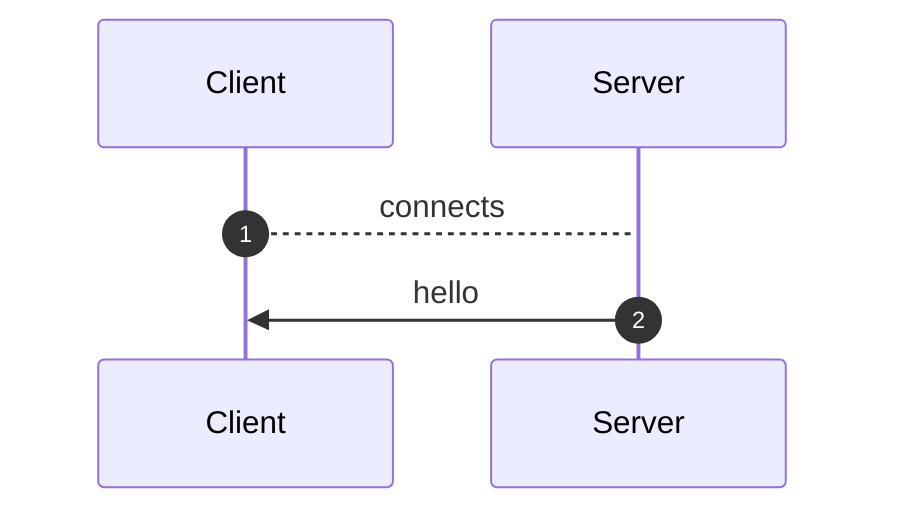
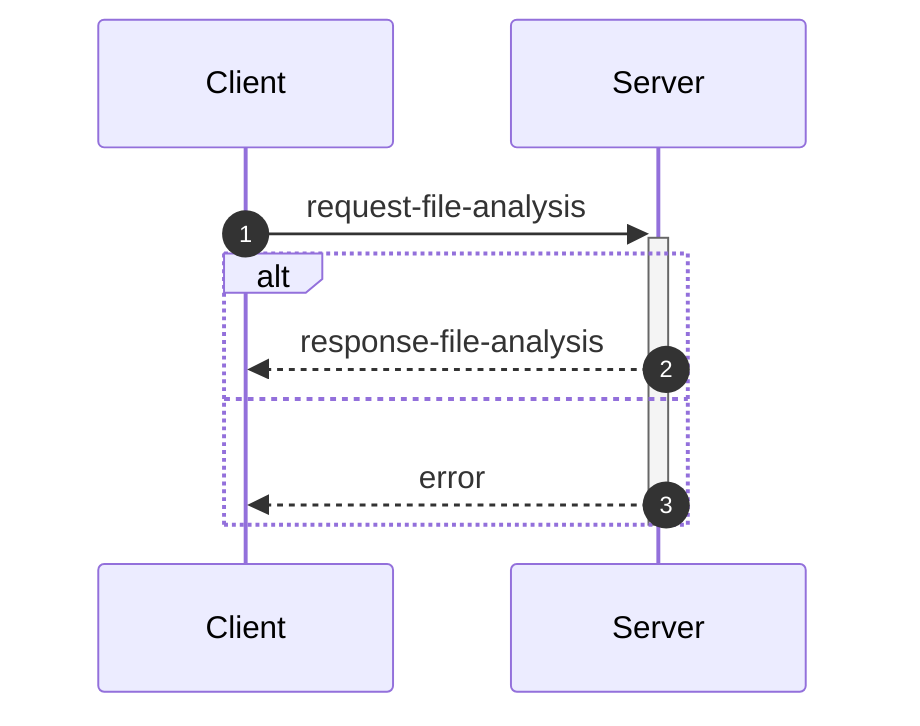
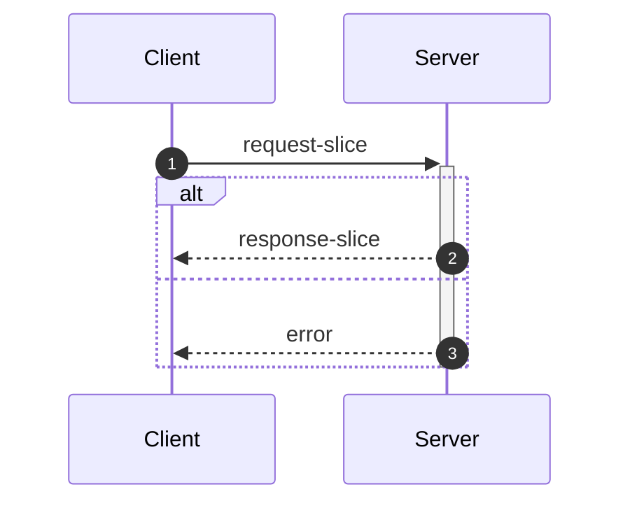
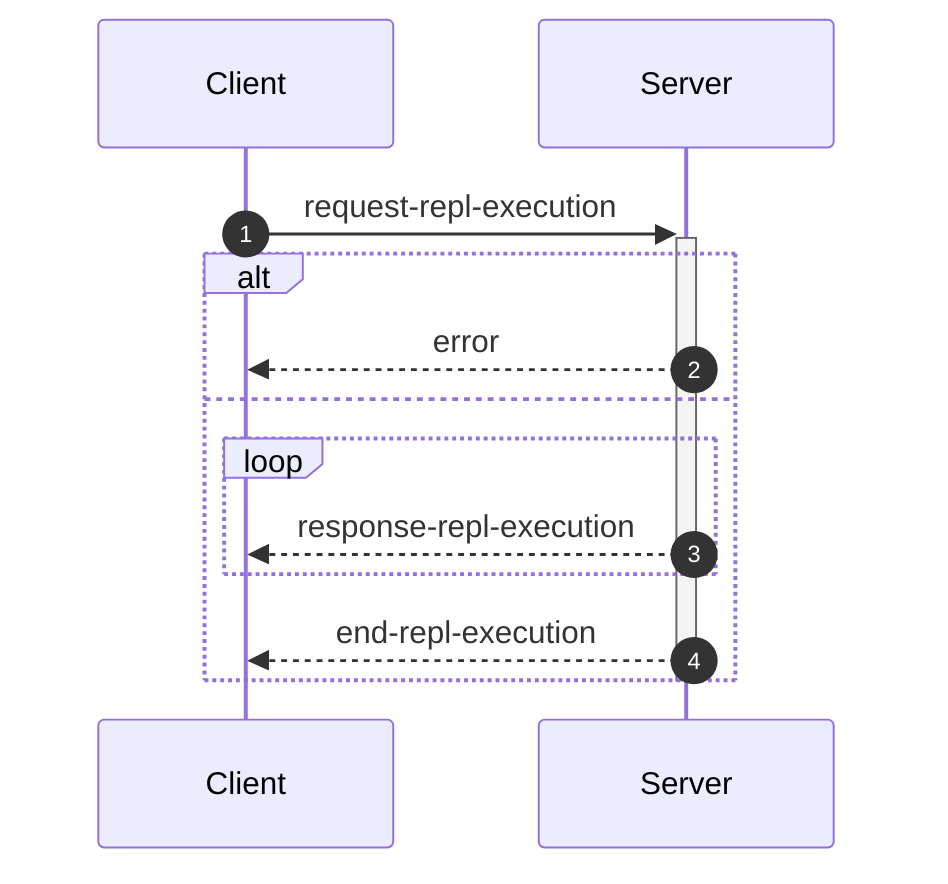

_This document was generated from '[src/documentation/wiki-interface.ts](https://github.com/flowr-analysis/flowr/tree/main//src/documentation/wiki-interface.ts)' on 2026-07-20, 16:14:03 UTC presenting an overview of flowR's interface (v2.12.3, using R v4.5.0). Please do not edit this file/wiki page directly._

Although far from being as detailed as the in-depth explanation of [_flowR_](https://github.com/flowr-analysis/flowr/wiki/core),
this wiki page explains how to interface with _flowR_ in more detail.
In general, command line arguments and other options provide short descriptions on hover over.

* [💻 Using the REPL](#using-the-repl)
* [⚙️ Configuring FlowR](#configuring-flowr)
* [⚒️ Writing Code](#writing-code)
* [💬 Communicating with the Server](#communicating-with-the-server)

<a id='using-the-repl'></a>
## 💻 Using the REPL


> [!NOTE]
> To execute arbitrary R commands with a repl request, _flowR_ has to be started explicitly with <span title="Description (Command Line Argument): Allow to access the underlying R session when using flowR (security warning: this allows the execution of arbitrary R code!)">`--r-session-access`</span>.
> Please be aware that this introduces a security risk and note that this relies on the [`r-shell` engine](https://github.com/flowr-analysis/flowr/wiki/engines) .

Although primarily meant for users to explore,
there is nothing which forbids simply calling _flowR_ as a subprocess to use standard-in, -output, and -error
for communication (although you can access the REPL using the server as well,
with the [REPL Request](#message-request-repl-execution) message).

The read-eval-print loop&nbsp;(REPL) works relatively simple.
You can submit an expression (using <kbd>Enter</kbd>),
which is interpreted as an R&nbsp;expression by default but interpreted as a *command* if it starts with a colon (`:`).
The best command to get started with the REPL is <span title="Description (Repl Command): Show help information (aliases: :h, :?)">`:help`</span>.
Besides, you can leave the REPL either with the command <span title="Description (Repl Command): End the repl (aliases: :q, :exit)">`:quit`</span> or by pressing <kbd>Ctrl</kbd>+<kbd>C</kbd> twice.
When writing a *command*, you may press <kbd>Tab</kbd> to get a list of completions, if available.
Multiple commands can be entered in a single line by separating them with a semicolon (`;`), e.g. `:parse "x<-2"; :df*`.
If a command is given without R code, the REPL will re-use R code given in a previous command.
The prior example will hence return first the parsed AST of the program and then the dataflow graph for `"x <- 2"`.

> [!NOTE]
> If you develop flowR, you may want to launch the repl using the `npm run main-dev` command, this way, you get a non-minified version of flowR with debug information and hot-reloading of source files.

<details>
<summary>Available Commands</summary>

We currently offer the following commands (this with a `[*]` suffix are available with and without the star):


| Command | Description |
| ------- | ----------- |
| **<span title="Description (Repl Command): End the repl (aliases: :q, :exit)">:quit</span>** | End the repl (aliases: **:<span title="Alias of ':quit'. End the repl">q</span>**, **:<span title="Alias of ':quit'. End the repl">exit</span>**) |
| **<span title="Description (Repl Command): Execute the given code as R code. This requires the `--r-session-access` flag to be set and requires the r-shell engine. (aliases: :e, :r)">:execute</span>** | Execute the given code as R code. This requires the `--r-session-access` flag to be set and requires the r-shell engine. (aliases: **:<span title="Alias of ':execute'. Execute the given code as R code. This requires the `--r-session-access` flag to be set and requires the r-shell engine.">e</span>**, **:<span title="Alias of ':execute'. Execute the given code as R code. This requires the `--r-session-access` flag to be set and requires the r-shell engine.">r</span>**) |
| **<span title="Description (Repl Command): Get mermaid code for the control-flow graph of R code (aliases: :cfg, :cf)">:controlflow[*]</span>** | Get mermaid code for the control-flow graph of R code (star: Returns the URL to mermaid.live) (aliases: **:<span title="Alias of ':controlflow'. Get mermaid code for the control-flow graph of R code">cfg</span>**, **:<span title="Alias of ':controlflow'. Get mermaid code for the control-flow graph of R code">cf</span>**) |
| **<span title="Description (Repl Command): Get mermaid code for the control-flow graph with basic blocks (aliases: :cfgb, :cfb)">:controlflowbb[*]</span>** | Get mermaid code for the control-flow graph with basic blocks (star: Returns the URL to mermaid.live) (aliases: **:<span title="Alias of ':controlflowbb'. Get mermaid code for the control-flow graph with basic blocks">cfgb</span>**, **:<span title="Alias of ':controlflowbb'. Get mermaid code for the control-flow graph with basic blocks">cfb</span>**) |
| **<span title="Description (Repl Command): Get mermaid code for the dataflow graph (aliases: :d, :df)">:dataflow[*]</span>** | Get mermaid code for the dataflow graph (star: Returns the URL to mermaid.live) (aliases: **:<span title="Alias of ':dataflow'. Get mermaid code for the dataflow graph">d</span>**, **:<span title="Alias of ':dataflow'. Get mermaid code for the dataflow graph">df</span>**) |
| **<span title="Description (Repl Command): Get mermaid code for the normalized AST of R code (aliases: :n)">:normalize[*]</span>** | Get mermaid code for the normalized AST of R code (star: Returns the URL to mermaid.live) (alias: **:<span title="Alias of ':normalize'. Get mermaid code for the normalized AST of R code">n</span>**) |
| **<span title="Description (Repl Command): Get mermaid code for the simplified dataflow graph (aliases: :ds, :dfs)">:dataflowsimple[*]</span>** | Get mermaid code for the simplified dataflow graph (star: Returns the URL to mermaid.live) (aliases: **:<span title="Alias of ':dataflowsimple'. Get mermaid code for the simplified dataflow graph">ds</span>**, **:<span title="Alias of ':dataflowsimple'. Get mermaid code for the simplified dataflow graph">dfs</span>**) |
| **<span title="Description (Repl Command): Inspect and extend the signature database: `query` (identical to :query @signature), `add <path>` to mount another database/source, `download` to fetch the full-history database. (aliases: :sig)">:signature</span>** | Inspect and extend the signature database: `query` (identical to :query @signature), `add <path>` to mount another database/source, `download` to fetch the full-history database. (alias: **:<span title="Alias of ':signature'. Inspect and extend the signature database: `query` (identical to :query @signature), `add <path>` to mount another database/source, `download` to fetch the full-history database.">sig</span>**) |
| **<span title="Description (Repl Command): Just calculates the DFG, but only prints summary info (aliases: :d#, :df#)">:dataflowsilent</span>** | Just calculates the DFG, but only prints summary info (aliases: **:<span title="Alias of ':dataflowsilent'. Just calculates the DFG, but only prints summary info">d#</span>**, **:<span title="Alias of ':dataflowsilent'. Just calculates the DFG, but only prints summary info">df#</span>**) |
| **<span title="Description (Repl Command): Prints ASCII Art of the parsed, unmodified AST (aliases: :p)">:parse</span>** | Prints ASCII Art of the parsed, unmodified AST (alias: **:<span title="Alias of ':parse'. Prints ASCII Art of the parsed, unmodified AST">p</span>**) |
| **<span title="Description (Repl Command): Prints the version of flowR as well as the current version of R">:version</span>** | Prints the version of flowR as well as the current version of R
| **<span title="Description (Repl Command): Query the given R code (use 'help' for more information)">:query[*]</span>** | Query the given R code (use 'help' for more information) (star: Similar to query, but returns the output in json format.)
| **<span title="Description (Repl Command): Returns an ASCII representation of the dataflow graph (aliases: :df!)">:dataflowascii</span>** | Returns an ASCII representation of the dataflow graph (alias: **:<span title="Alias of ':dataflowascii'. Returns an ASCII representation of the dataflow graph">df!</span>**) |
| **<span title="Description (Repl Command): Returns summarization stats for the normalized AST (aliases: :n#)">:normalize#</span>** | Returns summarization stats for the normalized AST (alias: **:<span title="Alias of ':normalize#'. Returns summarization stats for the normalized AST">n#</span>**) |
| **<span title="Description (Repl Command): Show help information (aliases: :h, :?)">:help</span>** | Show help information (aliases: **:<span title="Alias of ':help'. Show help information">h</span>**, **:<span title="Alias of ':help'. Show help information">?</span>**) |


</details>


> [!TIP]
> 
> As indicated by the examples before, all REPL commands that operate on code keep track of the state.
> Hence, if you run a command like <span title="Description (Repl Command, starred version): Returns the URL to mermaid.live; Base Command: Get mermaid code for the dataflow graph (aliases: :d*, :df*)">`:dataflow*`</span> without providing R code,
> the REPL will re-use the R code provided in a previous command.
> Likewise, doing this will benefit from incrementality!
> If you request the dataflow graph with `:df* x <- 2 * y` and then want to see the parsed AST with `:parse`,
> the REPL will re-use previously obtained information and not re-parse the code again.
> 		


Generally, many commands offer shortcut versions in the REPL. Many queries, for example, offer a shortened format (see the example below).
Of special note, the [Config Query](https://github.com/flowr-analysis/flowr/wiki/%5BQuery%5D-Config)
can be used to also modify the currently active configuration of _flowR_ within the REPL (see the [wiki page](https://github.com/flowr-analysis/flowr/wiki/%5BQuery%5D-Config) for more information).

### Example: Retrieving the Dataflow Graph

To retrieve a URL to the [mermaid](https://mermaid.js.org/) diagram of the dataflow of a given expression,
use <span title="Description (Repl Command, starred version): Returns the URL to mermaid.live; Base Command: Get mermaid code for the dataflow graph (aliases: :d*, :df*)">`:dataflow*`</span> (or <span title="Description (Repl Command): Get mermaid code for the dataflow graph (aliases: :d, :df)">`:dataflow`</span> to get the mermaid code in the cli):


```shell
$ docker run -it --rm eagleoutice/flowr # or npm run flowr 
flowR repl v2.12.3, R grammar v14 (tree-sitter engine)
R> :dataflow* y <- 1 + x
```

<details>
<summary style='color:gray'>Output</summary>


```text
https://mermaid.live/view#base64:eyJjb2RlIjoiZmxvd2NoYXJ0IEJUXG4gICAgMXt7XCJgKiM5MTtSTnVtYmVyIzkzOyogKioxKipcbiAgICAgICoxLjYqICgqKmlkOiAxKiopYFwifX1cbiAgICUlIE5vIGVkZ2VzIGZvdW5kIGZvciAxXG4gICAgMihbXCJgKiM5MTtSU3ltYm9sIzkzOyogKip4KipcbiAgICAgICoxLjEwKiAoKippZDogMioqKWBcIl0pXG4gICAlJSBObyBlZGdlcyBmb3VuZCBmb3IgMlxuICAgIDNbW1wiYCojOTE7UkJpbmFyeU9wIzkzOyogYmFzZSM1ODsjNTg7KiojNDM7KipcbiAgICAgICoxLjYtMTAqICgqKmlkOiAzKiopXG4gICAgYXJnOiAoMSwgMilgXCJdXVxuICAgIGJ1aWx0LWluOl9bXCJgQnVpbHQtSW46XG4jNDM7YFwiXVxuICAgIHN0eWxlIGJ1aWx0LWluOl8gc3Ryb2tlOmdyYXksZmlsbDpncmF5LHN0cm9rZS13aWR0aDoycHgsb3BhY2l0eTouODtcbiAgICAwW1wiYCojOTE7UlN5bWJvbCM5MzsqICoqeSoqXG4gICAgICAqMS4xKiAoKippZDogMCoqLCB2OiAzKWBcIl1cbiAgICA0W1tcImAqIzkxO1JCaW5hcnlPcCM5MzsqIGJhc2UjNTg7IzU4OyoqIzYwOyM0NTsqKlxuICAgICAgKjEuMS0xMCogKCoqaWQ6IDQqKilcbiAgICBhcmc6ICgwLCAzKWBcIl1dXG4gICAgYnVpbHQtaW46Xy1bXCJgQnVpbHQtSW46XG4jNjA7IzQ1O2BcIl1cbiAgICBzdHlsZSBidWlsdC1pbjpfLSBzdHJva2U6Z3JheSxmaWxsOmdyYXksc3Ryb2tlLXdpZHRoOjJweCxvcGFjaXR5Oi44O1xuICAgIDMgLS0+fFwicmVhZHMsIGFyZ1wifCAxXG4gICAgMyAtLT58XCJyZWFkcywgYXJnXCJ8IDJcbiAgICAzIC0uLT58XCJyZWFkcywgY2FsbHNcInwgYnVpbHQtaW46X1xuICAgIGxpbmtTdHlsZSAyIHN0cm9rZTpncmF5O1xuICAgIDAgLS0+fFwiZGVmaW5lZC1ieVwifCAzXG4gICAgMCAtLT58XCJkZWZpbmVkLWJ5XCJ8IDRcbiAgICA0IC0tPnxcInJlYWRzLCBhcmdcInwgM1xuICAgIDQgLS0+fFwicmV0dXJucywgYXJnXCJ8IDBcbiAgICA0IC0uLT58XCJyZWFkcywgY2FsbHNcInwgYnVpbHQtaW46Xy1cbiAgICBsaW5rU3R5bGUgNyBzdHJva2U6Z3JheTsiLCJtZXJtYWlkIjp7ImF1dG9TeW5jIjp0cnVlfX0=
```


Retrieve the dataflow graph of the expression `y <- 1 + x`. It looks like this:


```mermaid
flowchart LR
    1{{"`*#91;RNumber#93;* **1**
      *1.6* (**id: 1**)`"}}
   %% No edges found for 1
    2(["`*#91;RSymbol#93;* **x**
      *1.10* (**id: 2**)`"])
   %% No edges found for 2
    3[["`*#91;RBinaryOp#93;* base#58;#58;**#43;**
      *1.6-10* (**id: 3**)
    arg: (1, 2)`"]]
    built-in:_["`Built-In:
#43;`"]
    style built-in:_ stroke:gray,fill:gray,stroke-width:2px,opacity:.8;
    0["`*#91;RSymbol#93;* **y**
      *1.1* (**id: 0**, v: 3)`"]
    4[["`*#91;RBinaryOp#93;* base#58;#58;**#60;#45;**
      *1.1-10* (**id: 4**)
    arg: (0, 3)`"]]
    built-in:_-["`Built-In:
#60;#45;`"]
    style built-in:_- stroke:gray,fill:gray,stroke-width:2px,opacity:.8;
    3 -->|"reads, arg"| 1
    3 -->|"reads, arg"| 2
    3 -.->|"reads, calls"| built-in:_
    linkStyle 2 stroke:gray;
    0 -->|"defined-by"| 3
    0 -->|"defined-by"| 4
    4 -->|"reads, arg"| 3
    4 -->|"returns, arg"| 0
    4 -.->|"reads, calls"| built-in:_-
    linkStyle 7 stroke:gray;
```

	
<details>

<summary style="color:gray">R Code of the Dataflow Graph</summary>

The analysis required _0.7 ms_ (including parse and normalize, using the [tree-sitter](https://github.com/flowr-analysis/flowr/wiki/Engines) engine) within the generation environment. No [signature database](https://github.com/flowr-analysis/flowr/wiki/Signature-Database) is mounted for these generated graphs, so `library()` calls attach no package exports; base-R names are still qualified via the generated base-package store (e.g. `acf` as `stats::acf`). 
We encountered no unknown side effects during the analysis.


```r
y <- 1 + x
```


</details>


</details>


For small graphs like this, <span title="Description (Repl Command): Returns an ASCII representation of the dataflow graph (aliases: :df!)">`:dataflowascii`</span> also provides an ASCII representation directly in the REPL:


```shell
$ docker run -it --rm eagleoutice/flowr # or npm run flowr 
flowR repl v2.12.3, R grammar v14 (tree-sitter engine)
R> :df! y <- 1 + x
```

<details open>
<summary style='color:gray'>Output</summary>


```text
                        0<1>0
                   ┌────| 1 |
    ┌────────┐     │    0---0
 c<4>c       └──c<3>c
 |<- |  v<0>v┌──| + |
 c---c──| y |┘  c---c   u<2>u
        v---v      └────| x |
                        u---u
Edges:
3 -> 1: reads, arg  3 -> 2: reads, arg
4 -> 3: reads, arg  4 -> 0: returns, arg
0 -> 3: defined-by  0 -> 4: defined-by
```


Retrieve the dataflow graph of the expression `y <- 1 + x` as ASCII art.

</details>


For the slicing with <span title="Description (Repl Command): Static backwards executable slicer for R">`:slicer`</span>, you have access to the same [magic comments](#slice-magic-comments) as with the [slice request](#message-request-slice).
Pass `--inline` to splice resolvable `source()` calls into the reconstruction so the slice is a single self-contained R text (the same as the static slice query's `inlineSources` flag).
See `--help` for more flags!

### Example: Interfacing with the File System

Many commands that allow for an R-expression (like <span title="Description (Repl Command, starred version): Returns the URL to mermaid.live; Base Command: Get mermaid code for the dataflow graph (aliases: :d*, :df*)">`:dataflow*`</span>) allow for a file as well
if the argument starts with `file://`.
If you are working from the root directory of the _flowR_ repository, the following gives you the parsed AST of the example file using the <span title="Description (Repl Command): Prints ASCII Art of the parsed, unmodified AST (aliases: :p)">`:parse`</span> command:

> **Watch mode**: Replace `file://` with `watch://` to enter watch mode.
> flowR runs the command immediately and then re-runs it every time the file (or any file inside the folder) changes.
> Enter any other command to leave watch mode.
> For example: `:df watch://analysis.R`


```shell
$ docker run -it --rm eagleoutice/flowr # or npm run flowr 
flowR repl v2.12.3, R grammar v14 (tree-sitter engine)
R> :parse file://test/testfiles/example.R
```

<details>
<summary style='color:gray'>Output</summary>


```text
File: test/testfiles/example.R

program
├ binaryoperator
│ ├ identifier "sum" (1:1─4)
│ ├ <- "<-" (1:5─7)
│ ╰ float "0" (1:8─9)
├ binaryoperator
│ ├ identifier "product" (2:1─8)
│ ├ <- "<-" (2:9─11)
│ ╰ float "1" (2:12─13)
├ binaryoperator
│ ├ identifier "w" (3:1─2)
│ ├ <- "<-" (3:3─5)
│ ╰ float "7" (3:6─7)
├ binaryoperator
│ ├ identifier "N" (4:1─2)
│ ├ <- "<-" (4:3─5)
│ ╰ float "10" (4:6─8)
├ forstatement
│ ├ for "for" (6:1─4)
│ ├ ( "(" (6:5─6)
│ ├ identifier "i" (6:6─7)
│ ├ in "in" (6:8─10)
│ ├ binaryoperator
│ │ ├ float "1" (6:11─12)
│ │ ├ : ":" (6:12─13)
│ │ ╰ parenthesizedexpression
│ │   ├ ( "(" (6:13─14)
│ │   ├ binaryoperator
│ │   │ ├ identifier "N" (6:14─15)
│ │   │ ├ - "-" (6:15─16)
│ │   │ ╰ float "1" (6:16─17)
│ │   ╰ ) ")" (6:17─18)
│ ├ ) ")" (6:18─19)
│ ╰ bracedexpression
│   ├ { "{" (6:20─21)
│   ├ binaryoperator
│   │ ├ identifier "sum" (7:3─6)
│   │ ├ <- "<-" (7:7─9)
│   │ ╰ binaryoperator
│   │   ├ binaryoperator
│   │   │ ├ identifier "sum" (7:10─13)
│   │   │ ├ + "+" (7:14─15)
│   │   │ ╰ identifier "i" (7:16─17)
│   │   ├ + "+" (7:18─19)
│   │   ╰ identifier "w" (7:20─21)
│   ├ binaryoperator
│   │ ├ identifier "product" (8:3─10)
│   │ ├ <- "<-" (8:11─13)
│   │ ╰ binaryoperator
│   │   ├ identifier "product" (8:14─21)
│   │   ├  "" (8:22─23)
│   │   ╰ identifier "i" (8:24─25)
│   ╰ } "}" (9:1─2)
├ call
│ ├ identifier "cat" (11:1─4)
│ ╰ arguments
│   ├ ( "(" (11:4─5)
│   ├ argument
│   │ ╰ string
│   │   ├ " "\"" (11:5─6)
│   │   ├ stringcontent "Sum:" (11:6─10)
│   │   ╰ " "\"" (11:10─11)
│   ├ comma "," (11:11─12)
│   ├ argument
│   │ ╰ identifier "sum" (11:13─16)
│   ├ comma "," (11:16─17)
│   ├ argument
│   │ ╰ string
│   │   ├ " "\"" (11:18─19)
│   │   ├ stringcontent
│   │   │ ╰ escapesequence "\\n" (11:19─21)
│   │   ╰ " "\"" (11:21─22)
│   ╰ ) ")" (11:22─23)
╰ call
  ├ identifier "cat" (12:1─4)
  ╰ arguments
    ├ ( "(" (12:4─5)
    ├ argument
    │ ╰ string
    │   ├ " "\"" (12:5─6)
    │   ├ stringcontent "Product:" (12:6─14)
    │   ╰ " "\"" (12:14─15)
    ├ comma "," (12:15─16)
    ├ argument
    │ ╰ identifier "product" (12:17─24)
    ├ comma "," (12:24─25)
    ├ argument
    │ ╰ string
    │   ├ " "\"" (12:26─27)
    │   ├ stringcontent
    │   │ ╰ escapesequence "\\n" (12:27─29)
    │   ╰ " "\"" (12:29─30)
    ╰ ) ")" (12:30─31)
```


Retrieve the parsed AST of the example file.

<details>

<summary>File Content</summary>


```r
sum <- 0
product <- 1
w <- 7
N <- 10

for (i in 1:(N-1)) {
  sum <- sum + i + w
  product <- product * i
}

cat("Sum:", sum, "\n")
cat("Product:", product, "\n")
```


</details>

As _flowR_ directly transforms this AST the output focuses on being human-readable instead of being machine-readable.
		

</details>


### Example: Run a Query

You can run any query supported by _flowR_ using the <span title="Description (Repl Command): Query the given R code (use 'help' for more information)">`:query`</span> command.
For example, to obtain the shapes of all data frames in a given piece of code, you can run:


```shell
$ docker run -it --rm eagleoutice/flowr # or npm run flowr 
flowR repl v2.12.3, R grammar v14 (tree-sitter engine)
R> :query @absint df-shape "x <- data.frame(a = 1:10, b = 1:10)\ny <- x$a"
```

<details open>
<summary style='color:gray'>Output</summary>


```text
Query: absint (1 ms)
   ╰ $12: (colnames: [{"a", "b"}, {}], cols: [2, 2], rows: [10, 10])
   ╰ $0: (colnames: [{"a", "b"}, {}], cols: [2, 2], rows: [10, 10])
All queries together required ≈4 ms (1ms accuracy, total 4 ms)
```


Retrieve the shapes of all data frames in the given code.

</details>


To run the linter on a file, you can use (in this example, we just issue the `dead-code` linter on a small piece of code):


```shell
$ docker run -it --rm eagleoutice/flowr # or npm run flowr 
flowR repl v2.12.3, R grammar v14 (tree-sitter engine)
R> :query @linter rules:dead-code "if(FALSE) x <- 2"
```

<details open>
<summary style='color:gray'>Output</summary>


```text
Query: linter (2 ms)
   ╰ Dead Code (dead-code):
       ╰ certain:
           ╰ Code at 1.11-16
       ╰ Metadata: searchTimeMs: 2, processTimeMs: 0
All queries together required ≈2 ms (1ms accuracy, total 2 ms)
```


Run the linter on the given code, with only the `dead-code` rule enabled.

</details>


For more information on the available queries, please check out the [Query API](https://github.com/flowr-analysis/flowr/wiki/query-api).


<a id='configuring-flowr'></a>
## ⚙️ Configuring FlowR


When running _flowR_, you may want to specify some behaviors with a dedicated configuration file.
By default, flowR looks for a file named `flowr.json` in the current working directory (or any higher directory).
You can also specify a different file with <span title="Description (Command Line Argument): The name of the configuration file to use">`--config-file`</span> or pass the configuration inline using <span title="Description (Command Line Argument): The flowR configuration to use, as a JSON string">`--config-json`</span>.
To inspect the current configuration, you can run flowr with the <span title="Description (Command Line Argument): Run with verbose logging (will be passed to the corresponding script)">`--verbose`</span> flag, or use the `config` [Query](https://github.com/flowr-analysis/flowr/wiki/query-api).
Within the REPL this works by running the following:


```shell
:query @config
```


To work with the <a href="https://github.com/flowr-analysis/flowr/tree/main/src/config.ts#L129"><code><span title="The configuration file format for flowR.">FlowrConfig</span></code></a> you can use the provided helper objects alongside its methods like
<a href="https://github.com/flowr-analysis/flowr/tree/main/src/config.ts#L714"><code><span title="Creates a new flowr config that has the updated values.">FlowrConfig::<b>amend</b></span></code></a>.
The schema below documents every option; the ones you most likely want are:

- <a href="https://github.com/flowr-analysis/flowr/wiki/Interface#configuring-flowr" title="Configuration Option (boolean): Whether source calls should be ignored, causing {@link processSourceCall}&#39;s behavior to be skipped.">ignoreSourceCalls</a>: ignore source calls when analyzing the code, i.e., ignore the inclusion of other files.
- <a href="https://github.com/flowr-analysis/flowr/wiki/Interface#configuring-flowr" title="Configuration Option (boolean): Whether load calls should be ignored, causing {@link processLoadCall}&#39;s behavior to be skipped.">ignoreLoadCalls</a>: ignore load calls when analyzing the code, i.e., ignore the loading of r-data files.
- <a href="https://github.com/flowr-analysis/flowr/wiki/Interface#configuring-flowr" title="Configuration Option (object): Do you want to overwrite (parts) of the builtin definition?">semantics.environment.overwriteBuiltIns</a>: overwrite _flowR_'s handling of built-in functions, or clear the preset definitions entirely.
  See [Configure BuiltIn Semantics](#configure-builtin-semantics) for more information.
- <a href="https://github.com/flowr-analysis/flowr/wiki/Interface#configuring-flowr" title="Configuration Option (string): How to resolve variables and their values. (one of &quot;disabled&quot;, &quot;alias&quot;, &quot;builtin&quot;)">solver.variables</a>: how to resolve variables and their values (`disabled`, `alias`, `builtin`).
- <a href="https://github.com/flowr-analysis/flowr/wiki/Interface#configuring-flowr" title="Configuration Option (array): The engine or set of engines to use for interacting with R code. An empty array means all available engines will be used.">engines</a> and <a href="https://github.com/flowr-analysis/flowr/wiki/Interface#configuring-flowr" title="Configuration Option (string): The default engine to use for interacting with R code. If this is undefined, an arbitrary engine from the specified list will be used. (one of &quot;tree-sitter&quot;, &quot;r-shell&quot;)">defaultEngine</a>: the engines used to interact with R code, see the [Engines wiki page](https://github.com/flowr-analysis/flowr/wiki/engines).
- <a href="https://github.com/flowr-analysis/flowr/wiki/Interface#configuring-flowr" title="Configuration Option (array): Files a framework loads on its own, without any source() call (e.g. global.R in a shiny app), in the order they are loaded; flowR orders the matching project files accordingly and analyzes them as one program. Entries are case-insensitive globs matched against the file path, a plain name matches any file with that name, and entries matching no project file are warned about. Usually set per project kind via specializeConfig.">project.implicitSources</a>: the files a framework loads without any `source()` call, in the order in which they are
  loaded. Entries are globs (e.g. `R/*.R`) matched against the file path ignoring capitalization; one matching no file is reported.
- <a href="https://github.com/flowr-analysis/flowr/wiki/Interface#configuring-flowr" title="Configuration Option (object): Overwrite (parts of) the configuration depending on the project kind flowR detects, e.g. to give a shiny app its implicit sources.">specializeConfig</a>: overwrite (parts of) the configuration depending on the kind of project _flowR_ detects
  (e.g. `shiny-app`), which is how a shiny app gets its implicit sources by default. What you configure directly wins.
- <a href="https://github.com/flowr-analysis/flowr/wiki/Interface#configuring-flowr" title="Configuration Option (array): The default plugins to load when creating a new instance of FlowrAnalyzer">defaultPlugins</a> and <a href="https://github.com/flowr-analysis/flowr/wiki/Interface#configuring-flowr" title="Configuration Option (array): The plugins to load in REPL mode">repl.plugins</a>: the plugins to load for a new <a href="https://github.com/flowr-analysis/flowr/tree/main/src/project/flowr-analyzer.ts#L165"><code><span title="Central class for conducting analyses with FlowR. Use the FlowrAnalyzerBuilder to create a new instance. If you want the original pattern of creating a pipeline and running all steps, you can still do this with FlowrAnalyzer#runFull . To inspect the context of the analyzer, use FlowrAnalyzer#inspectContext (if you are a plugin and need to modify it, use FlowrAnalyzer#context instead).">FlowrAnalyzer</span></code></a> and in the REPL
  (use `flowr:default` to reference the former).

So you can configure _flowR_ by adding a file like the following:

<details>

<summary>Example Configuration File</summary>


```json
{
  "ignoreSourceCalls": true,
  "ignoreLoadCalls": true,
  "semantics": {
    "environment": {
      "overwriteBuiltIns": {
        "definitions": [
          {
            "type": "function",
            "names": [
              "foo"
            ],
            "processor": "builtin:assign",
            "config": {}
          }
        ]
      }
    }
  },
  "defaultPlugins": [
    "file:description",
    "versions:description"
  ],
  "repl": {
    "quickStats": false,
    "dfProcessorHeat": false,
    "hints": true,
    "plugins": [
      "flowr:default"
    ]
  },
  "project": {
    "resolveUnknownPathsOnDisk": true,
    "implicitSources": [
      "global.R",
      "app.R"
    ]
  },
  "linter": {
    "disabledRules": []
  },
  "specializeConfig": {
    "shiny-app": {
      "project": {
        "implicitSources": [
          "global.R",
          "ui.R",
          "server.R",
          "app.R"
        ]
      }
    }
  },
  "engines": [
    {
      "type": "r-shell"
    }
  ],
  "solver": {
    "variables": "alias",
    "evalStrings": true,
    "trackEnvironments": true,
    "sigdb": {
      "enabled": true,
      "loadProjectDependencies": true,
      "eagerlyLoad": false,
      "eagerlyLoadExports": false,
      "linkBaseR": false,
      "linkDescriptionDependencies": false
    },
    "resolveSource": {
      "dropPaths": "no",
      "ignoreCapitalization": true,
      "inferWorkingDirectory": "active-script",
      "searchPath": []
    },
    "instrument": {},
    "slicer": {
      "threshold": 50
    }
  },
  "abstractInterpretation": {
    "wideningThreshold": 4,
    "dataFrame": {
      "maxColNames": 20,
      "readLoadedData": {
        "readExternalFiles": true,
        "maxReadLines": 1000000
      }
    }
  },
  "gas": {
    "thresholds": {
      "memory": {
        "problematic": 0.7,
        "critical": 0.9
      },
      "timeMs": {
        "problematic": 100000,
        "critical": 120000
      }
    },
    "features": {}
  }
}
```


</details>

<details>
<a id='configure-builtin-semantics'></a>
<summary>Configure Built-In Semantics</summary>


`semantics/environment/overwriteBuiltins` accepts two keys:

- `loadDefaults` (boolean, initially `true`): If set to `true`, the default built-in definitions are loaded before applying the custom definitions. Setting this flag to `false` explicitly disables the loading of the default definitions.
- `definitions` (array, initially empty): Allows to overwrite or define new built-in elements. Each object within must have a `type` which is one of the below. Furthermore, they may define a string array of `names` which specifies the identifiers to bind the definitions to. You may use `assumePrimitive` to specify whether _flowR_ should assume that this is a primitive non-library definition (so you probably just do not want to specify the key).

  | Type            | Description                                                                                                                                                                                                                                                                                              | Example                                                                                                    |
  | --------------- | -------------------------------------------------------------------------------------------------------------------------------------------------------------------------------------------------------------------------------------------------------------------------------------------------------- | ---------------------------------------------------------------------------------------------------------- |
  | `constant`    | Additionally allows for a `value` this should resolve to.                                                                                                                                                                                                                                                | `{ type: 'constant', names: ['NULL', 'NA'],  value: null }`                                                |
  | `function`    | Is a rather flexible way to define and bind built-in functions. For the time, we do not have extensive documentation to cover all the cases, so please either consult the sources with the `default-builtin-config.ts` or open a [new issue](https://github.com/flowr-analysis/flowr/issues/new/choose). | `{ type: 'function', names: ['next'], processor: 'builtin:d', config: { cfg: ExitPointType.Next } }` |
  | `replacement` | A comfortable way to specify replacement functions like `$<-` or `names<-`. `suffixes` describes the... suffixes to attach automatically. | `{ type: 'replacement', suffixes: ['<-', '<<-'], names: ['[', '[['] }` |


</details>

<details>

<summary style='color:gray'>Full Configuration-File Schema</summary>

- _The configuration file format for flowR._ (object)
    - **logLevel** [optional] _flowR's global minimum log level, applied when the config is loaded._ (string)
        Only allows: 'silly', 'trace', 'debug', 'info', 'warn', 'error', 'fatal'
    - **ignoreSourceCalls** [optional] _Whether source calls should be ignored, causing {@link processSourceCall}'s behavior to be skipped._ (boolean)
    - **ignoreLoadCalls** [optional] _Whether load calls should be ignored, causing {@link processLoadCall}'s behavior to be skipped._ (boolean)
    - **semantics** _Configure language semantics and how flowR handles them._ (object)
        - **environment** [optional] _Semantics regarding how to handle the R environment._ (object)
            - **overwriteBuiltIns** [optional] _Do you want to overwrite (parts) of the builtin definition?_ (object)
                - **loadDefaults** [optional] _Should the default configuration still be loaded?_ (boolean)
                - **definitions** [optional] _The definitions to load/overwrite._ (array)
                Valid item types:
                    - (object)
    - **defaultPlugins** [optional] _The default plugins to load when creating a new instance of FlowrAnalyzer_ (array)
    Valid item types:
        - (alternatives)
            - (string)
            - (array)
    - **repl** _Configuration options for the REPL._ (object)
        - **quickStats** [optional] _Whether to show quick stats in the REPL after each evaluation._ (boolean)
        - **dfProcessorHeat** [optional] _This instruments the dataflow processors to count how often each processor is called._ (boolean)
        - **hints** [optional] _Whether to show dim inline hints on the empty prompt (automatically disabled on non-interactive terminals)._ (boolean)
        - **plugins** [optional] _The plugins to load in REPL mode_ (array)
        Valid item types:
            - (alternatives)
                - (string)
                - (array)
        - **autoUseFileProtocol** [optional] _Prepend the file protocol to a repl input that looks like a path, instead of only warning about it._ (boolean)
        - **queryStats** [optional] _Whether `:query` closes with the line stating how long the queries took (`:query*` never prints it)._ (boolean)
        - **showPlugins** [optional] _Whether `:version` grays out the plugins that did not activate during the last analysis._ (boolean)
    - **project** _Project specific configuration options._ (object)
        - **resolveUnknownPathsOnDisk** [optional] _Whether to resolve unknown paths loaded by the r project disk when trying to source/analyze files._ (boolean)
        - **basePackages** [optional] _The packages considered part of R itself (base and recommended); if unset, flowR uses its built-in list._ (array)
        Valid item types:
            - (string)
        - **implicitSources** [optional] _Files a framework loads on its own, without any source() call (e.g. global.R in a shiny app), in the order they are loaded; flowR orders the matching project files accordingly and analyzes them as one program. Entries are case-insensitive globs matched against the file path, a plain name matches any file with that name, and entries matching no project file are warned about. Usually set per project kind via specializeConfig._ (array)
        Valid item types:
            - (string)
    - **linter** _Linter configuration options._ (object)
        - **disabledRules** _Linting rule names excluded from the default rule set (a rule requested explicitly via a linter query still runs). Usually set per project kind via specializeConfig._ (array)
        Valid item types:
            - (string)
    - **specializeConfig** [optional] _Overwrite (parts of) the configuration depending on the project kind flowR detects, e.g. to give a shiny app its implicit sources._ (object)
    - **engines** _The engine or set of engines to use for interacting with R code. An empty array means all available engines will be used._ (array)
    Valid item types:
        - (alternatives)
            - _The configuration for the tree sitter engine._ (object)
                - **type** [required] _Use the tree sitter engine._ (string)
                    Only allows: 'tree-sitter'
                - **wasmPath** [optional] _The path to the tree-sitter-r WASM binary to use. If this is undefined, this uses the default path._ (string)
                - **treeSitterWasmPath** [optional] _The path to the tree-sitter WASM binary to use. If this is undefined, this uses the default path._ (string)
                - **lax** [optional] _Whether to use the lax parser for parsing R code (allowing for syntax errors). If this is undefined, the strict parser will be used._ (boolean)
            - _The configuration for the R shell engine._ (object)
                - **type** [required] _Use the R shell engine._ (string)
                    Only allows: 'r-shell'
                - **rPath** [optional] _The path to the R executable to use. If this is undefined, this uses the default path._ (string)
    - **defaultEngine** [optional] _The default engine to use for interacting with R code. If this is undefined, an arbitrary engine from the specified list will be used._ (string)
        Only allows: 'tree-sitter', 'r-shell'
    - **solver** _How to resolve constants, constraints, cells, ..._ (object)
        - **variables** _How to resolve variables and their values._ (string)
            Only allows: 'disabled', 'alias', 'builtin'
        - **evalStrings** _Should we include eval(parse(text="...")) calls in the dataflow graph?_ (boolean)
        - **trackEnvironments** [optional] _Track user-created environments (new.env, assign/get/local with envir=, dollar-assign, attach). When false, all envir-style calls fall through conservatively._ (boolean)
        - **sigdb** _Resolving library exports from a signature database._ (object)
            - **enabled** [optional] _Resolve library()/use() exports from a signature database (default true); when false no database is consulted._ (boolean)
            - **loadProjectDependencies** [optional] _Load the project's declared dependencies from its metadata files (DESCRIPTION Imports/Depends, rproject.toml, renv.lock, rv.lock) (default true); when false these files are not read for dependencies._ (boolean)
            - **eagerlyLoad** [optional] _Parse the database up front rather than on the first package load (default false, ignored if disabled)._ (boolean)
            - **eagerlyLoadExports** [optional] _Add a vertex for every export on load rather than on demand (default false); keeps the dataflow graph small._ (boolean)
            - **assumedRVersion** [optional] _R version assumed when resolving versioned (base-R) exports: a pin like "4.5" or "auto" to detect the installed R (default "auto")._ (string)
            - **linkBaseR** [optional] _Eagerly attach base-R namespaces so bare base calls resolve without library() (default false)._ (boolean)
            - **linkBaseRCalls** [optional] _Add a lightweight Reads edge from a bare base-R call to its signature-database function vertex (default false; base-R qualification is edge-free otherwise)._ (boolean)
            - **linkPackageCalls** [optional] _Add a lightweight Reads edge from a resolved package call to its signature-database function vertex (default false)._ (boolean)
            - **linkDescriptionDependencies** [optional] _Eagerly attach the namespaces of the project's declared DESCRIPTION dependencies (Imports/Depends) so their exports resolve without an explicit library() (default false)._ (boolean)
            - **warmInBackground** [optional] _Decompress the hot shards (base + most-downloaded) in a background task on startup so the first library() lookup is warm (default false; for long-running servers/REPLs)._ (boolean)
            - **additionalPaths** [optional] _Extra directories or bundle/manifest files searched for signature databases (alongside the shipped default and $FLOWR_SIGDB_DIR); a downloaded full-history bundle placed here is mounted automatically._ (array)
            Valid item types:
                - (string)
            - **downloadRepo** [optional] _GitHub owner/repo the full-history bundle is downloaded from via ":signature download" (default "flowr-analysis/flowr", release tag "sigdb-v<flowR-version>")._ (string)
            - **autoSync** [optional] _On startup, re-download shards whose committed sigdb.remote.json hash no longer matches the cache, in the background (default false; opt-in network sync after a git pull)._ (boolean)
            - **versionSelection** [optional] _When a project constrains a dependency, resolve to the newest (default), oldest, or system-installed version satisfying it; system needs R and falls back to newest. Base-R packages always resolve against the assumed R version._ (string)
                Only allows: 'newest', 'oldest', 'system'
            - **versionOverrides** [optional] _Force an exact version for specific packages (name -> version), overriding both the project constraint and the versionSelection policy (default {})._ (object)
        - **versionManagement** _Policies for reasoning about dependency versions._ (object)
            - **linkedVersionGroups** [optional] _Groups of packages that must resolve to the same version; version guessing intersects each group so its members stay mutually compatible (default [])._ (array)
            Valid item types:
                - (array)
                Valid item types:
                    - (string)
        - **instrument** (object)
            - **dataflowExtractors** [optional] _These keys are only intended for use within code, allowing to instrument the dataflow analyzer!_ (any)
        - **resolveSource** [optional] _If lax source calls are active, flowR searches for sourced files much more freely, based on the configurations you give it. This option is only in effect if `ignoreSourceCalls` is set to false._ (object)
            - **dropPaths** _Allow to drop the first or all parts of the sourced path, if it is relative._ (string)
                Only allows: 'no', 'once', 'all'
            - **ignoreCapitalization** _Search for filenames matching in the lowercase._ (boolean)
            - **inferWorkingDirectory** _Try to infer the working directory from the main or any script to analyze._ (string)
                Only allows: 'no', 'main-script', 'active-script', 'any-script'
            - **searchPath** _Additionally search in these paths._ (array)
            Valid item types:
                - (string)
            - **repeatedSourceLimit** [optional] _How often the same file can be sourced within a single run? Please be aware: in case of cyclic sources this may not reach a fixpoint so give this a sensible limit._ (number)
            - **applyReplacements** _Provide name replacements for loaded files_ (array)
            Valid item types:
                - (object)
            - **assumeFilesExist** [optional] _Assume a sourced file is always there, making what it defines certain instead of conditional on the source call._ (boolean)
        - **slicer** [optional] _The configuration for the slicer._ (object)
            - **threshold** [optional] _The maximum number of iterations to perform on a single function call during slicing._ (number)
            - **autoExtend** [optional] _If set, the slicer will gain an additional post-pass._ (boolean)
    - **abstractInterpretation** _The configuration options for abstract interpretation._ (object)
        - **wideningThreshold** _The threshold for the number of visitations of a node at which widening should be performed to ensure the termination of the fixpoint iteration._ (number)
        - **dataFrame** _The configuration of the shape inference for data frames._ (object)
            - **maxColNames** _The maximum number of columns names to infer for data frames before over-approximating the column names to top._ (number)
            - **readLoadedData** _Configuration options for reading data frame shapes from loaded external data files, such as CSV files._ (object)
                - **readExternalFiles** _Whether data frame shapes should be extracted from loaded external files, such as CSV files._ (boolean)
                - **maxReadLines** _The maximum number of lines to read when extracting data frame shapes from loaded files, such as CSV files._ (number)
    - **gas** [optional] _Resource-usage guard (gas) configuration. All feature factors default to 0 (disabled). See https://github.com/flowr-analysis/flowr/wiki/Core#gas-resource-guard._ (object)
        - **thresholds** [optional] _Shared thresholds for all gas checks (scaled by per-feature factor)._ (object)
            - **memory** [optional] _Heap-usage fraction thresholds (0-1)._ (object)
                - **problematic** [optional] _Heap fraction (0-1) above which Problematic is returned._ (number)
                - **critical** [optional] _Heap fraction (0-1) above which Critical is returned._ (number)
            - **timeMs** [optional] _Elapsed analysis time thresholds in milliseconds._ (object)
                - **problematic** [optional] _Elapsed ms above which Problematic is returned._ (number)
                - **critical** [optional] _Elapsed ms above which Critical is returned._ (number)
        - **features** [optional] _Per-feature sensitivity factors. 0 or absent disables gas checking for that feature. A factor of 2 makes the feature twice as sensitive. Recognised keys: `source`, `side-effect-linking`, `linter`._ (object)
        - **heapProvider** [optional] _Custom heap statistics source (programmatic configs only), overriding the built-in v8/performance.memory detection._ (function)

</details>

	

<a id='writing-code'></a>
## ⚒️ Writing Code

_flowR_ can be used as a [module](https://www.npmjs.com/package/@eagleoutice/flowr) and offers several main classes and interfaces that are interesting for extension writers 
(see the [Visual Studio Code extension](https://marketplace.visualstudio.com/items?itemName=code-inspect.vscode-flowr) or the [Core](https://github.com/flowr-analysis/flowr/wiki/core) wiki page for more information).

### Creating Analyses with _flowR_

Nowadays, instances of the <a href="https://github.com/flowr-analysis/flowr/tree/main/src/project/flowr-analyzer.ts#L165"><code><span title="Central class for conducting analyses with FlowR. Use the FlowrAnalyzerBuilder to create a new instance. If you want the original pattern of creating a pipeline and running all steps, you can still do this with FlowrAnalyzer#runFull . To inspect the context of the analyzer, use FlowrAnalyzer#inspectContext (if you are a plugin and need to modify it, use FlowrAnalyzer#context instead).">FlowrAnalyzer</span></code></a> should be used as central frontend to get analysis results from _flowR_.
For example, a program slice can be created like this:


```ts
const analyzer = await new FlowrAnalyzerBuilder()
    .setEngine('tree-sitter')
    .build();
analyzer.addRequest('x <- 1\ny <- x\nx');
const result = await analyzer.query([
    {
        type:     'static-slice',
        criteria: ['3@x']
    }
]);
//console.log(result['static-slice']);
```


For more information, please have a look at the [Analyzer](https://github.com/flowr-analysis/flowr/wiki/analyzer) wiki page, which explains how to construct and use the <a href="https://github.com/flowr-analysis/flowr/tree/main/src/project/flowr-analyzer.ts#L165"><code><span title="Central class for conducting analyses with FlowR. Use the FlowrAnalyzerBuilder to create a new instance. If you want the original pattern of creating a pipeline and running all steps, you can still do this with FlowrAnalyzer#runFull . To inspect the context of the analyzer, use FlowrAnalyzer#inspectContext (if you are a plugin and need to modify it, use FlowrAnalyzer#context instead).">FlowrAnalyzer</span></code></a> in more detail.
To work with specific perspectives, you can also consult the respective pages like the [Dataflow Graph](https://github.com/flowr-analysis/flowr/wiki/dataflow-graph) or the [Abstract Interpretation](https://github.com/flowr-analysis/flowr/wiki/abstract-interpretation) wiki pages.
### The Pipeline Executor (Low-Level Interface)

Once, in the beginning, _flowR_ was meant to produce a dataflow graph merely to provide *program slices*. 
However, with continuous updates, the [Dataflow Graph](https://github.com/flowr-analysis/flowr/wiki/dataflow-graph) repeatedly proves to be the more interesting part.
With this, we restructured _flowR_'s originally *hardcoded* pipeline to be far more flexible. 
Now, it can be theoretically extended or replaced with arbitrary steps, optional steps, and what we call 'decorations' of these steps. 
In short, a slicing pipeline using the <a href="https://github.com/flowr-analysis/flowr/tree/main/src/core/pipeline-executor.ts#L97"><code><span title="**Please note:** The PipelineExecutor is now considered to be a rather low-level API for flowR. While it still works and is the basis for all other layers, we strongly recommend using the FlowrAnalyzer and its builder to create and use an analyzer instance that is pre-configured for your use-case. The pipeline executor allows to execute arbitrary pipelines in a step-by-step fashion. If you are not...">PipelineExecutor</span></code></a> looks like this:


```ts

const slicer = new PipelineExecutor(DEFAULT_SLICING_PIPELINE, {
  parser:    new RShell(),
  request:   requestFromInput('x <- 1\nx + 1'),
  criterion: ['2@x']
})
const slice = await slicer.allRemainingSteps()
// console.log(slice.reconstruct.code)
```


<details><summary>More Information</summary>


If you compare this, with what you would have done with the old (and removed) `SteppingSlicer`, 
this essentially just requires you to replace the `SteppingSlicer` with the <a href="https://github.com/flowr-analysis/flowr/tree/main/src/core/pipeline-executor.ts#L97"><code><span title="**Please note:** The PipelineExecutor is now considered to be a rather low-level API for flowR. While it still works and is the basis for all other layers, we strongly recommend using the FlowrAnalyzer and its builder to create and use an analyzer instance that is pre-configured for your use-case. The pipeline executor allows to execute arbitrary pipelines in a step-by-step fashion. If you are not...">PipelineExecutor</span></code></a>
and to pass the <a href="https://github.com/flowr-analysis/flowr/tree/main/src/core/steps/pipeline/default-pipelines.ts#L18"><code>DEFAULT_SLICING_PIPELINE</code></a> as the first argument.
The <a href="https://github.com/flowr-analysis/flowr/tree/main/src/core/pipeline-executor.ts#L97"><code><span title="**Please note:** The PipelineExecutor is now considered to be a rather low-level API for flowR. While it still works and is the basis for all other layers, we strongly recommend using the FlowrAnalyzer and its builder to create and use an analyzer instance that is pre-configured for your use-case. The pipeline executor allows to execute arbitrary pipelines in a step-by-step fashion. If you are not...">PipelineExecutor</span></code></a>...

1. Provides structures to investigate the results of all intermediate steps
2. Can be executed step-by-step
3. Can repeat steps (e.g., to calculate multiple slices on the same input)

See the in-code documentation for more information.


</details>

### Using the <a href="https://github.com/flowr-analysis/flowr/tree/main/src/r-bridge/shell.ts#L143"><code><span title="The RShell represents an interactive session with the R interpreter. You can configure it by RShellOptions . At the moment we are using a live R session (and not networking etc.) to communicate with R easily, which allows us to install packages etc. However, this might and probably will change in the future (leaving this as a legacy mode :D)">RShell</span></code></a> to Interact with R

The <a href="https://github.com/flowr-analysis/flowr/tree/main/src/r-bridge/shell.ts#L143"><code><span title="The RShell represents an interactive session with the R interpreter. You can configure it by RShellOptions . At the moment we are using a live R session (and not networking etc.) to communicate with R easily, which allows us to install packages etc. However, this might and probably will change in the future (leaving this as a legacy mode :D)">RShell</span></code></a> class allows interfacing with the `R`&nbsp;ecosystem installed on the host system.
Please have a look at [flowR's Engines](https://github.com/flowr-analysis/flowr/wiki/engines) for more information on alternatives (for example, the <a href="https://github.com/flowr-analysis/flowr/tree/main/src/r-bridge/lang-4.x/tree-sitter/tree-sitter-executor.ts#L18"><code><span title="Synchronous and (way) faster alternative to the RShell using tree-sitter.">TreeSitterExecutor</span></code></a>).


> [!IMPORTANT]
> 
> Each <a href="https://github.com/flowr-analysis/flowr/tree/main/src/r-bridge/shell.ts#L143"><code><span title="The RShell represents an interactive session with the R interpreter. You can configure it by RShellOptions . At the moment we are using a live R session (and not networking etc.) to communicate with R easily, which allows us to install packages etc. However, this might and probably will change in the future (leaving this as a legacy mode :D)">RShell</span></code></a> controls a new instance of the R&nbsp;interpreter, 
> make sure to call <code><a href="https://github.com/flowr-analysis/flowr/tree/main/src/r-bridge/shell.ts#L351"><span title="Close the current R session, makes the object effectively invalid (can no longer be reopened etc.)">RShell::<i>close</i></span></a>()</code> when you are done.


You can start a new "session" simply by constructing a new object with <code>new <a href="https://github.com/flowr-analysis/flowr/tree/main/src/r-bridge/shell.ts#L143"><span title="The RShell represents an interactive session with the R interpreter. You can configure it by RShellOptions . At the moment we are using a live R session (and not networking etc.) to communicate with R easily, which allows us to install packages etc. However, this might and probably will change in the future (leaving this as a legacy mode :D)">RShell</span></a>()</code>.

However, there are several options that may be of interest 
(e.g., to automatically revive the shell in case of errors or to control the name location of the R process on the system).

With a shell object (let's call it `shell`), you can execute R code by using <a href="https://github.com/flowr-analysis/flowr/tree/main/src/r-bridge/shell.ts#L212"><code><span title="sends the given command directly to the current R session will not do anything to alter input markers!">RShell::<i>sendCommand</i></span></code></a>,
for example <code>shell.<a href="https://github.com/flowr-analysis/flowr/tree/main/src/r-bridge/shell.ts#L212"><span title="sends the given command directly to the current R session will not do anything to alter input markers!">sendCommand</span></a>("1 + 1")</code>.
However, this does not return anything, so if you want to collect the output of your command, use
<a href="https://github.com/flowr-analysis/flowr/tree/main/src/r-bridge/shell.ts#L295"><code><span title="Send a command and collect the output">RShell::<i>sendCommandWithOutput</i></span></code></a> instead.


<a id='communicating-with-the-server'></a>
## 💬 Communicating with the Server


As explained in the [Overview](https://github.com/flowr-analysis/flowr/wiki/overview), you can simply run the [TCP](https://de.wikipedia.org/wiki/Transmission_Control_Protocol)&nbsp;server by adding the <span title="Description (Command Line Argument): Do not drop into a repl, but instead start a server on the given port (default: 1042) and listen for messages.">`--server`</span> flag (and, due to the interactive mode, exit with the conventional <kbd>CTRL</kbd>+<kbd>C</kbd>).
Currently, every connection is handled by the same underlying `RShell` - so the server is not designed to handle many clients at a time.
Additionally, the server is not well guarded against attacks (e.g., you can theoretically spawn an arbitrary number of&nbsp;RShell sessions on the target machine).

Every message has to be given in a single line (i.e., without a newline in-between) and end with a newline character. Nevertheless, we will pretty-print example given in the following segments for the ease of reading.


> [!NOTE]
> 
> The default <span title="Description (Command Line Argument): Do not drop into a repl, but instead start a server on the given port (default: 1042) and listen for messages.">`--server`</span> uses a simple [TCP](https://de.wikipedia.org/wiki/Transmission_Control_Protocol)
> connection. If you want _flowR_ to expose a [WebSocket](https://de.wikipedia.org/wiki/WebSocket) server instead, add the <span title="Description (Command Line Argument): If the server flag is set, use websocket for messaging">`--ws`</span> flag (i.e., <span title="Description (Command Line Argument): Do not drop into a repl, but instead start a server on the given port (default: 1042) and listen for messages.">`--server`</span> <span title="Description (Command Line Argument): If the server flag is set, use websocket for messaging">`--ws`</span>) when starting _flowR_ from the command line.


<ul><li>
<a id="message-hello"></a>
<b>Hello</b> Message (<code>hello</code>) 
<details>

<summary style="color:gray"> View Details. <i>The server informs the client about the successful connection and provides Meta-Information.</i> </summary>


```mermaid
sequenceDiagram
    autonumber
    participant Client
    participant Server

    
    Client-->Server: connects
    Server->>Client: hello
	
```


	
After launching _flowR_, for example, with <code>docker run -it --rm eagleoutice/flowr <span title="Description (Command Line Argument): Do not drop into a repl, but instead start a server on the given port (default: 1042) and listen for messages.">-<span/>-server</span></code>&nbsp;(🐳️), simply connecting should present you with a `hello` message, that amongst others should reveal the versions of&nbsp;_flowR_ and&nbsp;R, using the [semver 2.0](https://semver.org/spec/v2.0.0.html) versioning scheme.
The message looks like this:


```json
{
  "type": "hello",
  "clientName": "client-0",
  "versions": {
    "flowr": "2.12.3",
    "r": "4.5.0",
    "engine": "r-shell"
  }
}
```


There are currently a few messages that you can send after the hello message.
If you want to _slice_ a piece of R code you first have to send an [analysis request](#message-request-file-analysis), so that you can send one or multiple slice requests afterward.
Requests for the [REPL](#message-request-repl) are independent of that.
	

<hr>


<details>
<summary style="color:gray">Message schema (<code>hello</code>)</summary>

For the definition of the hello message, please see it's implementation at [`./src/cli/repl/server/messages/message-hello.ts`](https://github.com/flowr-analysis/flowr/tree/main/./src/cli/repl/server/messages/message-hello.ts).

- [required] (object)
    - **type** [required] _The type of the hello message._ (string)
        Only allows: 'hello'
    - **id** [forbidden] _The id of the message is always undefined (as it is the initial message and not requested)._ (any)
    - **clientName** [required] _A unique name that is assigned to each client. It has no semantic meaning and is only used/useful for debugging._ (string)
    - **versions** [required] (object)
        - **flowr** [required] _The version of the flowr server running in semver format._ (string)
        - **r** [required] _The version of the underlying R shell running in semver format._ (string)
        - **engine** [required] _The parser backend that is used to parse the R code._ (string)

</details>


<hr>

</details>
	</li>

<li>
<a id="message-request-file-analysis"></a>
<b>Analysis</b> Message (<code>request-file-analysis</code>) 
<details>

<summary style="color:gray"> View Details. <i>The server builds the dataflow graph for a given input file (or a set of files).</i> </summary>


```mermaid
sequenceDiagram
    autonumber
    participant Client
    participant Server

    
    Client->>+Server: request-file-analysis
    alt
        Server-->>Client: response-file-analysis
    else
        Server-->>Client: error
    end
    deactivate  Server
	
```


	
The request allows the server to analyze a file and prepare it for slicing.
The message can contain a `filetoken`, which is used to identify the file in later slice or query requests (if you do not add one, the request will not be stored and therefore, it is not available for subsequent requests).

> **Please note!**\
> If you want to send and process a lot of analysis requests, but do not want to slice them, please do not pass the `filetoken` field. This will save the server a lot of memory allocation.

Furthermore, the request must contain either a `content` field to directly pass the file's content or a `filepath` field which contains the path to the file (this path must be accessible for the server to be useful).
If you add the `id` field, the answer will use the same `id` so you can match requests and the corresponding answers.
See the implementation of the request-file-analysis message for more information.

You can drop one or more stored file tokens by adding the `invalidateToken` field (a single token or an array of tokens).
The server frees the corresponding analyses _after_ it has answered the request.

> **Tip!**\
> If you only want to drop tokens, you do not need a separate message: send a `request-file-analysis` that contains _just_ the `invalidateToken` field (and no `content` or `filepath`).
> Such a request behaves like an empty file analysis and the server replies with an empty `results` object.
> Because invalidation happens after the response, you may even pass the _current_ `filetoken` in `invalidateToken` to analyze a file once and have the server forget it right after you received the results.


<details>
<summary>Example of the <code>request-file-analysis</code> Message</summary>

_Note:_ even though we pretty-print these messages, they are sent as a single line, ending with a newline.

The following lists all messages that were sent and received in case you want to reproduce the scenario:

<ol>
<li> <code>hello</code> (response)
<details> 

<summary> Show Details </summary>

The first message is always a hello message.


```json
{
  "type": "hello",
  "clientName": "client-0",
  "versions": {
    "flowr": "2.12.3",
    "r": "4.5.0",
    "engine": "r-shell"
  }
}
```


</details>
</li>

<li> <b><code>request-file-analysis</code> (request)</b>
<details open> 

<summary> Show Details </summary>

Let's suppose you simply want to analyze the following script:
 
```r
x <- 1
x + 1
```

 For this, you can send the following request:


```json
{
  "type": "request-file-analysis",
  "id": "1",
  "filetoken": "x",
  "content": "x <- 1\nx + 1"
}
```


</details>
</li>

<li> <code>response-file-analysis</code> (response)
<details> 

<summary> Show Details </summary>


The `results` field of the response effectively contains three keys of importance:

- `parse`: which contains 1:1 the parse result in CSV format that we received from the `RShell` (i.e., the AST produced by the parser of the R interpreter).
- `normalize`: which contains the normalized AST, including ids (see the `info` field and the [Normalized AST](https://github.com/flowr-analysis/flowr/wiki/normalized-ast) wiki page).
- `dataflow`: especially important is the `graph` field which contains the dataflow graph as a set of root vertices (see the [Dataflow Graph](https://github.com/flowr-analysis/flowr/wiki/dataflow-graph) wiki page).
			


_As the code is pretty long, we inhibit pretty printing and syntax highlighting (JSON, hiding built-in):_

```text
{"type":"response-file-analysis","format":"json","id":"1","results":{"parse":{"files":[{"parsed":"[1,1,1,6,7,0,\"expr\",false,\"x <- 1\"],[1,1,1,1,1,3,\"SYMBOL\",true,\"x\"],[1,1,1,1,3,7,\"expr\",false,\"x\"],[1,3,1,4,2,7,\"LEFT_ASSIGN\",true,\"<-\"],[1,6,1,6,4,5,\"NUM_CONST\",true,\"1\"],[1,6,1,6,5,7,\"expr\",false,\"1\"],[2,1,2,5,16,0,\"expr\",false,\"x + 1\"],[2,1,2,1,10,12,\"SYMBOL\",true,\"x\"],[2,1,2,1,12,16,\"expr\",false,\"x\"],[2,3,2,3,11,16,\"'+'\",true,\"+\"],[2,5,2,5,13,14,\"NUM_CONST\",true,\"1\"],[2,5,2,5,14,16,\"expr\",false,\"1\"]","filePath":"/tmp/tmp-10447-ZsiIdurjEGA7-.R"}],".meta":{"timing":2}},"normalize":{"ast":{"type":"RProject","files":[{"root":{"type":"RExpressionList","children":[{"type":"RBinaryOp","location":[1,3,1,4],"lhs":{"type":"RSymbol","location":[1,1,1,1],"content":"x","lexeme":"x","info":{"fullRange":[1,1,1,1],"adToks":[],"id":0,"parent":2,"role":"bin-l","index":0,"nest":0,"file":"/tmp/tmp-10447-ZsiIdurjEGA7-.R"}},"rhs":{"location":[1,6,1,6],"lexeme":"1","info":{"fullRange":[1,6,1,6],"adToks":[],"id":1,"parent":2,"role":"bin-r","index":1,"nest":0,"file":"/tmp/tmp-10447-ZsiIdurjEGA7-.R"},"type":"RNumber","content":{"num":1,"complexNumber":false,"markedAsInt":false}},"operator":"<-","lexeme":"<-","info":{"fullRange":[1,1,1,6],"adToks":[],"id":2,"parent":6,"nest":0,"file":"/tmp/tmp-10447-ZsiIdurjEGA7-.R","index":0,"role":"el-c"}},{"type":"RBinaryOp","location":[2,3,2,3],"lhs":{"type":"RSymbol","location":[2,1,2,1],"content":"x","lexeme":"x","info":{"fullRange":[2,1,2,1],"adToks":[],"id":3,"parent":5,"role":"bin-l","index":0,"nest":0,"file":"/tmp/tmp-10447-ZsiIdurjEGA7-.R"}},"rhs":{"location":[2,5,2,5],"lexeme":"1","info":{"fullRange":[2,5,2,5],"adToks":[],"id":4,"parent":5,"role":"bin-r","index":1,"nest":0,"file":"/tmp/tmp-10447-ZsiIdurjEGA7-.R"},"type":"RNumber","content":{"num":1,"complexNumber":false,"markedAsInt":false}},"operator":"+","lexeme":"+","info":{"fullRange":[2,1,2,5],"adToks":[],"id":5,"parent":6,"nest":0,"file":"/tmp/tmp-10447-ZsiIdurjEGA7-.R","index":1,"role":"el-c"}}],"info":{"adToks":[],"id":6,"nest":0,"file":"/tmp/tmp-10447-ZsiIdurjEGA7-.R","role":"root","index":0}},"filePath":"/tmp/tmp-10447-ZsiIdurjEGA7-.R"}],"info":{"id":7}},".meta":{"timing":0}},"dataflow":{"unknownReferences":[],"in":[{"nodeId":2,"name":"<-","type":2},{"nodeId":5,"name":"+","type":2}],"out":[{"nodeId":0,"name":"x","type":4,"definedAt":2,"value":[1]}],"environment":{"current":{"id":2275,"parent":"<BuiltInEnvironment>","memory":[["x",[{"nodeId":0,"name":"x","type":4,"definedAt":2,"value":[1]}]]],"globalEnv":true},"level":0},"graph":{"rootVertices":[1,0,2,3,4,5],"vertexInformation":[[1,{"tag":"value","id":1}],[0,{"tag":"vdef","id":0,"source":[1]}],[2,{"tag":"fcall","id":2,"name":"<-","onlyBuiltin":true,"args":[{"nodeId":0,"type":32},{"nodeId":1,"type":32}],"origin":["builtin:assign"]}],[3,{"tag":"use","id":3}],[4,{"tag":"value","id":4}],[5,{"tag":"fcall","id":5,"name":"+","onlyBuiltin":true,"args":[{"nodeId":3,"type":32},{"nodeId":4,"type":32}],"origin":["builtin:d"]}]],"edgeInformation":[[2,[[1,{"types":65}],[0,{"types":72}],["built-in:<-",{"types":5}]]],[0,[[1,{"types":2}],[2,{"types":2}]]],[3,[[0,{"types":1}]]],[5,[[3,{"types":65}],[4,{"types":65}],["built-in:+",{"types":5}]]]],"_unknownSideEffects":[]},"entryPoint":2,"exitPoints":[{"type":0,"nodeId":5}],"hooks":[],".meta":{"timing":2}}}}
```


</details>
</li>
</ol>

The complete round-trip took 10.3 ms (including time required to validate the messages, start, and stop the internal mock server).

</details>


You receive an error if, for whatever reason, the analysis fails (e.g., the message or code you sent contained syntax errors).
It contains a human-readable description *why* the analysis failed (see the error message implementation for more details).


<details>
<summary>Example Error Message</summary>

_Note:_ even though we pretty-print these messages, they are sent as a single line, ending with a newline.

The following lists all messages that were sent and received in case you want to reproduce the scenario:

<ol>
<li> <code>hello</code> (response)
<details> 

<summary> Show Details </summary>

The first message is always a hello message.


```json
{
  "type": "hello",
  "clientName": "client-0",
  "versions": {
    "flowr": "2.12.3",
    "r": "4.5.0",
    "engine": "r-shell"
  }
}
```


</details>
</li>

<li> <code>request-file-analysis</code> (request)
<details> 

<summary> Show Details </summary>


```json
{
  "type": "request-file-analysis",
  "id": "1",
  "filename": "sample.R",
  "content": "x <-"
}
```


</details>
</li>

<li> <b><code>error</code> (response)</b>
<details open> 

<summary> Show Details </summary>


```json
{
  "id": "1",
  "type": "error",
  "fatal": false,
  "reason": "Error while analyzing file sample.R: GuardError: unable to parse R code (see the log for more information) for request {\"request\":\"text\",\"content\":\"x <-\"}}\n Report a Bug: https://github.com/flowr-analysis/flowr/issues/new?body=%3C!%2D%2D%20Please%20describe%20your%20issue%20in%20more%20detail%20below!%20%2D%2D%3E%0A%0A%0A%3C!%2D%2D%20Automatically%20generated%20issue%20metadata%2C%20please%20do%20not%20edit%20or%20delete%20content%20below%20this%20line%20%2D%2D%3E%0A%2D%2D%2D%0A%0AflowR%20version%3A%202.12.3%0Anode%20version%3A%20v25.6.1%0Anode%20arch%3A%20x64%0Anode%20platform%3A%20linux%0Amessage%3A%20%60unable%20to%20parse%20R%20code%20%28see%20the%20log%20for%20more%20information%29%20for%20request%20%7B%22request%22%3A%22text%22%2C%22content%22%3A%22x%20%3C%2D%22%7D%7D%60%0Astack%20trace%3A%0A%60%60%60%0A%20%20%20%20at%20guard%20%28%3C%3E%2Fsrc%2Futil%2Fassert.ts%3A128%3A9%29%0A%20%20%20%20at%20guardRetrievedOutput%20%28%3C%3E%2Fsrc%2Fr%2Dbridge%2Fretriever.ts%3A224%3A7%29%0A%20%20%20%20at%20%2Fhome%2Frunner%2Fwork%2Fflowr%2Fflowr%2Fsrc%2Fr%2Dbridge%2Fretriever.ts%3A185%3A4%0A%20%20%20%20at%20processTicksAndRejections%20%28node%3Ainternal%2Fprocess%2Ftask_queues%3A104%3A5%29%0A%20%20%20%20at%20async%20Object.parseRequests%20%5Bas%20processor%5D%20%28%3C%3E%2Fsrc%2Fr%2Dbridge%2Fparser.ts%3A98%3A19%29%0A%20%20%20%20at%20async%20PipelineExecutor.nextStep%20%28%3C%3E%2Fsrc%2Fcore%2Fpipeline%2Dexecutor.ts%3A192%3A25%29%0A%20%20%20%20at%20async%20FlowrAnalyzerCache.runTapeUntil%20%28%3C%3E%2Fsrc%2Fproject%2Fcache%2Fflowr%2Danalyzer%2Dcache.ts%3A101%3A4%29%0A%20%20%20%20at%20async%20FlowRServerConnection.sendFileAnalysisResponse%20%28%3C%3E%2Fsrc%2Fcli%2Frepl%2Fserver%2Fconnection.ts%3A211%3A53%29%0A%60%60%60%0A%0A%2D%2D%2D%0A%09"
}
```


</details>
</li>
</ol>

The complete round-trip took 5.9 ms (including time required to validate the messages, start, and stop the internal mock server).

</details>


&nbsp;

<a id="analysis-include-cfg"></a>
**Including the Control Flow Graph**

While _flowR_ does (for the time being) not use an explicit control flow graph but instead relies on control-dependency edges within the dataflow graph, 
the respective structure can still be exposed using the server (note that, as this feature is not needed within _flowR_, it is tested significantly less - 
so please create a [new issue](https://github.com/flowr-analysis/flowr/issues/new/choose) for any bug you may encounter).
For this, the analysis request may add `cfg: true` to its list of options.


<details>
<summary>Requesting a Control Flow Graph</summary>

_Note:_ even though we pretty-print these messages, they are sent as a single line, ending with a newline.

The following lists all messages that were sent and received in case you want to reproduce the scenario:

<ol>
<li> <code>hello</code> (response)
<details> 

<summary> Show Details </summary>

The first message is always a hello message.


```json
{
  "type": "hello",
  "clientName": "client-0",
  "versions": {
    "flowr": "2.12.3",
    "r": "4.5.0",
    "engine": "r-shell"
  }
}
```


</details>
</li>

<li> <b><code>request-file-analysis</code> (request)</b>
<details open> 

<summary> Show Details </summary>


```json
{
  "type": "request-file-analysis",
  "id": "1",
  "filetoken": "x",
  "content": "if(unknown > 0) { x <- 2 } else { x <- 5 }\nfor(i in 1:x) { print(x); print(i) }",
  "cfg": true
}
```


</details>
</li>

<li> <code>response-file-analysis</code> (response)
<details> 

<summary> Show Details </summary>


The response looks basically the same as a response sent without the `cfg` flag. However, additionally it contains a `cfg` field. 
If you are interested in a visual representation of the control flow graph, see the 
[visualization with mermaid](https://mermaid.live/view#base64:eyJjb2RlIjoiZmxvd2NoYXJ0IEJUXG4gICAgbjMyKFtcImBSRXhwcmVzc2lvbkxpc3QgKDMyKWBcIl0pXG4gICAgbjE1W1wiYFJJZlRoZW5FbHNlICgxNSlcbiMzNDtpZih1bmtub3duICM2MjsgMCkgIzEyMzsgeCAjNjA7IzQ1OyAyICMxMjU7IGVsc2UgIzEyMzsgeCAjNjA7IzQ1OyA1ICMxMjU7IzM0O2BcIl1cbiAgICBuMTUtZVtbMTUtZV1dXG4gICAgbjAoW1wiYFJTeW1ib2wgKDApXG4jMzQ7dW5rbm93biMzNDtgXCJdKVxuICAgIG4xKFtcImBSTnVtYmVyICgxKVxuIzM0OzAjMzQ7YFwiXSlcbiAgICBuMihbXCJgUkJpbmFyeU9wICgyKVxuIzM0O3Vua25vd24gIzYyOyAwIzM0O2BcIl0pXG4gICAgbjItZVtbMi1lXV1cbiAgICBuOChbXCJgUkV4cHJlc3Npb25MaXN0ICg4KWBcIl0pXG4gICAgbjUoW1wiYFJTeW1ib2wgKDUpXG4jMzQ7eCMzNDtgXCJdKVxuICAgIG42KFtcImBSTnVtYmVyICg2KVxuIzM0OzIjMzQ7YFwiXSlcbiAgICBuNyhbXCJgUkJpbmFyeU9wICg3KVxuIzM0O3ggIzYwOyM0NTsgMiMzNDtgXCJdKVxuICAgIG43LWVbWzctZV1dXG4gICAgbjgtZVtbOC1lXV1cbiAgICBuMTQoW1wiYFJFeHByZXNzaW9uTGlzdCAoMTQpYFwiXSlcbiAgICBuMTEoW1wiYFJTeW1ib2wgKDExKVxuIzM0O3gjMzQ7YFwiXSlcbiAgICBuMTIoW1wiYFJOdW1iZXIgKDEyKVxuIzM0OzUjMzQ7YFwiXSlcbiAgICBuMTMoW1wiYFJCaW5hcnlPcCAoMTMpXG4jMzQ7eCAjNjA7IzQ1OyA1IzM0O2BcIl0pXG4gICAgbjEzLWVbWzEzLWVdXVxuICAgIG4xNC1lW1sxNC1lXV1cbiAgICBuMTYoW1wiYFJTeW1ib2wgKDE2KVxuIzM0O2kjMzQ7YFwiXSlcbiAgICBuMzFbXCJgUkZvckxvb3AgKDMxKVxuIzM0O2ZvcihpIGluIDEjNTg7eCkgIzEyMzsgcHJpbnQoeCk7IHByaW50KGkpICMxMjU7IzM0O2BcIl1cbiAgICBuMTcoW1wiYFJOdW1iZXIgKDE3KVxuIzM0OzEjMzQ7YFwiXSlcbiAgICBuMTgoW1wiYFJTeW1ib2wgKDE4KVxuIzM0O3gjMzQ7YFwiXSlcbiAgICBuMTkoW1wiYFJCaW5hcnlPcCAoMTkpXG4jMzQ7MSM1ODt4IzM0O2BcIl0pXG4gICAgbjE5LWVbWzE5LWVdXVxuICAgIG4zMChbXCJgUkV4cHJlc3Npb25MaXN0ICgzMClgXCJdKVxuICAgIG4yMihbXCJgUlN5bWJvbCAoMjIpXG4jMzQ7cHJpbnQoeCkjMzQ7YFwiXSlcbiAgICBuMjVbXCJgUkZ1bmN0aW9uQ2FsbCAoMjUpXG4jMzQ7cHJpbnQoeCkjMzQ7YFwiXVxuICAgIG4yNS1lW1syNS1lXV1cbiAgICBuMjQoW1wiYFJBcmd1bWVudCAoMjQpXG4jMzQ7eCMzNDtgXCJdKVxuICAgIG4yMyhbXCJgUlN5bWJvbCAoMjMpXG4jMzQ7eCMzNDtgXCJdKVxuICAgIG4yNC1lW1syNC1lXV1cbiAgICBuMjYoW1wiYFJTeW1ib2wgKDI2KVxuIzM0O3ByaW50KGkpIzM0O2BcIl0pXG4gICAgbjI5W1wiYFJGdW5jdGlvbkNhbGwgKDI5KVxuIzM0O3ByaW50KGkpIzM0O2BcIl1cbiAgICBuMjktZVtbMjktZV1dXG4gICAgbjI4KFtcImBSQXJndW1lbnQgKDI4KVxuIzM0O2kjMzQ7YFwiXSlcbiAgICBuMjcoW1wiYFJTeW1ib2wgKDI3KVxuIzM0O2kjMzQ7YFwiXSlcbiAgICBuMjgtZVtbMjgtZV1dXG4gICAgbjMwLWVbWzMwLWVdXVxuICAgIG4zMS1lW1szMS1lXV1cbiAgICBuMzItZVtbMzItZV1dXG4gICAgbjE1IC0uLT58XCJGRFwifCBuMzJcbiAgICBuMSAtLi0+fFwiRkRcInwgbjBcbiAgICBuMCAtLi0+fFwiRkRcInwgbjJcbiAgICBuMi1lIC0uLT58XCJGRFwifCBuMVxuICAgIG43IC0uLT58XCJGRFwifCBuOFxuICAgIG42IC0uLT58XCJGRFwifCBuNVxuICAgIG41IC0uLT58XCJGRFwifCBuN1xuICAgIG43LWUgLS4tPnxcIkZEXCJ8IG42XG4gICAgbjgtZSAtLi0+fFwiRkRcInwgbjctZVxuICAgIG4xMyAtLi0+fFwiRkRcInwgbjE0XG4gICAgbjEyIC0uLT58XCJGRFwifCBuMTFcbiAgICBuMTEgLS4tPnxcIkZEXCJ8IG4xM1xuICAgIG4xMy1lIC0uLT58XCJGRFwifCBuMTJcbiAgICBuMTQtZSAtLi0+fFwiRkRcInwgbjEzLWVcbiAgICBuOCAtLT58XCJDRCAoVFJVRSlcInwgbjItZVxuICAgIG4xNCAtLT58XCJDRCAoRkFMU0UpXCJ8IG4yLWVcbiAgICBuMiAtLi0+fFwiRkRcInwgbjE1XG4gICAgbjE1LWUgLS4tPnxcIkZEXCJ8IG44LWVcbiAgICBuMTUtZSAtLi0+fFwiRkRcInwgbjE0LWVcbiAgICBuMzEgLS4tPnxcIkZEXCJ8IG4xNS1lXG4gICAgbjMxIC0uLT58XCJGRFwifCBuMzAtZVxuICAgIG4xOCAtLi0+fFwiRkRcInwgbjE3XG4gICAgbjE3IC0uLT58XCJGRFwifCBuMTlcbiAgICBuMTktZSAtLi0+fFwiRkRcInwgbjE4XG4gICAgbjI1IC0uLT58XCJGRFwifCBuMzBcbiAgICBuMjIgLS4tPnxcIkZEXCJ8IG4yNVxuICAgIG4yMyAtLi0+fFwiRkRcInwgbjI0XG4gICAgbjI0LWUgLS4tPnxcIkZEXCJ8IG4yM1xuICAgIG4yNCAtLi0+fFwiRkRcInwgbjIyXG4gICAgbjI1LWUgLS4tPnxcIkZEXCJ8IG4yNC1lXG4gICAgbjI5IC0uLT58XCJGRFwifCBuMjUtZVxuICAgIG4yNiAtLi0+fFwiRkRcInwgbjI5XG4gICAgbjI3IC0uLT58XCJGRFwifCBuMjhcbiAgICBuMjgtZSAtLi0+fFwiRkRcInwgbjI3XG4gICAgbjI4IC0uLT58XCJGRFwifCBuMjZcbiAgICBuMjktZSAtLi0+fFwiRkRcInwgbjI4LWVcbiAgICBuMzAtZSAtLi0+fFwiRkRcInwgbjI5LWVcbiAgICBuMTkgLS4tPnxcIkZEXCJ8IG4zMVxuICAgIG4xNiAtLi0+fFwiRkRcInwgbjE5LWVcbiAgICBuMzAgLS0+fFwiQ0QgKFRSVUUpXCJ8IG4xNlxuICAgIG4zMS1lIC0tPnxcIkNEIChGQUxTRSlcInwgbjE2XG4gICAgbjMyLWUgLS4tPnxcIkZEXCJ8IG4zMS1lXG4gICAgc3R5bGUgbjMyIHN0cm9rZTpjeWFuLHN0cm9rZS13aWR0aDo2LjVweDsgICAgc3R5bGUgbjMyLWUgc3Ryb2tlOmdyZWVuLHN0cm9rZS13aWR0aDo2LjVweDsiLCJtZXJtYWlkIjp7ImF1dG9TeW5jIjp0cnVlfX0=).
			


_As the code is pretty long, we inhibit pretty printing and syntax highlighting (JSON, hiding built-in):_

```text
{"type":"response-file-analysis","format":"json","id":"1","cfg":{"returns":[],"entryPoints":[32],"exitPoints":["32-e"],"breaks":[],"nexts":[],"graph":{"roots":[32,15,"15-e",0,1,2,"2-e",8,5,6,7,"7-e","8-e",14,11,12,13,"13-e","14-e",16,31,17,18,19,"19-e",30,22,25,"25-e",24,23,"24-e",26,29,"29-e",28,27,"28-e","30-e","31-e","32-e"],"vtxInfos":[[32,[2,32,null,["32-e"]]],[15,[1,15,["2-e"],["15-e"]]],["15-e","15-e"],[0,[2,0]],[1,[2,1]],[2,[2,2,null,["2-e"]]],["2-e","2-e"],[8,[2,8,null,["8-e"]]],[5,[2,5]],[6,[2,6]],[7,[2,7,null,["7-e"]]],["7-e","7-e"],["8-e","8-e"],[14,[2,14,null,["14-e"]]],[11,[2,11]],[12,[2,12]],[13,[2,13,null,["13-e"]]],["13-e","13-e"],["14-e","14-e"],[16,[2,16]],[31,[1,31,[16],["31-e"]]],[17,[2,17]],[18,[2,18]],[19,[2,19,null,["19-e"]]],["19-e","19-e"],[30,[2,30,null,["30-e"]]],[22,[2,22]],[25,[1,25,[22],["25-e"]]],["25-e","25-e"],[24,[2,24,[24],["24-e"]]],[23,[2,23]],["24-e","24-e"],[26,[2,26]],[29,[1,29,[26],["29-e"]]],["29-e","29-e"],[28,[2,28,[28],["28-e"]]],[27,[2,27]],["28-e","28-e"],["30-e","30-e"],["31-e","31-e"],["32-e","32-e"]],"bbChildren":[],"edgeInfos":[[15,[[32,0]]],[1,[[0,0]]],[0,[[2,0]]],["2-e",[[1,0]]],[7,[[8,0]]],[6,[[5,0]]],[5,[[7,0]]],["7-e",[[6,0]]],["8-e",[["7-e",0]]],[13,[[14,0]]],[12,[[11,0]]],[11,[[13,0]]],["13-e",[[12,0]]],["14-e",[["13-e",0]]],[8,[["2-e",[15,"TRUE"]]]],[14,[["2-e",[15,"FALSE"]]]],[2,[[15,0]]],["15-e",[["8-e",0],["14-e",0]]],[31,[["15-e",0],["30-e",0]]],[18,[[17,0]]],[17,[[19,0]]],["19-e",[[18,0]]],[25,[[30,0]]],[22,[[25,0]]],[23,[[24,0]]],["24-e",[[23,0]]],[24,[[22,0]]],["25-e",[["24-e",0]]],[29,[["25-e",0]]],[26,[[29,0]]],[27,[[28,0]]],["28-e",[[27,0]]],[28,[[26,0]]],["29-e",[["28-e",0]]],["30-e",[["29-e",0]]],[19,[[31,0]]],[16,[["19-e",0]]],[30,[[16,[31,"TRUE"]]]],["31-e",[[16,[31,"FALSE"]]]],["32-e",[["31-e",0]]]],"_mayBB":false}},"results":{"parse":{"files":[{"parsed":"[1,1,1,42,38,0,\"expr\",false,\"if(unknown > 0) { x <- 2 } else { x <- 5 }\"],[1,1,1,2,1,38,\"IF\",true,\"if\"],[1,3,1,3,2,38,\"'('\",true,\"(\"],[1,4,1,14,9,38,\"expr\",false,\"unknown > 0\"],[1,4,1,10,3,5,\"SYMBOL\",true,\"unknown\"],[1,4,1,10,5,9,\"expr\",false,\"unknown\"],[1,12,1,12,4,9,\"GT\",true,\">\"],[1,14,1,14,6,7,\"NUM_CONST\",true,\"0\"],[1,14,1,14,7,9,\"expr\",false,\"0\"],[1,15,1,15,8,38,\"')'\",true,\")\"],[1,17,1,26,22,38,\"expr\",false,\"{ x <- 2 }\"],[1,17,1,17,12,22,\"'{'\",true,\"{\"],[1,19,1,24,19,22,\"expr\",false,\"x <- 2\"],[1,19,1,19,13,15,\"SYMBOL\",true,\"x\"],[1,19,1,19,15,19,\"expr\",false,\"x\"],[1,21,1,22,14,19,\"LEFT_ASSIGN\",true,\"<-\"],[1,24,1,24,16,17,\"NUM_CONST\",true,\"2\"],[1,24,1,24,17,19,\"expr\",false,\"2\"],[1,26,1,26,18,22,\"'}'\",true,\"}\"],[1,28,1,31,23,38,\"ELSE\",true,\"else\"],[1,33,1,42,35,38,\"expr\",false,\"{ x <- 5 }\"],[1,33,1,33,25,35,\"'{'\",true,\"{\"],[1,35,1,40,32,35,\"expr\",false,\"x <- 5\"],[1,35,1,35,26,28,\"SYMBOL\",true,\"x\"],[1,35,1,35,28,32,\"expr\",false,\"x\"],[1,37,1,38,27,32,\"LEFT_ASSIGN\",true,\"<-\"],[1,40,1,40,29,30,\"NUM_CONST\",true,\"5\"],[1,40,1,40,30,32,\"expr\",false,\"5\"],[1,42,1,42,31,35,\"'}'\",true,\"}\"],[2,1,2,36,84,0,\"expr\",false,\"for(i in 1:x) { print(x); print(i) }\"],[2,1,2,3,41,84,\"FOR\",true,\"for\"],[2,4,2,13,53,84,\"forcond\",false,\"(i in 1:x)\"],[2,4,2,4,42,53,\"'('\",true,\"(\"],[2,5,2,5,43,53,\"SYMBOL\",true,\"i\"],[2,7,2,8,44,53,\"IN\",true,\"in\"],[2,10,2,12,51,53,\"expr\",false,\"1:x\"],[2,10,2,10,45,46,\"NUM_CONST\",true,\"1\"],[2,10,2,10,46,51,\"expr\",false,\"1\"],[2,11,2,11,47,51,\"':'\",true,\":\"],[2,12,2,12,48,50,\"SYMBOL\",true,\"x\"],[2,12,2,12,50,51,\"expr\",false,\"x\"],[2,13,2,13,49,53,\"')'\",true,\")\"],[2,15,2,36,81,84,\"expr\",false,\"{ print(x); print(i) }\"],[2,15,2,15,54,81,\"'{'\",true,\"{\"],[2,17,2,24,64,81,\"expr\",false,\"print(x)\"],[2,17,2,21,55,57,\"SYMBOL_FUNCTION_CALL\",true,\"print\"],[2,17,2,21,57,64,\"expr\",false,\"print\"],[2,22,2,22,56,64,\"'('\",true,\"(\"],[2,23,2,23,58,60,\"SYMBOL\",true,\"x\"],[2,23,2,23,60,64,\"expr\",false,\"x\"],[2,24,2,24,59,64,\"')'\",true,\")\"],[2,25,2,25,65,81,\"';'\",true,\";\"],[2,27,2,34,77,81,\"expr\",false,\"print(i)\"],[2,27,2,31,68,70,\"SYMBOL_FUNCTION_CALL\",true,\"print\"],[2,27,2,31,70,77,\"expr\",false,\"print\"],[2,32,2,32,69,77,\"'('\",true,\"(\"],[2,33,2,33,71,73,\"SYMBOL\",true,\"i\"],[2,33,2,33,73,77,\"expr\",false,\"i\"],[2,34,2,34,72,77,\"')'\",true,\")\"],[2,36,2,36,78,81,\"'}'\",true,\"}\"]","filePath":"/tmp/tmp-10447-UhyFGoOVCINL-.R"}],".meta":{"timing":2}},"normalize":{"ast":{"type":"RProject","files":[{"root":{"type":"RExpressionList","children":[{"type":"RIfThenElse","condition":{"type":"RBinaryOp","location":[1,12,1,12],"lhs":{"type":"RSymbol","location":[1,4,1,10],"content":"unknown","lexeme":"unknown","info":{"fullRange":[1,4,1,10],"adToks":[],"id":0,"parent":2,"role":"bin-l","index":0,"nest":1,"file":"/tmp/tmp-10447-UhyFGoOVCINL-.R"}},"rhs":{"location":[1,14,1,14],"lexeme":"0","info":{"fullRange":[1,14,1,14],"adToks":[],"id":1,"parent":2,"role":"bin-r","index":1,"nest":1,"file":"/tmp/tmp-10447-UhyFGoOVCINL-.R"},"type":"RNumber","content":{"num":0,"complexNumber":false,"markedAsInt":false}},"operator":">","lexeme":">","info":{"fullRange":[1,4,1,14],"adToks":[],"id":2,"parent":15,"nest":1,"file":"/tmp/tmp-10447-UhyFGoOVCINL-.R","role":"if-c"}},"then":{"type":"RExpressionList","children":[{"type":"RBinaryOp","location":[1,21,1,22],"lhs":{"type":"RSymbol","location":[1,19,1,19],"content":"x","lexeme":"x","info":{"fullRange":[1,19,1,19],"adToks":[],"id":5,"parent":7,"role":"bin-l","index":0,"nest":1,"file":"/tmp/tmp-10447-UhyFGoOVCINL-.R"}},"rhs":{"location":[1,24,1,24],"lexeme":"2","info":{"fullRange":[1,24,1,24],"adToks":[],"id":6,"parent":7,"role":"bin-r","index":1,"nest":1,"file":"/tmp/tmp-10447-UhyFGoOVCINL-.R"},"type":"RNumber","content":{"num":2,"complexNumber":false,"markedAsInt":false}},"operator":"<-","lexeme":"<-","info":{"fullRange":[1,19,1,24],"adToks":[],"id":7,"parent":8,"nest":1,"file":"/tmp/tmp-10447-UhyFGoOVCINL-.R","index":0,"role":"el-c"}}],"grouping":[{"type":"RSymbol","location":[1,17,1,17],"content":"{","lexeme":"{","info":{"fullRange":[1,17,1,26],"adToks":[],"id":3,"role":"el-g","index":0,"nest":1,"file":"/tmp/tmp-10447-UhyFGoOVCINL-.R"}},{"type":"RSymbol","location":[1,26,1,26],"content":"}","lexeme":"}","info":{"fullRange":[1,17,1,26],"adToks":[],"id":4,"role":"el-g","index":0,"nest":1,"file":"/tmp/tmp-10447-UhyFGoOVCINL-.R"}}],"info":{"adToks":[],"id":8,"parent":15,"nest":1,"file":"/tmp/tmp-10447-UhyFGoOVCINL-.R","index":1,"role":"if-then"}},"location":[1,1,1,2],"lexeme":"if","info":{"fullRange":[1,1,1,42],"adToks":[],"id":15,"parent":32,"nest":1,"file":"/tmp/tmp-10447-UhyFGoOVCINL-.R","index":0,"role":"el-c"},"otherwise":{"type":"RExpressionList","children":[{"type":"RBinaryOp","location":[1,37,1,38],"lhs":{"type":"RSymbol","location":[1,35,1,35],"content":"x","lexeme":"x","info":{"fullRange":[1,35,1,35],"adToks":[],"id":11,"parent":13,"role":"bin-l","index":0,"nest":1,"file":"/tmp/tmp-10447-UhyFGoOVCINL-.R"}},"rhs":{"location":[1,40,1,40],"lexeme":"5","info":{"fullRange":[1,40,1,40],"adToks":[],"id":12,"parent":13,"role":"bin-r","index":1,"nest":1,"file":"/tmp/tmp-10447-UhyFGoOVCINL-.R"},"type":"RNumber","content":{"num":5,"complexNumber":false,"markedAsInt":false}},"operator":"<-","lexeme":"<-","info":{"fullRange":[1,35,1,40],"adToks":[],"id":13,"parent":14,"nest":1,"file":"/tmp/tmp-10447-UhyFGoOVCINL-.R","index":0,"role":"el-c"}}],"grouping":[{"type":"RSymbol","location":[1,33,1,33],"content":"{","lexeme":"{","info":{"fullRange":[1,33,1,42],"adToks":[],"id":9,"role":"el-g","index":0,"nest":1,"file":"/tmp/tmp-10447-UhyFGoOVCINL-.R"}},{"type":"RSymbol","location":[1,42,1,42],"content":"}","lexeme":"}","info":{"fullRange":[1,33,1,42],"adToks":[],"id":10,"role":"el-g","index":0,"nest":1,"file":"/tmp/tmp-10447-UhyFGoOVCINL-.R"}}],"info":{"adToks":[],"id":14,"parent":15,"nest":1,"file":"/tmp/tmp-10447-UhyFGoOVCINL-.R","index":2,"role":"if-other"}}},{"type":"RForLoop","variable":{"type":"RSymbol","location":[2,5,2,5],"content":"i","lexeme":"i","info":{"adToks":[],"id":16,"parent":31,"role":"for-var","index":0,"nest":1,"file":"/tmp/tmp-10447-UhyFGoOVCINL-.R"}},"vector":{"type":"RBinaryOp","location":[2,11,2,11],"lhs":{"location":[2,10,2,10],"lexeme":"1","info":{"fullRange":[2,10,2,10],"adToks":[],"id":17,"parent":19,"role":"bin-l","index":0,"nest":1,"file":"/tmp/tmp-10447-UhyFGoOVCINL-.R"},"type":"RNumber","content":{"num":1,"complexNumber":false,"markedAsInt":false}},"rhs":{"type":"RSymbol","location":[2,12,2,12],"content":"x","lexeme":"x","info":{"fullRange":[2,12,2,12],"adToks":[],"id":18,"parent":19,"role":"bin-r","index":1,"nest":1,"file":"/tmp/tmp-10447-UhyFGoOVCINL-.R"}},"operator":":","lexeme":":","info":{"fullRange":[2,10,2,12],"adToks":[],"id":19,"parent":31,"nest":1,"file":"/tmp/tmp-10447-UhyFGoOVCINL-.R","index":1,"role":"for-vec"}},"body":{"type":"RExpressionList","children":[{"type":"RFunctionCall","named":true,"location":[2,17,2,21],"lexeme":"print","functionName":{"type":"RSymbol","location":[2,17,2,21],"content":"print","lexeme":"print","info":{"fullRange":[2,17,2,24],"adToks":[],"id":22,"parent":25,"role":"call-name","index":0,"nest":1,"file":"/tmp/tmp-10447-UhyFGoOVCINL-.R"}},"arguments":[{"type":"RArgument","location":[2,23,2,23],"lexeme":"x","value":{"type":"RSymbol","location":[2,23,2,23],"content":"x","lexeme":"x","info":{"fullRange":[2,23,2,23],"adToks":[],"id":23,"parent":24,"role":"arg-v","index":0,"nest":1,"file":"/tmp/tmp-10447-UhyFGoOVCINL-.R"}},"info":{"fullRange":[2,23,2,23],"adToks":[],"id":24,"parent":25,"nest":1,"file":"/tmp/tmp-10447-UhyFGoOVCINL-.R","index":1,"role":"call-arg"}}],"info":{"fullRange":[2,17,2,24],"adToks":[],"id":25,"parent":30,"nest":1,"file":"/tmp/tmp-10447-UhyFGoOVCINL-.R","index":0,"role":"el-c"}},{"type":"RFunctionCall","named":true,"location":[2,27,2,31],"lexeme":"print","functionName":{"type":"RSymbol","location":[2,27,2,31],"content":"print","lexeme":"print","info":{"fullRange":[2,27,2,34],"adToks":[],"id":26,"parent":29,"role":"call-name","index":0,"nest":1,"file":"/tmp/tmp-10447-UhyFGoOVCINL-.R"}},"arguments":[{"type":"RArgument","location":[2,33,2,33],"lexeme":"i","value":{"type":"RSymbol","location":[2,33,2,33],"content":"i","lexeme":"i","info":{"fullRange":[2,33,2,33],"adToks":[],"id":27,"parent":28,"role":"arg-v","index":0,"nest":1,"file":"/tmp/tmp-10447-UhyFGoOVCINL-.R"}},"info":{"fullRange":[2,33,2,33],"adToks":[],"id":28,"parent":29,"nest":1,"file":"/tmp/tmp-10447-UhyFGoOVCINL-.R","index":1,"role":"call-arg"}}],"info":{"fullRange":[2,27,2,34],"adToks":[],"id":29,"parent":30,"nest":1,"file":"/tmp/tmp-10447-UhyFGoOVCINL-.R","index":1,"role":"el-c"}}],"grouping":[{"type":"RSymbol","location":[2,15,2,15],"content":"{","lexeme":"{","info":{"fullRange":[2,15,2,36],"adToks":[],"id":20,"role":"el-g","index":0,"nest":1,"file":"/tmp/tmp-10447-UhyFGoOVCINL-.R"}},{"type":"RSymbol","location":[2,36,2,36],"content":"}","lexeme":"}","info":{"fullRange":[2,15,2,36],"adToks":[],"id":21,"role":"el-g","index":0,"nest":1,"file":"/tmp/tmp-10447-UhyFGoOVCINL-.R"}}],"info":{"adToks":[],"id":30,"parent":31,"nest":1,"file":"/tmp/tmp-10447-UhyFGoOVCINL-.R","index":2,"role":"for-b"}},"lexeme":"for","info":{"fullRange":[2,1,2,36],"adToks":[],"id":31,"parent":32,"nest":1,"file":"/tmp/tmp-10447-UhyFGoOVCINL-.R","index":1,"role":"el-c"},"location":[2,1,2,3]}],"info":{"adToks":[],"id":32,"nest":0,"file":"/tmp/tmp-10447-UhyFGoOVCINL-.R","role":"root","index":0}},"filePath":"/tmp/tmp-10447-UhyFGoOVCINL-.R"}],"info":{"id":33}},".meta":{"timing":0}},"dataflow":{"unknownReferences":[],"in":[{"nodeId":15,"name":"if","type":2},{"nodeId":0,"name":"unknown","type":1},{"nodeId":2,"name":">","type":2},{"nodeId":7,"name":"<-","cds":[{"id":15,"when":true}],"type":2},{"nodeId":13,"name":"<-","cds":[{"id":15,"when":false}],"type":2},{"nodeId":8,"name":"{","cds":[{"id":15,"when":true}],"type":2},{"nodeId":14,"name":"{","cds":[{"id":15,"when":false}],"type":2},{"nodeId":31,"name":"for","type":2},{"nodeId":27,"name":"i","type":4},{"nodeId":19,"name":":","type":2},{"nodeId":25,"name":"print","type":2},{"nodeId":29,"name":"print","type":2}],"out":[{"nodeId":5,"name":"x","type":4,"definedAt":7,"cds":[{"id":15,"when":true}],"value":[6]},{"nodeId":11,"name":"x","type":4,"definedAt":13,"cds":[{"id":15,"when":false}],"value":[12]},{"nodeId":16,"name":"i","type":1}],"environment":{"current":{"id":2348,"parent":"<BuiltInEnvironment>","memory":[["x",[{"nodeId":5,"name":"x","type":4,"definedAt":7,"cds":[{"id":15,"when":true},{"id":15,"when":false}],"value":[6]},{"nodeId":11,"name":"x","type":4,"definedAt":13,"cds":[{"id":15,"when":true},{"id":15,"when":false}],"value":[12]}]],["i",[{"nodeId":16,"name":"i","type":4,"definedAt":31}]]],"globalEnv":true},"level":0},"graph":{"rootVertices":[0,1,2,6,5,7,8,12,11,13,14,15,16,17,18,19,23,25,27,29,30,31],"vertexInformation":[[0,{"tag":"use","id":0}],[1,{"tag":"value","id":1}],[2,{"tag":"fcall","id":2,"name":">","onlyBuiltin":true,"args":[{"nodeId":0,"type":32},{"nodeId":1,"type":32}],"origin":["builtin:d"]}],[6,{"tag":"value","id":6}],[5,{"tag":"vdef","id":5,"cds":[{"id":15,"when":true}],"source":[6]}],[7,{"tag":"fcall","id":7,"name":"<-","onlyBuiltin":true,"cds":[{"id":15,"when":true}],"args":[{"nodeId":5,"type":32},{"nodeId":6,"type":32}],"origin":["builtin:assign"]}],[8,{"tag":"fcall","id":8,"name":"{","onlyBuiltin":true,"cds":[{"id":15,"when":true}],"args":[{"nodeId":7,"type":32}],"origin":["builtin:el"]}],[12,{"tag":"value","id":12}],[11,{"tag":"vdef","id":11,"cds":[{"id":15,"when":false}],"source":[12]}],[13,{"tag":"fcall","id":13,"name":"<-","onlyBuiltin":true,"cds":[{"id":15,"when":false}],"args":[{"nodeId":11,"type":32},{"nodeId":12,"type":32}],"origin":["builtin:assign"]}],[14,{"tag":"fcall","id":14,"name":"{","onlyBuiltin":true,"cds":[{"id":15,"when":false}],"args":[{"nodeId":13,"type":32}],"origin":["builtin:el"]}],[15,{"tag":"fcall","id":15,"name":"if","onlyBuiltin":true,"args":[{"nodeId":2,"type":32},{"nodeId":8,"type":32},{"nodeId":14,"type":32}],"origin":["builtin:ite"]}],[16,{"tag":"vdef","id":16,"source":[19]}],[17,{"tag":"value","id":17}],[18,{"tag":"use","id":18}],[19,{"tag":"fcall","id":19,"name":":","onlyBuiltin":true,"args":[{"nodeId":17,"type":32},{"nodeId":18,"type":32}],"origin":["builtin:d"]}],[23,{"tag":"use","id":23,"cds":[{"id":31,"when":true}]}],[25,{"tag":"fcall","id":25,"name":"print","onlyBuiltin":true,"cds":[{"id":31,"when":true}],"args":[{"nodeId":23,"type":32}],"origin":["builtin:d"]}],[27,{"tag":"use","id":27,"cds":[{"id":31,"when":true}]}],[29,{"tag":"fcall","id":29,"name":"print","onlyBuiltin":true,"cds":[{"id":31,"when":true}],"args":[{"nodeId":27,"type":32}],"origin":["builtin:d"]}],[30,{"tag":"fcall","id":30,"name":"{","onlyBuiltin":true,"cds":[{"id":31,"when":true}],"args":[{"nodeId":25,"type":32},{"nodeId":29,"type":32}],"origin":["builtin:el"]}],[31,{"tag":"fcall","id":31,"name":"for","onlyBuiltin":true,"args":[{"nodeId":16,"type":32},{"nodeId":19,"type":32},{"nodeId":30,"type":32}],"origin":["builtin:fl"]}]],"edgeInformation":[[2,[[0,{"types":65}],[1,{"types":65}],["built-in:>",{"types":5}]]],[7,[[6,{"types":65}],[5,{"types":72}],["built-in:<-",{"types":5}]]],[5,[[6,{"types":2}],[7,{"types":2}]]],[8,[[7,{"types":72}],["built-in:{",{"types":5}]]],[15,[[8,{"types":72}],[14,{"types":72}],[2,{"types":65}],["built-in:if",{"types":5}]]],[13,[[12,{"types":65}],[11,{"types":72}],["built-in:<-",{"types":5}]]],[11,[[12,{"types":2}],[13,{"types":2}]]],[14,[[13,{"types":72}],["built-in:{",{"types":5}]]],[19,[[17,{"types":65}],[18,{"types":65}],["built-in::",{"types":5}]]],[18,[[5,{"types":1}],[11,{"types":1}]]],[25,[[23,{"types":73}],["built-in:print",{"types":5}]]],[23,[[5,{"types":1}],[11,{"types":1}]]],[29,[[27,{"types":73}],["built-in:print",{"types":5}]]],[27,[[16,{"types":1}]]],[30,[[25,{"types":64}],[29,{"types":72}],["built-in:{",{"types":5}]]],[16,[[19,{"types":2}]]],[31,[[16,{"types":64}],[19,{"types":65}],[30,{"types":320}],["built-in:for",{"types":5}]]]],"_unknownSideEffects":[{"id":25,"linkTo":{"type":"link-to-last-call","callName":{}}},{"id":29,"linkTo":{"type":"link-to-last-call","callName":{}}}]},"entryPoint":15,"exitPoints":[{"type":0,"nodeId":31}],"hooks":[],"cfgQuick":{"graph":{"roots":[32,15,"15-e",0,1,2,"2-e",8,5,6,7,"7-e","8-e",14,11,12,13,"13-e","14-e",16,31,17,18,19,"19-e",30,22,25,"25-e",24,23,"24-e",26,29,"29-e",28,27,"28-e","30-e","31-e","32-e"],"vtxInfos":[[32,[2,32,null,["32-e"]]],[15,[1,15,["2-e"],["15-e"]]],["15-e","15-e"],[0,[2,0]],[1,[2,1]],[2,[2,2,null,["2-e"]]],["2-e","2-e"],[8,[2,8,null,["8-e"]]],[5,[2,5]],[6,[2,6]],[7,[2,7,null,["7-e"]]],["7-e","7-e"],["8-e","8-e"],[14,[2,14,null,["14-e"]]],[11,[2,11]],[12,[2,12]],[13,[2,13,null,["13-e"]]],["13-e","13-e"],["14-e","14-e"],[16,[2,16]],[31,[1,31,[16],["31-e"]]],[17,[2,17]],[18,[2,18]],[19,[2,19,null,["19-e"]]],["19-e","19-e"],[30,[2,30,null,["30-e"]]],[22,[2,22]],[25,[1,25,[22],["25-e"]]],["25-e","25-e"],[24,[2,24,[24],["24-e"]]],[23,[2,23]],["24-e","24-e"],[26,[2,26]],[29,[1,29,[26],["29-e"]]],["29-e","29-e"],[28,[2,28,[28],["28-e"]]],[27,[2,27]],["28-e","28-e"],["30-e","30-e"],["31-e","31-e"],["32-e","32-e"]],"bbChildren":[],"edgeInfos":[[15,[[32,0]]],[1,[[0,0]]],[0,[[2,0]]],["2-e",[[1,0]]],[7,[[8,0]]],[6,[[5,0]]],[5,[[7,0]]],["7-e",[[6,0]]],["8-e",[["7-e",0]]],[13,[[14,0]]],[12,[[11,0]]],[11,[[13,0]]],["13-e",[[12,0]]],["14-e",[["13-e",0]]],[8,[["2-e",[15,"TRUE"]]]],[14,[["2-e",[15,"FALSE"]]]],[2,[[15,0]]],["15-e",[["8-e",0],["14-e",0]]],[31,[["15-e",0],["30-e",0]]],[18,[[17,0]]],[17,[[19,0]]],["19-e",[[18,0]]],[25,[[30,0]]],[22,[[25,0]]],[23,[[24,0]]],["24-e",[[23,0]]],[24,[[22,0]]],["25-e",[["24-e",0]]],[29,[["25-e",0]]],[26,[[29,0]]],[27,[[28,0]]],["28-e",[[27,0]]],[28,[[26,0]]],["29-e",[["28-e",0]]],["30-e",[["29-e",0]]],[19,[[31,0]]],[16,[["19-e",0]]],[30,[[16,[31,"TRUE"]]]],["31-e",[[16,[31,"FALSE"]]]],["32-e",[["31-e",0]]]],"_mayBB":false},"breaks":[],"nexts":[],"returns":[],"exitPoints":["32-e"],"entryPoints":[32]},".meta":{"timing":3}}}}
```


</details>
</li>
</ol>

The complete round-trip took 8.8 ms (including time required to validate the messages, start, and stop the internal mock server).

</details>


&nbsp;

<a id="analysis-format-n-quads"></a>
**Retrieve the Output as RDF N-Quads**

The default response is formatted as JSON.
However, by specifying `format: "n-quads"`, you can retrieve the individual results (e.g., the [Normalized AST](https://github.com/flowr-analysis/flowr/wiki/normalized-ast)),
as [RDF N-Quads](https://www.w3.org/TR/n-quads/).
This works with and without the control flow graph as described [above](#analysis-include-cfg).


<details>
<summary>Requesting RDF N-Quads</summary>

_Note:_ even though we pretty-print these messages, they are sent as a single line, ending with a newline.

The following lists all messages that were sent and received in case you want to reproduce the scenario:

<ol>
<li> <code>hello</code> (response)
<details> 

<summary> Show Details </summary>

The first message is always a hello message.


```json
{
  "type": "hello",
  "clientName": "client-0",
  "versions": {
    "flowr": "2.12.3",
    "r": "4.5.0",
    "engine": "r-shell"
  }
}
```


</details>
</li>

<li> <b><code>request-file-analysis</code> (request)</b>
<details open> 

<summary> Show Details </summary>


```json
{
  "type": "request-file-analysis",
  "id": "1",
  "filetoken": "x",
  "content": "x <- 1\nx + 1",
  "format": "n-quads",
  "cfg": true
}
```


</details>
</li>

<li> <code>response-file-analysis</code> (response)
<details> 

<summary> Show Details </summary>


Please note, that the base message format is still JSON. Only the individual results get converted. 
While the context is derived from the `filename`, we currently offer no way to customize other parts of the quads 
(please open a [new issue](https://github.com/flowr-analysis/flowr/issues/new/choose) if you require this).

			


_As the code is pretty long, we inhibit pretty printing and syntax highlighting (JSON, hiding built-in):_

```text
{"type":"response-file-analysis","format":"n-quads","id":"1","cfg":"<https://uni-ulm.de/r-ast/unknown/0> <https://uni-ulm.de/r-ast/rootIds> \"6\"^^<http://www.w3.org/2001/XMLSchema#integer> <unknown> .\n<https://uni-ulm.de/r-ast/unknown/0> <https://uni-ulm.de/r-ast/rootIds> \"0\"^^<http://www.w3.org/2001/XMLSchema#integer> <unknown> .\n<https://uni-ulm.de/r-ast/unknown/0> <https://uni-ulm.de/r-ast/rootIds> \"1\"^^<http://www.w3.org/2001/XMLSchema#integer> <unknown> .\n<https://uni-ulm.de/r-ast/unknown/0> <https://uni-ulm.de/r-ast/rootIds> \"2\"^^<http://www.w3.org/2001/XMLSchema#integer> <unknown> .\n<https://uni-ulm.de/r-ast/unknown/0> <https://uni-ulm.de/r-ast/rootIds> \"2-e\" <unknown> .\n<https://uni-ulm.de/r-ast/unknown/0> <https://uni-ulm.de/r-ast/rootIds> \"3\"^^<http://www.w3.org/2001/XMLSchema#integer> <unknown> .\n<https://uni-ulm.de/r-ast/unknown/0> <https://uni-ulm.de/r-ast/rootIds> \"4\"^^<http://www.w3.org/2001/XMLSchema#integer> <unknown> .\n<https://uni-ulm.de/r-ast/unknown/0> <https://uni-ulm.de/r-ast/rootIds> \"5\"^^<http://www.w3.org/2001/XMLSchema#integer> <unknown> .\n<https://uni-ulm.de/r-ast/unknown/0> <https://uni-ulm.de/r-ast/rootIds> \"5-e\" <unknown> .\n<https://uni-ulm.de/r-ast/unknown/0> <https://uni-ulm.de/r-ast/rootIds> \"6-e\" <unknown> .\n<https://uni-ulm.de/r-ast/unknown/0> <https://uni-ulm.de/r-ast/vertices> <https://uni-ulm.de/r-ast/unknown/1> <unknown> .\n<https://uni-ulm.de/r-ast/unknown/1> <https://uni-ulm.de/r-ast/next> <https://uni-ulm.de/r-ast/unknown/2> <unknown> .\n<https://uni-ulm.de/r-ast/unknown/1> <https://uni-ulm.de/r-ast/id> \"6\"^^<http://www.w3.org/2001/XMLSchema#integer> <unknown> .\n<https://uni-ulm.de/r-ast/unknown/0> <https://uni-ulm.de/r-ast/vertices> <https://uni-ulm.de/r-ast/unknown/2> <unknown> .\n<https://uni-ulm.de/r-ast/unknown/2> <https://uni-ulm.de/r-ast/next> <https://uni-ulm.de/r-ast/unknown/3> <unknown> .\n<https://uni-ulm.de/r-ast/unknown/2> <https://uni-ulm.de/r-ast/id> \"0\"^^<http://www.w3.org/2001/XMLSchema#integer> <unknown> .\n<https://uni-ulm.de/r-ast/unknown/0> <https://uni-ulm.de/r-ast/vertices> <https://uni-ulm.de/r-ast/unknown/3> <unknown> .\n<https://uni-ulm.de/r-ast/unknown/3> <https://uni-ulm.de/r-ast/next> <https://uni-ulm.de/r-ast/unknown/4> <unknown> .\n<https://uni-ulm.de/r-ast/unknown/3> <https://uni-ulm.de/r-ast/id> \"1\"^^<http://www.w3.org/2001/XMLSchema#integer> <unknown> .\n<https://uni-ulm.de/r-ast/unknown/0> <https://uni-ulm.de/r-ast/vertices> <https://uni-ulm.de/r-ast/unknown/4> <unknown> .\n<https://uni-ulm.de/r-ast/unknown/4> <https://uni-ulm.de/r-ast/next> <https://uni-ulm.de/r-ast/unknown/5> <unknown> .\n<https://uni-ulm.de/r-ast/unknown/4> <https://uni-ulm.de/r-ast/id> \"2\"^^<http://www.w3.org/2001/XMLSchema#integer> <unknown> .\n<https://uni-ulm.de/r-ast/unknown/0> <https://uni-ulm.de/r-ast/vertices> <https://uni-ulm.de/r-ast/unknown/5> <unknown> .\n<https://uni-ulm.de/r-ast/unknown/5> <https://uni-ulm.de/r-ast/next> <https://uni-ulm.de/r-ast/unknown/6> <unknown> .\n<https://uni-ulm.de/r-ast/unknown/5> <https://uni-ulm.de/r-ast/id> \"2-e\" <unknown> .\n<https://uni-ulm.de/r-ast/unknown/0> <https://uni-ulm.de/r-ast/vertices> <https://uni-ulm.de/r-ast/unknown/6> <unknown> .\n<https://uni-ulm.de/r-ast/unknown/6> <https://uni-ulm.de/r-ast/next> <https://uni-ulm.de/r-ast/unknown/7> <unknown> .\n<https://uni-ulm.de/r-ast/unknown/6> <https://uni-ulm.de/r-ast/id> \"3\"^^<http://www.w3.org/2001/XMLSchema#integer> <unknown> .\n<https://uni-ulm.de/r-ast/unknown/0> <https://uni-ulm.de/r-ast/vertices> <https://uni-ulm.de/r-ast/unknown/7> <unknown> .\n<https://uni-ulm.de/r-ast/unknown/7> <https://uni-ulm.de/r-ast/next> <https://uni-ulm.de/r-ast/unknown/8> <unknown> .\n<https://uni-ulm.de/r-ast/unknown/7> <https://uni-ulm.de/r-ast/id> \"4\"^^<http://www.w3.org/2001/XMLSchema#integer> <unknown> .\n<https://uni-ulm.de/r-ast/unknown/0> <https://uni-ulm.de/r-ast/vertices> <https://uni-ulm.de/r-ast/unknown/8> <unknown> .\n<https://uni-ulm.de/r-ast/unknown/8> <https://uni-ulm.de/r-ast/next> <https://uni-ulm.de/r-ast/unknown/9> <unknown> .\n<https://uni-ulm.de/r-ast/unknown/8> <https://uni-ulm.de/r-ast/id> \"5\"^^<http://www.w3.org/2001/XMLSchema#integer> <unknown> .\n<https://uni-ulm.de/r-ast/unknown/0> <https://uni-ulm.de/r-ast/vertices> <https://uni-ulm.de/r-ast/unknown/9> <unknown> .\n<https://uni-ulm.de/r-ast/unknown/9> <https://uni-ulm.de/r-ast/next> <https://uni-ulm.de/r-ast/unknown/10> <unknown> .\n<https://uni-ulm.de/r-ast/unknown/9> <https://uni-ulm.de/r-ast/id> \"5-e\" <unknown> .\n<https://uni-ulm.de/r-ast/unknown/0> <https://uni-ulm.de/r-ast/vertices> <https://uni-ulm.de/r-ast/unknown/10> <unknown> .\n<https://uni-ulm.de/r-ast/unknown/10> <https://uni-ulm.de/r-ast/id> \"6-e\" <unknown> .\n<https://uni-ulm.de/r-ast/unknown/0> <https://uni-ulm.de/r-ast/edges> <https://uni-ulm.de/r-ast/unknown/11> <unknown> .\n<https://uni-ulm.de/r-ast/unknown/11> <https://uni-ulm.de/r-ast/next> <https://uni-ulm.de/r-ast/unknown/12> <unknown> .\n<https://uni-ulm.de/r-ast/unknown/11> <https://uni-ulm.de/r-ast/from> \"2\"^^<http://www.w3.org/2001/XMLSchema#integer> <unknown> .\n<https://uni-ulm.de/r-ast/unknown/11> <https://uni-ulm.de/r-ast/to> \"6\"^^<http://www.w3.org/2001/XMLSchema#integer> <unknown> .\n<https://uni-ulm.de/r-ast/unknown/11> <https://uni-ulm.de/r-ast/type> \"0\"^^<http://www.w3.org/2001/XMLSchema#integer> <unknown> .\n<https://uni-ulm.de/r-ast/unknown/0> <https://uni-ulm.de/r-ast/edges> <https://uni-ulm.de/r-ast/unknown/12> <unknown> .\n<https://uni-ulm.de/r-ast/unknown/12> <https://uni-ulm.de/r-ast/next> <https://uni-ulm.de/r-ast/unknown/13> <unknown> .\n<https://uni-ulm.de/r-ast/unknown/12> <https://uni-ulm.de/r-ast/from> \"1\"^^<http://www.w3.org/2001/XMLSchema#integer> <unknown> .\n<https://uni-ulm.de/r-ast/unknown/12> <https://uni-ulm.de/r-ast/to> \"0\"^^<http://www.w3.org/2001/XMLSchema#integer> <unknown> .\n<https://uni-ulm.de/r-ast/unknown/12> <https://uni-ulm.de/r-ast/type> \"0\"^^<http://www.w3.org/2001/XMLSchema#integer> <unknown> .\n<https://uni-ulm.de/r-ast/unknown/0> <https://uni-ulm.de/r-ast/edges> <https://uni-ulm.de/r-ast/unknown/13> <unknown> .\n<https://uni-ulm.de/r-ast/unknown/13> <https://uni-ulm.de/r-ast/next> <https://uni-ulm.de/r-ast/unknown/14> <unknown> .\n<https://uni-ulm.de/r-ast/unknown/13> <https://uni-ulm.de/r-ast/from> \"0\"^^<http://www.w3.org/2001/XMLSchema#integer> <unknown> .\n<https://uni-ulm.de/r-ast/unknown/13> <https://uni-ulm.de/r-ast/to> \"2\"^^<http://www.w3.org/2001/XMLSchema#integer> <unknown> .\n<https://uni-ulm.de/r-ast/unknown/13> <https://uni-ulm.de/r-ast/type> \"0\"^^<http://www.w3.org/2001/XMLSchema#integer> <unknown> .\n<https://uni-ulm.de/r-ast/unknown/0> <https://uni-ulm.de/r-ast/edges> <https://uni-ulm.de/r-ast/unknown/14> <unknown> .\n<https://uni-ulm.de/r-ast/unknown/14> <https://uni-ulm.de/r-ast/next> <https://uni-ulm.de/r-ast/unknown/15> <unknown> .\n<https://uni-ulm.de/r-ast/unknown/14> <https://uni-ulm.de/r-ast/from> \"2-e\" <unknown> .\n<https://uni-ulm.de/r-ast/unknown/14> <https://uni-ulm.de/r-ast/to> \"1\"^^<http://www.w3.org/2001/XMLSchema#integer> <unknown> .\n<https://uni-ulm.de/r-ast/unknown/14> <https://uni-ulm.de/r-ast/type> \"0\"^^<http://www.w3.org/2001/XMLSchema#integer> <unknown> .\n<https://uni-ulm.de/r-ast/unknown/0> <https://uni-ulm.de/r-ast/edges> <https://uni-ulm.de/r-ast/unknown/15> <unknown> .\n<https://uni-ulm.de/r-ast/unknown/15> <https://uni-ulm.de/r-ast/next> <https://uni-ulm.de/r-ast/unknown/16> <unknown> .\n<https://uni-ulm.de/r-ast/unknown/15> <https://uni-ulm.de/r-ast/from> \"5\"^^<http://www.w3.org/2001/XMLSchema#integer> <unknown> .\n<https://uni-ulm.de/r-ast/unknown/15> <https://uni-ulm.de/r-ast/to> \"2-e\" <unknown> .\n<https://uni-ulm.de/r-ast/unknown/15> <https://uni-ulm.de/r-ast/type> \"0\"^^<http://www.w3.org/2001/XMLSchema#integer> <unknown> .\n<https://uni-ulm.de/r-ast/unknown/0> <https://uni-ulm.de/r-ast/edges> <https://uni-ulm.de/r-ast/unknown/16> <unknown> .\n<https://uni-ulm.de/r-ast/unknown/16> <https://uni-ulm.de/r-ast/next> <https://uni-ulm.de/r-ast/unknown/17> <unknown> .\n<https://uni-ulm.de/r-ast/unknown/16> <https://uni-ulm.de/r-ast/from> \"4\"^^<http://www.w3.org/2001/XMLSchema#integer> <unknown> .\n<https://uni-ulm.de/r-ast/unknown/16> <https://uni-ulm.de/r-ast/to> \"3\"^^<http://www.w3.org/2001/XMLSchema#integer> <unknown> .\n<https://uni-ulm.de/r-ast/unknown/16> <https://uni-ulm.de/r-ast/type> \"0\"^^<http://www.w3.org/2001/XMLSchema#integer> <unknown> .\n<https://uni-ulm.de/r-ast/unknown/0> <https://uni-ulm.de/r-ast/edges> <https://uni-ulm.de/r-ast/unknown/17> <unknown> .\n<https://uni-ulm.de/r-ast/unknown/17> <https://uni-ulm.de/r-ast/next> <https://uni-ulm.de/r-ast/unknown/18> <unknown> .\n<https://uni-ulm.de/r-ast/unknown/17> <https://uni-ulm.de/r-ast/from> \"3\"^^<http://www.w3.org/2001/XMLSchema#integer> <unknown> .\n<https://uni-ulm.de/r-ast/unknown/17> <https://uni-ulm.de/r-ast/to> \"5\"^^<http://www.w3.org/2001/XMLSchema#integer> <unknown> .\n<https://uni-ulm.de/r-ast/unknown/17> <https://uni-ulm.de/r-ast/type> \"0\"^^<http://www.w3.org/2001/XMLSchema#integer> <unknown> .\n<https://uni-ulm.de/r-ast/unknown/0> <https://uni-ulm.de/r-ast/edges> <https://uni-ulm.de/r-ast/unknown/18> <unknown> .\n<https://uni-ulm.de/r-ast/unknown/18> <https://uni-ulm.de/r-ast/next> <https://uni-ulm.de/r-ast/unknown/19> <unknown> .\n<https://uni-ulm.de/r-ast/unknown/18> <https://uni-ulm.de/r-ast/from> \"5-e\" <unknown> .\n<https://uni-ulm.de/r-ast/unknown/18> <https://uni-ulm.de/r-ast/to> \"4\"^^<http://www.w3.org/2001/XMLSchema#integer> <unknown> .\n<https://uni-ulm.de/r-ast/unknown/18> <https://uni-ulm.de/r-ast/type> \"0\"^^<http://www.w3.org/2001/XMLSchema#integer> <unknown> .\n<https://uni-ulm.de/r-ast/unknown/0> <https://uni-ulm.de/r-ast/edges> <https://uni-ulm.de/r-ast/unknown/19> <unknown> .\n<https://uni-ulm.de/r-ast/unknown/19> <https://uni-ulm.de/r-ast/from> \"6-e\" <unknown> .\n<https://uni-ulm.de/r-ast/unknown/19> <https://uni-ulm.de/r-ast/to> \"5-e\" <unknown> .\n<https://uni-ulm.de/r-ast/unknown/19> <https://uni-ulm.de/r-ast/type> \"0\"^^<http://www.w3.org/2001/XMLSchema#integer> <unknown> .\n<https://uni-ulm.de/r-ast/unknown/0> <https://uni-ulm.de/r-ast/entryPoints> \"6\"^^<http://www.w3.org/2001/XMLSchema#integer> <unknown> .\n<https://uni-ulm.de/r-ast/unknown/0> <https://uni-ulm.de/r-ast/exitPoints> \"6-e\" <unknown> .\n","results":{"parse":"<https://uni-ulm.de/r-ast/unknown/0> <https://uni-ulm.de/r-ast/token> \"exprlist\" <unknown> .\n<https://uni-ulm.de/r-ast/unknown/0> <https://uni-ulm.de/r-ast/text> \"\" <unknown> .\n<https://uni-ulm.de/r-ast/unknown/0> <https://uni-ulm.de/r-ast/id> \"0\"^^<http://www.w3.org/2001/XMLSchema#integer> <unknown> .\n<https://uni-ulm.de/r-ast/unknown/0> <https://uni-ulm.de/r-ast/parent> \"0\"^^<http://www.w3.org/2001/XMLSchema#integer> <unknown> .\n<https://uni-ulm.de/r-ast/unknown/0> <https://uni-ulm.de/r-ast/line1> \"1\"^^<http://www.w3.org/2001/XMLSchema#integer> <unknown> .\n<https://uni-ulm.de/r-ast/unknown/0> <https://uni-ulm.de/r-ast/col1> \"1\"^^<http://www.w3.org/2001/XMLSchema#integer> <unknown> .\n<https://uni-ulm.de/r-ast/unknown/0> <https://uni-ulm.de/r-ast/line2> \"2\"^^<http://www.w3.org/2001/XMLSchema#integer> <unknown> .\n<https://uni-ulm.de/r-ast/unknown/0> <https://uni-ulm.de/r-ast/col2> \"5\"^^<http://www.w3.org/2001/XMLSchema#integer> <unknown> .\n<https://uni-ulm.de/r-ast/unknown/0> <https://uni-ulm.de/r-ast/children> <https://uni-ulm.de/r-ast/unknown/1> <unknown> .\n<https://uni-ulm.de/r-ast/unknown/1> <https://uni-ulm.de/r-ast/next> <https://uni-ulm.de/r-ast/unknown/2> <unknown> .\n<https://uni-ulm.de/r-ast/unknown/1> <https://uni-ulm.de/r-ast/line1> \"1\"^^<http://www.w3.org/2001/XMLSchema#integer> <unknown> .\n<https://uni-ulm.de/r-ast/unknown/1> <https://uni-ulm.de/r-ast/col1> \"1\"^^<http://www.w3.org/2001/XMLSchema#integer> <unknown> .\n<https://uni-ulm.de/r-ast/unknown/1> <https://uni-ulm.de/r-ast/line2> \"1\"^^<http://www.w3.org/2001/XMLSchema#integer> <unknown> .\n<https://uni-ulm.de/r-ast/unknown/1> <https://uni-ulm.de/r-ast/col2> \"6\"^^<http://www.w3.org/2001/XMLSchema#integer> <unknown> .\n<https://uni-ulm.de/r-ast/unknown/1> <https://uni-ulm.de/r-ast/id> \"7\"^^<http://www.w3.org/2001/XMLSchema#integer> <unknown> .\n<https://uni-ulm.de/r-ast/unknown/1> <https://uni-ulm.de/r-ast/parent> \"0\"^^<http://www.w3.org/2001/XMLSchema#integer> <unknown> .\n<https://uni-ulm.de/r-ast/unknown/1> <https://uni-ulm.de/r-ast/token> \"expr\" <unknown> .\n<https://uni-ulm.de/r-ast/unknown/1> <https://uni-ulm.de/r-ast/terminal> \"false\"^^<http://www.w3.org/2001/XMLSchema#boolean> <unknown> .\n<https://uni-ulm.de/r-ast/unknown/1> <https://uni-ulm.de/r-ast/text> \"x <- 1\" <unknown> .\n<https://uni-ulm.de/r-ast/unknown/1> <https://uni-ulm.de/r-ast/children> <https://uni-ulm.de/r-ast/unknown/3> <unknown> .\n<https://uni-ulm.de/r-ast/unknown/3> <https://uni-ulm.de/r-ast/next> <https://uni-ulm.de/r-ast/unknown/4> <unknown> .\n<https://uni-ulm.de/r-ast/unknown/3> <https://uni-ulm.de/r-ast/line1> \"1\"^^<http://www.w3.org/2001/XMLSchema#integer> <unknown> .\n<https://uni-ulm.de/r-ast/unknown/3> <https://uni-ulm.de/r-ast/col1> \"1\"^^<http://www.w3.org/2001/XMLSchema#integer> <unknown> .\n<https://uni-ulm.de/r-ast/unknown/3> <https://uni-ulm.de/r-ast/line2> \"1\"^^<http://www.w3.org/2001/XMLSchema#integer> <unknown> .\n<https://uni-ulm.de/r-ast/unknown/3> <https://uni-ulm.de/r-ast/col2> \"1\"^^<http://www.w3.org/2001/XMLSchema#integer> <unknown> .\n<https://uni-ulm.de/r-ast/unknown/3> <https://uni-ulm.de/r-ast/id> \"3\"^^<http://www.w3.org/2001/XMLSchema#integer> <unknown> .\n<https://uni-ulm.de/r-ast/unknown/3> <https://uni-ulm.de/r-ast/parent> \"7\"^^<http://www.w3.org/2001/XMLSchema#integer> <unknown> .\n<https://uni-ulm.de/r-ast/unknown/3> <https://uni-ulm.de/r-ast/token> \"expr\" <unknown> .\n<https://uni-ulm.de/r-ast/unknown/3> <https://uni-ulm.de/r-ast/terminal> \"false\"^^<http://www.w3.org/2001/XMLSchema#boolean> <unknown> .\n<https://uni-ulm.de/r-ast/unknown/3> <https://uni-ulm.de/r-ast/text> \"x\" <unknown> .\n<https://uni-ulm.de/r-ast/unknown/3> <https://uni-ulm.de/r-ast/children> <https://uni-ulm.de/r-ast/unknown/5> <unknown> .\n<https://uni-ulm.de/r-ast/unknown/5> <https://uni-ulm.de/r-ast/line1> \"1\"^^<http://www.w3.org/2001/XMLSchema#integer> <unknown> .\n<https://uni-ulm.de/r-ast/unknown/5> <https://uni-ulm.de/r-ast/col1> \"1\"^^<http://www.w3.org/2001/XMLSchema#integer> <unknown> .\n<https://uni-ulm.de/r-ast/unknown/5> <https://uni-ulm.de/r-ast/line2> \"1\"^^<http://www.w3.org/2001/XMLSchema#integer> <unknown> .\n<https://uni-ulm.de/r-ast/unknown/5> <https://uni-ulm.de/r-ast/col2> \"1\"^^<http://www.w3.org/2001/XMLSchema#integer> <unknown> .\n<https://uni-ulm.de/r-ast/unknown/5> <https://uni-ulm.de/r-ast/id> \"1\"^^<http://www.w3.org/2001/XMLSchema#integer> <unknown> .\n<https://uni-ulm.de/r-ast/unknown/5> <https://uni-ulm.de/r-ast/parent> \"3\"^^<http://www.w3.org/2001/XMLSchema#integer> <unknown> .\n<https://uni-ulm.de/r-ast/unknown/5> <https://uni-ulm.de/r-ast/token> \"SYMBOL\" <unknown> .\n<https://uni-ulm.de/r-ast/unknown/5> <https://uni-ulm.de/r-ast/terminal> \"true\"^^<http://www.w3.org/2001/XMLSchema#boolean> <unknown> .\n<https://uni-ulm.de/r-ast/unknown/5> <https://uni-ulm.de/r-ast/text> \"x\" <unknown> .\n<https://uni-ulm.de/r-ast/unknown/1> <https://uni-ulm.de/r-ast/children> <https://uni-ulm.de/r-ast/unknown/4> <unknown> .\n<https://uni-ulm.de/r-ast/unknown/4> <https://uni-ulm.de/r-ast/next> <https://uni-ulm.de/r-ast/unknown/6> <unknown> .\n<https://uni-ulm.de/r-ast/unknown/4> <https://uni-ulm.de/r-ast/line1> \"1\"^^<http://www.w3.org/2001/XMLSchema#integer> <unknown> .\n<https://uni-ulm.de/r-ast/unknown/4> <https://uni-ulm.de/r-ast/col1> \"3\"^^<http://www.w3.org/2001/XMLSchema#integer> <unknown> .\n<https://uni-ulm.de/r-ast/unknown/4> <https://uni-ulm.de/r-ast/line2> \"1\"^^<http://www.w3.org/2001/XMLSchema#integer> <unknown> .\n<https://uni-ulm.de/r-ast/unknown/4> <https://uni-ulm.de/r-ast/col2> \"4\"^^<http://www.w3.org/2001/XMLSchema#integer> <unknown> .\n<https://uni-ulm.de/r-ast/unknown/4> <https://uni-ulm.de/r-ast/id> \"2\"^^<http://www.w3.org/2001/XMLSchema#integer> <unknown> .\n<https://uni-ulm.de/r-ast/unknown/4> <https://uni-ulm.de/r-ast/parent> \"7\"^^<http://www.w3.org/2001/XMLSchema#integer> <unknown> .\n<https://uni-ulm.de/r-ast/unknown/4> <https://uni-ulm.de/r-ast/token> \"LEFT_ASSIGN\" <unknown> .\n<https://uni-ulm.de/r-ast/unknown/4> <https://uni-ulm.de/r-ast/terminal> \"true\"^^<http://www.w3.org/2001/XMLSchema#boolean> <unknown> .\n<https://uni-ulm.de/r-ast/unknown/4> <https://uni-ulm.de/r-ast/text> \"<-\" <unknown> .\n<https://uni-ulm.de/r-ast/unknown/1> <https://uni-ulm.de/r-ast/children> <https://uni-ulm.de/r-ast/unknown/6> <unknown> .\n<https://uni-ulm.de/r-ast/unknown/6> <https://uni-ulm.de/r-ast/line1> \"1\"^^<http://www.w3.org/2001/XMLSchema#integer> <unknown> .\n<https://uni-ulm.de/r-ast/unknown/6> <https://uni-ulm.de/r-ast/col1> \"6\"^^<http://www.w3.org/2001/XMLSchema#integer> <unknown> .\n<https://uni-ulm.de/r-ast/unknown/6> <https://uni-ulm.de/r-ast/line2> \"1\"^^<http://www.w3.org/2001/XMLSchema#integer> <unknown> .\n<https://uni-ulm.de/r-ast/unknown/6> <https://uni-ulm.de/r-ast/col2> \"6\"^^<http://www.w3.org/2001/XMLSchema#integer> <unknown> .\n<https://uni-ulm.de/r-ast/unknown/6> <https://uni-ulm.de/r-ast/id> \"5\"^^<http://www.w3.org/2001/XMLSchema#integer> <unknown> .\n<https://uni-ulm.de/r-ast/unknown/6> <https://uni-ulm.de/r-ast/parent> \"7\"^^<http://www.w3.org/2001/XMLSchema#integer> <unknown> .\n<https://uni-ulm.de/r-ast/unknown/6> <https://uni-ulm.de/r-ast/token> \"expr\" <unknown> .\n<https://uni-ulm.de/r-ast/unknown/6> <https://uni-ulm.de/r-ast/terminal> \"false\"^^<http://www.w3.org/2001/XMLSchema#boolean> <unknown> .\n<https://uni-ulm.de/r-ast/unknown/6> <https://uni-ulm.de/r-ast/text> \"1\" <unknown> .\n<https://uni-ulm.de/r-ast/unknown/6> <https://uni-ulm.de/r-ast/children> <https://uni-ulm.de/r-ast/unknown/7> <unknown> .\n<https://uni-ulm.de/r-ast/unknown/7> <https://uni-ulm.de/r-ast/line1> \"1\"^^<http://www.w3.org/2001/XMLSchema#integer> <unknown> .\n<https://uni-ulm.de/r-ast/unknown/7> <https://uni-ulm.de/r-ast/col1> \"6\"^^<http://www.w3.org/2001/XMLSchema#integer> <unknown> .\n<https://uni-ulm.de/r-ast/unknown/7> <https://uni-ulm.de/r-ast/line2> \"1\"^^<http://www.w3.org/2001/XMLSchema#integer> <unknown> .\n<https://uni-ulm.de/r-ast/unknown/7> <https://uni-ulm.de/r-ast/col2> \"6\"^^<http://www.w3.org/2001/XMLSchema#integer> <unknown> .\n<https://uni-ulm.de/r-ast/unknown/7> <https://uni-ulm.de/r-ast/id> \"4\"^^<http://www.w3.org/2001/XMLSchema#integer> <unknown> .\n<https://uni-ulm.de/r-ast/unknown/7> <https://uni-ulm.de/r-ast/parent> \"5\"^^<http://www.w3.org/2001/XMLSchema#integer> <unknown> .\n<https://uni-ulm.de/r-ast/unknown/7> <https://uni-ulm.de/r-ast/token> \"NUM_CONST\" <unknown> .\n<https://uni-ulm.de/r-ast/unknown/7> <https://uni-ulm.de/r-ast/terminal> \"true\"^^<http://www.w3.org/2001/XMLSchema#boolean> <unknown> .\n<https://uni-ulm.de/r-ast/unknown/7> <https://uni-ulm.de/r-ast/text> \"1\" <unknown> .\n<https://uni-ulm.de/r-ast/unknown/0> <https://uni-ulm.de/r-ast/children> <https://uni-ulm.de/r-ast/unknown/2> <unknown> .\n<https://uni-ulm.de/r-ast/unknown/2> <https://uni-ulm.de/r-ast/line1> \"2\"^^<http://www.w3.org/2001/XMLSchema#integer> <unknown> .\n<https://uni-ulm.de/r-ast/unknown/2> <https://uni-ulm.de/r-ast/col1> \"1\"^^<http://www.w3.org/2001/XMLSchema#integer> <unknown> .\n<https://uni-ulm.de/r-ast/unknown/2> <https://uni-ulm.de/r-ast/line2> \"2\"^^<http://www.w3.org/2001/XMLSchema#integer> <unknown> .\n<https://uni-ulm.de/r-ast/unknown/2> <https://uni-ulm.de/r-ast/col2> \"5\"^^<http://www.w3.org/2001/XMLSchema#integer> <unknown> .\n<https://uni-ulm.de/r-ast/unknown/2> <https://uni-ulm.de/r-ast/id> \"16\"^^<http://www.w3.org/2001/XMLSchema#integer> <unknown> .\n<https://uni-ulm.de/r-ast/unknown/2> <https://uni-ulm.de/r-ast/parent> \"0\"^^<http://www.w3.org/2001/XMLSchema#integer> <unknown> .\n<https://uni-ulm.de/r-ast/unknown/2> <https://uni-ulm.de/r-ast/token> \"expr\" <unknown> .\n<https://uni-ulm.de/r-ast/unknown/2> <https://uni-ulm.de/r-ast/terminal> \"false\"^^<http://www.w3.org/2001/XMLSchema#boolean> <unknown> .\n<https://uni-ulm.de/r-ast/unknown/2> <https://uni-ulm.de/r-ast/text> \"x + 1\" <unknown> .\n<https://uni-ulm.de/r-ast/unknown/2> <https://uni-ulm.de/r-ast/children> <https://uni-ulm.de/r-ast/unknown/8> <unknown> .\n<https://uni-ulm.de/r-ast/unknown/8> <https://uni-ulm.de/r-ast/next> <https://uni-ulm.de/r-ast/unknown/9> <unknown> .\n<https://uni-ulm.de/r-ast/unknown/8> <https://uni-ulm.de/r-ast/line1> \"2\"^^<http://www.w3.org/2001/XMLSchema#integer> <unknown> .\n<https://uni-ulm.de/r-ast/unknown/8> <https://uni-ulm.de/r-ast/col1> \"1\"^^<http://www.w3.org/2001/XMLSchema#integer> <unknown> .\n<https://uni-ulm.de/r-ast/unknown/8> <https://uni-ulm.de/r-ast/line2> \"2\"^^<http://www.w3.org/2001/XMLSchema#integer> <unknown> .\n<https://uni-ulm.de/r-ast/unknown/8> <https://uni-ulm.de/r-ast/col2> \"1\"^^<http://www.w3.org/2001/XMLSchema#integer> <unknown> .\n<https://uni-ulm.de/r-ast/unknown/8> <https://uni-ulm.de/r-ast/id> \"12\"^^<http://www.w3.org/2001/XMLSchema#integer> <unknown> .\n<https://uni-ulm.de/r-ast/unknown/8> <https://uni-ulm.de/r-ast/parent> \"16\"^^<http://www.w3.org/2001/XMLSchema#integer> <unknown> .\n<https://uni-ulm.de/r-ast/unknown/8> <https://uni-ulm.de/r-ast/token> \"expr\" <unknown> .\n<https://uni-ulm.de/r-ast/unknown/8> <https://uni-ulm.de/r-ast/terminal> \"false\"^^<http://www.w3.org/2001/XMLSchema#boolean> <unknown> .\n<https://uni-ulm.de/r-ast/unknown/8> <https://uni-ulm.de/r-ast/text> \"x\" <unknown> .\n<https://uni-ulm.de/r-ast/unknown/8> <https://uni-ulm.de/r-ast/children> <https://uni-ulm.de/r-ast/unknown/10> <unknown> .\n<https://uni-ulm.de/r-ast/unknown/10> <https://uni-ulm.de/r-ast/line1> \"2\"^^<http://www.w3.org/2001/XMLSchema#integer> <unknown> .\n<https://uni-ulm.de/r-ast/unknown/10> <https://uni-ulm.de/r-ast/col1> \"1\"^^<http://www.w3.org/2001/XMLSchema#integer> <unknown> .\n<https://uni-ulm.de/r-ast/unknown/10> <https://uni-ulm.de/r-ast/line2> \"2\"^^<http://www.w3.org/2001/XMLSchema#integer> <unknown> .\n<https://uni-ulm.de/r-ast/unknown/10> <https://uni-ulm.de/r-ast/col2> \"1\"^^<http://www.w3.org/2001/XMLSchema#integer> <unknown> .\n<https://uni-ulm.de/r-ast/unknown/10> <https://uni-ulm.de/r-ast/id> \"10\"^^<http://www.w3.org/2001/XMLSchema#integer> <unknown> .\n<https://uni-ulm.de/r-ast/unknown/10> <https://uni-ulm.de/r-ast/parent> \"12\"^^<http://www.w3.org/2001/XMLSchema#integer> <unknown> .\n<https://uni-ulm.de/r-ast/unknown/10> <https://uni-ulm.de/r-ast/token> \"SYMBOL\" <unknown> .\n<https://uni-ulm.de/r-ast/unknown/10> <https://uni-ulm.de/r-ast/terminal> \"true\"^^<http://www.w3.org/2001/XMLSchema#boolean> <unknown> .\n<https://uni-ulm.de/r-ast/unknown/10> <https://uni-ulm.de/r-ast/text> \"x\" <unknown> .\n<https://uni-ulm.de/r-ast/unknown/2> <https://uni-ulm.de/r-ast/children> <https://uni-ulm.de/r-ast/unknown/9> <unknown> .\n<https://uni-ulm.de/r-ast/unknown/9> <https://uni-ulm.de/r-ast/next> <https://uni-ulm.de/r-ast/unknown/11> <unknown> .\n<https://uni-ulm.de/r-ast/unknown/9> <https://uni-ulm.de/r-ast/line1> \"2\"^^<http://www.w3.org/2001/XMLSchema#integer> <unknown> .\n<https://uni-ulm.de/r-ast/unknown/9> <https://uni-ulm.de/r-ast/col1> \"3\"^^<http://www.w3.org/2001/XMLSchema#integer> <unknown> .\n<https://uni-ulm.de/r-ast/unknown/9> <https://uni-ulm.de/r-ast/line2> \"2\"^^<http://www.w3.org/2001/XMLSchema#integer> <unknown> .\n<https://uni-ulm.de/r-ast/unknown/9> <https://uni-ulm.de/r-ast/col2> \"3\"^^<http://www.w3.org/2001/XMLSchema#integer> <unknown> .\n<https://uni-ulm.de/r-ast/unknown/9> <https://uni-ulm.de/r-ast/id> \"11\"^^<http://www.w3.org/2001/XMLSchema#integer> <unknown> .\n<https://uni-ulm.de/r-ast/unknown/9> <https://uni-ulm.de/r-ast/parent> \"16\"^^<http://www.w3.org/2001/XMLSchema#integer> <unknown> .\n<https://uni-ulm.de/r-ast/unknown/9> <https://uni-ulm.de/r-ast/token> \"+\" <unknown> .\n<https://uni-ulm.de/r-ast/unknown/9> <https://uni-ulm.de/r-ast/terminal> \"true\"^^<http://www.w3.org/2001/XMLSchema#boolean> <unknown> .\n<https://uni-ulm.de/r-ast/unknown/9> <https://uni-ulm.de/r-ast/text> \"+\" <unknown> .\n<https://uni-ulm.de/r-ast/unknown/2> <https://uni-ulm.de/r-ast/children> <https://uni-ulm.de/r-ast/unknown/11> <unknown> .\n<https://uni-ulm.de/r-ast/unknown/11> <https://uni-ulm.de/r-ast/line1> \"2\"^^<http://www.w3.org/2001/XMLSchema#integer> <unknown> .\n<https://uni-ulm.de/r-ast/unknown/11> <https://uni-ulm.de/r-ast/col1> \"5\"^^<http://www.w3.org/2001/XMLSchema#integer> <unknown> .\n<https://uni-ulm.de/r-ast/unknown/11> <https://uni-ulm.de/r-ast/line2> \"2\"^^<http://www.w3.org/2001/XMLSchema#integer> <unknown> .\n<https://uni-ulm.de/r-ast/unknown/11> <https://uni-ulm.de/r-ast/col2> \"5\"^^<http://www.w3.org/2001/XMLSchema#integer> <unknown> .\n<https://uni-ulm.de/r-ast/unknown/11> <https://uni-ulm.de/r-ast/id> \"14\"^^<http://www.w3.org/2001/XMLSchema#integer> <unknown> .\n<https://uni-ulm.de/r-ast/unknown/11> <https://uni-ulm.de/r-ast/parent> \"16\"^^<http://www.w3.org/2001/XMLSchema#integer> <unknown> .\n<https://uni-ulm.de/r-ast/unknown/11> <https://uni-ulm.de/r-ast/token> \"expr\" <unknown> .\n<https://uni-ulm.de/r-ast/unknown/11> <https://uni-ulm.de/r-ast/terminal> \"false\"^^<http://www.w3.org/2001/XMLSchema#boolean> <unknown> .\n<https://uni-ulm.de/r-ast/unknown/11> <https://uni-ulm.de/r-ast/text> \"1\" <unknown> .\n<https://uni-ulm.de/r-ast/unknown/11> <https://uni-ulm.de/r-ast/children> <https://uni-ulm.de/r-ast/unknown/12> <unknown> .\n<https://uni-ulm.de/r-ast/unknown/12> <https://uni-ulm.de/r-ast/line1> \"2\"^^<http://www.w3.org/2001/XMLSchema#integer> <unknown> .\n<https://uni-ulm.de/r-ast/unknown/12> <https://uni-ulm.de/r-ast/col1> \"5\"^^<http://www.w3.org/2001/XMLSchema#integer> <unknown> .\n<https://uni-ulm.de/r-ast/unknown/12> <https://uni-ulm.de/r-ast/line2> \"2\"^^<http://www.w3.org/2001/XMLSchema#integer> <unknown> .\n<https://uni-ulm.de/r-ast/unknown/12> <https://uni-ulm.de/r-ast/col2> \"5\"^^<http://www.w3.org/2001/XMLSchema#integer> <unknown> .\n<https://uni-ulm.de/r-ast/unknown/12> <https://uni-ulm.de/r-ast/id> \"13\"^^<http://www.w3.org/2001/XMLSchema#integer> <unknown> .\n<https://uni-ulm.de/r-ast/unknown/12> <https://uni-ulm.de/r-ast/parent> \"14\"^^<http://www.w3.org/2001/XMLSchema#integer> <unknown> .\n<https://uni-ulm.de/r-ast/unknown/12> <https://uni-ulm.de/r-ast/token> \"NUM_CONST\" <unknown> .\n<https://uni-ulm.de/r-ast/unknown/12> <https://uni-ulm.de/r-ast/terminal> \"true\"^^<http://www.w3.org/2001/XMLSchema#boolean> <unknown> .\n<https://uni-ulm.de/r-ast/unknown/12> <https://uni-ulm.de/r-ast/text> \"1\" <unknown> .\n<https://uni-ulm.de/r-ast/unknown/0> <https://uni-ulm.de/r-ast/terminal> \"false\"^^<http://www.w3.org/2001/XMLSchema#boolean> <unknown> .\n","normalize":"<https://uni-ulm.de/r-ast/unknown/0> <https://uni-ulm.de/r-ast/type> \"RExpressionList\" <unknown> .\n<https://uni-ulm.de/r-ast/unknown/0> <https://uni-ulm.de/r-ast/children> <https://uni-ulm.de/r-ast/unknown/1> <unknown> .\n<https://uni-ulm.de/r-ast/unknown/1> <https://uni-ulm.de/r-ast/next> <https://uni-ulm.de/r-ast/unknown/2> <unknown> .\n<https://uni-ulm.de/r-ast/unknown/1> <https://uni-ulm.de/r-ast/type> \"RBinaryOp\" <unknown> .\n<https://uni-ulm.de/r-ast/unknown/1> <https://uni-ulm.de/r-ast/location> \"1\"^^<http://www.w3.org/2001/XMLSchema#integer> <unknown> .\n<https://uni-ulm.de/r-ast/unknown/1> <https://uni-ulm.de/r-ast/location> \"3\"^^<http://www.w3.org/2001/XMLSchema#integer> <unknown> .\n<https://uni-ulm.de/r-ast/unknown/1> <https://uni-ulm.de/r-ast/location> \"1\"^^<http://www.w3.org/2001/XMLSchema#integer> <unknown> .\n<https://uni-ulm.de/r-ast/unknown/1> <https://uni-ulm.de/r-ast/location> \"4\"^^<http://www.w3.org/2001/XMLSchema#integer> <unknown> .\n<https://uni-ulm.de/r-ast/unknown/1> <https://uni-ulm.de/r-ast/lhs> <https://uni-ulm.de/r-ast/unknown/3> <unknown> .\n<https://uni-ulm.de/r-ast/unknown/3> <https://uni-ulm.de/r-ast/type> \"RSymbol\" <unknown> .\n<https://uni-ulm.de/r-ast/unknown/3> <https://uni-ulm.de/r-ast/location> \"1\"^^<http://www.w3.org/2001/XMLSchema#integer> <unknown> .\n<https://uni-ulm.de/r-ast/unknown/3> <https://uni-ulm.de/r-ast/location> \"1\"^^<http://www.w3.org/2001/XMLSchema#integer> <unknown> .\n<https://uni-ulm.de/r-ast/unknown/3> <https://uni-ulm.de/r-ast/location> \"1\"^^<http://www.w3.org/2001/XMLSchema#integer> <unknown> .\n<https://uni-ulm.de/r-ast/unknown/3> <https://uni-ulm.de/r-ast/location> \"1\"^^<http://www.w3.org/2001/XMLSchema#integer> <unknown> .\n<https://uni-ulm.de/r-ast/unknown/3> <https://uni-ulm.de/r-ast/content> \"x\" <unknown> .\n<https://uni-ulm.de/r-ast/unknown/3> <https://uni-ulm.de/r-ast/lexeme> \"x\" <unknown> .\n<https://uni-ulm.de/r-ast/unknown/1> <https://uni-ulm.de/r-ast/rhs> <https://uni-ulm.de/r-ast/unknown/4> <unknown> .\n<https://uni-ulm.de/r-ast/unknown/4> <https://uni-ulm.de/r-ast/location> \"1\"^^<http://www.w3.org/2001/XMLSchema#integer> <unknown> .\n<https://uni-ulm.de/r-ast/unknown/4> <https://uni-ulm.de/r-ast/location> \"6\"^^<http://www.w3.org/2001/XMLSchema#integer> <unknown> .\n<https://uni-ulm.de/r-ast/unknown/4> <https://uni-ulm.de/r-ast/location> \"1\"^^<http://www.w3.org/2001/XMLSchema#integer> <unknown> .\n<https://uni-ulm.de/r-ast/unknown/4> <https://uni-ulm.de/r-ast/location> \"6\"^^<http://www.w3.org/2001/XMLSchema#integer> <unknown> .\n<https://uni-ulm.de/r-ast/unknown/4> <https://uni-ulm.de/r-ast/lexeme> \"1\" <unknown> .\n<https://uni-ulm.de/r-ast/unknown/4> <https://uni-ulm.de/r-ast/type> \"RNumber\" <unknown> .\n<https://uni-ulm.de/r-ast/unknown/4> <https://uni-ulm.de/r-ast/content> <https://uni-ulm.de/r-ast/unknown/5> <unknown> .\n<https://uni-ulm.de/r-ast/unknown/5> <https://uni-ulm.de/r-ast/num> \"1\"^^<http://www.w3.org/2001/XMLSchema#integer> <unknown> .\n<https://uni-ulm.de/r-ast/unknown/1> <https://uni-ulm.de/r-ast/operator> \"<-\" <unknown> .\n<https://uni-ulm.de/r-ast/unknown/1> <https://uni-ulm.de/r-ast/lexeme> \"<-\" <unknown> .\n<https://uni-ulm.de/r-ast/unknown/0> <https://uni-ulm.de/r-ast/children> <https://uni-ulm.de/r-ast/unknown/2> <unknown> .\n<https://uni-ulm.de/r-ast/unknown/2> <https://uni-ulm.de/r-ast/type> \"RBinaryOp\" <unknown> .\n<https://uni-ulm.de/r-ast/unknown/2> <https://uni-ulm.de/r-ast/location> \"2\"^^<http://www.w3.org/2001/XMLSchema#integer> <unknown> .\n<https://uni-ulm.de/r-ast/unknown/2> <https://uni-ulm.de/r-ast/location> \"3\"^^<http://www.w3.org/2001/XMLSchema#integer> <unknown> .\n<https://uni-ulm.de/r-ast/unknown/2> <https://uni-ulm.de/r-ast/location> \"2\"^^<http://www.w3.org/2001/XMLSchema#integer> <unknown> .\n<https://uni-ulm.de/r-ast/unknown/2> <https://uni-ulm.de/r-ast/location> \"3\"^^<http://www.w3.org/2001/XMLSchema#integer> <unknown> .\n<https://uni-ulm.de/r-ast/unknown/2> <https://uni-ulm.de/r-ast/lhs> <https://uni-ulm.de/r-ast/unknown/6> <unknown> .\n<https://uni-ulm.de/r-ast/unknown/6> <https://uni-ulm.de/r-ast/type> \"RSymbol\" <unknown> .\n<https://uni-ulm.de/r-ast/unknown/6> <https://uni-ulm.de/r-ast/location> \"2\"^^<http://www.w3.org/2001/XMLSchema#integer> <unknown> .\n<https://uni-ulm.de/r-ast/unknown/6> <https://uni-ulm.de/r-ast/location> \"1\"^^<http://www.w3.org/2001/XMLSchema#integer> <unknown> .\n<https://uni-ulm.de/r-ast/unknown/6> <https://uni-ulm.de/r-ast/location> \"2\"^^<http://www.w3.org/2001/XMLSchema#integer> <unknown> .\n<https://uni-ulm.de/r-ast/unknown/6> <https://uni-ulm.de/r-ast/location> \"1\"^^<http://www.w3.org/2001/XMLSchema#integer> <unknown> .\n<https://uni-ulm.de/r-ast/unknown/6> <https://uni-ulm.de/r-ast/content> \"x\" <unknown> .\n<https://uni-ulm.de/r-ast/unknown/6> <https://uni-ulm.de/r-ast/lexeme> \"x\" <unknown> .\n<https://uni-ulm.de/r-ast/unknown/2> <https://uni-ulm.de/r-ast/rhs> <https://uni-ulm.de/r-ast/unknown/7> <unknown> .\n<https://uni-ulm.de/r-ast/unknown/7> <https://uni-ulm.de/r-ast/location> \"2\"^^<http://www.w3.org/2001/XMLSchema#integer> <unknown> .\n<https://uni-ulm.de/r-ast/unknown/7> <https://uni-ulm.de/r-ast/location> \"5\"^^<http://www.w3.org/2001/XMLSchema#integer> <unknown> .\n<https://uni-ulm.de/r-ast/unknown/7> <https://uni-ulm.de/r-ast/location> \"2\"^^<http://www.w3.org/2001/XMLSchema#integer> <unknown> .\n<https://uni-ulm.de/r-ast/unknown/7> <https://uni-ulm.de/r-ast/location> \"5\"^^<http://www.w3.org/2001/XMLSchema#integer> <unknown> .\n<https://uni-ulm.de/r-ast/unknown/7> <https://uni-ulm.de/r-ast/lexeme> \"1\" <unknown> .\n<https://uni-ulm.de/r-ast/unknown/7> <https://uni-ulm.de/r-ast/type> \"RNumber\" <unknown> .\n<https://uni-ulm.de/r-ast/unknown/7> <https://uni-ulm.de/r-ast/content> <https://uni-ulm.de/r-ast/unknown/8> <unknown> .\n<https://uni-ulm.de/r-ast/unknown/8> <https://uni-ulm.de/r-ast/num> \"1\"^^<http://www.w3.org/2001/XMLSchema#integer> <unknown> .\n<https://uni-ulm.de/r-ast/unknown/2> <https://uni-ulm.de/r-ast/operator> \"+\" <unknown> .\n<https://uni-ulm.de/r-ast/unknown/2> <https://uni-ulm.de/r-ast/lexeme> \"+\" <unknown> .\n","dataflow":"<https://uni-ulm.de/r-ast/unknown/0> <https://uni-ulm.de/r-ast/rootIds> \"1\"^^<http://www.w3.org/2001/XMLSchema#integer> <unknown> .\n<https://uni-ulm.de/r-ast/unknown/0> <https://uni-ulm.de/r-ast/rootIds> \"0\"^^<http://www.w3.org/2001/XMLSchema#integer> <unknown> .\n<https://uni-ulm.de/r-ast/unknown/0> <https://uni-ulm.de/r-ast/rootIds> \"2\"^^<http://www.w3.org/2001/XMLSchema#integer> <unknown> .\n<https://uni-ulm.de/r-ast/unknown/0> <https://uni-ulm.de/r-ast/rootIds> \"3\"^^<http://www.w3.org/2001/XMLSchema#integer> <unknown> .\n<https://uni-ulm.de/r-ast/unknown/0> <https://uni-ulm.de/r-ast/rootIds> \"4\"^^<http://www.w3.org/2001/XMLSchema#integer> <unknown> .\n<https://uni-ulm.de/r-ast/unknown/0> <https://uni-ulm.de/r-ast/rootIds> \"5\"^^<http://www.w3.org/2001/XMLSchema#integer> <unknown> .\n<https://uni-ulm.de/r-ast/unknown/0> <https://uni-ulm.de/r-ast/vertices> <https://uni-ulm.de/r-ast/unknown/1> <unknown> .\n<https://uni-ulm.de/r-ast/unknown/1> <https://uni-ulm.de/r-ast/next> <https://uni-ulm.de/r-ast/unknown/2> <unknown> .\n<https://uni-ulm.de/r-ast/unknown/1> <https://uni-ulm.de/r-ast/tag> \"value\" <unknown> .\n<https://uni-ulm.de/r-ast/unknown/1> <https://uni-ulm.de/r-ast/id> \"1\"^^<http://www.w3.org/2001/XMLSchema#integer> <unknown> .\n<https://uni-ulm.de/r-ast/unknown/0> <https://uni-ulm.de/r-ast/vertices> <https://uni-ulm.de/r-ast/unknown/2> <unknown> .\n<https://uni-ulm.de/r-ast/unknown/2> <https://uni-ulm.de/r-ast/next> <https://uni-ulm.de/r-ast/unknown/3> <unknown> .\n<https://uni-ulm.de/r-ast/unknown/2> <https://uni-ulm.de/r-ast/tag> \"vdef\" <unknown> .\n<https://uni-ulm.de/r-ast/unknown/2> <https://uni-ulm.de/r-ast/id> \"0\"^^<http://www.w3.org/2001/XMLSchema#integer> <unknown> .\n<https://uni-ulm.de/r-ast/unknown/2> <https://uni-ulm.de/r-ast/source> \"1\"^^<http://www.w3.org/2001/XMLSchema#integer> <unknown> .\n<https://uni-ulm.de/r-ast/unknown/0> <https://uni-ulm.de/r-ast/vertices> <https://uni-ulm.de/r-ast/unknown/3> <unknown> .\n<https://uni-ulm.de/r-ast/unknown/3> <https://uni-ulm.de/r-ast/next> <https://uni-ulm.de/r-ast/unknown/4> <unknown> .\n<https://uni-ulm.de/r-ast/unknown/3> <https://uni-ulm.de/r-ast/tag> \"fcall\" <unknown> .\n<https://uni-ulm.de/r-ast/unknown/3> <https://uni-ulm.de/r-ast/id> \"2\"^^<http://www.w3.org/2001/XMLSchema#integer> <unknown> .\n<https://uni-ulm.de/r-ast/unknown/3> <https://uni-ulm.de/r-ast/name> \"<-\" <unknown> .\n<https://uni-ulm.de/r-ast/unknown/3> <https://uni-ulm.de/r-ast/onlyBuiltin> \"true\"^^<http://www.w3.org/2001/XMLSchema#boolean> <unknown> .\n<https://uni-ulm.de/r-ast/unknown/3> <https://uni-ulm.de/r-ast/args> <https://uni-ulm.de/r-ast/unknown/5> <unknown> .\n<https://uni-ulm.de/r-ast/unknown/5> <https://uni-ulm.de/r-ast/next> <https://uni-ulm.de/r-ast/unknown/6> <unknown> .\n<https://uni-ulm.de/r-ast/unknown/5> <https://uni-ulm.de/r-ast/nodeId> \"0\"^^<http://www.w3.org/2001/XMLSchema#integer> <unknown> .\n<https://uni-ulm.de/r-ast/unknown/5> <https://uni-ulm.de/r-ast/type> \"32\"^^<http://www.w3.org/2001/XMLSchema#integer> <unknown> .\n<https://uni-ulm.de/r-ast/unknown/3> <https://uni-ulm.de/r-ast/args> <https://uni-ulm.de/r-ast/unknown/6> <unknown> .\n<https://uni-ulm.de/r-ast/unknown/6> <https://uni-ulm.de/r-ast/nodeId> \"1\"^^<http://www.w3.org/2001/XMLSchema#integer> <unknown> .\n<https://uni-ulm.de/r-ast/unknown/6> <https://uni-ulm.de/r-ast/type> \"32\"^^<http://www.w3.org/2001/XMLSchema#integer> <unknown> .\n<https://uni-ulm.de/r-ast/unknown/3> <https://uni-ulm.de/r-ast/origin> \"builtin:assign\" <unknown> .\n<https://uni-ulm.de/r-ast/unknown/0> <https://uni-ulm.de/r-ast/vertices> <https://uni-ulm.de/r-ast/unknown/4> <unknown> .\n<https://uni-ulm.de/r-ast/unknown/4> <https://uni-ulm.de/r-ast/next> <https://uni-ulm.de/r-ast/unknown/7> <unknown> .\n<https://uni-ulm.de/r-ast/unknown/4> <https://uni-ulm.de/r-ast/tag> \"use\" <unknown> .\n<https://uni-ulm.de/r-ast/unknown/4> <https://uni-ulm.de/r-ast/id> \"3\"^^<http://www.w3.org/2001/XMLSchema#integer> <unknown> .\n<https://uni-ulm.de/r-ast/unknown/0> <https://uni-ulm.de/r-ast/vertices> <https://uni-ulm.de/r-ast/unknown/7> <unknown> .\n<https://uni-ulm.de/r-ast/unknown/7> <https://uni-ulm.de/r-ast/next> <https://uni-ulm.de/r-ast/unknown/8> <unknown> .\n<https://uni-ulm.de/r-ast/unknown/7> <https://uni-ulm.de/r-ast/tag> \"value\" <unknown> .\n<https://uni-ulm.de/r-ast/unknown/7> <https://uni-ulm.de/r-ast/id> \"4\"^^<http://www.w3.org/2001/XMLSchema#integer> <unknown> .\n<https://uni-ulm.de/r-ast/unknown/0> <https://uni-ulm.de/r-ast/vertices> <https://uni-ulm.de/r-ast/unknown/8> <unknown> .\n<https://uni-ulm.de/r-ast/unknown/8> <https://uni-ulm.de/r-ast/tag> \"fcall\" <unknown> .\n<https://uni-ulm.de/r-ast/unknown/8> <https://uni-ulm.de/r-ast/id> \"5\"^^<http://www.w3.org/2001/XMLSchema#integer> <unknown> .\n<https://uni-ulm.de/r-ast/unknown/8> <https://uni-ulm.de/r-ast/name> \"+\" <unknown> .\n<https://uni-ulm.de/r-ast/unknown/8> <https://uni-ulm.de/r-ast/onlyBuiltin> \"true\"^^<http://www.w3.org/2001/XMLSchema#boolean> <unknown> .\n<https://uni-ulm.de/r-ast/unknown/8> <https://uni-ulm.de/r-ast/args> <https://uni-ulm.de/r-ast/unknown/9> <unknown> .\n<https://uni-ulm.de/r-ast/unknown/9> <https://uni-ulm.de/r-ast/next> <https://uni-ulm.de/r-ast/unknown/10> <unknown> .\n<https://uni-ulm.de/r-ast/unknown/9> <https://uni-ulm.de/r-ast/nodeId> \"3\"^^<http://www.w3.org/2001/XMLSchema#integer> <unknown> .\n<https://uni-ulm.de/r-ast/unknown/9> <https://uni-ulm.de/r-ast/type> \"32\"^^<http://www.w3.org/2001/XMLSchema#integer> <unknown> .\n<https://uni-ulm.de/r-ast/unknown/8> <https://uni-ulm.de/r-ast/args> <https://uni-ulm.de/r-ast/unknown/10> <unknown> .\n<https://uni-ulm.de/r-ast/unknown/10> <https://uni-ulm.de/r-ast/nodeId> \"4\"^^<http://www.w3.org/2001/XMLSchema#integer> <unknown> .\n<https://uni-ulm.de/r-ast/unknown/10> <https://uni-ulm.de/r-ast/type> \"32\"^^<http://www.w3.org/2001/XMLSchema#integer> <unknown> .\n<https://uni-ulm.de/r-ast/unknown/8> <https://uni-ulm.de/r-ast/origin> \"builtin:d\" <unknown> .\n<https://uni-ulm.de/r-ast/unknown/0> <https://uni-ulm.de/r-ast/edges> <https://uni-ulm.de/r-ast/unknown/11> <unknown> .\n<https://uni-ulm.de/r-ast/unknown/11> <https://uni-ulm.de/r-ast/next> <https://uni-ulm.de/r-ast/unknown/12> <unknown> .\n<https://uni-ulm.de/r-ast/unknown/11> <https://uni-ulm.de/r-ast/from> \"2\"^^<http://www.w3.org/2001/XMLSchema#integer> <unknown> .\n<https://uni-ulm.de/r-ast/unknown/11> <https://uni-ulm.de/r-ast/to> \"1\"^^<http://www.w3.org/2001/XMLSchema#integer> <unknown> .\n<https://uni-ulm.de/r-ast/unknown/11> <https://uni-ulm.de/r-ast/type> \"reads\" <unknown> .\n<https://uni-ulm.de/r-ast/unknown/11> <https://uni-ulm.de/r-ast/type> \"arg\" <unknown> .\n<https://uni-ulm.de/r-ast/unknown/0> <https://uni-ulm.de/r-ast/edges> <https://uni-ulm.de/r-ast/unknown/12> <unknown> .\n<https://uni-ulm.de/r-ast/unknown/12> <https://uni-ulm.de/r-ast/next> <https://uni-ulm.de/r-ast/unknown/13> <unknown> .\n<https://uni-ulm.de/r-ast/unknown/12> <https://uni-ulm.de/r-ast/from> \"2\"^^<http://www.w3.org/2001/XMLSchema#integer> <unknown> .\n<https://uni-ulm.de/r-ast/unknown/12> <https://uni-ulm.de/r-ast/to> \"0\"^^<http://www.w3.org/2001/XMLSchema#integer> <unknown> .\n<https://uni-ulm.de/r-ast/unknown/12> <https://uni-ulm.de/r-ast/type> \"returns\" <unknown> .\n<https://uni-ulm.de/r-ast/unknown/12> <https://uni-ulm.de/r-ast/type> \"arg\" <unknown> .\n<https://uni-ulm.de/r-ast/unknown/0> <https://uni-ulm.de/r-ast/edges> <https://uni-ulm.de/r-ast/unknown/13> <unknown> .\n<https://uni-ulm.de/r-ast/unknown/13> <https://uni-ulm.de/r-ast/next> <https://uni-ulm.de/r-ast/unknown/14> <unknown> .\n<https://uni-ulm.de/r-ast/unknown/13> <https://uni-ulm.de/r-ast/from> \"2\"^^<http://www.w3.org/2001/XMLSchema#integer> <unknown> .\n<https://uni-ulm.de/r-ast/unknown/13> <https://uni-ulm.de/r-ast/to> \"built-in:<-\" <unknown> .\n<https://uni-ulm.de/r-ast/unknown/13> <https://uni-ulm.de/r-ast/type> \"reads\" <unknown> .\n<https://uni-ulm.de/r-ast/unknown/13> <https://uni-ulm.de/r-ast/type> \"calls\" <unknown> .\n<https://uni-ulm.de/r-ast/unknown/0> <https://uni-ulm.de/r-ast/edges> <https://uni-ulm.de/r-ast/unknown/14> <unknown> .\n<https://uni-ulm.de/r-ast/unknown/14> <https://uni-ulm.de/r-ast/next> <https://uni-ulm.de/r-ast/unknown/15> <unknown> .\n<https://uni-ulm.de/r-ast/unknown/14> <https://uni-ulm.de/r-ast/from> \"0\"^^<http://www.w3.org/2001/XMLSchema#integer> <unknown> .\n<https://uni-ulm.de/r-ast/unknown/14> <https://uni-ulm.de/r-ast/to> \"1\"^^<http://www.w3.org/2001/XMLSchema#integer> <unknown> .\n<https://uni-ulm.de/r-ast/unknown/14> <https://uni-ulm.de/r-ast/type> \"defined-by\" <unknown> .\n<https://uni-ulm.de/r-ast/unknown/0> <https://uni-ulm.de/r-ast/edges> <https://uni-ulm.de/r-ast/unknown/15> <unknown> .\n<https://uni-ulm.de/r-ast/unknown/15> <https://uni-ulm.de/r-ast/next> <https://uni-ulm.de/r-ast/unknown/16> <unknown> .\n<https://uni-ulm.de/r-ast/unknown/15> <https://uni-ulm.de/r-ast/from> \"0\"^^<http://www.w3.org/2001/XMLSchema#integer> <unknown> .\n<https://uni-ulm.de/r-ast/unknown/15> <https://uni-ulm.de/r-ast/to> \"2\"^^<http://www.w3.org/2001/XMLSchema#integer> <unknown> .\n<https://uni-ulm.de/r-ast/unknown/15> <https://uni-ulm.de/r-ast/type> \"defined-by\" <unknown> .\n<https://uni-ulm.de/r-ast/unknown/0> <https://uni-ulm.de/r-ast/edges> <https://uni-ulm.de/r-ast/unknown/16> <unknown> .\n<https://uni-ulm.de/r-ast/unknown/16> <https://uni-ulm.de/r-ast/next> <https://uni-ulm.de/r-ast/unknown/17> <unknown> .\n<https://uni-ulm.de/r-ast/unknown/16> <https://uni-ulm.de/r-ast/from> \"3\"^^<http://www.w3.org/2001/XMLSchema#integer> <unknown> .\n<https://uni-ulm.de/r-ast/unknown/16> <https://uni-ulm.de/r-ast/to> \"0\"^^<http://www.w3.org/2001/XMLSchema#integer> <unknown> .\n<https://uni-ulm.de/r-ast/unknown/16> <https://uni-ulm.de/r-ast/type> \"reads\" <unknown> .\n<https://uni-ulm.de/r-ast/unknown/0> <https://uni-ulm.de/r-ast/edges> <https://uni-ulm.de/r-ast/unknown/17> <unknown> .\n<https://uni-ulm.de/r-ast/unknown/17> <https://uni-ulm.de/r-ast/next> <https://uni-ulm.de/r-ast/unknown/18> <unknown> .\n<https://uni-ulm.de/r-ast/unknown/17> <https://uni-ulm.de/r-ast/from> \"5\"^^<http://www.w3.org/2001/XMLSchema#integer> <unknown> .\n<https://uni-ulm.de/r-ast/unknown/17> <https://uni-ulm.de/r-ast/to> \"3\"^^<http://www.w3.org/2001/XMLSchema#integer> <unknown> .\n<https://uni-ulm.de/r-ast/unknown/17> <https://uni-ulm.de/r-ast/type> \"reads\" <unknown> .\n<https://uni-ulm.de/r-ast/unknown/17> <https://uni-ulm.de/r-ast/type> \"arg\" <unknown> .\n<https://uni-ulm.de/r-ast/unknown/0> <https://uni-ulm.de/r-ast/edges> <https://uni-ulm.de/r-ast/unknown/18> <unknown> .\n<https://uni-ulm.de/r-ast/unknown/18> <https://uni-ulm.de/r-ast/next> <https://uni-ulm.de/r-ast/unknown/19> <unknown> .\n<https://uni-ulm.de/r-ast/unknown/18> <https://uni-ulm.de/r-ast/from> \"5\"^^<http://www.w3.org/2001/XMLSchema#integer> <unknown> .\n<https://uni-ulm.de/r-ast/unknown/18> <https://uni-ulm.de/r-ast/to> \"4\"^^<http://www.w3.org/2001/XMLSchema#integer> <unknown> .\n<https://uni-ulm.de/r-ast/unknown/18> <https://uni-ulm.de/r-ast/type> \"reads\" <unknown> .\n<https://uni-ulm.de/r-ast/unknown/18> <https://uni-ulm.de/r-ast/type> \"arg\" <unknown> .\n<https://uni-ulm.de/r-ast/unknown/0> <https://uni-ulm.de/r-ast/edges> <https://uni-ulm.de/r-ast/unknown/19> <unknown> .\n<https://uni-ulm.de/r-ast/unknown/19> <https://uni-ulm.de/r-ast/from> \"5\"^^<http://www.w3.org/2001/XMLSchema#integer> <unknown> .\n<https://uni-ulm.de/r-ast/unknown/19> <https://uni-ulm.de/r-ast/to> \"built-in:+\" <unknown> .\n<https://uni-ulm.de/r-ast/unknown/19> <https://uni-ulm.de/r-ast/type> \"reads\" <unknown> .\n<https://uni-ulm.de/r-ast/unknown/19> <https://uni-ulm.de/r-ast/type> \"calls\" <unknown> .\n"}}
```


</details>
</li>
</ol>

The complete round-trip took 7.0 ms (including time required to validate the messages, start, and stop the internal mock server).

</details>


<a id="analysis-format-compact"></a>
**Retrieve the Output in a Compacted Form**

The default response is formatted as JSON. But this can get very big quickly.
By specifying `format: "compact"`, you can retrieve the results heavily compacted (using [lz-string](https://www.npmjs.com/package/lz-string)).
This works with and without the control flow graph as described [above](#analysis-include-cfg).


<details>
<summary>Requesting Compacted Results</summary>

_Note:_ even though we pretty-print these messages, they are sent as a single line, ending with a newline.

The following lists all messages that were sent and received in case you want to reproduce the scenario:

<ol>
<li> <code>hello</code> (response)
<details> 

<summary> Show Details </summary>

The first message is always a hello message.


```json
{
  "type": "hello",
  "clientName": "client-0",
  "versions": {
    "flowr": "2.12.3",
    "r": "4.5.0",
    "engine": "r-shell"
  }
}
```


</details>
</li>

<li> <b><code>request-file-analysis</code> (request)</b>
<details open> 

<summary> Show Details </summary>


```json
{
  "type": "request-file-analysis",
  "id": "1",
  "filetoken": "x",
  "content": "x <- 1\nx + 1",
  "format": "compact",
  "cfg": true
}
```


</details>
</li>

<li> <code>response-file-analysis</code> (response)
<details> 

<summary> Show Details </summary>


Please note, that the base message format is still JSON. Only the individual results are printed as binary objects.
			


_As the code is pretty long, we inhibit pretty printing and syntax highlighting (JSON, hiding built-in):_

```text
{"type":"response-file-analysis","format":"compact","id":"1","cfg":"ᯡ࠳䅬̀坐ᶡ乀஠洢琣℥犸ŜHߐএ妔Ǔ㗠ߙ⣬啕㑡偍ȱ琢᩠ѐې矏ġ巊☼Ćモ<M⥡䊵ᖻ■ƫCଠጮ᧾ၸƸ堠壐ː獞姣柾䀻䨣D帠ڊ℃⃱ヰᚱ砸-幊ᗭャ╥ස܉㑳ᚑ䝂斱㎬❅ⷜ㥀઻㖊⩞斻㇪㦄Დ⹹坲劇ᷲ嶧椑З禲廕ਔ䠠䁠ె均䐠䵁炒稨㋢䈨ᨾੈ䞄猒桦͔愆⭂畳⪭朾ݛᴗ寡歺ỽ烰綑紬簧䧠ӄ䃔ဳ㏝琠ὠזन0䤺䌥䊘儡!㻸倠 ","results":"ᯡࠣ䄬Ԁ朥ᢠ⹰ڀ■㚑䤦檲ⲐŒ≎ĸó⻀ᬵǸ吠拀ຨ㠠禥Ꮚᐰᨀ㢦瀠‣怫₱⧠ᝪ劭᫺⨡䲂ƴŔƄ¤Ȅ„Ƞ峀˙憮牲凃㮓✾㸢䉧溔㤦⫋㗈L⨠ጳ౬怪ဣࠠ吡稠䄽ຠበเβ嫹籡㉮唦㴵᱀૦ᗨˈ඲â፼仂⃎晀吮㥳䰚呕睎⽟аⱊᔁ甥⏈兕ਦᬧ䲛敔Ⲱͳ敫玱畖Դ㎿Ⲏ㔊瀍吮❔ٕ垤柺㹃㻲䒦椾†犍倅㦩嬻䛈声←厯⩔ⵖ䏁᭸崹䰸㥍憅䱩玭፿ᯄ偬ₔଠH₶\"晠ȉᘠ᛬φᥒԥ䔪䊬ದ怡啒7䨠ʙ䲀ప倢ᕔᤠݠň䀠⿒䈡䰉㡅䄢Ⅰ䬺ཫ†㬠ᳩªᖪ唤TĖ⡝᱃∙ђȠ䂀䭖判墥こ刣䭩⡕倢姠ƒߒ楇゘⠨Ổ㵎矗歁旑᣻ơ僶䇌捣嵤墒䳣ࡰᰠ涭㵞忎⩒෰Ⴤ挡स㗌ᣇ㌵戸፲䉊䘲䧡Ᏽ檇∷椠ᇕ冡㛻໮㞡㢈ᕸ㎼姫䔘䋹焀畹෢ጭᑕ娉₌ద݈䆭枊䌁⩀扂ⶈnj䏼ն䊱ࡖᰭ⛅刬堹½ڬ䆽ᛁ噀㰲؜ۖѭ㿔㗄ಳ፣ⳛᔅ岿ᐴ⊸咵勜剴ᚨʡχ喍淎偽嶥⟁綮珽ࠨÁޡ噝⟙瓝垱嗝璟ₜ俋瞝ῗ盀羹さ঴⍃县匢ڬ䊡汬࡝ࠤ䡢֯犭ᠿ嚅桫ᎄᲷᘄː唵抴喴ૉ๬㗎⇑Ꮌųᛊ皲k偔乲³⯃ዡ屃互⪂֙瘨ߔ倫煁⤬ө割ܫ曅囕㺴Å㚹ֱ寗׼纮⪢ᱩ熔枥狜㟂睱ʅ咝侻珠技ಳṣ˕ࡼෲࡒچ॒㢙俢噱ࡴ䕺䴊犗⬀ᠬ䌬⑵Ǵ⎫෍痐劍㏕ഌ砷摙᩟ッ䎪ㅺ揄皽ᮜ猍㠡枸⮺甒寅含禞瞃Ᲊ⼂ᕿ৻㝒痋䉣⼌䶂۰ⶂⱠ㔴桳悄ड傌৳涖乢窊಄綑仢晾೓ѭ䡺撁洠咅樛悰撂禓ං潩ⵡᾏොჂ戳疈䪣忘⌧ৄḣ僲䶒烡傺᪅勲䡷⿲桦᫣⚎࣒ҕ乂皒瀕䅤熓ם漧⁗俅㹻仔ůݷ᫸⳹ᚴ⦫䐼⡫৒ⵂ楫䳫Ⅸ۹㥫榃滱⾛甙Ⲇ㽢惇罻ᲊᳲҧы⬶ᶂᥢ㶔壣᣼娻㣲嬺䋨墲糹Ρ㎜潕ῑⴔ畨䬮焗王挄澮⁏⩯㌀槧ଈ橄㧫ྭᇆ㡦Ⱚ⹄窙ዄ椁䬡絶ᾷ䍾Ṷ䘏壎䡃Ў檦勴䦾呔⚯琏䐥Ⴀ⡋〡溾䛠ᩏ䛷漦乳䁈ׯᚁ䙒ͥ㋑婐㍆绒⃰䃴烊囧⳴⵶嫰志牣ࠖ厏㈞杦㑊䶈㘱ᨐ%„檠忀ṫ⟒␥晐⺠ࡦ沄勰;塡求版㋄媒柡㐤ద仈㫤ãۡ‴䩆⠢繳⓰㨡ቱ杢汑ేۢぅ䁅Ⱡ᪜੠摡ଊ佩㚨⤐ᜠ䁝↸ᦠ䲘ཡ䐧₸ᖝڶᕗᾦѬ䈺∤⤅ࡁ∼瓾↘拳綏ť樲䔲ԃ㨤Ŵ标Ï樤ɃŌäറ䗸犮⩀䁱咢八Ⲕᩒ棐㭦灧䠈憭搰䵑బ↨Ƃᠪ掸幤ባ䕘潠⃗༜ဧ兾ᐂ䙄ጢ╣ʒ∺㬃煈٨傱ŨIJ‪ነ㕂璇䞘籭⒊䤒㪰楩ኲ楃ኌⅅ窍ⓙ⃪ᓼ䦑䀰⧑ቲ㵂㌀…ᕂ䄤磫ᚁй唼婍ᛲ㩑㏚㟥㙼Č兄ᄄ佑湊ᦘճ孃dž㇧怾⛘箩ㆂ䥙㊼䢯ჲᕋ᎚㿩䁀⬌塮㨣䫱皹榑᪒䃈污➣♵本淪媋࿙熼׀厳⽎㌰㐅㪉▂䉉抠⫉⋭0ĸ卑勴㈷ぱ昲汉糪⣪᩿⦷ᚂ䠤㏱㍄⦅ᅲ䝎㳹䬶禱祥ᑫ䭍䯉㶒㦙ᜄХ摚⿹䴸救ᳪ䭔犵⮷⹯ᗂ爬抽Ⳕូ熂偫ዅ䬵㥷䥬厄⮄㢬ıㄲ儀峲櫚ቚ㤆䩽呚炦㫽ⵥ䬷敖ᰋ嚱樣⓶䖞⑪埩笛⼭罺ላᐲ㊨悼ㅷ唬ɠḔ䛝伩ཽ׾墂槃ᯌ㭗⥼ɦ䠡⊻中䍽泊亻瀳ᯐݕ⮒㕦幏᪥䳵澺ⵍ幻淀ᮍ㧔㭫堆䑌ᛆⳕ⵸䀣幛ǎ寲⑗湢睶構㴑ⱉ㣲ⶃ剚᭒匲๱橌⃊䆌䓈⦽巻燧媚䯜〉༆᭽疾型᪸槽⥻㵇嚛擑ᇯ⪖⾚喚徍ᒠᨹ条ᇯ彂ႆ㏛㐗஍瓆敯䑴䍐ᴦ綳弋䂓檁⺕僦ෞ䶎猓㟤嗸涤㦧㣃篾Ⱄ奵พ戏䤘䐣ᱚ楷凋㏛獸爭እ塱䬹凍棕᯸䃌㹪॥ø絧❷ඩ咸㻴䡕౸涪㼚⊗寘瓆ᔙᓨ㪾懹ᷣ⋶Φῆᱩ➙⇗撙佩䚿拍ᬳ孒䐒ᘠ栦☹⼭ᄂǙ劼根⃀傡⁵!ᰱݠ唳⃊ 㡢熠䌈᭹砧㨛ᨍ壽絞㼇擎ᄲᅂ戼儈޻䧰ỳ䌳䮙ぶ䪞⌲␡ఱᅔᅀ1ᅆᇾᤠ沤␠ńⒹѨ*⑨:⑨♄,ࢳᖅ傸ᅅቂ₴≡亥㦈炎傩ޱठωठ‰ा䄲\"槜檿䤒快◟ϔ㷛庌睊粵ぅ䇪严㫆䩓๒И㸒ྉ益痰ᲁㄲ⤧Ⴢ⏓ဢ㒶䵨偨䦣ࢰ弫ㄲ㻓ୂ⅜䭬沶䀡ຍ摩例梩ۢ⹱ሿ◅₰ֱ䭯擧㿫待撑玔ᴚⳒ畝䀷Ც㗩⑒䄠Ꭲ㢪磯⽦⽨璷㏮㼇㹘涝㶘䒾ᄀѽ䜔IJ⩣灂⁐ࠦ❀߷䟿埯Ṽ汘Რຣ䁔㤠ጡళ㶈⻄ĺ籒⧭䐫啀珎㸳窟⎓宎䌁濩㗼敁哝絎ᗯ嵉依睄㟊挚碌ǒ☔廸Ҝ媅㪠⋯វঠ䬅⽕愪㗦ˋ橡殻L䭯垀໘Ⅸ䦭狣䎆婺⹣᯽惶䆉㞗汾⹄睹災㷦ᛅ戽᧿య౾┠ࠃፇഷ㴞♒悞ටীܕK㕨⠤㑐ܴ洬穸塠杉ॅ礜巭ᢇ㧰 匠㘢㨀ቒ೰粯䥻ৣ繟൥嚳絟ᅺຜ៲罱欘帹ࠁ漾䃐Ȉᰙ廷煟⏙勹滿ሠ減䥺惷䆠㈁洰㸱ؿ㯹㳫庨ڠ䇂恖梨矁຃倡结瞿⌘怹㺄Ϳ᠚恦⃟灌'祽Ƹྠ䞙棻暔஠结䥤䢒偠刦๴㹌儀䖘灞纾䁀氛࡝绎䔟㠚⡊䋴ণ㾑㱠⇤ĥჀ咩滾㠀䪳塐≳ᆡ⨙嵣⒨ࣟ㿚ౣ⇩װ帙灘Ⅿ熟ᄤ䡃结⊰唧翮⇆ཐ旃̺碈͏⪦䁝⇺࿉㦤㷶ȴ䁠࿛ᚼ绨॓⥻㯸ላ䃐唙ⱚᑖடଘ⑁愴ઐ勁摞䣑ന歫ᑇ憽皨戠牓⢑ઠ䙰ご凁ୟ↦≏乌叀畧扟Ƕీ䩦䡒ℹর玦ӫ梵ঠ㍦≠兛猠楩ᩖȨ_Ꮁ⊿ᡕ࿰䑤硒縹㑟㵂晕爳瓐䯀䑖戂ୀ掤穋ᆝ൸童牉↹瑈匦偄燰θ䭘湊®䞸毺ᙓ䛫অϥṅ冩ຟ㭥䑕ማ༈怙้ᚿઔ⁘䙍⇷স淧䅜䫰ӈ矱䉘瓏छ㞸ᅀ᲻ࡨ盥婔↖୨礤翰煔৑ن⪸ㄷസ穅ᡠᴄ剔ႀ氬é¼ᥚ橛䆏๐澫楆ɬ䦄矤煉ᆟ࿤恅क़ॄ俙㝆ᥙ䧊睘䪥⥕Ʋ丄沫䥸䄙䗴ǀ䷹৮䕤䨧੕⨎䑔⛆ыㅓ痤滤ŋ凂䶰彧畝⥦䶴旧⻵ǖ䱔耛ᣧǧ揰䯥橉ㆼ䱠⬂㵟䧆䰴幅癒槲଴岤͑ᐴ䮴呇ਗ਼ᦎ䨩⛀⼵䤫ਔ䝇ᡍ㻊瞒৆ῤᨆ䴈穥ⵗ兩ㅬ暘⅒䨑䬳㦇ᕝ榅䅠ٱ眫⧞⃬婆偁奭䯨溇ㅘ᧟ബ䗇ୂ᧶䩫➇寿ᅵ丐䞅⾫娗࣠ᨡ澫䅦༓ణ村㥸䶈䆄㩞憤丼榆M㦇ತ唇੕㤫䪸篅低糩ӄ㧩ǭ䧫付戄潎祡俬羆େ㤧ಬ燧ὖ禯䓌岄佊纟䶜䈛ὓ⣩熌䆧奝姇䢢䐡⃘槝侜牧繈姛䳨磆᭪禐٨␶憡樒侢稇烑؋瓜琇產声⧴呤䃔䗴⮜仧㝀䧿䤼䈆ᣐ梠Ⲕ梸噊䗼⼢挴‵ȯ俈漥杷שߔक़筓㤿䶂䣅睄়⻜䲴磘䔬⭲䢵杔䕐Ԟ≉᝜☏ಲ琇瓘泬⭔抷䍋֒લ禶ೖ᧜ⲓ㼵瓀敀❅ᠣ㢨旞伓឴⼲敻佢堅Ń䘜堒愷཈冂オ䭙Ⓗ庂⸒甅Ϯ╟ୢ烄泘䦒ྪ玄❈ױ⣫๴⽈ኅ䅆ᱦ棍姚䬳⥵朼嗨⾲穵䍈㧖Ⰸ䵷⢨禳䡊䭉嫄ሗ௮㢁㵍⊔⢈撷竈槉⠴䊷ˍ䗁⿼罋怫Ė䪪嗦佌㕩䳉⋇ሻᬓ䰺硦⫞䔹㓺盵㱐ᕳ⣪獵㋏內⤥৵᳓▧⢄升ໝ㘒ᒜㄣሱᥞⳬ樥廃畐ᆬ絵勈⥭Ⳣ旵ዷ疿⯚疄㋢ฟ⦚毃࠽痕䬚尵䓷痨棼偔݃،⮺楆ᇌ䗉䣲瑔好෹䦇㣓╅൵⣫╕祓ඳⲊ愆䇇祩㏆䳇ᛉ槥྆䭙峿ȩ䙨⮀漵撩⼚煥秀ⵢ毉⧵ᧇී⥲硵倿䶶ж亃◍ɿ䟪䫴拉ⶲ歶曒㳗ⵊ濾᠀⯴ⷈ棫ӗු涢悺徆旄ᕅ䡶䶩ⷙ၆榢⃒甸䁺欆仗ᗍ浖榇ᇀ⤶祂潬水槅䫡櫄¥淕נ溆湗᷂⥁栰埔総䕱浮暦⽏䃏䣊䒔ໃ熙栢䍗淁ᶒ檖瘷摻᫻ሧែ㗙旛眠䦖䠠縦狅㥷䷒᷃ⱀ⽵䯞᷸沖犷⯄ĐЎ嵷叉嶃౑㤖㯘喵Ꮎ䙳圷狶䟾㏻㯈川澾欗埆ⴵ渾䭶䅃巫毢傁矃ⷾ溾䬄俄ᇛ槠㮔⟏؎檹ళ村ົ椺砦濅㵏濉ᰕ甿㵣榺喕泇緯槖牠›ų濚䟧䂀ᴾ檡庒‘絛氞濪噶Х沜櫵ῑͳፌἲ擗ň⦂瓵ᓈ綠ࡡ䘭࢛̭櫞尯㟔紤Έᴬ༭͌ᣡ堣⴫ᡔ⇂栔ⓛ縘ἁ漭㱛㐣潁秴姌ᕖቾ帖䒏䌲ᢁ䚔峞͂Ს伭ᒁ㤄噞ឧṈ㘛⬞楩璎喑檱䡕Ꮤ㷆ᯨ氬䧎㩖ᦇ༣⁓⦢ᥒ矫Ო䩽村喴⢓ᗌ溏➮敨䢖Ḣ䙹ʄ漄囎ฯ೏槱ᰦ捔࿄̓殰籮䊋喓囎⺬ഺᎎᰔ爓抇捡⺱喭摀匽ⓞ檯ᯄ捙ᤊ㙮⧊ⶆ漮渭䓼后䕶烕“秩᫁罉媅ⶭᴖ掕ᢛ猝ᤉ瓗檑ӌỆ圖䚖名ᰞ坯Ⳃ甡ᰉ糯ⷃ流ḹ維暒䶫ὅ╃ⴭ⥓ṑ憪ຘ玲ḑ䥯旔㸇ᯯય⿕Ɨᾦ冁劤獢ᵉ⯮෨厇ⳑ䷭⍐玦睩盔㋫獌癞ᡌ抉ᗥࢥ恍ᚏ捋ᶱ緪憍玵Კ䱌㕎ா⻅᱙↌ⵑ⧥籏⺔Ν৭⹌Ẅ㏅ፅ硌ഺ䮘壖䭋ྮ䬩὎瀮⢌෭犅慍冒䮦ጅ墁懥⥡䊄䠓庝揅ᕌᩳሴ⮷ṉ忬䦉ᚲ夵囀禇㌲帵瓍㔫℡⿅侗㹤䣐戙䏔窃䰜偕囮ᢍ⭆ೠԴ䫀游Ӎ⛍䖏榅䄥⏌斅䮣漉筎嚆拎墕瘄㶘௞汊総嶋Ⰾ以ۀಏ㖥浙澩⎌揄ᢊ剬綉஭呭涯㚌ፌ哭厮砺礗争汯㳳悥婅糌劏内帶׍⪆㷞ᇍ宖⎈ᡐˬ㇃ᶛ暁䖍箎痨毉怑窏摻寜ḍ嶏册♃宍笐⧑ѓ巵泮䩼ⴓ崕䖮Ꮯ玝๽䞎喇᮹ᮽ䞏䥩審߄嬨ឞᮨɝ䨏毟完尽幗湲箯࿎炎㏎㪯宁㙮⇏᏾ゥ屔⮝㬪崅䛅羇㬹᮹柷慆ᢇ夙憨‪ߋ嫙卷Ꮡ媐㧧ᇁത਩䂨⽎籵݌畣囷ⰾ㯿娚瘢ऑ燻塣峎ݙߏ⭃節⤗⼈㳣斣ㄊ毘㿃儼ྜྷ榤ᚇ㐿䖐拜㧧ฏ㶀ᗃ樳元ᤕ壌㧣戠├䫾慃照䁮淃漡ᵚ瞛猎揳➎偆⁡䴾纾ᡄᭌ埳祈*䯇抬姹㭧厇渗㈂Ō繪ᩢ姸䵼箇㤨秣佔穲坟አĔ溑䭀庙濃↓珐Ẵ䡎ᚓ㏅ᶩ峯皚叙م搢冘ㅴ徲䀡ӡ㦅๽䌉᜙㲫䡍猅丠ࠅ旼瑊灷朖嗨ƀ⦠ᰤ㧥⿩†并幵簅涐㏙ޕ磯⿕殮待描粗瓌岭斷⏾ᯔ岵溕厞┠Ȓ㬔剫㧋罊團坆㮽ዿ䥪⃫㱑ỽ圆抧㳻䃾䩯㞫㤻籼㋡㜳㹫彦漆㝻㼙⏾眊知庥墹␮矩廴⤗㼉瞇㡛僿嵀Ä傟渏䗡珷㺮䐟⻴㝚梟ወẉį凞禪ự祗㤬搀ḱ縒岞␙仱綗ᙵБẁ璶犚揦俲甯ઞ␁偩爗籸旈ẹ祯朗㏡傉紺姘ᏧῩ⋤璝ₐ忑矱㆝吟Ὢ⋤牵㬄ἰཏ⏟岲彮羯劷䰛㭑扏嗎氘徯埏⦞㸉☀ম⶜ங〵窏ங冞忈㺮ᮛ搕➇圠ޚ急㇭籀㖊尋徲؏䩟巡弝畍➘㜂Ǎ耏።毬傊␏璑䟠ᬣ羏Ԛ眱庡簂厙⟫ᶍ৓ᶛম㾃尗搥ཡ㼥䚿疜ᣉ㺣嶞֘⾱絙翪㬙䯙㾽痩ᬞ挛傃㊩⌹䈏䕀৿ܙ㭻儊勿ㄟ砙⏽ṟ㠡〢廇獟斜㚼罣砅戞俥᫹⃏䱻䮢耄◟㌛琑弬⟟箯⎴Ɩ巿㣽砘㽯縃⌞H窀Ο昞屳老Პ֜珐伏穝倞䀑⎟睏㿴䗖穲缡ᶜ₄囖ḙ撬㹝㫃箙䄠玌䅃漺桌儓烫ᤡ吥渆㗋ジנ᪡آ㧲Ү籬ƨ熇䆶㧳࠿Რ㻿祦✠णᒓ恁ᥚˈય匒⨐ദ䀽䳄穩⻠朣З岫ᡃ⁘ധᆡⰒ砽ጥ∰塋沨ۅ簬㚦ℙ刁疏䴢嬢搿㭕儀玐ᘖڢ爯䢵塽㥤࣫ὡᚓ琶搢廆߯斠䶨ᘫ翬☻ϴ੔ᬮ㐦᧡偳䅶߼俀宣ة㡑愛䒜䚐㉪缧尳䊰⇾ؤᛡ㯅檠䮠ᄏ䣂෗䥞繱戻ゟᴇႛ椰眴ㄨޣᄀ䐄⊂䥡ㄙᣁ眮䪹ظ仅ᐢ攫⯹ℕᗩ☬௢丨䨻煍↯㈷摁㆜爲㑞僑瓪ኋ埮䌰㨰㛛劚惙Ù✜书౑₼䋍̸㈂থ䈽礰慓ࠁ挠ೀ㋀犣羅䍶ഈ⅁剨㘸ᔷ䘢৬ᩲᯀ⬫汖⨡䊢♘⛄ⰹ䏂k♐歌ᖐ竕ጬ屟刣䈯睯儠ឦ♨₅ⓧࠈკァ欩䨿焖愭㇀⿂㾤㐰Ҍᢧۡ泐䡃¯䉹ゥ䉦࢈㐁摧☺䒓愸䟊࣐繣梱扜ヅ䋵Äሂ光䠷喱懫ߺѧभ⴯忮Ↄ䊉ୄ㥁劋⤺⑺<ᯚⲐ眑᪡䨱夤呉౽丱ᥢ礱_ᇓ䥠Ꮸ伐ኯ๶ࣼᶶ଴㙱㷣㊆䁚᳤ᇂៃ㫃嶷ɉᙍ≕ೈⱞ絤៏ᄵ慤˘摈稌暯䀼㕽⎻曔₊噥杠璄⚱Ѳ¾ᩂ㒨穒ハ⍁摔㯬彤姯幑〾䖈ᩲもள穛ㄛ䡃༔㹱䐢挽⑜ሦ䇆⮐䦌㽱♗⃷⅓࿤⍑㫩ɮ瞱偣懂ᡸ熃ጭᙏ椘手࿭佚槸ᜦ䑮Ⴙ䍈洸掉ණ噖澘拻૬ݦ睩СొƁ䒸⭊☢⶯䢯夏ҽ࿵墑ᾦ爿䰸皾䗮ዛ⤃ᅤ⹁䄗䉋眏ᖑ嘥ɤ呠凭䨮ᰂ⼃ኬ䱈磙⏷๰㔑ᕥ崻③廬䚒ᖸ市┇䙑碶㣣Ѳᠡ䌺䀷璻燰ↆᐘ搣纭ⁿ磤͊⊠ḑ֙䂻籴ư␡Ἰ䰲䢵⤯畍૟䤩⳥傻䱾勈ᨬẝ✝㡪䁀梜ጠ伆圩⢺圩ȡ燉Ꮁᖸ瀼クṌὺቹ扢㤤จ傶‚ì➶交廀ⱬ乂⬾ዘ䰠㴘⹅儾㻏ৰ●⹄焳啴䥐ⓡ䉤䳂⩩日Ⓙಏ਄冦ċᮌଐ楍桏縉ാ䝩ⵆス᷆䤯毚⾸៙平≂擔䣓৒⫩楄㋯㉸伕䧾⋐䰠Ꮓㅅ歗ዣĒ⭑㬋岾㜣⹂˩怴澲扂䓼⣃ㆎ呲⩉絢瀏劊⚑⛽◰䕀㴫叵ኄ吁匠ᢠ⸥㲷狎⥹䔅ᨮ㵅ᜄ傮粔叅瑑ᣉᚓ̫瑆䈙⛀❴櫨妮㕉䝈ê作勉䐚ᨿ⪏᫻婱ᘠ㔣७ዲ䝲匀݊♐䝙ڽ岅⑆欫۝⬲榬緣ᚙ厨Ѻ⭑㗄㚹㑘榳➕ሐ囲篴祷䍫€܍䴠䌒栂㩹榯੽ᔠ嚭❯ᵎ瓐㡚䢺⯉奘ẳ㩥樐殐ঁᩃ㽨⑪ ㏺䴊⋉奛Ʋ朸ࠬ䁠ڮ┲僯娻獛␙➦☹䥚康媌么杖ࢍ൉撮ⵕ伶⣼旦⣉׫圢❎樏❭ᩬ氱橬Ⅸᢄ䂊䭤㷐⨳ⴠ暁⥰ݓὬ捒⽭͊㓾䈳㏆㖹᫄࿯䄣⨘枰ḡ⣒妨祄೗勡䲓䙹䢆ᤠ垤烪敠ᫌ懘ᓯ䭟䳤U䦇ᝰᐡ犾ᚅᆦျᨮ㌂曫⍗䴝剗ୠ厡ध嵍嬥Œ⇂ᔌ䯓ጫ㭊泙㌙䣪㏹牳唽E䀴燂ြ娝䇬䱔᳀狝䣦㇮䤄⧢咤楾燠Ѯ┲で悩᳂㡯౮ℨ䴅㖳癵⦧䞇᲼结╷乱⤏㏄ൎ⋩㔇佅䲕䂙憷ᩈ䖒你刷⡥攼矎⌐欄⮷៊缕ቓᥤ䙱ḗ睝䳩䊧䮵ඹ傓䞲爭⦮㭯ቜ䏒ᜯ⇲㲯綷伆㦑ࠡ垺Ṧ⤈㫩槜净⯯ኯ⡭猐埄䘹䢒⢼㹿ࣧ墅ؠᒂ䣩墪糳玏䰔㻰⍠ᝇ݃乯擿ẜ䭙忭ᘢ4猺么怙ೂ㎼岈֠ᑃ䧜䠓㊔䃐籈ׄ௎⾩厇焎䩒০未ᮧ㨪妩䍅撌؃௡㸢㦘べ籽懽⮀Ⳙ䌥๨僛ὢ祛ɺⲥ瓧੆䩟ښ☆⡊ఠ甡Ἤ簣ₔՖ噀䎄ۄ᱔೤䋺ޜඤ䖵凤vਸ⥡㟤头猦㉰␨杈⮘䱒橈ཾಎlŠṀࡻ碄䅕䓚᠈凉㼬〃౜రȂψ۴沨㑱ⳑ䨜灘徸敩䬃3⋪ᏼ⳱㏶洴䱰㆖梨捀倂妫ᶠ壖䉭悌⯑⿂漶ᱼ␡䕈ҥᤇⱫ⹋桅挓ϲ⫱㡸Ḡ䉱ీ►⌸埂䁪㦧Ӂ瑈䯄⢕䏥㢵⬾䥡粹ᙱ῅ᕪ㦳忻尽પ⴩㚨ʷ唫䦙䘓牸夲涫剌㓇挘掦⣌岴䈱ᩰ埄敞ᗧ⠂筪祌瓔㈾䫢Ⰹ≅㈣䩾Ꮖ╔ᗮ䍒磫溳ᠾ匀૤摙⪅ⲵ咢奲敁剼傈⥪噌泎ⅳ䪜⭜೥䒴涼偳昛ᔤ䏀ᇫᡏủ狓䮜⻩ⷅ匶ᙵ氷▐ü垒䃫兊■ଇ䨲⺼ḅㄛ慵禅⑜䌜哢䫲Ⳁ拐૙䮡⧙⃸殴ᙻ楱儝ᒌ塒椕㣈⋕狄⮄盅ⴵ埉乹⊖昘呼剪恫濤ᓔ૲⯩⦂ȅࡦŸⅴ数ં嬻㤪珄樯શ䰆⨅㎵斴㥲⥺斅ᙲ坁ᓊ⍏克ᤱ⯽ᑨ౵ఘ╽祎嗲埲᫲態ࠢ狛勥⮎⹵㼅啵穄㕭ᘝ䗲备ϋ೏\"䞓緕ሏ嶩┒ᐂ楹ザɐ䆡⹠咦䋆岑଀ұ㻢墑怠㝔ᕆˠ䤚ᝠ․烛䋳煄倁☨䄷⾡ర焚ࢠՠ䰀㈣អҁ紆䍿ა㘒孧箿㡩㌚媿⛋⠷囅乌樔剤助围侶粠㕡地⨺䷊ዣࣞṨ欨኱㋰ᣁ捰ᵢ㖩䊨媺伪ᧈࣈ⋼歝ͱÕ䍡୲ⶆ䧾ኢᢋᖋ⪇忶嬆祛⩤䞅墦㌥涙ᔛ捠Ǡ䃳䝍ⵚ竅搝⣴៕ჶ⤦ർ㠱啦嚱ಋᏋዂጉ檳⢪ຕ瓷侩䵵㑫嚽ዚ櫑׎ᛚ桲毽ݍ❶稱睼戡痃楾唠ชج㛘儬᫐樬㬕֙烽涓疸㘖圚䄋懎໋窪毧ⶭⰠ磶፲傒㗠㜐嘦皋䉊䇘瑕橯䖣㸭淶棼䍥烵圷梚罉䒌娮⠹↢乥㯬払ྼ⹕䦪㚚揺夻⿏㻙ѯ歧⺭⺭忷穰Γൠ㗚ں嬻௉曒ۃ儝ƣ㎕㋴睹ⶐ丛垺੝ሀ⤄䔦š─⹎ŭ䨱㌡ᰨࡪ㔙嚠Ὰ㪩᫕✀氛Ⱍ㏨䵗⣽厗痚㑑啚区ቆ㧔⊜悢瀓㔕劲നஐⵌ燠⻙┳禉׏ᥐ寨棳⩐ⵔ៦ᵨ3呅夶環ڎ◅愨氄⬪׍␄悭ሷ䋉䖂偬珃ᶍ樻栲ᬣ⭳≍㹷⋱ᆌⶢ㛵壦䴋Ԧ㧀㜎孺浖䯍⇖㳍Ꮜ縻㐯⑶䴺䢍㇁㫌橀毭㘌Ṕ㝷Ͷ疨㜎儆樺于㺼M婒䦃垺楘㎹孢ハ㞍奶儀熉⛘朙歠歓㎭䭕䠭㎙淖㘩叚䢺梋巅䜯嬾榛❙ᚓ㠬㫚㴟Ⓝ屶䨴㮊䷏㛟婠氁〽旷Dz扈Ḝ㙽徆䘠儍巂䚑DZ橄Ù䐣ᇳ㫚㱥ۣរ䭈࣫㹺J婽ƴᵨ嘳Ŵ㆕ᣜ琳࿨柁婊዁婵⁄ઢࡡ孢䍧怦䆅䆉ᩢ㶫܂祩䈩涼⻦㉖䘳灥澷啿䖖毎䙚ဂ換亿尋䣄่碠ത栥㗅≶䋍ᘌḬ玡峭ふ減⮥翗燸㮙䷧㛎剮䗺皋㤥܇⇁滇↤⠡痷❯⨞䬻堜尓笍㙰滴ҿ䮜䳽濖ӹ㞅䃶盻徎模༉彗䉔䩕䃜᷽剃盰ޏ嵠砆堾硚䢌䏑曑ᬝͯ❹㔗䥥ᱏ{㗣ᶈរধ⟋眊寓淯⻽È᷷㸳嵯壛婾嘡⨰埗໳ᯋ汇㛝痵磴ཤ᷁瓶嶥ᅩ㸊㷇ⳮ窾楴䅐㙲㵼佡唲嬿埐䉲禰柚囪窝漣⿽⹕⳺彭䴨㜧呆䕚与濝㓫o榯␁怗翽ᢧࠧ惯᷾孛ĭ㶐ࠛ洛♍玖ӿ㾛൧㝟刮氚意㿃㼋嫣櫇㉽䐓 幌ͽ揳偡爢䐺䀰缗┼Ⓚ戣㾵〃⃾綾嫿叆罥杁柆;㭧榼Ოൡ௽簩㶎痯儮̚ތ㿆庳嬋櫠懝世䓽徃̯㟳僁羚䔬堯㺮橉ʀ湚ᘬⷽ大ͼဇ屨↛伌㚡欹篫椰毽㲔偔罱᷇㗏彾嗺怉巙廒‰઀纽眬㛰㦥暴✶ྒྷ㚧Ѝ゙Ƣ㩌楿㞭㠔ӳხͻ痽态䤧㈏䒞煂磍煨縣䧖ၓ䝵䎫瞨㳞撦ᠽᏃ绦穼ỿ㏞氪䡒䣢㤸्嚨杺籖㓄檽ڰᴰ櫝岭䉟䣤⎸൤㔁敛⸹ㄮ冺䙒䠸涍䯫①䱅ၚͱ཰䍪挺刲ㇶ牺য়⡃῔䉔徛⌡琴㻞瑧丽悏凑疆ᢸ檃Ī䡐㤜揭Ӯᡁᦙె楍㠸঍冉⧃Ⲭ䳶ყ඙ಌ㧱慧堹沖ᆨ箎Ộ杹睁⹑㤚⣹勯据≓ാⲙ刌䙾ᵠ滣⤯㩞➏⏻璢㢎㵛⢹㎻㙝ũπ矍আ䩥䓮᎐ཐ㔩叧弉墂∗䛮洘箃摭滸│䏑瑒㋁篅尡稷਑⮸⬳ඳ⴬Ṛ┌ᣋු䀎琻ᬼ㢉ਏ笎樄熳ྥ╒擰␬㡽ề搧怲ᇪ匂✢ᡠ獝㉯ⱚऐ叼㑂㙮䢚ㄻ䢎皥⛵ᡨ搁㍭⡔त焛慊㽡笳㚽犒৭✏榈戝垯噒ᓧ捻ഔㅉ畚亾䪖泠朅᳉᠝≮俳˙綦Ꭶㄖ䛆᤺檀⨗♉ᮘ篳橮絞ᓩ⎗㛦㱩絚㦿䍷缛✑ᥖㄑӣᵔ夋叡ཆ㯉娧䔍ચ⇟⛓ệビ⃬⼶ⴗ䐎䯤ㄹ䋜嶻䚏䧪晶Ọ涃㵬忳瓸卦侜㊉畛㶽暑ᇕ◛᫈练滮橞ⰲ玝䳚ス密ソ㒓榱柰ᬼ懓䳮癓羊珽㝎㑑樇庠⺝榔㦷᳂㜓痬⭙峵㏻䲚㜩硧榿ຓ绚⟉梜皓ྥ罟ۚᴈ然㧩癊珆Ɯ姬㰙ᩄၳ差歟㄄⎦侞䀉擛ၽ㚌ᾔᝣᾱᠫ㯯ᕚ⥎ய佡す瑇伹溝禮䝟ᱜ抓῭僘ˠϖ昱㶥伛尣憁槟╛潜繓ᇶ㉔䴋獉䶚㿉綇ࢹ冕׵ᡸ彜楣弗⽓㔏J早㺱伷ঽ䆈㧁☰塔棃夯䏹ᝤ瀪ⲅᯅ盚ᜫ㛭塰᠕⬄缁ᠠ䳔⌉嵐⹸㙥將㘸纁戊ᙰ媌牽嵅ⳟ納夾ⶦඉ敩則楡㥳ᘭ溬篜帺჋猕䯇䋹㨎綶ɻ溎妣晤嶒礓㯔ˑ૧䏑矅㐵䞇犽⪟绔⋭ᡊ撳቏㕓䤜ఐ伩㲥照⥾又嗋稸幰㻋䄅狷㤑瀸μ✡慺浾丳嘋箨府炓繌歙⫲⯵ⶉ㞡碷䞤ソ嗞场嬯媋⠢曗猋䱏㗒㜖斡㴈㒉秅ᛗ᮪撋❍კ匑叺⾩㬮競㫯ᶕጛ対涀崐ᕺڲ筽欮堯婵強签ຝ◊垮岼甋檂懼竪圐盽㖡㷷侏㷋ȨǯҬ碊Ⱊ懹ܔᯏ⸭㩥祆ݼ写昄嚊娘牽碍⾥۷䔓⸙⌖䉖ӿⷂฌǸࣺ槙䄧房洒ᮅ⻢㤅穖䝺粖䗓垩壆桡䊍᭱曭ᯩའ࣢堶綉⪀ⷄ㞖妜搋㕎䛕⌆ᬳ⸌㼈⣖㫨⮙井ሳԇᡋ㐗䳛䶺嬳䅡㎅寶⩾ඓ瘉㙑强攋䧏⦪屆僚沁㗻໖⭿?禈㍹澂濪➌㧸匎渏⻃㲍懶崻ᮗ疫㜝Ϟ㶣ྎỾ眊ᤧ燙䂤ۖ冺殒█砍㝴溻熍ۙᛥ⮞泲㣹海砼➓ᗫ✓巪狄࣮ᅅυॅ湓໢䃷⧹⎇⧿㞹怖栋㚏⦡⻭灘珳嫽弱䩍ŕ㉅㭌孞㒥↏煘ㄱڝ湋娜ᣖ廼ᮝᶪᛉᵖ槛ㅏ⦪ἆ㄃澴㬾猗䙸ྒ಴̟澯ⴱ⧣࿷廩Ⱄ澛㝽哗᧸暔◗៤塞瞛⤕牅ጁ簗泖媰沗ヿㅎო㟂塖滫ᾏ俐滶㭧侃㹅栗㛽⁴Іᝈ⍪γ㍏䃝礴ݿ溵̵尷㏻⚞㷶㜷尔ħ〿੍䈓ரè⭟ᵒ嗿殄縉真壮性䰌勜ȟ毤ᾓ㹍㴯⫹烦ΰ堃弙ᖐᘿᏑ峭㬬澱㓭崖⳽劓ϒŘ㺼௫攥䒔⼜䔑໏㏹嫄牜箛໳矪嵡桫㇌៝㼕ᣒᶏ㏌亮䶷屳ݡ瞀㸶擾⌾⟜则އ湰硃掖ᡚ椏梍咭䂁欜猿滮㤾磗炶ሃ䏸ᙝ熊揵ฤ㭡桧洎梕㍯䝾ᲅᖠ⼑㹚䁾䡍唥Ⅼറ٠ኗ䅿䟪⼟㶃媯⎹䮀Ḇ眝ũ映䒼Ίཱྀ⟥ᾣこེ䏹ᚇ暉ᴥ固竛⨎㊘ਅᏡ᷸籃䎮搡ㇾ厷ཌྷ叉淵ᙚ̭㐪™䌂椕䊀䍙഍’ⷘ媉癋ਿ㊟崎➺ᴇ㻭䓮䆢䴜䮔⟄璹璇િ硳䢣國䌰জᚁ䐧ޤᓔ≸灙缋掾井簥杄ᾟ㙣獯೽㔝␅倌㵹耋楘溔㧩ėᾼ畐⽯ӭ紏⡻両㣆样Ⴥ䧐摊↢沸籝徝劓䑉珄ຟ徹歇₼㺞䇧⟿ἧ㊫籎⃛亥䝴⿓珷㚣⻏烙⾥ឨỀಣ檶㙛㔐ϋ砑㭀᫜䩼ⵛ㙧ᜮ测嘘ᰗ廎祌珚⺧⦙猷ᚾ卓䗨❠ᵮ㥎彎獹歞⮧㙃嬠ٰ✥籚໬ᦊ忄矕䋯壙攗௰侅㼲敷浽璙嘊埸㯽䀴ᘽ昩嬆❅လ㶙羧瞼ඝᘋខᲣ律宣甈总氛䗷⠵敝只Εଚគ峀翋勯ۙ䬏痧ལ㢱汞相张盹ᦊ໐种尯挶㣤⯧䙴㮙牷㝿媔㗼㞄dž羽淓旞䤅䖶᷵㻅矤З┆炌架὚焅每凟㬆䐃⿉䒍盷縖矴渏ᨻẬ瓰⽸坙༚㏑溕㢶潷໾ዙ秾ើ峑Î曯叜嶒㮷懇㪠僰癭⦚眊̊䨎翵椯㱟朅毢潛㹍癗ℍ䮛工㟪Ծ焍䡈ーଈ䶳澾㭝恇˾Ӕⷫ៽庶狛䅗᝽᎝楉ḗ㹌欥䐣䄑縘㝿巖缵埶ᩚ紙㯐㡐燡汬ᡝώ䏢ギᙱጧ屪ⷚ㬜⮿渲屢笗ོ算琡࿊珳卧瘾爇㽃簪ᐋ㺣棰䙟欦ѯޓṦ罛礿翚掊䟒ǰ焃禯承㹢᏷ᶼ㾁竘ጨ䇝֍䟹Ὑ㦽浛㧾⾐巬㞴㸡皧劾࿛߽ݽΉ㽣帠㝠猯ᐛ߅ጹ纒▷㓓ܞ䮬⾘罳羯樾ԝ叵俆㻹碻瞹溙威渔ᵚ沵坧籝ഠ௰ペἿ㼧䤾៝缊管ἅ廿㿯狢̐㇮妩㼫ط䆯绨箞秐皨磩橏盽ᴑ勪ར㳑ຮᢗ甏ᘒᶻ柬竭烤၍洚ᘄ⾮㳥燇垏⺝弌埝῜悋禫畤㾻Ⰹ䠕㰨䁋⺎೚ᮟ緻༂罖澃绞䜑䏦ⲓ㳆絻呖昄ฉ௯䎀⚡箧᷌礘昂枍㱱瀧板⺢減垿哮穓樖ຐ楎ⓞ࿷㶲⊚广㫚挏䠂康㵋昉⿠漚⼘侶㱝算矱水傿䠦㏻ڄ䌉೽揗Ⰿ䑈£瘯䐠ᄛก栝廃㱛窏䄍癗ࠃ倨絃烗弥焛<࿐ွ廧琿⊜Ớ揹Ἠ糉筽䓏⶞㨋禮廑籇緐㿜䱊柤㙨ړ矲ࠃ啚䈚侪㾙緇澧䋜᨞篩㝇㸫縯吲᥮䰑࿿採秧桿幘ᘏ᠒⃊繚羷䭾撘䰆箶㾵缧獿㦜稚埲忀糽ὦ呟濻空俫㺳嶣绯ࣾ刖簗歅㾉瞏瞌圚稟Ę䀍絇縿穣ਙߤလ羾浯傟ङᐑ埜濟㺫睿㞜㼑砀㿡羽籱ҟ⨞圃Ὺ㸯㽯敟₏Ἓḋ潥㹇祏䇟ℜ䠝俸䀓篫㽟憝儽倝㼱㸍煗华勚ḙ倍笻綷纽漞殎㠔䩦羏桶嶟䜜᠕⠂翥絏罿⼞䠝復彘繧燏峘И楗ẉ䛉羧涟戄䘞㷸弩罁璿哞尞⒧㾽㏉绿玢Ȝ̖堜ὗ綋猗絞ࠜ⼌忹纑翟憟傜瀗Ⓗ㹱矍獳熾嶕䤛ḕ㠀㯱侫䭮纗㔠؟矧杚ᨠ縨柼䝓⒠⌆懦ྯ䱄ư㐿竐㘿⧡佝ᤚ̔ᐋ硖俄ჰၜ絰ƈ締۫ㆻ抩䌠箖夔㱐橦瞊窯曖䐯籌ͱ歗疍曡䫽⸡渭➣౒俊ヵ溹㶁إ㴰碻㞋漷伍❘⨤╘㸱䠺恃渺㝻拪ː܈㞀扞僣ᾂ㸬☺ё࠺⁁޺ᭉ幎㳄ݳ埄ી⍉㦡朸☫㑡‹䷨㟏䑹ƈ岽穥燠ႁ张冦䈣㨤୶࠻ὠ恸䃃Ǭ屬ݰ௛─⫟∠ア倳Ⱞ┍ࡓ䂑བྷƘʘᠰৰᡀ⽠御ྔ㬙ᄑ䀃΅皥䄚㫪ϼ㨑Ҡ⥤䬠ᅡ毸⧹暐␷恗䇄綂穞Ϭ᪨೨ᅀ⏟⦡䦕┥጗о桟忛剡嬞㕈䬔ॗ⨛勀度䴢ḧ㐭吰ჾ偩¬䅎籫稿疟殰⯢ٺ粢䬤䴵㨭怿ᠧ縭䇮ʺ第ࣰᯠ⭠䂡㪢昻☫ဳỢ䁾彍ṇ㱤劌৶⎐⦠砠槠䊡ധ噈ᩩ火惺㛼㳘մౘᘀ㕀員索㌧䠭㰏ᡇ႕ᴶ໯Ћ੝垘ᏸ䡄с䠡䖩帬枠䑞粷愘䅃Ȯ֬੘ᥐ─恁㎢檙⠕ȵ㡏㇜Ⴐ甁ͩԯі䒾娿Ρ䳑̥愓氳恝恲⃯ʼnήܘ࣐怰㻛ㆡ⚝ⴥ仓‧ၖ治䱕䆅䁍ଇ益䤈䵠嚚ౣ䲧砫簾摁傟䃆䄷涙Ҥ໇⩈⮷㊢ൢ統ഠ䓇う䡦澘Ú䉗Čද暢ٰ扡㥢沤焨爸桖めᄌ䇤䍪ᫌ䏴Ḱ⣰毁硨䱃㚱㋅瑂紼ℜ幟ˑߪ৔ᣈ⠰秡ၣວ༓沀䒻㒦⤸慧╏Ꭾʼও䇅ኁ㩴劥ჴز摜ぱÁǁ䐑ٯ皟槇䩐楦㓣᝘㊱䀦ⱁ炐୹Ī碋ې࣬ᬬ୐嗁ণ䐥焬ᠽ摈ႊ僬㻻瘋Ґೋ溮ᛐ習璐㚠ᡇ庂᱋Ŏ缰䰶䏊݄ඌី㔀䞁䧜嶤‫爽☸׈烕瘠ⱇܰ埌䟼區⊚ࡅ箦༬㘽ᱟれ傺䇙䋲ڒ๴ᕣ寐繮㈡珨༪盈嗸硥甾䆰綤ࠊৗ泡ᐐ榚卢ㅻᬬ帽灗࢚₢慯糒ܶಠᵮ坰ᯌ翣愦悭戰硖怸奨ἇ塰䕮པẘ㋰瀱羣⁤漯娴ⱒ⁺僙⹚燢ҁ௄䕞䴱㏚叢塥ᤩ愷᱊硠აᅫ䋻稞瘨ᏸ⨠唱೅伈㯵矂噿䒍ऎȚస䛒ྼᶘ⻰灁㦣ᆧ₩榈቟◟कጓ䡽姁૟䇄䌉☱慃⌧㌮戶汅䑷ᄅ戍籑硞ংໄⴳⲚ㍂ⷊ㑕倾六↭䣁ᅠ⌸䒡ුᓈエ搱扃ᱥ䰮夸恜ႛ䌻ᇊೢښჄ࠴㿰儚᧣㼧⴫椰≊④僈ᆋ䌝òᄪᨁ塈涡℈瀡ඣ絨಺䒚⤘亰楢䞀༪ᐸ㉈䌁盢٥墭䘁扄摸᰼冹∡凱燊ᄧయ൱䕁䤠∣琈䗠“⣣⃍⏪ׂࠬᡴ❨炁⣃ቧ䌮䤷੄䒘䭞္≺䗕༨ᕔ㹇ೱх啤㊮暪簺䡯炥⑕⍶䓥Ӳᤄⱨ匱籂⍤पᄲ桂㒕ᢙ养⢘ㄍ൫旔⬈嫡௃㪡稭㈀穕ణ䢡免䈮䓙ବᲔ㷨槱佃ገ庮ⰻ཰ಝ梺出䏒䒅༦ᾴ㵠紱姣筧Ჯ昺扌…悲慰ˡ䙪ਂẬ㗱ၨூ⽉䅵埣⩏ಁ䕗凸⌁䔆ࡦᣘⳈ牑樜亥冨攴♙⍝⤚㇥ᓲःࢊᏻڣőೂ叐怤猲♖౤⤑ᇬ⏂䚭ඪሄ⫈䗱Ẃ糦ㆮ猱晅㾳⢬凣ಥ˭ࢦἳ䥸䫑梃劦䦬ହ穑౵᢫䅔捱䝳僚Ọ㻚ፑ㖃ុᖪⴱ㩁₊ᶜṕ⎍䟲ঐᣨ⑨契嵂╧璭帳摕㡹椊Ḯ揸ت๰⎌⁘婱ೂ⹡̣ŌΌ瑭⤐燖䇅䞯狶၌⣈僑䏃⹤抩ᴼ㉄⎫ࠫ凑捃䘫ݖᲰ᝘村㩨㇥㴫朱㹺ᱸ㣒煔൱܍眘ἔ㜨䋁䪂廤圪倿穒㒉㢨煕挆䚗மᴠ॑ˑ碽紨渵⤾扢璐磽儭押䘁ଚḤ㒯⿱䴃ᵛ㎩唱Ṇ瑦⢩煅扒䛶൶ᡍǐ曑䳢叧憩伷噅山䣪兹掶䟤盾ፌ⬘抡䈃䡓⩒ස幉Ⲅ礍㇩掕䝗ஒᳰ㆘孎昃૦ⶩ眿繑粕欫儡據楝༴ᢕۈ堩䟂仦瘯圶繐㒑⢩ᆉ捥䒇ཞᓜ㌘牠ᠳ⽤澮悾༼ʈ᢬几ⳙ䟤煁Ῥ㗸仑ઃ╦侯ㄿ㱂粈ӝ㰥扨⚏ୁᜏǐ緑戳汄㠨✰㹑ɧ椊া拟䓊ਖỼ㴈琩渳ǧ甐䢻幙仝礗℠ₗ䑈䰕⟴ⱈ缩䜂↦㾯✰幃ʏ磌৪ፕݨ䥺ገ
⬩䆉䈦䡯ᢺ⽵籲㣄ॉ掇䕃ࡖᑨ⣸䁑᫃㢦j弱ㅌ扲墾冶ኜ⒋กᓸㄘ祑搂婅偩梿⅓ɩ士㇞ዷ䑻มᰂⳤ吮⨥ᙇቮ摈ौ碍䒡ুኈ✨䯜ᩂ≸䵱㒳㜐மᒺ๗ᑿ挱熁糏牫೉ᎂ㊤簑䄲⋤纮缻兕ߍ┉႗౜☝┉ᶑ䳤徎埽䇚ㄖ㔸ᷧ㟃✤ॹቔ✭ൡዲ⑤宑䊳卦䙬ᢽ珤㉿㶘㓕ቸ穠䪮䃴㴈ԩ浃奅ᮭ撽兕劄ⓝऻᏚ❱᠉ᄋԘ▩㽕垠暐吱᥁剽䒯照ᏢⒼ䡉ტ㧈痩ⶽ䃧㹯岾⥆礢䝀庵搂㰈炾柒㌰䯩⚲䝦ନ䒹祊ቭ⤐⥻䎍䡽๥ᠪ㊰㜑串惇⾨撷≙牡擭এᎆ⠄侹ᘒ⍈晉㸂צ⥫䢶晃ᒟ瀼练挝჻໹ི㾄哩ྃ䵅慨粶║ઝᓶ⦑ጝ狒䭑ᬡἪ㑡汲孰倣ઽ怱濜Ԕ∊Ꮗ䘼䨱Გ⺄幮牳煚䕫搷祅㑴咢䈒ሮ᩸䰸䏝囘磩祳ፆᕪኼ啝犊咵伍ዖ䐺䰵ᒊ㲃⁉唢ዄⰫ抵削ઁᔉ䧿⏙⓺侗抗䈈污̂竅楯䒿⣭咒‣ⱄĜ♻ಭᴺ㟈嶑㍲ӄ㥩₻畂ѯᓕ⦜口➕垭ᎋٔ惉厂凇獮嬶وᚴ瀡ೀ厞⎶䪤ሊ⾈䡩╲峄㍯窴㿯ㆥ棧䑼烁зऍᅺ〴氤䍳曪Ṯ⚾敂橯哙爑縁✒䭙ᗔ㐼Ƒ绳幇孕ࠁ橊ީ壥槒勭ښ䣜ᩚ㎴汉曳Ⓟ㍮亸噍㪗Ⓐ曬ⶑ䖶Ģ攐㋤掄垘Ⴅ奪窺䵘Ⲏ甙熹厍⚝睝ᮚ⬔惉᯳ៅ嵰崹澥⒕ⓑ煻⏷b㉭ῴⅴ刑䛳俄❭㺰്婨ಣ㣽ሠ昢仫敺㝏ᄉࡓ曅⃬媴浅穫㒥䇦把䑵盵ἳ䎽㽩䍠⫤╬⤠॓ٺ䔌᤭厐擡俿楚℔巉槃ᒅ䶭ᆱߠ桌棓स⊗䐩俾ᐲ㈬挹ㇳไ⌯ശᅏ沄ᣒᆢ剈䟿྾⦂⥬摉ⷲ㢇䓯欹፜Ⲛ哿䢝旚╉䭑რ㩨⿾Ḃ䚇偂㸇⍀咈䴗ㆉ叧ⓑ䮣᫺⅏൱㍒⚅灩㦻Ⓘ籹䳫ॾ㍴暩ଳᏚ⚄忉緲濅崖㦱䁛剷䳓ৗ䤑䥒䥹ᅪ㺦ᶉ悲㚅Ὤַ嵛汴甖ᦀ合㍲䧆⾜〳ᷦ拲昋媭※⑃剰።奸ij⚺䫣ኺ㮔涹॒捧㓮暳楜噢㒫䦵ቊ擦倉ᔼ⮄尡曃琚ዮ妴ᩀᚚ㔜᧡㐀教人Ὗ䃘熑簃硁ㅪ嚿᭏㲀沦᧩㍳䚭䶣ၦⰰ殩ೂ䮇笮熷孈䊍碤၆㉅⛨ඓዖ㛌窹ᇒ皇䐪涻♈䙶礍࣎㈫䞽䤓ᘺ␊἖ॳላ⏵禶癘㚝Ⳮ᦭㌞䑌䷪ᒝ䃘俹⏒೩䤭ᦳݘ⚆Ⓥ娞㌡曰䣊᪒㍌瑙㋤פ儬ʱу炗䲸↿Ϡ柱䱧ᛖ⇤偙ㆂ℄瓭掵浛䚕ᳶㄻ⢇╸䯮Z⦼圾⊒嚆囨β䭃㚝䴛奎ቛ䔊䶇Ღ⩴箩漲ㅅ獪ᖻുቤ峪娗勴敃伇ᮖ぀娑㒓濄檯碾窭嚁㔑㦺牫☢余楘ڝᾩ❀崀᮳䮷獔乩磜䨉㋸旋䱶኎⣼憉ޒ朅䱭弥℣ⓚ棗溻⋣䒊➗ᆶ匌䤉毓䤇ⷭ㜻㝔ᙯ峐悞狄◥侩朎㹜޴䯨攲檬ರ叡ⶪ婜儡爿◵䱷ჶ⊼們呜樇Ꮻ㨴佑呾⬪ 搊᫄㝏ጜ「唩Ჲ囄䥩宲ୄ矁㲺礵䊳擟࡟Ҿ◈瑹⬒⫰篨▹㍆౩᳎㨋㊵暖ॷႪ⽤憙Ȓ─⩗ុὟ䷟㴎兴㍸磯䥿ᕶ㔗௑䄒ଅ䟭枾䅕⺖侕礦䆂⟗䡿ᇞ⦜围ᡩ䊠磫瞵㽍ㄣほ秕猺⟷䯣᧖㲌掹卬䨄Ṃਤ罌繪娿秗狛枷䥻⡖䫇㌉珹؆䁌ಉ佞⺅峐䦭獣杗侶撾㨢向耓啂ᛱಆ⽅ⵙҦ䩩珨⟣俥Ꮮ㸢煉⃒丄⛪羾⽐䆜糼ֆ礳枿䡔௾ニ㞙䍡䰵ࡌ溱㝔㹹Ჴ㨈糺⚝癟ỡ㚢伹弓䀷篪ⲷ㽀㊙崟姨ና枳䡟ᕞ⃜瞙प䫻ᑋⲹ㽁䲋惕祩獔ᘳ介ᱮ⒢眥⮒⫄㿬ᆿ䃧Ⅻᤂ稅玔ᙿ䢔׭䖢禙㬪稵㟪㲸ブⅾ紙׌㎰ᚴ㉯ᔁ⫢䫔㼪戴嫨ᖵ坟ƙ㴜妬ᅚ暏䨸ᬁ⭜備㤫㰶⠫޲潄幧ⳍ㤸ੂ៴䎋ᐱ〢欙廒⋸N徻罖䚊䒮㥃珼ᔐ⤯ᥞ⍌䂥瀒䔶修ࡻ䣉㒁㴀ᛒ፝攬䥸䁡㉤璥㬓傆勫න⃓繽⭎䖍జក伈吱㍂帙⦫倇Ⅽ㾼捎皉䌍娂⴫擬⣨坲⡂僀ᬒ愴嗂汰Ŗ㆗咻娛狜ᙰ⸸幾⾂瀩ㆪ᜶⯩摿⣙䅮挛祱↟某ⶠ嗡⋂熥歲䬴ữ᡾⽐Ű䋸窥猞ᜅ䧠夑⇐ṥ壓圱橈㾼ᐤ军ᴁ禎ఌ⒜Ⱡ嵱㥂䨥循䔴㖬㑱䓙冗糉⧋䂓珶ݼธ⯼樄屪罰ै缤Ⓡ八糞䕜猶ᘬ⭐勑Ⲳ繅⠡⪲⥏䇨棏४Ŷ▤䪃Ĥ⣷ᔱ⼜䃅璫⼴摌≰䃜䅲˳䕟ੵ匪⯷᫁㫜仙䅪㤴ᵨ㱴界壈勾䕬㐚៟䢄峑㪸⁅ݲᠷ啈༲Ӕ汰勘槱ਹۤ⮠咁≲婹⥪䌴效垻䵋䚅匮禶䭏枦ކℑ㯲愉劫炵才澹⣄慾匏䕬䯫昚⬸唹❂凒࡫Ⓐ繏穷ӑᲙ⌑▄਽ᓂ⼐啡•洉k㢶⿩悱Ş᥵簢Ԥᎀ❲⮸孩㲜憱㨳ਸ਼橎偶ⳗʐ䋢斋̫机Ꮯỹℂ搉༫ऴ冭䤱೅ⵇ㊬؍䰙ᔋ䣔嵎⫲珑᭪漵午㞹ᓓᦔ务敎䯝T⯬壉⊒埅⼄抣婍➴佁岥椭䐼ఋ⚰⮼冹㛒䵥␒箵㝌Ṽჟ㦖狫祟猏晞⬌嶾⟒啥珫⢴籏≽Ӗ䞺狢䕟䭏收䴨巁㶒䒉嶓ጄ彏䑶糔ᦃ勦┦䩝ᜠ䦷ၺ⌢倵㶒䄶ᒤ䡾䥈㹪㊤●፯ᐬⶢ忉㇧⬥ኲ羵Hみ糉祰Ⅽ╔䯕ᗲ⹷ሙ⭒姥䩊શ⣉摷㩉祧૨ᗡ䪱៮Ⲃ壙㸪濥⹋䚴㣏ⅹ捓֏೩斒劊朁⦥Ꮙ㞼埥纓ɷ៬䥶ᣆ䙲棓ۤ䩚ᙓ䘟䷥┒尙Պ憵ᓊ始勊Ꭰľ䇗䧵‹牙䱶㻠䛾ᤈ噷秅Ụ㳉ᙽ匔攤⨷ᕚ⼲愅⼪Ꮅ㝫ᗚⳍ祳㋟Ⳁ⫑⦙爚ڥ⩄廚〨段瞫皴㳏煵狚䰯䫐嗫ጯ㩥⯉䆅㽈㒴䍡䟪㙮ᙱ䬥ᖕੜ唵䬮ᜧ䦢娅⸪䅮僋䕷津䌯䡆喎⫚啁⯒埮≔२՜䖾厅ⅵ嫈畺⫛奨㋯䕦Ⱋᝅ⨊啞࿊仒ᓋ㵷懁祽ၰᖟ⫷斣⮱ᙅ⫊噻床擵秊倲䋋焩櫍j⪽唫⫀啍Ⰲ媮⻒皾緋ᅘᫎ数㫋㖕檬儀੪柹⻺徕ㄊ伵磋㪶࣏ٺᫎ疊㰭啟⯎壅⻾ഴຊ癵₊ང͉慴೟╢抦ᗇ⩏ᒽ琦唞Ĩ桵り⵵Ⳍ᥅䰱₤⬌唸櫑ࣱⳌ坥㫒祱㸫ࠄᇍջ䛂サ欔㗆⑦૽⫒孀‥ဪ粫挱䛉悦ŵ疔ᬙᘔ䭞圹⭺嫵㩄㭕㿋瓴׊䃇⛏Ճቾ≛䫚團䅪免㿚வ⇒煷峈絹⫈䕿᫋ᖒ權关⼶厴埊ᣕ䰸滐૵㈂䫟歅㐮㖎Ⱀ哋⥺囍▨৕ヹ殰㊳學㛍ゞ櫒怯⬌哴疖圠LJ஥懲僴ⷈ᥽曕⵷權喗⯝坃⬮倭㑊淆ႊ噴揋楰ໆ൤紋㕁毵嘁➮复㩚䈪Ⳋ噶ͱ‥溸涄⪻ę欀⒎乜墽⮺汕ኊ杵䧎敷介ⶉ❂畅櫱嘁⑟Ծ媪፬暋嵷㋋㝿䄣嶝挨㖜ፙ敋Ⳗ墅➺䣵儊噶篏睱໊㶎崹瘌फ櫹ႏ擝⇩㹕㋊ष彋䍹糎皮ㄅ疒絷哙በ⯄▚僱Ԋ⏶ϊ坴䣉䖄嵑ᨇ綔䙏ⱀ῜᜙᫞䌕俶冷ύ᳒綒㬍畗櫆姟⦞徝⨚䰕牱尡䱐⯦Ǔ乙媫畩檋ᜟ⠲劢ᰦ仒䠻崂䂏㽡ǝ·竜ᗿ欀㝷⾦埑䰦怬搻桗䥢ਤ䇒䒹ۈ൸ᬄ埱⨞垣➚畚䨺㌃槲ヲ本䍱ڪමᨵ圯⬞嬣㢺瘕к搣墉⊼偸⎝扰⊘⦄ߛ⋄ځ޲墾䋌ቕ婎䣹␶⍻ዠ⋴ᰆᙷ⯁偃⥊掮䔺剕㼡䣱ⓝ⍥ㄝ෺ᆴ㛈溳悞ᅦ䇌䉘܁㓍➳㇆欽䛑⃰ᮘ㖈淡參㖊䬰㏅䈡烅声͎䂅升ഷ䁼㑜ฑ喠ည⮀窰柪啀渧ⷫ嵦㹥ค▍ğᎩ嵄᧗㘵∋⦷る烽♙扤竒1ᬐ僄榩冴ᵆ䏎区繕⊍⓻ী⡦✑෵᫓Śڲ䘾ᵦ䍪䔻䵕烇娭爤掚窡嗜⫯០深味㏆古嚻㵗櫈ɶᧅ卯⚫亭ᭂ㓄沨忉௿ƕ䒻戓኏ऌ姟ᡊ曲畑⬵埘淁娃⿒籱冻啕ᚏ罣姀᫔㴋䒻᭻Ό泗慟ṳᷭ咺样巈ᨳ⧸卭✚䢏᫼㜄椑忣┆濑㎻ୗ䒑糵䃗禐✓䶀子ᒎɻⶃ㫆涭氀皠㜤睰⫃焨⛇䣨婂⩌㟰噱㙪暭⎻Öඬᓳ燓୴㔜ૈ尓䝬汥崃㬶啍ֺ硳У彈䟮㎛⛕禪᮹㘪䂹当⍦喅措ງ㲋ཀྵ旃+ᚾⵆ᭨ᢪ欵囫㛶⌔牺畖ᑨ瓻◔።嚵৩䯒㐲瀅威ぶ䷕慻䫕ṥ⫶䫔祜園丕ᰁ农欉唣Ὶው䢻ᛖ○糳⇈䶞⚹ᇇ᫩㕔漹律⥻೭㱉盔ᆌ䓻㇒䈳皜惬䣍玲氭嘘ᡖ䳘纻୶ڈ╼ᧈ⭷暠浴၃㓠ĭ嘋㽶䛞擻窰䎋竷䊻䁞੝⁲櫰֜濭寈ᝊ㒍⏋㇕⷏䛻嗄孡㛼咲寊㚶汍士ⷂ綰煻祵ë穥秖ₛ㚹⴮嬩㕚檑ጋ㠶寍䢻㷗⬠盶瑌换࡞涍ᮅ㓷⊵巫ㅨศ僻啕㦊䠈㐵㭿ᛢ㔢嬙暲毵夳⎖伹淺啕ྍૼ巋㭷Ⳬ摏᫪㞧⡱崫㩆丒篻屔犌㫷巑╡盏䷅ᮿ㙢淖⸛☶組焋㧔檌䑸㗍㮈᜛䶅ᬿƺ栽嗋㟒䥍坻ߔ䪊泽ς厔盧津㏠璡桑屠٦柍᭻቗䲌ᣲ凓残盭ⷛ寕㠎橣叻㢮帽剛狶ᮏ໷⏟ݾ媻涸㰊∤桩庫㉪⸍セᥖ߉঳懟獱ᜇ⵲㋊䐡檝嗧⌮搽咻劔䄉绾ෛ᭨屢᷿᭓㔦浭唻⭆傽㟻ϔ㾎൳⏏䝲仨浒㩰畞湓姇㗖旍ᗺ׆唎姵㷊╹㫸喧ᪧ㖉䳇ᦢ⋶磭᭛繵᫖竲㷚箓曬ᶀ㭭㒎Ӎồ㉮嘽მ剣᱉䑷盖楬ڠⶂ㪺杯䦙尷☮桽卛ₕ儋᫿❑㮕⛼ᵒᰛ㑞溃厼䒮唍᷺᪄ᄈᓸ㏟ᝫີ൥㫯㔱测彧⪖䠽⓺᪔㻀䇿燙捥仮崵㪮ᕱ洝卷㿶佽⳻䇖⧉勲ᯔᎏ⺢焌㫆畜䉋嫇㛦䍽ૺ潷ᗋོ໗䵸眎巁ᨺ畑槻僗㺖殍䕚掖厊捱旃䞚亴涝㯨砛⡫婇㢖碽ంᆗ橡䷹䯄睧⻹嶡㰆畠拙崻௎䕹忛ཕ皈挎⻞瞋伀㨙爤ឲ楹嶓㍎涭墛羔䄋嫷篍㍯༐Ҟ㬱畆搳傮⊮敽⸋瑕翈᩹䟕཭會⸎婺㖃涌幫㯮䁝嬻㔗笏ᕴ᫜㶐溣帞㪜畆燇儇㗖筽毛㙴㺊䈈䷔㝧⻧ḛᮤ矞氻傇㒖爽䂛㶔㨉⹦ු睴ڃ巈㩉㓂椒ղ∢嘜ࣛᄷ榈毷ϒ䝵⺱淲㉡㖹椨奫㽾窍奛㬔⸊怇ᯌ澋滅㸜穖䞳涳夏⑾䇝粚ᕴ及淳ៃ睿἗嵐嬅盖濭奍Ⳗ再婢痕䐉㛸染㶗庺淉毖睄ԯ刱ᱞ晽ᔛ殡后⏾᧗玑⻶留穁㚛栻咏⨎䞽㽛㨖ᬊ浠⿎஖˙ⷕ㮺瓨淯嫇⃎䪭ଛ⮖㧈㷶珊ཱ粹淩擪瑷濻哃㿞憝撛䕚ⲏ䣷㏌㾑䛖㦘嬣៥榓忇▾瓝୺吕撈䫹ᯕ嶊绕ഫ媅瓗樧寓‾弝⪚䘕ᨎ⵰俗澍຦緄㭩皅機原ⷎ玭樚甖​⿳ῗ浬䫛崫筅畏楗咿㛦吝⮚洕 ǻ罍὾㼄䃀ڃ盽澿則∾庙縪㸗⪌䁐淃㽤Ț淴筎琠ᵳ君‡琣᧫〮᠌淵総䞎ǡ絘ݿ畹漹喠挎淍⨦ᐮ搎䅼柈䄋Ị絍᭨ເ᳕尠绾噽ₛཥ簯Q㧗䄞㒡瘊媔瘃湏偯⯦涍哛᝔േ核‡䃫劝Ř㬊畺泯匿㧞檣椛旗㔍揹翀䄗缆ϫ箛瑸滰㙯⬜ণ㋚昮宎Ỵ濆䃳ᚫ洪紫瑐Ṛ呓ゾ悭┛㘯᰼埵炆徕欷嶁ᨡ甞氩功⹞匣ᾛ䐮⼉ѐ傘ᄈഐ䵫嬱笿漠㲛⥁帣ㅪج䰎◰⽁ᄞ绘㴪ٲ࿿漀ク㫶綣䂚撗專坹濒རƶ祐笸盀Ṉ㔓⻞摭糺斠⦐汪叕僤椺㡀童㦣欟妰緮䩽⛻ᡓ娿ᡒ墱⍷⇑䍜箼㘺欫庯⓾্瓛冖䈼ざ㿝惨曟緓ۂ癸Ղ唫⠎峣䨧ᔖ合桚⢎歩憽͘箨᠈ᢷ塐篞浣ચ㻔⸿౑䗑烺䆭⁍婠ೕ䱔΀ؤέ榊᭕ှ籝爯焊懷Α婖ె汱尞〳࿣偦ਬ愻⸧җḪ廈ᶡؤ໋溨㚰歲埝炧栖∾对揎ᄀ㻔⍁ش瓢橰㿠笡䕃㕩䈭䄺囱寂ძƿ涴䞮ᫀᦄ㭨祡眣䄧启䌉䡞῏厎䈋䍐ގ๨ᨥ尟⿾櫝瘧笭丌䑵悛睾੿秶ߠൊẘ㽨縊捃籦Ⱞ唿⡒䂆⣺ȋ͊އ㙮橨㧀磱激岧羔尸㉔້䤑䈚紺䁭೿桰ㅛ⋱爝牦梮笉⧺⢐⃷刕␋㮍ඊ῔㡨欎犽ቦօ紹Dz䢍⤒⇧Џ᷂۠ྂ宨綁咣䔚㌗⌽橒碗䞚盘掦䟙ൂᤤ㮾ᘶ櫺瞺⼔ⰾ䋵歰夊㛖絢䝘ោᴴ㼿㈱璣૧檲縺ᙐ῝䣡㇖揵䙧甴ẑ兘೐Ԧ栛⅔ܾ❋䗝罡䊻䎚㬬෺ᢴ㑏⒑愃㙧窯樌⹑㣥㽾ւ掀ਡ甴烼㍸欁嶃ᱦሮᬽ♑㿓卸纮搚䚗౺ḙ刈畆槃ὦ㒯ȏ穚Ốᣳ㇔挡ݲධᲜゟ㜑摥㟚᢮㴺⯱ᡢ儘Ợϓ䙄砒“㥿㟱倳囻⺭烃塗撁椛㛝揂ܔಪẼ㞐曁糖弚⡯㰼࿿ʓ㤜᜜授䝉Šᛄ㩤惱࠳Ʀ抮ᄎٛᒞ刹ৌ挸窢癑ṁ҈濞䭽ښ暮㢹䣰柑ᣡᬄ捇⫿຾ᢔㆃ㾩䄳唧㔖漻ㅑ࿐桿ໆᏯ䚐㜲滋彤浮抳ᢦブᒽ࿱岖ࣵ㈍掃笔侖ᩲ㞳㈎噣梚䵖಺癟Ғ彵熴ᶵ䞬伞ᾗ倿
䒃➚♮ጋᥔᢛᄋৰ握尅盼渒㰿㭞䭭⍇炭洏೶અक冭⏏䙯ల`娴竩瑳孇ᅯ኿䑙㯑㝣燇测㮋နᣨ㭤畩崃㹚箖㬹敔㯊ᤎㆲ䍨⟯㖪潈㞴秮䅳揧抬₹晗⪞儞冬挸݂㜟䲟䚟>潳⠘ㅬ̺彲檙瞔ᇍ呣❋瘭 ㏄拱眳㎦搗碾兔檏ࣨ䦤叉Ḇ侓桰㞄綾凣㥇ὗ㶈祕⢞ĉ᪼Ꭿݒ疔浤㪳⽾䜞᫆༕嘉拲႖㾄᪬ᐐ㬪伻涊㜏㈉䍍䵆俖溿᱌梁甀✙䍽娵畤ᮨ㌷㫲屽簦ත嚿䕜撆୨ᨐ捤䠌㜅榷妋↴眃熺壯ڹ㹚᪎䔑⧗䏘杲䳔櫦㘐憉緳㐧䭬᪸ᳺ媅᣸槒絠䙄什ḟᵄ管勃杧⪖㦺㹗䚙⓲⼏ጶ⚚乺ᢎ忈枹倃渧䟕⊿籜⷇ᄔ娃厐ش᠀浈杌絉晽⦆櫬‍ӿ᚜č䚽㌢♗嗌Ḳガ浩廓㖆ਭ䶸㥚҃䔛㚽㍜➍侻ᡖこ㙉䅓⋆彭ᬌ㩑㒟ⴄ䨓␖❻ཻ᥂ぶ㩮殳䢫䇭ᶹ䛲皛⎃ᨁ䍁䛣䶞ᵄ㜰櫷ₓ斺ㆬ⢸ᖼ咜ᴅ㛨珧ᬩ俛ᱰ㌸稩櫝㳦બ砺ǺⲄ䦙ㆰ掅昵䶡ᨬ㑬櫙寕烧䆗Ď灟䷆惘ǖ猺Ӭਓᵒ㗿㬩䫓ᆧ淮Ⰼ睔㐬您໰絼杪౯Ḇ㦼涎繓⤇㧯䚹ౙ粕Ĕ禩㍅暟㗻Ừ㪳㽹䫳㢆೮ឺ㍝窛泹⦽玺柘࿀䜠㦜皙䞝䖆✶㘹䯽㺐㾚я䎍ښభᴸ㼜柙枳㼆杬޾ୖ纈䁆⻿禠᝾⅙᭩嚋㮮塓䃆෯ᘼ哷库ӧ槲絑昸䱠復哼筎稫᥇熮为卒撀峢ؗ叭✯䳀孳冼繙布㕧塌ऎ潟纾ⶁף㵨៬乀Ἒ㙧⊥崫⚦禔娾ɜ㊃峯ֻጬᚤ䷘ᥖ㽼潖缫ᓇЗ玏䭞Ƌᓾ׵㷙⠗စ῾㲌穙侳ყ╯甼࡟淋ⳡ嚽䍰ᛕ矑ូ㯂渥䂽㑇䊮憼⃜↍泲禣䎚᠁瞌ᥑ㍐敶掓嶇嬬後ࣔ㲞ഊ䗁㎌篋䱻ᮑ䀀羱牓ᄇ⣭䔢䍕᳆ഝ㇫୾ᙨⷈ嵡㰲烙䊓㒇坮≌卐墖㵟ᆺ㎪᜺佈帱㸂斥樫ᚇᩎ嘏㍑庆୺☈௎稾䶄孑゘楑枫Ї噍྾哝媑ጊ⛲䭠更瘼ᶒ㦢斁砓Ꮖ䫬ᢏ悇換勻◾䯛ٲⲐ塚㡏㾱絳沶瓮牸䉒ᆏᴀ䇖ே晳亐妷傯㎱啃劧孍搿灓㺒僽禽⸏䚁甌婼䀛㴅䇫䂆屌ếdz榍˺嚷区嫇ര妩㓲璥倍޶捍ṿ᫹ゅ坶秊㎛算仳ἷ崲燅柳ᬶỬⲉὟ咄ଙ禲玖☬䷄砉㊒窮媳摶㭯䪑棓㲼䓾昇ഺ⚮⺡ᦼ㝼潙涭≷Д⥿ㅝ悞ԁ缍ࣷ晜⺿楱㬲查宍ᇠ⺬᥹ฮƑԚ◄䷞❰䳜嬰㜒熥喫⡷䵌砸幕㦀⬏ㆲ獴篪盉澵ヂ盅劫ࡶⳎ㹻䓒᚛危溥ͪ噊世ᴩ寪狅斓㚛ˌ✿拲ᖈ⋲昜䬯ڞ番帓冻✑䝓喉⏯栆獒疛崑ᖺᎂ垰⺊帟ᑜ炞翋⼆㐐涼仱⦀挗㛼ᎁ坺ⵒ嬨㤪矵孋䉆䕏╹ᗹ皝ᶗẰ吉垊㏝◦ㄴ旆瞽ⅳ杀殽ዞ媅䄝伌殥嚡娯潍㎢ዕ殍ᵧ华⁈䵗ᦅ⫮◕⮙᝹ⰴ塔ㇴ敕拃瞦∕皻烓⦈⬚ফఏ᠃⽐巕㙂祕䏋渶ᵍ湼浓痒㳵᧽叉ރⴻᤍ㇊涵欋杧㙭䠏㩜亞剈燁捁ឹዎṍ㖤瀙槆䲷柍纸ᖼ㶖独庬維埕癬‍㚪盙榋㕇俏吏盒Ϟ⫱喨氀杂㐡弐㻚簱疍⿷≍㕺ᅞ䃐㾈ෟ͖ܼణ棽冚榥惓⻷⢏爾⇛䖘ᳲ漇ඁ柠泺ᶖ㹊璥䁭䔇癎䊏䧸ຈ笍痔珔㛧ཝὕ㝟ⲕ棋ྷ⒎㕹绰続䮑◇淼㚼ⵜ䙴㾦瑆䚓≗姬咸燖斑僧懝⏝囪൰开㯔癥彋䁧㛕䠎⫒ᶜ拴☑氊坄涖婳㏊澕䜃洷ߏ䑹䭙࿟䤈ᘙ䰀嚔溎寳㕚枡屋㥗ȯ⑼䭗ಗ䣪䷏䷧宐ඩ夺ボ殕昻睗琬簺ם忎ӽ⼚⭷竰洚岽㺔畕犭尚ᆏ䞼䵟檏䋿⨈嗀竻⻹廕㧺懭纍瓗㿌૽懙ژ㣳搤䯞㠇䴇ᠫㄆ粭牫缶和䫹Ǻ㗚ᔊ伆嬠⍒汌徍㎶竍屻㐈ゔ⑽⁖殎ᔺ宕悩Ƽ㌍䔲≖渠᣻ᥲᎍ㵿卛厁ᬖ佀悅৆澭彂ᕖ暍斠巐猒眦垭䠩笤淡犛㜕栽嬜ݖ拍罓⽇眭癓ᘭᄴ省渒ᅇ㜀ƽ幀ϖ痩㷻៖俓盥ौ箕盯渙宫ᝀ潌壞ព羍矻⟗ᾏ绻䕧箊䒑淈㯼⍎漗Ỉ㖚絰汛杋甉䇸㷑網᭗ዄ㐣ࢎᤇ柢䁮搕䦋႗ᡄ奏揓¼ႅḂ㯴睵夳怍ᓬ伽擉棗沍᛹ḋ➉仦⥎㮫敊⋳後ڟʻ㑢䩄̎ζ௞চ▄燗厌㙇ⲁ崇㋮災充㐡儨秼⯞ឋᠤ尦㯌䮫★ڗ兼琶୛琠笍姻䯓㮛㻍ḃ㯨Ⰹ橻崄‷㾽凛敃Ԍ痻漡剔伅疺疛്浛堤椎捨盛矈䮙僯⳻➈ủ章㭽㞡泺嬗㋮汝禱ྥ∌䜑㸮⍗໱᷷㳜孥泓彯㡈竭溽泖刎狹䟖侀Ჴ暤筹癫滞ᆇ㰾敭浛౓㨏䐾㋗㎃仱㶽㭄㋫洳奯㑠䖽䬮Ồ㘏㯾丠ᭌ૾㷹㮫㞂汻怏ㄋޭ淒媖㸌⹕埛ֹ漛樼䒸奭溯德㋾榝䌛徖Ḍ៸ߛ单⥛ᚰ筌睭㔇嶍㧶罝曃⡖啦槹Ὶ⾚㼑綸ᶨ䗙ऄ抻㈟؝櫻嘖不䟾䠾羇嬒䆋恖䁟潆ᐠ禔ᐌ節朼梨Yෙ氬ǹ㱪੣瘻淦孿㺎栝䠧縹〼⁛䘻羝ǣҐܱю஀㦠狆▵℧᳡㪅倐䟑㾎ᔔ㸍穰໪ᄰ㯳ថ㒣䨙͓倍偙䂝⾘櫬᪆ߍ᫠暉寉㡄懅爧缇⠿⁛႖澛斯Ϯ篟Ҙ ᎎ⃴ሣ沧ഥ爿嫻瑕䮄㻷縕篔ິᴶᄞ␳㉣笧㈮爽瑞澊擆丠䣓ޜ㥈ᲈ㼋㾆澃ᔀ䬯稿ᐰ㢑皡炚ม䇕禔ṸࠗႡ狵傧䴮⠿ඪ碔ك烛䏵䅕䒀ၨ擂⍻ᯑⓛ❛栌汘៓殛㺬⏦㇑畲Ợ೉қḚឤ獖ᮛ㉛⼩䁚懵嗄䞖๲ᰶ昶௜㹉ᎧㄘԿ⩘䒙⤘卢幃汭࿽濁尨祎䗃䒭炢崽粊ݠᄦо⎠ģက煃娞㊮珽䉾ᆮ㔿㴖䲔౶粵ᩔ⌏檵ኟ巐糾箝㋧䖮ᥪ㙛牯囒旜犝㯺⭅⪥⿸紅ⲃ䃫簆䋔勍Აઘ兕搉恘瞳እⳄທ㶆䩵ឯ⬾䩟ⲛ䡙燤溯䌏ໞ癴䅪叠༘Ꮸ䒕䥚䋉ʗ为⭑㥖䝑㛔ᴜ㻪唩氳汇䴊䢿㠥ʓԛᵳ搌嗷悹哉奪垩球昛犖穆ढ़⊝囂䮖Ꮐ⠄毂㪣ᨣ㺵✺嵇扯吾௾濂䫃溊巪➼俱䳅⽾䌮ȳ癵繮Ⲽ䣾粓ɔᖐ叁㗯梀ã䟶娨嘃䅇犋䈣½碓ង凩Ꮊި俱坊㶾剳❳绕䈡ㇵ烄᪗ԝ众縑⟹⩭᷂㫒墉罺唘់ʽⳏ媛竘刟䏕䠆佅棅⺔砛㈗⡵潮ⷵ㛀࿘碩桛檝ய⭝咼㨬甑ᑓ䣇罖攽㕝㝵ഄᨋ⣽➡佇潦㥬翍㤳凇䌂ᢿ᧭᪖㞄⇥友ᗹ仅ἆ㴤瀹籐຀棅慶ொ⊞爦姦ⷕܩ࿵Ồ㹨点烘䎇絡睒⥚嚓㐻姬檳䞅ह▐㲈䑙枘ⲇ⫗熿ଢ଼㝼ᴕ᧺㳎㹔俒嚐㢄瞑曊碛环棍܎䯴⫝̸ἅᐉࠒᄩᵋ⃴౸ഞჀ㨥浶盍刴㴏⺵၊ࣾ䁏ᱭⶔ磾緳䉇᧯䗆潝Ẑ紜㕱嚺擁⯰ʞ㿜纙栓文⻮檱巆ᘦ䟔㨑搚柵丧ᱡ㿱䥙扭壇佯Ⴝ䃘⳩̙䓫᫸᠝俠屦ᓹ㊵㎔⏇甋㥀୞࢚䞕ؖ⫂៶乨嶠姮怃⠡⥐扎准ᣞጼ紉Ǡ⏂枴⻌坭㘶ӥ暫䬷ᠥⓣ痉؆氨ㇴྜྷ嘋▜䥁㠶ㇱ篪盵⥎㌾ᥚ奺ጚ◡叢沈寀徜䅪夠ᭅጻ壚―啛㪕礃樜䯫✺⻇漚㽒矅恓继塩㚕歚佴䴙ֆ珯毄佰篼㽬爹纓玷暪枬㜾宍৿๘ǽ厡⿮⌥㾂燚瘓岷抛ᙬ˙䠾଒瓸绐坰氤潣䧒笂瑆溷崙ᅼ⃸檖攚竦㜌垷ជⷓ湊盘翫䗃≮ⅽ䠎喛䬘䛼㎴ᝋ୊怘棄燠盋熒瀷䢽ㅚњ埛嘘ᐚ堂㞄嶑㺊簄翋孷幖և䛞劐嶐⃧揳氓⼦帙媼瓵癋䢃䗎ᑎ≈粛䖐幎攁᭯ᆖ巟桒絎疭殇兯♽四ᖖ⼮缉⯠㶧⻲帺梨٥ᡍ⩷䳏䙌⪊㶒䬂ᘋ䯒㮺伊奌ᤚ紕桋攻矏၍ǜ▗᪏⧦%❺⼶෥㬖㏉沫朷੏⍽哽楘䜈曢ᰈ㞉⸷ẵ屃䅙椻瑷ᇏ᝾ȍ掟⮌囼琐୿⾚巂Ệ硭擫將憷㹭槛㓙ࣚ丘ײ丌̮Ṙ渒㧭檡⣝໖㚎቟斞洟瘏ᯐ⵼湐⾜沶綢治紻粏᪠擞巜✏⍤ᦢ㟟ទ嶕㽢疙繩壷涎䫾羼䲘⬄᣿㏦杲潭尮㭪罉漻痗窎⋿❚㎓篖清㻝㐚中⺣㣼อ瘋绷㾶廿㻝⪚㬘昝寵埊澌ⷠ尖爭矻筗䕗٭〣母㥛䷠ሕ捾會帇ݍ䞍淓䏗咏ᰖ璽➐伉ᘎ㰎䐙濐⾵㧆窳㓛䚗珏೿㏛⧱⼗猉㰐ଵ滳乤⯎琕揽狓掏⡍毜涟湢昕槌䗧伏ᶾ㲜珍焉旽N➽Ùྐ㜂㇧㯑㟿♇崯㼜禙改䠇䨏䏼䃞惙ᔞ⸄叅垵㞰屽㴮焔瞛笫㞈㊽ⴋ࿷ᜑ㓦燒㞛滎渻㮾礍杛䗃小嗎⿜厚㎕☘䯆毞⛟峯㵚㒍纛樫䀎矍䄌⦟漌曤㯧䯲曀㷿㹧〣爛䶗万楮悝ᾓȚᷩ㧻ළ亝庶㮡繑愧僫ᬎ塝獙嶙柃ᮖ㐌௵々巵㮎绱敻槝㕚畾俚ኚඅ緼琐Τ➏廰群猵椛筋㘿櫼綻⛐圑㧢痰垗㟵ʖ浼犊熕煛巡቟翜೔⟏䐘䠙မ佑币⟎⛑ᦼ瘫㪏狼姞焖㔚巩ᮿ浌潯岀紉㲣穆擗栾ዿ秜⤙㤙夑秛ཝ絯俴䐆磏巻瓗笾潿㲝䰈㈐姪᮲㞆柌㴘禖紃⏧睡㊶৬৞㞔⒝ⷠ⠒ហế崐ᶞ绒繇拗屷导ॽӻ弑ᐒᰄ佤ᾼ㒿㢈㱳紛䝗䒎煜㻀掟䨈䷰⟞ཎ㙑崗㻉維簥挗⿯䁼埝Ở樊㷨௪瞭⼯屐簰㏳掛坯嚎ϾÝഗ櫗ଜ殿㞫⾊㱓㸁烣抵忧㥖⭜⿝楕ཛྷ欭⯭們狔⁗倮緆硻暗ᄎ౞皼䞷娛㏦䞯呻ẍ㇅㺺瞭戇罯ᗏ͝㘽Ӵ稜ᐛ枲ཝ⾅弙㭎秧〇珯Џ䙜᪚⍘؃ⷿ栌௸ᾈ⾶㽱烓硛毯䥦俖炝ᾑ∔朔៙ஈ䞐㿢祙碫松絨ᑿ楞憙濴ㆊϯ宣ྦྷἯೞ㱹罣渇叨㌿╞䊈夛ᬕ⾝毳殌弐㱼㵙㩄摑䝏暿睼⪝ࢢᴚ⏤懾㟷䄨⁘缅燔燇像⦏涢斞惘笌䯬ៅ⼴怋渘㻅炫搷僯䁚穎傛㤗禓痢⯴堀ᜌ弦㢒禫桙硏᱾嗽ᚚ⟸ႌ气㏉㞮応徠嵵粋硋啯睾⽿緟⬔㌓Ⰾ᠍〖彵瞚縦稣粅减὾囿䖞ଞആ㋦㜙⼲庡㼭㿉糓扇䲏䤏৞䒚⌞⼚瘟枦㊙徳㽋㵭簻樖彏;˜棾ጓ欑狧枻⼣ả㴆硅縓悋橏᛿ᵽ⮘宛烦௷㞠䚴怊Ⱖ緕筫槗枇㡎ᝒ繽真禜䐞寿ླ彅㲂庣㖣暗柯➰珞煹ജ异㕯宭澽ếῶ禙磻璷伏樏擽埚⾛帊㰌֪䷪彍㷅滝盋洝僗㏎ෝ涙朗㸌殞埩堏彝归箝疱㘳啯ᨿ緞ќ༒縘㰞៊❲湸㵶緖罍移缏恿⿜Ⱦ㮖䈍渆ߚⴠ㺒㶂浤炧敗慯悾ᢞ㎲勘␁瘘߿ཀὙ㶎㪷壛皁夿ᗿ䟓䂞惛ᨆజ栀ᾦ朒带穣烄疇混Ώ孽⮙ğᜂ䠎ဂ瀘㽡㵞棃窝瀛瘫⳿秞攚ᜐ缐䏩䞸⸒㾞⻩籵珐朗枻ᆷ᪜ᾟ炚喊䇰瞲潃弭㚞纓㯋籛瀏剾⻜⶞樑䷆柠将杯庣庑缣繫⇯撗ཟ㣏傘笓㜅Ͼ倆ᯏ✣庡硝痧慗羿彟⟜級䜞ƛᐍ砚䢙Ỹ罛Ṻ碧淯澳ኾ応ጟᔖϳ⠉⛺糙㻡㟮综煈瓯广哜֟⊎戋滛叏橺᫡㷊練痋炓濷灿๎畝䔞਋翡ƒ⾢㒢㔈禕秋篷椚敨ᙙ毛䚔堮已䟻䯟坘淄牭绹悸ᮗ㔦䋹耙℔㢬ᘸ‹䄕߯形缮罻烋彫૿櫽䨸ᶓ䍍6宱《ή≮級疯⎗爹መ惕⮟侇炥末F瀍示建糲繓笗樏氡澰羟弚ᨂ௰ⶐ⽦㖏䨇ၮǗ⠦䋍ਫ਼ḿ䏟純୳扔ဈ嬗⑻吹䭻灗㏅㷆࣎⢞ㄞೳ䐒H搋瞬㾉紌ଯ擧糥䨗ཿ䔎筷澕吙ࠈᚡ῱਻叻嵉硉惯恺᯴т崜Ɍ⍬筿俽Ὼ⅏崝瀫砾侯毐⭟燜┟ޝఓ栄ް徤穇擽剜⊢牋斴㠒栋ࡼ☞㐕᠉稴巂縥ἰ䀒䋷盏潂ᰒ場忪ᏵⰘ䌈粭怖悥焸⃞徂⸜凿䣺㠳ጞ戜ᰑῸ濧‛䢎纁䢛纡⼜䁶ᰪޞ䈟Ḛㅈ乽濴㾵有斃綶ʇ累罿犊㚞瑜䮜⅃ဒῲ㾽匈敉䤋፮⋐䝟嫡⌟䍙捍䎓ೱ᳙䀄罌縭翇硧禿掬㪒ᬞ稟ⶵ䧦【沫ᰠ4֙㸜߅ᗎ卲䛂ᠹ媩㔆槸ۿ⿿捉⾟甥ྣЂ䤗ผ筋す缰瑺⥔ື祹圠Ҩྔ䦃᠙曔䍭Ჹ㲇⩚攗翯簊䦀ᾘミ䍢᪢〛㹮怞忰⍍羥—罰惟笠䜭ᘘᰟ䴴㔡䨯6栅㾬簿罟罉ᖛ罔罧羍缧籀ø檗缤ᡲوě㮙ࡉ悏㐡ᆄ¡瑰¨倶ه罛7羄㉠ࡵ㢘扄ċ噶Ҁ⸦繌вïⲔÂ㾑㙌Ø<»ࢂĒ憘戦§䄪࠶㈺ࡥ⵶ṶĊ࢕䩔Ï焭羇昺Ú§汴媎å६婣ࡎ¼悕䩻⡞Ŕ∹⁹ªÞ§罭羍罫つᱴ䑬䑍᭣ڙě㪙࠹․䠣S栵‹ₔ恙⡑Ṧ條ô䁣Ü䢙Õ栣Ãë‹ₘ䁻ₔћËÃÞ䙝¥Ę戽ā彝ó·ဩ絶ḳ¹⥠䃳笴ᑪã㽡ÕĊ᱒m¡ݯⁿ¾ٝě» 䃬᩠∫ô䄃¦塌䄗»ćÓ籪䑗ċòࡱ琰䃓³ിĔ䃑ḹ¥㱻þă䦞ĊõÏⱶᒘ䃝兄䂲䂧õ›䃬䂴䄜䂼䄎䂢䂷Ă䃜䃲䃯õ…塇ਸ਼⡻û⡢䃷Ù¥䄂䃦䄗䦆䃈檈䃖䄉吮䃣煎䄑䂾䂪䃐䄄䃵₌䃧ü䂡䃲䃧ą䂩㢝䃲ƒ䄋䂮戯缬塇ñ䃍㮗␩剣笵ᬯ䃃圷⁣⒄䠸ၙ⨼悊䅱੣砯਷à₼ᆄ偙ҏ䃶娸⃣汋䡍宆䜤⃸䆜⩕縠₶ㆀ₣㽰₾౓簨⃬₩羈℄₹⥂‽‹⁦堰䡧᲏䃤⃺㉱睈Ẋၭᆖ㾅ྛ䢚₹䂪Ȫₛ䐳㑟稪熐嵮ℏ≢繡§籾⃪扇䂯䑁₸㬱媚❥罋籐媁娷橑媕䩤ぐ怴-瀩ၱ羚婫f娣㽼硨樸A个剫ᙷく䠱癲ᨯ㱛娹⃥⸳℄䙴ⲜմⱯⲍ⃘偝₵癣⃎䡹瑕幢悅€ࡊ­䄏橁¼ᑗ⃶₵♗䱗簷Öİ悡璛⃽⃀悝⃌偞桷⃻⃅₭灎ぬ¿₿簧ݎ灈‹䤳⁧ᱮ㠰情ᅔ_㱔愍ኙ搢惐惛℘'⃈惇℃䡘意䰯⃤D惧缴惈撂悼惴定࢙摹Ვᄲ惹匫ᖜረ啂ቘ琨惧℃ᚇ⃡࠺愗⃤惏ℍ᩷吠呿⃣杪⁂቉ᨴɹ᱊⁲ቤ祉Ⱨࡄ㐮⬻⃾⑙罦⬶䩁惪悱愊悬粟ℚ࡚悦惭罆愃䑕庆⑝悮⮐fࡆࡹᲐݽ惍悴恎礭惙羞吨䪜ᒍ愍Տ愗吿悿漧惡愒惨惖恊惸想愘悫惉愎㨹悹恙惎䉠ტ煌愋玕㪇悥㉻惭惔ᄜ傉ၟ悯愕惗愜ჿ愊戶մᄀტႪგ悽℁患₳愐籓悤惯⃈䄋惰⑼ᄏ愔ჯ㝺჌ჭ㨯䑎ჀႾႺᄒ恂扳╀➁爿㕯 ᩖ恘㠶ြ‵ᚁべ穜橩䄋œ±⃩⩉Ⴊ䑁⁛㩎℉ᄝპ₶䩙ა罥ბ䂅ᄂuჯ⁼煼灒焰㡮Ḫ搶ႌ࢒㒕ᄁ⁃ᄁ⃸ò亗ᄗ∩უ朿჎⃓=ʄ丠僂恀僞氳჊ဥჱ䁥㠱صᄓܷ⁻ქᄛჽႆṇᄞ灔儅⑱琭Ⴏᄐ儉慝ჿნ傮牰僪⁜僯惗ᠴ`ݴ䙔偮Ɋ僈ɷ惺儂♱䩕幦儘㑽ሷဵ㑊ₖ⃨ݖ氮儜ᑡ⡧㸿籾僓粞儎僷₁僧堡僝爩僱儘㑱挨Q乶ẙ儐㕜摣惨ᄃ愈ჽ㊍䠹乚惟瀠暍儐䆅價沂⃔∤ဳ僯ⱶႰろ穓僿杺㒋ƒ⡰T≧儀䈰‡儚㩰#硛䙃㖐嵏僘य़䂻”₮䨼ᆆ䄇«恕璞᡿'籿僶婫ᙦࡥ撒⢙ࡔ≤ワⲌ稤偵␪剘倽Nᰭ灈ℊ㪄ㄚ㪙ࠤヤリቼ„ヘ瑴㄁ぎ剬ㄌエㄘ穲ㄐ䄦ㄒ⠠2˜⭐䄔Ր穐瘠㕐挼›㜚㭐䙲⭐祈 ¢幈塧᡾䌺ᡵᡬ6ᢏᢁ䵖絘塦⥈塰幐幅ू8幞ᕅ͎ᢄ嵚墘₾塪墊墋ཚ塦塬唦廙䁳ⵕᴩ增塡墙䤥㾦忓儲㋏㉖紿Ļ㴿᷉兕硏䀢幇ľ㡁犼㨷ᵑ浛䡁␴⪱ၙ珗洸㡬㴹-倡ᠲⰯ塷塠ぶⵇ塽லļ㡧↵Ὂ㡼Ҡ㢇倰㡹㜥♉ᱝ硞㡽´㡩灄悚2㡹戬儸⯌丹㢏塺惆‪L⁜㢅ढ़㢃㡿填┶㡫倮㢍媾㡤㡫ࠤ㡸呑㡬㢘䬫㢜㡦⤨碒㢅⑇ĺࡺ㢚暴碍㢇ᵖ䵈7㢀䉊刻௏㢟∡兔㢓䢆怰碉徴哜硴ᨻ墔碈ᣍ႙瘡檴ř碘䁷ቄɚᾰ⴦⠴䡩ㄽ硬㱙ㄳ硣硵硤⃋碕欥璠䑎㿑淟⽎㾸祚㶵о∼रѲ㿜ቃ汕ᑅ။㐥㑗桪䷋㤴Ѭқ㐻牆愫䠩䀡倳䢅墘ᩄѱ〲ѹ媢㢌ฮҔѰ琹嫎淟硼>ѼѠ‚常ѥѩѣ媼㨫ज़㑚҆ѡ忊Ѵ+Ҍ䑜墖⩍҅ѨѶ䢗摗碐ѿѩ䅕偃瀨䑩ㄸ䒑$䒇嘳҅㑇җ忛Ѣ䒗ѿ∾羬䑵ㄴ䑨䒛Ȱけ䜴傛ृ㉆ϖ䌮䑡炮ၥ䴶ғ㰡䒖Ⱦ偉䒕㡮䒘ᘬ硪䷖偻片㴽⁋搪䑾允狜ㄳ䒎渱久ॗ砼㩜垱䀼E硓媢備䑷砱並⤮⠻⸢帯温啀⒐⒝媡࢘羼V紤湝ᴨḰ⑂[湚曖⑶ㄾ⒄⑅㡢⯌举⑲ᄿᬯ⢙⑪ᡷᴦ倦ᕃ扑⒁ῃ簰假Ⱔ>崡䀼崴㕈䕄䂛”䠫籎㠨䂔䕎䥅ᬡѢ儿᭛㩅䀦ᔡ掭⌣┭④偊硬䡲さ⒘撍扝⒈䕝倳⑫⑼;⑹〧②德⑤╏⒂䢟⒄r撄撚˚倵၀ь䵕戬撉撟䆦倡䀩珀Я幅䀣摥摴䫆停簬摽⒎ⴣ③⑨①㙒⒍ᡤ⠧摡櫏悑Z䡜࠴欱扌ᢐ甸嵘ᒓ⡄崻⑘䘮䙅塜摇͍倡ᾭ㩈 䃑稫撃撝㩙撁晑5撊樾ᑻ撔㾣噙玭塔癝䋊㤺㮵ᑼ⡅⑼㩚儢〼Iၼᡴడ徨ᑷ摪嶯撘⑭䐻稪屌⠭ᒃ恷䢀͝ᒐ咈撛刴䁁⠿䒟䑫╈ၫ䡃ᒛĸ⑻ҕ瀰⒟撅㑊呡႕ᴬ咄⒝ᴾ呫ᰬ䁊湅॑呻爬5甸[ᒕ൐塎啇摪⑨㴡倦呲⒖咊⑽洹呮夹呾䰢温咋ད呦渼㩂呴R呰䅋咅倥呬ᥕ呤䕍咂撂䒚咂⒈⒇䡟ᑹ_咘⃊㑪剌⟋༸兙咃ሲ周咋咈穖㒅倬䴧㾤玩㣅䁇ⰱ㒝墥㑱㒇嘰㑨㒗⑪⒈種櫅㒚寇ⱗ㏜桃丫㒖㒙ᐠ9។ⅾ῔㈿䈠ᾰத㏄⬄๰႐Όᜒᕟ䷴⿂࢔㢄ㄠ࢔⿔ゔ㢔㒔㯿尀㊔☠᪔㋾ᷤ㧜”㆔ₔ㲴 ߸穁⼴積㩌㩗㉂㩊㩆㩈੔㴢穑㩂穄穜穒穃㩆穛㩎穌䘮䱎ℬ穉穅丸穗橝㍰ٍ礭昷栧ল娰猣喥搤⚤?爮皤هⲤٙ༡㜹伽㍴༵ٔق璮\"َ簪ك洶ن⠭尰㠠性秨ቔ琹ᡯ䱇༳ٍ⁄笱瘠⑑༳ٙ༫ᜦ䙒䒴༥䙋༮ᴬهـ੟نٜ▨䙈Ф䙌䙍䩌塪䙚亽䙆䙃ᒲ♂༹༪‵䙕䞴༾♓䙅劻䙗َ/䙊0䙈䠰㉈€怰琴⊼䐦4䙒秼䙌♏㩟䨩♊♍粭⿺怶✪晖♌༱အ♝ٙ晅♄檭♗䙗喿䙈⺭尤桟♄⊠濨晄晃啬晌琧䆹ᩑ娴༭晄ῶ晁䙀伦ᙅ亰⴨校㿣浪ޡಹᙇ灔#屔8⺷灀⺨አ♃䌴䐴⺿ᙋᰮ皴⺴䐽䂮⺭㨡⺨ݹ⺴㴣ᙃ%ᙈ䠿䑖✩噅噉ᙖἨᑩ䤻噓欧ᙕ⠯亵劰⺯核⺱㰺☬噁ఢબ䀲噆⺴㡾⺣ឳᠧੈ窦ಢ㈵噉硞ᙀḵ㙖Ἡᙘ䀯暽⊩䤯㙋ᙕ栱㱐㙌⺠噒ੈ⺸噑恂㙟亼噚亶㙎శ⺩ῢ恎噏嶹㙑Ⴕ㙈癝㙃⺽噋癟㙉ᙈ堳⽯≏椣ᙈแ㱛亷ᙈ㙜⺰噊癄⺶癘㙔Ⱑ癚⺩癞㙖噑㙁噕⺣甡㡇癛чⲬ็๓攥㧤๏攮廯ᤠ㙘ࢼ癄ⰲ癔㙝㸤噁ๆ๚㙅䐱癚噅癏⁍癉㙙ь,ᶭ噚㒠秼#噕ᙀ⽼笻乕㙙噘療久䡦ๆ乆㙎乆癊乊㙂噅๕乁㙑⺳乔㴴⹉䤼⹗๓㙚咰⹗䴣ᙛ噐㒰湙狡縲⹁⹂ੂ噎⹊⺢湂⺠♙⹙癕⹞噉圣⹄湋尷乒疭湀湟癈⹌売洣ᙛ癀㴼湒㙒湁癚湔噎癑⹙่焥⹝ํ⹓๔䬠ṟ㙕ร㙃璩ṇ㽳⹛๘ํᙄ⹀也◥核ṒṔṒ⺲乜㙖湉ไ幁湍๕癃ๅ湎ℳṜๅṗ癏乕㙜ๅ京᧧Ṋ缡಴拥Ԣ乚โ療噃䌱恋䉈幎湈⺫ᑞ⹄ṁਫ਼湆ṑ湎ṙ湃癆渦ಭ患湒恹㹊摬)痻⹇噋㹅噈Ṕ癏ᙔ㹖๔㙈㹕⠤㹑้乌繞๜幂檴㙊幆噆幞Ṏ幏儻幓ᙇ⹏癓㹍繝幍㙇㹇繟噀繟幚乐㹈焦⠼繑乂噂㹆湊㹜檩⹖㹚幝乖幑㹞爵繏噕㹙ᑳ繇㙍梳繐ṃ↻řṟ繒์癚ņ⹙乔織Ŝ幒繜䅌幚Ŗ繆㙞繍乕⠣乁ṉᘵ繐ṑ硙幟๙㹊๋̠ʼn痱幗ŏ䅇๟㹐䅐繑ไ䅌癄噌ŀ噒䅒łṑ๖䅙乞䅉湝癙ѕ繑幝䅏ํ㹓繍幒Ⴐȳ䂼峨燶Ⴏⅅ>㉛ᙀŜ幜⅌㙞乂䅖Ŋ噎㹈ఱ噘慕⸭ŋᖩ慁ậ慚撺∵⤤慂๘皴⅚⹘Ś䅈繒䅉⅑吹暫慟⅝繚濭慞濣絲粬乗幜慘䅐ᅚ慚ńᅎŁ繃砼ᅜụ慃炸粰斲㱟⹓慌⹏㹀䅏慐Ň尥ᅒ㹘ᅖ慎㙓ᅙџᅍ繉幓⅞亱兛⹖ᅗ噆᤾ᅛ㙔湄尩ᅈ繒慚癊ņ党Ṏ慞Ł克湙兗⹗戱兓ňሱ兇ŕ䞡ㅟş江兌⅊兘ㅂ繖兕๞兛ᅐ癟ŗᅖ油ㅇ㽱兟䅉ㅏṗ慑၂兘幈噚繍ᅛㅖṁ慎ℴ煈⅃⅚ㅑ%煂熱兏⺦෡汛爻煊游⅜兂慃ㅎ⅜Ŕㅎ免乂ㅕ㙇煊ᅍ庣ᙖग़殮ᅕ䞯殣㧽屍ㅀᅁ癈ㅌग़⅁煞態ᅎℵ्⺵ṑ木䥅媩慃幘⹋幂䥒煇人煄㙆㙌䅊⅞癄幖⅁乀噁ⅆ湌ㅗㅛᄦ䥊ㅝ噆䥉ᙛ呗ŏ漶⩯幄ोॄŝ䡞煁癝䡈ᅞ⅏फ़ő䅑ŕ⅕㙌㑐煊傭⥞ഢᅄ慔⥖碩慏⥈ॊ煂⥄幌䅚⥄ㅄ幎⥕ᅈ繓䥅也ख़⥉繉ő娧⥗繽⥄䥟เ楎⥝࿣ᙘ⥅े楌⥃ी㹒⥄噜楋ㅖ⥟縺楁⥂ेㅊ॔㴨䥐楍煖✾᥋楅⊻㙞汄乜έᥖ䥊ไ楖煄噙堦⥄幛ಲ᥆๖楔ᅂ恞㱕⥗噔ร⥀傫᥃渠楕汃媱奉汌湐᥈Řᥑ恀奂楀♘奚兊ᥒ幃ᅁ䅆⠲契慛慗繵汑ᥑ朥楚刽汀媰湝ᥓ幝䒾ᥒ㥕ㅄ⅞䥘繑䥄ś奌᥈奎煆楑⥓ᅕ⠴㥐䥁㥎ॊᎬ祒窸‱㑝㍪窣%㑑ᅝ㥗᥎๞⥜ॐ㥛䥘㥉䅝ᒬᚠ牂ⅎ℮祜䬶奎⚺祏粠՛汌Ո楎䥙祄繟㥗㥆㹃祖砥⠧神㸫㥙暢Պ㥍庬Փ攢Ր㒽Ս㥏慊⹈᥄幜ṝ䥅䥞Ւख़⅓么Ф桗祔幞幝ՈՉ媫՝椠Ւ䥏湅䨵䕛᥈䅀ㅐᅘ㹆慁癍䥆繐祓祅⥚䕂⡖䕔繉ᘳ䕟䥑朳䕉ᙖे噃⾰ौ兘楙ᅘ᥄套ग़ᥑ煁ő楋奝Ȫ奉╂ケ䕘儡ॊ渨乆ॐक़湂故⧤檰幝ㅌṖՍ祜䕆ᥒ䕈撱䅟╕湚敜祝঴敐৷Ⴋ癀渱ࡵ䞠Ṑᕄ橭奉祍╔楄ņа帺䠦䅂噆ᕒ䡣╄Ⱜ奈㥔ᨧ㲯䐾崦ἵ᭵戩楟敐癔ᕛ敋ᖠᕖᕜ䥜㥙̴啓梠楑ᕌᕏ兂ᕇ䕓奕⠦啈╁癙啕祃䥘╝ᕟ㲹ջᕚ⬾㈯ᕕ丼啙商╃楈㕐啛繁╀⅐敋䕟慈䕏᥏䕐奀♐╞ᕋ╞楆⠫祈䠽㕃敕⺩痡╃Ջ⅗㕌敛䢧䱣缤畒Շᥒᕀ♜䒡紹ᕊṒ幃ĭᕍ㨪Ⓔ⚶䬰䬹њ䨧嬸䴮灤畗㛹Ƞᴨᕝ㍨唿畖啀幝奒兕啌婖畝␤ᅔ桅敍㨺畀㕈൓䡏梨䔮㲼堺戸൏ᚲ慡徻൅瑆慼羲慼䨽䀠′䒸䵎₤,䵇Ⲭ䵟沷烽⿣ᥘ儥䩛཯ᤱ䵇䖿劻㩋愲䠭ే尴㴥䵕嚷䵃康䵟㶰ⵓ欥䵚ઽ䵊䠫䵂੔㴢㠸ⵀ䁟䵒礨縠椰᪮䵉㥛孱ⵐ㚲ㄭ礴ⵀ㪼ⵓ䵈᥂䈥縲ⵗ搡缽ⵋ愳ⵑ㩈ģⵓ㋼堥䩙几栶浀㴻ⵝ⡗ⵈ浑ఫ濢晆戦浗热尳ᡖ✫浄屝灞浗烻緪缿浇ど浍䵃㘣䵕浗砽浒ᙞ∬ᵇ浗䐯浈ᵗ䌥両浞离浑浖䵕䵏⡪ᵂⵈ᥎ᵞ㚮℡浌䐷浖᲻浆䵍ᵄᲸᵋⵇᵌⵟᵏⵃ奈嵇⩉ᘥ䩇รᡙᵂ嵍ᵀ縼㠪漯嵛ᵕ䩁嵚ᵐ嵏⿼♔ठ㵌嵋嵉⶯嵗嵞䠤ᵐ拼㠼ᵞ嵇ⵑ嵆ᵉ琬㵃浀₩㵉ᵃ嬡ⲧ㵐笣Ġ㵚ᇨ絞Ǥ檢ᵏᵄ㵙嵓㵞ᵋ䀴絗㵋ᡇⲵ㦶㵐ᵒ塾㵎浍絙㵈㵕㵊絜൅嵎㩉ᘹ絝絈м嵉絔絅䁂摁墲̈́ⵅ㵙浍㵔㵅ῼ㵐ጺ͓嵏㵉終摐第〡㵏椧ࠫ絝㠸㵀嵚絑͋㵕墫́絏浌䍊嵓⬿㢵䞥䩚䍎ɢ組桾͈䍎念嵙帮䍈ḵ͑絃ᒣ䍗帻䢧ᕐ⢽㍭栾䍎嵛絎͗絔ṟ絈㑄⍄͚㵎ᡠ⍊碨斨⹧呙⍆͌⍒ᵂ⍒㐪⍑䢵᭽扶⍍͞⍈⹩ࢼ䜴䂨⍕᭡⦸㒹䵖̓⍐䍏絆絘嵂ࢼ捆䱟⍛䍞亸⍂捖㒸㬭㸭䕛࿭䡂砧幁縿絀⭴⊸簥䵂ࡉ͟䨧㪭悫䍓塛损ᬲ敓䁏ᐦ敏ᤨ፛⭤ፕᵝ㠼ፄ䍁ᵉ፜䍒䡗፛暭㑻汔∨南⿸䍖㪩⁙᪴ፇᵋፖ絛ᚴ卟㕕兄升㑰卆ᐷ䇸卟䴭十ᅐ፞捅䚲卂ᐺ单䩖十捖᱙卛⫸䥃䅃ᒾ卋博垠墮㠷湗捛₴ࢫ䕂䈯剐᭨䠩⑜摑⸲い䰮䒬⩖沷㍈ᢣ䵈䚸獊¹ൕ嚼獒窣䵃Ⴒ䒹ോդ㒪╚獔⩊瘠璩獖㬿㰤㥓娱ⒹᲳ獜渹⒧獕㍑㩇Ჷ獝獐層⁊⁃䁝㍧Წ୐᭢ୗ免傳㬹Ღ୍䁇䁊㵀捞人୏㉔扬ޯ樽漳撽㍥ᙑᨯୋᢰ䭑樰ଢ଼籔䭏捹ᨣ庩戰ୌ矯翳娲ゴ樼䭀䁖䭚䭝灑䠡秫獓䁓䭜秱䭙㢷㠰帯䭜渳墷䭕㍛ହ䈤୊玿砺␪⭒セ䈳㖥䭀≊䬦⭑⭝䭎ࡵ⭙⢥濯椡⭋⭈咳⭏㢿䉟㍙₷⭐歉挼୑婚媡墢歂ኪ歒カ୚␮歓墦歃㠺媩ࢷ獅୒୞əァ歐㑇⍃歔⁀ര䊧歅歑ᐸ璹ガ帪⭍灢᭚栮⭙㢫⌦⠲ᭉ⭘歌㼷䌱᭖᭜⭑᡹ガ歐喨⠻᭘碹㢲塿ᭌ碥ᭅ㤯᭏⭗嵘孋ᨿ嵊孔㇡粻㵖孖丹⭖㴼子歁灭㞮䭘浩氿䭞孞₻孄⭙孆⵿孔≔崤偪≋᢯㿵嚲㭂ɓ⠴ᢵ䞡ɘ摁獙帡㭓摅獛斨䉕喻Ṋ䥟≄㢷孈㪼ၮĦ໷样楐ീ渽䆼䵕欼筂桘筞ഢᢨ奺䉎等汣ㇸ堤ᇶ沱等䒶᭘ẵᲳ筕㿤檶⪲慱ర㍓ፀݖ絝㒸忩ھ᢬ݎ暼䨵打㉟ੁ⼶ݕ版䩋䕈偨䢹㱤癫ࢼᨴᠤ渥䐫ݑ梲けݞݑ㩐䝜䩁⨹挩݉牍ࢷြ䝈䝅╅栵ݑソ݈䢵ᐢ㠻ݓ㠯ݒጧ氥搾ဧ≉倵堭嵳䩍䍟䨺䝆⩢䝆M㭙₤❌䩙݊ጩୁ䝕ࢻ獟㰸笼堹䝎䝗ⰼ▨ḿ⤡ࡨ堷祋❗摈⩪嚪ᠣ⸹摃⸲ず୞❂ェ‱䀶✼杅❑ガ㉛ီ杁❍㹣⠱权ݙፑ祘皲⺨ḥ犮ၔ杘牍杕❐䩒牅硕杉杏敏⸱䀨ཻ❛䡅⛪杚᝗摖忶㩔㴾ᝏ❀摟Ḻ村朵᝟ᠦᝊ摭卝搡䜦怿墫㭝䕅渡㑞擰坘坙䔿啇Գᝑ噜均割坂㢧㒧ަ✺㥁址坙ࠪ坖❉❃൳㼩୏坒⌦坆崮坕ጠ㝔撤䡓ᝇⲺ୏坌㉏䝗Ⓓ牞㝍敜挸㝌㴻ਖ਼ф縩㝇ุ᝘䩔ᝂ㟢㝌䝚ᴻ⭛昺䝈睋ᢴ睞⵾ᢢ睓㋧䠠㔶栫焭ࢶ睘坁睒ォ睛愥睞᢭睞睎ल㼰Ქ⻡㍐慅⭌缿睟⭘ང捸敀䬬ཇ㽦⠰ᠰ凸秾偖ཞᒾཛྷ犧ኪ檲㐨ݎ8㍙᪩⺺㠯⺸∴᭓㠲䭝㸮Ωད焩བྷ白籔低ཚẶ樮氨灞偎佃ၘ癟筈ౝགྷፓང݈ᙛ7ཌྷ戠根樳歊抨佚⊦⠱佞⍲佔⽉绾ㅃ⽹୶簸睕Ẻ⽆簣⤮ɣཋགᐸኪ檽窽檻孞冥㈬粠һ⍏儬梦⽉⽍琥搸潝岭庡⽊␾ౝ椱ള披ᩖ⤭礥⽓余᪥佟౦Ř䪢ࡓ⽟䢣⸣㵜卄㍙帮潎ኳ䴰Ʊ潞瘻寽㍬岯歕≜㯪墸猼䨲簫筕䞱ὗ筅ፗ區͙帥ὂݐ㭑+ὄ䯵孛ൕ᡻᭗ൎᴵፘ簯ຽɊ帠栠瘥携栠牖絈孇潕佂浀录佝Ⓕ⒯碵嚢ᝌᠱ䠷杉䲷彗潅⚤桌嚸㿷尪ᤠ㽖䶱䠯␽煇彌7杕ⶪ㽞筏煓猡਷ɮᴰ㿾⡊ᚠ撵㽇懱㽝溷滯㽄㭘䀶㽜悪≄罕ぅ剶絏㿼罇į㽝煚罙Ⲭ㉜Ⓔ㉗ヤ⒢瑞ᩓ⩁帳搼ᐭȱ㉖剗䩛吧网縦ᐹ⸨⠣ⰻ濭㉙剕剝剛⚡彃⠪⒩⢪屁ⲾÎⒾ⦣⠦ə牃À㴯牅橛罀☻䩉㉛牐À☾栤Å⸼Á剒Ã㉋㉜ⶮÒ怫Ý籄縣Ì㉆ᐠ慕ṣ⠵䃅Ƀ罗ÜనÀ䃟罞剈Ô䃓㉜䃐❒∥⸪Ó㉆Û亮䃓䃐剏䢩Éⶣ䃅峭Ò怵䃟୓曹⃈⠯獅劧Ñᩗ䃟Ï罙㉇版⃜坔Â䃕㉂⃚䃚⃐ᙈ❎⌫⃜渱Ø剙Í⃛浢ᒲ礣烠⺰喳惂㐻Û䃟⃞氰惞橀⃄惄䃌惔⃂Ê惚Û㉖À὞㔧惞䌩惗ᚥ惜⺬㉛⊣⃚䉄總჋䃉橁ᩀੁ⡏䃈惈䃙栴惌䃌Ì⃍⁝㉚ზ䃎პ惝⤭␱惈剙჉⃞僇䀽惕⃕岤坑㍄漹㰾䙇კ橀჈੗罘ი惘䃜䘸⃜惂僑剒⃆䃇㉎惀₷僎晞⃜⢱⃂塱ネ㣼孇ᠤ㥃ぴ籛⽳ダ栻ヅᒮᴽA缿バ烁媴孚焬烇䀤產⭈䎿Ṕ$烞幞㾬粮粡㤤䩒ཟⲤ槿偪槸烟卛ᑊ槦俿庣岶槭䂦牰喽㪮翿烎攲ࣂ浒ࣉࢢ≅䪸䄾䉎ɩ烑捝≇Ὅ栫≝椠匰⍑扇ጼ㤯烉偖僙ଠ䣗ᔫ扌䣔忪䈥ク↮⽋Ҫ&䣝䆵ࣚࣆ椺䣋澲睇ὕ⤡䣝䣓㋫䣃甶䣁⼯䣇䣙䣘䣞パ娨⣀⣊ᠣ烃ᘢ⣉䣅丬㠷カ慁⼡⣄炩⣂罛䩶絅⣈堭⣝籋⣒䠩⣛ጰ媡⼸簨棝⣃᩶組棖ࣝ籒棆牻⬮&⠫໮䣌☺ᠡ棙盪ࣔ⣃Ὄ欯␵棓盵嚥棑棏ᚻ棈唭⾨ᣝ൒烣䊥䣉ᘿ棌ᣈ歂❁㖴ᣐ樮棅キᐭ䃀ࣥ棓䎴慍ፄ䣑娽ᣅᣏ棛棃ᣐᣋ8ࢶ࣐嚻棔棑⁃棔㴥棂壉䁜壞ࣗ墻棃⊣偡復壃报壒壍せᣌ㢭壗栶ҧὅ棙壊Ᏺ別⣘ᠰ录䞴㣄彍㿲ᣙ帲㣙彗⣜孌㣍彃硥ᢶ㕹Ꮇ㮭㣓壒罀濠潌夣㣝㕡崥ᢩ皣岿㣅琯㇫掻൪㵲Ꭸ䣋壙᪷㣙帺燲Ꭶޭ䜬姸ĵⶣ搤瑓ợ磖⩲ၞ磒፞琼瑊ᕫ呃栱朰া瑖籀㣡場⢨⠴ȼ悳籚Ӗӌ棅穴⊯磚悾ӛ洱ӝ籊࿾籈⠡ӂ㶡⚡ⶢ砽㕇ତ粻͛昰栰䓃8䓀⬴䓝棖磂ᐵӀΰļ夺䓅砶䓘婑瑺⣓⿹䓍㸵䓖䓀䓜夸卒䓎䓛㣎磝ὅᚸⓒ稿Ȩ翩ኲ潘ⓀⓍ㸸笣䵞弩⚲䓉Ⓤ䠥Ⓥ㣃⣇㣜ⓙ煇䓅⭹Ⓠ⸰翭犳暭ⓝ粣ⓕͼ撿Ⓚ歩な䍲粺擝Ⓣͫⓜ棇ⓟ潌⣔梡擜擉擘擘翪㍓擖擒擊⽍Ⓤಿ䈠⬢磉ㅁ擄ᓈ坆ᐧ磟协潕䍓棑粲ᓋ愴ᓆᓐย㒦Ⓥ䓙梹ᓒ怵ᓆ籈ᓜ夹ေ䈠ཁ➢䓐哘哄ⓛⓌⓍ擑ᓉ䓍Ⓜ哊ⓓᓔ擜哃ᡏ粿擗フ濽哒哅據品ᓂⓐ哜擝ᓚⓄ擋粫品Ⓤ䛿Ȳ⡕ⵜ䓁擃撲⻷磗ⓐ潖㓒㓈㓉哔㓍Ⓨ㓍响ⓐ獕ⓐ哇㓙擙ӕ擏哏ⓛ㓞㍕㓄㓎Ⓩ㓌瓜㓉爽僪ᇢᓍⓎ瓖婺㣃棞ᓙᝄ瓐哉瓖漧擖Ⓩ擑瓆主㐷⌷ⵥ㴬䬽䓒䒳⵸槤䓋嶻哐瓗哝瓏儢೚๦䓚೑哂瓃ᒱ೔೚೜䨫テ烃哏椧ೇノ翥ºᑒ呆‷ೇ♔癓㍕䈾੓㥋㍓ℿ琻砺䳚൚⁼⿽瘿ධგౖ吤嵴ᐩ䳚㹚䰷㰳傤䶩婒぀䳅ᒾᢴⳞഷ6⩕䞪Ⳓቝ㽎礪ⱌಡ剗♑婉堹氢㢥䐻簢ヂჄ䍜䀱䱚ቝ椪Ⳛⳝ㍨泎ⳉ窱砱Ⳟ簴⊥ⳟ窽ᐥ氻ᐫⳜნ僂ፏ栿ౖẴ泅临䱘泅⛫泌泔ᚡⳒ䱉Ⳛ泟ᩃ㠭ⳙ㴦ᡘ倲ቛⳙ泗ⳁ䱇ⲷ泓泃泉౉᳈㽂泐᳊泀濦泔᳎泃Ⳙ倱泌僂惛ᣜ䀭泃炫泀泈ሥ䒻泚䉒峏泄嚠᳋䱖惂ᐫ᳁嚧᳂᳟᳄⃆᳖絅⒧὆峂䴼娰橔瑟峞⩟泍᳁峛濹峃⡕峕氠㳘Ã峐峝擄ᨩ孒烛䴨㳌朶潀⒫ᨪ峙㽆ᦣ㳛8㳎峔㳝璹Ⳅ᳅峝ⳍ峊᳉泞㳖哜⣗㳉㳎ᣛ昳䒳㳍㳇㢶糀㳕Ჵ糟㳅Ԯ崲泑峖吤糒㳌糚㳝峒ヅ泞爱糞ܲ݃糙糗炾䙈ᚲㄦ+㳞䵍ശ˛縯㳖峋糞峈糘᳆䶶泐˛ᐢ糀峌⃇缥˞˕嚳僎ˈ䥼峆ˈ䜵ˁˑ˚㓇甤䋒䋓糁縻糝᳗糜㑇˛᳏˓ⳘˇⳖ絜䋖䋌䋉䋏㳊䋕甾䙞䋛㭏椳僅䋓栭䋌㳘糋䋔糜᳚㳀䋎㳈䋑䢯僑㩆⋚˜⋚怭糞㭂⋖⋅栾⋋˓᳟糌᳞泗䋍⋄˛ፕ栫⋝籆⋌⋝塗⒲⋔坃䎴撸拎ᠳˈ᳜拉⋀˅⋟˚ʰ䋔˃ᬢ㝑㩃൹拒ው招僐戺ዝ˕䋇拃᳙᪢㳒拗᳆㳚᳊糀撼ዝ籞ዄ您巡˗扅ी勋拌䐩ዃ䋕ዊ㳈ው⁄ዎ拏ᷮ糉᥄勗⋀媤勆ዐཐ戾勆㳞Ⳑ糗担ዂ拊勚拘ዝ⋔ዏ₠勊㭕務勌Ⓙ峈勐ൖ⒩糄䚧務ዉ峟勇䋒᳈㋖拖絊㋚孑㩋㋍˘㛸⒳㳍勁➷㋎䋁ዎ⋜勜㳅㋐ዐ㋆勘㋎拄狕嚤狐橕ⶣ7峙仵狚㋁㋘䀧糒狟拍ዜ糝㋟䋛壇ģ狛㋗ዚ㠷峅狒峈狀ࣼ䒺ૌ狄拂狑⋅⩛䋚狏᳆拈ુ㳎્罞ᢻૐ狙勐䁆્p䫁૛拑㋂勊狊拍㋖狃㋘ૐ䁕嚤䫛㶻洠拝㍰䫔勔拗務㋏狀㋝ૐ૓峎䫏A䫏Y狐ᵖ୑婈䫖䡷歝䫉૛˅૙⋊䫏䋟䫁㳗歖ࡀ余拊⫂⫟ᇭ⫚⫝̸䫗狎⫀዁⫑⫋ዚࡀ何⫌⫂ኤ⫉¬䁄″⫆厹䁇⫛狝䋏⫔ᩕુ⫃ૉ⫚糌㢺櫁勑朾櫙勞櫖櫀⾻櫋勜泑櫁⋖⫅櫞⫝ወ櫃⋏儹䁏棘᫙拇㝐᫜笹᫔䫌勗⫗牉⊫坞䃅ㅺ杏糛䫕㋆᫄㋒ᐶ䝊杝噟੉᫒嫅᫋幚嫝᫃䫉㋂㸩坖ن?᫓䋟⫟狈˝櫘櫅繌嫊㝒恮嫅丹䱆嫝䒸㫞嫉ૈÒ勈嫛嫖᫒⺠ⱞ京㫈㫅䫅⛸㫁櫇狛穋䫃嫇䫃ዒ糖㫜▾㫖ẵ㫙勘ⱄ㫏椤竜㫓᫒㫒䫝዆㫔ዄ1ⱞ亼竅两竔竛春竂竌᫈糊竐嫍ે㫖勒ᙞ竜ၽ竅ᨣ溪∦∮∱琾Ȫ焼⅄中∯渹吶娤䈰ሥ⠨佀ᨥ≏ᷮд䐵烎ᕎᠧ㶶睘ཉⳕ‭䀷㐺倥⠢䮬䲪☬䁐抻堵‧⠳㲬䀱ۜᰣ␬䈷-䀮䛃㰦娫Ȱ砻砷砦ੑ㤮䐴䈮〿簳⠣䛅#纷䈳䥛簧ᠳḨ急桖㩖吺㡗Ⱙ椷砭∳ 簩⛀䨢␵⛊ȵᐱ焩䞾爨桄㉒䶰⛅※‽䛌䀩扉䛓‥䛜ြ曅䐱䛎㰾塅䛆倮曘䠼⛘Ȯ皼Ⱥ⛈⠶⛌㡞⛄癁у⛗娴఻⛂栨ᛃ爫䰴ᛚȯ⛛䔱娰曃䒴䁰稫䀸䀯䐲䛎栴䰦䛊ဴ䱚䀼ਨ㠢ᘥ䛍䛂Ȩ㠱䀧⛑Cᘰ吷ᛂ᰹ۅ‭䀻ᛘ⛚堨㠴囊ဲ囜檺囗;‴䱐回搨㠢䀭囆倴䱌曈囙刪倦曞囗栯ᛄ㛆榣ᘻ氥囒㛃㈥⠨哅剠䥎絃⑔䠼ᙣ潗್㛇摻堿ℾЩ椲㛂ุ䳝䰵⠼牅㰧⠭㰣嬹䛜栨  "}
```


</details>
</li>
</ol>

The complete round-trip took 41.7 ms (including time required to validate the messages, start, and stop the internal mock server).

</details>

	

<hr>

<details>
<summary style="color:gray">Message schema (<code>request-file-analysis</code>)</summary>

For the definition of the hello message, please see it's implementation at [`./src/cli/repl/server/messages/message-analysis.ts`](https://github.com/flowr-analysis/flowr/tree/main/./src/cli/repl/server/messages/message-analysis.ts).

- (object)
    - **type** [required] _The type of the message._ (string)
        Only allows: 'request-file-analysis'
    - **id** [optional] _You may pass an id to link requests with responses (they get the same id)._ (string)
    - **filetoken** [optional] _A unique token to identify the file for subsequent requests. Only use this if you plan to send more queries!_ (string)
    - **filename** [optional] _A human-readable name of the file, only for debugging purposes._ (string)
    - **content** [optional] _The content of the file or an R expression (either give this or the filepath)._ (string)
    - **filepath** [optional] _The path to the file(s) on the local machine (either give this or the content)._ (alternatives)
        - (string)
        - (array)
        Valid item types:
            - (string)
    - **cfg** [optional] _If you want to extract the control flow information of the file._ (boolean)
    - **format** [optional] _The format of the results, if missing we assume json._ (string)
        Only allows: 'json', 'n-quads', 'compact'
    - **invalidateToken** [optional] _One or more file tokens to drop from the server store after this request has been answered._ (alternatives)
        - (string)
        - (array)
        Valid item types:
            - (string)

</details>

<details>
<summary style="color:gray">Message schema (<code>response-file-analysis</code>)</summary>

For the definition of the hello message, please see it's implementation at [`./src/cli/repl/server/messages/message-analysis.ts`](https://github.com/flowr-analysis/flowr/tree/main/./src/cli/repl/server/messages/message-analysis.ts).

- [required] _The response to a file analysis request (based on the `format` field)._ (alternatives)
    - _The response in JSON format._ (object)
        - **type** [required] _The type of the message._ (string)
            Only allows: 'response-file-analysis'
        - **id** [optional] _The id of the message, if you passed one in the request._ (string)
        - **format** [required] _The format of the results in json format._ (string)
            Only allows: 'json'
        - **results** [required] _The results of the analysis (one field per step)._ (object)
        - **cfg** [optional] _The control flow information of the file, only present if requested._ (object)
    - _The response as n-quads._ (object)
        - **type** [required] _The type of the message._ (string)
            Only allows: 'response-file-analysis'
        - **id** [optional] _The id of the message, if you passed one in the request._ (string)
        - **format** [required] _The format of the results in n-quads format._ (string)
            Only allows: 'n-quads'
        - **results** [required] _The results of the analysis (one field per step). Quads are presented as string._ (object)
        - **cfg** [optional] _The control flow information of the file, only present if requested._ (string)
    - (object)
        - **type** [required] _The type of the message._ (string)
            Only allows: 'response-file-analysis'
        - **id** [optional] _The id of the message, if you passed one in the request._ (string)
        - **format** [required] _The format of the results in bson format._ (string)
            Only allows: 'bson'
        - **results** [required] _The results of the analysis (one field per step)._ (string)
        - **cfg** [optional] _The control flow information of the file, only present if requested._ (string)

</details>


<hr>

</details>
	</li>

<li>
<a id="message-request-slice"></a>
<b>Slice</b> Message (<code>request-slice</code>) 
<details>

<summary style="color:gray"> View Details. <i>(<a href="https://github.com/flowr-analysis/flowr/wiki/Query%20API">deprecated</a>) The server slices a file based on the given criteria.</i> </summary>


```mermaid
sequenceDiagram
    autonumber
    participant Client
    participant Server

    
    Client->>+Server: request-slice

    alt
        Server-->>Client: response-slice
    else
        Server-->>Client: error
    end
    deactivate  Server
	
```


**We deprecated the slice request in favor of the `static-slice` [Query](https://github.com/flowr-analysis/flowr/wiki/query-api).**

To slice, you have to send a file analysis request first. The `filetoken` you assign is of use here as you can re-use it to repeatedly slice the same file.
Besides that, you only need to add an array of slicing criteria, using one of the formats described on the [terminology wiki page](https://github.com/flowr-analysis/flowr/wiki/Terminology#slicing-criterion) 
(however, instead of using `;`, you can simply pass separate array elements).
See the implementation of the request-slice message for more information.

Additionally, you may pass `"noMagicComments": true` to disable the automatic selection of elements based on magic comments (see below).


<details>
<summary>Example of the <code>request-slice</code> Message</summary>

_Note:_ even though we pretty-print these messages, they are sent as a single line, ending with a newline.

The following lists all messages that were sent and received in case you want to reproduce the scenario:

<ol>
<li> <code>hello</code> (response)
<details> 

<summary> Show Details </summary>

The first message is always a hello message.


```json
{
  "type": "hello",
  "clientName": "client-0",
  "versions": {
    "flowr": "2.12.3",
    "r": "4.5.0",
    "engine": "r-shell"
  }
}
```


</details>
</li>

<li> <code>request-file-analysis</code> (request)
<details> 

<summary> Show Details </summary>

Let's assume you want to slice the following script:

```r
x <- 1
x + 1
```


For this we first request the analysis, using a `filetoken` of `x` to slice the file in the next request.


```json
{
  "type": "request-file-analysis",
  "id": "1",
  "filetoken": "x",
  "content": "x <- 1\nx + 1"
}
```


</details>
</li>

<li> <code>response-file-analysis</code> (response)
<details> 

<summary> Show Details </summary>


See [above](#message-request-file-analysis) for the general structure of the response.
			


_As the code is pretty long, we inhibit pretty printing and syntax highlighting (JSON, hiding built-in):_

```text
{"type":"response-file-analysis","format":"json","id":"1","results":{"parse":{"files":[{"parsed":"[1,1,1,6,7,0,\"expr\",false,\"x <- 1\"],[1,1,1,1,1,3,\"SYMBOL\",true,\"x\"],[1,1,1,1,3,7,\"expr\",false,\"x\"],[1,3,1,4,2,7,\"LEFT_ASSIGN\",true,\"<-\"],[1,6,1,6,4,5,\"NUM_CONST\",true,\"1\"],[1,6,1,6,5,7,\"expr\",false,\"1\"],[2,1,2,5,16,0,\"expr\",false,\"x + 1\"],[2,1,2,1,10,12,\"SYMBOL\",true,\"x\"],[2,1,2,1,12,16,\"expr\",false,\"x\"],[2,3,2,3,11,16,\"'+'\",true,\"+\"],[2,5,2,5,13,14,\"NUM_CONST\",true,\"1\"],[2,5,2,5,14,16,\"expr\",false,\"1\"]","filePath":"/tmp/tmp-10447-4W406ZhQBkuR-.R"}],".meta":{"timing":1}},"normalize":{"ast":{"type":"RProject","files":[{"root":{"type":"RExpressionList","children":[{"type":"RBinaryOp","location":[1,3,1,4],"lhs":{"type":"RSymbol","location":[1,1,1,1],"content":"x","lexeme":"x","info":{"fullRange":[1,1,1,1],"adToks":[],"id":0,"parent":2,"role":"bin-l","index":0,"nest":0,"file":"/tmp/tmp-10447-4W406ZhQBkuR-.R"}},"rhs":{"location":[1,6,1,6],"lexeme":"1","info":{"fullRange":[1,6,1,6],"adToks":[],"id":1,"parent":2,"role":"bin-r","index":1,"nest":0,"file":"/tmp/tmp-10447-4W406ZhQBkuR-.R"},"type":"RNumber","content":{"num":1,"complexNumber":false,"markedAsInt":false}},"operator":"<-","lexeme":"<-","info":{"fullRange":[1,1,1,6],"adToks":[],"id":2,"parent":6,"nest":0,"file":"/tmp/tmp-10447-4W406ZhQBkuR-.R","index":0,"role":"el-c"}},{"type":"RBinaryOp","location":[2,3,2,3],"lhs":{"type":"RSymbol","location":[2,1,2,1],"content":"x","lexeme":"x","info":{"fullRange":[2,1,2,1],"adToks":[],"id":3,"parent":5,"role":"bin-l","index":0,"nest":0,"file":"/tmp/tmp-10447-4W406ZhQBkuR-.R"}},"rhs":{"location":[2,5,2,5],"lexeme":"1","info":{"fullRange":[2,5,2,5],"adToks":[],"id":4,"parent":5,"role":"bin-r","index":1,"nest":0,"file":"/tmp/tmp-10447-4W406ZhQBkuR-.R"},"type":"RNumber","content":{"num":1,"complexNumber":false,"markedAsInt":false}},"operator":"+","lexeme":"+","info":{"fullRange":[2,1,2,5],"adToks":[],"id":5,"parent":6,"nest":0,"file":"/tmp/tmp-10447-4W406ZhQBkuR-.R","index":1,"role":"el-c"}}],"info":{"adToks":[],"id":6,"nest":0,"file":"/tmp/tmp-10447-4W406ZhQBkuR-.R","role":"root","index":0}},"filePath":"/tmp/tmp-10447-4W406ZhQBkuR-.R"}],"info":{"id":7}},".meta":{"timing":0}},"dataflow":{"unknownReferences":[],"in":[{"nodeId":2,"name":"<-","type":2},{"nodeId":5,"name":"+","type":2}],"out":[{"nodeId":0,"name":"x","type":4,"definedAt":2,"value":[1]}],"environment":{"current":{"id":2369,"parent":"<BuiltInEnvironment>","memory":[["x",[{"nodeId":0,"name":"x","type":4,"definedAt":2,"value":[1]}]]],"globalEnv":true},"level":0},"graph":{"rootVertices":[1,0,2,3,4,5],"vertexInformation":[[1,{"tag":"value","id":1}],[0,{"tag":"vdef","id":0,"source":[1]}],[2,{"tag":"fcall","id":2,"name":"<-","onlyBuiltin":true,"args":[{"nodeId":0,"type":32},{"nodeId":1,"type":32}],"origin":["builtin:assign"]}],[3,{"tag":"use","id":3}],[4,{"tag":"value","id":4}],[5,{"tag":"fcall","id":5,"name":"+","onlyBuiltin":true,"args":[{"nodeId":3,"type":32},{"nodeId":4,"type":32}],"origin":["builtin:d"]}]],"edgeInformation":[[2,[[1,{"types":65}],[0,{"types":72}],["built-in:<-",{"types":5}]]],[0,[[1,{"types":2}],[2,{"types":2}]]],[3,[[0,{"types":1}]]],[5,[[3,{"types":65}],[4,{"types":65}],["built-in:+",{"types":5}]]]],"_unknownSideEffects":[]},"entryPoint":2,"exitPoints":[{"type":0,"nodeId":5}],"hooks":[],".meta":{"timing":2}}}}
```


</details>
</li>

<li> <b><code>request-slice</code> (request)</b>
<details open> 

<summary> Show Details </summary>

Of course, the second slice criterion `2:1` is redundant for the input, as they refer to the same variable. It is only for demonstration purposes.


```json
{
  "type": "request-slice",
  "id": "2",
  "filetoken": "x",
  "criterion": [
    "2@x",
    "2:1"
  ]
}
```


</details>
</li>

<li> <code>response-slice</code> (response)
<details> 

<summary> Show Details </summary>


The `results` field of the response contains two keys of importance:

- `slice`: which contains the result of the slicing (e.g., the ids included in the slice in `result`).
- `reconstruct`: contains the reconstructed code, as well as additional meta information. 
                   The automatically selected lines correspond to additional filters (e.g., magic comments) which force the unconditiojnal inclusion of certain elements.


```json
{
  "type": "response-slice",
  "id": "2",
  "results": {}
}
```


</details>
</li>
</ol>

The complete round-trip took 8.2 ms (including time required to validate the messages, start, and stop the internal mock server).

</details>


The semantics of the error message are similar. If, for example, the slicing criterion is invalid or the `filetoken` is unknown, _flowR_ will respond with an error.

&nbsp;

<a id="slice-magic-comments"></a>
**Magic Comments**


Within a document that is to be sliced, you can use magic comments to influence the slicing process:

- `# flowr@include_next_line` will cause the next line to be included, independent of if it is important for the slice.
- `# flowr@include_this_line` will cause the current line to be included, independent of if it is important for the slice.
- `# flowr@include_start` and `# flowr@include_end` will cause the lines between them to be included, independent of if they are important for the slice. These magic comments can be nested but should appear on a separate line.

	

<hr>

<details>
<summary style="color:gray">Message schema (<code>request-slice</code>)</summary>

For the definition of the hello message, please see it's implementation at [`./src/cli/repl/server/messages/message-slice.ts`](https://github.com/flowr-analysis/flowr/tree/main/./src/cli/repl/server/messages/message-slice.ts).

- (object)
    - **type** [required] _The type of the message._ (string)
        Only allows: 'request-slice'
    - **id** [optional] _The id of the message, if you passed one in the request._ (string)
    - **filetoken** [required] _The filetoken of the file to slice must be the same as with the analysis request._ (string)
    - **criterion** [required] _The slicing criteria to use._ (array)
    Valid item types:
        - (string)
    - **direction** _The direction to slice in. Defaults to backward slicing if unset._ (string)
        Only allows: 'backward', 'forward'

</details>

<details>
<summary style="color:gray">Message schema (<code>response-slice</code>)</summary>

For the definition of the hello message, please see it's implementation at [`./src/cli/repl/server/messages/message-slice.ts`](https://github.com/flowr-analysis/flowr/tree/main/./src/cli/repl/server/messages/message-slice.ts).

- _The response to a slice request._ (object)
    - **type** [required] _The type of the message._ (string)
        Only allows: 'response-slice'
    - **id** [optional] _The id of the message, if you passed one in the request._ (string)
    - **results** [required] _The results of the slice (one field per step slicing step)._ (object)

</details>


<hr>

</details>
	</li>

<li>
<a id="message-request-repl-execution"></a>
<b>REPL</b> Message (<code>request-repl-execution</code>) 
<details>

<summary style="color:gray"> View Details. <i>Access the read evaluate print loop of flowR.</i> </summary>


```mermaid
sequenceDiagram
    autonumber
    participant Client
    participant Server

    
    Client->>+Server: request-repl-execution

    alt
        Server-->>Client: error
    else

    loop
        Server-->>Client: response-repl-execution
    end
        Server-->>Client: end-repl-execution

    end

    deactivate  Server
	
```


> [!WARNING]
> To execute arbitrary R commands with a request, the server has to be started explicitly with <span title="Description (Command Line Argument): Allow to access the underlying R session when using flowR (security warning: this allows the execution of arbitrary R code!)">`--r-session-access`</span>.
> Please be aware that this introduces a security risk.


The REPL execution message allows to send a REPL command to receive its output. 
For more on the REPL, see the [introduction](https://github.com/flowr-analysis/flowr/wiki/overview#the-read-eval-print-loop-repl), or the [description below](#using-the-repl).
You only have to pass the command you want to execute in the `expression` field. 
Furthermore, you can set the `ansi` field to `true` if you are interested in output formatted using [ANSI escape codes](https://en.wikipedia.org/wiki/ANSI_escape_code).
We strongly recommend you to make use of the `id` field to link answers with requests as you can theoretically request the execution of multiple scripts at the same time, which then happens in parallel.

> [!WARNING]
> There is currently no automatic sandboxing or safeguarding against such requests. They simply execute the respective&nbsp;R code on your machine. 
> Please be very careful (and do not use <span title="Description (Command Line Argument): Allow to access the underlying R session when using flowR (security warning: this allows the execution of arbitrary R code!)">`--r-session-access`</span> if you are unsure).


The answer on such a request is different from the other messages as the `response-repl-execution` message may be sent multiple times. 
This allows to better handle requests that require more time but already output intermediate results.
You can detect the end of the execution by receiving the `end-repl-execution` message.

The semantics of the error message are similar to that of the other messages.

<details>
<summary>Example of the <code>request-slice</code> Message</summary>

_Note:_ even though we pretty-print these messages, they are sent as a single line, ending with a newline.

The following lists all messages that were sent and received in case you want to reproduce the scenario:

<ol>
<li> <code>hello</code> (response)
<details> 

<summary> Show Details </summary>

The first message is always a hello message.


```json
{
  "type": "hello",
  "clientName": "client-0",
  "versions": {
    "flowr": "2.12.3",
    "r": "4.5.0",
    "engine": "r-shell"
  }
}
```


</details>
</li>

<li> <b><code>request-repl-execution</code> (request)</b>
<details open> 

<summary> Show Details </summary>


```json
{
  "type": "request-repl-execution",
  "id": "1",
  "expression": ":help"
}
```


</details>
</li>

<li> <code>response-repl-execution</code> (response)
<details> 

<summary> Show Details </summary>


The `stream` field (either `stdout` or `stderr`) informs you of the output's origin: either the standard output or the standard error channel. After this message follows the end marker.


<details>
<summary>Pretty-Printed Result</summary>


```text

If enabled ('--r-session-access' and if using the 'r-shell' engine), you can just enter R expressions which get evaluated right away:
R> 1 + 1
[1] 2

Besides that, you can use the following commands. The scripts can accept further arguments. In general, those ending with [*] may be called with and without the star. 
There are the following basic commands:
  :controlflow[*]     Get mermaid code for the control-flow graph of R code (star: Returns the URL to mermaid.live) (aliases: :cfg, :cf)
     variants: :controlflowbb[*] (:cfgb, :cfb)
  :dataflow[*]        Get mermaid code for the dataflow graph (star: Returns the URL to mermaid.live) (aliases: :d, :df)
     variants: :dataflowascii (:df!), :dataflowsilent (:d#, :df#), :dataflowsimple[*] (:ds, :dfs)
  :execute            Execute the given code as R code. This requires the `--r-session-access` flag to be set and requires the r-shell engine. (aliases: :e, :r)
  :help               Show help information (aliases: :h, :?)
  :normalize[*]       Get mermaid code for the normalized AST of R code (star: Returns the URL to mermaid.live) (alias: :n)
     variants: :normalize# (:n#)
  :parse              Prints ASCII Art of the parsed, unmodified AST (alias: :p)
  :query[*]           Query the given R code (use 'help' for more information) (star: Similar to query, but returns the output in json format.)
  :quit               End the repl (aliases: :q, :exit)
  :signature          Inspect and extend the signature database: `query` (identical to :query @signature), `add <path>` to mount another database/source, `download` to fetch the full-history database. (alias: :sig)
  :version            Prints the version of flowR as well as the current version of R

Furthermore, you can directly call the following scripts which accept arguments. If you are unsure, try to add --help after the command.
  :benchmark          Benchmark the static backwards slicer
  :export-quads       Export quads of the normalized AST of a given R code file
  :slicer             Static backwards executable slicer for R
  :summarizer         Summarize the results of the benchmark

You can combine commands by separating them with a semicolon ;.

Commands that accept a file path support two path prefixes:
  file://<path>   run the command once on the given file or folder
  watch://<path>  re-run the command whenever the file (or any file in the folder) changes
                     Press Ctrl+C or enter any other command to leave watch mode.

You are running flowR v2.12.3 (use :version for details). Check for newer releases and per-install upgrade steps (Docker, npm, source) at:
  https://github.com/flowr-analysis/flowr/releases
```


</details>
				


```json
{
  "type": "response-repl-execution",
  "id": "1",
  "result": "\nIf enabled ('--r-session-access' and if using the 'r-shell' engine), you can just enter R expressions which get evaluated right away:\nR> 1 + 1\n[1] 2\n\nBesides that, you can use the following commands. The scripts can accept further arguments. In general, those ending with [*] may be called with and without the star. \nThere are the following basic commands:\n  :controlflow[*]     Get mermaid code for the control-flow graph of R code (star: Returns the URL to mermaid.live) (aliases: :cfg, :cf)\n     variants: :controlflowbb[*] (:cfgb, :cfb)\n  :dataflow[*]        Get mermaid code for the dataflow graph (star: Returns the URL to mermaid.live) (aliases: :d, :df)\n     variants: :dataflowascii (:df!), :dataflowsilent (:d#, :df#), :dataflowsimple[*] (:ds, :dfs)\n  :execute            Execute the given code as R code. This requires the `--r-session-access` flag to be set and requires the r-shell engine. (aliases: :e, :r)\n  :help               Show help information (aliases: :h, :?)\n  :normalize[*]       Get mermaid code for the normalized AST of R code (star: Returns the URL to mermaid.live) (alias: :n)\n     variants: :normalize# (:n#)\n  :parse              Prints ASCII Art of the parsed, unmodified AST (alias: :p)\n  :query[*]           Query the given R code (use 'help' for more information) (star: Similar to query, but returns the output in json format.)\n  :quit               End the repl (aliases: :q, :exit)\n  :signature          Inspect and extend the signature database: `query` (identical to :query @signature), `add <path>` to mount another database/source, `download` to fetch the full-history database. (alias: :sig)\n  :version            Prints the version of flowR as well as the current version of R\n\nFurthermore, you can directly call the following scripts which accept arguments. If you are unsure, try to add --help after the command.\n  :benchmark          Benchmark the static backwards slicer\n  :export-quads       Export quads of the normalized AST of a given R code file\n  :slicer             Static backwards executable slicer for R\n  :summarizer         Summarize the results of the benchmark\n\nYou can combine commands by separating them with a semicolon ;.\n\nCommands that accept a file path support two path prefixes:\n  file://<path>   run the command once on the given file or folder\n  watch://<path>  re-run the command whenever the file (or any file in the folder) changes\n                     Press Ctrl+C or enter any other command to leave watch mode.\n\nYou are running flowR v2.12.3 (use :version for details). Check for newer releases and per-install upgrade steps (Docker, npm, source) at:\n  https://github.com/flowr-analysis/flowr/releases\n",
  "stream": "stdout"
}
```


</details>
</li>

<li> <code>end-repl-execution</code> (response)
<details> 

<summary> Show Details </summary>


```json
{
  "type": "end-repl-execution",
  "id": "1"
}
```


</details>
</li>
</ol>

The complete round-trip took 1.6 ms (including time required to validate the messages, start, and stop the internal mock server).

</details>

	

<hr>

<details>
<summary style="color:gray">Message schema (<code>request-repl-execution</code>)</summary>

For the definition of the hello message, please see it's implementation at [`./src/cli/repl/server/messages/message-repl.ts`](https://github.com/flowr-analysis/flowr/tree/main/./src/cli/repl/server/messages/message-repl.ts).

- (object)
    - **type** [required] _The type of the message._ (string)
        Only allows: 'request-repl-execution'
    - **id** [optional] _The id of the message, will be the same for the request._ (string)
    - **ansi** [optional] _Should ansi formatting be enabled for the response? Is `false` by default._ (boolean)
    - **expression** [required] _The expression to execute._ (string)

</details>

<details>
<summary style="color:gray">Message schema (<code>response-repl-execution</code>)</summary>

For the definition of the hello message, please see it's implementation at [`./src/cli/repl/server/messages/message-repl.ts`](https://github.com/flowr-analysis/flowr/tree/main/./src/cli/repl/server/messages/message-repl.ts).

- (object)
    - **type** [required] _The type of the message._ (string)
        Only allows: 'response-repl-execution'
    - **id** [optional] _The id of the message, will be the same for the request._ (string)
    - **stream** [required] _The stream the message is from._ (string)
        Only allows: 'stdout', 'stderr'
    - **result** [required] _The output of the execution._ (string)

</details>

<details>
<summary style="color:gray">Message schema (<code>end-repl-execution</code>)</summary>

For the definition of the hello message, please see it's implementation at [`./src/cli/repl/server/messages/message-repl.ts`](https://github.com/flowr-analysis/flowr/tree/main/./src/cli/repl/server/messages/message-repl.ts).

- (object)
    - **type** [required] _The type of the message._ (string)
        Only allows: 'end-repl-execution'
    - **id** [optional] _The id of the message, will be the same for the request._ (string)

</details>


<hr>

</details>
	</li>

<li>
<a id="message-request-query"></a>
<b>Query</b> Message (<code>request-query</code>) 
<details>

<summary style="color:gray"> View Details. <i>Query an analysis result for specific information.</i> </summary>


```mermaid
sequenceDiagram
    autonumber
    participant Client
    participant Server

    
    Client->>+Server: request-query

    alt
        Server-->>Client: response-query
    else
        Server-->>Client: error
    end
    deactivate  Server
	
```


To send queries, you have to send an [analysis request](#message-request-file-analysis) first. The `filetoken` you assign is of use here as you can re-use it to repeatedly query the same file.
This message provides direct access to _flowR_'s Query API. Please consult the [Query API documentation](https://github.com/flowr-analysis/flowr/wiki/query-api) for more information.


<details>
<summary>Example of the <code>request-query</code> Message</summary>

_Note:_ even though we pretty-print these messages, they are sent as a single line, ending with a newline.

The following lists all messages that were sent and received in case you want to reproduce the scenario:

<ol>
<li> <code>hello</code> (response)
<details> 

<summary> Show Details </summary>

The first message is always a hello message.


```json
{
  "type": "hello",
  "clientName": "client-0",
  "versions": {
    "flowr": "2.12.3",
    "r": "4.5.0",
    "engine": "r-shell"
  }
}
```


</details>
</li>

<li> <code>request-file-analysis</code> (request)
<details> 

<summary> Show Details </summary>

Let's assume you want to query the following script:

```r
library(ggplot)
library(dplyr)
library(readr)

# read data with read_csv
data <- read_csv('data.csv')
data2 <- read_csv('data2.csv')

m <- mean(data$x) 
print(m)

data %>%
	ggplot(aes(x = x, y = y)) +
	geom_point()
	
plot(data2$x, data2$y)
points(data2$x, data2$y)
	
print(mean(data2$k))
```
.

For this we first request the analysis, using a dummy `filetoken` of `x` to slice the file in the next request.


```json
{
  "type": "request-file-analysis",
  "id": "1",
  "filetoken": "x",
  "content": "library(ggplot)\nlibrary(dplyr)\nlibrary(readr)\n\n# read data with read_csv\ndata <- read_csv('data.csv')\ndata2 <- read_csv('data2.csv')\n\nm <- mean(data$x) \nprint(m)\n\ndata %>%\n\tggplot(aes(x = x, y = y)) +\n\tgeom_point()\n\t\nplot(data2$x, data2$y)\npoints(data2$x, data2$y)\n\t\nprint(mean(data2$k))"
}
```


</details>
</li>

<li> <code>response-file-analysis</code> (response)
<details> 

<summary> Show Details </summary>


See [above](#message-request-file-analysis) for the general structure of the response.
			


_As the code is pretty long, we inhibit pretty printing and syntax highlighting (JSON, hiding built-in):_

```text
{"type":"response-file-analysis","format":"json","id":"1","results":{"parse":{"files":[{"parsed":"[1,1,1,15,10,0,\"expr\",false,\"library(ggplot)\"],[1,1,1,7,1,3,\"SYMBOL_FUNCTION_CALL\",true,\"library\"],[1,1,1,7,3,10,\"expr\",false,\"library\"],[1,8,1,8,2,10,\"'('\",true,\"(\"],[1,9,1,14,4,6,\"SYMBOL\",true,\"ggplot\"],[1,9,1,14,6,10,\"expr\",false,\"ggplot\"],[1,15,1,15,5,10,\"')'\",true,\")\"],[2,1,2,14,23,0,\"expr\",false,\"library(dplyr)\"],[2,1,2,7,14,16,\"SYMBOL_FUNCTION_CALL\",true,\"library\"],[2,1,2,7,16,23,\"expr\",false,\"library\"],[2,8,2,8,15,23,\"'('\",true,\"(\"],[2,9,2,13,17,19,\"SYMBOL\",true,\"dplyr\"],[2,9,2,13,19,23,\"expr\",false,\"dplyr\"],[2,14,2,14,18,23,\"')'\",true,\")\"],[3,1,3,14,36,0,\"expr\",false,\"library(readr)\"],[3,1,3,7,27,29,\"SYMBOL_FUNCTION_CALL\",true,\"library\"],[3,1,3,7,29,36,\"expr\",false,\"library\"],[3,8,3,8,28,36,\"'('\",true,\"(\"],[3,9,3,13,30,32,\"SYMBOL\",true,\"readr\"],[3,9,3,13,32,36,\"expr\",false,\"readr\"],[3,14,3,14,31,36,\"')'\",true,\")\"],[5,1,5,25,42,-59,\"COMMENT\",true,\"# read data with read_csv\"],[6,1,6,28,59,0,\"expr\",false,\"data <- read_csv('data.csv')\"],[6,1,6,4,45,47,\"SYMBOL\",true,\"data\"],[6,1,6,4,47,59,\"expr\",false,\"data\"],[6,6,6,7,46,59,\"LEFT_ASSIGN\",true,\"<-\"],[6,9,6,28,57,59,\"expr\",false,\"read_csv('data.csv')\"],[6,9,6,16,48,50,\"SYMBOL_FUNCTION_CALL\",true,\"read_csv\"],[6,9,6,16,50,57,\"expr\",false,\"read_csv\"],[6,17,6,17,49,57,\"'('\",true,\"(\"],[6,18,6,27,51,53,\"STR_CONST\",true,\"'data.csv'\"],[6,18,6,27,53,57,\"expr\",false,\"'data.csv'\"],[6,28,6,28,52,57,\"')'\",true,\")\"],[7,1,7,30,76,0,\"expr\",false,\"data2 <- read_csv('data2.csv')\"],[7,1,7,5,62,64,\"SYMBOL\",true,\"data2\"],[7,1,7,5,64,76,\"expr\",false,\"data2\"],[7,7,7,8,63,76,\"LEFT_ASSIGN\",true,\"<-\"],[7,10,7,30,74,76,\"expr\",false,\"read_csv('data2.csv')\"],[7,10,7,17,65,67,\"SYMBOL_FUNCTION_CALL\",true,\"read_csv\"],[7,10,7,17,67,74,\"expr\",false,\"read_csv\"],[7,18,7,18,66,74,\"'('\",true,\"(\"],[7,19,7,29,68,70,\"STR_CONST\",true,\"'data2.csv'\"],[7,19,7,29,70,74,\"expr\",false,\"'data2.csv'\"],[7,30,7,30,69,74,\"')'\",true,\")\"],[9,1,9,17,98,0,\"expr\",false,\"m <- mean(data$x)\"],[9,1,9,1,81,83,\"SYMBOL\",true,\"m\"],[9,1,9,1,83,98,\"expr\",false,\"m\"],[9,3,9,4,82,98,\"LEFT_ASSIGN\",true,\"<-\"],[9,6,9,17,96,98,\"expr\",false,\"mean(data$x)\"],[9,6,9,9,84,86,\"SYMBOL_FUNCTION_CALL\",true,\"mean\"],[9,6,9,9,86,96,\"expr\",false,\"mean\"],[9,10,9,10,85,96,\"'('\",true,\"(\"],[9,11,9,16,91,96,\"expr\",false,\"data$x\"],[9,11,9,14,87,89,\"SYMBOL\",true,\"data\"],[9,11,9,14,89,91,\"expr\",false,\"data\"],[9,15,9,15,88,91,\"'$'\",true,\"$\"],[9,16,9,16,90,91,\"SYMBOL\",true,\"x\"],[9,17,9,17,92,96,\"')'\",true,\")\"],[10,1,10,8,110,0,\"expr\",false,\"print(m)\"],[10,1,10,5,101,103,\"SYMBOL_FUNCTION_CALL\",true,\"print\"],[10,1,10,5,103,110,\"expr\",false,\"print\"],[10,6,10,6,102,110,\"'('\",true,\"(\"],[10,7,10,7,104,106,\"SYMBOL\",true,\"m\"],[10,7,10,7,106,110,\"expr\",false,\"m\"],[10,8,10,8,105,110,\"')'\",true,\")\"],[12,1,14,20,158,0,\"expr\",false,\"data %>%\\n\\tggplot(aes(x = x, y = y)) +\\n\\tgeom_point()\"],[12,1,13,33,149,158,\"expr\",false,\"data %>%\\n\\tggplot(aes(x = x, y = y))\"],[12,1,12,4,116,118,\"SYMBOL\",true,\"data\"],[12,1,12,4,118,149,\"expr\",false,\"data\"],[12,6,12,8,117,149,\"SPECIAL\",true,\"%>%\"],[13,9,13,33,147,149,\"expr\",false,\"ggplot(aes(x = x, y = y))\"],[13,9,13,14,120,122,\"SYMBOL_FUNCTION_CALL\",true,\"ggplot\"],[13,9,13,14,122,147,\"expr\",false,\"ggplot\"],[13,15,13,15,121,147,\"'('\",true,\"(\"],[13,16,13,32,142,147,\"expr\",false,\"aes(x = x, y = y)\"],[13,16,13,18,123,125,\"SYMBOL_FUNCTION_CALL\",true,\"aes\"],[13,16,13,18,125,142,\"expr\",false,\"aes\"],[13,19,13,19,124,142,\"'('\",true,\"(\"],[13,20,13,20,126,142,\"SYMBOL_SUB\",true,\"x\"],[13,22,13,22,127,142,\"EQ_SUB\",true,\"=\"],[13,24,13,24,128,130,\"SYMBOL\",true,\"x\"],[13,24,13,24,130,142,\"expr\",false,\"x\"],[13,25,13,25,129,142,\"','\",true,\",\"],[13,27,13,27,134,142,\"SYMBOL_SUB\",true,\"y\"],[13,29,13,29,135,142,\"EQ_SUB\",true,\"=\"],[13,31,13,31,136,138,\"SYMBOL\",true,\"y\"],[13,31,13,31,138,142,\"expr\",false,\"y\"],[13,32,13,32,137,142,\"')'\",true,\")\"],[13,33,13,33,143,147,\"')'\",true,\")\"],[13,35,13,35,148,158,\"'+'\",true,\"+\"],[14,9,14,20,156,158,\"expr\",false,\"geom_point()\"],[14,9,14,18,151,153,\"SYMBOL_FUNCTION_CALL\",true,\"geom_point\"],[14,9,14,18,153,156,\"expr\",false,\"geom_point\"],[14,19,14,19,152,156,\"'('\",true,\"(\"],[14,20,14,20,154,156,\"')'\",true,\")\"],[16,1,16,22,184,0,\"expr\",false,\"plot(data2$x, data2$y)\"],[16,1,16,4,163,165,\"SYMBOL_FUNCTION_CALL\",true,\"plot\"],[16,1,16,4,165,184,\"expr\",false,\"plot\"],[16,5,16,5,164,184,\"'('\",true,\"(\"],[16,6,16,12,170,184,\"expr\",false,\"data2$x\"],[16,6,16,10,166,168,\"SYMBOL\",true,\"data2\"],[16,6,16,10,168,170,\"expr\",false,\"data2\"],[16,11,16,11,167,170,\"'$'\",true,\"$\"],[16,12,16,12,169,170,\"SYMBOL\",true,\"x\"],[16,13,16,13,171,184,\"','\",true,\",\"],[16,15,16,21,179,184,\"expr\",false,\"data2$y\"],[16,15,16,19,175,177,\"SYMBOL\",true,\"data2\"],[16,15,16,19,177,179,\"expr\",false,\"data2\"],[16,20,16,20,176,179,\"'$'\",true,\"$\"],[16,21,16,21,178,179,\"SYMBOL\",true,\"y\"],[16,22,16,22,180,184,\"')'\",true,\")\"],[17,1,17,24,209,0,\"expr\",false,\"points(data2$x, data2$y)\"],[17,1,17,6,188,190,\"SYMBOL_FUNCTION_CALL\",true,\"points\"],[17,1,17,6,190,209,\"expr\",false,\"points\"],[17,7,17,7,189,209,\"'('\",true,\"(\"],[17,8,17,14,195,209,\"expr\",false,\"data2$x\"],[17,8,17,12,191,193,\"SYMBOL\",true,\"data2\"],[17,8,17,12,193,195,\"expr\",false,\"data2\"],[17,13,17,13,192,195,\"'$'\",true,\"$\"],[17,14,17,14,194,195,\"SYMBOL\",true,\"x\"],[17,15,17,15,196,209,\"','\",true,\",\"],[17,17,17,23,204,209,\"expr\",false,\"data2$y\"],[17,17,17,21,200,202,\"SYMBOL\",true,\"data2\"],[17,17,17,21,202,204,\"expr\",false,\"data2\"],[17,22,17,22,201,204,\"'$'\",true,\"$\"],[17,23,17,23,203,204,\"SYMBOL\",true,\"y\"],[17,24,17,24,205,209,\"')'\",true,\")\"],[19,1,19,20,235,0,\"expr\",false,\"print(mean(data2$k))\"],[19,1,19,5,215,217,\"SYMBOL_FUNCTION_CALL\",true,\"print\"],[19,1,19,5,217,235,\"expr\",false,\"print\"],[19,6,19,6,216,235,\"'('\",true,\"(\"],[19,7,19,19,230,235,\"expr\",false,\"mean(data2$k)\"],[19,7,19,10,218,220,\"SYMBOL_FUNCTION_CALL\",true,\"mean\"],[19,7,19,10,220,230,\"expr\",false,\"mean\"],[19,11,19,11,219,230,\"'('\",true,\"(\"],[19,12,19,18,225,230,\"expr\",false,\"data2$k\"],[19,12,19,16,221,223,\"SYMBOL\",true,\"data2\"],[19,12,19,16,223,225,\"expr\",false,\"data2\"],[19,17,19,17,222,225,\"'$'\",true,\"$\"],[19,18,19,18,224,225,\"SYMBOL\",true,\"k\"],[19,19,19,19,226,230,\"')'\",true,\")\"],[19,20,19,20,231,235,\"')'\",true,\")\"]","filePath":"/tmp/tmp-10447-4B0O61CbAxtt-.R"}],".meta":{"timing":4}},"normalize":{"ast":{"type":"RProject","files":[{"root":{"type":"RExpressionList","children":[{"type":"RFunctionCall","named":true,"location":[1,1,1,7],"lexeme":"library","functionName":{"type":"RSymbol","location":[1,1,1,7],"content":"library","lexeme":"library","info":{"fullRange":[1,1,1,15],"adToks":[],"id":0,"parent":3,"role":"call-name","index":0,"nest":0,"file":"/tmp/tmp-10447-4B0O61CbAxtt-.R"}},"arguments":[{"type":"RArgument","location":[1,9,1,14],"lexeme":"ggplot","value":{"type":"RSymbol","location":[1,9,1,14],"content":"ggplot","lexeme":"ggplot","info":{"fullRange":[1,9,1,14],"adToks":[],"id":1,"parent":2,"role":"arg-v","index":0,"nest":0,"file":"/tmp/tmp-10447-4B0O61CbAxtt-.R"}},"info":{"fullRange":[1,9,1,14],"adToks":[],"id":2,"parent":3,"nest":0,"file":"/tmp/tmp-10447-4B0O61CbAxtt-.R","index":1,"role":"call-arg"}}],"info":{"fullRange":[1,1,1,15],"adToks":[],"id":3,"parent":90,"nest":0,"file":"/tmp/tmp-10447-4B0O61CbAxtt-.R","index":0,"role":"el-c"}},{"type":"RFunctionCall","named":true,"location":[2,1,2,7],"lexeme":"library","functionName":{"type":"RSymbol","location":[2,1,2,7],"content":"library","lexeme":"library","info":{"fullRange":[2,1,2,14],"adToks":[],"id":4,"parent":7,"role":"call-name","index":0,"nest":0,"file":"/tmp/tmp-10447-4B0O61CbAxtt-.R"}},"arguments":[{"type":"RArgument","location":[2,9,2,13],"lexeme":"dplyr","value":{"type":"RSymbol","location":[2,9,2,13],"content":"dplyr","lexeme":"dplyr","info":{"fullRange":[2,9,2,13],"adToks":[],"id":5,"parent":6,"role":"arg-v","index":0,"nest":0,"file":"/tmp/tmp-10447-4B0O61CbAxtt-.R"}},"info":{"fullRange":[2,9,2,13],"adToks":[],"id":6,"parent":7,"nest":0,"file":"/tmp/tmp-10447-4B0O61CbAxtt-.R","index":1,"role":"call-arg"}}],"info":{"fullRange":[2,1,2,14],"adToks":[],"id":7,"parent":90,"nest":0,"file":"/tmp/tmp-10447-4B0O61CbAxtt-.R","index":1,"role":"el-c"}},{"type":"RFunctionCall","named":true,"location":[3,1,3,7],"lexeme":"library","functionName":{"type":"RSymbol","location":[3,1,3,7],"content":"library","lexeme":"library","info":{"fullRange":[3,1,3,14],"adToks":[],"id":8,"parent":11,"role":"call-name","index":0,"nest":0,"file":"/tmp/tmp-10447-4B0O61CbAxtt-.R"}},"arguments":[{"type":"RArgument","location":[3,9,3,13],"lexeme":"readr","value":{"type":"RSymbol","location":[3,9,3,13],"content":"readr","lexeme":"readr","info":{"fullRange":[3,9,3,13],"adToks":[],"id":9,"parent":10,"role":"arg-v","index":0,"nest":0,"file":"/tmp/tmp-10447-4B0O61CbAxtt-.R"}},"info":{"fullRange":[3,9,3,13],"adToks":[],"id":10,"parent":11,"nest":0,"file":"/tmp/tmp-10447-4B0O61CbAxtt-.R","index":1,"role":"call-arg"}}],"info":{"fullRange":[3,1,3,14],"adToks":[],"id":11,"parent":90,"nest":0,"file":"/tmp/tmp-10447-4B0O61CbAxtt-.R","index":2,"role":"el-c"}},{"type":"RBinaryOp","location":[6,6,6,7],"lhs":{"type":"RSymbol","location":[6,1,6,4],"content":"data","lexeme":"data","info":{"fullRange":[6,1,6,4],"adToks":[],"id":12,"parent":17,"role":"bin-l","index":0,"nest":0,"file":"/tmp/tmp-10447-4B0O61CbAxtt-.R"}},"rhs":{"type":"RFunctionCall","named":true,"location":[6,9,6,16],"lexeme":"read_csv","functionName":{"type":"RSymbol","location":[6,9,6,16],"content":"read_csv","lexeme":"read_csv","info":{"fullRange":[6,9,6,28],"adToks":[],"id":13,"parent":16,"role":"call-name","index":0,"nest":0,"file":"/tmp/tmp-10447-4B0O61CbAxtt-.R"}},"arguments":[{"type":"RArgument","location":[6,18,6,27],"lexeme":"'data.csv'","value":{"type":"RString","location":[6,18,6,27],"content":{"str":"data.csv","quotes":"'"},"lexeme":"'data.csv'","info":{"fullRange":[6,18,6,27],"adToks":[],"id":14,"parent":15,"role":"arg-v","index":0,"nest":0,"file":"/tmp/tmp-10447-4B0O61CbAxtt-.R"}},"info":{"fullRange":[6,18,6,27],"adToks":[],"id":15,"parent":16,"nest":0,"file":"/tmp/tmp-10447-4B0O61CbAxtt-.R","index":1,"role":"call-arg"}}],"info":{"fullRange":[6,9,6,28],"adToks":[],"id":16,"parent":17,"nest":0,"file":"/tmp/tmp-10447-4B0O61CbAxtt-.R","index":1,"role":"bin-r"}},"operator":"<-","lexeme":"<-","info":{"fullRange":[6,1,6,28],"adToks":[{"type":"RComment","location":[5,1,5,25],"lexeme":"# read data with read_csv","info":{"fullRange":[6,1,6,28],"adToks":[]}}],"id":17,"parent":90,"nest":0,"file":"/tmp/tmp-10447-4B0O61CbAxtt-.R","index":3,"role":"el-c"}},{"type":"RBinaryOp","location":[7,7,7,8],"lhs":{"type":"RSymbol","location":[7,1,7,5],"content":"data2","lexeme":"data2","info":{"fullRange":[7,1,7,5],"adToks":[],"id":18,"parent":23,"role":"bin-l","index":0,"nest":0,"file":"/tmp/tmp-10447-4B0O61CbAxtt-.R"}},"rhs":{"type":"RFunctionCall","named":true,"location":[7,10,7,17],"lexeme":"read_csv","functionName":{"type":"RSymbol","location":[7,10,7,17],"content":"read_csv","lexeme":"read_csv","info":{"fullRange":[7,10,7,30],"adToks":[],"id":19,"parent":22,"role":"call-name","index":0,"nest":0,"file":"/tmp/tmp-10447-4B0O61CbAxtt-.R"}},"arguments":[{"type":"RArgument","location":[7,19,7,29],"lexeme":"'data2.csv'","value":{"type":"RString","location":[7,19,7,29],"content":{"str":"data2.csv","quotes":"'"},"lexeme":"'data2.csv'","info":{"fullRange":[7,19,7,29],"adToks":[],"id":20,"parent":21,"role":"arg-v","index":0,"nest":0,"file":"/tmp/tmp-10447-4B0O61CbAxtt-.R"}},"info":{"fullRange":[7,19,7,29],"adToks":[],"id":21,"parent":22,"nest":0,"file":"/tmp/tmp-10447-4B0O61CbAxtt-.R","index":1,"role":"call-arg"}}],"info":{"fullRange":[7,10,7,30],"adToks":[],"id":22,"parent":23,"nest":0,"file":"/tmp/tmp-10447-4B0O61CbAxtt-.R","index":1,"role":"bin-r"}},"operator":"<-","lexeme":"<-","info":{"fullRange":[7,1,7,30],"adToks":[],"id":23,"parent":90,"nest":0,"file":"/tmp/tmp-10447-4B0O61CbAxtt-.R","index":4,"role":"el-c"}},{"type":"RBinaryOp","location":[9,3,9,4],"lhs":{"type":"RSymbol","location":[9,1,9,1],"content":"m","lexeme":"m","info":{"fullRange":[9,1,9,1],"adToks":[],"id":24,"parent":32,"role":"bin-l","index":0,"nest":0,"file":"/tmp/tmp-10447-4B0O61CbAxtt-.R"}},"rhs":{"type":"RFunctionCall","named":true,"location":[9,6,9,9],"lexeme":"mean","functionName":{"type":"RSymbol","location":[9,6,9,9],"content":"mean","lexeme":"mean","info":{"fullRange":[9,6,9,17],"adToks":[],"id":25,"parent":31,"role":"call-name","index":0,"nest":0,"file":"/tmp/tmp-10447-4B0O61CbAxtt-.R"}},"arguments":[{"type":"RArgument","location":[9,11,9,16],"lexeme":"data$x","value":{"type":"RAccess","location":[9,15,9,15],"lexeme":"$","accessed":{"type":"RSymbol","location":[9,11,9,14],"content":"data","lexeme":"data","info":{"fullRange":[9,11,9,14],"adToks":[],"id":26,"parent":29,"role":"acc","index":0,"nest":0,"file":"/tmp/tmp-10447-4B0O61CbAxtt-.R"}},"operator":"$","access":[{"type":"RArgument","location":[9,16,9,16],"lexeme":"x","value":{"type":"RSymbol","location":[9,16,9,16],"content":"x","lexeme":"x","info":{"fullRange":[9,16,9,16],"adToks":[],"id":27,"parent":28,"role":"arg-v","index":0,"nest":0,"file":"/tmp/tmp-10447-4B0O61CbAxtt-.R"}},"info":{"fullRange":[9,16,9,16],"adToks":[],"id":28,"parent":29,"nest":0,"file":"/tmp/tmp-10447-4B0O61CbAxtt-.R","index":1,"role":"idx-acc"}}],"info":{"fullRange":[9,11,9,16],"adToks":[],"id":29,"parent":30,"nest":0,"file":"/tmp/tmp-10447-4B0O61CbAxtt-.R","index":0,"role":"arg-v"}},"info":{"fullRange":[9,11,9,16],"adToks":[],"id":30,"parent":31,"nest":0,"file":"/tmp/tmp-10447-4B0O61CbAxtt-.R","index":1,"role":"call-arg"}}],"info":{"fullRange":[9,6,9,17],"adToks":[],"id":31,"parent":32,"nest":0,"file":"/tmp/tmp-10447-4B0O61CbAxtt-.R","index":1,"role":"bin-r"}},"operator":"<-","lexeme":"<-","info":{"fullRange":[9,1,9,17],"adToks":[],"id":32,"parent":90,"nest":0,"file":"/tmp/tmp-10447-4B0O61CbAxtt-.R","index":5,"role":"el-c"}},{"type":"RFunctionCall","named":true,"location":[10,1,10,5],"lexeme":"print","functionName":{"type":"RSymbol","location":[10,1,10,5],"content":"print","lexeme":"print","info":{"fullRange":[10,1,10,8],"adToks":[],"id":33,"parent":36,"role":"call-name","index":0,"nest":0,"file":"/tmp/tmp-10447-4B0O61CbAxtt-.R"}},"arguments":[{"type":"RArgument","location":[10,7,10,7],"lexeme":"m","value":{"type":"RSymbol","location":[10,7,10,7],"content":"m","lexeme":"m","info":{"fullRange":[10,7,10,7],"adToks":[],"id":34,"parent":35,"role":"arg-v","index":0,"nest":0,"file":"/tmp/tmp-10447-4B0O61CbAxtt-.R"}},"info":{"fullRange":[10,7,10,7],"adToks":[],"id":35,"parent":36,"nest":0,"file":"/tmp/tmp-10447-4B0O61CbAxtt-.R","index":1,"role":"call-arg"}}],"info":{"fullRange":[10,1,10,8],"adToks":[],"id":36,"parent":90,"nest":0,"file":"/tmp/tmp-10447-4B0O61CbAxtt-.R","index":6,"role":"el-c"}},{"type":"RBinaryOp","location":[13,35,13,35],"lhs":{"type":"RFunctionCall","named":true,"infixSpecial":true,"lexeme":"data %>%\n\tggplot(aes(x = x, y = y))","location":[12,6,12,8],"functionName":{"type":"RSymbol","location":[12,6,12,8],"lexeme":"%>%","content":"%>%","info":{"id":37,"parent":52,"role":"call-name","index":0,"nest":0,"file":"/tmp/tmp-10447-4B0O61CbAxtt-.R"}},"arguments":[{"type":"RArgument","location":[12,1,12,4],"value":{"type":"RSymbol","location":[12,1,12,4],"content":"data","lexeme":"data","info":{"fullRange":[12,1,12,4],"adToks":[],"id":38,"parent":39,"role":"arg-v","index":0,"nest":0,"file":"/tmp/tmp-10447-4B0O61CbAxtt-.R"}},"lexeme":"data","info":{"id":39,"parent":52,"nest":0,"file":"/tmp/tmp-10447-4B0O61CbAxtt-.R","index":1,"role":"call-arg"}},{"type":"RArgument","location":[13,9,13,14],"value":{"type":"RFunctionCall","named":true,"location":[13,9,13,14],"lexeme":"ggplot","functionName":{"type":"RSymbol","location":[13,9,13,14],"content":"ggplot","lexeme":"ggplot","info":{"fullRange":[13,9,13,33],"adToks":[],"id":40,"parent":50,"role":"call-name","index":0,"nest":0,"file":"/tmp/tmp-10447-4B0O61CbAxtt-.R"}},"arguments":[{"type":"RArgument","location":[13,16,13,32],"lexeme":"aes(x = x, y = y)","value":{"type":"RFunctionCall","named":true,"location":[13,16,13,18],"lexeme":"aes","functionName":{"type":"RSymbol","location":[13,16,13,18],"content":"aes","lexeme":"aes","info":{"fullRange":[13,16,13,32],"adToks":[],"id":41,"parent":48,"role":"call-name","index":0,"nest":0,"file":"/tmp/tmp-10447-4B0O61CbAxtt-.R"}},"arguments":[{"type":"RArgument","location":[13,20,13,20],"lexeme":"x","name":{"type":"RSymbol","location":[13,20,13,20],"content":"x","lexeme":"x","info":{"fullRange":[13,20,13,20],"adToks":[],"id":42,"parent":44,"role":"arg-n","index":0,"nest":0,"file":"/tmp/tmp-10447-4B0O61CbAxtt-.R"}},"value":{"type":"RSymbol","location":[13,24,13,24],"content":"x","lexeme":"x","info":{"fullRange":[13,24,13,24],"adToks":[],"id":43,"parent":44,"role":"arg-v","index":1,"nest":0,"file":"/tmp/tmp-10447-4B0O61CbAxtt-.R"}},"info":{"fullRange":[13,20,13,20],"adToks":[],"id":44,"parent":48,"nest":0,"file":"/tmp/tmp-10447-4B0O61CbAxtt-.R","index":1,"role":"call-arg"}},{"type":"RArgument","location":[13,27,13,27],"lexeme":"y","name":{"type":"RSymbol","location":[13,27,13,27],"content":"y","lexeme":"y","info":{"fullRange":[13,27,13,27],"adToks":[],"id":45,"parent":47,"role":"arg-n","index":0,"nest":0,"file":"/tmp/tmp-10447-4B0O61CbAxtt-.R"}},"value":{"type":"RSymbol","location":[13,31,13,31],"content":"y","lexeme":"y","info":{"fullRange":[13,31,13,31],"adToks":[],"id":46,"parent":47,"role":"arg-v","index":1,"nest":0,"file":"/tmp/tmp-10447-4B0O61CbAxtt-.R"}},"info":{"fullRange":[13,27,13,27],"adToks":[],"id":47,"parent":48,"nest":0,"file":"/tmp/tmp-10447-4B0O61CbAxtt-.R","index":2,"role":"call-arg"}}],"info":{"fullRange":[13,16,13,32],"adToks":[],"id":48,"parent":49,"nest":0,"file":"/tmp/tmp-10447-4B0O61CbAxtt-.R","index":0,"role":"arg-v"}},"info":{"fullRange":[13,16,13,32],"adToks":[],"id":49,"parent":50,"nest":0,"file":"/tmp/tmp-10447-4B0O61CbAxtt-.R","index":1,"role":"call-arg"}}],"info":{"fullRange":[13,9,13,33],"adToks":[],"id":50,"parent":51,"nest":0,"file":"/tmp/tmp-10447-4B0O61CbAxtt-.R","index":0,"role":"arg-v"}},"lexeme":"ggplot","info":{"id":51,"parent":52,"nest":0,"file":"/tmp/tmp-10447-4B0O61CbAxtt-.R","index":2,"role":"call-arg"}}],"info":{"adToks":[],"id":52,"parent":55,"nest":0,"file":"/tmp/tmp-10447-4B0O61CbAxtt-.R","role":"bin-l"}},"rhs":{"type":"RFunctionCall","named":true,"location":[14,9,14,18],"lexeme":"geom_point","functionName":{"type":"RSymbol","location":[14,9,14,18],"content":"geom_point","lexeme":"geom_point","info":{"fullRange":[14,9,14,20],"adToks":[],"id":53,"parent":54,"role":"call-name","index":0,"nest":0,"file":"/tmp/tmp-10447-4B0O61CbAxtt-.R"}},"arguments":[],"info":{"fullRange":[14,9,14,20],"adToks":[],"id":54,"parent":55,"nest":0,"file":"/tmp/tmp-10447-4B0O61CbAxtt-.R","index":1,"role":"bin-r"}},"operator":"+","lexeme":"+","info":{"fullRange":[12,1,14,20],"adToks":[],"id":55,"parent":90,"nest":0,"file":"/tmp/tmp-10447-4B0O61CbAxtt-.R","index":7,"role":"el-c"}},{"type":"RFunctionCall","named":true,"location":[16,1,16,4],"lexeme":"plot","functionName":{"type":"RSymbol","location":[16,1,16,4],"content":"plot","lexeme":"plot","info":{"fullRange":[16,1,16,22],"adToks":[],"id":56,"parent":67,"role":"call-name","index":0,"nest":0,"file":"/tmp/tmp-10447-4B0O61CbAxtt-.R"}},"arguments":[{"type":"RArgument","location":[16,6,16,12],"lexeme":"data2$x","value":{"type":"RAccess","location":[16,11,16,11],"lexeme":"$","accessed":{"type":"RSymbol","location":[16,6,16,10],"content":"data2","lexeme":"data2","info":{"fullRange":[16,6,16,10],"adToks":[],"id":57,"parent":60,"role":"acc","index":0,"nest":0,"file":"/tmp/tmp-10447-4B0O61CbAxtt-.R"}},"operator":"$","access":[{"type":"RArgument","location":[16,12,16,12],"lexeme":"x","value":{"type":"RSymbol","location":[16,12,16,12],"content":"x","lexeme":"x","info":{"fullRange":[16,12,16,12],"adToks":[],"id":58,"parent":59,"role":"arg-v","index":0,"nest":0,"file":"/tmp/tmp-10447-4B0O61CbAxtt-.R"}},"info":{"fullRange":[16,12,16,12],"adToks":[],"id":59,"parent":60,"nest":0,"file":"/tmp/tmp-10447-4B0O61CbAxtt-.R","index":1,"role":"idx-acc"}}],"info":{"fullRange":[16,6,16,12],"adToks":[],"id":60,"parent":61,"nest":0,"file":"/tmp/tmp-10447-4B0O61CbAxtt-.R","index":0,"role":"arg-v"}},"info":{"fullRange":[16,6,16,12],"adToks":[],"id":61,"parent":67,"nest":0,"file":"/tmp/tmp-10447-4B0O61CbAxtt-.R","index":1,"role":"call-arg"}},{"type":"RArgument","location":[16,15,16,21],"lexeme":"data2$y","value":{"type":"RAccess","location":[16,20,16,20],"lexeme":"$","accessed":{"type":"RSymbol","location":[16,15,16,19],"content":"data2","lexeme":"data2","info":{"fullRange":[16,15,16,19],"adToks":[],"id":62,"parent":65,"role":"acc","index":0,"nest":0,"file":"/tmp/tmp-10447-4B0O61CbAxtt-.R"}},"operator":"$","access":[{"type":"RArgument","location":[16,21,16,21],"lexeme":"y","value":{"type":"RSymbol","location":[16,21,16,21],"content":"y","lexeme":"y","info":{"fullRange":[16,21,16,21],"adToks":[],"id":63,"parent":64,"role":"arg-v","index":0,"nest":0,"file":"/tmp/tmp-10447-4B0O61CbAxtt-.R"}},"info":{"fullRange":[16,21,16,21],"adToks":[],"id":64,"parent":65,"nest":0,"file":"/tmp/tmp-10447-4B0O61CbAxtt-.R","index":1,"role":"idx-acc"}}],"info":{"fullRange":[16,15,16,21],"adToks":[],"id":65,"parent":66,"nest":0,"file":"/tmp/tmp-10447-4B0O61CbAxtt-.R","index":0,"role":"arg-v"}},"info":{"fullRange":[16,15,16,21],"adToks":[],"id":66,"parent":67,"nest":0,"file":"/tmp/tmp-10447-4B0O61CbAxtt-.R","index":2,"role":"call-arg"}}],"info":{"fullRange":[16,1,16,22],"adToks":[],"id":67,"parent":90,"nest":0,"file":"/tmp/tmp-10447-4B0O61CbAxtt-.R","index":8,"role":"el-c"}},{"type":"RFunctionCall","named":true,"location":[17,1,17,6],"lexeme":"points","functionName":{"type":"RSymbol","location":[17,1,17,6],"content":"points","lexeme":"points","info":{"fullRange":[17,1,17,24],"adToks":[],"id":68,"parent":79,"role":"call-name","index":0,"nest":0,"file":"/tmp/tmp-10447-4B0O61CbAxtt-.R"}},"arguments":[{"type":"RArgument","location":[17,8,17,14],"lexeme":"data2$x","value":{"type":"RAccess","location":[17,13,17,13],"lexeme":"$","accessed":{"type":"RSymbol","location":[17,8,17,12],"content":"data2","lexeme":"data2","info":{"fullRange":[17,8,17,12],"adToks":[],"id":69,"parent":72,"role":"acc","index":0,"nest":0,"file":"/tmp/tmp-10447-4B0O61CbAxtt-.R"}},"operator":"$","access":[{"type":"RArgument","location":[17,14,17,14],"lexeme":"x","value":{"type":"RSymbol","location":[17,14,17,14],"content":"x","lexeme":"x","info":{"fullRange":[17,14,17,14],"adToks":[],"id":70,"parent":71,"role":"arg-v","index":0,"nest":0,"file":"/tmp/tmp-10447-4B0O61CbAxtt-.R"}},"info":{"fullRange":[17,14,17,14],"adToks":[],"id":71,"parent":72,"nest":0,"file":"/tmp/tmp-10447-4B0O61CbAxtt-.R","index":1,"role":"idx-acc"}}],"info":{"fullRange":[17,8,17,14],"adToks":[],"id":72,"parent":73,"nest":0,"file":"/tmp/tmp-10447-4B0O61CbAxtt-.R","index":0,"role":"arg-v"}},"info":{"fullRange":[17,8,17,14],"adToks":[],"id":73,"parent":79,"nest":0,"file":"/tmp/tmp-10447-4B0O61CbAxtt-.R","index":1,"role":"call-arg"}},{"type":"RArgument","location":[17,17,17,23],"lexeme":"data2$y","value":{"type":"RAccess","location":[17,22,17,22],"lexeme":"$","accessed":{"type":"RSymbol","location":[17,17,17,21],"content":"data2","lexeme":"data2","info":{"fullRange":[17,17,17,21],"adToks":[],"id":74,"parent":77,"role":"acc","index":0,"nest":0,"file":"/tmp/tmp-10447-4B0O61CbAxtt-.R"}},"operator":"$","access":[{"type":"RArgument","location":[17,23,17,23],"lexeme":"y","value":{"type":"RSymbol","location":[17,23,17,23],"content":"y","lexeme":"y","info":{"fullRange":[17,23,17,23],"adToks":[],"id":75,"parent":76,"role":"arg-v","index":0,"nest":0,"file":"/tmp/tmp-10447-4B0O61CbAxtt-.R"}},"info":{"fullRange":[17,23,17,23],"adToks":[],"id":76,"parent":77,"nest":0,"file":"/tmp/tmp-10447-4B0O61CbAxtt-.R","index":1,"role":"idx-acc"}}],"info":{"fullRange":[17,17,17,23],"adToks":[],"id":77,"parent":78,"nest":0,"file":"/tmp/tmp-10447-4B0O61CbAxtt-.R","index":0,"role":"arg-v"}},"info":{"fullRange":[17,17,17,23],"adToks":[],"id":78,"parent":79,"nest":0,"file":"/tmp/tmp-10447-4B0O61CbAxtt-.R","index":2,"role":"call-arg"}}],"info":{"fullRange":[17,1,17,24],"adToks":[],"id":79,"parent":90,"nest":0,"file":"/tmp/tmp-10447-4B0O61CbAxtt-.R","index":9,"role":"el-c"}},{"type":"RFunctionCall","named":true,"location":[19,1,19,5],"lexeme":"print","functionName":{"type":"RSymbol","location":[19,1,19,5],"content":"print","lexeme":"print","info":{"fullRange":[19,1,19,20],"adToks":[],"id":80,"parent":89,"role":"call-name","index":0,"nest":0,"file":"/tmp/tmp-10447-4B0O61CbAxtt-.R"}},"arguments":[{"type":"RArgument","location":[19,7,19,19],"lexeme":"mean(data2$k)","value":{"type":"RFunctionCall","named":true,"location":[19,7,19,10],"lexeme":"mean","functionName":{"type":"RSymbol","location":[19,7,19,10],"content":"mean","lexeme":"mean","info":{"fullRange":[19,7,19,19],"adToks":[],"id":81,"parent":87,"role":"call-name","index":0,"nest":0,"file":"/tmp/tmp-10447-4B0O61CbAxtt-.R"}},"arguments":[{"type":"RArgument","location":[19,12,19,18],"lexeme":"data2$k","value":{"type":"RAccess","location":[19,17,19,17],"lexeme":"$","accessed":{"type":"RSymbol","location":[19,12,19,16],"content":"data2","lexeme":"data2","info":{"fullRange":[19,12,19,16],"adToks":[],"id":82,"parent":85,"role":"acc","index":0,"nest":0,"file":"/tmp/tmp-10447-4B0O61CbAxtt-.R"}},"operator":"$","access":[{"type":"RArgument","location":[19,18,19,18],"lexeme":"k","value":{"type":"RSymbol","location":[19,18,19,18],"content":"k","lexeme":"k","info":{"fullRange":[19,18,19,18],"adToks":[],"id":83,"parent":84,"role":"arg-v","index":0,"nest":0,"file":"/tmp/tmp-10447-4B0O61CbAxtt-.R"}},"info":{"fullRange":[19,18,19,18],"adToks":[],"id":84,"parent":85,"nest":0,"file":"/tmp/tmp-10447-4B0O61CbAxtt-.R","index":1,"role":"idx-acc"}}],"info":{"fullRange":[19,12,19,18],"adToks":[],"id":85,"parent":86,"nest":0,"file":"/tmp/tmp-10447-4B0O61CbAxtt-.R","index":0,"role":"arg-v"}},"info":{"fullRange":[19,12,19,18],"adToks":[],"id":86,"parent":87,"nest":0,"file":"/tmp/tmp-10447-4B0O61CbAxtt-.R","index":1,"role":"call-arg"}}],"info":{"fullRange":[19,7,19,19],"adToks":[],"id":87,"parent":88,"nest":0,"file":"/tmp/tmp-10447-4B0O61CbAxtt-.R","index":0,"role":"arg-v"}},"info":{"fullRange":[19,7,19,19],"adToks":[],"id":88,"parent":89,"nest":0,"file":"/tmp/tmp-10447-4B0O61CbAxtt-.R","index":1,"role":"call-arg"}}],"info":{"fullRange":[19,1,19,20],"adToks":[],"id":89,"parent":90,"nest":0,"file":"/tmp/tmp-10447-4B0O61CbAxtt-.R","index":10,"role":"el-c"}}],"info":{"adToks":[],"id":90,"nest":0,"file":"/tmp/tmp-10447-4B0O61CbAxtt-.R","role":"root","index":0}},"filePath":"/tmp/tmp-10447-4B0O61CbAxtt-.R"}],"info":{"id":91}},".meta":{"timing":0}},"dataflow":{"unknownReferences":[],"in":[{"nodeId":3,"name":"library","type":2},{"nodeId":7,"name":"library","type":2},{"nodeId":11,"name":"library","type":2},{"nodeId":17,"name":"<-","type":2},{"nodeId":23,"name":"<-","type":2},{"nodeId":32,"name":"<-","type":2},{"nodeId":16,"name":"read_csv","type":2},{"nodeId":22,"name":"read_csv","type":2},{"nodeId":29,"name":"$","type":2},{"nodeId":60,"name":"$","type":2},{"nodeId":65,"name":"$","type":2},{"nodeId":72,"name":"$","type":2},{"nodeId":77,"name":"$","type":2},{"nodeId":85,"name":"$","type":2},{"nodeId":31,"name":"mean","type":2},{"nodeId":87,"name":"mean","type":2},{"nodeId":36,"name":"print","type":2},{"nodeId":89,"name":"print","type":2},{"nodeId":43,"name":"x","type":1},{"nodeId":46,"name":"y","type":1},{"nodeId":48,"name":"aes","type":2},{"nodeId":50,"name":"ggplot","type":2},{"nodeId":52,"name":"%>%","type":2},{"nodeId":54,"name":"geom_point","type":2},{"nodeId":55,"name":"+","type":2},{"nodeId":67,"name":"plot","type":2},{"nodeId":79,"name":"points","type":2}],"out":[{"nodeId":12,"name":"data","type":1,"definedAt":17,"value":[]},{"nodeId":18,"name":"data2","type":1,"definedAt":23,"value":[]},{"nodeId":24,"name":"m","type":1,"definedAt":32,"value":[31]}],"environment":{"current":{"id":2419,"parent":{"id":2389,"parent":{"id":2384,"parent":{"id":2379,"parent":"<BuiltInEnvironment>","memory":[[" library-load",[{"name":[" library-load","ggplot",false],"type":2,"nodeId":3,"definedAt":3}]]],"n":"ggplot","t":"lns"},"memory":[[" library-load",[{"name":[" library-load","dplyr",false],"type":2,"nodeId":7,"definedAt":7}]]],"n":"dplyr","t":"lns"},"memory":[[" library-load",[{"name":[" library-load","readr",false],"type":2,"nodeId":11,"definedAt":11}]]],"n":"readr","t":"lns"},"memory":[["data",[{"nodeId":12,"name":"data","type":1,"definedAt":17,"value":[]}]],["data2",[{"nodeId":18,"name":"data2","type":1,"definedAt":23,"value":[]}]],["m",[{"nodeId":24,"name":"m","type":1,"definedAt":32,"value":[31]}]]],"globalEnv":true},"level":0},"graph":{"rootVertices":[1,3,5,7,9,11,14,16,12,17,20,22,18,23,26,27,29,31,24,32,34,36,38,43,44,46,47,48,50,52,54,55,57,58,60,62,63,65,67,69,70,72,74,75,77,79,82,83,85,87,89],"vertexInformation":[[1,{"tag":"value","id":1}],[3,{"tag":"fcall","id":3,"name":"library","onlyBuiltin":true,"args":[{"nodeId":1,"type":32}],"origin":["builtin:lib"]}],[5,{"tag":"value","id":5}],[7,{"tag":"fcall","id":7,"name":"library","onlyBuiltin":true,"args":[{"nodeId":5,"type":32}],"origin":["builtin:lib"]}],[9,{"tag":"value","id":9}],[11,{"tag":"fcall","id":11,"name":"library","onlyBuiltin":true,"args":[{"nodeId":9,"type":32}],"origin":["builtin:lib"]}],[14,{"tag":"value","id":14}],[16,{"tag":"fcall","id":16,"environment":{"current":{"id":2397,"parent":{"id":2396,"parent":{"id":2395,"parent":{"id":2394,"parent":"<BuiltInEnvironment>","memory":[[" library-load",[{"name":[" library-load","ggplot",false],"type":2,"nodeId":3,"definedAt":3}]]],"n":"ggplot","t":"lns"},"memory":[[" library-load",[{"name":[" library-load","dplyr",false],"type":2,"nodeId":7,"definedAt":7}]]],"n":"dplyr","t":"lns"},"memory":[[" library-load",[{"name":[" library-load","readr",false],"type":2,"nodeId":11,"definedAt":11}]]],"n":"readr","t":"lns"},"memory":[],"globalEnv":true},"level":0},"name":"read_csv","onlyBuiltin":false,"args":[{"nodeId":14,"type":32}],"origin":["function"]}],[12,{"tag":"vdef","id":12,"source":[16]}],[17,{"tag":"fcall","id":17,"name":"<-","onlyBuiltin":true,"args":[{"nodeId":12,"type":32},{"nodeId":16,"type":32}],"origin":["builtin:assign"]}],[20,{"tag":"value","id":20}],[22,{"tag":"fcall","id":22,"environment":{"current":{"id":2407,"parent":{"id":2406,"parent":{"id":2405,"parent":{"id":2404,"parent":"<BuiltInEnvironment>","memory":[[" library-load",[{"name":[" library-load","ggplot",false],"type":2,"nodeId":3,"definedAt":3}]]],"n":"ggplot","t":"lns"},"memory":[[" library-load",[{"name":[" library-load","dplyr",false],"type":2,"nodeId":7,"definedAt":7}]]],"n":"dplyr","t":"lns"},"memory":[[" library-load",[{"name":[" library-load","readr",false],"type":2,"nodeId":11,"definedAt":11}]]],"n":"readr","t":"lns"},"memory":[["data",[{"nodeId":12,"name":"data","type":1,"definedAt":17,"value":[]}]]],"globalEnv":true},"level":0},"name":"read_csv","onlyBuiltin":false,"args":[{"nodeId":20,"type":32}],"origin":["function"]}],[18,{"tag":"vdef","id":18,"source":[22]}],[23,{"tag":"fcall","id":23,"name":"<-","onlyBuiltin":true,"args":[{"nodeId":18,"type":32},{"nodeId":22,"type":32}],"origin":["builtin:assign"]}],[26,{"tag":"use","id":26}],[27,{"tag":"value","id":27}],[29,{"tag":"fcall","id":29,"name":"$","onlyBuiltin":true,"args":[{"nodeId":26,"type":32},{"nodeId":27,"type":32}],"origin":["builtin:acc"]}],[31,{"tag":"fcall","id":31,"name":"mean","onlyBuiltin":true,"args":[{"nodeId":29,"type":32}],"origin":["builtin:d"]}],[24,{"tag":"vdef","id":24,"source":[31]}],[32,{"tag":"fcall","id":32,"name":"<-","onlyBuiltin":true,"args":[{"nodeId":24,"type":32},{"nodeId":31,"type":32}],"origin":["builtin:assign"]}],[34,{"tag":"use","id":34}],[36,{"tag":"fcall","id":36,"name":"print","onlyBuiltin":true,"args":[{"nodeId":34,"type":32}],"origin":["builtin:d"]}],[38,{"tag":"use","id":38}],[43,{"tag":"use","id":43}],[44,{"tag":"use","id":44}],[46,{"tag":"use","id":46}],[47,{"tag":"use","id":47}],[48,{"tag":"fcall","id":48,"name":"aes","onlyBuiltin":true,"args":[{"nodeId":44,"valueId":43,"name":"x","type":32},{"nodeId":47,"valueId":46,"name":"y","type":32}],"origin":["builtin:d"]}],[50,{"tag":"fcall","id":50,"name":"ggplot","onlyBuiltin":true,"args":[{"nodeId":38,"type":2},{"nodeId":48,"type":32}],"origin":["builtin:d"]}],[52,{"tag":"fcall","id":52,"name":"%>%","onlyBuiltin":true,"args":[{"nodeId":38,"type":32},{"nodeId":50,"type":32}],"origin":["builtin:pipe"]}],[54,{"tag":"fcall","id":54,"name":"geom_point","onlyBuiltin":true,"args":[],"origin":["builtin:d"]}],[55,{"tag":"fcall","id":55,"name":"+","onlyBuiltin":true,"args":[{"nodeId":52,"type":32},{"nodeId":54,"type":32}],"origin":["builtin:d"]}],[57,{"tag":"use","id":57}],[58,{"tag":"value","id":58}],[60,{"tag":"fcall","id":60,"name":"$","onlyBuiltin":true,"args":[{"nodeId":57,"type":32},{"nodeId":58,"type":32}],"origin":["builtin:acc"]}],[62,{"tag":"use","id":62}],[63,{"tag":"value","id":63}],[65,{"tag":"fcall","id":65,"name":"$","onlyBuiltin":true,"args":[{"nodeId":62,"type":32},{"nodeId":63,"type":32}],"origin":["builtin:acc"]}],[67,{"tag":"fcall","id":67,"name":"plot","onlyBuiltin":true,"args":[{"nodeId":60,"type":32},{"nodeId":65,"type":32}],"origin":["builtin:d"]}],[69,{"tag":"use","id":69}],[70,{"tag":"value","id":70}],[72,{"tag":"fcall","id":72,"name":"$","onlyBuiltin":true,"args":[{"nodeId":69,"type":32},{"nodeId":70,"type":32}],"origin":["builtin:acc"]}],[74,{"tag":"use","id":74}],[75,{"tag":"value","id":75}],[77,{"tag":"fcall","id":77,"name":"$","onlyBuiltin":true,"args":[{"nodeId":74,"type":32},{"nodeId":75,"type":32}],"origin":["builtin:acc"]}],[79,{"tag":"fcall","id":79,"name":"points","onlyBuiltin":true,"args":[{"nodeId":72,"type":32},{"nodeId":77,"type":32}],"origin":["builtin:d"]}],[82,{"tag":"use","id":82}],[83,{"tag":"value","id":83}],[85,{"tag":"fcall","id":85,"name":"$","onlyBuiltin":true,"args":[{"nodeId":82,"type":32},{"nodeId":83,"type":32}],"origin":["builtin:acc"]}],[87,{"tag":"fcall","id":87,"name":"mean","onlyBuiltin":true,"args":[{"nodeId":85,"type":32}],"origin":["builtin:d"]}],[89,{"tag":"fcall","id":89,"name":"print","onlyBuiltin":true,"args":[{"nodeId":87,"type":32}],"origin":["builtin:d"]}]],"edgeInformation":[[3,[[1,{"types":64}],["built-in:library",{"types":5}]]],[7,[[5,{"types":64}],["built-in:library",{"types":5}]]],[11,[[9,{"types":64}],["built-in:library",{"types":5}]]],[16,[[14,{"types":64}]]],[17,[[16,{"types":65}],[12,{"types":72}],["built-in:<-",{"types":5}]]],[12,[[16,{"types":2}],[17,{"types":2}]]],[22,[[20,{"types":64}]]],[23,[[22,{"types":65}],[18,{"types":72}],["built-in:<-",{"types":5}]]],[18,[[22,{"types":2}],[23,{"types":2}]]],[26,[[12,{"types":1}]]],[29,[[26,{"types":73}],[27,{"types":65}],["built-in:$",{"types":5}]]],[31,[[29,{"types":65}],["built-in:mean",{"types":5}]]],[32,[[31,{"types":65}],[24,{"types":72}],["built-in:<-",{"types":5}]]],[24,[[31,{"types":2}],[32,{"types":2}]]],[36,[[34,{"types":73}],["built-in:print",{"types":5}]]],[34,[[24,{"types":1}]]],[38,[[12,{"types":1}]]],[52,[[38,{"types":64}],[50,{"types":72}],["built-in:%>%",{"types":5}]]],[44,[[43,{"types":1}]]],[48,[[44,{"types":321}],[47,{"types":321}],[43,{"types":256}],[46,{"types":256}],["built-in:aes",{"types":5}]]],[47,[[46,{"types":1}]]],[50,[[48,{"types":65}],[38,{"types":65}],["built-in:ggplot",{"types":5}]]],[55,[[52,{"types":65}],[54,{"types":65}],["built-in:+",{"types":5}]]],[54,[["built-in:geom_point",{"types":5}],[50,{"types":1}]]],[57,[[18,{"types":1}]]],[60,[[57,{"types":73}],[58,{"types":65}],["built-in:$",{"types":5}]]],[67,[[60,{"types":65}],[65,{"types":65}],["built-in:plot",{"types":5}]]],[62,[[18,{"types":1}]]],[65,[[62,{"types":73}],[63,{"types":65}],["built-in:$",{"types":5}]]],[69,[[18,{"types":1}]]],[72,[[69,{"types":73}],[70,{"types":65}],["built-in:$",{"types":5}]]],[79,[[72,{"types":65}],[77,{"types":65}],["built-in:points",{"types":5}],[67,{"types":1}]]],[74,[[18,{"types":1}]]],[77,[[74,{"types":73}],[75,{"types":65}],["built-in:$",{"types":5}]]],[82,[[18,{"types":1}]]],[85,[[82,{"types":73}],[83,{"types":65}],["built-in:$",{"types":5}]]],[87,[[85,{"types":65}],["built-in:mean",{"types":5}]]],[89,[[87,{"types":73}],["built-in:print",{"types":5}]]]],"_unknownSideEffects":[3,7,11,{"id":36,"linkTo":{"type":"link-to-last-call","callName":{}}},{"id":50,"linkTo":{"type":"link-to-last-call","callName":{}}},{"id":67,"linkTo":{"type":"link-to-last-call","callName":{}}},{"id":89,"linkTo":{"type":"link-to-last-call","callName":{}}}]},"entryPoint":3,"exitPoints":[{"type":0,"nodeId":89}],"hooks":[],"cfgQuick":{"graph":{"roots":[90,0,3,"3-e",2,1,"2-e",4,7,"7-e",6,5,"6-e",8,11,"11-e",10,9,"10-e",12,13,16,"16-e",15,14,"15-e",17,"17-e",18,19,22,"22-e",21,20,"21-e",23,"23-e",24,25,31,"31-e",30,26,29,28,27,"28-e","29-e","30-e",32,"32-e",33,36,"36-e",35,34,"35-e",37,52,"52-e",39,38,"39-e",51,40,50,"50-e",49,41,48,"48-e",44,42,43,"44-e",47,45,46,"47-e","49-e","51-e",53,54,"54-e",55,"55-e",56,67,"67-e",61,57,60,59,58,"59-e","60-e","61-e",66,62,65,64,63,"64-e","65-e","66-e",68,79,"79-e",73,69,72,71,70,"71-e","72-e","73-e",78,74,77,76,75,"76-e","77-e","78-e",80,89,"89-e",88,81,87,"87-e",86,82,85,84,83,"84-e","85-e","86-e","88-e","90-e"],"vtxInfos":[[90,[2,90,null,["90-e"]]],[0,[2,0]],[3,[1,3,[0],["3-e"]]],["3-e","3-e"],[2,[2,2,[2],["2-e"]]],[1,[2,1]],["2-e","2-e"],[4,[2,4]],[7,[1,7,[4],["7-e"]]],["7-e","7-e"],[6,[2,6,[6],["6-e"]]],[5,[2,5]],["6-e","6-e"],[8,[2,8]],[11,[1,11,[8],["11-e"]]],["11-e","11-e"],[10,[2,10,[10],["10-e"]]],[9,[2,9]],["10-e","10-e"],[12,[2,12]],[13,[2,13]],[16,[2,16,[13],["16-e"]]],["16-e","16-e"],[15,[2,15,[15],["15-e"]]],[14,[2,14]],["15-e","15-e"],[17,[2,17,null,["17-e"]]],["17-e","17-e"],[18,[2,18]],[19,[2,19]],[22,[2,22,[19],["22-e"]]],["22-e","22-e"],[21,[2,21,[21],["21-e"]]],[20,[2,20]],["21-e","21-e"],[23,[2,23,null,["23-e"]]],["23-e","23-e"],[24,[2,24]],[25,[2,25]],[31,[2,31,[25],["31-e"]]],["31-e","31-e"],[30,[2,30,[30],["30-e"]]],[26,[2,26]],[29,[2,29,[26],["29-e"]]],[28,[2,28,[28],["28-e"]]],[27,[2,27]],["28-e","28-e"],["29-e","29-e"],["30-e","30-e"],[32,[2,32,null,["32-e"]]],["32-e","32-e"],[33,[2,33]],[36,[1,36,[33],["36-e"]]],["36-e","36-e"],[35,[2,35,[35],["35-e"]]],[34,[2,34]],["35-e","35-e"],[37,[2,37]],[52,[2,52,[37],["52-e"]]],["52-e","52-e"],[39,[2,39,[39],["39-e"]]],[38,[2,38]],["39-e","39-e"],[51,[2,51,[51],["51-e"]]],[40,[2,40]],[50,[2,50,[40],["50-e"]]],["50-e","50-e"],[49,[2,49,[49],["49-e"]]],[41,[2,41]],[48,[2,48,[41],["48-e"]]],["48-e","48-e"],[44,[2,44,[42],["44-e"]]],[42,[2,42]],[43,[2,43]],["44-e","44-e"],[47,[2,47,[45],["47-e"]]],[45,[2,45]],[46,[2,46]],["47-e","47-e"],["49-e","49-e"],["51-e","51-e"],[53,[2,53]],[54,[2,54,[53],["54-e"]]],["54-e","54-e"],[55,[2,55,null,["55-e"]]],["55-e","55-e"],[56,[2,56]],[67,[1,67,[56],["67-e"]]],["67-e","67-e"],[61,[2,61,[61],["61-e"]]],[57,[2,57]],[60,[2,60,[57],["60-e"]]],[59,[2,59,[59],["59-e"]]],[58,[2,58]],["59-e","59-e"],["60-e","60-e"],["61-e","61-e"],[66,[2,66,[66],["66-e"]]],[62,[2,62]],[65,[2,65,[62],["65-e"]]],[64,[2,64,[64],["64-e"]]],[63,[2,63]],["64-e","64-e"],["65-e","65-e"],["66-e","66-e"],[68,[2,68]],[79,[1,79,[68],["79-e"]]],["79-e","79-e"],[73,[2,73,[73],["73-e"]]],[69,[2,69]],[72,[2,72,[69],["72-e"]]],[71,[2,71,[71],["71-e"]]],[70,[2,70]],["71-e","71-e"],["72-e","72-e"],["73-e","73-e"],[78,[2,78,[78],["78-e"]]],[74,[2,74]],[77,[2,77,[74],["77-e"]]],[76,[2,76,[76],["76-e"]]],[75,[2,75]],["76-e","76-e"],["77-e","77-e"],["78-e","78-e"],[80,[2,80]],[89,[1,89,[80],["89-e"]]],["89-e","89-e"],[88,[2,88,[88],["88-e"]]],[81,[2,81]],[87,[2,87,[81],["87-e"]]],["87-e","87-e"],[86,[2,86,[86],["86-e"]]],[82,[2,82]],[85,[2,85,[82],["85-e"]]],[84,[2,84,[84],["84-e"]]],[83,[2,83]],["84-e","84-e"],["85-e","85-e"],["86-e","86-e"],["88-e","88-e"],["90-e","90-e"]],"bbChildren":[],"edgeInfos":[[3,[[90,0]]],[0,[[3,0]]],[1,[[2,0]]],["2-e",[[1,0]]],[2,[[0,0]]],["3-e",[["2-e",0]]],[7,[["3-e",0]]],[4,[[7,0]]],[5,[[6,0]]],["6-e",[[5,0]]],[6,[[4,0]]],["7-e",[["6-e",0]]],[11,[["7-e",0]]],[8,[[11,0]]],[9,[[10,0]]],["10-e",[[9,0]]],[10,[[8,0]]],["11-e",[["10-e",0]]],[17,[["11-e",0]]],[13,[[16,0]]],[14,[[15,0]]],["15-e",[[14,0]]],[15,[[13,0]]],["16-e",[["15-e",0]]],[16,[[12,0]]],[12,[[17,0]]],["17-e",[["16-e",0]]],[23,[["17-e",0]]],[19,[[22,0]]],[20,[[21,0]]],["21-e",[[20,0]]],[21,[[19,0]]],["22-e",[["21-e",0]]],[22,[[18,0]]],[18,[[23,0]]],["23-e",[["22-e",0]]],[32,[["23-e",0]]],[25,[[31,0]]],[26,[[29,0]]],[27,[[28,0]]],["28-e",[[27,0]]],[28,[[26,0]]],["29-e",[["28-e",0]]],[29,[[30,0]]],["30-e",[["29-e",0]]],[30,[[25,0]]],["31-e",[["30-e",0]]],[31,[[24,0]]],[24,[[32,0]]],["32-e",[["31-e",0]]],[36,[["32-e",0]]],[33,[[36,0]]],[34,[[35,0]]],["35-e",[[34,0]]],[35,[[33,0]]],["36-e",[["35-e",0]]],[55,[["36-e",0]]],[37,[[52,0]]],[38,[[39,0]]],["39-e",[[38,0]]],[39,[[37,0]]],[40,[[50,0]]],[41,[[48,0]]],[42,[[44,0]]],[43,[[42,0]]],["44-e",[[43,0]]],[44,[[41,0]]],[45,[[47,0]]],[46,[[45,0]]],["47-e",[[46,0]]],[47,[["44-e",0]]],["48-e",[["47-e",0]]],[48,[[49,0]]],["49-e",[["48-e",0]]],[49,[[40,0]]],["50-e",[["49-e",0]]],[50,[[51,0]]],["51-e",[["50-e",0]]],[51,[["39-e",0]]],["52-e",[["51-e",0]]],[53,[[54,0]]],["54-e",[[53,0]]],[54,[["52-e",0]]],[52,[[55,0]]],["55-e",[["54-e",0]]],[67,[["55-e",0]]],[56,[[67,0]]],[57,[[60,0]]],[58,[[59,0]]],["59-e",[[58,0]]],[59,[[57,0]]],["60-e",[["59-e",0]]],[60,[[61,0]]],["61-e",[["60-e",0]]],[61,[[56,0]]],[62,[[65,0]]],[63,[[64,0]]],["64-e",[[63,0]]],[64,[[62,0]]],["65-e",[["64-e",0]]],[65,[[66,0]]],["66-e",[["65-e",0]]],[66,[["61-e",0]]],["67-e",[["66-e",0]]],[79,[["67-e",0]]],[68,[[79,0]]],[69,[[72,0]]],[70,[[71,0]]],["71-e",[[70,0]]],[71,[[69,0]]],["72-e",[["71-e",0]]],[72,[[73,0]]],["73-e",[["72-e",0]]],[73,[[68,0]]],[74,[[77,0]]],[75,[[76,0]]],["76-e",[[75,0]]],[76,[[74,0]]],["77-e",[["76-e",0]]],[77,[[78,0]]],["78-e",[["77-e",0]]],[78,[["73-e",0]]],["79-e",[["78-e",0]]],[89,[["79-e",0]]],[80,[[89,0]]],[81,[[87,0]]],[82,[[85,0]]],[83,[[84,0]]],["84-e",[[83,0]]],[84,[[82,0]]],["85-e",[["84-e",0]]],[85,[[86,0]]],["86-e",[["85-e",0]]],[86,[[81,0]]],["87-e",[["86-e",0]]],[87,[[88,0]]],["88-e",[["87-e",0]]],[88,[[80,0]]],["89-e",[["88-e",0]]],["90-e",[["89-e",0]]]],"_mayBB":false},"breaks":[],"nexts":[],"returns":[],"exitPoints":["90-e"],"entryPoints":[90]},".meta":{"timing":3}}}}
```


</details>
</li>

<li> <b><code>request-query</code> (request)</b>
<details open> 

<summary> Show Details </summary>


```json
{
  "type": "request-query",
  "id": "2",
  "filetoken": "x",
  "query": [
    {
      "type": "compound",
      "query": "call-context",
      "commonArguments": {
        "kind": "visualize",
        "subkind": "text",
        "callTargets": "global"
      },
      "arguments": [
        {
          "callName": "^mean$"
        },
        {
          "callName": "^print$",
          "callTargets": "local"
        }
      ]
    }
  ]
}
```


</details>
</li>

<li> <code>response-query</code> (response)
<details> 

<summary> Show Details </summary>


```json
{
  "type": "response-query",
  "id": "2",
  "results": {
    "call-context": {
      ".meta": {
        "timing": 0
      },
      "kinds": {
        "visualize": {
          "subkinds": {
            "text": [
              {
                "id": 31,
                "name": "mean",
                "calls": [
                  "built-in"
                ]
              },
              {
                "id": 87,
                "name": "mean",
                "calls": [
                  "built-in"
                ]
              }
            ]
          }
        }
      }
    },
    ".meta": {
      "timing": 0
    }
  }
}
```


</details>
</li>
</ol>

The complete round-trip took 17.4 ms (including time required to validate the messages, start, and stop the internal mock server).

</details>


	

<hr>

<details>
<summary style="color:gray">Message schema (<code>request-query</code>)</summary>

For the definition of the hello message, please see it's implementation at [`./src/cli/repl/server/messages/message-query.ts`](https://github.com/flowr-analysis/flowr/tree/main/./src/cli/repl/server/messages/message-query.ts).

- _Request a query to be run on the file analysis information._ (object)
    - **type** [required] _The type of the message._ (string)
        Only allows: 'request-query'
    - **id** [optional] _If you give the id, the response will be sent to the client with the same id._ (string)
    - **filetoken** [required] _The filetoken of the file/data retrieved from the analysis request._ (string)
    - **query** [required] _The query to run on the file analysis information._ (array)
    Valid item types:
        - _A virtual or an active query!_ (alternatives)
            - _Supported queries_ (alternatives)
                - _Call context query used to find calls in the dataflow graph_ (object)
                    - **type** [required] _The type of the query._ (string)
                        Only allows: 'call-context'
                    - **callName** [required] _Regex regarding the function name!_ (string)
                    - **callNameExact** [optional] _Should we automatically add the `^` and `$` anchors to the regex to make it an exact match?_ (boolean)
                    - **kind** [optional] _The kind of the call, this can be used to group calls together (e.g., linking `plot` to `visualize`). Defaults to `.`_ (string)
                    - **subkind** [optional] _The subkind of the call, this can be used to uniquely identify the respective call type when grouping the output (e.g., the normalized name, linking `ggplot` to `plot`). Defaults to `.`_ (string)
                    - **callTargets** [optional] _Call targets the function may have. This defaults to `any`. Request this specifically to gain all call targets we can resolve._ (string)
                        Only allows: 'global', 'must-include-global', 'local', 'must-include-local', 'any'
                    - **callTargetNamespace** [optional] _Only keep calls that resolve to (or are explicitly qualified with) this package (e.g. `bar` to find `bar::foo`)._ (string)
                    - **ignoreParameterValues** [optional] _Should we ignore default values for parameters in the results?_ (boolean)
                    - **includeAliases** [optional] _Consider a case like `f <- function_of_interest`, do you want uses of `f` to be included in the results?_ (boolean)
                    - **fileFilter** [optional] _Filter that, when set, a node's file attribute must match to be considered_ (object)
                        - **fileFilter** [required] _Regex that a node's file attribute must match to be considered_ (string)
                        - **includeUndefinedFiles** [optional] _If `fileFilter` is set, but a nodes `file` attribute is `undefined`, should we include it in the results? Defaults to `true`._ (boolean)
                    - **linkTo** [optional] _Links the current call to the last call of the given kind. This way, you can link a call like `points` to the latest graphics plot etc._ (alternatives)
                        - (alternatives)
                            - _Links the current call to the last call of the given kind. This way, you can link a call like `points` to the latest graphics plot etc._ (object)
                                - **type** [required] _The type of the linkTo sub-query._ (string)
                                    Only allows: 'link-to-last-call'
                                - **callName** [required] _Test regarding the function name of the last call. Similar to `callName`, strings are interpreted as a regular expression, and string arrays are checked for containment._ (alternatives)
                                    - (string)
                                    - (array)
                                    Valid item types:
                                        - (string)
                                - **ignoreIf** [optional] _Should we ignore this (source) call? Currently, there is no well working serialization for this._ (function)
                                - **cascadeIf** [optional] _Should we continue searching after the link was created? Currently, there is no well working serialization for this._ (function)
                                - **attachLinkInfo** [optional] _Additional information to attach to the link._ (object)
                            - _Allows to link nested calls to their parent calls. This way, you can link an `assert_equal` call to the parent `test_that` call etc._ (object)
                                - **type** [required] _The type of the linkTo sub-query._ (string)
                                    Only allows: 'link-to-nested-call'
                                - **callName** [required] _Test regarding the function name of the last call. Similar to `callName`, strings are interpreted as a regular expression, and string arrays are checked for containment._ (alternatives)
                                    - (string)
                                    - (array)
                                    Valid item types:
                                        - (string)
                                - **ignoreIf** [optional] _Should we ignore this (source) call? Currently, there is no well working serialization for this._ (function)
                                - **attachLinkInfo** [optional] _Additional information to attach to the link._ (object)
                        - (array)
                        Valid item types:
                            - (alternatives)
                                - _Links the current call to the last call of the given kind. This way, you can link a call like `points` to the latest graphics plot etc._ (object)
                                    - **type** [required] _The type of the linkTo sub-query._ (string)
                                        Only allows: 'link-to-last-call'
                                    - **callName** [required] _Test regarding the function name of the last call. Similar to `callName`, strings are interpreted as a regular expression, and string arrays are checked for containment._ (alternatives)
                                        - (string)
                                        - (array)
                                        Valid item types:
                                            - (string)
                                    - **ignoreIf** [optional] _Should we ignore this (source) call? Currently, there is no well working serialization for this._ (function)
                                    - **cascadeIf** [optional] _Should we continue searching after the link was created? Currently, there is no well working serialization for this._ (function)
                                    - **attachLinkInfo** [optional] _Additional information to attach to the link._ (object)
                                - _Allows to link nested calls to their parent calls. This way, you can link an `assert_equal` call to the parent `test_that` call etc._ (object)
                                    - **type** [required] _The type of the linkTo sub-query._ (string)
                                        Only allows: 'link-to-nested-call'
                                    - **callName** [required] _Test regarding the function name of the last call. Similar to `callName`, strings are interpreted as a regular expression, and string arrays are checked for containment._ (alternatives)
                                        - (string)
                                        - (array)
                                        Valid item types:
                                            - (string)
                                    - **ignoreIf** [optional] _Should we ignore this (source) call? Currently, there is no well working serialization for this._ (function)
                                    - **attachLinkInfo** [optional] _Additional information to attach to the link._ (object)
                - _The config query retrieves the current configuration of the flowR instance and optionally also updates it._ (object)
                    - **type** [required] _The type of the query._ (string)
                        Only allows: 'config'
                    - **update** [optional] _An optional partial configuration to update the current configuration with before returning it. Only the provided fields will be updated, all other fields will remain unchanged._ (object)
                    - **inspect** [optional] _An optional `.`-separated path (as a string array) to read a single configuration value instead of returning the whole configuration._ (array)
                    Valid item types:
                        - (string)
                - _The control flow query provides the control flow graph of the analysis, optionally simplified._ (object)
                    - **type** [required] _The type of the query._ (string)
                        Only allows: 'control-flow'
                    - **config** [optional] _Optional configuration for the control flow query._ (object)
                        - **simplificationPasses** _The simplification passes to apply to the control flow graph. If unset, the default simplification order will be used._ (array)
                        Valid item types:
                            - (string)
                                Only allows: 'unique-cf-sets', 'analyze-dead-code', 'remove-dead-code', 'to-basic-blocks'
                - _A query to compute the Call Graph of the analyzed project._ (object)
                    - **type** [required] _The type of the query._ (string)
                        Only allows: 'call-graph'
                    - **expandLibraryInternals** [optional] _Expand library/built-in leaf calls into their internal callees via the signature database (default false)._ (boolean)
                - _The dataflow query simply returns the dataflow graph, there is no need to pass it multiple times!_ (object)
                    - **type** [required] _The type of the query._ (string)
                        Only allows: 'dataflow'
                - _Either returns all function definitions alongside whether they are recursive, or just those matching the filters._ (object)
                    - **type** [required] _The type of the query._ (string)
                        Only allows: 'does-call'
                    - **queryId** [optional] _An optional unique identifier for this query, to identify it in the output._ (string)
                    - **call** _The function from which calls are being made. This is a slicing criterion that resolves to a function definition node._ (string)
                    - **calls** [required] _The constraints on which functions are being called. This can be a combination of name-based or id-based constraints, combined with logical operators (and, or, one-of)._ (object)
                    - **expandLibraryInternals** [optional] _Expand a reached library/built-in leaf call into its internal callees via the signature database and match constraints against those too (default false)._ (boolean)
                - _The dataflow-lens query returns a simplified view on the dataflow graph_ (object)
                    - **type** [required] _The type of the query._ (string)
                        Only allows: 'dataflow-lens'
                - _The abstract interpretation query retrieves inferred abstract values_ (object)
                    - **type** [required] _The type of the query._ (string)
                        Only allows: 'absint'
                    - **inference** [required] _The type of abstract interpretation inference._ (string)
                        Only allows: 'df-shape'
                    - **criteria** [optional] _The slicing criteria of the nodes to get the inferred abstract values for._ (array)
                    Valid item types:
                        - (string)
                - _The file query finds files in the project based on their roles and path patterns._ (object)
                    - **type** [required] _The type of the query._ (string)
                        Only allows: 'files'
                    - **roles** [optional] _Optional roles of the files to query. If not provided, all roles are considered._ (array)
                    Valid item types:
                        - (string)
                            Only allows: 'description', 'namespace', 'news', 'vignette', 'test', 'install', 'data', 'license', 'virtual-env', 'manifest', 'startup', 'source', 'other'
                    - **matchesPathRegex** [optional] _An optional regular expression to match the file paths against._ (string)
                - _The id map query retrieves the id map from the normalized AST._ (object)
                    - **type** [required] _The type of the query._ (string)
                        Only allows: 'id-map'
                - _The normalized AST query simply returns the normalized AST, there is no need to pass it multiple times!_ (object)
                    - **type** [required] _The type of the query._ (string)
                        Only allows: 'normalized-ast'
                - _The cluster query calculates and returns all clusters in the dataflow graph._ (object)
                    - **type** [required] _The type of the query._ (string)
                        Only allows: 'dataflow-cluster'
                - _Slice query used to slice the dataflow graph_ (object)
                    - **type** [required] _The type of the query._ (string)
                        Only allows: 'static-slice'
                    - **criteria** [required] _The slicing criteria to use._ (array)
                    Valid item types:
                        - (string)
                    - **direction** [optional] _The direction to slice in. Defaults to backward slicing if unset._ (string)
                        Only allows: 'backward', 'forward'
                    - **noReconstruction** [optional] _Do not reconstruct the slice into readable code._ (boolean)
                    - **noMagicComments** [optional] _Should the magic comments (force-including lines within the slice) be ignored?_ (boolean)
                    - **inlineSources** [optional] _Inline resolvable source() calls into the reconstruction so the result is a single self-contained R text._ (boolean)
                    - **inlineFull** [optional] _Inline all files into the reconstruction, in flowR's loading order and independent of whether they are sourced explicitly; "banner" precedes every file with a banner comment naming it._ (alternatives)
                        - (boolean)
                        - (string)
                            Only allows: 'banner'
                    - **includeCallees** [optional] _If set (and slicing backward), continue the slice past a function-definition boundary, also including the definition's binding and call sites._ (boolean)
                - _Provenance query definition_ (object)
                    - **type** [required] _The type of the query._ (string)
                        Only allows: 'provenance'
                    - **criterion** [required] _The slicing criterion to use._ (string)
                    - **restrictFdef** [required] _Whether to stop on fdef boundaries._ (boolean)
                - _Input Sources query definition_ (object)
                    - **type** [required] _The type of the query._ (string)
                        Only allows: 'input-sources'
                    - **criterion** [required] _The slicing criterion or array of criteria to use._ (alternatives)
                        - (string)
                        - (array)
                        Valid item types:
                            - (string)
                    - **config** [optional] (object)
                        - **pure** [optional] _Deterministic/pure functions: functions that preserve constantness of their inputs (e.g., arithmetic, parse)._ (array)
                        Valid item types:
                            - (string)
                        - **file** [optional] _Functions that read from the filesystem and produce data (e.g., read.csv, readRDS)._ (array)
                        Valid item types:
                            - (string)
                        - **tempfile** [optional] _Functions that produce temporary file paths (sub-type of File; e.g., tempfile, tempdir)._ (array)
                        Valid item types:
                            - (string)
                        - **net** [optional] _Functions that fetch data from the network (e.g., download.file, url connections)._ (array)
                        Valid item types:
                            - (string)
                        - **rand** [optional] _Functions that produce randomness (e.g., runif, rnorm)._ (array)
                        Valid item types:
                            - (string)
                        - **system** [optional] _Functions that execute system commands (e.g., system, system2, shell, pipe)._ (array)
                        Valid item types:
                            - (string)
                        - **ffi** [optional] _Functions that call native code via the R FFI (.C, .Call, .Fortran, .External, dyn.load)._ (array)
                        Valid item types:
                            - (string)
                        - **lang** [optional] _Functions that produce language objects (e.g., substitute, quote, bquote, expression)._ (array)
                        Valid item types:
                            - (string)
                        - **options** [optional] _Functions that access or set global options (e.g., options, getOption)._ (array)
                        Valid item types:
                            - (string)
                        - **user** [optional] _Functions that read interactive user input (e.g., file.choose, readline, menu, askYesNo)._ (array)
                        Valid item types:
                            - (string)
                - _The dependencies query retrieves and returns the set of all dependencies in the dataflow graph, which includes libraries, sourced files, read data, and written data._ (object)
                    - **type** [required] _The type of the query._ (string)
                        Only allows: 'dependencies'
                    - **ignoreDefaultFunctions** [optional] _Should the set of functions that are detected by default be ignored/skipped? Defaults to false._ (boolean)
                    - **libraryFunctions** [optional] _The set of library functions to search for._ (array)
                    Valid item types:
                        - (object)
                            - **name** [required] _The name of the library function._ (string)
                            - **package** [optional] _The package name of the library function_ (string)
                            - **argIdx** [optional] _The index of the argument that contains the library name._ (number)
                            - **argName** [optional] _The name of the argument that contains the library name._ (string)
                    - **sourceFunctions** [optional] _The set of source functions to search for._ (array)
                    Valid item types:
                        - (object)
                            - **name** [required] _The name of the library function._ (string)
                            - **package** [optional] _The package name of the library function_ (string)
                            - **argIdx** [optional] _The index of the argument that contains the library name._ (number)
                            - **argName** [optional] _The name of the argument that contains the library name._ (string)
                    - **readFunctions** [optional] _The set of read functions to search for._ (array)
                    Valid item types:
                        - (object)
                            - **name** [required] _The name of the library function._ (string)
                            - **package** [optional] _The package name of the library function_ (string)
                            - **argIdx** [optional] _The index of the argument that contains the library name._ (number)
                            - **argName** [optional] _The name of the argument that contains the library name._ (string)
                    - **writeFunctions** [optional] _The set of write functions to search for._ (array)
                    Valid item types:
                        - (object)
                            - **name** [required] _The name of the library function._ (string)
                            - **package** [optional] _The package name of the library function_ (string)
                            - **argIdx** [optional] _The index of the argument that contains the library name._ (number)
                            - **argName** [optional] _The name of the argument that contains the library name._ (string)
                    - **visualizeFunctions** [optional] _The set of visualize functions to search for._ (array)
                    Valid item types:
                        - (object)
                            - **name** [required] _The name of the library function._ (string)
                            - **package** [optional] _The package name of the library function_ (string)
                            - **argIdx** [optional] _The index of the argument that contains the library name._ (number)
                            - **argName** [optional] _The name of the argument that contains the library name._ (string)
                    - **testFunctions** [optional] _The set of test functions to search for._ (array)
                    Valid item types:
                        - (object)
                            - **name** [required] _The name of the library function._ (string)
                            - **package** [optional] _The package name of the library function_ (string)
                            - **argIdx** [optional] _The index of the argument that contains the library name._ (number)
                            - **argName** [optional] _The name of the argument that contains the library name._ (string)
                    - **undeclaredFunctions** [optional] _The set of undeclared functions to search for._ (array)
                    Valid item types:
                        - (object)
                            - **name** [required] _The name of the library function._ (string)
                            - **package** [optional] _The package name of the library function_ (string)
                            - **argIdx** [optional] _The index of the argument that contains the library name._ (number)
                            - **argName** [optional] _The name of the argument that contains the library name._ (string)
                    - **unusedFunctions** [optional] _The set of unused functions to search for._ (array)
                    Valid item types:
                        - (object)
                            - **name** [required] _The name of the library function._ (string)
                            - **package** [optional] _The package name of the library function_ (string)
                            - **argIdx** [optional] _The index of the argument that contains the library name._ (number)
                            - **argName** [optional] _The name of the argument that contains the library name._ (string)
                    - **enabledCategories** [optional] _A set of flags that determines what types of dependencies are searched for. If unset, all dependency types are searched for._ (array)
                    Valid item types:
                        - (string)
                    - **additionalCategories** [optional] _A set of additional, user-supplied dependency categories, whose results will be included in the query return value._ (object)
                        Only allows: '[object Object]'
                - _The location map query retrieves the location of every id in the ast._ (object)
                    - **type** [required] _The type of the query._ (string)
                        Only allows: 'location-map'
                    - **ids** [optional] _Optional list of ids to filter the results by._ (array)
                    Valid item types:
                        - (string)
                - _The search query searches the normalized AST and dataflow graph for nodes that match the given search query._ (object)
                    - **type** [required] _The type of the query._ (string)
                        Only allows: 'search'
                    - **search** [required] _The search query to execute._ (object)
                - _Happens-Before tracks whether a always happens before b._ (object)
                    - **type** [required] _The type of the query._ (string)
                        Only allows: 'happens-before'
                    - **a** [required] _The first slicing criterion._ (string)
                    - **b** [required] _The second slicing criterion._ (string)
                - _Query to inspect which functions throw exceptions._ (object)
                    - **type** [required] _The type of the query._ (string)
                        Only allows: 'inspect-exception'
                    - **filter** [optional] _If given, only function definitions that match one of the given slicing criteria are considered. Each criterion can be either `line:column`, `line@variable-name`, or `$id`, where the latter directly specifies the node id of the function definition to be considered._ (array)
                    Valid item types:
                        - [required] (string)
                - _Either returns all function definitions alongside whether they are higher-order functions, or just those matching the filters._ (object)
                    - **type** [required] _The type of the query._ (string)
                        Only allows: 'inspect-higher-order'
                    - **filter** [optional] _If given, only function definitions that match one of the given slicing criteria are considered. Each criterion can be either `line:column`, `line@variable-name`, or `$id`, where the latter directly specifies the node id of the function definition to be considered._ (array)
                    Valid item types:
                        - [required] (string)
                - _Either returns all function definitions alongside whether they are recursive, or just those matching the filters._ (object)
                    - **type** [required] _The type of the query._ (string)
                        Only allows: 'inspect-recursion'
                    - **filter** [optional] _If given, only function definitions that match one of the given slicing criteria are considered. Each criterion can be either `line:column`, `line@variable-name`, or `$id`, where the latter directly specifies the node id of the function definition to be considered._ (array)
                    Valid item types:
                        - [required] (string)
                - _The resolve value query used to get definitions of an identifier_ (object)
                    - **type** [required] _The type of the query._ (string)
                        Only allows: 'resolve-value'
                    - **criteria** [required] _The slicing criteria to use._ (array)
                    Valid item types:
                        - (string)
                - _The project query provides information on the analyzed project._ (object)
                    - **type** [required] _The type of the query._ (string)
                        Only allows: 'project'
                    - **withDf** [optional] _Whether to include Dataflow information in the result._ (boolean)
                - _Inspects the loaded signature database(s): loaded databases, a package, a function, or wildcard matches (optionally filtered by parameter name or required-parameter count)._ (object)
                    - **type** [required] _The type of the query._ (string)
                        Only allows: 'signature'
                    - **package** [optional] _The package to inspect (glob wildcards allowed); omit for a summary of the loaded databases._ (string)
                    - **function** [optional] _A function/symbol to inspect (glob wildcards allowed)._ (string)
                    - **version** [optional] _A version spec: an exact version, a glob (3.*), a semver range (>=3.0.0, 3.x), or a release-date bound (<=2026, >=2021.05 in YYYY.MM.DD)._ (string)
                    - **parameters** [optional] _Keep only functions that have a parameter matching every one of these names (glob wildcards allowed, position-independent)._ (array)
                    Valid item types:
                        - (string)
                    - **requiredParameters** [optional] _Keep only functions with exactly this many required (no-default) parameters, excluding `...`._ (number)
                    - **callGraph** [optional] _For a single function, also render its transitive call graph as a mermaid.live link (`--cg`)._ (boolean)
                - _The resolve value query used to get definitions of an identifier_ (object)
                    - **type** [required] _The type of the query._ (string)
                        Only allows: 'origin'
                    - **criterion** [required] _The slicing criteria to use_ (string)
                - _The linter query lints for the given set of rules and returns the result._ (object)
                    - **type** [required] _The type of the query._ (string)
                        Only allows: 'linter'
                    - **format** [optional] _Print the findings in a machine-readable format instead of the human-readable summary._ (string)
                        Only allows: 'text', 'sarif', 'github'
                    - **rules** _The rules to lint for. If unset, all rules will be included._ (array)
                    Valid item types:
                        - (string)
                            Only allows: 'deprecated-functions', 'file-path-validity', 'seeded-randomness', 'absolute-file-paths', 'unused-definitions', 'naming-convention', 'network-functions', 'dataframe-access-validation', 'dead-code', 'useless-loop', 'problematic-inputs', 'stop-call', 'roxygen-arguments', 'software-has-license', 'software-has-tests', 'no-leaked-credentials', 'undefined-symbol'
                        - (object)
                            - **name** [required] (string)
                                Only allows: 'deprecated-functions', 'file-path-validity', 'seeded-randomness', 'absolute-file-paths', 'unused-definitions', 'naming-convention', 'network-functions', 'dataframe-access-validation', 'dead-code', 'useless-loop', 'problematic-inputs', 'stop-call', 'roxygen-arguments', 'software-has-license', 'software-has-tests', 'no-leaked-credentials', 'undefined-symbol'
                            - **config** (object)
                - _Dice query: selects only paths from the given start nodes that reach the given end nodes._ (object)
                    - **type** [required] _The type of the query._ (string)
                        Only allows: 'dice'
                    - **from** [required] _Slicing criteria for the start of the dice (forward slice seeds)._ (array)
                    Valid item types:
                        - (string)
                    - **to** [required] _Slicing criteria for the end of the dice (backward slice seeds)._ (array)
                    Valid item types:
                        - (string)
                    - **noReconstruction** [optional] _Do not reconstruct the slice into readable code._ (boolean)
                    - **noMagicComments** [optional] _Should the magic comments (force-including lines within the slice) be ignored?_ (boolean)
                    - **inlineSources** [optional] _Inline resolvable source() calls into the reconstruction so the result is a single self-contained R text._ (boolean)
                    - **inlineFull** [optional] _Inline all files into the reconstruction, in flowR's loading order and independent of whether they are sourced explicitly; "banner" precedes every file with a banner comment naming it._ (alternatives)
                        - (boolean)
                        - (string)
                            Only allows: 'banner'
                    - **includeCallees** [optional] _If set (and slicing backward), continue the slice past a function-definition boundary, also including the definition's binding and call sites._ (boolean)
                - _Guesses the possible version range of every dependency from declared constraints and signature-database usage._ (object)
                    - **type** [required] _The type of the query._ (string)
                        Only allows: 'guess-dep-versions'
                    - **packages** [optional] _Restrict the guess to these packages; omit to guess for every declared and used dependency._ (array)
                    Valid item types:
                        - (string)
                    - **date** [optional] _Only consider versions released on or before this day, written YYYY.MM.DD (also YYYY or YYYY.MM)._ (string)
                    - **maxCandidates** [optional] _Cap the number of candidate versions listed per dependency._ (number)
                    - **maxIterations** [optional] _Bound both fixpoint loops (mutual transitive refinement and arc consistency)._ (number)
                    - **clean** [optional] _Ignore the project declared constraints (DESCRIPTION/lockfile/transitive); guess purely from code usage and the date/R bounds._ (boolean)
                    - **explode** [optional] _Also explode the guessed space into concrete per-dependency version assignments._ (object)
                        - **order** [optional] _Iterate each dependency newest-first (default) or oldest-first._ (string)
                            Only allows: 'newest', 'oldest'
                        - **prefer** [optional] _A version to prefer per dependency when it survives the constraints._ (object)
                        - **limit** [optional] _Cap the number of concrete assignments produced._ (number)
            - _Virtual queries (used for structure)_ (alternatives)
                - _Compound query used to combine queries of the same type_ (object)
                    - **type** [required] _The type of the query._ (string)
                        Only allows: 'compound'
                    - **query** [required] _The query to run on the file analysis information._ (string)
                    - **commonArguments** [required] _Common arguments for all queries._ (object)
                    - **arguments** [required] _Arguments for each query._ (array)
                    Valid item types:
                        - (object)

</details>

<details>
<summary style="color:gray">Message schema (<code>response-query</code>)</summary>

For the definition of the hello message, please see it's implementation at [`./src/cli/repl/server/messages/message-query.ts`](https://github.com/flowr-analysis/flowr/tree/main/./src/cli/repl/server/messages/message-query.ts).

- _The response to a query request._ (object)
    - **type** [required] (string)
        Only allows: 'response-query'
    - **id** [optional] _The id of the message, will be the same for the request._ (string)
    - **results** [required] _The results of the query._ (object)

</details>


<hr>

</details>
	</li>

</ul>

### 📡 Ways of Connecting

If you are interested in clients that communicate with _flowR_, please check out the [R adapter](https://github.com/flowr-analysis/flowr-r-adapter)
as well as the [Visual Studio Code extension](https://github.com/flowr-analysis/vscode-flowr).

<ol>

<li>
<a id="using-netcat-without-websocket"></a>Using Netcat

<details>

<summary>Without Websocket</summary>

Suppose, you want to launch the server using a docker container. Then, start the server by (forwarding the internal default port):


```shell
docker run -p1042:1042 -it --rm eagleoutice/flowr --server
```


Now, using a tool like [_netcat_](https://linux.die.net/man/1/nc) to connect:


```shell
nc 127.0.0.1 1042
```


Within the started session, type the following message (as a single line) and press enter to see the response:


```json
{"type":"request-file-analysis","content":"x <- 1","id":"1"}
```


</details>
</li>

<li> Using Python
<details>
<summary>Without Websocket</summary>

In Python, a similar process would look like this. After starting the server as with using [netcat](#using-netcat-without-websocket), you can use the following script to connect:


```python

import socket

with socket.socket(socket.AF_INET, socket.SOCK_STREAM) as s:
    s.connect(('127.0.0.1', 1042))
    print(s.recv(4096))  # for the hello message

    s.send(b'{"type":"request-file-analysis","content":"x <- 1","id":"1"}\n')

    print(s.recv(65536))  # for the response (please use a more sophisticated mechanism)
```


</details>
</li>

</ol>


