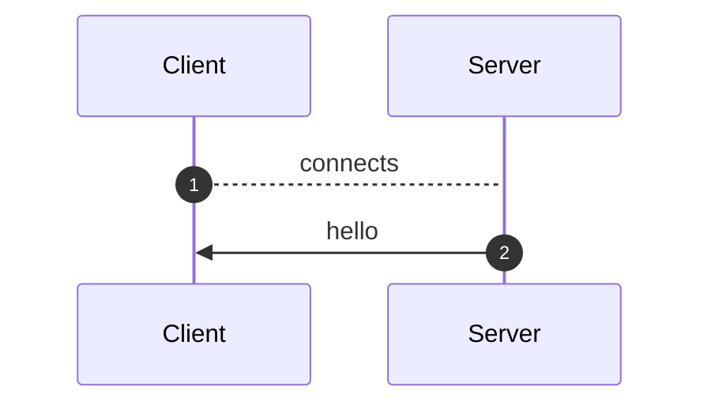
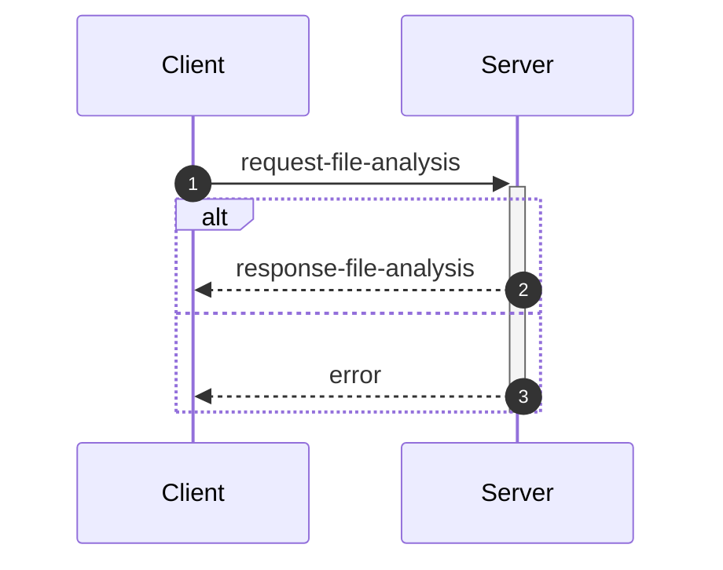
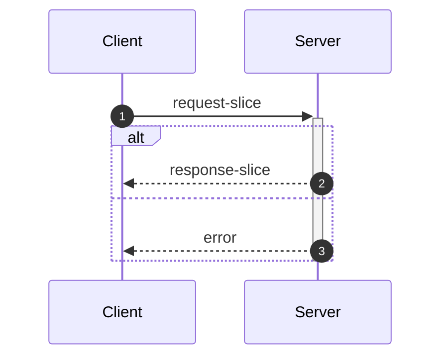
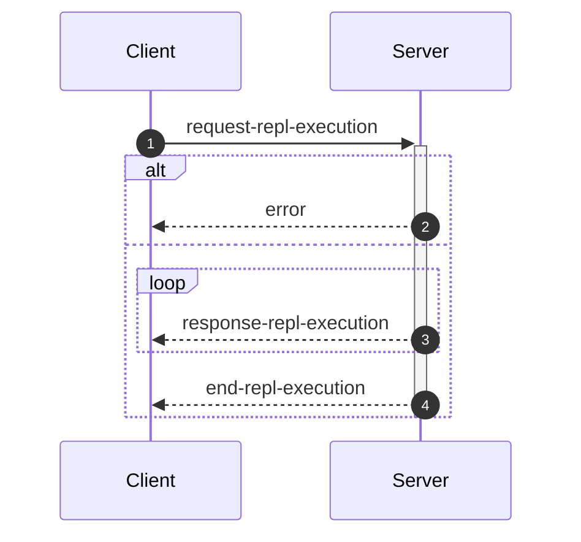

_This document was generated from '[src/documentation/wiki-interface.ts](https://github.com/flowr-analysis/flowr/tree/main//src/documentation/wiki-interface.ts)' on 2026-07-20, 21:13:35 UTC presenting an overview of flowR's interface (v2.13.0, using R v4.5.0). Please do not edit this file/wiki page directly._

Although far from being as detailed as the in-depth explanation of [_flowR_](https://github.com/flowr-analysis/flowr/wiki/core),
this wiki page explains how to interface with _flowR_ in more detail.
In general, command line arguments and other options provide short descriptions on hover over.

* [💻 Using the REPL](#using-the-repl)
* [⚙️ Configuring FlowR](#configuring-flowr)
* [⚒️ Writing Code](#writing-code)
* [💬 Communicating with the Server](#communicating-with-the-server)

<a id='using-the-repl'></a>
## 💻 Using the REPL


> [!NOTE]
> To execute arbitrary R commands with a repl request, _flowR_ has to be started explicitly with <span title="Description (Command Line Argument): Allow to access the underlying R session when using flowR (security warning: this allows the execution of arbitrary R code!)">`--r-session-access`</span>.
> Please be aware that this introduces a security risk and note that this relies on the [`r-shell` engine](https://github.com/flowr-analysis/flowr/wiki/engines) .

Although primarily meant for users to explore,
there is nothing which forbids simply calling _flowR_ as a subprocess to use standard-in, -output, and -error
for communication (although you can access the REPL using the server as well,
with the [REPL Request](#message-request-repl-execution) message).

The read-eval-print loop&nbsp;(REPL) works relatively simple.
You can submit an expression (using <kbd>Enter</kbd>),
which is interpreted as an R&nbsp;expression by default but interpreted as a *command* if it starts with a colon (`:`).
The best command to get started with the REPL is <span title="Description (Repl Command): Show help information (aliases: :h, :?)">`:help`</span>.
Besides, you can leave the REPL either with the command <span title="Description (Repl Command): End the repl (aliases: :q, :exit)">`:quit`</span> or by pressing <kbd>Ctrl</kbd>+<kbd>C</kbd> twice.
When writing a *command*, you may press <kbd>Tab</kbd> to get a list of completions, if available.
Multiple commands can be entered in a single line by separating them with a semicolon (`;`), e.g. `:parse "x<-2"; :df*`.
If a command is given without R code, the REPL will re-use R code given in a previous command.
The prior example will hence return first the parsed AST of the program and then the dataflow graph for `"x <- 2"`.

> [!NOTE]
> If you develop flowR, you may want to launch the repl using the `npm run main-dev` command, this way, you get a non-minified version of flowR with debug information and hot-reloading of source files.

<details>
<summary>Available Commands</summary>

We currently offer the following commands (this with a `[*]` suffix are available with and without the star):


| Command | Description |
| ------- | ----------- |
| **<span title="Description (Repl Command): End the repl (aliases: :q, :exit)">:quit</span>** | End the repl (aliases: **:<span title="Alias of ':quit'. End the repl">q</span>**, **:<span title="Alias of ':quit'. End the repl">exit</span>**) |
| **<span title="Description (Repl Command): Execute the given code as R code. This requires the `--r-session-access` flag to be set and requires the r-shell engine. (aliases: :e, :r)">:execute</span>** | Execute the given code as R code. This requires the `--r-session-access` flag to be set and requires the r-shell engine. (aliases: **:<span title="Alias of ':execute'. Execute the given code as R code. This requires the `--r-session-access` flag to be set and requires the r-shell engine.">e</span>**, **:<span title="Alias of ':execute'. Execute the given code as R code. This requires the `--r-session-access` flag to be set and requires the r-shell engine.">r</span>**) |
| **<span title="Description (Repl Command): Get mermaid code for the control-flow graph of R code (aliases: :cfg, :cf)">:controlflow[*]</span>** | Get mermaid code for the control-flow graph of R code (star: Returns the URL to mermaid.live) (aliases: **:<span title="Alias of ':controlflow'. Get mermaid code for the control-flow graph of R code">cfg</span>**, **:<span title="Alias of ':controlflow'. Get mermaid code for the control-flow graph of R code">cf</span>**) |
| **<span title="Description (Repl Command): Get mermaid code for the control-flow graph with basic blocks (aliases: :cfgb, :cfb)">:controlflowbb[*]</span>** | Get mermaid code for the control-flow graph with basic blocks (star: Returns the URL to mermaid.live) (aliases: **:<span title="Alias of ':controlflowbb'. Get mermaid code for the control-flow graph with basic blocks">cfgb</span>**, **:<span title="Alias of ':controlflowbb'. Get mermaid code for the control-flow graph with basic blocks">cfb</span>**) |
| **<span title="Description (Repl Command): Get mermaid code for the dataflow graph (aliases: :d, :df)">:dataflow[*]</span>** | Get mermaid code for the dataflow graph (star: Returns the URL to mermaid.live) (aliases: **:<span title="Alias of ':dataflow'. Get mermaid code for the dataflow graph">d</span>**, **:<span title="Alias of ':dataflow'. Get mermaid code for the dataflow graph">df</span>**) |
| **<span title="Description (Repl Command): Get mermaid code for the normalized AST of R code (aliases: :n)">:normalize[*]</span>** | Get mermaid code for the normalized AST of R code (star: Returns the URL to mermaid.live) (alias: **:<span title="Alias of ':normalize'. Get mermaid code for the normalized AST of R code">n</span>**) |
| **<span title="Description (Repl Command): Get mermaid code for the simplified dataflow graph (aliases: :ds, :dfs)">:dataflowsimple[*]</span>** | Get mermaid code for the simplified dataflow graph (star: Returns the URL to mermaid.live) (aliases: **:<span title="Alias of ':dataflowsimple'. Get mermaid code for the simplified dataflow graph">ds</span>**, **:<span title="Alias of ':dataflowsimple'. Get mermaid code for the simplified dataflow graph">dfs</span>**) |
| **<span title="Description (Repl Command): Inspect and extend the signature database: `query` (identical to :query @signature), `add <path>` to mount another database/source, `download` to fetch the full-history database. (aliases: :sig)">:signature</span>** | Inspect and extend the signature database: `query` (identical to :query @signature), `add <path>` to mount another database/source, `download` to fetch the full-history database. (alias: **:<span title="Alias of ':signature'. Inspect and extend the signature database: `query` (identical to :query @signature), `add <path>` to mount another database/source, `download` to fetch the full-history database.">sig</span>**) |
| **<span title="Description (Repl Command): Just calculates the DFG, but only prints summary info (aliases: :d#, :df#)">:dataflowsilent</span>** | Just calculates the DFG, but only prints summary info (aliases: **:<span title="Alias of ':dataflowsilent'. Just calculates the DFG, but only prints summary info">d#</span>**, **:<span title="Alias of ':dataflowsilent'. Just calculates the DFG, but only prints summary info">df#</span>**) |
| **<span title="Description (Repl Command): Prints ASCII Art of the parsed, unmodified AST (aliases: :p)">:parse</span>** | Prints ASCII Art of the parsed, unmodified AST (alias: **:<span title="Alias of ':parse'. Prints ASCII Art of the parsed, unmodified AST">p</span>**) |
| **<span title="Description (Repl Command): Prints the version of flowR as well as the current version of R">:version</span>** | Prints the version of flowR as well as the current version of R
| **<span title="Description (Repl Command): Query the given R code (use 'help' for more information)">:query[*]</span>** | Query the given R code (use 'help' for more information) (star: Similar to query, but returns the output in json format.)
| **<span title="Description (Repl Command): Returns an ASCII representation of the dataflow graph (aliases: :df!)">:dataflowascii</span>** | Returns an ASCII representation of the dataflow graph (alias: **:<span title="Alias of ':dataflowascii'. Returns an ASCII representation of the dataflow graph">df!</span>**) |
| **<span title="Description (Repl Command): Returns summarization stats for the normalized AST (aliases: :n#)">:normalize#</span>** | Returns summarization stats for the normalized AST (alias: **:<span title="Alias of ':normalize#'. Returns summarization stats for the normalized AST">n#</span>**) |
| **<span title="Description (Repl Command): Show help information (aliases: :h, :?)">:help</span>** | Show help information (aliases: **:<span title="Alias of ':help'. Show help information">h</span>**, **:<span title="Alias of ':help'. Show help information">?</span>**) |


</details>


> [!TIP]
> 
> As indicated by the examples before, all REPL commands that operate on code keep track of the state.
> Hence, if you run a command like <span title="Description (Repl Command, starred version): Returns the URL to mermaid.live; Base Command: Get mermaid code for the dataflow graph (aliases: :d*, :df*)">`:dataflow*`</span> without providing R code,
> the REPL will re-use the R code provided in a previous command.
> Likewise, doing this will benefit from incrementality!
> If you request the dataflow graph with `:df* x <- 2 * y` and then want to see the parsed AST with `:parse`,
> the REPL will re-use previously obtained information and not re-parse the code again.
> 		


Generally, many commands offer shortcut versions in the REPL. Many queries, for example, offer a shortened format (see the example below).
Of special note, the [Config Query](https://github.com/flowr-analysis/flowr/wiki/%5BQuery%5D-Config)
can be used to also modify the currently active configuration of _flowR_ within the REPL (see the [wiki page](https://github.com/flowr-analysis/flowr/wiki/%5BQuery%5D-Config) for more information).

### Example: Retrieving the Dataflow Graph

To retrieve a URL to the [mermaid](https://mermaid.js.org/) diagram of the dataflow of a given expression,
use <span title="Description (Repl Command, starred version): Returns the URL to mermaid.live; Base Command: Get mermaid code for the dataflow graph (aliases: :d*, :df*)">`:dataflow*`</span> (or <span title="Description (Repl Command): Get mermaid code for the dataflow graph (aliases: :d, :df)">`:dataflow`</span> to get the mermaid code in the cli):


```shell
$ docker run -it --rm eagleoutice/flowr # or npm run flowr 
flowR repl v2.13.0, R grammar v14 (tree-sitter engine)
R> :dataflow* y <- 1 + x
```

<details>
<summary style='color:gray'>Output</summary>


```text
https://mermaid.live/view#base64:eyJjb2RlIjoiZmxvd2NoYXJ0IEJUXG4gICAgMXt7XCJgKiM5MTtSTnVtYmVyIzkzOyogKioxKipcbiAgICAgICoxLjYqICgqKmlkOiAxKiopYFwifX1cbiAgICUlIE5vIGVkZ2VzIGZvdW5kIGZvciAxXG4gICAgMihbXCJgKiM5MTtSU3ltYm9sIzkzOyogKip4KipcbiAgICAgICoxLjEwKiAoKippZDogMioqKWBcIl0pXG4gICAlJSBObyBlZGdlcyBmb3VuZCBmb3IgMlxuICAgIDNbW1wiYCojOTE7UkJpbmFyeU9wIzkzOyogYmFzZSM1ODsjNTg7KiojNDM7KipcbiAgICAgICoxLjYtMTAqICgqKmlkOiAzKiopXG4gICAgYXJnOiAoMSwgMilgXCJdXVxuICAgIGJ1aWx0LWluOl9bXCJgQnVpbHQtSW46XG4jNDM7YFwiXVxuICAgIHN0eWxlIGJ1aWx0LWluOl8gc3Ryb2tlOmdyYXksZmlsbDpncmF5LHN0cm9rZS13aWR0aDoycHgsb3BhY2l0eTouODtcbiAgICAwW1wiYCojOTE7UlN5bWJvbCM5MzsqICoqeSoqXG4gICAgICAqMS4xKiAoKippZDogMCoqLCB2OiAzKWBcIl1cbiAgICA0W1tcImAqIzkxO1JCaW5hcnlPcCM5MzsqIGJhc2UjNTg7IzU4OyoqIzYwOyM0NTsqKlxuICAgICAgKjEuMS0xMCogKCoqaWQ6IDQqKilcbiAgICBhcmc6ICgwLCAzKWBcIl1dXG4gICAgYnVpbHQtaW46Xy1bXCJgQnVpbHQtSW46XG4jNjA7IzQ1O2BcIl1cbiAgICBzdHlsZSBidWlsdC1pbjpfLSBzdHJva2U6Z3JheSxmaWxsOmdyYXksc3Ryb2tlLXdpZHRoOjJweCxvcGFjaXR5Oi44O1xuICAgIDMgLS0+fFwicmVhZHMsIGFyZ1wifCAxXG4gICAgMyAtLT58XCJyZWFkcywgYXJnXCJ8IDJcbiAgICAzIC0uLT58XCJyZWFkcywgY2FsbHNcInwgYnVpbHQtaW46X1xuICAgIGxpbmtTdHlsZSAyIHN0cm9rZTpncmF5O1xuICAgIDAgLS0+fFwiZGVmaW5lZC1ieVwifCAzXG4gICAgMCAtLT58XCJkZWZpbmVkLWJ5XCJ8IDRcbiAgICA0IC0tPnxcInJlYWRzLCBhcmdcInwgM1xuICAgIDQgLS0+fFwicmV0dXJucywgYXJnXCJ8IDBcbiAgICA0IC0uLT58XCJyZWFkcywgY2FsbHNcInwgYnVpbHQtaW46Xy1cbiAgICBsaW5rU3R5bGUgNyBzdHJva2U6Z3JheTsiLCJtZXJtYWlkIjp7ImF1dG9TeW5jIjp0cnVlfX0=
```


Retrieve the dataflow graph of the expression `y <- 1 + x`. It looks like this:


```mermaid
flowchart LR
    1{{"`*#91;RNumber#93;* **1**
      *1.6* (**id: 1**)`"}}
   %% No edges found for 1
    2(["`*#91;RSymbol#93;* **x**
      *1.10* (**id: 2**)`"])
   %% No edges found for 2
    3[["`*#91;RBinaryOp#93;* base#58;#58;**#43;**
      *1.6-10* (**id: 3**)
    arg: (1, 2)`"]]
    built-in:_["`Built-In:
#43;`"]
    style built-in:_ stroke:gray,fill:gray,stroke-width:2px,opacity:.8;
    0["`*#91;RSymbol#93;* **y**
      *1.1* (**id: 0**, v: 3)`"]
    4[["`*#91;RBinaryOp#93;* base#58;#58;**#60;#45;**
      *1.1-10* (**id: 4**)
    arg: (0, 3)`"]]
    built-in:_-["`Built-In:
#60;#45;`"]
    style built-in:_- stroke:gray,fill:gray,stroke-width:2px,opacity:.8;
    3 -->|"reads, arg"| 1
    3 -->|"reads, arg"| 2
    3 -.->|"reads, calls"| built-in:_
    linkStyle 2 stroke:gray;
    0 -->|"defined-by"| 3
    0 -->|"defined-by"| 4
    4 -->|"reads, arg"| 3
    4 -->|"returns, arg"| 0
    4 -.->|"reads, calls"| built-in:_-
    linkStyle 7 stroke:gray;
```

	
<details>

<summary style="color:gray">R Code of the Dataflow Graph</summary>

The analysis required _0.8 ms_ (including parse and normalize, using the [tree-sitter](https://github.com/flowr-analysis/flowr/wiki/Engines) engine) within the generation environment. No [signature database](https://github.com/flowr-analysis/flowr/wiki/Signature-Database) is mounted for these generated graphs, so `library()` calls attach no package exports; base-R names are still qualified via the generated base-package store (e.g. `acf` as `stats::acf`). 
We encountered no unknown side effects during the analysis.


```r
y <- 1 + x
```


</details>


</details>


For small graphs like this, <span title="Description (Repl Command): Returns an ASCII representation of the dataflow graph (aliases: :df!)">`:dataflowascii`</span> also provides an ASCII representation directly in the REPL:


```shell
$ docker run -it --rm eagleoutice/flowr # or npm run flowr 
flowR repl v2.13.0, R grammar v14 (tree-sitter engine)
R> :df! y <- 1 + x
```

<details open>
<summary style='color:gray'>Output</summary>


```text
                        0<1>0
                   ┌────| 1 |
    ┌────────┐     │    0---0
 c<4>c       └──c<3>c
 |<- |  v<0>v┌──| + |
 c---c──| y |┘  c---c   u<2>u
        v---v      └────| x |
                        u---u
Edges:
3 -> 1: reads, arg  3 -> 2: reads, arg
4 -> 3: reads, arg  4 -> 0: returns, arg
0 -> 3: defined-by  0 -> 4: defined-by
```


Retrieve the dataflow graph of the expression `y <- 1 + x` as ASCII art.

</details>


For the slicing with <span title="Description (Repl Command): Static backwards executable slicer for R">`:slicer`</span>, you have access to the same [magic comments](#slice-magic-comments) as with the [slice request](#message-request-slice).
Pass `--inline` to splice resolvable `source()` calls into the reconstruction so the slice is a single self-contained R text (the same as the static slice query's `inlineSources` flag).
See `--help` for more flags!

### Example: Interfacing with the File System

Many commands that allow for an R-expression (like <span title="Description (Repl Command, starred version): Returns the URL to mermaid.live; Base Command: Get mermaid code for the dataflow graph (aliases: :d*, :df*)">`:dataflow*`</span>) allow for a file as well
if the argument starts with `file://`.
If you are working from the root directory of the _flowR_ repository, the following gives you the parsed AST of the example file using the <span title="Description (Repl Command): Prints ASCII Art of the parsed, unmodified AST (aliases: :p)">`:parse`</span> command:

> **Watch mode**: Replace `file://` with `watch://` to enter watch mode.
> flowR runs the command immediately and then re-runs it every time the file (or any file inside the folder) changes.
> Enter any other command to leave watch mode.
> For example: `:df watch://analysis.R`


```shell
$ docker run -it --rm eagleoutice/flowr # or npm run flowr 
flowR repl v2.13.0, R grammar v14 (tree-sitter engine)
R> :parse file://test/testfiles/example.R
```

<details>
<summary style='color:gray'>Output</summary>


```text
File: test/testfiles/example.R

program
├ binaryoperator
│ ├ identifier "sum" (1:1─4)
│ ├ <- "<-" (1:5─7)
│ ╰ float "0" (1:8─9)
├ binaryoperator
│ ├ identifier "product" (2:1─8)
│ ├ <- "<-" (2:9─11)
│ ╰ float "1" (2:12─13)
├ binaryoperator
│ ├ identifier "w" (3:1─2)
│ ├ <- "<-" (3:3─5)
│ ╰ float "7" (3:6─7)
├ binaryoperator
│ ├ identifier "N" (4:1─2)
│ ├ <- "<-" (4:3─5)
│ ╰ float "10" (4:6─8)
├ forstatement
│ ├ for "for" (6:1─4)
│ ├ ( "(" (6:5─6)
│ ├ identifier "i" (6:6─7)
│ ├ in "in" (6:8─10)
│ ├ binaryoperator
│ │ ├ float "1" (6:11─12)
│ │ ├ : ":" (6:12─13)
│ │ ╰ parenthesizedexpression
│ │   ├ ( "(" (6:13─14)
│ │   ├ binaryoperator
│ │   │ ├ identifier "N" (6:14─15)
│ │   │ ├ - "-" (6:15─16)
│ │   │ ╰ float "1" (6:16─17)
│ │   ╰ ) ")" (6:17─18)
│ ├ ) ")" (6:18─19)
│ ╰ bracedexpression
│   ├ { "{" (6:20─21)
│   ├ binaryoperator
│   │ ├ identifier "sum" (7:3─6)
│   │ ├ <- "<-" (7:7─9)
│   │ ╰ binaryoperator
│   │   ├ binaryoperator
│   │   │ ├ identifier "sum" (7:10─13)
│   │   │ ├ + "+" (7:14─15)
│   │   │ ╰ identifier "i" (7:16─17)
│   │   ├ + "+" (7:18─19)
│   │   ╰ identifier "w" (7:20─21)
│   ├ binaryoperator
│   │ ├ identifier "product" (8:3─10)
│   │ ├ <- "<-" (8:11─13)
│   │ ╰ binaryoperator
│   │   ├ identifier "product" (8:14─21)
│   │   ├  "" (8:22─23)
│   │   ╰ identifier "i" (8:24─25)
│   ╰ } "}" (9:1─2)
├ call
│ ├ identifier "cat" (11:1─4)
│ ╰ arguments
│   ├ ( "(" (11:4─5)
│   ├ argument
│   │ ╰ string
│   │   ├ " "\"" (11:5─6)
│   │   ├ stringcontent "Sum:" (11:6─10)
│   │   ╰ " "\"" (11:10─11)
│   ├ comma "," (11:11─12)
│   ├ argument
│   │ ╰ identifier "sum" (11:13─16)
│   ├ comma "," (11:16─17)
│   ├ argument
│   │ ╰ string
│   │   ├ " "\"" (11:18─19)
│   │   ├ stringcontent
│   │   │ ╰ escapesequence "\\n" (11:19─21)
│   │   ╰ " "\"" (11:21─22)
│   ╰ ) ")" (11:22─23)
╰ call
  ├ identifier "cat" (12:1─4)
  ╰ arguments
    ├ ( "(" (12:4─5)
    ├ argument
    │ ╰ string
    │   ├ " "\"" (12:5─6)
    │   ├ stringcontent "Product:" (12:6─14)
    │   ╰ " "\"" (12:14─15)
    ├ comma "," (12:15─16)
    ├ argument
    │ ╰ identifier "product" (12:17─24)
    ├ comma "," (12:24─25)
    ├ argument
    │ ╰ string
    │   ├ " "\"" (12:26─27)
    │   ├ stringcontent
    │   │ ╰ escapesequence "\\n" (12:27─29)
    │   ╰ " "\"" (12:29─30)
    ╰ ) ")" (12:30─31)
```


Retrieve the parsed AST of the example file.

<details>

<summary>File Content</summary>


```r
sum <- 0
product <- 1
w <- 7
N <- 10

for (i in 1:(N-1)) {
  sum <- sum + i + w
  product <- product * i
}

cat("Sum:", sum, "\n")
cat("Product:", product, "\n")
```


</details>

As _flowR_ directly transforms this AST the output focuses on being human-readable instead of being machine-readable.
		

</details>


### Example: Run a Query

You can run any query supported by _flowR_ using the <span title="Description (Repl Command): Query the given R code (use 'help' for more information)">`:query`</span> command.
For example, to obtain the shapes of all data frames in a given piece of code, you can run:


```shell
$ docker run -it --rm eagleoutice/flowr # or npm run flowr 
flowR repl v2.13.0, R grammar v14 (tree-sitter engine)
R> :query @absint df-shape "x <- data.frame(a = 1:10, b = 1:10)\ny <- x$a"
```

<details open>
<summary style='color:gray'>Output</summary>


```text
Query: absint (2 ms)
   ╰ $12: (colnames: [{"a", "b"}, {}], cols: [2, 2], rows: [10, 10])
   ╰ $0: (colnames: [{"a", "b"}, {}], cols: [2, 2], rows: [10, 10])
All queries together required ≈6 ms (1ms accuracy, total 6 ms)
```


Retrieve the shapes of all data frames in the given code.

</details>


To run the linter on a file, you can use (in this example, we just issue the `dead-code` linter on a small piece of code):


```shell
$ docker run -it --rm eagleoutice/flowr # or npm run flowr 
flowR repl v2.13.0, R grammar v14 (tree-sitter engine)
R> :query @linter rules:dead-code "if(FALSE) x <- 2"
```

<details open>
<summary style='color:gray'>Output</summary>


```text
Query: linter (2 ms)
   ╰ Dead Code (dead-code):
       ╰ certain:
           ╰ Code at 1.11-16
       ╰ Metadata: searchTimeMs: 2, processTimeMs: 0
All queries together required ≈2 ms (1ms accuracy, total 3 ms)
```


Run the linter on the given code, with only the `dead-code` rule enabled.

</details>


For more information on the available queries, please check out the [Query API](https://github.com/flowr-analysis/flowr/wiki/query-api).


<a id='configuring-flowr'></a>
## ⚙️ Configuring FlowR


When running _flowR_, you may want to specify some behaviors with a dedicated configuration file.
By default, flowR looks for a file named `flowr.json` in the current working directory (or any higher directory).
You can also specify a different file with <span title="Description (Command Line Argument): The name of the configuration file to use">`--config-file`</span> or pass the configuration inline using <span title="Description (Command Line Argument): The flowR configuration to use, as a JSON string">`--config-json`</span>.
To inspect the current configuration, you can run flowr with the <span title="Description (Command Line Argument): Run with verbose logging (will be passed to the corresponding script)">`--verbose`</span> flag, or use the `config` [Query](https://github.com/flowr-analysis/flowr/wiki/query-api).
Within the REPL this works by running the following:


```shell
:query @config
```


To work with the <a href="https://github.com/flowr-analysis/flowr/tree/main/src/config.ts#L129"><code><span title="The configuration file format for flowR.">FlowrConfig</span></code></a> you can use the provided helper objects alongside its methods like
<a href="https://github.com/flowr-analysis/flowr/tree/main/src/config.ts#L717"><code><span title="Creates a new flowr config that has the updated values.">FlowrConfig::<b>amend</b></span></code></a>.
The schema below documents every option; the ones you most likely want are:

- <a href="https://github.com/flowr-analysis/flowr/wiki/Interface#configuring-flowr" title="Configuration Option (boolean): Whether source calls should be ignored, causing {@link processSourceCall}&#39;s behavior to be skipped.">ignoreSourceCalls</a>: ignore source calls when analyzing the code, i.e., ignore the inclusion of other files.
- <a href="https://github.com/flowr-analysis/flowr/wiki/Interface#configuring-flowr" title="Configuration Option (boolean): Whether load calls should be ignored, causing {@link processLoadCall}&#39;s behavior to be skipped.">ignoreLoadCalls</a>: ignore load calls when analyzing the code, i.e., ignore the loading of r-data files.
- <a href="https://github.com/flowr-analysis/flowr/wiki/Interface#configuring-flowr" title="Configuration Option (object): Do you want to overwrite (parts) of the builtin definition?">semantics.environment.overwriteBuiltIns</a>: overwrite _flowR_'s handling of built-in functions, or clear the preset definitions entirely.
  See [Configure BuiltIn Semantics](#configure-builtin-semantics) for more information.
- <a href="https://github.com/flowr-analysis/flowr/wiki/Interface#configuring-flowr" title="Configuration Option (string): How to resolve variables and their values. (one of &quot;disabled&quot;, &quot;alias&quot;, &quot;builtin&quot;)">solver.variables</a>: how to resolve variables and their values (`disabled`, `alias`, `builtin`).
- <a href="https://github.com/flowr-analysis/flowr/wiki/Interface#configuring-flowr" title="Configuration Option (array): The engine or set of engines to use for interacting with R code. An empty array means all available engines will be used.">engines</a> and <a href="https://github.com/flowr-analysis/flowr/wiki/Interface#configuring-flowr" title="Configuration Option (string): The default engine to use for interacting with R code. If this is undefined, an arbitrary engine from the specified list will be used. (one of &quot;tree-sitter&quot;, &quot;r-shell&quot;)">defaultEngine</a>: the engines used to interact with R code, see the [Engines wiki page](https://github.com/flowr-analysis/flowr/wiki/engines).
- <a href="https://github.com/flowr-analysis/flowr/wiki/Interface#configuring-flowr" title="Configuration Option (array): Files a framework loads on its own, without any source() call (e.g. global.R in a shiny app), in the order they are loaded; flowR orders the matching project files accordingly and analyzes them as one program. Entries are case-insensitive globs matched against the file path, a plain name matches any file with that name, and entries matching no project file are warned about. Usually set per project kind via specializeConfig.">project.implicitSources</a>: the files a framework loads without any `source()` call, in the order in which they are
  loaded. Entries are globs (e.g. `R/*.R`) matched against the file path ignoring capitalization; one matching no file is reported.
- <a href="https://github.com/flowr-analysis/flowr/wiki/Interface#configuring-flowr" title="Configuration Option (object): Overwrite (parts of) the configuration depending on the project kind flowR detects, e.g. to give a shiny app its implicit sources.">specializeConfig</a>: overwrite (parts of) the configuration depending on the kind of project _flowR_ detects
  (e.g. `shiny-app`), which is how a shiny app gets its implicit sources by default. What you configure directly wins.
- <a href="https://github.com/flowr-analysis/flowr/wiki/Interface#configuring-flowr" title="Configuration Option (string): Overwrite the project kind flowR would otherwise infer from the analyzed files, e.g. when auto-detection guesses wrong. (one of &quot;package&quot;, &quot;script&quot;, &quot;shiny-app&quot;, &quot;notebook&quot;, &quot;project&quot;, &quot;unknown&quot;)">project.useProjectType</a>: skip that detection and force a project kind yourself, when auto-detection guesses wrong.
- <a href="https://github.com/flowr-analysis/flowr/wiki/Interface#configuring-flowr" title="Configuration Option (array): The default plugins to load when creating a new instance of FlowrAnalyzer">defaultPlugins</a> and <a href="https://github.com/flowr-analysis/flowr/wiki/Interface#configuring-flowr" title="Configuration Option (array): The plugins to load in REPL mode">repl.plugins</a>: the plugins to load for a new <a href="https://github.com/flowr-analysis/flowr/tree/main/src/project/flowr-analyzer.ts#L167"><code><span title="Central class for conducting analyses with FlowR. Use the FlowrAnalyzerBuilder to create a new instance. If you want the original pattern of creating a pipeline and running all steps, you can still do this with FlowrAnalyzer#runFull . To inspect the context of the analyzer, use FlowrAnalyzer#inspectContext (if you are a plugin and need to modify it, use FlowrAnalyzer#context instead).">FlowrAnalyzer</span></code></a> and in the REPL
  (use `flowr:default` to reference the former).

So you can configure _flowR_ by adding a file like the following:

<details>

<summary>Example Configuration File</summary>


```json
{
  "ignoreSourceCalls": true,
  "ignoreLoadCalls": true,
  "semantics": {
    "environment": {
      "overwriteBuiltIns": {
        "definitions": [
          {
            "type": "function",
            "names": [
              "foo"
            ],
            "processor": "builtin:assign",
            "config": {}
          }
        ]
      }
    }
  },
  "defaultPlugins": [
    "file:description",
    "versions:description"
  ],
  "repl": {
    "quickStats": false,
    "dfProcessorHeat": false,
    "hints": true,
    "plugins": [
      "flowr:default"
    ]
  },
  "project": {
    "resolveUnknownPathsOnDisk": true,
    "implicitSources": [
      "global.R",
      "app.R"
    ]
  },
  "linter": {
    "disabledRules": []
  },
  "specializeConfig": {
    "shiny-app": {
      "project": {
        "implicitSources": [
          "global.R",
          "ui.R",
          "server.R",
          "app.R"
        ]
      }
    }
  },
  "engines": [
    {
      "type": "r-shell"
    }
  ],
  "solver": {
    "variables": "alias",
    "evalStrings": true,
    "trackEnvironments": true,
    "sigdb": {
      "enabled": true,
      "loadProjectDependencies": true,
      "eagerlyLoad": false,
      "eagerlyLoadExports": false,
      "linkBaseR": false,
      "linkDescriptionDependencies": false
    },
    "resolveSource": {
      "dropPaths": "no",
      "ignoreCapitalization": true,
      "inferWorkingDirectory": "active-script",
      "searchPath": []
    },
    "instrument": {},
    "slicer": {
      "threshold": 50
    }
  },
  "abstractInterpretation": {
    "wideningThreshold": 4,
    "dataFrame": {
      "maxColNames": 20,
      "readLoadedData": {
        "readExternalFiles": true,
        "maxReadLines": 1000000
      }
    }
  },
  "gas": {
    "thresholds": {
      "memory": {
        "problematic": 0.7,
        "critical": 0.9
      },
      "timeMs": {
        "problematic": 100000,
        "critical": 120000
      }
    },
    "features": {}
  }
}
```


</details>

<details>
<a id='configure-builtin-semantics'></a>
<summary>Configure Built-In Semantics</summary>


`semantics/environment/overwriteBuiltins` accepts two keys:

- `loadDefaults` (boolean, initially `true`): If set to `true`, the default built-in definitions are loaded before applying the custom definitions. Setting this flag to `false` explicitly disables the loading of the default definitions.
- `definitions` (array, initially empty): Allows to overwrite or define new built-in elements. Each object within must have a `type` which is one of the below. Furthermore, they may define a string array of `names` which specifies the identifiers to bind the definitions to. You may use `assumePrimitive` to specify whether _flowR_ should assume that this is a primitive non-library definition (so you probably just do not want to specify the key).

  | Type            | Description                                                                                                                                                                                                                                                                                              | Example                                                                                                    |
  | --------------- | -------------------------------------------------------------------------------------------------------------------------------------------------------------------------------------------------------------------------------------------------------------------------------------------------------- | ---------------------------------------------------------------------------------------------------------- |
  | `constant`    | Additionally allows for a `value` this should resolve to.                                                                                                                                                                                                                                                | `{ type: 'constant', names: ['NULL', 'NA'],  value: null }`                                                |
  | `function`    | Is a rather flexible way to define and bind built-in functions. For the time, we do not have extensive documentation to cover all the cases, so please either consult the sources with the `default-builtin-config.ts` or open a [new issue](https://github.com/flowr-analysis/flowr/issues/new/choose). | `{ type: 'function', names: ['next'], processor: 'builtin:d', config: { cfg: ExitPointType.Next } }` |
  | `replacement` | A comfortable way to specify replacement functions like `$<-` or `names<-`. `suffixes` describes the... suffixes to attach automatically. | `{ type: 'replacement', suffixes: ['<-', '<<-'], names: ['[', '[['] }` |


</details>

<details>

<summary style='color:gray'>Full Configuration-File Schema</summary>

- _The configuration file format for flowR._ (object)
    - **logLevel** [optional] _flowR's global minimum log level, applied when the config is loaded._ (string)
        Only allows: 'silly', 'trace', 'debug', 'info', 'warn', 'error', 'fatal'
    - **ignoreSourceCalls** [optional] _Whether source calls should be ignored, causing {@link processSourceCall}'s behavior to be skipped._ (boolean)
    - **ignoreLoadCalls** [optional] _Whether load calls should be ignored, causing {@link processLoadCall}'s behavior to be skipped._ (boolean)
    - **semantics** _Configure language semantics and how flowR handles them._ (object)
        - **environment** [optional] _Semantics regarding how to handle the R environment._ (object)
            - **overwriteBuiltIns** [optional] _Do you want to overwrite (parts) of the builtin definition?_ (object)
                - **loadDefaults** [optional] _Should the default configuration still be loaded?_ (boolean)
                - **definitions** [optional] _The definitions to load/overwrite._ (array)
                Valid item types:
                    - (object)
    - **defaultPlugins** [optional] _The default plugins to load when creating a new instance of FlowrAnalyzer_ (array)
    Valid item types:
        - (alternatives)
            - (string)
            - (array)
    - **repl** _Configuration options for the REPL._ (object)
        - **quickStats** [optional] _Whether to show quick stats in the REPL after each evaluation._ (boolean)
        - **dfProcessorHeat** [optional] _This instruments the dataflow processors to count how often each processor is called._ (boolean)
        - **hints** [optional] _Whether to show dim inline hints on the empty prompt (automatically disabled on non-interactive terminals)._ (boolean)
        - **plugins** [optional] _The plugins to load in REPL mode_ (array)
        Valid item types:
            - (alternatives)
                - (string)
                - (array)
        - **autoUseFileProtocol** [optional] _Prepend the file protocol to a repl input that looks like a path, instead of only warning about it._ (boolean)
        - **queryStats** [optional] _Whether `:query` closes with the line stating how long the queries took (`:query*` never prints it)._ (boolean)
        - **showPlugins** [optional] _Whether `:version` grays out the plugins that did not activate during the last analysis._ (boolean)
    - **project** _Project specific configuration options._ (object)
        - **resolveUnknownPathsOnDisk** [optional] _Whether to resolve unknown paths loaded by the r project disk when trying to source/analyze files._ (boolean)
        - **basePackages** [optional] _The packages considered part of R itself (base and recommended); if unset, flowR uses its built-in list._ (array)
        Valid item types:
            - (string)
        - **implicitSources** [optional] _Files a framework loads on its own, without any source() call (e.g. global.R in a shiny app), in the order they are loaded; flowR orders the matching project files accordingly and analyzes them as one program. Entries are case-insensitive globs matched against the file path, a plain name matches any file with that name, and entries matching no project file are warned about. Usually set per project kind via specializeConfig._ (array)
        Valid item types:
            - (string)
        - **useProjectType** [optional] _Overwrite the project kind flowR would otherwise infer from the analyzed files, e.g. when auto-detection guesses wrong._ (string)
            Only allows: 'package', 'script', 'shiny-app', 'notebook', 'project', 'unknown'
    - **linter** _Linter configuration options._ (object)
        - **disabledRules** _Linting rule names excluded from the default rule set (a rule requested explicitly via a linter query still runs). Usually set per project kind via specializeConfig._ (array)
        Valid item types:
            - (string)
    - **specializeConfig** [optional] _Overwrite (parts of) the configuration depending on the project kind flowR detects, e.g. to give a shiny app its implicit sources._ (object)
    - **engines** _The engine or set of engines to use for interacting with R code. An empty array means all available engines will be used._ (array)
    Valid item types:
        - (alternatives)
            - _The configuration for the tree sitter engine._ (object)
                - **type** [required] _Use the tree sitter engine._ (string)
                    Only allows: 'tree-sitter'
                - **wasmPath** [optional] _The path to the tree-sitter-r WASM binary to use. If this is undefined, this uses the default path._ (string)
                - **treeSitterWasmPath** [optional] _The path to the tree-sitter WASM binary to use. If this is undefined, this uses the default path._ (string)
                - **lax** [optional] _Whether to use the lax parser for parsing R code (allowing for syntax errors). If this is undefined, the strict parser will be used._ (boolean)
            - _The configuration for the R shell engine._ (object)
                - **type** [required] _Use the R shell engine._ (string)
                    Only allows: 'r-shell'
                - **rPath** [optional] _The path to the R executable to use. If this is undefined, this uses the default path._ (string)
    - **defaultEngine** [optional] _The default engine to use for interacting with R code. If this is undefined, an arbitrary engine from the specified list will be used._ (string)
        Only allows: 'tree-sitter', 'r-shell'
    - **solver** _How to resolve constants, constraints, cells, ..._ (object)
        - **variables** _How to resolve variables and their values._ (string)
            Only allows: 'disabled', 'alias', 'builtin'
        - **evalStrings** _Should we include eval(parse(text="...")) calls in the dataflow graph?_ (boolean)
        - **trackEnvironments** [optional] _Track user-created environments (new.env, assign/get/local with envir=, dollar-assign, attach). When false, all envir-style calls fall through conservatively._ (boolean)
        - **sigdb** _Resolving library exports from a signature database._ (object)
            - **enabled** [optional] _Resolve library()/use() exports from a signature database (default true); when false no database is consulted._ (boolean)
            - **loadProjectDependencies** [optional] _Load the project's declared dependencies from its metadata files (DESCRIPTION Imports/Depends, rproject.toml, renv.lock, rv.lock) (default true); when false these files are not read for dependencies._ (boolean)
            - **eagerlyLoad** [optional] _Parse the database up front rather than on the first package load (default false, ignored if disabled)._ (boolean)
            - **eagerlyLoadExports** [optional] _Add a vertex for every export on load rather than on demand (default false); keeps the dataflow graph small._ (boolean)
            - **assumedRVersion** [optional] _R version assumed when resolving versioned (base-R) exports: a pin like "4.5" or "auto" to detect the installed R (default "auto")._ (string)
            - **linkBaseR** [optional] _Eagerly attach base-R namespaces so bare base calls resolve without library() (default false)._ (boolean)
            - **linkBaseRCalls** [optional] _Add a lightweight Reads edge from a bare base-R call to its signature-database function vertex (default false; base-R qualification is edge-free otherwise)._ (boolean)
            - **linkPackageCalls** [optional] _Add a lightweight Reads edge from a resolved package call to its signature-database function vertex (default false)._ (boolean)
            - **linkDescriptionDependencies** [optional] _Eagerly attach the namespaces of the project's declared DESCRIPTION dependencies (Imports/Depends) so their exports resolve without an explicit library() (default false)._ (boolean)
            - **warmInBackground** [optional] _Decompress the hot shards (base + most-downloaded) in a background task on startup so the first library() lookup is warm (default false; for long-running servers/REPLs)._ (boolean)
            - **additionalPaths** [optional] _Extra directories or bundle/manifest files searched for signature databases (alongside the shipped default and $FLOWR_SIGDB_DIR); a downloaded full-history bundle placed here is mounted automatically._ (array)
            Valid item types:
                - (string)
            - **downloadRepo** [optional] _GitHub owner/repo the full-history bundle is downloaded from via ":signature download" (default "flowr-analysis/flowr", release tag "sigdb-v<flowR-version>")._ (string)
            - **autoSync** [optional] _On startup, re-download shards whose committed sigdb.remote.json hash no longer matches the cache, in the background (default false; opt-in network sync after a git pull)._ (boolean)
            - **versionSelection** [optional] _When a project constrains a dependency, resolve to the newest (default), oldest, or system-installed version satisfying it; system needs R and falls back to newest. Base-R packages always resolve against the assumed R version._ (string)
                Only allows: 'newest', 'oldest', 'system'
            - **versionOverrides** [optional] _Force an exact version for specific packages (name -> version), overriding both the project constraint and the versionSelection policy (default {})._ (object)
        - **versionManagement** _Policies for reasoning about dependency versions._ (object)
            - **linkedVersionGroups** [optional] _Groups of packages that must resolve to the same version; version guessing intersects each group so its members stay mutually compatible (default [])._ (array)
            Valid item types:
                - (array)
                Valid item types:
                    - (string)
        - **instrument** (object)
            - **dataflowExtractors** [optional] _These keys are only intended for use within code, allowing to instrument the dataflow analyzer!_ (any)
        - **resolveSource** [optional] _If lax source calls are active, flowR searches for sourced files much more freely, based on the configurations you give it. This option is only in effect if `ignoreSourceCalls` is set to false._ (object)
            - **dropPaths** _Allow to drop the first or all parts of the sourced path, if it is relative._ (string)
                Only allows: 'no', 'once', 'all'
            - **ignoreCapitalization** _Search for filenames matching in the lowercase._ (boolean)
            - **inferWorkingDirectory** _Try to infer the working directory from the main or any script to analyze._ (string)
                Only allows: 'no', 'main-script', 'active-script', 'any-script'
            - **searchPath** _Additionally search in these paths._ (array)
            Valid item types:
                - (string)
            - **repeatedSourceLimit** [optional] _How often the same file can be sourced within a single run? Please be aware: in case of cyclic sources this may not reach a fixpoint so give this a sensible limit._ (number)
            - **applyReplacements** _Provide name replacements for loaded files_ (array)
            Valid item types:
                - (object)
            - **assumeFilesExist** [optional] _Assume a sourced file is always there, making what it defines certain instead of conditional on the source call._ (boolean)
        - **slicer** [optional] _The configuration for the slicer._ (object)
            - **threshold** [optional] _The maximum number of iterations to perform on a single function call during slicing._ (number)
            - **autoExtend** [optional] _If set, the slicer will gain an additional post-pass._ (boolean)
    - **abstractInterpretation** _The configuration options for abstract interpretation._ (object)
        - **wideningThreshold** _The threshold for the number of visitations of a node at which widening should be performed to ensure the termination of the fixpoint iteration._ (number)
        - **dataFrame** _The configuration of the shape inference for data frames._ (object)
            - **maxColNames** _The maximum number of columns names to infer for data frames before over-approximating the column names to top._ (number)
            - **readLoadedData** _Configuration options for reading data frame shapes from loaded external data files, such as CSV files._ (object)
                - **readExternalFiles** _Whether data frame shapes should be extracted from loaded external files, such as CSV files._ (boolean)
                - **maxReadLines** _The maximum number of lines to read when extracting data frame shapes from loaded files, such as CSV files._ (number)
    - **gas** [optional] _Resource-usage guard (gas) configuration. All feature factors default to 0 (disabled). See https://github.com/flowr-analysis/flowr/wiki/Core#gas-resource-guard._ (object)
        - **thresholds** [optional] _Shared thresholds for all gas checks (scaled by per-feature factor)._ (object)
            - **memory** [optional] _Heap-usage fraction thresholds (0-1)._ (object)
                - **problematic** [optional] _Heap fraction (0-1) above which Problematic is returned._ (number)
                - **critical** [optional] _Heap fraction (0-1) above which Critical is returned._ (number)
            - **timeMs** [optional] _Elapsed analysis time thresholds in milliseconds._ (object)
                - **problematic** [optional] _Elapsed ms above which Problematic is returned._ (number)
                - **critical** [optional] _Elapsed ms above which Critical is returned._ (number)
        - **features** [optional] _Per-feature sensitivity factors. 0 or absent disables gas checking for that feature. A factor of 2 makes the feature twice as sensitive. Recognised keys: `source`, `side-effect-linking`, `linter`._ (object)
        - **heapProvider** [optional] _Custom heap statistics source (programmatic configs only), overriding the built-in v8/performance.memory detection._ (function)

</details>

	

<a id='writing-code'></a>
## ⚒️ Writing Code

_flowR_ can be used as a [module](https://www.npmjs.com/package/@eagleoutice/flowr) and offers several main classes and interfaces that are interesting for extension writers 
(see the [Visual Studio Code extension](https://marketplace.visualstudio.com/items?itemName=code-inspect.vscode-flowr) or the [Core](https://github.com/flowr-analysis/flowr/wiki/core) wiki page for more information).

### Creating Analyses with _flowR_

Nowadays, instances of the <a href="https://github.com/flowr-analysis/flowr/tree/main/src/project/flowr-analyzer.ts#L167"><code><span title="Central class for conducting analyses with FlowR. Use the FlowrAnalyzerBuilder to create a new instance. If you want the original pattern of creating a pipeline and running all steps, you can still do this with FlowrAnalyzer#runFull . To inspect the context of the analyzer, use FlowrAnalyzer#inspectContext (if you are a plugin and need to modify it, use FlowrAnalyzer#context instead).">FlowrAnalyzer</span></code></a> should be used as central frontend to get analysis results from _flowR_.
For example, a program slice can be created like this:


```ts
const analyzer = await new FlowrAnalyzerBuilder()
    .setEngine('tree-sitter')
    .build();
analyzer.addRequest('x <- 1\ny <- x\nx');
const result = await analyzer.query([
    {
        type:     'static-slice',
        criteria: ['3@x']
    }
]);
//console.log(result['static-slice']);
```


For more information, please have a look at the [Analyzer](https://github.com/flowr-analysis/flowr/wiki/analyzer) wiki page, which explains how to construct and use the <a href="https://github.com/flowr-analysis/flowr/tree/main/src/project/flowr-analyzer.ts#L167"><code><span title="Central class for conducting analyses with FlowR. Use the FlowrAnalyzerBuilder to create a new instance. If you want the original pattern of creating a pipeline and running all steps, you can still do this with FlowrAnalyzer#runFull . To inspect the context of the analyzer, use FlowrAnalyzer#inspectContext (if you are a plugin and need to modify it, use FlowrAnalyzer#context instead).">FlowrAnalyzer</span></code></a> in more detail.
To work with specific perspectives, you can also consult the respective pages like the [Dataflow Graph](https://github.com/flowr-analysis/flowr/wiki/dataflow-graph) or the [Abstract Interpretation](https://github.com/flowr-analysis/flowr/wiki/abstract-interpretation) wiki pages.
### The Pipeline Executor (Low-Level Interface)

Once, in the beginning, _flowR_ was meant to produce a dataflow graph merely to provide *program slices*. 
However, with continuous updates, the [Dataflow Graph](https://github.com/flowr-analysis/flowr/wiki/dataflow-graph) repeatedly proves to be the more interesting part.
With this, we restructured _flowR_'s originally *hardcoded* pipeline to be far more flexible. 
Now, it can be theoretically extended or replaced with arbitrary steps, optional steps, and what we call 'decorations' of these steps. 
In short, a slicing pipeline using the <a href="https://github.com/flowr-analysis/flowr/tree/main/src/core/pipeline-executor.ts#L97"><code><span title="**Please note:** The PipelineExecutor is now considered to be a rather low-level API for flowR. While it still works and is the basis for all other layers, we strongly recommend using the FlowrAnalyzer and its builder to create and use an analyzer instance that is pre-configured for your use-case. The pipeline executor allows to execute arbitrary pipelines in a step-by-step fashion. If you are not...">PipelineExecutor</span></code></a> looks like this:


```ts

const slicer = new PipelineExecutor(DEFAULT_SLICING_PIPELINE, {
  parser:    new RShell(),
  request:   requestFromInput('x <- 1\nx + 1'),
  criterion: ['2@x']
})
const slice = await slicer.allRemainingSteps()
// console.log(slice.reconstruct.code)
```


<details><summary>More Information</summary>


If you compare this, with what you would have done with the old (and removed) `SteppingSlicer`, 
this essentially just requires you to replace the `SteppingSlicer` with the <a href="https://github.com/flowr-analysis/flowr/tree/main/src/core/pipeline-executor.ts#L97"><code><span title="**Please note:** The PipelineExecutor is now considered to be a rather low-level API for flowR. While it still works and is the basis for all other layers, we strongly recommend using the FlowrAnalyzer and its builder to create and use an analyzer instance that is pre-configured for your use-case. The pipeline executor allows to execute arbitrary pipelines in a step-by-step fashion. If you are not...">PipelineExecutor</span></code></a>
and to pass the <a href="https://github.com/flowr-analysis/flowr/tree/main/src/core/steps/pipeline/default-pipelines.ts#L18"><code>DEFAULT_SLICING_PIPELINE</code></a> as the first argument.
The <a href="https://github.com/flowr-analysis/flowr/tree/main/src/core/pipeline-executor.ts#L97"><code><span title="**Please note:** The PipelineExecutor is now considered to be a rather low-level API for flowR. While it still works and is the basis for all other layers, we strongly recommend using the FlowrAnalyzer and its builder to create and use an analyzer instance that is pre-configured for your use-case. The pipeline executor allows to execute arbitrary pipelines in a step-by-step fashion. If you are not...">PipelineExecutor</span></code></a>...

1. Provides structures to investigate the results of all intermediate steps
2. Can be executed step-by-step
3. Can repeat steps (e.g., to calculate multiple slices on the same input)

See the in-code documentation for more information.


</details>

### Using the <a href="https://github.com/flowr-analysis/flowr/tree/main/src/r-bridge/shell.ts#L143"><code><span title="The RShell represents an interactive session with the R interpreter. You can configure it by RShellOptions . At the moment we are using a live R session (and not networking etc.) to communicate with R easily, which allows us to install packages etc. However, this might and probably will change in the future (leaving this as a legacy mode :D)">RShell</span></code></a> to Interact with R

The <a href="https://github.com/flowr-analysis/flowr/tree/main/src/r-bridge/shell.ts#L143"><code><span title="The RShell represents an interactive session with the R interpreter. You can configure it by RShellOptions . At the moment we are using a live R session (and not networking etc.) to communicate with R easily, which allows us to install packages etc. However, this might and probably will change in the future (leaving this as a legacy mode :D)">RShell</span></code></a> class allows interfacing with the `R`&nbsp;ecosystem installed on the host system.
Please have a look at [flowR's Engines](https://github.com/flowr-analysis/flowr/wiki/engines) for more information on alternatives (for example, the <a href="https://github.com/flowr-analysis/flowr/tree/main/src/r-bridge/lang-4.x/tree-sitter/tree-sitter-executor.ts#L18"><code><span title="Synchronous and (way) faster alternative to the RShell using tree-sitter.">TreeSitterExecutor</span></code></a>).


> [!IMPORTANT]
> 
> Each <a href="https://github.com/flowr-analysis/flowr/tree/main/src/r-bridge/shell.ts#L143"><code><span title="The RShell represents an interactive session with the R interpreter. You can configure it by RShellOptions . At the moment we are using a live R session (and not networking etc.) to communicate with R easily, which allows us to install packages etc. However, this might and probably will change in the future (leaving this as a legacy mode :D)">RShell</span></code></a> controls a new instance of the R&nbsp;interpreter, 
> make sure to call <code><a href="https://github.com/flowr-analysis/flowr/tree/main/src/r-bridge/shell.ts#L351"><span title="Close the current R session, makes the object effectively invalid (can no longer be reopened etc.)">RShell::<i>close</i></span></a>()</code> when you are done.


You can start a new "session" simply by constructing a new object with <code>new <a href="https://github.com/flowr-analysis/flowr/tree/main/src/r-bridge/shell.ts#L143"><span title="The RShell represents an interactive session with the R interpreter. You can configure it by RShellOptions . At the moment we are using a live R session (and not networking etc.) to communicate with R easily, which allows us to install packages etc. However, this might and probably will change in the future (leaving this as a legacy mode :D)">RShell</span></a>()</code>.

However, there are several options that may be of interest 
(e.g., to automatically revive the shell in case of errors or to control the name location of the R process on the system).

With a shell object (let's call it `shell`), you can execute R code by using <a href="https://github.com/flowr-analysis/flowr/tree/main/src/r-bridge/shell.ts#L212"><code><span title="sends the given command directly to the current R session will not do anything to alter input markers!">RShell::<i>sendCommand</i></span></code></a>,
for example <code>shell.<a href="https://github.com/flowr-analysis/flowr/tree/main/src/r-bridge/shell.ts#L212"><span title="sends the given command directly to the current R session will not do anything to alter input markers!">sendCommand</span></a>("1 + 1")</code>.
However, this does not return anything, so if you want to collect the output of your command, use
<a href="https://github.com/flowr-analysis/flowr/tree/main/src/r-bridge/shell.ts#L295"><code><span title="Send a command and collect the output">RShell::<i>sendCommandWithOutput</i></span></code></a> instead.


<a id='communicating-with-the-server'></a>
## 💬 Communicating with the Server


As explained in the [Overview](https://github.com/flowr-analysis/flowr/wiki/overview), you can simply run the [TCP](https://de.wikipedia.org/wiki/Transmission_Control_Protocol)&nbsp;server by adding the <span title="Description (Command Line Argument): Do not drop into a repl, but instead start a server on the given port (default: 1042) and listen for messages.">`--server`</span> flag (and, due to the interactive mode, exit with the conventional <kbd>CTRL</kbd>+<kbd>C</kbd>).
Currently, every connection is handled by the same underlying `RShell` - so the server is not designed to handle many clients at a time.
Additionally, the server is not well guarded against attacks (e.g., you can theoretically spawn an arbitrary number of&nbsp;RShell sessions on the target machine).

Every message has to be given in a single line (i.e., without a newline in-between) and end with a newline character. Nevertheless, we will pretty-print example given in the following segments for the ease of reading.


> [!NOTE]
> 
> The default <span title="Description (Command Line Argument): Do not drop into a repl, but instead start a server on the given port (default: 1042) and listen for messages.">`--server`</span> uses a simple [TCP](https://de.wikipedia.org/wiki/Transmission_Control_Protocol)
> connection. If you want _flowR_ to expose a [WebSocket](https://de.wikipedia.org/wiki/WebSocket) server instead, add the <span title="Description (Command Line Argument): If the server flag is set, use websocket for messaging">`--ws`</span> flag (i.e., <span title="Description (Command Line Argument): Do not drop into a repl, but instead start a server on the given port (default: 1042) and listen for messages.">`--server`</span> <span title="Description (Command Line Argument): If the server flag is set, use websocket for messaging">`--ws`</span>) when starting _flowR_ from the command line.


<ul><li>
<a id="message-hello"></a>
<b>Hello</b> Message (<code>hello</code>) 
<details>

<summary style="color:gray"> View Details. <i>The server informs the client about the successful connection and provides Meta-Information.</i> </summary>


```mermaid
sequenceDiagram
    autonumber
    participant Client
    participant Server

    
    Client-->Server: connects
    Server->>Client: hello
	
```


	
After launching _flowR_, for example, with <code>docker run -it --rm eagleoutice/flowr <span title="Description (Command Line Argument): Do not drop into a repl, but instead start a server on the given port (default: 1042) and listen for messages.">-<span/>-server</span></code>&nbsp;(🐳️), simply connecting should present you with a `hello` message, that amongst others should reveal the versions of&nbsp;_flowR_ and&nbsp;R, using the [semver 2.0](https://semver.org/spec/v2.0.0.html) versioning scheme.
The message looks like this:


```json
{
  "type": "hello",
  "clientName": "client-0",
  "versions": {
    "flowr": "2.13.0",
    "r": "4.5.0",
    "engine": "r-shell"
  }
}
```


There are currently a few messages that you can send after the hello message.
If you want to _slice_ a piece of R code you first have to send an [analysis request](#message-request-file-analysis), so that you can send one or multiple slice requests afterward.
Requests for the [REPL](#message-request-repl) are independent of that.
	

<hr>


<details>
<summary style="color:gray">Message schema (<code>hello</code>)</summary>

For the definition of the hello message, please see it's implementation at [`./src/cli/repl/server/messages/message-hello.ts`](https://github.com/flowr-analysis/flowr/tree/main/./src/cli/repl/server/messages/message-hello.ts).

- [required] (object)
    - **type** [required] _The type of the hello message._ (string)
        Only allows: 'hello'
    - **id** [forbidden] _The id of the message is always undefined (as it is the initial message and not requested)._ (any)
    - **clientName** [required] _A unique name that is assigned to each client. It has no semantic meaning and is only used/useful for debugging._ (string)
    - **versions** [required] (object)
        - **flowr** [required] _The version of the flowr server running in semver format._ (string)
        - **r** [required] _The version of the underlying R shell running in semver format._ (string)
        - **engine** [required] _The parser backend that is used to parse the R code._ (string)

</details>


<hr>

</details>
	</li>

<li>
<a id="message-request-file-analysis"></a>
<b>Analysis</b> Message (<code>request-file-analysis</code>) 
<details>

<summary style="color:gray"> View Details. <i>The server builds the dataflow graph for a given input file (or a set of files).</i> </summary>


```mermaid
sequenceDiagram
    autonumber
    participant Client
    participant Server

    
    Client->>+Server: request-file-analysis
    alt
        Server-->>Client: response-file-analysis
    else
        Server-->>Client: error
    end
    deactivate  Server
	
```


	
The request allows the server to analyze a file and prepare it for slicing.
The message can contain a `filetoken`, which is used to identify the file in later slice or query requests (if you do not add one, the request will not be stored and therefore, it is not available for subsequent requests).

> **Please note!**\
> If you want to send and process a lot of analysis requests, but do not want to slice them, please do not pass the `filetoken` field. This will save the server a lot of memory allocation.

Furthermore, the request must contain either a `content` field to directly pass the file's content or a `filepath` field which contains the path to the file (this path must be accessible for the server to be useful).
If you add the `id` field, the answer will use the same `id` so you can match requests and the corresponding answers.
See the implementation of the request-file-analysis message for more information.

You can drop one or more stored file tokens by adding the `invalidateToken` field (a single token or an array of tokens).
The server frees the corresponding analyses _after_ it has answered the request.

> **Tip!**\
> If you only want to drop tokens, you do not need a separate message: send a `request-file-analysis` that contains _just_ the `invalidateToken` field (and no `content` or `filepath`).
> Such a request behaves like an empty file analysis and the server replies with an empty `results` object.
> Because invalidation happens after the response, you may even pass the _current_ `filetoken` in `invalidateToken` to analyze a file once and have the server forget it right after you received the results.


<details>
<summary>Example of the <code>request-file-analysis</code> Message</summary>

_Note:_ even though we pretty-print these messages, they are sent as a single line, ending with a newline.

The following lists all messages that were sent and received in case you want to reproduce the scenario:

<ol>
<li> <code>hello</code> (response)
<details> 

<summary> Show Details </summary>

The first message is always a hello message.


```json
{
  "type": "hello",
  "clientName": "client-0",
  "versions": {
    "flowr": "2.13.0",
    "r": "4.5.0",
    "engine": "r-shell"
  }
}
```


</details>
</li>

<li> <b><code>request-file-analysis</code> (request)</b>
<details open> 

<summary> Show Details </summary>

Let's suppose you simply want to analyze the following script:
 
```r
x <- 1
x + 1
```

 For this, you can send the following request:


```json
{
  "type": "request-file-analysis",
  "id": "1",
  "filetoken": "x",
  "content": "x <- 1\nx + 1"
}
```


</details>
</li>

<li> <code>response-file-analysis</code> (response)
<details> 

<summary> Show Details </summary>


The `results` field of the response effectively contains three keys of importance:

- `parse`: which contains 1:1 the parse result in CSV format that we received from the `RShell` (i.e., the AST produced by the parser of the R interpreter).
- `normalize`: which contains the normalized AST, including ids (see the `info` field and the [Normalized AST](https://github.com/flowr-analysis/flowr/wiki/normalized-ast) wiki page).
- `dataflow`: especially important is the `graph` field which contains the dataflow graph as a set of root vertices (see the [Dataflow Graph](https://github.com/flowr-analysis/flowr/wiki/dataflow-graph) wiki page).
			


_As the code is pretty long, we inhibit pretty printing and syntax highlighting (JSON, hiding built-in):_

```text
{"type":"response-file-analysis","format":"json","id":"1","results":{"parse":{"files":[{"parsed":"[1,1,1,6,7,0,\"expr\",false,\"x <- 1\"],[1,1,1,1,1,3,\"SYMBOL\",true,\"x\"],[1,1,1,1,3,7,\"expr\",false,\"x\"],[1,3,1,4,2,7,\"LEFT_ASSIGN\",true,\"<-\"],[1,6,1,6,4,5,\"NUM_CONST\",true,\"1\"],[1,6,1,6,5,7,\"expr\",false,\"1\"],[2,1,2,5,16,0,\"expr\",false,\"x + 1\"],[2,1,2,1,10,12,\"SYMBOL\",true,\"x\"],[2,1,2,1,12,16,\"expr\",false,\"x\"],[2,3,2,3,11,16,\"'+'\",true,\"+\"],[2,5,2,5,13,14,\"NUM_CONST\",true,\"1\"],[2,5,2,5,14,16,\"expr\",false,\"1\"]","filePath":"/tmp/tmp-10854-NCo6hJHiikRV-.R"}],".meta":{"timing":2}},"normalize":{"ast":{"type":"RProject","files":[{"root":{"type":"RExpressionList","children":[{"type":"RBinaryOp","location":[1,3,1,4],"lhs":{"type":"RSymbol","location":[1,1,1,1],"content":"x","lexeme":"x","info":{"fullRange":[1,1,1,1],"adToks":[],"id":0,"parent":2,"role":"bin-l","index":0,"nest":0,"file":"/tmp/tmp-10854-NCo6hJHiikRV-.R"}},"rhs":{"location":[1,6,1,6],"lexeme":"1","info":{"fullRange":[1,6,1,6],"adToks":[],"id":1,"parent":2,"role":"bin-r","index":1,"nest":0,"file":"/tmp/tmp-10854-NCo6hJHiikRV-.R"},"type":"RNumber","content":{"num":1,"complexNumber":false,"markedAsInt":false}},"operator":"<-","lexeme":"<-","info":{"fullRange":[1,1,1,6],"adToks":[],"id":2,"parent":6,"nest":0,"file":"/tmp/tmp-10854-NCo6hJHiikRV-.R","index":0,"role":"el-c"}},{"type":"RBinaryOp","location":[2,3,2,3],"lhs":{"type":"RSymbol","location":[2,1,2,1],"content":"x","lexeme":"x","info":{"fullRange":[2,1,2,1],"adToks":[],"id":3,"parent":5,"role":"bin-l","index":0,"nest":0,"file":"/tmp/tmp-10854-NCo6hJHiikRV-.R"}},"rhs":{"location":[2,5,2,5],"lexeme":"1","info":{"fullRange":[2,5,2,5],"adToks":[],"id":4,"parent":5,"role":"bin-r","index":1,"nest":0,"file":"/tmp/tmp-10854-NCo6hJHiikRV-.R"},"type":"RNumber","content":{"num":1,"complexNumber":false,"markedAsInt":false}},"operator":"+","lexeme":"+","info":{"fullRange":[2,1,2,5],"adToks":[],"id":5,"parent":6,"nest":0,"file":"/tmp/tmp-10854-NCo6hJHiikRV-.R","index":1,"role":"el-c"}}],"info":{"adToks":[],"id":6,"nest":0,"file":"/tmp/tmp-10854-NCo6hJHiikRV-.R","role":"root","index":0}},"filePath":"/tmp/tmp-10854-NCo6hJHiikRV-.R"}],"info":{"id":7}},".meta":{"timing":0}},"dataflow":{"unknownReferences":[],"in":[{"nodeId":2,"name":"<-","type":2},{"nodeId":5,"name":"+","type":2}],"out":[{"nodeId":0,"name":"x","type":4,"definedAt":2,"value":[1]}],"environment":{"current":{"id":1804,"parent":"<BuiltInEnvironment>","memory":[["x",[{"nodeId":0,"name":"x","type":4,"definedAt":2,"value":[1]}]]],"globalEnv":true},"level":0},"graph":{"rootVertices":[1,0,2,3,4,5],"vertexInformation":[[1,{"tag":"value","id":1}],[0,{"tag":"vdef","id":0,"source":[1]}],[2,{"tag":"fcall","id":2,"name":"<-","onlyBuiltin":true,"args":[{"nodeId":0,"type":32},{"nodeId":1,"type":32}],"origin":["builtin:assign"]}],[3,{"tag":"use","id":3}],[4,{"tag":"value","id":4}],[5,{"tag":"fcall","id":5,"name":"+","onlyBuiltin":true,"args":[{"nodeId":3,"type":32},{"nodeId":4,"type":32}],"origin":["builtin:d"]}]],"edgeInformation":[[2,[[1,{"types":65}],[0,{"types":72}],["built-in:<-",{"types":5}]]],[0,[[1,{"types":2}],[2,{"types":2}]]],[3,[[0,{"types":1}]]],[5,[[3,{"types":65}],[4,{"types":65}],["built-in:+",{"types":5}]]]],"_unknownSideEffects":[]},"entryPoint":2,"exitPoints":[{"type":0,"nodeId":5}],"hooks":[],".meta":{"timing":3}}}}
```


</details>
</li>
</ol>

The complete round-trip took 12.8 ms (including time required to validate the messages, start, and stop the internal mock server).

</details>


You receive an error if, for whatever reason, the analysis fails (e.g., the message or code you sent contained syntax errors).
It contains a human-readable description *why* the analysis failed (see the error message implementation for more details).


<details>
<summary>Example Error Message</summary>

_Note:_ even though we pretty-print these messages, they are sent as a single line, ending with a newline.

The following lists all messages that were sent and received in case you want to reproduce the scenario:

<ol>
<li> <code>hello</code> (response)
<details> 

<summary> Show Details </summary>

The first message is always a hello message.


```json
{
  "type": "hello",
  "clientName": "client-0",
  "versions": {
    "flowr": "2.13.0",
    "r": "4.5.0",
    "engine": "r-shell"
  }
}
```


</details>
</li>

<li> <code>request-file-analysis</code> (request)
<details> 

<summary> Show Details </summary>


```json
{
  "type": "request-file-analysis",
  "id": "1",
  "filename": "sample.R",
  "content": "x <-"
}
```


</details>
</li>

<li> <b><code>error</code> (response)</b>
<details open> 

<summary> Show Details </summary>


```json
{
  "id": "1",
  "type": "error",
  "fatal": false,
  "reason": "Error while analyzing file sample.R: GuardError: unable to parse R code (see the log for more information) for request {\"request\":\"text\",\"content\":\"x <-\"}}\n Report a Bug: https://github.com/flowr-analysis/flowr/issues/new?body=%3C!%2D%2D%20Please%20describe%20your%20issue%20in%20more%20detail%20below!%20%2D%2D%3E%0A%0A%0A%3C!%2D%2D%20Automatically%20generated%20issue%20metadata%2C%20please%20do%20not%20edit%20or%20delete%20content%20below%20this%20line%20%2D%2D%3E%0A%2D%2D%2D%0A%0AflowR%20version%3A%202.13.0%0Anode%20version%3A%20v25.6.1%0Anode%20arch%3A%20x64%0Anode%20platform%3A%20linux%0Amessage%3A%20%60unable%20to%20parse%20R%20code%20%28see%20the%20log%20for%20more%20information%29%20for%20request%20%7B%22request%22%3A%22text%22%2C%22content%22%3A%22x%20%3C%2D%22%7D%7D%60%0Astack%20trace%3A%0A%60%60%60%0A%20%20%20%20at%20guard%20%28%3C%3E%2Fsrc%2Futil%2Fassert.ts%3A128%3A9%29%0A%20%20%20%20at%20guardRetrievedOutput%20%28%3C%3E%2Fsrc%2Fr%2Dbridge%2Fretriever.ts%3A224%3A7%29%0A%20%20%20%20at%20%2Fhome%2Frunner%2Fwork%2Fflowr%2Fflowr%2Fsrc%2Fr%2Dbridge%2Fretriever.ts%3A185%3A4%0A%20%20%20%20at%20processTicksAndRejections%20%28node%3Ainternal%2Fprocess%2Ftask_queues%3A104%3A5%29%0A%20%20%20%20at%20async%20Object.parseRequests%20%5Bas%20processor%5D%20%28%3C%3E%2Fsrc%2Fr%2Dbridge%2Fparser.ts%3A98%3A19%29%0A%20%20%20%20at%20async%20PipelineExecutor.nextStep%20%28%3C%3E%2Fsrc%2Fcore%2Fpipeline%2Dexecutor.ts%3A192%3A25%29%0A%20%20%20%20at%20async%20FlowrAnalyzerCache.runTapeUntil%20%28%3C%3E%2Fsrc%2Fproject%2Fcache%2Fflowr%2Danalyzer%2Dcache.ts%3A101%3A4%29%0A%20%20%20%20at%20async%20FlowRServerConnection.sendFileAnalysisResponse%20%28%3C%3E%2Fsrc%2Fcli%2Frepl%2Fserver%2Fconnection.ts%3A211%3A53%29%0A%60%60%60%0A%0A%2D%2D%2D%0A%09"
}
```


</details>
</li>
</ol>

The complete round-trip took 9.3 ms (including time required to validate the messages, start, and stop the internal mock server).

</details>


&nbsp;

<a id="analysis-include-cfg"></a>
**Including the Control Flow Graph**

While _flowR_ does (for the time being) not use an explicit control flow graph but instead relies on control-dependency edges within the dataflow graph, 
the respective structure can still be exposed using the server (note that, as this feature is not needed within _flowR_, it is tested significantly less - 
so please create a [new issue](https://github.com/flowr-analysis/flowr/issues/new/choose) for any bug you may encounter).
For this, the analysis request may add `cfg: true` to its list of options.


<details>
<summary>Requesting a Control Flow Graph</summary>

_Note:_ even though we pretty-print these messages, they are sent as a single line, ending with a newline.

The following lists all messages that were sent and received in case you want to reproduce the scenario:

<ol>
<li> <code>hello</code> (response)
<details> 

<summary> Show Details </summary>

The first message is always a hello message.


```json
{
  "type": "hello",
  "clientName": "client-0",
  "versions": {
    "flowr": "2.13.0",
    "r": "4.5.0",
    "engine": "r-shell"
  }
}
```


</details>
</li>

<li> <b><code>request-file-analysis</code> (request)</b>
<details open> 

<summary> Show Details </summary>


```json
{
  "type": "request-file-analysis",
  "id": "1",
  "filetoken": "x",
  "content": "if(unknown > 0) { x <- 2 } else { x <- 5 }\nfor(i in 1:x) { print(x); print(i) }",
  "cfg": true
}
```


</details>
</li>

<li> <code>response-file-analysis</code> (response)
<details> 

<summary> Show Details </summary>


The response looks basically the same as a response sent without the `cfg` flag. However, additionally it contains a `cfg` field. 
If you are interested in a visual representation of the control flow graph, see the 
[visualization with mermaid](https://mermaid.live/view#base64:eyJjb2RlIjoiZmxvd2NoYXJ0IEJUXG4gICAgbjMyKFtcImBSRXhwcmVzc2lvbkxpc3QgKDMyKWBcIl0pXG4gICAgbjE1W1wiYFJJZlRoZW5FbHNlICgxNSlcbiMzNDtpZih1bmtub3duICM2MjsgMCkgIzEyMzsgeCAjNjA7IzQ1OyAyICMxMjU7IGVsc2UgIzEyMzsgeCAjNjA7IzQ1OyA1ICMxMjU7IzM0O2BcIl1cbiAgICBuMTUtZVtbMTUtZV1dXG4gICAgbjAoW1wiYFJTeW1ib2wgKDApXG4jMzQ7dW5rbm93biMzNDtgXCJdKVxuICAgIG4xKFtcImBSTnVtYmVyICgxKVxuIzM0OzAjMzQ7YFwiXSlcbiAgICBuMihbXCJgUkJpbmFyeU9wICgyKVxuIzM0O3Vua25vd24gIzYyOyAwIzM0O2BcIl0pXG4gICAgbjItZVtbMi1lXV1cbiAgICBuOChbXCJgUkV4cHJlc3Npb25MaXN0ICg4KWBcIl0pXG4gICAgbjUoW1wiYFJTeW1ib2wgKDUpXG4jMzQ7eCMzNDtgXCJdKVxuICAgIG42KFtcImBSTnVtYmVyICg2KVxuIzM0OzIjMzQ7YFwiXSlcbiAgICBuNyhbXCJgUkJpbmFyeU9wICg3KVxuIzM0O3ggIzYwOyM0NTsgMiMzNDtgXCJdKVxuICAgIG43LWVbWzctZV1dXG4gICAgbjgtZVtbOC1lXV1cbiAgICBuMTQoW1wiYFJFeHByZXNzaW9uTGlzdCAoMTQpYFwiXSlcbiAgICBuMTEoW1wiYFJTeW1ib2wgKDExKVxuIzM0O3gjMzQ7YFwiXSlcbiAgICBuMTIoW1wiYFJOdW1iZXIgKDEyKVxuIzM0OzUjMzQ7YFwiXSlcbiAgICBuMTMoW1wiYFJCaW5hcnlPcCAoMTMpXG4jMzQ7eCAjNjA7IzQ1OyA1IzM0O2BcIl0pXG4gICAgbjEzLWVbWzEzLWVdXVxuICAgIG4xNC1lW1sxNC1lXV1cbiAgICBuMTYoW1wiYFJTeW1ib2wgKDE2KVxuIzM0O2kjMzQ7YFwiXSlcbiAgICBuMzFbXCJgUkZvckxvb3AgKDMxKVxuIzM0O2ZvcihpIGluIDEjNTg7eCkgIzEyMzsgcHJpbnQoeCk7IHByaW50KGkpICMxMjU7IzM0O2BcIl1cbiAgICBuMTcoW1wiYFJOdW1iZXIgKDE3KVxuIzM0OzEjMzQ7YFwiXSlcbiAgICBuMTgoW1wiYFJTeW1ib2wgKDE4KVxuIzM0O3gjMzQ7YFwiXSlcbiAgICBuMTkoW1wiYFJCaW5hcnlPcCAoMTkpXG4jMzQ7MSM1ODt4IzM0O2BcIl0pXG4gICAgbjE5LWVbWzE5LWVdXVxuICAgIG4zMChbXCJgUkV4cHJlc3Npb25MaXN0ICgzMClgXCJdKVxuICAgIG4yMihbXCJgUlN5bWJvbCAoMjIpXG4jMzQ7cHJpbnQoeCkjMzQ7YFwiXSlcbiAgICBuMjVbXCJgUkZ1bmN0aW9uQ2FsbCAoMjUpXG4jMzQ7cHJpbnQoeCkjMzQ7YFwiXVxuICAgIG4yNS1lW1syNS1lXV1cbiAgICBuMjQoW1wiYFJBcmd1bWVudCAoMjQpXG4jMzQ7eCMzNDtgXCJdKVxuICAgIG4yMyhbXCJgUlN5bWJvbCAoMjMpXG4jMzQ7eCMzNDtgXCJdKVxuICAgIG4yNC1lW1syNC1lXV1cbiAgICBuMjYoW1wiYFJTeW1ib2wgKDI2KVxuIzM0O3ByaW50KGkpIzM0O2BcIl0pXG4gICAgbjI5W1wiYFJGdW5jdGlvbkNhbGwgKDI5KVxuIzM0O3ByaW50KGkpIzM0O2BcIl1cbiAgICBuMjktZVtbMjktZV1dXG4gICAgbjI4KFtcImBSQXJndW1lbnQgKDI4KVxuIzM0O2kjMzQ7YFwiXSlcbiAgICBuMjcoW1wiYFJTeW1ib2wgKDI3KVxuIzM0O2kjMzQ7YFwiXSlcbiAgICBuMjgtZVtbMjgtZV1dXG4gICAgbjMwLWVbWzMwLWVdXVxuICAgIG4zMS1lW1szMS1lXV1cbiAgICBuMzItZVtbMzItZV1dXG4gICAgbjE1IC0uLT58XCJGRFwifCBuMzJcbiAgICBuMSAtLi0+fFwiRkRcInwgbjBcbiAgICBuMCAtLi0+fFwiRkRcInwgbjJcbiAgICBuMi1lIC0uLT58XCJGRFwifCBuMVxuICAgIG43IC0uLT58XCJGRFwifCBuOFxuICAgIG42IC0uLT58XCJGRFwifCBuNVxuICAgIG41IC0uLT58XCJGRFwifCBuN1xuICAgIG43LWUgLS4tPnxcIkZEXCJ8IG42XG4gICAgbjgtZSAtLi0+fFwiRkRcInwgbjctZVxuICAgIG4xMyAtLi0+fFwiRkRcInwgbjE0XG4gICAgbjEyIC0uLT58XCJGRFwifCBuMTFcbiAgICBuMTEgLS4tPnxcIkZEXCJ8IG4xM1xuICAgIG4xMy1lIC0uLT58XCJGRFwifCBuMTJcbiAgICBuMTQtZSAtLi0+fFwiRkRcInwgbjEzLWVcbiAgICBuOCAtLT58XCJDRCAoVFJVRSlcInwgbjItZVxuICAgIG4xNCAtLT58XCJDRCAoRkFMU0UpXCJ8IG4yLWVcbiAgICBuMiAtLi0+fFwiRkRcInwgbjE1XG4gICAgbjE1LWUgLS4tPnxcIkZEXCJ8IG44LWVcbiAgICBuMTUtZSAtLi0+fFwiRkRcInwgbjE0LWVcbiAgICBuMzEgLS4tPnxcIkZEXCJ8IG4xNS1lXG4gICAgbjMxIC0uLT58XCJGRFwifCBuMzAtZVxuICAgIG4xOCAtLi0+fFwiRkRcInwgbjE3XG4gICAgbjE3IC0uLT58XCJGRFwifCBuMTlcbiAgICBuMTktZSAtLi0+fFwiRkRcInwgbjE4XG4gICAgbjI1IC0uLT58XCJGRFwifCBuMzBcbiAgICBuMjIgLS4tPnxcIkZEXCJ8IG4yNVxuICAgIG4yMyAtLi0+fFwiRkRcInwgbjI0XG4gICAgbjI0LWUgLS4tPnxcIkZEXCJ8IG4yM1xuICAgIG4yNCAtLi0+fFwiRkRcInwgbjIyXG4gICAgbjI1LWUgLS4tPnxcIkZEXCJ8IG4yNC1lXG4gICAgbjI5IC0uLT58XCJGRFwifCBuMjUtZVxuICAgIG4yNiAtLi0+fFwiRkRcInwgbjI5XG4gICAgbjI3IC0uLT58XCJGRFwifCBuMjhcbiAgICBuMjgtZSAtLi0+fFwiRkRcInwgbjI3XG4gICAgbjI4IC0uLT58XCJGRFwifCBuMjZcbiAgICBuMjktZSAtLi0+fFwiRkRcInwgbjI4LWVcbiAgICBuMzAtZSAtLi0+fFwiRkRcInwgbjI5LWVcbiAgICBuMTkgLS4tPnxcIkZEXCJ8IG4zMVxuICAgIG4xNiAtLi0+fFwiRkRcInwgbjE5LWVcbiAgICBuMzAgLS0+fFwiQ0QgKFRSVUUpXCJ8IG4xNlxuICAgIG4zMS1lIC0tPnxcIkNEIChGQUxTRSlcInwgbjE2XG4gICAgbjMyLWUgLS4tPnxcIkZEXCJ8IG4zMS1lXG4gICAgc3R5bGUgbjMyIHN0cm9rZTpjeWFuLHN0cm9rZS13aWR0aDo2LjVweDsgICAgc3R5bGUgbjMyLWUgc3Ryb2tlOmdyZWVuLHN0cm9rZS13aWR0aDo2LjVweDsiLCJtZXJtYWlkIjp7ImF1dG9TeW5jIjp0cnVlfX0=).
			


_As the code is pretty long, we inhibit pretty printing and syntax highlighting (JSON, hiding built-in):_

```text
{"type":"response-file-analysis","format":"json","id":"1","cfg":{"returns":[],"entryPoints":[32],"exitPoints":["32-e"],"breaks":[],"nexts":[],"graph":{"roots":[32,15,"15-e",0,1,2,"2-e",8,5,6,7,"7-e","8-e",14,11,12,13,"13-e","14-e",16,31,17,18,19,"19-e",30,22,25,"25-e",24,23,"24-e",26,29,"29-e",28,27,"28-e","30-e","31-e","32-e"],"vtxInfos":[[32,[2,32,null,["32-e"]]],[15,[1,15,["2-e"],["15-e"]]],["15-e","15-e"],[0,[2,0]],[1,[2,1]],[2,[2,2,null,["2-e"]]],["2-e","2-e"],[8,[2,8,null,["8-e"]]],[5,[2,5]],[6,[2,6]],[7,[2,7,null,["7-e"]]],["7-e","7-e"],["8-e","8-e"],[14,[2,14,null,["14-e"]]],[11,[2,11]],[12,[2,12]],[13,[2,13,null,["13-e"]]],["13-e","13-e"],["14-e","14-e"],[16,[2,16]],[31,[1,31,[16],["31-e"]]],[17,[2,17]],[18,[2,18]],[19,[2,19,null,["19-e"]]],["19-e","19-e"],[30,[2,30,null,["30-e"]]],[22,[2,22]],[25,[1,25,[22],["25-e"]]],["25-e","25-e"],[24,[2,24,[24],["24-e"]]],[23,[2,23]],["24-e","24-e"],[26,[2,26]],[29,[1,29,[26],["29-e"]]],["29-e","29-e"],[28,[2,28,[28],["28-e"]]],[27,[2,27]],["28-e","28-e"],["30-e","30-e"],["31-e","31-e"],["32-e","32-e"]],"bbChildren":[],"edgeInfos":[[15,[[32,0]]],[1,[[0,0]]],[0,[[2,0]]],["2-e",[[1,0]]],[7,[[8,0]]],[6,[[5,0]]],[5,[[7,0]]],["7-e",[[6,0]]],["8-e",[["7-e",0]]],[13,[[14,0]]],[12,[[11,0]]],[11,[[13,0]]],["13-e",[[12,0]]],["14-e",[["13-e",0]]],[8,[["2-e",[15,"TRUE"]]]],[14,[["2-e",[15,"FALSE"]]]],[2,[[15,0]]],["15-e",[["8-e",0],["14-e",0]]],[31,[["15-e",0],["30-e",0]]],[18,[[17,0]]],[17,[[19,0]]],["19-e",[[18,0]]],[25,[[30,0]]],[22,[[25,0]]],[23,[[24,0]]],["24-e",[[23,0]]],[24,[[22,0]]],["25-e",[["24-e",0]]],[29,[["25-e",0]]],[26,[[29,0]]],[27,[[28,0]]],["28-e",[[27,0]]],[28,[[26,0]]],["29-e",[["28-e",0]]],["30-e",[["29-e",0]]],[19,[[31,0]]],[16,[["19-e",0]]],[30,[[16,[31,"TRUE"]]]],["31-e",[[16,[31,"FALSE"]]]],["32-e",[["31-e",0]]]],"_mayBB":false}},"results":{"parse":{"files":[{"parsed":"[1,1,1,42,38,0,\"expr\",false,\"if(unknown > 0) { x <- 2 } else { x <- 5 }\"],[1,1,1,2,1,38,\"IF\",true,\"if\"],[1,3,1,3,2,38,\"'('\",true,\"(\"],[1,4,1,14,9,38,\"expr\",false,\"unknown > 0\"],[1,4,1,10,3,5,\"SYMBOL\",true,\"unknown\"],[1,4,1,10,5,9,\"expr\",false,\"unknown\"],[1,12,1,12,4,9,\"GT\",true,\">\"],[1,14,1,14,6,7,\"NUM_CONST\",true,\"0\"],[1,14,1,14,7,9,\"expr\",false,\"0\"],[1,15,1,15,8,38,\"')'\",true,\")\"],[1,17,1,26,22,38,\"expr\",false,\"{ x <- 2 }\"],[1,17,1,17,12,22,\"'{'\",true,\"{\"],[1,19,1,24,19,22,\"expr\",false,\"x <- 2\"],[1,19,1,19,13,15,\"SYMBOL\",true,\"x\"],[1,19,1,19,15,19,\"expr\",false,\"x\"],[1,21,1,22,14,19,\"LEFT_ASSIGN\",true,\"<-\"],[1,24,1,24,16,17,\"NUM_CONST\",true,\"2\"],[1,24,1,24,17,19,\"expr\",false,\"2\"],[1,26,1,26,18,22,\"'}'\",true,\"}\"],[1,28,1,31,23,38,\"ELSE\",true,\"else\"],[1,33,1,42,35,38,\"expr\",false,\"{ x <- 5 }\"],[1,33,1,33,25,35,\"'{'\",true,\"{\"],[1,35,1,40,32,35,\"expr\",false,\"x <- 5\"],[1,35,1,35,26,28,\"SYMBOL\",true,\"x\"],[1,35,1,35,28,32,\"expr\",false,\"x\"],[1,37,1,38,27,32,\"LEFT_ASSIGN\",true,\"<-\"],[1,40,1,40,29,30,\"NUM_CONST\",true,\"5\"],[1,40,1,40,30,32,\"expr\",false,\"5\"],[1,42,1,42,31,35,\"'}'\",true,\"}\"],[2,1,2,36,84,0,\"expr\",false,\"for(i in 1:x) { print(x); print(i) }\"],[2,1,2,3,41,84,\"FOR\",true,\"for\"],[2,4,2,13,53,84,\"forcond\",false,\"(i in 1:x)\"],[2,4,2,4,42,53,\"'('\",true,\"(\"],[2,5,2,5,43,53,\"SYMBOL\",true,\"i\"],[2,7,2,8,44,53,\"IN\",true,\"in\"],[2,10,2,12,51,53,\"expr\",false,\"1:x\"],[2,10,2,10,45,46,\"NUM_CONST\",true,\"1\"],[2,10,2,10,46,51,\"expr\",false,\"1\"],[2,11,2,11,47,51,\"':'\",true,\":\"],[2,12,2,12,48,50,\"SYMBOL\",true,\"x\"],[2,12,2,12,50,51,\"expr\",false,\"x\"],[2,13,2,13,49,53,\"')'\",true,\")\"],[2,15,2,36,81,84,\"expr\",false,\"{ print(x); print(i) }\"],[2,15,2,15,54,81,\"'{'\",true,\"{\"],[2,17,2,24,64,81,\"expr\",false,\"print(x)\"],[2,17,2,21,55,57,\"SYMBOL_FUNCTION_CALL\",true,\"print\"],[2,17,2,21,57,64,\"expr\",false,\"print\"],[2,22,2,22,56,64,\"'('\",true,\"(\"],[2,23,2,23,58,60,\"SYMBOL\",true,\"x\"],[2,23,2,23,60,64,\"expr\",false,\"x\"],[2,24,2,24,59,64,\"')'\",true,\")\"],[2,25,2,25,65,81,\"';'\",true,\";\"],[2,27,2,34,77,81,\"expr\",false,\"print(i)\"],[2,27,2,31,68,70,\"SYMBOL_FUNCTION_CALL\",true,\"print\"],[2,27,2,31,70,77,\"expr\",false,\"print\"],[2,32,2,32,69,77,\"'('\",true,\"(\"],[2,33,2,33,71,73,\"SYMBOL\",true,\"i\"],[2,33,2,33,73,77,\"expr\",false,\"i\"],[2,34,2,34,72,77,\"')'\",true,\")\"],[2,36,2,36,78,81,\"'}'\",true,\"}\"]","filePath":"/tmp/tmp-10854-OGYtOFCovMxK-.R"}],".meta":{"timing":4}},"normalize":{"ast":{"type":"RProject","files":[{"root":{"type":"RExpressionList","children":[{"type":"RIfThenElse","condition":{"type":"RBinaryOp","location":[1,12,1,12],"lhs":{"type":"RSymbol","location":[1,4,1,10],"content":"unknown","lexeme":"unknown","info":{"fullRange":[1,4,1,10],"adToks":[],"id":0,"parent":2,"role":"bin-l","index":0,"nest":1,"file":"/tmp/tmp-10854-OGYtOFCovMxK-.R"}},"rhs":{"location":[1,14,1,14],"lexeme":"0","info":{"fullRange":[1,14,1,14],"adToks":[],"id":1,"parent":2,"role":"bin-r","index":1,"nest":1,"file":"/tmp/tmp-10854-OGYtOFCovMxK-.R"},"type":"RNumber","content":{"num":0,"complexNumber":false,"markedAsInt":false}},"operator":">","lexeme":">","info":{"fullRange":[1,4,1,14],"adToks":[],"id":2,"parent":15,"nest":1,"file":"/tmp/tmp-10854-OGYtOFCovMxK-.R","role":"if-c"}},"then":{"type":"RExpressionList","children":[{"type":"RBinaryOp","location":[1,21,1,22],"lhs":{"type":"RSymbol","location":[1,19,1,19],"content":"x","lexeme":"x","info":{"fullRange":[1,19,1,19],"adToks":[],"id":5,"parent":7,"role":"bin-l","index":0,"nest":1,"file":"/tmp/tmp-10854-OGYtOFCovMxK-.R"}},"rhs":{"location":[1,24,1,24],"lexeme":"2","info":{"fullRange":[1,24,1,24],"adToks":[],"id":6,"parent":7,"role":"bin-r","index":1,"nest":1,"file":"/tmp/tmp-10854-OGYtOFCovMxK-.R"},"type":"RNumber","content":{"num":2,"complexNumber":false,"markedAsInt":false}},"operator":"<-","lexeme":"<-","info":{"fullRange":[1,19,1,24],"adToks":[],"id":7,"parent":8,"nest":1,"file":"/tmp/tmp-10854-OGYtOFCovMxK-.R","index":0,"role":"el-c"}}],"grouping":[{"type":"RSymbol","location":[1,17,1,17],"content":"{","lexeme":"{","info":{"fullRange":[1,17,1,26],"adToks":[],"id":3,"role":"el-g","index":0,"nest":1,"file":"/tmp/tmp-10854-OGYtOFCovMxK-.R"}},{"type":"RSymbol","location":[1,26,1,26],"content":"}","lexeme":"}","info":{"fullRange":[1,17,1,26],"adToks":[],"id":4,"role":"el-g","index":0,"nest":1,"file":"/tmp/tmp-10854-OGYtOFCovMxK-.R"}}],"info":{"adToks":[],"id":8,"parent":15,"nest":1,"file":"/tmp/tmp-10854-OGYtOFCovMxK-.R","index":1,"role":"if-then"}},"location":[1,1,1,2],"lexeme":"if","info":{"fullRange":[1,1,1,42],"adToks":[],"id":15,"parent":32,"nest":1,"file":"/tmp/tmp-10854-OGYtOFCovMxK-.R","index":0,"role":"el-c"},"otherwise":{"type":"RExpressionList","children":[{"type":"RBinaryOp","location":[1,37,1,38],"lhs":{"type":"RSymbol","location":[1,35,1,35],"content":"x","lexeme":"x","info":{"fullRange":[1,35,1,35],"adToks":[],"id":11,"parent":13,"role":"bin-l","index":0,"nest":1,"file":"/tmp/tmp-10854-OGYtOFCovMxK-.R"}},"rhs":{"location":[1,40,1,40],"lexeme":"5","info":{"fullRange":[1,40,1,40],"adToks":[],"id":12,"parent":13,"role":"bin-r","index":1,"nest":1,"file":"/tmp/tmp-10854-OGYtOFCovMxK-.R"},"type":"RNumber","content":{"num":5,"complexNumber":false,"markedAsInt":false}},"operator":"<-","lexeme":"<-","info":{"fullRange":[1,35,1,40],"adToks":[],"id":13,"parent":14,"nest":1,"file":"/tmp/tmp-10854-OGYtOFCovMxK-.R","index":0,"role":"el-c"}}],"grouping":[{"type":"RSymbol","location":[1,33,1,33],"content":"{","lexeme":"{","info":{"fullRange":[1,33,1,42],"adToks":[],"id":9,"role":"el-g","index":0,"nest":1,"file":"/tmp/tmp-10854-OGYtOFCovMxK-.R"}},{"type":"RSymbol","location":[1,42,1,42],"content":"}","lexeme":"}","info":{"fullRange":[1,33,1,42],"adToks":[],"id":10,"role":"el-g","index":0,"nest":1,"file":"/tmp/tmp-10854-OGYtOFCovMxK-.R"}}],"info":{"adToks":[],"id":14,"parent":15,"nest":1,"file":"/tmp/tmp-10854-OGYtOFCovMxK-.R","index":2,"role":"if-other"}}},{"type":"RForLoop","variable":{"type":"RSymbol","location":[2,5,2,5],"content":"i","lexeme":"i","info":{"adToks":[],"id":16,"parent":31,"role":"for-var","index":0,"nest":1,"file":"/tmp/tmp-10854-OGYtOFCovMxK-.R"}},"vector":{"type":"RBinaryOp","location":[2,11,2,11],"lhs":{"location":[2,10,2,10],"lexeme":"1","info":{"fullRange":[2,10,2,10],"adToks":[],"id":17,"parent":19,"role":"bin-l","index":0,"nest":1,"file":"/tmp/tmp-10854-OGYtOFCovMxK-.R"},"type":"RNumber","content":{"num":1,"complexNumber":false,"markedAsInt":false}},"rhs":{"type":"RSymbol","location":[2,12,2,12],"content":"x","lexeme":"x","info":{"fullRange":[2,12,2,12],"adToks":[],"id":18,"parent":19,"role":"bin-r","index":1,"nest":1,"file":"/tmp/tmp-10854-OGYtOFCovMxK-.R"}},"operator":":","lexeme":":","info":{"fullRange":[2,10,2,12],"adToks":[],"id":19,"parent":31,"nest":1,"file":"/tmp/tmp-10854-OGYtOFCovMxK-.R","index":1,"role":"for-vec"}},"body":{"type":"RExpressionList","children":[{"type":"RFunctionCall","named":true,"location":[2,17,2,21],"lexeme":"print","functionName":{"type":"RSymbol","location":[2,17,2,21],"content":"print","lexeme":"print","info":{"fullRange":[2,17,2,24],"adToks":[],"id":22,"parent":25,"role":"call-name","index":0,"nest":1,"file":"/tmp/tmp-10854-OGYtOFCovMxK-.R"}},"arguments":[{"type":"RArgument","location":[2,23,2,23],"lexeme":"x","value":{"type":"RSymbol","location":[2,23,2,23],"content":"x","lexeme":"x","info":{"fullRange":[2,23,2,23],"adToks":[],"id":23,"parent":24,"role":"arg-v","index":0,"nest":1,"file":"/tmp/tmp-10854-OGYtOFCovMxK-.R"}},"info":{"fullRange":[2,23,2,23],"adToks":[],"id":24,"parent":25,"nest":1,"file":"/tmp/tmp-10854-OGYtOFCovMxK-.R","index":1,"role":"call-arg"}}],"info":{"fullRange":[2,17,2,24],"adToks":[],"id":25,"parent":30,"nest":1,"file":"/tmp/tmp-10854-OGYtOFCovMxK-.R","index":0,"role":"el-c"}},{"type":"RFunctionCall","named":true,"location":[2,27,2,31],"lexeme":"print","functionName":{"type":"RSymbol","location":[2,27,2,31],"content":"print","lexeme":"print","info":{"fullRange":[2,27,2,34],"adToks":[],"id":26,"parent":29,"role":"call-name","index":0,"nest":1,"file":"/tmp/tmp-10854-OGYtOFCovMxK-.R"}},"arguments":[{"type":"RArgument","location":[2,33,2,33],"lexeme":"i","value":{"type":"RSymbol","location":[2,33,2,33],"content":"i","lexeme":"i","info":{"fullRange":[2,33,2,33],"adToks":[],"id":27,"parent":28,"role":"arg-v","index":0,"nest":1,"file":"/tmp/tmp-10854-OGYtOFCovMxK-.R"}},"info":{"fullRange":[2,33,2,33],"adToks":[],"id":28,"parent":29,"nest":1,"file":"/tmp/tmp-10854-OGYtOFCovMxK-.R","index":1,"role":"call-arg"}}],"info":{"fullRange":[2,27,2,34],"adToks":[],"id":29,"parent":30,"nest":1,"file":"/tmp/tmp-10854-OGYtOFCovMxK-.R","index":1,"role":"el-c"}}],"grouping":[{"type":"RSymbol","location":[2,15,2,15],"content":"{","lexeme":"{","info":{"fullRange":[2,15,2,36],"adToks":[],"id":20,"role":"el-g","index":0,"nest":1,"file":"/tmp/tmp-10854-OGYtOFCovMxK-.R"}},{"type":"RSymbol","location":[2,36,2,36],"content":"}","lexeme":"}","info":{"fullRange":[2,15,2,36],"adToks":[],"id":21,"role":"el-g","index":0,"nest":1,"file":"/tmp/tmp-10854-OGYtOFCovMxK-.R"}}],"info":{"adToks":[],"id":30,"parent":31,"nest":1,"file":"/tmp/tmp-10854-OGYtOFCovMxK-.R","index":2,"role":"for-b"}},"lexeme":"for","info":{"fullRange":[2,1,2,36],"adToks":[],"id":31,"parent":32,"nest":1,"file":"/tmp/tmp-10854-OGYtOFCovMxK-.R","index":1,"role":"el-c"},"location":[2,1,2,3]}],"info":{"adToks":[],"id":32,"nest":0,"file":"/tmp/tmp-10854-OGYtOFCovMxK-.R","role":"root","index":0}},"filePath":"/tmp/tmp-10854-OGYtOFCovMxK-.R"}],"info":{"id":33}},".meta":{"timing":0}},"dataflow":{"unknownReferences":[],"in":[{"nodeId":15,"name":"if","type":2},{"nodeId":0,"name":"unknown","type":1},{"nodeId":2,"name":">","type":2},{"nodeId":7,"name":"<-","cds":[{"id":15,"when":true}],"type":2},{"nodeId":13,"name":"<-","cds":[{"id":15,"when":false}],"type":2},{"nodeId":8,"name":"{","cds":[{"id":15,"when":true}],"type":2},{"nodeId":14,"name":"{","cds":[{"id":15,"when":false}],"type":2},{"nodeId":31,"name":"for","type":2},{"nodeId":27,"name":"i","type":4},{"nodeId":19,"name":":","type":2},{"nodeId":25,"name":"print","type":2},{"nodeId":29,"name":"print","type":2}],"out":[{"nodeId":5,"name":"x","type":4,"definedAt":7,"cds":[{"id":15,"when":true}],"value":[6]},{"nodeId":11,"name":"x","type":4,"definedAt":13,"cds":[{"id":15,"when":false}],"value":[12]},{"nodeId":16,"name":"i","type":1}],"environment":{"current":{"id":1877,"parent":"<BuiltInEnvironment>","memory":[["x",[{"nodeId":5,"name":"x","type":4,"definedAt":7,"cds":[{"id":15,"when":true},{"id":15,"when":false}],"value":[6]},{"nodeId":11,"name":"x","type":4,"definedAt":13,"cds":[{"id":15,"when":true},{"id":15,"when":false}],"value":[12]}]],["i",[{"nodeId":16,"name":"i","type":4,"definedAt":31}]]],"globalEnv":true},"level":0},"graph":{"rootVertices":[0,1,2,6,5,7,8,12,11,13,14,15,16,17,18,19,23,25,27,29,30,31],"vertexInformation":[[0,{"tag":"use","id":0}],[1,{"tag":"value","id":1}],[2,{"tag":"fcall","id":2,"name":">","onlyBuiltin":true,"args":[{"nodeId":0,"type":32},{"nodeId":1,"type":32}],"origin":["builtin:d"]}],[6,{"tag":"value","id":6}],[5,{"tag":"vdef","id":5,"cds":[{"id":15,"when":true}],"source":[6]}],[7,{"tag":"fcall","id":7,"name":"<-","onlyBuiltin":true,"cds":[{"id":15,"when":true}],"args":[{"nodeId":5,"type":32},{"nodeId":6,"type":32}],"origin":["builtin:assign"]}],[8,{"tag":"fcall","id":8,"name":"{","onlyBuiltin":true,"cds":[{"id":15,"when":true}],"args":[{"nodeId":7,"type":32}],"origin":["builtin:el"]}],[12,{"tag":"value","id":12}],[11,{"tag":"vdef","id":11,"cds":[{"id":15,"when":false}],"source":[12]}],[13,{"tag":"fcall","id":13,"name":"<-","onlyBuiltin":true,"cds":[{"id":15,"when":false}],"args":[{"nodeId":11,"type":32},{"nodeId":12,"type":32}],"origin":["builtin:assign"]}],[14,{"tag":"fcall","id":14,"name":"{","onlyBuiltin":true,"cds":[{"id":15,"when":false}],"args":[{"nodeId":13,"type":32}],"origin":["builtin:el"]}],[15,{"tag":"fcall","id":15,"name":"if","onlyBuiltin":true,"args":[{"nodeId":2,"type":32},{"nodeId":8,"type":32},{"nodeId":14,"type":32}],"origin":["builtin:ite"]}],[16,{"tag":"vdef","id":16,"source":[19]}],[17,{"tag":"value","id":17}],[18,{"tag":"use","id":18}],[19,{"tag":"fcall","id":19,"name":":","onlyBuiltin":true,"args":[{"nodeId":17,"type":32},{"nodeId":18,"type":32}],"origin":["builtin:d"]}],[23,{"tag":"use","id":23,"cds":[{"id":31,"when":true}]}],[25,{"tag":"fcall","id":25,"name":"print","onlyBuiltin":true,"cds":[{"id":31,"when":true}],"args":[{"nodeId":23,"type":32}],"origin":["builtin:d"]}],[27,{"tag":"use","id":27,"cds":[{"id":31,"when":true}]}],[29,{"tag":"fcall","id":29,"name":"print","onlyBuiltin":true,"cds":[{"id":31,"when":true}],"args":[{"nodeId":27,"type":32}],"origin":["builtin:d"]}],[30,{"tag":"fcall","id":30,"name":"{","onlyBuiltin":true,"cds":[{"id":31,"when":true}],"args":[{"nodeId":25,"type":32},{"nodeId":29,"type":32}],"origin":["builtin:el"]}],[31,{"tag":"fcall","id":31,"name":"for","onlyBuiltin":true,"args":[{"nodeId":16,"type":32},{"nodeId":19,"type":32},{"nodeId":30,"type":32}],"origin":["builtin:fl"]}]],"edgeInformation":[[2,[[0,{"types":65}],[1,{"types":65}],["built-in:>",{"types":5}]]],[7,[[6,{"types":65}],[5,{"types":72}],["built-in:<-",{"types":5}]]],[5,[[6,{"types":2}],[7,{"types":2}]]],[8,[[7,{"types":72}],["built-in:{",{"types":5}]]],[15,[[8,{"types":72}],[14,{"types":72}],[2,{"types":65}],["built-in:if",{"types":5}]]],[13,[[12,{"types":65}],[11,{"types":72}],["built-in:<-",{"types":5}]]],[11,[[12,{"types":2}],[13,{"types":2}]]],[14,[[13,{"types":72}],["built-in:{",{"types":5}]]],[19,[[17,{"types":65}],[18,{"types":65}],["built-in::",{"types":5}]]],[18,[[5,{"types":1}],[11,{"types":1}]]],[25,[[23,{"types":73}],["built-in:print",{"types":5}]]],[23,[[5,{"types":1}],[11,{"types":1}]]],[29,[[27,{"types":73}],["built-in:print",{"types":5}]]],[27,[[16,{"types":1}]]],[30,[[25,{"types":64}],[29,{"types":72}],["built-in:{",{"types":5}]]],[16,[[19,{"types":2}]]],[31,[[16,{"types":64}],[19,{"types":65}],[30,{"types":320}],["built-in:for",{"types":5}]]]],"_unknownSideEffects":[{"id":25,"linkTo":{"type":"link-to-last-call","callName":{}}},{"id":29,"linkTo":{"type":"link-to-last-call","callName":{}}}]},"entryPoint":15,"exitPoints":[{"type":0,"nodeId":31}],"hooks":[],"cfgQuick":{"graph":{"roots":[32,15,"15-e",0,1,2,"2-e",8,5,6,7,"7-e","8-e",14,11,12,13,"13-e","14-e",16,31,17,18,19,"19-e",30,22,25,"25-e",24,23,"24-e",26,29,"29-e",28,27,"28-e","30-e","31-e","32-e"],"vtxInfos":[[32,[2,32,null,["32-e"]]],[15,[1,15,["2-e"],["15-e"]]],["15-e","15-e"],[0,[2,0]],[1,[2,1]],[2,[2,2,null,["2-e"]]],["2-e","2-e"],[8,[2,8,null,["8-e"]]],[5,[2,5]],[6,[2,6]],[7,[2,7,null,["7-e"]]],["7-e","7-e"],["8-e","8-e"],[14,[2,14,null,["14-e"]]],[11,[2,11]],[12,[2,12]],[13,[2,13,null,["13-e"]]],["13-e","13-e"],["14-e","14-e"],[16,[2,16]],[31,[1,31,[16],["31-e"]]],[17,[2,17]],[18,[2,18]],[19,[2,19,null,["19-e"]]],["19-e","19-e"],[30,[2,30,null,["30-e"]]],[22,[2,22]],[25,[1,25,[22],["25-e"]]],["25-e","25-e"],[24,[2,24,[24],["24-e"]]],[23,[2,23]],["24-e","24-e"],[26,[2,26]],[29,[1,29,[26],["29-e"]]],["29-e","29-e"],[28,[2,28,[28],["28-e"]]],[27,[2,27]],["28-e","28-e"],["30-e","30-e"],["31-e","31-e"],["32-e","32-e"]],"bbChildren":[],"edgeInfos":[[15,[[32,0]]],[1,[[0,0]]],[0,[[2,0]]],["2-e",[[1,0]]],[7,[[8,0]]],[6,[[5,0]]],[5,[[7,0]]],["7-e",[[6,0]]],["8-e",[["7-e",0]]],[13,[[14,0]]],[12,[[11,0]]],[11,[[13,0]]],["13-e",[[12,0]]],["14-e",[["13-e",0]]],[8,[["2-e",[15,"TRUE"]]]],[14,[["2-e",[15,"FALSE"]]]],[2,[[15,0]]],["15-e",[["8-e",0],["14-e",0]]],[31,[["15-e",0],["30-e",0]]],[18,[[17,0]]],[17,[[19,0]]],["19-e",[[18,0]]],[25,[[30,0]]],[22,[[25,0]]],[23,[[24,0]]],["24-e",[[23,0]]],[24,[[22,0]]],["25-e",[["24-e",0]]],[29,[["25-e",0]]],[26,[[29,0]]],[27,[[28,0]]],["28-e",[[27,0]]],[28,[[26,0]]],["29-e",[["28-e",0]]],["30-e",[["29-e",0]]],[19,[[31,0]]],[16,[["19-e",0]]],[30,[[16,[31,"TRUE"]]]],["31-e",[[16,[31,"FALSE"]]]],["32-e",[["31-e",0]]]],"_mayBB":false},"breaks":[],"nexts":[],"returns":[],"exitPoints":["32-e"],"entryPoints":[32]},".meta":{"timing":3}}}}
```


</details>
</li>
</ol>

The complete round-trip took 11.9 ms (including time required to validate the messages, start, and stop the internal mock server).

</details>


&nbsp;

<a id="analysis-format-n-quads"></a>
**Retrieve the Output as RDF N-Quads**

The default response is formatted as JSON.
However, by specifying `format: "n-quads"`, you can retrieve the individual results (e.g., the [Normalized AST](https://github.com/flowr-analysis/flowr/wiki/normalized-ast)),
as [RDF N-Quads](https://www.w3.org/TR/n-quads/).
This works with and without the control flow graph as described [above](#analysis-include-cfg).


<details>
<summary>Requesting RDF N-Quads</summary>

_Note:_ even though we pretty-print these messages, they are sent as a single line, ending with a newline.

The following lists all messages that were sent and received in case you want to reproduce the scenario:

<ol>
<li> <code>hello</code> (response)
<details> 

<summary> Show Details </summary>

The first message is always a hello message.


```json
{
  "type": "hello",
  "clientName": "client-0",
  "versions": {
    "flowr": "2.13.0",
    "r": "4.5.0",
    "engine": "r-shell"
  }
}
```


</details>
</li>

<li> <b><code>request-file-analysis</code> (request)</b>
<details open> 

<summary> Show Details </summary>


```json
{
  "type": "request-file-analysis",
  "id": "1",
  "filetoken": "x",
  "content": "x <- 1\nx + 1",
  "format": "n-quads",
  "cfg": true
}
```


</details>
</li>

<li> <code>response-file-analysis</code> (response)
<details> 

<summary> Show Details </summary>


Please note, that the base message format is still JSON. Only the individual results get converted. 
While the context is derived from the `filename`, we currently offer no way to customize other parts of the quads 
(please open a [new issue](https://github.com/flowr-analysis/flowr/issues/new/choose) if you require this).

			


_As the code is pretty long, we inhibit pretty printing and syntax highlighting (JSON, hiding built-in):_

```text
{"type":"response-file-analysis","format":"n-quads","id":"1","cfg":"<https://uni-ulm.de/r-ast/unknown/0> <https://uni-ulm.de/r-ast/rootIds> \"6\"^^<http://www.w3.org/2001/XMLSchema#integer> <unknown> .\n<https://uni-ulm.de/r-ast/unknown/0> <https://uni-ulm.de/r-ast/rootIds> \"0\"^^<http://www.w3.org/2001/XMLSchema#integer> <unknown> .\n<https://uni-ulm.de/r-ast/unknown/0> <https://uni-ulm.de/r-ast/rootIds> \"1\"^^<http://www.w3.org/2001/XMLSchema#integer> <unknown> .\n<https://uni-ulm.de/r-ast/unknown/0> <https://uni-ulm.de/r-ast/rootIds> \"2\"^^<http://www.w3.org/2001/XMLSchema#integer> <unknown> .\n<https://uni-ulm.de/r-ast/unknown/0> <https://uni-ulm.de/r-ast/rootIds> \"2-e\" <unknown> .\n<https://uni-ulm.de/r-ast/unknown/0> <https://uni-ulm.de/r-ast/rootIds> \"3\"^^<http://www.w3.org/2001/XMLSchema#integer> <unknown> .\n<https://uni-ulm.de/r-ast/unknown/0> <https://uni-ulm.de/r-ast/rootIds> \"4\"^^<http://www.w3.org/2001/XMLSchema#integer> <unknown> .\n<https://uni-ulm.de/r-ast/unknown/0> <https://uni-ulm.de/r-ast/rootIds> \"5\"^^<http://www.w3.org/2001/XMLSchema#integer> <unknown> .\n<https://uni-ulm.de/r-ast/unknown/0> <https://uni-ulm.de/r-ast/rootIds> \"5-e\" <unknown> .\n<https://uni-ulm.de/r-ast/unknown/0> <https://uni-ulm.de/r-ast/rootIds> \"6-e\" <unknown> .\n<https://uni-ulm.de/r-ast/unknown/0> <https://uni-ulm.de/r-ast/vertices> <https://uni-ulm.de/r-ast/unknown/1> <unknown> .\n<https://uni-ulm.de/r-ast/unknown/1> <https://uni-ulm.de/r-ast/next> <https://uni-ulm.de/r-ast/unknown/2> <unknown> .\n<https://uni-ulm.de/r-ast/unknown/1> <https://uni-ulm.de/r-ast/id> \"6\"^^<http://www.w3.org/2001/XMLSchema#integer> <unknown> .\n<https://uni-ulm.de/r-ast/unknown/0> <https://uni-ulm.de/r-ast/vertices> <https://uni-ulm.de/r-ast/unknown/2> <unknown> .\n<https://uni-ulm.de/r-ast/unknown/2> <https://uni-ulm.de/r-ast/next> <https://uni-ulm.de/r-ast/unknown/3> <unknown> .\n<https://uni-ulm.de/r-ast/unknown/2> <https://uni-ulm.de/r-ast/id> \"0\"^^<http://www.w3.org/2001/XMLSchema#integer> <unknown> .\n<https://uni-ulm.de/r-ast/unknown/0> <https://uni-ulm.de/r-ast/vertices> <https://uni-ulm.de/r-ast/unknown/3> <unknown> .\n<https://uni-ulm.de/r-ast/unknown/3> <https://uni-ulm.de/r-ast/next> <https://uni-ulm.de/r-ast/unknown/4> <unknown> .\n<https://uni-ulm.de/r-ast/unknown/3> <https://uni-ulm.de/r-ast/id> \"1\"^^<http://www.w3.org/2001/XMLSchema#integer> <unknown> .\n<https://uni-ulm.de/r-ast/unknown/0> <https://uni-ulm.de/r-ast/vertices> <https://uni-ulm.de/r-ast/unknown/4> <unknown> .\n<https://uni-ulm.de/r-ast/unknown/4> <https://uni-ulm.de/r-ast/next> <https://uni-ulm.de/r-ast/unknown/5> <unknown> .\n<https://uni-ulm.de/r-ast/unknown/4> <https://uni-ulm.de/r-ast/id> \"2\"^^<http://www.w3.org/2001/XMLSchema#integer> <unknown> .\n<https://uni-ulm.de/r-ast/unknown/0> <https://uni-ulm.de/r-ast/vertices> <https://uni-ulm.de/r-ast/unknown/5> <unknown> .\n<https://uni-ulm.de/r-ast/unknown/5> <https://uni-ulm.de/r-ast/next> <https://uni-ulm.de/r-ast/unknown/6> <unknown> .\n<https://uni-ulm.de/r-ast/unknown/5> <https://uni-ulm.de/r-ast/id> \"2-e\" <unknown> .\n<https://uni-ulm.de/r-ast/unknown/0> <https://uni-ulm.de/r-ast/vertices> <https://uni-ulm.de/r-ast/unknown/6> <unknown> .\n<https://uni-ulm.de/r-ast/unknown/6> <https://uni-ulm.de/r-ast/next> <https://uni-ulm.de/r-ast/unknown/7> <unknown> .\n<https://uni-ulm.de/r-ast/unknown/6> <https://uni-ulm.de/r-ast/id> \"3\"^^<http://www.w3.org/2001/XMLSchema#integer> <unknown> .\n<https://uni-ulm.de/r-ast/unknown/0> <https://uni-ulm.de/r-ast/vertices> <https://uni-ulm.de/r-ast/unknown/7> <unknown> .\n<https://uni-ulm.de/r-ast/unknown/7> <https://uni-ulm.de/r-ast/next> <https://uni-ulm.de/r-ast/unknown/8> <unknown> .\n<https://uni-ulm.de/r-ast/unknown/7> <https://uni-ulm.de/r-ast/id> \"4\"^^<http://www.w3.org/2001/XMLSchema#integer> <unknown> .\n<https://uni-ulm.de/r-ast/unknown/0> <https://uni-ulm.de/r-ast/vertices> <https://uni-ulm.de/r-ast/unknown/8> <unknown> .\n<https://uni-ulm.de/r-ast/unknown/8> <https://uni-ulm.de/r-ast/next> <https://uni-ulm.de/r-ast/unknown/9> <unknown> .\n<https://uni-ulm.de/r-ast/unknown/8> <https://uni-ulm.de/r-ast/id> \"5\"^^<http://www.w3.org/2001/XMLSchema#integer> <unknown> .\n<https://uni-ulm.de/r-ast/unknown/0> <https://uni-ulm.de/r-ast/vertices> <https://uni-ulm.de/r-ast/unknown/9> <unknown> .\n<https://uni-ulm.de/r-ast/unknown/9> <https://uni-ulm.de/r-ast/next> <https://uni-ulm.de/r-ast/unknown/10> <unknown> .\n<https://uni-ulm.de/r-ast/unknown/9> <https://uni-ulm.de/r-ast/id> \"5-e\" <unknown> .\n<https://uni-ulm.de/r-ast/unknown/0> <https://uni-ulm.de/r-ast/vertices> <https://uni-ulm.de/r-ast/unknown/10> <unknown> .\n<https://uni-ulm.de/r-ast/unknown/10> <https://uni-ulm.de/r-ast/id> \"6-e\" <unknown> .\n<https://uni-ulm.de/r-ast/unknown/0> <https://uni-ulm.de/r-ast/edges> <https://uni-ulm.de/r-ast/unknown/11> <unknown> .\n<https://uni-ulm.de/r-ast/unknown/11> <https://uni-ulm.de/r-ast/next> <https://uni-ulm.de/r-ast/unknown/12> <unknown> .\n<https://uni-ulm.de/r-ast/unknown/11> <https://uni-ulm.de/r-ast/from> \"2\"^^<http://www.w3.org/2001/XMLSchema#integer> <unknown> .\n<https://uni-ulm.de/r-ast/unknown/11> <https://uni-ulm.de/r-ast/to> \"6\"^^<http://www.w3.org/2001/XMLSchema#integer> <unknown> .\n<https://uni-ulm.de/r-ast/unknown/11> <https://uni-ulm.de/r-ast/type> \"0\"^^<http://www.w3.org/2001/XMLSchema#integer> <unknown> .\n<https://uni-ulm.de/r-ast/unknown/0> <https://uni-ulm.de/r-ast/edges> <https://uni-ulm.de/r-ast/unknown/12> <unknown> .\n<https://uni-ulm.de/r-ast/unknown/12> <https://uni-ulm.de/r-ast/next> <https://uni-ulm.de/r-ast/unknown/13> <unknown> .\n<https://uni-ulm.de/r-ast/unknown/12> <https://uni-ulm.de/r-ast/from> \"1\"^^<http://www.w3.org/2001/XMLSchema#integer> <unknown> .\n<https://uni-ulm.de/r-ast/unknown/12> <https://uni-ulm.de/r-ast/to> \"0\"^^<http://www.w3.org/2001/XMLSchema#integer> <unknown> .\n<https://uni-ulm.de/r-ast/unknown/12> <https://uni-ulm.de/r-ast/type> \"0\"^^<http://www.w3.org/2001/XMLSchema#integer> <unknown> .\n<https://uni-ulm.de/r-ast/unknown/0> <https://uni-ulm.de/r-ast/edges> <https://uni-ulm.de/r-ast/unknown/13> <unknown> .\n<https://uni-ulm.de/r-ast/unknown/13> <https://uni-ulm.de/r-ast/next> <https://uni-ulm.de/r-ast/unknown/14> <unknown> .\n<https://uni-ulm.de/r-ast/unknown/13> <https://uni-ulm.de/r-ast/from> \"0\"^^<http://www.w3.org/2001/XMLSchema#integer> <unknown> .\n<https://uni-ulm.de/r-ast/unknown/13> <https://uni-ulm.de/r-ast/to> \"2\"^^<http://www.w3.org/2001/XMLSchema#integer> <unknown> .\n<https://uni-ulm.de/r-ast/unknown/13> <https://uni-ulm.de/r-ast/type> \"0\"^^<http://www.w3.org/2001/XMLSchema#integer> <unknown> .\n<https://uni-ulm.de/r-ast/unknown/0> <https://uni-ulm.de/r-ast/edges> <https://uni-ulm.de/r-ast/unknown/14> <unknown> .\n<https://uni-ulm.de/r-ast/unknown/14> <https://uni-ulm.de/r-ast/next> <https://uni-ulm.de/r-ast/unknown/15> <unknown> .\n<https://uni-ulm.de/r-ast/unknown/14> <https://uni-ulm.de/r-ast/from> \"2-e\" <unknown> .\n<https://uni-ulm.de/r-ast/unknown/14> <https://uni-ulm.de/r-ast/to> \"1\"^^<http://www.w3.org/2001/XMLSchema#integer> <unknown> .\n<https://uni-ulm.de/r-ast/unknown/14> <https://uni-ulm.de/r-ast/type> \"0\"^^<http://www.w3.org/2001/XMLSchema#integer> <unknown> .\n<https://uni-ulm.de/r-ast/unknown/0> <https://uni-ulm.de/r-ast/edges> <https://uni-ulm.de/r-ast/unknown/15> <unknown> .\n<https://uni-ulm.de/r-ast/unknown/15> <https://uni-ulm.de/r-ast/next> <https://uni-ulm.de/r-ast/unknown/16> <unknown> .\n<https://uni-ulm.de/r-ast/unknown/15> <https://uni-ulm.de/r-ast/from> \"5\"^^<http://www.w3.org/2001/XMLSchema#integer> <unknown> .\n<https://uni-ulm.de/r-ast/unknown/15> <https://uni-ulm.de/r-ast/to> \"2-e\" <unknown> .\n<https://uni-ulm.de/r-ast/unknown/15> <https://uni-ulm.de/r-ast/type> \"0\"^^<http://www.w3.org/2001/XMLSchema#integer> <unknown> .\n<https://uni-ulm.de/r-ast/unknown/0> <https://uni-ulm.de/r-ast/edges> <https://uni-ulm.de/r-ast/unknown/16> <unknown> .\n<https://uni-ulm.de/r-ast/unknown/16> <https://uni-ulm.de/r-ast/next> <https://uni-ulm.de/r-ast/unknown/17> <unknown> .\n<https://uni-ulm.de/r-ast/unknown/16> <https://uni-ulm.de/r-ast/from> \"4\"^^<http://www.w3.org/2001/XMLSchema#integer> <unknown> .\n<https://uni-ulm.de/r-ast/unknown/16> <https://uni-ulm.de/r-ast/to> \"3\"^^<http://www.w3.org/2001/XMLSchema#integer> <unknown> .\n<https://uni-ulm.de/r-ast/unknown/16> <https://uni-ulm.de/r-ast/type> \"0\"^^<http://www.w3.org/2001/XMLSchema#integer> <unknown> .\n<https://uni-ulm.de/r-ast/unknown/0> <https://uni-ulm.de/r-ast/edges> <https://uni-ulm.de/r-ast/unknown/17> <unknown> .\n<https://uni-ulm.de/r-ast/unknown/17> <https://uni-ulm.de/r-ast/next> <https://uni-ulm.de/r-ast/unknown/18> <unknown> .\n<https://uni-ulm.de/r-ast/unknown/17> <https://uni-ulm.de/r-ast/from> \"3\"^^<http://www.w3.org/2001/XMLSchema#integer> <unknown> .\n<https://uni-ulm.de/r-ast/unknown/17> <https://uni-ulm.de/r-ast/to> \"5\"^^<http://www.w3.org/2001/XMLSchema#integer> <unknown> .\n<https://uni-ulm.de/r-ast/unknown/17> <https://uni-ulm.de/r-ast/type> \"0\"^^<http://www.w3.org/2001/XMLSchema#integer> <unknown> .\n<https://uni-ulm.de/r-ast/unknown/0> <https://uni-ulm.de/r-ast/edges> <https://uni-ulm.de/r-ast/unknown/18> <unknown> .\n<https://uni-ulm.de/r-ast/unknown/18> <https://uni-ulm.de/r-ast/next> <https://uni-ulm.de/r-ast/unknown/19> <unknown> .\n<https://uni-ulm.de/r-ast/unknown/18> <https://uni-ulm.de/r-ast/from> \"5-e\" <unknown> .\n<https://uni-ulm.de/r-ast/unknown/18> <https://uni-ulm.de/r-ast/to> \"4\"^^<http://www.w3.org/2001/XMLSchema#integer> <unknown> .\n<https://uni-ulm.de/r-ast/unknown/18> <https://uni-ulm.de/r-ast/type> \"0\"^^<http://www.w3.org/2001/XMLSchema#integer> <unknown> .\n<https://uni-ulm.de/r-ast/unknown/0> <https://uni-ulm.de/r-ast/edges> <https://uni-ulm.de/r-ast/unknown/19> <unknown> .\n<https://uni-ulm.de/r-ast/unknown/19> <https://uni-ulm.de/r-ast/from> \"6-e\" <unknown> .\n<https://uni-ulm.de/r-ast/unknown/19> <https://uni-ulm.de/r-ast/to> \"5-e\" <unknown> .\n<https://uni-ulm.de/r-ast/unknown/19> <https://uni-ulm.de/r-ast/type> \"0\"^^<http://www.w3.org/2001/XMLSchema#integer> <unknown> .\n<https://uni-ulm.de/r-ast/unknown/0> <https://uni-ulm.de/r-ast/entryPoints> \"6\"^^<http://www.w3.org/2001/XMLSchema#integer> <unknown> .\n<https://uni-ulm.de/r-ast/unknown/0> <https://uni-ulm.de/r-ast/exitPoints> \"6-e\" <unknown> .\n","results":{"parse":"<https://uni-ulm.de/r-ast/unknown/0> <https://uni-ulm.de/r-ast/token> \"exprlist\" <unknown> .\n<https://uni-ulm.de/r-ast/unknown/0> <https://uni-ulm.de/r-ast/text> \"\" <unknown> .\n<https://uni-ulm.de/r-ast/unknown/0> <https://uni-ulm.de/r-ast/id> \"0\"^^<http://www.w3.org/2001/XMLSchema#integer> <unknown> .\n<https://uni-ulm.de/r-ast/unknown/0> <https://uni-ulm.de/r-ast/parent> \"0\"^^<http://www.w3.org/2001/XMLSchema#integer> <unknown> .\n<https://uni-ulm.de/r-ast/unknown/0> <https://uni-ulm.de/r-ast/line1> \"1\"^^<http://www.w3.org/2001/XMLSchema#integer> <unknown> .\n<https://uni-ulm.de/r-ast/unknown/0> <https://uni-ulm.de/r-ast/col1> \"1\"^^<http://www.w3.org/2001/XMLSchema#integer> <unknown> .\n<https://uni-ulm.de/r-ast/unknown/0> <https://uni-ulm.de/r-ast/line2> \"2\"^^<http://www.w3.org/2001/XMLSchema#integer> <unknown> .\n<https://uni-ulm.de/r-ast/unknown/0> <https://uni-ulm.de/r-ast/col2> \"5\"^^<http://www.w3.org/2001/XMLSchema#integer> <unknown> .\n<https://uni-ulm.de/r-ast/unknown/0> <https://uni-ulm.de/r-ast/children> <https://uni-ulm.de/r-ast/unknown/1> <unknown> .\n<https://uni-ulm.de/r-ast/unknown/1> <https://uni-ulm.de/r-ast/next> <https://uni-ulm.de/r-ast/unknown/2> <unknown> .\n<https://uni-ulm.de/r-ast/unknown/1> <https://uni-ulm.de/r-ast/line1> \"1\"^^<http://www.w3.org/2001/XMLSchema#integer> <unknown> .\n<https://uni-ulm.de/r-ast/unknown/1> <https://uni-ulm.de/r-ast/col1> \"1\"^^<http://www.w3.org/2001/XMLSchema#integer> <unknown> .\n<https://uni-ulm.de/r-ast/unknown/1> <https://uni-ulm.de/r-ast/line2> \"1\"^^<http://www.w3.org/2001/XMLSchema#integer> <unknown> .\n<https://uni-ulm.de/r-ast/unknown/1> <https://uni-ulm.de/r-ast/col2> \"6\"^^<http://www.w3.org/2001/XMLSchema#integer> <unknown> .\n<https://uni-ulm.de/r-ast/unknown/1> <https://uni-ulm.de/r-ast/id> \"7\"^^<http://www.w3.org/2001/XMLSchema#integer> <unknown> .\n<https://uni-ulm.de/r-ast/unknown/1> <https://uni-ulm.de/r-ast/parent> \"0\"^^<http://www.w3.org/2001/XMLSchema#integer> <unknown> .\n<https://uni-ulm.de/r-ast/unknown/1> <https://uni-ulm.de/r-ast/token> \"expr\" <unknown> .\n<https://uni-ulm.de/r-ast/unknown/1> <https://uni-ulm.de/r-ast/terminal> \"false\"^^<http://www.w3.org/2001/XMLSchema#boolean> <unknown> .\n<https://uni-ulm.de/r-ast/unknown/1> <https://uni-ulm.de/r-ast/text> \"x <- 1\" <unknown> .\n<https://uni-ulm.de/r-ast/unknown/1> <https://uni-ulm.de/r-ast/children> <https://uni-ulm.de/r-ast/unknown/3> <unknown> .\n<https://uni-ulm.de/r-ast/unknown/3> <https://uni-ulm.de/r-ast/next> <https://uni-ulm.de/r-ast/unknown/4> <unknown> .\n<https://uni-ulm.de/r-ast/unknown/3> <https://uni-ulm.de/r-ast/line1> \"1\"^^<http://www.w3.org/2001/XMLSchema#integer> <unknown> .\n<https://uni-ulm.de/r-ast/unknown/3> <https://uni-ulm.de/r-ast/col1> \"1\"^^<http://www.w3.org/2001/XMLSchema#integer> <unknown> .\n<https://uni-ulm.de/r-ast/unknown/3> <https://uni-ulm.de/r-ast/line2> \"1\"^^<http://www.w3.org/2001/XMLSchema#integer> <unknown> .\n<https://uni-ulm.de/r-ast/unknown/3> <https://uni-ulm.de/r-ast/col2> \"1\"^^<http://www.w3.org/2001/XMLSchema#integer> <unknown> .\n<https://uni-ulm.de/r-ast/unknown/3> <https://uni-ulm.de/r-ast/id> \"3\"^^<http://www.w3.org/2001/XMLSchema#integer> <unknown> .\n<https://uni-ulm.de/r-ast/unknown/3> <https://uni-ulm.de/r-ast/parent> \"7\"^^<http://www.w3.org/2001/XMLSchema#integer> <unknown> .\n<https://uni-ulm.de/r-ast/unknown/3> <https://uni-ulm.de/r-ast/token> \"expr\" <unknown> .\n<https://uni-ulm.de/r-ast/unknown/3> <https://uni-ulm.de/r-ast/terminal> \"false\"^^<http://www.w3.org/2001/XMLSchema#boolean> <unknown> .\n<https://uni-ulm.de/r-ast/unknown/3> <https://uni-ulm.de/r-ast/text> \"x\" <unknown> .\n<https://uni-ulm.de/r-ast/unknown/3> <https://uni-ulm.de/r-ast/children> <https://uni-ulm.de/r-ast/unknown/5> <unknown> .\n<https://uni-ulm.de/r-ast/unknown/5> <https://uni-ulm.de/r-ast/line1> \"1\"^^<http://www.w3.org/2001/XMLSchema#integer> <unknown> .\n<https://uni-ulm.de/r-ast/unknown/5> <https://uni-ulm.de/r-ast/col1> \"1\"^^<http://www.w3.org/2001/XMLSchema#integer> <unknown> .\n<https://uni-ulm.de/r-ast/unknown/5> <https://uni-ulm.de/r-ast/line2> \"1\"^^<http://www.w3.org/2001/XMLSchema#integer> <unknown> .\n<https://uni-ulm.de/r-ast/unknown/5> <https://uni-ulm.de/r-ast/col2> \"1\"^^<http://www.w3.org/2001/XMLSchema#integer> <unknown> .\n<https://uni-ulm.de/r-ast/unknown/5> <https://uni-ulm.de/r-ast/id> \"1\"^^<http://www.w3.org/2001/XMLSchema#integer> <unknown> .\n<https://uni-ulm.de/r-ast/unknown/5> <https://uni-ulm.de/r-ast/parent> \"3\"^^<http://www.w3.org/2001/XMLSchema#integer> <unknown> .\n<https://uni-ulm.de/r-ast/unknown/5> <https://uni-ulm.de/r-ast/token> \"SYMBOL\" <unknown> .\n<https://uni-ulm.de/r-ast/unknown/5> <https://uni-ulm.de/r-ast/terminal> \"true\"^^<http://www.w3.org/2001/XMLSchema#boolean> <unknown> .\n<https://uni-ulm.de/r-ast/unknown/5> <https://uni-ulm.de/r-ast/text> \"x\" <unknown> .\n<https://uni-ulm.de/r-ast/unknown/1> <https://uni-ulm.de/r-ast/children> <https://uni-ulm.de/r-ast/unknown/4> <unknown> .\n<https://uni-ulm.de/r-ast/unknown/4> <https://uni-ulm.de/r-ast/next> <https://uni-ulm.de/r-ast/unknown/6> <unknown> .\n<https://uni-ulm.de/r-ast/unknown/4> <https://uni-ulm.de/r-ast/line1> \"1\"^^<http://www.w3.org/2001/XMLSchema#integer> <unknown> .\n<https://uni-ulm.de/r-ast/unknown/4> <https://uni-ulm.de/r-ast/col1> \"3\"^^<http://www.w3.org/2001/XMLSchema#integer> <unknown> .\n<https://uni-ulm.de/r-ast/unknown/4> <https://uni-ulm.de/r-ast/line2> \"1\"^^<http://www.w3.org/2001/XMLSchema#integer> <unknown> .\n<https://uni-ulm.de/r-ast/unknown/4> <https://uni-ulm.de/r-ast/col2> \"4\"^^<http://www.w3.org/2001/XMLSchema#integer> <unknown> .\n<https://uni-ulm.de/r-ast/unknown/4> <https://uni-ulm.de/r-ast/id> \"2\"^^<http://www.w3.org/2001/XMLSchema#integer> <unknown> .\n<https://uni-ulm.de/r-ast/unknown/4> <https://uni-ulm.de/r-ast/parent> \"7\"^^<http://www.w3.org/2001/XMLSchema#integer> <unknown> .\n<https://uni-ulm.de/r-ast/unknown/4> <https://uni-ulm.de/r-ast/token> \"LEFT_ASSIGN\" <unknown> .\n<https://uni-ulm.de/r-ast/unknown/4> <https://uni-ulm.de/r-ast/terminal> \"true\"^^<http://www.w3.org/2001/XMLSchema#boolean> <unknown> .\n<https://uni-ulm.de/r-ast/unknown/4> <https://uni-ulm.de/r-ast/text> \"<-\" <unknown> .\n<https://uni-ulm.de/r-ast/unknown/1> <https://uni-ulm.de/r-ast/children> <https://uni-ulm.de/r-ast/unknown/6> <unknown> .\n<https://uni-ulm.de/r-ast/unknown/6> <https://uni-ulm.de/r-ast/line1> \"1\"^^<http://www.w3.org/2001/XMLSchema#integer> <unknown> .\n<https://uni-ulm.de/r-ast/unknown/6> <https://uni-ulm.de/r-ast/col1> \"6\"^^<http://www.w3.org/2001/XMLSchema#integer> <unknown> .\n<https://uni-ulm.de/r-ast/unknown/6> <https://uni-ulm.de/r-ast/line2> \"1\"^^<http://www.w3.org/2001/XMLSchema#integer> <unknown> .\n<https://uni-ulm.de/r-ast/unknown/6> <https://uni-ulm.de/r-ast/col2> \"6\"^^<http://www.w3.org/2001/XMLSchema#integer> <unknown> .\n<https://uni-ulm.de/r-ast/unknown/6> <https://uni-ulm.de/r-ast/id> \"5\"^^<http://www.w3.org/2001/XMLSchema#integer> <unknown> .\n<https://uni-ulm.de/r-ast/unknown/6> <https://uni-ulm.de/r-ast/parent> \"7\"^^<http://www.w3.org/2001/XMLSchema#integer> <unknown> .\n<https://uni-ulm.de/r-ast/unknown/6> <https://uni-ulm.de/r-ast/token> \"expr\" <unknown> .\n<https://uni-ulm.de/r-ast/unknown/6> <https://uni-ulm.de/r-ast/terminal> \"false\"^^<http://www.w3.org/2001/XMLSchema#boolean> <unknown> .\n<https://uni-ulm.de/r-ast/unknown/6> <https://uni-ulm.de/r-ast/text> \"1\" <unknown> .\n<https://uni-ulm.de/r-ast/unknown/6> <https://uni-ulm.de/r-ast/children> <https://uni-ulm.de/r-ast/unknown/7> <unknown> .\n<https://uni-ulm.de/r-ast/unknown/7> <https://uni-ulm.de/r-ast/line1> \"1\"^^<http://www.w3.org/2001/XMLSchema#integer> <unknown> .\n<https://uni-ulm.de/r-ast/unknown/7> <https://uni-ulm.de/r-ast/col1> \"6\"^^<http://www.w3.org/2001/XMLSchema#integer> <unknown> .\n<https://uni-ulm.de/r-ast/unknown/7> <https://uni-ulm.de/r-ast/line2> \"1\"^^<http://www.w3.org/2001/XMLSchema#integer> <unknown> .\n<https://uni-ulm.de/r-ast/unknown/7> <https://uni-ulm.de/r-ast/col2> \"6\"^^<http://www.w3.org/2001/XMLSchema#integer> <unknown> .\n<https://uni-ulm.de/r-ast/unknown/7> <https://uni-ulm.de/r-ast/id> \"4\"^^<http://www.w3.org/2001/XMLSchema#integer> <unknown> .\n<https://uni-ulm.de/r-ast/unknown/7> <https://uni-ulm.de/r-ast/parent> \"5\"^^<http://www.w3.org/2001/XMLSchema#integer> <unknown> .\n<https://uni-ulm.de/r-ast/unknown/7> <https://uni-ulm.de/r-ast/token> \"NUM_CONST\" <unknown> .\n<https://uni-ulm.de/r-ast/unknown/7> <https://uni-ulm.de/r-ast/terminal> \"true\"^^<http://www.w3.org/2001/XMLSchema#boolean> <unknown> .\n<https://uni-ulm.de/r-ast/unknown/7> <https://uni-ulm.de/r-ast/text> \"1\" <unknown> .\n<https://uni-ulm.de/r-ast/unknown/0> <https://uni-ulm.de/r-ast/children> <https://uni-ulm.de/r-ast/unknown/2> <unknown> .\n<https://uni-ulm.de/r-ast/unknown/2> <https://uni-ulm.de/r-ast/line1> \"2\"^^<http://www.w3.org/2001/XMLSchema#integer> <unknown> .\n<https://uni-ulm.de/r-ast/unknown/2> <https://uni-ulm.de/r-ast/col1> \"1\"^^<http://www.w3.org/2001/XMLSchema#integer> <unknown> .\n<https://uni-ulm.de/r-ast/unknown/2> <https://uni-ulm.de/r-ast/line2> \"2\"^^<http://www.w3.org/2001/XMLSchema#integer> <unknown> .\n<https://uni-ulm.de/r-ast/unknown/2> <https://uni-ulm.de/r-ast/col2> \"5\"^^<http://www.w3.org/2001/XMLSchema#integer> <unknown> .\n<https://uni-ulm.de/r-ast/unknown/2> <https://uni-ulm.de/r-ast/id> \"16\"^^<http://www.w3.org/2001/XMLSchema#integer> <unknown> .\n<https://uni-ulm.de/r-ast/unknown/2> <https://uni-ulm.de/r-ast/parent> \"0\"^^<http://www.w3.org/2001/XMLSchema#integer> <unknown> .\n<https://uni-ulm.de/r-ast/unknown/2> <https://uni-ulm.de/r-ast/token> \"expr\" <unknown> .\n<https://uni-ulm.de/r-ast/unknown/2> <https://uni-ulm.de/r-ast/terminal> \"false\"^^<http://www.w3.org/2001/XMLSchema#boolean> <unknown> .\n<https://uni-ulm.de/r-ast/unknown/2> <https://uni-ulm.de/r-ast/text> \"x + 1\" <unknown> .\n<https://uni-ulm.de/r-ast/unknown/2> <https://uni-ulm.de/r-ast/children> <https://uni-ulm.de/r-ast/unknown/8> <unknown> .\n<https://uni-ulm.de/r-ast/unknown/8> <https://uni-ulm.de/r-ast/next> <https://uni-ulm.de/r-ast/unknown/9> <unknown> .\n<https://uni-ulm.de/r-ast/unknown/8> <https://uni-ulm.de/r-ast/line1> \"2\"^^<http://www.w3.org/2001/XMLSchema#integer> <unknown> .\n<https://uni-ulm.de/r-ast/unknown/8> <https://uni-ulm.de/r-ast/col1> \"1\"^^<http://www.w3.org/2001/XMLSchema#integer> <unknown> .\n<https://uni-ulm.de/r-ast/unknown/8> <https://uni-ulm.de/r-ast/line2> \"2\"^^<http://www.w3.org/2001/XMLSchema#integer> <unknown> .\n<https://uni-ulm.de/r-ast/unknown/8> <https://uni-ulm.de/r-ast/col2> \"1\"^^<http://www.w3.org/2001/XMLSchema#integer> <unknown> .\n<https://uni-ulm.de/r-ast/unknown/8> <https://uni-ulm.de/r-ast/id> \"12\"^^<http://www.w3.org/2001/XMLSchema#integer> <unknown> .\n<https://uni-ulm.de/r-ast/unknown/8> <https://uni-ulm.de/r-ast/parent> \"16\"^^<http://www.w3.org/2001/XMLSchema#integer> <unknown> .\n<https://uni-ulm.de/r-ast/unknown/8> <https://uni-ulm.de/r-ast/token> \"expr\" <unknown> .\n<https://uni-ulm.de/r-ast/unknown/8> <https://uni-ulm.de/r-ast/terminal> \"false\"^^<http://www.w3.org/2001/XMLSchema#boolean> <unknown> .\n<https://uni-ulm.de/r-ast/unknown/8> <https://uni-ulm.de/r-ast/text> \"x\" <unknown> .\n<https://uni-ulm.de/r-ast/unknown/8> <https://uni-ulm.de/r-ast/children> <https://uni-ulm.de/r-ast/unknown/10> <unknown> .\n<https://uni-ulm.de/r-ast/unknown/10> <https://uni-ulm.de/r-ast/line1> \"2\"^^<http://www.w3.org/2001/XMLSchema#integer> <unknown> .\n<https://uni-ulm.de/r-ast/unknown/10> <https://uni-ulm.de/r-ast/col1> \"1\"^^<http://www.w3.org/2001/XMLSchema#integer> <unknown> .\n<https://uni-ulm.de/r-ast/unknown/10> <https://uni-ulm.de/r-ast/line2> \"2\"^^<http://www.w3.org/2001/XMLSchema#integer> <unknown> .\n<https://uni-ulm.de/r-ast/unknown/10> <https://uni-ulm.de/r-ast/col2> \"1\"^^<http://www.w3.org/2001/XMLSchema#integer> <unknown> .\n<https://uni-ulm.de/r-ast/unknown/10> <https://uni-ulm.de/r-ast/id> \"10\"^^<http://www.w3.org/2001/XMLSchema#integer> <unknown> .\n<https://uni-ulm.de/r-ast/unknown/10> <https://uni-ulm.de/r-ast/parent> \"12\"^^<http://www.w3.org/2001/XMLSchema#integer> <unknown> .\n<https://uni-ulm.de/r-ast/unknown/10> <https://uni-ulm.de/r-ast/token> \"SYMBOL\" <unknown> .\n<https://uni-ulm.de/r-ast/unknown/10> <https://uni-ulm.de/r-ast/terminal> \"true\"^^<http://www.w3.org/2001/XMLSchema#boolean> <unknown> .\n<https://uni-ulm.de/r-ast/unknown/10> <https://uni-ulm.de/r-ast/text> \"x\" <unknown> .\n<https://uni-ulm.de/r-ast/unknown/2> <https://uni-ulm.de/r-ast/children> <https://uni-ulm.de/r-ast/unknown/9> <unknown> .\n<https://uni-ulm.de/r-ast/unknown/9> <https://uni-ulm.de/r-ast/next> <https://uni-ulm.de/r-ast/unknown/11> <unknown> .\n<https://uni-ulm.de/r-ast/unknown/9> <https://uni-ulm.de/r-ast/line1> \"2\"^^<http://www.w3.org/2001/XMLSchema#integer> <unknown> .\n<https://uni-ulm.de/r-ast/unknown/9> <https://uni-ulm.de/r-ast/col1> \"3\"^^<http://www.w3.org/2001/XMLSchema#integer> <unknown> .\n<https://uni-ulm.de/r-ast/unknown/9> <https://uni-ulm.de/r-ast/line2> \"2\"^^<http://www.w3.org/2001/XMLSchema#integer> <unknown> .\n<https://uni-ulm.de/r-ast/unknown/9> <https://uni-ulm.de/r-ast/col2> \"3\"^^<http://www.w3.org/2001/XMLSchema#integer> <unknown> .\n<https://uni-ulm.de/r-ast/unknown/9> <https://uni-ulm.de/r-ast/id> \"11\"^^<http://www.w3.org/2001/XMLSchema#integer> <unknown> .\n<https://uni-ulm.de/r-ast/unknown/9> <https://uni-ulm.de/r-ast/parent> \"16\"^^<http://www.w3.org/2001/XMLSchema#integer> <unknown> .\n<https://uni-ulm.de/r-ast/unknown/9> <https://uni-ulm.de/r-ast/token> \"+\" <unknown> .\n<https://uni-ulm.de/r-ast/unknown/9> <https://uni-ulm.de/r-ast/terminal> \"true\"^^<http://www.w3.org/2001/XMLSchema#boolean> <unknown> .\n<https://uni-ulm.de/r-ast/unknown/9> <https://uni-ulm.de/r-ast/text> \"+\" <unknown> .\n<https://uni-ulm.de/r-ast/unknown/2> <https://uni-ulm.de/r-ast/children> <https://uni-ulm.de/r-ast/unknown/11> <unknown> .\n<https://uni-ulm.de/r-ast/unknown/11> <https://uni-ulm.de/r-ast/line1> \"2\"^^<http://www.w3.org/2001/XMLSchema#integer> <unknown> .\n<https://uni-ulm.de/r-ast/unknown/11> <https://uni-ulm.de/r-ast/col1> \"5\"^^<http://www.w3.org/2001/XMLSchema#integer> <unknown> .\n<https://uni-ulm.de/r-ast/unknown/11> <https://uni-ulm.de/r-ast/line2> \"2\"^^<http://www.w3.org/2001/XMLSchema#integer> <unknown> .\n<https://uni-ulm.de/r-ast/unknown/11> <https://uni-ulm.de/r-ast/col2> \"5\"^^<http://www.w3.org/2001/XMLSchema#integer> <unknown> .\n<https://uni-ulm.de/r-ast/unknown/11> <https://uni-ulm.de/r-ast/id> \"14\"^^<http://www.w3.org/2001/XMLSchema#integer> <unknown> .\n<https://uni-ulm.de/r-ast/unknown/11> <https://uni-ulm.de/r-ast/parent> \"16\"^^<http://www.w3.org/2001/XMLSchema#integer> <unknown> .\n<https://uni-ulm.de/r-ast/unknown/11> <https://uni-ulm.de/r-ast/token> \"expr\" <unknown> .\n<https://uni-ulm.de/r-ast/unknown/11> <https://uni-ulm.de/r-ast/terminal> \"false\"^^<http://www.w3.org/2001/XMLSchema#boolean> <unknown> .\n<https://uni-ulm.de/r-ast/unknown/11> <https://uni-ulm.de/r-ast/text> \"1\" <unknown> .\n<https://uni-ulm.de/r-ast/unknown/11> <https://uni-ulm.de/r-ast/children> <https://uni-ulm.de/r-ast/unknown/12> <unknown> .\n<https://uni-ulm.de/r-ast/unknown/12> <https://uni-ulm.de/r-ast/line1> \"2\"^^<http://www.w3.org/2001/XMLSchema#integer> <unknown> .\n<https://uni-ulm.de/r-ast/unknown/12> <https://uni-ulm.de/r-ast/col1> \"5\"^^<http://www.w3.org/2001/XMLSchema#integer> <unknown> .\n<https://uni-ulm.de/r-ast/unknown/12> <https://uni-ulm.de/r-ast/line2> \"2\"^^<http://www.w3.org/2001/XMLSchema#integer> <unknown> .\n<https://uni-ulm.de/r-ast/unknown/12> <https://uni-ulm.de/r-ast/col2> \"5\"^^<http://www.w3.org/2001/XMLSchema#integer> <unknown> .\n<https://uni-ulm.de/r-ast/unknown/12> <https://uni-ulm.de/r-ast/id> \"13\"^^<http://www.w3.org/2001/XMLSchema#integer> <unknown> .\n<https://uni-ulm.de/r-ast/unknown/12> <https://uni-ulm.de/r-ast/parent> \"14\"^^<http://www.w3.org/2001/XMLSchema#integer> <unknown> .\n<https://uni-ulm.de/r-ast/unknown/12> <https://uni-ulm.de/r-ast/token> \"NUM_CONST\" <unknown> .\n<https://uni-ulm.de/r-ast/unknown/12> <https://uni-ulm.de/r-ast/terminal> \"true\"^^<http://www.w3.org/2001/XMLSchema#boolean> <unknown> .\n<https://uni-ulm.de/r-ast/unknown/12> <https://uni-ulm.de/r-ast/text> \"1\" <unknown> .\n<https://uni-ulm.de/r-ast/unknown/0> <https://uni-ulm.de/r-ast/terminal> \"false\"^^<http://www.w3.org/2001/XMLSchema#boolean> <unknown> .\n","normalize":"<https://uni-ulm.de/r-ast/unknown/0> <https://uni-ulm.de/r-ast/type> \"RExpressionList\" <unknown> .\n<https://uni-ulm.de/r-ast/unknown/0> <https://uni-ulm.de/r-ast/children> <https://uni-ulm.de/r-ast/unknown/1> <unknown> .\n<https://uni-ulm.de/r-ast/unknown/1> <https://uni-ulm.de/r-ast/next> <https://uni-ulm.de/r-ast/unknown/2> <unknown> .\n<https://uni-ulm.de/r-ast/unknown/1> <https://uni-ulm.de/r-ast/type> \"RBinaryOp\" <unknown> .\n<https://uni-ulm.de/r-ast/unknown/1> <https://uni-ulm.de/r-ast/location> \"1\"^^<http://www.w3.org/2001/XMLSchema#integer> <unknown> .\n<https://uni-ulm.de/r-ast/unknown/1> <https://uni-ulm.de/r-ast/location> \"3\"^^<http://www.w3.org/2001/XMLSchema#integer> <unknown> .\n<https://uni-ulm.de/r-ast/unknown/1> <https://uni-ulm.de/r-ast/location> \"1\"^^<http://www.w3.org/2001/XMLSchema#integer> <unknown> .\n<https://uni-ulm.de/r-ast/unknown/1> <https://uni-ulm.de/r-ast/location> \"4\"^^<http://www.w3.org/2001/XMLSchema#integer> <unknown> .\n<https://uni-ulm.de/r-ast/unknown/1> <https://uni-ulm.de/r-ast/lhs> <https://uni-ulm.de/r-ast/unknown/3> <unknown> .\n<https://uni-ulm.de/r-ast/unknown/3> <https://uni-ulm.de/r-ast/type> \"RSymbol\" <unknown> .\n<https://uni-ulm.de/r-ast/unknown/3> <https://uni-ulm.de/r-ast/location> \"1\"^^<http://www.w3.org/2001/XMLSchema#integer> <unknown> .\n<https://uni-ulm.de/r-ast/unknown/3> <https://uni-ulm.de/r-ast/location> \"1\"^^<http://www.w3.org/2001/XMLSchema#integer> <unknown> .\n<https://uni-ulm.de/r-ast/unknown/3> <https://uni-ulm.de/r-ast/location> \"1\"^^<http://www.w3.org/2001/XMLSchema#integer> <unknown> .\n<https://uni-ulm.de/r-ast/unknown/3> <https://uni-ulm.de/r-ast/location> \"1\"^^<http://www.w3.org/2001/XMLSchema#integer> <unknown> .\n<https://uni-ulm.de/r-ast/unknown/3> <https://uni-ulm.de/r-ast/content> \"x\" <unknown> .\n<https://uni-ulm.de/r-ast/unknown/3> <https://uni-ulm.de/r-ast/lexeme> \"x\" <unknown> .\n<https://uni-ulm.de/r-ast/unknown/1> <https://uni-ulm.de/r-ast/rhs> <https://uni-ulm.de/r-ast/unknown/4> <unknown> .\n<https://uni-ulm.de/r-ast/unknown/4> <https://uni-ulm.de/r-ast/location> \"1\"^^<http://www.w3.org/2001/XMLSchema#integer> <unknown> .\n<https://uni-ulm.de/r-ast/unknown/4> <https://uni-ulm.de/r-ast/location> \"6\"^^<http://www.w3.org/2001/XMLSchema#integer> <unknown> .\n<https://uni-ulm.de/r-ast/unknown/4> <https://uni-ulm.de/r-ast/location> \"1\"^^<http://www.w3.org/2001/XMLSchema#integer> <unknown> .\n<https://uni-ulm.de/r-ast/unknown/4> <https://uni-ulm.de/r-ast/location> \"6\"^^<http://www.w3.org/2001/XMLSchema#integer> <unknown> .\n<https://uni-ulm.de/r-ast/unknown/4> <https://uni-ulm.de/r-ast/lexeme> \"1\" <unknown> .\n<https://uni-ulm.de/r-ast/unknown/4> <https://uni-ulm.de/r-ast/type> \"RNumber\" <unknown> .\n<https://uni-ulm.de/r-ast/unknown/4> <https://uni-ulm.de/r-ast/content> <https://uni-ulm.de/r-ast/unknown/5> <unknown> .\n<https://uni-ulm.de/r-ast/unknown/5> <https://uni-ulm.de/r-ast/num> \"1\"^^<http://www.w3.org/2001/XMLSchema#integer> <unknown> .\n<https://uni-ulm.de/r-ast/unknown/1> <https://uni-ulm.de/r-ast/operator> \"<-\" <unknown> .\n<https://uni-ulm.de/r-ast/unknown/1> <https://uni-ulm.de/r-ast/lexeme> \"<-\" <unknown> .\n<https://uni-ulm.de/r-ast/unknown/0> <https://uni-ulm.de/r-ast/children> <https://uni-ulm.de/r-ast/unknown/2> <unknown> .\n<https://uni-ulm.de/r-ast/unknown/2> <https://uni-ulm.de/r-ast/type> \"RBinaryOp\" <unknown> .\n<https://uni-ulm.de/r-ast/unknown/2> <https://uni-ulm.de/r-ast/location> \"2\"^^<http://www.w3.org/2001/XMLSchema#integer> <unknown> .\n<https://uni-ulm.de/r-ast/unknown/2> <https://uni-ulm.de/r-ast/location> \"3\"^^<http://www.w3.org/2001/XMLSchema#integer> <unknown> .\n<https://uni-ulm.de/r-ast/unknown/2> <https://uni-ulm.de/r-ast/location> \"2\"^^<http://www.w3.org/2001/XMLSchema#integer> <unknown> .\n<https://uni-ulm.de/r-ast/unknown/2> <https://uni-ulm.de/r-ast/location> \"3\"^^<http://www.w3.org/2001/XMLSchema#integer> <unknown> .\n<https://uni-ulm.de/r-ast/unknown/2> <https://uni-ulm.de/r-ast/lhs> <https://uni-ulm.de/r-ast/unknown/6> <unknown> .\n<https://uni-ulm.de/r-ast/unknown/6> <https://uni-ulm.de/r-ast/type> \"RSymbol\" <unknown> .\n<https://uni-ulm.de/r-ast/unknown/6> <https://uni-ulm.de/r-ast/location> \"2\"^^<http://www.w3.org/2001/XMLSchema#integer> <unknown> .\n<https://uni-ulm.de/r-ast/unknown/6> <https://uni-ulm.de/r-ast/location> \"1\"^^<http://www.w3.org/2001/XMLSchema#integer> <unknown> .\n<https://uni-ulm.de/r-ast/unknown/6> <https://uni-ulm.de/r-ast/location> \"2\"^^<http://www.w3.org/2001/XMLSchema#integer> <unknown> .\n<https://uni-ulm.de/r-ast/unknown/6> <https://uni-ulm.de/r-ast/location> \"1\"^^<http://www.w3.org/2001/XMLSchema#integer> <unknown> .\n<https://uni-ulm.de/r-ast/unknown/6> <https://uni-ulm.de/r-ast/content> \"x\" <unknown> .\n<https://uni-ulm.de/r-ast/unknown/6> <https://uni-ulm.de/r-ast/lexeme> \"x\" <unknown> .\n<https://uni-ulm.de/r-ast/unknown/2> <https://uni-ulm.de/r-ast/rhs> <https://uni-ulm.de/r-ast/unknown/7> <unknown> .\n<https://uni-ulm.de/r-ast/unknown/7> <https://uni-ulm.de/r-ast/location> \"2\"^^<http://www.w3.org/2001/XMLSchema#integer> <unknown> .\n<https://uni-ulm.de/r-ast/unknown/7> <https://uni-ulm.de/r-ast/location> \"5\"^^<http://www.w3.org/2001/XMLSchema#integer> <unknown> .\n<https://uni-ulm.de/r-ast/unknown/7> <https://uni-ulm.de/r-ast/location> \"2\"^^<http://www.w3.org/2001/XMLSchema#integer> <unknown> .\n<https://uni-ulm.de/r-ast/unknown/7> <https://uni-ulm.de/r-ast/location> \"5\"^^<http://www.w3.org/2001/XMLSchema#integer> <unknown> .\n<https://uni-ulm.de/r-ast/unknown/7> <https://uni-ulm.de/r-ast/lexeme> \"1\" <unknown> .\n<https://uni-ulm.de/r-ast/unknown/7> <https://uni-ulm.de/r-ast/type> \"RNumber\" <unknown> .\n<https://uni-ulm.de/r-ast/unknown/7> <https://uni-ulm.de/r-ast/content> <https://uni-ulm.de/r-ast/unknown/8> <unknown> .\n<https://uni-ulm.de/r-ast/unknown/8> <https://uni-ulm.de/r-ast/num> \"1\"^^<http://www.w3.org/2001/XMLSchema#integer> <unknown> .\n<https://uni-ulm.de/r-ast/unknown/2> <https://uni-ulm.de/r-ast/operator> \"+\" <unknown> .\n<https://uni-ulm.de/r-ast/unknown/2> <https://uni-ulm.de/r-ast/lexeme> \"+\" <unknown> .\n","dataflow":"<https://uni-ulm.de/r-ast/unknown/0> <https://uni-ulm.de/r-ast/rootIds> \"1\"^^<http://www.w3.org/2001/XMLSchema#integer> <unknown> .\n<https://uni-ulm.de/r-ast/unknown/0> <https://uni-ulm.de/r-ast/rootIds> \"0\"^^<http://www.w3.org/2001/XMLSchema#integer> <unknown> .\n<https://uni-ulm.de/r-ast/unknown/0> <https://uni-ulm.de/r-ast/rootIds> \"2\"^^<http://www.w3.org/2001/XMLSchema#integer> <unknown> .\n<https://uni-ulm.de/r-ast/unknown/0> <https://uni-ulm.de/r-ast/rootIds> \"3\"^^<http://www.w3.org/2001/XMLSchema#integer> <unknown> .\n<https://uni-ulm.de/r-ast/unknown/0> <https://uni-ulm.de/r-ast/rootIds> \"4\"^^<http://www.w3.org/2001/XMLSchema#integer> <unknown> .\n<https://uni-ulm.de/r-ast/unknown/0> <https://uni-ulm.de/r-ast/rootIds> \"5\"^^<http://www.w3.org/2001/XMLSchema#integer> <unknown> .\n<https://uni-ulm.de/r-ast/unknown/0> <https://uni-ulm.de/r-ast/vertices> <https://uni-ulm.de/r-ast/unknown/1> <unknown> .\n<https://uni-ulm.de/r-ast/unknown/1> <https://uni-ulm.de/r-ast/next> <https://uni-ulm.de/r-ast/unknown/2> <unknown> .\n<https://uni-ulm.de/r-ast/unknown/1> <https://uni-ulm.de/r-ast/tag> \"value\" <unknown> .\n<https://uni-ulm.de/r-ast/unknown/1> <https://uni-ulm.de/r-ast/id> \"1\"^^<http://www.w3.org/2001/XMLSchema#integer> <unknown> .\n<https://uni-ulm.de/r-ast/unknown/0> <https://uni-ulm.de/r-ast/vertices> <https://uni-ulm.de/r-ast/unknown/2> <unknown> .\n<https://uni-ulm.de/r-ast/unknown/2> <https://uni-ulm.de/r-ast/next> <https://uni-ulm.de/r-ast/unknown/3> <unknown> .\n<https://uni-ulm.de/r-ast/unknown/2> <https://uni-ulm.de/r-ast/tag> \"vdef\" <unknown> .\n<https://uni-ulm.de/r-ast/unknown/2> <https://uni-ulm.de/r-ast/id> \"0\"^^<http://www.w3.org/2001/XMLSchema#integer> <unknown> .\n<https://uni-ulm.de/r-ast/unknown/2> <https://uni-ulm.de/r-ast/source> \"1\"^^<http://www.w3.org/2001/XMLSchema#integer> <unknown> .\n<https://uni-ulm.de/r-ast/unknown/0> <https://uni-ulm.de/r-ast/vertices> <https://uni-ulm.de/r-ast/unknown/3> <unknown> .\n<https://uni-ulm.de/r-ast/unknown/3> <https://uni-ulm.de/r-ast/next> <https://uni-ulm.de/r-ast/unknown/4> <unknown> .\n<https://uni-ulm.de/r-ast/unknown/3> <https://uni-ulm.de/r-ast/tag> \"fcall\" <unknown> .\n<https://uni-ulm.de/r-ast/unknown/3> <https://uni-ulm.de/r-ast/id> \"2\"^^<http://www.w3.org/2001/XMLSchema#integer> <unknown> .\n<https://uni-ulm.de/r-ast/unknown/3> <https://uni-ulm.de/r-ast/name> \"<-\" <unknown> .\n<https://uni-ulm.de/r-ast/unknown/3> <https://uni-ulm.de/r-ast/onlyBuiltin> \"true\"^^<http://www.w3.org/2001/XMLSchema#boolean> <unknown> .\n<https://uni-ulm.de/r-ast/unknown/3> <https://uni-ulm.de/r-ast/args> <https://uni-ulm.de/r-ast/unknown/5> <unknown> .\n<https://uni-ulm.de/r-ast/unknown/5> <https://uni-ulm.de/r-ast/next> <https://uni-ulm.de/r-ast/unknown/6> <unknown> .\n<https://uni-ulm.de/r-ast/unknown/5> <https://uni-ulm.de/r-ast/nodeId> \"0\"^^<http://www.w3.org/2001/XMLSchema#integer> <unknown> .\n<https://uni-ulm.de/r-ast/unknown/5> <https://uni-ulm.de/r-ast/type> \"32\"^^<http://www.w3.org/2001/XMLSchema#integer> <unknown> .\n<https://uni-ulm.de/r-ast/unknown/3> <https://uni-ulm.de/r-ast/args> <https://uni-ulm.de/r-ast/unknown/6> <unknown> .\n<https://uni-ulm.de/r-ast/unknown/6> <https://uni-ulm.de/r-ast/nodeId> \"1\"^^<http://www.w3.org/2001/XMLSchema#integer> <unknown> .\n<https://uni-ulm.de/r-ast/unknown/6> <https://uni-ulm.de/r-ast/type> \"32\"^^<http://www.w3.org/2001/XMLSchema#integer> <unknown> .\n<https://uni-ulm.de/r-ast/unknown/3> <https://uni-ulm.de/r-ast/origin> \"builtin:assign\" <unknown> .\n<https://uni-ulm.de/r-ast/unknown/0> <https://uni-ulm.de/r-ast/vertices> <https://uni-ulm.de/r-ast/unknown/4> <unknown> .\n<https://uni-ulm.de/r-ast/unknown/4> <https://uni-ulm.de/r-ast/next> <https://uni-ulm.de/r-ast/unknown/7> <unknown> .\n<https://uni-ulm.de/r-ast/unknown/4> <https://uni-ulm.de/r-ast/tag> \"use\" <unknown> .\n<https://uni-ulm.de/r-ast/unknown/4> <https://uni-ulm.de/r-ast/id> \"3\"^^<http://www.w3.org/2001/XMLSchema#integer> <unknown> .\n<https://uni-ulm.de/r-ast/unknown/0> <https://uni-ulm.de/r-ast/vertices> <https://uni-ulm.de/r-ast/unknown/7> <unknown> .\n<https://uni-ulm.de/r-ast/unknown/7> <https://uni-ulm.de/r-ast/next> <https://uni-ulm.de/r-ast/unknown/8> <unknown> .\n<https://uni-ulm.de/r-ast/unknown/7> <https://uni-ulm.de/r-ast/tag> \"value\" <unknown> .\n<https://uni-ulm.de/r-ast/unknown/7> <https://uni-ulm.de/r-ast/id> \"4\"^^<http://www.w3.org/2001/XMLSchema#integer> <unknown> .\n<https://uni-ulm.de/r-ast/unknown/0> <https://uni-ulm.de/r-ast/vertices> <https://uni-ulm.de/r-ast/unknown/8> <unknown> .\n<https://uni-ulm.de/r-ast/unknown/8> <https://uni-ulm.de/r-ast/tag> \"fcall\" <unknown> .\n<https://uni-ulm.de/r-ast/unknown/8> <https://uni-ulm.de/r-ast/id> \"5\"^^<http://www.w3.org/2001/XMLSchema#integer> <unknown> .\n<https://uni-ulm.de/r-ast/unknown/8> <https://uni-ulm.de/r-ast/name> \"+\" <unknown> .\n<https://uni-ulm.de/r-ast/unknown/8> <https://uni-ulm.de/r-ast/onlyBuiltin> \"true\"^^<http://www.w3.org/2001/XMLSchema#boolean> <unknown> .\n<https://uni-ulm.de/r-ast/unknown/8> <https://uni-ulm.de/r-ast/args> <https://uni-ulm.de/r-ast/unknown/9> <unknown> .\n<https://uni-ulm.de/r-ast/unknown/9> <https://uni-ulm.de/r-ast/next> <https://uni-ulm.de/r-ast/unknown/10> <unknown> .\n<https://uni-ulm.de/r-ast/unknown/9> <https://uni-ulm.de/r-ast/nodeId> \"3\"^^<http://www.w3.org/2001/XMLSchema#integer> <unknown> .\n<https://uni-ulm.de/r-ast/unknown/9> <https://uni-ulm.de/r-ast/type> \"32\"^^<http://www.w3.org/2001/XMLSchema#integer> <unknown> .\n<https://uni-ulm.de/r-ast/unknown/8> <https://uni-ulm.de/r-ast/args> <https://uni-ulm.de/r-ast/unknown/10> <unknown> .\n<https://uni-ulm.de/r-ast/unknown/10> <https://uni-ulm.de/r-ast/nodeId> \"4\"^^<http://www.w3.org/2001/XMLSchema#integer> <unknown> .\n<https://uni-ulm.de/r-ast/unknown/10> <https://uni-ulm.de/r-ast/type> \"32\"^^<http://www.w3.org/2001/XMLSchema#integer> <unknown> .\n<https://uni-ulm.de/r-ast/unknown/8> <https://uni-ulm.de/r-ast/origin> \"builtin:d\" <unknown> .\n<https://uni-ulm.de/r-ast/unknown/0> <https://uni-ulm.de/r-ast/edges> <https://uni-ulm.de/r-ast/unknown/11> <unknown> .\n<https://uni-ulm.de/r-ast/unknown/11> <https://uni-ulm.de/r-ast/next> <https://uni-ulm.de/r-ast/unknown/12> <unknown> .\n<https://uni-ulm.de/r-ast/unknown/11> <https://uni-ulm.de/r-ast/from> \"2\"^^<http://www.w3.org/2001/XMLSchema#integer> <unknown> .\n<https://uni-ulm.de/r-ast/unknown/11> <https://uni-ulm.de/r-ast/to> \"1\"^^<http://www.w3.org/2001/XMLSchema#integer> <unknown> .\n<https://uni-ulm.de/r-ast/unknown/11> <https://uni-ulm.de/r-ast/type> \"reads\" <unknown> .\n<https://uni-ulm.de/r-ast/unknown/11> <https://uni-ulm.de/r-ast/type> \"arg\" <unknown> .\n<https://uni-ulm.de/r-ast/unknown/0> <https://uni-ulm.de/r-ast/edges> <https://uni-ulm.de/r-ast/unknown/12> <unknown> .\n<https://uni-ulm.de/r-ast/unknown/12> <https://uni-ulm.de/r-ast/next> <https://uni-ulm.de/r-ast/unknown/13> <unknown> .\n<https://uni-ulm.de/r-ast/unknown/12> <https://uni-ulm.de/r-ast/from> \"2\"^^<http://www.w3.org/2001/XMLSchema#integer> <unknown> .\n<https://uni-ulm.de/r-ast/unknown/12> <https://uni-ulm.de/r-ast/to> \"0\"^^<http://www.w3.org/2001/XMLSchema#integer> <unknown> .\n<https://uni-ulm.de/r-ast/unknown/12> <https://uni-ulm.de/r-ast/type> \"returns\" <unknown> .\n<https://uni-ulm.de/r-ast/unknown/12> <https://uni-ulm.de/r-ast/type> \"arg\" <unknown> .\n<https://uni-ulm.de/r-ast/unknown/0> <https://uni-ulm.de/r-ast/edges> <https://uni-ulm.de/r-ast/unknown/13> <unknown> .\n<https://uni-ulm.de/r-ast/unknown/13> <https://uni-ulm.de/r-ast/next> <https://uni-ulm.de/r-ast/unknown/14> <unknown> .\n<https://uni-ulm.de/r-ast/unknown/13> <https://uni-ulm.de/r-ast/from> \"2\"^^<http://www.w3.org/2001/XMLSchema#integer> <unknown> .\n<https://uni-ulm.de/r-ast/unknown/13> <https://uni-ulm.de/r-ast/to> \"built-in:<-\" <unknown> .\n<https://uni-ulm.de/r-ast/unknown/13> <https://uni-ulm.de/r-ast/type> \"reads\" <unknown> .\n<https://uni-ulm.de/r-ast/unknown/13> <https://uni-ulm.de/r-ast/type> \"calls\" <unknown> .\n<https://uni-ulm.de/r-ast/unknown/0> <https://uni-ulm.de/r-ast/edges> <https://uni-ulm.de/r-ast/unknown/14> <unknown> .\n<https://uni-ulm.de/r-ast/unknown/14> <https://uni-ulm.de/r-ast/next> <https://uni-ulm.de/r-ast/unknown/15> <unknown> .\n<https://uni-ulm.de/r-ast/unknown/14> <https://uni-ulm.de/r-ast/from> \"0\"^^<http://www.w3.org/2001/XMLSchema#integer> <unknown> .\n<https://uni-ulm.de/r-ast/unknown/14> <https://uni-ulm.de/r-ast/to> \"1\"^^<http://www.w3.org/2001/XMLSchema#integer> <unknown> .\n<https://uni-ulm.de/r-ast/unknown/14> <https://uni-ulm.de/r-ast/type> \"defined-by\" <unknown> .\n<https://uni-ulm.de/r-ast/unknown/0> <https://uni-ulm.de/r-ast/edges> <https://uni-ulm.de/r-ast/unknown/15> <unknown> .\n<https://uni-ulm.de/r-ast/unknown/15> <https://uni-ulm.de/r-ast/next> <https://uni-ulm.de/r-ast/unknown/16> <unknown> .\n<https://uni-ulm.de/r-ast/unknown/15> <https://uni-ulm.de/r-ast/from> \"0\"^^<http://www.w3.org/2001/XMLSchema#integer> <unknown> .\n<https://uni-ulm.de/r-ast/unknown/15> <https://uni-ulm.de/r-ast/to> \"2\"^^<http://www.w3.org/2001/XMLSchema#integer> <unknown> .\n<https://uni-ulm.de/r-ast/unknown/15> <https://uni-ulm.de/r-ast/type> \"defined-by\" <unknown> .\n<https://uni-ulm.de/r-ast/unknown/0> <https://uni-ulm.de/r-ast/edges> <https://uni-ulm.de/r-ast/unknown/16> <unknown> .\n<https://uni-ulm.de/r-ast/unknown/16> <https://uni-ulm.de/r-ast/next> <https://uni-ulm.de/r-ast/unknown/17> <unknown> .\n<https://uni-ulm.de/r-ast/unknown/16> <https://uni-ulm.de/r-ast/from> \"3\"^^<http://www.w3.org/2001/XMLSchema#integer> <unknown> .\n<https://uni-ulm.de/r-ast/unknown/16> <https://uni-ulm.de/r-ast/to> \"0\"^^<http://www.w3.org/2001/XMLSchema#integer> <unknown> .\n<https://uni-ulm.de/r-ast/unknown/16> <https://uni-ulm.de/r-ast/type> \"reads\" <unknown> .\n<https://uni-ulm.de/r-ast/unknown/0> <https://uni-ulm.de/r-ast/edges> <https://uni-ulm.de/r-ast/unknown/17> <unknown> .\n<https://uni-ulm.de/r-ast/unknown/17> <https://uni-ulm.de/r-ast/next> <https://uni-ulm.de/r-ast/unknown/18> <unknown> .\n<https://uni-ulm.de/r-ast/unknown/17> <https://uni-ulm.de/r-ast/from> \"5\"^^<http://www.w3.org/2001/XMLSchema#integer> <unknown> .\n<https://uni-ulm.de/r-ast/unknown/17> <https://uni-ulm.de/r-ast/to> \"3\"^^<http://www.w3.org/2001/XMLSchema#integer> <unknown> .\n<https://uni-ulm.de/r-ast/unknown/17> <https://uni-ulm.de/r-ast/type> \"reads\" <unknown> .\n<https://uni-ulm.de/r-ast/unknown/17> <https://uni-ulm.de/r-ast/type> \"arg\" <unknown> .\n<https://uni-ulm.de/r-ast/unknown/0> <https://uni-ulm.de/r-ast/edges> <https://uni-ulm.de/r-ast/unknown/18> <unknown> .\n<https://uni-ulm.de/r-ast/unknown/18> <https://uni-ulm.de/r-ast/next> <https://uni-ulm.de/r-ast/unknown/19> <unknown> .\n<https://uni-ulm.de/r-ast/unknown/18> <https://uni-ulm.de/r-ast/from> \"5\"^^<http://www.w3.org/2001/XMLSchema#integer> <unknown> .\n<https://uni-ulm.de/r-ast/unknown/18> <https://uni-ulm.de/r-ast/to> \"4\"^^<http://www.w3.org/2001/XMLSchema#integer> <unknown> .\n<https://uni-ulm.de/r-ast/unknown/18> <https://uni-ulm.de/r-ast/type> \"reads\" <unknown> .\n<https://uni-ulm.de/r-ast/unknown/18> <https://uni-ulm.de/r-ast/type> \"arg\" <unknown> .\n<https://uni-ulm.de/r-ast/unknown/0> <https://uni-ulm.de/r-ast/edges> <https://uni-ulm.de/r-ast/unknown/19> <unknown> .\n<https://uni-ulm.de/r-ast/unknown/19> <https://uni-ulm.de/r-ast/from> \"5\"^^<http://www.w3.org/2001/XMLSchema#integer> <unknown> .\n<https://uni-ulm.de/r-ast/unknown/19> <https://uni-ulm.de/r-ast/to> \"built-in:+\" <unknown> .\n<https://uni-ulm.de/r-ast/unknown/19> <https://uni-ulm.de/r-ast/type> \"reads\" <unknown> .\n<https://uni-ulm.de/r-ast/unknown/19> <https://uni-ulm.de/r-ast/type> \"calls\" <unknown> .\n"}}
```


</details>
</li>
</ol>

The complete round-trip took 9.7 ms (including time required to validate the messages, start, and stop the internal mock server).

</details>


<a id="analysis-format-compact"></a>
**Retrieve the Output in a Compacted Form**

The default response is formatted as JSON. But this can get very big quickly.
By specifying `format: "compact"`, you can retrieve the results heavily compacted (using [lz-string](https://www.npmjs.com/package/lz-string)).
This works with and without the control flow graph as described [above](#analysis-include-cfg).


<details>
<summary>Requesting Compacted Results</summary>

_Note:_ even though we pretty-print these messages, they are sent as a single line, ending with a newline.

The following lists all messages that were sent and received in case you want to reproduce the scenario:

<ol>
<li> <code>hello</code> (response)
<details> 

<summary> Show Details </summary>

The first message is always a hello message.


```json
{
  "type": "hello",
  "clientName": "client-0",
  "versions": {
    "flowr": "2.13.0",
    "r": "4.5.0",
    "engine": "r-shell"
  }
}
```


</details>
</li>

<li> <b><code>request-file-analysis</code> (request)</b>
<details open> 

<summary> Show Details </summary>


```json
{
  "type": "request-file-analysis",
  "id": "1",
  "filetoken": "x",
  "content": "x <- 1\nx + 1",
  "format": "compact",
  "cfg": true
}
```


</details>
</li>

<li> <code>response-file-analysis</code> (response)
<details> 

<summary> Show Details </summary>


Please note, that the base message format is still JSON. Only the individual results are printed as binary objects.
			


_As the code is pretty long, we inhibit pretty printing and syntax highlighting (JSON, hiding built-in):_

```text
{"type":"response-file-analysis","format":"compact","id":"1","cfg":"ᯡ࠳䅬̀坐ᶡ乀஠洢琣℥犸ŜHߐএ妔Ǔ㗠ߙ⣬啕㑡偍ȱ琢᩠ѐې矏ġ巊☼Ćモ<M⥡䊵ᖻ■ƫCଠጮ᧾ၸƸ堠壐ː獞姣柾䀻䨣D帠ڊ℃⃱ヰᚱ砸-幊ᗭャ╥ස܉㑳ᚑ䝂斱㎬❅ⷜ㥀઻㖊⩞斻㇪㦄Დ⹹坲劇ᷲ嶧椑З禲廕ਔ䠠䁠ె均䐠䵁炒稨㋢䈨ᨾੈ䞄猒桦͔愆⭂畳⪭朾ݛᴗ寡歺ỽ烰綑紬簧䧠ӄ䃔ဳ㏝琠ὠזन0䤺䌥䊘儡!㻸倠 ","results":"ᯡࠣ䄬Ԁ朥ᢠ⹰ڀ■㚑䤦檲ⲐŒ≎ĸó⻀ᬵǸ吠拀ຨ㠠禥Ꮚᐰᨀ㢦瀠‣怫₱⧠ᝪ劭᫺⨡䲂ƴŔƄ¤Ȅ„Ƞ峀˙憮牲凃㮓✾㸢䉧溔㤦⫋㗈L⨠ጳ౬怪ဣࠠ吡稠䄽ຠበเβ嫹籡㉮唦㴵᱀૦ᗨˈ඲â፼仂⃎晀吮㥳䰚呕睎⽟аⱊᔁ甥⏈兕ਦᬧ䲛敔Ⲱͳ敫玱畖Դ㎿Ⲏ㔊瀍吮❔ٕ垤柺㹃㻲䒦椾†犍倅㦩嬻䛈声←厯⩔ⵖ䏁᭸崹䰸㥍憅䱩玭፿ᯄ偬ₔଠH₶\"晠ȉᘠ᛬φᥒԥ䀠㣊催䀦姰•Ƴᕄఠ㶼ଲ呐ᤠݠň䀠⿒䈡䰉㡅䄢Ⅰ䬺ཫ†㬠ᳩªᖪ唤V䕰㵘⍠~ђȠ䂀䭖判堠佐᧲ǫⓈᑰŹ怠ㆧ妉Ꮠ㱈ఽ੝ᝯ堋ᄅ墸涡䃰兡嚃⇽⊘㥬憨⠼‹䛝徟坊᤭桗劃©ై常劓䬂ళ⥢ᕦ३憳᫺㏆簉1呱䋗淮睗䃘㐵㱛乸ᗄ籪洐炕ⲭ愳ڴᑹ瓀㘬̧ᑡ䜇㕢烊ႂᅊᔓ䏼ն䊱ࡖᰭʏ⛅嘬堹ҽڬ䖽ᛁ噀㰲؜ۖɭ㾬㗄ಳ፣ⲧጅ㲠刴⋘咵勜剴ᚨʠ䏇厌᷎呼㶥⟀ώ矽ࠨÀ䞡兜枥狜㞱叝璟⒝俋瞝ῗ盀翙ご䦴⍂㏟匢ڬ䊡汬ౝࠤ䡣֯皭ᡟ嚅桫ᎅ᳗ᐅː匴ኴ喴ૉ७㗎⇐厼ųᚺ皲k偔乲²毃ዡ屃互⪂֙瘨ϔ倯ᅁ⤬ө割ܫ曅唴纴Ä㚹ְ㯗Ͻ纮⪢Ᲊ熕柅盝㞲睱ʅ劜⾻珠技ಳṣ˕ࡼෲࡒچ॒㢙俢噱ࡴ䕺䴊犗⬁勘ㅂ吮唼ⱽれ倳ㆍᚵࡽ巎̙݆䀼ᑨ畭䮘犼㎼盂嶾Y獊睽ẖ瓺䲟呜䖇ോ履Ⰲ㞍慽㖐䢊㶳ⱡ娫Ⱬ࠭⊺ઘಢ⁔ජ㪛⻳䡾䵣ಿ⹓塹䯣ᚁ৓獹ਜ਼‶槂㭤ᑹ౾⺃ⲛछ⠷渂瞥ᨸ䊝ⴲ傗眩惲㊧䁬ᩳ⺜ᡔ፦䳔婲ଋ空೦墉䷢ᙡ໓䑽䩺ǐⲼ⹱゚ᄈܓ瓏䮓⊠⨀᫶嬫ᭅ努㆑Ϊॲ㙫⑺⦓ᦈ⤡孎⿪搧徚╣Ὂ䴏桹Ⳡᾇඇ᩠儁֋拧⩦⡯⦶ᡶᾶ䍾Ṷ掐崶ኟᭀ灌楃ῑⴔ畨伯焗玊ጄ桮⁏⹮猀淦䬈橅㧫࡬冶㱦Ⱚ⹄窙ዅ椁䬡綖ᡷ䎞᥶䘝ᣎ䡃Ў檦勵䦾呔⚯琏䐥Ⴀ⠻〡溾䛠ᩜ嫷漦乳䁈ר圁噖ͥ⫖婐㍆绒⃰䁔烎噇⳰⵶呰志煣ࠑ匿㈞杦㑊䩈㘩ᨐ%„檠毲ኛበ溃̈¥㛦╍!嶤໡ᝂ䍊◀噜ୠ惠㔊䯌‼ᢌਡ⒲㊠᠅禖†乿暮娺慨楘㘳ŌŊ戡刀刦∨坴穣㓾䞡㠤Ȋೡ䰤揠娬⁚áⰈ㓑◙籐⊄ჲ၂䝈縬ᄇ✒䯮ᚿ枘੎傴⢲✻偀૆㽘֞偀ᄸঀـ梬⻧ᒒ儤ʭ␵౺Ꮑ冶䦣婇ɜ㽦ಎ₤榨恂ౠ଱䁶᳥牁ሼ⧦稢ט码]଑ἴㅁᠲ⨸Ꮂჰ㜿ॠ㉥Ҩ੠ࢲqᶣ⤷⍜㯧把⍴䞳咦䩩ᒶ䤹ᎂॏ厊◪ٱ✄䮬¢䶩ኳ椳ᜠ͉⤴ࡇ䚙㌨⃭⣅冉㚳冫ᷳ㹋㌀ޅड݄禮煱䯠⪽夸൓๞Ē㗧屫଴䧫ᔄ䒙ڱ⥹᯳繬Ģ垅䊓值嚯㓮䮩厴צ截㰺㋎㢆湵卸緯ഀⴥᲺ禓ᢣὋ卪⬴ᅮᐢ啮ᚈ 䣥᦭ᛃ჋ʮザ慯晲䙱匚䳙㌴䁃ẫ᥂䭉઴㦓曬磗䲯䩉≼妌嵪᮳䯩㝀⁎⇲绬棦⦩晴姇ᓊ峚犙ⴷႆᔊ旁㴇ଵɹᕌ壋䫜䪅ᭁ孃䒀ࢫࢵܥ暶嗱ᇳ䝔匍⇷ѓ圊橌壞⧑彺ᒮ债⛔Ⱂ≵㹯基碏竱ཹ₳ᑦԃ૝⢀ሡ濄㘌硨笈⼕䌶䴹嶃姚䩅ᥕ٭朦應癵❭砩䷸κ嗅檆⼷䵢暊短ᜆ潍㛰ූ哻淅⨫㉅ⅳᙺ囌₞欽᫿喕冪ෞ㭃㏕䵬㘴岉ᛱ渽ඹ⦩݈甶ᇧ∶ஔ甎澪ẳ氭条ᆗჺ㟔竃⯕㞑㝾爍ἒⱨ㏾疳廊廗孪㠖គ^䢏峰᣽㞾ᗻ啋埅ᭊ㹂刹䄈ఏ朓栣佳ד劦梅穠Էᵘ⩞粯戔ᷥ䷾稐㋪ᒛ稯㲭羚䑾䛉伏侨㯴䪶椦ී䝿㪭惧癀✿ኤ兠晐敘㱇抋䝲⃴垜䛩䂽䆫⫝䐫ᐄ十䪓ࠟ㗅❻࿉皸煙ḅ竿ᇦㅆ⪟છ㶮䪅䵁粫Tҳ噔Ζ㢃于❔ٰ⡈⁰ᕧエ䏀⪩偵ǣఽ䋡峯䀫佹瞍䚤ᱠ⽞░ࢱशᄅݢ崖ശ瀼ᣔ士ⳗᐒᢲ
悩ুठ©ुထ䠦摂†ूⓨ≠r≠ò≢ㅀ€䒹⭍ӡॉᄲ$⤲⚖旫⚣㪤␠ۄ├䑨#⑨稨䠠୭猴搢ଆ⻭䰹姤妅䏜Ⰴ喡ᘮ⪐ᗵᩫ༅昊☋巛ዚ琮ᑸ䒴䃨⢱⳨º◆剈ቄფ⑜䫸䒠淥䢲佅傍ࠠgᮒቛ嬔≣シᑩ߲棾䐢撅做ỿ狷妒㒚㗊㮇檔侀ᇮ⋚牲ೀ䁩撼᳟厠㮧彚⏄冿ᨋᶡ粨疻扄碧Ĝ灗倨䥲ྡड䁠ř.幞仑㱲玁Ą”ภᇩ䉦ჽਮ滋࣬❖ᷮ咩乹檮⧹滮姝珫㽅㮓ᒦ得瓍杙瓅ᷫ崱睈㛁㼒䛢គ箁Ȓ椅樣଴帐☥䰙㥷т圸Ï⤽⺌გⴶ嶠܁Ղ◷䬮ൺ榉㤠漗፹ֱ巿ນ㤝嬗౿ఏ德㹖怗Ჴ?妬乛ᅝ憺☖穖ๆ䀻模囵Ⴠࣰ怼⧔⨉ㆁּ剃஝犖খ䞇㷟䥬ø┇䁈旳ുࡽ绯劑弰Ν㟦压Ě࿨嚠Ṫ 祟ᒆ㽏٣碗䟀Ⱐ窙翻吝彶窖Ⱋ牟睟㥋Ⱖ硐Ŝⷀ㯿㻽瞓㪺䁀椀৔㑙桷ᤈ˟ङ䟢㹐ʿᤢ查绐ᆰ㰚ଫ缜垠戦⁞幔㘳ᤤ⁀洄兄᳉⁀级ሏୈᡐ幈೟⟀ぞ绸ಟ⯃῵纤ುㄥ䣿屾ᄀ焠䅻桊⠟セ塅└ఱᓨ恧㺎叿㌤೶ũば牢呂纈ༀ丙濫Řટ㓁ш䆿猰溧瑒桁䇜ᨣ珶⇫瞰犧橿↮疡Հဵ湫┏త㷰挔䜐䜀౐㹦ສতῺ㸢࣐䄥ⱉ⢂न曁䉒ዲঐ䎘㳩廁ࡠࠤ㊡ʼnฐ漘ɐ纙㛨砸੆e༨稧౓ő෠悤ቄ⇶ฃ㲩䡆刉੯♥⡘纽ඡṦᣤ;矄ᑰସ刊ൈ䬧㑅䫃༸毫篰慎䈀榧硏ƶඈ剧婄ㅮ⁸澦婣ᇶ瀠楫晚3ே᧥‱梳࢛㓥㑈ᇞዘ䷦橒ᇗ炈弦扃ㅍट㛤拹煮䜛ᇥ摘縠䨸偫†兟␐䧳湃仢㒤悑ᙂᅋ࿈漥䱎መடᛤ䡆抨䳊㝤摘焨䲁ₓ䥨棡䇐ᠣሲ㠤煈琥䩙癌僄䰫⥖䧏൤呤㹃৿໤濦煞牌䫄䵄ᗪ⅝ไ爙Ս䧒ᝅㄠଷ⠦䏷ేᴮ१烈峇崰桪䴀狧߭ঋଘ獥祔⅛ࣴ䋇㕌⥤䤤竇敋⦿瘸嬃ྭ↗ࢄ䳦ṑ®䱪㉅橋䨈佸凇џ䦂ഔ垒ⵗ兢㙟ࢅ槳⢷䏄哦嵁燴඿˛岷⧷瘔䇅ᩞᇦ䮈䱸捉Ṡ伴病恙ᦔ睌ਠ㊿㣪丒ʇ慘缅䳌䇦卅চ䣬捧䱋ড䥔䱸᭎座ੌ殧歊粭䳘䘡倮籬న炸怬㤳伔寧≓煹䴌扤Ձ婓似䇥䍂⤵ࣼ䔇埶㦐٨╃乧眔䳰嶆睐秧䵜䝆孝熞䱔皅㭗᧿盜䨅ἰ奶䰼嘆㝆禿䡜怆㔦ỵ䣰唆䅚秠⮦㎄絁禹䤌曥͇㆛䩜吵㽜ᦊ㉫਷ር֠⯞㉣甲壀⵴祧哻֤⯜窅惝妸䱢瞅彏礴ⱄ䘵⧫׷䣂帵ཎ梏❜砶罟׼Ⳃ櫤棗䥏䰘䌴ӂ˜盼熅壑䕲ⴼ怄怳粨咼捆塖㫸⹲䧑ӟ⥂⠬欅䑋╊⤢㌴睌䗷仲檷䥬ü⍲寇Ӷ斷䗲宅ᝁ՟࿂罉᳎౒⨜窻㳌夵䏏⼷哖㇓劲ᾄ惁㧼倔理ೇㄱ⫌羇㽋ሊ㑪硆⩼壄旘媨䣉䨁⿮㴁則⥍䫂挄祀敘䬰噵ો㧠䰒剸櫚䐹⾱㰡〩⥁⢒桇玢᡽抪杇⣍旔⤒氇祭嗝⽢禵デ喚睄敇⥛᪃五湶歍⨊㊴牢ᛉ慎ⰺ䕵拊啛ࣺ囶䍞嗉⩫ᇴ䅻㘄劜ㄣሪ᧤⵺椵ዦ疗⦡ោ䫖؅ⶪ䬄ໆᙏ⿚牴壆滿᠚寷浂৤ך纅捅椷䭺珶⇇ׅ侼䃵㻉祟⩢忶ᇚඳⶲ䭈廇ค傶ࣇ泑᧧癆筄凞禈湼崶䛆戴洴槵穂冬毇㎹灱ᣩΌ⸂岳善棈䝕㧇䶕ᇺ䵗峇ᨂ⬒娢㧒惼淬⣖ⴷ⣤Ū䭗糆ⷢ桶囐泃ⶒ濾᠂௿䶷佶泗ሿⵐ∶㽷⧆ᘈ毆哔汨⶚桖僓ᗕⴱ䰶滕䷙涔牔Հ住丑䮦号᥏洼૖奴淖䵃⿖惆䏅浿䎖昴䏊䣺游皋㙬禡氂夵砶祴梮搅⏒ⶋ䶊準㽉⴩樦䧦౽ᷗ使㛙⥭ᅦ澦峤ᯃᓥ⼮炵۔☑〘宔籕ʵ檺殖ࠠ㸕派䜂繴⤛換㎗ϓ☝沾炀柌ⶱ梶墴䯄ㆫ橜猕凵浵溼眕⟅㸃沎切䷊㉐⌼瑙柟ᖠਫ਼䘗橪続䕾憗埗巿炞珗ሹ編࿾焔ែ㸇漞瀖⹋紶渙⫪悡畡毞槧䂊㌅䐂Ṛ㯏◽泊晖㿈;梡刯₋档毦怭俇Ψ᪡戂保巠ᢡ堢䔻ᢄ敆燗⛛ί湨⴯梚甙欎廴㇓敖ហଯ㿝䍮ഁ䄬嗀緽ⰱ䴭梄⎫䝅㈑᱇ᘞಚ尮ౡ⌽浠楷㢛疖泾窬๟絤Ἑ㺭槧䃀ऊ嚖䋝榆ᾅὶ㒓疋渺熕䑆插吾碬›狎ᶺ烧⮦Ϲ橫ᾬ㻚ᖏ檑䜕䑈Ꭶᢊ䭋⮾⌦䐑渔㓘搑ᤊᜭ傇䏚ᬰ爒⊐䏱ᶽ㙬㪮Ꮴ椶懖ⲋ唵ࡉ篃旗䷏澢塬㿟䪵᮶䥯揃捦ᵉ፯⪔ⵥᱢ⤬ϖഡᦅ❮ῖ吚⿺昮᪅፵᤹䖕媏ᏩṆ䣯䥲䣂䞴挬寖㩋᭹婮峃Ᏹ泾囯召⎩涂䭊ຜඵᙌᩳ嚞㷿ዙ䉚傗㍚Ό炄嚁๱᭚䭋溎仧朙羭Ⲙ⛟ᮙ棯傜㎜Ῑ၏⺖㍇Ḧ䝮ᕘୖ⻅ћ纜吞⩥䡍皙捛৭㉏ຂ⎢潥屬熆珊ḑ㈓ই㏛⺙噌拼䰈庥繏哮䰁䂧ⳇ̺䤿慅剮䩬墉♨❎⦜⸕Ḛ绺禃䭺䂅枬禝䰜嫴ኧ᳅ଢ潳ृ⃞捁ᯉ侔䖟䩊徑䱏⯗扚彅㦀䅲嫒嬅塷㹸欸Օ䃏ʕථᳵ䓬汪歖墵幍▐扎忢杏䥻਺䉱汄咛䮦ᐕ䚭㡞毁Ვ硌᭴ᬦᷩ柮杶ᯆḀข㏀㌠幟➢厃௴弩以㎄Ⳛ岅剸ஔ䃞帬ణ㌸椆徔碀⮊嬺璙啎淅獛்崬ᮈ嬾帑㮎⮝㲔炶㾎ᖉ䍑ᱢᄍ涚涱壡璏摰㯵岵筮౮㭆䝅⦏ሢ䧌ᘽ䛭㲅ᭂ杽痤绢㬥棵甏槞犋壽戌㺍ⵅ巽淶⾇玪䬦䶎Ɖ筮䧭䮌榟㛟ẝ䌏暎ୱ仚沁㞖珅Ⴀ〽ྛ⍯䦮䎋䄍๦䉔ࡊጢჽ屠᰽槮޻⻐ᄎኂ殀㻠ᘿ⹞㮰㽩汴愞⊸㾔ᄼ㗡ݨ㳐ਾភ抴㻣疏䥠䋔焣楎ွ䞈犍僎柼䝞焃䁚ᄍ夔㵣伽槧泘㾔砩ⷓ㸀Ⴧ⌾ဣ決㆝爘搮离泳攧巈暔瀠ᕚ乊ᒇ⪌澉亷悻澲ᨙᒉಇ畓姹令ᤇ䭙廫ᔌ繪#毹楍应玽䘙痮窛珣ẹ景䊀㎫Ῡ汣ᆗ羟游噏擀bྼ奥᠞㦫㩽̉ᷓ八祈?䪷姴ᗦ〖扷ဥ䃆ೇ䋟አƘ疔Ⰿ䡕歮戲毽ᴅ秏ග䯦庑硗㹄䯾屮玛ΗோẴ咏擀^፾䩦㟅䀅㳿㌔珓冻祉␶㞦჻䋼汻㟫㶥国槪㟝㼫爛༕坛ཛ䝼圛猇㽻䧽䪉⭩㊰ჿ⌇ㅏ㬻宾杣砄倠⥏潖簂翘巬ⶡ綗ϚϠ἞獨›痾༬ⰗᢙО洱笯緟欂ű睮忘ᨌὮ煱Მ⏻潡箯俞׫ᔩ綯䍣搃湧㭚忞吒’⃯ͣ⏲倂琯䚟ካँ缉ẞ෸䐙绯燜᢫ࢭ㷎䂜⁑嚹紋টϦ῅罽撕琁箵灏摋䀺徥瘗簎⎲忙典䦟䁂ᰭ瑥疛睩廐ڏ涟Ꮲ筍碏綞ࠢ媭秏撢㰑ྩ稝᎟㯦岍秷砾篨嫠㢮ᥡ咫幣瘿ᷟ峑彣缕㾙巠㾃熓礱娥孅窿ㄋ⬒ŗ冿ↇ䟤ἰிᾍῄ忧槞ᦜ੩䀅籆㌝㏂៽;ᕪܜᾜ⤠ܘ埣㓻籵紘揷㹺堘ܙい弛瑟⤜矻偗੟璜㥤缀џ⊋㋄态㥎㈝伂翋繭䘟⿂᳀ೕ攽䄟⹯揟㬿ܐŗ匠搛ᐟ庋妟毊濄徹毧ⴛῸ䌿疟Ԝᢻ纭㜕㓹ⵡ繻畏လḗ䢲䥢汗烈吡㋻ه幈偹⃋沞ఢ瀯᯿㙤̓皭ݾ劲倷✽碸ā歯㜍╁恌㤯㶿瓾䢡燸簌ፙnj㧇⡞ǀ栢妿དྷᔈࢀ㠡ᆨ堿筅ǀ䢐ᴹⶡ઴䯹࢞ͷ猔ྡ㧃䀷È䆔燖࠮ጢ⾅਱孲ˤᚰ㸞̛ᐵ㭜䆌䉫浀暣䈮桊㽎ɊᏰ⩡礤儏䅆אᵀ榣吖ᾪ惫䒜䍐Ⲫܧံ᫓䄦՘ᝡュ檦ற惄姜ୗ叾繳簲偦ỡٛ䢈ⓜ䱱㡔渨䏤ఐ≁䞐ᓋ火ᒢ⬨᪰䶢ᔴॼ䨰悼ᒀ奁姰爳㭆㻇窏⡰幢⌵⑺圮㴰͈㕚₳疢牘牫祙ࣰ墣儯岡儋䓺ྐうᚥ㨱䎬R䃪䇪Н̮౜僠䌑ጸぴ嬸㡃梞᫳Ԫ䣡㗵̩咪Ξ䴟琹嚔㝡ᐎ塻ś׌ᣍ٣檀ᱟ剚䍊⇸㩡燫Ъᡬ偷Җોॣ〔౞炻䌂ࡸ⼁礧⸷ὐ扛ڔᓰ繢⃴౟烖䍆࿙ခ㺤ļ㢓櫠䙢᝔ૢ檠刺焾ᘐണ吞䆥洭䎪ڪԌ⏐晃䢩сब⊱ୠʦ徦ؽ幆偒䁶ⰵ⩂岑汒䢨lj़塡٤瞬摿㌓ތᅨ筂㒩㞸ㄥറ扁ေ㡹値ᑳ㉘䛲潠磃Үᾰ⣂৩⍸⢠଻厊䖲ⱪ䟠෉ᡂව橂㖗䎇◴⟦₲ㄹ༨凡ࡲઈ筢ශᩘຈ≲ࣔ㪰牳瞢ⱉ凒Ӓ䴈礅㚮橞∯⍍଄㰄彦ᴻ硡偐檌ᆻդ㞡♲⤝奃ප≑ქ␱ⰱ偣憺ᰂᗝ䦪穚ᢲ㢳६⻱姳匴Ṋ皹䈖棘⪃ࠡ戫ᡱෝസ᝚ዧ⸎䂍幛嫶ᶸᲭ倭䪮×⎇∰ቐ␧⬽沓䊑䝊滸护帨ᘳ孒搕Ѝ䒡➤癉Ი熙䖓䙘羍㊵牅䣮揞⒄⎱Ⓥ⬹屿ᄧచᏫ⬂ᣄ⑋ࣨ䉩໤⚑ᣓ焺⒀熞޾ᶠ抱䀗濫ホ䴿஀㱐㟧町粔ࢅ䪞Ộ楨値繊械ʠ䡜㏶㟦敂纹㆒䭀⏘吲ன狥終㖷剿䔩愤ദ䉢५壁ჟװ斪㻱烽╗偂㜑ᢹ圣硰⑐❀䭝ᵃࠒ兜婖Ј䫭ᒩ姱ᢻ౗缇恑ᙸ猕呫ぇ䓎ዐ丑ᾩ晅৅抟煫堩ᵸ漲徭ᒷ䓿ⷍ㓍剾烠ᒴ翅爛㍉ᜈ㥘ථ忧嬵ጉ恌᧼㭉䬰㉺⒌ҹᒄ悳ࠧᥙ斑㲿ȸ☠ᝳ䒴኉猖⒖䵸䚕⹨掷⠱Ű焒㱐݄ބ撑壻Ⰱᐴ绀⠒ᅂፐ剢䣈⊰⪤䘋焧硒䌥Ჿ㠡䐤ざ䒠ˠݪⶡ泇绡⒱尴ᇿ༴䘣ẁ敛ჟ₄೪㷲ტ⪶悍⧋ᄲt尠䕭䘹✦剷㘸䰠秹᲼䭔熱➂汧㍳⵩ᕑ売䧚䴊⡄綈䖭ậ৊䕝漈琱㍫ず㔂ƶ䳔ᢉ䷪䚳劂Ë❍ᎅᴭᘡ䀮孔Ó昿儉揇⹆㪐䈌᤽ኔ痲Ă䀰响印痚㌉叆劽恁䊅䖝ᄱィ㽩凩璶剾乳䀹㪑䂠搤;⌕ᄬ巀དྷ晆扸㋁䪊⠹ᇆ億䙫ず棲䊨糲甖粹暌㎒似䎐㲒㚼⪋槤曡ఋСᑅਭ䌼勫ऌᚹ窇续ⱳ᧡䃓ኬ珳擮⧽䳚㌒䳘伤⫆熰㩢旐ᄄ恓峫㕚僩㏡䲄ቾ䧠ᖼၲ夨熳ፌ䉳ࠥ⭚ᤦɒ䤶ⴱ弲產䁋ᤨ柼䒌繳⣩͚儓㌉捻ʠ㙁䬷㙣姠⒠Ԍ坓䃩獚僗㏩∴㨠䬡০ⲏ姛砧ጌ傓绯㭍അ᳣䩇ᙲᛇᷧ.᳝ⓡޢ㲒㤁㭙᳴牃䫖㍹ഄႨ㹞⌙憮Ⅸ䟓ฑ噿羗◌ю⃩攆㝆悅㦷䍷ቼ殀ᒥ樢㦅ḋ䩎♰ᬇ睌ᢦ⠭篴䁌眳㐐ཁ䲷㌛䮵Ꮉ⁃ްᚒ伃敬䁌痴࢔佗咨·䰾◹嘅ഩṹࢻ曁槜杓ફ娯䒝況丧៉㵢垴㲥዇方ᒜ嘒ᥣ6棃珧Ⴇ᥮ఇ྽㺃稚◿ᐝٱ৮啘⚗犯ፌȠ㔇⬴Ə秀ᕣ䫜䰓⢐䃄̜玦᏿偖猇⡇⹫৿ዅᔬ䮰㟰Ø續ੈჾ㵈搩䂴揑օ䬀忌圽я㥄䌍቟爲㏡₱劦☼榁䗊ዪପ嶥⥍ᥡ⢀ψԘ㐀ണ倡嫑̻᯵㄀ႀ䁮簳ӓᐳ䮥峡㒶絉⧞၈傡ᵘ烮䡬磐Ô⿮䄸渠䰢䁜⃟ᡐ撬㈩َᣑ⥒ㄏ憈∸ဣ戧⠭哩ॣᯂ斳ᩈᙼ䩙㢔⡌䳑⼶屾ໞ䔶ᒸ嶔ᦫ噂ӊ拎悌⧁ஐܵᱳ墿䕞ᜲʂ氢㹮⧡ኹ▦ᛕ寥僧Ἶಕᱎᙄ倲䣐㰧Ӓᠰ䭔䌩⣥悶猥ঃ棑ᘩ斲殫⑌‱劯૳偉❅ᐴ强㢧▴⨤啲䑫㑠哝⡲䯌⬿ᛥᢶᱸᏒ䫹ᒀ史泪沕瓌墢আ⯱㣅̴ٶ⥰旃ኬ夲磫克ှ勭瑶⪉㺥̘乶楰⒆Ō寴痫⭊ỿ勫૖⼌ᢅ㠢癳⦞斕ᕬ姝ᷫ⹏Ḫ抴䯖䢁ㄠ徶⹹⤮䁗ᘀ共ы睊ᓍ⒗䩾⧹㎅ㆵഡᦁ旿ᖨ〉快䥉丨ઢ糑⬥㹤䗒ⅵↁ绤团崟㞐ᭊ㳔拷䨱ⷉ⻥⎵䑎▖ᔠ圂媧ୋӍ㨵㊵牉ⵟ䪵ѷ᪮㆒ᖛᛂ傒䬰䳍扞猆䮚⤠䒵瘴ᚻᵆ傜嗆⤒畫嶧㼲劺⭥⭥≵౴癌喉旪ᖭᢂ⇊峌␾⫼䩘ⶽ˵ᕶ䫆喀攺啂巊䟪拊糎ኸ妍ⶅ⟑癷ᔅ畷ᗱ熚⯴悊ᅭᕼ填8⁠址⩠᥹ᙑၖ䃨妡Ძᚡ䔻⹸橬֡ᱤ䊡Ǧ琠䗇捯ⱂ梫扌䘸㢕Ѡـ➰ᤣ珡Ȥ繒\\ᴥⴘⷆ樼桭瑣⮹㏬≚劵䵒䫰䬕᷺易ᑷےᬌ҃ⴙ∸摀፷L䘆ண䜠᪊揌堣᫄恀搁⽕ℴ䑳ȸ䗷悶娈᪩旌ᨲ嬊樴休ổ⋢᭲崹纝慾ᖸĊ㉮Ѧ窿傽ຠạễⅾ卞磯垮渽ᄊ倢䛔㫗⯧⺬ን槵手ᶜ甠㙎妺敤崡5㫡ਫ⣽≰拵ົ嵺堵啶婈උ溣囀❗ᇯ⺂ጕ丈㽻絥Ƈᒃ汦䰋፬咢䛩㲈濮䠕㿶⤫൭㣠㕆博䪊珋=᫈᩷ⷭ㸭琂ჵ嵤䗈㒽࿚䨐ᢊ懄竼ᬈ⟣㧰䉕䑇⍠げ䉵檲畢㒌⩘岃ፔ橝䆭ᇵᣰ嵫റ煮囦栺᲏ǂ㋅櫓⦣⸭糴Ӵⶖ畈㜽ဈ㨺䟍囔竜᭏ʍ㭞⯷盬㰼Ჱ⃠ũᰫ䗠槂䊌慇Ւ崙儰ଦ䀤ⴲ䠒密璋窈䇐曤毧晭␠哵㣰嶅䷰㗠ঢ়⇀憍䗔敫ጪ榫⹍㪓⑺⹸ઙᔈ⥚愊᪦້ᜆᰃ䖃㵍癖㋹掗෫嘴ঢ়ᕻ淈᫾囥⊀䚲ৢ亵ᰊ䆑簦檭合ͺᇍ经⚶婇⩓␭楕㋽歵丙㖨ⵖ滁㎋廗戽嫦澆䱮战仿亵ⷋ㑊欦弻㚌ᛓ㬄᭫⢛౭䏶ー㵮൷㟶嘆粻㲇,盭㌈癛ㅐ䴅䬷⏐ᵧ塽劆璺㚏⻞朁᪼歀׭埕峽ᎇ洷哖多⿺䄋杈䠵ல挳卙牳㠥媢㱟✳弶媄ᄏ㗔朋尘〃⼍⑔᳸签疨癩弖䎋ẋ⏇暺ォ泚䒽䶄秼₟㺐枈奥㐡涍&⢕ၸ❹⤤ᗲ唡⇉ࣴ䚚࿂懐㾊⯔䑚ʍԭྠ礧䬨剩Ӯᑃ䮅〈䗗婓ಧ␸⏡ᫍ㳊ဏℴv癱⥮焁唌坂䡘刂TীŚ䪩ⴼ娯塖䶋⛑អ欠溺㫷⡣㘽᷷懲戫ᶏ㟙卆䝚ҏ⏇盛㨽滈㕝缙yា㸇㗕崎璻⼌堽滯㯝浠៽緺硯ᅀ㶥撧婤㑚ሏ巑亱ᮼ桝≭㤔击᎓㕼砚ξ曒娏ኺ㡾î榦㑰∖ጨ睾㴹㘷屾埛乱篎籟㨯㟙᫝愖摇⽭浐癗圮妋㈎⏃目篜歼䣄刔ǽ⢀素盪⢸ᭉ䡈䷛勣ࣶ䳐ᬝਔ囹ݵ渕痹嗞咚㰍㟕朌ᰃ浧⥝漕䠠罳緵Ҡ㍐橲ᰀ焠簷ᅯ渊⨣ᠧ瞫ÿ渁楛冶簛甊ো织宗氟⏝䔕擼依㓛ୠ㵝㈧損䭘籤ߨᵪ㇤⠡恖絲Ⲕ຿帮攚ᶎ俆/㮇涼ẝൠ⯽簵㷬烷回事㔍巐⚧宻桧⠝⒕灟彡ͽ甿峡忻㤎⢜㺳戸ᵅ‡䱤塚䃻͎瞌䑾朦☋俌庥簘ṿ⡣嘖Ȯ彸䎻瑓州並㈽㏟纣篞湀杣ᔬ䵴漥့眬≸㪙㵨Ҕ᫋磰ᤋ⌣भ᯽ྒྷ涍瘏廮䘠徊ႎ⼀䚑漐焠ᒯ埭伱幹༇匞啚儈濁座ߐẇ㧣眗摐䤇ᵧ瑗没⹚㔻厤㜚෦歎⼝弲ᩔ㮎⎉㠇圞慦‎ᒑ朏篤渟⩭મቔëऍญ厼䖀䴼屺≤慉ǰ᪨㲧恟ᣵၫ೗ᱰ䕛稸ᒎ懂䛐ᠸ槣↮摒ᤜ⎃ུ㛑拧䬸灮凫䙖ᩈ⒑₳岯伣Ѫ⟎̢◕ᓋҚ亨䝃汘瓃掬屟䄅⎠ി崑䟧⤹浜৷䚌升ᨹ䘬奮䩖㓯疔㺡潧ᠼ䢚ᇼݮ᭝Ⅳ䐔ㇴ䓢᳘瘲㮌庡⒦࿁৹棶捄攣⾬癓棾掝఼㓮娺攻䒗র✨Ἰ痹ᩬ⡙嚕ᐄ俈㱑㜡㺠劋∗⑥ᷰ溳㲯㩗ُ掿砜㫩恇攻ᲊ冬㭅ᬐ枉൭Քव໇⚈ナ幓✶懻拞✔ᦴ洳䙬ㅕऀ捏㔢㩑嫆㾋檔槎焊ᥔ濣₲✯帡卶噊帒ំ势狛燽䟣檄猳孮扗ᄊ叀䲃倹曇䃋䚇⧪䠿水朝ᚮ櫲攪㏔䴦㽩峇梼䒑憠✍ᥴ掳玬ㇵ䳿Ꮨ瑶㪴䐚㺺瓃᧶ጳЬ箃୯䉟䳿捌亩嶩孛▼㪘䇺栃ᡏ䂓⓯摬ऊ㎲禮㶹䮇⢻㚊榢晪ᩴ磓癬㳹攂䌸癮㥹婦᮹嚆㇑寧Ả㞓ὣ睚愋㍟࿖ド枆⸎⪙㦤筷ῤ栍䦯㴬㳵㎧䵞㊖俓箽畑຃柭ᦼ洓㧬㭕წ㶌䵦㯹䲆㾎纐㦬㵀夼椼䒑歛㽣㏿ቃ伥唇╶ځ䧰柍᱌熓䣬煒峹㌰⻁㧙仲⡸窒刴᝟᳄礫ᡌ䉖㱎㍤䏪㿱昇刾应֢᜛᮷㊫⡏ӭ挌ண畱㹉炸ɻ↔ᆦᝤ᫢纓䕭㭒̞ௗ丱㱡䢶⑸⚔㼑昧渀ᅹൎ㩜㎞⎸ⷳ啅䬷䁻ㆎ■ۙᩰ歫䶆✡勪慐ϖ¥窇囊ɖ昐憻ὢ籫ㄗ瓘˶Ꮢⴖ㇥砷䐼楎斾᠐ⳍ䡋塏⑬勘猖⳵夅柘瑑卅旱᠈嵜摓佌⽔ˬ⏣༙㽅朶㓠䖁ᖶޑ濪橋短参㔈Аྵㄡ䩆㩽䪑䘓枸壪篓圭煞烼差亠㧌䝷啿偣熳恐̴䊣廄传慟⮣ⷱ㩴㮶䱾㊉喿ᙺ寜淋᪀䛕8殥ⷄ㳕櫷╺Ҵັ❮樧㞋济⻷䳠ఉ⾙㲅癷♻⺇皽嘵晄缽巌泏䞍ȷ䁪氺叶䠱㶆嗃堊奚燋㏍᝞拮Ⱎⷫ娮珷囔䊘૰㙞弦爋ₖち%炉䳥㠉磳礏䎑ා坿湚牫⽌⍕䬜欪ⲣ㚭嘐ࣺ碢ජ絡潦治墎Ⱕ準”؍㭭䰱妢ᨠᄉ✟ᵪ籣岍๐۩䮎ൄ㍬╗瓽㎜䷾綩妆狐䲯…憏卦䳷⧈ソ㾽喒榼㝮實攃௏秝攛僲溫㵙˖㠥竱ᢆ㧂姗‡㗢㔩᱋䮂ⳅ㟅坖櫹玏׭㝺堶翰஌䷜૥⌎浻㗕敩࿯Ჲഘ⚤幟Ώ੣׸㫶᭟⻋㠕竗皾䚌斢♟ᐮ潻ᄍᏜរ糮ぁઍ玝溶暻⊋㞲夆滻第曟竳嬤漅䀈ẖ姼箇ᶜ瞝徱ᕓ⡫ċ橳㭬愐圅淗壻▆ᷧ㠑帤炻᪁寛㰺᳘眯㟤⇗㷭ⲯ⻻៏䳁ン冇ᲱⒶペ皟ভ溷巿宗巂柫堾狛㈡ႃἊ篕හ㢝䬖珿͖ç筍滗❛慍⿑侚箕Ⱪ㏽榗ㇹᚏ斤皞溼ଝᰌ发⢯篷濻呎秨ڦ枒㛬䍠㡎犋⼍⏚缘㎝沋ㅽ灖祺䄖巟˰㶢护㓁䕐廡姼㤆ണ樠卸㖍緤༃嬢氛戯ゖ嫮楔᱗㠘ࢥ䐑卑⸖㞵嶼穛㈼矟滣午‚ठጯ唨ख乃㞈㗡登䘌㵆䨬炆䷐縕䰖寺焗־ဃ嫚碣㗡䒜勡㸺᳨窴灧䟸亞⤣ใ壾渧䔼ႝ懲ޛ渐癠㺮៾呎揪敎ባ庛ि炘嫑塯泋㼣䷇摘羈්࿺妑耛ᴉ嬤憅⑸̏ඖᚣ权漼縳྿夒糧弾ⲑ∇箊ᷫ夳屯⺻⒋ᐈ习ោᎊ䅲匦Ᵽၥᾀ嘃䜮㹙憆☓垰㰩暸㊼怬⧡拘畔狳恛䵖㒙ෙ㝻猳宺⣤獛Ǣ䝅汸糃喯㱘㔟䐞伲⯚硺ಷ㛖Ꮀヂ䃀ྸ㉌潼☹㏵仰ץ䥻礽ኚ᧪⠃᷄瀳䙯˺ⴘᢍ侑㎹狠ⶽ嚙槨䕁୺懘ㄡ៦昸䀻Æ҆爇៌庖秷炿ᴙႳ瞯䥙唊秾㞽塺痻㈡椃稓杄М爓埮䉛৮ிվ㿆椷ὄ槟灬尕以㨆ᢽ㣜唟秮໦㷉户窽亝ᨂヤ峂筫栯᏾ナ漚ߤ㿥攻䌰䯪昌䝣ᴷ㧝懮惝㆒䰋ໆ㭀ஷ娿žᗣޚ疞ร武匔挈䐘殦㡙羃牿䆛弄柴尿㣋種ⳁ䬜㗚㣳媦♰匥ɐ໼ᧆ岲秭䃎ஸ匓⯵ဏṀ磷〡ⶐ燥坆峁斖q䢒桇民ᶡ㫉琷㭼㖒刅ߺ峧怋疣㤈怪ᯫ䐯⮵椫厨᎔䫬ޜ嶸箋璷⇘䴑毥囋奭歧ಙ⮃摙ଽস梻䅏ۯ᜕ᰂ๵㺺絷ⅼᶞෳ垒璳ᦀӎؓ㜔尃竧栭撝廿ⰷ娄㭃᷊璓緎懟┅宺㇯欳婗㒬枛痭䪷᷌瓰㭸ℎ⼇㏵濍㹎璗䅽೜ᗶ坳怐燛佀寚ऄ篍湠ᑔᑳ⇏⣚⤢剗屭㭻窎⏛ڌ㰌湮㳚椗㈠ᾑ淦ở屐爪ቖ替㩨ࠍ瀙㷽摗䛼➚㨗睌↡犫橳㒓㌑ת漰٣枷槯墚☕❰䀎瓻攎秛ဣ޼亖䥃柺党ጣ熏⥄㸴坃焏⫛㼏㯬嚓㺍梯ᙂ椛㫺⎼㱱績ᇀඤ䄦䟃℘砳簯೾ℕ且࿌㸱紫䜿䊛௔⠊䈰焳搘੆⩠䎺炬ၶ燫澨᪙娻䯇澵㦝熯汍焒搇睺洿埇嚾竝人枣Ṉ羠෰峣㔛樚ဃ玼䮅堮㗚ᨛ޻⹄籒糯缽㾞揨乮㶙砛䶜ẞ㨛柸ᘰ焻㞶笽Ԑ䰐ㄖᲾ㲇綏濚䨂枷㟙ᾫ拐䓝Ე叱偉㰸琌碖徿ޝ៟ẗ㪃泯曌䖑ෲᱵ㼃墮㪗䌶ᆘߛ瞯攋汯埾䴙ᐞཐ㲥筇剙ᆙ瘛寁≿䶓牧⧜妄嗦ର㷵硗偾㞹ป䧙幫㷓礫ij朐懢ᰙ热羣䇾㡜戓嶬彨㢍梏楞愚௩瀃㱦ᬢ⧾䢘ứ乲␩ᇃ瘏籫⅍Ⱎ枹㽑烷戏↜廭砆癢㽚䰏矞ώeЮ䇐懸൅❩∁施Ợ䖧縿ࠢሐ審ߟⵈ繛䷿殚῅”㻠g氨ߟᖂ⟹Ὠ绡㱯揀ᤜ䯮俘㽩箕䢗匿笐㌌殕ṕ眧煀唛㫷ໆ㸹翀徿㺱Ἶ旻佢糓癏彾⚜琌币彌磧⩿Ҝ缽⡪徸紞቏絟匟ㇱ俱㼕簭术惼團ࠎ㟃㲋粰⇟᫬小」㼁糚㎭撜窙ᇰ微羋䐇拿択⸐៓㻸磗紿瞜⨓僀㾕奛筯穟璦合矎Ქ窯猿犞㸓䟹᝹㽽玷呏岻䠚‍彐ಯ筟ट樟သ徥粖୏翿疛䶇俰廓砷綋㴝斃ߩ㾺綠᱕綞㌚ᰟ枿㻙硝糿䴝尖埭思縶澏䄴जᰕ忆绍祿堏ٟ䰚㠅㽠簧祟痟̛㠎濦缁繲ⵜᖭ澘㄰彻耗ᙿ旿⨝⸐෢㾵罧感犦堟⟵耇ߨ䑏䉿䘛䐉羮羊砻矿؞簔⠚῏縯罯吞牨易深䠈㾡ܦ簰ũ紋㬿瀧星忿Ṿ怢硃Ж㉨䁛寍غ䢘嵰竃睠ᵄϛූ捜᰹㡕៌␼廟嵡١瓐¨㎷淭啇ま▝坺嚅怾߱ৃ´᪗礥桟悫ⷂᙿ℡ጬ㰹䱓炆⁜媵䍪Ŗౙ磰๙杠㝏ሚ暐ᰧ⨵䠽恑渻㝨䋪˿秣؀ᷡ䴐⤡☔Ȉ䐭城၁淍Õ弔ɜ᫈೶⽨ᥠ嗸洱ᠤ刓㨈ᝯ㬺弊̬ᣯ噀᷸偠亡爣䈹䐮倸げₑ䄉ĸ瘌ݐ࿬ⶀ㩒᦬Ĥᄥ吭₢灘懆䃾ګ畋欨ࣀ῀㟠眖缢栘䰭㜅ࡓⳅ䃬䩰᡻笏獬⁰ㄖ᭞䒼ᨥ尮栴䡅㻈䃰窓絟箓瑿淩䬠ἰ〥᫨娨ᘃ噲恄ⵂ䈀ゼႵ午ᕞ噀儡匬␧䱒࠳⡕ႝℎ縤㶎窭痻≶䷇㽡缘剰ଠ㿭怭ゔ⃅㓣̘ֈ༸ᨀ㥀瞡㪢〤Ⱄ㐽翣໊惱皉ൎߓ↼จࣰ⦂惴眤ḫ㎋早恬₠盎ͦߘ౨၁儀疦掣㤙⼕ 曰ၣÄ硏ɢࠃᚘ᫸宋ᷡ䠠⦩Ḫ➠䑓ᢻ愝丵Ϟմఘᥐ⪠瓡֜ԙ㈬ஏя洴ᄑ勤䌫ক፠஝䈧㫔犕枛帮氹硎ႅℝ䇵̔܂क़Ὗ䴀簡␕亂媓⒇摐ᔪ兜໴ᔕ࣯瞇所䦰䣡縢挤㰫㈲䡃䡰Ⴓ纞粄箒㝌෉᜽㫁䠭⭃≱堲矽掮僭怮˳㡒಴ᜎ妰晁噣墧天砷䑝綠€绵ഭՐබⴈⶠ濢䘱歨垴稲庫べ僃۲䌖ת໔჈㛰杁ڢ㸘礨尳瑊灮楨┛⓳偮ڼЫ帣ኁ癴纤ㄩ䨳硂懎䃰憠䉳章༄᫈㫃᪁⁼嵺䬪㌁⋱฼䃏曵䏘҆৸ἰ⁠濡䬬禦汐ᘺ㡒ᢑガ㩈ⴄڋᘌᣀ⏏≘歠ᐲ欩฻ɾ䞤僬慡䉻܆੘Ỹ㜯ᝁ⻢猤㜖ิ䂴䢁䐴ᜃ䋫ጯᓨޜ剾ᴒ⠠箦潷ਾ⡑填ᄀ懍䐇иཨᾯ嵟№罡ާ༩縉呗㢞烋湆墣樊ण浡िᖦ捣俚䴮丰䡇ᡷ䂠Å䉭硦මẟ䠍⻀俣秢挮ˇɅ㻅グ̊瀯߁ࢌᕈ㞀䠱ঢ㚧猬⸵ɑ⾸ᄂۖU把ར᝕᎖⟾䷹➥خ愴汖⢌烐ᇕɀ䚆牂ၨ⒨峚߸䪙៰࿊άⲠ䣌ሆ䌣܁ࡘᎨⱐ勁䋣䮤悬⦄ቒ斠䤙዇⒴䦮➦⚨↯〱曣⁧縭ㄳ㱏ྦྷ睉Ʈ䉑歉ᙲẾ啨䚪弭Ⱗ㼮瘉䡲摦¾ȇ䍍پ஼Ḥ⽨灁ᕢ⮥࿱梅㉃㡯䎖湞≯ତࢼⅨࡈ崱瘭๥㌪戵㱕摺ℝᇹ㴬䑞ୀন呈其Ⴢ愧䥃䀬㘵畛癒抜⃒䐣␸Ḵ↨䘁時㩥☯سᡘ䑱䢿媙〉㠣◧⭴㭈扰ೂ奦ᒦ␡࠼⾶×ậ⋺䒕࢒ᱴ⧨楱ूѦ€唹扚咑̾冦䇺䘾悊ᦴデ⽱⠤䅂᪮暪簺䢜圵凔ᢂ䐕लᎤ⭨帱㛢湧ᔫ䀽汆咜棭呻␙ֱ睚᫔㮈䭱䊽幫嚪✈ㄱ咃梽儡䌖䕑໲᱔ⶨ䁾㇃瞧矐爎㩍瑲侀ㆈ戎䙠昴ᜃ䮮⍱ⵣ潥㸬䔵㑚ᒎ䣸刎≮䚙ࣧ⬬Ɒ峱Ⳃ烤↯糌祴彙梢ㄬᦤ䒝ಂᶸ℈瘁咃䝥ନ挶㩋ᑩᣱౘ挪㥓ඤệ崈澌ᠠ琹য政⶧䱹ᢤㅓ䏞䠁บᗿ弰䁑ᬼ䃥禨盠ᙓⳃ⣎ㅜ扁䙞㐊᮴㴈䫑劣Ꭵ伨സ䙙摫ऒ兲⍛ݡౄ ᇈ䛑彃梛喭㺇橂ౢ䂲㩔㷮䗻௄ᾠ⠨䑱憂哤披娷燡梂⤉ㆥᲽ䑻ಊြ∸䮰惡h堀㬵䩔ᱭ偙ㆥ∬ᤋྖṄ㑸凱楃䛥㢩匨橚Ი㣁が掲Ƈ੶᱑ፘ柁洂柪稪᜶๎䇊჌Ἀ䋽䖩ྴᵬ⯸冡䲣槦䶯ᴿ乚M兼爍揨䄛❚᭰䎁㑑〢緦爲沏⑆屢㣚煁䈻䑵ࢶႴ〸䁘戂༺ά⼼塰岙梺憅揷䟶ପἼ㞈䕑⣂⹤冬㜱䡔ࡤ椎ᅻ挙欇ऀ᳌㘓⽑䊽ྻ憨娻噈㒒㢺㇉拊䜛ࡾᖴ∘桑瀃㟤↭筊᭧傐㬪䒭⌠⒣৾ၾ囘绱┃ݥ循ᬱ繞㱸ӯ习ዎ䜢噡᎘จ䀩料ᇦઑↈ織⑬Ԛ熾抇䟺ຎ᚜⍘秱簳㿥火毦幋ᑪஎ㔕䎐❄ҁ៸⹘吩ਂ䑅➩Ⴘ㙉㡺㢪্戸♻曾ᮼⶤ愁旂㝥崫弹媺⊀壇熩推┿ുḌ㲤树ᗂ片斪䢴㐠犤ᢵ穒ᐔ⟨䱁ᘔ⏸犩㸲ᱦ▭ଇ癛䴵䎅煹␔⓿ࡠ䙖䚈䲩䟬⹅౬紹♖ʔ礓ਟ⌇䕫ଞᾜ㘓㮩ⴲ翥ᱩ稢煂ಖނɒᏂ⛤ᒡᖖ卨䦩漳㱄㬯炸䅀ኃ⣘䦆禓䞄与ᾴ㸃⯦㖂Շ⒠䊁煟㱲ᣣ焦拲⑸們ᖂい毴劲䕆䉫唸⥑熧᣶兇疽礞಴五↗↾⾝ಥ瞩ᔲᙎʑ磛憕ኺ礕ଉ᡻䛞Ὡᦲ䢚㦫慂慜䒡ӯध搕䙊৉᠂⟸利▲烢玭ⲱقᚭ炕亻捺䝺慞ے⋄廑㋂孆ࢩ沶兏㉥擳䦖ሶ䙼䶅佢デ⎮㘍䕇㹪ᤆ䯣䊂┈৩ኴ❴䢙᭜㞄晩珂㽄俖崵䩖ઞ┏䤻扠⟍↥Ợ⭸紱憳ͦ䙩碽奒ੳ攈⤨匛܇ೄගⰄ寜涰㉇缥㐉䕈咖ᔇ燘卲③䭁᪜㵤揑⩲㑆⥯Ფ䕓㔪<ᑱɸ➠‵ᷠ„箶⒲幅䅯岺ᩀ䩻ᔇ䦥ᶥ▸෮ᣊ≀䑑檨基䮭⊾㪦璅掋䥃፬➢䦵᫪㈷㭉ⳃ櫄ᙓ㲹媷⩤ᣵŌዬԢ亐ᗢ㐴伩㌳磇൪匋柵瑮⃼熙̈́▤䪈懴㥀ૌሡ⹇ⶭ嵬൓Ⲛ䣉慀卅ⓚ䱕Ụ㈄峉≲䅇䉮稨ൂ᪅咭ㅡ卐ƀɺᇲデ㗤ᚑ༧乨ᚻ୺㡋愊焺⊃⒌䯙᥄ⷴ檩⓳畆憫ᚺⱥ劏搶榲汉➠↱᷺㳄绉ᒳ⻄奨㚲㕞⩿ᓫ⧽厵䕖㜉ᎄⴴ砑⧲枘嶯༰救≼㔉⤩厅⒮乭ᐝẔ椾琳櫤睭犱ⲳ⼸䞎九፠✳ཌ༥伀廉ᱲۅ坫紱嵃檐Ἣ槧叏▒䩝ᖚ⮵૱෠䇸䔪༶㕇穭瓦⦗匋┮䪎᣺⪄䷱䁒峄ᰇᯇ畐厥⼲椤⦱䨖䷝ၚ㹔䐉睲嘚䜔㔲毻䟙椖弐㌱砺նዢㅨ⫑ҳ໇ᝬ似䙃ژ壌ᥭˌ稔䱔Ŧ㝘礹㳳牂憬愲慌䑰ವ槔㐏⟱丽ᔚ✬秱幒峆磨䌸㱆⊔䳴᧠㏰昩䤟梺㎔厉ㅓ䏪⵮䦱هœɾ橨㏔斣玳ῦ⫄抹禜ಇ丨㌸⧿♲ቖ楶㍊䆉䶀ፂ㭬弹ᩓ䚆䃪᪼፛پ⾓兮㋙╙䢦ኙܹ %൤ˮ㦽慀♻䴕榆㋃ѹ䧜䞮ᒴ啒ੳ傻橠暷祑剫挴奙剣☹䦓᧒㉌昹ནಆㆪⲴ楓ᚐ㵹刘㉪⒅仭Ṷ㞴䃑㉓吘ᵨ簽⍜ᚋ䲱共㌪枹䲺៲㪟ᬹ䦐兄兪־璫ቦᓈ槺扺杚䢫Ỷ⃌砹ᕓႅ㊫悢╒嚁❥夲ᐓ═䡢†▤惚͓ᒇ᫯ጿ浊⪞ⳁ᧓㉤料俑᷂ឌ嘑䯒撱ያ羆䭑綮⳶妙㏆撽䥞᝖㏴村篒淆ῒ榲⑍ᙪა妳㋺斫ੳᤚ㏬匹ⳃĆ糩ሿ㍂࢑㓍⧬䧜擢࣍ᙜ⫔叉売历䇭ᦹ歆ᚗⳈ㥈獍Ⓘ䲤ᛊ㾴憩ⅲ攆汪㶼݅皖Ჩij዁⛉䭕᥮⡝㤉ᚓ秢祫㢾䵋ᚇ⣻Ʋ᳭䜤伇᭶㪼晙႒⧤ၯഺ㕅ᩳ⌹兕㎓⚆䰷Ḻ➼杙❀ⴂவ㢺坂䁰ᳱ㧔珥柄䲷ᩚ␇ᔀⶒ峅෫⮳㉢䪍硪࣪Ⓘ䗁瓮ᣉ᫼䃡㩳㯤໫↴㭕癸ᴈ姇␑昴狗ᄾᆀ狹㴂༇緯矣囮ⵝ橪嘴䂺䖪䥵慊⛔俱㶓㕆᧪㘆ཚṥ壴禠㣪奧䨞᤾⹺ထ㷒䍆巯䦾睎乿䂦㦤吊⛇俯ᜉ孜耑ⴒ狱媭ֶⱵẃ㴜౭㌫攫෫᭺⏼乙叒ᄄㇱ㞽ᩉ幷⭴䓤㌂晼┿ᣔ㭃ᒙ⨒⌇揭㼾᥀撒㳾㺣爭¤䧏ჾ㪈䷑笓᭱癄㘬⍚㹼婋䓾䀯旯䳉ᯎ㸤给䬲⨆䟮Ὰ㽄㹴㳛禪⁇敧䱛⟖坜畨ᇕ㮊ڔ嚽ൃຜ糑䥊ጛ攵䪔橞⸜圾᷅⨇䁉㾷ᚺ䉧紊थ琝ڗ些᷾㓜渁☒ᘄ濪䞰䃃㺋Ӛ৚䵇昺ʏሞㅨㄙ眒䠴ᑪ瞰佒繲㳬Ջ猨ᐺؿᮡ㒢批Ȫ㐄ᙬᾳ⒣䅹系䧴ଷ查๿ᨷ䗜眥ࠒค㡊䮇ᚭ䱱ਯ祲௕搠⯥ᘦ㸌姹檭␆摍䭊僝⪬˗㲃䡥字䴿ᾈᝢ戥㤓栆偌➼卙Ⅰ紝՚઒◄㕯ႁ㏔嬥焒浅旮斱罙ᙫ䋨槟珦攷䩓ᆞ㾢媞䦳琵⏯㡺䭔↚ⲯ䘾૔ᗿ䵃ᯰ㕜瑥伪椅翨䶳坔慭̓؝獠ᙟ䯿ᛔᶜ涥尓头修澸烏Ŧ泻㧈絳枨䰇⹡㣢漥ؒ䀵ᑈ摼⃢全䓫熙ௐᓔ⴯ᩞ㥌朥溪㰴徬{煜๨ˆ䕽ૺ⟇䴸婶⭢矀ᴓㄶ䟮䱻㹏关ᓡ樎㎠ᖕ侊村㫜孥㦉猶卪䑰⣜㹾䋌䖃ਗ新⺗᧢㥂粥晲⬴ᩎ౾壈煴⠳祬૖ᜏ乘厱㑌䒥ឪ༴扌⎹势ᆋ拔椩ଷ⟃䣘劁⾢絥猒ႅɊᾰ⣕䚓挃祥୊⇤々ᛘᕞ΀෡噤椪慫㽙ঌň’䡟䏂⮰娩⻂惥⾓瓤䙌㾳䓕ॡከ᳘஥Ⓜ⯤嚩㶩༙⺒䬇ר羺擒ᆂ抰ᥝ琉撀Ⲥ呁㒜杅傫㠷Վ⮱磜檂ჹ䖯玕➒⡳Ზ㏼湙澒眵࿭䩶࣒⥰ㆂ䘆挮ᘇ䬭ᑩ㛂䃥竳⬵燩⩳纯⦚䋺秉刱ᛕ┿ᄸƹ࠙㭪⛩䛪抳烊䅩ዃ╗૶ᓳկᤉ㲂咙彪ኵ疲඿囲䦞匞䔪௎ᑢ⤛ᡉ㑒䗅␒ኀ㹏¶䘧⦋ҴरᏊ᝶乄墉ㅢ咅ଫᤶ恋♼䳌ᅲ㊰ဿఅ঴⮓檾㳒墅▪璆ᕎ᩼哛榈紊斑䮲Ͷ⤘嫩㎢枅㥪★䱊౵瓊嶰勥㦞䮕ᛆ䲩Ꮮ⫙ᠠ䖨ິ᮲乼癑恲瓷╈ૡᚲ⩴幩㓲攅䖨愶㝌瑿㣔ḧ紃祕䪙ᗀ⮪ေぢ棾㢪Դ䝌籸༣奸㓎┼䰏ᚤ⣬怞⭒䒅໒භ坊㙹㓀᩻ጙ㧍䫓⒆䤘崞╒䠵⌫ᦴ൏㹳᭓楩匏斻犌ᙠ⢀埑㗧Ӟ䤽឴✮㩿╉㥭᳴䘞੡ݦ⣜堑㬒棤⢫ᝦ㡍崿᳄梂猄՘⩷ᒚⷬ壱㓲䔵扊摷Éㆻ束⡷๵礴㉿ᒢⲢ喑␒䰵䛫δ柯ㅽ㳝䙴䅗粅䔣校ณ浥㊢猅睪㦷祈ᅼ桊▛⃏籨ᑯᏊ˗櫓Ϊ娉㠩婵ང獫≗䖖઴䖔⮴吨⯀娷䕚ີፊᖄ皳奼㋏▔㉃ᔢ匢ᬔຒ刅♜䄡ࡋ憴ӎ䅰拖熃➗ᘈ䮗⚖猪塳୪繰ɉڠ⾴ਅ狝斁ਤ啧䰅ᜒ⭏ዅ⽒焦潊⥵洠Ჶ䣷ᖜ⬜喎⮂唈Ⳅ׷匲䭈潋敶糍㬺糟䖒拡ᗡ⨧ᔞ瞒孵⋸䵵䈐ᕶ䫊噫橹敺⫾斉ఛᛡ〔U㫹ᆵ廊埫抗畾狏䐽⬙ᗦቌ啉Ⲭ喵ㆪ桵壋獶㫋䵼¦ᕮ䬋狇劇╅䜒傕り欉ի㸅ӊ繶ᫎ㕦⠨ը⎎嗧䄠伅㮘㑰Ĥ⽴濣ᵵ䝏她ዹᇍ属嗝⢺嬵㘊柩₱年㒳盦ၶ㖌⪨㗹䅡়⸥ჵ⁊卵⃊歴䋉嵳ۅ⒴ᅖ伎⮁啔ᚚ噵㩄‒矋ӷて፳泜畦⬔׶⨥៬ྊ呭⨥ၕᵋ̈ၲ䵶泛ᒠ穲伎⫉ቲᓂ堤ㆊ竩㟫ŵ廩㕺ᫍ喌⪾㖼殒ޓ⤆嘱º亵⽸ᖶ⒖祸囋畸崁嗟⩭䞫⡶刏勔㛵壋⫷族彇0畵⫅⫗⩭嗋Ⱀ帩ⴺ歵ᙀ❷䬧嵹૓㖃嫖㕾䱩唉⾖六㰊䛕㗪罴㛌筶乧ඌ⬗㕦檐僸Šӽॊ汵ࣵᇵ秋䥼Ӝ斅抴㕂殍喫⿖嘵≚煴愊㩶揋䭷嫈礤Üࢤ⥪ㄜⳡ⼅⣚䦕侭ᡴ巩兼嫛ᦊ檺㗊⪯殙Ⳏ妖㽺亵㜋ᮆ⫷៊㉬壖マ瘀⪱囶⥓៩⧚癵㦔ϴⲴఋ滎敝Ɉ初樷唯Ⰲ岭⻒旵冋䉵䠤掾埪ᒜ笓ܛ怿䩓睏₝┬猕┊䋴叏噵㫟涟傌慇檩ᯍ㙞墝ソₚ䦙尢忎签囏է䢻甧䁟堓喞匝⨩⽲砋灩䳋坼仍㵸竓敖⭦窠殥ᰪ带嵘潠ῶ窱⃼未涎઻㘃毶堚ݡ幎᜽㸭搻埲☁⃶ǁ൵ഓ疭⫀㚅⧡庭Ⲡ᤭кؒᢌ屠硨祀嶓㑴䄔ቒ⵳撏ඦ楥主ᒣ㢏扶硬絤ګ畔ᯉ哠淆巍徦䜭⿠屗⥍ࣷ⣮⎖䑡෢᭤篏䠁勋ମ㛘౫狛ຶࠤ㲧⎌೹ᖣቈᕍⲡ婝㚦璭朊Ї㒉暻凊㦚㲧භ䂼㛁स俣㲩වᐄ犲㜣ᬋ࣋捬䞚䣷攜㝩н慣㾌碭樻噕⒏慱ớ楰⛖恁ᩒ䆤栭旵䥆侭傺咧䊍ヴ㇓㔭抄ᤡ焲喷ⵘ俣㭐Ꮐ⊻Úれ奸滖换⛊眅ᬪ㗺ى匃㽆䕭⹈㞣⪊棿䧛捣п琥䃣祧ⵉ卽ፆ罭൨䍗描ᣳ⣕㶌⛳昑ᮐ㖰ё喠ᘊᮀ熻͗䍳₰⾹㍱牞䵯桖㠚揩勓㯦絨栫丆㊍ᳵ罃冸䚥ᗔ⩶坕⭮姝▨໭喺㹕予擻様ᎇ糭恧㒚㓌槱嶜ᛰ✀匋䆶䅅㣴礰ஔ╱煠䪲ᕰ涹冕㨦䋭稻佗䆊ڳ䅸୮㣻׈孁㒂橙咙ᡠ␒䲜ⵗ⪏᳿䧀䮀告䷂ᯠ㛼濎唥㕚崭㮋ṕ䦈怨◒䭡⫨؜ᯩ㔲欉厐倆熭䜻奔¥ዿ秀⮊⚼䴫⬳坤澥啭㺆倕ⶊ⣗犉棸ᗝ甪䛥ⷂ媿Ϊ毥偳㋆潕㸻浖ઍ櫹绚涊狯旟樵㓌椉吝੺櫍୺ە䟃❪䗂䈡瘢恔䤕㒪殑唋Ⱀ்熑哖Ⲉ䣷᧍౽ᣓ⵬寽㕜䔕凉ᗶ泒䝻ᑁ㶉䀪痏䮒₎X⤕ŋ⾑濣⥖滀淥ᅔ㯩勵㇁୭䛄ⶬ婾㒆業図▆䦍繥㪺咈ℯ㈭䭻圖෺ᆋ㜲櫅嶻⋦惕ᢻ秕抋䫲湉㎕㚭⁕䄋㕦濩塎䧖位㕝⵲㦉㋱◑⑖Қ淺୹㓮滫᎓⿶䞍᥻ǔ撯䫲ෟ୴皤约䆇㔮楹嗫㢬洍Ӻ❗瞄孼ᗗ㍷朅癟猲ម⪵剝㏖泍璃䇔庋ỳ㷌孵眄万娶㩂⬹劳⍶働砭翖粌櫴㗋ͩ國疻嫿㓨砉峋≊冎ၛ炕㖏䣼‫䎁圀ᷣ嫴㑈樱墋㦖箍楺➷垈ࢹ繅玊༔᷶嫑㖁毮⎧⫶纕⫻ὗ㾍ᣰৄ㍳戫与ᩂ㓷⽘圫㈖嬍媂ᯔ箏᫵緇掓໯淏ᰊ⊩浝嘓㱖矍㧺柔攋䛳痕孬曾ᵤ㰘璱澾ጧ㰖䊽䣺ὗຎ䧳ෂ᭽㸧⸚孊㙎濲咕⺂፭㍚篕ឍ竰⏕❯櫟㗰㯌甾❓噇㋶箽⥚歔ċ⓽აᎃຨ䘐㭱擢濝宻㿶名扚᥆⯪⇶ᗓ㠢଀⩺㪢痥溲ā〖甽ԅ㒗ᮉᓺח㤿㜕෹㪊㟼浦僫㵚圍ĺ妕䞋৾⏈⎁⺤浚᪔畣⠫娻⫿↽᝻烵㤌⍲廑枏嫳ⵎ㫵㒚残圻ⷁ෍繻Ηᶎ෵嗇⎁⻫涒猧㠁槙ᡧ⧮彽䅛斗✊嗰㷌㝳摚嵆㰔瞉樻垕๮䆽৛ޗ䄍哰秔坳朒帒㨮璭櫃埗⟦捽⧛๔⚌泷᷇⎋滣䶇㮪矲濉壓⡮峽俛姷漊淰᧑濝༔巖媕㐼渹宷Ⲫ⮽゛ፕଈ㝱㯏瞒ᜒ嶶媡疌汣媇㠥ౝ儓⣗崍䷳凈佢滣妴櫴矟ࡗဲ☆䥝孛๶ጌ᏿⟙瞘滸浟槾癘槳堩→操烛⯖⨈䮽㽅㺔㚳崬篖㒫殇処㬎氽ᓓ棔㲠༺䋍ᮀ⼞䵘尅睃毅喝⎚痵廻䬖昊˶埓㞋暵㶒筷䑑梛彲ா函緛⌗嘎୹埑玖庠㵗㪍瘻溗奏⭶劍庋᧖厊煾䷎䝦偲淿㩱璵歧呻⿾埝䄚窕ང篳炻潶囫ⶇ᭐畣橜伓㻮拽ớ忴徏痼俛獬浇㕘窓睠⡭卷㝞砙㧺☖后⧿狃ᾖ۰綅㫨瞁正呃㸆棽૚世䰍系寐嵫✭ොᮆ睔盡⯿◖杽䨺࿗ཎⷵϕ㝫暡綞䂧矒沇廳⟞劭燻斔䰊揾⿑徚༜㷖筏埏⢗嬛㽎洽瘛ܕ堎濿⯑排纮㶎᭏甧棷域㌎揝㗚᠔碎⣲ߎ㞅纤浇猃盭欟夿ⵞ祝ᾋᨕΎ柴㲷署⩶綀ة瘥椐䌟❎愑$䦔怹ࣸ≮筫勑縉⨥畿䰨呁㶮丝⤛投栏䟸⧆署㻢痤ހഏ沱崛㠡唝Қ砮尌嫱翋影弝䶺䧌᫭毹嘯㯩⢡尚眗瀋埵㯉រ曖͜ࠐຐ᭔䖶㷄䔍೛橔␋畼毁孭༖綒ۆ㞪仏幟㟎攝䄲㬔嚋⿻࿒ᾋ㻝̻䄃瑆橝墿Ⅱ納੻ᘔ䠊䓷柉㞆䇍㴧箹㛒榏土ⳡ嗭姕应䔉线凙瑻༈Ўᭈద潳崷╜笽区投侈䑚ょ㮂ỗ巓㪯㜿歇圎⊾䔝䜦‮ⰼ搄䢕徂⇓緬ٞ皓ⵀ㠯⩺耝ᒧ.氌᛿⿕୾໶紥ف睨Ὅ夣ַ㔅ଦ䧗䬦㑚傖ẚ䆬Ήࠗ璄ᮈ㋴䲼㙝槨缗娺౒柉牐⻋綳ٲ癸ī可㘶稣⇊䀬Ԏ桐߉⮌憤市稦瓬ᰣ媷⢡仍紧爮変ᾠ䟅⃰⇨嵁߉瓥淧怏㰞縣䲚䜭‹Ⳳ㽙燁倻Pᆜශ熙嬐綐㯣侦ᜭ礊叴ះĞ⛿䏃㗜䀢᱗帨慲ߣ㔐嫖㠸䑑悆⾀⇾ϛ笱㞖歸㵏⟮橃ㄦ⢯∾ざ㷂ℛǂ䍤䞍ᏐṨ㱾㕁䎣㺧㐬Ⱦቚ႕役ᆱЗ緑౤⥀ㆀ玡帣劦咯䨼䇾䢎䣣漞且ۿ疒ᣀ㨟⼁悝⊦⠇主≕₊ផ懐䎀䝅ྠᮟ午樁䨽䛺ϗညᑒᷛ⤖给⏡ޡྀᣜ埻㛖癣㠚窮栏⿵炟卮伞㣄䙱࿺ᰤ㦠皢䲭檬ₗᴽ㯴璀瞑仓㷻孹㛪ᩈ㢰捱懃䮧䚯位䣼炂䮌刜́䞬ຶ檳儨渱岍猦✬愎♙碃彴挾⏞ੀ矱ⷄ㖨捑汃⳧⸬㦌糹䲍Ṗㇿ洭ݡ癮݌ҡ䅾坱㑋Ԕᬾ䋰墌ᝪ眛͋ٔ瓳涌ゼ䜃ᰝኚ涭␸揳濍᣼Ọᔅᯧಘᷝ娷ⴡ嶣ᬛ粮ଽᇽᲐ㽹ㆥ紶媇ജ洐㡨氆仃乧箬഼剗䲜睨㻪䎢߸瑺Ὄ㺏⹁懭学᜖漊寱ࣉ睸㇀⎢穭൦ᨴ㤘攎巽ᯧ䊕洺㹜⿋⤌纩搐ޓ妺ᠽ嶀毢䌃⻦䮬ସ㿴炗⃨঴緓䟊瓁Ọエ攱敀慥ຬ焹慙梏斐窭͝䝢༫混岙ᡱṃ籆ફᠹ៴⟗⤆绁හ箓ේⸯ尗⌑搝ܚ䨭㢍ᏸら䔑皰楾ࠊ‱ẜ㉄檩欳䕋汯渌⅑䢌箈䨏⏿孤䱆榿喛㋑埣犪殮栋㱙Ҟࣻ燷␉௱睯樏叄救䞽ፆ缮璸磴ႇ礛弄⍘䝍砉Ḉ㭄灱䀳孆ᇕ䘈៶犕坭庵Ꭵ᭬䵢ᩈ㦋⁉庳Ꮶ汭瀈払俕攖囕ፅ䝢䱐‒㦄泩炳䇺硬粉䷶ઊⓤ⦢涸䝷తᣪ㓨氆份罧᤯縋仿ಐ䔝⬎嵄♊༅ᳳ奛け攽翧╮疈䩑㾷㼼皳稍♅㙌ᱼ㍴禑䮳⋧籕㪼忭ғ㕍纆ϊ✤䱹歖堡୩宽暚乬椼ൗ䪋㤀绞ᎏ竆䶙沺㌑῞滳䳆睗Ⓙ灙抉ӹǠ⒦穚㖁Ἕ嫏➟㪃癚㝯嬺养柎ԟ⦤ጢۘ俽ᥗ塘秉娍߇⎮ဿ㣿珎瓠⇳ณھ伕ᦚ㏰禉篳叆Ю䆼䑕秞೿䧪䵔匇㙺浦㓔璩拃牆㨔ㆸ㱘⧕೤冦ጶٯ擑᫏層樹噓ၧ⚯ᔸ浜檔䴓ẩ⌧䞡䳜ᯜ㘻ة嘵▧咭⦼繑璙⤕燭揀۹作ᠬㅫ⑉䚳䫪൭䖺╕Ҁ甍ᛞα⚈ഭẬ㦯屹墽⏺櫯個㣶嚘侃䚽㎒朓㟞᫠㤸澹䭽綇㔭疹䭟Ҙӭ㚡浚朸任Ỳ㖌泦媣ઇ䬮檺䕜嚙ԃ姸吟ࠂ乺ᣢ㧌澑乃兛癬≍ݐ㚂᝱姗⎖᪽ᢡ梮㡴摙侣⽽䇬≊٘㲇ऌ㇩Ꭷ⟒䶖洖㫔篩沃䔆槬㔸㹓緙磼໷㖸晝䵋ᡎ㋠糙抳擛ᛴᎊ⛴ぶ㞋㦭ɳ秓俫ὤ㎴罙絳粺ᷭഡ桏䂈㴆䄶珢朇㚛湜㷼烹䆳ᇋឮ޼佘㟚㴘ằ㌤ࠍ䲇ᨑ忌皙咓稇᫷⊻Ỿ㚔⣷曀獅⛰⋭棞㤼羾玳ᢆ᤭⾽㟶䄢⣸懂½⚺ྫྷỎご漙瑳ᐒ⿭㝈䁞纕糹㨘ᵌ㭇൹棂㈢旱渓Ꮖ牬儼䃘溒峾我᱉⟳䳓ḳ唝ᑑ瘓滦㗮嘻坔⒓̑㦬଩䝋㙣潡㙴汙儫䫆˷名㵕㋛糷姒୕ٯ侞涊㳠楖朓㐷ৗ勫筒皋僻娎㍘ល೼ᲈ㲜秉笫枆坬≉䷶䪟卦⧽獗柁䳠属㊨惉猫⤶喕㖽汖䧔̘঱䍛ݠ砘檡㣂滉徃紷灏瀸汔䆅ᳩ⦭䌷媪໸宼ㇸ瘩䎽娶畕ᑸプᯃ箁座ல᠚㟣ᬮ㠂柡塓纋佬屼単ᆌ䔈ሏ掠昱䵇ᯱ嚷㛑經抇ᱎ㠻ፓょᮄᨗ㍿柼⸀奤㝬灹剫䚇⧯橦ⓖƓ╛໔䬼枋嘕Ἡ㶲擥炫㈷祏㘽幝媄唛盭䎂☬「ᴞ㜔杅䄓實匮ᮽ秾ᗁዻሑ䶥ۗ侬徆㪠玹䵫ⲷ㵏橺⩝উ䋯榴⏌ᚌⳝ潄㏠绥曫ᙧ嗵⩾燵暏䣢昞珆ᙺ瑒Ἒひ搎囫噦ïᄈ僕榇唇㇐䰓ᜈ⸔孙㙢缅申ⲻ㌮㔹煔ᇃ䋹◙卒ވ甏὆㵴盅䧫嬇絎ᐼ旾濔⋡▲綇杨⾴煉搴揇ཫ㞷ୌ熾矱⧢瓧❭ழ⚝瘿旇夃Ⅹ嘫硆壎乸㓗ᯜ䫥姗෪✈䳁᣿同棥体ᎇ癔㌈㽐ຕ䫹㧐Ꭺ箝瑱Ả㍒竅晫Ķ畏⥺ⳝ犃㤓☉⮈☳㖃浪ㆀ煵岫灶㲖屽⏾禆䫪喭帘ڕ⻔汅㿪科勝ᛛ䋏朽䳖ᖘ狵ᘈ⬿ᜆ瓪嬒㞊繵猣ᐒ淯┿䭬ẋ峺嗃䭿橂⾃᪩㑌淙縣᝷ᷭ繿盻῔匎䗐⵼嘧㙴夵㢒溅磋⡷㡌慽ᑻⷉ勣嗋⌫♲ㅫ溿塳㳮睉埌ᘮ㴏台ⶍ䬏嘊㍿䛮䶆廡੺按庋ዷӯᵿზ疏ޜ䘌ଲ嚍Ⳳ彴㰯㺹女ਆᇌչ዗矖ᬙ嗱⭏ᜳ⽺幭㮊楖窋㴷മ婹⋕᪙䳰ᗒ䶫笧畄ᮍ㥪淥癋罷⣍爋⽞㊝㫾⇖䮙ᙧ౷᥉㚚猵看䥶㣍ቼ廝禟厝ㆡ搟⟣瑬崁㌿㪅椋磷ᛌ絸盕ᶆ䫧瘁䍱场࿌奥㣊棵彙፷篎⚌慕㶓⫮疺㍋ᯠ淁᱗岦枑䶃狚峗䪹滶ⶏ竰䗉⮹ߵ䴁居㨼枅宭इᯌ㕿Ṑ䎒嫼溤獣䜼㙩湉㍩ጕ婳௷俎烺⛟䎖竹盇殭䞂ⴘ氃㮒竁梃㉖佁㎺竐䶊欕痮欤㜊ధ浴㳴繭䦣䧆㸗⑺ᛖ厗⬅෨⮳埘漎媺㫂秉䆻ഷ⧯窌˙ඏᝥ৐Ⰹ᛻㓰姳㍆耕䄻並࣎敿坜䖑ዱ皮⎼᝜汰ᮣ㵦朕漋ὗ䠭ࣽ㋴悄哭⺶⮐垓உ嶙ㄆ潭戻塷ɗ傿糑矜㓧⨖玉㚾⽘寓㬶縭䁻Ӗ屏㪻৴䷈囩ව䯳ڂ⸙夂㍦瓹桝缶ᙎ᣿ᗐ䷌⭾䧂䍍㞘ⴱᢥ㮶翭治寷涍䔏痝羵ᄼd䂆ᡖ掑ᙖ懘ᒍ棉燖ᓍ⣾嗟䮍⢄涱它㙍䜦ػ㵖狠۸熙剁ⷶ搠㶼㜏⦒惛㜀Ѝ嬜ୖ晍䔋㣗ᅎ䜖᷒⼬眑y宺䌗Ͻ塛㠵ԍ䏻ⷑ屨廻淐㶫盼減ᮙ㞚溥珛㰖氐㿻柖ᾍ绿㷚箚䒏⃰㯇㚷極妲㽢琘䉛ߖ殌综⏚愨淊㸼ᑵࣾᨃ孀䧦睭䷻湬ವ⇀Ꮮ佷অ᷐Ӹ҉涮䲆⃮矔䁛滖ஏǽก➑伆奎㬳刽ၓ夌௟ẻྡྷ廄崎׿≶䀧惋᷋孠眼漓猷㠌塽団ಘ଍׾昬᜷໾ጌ榙₆俪猇㺠ݽ䥛毖绎㧸㏐㞉㮎ᶝ㯄䒤倓寧㟜ᓨ棛㎗晧ᇾᵓ⮘摳巳ᅜ癝淡䳙䃮玏∹Ꭶ崏緽ό㮚✌帘射眝漍爄ަ⨳ᒛ᠅҆緻揙垤䮃帄篞摰ඞ嬋廊瀽佻㦗↙㧹⟚翎Ἒ㸎䷖盕氧好㈻ƽ啾儗㿍㣻ᏖӦ弉竫㯭皝濨䌇㙃䉘潡伖㎢᫬䧓綘正㶳㮱眑涗峥剾歽礛窖礌䉇䋨➂廰ᙃ㰁眻濛嶿㓞窽笛稗ᬎ滃૶硭Ỷ川箹皼ⱺ弽㘾潝䒛✖礍࿸嬵枆缕檘䳫㘿牟帻㳞挝欛῔㞣ⴥ㿟၅缝嚨⒟盩䇽⛿樃䳑᠛䧖嶣_㨪Ě⼙縖㰙睦箠㵨䤡纤㐧☺ᤑၞ津ğṘ✪Რཀứ䥾⾡睐⿨畒⼎ᖸ₝擳ǰϹᦺ旈ᰰ㽳ᄞ簝嘧䬖ᚌ丶႖彖廠緓簕睩沯妰ᇡ礬䐕㣣Ⱦᏻ悜愈Ȕ䅶爭⃠Ḩ㪰猜䏍啳ᴖ洌出櫔毾䇩Й݌夰䐷惰盞⭣䍰繂碵䧤़ㄕ䎭䶵ḓ㝴ᷛ弞殿ݣ䙜槠昼㲈⇠塘䬐ⴄ拫˿濠㳟㦬⏣睡⁗⁅籝ᙼᢠ嬫ㅀ㍵瞜⊤㫌ⷡ杍䳛砗簼ㇲ䒚浗າ⏱䮋姏兘₶㥃嵃嬐ᑕ搽箸珝擧መ⦛ߢㆪẄ㹭䤠ྖ໭䦘毐機撗亐凱絚䞌ᩍ䓔㩑名d㍖匘崼℃埔ᾏ䇥㗋ờཪṪℸ睮Ἒ䥔㋥ጾ⧅䂛愘滰掬㩓ဓ眩䙸盭㛫ᤄ嶖縯䃠坳ᰴ敬⎠Г๷汄㶢ᯑ玃䞕䌊笽☎祹␩坩憻䜽㨮⾇引け憃潓ಔ༼⹞ṯѠ嵾㤎—悾⎃匆嬵➠G繸৩㱞墘宅嶛䫰⠙懡ᴧⱊ嬩考籇沔懷⾧罏㤝敦Ꮸ⟎矁Ნ㻤焩榺熭࡮懴淩௝໇▙᐀䬩橁䴐㶘粑熃槧䲋⁙㹞劖曆㴸ᲀ❚⭙ἂ㣀琁禳佇ᠠ岿◍䕻攌䨐䁛䜱ຖ᳣Ⲵ矩惃攧ᡯ㊼〣繐站⧯提㘎⬨›⩜䷉懃産䕮Ҿ拋檚ᔇ▖叐疣焎唊㻉ક㽳䋃♮㥷峌媗༸䧭友➁橖ᾼ⊔கݥ愋%ⷵ篾屭甝咜另䞦伥Ṽ㻕䐹撠ࢇ坯ế⍙窖曎ৼǟ✵斱ᰢ㴬炉恳揇ၮ⢿栎㭳務᧲㐗ს╜喂㤤特犑ᙻ吗ㄽ恚䊔椈樁㏪査ᥭᴾ€ஸᓓ橲國⤲୿ᚙ滇娆㐛⠏ใᶁ懾ؑ汜䎞䵯ㅶ塝⚝₹ᕨ㶣䞅ڮῤ㢔耕㪓䮛⑯殿寺稭䔆⴦倲惛秝Ǡ܊奵㹷㞵琠圉⤤傣琸秱倾喖从໎㠮快㌓䈇ᯮ➽㹘废崚秱环极毻ὺˌ皍Ӑⱝ㘯䝶慞㚝ᦤ׵װ䯕侷ᾘ㤟㎹槓䞇⁎Ẩ筻⪜䌐؜劀ឪ᣽圄䜄眇㼫峧ٮ⮿ݚ↘⌟紆珯㗙ᇱᴟ曺ඉ撋࣐穎ྼ⌽䃽擼秽௲㇍亣⚑㻚ؽⓏ㮀ⲯ硘介ⵏ牰㨃珒ឋ倖嚩㴸煱ѫ悷㚊唽吀ᆖ憵ᭃ榰䮔伀岱㡢犑粫檷抴ᐌポ檖匔㣠㏈杗ࣖ᷁獒瘉滮指幧灿歟ڗ匞᧥䰑枡佼峉ᨏ妍則♘缚幾搯Ძ猘䘞㇡䞲⼲㗎嶿帅灋戋䣎żᇐ䱟匙◸䷤堊⾉὜嫲爵渃䝋㤇積ᓜ峚率⍾⮷欱⹩Ẃ㺴粄炞乇ᙎᾯ㋚㑿᪍ஂᏃ᭝窑ᶷṬ炩紕忧の䂿˛ṓ匉稃⚪ᎍ⿚強 呕璳榻ᅆ劽䃟Ýখ爘䯶᠎䝙⻭㵴笆玡峷䉶娃ᙨ塘⬟ṑ縐㐉⼮ᾉ㲒綹緋⩍䷏禼ᵹ涑㨰䫨ׄ㒑㘂弋ᮑ宕橋䏷Ỏ㾗ໜ↚㬌挌憨䂗⺜嶩泑㷂瀋瑷住ДḲ䶛ᴘ܎ᘍ᎒俊弻ᮂ筶澕巴墎༬䲻䪖⮌㨃毇䠳倆峵㡦瓕滍䄇漷ඍ䝛ᝒ笗旬䘚䤄澑忣㱺玵穅畗ж哽拜掦⺄獷â䅉ᙱ࿓㹀ⷯ㾋登䏏᥾ᥛ֐ᬚዯᮡ繃《⎫㸿泦朻䏫㦎潽຿犙笜ᘍ熥㞤ᝧẊؑ㽲+枇໏㫽⭙厓ກ卮䈏ጦ湻ṫ㯮ᤥ爣⩍炎ᖍ淛䎜㜟睳缍㍈瀉ⵜ䏖玕皁灗ߏ䥿愉箔ଟ凰寲៕⻞峕瀖磭懍号澏哾䇞楕䀪滅擫ឺ♪巽羼᭖⏗䍆或叙宸伓Ḋᯐ㠉溳幨堾⊅珅具⎏姽⨸љ⼈㋪Ⰲ埱ᜋ平㢎畽憙䟳੆痼ύថ㌔帖㓷束侏῾㮃㿽簓戇∏喽䝸斛欃瘎䯐瞄ᛟᵾ㼾爙绛挗㟯㾽潙宐ࢗ䧣施瞪澓䶆㥶積沥弗ඏ抾哼࿷᜝ଅ篂㠛渵䱊㥚竍稻憕導బ簉掜Ɔ◧⮡គ⻓志㶦㧠栛沷碚၍㿙╞ ḇ▨ྱ溣峯㯤烹纻夫栾⳼Ӻ䮜皒Ёᗂ杸潚岓䰞炜揥亭ⰾ函Ṣᚒ䪊嗨篊垗澛䶦㲞粝悡支ඎ⵽᥹筙圗娙⯨Ꮣ稵廠羚缣槫紗哶ϗ嗙狖අ縉᮫瞱⾮濊Ŭ粊灵嫳ा管⒛㞟䈎峴槪犃ঐ㸷㾱练斞䁓䚎⏼悛妚㲇䐒寙睯渨๧㣶笽禭瓗攏ዬȹ夔则枒䘏洮​屘籅㬃祋殯⨿犬ⓝޖ㈇⎗䠗㠂㩙崆微㑭旛圯䌿慯濙儔㼔渝㧁࿋ᚳ䶨磹㜃➛牷㸏屝ᗘ㾟ਝ㄃䛳眬㟲㼪㻶粭敳䝷ގ㹝഻掗✎嗵䷗㞊᛬濃㢺穝榛簇与ᵽ埜ྒ弊吘ㆺ俑朊㽤嬉糝揇南嚿毼⟘▗ᬛД柾俱柋幏ᦋ孓硇竷焿㭖ᷪ梠喺縖䦭佚夐㵘礑㕔籐⻯ᳲㅿ嚙޸㖿ᄃ䛑垅⿆徴忱㎓燧䫽ȿ坝獟㖜✍掃枴华⿝Ẕ娙箅拣督ᔯ㱞梘┕࢝昏栚砟Ợ㰤᫡牝梧癯Ў䎿粛儖㷈䏦寲ཌྷἁ㹬姶瞹樇嚣岶㢯农㔛䘃ᨁᗝ࿻⼼㐸簥翢滓䡏㲾⻽Ṡ夔⨉䯪ߒ琇⹚岒翹紓炷䑥⹿巽墅涚⨃塈䑖ྗᾡⶫ㧜bἷ䃃༷亍▝堌䨂ᅨ堉⽉➾峀碙㻋缋悗梾奮抜ᾚ㈕క皿垰​嶊耚發稷䝷⭿峜ঙ⛘䒂௥嶲⾻⤽㳢纩㺋穋䁫憷繖䶛䴟庀琏៤ୠ澹㵊稭繋㠋喯㒾Ỽᖟ宓ถ氌埚玡ἃ㼰繦穋濛坏ሏ糞ᆟ欜䘟ขޢМ幕岒祪㤓戅榏㽿偌汜ഖ↜實ៗ侈侸澻㭌绣瘷痗᥾⮯涚糴渁ݼ疺澍彐㷖绡緻緗䫳ᓷўޙ✜Ḑ䬐栖俣潉㷘榽燝缓䖏挷碿玘˷崍史瞾潰漆癎粹簢晛䛏ᜎᇼ㖙⼞斏ᰕ㠚珇忕㰩嬭秘̧䭯爾㣜᫙༚䞓寮ᆦ࿮庸㲾妑笭撛敯泿呜ඟ疖ؔ糣⟅⽲澺㵦綝綣犧倿弾୼ڟ焐׈䧪㞿潈嚵㖟㻡琣渗媧寶墜ᓘ紙ᢌГฉ佃澆㱁绉筭礯妯祆⭼ᵿ列漗ࠆ堌 快ⲫ㬣縛▯矫Ⴛ⒞羞潗฀ࠒ㟊ᾝẈ粻㪗帧浗宯᣾櫝ྜྷ弙嘞⠟氘漽徍⿔婡㰋捻丏୾坟䣽㬑⮆氛࿜ᬬ彩⸉罒礫敗嗏༿桜⦜烘ਆ柹矱–‟岄ΐ组獯䭏渶噮ᾘਟ槃Ꮻ矌俚库䴆簑禛羧朣䊿⇟橧ᾜ婛淩曲粑㾢㘁竍緤ㅏ牭䄂榝㊢4⻎䜻幤㓘㒤礅耉挕Խၿἇ࢟窘䨖௲滎⾲彷㐺䛀๋羷拼拮䓠柘㚔堦㷨栐緰‐㳤熕秙榛墂⎨ᆁ․1ธ㗥⠈瞠䤳㾰ۮ䖻烣䵣ᾎ庢䮞㤊㲚Ὴ⛣䰚⾦彠䍠σ䝛䞉⫿炅ᰁ拳พ璿䈫᱌ø紘ⶕ宨矵环慈䯞Ἒ普ᾡ㰔矣ޘ弄殲箳⩝䙙ነߚ䷔䂋‮ᨓ導⟋ᬂ廌櫎息掁䵚㚉楨援ㄜᝬ儫ୠ࿾ⵀ㼷㱡缕縰ᕳຏ矨ҟ巘Ē獣㪠⃕睺徰楈初絧畂奟⡷ᑾ㿚䨚㘙犗硨ㅒ㽲窠稅緑祃嶿煟紉ᔟ㬦吜ࠇ埣濿媒梙耝匑ǯ簙☒㎉圲䃜䎑⢢ʡ竼ៜ繱耓续⚵搷プ㪞㪨羲Ⱌ⪹粫ᙘ૚羅纇刞⇸ଡ଼̨㜯溰⁷ᰟ᭾ᵿῠ㼺纣㦋笫翪ۿ呒㮟偋礔ᰖ繬濧快㼭ഃ䫻砯炙䕙ゟ狠ᔞ嘜㰞㇂簍⟱ⱡ耝籧磺⦌叹㓦ㄟਟ簀杂姨ᦘ垾ⲑ旓繧耛盏昭ಟ๟嬟摢栜㙫᳊㾷晉搫羲䀠ũឩ思൦娫㖺根剦໖䝍༺廔ᤈ尜歄瀝₳炍ײὀ涑掌ɟ瓏罊㱢̜杕怡ᄴẬⱩ翗⧄歇៯ఊ嫁ଟ刞恒Ⱗ漩栀桾翞㟀Ƈ翋笨惟烀ጟ倈䠜۱ᾡ吿䀎羹ℐżᛤ⣴ԟ溕㈟懊琟墐怗〪翸橗羇罣沆䪍碗缻㭯♠ࡳ㖙⺉怵㑪ᑳ缲罖ٿ罘Ÿ罤㉨û缸¬᭺҄⺁噄҄⹃沘¨傓罥罞婼Ò憆䩌Č⸰䞈婊ࠣ䩒抒ࡺ㊊ࡁ⶜¹熏羉橄´ē沊ü恺ëኚº ၻ⡭Œ戹⁁Ćá䕶Ö᪖Ëひᱸ䑤䐬䭯儱ď㪙࠹․䠣s栵‹‬恙⡾൵桵ĕë‱ě䠵ô䁕Ü䠹ₘ䀻ₘуÝ»٭瑥Ë媆䪛µ絭ñ⤷ၞ絾刷čā絾ਸ਼Ó罤å羉Ç䱹Í䒙æᅇċ³ĝõ⁍×»䉽è䃓Ê墘䃳­«ý簢䐨䂴䄑䚅¸䃿橱൧ü䃾ൡé㱣Ĝ琢Ĕ㼿缠䄃氺ᑙûᮂƐ䄄䃈䃯ø䂾څ»­Ä䃖䂤䃴䃫¬䃦䃻ÑѲ䃫ባû⡔䃋āÑ䂬䃒䃿¤ö晉Ċ䃁呺䃄䤦䃎䂴䂣â䃘䃵䃆䃮䃵ₖ䂣é䄁㢞䂲࡛£䄚抃⨽劓þ䂭㬰䝋䡺䝻䃕䩍縸့⨼ᄨᠭ砽੫ć䄘䆄倷ಛ䃾û䃵汋䡭孛䄁@₧䄄䡇䄕⪘䅷䃊⑺౽籯䄏㨩࡭琶到₼䄽q₊堰䢅ᲄ€@ℊ㉳枍䞊၃繬㼧弮笪⁻罢ℕ碝㑧穭⦒坊⃫≢冖ē籚⃻∰Ć⃠咙媐䝼罯ⱖ缺❤媟橽⩿悐怴-瀩ႎ缨᩼娨ᡔ硉樸…亂剻ᙗく䢎₮₸᱒ှ⃬㮅⃬䙈ⱪ噈ⱃ汉⃘偹₵瘥⃎䢙㘽⃁₭炎ん罰ᨮĕ摣幻羈ލ枆㡫îŇℜ瑝₹℀恙⃌偾栳₧䲁℔ࠪ䃖Ë⃭瑧℔孒ၫ䤳₅ᰰ惴刳ᅗ㱧ޜ⃔Ḹ惈惪ᑗ₣⃰噃⃡࠿⃂恟⃤+⃤À愀摑摸悷⃚ࡑ摴ᱤ惘惗ᕔቹ啬ነ琴悯⃣℃䡬惗ႌ惼惙䄜患⩪቙₄剳悖牮愉琩神Ⱨࡈ㑱恝Ձ悱罋獺愘ℚ惔惦惇䑻℆愓₠惩Ė感䑣帺␩惱愐&ࡦࡴᲛ⃭悱惴恭⃖␱缾咈䨼ᑱ愍⃳惻咓悧潩惪⩚愖怦意₥想₶悵愖娪ᲇᒋ₻░惻惌+惋玃㩝愅ᰣ愁惜煠ᄛ惱怳惣惨ᄜ傉ၳ㰬抌䚟愘Ⴋ悢扊煲呇惯℔惏ࡆ惚࠯惇㾏惹恿悪䉴მ惤ႬჂ‰ჳ㩿䖒჈ცႼ扭╪䢋Hč䝶ცᐨ媖怨㠶ြₚ嘱なŲ檌䂱ȥ㢆䨮ᄜ䒏⁏㪊₡ɕ偉ᄚ⃪⩎უ㽾ბ䂞ᄂaჯ⁌煜炂煟堡Ḣ搶၌ࡲ撁ჶკႶ⃒᪊ѹႧ≾ɩႧ≓™ȹᄋᄊ⃻Ⴅʞ⩥ႾႺ扁ち⠡Ⴓܷჾᄍჽၵṝᄞ灠傹⑭璃Ⴛმᄍ䄧ᄂ恇ჴᲐ僧მႳ悦ʏ笴ᄇᠴ4儁ʛ℄僞☰ã庌僌੪氷ၙ㑊⁒⃐ݢ僽簼ᑡ⡇満愒儂僊僂ቂ傲傯⁨惺僪僒₡窍䡓䤳䍇欨}乧愉愗ℇ惙惷惍㉎僌悭灟炏皑僓窑僂㑡⥾䄤ၱ⥪ᑓ⃄mC穅傽潶㑵⦁䑰R扝僋∰#僼㩰•砯䙙撘ړ儘畍⒐⃘˜⃙窏缫ë怡悫み“籋僛₯儒⢙ࡒ房僃汢稤偙⒂剘倽6ᰭ炏䂿婟僼㪙࢏傿僾剼_儐琠ケき到バㄎᡗ催㨤カㆌㄒ⠠2ⓜŐ纔㉐偐瘠ᩐ甼⛺ሚᅐ曒Ő祈 Ä帣ᢑᢁ䍀ᢊᡬHᡥ᡾ⴱ紳ᢆ夣ᢗḯṏ⥂_ḱ┷䁯̤ᢑ̰塥壄墟ᡠ墏₰墐墅ᔲ儮䂂ၦᵜ塴墔墐手ő䤳加楑̶塿㴢㋆墕硏䁖㵑塶狘㨸嵃浛䡁⑘⪱ေ珓嵝墊⌹U偁ᠬⰣĢࣞ焹䡴洹墟㹚/境Ὓ塩增㩅墇偕塯睊♞ᱝ硄㡵惓墉灐䡿塧増汛ᄴ⯊ย㡩塸䰪L‰㢏⥆⁆㡰㡱瘨㡫倸㢝媤㢃填ࡃ塸呌㢋塼嵎㡶㢅ம楍㢚㡱墄࡫↩憣ī㢜㫁㢈Q㢇ȼ刷ஹ㡨䄵ফ增䢆恕㡻忟ᓂ㡹䨻礤硳㢄䓜りἶ櫐䅂碅䤶檵䃝㇞狏₿澦⠺桅䅌ⵖ碈䡷墁䄾碍犴笴漲㾱涪㷅п᫆穅璠䐲㿅䥍硵硦อ汕ᑅါ㐥㐥梏₫㥋碛硻㐪桬慌含䠩䀡倾䡪墎ᄫ碑く硾嫞洺ฤѻ碀琾嫘帹硼4҇硩懃碙おҜ㫕ऻ㑐҈Қ忘愰ѨҌ䐷ᢕ⩅碆ѢѼ爣碙Ѫ҅ҟ㸪羶Ѷ䅈倳灃Ҟ㨮҅㐾ѩѤుѴG҅ᡲ䅓ґK҅䤣ѽ҅ⵐ〪બ䟁縥㈬ϊ̤䑾烌ႃ䴸ѬⰬ䒒Ⱦ偂䒊㡤䑯晋㢔厴傇࢈紽⁋摉Ѯ戾䑬Ѿ䒚渮乏⥗硘㨨垱䀼E砩噅㱇䡒䑼嵗硎ᴮ⡝⹄幋湅ᕍ䒝䒎媳䑤ᠫ䑭ᠰ湎ᵗ⹐扂#温憤⑻Ŕ⒄⑒㡠⯊๔⑭䬣ᬹ⡤孅ਢ孜櫑ᕕ戢⑺῕籗偓Ⱔ5崸偙ご甤ి—†瀽簾㡕€乆䤪⒅䤽⑨孝㩅䁑ᕆ控⍜̦偋⑷嚮㇅ᔦ⒇⒙戮⑤ఽ偞⒁⑼Q⒛ܹ⑷ƒ”䠵⒏࡭⒙繟⑻⑴捚倵၀оᔱ㝂撗⑦ූ簡䁞珀Ы幅䁎撊撇羿⑫①摥ⵎ⒏䑣䒕嘠④堯౉撒嵑Z䡜ࡄ竖才䬣Ф爫倷灚䡆唭ᠻ⑌䙄嬵塜摇̭偊Ή⩈ 䂿㩁摾撁瘪摪晑Z撁穔ᒑ撀㿕嘱珍堿㙎䊲㤦㯚ᑼ⠺⒞㨰兂〼:ၧ撝瑚忉摶⒄嶥摰⑭䐵穜屌⡆ᑹ悀䰮椽ᒎᒃᑽᰴ䁁⠵䒕䒅ᔻ恫䠾ᑽŘ啗ѭ瀽䒕撅㐰呿㾯浇ᑮ乆奔命ᰬ䁜湏⤢咅ਬ'甸)ᑪ洨堥唸籙籅摨呿䒃䑢࡯ⴽ䀱絒咕⅒呶䰴湂咏₢呲湘㨿ᑴ 咋ᬤ呬ൊ呴ᤦ呬䔶呸嵎咐呡偈咟䑱咟ѯ浍呥墨㑪然寔ॆ᮱瘣味咔撑呶浉刴㑪䵂ᒑ籃ᅏ㣅䁓ⰺ㑺墦㑶㒔㑵቟ᒃᑫ呢㑬ⱜ櫆㑴㒓ⱄ焼桒义㑺㒙ᐠ9໔㉾ǔ⊿䈠ǰத㵿嬰⹰࢐ᾰԒᣟ壔㾌᧔☤㧔㻔⧔◔ⷔㇿ叔㯔㟔⡔♌ᇔ⢔⺼ ߡ㩒⼩㩌㩝婆ڲ㩆'婐漵瑞3㴵㩆ɕ㩜䨹㩌墤穗矵婝㩂ᐳ㩛㩛堼ⱟ㘬穙効㩘穚橄烡㩎橒䪹是格䦲娥㌠㖥搫暤?爣ອ穂汤ُ眪㜦伤烷眢ْ䔳穎;穎簷穂洠ن⠭尨㠠怤秮扌琹ᡦ㩅༦ٚ⁃㬦瘶䑛爺ي༸ㄷ眩᜿ٗ咢䙟و笮فَ)ٟ穎⺵وнٓ٘䩔塷ن䰦䙍༷ື䙛༪‪䙗偷眨♈伣穔璾ن牑䙆㠹م䙁呑䩌怨琢ؼ䐦#ٓ㷫ً䙘扔༬♋濶⿺怵ܴ♆ُ眱း♊ٔ晜♟䪾䙚♉䙊%ٍ尧䡉♒⊽⿵♝♂啳♜琧䆦䩞爷眢晏♗Ⴘ䙔刷晘晋悪಻䴨栬㿳䕰缮಼ᙏ㗴+属⺹⺦⺴ኦ䰲⺰䰩⺫牙ᙕ犬䀽⺪е䶫⺨恇⺹㶿⺳㴦ᙃ\"ᙚ䑗㡐ᙜ梺䤼噅㽦ᙒἯ媬ᙒἠ屍䚢⺪⺪䪶⺵ᙁ⺠恂☳ᙛᰣືᙞిᙂ῵㨨噆㶲੆帹噝甦䑕ܡ噙呴ᙚ䤸䀢ᚻ⊧紥㙘ᱍ噑ᙟ噇尰㙇噕⠯噚⺠㙍⺡᥯ᙄ㡻⺵អ㙔䑆ᙙ㙎శ㙙✺癅㙑Ⴚ䤸堩壼㿺ᙌᙅ癔⺳㙍ᙛ㙙牗㙝ᙀ癓噌ⰸ癛ㄳ⺴㙙⁜㙋ᠲ㙈Ⴃ癓塒噄溮㙖๔㣬&㧪≋ᒫ䇿䪡ᙎ炩ᙔⰥ牕ᙎ㸱⺰ๅ⺸๘䆨㙌๜癗⺪๔䑅๔絮癈⎬⇼,噂噄ຩ乎ᙕ栻癆⡸乏๟栻๑㰨之ᙐ㙄癘㙌癐噂癊乕媵乞๔ў乌ᙎ噝䴾㙞㱍枦乚䤥噂汃乇็㙍⺠乗噃⹝␻ᙅ䐬乄㙂乘噚圢⹚㙋尮也皡⹞⹌ᙆ癘㼡癍之๓乙ᙛ乇ᙛ⹟㙗⹕⺴么⹜乔⹒乄噌ℹ⹍㙖癊噕璡湆湙癎ๅ义๋癜⺵⠹湗๐㙝湃ᙐ癑ి⹃湃⺨湏湄湚แ洦ᙓ癞ิṙ✨ṓ癉癗槭๝椮ಭ㟴唫ใ噋也癑⺤䉕ṏ⹐㙔ᑇ⹗癈⪥䙇湋Ṍ㙌⹀Ṗ㢪಺悲湕ᑬ:拲刪幖ᙛ⊷痮⹃㙎ṇ癙幋噇乂䌠恉幈๝Ṇ⠭幃湃幑7片乛幄⹗幟湔湐溺㹙乇㡁๞癐㹒㹌幂㈪㹖繖㹑皾㹈๕湀湙㹕⠵㹘九㹓㹅Ṉ๗㹇ᙟ㹀噐繇Ṋ癊繅噘㹍ᆢ㹌ἦ繎湘ᑴ㹘Ṗṑ繎幅湁幅㹓湄久䙛繟乔Ⱟ繀湀Ŝ๕⠲๟幊碪繆Ŝ繚⹜恤䅑癑㙗痠幉噎ŀ幕噎㹉őṍ⺭繃㹍ŋ繀ํŇŃṔ癐ł๏幘繀㹞䅊Ṍ䅚噇憤⅔㣺∮⤥-䑍޺⅁䂱拥栶幍Ņ繑ᙏ乃䅐⹔็幃破噐ȱ⅊⹜⅑!⅖⅛粿⅔慘撤慉⅞ᙛ癙䅓⹔乏㙇繓繋⅓Ṁ繗⅛㚪慐慈濼慃ۢ粷穫䡀皣ํᤥ⅛㹍⅍ᙃ⅛㹝㹏Ŏ破䑏態慗濹ರ粶⹙乜粲⹁繓栩繞幕䅋䅒ᅅ慏䅜๖ᅍᅌⅈ濹ᅅ㽯慞繕ᅜ湁Ńᅎ慏癛ᅂᅁ㹝ŕᙚᅑ吠嚺湐幂繚傼兊œⱜṒ慖湝㙑䅑ŕ⅁幐乓⅄๕慟䅐兀ㅄṓ兏庼ṉᅒṕ癊ᙀ¼允䅍⹉䅄ㅞ兌ㅗᅂㅟᅆᅍ兆ṃ兜䅗ອㅎ๑ㅊ澸渿党䤪溱燦幖態ㅁ慇ᅑ兊ᅛ⅍慚ㅆ煊煘允ᅓ煃⧢Ꮅํ癀¶ᮡ㧳แ煔ᅔㅝ幅煏ᅘ⹊ㅓ㴸ै溨幋㿡乊慜幐॒幇慚幊縤ᅑ兌ᅍ䅃繀⹍⺳ś䅚ॗ湘యⅆ⅍᩾ᅚ傥ू摺䤴呎䅍漰枻ख़繅ŕ⠬䡗ㅔ乃呇ㅑ兇䅐湍慀䅐⅗Ṟ爦ᙔ呛煚䥌ᙃ呋悧慑䥒Ⴚ⥔⥃ㅘㅜफ़兀恝䥊्⺫䥒ॗ繄䥇⅀⥈繈⥚梮⥂湑ड़恰楊₤⥑⹒⎾ॆ⥝ᅅ栳ᅙř⥍䥙䈭㹐㙃⥋㹇䥛⥝煎ड़楊䥝偻楉癚刧῾⿽☡噇ⱞ煓ㅉ⥉煑⺥堣䥅䙓಻䥋⥏ㅆय़ņ⠱᱄Ņ⹟瘼Ň㒤᥃⊺⥋ⱏ媷ᥔ᥋ौेॕ䥆⠺᥍⥔乎ᥓ⥘乗䥅兕㨵ᥜ䥑⅀᥇楈喠奌楙噐᥂幘☪楟ⱁ⥆兑煅䙍䅜奙楍⺪奍楁ᥛ湍煟䅕⠡奉₻ᥘ煈慇奐汊㒸※呚⧣窣?呔ड़᥄奛ㅚ奀䥒㥒ㅙᥐ䅞ᒡ䚶㉝⅁⚵㥅奍ᆣ㥔൲刭6祛ằ祆楝噀㥛噙煄㥐祟ㅜ尬祌㸧ᙍ繍汙祌⥏庱祆改祘᪨Տ奖楁Ṟ慅䙙ṋōṃ楚㥌奐⥅⠷祃㰾Ṑ✬(Փᥒප՘ㄶ祕ॅㅝ椰䕚兖楖兑㹟祛ㄽ䅆ᥕᙈ䥛㹖奊㥘祕ՈЧ䡜祜ᅒ祓㥈㹘楗ິ䕟楖煕㙀╅祋㙗㥒ᥞᥙ慑ᥔ䥀⅏⥀恋Ḵ㠭ᥒ煍傷Հ弦ᙀ╆攵╊煘᪣╎煈奎㹆Վ兔乞՜ㅋ祉ᥘ湂㙖╍Ⱥ乛╚祇㒨ṍ║㙌楫Ḧ䡀ᅘ慖湛⸺ᛲ䪹䥋ᅒ᥀恆Щ敘䥍⺯敐墼╙ᙑ䕈祔ᨣᐡܩ㭴Ἦ᭵房⥞∺癝敖梹╔Ⴍ敟救渺⥈ᕙ效᥏悳ᕉᕌ䕕祂ᥐ㥚䕋ᕀᕔ乔啁兂㥋幉䕂ᕓ㲺ᕅ歮ᕊ癏ᕟ敁㥎㙙啂䡸梪繈╎䅗痨╈ㅟ奈啝祑幘敃Ń祆奉ՙ䕆╀䅒敔噋啋煅ᕘ☢㹞敂फ䱡缵㕘╎楅䅔乜䒰涤ᕈ癛湝⊼ᕈ恚⒵⠹䬵粸ᡝ㕐യ㲵㕜⼹ȫ洪⥽Ɉᔧ䧩愳ї║⥔╅䙖婏㕑՘癐੔效恇㕞ᕕ⡎畊䡖梷攳ⲽᔾ留䑁羳ⅿ嵶൐瑍Ⅶ澳ⅼ䨽䀠‷咵ൃ弤#൚傣േ沣烮⿫奇垿൞ᵰ䩃㠶᪫㩅畐ే尳㴴䵓汜灘શ䵜ಱ䵌墲㠹䵈笶䵜䵟䠲䵅湓㴵䵘䵝Q䵝㸳㸳⤢᪠䵍ग़㤸ⵗ㚰ㄲ䔣䵁㪢䵊䠪䵎兜䈮縱ⵗ搼缲ⵉ愺ⵆɇ縪ⵞ僫䀠栰䩖几浃烦ⵘ䵓䵛䵅䅁濻♟㘢堰浈мᡕܶ浄浕㬸济䌨浐䩖╶ⵂھⵒ䠵ⵉప浛晁娩浍浞浗䐱浕浃据测禤浀䩌济ⵋ䵁ⵞ楀ᵒ⩆ᘮ浌ᡌᵊᲹ浃垣烨◫䜣浔浈䩜浑ᵒ浊Ὼ浟䨿ᵔᵚ嬳ᵍ浝㸢㠨漮嵖ᵐ嵞ᵂ浓⹙ᵄ橈攡嵝ᵊ嵖Ⲯ嵖嵞䠷ᵄ䫢㠳济ᵛ流ᵗ浉ᵔ嵐ᵕ唨㵍尡浌ц㵅浆!嵗咦ㆳ嵜ᴫ浂㊧浏浗砭嵟婟䨵㵙Ī.㵚傠絔挡Ħ㵎䁜絟嵀嵌䵙嵘嵕嵒㵅ᵆ浊絍ศ絃ᵄ絅絒凹ㅀ敶符⸱嵖絔㵅嵎兗㵉ࡅ⑒嵂ᡄ絅⑈墯䀠㵀§࠸㵉嵐͞絘͑絝嵟ᬬ〵絘絓Ⲿ͎丰䩖⬸烺⧯͛渽㵄㵓㵌㵛㵓㐵͏㵆戨䍏夭絛嵟塣烿ͅぶᕖ䢤热根䍆絇▬䍈͒㐤͙炳䍜͏㲵䍄䋢䜮᭼乫籜⍊乽䵔䍗⡼䍂㵈忻䙊ウ扵乨⍕呅⍃乥グ䜯½䍎᭯⦿咴唣㵎⍗䍟浊䍆呛⍘䜾䍂͎䇯⍝ౚ䲲砨䕇絋猶㸳ख़࿱⍗ቜ偂圵浃㠹灉⍞爾媺悪捌塅捙ᬳ╗偷㠧╍捊俽⿳捘簶䵗捌嵆戢ፖ㵝絛͏ᐯ煞∰嚭㑻Ẵ∻ፅ⿽捗䚼⁝⿮ፘ䵁ፊ㵘ⰳ䴻㑵啍粷ፎ瑳ⱖ卓卿慇ᕅ䨫ፆᐨ⇰忺ፚ暦あᐤ午䩌卉絍濡卝博卋先㍁之㐲ᙉ损ᢾ㠱湓㙜䈺剉歨䠯䑙⑆⸸⑂㍖翽㍉梥畖䚻㍘₴ൖ翿㍋㍊秳䡙卖㨴൞ቺ墼獉䩕ܪ獀㬡Ქᥚ娷咯Ს獍撴没娹獞㍆Ƀ獙ᨾ㑟㰨ṩ止剈᪱㑁Ჿ獁䁇䁊⒤ଡ଼剎ᩅፁ䍗ຯᲴୟ䁁㙙㑯横漱撬履୓獅沢ᙑᨵୖ翻୑樾㍀㺩戳獆ಸ䭚娥沴樳୙劲䭇獄ᇱ䠦秱獜፞䭈秼䭚墯㠮╊䭐籝☽䭁䭌∱଩䈥獙䎠⭓୚墻䈶䶳䭞䵂䶿砺␰⭟䭓㠫㢪濦㼠⭏㢷ᒺ⭖䶥⭆Ɍ⭁⭌絀୎ᩉ媲絗⭚኿⭅沪ୈ歓䢫䭄嬪㉌歔⍕栰ゴ歈ݲ⍅獌୉䁚墧ゾ歎ἢ歃炽歕ᒽ䌦⠿Ḱ⭄ຮ䌯歔⠠ᭅ沷歟歂⭙䩒ඨᭂ᭖䭗⦻栰ィ⭕ᡱᭅ䢥沩㵅᭜歒⭈审᭛⭖嵃᭙䒹幧᭏㢠Ѽ缨孑天⊪᭛㍬孁䒤Ĺ氱䭞燮孕獍⒴䄱孖翰瞰䭓ኰ≉䉜崥沥㿣㍋孚甮Ɂ缨㭕䢤㭁剈㭗喻絒杫墷墭獙⮢汢İᔯ栾䥞໻⸠ᶳ൘欽㭚傳㭒⥊㒤堸ɽ㥟㭚籉㇨筂汣梸ᇲ䒤᭝暩Ც筚㿵⪽㊰⪩ష升捓ⅱ፞爭㒨ズ⚹劣答窼䨰扌㉆੒⼿筈牞ੀ啁㱳㙩储ౢݍ傼ᨬᠯ⸥䐶݂㔸⑘ݐ݆Ʌ݅ੁ⨬挤ݟ㉌墷ါݕݟ啅栵偵傸䞢堤䝕ᐲ㠮݋㠱ݖ㔽琥搾ဢ≉倭堢l䩍͆ᘯݔ⩻ݘS歖㨣䝙੔ݗ獝㬬䝟傿Ҥ୘䝄❐䝏Ⱞ⺻渣⤡ࡸ堼祖❁梲䩽ᚺᠹ⸿⑙⸸⑞ଡ଼❊ࢧ‱䀵ܫ❘❟൭ᴣ⠻ူ杂෰䵗㤤杌杌ݘ䆻渿犫㵣❁㉒怴杚݊ฦ੅ᩒ杙杚杜䨷❌཮❛ᕂ杝☷村❚⑟ፓ博䍞爸ᝀ堿杈䠷❕ܪᝂ娺⑑Ⴍ卝搪䜦性墪㭎࿼梥ᝑ⊹ࠣᝈ┾㈺Ἧ❄Ňᝁįᝀ㢣㒲䞼✲織坍᝟ᝐ❖൩㼤୑坋䌰坝㤸坘䒹坏⒣Ḹ坚傾୑坙剉䝓⒠版㝑⒵坆кἢ੔䑛㸴㝍ฮ੍㉟㡃⠶㝎丯ݗ洬ⵘ䕘☵㝄僭獋ስ㈪⵹劫㝏ⵑ㘷唦样㓷咸睃᝟㓺墢睙愿㓹劦睔睐ि䭗⠿㻷偰䀥睎ᙕ媯沲⻶ㅄ煀⡻睗䭸ㄦ⠨ᠷᇯ㧤偄ཛྷᒬཌྷ㊾ત⪶䐷砹筎瑕筅♛&㠪溸∪歑琿ୗ䭰あང⌭Ẹしབྷ⠡溶樾氥偄偔住၍乁檰䱩筛捑ད檱濯⺵ཌྷ戠根樹歎披ཎ㸰あ住彸ぇ佐཈ሩ⢰୶簱⭊㚾⽸⽑⤾ᵡཟ卆ڸ⪹灅嚼=䬸ተ炠儰笿䍇ㄨ⽆簲⽎䰥搢⽍岴㍎⨯⽓ῲ椲⼲ി抱硎但⽂ᐺ佔抷㹞䪳忿㙙⸲䍀區㍖䩄潞ภ㤧Ფ潊恹寥效岺呉₥姹势潎串簺筗偬὎答唽⽆ᘲὁ恇䝛爮὇⏨孖൙᭚䢾൜ᴷ㵒核簶皸ɘ帠栻㘥搴⠶㉜卝᭝ὁ佛ⵅὁ佗欩Ⓗ碼䡛±䠾村䲱彉潇⚧䡑㚳忷尸ᤥ彍䶱䠯␨慜ᠧ彞仯彀筅敘ਨ奻窽彃忥ᚳ㰸ᤡਢ㽞㽖偺令㽞䉐≐㽉卐ᝎ₩砽㽎[华्㽙ⲥĥ㽑㥀罛㧻㸺⒣剎ヲ⒧扟⩌⩖牃౔‫栻橌牛ቂ牔䘺縦ᐮ⸻栳ⰱ濸㉀剈剋⺴剕潚ἣ⠤畓㢥᱌єÆ存杒怽籀牎ßᴪ牀ᩜ⪽罂䩜牛吽罎栳罞⸧罗቏罔㉜㉈Í䝚翡Ò撻㸮Ù剆ᐮ⅜兣⠪䃅㑖罙Ó搵Ù罒䩇ቓÏ呌㉇Õ䝒∾⸿罌㉐Í䚴彖䃂筵刾ቂ嚲Ò怮䃒䃄浭ଢ଼᣸⃛栩孍ᤩÐ橅Þ牅䃝Ä䘧䘫Ó䃛罛䃚⁄㉀Ä剐⃘Ý㤾⃃娼Áቂ⃊䃏䭆Å⺹幠ὦ⺱Á䃅⃉䃍⃇⩅罊䩃Ë⃃䃋罗È㉗䃀䃀⃝嚨⃁⤢㐮ቊ䢢Õ桴ვ䅱ॡ惍␶⃜嗮Ⴧ䀱⃔唹⃚♕⃟ࠩ罝惕䃍罛惛×⃗罀ა惂㉄惕唩მ䀼惌⃄Т⃟⊦惗⦹㰨䙀牅岿㋵კ惝ვ惓ჍÕ罋惓მ⃗惏⃏቏䃐䃘惘䃀Uᄠ晜჉䢲჋喡僀晏᭙ᒠ栥᥃ぢ楝控᭗ᠩテᒼᴠ䁔子ソデ䀦ᒤMパミデ歛廤烤槫ハ㽐Ṛ㾳粥梣杍଴旯⧿啢烒䪻ヌℽ宺㾰俥呚沼槶䂪特幠窷㽈協ミ䌰ࣛⵐࣅサ䉅㲻Ĭ≚じࣂ᝖ܦ࣋ᨯ籆ɍ栱䉈匭䍗≞ጲᔵ烊烄扛ࣉᔹ劻ጸ碸ㄮ⤪(グ憴⽆椼䣌Ά㝆㿯ࣆᘬ䣂䣀ᶮ䵒孃༩䣖䣏ⵌ䣎甲䣔潒䈧䣅䣈ࣟ੼卛䣓䣀焥>烉ᘴ⣗䣇杇᭘堺⅒⼼㠺ァ⣎ࣘ⣔僓⸮⣒䠥⣒撩⣈カ⣟㉎ጢ媲⼸簨棕⣂੼卄棌࣒撲棊牾⬮&⠡໠᱋!棋໨⣜棝⣆ᠥ棄盶翳棑棎棅棅游㖯␠ᣇࣞ䣞࣏嚸ᣝᔧ棒ᣉ畗汘ᣃ⎺䃒⾾ᣍᐺ態翣棙ᣌ 籋᭍愹棁ᣒ嚸ᣔ棈ᣙ棔棌⁍⣄ࣞ爳棄壜䁀壂ࣚ¸ᣅ抳偿嵾壇⊱壔壝棜壁娳棁壍偺壙棛壊⽷⣄ᠵὗ偰㣃ὗࣜᣓધᭈ㣂彇⣊㣙൉ʺ箼㕿啱㣒㕬棆⩢ئὟ㘡箼㕠䌥俤皽岥㣋氣槦㕲䧰嵾Ꭽ壝㣝⿳㣔䄢嵼磄䞡䜮᧷㕩熡琹㑉代搵磂磝㩣㣌捎㽝磋尼ᕹ呌塅磕ᒫ㱑堫岻栴ȫ₸籍㐼ӒӍ㣋磊磇磇ㄴӆӅ⴮ӄ≚ӛ栶Ӎ㶣⚧ⶲ砬奉ଲ粶͚濬坖㸠䓅䬨䓍棒磆ں磆戰栯Ӄ<䓇䠲䓛Ὓ撲⣅協䓟Ӈଲ䓗ӟᤧፁ䓊䓁ӆ䓉Ӎ汓䓇攥咣㿵⚯庬ⓟ⒬ⓝ㬥畜弫⚡䓞Ⓤ䠱ⓓ磁穻磅潃壓ፎⓟ䞵ⓜ⸽㿰સᚹⓏⓇӯ棾祗ⓟ偣ͩⓟᤥⓟ絲烞ࣙ潜ᝀ嚲擛偺擟☯Ȳⓝ䓀梵擐;卙Ⓜಿ䈥䬤磍屎ⓐᓝᝆᐰ枳捖䓞爾䓖擜ᓘᓔᤢⓈ擆區ᓉ愨ᓒᓖⓙⓁ䈲㍚㭛爮ᓖ㸭奨結ⓃⓑӋⓁࣇⓛᓘ哒㨳擅ᓔ㍊哌兕擟䓖擏Ⓞ哜ⱳⓙ擛㚩哆哋擘擅哊甿擖擁撤獓㽃䓙ⓘ㓍哌๣哏婅擜㓏Ȭ漰擓㿺Ⓨ㓔㋠响捽㍆擐哃㓝ⓝ哌哓哃⽎ⓛ㓑㓊ⓔ煐瓆㍋ᓖ擙僳䌪ᚹⓊ瓕婡擌壂ᐦᓇ⢮Ⓨ瓁㓙ᓉ㓔瓖瓌丯䗠⢶⵸既䓂㶸棟瓕◰೏凼㣑瓉擆㓋ጤ೛䓈ೇ哎哓Ⲳ⵲㴮೙䥹䊸烙ポἣ೓フ烖­摝ᑆ․烁呎㍅⑋牉牒䕅㍑℠఻砥䈼䳉兟栬⿪䶮牓ౕ栮ᵴᐶ䳇牂灭䳛瘤䶣ණ䱘⑏ビೆɐⳀ㓈ሷ+䩗偼Ⳇ⩒㽉砵䱜䲷ቑ剎ᩙ堥氠㢥䐻簯僋䃏捅䐪్ᆪⳎ丼ⳂⳄ烠泚Ⳓ䪣ᴮⳞ簢رⳚኹⳝ崫桘倽ⳇ惓ⳍ筛ⳇ౎⩖౐泚⧡ే䩁ᚴ礼泙晆ڪ泓㠦法氻ᐦ⩃Ⳁ僙泜䀧ⳇ㒫泓✽泃泅敋泛泍᤬泅౞Ⳓ泐婈᳝ᐤ᳍ⳁ泟჏惄惊᳇ౘ泐ᒫᨡ᳔獛爺䒹᳌᪷泍᳂泝⿰᳚␸᳕Ⳙ倬᳑泂᳜卄留努峎᳗挼娮⩔ᒬ峚峊縵᳔䱟泂ᐱ峑㪻᳅峀㳃罇⃀峛Ⓞᨢ孟❟峃扔䣏⠧峏䣞䠳㳕忶Ⳏ峜㳖吳᳉峚㳎泏᳞㳛䃓㴭䒹㳙✪糍㳒䒣㳕㳒扗偶糘㳓栴㳅璡Ⳉ糊㳅Ⳕ糌糟僋Ⳃ忡糀孒撥糗峂न䙖ᚰㄦ<峔㓛ア˕縻5糅栽糝᳁峋糙峔糍峟᳂糕缾ˊ˖翹僒˝८糂炯˘䋆˜ⵟʬ䋑ˉ˞ᠶ峌㳑濲㳃ˍ氶㳜᳁㳂哕栺䋚糞䋍泗炨䙂䋃㝊䋚怶䋕⡏㳁䋓糂ⶺ泄糅䋋˜糀˓䋂ボ㭄⋌˔䋄⋐⋊㍄ഠ⋔⋅˞峀᳝ˆ⋛ᐯ糉泜卙僀䋛⋕⋃廥⒣⋏ᓐ䂺拄泇泜⋃糃᳊⋋᳇糖⋚ʻˁ⋅坒撶൤䋊拓⒠㳔⻺拇⋞䋙拍˕拘糝拈拎⋟糙泀ዌ㝗拄ዒ拜媰ヤ…拋᝘偱᷺ˁ担᳌ዕ˟⋒ዛ糖泃拚⁋拞ዕዛዃ㍍዇ዑᢻወዓ㱆勖㳆Ⳙ䀯泑䋀拚዗᳖ዄ拝⣘巻䋝偩募拎␳䒬峉糝ɀ媿峗዆峉拀勂㳃勄勔᳓拞⋂勘⒢ܹ劵㋖勃䒪峃ዞ⮣㋙勔泟ዏ⋎㋈務䋆ዉ㋎ዜ千㋖翯㋈㋜䒧㳑滣'㳍彆㋈狐糄狐拍ⳛ勃峝⣎狀Ⓓ劷狔㋞仱狑糍熸ૈ㳊㋄㳐狀糖歝狓勞泋狝䋌䂦㠫峁ὐ䂹ૄ૟䑥ⴧ㋛㇣Tዅ狚ૉ䋃狕峜狇勑㳃]RH㋗૛્޺䫂્糊૝勖ુ㋋勄䫛狌䫍FɎ䫇⭝佒怦䫕ྻ歏૕募㳉䫐⩍担䫘䫌務㋜卛歖翰⫅ዐ⫟䫍枱⫞䫙ˑ䫒⋌⫊ዂ⫕䋝峑ૅ挣གྷ歛ᣓᬠ櫏䫈㋂䁖募嵴䁂櫙狘⫂⋅拓⫘勇᳒⫎㳂狃棊櫇棊櫌櫓櫉⫕澻櫕⫎䋟૔⫙橜⫉櫇⫝̸勜卜櫃櫖株〯䋘梦ੇ櫟ξ㝘䀨⫍勒牗᝖怲ᠠن/❍狁櫔狓狍䫏⫖㢠䝎᝞癞᫅ዉ᫁勄烲嫅᫄⫍ᫌ坃᫖Ý喧᫆૏᫈䫌᫚⫝⣉᫖᝗坜恾᫈㋏ు᫋䜰㫟櫌⋖櫃糝罐䫎૘拝䫁ࣄ:䱗຤㫎丰㫈㫐缥㫔㫗⋘㠲㫞㋔᫆㫈嫘䆡㫍ᆽ㫎丮䱕㫀´竃㫝⫛㫙䫔᫁ેˇ皧䱗ຢ竄竊嫚⧴竖嫂⋚竍嫚㫏㫞竘䆱竍ᆽ竌˔Ẫ∦∮∩琾ȯ儭⅏อ∽渹吸䘸䈰ሥ⠳佀ᨸ托差д䐶烍糊綸睗㼣糕‭䀯㐺倥⠥䮤䲼☷T抡ౚ䀧⠵㲬䀡ۂᰣ␴䈷-䀦䛃ՏȳȨ砻砷砽版暱ێ〿簳⠣Յ>ặ䈧䅛簷ᠩḨ怸桏婖吲⁏Ⱒᤷ砭∳ 簾⛀䨢␩⛊ȵᐺ焿䞧㐽䘽ࢭቄ䈨ျ‵䛌䀴扎㰴఩䛜ဤ曅䐾䛜曔ဩ䛆债曘䠤⛘ȣຼȢ⛛株⛃ᡆ⛝之硕⛇娬ణ⛂栿曃爻䰨ᛚȻ⛂Ⴁ娱⡍冦憠稫䀸䀯䐼䛚᫒䛗㐥‵‼ਸ㠤ᘩ䛅䛂ȸ㠱䀳⛞∽☰吳ᛒᰩۅ‭䀪䛀⛆堸㠰囊ဴ囇㹜囗;‡౗ᛞ搸㠢䀩囆倡ౘ曏ᛙ刪倲曚囏栫ᛀ㛓榩ᘧ氡囔㛃㈥⠭奢੽慟ⵕ䑔䠡晧㹌䈹ド㛞摧堽ℾТᤴ㛈ฯೃ䰵⠥㉅㰧⠭㰺嬱囜栨  "}
```


</details>
</li>
</ol>

The complete round-trip took 54.9 ms (including time required to validate the messages, start, and stop the internal mock server).

</details>

	

<hr>

<details>
<summary style="color:gray">Message schema (<code>request-file-analysis</code>)</summary>

For the definition of the hello message, please see it's implementation at [`./src/cli/repl/server/messages/message-analysis.ts`](https://github.com/flowr-analysis/flowr/tree/main/./src/cli/repl/server/messages/message-analysis.ts).

- (object)
    - **type** [required] _The type of the message._ (string)
        Only allows: 'request-file-analysis'
    - **id** [optional] _You may pass an id to link requests with responses (they get the same id)._ (string)
    - **filetoken** [optional] _A unique token to identify the file for subsequent requests. Only use this if you plan to send more queries!_ (string)
    - **filename** [optional] _A human-readable name of the file, only for debugging purposes._ (string)
    - **content** [optional] _The content of the file or an R expression (either give this or the filepath)._ (string)
    - **filepath** [optional] _The path to the file(s) on the local machine (either give this or the content)._ (alternatives)
        - (string)
        - (array)
        Valid item types:
            - (string)
    - **cfg** [optional] _If you want to extract the control flow information of the file._ (boolean)
    - **format** [optional] _The format of the results, if missing we assume json._ (string)
        Only allows: 'json', 'n-quads', 'compact'
    - **invalidateToken** [optional] _One or more file tokens to drop from the server store after this request has been answered._ (alternatives)
        - (string)
        - (array)
        Valid item types:
            - (string)

</details>

<details>
<summary style="color:gray">Message schema (<code>response-file-analysis</code>)</summary>

For the definition of the hello message, please see it's implementation at [`./src/cli/repl/server/messages/message-analysis.ts`](https://github.com/flowr-analysis/flowr/tree/main/./src/cli/repl/server/messages/message-analysis.ts).

- [required] _The response to a file analysis request (based on the `format` field)._ (alternatives)
    - _The response in JSON format._ (object)
        - **type** [required] _The type of the message._ (string)
            Only allows: 'response-file-analysis'
        - **id** [optional] _The id of the message, if you passed one in the request._ (string)
        - **format** [required] _The format of the results in json format._ (string)
            Only allows: 'json'
        - **results** [required] _The results of the analysis (one field per step)._ (object)
        - **cfg** [optional] _The control flow information of the file, only present if requested._ (object)
    - _The response as n-quads._ (object)
        - **type** [required] _The type of the message._ (string)
            Only allows: 'response-file-analysis'
        - **id** [optional] _The id of the message, if you passed one in the request._ (string)
        - **format** [required] _The format of the results in n-quads format._ (string)
            Only allows: 'n-quads'
        - **results** [required] _The results of the analysis (one field per step). Quads are presented as string._ (object)
        - **cfg** [optional] _The control flow information of the file, only present if requested._ (string)
    - (object)
        - **type** [required] _The type of the message._ (string)
            Only allows: 'response-file-analysis'
        - **id** [optional] _The id of the message, if you passed one in the request._ (string)
        - **format** [required] _The format of the results in bson format._ (string)
            Only allows: 'bson'
        - **results** [required] _The results of the analysis (one field per step)._ (string)
        - **cfg** [optional] _The control flow information of the file, only present if requested._ (string)

</details>


<hr>

</details>
	</li>

<li>
<a id="message-request-slice"></a>
<b>Slice</b> Message (<code>request-slice</code>) 
<details>

<summary style="color:gray"> View Details. <i>(<a href="https://github.com/flowr-analysis/flowr/wiki/Query%20API">deprecated</a>) The server slices a file based on the given criteria.</i> </summary>


```mermaid
sequenceDiagram
    autonumber
    participant Client
    participant Server

    
    Client->>+Server: request-slice

    alt
        Server-->>Client: response-slice
    else
        Server-->>Client: error
    end
    deactivate  Server
	
```


**We deprecated the slice request in favor of the `static-slice` [Query](https://github.com/flowr-analysis/flowr/wiki/query-api).**

To slice, you have to send a file analysis request first. The `filetoken` you assign is of use here as you can re-use it to repeatedly slice the same file.
Besides that, you only need to add an array of slicing criteria, using one of the formats described on the [terminology wiki page](https://github.com/flowr-analysis/flowr/wiki/Terminology#slicing-criterion) 
(however, instead of using `;`, you can simply pass separate array elements).
See the implementation of the request-slice message for more information.

Additionally, you may pass `"noMagicComments": true` to disable the automatic selection of elements based on magic comments (see below).


<details>
<summary>Example of the <code>request-slice</code> Message</summary>

_Note:_ even though we pretty-print these messages, they are sent as a single line, ending with a newline.

The following lists all messages that were sent and received in case you want to reproduce the scenario:

<ol>
<li> <code>hello</code> (response)
<details> 

<summary> Show Details </summary>

The first message is always a hello message.


```json
{
  "type": "hello",
  "clientName": "client-0",
  "versions": {
    "flowr": "2.13.0",
    "r": "4.5.0",
    "engine": "r-shell"
  }
}
```


</details>
</li>

<li> <code>request-file-analysis</code> (request)
<details> 

<summary> Show Details </summary>

Let's assume you want to slice the following script:

```r
x <- 1
x + 1
```


For this we first request the analysis, using a `filetoken` of `x` to slice the file in the next request.


```json
{
  "type": "request-file-analysis",
  "id": "1",
  "filetoken": "x",
  "content": "x <- 1\nx + 1"
}
```


</details>
</li>

<li> <code>response-file-analysis</code> (response)
<details> 

<summary> Show Details </summary>


See [above](#message-request-file-analysis) for the general structure of the response.
			


_As the code is pretty long, we inhibit pretty printing and syntax highlighting (JSON, hiding built-in):_

```text
{"type":"response-file-analysis","format":"json","id":"1","results":{"parse":{"files":[{"parsed":"[1,1,1,6,7,0,\"expr\",false,\"x <- 1\"],[1,1,1,1,1,3,\"SYMBOL\",true,\"x\"],[1,1,1,1,3,7,\"expr\",false,\"x\"],[1,3,1,4,2,7,\"LEFT_ASSIGN\",true,\"<-\"],[1,6,1,6,4,5,\"NUM_CONST\",true,\"1\"],[1,6,1,6,5,7,\"expr\",false,\"1\"],[2,1,2,5,16,0,\"expr\",false,\"x + 1\"],[2,1,2,1,10,12,\"SYMBOL\",true,\"x\"],[2,1,2,1,12,16,\"expr\",false,\"x\"],[2,3,2,3,11,16,\"'+'\",true,\"+\"],[2,5,2,5,13,14,\"NUM_CONST\",true,\"1\"],[2,5,2,5,14,16,\"expr\",false,\"1\"]","filePath":"/tmp/tmp-10854-Q2lccrzKTbRK-.R"}],".meta":{"timing":2}},"normalize":{"ast":{"type":"RProject","files":[{"root":{"type":"RExpressionList","children":[{"type":"RBinaryOp","location":[1,3,1,4],"lhs":{"type":"RSymbol","location":[1,1,1,1],"content":"x","lexeme":"x","info":{"fullRange":[1,1,1,1],"adToks":[],"id":0,"parent":2,"role":"bin-l","index":0,"nest":0,"file":"/tmp/tmp-10854-Q2lccrzKTbRK-.R"}},"rhs":{"location":[1,6,1,6],"lexeme":"1","info":{"fullRange":[1,6,1,6],"adToks":[],"id":1,"parent":2,"role":"bin-r","index":1,"nest":0,"file":"/tmp/tmp-10854-Q2lccrzKTbRK-.R"},"type":"RNumber","content":{"num":1,"complexNumber":false,"markedAsInt":false}},"operator":"<-","lexeme":"<-","info":{"fullRange":[1,1,1,6],"adToks":[],"id":2,"parent":6,"nest":0,"file":"/tmp/tmp-10854-Q2lccrzKTbRK-.R","index":0,"role":"el-c"}},{"type":"RBinaryOp","location":[2,3,2,3],"lhs":{"type":"RSymbol","location":[2,1,2,1],"content":"x","lexeme":"x","info":{"fullRange":[2,1,2,1],"adToks":[],"id":3,"parent":5,"role":"bin-l","index":0,"nest":0,"file":"/tmp/tmp-10854-Q2lccrzKTbRK-.R"}},"rhs":{"location":[2,5,2,5],"lexeme":"1","info":{"fullRange":[2,5,2,5],"adToks":[],"id":4,"parent":5,"role":"bin-r","index":1,"nest":0,"file":"/tmp/tmp-10854-Q2lccrzKTbRK-.R"},"type":"RNumber","content":{"num":1,"complexNumber":false,"markedAsInt":false}},"operator":"+","lexeme":"+","info":{"fullRange":[2,1,2,5],"adToks":[],"id":5,"parent":6,"nest":0,"file":"/tmp/tmp-10854-Q2lccrzKTbRK-.R","index":1,"role":"el-c"}}],"info":{"adToks":[],"id":6,"nest":0,"file":"/tmp/tmp-10854-Q2lccrzKTbRK-.R","role":"root","index":0}},"filePath":"/tmp/tmp-10854-Q2lccrzKTbRK-.R"}],"info":{"id":7}},".meta":{"timing":0}},"dataflow":{"unknownReferences":[],"in":[{"nodeId":2,"name":"<-","type":2},{"nodeId":5,"name":"+","type":2}],"out":[{"nodeId":0,"name":"x","type":4,"definedAt":2,"value":[1]}],"environment":{"current":{"id":1898,"parent":"<BuiltInEnvironment>","memory":[["x",[{"nodeId":0,"name":"x","type":4,"definedAt":2,"value":[1]}]]],"globalEnv":true},"level":0},"graph":{"rootVertices":[1,0,2,3,4,5],"vertexInformation":[[1,{"tag":"value","id":1}],[0,{"tag":"vdef","id":0,"source":[1]}],[2,{"tag":"fcall","id":2,"name":"<-","onlyBuiltin":true,"args":[{"nodeId":0,"type":32},{"nodeId":1,"type":32}],"origin":["builtin:assign"]}],[3,{"tag":"use","id":3}],[4,{"tag":"value","id":4}],[5,{"tag":"fcall","id":5,"name":"+","onlyBuiltin":true,"args":[{"nodeId":3,"type":32},{"nodeId":4,"type":32}],"origin":["builtin:d"]}]],"edgeInformation":[[2,[[1,{"types":65}],[0,{"types":72}],["built-in:<-",{"types":5}]]],[0,[[1,{"types":2}],[2,{"types":2}]]],[3,[[0,{"types":1}]]],[5,[[3,{"types":65}],[4,{"types":65}],["built-in:+",{"types":5}]]]],"_unknownSideEffects":[]},"entryPoint":2,"exitPoints":[{"type":0,"nodeId":5}],"hooks":[],".meta":{"timing":3}}}}
```


</details>
</li>

<li> <b><code>request-slice</code> (request)</b>
<details open> 

<summary> Show Details </summary>

Of course, the second slice criterion `2:1` is redundant for the input, as they refer to the same variable. It is only for demonstration purposes.


```json
{
  "type": "request-slice",
  "id": "2",
  "filetoken": "x",
  "criterion": [
    "2@x",
    "2:1"
  ]
}
```


</details>
</li>

<li> <code>response-slice</code> (response)
<details> 

<summary> Show Details </summary>


The `results` field of the response contains two keys of importance:

- `slice`: which contains the result of the slicing (e.g., the ids included in the slice in `result`).
- `reconstruct`: contains the reconstructed code, as well as additional meta information. 
                   The automatically selected lines correspond to additional filters (e.g., magic comments) which force the unconditiojnal inclusion of certain elements.


```json
{
  "type": "response-slice",
  "id": "2",
  "results": {}
}
```


</details>
</li>
</ol>

The complete round-trip took 10.3 ms (including time required to validate the messages, start, and stop the internal mock server).

</details>


The semantics of the error message are similar. If, for example, the slicing criterion is invalid or the `filetoken` is unknown, _flowR_ will respond with an error.

&nbsp;

<a id="slice-magic-comments"></a>
**Magic Comments**


Within a document that is to be sliced, you can use magic comments to influence the slicing process:

- `# flowr@include_next_line` will cause the next line to be included, independent of if it is important for the slice.
- `# flowr@include_this_line` will cause the current line to be included, independent of if it is important for the slice.
- `# flowr@include_start` and `# flowr@include_end` will cause the lines between them to be included, independent of if they are important for the slice. These magic comments can be nested but should appear on a separate line.

	

<hr>

<details>
<summary style="color:gray">Message schema (<code>request-slice</code>)</summary>

For the definition of the hello message, please see it's implementation at [`./src/cli/repl/server/messages/message-slice.ts`](https://github.com/flowr-analysis/flowr/tree/main/./src/cli/repl/server/messages/message-slice.ts).

- (object)
    - **type** [required] _The type of the message._ (string)
        Only allows: 'request-slice'
    - **id** [optional] _The id of the message, if you passed one in the request._ (string)
    - **filetoken** [required] _The filetoken of the file to slice must be the same as with the analysis request._ (string)
    - **criterion** [required] _The slicing criteria to use._ (array)
    Valid item types:
        - (string)
    - **direction** _The direction to slice in. Defaults to backward slicing if unset._ (string)
        Only allows: 'backward', 'forward'

</details>

<details>
<summary style="color:gray">Message schema (<code>response-slice</code>)</summary>

For the definition of the hello message, please see it's implementation at [`./src/cli/repl/server/messages/message-slice.ts`](https://github.com/flowr-analysis/flowr/tree/main/./src/cli/repl/server/messages/message-slice.ts).

- _The response to a slice request._ (object)
    - **type** [required] _The type of the message._ (string)
        Only allows: 'response-slice'
    - **id** [optional] _The id of the message, if you passed one in the request._ (string)
    - **results** [required] _The results of the slice (one field per step slicing step)._ (object)

</details>


<hr>

</details>
	</li>

<li>
<a id="message-request-repl-execution"></a>
<b>REPL</b> Message (<code>request-repl-execution</code>) 
<details>

<summary style="color:gray"> View Details. <i>Access the read evaluate print loop of flowR.</i> </summary>


```mermaid
sequenceDiagram
    autonumber
    participant Client
    participant Server

    
    Client->>+Server: request-repl-execution

    alt
        Server-->>Client: error
    else

    loop
        Server-->>Client: response-repl-execution
    end
        Server-->>Client: end-repl-execution

    end

    deactivate  Server
	
```


> [!WARNING]
> To execute arbitrary R commands with a request, the server has to be started explicitly with <span title="Description (Command Line Argument): Allow to access the underlying R session when using flowR (security warning: this allows the execution of arbitrary R code!)">`--r-session-access`</span>.
> Please be aware that this introduces a security risk.


The REPL execution message allows to send a REPL command to receive its output. 
For more on the REPL, see the [introduction](https://github.com/flowr-analysis/flowr/wiki/overview#the-read-eval-print-loop-repl), or the [description below](#using-the-repl).
You only have to pass the command you want to execute in the `expression` field. 
Furthermore, you can set the `ansi` field to `true` if you are interested in output formatted using [ANSI escape codes](https://en.wikipedia.org/wiki/ANSI_escape_code).
We strongly recommend you to make use of the `id` field to link answers with requests as you can theoretically request the execution of multiple scripts at the same time, which then happens in parallel.

> [!WARNING]
> There is currently no automatic sandboxing or safeguarding against such requests. They simply execute the respective&nbsp;R code on your machine. 
> Please be very careful (and do not use <span title="Description (Command Line Argument): Allow to access the underlying R session when using flowR (security warning: this allows the execution of arbitrary R code!)">`--r-session-access`</span> if you are unsure).


The answer on such a request is different from the other messages as the `response-repl-execution` message may be sent multiple times. 
This allows to better handle requests that require more time but already output intermediate results.
You can detect the end of the execution by receiving the `end-repl-execution` message.

The semantics of the error message are similar to that of the other messages.

<details>
<summary>Example of the <code>request-slice</code> Message</summary>

_Note:_ even though we pretty-print these messages, they are sent as a single line, ending with a newline.

The following lists all messages that were sent and received in case you want to reproduce the scenario:

<ol>
<li> <code>hello</code> (response)
<details> 

<summary> Show Details </summary>

The first message is always a hello message.


```json
{
  "type": "hello",
  "clientName": "client-0",
  "versions": {
    "flowr": "2.13.0",
    "r": "4.5.0",
    "engine": "r-shell"
  }
}
```


</details>
</li>

<li> <b><code>request-repl-execution</code> (request)</b>
<details open> 

<summary> Show Details </summary>


```json
{
  "type": "request-repl-execution",
  "id": "1",
  "expression": ":help"
}
```


</details>
</li>

<li> <code>response-repl-execution</code> (response)
<details> 

<summary> Show Details </summary>


The `stream` field (either `stdout` or `stderr`) informs you of the output's origin: either the standard output or the standard error channel. After this message follows the end marker.


<details>
<summary>Pretty-Printed Result</summary>


```text

If enabled ('--r-session-access' and if using the 'r-shell' engine), you can just enter R expressions which get evaluated right away:
R> 1 + 1
[1] 2

Besides that, you can use the following commands. The scripts can accept further arguments. In general, those ending with [*] may be called with and without the star. 
There are the following basic commands:
  :controlflow[*]     Get mermaid code for the control-flow graph of R code (star: Returns the URL to mermaid.live) (aliases: :cfg, :cf)
     variants: :controlflowbb[*] (:cfgb, :cfb)
  :dataflow[*]        Get mermaid code for the dataflow graph (star: Returns the URL to mermaid.live) (aliases: :d, :df)
     variants: :dataflowascii (:df!), :dataflowsilent (:d#, :df#), :dataflowsimple[*] (:ds, :dfs)
  :execute            Execute the given code as R code. This requires the `--r-session-access` flag to be set and requires the r-shell engine. (aliases: :e, :r)
  :help               Show help information (aliases: :h, :?)
  :normalize[*]       Get mermaid code for the normalized AST of R code (star: Returns the URL to mermaid.live) (alias: :n)
     variants: :normalize# (:n#)
  :parse              Prints ASCII Art of the parsed, unmodified AST (alias: :p)
  :query[*]           Query the given R code (use 'help' for more information) (star: Similar to query, but returns the output in json format.)
  :quit               End the repl (aliases: :q, :exit)
  :signature          Inspect and extend the signature database: `query` (identical to :query @signature), `add <path>` to mount another database/source, `download` to fetch the full-history database. (alias: :sig)
  :version            Prints the version of flowR as well as the current version of R

Furthermore, you can directly call the following scripts which accept arguments. If you are unsure, try to add --help after the command.
  :benchmark          Benchmark the static backwards slicer
  :export-quads       Export quads of the normalized AST of a given R code file
  :slicer             Static backwards executable slicer for R
  :summarizer         Summarize the results of the benchmark

You can combine commands by separating them with a semicolon ;.

Commands that accept a file path support two path prefixes:
  file://<path>   run the command once on the given file or folder
  watch://<path>  re-run the command whenever the file (or any file in the folder) changes
                     Press Ctrl+C or enter any other command to leave watch mode.

You are running flowR v2.13.0 (use :version for details). Check for newer releases and per-install upgrade steps (Docker, npm, source) at:
  https://github.com/flowr-analysis/flowr/releases
```


</details>
				


```json
{
  "type": "response-repl-execution",
  "id": "1",
  "result": "\nIf enabled ('--r-session-access' and if using the 'r-shell' engine), you can just enter R expressions which get evaluated right away:\nR> 1 + 1\n[1] 2\n\nBesides that, you can use the following commands. The scripts can accept further arguments. In general, those ending with [*] may be called with and without the star. \nThere are the following basic commands:\n  :controlflow[*]     Get mermaid code for the control-flow graph of R code (star: Returns the URL to mermaid.live) (aliases: :cfg, :cf)\n     variants: :controlflowbb[*] (:cfgb, :cfb)\n  :dataflow[*]        Get mermaid code for the dataflow graph (star: Returns the URL to mermaid.live) (aliases: :d, :df)\n     variants: :dataflowascii (:df!), :dataflowsilent (:d#, :df#), :dataflowsimple[*] (:ds, :dfs)\n  :execute            Execute the given code as R code. This requires the `--r-session-access` flag to be set and requires the r-shell engine. (aliases: :e, :r)\n  :help               Show help information (aliases: :h, :?)\n  :normalize[*]       Get mermaid code for the normalized AST of R code (star: Returns the URL to mermaid.live) (alias: :n)\n     variants: :normalize# (:n#)\n  :parse              Prints ASCII Art of the parsed, unmodified AST (alias: :p)\n  :query[*]           Query the given R code (use 'help' for more information) (star: Similar to query, but returns the output in json format.)\n  :quit               End the repl (aliases: :q, :exit)\n  :signature          Inspect and extend the signature database: `query` (identical to :query @signature), `add <path>` to mount another database/source, `download` to fetch the full-history database. (alias: :sig)\n  :version            Prints the version of flowR as well as the current version of R\n\nFurthermore, you can directly call the following scripts which accept arguments. If you are unsure, try to add --help after the command.\n  :benchmark          Benchmark the static backwards slicer\n  :export-quads       Export quads of the normalized AST of a given R code file\n  :slicer             Static backwards executable slicer for R\n  :summarizer         Summarize the results of the benchmark\n\nYou can combine commands by separating them with a semicolon ;.\n\nCommands that accept a file path support two path prefixes:\n  file://<path>   run the command once on the given file or folder\n  watch://<path>  re-run the command whenever the file (or any file in the folder) changes\n                     Press Ctrl+C or enter any other command to leave watch mode.\n\nYou are running flowR v2.13.0 (use :version for details). Check for newer releases and per-install upgrade steps (Docker, npm, source) at:\n  https://github.com/flowr-analysis/flowr/releases\n",
  "stream": "stdout"
}
```


</details>
</li>

<li> <code>end-repl-execution</code> (response)
<details> 

<summary> Show Details </summary>


```json
{
  "type": "end-repl-execution",
  "id": "1"
}
```


</details>
</li>
</ol>

The complete round-trip took 2.0 ms (including time required to validate the messages, start, and stop the internal mock server).

</details>

	

<hr>

<details>
<summary style="color:gray">Message schema (<code>request-repl-execution</code>)</summary>

For the definition of the hello message, please see it's implementation at [`./src/cli/repl/server/messages/message-repl.ts`](https://github.com/flowr-analysis/flowr/tree/main/./src/cli/repl/server/messages/message-repl.ts).

- (object)
    - **type** [required] _The type of the message._ (string)
        Only allows: 'request-repl-execution'
    - **id** [optional] _The id of the message, will be the same for the request._ (string)
    - **ansi** [optional] _Should ansi formatting be enabled for the response? Is `false` by default._ (boolean)
    - **expression** [required] _The expression to execute._ (string)

</details>

<details>
<summary style="color:gray">Message schema (<code>response-repl-execution</code>)</summary>

For the definition of the hello message, please see it's implementation at [`./src/cli/repl/server/messages/message-repl.ts`](https://github.com/flowr-analysis/flowr/tree/main/./src/cli/repl/server/messages/message-repl.ts).

- (object)
    - **type** [required] _The type of the message._ (string)
        Only allows: 'response-repl-execution'
    - **id** [optional] _The id of the message, will be the same for the request._ (string)
    - **stream** [required] _The stream the message is from._ (string)
        Only allows: 'stdout', 'stderr'
    - **result** [required] _The output of the execution._ (string)

</details>

<details>
<summary style="color:gray">Message schema (<code>end-repl-execution</code>)</summary>

For the definition of the hello message, please see it's implementation at [`./src/cli/repl/server/messages/message-repl.ts`](https://github.com/flowr-analysis/flowr/tree/main/./src/cli/repl/server/messages/message-repl.ts).

- (object)
    - **type** [required] _The type of the message._ (string)
        Only allows: 'end-repl-execution'
    - **id** [optional] _The id of the message, will be the same for the request._ (string)

</details>


<hr>

</details>
	</li>

<li>
<a id="message-request-query"></a>
<b>Query</b> Message (<code>request-query</code>) 
<details>

<summary style="color:gray"> View Details. <i>Query an analysis result for specific information.</i> </summary>


```mermaid
sequenceDiagram
    autonumber
    participant Client
    participant Server

    
    Client->>+Server: request-query

    alt
        Server-->>Client: response-query
    else
        Server-->>Client: error
    end
    deactivate  Server
	
```


To send queries, you have to send an [analysis request](#message-request-file-analysis) first. The `filetoken` you assign is of use here as you can re-use it to repeatedly query the same file.
This message provides direct access to _flowR_'s Query API. Please consult the [Query API documentation](https://github.com/flowr-analysis/flowr/wiki/query-api) for more information.


<details>
<summary>Example of the <code>request-query</code> Message</summary>

_Note:_ even though we pretty-print these messages, they are sent as a single line, ending with a newline.

The following lists all messages that were sent and received in case you want to reproduce the scenario:

<ol>
<li> <code>hello</code> (response)
<details> 

<summary> Show Details </summary>

The first message is always a hello message.


```json
{
  "type": "hello",
  "clientName": "client-0",
  "versions": {
    "flowr": "2.13.0",
    "r": "4.5.0",
    "engine": "r-shell"
  }
}
```


</details>
</li>

<li> <code>request-file-analysis</code> (request)
<details> 

<summary> Show Details </summary>

Let's assume you want to query the following script:

```r
library(ggplot)
library(dplyr)
library(readr)

# read data with read_csv
data <- read_csv('data.csv')
data2 <- read_csv('data2.csv')

m <- mean(data$x) 
print(m)

data %>%
	ggplot(aes(x = x, y = y)) +
	geom_point()
	
plot(data2$x, data2$y)
points(data2$x, data2$y)
	
print(mean(data2$k))
```
.

For this we first request the analysis, using a dummy `filetoken` of `x` to slice the file in the next request.


```json
{
  "type": "request-file-analysis",
  "id": "1",
  "filetoken": "x",
  "content": "library(ggplot)\nlibrary(dplyr)\nlibrary(readr)\n\n# read data with read_csv\ndata <- read_csv('data.csv')\ndata2 <- read_csv('data2.csv')\n\nm <- mean(data$x) \nprint(m)\n\ndata %>%\n\tggplot(aes(x = x, y = y)) +\n\tgeom_point()\n\t\nplot(data2$x, data2$y)\npoints(data2$x, data2$y)\n\t\nprint(mean(data2$k))"
}
```


</details>
</li>

<li> <code>response-file-analysis</code> (response)
<details> 

<summary> Show Details </summary>


See [above](#message-request-file-analysis) for the general structure of the response.
			


_As the code is pretty long, we inhibit pretty printing and syntax highlighting (JSON, hiding built-in):_

```text
{"type":"response-file-analysis","format":"json","id":"1","results":{"parse":{"files":[{"parsed":"[1,1,1,15,10,0,\"expr\",false,\"library(ggplot)\"],[1,1,1,7,1,3,\"SYMBOL_FUNCTION_CALL\",true,\"library\"],[1,1,1,7,3,10,\"expr\",false,\"library\"],[1,8,1,8,2,10,\"'('\",true,\"(\"],[1,9,1,14,4,6,\"SYMBOL\",true,\"ggplot\"],[1,9,1,14,6,10,\"expr\",false,\"ggplot\"],[1,15,1,15,5,10,\"')'\",true,\")\"],[2,1,2,14,23,0,\"expr\",false,\"library(dplyr)\"],[2,1,2,7,14,16,\"SYMBOL_FUNCTION_CALL\",true,\"library\"],[2,1,2,7,16,23,\"expr\",false,\"library\"],[2,8,2,8,15,23,\"'('\",true,\"(\"],[2,9,2,13,17,19,\"SYMBOL\",true,\"dplyr\"],[2,9,2,13,19,23,\"expr\",false,\"dplyr\"],[2,14,2,14,18,23,\"')'\",true,\")\"],[3,1,3,14,36,0,\"expr\",false,\"library(readr)\"],[3,1,3,7,27,29,\"SYMBOL_FUNCTION_CALL\",true,\"library\"],[3,1,3,7,29,36,\"expr\",false,\"library\"],[3,8,3,8,28,36,\"'('\",true,\"(\"],[3,9,3,13,30,32,\"SYMBOL\",true,\"readr\"],[3,9,3,13,32,36,\"expr\",false,\"readr\"],[3,14,3,14,31,36,\"')'\",true,\")\"],[5,1,5,25,42,-59,\"COMMENT\",true,\"# read data with read_csv\"],[6,1,6,28,59,0,\"expr\",false,\"data <- read_csv('data.csv')\"],[6,1,6,4,45,47,\"SYMBOL\",true,\"data\"],[6,1,6,4,47,59,\"expr\",false,\"data\"],[6,6,6,7,46,59,\"LEFT_ASSIGN\",true,\"<-\"],[6,9,6,28,57,59,\"expr\",false,\"read_csv('data.csv')\"],[6,9,6,16,48,50,\"SYMBOL_FUNCTION_CALL\",true,\"read_csv\"],[6,9,6,16,50,57,\"expr\",false,\"read_csv\"],[6,17,6,17,49,57,\"'('\",true,\"(\"],[6,18,6,27,51,53,\"STR_CONST\",true,\"'data.csv'\"],[6,18,6,27,53,57,\"expr\",false,\"'data.csv'\"],[6,28,6,28,52,57,\"')'\",true,\")\"],[7,1,7,30,76,0,\"expr\",false,\"data2 <- read_csv('data2.csv')\"],[7,1,7,5,62,64,\"SYMBOL\",true,\"data2\"],[7,1,7,5,64,76,\"expr\",false,\"data2\"],[7,7,7,8,63,76,\"LEFT_ASSIGN\",true,\"<-\"],[7,10,7,30,74,76,\"expr\",false,\"read_csv('data2.csv')\"],[7,10,7,17,65,67,\"SYMBOL_FUNCTION_CALL\",true,\"read_csv\"],[7,10,7,17,67,74,\"expr\",false,\"read_csv\"],[7,18,7,18,66,74,\"'('\",true,\"(\"],[7,19,7,29,68,70,\"STR_CONST\",true,\"'data2.csv'\"],[7,19,7,29,70,74,\"expr\",false,\"'data2.csv'\"],[7,30,7,30,69,74,\"')'\",true,\")\"],[9,1,9,17,98,0,\"expr\",false,\"m <- mean(data$x)\"],[9,1,9,1,81,83,\"SYMBOL\",true,\"m\"],[9,1,9,1,83,98,\"expr\",false,\"m\"],[9,3,9,4,82,98,\"LEFT_ASSIGN\",true,\"<-\"],[9,6,9,17,96,98,\"expr\",false,\"mean(data$x)\"],[9,6,9,9,84,86,\"SYMBOL_FUNCTION_CALL\",true,\"mean\"],[9,6,9,9,86,96,\"expr\",false,\"mean\"],[9,10,9,10,85,96,\"'('\",true,\"(\"],[9,11,9,16,91,96,\"expr\",false,\"data$x\"],[9,11,9,14,87,89,\"SYMBOL\",true,\"data\"],[9,11,9,14,89,91,\"expr\",false,\"data\"],[9,15,9,15,88,91,\"'$'\",true,\"$\"],[9,16,9,16,90,91,\"SYMBOL\",true,\"x\"],[9,17,9,17,92,96,\"')'\",true,\")\"],[10,1,10,8,110,0,\"expr\",false,\"print(m)\"],[10,1,10,5,101,103,\"SYMBOL_FUNCTION_CALL\",true,\"print\"],[10,1,10,5,103,110,\"expr\",false,\"print\"],[10,6,10,6,102,110,\"'('\",true,\"(\"],[10,7,10,7,104,106,\"SYMBOL\",true,\"m\"],[10,7,10,7,106,110,\"expr\",false,\"m\"],[10,8,10,8,105,110,\"')'\",true,\")\"],[12,1,14,20,158,0,\"expr\",false,\"data %>%\\n\\tggplot(aes(x = x, y = y)) +\\n\\tgeom_point()\"],[12,1,13,33,149,158,\"expr\",false,\"data %>%\\n\\tggplot(aes(x = x, y = y))\"],[12,1,12,4,116,118,\"SYMBOL\",true,\"data\"],[12,1,12,4,118,149,\"expr\",false,\"data\"],[12,6,12,8,117,149,\"SPECIAL\",true,\"%>%\"],[13,9,13,33,147,149,\"expr\",false,\"ggplot(aes(x = x, y = y))\"],[13,9,13,14,120,122,\"SYMBOL_FUNCTION_CALL\",true,\"ggplot\"],[13,9,13,14,122,147,\"expr\",false,\"ggplot\"],[13,15,13,15,121,147,\"'('\",true,\"(\"],[13,16,13,32,142,147,\"expr\",false,\"aes(x = x, y = y)\"],[13,16,13,18,123,125,\"SYMBOL_FUNCTION_CALL\",true,\"aes\"],[13,16,13,18,125,142,\"expr\",false,\"aes\"],[13,19,13,19,124,142,\"'('\",true,\"(\"],[13,20,13,20,126,142,\"SYMBOL_SUB\",true,\"x\"],[13,22,13,22,127,142,\"EQ_SUB\",true,\"=\"],[13,24,13,24,128,130,\"SYMBOL\",true,\"x\"],[13,24,13,24,130,142,\"expr\",false,\"x\"],[13,25,13,25,129,142,\"','\",true,\",\"],[13,27,13,27,134,142,\"SYMBOL_SUB\",true,\"y\"],[13,29,13,29,135,142,\"EQ_SUB\",true,\"=\"],[13,31,13,31,136,138,\"SYMBOL\",true,\"y\"],[13,31,13,31,138,142,\"expr\",false,\"y\"],[13,32,13,32,137,142,\"')'\",true,\")\"],[13,33,13,33,143,147,\"')'\",true,\")\"],[13,35,13,35,148,158,\"'+'\",true,\"+\"],[14,9,14,20,156,158,\"expr\",false,\"geom_point()\"],[14,9,14,18,151,153,\"SYMBOL_FUNCTION_CALL\",true,\"geom_point\"],[14,9,14,18,153,156,\"expr\",false,\"geom_point\"],[14,19,14,19,152,156,\"'('\",true,\"(\"],[14,20,14,20,154,156,\"')'\",true,\")\"],[16,1,16,22,184,0,\"expr\",false,\"plot(data2$x, data2$y)\"],[16,1,16,4,163,165,\"SYMBOL_FUNCTION_CALL\",true,\"plot\"],[16,1,16,4,165,184,\"expr\",false,\"plot\"],[16,5,16,5,164,184,\"'('\",true,\"(\"],[16,6,16,12,170,184,\"expr\",false,\"data2$x\"],[16,6,16,10,166,168,\"SYMBOL\",true,\"data2\"],[16,6,16,10,168,170,\"expr\",false,\"data2\"],[16,11,16,11,167,170,\"'$'\",true,\"$\"],[16,12,16,12,169,170,\"SYMBOL\",true,\"x\"],[16,13,16,13,171,184,\"','\",true,\",\"],[16,15,16,21,179,184,\"expr\",false,\"data2$y\"],[16,15,16,19,175,177,\"SYMBOL\",true,\"data2\"],[16,15,16,19,177,179,\"expr\",false,\"data2\"],[16,20,16,20,176,179,\"'$'\",true,\"$\"],[16,21,16,21,178,179,\"SYMBOL\",true,\"y\"],[16,22,16,22,180,184,\"')'\",true,\")\"],[17,1,17,24,209,0,\"expr\",false,\"points(data2$x, data2$y)\"],[17,1,17,6,188,190,\"SYMBOL_FUNCTION_CALL\",true,\"points\"],[17,1,17,6,190,209,\"expr\",false,\"points\"],[17,7,17,7,189,209,\"'('\",true,\"(\"],[17,8,17,14,195,209,\"expr\",false,\"data2$x\"],[17,8,17,12,191,193,\"SYMBOL\",true,\"data2\"],[17,8,17,12,193,195,\"expr\",false,\"data2\"],[17,13,17,13,192,195,\"'$'\",true,\"$\"],[17,14,17,14,194,195,\"SYMBOL\",true,\"x\"],[17,15,17,15,196,209,\"','\",true,\",\"],[17,17,17,23,204,209,\"expr\",false,\"data2$y\"],[17,17,17,21,200,202,\"SYMBOL\",true,\"data2\"],[17,17,17,21,202,204,\"expr\",false,\"data2\"],[17,22,17,22,201,204,\"'$'\",true,\"$\"],[17,23,17,23,203,204,\"SYMBOL\",true,\"y\"],[17,24,17,24,205,209,\"')'\",true,\")\"],[19,1,19,20,235,0,\"expr\",false,\"print(mean(data2$k))\"],[19,1,19,5,215,217,\"SYMBOL_FUNCTION_CALL\",true,\"print\"],[19,1,19,5,217,235,\"expr\",false,\"print\"],[19,6,19,6,216,235,\"'('\",true,\"(\"],[19,7,19,19,230,235,\"expr\",false,\"mean(data2$k)\"],[19,7,19,10,218,220,\"SYMBOL_FUNCTION_CALL\",true,\"mean\"],[19,7,19,10,220,230,\"expr\",false,\"mean\"],[19,11,19,11,219,230,\"'('\",true,\"(\"],[19,12,19,18,225,230,\"expr\",false,\"data2$k\"],[19,12,19,16,221,223,\"SYMBOL\",true,\"data2\"],[19,12,19,16,223,225,\"expr\",false,\"data2\"],[19,17,19,17,222,225,\"'$'\",true,\"$\"],[19,18,19,18,224,225,\"SYMBOL\",true,\"k\"],[19,19,19,19,226,230,\"')'\",true,\")\"],[19,20,19,20,231,235,\"')'\",true,\")\"]","filePath":"/tmp/tmp-10854-F2ucr2XCIwGh-.R"}],".meta":{"timing":4}},"normalize":{"ast":{"type":"RProject","files":[{"root":{"type":"RExpressionList","children":[{"type":"RFunctionCall","named":true,"location":[1,1,1,7],"lexeme":"library","functionName":{"type":"RSymbol","location":[1,1,1,7],"content":"library","lexeme":"library","info":{"fullRange":[1,1,1,15],"adToks":[],"id":0,"parent":3,"role":"call-name","index":0,"nest":0,"file":"/tmp/tmp-10854-F2ucr2XCIwGh-.R"}},"arguments":[{"type":"RArgument","location":[1,9,1,14],"lexeme":"ggplot","value":{"type":"RSymbol","location":[1,9,1,14],"content":"ggplot","lexeme":"ggplot","info":{"fullRange":[1,9,1,14],"adToks":[],"id":1,"parent":2,"role":"arg-v","index":0,"nest":0,"file":"/tmp/tmp-10854-F2ucr2XCIwGh-.R"}},"info":{"fullRange":[1,9,1,14],"adToks":[],"id":2,"parent":3,"nest":0,"file":"/tmp/tmp-10854-F2ucr2XCIwGh-.R","index":1,"role":"call-arg"}}],"info":{"fullRange":[1,1,1,15],"adToks":[],"id":3,"parent":90,"nest":0,"file":"/tmp/tmp-10854-F2ucr2XCIwGh-.R","index":0,"role":"el-c"}},{"type":"RFunctionCall","named":true,"location":[2,1,2,7],"lexeme":"library","functionName":{"type":"RSymbol","location":[2,1,2,7],"content":"library","lexeme":"library","info":{"fullRange":[2,1,2,14],"adToks":[],"id":4,"parent":7,"role":"call-name","index":0,"nest":0,"file":"/tmp/tmp-10854-F2ucr2XCIwGh-.R"}},"arguments":[{"type":"RArgument","location":[2,9,2,13],"lexeme":"dplyr","value":{"type":"RSymbol","location":[2,9,2,13],"content":"dplyr","lexeme":"dplyr","info":{"fullRange":[2,9,2,13],"adToks":[],"id":5,"parent":6,"role":"arg-v","index":0,"nest":0,"file":"/tmp/tmp-10854-F2ucr2XCIwGh-.R"}},"info":{"fullRange":[2,9,2,13],"adToks":[],"id":6,"parent":7,"nest":0,"file":"/tmp/tmp-10854-F2ucr2XCIwGh-.R","index":1,"role":"call-arg"}}],"info":{"fullRange":[2,1,2,14],"adToks":[],"id":7,"parent":90,"nest":0,"file":"/tmp/tmp-10854-F2ucr2XCIwGh-.R","index":1,"role":"el-c"}},{"type":"RFunctionCall","named":true,"location":[3,1,3,7],"lexeme":"library","functionName":{"type":"RSymbol","location":[3,1,3,7],"content":"library","lexeme":"library","info":{"fullRange":[3,1,3,14],"adToks":[],"id":8,"parent":11,"role":"call-name","index":0,"nest":0,"file":"/tmp/tmp-10854-F2ucr2XCIwGh-.R"}},"arguments":[{"type":"RArgument","location":[3,9,3,13],"lexeme":"readr","value":{"type":"RSymbol","location":[3,9,3,13],"content":"readr","lexeme":"readr","info":{"fullRange":[3,9,3,13],"adToks":[],"id":9,"parent":10,"role":"arg-v","index":0,"nest":0,"file":"/tmp/tmp-10854-F2ucr2XCIwGh-.R"}},"info":{"fullRange":[3,9,3,13],"adToks":[],"id":10,"parent":11,"nest":0,"file":"/tmp/tmp-10854-F2ucr2XCIwGh-.R","index":1,"role":"call-arg"}}],"info":{"fullRange":[3,1,3,14],"adToks":[],"id":11,"parent":90,"nest":0,"file":"/tmp/tmp-10854-F2ucr2XCIwGh-.R","index":2,"role":"el-c"}},{"type":"RBinaryOp","location":[6,6,6,7],"lhs":{"type":"RSymbol","location":[6,1,6,4],"content":"data","lexeme":"data","info":{"fullRange":[6,1,6,4],"adToks":[],"id":12,"parent":17,"role":"bin-l","index":0,"nest":0,"file":"/tmp/tmp-10854-F2ucr2XCIwGh-.R"}},"rhs":{"type":"RFunctionCall","named":true,"location":[6,9,6,16],"lexeme":"read_csv","functionName":{"type":"RSymbol","location":[6,9,6,16],"content":"read_csv","lexeme":"read_csv","info":{"fullRange":[6,9,6,28],"adToks":[],"id":13,"parent":16,"role":"call-name","index":0,"nest":0,"file":"/tmp/tmp-10854-F2ucr2XCIwGh-.R"}},"arguments":[{"type":"RArgument","location":[6,18,6,27],"lexeme":"'data.csv'","value":{"type":"RString","location":[6,18,6,27],"content":{"str":"data.csv","quotes":"'"},"lexeme":"'data.csv'","info":{"fullRange":[6,18,6,27],"adToks":[],"id":14,"parent":15,"role":"arg-v","index":0,"nest":0,"file":"/tmp/tmp-10854-F2ucr2XCIwGh-.R"}},"info":{"fullRange":[6,18,6,27],"adToks":[],"id":15,"parent":16,"nest":0,"file":"/tmp/tmp-10854-F2ucr2XCIwGh-.R","index":1,"role":"call-arg"}}],"info":{"fullRange":[6,9,6,28],"adToks":[],"id":16,"parent":17,"nest":0,"file":"/tmp/tmp-10854-F2ucr2XCIwGh-.R","index":1,"role":"bin-r"}},"operator":"<-","lexeme":"<-","info":{"fullRange":[6,1,6,28],"adToks":[{"type":"RComment","location":[5,1,5,25],"lexeme":"# read data with read_csv","info":{"fullRange":[6,1,6,28],"adToks":[]}}],"id":17,"parent":90,"nest":0,"file":"/tmp/tmp-10854-F2ucr2XCIwGh-.R","index":3,"role":"el-c"}},{"type":"RBinaryOp","location":[7,7,7,8],"lhs":{"type":"RSymbol","location":[7,1,7,5],"content":"data2","lexeme":"data2","info":{"fullRange":[7,1,7,5],"adToks":[],"id":18,"parent":23,"role":"bin-l","index":0,"nest":0,"file":"/tmp/tmp-10854-F2ucr2XCIwGh-.R"}},"rhs":{"type":"RFunctionCall","named":true,"location":[7,10,7,17],"lexeme":"read_csv","functionName":{"type":"RSymbol","location":[7,10,7,17],"content":"read_csv","lexeme":"read_csv","info":{"fullRange":[7,10,7,30],"adToks":[],"id":19,"parent":22,"role":"call-name","index":0,"nest":0,"file":"/tmp/tmp-10854-F2ucr2XCIwGh-.R"}},"arguments":[{"type":"RArgument","location":[7,19,7,29],"lexeme":"'data2.csv'","value":{"type":"RString","location":[7,19,7,29],"content":{"str":"data2.csv","quotes":"'"},"lexeme":"'data2.csv'","info":{"fullRange":[7,19,7,29],"adToks":[],"id":20,"parent":21,"role":"arg-v","index":0,"nest":0,"file":"/tmp/tmp-10854-F2ucr2XCIwGh-.R"}},"info":{"fullRange":[7,19,7,29],"adToks":[],"id":21,"parent":22,"nest":0,"file":"/tmp/tmp-10854-F2ucr2XCIwGh-.R","index":1,"role":"call-arg"}}],"info":{"fullRange":[7,10,7,30],"adToks":[],"id":22,"parent":23,"nest":0,"file":"/tmp/tmp-10854-F2ucr2XCIwGh-.R","index":1,"role":"bin-r"}},"operator":"<-","lexeme":"<-","info":{"fullRange":[7,1,7,30],"adToks":[],"id":23,"parent":90,"nest":0,"file":"/tmp/tmp-10854-F2ucr2XCIwGh-.R","index":4,"role":"el-c"}},{"type":"RBinaryOp","location":[9,3,9,4],"lhs":{"type":"RSymbol","location":[9,1,9,1],"content":"m","lexeme":"m","info":{"fullRange":[9,1,9,1],"adToks":[],"id":24,"parent":32,"role":"bin-l","index":0,"nest":0,"file":"/tmp/tmp-10854-F2ucr2XCIwGh-.R"}},"rhs":{"type":"RFunctionCall","named":true,"location":[9,6,9,9],"lexeme":"mean","functionName":{"type":"RSymbol","location":[9,6,9,9],"content":"mean","lexeme":"mean","info":{"fullRange":[9,6,9,17],"adToks":[],"id":25,"parent":31,"role":"call-name","index":0,"nest":0,"file":"/tmp/tmp-10854-F2ucr2XCIwGh-.R"}},"arguments":[{"type":"RArgument","location":[9,11,9,16],"lexeme":"data$x","value":{"type":"RAccess","location":[9,15,9,15],"lexeme":"$","accessed":{"type":"RSymbol","location":[9,11,9,14],"content":"data","lexeme":"data","info":{"fullRange":[9,11,9,14],"adToks":[],"id":26,"parent":29,"role":"acc","index":0,"nest":0,"file":"/tmp/tmp-10854-F2ucr2XCIwGh-.R"}},"operator":"$","access":[{"type":"RArgument","location":[9,16,9,16],"lexeme":"x","value":{"type":"RSymbol","location":[9,16,9,16],"content":"x","lexeme":"x","info":{"fullRange":[9,16,9,16],"adToks":[],"id":27,"parent":28,"role":"arg-v","index":0,"nest":0,"file":"/tmp/tmp-10854-F2ucr2XCIwGh-.R"}},"info":{"fullRange":[9,16,9,16],"adToks":[],"id":28,"parent":29,"nest":0,"file":"/tmp/tmp-10854-F2ucr2XCIwGh-.R","index":1,"role":"idx-acc"}}],"info":{"fullRange":[9,11,9,16],"adToks":[],"id":29,"parent":30,"nest":0,"file":"/tmp/tmp-10854-F2ucr2XCIwGh-.R","index":0,"role":"arg-v"}},"info":{"fullRange":[9,11,9,16],"adToks":[],"id":30,"parent":31,"nest":0,"file":"/tmp/tmp-10854-F2ucr2XCIwGh-.R","index":1,"role":"call-arg"}}],"info":{"fullRange":[9,6,9,17],"adToks":[],"id":31,"parent":32,"nest":0,"file":"/tmp/tmp-10854-F2ucr2XCIwGh-.R","index":1,"role":"bin-r"}},"operator":"<-","lexeme":"<-","info":{"fullRange":[9,1,9,17],"adToks":[],"id":32,"parent":90,"nest":0,"file":"/tmp/tmp-10854-F2ucr2XCIwGh-.R","index":5,"role":"el-c"}},{"type":"RFunctionCall","named":true,"location":[10,1,10,5],"lexeme":"print","functionName":{"type":"RSymbol","location":[10,1,10,5],"content":"print","lexeme":"print","info":{"fullRange":[10,1,10,8],"adToks":[],"id":33,"parent":36,"role":"call-name","index":0,"nest":0,"file":"/tmp/tmp-10854-F2ucr2XCIwGh-.R"}},"arguments":[{"type":"RArgument","location":[10,7,10,7],"lexeme":"m","value":{"type":"RSymbol","location":[10,7,10,7],"content":"m","lexeme":"m","info":{"fullRange":[10,7,10,7],"adToks":[],"id":34,"parent":35,"role":"arg-v","index":0,"nest":0,"file":"/tmp/tmp-10854-F2ucr2XCIwGh-.R"}},"info":{"fullRange":[10,7,10,7],"adToks":[],"id":35,"parent":36,"nest":0,"file":"/tmp/tmp-10854-F2ucr2XCIwGh-.R","index":1,"role":"call-arg"}}],"info":{"fullRange":[10,1,10,8],"adToks":[],"id":36,"parent":90,"nest":0,"file":"/tmp/tmp-10854-F2ucr2XCIwGh-.R","index":6,"role":"el-c"}},{"type":"RBinaryOp","location":[13,35,13,35],"lhs":{"type":"RFunctionCall","named":true,"infixSpecial":true,"lexeme":"data %>%\n\tggplot(aes(x = x, y = y))","location":[12,6,12,8],"functionName":{"type":"RSymbol","location":[12,6,12,8],"lexeme":"%>%","content":"%>%","info":{"id":37,"parent":52,"role":"call-name","index":0,"nest":0,"file":"/tmp/tmp-10854-F2ucr2XCIwGh-.R"}},"arguments":[{"type":"RArgument","location":[12,1,12,4],"value":{"type":"RSymbol","location":[12,1,12,4],"content":"data","lexeme":"data","info":{"fullRange":[12,1,12,4],"adToks":[],"id":38,"parent":39,"role":"arg-v","index":0,"nest":0,"file":"/tmp/tmp-10854-F2ucr2XCIwGh-.R"}},"lexeme":"data","info":{"id":39,"parent":52,"nest":0,"file":"/tmp/tmp-10854-F2ucr2XCIwGh-.R","index":1,"role":"call-arg"}},{"type":"RArgument","location":[13,9,13,14],"value":{"type":"RFunctionCall","named":true,"location":[13,9,13,14],"lexeme":"ggplot","functionName":{"type":"RSymbol","location":[13,9,13,14],"content":"ggplot","lexeme":"ggplot","info":{"fullRange":[13,9,13,33],"adToks":[],"id":40,"parent":50,"role":"call-name","index":0,"nest":0,"file":"/tmp/tmp-10854-F2ucr2XCIwGh-.R"}},"arguments":[{"type":"RArgument","location":[13,16,13,32],"lexeme":"aes(x = x, y = y)","value":{"type":"RFunctionCall","named":true,"location":[13,16,13,18],"lexeme":"aes","functionName":{"type":"RSymbol","location":[13,16,13,18],"content":"aes","lexeme":"aes","info":{"fullRange":[13,16,13,32],"adToks":[],"id":41,"parent":48,"role":"call-name","index":0,"nest":0,"file":"/tmp/tmp-10854-F2ucr2XCIwGh-.R"}},"arguments":[{"type":"RArgument","location":[13,20,13,20],"lexeme":"x","name":{"type":"RSymbol","location":[13,20,13,20],"content":"x","lexeme":"x","info":{"fullRange":[13,20,13,20],"adToks":[],"id":42,"parent":44,"role":"arg-n","index":0,"nest":0,"file":"/tmp/tmp-10854-F2ucr2XCIwGh-.R"}},"value":{"type":"RSymbol","location":[13,24,13,24],"content":"x","lexeme":"x","info":{"fullRange":[13,24,13,24],"adToks":[],"id":43,"parent":44,"role":"arg-v","index":1,"nest":0,"file":"/tmp/tmp-10854-F2ucr2XCIwGh-.R"}},"info":{"fullRange":[13,20,13,20],"adToks":[],"id":44,"parent":48,"nest":0,"file":"/tmp/tmp-10854-F2ucr2XCIwGh-.R","index":1,"role":"call-arg"}},{"type":"RArgument","location":[13,27,13,27],"lexeme":"y","name":{"type":"RSymbol","location":[13,27,13,27],"content":"y","lexeme":"y","info":{"fullRange":[13,27,13,27],"adToks":[],"id":45,"parent":47,"role":"arg-n","index":0,"nest":0,"file":"/tmp/tmp-10854-F2ucr2XCIwGh-.R"}},"value":{"type":"RSymbol","location":[13,31,13,31],"content":"y","lexeme":"y","info":{"fullRange":[13,31,13,31],"adToks":[],"id":46,"parent":47,"role":"arg-v","index":1,"nest":0,"file":"/tmp/tmp-10854-F2ucr2XCIwGh-.R"}},"info":{"fullRange":[13,27,13,27],"adToks":[],"id":47,"parent":48,"nest":0,"file":"/tmp/tmp-10854-F2ucr2XCIwGh-.R","index":2,"role":"call-arg"}}],"info":{"fullRange":[13,16,13,32],"adToks":[],"id":48,"parent":49,"nest":0,"file":"/tmp/tmp-10854-F2ucr2XCIwGh-.R","index":0,"role":"arg-v"}},"info":{"fullRange":[13,16,13,32],"adToks":[],"id":49,"parent":50,"nest":0,"file":"/tmp/tmp-10854-F2ucr2XCIwGh-.R","index":1,"role":"call-arg"}}],"info":{"fullRange":[13,9,13,33],"adToks":[],"id":50,"parent":51,"nest":0,"file":"/tmp/tmp-10854-F2ucr2XCIwGh-.R","index":0,"role":"arg-v"}},"lexeme":"ggplot","info":{"id":51,"parent":52,"nest":0,"file":"/tmp/tmp-10854-F2ucr2XCIwGh-.R","index":2,"role":"call-arg"}}],"info":{"adToks":[],"id":52,"parent":55,"nest":0,"file":"/tmp/tmp-10854-F2ucr2XCIwGh-.R","role":"bin-l"}},"rhs":{"type":"RFunctionCall","named":true,"location":[14,9,14,18],"lexeme":"geom_point","functionName":{"type":"RSymbol","location":[14,9,14,18],"content":"geom_point","lexeme":"geom_point","info":{"fullRange":[14,9,14,20],"adToks":[],"id":53,"parent":54,"role":"call-name","index":0,"nest":0,"file":"/tmp/tmp-10854-F2ucr2XCIwGh-.R"}},"arguments":[],"info":{"fullRange":[14,9,14,20],"adToks":[],"id":54,"parent":55,"nest":0,"file":"/tmp/tmp-10854-F2ucr2XCIwGh-.R","index":1,"role":"bin-r"}},"operator":"+","lexeme":"+","info":{"fullRange":[12,1,14,20],"adToks":[],"id":55,"parent":90,"nest":0,"file":"/tmp/tmp-10854-F2ucr2XCIwGh-.R","index":7,"role":"el-c"}},{"type":"RFunctionCall","named":true,"location":[16,1,16,4],"lexeme":"plot","functionName":{"type":"RSymbol","location":[16,1,16,4],"content":"plot","lexeme":"plot","info":{"fullRange":[16,1,16,22],"adToks":[],"id":56,"parent":67,"role":"call-name","index":0,"nest":0,"file":"/tmp/tmp-10854-F2ucr2XCIwGh-.R"}},"arguments":[{"type":"RArgument","location":[16,6,16,12],"lexeme":"data2$x","value":{"type":"RAccess","location":[16,11,16,11],"lexeme":"$","accessed":{"type":"RSymbol","location":[16,6,16,10],"content":"data2","lexeme":"data2","info":{"fullRange":[16,6,16,10],"adToks":[],"id":57,"parent":60,"role":"acc","index":0,"nest":0,"file":"/tmp/tmp-10854-F2ucr2XCIwGh-.R"}},"operator":"$","access":[{"type":"RArgument","location":[16,12,16,12],"lexeme":"x","value":{"type":"RSymbol","location":[16,12,16,12],"content":"x","lexeme":"x","info":{"fullRange":[16,12,16,12],"adToks":[],"id":58,"parent":59,"role":"arg-v","index":0,"nest":0,"file":"/tmp/tmp-10854-F2ucr2XCIwGh-.R"}},"info":{"fullRange":[16,12,16,12],"adToks":[],"id":59,"parent":60,"nest":0,"file":"/tmp/tmp-10854-F2ucr2XCIwGh-.R","index":1,"role":"idx-acc"}}],"info":{"fullRange":[16,6,16,12],"adToks":[],"id":60,"parent":61,"nest":0,"file":"/tmp/tmp-10854-F2ucr2XCIwGh-.R","index":0,"role":"arg-v"}},"info":{"fullRange":[16,6,16,12],"adToks":[],"id":61,"parent":67,"nest":0,"file":"/tmp/tmp-10854-F2ucr2XCIwGh-.R","index":1,"role":"call-arg"}},{"type":"RArgument","location":[16,15,16,21],"lexeme":"data2$y","value":{"type":"RAccess","location":[16,20,16,20],"lexeme":"$","accessed":{"type":"RSymbol","location":[16,15,16,19],"content":"data2","lexeme":"data2","info":{"fullRange":[16,15,16,19],"adToks":[],"id":62,"parent":65,"role":"acc","index":0,"nest":0,"file":"/tmp/tmp-10854-F2ucr2XCIwGh-.R"}},"operator":"$","access":[{"type":"RArgument","location":[16,21,16,21],"lexeme":"y","value":{"type":"RSymbol","location":[16,21,16,21],"content":"y","lexeme":"y","info":{"fullRange":[16,21,16,21],"adToks":[],"id":63,"parent":64,"role":"arg-v","index":0,"nest":0,"file":"/tmp/tmp-10854-F2ucr2XCIwGh-.R"}},"info":{"fullRange":[16,21,16,21],"adToks":[],"id":64,"parent":65,"nest":0,"file":"/tmp/tmp-10854-F2ucr2XCIwGh-.R","index":1,"role":"idx-acc"}}],"info":{"fullRange":[16,15,16,21],"adToks":[],"id":65,"parent":66,"nest":0,"file":"/tmp/tmp-10854-F2ucr2XCIwGh-.R","index":0,"role":"arg-v"}},"info":{"fullRange":[16,15,16,21],"adToks":[],"id":66,"parent":67,"nest":0,"file":"/tmp/tmp-10854-F2ucr2XCIwGh-.R","index":2,"role":"call-arg"}}],"info":{"fullRange":[16,1,16,22],"adToks":[],"id":67,"parent":90,"nest":0,"file":"/tmp/tmp-10854-F2ucr2XCIwGh-.R","index":8,"role":"el-c"}},{"type":"RFunctionCall","named":true,"location":[17,1,17,6],"lexeme":"points","functionName":{"type":"RSymbol","location":[17,1,17,6],"content":"points","lexeme":"points","info":{"fullRange":[17,1,17,24],"adToks":[],"id":68,"parent":79,"role":"call-name","index":0,"nest":0,"file":"/tmp/tmp-10854-F2ucr2XCIwGh-.R"}},"arguments":[{"type":"RArgument","location":[17,8,17,14],"lexeme":"data2$x","value":{"type":"RAccess","location":[17,13,17,13],"lexeme":"$","accessed":{"type":"RSymbol","location":[17,8,17,12],"content":"data2","lexeme":"data2","info":{"fullRange":[17,8,17,12],"adToks":[],"id":69,"parent":72,"role":"acc","index":0,"nest":0,"file":"/tmp/tmp-10854-F2ucr2XCIwGh-.R"}},"operator":"$","access":[{"type":"RArgument","location":[17,14,17,14],"lexeme":"x","value":{"type":"RSymbol","location":[17,14,17,14],"content":"x","lexeme":"x","info":{"fullRange":[17,14,17,14],"adToks":[],"id":70,"parent":71,"role":"arg-v","index":0,"nest":0,"file":"/tmp/tmp-10854-F2ucr2XCIwGh-.R"}},"info":{"fullRange":[17,14,17,14],"adToks":[],"id":71,"parent":72,"nest":0,"file":"/tmp/tmp-10854-F2ucr2XCIwGh-.R","index":1,"role":"idx-acc"}}],"info":{"fullRange":[17,8,17,14],"adToks":[],"id":72,"parent":73,"nest":0,"file":"/tmp/tmp-10854-F2ucr2XCIwGh-.R","index":0,"role":"arg-v"}},"info":{"fullRange":[17,8,17,14],"adToks":[],"id":73,"parent":79,"nest":0,"file":"/tmp/tmp-10854-F2ucr2XCIwGh-.R","index":1,"role":"call-arg"}},{"type":"RArgument","location":[17,17,17,23],"lexeme":"data2$y","value":{"type":"RAccess","location":[17,22,17,22],"lexeme":"$","accessed":{"type":"RSymbol","location":[17,17,17,21],"content":"data2","lexeme":"data2","info":{"fullRange":[17,17,17,21],"adToks":[],"id":74,"parent":77,"role":"acc","index":0,"nest":0,"file":"/tmp/tmp-10854-F2ucr2XCIwGh-.R"}},"operator":"$","access":[{"type":"RArgument","location":[17,23,17,23],"lexeme":"y","value":{"type":"RSymbol","location":[17,23,17,23],"content":"y","lexeme":"y","info":{"fullRange":[17,23,17,23],"adToks":[],"id":75,"parent":76,"role":"arg-v","index":0,"nest":0,"file":"/tmp/tmp-10854-F2ucr2XCIwGh-.R"}},"info":{"fullRange":[17,23,17,23],"adToks":[],"id":76,"parent":77,"nest":0,"file":"/tmp/tmp-10854-F2ucr2XCIwGh-.R","index":1,"role":"idx-acc"}}],"info":{"fullRange":[17,17,17,23],"adToks":[],"id":77,"parent":78,"nest":0,"file":"/tmp/tmp-10854-F2ucr2XCIwGh-.R","index":0,"role":"arg-v"}},"info":{"fullRange":[17,17,17,23],"adToks":[],"id":78,"parent":79,"nest":0,"file":"/tmp/tmp-10854-F2ucr2XCIwGh-.R","index":2,"role":"call-arg"}}],"info":{"fullRange":[17,1,17,24],"adToks":[],"id":79,"parent":90,"nest":0,"file":"/tmp/tmp-10854-F2ucr2XCIwGh-.R","index":9,"role":"el-c"}},{"type":"RFunctionCall","named":true,"location":[19,1,19,5],"lexeme":"print","functionName":{"type":"RSymbol","location":[19,1,19,5],"content":"print","lexeme":"print","info":{"fullRange":[19,1,19,20],"adToks":[],"id":80,"parent":89,"role":"call-name","index":0,"nest":0,"file":"/tmp/tmp-10854-F2ucr2XCIwGh-.R"}},"arguments":[{"type":"RArgument","location":[19,7,19,19],"lexeme":"mean(data2$k)","value":{"type":"RFunctionCall","named":true,"location":[19,7,19,10],"lexeme":"mean","functionName":{"type":"RSymbol","location":[19,7,19,10],"content":"mean","lexeme":"mean","info":{"fullRange":[19,7,19,19],"adToks":[],"id":81,"parent":87,"role":"call-name","index":0,"nest":0,"file":"/tmp/tmp-10854-F2ucr2XCIwGh-.R"}},"arguments":[{"type":"RArgument","location":[19,12,19,18],"lexeme":"data2$k","value":{"type":"RAccess","location":[19,17,19,17],"lexeme":"$","accessed":{"type":"RSymbol","location":[19,12,19,16],"content":"data2","lexeme":"data2","info":{"fullRange":[19,12,19,16],"adToks":[],"id":82,"parent":85,"role":"acc","index":0,"nest":0,"file":"/tmp/tmp-10854-F2ucr2XCIwGh-.R"}},"operator":"$","access":[{"type":"RArgument","location":[19,18,19,18],"lexeme":"k","value":{"type":"RSymbol","location":[19,18,19,18],"content":"k","lexeme":"k","info":{"fullRange":[19,18,19,18],"adToks":[],"id":83,"parent":84,"role":"arg-v","index":0,"nest":0,"file":"/tmp/tmp-10854-F2ucr2XCIwGh-.R"}},"info":{"fullRange":[19,18,19,18],"adToks":[],"id":84,"parent":85,"nest":0,"file":"/tmp/tmp-10854-F2ucr2XCIwGh-.R","index":1,"role":"idx-acc"}}],"info":{"fullRange":[19,12,19,18],"adToks":[],"id":85,"parent":86,"nest":0,"file":"/tmp/tmp-10854-F2ucr2XCIwGh-.R","index":0,"role":"arg-v"}},"info":{"fullRange":[19,12,19,18],"adToks":[],"id":86,"parent":87,"nest":0,"file":"/tmp/tmp-10854-F2ucr2XCIwGh-.R","index":1,"role":"call-arg"}}],"info":{"fullRange":[19,7,19,19],"adToks":[],"id":87,"parent":88,"nest":0,"file":"/tmp/tmp-10854-F2ucr2XCIwGh-.R","index":0,"role":"arg-v"}},"info":{"fullRange":[19,7,19,19],"adToks":[],"id":88,"parent":89,"nest":0,"file":"/tmp/tmp-10854-F2ucr2XCIwGh-.R","index":1,"role":"call-arg"}}],"info":{"fullRange":[19,1,19,20],"adToks":[],"id":89,"parent":90,"nest":0,"file":"/tmp/tmp-10854-F2ucr2XCIwGh-.R","index":10,"role":"el-c"}}],"info":{"adToks":[],"id":90,"nest":0,"file":"/tmp/tmp-10854-F2ucr2XCIwGh-.R","role":"root","index":0}},"filePath":"/tmp/tmp-10854-F2ucr2XCIwGh-.R"}],"info":{"id":91}},".meta":{"timing":0}},"dataflow":{"unknownReferences":[],"in":[{"nodeId":3,"name":"library","type":2},{"nodeId":7,"name":"library","type":2},{"nodeId":11,"name":"library","type":2},{"nodeId":17,"name":"<-","type":2},{"nodeId":23,"name":"<-","type":2},{"nodeId":32,"name":"<-","type":2},{"nodeId":16,"name":"read_csv","type":2},{"nodeId":22,"name":"read_csv","type":2},{"nodeId":29,"name":"$","type":2},{"nodeId":60,"name":"$","type":2},{"nodeId":65,"name":"$","type":2},{"nodeId":72,"name":"$","type":2},{"nodeId":77,"name":"$","type":2},{"nodeId":85,"name":"$","type":2},{"nodeId":31,"name":"mean","type":2},{"nodeId":87,"name":"mean","type":2},{"nodeId":36,"name":"print","type":2},{"nodeId":89,"name":"print","type":2},{"nodeId":43,"name":"x","type":1},{"nodeId":46,"name":"y","type":1},{"nodeId":48,"name":"aes","type":2},{"nodeId":50,"name":"ggplot","type":2},{"nodeId":52,"name":"%>%","type":2},{"nodeId":54,"name":"geom_point","type":2},{"nodeId":55,"name":"+","type":2},{"nodeId":67,"name":"plot","type":2},{"nodeId":79,"name":"points","type":2}],"out":[{"nodeId":12,"name":"data","type":1,"definedAt":17,"value":[]},{"nodeId":18,"name":"data2","type":1,"definedAt":23,"value":[]},{"nodeId":24,"name":"m","type":1,"definedAt":32,"value":[31]}],"environment":{"current":{"id":1948,"parent":{"id":1918,"parent":{"id":1913,"parent":{"id":1908,"parent":"<BuiltInEnvironment>","memory":[[" library-load",[{"name":[" library-load","ggplot",false],"type":2,"nodeId":3,"definedAt":3}]]],"n":"ggplot","t":"lns"},"memory":[[" library-load",[{"name":[" library-load","dplyr",false],"type":2,"nodeId":7,"definedAt":7}]]],"n":"dplyr","t":"lns"},"memory":[[" library-load",[{"name":[" library-load","readr",false],"type":2,"nodeId":11,"definedAt":11}]]],"n":"readr","t":"lns"},"memory":[["data",[{"nodeId":12,"name":"data","type":1,"definedAt":17,"value":[]}]],["data2",[{"nodeId":18,"name":"data2","type":1,"definedAt":23,"value":[]}]],["m",[{"nodeId":24,"name":"m","type":1,"definedAt":32,"value":[31]}]]],"globalEnv":true},"level":0},"graph":{"rootVertices":[1,3,5,7,9,11,14,16,12,17,20,22,18,23,26,27,29,31,24,32,34,36,38,43,44,46,47,48,50,52,54,55,57,58,60,62,63,65,67,69,70,72,74,75,77,79,82,83,85,87,89],"vertexInformation":[[1,{"tag":"value","id":1}],[3,{"tag":"fcall","id":3,"name":"library","onlyBuiltin":true,"args":[{"nodeId":1,"type":32}],"origin":["builtin:lib"]}],[5,{"tag":"value","id":5}],[7,{"tag":"fcall","id":7,"name":"library","onlyBuiltin":true,"args":[{"nodeId":5,"type":32}],"origin":["builtin:lib"]}],[9,{"tag":"value","id":9}],[11,{"tag":"fcall","id":11,"name":"library","onlyBuiltin":true,"args":[{"nodeId":9,"type":32}],"origin":["builtin:lib"]}],[14,{"tag":"value","id":14}],[16,{"tag":"fcall","id":16,"environment":{"current":{"id":1926,"parent":{"id":1925,"parent":{"id":1924,"parent":{"id":1923,"parent":"<BuiltInEnvironment>","memory":[[" library-load",[{"name":[" library-load","ggplot",false],"type":2,"nodeId":3,"definedAt":3}]]],"n":"ggplot","t":"lns"},"memory":[[" library-load",[{"name":[" library-load","dplyr",false],"type":2,"nodeId":7,"definedAt":7}]]],"n":"dplyr","t":"lns"},"memory":[[" library-load",[{"name":[" library-load","readr",false],"type":2,"nodeId":11,"definedAt":11}]]],"n":"readr","t":"lns"},"memory":[],"globalEnv":true},"level":0},"name":"read_csv","onlyBuiltin":false,"args":[{"nodeId":14,"type":32}],"origin":["function"]}],[12,{"tag":"vdef","id":12,"source":[16]}],[17,{"tag":"fcall","id":17,"name":"<-","onlyBuiltin":true,"args":[{"nodeId":12,"type":32},{"nodeId":16,"type":32}],"origin":["builtin:assign"]}],[20,{"tag":"value","id":20}],[22,{"tag":"fcall","id":22,"environment":{"current":{"id":1936,"parent":{"id":1935,"parent":{"id":1934,"parent":{"id":1933,"parent":"<BuiltInEnvironment>","memory":[[" library-load",[{"name":[" library-load","ggplot",false],"type":2,"nodeId":3,"definedAt":3}]]],"n":"ggplot","t":"lns"},"memory":[[" library-load",[{"name":[" library-load","dplyr",false],"type":2,"nodeId":7,"definedAt":7}]]],"n":"dplyr","t":"lns"},"memory":[[" library-load",[{"name":[" library-load","readr",false],"type":2,"nodeId":11,"definedAt":11}]]],"n":"readr","t":"lns"},"memory":[["data",[{"nodeId":12,"name":"data","type":1,"definedAt":17,"value":[]}]]],"globalEnv":true},"level":0},"name":"read_csv","onlyBuiltin":false,"args":[{"nodeId":20,"type":32}],"origin":["function"]}],[18,{"tag":"vdef","id":18,"source":[22]}],[23,{"tag":"fcall","id":23,"name":"<-","onlyBuiltin":true,"args":[{"nodeId":18,"type":32},{"nodeId":22,"type":32}],"origin":["builtin:assign"]}],[26,{"tag":"use","id":26}],[27,{"tag":"value","id":27}],[29,{"tag":"fcall","id":29,"name":"$","onlyBuiltin":true,"args":[{"nodeId":26,"type":32},{"nodeId":27,"type":32}],"origin":["builtin:acc"]}],[31,{"tag":"fcall","id":31,"name":"mean","onlyBuiltin":true,"args":[{"nodeId":29,"type":32}],"origin":["builtin:d"]}],[24,{"tag":"vdef","id":24,"source":[31]}],[32,{"tag":"fcall","id":32,"name":"<-","onlyBuiltin":true,"args":[{"nodeId":24,"type":32},{"nodeId":31,"type":32}],"origin":["builtin:assign"]}],[34,{"tag":"use","id":34}],[36,{"tag":"fcall","id":36,"name":"print","onlyBuiltin":true,"args":[{"nodeId":34,"type":32}],"origin":["builtin:d"]}],[38,{"tag":"use","id":38}],[43,{"tag":"use","id":43}],[44,{"tag":"use","id":44}],[46,{"tag":"use","id":46}],[47,{"tag":"use","id":47}],[48,{"tag":"fcall","id":48,"name":"aes","onlyBuiltin":true,"args":[{"nodeId":44,"valueId":43,"name":"x","type":32},{"nodeId":47,"valueId":46,"name":"y","type":32}],"origin":["builtin:d"]}],[50,{"tag":"fcall","id":50,"name":"ggplot","onlyBuiltin":true,"args":[{"nodeId":38,"type":2},{"nodeId":48,"type":32}],"origin":["builtin:d"]}],[52,{"tag":"fcall","id":52,"name":"%>%","onlyBuiltin":true,"args":[{"nodeId":38,"type":32},{"nodeId":50,"type":32}],"origin":["builtin:pipe"]}],[54,{"tag":"fcall","id":54,"name":"geom_point","onlyBuiltin":true,"args":[],"origin":["builtin:d"]}],[55,{"tag":"fcall","id":55,"name":"+","onlyBuiltin":true,"args":[{"nodeId":52,"type":32},{"nodeId":54,"type":32}],"origin":["builtin:d"]}],[57,{"tag":"use","id":57}],[58,{"tag":"value","id":58}],[60,{"tag":"fcall","id":60,"name":"$","onlyBuiltin":true,"args":[{"nodeId":57,"type":32},{"nodeId":58,"type":32}],"origin":["builtin:acc"]}],[62,{"tag":"use","id":62}],[63,{"tag":"value","id":63}],[65,{"tag":"fcall","id":65,"name":"$","onlyBuiltin":true,"args":[{"nodeId":62,"type":32},{"nodeId":63,"type":32}],"origin":["builtin:acc"]}],[67,{"tag":"fcall","id":67,"name":"plot","onlyBuiltin":true,"args":[{"nodeId":60,"type":32},{"nodeId":65,"type":32}],"origin":["builtin:d"]}],[69,{"tag":"use","id":69}],[70,{"tag":"value","id":70}],[72,{"tag":"fcall","id":72,"name":"$","onlyBuiltin":true,"args":[{"nodeId":69,"type":32},{"nodeId":70,"type":32}],"origin":["builtin:acc"]}],[74,{"tag":"use","id":74}],[75,{"tag":"value","id":75}],[77,{"tag":"fcall","id":77,"name":"$","onlyBuiltin":true,"args":[{"nodeId":74,"type":32},{"nodeId":75,"type":32}],"origin":["builtin:acc"]}],[79,{"tag":"fcall","id":79,"name":"points","onlyBuiltin":true,"args":[{"nodeId":72,"type":32},{"nodeId":77,"type":32}],"origin":["builtin:d"]}],[82,{"tag":"use","id":82}],[83,{"tag":"value","id":83}],[85,{"tag":"fcall","id":85,"name":"$","onlyBuiltin":true,"args":[{"nodeId":82,"type":32},{"nodeId":83,"type":32}],"origin":["builtin:acc"]}],[87,{"tag":"fcall","id":87,"name":"mean","onlyBuiltin":true,"args":[{"nodeId":85,"type":32}],"origin":["builtin:d"]}],[89,{"tag":"fcall","id":89,"name":"print","onlyBuiltin":true,"args":[{"nodeId":87,"type":32}],"origin":["builtin:d"]}]],"edgeInformation":[[3,[[1,{"types":64}],["built-in:library",{"types":5}]]],[7,[[5,{"types":64}],["built-in:library",{"types":5}]]],[11,[[9,{"types":64}],["built-in:library",{"types":5}]]],[16,[[14,{"types":64}]]],[17,[[16,{"types":65}],[12,{"types":72}],["built-in:<-",{"types":5}]]],[12,[[16,{"types":2}],[17,{"types":2}]]],[22,[[20,{"types":64}]]],[23,[[22,{"types":65}],[18,{"types":72}],["built-in:<-",{"types":5}]]],[18,[[22,{"types":2}],[23,{"types":2}]]],[26,[[12,{"types":1}]]],[29,[[26,{"types":73}],[27,{"types":65}],["built-in:$",{"types":5}]]],[31,[[29,{"types":65}],["built-in:mean",{"types":5}]]],[32,[[31,{"types":65}],[24,{"types":72}],["built-in:<-",{"types":5}]]],[24,[[31,{"types":2}],[32,{"types":2}]]],[36,[[34,{"types":73}],["built-in:print",{"types":5}]]],[34,[[24,{"types":1}]]],[38,[[12,{"types":1}]]],[52,[[38,{"types":64}],[50,{"types":72}],["built-in:%>%",{"types":5}]]],[44,[[43,{"types":1}]]],[48,[[44,{"types":321}],[47,{"types":321}],[43,{"types":256}],[46,{"types":256}],["built-in:aes",{"types":5}]]],[47,[[46,{"types":1}]]],[50,[[48,{"types":65}],[38,{"types":65}],["built-in:ggplot",{"types":5}]]],[55,[[52,{"types":65}],[54,{"types":65}],["built-in:+",{"types":5}]]],[54,[["built-in:geom_point",{"types":5}],[50,{"types":1}]]],[57,[[18,{"types":1}]]],[60,[[57,{"types":73}],[58,{"types":65}],["built-in:$",{"types":5}]]],[67,[[60,{"types":65}],[65,{"types":65}],["built-in:plot",{"types":5}]]],[62,[[18,{"types":1}]]],[65,[[62,{"types":73}],[63,{"types":65}],["built-in:$",{"types":5}]]],[69,[[18,{"types":1}]]],[72,[[69,{"types":73}],[70,{"types":65}],["built-in:$",{"types":5}]]],[79,[[72,{"types":65}],[77,{"types":65}],["built-in:points",{"types":5}],[67,{"types":1}]]],[74,[[18,{"types":1}]]],[77,[[74,{"types":73}],[75,{"types":65}],["built-in:$",{"types":5}]]],[82,[[18,{"types":1}]]],[85,[[82,{"types":73}],[83,{"types":65}],["built-in:$",{"types":5}]]],[87,[[85,{"types":65}],["built-in:mean",{"types":5}]]],[89,[[87,{"types":73}],["built-in:print",{"types":5}]]]],"_unknownSideEffects":[3,7,11,{"id":36,"linkTo":{"type":"link-to-last-call","callName":{}}},{"id":50,"linkTo":{"type":"link-to-last-call","callName":{}}},{"id":67,"linkTo":{"type":"link-to-last-call","callName":{}}},{"id":89,"linkTo":{"type":"link-to-last-call","callName":{}}}]},"entryPoint":3,"exitPoints":[{"type":0,"nodeId":89}],"hooks":[],"cfgQuick":{"graph":{"roots":[90,0,3,"3-e",2,1,"2-e",4,7,"7-e",6,5,"6-e",8,11,"11-e",10,9,"10-e",12,13,16,"16-e",15,14,"15-e",17,"17-e",18,19,22,"22-e",21,20,"21-e",23,"23-e",24,25,31,"31-e",30,26,29,28,27,"28-e","29-e","30-e",32,"32-e",33,36,"36-e",35,34,"35-e",37,52,"52-e",39,38,"39-e",51,40,50,"50-e",49,41,48,"48-e",44,42,43,"44-e",47,45,46,"47-e","49-e","51-e",53,54,"54-e",55,"55-e",56,67,"67-e",61,57,60,59,58,"59-e","60-e","61-e",66,62,65,64,63,"64-e","65-e","66-e",68,79,"79-e",73,69,72,71,70,"71-e","72-e","73-e",78,74,77,76,75,"76-e","77-e","78-e",80,89,"89-e",88,81,87,"87-e",86,82,85,84,83,"84-e","85-e","86-e","88-e","90-e"],"vtxInfos":[[90,[2,90,null,["90-e"]]],[0,[2,0]],[3,[1,3,[0],["3-e"]]],["3-e","3-e"],[2,[2,2,[2],["2-e"]]],[1,[2,1]],["2-e","2-e"],[4,[2,4]],[7,[1,7,[4],["7-e"]]],["7-e","7-e"],[6,[2,6,[6],["6-e"]]],[5,[2,5]],["6-e","6-e"],[8,[2,8]],[11,[1,11,[8],["11-e"]]],["11-e","11-e"],[10,[2,10,[10],["10-e"]]],[9,[2,9]],["10-e","10-e"],[12,[2,12]],[13,[2,13]],[16,[2,16,[13],["16-e"]]],["16-e","16-e"],[15,[2,15,[15],["15-e"]]],[14,[2,14]],["15-e","15-e"],[17,[2,17,null,["17-e"]]],["17-e","17-e"],[18,[2,18]],[19,[2,19]],[22,[2,22,[19],["22-e"]]],["22-e","22-e"],[21,[2,21,[21],["21-e"]]],[20,[2,20]],["21-e","21-e"],[23,[2,23,null,["23-e"]]],["23-e","23-e"],[24,[2,24]],[25,[2,25]],[31,[2,31,[25],["31-e"]]],["31-e","31-e"],[30,[2,30,[30],["30-e"]]],[26,[2,26]],[29,[2,29,[26],["29-e"]]],[28,[2,28,[28],["28-e"]]],[27,[2,27]],["28-e","28-e"],["29-e","29-e"],["30-e","30-e"],[32,[2,32,null,["32-e"]]],["32-e","32-e"],[33,[2,33]],[36,[1,36,[33],["36-e"]]],["36-e","36-e"],[35,[2,35,[35],["35-e"]]],[34,[2,34]],["35-e","35-e"],[37,[2,37]],[52,[2,52,[37],["52-e"]]],["52-e","52-e"],[39,[2,39,[39],["39-e"]]],[38,[2,38]],["39-e","39-e"],[51,[2,51,[51],["51-e"]]],[40,[2,40]],[50,[2,50,[40],["50-e"]]],["50-e","50-e"],[49,[2,49,[49],["49-e"]]],[41,[2,41]],[48,[2,48,[41],["48-e"]]],["48-e","48-e"],[44,[2,44,[42],["44-e"]]],[42,[2,42]],[43,[2,43]],["44-e","44-e"],[47,[2,47,[45],["47-e"]]],[45,[2,45]],[46,[2,46]],["47-e","47-e"],["49-e","49-e"],["51-e","51-e"],[53,[2,53]],[54,[2,54,[53],["54-e"]]],["54-e","54-e"],[55,[2,55,null,["55-e"]]],["55-e","55-e"],[56,[2,56]],[67,[1,67,[56],["67-e"]]],["67-e","67-e"],[61,[2,61,[61],["61-e"]]],[57,[2,57]],[60,[2,60,[57],["60-e"]]],[59,[2,59,[59],["59-e"]]],[58,[2,58]],["59-e","59-e"],["60-e","60-e"],["61-e","61-e"],[66,[2,66,[66],["66-e"]]],[62,[2,62]],[65,[2,65,[62],["65-e"]]],[64,[2,64,[64],["64-e"]]],[63,[2,63]],["64-e","64-e"],["65-e","65-e"],["66-e","66-e"],[68,[2,68]],[79,[1,79,[68],["79-e"]]],["79-e","79-e"],[73,[2,73,[73],["73-e"]]],[69,[2,69]],[72,[2,72,[69],["72-e"]]],[71,[2,71,[71],["71-e"]]],[70,[2,70]],["71-e","71-e"],["72-e","72-e"],["73-e","73-e"],[78,[2,78,[78],["78-e"]]],[74,[2,74]],[77,[2,77,[74],["77-e"]]],[76,[2,76,[76],["76-e"]]],[75,[2,75]],["76-e","76-e"],["77-e","77-e"],["78-e","78-e"],[80,[2,80]],[89,[1,89,[80],["89-e"]]],["89-e","89-e"],[88,[2,88,[88],["88-e"]]],[81,[2,81]],[87,[2,87,[81],["87-e"]]],["87-e","87-e"],[86,[2,86,[86],["86-e"]]],[82,[2,82]],[85,[2,85,[82],["85-e"]]],[84,[2,84,[84],["84-e"]]],[83,[2,83]],["84-e","84-e"],["85-e","85-e"],["86-e","86-e"],["88-e","88-e"],["90-e","90-e"]],"bbChildren":[],"edgeInfos":[[3,[[90,0]]],[0,[[3,0]]],[1,[[2,0]]],["2-e",[[1,0]]],[2,[[0,0]]],["3-e",[["2-e",0]]],[7,[["3-e",0]]],[4,[[7,0]]],[5,[[6,0]]],["6-e",[[5,0]]],[6,[[4,0]]],["7-e",[["6-e",0]]],[11,[["7-e",0]]],[8,[[11,0]]],[9,[[10,0]]],["10-e",[[9,0]]],[10,[[8,0]]],["11-e",[["10-e",0]]],[17,[["11-e",0]]],[13,[[16,0]]],[14,[[15,0]]],["15-e",[[14,0]]],[15,[[13,0]]],["16-e",[["15-e",0]]],[16,[[12,0]]],[12,[[17,0]]],["17-e",[["16-e",0]]],[23,[["17-e",0]]],[19,[[22,0]]],[20,[[21,0]]],["21-e",[[20,0]]],[21,[[19,0]]],["22-e",[["21-e",0]]],[22,[[18,0]]],[18,[[23,0]]],["23-e",[["22-e",0]]],[32,[["23-e",0]]],[25,[[31,0]]],[26,[[29,0]]],[27,[[28,0]]],["28-e",[[27,0]]],[28,[[26,0]]],["29-e",[["28-e",0]]],[29,[[30,0]]],["30-e",[["29-e",0]]],[30,[[25,0]]],["31-e",[["30-e",0]]],[31,[[24,0]]],[24,[[32,0]]],["32-e",[["31-e",0]]],[36,[["32-e",0]]],[33,[[36,0]]],[34,[[35,0]]],["35-e",[[34,0]]],[35,[[33,0]]],["36-e",[["35-e",0]]],[55,[["36-e",0]]],[37,[[52,0]]],[38,[[39,0]]],["39-e",[[38,0]]],[39,[[37,0]]],[40,[[50,0]]],[41,[[48,0]]],[42,[[44,0]]],[43,[[42,0]]],["44-e",[[43,0]]],[44,[[41,0]]],[45,[[47,0]]],[46,[[45,0]]],["47-e",[[46,0]]],[47,[["44-e",0]]],["48-e",[["47-e",0]]],[48,[[49,0]]],["49-e",[["48-e",0]]],[49,[[40,0]]],["50-e",[["49-e",0]]],[50,[[51,0]]],["51-e",[["50-e",0]]],[51,[["39-e",0]]],["52-e",[["51-e",0]]],[53,[[54,0]]],["54-e",[[53,0]]],[54,[["52-e",0]]],[52,[[55,0]]],["55-e",[["54-e",0]]],[67,[["55-e",0]]],[56,[[67,0]]],[57,[[60,0]]],[58,[[59,0]]],["59-e",[[58,0]]],[59,[[57,0]]],["60-e",[["59-e",0]]],[60,[[61,0]]],["61-e",[["60-e",0]]],[61,[[56,0]]],[62,[[65,0]]],[63,[[64,0]]],["64-e",[[63,0]]],[64,[[62,0]]],["65-e",[["64-e",0]]],[65,[[66,0]]],["66-e",[["65-e",0]]],[66,[["61-e",0]]],["67-e",[["66-e",0]]],[79,[["67-e",0]]],[68,[[79,0]]],[69,[[72,0]]],[70,[[71,0]]],["71-e",[[70,0]]],[71,[[69,0]]],["72-e",[["71-e",0]]],[72,[[73,0]]],["73-e",[["72-e",0]]],[73,[[68,0]]],[74,[[77,0]]],[75,[[76,0]]],["76-e",[[75,0]]],[76,[[74,0]]],["77-e",[["76-e",0]]],[77,[[78,0]]],["78-e",[["77-e",0]]],[78,[["73-e",0]]],["79-e",[["78-e",0]]],[89,[["79-e",0]]],[80,[[89,0]]],[81,[[87,0]]],[82,[[85,0]]],[83,[[84,0]]],["84-e",[[83,0]]],[84,[[82,0]]],["85-e",[["84-e",0]]],[85,[[86,0]]],["86-e",[["85-e",0]]],[86,[[81,0]]],["87-e",[["86-e",0]]],[87,[[88,0]]],["88-e",[["87-e",0]]],[88,[[80,0]]],["89-e",[["88-e",0]]],["90-e",[["89-e",0]]]],"_mayBB":false},"breaks":[],"nexts":[],"returns":[],"exitPoints":["90-e"],"entryPoints":[90]},".meta":{"timing":5}}}}
```


</details>
</li>

<li> <b><code>request-query</code> (request)</b>
<details open> 

<summary> Show Details </summary>


```json
{
  "type": "request-query",
  "id": "2",
  "filetoken": "x",
  "query": [
    {
      "type": "compound",
      "query": "call-context",
      "commonArguments": {
        "kind": "visualize",
        "subkind": "text",
        "callTargets": "global"
      },
      "arguments": [
        {
          "callName": "^mean$"
        },
        {
          "callName": "^print$",
          "callTargets": "local"
        }
      ]
    }
  ]
}
```


</details>
</li>

<li> <code>response-query</code> (response)
<details> 

<summary> Show Details </summary>


```json
{
  "type": "response-query",
  "id": "2",
  "results": {
    "call-context": {
      ".meta": {
        "timing": 0
      },
      "kinds": {
        "visualize": {
          "subkinds": {
            "text": [
              {
                "id": 31,
                "name": "mean",
                "calls": [
                  "built-in"
                ]
              },
              {
                "id": 87,
                "name": "mean",
                "calls": [
                  "built-in"
                ]
              }
            ]
          }
        }
      }
    },
    ".meta": {
      "timing": 0
    }
  }
}
```


</details>
</li>
</ol>

The complete round-trip took 23.2 ms (including time required to validate the messages, start, and stop the internal mock server).

</details>


	

<hr>

<details>
<summary style="color:gray">Message schema (<code>request-query</code>)</summary>

For the definition of the hello message, please see it's implementation at [`./src/cli/repl/server/messages/message-query.ts`](https://github.com/flowr-analysis/flowr/tree/main/./src/cli/repl/server/messages/message-query.ts).

- _Request a query to be run on the file analysis information._ (object)
    - **type** [required] _The type of the message._ (string)
        Only allows: 'request-query'
    - **id** [optional] _If you give the id, the response will be sent to the client with the same id._ (string)
    - **filetoken** [required] _The filetoken of the file/data retrieved from the analysis request._ (string)
    - **query** [required] _The query to run on the file analysis information._ (array)
    Valid item types:
        - _A virtual or an active query!_ (alternatives)
            - _Supported queries_ (alternatives)
                - _Call context query used to find calls in the dataflow graph_ (object)
                    - **type** [required] _The type of the query._ (string)
                        Only allows: 'call-context'
                    - **callName** [required] _Regex regarding the function name!_ (string)
                    - **callNameExact** [optional] _Should we automatically add the `^` and `$` anchors to the regex to make it an exact match?_ (boolean)
                    - **kind** [optional] _The kind of the call, this can be used to group calls together (e.g., linking `plot` to `visualize`). Defaults to `.`_ (string)
                    - **subkind** [optional] _The subkind of the call, this can be used to uniquely identify the respective call type when grouping the output (e.g., the normalized name, linking `ggplot` to `plot`). Defaults to `.`_ (string)
                    - **callTargets** [optional] _Call targets the function may have. This defaults to `any`. Request this specifically to gain all call targets we can resolve._ (string)
                        Only allows: 'global', 'must-include-global', 'local', 'must-include-local', 'any'
                    - **callTargetNamespace** [optional] _Only keep calls that resolve to (or are explicitly qualified with) this package (e.g. `bar` to find `bar::foo`)._ (string)
                    - **ignoreParameterValues** [optional] _Should we ignore default values for parameters in the results?_ (boolean)
                    - **includeAliases** [optional] _Consider a case like `f <- function_of_interest`, do you want uses of `f` to be included in the results?_ (boolean)
                    - **fileFilter** [optional] _Filter that, when set, a node's file attribute must match to be considered_ (object)
                        - **fileFilter** [required] _Regex that a node's file attribute must match to be considered_ (string)
                        - **includeUndefinedFiles** [optional] _If `fileFilter` is set, but a nodes `file` attribute is `undefined`, should we include it in the results? Defaults to `true`._ (boolean)
                    - **linkTo** [optional] _Links the current call to the last call of the given kind. This way, you can link a call like `points` to the latest graphics plot etc._ (alternatives)
                        - (alternatives)
                            - _Links the current call to the last call of the given kind. This way, you can link a call like `points` to the latest graphics plot etc._ (object)
                                - **type** [required] _The type of the linkTo sub-query._ (string)
                                    Only allows: 'link-to-last-call'
                                - **callName** [required] _Test regarding the function name of the last call. Similar to `callName`, strings are interpreted as a regular expression, and string arrays are checked for containment._ (alternatives)
                                    - (string)
                                    - (array)
                                    Valid item types:
                                        - (string)
                                - **ignoreIf** [optional] _Should we ignore this (source) call? Currently, there is no well working serialization for this._ (function)
                                - **cascadeIf** [optional] _Should we continue searching after the link was created? Currently, there is no well working serialization for this._ (function)
                                - **attachLinkInfo** [optional] _Additional information to attach to the link._ (object)
                            - _Allows to link nested calls to their parent calls. This way, you can link an `assert_equal` call to the parent `test_that` call etc._ (object)
                                - **type** [required] _The type of the linkTo sub-query._ (string)
                                    Only allows: 'link-to-nested-call'
                                - **callName** [required] _Test regarding the function name of the last call. Similar to `callName`, strings are interpreted as a regular expression, and string arrays are checked for containment._ (alternatives)
                                    - (string)
                                    - (array)
                                    Valid item types:
                                        - (string)
                                - **ignoreIf** [optional] _Should we ignore this (source) call? Currently, there is no well working serialization for this._ (function)
                                - **attachLinkInfo** [optional] _Additional information to attach to the link._ (object)
                        - (array)
                        Valid item types:
                            - (alternatives)
                                - _Links the current call to the last call of the given kind. This way, you can link a call like `points` to the latest graphics plot etc._ (object)
                                    - **type** [required] _The type of the linkTo sub-query._ (string)
                                        Only allows: 'link-to-last-call'
                                    - **callName** [required] _Test regarding the function name of the last call. Similar to `callName`, strings are interpreted as a regular expression, and string arrays are checked for containment._ (alternatives)
                                        - (string)
                                        - (array)
                                        Valid item types:
                                            - (string)
                                    - **ignoreIf** [optional] _Should we ignore this (source) call? Currently, there is no well working serialization for this._ (function)
                                    - **cascadeIf** [optional] _Should we continue searching after the link was created? Currently, there is no well working serialization for this._ (function)
                                    - **attachLinkInfo** [optional] _Additional information to attach to the link._ (object)
                                - _Allows to link nested calls to their parent calls. This way, you can link an `assert_equal` call to the parent `test_that` call etc._ (object)
                                    - **type** [required] _The type of the linkTo sub-query._ (string)
                                        Only allows: 'link-to-nested-call'
                                    - **callName** [required] _Test regarding the function name of the last call. Similar to `callName`, strings are interpreted as a regular expression, and string arrays are checked for containment._ (alternatives)
                                        - (string)
                                        - (array)
                                        Valid item types:
                                            - (string)
                                    - **ignoreIf** [optional] _Should we ignore this (source) call? Currently, there is no well working serialization for this._ (function)
                                    - **attachLinkInfo** [optional] _Additional information to attach to the link._ (object)
                - _The config query retrieves the current configuration of the flowR instance and optionally also updates it._ (object)
                    - **type** [required] _The type of the query._ (string)
                        Only allows: 'config'
                    - **update** [optional] _An optional partial configuration to update the current configuration with before returning it. Only the provided fields will be updated, all other fields will remain unchanged._ (object)
                    - **inspect** [optional] _An optional `.`-separated path (as a string array) to read a single configuration value instead of returning the whole configuration._ (array)
                    Valid item types:
                        - (string)
                    - **reset** [optional] _If true, discard every prior update and revert to the config the analyzer was created with, before returning it._ (boolean)
                - _The control flow query provides the control flow graph of the analysis, optionally simplified._ (object)
                    - **type** [required] _The type of the query._ (string)
                        Only allows: 'control-flow'
                    - **config** [optional] _Optional configuration for the control flow query._ (object)
                        - **simplificationPasses** _The simplification passes to apply to the control flow graph. If unset, the default simplification order will be used._ (array)
                        Valid item types:
                            - (string)
                                Only allows: 'unique-cf-sets', 'analyze-dead-code', 'remove-dead-code', 'to-basic-blocks'
                - _A query to compute the Call Graph of the analyzed project._ (object)
                    - **type** [required] _The type of the query._ (string)
                        Only allows: 'call-graph'
                    - **expandLibraryInternals** [optional] _Expand library/built-in leaf calls into their internal callees via the signature database (default false)._ (boolean)
                - _The dataflow query simply returns the dataflow graph, there is no need to pass it multiple times!_ (object)
                    - **type** [required] _The type of the query._ (string)
                        Only allows: 'dataflow'
                - _Either returns all function definitions alongside whether they are recursive, or just those matching the filters._ (object)
                    - **type** [required] _The type of the query._ (string)
                        Only allows: 'does-call'
                    - **queryId** [optional] _An optional unique identifier for this query, to identify it in the output._ (string)
                    - **call** _The function from which calls are being made. This is a slicing criterion that resolves to a function definition node._ (string)
                    - **calls** [required] _The constraints on which functions are being called. This can be a combination of name-based or id-based constraints, combined with logical operators (and, or, one-of)._ (object)
                    - **expandLibraryInternals** [optional] _Expand a reached library/built-in leaf call into its internal callees via the signature database and match constraints against those too (default false)._ (boolean)
                - _The dataflow-lens query returns a simplified view on the dataflow graph_ (object)
                    - **type** [required] _The type of the query._ (string)
                        Only allows: 'dataflow-lens'
                - _The abstract interpretation query retrieves inferred abstract values_ (object)
                    - **type** [required] _The type of the query._ (string)
                        Only allows: 'absint'
                    - **inference** [required] _The type of abstract interpretation inference._ (string)
                        Only allows: 'df-shape'
                    - **criteria** [optional] _The slicing criteria of the nodes to get the inferred abstract values for._ (array)
                    Valid item types:
                        - (string)
                - _The file query finds files in the project based on their roles and path patterns._ (object)
                    - **type** [required] _The type of the query._ (string)
                        Only allows: 'files'
                    - **roles** [optional] _Optional roles of the files to query. If not provided, all roles are considered._ (array)
                    Valid item types:
                        - (string)
                            Only allows: 'description', 'namespace', 'news', 'vignette', 'test', 'install', 'data', 'license', 'virtual-env', 'manifest', 'startup', 'source', 'other'
                    - **matchesPathRegex** [optional] _An optional regular expression to match the file paths against._ (string)
                - _The id map query retrieves the id map from the normalized AST._ (object)
                    - **type** [required] _The type of the query._ (string)
                        Only allows: 'id-map'
                - _The normalized AST query simply returns the normalized AST, there is no need to pass it multiple times!_ (object)
                    - **type** [required] _The type of the query._ (string)
                        Only allows: 'normalized-ast'
                - _The cluster query calculates and returns all clusters in the dataflow graph._ (object)
                    - **type** [required] _The type of the query._ (string)
                        Only allows: 'dataflow-cluster'
                - _Slice query used to slice the dataflow graph_ (object)
                    - **type** [required] _The type of the query._ (string)
                        Only allows: 'static-slice'
                    - **criteria** [required] _The slicing criteria to use._ (array)
                    Valid item types:
                        - (string)
                    - **direction** [optional] _The direction to slice in. Defaults to backward slicing if unset._ (string)
                        Only allows: 'backward', 'forward'
                    - **noReconstruction** [optional] _Do not reconstruct the slice into readable code._ (boolean)
                    - **noMagicComments** [optional] _Should the magic comments (force-including lines within the slice) be ignored?_ (boolean)
                    - **inlineSources** [optional] _Inline resolvable source() calls into the reconstruction so the result is a single self-contained R text._ (boolean)
                    - **inlineFull** [optional] _Inline all files into the reconstruction, in flowR's loading order and independent of whether they are sourced explicitly; "banner" precedes every file with a banner comment naming it._ (alternatives)
                        - (boolean)
                        - (string)
                            Only allows: 'banner'
                    - **includeCallees** [optional] _If set (and slicing backward), continue the slice past a function-definition boundary, also including the definition's binding and call sites._ (boolean)
                - _Provenance query definition_ (object)
                    - **type** [required] _The type of the query._ (string)
                        Only allows: 'provenance'
                    - **criterion** [required] _The slicing criterion to use._ (string)
                    - **restrictFdef** [required] _Whether to stop on fdef boundaries._ (boolean)
                - _Input Sources query definition_ (object)
                    - **type** [required] _The type of the query._ (string)
                        Only allows: 'input-sources'
                    - **criterion** [required] _The slicing criterion or array of criteria to use._ (alternatives)
                        - (string)
                        - (array)
                        Valid item types:
                            - (string)
                    - **config** [optional] (object)
                        - **pure** [optional] _Deterministic/pure functions: functions that preserve constantness of their inputs (e.g., arithmetic, parse)._ (array)
                        Valid item types:
                            - (string)
                        - **file** [optional] _Functions that read from the filesystem and produce data (e.g., read.csv, readRDS)._ (array)
                        Valid item types:
                            - (string)
                        - **tempfile** [optional] _Functions that produce temporary file paths (sub-type of File; e.g., tempfile, tempdir)._ (array)
                        Valid item types:
                            - (string)
                        - **net** [optional] _Functions that fetch data from the network (e.g., download.file, url connections)._ (array)
                        Valid item types:
                            - (string)
                        - **rand** [optional] _Functions that produce randomness (e.g., runif, rnorm)._ (array)
                        Valid item types:
                            - (string)
                        - **system** [optional] _Functions that execute system commands (e.g., system, system2, shell, pipe)._ (array)
                        Valid item types:
                            - (string)
                        - **ffi** [optional] _Functions that call native code via the R FFI (.C, .Call, .Fortran, .External, dyn.load)._ (array)
                        Valid item types:
                            - (string)
                        - **lang** [optional] _Functions that produce language objects (e.g., substitute, quote, bquote, expression)._ (array)
                        Valid item types:
                            - (string)
                        - **options** [optional] _Functions that access or set global options (e.g., options, getOption)._ (array)
                        Valid item types:
                            - (string)
                        - **user** [optional] _Functions that read interactive user input (e.g., file.choose, readline, menu, askYesNo)._ (array)
                        Valid item types:
                            - (string)
                - _The dependencies query retrieves and returns the set of all dependencies in the dataflow graph, which includes libraries, sourced files, read data, and written data._ (object)
                    - **type** [required] _The type of the query._ (string)
                        Only allows: 'dependencies'
                    - **ignoreDefaultFunctions** [optional] _Should the set of functions that are detected by default be ignored/skipped? Defaults to false._ (boolean)
                    - **libraryFunctions** [optional] _The set of library functions to search for._ (array)
                    Valid item types:
                        - (object)
                            - **name** [required] _The name of the library function._ (string)
                            - **package** [optional] _The package name of the library function_ (string)
                            - **argIdx** [optional] _The index of the argument that contains the library name._ (number)
                            - **argName** [optional] _The name of the argument that contains the library name._ (string)
                    - **sourceFunctions** [optional] _The set of source functions to search for._ (array)
                    Valid item types:
                        - (object)
                            - **name** [required] _The name of the library function._ (string)
                            - **package** [optional] _The package name of the library function_ (string)
                            - **argIdx** [optional] _The index of the argument that contains the library name._ (number)
                            - **argName** [optional] _The name of the argument that contains the library name._ (string)
                    - **readFunctions** [optional] _The set of read functions to search for._ (array)
                    Valid item types:
                        - (object)
                            - **name** [required] _The name of the library function._ (string)
                            - **package** [optional] _The package name of the library function_ (string)
                            - **argIdx** [optional] _The index of the argument that contains the library name._ (number)
                            - **argName** [optional] _The name of the argument that contains the library name._ (string)
                    - **writeFunctions** [optional] _The set of write functions to search for._ (array)
                    Valid item types:
                        - (object)
                            - **name** [required] _The name of the library function._ (string)
                            - **package** [optional] _The package name of the library function_ (string)
                            - **argIdx** [optional] _The index of the argument that contains the library name._ (number)
                            - **argName** [optional] _The name of the argument that contains the library name._ (string)
                    - **visualizeFunctions** [optional] _The set of visualize functions to search for._ (array)
                    Valid item types:
                        - (object)
                            - **name** [required] _The name of the library function._ (string)
                            - **package** [optional] _The package name of the library function_ (string)
                            - **argIdx** [optional] _The index of the argument that contains the library name._ (number)
                            - **argName** [optional] _The name of the argument that contains the library name._ (string)
                    - **testFunctions** [optional] _The set of test functions to search for._ (array)
                    Valid item types:
                        - (object)
                            - **name** [required] _The name of the library function._ (string)
                            - **package** [optional] _The package name of the library function_ (string)
                            - **argIdx** [optional] _The index of the argument that contains the library name._ (number)
                            - **argName** [optional] _The name of the argument that contains the library name._ (string)
                    - **undeclaredFunctions** [optional] _The set of undeclared functions to search for._ (array)
                    Valid item types:
                        - (object)
                            - **name** [required] _The name of the library function._ (string)
                            - **package** [optional] _The package name of the library function_ (string)
                            - **argIdx** [optional] _The index of the argument that contains the library name._ (number)
                            - **argName** [optional] _The name of the argument that contains the library name._ (string)
                    - **unusedFunctions** [optional] _The set of unused functions to search for._ (array)
                    Valid item types:
                        - (object)
                            - **name** [required] _The name of the library function._ (string)
                            - **package** [optional] _The package name of the library function_ (string)
                            - **argIdx** [optional] _The index of the argument that contains the library name._ (number)
                            - **argName** [optional] _The name of the argument that contains the library name._ (string)
                    - **enabledCategories** [optional] _A set of flags that determines what types of dependencies are searched for. If unset, all dependency types are searched for._ (array)
                    Valid item types:
                        - (string)
                    - **additionalCategories** [optional] _A set of additional, user-supplied dependency categories, whose results will be included in the query return value._ (object)
                        Only allows: '[object Object]'
                - _The location map query retrieves the location of every id in the ast._ (object)
                    - **type** [required] _The type of the query._ (string)
                        Only allows: 'location-map'
                    - **ids** [optional] _Optional list of ids to filter the results by._ (array)
                    Valid item types:
                        - (string)
                - _The search query searches the normalized AST and dataflow graph for nodes that match the given search query._ (object)
                    - **type** [required] _The type of the query._ (string)
                        Only allows: 'search'
                    - **search** [required] _The search query to execute._ (object)
                - _Happens-Before tracks whether a always happens before b._ (object)
                    - **type** [required] _The type of the query._ (string)
                        Only allows: 'happens-before'
                    - **a** [required] _The first slicing criterion._ (string)
                    - **b** [required] _The second slicing criterion._ (string)
                - _Query to inspect which functions throw exceptions._ (object)
                    - **type** [required] _The type of the query._ (string)
                        Only allows: 'inspect-exception'
                    - **filter** [optional] _If given, only function definitions that match one of the given slicing criteria are considered. Each criterion can be either `line:column`, `line@variable-name`, or `$id`, where the latter directly specifies the node id of the function definition to be considered._ (array)
                    Valid item types:
                        - [required] (string)
                - _Either returns all function definitions alongside whether they are higher-order functions, or just those matching the filters._ (object)
                    - **type** [required] _The type of the query._ (string)
                        Only allows: 'inspect-higher-order'
                    - **filter** [optional] _If given, only function definitions that match one of the given slicing criteria are considered. Each criterion can be either `line:column`, `line@variable-name`, or `$id`, where the latter directly specifies the node id of the function definition to be considered._ (array)
                    Valid item types:
                        - [required] (string)
                - _Either returns all function definitions alongside whether they are recursive, or just those matching the filters._ (object)
                    - **type** [required] _The type of the query._ (string)
                        Only allows: 'inspect-recursion'
                    - **filter** [optional] _If given, only function definitions that match one of the given slicing criteria are considered. Each criterion can be either `line:column`, `line@variable-name`, or `$id`, where the latter directly specifies the node id of the function definition to be considered._ (array)
                    Valid item types:
                        - [required] (string)
                - _The resolve value query used to get definitions of an identifier_ (object)
                    - **type** [required] _The type of the query._ (string)
                        Only allows: 'resolve-value'
                    - **criteria** [required] _The slicing criteria to use._ (array)
                    Valid item types:
                        - (string)
                - _The project query provides information on the analyzed project._ (object)
                    - **type** [required] _The type of the query._ (string)
                        Only allows: 'project'
                    - **withDf** [optional] _Whether to include Dataflow information in the result._ (boolean)
                - _Inspects the loaded signature database(s): loaded databases, a package, a function, or wildcard matches (optionally filtered by parameter name or required-parameter count)._ (object)
                    - **type** [required] _The type of the query._ (string)
                        Only allows: 'signature'
                    - **package** [optional] _The package to inspect (glob wildcards allowed); omit for a summary of the loaded databases._ (string)
                    - **function** [optional] _A function/symbol to inspect (glob wildcards allowed)._ (string)
                    - **version** [optional] _A version spec: an exact version, a glob (3.*), a semver range (>=3.0.0, 3.x), or a release-date bound (<=2026, >=2021.05 in YYYY.MM.DD)._ (string)
                    - **parameters** [optional] _Keep only functions that have a parameter matching every one of these names (glob wildcards allowed, position-independent)._ (array)
                    Valid item types:
                        - (string)
                    - **requiredParameters** [optional] _Keep only functions with exactly this many required (no-default) parameters, excluding `...`._ (number)
                    - **callGraph** [optional] _For a single function, also render its transitive call graph as a mermaid.live link (`--cg`)._ (boolean)
                - _The resolve value query used to get definitions of an identifier_ (object)
                    - **type** [required] _The type of the query._ (string)
                        Only allows: 'origin'
                    - **criterion** [required] _The slicing criteria to use_ (string)
                - _The linter query lints for the given set of rules and returns the result._ (object)
                    - **type** [required] _The type of the query._ (string)
                        Only allows: 'linter'
                    - **format** [optional] _Print the findings in a machine-readable format instead of the human-readable summary._ (string)
                        Only allows: 'text', 'sarif', 'github'
                    - **rules** _The rules to lint for. If unset, all rules will be included._ (array)
                    Valid item types:
                        - (string)
                            Only allows: 'deprecated-functions', 'file-path-validity', 'seeded-randomness', 'absolute-file-paths', 'unused-definitions', 'naming-convention', 'network-functions', 'dataframe-access-validation', 'dead-code', 'useless-loop', 'problematic-inputs', 'stop-call', 'roxygen-arguments', 'software-has-license', 'software-has-tests', 'no-leaked-credentials', 'undefined-symbol'
                        - (object)
                            - **name** [required] (string)
                                Only allows: 'deprecated-functions', 'file-path-validity', 'seeded-randomness', 'absolute-file-paths', 'unused-definitions', 'naming-convention', 'network-functions', 'dataframe-access-validation', 'dead-code', 'useless-loop', 'problematic-inputs', 'stop-call', 'roxygen-arguments', 'software-has-license', 'software-has-tests', 'no-leaked-credentials', 'undefined-symbol'
                            - **config** (object)
                - _Dice query: selects only paths from the given start nodes that reach the given end nodes._ (object)
                    - **type** [required] _The type of the query._ (string)
                        Only allows: 'dice'
                    - **from** [required] _Slicing criteria for the start of the dice (forward slice seeds)._ (array)
                    Valid item types:
                        - (string)
                    - **to** [required] _Slicing criteria for the end of the dice (backward slice seeds)._ (array)
                    Valid item types:
                        - (string)
                    - **noReconstruction** [optional] _Do not reconstruct the slice into readable code._ (boolean)
                    - **noMagicComments** [optional] _Should the magic comments (force-including lines within the slice) be ignored?_ (boolean)
                    - **inlineSources** [optional] _Inline resolvable source() calls into the reconstruction so the result is a single self-contained R text._ (boolean)
                    - **inlineFull** [optional] _Inline all files into the reconstruction, in flowR's loading order and independent of whether they are sourced explicitly; "banner" precedes every file with a banner comment naming it._ (alternatives)
                        - (boolean)
                        - (string)
                            Only allows: 'banner'
                    - **includeCallees** [optional] _If set (and slicing backward), continue the slice past a function-definition boundary, also including the definition's binding and call sites._ (boolean)
                - _Guesses the possible version range of every dependency from declared constraints and signature-database usage._ (object)
                    - **type** [required] _The type of the query._ (string)
                        Only allows: 'guess-dep-versions'
                    - **packages** [optional] _Restrict the guess to these packages; omit to guess for every declared and used dependency._ (array)
                    Valid item types:
                        - (string)
                    - **date** [optional] _Only consider versions released on or before this day, written YYYY.MM.DD (also YYYY or YYYY.MM)._ (string)
                    - **maxCandidates** [optional] _Cap the number of candidate versions listed per dependency._ (number)
                    - **maxIterations** [optional] _Bound both fixpoint loops (mutual transitive refinement and arc consistency)._ (number)
                    - **clean** [optional] _Ignore the project declared constraints (DESCRIPTION/lockfile/transitive); guess purely from code usage and the date/R bounds._ (boolean)
                    - **disabled** [optional] _Exclude these evidence sources from consideration entirely (repl: --disabled followed by their one-letter codes, e.g. --disabled ds for declared+signature)._ (array)
                    Valid item types:
                        - (string)
                            Only allows: 'declared', 'transitive', 'signature', 'date', 'base-r', 'available', 'indirect'
                    - **explode** [optional] _Also explode the guessed space into concrete per-dependency version assignments._ (object)
                        - **order** [optional] _Iterate each dependency newest-first (default) or oldest-first._ (string)
                            Only allows: 'newest', 'oldest'
                        - **prefer** [optional] _A version to prefer per dependency when it survives the constraints._ (object)
                        - **limit** [optional] _Cap the number of concrete assignments produced._ (number)
            - _Virtual queries (used for structure)_ (alternatives)
                - _Compound query used to combine queries of the same type_ (object)
                    - **type** [required] _The type of the query._ (string)
                        Only allows: 'compound'
                    - **query** [required] _The query to run on the file analysis information._ (string)
                    - **commonArguments** [required] _Common arguments for all queries._ (object)
                    - **arguments** [required] _Arguments for each query._ (array)
                    Valid item types:
                        - (object)

</details>

<details>
<summary style="color:gray">Message schema (<code>response-query</code>)</summary>

For the definition of the hello message, please see it's implementation at [`./src/cli/repl/server/messages/message-query.ts`](https://github.com/flowr-analysis/flowr/tree/main/./src/cli/repl/server/messages/message-query.ts).

- _The response to a query request._ (object)
    - **type** [required] (string)
        Only allows: 'response-query'
    - **id** [optional] _The id of the message, will be the same for the request._ (string)
    - **results** [required] _The results of the query._ (object)

</details>


<hr>

</details>
	</li>

</ul>

### 📡 Ways of Connecting

If you are interested in clients that communicate with _flowR_, please check out the [R adapter](https://github.com/flowr-analysis/flowr-r-adapter)
as well as the [Visual Studio Code extension](https://github.com/flowr-analysis/vscode-flowr).

<ol>

<li>
<a id="using-netcat-without-websocket"></a>Using Netcat

<details>

<summary>Without Websocket</summary>

Suppose, you want to launch the server using a docker container. Then, start the server by (forwarding the internal default port):


```shell
docker run -p1042:1042 -it --rm eagleoutice/flowr --server
```


Now, using a tool like [_netcat_](https://linux.die.net/man/1/nc) to connect:


```shell
nc 127.0.0.1 1042
```


Within the started session, type the following message (as a single line) and press enter to see the response:


```json
{"type":"request-file-analysis","content":"x <- 1","id":"1"}
```


</details>
</li>

<li> Using Python
<details>
<summary>Without Websocket</summary>

In Python, a similar process would look like this. After starting the server as with using [netcat](#using-netcat-without-websocket), you can use the following script to connect:


```python

import socket

with socket.socket(socket.AF_INET, socket.SOCK_STREAM) as s:
    s.connect(('127.0.0.1', 1042))
    print(s.recv(4096))  # for the hello message

    s.send(b'{"type":"request-file-analysis","content":"x <- 1","id":"1"}\n')

    print(s.recv(65536))  # for the response (please use a more sophisticated mechanism)
```


</details>
</li>

</ol>


