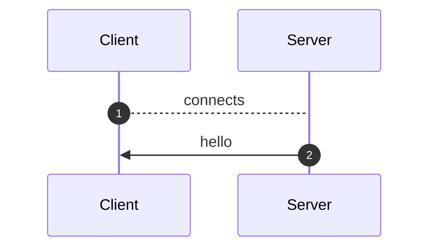
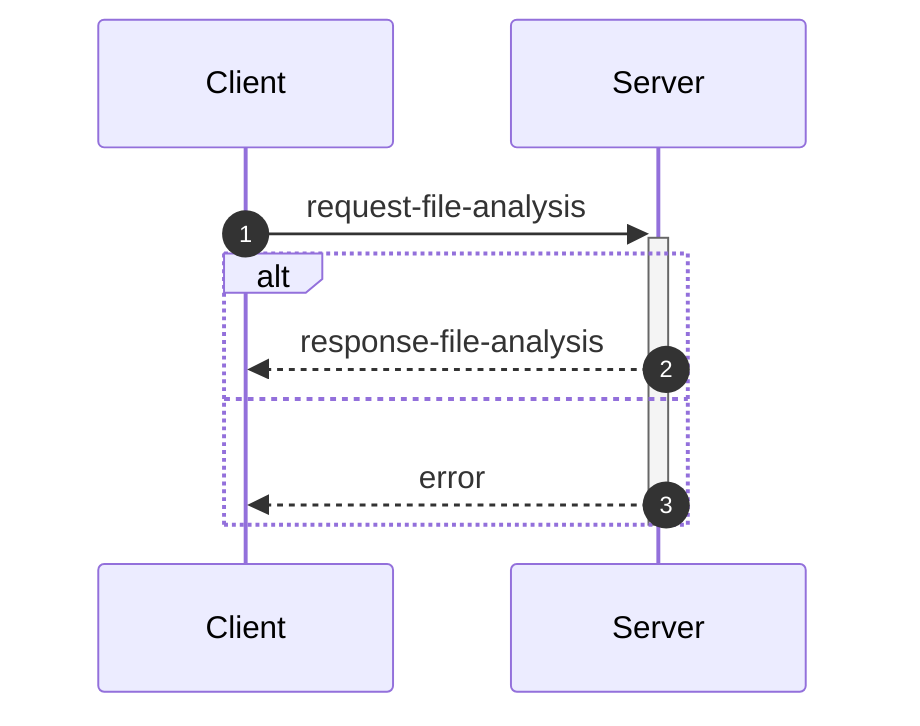
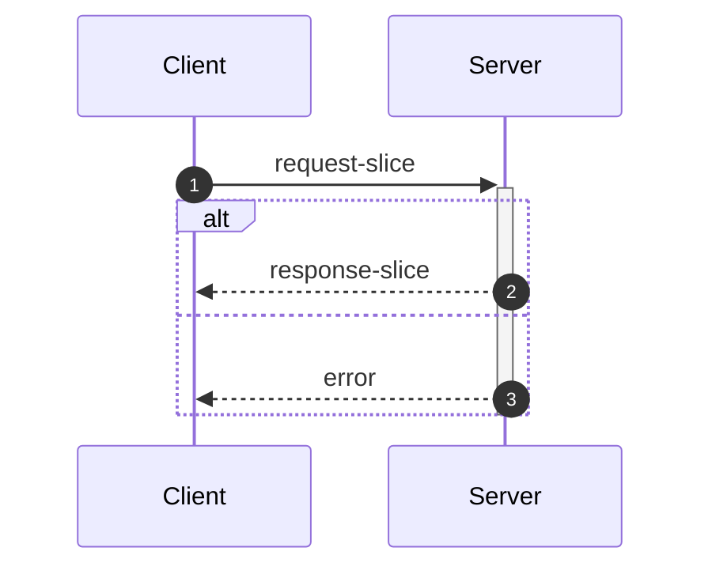
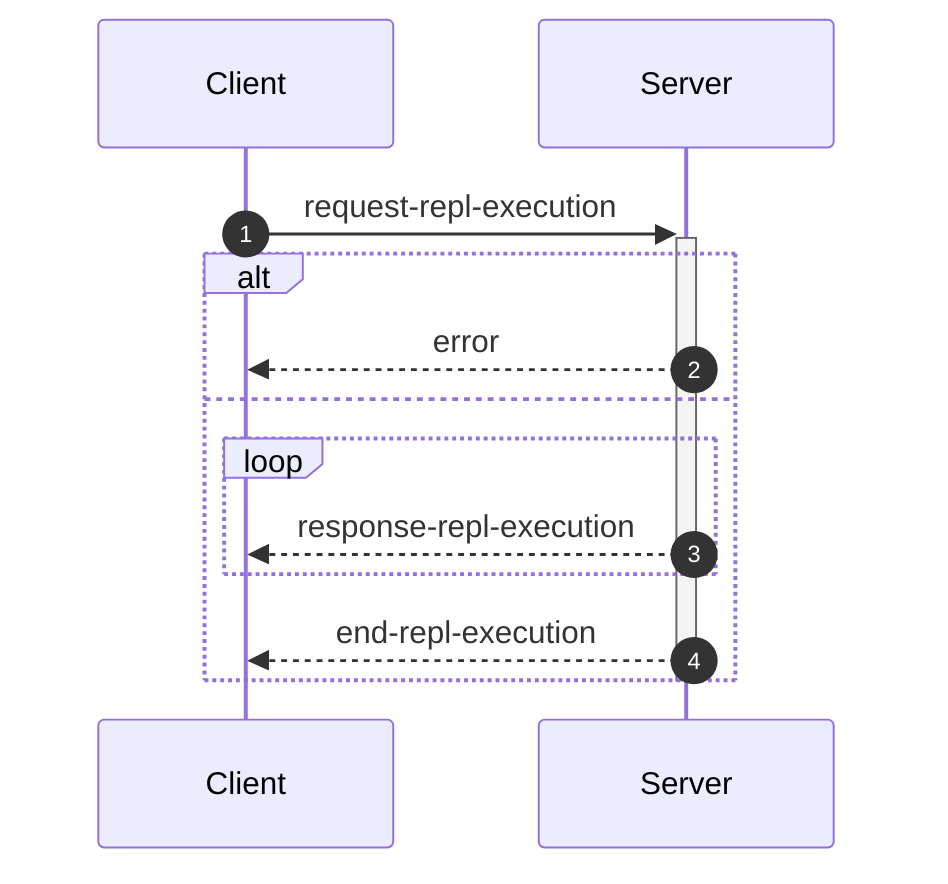

_This document was generated from '[src/documentation/wiki-interface.ts](https://github.com/flowr-analysis/flowr/tree/main//src/documentation/wiki-interface.ts)' on 2026-07-15, 10:15:57 UTC presenting an overview of flowR's interface (v2.12.2, using R v4.5.0). Please do not edit this file/wiki page directly._

Although far from being as detailed as the in-depth explanation of [_flowR_](https://github.com/flowr-analysis/flowr/wiki/core),
this wiki page explains how to interface with _flowR_ in more detail.
In general, command line arguments and other options provide short descriptions on hover over.

* [💻 Using the REPL](#using-the-repl)
* [⚙️ Configuring FlowR](#configuring-flowr)
* [⚒️ Writing Code](#writing-code)
* [💬 Communicating with the Server](#communicating-with-the-server)

<a id='using-the-repl'></a>
## 💻 Using the REPL


> [!NOTE]
> To execute arbitrary R commands with a repl request, _flowR_ has to be started explicitly with <span title="Description (Command Line Argument): Allow to access the underlying R session when using flowR (security warning: this allows the execution of arbitrary R code!)">`--r-session-access`</span>.
> Please be aware that this introduces a security risk and note that this relies on the [`r-shell` engine](https://github.com/flowr-analysis/flowr/wiki/engines) .

Although primarily meant for users to explore,
there is nothing which forbids simply calling _flowR_ as a subprocess to use standard-in, -output, and -error
for communication (although you can access the REPL using the server as well,
with the [REPL Request](#message-request-repl-execution) message).

The read-eval-print loop&nbsp;(REPL) works relatively simple.
You can submit an expression (using <kbd>Enter</kbd>),
which is interpreted as an R&nbsp;expression by default but interpreted as a *command* if it starts with a colon (`:`).
The best command to get started with the REPL is <span title="Description (Repl Command): Show help information (aliases: :h, :?)">`:help`</span>.
Besides, you can leave the REPL either with the command <span title="Description (Repl Command): End the repl (aliases: :q, :exit)">`:quit`</span> or by pressing <kbd>Ctrl</kbd>+<kbd>C</kbd> twice.
When writing a *command*, you may press <kbd>Tab</kbd> to get a list of completions, if available.
Multiple commands can be entered in a single line by separating them with a semicolon (`;`), e.g. `:parse "x<-2"; :df*`.
If a command is given without R code, the REPL will re-use R code given in a previous command.
The prior example will hence return first the parsed AST of the program and then the dataflow graph for `"x <- 2"`.

> [!NOTE]
> If you develop flowR, you may want to launch the repl using the `npm run main-dev` command, this way, you get a non-minified version of flowR with debug information and hot-reloading of source files.

<details>
<summary>Available Commands</summary>

We currently offer the following commands (this with a `[*]` suffix are available with and without the star):


| Command | Description |
| ------- | ----------- |
| **<span title="Description (Repl Command): End the repl (aliases: :q, :exit)">:quit</span>** | End the repl (aliases: **:<span title="Alias of ':quit'. End the repl">q</span>**, **:<span title="Alias of ':quit'. End the repl">exit</span>**) |
| **<span title="Description (Repl Command): Execute the given code as R code. This requires the `--r-session-access` flag to be set and requires the r-shell engine. (aliases: :e, :r)">:execute</span>** | Execute the given code as R code. This requires the `--r-session-access` flag to be set and requires the r-shell engine. (aliases: **:<span title="Alias of ':execute'. Execute the given code as R code. This requires the `--r-session-access` flag to be set and requires the r-shell engine.">e</span>**, **:<span title="Alias of ':execute'. Execute the given code as R code. This requires the `--r-session-access` flag to be set and requires the r-shell engine.">r</span>**) |
| **<span title="Description (Repl Command): Get mermaid code for the control-flow graph of R code (aliases: :cfg, :cf)">:controlflow[*]</span>** | Get mermaid code for the control-flow graph of R code (star: Returns the URL to mermaid.live) (aliases: **:<span title="Alias of ':controlflow'. Get mermaid code for the control-flow graph of R code">cfg</span>**, **:<span title="Alias of ':controlflow'. Get mermaid code for the control-flow graph of R code">cf</span>**) |
| **<span title="Description (Repl Command): Get mermaid code for the control-flow graph with basic blocks (aliases: :cfgb, :cfb)">:controlflowbb[*]</span>** | Get mermaid code for the control-flow graph with basic blocks (star: Returns the URL to mermaid.live) (aliases: **:<span title="Alias of ':controlflowbb'. Get mermaid code for the control-flow graph with basic blocks">cfgb</span>**, **:<span title="Alias of ':controlflowbb'. Get mermaid code for the control-flow graph with basic blocks">cfb</span>**) |
| **<span title="Description (Repl Command): Get mermaid code for the dataflow graph (aliases: :d, :df)">:dataflow[*]</span>** | Get mermaid code for the dataflow graph (star: Returns the URL to mermaid.live) (aliases: **:<span title="Alias of ':dataflow'. Get mermaid code for the dataflow graph">d</span>**, **:<span title="Alias of ':dataflow'. Get mermaid code for the dataflow graph">df</span>**) |
| **<span title="Description (Repl Command): Get mermaid code for the normalized AST of R code (aliases: :n)">:normalize[*]</span>** | Get mermaid code for the normalized AST of R code (star: Returns the URL to mermaid.live) (alias: **:<span title="Alias of ':normalize'. Get mermaid code for the normalized AST of R code">n</span>**) |
| **<span title="Description (Repl Command): Get mermaid code for the simplified dataflow graph (aliases: :ds, :dfs)">:dataflowsimple[*]</span>** | Get mermaid code for the simplified dataflow graph (star: Returns the URL to mermaid.live) (aliases: **:<span title="Alias of ':dataflowsimple'. Get mermaid code for the simplified dataflow graph">ds</span>**, **:<span title="Alias of ':dataflowsimple'. Get mermaid code for the simplified dataflow graph">dfs</span>**) |
| **<span title="Description (Repl Command): Inspect and extend the signature database: `query` (identical to :query @signature), `add <path>` to mount another database/source, `download` to fetch the full-history database. (aliases: :sig)">:signature</span>** | Inspect and extend the signature database: `query` (identical to :query @signature), `add <path>` to mount another database/source, `download` to fetch the full-history database. (alias: **:<span title="Alias of ':signature'. Inspect and extend the signature database: `query` (identical to :query @signature), `add <path>` to mount another database/source, `download` to fetch the full-history database.">sig</span>**) |
| **<span title="Description (Repl Command): Just calculates the DFG, but only prints summary info (aliases: :d#, :df#)">:dataflowsilent</span>** | Just calculates the DFG, but only prints summary info (aliases: **:<span title="Alias of ':dataflowsilent'. Just calculates the DFG, but only prints summary info">d#</span>**, **:<span title="Alias of ':dataflowsilent'. Just calculates the DFG, but only prints summary info">df#</span>**) |
| **<span title="Description (Repl Command): Prints ASCII Art of the parsed, unmodified AST (aliases: :p)">:parse</span>** | Prints ASCII Art of the parsed, unmodified AST (alias: **:<span title="Alias of ':parse'. Prints ASCII Art of the parsed, unmodified AST">p</span>**) |
| **<span title="Description (Repl Command): Prints the version of flowR as well as the current version of R">:version</span>** | Prints the version of flowR as well as the current version of R
| **<span title="Description (Repl Command): Query the given R code (use 'help' for more information)">:query[*]</span>** | Query the given R code (use 'help' for more information) (star: Similar to query, but returns the output in json format.)
| **<span title="Description (Repl Command): Returns an ASCII representation of the dataflow graph (aliases: :df!)">:dataflowascii</span>** | Returns an ASCII representation of the dataflow graph (alias: **:<span title="Alias of ':dataflowascii'. Returns an ASCII representation of the dataflow graph">df!</span>**) |
| **<span title="Description (Repl Command): Returns summarization stats for the normalized AST (aliases: :n#)">:normalize#</span>** | Returns summarization stats for the normalized AST (alias: **:<span title="Alias of ':normalize#'. Returns summarization stats for the normalized AST">n#</span>**) |
| **<span title="Description (Repl Command): Show help information (aliases: :h, :?)">:help</span>** | Show help information (aliases: **:<span title="Alias of ':help'. Show help information">h</span>**, **:<span title="Alias of ':help'. Show help information">?</span>**) |


</details>


> [!TIP]
> 
> As indicated by the examples before, all REPL commands that operate on code keep track of the state.
> Hence, if you run a command like <span title="Description (Repl Command, starred version): Returns the URL to mermaid.live; Base Command: Get mermaid code for the dataflow graph (aliases: :d*, :df*)">`:dataflow*`</span> without providing R code,
> the REPL will re-use the R code provided in a previous command.
> Likewise, doing this will benefit from incrementality!
> If you request the dataflow graph with `:df* x <- 2 * y` and then want to see the parsed AST with `:parse`,
> the REPL will re-use previously obtained information and not re-parse the code again.
> 		


Generally, many commands offer shortcut versions in the REPL. Many queries, for example, offer a shortened format (see the example below).
Of special note, the [Config Query](https://github.com/flowr-analysis/flowr/wiki/query-api#Config-Query)
can be used to also modify the currently active configuration of _flowR_ within the REPL (see the [wiki page](https://github.com/flowr-analysis/flowr/wiki/query-api#Config-Query) for more information).

### Example: Retrieving the Dataflow Graph

To retrieve a URL to the [mermaid](https://mermaid.js.org/) diagram of the dataflow of a given expression,
use <span title="Description (Repl Command, starred version): Returns the URL to mermaid.live; Base Command: Get mermaid code for the dataflow graph (aliases: :d*, :df*)">`:dataflow*`</span> (or <span title="Description (Repl Command): Get mermaid code for the dataflow graph (aliases: :d, :df)">`:dataflow`</span> to get the mermaid code in the cli):


```shell
$ docker run -it --rm eagleoutice/flowr # or npm run flowr 
flowR repl v2.12.2, R grammar v14 (tree-sitter engine)
R> :dataflow* y <- 1 + x
```

<details>
<summary style='color:gray'>Output</summary>


```text
https://mermaid.live/view#base64:eyJjb2RlIjoiZmxvd2NoYXJ0IEJUXG4gICAgMXt7XCJgKiM5MTtSTnVtYmVyIzkzOyogKioxKipcbiAgICAgICoxLjYqICgqKmlkOiAxKiopYFwifX1cbiAgICUlIE5vIGVkZ2VzIGZvdW5kIGZvciAxXG4gICAgMihbXCJgKiM5MTtSU3ltYm9sIzkzOyogKip4KipcbiAgICAgICoxLjEwKiAoKippZDogMioqKWBcIl0pXG4gICAlJSBObyBlZGdlcyBmb3VuZCBmb3IgMlxuICAgIDNbW1wiYCojOTE7UkJpbmFyeU9wIzkzOyogYmFzZSM1ODsjNTg7KiojNDM7KipcbiAgICAgICoxLjYtMTAqICgqKmlkOiAzKiopXG4gICAgYXJnOiAoMSwgMilgXCJdXVxuICAgIGJ1aWx0LWluOl9bXCJgQnVpbHQtSW46XG4jNDM7YFwiXVxuICAgIHN0eWxlIGJ1aWx0LWluOl8gc3Ryb2tlOmdyYXksZmlsbDpncmF5LHN0cm9rZS13aWR0aDoycHgsb3BhY2l0eTouODtcbiAgICAwW1wiYCojOTE7UlN5bWJvbCM5MzsqICoqeSoqXG4gICAgICAqMS4xKiAoKippZDogMCoqLCB2OiBbM10pYFwiXVxuICAgIDRbW1wiYCojOTE7UkJpbmFyeU9wIzkzOyogYmFzZSM1ODsjNTg7KiojNjA7IzQ1OyoqXG4gICAgICAqMS4xLTEwKiAoKippZDogNCoqKVxuICAgIGFyZzogKDAsIDMpYFwiXV1cbiAgICBidWlsdC1pbjpfLVtcImBCdWlsdC1JbjpcbiM2MDsjNDU7YFwiXVxuICAgIHN0eWxlIGJ1aWx0LWluOl8tIHN0cm9rZTpncmF5LGZpbGw6Z3JheSxzdHJva2Utd2lkdGg6MnB4LG9wYWNpdHk6Ljg7XG4gICAgMyAtLT58XCJyZWFkcywgYXJnXCJ8IDFcbiAgICAzIC0tPnxcInJlYWRzLCBhcmdcInwgMlxuICAgIDMgLS4tPnxcInJlYWRzLCBjYWxsc1wifCBidWlsdC1pbjpfXG4gICAgbGlua1N0eWxlIDIgc3Ryb2tlOmdyYXk7XG4gICAgMCAtLT58XCJkZWZpbmVkLWJ5XCJ8IDNcbiAgICAwIC0tPnxcImRlZmluZWQtYnlcInwgNFxuICAgIDQgLS0+fFwicmVhZHMsIGFyZ1wifCAzXG4gICAgNCAtLT58XCJyZXR1cm5zLCBhcmdcInwgMFxuICAgIDQgLS4tPnxcInJlYWRzLCBjYWxsc1wifCBidWlsdC1pbjpfLVxuICAgIGxpbmtTdHlsZSA3IHN0cm9rZTpncmF5OyIsIm1lcm1haWQiOnsiYXV0b1N5bmMiOnRydWV9fQ==
```


Retrieve the dataflow graph of the expression `y <- 1 + x`. It looks like this:


```mermaid
flowchart LR
    1{{"`*#91;RNumber#93;* **1**
      *1.6* (**id: 1**)`"}}
   %% No edges found for 1
    2(["`*#91;RSymbol#93;* **x**
      *1.10* (**id: 2**)`"])
   %% No edges found for 2
    3[["`*#91;RBinaryOp#93;* base#58;#58;**#43;**
      *1.6-10* (**id: 3**)
    arg: (1, 2)`"]]
    built-in:_["`Built-In:
#43;`"]
    style built-in:_ stroke:gray,fill:gray,stroke-width:2px,opacity:.8;
    0["`*#91;RSymbol#93;* **y**
      *1.1* (**id: 0**, v: [3])`"]
    4[["`*#91;RBinaryOp#93;* base#58;#58;**#60;#45;**
      *1.1-10* (**id: 4**)
    arg: (0, 3)`"]]
    built-in:_-["`Built-In:
#60;#45;`"]
    style built-in:_- stroke:gray,fill:gray,stroke-width:2px,opacity:.8;
    3 -->|"reads, arg"| 1
    3 -->|"reads, arg"| 2
    3 -.->|"reads, calls"| built-in:_
    linkStyle 2 stroke:gray;
    0 -->|"defined-by"| 3
    0 -->|"defined-by"| 4
    4 -->|"reads, arg"| 3
    4 -->|"returns, arg"| 0
    4 -.->|"reads, calls"| built-in:_-
    linkStyle 7 stroke:gray;
```

	
<details>

<summary style="color:gray">R Code of the Dataflow Graph</summary>

The analysis required _0.7 ms_ (including parse and normalize, using the [tree-sitter](https://github.com/flowr-analysis/flowr/wiki/Engines) engine) within the generation environment. No [signature database](https://github.com/flowr-analysis/flowr/wiki/Signature-Database) is mounted for these generated graphs, so `library()` calls attach no package exports; base-R names are still qualified via the generated base-package store (e.g. `acf` as `stats::acf`). 
We encountered no unknown side effects during the analysis.


```r
y <- 1 + x
```


</details>


</details>


For small graphs like this, <span title="Description (Repl Command): Returns an ASCII representation of the dataflow graph (aliases: :df!)">`:dataflowascii`</span> also provides an ASCII representation directly in the REPL:


```shell
$ docker run -it --rm eagleoutice/flowr # or npm run flowr 
flowR repl v2.12.2, R grammar v14 (tree-sitter engine)
R> :df! y <- 1 + x
```

<details open>
<summary style='color:gray'>Output</summary>


```text
                        0<1>0
                   ┌────| 1 |
    ┌────────┐     │    0---0
 c<4>c       └──c<3>c
 |<- |  v<0>v┌──| + |
 c---c──| y |┘  c---c   u<2>u
        v---v      └────| x |
                        u---u
Edges:
3 -> 1: reads, arg  3 -> 2: reads, arg
4 -> 3: reads, arg  4 -> 0: returns, arg
0 -> 3: defined-by  0 -> 4: defined-by
```


Retrieve the dataflow graph of the expression `y <- 1 + x` as ASCII art.

</details>


For the slicing with <span title="Description (Repl Command): Static backwards executable slicer for R">`:slicer`</span>, you have access to the same [magic comments](#slice-magic-comments) as with the [slice request](#message-request-slice).
Pass `--inline` to splice resolvable `source()` calls into the reconstruction so the slice is a single self-contained R text (the same as the static slice query's `inlineSources` flag).

### Example: Interfacing with the File System

Many commands that allow for an R-expression (like <span title="Description (Repl Command, starred version): Returns the URL to mermaid.live; Base Command: Get mermaid code for the dataflow graph (aliases: :d*, :df*)">`:dataflow*`</span>) allow for a file as well
if the argument starts with `file://`.
If you are working from the root directory of the _flowR_ repository, the following gives you the parsed AST of the example file using the <span title="Description (Repl Command): Prints ASCII Art of the parsed, unmodified AST (aliases: :p)">`:parse`</span> command:

> **Watch mode**: Replace `file://` with `watch://` to enter watch mode.
> flowR runs the command immediately and then re-runs it every time the file (or any file inside the folder) changes.
> Enter any other command to leave watch mode.
> For example: `:df watch://analysis.R`


```shell
$ docker run -it --rm eagleoutice/flowr # or npm run flowr 
flowR repl v2.12.2, R grammar v14 (tree-sitter engine)
R> :parse file://test/testfiles/example.R
```

<details>
<summary style='color:gray'>Output</summary>


```text
File: test/testfiles/example.R

program
├ binaryoperator
│ ├ identifier "sum" (1:1─4)
│ ├ <- "<-" (1:5─7)
│ ╰ float "0" (1:8─9)
├ binaryoperator
│ ├ identifier "product" (2:1─8)
│ ├ <- "<-" (2:9─11)
│ ╰ float "1" (2:12─13)
├ binaryoperator
│ ├ identifier "w" (3:1─2)
│ ├ <- "<-" (3:3─5)
│ ╰ float "7" (3:6─7)
├ binaryoperator
│ ├ identifier "N" (4:1─2)
│ ├ <- "<-" (4:3─5)
│ ╰ float "10" (4:6─8)
├ forstatement
│ ├ for "for" (6:1─4)
│ ├ ( "(" (6:5─6)
│ ├ identifier "i" (6:6─7)
│ ├ in "in" (6:8─10)
│ ├ binaryoperator
│ │ ├ float "1" (6:11─12)
│ │ ├ : ":" (6:12─13)
│ │ ╰ parenthesizedexpression
│ │   ├ ( "(" (6:13─14)
│ │   ├ binaryoperator
│ │   │ ├ identifier "N" (6:14─15)
│ │   │ ├ - "-" (6:15─16)
│ │   │ ╰ float "1" (6:16─17)
│ │   ╰ ) ")" (6:17─18)
│ ├ ) ")" (6:18─19)
│ ╰ bracedexpression
│   ├ { "{" (6:20─21)
│   ├ binaryoperator
│   │ ├ identifier "sum" (7:3─6)
│   │ ├ <- "<-" (7:7─9)
│   │ ╰ binaryoperator
│   │   ├ binaryoperator
│   │   │ ├ identifier "sum" (7:10─13)
│   │   │ ├ + "+" (7:14─15)
│   │   │ ╰ identifier "i" (7:16─17)
│   │   ├ + "+" (7:18─19)
│   │   ╰ identifier "w" (7:20─21)
│   ├ binaryoperator
│   │ ├ identifier "product" (8:3─10)
│   │ ├ <- "<-" (8:11─13)
│   │ ╰ binaryoperator
│   │   ├ identifier "product" (8:14─21)
│   │   ├  "" (8:22─23)
│   │   ╰ identifier "i" (8:24─25)
│   ╰ } "}" (9:1─2)
├ call
│ ├ identifier "cat" (11:1─4)
│ ╰ arguments
│   ├ ( "(" (11:4─5)
│   ├ argument
│   │ ╰ string
│   │   ├ " "\"" (11:5─6)
│   │   ├ stringcontent "Sum:" (11:6─10)
│   │   ╰ " "\"" (11:10─11)
│   ├ comma "," (11:11─12)
│   ├ argument
│   │ ╰ identifier "sum" (11:13─16)
│   ├ comma "," (11:16─17)
│   ├ argument
│   │ ╰ string
│   │   ├ " "\"" (11:18─19)
│   │   ├ stringcontent
│   │   │ ╰ escapesequence "\\n" (11:19─21)
│   │   ╰ " "\"" (11:21─22)
│   ╰ ) ")" (11:22─23)
╰ call
  ├ identifier "cat" (12:1─4)
  ╰ arguments
    ├ ( "(" (12:4─5)
    ├ argument
    │ ╰ string
    │   ├ " "\"" (12:5─6)
    │   ├ stringcontent "Product:" (12:6─14)
    │   ╰ " "\"" (12:14─15)
    ├ comma "," (12:15─16)
    ├ argument
    │ ╰ identifier "product" (12:17─24)
    ├ comma "," (12:24─25)
    ├ argument
    │ ╰ string
    │   ├ " "\"" (12:26─27)
    │   ├ stringcontent
    │   │ ╰ escapesequence "\\n" (12:27─29)
    │   ╰ " "\"" (12:29─30)
    ╰ ) ")" (12:30─31)
```


Retrieve the parsed AST of the example file.

<details>

<summary>File Content</summary>


```r
sum <- 0
product <- 1
w <- 7
N <- 10

for (i in 1:(N-1)) {
  sum <- sum + i + w
  product <- product * i
}

cat("Sum:", sum, "\n")
cat("Product:", product, "\n")
```


</details>

As _flowR_ directly transforms this AST the output focuses on being human-readable instead of being machine-readable.
		

</details>


### Example: Run a Query

You can run any query supported by _flowR_ using the <span title="Description (Repl Command): Query the given R code (use 'help' for more information)">`:query`</span> command.
For example, to obtain the shapes of all data frames in a given piece of code, you can run:


```shell
$ docker run -it --rm eagleoutice/flowr # or npm run flowr 
flowR repl v2.12.2, R grammar v14 (tree-sitter engine)
R> :query @absint df-shape "x <- data.frame(a = 1:10, b = 1:10)\ny <- x$a"
```

<details open>
<summary style='color:gray'>Output</summary>


```text
Query: absint (2 ms)
   ╰ $12: (colnames: [{"a", "b"}, {}], cols: [2, 2], rows: [10, 10])
   ╰ $0: (colnames: [{"a", "b"}, {}], cols: [2, 2], rows: [10, 10])
All queries together required ≈3 ms (1ms accuracy, total 4 ms)
```


Retrieve the shapes of all data frames in the given code.

</details>


To run the linter on a file, you can use (in this example, we just issue the `dead-code` linter on a small piece of code):


```shell
$ docker run -it --rm eagleoutice/flowr # or npm run flowr 
flowR repl v2.12.2, R grammar v14 (tree-sitter engine)
R> :query @linter rules:dead-code "if(FALSE) x <- 2"
```

<details open>
<summary style='color:gray'>Output</summary>


```text
Query: linter (1 ms)
   ╰ Dead Code (dead-code):
       ╰ certain:
           ╰ Code at 1.11-16
       ╰ Metadata: searchTimeMs: 1, processTimeMs: 0
All queries together required ≈1 ms (1ms accuracy, total 2 ms)
```


Run the linter on the given code, with only the `dead-code` rule enabled.

</details>


For more information on the available queries, please check out the [Query API](https://github.com/flowr-analysis/flowr/wiki/query-api).


<a id='configuring-flowr'></a>
## ⚙️ Configuring FlowR


When running _flowR_, you may want to specify some behaviors with a dedicated configuration file.
By default, flowR looks for a file named `flowr.json` in the current working directory (or any higher directory).
You can also specify a different file with <span title="Description (Command Line Argument): The name of the configuration file to use">`--config-file`</span> or pass the configuration inline using <span title="Description (Command Line Argument): The flowR configuration to use, as a JSON string">`--config-json`</span>.
To inspect the current configuration, you can run flowr with the <span title="Description (Command Line Argument): Run with verbose logging (will be passed to the corresponding script)">`--verbose`</span> flag, or use the `config` [Query](https://github.com/flowr-analysis/flowr/wiki/query-api).
Within the REPL this works by running the following:


```shell
:query @config
```


To work with the <a href="https://github.com/flowr-analysis/flowr/tree/main/src/config.ts#L122"><code><span title="The configuration file format for flowR.">FlowrConfig</span></code></a> you can use the provided helper objects alongside its methods like
<a href="https://github.com/flowr-analysis/flowr/tree/main/src/config.ts#L569"><code><span title="Creates a new flowr config that has the updated values.">FlowrConfig::<b>amend</b></span></code></a>.
The following summarizes the configuration options:

- `ignoreSourceCalls`: If set to `true`, _flowR_ will ignore source calls when analyzing the code, i.e., ignoring the inclusion of other files.
- `semantics`: allows to configure the way _flowR_ handles R, although we currently only support `semantics/environment/overwriteBuiltIns`.
  You may use this to overwrite _flowR_'s handling of built-in function and even completely clear the preset definitions shipped with flowR.
  See [Configure BuiltIn Semantics](#configure-builtin-semantics) for more information.
- `solver`: allows to configure how _flowR_ resolves variables and their values (currently we support: `disabled`, `alias`, `builtin`), as well as if pointer analysis should be active.
- `engines`: allows to configure the engines used by _flowR_ to interact with R code. See the [Engines wiki page](https://github.com/flowr-analysis/flowr/wiki/engines) for more information.
- `defaultEngine`: allows to specify the default engine to use for interacting with R code. If not set, an arbitrary engine from the specified list will be used.
- `abstractInterpretation`: allows to configure how _flowR_ performs abstract interpretation, although we currently only support data frame shape inference through abstract interpretation.
- `defaultPlugins`: allows to configure which plugins to load by default when creating a new <a href="https://github.com/flowr-analysis/flowr/tree/main/src/project/flowr-analyzer.ts#L162"><code><span title="Central class for conducting analyses with FlowR. Use the FlowrAnalyzerBuilder to create a new instance. If you want the original pattern of creating a pipeline and running all steps, you can still do this with FlowrAnalyzer#runFull . To inspect the context of the analyzer, use FlowrAnalyzer#inspectContext (if you are a plugin and need to modify it, use FlowrAnalyzer#context instead).">FlowrAnalyzer</span></code></a> instance.
- `repl.plugins`: allows to configure which plugins to load in the _flowR_ REPL. Use `flowr:default` to reference the plugins specified by `defaultPlugins`.

So you can configure _flowR_ by adding a file like the following:

<details>

<summary>Example Configuration File</summary>


```json
{
  "ignoreSourceCalls": true,
  "semantics": {
    "environment": {
      "overwriteBuiltIns": {
        "definitions": [
          {
            "type": "function",
            "names": [
              "foo"
            ],
            "processor": "builtin:assign",
            "config": {}
          }
        ]
      }
    }
  },
  "defaultPlugins": [
    "file:description",
    "versions:description"
  ],
  "repl": {
    "quickStats": false,
    "dfProcessorHeat": false,
    "hints": true,
    "plugins": [
      "flowr:default"
    ]
  },
  "project": {
    "resolveUnknownPathsOnDisk": true
  },
  "engines": [
    {
      "type": "r-shell"
    }
  ],
  "solver": {
    "variables": "alias",
    "evalStrings": true,
    "trackEnvironments": true,
    "sigdb": {
      "enabled": true,
      "loadProjectDependencies": true,
      "eagerlyLoad": false,
      "eagerlyLoadExports": false,
      "linkBaseR": false,
      "linkDescriptionDependencies": false
    },
    "resolveSource": {
      "dropPaths": "no",
      "ignoreCapitalization": true,
      "inferWorkingDirectory": "active-script",
      "searchPath": []
    },
    "instrument": {},
    "slicer": {
      "threshold": 50
    }
  },
  "abstractInterpretation": {
    "wideningThreshold": 4,
    "dataFrame": {
      "maxColNames": 20,
      "readLoadedData": {
        "readExternalFiles": true,
        "maxReadLines": 1000000
      }
    }
  },
  "gas": {
    "thresholds": {
      "memory": {
        "problematic": 0.7,
        "critical": 0.9
      },
      "timeMs": {
        "problematic": 100000,
        "critical": 120000
      }
    },
    "features": {}
  }
}
```


</details>

<details>
<a id='configure-builtin-semantics'></a>
<summary>Configure Built-In Semantics</summary>


`semantics/environment/overwriteBuiltins` accepts two keys:

- `loadDefaults` (boolean, initially `true`): If set to `true`, the default built-in definitions are loaded before applying the custom definitions. Setting this flag to `false` explicitly disables the loading of the default definitions.
- `definitions` (array, initially empty): Allows to overwrite or define new built-in elements. Each object within must have a `type` which is one of the below. Furthermore, they may define a string array of `names` which specifies the identifiers to bind the definitions to. You may use `assumePrimitive` to specify whether _flowR_ should assume that this is a primitive non-library definition (so you probably just do not want to specify the key).

  | Type            | Description                                                                                                                                                                                                                                                                                              | Example                                                                                                    |
  | --------------- | -------------------------------------------------------------------------------------------------------------------------------------------------------------------------------------------------------------------------------------------------------------------------------------------------------- | ---------------------------------------------------------------------------------------------------------- |
  | `constant`    | Additionally allows for a `value` this should resolve to.                                                                                                                                                                                                                                                | `{ type: 'constant', names: ['NULL', 'NA'],  value: null }`                                                |
  | `function`    | Is a rather flexible way to define and bind built-in functions. For the time, we do not have extensive documentation to cover all the cases, so please either consult the sources with the `default-builtin-config.ts` or open a [new issue](https://github.com/flowr-analysis/flowr/issues/new/choose). | `{ type: 'function', names: ['next'], processor: 'builtin:d', config: { cfg: ExitPointType.Next } }` |
  | `replacement` | A comfortable way to specify replacement functions like `$<-` or `names<-`. `suffixes` describes the... suffixes to attach automatically. | `{ type: 'replacement', suffixes: ['<-', '<<-'], names: ['[', '[['] }` |


</details>

<details>

<summary style='color:gray'>Full Configuration-File Schema</summary>

- _The configuration file format for flowR._ (object)
    - **ignoreSourceCalls** [optional] _Whether source calls should be ignored, causing {@link processSourceCall}'s behavior to be skipped._ (boolean)
    - **semantics** _Configure language semantics and how flowR handles them._ (object)
        - **environment** [optional] _Semantics regarding how to handle the R environment._ (object)
            - **overwriteBuiltIns** [optional] _Do you want to overwrite (parts) of the builtin definition?_ (object)
                - **loadDefaults** [optional] _Should the default configuration still be loaded?_ (boolean)
                - **definitions** [optional] _The definitions to load/overwrite._ (array)
                Valid item types:
                    - (object)
    - **defaultPlugins** [optional] _The default plugins to load when creating a new instance of FlowrAnalyzer_ (array)
    Valid item types:
        - (alternatives)
            - (string)
            - (array)
    - **repl** _Configuration options for the REPL._ (object)
        - **quickStats** [optional] _Whether to show quick stats in the REPL after each evaluation._ (boolean)
        - **dfProcessorHeat** [optional] _This instruments the dataflow processors to count how often each processor is called._ (boolean)
        - **hints** [optional] _Whether to show dim inline hints on the empty prompt (automatically disabled on non-interactive terminals)._ (boolean)
        - **plugins** [optional] _The plugins to load in REPL mode_ (array)
        Valid item types:
            - (alternatives)
                - (string)
                - (array)
    - **project** _Project specific configuration options._ (object)
        - **resolveUnknownPathsOnDisk** [optional] _Whether to resolve unknown paths loaded by the r project disk when trying to source/analyze files._ (boolean)
        - **basePackages** [optional] _The packages considered part of R itself (base and recommended); if unset, flowR uses its built-in list._ (array)
        Valid item types:
            - (string)
    - **engines** _The engine or set of engines to use for interacting with R code. An empty array means all available engines will be used._ (array)
    Valid item types:
        - (alternatives)
            - _The configuration for the tree sitter engine._ (object)
                - **type** [required] _Use the tree sitter engine._ (string)
                    Only allows: 'tree-sitter'
                - **wasmPath** [optional] _The path to the tree-sitter-r WASM binary to use. If this is undefined, this uses the default path._ (string)
                - **treeSitterWasmPath** [optional] _The path to the tree-sitter WASM binary to use. If this is undefined, this uses the default path._ (string)
                - **lax** [optional] _Whether to use the lax parser for parsing R code (allowing for syntax errors). If this is undefined, the strict parser will be used._ (boolean)
            - _The configuration for the R shell engine._ (object)
                - **type** [required] _Use the R shell engine._ (string)
                    Only allows: 'r-shell'
                - **rPath** [optional] _The path to the R executable to use. If this is undefined, this uses the default path._ (string)
    - **defaultEngine** [optional] _The default engine to use for interacting with R code. If this is undefined, an arbitrary engine from the specified list will be used._ (string)
        Only allows: 'tree-sitter', 'r-shell'
    - **solver** _How to resolve constants, constraints, cells, ..._ (object)
        - **variables** _How to resolve variables and their values._ (string)
            Only allows: 'disabled', 'alias', 'builtin'
        - **evalStrings** _Should we include eval(parse(text="...")) calls in the dataflow graph?_ (boolean)
        - **trackEnvironments** [optional] _Track user-created environments (new.env, assign/get/local with envir=, dollar-assign, attach). When false, all envir-style calls fall through conservatively._ (boolean)
        - **sigdb** _Resolving library exports from a signature database._ (object)
            - **enabled** [optional] _Resolve library()/use() exports from a signature database (default true); when false no database is consulted._ (boolean)
            - **loadProjectDependencies** [optional] _Load the project's declared dependencies from its metadata files (DESCRIPTION Imports/Depends, renv.lock, rv.lock) (default true); when false these files are not read for dependencies._ (boolean)
            - **eagerlyLoad** [optional] _Parse the database up front rather than on the first package load (default false, ignored if disabled)._ (boolean)
            - **eagerlyLoadExports** [optional] _Add a vertex for every export on load rather than on demand (default false); keeps the dataflow graph small._ (boolean)
            - **assumedRVersion** [optional] _R version assumed when resolving versioned (base-R) exports: a pin like "4.5" or "auto" to detect the installed R (default "auto")._ (string)
            - **linkBaseR** [optional] _Eagerly attach base-R namespaces so bare base calls resolve without library() (default false)._ (boolean)
            - **linkBaseRCalls** [optional] _Add a lightweight Reads edge from a bare base-R call to its signature-database function vertex (default false; base-R qualification is edge-free otherwise)._ (boolean)
            - **linkPackageCalls** [optional] _Add a lightweight Reads edge from a resolved package call to its signature-database function vertex (default false)._ (boolean)
            - **linkDescriptionDependencies** [optional] _Eagerly attach the namespaces of the project's declared DESCRIPTION dependencies (Imports/Depends) so their exports resolve without an explicit library() (default false)._ (boolean)
            - **warmInBackground** [optional] _Decompress the hot shards (base + most-downloaded) in a background task on startup so the first library() lookup is warm (default false; for long-running servers/REPLs)._ (boolean)
            - **additionalPaths** [optional] _Extra directories or bundle/manifest files searched for signature databases (alongside the shipped default and $FLOWR_SIGDB_DIR); a downloaded full-history bundle placed here is mounted automatically._ (array)
            Valid item types:
                - (string)
            - **downloadRepo** [optional] _GitHub owner/repo the full-history bundle is downloaded from via ":signature download" (default "flowr-analysis/flowr", release tag "sigdb-v<flowR-version>")._ (string)
            - **autoSync** [optional] _On startup, re-download shards whose committed sigdb.remote.json hash no longer matches the cache, in the background (default false; opt-in network sync after a git pull)._ (boolean)
            - **versionSelection** [optional] _When a project constrains a dependency, resolve to the newest (default), oldest, or system-installed version satisfying it; system needs R and falls back to newest. Base-R packages always resolve against the assumed R version._ (string)
                Only allows: 'newest', 'oldest', 'system'
            - **versionOverrides** [optional] _Force an exact version for specific packages (name -> version), overriding both the project constraint and the versionSelection policy (default {})._ (object)
        - **instrument** (object)
            - **dataflowExtractors** [optional] _These keys are only intended for use within code, allowing to instrument the dataflow analyzer!_ (any)
        - **resolveSource** [optional] _If lax source calls are active, flowR searches for sourced files much more freely, based on the configurations you give it. This option is only in effect if `ignoreSourceCalls` is set to false._ (object)
            - **dropPaths** _Allow to drop the first or all parts of the sourced path, if it is relative._ (string)
                Only allows: 'no', 'once', 'all'
            - **ignoreCapitalization** _Search for filenames matching in the lowercase._ (boolean)
            - **inferWorkingDirectory** _Try to infer the working directory from the main or any script to analyze._ (string)
                Only allows: 'no', 'main-script', 'active-script', 'any-script'
            - **searchPath** _Additionally search in these paths._ (array)
            Valid item types:
                - (string)
            - **repeatedSourceLimit** [optional] _How often the same file can be sourced within a single run? Please be aware: in case of cyclic sources this may not reach a fixpoint so give this a sensible limit._ (number)
            - **applyReplacements** _Provide name replacements for loaded files_ (array)
            Valid item types:
                - (object)
        - **slicer** [optional] _The configuration for the slicer._ (object)
            - **threshold** [optional] _The maximum number of iterations to perform on a single function call during slicing._ (number)
            - **autoExtend** [optional] _If set, the slicer will gain an additional post-pass._ (boolean)
    - **abstractInterpretation** _The configuration options for abstract interpretation._ (object)
        - **wideningThreshold** _The threshold for the number of visitations of a node at which widening should be performed to ensure the termination of the fixpoint iteration._ (number)
        - **dataFrame** _The configuration of the shape inference for data frames._ (object)
            - **maxColNames** _The maximum number of columns names to infer for data frames before over-approximating the column names to top._ (number)
            - **readLoadedData** _Configuration options for reading data frame shapes from loaded external data files, such as CSV files._ (object)
                - **readExternalFiles** _Whether data frame shapes should be extracted from loaded external files, such as CSV files._ (boolean)
                - **maxReadLines** _The maximum number of lines to read when extracting data frame shapes from loaded files, such as CSV files._ (number)
    - **gas** [optional] _Resource-usage guard (gas) configuration. All feature factors default to 0 (disabled). See https://github.com/flowr-analysis/flowr/wiki/Core#gas-resource-guard._ (object)
        - **thresholds** [optional] _Shared thresholds for all gas checks (scaled by per-feature factor)._ (object)
            - **memory** [optional] _Heap-usage fraction thresholds (0-1)._ (object)
                - **problematic** [optional] _Heap fraction (0-1) above which Problematic is returned._ (number)
                - **critical** [optional] _Heap fraction (0-1) above which Critical is returned._ (number)
            - **timeMs** [optional] _Elapsed analysis time thresholds in milliseconds._ (object)
                - **problematic** [optional] _Elapsed ms above which Problematic is returned._ (number)
                - **critical** [optional] _Elapsed ms above which Critical is returned._ (number)
        - **features** [optional] _Per-feature sensitivity factors. 0 or absent disables gas checking for that feature. A factor of 2 makes the feature twice as sensitive. Recognised keys: `source`, `side-effect-linking`, `linter`._ (object)
        - **heapProvider** [optional] _Custom heap statistics source (programmatic configs only), overriding the built-in v8/performance.memory detection._ (function)

</details>

	

<a id='writing-code'></a>
## ⚒️ Writing Code

_flowR_ can be used as a [module](https://www.npmjs.com/package/@eagleoutice/flowr) and offers several main classes and interfaces that are interesting for extension writers 
(see the [Visual Studio Code extension](https://marketplace.visualstudio.com/items?itemName=code-inspect.vscode-flowr) or the [Core](https://github.com/flowr-analysis/flowr/wiki/core) wiki page for more information).

### Creating Analyses with _flowR_

Nowadays, instances of the <a href="https://github.com/flowr-analysis/flowr/tree/main/src/project/flowr-analyzer.ts#L162"><code><span title="Central class for conducting analyses with FlowR. Use the FlowrAnalyzerBuilder to create a new instance. If you want the original pattern of creating a pipeline and running all steps, you can still do this with FlowrAnalyzer#runFull . To inspect the context of the analyzer, use FlowrAnalyzer#inspectContext (if you are a plugin and need to modify it, use FlowrAnalyzer#context instead).">FlowrAnalyzer</span></code></a> should be used as central frontend to get analysis results from _flowR_.
For example, a program slice can be created like this:


```ts
const analyzer = await new FlowrAnalyzerBuilder()
    .setEngine('tree-sitter')
    .build();
analyzer.addRequest('x <- 1\ny <- x\nx');
const result = await analyzer.query([
    {
        type:     'static-slice',
        criteria: ['3@x']
    }
]);
//console.log(result['static-slice']);
```


For more information, please have a look at the [Analyzer](https://github.com/flowr-analysis/flowr/wiki/analyzer) wiki page, which explains how to construct and use the <a href="https://github.com/flowr-analysis/flowr/tree/main/src/project/flowr-analyzer.ts#L162"><code><span title="Central class for conducting analyses with FlowR. Use the FlowrAnalyzerBuilder to create a new instance. If you want the original pattern of creating a pipeline and running all steps, you can still do this with FlowrAnalyzer#runFull . To inspect the context of the analyzer, use FlowrAnalyzer#inspectContext (if you are a plugin and need to modify it, use FlowrAnalyzer#context instead).">FlowrAnalyzer</span></code></a> in more detail.
To work with specific perspectives, you can also consult the respective pages like the [Dataflow Graph](https://github.com/flowr-analysis/flowr/wiki/dataflow-graph) or the [Abstract Interpretation](https://github.com/flowr-analysis/flowr/wiki/abstract-interpretation) wiki pages.
### The Pipeline Executor (Low-Level Interface)

Once, in the beginning, _flowR_ was meant to produce a dataflow graph merely to provide *program slices*. 
However, with continuous updates, the [Dataflow Graph](https://github.com/flowr-analysis/flowr/wiki/dataflow-graph) repeatedly proves to be the more interesting part.
With this, we restructured _flowR_'s originally *hardcoded* pipeline to be far more flexible. 
Now, it can be theoretically extended or replaced with arbitrary steps, optional steps, and what we call 'decorations' of these steps. 
In short, a slicing pipeline using the <a href="https://github.com/flowr-analysis/flowr/tree/main/src/core/pipeline-executor.ts#L97"><code><span title="**Please note:** The PipelineExecutor is now considered to be a rather low-level API for flowR. While it still works and is the basis for all other layers, we strongly recommend using the FlowrAnalyzer and its builder to create and use an analyzer instance that is pre-configured for your use-case. The pipeline executor allows to execute arbitrary pipelines in a step-by-step fashion. If you are not...">PipelineExecutor</span></code></a> looks like this:


```ts

const slicer = new PipelineExecutor(DEFAULT_SLICING_PIPELINE, {
  parser:    new RShell(),
  request:   requestFromInput('x <- 1\nx + 1'),
  criterion: ['2@x']
})
const slice = await slicer.allRemainingSteps()
// console.log(slice.reconstruct.code)
```


<details><summary>More Information</summary>


If you compare this, with what you would have done with the old (and removed) `SteppingSlicer`, 
this essentially just requires you to replace the `SteppingSlicer` with the <a href="https://github.com/flowr-analysis/flowr/tree/main/src/core/pipeline-executor.ts#L97"><code><span title="**Please note:** The PipelineExecutor is now considered to be a rather low-level API for flowR. While it still works and is the basis for all other layers, we strongly recommend using the FlowrAnalyzer and its builder to create and use an analyzer instance that is pre-configured for your use-case. The pipeline executor allows to execute arbitrary pipelines in a step-by-step fashion. If you are not...">PipelineExecutor</span></code></a>
and to pass the <a href="https://github.com/flowr-analysis/flowr/tree/main/src/core/steps/pipeline/default-pipelines.ts#L18"><code>DEFAULT_SLICING_PIPELINE</code></a> as the first argument.
The <a href="https://github.com/flowr-analysis/flowr/tree/main/src/core/pipeline-executor.ts#L97"><code><span title="**Please note:** The PipelineExecutor is now considered to be a rather low-level API for flowR. While it still works and is the basis for all other layers, we strongly recommend using the FlowrAnalyzer and its builder to create and use an analyzer instance that is pre-configured for your use-case. The pipeline executor allows to execute arbitrary pipelines in a step-by-step fashion. If you are not...">PipelineExecutor</span></code></a>...

1. Provides structures to investigate the results of all intermediate steps
2. Can be executed step-by-step
3. Can repeat steps (e.g., to calculate multiple slices on the same input)

See the in-code documentation for more information.


</details>

### Using the <a href="https://github.com/flowr-analysis/flowr/tree/main/src/r-bridge/shell.ts#L143"><code><span title="The RShell represents an interactive session with the R interpreter. You can configure it by RShellOptions . At the moment we are using a live R session (and not networking etc.) to communicate with R easily, which allows us to install packages etc. However, this might and probably will change in the future (leaving this as a legacy mode :D)">RShell</span></code></a> to Interact with R

The <a href="https://github.com/flowr-analysis/flowr/tree/main/src/r-bridge/shell.ts#L143"><code><span title="The RShell represents an interactive session with the R interpreter. You can configure it by RShellOptions . At the moment we are using a live R session (and not networking etc.) to communicate with R easily, which allows us to install packages etc. However, this might and probably will change in the future (leaving this as a legacy mode :D)">RShell</span></code></a> class allows interfacing with the `R`&nbsp;ecosystem installed on the host system.
Please have a look at [flowR's Engines](https://github.com/flowr-analysis/flowr/wiki/engines) for more information on alternatives (for example, the <a href="https://github.com/flowr-analysis/flowr/tree/main/src/r-bridge/lang-4.x/tree-sitter/tree-sitter-executor.ts#L18"><code><span title="Synchronous and (way) faster alternative to the RShell using tree-sitter.">TreeSitterExecutor</span></code></a>).


> [!IMPORTANT]
> 
> Each <a href="https://github.com/flowr-analysis/flowr/tree/main/src/r-bridge/shell.ts#L143"><code><span title="The RShell represents an interactive session with the R interpreter. You can configure it by RShellOptions . At the moment we are using a live R session (and not networking etc.) to communicate with R easily, which allows us to install packages etc. However, this might and probably will change in the future (leaving this as a legacy mode :D)">RShell</span></code></a> controls a new instance of the R&nbsp;interpreter, 
> make sure to call <code><a href="https://github.com/flowr-analysis/flowr/tree/main/src/r-bridge/shell.ts#L351"><span title="Close the current R session, makes the object effectively invalid (can no longer be reopened etc.)">RShell::<i>close</i></span></a>()</code> when you are done.


You can start a new "session" simply by constructing a new object with <code>new <a href="https://github.com/flowr-analysis/flowr/tree/main/src/r-bridge/shell.ts#L143"><span title="The RShell represents an interactive session with the R interpreter. You can configure it by RShellOptions . At the moment we are using a live R session (and not networking etc.) to communicate with R easily, which allows us to install packages etc. However, this might and probably will change in the future (leaving this as a legacy mode :D)">RShell</span></a>()</code>.

However, there are several options that may be of interest 
(e.g., to automatically revive the shell in case of errors or to control the name location of the R process on the system).

With a shell object (let's call it `shell`), you can execute R code by using <a href="https://github.com/flowr-analysis/flowr/tree/main/src/r-bridge/shell.ts#L212"><code><span title="sends the given command directly to the current R session will not do anything to alter input markers!">RShell::<i>sendCommand</i></span></code></a>,
for example <code>shell.<a href="https://github.com/flowr-analysis/flowr/tree/main/src/r-bridge/shell.ts#L212"><span title="sends the given command directly to the current R session will not do anything to alter input markers!">sendCommand</span></a>("1 + 1")</code>.
However, this does not return anything, so if you want to collect the output of your command, use
<a href="https://github.com/flowr-analysis/flowr/tree/main/src/r-bridge/shell.ts#L295"><code><span title="Send a command and collect the output">RShell::<i>sendCommandWithOutput</i></span></code></a> instead.


<a id='communicating-with-the-server'></a>
## 💬 Communicating with the Server


As explained in the [Overview](https://github.com/flowr-analysis/flowr/wiki/overview), you can simply run the [TCP](https://de.wikipedia.org/wiki/Transmission_Control_Protocol)&nbsp;server by adding the <span title="Description (Command Line Argument): Do not drop into a repl, but instead start a server on the given port (default: 1042) and listen for messages.">`--server`</span> flag (and, due to the interactive mode, exit with the conventional <kbd>CTRL</kbd>+<kbd>C</kbd>).
Currently, every connection is handled by the same underlying `RShell` - so the server is not designed to handle many clients at a time.
Additionally, the server is not well guarded against attacks (e.g., you can theoretically spawn an arbitrary number of&nbsp;RShell sessions on the target machine).

Every message has to be given in a single line (i.e., without a newline in-between) and end with a newline character. Nevertheless, we will pretty-print example given in the following segments for the ease of reading.


> [!NOTE]
> 
> The default <span title="Description (Command Line Argument): Do not drop into a repl, but instead start a server on the given port (default: 1042) and listen for messages.">`--server`</span> uses a simple [TCP](https://de.wikipedia.org/wiki/Transmission_Control_Protocol)
> connection. If you want _flowR_ to expose a [WebSocket](https://de.wikipedia.org/wiki/WebSocket) server instead, add the <span title="Description (Command Line Argument): If the server flag is set, use websocket for messaging">`--ws`</span> flag (i.e., <span title="Description (Command Line Argument): Do not drop into a repl, but instead start a server on the given port (default: 1042) and listen for messages.">`--server`</span> <span title="Description (Command Line Argument): If the server flag is set, use websocket for messaging">`--ws`</span>) when starting _flowR_ from the command line.


<ul><li>
<a id="message-hello"></a>
<b>Hello</b> Message (<code>hello</code>) 
<details>

<summary style="color:gray"> View Details. <i>The server informs the client about the successful connection and provides Meta-Information.</i> </summary>


```mermaid
sequenceDiagram
    autonumber
    participant Client
    participant Server

    
    Client-->Server: connects
    Server->>Client: hello
	
```


	
After launching _flowR_, for example, with <code>docker run -it --rm eagleoutice/flowr <span title="Description (Command Line Argument): Do not drop into a repl, but instead start a server on the given port (default: 1042) and listen for messages.">-<span/>-server</span></code>&nbsp;(🐳️), simply connecting should present you with a `hello` message, that amongst others should reveal the versions of&nbsp;_flowR_ and&nbsp;R, using the [semver 2.0](https://semver.org/spec/v2.0.0.html) versioning scheme.
The message looks like this:


```json
{
  "type": "hello",
  "clientName": "client-0",
  "versions": {
    "flowr": "2.12.2",
    "r": "4.5.0",
    "engine": "r-shell"
  }
}
```


There are currently a few messages that you can send after the hello message.
If you want to _slice_ a piece of R code you first have to send an [analysis request](#message-request-file-analysis), so that you can send one or multiple slice requests afterward.
Requests for the [REPL](#message-request-repl) are independent of that.
	

<hr>


<details>
<summary style="color:gray">Message schema (<code>hello</code>)</summary>

For the definition of the hello message, please see it's implementation at [`./src/cli/repl/server/messages/message-hello.ts`](https://github.com/flowr-analysis/flowr/tree/main/./src/cli/repl/server/messages/message-hello.ts).

- [required] (object)
    - **type** [required] _The type of the hello message._ (string)
        Only allows: 'hello'
    - **id** [forbidden] _The id of the message is always undefined (as it is the initial message and not requested)._ (any)
    - **clientName** [required] _A unique name that is assigned to each client. It has no semantic meaning and is only used/useful for debugging._ (string)
    - **versions** [required] (object)
        - **flowr** [required] _The version of the flowr server running in semver format._ (string)
        - **r** [required] _The version of the underlying R shell running in semver format._ (string)
        - **engine** [required] _The parser backend that is used to parse the R code._ (string)

</details>


<hr>

</details>
	</li>

<li>
<a id="message-request-file-analysis"></a>
<b>Analysis</b> Message (<code>request-file-analysis</code>) 
<details>

<summary style="color:gray"> View Details. <i>The server builds the dataflow graph for a given input file (or a set of files).</i> </summary>


```mermaid
sequenceDiagram
    autonumber
    participant Client
    participant Server

    
    Client->>+Server: request-file-analysis
    alt
        Server-->>Client: response-file-analysis
    else
        Server-->>Client: error
    end
    deactivate  Server
	
```


	
The request allows the server to analyze a file and prepare it for slicing.
The message can contain a `filetoken`, which is used to identify the file in later slice or query requests (if you do not add one, the request will not be stored and therefore, it is not available for subsequent requests).

> **Please note!**\
> If you want to send and process a lot of analysis requests, but do not want to slice them, please do not pass the `filetoken` field. This will save the server a lot of memory allocation.

Furthermore, the request must contain either a `content` field to directly pass the file's content or a `filepath` field which contains the path to the file (this path must be accessible for the server to be useful).
If you add the `id` field, the answer will use the same `id` so you can match requests and the corresponding answers.
See the implementation of the request-file-analysis message for more information.

You can drop one or more stored file tokens by adding the `invalidateToken` field (a single token or an array of tokens).
The server frees the corresponding analyses _after_ it has answered the request.

> **Tip!**\
> If you only want to drop tokens, you do not need a separate message: send a `request-file-analysis` that contains _just_ the `invalidateToken` field (and no `content` or `filepath`).
> Such a request behaves like an empty file analysis and the server replies with an empty `results` object.
> Because invalidation happens after the response, you may even pass the _current_ `filetoken` in `invalidateToken` to analyze a file once and have the server forget it right after you received the results.


<details>
<summary>Example of the <code>request-file-analysis</code> Message</summary>

_Note:_ even though we pretty-print these messages, they are sent as a single line, ending with a newline.

The following lists all messages that were sent and received in case you want to reproduce the scenario:

<ol>
<li> <code>hello</code> (response)
<details> 

<summary> Show Details </summary>

The first message is always a hello message.


```json
{
  "type": "hello",
  "clientName": "client-0",
  "versions": {
    "flowr": "2.12.2",
    "r": "4.5.0",
    "engine": "r-shell"
  }
}
```


</details>
</li>

<li> <b><code>request-file-analysis</code> (request)</b>
<details open> 

<summary> Show Details </summary>

Let's suppose you simply want to analyze the following script:
 
```r
x <- 1
x + 1
```

 For this, you can send the following request:


```json
{
  "type": "request-file-analysis",
  "id": "1",
  "filetoken": "x",
  "content": "x <- 1\nx + 1"
}
```


</details>
</li>

<li> <code>response-file-analysis</code> (response)
<details> 

<summary> Show Details </summary>


The `results` field of the response effectively contains three keys of importance:

- `parse`: which contains 1:1 the parse result in CSV format that we received from the `RShell` (i.e., the AST produced by the parser of the R interpreter).
- `normalize`: which contains the normalized AST, including ids (see the `info` field and the [Normalized AST](https://github.com/flowr-analysis/flowr/wiki/normalized-ast) wiki page).
- `dataflow`: especially important is the `graph` field which contains the dataflow graph as a set of root vertices (see the [Dataflow Graph](https://github.com/flowr-analysis/flowr/wiki/dataflow-graph) wiki page).
			


_As the code is pretty long, we inhibit pretty printing and syntax highlighting (JSON, hiding built-in):_

```text
{"type":"response-file-analysis","format":"json","id":"1","results":{"parse":{"files":[{"parsed":"[1,1,1,6,7,0,\"expr\",false,\"x <- 1\"],[1,1,1,1,1,3,\"SYMBOL\",true,\"x\"],[1,1,1,1,3,7,\"expr\",false,\"x\"],[1,3,1,4,2,7,\"LEFT_ASSIGN\",true,\"<-\"],[1,6,1,6,4,5,\"NUM_CONST\",true,\"1\"],[1,6,1,6,5,7,\"expr\",false,\"1\"],[2,1,2,5,16,0,\"expr\",false,\"x + 1\"],[2,1,2,1,10,12,\"SYMBOL\",true,\"x\"],[2,1,2,1,12,16,\"expr\",false,\"x\"],[2,3,2,3,11,16,\"'+'\",true,\"+\"],[2,5,2,5,13,14,\"NUM_CONST\",true,\"1\"],[2,5,2,5,14,16,\"expr\",false,\"1\"]","filePath":"/tmp/tmp-9023-Pik1UcPw1e1I-.R"}],".meta":{"timing":2}},"normalize":{"ast":{"type":"RProject","files":[{"root":{"type":"RExpressionList","children":[{"type":"RBinaryOp","location":[1,3,1,4],"lhs":{"type":"RSymbol","location":[1,1,1,1],"content":"x","lexeme":"x","info":{"fullRange":[1,1,1,1],"adToks":[],"id":0,"parent":2,"role":"bin-l","index":0,"nest":0,"file":"/tmp/tmp-9023-Pik1UcPw1e1I-.R"}},"rhs":{"location":[1,6,1,6],"lexeme":"1","info":{"fullRange":[1,6,1,6],"adToks":[],"id":1,"parent":2,"role":"bin-r","index":1,"nest":0,"file":"/tmp/tmp-9023-Pik1UcPw1e1I-.R"},"type":"RNumber","content":{"num":1,"complexNumber":false,"markedAsInt":false}},"operator":"<-","lexeme":"<-","info":{"fullRange":[1,1,1,6],"adToks":[],"id":2,"parent":6,"nest":0,"file":"/tmp/tmp-9023-Pik1UcPw1e1I-.R","index":0,"role":"el-c"}},{"type":"RBinaryOp","location":[2,3,2,3],"lhs":{"type":"RSymbol","location":[2,1,2,1],"content":"x","lexeme":"x","info":{"fullRange":[2,1,2,1],"adToks":[],"id":3,"parent":5,"role":"bin-l","index":0,"nest":0,"file":"/tmp/tmp-9023-Pik1UcPw1e1I-.R"}},"rhs":{"location":[2,5,2,5],"lexeme":"1","info":{"fullRange":[2,5,2,5],"adToks":[],"id":4,"parent":5,"role":"bin-r","index":1,"nest":0,"file":"/tmp/tmp-9023-Pik1UcPw1e1I-.R"},"type":"RNumber","content":{"num":1,"complexNumber":false,"markedAsInt":false}},"operator":"+","lexeme":"+","info":{"fullRange":[2,1,2,5],"adToks":[],"id":5,"parent":6,"nest":0,"file":"/tmp/tmp-9023-Pik1UcPw1e1I-.R","index":1,"role":"el-c"}}],"info":{"adToks":[],"id":6,"nest":0,"file":"/tmp/tmp-9023-Pik1UcPw1e1I-.R","role":"root","index":0}},"filePath":"/tmp/tmp-9023-Pik1UcPw1e1I-.R"}],"info":{"id":7}},".meta":{"timing":0}},"dataflow":{"unknownReferences":[],"in":[{"nodeId":2,"name":"<-","type":2},{"nodeId":5,"name":"+","type":2}],"out":[{"nodeId":0,"name":"x","type":4,"definedAt":2,"value":[1]}],"environment":{"current":{"id":1709,"parent":"<BuiltInEnvironment>","memory":[["x",[{"nodeId":0,"name":"x","type":4,"definedAt":2,"value":[1]}]]],"globalEnv":true},"level":0},"graph":{"rootVertices":[1,0,2,3,4,5],"vertexInformation":[[1,{"tag":"value","id":1}],[0,{"tag":"vdef","id":0,"source":[1]}],[2,{"tag":"fcall","id":2,"name":"<-","onlyBuiltin":true,"args":[{"nodeId":0,"type":32},{"nodeId":1,"type":32}],"origin":["builtin:assign"]}],[3,{"tag":"use","id":3}],[4,{"tag":"value","id":4}],[5,{"tag":"fcall","id":5,"name":"+","onlyBuiltin":true,"args":[{"nodeId":3,"type":32},{"nodeId":4,"type":32}],"origin":["builtin:d"]}]],"edgeInformation":[[2,[[1,{"types":65}],[0,{"types":72}],["built-in:<-",{"types":5}]]],[0,[[1,{"types":2}],[2,{"types":2}]]],[3,[[0,{"types":1}]]],[5,[[3,{"types":65}],[4,{"types":65}],["built-in:+",{"types":5}]]]],"_unknownSideEffects":[]},"entryPoint":2,"exitPoints":[{"type":0,"nodeId":5}],"hooks":[],".meta":{"timing":0}}}}
```


</details>
</li>
</ol>

The complete round-trip took 9.2 ms (including time required to validate the messages, start, and stop the internal mock server).

</details>


You receive an error if, for whatever reason, the analysis fails (e.g., the message or code you sent contained syntax errors).
It contains a human-readable description *why* the analysis failed (see the error message implementation for more details).


<details>
<summary>Example Error Message</summary>

_Note:_ even though we pretty-print these messages, they are sent as a single line, ending with a newline.

The following lists all messages that were sent and received in case you want to reproduce the scenario:

<ol>
<li> <code>hello</code> (response)
<details> 

<summary> Show Details </summary>

The first message is always a hello message.


```json
{
  "type": "hello",
  "clientName": "client-0",
  "versions": {
    "flowr": "2.12.2",
    "r": "4.5.0",
    "engine": "r-shell"
  }
}
```


</details>
</li>

<li> <code>request-file-analysis</code> (request)
<details> 

<summary> Show Details </summary>


```json
{
  "type": "request-file-analysis",
  "id": "1",
  "filename": "sample.R",
  "content": "x <-"
}
```


</details>
</li>

<li> <b><code>error</code> (response)</b>
<details open> 

<summary> Show Details </summary>


```json
{
  "id": "1",
  "type": "error",
  "fatal": false,
  "reason": "Error while analyzing file sample.R: GuardError: unable to parse R code (see the log for more information) for request {\"request\":\"text\",\"content\":\"x <-\"}}\n Report a Bug: https://github.com/flowr-analysis/flowr/issues/new?body=%3C!%2D%2D%20Please%20describe%20your%20issue%20in%20more%20detail%20below!%20%2D%2D%3E%0A%0A%0A%3C!%2D%2D%20Automatically%20generated%20issue%20metadata%2C%20please%20do%20not%20edit%20or%20delete%20content%20below%20this%20line%20%2D%2D%3E%0A%2D%2D%2D%0A%0AflowR%20version%3A%202.12.2%0Anode%20version%3A%20v25.6.1%0Anode%20arch%3A%20x64%0Anode%20platform%3A%20linux%0Amessage%3A%20%60unable%20to%20parse%20R%20code%20%28see%20the%20log%20for%20more%20information%29%20for%20request%20%7B%22request%22%3A%22text%22%2C%22content%22%3A%22x%20%3C%2D%22%7D%7D%60%0Astack%20trace%3A%0A%60%60%60%0A%20%20%20%20at%20guard%20%28%3C%3E%2Fsrc%2Futil%2Fassert.ts%3A128%3A9%29%0A%20%20%20%20at%20guardRetrievedOutput%20%28%3C%3E%2Fsrc%2Fr%2Dbridge%2Fretriever.ts%3A224%3A7%29%0A%20%20%20%20at%20%2Fhome%2Frunner%2Fwork%2Fflowr%2Fflowr%2Fsrc%2Fr%2Dbridge%2Fretriever.ts%3A185%3A4%0A%20%20%20%20at%20processTicksAndRejections%20%28node%3Ainternal%2Fprocess%2Ftask_queues%3A104%3A5%29%0A%20%20%20%20at%20async%20Object.parseRequests%20%5Bas%20processor%5D%20%28%3C%3E%2Fsrc%2Fr%2Dbridge%2Fparser.ts%3A98%3A19%29%0A%20%20%20%20at%20async%20PipelineExecutor.nextStep%20%28%3C%3E%2Fsrc%2Fcore%2Fpipeline%2Dexecutor.ts%3A192%3A25%29%0A%20%20%20%20at%20async%20FlowrAnalyzerCache.runTapeUntil%20%28%3C%3E%2Fsrc%2Fproject%2Fcache%2Fflowr%2Danalyzer%2Dcache.ts%3A101%3A4%29%0A%20%20%20%20at%20async%20FlowRServerConnection.sendFileAnalysisResponse%20%28%3C%3E%2Fsrc%2Fcli%2Frepl%2Fserver%2Fconnection.ts%3A211%3A53%29%0A%60%60%60%0A%0A%2D%2D%2D%0A%09"
}
```


</details>
</li>
</ol>

The complete round-trip took 6.8 ms (including time required to validate the messages, start, and stop the internal mock server).

</details>


&nbsp;

<a id="analysis-include-cfg"></a>
**Including the Control Flow Graph**

While _flowR_ does (for the time being) not use an explicit control flow graph but instead relies on control-dependency edges within the dataflow graph, 
the respective structure can still be exposed using the server (note that, as this feature is not needed within _flowR_, it is tested significantly less - 
so please create a [new issue](https://github.com/flowr-analysis/flowr/issues/new/choose) for any bug you may encounter).
For this, the analysis request may add `cfg: true` to its list of options.


<details>
<summary>Requesting a Control Flow Graph</summary>

_Note:_ even though we pretty-print these messages, they are sent as a single line, ending with a newline.

The following lists all messages that were sent and received in case you want to reproduce the scenario:

<ol>
<li> <code>hello</code> (response)
<details> 

<summary> Show Details </summary>

The first message is always a hello message.


```json
{
  "type": "hello",
  "clientName": "client-0",
  "versions": {
    "flowr": "2.12.2",
    "r": "4.5.0",
    "engine": "r-shell"
  }
}
```


</details>
</li>

<li> <b><code>request-file-analysis</code> (request)</b>
<details open> 

<summary> Show Details </summary>


```json
{
  "type": "request-file-analysis",
  "id": "1",
  "filetoken": "x",
  "content": "if(unknown > 0) { x <- 2 } else { x <- 5 }\nfor(i in 1:x) { print(x); print(i) }",
  "cfg": true
}
```


</details>
</li>

<li> <code>response-file-analysis</code> (response)
<details> 

<summary> Show Details </summary>


The response looks basically the same as a response sent without the `cfg` flag. However, additionally it contains a `cfg` field. 
If you are interested in a visual representation of the control flow graph, see the 
[visualization with mermaid](https://mermaid.live/view#base64:eyJjb2RlIjoiZmxvd2NoYXJ0IEJUXG4gICAgbjMyKFtcImBSRXhwcmVzc2lvbkxpc3QgKDMyKWBcIl0pXG4gICAgbjE1W1wiYFJJZlRoZW5FbHNlICgxNSlcbiMzNDtpZih1bmtub3duICM2MjsgMCkgIzEyMzsgeCAjNjA7IzQ1OyAyICMxMjU7IGVsc2UgIzEyMzsgeCAjNjA7IzQ1OyA1ICMxMjU7IzM0O2BcIl1cbiAgICBuMTUtZVtbMTUtZV1dXG4gICAgbjAoW1wiYFJTeW1ib2wgKDApXG4jMzQ7dW5rbm93biMzNDtgXCJdKVxuICAgIG4xKFtcImBSTnVtYmVyICgxKVxuIzM0OzAjMzQ7YFwiXSlcbiAgICBuMihbXCJgUkJpbmFyeU9wICgyKVxuIzM0O3Vua25vd24gIzYyOyAwIzM0O2BcIl0pXG4gICAgbjItZVtbMi1lXV1cbiAgICBuOChbXCJgUkV4cHJlc3Npb25MaXN0ICg4KWBcIl0pXG4gICAgbjUoW1wiYFJTeW1ib2wgKDUpXG4jMzQ7eCMzNDtgXCJdKVxuICAgIG42KFtcImBSTnVtYmVyICg2KVxuIzM0OzIjMzQ7YFwiXSlcbiAgICBuNyhbXCJgUkJpbmFyeU9wICg3KVxuIzM0O3ggIzYwOyM0NTsgMiMzNDtgXCJdKVxuICAgIG43LWVbWzctZV1dXG4gICAgbjgtZVtbOC1lXV1cbiAgICBuMTQoW1wiYFJFeHByZXNzaW9uTGlzdCAoMTQpYFwiXSlcbiAgICBuMTEoW1wiYFJTeW1ib2wgKDExKVxuIzM0O3gjMzQ7YFwiXSlcbiAgICBuMTIoW1wiYFJOdW1iZXIgKDEyKVxuIzM0OzUjMzQ7YFwiXSlcbiAgICBuMTMoW1wiYFJCaW5hcnlPcCAoMTMpXG4jMzQ7eCAjNjA7IzQ1OyA1IzM0O2BcIl0pXG4gICAgbjEzLWVbWzEzLWVdXVxuICAgIG4xNC1lW1sxNC1lXV1cbiAgICBuMTYoW1wiYFJTeW1ib2wgKDE2KVxuIzM0O2kjMzQ7YFwiXSlcbiAgICBuMzFbXCJgUkZvckxvb3AgKDMxKVxuIzM0O2ZvcihpIGluIDEjNTg7eCkgIzEyMzsgcHJpbnQoeCk7IHByaW50KGkpICMxMjU7IzM0O2BcIl1cbiAgICBuMTcoW1wiYFJOdW1iZXIgKDE3KVxuIzM0OzEjMzQ7YFwiXSlcbiAgICBuMTgoW1wiYFJTeW1ib2wgKDE4KVxuIzM0O3gjMzQ7YFwiXSlcbiAgICBuMTkoW1wiYFJCaW5hcnlPcCAoMTkpXG4jMzQ7MSM1ODt4IzM0O2BcIl0pXG4gICAgbjE5LWVbWzE5LWVdXVxuICAgIG4zMChbXCJgUkV4cHJlc3Npb25MaXN0ICgzMClgXCJdKVxuICAgIG4yMihbXCJgUlN5bWJvbCAoMjIpXG4jMzQ7cHJpbnQoeCkjMzQ7YFwiXSlcbiAgICBuMjVbXCJgUkZ1bmN0aW9uQ2FsbCAoMjUpXG4jMzQ7cHJpbnQoeCkjMzQ7YFwiXVxuICAgIG4yNS1lW1syNS1lXV1cbiAgICBuMjQoW1wiYFJBcmd1bWVudCAoMjQpXG4jMzQ7eCMzNDtgXCJdKVxuICAgIG4yMyhbXCJgUlN5bWJvbCAoMjMpXG4jMzQ7eCMzNDtgXCJdKVxuICAgIG4yNC1lW1syNC1lXV1cbiAgICBuMjYoW1wiYFJTeW1ib2wgKDI2KVxuIzM0O3ByaW50KGkpIzM0O2BcIl0pXG4gICAgbjI5W1wiYFJGdW5jdGlvbkNhbGwgKDI5KVxuIzM0O3ByaW50KGkpIzM0O2BcIl1cbiAgICBuMjktZVtbMjktZV1dXG4gICAgbjI4KFtcImBSQXJndW1lbnQgKDI4KVxuIzM0O2kjMzQ7YFwiXSlcbiAgICBuMjcoW1wiYFJTeW1ib2wgKDI3KVxuIzM0O2kjMzQ7YFwiXSlcbiAgICBuMjgtZVtbMjgtZV1dXG4gICAgbjMwLWVbWzMwLWVdXVxuICAgIG4zMS1lW1szMS1lXV1cbiAgICBuMzItZVtbMzItZV1dXG4gICAgbjE1IC0uLT58XCJGRFwifCBuMzJcbiAgICBuMSAtLi0+fFwiRkRcInwgbjBcbiAgICBuMCAtLi0+fFwiRkRcInwgbjJcbiAgICBuMi1lIC0uLT58XCJGRFwifCBuMVxuICAgIG43IC0uLT58XCJGRFwifCBuOFxuICAgIG42IC0uLT58XCJGRFwifCBuNVxuICAgIG41IC0uLT58XCJGRFwifCBuN1xuICAgIG43LWUgLS4tPnxcIkZEXCJ8IG42XG4gICAgbjgtZSAtLi0+fFwiRkRcInwgbjctZVxuICAgIG4xMyAtLi0+fFwiRkRcInwgbjE0XG4gICAgbjEyIC0uLT58XCJGRFwifCBuMTFcbiAgICBuMTEgLS4tPnxcIkZEXCJ8IG4xM1xuICAgIG4xMy1lIC0uLT58XCJGRFwifCBuMTJcbiAgICBuMTQtZSAtLi0+fFwiRkRcInwgbjEzLWVcbiAgICBuOCAtLT58XCJDRCAoVFJVRSlcInwgbjItZVxuICAgIG4xNCAtLT58XCJDRCAoRkFMU0UpXCJ8IG4yLWVcbiAgICBuMiAtLi0+fFwiRkRcInwgbjE1XG4gICAgbjE1LWUgLS4tPnxcIkZEXCJ8IG44LWVcbiAgICBuMTUtZSAtLi0+fFwiRkRcInwgbjE0LWVcbiAgICBuMzEgLS4tPnxcIkZEXCJ8IG4xNS1lXG4gICAgbjMxIC0uLT58XCJGRFwifCBuMzAtZVxuICAgIG4xOCAtLi0+fFwiRkRcInwgbjE3XG4gICAgbjE3IC0uLT58XCJGRFwifCBuMTlcbiAgICBuMTktZSAtLi0+fFwiRkRcInwgbjE4XG4gICAgbjI1IC0uLT58XCJGRFwifCBuMzBcbiAgICBuMjIgLS4tPnxcIkZEXCJ8IG4yNVxuICAgIG4yMyAtLi0+fFwiRkRcInwgbjI0XG4gICAgbjI0LWUgLS4tPnxcIkZEXCJ8IG4yM1xuICAgIG4yNCAtLi0+fFwiRkRcInwgbjIyXG4gICAgbjI1LWUgLS4tPnxcIkZEXCJ8IG4yNC1lXG4gICAgbjI5IC0uLT58XCJGRFwifCBuMjUtZVxuICAgIG4yNiAtLi0+fFwiRkRcInwgbjI5XG4gICAgbjI3IC0uLT58XCJGRFwifCBuMjhcbiAgICBuMjgtZSAtLi0+fFwiRkRcInwgbjI3XG4gICAgbjI4IC0uLT58XCJGRFwifCBuMjZcbiAgICBuMjktZSAtLi0+fFwiRkRcInwgbjI4LWVcbiAgICBuMzAtZSAtLi0+fFwiRkRcInwgbjI5LWVcbiAgICBuMTkgLS4tPnxcIkZEXCJ8IG4zMVxuICAgIG4xNiAtLi0+fFwiRkRcInwgbjE5LWVcbiAgICBuMzAgLS0+fFwiQ0QgKFRSVUUpXCJ8IG4xNlxuICAgIG4zMS1lIC0tPnxcIkNEIChGQUxTRSlcInwgbjE2XG4gICAgbjMyLWUgLS4tPnxcIkZEXCJ8IG4zMS1lXG4gICAgc3R5bGUgbjMyIHN0cm9rZTpjeWFuLHN0cm9rZS13aWR0aDo2LjVweDsgICAgc3R5bGUgbjMyLWUgc3Ryb2tlOmdyZWVuLHN0cm9rZS13aWR0aDo2LjVweDsiLCJtZXJtYWlkIjp7ImF1dG9TeW5jIjp0cnVlfX0=).
			


_As the code is pretty long, we inhibit pretty printing and syntax highlighting (JSON, hiding built-in):_

```text
{"type":"response-file-analysis","format":"json","id":"1","cfg":{"returns":[],"entryPoints":[32],"exitPoints":["32-e"],"breaks":[],"nexts":[],"graph":{"roots":[32,15,"15-e",0,1,2,"2-e",8,5,6,7,"7-e","8-e",14,11,12,13,"13-e","14-e",16,31,17,18,19,"19-e",30,22,25,"25-e",24,23,"24-e",26,29,"29-e",28,27,"28-e","30-e","31-e","32-e"],"vtxInfos":[[32,[2,32,null,["32-e"]]],[15,[1,15,["2-e"],["15-e"]]],["15-e","15-e"],[0,[2,0]],[1,[2,1]],[2,[2,2,null,["2-e"]]],["2-e","2-e"],[8,[2,8,null,["8-e"]]],[5,[2,5]],[6,[2,6]],[7,[2,7,null,["7-e"]]],["7-e","7-e"],["8-e","8-e"],[14,[2,14,null,["14-e"]]],[11,[2,11]],[12,[2,12]],[13,[2,13,null,["13-e"]]],["13-e","13-e"],["14-e","14-e"],[16,[2,16]],[31,[1,31,[16],["31-e"]]],[17,[2,17]],[18,[2,18]],[19,[2,19,null,["19-e"]]],["19-e","19-e"],[30,[2,30,null,["30-e"]]],[22,[2,22]],[25,[1,25,[22],["25-e"]]],["25-e","25-e"],[24,[2,24,[24],["24-e"]]],[23,[2,23]],["24-e","24-e"],[26,[2,26]],[29,[1,29,[26],["29-e"]]],["29-e","29-e"],[28,[2,28,[28],["28-e"]]],[27,[2,27]],["28-e","28-e"],["30-e","30-e"],["31-e","31-e"],["32-e","32-e"]],"bbChildren":[],"edgeInfos":[[15,[[32,0]]],[1,[[0,0]]],[0,[[2,0]]],["2-e",[[1,0]]],[7,[[8,0]]],[6,[[5,0]]],[5,[[7,0]]],["7-e",[[6,0]]],["8-e",[["7-e",0]]],[13,[[14,0]]],[12,[[11,0]]],[11,[[13,0]]],["13-e",[[12,0]]],["14-e",[["13-e",0]]],[8,[["2-e",[15,"TRUE"]]]],[14,[["2-e",[15,"FALSE"]]]],[2,[[15,0]]],["15-e",[["8-e",0],["14-e",0]]],[31,[["15-e",0],["30-e",0]]],[18,[[17,0]]],[17,[[19,0]]],["19-e",[[18,0]]],[25,[[30,0]]],[22,[[25,0]]],[23,[[24,0]]],["24-e",[[23,0]]],[24,[[22,0]]],["25-e",[["24-e",0]]],[29,[["25-e",0]]],[26,[[29,0]]],[27,[[28,0]]],["28-e",[[27,0]]],[28,[[26,0]]],["29-e",[["28-e",0]]],["30-e",[["29-e",0]]],[19,[[31,0]]],[16,[["19-e",0]]],[30,[[16,[31,"TRUE"]]]],["31-e",[[16,[31,"FALSE"]]]],["32-e",[["31-e",0]]]],"revEdgeInfos":[[32,[[15,0]]],[0,[[1,0]]],[2,[[0,0]]],[1,[["2-e",0]]],[8,[[7,0]]],[5,[[6,0]]],[7,[[5,0]]],[6,[["7-e",0]]],["7-e",[["8-e",0]]],[14,[[13,0]]],[11,[[12,0]]],[13,[[11,0]]],[12,[["13-e",0]]],["13-e",[["14-e",0]]],["2-e",[[8,[15,"TRUE"]],[14,[15,"FALSE"]]]],[15,[[2,0]]],["8-e",[["15-e",0]]],["14-e",[["15-e",0]]],["15-e",[[31,0]]],[17,[[18,0]]],[19,[[17,0]]],[18,[["19-e",0]]],[30,[[25,0]]],[25,[[22,0]]],[24,[[23,0]]],[23,[["24-e",0]]],[22,[[24,0]]],["24-e",[["25-e",0]]],["25-e",[[29,0]]],[29,[[26,0]]],[28,[[27,0]]],[27,[["28-e",0]]],[26,[[28,0]]],["28-e",[["29-e",0]]],["29-e",[["30-e",0]]],[31,[[19,0]]],["19-e",[[16,0]]],[16,[[30,[31,"TRUE"]],["31-e",[31,"FALSE"]]]],["30-e",[[31,0]]],["31-e",[["32-e",0]]]],"_mayBB":false}},"results":{"parse":{"files":[{"parsed":"[1,1,1,42,38,0,\"expr\",false,\"if(unknown > 0) { x <- 2 } else { x <- 5 }\"],[1,1,1,2,1,38,\"IF\",true,\"if\"],[1,3,1,3,2,38,\"'('\",true,\"(\"],[1,4,1,14,9,38,\"expr\",false,\"unknown > 0\"],[1,4,1,10,3,5,\"SYMBOL\",true,\"unknown\"],[1,4,1,10,5,9,\"expr\",false,\"unknown\"],[1,12,1,12,4,9,\"GT\",true,\">\"],[1,14,1,14,6,7,\"NUM_CONST\",true,\"0\"],[1,14,1,14,7,9,\"expr\",false,\"0\"],[1,15,1,15,8,38,\"')'\",true,\")\"],[1,17,1,26,22,38,\"expr\",false,\"{ x <- 2 }\"],[1,17,1,17,12,22,\"'{'\",true,\"{\"],[1,19,1,24,19,22,\"expr\",false,\"x <- 2\"],[1,19,1,19,13,15,\"SYMBOL\",true,\"x\"],[1,19,1,19,15,19,\"expr\",false,\"x\"],[1,21,1,22,14,19,\"LEFT_ASSIGN\",true,\"<-\"],[1,24,1,24,16,17,\"NUM_CONST\",true,\"2\"],[1,24,1,24,17,19,\"expr\",false,\"2\"],[1,26,1,26,18,22,\"'}'\",true,\"}\"],[1,28,1,31,23,38,\"ELSE\",true,\"else\"],[1,33,1,42,35,38,\"expr\",false,\"{ x <- 5 }\"],[1,33,1,33,25,35,\"'{'\",true,\"{\"],[1,35,1,40,32,35,\"expr\",false,\"x <- 5\"],[1,35,1,35,26,28,\"SYMBOL\",true,\"x\"],[1,35,1,35,28,32,\"expr\",false,\"x\"],[1,37,1,38,27,32,\"LEFT_ASSIGN\",true,\"<-\"],[1,40,1,40,29,30,\"NUM_CONST\",true,\"5\"],[1,40,1,40,30,32,\"expr\",false,\"5\"],[1,42,1,42,31,35,\"'}'\",true,\"}\"],[2,1,2,36,84,0,\"expr\",false,\"for(i in 1:x) { print(x); print(i) }\"],[2,1,2,3,41,84,\"FOR\",true,\"for\"],[2,4,2,13,53,84,\"forcond\",false,\"(i in 1:x)\"],[2,4,2,4,42,53,\"'('\",true,\"(\"],[2,5,2,5,43,53,\"SYMBOL\",true,\"i\"],[2,7,2,8,44,53,\"IN\",true,\"in\"],[2,10,2,12,51,53,\"expr\",false,\"1:x\"],[2,10,2,10,45,46,\"NUM_CONST\",true,\"1\"],[2,10,2,10,46,51,\"expr\",false,\"1\"],[2,11,2,11,47,51,\"':'\",true,\":\"],[2,12,2,12,48,50,\"SYMBOL\",true,\"x\"],[2,12,2,12,50,51,\"expr\",false,\"x\"],[2,13,2,13,49,53,\"')'\",true,\")\"],[2,15,2,36,81,84,\"expr\",false,\"{ print(x); print(i) }\"],[2,15,2,15,54,81,\"'{'\",true,\"{\"],[2,17,2,24,64,81,\"expr\",false,\"print(x)\"],[2,17,2,21,55,57,\"SYMBOL_FUNCTION_CALL\",true,\"print\"],[2,17,2,21,57,64,\"expr\",false,\"print\"],[2,22,2,22,56,64,\"'('\",true,\"(\"],[2,23,2,23,58,60,\"SYMBOL\",true,\"x\"],[2,23,2,23,60,64,\"expr\",false,\"x\"],[2,24,2,24,59,64,\"')'\",true,\")\"],[2,25,2,25,65,81,\"';'\",true,\";\"],[2,27,2,34,77,81,\"expr\",false,\"print(i)\"],[2,27,2,31,68,70,\"SYMBOL_FUNCTION_CALL\",true,\"print\"],[2,27,2,31,70,77,\"expr\",false,\"print\"],[2,32,2,32,69,77,\"'('\",true,\"(\"],[2,33,2,33,71,73,\"SYMBOL\",true,\"i\"],[2,33,2,33,73,77,\"expr\",false,\"i\"],[2,34,2,34,72,77,\"')'\",true,\")\"],[2,36,2,36,78,81,\"'}'\",true,\"}\"]","filePath":"/tmp/tmp-9023-x0y2l4qJLg9w-.R"}],".meta":{"timing":2}},"normalize":{"ast":{"type":"RProject","files":[{"root":{"type":"RExpressionList","children":[{"type":"RIfThenElse","condition":{"type":"RBinaryOp","location":[1,12,1,12],"lhs":{"type":"RSymbol","location":[1,4,1,10],"content":"unknown","lexeme":"unknown","info":{"fullRange":[1,4,1,10],"adToks":[],"id":0,"parent":2,"role":"bin-l","index":0,"nest":1,"file":"/tmp/tmp-9023-x0y2l4qJLg9w-.R"}},"rhs":{"location":[1,14,1,14],"lexeme":"0","info":{"fullRange":[1,14,1,14],"adToks":[],"id":1,"parent":2,"role":"bin-r","index":1,"nest":1,"file":"/tmp/tmp-9023-x0y2l4qJLg9w-.R"},"type":"RNumber","content":{"num":0,"complexNumber":false,"markedAsInt":false}},"operator":">","lexeme":">","info":{"fullRange":[1,4,1,14],"adToks":[],"id":2,"parent":15,"nest":1,"file":"/tmp/tmp-9023-x0y2l4qJLg9w-.R","role":"if-c"}},"then":{"type":"RExpressionList","children":[{"type":"RBinaryOp","location":[1,21,1,22],"lhs":{"type":"RSymbol","location":[1,19,1,19],"content":"x","lexeme":"x","info":{"fullRange":[1,19,1,19],"adToks":[],"id":5,"parent":7,"role":"bin-l","index":0,"nest":1,"file":"/tmp/tmp-9023-x0y2l4qJLg9w-.R"}},"rhs":{"location":[1,24,1,24],"lexeme":"2","info":{"fullRange":[1,24,1,24],"adToks":[],"id":6,"parent":7,"role":"bin-r","index":1,"nest":1,"file":"/tmp/tmp-9023-x0y2l4qJLg9w-.R"},"type":"RNumber","content":{"num":2,"complexNumber":false,"markedAsInt":false}},"operator":"<-","lexeme":"<-","info":{"fullRange":[1,19,1,24],"adToks":[],"id":7,"parent":8,"nest":1,"file":"/tmp/tmp-9023-x0y2l4qJLg9w-.R","index":0,"role":"el-c"}}],"grouping":[{"type":"RSymbol","location":[1,17,1,17],"content":"{","lexeme":"{","info":{"fullRange":[1,17,1,26],"adToks":[],"id":3,"role":"el-g","index":0,"nest":1,"file":"/tmp/tmp-9023-x0y2l4qJLg9w-.R"}},{"type":"RSymbol","location":[1,26,1,26],"content":"}","lexeme":"}","info":{"fullRange":[1,17,1,26],"adToks":[],"id":4,"role":"el-g","index":0,"nest":1,"file":"/tmp/tmp-9023-x0y2l4qJLg9w-.R"}}],"info":{"adToks":[],"id":8,"parent":15,"nest":1,"file":"/tmp/tmp-9023-x0y2l4qJLg9w-.R","index":1,"role":"if-then"}},"location":[1,1,1,2],"lexeme":"if","info":{"fullRange":[1,1,1,42],"adToks":[],"id":15,"parent":32,"nest":1,"file":"/tmp/tmp-9023-x0y2l4qJLg9w-.R","index":0,"role":"el-c"},"otherwise":{"type":"RExpressionList","children":[{"type":"RBinaryOp","location":[1,37,1,38],"lhs":{"type":"RSymbol","location":[1,35,1,35],"content":"x","lexeme":"x","info":{"fullRange":[1,35,1,35],"adToks":[],"id":11,"parent":13,"role":"bin-l","index":0,"nest":1,"file":"/tmp/tmp-9023-x0y2l4qJLg9w-.R"}},"rhs":{"location":[1,40,1,40],"lexeme":"5","info":{"fullRange":[1,40,1,40],"adToks":[],"id":12,"parent":13,"role":"bin-r","index":1,"nest":1,"file":"/tmp/tmp-9023-x0y2l4qJLg9w-.R"},"type":"RNumber","content":{"num":5,"complexNumber":false,"markedAsInt":false}},"operator":"<-","lexeme":"<-","info":{"fullRange":[1,35,1,40],"adToks":[],"id":13,"parent":14,"nest":1,"file":"/tmp/tmp-9023-x0y2l4qJLg9w-.R","index":0,"role":"el-c"}}],"grouping":[{"type":"RSymbol","location":[1,33,1,33],"content":"{","lexeme":"{","info":{"fullRange":[1,33,1,42],"adToks":[],"id":9,"role":"el-g","index":0,"nest":1,"file":"/tmp/tmp-9023-x0y2l4qJLg9w-.R"}},{"type":"RSymbol","location":[1,42,1,42],"content":"}","lexeme":"}","info":{"fullRange":[1,33,1,42],"adToks":[],"id":10,"role":"el-g","index":0,"nest":1,"file":"/tmp/tmp-9023-x0y2l4qJLg9w-.R"}}],"info":{"adToks":[],"id":14,"parent":15,"nest":1,"file":"/tmp/tmp-9023-x0y2l4qJLg9w-.R","index":2,"role":"if-other"}}},{"type":"RForLoop","variable":{"type":"RSymbol","location":[2,5,2,5],"content":"i","lexeme":"i","info":{"adToks":[],"id":16,"parent":31,"role":"for-var","index":0,"nest":1,"file":"/tmp/tmp-9023-x0y2l4qJLg9w-.R"}},"vector":{"type":"RBinaryOp","location":[2,11,2,11],"lhs":{"location":[2,10,2,10],"lexeme":"1","info":{"fullRange":[2,10,2,10],"adToks":[],"id":17,"parent":19,"role":"bin-l","index":0,"nest":1,"file":"/tmp/tmp-9023-x0y2l4qJLg9w-.R"},"type":"RNumber","content":{"num":1,"complexNumber":false,"markedAsInt":false}},"rhs":{"type":"RSymbol","location":[2,12,2,12],"content":"x","lexeme":"x","info":{"fullRange":[2,12,2,12],"adToks":[],"id":18,"parent":19,"role":"bin-r","index":1,"nest":1,"file":"/tmp/tmp-9023-x0y2l4qJLg9w-.R"}},"operator":":","lexeme":":","info":{"fullRange":[2,10,2,12],"adToks":[],"id":19,"parent":31,"nest":1,"file":"/tmp/tmp-9023-x0y2l4qJLg9w-.R","index":1,"role":"for-vec"}},"body":{"type":"RExpressionList","children":[{"type":"RFunctionCall","named":true,"location":[2,17,2,21],"lexeme":"print","functionName":{"type":"RSymbol","location":[2,17,2,21],"content":"print","lexeme":"print","info":{"fullRange":[2,17,2,24],"adToks":[],"id":22,"parent":25,"role":"call-name","index":0,"nest":1,"file":"/tmp/tmp-9023-x0y2l4qJLg9w-.R"}},"arguments":[{"type":"RArgument","location":[2,23,2,23],"lexeme":"x","value":{"type":"RSymbol","location":[2,23,2,23],"content":"x","lexeme":"x","info":{"fullRange":[2,23,2,23],"adToks":[],"id":23,"parent":24,"role":"arg-v","index":0,"nest":1,"file":"/tmp/tmp-9023-x0y2l4qJLg9w-.R"}},"info":{"fullRange":[2,23,2,23],"adToks":[],"id":24,"parent":25,"nest":1,"file":"/tmp/tmp-9023-x0y2l4qJLg9w-.R","index":1,"role":"call-arg"}}],"info":{"fullRange":[2,17,2,24],"adToks":[],"id":25,"parent":30,"nest":1,"file":"/tmp/tmp-9023-x0y2l4qJLg9w-.R","index":0,"role":"el-c"}},{"type":"RFunctionCall","named":true,"location":[2,27,2,31],"lexeme":"print","functionName":{"type":"RSymbol","location":[2,27,2,31],"content":"print","lexeme":"print","info":{"fullRange":[2,27,2,34],"adToks":[],"id":26,"parent":29,"role":"call-name","index":0,"nest":1,"file":"/tmp/tmp-9023-x0y2l4qJLg9w-.R"}},"arguments":[{"type":"RArgument","location":[2,33,2,33],"lexeme":"i","value":{"type":"RSymbol","location":[2,33,2,33],"content":"i","lexeme":"i","info":{"fullRange":[2,33,2,33],"adToks":[],"id":27,"parent":28,"role":"arg-v","index":0,"nest":1,"file":"/tmp/tmp-9023-x0y2l4qJLg9w-.R"}},"info":{"fullRange":[2,33,2,33],"adToks":[],"id":28,"parent":29,"nest":1,"file":"/tmp/tmp-9023-x0y2l4qJLg9w-.R","index":1,"role":"call-arg"}}],"info":{"fullRange":[2,27,2,34],"adToks":[],"id":29,"parent":30,"nest":1,"file":"/tmp/tmp-9023-x0y2l4qJLg9w-.R","index":1,"role":"el-c"}}],"grouping":[{"type":"RSymbol","location":[2,15,2,15],"content":"{","lexeme":"{","info":{"fullRange":[2,15,2,36],"adToks":[],"id":20,"role":"el-g","index":0,"nest":1,"file":"/tmp/tmp-9023-x0y2l4qJLg9w-.R"}},{"type":"RSymbol","location":[2,36,2,36],"content":"}","lexeme":"}","info":{"fullRange":[2,15,2,36],"adToks":[],"id":21,"role":"el-g","index":0,"nest":1,"file":"/tmp/tmp-9023-x0y2l4qJLg9w-.R"}}],"info":{"adToks":[],"id":30,"parent":31,"nest":1,"file":"/tmp/tmp-9023-x0y2l4qJLg9w-.R","index":2,"role":"for-b"}},"lexeme":"for","info":{"fullRange":[2,1,2,36],"adToks":[],"id":31,"parent":32,"nest":1,"file":"/tmp/tmp-9023-x0y2l4qJLg9w-.R","index":1,"role":"el-c"},"location":[2,1,2,3]}],"info":{"adToks":[],"id":32,"nest":0,"file":"/tmp/tmp-9023-x0y2l4qJLg9w-.R","role":"root","index":0}},"filePath":"/tmp/tmp-9023-x0y2l4qJLg9w-.R"}],"info":{"id":33}},".meta":{"timing":0}},"dataflow":{"unknownReferences":[],"in":[{"nodeId":15,"name":"if","type":2},{"nodeId":0,"name":"unknown","type":1},{"nodeId":2,"name":">","type":2},{"nodeId":7,"name":"<-","cds":[{"id":15,"when":true}],"type":2},{"nodeId":13,"name":"<-","cds":[{"id":15,"when":false}],"type":2},{"nodeId":8,"name":"{","cds":[{"id":15,"when":true}],"type":2},{"nodeId":14,"name":"{","cds":[{"id":15,"when":false}],"type":2},{"nodeId":31,"name":"for","type":2},{"nodeId":27,"name":"i","type":4},{"nodeId":19,"name":":","type":2},{"nodeId":25,"name":"print","type":2},{"nodeId":29,"name":"print","type":2}],"out":[{"nodeId":5,"name":"x","type":4,"definedAt":7,"cds":[{"id":15,"when":true}],"value":[6]},{"nodeId":11,"name":"x","type":4,"definedAt":13,"cds":[{"id":15,"when":false}],"value":[12]},{"nodeId":16,"name":"i","type":1}],"environment":{"current":{"id":1782,"parent":"<BuiltInEnvironment>","memory":[["x",[{"nodeId":5,"name":"x","type":4,"definedAt":7,"cds":[{"id":15,"when":true},{"id":15,"when":false}],"value":[6]},{"nodeId":11,"name":"x","type":4,"definedAt":13,"cds":[{"id":15,"when":true},{"id":15,"when":false}],"value":[12]}]],["i",[{"nodeId":16,"name":"i","type":4,"definedAt":31}]]],"globalEnv":true},"level":0},"graph":{"rootVertices":[0,1,2,6,5,7,8,12,11,13,14,15,16,17,18,19,23,25,27,29,30,31],"vertexInformation":[[0,{"tag":"use","id":0}],[1,{"tag":"value","id":1}],[2,{"tag":"fcall","id":2,"name":">","onlyBuiltin":true,"args":[{"nodeId":0,"type":32},{"nodeId":1,"type":32}],"origin":["builtin:d"]}],[6,{"tag":"value","id":6}],[5,{"tag":"vdef","id":5,"cds":[{"id":15,"when":true}],"source":[6]}],[7,{"tag":"fcall","id":7,"name":"<-","onlyBuiltin":true,"cds":[{"id":15,"when":true}],"args":[{"nodeId":5,"type":32},{"nodeId":6,"type":32}],"origin":["builtin:assign"]}],[8,{"tag":"fcall","id":8,"name":"{","onlyBuiltin":true,"cds":[{"id":15,"when":true}],"args":[{"nodeId":7,"type":32}],"origin":["builtin:el"]}],[12,{"tag":"value","id":12}],[11,{"tag":"vdef","id":11,"cds":[{"id":15,"when":false}],"source":[12]}],[13,{"tag":"fcall","id":13,"name":"<-","onlyBuiltin":true,"cds":[{"id":15,"when":false}],"args":[{"nodeId":11,"type":32},{"nodeId":12,"type":32}],"origin":["builtin:assign"]}],[14,{"tag":"fcall","id":14,"name":"{","onlyBuiltin":true,"cds":[{"id":15,"when":false}],"args":[{"nodeId":13,"type":32}],"origin":["builtin:el"]}],[15,{"tag":"fcall","id":15,"name":"if","onlyBuiltin":true,"args":[{"nodeId":2,"type":32},{"nodeId":8,"type":32},{"nodeId":14,"type":32}],"origin":["builtin:ite"]}],[16,{"tag":"vdef","id":16,"source":[19]}],[17,{"tag":"value","id":17}],[18,{"tag":"use","id":18}],[19,{"tag":"fcall","id":19,"name":":","onlyBuiltin":true,"args":[{"nodeId":17,"type":32},{"nodeId":18,"type":32}],"origin":["builtin:d"]}],[23,{"tag":"use","id":23,"cds":[{"id":31,"when":true}]}],[25,{"tag":"fcall","id":25,"name":"print","onlyBuiltin":true,"cds":[{"id":31,"when":true}],"args":[{"nodeId":23,"type":32}],"origin":["builtin:d"]}],[27,{"tag":"use","id":27,"cds":[{"id":31,"when":true}]}],[29,{"tag":"fcall","id":29,"name":"print","onlyBuiltin":true,"cds":[{"id":31,"when":true}],"args":[{"nodeId":27,"type":32}],"origin":["builtin:d"]}],[30,{"tag":"fcall","id":30,"name":"{","onlyBuiltin":true,"cds":[{"id":31,"when":true}],"args":[{"nodeId":25,"type":32},{"nodeId":29,"type":32}],"origin":["builtin:el"]}],[31,{"tag":"fcall","id":31,"name":"for","onlyBuiltin":true,"args":[{"nodeId":16,"type":32},{"nodeId":19,"type":32},{"nodeId":30,"type":32}],"origin":["builtin:fl"]}]],"edgeInformation":[[2,[[0,{"types":65}],[1,{"types":65}],["built-in:>",{"types":5}]]],[7,[[6,{"types":65}],[5,{"types":72}],["built-in:<-",{"types":5}]]],[5,[[6,{"types":2}],[7,{"types":2}]]],[8,[[7,{"types":72}],["built-in:{",{"types":5}]]],[15,[[8,{"types":72}],[14,{"types":72}],[2,{"types":65}],["built-in:if",{"types":5}]]],[13,[[12,{"types":65}],[11,{"types":72}],["built-in:<-",{"types":5}]]],[11,[[12,{"types":2}],[13,{"types":2}]]],[14,[[13,{"types":72}],["built-in:{",{"types":5}]]],[19,[[17,{"types":65}],[18,{"types":65}],["built-in::",{"types":5}]]],[18,[[5,{"types":1}],[11,{"types":1}]]],[25,[[23,{"types":73}],["built-in:print",{"types":5}]]],[23,[[5,{"types":1}],[11,{"types":1}]]],[29,[[27,{"types":73}],["built-in:print",{"types":5}]]],[27,[[16,{"types":1}]]],[30,[[25,{"types":64}],[29,{"types":72}],["built-in:{",{"types":5}]]],[16,[[19,{"types":2}]]],[31,[[16,{"types":64}],[19,{"types":65}],[30,{"types":320}],["built-in:for",{"types":5}]]]],"_unknownSideEffects":[{"id":25,"linkTo":{"type":"link-to-last-call","callName":{}}},{"id":29,"linkTo":{"type":"link-to-last-call","callName":{}}}]},"entryPoint":15,"exitPoints":[{"type":0,"nodeId":31}],"hooks":[],"cfgQuick":{"graph":{"roots":[32,15,"15-e",0,1,2,"2-e",8,5,6,7,"7-e","8-e",14,11,12,13,"13-e","14-e",16,31,17,18,19,"19-e",30,22,25,"25-e",24,23,"24-e",26,29,"29-e",28,27,"28-e","30-e","31-e","32-e"],"vtxInfos":[[32,[2,32,null,["32-e"]]],[15,[1,15,["2-e"],["15-e"]]],["15-e","15-e"],[0,[2,0]],[1,[2,1]],[2,[2,2,null,["2-e"]]],["2-e","2-e"],[8,[2,8,null,["8-e"]]],[5,[2,5]],[6,[2,6]],[7,[2,7,null,["7-e"]]],["7-e","7-e"],["8-e","8-e"],[14,[2,14,null,["14-e"]]],[11,[2,11]],[12,[2,12]],[13,[2,13,null,["13-e"]]],["13-e","13-e"],["14-e","14-e"],[16,[2,16]],[31,[1,31,[16],["31-e"]]],[17,[2,17]],[18,[2,18]],[19,[2,19,null,["19-e"]]],["19-e","19-e"],[30,[2,30,null,["30-e"]]],[22,[2,22]],[25,[1,25,[22],["25-e"]]],["25-e","25-e"],[24,[2,24,[24],["24-e"]]],[23,[2,23]],["24-e","24-e"],[26,[2,26]],[29,[1,29,[26],["29-e"]]],["29-e","29-e"],[28,[2,28,[28],["28-e"]]],[27,[2,27]],["28-e","28-e"],["30-e","30-e"],["31-e","31-e"],["32-e","32-e"]],"bbChildren":[],"edgeInfos":[[15,[[32,0]]],[1,[[0,0]]],[0,[[2,0]]],["2-e",[[1,0]]],[7,[[8,0]]],[6,[[5,0]]],[5,[[7,0]]],["7-e",[[6,0]]],["8-e",[["7-e",0]]],[13,[[14,0]]],[12,[[11,0]]],[11,[[13,0]]],["13-e",[[12,0]]],["14-e",[["13-e",0]]],[8,[["2-e",[15,"TRUE"]]]],[14,[["2-e",[15,"FALSE"]]]],[2,[[15,0]]],["15-e",[["8-e",0],["14-e",0]]],[31,[["15-e",0],["30-e",0]]],[18,[[17,0]]],[17,[[19,0]]],["19-e",[[18,0]]],[25,[[30,0]]],[22,[[25,0]]],[23,[[24,0]]],["24-e",[[23,0]]],[24,[[22,0]]],["25-e",[["24-e",0]]],[29,[["25-e",0]]],[26,[[29,0]]],[27,[[28,0]]],["28-e",[[27,0]]],[28,[[26,0]]],["29-e",[["28-e",0]]],["30-e",[["29-e",0]]],[19,[[31,0]]],[16,[["19-e",0]]],[30,[[16,[31,"TRUE"]]]],["31-e",[[16,[31,"FALSE"]]]],["32-e",[["31-e",0]]]],"revEdgeInfos":[[32,[[15,0]]],[0,[[1,0]]],[2,[[0,0]]],[1,[["2-e",0]]],[8,[[7,0]]],[5,[[6,0]]],[7,[[5,0]]],[6,[["7-e",0]]],["7-e",[["8-e",0]]],[14,[[13,0]]],[11,[[12,0]]],[13,[[11,0]]],[12,[["13-e",0]]],["13-e",[["14-e",0]]],["2-e",[[8,[15,"TRUE"]],[14,[15,"FALSE"]]]],[15,[[2,0]]],["8-e",[["15-e",0]]],["14-e",[["15-e",0]]],["15-e",[[31,0]]],[17,[[18,0]]],[19,[[17,0]]],[18,[["19-e",0]]],[30,[[25,0]]],[25,[[22,0]]],[24,[[23,0]]],[23,[["24-e",0]]],[22,[[24,0]]],["24-e",[["25-e",0]]],["25-e",[[29,0]]],[29,[[26,0]]],[28,[[27,0]]],[27,[["28-e",0]]],[26,[[28,0]]],["28-e",[["29-e",0]]],["29-e",[["30-e",0]]],[31,[[19,0]]],["19-e",[[16,0]]],[16,[[30,[31,"TRUE"]],["31-e",[31,"FALSE"]]]],["30-e",[[31,0]]],["31-e",[["32-e",0]]]],"_mayBB":false},"breaks":[],"nexts":[],"returns":[],"exitPoints":["32-e"],"entryPoints":[32]},".meta":{"timing":1}}}}
```


</details>
</li>
</ol>

The complete round-trip took 9.5 ms (including time required to validate the messages, start, and stop the internal mock server).

</details>


&nbsp;

<a id="analysis-format-n-quads"></a>
**Retrieve the Output as RDF N-Quads**

The default response is formatted as JSON.
However, by specifying `format: "n-quads"`, you can retrieve the individual results (e.g., the [Normalized AST](https://github.com/flowr-analysis/flowr/wiki/normalized-ast)),
as [RDF N-Quads](https://www.w3.org/TR/n-quads/).
This works with and without the control flow graph as described [above](#analysis-include-cfg).


<details>
<summary>Requesting RDF N-Quads</summary>

_Note:_ even though we pretty-print these messages, they are sent as a single line, ending with a newline.

The following lists all messages that were sent and received in case you want to reproduce the scenario:

<ol>
<li> <code>hello</code> (response)
<details> 

<summary> Show Details </summary>

The first message is always a hello message.


```json
{
  "type": "hello",
  "clientName": "client-0",
  "versions": {
    "flowr": "2.12.2",
    "r": "4.5.0",
    "engine": "r-shell"
  }
}
```


</details>
</li>

<li> <b><code>request-file-analysis</code> (request)</b>
<details open> 

<summary> Show Details </summary>


```json
{
  "type": "request-file-analysis",
  "id": "1",
  "filetoken": "x",
  "content": "x <- 1\nx + 1",
  "format": "n-quads",
  "cfg": true
}
```


</details>
</li>

<li> <code>response-file-analysis</code> (response)
<details> 

<summary> Show Details </summary>


Please note, that the base message format is still JSON. Only the individual results get converted. 
While the context is derived from the `filename`, we currently offer no way to customize other parts of the quads 
(please open a [new issue](https://github.com/flowr-analysis/flowr/issues/new/choose) if you require this).

			


_As the code is pretty long, we inhibit pretty printing and syntax highlighting (JSON, hiding built-in):_

```text
{"type":"response-file-analysis","format":"n-quads","id":"1","cfg":"<https://uni-ulm.de/r-ast/unknown/0> <https://uni-ulm.de/r-ast/rootIds> \"6\"^^<http://www.w3.org/2001/XMLSchema#integer> <unknown> .\n<https://uni-ulm.de/r-ast/unknown/0> <https://uni-ulm.de/r-ast/rootIds> \"0\"^^<http://www.w3.org/2001/XMLSchema#integer> <unknown> .\n<https://uni-ulm.de/r-ast/unknown/0> <https://uni-ulm.de/r-ast/rootIds> \"1\"^^<http://www.w3.org/2001/XMLSchema#integer> <unknown> .\n<https://uni-ulm.de/r-ast/unknown/0> <https://uni-ulm.de/r-ast/rootIds> \"2\"^^<http://www.w3.org/2001/XMLSchema#integer> <unknown> .\n<https://uni-ulm.de/r-ast/unknown/0> <https://uni-ulm.de/r-ast/rootIds> \"2-e\" <unknown> .\n<https://uni-ulm.de/r-ast/unknown/0> <https://uni-ulm.de/r-ast/rootIds> \"3\"^^<http://www.w3.org/2001/XMLSchema#integer> <unknown> .\n<https://uni-ulm.de/r-ast/unknown/0> <https://uni-ulm.de/r-ast/rootIds> \"4\"^^<http://www.w3.org/2001/XMLSchema#integer> <unknown> .\n<https://uni-ulm.de/r-ast/unknown/0> <https://uni-ulm.de/r-ast/rootIds> \"5\"^^<http://www.w3.org/2001/XMLSchema#integer> <unknown> .\n<https://uni-ulm.de/r-ast/unknown/0> <https://uni-ulm.de/r-ast/rootIds> \"5-e\" <unknown> .\n<https://uni-ulm.de/r-ast/unknown/0> <https://uni-ulm.de/r-ast/rootIds> \"6-e\" <unknown> .\n<https://uni-ulm.de/r-ast/unknown/0> <https://uni-ulm.de/r-ast/vertices> <https://uni-ulm.de/r-ast/unknown/1> <unknown> .\n<https://uni-ulm.de/r-ast/unknown/1> <https://uni-ulm.de/r-ast/next> <https://uni-ulm.de/r-ast/unknown/2> <unknown> .\n<https://uni-ulm.de/r-ast/unknown/1> <https://uni-ulm.de/r-ast/id> \"6\"^^<http://www.w3.org/2001/XMLSchema#integer> <unknown> .\n<https://uni-ulm.de/r-ast/unknown/0> <https://uni-ulm.de/r-ast/vertices> <https://uni-ulm.de/r-ast/unknown/2> <unknown> .\n<https://uni-ulm.de/r-ast/unknown/2> <https://uni-ulm.de/r-ast/next> <https://uni-ulm.de/r-ast/unknown/3> <unknown> .\n<https://uni-ulm.de/r-ast/unknown/2> <https://uni-ulm.de/r-ast/id> \"0\"^^<http://www.w3.org/2001/XMLSchema#integer> <unknown> .\n<https://uni-ulm.de/r-ast/unknown/0> <https://uni-ulm.de/r-ast/vertices> <https://uni-ulm.de/r-ast/unknown/3> <unknown> .\n<https://uni-ulm.de/r-ast/unknown/3> <https://uni-ulm.de/r-ast/next> <https://uni-ulm.de/r-ast/unknown/4> <unknown> .\n<https://uni-ulm.de/r-ast/unknown/3> <https://uni-ulm.de/r-ast/id> \"1\"^^<http://www.w3.org/2001/XMLSchema#integer> <unknown> .\n<https://uni-ulm.de/r-ast/unknown/0> <https://uni-ulm.de/r-ast/vertices> <https://uni-ulm.de/r-ast/unknown/4> <unknown> .\n<https://uni-ulm.de/r-ast/unknown/4> <https://uni-ulm.de/r-ast/next> <https://uni-ulm.de/r-ast/unknown/5> <unknown> .\n<https://uni-ulm.de/r-ast/unknown/4> <https://uni-ulm.de/r-ast/id> \"2\"^^<http://www.w3.org/2001/XMLSchema#integer> <unknown> .\n<https://uni-ulm.de/r-ast/unknown/0> <https://uni-ulm.de/r-ast/vertices> <https://uni-ulm.de/r-ast/unknown/5> <unknown> .\n<https://uni-ulm.de/r-ast/unknown/5> <https://uni-ulm.de/r-ast/next> <https://uni-ulm.de/r-ast/unknown/6> <unknown> .\n<https://uni-ulm.de/r-ast/unknown/5> <https://uni-ulm.de/r-ast/id> \"2-e\" <unknown> .\n<https://uni-ulm.de/r-ast/unknown/0> <https://uni-ulm.de/r-ast/vertices> <https://uni-ulm.de/r-ast/unknown/6> <unknown> .\n<https://uni-ulm.de/r-ast/unknown/6> <https://uni-ulm.de/r-ast/next> <https://uni-ulm.de/r-ast/unknown/7> <unknown> .\n<https://uni-ulm.de/r-ast/unknown/6> <https://uni-ulm.de/r-ast/id> \"3\"^^<http://www.w3.org/2001/XMLSchema#integer> <unknown> .\n<https://uni-ulm.de/r-ast/unknown/0> <https://uni-ulm.de/r-ast/vertices> <https://uni-ulm.de/r-ast/unknown/7> <unknown> .\n<https://uni-ulm.de/r-ast/unknown/7> <https://uni-ulm.de/r-ast/next> <https://uni-ulm.de/r-ast/unknown/8> <unknown> .\n<https://uni-ulm.de/r-ast/unknown/7> <https://uni-ulm.de/r-ast/id> \"4\"^^<http://www.w3.org/2001/XMLSchema#integer> <unknown> .\n<https://uni-ulm.de/r-ast/unknown/0> <https://uni-ulm.de/r-ast/vertices> <https://uni-ulm.de/r-ast/unknown/8> <unknown> .\n<https://uni-ulm.de/r-ast/unknown/8> <https://uni-ulm.de/r-ast/next> <https://uni-ulm.de/r-ast/unknown/9> <unknown> .\n<https://uni-ulm.de/r-ast/unknown/8> <https://uni-ulm.de/r-ast/id> \"5\"^^<http://www.w3.org/2001/XMLSchema#integer> <unknown> .\n<https://uni-ulm.de/r-ast/unknown/0> <https://uni-ulm.de/r-ast/vertices> <https://uni-ulm.de/r-ast/unknown/9> <unknown> .\n<https://uni-ulm.de/r-ast/unknown/9> <https://uni-ulm.de/r-ast/next> <https://uni-ulm.de/r-ast/unknown/10> <unknown> .\n<https://uni-ulm.de/r-ast/unknown/9> <https://uni-ulm.de/r-ast/id> \"5-e\" <unknown> .\n<https://uni-ulm.de/r-ast/unknown/0> <https://uni-ulm.de/r-ast/vertices> <https://uni-ulm.de/r-ast/unknown/10> <unknown> .\n<https://uni-ulm.de/r-ast/unknown/10> <https://uni-ulm.de/r-ast/id> \"6-e\" <unknown> .\n<https://uni-ulm.de/r-ast/unknown/0> <https://uni-ulm.de/r-ast/edges> <https://uni-ulm.de/r-ast/unknown/11> <unknown> .\n<https://uni-ulm.de/r-ast/unknown/11> <https://uni-ulm.de/r-ast/next> <https://uni-ulm.de/r-ast/unknown/12> <unknown> .\n<https://uni-ulm.de/r-ast/unknown/11> <https://uni-ulm.de/r-ast/from> \"2\"^^<http://www.w3.org/2001/XMLSchema#integer> <unknown> .\n<https://uni-ulm.de/r-ast/unknown/11> <https://uni-ulm.de/r-ast/to> \"6\"^^<http://www.w3.org/2001/XMLSchema#integer> <unknown> .\n<https://uni-ulm.de/r-ast/unknown/11> <https://uni-ulm.de/r-ast/type> \"0\"^^<http://www.w3.org/2001/XMLSchema#integer> <unknown> .\n<https://uni-ulm.de/r-ast/unknown/0> <https://uni-ulm.de/r-ast/edges> <https://uni-ulm.de/r-ast/unknown/12> <unknown> .\n<https://uni-ulm.de/r-ast/unknown/12> <https://uni-ulm.de/r-ast/next> <https://uni-ulm.de/r-ast/unknown/13> <unknown> .\n<https://uni-ulm.de/r-ast/unknown/12> <https://uni-ulm.de/r-ast/from> \"1\"^^<http://www.w3.org/2001/XMLSchema#integer> <unknown> .\n<https://uni-ulm.de/r-ast/unknown/12> <https://uni-ulm.de/r-ast/to> \"0\"^^<http://www.w3.org/2001/XMLSchema#integer> <unknown> .\n<https://uni-ulm.de/r-ast/unknown/12> <https://uni-ulm.de/r-ast/type> \"0\"^^<http://www.w3.org/2001/XMLSchema#integer> <unknown> .\n<https://uni-ulm.de/r-ast/unknown/0> <https://uni-ulm.de/r-ast/edges> <https://uni-ulm.de/r-ast/unknown/13> <unknown> .\n<https://uni-ulm.de/r-ast/unknown/13> <https://uni-ulm.de/r-ast/next> <https://uni-ulm.de/r-ast/unknown/14> <unknown> .\n<https://uni-ulm.de/r-ast/unknown/13> <https://uni-ulm.de/r-ast/from> \"0\"^^<http://www.w3.org/2001/XMLSchema#integer> <unknown> .\n<https://uni-ulm.de/r-ast/unknown/13> <https://uni-ulm.de/r-ast/to> \"2\"^^<http://www.w3.org/2001/XMLSchema#integer> <unknown> .\n<https://uni-ulm.de/r-ast/unknown/13> <https://uni-ulm.de/r-ast/type> \"0\"^^<http://www.w3.org/2001/XMLSchema#integer> <unknown> .\n<https://uni-ulm.de/r-ast/unknown/0> <https://uni-ulm.de/r-ast/edges> <https://uni-ulm.de/r-ast/unknown/14> <unknown> .\n<https://uni-ulm.de/r-ast/unknown/14> <https://uni-ulm.de/r-ast/next> <https://uni-ulm.de/r-ast/unknown/15> <unknown> .\n<https://uni-ulm.de/r-ast/unknown/14> <https://uni-ulm.de/r-ast/from> \"2-e\" <unknown> .\n<https://uni-ulm.de/r-ast/unknown/14> <https://uni-ulm.de/r-ast/to> \"1\"^^<http://www.w3.org/2001/XMLSchema#integer> <unknown> .\n<https://uni-ulm.de/r-ast/unknown/14> <https://uni-ulm.de/r-ast/type> \"0\"^^<http://www.w3.org/2001/XMLSchema#integer> <unknown> .\n<https://uni-ulm.de/r-ast/unknown/0> <https://uni-ulm.de/r-ast/edges> <https://uni-ulm.de/r-ast/unknown/15> <unknown> .\n<https://uni-ulm.de/r-ast/unknown/15> <https://uni-ulm.de/r-ast/next> <https://uni-ulm.de/r-ast/unknown/16> <unknown> .\n<https://uni-ulm.de/r-ast/unknown/15> <https://uni-ulm.de/r-ast/from> \"5\"^^<http://www.w3.org/2001/XMLSchema#integer> <unknown> .\n<https://uni-ulm.de/r-ast/unknown/15> <https://uni-ulm.de/r-ast/to> \"2-e\" <unknown> .\n<https://uni-ulm.de/r-ast/unknown/15> <https://uni-ulm.de/r-ast/type> \"0\"^^<http://www.w3.org/2001/XMLSchema#integer> <unknown> .\n<https://uni-ulm.de/r-ast/unknown/0> <https://uni-ulm.de/r-ast/edges> <https://uni-ulm.de/r-ast/unknown/16> <unknown> .\n<https://uni-ulm.de/r-ast/unknown/16> <https://uni-ulm.de/r-ast/next> <https://uni-ulm.de/r-ast/unknown/17> <unknown> .\n<https://uni-ulm.de/r-ast/unknown/16> <https://uni-ulm.de/r-ast/from> \"4\"^^<http://www.w3.org/2001/XMLSchema#integer> <unknown> .\n<https://uni-ulm.de/r-ast/unknown/16> <https://uni-ulm.de/r-ast/to> \"3\"^^<http://www.w3.org/2001/XMLSchema#integer> <unknown> .\n<https://uni-ulm.de/r-ast/unknown/16> <https://uni-ulm.de/r-ast/type> \"0\"^^<http://www.w3.org/2001/XMLSchema#integer> <unknown> .\n<https://uni-ulm.de/r-ast/unknown/0> <https://uni-ulm.de/r-ast/edges> <https://uni-ulm.de/r-ast/unknown/17> <unknown> .\n<https://uni-ulm.de/r-ast/unknown/17> <https://uni-ulm.de/r-ast/next> <https://uni-ulm.de/r-ast/unknown/18> <unknown> .\n<https://uni-ulm.de/r-ast/unknown/17> <https://uni-ulm.de/r-ast/from> \"3\"^^<http://www.w3.org/2001/XMLSchema#integer> <unknown> .\n<https://uni-ulm.de/r-ast/unknown/17> <https://uni-ulm.de/r-ast/to> \"5\"^^<http://www.w3.org/2001/XMLSchema#integer> <unknown> .\n<https://uni-ulm.de/r-ast/unknown/17> <https://uni-ulm.de/r-ast/type> \"0\"^^<http://www.w3.org/2001/XMLSchema#integer> <unknown> .\n<https://uni-ulm.de/r-ast/unknown/0> <https://uni-ulm.de/r-ast/edges> <https://uni-ulm.de/r-ast/unknown/18> <unknown> .\n<https://uni-ulm.de/r-ast/unknown/18> <https://uni-ulm.de/r-ast/next> <https://uni-ulm.de/r-ast/unknown/19> <unknown> .\n<https://uni-ulm.de/r-ast/unknown/18> <https://uni-ulm.de/r-ast/from> \"5-e\" <unknown> .\n<https://uni-ulm.de/r-ast/unknown/18> <https://uni-ulm.de/r-ast/to> \"4\"^^<http://www.w3.org/2001/XMLSchema#integer> <unknown> .\n<https://uni-ulm.de/r-ast/unknown/18> <https://uni-ulm.de/r-ast/type> \"0\"^^<http://www.w3.org/2001/XMLSchema#integer> <unknown> .\n<https://uni-ulm.de/r-ast/unknown/0> <https://uni-ulm.de/r-ast/edges> <https://uni-ulm.de/r-ast/unknown/19> <unknown> .\n<https://uni-ulm.de/r-ast/unknown/19> <https://uni-ulm.de/r-ast/from> \"6-e\" <unknown> .\n<https://uni-ulm.de/r-ast/unknown/19> <https://uni-ulm.de/r-ast/to> \"5-e\" <unknown> .\n<https://uni-ulm.de/r-ast/unknown/19> <https://uni-ulm.de/r-ast/type> \"0\"^^<http://www.w3.org/2001/XMLSchema#integer> <unknown> .\n<https://uni-ulm.de/r-ast/unknown/0> <https://uni-ulm.de/r-ast/entryPoints> \"6\"^^<http://www.w3.org/2001/XMLSchema#integer> <unknown> .\n<https://uni-ulm.de/r-ast/unknown/0> <https://uni-ulm.de/r-ast/exitPoints> \"6-e\" <unknown> .\n","results":{"parse":"<https://uni-ulm.de/r-ast/unknown/0> <https://uni-ulm.de/r-ast/token> \"exprlist\" <unknown> .\n<https://uni-ulm.de/r-ast/unknown/0> <https://uni-ulm.de/r-ast/text> \"\" <unknown> .\n<https://uni-ulm.de/r-ast/unknown/0> <https://uni-ulm.de/r-ast/id> \"0\"^^<http://www.w3.org/2001/XMLSchema#integer> <unknown> .\n<https://uni-ulm.de/r-ast/unknown/0> <https://uni-ulm.de/r-ast/parent> \"0\"^^<http://www.w3.org/2001/XMLSchema#integer> <unknown> .\n<https://uni-ulm.de/r-ast/unknown/0> <https://uni-ulm.de/r-ast/line1> \"1\"^^<http://www.w3.org/2001/XMLSchema#integer> <unknown> .\n<https://uni-ulm.de/r-ast/unknown/0> <https://uni-ulm.de/r-ast/col1> \"1\"^^<http://www.w3.org/2001/XMLSchema#integer> <unknown> .\n<https://uni-ulm.de/r-ast/unknown/0> <https://uni-ulm.de/r-ast/line2> \"2\"^^<http://www.w3.org/2001/XMLSchema#integer> <unknown> .\n<https://uni-ulm.de/r-ast/unknown/0> <https://uni-ulm.de/r-ast/col2> \"5\"^^<http://www.w3.org/2001/XMLSchema#integer> <unknown> .\n<https://uni-ulm.de/r-ast/unknown/0> <https://uni-ulm.de/r-ast/children> <https://uni-ulm.de/r-ast/unknown/1> <unknown> .\n<https://uni-ulm.de/r-ast/unknown/1> <https://uni-ulm.de/r-ast/next> <https://uni-ulm.de/r-ast/unknown/2> <unknown> .\n<https://uni-ulm.de/r-ast/unknown/1> <https://uni-ulm.de/r-ast/line1> \"1\"^^<http://www.w3.org/2001/XMLSchema#integer> <unknown> .\n<https://uni-ulm.de/r-ast/unknown/1> <https://uni-ulm.de/r-ast/col1> \"1\"^^<http://www.w3.org/2001/XMLSchema#integer> <unknown> .\n<https://uni-ulm.de/r-ast/unknown/1> <https://uni-ulm.de/r-ast/line2> \"1\"^^<http://www.w3.org/2001/XMLSchema#integer> <unknown> .\n<https://uni-ulm.de/r-ast/unknown/1> <https://uni-ulm.de/r-ast/col2> \"6\"^^<http://www.w3.org/2001/XMLSchema#integer> <unknown> .\n<https://uni-ulm.de/r-ast/unknown/1> <https://uni-ulm.de/r-ast/id> \"7\"^^<http://www.w3.org/2001/XMLSchema#integer> <unknown> .\n<https://uni-ulm.de/r-ast/unknown/1> <https://uni-ulm.de/r-ast/parent> \"0\"^^<http://www.w3.org/2001/XMLSchema#integer> <unknown> .\n<https://uni-ulm.de/r-ast/unknown/1> <https://uni-ulm.de/r-ast/token> \"expr\" <unknown> .\n<https://uni-ulm.de/r-ast/unknown/1> <https://uni-ulm.de/r-ast/terminal> \"false\"^^<http://www.w3.org/2001/XMLSchema#boolean> <unknown> .\n<https://uni-ulm.de/r-ast/unknown/1> <https://uni-ulm.de/r-ast/text> \"x <- 1\" <unknown> .\n<https://uni-ulm.de/r-ast/unknown/1> <https://uni-ulm.de/r-ast/children> <https://uni-ulm.de/r-ast/unknown/3> <unknown> .\n<https://uni-ulm.de/r-ast/unknown/3> <https://uni-ulm.de/r-ast/next> <https://uni-ulm.de/r-ast/unknown/4> <unknown> .\n<https://uni-ulm.de/r-ast/unknown/3> <https://uni-ulm.de/r-ast/line1> \"1\"^^<http://www.w3.org/2001/XMLSchema#integer> <unknown> .\n<https://uni-ulm.de/r-ast/unknown/3> <https://uni-ulm.de/r-ast/col1> \"1\"^^<http://www.w3.org/2001/XMLSchema#integer> <unknown> .\n<https://uni-ulm.de/r-ast/unknown/3> <https://uni-ulm.de/r-ast/line2> \"1\"^^<http://www.w3.org/2001/XMLSchema#integer> <unknown> .\n<https://uni-ulm.de/r-ast/unknown/3> <https://uni-ulm.de/r-ast/col2> \"1\"^^<http://www.w3.org/2001/XMLSchema#integer> <unknown> .\n<https://uni-ulm.de/r-ast/unknown/3> <https://uni-ulm.de/r-ast/id> \"3\"^^<http://www.w3.org/2001/XMLSchema#integer> <unknown> .\n<https://uni-ulm.de/r-ast/unknown/3> <https://uni-ulm.de/r-ast/parent> \"7\"^^<http://www.w3.org/2001/XMLSchema#integer> <unknown> .\n<https://uni-ulm.de/r-ast/unknown/3> <https://uni-ulm.de/r-ast/token> \"expr\" <unknown> .\n<https://uni-ulm.de/r-ast/unknown/3> <https://uni-ulm.de/r-ast/terminal> \"false\"^^<http://www.w3.org/2001/XMLSchema#boolean> <unknown> .\n<https://uni-ulm.de/r-ast/unknown/3> <https://uni-ulm.de/r-ast/text> \"x\" <unknown> .\n<https://uni-ulm.de/r-ast/unknown/3> <https://uni-ulm.de/r-ast/children> <https://uni-ulm.de/r-ast/unknown/5> <unknown> .\n<https://uni-ulm.de/r-ast/unknown/5> <https://uni-ulm.de/r-ast/line1> \"1\"^^<http://www.w3.org/2001/XMLSchema#integer> <unknown> .\n<https://uni-ulm.de/r-ast/unknown/5> <https://uni-ulm.de/r-ast/col1> \"1\"^^<http://www.w3.org/2001/XMLSchema#integer> <unknown> .\n<https://uni-ulm.de/r-ast/unknown/5> <https://uni-ulm.de/r-ast/line2> \"1\"^^<http://www.w3.org/2001/XMLSchema#integer> <unknown> .\n<https://uni-ulm.de/r-ast/unknown/5> <https://uni-ulm.de/r-ast/col2> \"1\"^^<http://www.w3.org/2001/XMLSchema#integer> <unknown> .\n<https://uni-ulm.de/r-ast/unknown/5> <https://uni-ulm.de/r-ast/id> \"1\"^^<http://www.w3.org/2001/XMLSchema#integer> <unknown> .\n<https://uni-ulm.de/r-ast/unknown/5> <https://uni-ulm.de/r-ast/parent> \"3\"^^<http://www.w3.org/2001/XMLSchema#integer> <unknown> .\n<https://uni-ulm.de/r-ast/unknown/5> <https://uni-ulm.de/r-ast/token> \"SYMBOL\" <unknown> .\n<https://uni-ulm.de/r-ast/unknown/5> <https://uni-ulm.de/r-ast/terminal> \"true\"^^<http://www.w3.org/2001/XMLSchema#boolean> <unknown> .\n<https://uni-ulm.de/r-ast/unknown/5> <https://uni-ulm.de/r-ast/text> \"x\" <unknown> .\n<https://uni-ulm.de/r-ast/unknown/1> <https://uni-ulm.de/r-ast/children> <https://uni-ulm.de/r-ast/unknown/4> <unknown> .\n<https://uni-ulm.de/r-ast/unknown/4> <https://uni-ulm.de/r-ast/next> <https://uni-ulm.de/r-ast/unknown/6> <unknown> .\n<https://uni-ulm.de/r-ast/unknown/4> <https://uni-ulm.de/r-ast/line1> \"1\"^^<http://www.w3.org/2001/XMLSchema#integer> <unknown> .\n<https://uni-ulm.de/r-ast/unknown/4> <https://uni-ulm.de/r-ast/col1> \"3\"^^<http://www.w3.org/2001/XMLSchema#integer> <unknown> .\n<https://uni-ulm.de/r-ast/unknown/4> <https://uni-ulm.de/r-ast/line2> \"1\"^^<http://www.w3.org/2001/XMLSchema#integer> <unknown> .\n<https://uni-ulm.de/r-ast/unknown/4> <https://uni-ulm.de/r-ast/col2> \"4\"^^<http://www.w3.org/2001/XMLSchema#integer> <unknown> .\n<https://uni-ulm.de/r-ast/unknown/4> <https://uni-ulm.de/r-ast/id> \"2\"^^<http://www.w3.org/2001/XMLSchema#integer> <unknown> .\n<https://uni-ulm.de/r-ast/unknown/4> <https://uni-ulm.de/r-ast/parent> \"7\"^^<http://www.w3.org/2001/XMLSchema#integer> <unknown> .\n<https://uni-ulm.de/r-ast/unknown/4> <https://uni-ulm.de/r-ast/token> \"LEFT_ASSIGN\" <unknown> .\n<https://uni-ulm.de/r-ast/unknown/4> <https://uni-ulm.de/r-ast/terminal> \"true\"^^<http://www.w3.org/2001/XMLSchema#boolean> <unknown> .\n<https://uni-ulm.de/r-ast/unknown/4> <https://uni-ulm.de/r-ast/text> \"<-\" <unknown> .\n<https://uni-ulm.de/r-ast/unknown/1> <https://uni-ulm.de/r-ast/children> <https://uni-ulm.de/r-ast/unknown/6> <unknown> .\n<https://uni-ulm.de/r-ast/unknown/6> <https://uni-ulm.de/r-ast/line1> \"1\"^^<http://www.w3.org/2001/XMLSchema#integer> <unknown> .\n<https://uni-ulm.de/r-ast/unknown/6> <https://uni-ulm.de/r-ast/col1> \"6\"^^<http://www.w3.org/2001/XMLSchema#integer> <unknown> .\n<https://uni-ulm.de/r-ast/unknown/6> <https://uni-ulm.de/r-ast/line2> \"1\"^^<http://www.w3.org/2001/XMLSchema#integer> <unknown> .\n<https://uni-ulm.de/r-ast/unknown/6> <https://uni-ulm.de/r-ast/col2> \"6\"^^<http://www.w3.org/2001/XMLSchema#integer> <unknown> .\n<https://uni-ulm.de/r-ast/unknown/6> <https://uni-ulm.de/r-ast/id> \"5\"^^<http://www.w3.org/2001/XMLSchema#integer> <unknown> .\n<https://uni-ulm.de/r-ast/unknown/6> <https://uni-ulm.de/r-ast/parent> \"7\"^^<http://www.w3.org/2001/XMLSchema#integer> <unknown> .\n<https://uni-ulm.de/r-ast/unknown/6> <https://uni-ulm.de/r-ast/token> \"expr\" <unknown> .\n<https://uni-ulm.de/r-ast/unknown/6> <https://uni-ulm.de/r-ast/terminal> \"false\"^^<http://www.w3.org/2001/XMLSchema#boolean> <unknown> .\n<https://uni-ulm.de/r-ast/unknown/6> <https://uni-ulm.de/r-ast/text> \"1\" <unknown> .\n<https://uni-ulm.de/r-ast/unknown/6> <https://uni-ulm.de/r-ast/children> <https://uni-ulm.de/r-ast/unknown/7> <unknown> .\n<https://uni-ulm.de/r-ast/unknown/7> <https://uni-ulm.de/r-ast/line1> \"1\"^^<http://www.w3.org/2001/XMLSchema#integer> <unknown> .\n<https://uni-ulm.de/r-ast/unknown/7> <https://uni-ulm.de/r-ast/col1> \"6\"^^<http://www.w3.org/2001/XMLSchema#integer> <unknown> .\n<https://uni-ulm.de/r-ast/unknown/7> <https://uni-ulm.de/r-ast/line2> \"1\"^^<http://www.w3.org/2001/XMLSchema#integer> <unknown> .\n<https://uni-ulm.de/r-ast/unknown/7> <https://uni-ulm.de/r-ast/col2> \"6\"^^<http://www.w3.org/2001/XMLSchema#integer> <unknown> .\n<https://uni-ulm.de/r-ast/unknown/7> <https://uni-ulm.de/r-ast/id> \"4\"^^<http://www.w3.org/2001/XMLSchema#integer> <unknown> .\n<https://uni-ulm.de/r-ast/unknown/7> <https://uni-ulm.de/r-ast/parent> \"5\"^^<http://www.w3.org/2001/XMLSchema#integer> <unknown> .\n<https://uni-ulm.de/r-ast/unknown/7> <https://uni-ulm.de/r-ast/token> \"NUM_CONST\" <unknown> .\n<https://uni-ulm.de/r-ast/unknown/7> <https://uni-ulm.de/r-ast/terminal> \"true\"^^<http://www.w3.org/2001/XMLSchema#boolean> <unknown> .\n<https://uni-ulm.de/r-ast/unknown/7> <https://uni-ulm.de/r-ast/text> \"1\" <unknown> .\n<https://uni-ulm.de/r-ast/unknown/0> <https://uni-ulm.de/r-ast/children> <https://uni-ulm.de/r-ast/unknown/2> <unknown> .\n<https://uni-ulm.de/r-ast/unknown/2> <https://uni-ulm.de/r-ast/line1> \"2\"^^<http://www.w3.org/2001/XMLSchema#integer> <unknown> .\n<https://uni-ulm.de/r-ast/unknown/2> <https://uni-ulm.de/r-ast/col1> \"1\"^^<http://www.w3.org/2001/XMLSchema#integer> <unknown> .\n<https://uni-ulm.de/r-ast/unknown/2> <https://uni-ulm.de/r-ast/line2> \"2\"^^<http://www.w3.org/2001/XMLSchema#integer> <unknown> .\n<https://uni-ulm.de/r-ast/unknown/2> <https://uni-ulm.de/r-ast/col2> \"5\"^^<http://www.w3.org/2001/XMLSchema#integer> <unknown> .\n<https://uni-ulm.de/r-ast/unknown/2> <https://uni-ulm.de/r-ast/id> \"16\"^^<http://www.w3.org/2001/XMLSchema#integer> <unknown> .\n<https://uni-ulm.de/r-ast/unknown/2> <https://uni-ulm.de/r-ast/parent> \"0\"^^<http://www.w3.org/2001/XMLSchema#integer> <unknown> .\n<https://uni-ulm.de/r-ast/unknown/2> <https://uni-ulm.de/r-ast/token> \"expr\" <unknown> .\n<https://uni-ulm.de/r-ast/unknown/2> <https://uni-ulm.de/r-ast/terminal> \"false\"^^<http://www.w3.org/2001/XMLSchema#boolean> <unknown> .\n<https://uni-ulm.de/r-ast/unknown/2> <https://uni-ulm.de/r-ast/text> \"x + 1\" <unknown> .\n<https://uni-ulm.de/r-ast/unknown/2> <https://uni-ulm.de/r-ast/children> <https://uni-ulm.de/r-ast/unknown/8> <unknown> .\n<https://uni-ulm.de/r-ast/unknown/8> <https://uni-ulm.de/r-ast/next> <https://uni-ulm.de/r-ast/unknown/9> <unknown> .\n<https://uni-ulm.de/r-ast/unknown/8> <https://uni-ulm.de/r-ast/line1> \"2\"^^<http://www.w3.org/2001/XMLSchema#integer> <unknown> .\n<https://uni-ulm.de/r-ast/unknown/8> <https://uni-ulm.de/r-ast/col1> \"1\"^^<http://www.w3.org/2001/XMLSchema#integer> <unknown> .\n<https://uni-ulm.de/r-ast/unknown/8> <https://uni-ulm.de/r-ast/line2> \"2\"^^<http://www.w3.org/2001/XMLSchema#integer> <unknown> .\n<https://uni-ulm.de/r-ast/unknown/8> <https://uni-ulm.de/r-ast/col2> \"1\"^^<http://www.w3.org/2001/XMLSchema#integer> <unknown> .\n<https://uni-ulm.de/r-ast/unknown/8> <https://uni-ulm.de/r-ast/id> \"12\"^^<http://www.w3.org/2001/XMLSchema#integer> <unknown> .\n<https://uni-ulm.de/r-ast/unknown/8> <https://uni-ulm.de/r-ast/parent> \"16\"^^<http://www.w3.org/2001/XMLSchema#integer> <unknown> .\n<https://uni-ulm.de/r-ast/unknown/8> <https://uni-ulm.de/r-ast/token> \"expr\" <unknown> .\n<https://uni-ulm.de/r-ast/unknown/8> <https://uni-ulm.de/r-ast/terminal> \"false\"^^<http://www.w3.org/2001/XMLSchema#boolean> <unknown> .\n<https://uni-ulm.de/r-ast/unknown/8> <https://uni-ulm.de/r-ast/text> \"x\" <unknown> .\n<https://uni-ulm.de/r-ast/unknown/8> <https://uni-ulm.de/r-ast/children> <https://uni-ulm.de/r-ast/unknown/10> <unknown> .\n<https://uni-ulm.de/r-ast/unknown/10> <https://uni-ulm.de/r-ast/line1> \"2\"^^<http://www.w3.org/2001/XMLSchema#integer> <unknown> .\n<https://uni-ulm.de/r-ast/unknown/10> <https://uni-ulm.de/r-ast/col1> \"1\"^^<http://www.w3.org/2001/XMLSchema#integer> <unknown> .\n<https://uni-ulm.de/r-ast/unknown/10> <https://uni-ulm.de/r-ast/line2> \"2\"^^<http://www.w3.org/2001/XMLSchema#integer> <unknown> .\n<https://uni-ulm.de/r-ast/unknown/10> <https://uni-ulm.de/r-ast/col2> \"1\"^^<http://www.w3.org/2001/XMLSchema#integer> <unknown> .\n<https://uni-ulm.de/r-ast/unknown/10> <https://uni-ulm.de/r-ast/id> \"10\"^^<http://www.w3.org/2001/XMLSchema#integer> <unknown> .\n<https://uni-ulm.de/r-ast/unknown/10> <https://uni-ulm.de/r-ast/parent> \"12\"^^<http://www.w3.org/2001/XMLSchema#integer> <unknown> .\n<https://uni-ulm.de/r-ast/unknown/10> <https://uni-ulm.de/r-ast/token> \"SYMBOL\" <unknown> .\n<https://uni-ulm.de/r-ast/unknown/10> <https://uni-ulm.de/r-ast/terminal> \"true\"^^<http://www.w3.org/2001/XMLSchema#boolean> <unknown> .\n<https://uni-ulm.de/r-ast/unknown/10> <https://uni-ulm.de/r-ast/text> \"x\" <unknown> .\n<https://uni-ulm.de/r-ast/unknown/2> <https://uni-ulm.de/r-ast/children> <https://uni-ulm.de/r-ast/unknown/9> <unknown> .\n<https://uni-ulm.de/r-ast/unknown/9> <https://uni-ulm.de/r-ast/next> <https://uni-ulm.de/r-ast/unknown/11> <unknown> .\n<https://uni-ulm.de/r-ast/unknown/9> <https://uni-ulm.de/r-ast/line1> \"2\"^^<http://www.w3.org/2001/XMLSchema#integer> <unknown> .\n<https://uni-ulm.de/r-ast/unknown/9> <https://uni-ulm.de/r-ast/col1> \"3\"^^<http://www.w3.org/2001/XMLSchema#integer> <unknown> .\n<https://uni-ulm.de/r-ast/unknown/9> <https://uni-ulm.de/r-ast/line2> \"2\"^^<http://www.w3.org/2001/XMLSchema#integer> <unknown> .\n<https://uni-ulm.de/r-ast/unknown/9> <https://uni-ulm.de/r-ast/col2> \"3\"^^<http://www.w3.org/2001/XMLSchema#integer> <unknown> .\n<https://uni-ulm.de/r-ast/unknown/9> <https://uni-ulm.de/r-ast/id> \"11\"^^<http://www.w3.org/2001/XMLSchema#integer> <unknown> .\n<https://uni-ulm.de/r-ast/unknown/9> <https://uni-ulm.de/r-ast/parent> \"16\"^^<http://www.w3.org/2001/XMLSchema#integer> <unknown> .\n<https://uni-ulm.de/r-ast/unknown/9> <https://uni-ulm.de/r-ast/token> \"+\" <unknown> .\n<https://uni-ulm.de/r-ast/unknown/9> <https://uni-ulm.de/r-ast/terminal> \"true\"^^<http://www.w3.org/2001/XMLSchema#boolean> <unknown> .\n<https://uni-ulm.de/r-ast/unknown/9> <https://uni-ulm.de/r-ast/text> \"+\" <unknown> .\n<https://uni-ulm.de/r-ast/unknown/2> <https://uni-ulm.de/r-ast/children> <https://uni-ulm.de/r-ast/unknown/11> <unknown> .\n<https://uni-ulm.de/r-ast/unknown/11> <https://uni-ulm.de/r-ast/line1> \"2\"^^<http://www.w3.org/2001/XMLSchema#integer> <unknown> .\n<https://uni-ulm.de/r-ast/unknown/11> <https://uni-ulm.de/r-ast/col1> \"5\"^^<http://www.w3.org/2001/XMLSchema#integer> <unknown> .\n<https://uni-ulm.de/r-ast/unknown/11> <https://uni-ulm.de/r-ast/line2> \"2\"^^<http://www.w3.org/2001/XMLSchema#integer> <unknown> .\n<https://uni-ulm.de/r-ast/unknown/11> <https://uni-ulm.de/r-ast/col2> \"5\"^^<http://www.w3.org/2001/XMLSchema#integer> <unknown> .\n<https://uni-ulm.de/r-ast/unknown/11> <https://uni-ulm.de/r-ast/id> \"14\"^^<http://www.w3.org/2001/XMLSchema#integer> <unknown> .\n<https://uni-ulm.de/r-ast/unknown/11> <https://uni-ulm.de/r-ast/parent> \"16\"^^<http://www.w3.org/2001/XMLSchema#integer> <unknown> .\n<https://uni-ulm.de/r-ast/unknown/11> <https://uni-ulm.de/r-ast/token> \"expr\" <unknown> .\n<https://uni-ulm.de/r-ast/unknown/11> <https://uni-ulm.de/r-ast/terminal> \"false\"^^<http://www.w3.org/2001/XMLSchema#boolean> <unknown> .\n<https://uni-ulm.de/r-ast/unknown/11> <https://uni-ulm.de/r-ast/text> \"1\" <unknown> .\n<https://uni-ulm.de/r-ast/unknown/11> <https://uni-ulm.de/r-ast/children> <https://uni-ulm.de/r-ast/unknown/12> <unknown> .\n<https://uni-ulm.de/r-ast/unknown/12> <https://uni-ulm.de/r-ast/line1> \"2\"^^<http://www.w3.org/2001/XMLSchema#integer> <unknown> .\n<https://uni-ulm.de/r-ast/unknown/12> <https://uni-ulm.de/r-ast/col1> \"5\"^^<http://www.w3.org/2001/XMLSchema#integer> <unknown> .\n<https://uni-ulm.de/r-ast/unknown/12> <https://uni-ulm.de/r-ast/line2> \"2\"^^<http://www.w3.org/2001/XMLSchema#integer> <unknown> .\n<https://uni-ulm.de/r-ast/unknown/12> <https://uni-ulm.de/r-ast/col2> \"5\"^^<http://www.w3.org/2001/XMLSchema#integer> <unknown> .\n<https://uni-ulm.de/r-ast/unknown/12> <https://uni-ulm.de/r-ast/id> \"13\"^^<http://www.w3.org/2001/XMLSchema#integer> <unknown> .\n<https://uni-ulm.de/r-ast/unknown/12> <https://uni-ulm.de/r-ast/parent> \"14\"^^<http://www.w3.org/2001/XMLSchema#integer> <unknown> .\n<https://uni-ulm.de/r-ast/unknown/12> <https://uni-ulm.de/r-ast/token> \"NUM_CONST\" <unknown> .\n<https://uni-ulm.de/r-ast/unknown/12> <https://uni-ulm.de/r-ast/terminal> \"true\"^^<http://www.w3.org/2001/XMLSchema#boolean> <unknown> .\n<https://uni-ulm.de/r-ast/unknown/12> <https://uni-ulm.de/r-ast/text> \"1\" <unknown> .\n<https://uni-ulm.de/r-ast/unknown/0> <https://uni-ulm.de/r-ast/terminal> \"false\"^^<http://www.w3.org/2001/XMLSchema#boolean> <unknown> .\n","normalize":"<https://uni-ulm.de/r-ast/unknown/0> <https://uni-ulm.de/r-ast/type> \"RExpressionList\" <unknown> .\n<https://uni-ulm.de/r-ast/unknown/0> <https://uni-ulm.de/r-ast/children> <https://uni-ulm.de/r-ast/unknown/1> <unknown> .\n<https://uni-ulm.de/r-ast/unknown/1> <https://uni-ulm.de/r-ast/next> <https://uni-ulm.de/r-ast/unknown/2> <unknown> .\n<https://uni-ulm.de/r-ast/unknown/1> <https://uni-ulm.de/r-ast/type> \"RBinaryOp\" <unknown> .\n<https://uni-ulm.de/r-ast/unknown/1> <https://uni-ulm.de/r-ast/location> \"1\"^^<http://www.w3.org/2001/XMLSchema#integer> <unknown> .\n<https://uni-ulm.de/r-ast/unknown/1> <https://uni-ulm.de/r-ast/location> \"3\"^^<http://www.w3.org/2001/XMLSchema#integer> <unknown> .\n<https://uni-ulm.de/r-ast/unknown/1> <https://uni-ulm.de/r-ast/location> \"1\"^^<http://www.w3.org/2001/XMLSchema#integer> <unknown> .\n<https://uni-ulm.de/r-ast/unknown/1> <https://uni-ulm.de/r-ast/location> \"4\"^^<http://www.w3.org/2001/XMLSchema#integer> <unknown> .\n<https://uni-ulm.de/r-ast/unknown/1> <https://uni-ulm.de/r-ast/lhs> <https://uni-ulm.de/r-ast/unknown/3> <unknown> .\n<https://uni-ulm.de/r-ast/unknown/3> <https://uni-ulm.de/r-ast/type> \"RSymbol\" <unknown> .\n<https://uni-ulm.de/r-ast/unknown/3> <https://uni-ulm.de/r-ast/location> \"1\"^^<http://www.w3.org/2001/XMLSchema#integer> <unknown> .\n<https://uni-ulm.de/r-ast/unknown/3> <https://uni-ulm.de/r-ast/location> \"1\"^^<http://www.w3.org/2001/XMLSchema#integer> <unknown> .\n<https://uni-ulm.de/r-ast/unknown/3> <https://uni-ulm.de/r-ast/location> \"1\"^^<http://www.w3.org/2001/XMLSchema#integer> <unknown> .\n<https://uni-ulm.de/r-ast/unknown/3> <https://uni-ulm.de/r-ast/location> \"1\"^^<http://www.w3.org/2001/XMLSchema#integer> <unknown> .\n<https://uni-ulm.de/r-ast/unknown/3> <https://uni-ulm.de/r-ast/content> \"x\" <unknown> .\n<https://uni-ulm.de/r-ast/unknown/3> <https://uni-ulm.de/r-ast/lexeme> \"x\" <unknown> .\n<https://uni-ulm.de/r-ast/unknown/1> <https://uni-ulm.de/r-ast/rhs> <https://uni-ulm.de/r-ast/unknown/4> <unknown> .\n<https://uni-ulm.de/r-ast/unknown/4> <https://uni-ulm.de/r-ast/location> \"1\"^^<http://www.w3.org/2001/XMLSchema#integer> <unknown> .\n<https://uni-ulm.de/r-ast/unknown/4> <https://uni-ulm.de/r-ast/location> \"6\"^^<http://www.w3.org/2001/XMLSchema#integer> <unknown> .\n<https://uni-ulm.de/r-ast/unknown/4> <https://uni-ulm.de/r-ast/location> \"1\"^^<http://www.w3.org/2001/XMLSchema#integer> <unknown> .\n<https://uni-ulm.de/r-ast/unknown/4> <https://uni-ulm.de/r-ast/location> \"6\"^^<http://www.w3.org/2001/XMLSchema#integer> <unknown> .\n<https://uni-ulm.de/r-ast/unknown/4> <https://uni-ulm.de/r-ast/lexeme> \"1\" <unknown> .\n<https://uni-ulm.de/r-ast/unknown/4> <https://uni-ulm.de/r-ast/type> \"RNumber\" <unknown> .\n<https://uni-ulm.de/r-ast/unknown/4> <https://uni-ulm.de/r-ast/content> <https://uni-ulm.de/r-ast/unknown/5> <unknown> .\n<https://uni-ulm.de/r-ast/unknown/5> <https://uni-ulm.de/r-ast/num> \"1\"^^<http://www.w3.org/2001/XMLSchema#integer> <unknown> .\n<https://uni-ulm.de/r-ast/unknown/1> <https://uni-ulm.de/r-ast/operator> \"<-\" <unknown> .\n<https://uni-ulm.de/r-ast/unknown/1> <https://uni-ulm.de/r-ast/lexeme> \"<-\" <unknown> .\n<https://uni-ulm.de/r-ast/unknown/0> <https://uni-ulm.de/r-ast/children> <https://uni-ulm.de/r-ast/unknown/2> <unknown> .\n<https://uni-ulm.de/r-ast/unknown/2> <https://uni-ulm.de/r-ast/type> \"RBinaryOp\" <unknown> .\n<https://uni-ulm.de/r-ast/unknown/2> <https://uni-ulm.de/r-ast/location> \"2\"^^<http://www.w3.org/2001/XMLSchema#integer> <unknown> .\n<https://uni-ulm.de/r-ast/unknown/2> <https://uni-ulm.de/r-ast/location> \"3\"^^<http://www.w3.org/2001/XMLSchema#integer> <unknown> .\n<https://uni-ulm.de/r-ast/unknown/2> <https://uni-ulm.de/r-ast/location> \"2\"^^<http://www.w3.org/2001/XMLSchema#integer> <unknown> .\n<https://uni-ulm.de/r-ast/unknown/2> <https://uni-ulm.de/r-ast/location> \"3\"^^<http://www.w3.org/2001/XMLSchema#integer> <unknown> .\n<https://uni-ulm.de/r-ast/unknown/2> <https://uni-ulm.de/r-ast/lhs> <https://uni-ulm.de/r-ast/unknown/6> <unknown> .\n<https://uni-ulm.de/r-ast/unknown/6> <https://uni-ulm.de/r-ast/type> \"RSymbol\" <unknown> .\n<https://uni-ulm.de/r-ast/unknown/6> <https://uni-ulm.de/r-ast/location> \"2\"^^<http://www.w3.org/2001/XMLSchema#integer> <unknown> .\n<https://uni-ulm.de/r-ast/unknown/6> <https://uni-ulm.de/r-ast/location> \"1\"^^<http://www.w3.org/2001/XMLSchema#integer> <unknown> .\n<https://uni-ulm.de/r-ast/unknown/6> <https://uni-ulm.de/r-ast/location> \"2\"^^<http://www.w3.org/2001/XMLSchema#integer> <unknown> .\n<https://uni-ulm.de/r-ast/unknown/6> <https://uni-ulm.de/r-ast/location> \"1\"^^<http://www.w3.org/2001/XMLSchema#integer> <unknown> .\n<https://uni-ulm.de/r-ast/unknown/6> <https://uni-ulm.de/r-ast/content> \"x\" <unknown> .\n<https://uni-ulm.de/r-ast/unknown/6> <https://uni-ulm.de/r-ast/lexeme> \"x\" <unknown> .\n<https://uni-ulm.de/r-ast/unknown/2> <https://uni-ulm.de/r-ast/rhs> <https://uni-ulm.de/r-ast/unknown/7> <unknown> .\n<https://uni-ulm.de/r-ast/unknown/7> <https://uni-ulm.de/r-ast/location> \"2\"^^<http://www.w3.org/2001/XMLSchema#integer> <unknown> .\n<https://uni-ulm.de/r-ast/unknown/7> <https://uni-ulm.de/r-ast/location> \"5\"^^<http://www.w3.org/2001/XMLSchema#integer> <unknown> .\n<https://uni-ulm.de/r-ast/unknown/7> <https://uni-ulm.de/r-ast/location> \"2\"^^<http://www.w3.org/2001/XMLSchema#integer> <unknown> .\n<https://uni-ulm.de/r-ast/unknown/7> <https://uni-ulm.de/r-ast/location> \"5\"^^<http://www.w3.org/2001/XMLSchema#integer> <unknown> .\n<https://uni-ulm.de/r-ast/unknown/7> <https://uni-ulm.de/r-ast/lexeme> \"1\" <unknown> .\n<https://uni-ulm.de/r-ast/unknown/7> <https://uni-ulm.de/r-ast/type> \"RNumber\" <unknown> .\n<https://uni-ulm.de/r-ast/unknown/7> <https://uni-ulm.de/r-ast/content> <https://uni-ulm.de/r-ast/unknown/8> <unknown> .\n<https://uni-ulm.de/r-ast/unknown/8> <https://uni-ulm.de/r-ast/num> \"1\"^^<http://www.w3.org/2001/XMLSchema#integer> <unknown> .\n<https://uni-ulm.de/r-ast/unknown/2> <https://uni-ulm.de/r-ast/operator> \"+\" <unknown> .\n<https://uni-ulm.de/r-ast/unknown/2> <https://uni-ulm.de/r-ast/lexeme> \"+\" <unknown> .\n","dataflow":"<https://uni-ulm.de/r-ast/unknown/0> <https://uni-ulm.de/r-ast/rootIds> \"1\"^^<http://www.w3.org/2001/XMLSchema#integer> <unknown> .\n<https://uni-ulm.de/r-ast/unknown/0> <https://uni-ulm.de/r-ast/rootIds> \"0\"^^<http://www.w3.org/2001/XMLSchema#integer> <unknown> .\n<https://uni-ulm.de/r-ast/unknown/0> <https://uni-ulm.de/r-ast/rootIds> \"2\"^^<http://www.w3.org/2001/XMLSchema#integer> <unknown> .\n<https://uni-ulm.de/r-ast/unknown/0> <https://uni-ulm.de/r-ast/rootIds> \"3\"^^<http://www.w3.org/2001/XMLSchema#integer> <unknown> .\n<https://uni-ulm.de/r-ast/unknown/0> <https://uni-ulm.de/r-ast/rootIds> \"4\"^^<http://www.w3.org/2001/XMLSchema#integer> <unknown> .\n<https://uni-ulm.de/r-ast/unknown/0> <https://uni-ulm.de/r-ast/rootIds> \"5\"^^<http://www.w3.org/2001/XMLSchema#integer> <unknown> .\n<https://uni-ulm.de/r-ast/unknown/0> <https://uni-ulm.de/r-ast/vertices> <https://uni-ulm.de/r-ast/unknown/1> <unknown> .\n<https://uni-ulm.de/r-ast/unknown/1> <https://uni-ulm.de/r-ast/next> <https://uni-ulm.de/r-ast/unknown/2> <unknown> .\n<https://uni-ulm.de/r-ast/unknown/1> <https://uni-ulm.de/r-ast/tag> \"value\" <unknown> .\n<https://uni-ulm.de/r-ast/unknown/1> <https://uni-ulm.de/r-ast/id> \"1\"^^<http://www.w3.org/2001/XMLSchema#integer> <unknown> .\n<https://uni-ulm.de/r-ast/unknown/0> <https://uni-ulm.de/r-ast/vertices> <https://uni-ulm.de/r-ast/unknown/2> <unknown> .\n<https://uni-ulm.de/r-ast/unknown/2> <https://uni-ulm.de/r-ast/next> <https://uni-ulm.de/r-ast/unknown/3> <unknown> .\n<https://uni-ulm.de/r-ast/unknown/2> <https://uni-ulm.de/r-ast/tag> \"vdef\" <unknown> .\n<https://uni-ulm.de/r-ast/unknown/2> <https://uni-ulm.de/r-ast/id> \"0\"^^<http://www.w3.org/2001/XMLSchema#integer> <unknown> .\n<https://uni-ulm.de/r-ast/unknown/2> <https://uni-ulm.de/r-ast/source> \"1\"^^<http://www.w3.org/2001/XMLSchema#integer> <unknown> .\n<https://uni-ulm.de/r-ast/unknown/0> <https://uni-ulm.de/r-ast/vertices> <https://uni-ulm.de/r-ast/unknown/3> <unknown> .\n<https://uni-ulm.de/r-ast/unknown/3> <https://uni-ulm.de/r-ast/next> <https://uni-ulm.de/r-ast/unknown/4> <unknown> .\n<https://uni-ulm.de/r-ast/unknown/3> <https://uni-ulm.de/r-ast/tag> \"fcall\" <unknown> .\n<https://uni-ulm.de/r-ast/unknown/3> <https://uni-ulm.de/r-ast/id> \"2\"^^<http://www.w3.org/2001/XMLSchema#integer> <unknown> .\n<https://uni-ulm.de/r-ast/unknown/3> <https://uni-ulm.de/r-ast/name> \"<-\" <unknown> .\n<https://uni-ulm.de/r-ast/unknown/3> <https://uni-ulm.de/r-ast/onlyBuiltin> \"true\"^^<http://www.w3.org/2001/XMLSchema#boolean> <unknown> .\n<https://uni-ulm.de/r-ast/unknown/3> <https://uni-ulm.de/r-ast/args> <https://uni-ulm.de/r-ast/unknown/5> <unknown> .\n<https://uni-ulm.de/r-ast/unknown/5> <https://uni-ulm.de/r-ast/next> <https://uni-ulm.de/r-ast/unknown/6> <unknown> .\n<https://uni-ulm.de/r-ast/unknown/5> <https://uni-ulm.de/r-ast/nodeId> \"0\"^^<http://www.w3.org/2001/XMLSchema#integer> <unknown> .\n<https://uni-ulm.de/r-ast/unknown/5> <https://uni-ulm.de/r-ast/type> \"32\"^^<http://www.w3.org/2001/XMLSchema#integer> <unknown> .\n<https://uni-ulm.de/r-ast/unknown/3> <https://uni-ulm.de/r-ast/args> <https://uni-ulm.de/r-ast/unknown/6> <unknown> .\n<https://uni-ulm.de/r-ast/unknown/6> <https://uni-ulm.de/r-ast/nodeId> \"1\"^^<http://www.w3.org/2001/XMLSchema#integer> <unknown> .\n<https://uni-ulm.de/r-ast/unknown/6> <https://uni-ulm.de/r-ast/type> \"32\"^^<http://www.w3.org/2001/XMLSchema#integer> <unknown> .\n<https://uni-ulm.de/r-ast/unknown/3> <https://uni-ulm.de/r-ast/origin> \"builtin:assign\" <unknown> .\n<https://uni-ulm.de/r-ast/unknown/0> <https://uni-ulm.de/r-ast/vertices> <https://uni-ulm.de/r-ast/unknown/4> <unknown> .\n<https://uni-ulm.de/r-ast/unknown/4> <https://uni-ulm.de/r-ast/next> <https://uni-ulm.de/r-ast/unknown/7> <unknown> .\n<https://uni-ulm.de/r-ast/unknown/4> <https://uni-ulm.de/r-ast/tag> \"use\" <unknown> .\n<https://uni-ulm.de/r-ast/unknown/4> <https://uni-ulm.de/r-ast/id> \"3\"^^<http://www.w3.org/2001/XMLSchema#integer> <unknown> .\n<https://uni-ulm.de/r-ast/unknown/0> <https://uni-ulm.de/r-ast/vertices> <https://uni-ulm.de/r-ast/unknown/7> <unknown> .\n<https://uni-ulm.de/r-ast/unknown/7> <https://uni-ulm.de/r-ast/next> <https://uni-ulm.de/r-ast/unknown/8> <unknown> .\n<https://uni-ulm.de/r-ast/unknown/7> <https://uni-ulm.de/r-ast/tag> \"value\" <unknown> .\n<https://uni-ulm.de/r-ast/unknown/7> <https://uni-ulm.de/r-ast/id> \"4\"^^<http://www.w3.org/2001/XMLSchema#integer> <unknown> .\n<https://uni-ulm.de/r-ast/unknown/0> <https://uni-ulm.de/r-ast/vertices> <https://uni-ulm.de/r-ast/unknown/8> <unknown> .\n<https://uni-ulm.de/r-ast/unknown/8> <https://uni-ulm.de/r-ast/tag> \"fcall\" <unknown> .\n<https://uni-ulm.de/r-ast/unknown/8> <https://uni-ulm.de/r-ast/id> \"5\"^^<http://www.w3.org/2001/XMLSchema#integer> <unknown> .\n<https://uni-ulm.de/r-ast/unknown/8> <https://uni-ulm.de/r-ast/name> \"+\" <unknown> .\n<https://uni-ulm.de/r-ast/unknown/8> <https://uni-ulm.de/r-ast/onlyBuiltin> \"true\"^^<http://www.w3.org/2001/XMLSchema#boolean> <unknown> .\n<https://uni-ulm.de/r-ast/unknown/8> <https://uni-ulm.de/r-ast/args> <https://uni-ulm.de/r-ast/unknown/9> <unknown> .\n<https://uni-ulm.de/r-ast/unknown/9> <https://uni-ulm.de/r-ast/next> <https://uni-ulm.de/r-ast/unknown/10> <unknown> .\n<https://uni-ulm.de/r-ast/unknown/9> <https://uni-ulm.de/r-ast/nodeId> \"3\"^^<http://www.w3.org/2001/XMLSchema#integer> <unknown> .\n<https://uni-ulm.de/r-ast/unknown/9> <https://uni-ulm.de/r-ast/type> \"32\"^^<http://www.w3.org/2001/XMLSchema#integer> <unknown> .\n<https://uni-ulm.de/r-ast/unknown/8> <https://uni-ulm.de/r-ast/args> <https://uni-ulm.de/r-ast/unknown/10> <unknown> .\n<https://uni-ulm.de/r-ast/unknown/10> <https://uni-ulm.de/r-ast/nodeId> \"4\"^^<http://www.w3.org/2001/XMLSchema#integer> <unknown> .\n<https://uni-ulm.de/r-ast/unknown/10> <https://uni-ulm.de/r-ast/type> \"32\"^^<http://www.w3.org/2001/XMLSchema#integer> <unknown> .\n<https://uni-ulm.de/r-ast/unknown/8> <https://uni-ulm.de/r-ast/origin> \"builtin:d\" <unknown> .\n<https://uni-ulm.de/r-ast/unknown/0> <https://uni-ulm.de/r-ast/edges> <https://uni-ulm.de/r-ast/unknown/11> <unknown> .\n<https://uni-ulm.de/r-ast/unknown/11> <https://uni-ulm.de/r-ast/next> <https://uni-ulm.de/r-ast/unknown/12> <unknown> .\n<https://uni-ulm.de/r-ast/unknown/11> <https://uni-ulm.de/r-ast/from> \"2\"^^<http://www.w3.org/2001/XMLSchema#integer> <unknown> .\n<https://uni-ulm.de/r-ast/unknown/11> <https://uni-ulm.de/r-ast/to> \"1\"^^<http://www.w3.org/2001/XMLSchema#integer> <unknown> .\n<https://uni-ulm.de/r-ast/unknown/11> <https://uni-ulm.de/r-ast/type> \"reads\" <unknown> .\n<https://uni-ulm.de/r-ast/unknown/11> <https://uni-ulm.de/r-ast/type> \"arg\" <unknown> .\n<https://uni-ulm.de/r-ast/unknown/0> <https://uni-ulm.de/r-ast/edges> <https://uni-ulm.de/r-ast/unknown/12> <unknown> .\n<https://uni-ulm.de/r-ast/unknown/12> <https://uni-ulm.de/r-ast/next> <https://uni-ulm.de/r-ast/unknown/13> <unknown> .\n<https://uni-ulm.de/r-ast/unknown/12> <https://uni-ulm.de/r-ast/from> \"2\"^^<http://www.w3.org/2001/XMLSchema#integer> <unknown> .\n<https://uni-ulm.de/r-ast/unknown/12> <https://uni-ulm.de/r-ast/to> \"0\"^^<http://www.w3.org/2001/XMLSchema#integer> <unknown> .\n<https://uni-ulm.de/r-ast/unknown/12> <https://uni-ulm.de/r-ast/type> \"returns\" <unknown> .\n<https://uni-ulm.de/r-ast/unknown/12> <https://uni-ulm.de/r-ast/type> \"arg\" <unknown> .\n<https://uni-ulm.de/r-ast/unknown/0> <https://uni-ulm.de/r-ast/edges> <https://uni-ulm.de/r-ast/unknown/13> <unknown> .\n<https://uni-ulm.de/r-ast/unknown/13> <https://uni-ulm.de/r-ast/next> <https://uni-ulm.de/r-ast/unknown/14> <unknown> .\n<https://uni-ulm.de/r-ast/unknown/13> <https://uni-ulm.de/r-ast/from> \"2\"^^<http://www.w3.org/2001/XMLSchema#integer> <unknown> .\n<https://uni-ulm.de/r-ast/unknown/13> <https://uni-ulm.de/r-ast/to> \"built-in:<-\" <unknown> .\n<https://uni-ulm.de/r-ast/unknown/13> <https://uni-ulm.de/r-ast/type> \"reads\" <unknown> .\n<https://uni-ulm.de/r-ast/unknown/13> <https://uni-ulm.de/r-ast/type> \"calls\" <unknown> .\n<https://uni-ulm.de/r-ast/unknown/0> <https://uni-ulm.de/r-ast/edges> <https://uni-ulm.de/r-ast/unknown/14> <unknown> .\n<https://uni-ulm.de/r-ast/unknown/14> <https://uni-ulm.de/r-ast/next> <https://uni-ulm.de/r-ast/unknown/15> <unknown> .\n<https://uni-ulm.de/r-ast/unknown/14> <https://uni-ulm.de/r-ast/from> \"0\"^^<http://www.w3.org/2001/XMLSchema#integer> <unknown> .\n<https://uni-ulm.de/r-ast/unknown/14> <https://uni-ulm.de/r-ast/to> \"1\"^^<http://www.w3.org/2001/XMLSchema#integer> <unknown> .\n<https://uni-ulm.de/r-ast/unknown/14> <https://uni-ulm.de/r-ast/type> \"defined-by\" <unknown> .\n<https://uni-ulm.de/r-ast/unknown/0> <https://uni-ulm.de/r-ast/edges> <https://uni-ulm.de/r-ast/unknown/15> <unknown> .\n<https://uni-ulm.de/r-ast/unknown/15> <https://uni-ulm.de/r-ast/next> <https://uni-ulm.de/r-ast/unknown/16> <unknown> .\n<https://uni-ulm.de/r-ast/unknown/15> <https://uni-ulm.de/r-ast/from> \"0\"^^<http://www.w3.org/2001/XMLSchema#integer> <unknown> .\n<https://uni-ulm.de/r-ast/unknown/15> <https://uni-ulm.de/r-ast/to> \"2\"^^<http://www.w3.org/2001/XMLSchema#integer> <unknown> .\n<https://uni-ulm.de/r-ast/unknown/15> <https://uni-ulm.de/r-ast/type> \"defined-by\" <unknown> .\n<https://uni-ulm.de/r-ast/unknown/0> <https://uni-ulm.de/r-ast/edges> <https://uni-ulm.de/r-ast/unknown/16> <unknown> .\n<https://uni-ulm.de/r-ast/unknown/16> <https://uni-ulm.de/r-ast/next> <https://uni-ulm.de/r-ast/unknown/17> <unknown> .\n<https://uni-ulm.de/r-ast/unknown/16> <https://uni-ulm.de/r-ast/from> \"3\"^^<http://www.w3.org/2001/XMLSchema#integer> <unknown> .\n<https://uni-ulm.de/r-ast/unknown/16> <https://uni-ulm.de/r-ast/to> \"0\"^^<http://www.w3.org/2001/XMLSchema#integer> <unknown> .\n<https://uni-ulm.de/r-ast/unknown/16> <https://uni-ulm.de/r-ast/type> \"reads\" <unknown> .\n<https://uni-ulm.de/r-ast/unknown/0> <https://uni-ulm.de/r-ast/edges> <https://uni-ulm.de/r-ast/unknown/17> <unknown> .\n<https://uni-ulm.de/r-ast/unknown/17> <https://uni-ulm.de/r-ast/next> <https://uni-ulm.de/r-ast/unknown/18> <unknown> .\n<https://uni-ulm.de/r-ast/unknown/17> <https://uni-ulm.de/r-ast/from> \"5\"^^<http://www.w3.org/2001/XMLSchema#integer> <unknown> .\n<https://uni-ulm.de/r-ast/unknown/17> <https://uni-ulm.de/r-ast/to> \"3\"^^<http://www.w3.org/2001/XMLSchema#integer> <unknown> .\n<https://uni-ulm.de/r-ast/unknown/17> <https://uni-ulm.de/r-ast/type> \"reads\" <unknown> .\n<https://uni-ulm.de/r-ast/unknown/17> <https://uni-ulm.de/r-ast/type> \"arg\" <unknown> .\n<https://uni-ulm.de/r-ast/unknown/0> <https://uni-ulm.de/r-ast/edges> <https://uni-ulm.de/r-ast/unknown/18> <unknown> .\n<https://uni-ulm.de/r-ast/unknown/18> <https://uni-ulm.de/r-ast/next> <https://uni-ulm.de/r-ast/unknown/19> <unknown> .\n<https://uni-ulm.de/r-ast/unknown/18> <https://uni-ulm.de/r-ast/from> \"5\"^^<http://www.w3.org/2001/XMLSchema#integer> <unknown> .\n<https://uni-ulm.de/r-ast/unknown/18> <https://uni-ulm.de/r-ast/to> \"4\"^^<http://www.w3.org/2001/XMLSchema#integer> <unknown> .\n<https://uni-ulm.de/r-ast/unknown/18> <https://uni-ulm.de/r-ast/type> \"reads\" <unknown> .\n<https://uni-ulm.de/r-ast/unknown/18> <https://uni-ulm.de/r-ast/type> \"arg\" <unknown> .\n<https://uni-ulm.de/r-ast/unknown/0> <https://uni-ulm.de/r-ast/edges> <https://uni-ulm.de/r-ast/unknown/19> <unknown> .\n<https://uni-ulm.de/r-ast/unknown/19> <https://uni-ulm.de/r-ast/from> \"5\"^^<http://www.w3.org/2001/XMLSchema#integer> <unknown> .\n<https://uni-ulm.de/r-ast/unknown/19> <https://uni-ulm.de/r-ast/to> \"built-in:+\" <unknown> .\n<https://uni-ulm.de/r-ast/unknown/19> <https://uni-ulm.de/r-ast/type> \"reads\" <unknown> .\n<https://uni-ulm.de/r-ast/unknown/19> <https://uni-ulm.de/r-ast/type> \"calls\" <unknown> .\n"}}
```


</details>
</li>
</ol>

The complete round-trip took 6.0 ms (including time required to validate the messages, start, and stop the internal mock server).

</details>


<a id="analysis-format-compact"></a>
**Retrieve the Output in a Compacted Form**

The default response is formatted as JSON. But this can get very big quickly.
By specifying `format: "compact"`, you can retrieve the results heavily compacted (using [lz-string](https://www.npmjs.com/package/lz-string)).
This works with and without the control flow graph as described [above](#analysis-include-cfg).


<details>
<summary>Requesting Compacted Results</summary>

_Note:_ even though we pretty-print these messages, they are sent as a single line, ending with a newline.

The following lists all messages that were sent and received in case you want to reproduce the scenario:

<ol>
<li> <code>hello</code> (response)
<details> 

<summary> Show Details </summary>

The first message is always a hello message.


```json
{
  "type": "hello",
  "clientName": "client-0",
  "versions": {
    "flowr": "2.12.2",
    "r": "4.5.0",
    "engine": "r-shell"
  }
}
```


</details>
</li>

<li> <b><code>request-file-analysis</code> (request)</b>
<details open> 

<summary> Show Details </summary>


```json
{
  "type": "request-file-analysis",
  "id": "1",
  "filetoken": "x",
  "content": "x <- 1\nx + 1",
  "format": "compact",
  "cfg": true
}
```


</details>
</li>

<li> <code>response-file-analysis</code> (response)
<details> 

<summary> Show Details </summary>


Please note, that the base message format is still JSON. Only the individual results are printed as binary objects.
			


_As the code is pretty long, we inhibit pretty printing and syntax highlighting (JSON, hiding built-in):_

```text
{"type":"response-file-analysis","format":"compact","id":"1","cfg":"ᯡ࠳䅬̀坐ᶡ乀஠洢琣℥犸ŜHߐএ妔Ǔ㗠ߙ⣬啕㑡偍ȱ琢᩠ѐې矏ġ巊☼Ćモ<M⥡䊵ᖻ■ƫCଠጮ᧾ၸƸ堠壐ː獞姣柾䀻䨣D帠ڊ℃⃱ヰᚱ砸-幊ᗭャ╥ස܉㑳ᚑ䝂斱㎬❅ⷜ㥀઻㖊⩞斻㇪㦄Დ⹹坲劇ᷲ嶧椑З禲廕ਔ䠠䁠ె均䐠䵁炒稨㋢䈨ᨾੈ䞄猒桦͔愆⭂畳⪭朾ݛᴗ寡歺ỽ烰綑紬簧䧠ӄ䃔ဳ㏝瑨ߠʫ㛛࡬Ꮁะ䖠໚䰠懼瓙⋇ᵨധ渰翿ଛůᑥ眘⦿ࣣ攦䘯ᡊ೛栠㺠஌ሰA㽕ثԑ∢\"籅† ","results":"ᯡࠣ䄬Ԁ朥ᢠ⹰ڀ■㚑䤦檲ⲐŒ≎ĸó⻀ᬵǸ吠拀ຨ㠠禥Ꮚᐰᨀ㢦瀠‣怫₱⧠ᝪ劭᫺⨡䲂ƴŔƄ¤Ȅ„Ƞ峀˙憮牲凃㮓✾㸢䉧溔㤦⫋㗈L⨠ጳ౬怪ဣࠠ吡稠䄽ຠበเβ嫹籡㉮唦㴵᱀૦ᗨˈ඲â፼仂⃎晀吮㥳䰚呕睎⽟аⱊᔁ甥⏈兕ਦᬧ䲛敔Ⲱͳ敫玱畖Դ㎿Ⲏ㔊瀍吮❔ٕ垤柺㹃㻲䒦椾†犍倅㦩嬻䛈声←厯⩔ⵖ䏁᭸崹䰸㥍憅䱩玭፿ᯄ偬ₔଠH₶\"晠ȉᘠ᛬φᥒ3䋠䕔᤾䄠dᡬ亨挄—᦮ϰ搠ᴠӂ!㻪ࠪ⿅悶ЩԢⲈ㵍!氠獄ʯ៪吰཰Ϲ℔炭!㰰搨ġ䅌䵨ঀŜ恇␣ᚲ偫‥㎠æ瞙剮愐倰㦏㮽澏噡䮂㇖̣⅍㵹䚣㪩ㄅᦦჀ㠾嬼窝㽬咇毀⽩䘢ቐ䭸ㅮ晋䑐⛅ҵ౅Ꭲ⟋哮䘏删⍫⌢淖ᶼ漢烰䫐杙㎷਑ד懡⫒ᮤ⠊⡫⏲䃸ᠬٱȺ仵פ呡䑤勰͹ߘውՂႌ㠺ý၈䈡͌٠➝⍀枓⿋࠾Ң罝ⶢ፿洺椦⓫僖⇩㤾⿪ց♈▉❊䶓┢ܯ⫻宍⃛㬪佣笽柚ူŢཝⲚ侓榛⼣⮛椞䄙ί漚㾏浡罒柊ፀሥ綐ៈ摈໦患梠ⓤၸ罈榡綆↤妖⧫㥞⁉ձ⹊╹⃋䶄捺爻ख़悅Ẋ垉ဧᵝ⤇൷ᦊ᥌෠᳇᳆ၷ侀䁻┠弲ર恬䵅ၐ婤䁫Ⰹ‪ⶉ䡹ෛ㡽栋㌈ᇤ侇⚘⽋掚ផࡇ䵧洙彜نē⡠㲦ƉᄘᏆ䂶ῇ瓌ᲆ烓ၦⴂዅ愍ᰧ❟✠〹ظᕓ◈䜶᭻歈ࣻᮓ╧李殡㹣䧃笪᱘匵噚➉歛⣮枠ນ䋙圯ᗙ㛆᠈ར姤䬎ṵ磻宓᜺屇欎棶ႍॄ㲺䥗㪰Æ⃑囄Ⴎ兖傾庥竃Ꭶ䴜ᆅऋᲷ䣁樣㚺ᯔⅥ䣦猆᫧壯媣㻾ᮛ䧁䑅櫱ᴧ㾐䄬ዤԭ擐ᄤ岰̧䚭Წ僽ᚦ᤬㶤䳜Ẇ࣋ቦ洅怉ʩ洆୧叮䁏Ὠ粰૛精໎㗰姓䵨崷ࡸ弶ፄ嚈勔冴䊰ැ狜噣嶯屷槒壭纥䋮ǖヴ㧄Ԭ媾㛶㔄ᗵ甔㦦㇙㑖燅ガพ㋤曙僖㽂刊檱ᘿ؏挿䘘界೐࿵㈙㱕燙♥⛒༺⎁㟊唘Ჷ⎒╩⮹しㆥ㉗爜睮䯄ࣣኵ⛈㕄揋畃␛ጂŨ‴૸䔯⎁男斈䕝⍉怴ഇ䭐挸䇢她⵸ᦳ㽀ៈ₊ふ⭳儲ᚫ⦉瀏攭 㸌濩桟䥲ⴭ䉆㸢缿甊୬纏⑨癩Ù嘫偂ࣻಷᨠΖ࡛Ѽ䔨唆乹ᡍ£ི售娻ජ䁉ᑬ倥糦䣡Ⲳḟʧ桤桮ඤ恫ު墧咸ᒡ䢼ᕵẳⴷ刀⸡š䍐㌡ᢰᢣ࠮䆰┛甬⪎ܪ点ߴ䐥ᅒᖢ㡉棜䌓䵟竾⒫咉੄৪琨Ӊ㟮ȏ䰪㡦ɸ⚫檍དᤸ呡ृ⤶⊶唊ᒙ僀䪯ࣱ⃧ⴻ䣞ែᠷ̰ფけ䗠帡磫໑庥Ȗḙラ扼≆籷䓈ྮ⒝❼㹅éࠂ䁉Ģ␣ɺۄ᪩擷໱咬⨎♲ᕚᎂ㹆ናࡨ摫㓲互亻ډᮃ忳ዢ㧧᩠撴尠璥⑰漰ᦅ䱁ᵎ⎶䛅檊䕬湫㢵䮠㖴⓸ጲٛ䖚㓤๱枺ᖯ䂔䯑ܲ挊ᵒ祙ᅶ⌠⩡⠔歪᭐*疿煮䗓䩞区㱇癯昙Ῡ瀱䥙溾㧐៲䕗琞㕅溘杠只㓷䥥ᡸ姫ᐓᒺ@ɓڅ⟨灍₽䫥灲槩ѹ䓔䯪㤇瑲Ĕ扌峢ⲅ痬敗ᙓ䙂㌾㭆楠摒穲㋯䩹䊻䠰ற擓㊴⪶䉭ᓜ续䪶ⵙ㙰䕆Ჲ㋎⬙㴴ֆᜪ櫎椕⬙敭䣍䖂ᠷ䐘╢ƕ♊䡨㓽争⥥㖶䎊盃Ⰱ⣤㦒⒚痎࠿⡕᬴㖳ዊ筑£⯴䍿ࠂ慪䩃ۑ᥺呐ठ៴ᩖ⁇ᶈᗚ嚮⛴殡ೲ▐਺‮૮㿴疗㍊એ䁔滠䳾⴩嘻睐⫒㨇⍱㙖䦉㚿⣕建渖厺䃏ᯉ⓴筣㒮濎嚤䠭㫼ᴵ宓懃እ㯗嵬瘮哈䣤䆴㪫ऒ宺䅄େ㎕㒞瘾崈࣢䃙撵㵧建ᣒ᫇㧆ᾂ㘎爏໳橵坵ฏ厛࠰␏⻖ሺᗎ䏪県⮑灑㘑ર昧₿ⲕᶏ瓚塍᪤ᩣ⟹ⷌ庍碱㩄㬯ფಖ燈廗ृ⏿Ͽ嚧㕌箵⸕㒜℡塵Ȃᭃ៱嵐㢡Ⲃ氂䔡棢䑮匼凤г⁞旕元ኙ穃➮榄䱺䲣䧴ᤳ瑟䴠㗃⪃䓄筵ች㜉傿䨕溣婼㎿帠核❉⌬୻䖠ය瓇⓰⥡⃁Š唵䡂ມ⩆䅴 狒⌯̹ồ⹐吆㪊亊朂ᅂቌ⃪ລ姱”晖爑㢷䦈ل⩄䀱䄲።ቾ≄屚搆䶰䒠D䒳Ⴉ!⒩#⒩ᝤ䀡䄲㻉3Ʉ剤␠ࣄ⑭戠⦜槠糱樱ဠ᪱ဠ㪱ဠڱለᅀM㷬ᦩ૫ⓖᯃᢊ暁朰ތ狥喀□犼•⪱匬㠛ᢚᯮ猎狫剸憂ቲс≢㍀҉暺䧀䢳̱პஂኝ㙑≢㳭⑨1摨䋪睝ࢰ汑攲㜗᪗儠ㄾ㔖䧖䣉瞼䤾垙ໞ碼ᏸ˓ᄽኴ䕈ဢ㡇ᕎ㔙眑畚剚㢇័毷䑩焮Ĺ糰౔IJ⩣灂∷Გ-㯝ග硥曡缈淠⛱疨挋䭯㕀௩憿ཬⶾ樝ᰫ综䇮橛綑枬熋朇⯎抵勣潔痚Ⓑṩ溕爭䯯紖恝灿‱カ弤悑㢠䦝ឨ⭎ᠲ⽲ż氡㎺຦Ⱅ昪≢〱䘋᫼榒;眦夫㛘径緑ⷑઋ䭮㜘潩煮䵳帎׈_スᱠ庇ㅛ挭簄ᱭƷ吡ⷊⅠǁ䁸厈⏲拢͙໼៻拟㤔⽦䎘媸ǐ৯±仆丅忲籮᠒緊ᛔ砎碪栢粝灞䐔䝧挐搧Ә稥䂗₿挝彋礷ޛ⛼⨞知坸㘁䂃懔䜑ࢆ秽廬瀌Δ刊᠝嚡ݣㄆᴠࠋ澞稯䘡䐆⁑祿尤㈫㼢恟䤵态ß筠Ⓖ㐄㭜٠䀜ᛂ␾⠠⠣孊潺⩰⍜〿弯⁀㔝䠾㼷≿嬝ᠲ↌ґ墰屈愂Ȝ䯱䩬⃰ѐ㥨ᐸᄒ䦠喝໎剠ҏ䇼婉ᄄ䇨⾜瀲惃碿䤢⠱㽹厐⬣砏惕҈㳱䆭㱔ɸፉ戱䭰僨㵣恅➐ࡲġ㜌媕笠⭭瘿⑷ߎ።帍僈匈ⴜ␉惣Ҁ㣢㙤⌨吘㷣㕂ბե䳽焵㍲ؘ⁂Ḻ㩏۰㎝㲁䤐ࡄⷨ娼瑶؈⎢栴ヾҸ㙃Ե䣤䙧奃』ㄚ䑀Ɲ๩જ揘⶜䨽炶㫲冝璥棛䢗哂㸃僤֤㔢尵ࢺ䓤㱌䌲ᢤ䜨⧃ᘋᾆ䥌㨡崵㍍䕠ǰ㴰僼䙑彃̹植䙚၃瀹ᣖࠈ≃栳㾙䔀㓤笰㢯奄㶂䞊磫䑺娡总窌䕚ᤃ瞄㭟䐧ಂ䄶⢻䑴㱂唷ᣛ硌㣜悱⩀䢜⻣抌䓿偺䃰䆣ぐ̈́ʐ㤋梺Ҽ╢湃䓐ంゲ圼ः祬㶣セᣧ䑂㨃䥁ⓜ␲㉽⬺ჯ䚠㶲咶ᄫ⬰ὑ媧呕㨢㣰紷䣒♀ᡲ溯咑═㲃ࠂच◼⸳䲷惸䗪㑳ઽ攆䕡䤌㪰唛笎䘣㯯Ⴛ嬢␣瘺尫⓲⨳⪻㣪䕒➢ⲿ惛⑅ᔲ款䓾᪚㓳幎含愲⤂劺⒲֯剼┹ҩ䕚☲㌹࣭⛴㱌䆹ྗ䔚╃›䳡►Ⳑ⠮䩝恪ㅢ⒲Ӱ؆⃓䔻¸擊⺳亸擤旚⭳憎ⴇ㩔➳㺻┶曷䳲〡䁔᪣䨵磞搮∳圷ഉ䐸∃඼䳧碮▂梹䴛ܖ㿓洳洙杄኱݉箂┮㐢⮱㹭枎⇳ㆻⴘ敮㫃溻ࢣ无ओྮ䴖敎⮜᮵崛摏䎓檤ག杺⟣侺崄䊞⨨䪽ⴒ䙮㼃឴泙栞〪ྰ㓳㰎␒ဤྗ栞㝰ᖭ糐暶㦒᮶䊳擶㑂ರ䴉杤㖲痃㴄䌁㯳ྲ棟显㜪⡷⊨ϝន紷⃳⮱㛰复഑斾Ⱚ᳤᪳╂䎪䱻˾➁㔪≰拻擠ᨙ僈ᳶᚼ㶪᮳ጃ㈁㐫ѱ㴘♡⡫䩻ደᅱ⸪ᒋ排ᓉ⹪ᛆŽᏩ㩲䞁㊫應㨲籺璲᠐㛪䁿哑ឩ嗪嚅ኇ㣑㫪斾ⱶ枑㚲Ѿ哇ᕜ㾢㹸Ⳗ昹ⲽ㲅૕枘䳐ⓨ㣋⚁⛳抌䫙恔㡋ົ抭ឡ⭫㎴䕌坱ƒᦳ⌘哭ᭋॸ⦘ƀᱲ繾ഝ擭᱑淫䫳暥◲඼猋曕⽳ஹ⫡䠕⁓Տ攄䂆俓ᚿᄿ搬㓵捹ᬋ߹⊒տ拾垥䆊罄媣ᒙ㞭᭵᫋ᩞᢡ瓆ŏ╕⬪ᢼ₃堚㦋祶ા呥㙂䝲㬛┍⏓⛌窻圜⬊yೋ᝕㻣佽䳻喕㻓䑸笐夣《潴糾ᥣ㡒嚋๮⠝⌋㲄䜊▮⑊檽欐㕾㱍棵擡嘺㐢ӵ㍇᪀䅑䤪氻惙ᴊ᥻排㙳㪺敂܌㖣∫䕺ㅦ㙸઺㦢曻ᆞ᪫䓿ㄎ㜓⚺擶䀪㔓⑰御佚㜞↻ዹ⚹㛡ࡸᵿ䋖㔱⎻ɵ曅㝫㙺䋭咂ī㸪⋷圄䃋㍹墱⑍曳㑒▿⛺⠺ۻా圕៽㜻婺ㆇ㕲ᆢ䛲㛃ᕛ◺刳泞̾〉໰囡䖧㼓᣷䫰㖋⣊㫼䤬櫌名Ẩᛸ啷婕⧼㲥筋墴夿ᛙ唇⃛楣䫊攑⅛ᩴ䴄疱Ⳛ渰䅬眍㢋Ш漜痗㶐潉㐱ⅽ壚決⻮盾⡑㷺曚晇㛛⑱ᆘį㯛⏰ᜃ㖇⎂婃Ợ眯⟚㠡滕瑻⃻䤫ɞ摣忛੸Ἅ登㳅篳呑瞾ニ᏿惵瞷㜒柷庹剿↚Ƿ૶皿㞚៿噍瑟➛⫶禙䧡ɚ箼岦疗⨚斧扎ᙷ⬻揳⺡ᕯ␡矶炠༬娦⁑以瓗㶪ၘ绽皀愐翶䇇疠ደ妪☴㙛⼧㏶↪ླྀ✈燹櫭㙀綋ဏ䈔ྴ岧ᑔ戌࿟㭛ᬹ戚༐憐ᛋ庋ۅ⚋極໳⡨招䰿໶೿⤧簿ᆤ䠛⦚䞎凋ᤐᰝൿ㛐ྩ佧拎櫘ൈ愦⩞懄⢸撵淩凼ས囦欁㕸獰癧准爆ಋ㋦歱܂禘羦婒⚮厨潰幔㺹✏၆滰狵垥⼻䘍ম凟㡇瘼䨌ֺ⍆㳼曙㘸慪兞ৄᆫ㾻䁵⼅ธ煆䣍䦲丛㧛潽ഺ伄摛幃⧓矘擛䵆榣㕿㇪ཱུ⧳ஔ畺䷳䆦䶔棆溥懋ᩲደ⊱榡睔䚆獝爗㔃㭻䡔姘礤燧୛᧬侘䣑⥯ᨃ睔儆⬋঵咛㶆ẳᦵ㡘沆婆㧋ᬏਇ⁐⨍ඪ㜇㵟ਞ䶛㥄⽕秴䴌此Ô㨓ᒲ吼潟犱㑢簆坔伄ຆ刷子秧᫢汆䣜㧢亂斆煟׻盤㞘㣒䗸㛲䢷棖㓲担᥀俥䗃┦ἳ㓛䗫䷌愷簵◦Ⲋ࠷⣛ᒦⳲ捱刷㋈Ⱓ㱬⒤ʫ䷽㖶Ӟ୑Ⲭ恧䯶煹ⱺ䳐罆⶞ⷲ恋⫘㳆ⶴ縧培⧟䷶䕶ᠦ喽⿼璷⛌㗳Ⱚ泳㣄⼜佢籬盙⳥೐矦क़㖩୚湶楔痈⮽囊቉炋愎⇶⋛掀溗ึ勚凸䙦絛曔᫳⯦櫬憤సƆჰ᫛㔔溆煼ዝ⻋ဘ椴槑⇜洚砶湊ⶬ浏ᄺ䡫⸁⻃㚵㇠淽ⱸ罶ộ朄䣖歗峑㗯࿶歖ᛏค䄂㺥ී⇇༐ї⏟夔琶拇ᷗ⻀潮珙㏞ᶲⵆ檗ဦ巑溰ె㝱ᶯྫྷ焖淖疮漜毖痂秳埸织緒㷻渽♐䟙槍ࡠؖ染熫潎旱ῐ㐣∜䅐ᄩⷤž玚暾Ω坸ǗᅚԌ͡羃㷕緵俶㠖傖瑄ṋ䀮䂙〰ᴒ挮ゔᷓ➀劽⿐姍઱椼௞瘑簐⪮䒣䏶戁琮಑㖏㇡琣A欄ภ䢢࿕冗ド字抃ဳ杀汯⚌ᛱᵹ䀠呂㸃㲿ᢙͪ㺿½屾✶凄ʾ楻⟪䀀庽唋㯭ᛳ䗈/⏇印娞侂ᶇ⍞䨏ౌ熊奚⨇ဌጇ煟灧仄窍煐秥吠ࡩ㐈椥曯憊ఛἙ瞬䆑㔠Г̙匑㬫熙ጄĀᓠภ禞᜶倠⼮⸲痂㳜稌⊪琇䄍᪱⼢羷牙ᳶ䐢絷㏾ℝ⹿愇婶㗥吠ߠ⯗ক祎䣋毨徵穔嶑㕉Ε焠掗毳੭炎Ὼ㕑底竎溞ጮ展枯簺家嵥皵ᮚᯅ嶦槗玖尓༠ᤦ删氞Ἱ步枕㌠ʲ漜㠗㹋硹Ἄ垓㺭ᏼ⵶睔䂛䵼敛矟㲋缤ȋ㝣㺉࡝㼖⟟㹻漺漊࿯㹏ᱞȒ矍㵕ቝ漟⣰硛攏䈓༨穥ⷽ爍瞢᫱⅝甡眶冂´໪你綨浜创㟆冂㋏ᗼ㝊忧榨㨘伪屠ݟ珞໴禊惝樑㆐ķ捝䈅㸂緸磝⧜夃㾠ⱛ昝ׂ礁狝〵⾲羛催㘁⼢繨ァ科⾒穗爿圏嗪筗招㘄倏畗獖昖๲䅉য়ḕ潳㥮磜帋槓㯗戡ᘇ濃⢱㗃ڈ〖യ比伙α稶ⷞ稖ὶ〿ጛ䜙ὦ烗䛷㟴ཚ竱᪝䧕椖孪撕徍எ䆕磦ᆀ弩ྯ䶵Ⱏᾅ禀㣾‡徼繩㎟圱彜総䮞岌⬃㴙烚㸎娣箯罉⼍扃緸汙›㖾঱䦜К㾆ᶕ爬怩㿹耗嬜栐痫眻絛⤚“࿿䜞稘翪嵚梍ఈ搑⣟殝ඖ罽筌渜⡕墹✯棎怍⶧綨朒ⴭ羞縇堞䳀ⵡ㹆Ð㮃沛⏬瀣\\澏緢攠⿒摘氊¢Ǖ塏䗾Ề校ᦦཡ䑐ૠ⼞樉瀳筒ǫ䤰ằⶠ抷෹ࡪʧ炱᪡秂 梥ȓ↽䦈Ὸ㠭᪵墜洀๏஡ᐙ໧悋Ħ䁰৿ܣྃい₢ɠ̀㉡䘧䧡ႃ㹢ҡ漟⼸尮⡍⼢㣸཰⒡礤ഢΧ⊧桠ჟფ利ᡎ℃ᗜ䋗ᄄ瑉䐸睕䅲ۊϮ㦣㓄㡂塋㨕ܻ努ഥ痡炓䇵炘ᖎࢴ⨩㡈ᄏβ│御倨∱㕐ヶ॰ⰰ槉ㄨ嶪ἵ縘ቨ㹁ᐻ唩う⼊㩀ະ嗔暳欹撞昛璒ᣁإ䈼Ᾱ∛ࡴᏀ婕唩ᑗ焸Å̵໦㲹『秈ˎ䃔ᑪ⦬⤨埨羆䍺અቁ䂉ػ桻⅍ᨴ䷰峩糵塝箆䎆ဈ♒搸显楃ʕ۲䛐僨匨䢻僎Лᘰྞ暤฾汘噜Ղ俐嬣ܪųク呮໘ⴁ䏋ᨴ⡭⇧ժଐ䥣㐩㨥炦䎊ି唾棳㨹硫ư㭔ᮈఽ䱲ᡂ䝗৚ࢤ㾂堺刴竘ᄴ䁂ᩐ䙄⢬䉙烉⃷䝴ੰ糪糍ҍ⻐䝔ᮨ䐡碨噪ℎ䋩ࣄ㗒㮥ĺ⒚磔䞖⫳☣ㄅ悡ღ䳹ऄ㋁र⒎撕㸠䕓旨娠ʪ妮㉂,ㄈㇶ幐┿B刹笷䝈孵梭䩝摩⎣瑟ዠ羒㤸眥ၚ䜒ᗈ䇃璫橛⤊⁍ℴᣐᵧ昶煅初䠣䢈巃䚪੊⽻⋍པ㈮㵠䍍ᒘ㙻֚ᕨ翂縪ɟ棓姫TῘ嵥㑩埘ㄮ䙊ၮᢂᆨ@₤扝༑ܰ䳡ᢃ㒂ĉ䓶惘㟢㦪是ᣄ捠၌✈਩沆羶ㅢLJ䘟ቂ㋐噔㼣夡ຉ᫑ᬪ瘱ਫ਼ㄅ婦ᜂ⻀㗕䁎夂禛ଌ㣑弪㬶䂅ᙬ䐲᡹ᚂ㒪乜張䏹㒼㊱⃧ᩫᲅᆡւ᷸戡炫‱ࢡ䎂ᇼ⬼፥㑨㲊㘪≿浃㆜ガ‬ᢓ拄ො☨啦楠籴㛪姾ᗘ吡澬ᩓ磧扷૱ࠑ埦⦊纬燏樺᱉ℤ⺩柭抐ጱ儾忞㡇㸷吢ृ䞩䒤侕ࣵ⸪ь拥ᓚᄩ䱅Ἲ㔮ਃ無Ὠন緲ቆ⦐የ䪰⪩ደࢽ്ਉ厙⏽㔲ᾩㅎ䔏䉧喂┩ᰚྦྷ⊋䘼➁ᇤ懃屮Ṃ㾞ᎍㅕ䍖燙䌥ቡ縣䒶杄紳❒⥂檜恞೒䮑畇扥႖䦺┑᭪Ẳ癵㏱砶䊀Խʩ⏑叆㊆岑䖓淙඲⤆樤⁰᷌䬬ᳩ䒋䤷牖橢╪ค猝箯捫擽⇻䎔ʰᲧ䠇ॐ⥫⮹Ⱡ㘣᙭lX勄੪⠌ᱫ㗬℥砱❖ᗂ⩲嚆ط梖Ȳ俐䃉禱␺⪖๰…᫙㙳䊮㒢哒㖛㋬Ⱐ绦ʼ⼫⦵❵ᖴ格ᵪ妦⵮灗圻忉戢ڽ碐槃✝䕴尡ᥩ䘧䮑卧坒䊦沥历䀸Ó礄⽟㘂㱖ⵟㅕ割䩺☠ᗅ皾㑚⧳⓵Ᏼ䇲䝬橛䁍ӗ৚⡂澧溹橹槽┒攔喹恠㈢m僓ച㛰玸⸺ㄿ槿♑敔䳳㕭㩑€㎻ݒ忒痡ℳ璁滱兙䩪ἂ஭䑥ഘ㍡䬊㚉岦ㆷȨŨ⤦ರṲ宯㘤䉫⁩乪㰁犇঺⚄楘摣ᔤ丂䓬协ᒥ祐≊ㄹᲘ埉暉䆜撽ᘬ秲㳗᥈栫⡇҄᲎঄ư剰ᦲ昫ᣬ栽勯⑫Ę叙䲠ⷤ浠倣笽䧩ᆋᚴ僓⽭摟ⳋᤶ惀ඨⷥ䶱㚁其枃ጔ湓ᅭ孂檖⏀Ӑ༼ⷤ嶳Ί妦䚛ᜌ巓惭Ƿ泜㢥ᚺ␁㠠㇣ᲈ㦨₃䘤咓懯筘⳼䎀䓡ౙ渁㿬䪿㋄䟻ᕠ䚓橮❕㥉όƺፙᱧ㎵娥ჺ䀮⏫ᆒឣ杛ᴅⳋ省媹⳧劦⾳㥚昣Ჲ⮒㳂升皎玼䏪➶缇宸㪠ໝ昏晜絓㫫嚢i珉丢ᚙ⍠इṰ䲊⛺ߤⴍ彨Ϋᢽↇ䷜䜲⸆璾庞稉↠Ĉ笓綵Χ䭽牗䡞ⴙ照ྷ廚⠱朵Ṇณ㞵ᘢ8珇䢱ḙ⠅㾾݌禷暡栜栒槫᩽㓀╖乄㠬䌇ᒵ兆凿❙ࢀ竒ఒ⃟纏䏰⢢⧑㫇徆䩏站䣀妘瘝ᶶ䁧紀ᇐ⥗ሹ爩䵊䩉ᤄ⛀嶘崫ᶧ䥙⥂⢀ψ྘Ё産偌嫑΋ᛵᄀ₆ሺ栫熔ၬ堖昴猬❄ਞ票儡ᕙ彩ࡳ情૳ᜑ䑸渠䰢䁜⁏ᥰ慔ন婉棌⥲は捈➸ဣ戧⠼哨ᰝ᳂怂㶭⣇ᦏࢥ挠໥ⳤ屷ㅷ瘺ᘸ寂䷱穋䂧挃୛Ց㲤䷢ⱽ㆟Ⱦᗈ屨⺪耑㥇䭈䪼ⱉӶ圵呵䱪▾់⸂皫㹍儣␠䪒⨩❐ႵẮএ瘹ᝤ噄戠ᕊⓚ㵧ଵ矉㵥伀砨।ゞ᠄嫈⭪♏瞬拐䫌⸝䙪咶◥⦀旪ᑺ䶢ძ掐䳓ኳ屛䕲௅皴⹠妑╝ᚤ噠ᥫ䡖䳒勹ங狹㛅အ䰨楶ㆧᙬ哲糫Ջ㓏ዅ䩎⼉⃰康噿榒هᚘ嚘ㆪ煊㍟澇䫳ვݠ⎶徻捏旇ᖘ峲暪㝌ⳃ䪅䬕ʼn㳥භ硈ի旑ᝮȒ潝烎糌榉夞ⲁ☥౵ŵ䥨ᖰ吻‚塊⭋峍㊶ᆁⶨ䜵ѵ年䖈๴嗂市♋䑌瑐ർ⮆⻩⣥䮵㬨縡▼囼徒祋ཊῨ૊䰊⬟঵㨙⼳ƚ傌囚杒䭫䓎狚狞⮢⵹㓅ⅵ橈楡䧆僪噒姅ठ䫃㓉⪅ၕ㙵敨㥻䥲唰噊崪彪ᅍ䑴權⫳旅➶䝴᥸⥀㲇Ⱌ孪⟊Ů噬填È₠址⩢浳Ŀ粂ᙀ⅂私兦⮶檳Ƽጠ䯀ဣ塹憞硌✐嬤㼫⟠䘨䰻姄࿴ؐᤠ汉ȡ㺓↯䡸ᤘ䷄樴桤Ⲱ瞎ૅ彵⧩䰾禾Ӗ倩᠌NJۙŰ櫵⨆Ԩ儵怮ᅡ䉀燠ܺ律ᘠ⛑ᢁ୳⬁⍕㸴ѻ䵧儒ံ埜ㆋᚥᛍ梒檥㑖૕䍒伌䩘ⴉ僩⇺啫䟍㛂椈Őઊ㯵印䔥㶋㜊榖唠る㷍ዃ搡櫀ҭₜ棴䀫൸đ噆博毀槎烓ᬒ椷⻨㦕喂ဴ⵩㕲ⓘ䚐磌篎ㄠ笄ฏ⦝㗖⪴ヽ㵸妆䤁呔嘊硶㻕竪⃣⥦႕懴≊ᶘ瘏坩՚渉䧍仝᫣燠滭づ桖亪嵼഻呁巚爺ឦ囙z氘၃㳰ᥡ┮䯜◙б囄䆐婯䧓嫕⇛⤭ⲭ৷䍹⍴㕃哦噚䀺Ꮘ㇉ᬐ冸欣↕ᳵ⃲㨿僐㟎姚戺ᗍ㤥ۇ⃰瀀䤐梐⊣.ቀᐷ݆焨妠丿┽猘⟬ഠ㽗朰㼩൝嗉坦岐≊终㫍ᯈ槳㚭庴೸ᅒܚ䄙尶纵嫎䚽ᛀ婢櫓ɕ⤺╲↉咥㜱峆䰊ᆏᇓ笏檧k〕嵖ýᶁ⃨ᦵ徂桱Ϗ੖҉ᇌ᜔㦵ᥦಽ殖僾䎵堺敻⪎嗊ᡭ᪟⻳⇍ⓖ䉲䭫ⷮ㔭寶簪湅䭧嚱寬嚃䧞ᷗ㲈⭵ඖ㓆刦崋ⲍᧃ䚫᫨˓㸭㋵ჹⶀ丛咩壚㠠箌䕗ݒ㖸畮㞍ӡ㻿宔涕㔽岆紊姌䇏᪵毎渃㜍⏕ჴ፳䷯㜁氖寻ᾎ䝊暎Ķ圯༉璖䋺㱟淟唣嚖䡚暋φۢ毌氃⼍答Ỻ䍳淕厨֮兀㥫㢭ໍ嗣搨⠉寷⍯穾૰í娠ᓀ橣傤સউ瀇ↈ獣焱琦䖤嘹䳈⬓偠ᨪ桒愣␀ඡ㋣Ⓙ䅟ɼ睕բ㔩ₒ珄Êॐ≋⣵዗⍦ు巸璵ம泺䗨制ᒘ䄕ʈ˕዁䭣暾盩Ⴚ懌؁᫠毘皮୮樁㴍◶⻲戤ᵖ㠑徖䘡ㄉ叆⼓㫀ɗ↽尵⮁㝣种喉Ნ帴ޏ䗈盻㭌ߗㇽ枖倪瞚盿䁨䨎熒㼌㬿໠笩棛Ⅲ湕䧵ݮ畐癝墚䳛濬⟒ಮ篥䳔ហ㷖纻澛涟㛥墖伋㨏柉滛ᑽ棞෽㧸㷿✥㶂ॷ劖䬺㘈䇈仮ᭌ浇✍ⷴ⧻嵵ᶮ㓧嵬ᔀ縈☳弆㉯澛⡲ӡ䕩Ƅ勦唺⎞潢终ᾫẹ尊滏ⶭ傖㟵㮖綰眏崮䎺㗋㟚䰱勭ඖ㴝羙䁛㾎招挟扈ē縈珓ㅘۗ䑠洝或櫷䝪絆㛷尾続戏Ꮠƣ箠ᵂ䔦听篎䄛㢬琧慡䈦倢忌楋࠸᩠欵ᥫᡔί皏琣噞櫨稉䀡滩窇ڿ⵰጗柵睶k砝䎡灛氋域᫢ڻ栳⩝圕䡑愋浔࿈㚞䜂䐊時࣮ߵ圀砕爔ѐ⽴絥瓯噁嶉明篊⇟㭠涰維簬ᑗ羘㶛瓗嵮䠦级梃⇄篗ࣄᆣ漳ଧ༶㇡೟厮䤛娉滓绀篬桀痣∯᯴Đ䵾ධر搧㴗⒁㹄礵燨猣㣗忸ݬ䌤痨㴁硚ऺ⢒Ἀ筲ᦂೞ栨桗⣵䳽㙰柶煺ⳏহ凵尒ᴿ⠪᢭灗࣫䎋唏宆剦␹⒌䇮䙦橮㳐ᚮ療ᄢゴ䄈൤㱢妩䀾㇊₶ᣎ㦁堗ⷱ羑⎋畘け祦䌿翄㈅ߊᭀ涃䀘㙜夃ȭ࿌㣑淧涫㤦慊ࢄ䭼త嫧ᕄㄌ涝ິ㒑䥚✻㢘䆵ݜᭀ昃侬㉔㬤ᎏྐྵ⑮㭚氹奾৬箖ᩈ翽嘕㿱彨㴭眬ㄾ敛₼ῆ刐Ʊ᯦㤳୲ᛧ偉჌ပ專槈ᒺ劃ǎݱẨ羃䱯摜㣯෠京ど椧₁>䧿݁䠴筣㍫㠣瑕ᎍభ媊ᣆؽ䳇燝䟱ᷠ考投㣸僠ϼ䱼㟩䳇ʾ㍛⦱⟜ⓣ喉崯ၒ庬້ᙒ㢁獇㴽㊖ᆵ⛗樤煃玮呗攁吆佰㠁毇ļᒢ㠱↭ᱤ琢Ὦ敗ᖜ厈䱘㉱懦皽翁槪䠑᳴稍䃬畟瞢㐚临䘡䍆砎ᙴ滵戳ݬ攳䢮੒攂厮ྟ嶩嫆机咙樇嫳ᱬ瞾櫬卑ᄸΞ䳲㒬皇ᘢڛ燋⚩И打‖䏱⤚卮䶢㟩掆㖼㿍妽婍⌨睓ⷥ❚箅吙䴐㶉冇憹᚞ለ昧ᣌ梓柖杘擭͛亊ᥑ埁厼䝂ž寇᪄憓氯ᝐ㤊玣ຒ㤉朇Ҹ䲆㇓杧ᴠ儓峯ᶼ㳩厎ዣ亙紆堽粆樞䝃ᰌ經狮捙ⴍᶟ䷞㾁ష疹6๸㢻Ჴ皳棱პ洕㉁丶㘹丆墻⺞禸栗樄粃㹬ホ̘䴄ⱁ㒥砇纻䆞ؐ䛍泜栫毭奖⤀ᎤⲎ㤥圇偸ㆊৰ҈墼榣弖棜泯ᦎႿ怙峇ᶾ䢕䗻➛᧤甃㱯ࣗ഍ᶲⱱ㯦㪶ࡸ丷䁉㎔弈橃◮烖拠Ꮚ倖ㄥ䪶偹䯇▵㥔ᷲ槁ᠡ嬢䋩帍෣↻Ꮆ玾䦙䖥➬徲瓓獏ᓑ烳玜仚अ墁᰹傔ᖯᘰ失٪绫᳕ţ統Ѱ撥㡷Ṿچ☛أ楒琫䕍㥘ᴐ⯯㛥㪵䑶績ᖞᗁᘭ᭔昣ⷦ嵓⫥玠ⴙ㶵徶Ѽ㟋䗫ᚘ妷⻋栗磜峕⭝Ɒ⨑爀ᠥⱣNJ抦庼ᒋ䙎倩䬗㏗䲒㛵䖶䅽犙眃惈☺檋廎䖁᫨歾䱨䂮壇後堿仈擜岊瑓曌䃐勹㎡⽄㜮浚ݼ䮦䇧噞樛₢珡㦌檇渏Ⲻ枹秶㡼嶙⨋嘢徐漋␕素䝯歼奃圕吤ώ㶘疴ࡀݜ͓姉㚹筲ᭈ渝ぱ挆嶾ƈฟ០巚沃篌旰䞆ᯮᆍロٖ⟦⎒不媞涢୐֕໚⺓ᯊ砡㎭嘇㹺嶐䷮ᚶ嬦梳犏〡䁵᭞哳㻭滥檣ᇵ㈉㝸⫢皋粌筗朂毤沱㩭畐慫ᇲᓍ㙀灙䅐窐ዟ㽶㎯ᠻㅘ☶㬾禂疬♺寜畻傌䧞۹Ë䏊ຍ䚷侫ᮏ㘐ſጚℳㅌ㖸䀹禧ጛ㶭佦磻䦗䷶垑ᢖ絻➌墤໥ၺ痝名绛⇱⢨淬杼庮嵛瓌㭕㛠᭖湧㞍璖₽⦋嗇ᤰ䕊爹೰珐䌚㐟ࣞ斸綗೧䮒渟嚬尦祻⤍ᓓ໹㯴捗㎘ቘ㐸ྏ䑝㜪⚡䵽䝌ྴ↊୍倞ὒ┗⬎㼴ᷣ៣娆悻漏狘糪比瑯㦸጗画碏㸗ះ多㬃㤔Ᏽ屴灗瓇傅䆆᷼ឃ㸂皛嵎櫫搗俛㼄⧷澊ኾ喣垠枍ම୼ࣖ扃眍埙漜欼⿻㬝杷哦ĝ渊秌ଖ碤哀╒狴叱僀爣匶恝䦝㷎瞿嫾箫䋎槵䇢޸ᾆ؍搡㰲㟨䳶睠㬆斫簾ₖ㋱ᯝ淟ㄭ崮拹䖫䎰Ͳ䚼ಋῬ漿戎㬪瀇ㄝ勆јⶄ嶭♘㺖摧巭籚屙ڵ⸴䘱䈗掗⤔緛瞑寡戧籎࢐紑ݛ泫嗃䆅属䚬搅瘷戣䚛琽僙壍䝋濿㸣搖剚䄆⎢噬㳶槧岦⛇爵䱸ຖ㣼䅜漷㸽࿙忱綳༼忛ሌ޶㘼丳篇ძԄᏏ稉º䢴ᓡ㜰搶❨᝘篃噶湙ㄞ樞㛵導濰㲼怭䧢≔ུ筳䉖哵㒞揙眼暃姇䊽⊒⧡䟲ᷤ瘃椷焈甚ጇ垦㿹㜮䃢ⴢ䀾グ妝㎹傁卛‹୮㛣寱柇ᢾ增⨛ܩᶰœ䋮㍘夙剝仆㡙憻䬢硷炩國䌰ಜᚁ䐡堪ぃ噎㤚笇宽㼠秫䦱ᵐ紳笷᭞䄞Ꮂ໩広娇⮼䠦稝枯ḃᰫ什⽛̄ⶨ⹼䭙痡ط緐忎໨嶔縓端㽛ᔟ玡乕墦禮౽←䰦᜶厇䋡悮瑿ঢ䰌ຆ弱痧䤾䪕೶材Ḣ絬ⵏ摞㒳䮤ᛵ欜'栴敇昆歿ᵕ㶫榷㣜礛㷡侗徥櫛暇֕盪㯿╪ೀ桧䇿絕⯬⻥㪅矇墽࢑欛ឞ䍊瘠ᛏ㤩ᬋ⯓娜䘣呇歼夊ᘕ寚岌祋罯勘ጊ盛⿴ী挠佾癈ⵠ坩⺰ៜᵎㆍ愘叇⺑㦅漷㝽插䇟坼峏⼻䈷烯ຊ䯴⿏७摗汌⒜⳾垟ᵪ粃䳎㌌朁ᯭ㌔㌖猝晙喔ህ㝖屚災䒎ዚ䜀寣⿜㾲ႝ⫾ຕ免㝌㮹⿓勮䴧喫㢵㬶㦜႗浾ᶛ专埭廚硻篏燿県㯁滾汽粗〓甮ᓺ㟓澩㰦܎姜⮂᷇眚㡕禋⋿⦪ᓆ睉ὓᆛ唯ᓾ༎箦圸㧵檗䣽䃚无ឍ弌焛棯᪪㇫㯶亗㰝窋僽ᾙᷪ玙峚犛惖携ȋ尒┠畱扤⁝剴ሒ࿇ⲅル嫯ෝ斆瘍亭㭀യ㡞ဨ␖ሦ䄫俾㶀塭∌䞾㭈碽懗៽ᮖ縔㞓廦瀧㤾ڣ列ᄖᾈ窞ᢩ漰Ċ展С岻㼧傿ᓞț᯦⼸秣搻㙾㾒所俶䁩瑧势䊜∗瘡礮⒒潰ᅝ㏟᪶俎䄆࿛昿懙䨘ූင筝濰[怤㐎俅弱碇亾廸ǻ囊ⷔ㫬ⷯ狠㴞㈝㝙御絛猾ⷝ἞㯭ῼ稬᭧䣇㴙湄〆Ὓᗎ嚃㄂➅㏵盐罓敻ჟ№⋲㭔ཅ爬珒窘愙劄ᝤ㮎琯ٞ̚緾⭦Ỗ綇夡▜⤒೦录྄㌙⋜Ვ儻⾁䃞ʇ墎獸䈆㯈Ἵ婄篏廞ᴖ᯷寨泸⇷孮悗µΫ⛮壋恏㱍̓⯱ு㻦絗拾域篧㟷ἇ㏇᪤灩㴔㰆኶矲翷勗䳞ؖ㯚廢篽夏܎唞㯩漵⁰Ɫ㷀⓯㘠䥵勰㱪瑯僁㼓篤Ÿ㸕狗璾喚㈃㠖囖穄攠ႝ䀫簘ऒ怛梯䏁℟Ѓ➬㿞繧琋ℾ爚ࠝ࿋㴅ㆇ簏磝䜈倜㺨织緐˕ማ簏煵䙓瘯瀃࿝ⴌ栈㾄糓搗竜墧⟻ά嬄ᡏ孩篓ᩴ⿲ᷦ璷炞ຝ匕柺濵㼁疇塾㌚ଦ䇕㸹糧焉㋣ᗠࠑ尚㽦䑯仟㪋ᘁ䏮㸦罻祿㺞嘒ߩ徚絕糬燞槕ᰁׂ䀉ŧ耏翾Ș㟫ㅀ粛瘯橞朙愒န忙罇斯ߝ⨟砇很縠ጿ悞弜橝瀚㻗९稻哜岖ဂ彐罻祯䉞ਝ吐忯彑砯汿榜ᐞ〟佰紇珯䕞㇘᠔忆㾥粪㵟猜䰝篹㽲緇祿瞞猚栁⿒㽒翛縿㈭尗濦忝缫䇿絈ㅃ㝂忬㾄䶯́䴝ઙ㟲徒㳻紿挞琘摒㾽羷硈㯤⊟崐怗濇罷綿償᯽嘔㿞♯稓棟䲞倚␂紑盭砧犝瀞ࠊ矰缧緖礗⸞泝侊洔ᯇ࿨癈ď縨ⷨゴ䅥淛䁛డ楁瑘䐔琂ヰ⇁㶂⃥痽歸み⮁偀㌚䏽湛玑ဌA痌晄Ť㴰ա嘘䠆䕤Ἔ娢ᤋ簒ᔆ䁌懐䌫ۂැַ嗠᥁张嘞#站)ฆ⃾乂Ś亞౤װ૗ʻ叡㒡䰝ạ硐俁䁚墧Ù穘Ʉ᩷吀ᑽ倠曾刢㌋椥䠹੿⁾䙠乊ᄀС瀮橀㤠瀞吢ਦ䱒ࢊ㰫Š䃎Ȋ̌ᯏ痯槟彟ᤦ䬢䒛㰪羬しᏟ䃆Ǧඌ߀ཐ榠㋣✡椥尤㐯者偀䃁Ɯ䰬ߴ癐ᨸ侨マ璵䁐尕「ࡘ᷂䃐䇪·槐䚐ᣞ垠污⏽焥戕栽☫Z℔瓾峒ޫ琬䶁῭Ⴎ懔妈爩寂ࡕ䁣䂨䅮˂Әୈᜀ⻟⒞㰝例娫࠹٢め檎ę䄗独ૐሧ䛠幡㬢䨦ᰮᐰᡔ傏嶁䄱糒穄ປⓥ຀湢䎢揻盖严琠栾ㆆ匇͎ғ㙻泐⻽⫡ʣ欦䯴氷䁛ね潡店㶦竧㈶掐⣑㏶羢温䵁⤃琦洳㺓䆰ijઔ࿋⋠㻠䢦⊣⼤汑瀱硐䂍潸㸢渖ְಯԨ⇱⁁ᱣ悦憶ᯃ矸城⥔·㲶߫玤ᛐ⿀䛡摢ㄤ瘮ဃ硒収枒↴˹ۓ抴⺻䘥ᦀե眥⤮琿ѝ䂂ᄑٻȨݐ猘ᆨ⋇Ხᙁ㲥眕珧ᑖ⼡偰䪆ɩڕ矗䳈⎐⋡⥝㙢ԩ刲偎䢔⃷ƿˍ碘࢏榑庄ુ≝瀢㔨倻確䉈楌抟ࡆ䣢৯⟈㨀流③䚥ةᨱ忷俇䂰嘮䐇剥ᚔე䟒㤀⧡὚噐䘻╮ₕႯΩ䋝ج൤ᅈ㓰翁獢⺸挬紃囫ᢉ惤ᛐ煤ޭ扢桸⹐篁㘣愦ጭਾ硜⡯林ȉ䍸窭灌ᝠ㝁ㆁ䤢暱ე⯇㇭⡼漮慰ࡩ础䍌ᯰ㋐媡ㅣᨤ⨮ြ摆⢞ヮ慤㶛Ӱ剪䣼區ښ࿥஧ᜪе桅よℒ憥ˌᢴ໌ᙘ⢠搾䄣㼥䡖ང屍Ễ⥓愹痷㫊挗⫈⃿⥁䶅羚瀮樹䫾ᢖ炷䅵䉱Ӷ༵扐⾀䨁⒣侥漪ል吶硬桜懖Ù䮒ਵ惎ῐ滁䷢㴤ᄭ渶硛硡焔↙籓ݝ咢ᑧ嬨癄㨔宫巵ᘰ䉈⡥ケ⅃䐗޴౜ᑗ夐䭁䕝硧⌓促潡೔ࣃ塇甀䟨โῈⲨ弁呃ᑧ傫ᨰ汍⇏㵂Ẍ≠ਖ␖漠↞Ⲳ嗅汧弪฽扅ѣჿ↕䐋稩ఄ浄㛫ኮ煃੉字ဵͫ㣞䍝ᇏ䍬秩੢ᤰ㺰燁㑣ኤカ⤴⫠ᆱ䣂Ầ⎀ԉ༐ႄ⊰⮱痣ウܫ᤿桂摯僋ᆉ䍴䕧牄愨䏨䴦僃☥ᐃ䀧爥男喊⺛⧂䚄畝䬈㞣✱Ӣ੥粩☻ⱏ硩Ì⅒甘䃥൝䍡䃈剱⟹墲ካ縇吹ဤ‫抲⏏ࢵೊᵴ㺖㽁ȝ♧Ԯℹ䩇碖ཽ䇙∠䒠࣊Ⴤৈ檾ǃ窡گᔳ੃ᩋ炂ℯ䏵ܱ烊ᥔ㩈ⲱ潃浧䲮稵䩗硯⣩慛ᴴ篭ཁ䣔㮯⻱⧂兤抮㥍ᩓ᷃烙兇⍅䄱ಘᗘ㹨䝱㗂嵤㌑怀䡏咍ᴦ凇⎦䕽ഢ๔㍇⋁ɂᕧ纬礶瑍ᑧ烯ⅿ䊴䐥ఔᐴⲀ篱䂂⪨ຩ䔸呗璒⁷䩼啳灵୦ᕣ܈缦㯂㹦മ☴穜ᾳႺᅳ䈺䖃ఁ䱴㌸旊揂䥦玆め䙐咝᣹㹉⊠凕ൂᄔジ娱歂ɧʩ䈁⩚嬬&ㆨ按䖶悆ኬㄓ൱䚃ᥚ▮㔱䏬ᯛᢽ懋⋙䘑ਆὸ⾸彆ۃ㋥㺩䬲系栴墴ㄲɑ榙烊ᒌ⊰仁ใ㝦Ⴉⴻ牑璗ᣠ凃ϊӹ畖რ㊀獒ۂ曦榮␬爨ᡇ煡籆抂䔛໔ౌ㠸橱⮂⑥ᖭ嬲噑䡫棊䆙⏉䁕ਮ᠌㵿ᾦ䔂ວᎪ笴乙䇖祴ḵ⋓䝠֬⋴㦠狱຃䫦䜭⬰癟碍ࣿ墙揳䞇৶Ḍ⻘䆑⾃礩淇䔴皢咋㣅净搎䖷ࣂጼョ⯱欂൥㮩଼䠫屪ᢲ愡捒㢶മ᛬ⓘ撑ʃ旤ޮ样ํ璞⢪凓拉䓥ౌᅌ⽸䭮滣˜⪬ẍ湜ᱷ࣮㇫掴䔅ૺᾧ䞈䱱ᐂ揤侩⌲癧囋№爓⡊䓟ചᎬ㽀塑懢㱦↭☽ّ沜㤇ㅑ⋟䝽ຫ樜∇Ⱁ䃸㗧䁬௭ṙဲ୳燘揍䚷મᦜ⨸䪱ဳ毤Ꭼ缲ុ㲆✴৯払獖੡ᒥ䪺㎁㨂Τ箯挴䱋ɰҼॵ择䐰䫁ᣠ⢤爩㈳ⴉ䵀㔳㑍㊠ᢩ冶䈠䄟ઘ᠜⍈巑ଃ䁄塮洿œᏟұ॰ኤ⛺ฝ槜㜠瓑⪉橆䑫挳㙉㲟㣋熻⍩䛨䢊ᎁ䇘榩㸃➻㴢സᅗⲅ䓏⃶ኈ⟡୞Ẵ⌘纩氳埥౭強ᅙ紽䒧়ጯ᦭กᅴ┧∢ലⅆ簴㢹㙍ɤ㣯戄⎘䓏ೈᦨ⼤堩䲽慆嘄炶䥋汬ፖ煌⌙ါघ朑孤稩䘂౅屪ケ煈㲋Ӣ儥ታ䙣ႊᶲ⯸侎ല䵅੩䒾َኀԌ冦ፊ✸䠺ᇻ凿㿜ۂ䵄冯慃ㅄ留憙㆟紵䛤䠡ᦄ㳄睩㘃䏧牪ũ慟Ҫᣟ᫷䆆㬇পᇒ⾘⨩怃㷦にᒵ楄䱯Ⓩॣቭ㈌䬾ᯒ㐼ੑ⬼嶤暫一橞犞擑ধጔ⟤䡑᪒ㆄ啩䲼⽅䞩㲷㥊㲖擟䧓捹䛰云Ṃ㗤柩眲୅ቪⲳ੒䠶磴焵⊱◖࠳檌㖄ک翠ᨙ஭搹՝犉Ⓒ⨓Ꮮ⟢丙ᢏ଴夑ᱲ廦翠ů灉ʍᒣȀ劼❤佞៼㢴䧩夂擆穨䴲䀮䪗™ℰІ䘒亰ኬ⬃˦ള拇Å抱局䪝Ҩ㆓ፙ☯ਙᏪ㹤䏦܂勆匳ൡ⩖⁲ӆ⥒勜䗰䷱ᑪ㏄䛱剳劦啯犸ᕏቩ棴䅡ᐏ䠏৊᪬㌠ᘠ嫃昤᠂欸畘甸嘲Ïኔ⒀䤙᪊㯈秉㱜છ㱭䬼畛滝₴⤮匌╚䨕ᓰ㭴剑惔厠氱ʶ礥ᩱㆆ⥱ሮ⟪䤉ᣊ⳴坉୳杆Ƭ暾䥆᩿棒楔勵䬄俐䟢⏙ⓩޣⳄ屯㊴൙璒唎⥅厙⒊䵾⾊♸䊀လǹ㖨ຳ翲䢋⢥煓ጴ䐶中ᑺ㑔罞烲⏄٭珬ᵕᯊ䒸则䧥犢ࣱᇚ㤫㧡㽳䕆❬甿㙚⊏⢤⦹Თ▎䬾ᆚ⾔壉痠ቧ嵯唿ᩎ窞瓖䨟拇⠙ॅ᭚╿ᬾ⟲洑䞫៣ٯ婥ਰ㊃ቲ砺䤦ᝊ㣴䋉࿲䫆垬皶ു咎⼪槠㌠撂䧹Ὲ੸壩Ձᢆ≮䲾楖㉬ೢ椽厫⑁䤺ៈܬ朩汓৅ᄔ̻Ɍ㊖ࣶ䦌劮⒒䩃ᜦ⒬紉ۂಅᑫ紻Ʌಐ礭ਜ㌸擖亃᛺㢸堉⸜䒺㣬㝀湟䙪ᣊŏ㳦⟩伤䮦⊔縹石此杮ᆷᵑ瞥⣅᥈䧘撳Ᏺ጗乬庱ല吤彪ㆸ൚㪛㓖᧺㊟ⓥནᙜ㳬巩း䡅㝃⍎⯩媎㓈ᨙ匨暉䷓Ḛ㉬橉ⰹ᱇峪撳⥒᪋咭৹ፂ朚䨳ᔪ㗔疹ㅒ媆˯猽⥚⑇捸姱匊⠄䣫ᕢୌ捩羃槄䎮暷䍍穱瓉৬፯➲䤮ᥦ㪟္䰱䃇微䚠橑嚕Ӳ姊㏪晨䡩ᅘ㏤椹ᣂ涄㡮↸᭎ɩ䒵ࠪ㊰⚨ࡳ዆⣴䂉፲䦆氓䊾捇♮礑姪㍘╭䠮ɒ㜛ሩ఍曥弬疱ᅚᱷ攑ᤡ䐚䘵ഞ櫒㠛္屢暇䄯䖸╚٦䲻ᦩᎶ柹䳩殖⧬慁ᯒ䂥䳭綰筏ᩡഇ姩㈢摩䭫ሖ䀌䆹偣㜧⭬梵睲⩿ᓳठ犜攣䩆ᣖ⑔橹䶃䋅懩䴣浇ຟང槖ቺᥕࡋᙒ⁄粉ᝲ熄曬䆷ᭉ発ᴋ繉㋡斃䶭ᱮ⊼咉܃攇㵬厽⍜᪃䠦㣥摔⟼璼Ł䋬点⭒纄廭疶㥟噬壞㥂猿䗫䠷ኬ㴘न奄杦‘䩨乌⥊岮䈀㋣䝖䡫ቆ↌䍙傒枅憬ܽ坋窶⵮ॊ狍无䬪⏭ᄖⳖ੡ㅦ┐ᶻ᭄剽ᴃ極㊏䖦䢗ᬎ㫰噢ē夸巨㼼睇䴣礊㤦猾朙丧Ắ㔌昱媕缆⏨㒄ཉ籯㉀禣⋢曵㓯ᩔ㭜咙潓㔆揯县恊⹪哏ਞ狓撥䤔殾⫈塹ᄒ㳲ڬ憾ད呮ಮ夾猯➕䥛ᣮ⳼坶嬒繄毩㮴潇亟峝䔖ሴ䌄㆗ᙞ㋈棙䎓挅揩ᮺ筎晱፱稇৶䃯䰑搾㪜䔙ܓ䕀囲䲂潃㛐涔ẙ氵䘽亥ᩆ㹜侙䔒縄巪᾵棧ⶰ㴛祻㑓擛䥡Ꮎ⸜䣜眒㔆㷮ួ睂劙㳟㥡珿晟䴟ᕍ䢜绀洒⸄ᒧ枽罚Ẁᴕ᥅猂ַ侣὚㋜搥欓嗺毯垺网废⓴㚢峞ኇ俠孞♜橙耒䮇៬岌⃔绕哞噣牨ᜏ䣆ᖐ⡧㿙昪眦᭨਱潍♥Ⲿ奧䏅旀⨯ỡぜ䯙愫㰅洡㎁罇䴤䊮ׇ狆➿䱫ᅎ␼匙䲓例緩䡲ლⅿ㈶㛛犂摆䲿ᤎ≌纥撒䘇䡌喰ÕŸ⾟㦚௙暈⥚䞶㳄㺥帓吇ᯭふ彍㺝䓖禚琇䞐⬋Ზ㘴䙙⚒樷屎ౠ氠㹶ˉ社ଢ╵㔟Ợ㵼愥緩䀷㡯液㉁ⅱ峅շ獭擿䳶撱⹂嶥䨳㯦灏塺磧ች⢸૶ઊ⚰⡠寡㯜噥孂䨅Ϩ㒹彅湣⓽祾䃣旘⦗ự㾘啥ᒓ࠴⡌ѻ潇ᅷ⊴禣犙厔⯑ḡ➺㔙⠫ᴷ♊䑻Û慤ᔘ֝ઊᐤ⡯ά㜜糥傫氇班➹ࣇ㆝䒼Ց௖ᙥ̔ଁ㧌曤Ⴊ朵㱌灾ᵗ慱泦৐㉴ᔤ⢈傑✂癹暅Ⰶ᬴่⣖䪊灰紕䇷Ͼཚ᭔㒜彉j倣Ղ㼬ӗ冉䌞䘆ୈᛈ⮘嵑∲怜⡪䂶㾇決䓄畀ኸ║䆗暓䵇ዾ⢲熥̒潇⩊瞾壚纆持䔱琗䒳䭄嶩⟤歙⺓洇ᱏ⪵Ⴢ㕇ጒ☞原斸Ⰰ嵤⁢喥⸒㲷᥌檵ᣅ䦏⴫䗕勗懇䬕ᜩ㾲䉅䅫弥竬ࡺཁ⦓⌚░剧攧伬೼亂矑メ珩恌឴响ㆇ璺┺探ᓛ俴吖ᦲ巅䥫䀀ై䵠济ⅷ䲪○ૉᙺ⯈嶉┲毅㬫亶矨䂶繖⦑䪀ՐᏟ䜒⡝Ꮱ㯲珥ᐪ澄埨䙽㰪ᦓኰ昖犣栒ᄄ⋾⭒䩥㐒༴⿮ᮺ⽟䆀̕╜榓ᗸ⣌塩↲䳅㊪㊳Ꮹ噷ᙝ楷ʿ禽琜ᔚ⦘呑⿰΅弲ᒅ䙊䩵ㅗ煩挏㇕擠ʬ↏ᱼ喉⣤棫⿆ṎᲺ捓妖⌎斚䭧ᝮ⢔嫙⍒篥ᾐ⸅䟬⩶泉煢犤整੽᭼⨗ਡ㔂䟘櫪㪷ौᩱൌ䦉勯☐䩍៦⥌妁㙗྅ᚬ洅⋪橰᳜煻ወ姛片斒⨢卙㋬糹ಫఅཎ≵壃㺙犹秮௜䆒⭐⨥ⱼ砵ؓ䖵Սᙲᓀ熀㋫ʟଖ䟤Ⱝ杉⪜䄵㷫ㆷ孉㹹䋍祲㊲ᕧ⊟ᑍ೼壾⌬寉䐂ǻ偏ᆴ泌⏞㋶昄⨯᠙䱼孩㦒䐥๊瘵⣬Ԍ㾫㣇嶃ᇼ⩶ᕞ⮬墙㘒抅⼢ቶ⊲䥾䢫㥊傄䀴槧ㆆᘖ䧅㭪朵佒ⶶ擏᩿ዟ䕴૷䗥屔图⁒判㫪嚵妸㴅瓍幬Ӏ䅱ઢ䔖⭼喱Ⱀ埥㉼抵揫挦㳉ⓩ੹敽ᔝ䲥ᅢ嗁◾╧匂䈪筊其洠䲼泞煯િᘓ䯬堙⺢庛幊绀棊癵犠八䫑ᖚ䪢嗺୉Ǚ⨧樵Ⳋ寙咪ֶᑏⅼ䃓ᖅ䬌嗅⫛掵⿪姅㫊䥵槤洧Ⳏ祷᳅䙦⫊ᕪ⪲ؕ⹖⟵Ⱌ㶵㹀ᕶ縓䕰⫚㖟⫢攰⩐囊⸴嬻告䋵燋獶㿠䃅᫝ᐡ磧䥛屖堍ⱺ彵⤢礁⛊嶵䠦ᵲ༣啩祻喳⨪嗏ʪՠ廪珵於䬴奫᩿峝ᕿ䬁唡⮉檥⾚垕⾚መ滋㞲撵օ硷▝䫨㕕塊࡞Ⰴ吕り念嗊塷囍䍷ቫ炨⫬㕰歡ਦ⟒婀Ⱕ⯵囊桃᾵ᵾ䣁啥欟啹⫊㨳⤩๭⮊杵ڊJỌ楷䒷ࣁ૪嘖⩙噗⅐媅⊪䊵᪋䵵槈ᕻ曁兝✾㕩◻匍⡊喋ᒒౕ㦊笙䭠卿὜畵ࣔ㗴⫨᪥⾶圌㿾໕斊α姉὇ 疈ዙ廧⭭囋⭢廍㾨竑墂噷曋ᘤ端懅嬝䫁⪝ᢳⳲ娍㾺牕䰓ၶ⻊⹽㫞敯媼㔥⭝圻⠢䎀Ԡ↜ル㓂䋌ۃ໏ᦜ䋚喴殍嗋দᔌ㡚䅵䔊ዶ巌祽ເᅄ㫗纸ჰ叔Ꭾ及廪䦕㌊弹㣉❺䫀㖟媵啲䈡噛Ⳳ嵽㲌䡕་ࡣ嬱渳剭ῑ㶞畈⬇擻⠸凑⿲䳚㼋穨㘔ཹ㊼壘ᢡ甫殧喰⹴孱䔕檁ἄ䘔縿Ổ↨偳狲綫氏⤣᳝㊲惕⇋᫴䛍ⶄ㻀綖竫ۧ歰昴䜀਎岎㐕窑囵㷬≸ᣈᵫࡗ畦炈᨟ⵧ₝ᘚ瀭律㱶绎⡱㋊疏竰න▿噿⃕؈ؚ圂␻濵䂋╲䛒΀㫡ᖄŰ㠟Ⱀ枣⫬ር恄䉛ࢋ჉竇᪃犡㗞⫐㜫⺡嶮ᘦ䴦㈻㬱丵幪၅ⴵ႕и䬘穋斁圱⎦敀⸻債ื⃸滈妃⫚ൟ橰㈐澁嘘Ꭶ幅ᄺ㫸撉⢠ᇈ⍽༥碜᫥㍡晷ȩ⍼埤䴺⻇㒋๱经繷笑甮歕堸棜҃⢛߆⬺ὀë昸㩸․᪡༅ု䬪⃼ൻ噊簘㸻ᡫⴤ潉燚⑚䅤㕑䩐㕗⢱妝㗚断᜻捄ʈ磾⑘᎕僟ඎᬢ㙄渍揹ྦ嚀䝡䂇巡䕱⻇ᴶ⚣䓙ᩞ㢸栴囝⨦咭机堠⛆ᓻ㐯᎒⛸䷹ᮏᏴ浉凃㙆羭糒犰帕䝷ⳟ⍧⚡๽ᰓĔ湮刉⤺砭䰻ᤷ埈壽泅ᎋぁ䵆紓坷㎹妶㯆䂊箒⭗䩦㾶㛏⎞牭䶛牗_䴩孙⦊啕ඊⷶ構ိ⧕掋き丛牽坌根宓℆曺綵坖⋭⌼䅣㡙㫞䶛ᮂ㖈浞Έᰆ涕⍊⥴䳋签ᇚ䵴⛫䷕ฌ㚜樥廈准䵭z彖ᆏ㓳⧘‹祐㻍ᩤ㛌㐁妫⢴७䔻䝕䃌署哂獨嫋丘婐Ƃ橅勒⻦汭ɻ壗⼣㓹䧟玁䚤䵂጑㟒滑姫㟾्告擔⪎惱廖㍯ᚯ䢜嬈ᖏ䎥奋▦卭抻ᳶ碏䫳䧑⮈䛳三歋䝵䶱ἓ㧆桕►張ઉ⫳ᛀ榼ᜂ࢓娓2≵岫ユ姍⿠ᛗ吀僶⭌⎒櫨䴴專㟜櫱宋⹲◍㼽⛔䡣嫳2殚᛻擼 儊̆孕㟦汭僻媣⋀૲Ỉ⮕ዿ╓᫉㝦欭崵ǃἭ᣻懕斉哺၎搽ᛋⶌᩴ‶槥咵⻚壭セ仕事孹仔ʊ㛜浅寋ȶ渕嬳㽖玍㋻㧖潂㋹⩍ȱ㛣㱔嬩㑉Ѝ囋ⴊ夕⭪⧖憌㋸᷑ᾱ♯䖻秉㛲渽尊㡖屭眻价箏磾巊消盔瘃害㖇⪽即⮖洌᷺䩕ẏ䓱巕㮇✕涯䇲㚎氹宛⡆䵵᥋彴⚈䓵׍歵⚵丙㎅㛖湝夛ⵆ䀰嗻㉗ࠤ烺嗛䮃㜈犒ᬤ㛊浞嘉㴚橕⿺㡕ྎ᛽όތໞ㘇嫀瞧ᆣ埋⎆䘍犱๗㲈ᓹ墿㎑໒䷋檳㝬汝嵃ギ䶭⽼೔Ď㳱⏚箊⛏⸖娿㝜椃堻⇶工挃⧵嗏滳⏞宊໕浺Ⱍ㞚濡夓㦮䁭Ṛ䇕妉哻嗙㭫ૣ喌⬭㛾ⅳ奧㨒僕桻ᓕ䔎⧿吤㮖༉ᓥ᫔痑澹唛㵆媉ἺȐ羊姱尶Ⅵ㜃ᖏ寢㙢潙厄㑶䎍ᮻᦆ▏ᚳᏇ枏眔僯审Һ殍勃⼮枍嫍䩗儌烵௞ݼ䫤ᷔᬔ矚榫宧⌮䮍፛籖⌉㋴㡵㮇囩ᴶ娸੡淜䁷㳶悍ҋ໕削৶㇂㮍ຯⵖ嬪瑵橥婷㇎祽穰巔㺊䗲⯋垎⼒淀娤瑗⽵屇㋆䨽㩛囗ⲏ䗹䷜⮁㚫ᶒ㪺璕溫彧㹮敽繛磇䆏㻾珖宎Ԋ爏ᩯ㓍榋幇ℎ繽䌺歕唠䛱㩁垕䛓崪ᦲ嘭棻圇◶栍佛Ꮧ䜍㗽㯘㎚曣嵺᪎琱橳僋㐎秽绻㫖缎槶㋉ݫ漚崺㬗刣濵僛㥶䠒墚羗弈粥叉㝤滴㵦㫉柦楾叇⌚爽⽚投㒋⏵䯘佶ằ禞寺盉潖叛䬎䟨祛ٷ丑㧵⇂୳溯ᷜ捾痳梳啯㰎孽ú篲㬉廿הኯ暧樅ఌ眫渥嘯⥎哭凛ԕ弋䓿䭐୨建䤦婏㕋浥啡ຎ票ښ岗有珻巆垙ᛨ㷂㨵砍桻彛㞾ỽ癚᜖㬍۹曖᭥滐╹尐癛溷卣㙾䣍亚⼔ḉ替緄ᮋ庼淋宕㞌渧屳㑞懝刋㖔ྍ᯳嗜ᾝ曣嵁稳璡梫冷≞佽偛᱔␈◽⇂·廩ඃ㯾㚇氱嶿㪎丽唻∗Ѝ唆凇䎚Ἁᓵ稴㠕檇嘫㗮疍ൺ⟆緫⁵䧁得ۥඅ簋畀减垷ㅮ娽瓛悕ሏ盼⿆ྂ曱䷬篦㙝槍冽➎唁⌛⨗䠉俸㯊㾈ẳ巶ᬻ砖櫱域㉞抍໪猗㸉䷸㿔侁䛝緋尌◛每岰᜞忝ᴛⴖ᠌櫹濊慿ۧ紹媸盾⌟岯㱮戝Ớ⟔〉揶㻃潠㪢縒篍睜棟忿‡澝ʓ右∌Z惙âȗ㶙穀೅漝傯⢞絍Û㕔犎忲ῑ⾙稱⒴獪ᖫ濌兏㣲ḡ␛♗จ珵ߝ⽹ș⒔ے甫淀㏠╞汽䱛殡瀈柶忏䃺假緀ذ瞠Ẏ劏㥄瞽泚ᦖ縎翰₋㽻䉗㷋媛㟇浠㵛㚶皝ㄧঔ␽㫵႗㞂盢ⷅ窟琮櫰㲿⒡䨍䜺笕ऋ庽ዞ嵣滖絃㫝睐ᶳ宀杦懽⬦瘮㬉盺ߞ羏䆩縔ߪ㝱浟嬀篖䴍樚⍖༈ё忇㽧搨ᴺّ码棠㥓⬡䅝㐚䤭愋䁓篘歽⨷㶅䂭椰ࠍ娻⃁兘娚⸔娌淶柛㝬䒪稙߆䦴ᱛ剰懁兣㢦䂗⒡姺⏅㴬圀巶㩲ಞ澇徍ⱁ䟭㽛㴖禍瑘珓坨ἅΞ窚睬 㩀櫎悽⤛భؽ䟽ߞ⃾嫋㴻چ೒Ꮸ㬳㻤䯦絠㘡䁥棰䣙㥇缂䗧ݮန᫻哟㛁忙䮦䜭㲡屟矁罵憷䏑焥瘡滐㾟⡾濣栚售怈矶哃罫ƻ඾ڞ྘ỷ嵟㧩༡㾧⥕㠾沌濞瞋㼁己穤睨ᬳ力⤱櫝碚渮愸偝碒松ǝ㸙㉠ൌᨻ噛⌱档疧悮怽ᡔ៘䃸⺺世ፖဖ殄㯐糁橃䪦గ尉箺ҝ禅或⎏ݙౌ᯸㒠籎戰˺縮о䩜淏愀ᇞ⏮݀಄ᴿ午灁噽盻㺢∺緷ᯟ᚜亡㡠ܠ瘺ᷘ㵰缁囍㪧悮䴻㱔។椊䆨䍂䚚眘ᬄ㚈砱䃃㗊Ⰵ఻Ђᒋᝫ刑␟箾಼ᶯ̓㤜䐍ổἮΎ桙⒑愚ᇵ䎕嫑ර歼ඐ摑䦣Ȧ䆮丽ٚ孭僤灒愔ท瘸淬㸼失䨡㨚嗕挾ૺ咘ㄑỜ掗൬೶Ṍ㻸䝶疝甧㚗ᬼ࿽಍㞌哸援䠃ཏ滵巿⏑䊝㞦㕙ܼᳲ罅䣯件ͱرཛྷ汴㏀睞橣䤦䰭椸ቘ咎îᆩ縚䚕瑍湋墰灎伃盛⮕漏ⷶ䒗夅㈌Υ穅琽淔㊈瞑杽浧㞲嬺瑕෇ݡ㛮捇䟛඾᯽卨旡欃畧䷕医⯶粐ӥ䇩揄ݗᎆ⿼ㄤ犰གצ〗礸塵㻉Ṥ廸፻ࠚ㛩濫ᚤ我傣建熅攻࿸ᇄ侜ী⎨⚱᠉桷啟Ⓘ尣⩇攗सӽ䊖㣣৘ፑ䟟഻棜㺰碁䨍䙆ᰮ劎慕⿐㽦㇏䐗筧ഊᨲ㾀狖䧭珦ℭ缼♞沌┒㇨掩篋瞩ῂよ盾匳畆ܕᔺ㡛粊够熨Ꮪ箏ಲ᷷尿㣆檳ᅇ普ᒾّኌ壴䦿掝䘾඗淠ㆄ歎滍商ク㬎䅒㷞ᝩਅ⎚❏ൠΌ啗ㆱ橭仺ຮ榈⑖沛椒⇀䍴㩯盩᱐㧀炶噣匧纯耏墵徦㖅滫䍹⛽න἞喘愁䓴瘙⊬䪾濠ኇ⣺ộ䏵箨仑Ḅ㯄燩旃䞦䵖檻兒᲍哼盉䎏ौ乼⎪㞯∾䬃㥆᪖ᐋ㱣ҙ⽴廆Ꭾ୕璶Ốង璶䌣ๆج堏泱᪑஑䦠䶋⛕癸ᵩ夃㏁濭஧璕皿敒咐ᓺ刑ᷧ♖俘ᬼ娷㾁翽᲻哆窾盹╇ⓥㆹᐚ➦伀Ლ㜄磆畉ᰚ硯⨍泸㪕䣠ᦳ匡❘䰹ἿỴ歎呓⻇置放䅖撓⣿䧦卫⚦䵅ᤦ㻘瓡剓墦␬箈奜璂ᄋ䦴㎏☲䲝ᣦ㸰皶殳㠧磯ⲹ屖梀䴔্෤栊俯浦㼔洉疃䌻哯款獗⚋烯Ǖ⃭嬹佥᪴㑌慩䒃ᭆ惭ᪿ㿴ᒌⳡ㚾㎪ڻ㑫ᴴ䕌箑䌽㉧坬怡Ӻ暜夔䧒㎼昬倜ᯐ㣧㵑呃ᴻ稨皹ቔ璛攀໿⍄栕乱ⱖ㨔猩稔坦᭭㪍㩞嚇म眃⍄䚝䲿亓兰涹楓➆წ嶸Ṛ㷁玐২猡服眓☰⩀娩梍ᤥḒ庼㭛叜᳥ᨄ䁉昴॔ᡮ㥀喖緝䂦㶗ஸ濿檜ྒ⻌獋⛳㖃ᡀ㙼橁䱃ᆆ⾭洏凲暋夁哊⌮⛱䷌᢮㹇ㅹ䲓缇糭᲋烸䄾罸稔珽晙佷ᠼ㬳⊙尣䐱置䨺ᑟ㿞抒稉攮曇䰻ᦾ㖈搹笓瑆罕瞹㑗㤻泤懄䶺☼瞿Ჾ㻤窙狳娇⻯娿嬋抟泹禬一⚑࿛ᰖ〳㻹滓筆㟯㞻彛床㤀㺥Σ晟䰦ῂ㜌矆唣ే䁍愌潟續ᴀֶ压䛐璎ᱤ㮰牱䵭僻䷬຾䫶䷝崇燮獝䛗䵀彦㍼笥䟣⦆漬灾བ劜刷䧱㌯果伟᡺㰰急礫簇ᇬ䊻᭒⒜ᓩǍ඲婨瘀幒䏰漖垭榆㷬ጾ杘ᆕ紉姡珒៤ⵄ殈㜼缞沫㏺ࡌ嘺䣟沈˨憭涏ߴⷜ梷妔氙繹䯇埭㑽彙憗⌑妽พ㫠⾻᧚㽢琹䘓᜶ᙏဋმ溛ᳰ弊Ꮑ♩ྐྵ櫖〳㫉淓枺畬㮸䆲↑̆㨄௮☩༘币㐲溩䱃冦卮Ὰ㧰ᯔ磣⧰珱៌Ⳁ帡㊲稙昍┷ᘢ溺惙ຊᓫ㨈ϋ᫐皈夑㎲毥䔫状桍籾哔⻀⌉漒Δښ甝洉㼨緥拳⬶്㡸系䒌ㄜ⇾䭧紎倄嶞㎀爙撫䆷剎᩿৷緐包秭⋋箘൰嶘つ畦愫℆㲬䎸束䟆ዸሒ綘㨧倂ᴿ寒溥敳➚玛撾牙䦐猉ؚ䮫ឦ⺩ᡞ㰬悞䪀㚧౯㩼ᣳ抖勠斮ୣបⶈ樂㶰怵渨䆆揬ࢸ佔֝䌇䗗䯚᜿ຏ湶㠸瀮球ᄷ̰☈繟妉狾妷䯧ធ⻤岮㐤猅䐳䬚␮缉㛳毆䫫ؐ䰚狸乸夥㲪潅滃珛ᦕ怿勗毓坶䛌⭐ᜯ䳃櫬㕑必手垶㩏奿狜Გ羕䛊Ⰰ⠌⛇ᤄぼ浙䉋磆䣎╽ዞ碉⫹⧅⭐垻㜤媁〤櫉瑓㕶ͭ⮹᳗ᚄө嗎厏ܿຣ᭒㎳╮䕉䎰戕ᵿᏲ疗ઃᖿս曂⼲崥㻪烮崍佷⍯嵾ۗ窄䃸凛䯔箥೴嶁㡋㠵䛋❇❎耍䕓ڙჱ㦷௅曼ⶺ峎㾿㧹皓僻煎޺ᛔ䦄䃧斮⯰᝸圸ᐼ㏈纑粋ӻৌ╾⛕㖛猂ἒ玎⟋瞏氩㾶⣑纃圶緎暻ະ㦐䫿嗡匡囕ⴘ巌㞨箁硃䇶䶬縋獽䶞ˣ㗼㶙囲๺嬔㭼秅經೷响ሉ૓姜焞ֺ䵔圑Ⲅ嬜㖲椅礋㙶嫍佹䫝斀笜嗉䮆ک␖檅归疵曋ᓷ⿏⇑卓᷏䬁䚪ᶊᚠ治ᴝ㒺秉囋ⴻ䂎數㣶Άज痹䮨㙋䳫棽㉪栕䨍摗⭌ॆ付Κ瞇秆㏇㯽䶪彵㳺爭個Ღ၌౺ᇑƖ猍ᘈጵ嘹ⴰ墩㳪滅翋寶㿎᣽狑檐㾟ؗ玠㮐⸪嬙ㄤ澅䘋户ⲍ᭿㇝綕嫨䷚ା柪ₙ᯦㄰攡凋忷⒬僻桜篝۬䶾洬䘨༉彠㡌恦攝℧悍䣽䭕嶌狦໔⯜ࠃ丅῟娻㻭䤻獷秌瞿㋘玔哶⺯ᬵ⟺⽸楑㡦濭嶣璶⢬ॻ罒斂ۥ䷫䚐寬⹢尫㞂珎潣慆㶖ዽ奜ດ㬘⸓ᮢ䝌漯⏝屄歎䩻晄天怤␧冹㘻ू孅㘥▵库㻚禑䔋ボ䆠⫽ᗓ䉀淚灪家ƶ拓愱Ҏ孀ᴌ㋖ⷪ眦枫残硕ⷼ毈㜊沑嶭晸ᯍ尠懗䐣⫹傍ᮈ㛿⸏ᒣ㚚淮敻Ș䶍泻ූ暍⓹㛔ⓩ㜚淏悻㝏ލ宻㫖்狻ᵊ䉙໹淑嶬㜆䷡䎳㜮澽忂ᣖ渍紨㸽∐Çf㢝敧嬿寄ख泾庳㑩刲燴悗㤨⇽緓缵᭚ጃ哮䫩䡃堬准猡䓻゗悸出⏙੦໰㋻ⱈ矻ï愶攀䭑౛⊗䂵倢㡃⮜㜞䈍ᰀ眩滛ᅇ㾂翾㥛⚖妠秦緕ә檎⡠㏧圝Ⴣ彠௮搽䗋窖夌绺௕❆䆬ᷩ㭜犅澉๧ㅎ慽䵛⟖㔯䣽䜏ឆ⒔ᷡ㯺⋙漽⌻梷䡧౛Ζ⟶ỿ⏗➞囦嶴㭆睔䙣ᙗ㧢ߏ⪖綌㾏䘅ᓸ垛伋市ⷋ因ྻ嫳㦎憽䯛ច砯ᦱ䏙瞑ìȿ宦瞌瓣嬣Ḋ禂䒻煷箏嗸ߝ枉ٽ嶴㭮眪⃣奱摶㩝䩛ᴖ⃔䋼廜禌㬈帟㰂矙氷婃涾窐㵹林⨌Ƈ㲉ྑ建᷅挶百汷幚䠁ᐆ㖛ഗญ痻㲧㷗ୱ嶴㯝۝淧嬚喚梵桛ϗḎ߾੧濉⏈緁簁矏źɋ㟟᱆⭻䞷䘏勻㇓ᾙἐ䃍笻瞮ܿ峡㌈ഝ楐穱䰘ʒ湆徕圇る箎䆏泋帗㴖猽䡶䰗ဏ䷶㿘㻲ೝ緌䋿皏氰咅☞材ℛ稜砍䁚唸ፕ绻㷟㬽睟濏姺ġ澟㢡栯⠾♻汁䄊ừ㦠݈ྃ潑媅㕞瓝殻䷶䠏ၚ忖侙䳞ϊܥ㵝ੰ㲟㗠務㵰⠯ి䁞゙㹵ᛨ痐尛盫湀㡘ᆡ玣佾嬻耍ћあ意ᡴ灈╤烅䫧最稶涥椻┗ᆍ祖䢚嚴⇥継ݩ秣ࣔອ㑚㝣斠嶒ᐎ⢉៑䮅⇶ⶸẦ࿍曇໐眢㉖ↂ緆䊏ಅ⻨焄⻹ϑ㮜䰼ṳఐ渁汦ᧄᇸ߳ⱇ緔߰ሂ碝ᆐฦ෋嵰紖䱃䡲䴯缑扞қ况㭂᷶ฃ㡧㍼澐皦糝垧咮፳剝摉䤝ሖቮ࡬浳熴㴝䚎縣簛娗᫦⩘⒜嵁凿⥳狨棗࡟⮈礱漁尝䬮粸㩘捩੿创嫊痳䂎滹洪夅俒⍝勦榎硜䧐㾆ሀ᪱䝳໛嚬㪒待㊰ἃ熮ᬿ༿招徎㈂㶥䟝༢吵⳸爭ⴃ撕Ḡ០㹡⏋䧾敵掹偔娃䫗媨熈熃宕寨༼湞㲖໓╷揇䠀ᐩ吵ⵞ̜它灇ᾯ唾幙璙璛⶝䪰❀氁ṧ⭷ᩮ矊䅵摯䆌晙炔儅曮⎡ݫ໱ᴤ熇㯯ᑊ穇炊ᛰ怦Χ㤀喏㩪❽࿭ར㽦呩告䵇ႊⲽᅞࠥ夅峩Ꭾ⟹๑淴㥘秅ⴁբ䦊梼祜䝸‫涍爩❏࿚Ტᦤ穕⃊瓇微劽毸䕿㋋帩櫊➺⩕ỽ⦴罩湳捇塮մ畞䝟囝⧡禁䜥⭆ᱼ⅀൴㉳䓴嬗笲ᴦᵣ嚄懳圌䬶စᰪ㺲䤉愂ே單⛑ᵝ媙㚈৿搎÷ဍᶜ㸄绾搝矇澃憾燪㍹礁ᨘ㷰嘁䂓Ιᄨ檩瀃宰䳮⿔᰸⟜儈燷吜❙乓἖ኵ刅⃊窇⭠ᖽ䥘㮰⟬ਛ㫌䉾嚨ᴚ岩㺁磓懇կ䶿垢睲洌䨎Ќ⮵横嘰㯸繆撣枇縯ㆾ䭙㓲㻄⨆䫬箔ԁṫ⍴౸ڞៀ栤ڣ嫊檚毈溵ဲࣾ䃗ᴎ㯄缈椩瑭冋᩷倧溞崈移⫪树橷᳾㱜秙缓奇᫮禼ⷆᘥⶍ❢織柙之ᶞ㲱䴹愣䴇ྮ䚷䭙੤̎ྑᐛ䜠⻀巺ᎉ㨹獮婨差Ҳ僝Ẑ⪜掍ຯ㔸⸷᳁㥞㭍⬓䘜᷁皽囔眪⌏⧹琒ᐔ᭢垱㷤␁檀屇቎呒⏈ᨢ᩽擝吖ឍ䀴‌㻤筶晓罇姯⏐㣜㒒₪㖈䯒❛壣牋Ⳳ嵅梕䗑睯埏❚ঞ̞◬瘑ឪ乣ㆀ㴔೑曳彛–⎿寍窜甄؍⏣筝亝Ḧ㰔瀹罫哣欛⻹ʕ⎢ኁ旨䃣䣮⽐庽ᮓ㗊拕掷睏䩮ࠋ禜䛯ۧ撕ᜥ䟌㖥㫂疥滎䆳ⴻᅾ惹ፍ匁㬋⧡縐乼廅㢤縎籡尛梯䜼傹▓咍ᘇ㖬垠乿⴫瀘箑瓥票૏᥽嵞嗵ᴃ戎⏕Բ窊峧ᝡ㉨痋玫㎯⹏㫜禞ڜ䇫却Ꮲ乺ⶁῦ匚湋䶤粻䎾ઉ䷶婷ҿ⮹㎙⻚姢殺簾抵䓷䯀⩍摽絢୸ᗨฑ䏥ᙂč㪒皅睋䦇旎㎕Ѿᶟ猚䛡氇浧⺢廃䏃㑉砾䪳Ṯ兽㳘ග欀嗤ᬗ埥⻤䶪㸓㜦濓绷悏檢仛㲔嬆፲↦枃ៀ爖㽶㤕獹痷㷎୿㑽⦝ܒᳲᰙᭈ溾崖塳㜃↠䆷ₜ問狪滴✂෣Ꮝ㖣⿡ླ㱠⦏㘥治宺ᓼ愽䎚䦍䷺ᮥ䮀⽑屽ᠼ疔縻硗疆᾽歝㣜᜙㍇ᯏ欸滥㑟ᬶ痓᷋晹妏歍憉㶚ܞ䨿毨⟒九ྖ㼚環敻䉷៎孿੽掞ଂ⮋稃㜿〚庘㧶籊牶秗ӏ㛽ᇞ㶕䀨滅攂㞱孻䵉楲㴍暈ࢌ䪎ڿ⧞実䧬┗寷㜡⾣屔ᴮ猨牋堓游䥽線殐༟ᗡመ堒澃彔噪焜穛䡫䳓煼㗟檐伙ӥ毬瞑溑嶥㼺㫙愓䜇揯奯ḏ函㴍㧫琊砑濯᳢橬㴓㻛斗㯯宼Ὗㅪ媂帍珷柽潀⾲㳄猽撛玗ᩎ㠬ह㊟服䨙㘊綌溊丯椆瞽窫慳⃆㽼כ绚も嬌ᰏ㎲⽼⾑㴂熍熋秷Ẏ䌕࿛ঔᖂԅ簁砂⟭嶯㿞維扻䑻⢏勿z㾖猕ช㯍䭁䜽崣㾬焹畻咇ᐏ棼Ⳝޕ凄Ϣ⯈栃➾ᶯ㩊竝穋䲝㼆⟕૙羘䔄䄝嗥矰⛐㸓㦞禶洛簗㢪ה㧙兞䖋㸝䯠埳㝵ŭ㺐穂玛冒憩ি炜窝圉᷻㗿寛䂈㶧㦒嵣眼䱃沎揿῜ℙ笊減ࠑᷯ溟怟䀃㴓⺻獞洎ӿ᧟厑Ἕ㸙榳涒ṻ礟㣱煯⚎皯ᎎ比⧝ĕ朊ⷬ䈆㎤澴㻽㤙߃絹瘯啗䛬䇙ㄕ洑ᷱ㯨珄Ṧ廸ᡦ瀣暛翫欺㏾Კ⦞Ȝ⏶䛟࿑㙞⇯㦱禶╻啷㖎ᠢ癛৒排㧿Ϧ垘乼㲩尚罍治恗ࢾ䬗篜㞖紕拧㮡睭溬㹫㰩窳桾慯㲾䏼燜唕⼍稏旮⟳⻨瓭渊牃狻卷₾Ïۘၞ֌㗹◀眰檕杈䈵䓝汩僯奸╞応ᄓႂ嫸ゑ低劘㿲䞹粄䀧杷怾⦼ř⤝䌖ᘁ䛕俰Ṗ㳃喆犅缩䊯ݯ噾䳜䴐∍䐙⟽叧ḹ彿㫐㞓碛䠯㈎偝媝ᾝ㨜縊⛈ཟ満䀃㰡碹穇寯ⳏ㨬狜䎝ᨛऀ຿倎ḡ㾧嬇塃恍䟨愾⃞᜺䊟眐巯ᯍ඲ᾙ佸溱癵瀮櫷撏Ӟ⺝ㄜ爋珩ሂ⾥᠒昲罶㻸ྤ⎇䪶ጕ榞悥娆ᗪޡ᯷䁹㴃㺅王ɇ嫫ߎ忿᳛ྕ㬙௽Ⰵ䍩ᾑᾓ㩁犛⑷惏䡧佖斝涗䜛Ᏹ໇俎៍ᴦ㺸睔皃缷媗⁼䲜䌒⒃⯭䮼㟦彬庿ᱚ焝筛偽䭿⋝孟䟘䨞㇠⠗䠄徜瞍㻥炲曷緷掎೮㦘㌔樛儎䟟⿌徰㳨弆㰻狧嫗穿䏿ছྙ☝珸޷⿲彲㙲稞獫灅畷ξ灞些洐丘揹⟷⾹忎Ẍ耆秵昱拗妶ᗜ䦚㤑䘙ᰓ曊濸㙋㷔ᫍ球搄Ώ㳿╝᎝ᤛ娞׼宼⾍徛㵋㦻孳毛伇囿仇Ὓ唝⨟搒⟉⿽忌㒮簾犙瑇䔏܎叟嫈嬜緊毽䟠ᴮ漅㽶纕眝晡䘗㎎Ờᱹ㽔㜏ట➪俹店㲲ᡡ犫愩梯຾㝟澙粑䨚㔉Ⰻ濉᫂㺼篶燻檇柯㫾ŕ痚椕䨜㘁䛔堃帿㶪縕ヵ牷䇏֚⣕嫟眙秋篲ྮⴧ濧㻿㡝筛焯坝ᱟ盾ⓙ䉝欌㸋⟧濄➿㳄籍秙ᯇ稏ن絝察䓵䐔琁ྠίứ㼡羑傝笭渗✆ᇞῘ䜓ḁߡ㟎ά廙㾁娅籝澗勏妶㊜仝戒ᐋ封埂䭻廯㱲妵窛湷季㍾❞哾䇖嘘⟿Ᏹ–帼㘹祽篇杧滗戇寞ᦝ椓㐎氘玤來ๅ㼹繳熧竦栗奟ᇝ㴙ᶞ嚛搕堒䢞Ὸ纲緍粛瀮䡯᡿慝䛃ᮕ巕Ὄ⿗ു彑༯࡫箓㘏ᇗ㣟〙䀨甌窮暷住纸ᆐ爻戚䴮䊯羳྿ᲜऐᘔⰗ៮疂凵㺒粵祹縂ᜮ㤎篼ড嬚ᨘጄ栜㮆Ჽ㽦㢕翋์䑖℉ؘ噂㮠䐉ኗⰊ帐⽠㻠䂭粓湗王ヿढ़䉍條劥僩糨⾺漷倆绍礲ᴠᜮࢇ潬䰀䋵ฝ㱣䈣᱌³䀆䱆屘碛户癨⯞༘篞䚩㰌矦佗Ậ氒缳⼑䟹ʐϚ䙕慠ⶨ嘖఑⟛௦㗱㱁结⭔䂦䒹㻞᪚ᘤఇ䐔寮⫟濠㾦㓆檹甧篗瑝㉟瀣‱戚箃㷱埻宫兄罉儽⏢亯毐オ႟ঢ়ྙㄡ⠚ⅵ樰ᆛ嵩粝冇癯皈忨⺟唟˰搗⠀篇㟦㽏㔙絢琇盜侙ה綨㾾መ⿧繿㶐௟弢羉緾䘽㷳呏湟怅࿩ᘘ㑡㹧垨ս㿒缀☟ឌ۔䪤㺧֟࿫丛ශ⑆俰ῌ㿷㸓㽉秷絏盿旟䀵Ლพ彃㠛璽忆䛁摝絋勼Ⲽ䗁㿟侞⬜țⰜ䵾俫忦㼭䲣籧礯烬廹㉊⍨䨜⸚⯂๥Ჴ机椡忀䪧Ꮿ翯穟揟ඞ壙㘙䋸倗‖夤牦敂䦧繏熊 ՘湶翾᧢桭坳⅔―፺₞搻尜䕊瀕䃃瀡淔Ή⽾ᖌ੟瓏峊䙢䌟ᣕ怨ᄷ滘ⱉ翧⢮歇ᇐ䌊坁⬟㈟㌒Ⱑਭ栞狺倣羘⤇翋稘棟烀㌟ู簟叁ೌ䀄㹺偉ℐĔ繴媟猟歷堕稟z〛堭䀈╛羸甽羮攷所j盐䭑娼䏄—䘹翌㿕嵏羼_羰ᥗ硐攨`㌪aⴴɄ᝘欭偄᜷癌῜r翋ⴶ–サ┡Ƀ材癀ⵉР䒶ㄱХ᤹т䓚娡s心ܢr’⑝m‚䒵┷n〺攰瑝䂶焴倰䂞w擗羻r翅堾ᘧɔ≄緟咨䂓崤䐴偄␡䀱琲倴做〯ᐯڲ瑊䂚䂘嵑ⱎ䂊›䂚␴停⁕倾ɀ㐾䂞Òق䁮电┽䂘㷆䁠哓䡍㺶ㅓ䂖䂘綻՘䂙羱u翔䁫ᙘ∼䂉䏚Ӄ䁵䂑䂞䂒倶䂋䁱愱䁩䁦䂁䂒䂕䁦䂙䁬繘ɘₜ⍒䂔畂䚣䁮ۀ䂘渨䂉羯䁼b羴䂗瘸੐ₛᢸ⁼₄⁧䁬ₐ䌲⁤₉䂂ₒ偒ₘ嵊₅䂝䂟ȩₛ⴩⁰瑗ₚₐ䁨悕ᷓy₁e₟䁵⁡⨭⁩㢽ₜₘ崡₌ₒ恣ₛ䂋⁥䂚₏₞э䂘恶帺䈹䁾悇ᶠ⎩搦⏕恳┲罌ࠪ售ぜა䕂籋䔥䂃悂ࢲ⡟ɔ椾₉悑䙕悐瘩摛ⶭ悐䁐ၽ恬␣悅啓悚忋悙ج縧悔ၽ䁒د恦8ႈ汅偏၏䐯ᘪ႐ႁ᤭㮼潕࡛ࢮ᾵㿎産㔿恿別၎戬娹兂幕ၡ兇⃛Š總ၣ儨敓ႊ涸洳䎤羯Ⴅ⴦Ꮌ〯ၵⵗ㿏瀸〪R砤䡏㿞䴰൚忌㰰甬D朶⥃䭋塗㑜笧ၽ㩐࠯ၮࣚ傖⌱昮㳖偷癔傌⠼傞筂偮⑉华傐傒砷ᠥ翕ധyਬ漺洠㸽偭¥䂝Ó傗䙞傌偰ぜ傆⠴㑉備昨偲ы甾愽䨭偾慔䏛㠴E撲祑惘り㘿㉁幌べᥜゝ᱋偾傜!傇偱傎摏傁た傂E傜•傒ٔ䢢りゔ䣈ษなは䶡᪢ब᫒ग़婛傁傛䭑偷Юる䠾ちぢ羱ゟȵၒत䴿繈๏゚श偵ቈ翌ᖻ䋕ᘵ䑄ᶨ瀻傚で偻〶は傛簽傛づ傀ぶ䵐ぬ灈ゆ⅄灸灬炘.嵏噘㋎炔灯斦㲩灨犾⡔䠠ਬ炌嬥炋⩈┭灮✺ぬ偳ぢ傖を灹偧゚灬浆灹⃂戬潚௑樣灦瀳灢∥䩕б炀所ࡴ炅炃炂秙炈炐ࡶC炔ㄤㄽ灲ࡼ࢈ࡺࢁ㢼啃ゆんで灣偷灺炙㾿炖炓緆ࡨ࢕灮ࡱဤࢎ崨夬࢈翕࡮☪ㅙı痁䯔㑕䁀㦡簿䴻え᱖㠸怾ᭇ㡄䌱ᠶₜ䃊nԴ惚桛ࡳ崭ႎ❚格䢝ႌ政ࢁ忀䡸屔䌨䢌䏓倲㢹N䡮䠿༺㈠彅བྷ敒ٗࡲ䡫႙ႜ㫂䢞儶咽ĭ䡹儹䀻Į㤷倥䡳䢗ļ啊䡠䢈怦䢑洶䢅ᰮ䢚㢾䡰⡡䡿橑䢁䢀刹䡣䡱せ䡠烋䢍䢌⢕㥔⢅၌⡨灶Ś緎⍊⡚⢊Ά⤰䨬潖⡹ၴ䡷拞⡪&⡣䭓䠯ᨵ၅ၽ綦㘥⡠਱ᑔ歊慍⡬繝⢕⡯慜,縵⢛倡๓⢅⡣⡧楊搶操亱ㆤ'檾ࡼ灻炗側瑗㝀梎を砧砺䏌梎ℨ梍擁⅝ᒰ䝂ࠠ咾ਖ਼偲F䀹͆梋濓␡桵䱈6煉梅ℨY桭͈\"籇挢嫋ʽ桥Ⴂ判ၼ\"႓崤䂙䁥灚ड౜J繃條傃䬵б媹判䐶煈ᡷ癎㵜⡐制⥌⠮䀱๒砷悓浘ᡭ̤䐥呎Hᡶㅚ᡾੄ᢇ㠭⥌ᢜᢂ⡆怹̶ᢎℶᡥ吠)᲎ኸ㯦ܸ㨸㬠Ἰ⬮῟侳᪸㉉ኸ⋴ |㜳䱆䱏䆪౏ె.౑䱐暬䆻䱒ᒳ䱒伪伫ᢱ6伯ળ恘↱ౖ人ⱈ䞩ⱂⱒⱈ⎺ⱆⱝ䪽⢧⁕ᚯ䦣ⱙⱅⱌ椿«⒭楽ಶ亸汒ᒿ­⒴簷怼㜫¼Ѣ䡧亯᪭搫ራ敼栳㧮嚣汑Ậ䀪栬⺶ᄾ汖汝嚠᱐䗸羸᱊濺碽&汃㳶㊩汃栥汚畸ᕫ汅䐫汀⨧汄砼⑒᱁汃瘩䢯旴ܳ᱖汀☥6ူ᱋ᢳဨ屐᱋笶᱙栾᱉俱᱒簻หॸ含簯汖京屘屍㥯憭局屈汏䩫᱄汄㥺ᱎ⪪屔&屉䄸⤻ౡ屎嚰∻汀⾳〥屉⢷层屝攺粱㱄ᱛ⩿ࡈ籱呟䄳㕻ᚹ刡㕬瘸ᚽᐦ⑒╰籌祼䊿矨籒⑊䊹䲢籒祷ᤵ滤䈼ᱛ䡍垥ῼ䊬堥籐⢨呟漽籓䈻ῲܢ瘤䨲䠩娴娾瑖杢岰ɘɅ娻㑂ォ䨤怯⠨摗ⱉ甠Ɉ堲Ʌ⵽嚼Ʌɟ娥⵵伣籕ɔɅ峧籑籏ɂ䡬䒥娮Ɂɝ⿸ェ䨼䉌∸ⱒᔡ籌堸䉞桐䉑䉋ɘ౛戵㿩䉒╲栱砫䉋笴䉌娦䉌忪䉙搨≎䉖ᄳ䉍䉓籚籟漲≝ᨪɂ䄨ᠡ牾⿢᱉≓ẩ≉㡮࡜暱Ɇ⬭≚б䠹桇䬿ᤠᎼ⌼㥨⎺⡏Ԥ纮倮爼≜ᘢ扝嚢扔㜲✫ᢵ簽⴮䯨怮8簫⬪硙嚩ࡏ䦵簦䆻ᐷ᜼㜸眮⪽打扐浧扉䱙皡圦䆿ᜲ伿㜶東4቗ᑔ戹ቛᱏࢷ᱇䬽ቁ斴ⶦ呒ⶦ䱇亭⠣િㄭ旬忶栫栺嘢(溠怺栱䎸⊯䁑䁚␤縯⑚䁝ܦ嬲ⅷ㱁ゲ⶿ᴲ怣પ㇫况ㆸ剎格㱇䑙㪨剏剛ㄬ剓࿰縲剚剎6剌堸㪡剚䁟䁃㠥剛ᰭ剕㼸㉀㉔⫵⠪䠻簽ῥ唲㉗㉍獭⠠怭㧻簤漲怢牀牓翺ⶺ㕤削仿ᚦ㉜ቋ扄欠帣搽䘳栢㉒⺸䀱ా羦ᄰౖᚯ牍␧䪴Ƥ਱䌬⌲氢㈠↺栣࿺㴴ဿ硆翶牆㌽ᴿ㉍ੈ牜̦牒片乿㴤Ḧᐣ剓䡗秺碿੓㧦氨䩏Խ䢡ᠮ'‿瑆㉁牘㉔剅片≘帬䩐䩀剋剐忤欼䩖ᐧ剌椪†吥払扖㊵灙搯䩃¬䪸⊭牒ቊ⩉㚹皰⩒✲ᒱ⩊昦‷圫᢭⩏Ԧ>窬.䩈ై㪳尠檿帷㸵牚砣扝牌娮⩏扙皳⩗Ⴓ⩅☣圽⩈⎭⩀㜽⴬⩊\"⩁⺪橜ᐻ⩛璯⩄㺰橗牔橏⠼橖⩃搵䩚䰥橈䞪ᩈ⤤෦㢡揭橏़⩈䩛橙̬䢩撣᜴ܽᩜ呲怺嘽ᩀ౷᩟ᩋ笽橓橉剗扎9̺㕯ᩁ揺嘷墾㐧䬪婛ᩌ椠,䳺ṗૺᵯ愠ྈୢჲኒ͈ࡘݖי̿慺ῡǺỶ䇺ᆊۺᗘ䕚ᘛʋ෺ᙿ抨Ὼጠ࡚჏ஂ᱾͚ᕲ䛺ᆊ Ѝ崾᮫崹洿ᴳᤸ崰ᴴᴸ☻瀬䆠㴾歠㴳崿崸㴳派堂㴼崶㴳稲ᴻࢧ崽㴵㌭崴画㏍紷䊤猫琥ⓦⴣᦢ᫬爤።)礧擧紻䡧紵管殥䞫㏋㮯̿紺婧$̱㸢̺嚮̵ᐠ䜨ᰠ〯㴁焾㨩్ल箬䌽ံᶡ㬥ȶ䞬䌵箠஦⌵䱫㮧⌸ޮ嚠̶䌱礷)䌶̳ᝣ䌶∧䌰⌻┵䱂⌳ᝨ挶⌹੢ጱ➦㒫㮥ု⌴ᇥጺጲ挺䌾䌱挹᫥挽☣挾樱䁦〬㨬ᅨ☯䌽漈⌸ጶ崰➭ጸޮ幫᠍〪Χጱጽ焫㮨䠣ጸ䌷㌼挻ᥪ挴匹挵-䌰䜣搵匴ᅮ堋匿挴⌹㨤㌺ㄫ㌺ጶ㌷ࡥ⌱箨猸兯䒡䀠㐮 ┴ǭ穥⚧ଽ来卧杠ᝯᕠԼ筪ᝣḤጬ琥ᝮ刧擡ᝨ瘡䁧⤼坧௩䰬䔴䔯穬䬴ʯ∱ଷ呣ଲ䬶杨ᤢ兯䒡瞩⸶䬼吡䬰⬰䈭挼↨瘡ᝯ䬴ᝨ⬽䬷ᝬᘠ坦⬴崢坣皎坣ㅤ䬱欿⬷坠嬰䨢欼‧獦欷庡嬽熬ḽ欹ᝢᬷ欶匰ᬾᝧ䬸ᝥ渪ᬲᝮᬺ⬴坭ᬱ⬷ᬹ坤䬾嬷⬸㰼嬿䒤笽ି┩␩₅搳ᒣ⬴Ⱘ⾌琫嬺ᝬᬾ㬸㬷琣䬸ᬺ㬹䬽ᝦ匵㬹ᬳ㬼倳ᬹụ⬷圤䬿笷∲笳斧笵笶⚤ᴎ尃ଦᴀ㼤ܾⱋ欴⬾Ἡܿ嬾㬱楮ܷܸ坪ㄥᐤ䜹⬽尶$令嬳斢朿ℂ氃⬻ିଲ儳š朴欴濈ܵ欵ᐢ✰㬶✷瘴ᬶ㬺ᘤ⬻✵ᬸ䜷㬹䮨䖭朲䬽坩ȳ橢圾ྀ᜺欼ᷣ⬱款嚬✹✾ᨦܶ‪᜹᜵ܰ⬽✺㜷ᜰ䜼吨朿㬱䙧圻瞦朷䙤眹呭圾笻圸笽嬹欻杬否᜺ܱ᜻䬴㜶別㜲戬⬿ᝧ✾⬺坤朼圽眼笾圾朳⬾笾㊭䜽笰䬳ᒭ圾䜳嬲ᜰ༼㜴༱✲ܳ᜶ᬳࢭ㬿✿㜴圲犦伱䜸伺眶䜳䜶杦尃笶㜭穪甌咤ܳ款᜽䬼↮ᝫℽ᜺༴⬹ਲ㬲༴樢⼲⬿ܾ⼸圲䜾ࡪ漳⼰戻䡯穬㰁ᄨ弻⬶欴㬃机䬷眼ܿ漼ᝯ欳ࢥᐧ漽ܱ㬽挴ἻᝢἸ䀮Գ✺⼱Ἵ༻ᬹ⼰㱪漺弶圿Ἰえ缱弸漳圷僨缿圳า᜹漸༽漿弸㼹㜸Ἶ㜾㼹㼽㜽㼵༻㬳༰眴㵭缼眹䜰弰䂹呢弹眵缶$㬉眻眷䵭弴㼲㜾༳漼听²ᬶ༼₶´⼶Ի᜵¿᜷㜵Ἵ尶䂳眲眺缹䂵嬾ྂ弽伱䂴㬍伳䂱琧䂺✸¸ᬲ₵✺¼༹₺Ἱ㬳₻㜰朿₿ᬺ悳悼悾ੈ缾䜵㜭縥䁡戴ߢᄬᒢ䀦᤼᜵弿缿伸Ⴘ⼳弼㼻ܵႻ㰠悶傳傷ἰ欲㱥タ奣启シ㘵傾傹弻䂰サ䬲ᝬ㬶㼾Ⴚサ㼾Ἵ±簦䭢炽ゼ缻ゾ孢ࢰ炷䜼漺«幣᙮漷缾㼰₷嬶Ⴒザ₱༱ᬸࢽ尷ࢳゴ㠉朸⤧ࢴ缳幩圶炷悱炻弴㬱₶䢽₰ࢿ᜽䢲⢶ࢷ䢸᜺佮欷ੂ溈⢳缴Ḹ䢻炼䢱ܼἻ炾䢳㜱ゼࢲ嬾渨傷烡梺嬴㘼伽嬼⢿༺⢼琯悵漵炵⢴㼸ᢾグ樢ᢶ笴悴䂹㘳ᢾྈ⢹悴ᇨ㢳䜳伿傴䢴⬽炵᜶墳⢹༷⢵墹笴ᘮᢵ潭⼵᠏䒤㝨樏䜳䭣⬱碰墾䬱㢴タ梽⢶ἷ㢰䜿⢴䬻碸梻码ҳ圥㗢͎䥨✸⸭梲セ梵㢱㜺₻㢹䢿㢿患痢㻌碳㸴崂⼭傾㣉灯ザ漽ⲡ漰Ҳ墴Ⴞ㼾䢺㼽㢰⬱¾༴ᢹ墹坦Ⓕ䢵䜾撲欽⨱䂸㞬ϩ⒳梹㢿弹␰ᢴ⬹␺䢴㼴撶㼻⢽Ⴑ⼽ἷⴣ⬶樿䒿瞨咺䂿シ撺Ⓖ⒱咶㢾炵Ⓑ弸ᬲᒼҲᝮᒼスᒹ䒶⼻㼼䜹サ咴咻墾੎咾ᒻࠊ咻㗤䬶樰㜼䒿䂴ᒰ㒻℣㢽䬲㒴Ҷ㒲ҵ䒶Ҽ䆫䒿䒫㒻⼺勌璲欼㘻撱㘾璾㢸ᒸႾᝬ氪ᒽ䬳٪㒸撾㒳㼴崥丰悰嬳第咻枧圻浍焩ࢼ⤯倅碸眮咿಻缸䲲䒵璲䲻⒴⬱䲰ವ䲴ಱ㒻䲻㘽㒾傱ⲱ撰弳ⲺⲼ䥢Ⲳ璾欺㘴✱環Ⴝ⒴沶䲲ᝪ河炲サᒱ䢹沼倷䲺ಲᲵҽ怂Ჹ㵡䀤ᨲ溏㵫岷碷嬴䲽Ⓓ䲱䒱河䲰圻±੢⍡夲䢺፬ာ䖤Ⲵ㬠㲺娽焦䀪粷㘹粳咶⢷咹⢱ᒲ±㲵䢶∣搷㲳䬼獭粰㰹ಳ⃡粸粶⚭粼橩ʰ䲻䂷伹炽挾✶沾㲹ႳᒹἽ㲾䤫㲿漪㜷⎡䙩ʼ粸䩩粳岲簤漱伲粸精⒱Ჿⲹ璼䲾₻Ჲ㼺墾沽䊺һ䊷㼿䊺ʸ⊸₻綪精偦⊿イ኱笹һ撹һ悸墾⢿煯粶㲲Ⴔʻ₳Ⴗ䊲䲸䄯䲾碳圩岲悵勋Ҳу碵劼橠㊷਄䒵强䊱⢾ܱ䊰岻璹押ಽ押䜶劲ᰬ朼㊿沶筢状嬸伣之㏌伹犴㲴墰½᲼含Ȧ婭␫炴岼િ渠ʲ᬴岲撴崮䨠Υ❂瞨෇ㄯᒼ弸笻犽労傶笻犺債咱વ犲溎ⲿ䪷犻ኺ䒿弼⪶઴⬼⪵ા㬳઱墷સ幨䪱㗂䪳河傼红઺犿㒷䪳䪶㒢弱ኴᇧ檵劽኿碲㲿咻漼沽䬿Ⓘ䒻⪽䲸ࢷ₺劷㜾劷Ⴔ㬅ኲኾጨ᪸搂┫䶧徨ᙂ⪷精ܹ䉩庠劼⼹㬰兣䊸ഭ扩፫叫֭尵媶ⶪአ⎫媺枢ㄣ庮䈻㮈઩勍␻䈰䢸抵Ჽ挽䴼㪰ἶᬶ灥抸ന㪺䪶吲窵窰窻䡠䪪窷㈳।⥬┷朳ᒬჄᾨ䚾䙂៣♁㔮怠ဥ䱫䚷㾢 ⚻䡠⚼癢㢇᠄ډ⋮⚱⑍┾尫㕬崽ォ␥ؼ㜼䆫⚽ᄸ๭⚱穦暵᙭暽熦暿⚷ᬨ暼暸䘬䆡ᰫ暵攵٭暱梬弬᭤⢨垤弯ᒨ൫㯍ⲯ暱ᵠ暵␬ᚳĤ™㼩嚾刪徠嚻ᚰ梢ᥠ㚽ェᚵ‽┱䤇吡㚷暽⚰ᚴᚵ漰砄ହ怵㚲㢀䜥఺ήⰡ㚾㚲㢂ऎ眉皳皵┻㚶嚸ᚱ嚰皺堄ጳㆢ皱↦皻戡皵ື䱍㚴䯪皳㚳┷㚺ະ¸皱ഺㄭ㚼Ȯ皳斥皾汀ັ癤⺵綪嚵୮嚴暶຺〄皷ⴭ┴䜩఻຿亰ະ弮ᰨ垪溲亷⚼຿㚱亾ຳ⺽Ắ溻亸溷燪溲溿␫皹㯎ᰨ塆⺻楡⺻嚻簩亿ᔸ墩ẳີ䶢ᙬ庵″.溷‱ Ế嚭Ẳ呂ູ⺳溽⺵亼皹庽 溺庴⤃庲Ĉ⤣ᣬ庵屯㺶Ẹ຺亵溾亸グ庽㔾ତ线⺷亽㺾㺷䱃䐡䤄ሱ溰⣣Ẹ㺷ẵ娫溺㺷ⴤƶ∧纹੤Ƽᶦᠮẻᩃ䐥Ẵ຾⺱Ƶ⺸᠈庼⼮䆲庽స䆲䆵㌭┿斣櫋㏆↾⼧庹䆾ƽ溱纽Ʒ䆴䔥↺沩㺴↷䯢㢎↷Ŋ琥憼㡫憺ƶ亴㺰憲㺴憺ㄣ憾⼦憺ήᆴ䤤桯䝇憴䝊⺻↰㺿↵䬹纶紹ڨව冹ᆳ樷ᆻᆸ㓣㵦ĸා冱爼咯庵呍䆼㺻䆵纴䒤ㆰ☿ƴẲోㆸ昸♡㰭⊲䚽ӦἯ⊹∨憴捥ᠾ㐫带暱砱຺ㄤ䍮偭冽މ熲䤈㊴ᇣ尢㊼琦冰ᣌᅠঽ⚴ষ溺ᠤ᪾়↷劾粷愧⋀ୡ⚯婋ᴳ熴㍧熶䮥຾尪䦳ƻ繫䦸⦶媶呠⦺㠃⦷ᴏ㵃ࢿギ䭥ᩂ䍂々ㆲ⦰ࣄ䦾⦺稳♆䦾榽਩榹䪱ᢴ榹榺恤硭愽ᦼ᪵怠䴩夶㗄␤ƾ刵Ⴊಷᰫ㡥㈹恡妷橨暴ᩧ妶᩠㦱ᚽڱ㑨暻灥䱥窱ॎⅩ㦲㠵縻枣㦷ⶢᐥᐤℯ澮๬禶洢ቦ禲禾歭๮禿愪熮๭癊夶ⴺ禲ᐤֶ㗆夿旉湬ᾨָ椰ᅈẵ㺹੭๮ְ怰ျ慌ഩ垡㉫㏇ଷഩ䖵ၣ䖳㔭禱ᚰ▲燀䴬ᰂ耆洫穭ㄤ▾Ⅺ崤▵⥧▶▰ई搤㴉△ল方崁禾Ⅻ尦婩方圫怱斲禾֣℧离⇢ᖳ▽ֿ嫢愬㫯▵妼䙭ᖺᖼᖱ尬摤縹估喷ᱢ䩮喼屡ᚵฬ㫡喵‱ֶⴽ⵨纼ֺ६㖸㑧ֱ尮㖻怺㖵㖳ᆶѧ禺䖵旄ᇭ桩㖵ֻᙬ䤪疻㖻瞪ᕬ桦疾眱↥ᐣオᖼᷨ඼නᖱ疷ⴣ憤ඹ㐢ඳ営රපᖾౌ桡喻⫥琢䶽喾Ⅹ庱䶷⑧ᖹ墮䶲喻墠⶷ᱪ䆿㦌ⶱⲥお微ⶼቢᥭⶴ扥缪䨭离勈涵方ᖹ琢涿斷䶰䅡涸ৣ愸䀃巪怊⠻榺ᆱ睧涿㐸ᶲ‌㪡潭愺‍ᶶြᶽㆳ⡇涼⤦屍痬嶽潯績吭㑢疼䄽窶㘴䒫嶿㐱䄰䚷缭៯羭ṣ୫⟬o㸻琣撾窻㶵帵䉌圬໡吰綷橬Ⱚೀ〈䀧㑬ㄊ䤶‣綹禎ጠδ棫න❣ᱪγ‎㕯䕨啣Ĭ䦳┹⦲ᶷⴢᩮဏ〵涽ɡμ氈⤭㄰夻䔾ᮭ䎺䔵㤳粼琮䡎⡠⏮Ⱚ⎾㐥甪ద圢戥⎲呮ሿ䎻䎾歨掷㤵㌫䠧冠⎿涰໮掰ᕉ掴㲲⎶硣婃滍䛇⎳⎲䨡ᰭ⎻⢤㰬爯ࠤ儴株氦翤琥⦹ᄡ掴掱ᚳ掳䔺掰ְֶᎽہ娸ֻ厷঺+嬻❮⼧ᒥфⰧ㲾㎻㈱╃絥ణᜠ៣ᜮሼ䖸㎴␣倨怪΢玾⎶硫椽䠭玷厶沆吧玼Ꮄ㎲琥欺㎺沪祦‥ாሲ弬ற⎱ਫ䔵䔵弤ி玸搎玽῁㎰⪵綱䮽㎿ሴ⦲ᆸ嶺ㄫ䮿䰥䮶玱玳斢⮺ⴣ␸ࡢᦶ爩䎣〣Ɫ內⮽ᅬ䐤殲妡ᤢ亡⮿ᬲ殱¦殶汨掠䏣㗥䜺ᨺ燇殻〤殽去Ὺ૪ֽᮽቡ殻ȥ殱ڼ䖷ۄ䜮玹玸ֺ宷怏Ꮃᮻ⫦吣宿᮲䎩殶⊤䔱∿宴剩㘤䮺΢张㮷䱎掳皪喴㬯㮷ඉ඿椯ᤥ䏅⥬箴䌈⤭ᬦ檭㐣檅䱫箳Ᵽ檈㑤޶汢޵⥦޿箳碢ъ癥➋朹⚰暧޵瀿嶴䔨‭吨凇⦳畬䞴瀸మऊ崌⠷䞲੠➶㥠啪䦻簧α⦸ᦳ匽䀭ᰤ㝣愭疹尢▼⊾ଥᐤ➸憩㻡ᚶ枿墬➰佤ᴧ㘤格⠰ុ䠴᜿漰╡ᨩ➰ᦴ䚶〆坧➿ㄧ吧㔤疾ㅬ枻綥ᐬុ⿅枾垼ῃ䦳攨׎㸨箻ࢾ呧垶ᒡ⑉ឰ䎼䵤╡砾⍮ 斠擋ᡮ®亦冶䭤㞶㸢㞻☬爬㞵⹫䡡ᑩ瞷Ņ㪦煤ᇯ瞽ॠ氿榾㞾ਡ㕭ឱ㼼啩㕭㞿䑣ᜥƸ⮾冶攽撧∱⪣⃤྿奩乡帱ぎᜎ㸾ᜅ⥥侵㌬㸦δᇬ⾹νⲤ瞿悦⾺䎷㦴㬭⾷،ⶳ♆䶲䶴澰⮽榿熰ཧĵ伧否嬬爩㐡夼厽䶷྽ើ此ᾶ჋㖣ቯ㱯㐸搆న搥ஶ♧᾿ྴ卡搰ᐵ୭渡璨德㡈搫刮ࢳ㱩徿ލ徹綵Ⲻ㛨㾱⑉瀆絠ᕢ怬ⰵԩŋ礣徱ⰳ㾳穋ࠇ涻ᾲ榳⊸⠂羿ᙯᶲ╌厺怊羵嘪㾻德羹ᙫ椺扤ᤲ⦌ቦ然㔱ऽ然╭礸改᤼攽樭礻㐭ਡᜡ嘮⤲༥⤳⤷⤼夸䎽Ầ吭扣⑥䤷燨ⁱበ㓦听Ľ㤵⁽熣ᔻu礱㘣礼㔸䁼礼䁸恺䁰夲༡䁳ᤱ⤽䁰夻䁵卨Ᾱ⁳ⶶ䎰ྫྷၿⶳ沦吭ਡ傾眂弭ၽ娽q㔹礳是qᤴ礽ᤲ䁺ᮾ䁴厾堋恿ᤸ夿⤿䁲䆥ၶ㷌⁶⤲ᙢぶ㤹〭ၵ䖶耍ぺ㛋㉫ᥧ⁾挷x恰䁾偲礹偶䁵恳偼䵧偳䁴夸ၴぷၰ灱䤾③⁳囩み禹ၺᒥ渧宻ࡵ䆥rളr灰恸⌮灵᤹灾恵偳灹䁷ᤰࡸぴ⮵瞠䡵䜦み䭡ひ⡷态八ふ網弭⡰偼䡴偵ऺ紻㈦偹䡶恸⌡恽偷䡷恰ぷ䁴⡿⺢⡹圦⡺ȡ⡿⡻椱⹮伾熼㤹ᡰ桺ി⁲偶灶桴䁴琥灹恵琭恼ᅯ灿恸ࡳ᭤ၵ䡡㌴ण举ぺ⁰㡴沀ⶳ䰬离ᡍ侼ち㡷吥㡽媭羲㥈ᾷ㡰硸⨳ᄵ㟊硳怣੫޵ᡸ䞽䞰ܺ ‹⾤ᘧ㹥㑬䮴䞾汦泫侅攄唉ᠰ嶴侻䂤唌栈ᰱᔎ䁥㥊壨ⵤᶳ羼ࡵ䑺᾵䑴桥愴瑌䂥ᄽ䑼硴ぺ琧愻疴愶ণ㜥䱭তફᥬѶ冮ফ䶻⾺ 摱ᒋ⤢™桧惠㞿ガᒥ+摼໡⑌摽咣摲矡箺ၸᑼᑾ㾈ᑿ┧摾ᮯᑹᑼ嚰㼦ᑾବ呸呵డѻ┩呲ᑵ㌦ᰮᡥ傾ᮨ㑳桬㑳5ᠼ䆪㑴Ⱞ㑱ᚽ㑹␬㑶ফ᮫ͮ帬瑱㑰䑼䆪瑷䑱ᚵ瑷奈ᖧ%ᐧ㮍៫刨౽宆⑶㕌厽ప౳ᮏ㐵౴౿瑺౷⑸⟢౰䪮౼൉౲䱱窾暴ㄹ䱳唠䱼凣ၱ㩅౰ⱶ䱱䯡䱵䀢桪䨥㸷串౲Ɒ䱶瑵Ɫ౶瑴硱౴ふ౼汾‴汰⑱២౴全翦俫決煯汲汾䱶汸ᱻ琢濩汱ⱷ汸ɭ焪㑼త澵䱯ᱺ澿ѳ䑰ᡱᄬ屲ᾷ㑰ⶰ屽ើ工瑬狅⁡巨㱾瑶屾਩⾷⢬㱶᫁亥瑮筭⹥㱹瘬⻁৫ግኡৢᱶⱾ堁㱲䲥⻆籴ϯ䎤䴁᪣嫏囮爥娼䞂ɼϢ怰⵨侽㾾ɰ䄤䈥樰羻ɰ㸻䲀氣䑥琯縪৪㸾娦䉱䉺㱾⑼䵥类恥䉵琣䉼廮歫㸽䉼㚡䉷፦੡㰠朱֧幪ⶳ巯含≱䀯≳毨扺ⱼ♌ᅨ≴䔢扺䲮扲簩承熼牣呺㔯扶Ἠቹ扳≺䲧㘷殾⾶呺⦻扺ㄡታ嵡怎祩獪找ᑯቻ旈暲侠卪扺ᶧ剷揍瀰䑰侽榼瞸㉹揥␯剰挩䄩怍፩㘳剱ᗌ㉽創㉲框䇀୮牴ㄆ䇎籽批籼⦹㉺䲤㉳牴㜮創怄牽牲练ቶἧ篩〡愣毬籼㢼牷ੰ䩽ਡɴ剸੼獢䩹穦䩶籾੸牳ʳ䩽ェ䩹呪剱礥℠䞿枈㉢䩹⩵找䝃扵䩿瘻⩹ఱ笭᩠牶ታ䭢橰㢲䩽㉷ች牿⩴Ῠ橽ɽ䩰᩺㴯㉱剽㹫橳硳䦸㉾㉬䚿硾ቲ䩿᩸᩷独ᩱ㉺᩼ੲ婾ᩱ橹創婹䄪⦁渨㉽娥⩹戼椮⩻暫ᦺ屿䉾㱴橾ଡ㩲㩶橱ᩱੴ⩼㩳妳੽㇈⢆焀㉼ੵ穷憭㩺汰≷㩴呢䩷穴Ⱡ⩹橾㩺ٴ✦ⱥ䦭ᛅ溤䖬ቿ⑿ٲ唁扺Ừ婻曮婼ᴹ瑲䙸䬆䙹綡ٺήᛊ䙴ቾ䙾◯㡽硳㡴慡♽㡺䀇羭爺⨳ဩ♴␫嬲妷ℯ礱㊷刴ሸ瘥⠏䬱晷為䂪栋紧⛯㘤☳⨤仂ਮ晵₰㡁ᙶ橴ဥ䛬ᘾሹ㡼晾歬噻♶䘴ᔴᇫ䀢ᔷᕦ产昽橣ᤵۅ由尤氬爢瘥䨤唵桻䡳⺾․⏭噶Ꭱ噹噻㏍噳噼咧噻䘰㙼ᅤ㙶ⴺ㙾⺥ᨲ唽ွ灱塻灸䑷琬䘷烢癰癲ؿ㙾ᮮ䘺癿畭岯噹㸥癲䴲㙼瘠᮲截縥㙼๼শ•☹੧๵๽焧๴癲溂⹴唴絨乱發乾堍癰孮乿癵乳䡳乳㙿乲䘹๹牮䴪⹵綶≯๶୥⹷☳猼䵧⹶乶㙱乼⠩㙼湹塴ぺቪၻ湴⹸⤫湽湼㾾ብ湷湱琮癸Ṷ。ṿ⍠湺瘠๸㼤๽Ṿ山攣ᅮ摿イ幰幰泣启Ṵ味㹲⴮幼琩幾㩨㙺乻并ṿ癹Ṵ㹲๶䴿㹴扮歨扭䀤ल≩㹷㹺≠繸繷搸簤乴Ṿਣ幹ᵧ幵䨤湽繻乴䎷繹綥⥨ų\"唻碩⌼୤⢭䅼焳嶳έ㼤ű⹻ᥬ繹登⹶繰䅱繿幵繾塼㹺๹疷䅺ⅶ㹱硺Ҫ慰ⅼŸ敥慼Ӏ๴瑇慴ŹŶ吽Ž⹻ų⨣ⅻ百㙹乼䅸慳繴㾤ᅾ慵ᆴ关䅹嶵,幺榱䒩⌲ᅹⅳ⹼ṵᅸ䅹买慽桶䦻᡾䄳兵㹲琣兹兾羸ڣㅾⅻ噰Ṳ繲乾曯⹷ⅴ䅲ㅽ㙼厾ㅱᚹᡶ兰㦧ቫㅽ᡻㒤ॸ煶發煵ⅰㅶ煺ṷ癿ⅸŢ䅶䦵宾歪害慵侄ॼॸ婶㝡䥾॰乶ᅵ幺繳ॾ繷ॹ煰䥿ᅺ䅵疡㮱ᚺ䥶䥶⽡༈ⅺ৯⥻兹ॿ具Ÿㅱ煼ㅶ⥺ㅻ羿⥾ᶴ極ㅲ།䅹䥽⩹恤楼楿䥲煽ⅴ⥻ⅲ⥻ᅵ煲湳楲県关斨ᥰॾỮ扥湴ⅻ㏅扠繻䥿湱᥵ॶ楽᥽ᅾṷᅽ楴び奿繱ᚹ㥶ⅼ执扦幵奰ℱ奼ᅷ奱干楱ᅱ匼㙼⥳ᅼ⠦㥽煱㥼祼奻ڸն奵疭ᰫ㹼䞁䀡մ占㥺楹ᅼ㥴ㅱṵ楿祲㹹䉫Ṿ㹷疥ջ奿ޅ䕰祾磫䕲祾⭫ձ祿Ų㥸湿ᥴ慽㾰╴ջ䞎ձŵㅵᰬ㚬᥶㩽淢䀾᥼‣Ž幾楻ᥴ䕸๾⥶䦸敽ⱳ斨ᕻ⥻ئ敼整ߢᕾ敹數⥹ᔻॳ祰㹽乹╿您ᕿ㐵ᕵㅿ疱ᕷ皸枽ᕾᅵ数䕱楻數㹿敼县疿㐹啱啳啵啱㩉啻啰⥺煷ᕽ祺㥷祰奴ぶ㕾歫㕵ㅱ′ိ㕻ᩍ異楱瀎祿啸畳ᥰ啱╰关羪″╱埥ൺᕿ異ᅸ⟫൷㕹᥽ॲ൶╿干畼啹ൻ䀶›ၿൺᕱ䔽縫畷ᯨ⵼‬䵸㥱漠殱మ̳!玿ն䵸䕹䵱൴㵦厾宵䜻䔰⵱浼⵳巪⵰㹹⹼╼ᄺ殱᮹〣⵷⵹祳癸浴浱⥸䮺掿༡⮰張浵ㅾ☽浰໬嵺祴繴൲桾ᵾ煳敵ᵳ㙲昳⃦嵵㌬嵲嵰徢㵾嵵ű敷啵嵺╹ᵾൺ䅲 㵷烮㵵㌮昺㵽㱦統㵺ᅵ㵰⥽礻㵸㕷嵳Ʋ*ᘳ⃩絺絰䵻㏆絾⵹㸧絽数啸͸䎼ʹ⏥ʹ⹻睬ᄪᄮᄬ稩Ĭ⚬䢵䜯ᄯ㜪ἵⴧ䄥焤听枳甮ᄲ༎徹ᩨ㹤繽㣫箳ᾢ繺倦怯娭⠤吨⢏٨ጥ䀷兮䘽‥含Ṧ․⍾ว嚴ࠦ性捼帩ⴢ䄨㰭簫簬԰Ყ∯䄧ᠥ…፽ஷ彦愥ᒺ縣䰩༤〢㐼ᴳ⨡尻嘯ʫ簯ᄩ倠娰㍹䔡ሬ㍲ĩ⎿墩揫娭ᨲ⑩ᛠ卲倭倬卲戯ㄹḦؠÅ䀮ࠪ獷䌩唤፺ࠥ獳⠫獲䀪卻縧擨ĩ卵琭卺氻卶஻簶㍹മة㍹縬⚥昢䭺ģ㍱灧ⴤ吽ɯ䁅ᔥ怬‧戩捻䀽捷娢倪倨Ԥᰧ猥獺፴Ĥᰨ急㍱ᄮጠ⨥⭱ย⍲倦怣捴卿⭸ȥ獵ࠦ歱㼱死䀭倮䘷⭷㈤ᰢ㐤夤ࠣ⠮䘲獻歰儥⠥獳獰孳⭽焮ጭ瘨᭴孽᭴听䠫带㕄ࢸℭሮ娪␪㍅ྺᠭオ㭼牍氠傠䈯ʭ孿笯♾昬启夿ḥ吨帥䶢帪㐤  "}
```


</details>
</li>
</ol>

The complete round-trip took 52.9 ms (including time required to validate the messages, start, and stop the internal mock server).

</details>

	

<hr>

<details>
<summary style="color:gray">Message schema (<code>request-file-analysis</code>)</summary>

For the definition of the hello message, please see it's implementation at [`./src/cli/repl/server/messages/message-analysis.ts`](https://github.com/flowr-analysis/flowr/tree/main/./src/cli/repl/server/messages/message-analysis.ts).

- (object)
    - **type** [required] _The type of the message._ (string)
        Only allows: 'request-file-analysis'
    - **id** [optional] _You may pass an id to link requests with responses (they get the same id)._ (string)
    - **filetoken** [optional] _A unique token to identify the file for subsequent requests. Only use this if you plan to send more queries!_ (string)
    - **filename** [optional] _A human-readable name of the file, only for debugging purposes._ (string)
    - **content** [optional] _The content of the file or an R expression (either give this or the filepath)._ (string)
    - **filepath** [optional] _The path to the file(s) on the local machine (either give this or the content)._ (alternatives)
        - (string)
        - (array)
        Valid item types:
            - (string)
    - **cfg** [optional] _If you want to extract the control flow information of the file._ (boolean)
    - **format** [optional] _The format of the results, if missing we assume json._ (string)
        Only allows: 'json', 'n-quads', 'compact'
    - **invalidateToken** [optional] _One or more file tokens to drop from the server store after this request has been answered._ (alternatives)
        - (string)
        - (array)
        Valid item types:
            - (string)

</details>

<details>
<summary style="color:gray">Message schema (<code>response-file-analysis</code>)</summary>

For the definition of the hello message, please see it's implementation at [`./src/cli/repl/server/messages/message-analysis.ts`](https://github.com/flowr-analysis/flowr/tree/main/./src/cli/repl/server/messages/message-analysis.ts).

- [required] _The response to a file analysis request (based on the `format` field)._ (alternatives)
    - _The response in JSON format._ (object)
        - **type** [required] _The type of the message._ (string)
            Only allows: 'response-file-analysis'
        - **id** [optional] _The id of the message, if you passed one in the request._ (string)
        - **format** [required] _The format of the results in json format._ (string)
            Only allows: 'json'
        - **results** [required] _The results of the analysis (one field per step)._ (object)
        - **cfg** [optional] _The control flow information of the file, only present if requested._ (object)
    - _The response as n-quads._ (object)
        - **type** [required] _The type of the message._ (string)
            Only allows: 'response-file-analysis'
        - **id** [optional] _The id of the message, if you passed one in the request._ (string)
        - **format** [required] _The format of the results in n-quads format._ (string)
            Only allows: 'n-quads'
        - **results** [required] _The results of the analysis (one field per step). Quads are presented as string._ (object)
        - **cfg** [optional] _The control flow information of the file, only present if requested._ (string)
    - (object)
        - **type** [required] _The type of the message._ (string)
            Only allows: 'response-file-analysis'
        - **id** [optional] _The id of the message, if you passed one in the request._ (string)
        - **format** [required] _The format of the results in bson format._ (string)
            Only allows: 'bson'
        - **results** [required] _The results of the analysis (one field per step)._ (string)
        - **cfg** [optional] _The control flow information of the file, only present if requested._ (string)

</details>


<hr>

</details>
	</li>

<li>
<a id="message-request-slice"></a>
<b>Slice</b> Message (<code>request-slice</code>) 
<details>

<summary style="color:gray"> View Details. <i>(<a href="https://github.com/flowr-analysis/flowr/wiki/Query%20API">deprecated</a>) The server slices a file based on the given criteria.</i> </summary>


```mermaid
sequenceDiagram
    autonumber
    participant Client
    participant Server

    
    Client->>+Server: request-slice

    alt
        Server-->>Client: response-slice
    else
        Server-->>Client: error
    end
    deactivate  Server
	
```


**We deprecated the slice request in favor of the `static-slice` [Query](https://github.com/flowr-analysis/flowr/wiki/query-api).**

To slice, you have to send a file analysis request first. The `filetoken` you assign is of use here as you can re-use it to repeatedly slice the same file.
Besides that, you only need to add an array of slicing criteria, using one of the formats described on the [terminology wiki page](https://github.com/flowr-analysis/flowr/wiki/Terminology#slicing-criterion) 
(however, instead of using `;`, you can simply pass separate array elements).
See the implementation of the request-slice message for more information.

Additionally, you may pass `"noMagicComments": true` to disable the automatic selection of elements based on magic comments (see below).


<details>
<summary>Example of the <code>request-slice</code> Message</summary>

_Note:_ even though we pretty-print these messages, they are sent as a single line, ending with a newline.

The following lists all messages that were sent and received in case you want to reproduce the scenario:

<ol>
<li> <code>hello</code> (response)
<details> 

<summary> Show Details </summary>

The first message is always a hello message.


```json
{
  "type": "hello",
  "clientName": "client-0",
  "versions": {
    "flowr": "2.12.2",
    "r": "4.5.0",
    "engine": "r-shell"
  }
}
```


</details>
</li>

<li> <code>request-file-analysis</code> (request)
<details> 

<summary> Show Details </summary>

Let's assume you want to slice the following script:

```r
x <- 1
x + 1
```


For this we first request the analysis, using a `filetoken` of `x` to slice the file in the next request.


```json
{
  "type": "request-file-analysis",
  "id": "1",
  "filetoken": "x",
  "content": "x <- 1\nx + 1"
}
```


</details>
</li>

<li> <code>response-file-analysis</code> (response)
<details> 

<summary> Show Details </summary>


See [above](#message-request-file-analysis) for the general structure of the response.
			


_As the code is pretty long, we inhibit pretty printing and syntax highlighting (JSON, hiding built-in):_

```text
{"type":"response-file-analysis","format":"json","id":"1","results":{"parse":{"files":[{"parsed":"[1,1,1,6,7,0,\"expr\",false,\"x <- 1\"],[1,1,1,1,1,3,\"SYMBOL\",true,\"x\"],[1,1,1,1,3,7,\"expr\",false,\"x\"],[1,3,1,4,2,7,\"LEFT_ASSIGN\",true,\"<-\"],[1,6,1,6,4,5,\"NUM_CONST\",true,\"1\"],[1,6,1,6,5,7,\"expr\",false,\"1\"],[2,1,2,5,16,0,\"expr\",false,\"x + 1\"],[2,1,2,1,10,12,\"SYMBOL\",true,\"x\"],[2,1,2,1,12,16,\"expr\",false,\"x\"],[2,3,2,3,11,16,\"'+'\",true,\"+\"],[2,5,2,5,13,14,\"NUM_CONST\",true,\"1\"],[2,5,2,5,14,16,\"expr\",false,\"1\"]","filePath":"/tmp/tmp-9023-eKWONkboXt0Q-.R"}],".meta":{"timing":1}},"normalize":{"ast":{"type":"RProject","files":[{"root":{"type":"RExpressionList","children":[{"type":"RBinaryOp","location":[1,3,1,4],"lhs":{"type":"RSymbol","location":[1,1,1,1],"content":"x","lexeme":"x","info":{"fullRange":[1,1,1,1],"adToks":[],"id":0,"parent":2,"role":"bin-l","index":0,"nest":0,"file":"/tmp/tmp-9023-eKWONkboXt0Q-.R"}},"rhs":{"location":[1,6,1,6],"lexeme":"1","info":{"fullRange":[1,6,1,6],"adToks":[],"id":1,"parent":2,"role":"bin-r","index":1,"nest":0,"file":"/tmp/tmp-9023-eKWONkboXt0Q-.R"},"type":"RNumber","content":{"num":1,"complexNumber":false,"markedAsInt":false}},"operator":"<-","lexeme":"<-","info":{"fullRange":[1,1,1,6],"adToks":[],"id":2,"parent":6,"nest":0,"file":"/tmp/tmp-9023-eKWONkboXt0Q-.R","index":0,"role":"el-c"}},{"type":"RBinaryOp","location":[2,3,2,3],"lhs":{"type":"RSymbol","location":[2,1,2,1],"content":"x","lexeme":"x","info":{"fullRange":[2,1,2,1],"adToks":[],"id":3,"parent":5,"role":"bin-l","index":0,"nest":0,"file":"/tmp/tmp-9023-eKWONkboXt0Q-.R"}},"rhs":{"location":[2,5,2,5],"lexeme":"1","info":{"fullRange":[2,5,2,5],"adToks":[],"id":4,"parent":5,"role":"bin-r","index":1,"nest":0,"file":"/tmp/tmp-9023-eKWONkboXt0Q-.R"},"type":"RNumber","content":{"num":1,"complexNumber":false,"markedAsInt":false}},"operator":"+","lexeme":"+","info":{"fullRange":[2,1,2,5],"adToks":[],"id":5,"parent":6,"nest":0,"file":"/tmp/tmp-9023-eKWONkboXt0Q-.R","index":1,"role":"el-c"}}],"info":{"adToks":[],"id":6,"nest":0,"file":"/tmp/tmp-9023-eKWONkboXt0Q-.R","role":"root","index":0}},"filePath":"/tmp/tmp-9023-eKWONkboXt0Q-.R"}],"info":{"id":7}},".meta":{"timing":0}},"dataflow":{"unknownReferences":[],"in":[{"nodeId":2,"name":"<-","type":2},{"nodeId":5,"name":"+","type":2}],"out":[{"nodeId":0,"name":"x","type":4,"definedAt":2,"value":[1]}],"environment":{"current":{"id":1803,"parent":"<BuiltInEnvironment>","memory":[["x",[{"nodeId":0,"name":"x","type":4,"definedAt":2,"value":[1]}]]],"globalEnv":true},"level":0},"graph":{"rootVertices":[1,0,2,3,4,5],"vertexInformation":[[1,{"tag":"value","id":1}],[0,{"tag":"vdef","id":0,"source":[1]}],[2,{"tag":"fcall","id":2,"name":"<-","onlyBuiltin":true,"args":[{"nodeId":0,"type":32},{"nodeId":1,"type":32}],"origin":["builtin:assign"]}],[3,{"tag":"use","id":3}],[4,{"tag":"value","id":4}],[5,{"tag":"fcall","id":5,"name":"+","onlyBuiltin":true,"args":[{"nodeId":3,"type":32},{"nodeId":4,"type":32}],"origin":["builtin:d"]}]],"edgeInformation":[[2,[[1,{"types":65}],[0,{"types":72}],["built-in:<-",{"types":5}]]],[0,[[1,{"types":2}],[2,{"types":2}]]],[3,[[0,{"types":1}]]],[5,[[3,{"types":65}],[4,{"types":65}],["built-in:+",{"types":5}]]]],"_unknownSideEffects":[]},"entryPoint":2,"exitPoints":[{"type":0,"nodeId":5}],"hooks":[],".meta":{"timing":1}}}}
```


</details>
</li>

<li> <b><code>request-slice</code> (request)</b>
<details open> 

<summary> Show Details </summary>

Of course, the second slice criterion `2:1` is redundant for the input, as they refer to the same variable. It is only for demonstration purposes.


```json
{
  "type": "request-slice",
  "id": "2",
  "filetoken": "x",
  "criterion": [
    "2@x",
    "2:1"
  ]
}
```


</details>
</li>

<li> <code>response-slice</code> (response)
<details> 

<summary> Show Details </summary>


The `results` field of the response contains two keys of importance:

- `slice`: which contains the result of the slicing (e.g., the ids included in the slice in `result`).
- `reconstruct`: contains the reconstructed code, as well as additional meta information. 
                   The automatically selected lines correspond to additional filters (e.g., magic comments) which force the unconditiojnal inclusion of certain elements.


```json
{
  "type": "response-slice",
  "id": "2",
  "results": {}
}
```


</details>
</li>
</ol>

The complete round-trip took 7.2 ms (including time required to validate the messages, start, and stop the internal mock server).

</details>


The semantics of the error message are similar. If, for example, the slicing criterion is invalid or the `filetoken` is unknown, _flowR_ will respond with an error.

&nbsp;

<a id="slice-magic-comments"></a>
**Magic Comments**


Within a document that is to be sliced, you can use magic comments to influence the slicing process:

- `# flowr@include_next_line` will cause the next line to be included, independent of if it is important for the slice.
- `# flowr@include_this_line` will cause the current line to be included, independent of if it is important for the slice.
- `# flowr@include_start` and `# flowr@include_end` will cause the lines between them to be included, independent of if they are important for the slice. These magic comments can be nested but should appear on a separate line.

	

<hr>

<details>
<summary style="color:gray">Message schema (<code>request-slice</code>)</summary>

For the definition of the hello message, please see it's implementation at [`./src/cli/repl/server/messages/message-slice.ts`](https://github.com/flowr-analysis/flowr/tree/main/./src/cli/repl/server/messages/message-slice.ts).

- (object)
    - **type** [required] _The type of the message._ (string)
        Only allows: 'request-slice'
    - **id** [optional] _The id of the message, if you passed one in the request._ (string)
    - **filetoken** [required] _The filetoken of the file to slice must be the same as with the analysis request._ (string)
    - **criterion** [required] _The slicing criteria to use._ (array)
    Valid item types:
        - (string)
    - **direction** _The direction to slice in. Defaults to backward slicing if unset._ (string)
        Only allows: 'backward', 'forward'

</details>

<details>
<summary style="color:gray">Message schema (<code>response-slice</code>)</summary>

For the definition of the hello message, please see it's implementation at [`./src/cli/repl/server/messages/message-slice.ts`](https://github.com/flowr-analysis/flowr/tree/main/./src/cli/repl/server/messages/message-slice.ts).

- _The response to a slice request._ (object)
    - **type** [required] _The type of the message._ (string)
        Only allows: 'response-slice'
    - **id** [optional] _The id of the message, if you passed one in the request._ (string)
    - **results** [required] _The results of the slice (one field per step slicing step)._ (object)

</details>


<hr>

</details>
	</li>

<li>
<a id="message-request-repl-execution"></a>
<b>REPL</b> Message (<code>request-repl-execution</code>) 
<details>

<summary style="color:gray"> View Details. <i>Access the read evaluate print loop of flowR.</i> </summary>


```mermaid
sequenceDiagram
    autonumber
    participant Client
    participant Server

    
    Client->>+Server: request-repl-execution

    alt
        Server-->>Client: error
    else

    loop
        Server-->>Client: response-repl-execution
    end
        Server-->>Client: end-repl-execution

    end

    deactivate  Server
	
```


> [!WARNING]
> To execute arbitrary R commands with a request, the server has to be started explicitly with <span title="Description (Command Line Argument): Allow to access the underlying R session when using flowR (security warning: this allows the execution of arbitrary R code!)">`--r-session-access`</span>.
> Please be aware that this introduces a security risk.


The REPL execution message allows to send a REPL command to receive its output. 
For more on the REPL, see the [introduction](https://github.com/flowr-analysis/flowr/wiki/overview#the-read-eval-print-loop-repl), or the [description below](#using-the-repl).
You only have to pass the command you want to execute in the `expression` field. 
Furthermore, you can set the `ansi` field to `true` if you are interested in output formatted using [ANSI escape codes](https://en.wikipedia.org/wiki/ANSI_escape_code).
We strongly recommend you to make use of the `id` field to link answers with requests as you can theoretically request the execution of multiple scripts at the same time, which then happens in parallel.

> [!WARNING]
> There is currently no automatic sandboxing or safeguarding against such requests. They simply execute the respective&nbsp;R code on your machine. 
> Please be very careful (and do not use <span title="Description (Command Line Argument): Allow to access the underlying R session when using flowR (security warning: this allows the execution of arbitrary R code!)">`--r-session-access`</span> if you are unsure).


The answer on such a request is different from the other messages as the `response-repl-execution` message may be sent multiple times. 
This allows to better handle requests that require more time but already output intermediate results.
You can detect the end of the execution by receiving the `end-repl-execution` message.

The semantics of the error message are similar to that of the other messages.

<details>
<summary>Example of the <code>request-slice</code> Message</summary>

_Note:_ even though we pretty-print these messages, they are sent as a single line, ending with a newline.

The following lists all messages that were sent and received in case you want to reproduce the scenario:

<ol>
<li> <code>hello</code> (response)
<details> 

<summary> Show Details </summary>

The first message is always a hello message.


```json
{
  "type": "hello",
  "clientName": "client-0",
  "versions": {
    "flowr": "2.12.2",
    "r": "4.5.0",
    "engine": "r-shell"
  }
}
```


</details>
</li>

<li> <b><code>request-repl-execution</code> (request)</b>
<details open> 

<summary> Show Details </summary>


```json
{
  "type": "request-repl-execution",
  "id": "1",
  "expression": ":help"
}
```


</details>
</li>

<li> <code>response-repl-execution</code> (response)
<details> 

<summary> Show Details </summary>


The `stream` field (either `stdout` or `stderr`) informs you of the output's origin: either the standard output or the standard error channel. After this message follows the end marker.


<details>
<summary>Pretty-Printed Result</summary>


```text

If enabled ('--r-session-access' and if using the 'r-shell' engine), you can just enter R expressions which get evaluated right away:
R> 1 + 1
[1] 2

Besides that, you can use the following commands. The scripts can accept further arguments. In general, those ending with [*] may be called with and without the star. 
There are the following basic commands:
  :controlflow[*]     Get mermaid code for the control-flow graph of R code (star: Returns the URL to mermaid.live) (aliases: :cfg, :cf)
     variants: :controlflowbb[*] (:cfgb, :cfb)
  :dataflow[*]        Get mermaid code for the dataflow graph (star: Returns the URL to mermaid.live) (aliases: :d, :df)
     variants: :dataflowascii (:df!), :dataflowsilent (:d#, :df#), :dataflowsimple[*] (:ds, :dfs)
  :execute            Execute the given code as R code. This requires the `--r-session-access` flag to be set and requires the r-shell engine. (aliases: :e, :r)
  :help               Show help information (aliases: :h, :?)
  :normalize[*]       Get mermaid code for the normalized AST of R code (star: Returns the URL to mermaid.live) (alias: :n)
     variants: :normalize# (:n#)
  :parse              Prints ASCII Art of the parsed, unmodified AST (alias: :p)
  :query[*]           Query the given R code (use 'help' for more information) (star: Similar to query, but returns the output in json format.)
  :quit               End the repl (aliases: :q, :exit)
  :signature          Inspect and extend the signature database: `query` (identical to :query @signature), `add <path>` to mount another database/source, `download` to fetch the full-history database. (alias: :sig)
  :version            Prints the version of flowR as well as the current version of R

Furthermore, you can directly call the following scripts which accept arguments. If you are unsure, try to add --help after the command.
  :benchmark          Benchmark the static backwards slicer
  :export-quads       Export quads of the normalized AST of a given R code file
  :slicer             Static backwards executable slicer for R
  :summarizer         Summarize the results of the benchmark

You can combine commands by separating them with a semicolon ;.

Commands that accept a file path support two path prefixes:
  file://<path>   run the command once on the given file or folder
  watch://<path>  re-run the command whenever the file (or any file in the folder) changes
                     Press Ctrl+C or enter any other command to leave watch mode.

You are running flowR v2.12.2 (use :version for details). Check for newer releases and per-install upgrade steps (Docker, npm, source) at:
  https://github.com/flowr-analysis/flowr/releases
```


</details>
				


```json
{
  "type": "response-repl-execution",
  "id": "1",
  "result": "\nIf enabled ('--r-session-access' and if using the 'r-shell' engine), you can just enter R expressions which get evaluated right away:\nR> 1 + 1\n[1] 2\n\nBesides that, you can use the following commands. The scripts can accept further arguments. In general, those ending with [*] may be called with and without the star. \nThere are the following basic commands:\n  :controlflow[*]     Get mermaid code for the control-flow graph of R code (star: Returns the URL to mermaid.live) (aliases: :cfg, :cf)\n     variants: :controlflowbb[*] (:cfgb, :cfb)\n  :dataflow[*]        Get mermaid code for the dataflow graph (star: Returns the URL to mermaid.live) (aliases: :d, :df)\n     variants: :dataflowascii (:df!), :dataflowsilent (:d#, :df#), :dataflowsimple[*] (:ds, :dfs)\n  :execute            Execute the given code as R code. This requires the `--r-session-access` flag to be set and requires the r-shell engine. (aliases: :e, :r)\n  :help               Show help information (aliases: :h, :?)\n  :normalize[*]       Get mermaid code for the normalized AST of R code (star: Returns the URL to mermaid.live) (alias: :n)\n     variants: :normalize# (:n#)\n  :parse              Prints ASCII Art of the parsed, unmodified AST (alias: :p)\n  :query[*]           Query the given R code (use 'help' for more information) (star: Similar to query, but returns the output in json format.)\n  :quit               End the repl (aliases: :q, :exit)\n  :signature          Inspect and extend the signature database: `query` (identical to :query @signature), `add <path>` to mount another database/source, `download` to fetch the full-history database. (alias: :sig)\n  :version            Prints the version of flowR as well as the current version of R\n\nFurthermore, you can directly call the following scripts which accept arguments. If you are unsure, try to add --help after the command.\n  :benchmark          Benchmark the static backwards slicer\n  :export-quads       Export quads of the normalized AST of a given R code file\n  :slicer             Static backwards executable slicer for R\n  :summarizer         Summarize the results of the benchmark\n\nYou can combine commands by separating them with a semicolon ;.\n\nCommands that accept a file path support two path prefixes:\n  file://<path>   run the command once on the given file or folder\n  watch://<path>  re-run the command whenever the file (or any file in the folder) changes\n                     Press Ctrl+C or enter any other command to leave watch mode.\n\nYou are running flowR v2.12.2 (use :version for details). Check for newer releases and per-install upgrade steps (Docker, npm, source) at:\n  https://github.com/flowr-analysis/flowr/releases\n",
  "stream": "stdout"
}
```


</details>
</li>

<li> <code>end-repl-execution</code> (response)
<details> 

<summary> Show Details </summary>


```json
{
  "type": "end-repl-execution",
  "id": "1"
}
```


</details>
</li>
</ol>

The complete round-trip took 1.8 ms (including time required to validate the messages, start, and stop the internal mock server).

</details>

	

<hr>

<details>
<summary style="color:gray">Message schema (<code>request-repl-execution</code>)</summary>

For the definition of the hello message, please see it's implementation at [`./src/cli/repl/server/messages/message-repl.ts`](https://github.com/flowr-analysis/flowr/tree/main/./src/cli/repl/server/messages/message-repl.ts).

- (object)
    - **type** [required] _The type of the message._ (string)
        Only allows: 'request-repl-execution'
    - **id** [optional] _The id of the message, will be the same for the request._ (string)
    - **ansi** [optional] _Should ansi formatting be enabled for the response? Is `false` by default._ (boolean)
    - **expression** [required] _The expression to execute._ (string)

</details>

<details>
<summary style="color:gray">Message schema (<code>response-repl-execution</code>)</summary>

For the definition of the hello message, please see it's implementation at [`./src/cli/repl/server/messages/message-repl.ts`](https://github.com/flowr-analysis/flowr/tree/main/./src/cli/repl/server/messages/message-repl.ts).

- (object)
    - **type** [required] _The type of the message._ (string)
        Only allows: 'response-repl-execution'
    - **id** [optional] _The id of the message, will be the same for the request._ (string)
    - **stream** [required] _The stream the message is from._ (string)
        Only allows: 'stdout', 'stderr'
    - **result** [required] _The output of the execution._ (string)

</details>

<details>
<summary style="color:gray">Message schema (<code>end-repl-execution</code>)</summary>

For the definition of the hello message, please see it's implementation at [`./src/cli/repl/server/messages/message-repl.ts`](https://github.com/flowr-analysis/flowr/tree/main/./src/cli/repl/server/messages/message-repl.ts).

- (object)
    - **type** [required] _The type of the message._ (string)
        Only allows: 'end-repl-execution'
    - **id** [optional] _The id of the message, will be the same for the request._ (string)

</details>


<hr>

</details>
	</li>

<li>
<a id="message-request-query"></a>
<b>Query</b> Message (<code>request-query</code>) 
<details>

<summary style="color:gray"> View Details. <i>Query an analysis result for specific information.</i> </summary>


```mermaid
sequenceDiagram
    autonumber
    participant Client
    participant Server

    
    Client->>+Server: request-query

    alt
        Server-->>Client: response-query
    else
        Server-->>Client: error
    end
    deactivate  Server
	
```


To send queries, you have to send an [analysis request](#message-request-file-analysis) first. The `filetoken` you assign is of use here as you can re-use it to repeatedly query the same file.
This message provides direct access to _flowR_'s Query API. Please consult the [Query API documentation](https://github.com/flowr-analysis/flowr/wiki/query-api) for more information.


<details>
<summary>Example of the <code>request-query</code> Message</summary>

_Note:_ even though we pretty-print these messages, they are sent as a single line, ending with a newline.

The following lists all messages that were sent and received in case you want to reproduce the scenario:

<ol>
<li> <code>hello</code> (response)
<details> 

<summary> Show Details </summary>

The first message is always a hello message.


```json
{
  "type": "hello",
  "clientName": "client-0",
  "versions": {
    "flowr": "2.12.2",
    "r": "4.5.0",
    "engine": "r-shell"
  }
}
```


</details>
</li>

<li> <code>request-file-analysis</code> (request)
<details> 

<summary> Show Details </summary>

Let's assume you want to query the following script:

```r
library(ggplot)
library(dplyr)
library(readr)

# read data with read_csv
data <- read_csv('data.csv')
data2 <- read_csv('data2.csv')

m <- mean(data$x) 
print(m)

data %>%
	ggplot(aes(x = x, y = y)) +
	geom_point()
	
plot(data2$x, data2$y)
points(data2$x, data2$y)
	
print(mean(data2$k))
```
.

For this we first request the analysis, using a dummy `filetoken` of `x` to slice the file in the next request.


```json
{
  "type": "request-file-analysis",
  "id": "1",
  "filetoken": "x",
  "content": "library(ggplot)\nlibrary(dplyr)\nlibrary(readr)\n\n# read data with read_csv\ndata <- read_csv('data.csv')\ndata2 <- read_csv('data2.csv')\n\nm <- mean(data$x) \nprint(m)\n\ndata %>%\n\tggplot(aes(x = x, y = y)) +\n\tgeom_point()\n\t\nplot(data2$x, data2$y)\npoints(data2$x, data2$y)\n\t\nprint(mean(data2$k))"
}
```


</details>
</li>

<li> <code>response-file-analysis</code> (response)
<details> 

<summary> Show Details </summary>


See [above](#message-request-file-analysis) for the general structure of the response.
			


_As the code is pretty long, we inhibit pretty printing and syntax highlighting (JSON, hiding built-in):_

```text
{"type":"response-file-analysis","format":"json","id":"1","results":{"parse":{"files":[{"parsed":"[1,1,1,15,10,0,\"expr\",false,\"library(ggplot)\"],[1,1,1,7,1,3,\"SYMBOL_FUNCTION_CALL\",true,\"library\"],[1,1,1,7,3,10,\"expr\",false,\"library\"],[1,8,1,8,2,10,\"'('\",true,\"(\"],[1,9,1,14,4,6,\"SYMBOL\",true,\"ggplot\"],[1,9,1,14,6,10,\"expr\",false,\"ggplot\"],[1,15,1,15,5,10,\"')'\",true,\")\"],[2,1,2,14,23,0,\"expr\",false,\"library(dplyr)\"],[2,1,2,7,14,16,\"SYMBOL_FUNCTION_CALL\",true,\"library\"],[2,1,2,7,16,23,\"expr\",false,\"library\"],[2,8,2,8,15,23,\"'('\",true,\"(\"],[2,9,2,13,17,19,\"SYMBOL\",true,\"dplyr\"],[2,9,2,13,19,23,\"expr\",false,\"dplyr\"],[2,14,2,14,18,23,\"')'\",true,\")\"],[3,1,3,14,36,0,\"expr\",false,\"library(readr)\"],[3,1,3,7,27,29,\"SYMBOL_FUNCTION_CALL\",true,\"library\"],[3,1,3,7,29,36,\"expr\",false,\"library\"],[3,8,3,8,28,36,\"'('\",true,\"(\"],[3,9,3,13,30,32,\"SYMBOL\",true,\"readr\"],[3,9,3,13,32,36,\"expr\",false,\"readr\"],[3,14,3,14,31,36,\"')'\",true,\")\"],[5,1,5,25,42,-59,\"COMMENT\",true,\"# read data with read_csv\"],[6,1,6,28,59,0,\"expr\",false,\"data <- read_csv('data.csv')\"],[6,1,6,4,45,47,\"SYMBOL\",true,\"data\"],[6,1,6,4,47,59,\"expr\",false,\"data\"],[6,6,6,7,46,59,\"LEFT_ASSIGN\",true,\"<-\"],[6,9,6,28,57,59,\"expr\",false,\"read_csv('data.csv')\"],[6,9,6,16,48,50,\"SYMBOL_FUNCTION_CALL\",true,\"read_csv\"],[6,9,6,16,50,57,\"expr\",false,\"read_csv\"],[6,17,6,17,49,57,\"'('\",true,\"(\"],[6,18,6,27,51,53,\"STR_CONST\",true,\"'data.csv'\"],[6,18,6,27,53,57,\"expr\",false,\"'data.csv'\"],[6,28,6,28,52,57,\"')'\",true,\")\"],[7,1,7,30,76,0,\"expr\",false,\"data2 <- read_csv('data2.csv')\"],[7,1,7,5,62,64,\"SYMBOL\",true,\"data2\"],[7,1,7,5,64,76,\"expr\",false,\"data2\"],[7,7,7,8,63,76,\"LEFT_ASSIGN\",true,\"<-\"],[7,10,7,30,74,76,\"expr\",false,\"read_csv('data2.csv')\"],[7,10,7,17,65,67,\"SYMBOL_FUNCTION_CALL\",true,\"read_csv\"],[7,10,7,17,67,74,\"expr\",false,\"read_csv\"],[7,18,7,18,66,74,\"'('\",true,\"(\"],[7,19,7,29,68,70,\"STR_CONST\",true,\"'data2.csv'\"],[7,19,7,29,70,74,\"expr\",false,\"'data2.csv'\"],[7,30,7,30,69,74,\"')'\",true,\")\"],[9,1,9,17,98,0,\"expr\",false,\"m <- mean(data$x)\"],[9,1,9,1,81,83,\"SYMBOL\",true,\"m\"],[9,1,9,1,83,98,\"expr\",false,\"m\"],[9,3,9,4,82,98,\"LEFT_ASSIGN\",true,\"<-\"],[9,6,9,17,96,98,\"expr\",false,\"mean(data$x)\"],[9,6,9,9,84,86,\"SYMBOL_FUNCTION_CALL\",true,\"mean\"],[9,6,9,9,86,96,\"expr\",false,\"mean\"],[9,10,9,10,85,96,\"'('\",true,\"(\"],[9,11,9,16,91,96,\"expr\",false,\"data$x\"],[9,11,9,14,87,89,\"SYMBOL\",true,\"data\"],[9,11,9,14,89,91,\"expr\",false,\"data\"],[9,15,9,15,88,91,\"'$'\",true,\"$\"],[9,16,9,16,90,91,\"SYMBOL\",true,\"x\"],[9,17,9,17,92,96,\"')'\",true,\")\"],[10,1,10,8,110,0,\"expr\",false,\"print(m)\"],[10,1,10,5,101,103,\"SYMBOL_FUNCTION_CALL\",true,\"print\"],[10,1,10,5,103,110,\"expr\",false,\"print\"],[10,6,10,6,102,110,\"'('\",true,\"(\"],[10,7,10,7,104,106,\"SYMBOL\",true,\"m\"],[10,7,10,7,106,110,\"expr\",false,\"m\"],[10,8,10,8,105,110,\"')'\",true,\")\"],[12,1,14,20,158,0,\"expr\",false,\"data %>%\\n\\tggplot(aes(x = x, y = y)) +\\n\\tgeom_point()\"],[12,1,13,33,149,158,\"expr\",false,\"data %>%\\n\\tggplot(aes(x = x, y = y))\"],[12,1,12,4,116,118,\"SYMBOL\",true,\"data\"],[12,1,12,4,118,149,\"expr\",false,\"data\"],[12,6,12,8,117,149,\"SPECIAL\",true,\"%>%\"],[13,9,13,33,147,149,\"expr\",false,\"ggplot(aes(x = x, y = y))\"],[13,9,13,14,120,122,\"SYMBOL_FUNCTION_CALL\",true,\"ggplot\"],[13,9,13,14,122,147,\"expr\",false,\"ggplot\"],[13,15,13,15,121,147,\"'('\",true,\"(\"],[13,16,13,32,142,147,\"expr\",false,\"aes(x = x, y = y)\"],[13,16,13,18,123,125,\"SYMBOL_FUNCTION_CALL\",true,\"aes\"],[13,16,13,18,125,142,\"expr\",false,\"aes\"],[13,19,13,19,124,142,\"'('\",true,\"(\"],[13,20,13,20,126,142,\"SYMBOL_SUB\",true,\"x\"],[13,22,13,22,127,142,\"EQ_SUB\",true,\"=\"],[13,24,13,24,128,130,\"SYMBOL\",true,\"x\"],[13,24,13,24,130,142,\"expr\",false,\"x\"],[13,25,13,25,129,142,\"','\",true,\",\"],[13,27,13,27,134,142,\"SYMBOL_SUB\",true,\"y\"],[13,29,13,29,135,142,\"EQ_SUB\",true,\"=\"],[13,31,13,31,136,138,\"SYMBOL\",true,\"y\"],[13,31,13,31,138,142,\"expr\",false,\"y\"],[13,32,13,32,137,142,\"')'\",true,\")\"],[13,33,13,33,143,147,\"')'\",true,\")\"],[13,35,13,35,148,158,\"'+'\",true,\"+\"],[14,9,14,20,156,158,\"expr\",false,\"geom_point()\"],[14,9,14,18,151,153,\"SYMBOL_FUNCTION_CALL\",true,\"geom_point\"],[14,9,14,18,153,156,\"expr\",false,\"geom_point\"],[14,19,14,19,152,156,\"'('\",true,\"(\"],[14,20,14,20,154,156,\"')'\",true,\")\"],[16,1,16,22,184,0,\"expr\",false,\"plot(data2$x, data2$y)\"],[16,1,16,4,163,165,\"SYMBOL_FUNCTION_CALL\",true,\"plot\"],[16,1,16,4,165,184,\"expr\",false,\"plot\"],[16,5,16,5,164,184,\"'('\",true,\"(\"],[16,6,16,12,170,184,\"expr\",false,\"data2$x\"],[16,6,16,10,166,168,\"SYMBOL\",true,\"data2\"],[16,6,16,10,168,170,\"expr\",false,\"data2\"],[16,11,16,11,167,170,\"'$'\",true,\"$\"],[16,12,16,12,169,170,\"SYMBOL\",true,\"x\"],[16,13,16,13,171,184,\"','\",true,\",\"],[16,15,16,21,179,184,\"expr\",false,\"data2$y\"],[16,15,16,19,175,177,\"SYMBOL\",true,\"data2\"],[16,15,16,19,177,179,\"expr\",false,\"data2\"],[16,20,16,20,176,179,\"'$'\",true,\"$\"],[16,21,16,21,178,179,\"SYMBOL\",true,\"y\"],[16,22,16,22,180,184,\"')'\",true,\")\"],[17,1,17,24,209,0,\"expr\",false,\"points(data2$x, data2$y)\"],[17,1,17,6,188,190,\"SYMBOL_FUNCTION_CALL\",true,\"points\"],[17,1,17,6,190,209,\"expr\",false,\"points\"],[17,7,17,7,189,209,\"'('\",true,\"(\"],[17,8,17,14,195,209,\"expr\",false,\"data2$x\"],[17,8,17,12,191,193,\"SYMBOL\",true,\"data2\"],[17,8,17,12,193,195,\"expr\",false,\"data2\"],[17,13,17,13,192,195,\"'$'\",true,\"$\"],[17,14,17,14,194,195,\"SYMBOL\",true,\"x\"],[17,15,17,15,196,209,\"','\",true,\",\"],[17,17,17,23,204,209,\"expr\",false,\"data2$y\"],[17,17,17,21,200,202,\"SYMBOL\",true,\"data2\"],[17,17,17,21,202,204,\"expr\",false,\"data2\"],[17,22,17,22,201,204,\"'$'\",true,\"$\"],[17,23,17,23,203,204,\"SYMBOL\",true,\"y\"],[17,24,17,24,205,209,\"')'\",true,\")\"],[19,1,19,20,235,0,\"expr\",false,\"print(mean(data2$k))\"],[19,1,19,5,215,217,\"SYMBOL_FUNCTION_CALL\",true,\"print\"],[19,1,19,5,217,235,\"expr\",false,\"print\"],[19,6,19,6,216,235,\"'('\",true,\"(\"],[19,7,19,19,230,235,\"expr\",false,\"mean(data2$k)\"],[19,7,19,10,218,220,\"SYMBOL_FUNCTION_CALL\",true,\"mean\"],[19,7,19,10,220,230,\"expr\",false,\"mean\"],[19,11,19,11,219,230,\"'('\",true,\"(\"],[19,12,19,18,225,230,\"expr\",false,\"data2$k\"],[19,12,19,16,221,223,\"SYMBOL\",true,\"data2\"],[19,12,19,16,223,225,\"expr\",false,\"data2\"],[19,17,19,17,222,225,\"'$'\",true,\"$\"],[19,18,19,18,224,225,\"SYMBOL\",true,\"k\"],[19,19,19,19,226,230,\"')'\",true,\")\"],[19,20,19,20,231,235,\"')'\",true,\")\"]","filePath":"/tmp/tmp-9023-3EOSIaonEqEk-.R"}],".meta":{"timing":4}},"normalize":{"ast":{"type":"RProject","files":[{"root":{"type":"RExpressionList","children":[{"type":"RFunctionCall","named":true,"location":[1,1,1,7],"lexeme":"library","functionName":{"type":"RSymbol","location":[1,1,1,7],"content":"library","lexeme":"library","info":{"fullRange":[1,1,1,15],"adToks":[],"id":0,"parent":3,"role":"call-name","index":0,"nest":0,"file":"/tmp/tmp-9023-3EOSIaonEqEk-.R"}},"arguments":[{"type":"RArgument","location":[1,9,1,14],"lexeme":"ggplot","value":{"type":"RSymbol","location":[1,9,1,14],"content":"ggplot","lexeme":"ggplot","info":{"fullRange":[1,9,1,14],"adToks":[],"id":1,"parent":2,"role":"arg-v","index":0,"nest":0,"file":"/tmp/tmp-9023-3EOSIaonEqEk-.R"}},"info":{"fullRange":[1,9,1,14],"adToks":[],"id":2,"parent":3,"nest":0,"file":"/tmp/tmp-9023-3EOSIaonEqEk-.R","index":1,"role":"call-arg"}}],"info":{"fullRange":[1,1,1,15],"adToks":[],"id":3,"parent":90,"nest":0,"file":"/tmp/tmp-9023-3EOSIaonEqEk-.R","index":0,"role":"el-c"}},{"type":"RFunctionCall","named":true,"location":[2,1,2,7],"lexeme":"library","functionName":{"type":"RSymbol","location":[2,1,2,7],"content":"library","lexeme":"library","info":{"fullRange":[2,1,2,14],"adToks":[],"id":4,"parent":7,"role":"call-name","index":0,"nest":0,"file":"/tmp/tmp-9023-3EOSIaonEqEk-.R"}},"arguments":[{"type":"RArgument","location":[2,9,2,13],"lexeme":"dplyr","value":{"type":"RSymbol","location":[2,9,2,13],"content":"dplyr","lexeme":"dplyr","info":{"fullRange":[2,9,2,13],"adToks":[],"id":5,"parent":6,"role":"arg-v","index":0,"nest":0,"file":"/tmp/tmp-9023-3EOSIaonEqEk-.R"}},"info":{"fullRange":[2,9,2,13],"adToks":[],"id":6,"parent":7,"nest":0,"file":"/tmp/tmp-9023-3EOSIaonEqEk-.R","index":1,"role":"call-arg"}}],"info":{"fullRange":[2,1,2,14],"adToks":[],"id":7,"parent":90,"nest":0,"file":"/tmp/tmp-9023-3EOSIaonEqEk-.R","index":1,"role":"el-c"}},{"type":"RFunctionCall","named":true,"location":[3,1,3,7],"lexeme":"library","functionName":{"type":"RSymbol","location":[3,1,3,7],"content":"library","lexeme":"library","info":{"fullRange":[3,1,3,14],"adToks":[],"id":8,"parent":11,"role":"call-name","index":0,"nest":0,"file":"/tmp/tmp-9023-3EOSIaonEqEk-.R"}},"arguments":[{"type":"RArgument","location":[3,9,3,13],"lexeme":"readr","value":{"type":"RSymbol","location":[3,9,3,13],"content":"readr","lexeme":"readr","info":{"fullRange":[3,9,3,13],"adToks":[],"id":9,"parent":10,"role":"arg-v","index":0,"nest":0,"file":"/tmp/tmp-9023-3EOSIaonEqEk-.R"}},"info":{"fullRange":[3,9,3,13],"adToks":[],"id":10,"parent":11,"nest":0,"file":"/tmp/tmp-9023-3EOSIaonEqEk-.R","index":1,"role":"call-arg"}}],"info":{"fullRange":[3,1,3,14],"adToks":[],"id":11,"parent":90,"nest":0,"file":"/tmp/tmp-9023-3EOSIaonEqEk-.R","index":2,"role":"el-c"}},{"type":"RBinaryOp","location":[6,6,6,7],"lhs":{"type":"RSymbol","location":[6,1,6,4],"content":"data","lexeme":"data","info":{"fullRange":[6,1,6,4],"adToks":[],"id":12,"parent":17,"role":"bin-l","index":0,"nest":0,"file":"/tmp/tmp-9023-3EOSIaonEqEk-.R"}},"rhs":{"type":"RFunctionCall","named":true,"location":[6,9,6,16],"lexeme":"read_csv","functionName":{"type":"RSymbol","location":[6,9,6,16],"content":"read_csv","lexeme":"read_csv","info":{"fullRange":[6,9,6,28],"adToks":[],"id":13,"parent":16,"role":"call-name","index":0,"nest":0,"file":"/tmp/tmp-9023-3EOSIaonEqEk-.R"}},"arguments":[{"type":"RArgument","location":[6,18,6,27],"lexeme":"'data.csv'","value":{"type":"RString","location":[6,18,6,27],"content":{"str":"data.csv","quotes":"'"},"lexeme":"'data.csv'","info":{"fullRange":[6,18,6,27],"adToks":[],"id":14,"parent":15,"role":"arg-v","index":0,"nest":0,"file":"/tmp/tmp-9023-3EOSIaonEqEk-.R"}},"info":{"fullRange":[6,18,6,27],"adToks":[],"id":15,"parent":16,"nest":0,"file":"/tmp/tmp-9023-3EOSIaonEqEk-.R","index":1,"role":"call-arg"}}],"info":{"fullRange":[6,9,6,28],"adToks":[],"id":16,"parent":17,"nest":0,"file":"/tmp/tmp-9023-3EOSIaonEqEk-.R","index":1,"role":"bin-r"}},"operator":"<-","lexeme":"<-","info":{"fullRange":[6,1,6,28],"adToks":[{"type":"RComment","location":[5,1,5,25],"lexeme":"# read data with read_csv","info":{"fullRange":[6,1,6,28],"adToks":[]}}],"id":17,"parent":90,"nest":0,"file":"/tmp/tmp-9023-3EOSIaonEqEk-.R","index":3,"role":"el-c"}},{"type":"RBinaryOp","location":[7,7,7,8],"lhs":{"type":"RSymbol","location":[7,1,7,5],"content":"data2","lexeme":"data2","info":{"fullRange":[7,1,7,5],"adToks":[],"id":18,"parent":23,"role":"bin-l","index":0,"nest":0,"file":"/tmp/tmp-9023-3EOSIaonEqEk-.R"}},"rhs":{"type":"RFunctionCall","named":true,"location":[7,10,7,17],"lexeme":"read_csv","functionName":{"type":"RSymbol","location":[7,10,7,17],"content":"read_csv","lexeme":"read_csv","info":{"fullRange":[7,10,7,30],"adToks":[],"id":19,"parent":22,"role":"call-name","index":0,"nest":0,"file":"/tmp/tmp-9023-3EOSIaonEqEk-.R"}},"arguments":[{"type":"RArgument","location":[7,19,7,29],"lexeme":"'data2.csv'","value":{"type":"RString","location":[7,19,7,29],"content":{"str":"data2.csv","quotes":"'"},"lexeme":"'data2.csv'","info":{"fullRange":[7,19,7,29],"adToks":[],"id":20,"parent":21,"role":"arg-v","index":0,"nest":0,"file":"/tmp/tmp-9023-3EOSIaonEqEk-.R"}},"info":{"fullRange":[7,19,7,29],"adToks":[],"id":21,"parent":22,"nest":0,"file":"/tmp/tmp-9023-3EOSIaonEqEk-.R","index":1,"role":"call-arg"}}],"info":{"fullRange":[7,10,7,30],"adToks":[],"id":22,"parent":23,"nest":0,"file":"/tmp/tmp-9023-3EOSIaonEqEk-.R","index":1,"role":"bin-r"}},"operator":"<-","lexeme":"<-","info":{"fullRange":[7,1,7,30],"adToks":[],"id":23,"parent":90,"nest":0,"file":"/tmp/tmp-9023-3EOSIaonEqEk-.R","index":4,"role":"el-c"}},{"type":"RBinaryOp","location":[9,3,9,4],"lhs":{"type":"RSymbol","location":[9,1,9,1],"content":"m","lexeme":"m","info":{"fullRange":[9,1,9,1],"adToks":[],"id":24,"parent":32,"role":"bin-l","index":0,"nest":0,"file":"/tmp/tmp-9023-3EOSIaonEqEk-.R"}},"rhs":{"type":"RFunctionCall","named":true,"location":[9,6,9,9],"lexeme":"mean","functionName":{"type":"RSymbol","location":[9,6,9,9],"content":"mean","lexeme":"mean","info":{"fullRange":[9,6,9,17],"adToks":[],"id":25,"parent":31,"role":"call-name","index":0,"nest":0,"file":"/tmp/tmp-9023-3EOSIaonEqEk-.R"}},"arguments":[{"type":"RArgument","location":[9,11,9,16],"lexeme":"data$x","value":{"type":"RAccess","location":[9,15,9,15],"lexeme":"$","accessed":{"type":"RSymbol","location":[9,11,9,14],"content":"data","lexeme":"data","info":{"fullRange":[9,11,9,14],"adToks":[],"id":26,"parent":29,"role":"acc","index":0,"nest":0,"file":"/tmp/tmp-9023-3EOSIaonEqEk-.R"}},"operator":"$","access":[{"type":"RArgument","location":[9,16,9,16],"lexeme":"x","value":{"type":"RSymbol","location":[9,16,9,16],"content":"x","lexeme":"x","info":{"fullRange":[9,11,9,16],"adToks":[],"id":27,"parent":28,"role":"arg-v","index":0,"nest":0,"file":"/tmp/tmp-9023-3EOSIaonEqEk-.R"}},"info":{"fullRange":[9,16,9,16],"adToks":[],"id":28,"parent":29,"nest":0,"file":"/tmp/tmp-9023-3EOSIaonEqEk-.R","index":1,"role":"idx-acc"}}],"info":{"fullRange":[9,11,9,16],"adToks":[],"id":29,"parent":30,"nest":0,"file":"/tmp/tmp-9023-3EOSIaonEqEk-.R","index":0,"role":"arg-v"}},"info":{"fullRange":[9,11,9,16],"adToks":[],"id":30,"parent":31,"nest":0,"file":"/tmp/tmp-9023-3EOSIaonEqEk-.R","index":1,"role":"call-arg"}}],"info":{"fullRange":[9,6,9,17],"adToks":[],"id":31,"parent":32,"nest":0,"file":"/tmp/tmp-9023-3EOSIaonEqEk-.R","index":1,"role":"bin-r"}},"operator":"<-","lexeme":"<-","info":{"fullRange":[9,1,9,17],"adToks":[],"id":32,"parent":90,"nest":0,"file":"/tmp/tmp-9023-3EOSIaonEqEk-.R","index":5,"role":"el-c"}},{"type":"RFunctionCall","named":true,"location":[10,1,10,5],"lexeme":"print","functionName":{"type":"RSymbol","location":[10,1,10,5],"content":"print","lexeme":"print","info":{"fullRange":[10,1,10,8],"adToks":[],"id":33,"parent":36,"role":"call-name","index":0,"nest":0,"file":"/tmp/tmp-9023-3EOSIaonEqEk-.R"}},"arguments":[{"type":"RArgument","location":[10,7,10,7],"lexeme":"m","value":{"type":"RSymbol","location":[10,7,10,7],"content":"m","lexeme":"m","info":{"fullRange":[10,7,10,7],"adToks":[],"id":34,"parent":35,"role":"arg-v","index":0,"nest":0,"file":"/tmp/tmp-9023-3EOSIaonEqEk-.R"}},"info":{"fullRange":[10,7,10,7],"adToks":[],"id":35,"parent":36,"nest":0,"file":"/tmp/tmp-9023-3EOSIaonEqEk-.R","index":1,"role":"call-arg"}}],"info":{"fullRange":[10,1,10,8],"adToks":[],"id":36,"parent":90,"nest":0,"file":"/tmp/tmp-9023-3EOSIaonEqEk-.R","index":6,"role":"el-c"}},{"type":"RBinaryOp","location":[13,35,13,35],"lhs":{"type":"RFunctionCall","named":true,"infixSpecial":true,"lexeme":"data %>%\n\tggplot(aes(x = x, y = y))","location":[12,6,12,8],"functionName":{"type":"RSymbol","location":[12,6,12,8],"lexeme":"%>%","content":"%>%","info":{"id":37,"parent":52,"role":"call-name","index":0,"nest":0,"file":"/tmp/tmp-9023-3EOSIaonEqEk-.R"}},"arguments":[{"type":"RArgument","location":[12,1,12,4],"value":{"type":"RSymbol","location":[12,1,12,4],"content":"data","lexeme":"data","info":{"fullRange":[12,1,12,4],"adToks":[],"id":38,"parent":39,"role":"arg-v","index":0,"nest":0,"file":"/tmp/tmp-9023-3EOSIaonEqEk-.R"}},"lexeme":"data","info":{"id":39,"parent":52,"nest":0,"file":"/tmp/tmp-9023-3EOSIaonEqEk-.R","index":1,"role":"call-arg"}},{"type":"RArgument","location":[13,9,13,14],"value":{"type":"RFunctionCall","named":true,"location":[13,9,13,14],"lexeme":"ggplot","functionName":{"type":"RSymbol","location":[13,9,13,14],"content":"ggplot","lexeme":"ggplot","info":{"fullRange":[13,9,13,33],"adToks":[],"id":40,"parent":50,"role":"call-name","index":0,"nest":0,"file":"/tmp/tmp-9023-3EOSIaonEqEk-.R"}},"arguments":[{"type":"RArgument","location":[13,16,13,32],"lexeme":"aes(x = x, y = y)","value":{"type":"RFunctionCall","named":true,"location":[13,16,13,18],"lexeme":"aes","functionName":{"type":"RSymbol","location":[13,16,13,18],"content":"aes","lexeme":"aes","info":{"fullRange":[13,16,13,32],"adToks":[],"id":41,"parent":48,"role":"call-name","index":0,"nest":0,"file":"/tmp/tmp-9023-3EOSIaonEqEk-.R"}},"arguments":[{"type":"RArgument","location":[13,20,13,20],"lexeme":"x","name":{"type":"RSymbol","location":[13,20,13,20],"content":"x","lexeme":"x","info":{"fullRange":[13,20,13,20],"adToks":[],"id":42,"parent":44,"role":"arg-n","index":0,"nest":0,"file":"/tmp/tmp-9023-3EOSIaonEqEk-.R"}},"value":{"type":"RSymbol","location":[13,24,13,24],"content":"x","lexeme":"x","info":{"fullRange":[13,24,13,24],"adToks":[],"id":43,"parent":44,"role":"arg-v","index":1,"nest":0,"file":"/tmp/tmp-9023-3EOSIaonEqEk-.R"}},"info":{"fullRange":[13,20,13,20],"adToks":[],"id":44,"parent":48,"nest":0,"file":"/tmp/tmp-9023-3EOSIaonEqEk-.R","index":1,"role":"call-arg"}},{"type":"RArgument","location":[13,27,13,27],"lexeme":"y","name":{"type":"RSymbol","location":[13,27,13,27],"content":"y","lexeme":"y","info":{"fullRange":[13,27,13,27],"adToks":[],"id":45,"parent":47,"role":"arg-n","index":0,"nest":0,"file":"/tmp/tmp-9023-3EOSIaonEqEk-.R"}},"value":{"type":"RSymbol","location":[13,31,13,31],"content":"y","lexeme":"y","info":{"fullRange":[13,31,13,31],"adToks":[],"id":46,"parent":47,"role":"arg-v","index":1,"nest":0,"file":"/tmp/tmp-9023-3EOSIaonEqEk-.R"}},"info":{"fullRange":[13,27,13,27],"adToks":[],"id":47,"parent":48,"nest":0,"file":"/tmp/tmp-9023-3EOSIaonEqEk-.R","index":2,"role":"call-arg"}}],"info":{"fullRange":[13,16,13,32],"adToks":[],"id":48,"parent":49,"nest":0,"file":"/tmp/tmp-9023-3EOSIaonEqEk-.R","index":0,"role":"arg-v"}},"info":{"fullRange":[13,16,13,32],"adToks":[],"id":49,"parent":50,"nest":0,"file":"/tmp/tmp-9023-3EOSIaonEqEk-.R","index":1,"role":"call-arg"}}],"info":{"fullRange":[13,9,13,33],"adToks":[],"id":50,"parent":51,"nest":0,"file":"/tmp/tmp-9023-3EOSIaonEqEk-.R","index":0,"role":"arg-v"}},"lexeme":"ggplot","info":{"id":51,"parent":52,"nest":0,"file":"/tmp/tmp-9023-3EOSIaonEqEk-.R","index":2,"role":"call-arg"}}],"info":{"adToks":[],"id":52,"parent":55,"nest":0,"file":"/tmp/tmp-9023-3EOSIaonEqEk-.R","role":"bin-l"}},"rhs":{"type":"RFunctionCall","named":true,"location":[14,9,14,18],"lexeme":"geom_point","functionName":{"type":"RSymbol","location":[14,9,14,18],"content":"geom_point","lexeme":"geom_point","info":{"fullRange":[14,9,14,20],"adToks":[],"id":53,"parent":54,"role":"call-name","index":0,"nest":0,"file":"/tmp/tmp-9023-3EOSIaonEqEk-.R"}},"arguments":[],"info":{"fullRange":[14,9,14,20],"adToks":[],"id":54,"parent":55,"nest":0,"file":"/tmp/tmp-9023-3EOSIaonEqEk-.R","index":1,"role":"bin-r"}},"operator":"+","lexeme":"+","info":{"fullRange":[12,1,14,20],"adToks":[],"id":55,"parent":90,"nest":0,"file":"/tmp/tmp-9023-3EOSIaonEqEk-.R","index":7,"role":"el-c"}},{"type":"RFunctionCall","named":true,"location":[16,1,16,4],"lexeme":"plot","functionName":{"type":"RSymbol","location":[16,1,16,4],"content":"plot","lexeme":"plot","info":{"fullRange":[16,1,16,22],"adToks":[],"id":56,"parent":67,"role":"call-name","index":0,"nest":0,"file":"/tmp/tmp-9023-3EOSIaonEqEk-.R"}},"arguments":[{"type":"RArgument","location":[16,6,16,12],"lexeme":"data2$x","value":{"type":"RAccess","location":[16,11,16,11],"lexeme":"$","accessed":{"type":"RSymbol","location":[16,6,16,10],"content":"data2","lexeme":"data2","info":{"fullRange":[16,6,16,10],"adToks":[],"id":57,"parent":60,"role":"acc","index":0,"nest":0,"file":"/tmp/tmp-9023-3EOSIaonEqEk-.R"}},"operator":"$","access":[{"type":"RArgument","location":[16,12,16,12],"lexeme":"x","value":{"type":"RSymbol","location":[16,12,16,12],"content":"x","lexeme":"x","info":{"fullRange":[16,6,16,12],"adToks":[],"id":58,"parent":59,"role":"arg-v","index":0,"nest":0,"file":"/tmp/tmp-9023-3EOSIaonEqEk-.R"}},"info":{"fullRange":[16,12,16,12],"adToks":[],"id":59,"parent":60,"nest":0,"file":"/tmp/tmp-9023-3EOSIaonEqEk-.R","index":1,"role":"idx-acc"}}],"info":{"fullRange":[16,6,16,12],"adToks":[],"id":60,"parent":61,"nest":0,"file":"/tmp/tmp-9023-3EOSIaonEqEk-.R","index":0,"role":"arg-v"}},"info":{"fullRange":[16,6,16,12],"adToks":[],"id":61,"parent":67,"nest":0,"file":"/tmp/tmp-9023-3EOSIaonEqEk-.R","index":1,"role":"call-arg"}},{"type":"RArgument","location":[16,15,16,21],"lexeme":"data2$y","value":{"type":"RAccess","location":[16,20,16,20],"lexeme":"$","accessed":{"type":"RSymbol","location":[16,15,16,19],"content":"data2","lexeme":"data2","info":{"fullRange":[16,15,16,19],"adToks":[],"id":62,"parent":65,"role":"acc","index":0,"nest":0,"file":"/tmp/tmp-9023-3EOSIaonEqEk-.R"}},"operator":"$","access":[{"type":"RArgument","location":[16,21,16,21],"lexeme":"y","value":{"type":"RSymbol","location":[16,21,16,21],"content":"y","lexeme":"y","info":{"fullRange":[16,15,16,21],"adToks":[],"id":63,"parent":64,"role":"arg-v","index":0,"nest":0,"file":"/tmp/tmp-9023-3EOSIaonEqEk-.R"}},"info":{"fullRange":[16,21,16,21],"adToks":[],"id":64,"parent":65,"nest":0,"file":"/tmp/tmp-9023-3EOSIaonEqEk-.R","index":1,"role":"idx-acc"}}],"info":{"fullRange":[16,15,16,21],"adToks":[],"id":65,"parent":66,"nest":0,"file":"/tmp/tmp-9023-3EOSIaonEqEk-.R","index":0,"role":"arg-v"}},"info":{"fullRange":[16,15,16,21],"adToks":[],"id":66,"parent":67,"nest":0,"file":"/tmp/tmp-9023-3EOSIaonEqEk-.R","index":2,"role":"call-arg"}}],"info":{"fullRange":[16,1,16,22],"adToks":[],"id":67,"parent":90,"nest":0,"file":"/tmp/tmp-9023-3EOSIaonEqEk-.R","index":8,"role":"el-c"}},{"type":"RFunctionCall","named":true,"location":[17,1,17,6],"lexeme":"points","functionName":{"type":"RSymbol","location":[17,1,17,6],"content":"points","lexeme":"points","info":{"fullRange":[17,1,17,24],"adToks":[],"id":68,"parent":79,"role":"call-name","index":0,"nest":0,"file":"/tmp/tmp-9023-3EOSIaonEqEk-.R"}},"arguments":[{"type":"RArgument","location":[17,8,17,14],"lexeme":"data2$x","value":{"type":"RAccess","location":[17,13,17,13],"lexeme":"$","accessed":{"type":"RSymbol","location":[17,8,17,12],"content":"data2","lexeme":"data2","info":{"fullRange":[17,8,17,12],"adToks":[],"id":69,"parent":72,"role":"acc","index":0,"nest":0,"file":"/tmp/tmp-9023-3EOSIaonEqEk-.R"}},"operator":"$","access":[{"type":"RArgument","location":[17,14,17,14],"lexeme":"x","value":{"type":"RSymbol","location":[17,14,17,14],"content":"x","lexeme":"x","info":{"fullRange":[17,8,17,14],"adToks":[],"id":70,"parent":71,"role":"arg-v","index":0,"nest":0,"file":"/tmp/tmp-9023-3EOSIaonEqEk-.R"}},"info":{"fullRange":[17,14,17,14],"adToks":[],"id":71,"parent":72,"nest":0,"file":"/tmp/tmp-9023-3EOSIaonEqEk-.R","index":1,"role":"idx-acc"}}],"info":{"fullRange":[17,8,17,14],"adToks":[],"id":72,"parent":73,"nest":0,"file":"/tmp/tmp-9023-3EOSIaonEqEk-.R","index":0,"role":"arg-v"}},"info":{"fullRange":[17,8,17,14],"adToks":[],"id":73,"parent":79,"nest":0,"file":"/tmp/tmp-9023-3EOSIaonEqEk-.R","index":1,"role":"call-arg"}},{"type":"RArgument","location":[17,17,17,23],"lexeme":"data2$y","value":{"type":"RAccess","location":[17,22,17,22],"lexeme":"$","accessed":{"type":"RSymbol","location":[17,17,17,21],"content":"data2","lexeme":"data2","info":{"fullRange":[17,17,17,21],"adToks":[],"id":74,"parent":77,"role":"acc","index":0,"nest":0,"file":"/tmp/tmp-9023-3EOSIaonEqEk-.R"}},"operator":"$","access":[{"type":"RArgument","location":[17,23,17,23],"lexeme":"y","value":{"type":"RSymbol","location":[17,23,17,23],"content":"y","lexeme":"y","info":{"fullRange":[17,17,17,23],"adToks":[],"id":75,"parent":76,"role":"arg-v","index":0,"nest":0,"file":"/tmp/tmp-9023-3EOSIaonEqEk-.R"}},"info":{"fullRange":[17,23,17,23],"adToks":[],"id":76,"parent":77,"nest":0,"file":"/tmp/tmp-9023-3EOSIaonEqEk-.R","index":1,"role":"idx-acc"}}],"info":{"fullRange":[17,17,17,23],"adToks":[],"id":77,"parent":78,"nest":0,"file":"/tmp/tmp-9023-3EOSIaonEqEk-.R","index":0,"role":"arg-v"}},"info":{"fullRange":[17,17,17,23],"adToks":[],"id":78,"parent":79,"nest":0,"file":"/tmp/tmp-9023-3EOSIaonEqEk-.R","index":2,"role":"call-arg"}}],"info":{"fullRange":[17,1,17,24],"adToks":[],"id":79,"parent":90,"nest":0,"file":"/tmp/tmp-9023-3EOSIaonEqEk-.R","index":9,"role":"el-c"}},{"type":"RFunctionCall","named":true,"location":[19,1,19,5],"lexeme":"print","functionName":{"type":"RSymbol","location":[19,1,19,5],"content":"print","lexeme":"print","info":{"fullRange":[19,1,19,20],"adToks":[],"id":80,"parent":89,"role":"call-name","index":0,"nest":0,"file":"/tmp/tmp-9023-3EOSIaonEqEk-.R"}},"arguments":[{"type":"RArgument","location":[19,7,19,19],"lexeme":"mean(data2$k)","value":{"type":"RFunctionCall","named":true,"location":[19,7,19,10],"lexeme":"mean","functionName":{"type":"RSymbol","location":[19,7,19,10],"content":"mean","lexeme":"mean","info":{"fullRange":[19,7,19,19],"adToks":[],"id":81,"parent":87,"role":"call-name","index":0,"nest":0,"file":"/tmp/tmp-9023-3EOSIaonEqEk-.R"}},"arguments":[{"type":"RArgument","location":[19,12,19,18],"lexeme":"data2$k","value":{"type":"RAccess","location":[19,17,19,17],"lexeme":"$","accessed":{"type":"RSymbol","location":[19,12,19,16],"content":"data2","lexeme":"data2","info":{"fullRange":[19,12,19,16],"adToks":[],"id":82,"parent":85,"role":"acc","index":0,"nest":0,"file":"/tmp/tmp-9023-3EOSIaonEqEk-.R"}},"operator":"$","access":[{"type":"RArgument","location":[19,18,19,18],"lexeme":"k","value":{"type":"RSymbol","location":[19,18,19,18],"content":"k","lexeme":"k","info":{"fullRange":[19,12,19,18],"adToks":[],"id":83,"parent":84,"role":"arg-v","index":0,"nest":0,"file":"/tmp/tmp-9023-3EOSIaonEqEk-.R"}},"info":{"fullRange":[19,18,19,18],"adToks":[],"id":84,"parent":85,"nest":0,"file":"/tmp/tmp-9023-3EOSIaonEqEk-.R","index":1,"role":"idx-acc"}}],"info":{"fullRange":[19,12,19,18],"adToks":[],"id":85,"parent":86,"nest":0,"file":"/tmp/tmp-9023-3EOSIaonEqEk-.R","index":0,"role":"arg-v"}},"info":{"fullRange":[19,12,19,18],"adToks":[],"id":86,"parent":87,"nest":0,"file":"/tmp/tmp-9023-3EOSIaonEqEk-.R","index":1,"role":"call-arg"}}],"info":{"fullRange":[19,7,19,19],"adToks":[],"id":87,"parent":88,"nest":0,"file":"/tmp/tmp-9023-3EOSIaonEqEk-.R","index":0,"role":"arg-v"}},"info":{"fullRange":[19,7,19,19],"adToks":[],"id":88,"parent":89,"nest":0,"file":"/tmp/tmp-9023-3EOSIaonEqEk-.R","index":1,"role":"call-arg"}}],"info":{"fullRange":[19,1,19,20],"adToks":[],"id":89,"parent":90,"nest":0,"file":"/tmp/tmp-9023-3EOSIaonEqEk-.R","index":10,"role":"el-c"}}],"info":{"adToks":[],"id":90,"nest":0,"file":"/tmp/tmp-9023-3EOSIaonEqEk-.R","role":"root","index":0}},"filePath":"/tmp/tmp-9023-3EOSIaonEqEk-.R"}],"info":{"id":91}},".meta":{"timing":0}},"dataflow":{"unknownReferences":[],"in":[{"nodeId":3,"name":"library","type":2},{"nodeId":7,"name":"library","type":2},{"nodeId":11,"name":"library","type":2},{"nodeId":17,"name":"<-","type":2},{"nodeId":23,"name":"<-","type":2},{"nodeId":32,"name":"<-","type":2},{"nodeId":16,"name":"read_csv","type":2},{"nodeId":22,"name":"read_csv","type":2},{"nodeId":29,"name":"$","type":2},{"nodeId":60,"name":"$","type":2},{"nodeId":65,"name":"$","type":2},{"nodeId":72,"name":"$","type":2},{"nodeId":77,"name":"$","type":2},{"nodeId":85,"name":"$","type":2},{"nodeId":31,"name":"mean","type":2},{"nodeId":87,"name":"mean","type":2},{"nodeId":36,"name":"print","type":2},{"nodeId":89,"name":"print","type":2},{"nodeId":43,"name":"x","type":1},{"nodeId":46,"name":"y","type":1},{"nodeId":48,"name":"aes","type":2},{"nodeId":50,"name":"ggplot","type":2},{"nodeId":52,"name":"%>%","type":2},{"nodeId":54,"name":"geom_point","type":2},{"nodeId":55,"name":"+","type":2},{"nodeId":67,"name":"plot","type":2},{"nodeId":79,"name":"points","type":2}],"out":[{"nodeId":12,"name":"data","type":1,"definedAt":17,"value":[]},{"nodeId":18,"name":"data2","type":1,"definedAt":23,"value":[]},{"nodeId":24,"name":"m","type":1,"definedAt":32,"value":[31]}],"environment":{"current":{"id":1853,"parent":{"id":1823,"parent":{"id":1818,"parent":{"id":1813,"parent":"<BuiltInEnvironment>","memory":[[" library-load",[{"name":[" library-load","ggplot",false],"type":2,"nodeId":3,"definedAt":3}]]],"n":"ggplot","t":"lns"},"memory":[[" library-load",[{"name":[" library-load","dplyr",false],"type":2,"nodeId":7,"definedAt":7}]]],"n":"dplyr","t":"lns"},"memory":[[" library-load",[{"name":[" library-load","readr",false],"type":2,"nodeId":11,"definedAt":11}]]],"n":"readr","t":"lns"},"memory":[["data",[{"nodeId":12,"name":"data","type":1,"definedAt":17,"value":[]}]],["data2",[{"nodeId":18,"name":"data2","type":1,"definedAt":23,"value":[]}]],["m",[{"nodeId":24,"name":"m","type":1,"definedAt":32,"value":[31]}]]],"globalEnv":true},"level":0},"graph":{"rootVertices":[1,3,5,7,9,11,14,16,12,17,20,22,18,23,26,27,29,31,24,32,34,36,38,43,44,46,47,48,50,52,54,55,57,58,60,62,63,65,67,69,70,72,74,75,77,79,82,83,85,87,89],"vertexInformation":[[1,{"tag":"value","id":1}],[3,{"tag":"fcall","id":3,"name":"library","onlyBuiltin":true,"args":[{"nodeId":1,"type":32}],"origin":["builtin:lib"]}],[5,{"tag":"value","id":5}],[7,{"tag":"fcall","id":7,"name":"library","onlyBuiltin":true,"args":[{"nodeId":5,"type":32}],"origin":["builtin:lib"]}],[9,{"tag":"value","id":9}],[11,{"tag":"fcall","id":11,"name":"library","onlyBuiltin":true,"args":[{"nodeId":9,"type":32}],"origin":["builtin:lib"]}],[14,{"tag":"value","id":14}],[16,{"tag":"fcall","id":16,"environment":{"current":{"id":1831,"parent":{"id":1830,"parent":{"id":1829,"parent":{"id":1828,"parent":"<BuiltInEnvironment>","memory":[[" library-load",[{"name":[" library-load","ggplot",false],"type":2,"nodeId":3,"definedAt":3}]]],"n":"ggplot","t":"lns"},"memory":[[" library-load",[{"name":[" library-load","dplyr",false],"type":2,"nodeId":7,"definedAt":7}]]],"n":"dplyr","t":"lns"},"memory":[[" library-load",[{"name":[" library-load","readr",false],"type":2,"nodeId":11,"definedAt":11}]]],"n":"readr","t":"lns"},"memory":[],"globalEnv":true},"level":0},"name":"read_csv","onlyBuiltin":false,"args":[{"nodeId":14,"type":32}],"origin":["function"]}],[12,{"tag":"vdef","id":12,"source":[16]}],[17,{"tag":"fcall","id":17,"name":"<-","onlyBuiltin":true,"args":[{"nodeId":12,"type":32},{"nodeId":16,"type":32}],"origin":["builtin:assign"]}],[20,{"tag":"value","id":20}],[22,{"tag":"fcall","id":22,"environment":{"current":{"id":1841,"parent":{"id":1840,"parent":{"id":1839,"parent":{"id":1838,"parent":"<BuiltInEnvironment>","memory":[[" library-load",[{"name":[" library-load","ggplot",false],"type":2,"nodeId":3,"definedAt":3}]]],"n":"ggplot","t":"lns"},"memory":[[" library-load",[{"name":[" library-load","dplyr",false],"type":2,"nodeId":7,"definedAt":7}]]],"n":"dplyr","t":"lns"},"memory":[[" library-load",[{"name":[" library-load","readr",false],"type":2,"nodeId":11,"definedAt":11}]]],"n":"readr","t":"lns"},"memory":[["data",[{"nodeId":12,"name":"data","type":1,"definedAt":17,"value":[]}]]],"globalEnv":true},"level":0},"name":"read_csv","onlyBuiltin":false,"args":[{"nodeId":20,"type":32}],"origin":["function"]}],[18,{"tag":"vdef","id":18,"source":[22]}],[23,{"tag":"fcall","id":23,"name":"<-","onlyBuiltin":true,"args":[{"nodeId":18,"type":32},{"nodeId":22,"type":32}],"origin":["builtin:assign"]}],[26,{"tag":"use","id":26}],[27,{"tag":"value","id":27}],[29,{"tag":"fcall","id":29,"name":"$","onlyBuiltin":true,"args":[{"nodeId":26,"type":32},{"nodeId":27,"type":32}],"origin":["builtin:acc"]}],[31,{"tag":"fcall","id":31,"name":"mean","onlyBuiltin":true,"args":[{"nodeId":29,"type":32}],"origin":["builtin:d"]}],[24,{"tag":"vdef","id":24,"source":[31]}],[32,{"tag":"fcall","id":32,"name":"<-","onlyBuiltin":true,"args":[{"nodeId":24,"type":32},{"nodeId":31,"type":32}],"origin":["builtin:assign"]}],[34,{"tag":"use","id":34}],[36,{"tag":"fcall","id":36,"name":"print","onlyBuiltin":true,"args":[{"nodeId":34,"type":32}],"origin":["builtin:d"]}],[38,{"tag":"use","id":38}],[43,{"tag":"use","id":43}],[44,{"tag":"use","id":44}],[46,{"tag":"use","id":46}],[47,{"tag":"use","id":47}],[48,{"tag":"fcall","id":48,"name":"aes","onlyBuiltin":true,"args":[{"nodeId":44,"valueId":43,"name":"x","type":32},{"nodeId":47,"valueId":46,"name":"y","type":32}],"origin":["builtin:d"]}],[50,{"tag":"fcall","id":50,"name":"ggplot","onlyBuiltin":true,"args":[{"nodeId":38,"type":2},{"nodeId":48,"type":32}],"origin":["builtin:d"]}],[52,{"tag":"fcall","id":52,"name":"%>%","onlyBuiltin":true,"args":[{"nodeId":38,"type":32},{"nodeId":50,"type":32}],"origin":["builtin:pipe"]}],[54,{"tag":"fcall","id":54,"name":"geom_point","onlyBuiltin":true,"args":[],"origin":["builtin:d"]}],[55,{"tag":"fcall","id":55,"name":"+","onlyBuiltin":true,"args":[{"nodeId":52,"type":32},{"nodeId":54,"type":32}],"origin":["builtin:d"]}],[57,{"tag":"use","id":57}],[58,{"tag":"value","id":58}],[60,{"tag":"fcall","id":60,"name":"$","onlyBuiltin":true,"args":[{"nodeId":57,"type":32},{"nodeId":58,"type":32}],"origin":["builtin:acc"]}],[62,{"tag":"use","id":62}],[63,{"tag":"value","id":63}],[65,{"tag":"fcall","id":65,"name":"$","onlyBuiltin":true,"args":[{"nodeId":62,"type":32},{"nodeId":63,"type":32}],"origin":["builtin:acc"]}],[67,{"tag":"fcall","id":67,"name":"plot","onlyBuiltin":true,"args":[{"nodeId":60,"type":32},{"nodeId":65,"type":32}],"origin":["builtin:d"]}],[69,{"tag":"use","id":69}],[70,{"tag":"value","id":70}],[72,{"tag":"fcall","id":72,"name":"$","onlyBuiltin":true,"args":[{"nodeId":69,"type":32},{"nodeId":70,"type":32}],"origin":["builtin:acc"]}],[74,{"tag":"use","id":74}],[75,{"tag":"value","id":75}],[77,{"tag":"fcall","id":77,"name":"$","onlyBuiltin":true,"args":[{"nodeId":74,"type":32},{"nodeId":75,"type":32}],"origin":["builtin:acc"]}],[79,{"tag":"fcall","id":79,"name":"points","onlyBuiltin":true,"args":[{"nodeId":72,"type":32},{"nodeId":77,"type":32}],"origin":["builtin:d"]}],[82,{"tag":"use","id":82}],[83,{"tag":"value","id":83}],[85,{"tag":"fcall","id":85,"name":"$","onlyBuiltin":true,"args":[{"nodeId":82,"type":32},{"nodeId":83,"type":32}],"origin":["builtin:acc"]}],[87,{"tag":"fcall","id":87,"name":"mean","onlyBuiltin":true,"args":[{"nodeId":85,"type":32}],"origin":["builtin:d"]}],[89,{"tag":"fcall","id":89,"name":"print","onlyBuiltin":true,"args":[{"nodeId":87,"type":32}],"origin":["builtin:d"]}]],"edgeInformation":[[3,[[1,{"types":64}],["built-in:library",{"types":5}]]],[7,[[5,{"types":64}],["built-in:library",{"types":5}]]],[11,[[9,{"types":64}],["built-in:library",{"types":5}]]],[16,[[14,{"types":64}]]],[17,[[16,{"types":65}],[12,{"types":72}],["built-in:<-",{"types":5}]]],[12,[[16,{"types":2}],[17,{"types":2}]]],[22,[[20,{"types":64}]]],[23,[[22,{"types":65}],[18,{"types":72}],["built-in:<-",{"types":5}]]],[18,[[22,{"types":2}],[23,{"types":2}]]],[26,[[12,{"types":1}]]],[29,[[26,{"types":73}],[27,{"types":65}],["built-in:$",{"types":5}]]],[31,[[29,{"types":65}],["built-in:mean",{"types":5}]]],[32,[[31,{"types":65}],[24,{"types":72}],["built-in:<-",{"types":5}]]],[24,[[31,{"types":2}],[32,{"types":2}]]],[36,[[34,{"types":73}],["built-in:print",{"types":5}]]],[34,[[24,{"types":1}]]],[38,[[12,{"types":1}]]],[52,[[38,{"types":64}],[50,{"types":72}],["built-in:%>%",{"types":5}]]],[44,[[43,{"types":1}]]],[48,[[44,{"types":321}],[47,{"types":321}],[43,{"types":256}],[46,{"types":256}],["built-in:aes",{"types":5}]]],[47,[[46,{"types":1}]]],[50,[[48,{"types":65}],[38,{"types":65}],["built-in:ggplot",{"types":5}]]],[55,[[52,{"types":65}],[54,{"types":65}],["built-in:+",{"types":5}]]],[54,[["built-in:geom_point",{"types":5}],[50,{"types":1}]]],[57,[[18,{"types":1}]]],[60,[[57,{"types":73}],[58,{"types":65}],["built-in:$",{"types":5}]]],[67,[[60,{"types":65}],[65,{"types":65}],["built-in:plot",{"types":5}]]],[62,[[18,{"types":1}]]],[65,[[62,{"types":73}],[63,{"types":65}],["built-in:$",{"types":5}]]],[69,[[18,{"types":1}]]],[72,[[69,{"types":73}],[70,{"types":65}],["built-in:$",{"types":5}]]],[79,[[72,{"types":65}],[77,{"types":65}],["built-in:points",{"types":5}],[67,{"types":1}]]],[74,[[18,{"types":1}]]],[77,[[74,{"types":73}],[75,{"types":65}],["built-in:$",{"types":5}]]],[82,[[18,{"types":1}]]],[85,[[82,{"types":73}],[83,{"types":65}],["built-in:$",{"types":5}]]],[87,[[85,{"types":65}],["built-in:mean",{"types":5}]]],[89,[[87,{"types":73}],["built-in:print",{"types":5}]]]],"_unknownSideEffects":[3,7,11,{"id":36,"linkTo":{"type":"link-to-last-call","callName":{}}},{"id":50,"linkTo":{"type":"link-to-last-call","callName":{}}},{"id":67,"linkTo":{"type":"link-to-last-call","callName":{}}},{"id":89,"linkTo":{"type":"link-to-last-call","callName":{}}}]},"entryPoint":3,"exitPoints":[{"type":0,"nodeId":89}],"hooks":[],"cfgQuick":{"graph":{"roots":[90,0,3,"3-e",2,1,"2-e",4,7,"7-e",6,5,"6-e",8,11,"11-e",10,9,"10-e",12,13,16,"16-e",15,14,"15-e",17,"17-e",18,19,22,"22-e",21,20,"21-e",23,"23-e",24,25,31,"31-e",30,26,29,28,27,"28-e","29-e","30-e",32,"32-e",33,36,"36-e",35,34,"35-e",37,52,"52-e",39,38,"39-e",51,40,50,"50-e",49,41,48,"48-e",44,42,43,"44-e",47,45,46,"47-e","49-e","51-e",53,54,"54-e",55,"55-e",56,67,"67-e",61,57,60,59,58,"59-e","60-e","61-e",66,62,65,64,63,"64-e","65-e","66-e",68,79,"79-e",73,69,72,71,70,"71-e","72-e","73-e",78,74,77,76,75,"76-e","77-e","78-e",80,89,"89-e",88,81,87,"87-e",86,82,85,84,83,"84-e","85-e","86-e","88-e","90-e"],"vtxInfos":[[90,[2,90,null,["90-e"]]],[0,[2,0]],[3,[1,3,[0],["3-e"]]],["3-e","3-e"],[2,[2,2,[2],["2-e"]]],[1,[2,1]],["2-e","2-e"],[4,[2,4]],[7,[1,7,[4],["7-e"]]],["7-e","7-e"],[6,[2,6,[6],["6-e"]]],[5,[2,5]],["6-e","6-e"],[8,[2,8]],[11,[1,11,[8],["11-e"]]],["11-e","11-e"],[10,[2,10,[10],["10-e"]]],[9,[2,9]],["10-e","10-e"],[12,[2,12]],[13,[2,13]],[16,[2,16,[13],["16-e"]]],["16-e","16-e"],[15,[2,15,[15],["15-e"]]],[14,[2,14]],["15-e","15-e"],[17,[2,17,null,["17-e"]]],["17-e","17-e"],[18,[2,18]],[19,[2,19]],[22,[2,22,[19],["22-e"]]],["22-e","22-e"],[21,[2,21,[21],["21-e"]]],[20,[2,20]],["21-e","21-e"],[23,[2,23,null,["23-e"]]],["23-e","23-e"],[24,[2,24]],[25,[2,25]],[31,[2,31,[25],["31-e"]]],["31-e","31-e"],[30,[2,30,[30],["30-e"]]],[26,[2,26]],[29,[2,29,[26],["29-e"]]],[28,[2,28,[28],["28-e"]]],[27,[2,27]],["28-e","28-e"],["29-e","29-e"],["30-e","30-e"],[32,[2,32,null,["32-e"]]],["32-e","32-e"],[33,[2,33]],[36,[1,36,[33],["36-e"]]],["36-e","36-e"],[35,[2,35,[35],["35-e"]]],[34,[2,34]],["35-e","35-e"],[37,[2,37]],[52,[2,52,[37],["52-e"]]],["52-e","52-e"],[39,[2,39,[39],["39-e"]]],[38,[2,38]],["39-e","39-e"],[51,[2,51,[51],["51-e"]]],[40,[2,40]],[50,[2,50,[40],["50-e"]]],["50-e","50-e"],[49,[2,49,[49],["49-e"]]],[41,[2,41]],[48,[2,48,[41],["48-e"]]],["48-e","48-e"],[44,[2,44,[42],["44-e"]]],[42,[2,42]],[43,[2,43]],["44-e","44-e"],[47,[2,47,[45],["47-e"]]],[45,[2,45]],[46,[2,46]],["47-e","47-e"],["49-e","49-e"],["51-e","51-e"],[53,[2,53]],[54,[2,54,[53],["54-e"]]],["54-e","54-e"],[55,[2,55,null,["55-e"]]],["55-e","55-e"],[56,[2,56]],[67,[1,67,[56],["67-e"]]],["67-e","67-e"],[61,[2,61,[61],["61-e"]]],[57,[2,57]],[60,[2,60,[57],["60-e"]]],[59,[2,59,[59],["59-e"]]],[58,[2,58]],["59-e","59-e"],["60-e","60-e"],["61-e","61-e"],[66,[2,66,[66],["66-e"]]],[62,[2,62]],[65,[2,65,[62],["65-e"]]],[64,[2,64,[64],["64-e"]]],[63,[2,63]],["64-e","64-e"],["65-e","65-e"],["66-e","66-e"],[68,[2,68]],[79,[1,79,[68],["79-e"]]],["79-e","79-e"],[73,[2,73,[73],["73-e"]]],[69,[2,69]],[72,[2,72,[69],["72-e"]]],[71,[2,71,[71],["71-e"]]],[70,[2,70]],["71-e","71-e"],["72-e","72-e"],["73-e","73-e"],[78,[2,78,[78],["78-e"]]],[74,[2,74]],[77,[2,77,[74],["77-e"]]],[76,[2,76,[76],["76-e"]]],[75,[2,75]],["76-e","76-e"],["77-e","77-e"],["78-e","78-e"],[80,[2,80]],[89,[1,89,[80],["89-e"]]],["89-e","89-e"],[88,[2,88,[88],["88-e"]]],[81,[2,81]],[87,[2,87,[81],["87-e"]]],["87-e","87-e"],[86,[2,86,[86],["86-e"]]],[82,[2,82]],[85,[2,85,[82],["85-e"]]],[84,[2,84,[84],["84-e"]]],[83,[2,83]],["84-e","84-e"],["85-e","85-e"],["86-e","86-e"],["88-e","88-e"],["90-e","90-e"]],"bbChildren":[],"edgeInfos":[[3,[[90,0]]],[0,[[3,0]]],[1,[[2,0]]],["2-e",[[1,0]]],[2,[[0,0]]],["3-e",[["2-e",0]]],[7,[["3-e",0]]],[4,[[7,0]]],[5,[[6,0]]],["6-e",[[5,0]]],[6,[[4,0]]],["7-e",[["6-e",0]]],[11,[["7-e",0]]],[8,[[11,0]]],[9,[[10,0]]],["10-e",[[9,0]]],[10,[[8,0]]],["11-e",[["10-e",0]]],[17,[["11-e",0]]],[13,[[16,0]]],[14,[[15,0]]],["15-e",[[14,0]]],[15,[[13,0]]],["16-e",[["15-e",0]]],[16,[[12,0]]],[12,[[17,0]]],["17-e",[["16-e",0]]],[23,[["17-e",0]]],[19,[[22,0]]],[20,[[21,0]]],["21-e",[[20,0]]],[21,[[19,0]]],["22-e",[["21-e",0]]],[22,[[18,0]]],[18,[[23,0]]],["23-e",[["22-e",0]]],[32,[["23-e",0]]],[25,[[31,0]]],[26,[[29,0]]],[27,[[28,0]]],["28-e",[[27,0]]],[28,[[26,0]]],["29-e",[["28-e",0]]],[29,[[30,0]]],["30-e",[["29-e",0]]],[30,[[25,0]]],["31-e",[["30-e",0]]],[31,[[24,0]]],[24,[[32,0]]],["32-e",[["31-e",0]]],[36,[["32-e",0]]],[33,[[36,0]]],[34,[[35,0]]],["35-e",[[34,0]]],[35,[[33,0]]],["36-e",[["35-e",0]]],[55,[["36-e",0]]],[37,[[52,0]]],[38,[[39,0]]],["39-e",[[38,0]]],[39,[[37,0]]],[40,[[50,0]]],[41,[[48,0]]],[42,[[44,0]]],[43,[[42,0]]],["44-e",[[43,0]]],[44,[[41,0]]],[45,[[47,0]]],[46,[[45,0]]],["47-e",[[46,0]]],[47,[["44-e",0]]],["48-e",[["47-e",0]]],[48,[[49,0]]],["49-e",[["48-e",0]]],[49,[[40,0]]],["50-e",[["49-e",0]]],[50,[[51,0]]],["51-e",[["50-e",0]]],[51,[["39-e",0]]],["52-e",[["51-e",0]]],[53,[[54,0]]],["54-e",[[53,0]]],[54,[["52-e",0]]],[52,[[55,0]]],["55-e",[["54-e",0]]],[67,[["55-e",0]]],[56,[[67,0]]],[57,[[60,0]]],[58,[[59,0]]],["59-e",[[58,0]]],[59,[[57,0]]],["60-e",[["59-e",0]]],[60,[[61,0]]],["61-e",[["60-e",0]]],[61,[[56,0]]],[62,[[65,0]]],[63,[[64,0]]],["64-e",[[63,0]]],[64,[[62,0]]],["65-e",[["64-e",0]]],[65,[[66,0]]],["66-e",[["65-e",0]]],[66,[["61-e",0]]],["67-e",[["66-e",0]]],[79,[["67-e",0]]],[68,[[79,0]]],[69,[[72,0]]],[70,[[71,0]]],["71-e",[[70,0]]],[71,[[69,0]]],["72-e",[["71-e",0]]],[72,[[73,0]]],["73-e",[["72-e",0]]],[73,[[68,0]]],[74,[[77,0]]],[75,[[76,0]]],["76-e",[[75,0]]],[76,[[74,0]]],["77-e",[["76-e",0]]],[77,[[78,0]]],["78-e",[["77-e",0]]],[78,[["73-e",0]]],["79-e",[["78-e",0]]],[89,[["79-e",0]]],[80,[[89,0]]],[81,[[87,0]]],[82,[[85,0]]],[83,[[84,0]]],["84-e",[[83,0]]],[84,[[82,0]]],["85-e",[["84-e",0]]],[85,[[86,0]]],["86-e",[["85-e",0]]],[86,[[81,0]]],["87-e",[["86-e",0]]],[87,[[88,0]]],["88-e",[["87-e",0]]],[88,[[80,0]]],["89-e",[["88-e",0]]],["90-e",[["89-e",0]]]],"revEdgeInfos":[[90,[[3,0]]],[3,[[0,0]]],[2,[[1,0]]],[1,[["2-e",0]]],[0,[[2,0]]],["2-e",[["3-e",0]]],["3-e",[[7,0]]],[7,[[4,0]]],[6,[[5,0]]],[5,[["6-e",0]]],[4,[[6,0]]],["6-e",[["7-e",0]]],["7-e",[[11,0]]],[11,[[8,0]]],[10,[[9,0]]],[9,[["10-e",0]]],[8,[[10,0]]],["10-e",[["11-e",0]]],["11-e",[[17,0]]],[16,[[13,0]]],[15,[[14,0]]],[14,[["15-e",0]]],[13,[[15,0]]],["15-e",[["16-e",0]]],[12,[[16,0]]],[17,[[12,0]]],["16-e",[["17-e",0]]],["17-e",[[23,0]]],[22,[[19,0]]],[21,[[20,0]]],[20,[["21-e",0]]],[19,[[21,0]]],["21-e",[["22-e",0]]],[18,[[22,0]]],[23,[[18,0]]],["22-e",[["23-e",0]]],["23-e",[[32,0]]],[31,[[25,0]]],[29,[[26,0]]],[28,[[27,0]]],[27,[["28-e",0]]],[26,[[28,0]]],["28-e",[["29-e",0]]],[30,[[29,0]]],["29-e",[["30-e",0]]],[25,[[30,0]]],["30-e",[["31-e",0]]],[24,[[31,0]]],[32,[[24,0]]],["31-e",[["32-e",0]]],["32-e",[[36,0]]],[36,[[33,0]]],[35,[[34,0]]],[34,[["35-e",0]]],[33,[[35,0]]],["35-e",[["36-e",0]]],["36-e",[[55,0]]],[52,[[37,0]]],[39,[[38,0]]],[38,[["39-e",0]]],[37,[[39,0]]],[50,[[40,0]]],[48,[[41,0]]],[44,[[42,0]]],[42,[[43,0]]],[43,[["44-e",0]]],[41,[[44,0]]],[47,[[45,0]]],[45,[[46,0]]],[46,[["47-e",0]]],["44-e",[[47,0]]],["47-e",[["48-e",0]]],[49,[[48,0]]],["48-e",[["49-e",0]]],[40,[[49,0]]],["49-e",[["50-e",0]]],[51,[[50,0]]],["50-e",[["51-e",0]]],["39-e",[[51,0]]],["51-e",[["52-e",0]]],[54,[[53,0]]],[53,[["54-e",0]]],["52-e",[[54,0]]],[55,[[52,0]]],["54-e",[["55-e",0]]],["55-e",[[67,0]]],[67,[[56,0]]],[60,[[57,0]]],[59,[[58,0]]],[58,[["59-e",0]]],[57,[[59,0]]],["59-e",[["60-e",0]]],[61,[[60,0]]],["60-e",[["61-e",0]]],[56,[[61,0]]],[65,[[62,0]]],[64,[[63,0]]],[63,[["64-e",0]]],[62,[[64,0]]],["64-e",[["65-e",0]]],[66,[[65,0]]],["65-e",[["66-e",0]]],["61-e",[[66,0]]],["66-e",[["67-e",0]]],["67-e",[[79,0]]],[79,[[68,0]]],[72,[[69,0]]],[71,[[70,0]]],[70,[["71-e",0]]],[69,[[71,0]]],["71-e",[["72-e",0]]],[73,[[72,0]]],["72-e",[["73-e",0]]],[68,[[73,0]]],[77,[[74,0]]],[76,[[75,0]]],[75,[["76-e",0]]],[74,[[76,0]]],["76-e",[["77-e",0]]],[78,[[77,0]]],["77-e",[["78-e",0]]],["73-e",[[78,0]]],["78-e",[["79-e",0]]],["79-e",[[89,0]]],[89,[[80,0]]],[87,[[81,0]]],[85,[[82,0]]],[84,[[83,0]]],[83,[["84-e",0]]],[82,[[84,0]]],["84-e",[["85-e",0]]],[86,[[85,0]]],["85-e",[["86-e",0]]],[81,[[86,0]]],["86-e",[["87-e",0]]],[88,[[87,0]]],["87-e",[["88-e",0]]],[80,[[88,0]]],["88-e",[["89-e",0]]],["89-e",[["90-e",0]]]],"_mayBB":false},"breaks":[],"nexts":[],"returns":[],"exitPoints":["90-e"],"entryPoints":[90]},".meta":{"timing":4}}}}
```


</details>
</li>

<li> <b><code>request-query</code> (request)</b>
<details open> 

<summary> Show Details </summary>


```json
{
  "type": "request-query",
  "id": "2",
  "filetoken": "x",
  "query": [
    {
      "type": "compound",
      "query": "call-context",
      "commonArguments": {
        "kind": "visualize",
        "subkind": "text",
        "callTargets": "global"
      },
      "arguments": [
        {
          "callName": "^mean$"
        },
        {
          "callName": "^print$",
          "callTargets": "local"
        }
      ]
    }
  ]
}
```


</details>
</li>

<li> <code>response-query</code> (response)
<details> 

<summary> Show Details </summary>


```json
{
  "type": "response-query",
  "id": "2",
  "results": {
    "call-context": {
      ".meta": {
        "timing": 0
      },
      "kinds": {
        "visualize": {
          "subkinds": {
            "text": [
              {
                "id": 31,
                "name": "mean",
                "calls": [
                  "built-in"
                ]
              },
              {
                "id": 87,
                "name": "mean",
                "calls": [
                  "built-in"
                ]
              }
            ]
          }
        }
      }
    },
    ".meta": {
      "timing": 0
    }
  }
}
```


</details>
</li>
</ol>

The complete round-trip took 21.6 ms (including time required to validate the messages, start, and stop the internal mock server).

</details>


	

<hr>

<details>
<summary style="color:gray">Message schema (<code>request-query</code>)</summary>

For the definition of the hello message, please see it's implementation at [`./src/cli/repl/server/messages/message-query.ts`](https://github.com/flowr-analysis/flowr/tree/main/./src/cli/repl/server/messages/message-query.ts).

- _Request a query to be run on the file analysis information._ (object)
    - **type** [required] _The type of the message._ (string)
        Only allows: 'request-query'
    - **id** [optional] _If you give the id, the response will be sent to the client with the same id._ (string)
    - **filetoken** [required] _The filetoken of the file/data retrieved from the analysis request._ (string)
    - **query** [required] _The query to run on the file analysis information._ (array)
    Valid item types:
        - _A virtual or an active query!_ (alternatives)
            - _Supported queries_ (alternatives)
                - _Call context query used to find calls in the dataflow graph_ (object)
                    - **type** [required] _The type of the query._ (string)
                        Only allows: 'call-context'
                    - **callName** [required] _Regex regarding the function name!_ (string)
                    - **callNameExact** [optional] _Should we automatically add the `^` and `$` anchors to the regex to make it an exact match?_ (boolean)
                    - **kind** [optional] _The kind of the call, this can be used to group calls together (e.g., linking `plot` to `visualize`). Defaults to `.`_ (string)
                    - **subkind** [optional] _The subkind of the call, this can be used to uniquely identify the respective call type when grouping the output (e.g., the normalized name, linking `ggplot` to `plot`). Defaults to `.`_ (string)
                    - **callTargets** [optional] _Call targets the function may have. This defaults to `any`. Request this specifically to gain all call targets we can resolve._ (string)
                        Only allows: 'global', 'must-include-global', 'local', 'must-include-local', 'any'
                    - **callTargetNamespace** [optional] _Only keep calls that resolve to (or are explicitly qualified with) this package (e.g. `bar` to find `bar::foo`)._ (string)
                    - **ignoreParameterValues** [optional] _Should we ignore default values for parameters in the results?_ (boolean)
                    - **includeAliases** [optional] _Consider a case like `f <- function_of_interest`, do you want uses of `f` to be included in the results?_ (boolean)
                    - **fileFilter** [optional] _Filter that, when set, a node's file attribute must match to be considered_ (object)
                        - **fileFilter** [required] _Regex that a node's file attribute must match to be considered_ (string)
                        - **includeUndefinedFiles** [optional] _If `fileFilter` is set, but a nodes `file` attribute is `undefined`, should we include it in the results? Defaults to `true`._ (boolean)
                    - **linkTo** [optional] _Links the current call to the last call of the given kind. This way, you can link a call like `points` to the latest graphics plot etc._ (alternatives)
                        - (alternatives)
                            - _Links the current call to the last call of the given kind. This way, you can link a call like `points` to the latest graphics plot etc._ (object)
                                - **type** [required] _The type of the linkTo sub-query._ (string)
                                    Only allows: 'link-to-last-call'
                                - **callName** [required] _Test regarding the function name of the last call. Similar to `callName`, strings are interpreted as a regular expression, and string arrays are checked for containment._ (alternatives)
                                    - (string)
                                    - (array)
                                    Valid item types:
                                        - (string)
                                - **ignoreIf** [optional] _Should we ignore this (source) call? Currently, there is no well working serialization for this._ (function)
                                - **cascadeIf** [optional] _Should we continue searching after the link was created? Currently, there is no well working serialization for this._ (function)
                                - **attachLinkInfo** [optional] _Additional information to attach to the link._ (object)
                            - _Allows to link nested calls to their parent calls. This way, you can link an `assert_equal` call to the parent `test_that` call etc._ (object)
                                - **type** [required] _The type of the linkTo sub-query._ (string)
                                    Only allows: 'link-to-nested-call'
                                - **callName** [required] _Test regarding the function name of the last call. Similar to `callName`, strings are interpreted as a regular expression, and string arrays are checked for containment._ (alternatives)
                                    - (string)
                                    - (array)
                                    Valid item types:
                                        - (string)
                                - **ignoreIf** [optional] _Should we ignore this (source) call? Currently, there is no well working serialization for this._ (function)
                                - **attachLinkInfo** [optional] _Additional information to attach to the link._ (object)
                        - (array)
                        Valid item types:
                            - (alternatives)
                                - _Links the current call to the last call of the given kind. This way, you can link a call like `points` to the latest graphics plot etc._ (object)
                                    - **type** [required] _The type of the linkTo sub-query._ (string)
                                        Only allows: 'link-to-last-call'
                                    - **callName** [required] _Test regarding the function name of the last call. Similar to `callName`, strings are interpreted as a regular expression, and string arrays are checked for containment._ (alternatives)
                                        - (string)
                                        - (array)
                                        Valid item types:
                                            - (string)
                                    - **ignoreIf** [optional] _Should we ignore this (source) call? Currently, there is no well working serialization for this._ (function)
                                    - **cascadeIf** [optional] _Should we continue searching after the link was created? Currently, there is no well working serialization for this._ (function)
                                    - **attachLinkInfo** [optional] _Additional information to attach to the link._ (object)
                                - _Allows to link nested calls to their parent calls. This way, you can link an `assert_equal` call to the parent `test_that` call etc._ (object)
                                    - **type** [required] _The type of the linkTo sub-query._ (string)
                                        Only allows: 'link-to-nested-call'
                                    - **callName** [required] _Test regarding the function name of the last call. Similar to `callName`, strings are interpreted as a regular expression, and string arrays are checked for containment._ (alternatives)
                                        - (string)
                                        - (array)
                                        Valid item types:
                                            - (string)
                                    - **ignoreIf** [optional] _Should we ignore this (source) call? Currently, there is no well working serialization for this._ (function)
                                    - **attachLinkInfo** [optional] _Additional information to attach to the link._ (object)
                - _The config query retrieves the current configuration of the flowR instance and optionally also updates it._ (object)
                    - **type** [required] _The type of the query._ (string)
                        Only allows: 'config'
                    - **update** [optional] _An optional partial configuration to update the current configuration with before returning it. Only the provided fields will be updated, all other fields will remain unchanged._ (object)
                    - **inspect** [optional] _An optional `.`-separated path (as a string array) to read a single configuration value instead of returning the whole configuration._ (array)
                    Valid item types:
                        - (string)
                - _The control flow query provides the control flow graph of the analysis, optionally simplified._ (object)
                    - **type** [required] _The type of the query._ (string)
                        Only allows: 'control-flow'
                    - **config** [optional] _Optional configuration for the control flow query._ (object)
                        - **simplificationPasses** _The simplification passes to apply to the control flow graph. If unset, the default simplification order will be used._ (array)
                        Valid item types:
                            - (string)
                                Only allows: 'unique-cf-sets', 'analyze-dead-code', 'remove-dead-code', 'to-basic-blocks'
                - _A query to compute the Call Graph of the analyzed project._ (object)
                    - **type** [required] _The type of the query._ (string)
                        Only allows: 'call-graph'
                - _The dataflow query simply returns the dataflow graph, there is no need to pass it multiple times!_ (object)
                    - **type** [required] _The type of the query._ (string)
                        Only allows: 'dataflow'
                - _Either returns all function definitions alongside whether they are recursive, or just those matching the filters._ (object)
                    - **type** [required] _The type of the query._ (string)
                        Only allows: 'does-call'
                    - **queryId** [optional] _An optional unique identifier for this query, to identify it in the output._ (string)
                    - **call** _The function from which calls are being made. This is a slicing criterion that resolves to a function definition node._ (string)
                    - **calls** [required] _The constraints on which functions are being called. This can be a combination of name-based or id-based constraints, combined with logical operators (and, or, one-of)._ (object)
                - _The dataflow-lens query returns a simplified view on the dataflow graph_ (object)
                    - **type** [required] _The type of the query._ (string)
                        Only allows: 'dataflow-lens'
                - _The abstract interpretation query retrieves inferred abstract values_ (object)
                    - **type** [required] _The type of the query._ (string)
                        Only allows: 'absint'
                    - **inference** [required] _The type of abstract interpretation inference._ (string)
                        Only allows: 'df-shape'
                    - **criteria** [optional] _The slicing criteria of the nodes to get the inferred abstract values for._ (array)
                    Valid item types:
                        - (string)
                - _The file query finds files in the project based on their roles and path patterns._ (object)
                    - **type** [required] _The type of the query._ (string)
                        Only allows: 'files'
                    - **roles** [optional] _Optional roles of the files to query. If not provided, all roles are considered._ (array)
                    Valid item types:
                        - (string)
                            Only allows: 'description', 'namespace', 'news', 'vignette', 'test', 'install', 'data', 'license', 'virtual-env', 'source', 'other'
                    - **matchesPathRegex** [optional] _An optional regular expression to match the file paths against._ (string)
                - _The id map query retrieves the id map from the normalized AST._ (object)
                    - **type** [required] _The type of the query._ (string)
                        Only allows: 'id-map'
                - _The normalized AST query simply returns the normalized AST, there is no need to pass it multiple times!_ (object)
                    - **type** [required] _The type of the query._ (string)
                        Only allows: 'normalized-ast'
                - _The cluster query calculates and returns all clusters in the dataflow graph._ (object)
                    - **type** [required] _The type of the query._ (string)
                        Only allows: 'dataflow-cluster'
                - _Slice query used to slice the dataflow graph_ (object)
                    - **type** [required] _The type of the query._ (string)
                        Only allows: 'static-slice'
                    - **criteria** [required] _The slicing criteria to use._ (array)
                    Valid item types:
                        - (string)
                    - **noReconstruction** [optional] _Do not reconstruct the slice into readable code._ (boolean)
                    - **noMagicComments** [optional] _Should the magic comments (force-including lines within the slice) be ignored?_ (boolean)
                    - **direction** [optional] _The direction to slice in. Defaults to backward slicing if unset._ (string)
                        Only allows: 'backward', 'forward'
                    - **inlineSources** [optional] _Inline resolvable source() calls into the reconstruction so the result is a single self-contained R text._ (boolean)
                    - **includeCallees** [optional] _If set (and slicing backward), continue the slice past a function-definition boundary, also including the definition's binding and call sites._ (boolean)
                - _Provenance query definition_ (object)
                    - **type** [required] _The type of the query._ (string)
                        Only allows: 'provenance'
                    - **criterion** [required] _The slicing criterion to use._ (string)
                    - **restrictFdef** [required] _Whether to stop on fdef boundaries._ (boolean)
                - _Input Sources query definition_ (object)
                    - **type** [required] _The type of the query._ (string)
                        Only allows: 'input-sources'
                    - **criterion** [required] _The slicing criterion or array of criteria to use._ (alternatives)
                        - (string)
                        - (array)
                        Valid item types:
                            - (string)
                    - **config** [optional] (object)
                        - **pure** [optional] _Deterministic/pure functions: functions that preserve constantness of their inputs (e.g., arithmetic, parse)._ (array)
                        Valid item types:
                            - (string)
                        - **file** [optional] _Functions that read from the filesystem and produce data (e.g., read.csv, readRDS)._ (array)
                        Valid item types:
                            - (string)
                        - **tempfile** [optional] _Functions that produce temporary file paths (sub-type of File; e.g., tempfile, tempdir)._ (array)
                        Valid item types:
                            - (string)
                        - **net** [optional] _Functions that fetch data from the network (e.g., download.file, url connections)._ (array)
                        Valid item types:
                            - (string)
                        - **rand** [optional] _Functions that produce randomness (e.g., runif, rnorm)._ (array)
                        Valid item types:
                            - (string)
                        - **system** [optional] _Functions that execute system commands (e.g., system, system2, shell, pipe)._ (array)
                        Valid item types:
                            - (string)
                        - **ffi** [optional] _Functions that call native code via the R FFI (.C, .Call, .Fortran, .External, dyn.load)._ (array)
                        Valid item types:
                            - (string)
                        - **lang** [optional] _Functions that produce language objects (e.g., substitute, quote, bquote, expression)._ (array)
                        Valid item types:
                            - (string)
                        - **options** [optional] _Functions that access or set global options (e.g., options, getOption)._ (array)
                        Valid item types:
                            - (string)
                        - **user** [optional] _Functions that read interactive user input (e.g., file.choose, readline, menu, askYesNo)._ (array)
                        Valid item types:
                            - (string)
                - _The dependencies query retrieves and returns the set of all dependencies in the dataflow graph, which includes libraries, sourced files, read data, and written data._ (object)
                    - **type** [required] _The type of the query._ (string)
                        Only allows: 'dependencies'
                    - **ignoreDefaultFunctions** [optional] _Should the set of functions that are detected by default be ignored/skipped? Defaults to false._ (boolean)
                    - **libraryFunctions** [optional] _The set of library functions to search for._ (array)
                    Valid item types:
                        - (object)
                            - **name** [required] _The name of the library function._ (string)
                            - **package** [optional] _The package name of the library function_ (string)
                            - **argIdx** [optional] _The index of the argument that contains the library name._ (number)
                            - **argName** [optional] _The name of the argument that contains the library name._ (string)
                    - **sourceFunctions** [optional] _The set of source functions to search for._ (array)
                    Valid item types:
                        - (object)
                            - **name** [required] _The name of the library function._ (string)
                            - **package** [optional] _The package name of the library function_ (string)
                            - **argIdx** [optional] _The index of the argument that contains the library name._ (number)
                            - **argName** [optional] _The name of the argument that contains the library name._ (string)
                    - **readFunctions** [optional] _The set of read functions to search for._ (array)
                    Valid item types:
                        - (object)
                            - **name** [required] _The name of the library function._ (string)
                            - **package** [optional] _The package name of the library function_ (string)
                            - **argIdx** [optional] _The index of the argument that contains the library name._ (number)
                            - **argName** [optional] _The name of the argument that contains the library name._ (string)
                    - **writeFunctions** [optional] _The set of write functions to search for._ (array)
                    Valid item types:
                        - (object)
                            - **name** [required] _The name of the library function._ (string)
                            - **package** [optional] _The package name of the library function_ (string)
                            - **argIdx** [optional] _The index of the argument that contains the library name._ (number)
                            - **argName** [optional] _The name of the argument that contains the library name._ (string)
                    - **visualizeFunctions** [optional] _The set of visualize functions to search for._ (array)
                    Valid item types:
                        - (object)
                            - **name** [required] _The name of the library function._ (string)
                            - **package** [optional] _The package name of the library function_ (string)
                            - **argIdx** [optional] _The index of the argument that contains the library name._ (number)
                            - **argName** [optional] _The name of the argument that contains the library name._ (string)
                    - **testFunctions** [optional] _The set of test functions to search for._ (array)
                    Valid item types:
                        - (object)
                            - **name** [required] _The name of the library function._ (string)
                            - **package** [optional] _The package name of the library function_ (string)
                            - **argIdx** [optional] _The index of the argument that contains the library name._ (number)
                            - **argName** [optional] _The name of the argument that contains the library name._ (string)
                    - **enabledCategories** [optional] _A set of flags that determines what types of dependencies are searched for. If unset, all dependency types are searched for._ (array)
                    Valid item types:
                        - (string)
                    - **additionalCategories** [optional] _A set of additional, user-supplied dependency categories, whose results will be included in the query return value._ (object)
                        Only allows: '[object Object]'
                - _The location map query retrieves the location of every id in the ast._ (object)
                    - **type** [required] _The type of the query._ (string)
                        Only allows: 'location-map'
                    - **ids** [optional] _Optional list of ids to filter the results by._ (array)
                    Valid item types:
                        - (string)
                - _The search query searches the normalized AST and dataflow graph for nodes that match the given search query._ (object)
                    - **type** [required] _The type of the query._ (string)
                        Only allows: 'search'
                    - **search** [required] _The search query to execute._ (object)
                - _Happens-Before tracks whether a always happens before b._ (object)
                    - **type** [required] _The type of the query._ (string)
                        Only allows: 'happens-before'
                    - **a** [required] _The first slicing criterion._ (string)
                    - **b** [required] _The second slicing criterion._ (string)
                - _Query to inspect which functions throw exceptions._ (object)
                    - **type** [required] _The type of the query._ (string)
                        Only allows: 'inspect-exception'
                    - **filter** [optional] _If given, only function definitions that match one of the given slicing criteria are considered. Each criterion can be either `line:column`, `line@variable-name`, or `$id`, where the latter directly specifies the node id of the function definition to be considered._ (array)
                    Valid item types:
                        - [required] (string)
                - _Either returns all function definitions alongside whether they are higher-order functions, or just those matching the filters._ (object)
                    - **type** [required] _The type of the query._ (string)
                        Only allows: 'inspect-higher-order'
                    - **filter** [optional] _If given, only function definitions that match one of the given slicing criteria are considered. Each criterion can be either `line:column`, `line@variable-name`, or `$id`, where the latter directly specifies the node id of the function definition to be considered._ (array)
                    Valid item types:
                        - [required] (string)
                - _Either returns all function definitions alongside whether they are recursive, or just those matching the filters._ (object)
                    - **type** [required] _The type of the query._ (string)
                        Only allows: 'inspect-recursion'
                    - **filter** [optional] _If given, only function definitions that match one of the given slicing criteria are considered. Each criterion can be either `line:column`, `line@variable-name`, or `$id`, where the latter directly specifies the node id of the function definition to be considered._ (array)
                    Valid item types:
                        - [required] (string)
                - _The resolve value query used to get definitions of an identifier_ (object)
                    - **type** [required] _The type of the query._ (string)
                        Only allows: 'resolve-value'
                    - **criteria** [required] _The slicing criteria to use._ (array)
                    Valid item types:
                        - (string)
                - _The project query provides information on the analyzed project._ (object)
                    - **type** [required] _The type of the query._ (string)
                        Only allows: 'project'
                    - **withDf** [optional] _Whether to include Dataflow information in the result._ (boolean)
                - _Inspects the loaded signature database(s): loaded databases, a package, a function, or wildcard matches._ (object)
                    - **type** [required] _The type of the query._ (string)
                        Only allows: 'signature'
                    - **package** [optional] _The package to inspect (glob wildcards allowed); omit for a summary of the loaded databases._ (string)
                    - **function** [optional] _A function/symbol to inspect (glob wildcards allowed)._ (string)
                    - **version** [optional] _A version spec: an exact version, a glob (3.*), or a semver range (>=3.0.0, 3.x)._ (string)
                - _The resolve value query used to get definitions of an identifier_ (object)
                    - **type** [required] _The type of the query._ (string)
                        Only allows: 'origin'
                    - **criterion** [required] _The slicing criteria to use_ (string)
                - _The linter query lints for the given set of rules and returns the result._ (object)
                    - **type** [required] _The type of the query._ (string)
                        Only allows: 'linter'
                    - **rules** _The rules to lint for. If unset, all rules will be included._ (array)
                    Valid item types:
                        - (string)
                            Only allows: 'deprecated-functions', 'file-path-validity', 'seeded-randomness', 'absolute-file-paths', 'unused-definitions', 'naming-convention', 'network-functions', 'dataframe-access-validation', 'dead-code', 'useless-loop', 'problematic-inputs', 'stop-call', 'roxygen-arguments', 'software-has-license', 'software-has-tests', 'no-leaked-credentials', 'undefined-symbol'
                        - (object)
                            - **name** [required] (string)
                                Only allows: 'deprecated-functions', 'file-path-validity', 'seeded-randomness', 'absolute-file-paths', 'unused-definitions', 'naming-convention', 'network-functions', 'dataframe-access-validation', 'dead-code', 'useless-loop', 'problematic-inputs', 'stop-call', 'roxygen-arguments', 'software-has-license', 'software-has-tests', 'no-leaked-credentials', 'undefined-symbol'
                            - **config** (object)
                - _Dice query: selects only paths from the given start nodes that reach the given end nodes._ (object)
                    - **type** [required] _The type of the query._ (string)
                        Only allows: 'dice'
                    - **from** [required] _Slicing criteria for the start of the dice (forward slice seeds)._ (array)
                    Valid item types:
                        - (string)
                    - **to** [required] _Slicing criteria for the end of the dice (backward slice seeds)._ (array)
                    Valid item types:
                        - (string)
                    - **noReconstruction** [optional] _Do not reconstruct the dice into readable code._ (boolean)
                    - **noMagicComments** [optional] _Should the magic comments be ignored?_ (boolean)
            - _Virtual queries (used for structure)_ (alternatives)
                - _Compound query used to combine queries of the same type_ (object)
                    - **type** [required] _The type of the query._ (string)
                        Only allows: 'compound'
                    - **query** [required] _The query to run on the file analysis information._ (string)
                    - **commonArguments** [required] _Common arguments for all queries._ (object)
                    - **arguments** [required] _Arguments for each query._ (array)
                    Valid item types:
                        - (object)

</details>

<details>
<summary style="color:gray">Message schema (<code>response-query</code>)</summary>

For the definition of the hello message, please see it's implementation at [`./src/cli/repl/server/messages/message-query.ts`](https://github.com/flowr-analysis/flowr/tree/main/./src/cli/repl/server/messages/message-query.ts).

- _The response to a query request._ (object)
    - **type** [required] (string)
        Only allows: 'response-query'
    - **id** [optional] _The id of the message, will be the same for the request._ (string)
    - **results** [required] _The results of the query._ (object)

</details>


<hr>

</details>
	</li>

</ul>

### 📡 Ways of Connecting

If you are interested in clients that communicate with _flowR_, please check out the [R adapter](https://github.com/flowr-analysis/flowr-r-adapter)
as well as the [Visual Studio Code extension](https://github.com/flowr-analysis/vscode-flowr).

<ol>

<li>
<a id="using-netcat-without-websocket"></a>Using Netcat

<details>

<summary>Without Websocket</summary>

Suppose, you want to launch the server using a docker container. Then, start the server by (forwarding the internal default port):


```shell
docker run -p1042:1042 -it --rm eagleoutice/flowr --server
```


Now, using a tool like [_netcat_](https://linux.die.net/man/1/nc) to connect:


```shell
nc 127.0.0.1 1042
```


Within the started session, type the following message (as a single line) and press enter to see the response:


```json
{"type":"request-file-analysis","content":"x <- 1","id":"1"}
```


</details>
</li>

<li> Using Python
<details>
<summary>Without Websocket</summary>

In Python, a similar process would look like this. After starting the server as with using [netcat](#using-netcat-without-websocket), you can use the following script to connect:


```python

import socket

with socket.socket(socket.AF_INET, socket.SOCK_STREAM) as s:
    s.connect(('127.0.0.1', 1042))
    print(s.recv(4096))  # for the hello message

    s.send(b'{"type":"request-file-analysis","content":"x <- 1","id":"1"}\n')

    print(s.recv(65536))  # for the response (please use a more sophisticated mechanism)
```


</details>
</li>

</ol>


