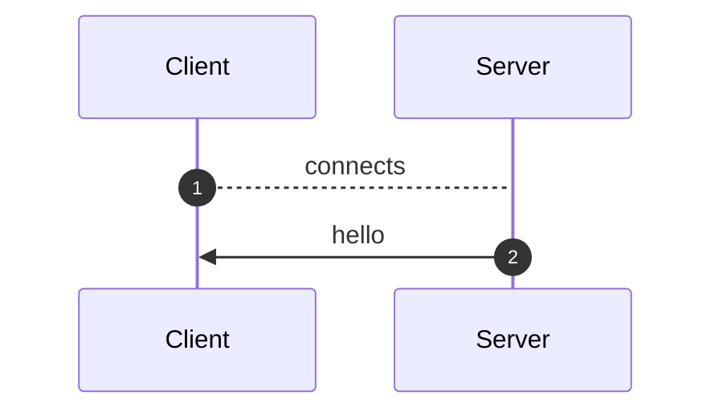
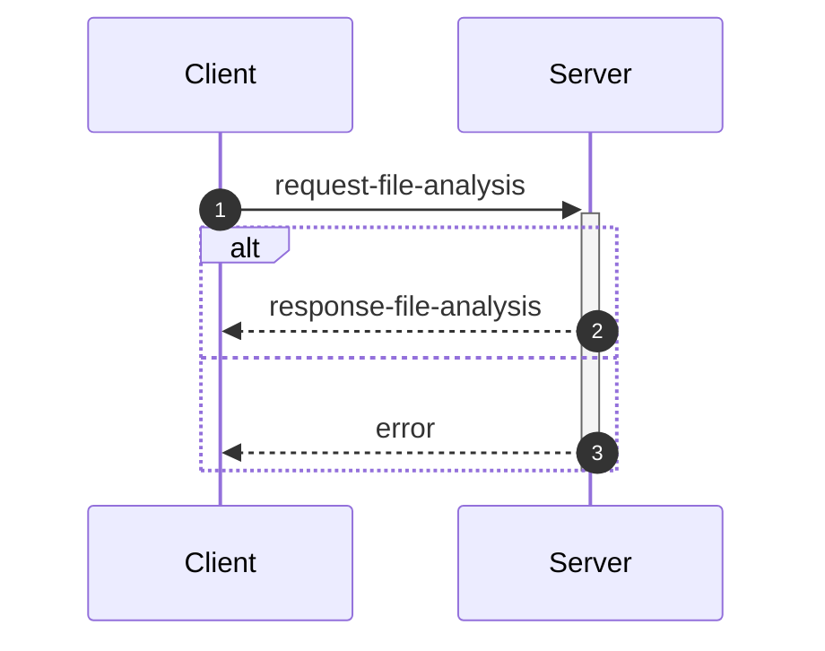
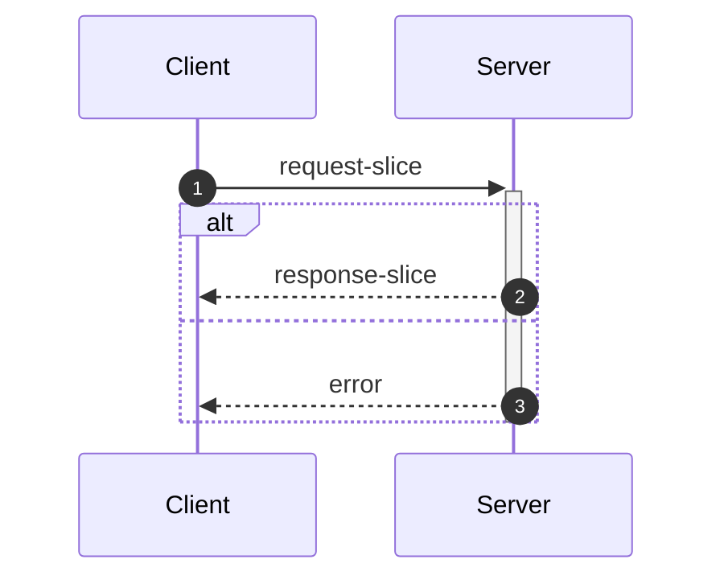
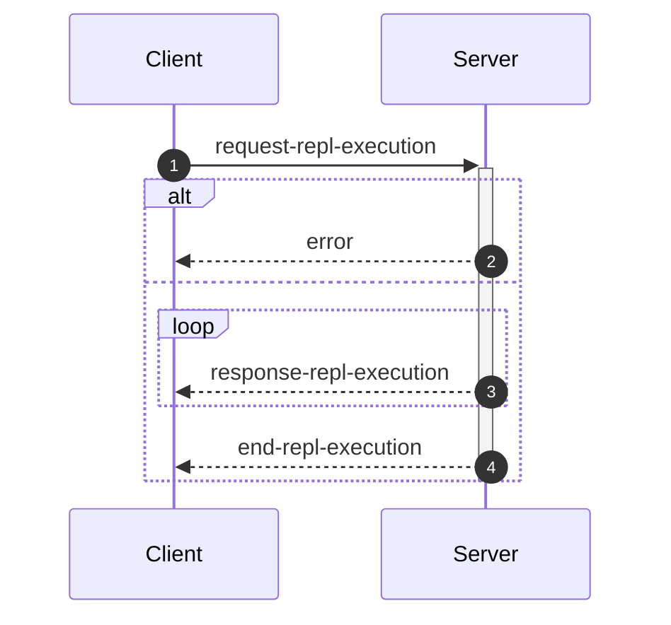

_This document was generated from '[src/documentation/wiki-interface.ts](https://github.com/flowr-analysis/flowr/tree/main//src/documentation/wiki-interface.ts)' on 2026-06-25, 19:03:49 UTC presenting an overview of flowR's interface (v2.10.9, using R v4.5.0). Please do not edit this file/wiki page directly._

Although far from being as detailed as the in-depth explanation of [_flowR_](https://github.com/flowr-analysis/flowr/wiki/core),
this wiki page explains how to interface with _flowR_ in more detail.
In general, command line arguments and other options provide short descriptions on hover over.

* [💻 Using the REPL](#using-the-repl)
* [⚙️ Configuring FlowR](#configuring-flowr)
* [⚒️ Writing Code](#writing-code)
* [💬 Communicating with the Server](#communicating-with-the-server)

<a id='using-the-repl'></a>
## 💻 Using the REPL


> [!NOTE]
> To execute arbitrary R commands with a repl request, _flowR_ has to be started explicitly with <span title="Description (Command Line Argument): Allow to access the underlying R session when using flowR (security warning: this allows the execution of arbitrary R code!)">`--r-session-access`</span>.
> Please be aware that this introduces a security risk and note that this relies on the [`r-shell` engine](https://github.com/flowr-analysis/flowr/wiki/engines) .

Although primarily meant for users to explore,
there is nothing which forbids simply calling _flowR_ as a subprocess to use standard-in, -output, and -error
for communication (although you can access the REPL using the server as well,
with the [REPL Request](#message-request-repl-execution) message).

The read-eval-print loop&nbsp;(REPL) works relatively simple.
You can submit an expression (using <kbd>Enter</kbd>),
which is interpreted as an R&nbsp;expression by default but interpreted as a *command* if it starts with a colon (`:`).
The best command to get started with the REPL is <span title="Description (Repl Command): Show help information (aliases: :h, :?)">`:help`</span>.
Besides, you can leave the REPL either with the command <span title="Description (Repl Command): End the repl (aliases: :q, :exit)">`:quit`</span> or by pressing <kbd>Ctrl</kbd>+<kbd>C</kbd> twice.
When writing a *command*, you may press <kbd>Tab</kbd> to get a list of completions, if available.
Multiple commands can be entered in a single line by separating them with a semicolon (`;`), e.g. `:parse "x<-2"; :df*`.
If a command is given without R code, the REPL will re-use R code given in a previous command.
The prior example will hence return first the parsed AST of the program and then the dataflow graph for `"x <- 2"`.

> [!NOTE]
> If you develop flowR, you may want to launch the repl using the `npm run main-dev` command, this way, you get a non-minified version of flowR with debug information and hot-reloading of source files.

<details>
<summary>Available Commands</summary>

We currently offer the following commands (this with a `[*]` suffix are available with and without the star):


| Command | Description |
| ------- | ----------- |
| **<span title="Description (Repl Command): End the repl (aliases: :q, :exit)">:quit</span>** | End the repl (aliases: **:<span title="Alias of ':quit'. End the repl">q</span>**, **:<span title="Alias of ':quit'. End the repl">exit</span>**) |
| **<span title="Description (Repl Command): Execute the given code as R code. This requires the `--r-session-access` flag to be set and requires the r-shell engine. (aliases: :e, :r)">:execute</span>** | Execute the given code as R code. This requires the `--r-session-access` flag to be set and requires the r-shell engine. (aliases: **:<span title="Alias of ':execute'. Execute the given code as R code. This requires the `--r-session-access` flag to be set and requires the r-shell engine.">e</span>**, **:<span title="Alias of ':execute'. Execute the given code as R code. This requires the `--r-session-access` flag to be set and requires the r-shell engine.">r</span>**) |
| **<span title="Description (Repl Command): Get mermaid code for the control-flow graph of R code, start with 'file://' to indicate a file (aliases: :cfg, :cf)">:controlflow[*]</span>** | Get mermaid code for the control-flow graph of R code, start with 'file://' to indicate a file (star: Returns the URL to mermaid.live) (aliases: **:<span title="Alias of ':controlflow'. Get mermaid code for the control-flow graph of R code, start with 'file://' to indicate a file">cfg</span>**, **:<span title="Alias of ':controlflow'. Get mermaid code for the control-flow graph of R code, start with 'file://' to indicate a file">cf</span>**) |
| **<span title="Description (Repl Command): Get mermaid code for the control-flow graph with basic blocks, start with 'file://' to indicate a file (aliases: :cfgb, :cfb)">:controlflowbb[*]</span>** | Get mermaid code for the control-flow graph with basic blocks, start with 'file://' to indicate a file (star: Returns the URL to mermaid.live) (aliases: **:<span title="Alias of ':controlflowbb'. Get mermaid code for the control-flow graph with basic blocks, start with 'file://' to indicate a file">cfgb</span>**, **:<span title="Alias of ':controlflowbb'. Get mermaid code for the control-flow graph with basic blocks, start with 'file://' to indicate a file">cfb</span>**) |
| **<span title="Description (Repl Command): Get mermaid code for the dataflow graph, start with 'file://' to indicate a file (aliases: :d, :df)">:dataflow[*]</span>** | Get mermaid code for the dataflow graph, start with 'file://' to indicate a file (star: Returns the URL to mermaid.live) (aliases: **:<span title="Alias of ':dataflow'. Get mermaid code for the dataflow graph, start with 'file://' to indicate a file">d</span>**, **:<span title="Alias of ':dataflow'. Get mermaid code for the dataflow graph, start with 'file://' to indicate a file">df</span>**) |
| **<span title="Description (Repl Command): Get mermaid code for the normalized AST of R code, start with 'file://' to indicate a file (aliases: :n)">:normalize[*]</span>** | Get mermaid code for the normalized AST of R code, start with 'file://' to indicate a file (star: Returns the URL to mermaid.live) (alias: **:<span title="Alias of ':normalize'. Get mermaid code for the normalized AST of R code, start with 'file://' to indicate a file">n</span>**) |
| **<span title="Description (Repl Command): Get mermaid code for the simplified dataflow graph, start with 'file://' to indicate a file (aliases: :ds, :dfs)">:dataflowsimple[*]</span>** | Get mermaid code for the simplified dataflow graph, start with 'file://' to indicate a file (star: Returns the URL to mermaid.live) (aliases: **:<span title="Alias of ':dataflowsimple'. Get mermaid code for the simplified dataflow graph, start with 'file://' to indicate a file">ds</span>**, **:<span title="Alias of ':dataflowsimple'. Get mermaid code for the simplified dataflow graph, start with 'file://' to indicate a file">dfs</span>**) |
| **<span title="Description (Repl Command): Just calculates the DFG, but only prints summary info (aliases: :d#, :df#)">:dataflowsilent</span>** | Just calculates the DFG, but only prints summary info (aliases: **:<span title="Alias of ':dataflowsilent'. Just calculates the DFG, but only prints summary info">d#</span>**, **:<span title="Alias of ':dataflowsilent'. Just calculates the DFG, but only prints summary info">df#</span>**) |
| **<span title="Description (Repl Command): Prints ASCII Art of the parsed, unmodified AST, start with 'file://' to indicate a file (aliases: :p)">:parse</span>** | Prints ASCII Art of the parsed, unmodified AST, start with 'file://' to indicate a file (alias: **:<span title="Alias of ':parse'. Prints ASCII Art of the parsed, unmodified AST, start with 'file://' to indicate a file">p</span>**) |
| **<span title="Description (Repl Command): Prints the version of flowR as well as the current version of R">:version</span>** | Prints the version of flowR as well as the current version of R
| **<span title="Description (Repl Command): Query the given R code, start with 'file://' to indicate a file. The query is to be a valid query in json format (use 'help' to get more information).">:query[*]</span>** | Query the given R code, start with 'file://' to indicate a file. The query is to be a valid query in json format (use 'help' to get more information). (star: Similar to query, but returns the output in json format.)
| **<span title="Description (Repl Command): Returns an ASCII representation of the dataflow graph (aliases: :df!)">:dataflowascii</span>** | Returns an ASCII representation of the dataflow graph (alias: **:<span title="Alias of ':dataflowascii'. Returns an ASCII representation of the dataflow graph">df!</span>**) |
| **<span title="Description (Repl Command): Returns summarization stats for the normalized AST (aliases: :n#)">:normalize#</span>** | Returns summarization stats for the normalized AST (alias: **:<span title="Alias of ':normalize#'. Returns summarization stats for the normalized AST">n#</span>**) |
| **<span title="Description (Repl Command): Show help information (aliases: :h, :?)">:help</span>** | Show help information (aliases: **:<span title="Alias of ':help'. Show help information">h</span>**, **:<span title="Alias of ':help'. Show help information">?</span>**) |


</details>


> [!TIP]
> 
> As indicated by the examples before, all REPL commands that operate on code keep track of the state.
> Hence, if you run a command like <span title="Description (Repl Command, starred version): Returns the URL to mermaid.live; Base Command: Get mermaid code for the dataflow graph, start with 'file://' to indicate a file (aliases: :d*, :df*)">`:dataflow*`</span> without providing R code,
> the REPL will re-use the R code provided in a previous command.
> Likewise, doing this will benefit from incrementality!
> If you request the dataflow graph with `:df* x <- 2 * y` and then want to see the parsed AST with `:parse`,
> the REPL will re-use previously obtained information and not re-parse the code again.
> 		


Generally, many commands offer shortcut versions in the REPL. Many queries, for example, offer a shortened format (see the example below).
Of special note, the [Config Query](https://github.com/flowr-analysis/flowr/wiki/query-api#Config-Query)
can be used to also modify the currently active configuration of _flowR_ within the REPL (see the [wiki page](https://github.com/flowr-analysis/flowr/wiki/query-api#Config-Query) for more information).

### Example: Retrieving the Dataflow Graph

To retrieve a URL to the [mermaid](https://mermaid.js.org/) diagram of the dataflow of a given expression,
use <span title="Description (Repl Command, starred version): Returns the URL to mermaid.live; Base Command: Get mermaid code for the dataflow graph, start with 'file://' to indicate a file (aliases: :d*, :df*)">`:dataflow*`</span> (or <span title="Description (Repl Command): Get mermaid code for the dataflow graph, start with 'file://' to indicate a file (aliases: :d, :df)">`:dataflow`</span> to get the mermaid code in the cli):


```shell
$ docker run -it --rm eagleoutice/flowr # or npm run flowr 
flowR repl using flowR v2.10.9, R grammar v14 (tree-sitter engine)
R> :dataflow* y <- 1 + x
```

<details>
<summary style='color:gray'>Output</summary>


```text
https://mermaid.live/view#base64:eyJjb2RlIjoiZmxvd2NoYXJ0IEJUXG4gICAgMXt7XCJgIzkxO1JOdW1iZXIjOTM7IDFcbiAgICAgICgxKVxuICAgICAgKjEuNipgXCJ9fVxuICAgJSUgTm8gZWRnZXMgZm91bmQgZm9yIDFcbiAgICAyKFtcImAjOTE7UlN5bWJvbCM5MzsgeFxuICAgICAgKDIpXG4gICAgICAqMS4xMCpgXCJdKVxuICAgJSUgTm8gZWRnZXMgZm91bmQgZm9yIDJcbiAgICAzW1tcImAjOTE7UkJpbmFyeU9wIzkzOyAjNDM7XG4gICAgICAoMylcbiAgICAgICoxLjYtMTAqXG4gICAgKDEsIDIpYFwiXV1cbiAgICBidWlsdC1pbjpfW1wiYEJ1aWx0LUluOlxuIzQzO2BcIl1cbiAgICBzdHlsZSBidWlsdC1pbjpfIHN0cm9rZTpncmF5LGZpbGw6Z3JheSxzdHJva2Utd2lkdGg6MnB4LG9wYWNpdHk6Ljg7XG4gICAgMFtcImAjOTE7UlN5bWJvbCM5MzsgeVxuICAgICAgKDAsIHNvdXJjZXM6IFszXSlcbiAgICAgICoxLjEqYFwiXVxuICAgIDRbW1wiYCM5MTtSQmluYXJ5T3AjOTM7ICM2MDsjNDU7XG4gICAgICAoNClcbiAgICAgICoxLjEtMTAqXG4gICAgKDAsIDMpYFwiXV1cbiAgICBidWlsdC1pbjpfLVtcImBCdWlsdC1JbjpcbiM2MDsjNDU7YFwiXVxuICAgIHN0eWxlIGJ1aWx0LWluOl8tIHN0cm9rZTpncmF5LGZpbGw6Z3JheSxzdHJva2Utd2lkdGg6MnB4LG9wYWNpdHk6Ljg7XG4gICAgMyAtLT58XCJyZWFkcywgYXJndW1lbnRcInwgMVxuICAgIDMgLS0+fFwicmVhZHMsIGFyZ3VtZW50XCJ8IDJcbiAgICAzIC0uLT58XCJyZWFkcywgY2FsbHNcInwgYnVpbHQtaW46X1xuICAgIGxpbmtTdHlsZSAyIHN0cm9rZTpncmF5O1xuICAgIDAgLS0+fFwiZGVmaW5lZC1ieVwifCAzXG4gICAgMCAtLT58XCJkZWZpbmVkLWJ5XCJ8IDRcbiAgICA0IC0tPnxcInJlYWRzLCBhcmd1bWVudFwifCAzXG4gICAgNCAtLT58XCJyZXR1cm5zLCBhcmd1bWVudFwifCAwXG4gICAgNCAtLi0+fFwicmVhZHMsIGNhbGxzXCJ8IGJ1aWx0LWluOl8tXG4gICAgbGlua1N0eWxlIDcgc3Ryb2tlOmdyYXk7IiwibWVybWFpZCI6eyJhdXRvU3luYyI6dHJ1ZX19
```


Retrieve the dataflow graph of the expression `y <- 1 + x`. It looks like this:


```mermaid
flowchart LR
    1{{"`#91;RNumber#93; 1
      (1)
      *1.6*`"}}
   %% No edges found for 1
    2(["`#91;RSymbol#93; x
      (2)
      *1.10*`"])
   %% No edges found for 2
    3[["`#91;RBinaryOp#93; #43;
      (3)
      *1.6-10*
    (1, 2)`"]]
    built-in:_["`Built-In:
#43;`"]
    style built-in:_ stroke:gray,fill:gray,stroke-width:2px,opacity:.8;
    0["`#91;RSymbol#93; y
      (0, sources: [3])
      *1.1*`"]
    4[["`#91;RBinaryOp#93; #60;#45;
      (4)
      *1.1-10*
    (0, 3)`"]]
    built-in:_-["`Built-In:
#60;#45;`"]
    style built-in:_- stroke:gray,fill:gray,stroke-width:2px,opacity:.8;
    3 -->|"reads, argument"| 1
    3 -->|"reads, argument"| 2
    3 -.->|"reads, calls"| built-in:_
    linkStyle 2 stroke:gray;
    0 -->|"defined-by"| 3
    0 -->|"defined-by"| 4
    4 -->|"reads, argument"| 3
    4 -->|"returns, argument"| 0
    4 -.->|"reads, calls"| built-in:_-
    linkStyle 7 stroke:gray;
```

	
<details>

<summary style="color:gray">R Code of the Dataflow Graph</summary>

The analysis required _0.7 ms_ (including parse and normalize, using the [tree-sitter](https://github.com/flowr-analysis/flowr/wiki/Engines) engine) within the generation environment. 
We encountered no unknown side effects during the analysis.


```r
y <- 1 + x
```


</details>


</details>


For small graphs like this, <span title="Description (Repl Command): Returns an ASCII representation of the dataflow graph (aliases: :df!)">`:dataflowascii`</span> also provides an ASCII representation directly in the REPL:


```shell
$ docker run -it --rm eagleoutice/flowr # or npm run flowr 
flowR repl using flowR v2.10.9, R grammar v14 (tree-sitter engine)
R> :df! y <- 1 + x
```

<details open>
<summary style='color:gray'>Output</summary>


```text
                        0<1>0
                   ┌────| 1 |
    ┌────────┐     │    0---0
 c<4>c       └──c<3>c
 |<- |  v<0>v┌──| + |
 c---c──| y |┘  c---c   u<2>u
        v---v      └────| x |
                        u---u
Edges:
3 -> 1: reads, argument  3 -> 2: reads, argument
4 -> 3: reads, argument  4 -> 0: returns, argument
0 -> 3: defined-by       0 -> 4: defined-by
```


Retrieve the dataflow graph of the expression `y <- 1 + x` as ASCII art.

</details>


For the slicing with <span title="Description (Repl Command): Static backwards executable slicer for R">`:slicer`</span>, you have access to the same [magic comments](#slice-magic-comments) as with the [slice request](#message-request-slice).

### Example: Interfacing with the File System

Many commands that allow for an R-expression (like <span title="Description (Repl Command, starred version): Returns the URL to mermaid.live; Base Command: Get mermaid code for the dataflow graph, start with 'file://' to indicate a file (aliases: :d*, :df*)">`:dataflow*`</span>) allow for a file as well
if the argument starts with `file://`.
If you are working from the root directory of the _flowR_ repository, the following gives you the parsed AST of the example file using the <span title="Description (Repl Command): Prints ASCII Art of the parsed, unmodified AST, start with 'file://' to indicate a file (aliases: :p)">`:parse`</span> command:


```shell
$ docker run -it --rm eagleoutice/flowr # or npm run flowr 
flowR repl using flowR v2.10.9, R grammar v14 (tree-sitter engine)
R> :parse file://test/testfiles/example.R
```

<details>
<summary style='color:gray'>Output</summary>


```text
File: test/testfiles/example.R

program
├ binaryoperator
│ ├ identifier "sum" (1:1─4)
│ ├ <- "<-" (1:5─7)
│ ╰ float "0" (1:8─9)
├ binaryoperator
│ ├ identifier "product" (2:1─8)
│ ├ <- "<-" (2:9─11)
│ ╰ float "1" (2:12─13)
├ binaryoperator
│ ├ identifier "w" (3:1─2)
│ ├ <- "<-" (3:3─5)
│ ╰ float "7" (3:6─7)
├ binaryoperator
│ ├ identifier "N" (4:1─2)
│ ├ <- "<-" (4:3─5)
│ ╰ float "10" (4:6─8)
├ forstatement
│ ├ for "for" (6:1─4)
│ ├ ( "(" (6:5─6)
│ ├ identifier "i" (6:6─7)
│ ├ in "in" (6:8─10)
│ ├ binaryoperator
│ │ ├ float "1" (6:11─12)
│ │ ├ : ":" (6:12─13)
│ │ ╰ parenthesizedexpression
│ │   ├ ( "(" (6:13─14)
│ │   ├ binaryoperator
│ │   │ ├ identifier "N" (6:14─15)
│ │   │ ├ - "-" (6:15─16)
│ │   │ ╰ float "1" (6:16─17)
│ │   ╰ ) ")" (6:17─18)
│ ├ ) ")" (6:18─19)
│ ╰ bracedexpression
│   ├ { "{" (6:20─21)
│   ├ binaryoperator
│   │ ├ identifier "sum" (7:3─6)
│   │ ├ <- "<-" (7:7─9)
│   │ ╰ binaryoperator
│   │   ├ binaryoperator
│   │   │ ├ identifier "sum" (7:10─13)
│   │   │ ├ + "+" (7:14─15)
│   │   │ ╰ identifier "i" (7:16─17)
│   │   ├ + "+" (7:18─19)
│   │   ╰ identifier "w" (7:20─21)
│   ├ binaryoperator
│   │ ├ identifier "product" (8:3─10)
│   │ ├ <- "<-" (8:11─13)
│   │ ╰ binaryoperator
│   │   ├ identifier "product" (8:14─21)
│   │   ├  "" (8:22─23)
│   │   ╰ identifier "i" (8:24─25)
│   ╰ } "}" (9:1─2)
├ call
│ ├ identifier "cat" (11:1─4)
│ ╰ arguments
│   ├ ( "(" (11:4─5)
│   ├ argument
│   │ ╰ string
│   │   ├ " "\"" (11:5─6)
│   │   ├ stringcontent "Sum:" (11:6─10)
│   │   ╰ " "\"" (11:10─11)
│   ├ comma "," (11:11─12)
│   ├ argument
│   │ ╰ identifier "sum" (11:13─16)
│   ├ comma "," (11:16─17)
│   ├ argument
│   │ ╰ string
│   │   ├ " "\"" (11:18─19)
│   │   ├ stringcontent
│   │   │ ╰ escapesequence "\\n" (11:19─21)
│   │   ╰ " "\"" (11:21─22)
│   ╰ ) ")" (11:22─23)
╰ call
  ├ identifier "cat" (12:1─4)
  ╰ arguments
    ├ ( "(" (12:4─5)
    ├ argument
    │ ╰ string
    │   ├ " "\"" (12:5─6)
    │   ├ stringcontent "Product:" (12:6─14)
    │   ╰ " "\"" (12:14─15)
    ├ comma "," (12:15─16)
    ├ argument
    │ ╰ identifier "product" (12:17─24)
    ├ comma "," (12:24─25)
    ├ argument
    │ ╰ string
    │   ├ " "\"" (12:26─27)
    │   ├ stringcontent
    │   │ ╰ escapesequence "\\n" (12:27─29)
    │   ╰ " "\"" (12:29─30)
    ╰ ) ")" (12:30─31)
```


Retrieve the parsed AST of the example file.

<details>

<summary>File Content</summary>


```r
sum <- 0
product <- 1
w <- 7
N <- 10

for (i in 1:(N-1)) {
  sum <- sum + i + w
  product <- product * i
}

cat("Sum:", sum, "\n")
cat("Product:", product, "\n")
```


</details>

As _flowR_ directly transforms this AST the output focuses on being human-readable instead of being machine-readable.
		

</details>


### Example: Run a Query

You can run any query supported by _flowR_ using the <span title="Description (Repl Command): Query the given R code, start with 'file://' to indicate a file. The query is to be a valid query in json format (use 'help' to get more information).">`:query`</span> command.
For example, to obtain the shapes of all data frames in a given piece of code, you can run:


```shell
$ docker run -it --rm eagleoutice/flowr # or npm run flowr 
flowR repl using flowR v2.10.9, R grammar v14 (tree-sitter engine)
R> :query @df-shape "x <- data.frame(a = 1:10, b = 1:10)\ny <- x$a"
```

<details open>
<summary style='color:gray'>Output</summary>


```text
Query: df-shape (2 ms)
   ╰ 12: (colnames: [{"a", "b"}, {}], cols: [2, 2], rows: [10, 10])
   ╰ 0: (colnames: [{"a", "b"}, {}], cols: [2, 2], rows: [10, 10])
All queries together required ≈4 ms (1ms accuracy, total 5 ms)
```


Retrieve the shapes of all data frames in the given code.

</details>


To run the linter on a file, you can use (in this example, we just issue the `dead-code` linter on a small piece of code):


```shell
$ docker run -it --rm eagleoutice/flowr # or npm run flowr 
flowR repl using flowR v2.10.9, R grammar v14 (tree-sitter engine)
R> :query @linter rules:dead-code "if(FALSE) x <- 2"
```

<details open>
<summary style='color:gray'>Output</summary>


```text
Query: linter (1 ms)
   ╰ Dead Code (dead-code):
       ╰ certain:
           ╰ Code at 1.11-16
       ╰ Metadata: searchTimeMs: 1, processTimeMs: 0
All queries together required ≈1 ms (1ms accuracy, total 2 ms)
```


Run the linter on the given code, with only the `dead-code` rule enabled.

</details>


For more information on the available queries, please check out the [Query API](https://github.com/flowr-analysis/flowr/wiki/query-api).


<a id='configuring-flowr'></a>
## ⚙️ Configuring FlowR


When running _flowR_, you may want to specify some behaviors with a dedicated configuration file.
By default, flowR looks for a file named `flowr.json` in the current working directory (or any higher directory).
You can also specify a different file with <span title="Description (Command Line Argument): The name of the configuration file to use">`--config-file`</span> or pass the configuration inline using <span title="Description (Command Line Argument): The flowR configuration to use, as a JSON string">`--config-json`</span>.
To inspect the current configuration, you can run flowr with the <span title="Description (Command Line Argument): Run with verbose logging (will be passed to the corresponding script)">`--verbose`</span> flag, or use the `config` [Query](https://github.com/flowr-analysis/flowr/wiki/query-api).
Within the REPL this works by running the following:


```shell
:query @config
```


To work with the <a href="https://github.com/flowr-analysis/flowr/tree/main/src/config.ts#L109"><code><span title="The configuration file format for flowR.">FlowrConfig</span></code></a> you can use the provided helper objects alongside its methods like
<a href="https://github.com/flowr-analysis/flowr/tree/main/src/config.ts#L457"><code><span title="Creates a new flowr config that has the updated values.">FlowrConfig::<b>amend</b></span></code></a>.
The following summarizes the configuration options:

- `ignoreSourceCalls`: If set to `true`, _flowR_ will ignore source calls when analyzing the code, i.e., ignoring the inclusion of other files.
- `semantics`: allows to configure the way _flowR_ handles R, although we currently only support `semantics/environment/overwriteBuiltIns`.
  You may use this to overwrite _flowR_'s handling of built-in function and even completely clear the preset definitions shipped with flowR.
  See [Configure BuiltIn Semantics](#configure-builtin-semantics) for more information.
- `solver`: allows to configure how _flowR_ resolves variables and their values (currently we support: `disabled`, `alias`, `builtin`), as well as if pointer analysis should be active.
- `engines`: allows to configure the engines used by _flowR_ to interact with R code. See the [Engines wiki page](https://github.com/flowr-analysis/flowr/wiki/engines) for more information.
- `defaultEngine`: allows to specify the default engine to use for interacting with R code. If not set, an arbitrary engine from the specified list will be used.
- `abstractInterpretation`: allows to configure how _flowR_ performs abstract interpretation, although we currently only support data frame shape inference through abstract interpretation.
- `defaultPlugins`: allows to configure which plugins to load by default when creating a new <a href="https://github.com/flowr-analysis/flowr/tree/main/src/project/flowr-analyzer.ts#L162"><code><span title="Central class for conducting analyses with FlowR. Use the FlowrAnalyzerBuilder to create a new instance. If you want the original pattern of creating a pipeline and running all steps, you can still do this with FlowrAnalyzer#runFull . To inspect the context of the analyzer, use FlowrAnalyzer#inspectContext (if you are a plugin and need to modify it, use FlowrAnalyzer#context instead).">FlowrAnalyzer</span></code></a> instance.
- `repl.plugins`: allows to configure which plugins to load in the _flowR_ REPL. Use `flowr:default` to reference the plugins specified by `defaultPlugins`.

So you can configure _flowR_ by adding a file like the following:

<details>

<summary>Example Configuration File</summary>


```json
{
  "ignoreSourceCalls": true,
  "semantics": {
    "environment": {
      "overwriteBuiltIns": {
        "definitions": [
          {
            "type": "function",
            "names": [
              "foo"
            ],
            "processor": "builtin:assign",
            "config": {}
          }
        ]
      }
    }
  },
  "defaultPlugins": [
    "file:description",
    "versions:description"
  ],
  "repl": {
    "quickStats": false,
    "dfProcessorHeat": false,
    "plugins": [
      "flowr:default"
    ]
  },
  "project": {
    "resolveUnknownPathsOnDisk": true
  },
  "engines": [
    {
      "type": "r-shell"
    }
  ],
  "solver": {
    "variables": "alias",
    "evalStrings": true,
    "trackEnvironments": true,
    "resolveSource": {
      "dropPaths": "no",
      "ignoreCapitalization": true,
      "inferWorkingDirectory": "active-script",
      "searchPath": []
    },
    "instrument": {},
    "slicer": {
      "threshold": 50
    }
  },
  "abstractInterpretation": {
    "wideningThreshold": 4,
    "dataFrame": {
      "maxColNames": 20,
      "readLoadedData": {
        "readExternalFiles": true,
        "maxReadLines": 1000000
      }
    }
  },
  "gas": {
    "thresholds": {
      "memory": {
        "problematic": 0.7,
        "critical": 0.9
      },
      "timeMs": {
        "problematic": 100000,
        "critical": 120000
      }
    },
    "features": {}
  }
}
```


</details>

<details>
<a id='configure-builtin-semantics'></a>
<summary>Configure Built-In Semantics</summary>


`semantics/environment/overwriteBuiltins` accepts two keys:

- `loadDefaults` (boolean, initially `true`): If set to `true`, the default built-in definitions are loaded before applying the custom definitions. Setting this flag to `false` explicitly disables the loading of the default definitions.
- `definitions` (array, initially empty): Allows to overwrite or define new built-in elements. Each object within must have a `type` which is one of the below. Furthermore, they may define a string array of `names` which specifies the identifiers to bind the definitions to. You may use `assumePrimitive` to specify whether _flowR_ should assume that this is a primitive non-library definition (so you probably just do not want to specify the key).

  | Type            | Description                                                                                                                                                                                                                                                                                              | Example                                                                                                    |
  | --------------- | -------------------------------------------------------------------------------------------------------------------------------------------------------------------------------------------------------------------------------------------------------------------------------------------------------- | ---------------------------------------------------------------------------------------------------------- |
  | `constant`    | Additionally allows for a `value` this should resolve to.                                                                                                                                                                                                                                                | `{ type: 'constant', names: ['NULL', 'NA'],  value: null }`                                                |
  | `function`    | Is a rather flexible way to define and bind built-in functions. For the time, we do not have extensive documentation to cover all the cases, so please either consult the sources with the `default-builtin-config.ts` or open a [new issue](https://github.com/flowr-analysis/flowr/issues/new/choose). | `{ type: 'function', names: ['next'], processor: 'builtin:d', config: { cfg: ExitPointType.Next } }` |
  | `replacement` | A comfortable way to specify replacement functions like `$<-` or `names<-`. `suffixes` describes the... suffixes to attach automatically. | `{ type: 'replacement', suffixes: ['<-', '<<-'], names: ['[', '[['] }` |


</details>

<details>

<summary style='color:gray'>Full Configuration-File Schema</summary>

- _The configuration file format for flowR._ (object)
    - **ignoreSourceCalls** [optional] _Whether source calls should be ignored, causing {@link processSourceCall}'s behavior to be skipped._ (boolean)
    - **semantics** _Configure language semantics and how flowR handles them._ (object)
        - **environment** [optional] _Semantics regarding how to handle the R environment._ (object)
            - **overwriteBuiltIns** [optional] _Do you want to overwrite (parts) of the builtin definition?_ (object)
                - **loadDefaults** [optional] _Should the default configuration still be loaded?_ (boolean)
                - **definitions** [optional] _The definitions to load/overwrite._ (array)
                Valid item types:
                    - (object)
    - **defaultPlugins** [optional] _The default plugins to load when creating a new instance of FlowrAnalyzer_ (array)
    Valid item types:
        - (alternatives)
            - (string)
            - (array)
    - **repl** _Configuration options for the REPL._ (object)
        - **quickStats** [optional] _Whether to show quick stats in the REPL after each evaluation._ (boolean)
        - **dfProcessorHeat** [optional] _This instruments the dataflow processors to count how often each processor is called._ (boolean)
        - **plugins** [optional] _The plugins to load in REPL mode_ (array)
        Valid item types:
            - (alternatives)
                - (string)
                - (array)
    - **project** _Project specific configuration options._ (object)
        - **resolveUnknownPathsOnDisk** [optional] _Whether to resolve unknown paths loaded by the r project disk when trying to source/analyze files._ (boolean)
    - **engines** _The engine or set of engines to use for interacting with R code. An empty array means all available engines will be used._ (array)
    Valid item types:
        - (alternatives)
            - _The configuration for the tree sitter engine._ (object)
                - **type** [required] _Use the tree sitter engine._ (string)
                    Only allows: 'tree-sitter'
                - **wasmPath** [optional] _The path to the tree-sitter-r WASM binary to use. If this is undefined, this uses the default path._ (string)
                - **treeSitterWasmPath** [optional] _The path to the tree-sitter WASM binary to use. If this is undefined, this uses the default path._ (string)
                - **lax** [optional] _Whether to use the lax parser for parsing R code (allowing for syntax errors). If this is undefined, the strict parser will be used._ (boolean)
            - _The configuration for the R shell engine._ (object)
                - **type** [required] _Use the R shell engine._ (string)
                    Only allows: 'r-shell'
                - **rPath** [optional] _The path to the R executable to use. If this is undefined, this uses the default path._ (string)
    - **defaultEngine** [optional] _The default engine to use for interacting with R code. If this is undefined, an arbitrary engine from the specified list will be used._ (string)
        Only allows: 'tree-sitter', 'r-shell'
    - **solver** _How to resolve constants, constraints, cells, ..._ (object)
        - **variables** _How to resolve variables and their values._ (string)
            Only allows: 'disabled', 'alias', 'builtin'
        - **evalStrings** _Should we include eval(parse(text="...")) calls in the dataflow graph?_ (boolean)
        - **trackEnvironments** [optional] _Track user-created environments (new.env, assign/get/local with envir=, dollar-assign, attach). When false, all envir-style calls fall through conservatively._ (boolean)
        - **instrument** (object)
            - **dataflowExtractors** [optional] _These keys are only intended for use within code, allowing to instrument the dataflow analyzer!_ (any)
        - **resolveSource** [optional] _If lax source calls are active, flowR searches for sourced files much more freely, based on the configurations you give it. This option is only in effect if `ignoreSourceCalls` is set to false._ (object)
            - **dropPaths** _Allow to drop the first or all parts of the sourced path, if it is relative._ (string)
                Only allows: 'no', 'once', 'all'
            - **ignoreCapitalization** _Search for filenames matching in the lowercase._ (boolean)
            - **inferWorkingDirectory** _Try to infer the working directory from the main or any script to analyze._ (string)
                Only allows: 'no', 'main-script', 'active-script', 'any-script'
            - **searchPath** _Additionally search in these paths._ (array)
            Valid item types:
                - (string)
            - **repeatedSourceLimit** [optional] _How often the same file can be sourced within a single run? Please be aware: in case of cyclic sources this may not reach a fixpoint so give this a sensible limit._ (number)
            - **applyReplacements** _Provide name replacements for loaded files_ (array)
            Valid item types:
                - (object)
        - **slicer** [optional] _The configuration for the slicer._ (object)
            - **threshold** [optional] _The maximum number of iterations to perform on a single function call during slicing._ (number)
            - **autoExtend** [optional] _If set, the slicer will gain an additional post-pass._ (boolean)
    - **abstractInterpretation** _The configuration options for abstract interpretation._ (object)
        - **wideningThreshold** _The threshold for the number of visitations of a node at which widening should be performed to ensure the termination of the fixpoint iteration._ (number)
        - **dataFrame** _The configuration of the shape inference for data frames._ (object)
            - **maxColNames** _The maximum number of columns names to infer for data frames before over-approximating the column names to top._ (number)
            - **readLoadedData** _Configuration options for reading data frame shapes from loaded external data files, such as CSV files._ (object)
                - **readExternalFiles** _Whether data frame shapes should be extracted from loaded external files, such as CSV files._ (boolean)
                - **maxReadLines** _The maximum number of lines to read when extracting data frame shapes from loaded files, such as CSV files._ (number)
    - **gas** [optional] _Resource-usage guard (gas) configuration. All feature factors default to 0 (disabled). See https://github.com/flowr-analysis/flowr/wiki/Core#gas-resource-guard._ (object)
        - **thresholds** [optional] _Shared thresholds for all gas checks (scaled by per-feature factor)._ (object)
            - **memory** [optional] _Heap-usage fraction thresholds (0-1)._ (object)
                - **problematic** [optional] _Heap fraction (0-1) above which Problematic is returned._ (number)
                - **critical** [optional] _Heap fraction (0-1) above which Critical is returned._ (number)
            - **timeMs** [optional] _Elapsed analysis time thresholds in milliseconds._ (object)
                - **problematic** [optional] _Elapsed ms above which Problematic is returned._ (number)
                - **critical** [optional] _Elapsed ms above which Critical is returned._ (number)
        - **features** [optional] _Per-feature sensitivity factors. 0 or absent disables gas checking for that feature. A factor of 2 makes the feature twice as sensitive. Recognised keys: `source`, `side-effect-linking`._ (object)

</details>

	

<a id='writing-code'></a>
## ⚒️ Writing Code

_flowR_ can be used as a [module](https://www.npmjs.com/package/@eagleoutice/flowr) and offers several main classes and interfaces that are interesting for extension writers 
(see the [Visual Studio Code extension](https://marketplace.visualstudio.com/items?itemName=code-inspect.vscode-flowr) or the [Core](https://github.com/flowr-analysis/flowr/wiki/core) wiki page for more information).

### Creating Analyses with _flowR_

Nowadays, instances of the <a href="https://github.com/flowr-analysis/flowr/tree/main/src/project/flowr-analyzer.ts#L162"><code><span title="Central class for conducting analyses with FlowR. Use the FlowrAnalyzerBuilder to create a new instance. If you want the original pattern of creating a pipeline and running all steps, you can still do this with FlowrAnalyzer#runFull . To inspect the context of the analyzer, use FlowrAnalyzer#inspectContext (if you are a plugin and need to modify it, use FlowrAnalyzer#context instead).">FlowrAnalyzer</span></code></a> should be used as central frontend to get analysis results from _flowR_.
For example, a program slice can be created like this:


```ts
const analyzer = await new FlowrAnalyzerBuilder()
    .setEngine('tree-sitter')
    .build();
analyzer.addRequest('x <- 1\ny <- x\nx');
const result = await analyzer.query([
    {
        type:     'static-slice',
        criteria: ['3@x']
    }
]);
//console.log(result['static-slice']);
```


For more information, please have a look at the [Analyzer](https://github.com/flowr-analysis/flowr/wiki/analyzer) wiki page, which explains how to construct and use the <a href="https://github.com/flowr-analysis/flowr/tree/main/src/project/flowr-analyzer.ts#L162"><code><span title="Central class for conducting analyses with FlowR. Use the FlowrAnalyzerBuilder to create a new instance. If you want the original pattern of creating a pipeline and running all steps, you can still do this with FlowrAnalyzer#runFull . To inspect the context of the analyzer, use FlowrAnalyzer#inspectContext (if you are a plugin and need to modify it, use FlowrAnalyzer#context instead).">FlowrAnalyzer</span></code></a> in more detail.
To work with specific perspectives, you can also consult the respective pages like the [Dataflow Graph](https://github.com/flowr-analysis/flowr/wiki/dataflow-graph) or the [Abstract Interpretation](https://github.com/flowr-analysis/flowr/wiki/abstract-interpretation) wiki pages.
        
### The Pipeline Executor (Low-Level Interface)

Once, in the beginning, _flowR_ was meant to produce a dataflow graph merely to provide *program slices*. 
However, with continuous updates, the [Dataflow Graph](https://github.com/flowr-analysis/flowr/wiki/dataflow-graph) repeatedly proves to be the more interesting part.
With this, we restructured _flowR_'s originally *hardcoded* pipeline to be far more flexible. 
Now, it can be theoretically extended or replaced with arbitrary steps, optional steps, and what we call 'decorations' of these steps. 
In short, a slicing pipeline using the <a href="https://github.com/flowr-analysis/flowr/tree/main/src/core/pipeline-executor.ts#L97"><code><span title="**Please note:** The PipelineExecutor is now considered to be a rather low-level API for flowR. While it still works and is the basis for all other layers, we strongly recommend using the FlowrAnalyzer and its builder to create and use an analyzer instance that is pre-configured for your use-case. The pipeline executor allows to execute arbitrary pipelines in a step-by-step fashion. If you are not...">PipelineExecutor</span></code></a> looks like this:


```ts

const slicer = new PipelineExecutor(DEFAULT_SLICING_PIPELINE, {
  parser:    new RShell(),
  request:   requestFromInput('x <- 1\nx + 1'),
  criterion: ['2@x']
})
const slice = await slicer.allRemainingSteps()
// console.log(slice.reconstruct.code)
```


<details><summary>More Information</summary>


If you compare this, with what you would have done with the old (and removed) `SteppingSlicer`, 
this essentially just requires you to replace the `SteppingSlicer` with the <a href="https://github.com/flowr-analysis/flowr/tree/main/src/core/pipeline-executor.ts#L97"><code><span title="**Please note:** The PipelineExecutor is now considered to be a rather low-level API for flowR. While it still works and is the basis for all other layers, we strongly recommend using the FlowrAnalyzer and its builder to create and use an analyzer instance that is pre-configured for your use-case. The pipeline executor allows to execute arbitrary pipelines in a step-by-step fashion. If you are not...">PipelineExecutor</span></code></a>
and to pass the <a href="https://github.com/flowr-analysis/flowr/tree/main/src/core/steps/pipeline/default-pipelines.ts#L18"><code>DEFAULT_SLICING_PIPELINE</code></a> as the first argument.
The <a href="https://github.com/flowr-analysis/flowr/tree/main/src/core/pipeline-executor.ts#L97"><code><span title="**Please note:** The PipelineExecutor is now considered to be a rather low-level API for flowR. While it still works and is the basis for all other layers, we strongly recommend using the FlowrAnalyzer and its builder to create and use an analyzer instance that is pre-configured for your use-case. The pipeline executor allows to execute arbitrary pipelines in a step-by-step fashion. If you are not...">PipelineExecutor</span></code></a>...

1. Provides structures to investigate the results of all intermediate steps
2. Can be executed step-by-step
3. Can repeat steps (e.g., to calculate multiple slices on the same input)

See the in-code documentation for more information.

	

</details>
    

### Using the <a href="https://github.com/flowr-analysis/flowr/tree/main/src/r-bridge/shell.ts#L143"><code><span title="The RShell represents an interactive session with the R interpreter. You can configure it by RShellOptions . At the moment we are using a live R session (and not networking etc.) to communicate with R easily, which allows us to install packages etc. However, this might and probably will change in the future (leaving this as a legacy mode :D)">RShell</span></code></a> to Interact with R

The <a href="https://github.com/flowr-analysis/flowr/tree/main/src/r-bridge/shell.ts#L143"><code><span title="The RShell represents an interactive session with the R interpreter. You can configure it by RShellOptions . At the moment we are using a live R session (and not networking etc.) to communicate with R easily, which allows us to install packages etc. However, this might and probably will change in the future (leaving this as a legacy mode :D)">RShell</span></code></a> class allows interfacing with the `R`&nbsp;ecosystem installed on the host system.
Please have a look at [flowR's Engines](https://github.com/flowr-analysis/flowr/wiki/engines) for more information on alternatives (for example, the <a href="https://github.com/flowr-analysis/flowr/tree/main/src/r-bridge/lang-4.x/tree-sitter/tree-sitter-executor.ts#L18"><code><span title="Synchronous and (way) faster alternative to the RShell using tree-sitter.">TreeSitterExecutor</span></code></a>).


> [!IMPORTANT]
> 
> Each <a href="https://github.com/flowr-analysis/flowr/tree/main/src/r-bridge/shell.ts#L143"><code><span title="The RShell represents an interactive session with the R interpreter. You can configure it by RShellOptions . At the moment we are using a live R session (and not networking etc.) to communicate with R easily, which allows us to install packages etc. However, this might and probably will change in the future (leaving this as a legacy mode :D)">RShell</span></code></a> controls a new instance of the R&nbsp;interpreter, 
> make sure to call <code><a href="https://github.com/flowr-analysis/flowr/tree/main/src/r-bridge/shell.ts#L333"><span title="Close the current R session, makes the object effectively invalid (can no longer be reopened etc.)">RShell::<i>close</i></span></a>()</code> when you are done.


You can start a new "session" simply by constructing a new object with <code>new <a href="https://github.com/flowr-analysis/flowr/tree/main/src/r-bridge/shell.ts#L143"><span title="The RShell represents an interactive session with the R interpreter. You can configure it by RShellOptions . At the moment we are using a live R session (and not networking etc.) to communicate with R easily, which allows us to install packages etc. However, this might and probably will change in the future (leaving this as a legacy mode :D)">RShell</span></a>()</code>.

However, there are several options that may be of interest 
(e.g., to automatically revive the shell in case of errors or to control the name location of the R process on the system).

With a shell object (let's call it `shell`), you can execute R code by using <a href="https://github.com/flowr-analysis/flowr/tree/main/src/r-bridge/shell.ts#L211"><code><span title="sends the given command directly to the current R session will not do anything to alter input markers!">RShell::<i>sendCommand</i></span></code></a>, 
for example <code>shell.<a href="https://github.com/flowr-analysis/flowr/tree/main/src/r-bridge/shell.ts#L211"><span title="sends the given command directly to the current R session will not do anything to alter input markers!">sendCommand</span></a>("1 + 1")</code>. 
However, this does not return anything, so if you want to collect the output of your command, use
<a href="https://github.com/flowr-analysis/flowr/tree/main/src/r-bridge/shell.ts#L277"><code><span title="Send a command and collect the output">RShell::<i>sendCommandWithOutput</i></span></code></a> instead.

Besides that, the command <a href="https://github.com/flowr-analysis/flowr/tree/main/src/r-bridge/shell.ts#L249"><code>RShell::<b>tryToInjectHomeLibPath</b></code></a> may be of interest, as it enables all libraries available on the host system.


### Generate Statistics (No longer a Focus of flowR)


<details>

<summary>Adding a New Feature to Extract</summary>

In this example, we construct a new feature to extract, with the name "*example*".
Whenever this name appears, you may substitute this with whatever name fits your feature best (as long as the name is unique).

1. **Create a new file in `src/statistics/features/supported`**\
   Create the file `example.ts`, and add its export to the `index.ts` file in the same directory (if not done automatically).

2. **Create the basic structure**\
   To get a better feel of what a feature must have, let's look
   at the basic structure (of course, due to TypeScript syntax,
   there are other ways to achieve the same goal):

   ```ts
   const initialExampleInfo = {
       /* whatever start value is good for you */
       someCounter: 0
   }

   export type ExampleInfo = Writable<typeof initialExampleInfo>

   export const example: Feature<ExampleInfo> = {
    name:        'Example Feature',
    description: 'A longer example description',

    process(existing: ExampleInfo, input: FeatureProcessorInput): ExampleInfo {
      /* perform analysis on the input */
      return existing
    },

    initialValue: initialExampleInfo
   }
   ```

   The `initialExampleInfo` type holds the initial values for each counter that you want to maintain during the feature extraction (they will usually be initialized with 0). The resulting `ExampleInfo` type holds the structure of the data that is to be counted. Due to the vast amount of data processed, information like the name and location of a function call is not stored here, but instead written to disk (see below).

   Every new feature must be of the `Feature<Info>` type, with `Info` referring to a `FeatureInfo` (like `ExampleInfo` in this example). Next to a `name` and a `description`, each Feature must provide:

   - a processor that extracts the information from the input, adding it to the existing information.
   - a function returning the initial value of the information (in this case, `initialExampleInfo`).

3. **Add it to the feature-mapping**\
   Now, in the `feature.ts` file in `src/statistics/features`, add your feature to the `ALL_FEATURES` object.

Now, we want to extract something. For the *example* feature created in the previous steps, we choose to count the amount of `COMMENT` tokens.
So we define a corresponding [XPath](https://developer.mozilla.org/en-US/docs/Web/XPath) query:

```ts
const commentQuery: Query = xpath.parse('//COMMENT')
```

Within our feature's `process` function, running the query is as simple as:

```ts
const comments = commentQuery.select({ node: input.parsedRAst })
```

Now we could do a lot of further processing, but for simplicity, we only record every comment found this way:

```ts
appendStatisticsFile(example.name, 'comments', comments, input.filepath)
```

We use `example.name` to avoid duplication with the name that we’ve assigned to the feature. It corresponds to the name of the folder in the statistics output.
`'comments'` refers to a freely chosen (but unique) name, that will be used as the name for the output file within the folder. The `comments` variable holds the result of the query, which is an array of nodes. Finally, we pass the `filepath` of the file that was analyzed (if known), so that it can be added to the statistics file (as additional information).

</details>
	

<a id='communicating-with-the-server'></a>
## 💬 Communicating with the Server


As explained in the [Overview](https://github.com/flowr-analysis/flowr/wiki/overview), you can simply run the [TCP](https://de.wikipedia.org/wiki/Transmission_Control_Protocol)&nbsp;server by adding the <span title="Description (Command Line Argument): Do not drop into a repl, but instead start a server on the given port (default: 1042) and listen for messages.">`--server`</span> flag (and, due to the interactive mode, exit with the conventional <kbd>CTRL</kbd>+<kbd>C</kbd>).
Currently, every connection is handled by the same underlying `RShell` - so the server is not designed to handle many clients at a time.
Additionally, the server is not well guarded against attacks (e.g., you can theoretically spawn an arbitrary number of&nbsp;RShell sessions on the target machine).

Every message has to be given in a single line (i.e., without a newline in-between) and end with a newline character. Nevertheless, we will pretty-print example given in the following segments for the ease of reading.


> [!NOTE]
> 
> The default <span title="Description (Command Line Argument): Do not drop into a repl, but instead start a server on the given port (default: 1042) and listen for messages.">`--server`</span> uses a simple [TCP](https://de.wikipedia.org/wiki/Transmission_Control_Protocol)
> connection. If you want _flowR_ to expose a [WebSocket](https://de.wikipedia.org/wiki/WebSocket) server instead, add the <span title="Description (Command Line Argument): If the server flag is set, use websocket for messaging">`--ws`</span> flag (i.e., <span title="Description (Command Line Argument): Do not drop into a repl, but instead start a server on the given port (default: 1042) and listen for messages.">`--server`</span> <span title="Description (Command Line Argument): If the server flag is set, use websocket for messaging">`--ws`</span>) when starting _flowR_ from the command line.
> 			


<ul><li>
<a id="message-hello"></a>
<b>Hello</b> Message (<code>hello</code>) 
<details>

<summary style="color:gray"> View Details. <i>The server informs the client about the successful connection and provides Meta-Information.</i> </summary>


```mermaid
sequenceDiagram
    autonumber
    participant Client
    participant Server

    
    Client-->Server: connects
    Server->>Client: hello
	
```


	
After launching _flowR_, for example, with <code>docker run -it --rm eagleoutice/flowr <span title="Description (Command Line Argument): Do not drop into a repl, but instead start a server on the given port (default: 1042) and listen for messages.">-<span/>-server</span></code>&nbsp;(🐳️), simply connecting should present you with a `hello` message, that amongst others should reveal the versions of&nbsp;_flowR_ and&nbsp;R, using the [semver 2.0](https://semver.org/spec/v2.0.0.html) versioning scheme.
The message looks like this:


```json
{
  "type": "hello",
  "clientName": "client-0",
  "versions": {
    "flowr": "2.10.9",
    "r": "4.5.0",
    "engine": "r-shell"
  }
}
```


There are currently a few messages that you can send after the hello message.
If you want to _slice_ a piece of R code you first have to send an [analysis request](#message-request-file-analysis), so that you can send one or multiple slice requests afterward.
Requests for the [REPL](#message-request-repl) are independent of that.
	

<hr>


<details>
<summary style="color:gray">Message schema (<code>hello</code>)</summary>

For the definition of the hello message, please see it's implementation at [`./src/cli/repl/server/messages/message-hello.ts`](https://github.com/flowr-analysis/flowr/tree/main/./src/cli/repl/server/messages/message-hello.ts).

- [required] (object)
    - **type** [required] _The type of the hello message._ (string)
        Only allows: 'hello'
    - **id** [forbidden] _The id of the message is always undefined (as it is the initial message and not requested)._ (any)
    - **clientName** [required] _A unique name that is assigned to each client. It has no semantic meaning and is only used/useful for debugging._ (string)
    - **versions** [required] (object)
        - **flowr** [required] _The version of the flowr server running in semver format._ (string)
        - **r** [required] _The version of the underlying R shell running in semver format._ (string)
        - **engine** [required] _The parser backend that is used to parse the R code._ (string)

</details>


<hr>

</details>
	</li>

<li>
<a id="message-request-file-analysis"></a>
<b>Analysis</b> Message (<code>request-file-analysis</code>) 
<details>

<summary style="color:gray"> View Details. <i>The server builds the dataflow graph for a given input file (or a set of files).</i> </summary>


```mermaid
sequenceDiagram
    autonumber
    participant Client
    participant Server

    
    Client->>+Server: request-file-analysis
    alt
        Server-->>Client: response-file-analysis
    else
        Server-->>Client: error
    end
    deactivate  Server
	
```


	
The request allows the server to analyze a file and prepare it for slicing.
The message can contain a `filetoken`, which is used to identify the file in later slice or query requests (if you do not add one, the request will not be stored and therefore, it is not available for subsequent requests).

> **Please note!**\
> If you want to send and process a lot of analysis requests, but do not want to slice them, please do not pass the `filetoken` field. This will save the server a lot of memory allocation.

Furthermore, the request must contain either a `content` field to directly pass the file's content or a `filepath` field which contains the path to the file (this path must be accessible for the server to be useful).
If you add the `id` field, the answer will use the same `id` so you can match requests and the corresponding answers.
See the implementation of the request-file-analysis message for more information.

You can drop one or more stored file tokens by adding the `invalidateToken` field (a single token or an array of tokens).
The server frees the corresponding analyses _after_ it has answered the request.

> **Tip!**\
> If you only want to drop tokens, you do not need a separate message: send a `request-file-analysis` that contains _just_ the `invalidateToken` field (and no `content` or `filepath`).
> Such a request behaves like an empty file analysis and the server replies with an empty `results` object.
> Because invalidation happens after the response, you may even pass the _current_ `filetoken` in `invalidateToken` to analyze a file once and have the server forget it right after you received the results.


<details>
<summary>Example of the <code>request-file-analysis</code> Message</summary>

_Note:_ even though we pretty-print these messages, they are sent as a single line, ending with a newline.

The following lists all messages that were sent and received in case you want to reproduce the scenario:

<ol>
<li> <code>hello</code> (response)
<details> 

<summary> Show Details </summary>

The first message is always a hello message.


```json
{
  "type": "hello",
  "clientName": "client-0",
  "versions": {
    "flowr": "2.10.9",
    "r": "4.5.0",
    "engine": "r-shell"
  }
}
```


</details>
</li>

<li> <b><code>request-file-analysis</code> (request)</b>
<details open> 

<summary> Show Details </summary>

Let's suppose you simply want to analyze the following script:
 
```r
x <- 1
x + 1
```

 For this, you can send the following request:


```json
{
  "type": "request-file-analysis",
  "id": "1",
  "filetoken": "x",
  "content": "x <- 1\nx + 1"
}
```


</details>
</li>

<li> <code>response-file-analysis</code> (response)
<details> 

<summary> Show Details </summary>


The `results` field of the response effectively contains three keys of importance:

- `parse`: which contains 1:1 the parse result in CSV format that we received from the `RShell` (i.e., the AST produced by the parser of the R interpreter).
- `normalize`: which contains the normalized AST, including ids (see the `info` field and the [Normalized AST](https://github.com/flowr-analysis/flowr/wiki/normalized-ast) wiki page).
- `dataflow`: especially important is the `graph` field which contains the dataflow graph as a set of root vertices (see the [Dataflow Graph](https://github.com/flowr-analysis/flowr/wiki/dataflow-graph) wiki page).
			


_As the code is pretty long, we inhibit pretty printing and syntax highlighting (JSON, hiding built-in):_

```text
{"type":"response-file-analysis","format":"json","id":"1","results":{"parse":{"files":[{"parsed":"[1,1,1,6,7,0,\"expr\",false,\"x <- 1\"],[1,1,1,1,1,3,\"SYMBOL\",true,\"x\"],[1,1,1,1,3,7,\"expr\",false,\"x\"],[1,3,1,4,2,7,\"LEFT_ASSIGN\",true,\"<-\"],[1,6,1,6,4,5,\"NUM_CONST\",true,\"1\"],[1,6,1,6,5,7,\"expr\",false,\"1\"],[2,1,2,5,16,0,\"expr\",false,\"x + 1\"],[2,1,2,1,10,12,\"SYMBOL\",true,\"x\"],[2,1,2,1,12,16,\"expr\",false,\"x\"],[2,3,2,3,11,16,\"'+'\",true,\"+\"],[2,5,2,5,13,14,\"NUM_CONST\",true,\"1\"],[2,5,2,5,14,16,\"expr\",false,\"1\"]","filePath":"/tmp/tmp-8782-RBdTt30SGOJH-.R"}],".meta":{"timing":2}},"normalize":{"ast":{"type":"RProject","files":[{"root":{"type":"RExpressionList","children":[{"type":"RBinaryOp","location":[1,3,1,4],"lhs":{"type":"RSymbol","location":[1,1,1,1],"content":"x","lexeme":"x","info":{"fullRange":[1,1,1,1],"adToks":[],"id":0,"parent":2,"role":"bin-l","index":0,"nest":0,"file":"/tmp/tmp-8782-RBdTt30SGOJH-.R"}},"rhs":{"location":[1,6,1,6],"lexeme":"1","info":{"fullRange":[1,6,1,6],"adToks":[],"id":1,"parent":2,"role":"bin-r","index":1,"nest":0,"file":"/tmp/tmp-8782-RBdTt30SGOJH-.R"},"type":"RNumber","content":{"num":1,"complexNumber":false,"markedAsInt":false}},"operator":"<-","lexeme":"<-","info":{"fullRange":[1,1,1,6],"adToks":[],"id":2,"parent":6,"nest":0,"file":"/tmp/tmp-8782-RBdTt30SGOJH-.R","index":0,"role":"el-c"}},{"type":"RBinaryOp","location":[2,3,2,3],"lhs":{"type":"RSymbol","location":[2,1,2,1],"content":"x","lexeme":"x","info":{"fullRange":[2,1,2,1],"adToks":[],"id":3,"parent":5,"role":"bin-l","index":0,"nest":0,"file":"/tmp/tmp-8782-RBdTt30SGOJH-.R"}},"rhs":{"location":[2,5,2,5],"lexeme":"1","info":{"fullRange":[2,5,2,5],"adToks":[],"id":4,"parent":5,"role":"bin-r","index":1,"nest":0,"file":"/tmp/tmp-8782-RBdTt30SGOJH-.R"},"type":"RNumber","content":{"num":1,"complexNumber":false,"markedAsInt":false}},"operator":"+","lexeme":"+","info":{"fullRange":[2,1,2,5],"adToks":[],"id":5,"parent":6,"nest":0,"file":"/tmp/tmp-8782-RBdTt30SGOJH-.R","index":1,"role":"el-c"}}],"info":{"adToks":[],"id":6,"nest":0,"file":"/tmp/tmp-8782-RBdTt30SGOJH-.R","role":"root","index":0}},"filePath":"/tmp/tmp-8782-RBdTt30SGOJH-.R"}],"info":{"id":7}},".meta":{"timing":0}},"dataflow":{"unknownReferences":[],"in":[{"nodeId":2,"name":"<-","type":2},{"nodeId":5,"name":"+","type":2}],"out":[{"nodeId":0,"name":"x","type":4,"definedAt":2,"value":[1]}],"environment":{"current":{"id":1851,"parent":"<BuiltInEnvironment>","memory":[["x",[{"nodeId":0,"name":"x","type":4,"definedAt":2,"value":[1]}]]]},"level":0},"graph":{"rootVertices":[1,0,2,3,4,5],"vertexInformation":[[1,{"tag":"value","id":1}],[0,{"tag":"vdef","id":0,"source":[1]}],[2,{"tag":"fcall","id":2,"name":"<-","onlyBuiltin":true,"args":[{"nodeId":0,"type":32},{"nodeId":1,"type":32}],"origin":["builtin:assign"]}],[3,{"tag":"use","id":3}],[4,{"tag":"value","id":4}],[5,{"tag":"fcall","id":5,"name":"+","onlyBuiltin":true,"args":[{"nodeId":3,"type":32},{"nodeId":4,"type":32}],"origin":["builtin:d"]}]],"edgeInformation":[[2,[[1,{"types":65}],[0,{"types":72}],["built-in:<-",{"types":5}]]],[0,[[1,{"types":2}],[2,{"types":2}]]],[3,[[0,{"types":1}]]],[5,[[3,{"types":65}],[4,{"types":65}],["built-in:+",{"types":5}]]]],"_unknownSideEffects":[]},"entryPoint":2,"exitPoints":[{"type":0,"nodeId":5}],"hooks":[],".meta":{"timing":1}}}}
```


</details>
</li>
</ol>

The complete round-trip took 9.9 ms (including time required to validate the messages, start, and stop the internal mock server).

</details>


You receive an error if, for whatever reason, the analysis fails (e.g., the message or code you sent contained syntax errors).
It contains a human-readable description *why* the analysis failed (see the error message implementation for more details).


<details>
<summary>Example Error Message</summary>

_Note:_ even though we pretty-print these messages, they are sent as a single line, ending with a newline.

The following lists all messages that were sent and received in case you want to reproduce the scenario:

<ol>
<li> <code>hello</code> (response)
<details> 

<summary> Show Details </summary>

The first message is always a hello message.


```json
{
  "type": "hello",
  "clientName": "client-0",
  "versions": {
    "flowr": "2.10.9",
    "r": "4.5.0",
    "engine": "r-shell"
  }
}
```


</details>
</li>

<li> <code>request-file-analysis</code> (request)
<details> 

<summary> Show Details </summary>


```json
{
  "type": "request-file-analysis",
  "id": "1",
  "filename": "sample.R",
  "content": "x <-"
}
```


</details>
</li>

<li> <b><code>error</code> (response)</b>
<details open> 

<summary> Show Details </summary>


```json
{
  "id": "1",
  "type": "error",
  "fatal": false,
  "reason": "Error while analyzing file sample.R: GuardError: unable to parse R code (see the log for more information) for request {\"request\":\"text\",\"content\":\"x <-\"}}\n Report a Bug: https://github.com/flowr-analysis/flowr/issues/new?body=%3C!%2D%2D%20Please%20describe%20your%20issue%20in%20more%20detail%20below!%20%2D%2D%3E%0A%0A%0A%3C!%2D%2D%20Automatically%20generated%20issue%20metadata%2C%20please%20do%20not%20edit%20or%20delete%20content%20below%20this%20line%20%2D%2D%3E%0A%2D%2D%2D%0A%0AflowR%20version%3A%202.10.9%0Anode%20version%3A%20v25.6.1%0Anode%20arch%3A%20x64%0Anode%20platform%3A%20linux%0Amessage%3A%20%60unable%20to%20parse%20R%20code%20%28see%20the%20log%20for%20more%20information%29%20for%20request%20%7B%22request%22%3A%22text%22%2C%22content%22%3A%22x%20%3C%2D%22%7D%7D%60%0Astack%20trace%3A%0A%60%60%60%0A%20%20%20%20at%20guard%20%28%3C%3E%2Fsrc%2Futil%2Fassert.ts%3A128%3A9%29%0A%20%20%20%20at%20guardRetrievedOutput%20%28%3C%3E%2Fsrc%2Fr%2Dbridge%2Fretriever.ts%3A221%3A7%29%0A%20%20%20%20at%20%2Fhome%2Frunner%2Fwork%2Fflowr%2Fflowr%2Fsrc%2Fr%2Dbridge%2Fretriever.ts%3A182%3A4%0A%20%20%20%20at%20processTicksAndRejections%20%28node%3Ainternal%2Fprocess%2Ftask_queues%3A104%3A5%29%0A%20%20%20%20at%20async%20Object.parseRequests%20%5Bas%20processor%5D%20%28%3C%3E%2Fsrc%2Fr%2Dbridge%2Fparser.ts%3A104%3A19%29%0A%20%20%20%20at%20async%20PipelineExecutor.nextStep%20%28%3C%3E%2Fsrc%2Fcore%2Fpipeline%2Dexecutor.ts%3A192%3A25%29%0A%20%20%20%20at%20async%20FlowrAnalyzerCache.runTapeUntil%20%28%3C%3E%2Fsrc%2Fproject%2Fcache%2Fflowr%2Danalyzer%2Dcache.ts%3A92%3A4%29%0A%20%20%20%20at%20async%20FlowRServerConnection.sendFileAnalysisResponse%20%28%3C%3E%2Fsrc%2Fcli%2Frepl%2Fserver%2Fconnection.ts%3A190%3A52%29%0A%60%60%60%0A%0A%2D%2D%2D%0A%09"
}
```


</details>
</li>
</ol>

The complete round-trip took 7.8 ms (including time required to validate the messages, start, and stop the internal mock server).

</details>


&nbsp;

<a id="analysis-include-cfg"></a>
**Including the Control Flow Graph**

While _flowR_ does (for the time being) not use an explicit control flow graph but instead relies on control-dependency edges within the dataflow graph, 
the respective structure can still be exposed using the server (note that, as this feature is not needed within _flowR_, it is tested significantly less - 
so please create a [new issue](https://github.com/flowr-analysis/flowr/issues/new/choose) for any bug you may encounter).
For this, the analysis request may add `cfg: true` to its list of options.


<details>
<summary>Requesting a Control Flow Graph</summary>

_Note:_ even though we pretty-print these messages, they are sent as a single line, ending with a newline.

The following lists all messages that were sent and received in case you want to reproduce the scenario:

<ol>
<li> <code>hello</code> (response)
<details> 

<summary> Show Details </summary>

The first message is always a hello message.


```json
{
  "type": "hello",
  "clientName": "client-0",
  "versions": {
    "flowr": "2.10.9",
    "r": "4.5.0",
    "engine": "r-shell"
  }
}
```


</details>
</li>

<li> <b><code>request-file-analysis</code> (request)</b>
<details open> 

<summary> Show Details </summary>


```json
{
  "type": "request-file-analysis",
  "id": "1",
  "filetoken": "x",
  "content": "if(unknown > 0) { x <- 2 } else { x <- 5 }\nfor(i in 1:x) { print(x); print(i) }",
  "cfg": true
}
```


</details>
</li>

<li> <code>response-file-analysis</code> (response)
<details> 

<summary> Show Details </summary>


The response looks basically the same as a response sent without the `cfg` flag. However, additionally it contains a `cfg` field. 
If you are interested in a visual representation of the control flow graph, see the 
[visualization with mermaid](https://mermaid.live/view#base64:eyJjb2RlIjoiZmxvd2NoYXJ0IEJUXG4gICAgbjMyKFtcImBSRXhwcmVzc2lvbkxpc3QgKDMyKWBcIl0pXG4gICAgbjE1W1wiYFJJZlRoZW5FbHNlICgxNSlcbiMzNDtpZih1bmtub3duICM2MjsgMCkgIzEyMzsgeCAjNjA7IzQ1OyAyICMxMjU7IGVsc2UgIzEyMzsgeCAjNjA7IzQ1OyA1ICMxMjU7IzM0O2BcIl1cbiAgICBuMTUtZVtbMTUtZV1dXG4gICAgbjAoW1wiYFJTeW1ib2wgKDApXG4jMzQ7dW5rbm93biMzNDtgXCJdKVxuICAgIG4xKFtcImBSTnVtYmVyICgxKVxuIzM0OzAjMzQ7YFwiXSlcbiAgICBuMihbXCJgUkJpbmFyeU9wICgyKVxuIzM0O3Vua25vd24gIzYyOyAwIzM0O2BcIl0pXG4gICAgbjItZVtbMi1lXV1cbiAgICBuOChbXCJgUkV4cHJlc3Npb25MaXN0ICg4KWBcIl0pXG4gICAgbjUoW1wiYFJTeW1ib2wgKDUpXG4jMzQ7eCMzNDtgXCJdKVxuICAgIG42KFtcImBSTnVtYmVyICg2KVxuIzM0OzIjMzQ7YFwiXSlcbiAgICBuNyhbXCJgUkJpbmFyeU9wICg3KVxuIzM0O3ggIzYwOyM0NTsgMiMzNDtgXCJdKVxuICAgIG43LWVbWzctZV1dXG4gICAgbjgtZVtbOC1lXV1cbiAgICBuMTQoW1wiYFJFeHByZXNzaW9uTGlzdCAoMTQpYFwiXSlcbiAgICBuMTEoW1wiYFJTeW1ib2wgKDExKVxuIzM0O3gjMzQ7YFwiXSlcbiAgICBuMTIoW1wiYFJOdW1iZXIgKDEyKVxuIzM0OzUjMzQ7YFwiXSlcbiAgICBuMTMoW1wiYFJCaW5hcnlPcCAoMTMpXG4jMzQ7eCAjNjA7IzQ1OyA1IzM0O2BcIl0pXG4gICAgbjEzLWVbWzEzLWVdXVxuICAgIG4xNC1lW1sxNC1lXV1cbiAgICBuMTYoW1wiYFJTeW1ib2wgKDE2KVxuIzM0O2kjMzQ7YFwiXSlcbiAgICBuMzFbXCJgUkZvckxvb3AgKDMxKVxuIzM0O2ZvcihpIGluIDEjNTg7eCkgIzEyMzsgcHJpbnQoeCk7IHByaW50KGkpICMxMjU7IzM0O2BcIl1cbiAgICBuMTcoW1wiYFJOdW1iZXIgKDE3KVxuIzM0OzEjMzQ7YFwiXSlcbiAgICBuMTgoW1wiYFJTeW1ib2wgKDE4KVxuIzM0O3gjMzQ7YFwiXSlcbiAgICBuMTkoW1wiYFJCaW5hcnlPcCAoMTkpXG4jMzQ7MSM1ODt4IzM0O2BcIl0pXG4gICAgbjE5LWVbWzE5LWVdXVxuICAgIG4zMChbXCJgUkV4cHJlc3Npb25MaXN0ICgzMClgXCJdKVxuICAgIG4yMihbXCJgUlN5bWJvbCAoMjIpXG4jMzQ7cHJpbnQoeCkjMzQ7YFwiXSlcbiAgICBuMjVbXCJgUkZ1bmN0aW9uQ2FsbCAoMjUpXG4jMzQ7cHJpbnQoeCkjMzQ7YFwiXVxuICAgIG4yNS1lW1syNS1lXV1cbiAgICBuMjQoW1wiYFJBcmd1bWVudCAoMjQpXG4jMzQ7eCMzNDtgXCJdKVxuICAgIG4yMyhbXCJgUlN5bWJvbCAoMjMpXG4jMzQ7eCMzNDtgXCJdKVxuICAgIG4yNC1lW1syNC1lXV1cbiAgICBuMjYoW1wiYFJTeW1ib2wgKDI2KVxuIzM0O3ByaW50KGkpIzM0O2BcIl0pXG4gICAgbjI5W1wiYFJGdW5jdGlvbkNhbGwgKDI5KVxuIzM0O3ByaW50KGkpIzM0O2BcIl1cbiAgICBuMjktZVtbMjktZV1dXG4gICAgbjI4KFtcImBSQXJndW1lbnQgKDI4KVxuIzM0O2kjMzQ7YFwiXSlcbiAgICBuMjcoW1wiYFJTeW1ib2wgKDI3KVxuIzM0O2kjMzQ7YFwiXSlcbiAgICBuMjgtZVtbMjgtZV1dXG4gICAgbjMwLWVbWzMwLWVdXVxuICAgIG4zMS1lW1szMS1lXV1cbiAgICBuMzItZVtbMzItZV1dXG4gICAgbjE1IC0uLT58XCJGRFwifCBuMzJcbiAgICBuMSAtLi0+fFwiRkRcInwgbjBcbiAgICBuMCAtLi0+fFwiRkRcInwgbjJcbiAgICBuMi1lIC0uLT58XCJGRFwifCBuMVxuICAgIG43IC0uLT58XCJGRFwifCBuOFxuICAgIG42IC0uLT58XCJGRFwifCBuNVxuICAgIG41IC0uLT58XCJGRFwifCBuN1xuICAgIG43LWUgLS4tPnxcIkZEXCJ8IG42XG4gICAgbjgtZSAtLi0+fFwiRkRcInwgbjctZVxuICAgIG4xMyAtLi0+fFwiRkRcInwgbjE0XG4gICAgbjEyIC0uLT58XCJGRFwifCBuMTFcbiAgICBuMTEgLS4tPnxcIkZEXCJ8IG4xM1xuICAgIG4xMy1lIC0uLT58XCJGRFwifCBuMTJcbiAgICBuMTQtZSAtLi0+fFwiRkRcInwgbjEzLWVcbiAgICBuOCAtLT58XCJDRCAoVFJVRSlcInwgbjItZVxuICAgIG4xNCAtLT58XCJDRCAoRkFMU0UpXCJ8IG4yLWVcbiAgICBuMiAtLi0+fFwiRkRcInwgbjE1XG4gICAgbjE1LWUgLS4tPnxcIkZEXCJ8IG44LWVcbiAgICBuMTUtZSAtLi0+fFwiRkRcInwgbjE0LWVcbiAgICBuMzEgLS4tPnxcIkZEXCJ8IG4xNS1lXG4gICAgbjMxIC0uLT58XCJGRFwifCBuMzAtZVxuICAgIG4xOCAtLi0+fFwiRkRcInwgbjE3XG4gICAgbjE3IC0uLT58XCJGRFwifCBuMTlcbiAgICBuMTktZSAtLi0+fFwiRkRcInwgbjE4XG4gICAgbjI1IC0uLT58XCJGRFwifCBuMzBcbiAgICBuMjIgLS4tPnxcIkZEXCJ8IG4yNVxuICAgIG4yMyAtLi0+fFwiRkRcInwgbjI0XG4gICAgbjI0LWUgLS4tPnxcIkZEXCJ8IG4yM1xuICAgIG4yNCAtLi0+fFwiRkRcInwgbjIyXG4gICAgbjI1LWUgLS4tPnxcIkZEXCJ8IG4yNC1lXG4gICAgbjI5IC0uLT58XCJGRFwifCBuMjUtZVxuICAgIG4yNiAtLi0+fFwiRkRcInwgbjI5XG4gICAgbjI3IC0uLT58XCJGRFwifCBuMjhcbiAgICBuMjgtZSAtLi0+fFwiRkRcInwgbjI3XG4gICAgbjI4IC0uLT58XCJGRFwifCBuMjZcbiAgICBuMjktZSAtLi0+fFwiRkRcInwgbjI4LWVcbiAgICBuMzAtZSAtLi0+fFwiRkRcInwgbjI5LWVcbiAgICBuMTkgLS4tPnxcIkZEXCJ8IG4zMVxuICAgIG4xNiAtLi0+fFwiRkRcInwgbjE5LWVcbiAgICBuMzAgLS0+fFwiQ0QgKFRSVUUpXCJ8IG4xNlxuICAgIG4zMS1lIC0tPnxcIkNEIChGQUxTRSlcInwgbjE2XG4gICAgbjMyLWUgLS4tPnxcIkZEXCJ8IG4zMS1lXG4gICAgc3R5bGUgbjMyIHN0cm9rZTpjeWFuLHN0cm9rZS13aWR0aDo2LjVweDsgICAgc3R5bGUgbjMyLWUgc3Ryb2tlOmdyZWVuLHN0cm9rZS13aWR0aDo2LjVweDsiLCJtZXJtYWlkIjp7ImF1dG9TeW5jIjp0cnVlfX0=).
			


_As the code is pretty long, we inhibit pretty printing and syntax highlighting (JSON, hiding built-in):_

```text
{"type":"response-file-analysis","format":"json","id":"1","cfg":{"returns":[],"entryPoints":[32],"exitPoints":["32-e"],"breaks":[],"nexts":[],"graph":{"roots":[32,15,"15-e",0,1,2,"2-e",8,5,6,7,"7-e","8-e",14,11,12,13,"13-e","14-e",16,31,17,18,19,"19-e",30,22,25,"25-e",24,23,"24-e",26,29,"29-e",28,27,"28-e","30-e","31-e","32-e"],"vtxInfos":[[32,[2,32,null,["32-e"]]],[15,[1,15,["2-e"],["15-e"]]],["15-e","15-e"],[0,[2,0]],[1,[2,1]],[2,[2,2,null,["2-e"]]],["2-e","2-e"],[8,[2,8,null,["8-e"]]],[5,[2,5]],[6,[2,6]],[7,[2,7,null,["7-e"]]],["7-e","7-e"],["8-e","8-e"],[14,[2,14,null,["14-e"]]],[11,[2,11]],[12,[2,12]],[13,[2,13,null,["13-e"]]],["13-e","13-e"],["14-e","14-e"],[16,[2,16]],[31,[1,31,[16],["31-e"]]],[17,[2,17]],[18,[2,18]],[19,[2,19,null,["19-e"]]],["19-e","19-e"],[30,[2,30,null,["30-e"]]],[22,[2,22]],[25,[1,25,[22],["25-e"]]],["25-e","25-e"],[24,[2,24,[24],["24-e"]]],[23,[2,23]],["24-e","24-e"],[26,[2,26]],[29,[1,29,[26],["29-e"]]],["29-e","29-e"],[28,[2,28,[28],["28-e"]]],[27,[2,27]],["28-e","28-e"],["30-e","30-e"],["31-e","31-e"],["32-e","32-e"]],"bbChildren":[],"edgeInfos":[[15,[[32,0]]],[1,[[0,0]]],[0,[[2,0]]],["2-e",[[1,0]]],[7,[[8,0]]],[6,[[5,0]]],[5,[[7,0]]],["7-e",[[6,0]]],["8-e",[["7-e",0]]],[13,[[14,0]]],[12,[[11,0]]],[11,[[13,0]]],["13-e",[[12,0]]],["14-e",[["13-e",0]]],[8,[["2-e",[15,"TRUE"]]]],[14,[["2-e",[15,"FALSE"]]]],[2,[[15,0]]],["15-e",[["8-e",0],["14-e",0]]],[31,[["15-e",0],["30-e",0]]],[18,[[17,0]]],[17,[[19,0]]],["19-e",[[18,0]]],[25,[[30,0]]],[22,[[25,0]]],[23,[[24,0]]],["24-e",[[23,0]]],[24,[[22,0]]],["25-e",[["24-e",0]]],[29,[["25-e",0]]],[26,[[29,0]]],[27,[[28,0]]],["28-e",[[27,0]]],[28,[[26,0]]],["29-e",[["28-e",0]]],["30-e",[["29-e",0]]],[19,[[31,0]]],[16,[["19-e",0]]],[30,[[16,[31,"TRUE"]]]],["31-e",[[16,[31,"FALSE"]]]],["32-e",[["31-e",0]]]],"revEdgeInfos":[[32,[[15,0]]],[0,[[1,0]]],[2,[[0,0]]],[1,[["2-e",0]]],[8,[[7,0]]],[5,[[6,0]]],[7,[[5,0]]],[6,[["7-e",0]]],["7-e",[["8-e",0]]],[14,[[13,0]]],[11,[[12,0]]],[13,[[11,0]]],[12,[["13-e",0]]],["13-e",[["14-e",0]]],["2-e",[[8,[15,"TRUE"]],[14,[15,"FALSE"]]]],[15,[[2,0]]],["8-e",[["15-e",0]]],["14-e",[["15-e",0]]],["15-e",[[31,0]]],[17,[[18,0]]],[19,[[17,0]]],[18,[["19-e",0]]],[30,[[25,0]]],[25,[[22,0]]],[24,[[23,0]]],[23,[["24-e",0]]],[22,[[24,0]]],["24-e",[["25-e",0]]],["25-e",[[29,0]]],[29,[[26,0]]],[28,[[27,0]]],[27,[["28-e",0]]],[26,[[28,0]]],["28-e",[["29-e",0]]],["29-e",[["30-e",0]]],[31,[[19,0]]],["19-e",[[16,0]]],[16,[[30,[31,"TRUE"]],["31-e",[31,"FALSE"]]]],["30-e",[[31,0]]],["31-e",[["32-e",0]]]],"_mayBB":false}},"results":{"parse":{"files":[{"parsed":"[1,1,1,42,38,0,\"expr\",false,\"if(unknown > 0) { x <- 2 } else { x <- 5 }\"],[1,1,1,2,1,38,\"IF\",true,\"if\"],[1,3,1,3,2,38,\"'('\",true,\"(\"],[1,4,1,14,9,38,\"expr\",false,\"unknown > 0\"],[1,4,1,10,3,5,\"SYMBOL\",true,\"unknown\"],[1,4,1,10,5,9,\"expr\",false,\"unknown\"],[1,12,1,12,4,9,\"GT\",true,\">\"],[1,14,1,14,6,7,\"NUM_CONST\",true,\"0\"],[1,14,1,14,7,9,\"expr\",false,\"0\"],[1,15,1,15,8,38,\"')'\",true,\")\"],[1,17,1,26,22,38,\"expr\",false,\"{ x <- 2 }\"],[1,17,1,17,12,22,\"'{'\",true,\"{\"],[1,19,1,24,19,22,\"expr\",false,\"x <- 2\"],[1,19,1,19,13,15,\"SYMBOL\",true,\"x\"],[1,19,1,19,15,19,\"expr\",false,\"x\"],[1,21,1,22,14,19,\"LEFT_ASSIGN\",true,\"<-\"],[1,24,1,24,16,17,\"NUM_CONST\",true,\"2\"],[1,24,1,24,17,19,\"expr\",false,\"2\"],[1,26,1,26,18,22,\"'}'\",true,\"}\"],[1,28,1,31,23,38,\"ELSE\",true,\"else\"],[1,33,1,42,35,38,\"expr\",false,\"{ x <- 5 }\"],[1,33,1,33,25,35,\"'{'\",true,\"{\"],[1,35,1,40,32,35,\"expr\",false,\"x <- 5\"],[1,35,1,35,26,28,\"SYMBOL\",true,\"x\"],[1,35,1,35,28,32,\"expr\",false,\"x\"],[1,37,1,38,27,32,\"LEFT_ASSIGN\",true,\"<-\"],[1,40,1,40,29,30,\"NUM_CONST\",true,\"5\"],[1,40,1,40,30,32,\"expr\",false,\"5\"],[1,42,1,42,31,35,\"'}'\",true,\"}\"],[2,1,2,36,84,0,\"expr\",false,\"for(i in 1:x) { print(x); print(i) }\"],[2,1,2,3,41,84,\"FOR\",true,\"for\"],[2,4,2,13,53,84,\"forcond\",false,\"(i in 1:x)\"],[2,4,2,4,42,53,\"'('\",true,\"(\"],[2,5,2,5,43,53,\"SYMBOL\",true,\"i\"],[2,7,2,8,44,53,\"IN\",true,\"in\"],[2,10,2,12,51,53,\"expr\",false,\"1:x\"],[2,10,2,10,45,46,\"NUM_CONST\",true,\"1\"],[2,10,2,10,46,51,\"expr\",false,\"1\"],[2,11,2,11,47,51,\"':'\",true,\":\"],[2,12,2,12,48,50,\"SYMBOL\",true,\"x\"],[2,12,2,12,50,51,\"expr\",false,\"x\"],[2,13,2,13,49,53,\"')'\",true,\")\"],[2,15,2,36,81,84,\"expr\",false,\"{ print(x); print(i) }\"],[2,15,2,15,54,81,\"'{'\",true,\"{\"],[2,17,2,24,64,81,\"expr\",false,\"print(x)\"],[2,17,2,21,55,57,\"SYMBOL_FUNCTION_CALL\",true,\"print\"],[2,17,2,21,57,64,\"expr\",false,\"print\"],[2,22,2,22,56,64,\"'('\",true,\"(\"],[2,23,2,23,58,60,\"SYMBOL\",true,\"x\"],[2,23,2,23,60,64,\"expr\",false,\"x\"],[2,24,2,24,59,64,\"')'\",true,\")\"],[2,25,2,25,65,81,\"';'\",true,\";\"],[2,27,2,34,77,81,\"expr\",false,\"print(i)\"],[2,27,2,31,68,70,\"SYMBOL_FUNCTION_CALL\",true,\"print\"],[2,27,2,31,70,77,\"expr\",false,\"print\"],[2,32,2,32,69,77,\"'('\",true,\"(\"],[2,33,2,33,71,73,\"SYMBOL\",true,\"i\"],[2,33,2,33,73,77,\"expr\",false,\"i\"],[2,34,2,34,72,77,\"')'\",true,\")\"],[2,36,2,36,78,81,\"'}'\",true,\"}\"]","filePath":"/tmp/tmp-8782-dUhkYe14AI5j-.R"}],".meta":{"timing":3}},"normalize":{"ast":{"type":"RProject","files":[{"root":{"type":"RExpressionList","children":[{"type":"RIfThenElse","condition":{"type":"RBinaryOp","location":[1,12,1,12],"lhs":{"type":"RSymbol","location":[1,4,1,10],"content":"unknown","lexeme":"unknown","info":{"fullRange":[1,4,1,10],"adToks":[],"id":0,"parent":2,"role":"bin-l","index":0,"nest":1,"file":"/tmp/tmp-8782-dUhkYe14AI5j-.R"}},"rhs":{"location":[1,14,1,14],"lexeme":"0","info":{"fullRange":[1,14,1,14],"adToks":[],"id":1,"parent":2,"role":"bin-r","index":1,"nest":1,"file":"/tmp/tmp-8782-dUhkYe14AI5j-.R"},"type":"RNumber","content":{"num":0,"complexNumber":false,"markedAsInt":false}},"operator":">","lexeme":">","info":{"fullRange":[1,4,1,14],"adToks":[],"id":2,"parent":15,"nest":1,"file":"/tmp/tmp-8782-dUhkYe14AI5j-.R","role":"if-c"}},"then":{"type":"RExpressionList","children":[{"type":"RBinaryOp","location":[1,21,1,22],"lhs":{"type":"RSymbol","location":[1,19,1,19],"content":"x","lexeme":"x","info":{"fullRange":[1,19,1,19],"adToks":[],"id":5,"parent":7,"role":"bin-l","index":0,"nest":1,"file":"/tmp/tmp-8782-dUhkYe14AI5j-.R"}},"rhs":{"location":[1,24,1,24],"lexeme":"2","info":{"fullRange":[1,24,1,24],"adToks":[],"id":6,"parent":7,"role":"bin-r","index":1,"nest":1,"file":"/tmp/tmp-8782-dUhkYe14AI5j-.R"},"type":"RNumber","content":{"num":2,"complexNumber":false,"markedAsInt":false}},"operator":"<-","lexeme":"<-","info":{"fullRange":[1,19,1,24],"adToks":[],"id":7,"parent":8,"nest":1,"file":"/tmp/tmp-8782-dUhkYe14AI5j-.R","index":0,"role":"el-c"}}],"grouping":[{"type":"RSymbol","location":[1,17,1,17],"content":"{","lexeme":"{","info":{"fullRange":[1,17,1,26],"adToks":[],"id":3,"role":"el-g","index":0,"nest":1,"file":"/tmp/tmp-8782-dUhkYe14AI5j-.R"}},{"type":"RSymbol","location":[1,26,1,26],"content":"}","lexeme":"}","info":{"fullRange":[1,17,1,26],"adToks":[],"id":4,"role":"el-g","index":0,"nest":1,"file":"/tmp/tmp-8782-dUhkYe14AI5j-.R"}}],"info":{"adToks":[],"id":8,"parent":15,"nest":1,"file":"/tmp/tmp-8782-dUhkYe14AI5j-.R","index":1,"role":"if-then"}},"location":[1,1,1,2],"lexeme":"if","info":{"fullRange":[1,1,1,42],"adToks":[],"id":15,"parent":32,"nest":1,"file":"/tmp/tmp-8782-dUhkYe14AI5j-.R","index":0,"role":"el-c"},"otherwise":{"type":"RExpressionList","children":[{"type":"RBinaryOp","location":[1,37,1,38],"lhs":{"type":"RSymbol","location":[1,35,1,35],"content":"x","lexeme":"x","info":{"fullRange":[1,35,1,35],"adToks":[],"id":11,"parent":13,"role":"bin-l","index":0,"nest":1,"file":"/tmp/tmp-8782-dUhkYe14AI5j-.R"}},"rhs":{"location":[1,40,1,40],"lexeme":"5","info":{"fullRange":[1,40,1,40],"adToks":[],"id":12,"parent":13,"role":"bin-r","index":1,"nest":1,"file":"/tmp/tmp-8782-dUhkYe14AI5j-.R"},"type":"RNumber","content":{"num":5,"complexNumber":false,"markedAsInt":false}},"operator":"<-","lexeme":"<-","info":{"fullRange":[1,35,1,40],"adToks":[],"id":13,"parent":14,"nest":1,"file":"/tmp/tmp-8782-dUhkYe14AI5j-.R","index":0,"role":"el-c"}}],"grouping":[{"type":"RSymbol","location":[1,33,1,33],"content":"{","lexeme":"{","info":{"fullRange":[1,33,1,42],"adToks":[],"id":9,"role":"el-g","index":0,"nest":1,"file":"/tmp/tmp-8782-dUhkYe14AI5j-.R"}},{"type":"RSymbol","location":[1,42,1,42],"content":"}","lexeme":"}","info":{"fullRange":[1,33,1,42],"adToks":[],"id":10,"role":"el-g","index":0,"nest":1,"file":"/tmp/tmp-8782-dUhkYe14AI5j-.R"}}],"info":{"adToks":[],"id":14,"parent":15,"nest":1,"file":"/tmp/tmp-8782-dUhkYe14AI5j-.R","index":2,"role":"if-other"}}},{"type":"RForLoop","variable":{"type":"RSymbol","location":[2,5,2,5],"content":"i","lexeme":"i","info":{"adToks":[],"id":16,"parent":31,"role":"for-var","index":0,"nest":1,"file":"/tmp/tmp-8782-dUhkYe14AI5j-.R"}},"vector":{"type":"RBinaryOp","location":[2,11,2,11],"lhs":{"location":[2,10,2,10],"lexeme":"1","info":{"fullRange":[2,10,2,10],"adToks":[],"id":17,"parent":19,"role":"bin-l","index":0,"nest":1,"file":"/tmp/tmp-8782-dUhkYe14AI5j-.R"},"type":"RNumber","content":{"num":1,"complexNumber":false,"markedAsInt":false}},"rhs":{"type":"RSymbol","location":[2,12,2,12],"content":"x","lexeme":"x","info":{"fullRange":[2,12,2,12],"adToks":[],"id":18,"parent":19,"role":"bin-r","index":1,"nest":1,"file":"/tmp/tmp-8782-dUhkYe14AI5j-.R"}},"operator":":","lexeme":":","info":{"fullRange":[2,10,2,12],"adToks":[],"id":19,"parent":31,"nest":1,"file":"/tmp/tmp-8782-dUhkYe14AI5j-.R","index":1,"role":"for-vec"}},"body":{"type":"RExpressionList","children":[{"type":"RFunctionCall","named":true,"location":[2,17,2,21],"lexeme":"print","functionName":{"type":"RSymbol","location":[2,17,2,21],"content":"print","lexeme":"print","info":{"fullRange":[2,17,2,24],"adToks":[],"id":22,"parent":25,"role":"call-name","index":0,"nest":1,"file":"/tmp/tmp-8782-dUhkYe14AI5j-.R"}},"arguments":[{"type":"RArgument","location":[2,23,2,23],"lexeme":"x","value":{"type":"RSymbol","location":[2,23,2,23],"content":"x","lexeme":"x","info":{"fullRange":[2,23,2,23],"adToks":[],"id":23,"parent":24,"role":"arg-v","index":0,"nest":1,"file":"/tmp/tmp-8782-dUhkYe14AI5j-.R"}},"info":{"fullRange":[2,23,2,23],"adToks":[],"id":24,"parent":25,"nest":1,"file":"/tmp/tmp-8782-dUhkYe14AI5j-.R","index":1,"role":"call-arg"}}],"info":{"fullRange":[2,17,2,24],"adToks":[],"id":25,"parent":30,"nest":1,"file":"/tmp/tmp-8782-dUhkYe14AI5j-.R","index":0,"role":"el-c"}},{"type":"RFunctionCall","named":true,"location":[2,27,2,31],"lexeme":"print","functionName":{"type":"RSymbol","location":[2,27,2,31],"content":"print","lexeme":"print","info":{"fullRange":[2,27,2,34],"adToks":[],"id":26,"parent":29,"role":"call-name","index":0,"nest":1,"file":"/tmp/tmp-8782-dUhkYe14AI5j-.R"}},"arguments":[{"type":"RArgument","location":[2,33,2,33],"lexeme":"i","value":{"type":"RSymbol","location":[2,33,2,33],"content":"i","lexeme":"i","info":{"fullRange":[2,33,2,33],"adToks":[],"id":27,"parent":28,"role":"arg-v","index":0,"nest":1,"file":"/tmp/tmp-8782-dUhkYe14AI5j-.R"}},"info":{"fullRange":[2,33,2,33],"adToks":[],"id":28,"parent":29,"nest":1,"file":"/tmp/tmp-8782-dUhkYe14AI5j-.R","index":1,"role":"call-arg"}}],"info":{"fullRange":[2,27,2,34],"adToks":[],"id":29,"parent":30,"nest":1,"file":"/tmp/tmp-8782-dUhkYe14AI5j-.R","index":1,"role":"el-c"}}],"grouping":[{"type":"RSymbol","location":[2,15,2,15],"content":"{","lexeme":"{","info":{"fullRange":[2,15,2,36],"adToks":[],"id":20,"role":"el-g","index":0,"nest":1,"file":"/tmp/tmp-8782-dUhkYe14AI5j-.R"}},{"type":"RSymbol","location":[2,36,2,36],"content":"}","lexeme":"}","info":{"fullRange":[2,15,2,36],"adToks":[],"id":21,"role":"el-g","index":0,"nest":1,"file":"/tmp/tmp-8782-dUhkYe14AI5j-.R"}}],"info":{"adToks":[],"id":30,"parent":31,"nest":1,"file":"/tmp/tmp-8782-dUhkYe14AI5j-.R","index":2,"role":"for-b"}},"lexeme":"for","info":{"fullRange":[2,1,2,36],"adToks":[],"id":31,"parent":32,"nest":1,"file":"/tmp/tmp-8782-dUhkYe14AI5j-.R","index":1,"role":"el-c"},"location":[2,1,2,3]}],"info":{"adToks":[],"id":32,"nest":0,"file":"/tmp/tmp-8782-dUhkYe14AI5j-.R","role":"root","index":0}},"filePath":"/tmp/tmp-8782-dUhkYe14AI5j-.R"}],"info":{"id":33}},".meta":{"timing":0}},"dataflow":{"unknownReferences":[],"in":[{"nodeId":15,"name":"if","type":2},{"nodeId":0,"name":"unknown","type":1},{"nodeId":2,"name":">","type":2},{"nodeId":7,"name":"<-","cds":[{"id":15,"when":true}],"type":2},{"nodeId":13,"name":"<-","cds":[{"id":15,"when":false}],"type":2},{"nodeId":8,"name":"{","cds":[{"id":15,"when":true}],"type":2},{"nodeId":14,"name":"{","cds":[{"id":15,"when":false}],"type":2},{"nodeId":31,"name":"for","type":2},{"nodeId":27,"name":"i","type":4},{"nodeId":19,"name":":","type":2},{"nodeId":25,"name":"print","type":2},{"nodeId":29,"name":"print","type":2}],"out":[{"nodeId":5,"name":"x","type":4,"definedAt":7,"cds":[{"id":15,"when":true}],"value":[6]},{"nodeId":11,"name":"x","type":4,"definedAt":13,"cds":[{"id":15,"when":true},{"id":15,"when":false}],"value":[12]},{"nodeId":16,"name":"i","type":1}],"environment":{"current":{"id":1937,"parent":"<BuiltInEnvironment>","memory":[["x",[{"nodeId":5,"name":"x","type":4,"definedAt":7,"cds":[{"id":15,"when":true},{"id":15,"when":false}],"value":[6]},{"nodeId":11,"name":"x","type":4,"definedAt":13,"cds":[{"id":15,"when":true},{"id":15,"when":false}],"value":[12]}]],["i",[{"nodeId":16,"name":"i","type":4,"definedAt":31}]]]},"level":0},"graph":{"rootVertices":[0,1,2,6,5,7,8,12,11,13,14,15,16,17,18,19,23,25,27,29,30,31],"vertexInformation":[[0,{"tag":"use","id":0}],[1,{"tag":"value","id":1}],[2,{"tag":"fcall","id":2,"name":">","onlyBuiltin":true,"args":[{"nodeId":0,"type":32},{"nodeId":1,"type":32}],"origin":["builtin:d"]}],[6,{"tag":"value","id":6}],[5,{"tag":"vdef","id":5,"cds":[{"id":15,"when":true}],"source":[6]}],[7,{"tag":"fcall","id":7,"name":"<-","onlyBuiltin":true,"cds":[{"id":15,"when":true}],"args":[{"nodeId":5,"type":32},{"nodeId":6,"type":32}],"origin":["builtin:assign"]}],[8,{"tag":"fcall","id":8,"name":"{","onlyBuiltin":true,"cds":[{"id":15,"when":true}],"args":[{"nodeId":7,"type":32}],"origin":["builtin:el"]}],[12,{"tag":"value","id":12}],[11,{"tag":"vdef","id":11,"cds":[{"id":15,"when":false}],"source":[12]}],[13,{"tag":"fcall","id":13,"name":"<-","onlyBuiltin":true,"cds":[{"id":15,"when":false}],"args":[{"nodeId":11,"type":32},{"nodeId":12,"type":32}],"origin":["builtin:assign"]}],[14,{"tag":"fcall","id":14,"name":"{","onlyBuiltin":true,"cds":[{"id":15,"when":false}],"args":[{"nodeId":13,"type":32}],"origin":["builtin:el"]}],[15,{"tag":"fcall","id":15,"name":"if","onlyBuiltin":true,"args":[{"nodeId":2,"type":32},{"nodeId":8,"type":32},{"nodeId":14,"type":32}],"origin":["builtin:ite"]}],[16,{"tag":"vdef","id":16,"source":[19]}],[17,{"tag":"value","id":17}],[18,{"tag":"use","id":18}],[19,{"tag":"fcall","id":19,"name":":","onlyBuiltin":true,"args":[{"nodeId":17,"type":32},{"nodeId":18,"type":32}],"origin":["builtin:d"]}],[23,{"tag":"use","id":23,"cds":[{"id":31,"when":true}]}],[25,{"tag":"fcall","id":25,"name":"print","onlyBuiltin":true,"cds":[{"id":31,"when":true}],"args":[{"nodeId":23,"type":32}],"origin":["builtin:d"]}],[27,{"tag":"use","id":27,"cds":[{"id":31,"when":true}]}],[29,{"tag":"fcall","id":29,"name":"print","onlyBuiltin":true,"cds":[{"id":31,"when":true}],"args":[{"nodeId":27,"type":32}],"origin":["builtin:d"]}],[30,{"tag":"fcall","id":30,"name":"{","onlyBuiltin":true,"cds":[{"id":31,"when":true}],"args":[{"nodeId":25,"type":32},{"nodeId":29,"type":32}],"origin":["builtin:el"]}],[31,{"tag":"fcall","id":31,"name":"for","onlyBuiltin":true,"args":[{"nodeId":16,"type":32},{"nodeId":19,"type":32},{"nodeId":30,"type":32}],"origin":["builtin:fl"]}]],"edgeInformation":[[2,[[0,{"types":65}],[1,{"types":65}],["built-in:>",{"types":5}]]],[7,[[6,{"types":65}],[5,{"types":72}],["built-in:<-",{"types":5}]]],[5,[[6,{"types":2}],[7,{"types":2}]]],[8,[[7,{"types":72}],["built-in:{",{"types":5}]]],[15,[[8,{"types":72}],[14,{"types":72}],[2,{"types":65}],["built-in:if",{"types":5}]]],[13,[[12,{"types":65}],[11,{"types":72}],["built-in:<-",{"types":5}]]],[11,[[12,{"types":2}],[13,{"types":2}]]],[14,[[13,{"types":72}],["built-in:{",{"types":5}]]],[19,[[17,{"types":65}],[18,{"types":65}],["built-in::",{"types":5}]]],[18,[[5,{"types":1}],[11,{"types":1}]]],[25,[[23,{"types":73}],["built-in:print",{"types":5}]]],[23,[[5,{"types":1}],[11,{"types":1}]]],[29,[[27,{"types":73}],["built-in:print",{"types":5}]]],[27,[[16,{"types":1}]]],[30,[[25,{"types":64}],[29,{"types":72}],["built-in:{",{"types":5}]]],[16,[[19,{"types":2}]]],[31,[[16,{"types":64}],[19,{"types":65}],[30,{"types":320}],["built-in:for",{"types":5}]]]],"_unknownSideEffects":[{"id":25,"linkTo":{"type":"link-to-last-call","callName":{}}},{"id":29,"linkTo":{"type":"link-to-last-call","callName":{}}}]},"entryPoint":15,"exitPoints":[{"type":0,"nodeId":31}],"hooks":[],"cfgQuick":{"graph":{"roots":[32,15,"15-e",0,1,2,"2-e",8,5,6,7,"7-e","8-e",14,11,12,13,"13-e","14-e",16,31,17,18,19,"19-e",30,22,25,"25-e",24,23,"24-e",26,29,"29-e",28,27,"28-e","30-e","31-e","32-e"],"vtxInfos":[[32,[2,32,null,["32-e"]]],[15,[1,15,["2-e"],["15-e"]]],["15-e","15-e"],[0,[2,0]],[1,[2,1]],[2,[2,2,null,["2-e"]]],["2-e","2-e"],[8,[2,8,null,["8-e"]]],[5,[2,5]],[6,[2,6]],[7,[2,7,null,["7-e"]]],["7-e","7-e"],["8-e","8-e"],[14,[2,14,null,["14-e"]]],[11,[2,11]],[12,[2,12]],[13,[2,13,null,["13-e"]]],["13-e","13-e"],["14-e","14-e"],[16,[2,16]],[31,[1,31,[16],["31-e"]]],[17,[2,17]],[18,[2,18]],[19,[2,19,null,["19-e"]]],["19-e","19-e"],[30,[2,30,null,["30-e"]]],[22,[2,22]],[25,[1,25,[22],["25-e"]]],["25-e","25-e"],[24,[2,24,[24],["24-e"]]],[23,[2,23]],["24-e","24-e"],[26,[2,26]],[29,[1,29,[26],["29-e"]]],["29-e","29-e"],[28,[2,28,[28],["28-e"]]],[27,[2,27]],["28-e","28-e"],["30-e","30-e"],["31-e","31-e"],["32-e","32-e"]],"bbChildren":[],"edgeInfos":[[15,[[32,0]]],[1,[[0,0]]],[0,[[2,0]]],["2-e",[[1,0]]],[7,[[8,0]]],[6,[[5,0]]],[5,[[7,0]]],["7-e",[[6,0]]],["8-e",[["7-e",0]]],[13,[[14,0]]],[12,[[11,0]]],[11,[[13,0]]],["13-e",[[12,0]]],["14-e",[["13-e",0]]],[8,[["2-e",[15,"TRUE"]]]],[14,[["2-e",[15,"FALSE"]]]],[2,[[15,0]]],["15-e",[["8-e",0],["14-e",0]]],[31,[["15-e",0],["30-e",0]]],[18,[[17,0]]],[17,[[19,0]]],["19-e",[[18,0]]],[25,[[30,0]]],[22,[[25,0]]],[23,[[24,0]]],["24-e",[[23,0]]],[24,[[22,0]]],["25-e",[["24-e",0]]],[29,[["25-e",0]]],[26,[[29,0]]],[27,[[28,0]]],["28-e",[[27,0]]],[28,[[26,0]]],["29-e",[["28-e",0]]],["30-e",[["29-e",0]]],[19,[[31,0]]],[16,[["19-e",0]]],[30,[[16,[31,"TRUE"]]]],["31-e",[[16,[31,"FALSE"]]]],["32-e",[["31-e",0]]]],"revEdgeInfos":[[32,[[15,0]]],[0,[[1,0]]],[2,[[0,0]]],[1,[["2-e",0]]],[8,[[7,0]]],[5,[[6,0]]],[7,[[5,0]]],[6,[["7-e",0]]],["7-e",[["8-e",0]]],[14,[[13,0]]],[11,[[12,0]]],[13,[[11,0]]],[12,[["13-e",0]]],["13-e",[["14-e",0]]],["2-e",[[8,[15,"TRUE"]],[14,[15,"FALSE"]]]],[15,[[2,0]]],["8-e",[["15-e",0]]],["14-e",[["15-e",0]]],["15-e",[[31,0]]],[17,[[18,0]]],[19,[[17,0]]],[18,[["19-e",0]]],[30,[[25,0]]],[25,[[22,0]]],[24,[[23,0]]],[23,[["24-e",0]]],[22,[[24,0]]],["24-e",[["25-e",0]]],["25-e",[[29,0]]],[29,[[26,0]]],[28,[[27,0]]],[27,[["28-e",0]]],[26,[[28,0]]],["28-e",[["29-e",0]]],["29-e",[["30-e",0]]],[31,[[19,0]]],["19-e",[[16,0]]],[16,[[30,[31,"TRUE"]],["31-e",[31,"FALSE"]]]],["30-e",[[31,0]]],["31-e",[["32-e",0]]]],"_mayBB":false},"breaks":[],"nexts":[],"returns":[],"exitPoints":["32-e"],"entryPoints":[32]},".meta":{"timing":1}}}}
```


</details>
</li>
</ol>

The complete round-trip took 9.7 ms (including time required to validate the messages, start, and stop the internal mock server).

</details>


&nbsp;

<a id="analysis-format-n-quads"></a>
**Retrieve the Output as RDF N-Quads**

The default response is formatted as JSON.
However, by specifying `format: "n-quads"`, you can retrieve the individual results (e.g., the [Normalized AST](https://github.com/flowr-analysis/flowr/wiki/normalized-ast)),
as [RDF N-Quads](https://www.w3.org/TR/n-quads/).
This works with and without the control flow graph as described [above](#analysis-include-cfg).


<details>
<summary>Requesting RDF N-Quads</summary>

_Note:_ even though we pretty-print these messages, they are sent as a single line, ending with a newline.

The following lists all messages that were sent and received in case you want to reproduce the scenario:

<ol>
<li> <code>hello</code> (response)
<details> 

<summary> Show Details </summary>

The first message is always a hello message.


```json
{
  "type": "hello",
  "clientName": "client-0",
  "versions": {
    "flowr": "2.10.9",
    "r": "4.5.0",
    "engine": "r-shell"
  }
}
```


</details>
</li>

<li> <b><code>request-file-analysis</code> (request)</b>
<details open> 

<summary> Show Details </summary>


```json
{
  "type": "request-file-analysis",
  "id": "1",
  "filetoken": "x",
  "content": "x <- 1\nx + 1",
  "format": "n-quads",
  "cfg": true
}
```


</details>
</li>

<li> <code>response-file-analysis</code> (response)
<details> 

<summary> Show Details </summary>


Please note, that the base message format is still JSON. Only the individual results get converted. 
While the context is derived from the `filename`, we currently offer no way to customize other parts of the quads 
(please open a [new issue](https://github.com/flowr-analysis/flowr/issues/new/choose) if you require this).

			


_As the code is pretty long, we inhibit pretty printing and syntax highlighting (JSON, hiding built-in):_

```text
{"type":"response-file-analysis","format":"n-quads","id":"1","cfg":"<https://uni-ulm.de/r-ast/unknown/0> <https://uni-ulm.de/r-ast/rootIds> \"6\"^^<http://www.w3.org/2001/XMLSchema#integer> <unknown> .\n<https://uni-ulm.de/r-ast/unknown/0> <https://uni-ulm.de/r-ast/rootIds> \"0\"^^<http://www.w3.org/2001/XMLSchema#integer> <unknown> .\n<https://uni-ulm.de/r-ast/unknown/0> <https://uni-ulm.de/r-ast/rootIds> \"1\"^^<http://www.w3.org/2001/XMLSchema#integer> <unknown> .\n<https://uni-ulm.de/r-ast/unknown/0> <https://uni-ulm.de/r-ast/rootIds> \"2\"^^<http://www.w3.org/2001/XMLSchema#integer> <unknown> .\n<https://uni-ulm.de/r-ast/unknown/0> <https://uni-ulm.de/r-ast/rootIds> \"2-e\" <unknown> .\n<https://uni-ulm.de/r-ast/unknown/0> <https://uni-ulm.de/r-ast/rootIds> \"3\"^^<http://www.w3.org/2001/XMLSchema#integer> <unknown> .\n<https://uni-ulm.de/r-ast/unknown/0> <https://uni-ulm.de/r-ast/rootIds> \"4\"^^<http://www.w3.org/2001/XMLSchema#integer> <unknown> .\n<https://uni-ulm.de/r-ast/unknown/0> <https://uni-ulm.de/r-ast/rootIds> \"5\"^^<http://www.w3.org/2001/XMLSchema#integer> <unknown> .\n<https://uni-ulm.de/r-ast/unknown/0> <https://uni-ulm.de/r-ast/rootIds> \"5-e\" <unknown> .\n<https://uni-ulm.de/r-ast/unknown/0> <https://uni-ulm.de/r-ast/rootIds> \"6-e\" <unknown> .\n<https://uni-ulm.de/r-ast/unknown/0> <https://uni-ulm.de/r-ast/vertices> <https://uni-ulm.de/r-ast/unknown/1> <unknown> .\n<https://uni-ulm.de/r-ast/unknown/1> <https://uni-ulm.de/r-ast/next> <https://uni-ulm.de/r-ast/unknown/2> <unknown> .\n<https://uni-ulm.de/r-ast/unknown/1> <https://uni-ulm.de/r-ast/id> \"6\"^^<http://www.w3.org/2001/XMLSchema#integer> <unknown> .\n<https://uni-ulm.de/r-ast/unknown/0> <https://uni-ulm.de/r-ast/vertices> <https://uni-ulm.de/r-ast/unknown/2> <unknown> .\n<https://uni-ulm.de/r-ast/unknown/2> <https://uni-ulm.de/r-ast/next> <https://uni-ulm.de/r-ast/unknown/3> <unknown> .\n<https://uni-ulm.de/r-ast/unknown/2> <https://uni-ulm.de/r-ast/id> \"0\"^^<http://www.w3.org/2001/XMLSchema#integer> <unknown> .\n<https://uni-ulm.de/r-ast/unknown/0> <https://uni-ulm.de/r-ast/vertices> <https://uni-ulm.de/r-ast/unknown/3> <unknown> .\n<https://uni-ulm.de/r-ast/unknown/3> <https://uni-ulm.de/r-ast/next> <https://uni-ulm.de/r-ast/unknown/4> <unknown> .\n<https://uni-ulm.de/r-ast/unknown/3> <https://uni-ulm.de/r-ast/id> \"1\"^^<http://www.w3.org/2001/XMLSchema#integer> <unknown> .\n<https://uni-ulm.de/r-ast/unknown/0> <https://uni-ulm.de/r-ast/vertices> <https://uni-ulm.de/r-ast/unknown/4> <unknown> .\n<https://uni-ulm.de/r-ast/unknown/4> <https://uni-ulm.de/r-ast/next> <https://uni-ulm.de/r-ast/unknown/5> <unknown> .\n<https://uni-ulm.de/r-ast/unknown/4> <https://uni-ulm.de/r-ast/id> \"2\"^^<http://www.w3.org/2001/XMLSchema#integer> <unknown> .\n<https://uni-ulm.de/r-ast/unknown/0> <https://uni-ulm.de/r-ast/vertices> <https://uni-ulm.de/r-ast/unknown/5> <unknown> .\n<https://uni-ulm.de/r-ast/unknown/5> <https://uni-ulm.de/r-ast/next> <https://uni-ulm.de/r-ast/unknown/6> <unknown> .\n<https://uni-ulm.de/r-ast/unknown/5> <https://uni-ulm.de/r-ast/id> \"2-e\" <unknown> .\n<https://uni-ulm.de/r-ast/unknown/0> <https://uni-ulm.de/r-ast/vertices> <https://uni-ulm.de/r-ast/unknown/6> <unknown> .\n<https://uni-ulm.de/r-ast/unknown/6> <https://uni-ulm.de/r-ast/next> <https://uni-ulm.de/r-ast/unknown/7> <unknown> .\n<https://uni-ulm.de/r-ast/unknown/6> <https://uni-ulm.de/r-ast/id> \"3\"^^<http://www.w3.org/2001/XMLSchema#integer> <unknown> .\n<https://uni-ulm.de/r-ast/unknown/0> <https://uni-ulm.de/r-ast/vertices> <https://uni-ulm.de/r-ast/unknown/7> <unknown> .\n<https://uni-ulm.de/r-ast/unknown/7> <https://uni-ulm.de/r-ast/next> <https://uni-ulm.de/r-ast/unknown/8> <unknown> .\n<https://uni-ulm.de/r-ast/unknown/7> <https://uni-ulm.de/r-ast/id> \"4\"^^<http://www.w3.org/2001/XMLSchema#integer> <unknown> .\n<https://uni-ulm.de/r-ast/unknown/0> <https://uni-ulm.de/r-ast/vertices> <https://uni-ulm.de/r-ast/unknown/8> <unknown> .\n<https://uni-ulm.de/r-ast/unknown/8> <https://uni-ulm.de/r-ast/next> <https://uni-ulm.de/r-ast/unknown/9> <unknown> .\n<https://uni-ulm.de/r-ast/unknown/8> <https://uni-ulm.de/r-ast/id> \"5\"^^<http://www.w3.org/2001/XMLSchema#integer> <unknown> .\n<https://uni-ulm.de/r-ast/unknown/0> <https://uni-ulm.de/r-ast/vertices> <https://uni-ulm.de/r-ast/unknown/9> <unknown> .\n<https://uni-ulm.de/r-ast/unknown/9> <https://uni-ulm.de/r-ast/next> <https://uni-ulm.de/r-ast/unknown/10> <unknown> .\n<https://uni-ulm.de/r-ast/unknown/9> <https://uni-ulm.de/r-ast/id> \"5-e\" <unknown> .\n<https://uni-ulm.de/r-ast/unknown/0> <https://uni-ulm.de/r-ast/vertices> <https://uni-ulm.de/r-ast/unknown/10> <unknown> .\n<https://uni-ulm.de/r-ast/unknown/10> <https://uni-ulm.de/r-ast/id> \"6-e\" <unknown> .\n<https://uni-ulm.de/r-ast/unknown/0> <https://uni-ulm.de/r-ast/edges> <https://uni-ulm.de/r-ast/unknown/11> <unknown> .\n<https://uni-ulm.de/r-ast/unknown/11> <https://uni-ulm.de/r-ast/next> <https://uni-ulm.de/r-ast/unknown/12> <unknown> .\n<https://uni-ulm.de/r-ast/unknown/11> <https://uni-ulm.de/r-ast/from> \"2\"^^<http://www.w3.org/2001/XMLSchema#integer> <unknown> .\n<https://uni-ulm.de/r-ast/unknown/11> <https://uni-ulm.de/r-ast/to> \"6\"^^<http://www.w3.org/2001/XMLSchema#integer> <unknown> .\n<https://uni-ulm.de/r-ast/unknown/11> <https://uni-ulm.de/r-ast/type> \"0\"^^<http://www.w3.org/2001/XMLSchema#integer> <unknown> .\n<https://uni-ulm.de/r-ast/unknown/0> <https://uni-ulm.de/r-ast/edges> <https://uni-ulm.de/r-ast/unknown/12> <unknown> .\n<https://uni-ulm.de/r-ast/unknown/12> <https://uni-ulm.de/r-ast/next> <https://uni-ulm.de/r-ast/unknown/13> <unknown> .\n<https://uni-ulm.de/r-ast/unknown/12> <https://uni-ulm.de/r-ast/from> \"1\"^^<http://www.w3.org/2001/XMLSchema#integer> <unknown> .\n<https://uni-ulm.de/r-ast/unknown/12> <https://uni-ulm.de/r-ast/to> \"0\"^^<http://www.w3.org/2001/XMLSchema#integer> <unknown> .\n<https://uni-ulm.de/r-ast/unknown/12> <https://uni-ulm.de/r-ast/type> \"0\"^^<http://www.w3.org/2001/XMLSchema#integer> <unknown> .\n<https://uni-ulm.de/r-ast/unknown/0> <https://uni-ulm.de/r-ast/edges> <https://uni-ulm.de/r-ast/unknown/13> <unknown> .\n<https://uni-ulm.de/r-ast/unknown/13> <https://uni-ulm.de/r-ast/next> <https://uni-ulm.de/r-ast/unknown/14> <unknown> .\n<https://uni-ulm.de/r-ast/unknown/13> <https://uni-ulm.de/r-ast/from> \"0\"^^<http://www.w3.org/2001/XMLSchema#integer> <unknown> .\n<https://uni-ulm.de/r-ast/unknown/13> <https://uni-ulm.de/r-ast/to> \"2\"^^<http://www.w3.org/2001/XMLSchema#integer> <unknown> .\n<https://uni-ulm.de/r-ast/unknown/13> <https://uni-ulm.de/r-ast/type> \"0\"^^<http://www.w3.org/2001/XMLSchema#integer> <unknown> .\n<https://uni-ulm.de/r-ast/unknown/0> <https://uni-ulm.de/r-ast/edges> <https://uni-ulm.de/r-ast/unknown/14> <unknown> .\n<https://uni-ulm.de/r-ast/unknown/14> <https://uni-ulm.de/r-ast/next> <https://uni-ulm.de/r-ast/unknown/15> <unknown> .\n<https://uni-ulm.de/r-ast/unknown/14> <https://uni-ulm.de/r-ast/from> \"2-e\" <unknown> .\n<https://uni-ulm.de/r-ast/unknown/14> <https://uni-ulm.de/r-ast/to> \"1\"^^<http://www.w3.org/2001/XMLSchema#integer> <unknown> .\n<https://uni-ulm.de/r-ast/unknown/14> <https://uni-ulm.de/r-ast/type> \"0\"^^<http://www.w3.org/2001/XMLSchema#integer> <unknown> .\n<https://uni-ulm.de/r-ast/unknown/0> <https://uni-ulm.de/r-ast/edges> <https://uni-ulm.de/r-ast/unknown/15> <unknown> .\n<https://uni-ulm.de/r-ast/unknown/15> <https://uni-ulm.de/r-ast/next> <https://uni-ulm.de/r-ast/unknown/16> <unknown> .\n<https://uni-ulm.de/r-ast/unknown/15> <https://uni-ulm.de/r-ast/from> \"5\"^^<http://www.w3.org/2001/XMLSchema#integer> <unknown> .\n<https://uni-ulm.de/r-ast/unknown/15> <https://uni-ulm.de/r-ast/to> \"2-e\" <unknown> .\n<https://uni-ulm.de/r-ast/unknown/15> <https://uni-ulm.de/r-ast/type> \"0\"^^<http://www.w3.org/2001/XMLSchema#integer> <unknown> .\n<https://uni-ulm.de/r-ast/unknown/0> <https://uni-ulm.de/r-ast/edges> <https://uni-ulm.de/r-ast/unknown/16> <unknown> .\n<https://uni-ulm.de/r-ast/unknown/16> <https://uni-ulm.de/r-ast/next> <https://uni-ulm.de/r-ast/unknown/17> <unknown> .\n<https://uni-ulm.de/r-ast/unknown/16> <https://uni-ulm.de/r-ast/from> \"4\"^^<http://www.w3.org/2001/XMLSchema#integer> <unknown> .\n<https://uni-ulm.de/r-ast/unknown/16> <https://uni-ulm.de/r-ast/to> \"3\"^^<http://www.w3.org/2001/XMLSchema#integer> <unknown> .\n<https://uni-ulm.de/r-ast/unknown/16> <https://uni-ulm.de/r-ast/type> \"0\"^^<http://www.w3.org/2001/XMLSchema#integer> <unknown> .\n<https://uni-ulm.de/r-ast/unknown/0> <https://uni-ulm.de/r-ast/edges> <https://uni-ulm.de/r-ast/unknown/17> <unknown> .\n<https://uni-ulm.de/r-ast/unknown/17> <https://uni-ulm.de/r-ast/next> <https://uni-ulm.de/r-ast/unknown/18> <unknown> .\n<https://uni-ulm.de/r-ast/unknown/17> <https://uni-ulm.de/r-ast/from> \"3\"^^<http://www.w3.org/2001/XMLSchema#integer> <unknown> .\n<https://uni-ulm.de/r-ast/unknown/17> <https://uni-ulm.de/r-ast/to> \"5\"^^<http://www.w3.org/2001/XMLSchema#integer> <unknown> .\n<https://uni-ulm.de/r-ast/unknown/17> <https://uni-ulm.de/r-ast/type> \"0\"^^<http://www.w3.org/2001/XMLSchema#integer> <unknown> .\n<https://uni-ulm.de/r-ast/unknown/0> <https://uni-ulm.de/r-ast/edges> <https://uni-ulm.de/r-ast/unknown/18> <unknown> .\n<https://uni-ulm.de/r-ast/unknown/18> <https://uni-ulm.de/r-ast/next> <https://uni-ulm.de/r-ast/unknown/19> <unknown> .\n<https://uni-ulm.de/r-ast/unknown/18> <https://uni-ulm.de/r-ast/from> \"5-e\" <unknown> .\n<https://uni-ulm.de/r-ast/unknown/18> <https://uni-ulm.de/r-ast/to> \"4\"^^<http://www.w3.org/2001/XMLSchema#integer> <unknown> .\n<https://uni-ulm.de/r-ast/unknown/18> <https://uni-ulm.de/r-ast/type> \"0\"^^<http://www.w3.org/2001/XMLSchema#integer> <unknown> .\n<https://uni-ulm.de/r-ast/unknown/0> <https://uni-ulm.de/r-ast/edges> <https://uni-ulm.de/r-ast/unknown/19> <unknown> .\n<https://uni-ulm.de/r-ast/unknown/19> <https://uni-ulm.de/r-ast/from> \"6-e\" <unknown> .\n<https://uni-ulm.de/r-ast/unknown/19> <https://uni-ulm.de/r-ast/to> \"5-e\" <unknown> .\n<https://uni-ulm.de/r-ast/unknown/19> <https://uni-ulm.de/r-ast/type> \"0\"^^<http://www.w3.org/2001/XMLSchema#integer> <unknown> .\n<https://uni-ulm.de/r-ast/unknown/0> <https://uni-ulm.de/r-ast/entryPoints> \"6\"^^<http://www.w3.org/2001/XMLSchema#integer> <unknown> .\n<https://uni-ulm.de/r-ast/unknown/0> <https://uni-ulm.de/r-ast/exitPoints> \"6-e\" <unknown> .\n","results":{"parse":"<https://uni-ulm.de/r-ast/unknown/0> <https://uni-ulm.de/r-ast/token> \"exprlist\" <unknown> .\n<https://uni-ulm.de/r-ast/unknown/0> <https://uni-ulm.de/r-ast/text> \"\" <unknown> .\n<https://uni-ulm.de/r-ast/unknown/0> <https://uni-ulm.de/r-ast/id> \"0\"^^<http://www.w3.org/2001/XMLSchema#integer> <unknown> .\n<https://uni-ulm.de/r-ast/unknown/0> <https://uni-ulm.de/r-ast/parent> \"0\"^^<http://www.w3.org/2001/XMLSchema#integer> <unknown> .\n<https://uni-ulm.de/r-ast/unknown/0> <https://uni-ulm.de/r-ast/line1> \"1\"^^<http://www.w3.org/2001/XMLSchema#integer> <unknown> .\n<https://uni-ulm.de/r-ast/unknown/0> <https://uni-ulm.de/r-ast/col1> \"1\"^^<http://www.w3.org/2001/XMLSchema#integer> <unknown> .\n<https://uni-ulm.de/r-ast/unknown/0> <https://uni-ulm.de/r-ast/line2> \"2\"^^<http://www.w3.org/2001/XMLSchema#integer> <unknown> .\n<https://uni-ulm.de/r-ast/unknown/0> <https://uni-ulm.de/r-ast/col2> \"5\"^^<http://www.w3.org/2001/XMLSchema#integer> <unknown> .\n<https://uni-ulm.de/r-ast/unknown/0> <https://uni-ulm.de/r-ast/children> <https://uni-ulm.de/r-ast/unknown/1> <unknown> .\n<https://uni-ulm.de/r-ast/unknown/1> <https://uni-ulm.de/r-ast/next> <https://uni-ulm.de/r-ast/unknown/2> <unknown> .\n<https://uni-ulm.de/r-ast/unknown/1> <https://uni-ulm.de/r-ast/line1> \"1\"^^<http://www.w3.org/2001/XMLSchema#integer> <unknown> .\n<https://uni-ulm.de/r-ast/unknown/1> <https://uni-ulm.de/r-ast/col1> \"1\"^^<http://www.w3.org/2001/XMLSchema#integer> <unknown> .\n<https://uni-ulm.de/r-ast/unknown/1> <https://uni-ulm.de/r-ast/line2> \"1\"^^<http://www.w3.org/2001/XMLSchema#integer> <unknown> .\n<https://uni-ulm.de/r-ast/unknown/1> <https://uni-ulm.de/r-ast/col2> \"6\"^^<http://www.w3.org/2001/XMLSchema#integer> <unknown> .\n<https://uni-ulm.de/r-ast/unknown/1> <https://uni-ulm.de/r-ast/id> \"7\"^^<http://www.w3.org/2001/XMLSchema#integer> <unknown> .\n<https://uni-ulm.de/r-ast/unknown/1> <https://uni-ulm.de/r-ast/parent> \"0\"^^<http://www.w3.org/2001/XMLSchema#integer> <unknown> .\n<https://uni-ulm.de/r-ast/unknown/1> <https://uni-ulm.de/r-ast/token> \"expr\" <unknown> .\n<https://uni-ulm.de/r-ast/unknown/1> <https://uni-ulm.de/r-ast/terminal> \"false\"^^<http://www.w3.org/2001/XMLSchema#boolean> <unknown> .\n<https://uni-ulm.de/r-ast/unknown/1> <https://uni-ulm.de/r-ast/text> \"x <- 1\" <unknown> .\n<https://uni-ulm.de/r-ast/unknown/1> <https://uni-ulm.de/r-ast/children> <https://uni-ulm.de/r-ast/unknown/3> <unknown> .\n<https://uni-ulm.de/r-ast/unknown/3> <https://uni-ulm.de/r-ast/next> <https://uni-ulm.de/r-ast/unknown/4> <unknown> .\n<https://uni-ulm.de/r-ast/unknown/3> <https://uni-ulm.de/r-ast/line1> \"1\"^^<http://www.w3.org/2001/XMLSchema#integer> <unknown> .\n<https://uni-ulm.de/r-ast/unknown/3> <https://uni-ulm.de/r-ast/col1> \"1\"^^<http://www.w3.org/2001/XMLSchema#integer> <unknown> .\n<https://uni-ulm.de/r-ast/unknown/3> <https://uni-ulm.de/r-ast/line2> \"1\"^^<http://www.w3.org/2001/XMLSchema#integer> <unknown> .\n<https://uni-ulm.de/r-ast/unknown/3> <https://uni-ulm.de/r-ast/col2> \"1\"^^<http://www.w3.org/2001/XMLSchema#integer> <unknown> .\n<https://uni-ulm.de/r-ast/unknown/3> <https://uni-ulm.de/r-ast/id> \"3\"^^<http://www.w3.org/2001/XMLSchema#integer> <unknown> .\n<https://uni-ulm.de/r-ast/unknown/3> <https://uni-ulm.de/r-ast/parent> \"7\"^^<http://www.w3.org/2001/XMLSchema#integer> <unknown> .\n<https://uni-ulm.de/r-ast/unknown/3> <https://uni-ulm.de/r-ast/token> \"expr\" <unknown> .\n<https://uni-ulm.de/r-ast/unknown/3> <https://uni-ulm.de/r-ast/terminal> \"false\"^^<http://www.w3.org/2001/XMLSchema#boolean> <unknown> .\n<https://uni-ulm.de/r-ast/unknown/3> <https://uni-ulm.de/r-ast/text> \"x\" <unknown> .\n<https://uni-ulm.de/r-ast/unknown/3> <https://uni-ulm.de/r-ast/children> <https://uni-ulm.de/r-ast/unknown/5> <unknown> .\n<https://uni-ulm.de/r-ast/unknown/5> <https://uni-ulm.de/r-ast/line1> \"1\"^^<http://www.w3.org/2001/XMLSchema#integer> <unknown> .\n<https://uni-ulm.de/r-ast/unknown/5> <https://uni-ulm.de/r-ast/col1> \"1\"^^<http://www.w3.org/2001/XMLSchema#integer> <unknown> .\n<https://uni-ulm.de/r-ast/unknown/5> <https://uni-ulm.de/r-ast/line2> \"1\"^^<http://www.w3.org/2001/XMLSchema#integer> <unknown> .\n<https://uni-ulm.de/r-ast/unknown/5> <https://uni-ulm.de/r-ast/col2> \"1\"^^<http://www.w3.org/2001/XMLSchema#integer> <unknown> .\n<https://uni-ulm.de/r-ast/unknown/5> <https://uni-ulm.de/r-ast/id> \"1\"^^<http://www.w3.org/2001/XMLSchema#integer> <unknown> .\n<https://uni-ulm.de/r-ast/unknown/5> <https://uni-ulm.de/r-ast/parent> \"3\"^^<http://www.w3.org/2001/XMLSchema#integer> <unknown> .\n<https://uni-ulm.de/r-ast/unknown/5> <https://uni-ulm.de/r-ast/token> \"SYMBOL\" <unknown> .\n<https://uni-ulm.de/r-ast/unknown/5> <https://uni-ulm.de/r-ast/terminal> \"true\"^^<http://www.w3.org/2001/XMLSchema#boolean> <unknown> .\n<https://uni-ulm.de/r-ast/unknown/5> <https://uni-ulm.de/r-ast/text> \"x\" <unknown> .\n<https://uni-ulm.de/r-ast/unknown/1> <https://uni-ulm.de/r-ast/children> <https://uni-ulm.de/r-ast/unknown/4> <unknown> .\n<https://uni-ulm.de/r-ast/unknown/4> <https://uni-ulm.de/r-ast/next> <https://uni-ulm.de/r-ast/unknown/6> <unknown> .\n<https://uni-ulm.de/r-ast/unknown/4> <https://uni-ulm.de/r-ast/line1> \"1\"^^<http://www.w3.org/2001/XMLSchema#integer> <unknown> .\n<https://uni-ulm.de/r-ast/unknown/4> <https://uni-ulm.de/r-ast/col1> \"3\"^^<http://www.w3.org/2001/XMLSchema#integer> <unknown> .\n<https://uni-ulm.de/r-ast/unknown/4> <https://uni-ulm.de/r-ast/line2> \"1\"^^<http://www.w3.org/2001/XMLSchema#integer> <unknown> .\n<https://uni-ulm.de/r-ast/unknown/4> <https://uni-ulm.de/r-ast/col2> \"4\"^^<http://www.w3.org/2001/XMLSchema#integer> <unknown> .\n<https://uni-ulm.de/r-ast/unknown/4> <https://uni-ulm.de/r-ast/id> \"2\"^^<http://www.w3.org/2001/XMLSchema#integer> <unknown> .\n<https://uni-ulm.de/r-ast/unknown/4> <https://uni-ulm.de/r-ast/parent> \"7\"^^<http://www.w3.org/2001/XMLSchema#integer> <unknown> .\n<https://uni-ulm.de/r-ast/unknown/4> <https://uni-ulm.de/r-ast/token> \"LEFT_ASSIGN\" <unknown> .\n<https://uni-ulm.de/r-ast/unknown/4> <https://uni-ulm.de/r-ast/terminal> \"true\"^^<http://www.w3.org/2001/XMLSchema#boolean> <unknown> .\n<https://uni-ulm.de/r-ast/unknown/4> <https://uni-ulm.de/r-ast/text> \"<-\" <unknown> .\n<https://uni-ulm.de/r-ast/unknown/1> <https://uni-ulm.de/r-ast/children> <https://uni-ulm.de/r-ast/unknown/6> <unknown> .\n<https://uni-ulm.de/r-ast/unknown/6> <https://uni-ulm.de/r-ast/line1> \"1\"^^<http://www.w3.org/2001/XMLSchema#integer> <unknown> .\n<https://uni-ulm.de/r-ast/unknown/6> <https://uni-ulm.de/r-ast/col1> \"6\"^^<http://www.w3.org/2001/XMLSchema#integer> <unknown> .\n<https://uni-ulm.de/r-ast/unknown/6> <https://uni-ulm.de/r-ast/line2> \"1\"^^<http://www.w3.org/2001/XMLSchema#integer> <unknown> .\n<https://uni-ulm.de/r-ast/unknown/6> <https://uni-ulm.de/r-ast/col2> \"6\"^^<http://www.w3.org/2001/XMLSchema#integer> <unknown> .\n<https://uni-ulm.de/r-ast/unknown/6> <https://uni-ulm.de/r-ast/id> \"5\"^^<http://www.w3.org/2001/XMLSchema#integer> <unknown> .\n<https://uni-ulm.de/r-ast/unknown/6> <https://uni-ulm.de/r-ast/parent> \"7\"^^<http://www.w3.org/2001/XMLSchema#integer> <unknown> .\n<https://uni-ulm.de/r-ast/unknown/6> <https://uni-ulm.de/r-ast/token> \"expr\" <unknown> .\n<https://uni-ulm.de/r-ast/unknown/6> <https://uni-ulm.de/r-ast/terminal> \"false\"^^<http://www.w3.org/2001/XMLSchema#boolean> <unknown> .\n<https://uni-ulm.de/r-ast/unknown/6> <https://uni-ulm.de/r-ast/text> \"1\" <unknown> .\n<https://uni-ulm.de/r-ast/unknown/6> <https://uni-ulm.de/r-ast/children> <https://uni-ulm.de/r-ast/unknown/7> <unknown> .\n<https://uni-ulm.de/r-ast/unknown/7> <https://uni-ulm.de/r-ast/line1> \"1\"^^<http://www.w3.org/2001/XMLSchema#integer> <unknown> .\n<https://uni-ulm.de/r-ast/unknown/7> <https://uni-ulm.de/r-ast/col1> \"6\"^^<http://www.w3.org/2001/XMLSchema#integer> <unknown> .\n<https://uni-ulm.de/r-ast/unknown/7> <https://uni-ulm.de/r-ast/line2> \"1\"^^<http://www.w3.org/2001/XMLSchema#integer> <unknown> .\n<https://uni-ulm.de/r-ast/unknown/7> <https://uni-ulm.de/r-ast/col2> \"6\"^^<http://www.w3.org/2001/XMLSchema#integer> <unknown> .\n<https://uni-ulm.de/r-ast/unknown/7> <https://uni-ulm.de/r-ast/id> \"4\"^^<http://www.w3.org/2001/XMLSchema#integer> <unknown> .\n<https://uni-ulm.de/r-ast/unknown/7> <https://uni-ulm.de/r-ast/parent> \"5\"^^<http://www.w3.org/2001/XMLSchema#integer> <unknown> .\n<https://uni-ulm.de/r-ast/unknown/7> <https://uni-ulm.de/r-ast/token> \"NUM_CONST\" <unknown> .\n<https://uni-ulm.de/r-ast/unknown/7> <https://uni-ulm.de/r-ast/terminal> \"true\"^^<http://www.w3.org/2001/XMLSchema#boolean> <unknown> .\n<https://uni-ulm.de/r-ast/unknown/7> <https://uni-ulm.de/r-ast/text> \"1\" <unknown> .\n<https://uni-ulm.de/r-ast/unknown/0> <https://uni-ulm.de/r-ast/children> <https://uni-ulm.de/r-ast/unknown/2> <unknown> .\n<https://uni-ulm.de/r-ast/unknown/2> <https://uni-ulm.de/r-ast/line1> \"2\"^^<http://www.w3.org/2001/XMLSchema#integer> <unknown> .\n<https://uni-ulm.de/r-ast/unknown/2> <https://uni-ulm.de/r-ast/col1> \"1\"^^<http://www.w3.org/2001/XMLSchema#integer> <unknown> .\n<https://uni-ulm.de/r-ast/unknown/2> <https://uni-ulm.de/r-ast/line2> \"2\"^^<http://www.w3.org/2001/XMLSchema#integer> <unknown> .\n<https://uni-ulm.de/r-ast/unknown/2> <https://uni-ulm.de/r-ast/col2> \"5\"^^<http://www.w3.org/2001/XMLSchema#integer> <unknown> .\n<https://uni-ulm.de/r-ast/unknown/2> <https://uni-ulm.de/r-ast/id> \"16\"^^<http://www.w3.org/2001/XMLSchema#integer> <unknown> .\n<https://uni-ulm.de/r-ast/unknown/2> <https://uni-ulm.de/r-ast/parent> \"0\"^^<http://www.w3.org/2001/XMLSchema#integer> <unknown> .\n<https://uni-ulm.de/r-ast/unknown/2> <https://uni-ulm.de/r-ast/token> \"expr\" <unknown> .\n<https://uni-ulm.de/r-ast/unknown/2> <https://uni-ulm.de/r-ast/terminal> \"false\"^^<http://www.w3.org/2001/XMLSchema#boolean> <unknown> .\n<https://uni-ulm.de/r-ast/unknown/2> <https://uni-ulm.de/r-ast/text> \"x + 1\" <unknown> .\n<https://uni-ulm.de/r-ast/unknown/2> <https://uni-ulm.de/r-ast/children> <https://uni-ulm.de/r-ast/unknown/8> <unknown> .\n<https://uni-ulm.de/r-ast/unknown/8> <https://uni-ulm.de/r-ast/next> <https://uni-ulm.de/r-ast/unknown/9> <unknown> .\n<https://uni-ulm.de/r-ast/unknown/8> <https://uni-ulm.de/r-ast/line1> \"2\"^^<http://www.w3.org/2001/XMLSchema#integer> <unknown> .\n<https://uni-ulm.de/r-ast/unknown/8> <https://uni-ulm.de/r-ast/col1> \"1\"^^<http://www.w3.org/2001/XMLSchema#integer> <unknown> .\n<https://uni-ulm.de/r-ast/unknown/8> <https://uni-ulm.de/r-ast/line2> \"2\"^^<http://www.w3.org/2001/XMLSchema#integer> <unknown> .\n<https://uni-ulm.de/r-ast/unknown/8> <https://uni-ulm.de/r-ast/col2> \"1\"^^<http://www.w3.org/2001/XMLSchema#integer> <unknown> .\n<https://uni-ulm.de/r-ast/unknown/8> <https://uni-ulm.de/r-ast/id> \"12\"^^<http://www.w3.org/2001/XMLSchema#integer> <unknown> .\n<https://uni-ulm.de/r-ast/unknown/8> <https://uni-ulm.de/r-ast/parent> \"16\"^^<http://www.w3.org/2001/XMLSchema#integer> <unknown> .\n<https://uni-ulm.de/r-ast/unknown/8> <https://uni-ulm.de/r-ast/token> \"expr\" <unknown> .\n<https://uni-ulm.de/r-ast/unknown/8> <https://uni-ulm.de/r-ast/terminal> \"false\"^^<http://www.w3.org/2001/XMLSchema#boolean> <unknown> .\n<https://uni-ulm.de/r-ast/unknown/8> <https://uni-ulm.de/r-ast/text> \"x\" <unknown> .\n<https://uni-ulm.de/r-ast/unknown/8> <https://uni-ulm.de/r-ast/children> <https://uni-ulm.de/r-ast/unknown/10> <unknown> .\n<https://uni-ulm.de/r-ast/unknown/10> <https://uni-ulm.de/r-ast/line1> \"2\"^^<http://www.w3.org/2001/XMLSchema#integer> <unknown> .\n<https://uni-ulm.de/r-ast/unknown/10> <https://uni-ulm.de/r-ast/col1> \"1\"^^<http://www.w3.org/2001/XMLSchema#integer> <unknown> .\n<https://uni-ulm.de/r-ast/unknown/10> <https://uni-ulm.de/r-ast/line2> \"2\"^^<http://www.w3.org/2001/XMLSchema#integer> <unknown> .\n<https://uni-ulm.de/r-ast/unknown/10> <https://uni-ulm.de/r-ast/col2> \"1\"^^<http://www.w3.org/2001/XMLSchema#integer> <unknown> .\n<https://uni-ulm.de/r-ast/unknown/10> <https://uni-ulm.de/r-ast/id> \"10\"^^<http://www.w3.org/2001/XMLSchema#integer> <unknown> .\n<https://uni-ulm.de/r-ast/unknown/10> <https://uni-ulm.de/r-ast/parent> \"12\"^^<http://www.w3.org/2001/XMLSchema#integer> <unknown> .\n<https://uni-ulm.de/r-ast/unknown/10> <https://uni-ulm.de/r-ast/token> \"SYMBOL\" <unknown> .\n<https://uni-ulm.de/r-ast/unknown/10> <https://uni-ulm.de/r-ast/terminal> \"true\"^^<http://www.w3.org/2001/XMLSchema#boolean> <unknown> .\n<https://uni-ulm.de/r-ast/unknown/10> <https://uni-ulm.de/r-ast/text> \"x\" <unknown> .\n<https://uni-ulm.de/r-ast/unknown/2> <https://uni-ulm.de/r-ast/children> <https://uni-ulm.de/r-ast/unknown/9> <unknown> .\n<https://uni-ulm.de/r-ast/unknown/9> <https://uni-ulm.de/r-ast/next> <https://uni-ulm.de/r-ast/unknown/11> <unknown> .\n<https://uni-ulm.de/r-ast/unknown/9> <https://uni-ulm.de/r-ast/line1> \"2\"^^<http://www.w3.org/2001/XMLSchema#integer> <unknown> .\n<https://uni-ulm.de/r-ast/unknown/9> <https://uni-ulm.de/r-ast/col1> \"3\"^^<http://www.w3.org/2001/XMLSchema#integer> <unknown> .\n<https://uni-ulm.de/r-ast/unknown/9> <https://uni-ulm.de/r-ast/line2> \"2\"^^<http://www.w3.org/2001/XMLSchema#integer> <unknown> .\n<https://uni-ulm.de/r-ast/unknown/9> <https://uni-ulm.de/r-ast/col2> \"3\"^^<http://www.w3.org/2001/XMLSchema#integer> <unknown> .\n<https://uni-ulm.de/r-ast/unknown/9> <https://uni-ulm.de/r-ast/id> \"11\"^^<http://www.w3.org/2001/XMLSchema#integer> <unknown> .\n<https://uni-ulm.de/r-ast/unknown/9> <https://uni-ulm.de/r-ast/parent> \"16\"^^<http://www.w3.org/2001/XMLSchema#integer> <unknown> .\n<https://uni-ulm.de/r-ast/unknown/9> <https://uni-ulm.de/r-ast/token> \"+\" <unknown> .\n<https://uni-ulm.de/r-ast/unknown/9> <https://uni-ulm.de/r-ast/terminal> \"true\"^^<http://www.w3.org/2001/XMLSchema#boolean> <unknown> .\n<https://uni-ulm.de/r-ast/unknown/9> <https://uni-ulm.de/r-ast/text> \"+\" <unknown> .\n<https://uni-ulm.de/r-ast/unknown/2> <https://uni-ulm.de/r-ast/children> <https://uni-ulm.de/r-ast/unknown/11> <unknown> .\n<https://uni-ulm.de/r-ast/unknown/11> <https://uni-ulm.de/r-ast/line1> \"2\"^^<http://www.w3.org/2001/XMLSchema#integer> <unknown> .\n<https://uni-ulm.de/r-ast/unknown/11> <https://uni-ulm.de/r-ast/col1> \"5\"^^<http://www.w3.org/2001/XMLSchema#integer> <unknown> .\n<https://uni-ulm.de/r-ast/unknown/11> <https://uni-ulm.de/r-ast/line2> \"2\"^^<http://www.w3.org/2001/XMLSchema#integer> <unknown> .\n<https://uni-ulm.de/r-ast/unknown/11> <https://uni-ulm.de/r-ast/col2> \"5\"^^<http://www.w3.org/2001/XMLSchema#integer> <unknown> .\n<https://uni-ulm.de/r-ast/unknown/11> <https://uni-ulm.de/r-ast/id> \"14\"^^<http://www.w3.org/2001/XMLSchema#integer> <unknown> .\n<https://uni-ulm.de/r-ast/unknown/11> <https://uni-ulm.de/r-ast/parent> \"16\"^^<http://www.w3.org/2001/XMLSchema#integer> <unknown> .\n<https://uni-ulm.de/r-ast/unknown/11> <https://uni-ulm.de/r-ast/token> \"expr\" <unknown> .\n<https://uni-ulm.de/r-ast/unknown/11> <https://uni-ulm.de/r-ast/terminal> \"false\"^^<http://www.w3.org/2001/XMLSchema#boolean> <unknown> .\n<https://uni-ulm.de/r-ast/unknown/11> <https://uni-ulm.de/r-ast/text> \"1\" <unknown> .\n<https://uni-ulm.de/r-ast/unknown/11> <https://uni-ulm.de/r-ast/children> <https://uni-ulm.de/r-ast/unknown/12> <unknown> .\n<https://uni-ulm.de/r-ast/unknown/12> <https://uni-ulm.de/r-ast/line1> \"2\"^^<http://www.w3.org/2001/XMLSchema#integer> <unknown> .\n<https://uni-ulm.de/r-ast/unknown/12> <https://uni-ulm.de/r-ast/col1> \"5\"^^<http://www.w3.org/2001/XMLSchema#integer> <unknown> .\n<https://uni-ulm.de/r-ast/unknown/12> <https://uni-ulm.de/r-ast/line2> \"2\"^^<http://www.w3.org/2001/XMLSchema#integer> <unknown> .\n<https://uni-ulm.de/r-ast/unknown/12> <https://uni-ulm.de/r-ast/col2> \"5\"^^<http://www.w3.org/2001/XMLSchema#integer> <unknown> .\n<https://uni-ulm.de/r-ast/unknown/12> <https://uni-ulm.de/r-ast/id> \"13\"^^<http://www.w3.org/2001/XMLSchema#integer> <unknown> .\n<https://uni-ulm.de/r-ast/unknown/12> <https://uni-ulm.de/r-ast/parent> \"14\"^^<http://www.w3.org/2001/XMLSchema#integer> <unknown> .\n<https://uni-ulm.de/r-ast/unknown/12> <https://uni-ulm.de/r-ast/token> \"NUM_CONST\" <unknown> .\n<https://uni-ulm.de/r-ast/unknown/12> <https://uni-ulm.de/r-ast/terminal> \"true\"^^<http://www.w3.org/2001/XMLSchema#boolean> <unknown> .\n<https://uni-ulm.de/r-ast/unknown/12> <https://uni-ulm.de/r-ast/text> \"1\" <unknown> .\n<https://uni-ulm.de/r-ast/unknown/0> <https://uni-ulm.de/r-ast/terminal> \"false\"^^<http://www.w3.org/2001/XMLSchema#boolean> <unknown> .\n","normalize":"<https://uni-ulm.de/r-ast/unknown/0> <https://uni-ulm.de/r-ast/type> \"RExpressionList\" <unknown> .\n<https://uni-ulm.de/r-ast/unknown/0> <https://uni-ulm.de/r-ast/children> <https://uni-ulm.de/r-ast/unknown/1> <unknown> .\n<https://uni-ulm.de/r-ast/unknown/1> <https://uni-ulm.de/r-ast/next> <https://uni-ulm.de/r-ast/unknown/2> <unknown> .\n<https://uni-ulm.de/r-ast/unknown/1> <https://uni-ulm.de/r-ast/type> \"RBinaryOp\" <unknown> .\n<https://uni-ulm.de/r-ast/unknown/1> <https://uni-ulm.de/r-ast/location> \"1\"^^<http://www.w3.org/2001/XMLSchema#integer> <unknown> .\n<https://uni-ulm.de/r-ast/unknown/1> <https://uni-ulm.de/r-ast/location> \"3\"^^<http://www.w3.org/2001/XMLSchema#integer> <unknown> .\n<https://uni-ulm.de/r-ast/unknown/1> <https://uni-ulm.de/r-ast/location> \"1\"^^<http://www.w3.org/2001/XMLSchema#integer> <unknown> .\n<https://uni-ulm.de/r-ast/unknown/1> <https://uni-ulm.de/r-ast/location> \"4\"^^<http://www.w3.org/2001/XMLSchema#integer> <unknown> .\n<https://uni-ulm.de/r-ast/unknown/1> <https://uni-ulm.de/r-ast/lhs> <https://uni-ulm.de/r-ast/unknown/3> <unknown> .\n<https://uni-ulm.de/r-ast/unknown/3> <https://uni-ulm.de/r-ast/type> \"RSymbol\" <unknown> .\n<https://uni-ulm.de/r-ast/unknown/3> <https://uni-ulm.de/r-ast/location> \"1\"^^<http://www.w3.org/2001/XMLSchema#integer> <unknown> .\n<https://uni-ulm.de/r-ast/unknown/3> <https://uni-ulm.de/r-ast/location> \"1\"^^<http://www.w3.org/2001/XMLSchema#integer> <unknown> .\n<https://uni-ulm.de/r-ast/unknown/3> <https://uni-ulm.de/r-ast/location> \"1\"^^<http://www.w3.org/2001/XMLSchema#integer> <unknown> .\n<https://uni-ulm.de/r-ast/unknown/3> <https://uni-ulm.de/r-ast/location> \"1\"^^<http://www.w3.org/2001/XMLSchema#integer> <unknown> .\n<https://uni-ulm.de/r-ast/unknown/3> <https://uni-ulm.de/r-ast/content> \"x\" <unknown> .\n<https://uni-ulm.de/r-ast/unknown/3> <https://uni-ulm.de/r-ast/lexeme> \"x\" <unknown> .\n<https://uni-ulm.de/r-ast/unknown/1> <https://uni-ulm.de/r-ast/rhs> <https://uni-ulm.de/r-ast/unknown/4> <unknown> .\n<https://uni-ulm.de/r-ast/unknown/4> <https://uni-ulm.de/r-ast/location> \"1\"^^<http://www.w3.org/2001/XMLSchema#integer> <unknown> .\n<https://uni-ulm.de/r-ast/unknown/4> <https://uni-ulm.de/r-ast/location> \"6\"^^<http://www.w3.org/2001/XMLSchema#integer> <unknown> .\n<https://uni-ulm.de/r-ast/unknown/4> <https://uni-ulm.de/r-ast/location> \"1\"^^<http://www.w3.org/2001/XMLSchema#integer> <unknown> .\n<https://uni-ulm.de/r-ast/unknown/4> <https://uni-ulm.de/r-ast/location> \"6\"^^<http://www.w3.org/2001/XMLSchema#integer> <unknown> .\n<https://uni-ulm.de/r-ast/unknown/4> <https://uni-ulm.de/r-ast/lexeme> \"1\" <unknown> .\n<https://uni-ulm.de/r-ast/unknown/4> <https://uni-ulm.de/r-ast/type> \"RNumber\" <unknown> .\n<https://uni-ulm.de/r-ast/unknown/4> <https://uni-ulm.de/r-ast/content> <https://uni-ulm.de/r-ast/unknown/5> <unknown> .\n<https://uni-ulm.de/r-ast/unknown/5> <https://uni-ulm.de/r-ast/num> \"1\"^^<http://www.w3.org/2001/XMLSchema#integer> <unknown> .\n<https://uni-ulm.de/r-ast/unknown/1> <https://uni-ulm.de/r-ast/operator> \"<-\" <unknown> .\n<https://uni-ulm.de/r-ast/unknown/1> <https://uni-ulm.de/r-ast/lexeme> \"<-\" <unknown> .\n<https://uni-ulm.de/r-ast/unknown/0> <https://uni-ulm.de/r-ast/children> <https://uni-ulm.de/r-ast/unknown/2> <unknown> .\n<https://uni-ulm.de/r-ast/unknown/2> <https://uni-ulm.de/r-ast/type> \"RBinaryOp\" <unknown> .\n<https://uni-ulm.de/r-ast/unknown/2> <https://uni-ulm.de/r-ast/location> \"2\"^^<http://www.w3.org/2001/XMLSchema#integer> <unknown> .\n<https://uni-ulm.de/r-ast/unknown/2> <https://uni-ulm.de/r-ast/location> \"3\"^^<http://www.w3.org/2001/XMLSchema#integer> <unknown> .\n<https://uni-ulm.de/r-ast/unknown/2> <https://uni-ulm.de/r-ast/location> \"2\"^^<http://www.w3.org/2001/XMLSchema#integer> <unknown> .\n<https://uni-ulm.de/r-ast/unknown/2> <https://uni-ulm.de/r-ast/location> \"3\"^^<http://www.w3.org/2001/XMLSchema#integer> <unknown> .\n<https://uni-ulm.de/r-ast/unknown/2> <https://uni-ulm.de/r-ast/lhs> <https://uni-ulm.de/r-ast/unknown/6> <unknown> .\n<https://uni-ulm.de/r-ast/unknown/6> <https://uni-ulm.de/r-ast/type> \"RSymbol\" <unknown> .\n<https://uni-ulm.de/r-ast/unknown/6> <https://uni-ulm.de/r-ast/location> \"2\"^^<http://www.w3.org/2001/XMLSchema#integer> <unknown> .\n<https://uni-ulm.de/r-ast/unknown/6> <https://uni-ulm.de/r-ast/location> \"1\"^^<http://www.w3.org/2001/XMLSchema#integer> <unknown> .\n<https://uni-ulm.de/r-ast/unknown/6> <https://uni-ulm.de/r-ast/location> \"2\"^^<http://www.w3.org/2001/XMLSchema#integer> <unknown> .\n<https://uni-ulm.de/r-ast/unknown/6> <https://uni-ulm.de/r-ast/location> \"1\"^^<http://www.w3.org/2001/XMLSchema#integer> <unknown> .\n<https://uni-ulm.de/r-ast/unknown/6> <https://uni-ulm.de/r-ast/content> \"x\" <unknown> .\n<https://uni-ulm.de/r-ast/unknown/6> <https://uni-ulm.de/r-ast/lexeme> \"x\" <unknown> .\n<https://uni-ulm.de/r-ast/unknown/2> <https://uni-ulm.de/r-ast/rhs> <https://uni-ulm.de/r-ast/unknown/7> <unknown> .\n<https://uni-ulm.de/r-ast/unknown/7> <https://uni-ulm.de/r-ast/location> \"2\"^^<http://www.w3.org/2001/XMLSchema#integer> <unknown> .\n<https://uni-ulm.de/r-ast/unknown/7> <https://uni-ulm.de/r-ast/location> \"5\"^^<http://www.w3.org/2001/XMLSchema#integer> <unknown> .\n<https://uni-ulm.de/r-ast/unknown/7> <https://uni-ulm.de/r-ast/location> \"2\"^^<http://www.w3.org/2001/XMLSchema#integer> <unknown> .\n<https://uni-ulm.de/r-ast/unknown/7> <https://uni-ulm.de/r-ast/location> \"5\"^^<http://www.w3.org/2001/XMLSchema#integer> <unknown> .\n<https://uni-ulm.de/r-ast/unknown/7> <https://uni-ulm.de/r-ast/lexeme> \"1\" <unknown> .\n<https://uni-ulm.de/r-ast/unknown/7> <https://uni-ulm.de/r-ast/type> \"RNumber\" <unknown> .\n<https://uni-ulm.de/r-ast/unknown/7> <https://uni-ulm.de/r-ast/content> <https://uni-ulm.de/r-ast/unknown/8> <unknown> .\n<https://uni-ulm.de/r-ast/unknown/8> <https://uni-ulm.de/r-ast/num> \"1\"^^<http://www.w3.org/2001/XMLSchema#integer> <unknown> .\n<https://uni-ulm.de/r-ast/unknown/2> <https://uni-ulm.de/r-ast/operator> \"+\" <unknown> .\n<https://uni-ulm.de/r-ast/unknown/2> <https://uni-ulm.de/r-ast/lexeme> \"+\" <unknown> .\n","dataflow":"<https://uni-ulm.de/r-ast/unknown/0> <https://uni-ulm.de/r-ast/rootIds> \"1\"^^<http://www.w3.org/2001/XMLSchema#integer> <unknown> .\n<https://uni-ulm.de/r-ast/unknown/0> <https://uni-ulm.de/r-ast/rootIds> \"0\"^^<http://www.w3.org/2001/XMLSchema#integer> <unknown> .\n<https://uni-ulm.de/r-ast/unknown/0> <https://uni-ulm.de/r-ast/rootIds> \"2\"^^<http://www.w3.org/2001/XMLSchema#integer> <unknown> .\n<https://uni-ulm.de/r-ast/unknown/0> <https://uni-ulm.de/r-ast/rootIds> \"3\"^^<http://www.w3.org/2001/XMLSchema#integer> <unknown> .\n<https://uni-ulm.de/r-ast/unknown/0> <https://uni-ulm.de/r-ast/rootIds> \"4\"^^<http://www.w3.org/2001/XMLSchema#integer> <unknown> .\n<https://uni-ulm.de/r-ast/unknown/0> <https://uni-ulm.de/r-ast/rootIds> \"5\"^^<http://www.w3.org/2001/XMLSchema#integer> <unknown> .\n<https://uni-ulm.de/r-ast/unknown/0> <https://uni-ulm.de/r-ast/vertices> <https://uni-ulm.de/r-ast/unknown/1> <unknown> .\n<https://uni-ulm.de/r-ast/unknown/1> <https://uni-ulm.de/r-ast/next> <https://uni-ulm.de/r-ast/unknown/2> <unknown> .\n<https://uni-ulm.de/r-ast/unknown/1> <https://uni-ulm.de/r-ast/tag> \"value\" <unknown> .\n<https://uni-ulm.de/r-ast/unknown/1> <https://uni-ulm.de/r-ast/id> \"1\"^^<http://www.w3.org/2001/XMLSchema#integer> <unknown> .\n<https://uni-ulm.de/r-ast/unknown/0> <https://uni-ulm.de/r-ast/vertices> <https://uni-ulm.de/r-ast/unknown/2> <unknown> .\n<https://uni-ulm.de/r-ast/unknown/2> <https://uni-ulm.de/r-ast/next> <https://uni-ulm.de/r-ast/unknown/3> <unknown> .\n<https://uni-ulm.de/r-ast/unknown/2> <https://uni-ulm.de/r-ast/tag> \"vdef\" <unknown> .\n<https://uni-ulm.de/r-ast/unknown/2> <https://uni-ulm.de/r-ast/id> \"0\"^^<http://www.w3.org/2001/XMLSchema#integer> <unknown> .\n<https://uni-ulm.de/r-ast/unknown/2> <https://uni-ulm.de/r-ast/source> \"1\"^^<http://www.w3.org/2001/XMLSchema#integer> <unknown> .\n<https://uni-ulm.de/r-ast/unknown/0> <https://uni-ulm.de/r-ast/vertices> <https://uni-ulm.de/r-ast/unknown/3> <unknown> .\n<https://uni-ulm.de/r-ast/unknown/3> <https://uni-ulm.de/r-ast/next> <https://uni-ulm.de/r-ast/unknown/4> <unknown> .\n<https://uni-ulm.de/r-ast/unknown/3> <https://uni-ulm.de/r-ast/tag> \"fcall\" <unknown> .\n<https://uni-ulm.de/r-ast/unknown/3> <https://uni-ulm.de/r-ast/id> \"2\"^^<http://www.w3.org/2001/XMLSchema#integer> <unknown> .\n<https://uni-ulm.de/r-ast/unknown/3> <https://uni-ulm.de/r-ast/name> \"<-\" <unknown> .\n<https://uni-ulm.de/r-ast/unknown/3> <https://uni-ulm.de/r-ast/onlyBuiltin> \"true\"^^<http://www.w3.org/2001/XMLSchema#boolean> <unknown> .\n<https://uni-ulm.de/r-ast/unknown/3> <https://uni-ulm.de/r-ast/args> <https://uni-ulm.de/r-ast/unknown/5> <unknown> .\n<https://uni-ulm.de/r-ast/unknown/5> <https://uni-ulm.de/r-ast/next> <https://uni-ulm.de/r-ast/unknown/6> <unknown> .\n<https://uni-ulm.de/r-ast/unknown/5> <https://uni-ulm.de/r-ast/nodeId> \"0\"^^<http://www.w3.org/2001/XMLSchema#integer> <unknown> .\n<https://uni-ulm.de/r-ast/unknown/5> <https://uni-ulm.de/r-ast/type> \"32\"^^<http://www.w3.org/2001/XMLSchema#integer> <unknown> .\n<https://uni-ulm.de/r-ast/unknown/3> <https://uni-ulm.de/r-ast/args> <https://uni-ulm.de/r-ast/unknown/6> <unknown> .\n<https://uni-ulm.de/r-ast/unknown/6> <https://uni-ulm.de/r-ast/nodeId> \"1\"^^<http://www.w3.org/2001/XMLSchema#integer> <unknown> .\n<https://uni-ulm.de/r-ast/unknown/6> <https://uni-ulm.de/r-ast/type> \"32\"^^<http://www.w3.org/2001/XMLSchema#integer> <unknown> .\n<https://uni-ulm.de/r-ast/unknown/3> <https://uni-ulm.de/r-ast/origin> \"builtin:assign\" <unknown> .\n<https://uni-ulm.de/r-ast/unknown/0> <https://uni-ulm.de/r-ast/vertices> <https://uni-ulm.de/r-ast/unknown/4> <unknown> .\n<https://uni-ulm.de/r-ast/unknown/4> <https://uni-ulm.de/r-ast/next> <https://uni-ulm.de/r-ast/unknown/7> <unknown> .\n<https://uni-ulm.de/r-ast/unknown/4> <https://uni-ulm.de/r-ast/tag> \"use\" <unknown> .\n<https://uni-ulm.de/r-ast/unknown/4> <https://uni-ulm.de/r-ast/id> \"3\"^^<http://www.w3.org/2001/XMLSchema#integer> <unknown> .\n<https://uni-ulm.de/r-ast/unknown/0> <https://uni-ulm.de/r-ast/vertices> <https://uni-ulm.de/r-ast/unknown/7> <unknown> .\n<https://uni-ulm.de/r-ast/unknown/7> <https://uni-ulm.de/r-ast/next> <https://uni-ulm.de/r-ast/unknown/8> <unknown> .\n<https://uni-ulm.de/r-ast/unknown/7> <https://uni-ulm.de/r-ast/tag> \"value\" <unknown> .\n<https://uni-ulm.de/r-ast/unknown/7> <https://uni-ulm.de/r-ast/id> \"4\"^^<http://www.w3.org/2001/XMLSchema#integer> <unknown> .\n<https://uni-ulm.de/r-ast/unknown/0> <https://uni-ulm.de/r-ast/vertices> <https://uni-ulm.de/r-ast/unknown/8> <unknown> .\n<https://uni-ulm.de/r-ast/unknown/8> <https://uni-ulm.de/r-ast/tag> \"fcall\" <unknown> .\n<https://uni-ulm.de/r-ast/unknown/8> <https://uni-ulm.de/r-ast/id> \"5\"^^<http://www.w3.org/2001/XMLSchema#integer> <unknown> .\n<https://uni-ulm.de/r-ast/unknown/8> <https://uni-ulm.de/r-ast/name> \"+\" <unknown> .\n<https://uni-ulm.de/r-ast/unknown/8> <https://uni-ulm.de/r-ast/onlyBuiltin> \"true\"^^<http://www.w3.org/2001/XMLSchema#boolean> <unknown> .\n<https://uni-ulm.de/r-ast/unknown/8> <https://uni-ulm.de/r-ast/args> <https://uni-ulm.de/r-ast/unknown/9> <unknown> .\n<https://uni-ulm.de/r-ast/unknown/9> <https://uni-ulm.de/r-ast/next> <https://uni-ulm.de/r-ast/unknown/10> <unknown> .\n<https://uni-ulm.de/r-ast/unknown/9> <https://uni-ulm.de/r-ast/nodeId> \"3\"^^<http://www.w3.org/2001/XMLSchema#integer> <unknown> .\n<https://uni-ulm.de/r-ast/unknown/9> <https://uni-ulm.de/r-ast/type> \"32\"^^<http://www.w3.org/2001/XMLSchema#integer> <unknown> .\n<https://uni-ulm.de/r-ast/unknown/8> <https://uni-ulm.de/r-ast/args> <https://uni-ulm.de/r-ast/unknown/10> <unknown> .\n<https://uni-ulm.de/r-ast/unknown/10> <https://uni-ulm.de/r-ast/nodeId> \"4\"^^<http://www.w3.org/2001/XMLSchema#integer> <unknown> .\n<https://uni-ulm.de/r-ast/unknown/10> <https://uni-ulm.de/r-ast/type> \"32\"^^<http://www.w3.org/2001/XMLSchema#integer> <unknown> .\n<https://uni-ulm.de/r-ast/unknown/8> <https://uni-ulm.de/r-ast/origin> \"builtin:d\" <unknown> .\n<https://uni-ulm.de/r-ast/unknown/0> <https://uni-ulm.de/r-ast/edges> <https://uni-ulm.de/r-ast/unknown/11> <unknown> .\n<https://uni-ulm.de/r-ast/unknown/11> <https://uni-ulm.de/r-ast/next> <https://uni-ulm.de/r-ast/unknown/12> <unknown> .\n<https://uni-ulm.de/r-ast/unknown/11> <https://uni-ulm.de/r-ast/from> \"2\"^^<http://www.w3.org/2001/XMLSchema#integer> <unknown> .\n<https://uni-ulm.de/r-ast/unknown/11> <https://uni-ulm.de/r-ast/to> \"1\"^^<http://www.w3.org/2001/XMLSchema#integer> <unknown> .\n<https://uni-ulm.de/r-ast/unknown/11> <https://uni-ulm.de/r-ast/type> \"reads\" <unknown> .\n<https://uni-ulm.de/r-ast/unknown/11> <https://uni-ulm.de/r-ast/type> \"argument\" <unknown> .\n<https://uni-ulm.de/r-ast/unknown/0> <https://uni-ulm.de/r-ast/edges> <https://uni-ulm.de/r-ast/unknown/12> <unknown> .\n<https://uni-ulm.de/r-ast/unknown/12> <https://uni-ulm.de/r-ast/next> <https://uni-ulm.de/r-ast/unknown/13> <unknown> .\n<https://uni-ulm.de/r-ast/unknown/12> <https://uni-ulm.de/r-ast/from> \"2\"^^<http://www.w3.org/2001/XMLSchema#integer> <unknown> .\n<https://uni-ulm.de/r-ast/unknown/12> <https://uni-ulm.de/r-ast/to> \"0\"^^<http://www.w3.org/2001/XMLSchema#integer> <unknown> .\n<https://uni-ulm.de/r-ast/unknown/12> <https://uni-ulm.de/r-ast/type> \"returns\" <unknown> .\n<https://uni-ulm.de/r-ast/unknown/12> <https://uni-ulm.de/r-ast/type> \"argument\" <unknown> .\n<https://uni-ulm.de/r-ast/unknown/0> <https://uni-ulm.de/r-ast/edges> <https://uni-ulm.de/r-ast/unknown/13> <unknown> .\n<https://uni-ulm.de/r-ast/unknown/13> <https://uni-ulm.de/r-ast/next> <https://uni-ulm.de/r-ast/unknown/14> <unknown> .\n<https://uni-ulm.de/r-ast/unknown/13> <https://uni-ulm.de/r-ast/from> \"2\"^^<http://www.w3.org/2001/XMLSchema#integer> <unknown> .\n<https://uni-ulm.de/r-ast/unknown/13> <https://uni-ulm.de/r-ast/to> \"built-in:<-\" <unknown> .\n<https://uni-ulm.de/r-ast/unknown/13> <https://uni-ulm.de/r-ast/type> \"reads\" <unknown> .\n<https://uni-ulm.de/r-ast/unknown/13> <https://uni-ulm.de/r-ast/type> \"calls\" <unknown> .\n<https://uni-ulm.de/r-ast/unknown/0> <https://uni-ulm.de/r-ast/edges> <https://uni-ulm.de/r-ast/unknown/14> <unknown> .\n<https://uni-ulm.de/r-ast/unknown/14> <https://uni-ulm.de/r-ast/next> <https://uni-ulm.de/r-ast/unknown/15> <unknown> .\n<https://uni-ulm.de/r-ast/unknown/14> <https://uni-ulm.de/r-ast/from> \"0\"^^<http://www.w3.org/2001/XMLSchema#integer> <unknown> .\n<https://uni-ulm.de/r-ast/unknown/14> <https://uni-ulm.de/r-ast/to> \"1\"^^<http://www.w3.org/2001/XMLSchema#integer> <unknown> .\n<https://uni-ulm.de/r-ast/unknown/14> <https://uni-ulm.de/r-ast/type> \"defined-by\" <unknown> .\n<https://uni-ulm.de/r-ast/unknown/0> <https://uni-ulm.de/r-ast/edges> <https://uni-ulm.de/r-ast/unknown/15> <unknown> .\n<https://uni-ulm.de/r-ast/unknown/15> <https://uni-ulm.de/r-ast/next> <https://uni-ulm.de/r-ast/unknown/16> <unknown> .\n<https://uni-ulm.de/r-ast/unknown/15> <https://uni-ulm.de/r-ast/from> \"0\"^^<http://www.w3.org/2001/XMLSchema#integer> <unknown> .\n<https://uni-ulm.de/r-ast/unknown/15> <https://uni-ulm.de/r-ast/to> \"2\"^^<http://www.w3.org/2001/XMLSchema#integer> <unknown> .\n<https://uni-ulm.de/r-ast/unknown/15> <https://uni-ulm.de/r-ast/type> \"defined-by\" <unknown> .\n<https://uni-ulm.de/r-ast/unknown/0> <https://uni-ulm.de/r-ast/edges> <https://uni-ulm.de/r-ast/unknown/16> <unknown> .\n<https://uni-ulm.de/r-ast/unknown/16> <https://uni-ulm.de/r-ast/next> <https://uni-ulm.de/r-ast/unknown/17> <unknown> .\n<https://uni-ulm.de/r-ast/unknown/16> <https://uni-ulm.de/r-ast/from> \"3\"^^<http://www.w3.org/2001/XMLSchema#integer> <unknown> .\n<https://uni-ulm.de/r-ast/unknown/16> <https://uni-ulm.de/r-ast/to> \"0\"^^<http://www.w3.org/2001/XMLSchema#integer> <unknown> .\n<https://uni-ulm.de/r-ast/unknown/16> <https://uni-ulm.de/r-ast/type> \"reads\" <unknown> .\n<https://uni-ulm.de/r-ast/unknown/0> <https://uni-ulm.de/r-ast/edges> <https://uni-ulm.de/r-ast/unknown/17> <unknown> .\n<https://uni-ulm.de/r-ast/unknown/17> <https://uni-ulm.de/r-ast/next> <https://uni-ulm.de/r-ast/unknown/18> <unknown> .\n<https://uni-ulm.de/r-ast/unknown/17> <https://uni-ulm.de/r-ast/from> \"5\"^^<http://www.w3.org/2001/XMLSchema#integer> <unknown> .\n<https://uni-ulm.de/r-ast/unknown/17> <https://uni-ulm.de/r-ast/to> \"3\"^^<http://www.w3.org/2001/XMLSchema#integer> <unknown> .\n<https://uni-ulm.de/r-ast/unknown/17> <https://uni-ulm.de/r-ast/type> \"reads\" <unknown> .\n<https://uni-ulm.de/r-ast/unknown/17> <https://uni-ulm.de/r-ast/type> \"argument\" <unknown> .\n<https://uni-ulm.de/r-ast/unknown/0> <https://uni-ulm.de/r-ast/edges> <https://uni-ulm.de/r-ast/unknown/18> <unknown> .\n<https://uni-ulm.de/r-ast/unknown/18> <https://uni-ulm.de/r-ast/next> <https://uni-ulm.de/r-ast/unknown/19> <unknown> .\n<https://uni-ulm.de/r-ast/unknown/18> <https://uni-ulm.de/r-ast/from> \"5\"^^<http://www.w3.org/2001/XMLSchema#integer> <unknown> .\n<https://uni-ulm.de/r-ast/unknown/18> <https://uni-ulm.de/r-ast/to> \"4\"^^<http://www.w3.org/2001/XMLSchema#integer> <unknown> .\n<https://uni-ulm.de/r-ast/unknown/18> <https://uni-ulm.de/r-ast/type> \"reads\" <unknown> .\n<https://uni-ulm.de/r-ast/unknown/18> <https://uni-ulm.de/r-ast/type> \"argument\" <unknown> .\n<https://uni-ulm.de/r-ast/unknown/0> <https://uni-ulm.de/r-ast/edges> <https://uni-ulm.de/r-ast/unknown/19> <unknown> .\n<https://uni-ulm.de/r-ast/unknown/19> <https://uni-ulm.de/r-ast/from> \"5\"^^<http://www.w3.org/2001/XMLSchema#integer> <unknown> .\n<https://uni-ulm.de/r-ast/unknown/19> <https://uni-ulm.de/r-ast/to> \"built-in:+\" <unknown> .\n<https://uni-ulm.de/r-ast/unknown/19> <https://uni-ulm.de/r-ast/type> \"reads\" <unknown> .\n<https://uni-ulm.de/r-ast/unknown/19> <https://uni-ulm.de/r-ast/type> \"calls\" <unknown> .\n"}}
```


</details>
</li>
</ol>

The complete round-trip took 8.1 ms (including time required to validate the messages, start, and stop the internal mock server).

</details>


<a id="analysis-format-compact"></a>
**Retrieve the Output in a Compacted Form**

The default response is formatted as JSON. But this can get very big quickly.
By specifying `format: "compact"`, you can retrieve the results heavily compacted (using [lz-string](https://www.npmjs.com/package/lz-string)).
This works with and without the control flow graph as described [above](#analysis-include-cfg).


<details>
<summary>Requesting Compacted Results</summary>

_Note:_ even though we pretty-print these messages, they are sent as a single line, ending with a newline.

The following lists all messages that were sent and received in case you want to reproduce the scenario:

<ol>
<li> <code>hello</code> (response)
<details> 

<summary> Show Details </summary>

The first message is always a hello message.


```json
{
  "type": "hello",
  "clientName": "client-0",
  "versions": {
    "flowr": "2.10.9",
    "r": "4.5.0",
    "engine": "r-shell"
  }
}
```


</details>
</li>

<li> <b><code>request-file-analysis</code> (request)</b>
<details open> 

<summary> Show Details </summary>


```json
{
  "type": "request-file-analysis",
  "id": "1",
  "filetoken": "x",
  "content": "x <- 1\nx + 1",
  "format": "compact",
  "cfg": true
}
```


</details>
</li>

<li> <code>response-file-analysis</code> (response)
<details> 

<summary> Show Details </summary>


Please note, that the base message format is still JSON. Only the individual results are printed as binary objects.
			


_As the code is pretty long, we inhibit pretty printing and syntax highlighting (JSON, hiding built-in):_

```text
{"type":"response-file-analysis","format":"compact","id":"1","cfg":"ᯡ࠳䅬̀坐ᶡ乀஠洢琣℥犸ŜHߐএ妔Ǔ㗠ߙ⣬啕㑡偍ȱ琢᩠ѐې矏ġ巊☼Ćモ<M⥡䊵ᖻ■ƫCଠጮ᧾ၸƸ堠壐ː獞姣柾䀻䨣D帠ڊ℃⃱ヰᚱ砸-幊ᗭャ╥ස܉㑳ᚑ䝂斱㎬❅ⷜ㥀઻㖊⩞斻㇪㦄Დ⹹坲劇ᷲ嶧椑З禲廕ਔ䠠䁠ె均䐠䵁炒稨㋢䈨ᨾੈ䞄猒桦͔愆⭂畳⪭朾ݛᴗ寡歺ỽ烰綑紬簧䧠ӄ䃔ဳ㏝瑨ߠʫ㛛࡬Ꮁะ䖠໚䰠懼瓙⋇ᵨധ渰翿ଛůᑥ眘⦿ࣣ攦䘯ᡊ೛栠㺠஌ሰA㽕ثԑ∢\"籅† ","results":"ᯡࠣ䄬Ԁ朥ᢠ⹰ڀ■㚑䤦檲ⲐŒ≎ĸó⻀ᬵǸ吠拀ຨ㠠禥Ꮚᐰᨀ㢦瀠‣怫₱⧠ᝪ劭᫺⨡䲂ƴŔƄ¤Ȅ„Ƞ峀˙憮牲凃㮓✾㸢䉧溔㤦⫋㗈L⨠ጳ౬怪ဣࠠ吡稠䄽ຠበเβ嫹籡㉮唦㴵᱀૦ᗨˈ඲â፼仂⃎晀吮㥳䰚呕睎⽟аⱊᔁ甥⏈兕ਦᬧ䲛敔Ⲱͳ敫玱畖Դ㎿Ⲏ㔊瀍吮❔ٕ垤柺㹃㻲䒦椾†犍倅㦩嬻䛈声←厯⩔ⵖ䏁᭸崹䰸㥍憅䱩玭፿ᯄ偬ₔଠH₶\"晠ȉᘠ᛬φᥒ#䣥㉂ᤦ෡堠䜠Ỡϕ㈠乶•ፑ䁒.䀢⢠㊤ַ榐▢ɢ䂶ᨾ䭡Ԡ㦲Ţ⪵⨨шી窐䚠ÜࢄСáᘽ␩〡Ẁ㏄޶䥰À˓䀠振㋲➀硰ᡐᒚ⺿⿶⏫ㅑ嬣ǁ䋓മ申懪㌬Ⅰ灁⹕眛缙⣨㝡庳త⒀̐抳䱷ࢀ䵪૊ᡪ✬佶榽᯿␠䘢䘥完㯢帥懂嘁烒杍ᐂஇ䎠㖄㜨䱔倢柅ǐ〸㳂᷊ٗவ⢣ࢩÀےྐ啺੤⃸灔ǚⁱЦٸಠ亦宴Ṣ墡灨᠒૸ॕ繑嚰㉬䴫㈼䮱猜塳લ婳䪪峴婰႔竍巓樫寐唔ῑ溛儡4ਮệ崔廷䣵应㿀㹯嘗㺿尖傟䳒੩䠩Ȟ尪੒ਢ䅐℔₂ℨᙟ婔愞妷⅌嶴狼垴ੂ屲䩒䅶⪶䕑囙ۤ亐ᅬ嫋剨Ŏ䡷姆姨બ䬦炖⇬⦨ᘇ塀໲䁏䒥⑐ፄ䥨щᅀs穰ʱ媄ᙦ滼ភ窹㋲ṇ䗳ḷ䬑庫嵧熶刖㺏伡ঠ㋴ႎ↢媨⸪槀㦭槚㌬ᥘ⓯戆⢪⧐㍮dz忳䀸٧۪䋵橃妭圕䨤㛭勴刓䯕恿ᄄ椝岮້䦋ຳ媕乴㏓性ẁ⺋䷪渻ㆯ稧彊ଌ⣌燅➮巗ᦒ喢㛎眕ㄦ椂ⷩ唃㏉’㈫㷪㷍㔺㤮槈ㆱ甦㬮ᦘⳬᆶㅋᅣ吤淴㮈䊫Ʈ敬▫ㆥ㔢緼㜗፣i嗢㽎缁᰻䖨ሹ䦀∪㥀ჰ⏊㋷⥨⏉榈⌺慦㜭ᤤ⋮ᇶㆈء⊔㦥弉珀ϯ剾␥⻞➠歺硌沶屌䗤ᩍ䕩䅈婩╋╡␦汹❋ှ済縔擌㏟ↁ㌠涻唼椤䍭➹㔲焹ⅽ♸憸繸ෘ祹ൊⱯ珬⪉䶓㐗㶔痴Ќ硾绑淋ഩ搦痩湿畘楾හ⊋ဩ䩖௰㒉ォ♗ቴ䴻楒䕜㞪梏接濿ᝨᆤ☊卶櫩彴ᩆ啬◤ʰ䁈ᗐĎ佦愪៺欏ⅾ⧠ᐱ架烶ᬣ㟒孺ᡓ᎞⁈⡠檏ᕶ揂Ꮽ⭠⥟濩ڏ浬㻫綽ࠚ唠僸ኇ恟瀡䒌ŏ⑨㙩Ù䘫倢ૻᒴ娠Ζ࡛Ѽ䔢咶乸㡍ƣࡰ㕎夻ජ䀩ቬ倥糆䩈唬ස䆤枸桮ඤ恫֪墤ᑘᒡ䢴ᑕẰ浗刀⸡š䍐㌡ᣐኣ࠮䃰⌚ഴ⪎㜭点є䐫ሒᮣ硙桜䌓䗛竾ಫ呙੄০琨ૉ࿮ƿ䰨硦ɸສ੝૑礲呡̓⤡∶夈咅叀窪悷໱崻䠡ᢂᠠ䌰Ӥ〹䕑㒩䒻௑座ŮḘヵ揼㩄ʏ䓈㾮④❼ṅé࠲恉b␡䊆ۄ⚯撯௱咦⧎⥳啎ሲ⥄剥䓤杨哧ሉᢉ䤮“㥒ዼⷅڙ◠㝮⩥Б↶Ⳣϳੑ㘊㇄㑬搴枫Ⳙù≧䈑ᲃᱠ㌐ᓇ噦Ƭ涯䁌䲑朼扺᭓ՙᆎ㫇੺⒔燓_ᓹ₼瑛ᛂ䵅勂ㄅ繯䠢伣೓䰉䮵㔆ᶒ䍟猡⍆Ẅ柠毭㒯佥㡼始᠓ᒺ@ቒ䙭╈案惝䷥䡾槩Ѹ擂䫊㔅౲Д牍⓲亅哊昗ᅓ拪㉾⽄᥺ᚲ罏⹖⨙ᤱÙի孕⎉≇榛昼糏㌓䴅⑸䇈始ᚡ琌㡴煸埊庬櫹ⶴ沪泖ᆠɈ≴ᠵ檒垤獯泖仕孼ီ嗋ࣔ揙⋥㵠出濌᫁⻩其礧ᢡ䇔ᬤ⢴䪌儸ᶭ撓ঠ䠣㺁嗓䅕毡⏶璒㛆窌曘̭ဠ䔷်竛壵՗怺㒊ڏዒ桭烵䕆嵒櫆᪫⇔䭫㜚嗏囶沕ᳲ֙坪曇宧㳖⭮坶䩍图椽䱼㖱害凓檇⅖斂⏪ᵥ䑥ⷭ傶ֳ姛㩏㨯⿷ᴨ䕼涌廣澍㗼礻垫ṁ笳㩦ሱ瞮䨉⬗⼍㚽緝᎛Ԯ竟㖕Ṩ回䍎绹⾨咦ずच揅欟ⷴ↙呁刼㺪椅ஏ䒡嶓墙݀笵㭴痔䤼Ἐ᨝㑐槇嫋ᒗ␂ᬗ担失涍㇇檣卾㶾᫧㋖ᑰຯᑤ畑缼₁ᮃ䒻喫嵃劇䟨橕彴保⠉9ѳ呖ᐈ㾻—⋔絬䄜睄朾䣃ᤳ╙浊ルᚃ⛠ഢ䓭ᒁ䆌磧ᦳ䴫ᐴਰᐪ入Ɂ桋մᣄぱ⌦᫽ᄾ㶇母朰Ϯ敼≄≥䒙⇰杞ጠ㳧ṉᙲ浌攔䛤䠢ᡂ⊈≡ᑤ䮧岄ǒࢰ$䢲㈱ဠᒱဠ㒱း䠠ᡂ⁵䭢つ䩨䒠Ĵ䒱⥍ᵎⵐಠᵢሠͲሠݲሠòቝɄ%劙祒Ù㪷᎜㉛㙌೮⻤㉸ᶭ᫠䬭ᕘԋ㕗☸耖レ㝽淸ᗷ⇑䋤Ⓞɢ䒪晠Ӳⵕᐅᅁق↜ᛤ␦湌䒤示䢱礱ᄫ᷺穂⇐厴┛榉⽤ń㋰ᴮ洒导㥴㩕幑⎲㉯〣⟤㉪⥌偠Ԁ丬寳㏺厔畩ങ乞秏⼱Ꮴᰡ㏫⁐栤Ⓣߠ䒴】搣ᬁ磕稇஻ȧဣ傐໔․慃៌Ճ咠Ӏ䙂㣑亐杬籎䞙節湌丗᳓泉寝⿛橹䭏㛲༅੬盕秧䡖Ú௻ؗᆝe乎簳Å戠旼屁˘怹㵨斓〥䅗欝㤢䢱㘅䂦囔婼䗷巩噢悎㟽Ḽ㞏巾烥䰎寕悇㵻ᔠࠊፇ૨洂❴槟㳛槀ᬖG㒫ဩ漶煯㚜檻癴綮䳗定早ᴡᝎ䃝翿㮔ϩ祬愙咛ⳉ䢆碨圔篎㪗ࠧ㻛熜畒紒䨞ပ箫ḛᔠի怛篓渁䬿甜簙羡䠧䀋秓ณ൧竪䚰倃ί㬈䐢 徏穠〜➍䭤 㙴'唠䈛瓡Ljઠ堛䳤x஠疙࿵į瞟ᔙ矬Ƒ㟟〘៳绨ß֩⡌䜟瓀値噤删у綇櫆丮恽ϟ柡Ȫ宱絘ᭊ'熐ㆬ㰰敩ࠐ⿝怇Ⴐ͠匠㠣㽃穨㙴+拰咧Ữᙚ໶㞛⁗Ʀ૏ࢤၐ懒垀溥ᷱ㓳睠筘ᥦ慦ୟ¦灅戆ః⼦瑖⨠Ѓ梁簰ေ礯傕摢᱁漨㊠⎅╀䂨悄䴂ᨱ瀒⒄⍉櫆㢯碍䋨ᴞ椯‡䔜ᮁ⎆਻䈴ᮡ䊪゜̈́慱墮撓啴乡䜭㿙哄ѱᨩᡠ絺ᥱ䈨⁷⎅†办䟤⧣曈᣷۰ⳂІᣏ߄↴挰ᢺℬ⻣䝠焎ࠄㄡ紸夑䒔㞍᬴壔䚯䙔笱厞䟿䦂㤱⃃窼㾃洳䃉䖼㯂ᘹᎋ䒼ヱ朿⣵䘄⹍紶礍䗼㞃㼳ᣣ䗔䠂䊤᣹⭑ᦃ亩礝Կ刳䔼ㄟ䔒帲氌惘⒉䳑歡㣆䓨㳵ᢷ礗Я弲䂰Ö䰂㙵瀤䝈⚺ᇂ欷୪␲㊃㮀撲⟲⸠䤁┖❄ଠᖭ⒦䜄㘲࠹┎➶ᆲ愻ⶁ┒㈂儾㕩⚪㎲粬䢁̪࠽墷Ⓝ笪㥳䚦ᔏ窊㗑媺播▒⭲⚠哹⎴境䴳൪➺⹉䤻䂻⑺ヲ䊾擻⒚ᙴ㚣ɇᇊⰂ䠉璼硂㓃抽ᆟ┫ᔲ唺印撉䣰〣め㤚びኃ೘攊㜣䦾㞐攔⥓ㆷ㝖ե䷱殩㓼ⓦ刡溠䂛␯哓ּ瓩᥶℡㋇ⲶĶ㶃ය䳪搶⸠䶳⳵᫖㙴䊧斆日忓዆泽嬮ⱽ嶰斑晉ʲ粥H恆⡃ኃY暗ᜃҼ擵杪㚃㊵峹⥓伍ர䣵ᠾ㒒㳊㳩枺唓㋌ౣ猝䤒⌳ൻ条ഒᙌ糿堼㒳㩎粭ᤏq楧撸╎㕬羰ˠ摬㡓䒪汐ᚆ⨂⁽ʹ昆⣸瀩䁵爮⤜㟪䊣➡➂㳉䊬ǁ㌒㇏䋔ᑲ⟜䊦䁋ᡞ⫲浍䱃ⁱ‽殴撾⧱↫宼ӽ૑㊪᪌䒞柁℣㱻ᨪ服偫汵糯઩㙵ⶪ咯䛲㟲࠽ዷ杼兪䑶楥ᕩ⁰䚡⁎東㣒橹匍ᕉ㛕剸㋵ᜈ䓪䶱勃⁤ᾪ唉劻ᜩ㢽癶ዘ孩⛪ᒹ牠ᗩㅓ⪋ಸ㤁⤲ᙇ犷ᒊ㏩県㥾✉㶂᪯杧᜻䉊ⅰ䂸呶ỽګ㊮㧅⹋址㑾⚞㫼楿㜨˝ੋ圄⫃ᝨ仱㤋ʹⓦ勊᪂౔ý䝜╴㼦啕⡸䱹˖坪䢱溡⑕ׂ℣嵵噞柹ᇨ栤኶呀㽹捴አ咎➴㍵)噅㉬䭲嬝擠ᙰ糎┾喙⁳䁰敗⎍㉵㭰೮垟夊㭺敵咾⮋坳櫭嗚ㆅ䵻ኣ圾⤊孰奪䮵㗰彵椠杵➒㇌㬏咭⤫䝽ኩ在ᵋύᑈ㟖ڐ奻⵨㚉㨺䣷䫃竃⣱棱厃埍㊊潹㢤ࠃⲋ䭷᪫圀㒺᪮⛻嗣₺磵嫛⍸ഡ䕴⚼⟌㤋䳼嫼㩳ₜ峱␾㗳⬒䳸ᛶ㙓㙱ᯥ呹⃀ᕉᘅ᫩ᬽ⩺ဣᛙ㞶㺋䱱ㅅ㖏ᕺἉ䚲㖍㥻㫷屹⨿ഠ粠↝圳㉬曱㜕㘓㞍㛹㜝㓻⊪盱匥䤰᭼囱曘媛㸡廱囨᠛≑ᷤڮᚘ䑛嬁犩揠Ɠ泾品◦⹛㽳䲴疹㏤槹呺㡲ќ㻸仩᭓⽚䇽罂璣䗺ᴋ伊⋪垙䖧亥㛉囚፾⺧㔒䧛䗾༑ᙀᷛ嗱ہ␃䇚䝿滿坾ٽ᷷ୱ畽峐䚨ẜ矩⪽叻Ẳ眀➲㏾⼑甿喛ϫᔼↆଈ珳犦⬏☡妠岄㝨夛⟻䪭瑀㌚坫ᕁɦ+Ͼ㕧疇䏊┱̏租☪ᇅ䲰ᜍ㵉⥲㻢ᓟ㛋禭䲌ᛗ㣼ၘ⊪瑒䃰⁝哹⤻㙺ἆǖ䫀浻㽵䇝㓿㉭㡒㛄ន㱺߸㬓⢰瞻Ώ䌃㦫⫊翷ʤ෰捭憧ኛ摇㺛⪊憱㌝㮦⾱令Ȑ璠㞶懸㘂㑧柼ȩ࿠籦㱒䈝↨晕䐠凩཈翫硚单ಉ䡱䆭䜬༈䝦ʭ䞅琯僧䙑凉月筧⮤䜝ຘ忓杩ᆧಃ⋧曌熭ᧈ焥ޱ懣瞺叧槃䈝↘硺䩔ঠ䳾⣧䅖↯嘂㉆řᇽ൤晦侷৆殈繆癘䦘䲸沓奚熸欤癵憡䁗⎘戌䁳ਂᒴ攛㱝⧒㡐曊浌⧲䲛⮊䥈凖䰆ᙱ浙ᇎ䴔祇ᵖ槮ႂ㤅䐭媸ʮ䟧摔糱侬潽偝㦕䦬籐፞䝝₨Ҝ巴姙俄癰㹨檮䰸敻策崊ล㬄濧妣⊗࿋ᘠ᪨敮㤇坐玂ű⪇ᕖ楐˜砊彐݃Ⅰü摃㺛借↵㽟⫟⃩㳇幽᧖䢦ሷ㽿ץ䤲 Ñ᫸揈⢊࣐沣⚄氠偖㦥呸弶⬊䗘Ģ挷ͻⴄു㞘⋤㇒䵈䋇ྶ楚⽡Ʒ㽶昂’狰擑▰⹐糴峑斦搪〮ᷰಅ喠ṛ僞窶⼈䰠拗㧩ⷀ᩶㽔喩⵪珘糞䖡⹔慶᫒嗕⻪宠栍ਙ⺘哷 ᇋ⺲怷擛嗭䷥囶᪎Ȧ⁠ଳ潑㗤ǚ滰ᬀ姺欚揶⣟㘞ⵚ検䇜氦摭㶐泻ᘋ㔖♗どᇧᡲ圼㫜ؐ汀㕗㇒憨ΰ䁱䤮ؓ⳱㝥涠ⷂ澜牧旜౪渜瑗໙䗩᣶烗惑Ⓖॢ榶パ秮ᒖ畚緛斦溆槗㹷淹⡮ᆱݙ焩瀚炷᫽㤹沦洷䏕◵ᩎ癴窢䁗俦矺䠉左ᗮ爫篔嶧Ⳏ戇曌㷹⣍䊡Ɫⷝᜈ嬗㟓䦾⩞攖懒ᶦ⫞癴᛽kȳ众欳縙栞稖ᙄϟ淞燗⯐斐ḳ䔧擝様Ȉ毷◙焸ᄀ儯䙐ฉு猯႖㷰⸘愮࡯席涶̐嵞䐔⵮無嘥ᨢᘻ㔗相㸏秱抯಑▶恲཰㟥䷩᧑憯ዴ掬⒖⫅䗙䧴冶Ɱ嗚ϥ亩滗䤊ᐐⲞ漳犖涨㔺ࣰઐΩ皉筯㊒䛝ἶ砨ဩ叞Ჾ⣯彛ᖝ⊹渡䤯禯ⲣ卆㚓抛ễఠⷲ揼ә滮ຑ琈㪹抋ᄂ厸椙淯ຑ盛⋙瓐ာ䎽氷㕬憓ௌᶙ悜䦚䪃൥桏暐斔廥枪㒚㧤┲笄懰樀㗔已ჲ䨸㪄揷๯猌Ớێ⅖榚建̳㖒䐛溘䏎फ़划屧ㄠᶑ甉⺖ᆷ瘽渏⽅ᒹ⤄抰ʲ䘠甤㸳焪ݠ徦ⵍ溧⢑㟌␻⃿ᕀ倣೒̨ڑၳᰑ廕睤វᐼȵⰠÀἎ彥⏷྘擎獉Ӡ⠯ࡣ牦ଈ捨䅏崝翓ⓨ㯃↭➸ ࡚䁊刪绖管࿣湜᪊ᜧ彃杮䠊䞤㲋␎㰤߿庳ĥ晏䞰㺖ాᄙ岈㻣簜夞䠂″耒᭒௖䫳牤剺簔㺄擆椓យ岫༿徐⠟巉ᢿ̚⠁⎳檥ᔓߋ჏⎾揸ᯎ瞓渎ᒿឺ᳠ൿ爻䠎³瀎㑢ឭ⌋琾䞑⟒ų百Ё垾㵽獚欛ᕜ୻挾࠰砌㸓篘㬖៝㶖þ瀤㟒㲻橾朓៨ᓛ溿祖楰緓椪昩埬䳧燾㤟枯㼣毿ۨ߯㼻簿Ȝ抓㹡㹟外㰰㹓潶ᖛ农罃癴㨫ဇ工䫞ਖ矯岇硾͇瞩㰧戉㨝罚簷憿厢⿁得拞䡷ᮊ翥玦ೂ‚緮筿⸝瞶絗淞娑瀀羟办㸔⿞紅糴气῟ય毖狚䏤ʋ煟漛ᾦ刦嚟ጜ怊㵳⅟戛兛㵁⭱༙䦷绛窞䨞㿤˟ᑾ⨙俳㲓煿圢砙䐈垼Ⳁէ栂≡簔䷰缾崰Ơ⪞拚ᡦ㾢繽䌟梏㨣堔䏳彼Ұཿ䨚丛ᨁ㴳纞ᆧ䞉ṍ䭳婧དྷ慌ׁࡰᠢ爥␮Ʋ戍攠Ǽ䞒ี栫悩ѻ妎搂⊎宬࣑ƍ椸ᅐཱྀ 䕃炄˯᮰˨暪㯁デ㩖䴈ᾙ।噺䃒嶮摃䓒⴦槥䱍乔㥖䇏࿰嬓偁䃆ɸྏ䞸摃眇8ỼՈᰮᯀȭ⃭ⷸ嵏䜰㏰┱␸㐫烒Ъཀ篁ਭ灙搵̷❰⸾䌥䰰᧎䑆Ը፽㐠ᑵ拦彃禗䙨⸦秘ⰵCǬٲૠ粑瘬㡄睐䈶疐▎ℤ㜊ၷ䆗ᤘᛌ㒢ī䡚厗ऱ僦䷁唧信傎氹܄ᜣНṅ瑅ჳ▉㙨⚮↧弃䡾⇶Տ殀璁䔪灔催㘘ೈ㔘༤樽寝⇧∘ፀ獢ਫ㑙₫慚ீ寁㜉䘹㑜僒䃈⓯㐼䋓ౚ杂炈灊ኁ䵢ⰿ䢁⇵恌Თ㌱丯ᑉ㝵䋶盈ⱡ㪥ຯ瑃↡ܤ᫰濢ᴬ䑜梀甾૖ؠ羹㠊௃愯ְ䶸ԁ⁢㯲♣⁑ୠ଱晘值ɋ懙ոၰ䶢氮ḣ䂧̶ਘ㞡硧焸⑭庨ȂᾸŃ⁠㙵堹Ⱟ灭䰶湧弍⒇ǿԐ᳐䕣ȫⱈࣺ䉄ฐ㰱㶤䈰㢘Ⅷۢ᪐翀Ä☨䡽͞〴⮱䓡焃䑯㋼䠊ᎯჃ㒩੗炵䉅త②恤攰梟䄰䓔ᨰ筢ᄪㄪმ槠ɔ⒮䵦ւⲷ全㢉䷠ډ刯ᙳፀ戡❱ၱ⾥ᰶ⢅刎ժ᧐桂搣䩈Ⴧ⌵੖ᗱ㔥愱璘ㅁ䔚Ή◍䆬䙞瞃Σ㋷娠澦䀫ᐪ䣈ګ༤⌈檠Ḿ㰱᡽ɯ䵞ۤ旋៙੖䄦䟠⚴斡哨䉲瓫༠ᚤ㨰儶睐㙥᫰䎢⢂椨⁼ᠹ抩ൈ嶡慤挱䚽ิ䍥༰Ⴠ䴢⡈吶楌Γ䦤捉᧯⎶塣䘜ᜀ啢㚮䩋バ∽ྴ⨱㊤愶璖ㆼヰ䔠ⴃ禭៳扥拟࿌䤪Ὑḵ௒焳૎ᚈ笃䡇Ⲳ悍掗࿼㔠䏧༽籔䑅᪋Ƙ؂代䙆磯̳࿈䞁⚦匿墔ᆹ䖔ṉパ⁩繈㞀Ꮷ〴ហŤര攴焔⒊ᗏ⧂┯剃㢸ጀ䯼㞡Ϥ澤㲟晇䛁ᚘ䘳੤幛ө⎏௢㉡ᓦℼ璁愸̼Ἀ䠃䱯⩓屍⎔⍲❱⑋㦉〿ᑜ䗠៨徭ঠ᥊ᢺ≘䴴⾡照挽ኗ䅩䝑݄媂⑮⩍磵⋨ϲ⳩宥ᒊ㊄呵㨘䬹㯰篤㤽┕㴯䐜垘Ⴤᢲ㒔ㅫݹ‐嗃欭婞礄挿ੂⅱᝅᒲ咙ড⑥ᔴ欳柖婼ᔀ勀Ԫ㲖栢䊸抙哖ኵᴴ糽汫削攋ᇘ䦠ޑ幄术抆僨❉⩄嘡扪慆撼ቖ࿒㼩❇ࢲ粉ेޱ፴敳ի㒦㒽ጜ⚆勉䲻ᚷ⪔縭➺ᙰ會ね㕞Ӟጰ䠲㯉叧傷檀‣⑅ᮄ渲⍭䥍ᔙᏳග⭑睇ᢦ婡⦺⚘䬔羲╆ᘹṬ䲞䩋䖑䷅₲炅楣❅ᄄ䄳ຯ൅棷ኾ佂䀉⩅㯀䙥኉珋檬嬳ㅬ煞ᔋ拄仚␱凅溼牤槐斱ለ妅繷㵑’㉜㝌᭐ὠ椃Ƀƭ⬓懔晒䵪幀ࣄ匏ࢦⲉೇ঵䩻䨄♓ᝬ䳙ᓮ୙䲭ᢀܱᅐ䩠琥∾檹ᥫ’ᕀ狮燼當㉌䲊⋱䇆熼᪞᧗✌Ẵ琂ヨ୎೒㏅䥶㹹ê⦴噬姊柕⋣ᬀ偆穾㤆沽䷁ᳩ㗥抲ٮ᧶䘃ឈ監㳮᭑┅᏿্IJⴐ㶽牳✎晁⹠楙ồ࿷挲搳䴖㈩澄㦸䩢ㅗ⛪ᡬ瑒⇮敃梴偓⑦⹌挅⎄䊪沚ʲä晬嗩址唚勹件㐹嶇䆰⚁娗⚅ᨼ珲‧坚ᓪ㐛䣴⓶形殺皊䳼ʯ᣼䛒廪捇泮㏓俶㝙伅ল㙯㨄♯᭔敓ᯬⵄ劗⃅ㅺ㲙ٳ瞺嗌業暋ᗔ壃ⷫ筏Ⲡ爿ॾ㽙╦䶺♧煇旃朔濃㑱㍽糏叄₼ម䐅Ꮋֶ䤠៍ᱨ偒᧬䥆紖爭䱂⯙纇垱璟祻暟ሢ女㩬☡峣ቶኻ䤞㵅ぶ亅䥍望ᗬ䲳䯫䃕㲢猥䤔㼥Ȇ偶䏆כ攁梸‫㲭满ŝዯ䦾㵙㨆㎵㪍祉♙ូ归毬ᝃ磮ଈ⡌ㄠष޴䋟椤ᕵጺ㲪恌͙峸投亡㮹༄⡸繦ㅄ敭ለ犪Ὺ䣈拿爸抆⟰Զ㊎ᚅ䕊ឡᄢ漪偍Ⴧᴛ∿䤱⪥㎇䑻⚓ᤪᗭᯂණ庠მ筋ય何ྰ強侻ẛ᥮ᙏវ橲湎݉糤੟༩㉥忦ဪ䦌䖞ሒߨ⬪䙯ヒ☼䫘⼡ⵥⰄ䡻ঀ䖰敞Ⴤ剪扏݈勔䪦炉⭅ኰ牲॰՝媘䛲嶫㸀䅈䌕௏云⦙圴瑾熍◴ᓄ妲䚳瑈擊㋷ⴈ侉ⶥәᢰ奯◇䊴嶬䌒癮೐ᴁଲ⯱㨙̶咺妑䘉ᝑᐲ刴Ꭵ瀦䝋䮇ㅉ⌙悅硶ٶ䗐ᕣᙒ䇫䥏ݖ狲牃㛙㎊ᠡ嬧䥮ؐړ⊝⁊歊ᔣ㌙狓仹⹅ℴታ⥧斕ᑖᩳ㡋❊෵ଐ懰⩺ⱶ糹ㅶṧ◾宨䇏ӵ䕍⣁狨੔⨹⸵⪵ම䖃楏枧ᱪ幊⡊䣙䫲⪸⤠น⽆ᖽ繷䥑⑲夂啊ᕉ獏㌚⭆䥲㱙湵粳祰劜哪儝㏓䞠怸䁀⯁ᗡ℡揢桬喊唰囀Ԫ只淩㳜䋗䰖⢅⤅焅㕵.嗌埄喊䷋᳏⥚壇崩⩟䧵䨆ࡵ噠昅ᛢ奲傓拏棒⪦揽ⴶ⚅ჴ᳤㒕ሔ䎾෈⊫媫橊᪸歝Ⳟ㎅ᡷ綷畸唯⑪嘼炋ᇉ娺᪲䶅ⷌ何孡፻咅䁢㤨ຘ㘫櫉ˌ峃⏰₠᫕擶ṳএ嗂呂喺悊㧎匩櫦殻⺮ⅶ۴⾤浻䐱嘊ጤ⬴㒓盛’ᑻⳅゅᅷ㑺㕠㖧ᔦ寺焊双ໝ晭欇⥦㨠৛ż㊕剺䃳䆬惋兎૝嬅毊⬍ⶕỷ紧檹疞ᚇ⪚巼䡵⸫⠩惵⧄仕ొጤ朹ᘖᐺ固窊᷍ೌ欌殛䴝〭䚵㯃Η疮噲ಒ㯍৪Ⳝ㾓⡜煣⿶秵ո嶕痏᛾巼牋㷎⇂䠼ᯗ⾫ಭ呖▸猢࡟堒Ⲛ洴璏⮯⫞䫝⭉⮅ご潷╽疿ᑖᆺ㪩㛊෰✚᭙⫡㕈ᯢཻ⵳ේၩ壬᳽屏瓓䛔樤⼣▕㹔䣿瑜䵲㔶嫆຺㱧㻏扒戞㋬ῑ砀椂㍠焠呙棷ኺ᲍⛟䊸੭⩃℥ⵗ宨奕丆㑳ፒ喺暍姞㋳኷৙㥹翧㼾㵴◤ᖑ囆伻灍ࣂ㋏䭢渫㊭⧡˰ɡ䇷䁑峫ም䥲Ǘ劧୏⿣㮭䉖磼⍢ⴭ䜅圦痘ᅶ拄剒ল䁅㴭攄␃䰾⸋ᑾ唶檻争ೃ⛒孜⼮㻍慕㯈ᮃ嘙妾垫᣻એ峒ᜏ⯂漋㞅仵竸斐㖳㘉嘫⫺䕖┺㡶ፒ㕼ᅶ㙔ૹ歳䷦唕嬆类綈㙏㜍密⪱⬍乷纽獭ฯ㐥儶伫։竘嚷᭪殓㳍檃ỷᚺ渆吝円䕅檪痵檤Σ਒ᜭ矕曲㭢洰㛎忦畐儉秊⋴㫇图ᬌᩙ〥䞖㫏㝉夆珪摍ᷛ眓家滆᜽ḃ燲綂t瞃凛㵁䤡䀴䩴愃ⷱư暖姶ʞⵀ㕾娖楚熈磂伟⅙榇㻎䂔捦ភḃ唾᧯⡪纬☻䤶㏆殛⤍抔屰䞏ⵟ㑽凚勚甔卝┅㮅樬pᐡ猩ݛᵛ嚀尸㧚栤寀⪹婴湛Ⓗⶕ仼ᝥ嗙哻嚎䗛ጏ䛒恳㬍沧᳕痘ୱ␩ć掆ౠච匦仛䣰窃⽼ᢠ䤕㼣ས昤瑙崪䯛ᬏ彑໭ᮞ歴㹝絢Ᏹྌ痱盧奦窲ਉᓩẴ篫棹峕擋⓻綌䷶瑒ĵᓻ擊㯈仃⭽淯㭽犖㷷垛㷷䋃䢎睂丈榿Ṻ劖桷ⷄ樕嫹էⷓ㖕弮羛漏೗⼟‷櫋⿲姤柶ㅠ煿䆅凊竤䠍櫚㳵㬩櫯⍽ᶷ埶❧帋堚ພ僺熁㿞県ᩝ㖴Ǫ㿆㿶W結矋対些煋柉㛁簝ۃ⿶.⣵÷縎⥁↠⾱ড翎㼓ᖰ᳐Ǫ䞕嗲徖㶗皠ぞ搚࿎♃nj݉䩠絩Ьʿ灩綟唪⍡䇺紊ᗆᚲ媥泿⑽㈢₂籋紺䡐㋲璩㇔堶䇶箈爀ࡣ䘯៼瞍絔堚徾圚搤ࢇ䆡ᓤ᷋〙㩆⡒୫সภ㮡璦᧌⷇⺮ݾ❰箱㈬晽剪̮㋻冎占䶂寞ᚋࠍ淐杣⤯_䄜ᖀุㄡ夠綪ߙ懪笼ᦜ᧣෺ഥṭ㕍琴嫆ề練⿟⫩ڛ泱⿝Ȭ㟴䕡㴪຤㓁缼᤼㫌㬛ء…㠭碬濶烬䎹垠㔞侧㤽叟ለ播ذ牃ٲ㔋छ൉圴㢱䠦Ḽႝ䈏޸䊈瞝Щ穟愀Ვྒ὎䑛欴ಒ恚㵂⧠痣皯屛╻ω࿨㯱䣧ঠᯆ㋩䞗煉፮冑༏ⱍ䚈ຘ䯑䖂ܹ㢁ሊⰔᴐ炝મ噗壮᪏悃⥬䧧笼㲖凵愈⟈禅獲㔁磡縇ු㦑窺⤿᫖爁䜞᳨畬徬洯礌咺㯠܈ダ弸懆᪘➮‥⡰暮໻僩⍷ඔ㳑冧䌸⊃২✺᦬崳⑮㥹參ᧅ䉝征畇斥劅県ߏ汕㺃劬౓㤑ϋೲ㰸㍇伺ᨷ䧧察ッ㍆㹠⣲攆㶌䴢㬶攫崻ʜ⦱捉䱴拙沷ᅜ殎䓙ᑨ㷾恆䯍ゎ⦢⚚ᤠ୳瑵㯂㓹䔶椥滉瀪嵉炼ᢎߕᶸ挃㵭㻴夈ᏼ伺㞉䏇⚻䖲樛❴ᶔᨤۖ柾ᣤ穡䶂㓡䟺ⰽ㪀樗➛䪍⭜剭⽎೵Ꮻ⦬洠Ⓔ昬擨└月␮͝嚯╒甀巑䵡幤亇ഃ暌呪ᩋᣬ灘ࠉ䡠琱㜍䍄ฤ㗇ᵎԱ娆晀֌當䝮奚Δ㍅伈圹礲⠢皌6曻 牬燮ᴭ洏㌡䷮㓹攇㇌擹㨎昡ᩌ悭ᣬ䝖⳧儻从㠎溩޿㘷礩晻ᨁ廣召筕㴄厥丮㽖縚溿溃碻杚ℜ効短撄䋛玘მᨹ刘羸乾秶氙樼淽ࠗ救甐ୢ憞㆙侇羿ẞ㧭ⴀփ⑓⛔浙泪ல姁ㄹ內宸௒ַ柛⸎⎓呏僓㭽啽䱱㓙垇璢亏妬᠒⼘晔෬ᣓ洔玷疗唉滆㮾ຝ狱是ῂ熫⓭壒ጇ୬ⶸ廥娇垸䦋㧧曷湨樫䍭䅓ጌ㗔矉㲥历ᱸ纆䞕᜔塌氫昭὜勩గ喱ㅅ憷᩺妇租ࠬ婢湫秮瓘猈ଫ啦㪅杦₽㺒櫋᝼徢秫᛭ა洜珥᥇䃌凧塺㚌ᗉᰴ弢珫䖮䭚⋸獽䳥㟕භⅿ䒶ᖰ嚻ᧄ罫⻭狔㌛䮐畄㘅䪶䉻㺀嗦➯ᴑΓ㳍慜䲷爍侚漩䴃硹檐䖨ឿᩪ拫狮᫓䄸䮍ዕ㓵揊ʧᒹ廦ᨺ᳣ⲋ䥂㯸⣧⭛┑Ⴄ煀䡩暇哳卐䰂梫滍睜䫱㥓ⷴ᥾䇶䚉ᒩ乜搌᭚牑⋎硸嫾樍⚾૕媇歿ṟ响囚孒柋撗紩㫬㲴㔝㠤勳Ⱦᡈซ培䷚淉旎῅橺歇ⓝ㺔寶ॽ䢜冯⠉Ħ皽咍䑕㭚䐳⾅傠䢂獽珀䘐㠖䤊ㄉ梍ớ۸䨐溕㢭奦帻ʟය圉滦枪䲏汖䛬揌伳㾕杳ɨ厄⒭坾姆楫㋏䳕竢䎌滳吭咴⽷烫佹㙟ᔆ橳溎⇘笐䥲ܕ᧕烗╼▗㗾噝ૠި縺槸㜕⭁൬㝘怶ɴ㕻ࣗᚎ妊∻τ囔㩬ᬢ淣ㅄ籶⋽殐▿ᘻ௴˻⚏緙摤᫼Іͧᅴ懽Η炵㚽媦澻疍傾盥椾⶛㒭絖Ẹ䞌㺹䭓墓᪐潡ദ㺾ᚙ氷㮵዗ֹ䞔万㟩塮獻↎ᓓ固㭼众ῖ纖柶咘嶥慥㎯ሠ娉௝滥Ⴞ㥿峍䏖⓸㶅渞㙕尶窻笌㩝眄ඛⲞዽ侗旴ᯏḅ瘼捠ዻ䱌㭘猯ḍ㑍㉝佖擿䞅ө皳塦畛㪍ᯞ⊎筬滿㎙⢕ᚌ㾊ḍ匯嵶粛ᬍ⟑盩䮷溒㑡澒斤ݲ䳠໬⾠ࣰ⦘燚㽻ጀ᲎m缗㱺稭緸盵嵞煛⪏㿒代㭷瀟㎴拨ၚ㎌МဗᏁ޶㫘䢛帼ݫ琿㊦勷䡘羕Ϻ矇崖欧䀏⃟ങݹ浨冹䣌䡱䀼㡉懳汶㾧丘忕扭ޗ⿟㵽䌮忾➄嗹眻姡油愿叻❿އ⁗咥๫杻એ䢓圍嬦椧䬍揜㩻專Ứ竞䬯圼⤒㋝ྵᷱ磑䴽礭㐿⹚὘瞆儗旼ᤌ㷉྾孑挛䬿煑⬝╮ 哭乪湙৪❬䅈俐牮楳⊔よ䟰➨礍冮⡝礌璬༄㡸慧㘿䢷ਃ䠩Ụᰣ梼䕘΄剝‡┲㈧㨭㉕⨚঴ᷤ㵣圂ቛ儇揪㝒㽑漣๭ⲗ䧧况᷀秣穪͞唃অ㥌漹楇曄劚Ἇᭆᶿ㠃盗牞意厯掌ŷᠧ熽慔笝፛ 紽垮獝㮁㏮倜㹹疧啌㵖嫭㍯⻱᜻㜗廖ㅋ㦪矜㥞捇ⶌ染䧪枷἗ᔓ䩺瑩ム䕔᩸奤槆ⁿẘ㨑簓᷀窓勮彘崈Ꮻ寡㳃㣆啸珄ᄑ毅䒂繕䑎㍚ᾊ巗乚㤙禧玾窓稙৫⚂祦敎㣜ᕪㆶ㠌Ẇ冻⦾႗䘄䞤庸笫柮㵜ԗ渊ス㢅紻੢᧗Ӽ^⅒䔢┣ᅹ焼⯵愯䁈炻暾皺䨋柰幐疳䖯ⓝ猁㸐犅㪇⹷ᨧṖᘞ垲嶸埋澆䊦␢႖್婬壷୽⶘圝䶾᷒盳䝎❞ጇ綠俜姵懑獽撨痳ᰞ帺࠻棏拘暵硍癡㣴礃筼⎙੎ᝍ᳊璓䔖ボ笓ύ⺝㿶搑獿掞嚱堁幊悻墎䴏⳪ᯃ櫆嵤绷㋾᎜嘌杰弼皻嶖ⓟ䌌䯤⿉䝕曗᫯⮚䘩㞿፟㶹緎⁝圖䏔倈㾙秗⽾㎞⫿᠞䎺籛瞏拞༏寢絳矄绷嗾ਂ旫杉废㺝屎㳚朜ⷾ䙗㨷䷛˽᧹帝穨⮺祋ᣌ〡商䝻澣Ş列淾←◺坒ᶼ竻盏姝欞毛潿㤢挗♰徐緸岝尤嶋吏盞䈉殯༾⧽懗哿喕槾䏠䳮簋䞎炞磇核ἷ㪇㸯棫涟笌ဂ嶱缛毎揟㔓䰔濒㱝欯翽続⏶ᅷ⻳庋夾緜㤸ᡈÿ㰽籷Ṝ洦縞柏潱立掎梙缑䟑㟼楝灯ሽ礒І搖崩瓇岒㬽⨑➺劼皵歯幜甒ḋ❔㿚瓻匮叝缈篙ἡ柳硯栠埒叢伦㿹牧磏䍰Ɓ珃緭㾓棯擼儗市柼市㖇婧犚㏇柢ᾲȓ濗洽甞ᗾ䞅流爛熯ኞ缀簀庸繝曯磟多Ͼㅰ㸁猊枾࠯ᬀዿ​㴝畏緽̙䐌俁㾅瑧慾䇝戂拈͔缵栖䥂冮巧⽑疕箍找᧮−埴Ỳ秋癳㶍㌞㘇⽽岑羋䳿㷙弞㟊␤窇❅狟熒䰈濵㳖獇柷嚞上䥙幚礄䦏Ꮯ㥅㬊濩Ą冗濷⊛उ᮪廖砫殷巜㌗⯪挭㽽磉⶯ປ⸇瞧༜◭漧@笔极߀翽粳揿ᮟ┈䯩湓㳓獏ϝ排ࠁ垟㽓嚯姏盛ℜ䟆㮑竃昿白㾓寥供㹭犯籿≮㘊倔፼粋痏䃽䈜䠠╬絣絓兞滙ᐐៗ徊翻经勞ଖ栈࿌糡矻絻别搙ဩ㽒垇疷亜䴝栋澄翝翯柿曙䰗ᕰὕ翇扷䥃ᶵ៫䢱撟⢧僿䦛䐎䞤㸸絷抿ƞě๭὆怋爌徎ᘿҒ㗶ᚦ忕淿ෟਕ⯯Ὂ縓箏竟弙ᢇ槃稝㬯笿奾ᲅ㯭䛞經耏狟टᐇ渌ἇ㿗樃ಟ搚矩♧慫疨瘀༌พ渑ᾗ㺱璿ᔜ渖倓མ㾪硿纟ᆘ㠘ồ庹渧㰽拜♟㘛㼩繋璿紿᫚␃矢⟭㨏牏Ἕ箙⑌⿖嵢㷿䉿仚☌怟ṋ砯櫟ℜ氕᯼翙㲃畟恟涚㏟硕朂硟綄弜┝尊翶翏罝涞ᨘ刔翨弯緷映ᐣሢ۵潏緟祍䦞ٚ〄㞷帧箔盏掟原㢎堜棺䄔耍ᛵ忓ᴫ㋚㲇穔㎭朠ⴟ㦞৽暙堐丁忲俘ᾄƱ㶍䮏↠἟够᠞渠૛悒玎㟼㯜ᾔŷ結Ҡ໠በ⪫ჼ份᣸କ㘍㗹ဩ၌V嵛秥䐷滠㢠✡䰡尤倮〆䁃⮰ċ繨琸ߡ爰ᆤ吓ٞ夢尤䠥氌媹乁㮂Ɗˇʷみ暏借㏾ᘝ䨚栯檌࿤㾰眢⋺̽窜䃐᧽䘠䰞⦝瘦ਓ國ߪ䂅强ƣ絳篰ௗ映⫠綡⡜ⱊ᫶䜅䋴垠ℎᜓⰰ㬭灐Ṁ㴯⹆⤢爹䰯ଃᅩ䁷㨰䈂ದᮺ疶仩כᓞ䲣㥉珕࠿翰悀¬Ẕτޘೝ晸ཀ䛦⤴ᤦ⨮搷淬奐ᜪ溾綔⌆睼ޒ䞫ԡ索᜘㶒封灘y₰缁巺ܘस៻味ㄡ६䀘ຖ琺灗傛䃩DžЂԺ㝕慉启ฺ垝ڠऒ帇ሠ䞼彨䅝ˬ硨ैኀ⬠祡୼符䄕氼ᆦš杉㺗ʼڮ睟怠⿀拡厢帥ت㏀硘瞷惍仗ͤ珼ࠤᤐ㣯㏡⊣⼤中溆㡓炇摀⅟ʁޅㆠᣋ᳄⚆狼㊊⮒簎ᗩࢄ䠴℥˂ݰ๘ᬰ⦀牖弅曙ㄮ堯䳮ࡹႼ↝峩ի痄ᰨ⿯Ⅱ梣劘خⰶӴ䡡歋ǔ䍇筆招沦䪦⧞匜ଚ䄮㈾䯮႑ᄒ曽綳㇢ငᯏ䣿㏒㤢∧ᨗ䨻ℱ⡪䂦Ⅿ㴮թ猴ᑨ㵛ु箝伙⩦⠰偆偡儃㺊䊎ԣ眗慙ހ䠶榢抛ԭ‿䑆ႛ፶Ⅎ䉝చ癳檈㻟␾ᠢ㡃⠕瀱࿾毟儖἖䈾筘గ憟䣠罡煢窦┯ଂ౎矖徜幐ɣंງ暸⊰墁梜ᆦᐒ䘼⡐䢛惡䄩Б篈䝬ᜨ㍐奰㻼憊儨䒂桖ᯌ垄嬛͈۱瞸ၨ㗰沁氌ẦĒ㘺Ϧ墎徕盬紧ݖම᫸⤀䯁ᥬ䖥太崏㗸㢈ྕ癔䉛婥♀ዽ䓛⹁ⵢ掚稕樵汇ᯌ烅慼䐗єඟ息䐟㈁檜᪤尫฽呜㞴焗⇛䋠ޒ❜ᜨ㐟⹞㘢⋪ᶐ娵៴⿀䄃∋䌆ޮ঄᧸㫧>䒢䌘㠭縹௻碇烈἖↹揱挜ᬤ㔉 ⯣ᮦЖ渼Ʌ䟂⃤ሐ⍀䞁ࢄ⌠㬘㤨抹㖤㸕̊桕⟟㉂ᄣ㶔Ԫ෬៿彐硁䋣Ⴄ㸩ᘼ䠰䑧Ż㛀㷸䜱ಶ◈ऑǎ瞝㣻噅峡ᗾ⯒ࣳỷ䋗۾஬ᙬ侨梱璝椉撨ऻ扂䠫὆弖౤䖵烜ᤸ☀䋡ࡢɸ墪᪉剝⒊䝙ᆅ㸗⤾ိ歈⍨岱⭃劧㌨琇≄⢓僠ለ⍶㥪嗒ሻ嫨榱啂癥ᬵ焉牒毖惨噂∣㨌࢒὏䧨叁㜣润✮ㄼⱈ撀⤁㹓ᕢ䒦猷怴㕨徴烁庠ⶓ⍉䩞摖⣼出⌓܉ඪᱹ墫᫞䉬≥㊨㘤⩇摱焺凋→䑹୉࣬忻ᅾ₢ᶸ䒨淥毾䳑⤚ᇅ≇޵৺攨⫈岱ể浤ࢗശ橂ⲫ⤕幖⍴䟭़ᤈⱠ䮱ᵣ剤眨礸婈瞭奙ላ㱺䗩ےᯪ埨懀潂ᅤฯ縹ቍѦ梬ᅈ產䞙෺ኔ⡰ⳁς则犬夶穟咓䢸兣␘塵൐ᢴ㟨柱竃ⶹ庩㔵㷣⁢ù⒒≁䔈ఴᰟ䖈十㗂㞧抮主湤⒌ᣉ凊⍑䓕࿔ཥḈ勄ɉ磥㺮䔶汗璖欯嘠拡ᢩ௦ᗏ䕈岱媂⩧碭䝉籁㒓ᣣ⇌掶䕥ൺᐔ㗨䷱睂ʉᒩ㌱Ʉ౪僃⇢ɴӕಊᎴ㡈呑Ᏽ祧椤ᔾ੆䑢ᤎㅨ掙䟍൦ម⮈䍱˃㕦ⸯ匰噉ⲅ僝犛∡笝㙚ᒘ䜏㴞碂㌦ᆫ戱噅ౡ䢤凴拭䛽短梌⫸科犽剀䒫ର♟汩ᢾㆄ挙䖋লᬜ䡸懁ⲃ泧ฒ㌼䠻栶䣫㈑拔䖓ઘᩬ
曑枂棤犳䤰乄撃棃抙捺秧ຶᲰई䡱㥃◥亩⬷㙍Ᵽ墰熹搞䚭దᯌㅸ浱߃ủ᧳欴橅瑦⣶燹⎅䘦வ⒌⇐㋑宂ລ殨渹⿸恸㣭冢执䛍Vᣄ↘矀瓂Ū⮭䀊尳楝ゕ恕ᱤ᭵೾’ਠ㊬㠁㯧䒪Ⰰⱃ塻䤒⻒⍒䘿໾᪜㙐┺Ђዘᾯ߂㫷汹䣐ᅟ䉅䔐ഊḋᣨ捞灃㿧侯砈扊粟ᢻ焱捴䕡शၼ⵨倩 爤䮭怴也€筮䇣浧ѩൢᆠ㈤箎䟵ᗦ瀩̾䅎Ბབㄨብ䦯ೡጋ廸唑䰜ㆧ⾨Ⴙ惫籠䄈熴Ꮉ䧏ൖ᫄≐ᖌ┃㱄྇༾్Ა㢬煮抻䘹ඖᏢ㱐಼砲Ʉ䮮滤ṙ㤦磰ब⌔䕑૮᷌㺘䍱‘灅簫眽㯯垷㝄焫㷈䔨䧬ቂ㵸䎑焲⍦⑨窂ቔ执夅煶抬♍睾᫄⧺ऱ⅃璱撬確児㒈㣭ਁ投䝄Бᴜ㟤寔Ȱⵧ㼨ጳैᱵ䓑ॲ⎇䛽ుጢ㰘笩ᢲⵧ椅⫨礢䊖ⓐÙ፳䒢཮ᖔ⼤物Ƃ睤硨几⥉抚┱ሙጾⅫ༎ᇴ㧀失埴⯧籫Ⱦ兂ʙⓈुᏅ䟐䠹ᴲハ〩搲ᑅᐩ¿फ़岂┋凝Ꮈ❑Сᕢ⤤勁ႂፇၨᴹ䪩ᱼ䡮䧂䊌♳ຎᕂ㋨泞砳孅ᩨ砏繈罕⣯ᑥጹݬ䵉፜⡄崑䪳ⷦ٫ՠㅏᮡ᢯䥳ᐈ❦஘ᝒ㚗଩䳂䗚橩৉⹘੼㤋䄤捁➜䳚ᮢ∄䒩ឃ癆ʪ⼷⥙੩墡㚛揱޹⃜䎒㍰汉樃ే灨ʸ牧ઙ΋擯禰梊ڷ晕倘歩᣽㒒⥫姣䄦䩮攄ㅩጾⓄ䡰棪㪴匨䩔咠犡犾䕋桗ᓽ熢⋀㨎愵ᛴش䨱ɲ罄㥨咺ᝲ⪒㱉㙪勬Ⱂ䫅Ꮅۮ⇦㦃ᖓ㥬檷㐽傭㢩熶ጎ◢䱅‒㵟ᝉų竄懃犷啐栶咾ᓼ助䙲̵᭳䩃㏉ἑ⻆奬㬾敁ખ㤞亾劭Κ䯕၊◴嫉䙳֒⍮䪳䅖⪞䤟⥺Ꮙ䏊䤥ᗽᥔ叉Ų㱡嵩ࢌ䵞札ᶓ免䎃⑐䮵Ⴚ㡄忖湳ᧆϗᚽ亣㭙㓴偍ዱ߶ࢅᆺ⻔俉欲细汬⊻湧ᩣ买橲ᗛⓖ䧍၊㎘Ѱ⣲䏇…᠄㕘⊑⓱ਗᏭ⟪䰉ᙺⲔ䤉僲哇ݩ㠇焧᪓☰ತ梕⒓圅ᗚ㭐Ք䧲ᙇ❨Ⓕᵘ婧㒠椿䕗◴慺䋚⻮ȉ෈ᓅ䍯ҡ䮴㩵ᒰ择㥻⓬䭉὚㺄烉៳ᡁ彯庾癋窀瓊⥖Þ㎧垝ជሬ哔㸌员∨ᚱ㹜ɼ⣟槤删摡䪣ᵹմ䃉㡓傇䃫姩䒤协ຖ㛼厨擖䜝ẚ㹔昉䓳ૄը冺⍗ٵᓦᥞ捐朙捌ེ⻐孩⛲哆䳱⯃⅑㾽Ԝ⥥劈栌䯑ᗺ㛔尠廳䍙⓫㘀჻䪟礸᧍䱲玸䲒ኊ⠄昑㑒◅ṯ况╉♨೅ᦤ㋿磸Š൹พࣉ卒㢇獮悲䍛劖䳺ᧅ劳♹䭓ኺ∡ஹ䋩䚆捂繃䪵畎璩ᓼ叜攀䘓኏偬庡慒㋆䓨梳卓䪓࠼楡㉢晶䠵ႶⳐ瀄⑄㵓块▼ᦦ᩽䳒冟⌼有䭀ಃ忆᠆ⳓ硧泗┍㳲嚎ᓫ憥厞▩䴶楴⣳ᑡ䩔儤ῂ⅋帽杞䬮好㊒斠俓᱔㱬枉㇬㶅ᕑ䳌ㇳ噴煄ᓼð䣱憻ᓮબ姉௲䎅⽯ݏ᭜湖祹奆堨厼䯅ᖥ䚌䪬᫒㩥㩫斱♑噵᢯☧㋱毄勛ᇆᯰ⳹笭瞄᛫疶兔皛殓大ቝᥝ䣻ፒ尌巹᷒㒓滬ᶳ㍂ᙽⳍᦣ㉞摩佂␮㬌僼ᢓዪᇃ姢౮䭑J⃩ÿ䞊䩱ᰅᄼ篑ᒒ椄㇬⶷൚ᙡ⳸奼咑权䬜ྮ㤘姦栃攇呣掹␽ຕ᳗䘴䢑斐ງ⻰㌴掉ॹ䈡洇㎸桑厫⍁ᦳ扤柵乇ዖ⺬朦㚓䈤㧯⮤᧤⛔岫惒爪⑃万ᅋ嗐ᕨݙ䩐㜥₏獊䲮᲻ౖ䇢王䲲֡䐼䣙䣒挄穯↹㕁㉡崍媺獲䂻仰歮⵼懙䞓ྡྷ㟕ᮺ坋Sᵧₖ㤍ě䓧ᆒ㈽๙泠亣ሤ޶佰乴ⴋ㥑㈵╫䭷Ḿ⁜瘀椓⼆緮➹ཕṬ᩶㦎珖櫊๱䪥峬䡱箓ⶠ௯昫䋺暑甕ᧇ卭┳䮯ቮ⅜巙㴒昅⩤ឹ⽍晦割礪䏻旰ᎃᏮ㟼篙囂ᮠ▰椽潊判棱祧㉪䒽但἖⺛ヹ㊅搇߭申ፁ⹫㳃㦳琉䬇丗Ữ㌘ⷀ෠纅㇮Ὀ坎牞糉㴊擴晥ࣳᩎ㰼繹঒了ήᾹ恁坁糘ᙉ⎿枿䮟ᐎ⻮゠མ㶹⏭媸噧๿糲⡹犣擧䫗ᄆ∜慹朓㼆䁈}佋ῚᴰԸȟ枠⺯Ꮮ⾼䳙ⶒ弅㍪抹亹纎˨㼆犏晻䯟ᚖ↜櫹Ŕ䐵ᷫ恰⇶䆇岠ၸଝ摧侣ỏ౜翙᚝傄廨Ҹ湑幢璴㪼૸ᔐ⵱汁⻮㬥ᘫ洅䡣⚏䰵妧˕㧲௨↞ΰ庎ᒢ涙䵓⢄⇪偹ᝎƖ˅㥒ੴᓠް庾㽢巨䌫؇摉ぽ怭翞偏ਂ劥ᄃ䧐埈ዜ㔙ǃ㐆ɯ䞸჉繺崇֖ਸ᜘ⷐ呣Iᵙр㙠おr⽍⹨㆐䖠ଭ╿䣚ṡ⭢縙䢓ఆ徵ѹ吺堤⌄֕ቒᛤ⩠吞ジ稥㥁ᡀᑏ䁶䃌ũ⌕↎௞䗖䶹ᎎ㜟⊙犫䔶ഥᑺト内⋶䖲掘㭏倃ᙱ∔䏙㝙劆⁈偿ὗᏗ䋆䔣੕攬⭿ᗽœ哥⎒紴塌ᮺ员䅴坝㨓௵摊୸噠ㄬ坡傓㦅柭厀䗣چ抵䔾玽搤ⰿι⌂紥ᘪᔆ凬㎾惌㺔⌚㦴犾ᚨ⽰宒㍢䃹ᒪ㨶Ῥ䱻䝝熗ʼᥖ摒ᑓ䤤忾㦜䃙嶓䠆敆䉹杌溕㴋示ஏ杄Ⳁ幑䀔姥䆪サ⹈Ⱶ⤷঒拡䔶୴᠔⫸啲Ҳ熥㔫䢶ቋξ䓌㆗杌◫獉ᒸ⬰凞⊲犥䬫㦰䉊➵惊再ᒦ楜㍖ᚇ倄剑㺲燥㛽✷䑈嬆棍䥦㳞╽થ➂ⶏ᲎⼢猁ණ帆噋偱尮౸⳺ᆄଉ᜜⣤壩⩲䜙⵪䰶⒣匲䃌榍抽▥ਾᗃ䮨噩⇲捙❫㰴㱏灳Ô了抷◹଑ᔢⲘ堉⩢䳙ᙪ㯅慎婬罔᥸勃┬䩮᛻䭇ᣁ⑒杅㤪獱䅌♰ベᦑ䋹僡䪵旚⸠庹⼄ᯅ᪪╅ᛨ㖿磖Ţ㋽祒犫ᗆ⫌容⃂充榪冴幎屴泓ᥳᒈ斏㉅ᘞ狫泉⣼玅㥫碷☗㙽䳇兡㊶㸵猛斲⾇᯾㍰ȹ⚼䢆泯疵泗緄匘斻ઇ᙮⮼怉㎒写⡫㲵塊湼⽃⥡犩է䰇ᔫ伫ᆎヲ䬅潽䤛欖ੵ惖㦈ኯ秇䩇ᘎⱈ廮㑲䮅㌪㊷⩊籷䕉ᅬ㌎敁㵞碎⦷ḙを拁㿪䪶⍏㙰ᓛ䚝ᔐᔹ䮄᜸⡣柉㕸䇅䎫Ḵъ㉾᳅䥩僼䘘Ⰰ嘴⽘匞ℜ殰ཛྷ∇Ҭ橴㑕纅૮敧୷ᔖ⻓柹㕰堙ً洵䣈煸窬㦋㌞敄⪟ឲ⸼媥▿⌵᱊庵ᯬ噴᳀䖟勁秒⯌ᙢ⦐征㷴䨙䂫炇ᓏॹ瓕ᆕˁ؊⯣檉⾈厁⍪羥ᘫᨅ㟪熺≉֔劫ᕺ⬖┉ⷰ嵅㖢嶼孋洷䳉䴽彏䕲᳗䖡䭼堆⸗ᰉ㗪熅᧳▷䗨㥰ӏⅠ㋔㥡⮋យ⥃䰩㛪妵溔䴄侬䑲㳃Ẓ⪢㨎䮖⟖䲲兑㉊磚㽠⥴槪䅸⫎朡ᴛ䕞⫱杞⥲応㰲灅᫊癶狏ձⳇ極⫇䘇䰝᜚Ⲋ厹⼄ᙵ罋㾵㋎ն㵔ᕣ㳜喘⬋ᘕ⺇ᮊ⨪筙૊幷措ѻ⫀䆞峕㥙⌬圭⯏ᬾ㨢䭵潪㤇囏硾检疐⋝狫琚啤。啲ࢊ䀵嫓塷㓏ᙷ嫝䦑⫗䙼⬦៭⨄彉≜秵瓊皒㏮嵳ⓙڒ狆ᖗ䮧礹ິ呕㙊玵柊㨄ᛋᅸ⽝㌹楁ᖐ氓Cⳟᆥ㛘嘵₊ቶ益䥶拍幪᪩㈏珍᠑⽏ἈႺ緅益䩶່൵ૃ熚瀭啗⮮攅⿈嘁⊊屵⑘൴ೌᵵ˛啷᪳嗞捰ៀⰒ冕㠜䕥寬Ṵӯп壚祽欛ᔯ⮑嘫⬠匵㘒獥▊ዶ䣉批杌䥰粡㥭⩹圁ⵔ妕㥼糙㦪ࢵ旬ᑰ䃝祧㳒▶欺垅⮅῍㲊懕冋栵淊䅻㛓喏⫨◳䪅杜⳺向㜒甎傋哧Ύ筹ۆ㥡ಥ啖૫Џ嗩፭㩚祌劐ិㅒ亽磍ঐଆᗀ⫊䕘」欽㏜接䂪ㇵᏌ繳䃛⦅势㕪犖ᜊ⪶喢ℂ噕篋ᢷ᷎䅵⻇㦉㪫▶r偍⳯ኅ㹺ࣕ⢊㷷Ꮘ᫋ⓖⶓ⬙㘙⪼垗Ⰶ徽㦒㓅ȋԴ犪ᰈ㐦怴ю㥢䰖嘋皨泝⥜ổ忳⳵ᯈ⽶尩㵪笟┧櫚碙ٞ壹ⅰ滕⒊㜷෉潿Հ涚狺ᖗ歾哊ⷶ妝㼺奕⪌㟷♏䍾⛞涏哧㕘毧嘖ⴞ媭⢺儵⎊翵⧔彺呛疘㋺ᓯ氞呄Ⱖ嬖㠺傕⛒⇴济䍳䣝㹩᫋嗳⫮灍⧪᝝⡪䤭⨋矵杫潴绍㕵᫷ְ毨㟳ⵒ僕♂噥㮊㓶墊ᕶ监䵬紆㗛欿噔Ⲫ姣ⴒ䠅皫䉕ⷊ乻ǃ䦈䬘撝櫨哒⻄劣⦒娭沊揵姊決呁⍼䫻畺᩸᛻⣁呅㽦匭圪㱗屋烰绉浭۵㕝䵨㟛⬶坣㾒痥㐊寷౎୳竃㵱竄硋獆䐠毈忣㋦悭❋௷俊磼囘䵠指ോ毜㛭ࡺ嘙Ⳑ⑲⩊箅㪮㾱᰾፺᪺痔ኅ執⮶壽⫦瀅咺䢓ⶱ⭿䧍፦伡㕩玲嗘桡姥౜敭疋㹔罨壼ǝ⍹⬈䶝⍪嗴椿ᨅ␊儅瘺牖َ烰ۙ⍿ʼ䵆䬒㜩⮖夭⢜併墊㩔䝎歷᧔╱瓅ඕ橴㑗⬹堳⼺䢵〉ᶶ忈⨵೒啸⋌䕵ᯈ埲⏨岓㻆翕甋ǵࠔ惿ㅜ獱⫐䶰᯹垤ⱪ孓╲敀䮈㓵䣌糸Ỉ䷊ڱ䷃殒㚌溞尓㭦䟭⢲ⱖ⧎繱懚ஂ勪෫㎺㕗⸔夥㈺䩍硺῵䮪糿槚ㅸᚦ䷴㋢嗈檎呞⼶吵ቻე窊珏⮣捨⛵痶⩊㝲温匃ℶ妅恻㶶檌㋸㻖䮟勶䵬婏埜濹塅㰆拭ᶻ桴㊎ஹ䛍㎈曘敀寐㛩⯹姃⒪妵⸪糗㟊ॹ何⮀岴畇勳唡⧙娀ⵂ哊楫᫔禉⫵旙䮆ᛜ敘媭收ⵑ孱㇆唭Ļ法ỉ噼⧘╳勝ถᮾᓳ⩑堓⥷Ⓧ䁺䁕এ೻痟榈㚶ՙ≷Ꮾ⍄夻⮒㹍凊㭷΍䫻睖ᮔ㛃嗬甗ᆗ⹪匫⿚歭䡊盔䭏垸䷍䮋મⵥ⭱㗚毭冫⯚翙㉫䨄妌ዲⷁ禘䋳⵮䁕坬⨂咞㔆垙⟋ᷖ䋯૵㳀᭧匉ⶋ䮳㔮Ⰽ師⣼䔍䱺̇啎哸⃉疌皦涃⪱㞬槶姮⫲班慊䯗ᖈ䞴翽⭷̝海ᬕ㟀淙冖㴸瓅⏻ჶ㏪䀁ෆլ㜛渑媫㞈⪍嘥㶚䖍炻୶䕋廷槝捩ۮ啯寖哞棹崋╖䒭淫槔暌勹㛄殁䜛ැ㮯㓾ⵝ傋㝪侥欺㓗ᦏ㑳Ϝ殟ᛪ⸌玀瓳⿣厧⵶戽ሊ䇖徎松᳁ޘ㪹㥆嬮㚄⩊偧⿚碭њה䋎㻷磂䝸᫷䕧ᬸ眱楖嚓➮䌽ࢻ᯶焍ᵽ䇗९立疨䮷㜶椣婻≮䲽պҴ攊䣰燁㍪勻ඌ㩦咑湔卋㐮䋥ٕ̒䦍彷ọ❿⋉ᵺ䮦ᘡ檠尧㽮䊽簺㌶➊姿ፉ敭䊫ᒄ䯼琹⌌䩧㭆偍祛䷖Ɉ秴㋛䥗仢䗦⨠矧⼣啾▆噭⥻纗洌׻睂ឈ䛈ᕉ㯍嚂檃弃⢜欽↻⭖Ώ磺巌㮐䬊ᶎ媒砑汈劢ࡪ啽彛熗䤈׶緍⹭⻨㕈ᄏ㔷⩀ě㷎慩浚孶洌燰毒䝸໎巳毑曰渻廻㮂妕ន䋔啉汴䓖ᝰ眓ථ娢㐹棱安㯼犽啪㬄✋㞰㇆㝱峍ᶙ㬂琵檉咻㖎瓭捚協ڈ價䗛殕国嵑㯱场䵤力㕦圽ⰺ偖䑊巻绒ᶅᚻչ㰇㛍⹫冧㤚䶽冪⁷潌㗼ߔ垇真崵㫴畺滫宝㛶函䗚໶ଋᷰ珐杵⑷⶿嫨咚涩国㧼汅滺׶⛊深寖坩漅嵥㭶矓䮻嫽㋚哽⨭抗䨈姸⏔嶕今㷣娲皮毇姯㚂悽㚛ᲄ✍⨴巒杪仙㧵欵㩎⿫可㻎扽⢛夗෌滷䇙⽮皡ⷊ䊓㕃楴徻㔾䯽⑚澔܎燸珃筶盒ᗿ娥㕴䛷堯㐦損溚䮖ᆌ援䯈㥹廕㷢⭍癲樿ዽ⩮竽་㊕洋珵䟘╯庳ᷳ੻嗉毛叏⟜查綛㫖ฏ⳸埐㞒廐疅㭬眝涇尙㨦払ບ䬇㐏⓳៚⵺Ỡസ篾矼漼徿∦篝巫恔眈叿䃛亏⋉崡簚畇楗呙➂攍㾚ᓷ拌ٰߔ佬竁ᴰ䮒瑍桗噧㓞燝࿛泷ࠈ嗶ᇒ䵽໌洲痵㓫匧幉㍚摝攚哕姰瓱ᝫ浾᛼綗ᅩ㔕栮岧ⷰ䑵❋洆䦉凴坌஝໊巐官瘚涷岗㹾䔝㜚吗嶮㗶痘⎈庩稕ᰖ益ਪ岟㬆樝⁂૷り㳾矌䕻曪ⵕ⬝ᔩ⮠㊯㒞粝爛➕䰈延坑á⌖䕸ـᖛ⥙咳․琙…爖È⟲᷅䕫弈ᖰݭ垮⦠㦿ㆊ災᪊㥧̈㯾䟍Ą缒綀㭸౐洫嗅ዪᑍ䠛࿔‎৿㟘ċ滤絡竈ྨ殗孠恊窨炫ἔᠹ੸哉⤣缺㕊ڥʀ䍰㲒מ庽⤦䬕⇏牳傃◕皥╺٨¸ι帍Ⲧ䶣㘦☔㠿㿵悎权ڱ嶊⫠癨⪮局濚䶥㶛䠭䠽⁓⟙澁䇿А婢畈Ὁ况㪶瀍定旔䒎孺心ᵨ᫛䴸ۂඐ栣叟㵁䠅㕚Քኈ槰呗ს㼒Ǖ橿癛涅姠畁狝䊦嘕携呚⧜᝭䇈嶞毤ྰḇ奠摁嶣䢋䙴㐌䑟࢏幻⛫ᗾኛ㜛䮠㉠翡淵㽚ଔ఼濺ᢒ玄᫹䍽᭼皌⡠厍ⱺ庣士匯專瑺ろ歪懏㖲㨯眻⾻唗㕚䁣䦦瀖㘸翿杉➌檹㦤䫍盖㟈㰏㈁慭绻ؔ䨾៷燑愅戇̾窾ට橗ᵰ據庝㷚練⏎ᣴ翈彸缓䏿ߺຏ漤㧈ᮺ瘝㮰暖᠊ᕸ䟖უ᜔⏸ࠌගᨨ㺠杉ᱣ砧᤬叫恙埊剟㻢ηᎿ咯楘㏋ⴁ嵽஦炭㘻ᅳߜ澍窥緰㰌㟠栿婗㴮爭㩦㘄倹䉟䒂儁ᇕ㦶橁圌ἄ㡣⟞䝕䞫亷嫏ⱑߘᶏ憷╽⪵้⪭僿⶚恥浧䪯堍⩙⢙ိ䌝⍁㰕ဌ᣽兽⼄㣝屦໕Ḉቔ彜㦍刄⍊笪ᗰ⭵卭⏱囍∊Ö怍䉕介ㄗ刟◡䙂㈑஠ࢰౣ᫸墼‹圤䙚⁚᣽冢ⵋ客า㘬ุ繑斠䓧䁚挸䙕಄㍘䑹拹ó᭦ᢳ䯘὜ㆃ⿡ব娼ѐ璌⣧兒悥䜀ɶṀම短㦃⋦▬ସ噖䳣㙌✮揭䞛఺Ṩ㺛㽇ăᛦ綮槴㙓沋砦氧癭䙻ൟぼ㟓䛑䣃㫦丬—๗姸ζ燆ࢻ㕝ᇟ璳❫⬫ᜑ搃ޮ䟶๑䇔㣧关探ϩِኆ殘紑䐃緦枮ᰭ淄㹐₃䃄挩嬣睒ᬤ攘簑敒䁆⊂弼࠾氾㥌畸吿䘯ౡ᷾ᚠᙊဃ嵚ᬯ缸窄粎Ӵ৵㸐㕟൒䘝䦤燹ȃ琡奠჊奲㲇ӱਟ旄ن๒ᠬ㇟⣳ᐃੇѵ܀ㅚ暻兿䐦Ꮸ岀䶾᧾ګ允绍㐚ᖴ㢽煛❨┊匲䡯䜝ᣞ¸៎≩埆⦢呭᧏ずᒃ㤙ॹ፡㣶Ӭ卲㾉䎀䠊᱇沱只煘ၟ⓬櫵捔➴䴜ả⟄栖⸭汆ޯ಺ჾ抇Ԕ䧠㵯䠄侬ᱲ㄀糩樳䭆ެ㒽巄犊㚃䦣搛㒍٥㊜㈴渁煣䲻Ἧ洿ᑒ劆磮ন厯䜲佮ؔᐴ洑璊懨㒒岽緡䅀㮞匈⎆⟷౹ᵲ㔄睉牳彇敭䂹䈼冭ᕫ䦼᎔੬䱉ḁ哄磉瞳勆ޮ᪹套଩磷⧜㑺ޓྦྷ〺㸸猑娍俓熻ں緽仲㔇䳞瓶䄘䚖ʅี娽׶ᧇ୮᜷㨢媉Ӱ໶絅♝୾޺㗔উ曳墒巰ຽ䙞媙㓡墝撋➥Ϣࢪ柎㴉䋳㯆՚⊻汱碐唕Ỗ厡䛡ᥝᩚ㬔榻ῳ劁睯䇃濫㪒毓䧾⍣椮伣ᮒ㡈攲烃⋆煭皸繄ڑ㓿䨔䪈朎䴉ᬦ㌬熉璴ṙ㕢嚻捗㪀䳰⸿␟ᮦ㠚ᬒ㐔捛㡓㸧ӬԊ捯⚌䴝匯煐慣ጾᤌ敘ᤘ楘准⢖᳉獕璩䳢Ɂ㎜昺大㙺壺㍮ⓓ纆ɮ䧩䭓㛭惯挹瑪晔折Կ⿝ፆۓ⚄淺䲺絜䚝哧儽㍷梹墻ờ栂ݹ悡ᷓ൱㦾童㚂矕昪㐞孞佳Ἒ㝤氳ϓᮇݺ槲筒帮傮穾÷䃟ใ䧃䄌纂峓〧揷䎽ݙ⍦ᴏᴈ摜ᅇ⥞牮㔜㮉彽紦䛬玕❒ᚉ᤮㦭ᢳ㋠˖㐸㄁㉬↓指ᇭᡨ憾⺂㡀弔䌎㡋䶙亼௪⋬特朆拗帾䕚皌儃㜚揷匢柗ᩫᕪ‵Ĵⅲ㧆⤣ٵڂ筗ᒩ玵暩⟦⼾㪹⚅⌓瓲哄砡弧㤻梹ಡ⨋曆䍄˾㺼簾懃ᒧ摨獭潙庀ᢨഓ琛昣ହ䳞ܷှ争簆珬⵬Ӵ纒紓ೞ㧗枿╲乂ᴤ牋ฉӈ籮䀺坐废㪎ᵌᐎ㈥☟ᴎ凚㮴䔮炑寭⥨⃒纁其⼼楈ᙠ擀幓᢭ኙ啃ХᯇЦ⳿ژ㵺燣㏔杄杠婁㑜戔甫捓Уᓨボƈ澜⨞猢劸⺟ᩍ䚴拇㝉ἐⷅၹ㥳浕ۗ̕珜ᚤⲡ䰁㤾ᖙ濵哇䭱ᴤ࠲⟟̚折姒᠝摈帱㔋㫯ફኸ牎ⰻᢇ浀㳮䗕୶巄ⷑༀǜ祬稓ശ⮕㑾犵ㆊ紙䗉僆ᙃ̪߹䰔䀥嶫ᝀ湎癈⹵ґೡ姾珌៣䦿ᬑ㢣᥀含㘇⅌凍ᣛ㦨羾崘妜≔尋ᮖ㹢揹䟆Ҷ寠桸玹䦘暄ᧅ଱ᙳ撔࿪㦥㯙歳咶䚮侻檶ᭀ挕哠卜ᘥ⟀ּ╨Ფ࿀ᑉ䇄甿労纍3☂愓䧝ǔ夭ᢜ涞䤃燇ᕌ᩾瓙吷匋●⨁ᙅ➬娉㋲翅䳫朶兏崦␤溸禃积௎ᛢ⿌幌ग㣅䙕劷ṯ嶸哘േ㴊旃戻឵䵫囹㶈ច痫匷攀ѽ㚉䤹䌄䇌珡᜴旜崁㹮༙擎⦈嫬㱸㓐֋㑕䗺㷖ᙡⷾ⌥㈦⭵㐰ぷ䚆Փ㘧㚈罗㔎ⱋ᧡⻆ᩔ暪礵噫⑶ᣏ桾ݕ淟ዼ旊⦰Ǜ䇝ḑ㈔翥䩫䂶⣭㹿ピ▆僡◎଴嚂⻈徱㳆⒙琠㔷ᣎᴻボẃ䬕⋪㋺ᚙ⺒婪嵫Ⱅ⹚಑䰖╻ᶌ㤦⫰旄䍷䝦ⵚ᭨㞇ੵ䋋ṻ䥶㕺㛌Ҏ牙ᗏ⓶䝹ⴺ徙ㅠ报磃犛ۍઌ绾杚櫹⚩痩⮿仪婊崊極缳⤆ⵕᵸ罝㷛欉ຒ⎆ᙗ䳿ᢞ㕜扒瘭氆߯ቹ睒䲟䫱圐殮ᙏ伸望僈≕砓⾛㟶枸䯶⹘䌁昇嵔埃ⷩ権㍡㬦暋g⪦枺筽ᖶᾸᆹ㥵堂ᒰ尔ぺ瀑䗋㕷㾵歼㏰㖋ḣ䦦Д箹痟瞵㟊桪澋眊ᄣ筼ቈᶝ櫨ؙ珥㮧⼳欽㵊揕綝凷㫌㇠䫘揚䋫嗺ସ“⺗ᢵ岒漱槫ᐇⷍ㠊滔库箏ᛚத窵曤幕㎚泵季ᛷ椷ᴼⓘ嶆竺亵氙ݵҞ忝㕐琅熋䝛忍䭺咡綍➛峖Ẓ淍㛊ଣ㵀䏙味㷷种䩻勗綏▃伈ᮗ䶳ⵡ増Ḧ瘪挍៷伭潼仒憞䬟痁攤㞳ⳉ槩〺日緫梶姏⣾磗斏峼㗧Ḕ㛢⽙櫉૦穅埕尷䛌磹绔撑笓෿斜㞎ോ䨃㘍➂紋⵶䏍਋恵ᎂ㫴㗤᭑嚸沱庎啗㹭拋坧ኌ䃻≐絋L煜繄⚦ඳ渚岵㢨䆻愇಍୹⇚㎑䮞䷉傶㛼喹忓㢆滞緋粦抑᥺姜⎆朐䬗ᮛ᭜淒孳怆怡恻卷Ҍ㹼৚厌䖟䷀ᭆ坡䱐ᨿᣲ犅拫ƶᵍビ导䮙勿◔対㞰淁漽兒筍瓫皶帕Шⳓ䮙㌆᛬ఛ㫊⊀墫㺊浅燃∓疏䣿ⳓ<ฺ痿喘㙔ཅ⡃㣆攅祫⏶俏啾擕吻⬕ᛗ次堑Ⳃ崯ᶣ⚍幻⣗㺍䣈ⷙ寁㜆⼞ᴺ㙜沣欑堦悍䈋⇗垬䛺๹嗋㛠ⶽ實ઔ渁榷ᾂ焁綫ۖ࿍᫼嫛糞看凋ஸ宽⻵妟᫆⇕啓⛷㭯狼ɴ䮇櫺㺮涉嘸ྨ毝㉀籂罻曆晕ᓼᛓ玀圇绌䖄㟟瑈ᵧ㌚母戃巠᪣ϩዒ㎄竮ᷥㅮ᠘滱᭙㲖梽崼ኗ嵯ؽ委⫚仾ᷚ緿回渍宧㾋㥑扛䂗ᅵ߬ǖ殊眂ⷡ䖈㙀潧棄㖦昭拻⟗䟏䬈殽䎌圐嶼ᰄ稵漑強㞙徍汳⑖䮏ᇺᇻគ⼛⊽㯢㱅淉檧㤦抭磻㊖㓭◼取⋍໾ỻ畳㟎测䧋㍺槽䝻䦖ᔍӾ䅺殍殛ᴌଡ團溥巢㷚緽烻侗Ⲭ㝻䗞ᎀ᫶ⷉ䭫ᝪ涆妯㪶禅䗛䏶䞍䏽彸侒圜㷘容癪澚䯿垢灲絍犛●嗼珜涊漇巫綇囗㝷屈寫⪨媨ゥ㶎ᦌ㟕恄Ỻ㷵ᬭ癘䕗巇㡮篝焱眖延卹ې➐㾙ằ笽睵⹳徇ᥞ罽䷻ӷ䇍氎狛冈有㧞⏄㚥⻡徚㗼愭惻䶗ᘏ⋹扵後囪緾⮸宎濽氭㩮戍瀋ⶖ䄎ٍ㷚ވ溛淊ᬩ坟ⲑ徟㊾焍甛甖⪵Ώ察羝绷媶㭎眎⇓徒㋴羝犻歗嬌旫珓瞞Ǡ痵次埻ⶆ孠箞恭戛旗㟴じ懖Ꭻ嬏综Ꭲᄂ⺂ᵣ㶘༤ᔛ⢓匌㤸傓墐Ǣ儖恄་痭歛㘖疣䐧忖猗综束㾇伀抮ߨ໪渨㼽㊡絕尕ᐖ姍俼狝羀继巃笲ຬ⳨㮫㵁涩惛姚緎䁞䟾㓎㬇ϼ毇߈䰤妠璮戝䚧ᇶ枍拹࢐嶛䛽Ͼᯖ྄Ἰ㼇㆟㚮綧兖睁ᡜ備䗍Ƿ涬ޅ瞟ణ尀琳も帧栖п亠忘律㳷淙箸࿩溧塰猞牃䡛د‍;穁㾒猖淮ᯪ匜ὁᥴ㼱朣瓥沯㍎৺ྼ⤟⫻࣬䝒㚵枴㢐痮灃爵㮱㔽屜咓妋䛵痓祥㞃漅廈秱拍庛ἷ឴઻濐㮎⇡⏘ݪ玓淧尹㬈檃湻獛檍㑛ႜ埛⛰䏚䜵砄Ḵ㲻廽⋣縧笚宍唌線㞛盵ϣ⴩࿸坄㾄㋉㨙晽෶後䓽撓媗䈖Є㭙㩃淕媯㤎洜易䎦滎Ṙ杒䊁切糫䟵窅擼㤈羇ᴵ泻ᩋ掶国䒙㞓㇤換䢐仔浢㯏妺氍榛皗וṜʒ礔懱峲殍㙋ⱜᵻ㻡洳竧¯碿硟߱─आ峔⟗ྸ὜ᤐ璲笳笽屯社㯺沑⒕懧揻޸孶Ẩ㻻㑉憕敇枯ࢼज़篻夔ሞ採㯝߀囈㭿㫅㸲珃䤯炾叽翚原亚号⍪乊ẽ婸稺焦唽䷖稾睼໿嶃⼃䏀⟆佂㜍學狱烳傧㕛伏㑛嗖瞜⧾Ꮹ❔丵ޛ墀竈⿽偞畗漅ᾑڐ睔爊໒²㝣᳼燸稹懋ၹ⎕ྡྷЮ㡍䳿嗒㐂É乿௒㧳姩礙睇㧼ᦿ㤲⩥䴐䱿㷄擥亵棆㽌筎忣Ṍ湥縸㕙翝ℑ㷃㏛۵෻Ớ昮㳵䤞ⶨ桁浻 䕞⾊䧯向䠣亇᧎戌秪䆉▦笭㎼差㚖ᤐ姸ࠪ勆ಹ塎㦇堜乒⅂廮ࠫ㡦㎥䀰㧿䖦⍦ညὲ㯩࢙犫܇ᷮ䞽⥔ઌ͝᧷瓍㰤⡇Ďᘱئࢃ汚ѯ挿⍘㺟䮦姟琟⮞ၺश搨ᙞ畬⠷暭⾿彝凩紛⭱෇ݰ⽇᱒䙢瑑婃ᡦ勯䪿㍮撍ⴋᨛ游᝽䆖灁㲫㆙挫暇♇⧆烚Ṃ䴂᪭జយ೼ↁ㡂灨嘫焷䣬焼坞ㄯ䣹䘅㵆។⿌犡᝹㳕ᎅ燇崰憒㫬㕡㳐䗧珎䁿亠᣺㻄終ɫ䢷疈妓浐乎ገ☄䯹厞ტ珖ڵ䭢੹伹絎ồ栳ᘢ挍秱ఘ᜼⺟ᶑ㹲瑅惫禷㕏Ɛ㓙၉ັ旹䯃᝔摐煙㼒羁圮ᾷ୎⾾壞妗ጄ䘃⶿❘㠰焥㽶䆻኶ⵚ䃎幼ⳟ䇡䎬滂䓑ឈ㠰珅㳒盥曫䄶䣏㾾步懣䬐㭒瘤垂旒嶎想 ʦ䜽Ⱃ˄䗆ࡲᖸ⒤Ჩͷ媔畼㓄㸫ⴞ懋〾埰䗇烵瞂硊圠ࢨ䯤Ѓ竞暑䚽ܶ㲂ʴ㓆延㴄䦀ម㘷ᗊ燲囟㷬ᬟᘌ祑垥F归⓴৕恦۷╫᪢攧䀮呑ⳙ毫埻睠΍㼪禬例嶠ώⱰ滛ↁ粠サᦗ垊໴ᬰŎ㋉晔ᔀ翎孾稑ඛ嬜㘄઀㜪碔ஸ㠞ଇ⩕֚痭秈⯱揠笔ᐣ䖇垐ž屸䑦狃䰋幗皇⑀஄傪߻ⴀ䐲㞡磕珃㾸⩕爻砘抎ᑁ⧛䑉焱丐偠籶刎寸㖴׭活塗᷎㱉㇝⨬ᯧ丞熉࣒䂂‸ѝૈᙰڀ楰漹ᝤ䮝ᜒ栯ᰋ䠲潲ū㫩ୈṀව篦櫽ᗟᵉʴⷹ⅏埦濛⾫㮶礄؊晬妏␥ⷚ㕜⑦䷰揁㝢䙊离㿶燍祻嫀䮏㤨懄⮙看ⷹⲟ㞺溅崋㾼䥆䏻䢗柄᛽淝箒熼±类㠒溁嘘䕶緭泌㕗纏ཽ槟涚真௛尀睾溳忻㤊⹍惻䳗ℎ旼ϝޛ圂ḁ㯣㟿烳峓㶭ٶ૴ᢗ㶏峿寘䞙伐Ῐᯡ㠃⼓彍ぎ畽摛䫗ᾎૼ䟚យ⼍⡙㮵㝽瀙揷㩁ҍ纛瘔Ԏ࠳㗝垟朧㴹摐獛滕爺̪挤„➀ẍ㮒捀㷫團縐倾㘩‹帏㺎繫՛䥨䠎ᠢ㌽澜ိ縞簞攑Ⴏ嶾疹暝爬拌秨埿翜ᐩʥ縇篵㠢䁅$䞒碠ȧ次࿴ᒣ㊾ℒ旰嘝䮬拺Ս拽噡煩ຶ㺲砣㜗炞ᝢ⿨⸄ਸäῷ减㹼䥣撆㦷㧻᥿܂㖒硾䐙ᄯ䋟䇣À;لड़΢ᠡ✋ƀˆ瘺ᩗ犆ྃ䠈㵓㊸⯤㥈ᩒ᤾嬒碞䔠ሌ曐䠜䢼⤳ᨶ́窢ᚻ滷⭄㣿⹤浑圫痡䟜㑜柲沖㊇்縎ʯ縿䆢ҟ┭洭⏼䟃ズἰƓӦ篃爪֯㓻䁡琑ᨧȋ揹䕴⹪䥬㾅ᡂ䰳狧粯砡ਫ਼沞⤟失搟嘷ྎẾ岘缟г恇憀ɉ᩽缳Ԟ䨆婵䙒ᨙẑ獸穱瘪䕧漨碾ᩝ垢┚ᬅᏨŪ₥὎ఞ⋩烪⫦੒擁⽍漹ร㉝名䑮俻簆猴禩穳湇氊✿ᱝ⪞椘᜖吅幤昽ỿ禔紼❢ᱩ㡩Ế㵾嬈Ժ娈擶I㴓ỹ欒哹盤㮇䜀嶾ាڛ㘫ਁ搈枤伳᾽彬纄䭓矇懯᳁በ亚ሦ,㣒柳ᄧỆ䍜穜⻓綘矯⎾⽝㟄ᄘ戀揼枿佛ṡ㵸窩玃紇烯䮾哫咞㤨䨒㏧উࡪԔ㱪ₙ珵爷燯桿ൠ㺞㔞ؑ現᠀⾫榛傎䵺ࡷ᪷囜Ɽ涢⇥朦ᠺ擔࡞剤懃幀熦綣碇㕏㉙庡眰ᄓ☟䯵㪗崔幔嵒粷̀喷当ᝠ檙䠣䬕刱燒Ẇးᅮ燓扝䫔w䞔樾儺㖙ଗ昋Ⰵၓº⢥㸺繕狎Ẏᣏ䙿⌢▟ᑍᘆ乌埥ἒ庽㹊筵瑶℃֜ൿ䋜࢟ᬝɻ毱み⾐ῌК穕犋淇掸ᐡ獮撘䜕ฒ⌡䟪ᓑ徻忦粭瑑哆⎰㾿Ⓛ䲞竦丞㤻罬潃桯叆篭窣瀊㰠秨咣႟礘⸗ᯥ㟓ਥᩀɻ哩佻抔煂㎾癝䪛㢥剽㉑㼷ཟ悰⮖磼灛濒᭖䲸ࡢ䠯㷮ᨉF䂒ኃ幪᷍②砂ᐠ㶦◾ڐ䀡⼙♴%ኇ㋄㌵䮎磜傝栛尠ဿ⟼י殑㰨捛౿Ą἗㳒ဥ⭢ឮⳈ椱瘹ᾙ揣婶ᑒ䚀⳱ₔÓ⛴䁦Ḡ㤲៿ᓫ⑤㼔縓ፎ7瀓㣿㽡׵䘛栗嬐導ᾫ䄚㎄䐖⨠2഼瑞嬑℘缝䀶ࠕŕ灂ᇨ䪁緇⺧癴 ĺᰴ㻐糡ឝ猧映㠏籟㉽性ᅅ␖亥ྨ⒰䥒㉀ޤ䜏ᥛ䝲џ懫㤚㎄ᐃ䠇࿨囼㺘纟擂働炯䟂य़䊜䔚Ł䬂؎⹡ॡ䡝஑Ⓝⷥ᫮☐张伪甞痽ᾢ墤䄷კᅥ┲ࠉ㷠勯係㈡嚡暦義⊪㑁Ⓩ垮㼔籟▓眽㉋㨠͞ិജ稪㐂ⷒ唋Ῥ⇌缪䗓犘η瞿❟櫱හ櫜樊៻俄ᒹpˤϳ羁奏橿䍟䒩紙㨠ఎᙴ哜㣗愪綇㜫羇搑ٿ㓟㔈⬜㒴吐琇保㦴⤊缙範⨠ཏ䉄攸寛ଘ⢈⠦柪埭䂅㻲狟皫琖ሎ⟯䪅ඟܝଅ下枾㓴峛か␨惍ᄝᡐ⻹⌖塺旂浔殣㠟䪝⁠ṝǠ绻疭商悘⺘Ҫ劥匐㎵ҹ濠磭潿᾽經奰➤ぷ㋧ᚻ˜帒⑵砚婏垯㿨⇑䯪঳ᐘ㳼☮䘡性ἥ⧤帻䡹Ἷ䕟䉳ᓪශڮ᭤標䄞䈝㇂活ἴ‐牥ॉ䬘≢䢠ໂộ㲟㽲ਝң嚮៼ߢ䀟ᔇ⡽ㄡ䱬㘗䖂䵠␓ᛇ䫔搊汄㱚堰Ƈ࠸Ȍ⇤垎᭗劏ቡ䈇䬑✆㥅樺㿋澁嶐猷祌䆿緀ໞÿ瞩䰚Ẋ㺄ယ㾶Ĺ籁Ẅ✥湫巀潡洞㨞琗⑷倐怖㜻䄥缇ط熏ᄋ嫟妞各㔢刯縿弼拥㽊௚㘏ᓴ€ኅ耐疙漞㸛嶕琵〚怆㽺罢䍃笧牦㠇昏儡缝༆杪汸䀪䢚拴慠乺ϝ獨台᠀ᕁᠫ紤㒨檾紵塉䣍⒍ˡ㸖ᨰ᪻◜ᾟ眜㽃尙␡瀑ឪ罕纥ⓡʼn俲相ᓟÎຌ尞䔥嵧༥婤悐”þ縯綄_佋℞ᤞ盢㠙༪ᐻ䀆瞳罛絫綨倗牋ᒠ䂟吓俜㤥瀜䕚`柁罱籣稆๟搘౟ᦴⰝ濢Ⅳဤᅆ☫耏㡈㲚怿羛懡㐰ᠤ㈝ጥ淫怜࿤䀀耄●繱囟緞࿢☟⑶؟Ѥ㳼㬟ᐠ✟㴴㜟Ჷ⸟ᠠ㸟ֲᐟ⫟ୟڂჀ࡟ᢟ᩟⑟ᠯ߂〠卖㘠泈 ᤾mมaத#偄䐰羷9摜偀灂汒സ⯓࿗籑`䙑žqiyrk篕lMˆ刷翃kᅁŒ吠/塠⚮ᑠ㶠㲠㞿䪠⚠⺠㉟䆠㜢ɠ⁦ɠ①㱠㉠㎠♠➠⹠〗䅠ₜౠ㥠⍬ᡠ〠⽼䣠㸎ᇬ࿰ۙה۟䕵ᇨᤁРᰄϱᓠ㊭ᓠ₂࿢Ḃོ忂෠Ⳡ㕶ภዠ✘᫠⯲໠㙰᤼႐àڅ䐿唈gয刪Ꮰ㾂੎ѫ嫠ᧇ噀│ᶢ௠㻣ῂᕀ✂᪞᳠㟠㱟䁀㛠⏑р☠ీ㷅䉀㥧ᩀ⏱̀ⵀ㚽ી㰲पῂ੠ീ㍆ǀ㫀㺎݀⿠⸠ὀ⨠ࡀ⢰ᓆᲪೠᄈណႸӀ㗴䳀㵧ˀ㜢׀⹀㓮ŀⲏ䚅઀│ᅀী㉋ῂঀ⭀㢱᷀⽀㪐၀ダ㒨ো䂀➎ᐓ墀㱀㿟峀㾠㊀ⶀ⁎ࡩ܌຀⩥ᖀ⯠㼎᮲ࣰἽ䶏䏓࿶਀㻕尩ݏ䫑ۑ᭾ࢾ᪸᫑೏发ᗑ᷾᷑0㥟塸Ẫߑൻ俑ᓭ႑฾϶Ѐ⸇䢷丧帀⌠ᨀ❚ࣙ䧲ᖉᄰ⧲ܾᰀ㇑ᵟ吰‾ϑ৑৸ᠰ㛑ᒈ߾ಠᏑ৸ᯑ˫䦔ᘰ㫭೟峜ᜰ⚡ḇ䦇姇帀⋲ሀ㢠଱ᓑࣙ侰㐀㟅°〰␰⻑ϱူ㧑ࢰ㑸᪰㦨ᚰ㽈ਰ↰㱻䦰⭐ְ➴Ḁ⡰㤰㎰㔰㄰⭰㈀⣐ᅆ嘀⢵ᄰヰ㸎ᑰ㠀ⷑҰ‰Ⲱ╻䗑ኰ⭘ተ∰㺰㟑ླᦰ⬷䋊ᓰ㻇孰㲑ᝰ⣙䳰⇒ཅ声ูⷵ䰀●䵰ዛ૰ㅟ忰Ḻ࠰㻰　ⱸБŰ㈰㧧ᗰ㿑൰⏰㰠ɳΰ㟰㋝ܹ䓄ఠര⌰⽃࣐㡰㏰ᑰ㉐㢰㩐⚰ⴎᲰ㹐⫰⹰⵰᧰⥰ⵐ⸰ⵢሪა㄰㴰⌺ݐ㜀㵅Ꮠ⣙寐⇬᮰㶂倾䂐㢄ᳰ㱐㙐㱰⟘ተ㛐⻰♰⪰⧰⯑א☰ⷰ⍐⏐⒐㏘័㧇岐➰⤪Ა⭰ⓐ⽰㾰㳑ઐ㋐≰⥐㺐⧐㆐ㇰ⥐㧐㕐ⶐ㵐㸰㰜ᄐ㔐ㆇ坐㫃፰㾰ぐ⯰⣰ㄪ䬫Ა⳰ⴐ㋑ɐ㜐䀀♐㬐⊰⅐㇐㥐◰⨐ⷐ㵰㢶Ḁ㠨␐⿐⢎ࠨ㯰㼎ᅥ塐℡࿶ᤁ䱐㐨Ɒ⇰∨⚰⧑ջ岠⒨ㅐ㱙ᙰᵷ䆐⚐㍟妐⺰㖐ㆰ㶐☐㜢Ἠ⟰㴨⯚Ꭸ㬨⤰ㆷ϶ᒕ䢐␨≡ᢨ⅐㫐㹰㲨⵰ከ☨㉰⺨✐↨⌞ڨ∐㨰㖨㨐㷐㢑ఠࡨ㣐⴨⮰と⤰⾨㬰㉋Ἠ⊐⑨㏰౨⩐㉰⩨㚨㰨㪨⏑Ṩ㨨⫰⭟䚰╨㥰⵰ᕰ㶨ₜӨ⼰➐⿰㒕徐⦉Ὠ⤐✰⭨▿Ḑ㺎˰㛨≨グ㲰♨⇐⹨⹐㛨㧨㹰㗨㗐㷰ℰ㑈⤐㝨⿨ⱈ㳻䱈Ὠ㠨⑈㒕唨≈⪐㋰⫐⫨㙾ۨㅨ⻨‰⇨㻐㢰㥈✐㦨㈐⵨ㄨ㍐ⓨ㔨㟨㪷È⬨㢦‘ኪṿ䖊層ᥦԠቺ䑰Ⳉ⩈㋈㩰⛈㘨㕈⻈฾ˆⲈ⮨⮰⦈㗮彰ඈ␩ᎈ⳨◰˨⋈⥐㛰Ⅸ⪨⺈▐㗈␐ᡚ҈よ█⸧䎈㒈㶈⡐
⏓ۮࣅ䊈⢨㳈㌐⚨ㄈ㇨㢰┈◈㕨㴈⇯子┰⭯彐⇫䯐㣐㧮ᓐ㊐⸈⪈℈ㅈ㚈⦨ㅰⴈ㍐㨈㾨㭈␸㰸⽈㔸⣨⇏䮐㨸㑨㸈㚐⸸⚈㤈ㄸ═䀈┸⼸シ䝰⌸⬰⹈ၫ䔐☀㈈㯶ᔸ⭈㓈☸⛈㩈⩰⻐㛨㠈⤸⊸⌈ㆸ㬈㚸㝈㉎တ␩ᱸ➈⠀㘸㐈㸸㒸㼐㔈⁸〸㉸㴸㚽ᔸ⁐⠩Ḁ㚑ო妸⤞ᔸ㭸㼸㳨ジ⅟媈➸ℸⅸ〈㥰㊸㄰⃸㪸㐐㲏䭸ー੪Ȉ㒩䏓णґᶸ₸♸㒰⹸㙨⋸㾸⫸㈪᷸⍼ᯈ⓻ᐸⱈඈ✨㝸⼨㉘ヸ㞈㣸㒨㉨⫈⹈⠈ⅈⒸ⅐⧈⸨▨‸⎨㙘⻸㮨⛜༈⮓彈⣙唧䑈⥲ႃ剈㎸㪈╻大峸⚨㜧䳸⪨㍘㺈ⷈ㵈㍨⋘㡸⡷ᓘ⳥ገⲈ㏘ㆷඈₘ㼰㊈㫘㢸㛘⎤Ṉ⥐㇘㺨㧘Ⲹ㸨ⷘ⎐㓚࢘ⓗ员㊹࿘❈圧儣ḀⳘ㉋ᡘ㢘㏸⣸㯸⛰⫈⻘㹸⇘㷲৘⍘㺘㭘㍐㾘㖘㠸ⱘ㄰⮘え⬰㥯在☎ธ⹘㩸Ⲙ㙸㲰㧐Ộ⏑੖ଘ⧨✘ⴈ⵰ᢏ䏈㜰‼඘⚅᮰㐩忈⼈ⳄḘ㩘㩊࢘㍯䒘⎸⪨⮸㫨․㴘⠤㟸㐤㿸㲸ⷨ㙰ሤㆈ⤤⌤㘤ⶵᴤℤ␫帤✽Ƥ⩸グ㠘⟸䀘㞸㉰㠤㚘㬘㢤↘㱻岤㰜ᾘ⪤㈘㲣Ƥ⥁̠ᇗ剋́ɤ㰘▤㬤㓸㮤⪘㥨ㅸ㒤⏨㼆ઁ೿䙈㰜ᩤ⇽᪤㵅ݤ⏺ä㻣ഠࣤ㌤⯸㖤┘㵘⥤⏑ᗘ␐ྀ㺧卤⩰⇯哤⽤㪩ä⇒ࣤ⼶ᓤㄘ㞈⌐⢸⚨⨨⇈㙰Ⱔ䀈㷨ⶨ㵤⧋凤ⴎᘐ◤⑤ⱕᷤ㒁ɤ⩘㗸㯶ݤ₨㘈㳤㹤㲘㩨⎤⥐㻈⥈⑄㕤㱄⭄ͤ⤎ನ㋿䴁ॄ⯘㊹ൄ㌰㩿ჼh⣙囸ⳤ⤘⋤♐Ⰸ⡄⦐㞤㭘ⱄ㵨⢰ᙰ᩶Ґਤ⧄⇄㕸㶘⛸⧸ℐㇸ❸╄⑐⊄➕峐㴐㤘㈨イ㕘㯄㰤₄㣄╻傄㕐ፐ㲐㧄㗤⯚ᾄ㊄㘘⵨婶ᐷ䕯䊦཰㕜ཉ䍄㗄⭄〘╻䘨ᴄ⃄⥐㨄㮚Ф㇈ツ⡔ᕈ፮᫂峲ᣢ凤न㭊ᬄ☄㽘⽨ば✄㚼࢘㸄⌄␘ヘよⴄ⦚ߤ⠘∄ⶤ⨄⨴⛈㍘㘴㖄㑸ט╤⠄㓮ިВ4㾙䪄ᠴ㛔Θ⤴㳚ᄄℴ㿘✴⾨㛸⣈㻄ↄ◰૘ⴴ㋤⊨㝄⚨㽄⬴㰄ℨ㦰㮄┤ᢄ㒕䄄⹄ⶵὨ⃸㾒࠯ᨳ䊚ٴ㙤⾈␈⏑ۦ༎ᐄ㡄㼐☑䁘⡔ॆଁጳᲴᡎᏧ年㑄ᒏ姇岴ᰯ᠒ឤᢵ帴⠫ዴ㊵嗰ᒘ⎴♐㥺᜴⯄⚨㙰ᡀ㋸⡔ᛙ忄⾠ᬠᇨᰑፐ⒰ᵋ᝵ᯰØ⛴ⷤō婤ࡔ㒄ਤ᪏卵ᛴ㴼娤Ŵ⅘㫰⧴❅䵴㗴⏑ᷴ₴⵻寴㮄ₑῴ㻤ሪᩔ⬊䥔㋰ѐᬐᇊᵈď䅔㙔⒆ᄤᶅ凊ิ㔤⸝᳤᳐ᇔ㤴⣯䇴㱨㉰㧴⫤ⶄ㥨╊୴⵻䕴⊴㩤ɨᷔ㼧峚єⱔ™ʔ㤥䧔㠒ရ彫ᦔ㤺Ế᱾ሥ䠫ᦔ㙴ᶠ`ፆប⣪РĔ㊭Ĕ㰖ᦚ呫匄♔៟䄅埅ᬔ⳱ʾޠ⧔㸗䟘ሪ༔▱ด㲖ด㺓䰔⟟崔㼔∧ᆌਔ⫐⨻䠔Ⰻ䊐Д㞧ᥚΏᨤᣫ䤪䨬㇊ج㸎༔㖡ሔ⪰ᨔ⓸⮠ၤాᴬ㓰Ყ帬㺡ܬ䣧弬ㄬ➚ࡰ៟䱙䲬㦚䤬〔┬〬⴬㾈♫崀ₜ᳐Წ㒨៧姇䖬⪬㒬㟟噴⤜Ꭼⱶ᪬⿟嚬⠬㌐ㆬㄟ䋤ᾬ㔼ਠᶬ⸧剬⍬ᖬⱳબ⭾᤬㊱ᔬ㊰ܬⲈ౬㌠㜢ᖬ⟧宨ᧇ岬ⴔ㻣ެぬ㶐ᡬ㺬㑬㑋䊀ₜᓬⶬ㽬⸧哬⊲Აᵾ׬㥬⚬㕬⺬㵬↬㫬⦬㦲෬⽬㭲ว䵧ቹᲐឬ⡲ౌⳬ䀔㘧௬⍬㠐୬⻠Ყ剌㻬⡌㨘剌㒬⑌㻣ᚹL㺎լ㗋䵬⹌⎈៬㱬㬄ᭌ㿪ᩬ⇬⹙冡׬⍌㥌㲻䵧ၼ佌∔㙌⟬⫫䛬㞌ೌ⩬♬⫌⇌㵹妷䭌㿌㠔⡬㏬⑬⢸⅌㝠⏌れ⋌㕌㟹妷偙侠᱌㉬ܰᇌ⏬㽌◌⫬ⷌ⿬➴ᦌ㤼ᯌ㚌↌㹬㦚徙崦ቋ៟夌ⓦ媞ৌ‬㒌⌬㲌㘔⤌ㇼ၌⿧劭ഌ㻜Ⱥဴ┌㈉䐌⌌㢱ଌ♌✌ㄸ༌㑿崌㵺᪌㨌㚽෰мㆺሐ亿ᪿ䘼✝坌㖌㧌‼㍬㣌㭬㾺ᣢ䂿਌㓴㌼㪿ᎊμ冯丼┙¶᠌⤼㬌㋬Ⲍⴼㅌ㠼㢼╼఼✼₼㒪ध䌐᥄㣭姖ᔎᵄ⊨઼㑈৻儘༔␧巌⼪μ㞌㋌⑩塼す䇄㭹孈ᖴ㢸ᮼ〨垎ྼ〔⁼⮌≬㩼⑼⚌㊹ސᒒ佫偤቗ਁ᝼⅗ы厌㞎ូ㊬⿟奼Ⓦ㛔༱ོ㰴✈⃼ⶬ嫼㉈ଡ଼䧀嫴™ᇼヅ坋庠㹼㐓兼㳼㦔╼㬄᷼㧼㫄⚅࡜㱘㎈স㚄⼻ຐ೐ⶴ㱐㒤ࡿ䙢䢰ܰṷ二⡘♜▱ɜ⃙冔㻣ઔ㎶ݜ㧛作⛚৔㎄䩤ⓜ㩾崆ᛔઔ㙿ఋ嫜㘥䓄Үತⷔᒗ䤮ড়㺆ຏ冊ᗜ⅜⁦ᇜ⅜㢗垘ඨ壿徿乔㶂Үႜ♢䓿䚡ৎಜ⾿妻庼⸧䚜⢜⎻䜗᯴޲ኆོ娀⑔ូ䷔ḏ厜⻴ᯜ㧛侜㮜⡤᳉ጋ姜㉋ࣴĜ⧎ጜ➜Ⱜ⻤࿜⤪ថႄ㯜㭹冰ᗅ䞜⧎ਜ㸜⽼ఋ䰜㿅䞔Đ䀐ቨො㪕ࠢ⋕ଜ⏜㢶ఢ␢⁦ᶤТ⇒ᨢ⴦៚佼丢⤢㺒䏐ㄢ㬦ᘢ㌢┴ᒬ⊜㢜㏁ୌ⦜⎐Ⴂ㸏嚜⒢⼦ݷ䤚ᢢ㉨ᏁਊᲢ㒐ㆧ夊Ƣ⟥叧䮊֢▱ᦢ⚢⳥ᅶஊଡ଼آ⣛ྡྷ⁰آ㸏垢㙰ᾢℜⰋ䱢≢•⁉ᯰஊഢ㗬Ⅲ⬢㸏侧ᥢ㊢≿仄幢㣺῜孢ⴢㆌ㟪ར⵺ᇇौ㵢ⵆԋ䣢㱆᨞᥈؜‥䛢␜㈢㓎Ợ⠜⪢⌖᧢⬌pሐܽᏢ⿿崻嵜⯢⁦ઋ䏢⟋堩࿋䟢Ⳅهྻ埛崼⇑ᆋ呂⓻᱂⚩Ⱥ܌Ჴ᧔⩜㎺Ղ⒧凢┺ፂ⪧卢⌵ᝂ㠒ᨚ௯䰪Vᶡ঻᪱҆࿰ម⽼匲ԭᄔ⻂ⓗ䞑嫂⳥৚ᬱፆෂ㴢⏱Ꮒ⦻߂┦ᡢㅱ᫥‚る墱ఞᴡᄸ៼㶐˼♂➴᮶ᮊ᠁ఋ亂℁ᙴເḠϿ募䚮ᖂ⸠ᶂ⇟噤⣻ᚊᩓ峐Ă㋰є౐᭼ᦨᔂ㈛η䮂➂⯿䁦܂㟿䍬ᝀౣᜂⶋ凔娂㒠嘂⾂⤂㚺ԗĨᚺԂ⊐ം㎐ጂ㩚៸ᇨṀ֏䧀ᗐᯬ听᪼㜢Ђ㋠ం⁦ᄲⰂ㿜㝔怂⼔䗜ₜ㾂′◄㷨Ǒሌボ䟛࣐፤㢲⫚ൡ夎ᩐṼշ幼η䲜㜲⼔啼ᆠᧇ䆲⠂⨔䁉፰ᭀᶲ⚄ⶼ㟪ல➲㙤㱙ሌマ࣌亲㲧䁲㌲⺊᫟囟塌㉲ℂ㋞ᆠḒ䒲ⵂ⾲↴ݠॲ㲲ぷ䣼⽋帲ₜͲ㥲⑷䊌ֲ⸧䃲⭲⑜૴ࡐΌ䊅䚮ᙰ૲㬆۲Ⱋ凞᥼㠐ኂ⤗忼⢀㬠᪐ᚑᾤᮢ㩓喜⋄⡔Ỳ㝟屍᧛仲㦊Dz㰑૴Ỹӛ囲♒⹛帎ಂ◲㋰ෲ㪂⹫䂑᯲⧤ࡰǴኻ䈈ज㩄㜢ᙰṒ☊䱒㣒⨛奫努徜嬘ᘬ⬫ᏺ૒㿒ᔇ䳼⪂⏲㐓嵞Ч䐁ᰠᡐ࿰ᆿᰊቭВ࠼㯮ዒ⬘ǒⶨᇨỒ㞮໼㩴Გⶬ䭓䄾᫥є⫧䧒㷲⎔⤠⥒㿼⭟䬞኱ר㹼࣌㣼⚂⋤ᚒ⺾Ӵ⸧儒㗮䆮Ҝ㗪ᚭ帏崒㍜㷃俤ᴘႂ㉋Ȓ⒂░’ₜᨒ⓻嗢♔В⽈ⵢ♺ᖔ⡧Ţ㖔✾᲌╒‱Ӡࡰཛྷࡰᎌᇨp೿勼㟸佢㠪⣧䤪▒⣆ᭉ垦ֱ᭼㱩冰ᑲ㻣᱐ᜪ➒㚡ো䶧䮒⠐ሪªⰠ༪㣂ᆰ᭨ᚔ㧖Ⴊ㻜㩤 ᯏБ嚪ⳤ䖑ઁᒪ㗋丨ʪ☴ᯏڪ㇬ፇԷᾪ㡛Ы䟢㊪㯢㈐ቪ⟛䶟Ī⩡ɪ㊖ᯨᶪ⌑Ƌ兪Ⱪ埸印੆ᬋ䏚孆࠿嬐ᔠ⾟吟䑈ᢟ䘟偟卿䓪㽈㉈᩼፸ठ❿使宂⃿封Ṫ⹚ॆᙏ妿乲㝪ⵆᦋ啡â㤙፰៪⊗䃪┿䐟孞ዪ㔕ፔ峪㏈ዪ⻰᫪㉜ᛪ⊠㻪⎿凪Ⳑ޿徒㽧䁊⽆ఒ㚪ፊ㯪㞧፰ቈ࢈㮼䃊⮾彪┠⑊㱟䱊⎬Ɋ♿䦿䋪⎬ᙊ㮂㹊⸲㑤඿奊⮿啊ヿ嵊≲ӊ♼ᷪ㦱Ꮺナ㩿勠჊㶜㛾埊㷜㢱ḟ勊ⷨ᱊⒟今㩊⇊⇗䧊㯰Ŋ㞎ॊ㽿及㧪㯊㍪⒊㩬佼Ὴ㐨ႊ㾊㢊ⷑͨ儱吰⭾᪊㴠➸ຊ⳪㒟廊ガᇊ⛪◊㖿坿巊⧪㄀⽲⫿䴊⇄ᒿ䏪㨘䌊ℸᦋ䥞ಊⰷ䠺➠ኊ░ᬊ㾟䇸᫊㺊⍿冊⨊㦊☊⻪ⷊ㎊➥ת∺㮠Ċ䀊₊〺㩃ᥨԜ㽊⾨兀㴊㒺⻴☺㣪㸺㼊↊㧰ي┺㧊ⴺ㸊⌺ⵊ㰊⸋䊺⠌༺⤊₺㮮ǵ倒㡰ತ㑛̒⍲᭢ぺ➠Ćᙪ⬟תⱺ⡰ࡺ㉺⥗噺㹺➢㑉䔢⻰䢋䭛䊌➴Υ修໚ᇿ䳙ᮥ䁣থ丞Υ庎࿢㖮Υ岫䁱ࡗ䆥䲪ᇟᅹῡᐻ婂㶺⡊ᇺ┋出∛ᐏ埪㓔ਛ௺㿔ব䳺㍺㈪ࠏ䳐᯺㊬䁦њ⸠ౚ∗儣ߢ㩚⛒ⷸ⹚㿺⌒峺▚ग़⧔ߺあ㵚㬠ߺ㾒ᝂ㹚㱛὚㥚⧺⹪➊㗰ࣚ⍚㱚㧛宮ᕂ⃚㎊Ú㪿䇚⩂㓚◺㬄෰৚Ⰻ巚㣚㓺ỏ倾垧䓚㩺Ⳛ㿚⁦Ὶ㓺ୡ同⿚㲚⠌░ᕚₜᄘሌⰋ庚㜢㝩ፅ䁋喚㧚゚㗚㣋嶚㬁ὺ⤜࿔㝩ᲤᮊةŚ㯶ᥦਠᤚ┭՚⡚㰜ᴚ㌚㑢冂⤚㜫߁䇄Ფయଚ↹บ㨚✔㏰ᚚ⊟䰚┚䀌ྚ⎥&␚㋞᭢⣐҈⚮ಐἊኰਦ⩺♐幪☦┊Ḧ㧛夦㈦⯿䲚㇁ڮᄘᬦΩ㉠幪㜦ⷺ㧛䢦㽟ᷯ䬠ᙰ᪑屍ᶓ᭨ኦₑ䂚ㄦⳚ♐຦⧑䖱ᦦ⪦ⶬ嶦ⷔ㤢〾䮦㈌ず㧺⭺㜻嚦㺔Ⰿ孊┓Ѧ㮦㎦㚦⾍࣊➬妦㙦↦₦⦦♦㥈ஷ幏啦ⰠĻ嚦⼦⚦⊦⼦⎚ㆦ⮚⩔❦㢦₻哦Ⲧ㠓ᚦ㘎᫋ᬓ᫦∎ᛦユ㥦㣦㢰Ủ㯒㐋屦㛋෦⳻पᤦ⑐*㉋࿦㠪⁦◚⡦㬄ࡆ▒⁦Ɇ㕞уῚൔ嶻ᑃṆ⧦⌯ណฒ⑪ᅆ㩔䯰᪫姇䌫䵔䯬弽ᗙ墙嚏击卺㞒㝲ⱆ㛔Ṍ䚽ኃ۪ࡗ偌嫔坩嗨Თ弪㼈ᧆ㥆㙀商㮼⾪⧆㏘ᑴ囗姇䣿Ɨ䓄༏䇐ቺᯰᠤܽᬏ喈ಆ⊆㼦╆㐓䵆㢼આ㯰چ⋭၂㦆㖆㬉䠩ᆡ୰̐„㽴㛮࿪㳴ჰ࿊྆㍔ؐᄆ⥦㺆⹫円⋤Ԇ㞆⌠ᾆ㻳ጆ╒㶆ᠦ㜱ކ㔎ਆ⌆ロϺᐆ㧝剋ἆ☒㰩৻圆ぜ䀆⚋岶຋䜁൸∶〆㔆㤳䧔╒ᣤ∶㻮शㅦ䚚㓆⿡ྒ◦⠶㋚崶⠌ਸ਼㣞ᧇ伶ㄶ⪰ՒȁĶⴶ⪃ᨌ姮ᔶ✺ڶ⌶␶⬶ⰶ⫼㺶⛻ᨌ䆬ܤᨶ㸆ㅎᶶㆶ㸶∆㟓ዠᮤỳÆ〶㔶ⷶᑶ㉈ႃ吶⯆⇯剶㇊᩶⚽ᚋ墶⻼⪶⩶⛠౶⳥ᒶ㑄婬㽼⪶㚤ᙜ㼋䖶㹶をヶ㽶└᮶⵶⭯唶⣶ぶ㔎᪶⃶⡶↶⬆⏆ↆ⳶ⵎᾶザ㫶㺋嘶⪶㗶㊶⡶⊆Ƨ匔㏆ᔶ⑖ⷶ⏐叆✶⋆⋒⪶㉖⫶➶Ⓐ≖✤প⯘શ⭜┶㍖⍜⺆㷶✆㏶㞌᝶⭖⮶㥖㵶⡶⭜⡖ㇶ㙚䠵䇏唶⛖⽹䍺てⳆ㺠㸱શ⇖㝊ᕶ⿶㲏廖㒼˹䓄Ἤ嶐஥娆㠆㻣႖⻮ᴆ☆㷆㩖⏶㙖㈪Ზ㢖⠆ⵙ䯖☶㊹Ɩ㊖㠆⏲๺≺⑺™ᱺ㡺⮋怒᫷剗䙠ޖ㟀㹜㦷也䌬㱙՜⧸ᚫ䬖ⰰ㰋ƫ䨌ᒕฺ⬗䫈ᗬ䡈ᆤṟ䥨┵ᐖザ⫕ಕట䎷徖ⅺⰋ吮⳥ᜠট佼䨮⬜ᭁᒆᚯ卖ʠ⿀㈠⎐৐ᇨᗸ͈ଜᨊ⦺⁜㦨ု䚅ᘮ⍬ਮ㨮〾䒮⸮㪞আᄮ㜘ណԮ㢜㴮㕈Ḛ͈ᐘܮ㖊◊ 夯唟墮⢮㨗䞮㢪㈐᪮Ⰺ㑈ຮ⩾Ʈ㌮㦨֮ㆺⶮぼ㿰य劭ᰯ丿䤪Ů㒮ㆧ奮⊮㢱મ㨯䤮㚮Ɀ呮◸ম≮㉮⹊㩮⼮㲠®⩥൮㵆৔ծⱖ⤆᫮㵮㎪℮⭮⚮㐓䑮⴮㽮㻧壀ᬮ⩮ⶊⳚ⥆ఋ䯦ᅮ⿤၎⛮㗼ⶊᵔம㇋䁮㧮⡮⫈ᝮ㷮⌮⃮㣀࣮▊㟮◦㿮㏦⭆᫮⡎ⓄῦỮ㐚㺰၎⇮㰩፮✯噎㓗䮟䅎ㆮ㏮╎㔺⼮✮ె᳢㚟凎㬠ݎ⇎ノ≎㑎◔㾚◎☠቎㾮㢠ၮ⤠ⷮ㉨౮⥎㿎㖮ⵎ⹖㘚⏎⧎㈚㚎㗎ⷎ㳚►ᮤម䯎㵂⊚܀₱ج⿎㣎㟅ᓎㇶ᤮㹎㒎⏮ⷸᛎ㜮㹪⾺㮎ⴘ䁦଎㖎㗎ⴟ侞எ㼎⿎㶎⵲⬒ᨎ➎㿎㸮㩎Ⳏ㢎㤎㋠ಎ⛎㴎⓮㌎㐎✎㫚㰾ㆎ㈎㔋܀⸎㶝䤊฾⾎㏰Ď㭮㗮‾⠾ⴎ㯮㣮⪎㏧䜀㎢⤾⼺฾㸾〻䷎ᢾ㤾◰ᔾ◮⹫䒎〾㔎㦮㬾㕎㶮㌊Ἶ㜎㲾〷ᓆҾ④Ĕ喟䍮⧮『⤎㖪཮ㅎ⛎ㆾ⻎㹪℔䬪⻆঎➾⮾▊噾⊾㹐ιㄎ❮⡾⫎㱮㥎Ȿ⌎Ⳛ㉾⁦ž⪚í垎✽ᅚ䑠ើ㇮㠎╾㴾⵾┎⑾⬾⁎ܾ㦾▚Ӿ㻆ὂ⥾᧾⦎◭嘎├ṻჾ㰎㊮㥾ⴾ⚾⌾㺾ヮ⭾㐾Ⳛ㏾㍜㷾⦎ㅆɎ㯾㉋ᙞ㽎⩎ゎ♎䀎㫾⺾㛾⬮㻾⦾♮ㆆᕆ൙小彞⣾≆ᔘᏎ㹞㛂⣞⿾⾾⋾ぞ㡮㡞㍞㑞㭞㱾Ⳛㅞ⃞㍎㗞⯾ㇹ̠࣎㭉媐ߞ㥞⢎ま㋎⛾㫎⻾㖿䇾㝞㛔ۦ͎㗾⟉俞⹞⯞⑎㳞㻉寞Ⳟ☁۞㪾⻞㵞㌾↾⧞㭾◦㪞⭊㚞䀕ᖞ㭎☾》寰๾㇔娻䳾Ⓨ⁞㎞⹎㮞⑞⯮⾞㱞◦㨻䖱ܞ㴞⎹怋剎⧗帻䫞㳾╞⁾㕾㢞⍞㒞㞞㲞❞㻎⠞㵦⸧䜞⦎▢⬞➬䤡ㅾ⒱Ξ㳎㚾➞≮ⱞ㜾↻俲⁦ᔡ㵹客〞㉋ड㜞㾎㼞㌡㻞∡㇞⨡㧞◦⎢ァ⒡⦎セ夡㺴䶡ⴡ⪾㪡⨞⇞☞㺡㾞㪎セ䶦┻哾㰞ⶡ㶡㶏呡㏞₞㕞⢞㔮⒞⍾⊎⟮ㇾₜᡡ⁦ɡ㰞♲㢠ቡ⸀㟿䊡┾⪡⤠◨ᾙ୶㋠໠☠ֲ㈞Ⱑ㬡㾡⫪㨡㹪㭡⢰Ͳ⮰㽡⭡㽡㝡⢵ϡ⮡⣡⊠ⓡ㤰ቐˡ⫡⋎Ⅱ㰡⥡␾⼡⎨㈂㣲㗡㋟䮮⴯叡⤞ᔯ䃡㊾㟡㋪⬡㨞≁㕡⇑᢯効᥁㰞㥁ㅁ℡Ⴡ⟡⌡㹠㫡㑁㛡㥡⊞㓮㝁⚅Ӂ⍬ಯ䣁㶂ু㓁㠡ㄎ㵁⚡⥡㜡㭁㪸ᖯ効ᗁ㇁㒡⽼䧁╁⥾ⳁ❠⋁㺮㍁⭁㊞␠῁⚅ᒁ㈎㌑౤ɤ੤ለᘤႢᩈ㜼।׼̞ດᚨࢤք጑׭垪ゖɎኾ㥹ຌᵗ儎㕠චឈᫀᕰᾝᙖᡬԻ傾ᯐᕠᝰᓮಠດɘᶘࡀචఁ⶘˔ᴤᄐᰐ᠐ᕟ垮ᄁ㢤ވઠ࠱⣌嵑ԑৈ㐘ᡰ๜࣠ᕧ䯼㻴㰁ᎁ③᠐।፠࿗佸Ѣ౨ἱ∤Ԃ㦊ȃƖ̱㤞੿䤁╠᭠ḱ㦨ᢚ㎤᪗䡀᱀ᆱ⼬᭴ခ㑀ر⛀α┠ᄱ〤ϱᐤᔱ㯰ᴱ㳇匱❏䜱✴సᒱ㠘Ⴂஸ๱㈤ʱⵊၖ᪱㒠ँ㕰Ҡިᘁ㛰వ䐁⩀ᰯ媠ᠴ࢐ࡌر〱Ⱔ࢐ᆠಱ㮓䆴཈ӱ㉘៤1╠ᐁ㋱〨ر⩀DZ⠞ৱ㺱◱⋱⛨࢐೰ᤁ╠ۀᰯ䆱ⷱ㥤ીر㶱≑⳱⿤ຜʀ௱⩑㤁㕰ᑄ䬟ݘ⎐ᖈᒰᎰ䠞Ҥ᡺㭑✷ᯐỂḨѢᥑ㠼खⳘƘ᲍妘݊඘៘ᳰࠠ  "}
```


</details>
</li>
</ol>

The complete round-trip took 53.0 ms (including time required to validate the messages, start, and stop the internal mock server).

</details>

	

<hr>

<details>
<summary style="color:gray">Message schema (<code>request-file-analysis</code>)</summary>

For the definition of the hello message, please see it's implementation at [`./src/cli/repl/server/messages/message-analysis.ts`](https://github.com/flowr-analysis/flowr/tree/main/./src/cli/repl/server/messages/message-analysis.ts).

- (object)
    - **type** [required] _The type of the message._ (string)
        Only allows: 'request-file-analysis'
    - **id** [optional] _You may pass an id to link requests with responses (they get the same id)._ (string)
    - **filetoken** [optional] _A unique token to identify the file for subsequent requests. Only use this if you plan to send more queries!_ (string)
    - **filename** [optional] _A human-readable name of the file, only for debugging purposes._ (string)
    - **content** [optional] _The content of the file or an R expression (either give this or the filepath)._ (string)
    - **filepath** [optional] _The path to the file(s) on the local machine (either give this or the content)._ (alternatives)
        - (string)
        - (array)
        Valid item types:
            - (string)
    - **cfg** [optional] _If you want to extract the control flow information of the file._ (boolean)
    - **format** [optional] _The format of the results, if missing we assume json._ (string)
        Only allows: 'json', 'n-quads', 'compact'
    - **invalidateToken** [optional] _One or more file tokens to drop from the server store after this request has been answered._ (alternatives)
        - (string)
        - (array)
        Valid item types:
            - (string)

</details>

<details>
<summary style="color:gray">Message schema (<code>response-file-analysis</code>)</summary>

For the definition of the hello message, please see it's implementation at [`./src/cli/repl/server/messages/message-analysis.ts`](https://github.com/flowr-analysis/flowr/tree/main/./src/cli/repl/server/messages/message-analysis.ts).

- [required] _The response to a file analysis request (based on the `format` field)._ (alternatives)
    - _The response in JSON format._ (object)
        - **type** [required] _The type of the message._ (string)
            Only allows: 'response-file-analysis'
        - **id** [optional] _The id of the message, if you passed one in the request._ (string)
        - **format** [required] _The format of the results in json format._ (string)
            Only allows: 'json'
        - **results** [required] _The results of the analysis (one field per step)._ (object)
        - **cfg** [optional] _The control flow information of the file, only present if requested._ (object)
    - _The response as n-quads._ (object)
        - **type** [required] _The type of the message._ (string)
            Only allows: 'response-file-analysis'
        - **id** [optional] _The id of the message, if you passed one in the request._ (string)
        - **format** [required] _The format of the results in n-quads format._ (string)
            Only allows: 'n-quads'
        - **results** [required] _The results of the analysis (one field per step). Quads are presented as string._ (object)
        - **cfg** [optional] _The control flow information of the file, only present if requested._ (string)
    - (object)
        - **type** [required] _The type of the message._ (string)
            Only allows: 'response-file-analysis'
        - **id** [optional] _The id of the message, if you passed one in the request._ (string)
        - **format** [required] _The format of the results in bson format._ (string)
            Only allows: 'bson'
        - **results** [required] _The results of the analysis (one field per step)._ (string)
        - **cfg** [optional] _The control flow information of the file, only present if requested._ (string)

</details>


<hr>

</details>
	</li>

<li>
<a id="message-request-slice"></a>
<b>Slice</b> Message (<code>request-slice</code>) 
<details>

<summary style="color:gray"> View Details. <i>(<a href="https://github.com/flowr-analysis/flowr/wiki/Query%20API">deprecated</a>) The server slices a file based on the given criteria.</i> </summary>


```mermaid
sequenceDiagram
    autonumber
    participant Client
    participant Server

    
    Client->>+Server: request-slice

    alt
        Server-->>Client: response-slice
    else
        Server-->>Client: error
    end
    deactivate  Server
	
```


**We deprecated the slice request in favor of the `static-slice` [Query](https://github.com/flowr-analysis/flowr/wiki/query-api).**

To slice, you have to send a file analysis request first. The `filetoken` you assign is of use here as you can re-use it to repeatedly slice the same file.
Besides that, you only need to add an array of slicing criteria, using one of the formats described on the [terminology wiki page](https://github.com/flowr-analysis/flowr/wiki/Terminology#slicing-criterion) 
(however, instead of using `;`, you can simply pass separate array elements).
See the implementation of the request-slice message for more information.

Additionally, you may pass `"noMagicComments": true` to disable the automatic selection of elements based on magic comments (see below).


<details>
<summary>Example of the <code>request-slice</code> Message</summary>

_Note:_ even though we pretty-print these messages, they are sent as a single line, ending with a newline.

The following lists all messages that were sent and received in case you want to reproduce the scenario:

<ol>
<li> <code>hello</code> (response)
<details> 

<summary> Show Details </summary>

The first message is always a hello message.


```json
{
  "type": "hello",
  "clientName": "client-0",
  "versions": {
    "flowr": "2.10.9",
    "r": "4.5.0",
    "engine": "r-shell"
  }
}
```


</details>
</li>

<li> <code>request-file-analysis</code> (request)
<details> 

<summary> Show Details </summary>

Let's assume you want to slice the following script:

```r
x <- 1
x + 1
```


For this we first request the analysis, using a `filetoken` of `x` to slice the file in the next request.


```json
{
  "type": "request-file-analysis",
  "id": "1",
  "filetoken": "x",
  "content": "x <- 1\nx + 1"
}
```


</details>
</li>

<li> <code>response-file-analysis</code> (response)
<details> 

<summary> Show Details </summary>


See [above](#message-request-file-analysis) for the general structure of the response.
			


_As the code is pretty long, we inhibit pretty printing and syntax highlighting (JSON, hiding built-in):_

```text
{"type":"response-file-analysis","format":"json","id":"1","results":{"parse":{"files":[{"parsed":"[1,1,1,6,7,0,\"expr\",false,\"x <- 1\"],[1,1,1,1,1,3,\"SYMBOL\",true,\"x\"],[1,1,1,1,3,7,\"expr\",false,\"x\"],[1,3,1,4,2,7,\"LEFT_ASSIGN\",true,\"<-\"],[1,6,1,6,4,5,\"NUM_CONST\",true,\"1\"],[1,6,1,6,5,7,\"expr\",false,\"1\"],[2,1,2,5,16,0,\"expr\",false,\"x + 1\"],[2,1,2,1,10,12,\"SYMBOL\",true,\"x\"],[2,1,2,1,12,16,\"expr\",false,\"x\"],[2,3,2,3,11,16,\"'+'\",true,\"+\"],[2,5,2,5,13,14,\"NUM_CONST\",true,\"1\"],[2,5,2,5,14,16,\"expr\",false,\"1\"]","filePath":"/tmp/tmp-8782-KOVlOhvc00vd-.R"}],".meta":{"timing":2}},"normalize":{"ast":{"type":"RProject","files":[{"root":{"type":"RExpressionList","children":[{"type":"RBinaryOp","location":[1,3,1,4],"lhs":{"type":"RSymbol","location":[1,1,1,1],"content":"x","lexeme":"x","info":{"fullRange":[1,1,1,1],"adToks":[],"id":0,"parent":2,"role":"bin-l","index":0,"nest":0,"file":"/tmp/tmp-8782-KOVlOhvc00vd-.R"}},"rhs":{"location":[1,6,1,6],"lexeme":"1","info":{"fullRange":[1,6,1,6],"adToks":[],"id":1,"parent":2,"role":"bin-r","index":1,"nest":0,"file":"/tmp/tmp-8782-KOVlOhvc00vd-.R"},"type":"RNumber","content":{"num":1,"complexNumber":false,"markedAsInt":false}},"operator":"<-","lexeme":"<-","info":{"fullRange":[1,1,1,6],"adToks":[],"id":2,"parent":6,"nest":0,"file":"/tmp/tmp-8782-KOVlOhvc00vd-.R","index":0,"role":"el-c"}},{"type":"RBinaryOp","location":[2,3,2,3],"lhs":{"type":"RSymbol","location":[2,1,2,1],"content":"x","lexeme":"x","info":{"fullRange":[2,1,2,1],"adToks":[],"id":3,"parent":5,"role":"bin-l","index":0,"nest":0,"file":"/tmp/tmp-8782-KOVlOhvc00vd-.R"}},"rhs":{"location":[2,5,2,5],"lexeme":"1","info":{"fullRange":[2,5,2,5],"adToks":[],"id":4,"parent":5,"role":"bin-r","index":1,"nest":0,"file":"/tmp/tmp-8782-KOVlOhvc00vd-.R"},"type":"RNumber","content":{"num":1,"complexNumber":false,"markedAsInt":false}},"operator":"+","lexeme":"+","info":{"fullRange":[2,1,2,5],"adToks":[],"id":5,"parent":6,"nest":0,"file":"/tmp/tmp-8782-KOVlOhvc00vd-.R","index":1,"role":"el-c"}}],"info":{"adToks":[],"id":6,"nest":0,"file":"/tmp/tmp-8782-KOVlOhvc00vd-.R","role":"root","index":0}},"filePath":"/tmp/tmp-8782-KOVlOhvc00vd-.R"}],"info":{"id":7}},".meta":{"timing":0}},"dataflow":{"unknownReferences":[],"in":[{"nodeId":2,"name":"<-","type":2},{"nodeId":5,"name":"+","type":2}],"out":[{"nodeId":0,"name":"x","type":4,"definedAt":2,"value":[1]}],"environment":{"current":{"id":1963,"parent":"<BuiltInEnvironment>","memory":[["x",[{"nodeId":0,"name":"x","type":4,"definedAt":2,"value":[1]}]]]},"level":0},"graph":{"rootVertices":[1,0,2,3,4,5],"vertexInformation":[[1,{"tag":"value","id":1}],[0,{"tag":"vdef","id":0,"source":[1]}],[2,{"tag":"fcall","id":2,"name":"<-","onlyBuiltin":true,"args":[{"nodeId":0,"type":32},{"nodeId":1,"type":32}],"origin":["builtin:assign"]}],[3,{"tag":"use","id":3}],[4,{"tag":"value","id":4}],[5,{"tag":"fcall","id":5,"name":"+","onlyBuiltin":true,"args":[{"nodeId":3,"type":32},{"nodeId":4,"type":32}],"origin":["builtin:d"]}]],"edgeInformation":[[2,[[1,{"types":65}],[0,{"types":72}],["built-in:<-",{"types":5}]]],[0,[[1,{"types":2}],[2,{"types":2}]]],[3,[[0,{"types":1}]]],[5,[[3,{"types":65}],[4,{"types":65}],["built-in:+",{"types":5}]]]],"_unknownSideEffects":[]},"entryPoint":2,"exitPoints":[{"type":0,"nodeId":5}],"hooks":[],".meta":{"timing":0}}}}
```


</details>
</li>

<li> <b><code>request-slice</code> (request)</b>
<details open> 

<summary> Show Details </summary>

Of course, the second slice criterion `2:1` is redundant for the input, as they refer to the same variable. It is only for demonstration purposes.


```json
{
  "type": "request-slice",
  "id": "2",
  "filetoken": "x",
  "criterion": [
    "2@x",
    "2:1"
  ]
}
```


</details>
</li>

<li> <code>response-slice</code> (response)
<details> 

<summary> Show Details </summary>


The `results` field of the response contains two keys of importance:

- `slice`: which contains the result of the slicing (e.g., the ids included in the slice in `result`).
- `reconstruct`: contains the reconstructed code, as well as additional meta information. 
                   The automatically selected lines correspond to additional filters (e.g., magic comments) which force the unconditiojnal inclusion of certain elements.


```json
{
  "type": "response-slice",
  "id": "2",
  "results": {}
}
```


</details>
</li>
</ol>

The complete round-trip took 8.0 ms (including time required to validate the messages, start, and stop the internal mock server).

</details>


The semantics of the error message are similar. If, for example, the slicing criterion is invalid or the `filetoken` is unknown, _flowR_ will respond with an error.

&nbsp;

<a id="slice-magic-comments"></a>
**Magic Comments**


Within a document that is to be sliced, you can use magic comments to influence the slicing process:

- `# flowr@include_next_line` will cause the next line to be included, independent of if it is important for the slice.
- `# flowr@include_this_line` will cause the current line to be included, independent of if it is important for the slice.
- `# flowr@include_start` and `# flowr@include_end` will cause the lines between them to be included, independent of if they are important for the slice. These magic comments can be nested but should appear on a separate line.

	

<hr>

<details>
<summary style="color:gray">Message schema (<code>request-slice</code>)</summary>

For the definition of the hello message, please see it's implementation at [`./src/cli/repl/server/messages/message-slice.ts`](https://github.com/flowr-analysis/flowr/tree/main/./src/cli/repl/server/messages/message-slice.ts).

- (object)
    - **type** [required] _The type of the message._ (string)
        Only allows: 'request-slice'
    - **id** [optional] _The id of the message, if you passed one in the request._ (string)
    - **filetoken** [required] _The filetoken of the file to slice must be the same as with the analysis request._ (string)
    - **criterion** [required] _The slicing criteria to use._ (array)
    Valid item types:
        - (string)
    - **direction** _The direction to slice in. Defaults to backward slicing if unset._ (string)
        Only allows: 'backward', 'forward'

</details>

<details>
<summary style="color:gray">Message schema (<code>response-slice</code>)</summary>

For the definition of the hello message, please see it's implementation at [`./src/cli/repl/server/messages/message-slice.ts`](https://github.com/flowr-analysis/flowr/tree/main/./src/cli/repl/server/messages/message-slice.ts).

- _The response to a slice request._ (object)
    - **type** [required] _The type of the message._ (string)
        Only allows: 'response-slice'
    - **id** [optional] _The id of the message, if you passed one in the request._ (string)
    - **results** [required] _The results of the slice (one field per step slicing step)._ (object)

</details>


<hr>

</details>
	</li>

<li>
<a id="message-request-repl-execution"></a>
<b>REPL</b> Message (<code>request-repl-execution</code>) 
<details>

<summary style="color:gray"> View Details. <i>Access the read evaluate print loop of flowR.</i> </summary>


```mermaid
sequenceDiagram
    autonumber
    participant Client
    participant Server

    
    Client->>+Server: request-repl-execution

    alt
        Server-->>Client: error
    else

    loop
        Server-->>Client: response-repl-execution
    end
        Server-->>Client: end-repl-execution

    end

    deactivate  Server
	
```


> [!WARNING]
> To execute arbitrary R commands with a request, the server has to be started explicitly with <span title="Description (Command Line Argument): Allow to access the underlying R session when using flowR (security warning: this allows the execution of arbitrary R code!)">`--r-session-access`</span>.
> Please be aware that this introduces a security risk.


The REPL execution message allows to send a REPL command to receive its output. 
For more on the REPL, see the [introduction](https://github.com/flowr-analysis/flowr/wiki/overview#the-read-eval-print-loop-repl), or the [description below](#using-the-repl).
You only have to pass the command you want to execute in the `expression` field. 
Furthermore, you can set the `ansi` field to `true` if you are interested in output formatted using [ANSI escape codes](https://en.wikipedia.org/wiki/ANSI_escape_code).
We strongly recommend you to make use of the `id` field to link answers with requests as you can theoretically request the execution of multiple scripts at the same time, which then happens in parallel.

> [!WARNING]
> There is currently no automatic sandboxing or safeguarding against such requests. They simply execute the respective&nbsp;R code on your machine. 
> Please be very careful (and do not use <span title="Description (Command Line Argument): Allow to access the underlying R session when using flowR (security warning: this allows the execution of arbitrary R code!)">`--r-session-access`</span> if you are unsure).


The answer on such a request is different from the other messages as the `response-repl-execution` message may be sent multiple times. 
This allows to better handle requests that require more time but already output intermediate results.
You can detect the end of the execution by receiving the `end-repl-execution` message.

The semantics of the error message are similar to that of the other messages.

<details>
<summary>Example of the <code>request-slice</code> Message</summary>

_Note:_ even though we pretty-print these messages, they are sent as a single line, ending with a newline.

The following lists all messages that were sent and received in case you want to reproduce the scenario:

<ol>
<li> <code>hello</code> (response)
<details> 

<summary> Show Details </summary>

The first message is always a hello message.


```json
{
  "type": "hello",
  "clientName": "client-0",
  "versions": {
    "flowr": "2.10.9",
    "r": "4.5.0",
    "engine": "r-shell"
  }
}
```


</details>
</li>

<li> <b><code>request-repl-execution</code> (request)</b>
<details open> 

<summary> Show Details </summary>


```json
{
  "type": "request-repl-execution",
  "id": "1",
  "expression": ":help"
}
```


</details>
</li>

<li> <code>response-repl-execution</code> (response)
<details> 

<summary> Show Details </summary>


The `stream` field (either `stdout` or `stderr`) informs you of the output's origin: either the standard output or the standard error channel. After this message follows the end marker.


<details>
<summary>Pretty-Printed Result</summary>


```text

If enabled ('--r-session-access' and if using the 'r-shell' engine), you can just enter R expressions which get evaluated right away:
R> 1 + 1
[1] 2

Besides that, you can use the following commands. The scripts can accept further arguments. In general, those ending with [*] may be called with and without the star. 
There are the following basic commands:
  :controlflow[*]     Get mermaid code for the control-flow graph of R code, start with 'file://' to indicate a file (star: Returns the URL to mermaid.live) (aliases: :cfg, :cf)
  :controlflowbb[*]   Get mermaid code for the control-flow graph with basic blocks, start with 'file://' to indicate a file (star: Returns the URL to mermaid.live) (aliases: :cfgb, :cfb)
  :dataflow[*]        Get mermaid code for the dataflow graph, start with 'file://' to indicate a file (star: Returns the URL to mermaid.live) (aliases: :d, :df)
  :dataflowascii      Returns an ASCII representation of the dataflow graph (alias: :df!)
  :dataflowsilent     Just calculates the DFG, but only prints summary info (aliases: :d#, :df#)
  :dataflowsimple[*]  Get mermaid code for the simplified dataflow graph, start with 'file://' to indicate a file (star: Returns the URL to mermaid.live) (aliases: :ds, :dfs)
  :execute            Execute the given code as R code. This requires the `--r-session-access` flag to be set and requires the r-shell engine. (aliases: :e, :r)
  :help               Show help information (aliases: :h, :?)
  :normalize#         Returns summarization stats for the normalized AST (alias: :n#)
  :normalize[*]       Get mermaid code for the normalized AST of R code, start with 'file://' to indicate a file (star: Returns the URL to mermaid.live) (alias: :n)
  :parse              Prints ASCII Art of the parsed, unmodified AST, start with 'file://' to indicate a file (alias: :p)
  :query[*]           Query the given R code, start with 'file://' to indicate a file. The query is to be a valid query in json format (use 'help' to get more information). (star: Similar to query, but returns the output in json format.)
  :quit               End the repl (aliases: :q, :exit)
  :version            Prints the version of flowR as well as the current version of R

Furthermore, you can directly call the following scripts which accept arguments. If you are unsure, try to add --help after the command.
  :benchmark          Benchmark the static backwards slicer
  :export-quads       Export quads of the normalized AST of a given R code file
  :slicer             Static backwards executable slicer for R
  :stats              Generate usage Statistics for R scripts
  :summarizer         Summarize the results of the benchmark

You can combine commands by separating them with a semicolon ;.
```


</details>
				


```json
{
  "type": "response-repl-execution",
  "id": "1",
  "result": "\nIf enabled ('--r-session-access' and if using the 'r-shell' engine), you can just enter R expressions which get evaluated right away:\nR> 1 + 1\n[1] 2\n\nBesides that, you can use the following commands. The scripts can accept further arguments. In general, those ending with [*] may be called with and without the star. \nThere are the following basic commands:\n  :controlflow[*]     Get mermaid code for the control-flow graph of R code, start with 'file://' to indicate a file (star: Returns the URL to mermaid.live) (aliases: :cfg, :cf)\n  :controlflowbb[*]   Get mermaid code for the control-flow graph with basic blocks, start with 'file://' to indicate a file (star: Returns the URL to mermaid.live) (aliases: :cfgb, :cfb)\n  :dataflow[*]        Get mermaid code for the dataflow graph, start with 'file://' to indicate a file (star: Returns the URL to mermaid.live) (aliases: :d, :df)\n  :dataflowascii      Returns an ASCII representation of the dataflow graph (alias: :df!)\n  :dataflowsilent     Just calculates the DFG, but only prints summary info (aliases: :d#, :df#)\n  :dataflowsimple[*]  Get mermaid code for the simplified dataflow graph, start with 'file://' to indicate a file (star: Returns the URL to mermaid.live) (aliases: :ds, :dfs)\n  :execute            Execute the given code as R code. This requires the `--r-session-access` flag to be set and requires the r-shell engine. (aliases: :e, :r)\n  :help               Show help information (aliases: :h, :?)\n  :normalize#         Returns summarization stats for the normalized AST (alias: :n#)\n  :normalize[*]       Get mermaid code for the normalized AST of R code, start with 'file://' to indicate a file (star: Returns the URL to mermaid.live) (alias: :n)\n  :parse              Prints ASCII Art of the parsed, unmodified AST, start with 'file://' to indicate a file (alias: :p)\n  :query[*]           Query the given R code, start with 'file://' to indicate a file. The query is to be a valid query in json format (use 'help' to get more information). (star: Similar to query, but returns the output in json format.)\n  :quit               End the repl (aliases: :q, :exit)\n  :version            Prints the version of flowR as well as the current version of R\n\nFurthermore, you can directly call the following scripts which accept arguments. If you are unsure, try to add --help after the command.\n  :benchmark          Benchmark the static backwards slicer\n  :export-quads       Export quads of the normalized AST of a given R code file\n  :slicer             Static backwards executable slicer for R\n  :stats              Generate usage Statistics for R scripts\n  :summarizer         Summarize the results of the benchmark\n\nYou can combine commands by separating them with a semicolon ;.\n",
  "stream": "stdout"
}
```


</details>
</li>

<li> <code>end-repl-execution</code> (response)
<details> 

<summary> Show Details </summary>


```json
{
  "type": "end-repl-execution",
  "id": "1"
}
```


</details>
</li>
</ol>

The complete round-trip took 1.9 ms (including time required to validate the messages, start, and stop the internal mock server).

</details>

	

<hr>

<details>
<summary style="color:gray">Message schema (<code>request-repl-execution</code>)</summary>

For the definition of the hello message, please see it's implementation at [`./src/cli/repl/server/messages/message-repl.ts`](https://github.com/flowr-analysis/flowr/tree/main/./src/cli/repl/server/messages/message-repl.ts).

- (object)
    - **type** [required] _The type of the message._ (string)
        Only allows: 'request-repl-execution'
    - **id** [optional] _The id of the message, will be the same for the request._ (string)
    - **ansi** [optional] _Should ansi formatting be enabled for the response? Is `false` by default._ (boolean)
    - **expression** [required] _The expression to execute._ (string)

</details>

<details>
<summary style="color:gray">Message schema (<code>response-repl-execution</code>)</summary>

For the definition of the hello message, please see it's implementation at [`./src/cli/repl/server/messages/message-repl.ts`](https://github.com/flowr-analysis/flowr/tree/main/./src/cli/repl/server/messages/message-repl.ts).

- (object)
    - **type** [required] _The type of the message._ (string)
        Only allows: 'response-repl-execution'
    - **id** [optional] _The id of the message, will be the same for the request._ (string)
    - **stream** [required] _The stream the message is from._ (string)
        Only allows: 'stdout', 'stderr'
    - **result** [required] _The output of the execution._ (string)

</details>

<details>
<summary style="color:gray">Message schema (<code>end-repl-execution</code>)</summary>

For the definition of the hello message, please see it's implementation at [`./src/cli/repl/server/messages/message-repl.ts`](https://github.com/flowr-analysis/flowr/tree/main/./src/cli/repl/server/messages/message-repl.ts).

- (object)
    - **type** [required] _The type of the message._ (string)
        Only allows: 'end-repl-execution'
    - **id** [optional] _The id of the message, will be the same for the request._ (string)

</details>


<hr>

</details>
	</li>

<li>
<a id="message-request-query"></a>
<b>Query</b> Message (<code>request-query</code>) 
<details>

<summary style="color:gray"> View Details. <i>Query an analysis result for specific information.</i> </summary>


```mermaid
sequenceDiagram
    autonumber
    participant Client
    participant Server

    
    Client->>+Server: request-query

    alt
        Server-->>Client: response-query
    else
        Server-->>Client: error
    end
    deactivate  Server
	
```


To send queries, you have to send an [analysis request](#message-request-file-analysis) first. The `filetoken` you assign is of use here as you can re-use it to repeatedly query the same file.
This message provides direct access to _flowR_'s Query API. Please consult the [Query API documentation](https://github.com/flowr-analysis/flowr/wiki/query-api) for more information.


<details>
<summary>Example of the <code>request-query</code> Message</summary>

_Note:_ even though we pretty-print these messages, they are sent as a single line, ending with a newline.

The following lists all messages that were sent and received in case you want to reproduce the scenario:

<ol>
<li> <code>hello</code> (response)
<details> 

<summary> Show Details </summary>

The first message is always a hello message.


```json
{
  "type": "hello",
  "clientName": "client-0",
  "versions": {
    "flowr": "2.10.9",
    "r": "4.5.0",
    "engine": "r-shell"
  }
}
```


</details>
</li>

<li> <code>request-file-analysis</code> (request)
<details> 

<summary> Show Details </summary>

Let's assume you want to query the following script:

```r
library(ggplot)
library(dplyr)
library(readr)

# read data with read_csv
data <- read_csv('data.csv')
data2 <- read_csv('data2.csv')

m <- mean(data$x) 
print(m)

data %>%
	ggplot(aes(x = x, y = y)) +
	geom_point()
	
plot(data2$x, data2$y)
points(data2$x, data2$y)
	
print(mean(data2$k))
```
.

For this we first request the analysis, using a dummy `filetoken` of `x` to slice the file in the next request.


```json
{
  "type": "request-file-analysis",
  "id": "1",
  "filetoken": "x",
  "content": "library(ggplot)\nlibrary(dplyr)\nlibrary(readr)\n\n# read data with read_csv\ndata <- read_csv('data.csv')\ndata2 <- read_csv('data2.csv')\n\nm <- mean(data$x) \nprint(m)\n\ndata %>%\n\tggplot(aes(x = x, y = y)) +\n\tgeom_point()\n\t\nplot(data2$x, data2$y)\npoints(data2$x, data2$y)\n\t\nprint(mean(data2$k))"
}
```


</details>
</li>

<li> <code>response-file-analysis</code> (response)
<details> 

<summary> Show Details </summary>


See [above](#message-request-file-analysis) for the general structure of the response.
			


_As the code is pretty long, we inhibit pretty printing and syntax highlighting (JSON, hiding built-in):_

```text
{"type":"response-file-analysis","format":"json","id":"1","results":{"parse":{"files":[{"parsed":"[1,1,1,15,10,0,\"expr\",false,\"library(ggplot)\"],[1,1,1,7,1,3,\"SYMBOL_FUNCTION_CALL\",true,\"library\"],[1,1,1,7,3,10,\"expr\",false,\"library\"],[1,8,1,8,2,10,\"'('\",true,\"(\"],[1,9,1,14,4,6,\"SYMBOL\",true,\"ggplot\"],[1,9,1,14,6,10,\"expr\",false,\"ggplot\"],[1,15,1,15,5,10,\"')'\",true,\")\"],[2,1,2,14,23,0,\"expr\",false,\"library(dplyr)\"],[2,1,2,7,14,16,\"SYMBOL_FUNCTION_CALL\",true,\"library\"],[2,1,2,7,16,23,\"expr\",false,\"library\"],[2,8,2,8,15,23,\"'('\",true,\"(\"],[2,9,2,13,17,19,\"SYMBOL\",true,\"dplyr\"],[2,9,2,13,19,23,\"expr\",false,\"dplyr\"],[2,14,2,14,18,23,\"')'\",true,\")\"],[3,1,3,14,36,0,\"expr\",false,\"library(readr)\"],[3,1,3,7,27,29,\"SYMBOL_FUNCTION_CALL\",true,\"library\"],[3,1,3,7,29,36,\"expr\",false,\"library\"],[3,8,3,8,28,36,\"'('\",true,\"(\"],[3,9,3,13,30,32,\"SYMBOL\",true,\"readr\"],[3,9,3,13,32,36,\"expr\",false,\"readr\"],[3,14,3,14,31,36,\"')'\",true,\")\"],[5,1,5,25,42,-59,\"COMMENT\",true,\"# read data with read_csv\"],[6,1,6,28,59,0,\"expr\",false,\"data <- read_csv('data.csv')\"],[6,1,6,4,45,47,\"SYMBOL\",true,\"data\"],[6,1,6,4,47,59,\"expr\",false,\"data\"],[6,6,6,7,46,59,\"LEFT_ASSIGN\",true,\"<-\"],[6,9,6,28,57,59,\"expr\",false,\"read_csv('data.csv')\"],[6,9,6,16,48,50,\"SYMBOL_FUNCTION_CALL\",true,\"read_csv\"],[6,9,6,16,50,57,\"expr\",false,\"read_csv\"],[6,17,6,17,49,57,\"'('\",true,\"(\"],[6,18,6,27,51,53,\"STR_CONST\",true,\"'data.csv'\"],[6,18,6,27,53,57,\"expr\",false,\"'data.csv'\"],[6,28,6,28,52,57,\"')'\",true,\")\"],[7,1,7,30,76,0,\"expr\",false,\"data2 <- read_csv('data2.csv')\"],[7,1,7,5,62,64,\"SYMBOL\",true,\"data2\"],[7,1,7,5,64,76,\"expr\",false,\"data2\"],[7,7,7,8,63,76,\"LEFT_ASSIGN\",true,\"<-\"],[7,10,7,30,74,76,\"expr\",false,\"read_csv('data2.csv')\"],[7,10,7,17,65,67,\"SYMBOL_FUNCTION_CALL\",true,\"read_csv\"],[7,10,7,17,67,74,\"expr\",false,\"read_csv\"],[7,18,7,18,66,74,\"'('\",true,\"(\"],[7,19,7,29,68,70,\"STR_CONST\",true,\"'data2.csv'\"],[7,19,7,29,70,74,\"expr\",false,\"'data2.csv'\"],[7,30,7,30,69,74,\"')'\",true,\")\"],[9,1,9,17,98,0,\"expr\",false,\"m <- mean(data$x)\"],[9,1,9,1,81,83,\"SYMBOL\",true,\"m\"],[9,1,9,1,83,98,\"expr\",false,\"m\"],[9,3,9,4,82,98,\"LEFT_ASSIGN\",true,\"<-\"],[9,6,9,17,96,98,\"expr\",false,\"mean(data$x)\"],[9,6,9,9,84,86,\"SYMBOL_FUNCTION_CALL\",true,\"mean\"],[9,6,9,9,86,96,\"expr\",false,\"mean\"],[9,10,9,10,85,96,\"'('\",true,\"(\"],[9,11,9,16,91,96,\"expr\",false,\"data$x\"],[9,11,9,14,87,89,\"SYMBOL\",true,\"data\"],[9,11,9,14,89,91,\"expr\",false,\"data\"],[9,15,9,15,88,91,\"'$'\",true,\"$\"],[9,16,9,16,90,91,\"SYMBOL\",true,\"x\"],[9,17,9,17,92,96,\"')'\",true,\")\"],[10,1,10,8,110,0,\"expr\",false,\"print(m)\"],[10,1,10,5,101,103,\"SYMBOL_FUNCTION_CALL\",true,\"print\"],[10,1,10,5,103,110,\"expr\",false,\"print\"],[10,6,10,6,102,110,\"'('\",true,\"(\"],[10,7,10,7,104,106,\"SYMBOL\",true,\"m\"],[10,7,10,7,106,110,\"expr\",false,\"m\"],[10,8,10,8,105,110,\"')'\",true,\")\"],[12,1,14,20,158,0,\"expr\",false,\"data %>%\\n\\tggplot(aes(x = x, y = y)) +\\n\\tgeom_point()\"],[12,1,13,33,149,158,\"expr\",false,\"data %>%\\n\\tggplot(aes(x = x, y = y))\"],[12,1,12,4,116,118,\"SYMBOL\",true,\"data\"],[12,1,12,4,118,149,\"expr\",false,\"data\"],[12,6,12,8,117,149,\"SPECIAL\",true,\"%>%\"],[13,9,13,33,147,149,\"expr\",false,\"ggplot(aes(x = x, y = y))\"],[13,9,13,14,120,122,\"SYMBOL_FUNCTION_CALL\",true,\"ggplot\"],[13,9,13,14,122,147,\"expr\",false,\"ggplot\"],[13,15,13,15,121,147,\"'('\",true,\"(\"],[13,16,13,32,142,147,\"expr\",false,\"aes(x = x, y = y)\"],[13,16,13,18,123,125,\"SYMBOL_FUNCTION_CALL\",true,\"aes\"],[13,16,13,18,125,142,\"expr\",false,\"aes\"],[13,19,13,19,124,142,\"'('\",true,\"(\"],[13,20,13,20,126,142,\"SYMBOL_SUB\",true,\"x\"],[13,22,13,22,127,142,\"EQ_SUB\",true,\"=\"],[13,24,13,24,128,130,\"SYMBOL\",true,\"x\"],[13,24,13,24,130,142,\"expr\",false,\"x\"],[13,25,13,25,129,142,\"','\",true,\",\"],[13,27,13,27,134,142,\"SYMBOL_SUB\",true,\"y\"],[13,29,13,29,135,142,\"EQ_SUB\",true,\"=\"],[13,31,13,31,136,138,\"SYMBOL\",true,\"y\"],[13,31,13,31,138,142,\"expr\",false,\"y\"],[13,32,13,32,137,142,\"')'\",true,\")\"],[13,33,13,33,143,147,\"')'\",true,\")\"],[13,35,13,35,148,158,\"'+'\",true,\"+\"],[14,9,14,20,156,158,\"expr\",false,\"geom_point()\"],[14,9,14,18,151,153,\"SYMBOL_FUNCTION_CALL\",true,\"geom_point\"],[14,9,14,18,153,156,\"expr\",false,\"geom_point\"],[14,19,14,19,152,156,\"'('\",true,\"(\"],[14,20,14,20,154,156,\"')'\",true,\")\"],[16,1,16,22,184,0,\"expr\",false,\"plot(data2$x, data2$y)\"],[16,1,16,4,163,165,\"SYMBOL_FUNCTION_CALL\",true,\"plot\"],[16,1,16,4,165,184,\"expr\",false,\"plot\"],[16,5,16,5,164,184,\"'('\",true,\"(\"],[16,6,16,12,170,184,\"expr\",false,\"data2$x\"],[16,6,16,10,166,168,\"SYMBOL\",true,\"data2\"],[16,6,16,10,168,170,\"expr\",false,\"data2\"],[16,11,16,11,167,170,\"'$'\",true,\"$\"],[16,12,16,12,169,170,\"SYMBOL\",true,\"x\"],[16,13,16,13,171,184,\"','\",true,\",\"],[16,15,16,21,179,184,\"expr\",false,\"data2$y\"],[16,15,16,19,175,177,\"SYMBOL\",true,\"data2\"],[16,15,16,19,177,179,\"expr\",false,\"data2\"],[16,20,16,20,176,179,\"'$'\",true,\"$\"],[16,21,16,21,178,179,\"SYMBOL\",true,\"y\"],[16,22,16,22,180,184,\"')'\",true,\")\"],[17,1,17,24,209,0,\"expr\",false,\"points(data2$x, data2$y)\"],[17,1,17,6,188,190,\"SYMBOL_FUNCTION_CALL\",true,\"points\"],[17,1,17,6,190,209,\"expr\",false,\"points\"],[17,7,17,7,189,209,\"'('\",true,\"(\"],[17,8,17,14,195,209,\"expr\",false,\"data2$x\"],[17,8,17,12,191,193,\"SYMBOL\",true,\"data2\"],[17,8,17,12,193,195,\"expr\",false,\"data2\"],[17,13,17,13,192,195,\"'$'\",true,\"$\"],[17,14,17,14,194,195,\"SYMBOL\",true,\"x\"],[17,15,17,15,196,209,\"','\",true,\",\"],[17,17,17,23,204,209,\"expr\",false,\"data2$y\"],[17,17,17,21,200,202,\"SYMBOL\",true,\"data2\"],[17,17,17,21,202,204,\"expr\",false,\"data2\"],[17,22,17,22,201,204,\"'$'\",true,\"$\"],[17,23,17,23,203,204,\"SYMBOL\",true,\"y\"],[17,24,17,24,205,209,\"')'\",true,\")\"],[19,1,19,20,235,0,\"expr\",false,\"print(mean(data2$k))\"],[19,1,19,5,215,217,\"SYMBOL_FUNCTION_CALL\",true,\"print\"],[19,1,19,5,217,235,\"expr\",false,\"print\"],[19,6,19,6,216,235,\"'('\",true,\"(\"],[19,7,19,19,230,235,\"expr\",false,\"mean(data2$k)\"],[19,7,19,10,218,220,\"SYMBOL_FUNCTION_CALL\",true,\"mean\"],[19,7,19,10,220,230,\"expr\",false,\"mean\"],[19,11,19,11,219,230,\"'('\",true,\"(\"],[19,12,19,18,225,230,\"expr\",false,\"data2$k\"],[19,12,19,16,221,223,\"SYMBOL\",true,\"data2\"],[19,12,19,16,223,225,\"expr\",false,\"data2\"],[19,17,19,17,222,225,\"'$'\",true,\"$\"],[19,18,19,18,224,225,\"SYMBOL\",true,\"k\"],[19,19,19,19,226,230,\"')'\",true,\")\"],[19,20,19,20,231,235,\"')'\",true,\")\"]","filePath":"/tmp/tmp-8782-9yKroz9zT5RZ-.R"}],".meta":{"timing":5}},"normalize":{"ast":{"type":"RProject","files":[{"root":{"type":"RExpressionList","children":[{"type":"RFunctionCall","named":true,"location":[1,1,1,7],"lexeme":"library","functionName":{"type":"RSymbol","location":[1,1,1,7],"content":"library","lexeme":"library","info":{"fullRange":[1,1,1,15],"adToks":[],"id":0,"parent":3,"role":"call-name","index":0,"nest":0,"file":"/tmp/tmp-8782-9yKroz9zT5RZ-.R"}},"arguments":[{"type":"RArgument","location":[1,9,1,14],"lexeme":"ggplot","value":{"type":"RSymbol","location":[1,9,1,14],"content":"ggplot","lexeme":"ggplot","info":{"fullRange":[1,9,1,14],"adToks":[],"id":1,"parent":2,"role":"arg-v","index":0,"nest":0,"file":"/tmp/tmp-8782-9yKroz9zT5RZ-.R"}},"info":{"fullRange":[1,9,1,14],"adToks":[],"id":2,"parent":3,"nest":0,"file":"/tmp/tmp-8782-9yKroz9zT5RZ-.R","index":1,"role":"call-arg"}}],"info":{"fullRange":[1,1,1,15],"adToks":[],"id":3,"parent":90,"nest":0,"file":"/tmp/tmp-8782-9yKroz9zT5RZ-.R","index":0,"role":"el-c"}},{"type":"RFunctionCall","named":true,"location":[2,1,2,7],"lexeme":"library","functionName":{"type":"RSymbol","location":[2,1,2,7],"content":"library","lexeme":"library","info":{"fullRange":[2,1,2,14],"adToks":[],"id":4,"parent":7,"role":"call-name","index":0,"nest":0,"file":"/tmp/tmp-8782-9yKroz9zT5RZ-.R"}},"arguments":[{"type":"RArgument","location":[2,9,2,13],"lexeme":"dplyr","value":{"type":"RSymbol","location":[2,9,2,13],"content":"dplyr","lexeme":"dplyr","info":{"fullRange":[2,9,2,13],"adToks":[],"id":5,"parent":6,"role":"arg-v","index":0,"nest":0,"file":"/tmp/tmp-8782-9yKroz9zT5RZ-.R"}},"info":{"fullRange":[2,9,2,13],"adToks":[],"id":6,"parent":7,"nest":0,"file":"/tmp/tmp-8782-9yKroz9zT5RZ-.R","index":1,"role":"call-arg"}}],"info":{"fullRange":[2,1,2,14],"adToks":[],"id":7,"parent":90,"nest":0,"file":"/tmp/tmp-8782-9yKroz9zT5RZ-.R","index":1,"role":"el-c"}},{"type":"RFunctionCall","named":true,"location":[3,1,3,7],"lexeme":"library","functionName":{"type":"RSymbol","location":[3,1,3,7],"content":"library","lexeme":"library","info":{"fullRange":[3,1,3,14],"adToks":[],"id":8,"parent":11,"role":"call-name","index":0,"nest":0,"file":"/tmp/tmp-8782-9yKroz9zT5RZ-.R"}},"arguments":[{"type":"RArgument","location":[3,9,3,13],"lexeme":"readr","value":{"type":"RSymbol","location":[3,9,3,13],"content":"readr","lexeme":"readr","info":{"fullRange":[3,9,3,13],"adToks":[],"id":9,"parent":10,"role":"arg-v","index":0,"nest":0,"file":"/tmp/tmp-8782-9yKroz9zT5RZ-.R"}},"info":{"fullRange":[3,9,3,13],"adToks":[],"id":10,"parent":11,"nest":0,"file":"/tmp/tmp-8782-9yKroz9zT5RZ-.R","index":1,"role":"call-arg"}}],"info":{"fullRange":[3,1,3,14],"adToks":[],"id":11,"parent":90,"nest":0,"file":"/tmp/tmp-8782-9yKroz9zT5RZ-.R","index":2,"role":"el-c"}},{"type":"RBinaryOp","location":[6,6,6,7],"lhs":{"type":"RSymbol","location":[6,1,6,4],"content":"data","lexeme":"data","info":{"fullRange":[6,1,6,4],"adToks":[],"id":12,"parent":17,"role":"bin-l","index":0,"nest":0,"file":"/tmp/tmp-8782-9yKroz9zT5RZ-.R"}},"rhs":{"type":"RFunctionCall","named":true,"location":[6,9,6,16],"lexeme":"read_csv","functionName":{"type":"RSymbol","location":[6,9,6,16],"content":"read_csv","lexeme":"read_csv","info":{"fullRange":[6,9,6,28],"adToks":[],"id":13,"parent":16,"role":"call-name","index":0,"nest":0,"file":"/tmp/tmp-8782-9yKroz9zT5RZ-.R"}},"arguments":[{"type":"RArgument","location":[6,18,6,27],"lexeme":"'data.csv'","value":{"type":"RString","location":[6,18,6,27],"content":{"str":"data.csv","quotes":"'"},"lexeme":"'data.csv'","info":{"fullRange":[6,18,6,27],"adToks":[],"id":14,"parent":15,"role":"arg-v","index":0,"nest":0,"file":"/tmp/tmp-8782-9yKroz9zT5RZ-.R"}},"info":{"fullRange":[6,18,6,27],"adToks":[],"id":15,"parent":16,"nest":0,"file":"/tmp/tmp-8782-9yKroz9zT5RZ-.R","index":1,"role":"call-arg"}}],"info":{"fullRange":[6,9,6,28],"adToks":[],"id":16,"parent":17,"nest":0,"file":"/tmp/tmp-8782-9yKroz9zT5RZ-.R","index":1,"role":"bin-r"}},"operator":"<-","lexeme":"<-","info":{"fullRange":[6,1,6,28],"adToks":[{"type":"RComment","location":[5,1,5,25],"lexeme":"# read data with read_csv","info":{"fullRange":[6,1,6,28],"adToks":[]}}],"id":17,"parent":90,"nest":0,"file":"/tmp/tmp-8782-9yKroz9zT5RZ-.R","index":3,"role":"el-c"}},{"type":"RBinaryOp","location":[7,7,7,8],"lhs":{"type":"RSymbol","location":[7,1,7,5],"content":"data2","lexeme":"data2","info":{"fullRange":[7,1,7,5],"adToks":[],"id":18,"parent":23,"role":"bin-l","index":0,"nest":0,"file":"/tmp/tmp-8782-9yKroz9zT5RZ-.R"}},"rhs":{"type":"RFunctionCall","named":true,"location":[7,10,7,17],"lexeme":"read_csv","functionName":{"type":"RSymbol","location":[7,10,7,17],"content":"read_csv","lexeme":"read_csv","info":{"fullRange":[7,10,7,30],"adToks":[],"id":19,"parent":22,"role":"call-name","index":0,"nest":0,"file":"/tmp/tmp-8782-9yKroz9zT5RZ-.R"}},"arguments":[{"type":"RArgument","location":[7,19,7,29],"lexeme":"'data2.csv'","value":{"type":"RString","location":[7,19,7,29],"content":{"str":"data2.csv","quotes":"'"},"lexeme":"'data2.csv'","info":{"fullRange":[7,19,7,29],"adToks":[],"id":20,"parent":21,"role":"arg-v","index":0,"nest":0,"file":"/tmp/tmp-8782-9yKroz9zT5RZ-.R"}},"info":{"fullRange":[7,19,7,29],"adToks":[],"id":21,"parent":22,"nest":0,"file":"/tmp/tmp-8782-9yKroz9zT5RZ-.R","index":1,"role":"call-arg"}}],"info":{"fullRange":[7,10,7,30],"adToks":[],"id":22,"parent":23,"nest":0,"file":"/tmp/tmp-8782-9yKroz9zT5RZ-.R","index":1,"role":"bin-r"}},"operator":"<-","lexeme":"<-","info":{"fullRange":[7,1,7,30],"adToks":[],"id":23,"parent":90,"nest":0,"file":"/tmp/tmp-8782-9yKroz9zT5RZ-.R","index":4,"role":"el-c"}},{"type":"RBinaryOp","location":[9,3,9,4],"lhs":{"type":"RSymbol","location":[9,1,9,1],"content":"m","lexeme":"m","info":{"fullRange":[9,1,9,1],"adToks":[],"id":24,"parent":32,"role":"bin-l","index":0,"nest":0,"file":"/tmp/tmp-8782-9yKroz9zT5RZ-.R"}},"rhs":{"type":"RFunctionCall","named":true,"location":[9,6,9,9],"lexeme":"mean","functionName":{"type":"RSymbol","location":[9,6,9,9],"content":"mean","lexeme":"mean","info":{"fullRange":[9,6,9,17],"adToks":[],"id":25,"parent":31,"role":"call-name","index":0,"nest":0,"file":"/tmp/tmp-8782-9yKroz9zT5RZ-.R"}},"arguments":[{"type":"RArgument","location":[9,11,9,16],"lexeme":"data$x","value":{"type":"RAccess","location":[9,15,9,15],"lexeme":"$","accessed":{"type":"RSymbol","location":[9,11,9,14],"content":"data","lexeme":"data","info":{"fullRange":[9,11,9,14],"adToks":[],"id":26,"parent":29,"role":"acc","index":0,"nest":0,"file":"/tmp/tmp-8782-9yKroz9zT5RZ-.R"}},"operator":"$","access":[{"type":"RArgument","location":[9,16,9,16],"lexeme":"x","value":{"type":"RSymbol","location":[9,16,9,16],"content":"x","lexeme":"x","info":{"fullRange":[9,11,9,16],"adToks":[],"id":27,"parent":28,"role":"arg-v","index":0,"nest":0,"file":"/tmp/tmp-8782-9yKroz9zT5RZ-.R"}},"info":{"fullRange":[9,16,9,16],"adToks":[],"id":28,"parent":29,"nest":0,"file":"/tmp/tmp-8782-9yKroz9zT5RZ-.R","index":1,"role":"idx-acc"}}],"info":{"fullRange":[9,11,9,16],"adToks":[],"id":29,"parent":30,"nest":0,"file":"/tmp/tmp-8782-9yKroz9zT5RZ-.R","index":0,"role":"arg-v"}},"info":{"fullRange":[9,11,9,16],"adToks":[],"id":30,"parent":31,"nest":0,"file":"/tmp/tmp-8782-9yKroz9zT5RZ-.R","index":1,"role":"call-arg"}}],"info":{"fullRange":[9,6,9,17],"adToks":[],"id":31,"parent":32,"nest":0,"file":"/tmp/tmp-8782-9yKroz9zT5RZ-.R","index":1,"role":"bin-r"}},"operator":"<-","lexeme":"<-","info":{"fullRange":[9,1,9,17],"adToks":[],"id":32,"parent":90,"nest":0,"file":"/tmp/tmp-8782-9yKroz9zT5RZ-.R","index":5,"role":"el-c"}},{"type":"RFunctionCall","named":true,"location":[10,1,10,5],"lexeme":"print","functionName":{"type":"RSymbol","location":[10,1,10,5],"content":"print","lexeme":"print","info":{"fullRange":[10,1,10,8],"adToks":[],"id":33,"parent":36,"role":"call-name","index":0,"nest":0,"file":"/tmp/tmp-8782-9yKroz9zT5RZ-.R"}},"arguments":[{"type":"RArgument","location":[10,7,10,7],"lexeme":"m","value":{"type":"RSymbol","location":[10,7,10,7],"content":"m","lexeme":"m","info":{"fullRange":[10,7,10,7],"adToks":[],"id":34,"parent":35,"role":"arg-v","index":0,"nest":0,"file":"/tmp/tmp-8782-9yKroz9zT5RZ-.R"}},"info":{"fullRange":[10,7,10,7],"adToks":[],"id":35,"parent":36,"nest":0,"file":"/tmp/tmp-8782-9yKroz9zT5RZ-.R","index":1,"role":"call-arg"}}],"info":{"fullRange":[10,1,10,8],"adToks":[],"id":36,"parent":90,"nest":0,"file":"/tmp/tmp-8782-9yKroz9zT5RZ-.R","index":6,"role":"el-c"}},{"type":"RBinaryOp","location":[13,35,13,35],"lhs":{"type":"RFunctionCall","named":true,"infixSpecial":true,"lexeme":"data %>%\n\tggplot(aes(x = x, y = y))","location":[12,6,12,8],"functionName":{"type":"RSymbol","location":[12,6,12,8],"lexeme":"%>%","content":"%>%","info":{"id":37,"parent":52,"role":"call-name","index":0,"nest":0,"file":"/tmp/tmp-8782-9yKroz9zT5RZ-.R"}},"arguments":[{"type":"RArgument","location":[12,1,12,4],"value":{"type":"RSymbol","location":[12,1,12,4],"content":"data","lexeme":"data","info":{"fullRange":[12,1,12,4],"adToks":[],"id":38,"parent":39,"role":"arg-v","index":0,"nest":0,"file":"/tmp/tmp-8782-9yKroz9zT5RZ-.R"}},"lexeme":"data","info":{"id":39,"parent":52,"nest":0,"file":"/tmp/tmp-8782-9yKroz9zT5RZ-.R","index":1,"role":"call-arg"}},{"type":"RArgument","location":[13,9,13,14],"value":{"type":"RFunctionCall","named":true,"location":[13,9,13,14],"lexeme":"ggplot","functionName":{"type":"RSymbol","location":[13,9,13,14],"content":"ggplot","lexeme":"ggplot","info":{"fullRange":[13,9,13,33],"adToks":[],"id":40,"parent":50,"role":"call-name","index":0,"nest":0,"file":"/tmp/tmp-8782-9yKroz9zT5RZ-.R"}},"arguments":[{"type":"RArgument","location":[13,16,13,32],"lexeme":"aes(x = x, y = y)","value":{"type":"RFunctionCall","named":true,"location":[13,16,13,18],"lexeme":"aes","functionName":{"type":"RSymbol","location":[13,16,13,18],"content":"aes","lexeme":"aes","info":{"fullRange":[13,16,13,32],"adToks":[],"id":41,"parent":48,"role":"call-name","index":0,"nest":0,"file":"/tmp/tmp-8782-9yKroz9zT5RZ-.R"}},"arguments":[{"type":"RArgument","location":[13,20,13,20],"lexeme":"x","name":{"type":"RSymbol","location":[13,20,13,20],"content":"x","lexeme":"x","info":{"fullRange":[13,20,13,20],"adToks":[],"id":42,"parent":44,"role":"arg-n","index":0,"nest":0,"file":"/tmp/tmp-8782-9yKroz9zT5RZ-.R"}},"value":{"type":"RSymbol","location":[13,24,13,24],"content":"x","lexeme":"x","info":{"fullRange":[13,24,13,24],"adToks":[],"id":43,"parent":44,"role":"arg-v","index":1,"nest":0,"file":"/tmp/tmp-8782-9yKroz9zT5RZ-.R"}},"info":{"fullRange":[13,20,13,20],"adToks":[],"id":44,"parent":48,"nest":0,"file":"/tmp/tmp-8782-9yKroz9zT5RZ-.R","index":1,"role":"call-arg"}},{"type":"RArgument","location":[13,27,13,27],"lexeme":"y","name":{"type":"RSymbol","location":[13,27,13,27],"content":"y","lexeme":"y","info":{"fullRange":[13,27,13,27],"adToks":[],"id":45,"parent":47,"role":"arg-n","index":0,"nest":0,"file":"/tmp/tmp-8782-9yKroz9zT5RZ-.R"}},"value":{"type":"RSymbol","location":[13,31,13,31],"content":"y","lexeme":"y","info":{"fullRange":[13,31,13,31],"adToks":[],"id":46,"parent":47,"role":"arg-v","index":1,"nest":0,"file":"/tmp/tmp-8782-9yKroz9zT5RZ-.R"}},"info":{"fullRange":[13,27,13,27],"adToks":[],"id":47,"parent":48,"nest":0,"file":"/tmp/tmp-8782-9yKroz9zT5RZ-.R","index":2,"role":"call-arg"}}],"info":{"fullRange":[13,16,13,32],"adToks":[],"id":48,"parent":49,"nest":0,"file":"/tmp/tmp-8782-9yKroz9zT5RZ-.R","index":0,"role":"arg-v"}},"info":{"fullRange":[13,16,13,32],"adToks":[],"id":49,"parent":50,"nest":0,"file":"/tmp/tmp-8782-9yKroz9zT5RZ-.R","index":1,"role":"call-arg"}}],"info":{"fullRange":[13,9,13,33],"adToks":[],"id":50,"parent":51,"nest":0,"file":"/tmp/tmp-8782-9yKroz9zT5RZ-.R","index":0,"role":"arg-v"}},"lexeme":"ggplot","info":{"id":51,"parent":52,"nest":0,"file":"/tmp/tmp-8782-9yKroz9zT5RZ-.R","index":2,"role":"call-arg"}}],"info":{"adToks":[],"id":52,"parent":55,"nest":0,"file":"/tmp/tmp-8782-9yKroz9zT5RZ-.R","role":"bin-l"}},"rhs":{"type":"RFunctionCall","named":true,"location":[14,9,14,18],"lexeme":"geom_point","functionName":{"type":"RSymbol","location":[14,9,14,18],"content":"geom_point","lexeme":"geom_point","info":{"fullRange":[14,9,14,20],"adToks":[],"id":53,"parent":54,"role":"call-name","index":0,"nest":0,"file":"/tmp/tmp-8782-9yKroz9zT5RZ-.R"}},"arguments":[],"info":{"fullRange":[14,9,14,20],"adToks":[],"id":54,"parent":55,"nest":0,"file":"/tmp/tmp-8782-9yKroz9zT5RZ-.R","index":1,"role":"bin-r"}},"operator":"+","lexeme":"+","info":{"fullRange":[12,1,14,20],"adToks":[],"id":55,"parent":90,"nest":0,"file":"/tmp/tmp-8782-9yKroz9zT5RZ-.R","index":7,"role":"el-c"}},{"type":"RFunctionCall","named":true,"location":[16,1,16,4],"lexeme":"plot","functionName":{"type":"RSymbol","location":[16,1,16,4],"content":"plot","lexeme":"plot","info":{"fullRange":[16,1,16,22],"adToks":[],"id":56,"parent":67,"role":"call-name","index":0,"nest":0,"file":"/tmp/tmp-8782-9yKroz9zT5RZ-.R"}},"arguments":[{"type":"RArgument","location":[16,6,16,12],"lexeme":"data2$x","value":{"type":"RAccess","location":[16,11,16,11],"lexeme":"$","accessed":{"type":"RSymbol","location":[16,6,16,10],"content":"data2","lexeme":"data2","info":{"fullRange":[16,6,16,10],"adToks":[],"id":57,"parent":60,"role":"acc","index":0,"nest":0,"file":"/tmp/tmp-8782-9yKroz9zT5RZ-.R"}},"operator":"$","access":[{"type":"RArgument","location":[16,12,16,12],"lexeme":"x","value":{"type":"RSymbol","location":[16,12,16,12],"content":"x","lexeme":"x","info":{"fullRange":[16,6,16,12],"adToks":[],"id":58,"parent":59,"role":"arg-v","index":0,"nest":0,"file":"/tmp/tmp-8782-9yKroz9zT5RZ-.R"}},"info":{"fullRange":[16,12,16,12],"adToks":[],"id":59,"parent":60,"nest":0,"file":"/tmp/tmp-8782-9yKroz9zT5RZ-.R","index":1,"role":"idx-acc"}}],"info":{"fullRange":[16,6,16,12],"adToks":[],"id":60,"parent":61,"nest":0,"file":"/tmp/tmp-8782-9yKroz9zT5RZ-.R","index":0,"role":"arg-v"}},"info":{"fullRange":[16,6,16,12],"adToks":[],"id":61,"parent":67,"nest":0,"file":"/tmp/tmp-8782-9yKroz9zT5RZ-.R","index":1,"role":"call-arg"}},{"type":"RArgument","location":[16,15,16,21],"lexeme":"data2$y","value":{"type":"RAccess","location":[16,20,16,20],"lexeme":"$","accessed":{"type":"RSymbol","location":[16,15,16,19],"content":"data2","lexeme":"data2","info":{"fullRange":[16,15,16,19],"adToks":[],"id":62,"parent":65,"role":"acc","index":0,"nest":0,"file":"/tmp/tmp-8782-9yKroz9zT5RZ-.R"}},"operator":"$","access":[{"type":"RArgument","location":[16,21,16,21],"lexeme":"y","value":{"type":"RSymbol","location":[16,21,16,21],"content":"y","lexeme":"y","info":{"fullRange":[16,15,16,21],"adToks":[],"id":63,"parent":64,"role":"arg-v","index":0,"nest":0,"file":"/tmp/tmp-8782-9yKroz9zT5RZ-.R"}},"info":{"fullRange":[16,21,16,21],"adToks":[],"id":64,"parent":65,"nest":0,"file":"/tmp/tmp-8782-9yKroz9zT5RZ-.R","index":1,"role":"idx-acc"}}],"info":{"fullRange":[16,15,16,21],"adToks":[],"id":65,"parent":66,"nest":0,"file":"/tmp/tmp-8782-9yKroz9zT5RZ-.R","index":0,"role":"arg-v"}},"info":{"fullRange":[16,15,16,21],"adToks":[],"id":66,"parent":67,"nest":0,"file":"/tmp/tmp-8782-9yKroz9zT5RZ-.R","index":2,"role":"call-arg"}}],"info":{"fullRange":[16,1,16,22],"adToks":[],"id":67,"parent":90,"nest":0,"file":"/tmp/tmp-8782-9yKroz9zT5RZ-.R","index":8,"role":"el-c"}},{"type":"RFunctionCall","named":true,"location":[17,1,17,6],"lexeme":"points","functionName":{"type":"RSymbol","location":[17,1,17,6],"content":"points","lexeme":"points","info":{"fullRange":[17,1,17,24],"adToks":[],"id":68,"parent":79,"role":"call-name","index":0,"nest":0,"file":"/tmp/tmp-8782-9yKroz9zT5RZ-.R"}},"arguments":[{"type":"RArgument","location":[17,8,17,14],"lexeme":"data2$x","value":{"type":"RAccess","location":[17,13,17,13],"lexeme":"$","accessed":{"type":"RSymbol","location":[17,8,17,12],"content":"data2","lexeme":"data2","info":{"fullRange":[17,8,17,12],"adToks":[],"id":69,"parent":72,"role":"acc","index":0,"nest":0,"file":"/tmp/tmp-8782-9yKroz9zT5RZ-.R"}},"operator":"$","access":[{"type":"RArgument","location":[17,14,17,14],"lexeme":"x","value":{"type":"RSymbol","location":[17,14,17,14],"content":"x","lexeme":"x","info":{"fullRange":[17,8,17,14],"adToks":[],"id":70,"parent":71,"role":"arg-v","index":0,"nest":0,"file":"/tmp/tmp-8782-9yKroz9zT5RZ-.R"}},"info":{"fullRange":[17,14,17,14],"adToks":[],"id":71,"parent":72,"nest":0,"file":"/tmp/tmp-8782-9yKroz9zT5RZ-.R","index":1,"role":"idx-acc"}}],"info":{"fullRange":[17,8,17,14],"adToks":[],"id":72,"parent":73,"nest":0,"file":"/tmp/tmp-8782-9yKroz9zT5RZ-.R","index":0,"role":"arg-v"}},"info":{"fullRange":[17,8,17,14],"adToks":[],"id":73,"parent":79,"nest":0,"file":"/tmp/tmp-8782-9yKroz9zT5RZ-.R","index":1,"role":"call-arg"}},{"type":"RArgument","location":[17,17,17,23],"lexeme":"data2$y","value":{"type":"RAccess","location":[17,22,17,22],"lexeme":"$","accessed":{"type":"RSymbol","location":[17,17,17,21],"content":"data2","lexeme":"data2","info":{"fullRange":[17,17,17,21],"adToks":[],"id":74,"parent":77,"role":"acc","index":0,"nest":0,"file":"/tmp/tmp-8782-9yKroz9zT5RZ-.R"}},"operator":"$","access":[{"type":"RArgument","location":[17,23,17,23],"lexeme":"y","value":{"type":"RSymbol","location":[17,23,17,23],"content":"y","lexeme":"y","info":{"fullRange":[17,17,17,23],"adToks":[],"id":75,"parent":76,"role":"arg-v","index":0,"nest":0,"file":"/tmp/tmp-8782-9yKroz9zT5RZ-.R"}},"info":{"fullRange":[17,23,17,23],"adToks":[],"id":76,"parent":77,"nest":0,"file":"/tmp/tmp-8782-9yKroz9zT5RZ-.R","index":1,"role":"idx-acc"}}],"info":{"fullRange":[17,17,17,23],"adToks":[],"id":77,"parent":78,"nest":0,"file":"/tmp/tmp-8782-9yKroz9zT5RZ-.R","index":0,"role":"arg-v"}},"info":{"fullRange":[17,17,17,23],"adToks":[],"id":78,"parent":79,"nest":0,"file":"/tmp/tmp-8782-9yKroz9zT5RZ-.R","index":2,"role":"call-arg"}}],"info":{"fullRange":[17,1,17,24],"adToks":[],"id":79,"parent":90,"nest":0,"file":"/tmp/tmp-8782-9yKroz9zT5RZ-.R","index":9,"role":"el-c"}},{"type":"RFunctionCall","named":true,"location":[19,1,19,5],"lexeme":"print","functionName":{"type":"RSymbol","location":[19,1,19,5],"content":"print","lexeme":"print","info":{"fullRange":[19,1,19,20],"adToks":[],"id":80,"parent":89,"role":"call-name","index":0,"nest":0,"file":"/tmp/tmp-8782-9yKroz9zT5RZ-.R"}},"arguments":[{"type":"RArgument","location":[19,7,19,19],"lexeme":"mean(data2$k)","value":{"type":"RFunctionCall","named":true,"location":[19,7,19,10],"lexeme":"mean","functionName":{"type":"RSymbol","location":[19,7,19,10],"content":"mean","lexeme":"mean","info":{"fullRange":[19,7,19,19],"adToks":[],"id":81,"parent":87,"role":"call-name","index":0,"nest":0,"file":"/tmp/tmp-8782-9yKroz9zT5RZ-.R"}},"arguments":[{"type":"RArgument","location":[19,12,19,18],"lexeme":"data2$k","value":{"type":"RAccess","location":[19,17,19,17],"lexeme":"$","accessed":{"type":"RSymbol","location":[19,12,19,16],"content":"data2","lexeme":"data2","info":{"fullRange":[19,12,19,16],"adToks":[],"id":82,"parent":85,"role":"acc","index":0,"nest":0,"file":"/tmp/tmp-8782-9yKroz9zT5RZ-.R"}},"operator":"$","access":[{"type":"RArgument","location":[19,18,19,18],"lexeme":"k","value":{"type":"RSymbol","location":[19,18,19,18],"content":"k","lexeme":"k","info":{"fullRange":[19,12,19,18],"adToks":[],"id":83,"parent":84,"role":"arg-v","index":0,"nest":0,"file":"/tmp/tmp-8782-9yKroz9zT5RZ-.R"}},"info":{"fullRange":[19,18,19,18],"adToks":[],"id":84,"parent":85,"nest":0,"file":"/tmp/tmp-8782-9yKroz9zT5RZ-.R","index":1,"role":"idx-acc"}}],"info":{"fullRange":[19,12,19,18],"adToks":[],"id":85,"parent":86,"nest":0,"file":"/tmp/tmp-8782-9yKroz9zT5RZ-.R","index":0,"role":"arg-v"}},"info":{"fullRange":[19,12,19,18],"adToks":[],"id":86,"parent":87,"nest":0,"file":"/tmp/tmp-8782-9yKroz9zT5RZ-.R","index":1,"role":"call-arg"}}],"info":{"fullRange":[19,7,19,19],"adToks":[],"id":87,"parent":88,"nest":0,"file":"/tmp/tmp-8782-9yKroz9zT5RZ-.R","index":0,"role":"arg-v"}},"info":{"fullRange":[19,7,19,19],"adToks":[],"id":88,"parent":89,"nest":0,"file":"/tmp/tmp-8782-9yKroz9zT5RZ-.R","index":1,"role":"call-arg"}}],"info":{"fullRange":[19,1,19,20],"adToks":[],"id":89,"parent":90,"nest":0,"file":"/tmp/tmp-8782-9yKroz9zT5RZ-.R","index":10,"role":"el-c"}}],"info":{"adToks":[],"id":90,"nest":0,"file":"/tmp/tmp-8782-9yKroz9zT5RZ-.R","role":"root","index":0}},"filePath":"/tmp/tmp-8782-9yKroz9zT5RZ-.R"}],"info":{"id":91}},".meta":{"timing":1}},"dataflow":{"unknownReferences":[],"in":[{"nodeId":3,"name":"library","type":2},{"nodeId":7,"name":"library","type":2},{"nodeId":11,"name":"library","type":2},{"nodeId":17,"name":"<-","type":2},{"nodeId":23,"name":"<-","type":2},{"nodeId":32,"name":"<-","type":2},{"nodeId":16,"name":"read_csv","type":2},{"nodeId":22,"name":"read_csv","type":2},{"nodeId":29,"name":"$","type":2},{"nodeId":60,"name":"$","type":2},{"nodeId":65,"name":"$","type":2},{"nodeId":72,"name":"$","type":2},{"nodeId":77,"name":"$","type":2},{"nodeId":85,"name":"$","type":2},{"nodeId":31,"name":"mean","type":2},{"nodeId":87,"name":"mean","type":2},{"nodeId":36,"name":"print","type":2},{"nodeId":89,"name":"print","type":2},{"nodeId":43,"name":"x","type":1},{"nodeId":46,"name":"y","type":1},{"nodeId":48,"name":"aes","type":2},{"nodeId":50,"name":"ggplot","type":2},{"nodeId":52,"name":"%>%","type":2},{"nodeId":54,"name":"geom_point","type":2},{"nodeId":55,"name":"+","type":2},{"nodeId":67,"name":"plot","type":2},{"nodeId":79,"name":"points","type":2}],"out":[{"nodeId":12,"name":"data","type":1,"definedAt":17,"value":[]},{"nodeId":18,"name":"data2","type":1,"definedAt":23,"value":[]},{"nodeId":24,"name":"m","type":1,"definedAt":32,"value":[31]}],"environment":{"current":{"id":2007,"parent":"<BuiltInEnvironment>","memory":[["data",[{"nodeId":12,"name":"data","type":1,"definedAt":17,"value":[]}]],["data2",[{"nodeId":18,"name":"data2","type":1,"definedAt":23,"value":[]}]],["m",[{"nodeId":24,"name":"m","type":1,"definedAt":32,"value":[31]}]]]},"level":0},"graph":{"rootVertices":[1,3,5,7,9,11,14,16,12,17,20,22,18,23,26,27,29,31,24,32,34,36,38,43,44,46,47,48,50,52,54,55,57,58,60,62,63,65,67,69,70,72,74,75,77,79,82,83,85,87,89],"vertexInformation":[[1,{"tag":"value","id":1}],[3,{"tag":"fcall","id":3,"name":"library","onlyBuiltin":true,"args":[{"nodeId":1,"type":32}],"origin":["builtin:lib"]}],[5,{"tag":"value","id":5}],[7,{"tag":"fcall","id":7,"name":"library","onlyBuiltin":true,"args":[{"nodeId":5,"type":32}],"origin":["builtin:lib"]}],[9,{"tag":"value","id":9}],[11,{"tag":"fcall","id":11,"name":"library","onlyBuiltin":true,"args":[{"nodeId":9,"type":32}],"origin":["builtin:lib"]}],[14,{"tag":"value","id":14}],[16,{"tag":"fcall","id":16,"environment":{"current":{"id":1983,"parent":"<BuiltInEnvironment>","memory":[]},"level":0},"name":"read_csv","onlyBuiltin":false,"args":[{"nodeId":14,"type":32}],"origin":["function"]}],[12,{"tag":"vdef","id":12,"source":[16]}],[17,{"tag":"fcall","id":17,"name":"<-","onlyBuiltin":true,"args":[{"nodeId":12,"type":32},{"nodeId":16,"type":32}],"origin":["builtin:assign"]}],[20,{"tag":"value","id":20}],[22,{"tag":"fcall","id":22,"environment":{"current":{"id":1991,"parent":"<BuiltInEnvironment>","memory":[["data",[{"nodeId":12,"name":"data","type":1,"definedAt":17,"value":[]}]]]},"level":0},"name":"read_csv","onlyBuiltin":false,"args":[{"nodeId":20,"type":32}],"origin":["function"]}],[18,{"tag":"vdef","id":18,"source":[22]}],[23,{"tag":"fcall","id":23,"name":"<-","onlyBuiltin":true,"args":[{"nodeId":18,"type":32},{"nodeId":22,"type":32}],"origin":["builtin:assign"]}],[26,{"tag":"use","id":26}],[27,{"tag":"value","id":27}],[29,{"tag":"fcall","id":29,"name":"$","onlyBuiltin":true,"args":[{"nodeId":26,"type":32},{"nodeId":27,"type":32}],"origin":["builtin:acc"]}],[31,{"tag":"fcall","id":31,"name":"mean","onlyBuiltin":true,"args":[{"nodeId":29,"type":32}],"origin":["builtin:d"]}],[24,{"tag":"vdef","id":24,"source":[31]}],[32,{"tag":"fcall","id":32,"name":"<-","onlyBuiltin":true,"args":[{"nodeId":24,"type":32},{"nodeId":31,"type":32}],"origin":["builtin:assign"]}],[34,{"tag":"use","id":34}],[36,{"tag":"fcall","id":36,"name":"print","onlyBuiltin":true,"args":[{"nodeId":34,"type":32}],"origin":["builtin:d"]}],[38,{"tag":"use","id":38}],[43,{"tag":"use","id":43}],[44,{"tag":"use","id":44}],[46,{"tag":"use","id":46}],[47,{"tag":"use","id":47}],[48,{"tag":"fcall","id":48,"environment":{"current":{"id":2024,"parent":"<BuiltInEnvironment>","memory":[["data",[{"nodeId":12,"name":"data","type":1,"definedAt":17,"value":[]}]],["data2",[{"nodeId":18,"name":"data2","type":1,"definedAt":23,"value":[]}]],["m",[{"nodeId":24,"name":"m","type":1,"definedAt":32,"value":[31]}]]]},"level":0},"name":"aes","onlyBuiltin":false,"args":[{"nodeId":44,"valueId":43,"name":"x","type":32},{"nodeId":47,"valueId":46,"name":"y","type":32}],"origin":["function"]}],[50,{"tag":"fcall","id":50,"name":"ggplot","onlyBuiltin":true,"args":[{"nodeId":38,"type":2},{"nodeId":48,"type":32}],"origin":["builtin:d"]}],[52,{"tag":"fcall","id":52,"name":"%>%","onlyBuiltin":true,"args":[{"nodeId":38,"type":32},{"nodeId":50,"type":32}],"origin":["builtin:pipe"]}],[54,{"tag":"fcall","id":54,"name":"geom_point","onlyBuiltin":true,"args":[],"origin":["builtin:d"]}],[55,{"tag":"fcall","id":55,"name":"+","onlyBuiltin":true,"args":[{"nodeId":52,"type":32},{"nodeId":54,"type":32}],"origin":["builtin:d"]}],[57,{"tag":"use","id":57}],[58,{"tag":"value","id":58}],[60,{"tag":"fcall","id":60,"name":"$","onlyBuiltin":true,"args":[{"nodeId":57,"type":32},{"nodeId":58,"type":32}],"origin":["builtin:acc"]}],[62,{"tag":"use","id":62}],[63,{"tag":"value","id":63}],[65,{"tag":"fcall","id":65,"name":"$","onlyBuiltin":true,"args":[{"nodeId":62,"type":32},{"nodeId":63,"type":32}],"origin":["builtin:acc"]}],[67,{"tag":"fcall","id":67,"name":"plot","onlyBuiltin":true,"args":[{"nodeId":60,"type":32},{"nodeId":65,"type":32}],"origin":["builtin:d"]}],[69,{"tag":"use","id":69}],[70,{"tag":"value","id":70}],[72,{"tag":"fcall","id":72,"name":"$","onlyBuiltin":true,"args":[{"nodeId":69,"type":32},{"nodeId":70,"type":32}],"origin":["builtin:acc"]}],[74,{"tag":"use","id":74}],[75,{"tag":"value","id":75}],[77,{"tag":"fcall","id":77,"name":"$","onlyBuiltin":true,"args":[{"nodeId":74,"type":32},{"nodeId":75,"type":32}],"origin":["builtin:acc"]}],[79,{"tag":"fcall","id":79,"name":"points","onlyBuiltin":true,"args":[{"nodeId":72,"type":32},{"nodeId":77,"type":32}],"origin":["builtin:d"]}],[82,{"tag":"use","id":82}],[83,{"tag":"value","id":83}],[85,{"tag":"fcall","id":85,"name":"$","onlyBuiltin":true,"args":[{"nodeId":82,"type":32},{"nodeId":83,"type":32}],"origin":["builtin:acc"]}],[87,{"tag":"fcall","id":87,"name":"mean","onlyBuiltin":true,"args":[{"nodeId":85,"type":32}],"origin":["builtin:d"]}],[89,{"tag":"fcall","id":89,"name":"print","onlyBuiltin":true,"args":[{"nodeId":87,"type":32}],"origin":["builtin:d"]}]],"edgeInformation":[[3,[[1,{"types":64}],["built-in:library",{"types":5}]]],[7,[[5,{"types":64}],["built-in:library",{"types":5}]]],[11,[[9,{"types":64}],["built-in:library",{"types":5}]]],[16,[[14,{"types":64}]]],[17,[[16,{"types":65}],[12,{"types":72}],["built-in:<-",{"types":5}]]],[12,[[16,{"types":2}],[17,{"types":2}]]],[22,[[20,{"types":64}]]],[23,[[22,{"types":65}],[18,{"types":72}],["built-in:<-",{"types":5}]]],[18,[[22,{"types":2}],[23,{"types":2}]]],[26,[[12,{"types":1}]]],[29,[[26,{"types":73}],[27,{"types":65}],["built-in:$",{"types":5}]]],[31,[[29,{"types":65}],["built-in:mean",{"types":5}]]],[32,[[31,{"types":65}],[24,{"types":72}],["built-in:<-",{"types":5}]]],[24,[[31,{"types":2}],[32,{"types":2}]]],[36,[[34,{"types":73}],["built-in:print",{"types":5}]]],[34,[[24,{"types":1}]]],[38,[[12,{"types":1}]]],[52,[[38,{"types":64}],[50,{"types":72}],["built-in:%>%",{"types":5}]]],[44,[[43,{"types":1}]]],[48,[[43,{"types":1}],[44,{"types":64}],[46,{"types":1}],[47,{"types":64}]]],[47,[[46,{"types":1}]]],[50,[[48,{"types":65}],[38,{"types":65}],["built-in:ggplot",{"types":5}]]],[55,[[52,{"types":65}],[54,{"types":65}],["built-in:+",{"types":5}]]],[54,[["built-in:geom_point",{"types":5}],[50,{"types":1}]]],[57,[[18,{"types":1}]]],[60,[[57,{"types":73}],[58,{"types":65}],["built-in:$",{"types":5}]]],[67,[[60,{"types":65}],[65,{"types":65}],["built-in:plot",{"types":5}]]],[62,[[18,{"types":1}]]],[65,[[62,{"types":73}],[63,{"types":65}],["built-in:$",{"types":5}]]],[69,[[18,{"types":1}]]],[72,[[69,{"types":73}],[70,{"types":65}],["built-in:$",{"types":5}]]],[79,[[72,{"types":65}],[77,{"types":65}],["built-in:points",{"types":5}],[67,{"types":1}]]],[74,[[18,{"types":1}]]],[77,[[74,{"types":73}],[75,{"types":65}],["built-in:$",{"types":5}]]],[82,[[18,{"types":1}]]],[85,[[82,{"types":73}],[83,{"types":65}],["built-in:$",{"types":5}]]],[87,[[85,{"types":65}],["built-in:mean",{"types":5}]]],[89,[[87,{"types":73}],["built-in:print",{"types":5}]]]],"_unknownSideEffects":[3,7,11,{"id":36,"linkTo":{"type":"link-to-last-call","callName":{}}},{"id":50,"linkTo":{"type":"link-to-last-call","callName":{}}},{"id":67,"linkTo":{"type":"link-to-last-call","callName":{}}},{"id":89,"linkTo":{"type":"link-to-last-call","callName":{}}}]},"entryPoint":3,"exitPoints":[{"type":0,"nodeId":89}],"hooks":[],"cfgQuick":{"graph":{"roots":[90,0,3,"3-e",2,1,"2-e",4,7,"7-e",6,5,"6-e",8,11,"11-e",10,9,"10-e",12,13,16,"16-e",15,14,"15-e",17,"17-e",18,19,22,"22-e",21,20,"21-e",23,"23-e",24,25,31,"31-e",30,26,29,28,27,"28-e","29-e","30-e",32,"32-e",33,36,"36-e",35,34,"35-e",37,52,"52-e",39,38,"39-e",51,40,50,"50-e",49,41,48,"48-e",44,42,43,"44-e",47,45,46,"47-e","49-e","51-e",53,54,"54-e",55,"55-e",56,67,"67-e",61,57,60,59,58,"59-e","60-e","61-e",66,62,65,64,63,"64-e","65-e","66-e",68,79,"79-e",73,69,72,71,70,"71-e","72-e","73-e",78,74,77,76,75,"76-e","77-e","78-e",80,89,"89-e",88,81,87,"87-e",86,82,85,84,83,"84-e","85-e","86-e","88-e","90-e"],"vtxInfos":[[90,[2,90,null,["90-e"]]],[0,[2,0]],[3,[1,3,[0],["3-e"]]],["3-e","3-e"],[2,[2,2,[2],["2-e"]]],[1,[2,1]],["2-e","2-e"],[4,[2,4]],[7,[1,7,[4],["7-e"]]],["7-e","7-e"],[6,[2,6,[6],["6-e"]]],[5,[2,5]],["6-e","6-e"],[8,[2,8]],[11,[1,11,[8],["11-e"]]],["11-e","11-e"],[10,[2,10,[10],["10-e"]]],[9,[2,9]],["10-e","10-e"],[12,[2,12]],[13,[2,13]],[16,[2,16,[13],["16-e"]]],["16-e","16-e"],[15,[2,15,[15],["15-e"]]],[14,[2,14]],["15-e","15-e"],[17,[2,17,null,["17-e"]]],["17-e","17-e"],[18,[2,18]],[19,[2,19]],[22,[2,22,[19],["22-e"]]],["22-e","22-e"],[21,[2,21,[21],["21-e"]]],[20,[2,20]],["21-e","21-e"],[23,[2,23,null,["23-e"]]],["23-e","23-e"],[24,[2,24]],[25,[2,25]],[31,[2,31,[25],["31-e"]]],["31-e","31-e"],[30,[2,30,[30],["30-e"]]],[26,[2,26]],[29,[2,29,[26],["29-e"]]],[28,[2,28,[28],["28-e"]]],[27,[2,27]],["28-e","28-e"],["29-e","29-e"],["30-e","30-e"],[32,[2,32,null,["32-e"]]],["32-e","32-e"],[33,[2,33]],[36,[1,36,[33],["36-e"]]],["36-e","36-e"],[35,[2,35,[35],["35-e"]]],[34,[2,34]],["35-e","35-e"],[37,[2,37]],[52,[2,52,[37],["52-e"]]],["52-e","52-e"],[39,[2,39,[39],["39-e"]]],[38,[2,38]],["39-e","39-e"],[51,[2,51,[51],["51-e"]]],[40,[2,40]],[50,[2,50,[40],["50-e"]]],["50-e","50-e"],[49,[2,49,[49],["49-e"]]],[41,[2,41]],[48,[2,48,[41],["48-e"]]],["48-e","48-e"],[44,[2,44,[42],["44-e"]]],[42,[2,42]],[43,[2,43]],["44-e","44-e"],[47,[2,47,[45],["47-e"]]],[45,[2,45]],[46,[2,46]],["47-e","47-e"],["49-e","49-e"],["51-e","51-e"],[53,[2,53]],[54,[2,54,[53],["54-e"]]],["54-e","54-e"],[55,[2,55,null,["55-e"]]],["55-e","55-e"],[56,[2,56]],[67,[1,67,[56],["67-e"]]],["67-e","67-e"],[61,[2,61,[61],["61-e"]]],[57,[2,57]],[60,[2,60,[57],["60-e"]]],[59,[2,59,[59],["59-e"]]],[58,[2,58]],["59-e","59-e"],["60-e","60-e"],["61-e","61-e"],[66,[2,66,[66],["66-e"]]],[62,[2,62]],[65,[2,65,[62],["65-e"]]],[64,[2,64,[64],["64-e"]]],[63,[2,63]],["64-e","64-e"],["65-e","65-e"],["66-e","66-e"],[68,[2,68]],[79,[1,79,[68],["79-e"]]],["79-e","79-e"],[73,[2,73,[73],["73-e"]]],[69,[2,69]],[72,[2,72,[69],["72-e"]]],[71,[2,71,[71],["71-e"]]],[70,[2,70]],["71-e","71-e"],["72-e","72-e"],["73-e","73-e"],[78,[2,78,[78],["78-e"]]],[74,[2,74]],[77,[2,77,[74],["77-e"]]],[76,[2,76,[76],["76-e"]]],[75,[2,75]],["76-e","76-e"],["77-e","77-e"],["78-e","78-e"],[80,[2,80]],[89,[1,89,[80],["89-e"]]],["89-e","89-e"],[88,[2,88,[88],["88-e"]]],[81,[2,81]],[87,[2,87,[81],["87-e"]]],["87-e","87-e"],[86,[2,86,[86],["86-e"]]],[82,[2,82]],[85,[2,85,[82],["85-e"]]],[84,[2,84,[84],["84-e"]]],[83,[2,83]],["84-e","84-e"],["85-e","85-e"],["86-e","86-e"],["88-e","88-e"],["90-e","90-e"]],"bbChildren":[],"edgeInfos":[[3,[[90,0]]],[0,[[3,0]]],[1,[[2,0]]],["2-e",[[1,0]]],[2,[[0,0]]],["3-e",[["2-e",0]]],[7,[["3-e",0]]],[4,[[7,0]]],[5,[[6,0]]],["6-e",[[5,0]]],[6,[[4,0]]],["7-e",[["6-e",0]]],[11,[["7-e",0]]],[8,[[11,0]]],[9,[[10,0]]],["10-e",[[9,0]]],[10,[[8,0]]],["11-e",[["10-e",0]]],[17,[["11-e",0]]],[13,[[16,0]]],[14,[[15,0]]],["15-e",[[14,0]]],[15,[[13,0]]],["16-e",[["15-e",0]]],[16,[[12,0]]],[12,[[17,0]]],["17-e",[["16-e",0]]],[23,[["17-e",0]]],[19,[[22,0]]],[20,[[21,0]]],["21-e",[[20,0]]],[21,[[19,0]]],["22-e",[["21-e",0]]],[22,[[18,0]]],[18,[[23,0]]],["23-e",[["22-e",0]]],[32,[["23-e",0]]],[25,[[31,0]]],[26,[[29,0]]],[27,[[28,0]]],["28-e",[[27,0]]],[28,[[26,0]]],["29-e",[["28-e",0]]],[29,[[30,0]]],["30-e",[["29-e",0]]],[30,[[25,0]]],["31-e",[["30-e",0]]],[31,[[24,0]]],[24,[[32,0]]],["32-e",[["31-e",0]]],[36,[["32-e",0]]],[33,[[36,0]]],[34,[[35,0]]],["35-e",[[34,0]]],[35,[[33,0]]],["36-e",[["35-e",0]]],[55,[["36-e",0]]],[37,[[52,0]]],[38,[[39,0]]],["39-e",[[38,0]]],[39,[[37,0]]],[40,[[50,0]]],[41,[[48,0]]],[42,[[44,0]]],[43,[[42,0]]],["44-e",[[43,0]]],[44,[[41,0]]],[45,[[47,0]]],[46,[[45,0]]],["47-e",[[46,0]]],[47,[["44-e",0]]],["48-e",[["47-e",0]]],[48,[[49,0]]],["49-e",[["48-e",0]]],[49,[[40,0]]],["50-e",[["49-e",0]]],[50,[[51,0]]],["51-e",[["50-e",0]]],[51,[["39-e",0]]],["52-e",[["51-e",0]]],[53,[[54,0]]],["54-e",[[53,0]]],[54,[["52-e",0]]],[52,[[55,0]]],["55-e",[["54-e",0]]],[67,[["55-e",0]]],[56,[[67,0]]],[57,[[60,0]]],[58,[[59,0]]],["59-e",[[58,0]]],[59,[[57,0]]],["60-e",[["59-e",0]]],[60,[[61,0]]],["61-e",[["60-e",0]]],[61,[[56,0]]],[62,[[65,0]]],[63,[[64,0]]],["64-e",[[63,0]]],[64,[[62,0]]],["65-e",[["64-e",0]]],[65,[[66,0]]],["66-e",[["65-e",0]]],[66,[["61-e",0]]],["67-e",[["66-e",0]]],[79,[["67-e",0]]],[68,[[79,0]]],[69,[[72,0]]],[70,[[71,0]]],["71-e",[[70,0]]],[71,[[69,0]]],["72-e",[["71-e",0]]],[72,[[73,0]]],["73-e",[["72-e",0]]],[73,[[68,0]]],[74,[[77,0]]],[75,[[76,0]]],["76-e",[[75,0]]],[76,[[74,0]]],["77-e",[["76-e",0]]],[77,[[78,0]]],["78-e",[["77-e",0]]],[78,[["73-e",0]]],["79-e",[["78-e",0]]],[89,[["79-e",0]]],[80,[[89,0]]],[81,[[87,0]]],[82,[[85,0]]],[83,[[84,0]]],["84-e",[[83,0]]],[84,[[82,0]]],["85-e",[["84-e",0]]],[85,[[86,0]]],["86-e",[["85-e",0]]],[86,[[81,0]]],["87-e",[["86-e",0]]],[87,[[88,0]]],["88-e",[["87-e",0]]],[88,[[80,0]]],["89-e",[["88-e",0]]],["90-e",[["89-e",0]]]],"revEdgeInfos":[[90,[[3,0]]],[3,[[0,0]]],[2,[[1,0]]],[1,[["2-e",0]]],[0,[[2,0]]],["2-e",[["3-e",0]]],["3-e",[[7,0]]],[7,[[4,0]]],[6,[[5,0]]],[5,[["6-e",0]]],[4,[[6,0]]],["6-e",[["7-e",0]]],["7-e",[[11,0]]],[11,[[8,0]]],[10,[[9,0]]],[9,[["10-e",0]]],[8,[[10,0]]],["10-e",[["11-e",0]]],["11-e",[[17,0]]],[16,[[13,0]]],[15,[[14,0]]],[14,[["15-e",0]]],[13,[[15,0]]],["15-e",[["16-e",0]]],[12,[[16,0]]],[17,[[12,0]]],["16-e",[["17-e",0]]],["17-e",[[23,0]]],[22,[[19,0]]],[21,[[20,0]]],[20,[["21-e",0]]],[19,[[21,0]]],["21-e",[["22-e",0]]],[18,[[22,0]]],[23,[[18,0]]],["22-e",[["23-e",0]]],["23-e",[[32,0]]],[31,[[25,0]]],[29,[[26,0]]],[28,[[27,0]]],[27,[["28-e",0]]],[26,[[28,0]]],["28-e",[["29-e",0]]],[30,[[29,0]]],["29-e",[["30-e",0]]],[25,[[30,0]]],["30-e",[["31-e",0]]],[24,[[31,0]]],[32,[[24,0]]],["31-e",[["32-e",0]]],["32-e",[[36,0]]],[36,[[33,0]]],[35,[[34,0]]],[34,[["35-e",0]]],[33,[[35,0]]],["35-e",[["36-e",0]]],["36-e",[[55,0]]],[52,[[37,0]]],[39,[[38,0]]],[38,[["39-e",0]]],[37,[[39,0]]],[50,[[40,0]]],[48,[[41,0]]],[44,[[42,0]]],[42,[[43,0]]],[43,[["44-e",0]]],[41,[[44,0]]],[47,[[45,0]]],[45,[[46,0]]],[46,[["47-e",0]]],["44-e",[[47,0]]],["47-e",[["48-e",0]]],[49,[[48,0]]],["48-e",[["49-e",0]]],[40,[[49,0]]],["49-e",[["50-e",0]]],[51,[[50,0]]],["50-e",[["51-e",0]]],["39-e",[[51,0]]],["51-e",[["52-e",0]]],[54,[[53,0]]],[53,[["54-e",0]]],["52-e",[[54,0]]],[55,[[52,0]]],["54-e",[["55-e",0]]],["55-e",[[67,0]]],[67,[[56,0]]],[60,[[57,0]]],[59,[[58,0]]],[58,[["59-e",0]]],[57,[[59,0]]],["59-e",[["60-e",0]]],[61,[[60,0]]],["60-e",[["61-e",0]]],[56,[[61,0]]],[65,[[62,0]]],[64,[[63,0]]],[63,[["64-e",0]]],[62,[[64,0]]],["64-e",[["65-e",0]]],[66,[[65,0]]],["65-e",[["66-e",0]]],["61-e",[[66,0]]],["66-e",[["67-e",0]]],["67-e",[[79,0]]],[79,[[68,0]]],[72,[[69,0]]],[71,[[70,0]]],[70,[["71-e",0]]],[69,[[71,0]]],["71-e",[["72-e",0]]],[73,[[72,0]]],["72-e",[["73-e",0]]],[68,[[73,0]]],[77,[[74,0]]],[76,[[75,0]]],[75,[["76-e",0]]],[74,[[76,0]]],["76-e",[["77-e",0]]],[78,[[77,0]]],["77-e",[["78-e",0]]],["73-e",[[78,0]]],["78-e",[["79-e",0]]],["79-e",[[89,0]]],[89,[[80,0]]],[87,[[81,0]]],[85,[[82,0]]],[84,[[83,0]]],[83,[["84-e",0]]],[82,[[84,0]]],["84-e",[["85-e",0]]],[86,[[85,0]]],["85-e",[["86-e",0]]],[81,[[86,0]]],["86-e",[["87-e",0]]],[88,[[87,0]]],["87-e",[["88-e",0]]],[80,[[88,0]]],["88-e",[["89-e",0]]],["89-e",[["90-e",0]]]],"_mayBB":false},"breaks":[],"nexts":[],"returns":[],"exitPoints":["90-e"],"entryPoints":[90]},".meta":{"timing":2}}}}
```


</details>
</li>

<li> <b><code>request-query</code> (request)</b>
<details open> 

<summary> Show Details </summary>


```json
{
  "type": "request-query",
  "id": "2",
  "filetoken": "x",
  "query": [
    {
      "type": "compound",
      "query": "call-context",
      "commonArguments": {
        "kind": "visualize",
        "subkind": "text",
        "callTargets": "global"
      },
      "arguments": [
        {
          "callName": "^mean$"
        },
        {
          "callName": "^print$",
          "callTargets": "local"
        }
      ]
    }
  ]
}
```


</details>
</li>

<li> <code>response-query</code> (response)
<details> 

<summary> Show Details </summary>


```json
{
  "type": "response-query",
  "id": "2",
  "results": {
    "call-context": {
      ".meta": {
        "timing": 0
      },
      "kinds": {
        "visualize": {
          "subkinds": {
            "text": [
              {
                "id": 31,
                "name": "mean",
                "calls": [
                  "built-in"
                ]
              },
              {
                "id": 87,
                "name": "mean",
                "calls": [
                  "built-in"
                ]
              }
            ]
          }
        }
      }
    },
    ".meta": {
      "timing": 0
    }
  }
}
```


</details>
</li>
</ol>

The complete round-trip took 27.5 ms (including time required to validate the messages, start, and stop the internal mock server).

</details>


	

<hr>

<details>
<summary style="color:gray">Message schema (<code>request-query</code>)</summary>

For the definition of the hello message, please see it's implementation at [`./src/cli/repl/server/messages/message-query.ts`](https://github.com/flowr-analysis/flowr/tree/main/./src/cli/repl/server/messages/message-query.ts).

- _Request a query to be run on the file analysis information._ (object)
    - **type** [required] _The type of the message._ (string)
        Only allows: 'request-query'
    - **id** [optional] _If you give the id, the response will be sent to the client with the same id._ (string)
    - **filetoken** [required] _The filetoken of the file/data retrieved from the analysis request._ (string)
    - **query** [required] _The query to run on the file analysis information._ (array)
    Valid item types:
        - _A virtual or an active query!_ (alternatives)
            - _Supported queries_ (alternatives)
                - _Call context query used to find calls in the dataflow graph_ (object)
                    - **type** [required] _The type of the query._ (string)
                        Only allows: 'call-context'
                    - **callName** [required] _Regex regarding the function name!_ (string)
                    - **callNameExact** [optional] _Should we automatically add the `^` and `$` anchors to the regex to make it an exact match?_ (boolean)
                    - **kind** [optional] _The kind of the call, this can be used to group calls together (e.g., linking `plot` to `visualize`). Defaults to `.`_ (string)
                    - **subkind** [optional] _The subkind of the call, this can be used to uniquely identify the respective call type when grouping the output (e.g., the normalized name, linking `ggplot` to `plot`). Defaults to `.`_ (string)
                    - **callTargets** [optional] _Call targets the function may have. This defaults to `any`. Request this specifically to gain all call targets we can resolve._ (string)
                        Only allows: 'global', 'must-include-global', 'local', 'must-include-local', 'any'
                    - **ignoreParameterValues** [optional] _Should we ignore default values for parameters in the results?_ (boolean)
                    - **includeAliases** [optional] _Consider a case like `f <- function_of_interest`, do you want uses of `f` to be included in the results?_ (boolean)
                    - **fileFilter** [optional] _Filter that, when set, a node's file attribute must match to be considered_ (object)
                        - **fileFilter** [required] _Regex that a node's file attribute must match to be considered_ (string)
                        - **includeUndefinedFiles** [optional] _If `fileFilter` is set, but a nodes `file` attribute is `undefined`, should we include it in the results? Defaults to `true`._ (boolean)
                    - **linkTo** [optional] _Links the current call to the last call of the given kind. This way, you can link a call like `points` to the latest graphics plot etc._ (alternatives)
                        - (alternatives)
                            - _Links the current call to the last call of the given kind. This way, you can link a call like `points` to the latest graphics plot etc._ (object)
                                - **type** [required] _The type of the linkTo sub-query._ (string)
                                    Only allows: 'link-to-last-call'
                                - **callName** [required] _Test regarding the function name of the last call. Similar to `callName`, strings are interpreted as a regular expression, and string arrays are checked for containment._ (alternatives)
                                    - (string)
                                    - (array)
                                    Valid item types:
                                        - (string)
                                - **ignoreIf** [optional] _Should we ignore this (source) call? Currently, there is no well working serialization for this._ (function)
                                - **cascadeIf** [optional] _Should we continue searching after the link was created? Currently, there is no well working serialization for this._ (function)
                                - **attachLinkInfo** [optional] _Additional information to attach to the link._ (object)
                            - _Allows to link nested calls to their parent calls. This way, you can link an `assert_equal` call to the parent `test_that` call etc._ (object)
                                - **type** [required] _The type of the linkTo sub-query._ (string)
                                    Only allows: 'link-to-nested-call'
                                - **callName** [required] _Test regarding the function name of the last call. Similar to `callName`, strings are interpreted as a regular expression, and string arrays are checked for containment._ (alternatives)
                                    - (string)
                                    - (array)
                                    Valid item types:
                                        - (string)
                                - **ignoreIf** [optional] _Should we ignore this (source) call? Currently, there is no well working serialization for this._ (function)
                                - **attachLinkInfo** [optional] _Additional information to attach to the link._ (object)
                        - (array)
                        Valid item types:
                            - (alternatives)
                                - _Links the current call to the last call of the given kind. This way, you can link a call like `points` to the latest graphics plot etc._ (object)
                                    - **type** [required] _The type of the linkTo sub-query._ (string)
                                        Only allows: 'link-to-last-call'
                                    - **callName** [required] _Test regarding the function name of the last call. Similar to `callName`, strings are interpreted as a regular expression, and string arrays are checked for containment._ (alternatives)
                                        - (string)
                                        - (array)
                                        Valid item types:
                                            - (string)
                                    - **ignoreIf** [optional] _Should we ignore this (source) call? Currently, there is no well working serialization for this._ (function)
                                    - **cascadeIf** [optional] _Should we continue searching after the link was created? Currently, there is no well working serialization for this._ (function)
                                    - **attachLinkInfo** [optional] _Additional information to attach to the link._ (object)
                                - _Allows to link nested calls to their parent calls. This way, you can link an `assert_equal` call to the parent `test_that` call etc._ (object)
                                    - **type** [required] _The type of the linkTo sub-query._ (string)
                                        Only allows: 'link-to-nested-call'
                                    - **callName** [required] _Test regarding the function name of the last call. Similar to `callName`, strings are interpreted as a regular expression, and string arrays are checked for containment._ (alternatives)
                                        - (string)
                                        - (array)
                                        Valid item types:
                                            - (string)
                                    - **ignoreIf** [optional] _Should we ignore this (source) call? Currently, there is no well working serialization for this._ (function)
                                    - **attachLinkInfo** [optional] _Additional information to attach to the link._ (object)
                - _The config query retrieves the current configuration of the flowR instance and optionally also updates it._ (object)
                    - **type** [required] _The type of the query._ (string)
                        Only allows: 'config'
                    - **update** [optional] _An optional partial configuration to update the current configuration with before returning it. Only the provided fields will be updated, all other fields will remain unchanged._ (object)
                - _The control flow query provides the control flow graph of the analysis, optionally simplified._ (object)
                    - **type** [required] _The type of the query._ (string)
                        Only allows: 'control-flow'
                    - **config** [optional] _Optional configuration for the control flow query._ (object)
                        - **simplificationPasses** _The simplification passes to apply to the control flow graph. If unset, the default simplification order will be used._ (array)
                        Valid item types:
                            - (string)
                                Only allows: 'unique-cf-sets', 'analyze-dead-code', 'remove-dead-code', 'to-basic-blocks'
                - _A query to compute the Call Graph of the analyzed project._ (object)
                    - **type** [required] _The type of the query._ (string)
                        Only allows: 'call-graph'
                - _The dataflow query simply returns the dataflow graph, there is no need to pass it multiple times!_ (object)
                    - **type** [required] _The type of the query._ (string)
                        Only allows: 'dataflow'
                - _Either returns all function definitions alongside whether they are recursive, or just those matching the filters._ (object)
                    - **type** [required] _The type of the query._ (string)
                        Only allows: 'does-call'
                    - **queryId** [optional] _An optional unique identifier for this query, to identify it in the output._ (string)
                    - **call** _The function from which calls are being made. This is a slicing criterion that resolves to a function definition node._ (string)
                    - **calls** [required] _The constraints on which functions are being called. This can be a combination of name-based or id-based constraints, combined with logical operators (and, or, one-of)._ (object)
                - _The dataflow-lens query returns a simplified view on the dataflow graph_ (object)
                    - **type** [required] _The type of the query._ (string)
                        Only allows: 'dataflow-lens'
                - _The df-shape query retrieves information on the shape of dataframes_ (object)
                    - **type** [required] _The type of the query._ (string)
                        Only allows: 'df-shape'
                    - **criterion** [optional] _The slicing criterion of the node to get the dataframe shape for._ (string)
                - _The file query finds files in the project based on their roles and path patterns._ (object)
                    - **type** [required] _The type of the query._ (string)
                        Only allows: 'files'
                    - **roles** [optional] _Optional roles of the files to query. If not provided, all roles are considered._ (array)
                    Valid item types:
                        - (string)
                            Only allows: 'description', 'namespace', 'news', 'vignette', 'test', 'data', 'license', 'source', 'other'
                    - **matchesPathRegex** [optional] _An optional regular expression to match the file paths against._ (string)
                - _The id map query retrieves the id map from the normalized AST._ (object)
                    - **type** [required] _The type of the query._ (string)
                        Only allows: 'id-map'
                - _The normalized AST query simply returns the normalized AST, there is no need to pass it multiple times!_ (object)
                    - **type** [required] _The type of the query._ (string)
                        Only allows: 'normalized-ast'
                - _The cluster query calculates and returns all clusters in the dataflow graph._ (object)
                    - **type** [required] _The type of the query._ (string)
                        Only allows: 'dataflow-cluster'
                - _Slice query used to slice the dataflow graph_ (object)
                    - **type** [required] _The type of the query._ (string)
                        Only allows: 'static-slice'
                    - **criteria** [required] _The slicing criteria to use._ (array)
                    Valid item types:
                        - (string)
                    - **noReconstruction** [optional] _Do not reconstruct the slice into readable code._ (boolean)
                    - **noMagicComments** [optional] _Should the magic comments (force-including lines within the slice) be ignored?_ (boolean)
                    - **direction** [optional] _The direction to slice in. Defaults to backward slicing if unset._ (string)
                        Only allows: 'backward', 'forward'
                - _Provenance query definition_ (object)
                    - **type** [required] _The type of the query._ (string)
                        Only allows: 'provenance'
                    - **criterion** [required] _The slicing criterion to use._ (string)
                    - **restrictFdef** [required] _Whether to stop on fdef boundaries._ (boolean)
                - _Input Sources query definition_ (object)
                    - **type** [required] _The type of the query._ (string)
                        Only allows: 'input-sources'
                    - **criterion** [required] _The slicing criterion or array of criteria to use._ (alternatives)
                        - (string)
                        - (array)
                        Valid item types:
                            - (string)
                    - **config** [optional] (object)
                        - **pure** [optional] _Deterministic/pure functions: functions that preserve constantness of their inputs (e.g., arithmetic, parse)._ (array)
                        Valid item types:
                            - (string)
                        - **file** [optional] _Functions that read from the filesystem and produce data (e.g., read.csv, readRDS)._ (array)
                        Valid item types:
                            - (string)
                        - **tempfile** [optional] _Functions that produce temporary file paths (sub-type of File; e.g., tempfile, tempdir)._ (array)
                        Valid item types:
                            - (string)
                        - **net** [optional] _Functions that fetch data from the network (e.g., download.file, url connections)._ (array)
                        Valid item types:
                            - (string)
                        - **rand** [optional] _Functions that produce randomness (e.g., runif, rnorm)._ (array)
                        Valid item types:
                            - (string)
                        - **system** [optional] _Functions that execute system commands (e.g., system, system2, shell, pipe)._ (array)
                        Valid item types:
                            - (string)
                        - **ffi** [optional] _Functions that call native code via the R FFI (.C, .Call, .Fortran, .External, dyn.load)._ (array)
                        Valid item types:
                            - (string)
                        - **lang** [optional] _Functions that produce language objects (e.g., substitute, quote, bquote, expression)._ (array)
                        Valid item types:
                            - (string)
                        - **options** [optional] _Functions that access or set global options (e.g., options, getOption)._ (array)
                        Valid item types:
                            - (string)
                        - **user** [optional] _Functions that read interactive user input (e.g., file.choose, readline, menu, askYesNo)._ (array)
                        Valid item types:
                            - (string)
                - _The dependencies query retrieves and returns the set of all dependencies in the dataflow graph, which includes libraries, sourced files, read data, and written data._ (object)
                    - **type** [required] _The type of the query._ (string)
                        Only allows: 'dependencies'
                    - **ignoreDefaultFunctions** [optional] _Should the set of functions that are detected by default be ignored/skipped? Defaults to false._ (boolean)
                    - **libraryFunctions** [optional] _The set of library functions to search for._ (array)
                    Valid item types:
                        - (object)
                            - **name** [required] _The name of the library function._ (string)
                            - **package** [optional] _The package name of the library function_ (string)
                            - **argIdx** [optional] _The index of the argument that contains the library name._ (number)
                            - **argName** [optional] _The name of the argument that contains the library name._ (string)
                    - **sourceFunctions** [optional] _The set of source functions to search for._ (array)
                    Valid item types:
                        - (object)
                            - **name** [required] _The name of the library function._ (string)
                            - **package** [optional] _The package name of the library function_ (string)
                            - **argIdx** [optional] _The index of the argument that contains the library name._ (number)
                            - **argName** [optional] _The name of the argument that contains the library name._ (string)
                    - **readFunctions** [optional] _The set of read functions to search for._ (array)
                    Valid item types:
                        - (object)
                            - **name** [required] _The name of the library function._ (string)
                            - **package** [optional] _The package name of the library function_ (string)
                            - **argIdx** [optional] _The index of the argument that contains the library name._ (number)
                            - **argName** [optional] _The name of the argument that contains the library name._ (string)
                    - **writeFunctions** [optional] _The set of write functions to search for._ (array)
                    Valid item types:
                        - (object)
                            - **name** [required] _The name of the library function._ (string)
                            - **package** [optional] _The package name of the library function_ (string)
                            - **argIdx** [optional] _The index of the argument that contains the library name._ (number)
                            - **argName** [optional] _The name of the argument that contains the library name._ (string)
                    - **visualizeFunctions** [optional] _The set of visualize functions to search for._ (array)
                    Valid item types:
                        - (object)
                            - **name** [required] _The name of the library function._ (string)
                            - **package** [optional] _The package name of the library function_ (string)
                            - **argIdx** [optional] _The index of the argument that contains the library name._ (number)
                            - **argName** [optional] _The name of the argument that contains the library name._ (string)
                    - **testFunctions** [optional] _The set of test functions to search for._ (array)
                    Valid item types:
                        - (object)
                            - **name** [required] _The name of the library function._ (string)
                            - **package** [optional] _The package name of the library function_ (string)
                            - **argIdx** [optional] _The index of the argument that contains the library name._ (number)
                            - **argName** [optional] _The name of the argument that contains the library name._ (string)
                    - **enabledCategories** [optional] _A set of flags that determines what types of dependencies are searched for. If unset, all dependency types are searched for._ (array)
                    Valid item types:
                        - (string)
                    - **additionalCategories** [optional] _A set of additional, user-supplied dependency categories, whose results will be included in the query return value._ (object)
                        Only allows: '[object Object]'
                - _The location map query retrieves the location of every id in the ast._ (object)
                    - **type** [required] _The type of the query._ (string)
                        Only allows: 'location-map'
                    - **ids** [optional] _Optional list of ids to filter the results by._ (array)
                    Valid item types:
                        - (string)
                - _The search query searches the normalized AST and dataflow graph for nodes that match the given search query._ (object)
                    - **type** [required] _The type of the query._ (string)
                        Only allows: 'search'
                    - **search** [required] _The search query to execute._ (object)
                - _Happens-Before tracks whether a always happens before b._ (object)
                    - **type** [required] _The type of the query._ (string)
                        Only allows: 'happens-before'
                    - **a** [required] _The first slicing criterion._ (string)
                    - **b** [required] _The second slicing criterion._ (string)
                - _Query to inspect which functions throw exceptions._ (object)
                    - **type** [required] _The type of the query._ (string)
                        Only allows: 'inspect-exception'
                    - **filter** [optional] _If given, only function definitions that match one of the given slicing criteria are considered. Each criterion can be either `line:column`, `line@variable-name`, or `$id`, where the latter directly specifies the node id of the function definition to be considered._ (array)
                    Valid item types:
                        - [required] (string)
                - _Either returns all function definitions alongside whether they are higher-order functions, or just those matching the filters._ (object)
                    - **type** [required] _The type of the query._ (string)
                        Only allows: 'inspect-higher-order'
                    - **filter** [optional] _If given, only function definitions that match one of the given slicing criteria are considered. Each criterion can be either `line:column`, `line@variable-name`, or `$id`, where the latter directly specifies the node id of the function definition to be considered._ (array)
                    Valid item types:
                        - [required] (string)
                - _Either returns all function definitions alongside whether they are recursive, or just those matching the filters._ (object)
                    - **type** [required] _The type of the query._ (string)
                        Only allows: 'inspect-recursion'
                    - **filter** [optional] _If given, only function definitions that match one of the given slicing criteria are considered. Each criterion can be either `line:column`, `line@variable-name`, or `$id`, where the latter directly specifies the node id of the function definition to be considered._ (array)
                    Valid item types:
                        - [required] (string)
                - _The resolve value query used to get definitions of an identifier_ (object)
                    - **type** [required] _The type of the query._ (string)
                        Only allows: 'resolve-value'
                    - **criteria** [required] _The slicing criteria to use._ (array)
                    Valid item types:
                        - (string)
                - _The project query provides information on the analyzed project._ (object)
                    - **type** [required] _The type of the query._ (string)
                        Only allows: 'project'
                    - **withDf** [optional] _Whether to include Dataflow information in the result._ (boolean)
                - _The resolve value query used to get definitions of an identifier_ (object)
                    - **type** [required] _The type of the query._ (string)
                        Only allows: 'origin'
                    - **criterion** [required] _The slicing criteria to use_ (string)
                - _The linter query lints for the given set of rules and returns the result._ (object)
                    - **type** [required] _The type of the query._ (string)
                        Only allows: 'linter'
                    - **rules** _The rules to lint for. If unset, all rules will be included._ (array)
                    Valid item types:
                        - (string)
                            Only allows: 'deprecated-functions', 'file-path-validity', 'seeded-randomness', 'absolute-file-paths', 'unused-definitions', 'naming-convention', 'network-functions', 'dataframe-access-validation', 'dead-code', 'useless-loop', 'problematic-inputs', 'stop-call', 'roxygen-arguments', 'software-has-license', 'software-has-tests', 'no-leaked-credentials'
                        - (object)
                            - **name** [required] (string)
                                Only allows: 'deprecated-functions', 'file-path-validity', 'seeded-randomness', 'absolute-file-paths', 'unused-definitions', 'naming-convention', 'network-functions', 'dataframe-access-validation', 'dead-code', 'useless-loop', 'problematic-inputs', 'stop-call', 'roxygen-arguments', 'software-has-license', 'software-has-tests', 'no-leaked-credentials'
                            - **config** (object)
            - _Virtual queries (used for structure)_ (alternatives)
                - _Compound query used to combine queries of the same type_ (object)
                    - **type** [required] _The type of the query._ (string)
                        Only allows: 'compound'
                    - **query** [required] _The query to run on the file analysis information._ (string)
                    - **commonArguments** [required] _Common arguments for all queries._ (object)
                    - **arguments** [required] _Arguments for each query._ (array)
                    Valid item types:
                        - (object)

</details>

<details>
<summary style="color:gray">Message schema (<code>response-query</code>)</summary>

For the definition of the hello message, please see it's implementation at [`./src/cli/repl/server/messages/message-query.ts`](https://github.com/flowr-analysis/flowr/tree/main/./src/cli/repl/server/messages/message-query.ts).

- _The response to a query request._ (object)
    - **type** [required] (string)
        Only allows: 'response-query'
    - **id** [optional] _The id of the message, will be the same for the request._ (string)
    - **results** [required] _The results of the query._ (object)

</details>


<hr>

</details>
	</li>

</ul>

### 📡 Ways of Connecting

If you are interested in clients that communicate with _flowR_, please check out the [R adapter](https://github.com/flowr-analysis/flowr-r-adapter)
as well as the [Visual Studio Code extension](https://github.com/flowr-analysis/vscode-flowr).

<ol>

<li>
<a id="using-netcat-without-websocket"></a>Using Netcat

<details>

<summary>Without Websocket</summary>

Suppose, you want to launch the server using a docker container. Then, start the server by (forwarding the internal default port):


```shell
docker run -p1042:1042 -it --rm eagleoutice/flowr --server
```


Now, using a tool like [_netcat_](https://linux.die.net/man/1/nc) to connect:


```shell
nc 127.0.0.1 1042
```


Within the started session, type the following message (as a single line) and press enter to see the response:


```json
{"type":"request-file-analysis","content":"x <- 1","id":"1"}
```


</details>
</li>

<li> Using Python
<details>
<summary>Without Websocket</summary>

In Python, a similar process would look like this. After starting the server as with using [netcat](#using-netcat-without-websocket), you can use the following script to connect:


```python

import socket

with socket.socket(socket.AF_INET, socket.SOCK_STREAM) as s:
    s.connect(('127.0.0.1', 1042))
    print(s.recv(4096))  # for the hello message

    s.send(b'{"type":"request-file-analysis","content":"x <- 1","id":"1"}\n')

    print(s.recv(65536))  # for the response (please use a more sophisticated mechanism)
```


</details>
</li>

</ol>


